# 🧬 Tokenization Part 3 — Domain-Specific vs. General-Purpose: Building & Evaluating a Custom Medical Tokenizer

- <i>**Series:** Agentic AI Fundamentals — Tokenization (Part 3 of 3, direct continuation of Sessions 1-2 already processed in this workspace) · 
- **Instructor:** Paul
- **Note on scope:** This session EXPLICITLY, DIRECTLY delivers on the "PRODUCTION tokenizer on CUSTOM healthcare DATA" promise MADE at the CLOSE of Session 2. The instructor HIMSELF, DIRECTLY frames THIS as "MUCH more from the EXPERIMENTATION side" — "LESSER theory, FEW theory things" — a GENUINELY hands-ON, LIVE-coded session COMPARING a GENERAL-purpose tokenizer (GPT-2) against a REAL, domain-SPECIFIC one (Microsoft's BioGPT), THEN building a COMPLETE, real, CUSTOM medical tokenizer FROM scratch, using the SAME, established BPE algorithm from Session 1 — and CLOSING with TWO, genuine, RESEARCH-backed "rule of thumb" heuristics for CHOOSING an appropriate vocabulary SIZE.</i>

---

## 📑 Table of Contents

1. [Session Overview](#-session-overview)
2. [Learning Objectives](#-learning-objectives)
3. [Detailed Notes](#-detailed-notes)
   - [1. Session Context: Part 3 — From Theory to Domain-Specific Practice](#1-session-context-part-3--from-theory-to-domain-specific-practice)
   - [2. Why General-Purpose Tokenizers Fail: A Complete, Live-Demonstrated Comparison](#2-why-general-purpose-tokenizers-fail-a-complete-live-demonstrated-comparison)
   - [3. A Second, Important Nuance: "Medical" Tokenizers Are Not Monolithic](#3-a-second-important-nuance-medical-tokenizers-are-not-monolithic)
   - [4. Fertility: The Crucial, Central Evaluation Metric](#4-fertility-the-crucial-central-evaluation-metric)
   - [5. Tokens Per 100 Characters: A Second, Complementary Metric](#5-tokens-per-100-characters-a-second-complementary-metric)
   - [6. Model Max Length: A Precise, Genuine Clarification (Tokenizer ≠ Model)](#6-model-max-length-a-precise-genuine-clarification-tokenizer--model)
   - [7. Why Not One Universal Tokenizer? A Genuine, Honest Answer](#7-why-not-one-universal-tokenizer-a-genuine-honest-answer)
   - [8. Tokenizer, Fine-Tuning & The Embedding-Resize Path (A Genuine, Precise Q&A)](#8-tokenizer-fine-tuning--the-embedding-resize-path-a-genuine-precise-qa)
   - [9. Building a Real, Custom Medical Tokenizer From Scratch](#9-building-a-real-custom-medical-tokenizer-from-scratch)
   - [10. A Complete, Four-Way Comparison on Hand-Picked Probes](#10-a-complete-four-way-comparison-on-hand-picked-probes)
   - [11. The Same Comparison, Run on the Complete Held-Out Set (A More Rigorous Test)](#11-the-same-comparison-run-on-the-complete-held-out-set-a-more-rigorous-test)
   - [12. The Vocabulary Size Sweep: Testing Multiple Sizes Systematically](#12-the-vocabulary-size-sweep-testing-multiple-sizes-systematically)
   - [13. The Cost/Embedding Trade-Off: Precisely, Thoroughly Explained](#13-the-costembedding-trade-off-precisely-thoroughly-explained)
   - [14. Two Real "Rule of Thumb" Heuristics for Vocabulary Size Selection](#14-two-real-rule-of-thumb-heuristics-for-vocabulary-size-selection)
   - [15. An Honest Reconciliation: When the Two Heuristics Disagree](#15-an-honest-reconciliation-when-the-two-heuristics-disagree)
   - [16. Closing: Further Reading & What's Deferred to Tomorrow](#16-closing-further-reading--whats-deferred-to-tomorrow)
4. [Glossary](#-glossary)
5. [Revision Notes — One-Minute Revision](#-revision-notes--one-minute-revision)
6. [Cheat Sheet](#-cheat-sheet)
7. [Interview Questions & Answers](#-interview-questions--answers)
8. [Scenario-Based Interview Questions](#-scenario-based-interview-questions)
9. [Hands-on Exercises](#-hands-on-exercises)
10. [Practice Assignment](#-practice-assignment)
11. [Additional Resources](#-additional-resources)
12. [Final Revision Sheet](#-final-revision-sheet)

---

## 🎯 Session Overview

This DEEPLY practical episode DELIVERS the SERIES' own, EXPLICITLY-promised "PRODUCTION tokenizer ON custom HEALTHCARE data" — GROUNDED in a COMPLETE, real, hands-ON workflow. It covers:

1. **A COMPLETE, live-demonstrated COMPARISON** between a GENERAL-purpose tokenizer (GPT-2) and a REAL, domain-specific ONE (Microsoft's BioGPT) — DIRECTLY, CONCRETELY revealing WHERE and HOW general-purpose tokenizers GENUINELY fail on MEDICAL text.
2. **FERTILITY** and **tokens-per-100-CHARACTERS**, precisely DEFINED as the CENTRAL evaluation METRICS — WITH real, live-COMPUTED comparisons ACROSS multiple, genuine TOKENIZERS.
3. **A precise, GENUINE clarification**: the TOKENIZER and the LANGUAGE model are **TWO, entirely SEPARATE entities** — a TOKENIZER's own "model MAX length" parameter is COMPLETELY unrelated to an ACTUAL model's context WINDOW.
4. **A HONEST, research-GROUNDED answer** to "WHY not ONE universal TOKENIZER for EVERYTHING?" — REAL evidence that PERFORMANCE genuinely DEGRADES as you ADD more, DIVERSE domains INTO a single VOCABULARY.
5. **A COMPLETE, real, hands-ON workflow** BUILDING a CUSTOM medical TOKENIZER from SCRATCH — DOWNLOADING real PubMed DATA (50,000 abstracts), TRAINING via the SAME, established BPE algorithm FROM Session 1, and COMPARING it AGAINST both a CUSTOM general-purpose TOKENIZER and TWO, real, PRODUCTION OpenAI tokenizers (cl100k_base, o200k_base).
6. **A COMPLETE, systematic VOCABULARY-size sweep** (16K THROUGH 100K) — REVEALING the GENUINE cost/PERFORMANCE trade-off, DIRECTLY connected BACK to the TRANSFORMER's own embedding LAYER.
7. **TWO, genuine, RESEARCH-backed "rule of THUMB" heuristics** for CHOOSING an appropriate VOCABULARY size — the **"2% rule/KNEE method"** and the **"10x corpus-size RULE"** — WITH an HONEST, live-computed RECONCILIATION of WHERE these TWO heuristics GENUINELY disagree.

> 💡 **Key framing, given directly, on precisely why this session takes an experimental approach:** *"Today, I'll be talking about the core agenda of today's session, okay? Much more from experimentation. It's not about teaching. I'll be sharing the research, the path, the way, and exactly. The idea is to compare a general-purpose tokenizer with a domain-specific one... you should know exactly where it fails, how it fails."*

---

## 🎯 Learning Objectives

By the end of this guide, you will be able to:

- [ ] Explain why general-purpose tokenizers genuinely fail on domain-specific text, with concrete examples.
- [ ] Explain why domain specificity within "medical" tokenizers is itself granular, not monolithic.
- [ ] Define fertility and tokens-per-100-characters, and compute them for a real corpus.
- [ ] Explain why a tokenizer's model_max_length is unrelated to an actual language model's context window.
- [ ] Explain why a single, universal tokenizer for every domain is genuinely impractical.
- [ ] Distinguish tokenizer training from model fine-tuning precisely.
- [ ] Train a custom BPE tokenizer on a real, domain-specific corpus.
- [ ] Explain the genuine cost/performance trade-off of increasing vocabulary size.
- [ ] Apply two, real, research-backed heuristics for selecting an appropriate vocabulary size.

---

## 📚 Detailed Notes

### 1. Session Context: Part 3 — From Theory to Domain-Specific Practice

#### 🧠 Concept

> 💡 **Given directly, opening the session:** *"Today's session will be a bit different... today, I'll be talking about the core agenda of today's session, much more from experimentation. It's not about teaching... the idea is to compare a general-purpose tokenizer with a domain-specific one."*

#### 🪜 Step-by-Step — A Direct, Honest Framing of This Session's Own, Genuine Purpose

> 💡 **Given directly:** *"Till now, we have already learned the basics, and... you should know exactly where it fails, how it fails, and exactly the mergers that take place. So, probably the main problem that we face with general purpose tokenizer is it breaks a particular token into a lot of sub-tokens."*

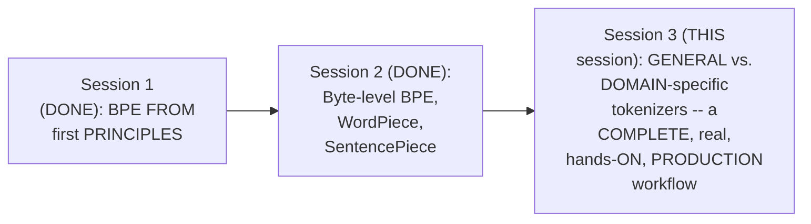

#### 🎯 Key Takeaways

* This session GENUINELY, DIRECTLY delivers the SERIES' own, EXPLICITLY-promised "PRODUCTION tokenizer ON custom HEALTHCARE data" — a GENUINELY experimental, HANDS-on session, WITH deliberately "LESSER theory."
* The CORE, stated GOAL: DIRECTLY comparing a GENERAL-purpose tokenizer WITH a domain-SPECIFIC one, to UNDERSTAND precisely WHERE and HOW general-purpose TOKENIZERS genuinely FAIL.
* This session DIRECTLY, PRACTICALLY reuses Session 1's own, ESTABLISHED BPE algorithm — "VERY specifically, BPE... it's PRETTY much practical STUFF."

---

### 2. Why General-Purpose Tokenizers Fail: A Complete, Live-Demonstrated Comparison

#### 🪜 Step-by-Step — A Complete, Real, Live-Demonstrated Comparison

> 💡 **Given directly:** *"Here, the main library or the tokenizer that I have taken... I've taken the GPT-2 with the BioGPT from Microsoft. Two main tokenizers... I am passing both the tokenizers... this is the actual sentence, and you can see this is a medical sentence that I have passed."*

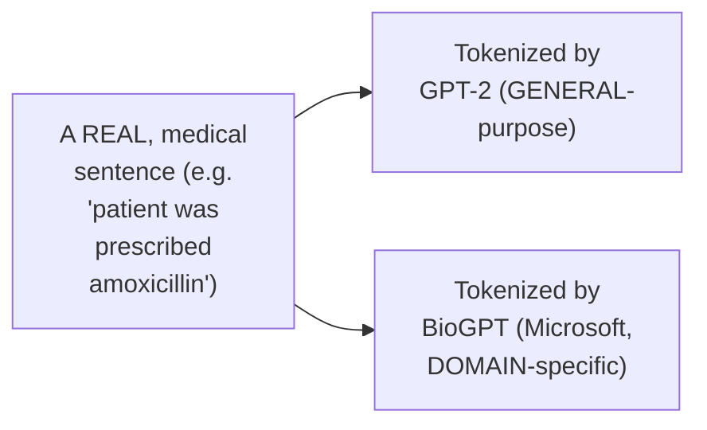

#### 🔍 Internal Working — A Genuine, Direct, Live-Confirmed Result

> 💡 **Given directly:** *"If I say the, what is the? Can I say that dah is a general purpose word? Then I have patient, general purpose word, was, general purpose word, prescribed, general purpose word... amoxicillin... C-L-A-V-E-U-L-A-V... at least this should be a single word, that is the core idea... simply, I can say that the general purpose tokenizer is failing."*

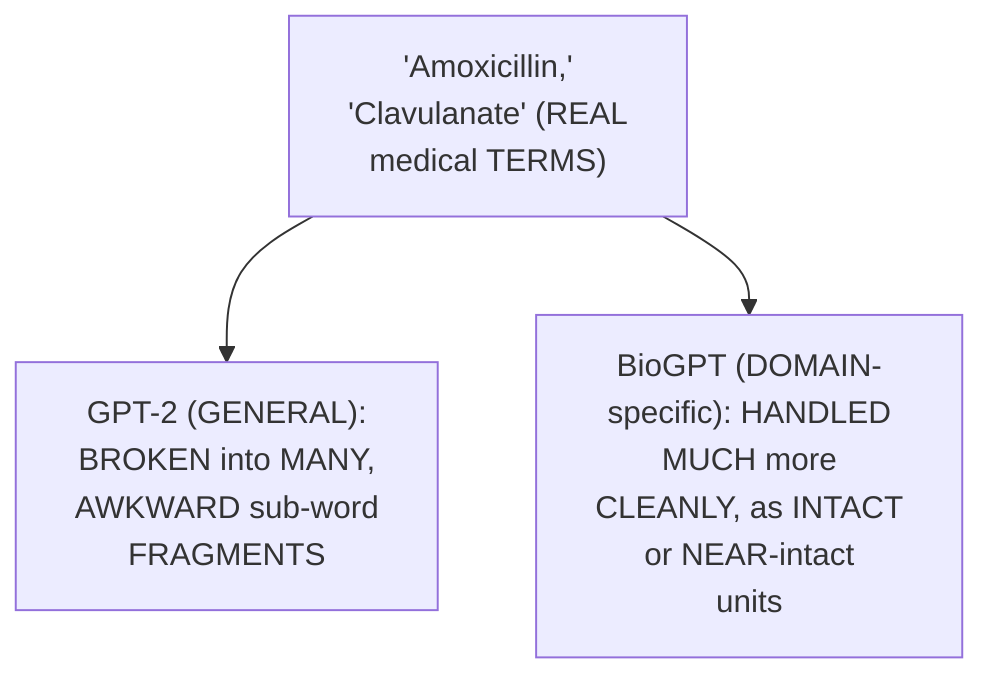

#### 🏢 Real-World / Production Usage — A Genuine, Real, Live Test With a Newer Model

> 💡 **Given directly:** *"[A student] tested with GPT-5.4... just try to look into the number of tokens from here. This is the GPT-5.4, the recent modern version... simply, I can see even GPT-5.4 is not working."*

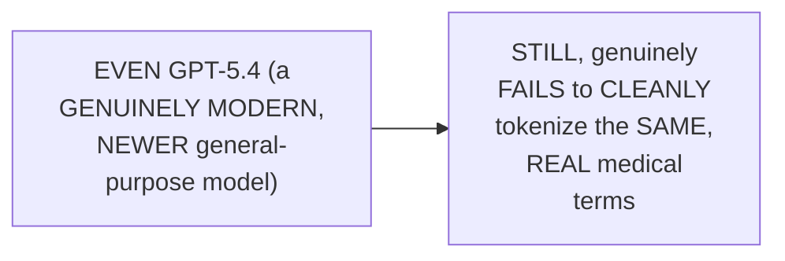

#### ⚠ Common Mistakes

* Assuming NEWER, more ADVANCED general-purpose MODELS (like GPT-5.4) GENUINELY, AUTOMATICALLY solve THIS domain-specificity PROBLEM — explicitly, directly, LIVE-demonstrated as FALSE: EVEN a GENUINELY newer, more CAPABLE model STILL exhibits the SAME, fundamental TOKENIZATION failure ON domain-specific TERMS.
* Assuming a "BROKEN" tokenization (MULTIPLE sub-word FRAGMENTS) is GENUINELY, ALWAYS acceptable AS LONG as the MODEL can eventually "FIGURE it out" — explicitly, directly, PRECISELY clarified: "AT least this SHOULD be a SINGLE word" — EXCESSIVE fragmentation is GENUINELY, DIRECTLY a tokenization FAILURE, worth AVOIDING.

#### 🎯 Key Takeaways

* A COMPLETE, real, LIVE-demonstrated COMPARISON (GPT-2 VERSUS BioGPT, ON a real MEDICAL sentence) directly, CONCRETELY confirmed: the GENERAL-purpose tokenizer GENUINELY, REPEATEDLY breaks MEDICAL terms (LIKE "amoxicillin," "CLAVULANATE") into MANY, awkward SUB-word fragments.
* A REAL, LIVE test WITH GPT-5.4 (a GENUINELY newer, more CAPABLE general-purpose model) directly, CONCRETELY confirmed THIS same, fundamental PROBLEM persists — EVEN in modern, STATE-of-the-art models.
* This directly, PRECISELY motivates the ENTIRE session's own CORE goal — BUILDING a DOMAIN-specific tokenizer THAT genuinely, DIRECTLY handles medical TERMINOLOGY as INTACT, or near-INTACT, units.

---
### 3. A Second, Important Nuance: "Medical" Tokenizers Are Not Monolithic

#### 🪜 Step-by-Step — A Complete, Real, Live-Demonstrated Second Comparison

> 💡 **Given directly:** *"This time, I am using the BERT one... heparin, infarction, myocardial... myocardial has been broken completely... one is a bioclinical BERT, the next version, there also you can see it didn't work so much good."*

#### 🔍 Internal Working — A Genuine, Direct, Precise Explanation of WHY

> 💡 **Given directly:** *"You have to always look into that particular tokenizer has been used on top of which type of data. If your dataset is based on a particular disease, and if you use a tokenizer trained on other disease data, then problems can come. PubMed BERT... has been specifically trained on Biomed, NLP, BioMed BERT abstract... whereas if you look into the [bio]clinical part, its vocabulary is exactly built... on condition.com data, so that's why it's not performing [as well]."*

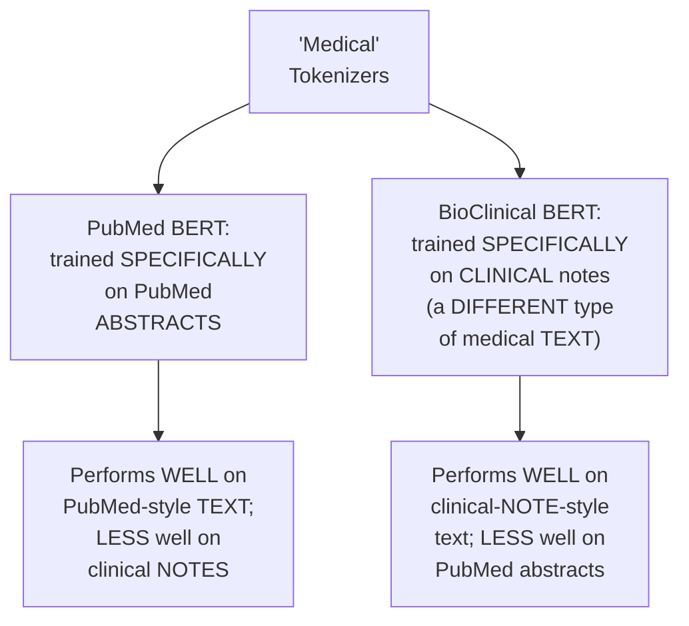

#### ⚠ Common Mistakes

* Assuming "MEDICAL tokenizer" is a GENUINELY, SINGLE, monolithic CATEGORY — explicitly, directly, LIVE-demonstrated as FALSE: a tokenizer TRAINED on ONE type OF medical text (e.g., RESEARCH abstracts) CAN, genuinely, PERFORM poorly on a GENUINELY different TYPE of medical TEXT (e.g., clinical NOTES) — DOMAIN specificity is GENUINELY, STRUCTURALLY granular.
* Assuming PICKING "ANY" medical tokenizer is SUFFICIENT, REGARDLESS of YOUR own, SPECIFIC data's own SOURCE/style — explicitly, directly, PRECISELY clarified: YOU must GENUINELY, CAREFULLY match the TOKENIZER's own TRAINING data to YOUR OWN, actual use CASE.

#### 🎯 Key Takeaways

* A SECOND, complete, real COMPARISON (BIOCLINICAL BERT versus PubMed BERT) directly, CONCRETELY revealed a GENUINE, important NUANCE — "MEDICAL" tokenizers are **NOT monolithic** — a tokenizer's OWN, specific TRAINING data (PubMed ABSTRACTS versus clinical NOTES) genuinely, DIRECTLY determines its OWN performance.
* This directly, HONESTLY reinforces a GENUINE, practical LESSON: EVEN within a SPECIFIC domain (MEDICINE), domain SPECIFICITY is GENUINELY, PRACTICALLY granular — you MUST match the TOKENIZER to YOUR OWN, specific data SOURCE and STYLE.
* This directly, PRECISELY sets UP the SESSION's own CENTRAL, quantitative EVALUATION framework — FERTILITY (Section 4) — the PRECISE, measurable WAY to CONFIRM whether a TOKENIZER genuinely, PRACTICALLY fits YOUR own data.

---

### 4. Fertility: The Crucial, Central Evaluation Metric

#### 📖 Definition — Fertility, Precisely Defined

> 💡 **Given directly:** *"Fertility... the first idea is average tokens per word... the average number of tokens a single word is split during tokenization... generally, if the words are really rare, in that case, for rare words, your fertility will be high. Common words? The fertility will be low. And always remember, lower the fertility, better [it is]."*

```text
Fertility = Average number of tokens a single word is split into, during tokenization

Rare words -> HIGHER fertility (more splits)
Common words -> LOWER fertility (fewer splits)
Lower fertility = GENUINELY, DIRECTLY better
```

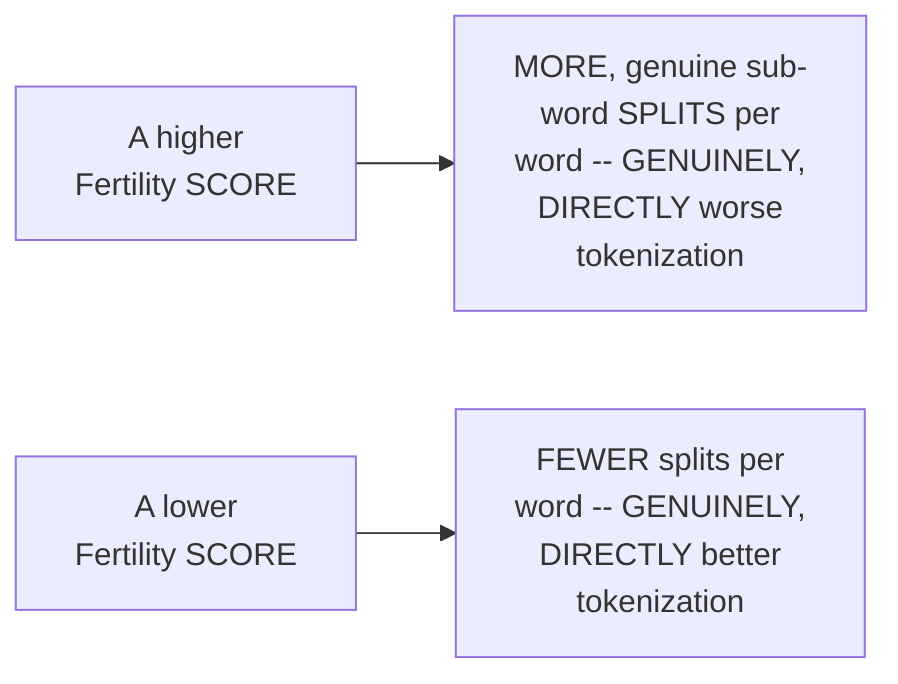

#### 🪜 Step-by-Step — A Complete, Real, Live-Computed Comparison

> 💡 **Given directly:** *"For the general purpose data, with the general purpose tokenizer, the fertility rate is 1.16, whereas for BioGPT, if you look, this is 1.12... in BOTH cases, the fertility scores are low. It means that the tokenizer is performing better."*

```text
Live-Confirmed Fertility Results:
  GPT-2 on general-purpose (Wikipedia) data: 1.16
  BioGPT on medical (PubMed) data:            1.12
```

#### ⚠ A Direct, Honest Clarification on "Ideal" Fertility

> 💡 **Given directly:** *"What is the ideal fertility? There is no such ideal thing. For every dataset, the score will be different. The idea is that it should be lower... generally, the number stays between 1 to 2, when you try to look into the complete document set. Always remember that it won't be very, very high."*

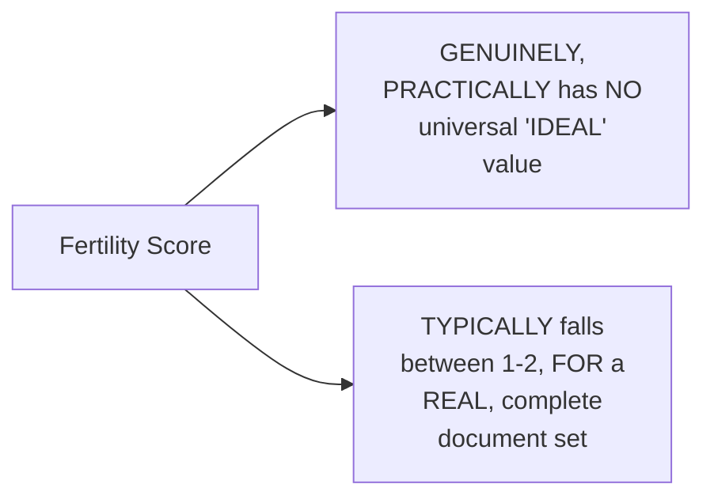

#### ⚠ Common Mistakes

* Assuming a "PERFECT" fertility score of EXACTLY 1 is GENUINELY, PRACTICALLY achievable — explicitly, directly, HONESTLY clarified: "PRACTICALLY not possible... BECAUSE we are WORKING with subword-LEVEL tokenization TECHNIQUES."
* Assuming FERTILITY has a GENUINELY, UNIVERSAL "ideal" NUMBER, applicable ACROSS every, DIFFERENT dataset — explicitly, directly, REPEATEDLY clarified: "THERE is NO such IDEAL thing... FOR every dataset, the SCORE will be DIFFERENT."

#### 🎯 Key Takeaways

* **FERTILITY** is precisely the **AVERAGE number of TOKENS a SINGLE word is SPLIT into**, DURING tokenization — LOWER fertility is GENUINELY, DIRECTLY better.
* A COMPLETE, real, LIVE-computed COMPARISON directly, CONCRETELY confirmed: BOTH GPT-2 (ON Wikipedia, 1.16) and BioGPT (on PubMed, 1.12) achieved LOW fertility — CONFIRMING each PERFORMS well ON its OWN, respective DOMAIN.
* THERE is directly, HONESTLY confirmed to be **NO universal, "IDEAL" fertility VALUE** — it GENUINELY varies BY dataset — THOUGH real-world CORPORA typically FALL between **1 and 2**.

---
### 5. Tokens Per 100 Characters: A Second, Complementary Metric

#### 📖 Definition — Tokens Per 100/1000 Characters, Precisely Defined

> 💡 **Given directly:** *"Coming to your next part, which is your tokens per 100 characters. The core idea behind this: average number of tokens produced for 1,000 characters... the average number of tokens that are being produced for every 1,000 characters."*

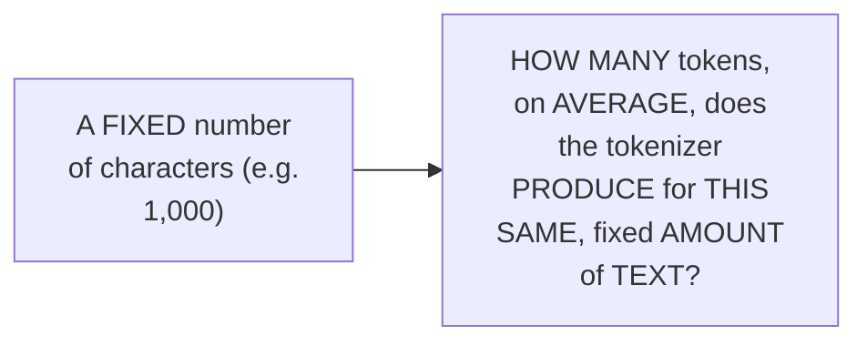

#### 🪜 Step-by-Step — A Complete, Real, Live-Computed Comparison

> 💡 **Given directly:** *"BioGPT with PubMed, here the token per 100 characters is on the lesser side, 185, as compared to the other version. Whereas the GPT-2 here, 219 with 243... always remember, in both the cases, lower is better."*

```text
Live-Confirmed Tokens-per-1000-Characters Results:
  BioGPT on PubMed:        185  (lower -- BETTER)
  GPT-2 on Wikipedia/PubMed: 219, 243  (higher -- worse, on medical text)
```

#### ❓ Why It Exists — A Genuine, Precise Explanation

> 💡 **Given directly:** *"Should we have higher tokens, or should we have lower tokens? ... lower, you are exactly correct. Because, just think, if you have 1,000 characters, and if you have lesser tokens, it means that you are optimally using all the characters. If you have more tokens, it means more number of splits, for sure."*

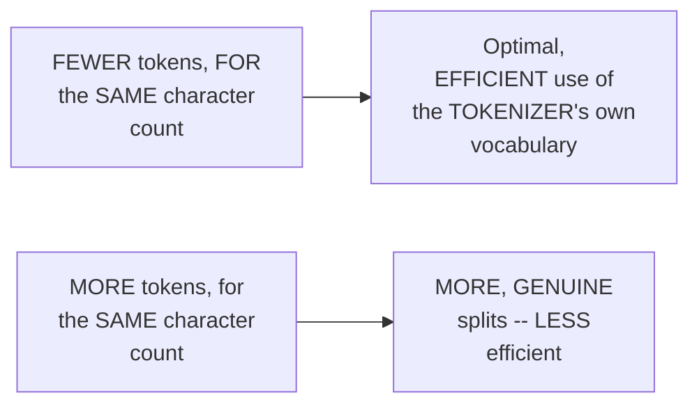

#### ⚠ Common Mistakes

* Assuming "MORE tokens" per fixed AMOUNT of text is GENUINELY, SOMEHOW better (e.g., "MORE detail") — explicitly, directly, PRECISELY corrected: MORE tokens GENUINELY, DIRECTLY signals MORE splits, and LESS efficient, WORSE tokenization.

#### 🎯 Key Takeaways

* **Tokens per 100/1000 CHARACTERS** precisely MEASURES how MANY tokens a TOKENIZER produces FOR a FIXED amount OF text — **LOWER is GENUINELY, DIRECTLY better**.
* A COMPLETE, real, LIVE-computed COMPARISON directly, CONCRETELY confirmed: BioGPT (ON PubMed) achieved 185 TOKENS/1000 characters, VERSUS GPT-2's 219-243 — CONFIRMING BioGPT's own, GENUINE efficiency ADVANTAGE on medical TEXT.
* This SECOND metric directly, PRECISELY COMPLEMENTS fertility — TOGETHER, they PROVIDE a COMPLETE, quantitative PICTURE of a TOKENIZER's own, genuine EFFICIENCY on a GIVEN corpus.

---

### 6. Model Max Length: A Precise, Genuine Clarification (Tokenizer ≠ Model)

#### 📖 Definition — Model Max Length, Precisely Introduced

> 💡 **Given directly:** *"Can you see a very big model max length? ... How many of you think that model max length matters to us? ... Again, I'm repeating: tokenizer is a separate entity, model is a separate entity. So it really doesn't matter."*

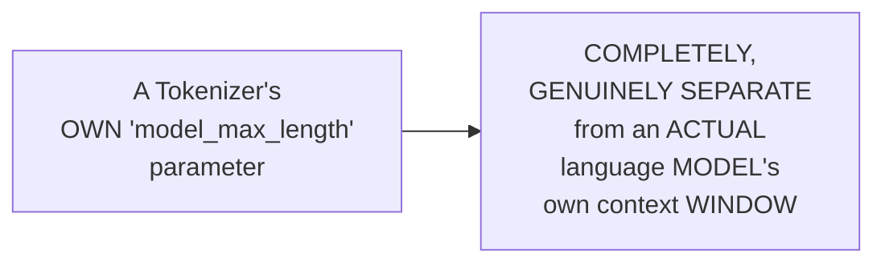

#### 🔍 Internal Working — A Genuine, Direct, Complete Clarification

> 💡 **Given directly:** *"Don't think that tokenizer is LLM... tokenizer is a totally different identity. Tokenizer helps your language models to see the data through the number representation, which is actually the token IDs. Otherwise, the language model cannot see the data. Tokenizers help them to actually see the data."*

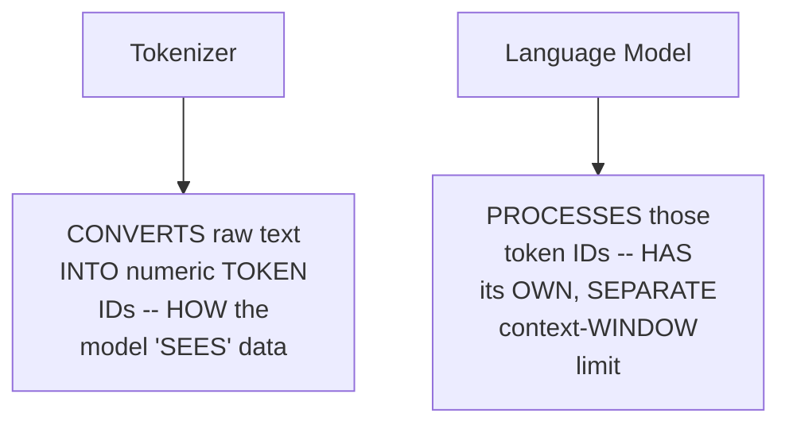

#### 🪜 Step-by-Step — A Genuine, Direct, Live-Demonstrated Confirmation

> 💡 **Given directly:** *"What I have done, I have just changed the model max length. This you can do, this is just a simple parameter change... anytime you can update, this doesn't matter, that's why I told this is a totally separate entity."*

```python
# The tokenizer's own model_max_length is DIRECTLY, freely adjustable --
# it does NOT need to match any actual model's own context window:
tokenizer.model_max_length = 2048  # or 1024, or any other value -- arbitrary
tokenizer.save_pretrained("./my-custom-tokenizer")
```

#### ⚠ A Direct, Honest, Related Clarification (from Live Q&A)

> 💡 **Given directly:** *"[A student]: This max length and the context window of LLM should be in sync? [Paul]: Yes, exactly correct... but that's why I told you it's a separate entity. When [the] model comes, THEN we think about max sequences. Otherwise, it's not necessary."*

#### ⚠ Common Mistakes

* Assuming a TOKENIZER's own "MODEL max LENGTH" parameter GENUINELY, DIRECTLY constrains or REFLECTS an ACTUAL language model's OWN context WINDOW — explicitly, directly, REPEATEDLY corrected: THESE are TWO, entirely SEPARATE entities — the VALUE is ARBITRARY and freely ADJUSTABLE, UNLESS/until you GENUINELY connect the TOKENIZER to a SPECIFIC, real model.
* Assuming a "VERY big" model MAX length VALUE genuinely SIGNALS something MEANINGFUL about the TOKENIZER's own QUALITY — explicitly, directly, PRACTICALLY demonstrated as GENUINELY, COMPLETELY irrelevant — "IT doesn't MATTER."

#### 🎯 Key Takeaways

* A TOKENIZER's own **"MODEL max LENGTH"** parameter is directly, REPEATEDLY confirmed as **COMPLETELY separate** FROM any ACTUAL language model's OWN context WINDOW — "TOKENIZER is a SEPARATE entity, MODEL is a separate ENTITY."
* This VALUE is directly, PRACTICALLY demonstrated as **FREELY, arbitrarily ADJUSTABLE** — CHANGING it is "JUST a simple PARAMETER change," WITH no genuine CONSEQUENCE until the TOKENIZER is CONNECTED to a REAL, specific model.
* THIS distinction only GENUINELY, PRACTICALLY matters ONCE you connect a TOKENIZER to an ACTUAL model — AT that point, the TWO values SHOULD, genuinely, be KEPT in sync — BUT, in ISOLATION, the tokenizer's OWN parameter is GENUINELY irrelevant.

---
### 7. Why Not One Universal Tokenizer? A Genuine, Honest Answer

#### ❓ Why It Exists — A Genuine, Direct Question From a Live Student

> 💡 **Given directly:** *"Why can't we have one generic tokenizer that supports most of the common things like medical, PubMed?"*

#### 🔍 Internal Working — A Genuine, Honest, Research-Grounded Answer

> 💡 **Given directly:** *"Practically possible? But, generally, things don't work in that way. You have to understand things, because everything is much more domain-specific. If you try to create something [that's] truly moving towards AGI... it will take time. We are, right now, not so much futuristic... according to the research, when people have tried to add multiple tokens [domains], the performance actually degraded. That is the main problem."*

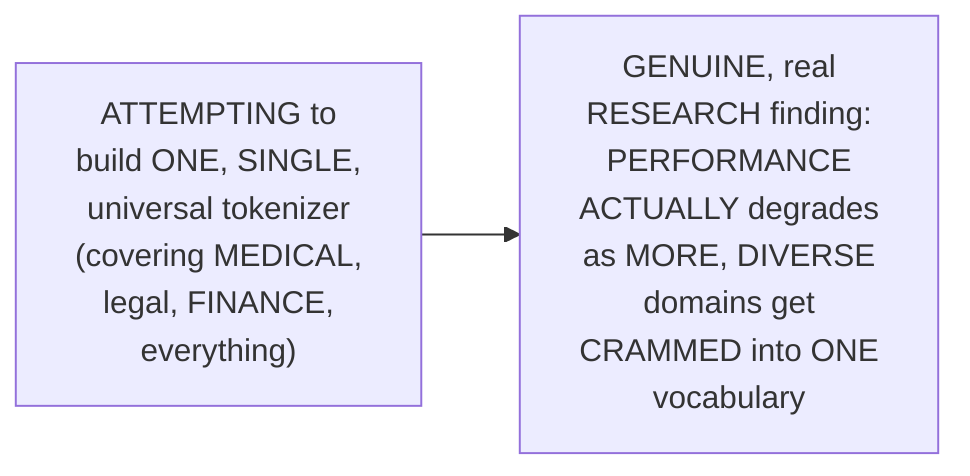

#### 🔍 Internal Working — A Genuine, Direct Confirmation: Cost of Larger Vocabulary

> 💡 **Given directly:** *"We have reached [200K vocabulary], we can simply do 500K, even more than that, 1000K is possible... but according to the research... when people have tried to add multiple tokens, the performance actually degraded."*

#### ⚠ Common Mistakes

* Assuming a LARGER vocabulary (INCLUDING MORE, diverse DOMAINS) is GENUINELY, STRAIGHTFORWARDLY "better" — explicitly, directly, HONESTLY clarified: REAL research GENUINELY, DIRECTLY shows the OPPOSITE — PERFORMANCE can ACTUALLY degrade AS you cram MORE, unrelated DOMAINS into ONE, shared vocabulary.
* Assuming "GENERIC, universal TOKENIZATION" is a GENUINELY realistic, NEAR-term goal — explicitly, directly, HONESTLY clarified: "WAIT 10 years, 15 years, PROBABLY it will be POSSIBLE" — WE are "NOT so much FUTURISTIC" right NOW.

#### 🎯 Key Takeaways

* A GENUINE, direct STUDENT question ("WHY not ONE universal TOKENIZER?") is HONESTLY answered VIA REAL research: PERFORMANCE **ACTUALLY degrades** as MORE, diverse DOMAINS get CRAMMED into a SINGLE vocabulary.
* This directly, HONESTLY reinforces WHY domain-SPECIFIC tokenizers REMAIN genuinely, PRACTICALLY necessary — NOT because "UNIVERSAL" tokenization is CONCEPTUALLY impossible, but BECAUSE it's NOT yet, GENUINELY practical.
* This directly, PRECISELY sets UP the SESSION's own LATER, detailed EXPLORATION of the cost/EMBEDDING trade-off (SECTION 13) — DIRECTLY connecting "MORE domains/tokens" TO genuine, real PERFORMANCE and COST consequences.

---

### 8. Tokenizer, Fine-Tuning & The Embedding-Resize Path (A Genuine, Precise Q&A)

#### ⚠ A Direct, Honest, Important Terminology Correction

> 💡 **Given directly:** *"Can you fine-tune the tokenizer? ... When I say fine-tuning, it means weights and biases I'm updating. How many of you feel here you have weights and biases? ... So you cannot use that term... it's not about fine-tuning. Don't use this type of words."*

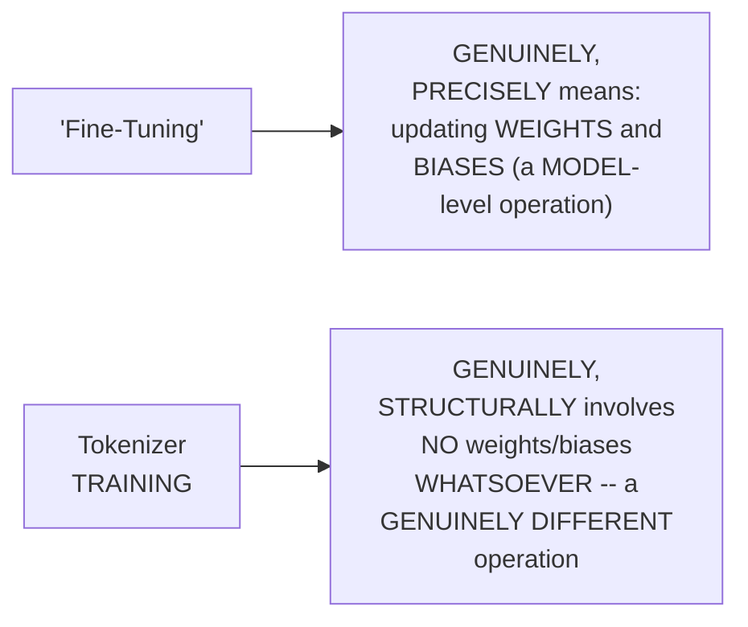

#### 📖 Definition — Two, Genuine, Real Paths for Adapting a Model to a Custom Vocabulary

> 💡 **Given directly:** *"If you're using a pre-trained model, it has its own pre-trained tokenizer also. Nothing that we can do... probably, I can edit it in some way... one option is full training. The other option is shape change within the dimensions."*

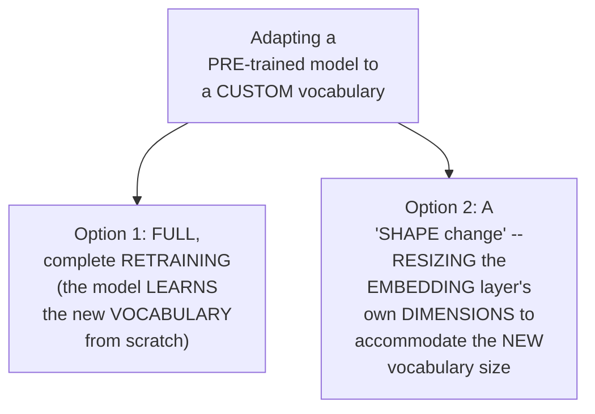

#### 🔍 Internal Working — A Genuine, Direct Connection to LoRA/QLoRA (Explicitly Deferred)

> 💡 **Given directly:** *"If you are doing your fine-tuning tasks like LoRa, QLora, I have to add more tokens so that my data tokens are also being visible. In that, we will try to train it. I will come to that — that comes under fine-tuning."*

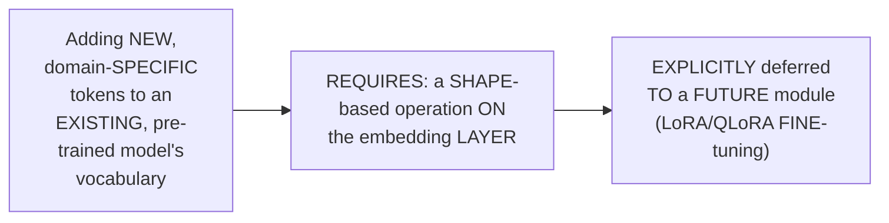

#### ⚠ A Direct, Honest, Related Confirmation: Cost Savings From Domain-Specific Tokenization

> 💡 **Given directly:** *"If the number of tokens will be lesser everywhere, input-output tokens, if they are getting reserved, for sure the cost will go up [down]... we can take any cheap model, and just train on our domain, and then make it feasible for us. Is that the right strategy? [Paul]: Exactly, that is correct."*

#### ⚠ Common Mistakes

* Using the TERM "FINE-tuning" to DESCRIBE tokenizer TRAINING — explicitly, directly, REPEATEDLY corrected: fine-TUNING SPECIFICALLY, PRECISELY means UPDATING weights AND biases — TOKENIZER training INVOLVES neither.
* Assuming a CUSTOM tokenizer can BE directly, SIMPLY swapped INTO an EXISTING, pre-trained MODEL, WITHOUT any FURTHER, structural CHANGE — explicitly, directly, PRECISELY clarified: it GENUINELY requires EITHER full RETRAINING, OR a "SHAPE change" OPERATION resizing the EMBEDDING layer.

#### 🎯 Key Takeaways

* "FINE-tuning" is a PRECISE, technical TERM meaning "UPDATING weights AND biases" — tokenizer TRAINING is directly, REPEATEDLY confirmed as **GENUINELY, STRUCTURALLY different**, since it INVOLVES no weights/BIASES at all.
* ADAPTING a PRE-trained model to a CUSTOM vocabulary GENUINELY requires ONE of **TWO, real PATHS**: **FULL retraining**, OR a **"SHAPE change"** operation — RESIZING the embedding LAYER's own dimensions.
* THIS "shape-CHANGE"/embedding-resize APPROACH is directly, EXPLICITLY connected TO LoRA/QLoRA fine-TUNING — EXPLICITLY deferred to a FUTURE module — and DIRECTLY, PRACTICALLY confirmed as a GENUINE, real strategy: "TAKE any cheap MODEL, and JUST train on OUR domain" TO reduce cost.

---
### 9. Building a Real, Custom Medical Tokenizer From Scratch

#### 🪜 Step-by-Step — A Complete, Real Data-Acquisition Workflow

> 💡 **Given directly:** *"I'm downloading the PubMed dataset from the FTP server... of NIH, National Institute of Health... I'm taking 50,000 [abstracts]... this is the actual FTP server."*

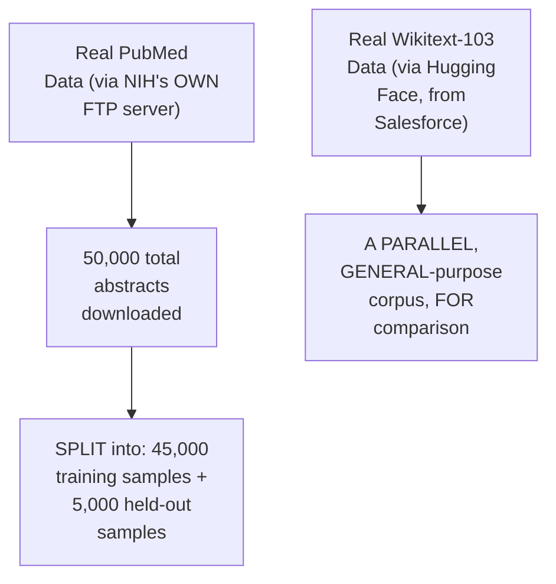

#### 🪜 Step-by-Step — Training TWO, Real, Custom BPE Tokenizers

> 💡 **Given directly:** *"I have taken the vocabulary size as 16,000... whatever the artifacts that will be generated... the output of this file will be basically the final tokenizer... in the next part, what we are doing, we are training the SAME [BPE] tokenizer on top of our GENERAL data [Wikitext]."*

```bash
# Training TWO, real, custom BPE tokenizers (reusing Session 1's own algorithm):
python train_medical_tokenizer.py \
  --input data/train.jsonl \
  --vocab-size 16000 \
  --out artifacts/medical_bpe/

python train_medical_tokenizer.py \
  --input data/wikitext_train.jsonl \
  --vocab-size 16000 \
  --out artifacts/general_bpe/
```

#### ⚠ A Direct, Honest, Live-Encountered Troubleshooting Moment

> 💡 **Given directly:** *"The command was failing, I got the problem, that was the main command problem... I think the first one that I made the mistake wasn't that... already the file exists... let me just delete this one... the argument was hyphen-hyphen-OUT, not hyphen-hyphen-OUTPUT. That was the only problem."*

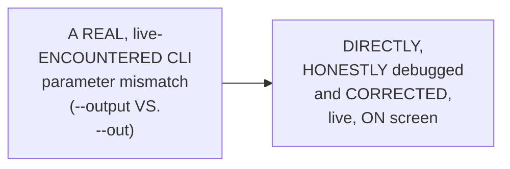

#### ⚠ Common Mistakes

* Assuming a REAL, production-oriented TOKENIZER-training workflow is GENUINELY, ALWAYS error-FREE, EVEN for an EXPERIENCED instructor — explicitly, directly, HONESTLY demonstrated as GENUINELY, REALISTICALLY including REAL, live PARAMETER mismatches — a NORMAL, PRACTICAL part of REAL development WORK.
* Assuming a CUSTOM tokenizer must be TRAINED on a MASSIVE, complete DATASET to be GENUINELY useful — explicitly, directly, DIRECTLY demonstrated as GENUINELY achieving MEANINGFUL results FROM just **50,000 SAMPLES** — a RELATIVELY modest DATASET size.

#### 🎯 Key Takeaways

* A COMPLETE, real DATA-acquisition workflow directly, CONCRETELY downloaded **50,000 REAL PubMed abstracts** (via NIH's OWN FTP server), SPLIT into 45,000 TRAINING and 5,000 HELD-out samples — WITH a PARALLEL, general-PURPOSE corpus (Wikitext-103) FOR comparison.
* TWO, real, CUSTOM BPE tokenizers were DIRECTLY, PRACTICALLY trained — ONE on the MEDICAL corpus, ONE on the GENERAL corpus — REUSING the EXACT, SAME BPE algorithm ESTABLISHED in Session 1.
* A REAL, HONEST, live-ENCOUNTERED CLI parameter MISMATCH (`--output` VERSUS `--out`) was DIRECTLY, TRANSPARENTLY debugged ON screen — REINFORCING that REAL, practical TROUBLESHOOTING is a NORMAL part OF this kind OF hands-on WORK.

---

### 10. A Complete, Four-Way Comparison on Hand-Picked Probes

#### 🪜 Step-by-Step — A Complete, Real, Four-Way Comparison Setup

> 💡 **Given directly:** *"I've taken a few probes... samples for now... one is the tiktoken CL100... this is the default pretrained version. Then you have the O200... then you have the custom-made, this is our actual one, and I have the general BP."*

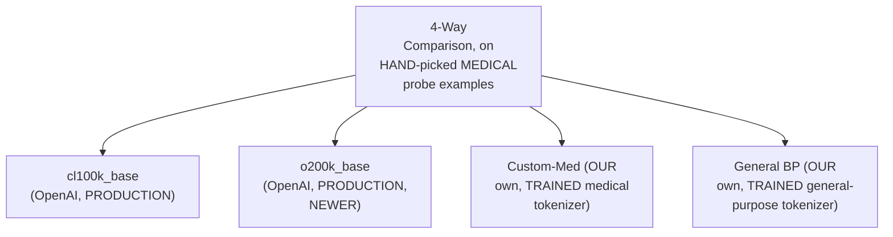

#### 🔍 Internal Working — A Genuine, Honest, Live-Confirmed, Mixed Result

> 💡 **Given directly:** *"Custom-made, how many times that came [as the winner]? 1, 2, 3, 4, 5... six times. And if you look into 200k, only one time... a lot of tie cases are there. So from here, I can say that my custom-made that I have created, it's working."*

```text
Live-Confirmed Winner Count (out of 20 hand-picked probes):
  Custom-Med:   6 wins
  o200k_base:   1 win (but many TIES with custom-med)
  (Multiple ties across the remaining probes)
```

#### 📖 Definition — Single-Token Rate, A Genuine, New Metric

> 💡 **Given directly:** *"Let's look into the single token rate on domain terms... a few of the tokens which have been maintained, it means intact. The fertility rate is 1... custom-made, somehow the single token rate is high. It means that... the failure rate is 90%... but at least 10% is success rate. As compared to others, this is better somehow."*

```text
Single-Token Rate = % of domain-specific terms that remain as ONE, intact token
  (i.e., fertility = 1 for that specific term)

Live-Confirmed Result:
  Custom-Med:        ~10% single-token rate (2 out of 20 probes)
  ALL other tokenizers: 0% single-token rate (0 out of 20 probes)
```

#### ⚠ Common Mistakes

* Assuming a NEWLY-trained, CUSTOM tokenizer (WITH only 50,000 TRAINING samples) SHOULD genuinely, UNCONDITIONALLY outperform a HUGE, production-GRADE OpenAI tokenizer ACROSS every, SINGLE example — explicitly, directly, HONESTLY confirmed as a **MIXED result** — the CUSTOM tokenizer WON in SOME cases, TIED in OTHERS, and LOST in a FEW.
* Assuming a "SINGLE-token rate" of ONLY 10% is GENUINELY, PRACTICALLY disappointing OR a FAILURE — explicitly, directly, HONESTLY reframed: it's GENUINELY, DIRECTLY **BETTER** than the 0% ACHIEVED by EVERY other TOKENIZER tested — a GENUINE, real IMPROVEMENT, even IF imperfect.

#### 🎯 Key Takeaways

* A COMPLETE, real, FOUR-way comparison (CUSTOM-med, general-BP, cl100k_BASE, o200k_base) ON 20 hand-PICKED medical PROBES directly, HONESTLY confirmed a **MIXED, but GENUINELY favorable** result — CUSTOM-med WON 6/20 cases, WITH many TIES.
* **SINGLE-token rate**, a GENUINE, new metric, precisely MEASURES the PERCENTAGE of DOMAIN-specific terms REMAINING as ONE, intact TOKEN — the CUSTOM tokenizer achieved a **~10% single-TOKEN rate**, VERSUS **0%** for EVERY other tokenizer TESTED.
* This directly, HONESTLY demonstrates a GENUINE, real, EARLY success — DIRECTLY setting UP the NEXT, MORE rigorous TEST — running THIS same comparison ON the COMPLETE, 5,000-sample HELD-out set (SECTION 11), RATHER than JUST 20 hand-picked PROBES.

---
### 11. The Same Comparison, Run on the Complete Held-Out Set (A More Rigorous Test)

#### ❓ Why It Exists — A Genuine, Direct Motivation for a More Rigorous Test

> 💡 **Given directly:** *"Let's try to do on the HELD data. This is where, actually, things will change, because initially, those 20 samples are bare minimum to do the testing... now I'm taking the held-out dataset of 5,000 [documents] from the PubMed."*

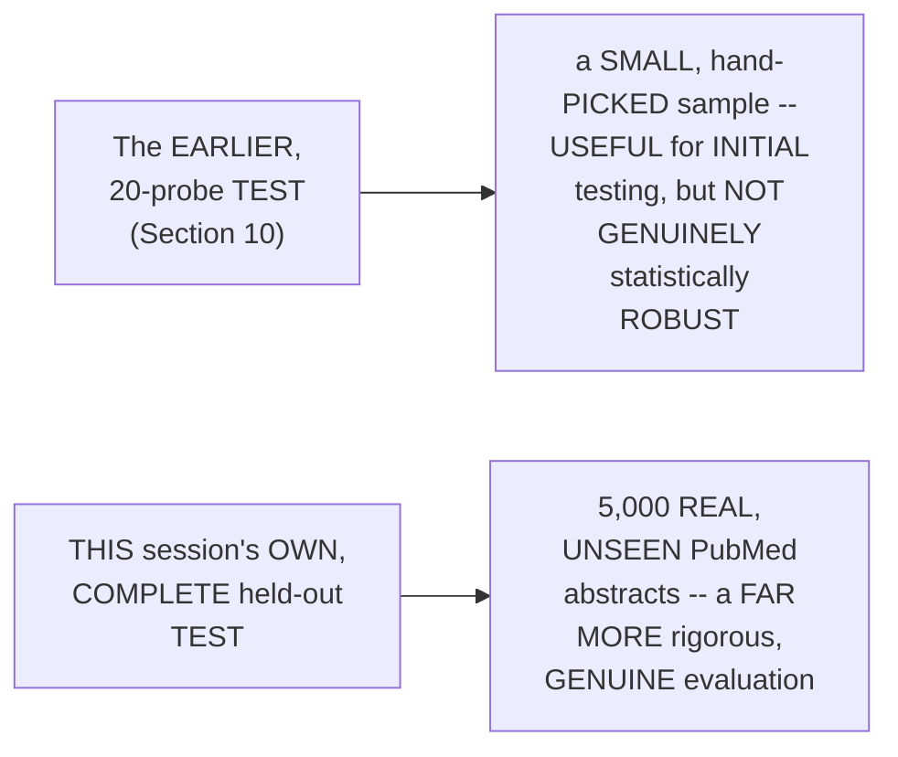

#### 🔍 Internal Working — A Genuine, Honest, Live-Confirmed Result: Medical Held-Out Set

> 💡 **Given directly:** *"The fertility rate that I have for custom-made... the best in class, O200K, 1.43... [custom-made was competitive, close to this].** This is totally perfect, I have no issues with that."*

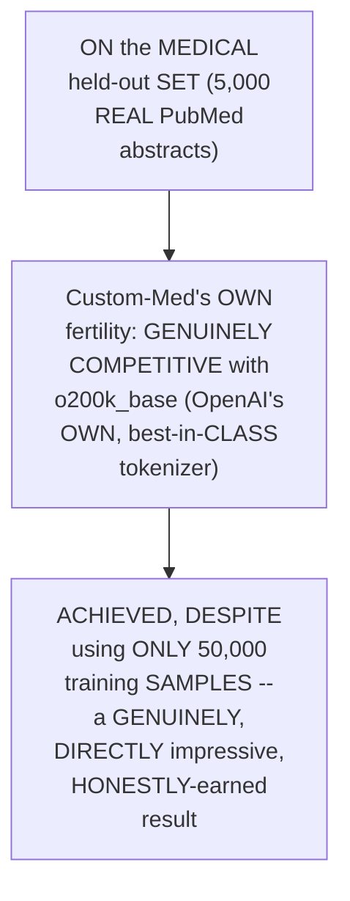

#### 🔍 Internal Working — A Genuine, Honest, Live-Confirmed Result: General (Wikipedia) Held-Out Set

> 💡 **Given directly:** *"Now, let's look into the English [test]... which one is winning here? The general purpose one will win for sure, because the data is general purpose... the custom-made, it is performing the worst... whereas these two are highly specialized by OpenAI, even the general BP is also very, very close, not very far, but the medical one is too much far."*

```mermaid
flowchart LR
    A["ON the GENERAL<br/>(Wikipedia) held-out<br/>set"] --> B["Custom-Med<br/>performs WORST --<br/>GENUINELY, DIRECTLY<br/>expected -- it's a<br/>DOMAIN-specific tool,<br/>NOT a general-<br/>purpose one"]
```

#### 🏢 Real-World / Production Usage — A Genuine, Real, Live-Contributed Extension (100K Samples)

> 💡 **Given directly:** *"[A student, live]: I ran for 100K, and this is the result — medical held out winner, custom-mate 1.4... [Paul]: Thanks for sharing that info... some type of improvements are available."*

```mermaid
flowchart LR
    A["Training with<br/>50,000 samples<br/>(THIS session's own<br/>DEFAULT)"] --> B["A REAL, genuine,<br/>COMPETITIVE result"]
    C["Training with<br/>100,000 samples<br/>(LIVE-contributed by<br/>TWO, different<br/>STUDENTS)"] --> D["FURTHER, GENUINE<br/>IMPROVEMENT --<br/>CONFIRMING more<br/>TRAINING data<br/>GENUINELY helps"]
```

#### ⚠ Common Mistakes

* Assuming a DOMAIN-specific tokenizer SHOULD genuinely, UNCONDITIONALLY perform WELL on ANY, arbitrary DATASET, INCLUDING GENERAL-purpose text — explicitly, directly, HONESTLY confirmed as FALSE: the CUSTOM-med tokenizer GENUINELY, EXPECTEDLY performed **WORST** on the GENERAL (Wikipedia) held-OUT set — a REAL, honest TRADE-off, not a FAILURE.
* Assuming a SMALL-scale (20-PROBE) comparison is GENUINELY sufficient TO draw FINAL conclusions — explicitly, directly, HONESTLY contrasted WITH the FAR more RIGOROUS, 5,000-sample HELD-out test.

#### 🎯 Key Takeaways

* On the **MEDICAL** held-OUT set (5,000 REAL abstracts), the CUSTOM-med tokenizer's OWN fertility was directly, HONESTLY confirmed as **GENUINELY competitive** with o200k_base (OpenAI's OWN best-in-CLASS tokenizer) — DESPITE using ONLY 50,000 training SAMPLES.
* On the **GENERAL** (Wikipedia) held-OUT set, the CUSTOM-med tokenizer directly, HONESTLY performed **WORST** — a GENUINE, EXPECTED trade-off, NOT a failure — CONFIRMING domain SPECIFICITY is GENUINELY a two-SIDED trade, not a UNIVERSAL improvement.
* A REAL, live-CONTRIBUTED extension (TWO students TESTING with **100,000** SAMPLES, rather THAN 50,000) directly, HONESTLY confirmed FURTHER, genuine IMPROVEMENT — CONFIRMING more TRAINING data GENUINELY, DIRECTLY helps.

---

### 12. The Vocabulary Size Sweep: Testing Multiple Sizes Systematically

#### 🪜 Step-by-Step — A Complete, Real, Systematic Vocabulary-Size Sweep

> 💡 **Given directly:** *"This is a simple test that I am doing right now, and the main purpose of this particular test is to test with multiple vocabularies... 80K, sometimes it's 64K, 32K, 8K, 16K, this has been the common numbers... keep the dataset changed [SAME], only change the vocabulary size."*

```mermaid
flowchart LR
    A["The SAME,<br/>held-out MEDICAL<br/>dataset"] --> B["Tested ACROSS<br/>MULTIPLE, DIFFERENT<br/>vocabulary SIZES:<br/>16K, 32K, 50K, 64K,<br/>100K"]
```

#### 📖 Definition — "Requested" vs. "Actual" Vocabulary Size, Precisely Explained

> 💡 **Given directly:** *"The first column is the vocabulary size, the second column is requested... I can request 50,000, but do you think that at every point of time, it will achieve 50,000?... if you don't have so many tokens, in that case, what will happen if you use a small corpus? ... requested is your shopping list, and the actual is what is available that you can actually shop for."*

```mermaid
flowchart LR
    A["'Requested'<br/>Vocabulary Size"] --> B["YOUR target, e.g.<br/>50,000 (a<br/>'SHOPPING list')"]
    C["'Actual'<br/>Vocabulary Size"] --> D["WHAT the CORPUS<br/>genuinely SUPPORTS<br/>(WHAT's 'ACTUALLY<br/>available' to SHOP<br/>for)"]
    B --> E["IF the corpus is<br/>SMALL, actual CAN<br/>fall SHORT of<br/>requested"]
```

#### 🔍 Internal Working — A Genuine, Direct, Live-Computed "Versus Previous" Comparison

> 💡 **Given directly:** *"If the vocabulary size will increase, for sure, the average token will reduce. Now this is a simple comparison, 32K, 16K with 32K, 32K with 50K... versus previous is all of your previous, and this [versus 16K] is all with your 16K... the major improvement that I felt, only close to 6.2% is coming towards 32K."*

```text
Live-Confirmed "Versus Previous" Improvements:
  16K -> 32K: -6.2%  (the LARGEST, single improvement)
  32K -> 50K: -2.3%
  50K -> 64K: -0.9%
  64K -> 100K: (further, but DIMINISHING, improvement)
```

```mermaid
flowchart TD
    A["Vocabulary Size<br/>Increases"] --> B["16K -> 32K: the<br/>LARGEST, SINGLE<br/>improvement<br/>(-6.2%)"]
    B --> C["32K onward: RAPIDLY<br/>DIMINISHING returns<br/>-- EACH FURTHER<br/>doubling YIELDS LESS<br/>genuine IMPROVEMENT"]
```

#### ⚠ Common Mistakes

* Assuming a REQUESTED vocabulary SIZE is GENUINELY, ALWAYS achieved EXACTLY, REGARDLESS of the UNDERLYING corpus's OWN size — explicitly, directly, PRECISELY clarified: a SMALL corpus CAN genuinely, DIRECTLY cause the ACTUAL vocabulary to FALL short of the REQUESTED target.
* Assuming EVERY, SUCCESSIVE increase in VOCABULARY size PROVIDES an EQUALLY large IMPROVEMENT — explicitly, directly, LIVE-computed as FALSE: the IMPROVEMENTS GENUINELY, DIRECTLY diminish AS vocabulary size GROWS — the LARGEST gain OCCURRED early (16K→32K).

#### 🎯 Key Takeaways

* A COMPLETE, SYSTEMATIC vocabulary-SIZE sweep (16K THROUGH 100K, ON the SAME held-out DATASET) directly, PRECISELY isolated the GENUINE effect of VOCABULARY size ALONE.
* **"REQUESTED" versus "ACTUAL"** vocabulary size are directly, MEMORABLY distinguished VIA a "SHOPPING list" analogy — a SMALL corpus CAN genuinely, DIRECTLY cause the ACTUAL, achieved vocabulary to FALL short of the REQUESTED target.
* A COMPLETE, live-COMPUTED "versus PREVIOUS" analysis directly, CONCRETELY confirmed the LARGEST, single IMPROVEMENT occurred GOING from 16K to 32K (**-6.2%**), WITH RAPIDLY diminishing RETURNS beyond THAT point.

---
### 13. The Cost/Embedding Trade-Off: Precisely, Thoroughly Explained

#### 🔍 Internal Working — A Genuine, Direct Connection to the Transformer's Own Embedding Layer

> 💡 **Given directly:** *"How many of you remember the generator part of the decoder? Where you did the multiplication of vocabulary with respect to that dimension of the model... whenever I'm doing this particular operation, I'm increasing the vocabulary size, the number of embedding params will increase."*

```text
Embedding Layer Parameter Count = Vocabulary Size × Embedding Dimension

As vocabulary size grows: 1x -> 2x -> 3.12x -> 4x -> 6.5x
(the embedding parameter count scales PROPORTIONALLY)
```

```mermaid
flowchart LR
    A["Vocabulary Size<br/>(increasing)"] --> B["Embedding LAYER<br/>Parameter Count<br/>(SCALES<br/>PROPORTIONALLY)"]
    B --> C["16 million ->32<br/>million -> 102<br/>million PARAMETERS<br/>(a REAL, live-<br/>computed EXAMPLE)"]
```

#### ⚠ A Direct, Honest, Important Clarification on "Cost"

> 💡 **Given directly:** *"When I say cost, don't think from money. Cost, when I am telling, it means that the memory usage... you need more compute power, and if you need more compute power, it comes with a cost... memory gets increased."*

```mermaid
flowchart LR
    A["'Cost,' in<br/>THIS session's own<br/>CONTEXT"] --> B["GENUINELY,<br/>DIRECTLY means:<br/>COMPUTE/MEMORY<br/>resource usage"]
    A --> C["NOT necessarily,<br/>GENUINELY, DIRECT,<br/>per-token MONETARY<br/>API cost (THOUGH<br/>related)"]
```

#### 🔍 Internal Working — A Genuine, Direct Confirmation of the Complete Trade-Off

> 💡 **Given directly:** *"Bigger vocabulary means more parameters. More parameters means higher embedding cost and more memory usage... more compute means always more money."*

```mermaid
flowchart TD
    A["A LARGER<br/>Vocabulary"] --> B["✅ GENUINE benefit:<br/>LOWER fertility<br/>(BETTER token<br/>EFFICIENCY)"]
    A --> C["GENUINE cost:<br/>MORE embedding<br/>PARAMETERS -> MORE<br/>memory/compute<br/>USAGE -> MORE,<br/>real cost"]
```

#### ⚠ Common Mistakes

* Assuming "COST," in THIS context, GENUINELY, DIRECTLY refers ONLY to per-TOKEN, monetary API PRICING — explicitly, directly, PRECISELY clarified: it PRIMARILY, GENUINELY refers TO **COMPUTE/memory RESOURCE usage** — THOUGH, ultimately, MORE compute genuinely TRANSLATES to more MONEY too.
* Assuming a LARGER vocabulary is GENUINELY, UNCONDITIONALLY "better," WITHOUT any GENUINE trade-off — explicitly, directly, PRECISELY clarified: EVERY vocabulary-SIZE increase GENUINELY, DIRECTLY comes WITH a proportional INCREASE in embedding PARAMETERS, and THEREFORE, resource COST.

#### 🎯 Key Takeaways

* Vocabulary SIZE directly, MATHEMATICALLY determines the TRANSFORMER's own **EMBEDDING layer parameter COUNT** (VOCABULARY size × EMBEDDING dimension) — a LARGER vocabulary GENUINELY, PROPORTIONALLY increases PARAMETER count.
* "COST," in THIS session's own, PRECISE framing, GENUINELY, PRIMARILY means **COMPUTE/memory RESOURCE usage** — NOT simply, DIRECTLY per-token MONETARY pricing (THOUGH the TWO are, ULTIMATELY, related).
* The GENUINE, complete TRADE-off: a LARGER vocabulary GENUINELY improves FERTILITY/efficiency, but GENUINELY, DIRECTLY increases EMBEDDING parameter count, MEMORY usage, and RESOURCE cost — DIRECTLY setting UP the SESSION's own, FINAL, practical HEURISTICS (Section 14) for BALANCING this trade-OFF.

---

### 14. Two Real "Rule of Thumb" Heuristics for Vocabulary Size Selection

#### 📖 Definition — Heuristic 1: The "2% Rule" / "Knee" Method

> 💡 **Given directly:** *"The knee and the rule of thumb: smallest vocabulary within 2% of the average tokens per [document]... I want you to explore this particular idea."*

```text
The "2% Rule" / "Knee" Method:
  1. Find the GLOBAL BEST (lowest) average-tokens-per-document, across ALL tested vocab sizes
  2. Compute a threshold: global best + 2% of global best
  3. The "KNEE" = the SMALLEST vocabulary size whose result falls WITHIN this threshold
```

#### 🪜 Step-by-Step — A Complete, Real, Live-Computed Worked Example

> 💡 **Given directly:** *"The global best that I have is 169.7... 2% of 169.7 is roughly around 3.4... this particular value [threshold]... 173... [checking each vocab size] 32K, this is above the threshold... 16K, 188, above threshold... 50K, this is pretty much AT the threshold... 64K, this is within the threshold... the top 3 contenders are rejected [16K, 32K, and either 50K or 100K]... the possible options are 64K [and 50K, at the borderline]... I'll be going with a lower number, 64K, that I feel will be a good knee parameter."*

```text
Live-Computed "2% Rule" Example:
  Global best (lowest avg tokens/doc): 169.7
  2% threshold: 169.7 + (0.02 x 169.7) ≈ 173.1

  16K: 188.x  -> ABOVE threshold -> REJECTED
  32K: 177.x  -> ABOVE threshold -> REJECTED
  50K: ~173.x -> AT/borderline threshold -> ACCEPTED (borderline)
  64K: within threshold -> ACCEPTED
  100K: within threshold (the global best itself)

  -> The "KNEE" (smallest, accepted vocab size): 64K
```

```mermaid
flowchart TD
    A["Compute the<br/>GLOBAL BEST result<br/>(across ALL tested<br/>vocab sizes)"] --> B["Compute a 2%<br/>threshold ABOVE this<br/>global best"]
    B --> C["Test EACH<br/>vocabulary size:<br/>does its OWN result<br/>fall WITHIN this<br/>threshold?"]
    C --> D["The 'KNEE' = the<br/>SMALLEST, accepted<br/>vocabulary size"]
```

#### 📖 Definition — Heuristic 2: The "10x Corpus-Size Rule"

> 💡 **Given directly:** *"If your corpus is very, very large, the idea is to train the vocabulary reliably, 10x more tokens are required, as per the vocabulary size, to get a stable byte pair encoding merge statistics. This is a simple rule."*

```text
The "10x Corpus-Size Rule":
  Required training tokens ≈ 10 × target vocabulary size
  (for stable, reliable BPE merge statistics)
```

#### 🪜 Step-by-Step — A Complete, Real, Live-Computed Worked Example

> 💡 **Given directly:** *"Our corpus size is 6.3 million tokens... 6.3 million divided by 64K... roughly around 98... 6.3 million divided by 32,000... roughly around 196... 6.3 million divided by 16,000... 394... 98 examples per vocabulary slot... this value should be at least a little bit toward the higher side... 394 examples is at least better."*

```text
Live-Computed "10x Rule" Example (real corpus size: 6.3 million tokens):
  6.3M / 100K vocab = 63 examples per slot  (VERY low -- too sparse)
  6.3M / 64K vocab  = 98 examples per slot  (low)
  6.3M / 50K vocab  = 126 examples per slot (moderate)
  6.3M / 32K vocab  = 196 examples per slot (better)
  6.3M / 16K vocab  = 394 examples per slot (BEST -- most examples per slot)
```

#### ⚠ Common Mistakes

* Assuming a HIGHER "examples PER vocabulary SLOT" number is GENUINELY, ALWAYS bad — explicitly, directly, PRECISELY clarified: it's the OPPOSITE — a HIGHER number MEANS your CORPUS genuinely, DIRECTLY has ENOUGH data to RELIABLY support THAT vocabulary size — "the IDEA is you NEED to make it FIT."
* Assuming EITHER heuristic ALONE (the "2% RULE" or the "10X corpus rule") GENUINELY, DEFINITIVELY determines the "CORRECT" vocabulary SIZE — explicitly, directly, HONESTLY foreshadowed (Section 15): THESE two HEURISTICS can GENUINELY, DIRECTLY disagree.

#### 🎯 Key Takeaways

* **HEURISTIC 1 — the "2% RULE"/"knee" method**: FIND the SMALLEST vocabulary SIZE whose AVERAGE-tokens-per-document is WITHIN 2% of the GLOBAL best — a COMPLETE, real, LIVE-computed EXAMPLE identified **64K** as the GENUINE "knee."
* **HEURISTIC 2 — the "10x corpus-SIZE rule"**: for STABLE BPE merge STATISTICS, you GENUINELY need ROUGHLY 10x MORE training tokens THAN your TARGET vocabulary size — a COMPLETE, real, LIVE-computed EXAMPLE (USING the REAL, 6.3-million-token CORPUS) favored **SMALLER** vocabulary sizes (16K/32K), GIVEN the CORPUS's own, LIMITED size.
* BOTH heuristics are directly, EXPLICITLY confirmed as SOURCED from REAL, cited RESEARCH — NOT the instructor's OWN, invented rules — GENUINE, established PRACTICES worth REMEMBERING precisely.

---
### 15. An Honest Reconciliation: When the Two Heuristics Disagree

#### ⚠ A Direct, Honest Acknowledgment of a Genuine Conflict

> 💡 **Given directly:** *"As per NII [the 2% rule], we have decided only 2% of the global, yes. So 64 is good, but now 16K, as per the compression [10x rule]... two different things which are coming right now... this is a simple mismatch, because in both the cases, directly... whenever you are doing compression, it doesn't have any idea about your corpus, whether it's small or big. That is the main problem. The corpus size rule actually overrides that."*

```mermaid
flowchart LR
    A["Heuristic 1 (2%<br/>Rule/Knee)"] --> B["FAVORS: 64K (the<br/>SMALLEST vocab<br/>size WITHIN 2% of<br/>the GLOBAL best<br/>COMPRESSION)"]
    C["Heuristic 2 (10x<br/>Corpus Rule)"] --> D["FAVORS: SMALLER<br/>sizes (16K/32K) --<br/>GIVEN the CORPUS's<br/>own, LIMITED SIZE<br/>(6.3M tokens)"]
    B --> E["A GENUINE,<br/>HONEST conflict --<br/>THESE two<br/>heuristics<br/>DISAGREE"]
    D --> E
```

#### 🔍 Internal Working — A Genuine, Honest, Precise Explanation of WHY They Conflict

> 💡 **Given directly:** *"Whenever you are doing compression, it doesn't have any idea about your corpus, whether it's small or [big]. The corpus size rule actually overrides that."*

```mermaid
flowchart TD
    A["The '2% Rule'"] --> B["ONLY, GENUINELY<br/>considers<br/>COMPRESSION<br/>PERFORMANCE -- has<br/>NO, genuine<br/>AWARENESS of<br/>CORPUS size"]
    C["The '10x Corpus<br/>Rule'"] --> D["DIRECTLY,<br/>SPECIFICALLY<br/>accounts FOR<br/>corpus size --<br/>PREVENTS choosing a<br/>vocabulary TOO<br/>large FOR the<br/>AVAILABLE data"]
```

#### 🪜 Step-by-Step — The Instructor's Own, Final, Honest Judgment Call

> 💡 **Given directly:** *"The idea is you have to take the balance in between, and the perfect balance will come around 32K only... 32K will be your best, and 50K, those two are the major choices. But that's why it's not necessary — if I change the dataset, again, these values will change. That's why there is no single rule. Multiple experiments, from there, you can take the decision."*

```mermaid
flowchart LR
    A["Heuristic 1 (2%<br/>Rule): FAVORS 64K"] --> C["A GENUINE,<br/>DELIBERATE<br/>COMPROMISE:<br/>32K-50K"]
    B["Heuristic 2 (10x<br/>Rule): FAVORS<br/>16K/32K"] --> C
```

#### ⚠ Common Mistakes

* Assuming a GENUINE, real DISAGREEMENT between TWO, established HEURISTICS means ONE of them MUST be GENUINELY, DIRECTLY "wrong" — explicitly, directly, HONESTLY clarified: EACH heuristic GENUINELY, DIRECTLY captures a DIFFERENT, real CONCERN (COMPRESSION performance VERSUS corpus-SIZE reliability) — BOTH are VALID, but NEITHER alone is SUFFICIENT.
* Assuming THERE is a SINGLE, "CORRECT" formula for VOCABULARY-size selection — explicitly, directly, REPEATEDLY, HONESTLY clarified: "THERE is NO single RULE... THROUGH multiple EXPERIMENTS, you have to COME to the final DECISION."

#### 🎯 Key Takeaways

* The TWO, established HEURISTICS (the "2% rule" and the "10x CORPUS rule") were directly, HONESTLY confirmed to GENUINELY, DIRECTLY **CONFLICT** — the 2% rule FAVORED 64K; the 10x rule FAVORED smaller SIZES (16K/32K).
* This CONFLICT is directly, PRECISELY explained: the "2% RULE" has NO genuine AWARENESS of corpus SIZE (it ONLY considers COMPRESSION performance); the "10X rule" DIRECTLY accounts FOR corpus size — "the CORPUS size rule ACTUALLY overrides THAT."
* The instructor's OWN, final, HONEST judgment: a DELIBERATE **COMPROMISE** around **32K-50K** — EXPLICITLY, REPEATEDLY confirming "THERE is NO single RULE" — GENUINE vocabulary-size SELECTION requires MULTIPLE, real experiments, NOT a SINGLE, mechanical formula.

---

### 16. Closing: Further Reading & What's Deferred to Tomorrow

#### 🏢 Real-World / Production Usage — Two, Genuine, Real, Cited Research Papers

> 💡 **Given directly:** *"There are two papers... the first paper is this one: 'How Good Is Your Tokenizer?' A lot of things that we have taken from here... this is an older paper, 2021, but really a good point. And the second paper... 'Tokenizer Is More Than Compression.'"*

```mermaid
flowchart LR
    A["'How Good Is<br/>Your Tokenizer?'<br/>(2021)"] --> C["BOTH, EXPLICITLY<br/>confirmed as<br/>OPTIONAL, further<br/>READING -- 'NOT<br/>really PART of your<br/>SYLLABUS'"]
    B["'Tokenizer Is<br/>More Than<br/>Compression'"] --> C
```

#### 🪜 Step-by-Step — A Direct, Honest Confirmation of What's Deferred to Tomorrow

> 💡 **Given directly:** *"Tomorrow, what we'll be discussing, the first part will be this particular trade-off and balance, then finally we'll be looking, and we will push into your Hugging Face [hub]... then I think we will start with at least Module 2, the prompt engineering part."*

```mermaid
flowchart LR
    A["Part 3 (THIS<br/>session, DONE):<br/>General vs. DOMAIN-<br/>specific<br/>tokenizers, BUILDING<br/>a custom TOKENIZER,<br/>fertility, COST<br/>trade-off, TWO<br/>vocabulary-size<br/>HEURISTICS"] --> B["Tomorrow<br/>(EXPLICITLY<br/>promised): COMPLETE<br/>the vocabulary-SIZE<br/>decision FRAMEWORK,<br/>PUSH the custom<br/>tokenizer to<br/>HUGGING Face Hub,<br/>THEN begin Module 2<br/>(PROMPT Engineering)"]
```

#### ⚠ Common Mistakes

* Assuming the TWO, cited RESEARCH papers are GENUINELY, FORMALLY REQUIRED material FOR this course — explicitly, directly, HONESTLY clarified: "THIS was NOT really PART of your SYLLABUS... BUT let's do it" — GENUINELY OPTIONAL, though VALUABLE, further READING.

#### 🎯 Key Takeaways

* This episode **GENUINELY, COMPREHENSIVELY delivers** its OWN, stated GOALS — a COMPLETE, experimental COMPARISON of general-PURPOSE versus domain-SPECIFIC tokenizers, a REAL, custom-tokenizer-TRAINING workflow, and TWO, genuine, RESEARCH-backed vocabulary-SIZE heuristics.
* TWO, real, CITED research PAPERS ("HOW Good Is YOUR Tokenizer?" and "TOKENIZER Is More THAN Compression") are directly, HONESTLY offered as **OPTIONAL, further READING** — NOT formally REQUIRED syllabus MATERIAL.
* **COMPLETING the vocabulary-SIZE decision FRAMEWORK, pushing the CUSTOM tokenizer to HUGGING Face Hub**, and **BEGINNING Module 2 (PROMPT Engineering)** are ALL explicitly, DIRECTLY confirmed as TOMORROW's own, PROMISED continuation.

---
## 📝 Glossary

| Term | Definition | Why It Matters |
|---|---|---|
| **Fertility** | Average number of tokens a single word is split into | Lower is better; the central evaluation metric |
| **Tokens per 100/1000 Characters** | Average tokens produced for a fixed amount of text | Lower is better; complements fertility |
| **Single-Token Rate** | % of domain-specific terms remaining as one, intact token | A stricter, more targeted domain-fit metric |
| **model_max_length** | A tokenizer's own, arbitrary parameter | Completely separate from an actual model's context window |
| **Fine-Tuning** | Updating a model's weights and biases | Distinct from tokenizer training, which involves no weights/biases |
| **Shape Change (Embedding Resize)** | Resizing an embedding layer's dimensions | One of two paths to adapt a pre-trained model to a new vocabulary |
| **Requested vs. Actual Vocabulary Size** | Target size vs. what a corpus can genuinely support | A small corpus can fall short of a requested target |
| **The "2% Rule" / Knee Method** | Smallest vocab size within 2% of the global-best compression | One of two, real, research-backed heuristics |
| **The "10x Corpus-Size Rule"** | Training tokens should be ~10x the target vocabulary size | Ensures stable, reliable BPE merge statistics |
| **Embedding Parameter Count** | Vocabulary size × embedding dimension | Directly determines memory/compute cost |

---

## 🔄 Revision Notes — One-Minute Revision

* This is **Part 3**, explicitly, directly delivering the series' own promised "production tokenizer on custom healthcare data" -- a genuinely experimental, hands-on session with deliberately "lesser theory."
* **Why general-purpose tokenizers fail**: a live comparison (GPT-2 vs. Microsoft's BioGPT) confirmed GPT-2 repeatedly breaks medical terms (e.g., "amoxicillin," "clavulanate") into many awkward fragments. Even GPT-5.4 (tested live by a student) still fails on the same terms.
* **"Medical" tokenizers are not monolithic**: a second comparison (PubMed BERT vs. BioClinical BERT) showed a tokenizer trained on ONE type of medical text (research abstracts) can genuinely perform poorly on a DIFFERENT type (clinical notes) -- domain fit is granular.
* **Fertility**: average tokens per word; lower is better; no universal "ideal" value, but real corpora typically fall between 1-2. Live-confirmed: GPT-2 on Wikipedia (1.16) vs. BioGPT on PubMed (1.12) -- both low, since each performs well on its own domain.
* **Tokens per 100/1000 characters**: a second, complementary metric; lower is better. Live-confirmed: BioGPT on PubMed (185) vs. GPT-2 (219-243).
* **model_max_length**: completely, genuinely separate from an actual model's context window -- freely, arbitrarily adjustable in isolation; only matters once connected to a real model.
* **Why not one universal tokenizer?**: real research shows performance actually degrades as more, diverse domains get crammed into a single vocabulary -- domain specificity remains genuinely necessary.
* **Tokenizer training ≠ fine-tuning**: fine-tuning specifically means updating weights and biases; tokenizer training involves neither. Adapting a pre-trained model to a custom vocabulary requires either full retraining or a "shape change" (embedding-resize) operation, directly connected to LoRA/QLoRA (deferred to a future module).
* **Building a real, custom medical tokenizer**: downloaded 50,000 real PubMed abstracts (via NIH's own FTP server), split into 45,000 training/5,000 held-out, plus a parallel Wikitext-103 general corpus. Trained two custom BPE tokenizers (medical + general), reusing Session 1's own established algorithm. A real, live, honest CLI parameter-mismatch bug (--output vs. --out) was debugged on screen.
* **4-way comparison on 20 hand-picked probes**: custom-med won 6/20, with many ties against o200k_base. Single-token rate: custom-med achieved ~10% (vs. 0% for every other tokenizer tested) -- a genuine, if imperfect, improvement.
* **The same comparison, on the complete 5,000-sample held-out set** (a far more rigorous test): on MEDICAL data, custom-med was genuinely competitive with o200k_base, despite only 50,000 training samples. On GENERAL (Wikipedia) data, custom-med performed worst -- a genuine, expected trade-off. Live-contributed 100K-sample runs (from two different students) showed further improvement.
* **The vocabulary-size sweep** (16K-100K): "requested" vs. "actual" vocab size distinguished via a "shopping list" analogy -- small corpora can fall short of a requested target. The largest single improvement occurred going from 16K to 32K (-6.2%), with rapidly diminishing returns beyond that.
* **The cost/embedding trade-off**: vocabulary size directly, mathematically determines embedding parameter count (vocab size × embedding dimension). "Cost" here means compute/memory usage, not just monetary API pricing. Larger vocabulary = better fertility, but more parameters, more memory, more resource cost.
* **Two real, research-backed heuristics**: (1) the "2% rule/knee method" -- smallest vocab size within 2% of the global-best compression (a live-computed example identified 64K); (2) the "10x corpus-size rule" -- training tokens should be ~10x the target vocab size (a live-computed example, using the real 6.3M-token corpus, favored smaller sizes like 16K/32K).
* **An honest reconciliation**: the two heuristics genuinely conflicted (64K vs. 16K/32K) -- because the "2% rule" has no awareness of corpus size, while the "10x rule" directly accounts for it. The instructor's own, final, honest judgment: a deliberate compromise around 32K-50K -- "there is no single rule."
* **Closing**: two real, cited research papers ("How Good Is Your Tokenizer?" and "Tokenizer Is More Than Compression") offered as optional, further reading. Tomorrow: completing the vocabulary-size framework, pushing to Hugging Face Hub, and beginning Module 2 (Prompt Engineering).

---

## 📋 Cheat Sheet

**Two core evaluation metrics:**
```text
Fertility = avg. tokens per word            -> LOWER is better (typical range: 1-2)
Tokens per 100/1000 characters               -> LOWER is better
Single-Token Rate = % of terms as ONE token  -> HIGHER is better
```

**Tokenizer ≠ Model:**
```text
model_max_length (tokenizer's own parameter) -- COMPLETELY separate from
an actual model's context window; freely adjustable in isolation
```

**Fine-tuning vs. tokenizer training:**
```text
Fine-tuning         -- updates WEIGHTS and BIASES (a model-level operation)
Tokenizer training  -- involves NO weights/biases (a genuinely different operation)

Adapting a pretrained model to a new vocabulary:
  Option 1: Full retraining
  Option 2: "Shape change" -- resize the embedding layer (connects to LoRA/QLoRA)
```

**The cost/embedding trade-off:**
```text
Embedding Parameter Count = Vocabulary Size × Embedding Dimension
Larger vocab -> better fertility, BUT -> more parameters -> more memory/compute cost
```

**Two vocabulary-size heuristics:**
```text
"2% Rule" / Knee:       smallest vocab size within 2% of the global-best compression
"10x Corpus Rule":      training tokens should be ~10x the target vocabulary size

(These two heuristics CAN genuinely conflict -- reconcile via judgment/experimentation)
```

---

## 🔥 Interview Questions & Answers

### 🟢 Beginner

**Q1.**

**Question:** What is fertility, in tokenizer evaluation?

**Answer:** The average number of tokens a single word is split into during tokenization; lower is better.

**Explanation:** Directly, precisely defined.

**Why Interviewers Ask This:** The most basic, foundational tokenizer-evaluation question.

**Possible Follow-up:** "Is there a universal 'ideal' fertility value?"

**Q2.**

**Question:** Why do general-purpose tokenizers genuinely struggle with medical text?

**Answer:** Medical terms (like "amoxicillin") are rare in general-purpose training data, so they get broken into many awkward sub-word fragments.

**Explanation:** Directly, live-demonstrated.

**Why Interviewers Ask This:** Tests genuine understanding of the core motivation for domain-specific tokenizers.

**Possible Follow-up:** "Does this problem persist even in newer, more capable models?"

**Q3.**

**Question:** Is a tokenizer's model_max_length genuinely tied to an actual language model's context window?

**Answer:** No -- they are completely separate entities; model_max_length is freely adjustable in isolation.

**Explanation:** Directly, repeatedly emphasized.

**Why Interviewers Ask This:** Tests genuine understanding of the tokenizer/model separation.

**Possible Follow-up:** "When would these two values genuinely need to be kept in sync?"

**Q4.**

**Question:** Is tokenizer training genuinely the same thing as fine-tuning?

**Answer:** No -- fine-tuning specifically means updating weights and biases; tokenizer training involves neither.

**Explanation:** Directly, precisely corrected.

**Why Interviewers Ask This:** A commonly-confused, genuine terminological distinction.

**Possible Follow-up:** "What are the two, real paths for adapting a pretrained model to a custom vocabulary?"

**Q5.**

**Question:** Can a custom tokenizer genuinely be used directly with a closed, proprietary model like GPT-4 via its API?

**Answer:** No -- proprietary models use their own, fixed, tiktoken-based schema.

**Explanation:** Directly, explicitly confirmed.

**Why Interviewers Ask This:** Tests genuine, practical understanding of tokenizer/model coupling in production APIs.

**Possible Follow-up:** "What's the alternative, if you need a custom tokenizer's benefits?"

**Q6.**

**Question:** What does "requested vs. actual" vocabulary size genuinely mean?

**Answer:** The requested size is your target; the actual size is what a given corpus genuinely, practically supports -- a small corpus can fall short of the requested target.

**Explanation:** Directly, memorably explained.

**Why Interviewers Ask This:** Tests genuine, practical understanding of a real training constraint.

**Possible Follow-up:** "What analogy was used to explain this?"

**Q7.**

**Question:** What does "cost" genuinely mean, in the context of vocabulary-size trade-offs?

**Answer:** Compute/memory resource usage, primarily -- not simply direct, per-token monetary API pricing.

**Explanation:** Directly, precisely clarified.

**Why Interviewers Ask This:** Tests genuine understanding of the embedding-layer cost mechanism.

**Possible Follow-up:** "What formula directly determines embedding parameter count?"

**Q8.**

**Question:** Does increasing vocabulary size genuinely provide a constant, proportional improvement in fertility?

**Answer:** No -- returns diminish rapidly; the largest single improvement occurred early (16K to 32K).

**Explanation:** Directly, live-computed.

**Why Interviewers Ask This:** Tests genuine understanding of diminishing returns in vocabulary scaling.

**Possible Follow-up:** "What was the magnitude of this largest, single improvement?"

**Q9.**

**Question:** What does the "10x corpus-size rule" genuinely state?

**Answer:** Training tokens should be roughly 10x the target vocabulary size, for stable BPE merge statistics.

**Explanation:** Directly, precisely stated.

**Why Interviewers Ask This:** Tests genuine, practical knowledge of a real, research-backed heuristic.

**Possible Follow-up:** "What is this heuristic checking for?"

**Q10.**

**Question:** Did this session's own two vocabulary-size heuristics genuinely agree with each other?

**Answer:** No -- they genuinely conflicted (favoring 64K vs. 16K/32K), requiring honest, judgment-based reconciliation.

**Explanation:** Directly, honestly confirmed.

**Why Interviewers Ask This:** Tests whether a learner absorbed the session's own honest acknowledgment of real-world ambiguity.

**Possible Follow-up:** "Why did these two heuristics genuinely disagree?"

---

### 🟡 Intermediate

**Q11.**

**Question:** Explain why the instructor deliberately performs the four-way tokenizer comparison TWICE -- once on 20 hand-picked probes, and again on the complete, 5,000-sample held-out set -- rather than relying on just one of these tests.

**Answer:** This is a genuinely deliberate, RIGOR-escalating teaching choice: the SMALL, 20-probe test (Section 10) is GENUINELY useful for QUICK, initial, qualitative INSPECTION — but a SAMPLE this SMALL cannot, genuinely, PROVIDE a statistically ROBUST conclusion. By THEN, DELIBERATELY re-running the EXACT same comparison ON the COMPLETE, 5,000-document HELD-out set (Section 11), the instructor DIRECTLY, CONCRETELY demonstrates the GENUINE difference between an INITIAL, exploratory CHECK and a RIGOROUS, PRODUCTION-grade evaluation — REINFORCING that REAL conclusions about TOKENIZER quality REQUIRE testing at SCALE, not JUST on a HANDFUL of hand-picked EXAMPLES.

**Explanation:** Requires recognizing the deliberate, rigor-escalating value of testing first on a small sample, then on the complete held-out set.

**Why Interviewers Ask This:** Tests whether a learner recognizes the practical, statistical value of scaling up evaluation from exploratory to rigorous testing.

**Possible Follow-up:** "Did the CUSTOM tokenizer's OWN, relative PERFORMANCE genuinely CHANGE between THESE two tests? Explain WHAT, specifically, CHANGED."

**Q12.**

**Question:** A learner argues that since the custom-med tokenizer performed worst on the general (Wikipedia) held-out set, this proves the entire custom-tokenizer-training effort was a genuine failure. Evaluate this claim.

**Answer:** This claim is GENUINELY, DIRECTLY incorrect, and MISSES the session's own, EXPLICIT, established REASONING. Section 11's own PRECISE, HONEST account DIRECTLY confirms this OUTCOME was **GENUINELY, EXPECTEDLY** — "the GENERAL purpose ONE will win FOR sure, because the DATA is general PURPOSE" — a DOMAIN-specific tokenizer is DELIBERATELY, INTENTIONALLY specialized, and its WORSE performance ON out-of-domain data is a GENUINE, STRUCTURAL trade-off, NOT a failure of the TRAINING process ITSELF. The SAME section's own established RESULTS DIRECTLY confirm the tokenizer GENUINELY, SUCCESSFULLY achieved its ACTUAL goal — COMPETITIVE performance ON medical text, EVEN against a MUCH larger, PRODUCTION-grade OpenAI tokenizer. The ACCURATE, more PRECISE conclusion: a DOMAIN-specific tokenizer's OWN, genuine SUCCESS should be MEASURED against ITS own, INTENDED domain — NOT against UNRELATED, out-of-domain PERFORMANCE.

**Explanation:** Tests whether a learner recognizes that a domain-specific tool's poor performance on out-of-domain data is an expected, structural trade-off, not evidence of failure on its intended task.

**Why Interviewers Ask This:** Distinguishes candidates who correctly scope evaluation criteria from those who apply a blanket, all-purpose performance standard to a deliberately-specialized tool.

**Possible Follow-up:** "Describe a GENUINE, real scenario where THIS same 'worst ON out-of-domain DATA' result WOULD, genuinely, be a LEGITIMATE cause FOR concern."

**Q13.**

**Question:** Explain, precisely, why the instructor deliberately shares two, real, live-contributed 100K-sample results (from two different students) during the session, rather than only presenting his own, single, 50K-sample result.

**Answer:** This is a genuinely deliberate, COLLABORATIVE, evidence-STRENGTHENING teaching choice: by DIRECTLY, LIVE incorporating TWO, INDEPENDENT students' own, REAL results (both SHOWING further IMPROVEMENT at 100K SAMPLES), the instructor TRANSFORMS an ABSTRACT claim ("MORE data HELPS") into a GENUINELY, INDEPENDENTLY-verified, REPRODUCIBLE finding — RATHER than relying SOLELY on HIS own, single DATA point. This directly, CONCRETELY reinforces THIS session's own, established EMPHASIS on "MULTIPLE experiments" (Section 15) OVER any single, mechanical RULE — DEMONSTRATING the PRINCIPLE live, IN real time, WITH real, INDEPENDENT student CONTRIBUTIONS.

**Explanation:** Requires recognizing the deliberate, evidence-strengthening value of incorporating independent, real student results, rather than relying solely on the instructor's own single data point.

**Why Interviewers Ask This:** Tests whether a learner recognizes the pedagogical and scientific value of independent replication over a single, unverified result.

**Possible Follow-up:** "If a THIRD student had REPORTED a GENUINELY WORSE result AT 100K samples THAN at 50K, HOW should THIS session's own, established METHODOLOGY handle THAT, seemingly CONTRADICTORY finding?"

**Q14.**

**Question:** Using this session's own precise "requested vs. actual vocabulary size" reasoning (Section 12), explain a GENUINE, real risk of a team requesting a vocabulary size (e.g., 100K) that significantly EXCEEDS what their available corpus can genuinely support.

**Answer:** A precise, reasoned RISK analysis, directly extending Section 12's own established MECHANISM: per Section 12's own PRECISE reasoning, IF a CORPUS is genuinely TOO small FOR a REQUESTED vocabulary size, the ACTUAL, achieved vocabulary will GENUINELY, DIRECTLY fall SHORT of the TARGET — "the REST of the information will be BLANK." SYNTHESIZING this WITH Section 14's own established "10X corpus rule," a GENUINE, real RISK emerges: REQUESTING a vocabulary FAR beyond what the CORPUS can GENUINELY support (per the LIVE-computed EXAMPLE, WHERE 100K vocabulary YIELDED only 63 EXAMPLES per slot — "VERY low") would GENUINELY, DIRECTLY produce **UNSTABLE, unreliable BPE merge STATISTICS** — MANY vocabulary "SLOTS" would be GENUINELY, PRACTICALLY under-supported BY real, training DATA, LEADING to a TOKENIZER that LOOKS large ON paper, but GENUINELY, PRACTICALLY performs UNRELIABLY on REAL, unseen text.

**Explanation:** Requires extending both the requested-vs-actual mechanism and the 10x corpus rule to identify a genuine, practical risk of over-requesting vocabulary size relative to available data.

**Why Interviewers Ask This:** Tests whether a learner understands the concrete, practical consequence (unstable merge statistics) of the abstract "requested vs. actual" and "10x rule" concepts.

**Possible Follow-up:** "GIVEN a corpus OF only 1 MILLION tokens, USING the 10x RULE, what would be a GENUINELY, REASONABLE maximum vocabulary SIZE to request?"

**Q15.**

**Question:** Synthesize this session's complete "cost/embedding trade-off" reasoning (Section 13) with its own "honest reconciliation of the two heuristics" reasoning (Section 15) to explain WHY the instructor's own, final vocabulary-size decision (32K-50K) genuinely represents a THREE-way balance, rather than a simple, two-way trade-off.

**Answer:** A precise, synthesized explanation, directly connecting TWO, separately-established sections: per Section 13's own PRECISE, established REASONING, vocabulary SIZE involves a GENUINE trade-off BETWEEN fertility/EFFICIENCY (favoring LARGER) and COST/memory (favoring SMALLER). Per Section 15's own PRECISE, established RECONCILIATION, the "2% RULE" (favoring LARGER, e.g. 64K) and the "10x CORPUS rule" (favoring SMALLER, e.g. 16K/32K, GIVEN the LIMITED corpus) also GENUINELY, DIRECTLY conflict. SYNTHESIZING these TWO facts directly, PRECISELY reveals THAT the instructor's OWN, final DECISION (32K-50K) is NOT genuinely a SIMPLE, two-way BALANCE (cost VERSUS performance) — it's a GENUINE, **THREE-way** balance, SIMULTANEOUSLY weighing: (1) COMPRESSION performance/fertility (per the 2% RULE), (2) corpus-SIZE reliability/stable MERGE statistics (per the 10X rule), AND (3) embedding-PARAMETER cost/memory USAGE (per Section 13). This directly, PRECISELY illustrates WHY the instructor REPEATEDLY, HONESTLY emphasizes "THERE is no SINGLE rule" — a GENUINE, real vocabulary-size DECISION requires BALANCING multiple, SOMETIMES-conflicting factors SIMULTANEOUSLY, NOT optimizing FOR any ONE, single metric ALONE.

**Explanation:** Requires synthesizing the cost/embedding trade-off with the two-heuristic reconciliation to reveal that the final decision balances three, simultaneous factors, not merely two.

**Why Interviewers Ask This:** A senior-level question testing whether a candidate can identify the full, multi-dimensional nature of a real-world engineering trade-off, rather than reducing it to a simpler, two-factor balance.

**Possible Follow-up:** "IF your ORGANIZATION genuinely had UNLIMITED compute BUDGET (REMOVING factor 3, cost), would THIS session's own established REASONING GENUINELY, DIRECTLY still RECOMMEND balancing the REMAINING two FACTORS (the 2% rule AND the 10x rule), OR would it SIMPLY recommend the LARGEST, GENUINELY reliable vocabulary SIZE?"

---

### 🔴 Advanced

**Q16.**

**Question:** Design a complete, reasoned vocabulary-size selection process (using ONLY this session's own established concepts) for a hypothetical team building a custom, domain-specific tokenizer for legal contract text, GIVEN a corpus of exactly 2 million tokens.

**Answer:** A reasonable, complete process, directly applying this session's OWN, exact established CONCEPTS:

```text
1. Apply the "10x Corpus Rule" (per Section 14's own established
   mechanism) FIRST, as a genuine, UPPER-bound constraint: 2 million
   tokens / 10 = a MAXIMUM, reasonable vocabulary size of
   APPROXIMATELY 200,000 -- but, per Section 15's own established
   reconciliation, SMALLER sizes GENUINELY provide MORE "examples
   per vocabulary SLOT," so a MORE conservative target (e.g. 16K-32K)
   is LIKELY, genuinely SAFER for a corpus this SIZE.

2. Train MULTIPLE, candidate tokenizers ACROSS a systematic sweep
   (per Section 12's own established methodology) -- e.g. 8K, 16K,
   32K, 50K -- on the SAME, legal-contract corpus.

3. Apply the "2% Rule/Knee Method" (per Section 14's own established
   mechanism) to THIS sweep's own results -- identifying the
   SMALLEST vocabulary size whose average-tokens-per-document falls
   within 2% of the GLOBAL best.

4. Directly COMPARE the results FROM steps 1 and 3 (per Section 15's
   own established reconciliation PROCESS) -- IF they genuinely
   AGREE, proceed with CONFIDENCE; IF they CONFLICT (as THIS
   session's own, real example DID), make a DELIBERATE, judgment-
   based COMPROMISE, per the instructor's own established APPROACH.

5. Evaluate the CHOSEN candidate's own fertility, tokens-per-100-
   characters, AND single-token rate (per Sections 4, 5, and 10's
   own established METRICS) -- both ON a small, hand-picked PROBE
   set AND on a COMPLETE, held-out test SET (per Section 11's own
   established, MORE rigorous methodology).

6. Weigh the FINAL, chosen vocabulary size's own embedding-parameter
   COST (per Section 13's own established mechanism) against the
   TEAM's own, ACTUAL compute budget, BEFORE finalizing the
   decision.
```

This complete PROCESS directly, precisely APPLIES every MAJOR concept FROM this session — BOTH heuristics, THEIR honest reconciliation, MULTIPLE evaluation metrics, and the COST trade-off — to a GENUINELY realistic, NEW domain (legal CONTRACTS) and a SPECIFIC, given corpus SIZE.

**Explanation:** Requires synthesizing every major concept from this session into one complete, reasoned vocabulary-selection process for a new, realistic domain and specific data constraint.

**Why Interviewers Ask This:** A comprehensive, capstone-level question testing whether a candidate can apply this session's complete methodology to a genuinely new scenario, not just recall isolated facts.

**Possible Follow-up:** "IF your legal-CONTRACT corpus GENUINELY grew to 20 MILLION tokens (10x LARGER), how would THIS entire PROCESS's own, final RECOMMENDATION genuinely CHANGE?"

**Q17.**

**Question:** Critically evaluate: "Since this session confirms the custom-med tokenizer achieved a competitive fertility score against o200k_base on the medical held-out set, despite using only 50,000 training samples, this means training sample count is genuinely irrelevant to tokenizer quality, and small, custom tokenizers can always match large, production-grade ones." Is this an accurate, complete characterization?

**Answer:** Not accurate — this OVERSTATES a GENUINE, SPECIFIC, impressive RESULT into an UNCONDITIONAL claim that SAMPLE count is "IRRELEVANT," which NEITHER this session's own CONTENT, nor sound REASONING, SUPPORTS. Section 11's own PRECISE, HONEST account DIRECTLY, EXPLICITLY confirms the OPPOSITE relationship: TWO, real, LIVE-contributed EXTENSIONS (using 100,000 SAMPLES, rather than 50,000) GENUINELY, DIRECTLY showed **FURTHER improvement** — "SOME type of IMPROVEMENTS are available" — DIRECTLY confirming MORE training DATA genuinely, PRACTICALLY helps. The GENUINE, impressive RESULT with 50,000 samples DEMONSTRATES that a WELL-scoped, DOMAIN-specific tokenizer CAN achieve COMPETITIVE results EVEN with a MODEST dataset — NOT that DATASET size is GENUINELY irrelevant. The ACCURATE, more PRECISE conclusion: TRAINING sample count GENUINELY, DIRECTLY matters — MORE data GENUINELY, RELIABLY improves RESULTS — but a SMALLER, well-SCOPED, domain-specific DATASET can STILL achieve GENUINELY competitive PERFORMANCE against a MUCH larger, general-PURPOSE tokenizer, PRECISELY because of ITS own, focused DOMAIN specificity, NOT because SAMPLE size doesn't MATTER.

**Explanation:** Tests whether a learner recognizes that an impressive result with a modest dataset doesn't mean sample size is irrelevant, especially given the session's own, direct evidence that more data further improved results.

**Why Interviewers Ask This:** Distinguishes candidates who correctly interpret a genuinely impressive result within its proper context from those who over-generalize it into a claim the session's own evidence directly contradicts.

**Possible Follow-up:** "Based on THIS session's own established EVIDENCE, WOULD you expect a CUSTOM tokenizer trained on ONLY 5,000 samples (RATHER than 50,000) to GENUINELY achieve a SIMILARLY competitive result? Explain your REASONING."

---

## 🧪 Scenario-Based Interview Questions

> **Scenario 1:** A colleague trains a custom, domain-specific tokenizer and is confused because their tokenizer's own "requested" vocabulary size (50,000) doesn't match its "actual," achieved vocabulary size (38,000). Using this session's concepts, diagnose the most likely cause.

**Structured Answer:**
1. **Initial investigation:** Recognize this as directly connected to Section 12's own precise "requested vs. actual" reasoning — a GENUINE, EXPECTED mismatch, NOT necessarily an ERROR.
2. **Relevant principle:** Per Section 12's own established REASONING, IF the CORPUS is genuinely TOO small, the ACTUAL vocabulary size CAN, genuinely, FALL short of the REQUESTED target — "IF you don't have SO many tokens... IN that case, what WILL happen if you use a SMALL corpus?"
3. **Possible causes:** The COLLEAGUE's own TRAINING corpus is LIKELY, genuinely TOO small (or TOO REPETITIVE/low-diversity) to GENUINELY support a FULL, 50,000-token VOCABULARY — per Section 14's own established "10x CORPUS rule," THIS mismatch DIRECTLY suggests THEIR corpus SIZE and REQUESTED vocabulary size are GENUINELY, STRUCTURALLY mismatched.
4. **Debugging approach:** Directly COMPUTE the colleague's OWN corpus size (IN total TOKENS), and APPLY the "10X rule" (per Section 14) TO check whether a 50,000-TARGET vocabulary was GENUINELY, REALISTICALLY appropriate FOR their corpus SIZE in the FIRST place.
5. **Resolution:** EITHER (a) GENUINELY increase the TRAINING corpus size (per Section 11's own established, LIVE-confirmed "more DATA helps" finding), OR (b) REDUCE the REQUESTED vocabulary size TO better match the EXISTING corpus's own, genuine CAPACITY (per the 10x rule).
6. **Prevention:** Establish a standing PRACTICE of ALWAYS applying the "10X corpus rule" (Section 14) BEFORE choosing a REQUESTED vocabulary size — DIRECTLY, PROACTIVELY avoiding THIS exact, common REQUESTED-versus-actual mismatch.

> **Scenario 2 (Advanced):** Your organization is deciding between two vocabulary-size candidates for a new, domain-specific tokenizer: one favored by the "2% rule" (a larger size), and one favored by the "10x corpus rule" (a smaller size), given a genuinely limited, real corpus. A colleague insists you must pick whichever the "2% rule" recommends, since it directly measures compression performance. Using this session's own concepts, construct a complete, reasoned response.

**Structured Answer:**
1. **Initial investigation:** Recognize this as directly connected to Section 15's own precise, HONEST reconciliation — the COLLEAGUE's own claim PRIORITIZES ONE heuristic WITHOUT genuinely CONSIDERING the OTHER's own, real CONCERN.
2. **Relevant principle:** Per Section 15's own established REASONING, the "2% rule" GENUINELY has "NO idea about YOUR corpus, whether it's SMALL or big" — it ONLY measures COMPRESSION performance, IGNORING corpus-size RELIABILITY entirely.
3. **Possible risks:** BLINDLY following the "2% RULE" alone, GIVEN a GENUINELY limited CORPUS, risks CHOOSING a vocabulary SIZE that the CORPUS cannot GENUINELY, RELIABLY support — per Section 14's own established "10x RULE," THIS could produce UNSTABLE, unreliable BPE MERGE statistics (per Advanced Q14's OWN established risk analysis).
4. **Debugging/evaluation approach:** Directly COMPUTE both heuristics' OWN recommendations (per Section 14's own established methods), and EXPLICITLY compare THEM, as THIS session's own, REAL example DID.
5. **Resolution:** FOLLOW the instructor's OWN, established RECONCILIATION approach (per Section 15) — MAKE a DELIBERATE, judgment-based COMPROMISE between the TWO heuristics' own RECOMMENDATIONS, RATHER than mechanically FOLLOWING only ONE — EXPLICITLY weighing BOTH compression PERFORMANCE and corpus-SIZE reliability.
6. **Prevention:** Establish a standing team PRACTICE of ALWAYS computing BOTH heuristics (per Section 14), and EXPLICITLY documenting ANY, genuine CONFLICT between THEM (per Section 15) — DIRECTLY, TRANSPARENTLY informing the FINAL, human judgment-based DECISION, RATHER than blindly TRUSTING a SINGLE, mechanical rule.

---

## 🛠 Hands-on Exercises

### 🟢 Easy

1. Write out, from memory, the precise definitions of fertility, tokens-per-100-characters, and single-token rate.
2. Explain, in your own words, why a tokenizer's model_max_length is genuinely separate from an actual model's context window.
3. Explain, in your own words, the genuine difference between tokenizer training and model fine-tuning.

### 🟡 Medium

4. Reproduce this session's own exact custom-medical-tokenizer training workflow, using a real, domain-specific corpus of your own choosing (not necessarily medical).
5. Compute fertility and tokens-per-100-characters for your own, custom tokenizer, comparing it against a general-purpose baseline (like GPT-2's own tokenizer).
6. Apply the "10x corpus-size rule" to your own training corpus, and determine a genuinely appropriate maximum vocabulary size.

### 🔴 Advanced

7. Complete the full, reasoned vocabulary-size selection process proposed in Advanced Interview Q16, for a genuinely different domain and corpus size of your own choosing.
8. Implement the debugging scenario proposed in Scenario 1 -- deliberately train a tokenizer with a requested vocabulary size that genuinely exceeds what your corpus can support, and confirm the resulting "actual vs. requested" mismatch.
9. Research and read at least one of this session's own two, cited research papers ("How Good Is Your Tokenizer?" or "Tokenizer Is More Than Compression"), and write a summary of its own, key findings.

---

## 🏗 Practice Assignment

*(This session's own stated, direct assignments, reproduced faithfully)*

> 💡 **The instructor's own words, given directly:** *"After this class, please do the testing with... 100K [training samples]... please let me know whether the fertility score is decreasing more or not."*

### Build: "Complete, Custom Domain-Specific Tokenizer: Training, Evaluation & Vocabulary Selection"

**Objective:** Directly reproduce and extend this session's own complete, real workflow.

**Requirements:**
- Download or acquire a real, domain-specific corpus of your own choosing (medical, legal, finance, or another domain), plus a parallel, general-purpose corpus.
- Train a custom BPE tokenizer on your domain-specific corpus, reusing Session 1's own established algorithm.
- Compute fertility, tokens-per-100-characters, and single-token rate for your custom tokenizer, comparing it against at least one general-purpose baseline.
- Run this session's own exact vocabulary-size sweep experiment (testing at least 4 different vocabulary sizes) on your own corpus.
- Apply BOTH the "2% rule" and the "10x corpus rule" to your own results, and explicitly document any conflict between them, following this session's own reconciliation approach.
- Re-run your training with a genuinely larger sample size (e.g., 2x your original), confirming (or refuting) whether results improve, as this session's own live-contributed 100K experiments did.
- A written reflection (250-300 words) on your own, final vocabulary-size decision, explicitly justifying it against both heuristics and the cost/embedding trade-off.

**Architecture (suggested):**

```text
custom_tokenizer_assignment/
├── data_acquisition_log.md                # your domain + general corpus sourcing
├── tokenizer_training_scripts/                # your reproduced/adapted training code
├── evaluation_results.md                          # fertility, tokens/100chars, single-token rate
├── vocabulary_sweep_results.md                        # your 4+ vocab-size sweep, with both heuristics applied
├── sample_size_comparison.md                              # your original vs. larger-sample-size results
└── REFLECTION.md                                              # your written, final justification
```

**Expected Functionality:**
- Your custom tokenizer should genuinely, measurably outperform a general-purpose baseline on YOUR OWN domain's held-out data.

**Challenges:**
- Correctly reconciling genuinely conflicting recommendations from the two, established heuristics.
- Correctly distinguishing a domain-specific tokenizer's genuine success (on its own domain) from its expected, structural weakness (on out-of-domain data).

**Bonus Improvements:**
- Push your final, trained tokenizer to Hugging Face Hub (as this session's own, live class was explicitly planning to do the following day).
- Research and implement the embedding-resize ("shape change") operation, connecting your custom tokenizer to an actual, pretrained model.

---

## 📚 Additional Resources

- **Tokenization Sessions 1-2 of this series** (in this same workspace) -- the direct prerequisite sessions, establishing the BPE algorithm this session directly reuses, and introducing Byte-Level BPE, WordPiece, and SentencePiece.
- **"How Good Is Your Tokenizer?"** (referenced directly, 2021) -- one of two, real, cited research papers underlying this session's own evaluation metrics and heuristics; explicitly confirmed as optional, further reading.
- **"Tokenizer Is More Than Compression"** (referenced directly) -- the second, cited research paper.
- **Microsoft's BioGPT, PubMed BERT, and BioClinical BERT** (referenced directly, live-tested) -- real, production, domain-specific tokenizers used throughout this session's own comparisons.
- **The National Institute of Health's own FTP server** (referenced directly) -- the real, live data source for this session's own PubMed abstract downloads.
- **Tokenization Part 4** (explicitly, directly promised, the following day) -- completing the vocabulary-size decision framework, pushing the custom tokenizer to Hugging Face Hub, and beginning Module 2 (Prompt Engineering).

---

## 📌 Final Revision Sheet

### ⭐ Core Concepts
- **Fertility and tokens-per-100-characters**: the two, central, complementary evaluation metrics -- lower is always better.
- **Single-token rate**: a stricter, domain-fit-specific metric -- higher is better.
- **Tokenizer ≠ Model**: model_max_length is completely separate from an actual model's context window.
- **Tokenizer training ≠ Fine-tuning**: fine-tuning updates weights/biases; tokenizer training does not.
- **The cost/embedding trade-off**: larger vocabulary = better fertility, but more embedding parameters, more memory/compute cost.
- **Two, real heuristics**: the "2% rule/knee method" and the "10x corpus-size rule" -- which can genuinely conflict.

### ⭐ Important Definitions
- **Requested vs. Actual Vocabulary Size, Shape Change** (see Glossary for full definitions).

### ⭐ Important Commands/Code
```bash
python train_medical_tokenizer.py --input data/train.jsonl --vocab-size 16000 --out artifacts/medical_bpe/
```
```python
tokenizer.model_max_length = 2048  # freely, arbitrarily adjustable in isolation
```

### ⭐ Architecture/Process
- Complete custom-tokenizer workflow: acquire domain + general corpora -> split train/held-out -> train custom BPE tokenizers -> evaluate (fertility, tokens/100chars, single-token rate) on both hand-picked probes AND the complete held-out set -> sweep multiple vocabulary sizes -> apply both heuristics -> reconcile any conflict via judgment -> finalize vocabulary size, weighing cost.

### ⭐ Best Practices
- Match a domain-specific tokenizer to your data's own, specific source/style, not just its broad domain label.
- Always test on a complete, rigorous held-out set, not just a small, hand-picked probe sample.
- Apply the "10x corpus rule" before requesting a target vocabulary size.
- Explicitly reconcile conflicting heuristics via documented judgment, rather than mechanically following just one.

### ⭐ Common Mistakes
- Assuming "medical tokenizer" is a single, monolithic category.
- Assuming a tokenizer's model_max_length reflects an actual model's context window.
- Using the term "fine-tuning" to describe tokenizer training.
- Assuming a domain-specific tokenizer's poor out-of-domain performance is a genuine failure.

### ⭐ Interview Points
- Be ready to define and compute fertility, tokens-per-100-characters, and single-token rate.
- Be ready to explain why tokenizer and model are genuinely separate entities.
- Be ready to explain and apply both the "2% rule" and the "10x corpus rule."
- Be ready to explain the cost/embedding trade-off, connecting vocabulary size to embedding parameter count.

### ⭐ Things to Remember
- This session **genuinely, comprehensively delivers** the series' own explicitly-promised "production tokenizer on custom healthcare data."
- The **honest reconciliation of two conflicting heuristics** (Section 15) is this session's own most practically valuable, real-world lesson — there is no single, mechanical formula for vocabulary-size selection.
- **Completing the framework, pushing to Hugging Face Hub, and beginning Prompt Engineering** are all explicitly, directly promised for the following day's session.