# 🔡 Tokenization Series, Part 4 — Vocab Size Decisions & the Complete Training Script

- <i>**Series:** Tokenization (Part 4, a COMPLETE recap + PRACTICAL continuation OF the SERIES' own, prior SESSIONS on custom, domain-SPECIFIC tokenizer building) ·
- **Instructor:** Paul
- **Note on scope:** THIS session GENUINELY, THOROUGHLY re-EXPLAINS the vocab-SIZE decision PROCESS (the CORPUS rule and the NEE rule) — EXPLICITLY acknowledging it's "a LITTLE bit KEERI [tricky]" and WORTH a COMPLETE recap — BEFORE walking THROUGH the ACTUAL, complete `train_MEDICAL_tokenizer.py` script, LINE by line. THE session CLOSES with a COMPLETE, real, HANDS-on exercise — students GENUINELY, LIVE push their OWN, trained tokenizers TO Hugging Face.</i>

---

## 📑 Table of Contents

1. [Session Overview](#-session-overview)
2. [Learning Objectives](#-learning-objectives)
3. [Detailed Notes](#-detailed-notes)
   - [1. Session Context: A Deliberate, Complete Recap](#1-session-context-a-deliberate-complete-recap)
   - [2. The NEE (2%) Rule, Precisely Recapped](#2-the-nee-2-rule-precisely-recapped)
   - [3. The Corpus Rule, Precisely Recapped](#3-the-corpus-rule-precisely-recapped)
   - [4. Resolving the Conflict: A Genuine, Real Middle-Ground Decision](#4-resolving-the-conflict-a-genuine-real-middle-ground-decision)
   - [5. The Core, Underlying Intuition: More Vocab Slots, Fewer Tokens](#5-the-core-underlying-intuition-more-vocab-slots-fewer-tokens)
   - [6. When to Genuinely Increase Vocabulary Size](#6-when-to-genuinely-increase-vocabulary-size)
   - [7. Why Retraining Is Costly & Genuinely Infrequent](#7-why-retraining-is-costly--genuinely-infrequent)
   - [8. The Complete, Three-Goal Framework for a Domain-Specific Tokenizer](#8-the-complete-three-goal-framework-for-a-domain-specific-tokenizer)
   - [9. Is the Corpus "Domain Pure"? Is It "Big Enough"?](#9-is-the-corpus-domain-pure-is-it-big-enough)
   - [10. Walking Through train_medical_tokenizer.py: Setup & Batching](#10-walking-through-train_medical_tokenizerpy-setup--batching)
   - [11. build_byte_level(): The "Heart" of the Script](#11-build_byte_level-the-heart-of-the-script)
   - [12. Understanding the "Ġ" Symbol & Offset Trimming](#12-understanding-the-ġ-symbol--offset-trimming)
   - [13. The main() Orchestrator: Training & Special Considerations](#13-the-main-orchestrator-training--special-considerations)
   - [14. A Complete, Real, Live Exercise: Pushing to Hugging Face](#14-a-complete-real-live-exercise-pushing-to-hugging-face)
4. [Glossary](#-glossary)
5. [Revision Notes — One-Minute Revision](#-revision-notes--one-minute-revision)
6. [Cheat Sheet](#-cheat-sheet)
7. [Interview Questions & Answers](#-interview-questions--answers)
8. [Scenario-Based Interview Questions](#-scenario-based-interview-questions)
9. [Hands-on Exercises](#-hands-on-exercises)
10. [Practice Assignment](#-practice-assignment)
11. [Additional Resources](#-additional-resources)
12. [Final Revision Sheet](#-final-revision-sheet)

---

## 🎯 Session Overview

This GENUINELY, THOROUGH recap-plus-PRACTICAL episode COMPLETES the series' own, established TOKENIZER-building module. It covers:

1. **A COMPLETE recap** OF the TWO, established vocab-SIZE rules — the **NEE rule** (2% of AVERAGE tokens per DOCUMENT) and the **CORPUS rule** (dividing TOTAL corpus tokens BY candidate vocab SIZES) — and WHY these TWO rules GENUINELY, DIRECTLY conflicted, in THIS session's own, real DATASET.
2. **A GENUINE, real, MIDDLE-ground decision** — resolving THIS conflict by SELECTING **32K** as the FINAL vocabulary SIZE.
3. **THE complete, THREE-goal framework** for BUILDING a domain-SPECIFIC tokenizer — domain FERTILITY, single-token RATIO on jargon, and a SANITY check (PERFORMING badly ON general-purpose DATA).
4. **A COMPLETE, line-by-LINE walkthrough** of the REAL `train_MEDICAL_tokenizer.py` script — BATCH processing, the BPE model, byte-LEVEL pre-tokenization, and the INFAMOUS "Ġ" symbol.
5. **A COMPLETE, real, HANDS-on exercise** — students GENUINELY, LIVE push THEIR own, trained TOKENIZERS to Hugging Face.

> 💡 **Key framing, given directly, on precisely why this session begins with a full recap:** *"I think we were discussing with respect to getting the perfect vocab size, okay? And we were working with two rules, the corpus rule and the knee rule. Okay, in none of the cases, we got that this is the perfect number. So I think, this part, let's try to do a complete recap, because this is a little bit keeri [tricky]."*

---

## 🎯 Learning Objectives

By the end of this guide, you will be able to:

- [ ] Explain and apply both the NEE rule and the corpus rule for vocab-size selection.
- [ ] Explain what to do when these two rules genuinely conflict.
- [ ] Explain the core, underlying intuition connecting vocab size, merge rounds, and token length.
- [ ] Explain when to genuinely increase an existing tokenizer's vocabulary size.
- [ ] Explain the complete, three-goal framework for building a domain-specific tokenizer.
- [ ] Walk through a complete, real BPE tokenizer training script.
- [ ] Explain the "Ġ" symbol, and why offset trimming genuinely matters for downstream tasks.

---

## 📚 Detailed Notes

### 1. Session Context: A Deliberate, Complete Recap

#### 🧠 Concept

> 💡 **Given directly, opening the session:** *"So, don't worry. Because, in our case, and given the data set that we've been working with... okay, so let's do... we will do a complete recap today."*

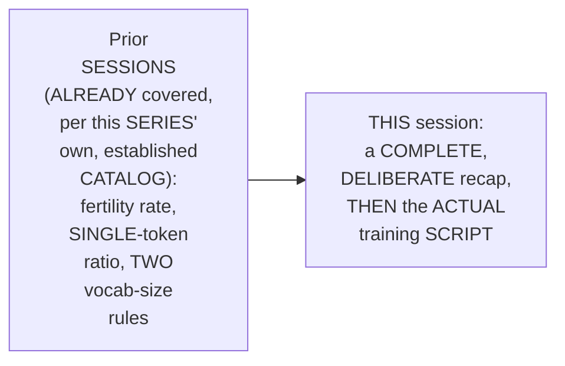

#### 🎯 Key Takeaways

* THIS session is GENUINELY, DELIBERATELY structured AS "a COMPLETE recap" — EXPLICITLY acknowledging the PRIOR content was "a LITTLE bit KEERI [tricky]."
* THE session's OWN, complete AGENDA: (1) vocab SIZE, (2) the REAL training script, (3) a TRANSITION into a NEW module (COVERED separately, in this WORKSPACE's SEPARATE prompt-ENGINEERING guide).
* This directly, PRECISELY sets UP the SESSION's own, FIRST, essential RECAP — the NEE rule (Section 2).

---

### 2. The NEE (2%) Rule, Precisely Recapped

#### 📖 Definition — The NEE Rule, Precisely Recapped

> 💡 **Given directly:** *"For the first one, with respect to the corpus... 2% of the global-based, okay? So right now, what is the global-based? ...Simply, 2% of 169.7 is equal to close to 3.4 that we have received. Now, this particular 3, this 2%, I will be adding it with 169... 169.7 plus 3.4, which is close to... roughly around 173."*

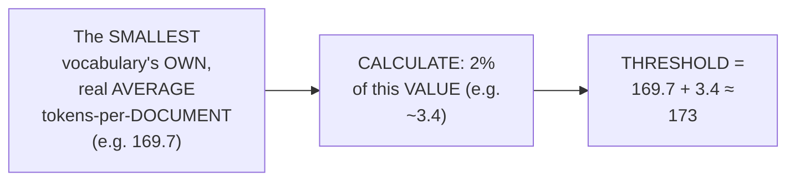

#### 🔍 Internal Working — A Genuine, Direct Confirmation of the Result

> 💡 **Given directly:** *"Now, based on this, what are the things which are within the threshold?... in the 64K version, we are getting close to 171.5... For 50K, it is just the exact threshold... What is out of the threshold? 32K, if I say. 32K is having, right now, what is the number? 177.2... And 188, so for sure, the top two, directly, I will neglect it."*

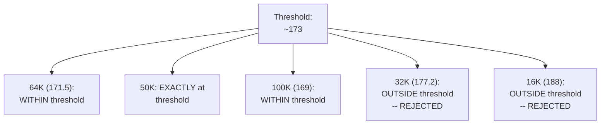

#### ⚠ Common Mistakes

* Assuming the NEE rule's OWN, "2% rule" is a SEPARATE, distinct RULE, entirely UNRELATED to the "NEE rule" ITSELF — explicitly, directly, PRECISELY clarified: "THE 2% rule, ACTUALLY, is UNDER the NEE RULE only... DON'T get CONFUSED."

#### 🎯 Key Takeaways

* THE **NEE rule** directly, PRECISELY calculates a THRESHOLD — the SMALLEST vocabulary's OWN, real AVERAGE tokens-per-DOCUMENT, PLUS 2% of THAT same VALUE.
* APPLYING this THRESHOLD, ONLY **64K** and **100K** genuinely, DIRECTLY fell WITHIN it — 32K AND 16K were BOTH, genuinely REJECTED, as EXCEEDING the threshold.
* GIVEN a CHOICE between 64K and 100K, **64K** was PREFERRED — SINCE it COMES with GENUINELY lower, real COMPUTE cost.
* This directly, PRECISELY sets UP the SESSION's own, NEXT, essential RECAP — the CORPUS rule (Section 3).

---
### 3. The Corpus Rule, Precisely Recapped

#### 📖 Definition — The Corpus Rule, Precisely Recapped

> 💡 **Given directly:** *"For the corpora, based on the final corpus settings, in our corpus that we had close to 6.3 million [tokens]... 6.3 million divided by your 64K... the values that we were getting... initial 98, 196, 394."*

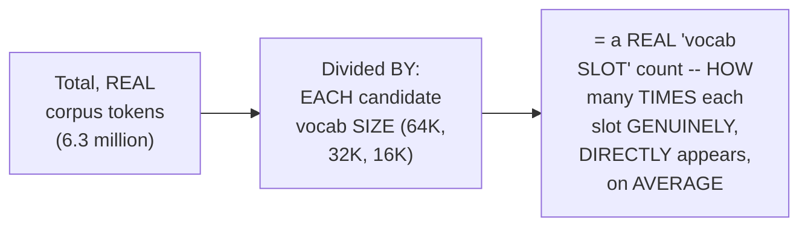

#### 🔍 Internal Working — The 10x Rule for Stable BPE Merges

> 💡 **Given directly:** *"How many of you remember the 10X idea? 10x of training tokens which are required... The reason is, whenever we are doing the training, we need stable BPE merges. So, whatever that vocab size that you decide, always remember that your main [token count] should be at least more than 10x of that."*

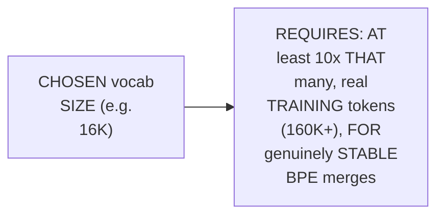

#### ⚠ Common Mistakes

* Assuming a SMALLER "VOCAB slot" number (e.g., 98, at 64K) is GENUINELY, ALWAYS the "BETTER" outcome — explicitly, directly, PRECISELY clarified: TOO small a VOCAB slot MEANS "LESSER information... TOO much PARSE [sparse]" — a genuinely, TOO-small number RISKS the vocab SET being "TOO much EMPTY," undermining STABLE merges.

#### 🎯 Key Takeaways

* THE **CORPUS rule** directly, PRECISELY divides the TOTAL, real corpus TOKEN count (6.3 million) BY each, candidate vocab SIZE — PRODUCING a "VOCAB slot" number FOR each option (98 AT 64K; 196 at 32K; 384 AT 16K).
* THE **10x rule** directly, PRECISELY requires the TOTAL, real training TOKEN count to be AT least 10 TIMES the chosen VOCAB size — ENSURING genuinely, STABLE BPE merges.
* APPLYING the CORPUS rule, **16K and 32K** were IDENTIFIED as REASONABLE options — AVOIDING BOTH extremes (TOO sparse, or TOO empty).
* This directly, PRECISELY sets UP the SESSION's own, NEXT, essential CONTENT — RESOLVING the GENUINE, real conflict BETWEEN these two, DIFFERENT rules' OWN, respective RECOMMENDATIONS (Section 4).

---

### 4. Resolving the Conflict: A Genuine, Real Middle-Ground Decision

#### ⚠ A Direct, Honest, Important Acknowledgment of Conflict

> 💡 **Given directly:** *"If we have so many conflicts, you have to understand, guys, in our case, there is a direct conflict between the knee and the corpus [rule]... the corporate size is telling, only look for 16K and 32K. The new [nee] rule is telling only look for 64K or 100K. In both the cases, the conflict came."*

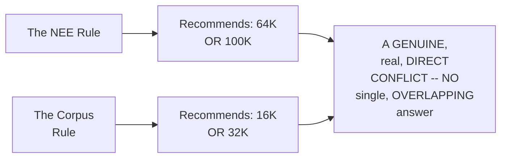

#### 🪜 Step-by-Step — The Complete, Real "Minus 6.2%" Comparison, Precisely Explained

> 💡 **Given directly:** *"Now, first, what you will do, if you want to calculate the percentage... 177.2 minus 188... roughly, we'll be getting around that particular 6.2%... the 32K vocabulary size, if you are setting in the tokenizer, it will be producing 6.2% lesser tokens per document."*

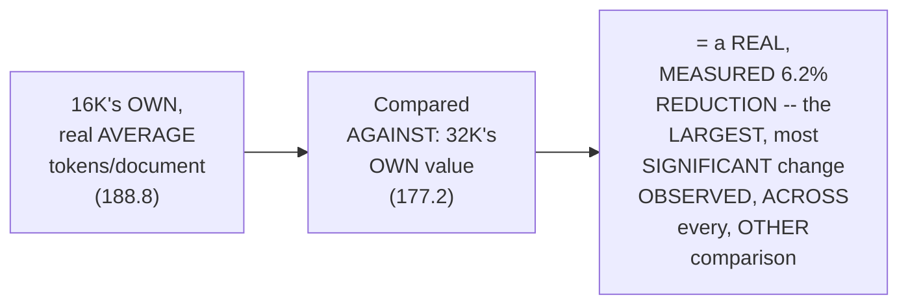

#### 🔍 Internal Working — A Genuine, Direct, Real-World Impact Illustration

> 💡 **Given directly:** *"You will be saving close to 11.6 tokens per document... if I say 1000 document, what will happen?... close to 11,600 fewer tokens. Now, this is a big impact."*

#### 🪜 Step-by-Step — The Final, Real Decision

> 💡 **Given directly:** *"32K here, again, here, 64 and 32, for sure, they come with the cost... my main options that I prefer, it will be around roughly 32K."*

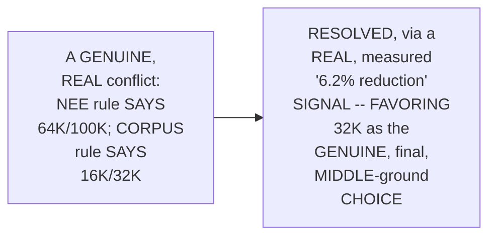

#### ⚠ Common Mistakes

* Assuming a REAL, genuine CONFLICT between TWO, established HEURISTIC rules GENUINELY, DIRECTLY means the ENTIRE decision-MAKING process has FAILED — explicitly, directly, HONESTLY reframed: "IN research, WHEN you look INTO, there is NO one SINGLE rule of THUMB. From MULTIPLE places, you LOOK, you TRY to analyze, and THEN based on THAT, you take the DECISION."

#### 🎯 Key Takeaways

* A GENUINE, real CONFLICT directly, EXPLICITLY existed — the NEE rule RECOMMENDED 64K/100K; the CORPUS rule RECOMMENDED 16K/32K — NO, single OVERLAPPING answer.
* THIS conflict was RESOLVED via a REAL, measured "MINUS 6.2%" COMPARISON — 32K GENUINELY, DIRECTLY produced the LARGEST, most SIGNIFICANT reduction IN tokens-per-document, COMPARED to 16K.
* THE final, REAL decision: **32K** — a GENUINE, deliberate MIDDLE-ground choice, GROUNDED in MULTIPLE, real, CONVERGING signals — NOT a SINGLE, blind rule.

---
### 5. The Core, Underlying Intuition: More Vocab Slots, Fewer Tokens

#### 📖 Definition — The Complete, Precise Chain of Reasoning

> 💡 **Given directly:** *"Whenever the idea is, if you have more vocab slots, more merging rounds that can take place. And if more merging rounds that take place, longer tokens you can capture. So, fewer tokens per document. Always remember this particular rule."*

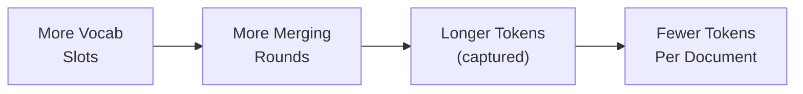

#### 🔍 Internal Working — A Genuine, Direct, Worked Example

> 💡 **Given directly:** *"16K is doing, if I say that, it is breaking it into 3 tokens... you have 32K. In 32K, with respect to, if I say that, only one token did it. It means that... the merge budget was enough to reach this particular point."*

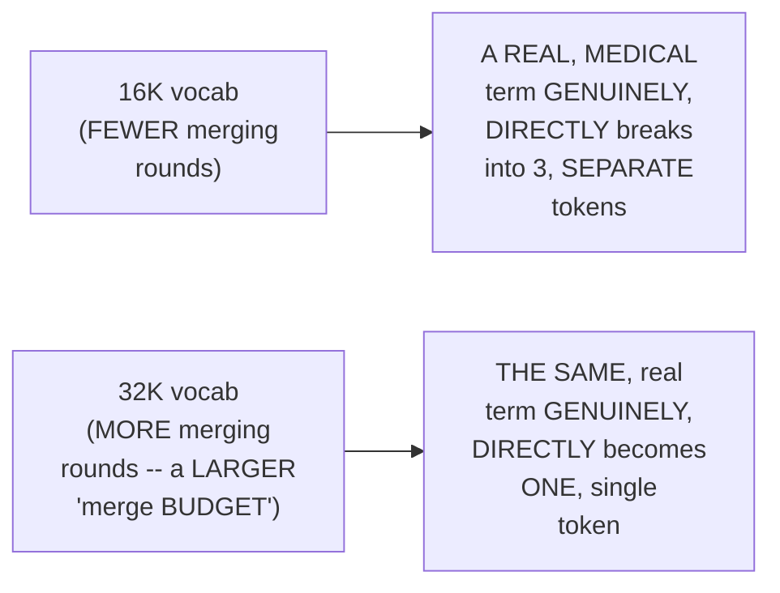

#### ⚠ Common Mistakes

* Assuming "MORE vocab SLOTS" and "FEWER tokens" are GENUINELY, DIRECTLY, immediately EQUIVALENT — explicitly, directly, PRECISELY clarified: it's a REAL, CAUSAL chain, WITH an INTERMEDIATE step — MORE slots ENABLE more MERGING rounds, WHICH enable LONGER tokens, WHICH THEN produce FEWER tokens PER document.

#### 🎯 Key Takeaways

* THE genuine, CORE intuition directly, PRECISELY chains FOUR, related IDEAS: **MORE vocab SLOTS** → **MORE merging ROUNDS** → **LONGER tokens** → **FEWER tokens PER document**.
* A REAL, worked EXAMPLE directly, CONCRETELY confirmed this CHAIN — a SPECIFIC, real MEDICAL term BROKE into 3 tokens AT 16K, but GENUINELY, DIRECTLY became ONE, single TOKEN at 32K.
* This directly, PRECISELY sets UP the SESSION's own, NEXT, essential CONTENT — WHEN, precisely, to genuinely INCREASE an EXISTING tokenizer's own VOCABULARY size (Section 6).

---

### 6. When to Genuinely Increase Vocabulary Size

#### ⚠ A Direct, Honest, Important Principle

> 💡 **Given directly:** *"If the data set is increasing, so you have to understand that the vocabulary the size should also increase. This is very, very important... you have to do this particular experiment, and from there, take the decision."*

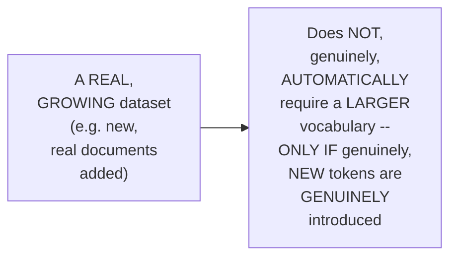

#### 🪜 Step-by-Step — The Complete, Precise Decision Rule

> 💡 **Given directly:** *"If you have newer tokens, more than 30% new tokens have been introduced, then I will actually increase it from 8K to probably 12K or 16K... if there are no new tokens, if you feel that only it's less than 1%, it doesn't make sense to change the vocabulary size."*

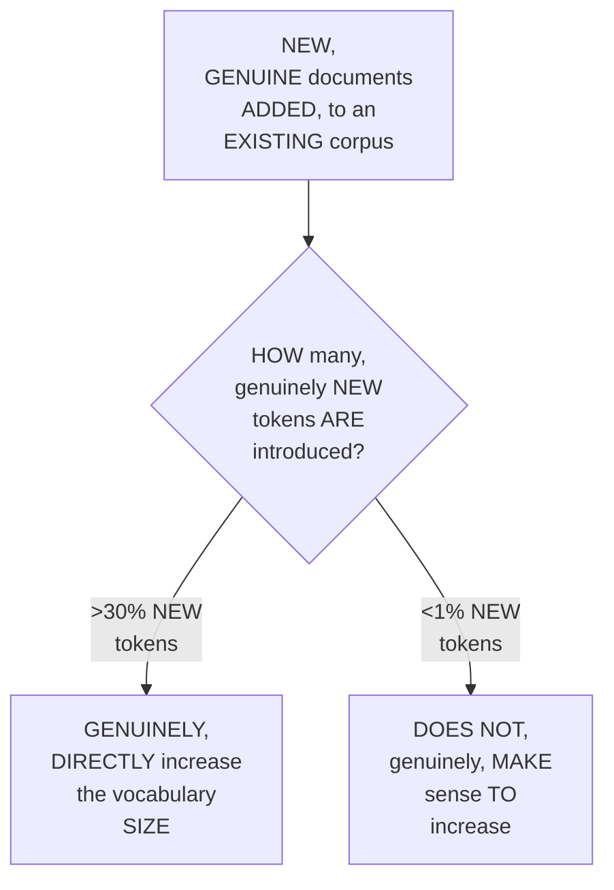

#### 🔍 Internal Working — A Genuine, Direct Confirmation: This Requires Real Analysis

> 💡 **Given directly:** *"Generally, look into the... do the token analysis for the first set... look into the complete analysis for each word with respect to the count in the first one. Now, the new set... whether that word was available or not."*

#### ⚠ Common Mistakes

* Assuming a REAL, GROWING document COUNT alone (e.g., MOVING from 500K TO 1 million DOCUMENTS) GENUINELY, AUTOMATICALLY justifies a LARGER vocabulary — explicitly, directly, PRECISELY corrected: "IT'S not TOTALLY correct... IF you DON'T see NEW, unique TOKENS getting introduced IN the new SET of documents, THEN increasing the VOCABULARY size doesn't MAKE sense."

#### 🎯 Key Takeaways

* THE decision TO increase vocabulary SIZE directly, PRECISELY depends ON genuine, real TOKEN novelty — NOT simply the RAW, overall DOCUMENT count.
* A GENUINE, precise THRESHOLD: **MORE than 30%** new TOKENS → genuinely INCREASE vocabulary; **LESS than 1%** new TOKENS → genuinely, DIRECTLY does NOT warrant an INCREASE.
* THIS decision directly, PRACTICALLY requires REAL, systematic TOKEN analysis — COMPARING the EXISTING corpus's OWN, established TOKENS against the NEW, incoming DOCUMENTS' own tokens.
* This directly, PRECISELY sets UP the SESSION's own, NEXT, essential CONTENT — WHY vocabulary UPDATES are GENUINELY, DIRECTLY costly, and THEREFORE infrequent (Section 7).

---
### 7. Why Retraining Is Costly & Genuinely Infrequent

#### ⚠ A Direct, Honest, Important Explanation

> 💡 **Given directly:** *"If you change the tokenizer, what will be the impact? Direct impact to the model. Because the last layer of the model, suddenly you cannot change the tokenizer, and you will say that I will use the same model. Not practically possible... generally, like, two times a year or three times a year, based on your use case."*

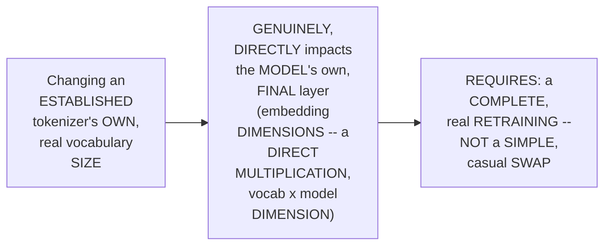

#### ⚠ Common Mistakes

* Assuming a TOKENIZER can be GENUINELY, EASILY swapped OUT, for a DIFFERENT, real MODEL, at ANY given TIME, WITHOUT any, real CONSEQUENCE — explicitly, directly, PRECISELY clarified: it GENUINELY, DIRECTLY impacts the MODEL's own, final LAYER — REQUIRING a COMPLETE, real RETRAINING, not a SIMPLE, casual SWAP.

#### 🎯 Key Takeaways

* CHANGING a TOKENIZER's own vocabulary SIZE directly, GENUINELY impacts the MODEL's own, final LAYER — SINCE the LINEAR layer's OWN dimensions are DIRECTLY, MULTIPLICATIVELY tied TO the vocab SIZE.
* THIS genuinely, DIRECTLY requires a COMPLETE, real RETRAINING — NOT a SIMPLE, casual SWAP — EXPLAINING why REAL organizations genuinely UPDATE tokenizers "TWO times a YEAR or THREE times a YEAR," at MOST.
* This directly, PRECISELY sets UP the SESSION's own, NEXT, essential CONTENT — the COMPLETE, three-GOAL framework FOR building a domain-SPECIFIC tokenizer (Section 8).

---

### 8. The Complete, Three-Goal Framework for a Domain-Specific Tokenizer

#### 📖 Definition — Goal 1: Domain Fertility

> 💡 **Given directly:** *"I will always evaluate on the domain fertility guys. This is the first and the primary goal. Always remember, this is your primary. If this doesn't solve, it doesn't make sense... the test should be done on top of your held-out dataset."*

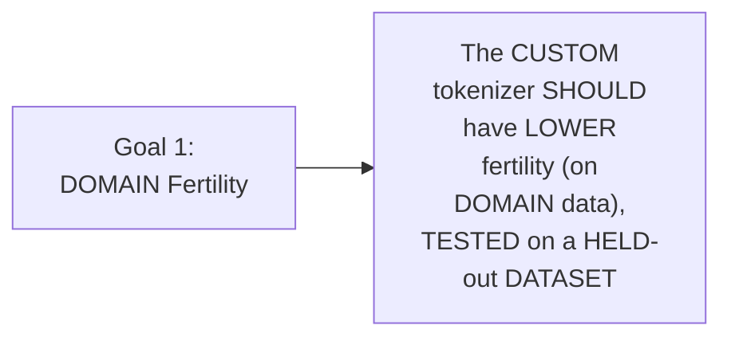

#### 📖 Definition — Goal 2: Single Token Rate on Jargon

> 💡 **Given directly:** *"The single token rate on jargons... the key domain terms, as per the fertility rate, the primary goal, if you have achieved the secondary goal, the key domain terms should be covered, it should be a single token, and not fragments."*

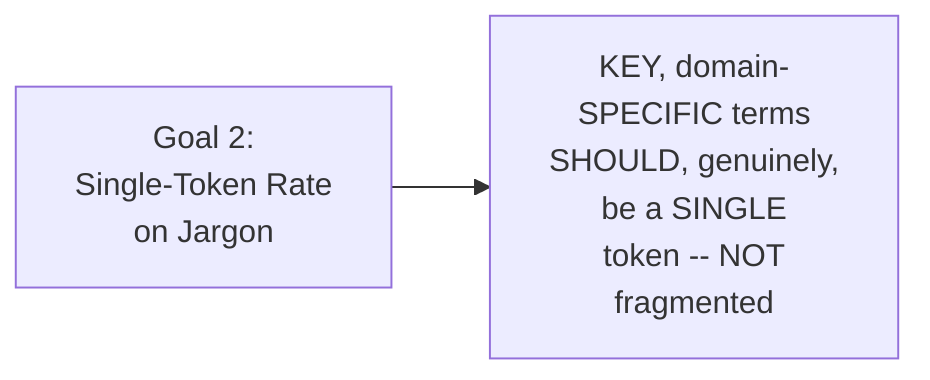

#### 📖 Definition — Goal 3: The Sanity Check

> 💡 **Given directly:** *"Always check with a general purpose dataset... it should perform bad. Always remember, it should perform bad... If the fertility score is low on your open data sets... then I can say that you are in the right direction."*

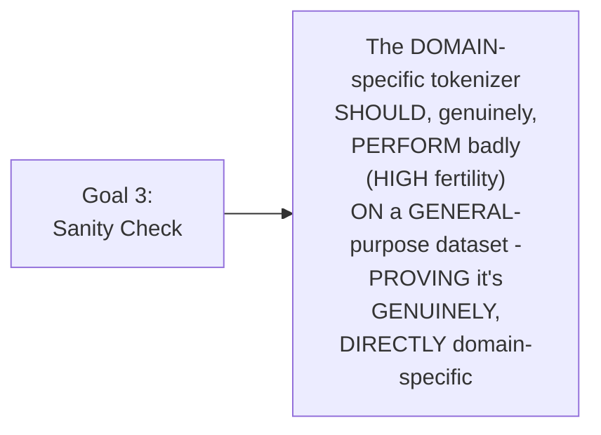

#### ⚠ Common Mistakes

* Assuming a REAL, "GOOD" domain-SPECIFIC tokenizer should ALSO, genuinely PERFORM well, ON general-PURPOSE data — explicitly, directly, PRECISELY corrected: "IT'S not LIKE that, IT should PERFORM good — IF it IS performed GOOD, then, IT'S not domain-SPECIFIC" — GENUINELY, PARADOXICALLY, poor PERFORMANCE on GENERAL data IS the correct, EXPECTED sign OF success.

#### 🎯 Key Takeaways

* **GOAL 1 (domain FERTILITY)**: the PRIMARY, foundational goal — LOWER fertility ON domain data, GENUINELY tested ON a held-OUT dataset.
* **GOAL 2 (single-TOKEN rate)**: KEY, domain-SPECIFIC jargon SHOULD genuinely BE a SINGLE token, NOT fragmented.
* **GOAL 3 (sanity CHECK)**: the TOKENIZER should GENUINELY, PARADOXICALLY perform BADLY on GENERAL-purpose data — CONFIRMING true, real DOMAIN specificity.
* This directly, PRECISELY sets UP the SESSION's own, NEXT, essential CONTENT — TWO, additional, PRE-training questions: IS the corpus "DOMAIN pure," and IS it "BIG enough" (Section 9).

---
### 9. Is the Corpus "Domain Pure"? Is It "Big Enough"?

#### 📖 Definition — Domain Purity, Precisely Explained

> 💡 **Given directly:** *"Is the corpus clean or not? This also plays a very crucial role... one is clean, and the other is domain pure... if you are having more than 60% of the tokens as general English tokens, do you think that that is actually a domain-specific data center?... at least 50% diverse it has to be."*

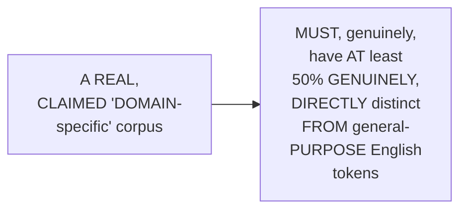

#### 📖 Definition — Corpus Size, Precisely Explained

> 💡 **Given directly:** *"Is the corpus big enough?... the rule of thumb is 10 million... 10 million characters... generally for 16K vocabulary size... roughly around 160 million [characters]."*

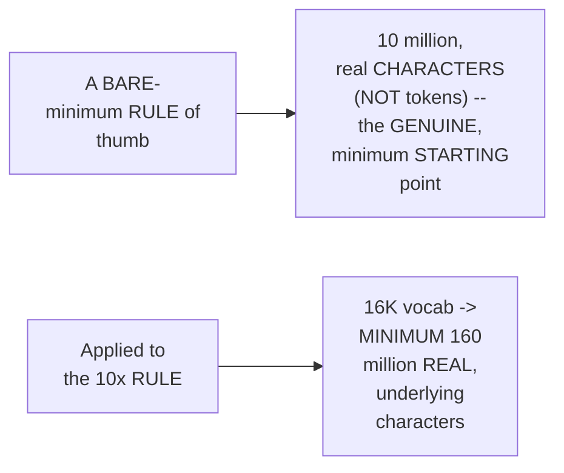

#### ⚠ Common Mistakes

* Assuming "10 MILLION," in THIS context, GENUINELY, DIRECTLY refers to TOKENS — explicitly, directly, PRECISELY clarified: "WHEN I say 10 MILLION, don't THINK... tokens, I'M talking WITH respect to CHARACTERS."

#### 🎯 Key Takeaways

* A REAL, genuinely "DOMAIN-pure" corpus MUST, directly, have AT least **50%** of its OWN, real tokens GENUINELY, DIRECTLY distinct FROM general-purpose ENGLISH.
* THE "BIG enough" rule of THUMB directly, PRECISELY requires a MINIMUM of **10 MILLION characters** (NOT tokens) — SCALED, via the SAME, established 10x RULE, based ON the chosen vocab SIZE.
* THIS completes THIS session's own, COMPLETE, established DECISION-making framework — SETTING up the SESSION's own, NEXT, essential CONTENT — the ACTUAL, real training SCRIPT itself (Section 10).

---

### 10. Walking Through train_medical_tokenizer.py: Setup & Batching

#### 🪜 Step-by-Step — Why Hugging Face's `tokenizers` Library

> 💡 **Given directly:** *"It's not a scratch implementation, you have to understand directly I have used, tokenizers from Hugging Face. And why I have used? Because it is written in Rust. If it is written in Rust, it will be much more faster as compared to any Python-based libraries."*

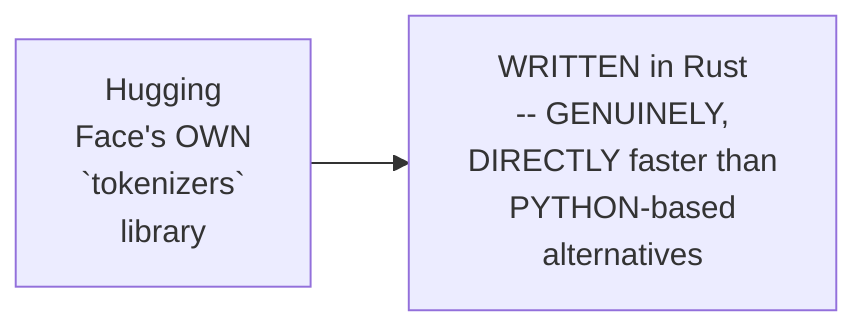

#### 🪜 Step-by-Step — iterate_corpus_batches(): A Real, Generator-Based Function

> 💡 **Given directly:** *"Whenever you are processing the data for sure, you won't be processing the entire data in one shot... this is the iteration corpus batches, this particular function that I have. It will... it is actually a generator-based function... one line at a time, it will be looking into that."*

```python
def iterate_corpus_batches(corpus_path, batch_size=64) -> Iterator[list[str]]:
    """Reads the corpus one line at a time (a generator), yielding batches
    -- rather than loading the entire file into memory at once."""
    with open(corpus_path, encoding="utf-8") as handle:
        for line in handle:
            raw = line.strip()
            if not raw:
                continue
            text = raw
            if raw.startswith("{"):
                import json
                text = json.loads(raw)["text"]  # illustrative
            yield text
```

#### 🔍 Internal Working — Why Batches, Not the Whole File?

> 💡 **Given directly:** *"If the corpus is one ATMB [a terabyte], it will completely sit, and it will take up your RAM. Okay, so it's better to look into 64 lines in one shot."*

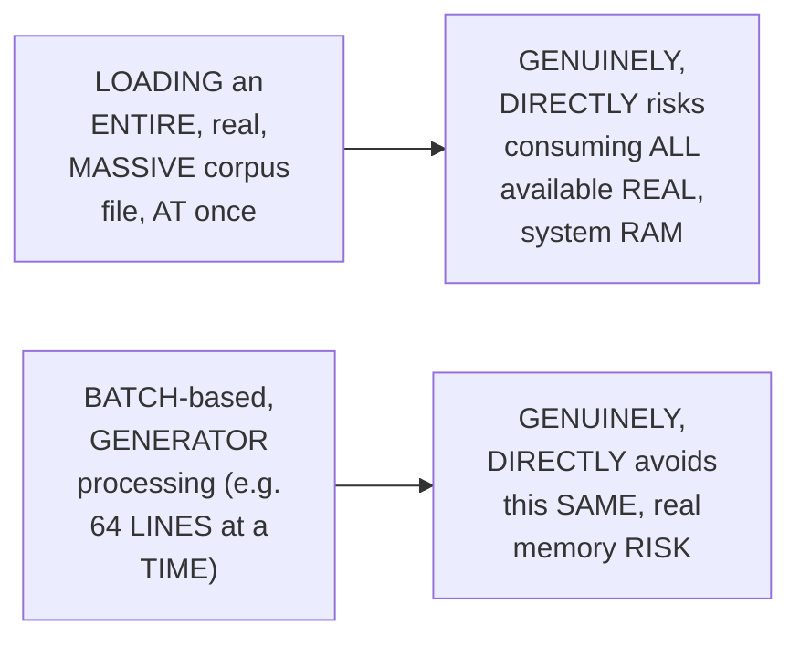

#### 🪜 Step-by-Step — count_total_lines(): A Simple, Real Verification Function

> 💡 **Given directly:** *"This is a simple function that I have. What is the purpose of function? Just to count the total number of non-empty lines in your dataset file."*

#### ⚠ Common Mistakes

* Assuming a REAL, complete tokenizer-TRAINING script GENUINELY, DIRECTLY needs to LOAD its ENTIRE, real corpus FILE into memory, AT once — explicitly, directly, PRACTICALLY clarified: a GENERATOR-based, BATCH-processing approach (e.g., 64 LINES at a TIME) GENUINELY, DIRECTLY avoids this SAME, real risk.

#### 🎯 Key Takeaways

* Hugging Face's OWN `TOKENIZERS` library was directly, PRACTICALLY chosen SPECIFICALLY because it's WRITTEN in RUST — GENUINELY, DIRECTLY faster THAN Python-based ALTERNATIVES.
* **`iterate_CORPUS_batches()`** directly, CONCRETELY implements a REAL, generator-BASED function — PROCESSING the corpus IN small BATCHES (e.g., 64 LINES), RATHER than LOADING the ENTIRE file AT once.
* **`count_TOTAL_lines()`** directly, CONCRETELY provides a SIMPLE, real VERIFICATION utility — CONFIRMING the TOTAL, non-empty LINE count, in the SOURCE dataset FILE.
* This directly, PRECISELY sets UP the SESSION's own, NEXT, essential CONTENT — `BUILD_byte_level()`, the "HEART" of the COMPLETE script (Section 11).

---
### 11. build_byte_level(): The "Heart" of the Script

#### 🪜 Step-by-Step — Initializing the BPE Model

> 💡 **Given directly:** *"This is the actual heart of the script... first of all, what I'm loading, tokenizer models.bp, when I say. The core algorithm, the [BPE] model, right here, no merge, no vocabulary."*

```python
from tokenizers import Tokenizer, models, pre_tokenizers, decoders, processors, trainers

tokenizer = Tokenizer(models.BPE())
```

#### 🪜 Step-by-Step — The Byte-Level Pre-Tokenizer

> 💡 **Given directly:** *"Pre-tokenizer is equal to byte level, add prefix underscore space is equal to false... The idea is that the tokenizer can handle any type of Unicode character, even if it has not seen in the training... every character is... it needs to be broken into bytes... we have a limit 0 to 255."*

```python
tokenizer.pre_tokenizer = pre_tokenizers.ByteLevel(add_prefix_space=False)
```

```mermaid
flowchart LR
    A["ANY, real<br/>Unicode CHARACTER<br/>(EVEN genuinely<br/>UNSEEN, during<br/>TRAINING)"] --> B["BROKEN into:<br/>BYTES -- a FIXED,<br/>real RANGE of 0<br/>to 255"]
    B --> C["ENSURES: NO,<br/>genuine 'UNKNOWN<br/>token' problem,<br/>EVER"]
```

#### 🔍 Internal Working — `add_prefix_space=False`, Precisely Explained

> 💡 **Given directly:** *"It means that we don't want to insert a space at the start of every sentence. GPT-2, generally have done this part. Later on, from GPT-4, it doesn't."*

#### 🪜 Step-by-Step — The Byte-Level Decoder

> 💡 **Given directly:** *"Decoder.byteLevel. Is it mandatory? Yes. Right now, in 2026, it is mandatory... This will run after the tokenization in the reverse order... you have to convert the byte-encoded data back to readable text. If you really don't check anything with respect to decoding, what will happen? The chances of getting something... garbage."*

```python
tokenizer.decoder = decoders.ByteLevel()
```

#### ⚠ Common Mistakes

* Assuming the BYTE-level decoder is GENUINELY, MERELY an OPTIONAL, "NICE-to-have" ADDITION — explicitly, directly, HONESTLY clarified: "RIGHT now, in 2026, it IS mandatory" — WITHOUT it, DECODED output GENUINELY, DIRECTLY risks becoming REAL, unreadable "GARBAGE."

#### 🎯 Key Takeaways

* **`BUILD_byte_level()`** directly, CONCRETELY initializes the BPE MODEL, the BYTE-level PRE-tokenizer (WITH `add_PREFIX_space=False`, a GPT-4-style CONVENTION), and the BYTE-level DECODER.
* THE byte-LEVEL approach directly, GENUINELY handles ANY, real UNICODE character — EVEN genuinely UNSEEN ones — SINCE everything BREAKS down INTO a FIXED, real 0-255 BYTE range.
* THE DECODER is directly, HONESTLY confirmed AS "MANDATORY" — WITHOUT it, DECODED text GENUINELY, DIRECTLY risks becoming REAL, unreadable garbage.
* This directly, PRECISELY sets UP the SESSION's own, NEXT, essential CONTENT — the INFAMOUS "Ġ" symbol, and WHY offset TRIMMING genuinely matters (Section 12).

---

### 12. Understanding the "Ġ" Symbol & Offset Trimming

#### 📖 Definition — The "Ġ" Symbol, Precisely Explained

> 💡 **Given directly:** *"What is a token, general token, medical token? Now, simply... What is that G? G is only shown with respect to encoding. If you try to decoding that stuff, then again, G will be removed. So generally, we perform an object-based mapping whenever we are training."*

```mermaid
flowchart LR
    A["The 'Ġ'<br/>Symbol"] --> B["A REAL,<br/>VISIBLE artifact<br/>OF byte-level<br/>ENCODING (REPRESENTS<br/>a LEADING space)"]
    B --> C["GENUINELY,<br/>DIRECTLY removed,<br/>AUTOMATICALLY,<br/>UPON decoding"]
```

#### ⚠ A Direct, Honest, Important Warning

> 💡 **Given directly:** *"You cannot pass this G to any [downstream task]. We have to perform an offset. It means that we have to actually perform indexing, and from that index, you have to remove that... otherwise, if you send this particular G to NER, total catastrophic task, I can say."*

```mermaid
flowchart LR
    A["The RAW 'Ġ'<br/>symbol, PASSED<br/>DIRECTLY to a<br/>REAL, downstream<br/>task (e.g. NER)"] --> B["GENUINELY,<br/>DIRECTLY causes a<br/>REAL, 'CATASTROPHIC'<br/>failure -- OFFSET/<br/>index MISALIGNMENT"]
```

#### 🪜 Step-by-Step — The Fix: `trim_offsets=True`

> 💡 **Given directly:** *"Processors.byteLevel, trim underscore offsets is equal to true... this is very, very important... you have to perform this trimming-based operation. From there, you can actually... it means that... when I say G, that special G, if I take... let's check the spatial G. When you try to perform a simple index-based operation... G is getting that [offset]. But actually, you cannot send this gene."*

```python
tokenizer.post_processor = processors.ByteLevel(trim_offsets=True)
```

```mermaid
flowchart LR
    A["A REAL token,<br/>WITH a leading<br/>'Ġ' (e.g. FOR<br/>'LONDON')"] --> B["`trim_offsets=True`:<br/>GENUINELY,<br/>DIRECTLY performs an<br/>INDEX-based<br/>OPERATION"]
    B --> C["REMOVES the<br/>'Ġ' ARTIFACT,<br/>CLEANLY, BEFORE<br/>the token REACHES<br/>a REAL, downstream<br/>TASK (NER,<br/>QUESTION answering,<br/>SENTIMENT<br/>analysis)"]
```

#### ⚠ Common Mistakes

* Assuming a REAL, downstream TASK (LIKE named-ENTITY recognition) can GENUINELY, DIRECTLY receive RAW, "Ġ"-prefixed TOKENS, WITHOUT any, additional PROCESSING — explicitly, directly, HONESTLY warned AGAINST — "TOTAL catastrophic TASK, I can SAY" — a REQUIRED, real trimming/OFFSET operation MUST happen FIRST.

#### 🎯 Key Takeaways

* THE **"Ġ"** symbol is precisely EXPLAINED as a REAL, visible ARTIFACT of byte-LEVEL encoding, REPRESENTING a leading SPACE — AUTOMATICALLY removed UPON decoding.
* PASSING this RAW symbol DIRECTLY to a REAL, downstream TASK (e.g., NER) GENUINELY, DIRECTLY causes a REAL, "CATASTROPHIC" failure — DUE to offset/INDEX misalignment.
* **`trim_OFFSETS=True`** directly, CONCRETELY fixes this — PERFORMING a REAL, index-based OPERATION, cleanly REMOVING the artifact, BEFORE downstream USE.

---
### 13. The main() Orchestrator: Training & Special Considerations

#### 🪜 Step-by-Step — Configuring the BPE Trainer

> 💡 **Given directly:** *"Trainers is equal to trainers.bp train. Now, this is through which I'll be actually start the training process... vocabulary size that I have passed based on the arguments, special tokens."*

```python
trainer = trainers.BpeTrainer(
    vocab_size=32000,
    min_frequency=2,
    special_tokens=["<|endoftext|>", "<|pad|>"],
    initial_alphabet=pre_tokenizers.ByteLevel.alphabet(),
    show_progress=True
)
```

#### 🔍 Internal Working — Why `min_frequency=2`, Precisely Explained

> 💡 **Given directly:** *"Minimum 2 occurrences. Because we know that we look into the total number of counts, so minimum, I'm telling two counts should be there. Then only the merging will take place... if it is 1, it has zero importance in the purpose items."*

```mermaid
flowchart LR
    A["A REAL,<br/>candidate token-<br/>PAIR MERGE"] --> B{"HOW many<br/>TIMES does it<br/>GENUINELY, ACTUALLY<br/>occur?"}
    B -->|"Only 1<br/>TIME"| C["GENUINELY,<br/>DIRECTLY ignored --<br/>'zero IMPORTANCE'"]
    B -->|"2+ TIMES<br/>(the ESTABLISHED<br/>minimum)"| D["ELIGIBLE for a<br/>REAL, genuine<br/>MERGE"]
```

#### 🔍 Internal Working — `initial_alphabet`, Precisely Explained

> 💡 **Given directly:** *"If you don't have anything... generally, the idea is, you need to handle every alphabet... if any unsaid data comes, that also needs to be handled... without [initial alphabet], you can see the problem of unknown."*

```mermaid
flowchart LR
    A["`INITIAL_alphabet`<br/>(pre-LOADED, byte-<br/>LEVEL alphabet)"] --> B["GENUINELY,<br/>DIRECTLY handles<br/>ANY, real UNSEEN<br/>character, at the<br/>BYTE level -- AVOIDING<br/>the CLASSIC 'unknown<br/>token' PROBLEM"]
```

#### 🪜 Step-by-Step — The Complete main() Function

> 💡 **Given directly:** *"Now, this is your main function, where you pass all the arguments and whatever that you want to change... simply here, the initial purpose path, where is the path?... Expand user, what is the purpose of doing expand user?... You try to expand your paths."*

```python
def main():
    parser = argparse.ArgumentParser()
    parser.add_argument("--corpus", type=Path, default=DEFAULT_CORPUS_ROOT)
    parser.add_argument("--output", type=Path, default=DEFAULT_OUTPUT_ROOT)
    parser.add_argument("--vocab-size", type=int, default=32000)
    args = parser.parse_args()

    corpus_path = args.corpus.expanduser().resolve()
    output_path = args.output.expanduser().resolve()
    # ... build tokenizer, train, save
```

#### ⚠ Common Mistakes

* Assuming `MIN_frequency=1` (ACCEPTING a merge, EVEN if it OCCURS only ONCE) is GENUINELY, PRACTICALLY a SAFE, reasonable DEFAULT — explicitly, directly, PRECISELY clarified: "IF it IS 1, it HAS zero IMPORTANCE" — BPE genuinely, STRUCTURALLY requires GENUINE frequency (2+ occurrences, at MINIMUM) to JUSTIFY a real MERGE.

#### 🎯 Key Takeaways

* **`min_FREQUENCY=2`** directly, PRECISELY requires a CANDIDATE token-PAIR to GENUINELY occur AT LEAST twice, BEFORE it's ELIGIBLE for a REAL merge — a SINGLE occurrence GENUINELY has "ZERO importance."
* **`INITIAL_alphabet`** directly, CONCRETELY pre-loads the COMPLETE, byte-LEVEL alphabet — GENUINELY, DIRECTLY solving the CLASSIC "UNKNOWN token" problem, FOR any, real UNSEEN character.
* THE COMPLETE `MAIN()` function directly, CONCRETELY wires TOGETHER every, PRIOR piece — ARGUMENT parsing, PATH resolution (`expanduser()`, `RESOLVE()`), and the FULL training PIPELINE.
* This directly, PRECISELY sets UP the SESSION's own, FINAL, essential CONTENT — a COMPLETE, real, hands-ON exercise, PUSHING a trained TOKENIZER to Hugging FACE (Section 14).

---

### 14. A Complete, Real, Live Exercise: Pushing to Hugging Face

#### 🪜 Step-by-Step — The Complete, Real Setup Process

> 💡 **Given directly:** *"You need a hugging Face token... go to the settings section, go to the access tokens... create a new token, and just... give it a write access, create the token, pass it in your .env, and then try to execute the command."*

```bash
cp .env.example .env
# add your Hugging Face WRITE-access token to .env
python wrap_for_hf.py --tokenizer-dir artifacts/tokenizer
python push_to_hub.py --repo-name your-username/medical-tokenizer
```

#### 🔍 Internal Working — A Genuine, Direct, Important Warning: Token Permissions

> 💡 **Given directly:** *"Use the right token... if you're working with a simple read token... you don't have the right to create a model... please use the right API token... this is actually a right-waste [write] operation... in full access token, if you take that granular version, sometimes some issue."*

```mermaid
flowchart LR
    A["A HUGGING<br/>Face API TOKEN,<br/>with 'READ-only'<br/>PERMISSIONS"] --> B["GENUINELY,<br/>DIRECTLY fails --<br/>CANNOT create a<br/>new REPOSITORY"]
    C["A TOKEN,<br/>SPECIFICALLY<br/>granted 'WRITE'<br/>access"] --> D["GENUINELY,<br/>DIRECTLY required,<br/>FOR this exact,<br/>real OPERATION"]
```

#### 🔍 Internal Working — A Genuine, Direct, Career-Focused Motivation

> 💡 **Given directly:** *"The idea of this course is you'll be having your own Hugging Face portfolio... having a very good profile in Hugging Face... GitHub to a limit fine, but Hugging Face profiles is very, very important... this actually makes sense much more, because from here, directly, we can understand that you have done something."*

#### ⚠ Common Mistakes

* Assuming a "FULL access" Hugging FACE token is GENUINELY, ALWAYS the SAFEST, most CONVENIENT choice — explicitly, directly, PRECISELY warned AGAINST — "IN full ACCESS token... SOMETIMES some ISSUE" — a NARROWLY-scoped, "WRITE"-only token is the GENUINE, recommended CHOICE, for THIS specific TASK.

#### 🎯 Key Takeaways

* THE complete, real EXERCISE directly, CONCRETELY required CREATING a REAL Hugging Face ACCOUNT, generating a **WRITE-access API TOKEN**, and CONFIGURING it WITHIN a `.env` FILE.
* A GENUINE, direct WARNING confirmed: **read-ONLY tokens GENUINELY fail** for THIS operation — a WRITE-access TOKEN is REQUIRED.
* THE instructor **directly, PERSONALLY motivates** this EXERCISE — BUILDING a REAL, genuine Hugging FACE portfolio is EXPLICITLY confirmed AS "VERY, very IMPORTANT" — a DIRECT, tangible SIGNAL of REAL, demonstrated SKILL.
* This directly, PRECISELY completes THIS session's own, COMPLETE MODULE — CONCLUDING with the SERIES' own, established ASSIGNMENT: REPLACING spaCy's OWN tokenizer WITH this session's OWN, BPE-based implementation, WITHIN the ANNOTATED Transformers PROJECT.

---
## 📝 Glossary

| Term | Definition | Why It Matters |
|---|---|---|
| **NEE Rule** | Threshold = smallest vocab's avg tokens/doc + 2% | One of two, established vocab-size heuristics |
| **Corpus Rule** | Total corpus tokens ÷ candidate vocab size | The other, established heuristic; produces a "vocab slot" number |
| **10x Rule** | Training tokens should be ≥ 10x the vocab size | Ensures stable BPE merges |
| **Vocab Slot** | The result of the corpus-rule division | Should be neither too sparse nor too empty |
| **Domain Fertility** | Avg tokens/word on domain-specific text | Should be LOW; the primary evaluation goal |
| **Sanity Check** | Testing the tokenizer on general-purpose text | Fertility should be HIGH here -- proves specificity |
| **"Ġ" Symbol** | A visible byte-level encoding artifact (leading space) | Must be trimmed before downstream tasks (e.g., NER) |
| **min_frequency** | Minimum occurrences required for a BPE merge | Set to 2; a single occurrence has "zero importance" |

---

## 🔄 Revision Notes — One-Minute Revision

* This session is a deliberate, complete recap of vocab-size decision-making, followed by a full, line-by-line walkthrough of the real tokenizer-training script.
* **The NEE rule**: threshold = smallest vocab's average tokens/document + 2% of that value. Only values within this threshold pass; in this session, that meant 64K and 100K (32K and 16K were rejected).
* **The corpus rule**: total corpus tokens ÷ candidate vocab size = a "vocab slot" number. Combined with the 10x rule (training tokens should be ≥10x the vocab size, for stable BPE merges), this favored 16K and 32K.
* **A genuine conflict**: the NEE rule recommended 64K/100K; the corpus rule recommended 16K/32K -- no single, overlapping answer. Resolved via a measured "minus 6.2%" comparison (32K produced the largest, most significant reduction in tokens-per-document vs. 16K), landing on **32K** as the final, deliberate middle ground.
* **The core intuition**: more vocab slots -> more merging rounds -> longer tokens -> fewer tokens per document.
* **When to increase vocabulary size**: only if genuinely new tokens are introduced -- >30% new tokens warrants an increase; <1% new tokens does not, regardless of overall document-count growth.
* **Why retraining is costly**: changing a tokenizer directly impacts a model's final layer (embedding dimensions), requiring complete retraining -- done, realistically, only 2-3 times a year.
* **The complete, three-goal framework**: (1) domain fertility should be low, tested on held-out data; (2) key domain jargon should be a single token, not fragmented; (3) a sanity check -- the tokenizer should genuinely perform BADLY on general-purpose data, proving true domain specificity.
* **Is the corpus domain pure?** At least 50% of tokens should be genuinely distinct from general-purpose English.
* **Is the corpus big enough?** Rule of thumb: 10 million characters (not tokens) minimum, scaled via the 10x rule based on chosen vocab size.
* **The complete script walkthrough**: Hugging Face's Rust-based `tokenizers` library was chosen for speed. `iterate_corpus_batches()` is a generator-based function, processing the corpus in small batches (avoiding loading the entire file into memory). `build_byte_level()` is the "heart" of the script -- initializing the BPE model, the byte-level pre-tokenizer (`add_prefix_space=False`, a GPT-4-style convention), and the mandatory byte-level decoder.
* **The "Ġ" symbol**: a visible, byte-level encoding artifact representing a leading space -- automatically removed on decoding, but genuinely dangerous if passed raw to a downstream task (e.g., NER), causing offset/index misalignment. Fixed via `trim_offsets=True`.
* **The BPE trainer**: `min_frequency=2` (a single occurrence has "zero importance"), `initial_alphabet` (pre-loads the complete byte-level alphabet, solving the classic "unknown token" problem).
* **A complete, real, live exercise**: students genuinely pushed their trained tokenizers to Hugging Face -- requiring a write-access (not read-only) API token, motivated by the genuine, career-focused value of a real Hugging Face portfolio.

---

## 📋 Cheat Sheet

**The two vocab-size rules:**
```text
NEE Rule:    threshold = smallest vocab's avg tokens/doc + 2%
Corpus Rule: total corpus tokens ÷ candidate vocab size = "vocab slot"
10x Rule:    training tokens ≥ 10x the chosen vocab size (stable merges)
```

**The core intuition chain:**
```text
More vocab slots -> More merging rounds -> Longer tokens -> Fewer tokens/document
```

**When to increase vocabulary size:**
```text
>30% new tokens in new documents -> genuinely increase
<1% new tokens                    -> does NOT warrant an increase
```

**The complete, three-goal framework:**
```text
1. Domain fertility: LOW (on held-out domain data)
2. Single-token rate: key jargon = 1 token, not fragmented
3. Sanity check: HIGH fertility on general-purpose data (proves specificity)
```

**The complete build_byte_level() setup:**
```python
tokenizer = Tokenizer(models.BPE())
tokenizer.pre_tokenizer = pre_tokenizers.ByteLevel(add_prefix_space=False)
tokenizer.decoder = decoders.ByteLevel()
tokenizer.post_processor = processors.ByteLevel(trim_offsets=True)
```

**The complete BPE trainer configuration:**
```python
trainer = trainers.BpeTrainer(
    vocab_size=32000,
    min_frequency=2,
    initial_alphabet=pre_tokenizers.ByteLevel.alphabet(),
    special_tokens=["<|endoftext|>", "<|pad|>"]
)
```

---

## 🔥 Interview Questions & Answers

### 🟢 Beginner

**Q1.**

**Question:** What are the two, precise vocab-size decision rules discussed in this session?

**Answer:** The NEE rule and the corpus rule.

**Explanation:** Directly, explicitly named.

**Why Interviewers Ask This:** The most basic, foundational vocab-size question.

**Possible Follow-up:** "What does each rule genuinely calculate?"

**Q2.**

**Question:** What is the "10x rule," and why does it genuinely matter?

**Answer:** Training tokens should be at least 10x the chosen vocab size, for stable BPE merges.

**Explanation:** Directly, precisely explained.

**Why Interviewers Ask This:** Foundational, frequently-tested BPE training knowledge.

**Possible Follow-up:** "Is 10x a maximum, or a bare minimum?"

**Q3.**

**Question:** What final vocab size was chosen in this session, and why?

**Answer:** 32K -- a deliberate, middle-ground decision, resolving a genuine conflict between the NEE and corpus rules.

**Explanation:** Directly, explicitly confirmed.

**Why Interviewers Ask This:** Tests genuine, practical decision-making under conflicting heuristics.

**Possible Follow-up:** "What specific, measured comparison favored 32K?"

**Q4.**

**Question:** What is the "sanity check" goal for a domain-specific tokenizer?

**Answer:** It should genuinely perform badly (high fertility) on general-purpose data -- proving true domain specificity.

**Explanation:** Directly, precisely explained.

**Why Interviewers Ask This:** Tests genuine, paradoxical understanding of tokenizer evaluation.

**Possible Follow-up:** "Why would 'good' performance on general data be a bad sign, here?"

**Q5.**

**Question:** What does the "Ġ" symbol genuinely represent?

**Answer:** A visible, byte-level encoding artifact representing a leading space.

**Explanation:** Directly, explicitly confirmed.

**Why Interviewers Ask This:** Basic, essential, hands-on tokenizer knowledge.

**Possible Follow-up:** "Why is passing it raw to a downstream task genuinely dangerous?"

**Q6.**

**Question:** What does `min_frequency=2` genuinely mean, in a BPE trainer configuration?

**Answer:** A candidate token-pair must occur at least twice, before it's eligible for a merge.

**Explanation:** Directly, precisely explained.

**Why Interviewers Ask This:** Tests genuine, practical, hands-on BPE configuration knowledge.

**Possible Follow-up:** "What happens if a candidate pair only occurs once?"

**Q7.**

**Question:** Why was Hugging Face's `tokenizers` library genuinely chosen for this session's own script?

**Answer:** It's written in Rust, making it genuinely faster than Python-based alternatives.

**Explanation:** Directly, explicitly confirmed.

**Why Interviewers Ask This:** Basic, practical tooling-selection knowledge.

**Possible Follow-up:** "What does `initial_alphabet` genuinely solve?"

**Q8.**

**Question:** Under what precise condition should you genuinely increase an existing tokenizer's vocabulary size?

**Answer:** When more than 30% of tokens in new documents are genuinely new.

**Explanation:** Directly, explicitly confirmed.

**Why Interviewers Ask This:** Tests genuine, practical, ongoing tokenizer-maintenance knowledge.

**Possible Follow-up:** "Does simply having more documents alone justify an increase?"

**Q9.**

**Question:** Why is retraining a tokenizer genuinely costly, and therefore infrequent?

**Answer:** It directly impacts a model's final layer, requiring complete retraining, not a simple swap.

**Explanation:** Directly, precisely explained.

**Why Interviewers Ask This:** Tests genuine understanding of the tokenizer-model relationship.

**Possible Follow-up:** "How often do real organizations genuinely update tokenizers?"

**Q10.**

**Question:** What kind of Hugging Face API token is genuinely required to push a tokenizer to the Hub?

**Answer:** A write-access token (not a read-only one).

**Explanation:** Directly, explicitly confirmed.

**Why Interviewers Ask This:** Basic, practical, hands-on deployment knowledge.

**Possible Follow-up:** "What real error occurs if you use a read-only token instead?"

---
### 🟡 Intermediate

**Q11.**

**Question:** Explain why the instructor deliberately performs a complete recap of the NEE and corpus rules (Sections 2-4) before moving on to the actual training script, rather than assuming prior sessions already covered this sufficiently.

**Answer:** This is a genuinely deliberate, RETENTION-focused teaching choice, DIRECTLY acknowledged BY the instructor HIMSELF: "THIS is a LITTLE bit KEERI [tricky], SO I feel THAT we can SPEND some TIME." BY explicitly, DELIBERATELY re-WALKING through BOTH rules, THEIR genuine CONFLICT, and THE final, real RESOLUTION, the instructor ENSURES learners GENUINELY, SOLIDLY internalize THIS foundational DECISION-making process BEFORE applying it TO real, PRACTICAL code — RATHER than RISKING learners PROCEEDING with a SHAKY, incomplete UNDERSTANDING of WHY 32K was GENUINELY chosen.

**Explanation:** Requires recognizing the deliberate, retention-focused value of a thorough recap before proceeding to hands-on implementation, explicitly justified by the instructor's own acknowledgment of the topic's genuine difficulty.

**Why Interviewers Ask This:** Tests whether a learner recognizes the pedagogical value of a thorough recap before building on genuinely complex, foundational material.

**Possible Follow-up:** "Describe a GENUINE, real RISK of PROCEEDING directly to THE training SCRIPT, WITHOUT this SAME, thorough RECAP."

**Q12.**

**Question:** A learner argues that since this session confirms 32K was chosen as the final vocab size, this means 32K is genuinely the universally correct choice for any, real domain-specific tokenizer project. Evaluate this claim.

**Answer:** This claim is GENUINELY, DIRECTLY incorrect, and CONTRADICTS this session's OWN, explicit, REPEATED emphasis. THE instructor DIRECTLY, HONESTLY states: "IN research... THERE is no ONE single RULE of thumb... the FINAL selection ALWAYS depends UPON the TOTAL documents THAT you are ACTUALLY working with." THE 32K decision was GENUINELY, SPECIFICALLY derived FROM this session's own, PARTICULAR dataset (45,000 ABSTRACTS, 6.3 MILLION tokens) — a GENUINELY, DIFFERENT dataset (e.g., a MUCH larger, OR much SMALLER corpus) would GENUINELY, DIRECTLY produce DIFFERENT threshold CALCULATIONS, and THEREFORE a DIFFERENT, real final DECISION. The ACCURATE, more PRECISE conclusion: 32K was the CORRECT choice FOR this SPECIFIC, particular DATASET — the GENUINE, transferable lesson IS the DECISION-making PROCESS (applying BOTH rules, RESOLVING conflicts VIA measured COMPARISON), NOT a UNIVERSAL, fixed NUMBER.

**Explanation:** Tests whether a learner recognizes that the specific, numerical outcome (32K) is dataset-dependent, while the underlying decision-making process is the genuinely transferable, reusable lesson.

**Why Interviewers Ask This:** Distinguishes candidates who understand a specific example versus a generalizable methodology from those who memorize a specific number as a universal answer.

**Possible Follow-up:** "Describe a GENUINE, real, DIFFERENT dataset SCENARIO where THIS same, ESTABLISHED process WOULD, plausibly, PRODUCE a genuinely DIFFERENT, final vocab-SIZE decision."

**Q13.**

**Question:** Explain, precisely, why the instructor deliberately demonstrates the "16K breaks into 3 tokens vs. 32K produces 1 token" real, worked example (Section 5), rather than only stating the "more vocab slots -> fewer tokens" rule abstractly.

**Answer:** This is a genuinely deliberate, EVIDENCE-based teaching choice: by DIRECTLY, CONCRETELY showing a REAL, specific MEDICAL term's OWN, actual tokenization OUTCOME, at TWO, different vocab SIZES, the instructor TRANSFORMS an ABSTRACT, four-step CAUSAL chain (MORE slots → more MERGES → longer tokens → FEWER tokens) into a GENUINELY, VISCERALLY convincing, REAL demonstration. THIS directly, CONSISTENTLY mirrors a PATTERN seen THROUGHOUT this instructor's OWN, broader TEACHING style — GROUNDING abstract, THEORETICAL rules IN concrete, REAL, observable EVIDENCE.

**Explanation:** Requires recognizing the deliberate, evidence-based value of a concrete, real example over an abstract statement of the underlying rule.

**Why Interviewers Ask This:** Tests whether a learner recognizes the pedagogical value of grounding an abstract, causal chain in a concrete, observable example.

**Possible Follow-up:** "Construct YOUR own, DIFFERENT, real WORKED example, ILLUSTRATING this SAME, established CAUSAL chain."

**Q14.**

**Question:** Using this session's own precise "when to increase vocab size" reasoning (Section 6), explain a GENUINE, real risk a healthcare organization might face if it blindly increases its tokenizer's vocabulary size every time its document count grows, without genuinely analyzing token novelty.

**Answer:** A precise, reasoned RISK analysis, directly extending Section 6's own established DECISION rule: per Section 6's own PRECISE reasoning, "IT'S not TOTALLY correct" to INCREASE vocabulary SIZE based SOLELY on document-COUNT growth — GENUINE token NOVELTY, specifically, is the REQUIRED, real DETERMINING factor. GIVEN this, a HEALTHCARE organization that GENUINELY, BLINDLY increases its VOCABULARY size, WHENEVER document COUNT grows (per Section 7's own established REASONING, THIS requires COSTLY, complete RETRAINING) — WITHOUT first, genuinely CONFIRMING real token NOVELTY — RISKS unnecessarily, REPEATEDLY incurring this SAME, established, COSTLY retraining BURDEN, EVEN when the NEW documents GENUINELY, LARGELY repeat EXISTING, already-COVERED medical TERMINOLOGY (e.g., MORE patient RECORDS, describing the SAME, common CONDITIONS) — a GENUINE, real, AVOIDABLE waste OF compute and ENGINEERING time.

**Explanation:** Requires extending the token-novelty decision rule with the retraining-cost reasoning to identify a genuine, real, avoidable operational cost of blindly increasing vocabulary size based on document count alone.

**Why Interviewers Ask This:** Tests whether a learner can connect the token-novelty criterion to the genuine, real cost of unnecessary retraining, identified elsewhere in this same session.

**Possible Follow-up:** "Propose a GENUINE, real, PRACTICAL, periodic REVIEW process a HEALTHCARE organization could ADOPT, to AVOID this EXACT, identified risk."

**Q15.**

**Question:** Synthesize this session's complete "sanity check" reasoning (Section 8) with its own "domain purity" reasoning (Section 9) to explain a GENUINE, structural reason why a corpus that is genuinely NOT domain-pure (e.g., less than 50% distinct tokens) would likely also fail the sanity-check goal, even before any training genuinely occurs.

**Answer:** A precise, synthesized explanation, directly connecting TWO, separately-established sections: per Section 9's own PRECISE, established REQUIREMENT, a GENUINELY "domain-PURE" corpus MUST have AT least 50% OF its own, REAL tokens genuinely DISTINCT from general-PURPOSE English. Per Section 8's own PRECISE, established GOAL, the SANITY check SPECIFICALLY requires the RESULTING tokenizer to GENUINELY, PARADOXICALLY perform BADLY (HIGH fertility) ON general-purpose DATA — PROVING true, real DOMAIN specificity. SYNTHESIZING these TWO facts directly, PRECISELY reveals a GENUINE, structural REASON why a GENUINELY NOT-domain-pure corpus (e.g., ONLY 40% distinct TOKENS, per Section 9's own established THRESHOLD) would LIKELY, genuinely STRUGGLE to pass the SANITY check (per Section 8): IF a corpus GENUINELY, LARGELY overlaps WITH general-purpose ENGLISH (BELOW the 50% distinctness THRESHOLD), the RESULTING, trained TOKENIZER would GENUINELY, STRUCTURALLY learn a VOCABULARY heavily WEIGHTED toward GENERAL, common tokens — MEANING it would LIKELY, genuinely PERFORM reasonably WELL (LOW fertility) even ON general-purpose text — DIRECTLY, STRUCTURALLY failing the SANITY check's OWN, required, "SHOULD perform BADLY" outcome — a GENUINE, real, PREDICTABLE consequence OF skipping the DOMAIN-purity check, upfront.

**Explanation:** Requires synthesizing the domain-purity threshold with the sanity-check outcome to reveal that a corpus failing the purity check would predictably, structurally also fail the sanity check, connecting two, separately-established evaluation criteria.

**Why Interviewers Ask This:** A senior-level question testing whether a candidate can identify a genuine, structural, causal relationship between two, separately-stated evaluation criteria within this session's own, complete framework.

**Possible Follow-up:** "Propose a GENUINE, real, PRACTICAL, EARLY-stage check a TEAM could PERFORM, to VERIFY domain PURITY, BEFORE investing TIME in a FULL training and SANITY-check cycle."

---

### 🔴 Advanced

**Q16.**

**Question:** Design a complete, reasoned vocab-size decision protocol (using ONLY this session's own established concepts) for a hypothetical organization building a domain-specific tokenizer for legal documents, with a corpus of 15 million tokens.

**Answer:** A reasonable, complete protocol, directly applying this session's OWN, exact established CONCEPTS:

```text
1. Domain Purity Check, First (per Section 9's own established
   requirement): BEFORE any REAL vocab-size calculation, CONFIRM
   the LEGAL corpus GENUINELY has AT least 50% real TOKENS
   distinct FROM general-purpose ENGLISH.

2. Corpus-Size Verification (per Section 9's own established, "big
   enough" rule): CONFIRM the corpus GENUINELY has AT least 10
   million, real CHARACTERS (the BARE-minimum rule OF thumb).

3. Apply the NEE Rule (per Section 2's own established
   CALCULATION): CALCULATE the smallest vocabulary's OWN, real
   average tokens-PER-document, PLUS 2% -- ESTABLISHING a REAL,
   genuine THRESHOLD.

4. Apply the Corpus Rule (per Section 3's own established
   CALCULATION): DIVIDE the TOTAL, real 15-million-TOKEN corpus BY
   each, candidate VOCAB size -- APPLYING the 10x RULE, to
   CONFIRM genuinely STABLE merges.

5. Resolve Any, Real Conflict (per Section 4's own established,
   "MINUS 6.2%" methodology): IF the TWO rules GENUINELY,
   DIRECTLY conflict, CALCULATE the REAL, percentage REDUCTION in
   tokens-per-DOCUMENT, between ADJACENT, candidate vocab SIZES --
   FAVORING the option WITH the MOST significant, REAL reduction.

6. Validate via the Three-Goal Framework (per Section 8's own
   established, COMPLETE framework): CONFIRM the FINAL, chosen
   vocab SIZE genuinely ACHIEVES low DOMAIN fertility, a HIGH
   single-token RATE on legal JARGON, and GENUINELY fails the
   sanity CHECK on general-purpose DATA.
```

This complete PROTOCOL directly, precisely APPLIES this session's OWN, established CONCEPTS — DOMAIN purity, CORPUS size, the NEE rule, the CORPUS rule, CONFLICT resolution, and the THREE-goal VALIDATION framework — to a GENUINELY realistic, legal-DOMAIN tokenizer scenario.

**Explanation:** Requires synthesizing every major concept from this session into one complete, reasoned, end-to-end vocab-size decision protocol for a new, hypothetical domain.

**Why Interviewers Ask This:** A comprehensive, capstone-level question testing whether a candidate can apply the complete range of this session's own concepts to a genuinely new, unfamiliar domain.

**Possible Follow-up:** "WHICH of THESE six, protocol STEPS would you GENUINELY, PRACTICALLY prioritize FIRST, if you SUSPECTED the CORPUS might GENUINELY fail the DOMAIN-purity check?"

**Q17.**

**Question:** Critically evaluate: "Since this session confirms byte-level BPE handles any Unicode character, even unseen ones, this means a domain-specific tokenizer genuinely never needs to worry about out-of-vocabulary issues, regardless of how the vocabulary size is chosen." Is this an accurate, complete characterization?

**Answer:** Not accurate — this OVERSTATES a GENUINE, SPECIFIC capability (byte-LEVEL BPE's own, REAL ability to HANDLE any, real CHARACTER, via the FIXED 0-255 byte RANGE) into an UNCONDITIONAL claim THAT vocabulary SIZE, itself, GENUINELY never MATTERS. Section 5's own PRECISE, established REASONING DIRECTLY confirms vocab SIZE genuinely, DIRECTLY affects WHETHER a REAL, meaningful CONCEPT (e.g., a MEDICAL term) is CAPTURED as ONE, single TOKEN, versus FRAGMENTED into MULTIPLE, separate PIECES — a GENUINE, real CONCERN entirely SEPARATE from the "UNKNOWN character" problem BYTE-level BPE genuinely SOLVES. WHILE it's TRUE that no CHARACTER will GENUINELY, EVER be "UNKNOWN" (SINCE everything FALLS within 0-255), a GENUINELY, TOO-small vocab SIZE would STILL, genuinely CAUSE real, meaningful TERMS to FRAGMENT into MANY, small PIECES — DIRECTLY, NEGATIVELY impacting FERTILITY and MODEL performance, per Section 8's own established "DOMAIN fertility" GOAL. The ACCURATE, more PRECISE conclusion: BYTE-level BPE GENUINELY, DIRECTLY solves the "UNKNOWN character" problem — but VOCAB-size selection GENUINELY, STILL, DIRECTLY matters, FOR a COMPLETELY separate, real REASON — CAPTURING meaningful, DOMAIN-specific concepts AS efficient, SINGLE tokens, RATHER than fragmented PIECES.

**Explanation:** Tests whether a learner recognizes that byte-level BPE solving the "unknown character" problem is a genuinely different concern from vocab-size selection affecting token fragmentation and fertility, and that solving one doesn't eliminate the genuine importance of the other.

**Why Interviewers Ask This:** Distinguishes candidates who correctly separate "handling unseen characters" from "choosing an appropriate vocab size for meaningful tokenization" from those who conflate the two into a single, resolved concern.

**Possible Follow-up:** "Describe a GENUINE, real, SPECIFIC consequence a REAL, medical application MIGHT face, if its OWN, genuine vocab SIZE were TOO small, DESPITE using BYTE-level BPE."

---

## 🧪 Scenario-Based Interview Questions

> **Scenario 1:** A colleague reports that after training their own, real tokenizer using this session's own exact script, the resulting fertility score on their own, held-out domain dataset is genuinely 2.3 -- well above the recommended range. Using this session's own concepts, construct a complete, reasoned debugging response.

**Structured Answer:**
1. **Initial investigation:** Recognize this as directly connected to Section 8's own precise, established, "Goal 1: domain fertility" — a GENUINE, likely FAILURE of the PRIMARY evaluation goal.
2. **Relevant principle:** Per THIS series' own, PRIOR, established GUIDANCE (referenced WITHIN this SAME session), a GENUINE, healthy FERTILITY range is GENUINELY "MORE than 1 and LESS than 1.5" — a SCORE of 2.3 genuinely, DIRECTLY signals a REAL, significant PROBLEM.
3. **Possible causes:** THE colleague's own CORPUS is LIKELY, genuinely EITHER (a) NOT sufficiently "DOMAIN pure" (per Section 9's own established REQUIREMENT, BELOW the 50% distinctness THRESHOLD), or (b) GENUINELY too SMALL/insufficient (per Section 9's own established, "10 MILLION character" rule OF thumb), or (c) USING a GENUINELY too-SMALL vocab size (per Section 5's own established REASONING, INSUFFICIENT merge ROUNDS, causing EXCESSIVE fragmentation).
4. **Debugging approach:** Directly VERIFY, in SEQUENCE: (per Section 9) IS the corpus GENUINELY domain-PURE, and GENUINELY big ENOUGH? THEN (per SECTION 2-4) was the VOCAB size GENUINELY, correctly SELECTED, following the ESTABLISHED NEE-rule/corpus-RULE process?
5. **Resolution:** BASED on WHICH, specific CHECK genuinely FAILS, either (a) CLEAN/re-FILTER the corpus for GENUINE domain purity, (b) EXPAND the corpus, TOWARD the "10 MILLION character" MINIMUM, or (c) INCREASE the vocab SIZE, following the ESTABLISHED decision PROCESS (Sections 2-4).
6. **Prevention:** Establish a standing PRACTICE of EXPLICITLY, SYSTEMATICALLY verifying ALL three, established PRE-training questions (per Section 9) — domain PURITY, corpus SIZE — BEFORE genuinely INVESTING time IN the full VOCAB-size decision PROCESS.

> **Scenario 2 (Advanced):** Your organization's medical tokenizer, trained six months ago using this session's own established process, is now being evaluated against a newly-acquired dataset of clinical trial documents, and initial analysis shows 35% of tokens in this new dataset are genuinely new. A colleague argues that since the overall corpus size hasn't grown dramatically, retraining isn't genuinely necessary. Using this session's own concepts, construct a complete, reasoned response.

**Structured Answer:**
1. **Initial investigation:** Recognize this as directly connected to Section 6's own precise, established, "30% new tokens" threshold — a GENUINE, direct trigger FOR retraining, REGARDLESS of OVERALL corpus-SIZE growth.
2. **Relevant principle:** Per Section 6's own established REASONING, the GENUINE, DETERMINING factor is SPECIFICALLY token NOVELTY, NOT raw document/corpus-SIZE growth — "IF you DON'T see NEW, unique TOKENS... increasing the VOCABULARY size DOESN'T make SENSE" — BUT the CONVERSE is ALSO, genuinely TRUE: IF you DO see SIGNIFICANT, new TOKENS, retraining GENUINELY, DIRECTLY does make SENSE.
3. **Possible risks:** THE colleague's own REASONING (BASED solely ON overall corpus SIZE) genuinely, DIRECTLY contradicts this session's OWN, established, TOKEN-novelty-based criterion — a 35% NEW-token rate GENUINELY, DIRECTLY exceeds the ESTABLISHED "30%" threshold (per Section 6) — SIGNALING a GENUINE, real need FOR retraining.
4. **Debugging/evaluation approach:** Directly CONFIRM the COLLEAGUE's own, REPORTED "35% new TOKENS" figure, using the SAME, established TOKEN-analysis methodology (per Section 6's own established PROCESS — comparing EXISTING versus NEW corpus TOKENS).
5. **Resolution:** RECOMMEND proceeding WITH retraining (per Section 6's own established THRESHOLD) — SINCE 35% GENUINELY, DIRECTLY exceeds the 30% GUIDANCE — REGARDLESS of the OVERALL corpus-size CONCERN the colleague RAISED.
6. **Prevention:** Establish a standing, ORGANIZATIONAL practice of EVALUATING token-LEVEL novelty (per Section 6's own ESTABLISHED criterion), SPECIFICALLY, whenever a NEW, real dataset IS acquired — RATHER than relying ON overall corpus-SIZE growth ALONE as the DECIDING factor.

---

## 🛠 Hands-on Exercises

### 🟢 Easy

1. Write out, from memory, both the NEE rule and the corpus rule, with their own, complete calculations.
2. Explain, in your own words, why more vocab slots genuinely lead to fewer tokens per document.
3. Explain, in your own words, why the "Ġ" symbol requires trimming before downstream use.

### 🟡 Medium

4. Reproduce this session's own, complete `build_byte_level()` function, and confirm it correctly handles a genuinely unseen Unicode character.
5. Apply the complete, three-goal framework to your own, real or hypothetical domain-specific tokenizer project.
6. Train your own tokenizer, and correctly push it to Hugging Face, using a write-access API token.

### 🔴 Advanced

7. Complete the full, reasoned vocab-size decision protocol proposed in Advanced Interview Q16, for a genuinely different domain of your own choosing.
8. Implement the debugging scenario proposed in Scenario 1 -- deliberately train a tokenizer with a genuinely poor fertility score, then correctly diagnose and fix it.
9. Design and run the "30% new token" analysis described in Scenario 2, on a real or simulated, new dataset.

---

## 🏗 Practice Assignment

*(This session's own stated, direct encouragement, reproduced faithfully)*

> 💡 **The instructor's own words, given directly:** *"Spend some time on the tokenizer. As I told you, you have 2 million, so at least test with something more. One week, I think you guys can test it, with at least 500K, or at least 1 million, try to reach towards 1 million, and then let me know the results."*

### Build: "Complete, Larger-Scale Tokenizer Training & Vocab-Size Re-Evaluation"

**Objective:** Directly complete this session's own, stated, larger-scale testing assignment.

**Requirements:**
- Download and prepare a significantly larger subset of the available dataset (500K to 1 million documents).
- Re-run this session's own, complete vocab-size decision process (NEE rule, corpus rule, conflict resolution), at this new, larger scale.
- Document whether the genuinely optimal vocab size changes, compared to this session's own, smaller-scale result (32K).
- Re-train your tokenizer at this new, larger scale, using this session's own, established `train_medical_tokenizer.py` script.
- Confirm your newly-trained tokenizer still, genuinely, achieves the three, established goals (domain fertility, single-token rate, sanity check).
- Push your final, larger-scale tokenizer to Hugging Face.
- A written reflection (150-200 words) on how the vocab-size decision genuinely changed (or didn't), at this larger scale, and why.

**Architecture (suggested):**

```text
larger_scale_tokenizer_assignment/
├── corpus_500k_or_1m/
├── vocab_size_reanalysis.md          # your NEE/corpus rule re-calculation
├── training_log.md                       # your complete, real training run
├── three_goal_validation.md                  # your fertility, single-token, sanity results
└── REFLECTION.md
```

**Expected Functionality:**
- Your newly-trained, larger-scale tokenizer should genuinely, correctly achieve all three, established evaluation goals.

**Challenges:**
- Managing genuinely longer download and training times, at this larger scale.
- Correctly re-applying the complete decision process, with genuinely different, real numbers.

**Bonus Improvements:**
- Compare your own, larger-scale results directly against this session's own, smaller-scale (45,000-document) results, documenting genuine, real differences.
- Experiment with an even larger scale (2 million documents), if time genuinely permits.

---

## 📚 Additional Resources

- **Prior sessions in this same Tokenization series** (referenced directly, and per this workspace's own, established catalog) -- covering fertility rate, single-token ratio, and the initial introduction of both vocab-size rules.
- **The Hugging Face `tokenizers` library documentation** (referenced directly) -- covering the complete, Rust-based tokenizer-building API used throughout this session's own script.
- **The instructor's own, shared GitHub repository and student guide** (referenced directly, available via the course's own Notion page) -- containing the complete, real training script and setup instructions.

---

## 📌 Final Revision Sheet

### ⭐ Core Concepts
- **The NEE rule and corpus rule**: two, complementary vocab-size heuristics.
- **The core intuition**: more vocab slots -> more merges -> longer tokens -> fewer tokens/document.
- **The three-goal framework**: domain fertility (low), single-token rate (high on jargon), sanity check (high fertility on general data).
- **The "Ġ" symbol**: a byte-level artifact, requiring trimming before downstream use.
- **Vocab-size increases**: driven by genuine token novelty (>30% new), not raw document-count growth.

### ⭐ Important Definitions
- **min_frequency, initial_alphabet** (see Glossary for full definitions).

### ⭐ Important Commands/Code
```python
tokenizer = Tokenizer(models.BPE())
tokenizer.pre_tokenizer = pre_tokenizers.ByteLevel(add_prefix_space=False)
tokenizer.decoder = decoders.ByteLevel()
tokenizer.post_processor = processors.ByteLevel(trim_offsets=True)
trainer = trainers.BpeTrainer(vocab_size=32000, min_frequency=2, initial_alphabet=pre_tokenizers.ByteLevel.alphabet())
```

### ⭐ Architecture/Process
- Complete workflow: verify domain purity + corpus size -> apply NEE rule -> apply corpus rule -> resolve any conflict (via measured comparison) -> train (using build_byte_level + BpeTrainer) -> validate (three-goal framework) -> push to Hugging Face.

### ⭐ Best Practices
- Always verify domain purity and corpus size before applying the vocab-size rules.
- Resolve rule conflicts via measured, real comparison -- not a single, blind heuristic.
- Base vocabulary-increase decisions on genuine token novelty, not raw document count.
- Always trim byte-level offsets before passing tokens to any downstream task.
- Use a write-access (not read-only) API token when pushing to Hugging Face.

### ⭐ Common Mistakes
- Assuming a smaller "vocab slot" number is always better.
- Assuming a growing document count alone justifies a larger vocabulary.
- Assuming a domain-specific tokenizer should perform well on general-purpose text.
- Assuming byte-level BPE's own "unknown character" solution eliminates the need to carefully choose vocab size.

### ⭐ Interview Points
- Be ready to explain both vocab-size rules, and how to resolve a genuine conflict between them.
- Be ready to explain the complete, three-goal domain-specific tokenizer framework.
- Be ready to walk through the complete, real training script, function by function.
- Be ready to explain the "Ġ" symbol and offset trimming.

### ⭐ Things to Remember
- This session is **a deliberate, complete recap**, explicitly justified by the topic's own, acknowledged difficulty.
- The **"minus 6.2%" conflict-resolution methodology** (Section 4) is this session's own most practically important, transferable decision-making technique.
- The **complete, hands-on Hugging Face push exercise** (Section 14) reinforces a genuine, career-focused theme running throughout this instructor's broader course -- building a real, demonstrable, public portfolio.