# 🏗 Prompt Engineering, Part 3 — Structured Generation: Instructor & Outlines

- <i>**Series:** Prompt Engineering (DIRECTLY continuing FROM Part 2's own, ESTABLISHED, advanced PROMPTING techniques, ALREADY processed IN this WORKSPACE — WHICH closed with a GENUINE, real, LIVE-demonstrated ARGUMENT for MOVING beyond raw PROMPTS) · 
- **Instructor:** Paul
- **Note on scope:** THIS session DELIVERS on THAT exact, PRIOR promise — a COMPLETE, hands-on TREATMENT of **structured GENERATION**, via TWO, real FRAMEWORKS: **INSTRUCTOR** (built ON Pydantic, USING "client PATCHING") and **OUTLINES** (OFFERING additional, real GUARANTEES — JSON schema, REGEX, and CHOICE-based CONSTRAINTS, PLUS a genuine "DOUBLE-check" VALIDATION step INSTRUCTOR currently LACKS). THE session ALSO includes a REAL, honest, LIVE-encountered ANOMALY (a STREAMING benchmark that GENUINELY broke its OWN, expected RULES) and a SUBSTANTIVE, real Q&A ON small-language-model FINE-tuning.</i>

---

## 📑 Table of Contents

1. [Session Overview](#-session-overview)
2. [Learning Objectives](#-learning-objectives)
3. [Detailed Notes](#-detailed-notes)
   - [1. Session Context: Structured Generation — Instructor & Outlines](#1-session-context-structured-generation--instructor--outlines)
   - [2. Why Structured Generation Genuinely Matters: The Complete, Real Motivation](#2-why-structured-generation-genuinely-matters-the-complete-real-motivation)
   - [3. Instructor's Own, Core Mechanism: Client Patching & Pydantic Extraction](#3-instructors-own-core-mechanism-client-patching--pydantic-extraction)
   - [4. Field Descriptions, Nested Models & Handling Missing Data](#4-field-descriptions-nested-models--handling-missing-data)
   - [5. Type Safety & the Complete, Real Validator Distinction](#5-type-safety--the-complete-real-validator-distinction)
   - [6. A Genuine, Honest, Live-Demonstrated Correction: The LLM Fixes Itself](#6-a-genuine-honest-live-demonstrated-correction-the-llm-fixes-itself)
   - [7. A Genuine, Important Clarification: Pydantic Doesn't Fix Anything — The LLM Does](#7-a-genuine-important-clarification-pydantic-doesnt-fix-anything--the-llm-does)
   - [8. Retry Logic & Tenacity: Production-Grade Resilience](#8-retry-logic--tenacity-production-grade-resilience)
   - [9. Streaming & Partial Objects: A Genuine, Real UI/UX Benefit](#9-streaming--partial-objects-a-genuine-real-uiux-benefit)
   - [10. A Genuine, Honest, Live-Demonstrated Anomaly: The Streaming Benchmark](#10-a-genuine-honest-live-demonstrated-anomaly-the-streaming-benchmark)
   - [11. Local LLMs via Ollama & PII Redaction: Complete, Practical Applications](#11-local-llms-via-ollama--pii-redaction-complete-practical-applications)
   - [12. Outlines, Precisely Introduced: FSA, Token-Level Masking & the Instructor Comparison](#12-outlines-precisely-introduced-fsa-token-level-masking--the-instructor-comparison)
   - [13. A Complete, Real, Live Demonstration: JSON Schema, Regex & Choice Constraints](#13-a-complete-real-live-demonstration-json-schema-regex--choice-constraints)
   - [14. Outlines' Own, Genuine Advantage: The "Double-Check" Feature](#14-outlines-own-genuine-advantage-the-double-check-feature)
   - [15. A Complete, Real, Live Benchmark: Outlines vs. Raw Prompting](#15-a-complete-real-live-benchmark-outlines-vs-raw-prompting)
   - [16. A Genuine, Honest, Live-Demonstrated Risk: Field Constraints Without Explicit Validators](#16-a-genuine-honest-live-demonstrated-risk-field-constraints-without-explicit-validators)
   - [17. Closing: Real Q&A on SLM Fine-Tuning, Watermarking & the Path Forward](#17-closing-real-qa-on-slm-fine-tuning-watermarking--the-path-forward)
4. [Glossary](#-glossary)
5. [Revision Notes — One-Minute Revision](#-revision-notes--one-minute-revision)
6. [Cheat Sheet](#-cheat-sheet)
7. [Interview Questions & Answers](#-interview-questions--answers)
8. [Scenario-Based Interview Questions](#-scenario-based-interview-questions)
9. [Hands-on Exercises](#-hands-on-exercises)
10. [Practice Assignment](#-practice-assignment)
11. [Additional Resources](#-additional-resources)
12. [Final Revision Sheet](#-final-revision-sheet)

---

## 🎯 Session Overview

This GENUINELY, PRACTICALLY important episode DELIVERS the SERIES' own, DIRECTLY promised STRUCTURED-generation content. It covers:

1. **WHY structured GENERATION genuinely MATTERS** — FORCING an LLM's OWN, real OUTPUT to CONFORM to a PRE-defined schema, RATHER than RELYING on the "FREE-flow" nature OF raw prompting.
2. **INSTRUCTOR** — its OWN, core "CLIENT patching" MECHANISM, PYDANTIC-based extraction, NESTED models, TYPE safety, FIELD/model validators, RETRY logic (via TENACITY), and REAL-time streaming/PARTIAL objects.
3. **A GENUINE, honest, LIVE-demonstrated CORRECTION** — WATCHING the LLM ITSELF (NOT Pydantic) genuinely, DIRECTLY fix its OWN, invalid OUTPUT, guided BY a real VALIDATION error message.
4. **A GENUINE, honest, LIVE-encountered ANOMALY** — a REAL streaming BENCHMARK that genuinely, UNEXPECTEDLY violated its OWN, expected RULE (streaming should ALWAYS be FASTER, to FIRST token).
5. **OUTLINES** — its OWN, additional REAL capabilities (JSON schema, REGEX, and CHOICE-based token-LEVEL constraints), and its GENUINE, structural advantage OVER Instructor — a REAL, "double-CHECK" validation STEP.
6. **A SUBSTANTIVE, real Q&A SEGMENT** — covering SMALL language MODEL (SLM) fine-TUNING, AI watermarking, and the SERIES' own, forward-LOOKING roadmap.

> 💡 **Key framing, given directly, on precisely why this session's own content genuinely matters:** *"Because prompts, fine, because starting from 2025, everybody has moved to structured generation much sooner... out of 100 times, probably 3 times it might fail, and it might not even tell you that part... structure generation matters, because that is the main agenda."*

---

## 🎯 Learning Objectives

By the end of this guide, you will be able to:

- [ ] Explain why structured generation is genuinely preferred over raw, free-flow prompting.
- [ ] Use Instructor's own "client patching" mechanism to extract Pydantic-validated data from an LLM.
- [ ] Explain the genuine difference between field validators and model validators.
- [ ] Explain precisely how an LLM (not Pydantic itself) fixes an invalid output, guided by a validation error.
- [ ] Use Instructor's own streaming and partial-object capabilities for a better, real UI/UX experience.
- [ ] Explain Outlines' own, additional capabilities, and its genuine, structural advantage over Instructor.
- [ ] Explain the genuine, real risk of relying on schema constraints alone, without explicit field validators.

---

## 📚 Detailed Notes

### 1. Session Context: Structured Generation — Instructor & Outlines

#### 🧠 Concept

> 💡 **Given directly, opening the session:** *"Today, we'll be talking about the structure generation... First, we'll be looking into Instructor... this is one of the frameworks to achieve that, and second, outlines. two frameworks, okay. And finally, let's see whether today... we can complete DSPy."*

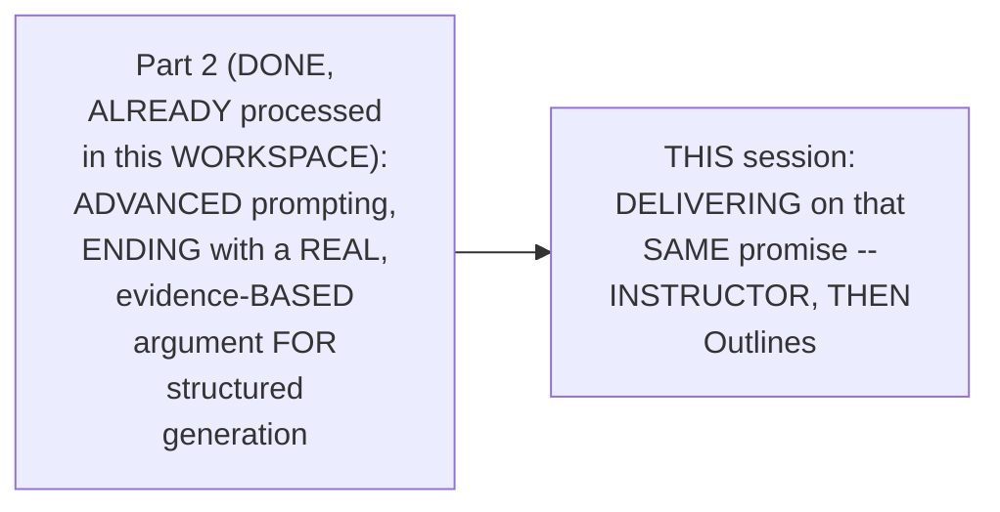
```mermaid
flowchart LR
    A["Part 2 (DONE,<br/>ALREADY processed<br/>in this WORKSPACE):<br/>ADVANCED prompting,<br/>ENDING with a REAL,<br/>evidence-BASED<br/>argument FOR<br/>structured<br/>generation"] --> B["THIS session:<br/>DELIVERING on that<br/>SAME promise --<br/>INSTRUCTOR, THEN<br/>Outlines"]
```

#### 🎯 Key Takeaways

* THIS session is GENUINELY, DIRECTLY confirmed AS the SERIES' own, DIRECTLY-promised NEXT step — FULFILLING the "STRUCTURED generation" promise, FIRST made AT the CLOSE of Part 2.
* THE session's OWN, complete AGENDA directly, EXPLICITLY spans TWO, real FRAMEWORKS: **INSTRUCTOR** and **OUTLINES** — WITH DSPy EXPLICITLY, HONESTLY deferred to a FUTURE session.
* This directly, PRECISELY sets UP the SESSION's own, FIRST, essential CONTENT — precisely WHY structured GENERATION genuinely MATTERS (Section 2).

---

### 2. Why Structured Generation Genuinely Matters: The Complete, Real Motivation

#### 📖 Definition — Structured Generation, Precisely Explained

> 💡 **Given directly:** *"Structure generation, so for example, generally, will be forcing, always, based on the schema selection that we'll be doing, the idea is that it will throw us the same required output. We will add validation, we will be adding constraints... the main purpose is JSON... I hope everybody agrees we work with JSON much more as compared to simple text."*

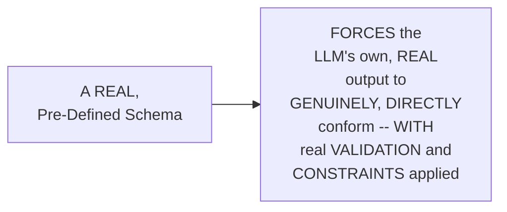
```mermaid
flowchart LR
    A["A REAL,<br/>Pre-Defined Schema"] --> B["FORCES the<br/>LLM's own, REAL<br/>output to<br/>GENUINELY, DIRECTLY<br/>conform -- WITH<br/>real VALIDATION and<br/>CONSTRAINTS applied"]
```

#### 🔍 Internal Working — A Genuine, Direct Confirmation: Prompts Alone Are "Free-Flow"

> 💡 **Given directly:** *"This is called a structured generation, because from here, I hope you get a better idea how we are controlling the JSON. Because this is actual control generation, rather than free flow. Prompts are actually free flow, to a subtle limit."*

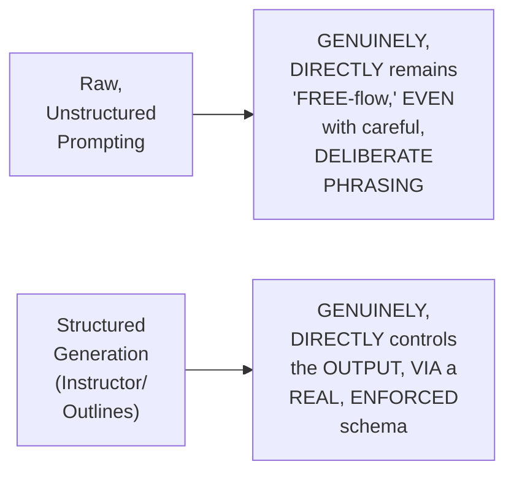
```mermaid
flowchart LR
    A["Raw,<br/>Unstructured<br/>Prompting"] --> B["GENUINELY,<br/>DIRECTLY remains<br/>'FREE-flow,' EVEN<br/>with careful,<br/>DELIBERATE<br/>PHRASING"]
    C["Structured<br/>Generation<br/>(Instructor/<br/>Outlines)"] --> D["GENUINELY,<br/>DIRECTLY controls<br/>the OUTPUT, VIA a<br/>REAL, ENFORCED<br/>schema"]
```

#### ⚠ Common Mistakes

* Assuming a CAREFULLY, well-CRAFTED prompt is GENUINELY, PRACTICALLY sufficient TO guarantee VALID, real JSON OUTPUT, at PRODUCTION scale — explicitly, directly, HONESTLY clarified: "OUT of 100 times, PROBABLY 3 times it MIGHT fail, and it MIGHT not even TELL you that PART" — RAW prompting genuinely, STRUCTURALLY lacks a REAL, built-in GUARANTEE.

#### 🎯 Key Takeaways

* **STRUCTURED generation** is precisely EXPLAINED as FORCING an LLM's OWN, real output TO conform TO a pre-DEFINED schema — WITH real VALIDATION and CONSTRAINTS applied.
* THE genuine, core MOTIVATION: JSON is CONFIRMED as "the ENTIRE game" — REST APIs, agent WORKFLOWS, and RAG pipelines ALL, genuinely REQUIRE reliable, REAL JSON output.
* RAW prompting is directly, HONESTLY confirmed AS remaining "FREE-flow" — WITHOUT a REAL, built-in GUARANTEE of VALID output, at REAL, production SCALE.
* This directly, PRECISELY sets UP the SESSION's own, NEXT, essential CONTENT — INSTRUCTOR's own, CORE mechanism (Section 3).

---
### 3. Instructor's Own, Core Mechanism: Client Patching & Pydantic Extraction

#### 📖 Definition — "Client Patching," Precisely Explained

> 💡 **Given directly:** *"How many of you understand the meaning of client?... my client? Like, Gemini is your client. Groq is your client... on top of that, it will be just like a wrapper which will be sitting... a single-line client patching through which we can achieve those things."*

```python
import instructor
from pydantic import BaseModel

client = instructor.from_openai(OpenAI())  # single-line "client patching"

class User(BaseModel):
    name: str
    age: int

user = client.chat.completions.create(
    response_model=User,
    messages=[{"role": "user", "content": "John is 25 years old."}]
)
print(user.name, user.age)  # John 25
```

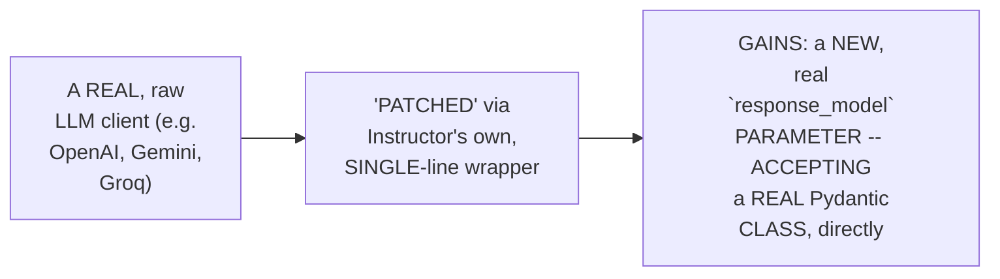
```mermaid
flowchart LR
    A["A REAL, raw<br/>LLM client (e.g.<br/>OpenAI, Gemini,<br/>Groq)"] --> B["'PATCHED' via<br/>Instructor's own,<br/>SINGLE-line wrapper"]
    B --> C["GAINS: a NEW,<br/>real<br/>`response_model`<br/>PARAMETER -- ACCEPTING<br/>a REAL Pydantic<br/>CLASS, directly"]
```

#### ⚠ A Direct, Honest, Important Clarification

> 💡 **Given directly:** *"Don't think that directly if you pass the Pydantic model to an LLM. Okay, so that is not a correct intuition, so don't think that directly I will pass the Pydantic model to an LLM. Okay, so that will be a concurrent, because they have made the syntax in that way, so that directly you can make it."*

#### ⚠ Common Mistakes

* Assuming an LLM GENUINELY, DIRECTLY, NATIVELY understands and PROCESSES a REAL Pydantic CLASS, on its OWN — explicitly, directly, PRECISELY corrected: INSTRUCTOR's own "CLIENT patching" GENUINELY, DIRECTLY handles this TRANSLATION behind the SCENES — CONVERTING the SCHEMA into a REAL, format the LLM GENUINELY understands.

#### 🎯 Key Takeaways

* **"CLIENT patching"** is precisely EXPLAINED as INSTRUCTOR's own, single-LINE wrapper MECHANISM — TAKING an EXISTING, real LLM client (OpenAI, GEMINI, Groq), and GRANTING it a NEW `response_MODEL` parameter, ACCEPTING a REAL Pydantic CLASS, directly.
* THE instructor **directly, HONESTLY clarifies** this is NOT the LLM DIRECTLY, NATIVELY processing a PYDANTIC class — INSTRUCTOR genuinely, DIRECTLY handles this TRANSLATION, behind the SCENES.
* This directly, PRECISELY sets UP the SESSION's own, NEXT, essential CONTENT — field DESCRIPTIONS, nested MODELS, and handling MISSING data (Section 4).

---

### 4. Field Descriptions, Nested Models & Handling Missing Data

#### 🪜 Step-by-Step — Field Descriptions, Precisely Explained

> 💡 **Given directly:** *"I'm passing the field-based operation, the person's full name, age and years, and field. Now, this particular information is also being shared with the LLM. So now, this is the actual schema... the field description also that I have passed. In that way, the LLM actually gets more context."*

```python
from pydantic import BaseModel, Field

class User(BaseModel):
    full_name: str = Field(description="The person's full name.")
    age: int = Field(description="The person's age, in years.")
    email: str
```

#### ⚠ A Direct, Honest, Important Confirmation

> 💡 **Given directly:** *"Without this also, it works fine, so I will just try to execute even without the description... the idea is, if you pass it as a description, some have better context that you actually pass it. But without that, also, it works. That's why, manually, I commented that part, and I showed you. So don't keep in your mind that if I'm passing the description, then only it works."*

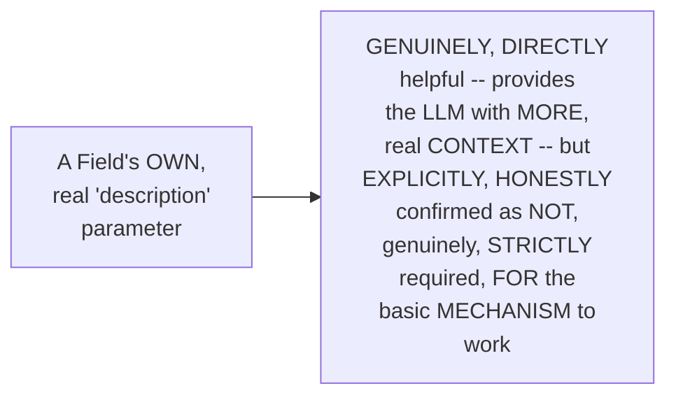
```mermaid
flowchart LR
    A["A Field's OWN,<br/>real 'description'<br/>parameter"] --> B["GENUINELY, DIRECTLY<br/>helpful -- provides<br/>the LLM with MORE,<br/>real CONTEXT -- but<br/>EXPLICITLY, HONESTLY<br/>confirmed as NOT,<br/>genuinely, STRICTLY<br/>required, FOR the<br/>basic MECHANISM to<br/>work"]
```

#### 🪜 Step-by-Step — Nested Models, Precisely Explained

> 💡 **Given directly:** *"This is a simple nested model. This is the first address, now this is the customer... a model within a model? Yes or no, Ashwin? Simple Pydantic V2. Other than that, here's nothing."*

```python
class Address(BaseModel):
    street: str
    zip_code: str = Field(pattern=r"^\d{5}$")

class Customer(BaseModel):
    name: str
    email: str
    shipping_address: Address
    billing_address: Address
```

#### 🪜 Step-by-Step — Handling Missing Data via Optional Fields

> 💡 **Given directly:** *"Now comes the optional field. Now, this is simply for handling missing data. So, simply, at any point of time, if you feel that for a few of the parameters, you can skip the part, like email, phone number, and company. So, simply, the idea is that they will be string, but simply none, none."*

```python
from typing import Optional

class Contact(BaseModel):
    name: str
    company: Optional[str] = None
    phone_number: Optional[str] = None
```

#### ⚠ Common Mistakes

* Assuming EVERY, single field WITHIN a REAL Pydantic SCHEMA genuinely, ALWAYS requires a REAL, present VALUE — explicitly, directly, PRACTICALLY clarified: `OPTIONAL[str] = None` GENUINELY, DIRECTLY handles REAL, missing DATA gracefully — the LLM correctly RETURNS `NONE`, rather than GENUINELY, inaccurately FABRICATING a value.

#### 🎯 Key Takeaways

* **FIELD descriptions** directly, GENUINELY provide the LLM with MORE, real CONTEXT — but are HONESTLY confirmed AS not, genuinely, STRICTLY required, for the BASIC mechanism to WORK.
* **NESTED models** directly, CONCRETELY confirmed as GENUINELY, SIMPLY "a MODEL within a MODEL" — pure, standard PYDANTIC V2 composition.
* **OPTIONAL fields** (`OPTIONAL[str] = None`) directly, PRACTICALLY handle REAL, missing data — the LLM CORRECTLY returns `NONE`, rather than FABRICATING a VALUE.
* This directly, PRECISELY sets UP the SESSION's own, NEXT, essential CONTENT — type SAFETY, and the COMPLETE, real distinction BETWEEN field and MODEL validators (Section 5).

---
### 5. Type Safety & the Complete, Real Validator Distinction

#### 📖 Definition — Type Safety, Precisely Explained

> 💡 **Given directly:** *"Now, this function has a full TypeScript, thanks to Pydantic... the return type, the customer.name lives in customer.shipping address... this is actually fully because, the function is directly... for type safety, we are using Pydantic, so that's why it's a much more safer approach."*

```python
def process_customer(customer: Customer) -> str:
    return f"{customer.name} lives at {customer.shipping_address.street}"
    # a REAL editor/linter (mypy) directly, genuinely knows the exact, real shape
```

#### 📖 Definition — Field Validator vs. Model Validator, Precisely Distinguished

> 💡 **Given directly:** *"What is the difference between a field validator and a model validator? In Pydantic?... field validator... only a field of the model that needs to be validated... model, when I say model, it means that all the fields of the model that needs to be checked."*

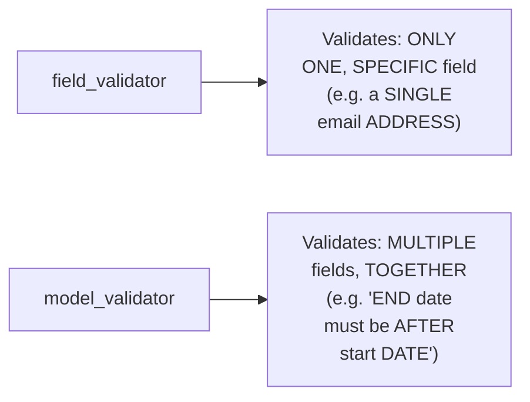
```mermaid
flowchart LR
    A["field_validator"] --> B["Validates: ONLY<br/>ONE, SPECIFIC field<br/>(e.g. a SINGLE<br/>email ADDRESS)"]
    C["model_validator"] --> D["Validates: MULTIPLE<br/>fields, TOGETHER<br/>(e.g. 'END date<br/>must be AFTER<br/>start DATE')"]
```

#### 🪜 Step-by-Step — A Complete, Real Field-Validator Example

> 💡 **Given directly:** *"Class email address, I'm passing the base model. Address domain is appropriate now, based on that... add the right field validator, and I have added this one. Now, the class method must be valid email. Okay, now, when I say, valid email, so if at the rate not in V, simply raise the value error V is not a valid email and must contain at the rate."*

```python
from pydantic import BaseModel, field_validator, ValidationError

class EmailAddress(BaseModel):
    address: str
    domain: str

    @field_validator("address")
    @classmethod
    def must_be_valid_email(cls, v):
        if "@" not in v:
            raise ValueError("V is not a valid email and must contain @")
        return v
```

#### 🪜 Step-by-Step — A Complete, Real Model-Validator Example

> 💡 **Given directly:** *"Check dates. And the start date and end date, so simple condition if end date, less than started, so simply end date must be after the start date... in this entire model, if you really look into where the validation data have kept it. On top of two fields, start and end."*

```python
from pydantic import BaseModel, model_validator

class Event(BaseModel):
    name: str
    start_date: str
    end_date: str

    @model_validator(mode="after")
    def check_dates(self):
        if self.end_date < self.start_date:
            raise ValueError("end date must be after the start date")
        return self
```

#### ⚠ Common Mistakes

* Assuming a REAL, cross-field CONDITION (e.g., "END date MUST be AFTER start DATE") can GENUINELY, DIRECTLY be enforced VIA a SINGLE `field_VALIDATOR` — explicitly, directly, PRECISELY clarified: "WHEN you TRY to use MULTIPLE fields IN a SINGLE logic, SO generally WE use A model VALIDATOR" — a FIELD validator ONLY, genuinely SEES one, single FIELD, in ISOLATION.

#### 🎯 Key Takeaways

* **TYPE safety** directly, CONCRETELY confirmed — PYDANTIC-based MODELS provide COMPLETE, real TYPE hints, ENABLING linters (e.g. `MYPY`) to GENUINELY, DIRECTLY catch REAL, type-related ERRORS.
* **FIELD validators** GENUINELY, DIRECTLY validate a SINGLE, specific field, IN isolation; **MODEL validators** GENUINELY, DIRECTLY validate MULTIPLE fields, TOGETHER — REQUIRED for REAL, cross-field CONDITIONS.
* This directly, PRECISELY sets UP the SESSION's own, NEXT, essential, MOST instructive CONTENT — a GENUINE, honest, LIVE-demonstrated CORRECTION, WHERE the LLM ITSELF fixes an INVALID output (Section 6).

---

### 6. A Genuine, Honest, Live-Demonstrated Correction: The LLM Fixes Itself

#### 🪜 Step-by-Step — A Complete, Real, Live-Demonstrated Test

> 💡 **Given directly:** *"It must be an HTTPS... starts with HTTPS slash star, this is the condition, raise error, the URL must be always in this... extract the secure URL for example.com. Now, automatically, what it has done... in this case, HTTPS was missing... but in the final result that you have, you are getting HTTPS."*

```python
class StrictURL(BaseModel):
    url: str

    @field_validator("url")
    @classmethod
    def must_be_https(cls, v):
        if not v.startswith("https://"):
            raise ValueError("The URL must always start with https://")
        return v
```

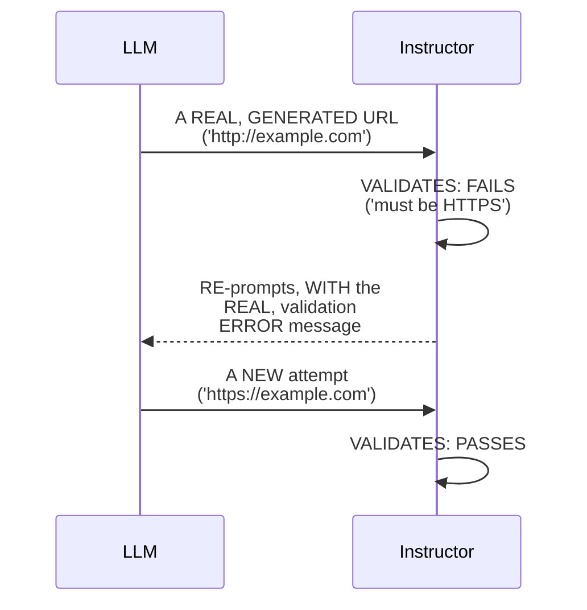
```mermaid
sequenceDiagram
    participant LLM
    participant Instructor
    LLM->>Instructor: A REAL, GENERATED URL<br/>('http://example.com')
    Instructor->>Instructor: VALIDATES: FAILS<br/>('must be HTTPS')
    Instructor-->>LLM: RE-prompts, WITH the<br/>REAL, validation<br/>ERROR message
    LLM->>Instructor: A NEW attempt<br/>('https://example.com')
    Instructor->>Instructor: VALIDATES: PASSES
```

#### 🔍 Internal Working — A Genuine, Direct Confirmation of the Retry Count

> 💡 **Given directly:** *"This might trigger retries if the model returns HTTP. Can you see that this was written, in my case, two times the model returned HTTP. So, simply, we rejected that... I got in one retry, fine... it might differ for everybody."*

#### ⚠ Common Mistakes

* Assuming this AUTOMATIC "FIXING" behavior GENUINELY, DIRECTLY guarantees SUCCESS, on a FIXED, predictable NUMBER of retries — explicitly, directly, HONESTLY clarified: RESULTS genuinely, DIRECTLY vary — "IT might DIFFER for EVERYBODY" — SOME, real students GENUINELY needed ONE retry; OTHERS needed TWO OR three.

#### 🎯 Key Takeaways

* A COMPLETE, real, LIVE-demonstrated TEST directly, CONCRETELY confirmed: an LLM's OWN, INITIALLY-invalid output (a "HTTP" URL, MISSING the required "S") was AUTOMATICALLY, genuinely CORRECTED, WITHIN Instructor's OWN, established RETRY mechanism.
* THE genuine, real NUMBER of RETRIES required directly, HONESTLY varies — GENUINELY, DIRECTLY depending ON the SPECIFIC, underlying LLM's OWN, real BEHAVIOR.
* This directly, PRECISELY sets UP the SESSION's own, NEXT, essential, IMPORTANT CLARIFICATION — precisely WHO, or WHAT, genuinely PERFORMS this FIX (Section 7).

---
### 7. A Genuine, Important Clarification: Pydantic Doesn't Fix Anything — The LLM Does

#### ⚠ A Direct, Important, Repeated Clarification

> 💡 **Given directly:** *"Pydentic did not fix it. LLM fixed it. How many of you feel that this was fixed by Pydentic? Pydentic has no role. The LLM has done the fixing. Pydantic gave it the context, how to fix it, because in the condition, it was mentioned, the HTTPS was there. Is it possible to fix anything by Pydantic? First of all, just think around that? Before asking the question. Nothing that the Pydantic can do."*

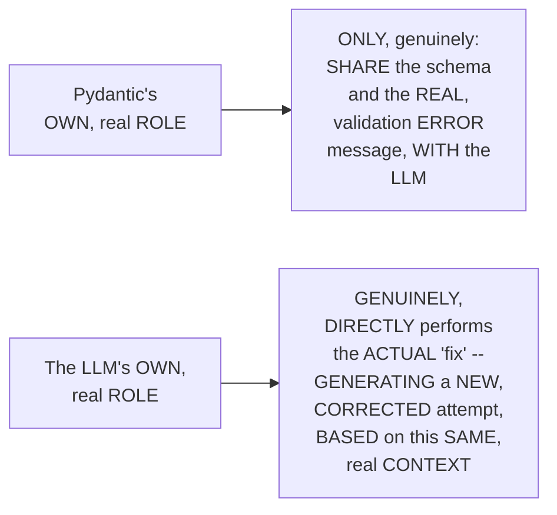
```mermaid
flowchart LR
    A["Pydantic's<br/>OWN, real ROLE"] --> B["ONLY, genuinely:<br/>SHARE the schema<br/>and the REAL,<br/>validation ERROR<br/>message, WITH the<br/>LLM"]
    C["The LLM's OWN,<br/>real ROLE"] --> D["GENUINELY,<br/>DIRECTLY performs<br/>the ACTUAL 'fix' --<br/>GENERATING a NEW,<br/>CORRECTED attempt,<br/>BASED on this SAME,<br/>real CONTEXT"]
```

#### 🔍 Internal Working — A Genuine, Direct Confirmation: This Is "Validation Error Message Injection"

> 💡 **Given directly:** *"Now, this is the mean validation error. So, for example, any type of validation error, so here also the value error. When this particular thing is invoked, that particular information is actually being shared with the LLM, then only it knows that, yes. I need to fix this particular issue. So that's why, if you think about, this is a direct validation error, message injection, or simply, you are actually sharing that information with them."*

#### ⚠ Common Mistakes

* Assuming PYDANTIC, as a LIBRARY, GENUINELY, DIRECTLY possesses the CAPABILITY to ACTIVELY "fix" an INVALID value ITSELF — explicitly, directly, EMPHATICALLY corrected: "PYDANTIC has NO role... NOTHING that the PYDANTIC can DO" — PYDANTIC ONLY, genuinely, SHARES the SCHEMA and the REAL, error MESSAGE — the LLM ITSELF genuinely, DIRECTLY performs the ACTUAL, real correction.

#### 🎯 Key Takeaways

* THE instructor **directly, EMPHATICALLY clarifies**, MULTIPLE times: PYDANTIC ITSELF genuinely, DIRECTLY has "NO role" in FIXING invalid OUTPUT — it can ONLY, genuinely, VALIDATE and SHARE context.
* THE ACTUAL, real "fixing" is GENUINELY, DIRECTLY performed BY the LLM itself — GUIDED by a REAL technique CONFIRMED as "VALIDATION error MESSAGE injection."
* THIS directly, PRECISELY reinforces WHY writing CLEAR, real FIELD descriptions and VALIDATION messages GENUINELY matters — THIS context is EXACTLY what the LLM USES to GENUINELY, DIRECTLY self-correct.
* This directly, PRECISELY sets UP the SESSION's own, NEXT, essential CONTENT — retry LOGIC and TENACITY, for GENUINELY production-GRADE resilience (Section 8).

---

### 8. Retry Logic & Tenacity: Production-Grade Resilience

#### ⚠ A Direct, Honest, Important Caveat: Instructor's Own, Built-In Retry Is Simplistic

> 💡 **Given directly:** *"Even you have the option, like, the number of max retries, okay, so you can place. Now, instructor is really good... but again, here, the retry is not really good. The idea is that we should have something much more robust... in production, everybody uses [Tenacity]."*

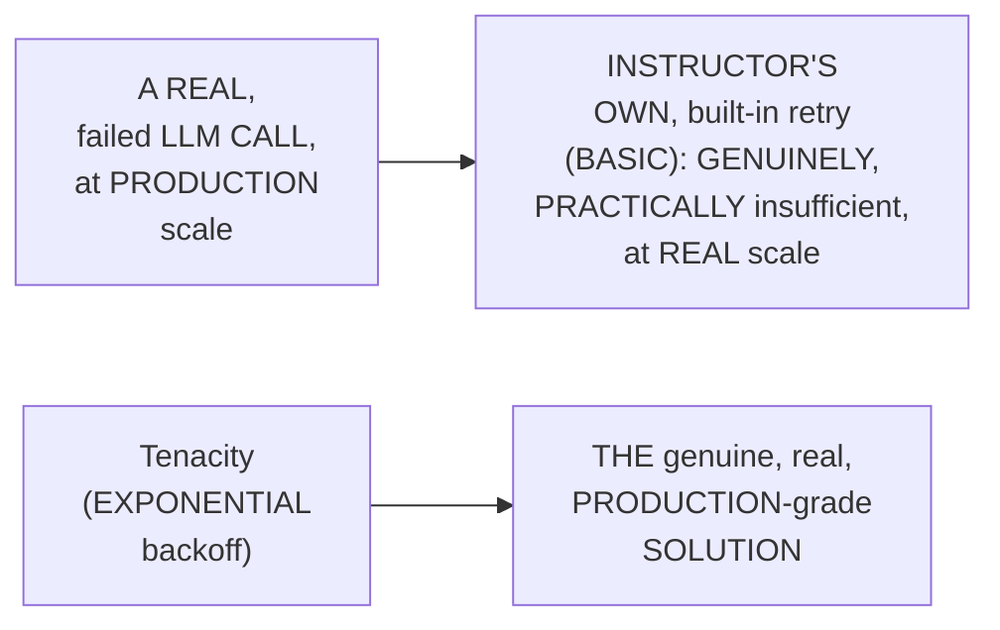
```mermaid
flowchart LR
    A["A REAL,<br/>failed LLM CALL,<br/>at PRODUCTION<br/>scale"] --> B["INSTRUCTOR'S<br/>OWN, built-in retry<br/>(BASIC): GENUINELY,<br/>PRACTICALLY insufficient,<br/>at REAL scale"]
    C["Tenacity<br/>(EXPONENTIAL<br/>backoff)"] --> D["THE genuine, real,<br/>PRODUCTION-grade<br/>SOLUTION"]
```

#### 🪜 Step-by-Step — Tenacity's Own, Real Integration

> 💡 **Given directly:** *"From Tenacity import retry, the simple retry stop after attempt... wait exponential. Now, here, multiple, like, 4 or 5 seconds, multiple calls are being broken down... within the minimum 4 seconds, maximum 10 seconds, based on that, every call that will be weighted."*

```python
from tenacity import retry, stop_after_attempt, wait_exponential

@retry(stop=stop_after_attempt(5), wait=wait_exponential(multiplier=1, min=4, max=10))
def call_llm_with_backoff():
    return client.chat.completions.create(...)
```

#### ⚠ A Direct, Honest, Important Warning: Do Not Use a Simple `while` Loop

> 💡 **Given directly:** *"Time.sleep, or no, time.sleep is the bare minimum one... do wildly. Bad practice, bad practice... it means that continuously keep on hitting the [API]. So if the server is down, it won't work."*

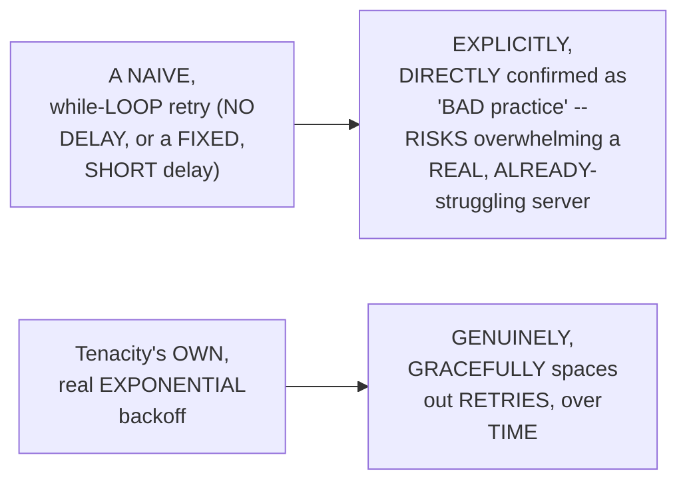
```mermaid
flowchart LR
    A["A NAIVE,<br/>while-LOOP retry (NO<br/>DELAY, or a FIXED,<br/>SHORT delay)"] --> B["EXPLICITLY,<br/>DIRECTLY confirmed as<br/>'BAD practice' --<br/>RISKS overwhelming a<br/>REAL, ALREADY-<br/>struggling server"]
    C["Tenacity's OWN,<br/>real EXPONENTIAL<br/>backoff"] --> D["GENUINELY,<br/>GRACEFULLY spaces<br/>out RETRIES, over<br/>TIME"]
```

#### ⚠ Common Mistakes

* Assuming Instructor's OWN, built-in RETRY mechanism is GENUINELY, DIRECTLY sufficient, for REAL, production-GRADE resilience — explicitly, directly, HONESTLY clarified: "THE retry IS not REALLY good... WE should have SOMETHING much MORE robust" — a REAL, dedicated LIBRARY (Tenacity) is the GENUINE, RECOMMENDED, professional STANDARD.

#### 🎯 Key Takeaways

* THE instructor **directly, HONESTLY confirms** INSTRUCTOR's own, BUILT-in retry LOGIC is GENUINELY, PRACTICALLY simplistic — "TENACITY," a DEDICATED, real LIBRARY, is the GENUINE, recommended PRODUCTION standard.
* **TENACITY** directly, CONCRETELY provides REAL, exponential BACKOFF — spacing OUT retries GRACEFULLY, over TIME — AVOIDING the "BAD practice" OF a naive, RAPID, while-LOOP retry.
* This directly, PRECISELY sets UP the SESSION's own, NEXT, essential CONTENT — streaming and PARTIAL objects, a GENUINE, real UI/UX benefit (Section 9).

---
### 9. Streaming & Partial Objects: A Genuine, Real UI/UX Benefit

#### 📖 Definition — Streaming Partial Objects, Precisely Explained

> 💡 **Given directly:** *"Can we capture the streaming objects? It means that in the process of streaming, can we capture them, yes or no? Now, this is where, again, the same thing with instructor. You can capture them, so basically live extraction from your streaming [output]... this is the partial model, so we call it the partial mode."*

```python
for partial_order in client.chat.completions.create_partial(
    model=get_model(),
    response_model=Order,
    messages=[{"role": "user", "content": order_text}]
):
    print(partial_order)  # a progressively-filling, real object
```

#### 🔍 Internal Working — A Genuine, Honest, Important Trade-Off

> 💡 **Given directly:** *"If you pick up in between, the idea is you have to update it with the next information which is arriving... it gives you a benefit, but again, that benefit comes with a disadvantage also, which is an incomplete information... you have to remember here, the chances of getting incomplete result is quite high if you generally try to pick up from the top calls."*

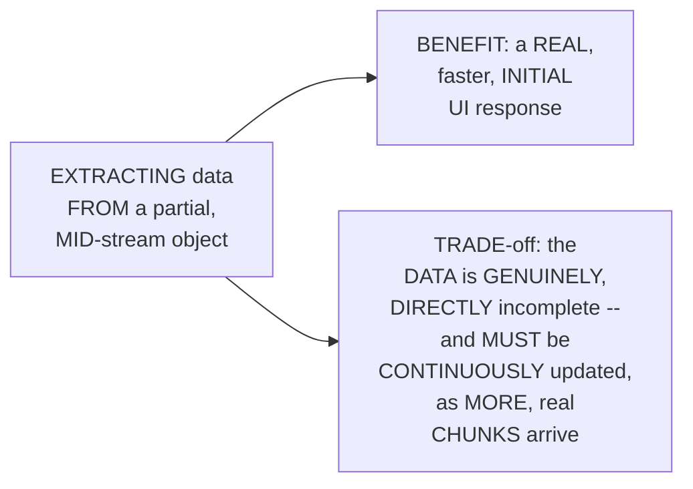
```mermaid
flowchart LR
    A["EXTRACTING data<br/>FROM a partial,<br/>MID-stream object"] --> B["BENEFIT: a REAL,<br/>faster, INITIAL<br/>UI response"]
    A --> C["TRADE-off: the<br/>DATA is GENUINELY,<br/>DIRECTLY incomplete --<br/>and MUST be<br/>CONTINUOUSLY updated,<br/>as MORE, real<br/>CHUNKS arrive"]
```

#### 🔍 Internal Working — A Genuine, Direct Confirmation: Why Streaming Genuinely Matters

> 💡 **Given directly:** *"Everybody uses streaming, otherwise the UX experience will be very bad... the response time of the complete response, it can take 10 seconds, 20 seconds... always remember. First token will arrive much faster as compared to the complete generation. So, streaming is... everybody uses streaming."*

#### ⚠ Common Mistakes

* Assuming EXTRACTING information FROM a PARTIAL, mid-STREAM object is GENUINELY, PRACTICALLY identical to EXTRACTING it FROM the COMPLETE, final RESULT — explicitly, directly, HONESTLY clarified: PARTIAL data GENUINELY, DIRECTLY remains incomplete — REQUIRING continuous, real UPDATES, as MORE information GENUINELY arrives.

#### 🎯 Key Takeaways

* **STREAMING partial OBJECTS** directly, CONCRETELY confirmed Instructor's OWN, real capability — CAPTURING a PROGRESSIVELY-filling, real OBJECT, AS an LLM's own OUTPUT genuinely STREAMS in.
* A GENUINE, honest TRADE-off directly, CONCRETELY confirmed: THIS capability PROVIDES a FASTER, real initial UI RESPONSE — but AT the cost OF genuinely, TEMPORARILY incomplete DATA, requiring CONTINUOUS updates.
* THE genuine, real MOTIVATION FOR streaming, overall: "the FIRST token WILL arrive MUCH faster AS compared TO the COMPLETE generation" — a GENUINE, real UI/UX necessity, GIVEN real-WORLD LLM latency.
* This directly, PRECISELY sets UP the SESSION's own, NEXT, essential CONTENT — a GENUINE, honest, LIVE-encountered ANOMALY, DURING a REAL streaming BENCHMARK (Section 10).

---

### 10. A Genuine, Honest, Live-Demonstrated Anomaly: The Streaming Benchmark

#### 🪜 Step-by-Step — A Complete, Real, Live-Encountered, Unexpected Result

> 💡 **Given directly, from a real participant, Ranjeev Tiwari:** *"My earlier it was 2.18... Now, also, non-streaming is less."* **The instructor's own, genuinely surprised response:** *"There is really no improvement, it doesn't make sense... because the full generation, if I say that, the non-streaming, it is taking 2.15 seconds, then how it will take 2.67 seconds for the first token? That's why I think probably some logic changes in the code, then probably it is required."*

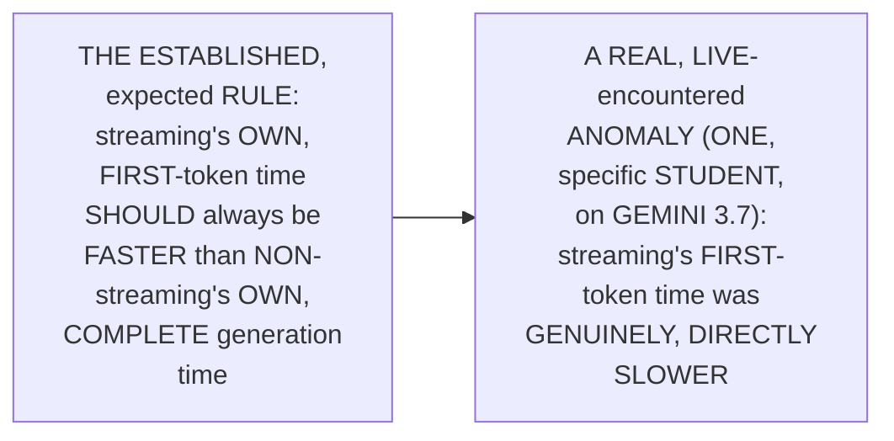
```mermaid
flowchart LR
    A["THE ESTABLISHED,<br/>expected RULE:<br/>streaming's OWN,<br/>FIRST-token time<br/>SHOULD always be<br/>FASTER than NON-<br/>streaming's OWN,<br/>COMPLETE generation<br/>time"] --> B["A REAL, LIVE-<br/>encountered<br/>ANOMALY (ONE,<br/>specific STUDENT,<br/>on GEMINI 3.7):<br/>streaming's FIRST-<br/>token time was<br/>GENUINELY, DIRECTLY<br/>SLOWER"]
```

#### 🔍 Internal Working — A Genuine, Honest, Live Investigation

> 💡 **Given directly:** *"Non-streaming object, okay. And the streaming, both can have same values. That is acceptable, at least I can accept that, because the entire result in a single stream, it can come. That I can agree, but this I cannot agree, because this is really against the principle. Alright, probably, for benchmarking, probably I will do something else, but fine, I got the idea, because really, this part, I didn't expect."*

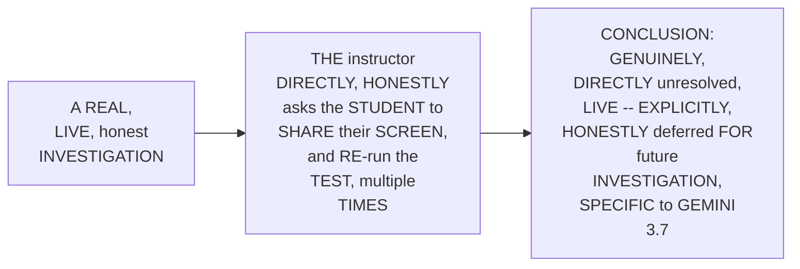
```mermaid
flowchart LR
    A["A REAL,<br/>LIVE, honest<br/>INVESTIGATION"] --> B["THE instructor<br/>DIRECTLY, HONESTLY<br/>asks the STUDENT to<br/>SHARE their SCREEN,<br/>and RE-run the<br/>TEST, multiple<br/>TIMES"]
    B --> C["CONCLUSION:<br/>GENUINELY,<br/>DIRECTLY unresolved,<br/>LIVE -- EXPLICITLY,<br/>HONESTLY deferred FOR<br/>future<br/>INVESTIGATION,<br/>SPECIFIC to GEMINI<br/>3.7"]
```

#### ⚠ Common Mistakes

* Assuming an INSTRUCTOR (OR any, real, TECHNICAL expert) should GENUINELY, ALWAYS have an IMMEDIATE, confident EXPLANATION FOR every, real, UNEXPECTED technical RESULT — explicitly, directly, HONESTLY demonstrated as GENUINELY, DIRECTLY false — the INSTRUCTOR himself DIRECTLY, HONESTLY admits "I DIDN'T expect" this RESULT, and DEFERS a COMPLETE explanation, FOR future INVESTIGATION.

#### 🎯 Key Takeaways

* A GENUINE, honest, LIVE-encountered ANOMALY directly, CONCRETELY confirmed: ONE, real STUDENT's own, LIVE benchmark GENUINELY, DIRECTLY violated the ESTABLISHED expectation — streaming's OWN, first-TOKEN time was SLOWER than non-STREAMING's complete GENERATION time.
* THE instructor **directly, HONESTLY investigates** this ANOMALY, live — REQUESTING a screen-SHARE, and MULTIPLE, real re-RUNS — WITHOUT, genuinely, REACHING a COMPLETE, immediate EXPLANATION.
* THIS directly, HONESTLY models a GENUINE, professional VALUE — ACKNOWLEDGING genuine, real UNCERTAINTY, RATHER than FABRICATING a CONFIDENT, but POTENTIALLY inaccurate EXPLANATION.
* This directly, PRECISELY sets UP the SESSION's own, NEXT, essential CONTENT — a COMPLETE, real, PRACTICAL introduction TO local LLMs and PII redaction (Section 11).

---
### 11. Local LLMs via Ollama & PII Redaction: Complete, Practical Applications

#### 🪜 Step-by-Step — A Complete, Real, Practical Ollama Introduction

> 💡 **Given directly:** *"Just open Ollama and install, whichever operating system that you have... once you have done the installation, then you need some type of model... you can do a simple Ollama list... let's take the... I will just write OLAMA, then pull. You can write pull will only download, and if you run, then actually the model starts."*

```bash
ollama pull llama3.1:8b
ollama run llama3.1:8b
ollama list
```

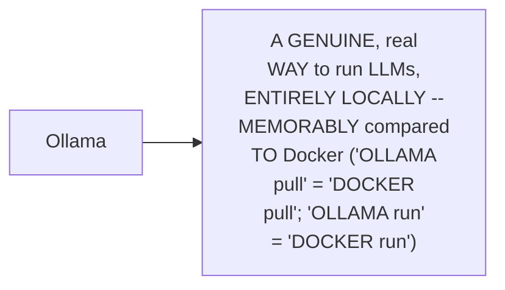
```mermaid
flowchart LR
    A["Ollama"] --> B["A GENUINE, real<br/>WAY to run LLMs,<br/>ENTIRELY LOCALLY --<br/>MEMORABLY compared<br/>TO Docker ('OLLAMA<br/>pull' = 'DOCKER<br/>pull'; 'OLLAMA run'<br/>= 'DOCKER run')"]
```

#### 🔍 Internal Working — A Genuine, Direct Confirmation: Why Local LLMs Genuinely Matter, Here

> 💡 **Given directly:** *"REGX and choice level, so this generally do a token level masking. It is not possible with OpenAI, Gemini, and [Groq]. You need local models. It means that only with Ollama you can do it... because it directly changes the last layer of the transformer's architecture, you have to understand the generator output, whereas OpenAI will never give you access to do that."*

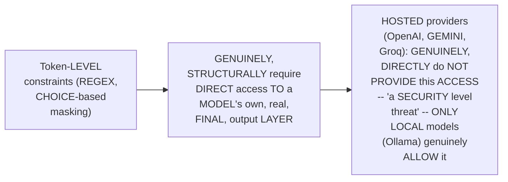
```mermaid
flowchart LR
    A["Token-LEVEL<br/>constraints (REGEX,<br/>CHOICE-based<br/>masking)"] --> B["GENUINELY,<br/>STRUCTURALLY require<br/>DIRECT access TO a<br/>MODEL's own, real,<br/>FINAL, output LAYER"]
    B --> C["HOSTED providers<br/>(OpenAI, GEMINI,<br/>Groq): GENUINELY,<br/>DIRECTLY do NOT<br/>PROVIDE this ACCESS<br/>-- 'a SECURITY level<br/>threat' -- ONLY<br/>LOCAL models<br/>(Ollama) genuinely<br/>ALLOW it"]
```

#### 🪜 Step-by-Step — A Complete, Real, Practical PII Redaction Example

> 💡 **Given directly:** *"What is that AI security layer?... What is the full form of [PII]? Personally identifiable information. So generally, if I say that I don't want to share any type of credit card information, location, name, addresses, everything that needs to be redacted."*

```python
class RedactedText(BaseModel):
    redacted_text: str

result = client.chat.completions.create(
    response_model=RedactedText,
    messages=[{"role": "user", "content": f"Redact only the SSN from: {sensitive_text}"}]
)
```

#### ⚠ A Direct, Honest, Important Limitation

> 💡 **Given directly:** *"This model didn't work in this particular case, because the model that I have selected is less than 1 billion, probably the performance of the model. So... But, in other case, that SSN information should be redacted. Always remember that."*

#### ⚠ Common Mistakes

* Assuming a GENUINELY, ARBITRARY, small LOCAL model (e.g., UNDER 1 BILLION parameters) is GENUINELY, PRACTICALLY sufficient, FOR a REAL, security-SENSITIVE task LIKE PII redaction — explicitly, directly, LIVE-demonstrated as GENUINELY, DIRECTLY insufficient — the SMALLEST, tested MODEL genuinely, DIRECTLY FAILED to redact the REQUIRED information.

#### 🎯 Key Takeaways

* **OLLAMA** directly, PRACTICALLY provides a REAL way to run LLMs LOCALLY — MEMORABLY compared TO Docker's OWN, familiar WORKFLOW.
* REAL, token-LEVEL constraints (REGEX, choice-BASED masking) GENUINELY, STRUCTURALLY require LOCAL models — HOSTED providers (OpenAI, GEMINI, Groq) genuinely, DIRECTLY do NOT provide the REQUIRED, low-level ACCESS.
* A COMPLETE, real PII-redaction EXAMPLE directly, HONESTLY confirmed a REAL, genuine LIMITATION — an OVERLY-small, LOCAL model (UNDER 1 billion PARAMETERS) genuinely, DIRECTLY failed AT this task.
* This directly, PRECISELY sets UP the SESSION's own, NEXT, essential CONTENT — OUTLINES, precisely INTRODUCED (Section 12).

---

### 12. Outlines, Precisely Introduced: FSA, Token-Level Masking & the Instructor Comparison

#### 📖 Definition — FSA (Finite State Automata), Precisely Explained

> 💡 **Given directly:** *"FSA-based. So, what is the full form of FSA? The idea is guaranteed structure generation. Token-level constraint that I want to bring... Finite State Automata... genuinely, in several terms, we call it finite state machines... FSA comes from that idea... every language has a grammar."*

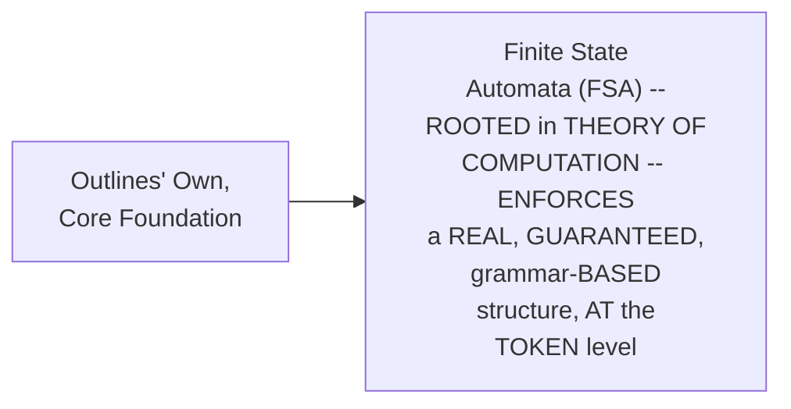
```mermaid
flowchart LR
    A["Outlines' Own,<br/>Core Foundation"] --> B["Finite State<br/>Automata (FSA) --<br/>ROOTED in THEORY OF<br/>COMPUTATION -- ENFORCES<br/>a REAL, GUARANTEED,<br/>grammar-BASED<br/>structure, AT the<br/>TOKEN level"]
```

#### 🔍 Internal Working — A Genuine, Direct Comparison to Instructor

> 💡 **Given directly:** *"Outlines and instructor, very, very similar, but a few more added benefits that you get... more than 50 to 60% functionalities are very, very similar in both of them, but there are certain things with respect to, like, CFG. Okay, like, CFG grammar-based task, which is not available there [in Instructor]."*

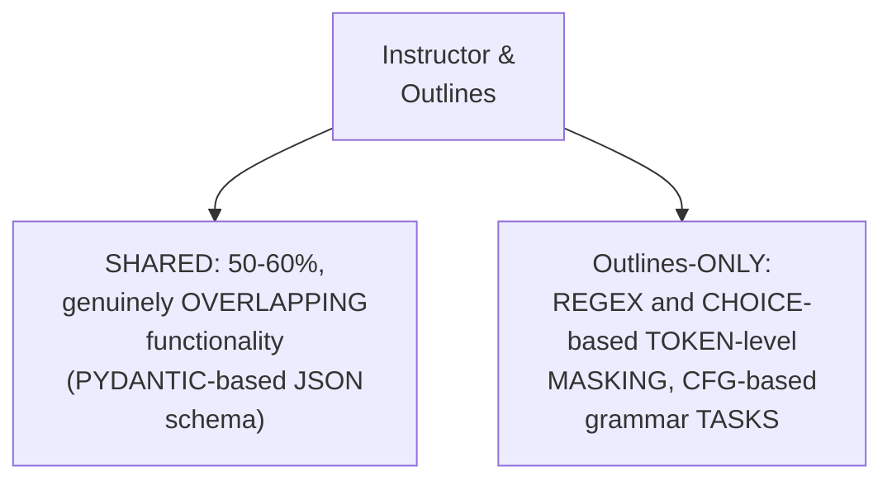
```mermaid
flowchart TD
    A["Instructor &<br/>Outlines"] --> B["SHARED: 50-60%,<br/>genuinely OVERLAPPING<br/>functionality<br/>(PYDANTIC-based JSON<br/>schema)"]
    A --> C["Outlines-ONLY:<br/>REGEX and CHOICE-<br/>based TOKEN-level<br/>MASKING, CFG-based<br/>grammar TASKS"]
```

#### ⚠ Common Mistakes

* Assuming INSTRUCTOR and OUTLINES are GENUINELY, ENTIRELY different, COMPETING frameworks, WITH little, real OVERLAP — explicitly, directly, PRECISELY clarified: "MORE than 50 TO 60% functionalities ARE very, VERY similar" — the GENUINE, real DIFFERENCE lies IN a SMALLER, but IMPORTANT set OF additional, ADVANCED capabilities.

#### 🎯 Key Takeaways

* **FSA (Finite State Automata)** is precisely EXPLAINED as OUTLINES' own, CORE, theoretical FOUNDATION — ROOTED in theory OF computation, ENFORCING real, GUARANTEED structure, at the TOKEN level.
* THE instructor **directly, PRECISELY confirms** INSTRUCTOR and OUTLINES SHARE roughly "50 to 60%" OVERLAPPING functionality — OUTLINES' own, ADDITIONAL capabilities (CFG-based GRAMMAR tasks) are NOT available IN Instructor.
* This directly, PRECISELY sets UP the SESSION's own, NEXT, essential CONTENT — a COMPLETE, real, LIVE demonstration OF Outlines' own, JSON schema, REGEX, and CHOICE constraints (Section 13).

---
### 13. A Complete, Real, Live Demonstration: JSON Schema, Regex & Choice Constraints

#### 🪜 Step-by-Step — JSON Schema Constraints (the Most Reliable Backend)

> 💡 **Given directly:** *"JSON schema constraint. Now, this is instructor... this rule is followed, so it has also two separate backends. The other one is the REGX choice... generally remember, the most reliable backend is the JSON schema one."*

```python
import outlines
from pydantic import BaseModel, Field

model = outlines.models.openai(client, "gpt-4o-mini")

class SupportTicket(BaseModel):
    category: str
    summary: str = Field(max_length=200)
    escalate_to_human: bool

result = model(f"Extract a support ticket from: {ticket_text}", SupportTicket)
ticket = SupportTicket.model_validate_json(result)
```

#### 🪜 Step-by-Step — Regex & Choice Constraints (Requiring Local Models)

> 💡 **Given directly:** *"REGX-level backends, really, like... Fine, it works, but again, the chances of error are better as compared to JSON schema constant... REGX and choice level, so this generally do a token level masking. It is not possible with OpenAI, Gemini, and Groq. You need local models."*

```python
from outlines.types import Regex, Choice

# regex-based extraction (local model required)
phone_pattern = Regex(r"\d{3}-\d{3}-\d{4}")

# choice-based, zero-hallucination classification (local model required)
category = model(f"Classify this support ticket: {ticket_text}",
                  Choice(["billing", "technical", "account"]))
```

#### 🔍 Internal Working — A Genuine, Honest, Live-Demonstrated Misclassification

> 💡 **Given directly:** *"Classify this support ticket, my payment failed. Category is account. Now, how many of you feel that this is correct?... this is not correct, because right now, the issue classified this ticket, my payment failed. Payment means that this is a billing-related issue... this is really 0.5 billion parameters. So, based on that, I feel that, yes, the model is not performing good."*

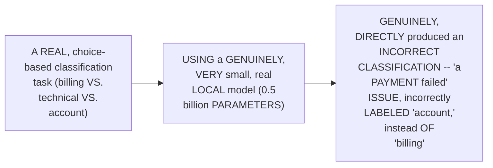
```mermaid
flowchart LR
    A["A REAL, choice-<br/>based classification<br/>task (billing VS.<br/>technical VS.<br/>account)"] --> B["USING a GENUINELY,<br/>VERY small, real<br/>LOCAL model (0.5<br/>billion PARAMETERS)"]
    B --> C["GENUINELY,<br/>DIRECTLY produced an<br/>INCORRECT<br/>CLASSIFICATION -- 'a<br/>PAYMENT failed'<br/>ISSUE, incorrectly<br/>LABELED 'account,'<br/>instead OF<br/>'billing'"]
```

#### ⚠ Common Mistakes

* Assuming OUTLINES' own, "CHOICE" constraint GENUINELY, DIRECTLY guarantees a CORRECT, real classification, SIMPLY because it RESTRICTS the MODEL to a FIXED set OF options — explicitly, directly, HONESTLY demonstrated as GENUINELY, DIRECTLY false — "CHOICE" ONLY, genuinely GUARANTEES the OUTPUT will BE one OF the VALID options — it does NOT, genuinely, GUARANTEE that OPTION is the CORRECT one.

#### 🎯 Key Takeaways

* THE **JSON schema BACKEND** is directly, EXPLICITLY confirmed AS "the MOST reliable" OPTION, WIDELY supported BY any, real LLM CLIENT.
* **REGEX and CHOICE** constraints directly, CONCRETELY perform REAL, token-level MASKING — GENUINELY, STRUCTURALLY requiring a LOCAL model (via OLLAMA, or SIMILAR local INFERENCING servers).
* A GENUINE, honest, LIVE-demonstrated MISCLASSIFICATION directly, CONCRETELY confirmed: "CHOICE" constraints GENUINELY, DIRECTLY guarantee VALID options — but NOT, genuinely, CORRECT ones — REAL model QUALITY still, genuinely MATTERS.
* This directly, PRECISELY sets UP the SESSION's own, NEXT, essential CONTENT — OUTLINES' own, GENUINE, structural advantage OVER Instructor (Section 14).

---

### 14. Outlines' Own, Genuine Advantage: The "Double-Check" Feature

#### 📖 Definition — The Genuine, Structural Advantage, Precisely Explained

> 💡 **Given directly:** *"This is one added benefit. Automatic validations... ticket is equal to SupportTicket.modelvalidate.json. Now, this is one added benefit... this is one more level of check. I feel that this feature will even come in instructor very soon, as I was looking into the GitHub issues. So, one more level of post-validation check."*

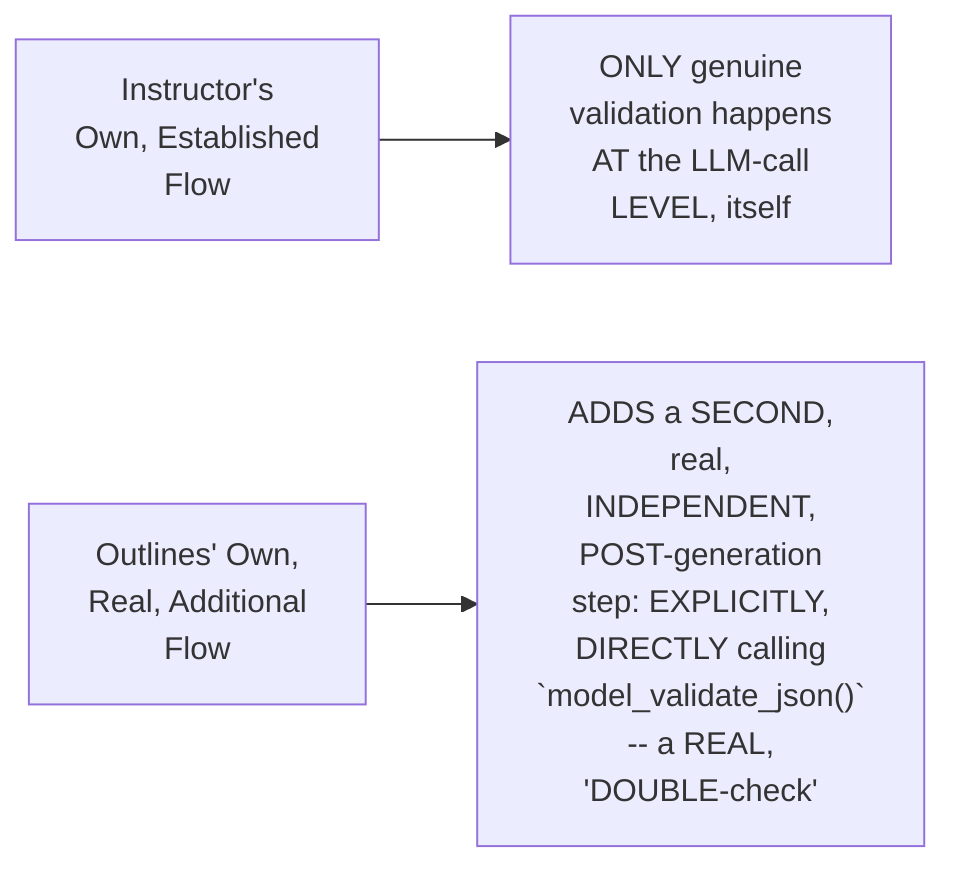
```mermaid
flowchart LR
    A["Instructor's<br/>Own, Established<br/>Flow"] --> B["ONLY genuine<br/>validation happens<br/>AT the LLM-call<br/>LEVEL, itself"]
    C["Outlines' Own,<br/>Real, Additional<br/>Flow"] --> D["ADDS a SECOND,<br/>real,<br/>INDEPENDENT,<br/>POST-generation<br/>step: EXPLICITLY,<br/>DIRECTLY calling<br/>`model_validate_json()`<br/>-- a REAL,<br/>'DOUBLE-check'"]
```

#### 🔍 Internal Working — A Genuine, Direct, Practical Recommendation

> 💡 **Given directly:** *"If you ask me, Paul, which one to skip, then probably I might say that you can skip instructor, and you can use outlines. Why? Because that double-checking feature is actually very, very important, which I feel that it's a bit on the lesser side [in Instructor]."*

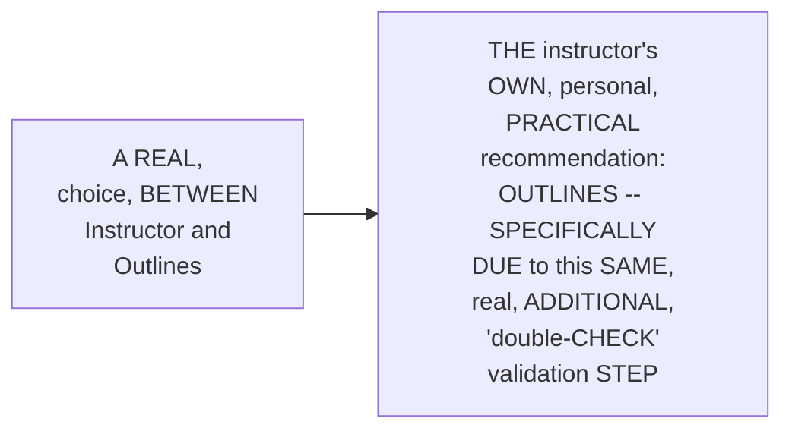
```mermaid
flowchart LR
    A["A REAL,<br/>choice, BETWEEN<br/>Instructor and<br/>Outlines"] --> B["THE instructor's<br/>OWN, personal,<br/>PRACTICAL<br/>recommendation:<br/>OUTLINES -- SPECIFICALLY<br/>DUE to this SAME,<br/>real, ADDITIONAL,<br/>'double-CHECK'<br/>validation STEP"]
```

#### ⚠ Common Mistakes

* Assuming INSTRUCTOR and OUTLINES GENUINELY, PRACTICALLY offer EQUIVALENT levels OF real, structural RELIABILITY, GIVEN their SHARED, established 50-60% functional OVERLAP — explicitly, directly, PRECISELY clarified: OUTLINES GENUINELY, DIRECTLY provides an ADDITIONAL, real "DOUBLE-check" (`model_VALIDATE_json()`) — a SECOND, INDEPENDENT validation STEP, genuinely ABSENT from Instructor's OWN, current DESIGN.

#### 🎯 Key Takeaways

* **OUTLINES' own, GENUINE, structural ADVANTAGE** directly, CONCRETELY confirmed: an ADDITIONAL, real, INDEPENDENT `model_VALIDATE_json()` step — a "DOUBLE-check" that INSTRUCTOR currently, genuinely LACKS.
* THE instructor **directly, PERSONALLY recommends** OUTLINES over INSTRUCTOR, SPECIFICALLY because OF this SAME, real, ADDITIONAL validation CAPABILITY.
* This directly, PRECISELY sets UP the SESSION's own, NEXT, essential CONTENT — a COMPLETE, real, LIVE benchmark, COMPARING Outlines AGAINST raw PROMPTING (Section 15).

---
### 15. A Complete, Real, Live Benchmark: Outlines vs. Raw Prompting

#### 🪜 Step-by-Step — A Complete, Real, Live-Confirmed Comparison

> 💡 **Given directly:** *"The success rate benchmarking outlines versus... the idea is to compare outlines with raw prompting... generate invoice is based on the schema... for [10] invoices, so I think total we are generating 10. So, 10 invoices that will be validated."*

```mermaid
flowchart LR
    A["10, real,<br/>generated INVOICES"] --> B["Method A: RAW<br/>prompting (NO<br/>structural<br/>ENFORCEMENT)"]
    A --> C["Method B:<br/>Outlines (WITH<br/>schema ENFORCEMENT<br/>+ the DOUBLE-<br/>check<br/>validation)"]
    B --> D["Success RATE:<br/>GENUINELY, WIDELY<br/>VARIABLE, ACROSS<br/>real STUDENTS (0/10<br/>to 10/10)"]
    C --> E["Success RATE:<br/>GENUINELY,<br/>CONSISTENTLY higher<br/>(MOST students:<br/>7/10 to 10/10)"]
```

#### 🔍 Internal Working — A Genuine, Direct, Real, Live-Confirmed Range of Results

> 💡 **Given directly:** *"10 out of 10, 10 out of 10... raw prompting, 0 out of 10... Paritosh is getting 9 out of 10 for raw prompting, outlines 10 out of 10... Rushi is getting outline 7, okay, at least better... outlines is performing better as compared to the raw prompting."*

```mermaid
flowchart LR
    A["A REAL, LIVE,<br/>CLASS-wide benchmark"] --> B["GENUINELY, WIDELY<br/>VARIABLE results,<br/>ACROSS different,<br/>real STUDENTS and<br/>MODELS -- but a<br/>CONSISTENT,<br/>GENERAL trend:<br/>OUTLINES,<br/>genuinely,<br/>PERFORMING AT<br/>LEAST as WELL as,<br/>OR better THAN,<br/>raw PROMPTING"]
```

#### ⚠ Common Mistakes

* Assuming a REAL, live BENCHMARK, run ACROSS an ENTIRE, real CLASSROOM, GENUINELY, PRACTICALLY needs to PRODUCE IDENTICAL, real RESULTS, for EVERY, individual PARTICIPANT — explicitly, directly, HONESTLY acknowledged as GENUINELY, WIDELY variable — the GENUINE, real, CONSISTENT PATTERN is the OVERALL, general TREND (Outlines GENUINELY, DIRECTLY outperforming RAW prompting), not IDENTICAL, exact NUMBERS.

#### 🎯 Key Takeaways

* A COMPLETE, real, LIVE benchmark directly, CONCRETELY confirmed OUTLINES genuinely, CONSISTENTLY performed AT least as WELL as, OR better THAN, raw PROMPTING — ACROSS a REAL, wide range OF student RESULTS.
* THE instructor **directly, HONESTLY acknowledges** individual RESULTS genuinely, WIDELY vary, ACROSS different, real MODELS and STUDENTS — but the OVERALL, general TREND remains CONSISTENT.
* This directly, PRECISELY sets UP the SESSION's own, NEXT, essential CONTENT — a GENUINE, honest, LIVE-demonstrated RISK, WHEN relying ON schema constraints ALONE (Section 16).

---

### 16. A Genuine, Honest, Live-Demonstrated Risk: Field Constraints Without Explicit Validators

#### 🪜 Step-by-Step — A Complete, Real, Live-Demonstrated Test

> 💡 **Given directly:** *"Description, price must be positive... quantity must be between 0 to some type of description in the format... what happens if I make this particular quantity [negative]?... the rule starts that greater than equal to 0. So, automatically, it got converted into 0."*

```python
class Product(BaseModel):
    name: str
    price: float = Field(description="Price must be positive.")
    quantity: int = Field(description="Quantity must be between 0 and some upper bound.")
```

#### ⚠ A Direct, Honest, Important, Live-Demonstrated Risk

> 💡 **Given directly:** *"Let's try to make it, like, minus 100... for me, I got a bad request error. For me, it came to, alright? Because at least the idea is if you take minus 2, probably plus 2, it can make it, I can accept it... this is a risky business. Okay, so... always their effect on generation, because if the validation... I haven't raised any type of errors as simple as that... I think somehow the other side of instructor is scalable."*

```mermaid
flowchart LR
    A["A DESCRIPTION-<br/>only CONSTRAINT (NO<br/>real, EXPLICIT<br/>field_validator)"] --> B["GENUINELY,<br/>UNPREDICTABLY<br/>'FIXES' minor<br/>VIOLATIONS (e.g.<br/>-2 -> 0) -- but<br/>GENUINELY, DIRECTLY<br/>fails,<br/>UNPREDICTABLY,<br/>ON larger<br/>VIOLATIONS (e.g.<br/>-100)"]
```

#### 🪜 Step-by-Step — The Genuine, Real, Recommended Fix

> 💡 **Given directly:** *"Don't pass in your description [only]. If you try to add more rules, otherwise use the field validator, through which you can actually apply better rules. Field validation is much more better, or model validator, use those type of techniques. Rather, be completely be dependent on outlines. Please don't do that. Use field[s] with the field validator."*

#### ⚠ Common Mistakes

* Assuming a SIMPLE, natural-LANGUAGE `description` (e.g., "PRICE must be POSITIVE") is GENUINELY, RELIABLY sufficient TO enforce a REAL, hard CONSTRAINT — explicitly, directly, HONESTLY demonstrated as GENUINELY, DIRECTLY risky — "THIS is a RISKY business" — an EXPLICIT, real `field_VALIDATOR` is the GENUINE, recommended, RELIABLE alternative.

#### 🎯 Key Takeaways

* A GENUINE, honest, LIVE-demonstrated TEST directly, CONCRETELY confirmed a REAL, important RISK — RELYING solely ON a natural-LANGUAGE `description` (WITHOUT an EXPLICIT `field_VALIDATOR`) GENUINELY, UNPREDICTABLY handles CONSTRAINT violations.
* THE instructor **directly, HONESTLY recommends**, EXPLICITLY: "USE field[s] WITH the FIELD validator" — RATHER than "COMPLETELY... DEPENDENT on OUTLINES['s]" description-ONLY behavior, alone.
* This directly, PRECISELY sets UP the SESSION's own, FINAL, closing CONTENT — a SUBSTANTIVE, real Q&A segment (Section 17).

---
### 17. Closing: Real Q&A on SLM Fine-Tuning, Watermarking & the Path Forward

#### 🪜 Step-by-Step — Real Q&A: Building a Small Language Model From Scratch

> 💡 **Given directly, from a real participant, Sridhar K:** *"We are planning to do a small language model in our [organization] as a hackathon thing... can you just give me some idea... what all should I consider, and what base model can I take?"*

> 💡 **The genuine, direct answer:** *"See, generally the format, like, alpaca formats are there, which are widely used, like the JSON-L format... look for a sample dataset... base model, for example, based on your task, Llama or Quen, only select these two things... pick up LoRA and QLoRA. My [suggestion], go with QLoRA... Unsloth will be your best friend."*

```mermaid
flowchart LR
    A["Building a<br/>REAL, custom SLM<br/>(a HACKATHON<br/>project)"] --> B["Data Format:<br/>JSON-L (the<br/>'ALPACA' format,<br/>WIDELY used)"]
    B --> C["Base Model:<br/>Llama OR Qwen"]
    C --> D["Fine-Tuning<br/>Technique: QLoRA<br/>(via UNSLOTH)"]
```

#### 🪜 Step-by-Step — Real Q&A: AI Watermarking

> 💡 **Given directly, from a real participant, Gaurav Garg:** *"With these models, like, that we are developing as SLM about distillation and these things... I was [asking about] watermarking."*

> 💡 **The genuine, direct answer:** *"Yes, watermarking is possible... generally speaking, for any type which is being generated by coding agents... behind the scenes, a cryptographic, things that get added with respect to any type of documents you can add. At any point, that document can easily be validated at whether it has been generated by AI or not."*

```mermaid
flowchart LR
    A["AI-Generated<br/>Content"] --> B["CAN, genuinely,<br/>be MARKED with a<br/>REAL, hidden,<br/>CRYPTOGRAPHIC<br/>signature"]
    B --> C["ENABLES: LATER,<br/>real VERIFICATION,<br/>OF whether the<br/>CONTENT was<br/>GENUINELY, DIRECTLY<br/>AI-generated"]
```

#### ⚠ Common Mistakes

* Assuming BUILDING a REAL, custom small LANGUAGE model GENUINELY, DIRECTLY requires a COMPLETELY novel, from-SCRATCH approach — explicitly, directly, PRACTICALLY clarified: a WELL-established, REAL workflow EXISTS — a FAMILIAR data FORMAT (JSON-L/ALPACA), a PROVEN base MODEL (Llama OR Qwen), and a WELL-known, efficient FINE-tuning technique (QLoRA, via Unsloth).

#### 🎯 Key Takeaways

* A REAL, complete Q&A directly, PRACTICALLY addressed BUILDING a REAL, custom SLM — RECOMMENDING the JSON-L/ALPACA DATA format, LLAMA or QWEN as a BASE model, and QLoRA (VIA Unsloth) for EFFICIENT fine-tuning.
* A REAL, complete Q&A directly, HONESTLY addressed AI watermarking — CONFIRMING it's GENUINELY, PRACTICALLY possible, via a REAL, hidden, CRYPTOGRAPHIC signature.
* This episode **GENUINELY, COMPREHENSIVELY delivers** its OWN, stated GOALS — a COMPLETE, hands-ON treatment OF structured generation, VIA both INSTRUCTOR and OUTLINES — GROUNDED, THROUGHOUT, in GENUINE, honest, live-DEMONSTRATED moments (a REAL self-correction, an UNEXPECTED benchmark ANOMALY, and a REAL classification FAILURE) THAT directly, EMPIRICALLY support the SESSION's own, central MESSAGE: STRUCTURED generation GENUINELY, DIRECTLY outperforms raw PROMPTING, for REAL, production-grade WORK.

---

## 📝 Glossary

| Term | Definition | Why It Matters |
|---|---|---|
| **Structured Generation** | Forcing LLM output to conform to a pre-defined schema | Genuinely more reliable than raw, "free-flow" prompting |
| **Client Patching (Instructor)** | A single-line wrapper granting a `response_model` parameter | Instructor's core mechanism |
| **field_validator** | Validates a single, specific Pydantic field | Use for single-field rules (e.g., valid email format) |
| **model_validator** | Validates multiple fields, together | Use for cross-field rules (e.g., end date after start date) |
| **Validation Error Message Injection** | Sharing a real error message with the LLM, to guide a fix | The actual mechanism by which the LLM (not Pydantic) self-corrects |
| **Tenacity** | A dedicated, production-grade retry library | The recommended alternative to a naive while-loop retry |
| **FSA (Finite State Automata)** | Outlines' own, theoretical foundation | Enables guaranteed, token-level structured generation |
| **model_validate_json() (Outlines)** | An additional, independent, post-generation validation step | Outlines' own, genuine, structural advantage over Instructor |

---

## 🔄 Revision Notes — One-Minute Revision

* This session delivers the series' own, directly-promised structured-generation content -- Instructor and Outlines.
* **Why structured generation matters**: it forces LLM output to genuinely conform to a schema, unlike raw, "free-flow" prompting, which can fail (and silently) roughly 3% of the time, at production scale.
* **Instructor's core mechanism**: "client patching" -- a single-line wrapper granting an existing LLM client a new `response_model` parameter, accepting a real Pydantic class directly (the LLM doesn't natively process Pydantic; Instructor handles the translation).
* **Field descriptions, nested models, and optional fields**: descriptions genuinely help, but aren't strictly required; nested models are simply "a model within a model"; `Optional[str] = None` genuinely handles missing data gracefully.
* **Type safety**: Pydantic-based models provide complete type hints, catchable by linters like mypy.
* **Field validator vs. model validator**: field validators check one, single field; model validators check multiple fields together (required for cross-field rules).
* **A genuine, honest, live-demonstrated correction**: an LLM's own, initially-invalid URL (missing "https://") was automatically corrected by Instructor's retry mechanism -- with the genuinely, honest, repeated clarification: "Pydantic did not fix it. LLM fixed it." Pydantic only shares the schema and the real error message ("validation error message injection"); the LLM itself performs the actual fix.
* **Retry logic**: Instructor's own, built-in retry is honestly confirmed as simplistic; Tenacity (with real, exponential backoff) is the recommended, production-grade standard -- a naive while-loop retry is explicitly confirmed as "bad practice."
* **Streaming and partial objects**: Instructor genuinely supports live extraction from a mid-stream, progressively-filling object -- a real UI/UX benefit, but with a genuine trade-off: partial data remains incomplete and must be continuously updated.
* **A genuine, honest, live-encountered anomaly**: a real student's own streaming benchmark violated the established rule (streaming's first-token time should always be faster) -- the instructor honestly investigated live, without reaching an immediate, complete explanation.
* **Local LLMs via Ollama**: memorably compared to Docker (`ollama pull`/`ollama run`); required specifically for token-level constraints (regex, choice), since hosted providers don't expose this level of access.
* **PII redaction**: a real, practical guardrails application -- honestly demonstrated failing with an overly-small (under 1 billion parameter) local model.
* **Outlines, precisely introduced**: rooted in Finite State Automata (FSA) theory, enabling guaranteed, token-level structured generation. Shares roughly 50-60% functionality with Instructor; adds regex, choice, and CFG-based grammar capabilities Instructor lacks.
* **JSON schema, regex, and choice constraints**: JSON schema is the most reliable, widely-supported backend; regex/choice require local models (token-level masking) and are honestly demonstrated as NOT guaranteeing correctness -- just valid options.
* **Outlines' genuine, structural advantage**: an additional, independent `model_validate_json()` "double-check" step, which Instructor currently lacks -- leading to the instructor's own, personal recommendation to prefer Outlines.
* **A complete, live benchmark**: Outlines genuinely, consistently outperformed raw prompting, across a wide range of real, live student results.
* **A genuine, honest, live-demonstrated risk**: relying on a natural-language field `description` alone (without an explicit `field_validator`) produces genuinely unpredictable handling of constraint violations -- explicit field/model validators are the recommended, reliable alternative.
* **Closing, real Q&A**: building a real SLM (JSON-L/Alpaca format, Llama/Qwen base model, QLoRA via Unsloth); AI watermarking (genuinely possible, via a hidden, cryptographic signature).

---

## 📋 Cheat Sheet

**The complete Instructor setup:**
```python
import instructor
from pydantic import BaseModel, Field, field_validator, model_validator

client = instructor.from_openai(OpenAI())

class User(BaseModel):
    name: str = Field(description="...")
    age: int

user = client.chat.completions.create(
    response_model=User,
    messages=[{"role": "user", "content": "..."}]
)
```

**Field vs. model validators:**
```python
@field_validator("email")
@classmethod
def valid_email(cls, v):
    if "@" not in v:
        raise ValueError("must contain @")
    return v

@model_validator(mode="after")
def check_dates(self):
    if self.end_date < self.start_date:
        raise ValueError("end must be after start")
    return self
```

**Tenacity (production-grade retry):**
```python
from tenacity import retry, stop_after_attempt, wait_exponential

@retry(stop=stop_after_attempt(5), wait=wait_exponential(multiplier=1, min=4, max=10))
def call_llm():
    ...
```

**Outlines' three constraint types:**
```text
JSON Schema:  the most reliable, widely-supported backend
Regex:        requires a local model (token-level masking)
Choice:       requires a local model (guarantees a valid option, not a correct one)
```

**Outlines' "double-check" advantage:**
```python
result = model(prompt, MySchema)
validated = MySchema.model_validate_json(result)  # an independent, second check
```

**Ollama (local LLMs, Docker-like commands):**
```bash
ollama pull llama3.1:8b
ollama run llama3.1:8b
ollama list
```

---

## 🔥 Interview Questions & Answers

### 🟢 Beginner

**Q1.**

**Question:** What is "client patching," in Instructor?

**Answer:** A single-line wrapper that grants an existing LLM client a new `response_model` parameter, accepting a Pydantic class directly.

**Explanation:** Directly, precisely explained.

**Why Interviewers Ask This:** The most basic, foundational Instructor question.

**Possible Follow-up:** "Does the LLM natively, directly process a Pydantic class?"

**Q2.**

**Question:** What is the genuine, precise difference between a field validator and a model validator?

**Answer:** A field validator checks one, single field; a model validator checks multiple fields, together.

**Explanation:** Directly, explicitly confirmed.

**Why Interviewers Ask This:** Foundational, frequently-tested Pydantic knowledge.

**Possible Follow-up:** "Give a real, worked example requiring a model validator, specifically."

**Q3.**

**Question:** When an LLM's initially-invalid output gets automatically corrected by Instructor, who or what genuinely performs the fix -- Pydantic, or the LLM?

**Answer:** The LLM itself; Pydantic only shares the schema and the real error message.

**Explanation:** Directly, explicitly, repeatedly confirmed.

**Why Interviewers Ask This:** Tests genuine, precise understanding of a commonly-misunderstood mechanism.

**Possible Follow-up:** "What is this mechanism genuinely called?"

**Q4.**

**Question:** Is Instructor's own, built-in retry logic genuinely recommended for production use?

**Answer:** No -- honestly confirmed as simplistic; Tenacity is the recommended, production-grade standard.

**Explanation:** Directly, honestly confirmed.

**Why Interviewers Ask This:** Tests genuine, practical production-readiness knowledge.

**Possible Follow-up:** "What real technique does Tenacity genuinely provide?"

**Q5.**

**Question:** What is FSA (Finite State Automata), in the context of Outlines?

**Answer:** Outlines' own, theoretical foundation, enabling guaranteed, token-level structured generation.

**Explanation:** Directly, precisely explained.

**Why Interviewers Ask This:** Basic, essential Outlines terminology.

**Possible Follow-up:** "What academic field does this concept genuinely come from?"

**Q6.**

**Question:** Do regex and choice-based constraints, in Outlines, genuinely work with hosted providers like OpenAI?

**Answer:** No -- they require local models, since hosted providers don't expose the required, token-level access.

**Explanation:** Directly, explicitly confirmed.

**Why Interviewers Ask This:** Tests genuine, practical, hands-on Outlines knowledge.

**Possible Follow-up:** "What real tool was used, in this session, to run local models?"

**Q7.**

**Question:** Does Outlines' own, "choice" constraint genuinely guarantee a correct classification?

**Answer:** No -- it only guarantees the output will be one of the valid options, not that it's correct.

**Explanation:** Directly, honestly demonstrated.

**Why Interviewers Ask This:** Tests genuine understanding of a commonly-overstated capability.

**Possible Follow-up:** "What real factor still, genuinely determines classification correctness?"

**Q8.**

**Question:** What is Outlines' own, genuine, structural advantage over Instructor?

**Answer:** An additional, independent `model_validate_json()` "double-check" step.

**Explanation:** Directly, explicitly confirmed.

**Why Interviewers Ask This:** Tests attention to this session's own, stated, comparative reasoning.

**Possible Follow-up:** "Did the instructor personally recommend Instructor or Outlines, and why?"

**Q9.**

**Question:** Is relying solely on a natural-language field `description` (without an explicit validator) genuinely reliable for enforcing a hard constraint?

**Answer:** No -- honestly demonstrated as genuinely risky and unpredictable.

**Explanation:** Directly, honestly demonstrated.

**Why Interviewers Ask This:** Tests genuine, practical understanding of schema-enforcement limitations.

**Possible Follow-up:** "What is the genuine, recommended alternative?"

**Q10.**

**Question:** According to this session's real Q&A, what fine-tuning technique was recommended for building a small language model?

**Answer:** QLoRA, via Unsloth.

**Explanation:** Directly, explicitly confirmed.

**Why Interviewers Ask This:** Tests attention to this session's own, stated, practical guidance.

**Possible Follow-up:** "What data format was genuinely recommended, alongside this?"

---
### 🟡 Intermediate

**Q11.**

**Question:** Explain why the instructor deliberately, repeatedly emphasizes "Pydantic did not fix it, the LLM fixed it" (Section 7), rather than simply demonstrating the self-correction and moving on.

**Answer:** This is a genuinely deliberate, MISCONCEPTION-correcting teaching choice: by DIRECTLY, EMPHATICALLY, REPEATEDLY stating this SAME, precise CLARIFICATION ("PYDANTIC has NO role... NOTHING that the PYDANTIC can DO"), the instructor DIRECTLY addresses a GENUINELY, COMMON, likely MISCONCEPTION — that a VALIDATION library ITSELF possesses SOME, active "FIXING" capability. THIS matters GENUINELY, PRACTICALLY because MISUNDERSTANDING this MECHANISM could LEAD a LEARNER to WRITE genuinely POOR, uninformative VALIDATION error MESSAGES — NOT realizing THESE messages ARE, directly, the REAL, primary MECHANISM through WHICH the LLM GENUINELY, DIRECTLY learns how TO correct ITS own mistake.

**Explanation:** Requires recognizing the deliberate, misconception-correcting value of repeatedly, explicitly clarifying a commonly-misunderstood mechanism, since the misunderstanding would lead to a genuine, practical mistake (writing poor error messages).

**Why Interviewers Ask This:** Tests whether a learner recognizes the pedagogical value of directly, repeatedly correcting a likely misconception, given its genuine, downstream, practical consequences.

**Possible Follow-up:** "Describe a GENUINE, real, PRACTICAL consequence OF writing a VAGUE, uninformative VALIDATION error MESSAGE (e.g. 'INVALID value'), GIVEN this SESSION's own established MECHANISM."

**Q12.**

**Question:** A learner argues that since this session confirms Outlines' own "choice" constraint genuinely restricts an LLM's output to a fixed, valid set of options, this means choice-based classification is genuinely immune to hallucination-style errors. Evaluate this claim.

**Answer:** This claim OVERSTATES a GENUINE, SPECIFIC guarantee (the OUTPUT will BE one OF the VALID, listed OPTIONS) into an UNCONDITIONAL claim OF "IMMUNITY" to ERROR, which DIRECTLY contradicts Section 13's own, EXPLICIT, honest DEMONSTRATION. Section 13's own PRECISE, live-DEMONSTRATED example DIRECTLY confirms a REAL, choice-based CLASSIFICATION task genuinely, DIRECTLY produced an INCORRECT result — CLASSIFYING "MY payment FAILED" as "ACCOUNT," when it SHOULD, genuinely, have been "BILLING." THE constraint GENUINELY, DIRECTLY guaranteed the OUTPUT was ONE of the THREE, valid OPTIONS — but did NOT, genuinely, GUARANTEE that OPTION was the CORRECT one. The ACCURATE, more PRECISE conclusion: "CHOICE" constraints GENUINELY, DIRECTLY eliminate ONE, specific FAILURE mode (GENERATING an INVALID, off-SCHEMA option) — but do NOT, genuinely, ELIMINATE a GENUINELY different, real FAILURE mode — SELECTING the WRONG option, FROM among the VALID ones — WHICH remains, genuinely, DEPENDENT on the UNDERLYING model's OWN, real QUALITY.

**Explanation:** Tests whether a learner recognizes that a choice constraint's guarantee (valid output) is meaningfully different from, and doesn't imply, a guarantee of correct output, using this session's own, live-demonstrated misclassification as direct, contradicting evidence.

**Why Interviewers Ask This:** Distinguishes candidates who correctly scope a structural guarantee (validity) from those who conflate it with a semantic guarantee (correctness).

**Possible Follow-up:** "Describe a GENUINE, real, PRACTICAL way to GENUINELY improve CLASSIFICATION correctness, BEYOND simply USING a choice CONSTRAINT."

**Q13.**

**Question:** Explain, precisely, why the instructor deliberately, honestly investigates the live streaming-benchmark anomaly (Section 10) in real time, rather than simply dismissing it as "probably a fluke" and moving on.

**Answer:** This is a genuinely deliberate, INTELLECTUAL-HONESTY teaching choice, CONSISTENT with a PATTERN seen THROUGHOUT this BROADER series (e.g., PART 2's own, established, HONEST live FAILURES). By DIRECTLY, GENUINELY engaging WITH an UNEXPECTED, real RESULT — REQUESTING a SCREEN-share, ASKING for REPEATED re-RUNS, and EXPLICITLY, HONESTLY admitting "I DIDN'T expect" this OUTCOME — the instructor MODELS a GENUINE, professional VALUE: TAKING anomalous, REAL data SERIOUSLY, RATHER than DISMISSING it TO preserve a PRE-existing, clean NARRATIVE. THIS directly, PRACTICALLY teaches a TRANSFERABLE, real SKILL — genuine, real ENGINEERING requires HONESTLY investigating UNEXPECTED results, EVEN when a QUICK, unverified EXPLANATION would be MORE convenient.

**Explanation:** Requires recognizing the deliberate, intellectual-honesty value of genuinely investigating an anomaly in real time, rather than dismissing it, consistent with this broader series' established pattern of honest, live troubleshooting.

**Why Interviewers Ask This:** Tests whether a learner recognizes the pedagogical and professional value of genuinely investigating unexpected results, rather than dismissing them for narrative convenience.

**Possible Follow-up:** "Identify ANOTHER, genuine EXAMPLE, from ELSEWHERE in THIS series, WHERE a SIMILAR, HONEST, real-TIME investigation WAS conducted."

**Q14.**

**Question:** Using this session's own precise "field validator without explicit checks is risky" reasoning (Section 16), explain a GENUINE, real risk a team might face if they rely on Outlines' own, description-based "fixing" behavior for a genuinely security-sensitive field (e.g., an account balance, or a permission level), rather than an explicit field_validator.

**Answer:** A precise, reasoned RISK analysis, directly extending Section 16's own established DEMONSTRATION: per Section 16's own PRECISE, established EVIDENCE, a description-ONLY constraint GENUINELY, UNPREDICTABLY handles VIOLATIONS — "IF you take MINUS 2, PROBABLY plus 2, it CAN make it... but THIS is a RISKY business." GIVEN this, a GENUINE, real RISK emerges IF a team GENUINELY, DIRECTLY applies this SAME, description-only APPROACH to a security-SENSITIVE field (e.g., an ACCOUNT balance OR permission LEVEL): an UNEXPECTED, real VIOLATION (e.g., a NEGATIVE account BALANCE, generated BY the LLM) could GENUINELY, UNPREDICTABLY be "FIXED" in an UNINTENDED, potentially DANGEROUS way (e.g., SILENTLY clamped TO zero, RATHER than genuinely, EXPLICITLY rejected and FLAGGED) — WITHOUT the TEAM ever, genuinely RECEIVING a REAL, explicit error OR alert — a GENUINE, real, SILENT data-INTEGRITY risk, PARTICULARLY dangerous FOR financial OR permission-related DATA, where SILENT, unpredictable "FIXES" are GENUINELY, substantially MORE dangerous THAN a loud, EXPLICIT failure.

**Explanation:** Requires extending the description-only fixing risk to a genuinely security-sensitive context, identifying that silent, unpredictable "fixes" pose a greater real risk than explicit, loud failures, for data like account balances or permissions.

**Why Interviewers Ask This:** Tests whether a learner can extend a stated, general risk to a genuinely higher-stakes, real, practical context, identifying why silent correction is worse than explicit rejection in that context.

**Possible Follow-up:** "Design a GENUINE, real, EXPLICIT `field_validator` FOR an account-BALANCE field, THAT would GENUINELY, DIRECTLY prevent this EXACT, identified risk."

**Q15.**

**Question:** Synthesize this session's complete "token-level constraints require local models" reasoning (Section 12) with its own "PII redaction failed on an under-1-billion-parameter model" reasoning (Section 11) to explain a GENUINE, structural, practical trade-off a team would need to navigate, when choosing to use Outlines' own regex/choice features for a genuinely security-sensitive task, like PII redaction.

**Answer:** A precise, synthesized explanation, directly connecting TWO, separately-established sections: per Section 12's own PRECISE, established REQUIREMENT, TOKEN-level constraints (REGEX, choice) GENUINELY, STRUCTURALLY require a LOCAL model — HOSTED providers GENUINELY, DIRECTLY don't provide the REQUIRED access. Per Section 11's own PRECISE, established, LIVE-demonstrated FAILURE, a GENUINELY small, LOCAL model (UNDER 1 billion PARAMETERS) genuinely, DIRECTLY failed AT a real PII-redaction task. SYNTHESIZING these TWO facts directly, PRECISELY reveals a GENUINE, structural, PRACTICAL trade-off: a TEAM genuinely WANTING to use OUTLINES' own, regex/CHOICE-based token-level MASKING, for a security-SENSITIVE task LIKE PII redaction, is GENUINELY, STRUCTURALLY forced to USE a local MODEL (per Section 12) — but THIS same, real REQUIREMENT genuinely, DIRECTLY risks USING an INSUFFICIENTLY capable, SMALL model (per Section 11's own, established FAILURE) — CREATING a GENUINE, real TENSION: the SAME, structural REQUIREMENT that ENABLES token-level GUARANTEES ALSO, genuinely, RISKS introducing a REAL, model-CAPABILITY bottleneck — REQUIRING a TEAM to INVEST in GENUINELY, sufficiently LARGE, capable LOCAL infrastructure (e.g., a REAL, dedicated GPU), RATHER than simply DEFAULTING to a LIGHTWEIGHT, convenient, SMALL model.

**Explanation:** Requires synthesizing the local-model requirement for token-level constraints with the demonstrated failure of an under-1-billion-parameter model to reveal a genuine, structural trade-off between gaining token-level guarantees and needing genuinely sufficient local model capability/infrastructure.

**Why Interviewers Ask This:** A senior-level question testing whether a candidate can connect a structural requirement (local models for token-level features) with a demonstrated capability limitation to reveal a genuine, practical infrastructure trade-off.

**Possible Follow-up:** "Propose a GENUINE, real, PRACTICAL alternative APPROACH for PII redaction, THAT would GENUINELY, DIRECTLY avoid this IDENTIFIED, structural TENSION entirely."

---

### 🔴 Advanced

**Q16.**

**Question:** Design a complete, reasoned structured-generation architecture decision framework (using ONLY this session's own established concepts) for a hypothetical team building a real, production customer-support ticket classification system.

**Answer:** A reasonable, complete framework, directly applying this session's OWN, exact established CONCEPTS:

```text
1. Choose Instructor or Outlines, Based on Validation Needs (per
   Section 14's own established, "DOUBLE-check" ADVANTAGE): PREFER
   Outlines, SPECIFICALLY for its ADDITIONAL,
   `model_validate_json()` post-GENERATION validation STEP --
   UNLESS a SPECIFIC, real ECOSYSTEM-INTEGRATION reason
   (per Section 3's own established CLIENT-patching MECHANISM)
   genuinely FAVORS Instructor, instead.

2. Prefer JSON Schema Over Regex/Choice, Where Possible (per
   Section 13's own established RELIABILITY ranking): USE the
   JSON-schema BACKEND as the DEFAULT, GIVEN its established
   status AS "the MOST reliable," and WIDE, hosted-PROVIDER
   compatibility -- ONLY move TO regex/choice IF a GENUINE,
   real, TOKEN-level guarantee IS specifically REQUIRED.

3. If Choice-Based Classification Is Required, Pair It With a
   Sufficiently Capable Model (per Section 13's own established,
   LIVE-demonstrated MISCLASSIFICATION, and Advanced Q12's own
   established, VALIDITY-vs-correctness DISTINCTION): EXPLICITLY,
   DIRECTLY test classification ACCURACY, WITH your OWN, real,
   chosen MODEL -- NEVER assume a "CHOICE" constraint ALONE
   GUARANTEES correct CLASSIFICATIONS.

4. Use Explicit Field/Model Validators for Hard Constraints (per
   Section 16's own established, LIVE-demonstrated RISK): NEVER
   rely SOLELY on a natural-LANGUAGE `description`, FOR any,
   real, GENUINELY hard CONSTRAINT (e.g. a REQUIRED numeric
   RANGE) -- ALWAYS implement an EXPLICIT `field_validator` OR
   `model_validator`, instead.

5. Implement Production-Grade Retry Logic (per Section 8's own
   established RECOMMENDATION): USE Tenacity's OWN, real
   exponential-BACKOFF retry LOGIC, RATHER than RELYING solely ON
   Instructor's OWN, built-in, SIMPLISTIC retry MECHANISM.

6. Plan for Local-Model Infrastructure, If Token-Level Guarantees
   Are Required (per Advanced Q15's own established,
   SYNTHESIZED trade-OFF): IF regex/choice-BASED constraints are
   GENUINELY, DIRECTLY required, EXPLICITLY budget FOR sufficiently
   CAPABLE, real LOCAL model infrastructure -- AVOIDING the
   IDENTIFIED risk OF defaulting TO an insufficiently CAPABLE,
   small MODEL.
```

This complete FRAMEWORK directly, precisely APPLIES this session's OWN, established CONCEPTS — FRAMEWORK selection, SCHEMA-backend reliability, CLASSIFICATION-accuracy verification, EXPLICIT validators, PRODUCTION-grade retry, and LOCAL-infrastructure planning — to a GENUINELY realistic, ticket-CLASSIFICATION architecture SCENARIO.

**Explanation:** Requires synthesizing framework selection, schema-backend reliability, classification-accuracy verification, explicit validators, production-grade retry, and local-infrastructure planning into one complete, reasoned architecture decision framework.

**Why Interviewers Ask This:** A comprehensive, capstone-level question testing whether a candidate can apply the complete range of this session's own concepts to a genuinely realistic, production architecture decision.

**Possible Follow-up:** "WHICH of THESE six, framework COMPONENTS would you GENUINELY, PRACTICALLY prioritize FIRST, GIVEN a LIMITED amount OF time BEFORE a REQUIRED, initial LAUNCH?"

**Q17.**

**Question:** Critically evaluate: "Since this session confirms Outlines genuinely outperformed raw prompting in a live, class-wide benchmark, this means Outlines (or Instructor) should always, unconditionally replace raw prompting, for every real, LLM-based task, with no exceptions." Is this an accurate, complete characterization?

**Answer:** Not accurate — this OVERSTATES a GENUINE, SPECIFIC, empirically-SUPPORTED finding (STRUCTURED generation genuinely OUTPERFORMS raw PROMPTING, SPECIFICALLY for TASKS requiring RELIABLE, structured, JSON-BASED output) into an UNCONDITIONAL, "ALWAYS, every TASK, no EXCEPTIONS" rule. Section 2's own PRECISE, established REASONING directly, EXPLICITLY scopes the GENUINE, relevant USE case: "THE main PURPOSE is JSON... IF you're NOT working WITH JSON... you DON'T need INSTRUCTOR, neither, YOU need outlines" — a DIRECT, explicit ACKNOWLEDGMENT that STRUCTURED generation is SPECIFICALLY relevant FOR JSON-based, STRUCTURED-output tasks — NOT every, POSSIBLE LLM-based TASK, universally. ADDITIONALLY, MANY, real tasks (e.g., OPEN-ended, creative WRITING, or GENERAL conversational RESPONSES, per THIS series' OWN, prior, established CONTENT) genuinely, STRUCTURALLY don't REQUIRE, or genuinely BENEFIT from, a RIGID, pre-defined SCHEMA. The ACCURATE, more PRECISE conclusion: STRUCTURED generation GENUINELY, DIRECTLY outperforms raw PROMPTING, SPECIFICALLY for tasks GENUINELY requiring RELIABLE, structured, JSON-based OUTPUT — a GENUINE, important, but STILL specifically-SCOPED use CASE, not a UNIVERSAL replacement FOR raw prompting, ACROSS every, possible REAL task.

**Explanation:** Tests whether a learner recognizes that this session's own, explicit scoping statement ("if you're not working with JSON, you don't need Instructor or Outlines") directly contradicts treating the live benchmark's success as evidence for an unconditional, universal replacement of raw prompting.

**Why Interviewers Ask This:** Distinguishes candidates who correctly scope a specific, empirically-supported finding from those who over-generalize it into a universal, unconditional rule, ignoring the instructor's own, explicit qualification.

**Possible Follow-up:** "Describe a GENUINE, real TASK (FROM elsewhere IN this SERIES' own, established CONTENT) where RAW prompting WOULD, genuinely, REMAIN the GENUINELY appropriate CHOICE, over STRUCTURED generation."

---

## 🧪 Scenario-Based Interview Questions

> **Scenario 1:** A colleague, having completed this session's own exact Instructor lessons, reports that their retry mechanism genuinely never succeeds, even after the maximum number of configured retries -- the same, exact validation error occurs every single time, for a genuinely simple, single-field constraint. Using this session's own concepts, construct a complete, reasoned debugging response.

**Structured Answer:**
1. **Initial investigation:** Recognize this as directly connected to Section 7's own precise, established "validation error message injection" mechanism — a GENUINE, likely PROBLEM with the ERROR message's OWN, real CLARITY or ACTIONABILITY.
2. **Relevant principle:** Per Section 7's own established REASONING, the LLM's OWN, real ABILITY to self-CORRECT genuinely, DIRECTLY depends ON the QUALITY of the SHARED, real error MESSAGE — a VAGUE, unclear MESSAGE genuinely, DIRECTLY provides insufficient CONTEXT for a SUCCESSFUL fix.
3. **Possible causes:** THE colleague's OWN, established `field_VALIDATOR` LIKELY, genuinely RAISES a VAGUE, non-actionable ERROR message (e.g., SIMPLY "invalid VALUE") — RATHER than a CLEAR, specific ONE (per Section 6's own established, EXACT example: "the URL MUST always START with HTTPS").
4. **Debugging approach:** Directly REVIEW the COLLEAGUE's own, established `RAISE ValueError(...)` message, WITHIN their SPECIFIC field VALIDATOR — CONFIRMING whether it GENUINELY, CLEARLY communicates the EXACT, required CONDITION.
5. **Resolution:** REWRITE the VALIDATION error MESSAGE to be GENUINELY, explicitly CLEAR and ACTIONABLE (per Section 6's own established, EXACT pattern) — GIVING the LLM SUFFICIENT, real CONTEXT to GENUINELY, successfully self-CORRECT.
6. **Prevention:** Establish a standing, PERSONAL practice of WRITING every, real VALIDATION error message AS if it were a DIRECT instruction TO the LLM itself — SINCE, per Section 7's own established MECHANISM, that IS, genuinely, DIRECTLY its real PURPOSE.

> **Scenario 2 (Advanced):** Your organization's production support-ticket classification system, built using Outlines' own choice-based constraint (following this session's own established pattern), has been reliable for six months, but a recent audit reveals a genuinely elevated rate of billing-related tickets being incorrectly classified as "account" issues -- similar to this session's own, live-demonstrated example. Using this session's own concepts, construct a complete, reasoned response.

**Structured Answer:**
1. **Initial investigation:** Recognize this as directly connected to Advanced Q12's own precise, established "validity vs. correctness" distinction — a GENUINE, likely CONSEQUENCE of the CHOICE constraint's OWN, structural LIMITATION.
2. **Relevant principle:** Per Section 13's own established, LIVE-demonstrated EXAMPLE, "CHOICE" constraints GENUINELY, DIRECTLY guarantee a VALID output — but NOT, genuinely, a CORRECT one — CLASSIFICATION accuracy REMAINS, genuinely, DEPENDENT on the UNDERLYING model's OWN, real CAPABILITY.
3. **Possible causes:** THE organization's OWN, PRODUCTION model is LIKELY, genuinely INSUFFICIENTLY capable, FOR this SPECIFIC, real classification TASK — PER Section 13's own, ESTABLISHED, similar FAILURE (WHICH occurred WITH a GENUINELY small, 0.5-billion-PARAMETER model).
4. **Debugging/evaluation approach:** Directly REVIEW the CURRENT, production model's OWN, real SIZE/capability — CONFIRMING whether it MATCHES the SAME, established PATTERN (an INSUFFICIENTLY capable MODEL) IDENTIFIED in THIS session's own, LIVE demonstration.
5. **Resolution:** UPGRADE to a GENUINELY, more capable REAL model (per Section 13's own established REASONING, "IF your LLM is GOOD, then IT really WORKS") — AND, per Advanced Q16's own established FRAMEWORK, IMPLEMENT genuine, ONGOING classification-ACCURACY monitoring, RATHER than relying SOLELY on the "VALID option" guarantee ALONE.
6. **Prevention:** Establish a standing, ORGANIZATIONAL practice of REGULARLY, EXPLICITLY testing REAL, choice-based classification ACCURACY, AGAINST a REAL, labeled, HELD-out dataset — RATHER than assuming "CHOICE" constraints ALONE genuinely GUARANTEE ongoing, correct PERFORMANCE.

---

## 🛠 Hands-on Exercises

### 🟢 Easy

1. Write out, from memory, the genuine difference between a field validator and a model validator.
2. Explain, in your own words, why "Pydantic did not fix it, the LLM fixed it" is genuinely, precisely correct.
3. Explain, in your own words, why regex/choice constraints in Outlines genuinely require local models.

### 🟡 Medium

4. Reproduce this session's own, complete Instructor-based, nested-model example, with your own, original schema.
5. Deliberately reproduce the "field constraint without a validator" risk from Section 16, then correctly fix it using an explicit field_validator.
6. Set up Ollama, and reproduce this session's own, complete choice-based classification example, testing at least two, genuinely different model sizes.

### 🔴 Advanced

7. Complete the full, reasoned architecture decision framework proposed in Advanced Interview Q16, for a genuinely different, real classification task of your own choosing.
8. Implement the debugging scenario proposed in Scenario 1 -- deliberately write a vague validation error message, confirm repeated retry failures, then correctly resolve it.
9. Design and run a real, live benchmark (following this session's own established pattern), comparing Outlines against raw prompting, on a genuinely different, real extraction task.

---

## 🏗 Practice Assignment

*(This session's own stated, direct, forward-looking preview, reproduced faithfully)*

> 💡 **The instructor's own words, given directly:** *"These features that we have discussed, the first two notebooks, to a certain extent, the features are available in [Outlines]. But again, Outlines is somehow having more features... these are much more just like utilities when you are actually working with LLMs... probably in our RAG part, in our Agent part, we'll be using either one of them, whether instructor or outline, but at least one of them."*

### Build: "Complete, Personal Structured-Generation Portfolio"

**Objective:** Directly apply this session's own, complete set of structured-generation techniques, across a genuinely diverse set of real, practical tasks.

**Requirements:**
- Build a complete, real Instructor-based extraction pipeline, with at least one nested model, one field validator, and one model validator.
- Implement production-grade retry logic, using Tenacity, replacing Instructor's own, simpler, built-in retry.
- Build a complete, real streaming/partial-object example, for a genuinely different, real use case.
- Build a complete, real Outlines-based pipeline, using at least JSON schema and one of regex/choice constraints.
- Run a genuine, real, live benchmark, comparing your own Outlines implementation against raw prompting, on a task of your own choosing.
- A written reflection (200-300 words) on which of this session's own, live-demonstrated moments (the LLM self-correction, the streaming anomaly, or the misclassification) you found most genuinely instructive, and why.

**Architecture (suggested):**

```text
structured_generation_portfolio/
├── instructor_examples/       # nested models, validators, retry (Tenacity)
├── streaming_example.md
├── outlines_examples/          # JSON schema + regex/choice
├── benchmark_results.md            # your own, real Outlines-vs-prompting comparison
└── REFLECTION.md
```

**Expected Functionality:**
- Your complete portfolio should genuinely, correctly demonstrate every, major technique established in this session.

**Challenges:**
- Correctly setting up a local model (via Ollama), for the regex/choice-based portions of your work.
- Writing genuinely clear, actionable validation error messages, per this session's own, established "message injection" mechanism.

**Bonus Improvements:**
- Apply Advanced Q16's own, established architecture decision framework, to formally justify your own choice of framework and constraint types.
- Extend your benchmark to test classification accuracy, specifically, across at least two genuinely different, real model sizes.

---

## 📚 Additional Resources

- **Parts 1-2 of this same series** (in this same workspace) -- the direct, established, foundational prompting content this session's own structured-generation work builds on top of.
- **Instructor's own, official GitHub repository and documentation** (referenced directly, ~13.9K stars) -- covering supported providers (OpenAI, Anthropic, Google, Vertex AI, Ollama, LiteLLM).
- **Outlines' own, official GitHub repository and documentation** (referenced directly) -- covering FSA-based generation, and its own, native integration with LLM guidance.
- **Tenacity's own, official documentation** (referenced directly) -- for further, independent exploration of production-grade retry patterns.
- **Ollama's own, official website** (referenced directly) -- for further, independent exploration of running LLMs locally.

---

## 📌 Final Revision Sheet

### ⭐ Core Concepts
- **Structured generation**: forcing LLM output to conform to a real, pre-defined schema.
- **Client patching**: Instructor's own, single-line wrapper mechanism.
- **Field vs. model validators**: single-field vs. multi-field validation.
- **"The LLM fixes it, not Pydantic"**: validation error message injection.
- **Outlines' double-check**: an additional, independent `model_validate_json()` step.
- **Choice constraints guarantee validity, not correctness**: a genuinely important distinction.

### ⭐ Important Definitions
- **FSA, Tenacity** (see Glossary for full definitions).

### ⭐ Important Commands/Code
```python
client = instructor.from_openai(OpenAI())
@field_validator("field_name")
@model_validator(mode="after")
```
```bash
ollama pull llama3.1:8b
ollama run llama3.1:8b
```

### ⭐ Architecture/Process
- Complete workflow: define a Pydantic schema (with field descriptions) -> patch your LLM client (Instructor) or configure a model (Outlines) -> add explicit field/model validators for hard constraints -> implement production-grade retry (Tenacity) -> stream partial objects for real-time UI/UX -> verify (via a genuine benchmark) that structured generation outperforms raw prompting, for your specific, real task.

### ⭐ Best Practices
- Write clear, actionable validation error messages -- they directly guide the LLM's own, real self-correction.
- Use Tenacity for production-grade retry, not Instructor's own, simpler, built-in mechanism.
- Always use explicit field/model validators for hard constraints, never rely on description-only "fixing."
- Verify choice-based classification accuracy directly, rather than assuming validity implies correctness.
- Scope structured generation to genuinely JSON/schema-based tasks; it isn't a universal replacement for all prompting.

### ⭐ Common Mistakes
- Assuming Pydantic itself, rather than the LLM, performs the actual "fixing" of invalid output.
- Assuming Instructor's own, built-in retry is sufficient for production use.
- Assuming a "choice" constraint guarantees a correct, not just valid, classification.
- Assuming a description-only field constraint reliably enforces a hard, real rule.

### ⭐ Interview Points
- Be ready to explain client patching, and the genuine field-vs-model validator distinction.
- Be ready to precisely explain who (or what) actually performs an LLM's self-correction.
- Be ready to compare Instructor and Outlines, including Outlines' own, genuine, structural advantage.
- Be ready to discuss the genuine, live-demonstrated limitations of choice-based classification and description-only constraints.

### ⭐ Things to Remember
- This session **directly delivers** on the series' own, prior, evidence-based case for structured generation over raw prompting.
- The **repeated "Pydantic did not fix it, the LLM fixed it" clarification** (Section 7) is this session's own, single most important, precisely-stated mechanism.
- The **honestly-investigated streaming anomaly** (Section 10) and the **honestly-demonstrated misclassification** (Section 13) both reflect this series' own, consistent, honest teaching philosophy — genuine uncertainty and real limitations, openly acknowledged, rather than smoothed over.