# 🧩 Structured LLM Generation — CFG-Based Control, Vision Extraction & an Introduction to DSPy

- <i>**Series:** Structured LLM Generation (a module within a broader Prompt Engineering course; directly continuing from prior classes — not captured in this workspace — that already covered "instructor," the `outlines` library's JSON-based structured generation, and Finite State Automata/Theory of Computation foundations) ·
- **Instructor:** Paul
- **Note on scope:** This session finishes the `outlines` material (CFG/grammar-based token-level masking, then vision-model-based structured extraction from invoices and charts) and opens an entirely new topic, DSPy, covering signatures, modules, and a first look at optimizers. The instructor is explicit throughout that CFG-based generation is a rarely-used-in-production, CS-fundamentals-heavy capability — not a default recommendation — and that DSPy's optimizers, RAG/React-agent examples, and fine-tuning are deferred to the following class, not covered here.</i>

---

## 📑 Table of Contents

1. [Session Overview](#-session-overview)
2. [Learning Objectives](#-learning-objectives)
3. [Detailed Notes](#-detailed-notes)
   - [1. CFG Based Generation: Token Level Masking and the LARK Grammar](#1-cfg-based-generation-token-level-masking-and-the-lark-grammar)
   - [2. The Arithmetic Grammar Example and a Forced Illegal Output](#2-the-arithmetic-grammar-example-and-a-forced-illegal-output)
   - [3. Where Does the Grammar Come From: Custom Frameworks vs Generic Languages](#3-where-does-the-grammar-come-from-custom-frameworks-vs-generic-languages)
   - [4. SQL Grammar: A Bare Minimum Example and Its Real World Limits](#4-sql-grammar-a-bare-minimum-example-and-its-real-world-limits)
   - [5. Python Expressions and a Custom DSL Grammar](#5-python-expressions-and-a-custom-dsl-grammar)
   - [6. Scaling Beyond a Single Context: Recursive Language Models and VLLM Hosting](#6-scaling-beyond-a-single-context-recursive-language-models-and-vllm-hosting)
   - [7. Structured Extraction From Images: Invoices and Charts With Vision Models](#7-structured-extraction-from-images-invoices-and-charts-with-vision-models)
   - [8. DSPy Introduction: Signatures, Modules and Optimizers](#8-dspy-introduction-signatures-modules-and-optimizers)
   - [9. DSPy Modules in Practice: Predict, Chain of Thought and Program of Thought](#9-dspy-modules-in-practice-predict-chain-of-thought-and-program-of-thought)
   - [10. The RLM Module and Context Rot](#10-the-rlm-module-and-context-rot)
   - [11. Design Judgment: When to Use DSPy, Outlines or Plain Prompts](#11-design-judgment-when-to-use-dspy-outlines-or-plain-prompts)
   - [12. Closing: Homework, Roadmap and Course Logistics](#12-closing-homework-roadmap-and-course-logistics)
4. [Glossary](#-glossary)
5. [Revision Notes — One-Minute Revision](#-revision-notes--one-minute-revision)
6. [Cheat Sheet](#-cheat-sheet)
7. [Interview Questions & Answers](#-interview-questions--answers)
8. [Scenario-Based Interview Questions](#-scenario-based-interview-questions)
9. [Hands-on Exercises](#-hands-on-exercises)
10. [Practice Assignment](#-practice-assignment)
11. [Additional Resources](#-additional-resources)
12. [Final Revision Sheet](#-final-revision-sheet)

---

## 🎯 Session Overview

This session closes out the `outlines`/structured-generation module and opens DSPy, a very different way of controlling LLM behavior. It covers:

1. **CFG (context-free grammar) based generation** — forcing an LLM's output through a formal grammar via token-level (logit) masking, using a local model, walked through with arithmetic, SQL, Python-expression, and custom-DSL examples.
2. **An honest, repeated assessment of CFG's real-world rarity** — a CS-fundamentals-heavy capability the instructor has never personally used in production, valuable mainly for organizations with genuinely custom frameworks or languages.
3. **Structured extraction from images** (invoices and charts) using vision-capable models, including live, real debugging (wrong file format, wrong path) and an honest look at where the model got things wrong.
4. **An introduction to DSPy** — "Declarative Self-improving Python" — its three pillars (signatures, modules, optimizers), and why the instructor considers it the most underrated library in the stack.
5. **DSPy's core modules in practice**: Predict, Chain of Thought, and Program of Thought (including its actual sandbox internals), plus a first look at the newer RLM (Recursive Language Model) module for handling data too large for any context window.
6. **An unusually long, candid audience Q&A** on DSPy adoption, migration strategy, and where it fits alongside outlines, LangChain, and LangGraph.

> 💡 **Key framing, given directly, on the thread connecting the whole session:** *"The idea is always move towards the structured things, rather than be dependent on free flow generation and try to move towards structured generation much more."*

---

## 🎯 Learning Objectives

By the end of this guide, you will be able to:

- [ ] Explain what token-level (logit) masking is, and why it requires a locally-hosted model rather than a proprietary API.
- [ ] Read and reason about a simple LARK-format context-free grammar, and explain why a grammar's rules bound what an LLM can output, correct or not.
- [ ] Explain when CFG-based generation is genuinely worth using, and when it isn't.
- [ ] Perform structured extraction from an image using a vision-capable model, and explain the real cost and quality trade-offs involved.
- [ ] Explain DSPy's three pillars — signatures, modules, and optimizers — and write a class-based signature.
- [ ] Choose correctly between DSPy's Predict, Chain of Thought, and Program of Thought modules for a given task.
- [ ] Explain the Recursive Language Model (RLM) approach to handling data that doesn't fit in any context window.

---

## 📚 Detailed Notes

### 1. CFG Based Generation: Token Level Masking and the LARK Grammar

#### 📖 Definition — What Token-Level Masking Does

> 💡 **Given directly:** *"We'll be doing the token-level masking. It means that the output, when the model is actually showing you the output at that particular point of time only, we will be blocking unwanted things. The idea is to ignore unwanted generation or unwanted information if it does not follow the rules that we have defined."*

> 💡 **Given directly, why this requires a local model:** *"CFG-level code generation is only possible where you have the LLM hosted... at least in your own infra... but you cannot use any type of proprietary AI, because OpenAI won't allow you to perform token-level masking."*

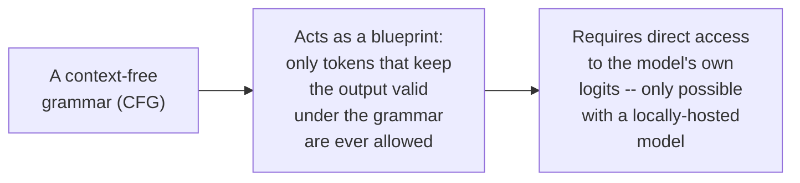

#### 🔍 Internal Working — The LARK Grammar Format

> 💡 **Given directly:** *"This is called the LARK format. Generally, outlines work with respect to the LARK format. There are multiple different formats for representing your CFG, the actual grammar."*

The session's setup: a local **Qwen 2.5, 0.5B Instruct** model, loaded via `transformers`' `AutoModelForCausalLM` and `AutoTokenizer`, with `outlines`' own `CFG` class applied on top.

#### ⚠ Common Mistakes

* Assuming CFG-based control works the same way against a hosted, proprietary API — it fundamentally cannot, since it depends on directly manipulating the model's own logits at generation time, which no proprietary provider exposes (partly for security reasons).
* Treating "grammar" here as an informal description of a data format — a CFG is a formal, from-computation-theory construct (tied to Finite State Automata and Theory of Computation), not a loose specification.

#### 🎯 Key Takeaways

* Token-level masking blocks any output that doesn't follow a defined grammar, forcing generation to stay within the grammar's own rules at every single token.
* This is only possible with a directly-hosted, open model — never with a proprietary, API-only model like GPT or Gemini.
* This sets up the session's next step: seeing exactly what this looks like with a first, simple grammar (Section 2).

---

### 2. The Arithmetic Grammar Example and a Forced Illegal Output

#### 🪜 Step-by-Step — A Simple Arithmetic Grammar

The grammar's structure, as walked through live: `start` → `expression` (terms combined by addition/subtraction) → `term` (factors combined by multiplication/division) → `number` (a regex allowing digits with an optional decimal).

> 💡 **Given directly:** *"If you look into start, now there is an expression... every expression is not a formula... finally we have the number... a regex format, if you really look into anything between 0 to 9, with having the option with respect to decimal representation."*

#### 🔍 Internal Working — A Deliberately Illegal Prompt

Asked to "write a mathematical expression for compound interest" under a grammar whose terminal rule only allows a plain number, the model is forced to output just a number — not a real expression.

> 💡 **Given directly:** *"Do you think that with a number, it is possible to represent the expression for compound interest, yes or no?... The final pattern will be rejected [otherwise]. So, simply, these are numbers you cannot do. Because this is actually an illegal operation that I'm trying to perform here."*

> 💡 **Given directly:** *"Though I am telling the model, write a mathematical expression, but in the output, according to the blueprint grammar that I have... the final output will be numbers."*

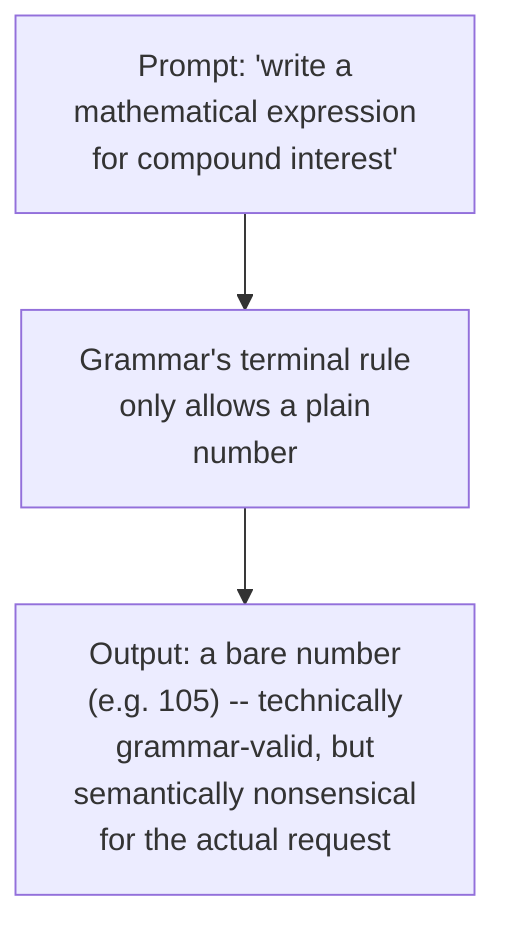

> 💡 **Given directly, on why this number is unexplainable:** *"This number, nobody directly — if you ask it also how this number came, nobody can tell you, because this number can be different for everybody... but now the question comes whether this number is following the blueprint or not."*

#### ⚠ Common Mistakes

* Assuming grammar-constrained output is automatically *correct* output — a CFG only guarantees the output's *shape* is valid; it says nothing about whether the answer actually satisfies the original request.
* Assuming the same prompt against the same grammar reproduces the same number every time — the grammar only constrains the form; the specific value is still a normal, model-driven generation.

#### 🎯 Key Takeaways

* A grammar forces output into a valid shape, no matter what the actual request was — asking for something the grammar can't represent doesn't fail; it silently produces the nearest grammar-valid (but potentially meaningless) output.
* This is the core trade-off of CFG-based control: total structural guarantees, with zero guarantee that the structure actually answers the question.
* This sets up the session's next thread: where a usable grammar actually comes from in the first place (Section 3).

---

### 3. Where Does the Grammar Come From: Custom Frameworks vs Generic Languages

#### 🔍 Internal Working — An Honest, Repeated Assessment of Real-World Usage

> 💡 **Given directly:** *"Really, availability of CFGs are very, very rare, that I have seen... if you're not really working with CFGs, then I will say [it's] lesser [of] your reasons, because even I have never used it in production."*

> 💡 **Given directly, the core justification for when it matters:** *"If you have a custom framework, do you think that any type of OpenAI or any type of Anthropic will have any idea about your framework? ... For any type of programming language, any type of framework, there has to be a certain grammar definition."*

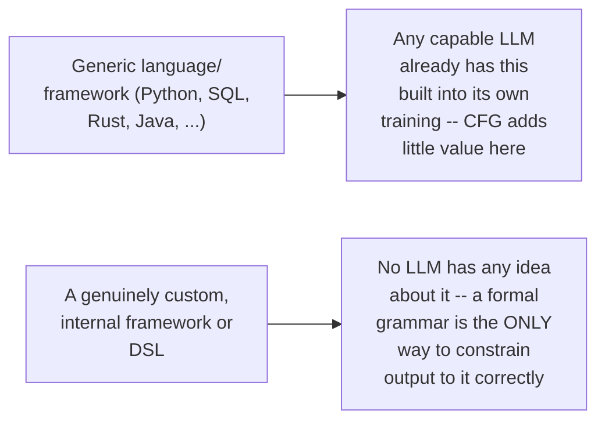

> 💡 **Given directly, on who this actually applies to:** *"This is directly related to much more. Because, see, generally, this part is even only taught to CS guys — Theory of Computation and Compiler Design... I feel that less than 1% of the developers actually work directly with grammar."*

> 💡 **Given directly, the actual applicability rule:** *"Majorly product-based organizations, they have their own custom tools and pretty much all those custom frameworks. In those cases, it makes much more sense. In our case, it really doesn't make sense. Why? Because majorly, if you're working with something common — SQL, Python, Rust, Scala, Java — already the LLM will be having an idea about it."*

#### ⚠ Common Mistakes

* Reaching for CFG-based control for a common, well-known language or framework — the LLM already understands these well, and a hand-written grammar adds constraint without adding real capability.
* Assuming grammar-writing is a task an AI assistant can just do for you — the instructor is explicit that this is manual, CS-fundamentals work, tied to compiler design and automata theory, not a generative shortcut.

#### 🎯 Key Takeaways

* CFG-based control earns its keep specifically for genuinely custom, internal frameworks or DSLs that no LLM has ever seen — not for mainstream languages.
* This is explicitly framed as a rare, specialized, CS-fundamentals-heavy skill — not a default technique to reach for.
* This sets up the session's next thread: what a grammar actually looks like for something closer to real use — SQL (Section 4).

---

### 4. SQL Grammar: A Bare Minimum Example and Its Real World Limits

#### 🪜 Step-by-Step — A Deliberately Minimal SQL Grammar

The grammar's structure: `start` → `select columns from table_name`, with `columns` allowing either `*` or a defined naming pattern, and `table_name` following a similar naming convention.

> 💡 **Given directly:** *"This is very, very limited. Where I've written a few rules: start, select columns from table_name. With respect to columns, you need to define... it can be multiple columns, and then finally comes the table name representation."*

#### 🔍 Internal Working — Why a Real SQL Grammar Is Enormous

> 💡 **Given directly:** *"For SQL, do you think that in SQL there will be so many less amount of grammar? Because if you start [including] a lot more things... more than 50,000, 60,000 lines of grammar will come. Actually, complete SQL."*

> 💡 **Given directly, the practical pattern for real use:** *"In most of the cases, what we do — whatever that large grammar file that you'll be having — directly load up the file into the system, probably with more and more conditions, and then use it for the final generation."*

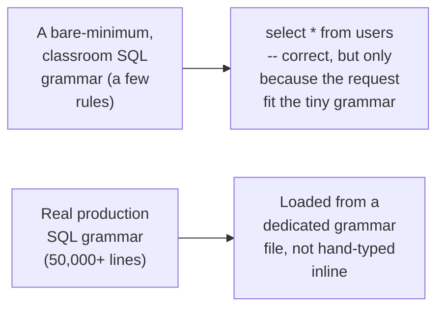

#### 🔍 Internal Working — A Live Demonstration of the Grammar's Own Limits

A request to generate a query with a WHERE condition, using the bare-minimum grammar, produced `select * from users` — correct only because the request happened to fit the tiny grammar; a genuinely different column-naming convention, or a request the grammar didn't anticipate, requires manually rewriting the grammar's own rules.

> 💡 **Given directly:** *"This will never work [as a real production grammar] ... just to give you an example... whenever I am writing any type of custom things, it will be very limited."*

#### ⚠ Common Mistakes

* Mistaking a small, illustrative classroom grammar for something production-ready — a real SQL grammar needs tens of thousands of lines to cover the language's actual surface area, not a handful of rules.
* Assuming the LLM can be asked to write its own grammar reliably — the instructor is explicit that LLM-authored grammars need real, sandboxed testing, since an incorrect grammar can silently break the entire generation pipeline.

#### 🎯 Key Takeaways

* A minimal, illustrative grammar can produce a correct answer purely by coincidence of scope — this doesn't generalize to real usage.
* Real production grammars are large files, loaded wholesale, not something authored inline for each use case.
* This sets up the session's next thread: two further, smaller illustrative examples — Python expressions and a fully custom DSL (Section 5).

---

### 5. Python Expressions and a Custom DSL Grammar

#### 🪜 Step-by-Step — A Restricted Python Expression Grammar

A simple grammar restricts output to digits 0–9 and basic operators, tested against "compute 3 plus 4 as a plain arithmetic expression," correctly producing `3 + 4` rather than a single collapsed value.

> 💡 **Given directly:** *"The final idea is that we have to express it, rather than in a single value, with the expression form... 0 to 9, and this particular operation plus is also there. So, probably in the output, we'll be getting 3 plus 4."*

> 💡 **Given directly, an important scope caveat:** *"Do these expressions follow all the rules of Python? Not all, only the one that I have taken... [it] won't be going outside of that."*

#### 🪜 Step-by-Step — A Fully Custom DSL: `find <entity> where <condition>`

This is presented as the clearest illustration of "why custom grammars matter": a made-up query language, explicitly **not** SQL, with `entity` restricted to `users`/`products`/`orders`, and `condition` structured as `field = value` with a small set of allowed fields.

> 💡 **Given directly:** *"So, right now, there is no expression, no term, pretty much simple. So, find entity, where condition. Now, entity — users, products, and orders, three main entities... then the possible field names — name, status, price."*

Prompted with "write a query to find the products where the status is active," the model correctly produced `find products where status is equal to active` — grammatically valid under this custom DSL, and explicitly confirmed as **not** a SQL query.

> 💡 **Given directly:** *"Do you think that this is a SQL query?... This is not a SQL query. As we have told, this is a custom DSL example that we have given... the LLM is following the major blueprints that we have followed."*

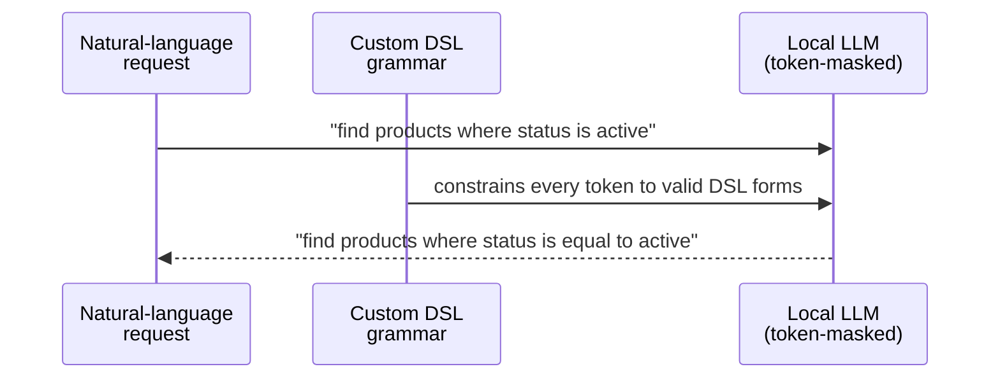

#### 🔍 Internal Working — What Happens on an Invalid Generation

> 💡 **Given directly:** *"During the generation, if it tries to generate something wrong... the idea is regenerate, as simple as that. Because till the time the condition doesn't get valid... the generation will keep on going. That's why the finite state automaton comes into the system here, FSM. Continue till the final rule has been in a valid state."*

#### ⚠ Common Mistakes

* Confusing a custom-DSL grammar's output with SQL just because it looks vaguely query-like — the grammar defines an entirely separate, made-up language; nothing about its shape implies it's SQL underneath.
* Assuming a rejected, invalid generation simply fails outright — under CFG-constrained generation, an invalid token triggers regeneration, continuing until a grammar-valid result is reached (conceptually, an FSM staying in a "continue" state until it reaches "valid").

#### 🎯 Key Takeaways

* A custom DSL example is the clearest illustration of CFG's real value: a language no LLM has ever seen, made usable purely through the grammar constraining every token.
* Invalid generations under a CFG don't fail silently or crash — they trigger regeneration until a valid state is reached.
* This sets up the session's next thread: what happens when the necessary grammar or context is simply too large to handle this way at all (Section 6).

---

### 6. Scaling Beyond a Single Context: Recursive Language Models and VLLM Hosting

#### 🔍 Internal Working — When a Grammar or Document Is Too Large for the Context Window

> 💡 **Given directly, the underlying question:** *"If the size of the grammar is more than the context width of the LLM, then how we will handle it?"*

Audience suggestion of simple chunking was explicitly rejected:

> 💡 **Given directly:** *"If you do chunking, it will lose the context... So generally, in those cases, we won't be going with normal language models — we'll be taking the example with respect to, probably, recursive language models. Where you load the entire data in a Python variable, and then slowly, slowly [extract] based on the information that we need."*

> 💡 **Given directly, the instructor's own stated preference:** *"My choice, if you ask me, in those cases, I will move towards recursive language models much more as compared to large language models. I feel that that is [a] much better solution."*

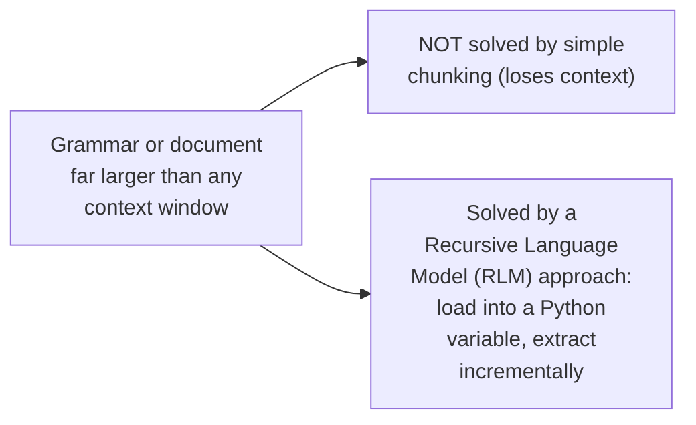

#### 🔍 Internal Working — Hosting an Open Model for Production Use

> 💡 **Given directly:** *"For actual serving, you will be moving toward high-throughput systems. And VLLM is one of the best examples for that. So, a simple integration of outlines [is] directly available there."*

> 💡 **Given directly, on the difference from a managed platform like Azure Foundry:** *"Azure Foundry, already the models are in a served state... this is custom hosting. VLLM on top of your own custom [infrastructure]."*

#### ⚠ Common Mistakes

* Reaching for chunking as a default fix for "too much data for the context window" — the instructor explicitly rejects this for grammar/document scale problems, since it loses the surrounding context that made the data meaningful.
* Assuming `transformers`-based local loading (as used in this session's teaching examples) is how production actually serves models — it explicitly isn't; production serving goes through high-throughput frameworks like VLLM.

#### 🎯 Key Takeaways

* Grammar or document data larger than any context window calls for a recursive-language-model approach (data kept outside the prompt, inspected incrementally), not chunking.
* `transformers` is for teaching and prototyping; real serving uses a high-throughput framework like VLLM, which also has direct `outlines` integration.
* This sets up the session's next thread: a completely different structured-generation use case — extracting structured data from images (Section 7).

---

### 7. Structured Extraction From Images: Invoices and Charts With Vision Models

#### 📖 Definition — Vision-Model-Based Structured Extraction

> 💡 **Given directly, an important caveat before starting:** *"Please be sure you are using a multimodal language model, having vision capabilities. Don't use any text-based model, otherwise simply these operations won't work."*

Pydantic models defined the target structure: a line-item model (item, quantity, price) nested inside an invoice model (vendor, invoice number, date, currency, line items, total).

#### 🪜 Step-by-Step — A Live, Honest Look at Real Extraction Errors

Working from a genuinely handwritten, hard-to-read invoice, the instructor read it manually alongside the model's own output, and openly flagged where the model got things wrong (a currency field returned as "unknown" when the bill clearly said "US dollars"; inconsistent trailing zeros in price fields across different students' runs).

> 💡 **Given directly:** *"Can you see here, the model is making a mistake. I feel that it's the quality of the image — if it's better, then probably it can handle it in a better way. But if the quality of the image is not [good] — because right now, I've taken handwritten images — then it won't be performing [well]."*

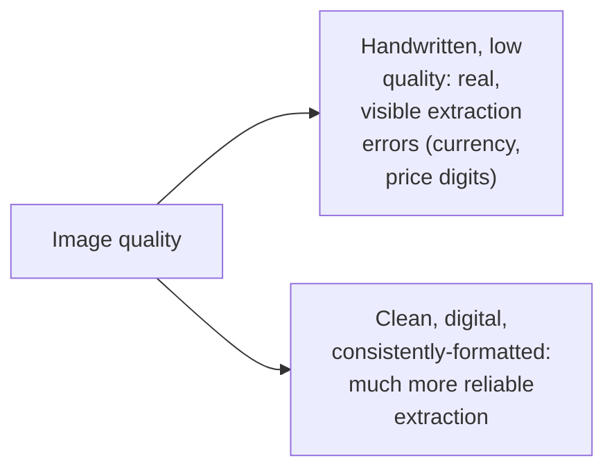

#### 🔍 Internal Working — Two Live Debugging Moments

1. A file assumed to be JPG was actually **WebP**, which the pipeline couldn't load — it silently fell back to a placeholder sample invoice instead of failing loudly.
   > 💡 **Given directly:** *"This has not loaded this particular image, it's a different one, actually. This is the sample invoice, the else condition has been triggered here. So, probably, I need to work with PNG or JPG."*
2. A relative file path had to be corrected live before a cleaner, higher-quality invoice sample would load correctly.

#### 🔍 Internal Working — A Chart Extraction Example

A bar-chart image (energy source vs. death rate) was extracted into a structured schema (data points, chart type, title, axis labels), performing noticeably better than the handwritten invoice — directly attributed to the much higher, cleaner image quality.

> 💡 **Given directly, on the title field:** *"Can you see the detection is correct based on the letters that I have provided?... From where it got the title, looks like a rephrased version. Do you think that directly this is available in the image somewhere? I don't feel it is available, but probably a rephrased version."*

#### 🔍 Internal Working — Cost and the Recommended Combination

> 💡 **Given directly:** *"Visual language calls are very, very costly, as compared to using a simple text model... you will feel 2x, or sometimes 2.25x, or at least more than 1.5x, as compared to [the] original text model. So very few people actually [prefer using] visual language models — probably a layer in between... because OCR is much more cheaper as compared to making these calls."*

> 💡 **Given directly, the instructor's own recommended combination:** *"If you ask me, Paul, what is the combination? I will select a state-of-the-art vision language model, and very good image quality. If I don't have [good image quality], I will never take this approach... probably an approach in between, I will add a simple OCR layer — any OCR layer, but at least one."*

Multiple documents were also shown processed in parallel, described explicitly as concurrent, asynchronous calls rather than a sequential loop.

> 💡 **Given directly:** *"This is parallel processing... parallelly, you can load up 3 documents, and you can make the calls parallel... the same call [is] asynchronous, but again, you have to understand, the LLM should support that asynchronous call."*

#### ⚠ Common Mistakes

* Assuming vision-model extraction will be reliably accurate regardless of image quality — the same pipeline performed noticeably worse on a genuinely hard-to-read, handwritten image than on a clean, digital one.
* Silently trusting a fallback/placeholder result as if it were the real extraction — the WebP-format bug produced a plausible-looking but entirely wrong (sample, placeholder) output, which is exactly the kind of failure worth checking for explicitly.
* Defaulting straight to a vision-model call for every document — given the real cost premium (roughly 1.5x–2.25x a text-only call), a cheaper OCR layer in front of a text model is often the better-value default.

#### 🎯 Key Takeaways

* Vision-model structured extraction is real and useful, but its accuracy is directly tied to image quality — a handwritten, low-quality source produces genuinely wrong fields, not just minor noise.
* A quiet fallback to placeholder data on a load failure is a dangerous failure mode — it looks like a normal result unless specifically checked for.
* The instructor's own default recommendation is a good vision model plus good image quality, or an OCR layer in front of a cheaper text model when image quality can't be guaranteed — not a reflexive vision-model call for every document.
* This concludes the `outlines`/structured-generation material; the session now moves to an entirely new topic, DSPy (Section 8).

---

### 8. DSPy Introduction: Signatures, Modules and Optimizers

#### 📖 Definition — What DSPy Is

> 💡 **Given directly:** *"DSPY, the most underrated, I feel, library... it means that rarely I see people using DSPY... this is the framework for programming, not prompting, language models. This is from Stanford... if you look into downloads per month, 5 million, really, really high."*

**DSPy** stands for **Declarative Self-improving Python**.

> 💡 **Given directly:** *"The main full form of DSPY is Declarative Self-improving Python. Now, the question comes, will it work with any other programming language? No. It has to be always Python... instead of brittle prompts, you write composable Python code and use DSPY to teach your language model to deliver high-quality outputs."*

#### 🔍 Internal Working — DSPy Runs on Top of LiteLLM

> 💡 **Given directly:** *"DSPY internally uses LiteLLM... it's a gateway. In that gateway, you can connect anything. Internally, majorly all of the frameworks with respect to Python — I can say it's a very, very famous gateway."*

> 💡 **Given directly, an honest security caveat:** *"I'm not [a] big fan of LiteLLM. Security breaches have been reported... it's better to use something much more stable — that's why we have Bifrost, and those type of AI-gateway solutions, even Cloudflare has that. For the past year, I feel a focus toward AI gateways has been growing [across the market]."*

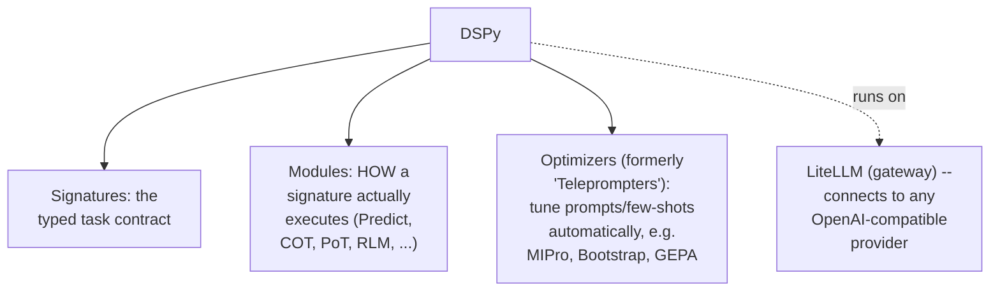

#### 🔍 Internal Working — Not an Agentic Framework

> 💡 **Given directly, in response to a question about whether DSPy is agentic:** *"No, no, no, no. DSPY is not an Agentic framework, it's not LangGraph... the scope is much more bigger. You can do the integration with any type of Agentic framework, any type of RAG-based pipelines, anyone. So that's why in our examples, we have RAG, and simply a React agent also."*

#### 📖 Definition — Signatures, in Detail

> 💡 **Given directly:** *"Signatures are your main task definition... even referred [to] as a typed contract... this contract is between me and the language model. Three things are declared always in the signature: first, the task — a single-line docstring; then what goes in — a typed input; and from the output, a typed output."*

A key, explicit distinction from ordinary prompt engineering:

> 💡 **Given directly:** *"We generally don't take that prompt-engineering-based approach where you have that persona design — like, you are a fine-tuning expert, you are a DevOps expert. We don't add any type of persona, tone, those type of things, just like in prompt engineering that we do."*

```python
class QuestionAnswering(dspy.Signature):
    """Answer questions with short, factual responses."""
    question: str = dspy.InputField()
    answer: str = dspy.OutputField(desc="a concise and factual answer")
```

Two signature styles are available — **inline** (fast, single-line, good for prototyping) and **class-based** (the instructor's own clear preference):

> 💡 **Given directly:** *"There are two types of signature — the inline and the class-based. I prefer class-based much more... for prototyping, I can say that the inline is really, really good... but the class-based signature approach is the best."*

#### ⚠ Common Mistakes

* Writing a signature the way one would write a prompt, complete with a persona and tone — signatures are deliberately narrower: a task description plus typed input/output, nothing more.
* Assuming DSPy competes with LangGraph or another agent framework — it operates at a different layer entirely and is explicitly designed to be combined with agent frameworks, not to replace them.

#### 🎯 Key Takeaways

* DSPy's three pillars are signatures (the typed task contract), modules (how that contract actually gets executed), and optimizers (automatic tuning of prompts/few-shots, formerly called "teleprompters").
* A signature is deliberately not a persona-driven prompt — it is a minimal, typed task/input/output contract.
* This sets up the session's next thread: seeing signatures actually run, through DSPy's own modules (Section 9).

---

### 9. DSPy Modules in Practice: Predict, Chain of Thought and Program of Thought

#### 🪜 Step-by-Step — Predict: the Default Module

> 💡 **Given directly:** *"Predict — this will actually make the LLM call. A very generic, normal LLM call, without any type of custom changes — a direct call. That we are calling Predict, and you pass the signature class that you have defined."*

```python
predictor = dspy.Predict(QuestionAnswering)
result = predictor(question="What is the capital of India?")
```

> 💡 **Given directly, on how often this is the right choice:** *"Predict is 70% of the times you will be using Predict, remember. This is the most common one, the most foundational."*

#### 🪜 Step-by-Step — Chain of Thought (COT)

```python
cot_predictor = dspy.ChainOfThought(QuestionAnswering)
result = cot_predictor(question="If a train travels ...")
# result.reasoning is now available
```

> 💡 **Given directly:** *"You really don't need to do anything — you have to just change your module. Chain of thought will be automatically activated... you'll be getting the reasoning also, from the result, result.reasoning."*

> 💡 **Given directly, why this is genuinely a program, not a prompt:** *"How many of you feel that there is a prompt here? ... There is no prompt. I hope everybody gets this part. It's purely program-based."*

#### 🪜 Step-by-Step — Program of Thought (PoT): the LLM Writes and Runs Code

> 💡 **Given directly:** *"This is really the interesting part... it will, first of all, generate a Python code... DSPY.ProgramOfThought that I have added, and then I have passed the question. So directly, the LLM won't respond. First of all, the LLM will create a program to do this particular calculation... once the calculation is done, then it will execute."*

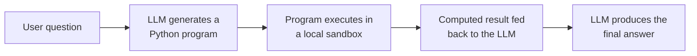

**Sandbox internals**, verified live: the sandbox runs on a JavaScript/TypeScript runtime commonly used for isolated code execution, driving a Python sub-process, communicating over JSON-RPC. It **cannot install third-party packages** — a live test confirmed that a request to "calculate an average from a CSV" used Python's built-in `csv` module, not `pandas`, since no external dependency was available.

> 💡 **Given directly:** *"Do you think Pandas will come, or it will use an internal module of Python?... Import CSV, nobody told me — only 2 or 3 people told me in the chat. Everybody told Pandas and Polars only."*

> 💡 **Given directly, on self-correction when a dependency is missing:** *"What happens if there is no pandas there? First problem — the LLM will get 'no module found.' Now it has to change the approach... just like a coding agent... if this approach doesn't work, then it will simply change, and it will try to look for something much more module-level, which is available."*

A related, deprecated module (a code-generation-plus-execution module referred to informally as "Kodak," conceptually similar to PoT but broader) is being removed from DSPy in favor of the newer RLM module (Section 10).

#### 🔍 Internal Working — Matching the Module to the Task

A side-by-side test of Predict, COT, and PoT on "explain transformer's attention in one sentence" showed PoT generating unnecessary code for a purely definitional question — explicitly flagged as the wrong module choice.

> 💡 **Given directly:** *"Do you think that Program of Thought is a suitable thing to do here? Yes or no? It is not suitable... the token consumption will be much more [higher]."*

#### ⚠ Common Mistakes

* Reaching for Chain of Thought or Program of Thought by default — both carry a real token-cost premium, and are wasted on questions that need neither reasoning traces nor code execution.
* Assuming Program of Thought's sandbox has the same package availability as a normal Python environment — it explicitly cannot install third-party packages, so any generated code must fall back to the standard library.

#### 🎯 Key Takeaways

* Predict is the default, correct choice roughly 70% of the time — reach for Chain of Thought or Program of Thought only when the task genuinely needs reasoning traces or code execution.
* Program of Thought's sandbox executes real Python but cannot install packages, and will self-correct toward standard-library-only solutions when a dependency is missing.
* This sets up the session's next thread: what to do when even Program of Thought's approach can't handle data too large to reason about directly (Section 10).

---

### 10. The RLM Module and Context Rot

#### 📖 Definition — The Recursive Language Model Approach

> 💡 **Given directly:** *"This is the newer one — the RLM. This is a recursive language model. The idea is... don't put huge docs into [the] LLM context window. This is the main idea."*

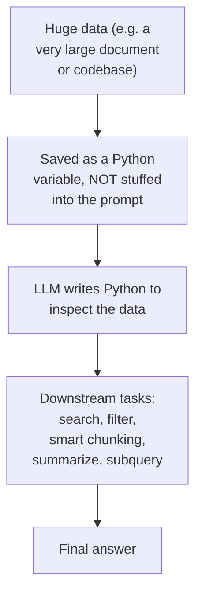

> 💡 **Given directly:** *"The idea is save it as a Python variable... the language model that you have, it will write the Python to inspect the data... can I say that the entire document is never stuffed into the prompt?... this is advanced context engineering through RLMs."*

#### 🔍 Internal Working — Why This Matters: Context Rot

> 💡 **Given directly:** *"How many of you know about Context Rot?... This came in 2025... please read this, because otherwise, you won't get the idea [of] what is the main problem that we do face. Simply, we know that, yes, we cannot fit it, but a lot of other problems are there."*

The core point: even when data technically fits inside a context window, model performance can still degrade as that context grows — a distinct problem from simply running out of room, and part of why the RLM approach (keeping data outside the prompt entirely, and inspecting it programmatically) is presented as valuable even before a hard context-window limit is hit.

#### ⚠ Common Mistakes

* Treating "does it fit in the context window" as the only question that matters — the Context Rot research the instructor references argues that performance can degrade well before a hard token limit, which is a separate reason to prefer the RLM approach even for merely large (not context-window-breaking) data.
* Assuming RLM only matters for exotic edge cases — the instructor notes it's easy to underestimate its relevance simply because most day-to-day documents are small enough not to trigger the problem, even though the underlying pattern (huge codebases, multi-million-token corpora) is common in real production systems.

#### 🎯 Key Takeaways

* RLM keeps large data out of the prompt entirely, letting the model write code to inspect, filter, and summarize it incrementally instead.
* This addresses both a hard limit (data literally too large for any context window) and a softer one (performance degradation as context grows, per Context Rot research), which is a broader and more common concern than it first appears.
* This sets up the session's final major thread: with all these tools now on the table (outlines, DSPy's modules, RLM), how to actually choose between them (Section 11).

---

### 11. Design Judgment: When to Use DSPy, Outlines or Plain Prompts

#### 🔍 Internal Working — DSPy's Relationship to Pydantic

> 💡 **Given directly:** *"Till now, our dependency towards Pydantic was huge. Now we have moved from that... to a certain extent, I prefer Pydantic — because the task totally depends upon the use case. 70% Pydantic, 30% DSPY, and that way you can think of it. The integrations of DSPY [aren't] everywhere you can bring it and attach it. But majorly, generative-AI-based pipelines where you are working with agents and RAG-based solutions — simply, you can do that."*

#### 🔍 Internal Working — Outlines vs. DSPy: a Direct Comparison

> 💡 **Given directly:** *"Outlines, I love it when I have lower-level tasks much more — if I have something much more complex, just to get structured output, then I will prefer that. But if I have some other things also in my mind — chain of thought, if I want to bring in this particular model... if I'm getting a very, very big response and really I need to decode it or break it into multiple steps — then, probably, DSPY will be my choice. In that case, I won't be going ahead with outlines or Instructor."*

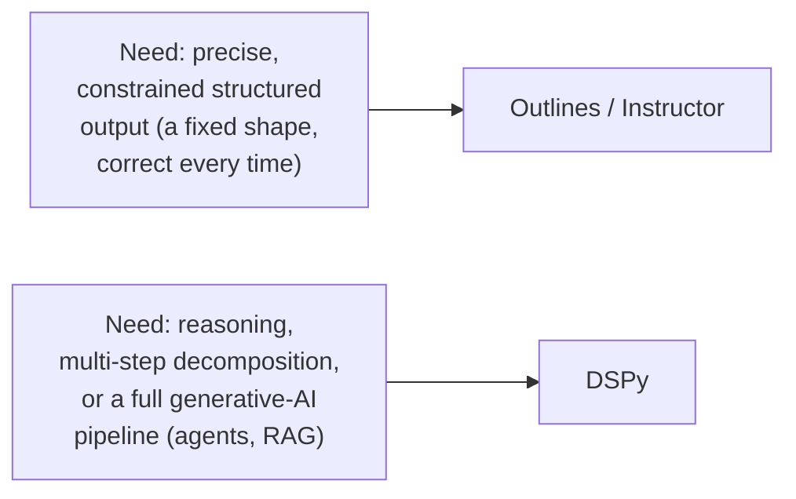

#### 🔍 Internal Working — DSPy vs. LangChain and LangGraph

> 💡 **Given directly:** *"I have the main idea as replacement of prompts. Even in LangChain, now you guys use prompts... you perform the context assembly through a prompt in RAG, in LangChain... the idea is: replace it. Introduce, through DSPY or Outlines Instructor, anything that you can actually use it."*

> 💡 **Given directly, confirming DSPy also works inside LangGraph-orchestrated systems:** *"Anywhere you use prompts. And LangGraph also use[s] prompts?... anywhere. Wherever you use prompts, replace it with DSPY."*

#### 🔍 Internal Working — Why DSPy Adoption Is Low, Despite Its Age

> 💡 **Given directly, a candid interview-panel anecdote:** *"In India, I have taken 30, 40 interviews, I have asked questions from DSPY. Only 2 or 3 candidates really told me [they knew it]... in the market, really, the adoption might be really, really low."*

> 💡 **Given directly, on why:** *"Really, like, after prompt engineering came, after that, only the [DSPy] project started... prompt became much more famous as compared to DSPY... these are all utilities. These are not something [that's specifically] AI or any AI stuff. It's purely utilities-based stuff."*

#### 🔍 Internal Working — Migrating an Existing, Large Prompt Library

> 💡 **Given directly:** *"If I have 1,000 prompts, I will be converting them into 1,000 signatures. And parallel, I have to do the testing — that for this particular prompt, this was its expected output... create one internal service, and then do the testing with at least 50 to 100 samples. If it is working fine, then finally I will be making the switch."*

Bootstrap-style optimizers are recommended for reducing manual few-shot curation effort at this scale:

> 💡 **Given directly:** *"Use Bootstrap, one of the best optimizers. Automatically, it does the few shots for you."*

#### ⚠ Common Mistakes

* Treating DSPy and outlines/Instructor as competing choices for the same job — they solve different problems: outlines/Instructor for precise structural constraints, DSPy for reasoning, decomposition, and full pipeline composition.
* Assuming DSPy is incompatible with an existing LangChain or LangGraph system — it isn't; DSPy replaces the *prompts* inside such a system, not the orchestration framework itself.
* Migrating a large, existing prompt library to DSPy all at once, without a testing harness — the instructor's own approach is incremental: convert, test against expected outputs at meaningful sample sizes, and only then switch over.

#### 🎯 Key Takeaways

* The rule of thumb: outlines/Instructor for precise, constrained structural output; DSPy for reasoning, decomposition, or full generative-AI pipelines (agents, RAG).
* DSPy is designed to replace prompts wherever they live — inside plain code, LangChain, or LangGraph — not to replace the orchestration layer itself.
* A safe migration path from an existing prompt library is incremental: signature-by-signature conversion, tested against expected outputs, with an optimizer like Bootstrap reducing manual few-shot work.
* This sets up the session's closing content: what's left for the next class, and the extended audience Q&A's remaining threads (Section 12).

---

### 12. Closing: Homework, Roadmap and Course Logistics

#### 🪜 Step-by-Step — What Was Explicitly Assigned

> 💡 **Given directly:** *"Please do the testing manually by changing the data, and then let me know if you people have already done the testing of that."* — homework: test the invoice/chart extraction pipeline with your own images.

#### 🪜 Step-by-Step — What's Planned for the Next Class

> 💡 **Given directly:** *"Tomorrow is the last class for structured [generation] — Module 2 — and from next week, we'll start with Module 3."*

Explicitly planned for the following class: additional small examples across DSPy's remaining modules, a RAG pipeline notebook, a React-agent example built with DSPy, a first coded RLM example, and a high-level (not deeply theoretical) pass through optimizers — MIPro/MIPro V2, Bootstrap, and GEPA. Fine-tuning is explicitly deferred to a later, dedicated module, not the next class.

> 💡 **Given directly:** *"Fine-tuning part, I'll be taking it later on during the fine-tuning module... This part, I don't think tomorrow we'll be covering it."*

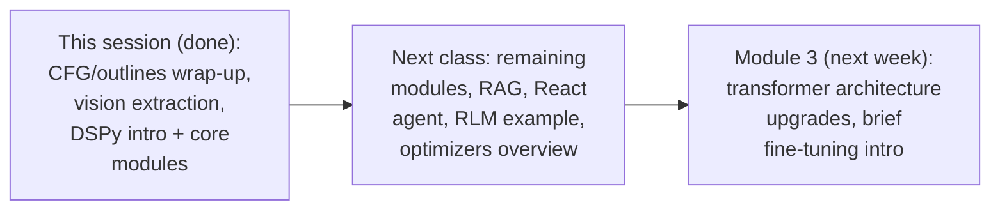

#### ⚠ Common Mistakes

* Assuming optimizers (MIPro, Bootstrap, GEPA) were covered in depth this session — they were only named and briefly framed; a proper walkthrough is explicitly deferred to the next class.
* Assuming fine-tuning is part of the same module as DSPy — it's explicitly a separate, later module in the course.

#### 🎯 Key Takeaways

* Homework is hands-on: re-run the image-extraction pipeline against your own images and compare results.
* The next class completes the DSPy module (remaining modules, RAG, a React agent, RLM, and optimizers at a high level) before the course moves to Module 3.
* Fine-tuning remains a distinct, later module — not something to expect folded into the DSPy material.

---

## 📝 Glossary

| Term | Definition | Why It Matters |
|---|---|---|
| **Token-level (logit) masking** | Directly constraining which tokens a model can generate at each step | The mechanism behind CFG-based control; only possible with a locally-hosted model |
| **CFG (Context-Free Grammar)** | A formal grammar defining valid output structure | Guarantees output *shape*, not correctness of content |
| **LARK format** | The grammar-definition format used by `outlines` | How a CFG is actually written for use with `outlines` |
| **DSPy** | Declarative Self-improving Python — a framework for programming, not prompting, language models | Replaces hand-written prompts with typed, composable Python |
| **Signature** | A typed task contract: task description, typed input, typed output | DSPy's basic unit of "what should happen," deliberately without persona/tone |
| **Module** | Controls *how* a signature executes (Predict, Chain of Thought, Program of Thought, RLM, etc.) | Choosing the wrong module wastes tokens or misapplies a technique |
| **Optimizer (formerly Teleprompter)** | Automatically tunes prompts/few-shot examples for a DSPy program | Reduces manual few-shot curation at scale (e.g., via Bootstrap) |
| **RLM (Recursive Language Model)** | Keeps large data outside the prompt, using code to inspect it incrementally | Addresses both hard context limits and Context Rot-style degradation |
| **Context Rot** | Research finding that model performance can degrade as context grows, even before a hard limit is hit | A broader reason to manage context deliberately, not just to avoid overflow |

---

## 🔄 Revision Notes — One-Minute Revision

* This session finishes `outlines`' CFG-based generation and vision extraction, then introduces DSPy.
* Token-level masking constrains an LLM's output to a formal grammar (CFG, written in LARK format) — only possible with a locally-hosted model, never a proprietary API.
* A grammar guarantees output *shape*, not correctness — a request the grammar can't represent still produces a grammar-valid but meaningless result.
* CFG-based control is genuinely valuable mainly for custom, internal frameworks or DSLs no LLM has ever seen — not for mainstream languages like SQL or Python, which LLMs already understand well.
* Data or grammars too large for any context window call for a recursive-language-model approach (kept out of the prompt, inspected via code), not simple chunking.
* Vision-model structured extraction is real but costly (roughly 1.5x–2.25x a text call) and highly sensitive to image quality — an OCR layer in front of a text model is often the better default.
* DSPy ("Declarative Self-improving Python") has three pillars: signatures (typed task contracts), modules (how a signature executes), and optimizers (automatic tuning, formerly "teleprompters").
* Predict is the default DSPy module (~70% of use); Chain of Thought and Program of Thought add real token cost and should only be used when the task genuinely needs reasoning or code execution.
* Program of Thought's sandbox executes real Python but cannot install third-party packages — it self-corrects toward standard-library solutions when a dependency is missing.
* RLM addresses both hard context limits and Context Rot-style performance degradation by keeping large data outside the prompt entirely.
* Rule of thumb: outlines/Instructor for precise structural constraints; DSPy for reasoning, decomposition, or full generative-AI pipelines — and DSPy is designed to replace prompts inside LangChain/LangGraph, not to replace them.
* Homework: re-test image extraction with your own data. Next class: remaining DSPy modules, RAG, a React agent, an RLM example, and optimizers at a high level, before Module 3 begins.

---

## 📋 Cheat Sheet

**Why CFG needs a local model:**
```text
Token-level masking requires direct access to the model's own logits --
no proprietary API (OpenAI, Anthropic, Gemini) allows this.
```

**CFG's real value:**
```text
Generic language (SQL, Python, ...) -> LLM already knows it -> low CFG value
Genuinely custom framework/DSL      -> LLM knows nothing    -> high CFG value
```

**DSPy signature, class-based:**
```python
class QuestionAnswering(dspy.Signature):
    """Answer questions with short, factual responses."""
    question: str = dspy.InputField()
    answer: str = dspy.OutputField(desc="a concise and factual answer")
```

**DSPy modules, in shape:**
```python
dspy.Predict(Signature)          # ~70% of use -- a plain LLM call
dspy.ChainOfThought(Signature)   # adds a reasoning trace, more tokens
dspy.ProgramOfThought(Signature) # LLM writes + runs code in a sandbox
```

**Choosing outlines vs. DSPy:**
```text
Need a precise, constrained output shape   -> outlines / Instructor
Need reasoning, decomposition, a pipeline  -> DSPy
```

---

## 🔥 Interview Questions & Answers

### 🟢 Beginner

**Q1.**

**Question:** Why can't token-level masking be used with a proprietary API like OpenAI's?

**Answer:** It requires direct access to the model's own logits at generation time to block invalid tokens — proprietary APIs don't expose this level of control.

**Explanation:** Directly, explicitly confirmed.

**Why Interviewers Ask This:** Tests basic, practical understanding of what CFG-based control actually requires.

**Possible Follow-up:** "What kind of hosting setup does make this possible?"

**Q2.**

**Question:** Does a CFG guarantee that an LLM's output is correct?

**Answer:** No — it only guarantees the output's shape/structure is valid under the grammar; it says nothing about whether the content actually answers the original request.

**Explanation:** Directly, concretely demonstrated with the "compound interest as a number" example.

**Why Interviewers Ask This:** Tests whether a candidate understands the real limits of structural constraints.

**Possible Follow-up:** "What did the compound-interest example actually demonstrate?"

**Q3.**

**Question:** According to this session, when does CFG-based generation genuinely earn its use?

**Answer:** For genuinely custom, internal frameworks or DSLs that no LLM has ever seen — not for mainstream, well-known languages like SQL or Python.

**Explanation:** Directly, repeatedly confirmed.

**Why Interviewers Ask This:** Tests scoped, realistic understanding of a niche but real technique.

**Possible Follow-up:** "Why is CFG less useful for something like standard SQL?"

**Q4.**

**Question:** What is DSPy's full name, and what does it replace?

**Answer:** Declarative Self-improving Python — it replaces hand-written, brittle prompts with typed, composable Python code.

**Explanation:** Directly, explicitly confirmed.

**Why Interviewers Ask This:** Tests basic, current framework knowledge.

**Possible Follow-up:** "What are DSPy's three main pillars?"

**Q5.**

**Question:** What are the three components always declared in a DSPy signature?

**Answer:** The task (a single-line docstring), a typed input, and a typed output.

**Explanation:** Directly, explicitly confirmed.

**Why Interviewers Ask This:** Tests hands-on familiarity with DSPy's basic building block.

**Possible Follow-up:** "How does a signature differ from a traditional, persona-driven prompt?"

**Q6.**

**Question:** Which DSPy module is used roughly 70% of the time, and why?

**Answer:** Predict — because most tasks are a plain, direct LLM call that doesn't need a reasoning trace or code execution.

**Explanation:** Directly, explicitly confirmed.

**Why Interviewers Ask This:** Tests practical judgment about default choices, not just knowledge of all the options.

**Possible Follow-up:** "When would Chain of Thought be the better choice instead?"

**Q7.**

**Question:** Can DSPy's Program of Thought module install third-party Python packages inside its sandbox?

**Answer:** No — it's restricted to the standard library, and will self-correct toward a standard-library approach if a generated attempt to use an external package fails.

**Explanation:** Directly, concretely demonstrated with the CSV/pandas example.

**Why Interviewers Ask This:** Tests real, hands-on understanding of a specific module's actual constraints.

**Possible Follow-up:** "What happens, step by step, when the generated code first tries to import pandas?"

**Q8.**

**Question:** What problem does RLM (Recursive Language Model) solve that simple chunking does not?

**Answer:** It keeps large data out of the prompt entirely, letting the model inspect it via code — avoiding both a hard context-window limit and the context loss that chunking introduces.

**Explanation:** Directly, explicitly confirmed.

**Why Interviewers Ask This:** Tests understanding of a specific, real limitation of naive chunking approaches.

**Possible Follow-up:** "What is Context Rot, and why does it matter even when data technically fits in the context window?"

**Q9.**

**Question:** Does DSPy replace frameworks like LangChain or LangGraph?

**Answer:** No — it replaces the prompts used inside such systems; the orchestration layer stays separate.

**Explanation:** Directly, explicitly confirmed.

**Why Interviewers Ask This:** Tests whether a candidate correctly scopes what DSPy actually does.

**Possible Follow-up:** "How would you migrate a LangGraph-based system's prompts to DSPy signatures?"

**Q10.**

**Question:** What's the instructor's own rule of thumb for choosing between outlines/Instructor and DSPy?

**Answer:** Outlines/Instructor for precise, constrained structural output; DSPy for reasoning, decomposition, or full generative-AI pipelines involving agents or RAG.

**Explanation:** Directly, explicitly confirmed.

**Why Interviewers Ask This:** Tests whether a learner can make a concrete tool choice, not just recite definitions.

**Possible Follow-up:** "Give an example task where you'd pick one over the other."

---

### 🟡 Intermediate

**Q11.**

**Question:** Explain why the instructor deliberately demonstrates an "illegal" prompt (asking for a compound-interest expression under a number-only grammar) rather than only showing successful, well-matched examples.

**Answer:** This is a deliberate demonstration of CFG's actual failure mode, not just its happy path: showing only successful examples would leave the impression that a grammar somehow "understands" whether a request fits it. By deliberately mismatching the request against the grammar, the demonstration makes clear that a CFG has no such awareness — it will always produce a grammar-valid output, even when that output is semantically meaningless for the actual question asked. This is the single most important limitation to understand before using CFG-based control in a real system: it constrains form, never correctness.

**Explanation:** Requires recognizing the deliberate teaching value of a demonstrated failure case over only showing successes.

**Why Interviewers Ask This:** Tests whether a learner understands CFG's real limitation, not just its capability.

**Possible Follow-up:** "How would you detect, in a real system, that a CFG-constrained output is structurally valid but semantically wrong?"

**Q12.**

**Question:** A learner argues that since DSPy's Program of Thought module can write and execute real Python code, it should always be preferred over Predict for any question involving numbers or calculations. Evaluate this claim.

**Answer:** This overstates a narrow capability (code generation and execution) into a blanket recommendation the session's own side-by-side comparison directly contradicts. The demonstrated comparison ("explain transformer's attention in one sentence") showed Program of Thought generating unnecessary code for a purely definitional question with no actual calculation involved — at real token-cost expense, with no benefit. The accurate rule, per the session's own guidance, is to match the module to the task: Program of Thought is valuable specifically when a computation genuinely needs to be executed, not merely because a question happens to mention a number or a calculation-adjacent concept.

**Explanation:** Requires recognizing that a module's capability doesn't imply it's the right default for every superficially-related task.

**Why Interviewers Ask This:** Distinguishes candidates who track the session's own explicit module-matching guidance from those who over-generalize a powerful feature.

**Possible Follow-up:** "Describe a question where Program of Thought genuinely is the right choice, and explain why."

**Q13.**

**Question:** Explain, precisely, why the instructor considers CFG-based generation valuable despite explicitly having never used it in production himself.

**Answer:** This is a deliberate distinction between personal usage frequency and genuine capability: the instructor's own production experience skews toward common languages and frameworks (SQL, Python, standard web frameworks) that LLMs already understand well, where CFG adds constraint without adding real capability. His stated case for CFG's value is scoped specifically to organizations with genuinely custom, internal frameworks or DSLs — a case his own work apparently hasn't required, but which he explicitly says does exist for others ("majorly product-based organizations... have their own custom tools"). The accurate takeaway: a technique's value is scoped to a specific use case, and an instructor's own lack of need for it doesn't make it worthless — it makes it niche.

**Explanation:** Requires distinguishing "I haven't needed this" from "this has no value," based on the instructor's own explicit reasoning.

**Why Interviewers Ask This:** Tests whether a learner can correctly interpret an instructor's candid, self-aware caveat rather than either dismissing or over-selling the technique.

**Possible Follow-up:** "What kind of organization would be most likely to have a genuine need for CFG-based generation?"

**Q14.**

**Question:** Using this session's own "Context Rot" concept, explain why RLM's value isn't limited to documents that literally exceed a model's context window.

**Answer:** This requires connecting two, separately-established facts: RLM's stated purpose (Section 10) is explicitly framed around avoiding stuffing huge documents into the prompt, which sounds like a hard-limit problem. But the session's own reference to Context Rot research establishes a second, softer problem — that model performance can degrade as context grows even before a hard token limit is reached. Synthesizing these: RLM's practice of keeping data outside the prompt and inspecting it incrementally via code addresses both problems simultaneously — it avoids the hard failure of exceeding a context window, and it avoids the softer, harder-to-notice degradation Context Rot describes, which can occur well within a technically "large enough" context window.

**Explanation:** Requires connecting RLM's stated mechanism to the separate Context Rot concept to explain a broader scope of value than the "too big to fit" framing alone suggests.

**Why Interviewers Ask This:** A senior-level question testing whether a candidate can synthesize two separately-introduced concepts into a fuller picture of a technique's actual value.

**Possible Follow-up:** "How would you decide, in a real system, whether Context Rot is actually affecting a given pipeline's output quality?"

**Q15.**

**Question:** Synthesize the instructor's "70% Pydantic, 30% DSPy" split with the outlines-vs-DSPy comparison to explain what a well-reasoned technology-choice process might look like for a new structured-generation task.

**Answer:** A precise, synthesized answer, connecting two, separately-established points: per the Pydantic/DSPy split, the instructor's default assumption favors simpler, structure-only tooling (Pydantic, and by extension outlines/Instructor for LLM-facing constraints) for the majority of tasks, reserving DSPy for the specific minority where reasoning, decomposition, or full pipeline composition is genuinely needed. Per the outlines-vs-DSPy comparison, the decisive question is not "which tool is more powerful" but "does this task need a fixed structural shape (favor outlines/Instructor) or does it need multi-step reasoning or an evolving pipeline (favor DSPy)." A well-reasoned process therefore starts by asking whether the task's output is a small, fixed shape or a larger, decomposable problem — and only reaches for DSPy once the answer is clearly the latter, rather than defaulting to the newest or most capable-sounding tool.

**Explanation:** Requires combining the stated tool-preference ratio with the specific decision criterion to construct a general decision process, not just recite the individual facts.

**Why Interviewers Ask This:** A senior-level question testing whether a candidate can build a repeatable decision process from two separately-stated preferences, rather than treating them as isolated trivia.

**Possible Follow-up:** "Where would a task like sentiment classification with a confidence score fall in this decision process?"

---

### 🔴 Advanced

**Q16.**

**Question:** Design a complete, reasoned decision framework (using only this session's own established concepts) for choosing between plain prompting, outlines/Instructor, and DSPy for a new structured-generation task.

**Answer:** A reasoned framework, applying this session's own concepts directly:

```text
1. Is the output a small, fixed, well-defined shape (a specific
   JSON schema, a constrained value set)? If yes, and the task
   involves a common, well-known language or format the LLM
   already understands -> use outlines/Instructor (or plain
   Pydantic-validated prompting for simpler cases).

2. Is the required output shape something NO LLM has ever seen
   (a genuinely custom, internal framework or DSL)? If yes, and
   you can host the model locally -> CFG-based generation via
   outlines' token-level masking is worth the real setup cost.

3. Does the task require reasoning, multi-step decomposition, or
   is it part of a larger generative-AI pipeline (RAG, an agent)?
   If yes -> use DSPy, choosing the specific module (Predict by
   default; Chain of Thought only if reasoning traces are
   genuinely needed; Program of Thought only if actual code
   execution is required).

4. Does the task involve data too large for any context window,
   or large enough that Context Rot-style degradation is a real
   risk? If yes -> use an RLM-style approach regardless of which
   of the above applies, keeping the data out of the prompt and
   inspecting it via code.

5. Is DSPy being introduced into an existing LangChain/LangGraph
   system? If yes -> treat this as a prompt-by-prompt replacement,
   not a framework migration -- test each converted signature
   against expected outputs before switching over.
```

This framework directly applies the session's own established concepts — structural precision needs, custom-language needs, reasoning/pipeline needs, context-scale needs, and safe migration practice — to a realistic technology-choice decision.

**Explanation:** Requires synthesizing outlines/CFG's scope, DSPy's scope, RLM's scope, and migration practice into one complete, reasoned decision framework.

**Why Interviewers Ask This:** A comprehensive, capstone-level question testing whether a candidate can apply the session's full range of concepts to a realistic technology decision.

**Possible Follow-up:** "Which of these five steps would most commonly be skipped by a team new to structured generation, and what would that cost them?"

**Q17.**

**Question:** Critically evaluate: "Since this session shows that outlines can force any LLM's output into an exactly-correct structure via CFG, and DSPy can replace any prompt with a typed program, structured-generation tooling has effectively made careful prompt engineering obsolete."

**Answer:** This overstates two, separately-scoped capabilities into an unwarranted general conclusion the session's own material directly contradicts. The compound-interest demonstration (Section 2) shows explicitly that a CFG only forces output into a valid *shape* — it provides zero guarantee the content is actually correct or relevant, which is the opposite of "exactly-correct." Similarly, DSPy's own signature design deliberately strips out persona and tone guidance that traditional prompt engineering relies on for certain tasks — DSPy replaces the *mechanism* of prompting (hand-written strings) with a typed program, but the task of clearly specifying what a task actually requires (the substance prompt engineering is meant to capture) doesn't disappear; it moves into the signature's own docstring, input, and output field descriptions. The accurate conclusion: these tools change *how* structure and intent are expressed to a model, and reduce certain categories of brittleness, but they don't eliminate the underlying need to precisely specify a task — they relocate that responsibility into grammars and signatures rather than removing it.

**Explanation:** Tests whether a learner recognizes that these tools change the mechanism of specification, not the underlying need for careful task specification itself.

**Why Interviewers Ask This:** Distinguishes candidates who correctly scope what these tools actually solve from those who over-generalize new tooling into eliminating a fundamental need.

**Possible Follow-up:** "Where, specifically, does careful task specification still matter once you've adopted DSPy signatures?"

---

## 🧪 Scenario-Based Interview Questions

> **Scenario 1:** A colleague builds a CFG for a genuinely custom, internal query language (similar to this session's `find <entity> where <condition>` example), tests it successfully on a handful of example prompts, and declares it "production-ready." Using this session's own concepts, construct a complete, reasoned response.

**Structured Answer:**
1. **Initial investigation:** Recognize this as directly connected to Section 4's own established caution — a grammar tested only against a small set of anticipated prompts can still be far too limited for real, varied user input.
2. **Relevant principle:** Per Section 4, even a working classroom-scale grammar can succeed purely because the test requests happened to fit its scope — this is not evidence of general robustness.
3. **Possible causes:** The grammar's rule set likely reflects only the specific fields, entities, and conditions anticipated during testing, not the full range of what real users will actually ask for.
4. **Debugging/evaluation approach:** Systematically test the grammar against a much broader and more adversarial set of real or realistic user requests, specifically looking for requests the grammar silently forces into a wrong-but-valid shape (as in the compound-interest example) rather than rejecting outright.
5. **Resolution:** Expand the grammar's rule set to genuinely cover the real language's scope, following the session's own point that production-grade grammars for even modestly complex languages run to tens of thousands of lines, not a handful of rules.
6. **Prevention:** Treat "it works on my test prompts" as insufficient evidence for a grammar-constrained system — the very nature of CFG-based control means it will always produce *something* structurally valid, which can mask real gaps in coverage unless deliberately tested for.

> **Scenario 2 (Advanced):** Your team has an existing, large LangGraph-based agent system with dozens of hand-written prompts. A stakeholder asks you to introduce DSPy "to make the system more reliable," expecting this to be a drop-in replacement completed in a single sprint. Using this session's own concepts, construct a complete, reasoned response.

**Structured Answer:**
1. **Initial investigation:** Recognize this as directly connected to Section 11's own established migration guidance — DSPy replaces prompts individually, it does not replace or rearchitect the orchestration layer (LangGraph) itself.
2. **Relevant principle:** Per Section 11, the instructor's own migration approach is incremental: convert one prompt to one signature, test it against expected outputs at a meaningful sample size, and only then switch it over — explicitly not a single-pass, whole-system replacement.
3. **Possible causes:** The stakeholder's expectation likely comes from an inaccurate mental model of DSPy as a system-level upgrade rather than a prompt-level replacement technique.
4. **Debugging/evaluation approach:** Inventory the existing prompts, prioritize the highest-risk or highest-value ones for conversion first, and set up a testing harness (expected-output comparisons at meaningful sample sizes) before converting anything.
5. **Resolution:** Scope the initial DSPy adoption to a small number of signatures with a working test harness, using an optimizer like Bootstrap to reduce manual few-shot effort, and communicate to the stakeholder that full-system migration is a multi-sprint, incremental effort — not a single-sprint swap.
6. **Prevention:** Set the expectation up front, using the instructor's own stated experience (dozens of interview candidates, low real-world adoption despite the framework's age) as evidence that DSPy adoption is a genuine skill investment, not a quick fix.

---

## 🛠 Hands-on Exercises

### 🟢 Easy

1. Write a simple LARK-format grammar restricting output to a fixed set of values, and test it against both a matching and a deliberately mismatched prompt.
2. Write a DSPy class-based signature for a simple classification task (e.g., sentiment), and run it with `dspy.Predict`.
3. Explain, in your own words, why CFG-based generation requires a locally-hosted model.

### 🟡 Medium

4. Extend a bare-minimum SQL-style grammar to support a WHERE clause, and test it against several increasingly complex requests.
5. Build the same DSPy signature using both `Predict` and `ChainOfThought`, and compare the token cost and output quality difference.
6. Run a structured extraction pipeline against both a clean, digital image and a low-quality, handwritten one, and document the accuracy difference.

### 🔴 Advanced

7. Complete the full, reasoned decision framework proposed in Advanced Interview Q16, applying it to a real or hypothetical structured-generation task of your own.
8. Implement the debugging scenario proposed in Scenario 1 — deliberately build an under-tested custom-DSL grammar, then systematically find and fix its coverage gaps.
9. Design a DSPy Program of Thought task that requires only standard-library Python, and verify it correctly self-corrects if you deliberately prompt it toward a third-party package first.

---

## 🏗 Practice Assignment

*(This session's own stated homework and forward-looking roadmap, reproduced faithfully)*

> 💡 **The instructor's own words, given directly:** *"Please do the testing manually by changing the data, and then let me know if you people have already done the testing of that."*

### Build: "A Complete Structured-Generation Comparison"

**Objective:** Apply this session's complete set of structured-generation concepts — CFG, vision extraction, and DSPy — to a single, coherent comparison exercise.

**Requirements:**
- Write a custom CFG (in LARK format) for a small, genuinely made-up DSL of your own design, and test it against both fitting and deliberately mismatched prompts.
- Run a structured extraction pipeline against at least two images of meaningfully different quality, and document the accuracy difference.
- Write a DSPy class-based signature for a task of your choosing, and run it through Predict, Chain of Thought, and (if the task involves computation) Program of Thought — comparing output quality and token cost across all three.
- A written reflection (200–300 words) on which of this session's own concepts (CFG's rarity in production, image-quality sensitivity in vision extraction, or DSPy's module-matching guidance) most changed how you'd approach a new structured-generation task.

**Architecture (suggested):**

```text
structured_generation_comparison/
├── custom_dsl_grammar.lark
├── cfg_demo.py
├── vision_extraction_comparison.py
├── dspy_module_comparison.py
└── REFLECTION.md
```

**Expected Functionality:**
- Your comparison should correctly demonstrate every major technique established in this session, end-to-end.

**Challenges:**
- Designing a custom DSL grammar narrow enough to be genuinely testable, but rich enough to expose real coverage gaps.
- Choosing image samples that meaningfully differ in quality, so the accuracy comparison is genuinely informative rather than trivial.

**Bonus Improvements:**
- Apply Advanced Q16's own established decision framework to formally justify each tool choice you made in this assignment.
- Read the referenced "Context Rot" research and summarize, in your own words, how it changes your view of when RLM-style context management is worth the added complexity.

---

## 📚 Additional Resources

- **The instructor's own referenced Context Rot paper (2025)** — explicitly recommended reading for understanding why context management matters beyond simple context-window limits.
- **The `outlines` library's own official documentation** — for the LARK grammar format and its CFG-based generation API.
- **DSPy's own official documentation and GitHub repository** (Stanford) — for signatures, modules, and the optimizer papers referenced (MIPro/MIPro V2, GEPA, Bootstrap).
- **The Spider text-to-SQL benchmark**, referenced in the Q&A as the standard reference point for evaluating text-to-SQL approaches.
- **VLLM's own documentation**, for production-grade open-model hosting and its `outlines` integration.

---

## 📌 Final Revision Sheet

### ⭐ Core Concepts
- **Token-level masking / CFG**: forces output shape via a formal grammar, requires a local model, guarantees shape not correctness.
- **CFG's real scope**: valuable for genuinely custom frameworks/DSLs, not for languages an LLM already knows well.
- **DSPy's three pillars**: signatures (typed task contracts), modules (execution strategy), optimizers (automatic tuning).
- **Module matching matters**: Predict by default; Chain of Thought and Program of Thought carry real token cost and should be reserved for tasks that need them.
- **RLM and Context Rot**: keep large data out of the prompt entirely, both for hard context limits and softer performance degradation.

### ⭐ Important Definitions
- **Signature, module, optimizer, LiteLLM gateway** (see Glossary for full definitions).

### ⭐ Important Commands/Code
```python
class QuestionAnswering(dspy.Signature):
    """Answer questions with short, factual responses."""
    question: str = dspy.InputField()
    answer: str = dspy.OutputField(desc="a concise and factual answer")

predictor = dspy.Predict(QuestionAnswering)
cot_predictor = dspy.ChainOfThought(QuestionAnswering)
```

### ⭐ Architecture/Process
- Complete workflow: decide whether the task needs a fixed structural shape (outlines/Instructor) or reasoning/decomposition/pipeline composition (DSPy) -> for CFG, confirm the target language is genuinely custom before investing the effort -> for vision extraction, prioritize image quality and consider an OCR pre-processing layer -> for DSPy, default to Predict and only add Chain of Thought/Program of Thought when genuinely needed -> for very large data, use an RLM-style approach regardless of the above.

### ⭐ Best Practices
- Reserve CFG-based generation for genuinely custom frameworks or DSLs, not mainstream languages.
- Treat vision-model extraction accuracy as directly tied to image quality — test against real, varied image quality before trusting it.
- Default to DSPy's Predict module; add Chain of Thought or Program of Thought only when the task specifically needs reasoning traces or code execution.
- Migrate an existing prompt library to DSPy incrementally, testing each converted signature against expected outputs before switching over.

### ⭐ Common Mistakes
- Assuming grammar-constrained output is automatically correct, not just correctly shaped.
- Defaulting to a vision-model call for every document instead of considering a cheaper OCR-plus-text-model pipeline.
- Reaching for Chain of Thought or Program of Thought by default, incurring unnecessary token cost.
- Treating DSPy as a replacement for LangChain/LangGraph rather than a replacement for the prompts inside such systems.

### ⭐ Interview Points
- Be ready to explain what token-level masking actually constrains, and its real limitations.
- Be ready to explain DSPy's three pillars and correctly choose between its core modules for a given task.
- Be ready to explain RLM and Context Rot, and why RLM's value isn't limited to literal context-window overflow.
- Be ready to discuss a realistic decision process for choosing between outlines, DSPy, and plain prompting.

### ⭐ Things to Remember
- This session's own **honest, repeated admission** that CFG-based generation is rarely used in production reflects the same candid teaching approach carried through the whole course — a technique's real value is scoped, not universal.
- **DSPy's low real-world adoption**, despite its age and Stanford origin, is presented as a genuine market observation, not a reason to dismiss the framework — the instructor argues its value is real but under-recognized.
- **Optimizers, RAG, a React agent, and a coded RLM example remain explicitly deferred** to the next class — this session's own DSPy coverage is confirmed as an introduction, not the complete picture.