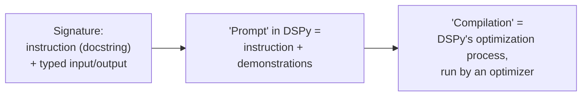
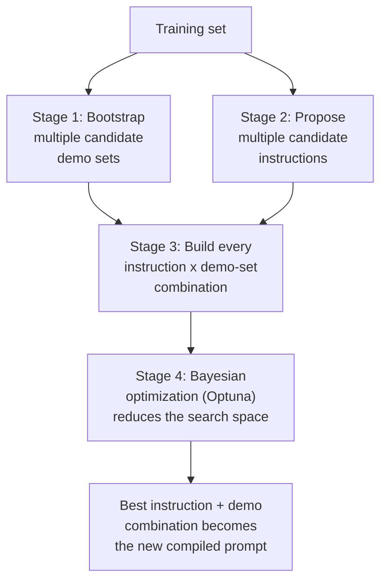
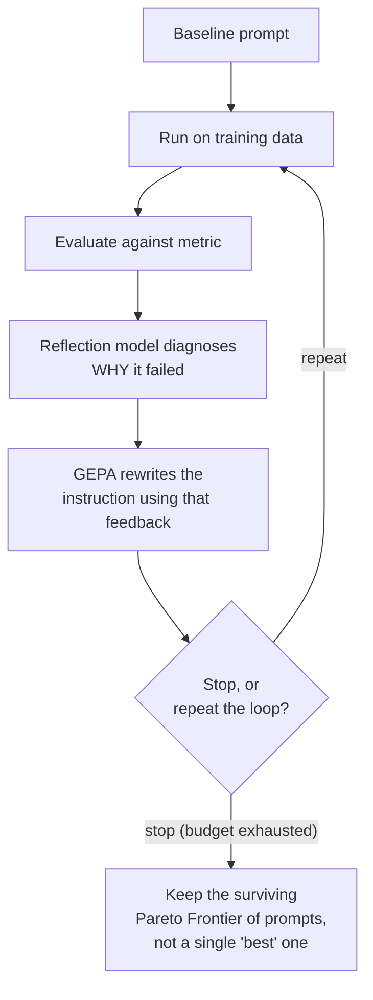
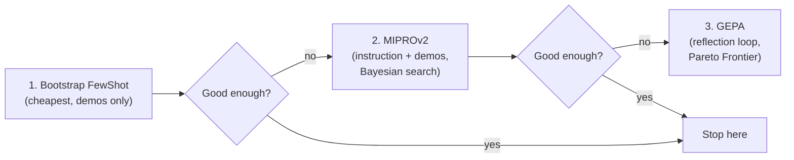

# 🧬 DSPy Optimizers — Bootstrap FewShot, MIPROv2 & GEPA (Reflective Prompt Optimization)

- <i>**Series:** Structured LLM Generation (Prompt Engineering course) — Part 2, directly continuing the prior class's DSPy introduction (signatures, modules, and the Predict/ChainOfThought/ProgramOfThought/RLM modules) ·
- **Instructor:** Paul
- **Note on scope:** This entire session is about DSPy's optimizers — the piece explicitly deferred from the previous class. It builds a single worked example (a toy Q&A program) from scratch and runs it through all three of the instructor's recommended optimizers, in his recommended escalation order: Bootstrap FewShot, then MIPROv2, then GEPA. A wider ecosystem tour (RAG, ReAct agents, embeddings, adapters, fine-tuning-dataset generation) closes the session at deliberately high level, as pointers for self-study rather than a deep dive. Reinforcement-learning theory (GRPO/GSPO/PPO), full RAG/agent coverage, and actual fine-tuning execution are explicitly deferred to later modules.</i>

---

## 📑 Table of Contents

1. [Session Overview](#-session-overview)
2. [Learning Objectives](#-learning-objectives)
3. [Detailed Notes](#-detailed-notes)
   - [1. Recap: Prompt as Instruction Plus Demonstrations, and What "Compilation" Means](#1-recap-prompt-as-instruction-plus-demonstrations-and-what-compilation-means)
   - [2. The Generic Optimization Workflow](#2-the-generic-optimization-workflow)
   - [3. Designing a Strict Metric, and Why a 100% Baseline Is a Red Flag](#3-designing-a-strict-metric-and-why-a-100-baseline-is-a-red-flag)
   - [4. Worked Example: A Toy Q&A Program and Its Baseline](#4-worked-example-a-toy-qa-program-and-its-baseline)
   - [5. Optimizer 1 — Bootstrap FewShot](#5-optimizer-1--bootstrap-fewshot)
   - [6. Optimizer 2 — MIPROv2](#6-optimizer-2--miprov2)
   - [7. Optimizer 3 — GEPA: The Reflective, Pareto-Frontier Optimizer](#7-optimizer-3--gepa-the-reflective-pareto-frontier-optimizer)
   - [8. Comparing the Three Optimizers, and the Recommended Escalation Order](#8-comparing-the-three-optimizers-and-the-recommended-escalation-order)
   - [9. Practical Guardrails: Cost, Model Tier, and the Conditional-Router Pattern](#9-practical-guardrails-cost-model-tier-and-the-conditional-router-pattern)
   - [10. Wider DSPy Ecosystem Tour: RAG, Agents, Embeddings, Adapters, Fine-Tuning](#10-wider-dspy-ecosystem-tour-rag-agents-embeddings-adapters-fine-tuning)
   - [11. Design Judgment and Career Framing](#11-design-judgment-and-career-framing)
   - [12. Closing: Homework, Deferred Topics and Roadmap](#12-closing-homework-deferred-topics-and-roadmap)
4. [Glossary](#-glossary)
5. [Revision Notes — One-Minute Revision](#-revision-notes--one-minute-revision)
6. [Cheat Sheet](#-cheat-sheet)
7. [Interview Questions & Answers](#-interview-questions--answers)
8. [Scenario-Based Interview Questions](#-scenario-based-interview-questions)
9. [Hands-on Exercises](#-hands-on-exercises)
10. [Practice Assignment](#-practice-assignment)
11. [Additional Resources](#-additional-resources)
12. [Final Revision Sheet](#-final-revision-sheet)

---

## 🎯 Session Overview

This session is dedicated entirely to DSPy's **optimizers** — the mechanism that actually improves a DSPy program without a human hand-editing its prompt. It covers:

1. **The generic optimization workflow** shared by every optimizer: build a dataset, define a strict metric, get a baseline score, run an optimizer, re-evaluate.
2. **Bootstrap FewShot** — the cheapest optimizer, which only ever adds few-shot demonstrations and never touches the instruction.
3. **MIPROv2** — a four-stage optimizer that rewrites both the instruction and the demonstrations, searching a combinatorial space via Bayesian optimization (Optuna).
4. **GEPA ("Genetic-Pareto")** — the newest, most advanced optimizer, built around a reflection-model feedback loop and a Pareto Frontier of surviving prompts, claimed in its paper to outperform reinforcement-learning approaches like GRPO at a fraction of the cost.
5. **The instructor's own recommended escalation order** (Bootstrap → MIPROv2 → GEPA) and practical guardrails — cost, model-tier selection, and a conditional-router pattern to avoid over-applying expensive optimizers to simple requests.
6. A closing, high-level tour of the wider DSPy ecosystem (RAG, ReAct agents, embeddings, adapters, fine-tuning-dataset generation), offered as self-study pointers rather than taught in depth.

> 💡 **Key framing, given directly, on the day's central thesis:** *"Keep in mind this part. This is very, very important, I can say... the idea is replace prompts with programs."*

---

## 🎯 Learning Objectives

By the end of this guide, you will be able to:

- [ ] Explain what "prompt" means inside DSPy (instruction + demonstrations), and what "compilation" refers to.
- [ ] Design a metric function for DSPy optimization, and explain why it must be strict rather than loose.
- [ ] Walk through Bootstrap FewShot's algorithm step by step, and explain exactly what it can and cannot change.
- [ ] Walk through MIPROv2's four stages, and explain why it needs Bayesian optimization rather than exhaustive search.
- [ ] Explain GEPA's reflection-model feedback loop and the Pareto Frontier concept, and why GEPA keeps multiple surviving prompts instead of one "best" prompt.
- [ ] State the instructor's recommended order for trying optimizers, and justify it in terms of cost and diagnostic power.
- [ ] Recognize when applying an optimizer like GEPA to every request is over-engineering, and describe the conditional-router alternative.

---

## 📚 Detailed Notes

### 1. Recap: Prompt as Instruction Plus Demonstrations, and What "Compilation" Means

#### 📖 Definition — DSPy's Definition of "Prompt"

> 💡 **Given directly:** *"Prompt, whenever I say, in DSPY, prompt is basically a combination of instruction plus demos."*

A DSPy signature has three components: a typed input, a typed output, and a docstring, which the instructor repeatedly calls **the instruction**.

> 💡 **Given directly:** *"This particular doctrine acts like the instruction. You have to understand, this is the mean instruction... off the signature."*

The day's central question: can the instruction be improved automatically, without a human hand-editing it? Two ways to improve it are possible — leave the instruction as-is and add more information (few-shot examples), or rewrite the instruction entirely. Either way requires two things: data, and a metric to evaluate against.

#### 🔍 Internal Working — "Compilation"

> 💡 **Given directly:** *"In DSPY, we use this term, compilation, whenever we are doing any type of optimization... this DSPY compilation term is widely being used."* The instructor also compares it directly to a compiler: *"think of it like a compiler... with respect to optimized prompts."*



#### 🎯 Key Takeaways

* "Prompt" in DSPy always means instruction + demonstrations together, not just the instruction text.
* "Compilation" is DSPy's own word for running an optimizer against a program.
* Every optimizer discussed today differs mainly in *which half* of "prompt" it's allowed to touch, and by what mechanism.

---

### 2. The Generic Optimization Workflow

#### 🪜 Step-by-Step — The Pipeline Shared by Every Optimizer

1. Define signatures and modules (carried over from the previous class).
2. Generate or collect training examples. AI-generation is acceptable, but validate: *"at least do the validation."* Keep few-shot datasets small — *"probably keep it always less than 100"* examples.
3. Convert generated pairs into DSPy's own `dspy.Example` format — a plain JSON pair is not accepted directly.

```python
dspy.Example(question=..., answer=...).with_inputs("question")
```

4. Split into train and dev/test sets (this session used a 70/30 split — 40 generated examples → 28 train / 12 dev).
5. Define a custom metric function, taking `(example, prediction)` and returning a score, with an explicit pass/fail threshold.
6. Compute a baseline score (no optimization yet) using `dspy.Evaluate`.
7. Run an optimizer: `optimizer.compile(program, trainset=...)`.
8. Re-evaluate on the same dev/test set with the same metric, and compare to the baseline.

> 💡 **Given directly:** *"DSPY directly, it won't accept the JSON [as is]... you need to convert into DSPY [format]... This is common with every framework."*

#### 🔍 Internal Working — What "Running" Means During Optimization

> 💡 **Given directly:** *"When I say guys run, it means that no Python execution, I'm making the LLM call."* Optimization proceeds by making real LLM calls against training examples, not by executing arbitrary code.

#### ⚠ Common Mistakes

* Assuming a small training set causes ML-style underfitting — it doesn't; see Section 3 for why that mental model doesn't apply here.
* Passing raw JSON directly into an optimizer without converting to `dspy.Example` first.
* Skipping human (or LLM-as-judge) validation on the *test/dev* set specifically — training data can tolerate some noise, but the dev/test set must be genuine ground truth.

#### 🎯 Key Takeaways

* Every optimizer in this session follows this same eight-step skeleton; they differ only in steps 7 (what the optimizer actually changes) and how it searches.
* Multiple LLMs can be used at different stages with no restriction — one to generate data, a different one to run or evaluate.
* Optimizers can be chained: run each in a loop and keep whichever produces the best result.

---

### 3. Designing a Strict Metric, and Why a 100% Baseline Is a Red Flag

#### 📖 Definition — The Metric Is the Single Most Important Design Decision

> 💡 **Given directly:** *"This is where you have to think, and you have to apply this metric. Now, this is not like anybody can directly tell you. It is based on your use case... Without this metric, you cannot actually proceed... please plan for this metric."*

#### 🔍 Internal Working — Strictness, Not Looseness

> 💡 **Given directly:** *"Just be sure this is very, very strict. It should be strict, don't make it loose... If you try to make it loose, then automatically... more examples will pass... So the idea is keep it on the stricter side."*

> 💡 **Given directly, on the 100% baseline red flag:** *"Don't say overfitting, overfitting. These words don't come here... If you're getting a baseline score of 100%, it means that the problem is with respect to your metric that you have defined. It means that it is not strict... it means that the evaluation criteria which you are using, it's very bad."*

The instructor explicitly separates this from machine-learning overfitting/underfitting: *"the idea with respect to overfitting and underfitting comes with respect to MLDL-based [training loops]... Here, it won't happen [that way]... It might happen if you have not defined a good metric."*

#### 🪜 Step-by-Step — Building the Session's Metric Function

```python
def answer_metric(example, prediction):
    expected = example.answer.lower().split()
    predicted = prediction.answer.lower().split()
    if not expected:
        return 0
    score = len(set(expected) & set(predicted)) / len(expected)
    return 1 if score > 0.5 else 0
```

Lowercase and split both the expected and predicted answers into words, compute the overlap ratio against the expected word count, and return 1 if that ratio clears a 0.5 threshold, else 0. Demonstrated live: removing part of the expected answer's wording from a prediction correctly drops the score from 1 to 0.

#### 🎯 Key Takeaways

* Metrics can be multi-condition — combine several scoring mechanisms (e.g., code quality + test cases + syntax checks) with an AND-style gate.
* Cosine similarity, softmax, or sigmoid can all be used inside a custom metric — the only real requirement is that the function is *mathematically executable* and returns a score.
* Training examples can tolerate some imperfection, but the dev/test set must be genuine, human-validated (or LLM-as-judge-validated) ground truth — *"without GT, the evaluation won't work."*
* If literally nothing in the training set clears the threshold, the fix is usually to lower the threshold, not to assume something is broken.

---

### 4. Worked Example: A Toy Q&A Program and Its Baseline

#### 🪜 Step-by-Step — The Program Under Test

```python
class QA(dspy.Signature):
    """Answer questions with short, factual responses."""
    question = dspy.InputField()
    answer = dspy.OutputField()

class SimpleQA(dspy.Module):
    def __init__(self):
        super().__init__()
        self.generate = dspy.ChainOfThought(QA)

    def forward(self, question):
        return self.generate(question=question)

baseline = SimpleQA()
```

#### 🔍 Internal Working — The PyTorch Analogy

> 💡 **Given directly:** *dspy.Module is "highly inspired from PyTorch"* — `forward()` plays the same role as PyTorch's forward propagation, triggered automatically when the module instance is called, the same way `nn.Module.__call__` triggers `forward`.

#### 🪜 Step-by-Step — Running the Baseline Evaluation

```python
evaluator = dspy.Evaluate(
    devset=devset,          # 12 examples
    metric=answer_metric,
    num_threads=4,          # depends on your system's thread count
    display_progress=True
)
baseline_score = evaluator(baseline)
```

The instructor's own run scored **58.33%** — flagged explicitly as LLM-dependent (one student using a different provider got roughly 40%).

#### ⚠ Common Mistakes

* The training-data generator used in this demo drew from only 4–5 seed topics, so many generated Q&A pairs repeat — an explicitly-flagged shortcut, not a production-quality data-generation approach, and one the instructor said he would *not* recommend without human validation.

#### 🎯 Key Takeaways

* This single baseline program is what every optimizer in the rest of the session is run against, so results are directly comparable.
* DSPy ships other built-in metrics worth knowing about for later exploration — e.g. "complete and grounded" (for RAG) and "semantic F1" — not covered in depth here.

---

### 5. Optimizer 1 — Bootstrap FewShot

#### 📖 Definition — What It Can and Cannot Change

> 💡 **Given directly:** *"Bootstrap FuelShot never changes the instruction. This part, it will never change. What can change? Only the demo part."*

#### 🪜 Step-by-Step — The Algorithm

1. Start with an existing prompt/instruction and a training set of examples.
2. DSPy runs the original program against the training set, making real LLM calls.
3. Collect the predicted output for each training example.
4. Compare each prediction against the metric/threshold — accept if it passes, reject if it doesn't.
5. From the accepted examples, select the top-N (parameter: `max_bootstrapped_demos`) — not all successes are added, just the top N.
6. Insert these N demos into the prompt (instruction + new demos).
7. Recompile the program with this new prompt.

Stop condition: whichever comes first — all training samples processed, or the target demo count reached. One student correctly summarized this live (*"it processed 5 out of 28 before stopping... it can hit the demo target also"*), confirmed by the instructor as exactly correct.

```python
from dspy.teleprompt import BootstrapFewShot

teleprompter = BootstrapFewShot(
    metric=answer_metric,
    max_bootstrapped_demos=4
)
optimized_bootstrap = teleprompter.compile(SimpleQA(), trainset=trainset)

bootstrap_score = evaluator(optimized_bootstrap)
print(bootstrap_score - baseline_score)
```

The instructor's run improved from a 58.33% baseline to roughly 83.5%; other students in the room reported a wide range of deltas, all noted as LLM-dependent and non-reproducible across different providers.

#### 🔍 Internal Working — Inspection, Saving, and the "Not a Black Box" Claim

> 💡 **Given directly:** *"The implementation is not black box, everything is debuggable... don't think like it, it is a black box."*

Demos actually added to the compiled prompt can be inspected on the program's predictor object (marked `augmented=True`); the full conversation history used during compilation can be inspected via a history-inspection utility. Optimized programs can be persisted and reloaded:

```python
optimized_bootstrap.save("optimized_bootstrap1.json")
```

#### ⚠ Common Mistakes

* Assuming Bootstrap FewShot is a continuous, iterative optimization process — it isn't. It's a one-time compile pass; re-running it on unchanged data and an unchanged LLM produces the same result. (It can be re-run later as the ground-truth dataset grows.)
* Assuming more demos is automatically better without limit — the recommended range is roughly 3–6, "not more than 10." Bootstrap is meant to stay small; using thousands of examples defeats the point of "few-shot."

#### 🎯 Key Takeaways

* Bootstrap only ever touches the demonstration half of "prompt = instruction + demos" — the instruction is untouched.
* DSPy makes one additional LLM call per training example evaluated during optimization — confirmed directly in Q&A: *"for every sample, it is doing the prediction, so for sure, it will be making the calls."*
* It's the cheapest of the three optimizers covered this session, and the instructor's own recommended first step.

---

### 6. Optimizer 2 — MIPROv2

#### 📖 Definition — What Changed From Bootstrap

> 💡 **Given directly:** *"The idea is optimize the free form in the instruction, as well as the few short demonstrations."* Unlike Bootstrap, MIPROv2 changes **both** the instruction and the demonstrations. Version 1 is fully deprecated; only V2 is used. The paper is from Stanford's DSPy team, 2024.

> 💡 **Given directly, on cost:** *"This is very, very costly"* relative to Bootstrap.

#### 🪜 Step-by-Step — The Four Stages

**Stage 1 — Bootstrap demos (multiple candidate sets, not one).** Same mechanism as Bootstrap FewShot for producing good demonstrations, but instead of one set, MIPROv2 produces *several* candidate demo sets.

**Stage 2 — Instruction proposal (generation only, no evaluation yet).** DSPy asks an LLM — optionally a different, stronger model — to propose better instructions to replace the existing one, producing several candidate instructions. Confirmed directly in Q&A that no evaluation happens at this stage: *"No, no, there only we do the generation. Stage 2 is only about the generation."*

**Stage 3 — Combinations.** Every instruction candidate is combined with every demo-set candidate, producing potentially hundreds or thousands of combinations. Each is tested via a *separate* LLM call, so context limits are not an issue: *"these are separate calls... Calls are separate."*

**Stage 4 — Bayesian optimization over the combination space.** Exhaustively testing every combination is prohibitively expensive: *"trying every combination is not possible... this is an expensive task."* MIPROv2 instead runs multiple "trials" via **Optuna**, building a **surrogate model** from prior trial results to guide which combination to try next — explicitly clarified as *not* an LLM (*"surrogate model is not an LLM, just for theory"*), but a statistical model of the objective function. This is analogized to reduced/guided search techniques like Cuckoo Search rather than exhaustive enumeration.



#### 🔍 Internal Working — Parameters and Live Results

```python
from dspy.teleprompt import MIPROv2

mipro = MIPROv2(
    metric=answer_metric,
    auto="light",              # modes: light / medium / heavy
    num_candidates=...,        # API default: 4
)

optimized_mipro = mipro.compile(
    SimpleQA(),
    trainset=trainset,
    num_trials=...,
    valset=devset,
    minibatch=False            # True if the dataset is very large
)

mipro_score = evaluator(optimized_mipro)
```

The `auto` parameter has three cost/quality tiers — light, medium, heavy — and the instructor recommends starting with `light`. He stresses checking the actual API reference for current defaults (e.g., `num_candidates=4`, temperature default of 1) rather than assuming.

**Live results were mixed and explicitly non-reproducible across students** — in the instructor's own run, MIPROv2 matched Bootstrap's improvement over baseline but did not beat it; some students saw MIPROv2 win by a wide margin, others saw it underperform Bootstrap. His conclusion:

> 💡 **Given directly:** *"It's not necessary, as I told you. In your case, Bootstrap few-shot might work, but in our case... I cannot see any type of improvement with respect to Mipro V2... it's totally up to you."* He adds that with real production datasets (not this session's toy, repetitive domain data), *"MIPRO generally performs better than the bootstrap one, in real-time scenarios, if you really take real data."*

He also showed the actual rewritten instruction MIPROv2 produced — replacing the tiny original docstring with a long, scenario-framed instruction (paraphrased): *"Imagine you are an AI specialist assisting... during a critical machine learning deployment meeting, a colleague urgently asks you a technical question... use your expertise to provide a concise and factual answer, including the reasoning behind it..."* — used explicitly to prove that MIPROv2, unlike Bootstrap, genuinely rewrites the instruction text.

#### ⚠ Common Mistakes

* Assuming MIPROv2 always beats Bootstrap FewShot — on small, repetitive toy datasets it frequently does not; its advantage shows up more reliably on real, larger production data.
* Underestimating the combinatorial blow-up — 5 candidate instructions × 5 candidate demo sets already yields 25 base combinations before trials even begin.

#### 🎯 Key Takeaways

* MIPROv2 changes both instruction and demos, using Optuna-driven Bayesian optimization to avoid exhaustively testing every combination.
* It is meaningfully more expensive than Bootstrap FewShot, and its real-world advantage is most visible on realistic, non-repetitive datasets.
* Compiled MIPROv2 programs are saved and reloaded the same way as Bootstrap's.

---

### 7. Optimizer 3 — GEPA: The Reflective, Pareto-Frontier Optimizer

#### 📖 Definition — Why GEPA Is Considered a Step Change

> 💡 **Given directly:** *"Any optimizers before this, they never really looked [at] why the prompt is not working?... it generated, but really didn't observe why it didn't work."* GEPA (**G**enetic-**P**areto) introduces a reflection-based feedback loop: a separate, strong **reflection language model** analyzes *why* a prompt failed and generates improved instructions accordingly — described as a teacher-to-student relationship, with the reflection model as teacher and the original/base model as student.

The paper is described as roughly 96 pages, from December of the prior year — very recent relative to this class. GEPA's own claimed benchmark results (as read directly from the paper):

- Outperforms **GRPO** (a reinforcement-learning method) by 6% on average, up to 20% in some cases, using up to 30x fewer rollouts.
- Outperforms **MIPROv2** by roughly 10% on average.
- Total experiment cost across the paper's benchmarks: **$86** — repeatedly stressed as trivially cheap relative to RL/fine-tuning approaches: *"this amount is really nothing... when you try to think from reinforcement learning perspective, this is nothing."*
- Benchmarks used include HotpotQA (QA), AIME (math), PUPA, and a code-optimization "kernel" benchmark; models tested include Qwen3-8B and GPT-4.1 mini.
- GEPA can be used entirely standalone, without DSPy: *"you can directly install [GEPA], pip install gepa"* — DSPy is simply the recommended integration for AI pipelines, not a requirement.

#### 🔍 Internal Working — The Pareto Frontier Concept

Taught via a laptop-shopping analogy: four laptops (A–D) each have a price and a star rating. One (D) is strictly worse than another on every axis (same price, lower rating) and gets discarded — it is *dominated*. The remaining three each win on a different axis (cheapest, best-performing, most balanced) — none dominates all the others, so **all three are kept** rather than collapsing to a single "winner." This surviving set is the **Pareto Frontier**.

> 💡 **Given directly, generalizing to prompts:** *"Similarly, in prompts, you will be having multiple examples with respect to prompts. Because one prompt can be specialized for one thing, the other prompt will be specialized for another thing."*

> 💡 **Given directly, on why multiple prompts are kept rather than one:** *"There is no singularity. Here, you try to introduce diversity... You are not dependent only on the best prompt... use every possible solution, but discard the one which is totally... the weakest solution... the problem of getting stuck with a single style of prompt also get[s] reduced."*

The term **prompt mutation** describes how prompts evolve across iterations of the reflective feedback loop, echoing the "genetic" half of GEPA's name.

#### 🪜 Step-by-Step — GEPA's Full Workflow

1. Start with a normal baseline DSPy program (instruction only, same starting point as any optimizer).
2. Split the training set into train and validation.
3. Execute the current prompt on the training data to get model answers.
4. Evaluate against the metric (same evaluation infrastructure as before).
5. Bring in the **reflection model**: it looks at the current instruction, the question, the base model's answer, and the ground truth, and produces diagnostic **feedback** on *why* the answer was wrong or what's missing.
6. Using that feedback, GEPA rewrites the instruction: *"who does the rewriting of the prompts? [GEPA] does it."*
7. Execute the new, improved prompt.
8. Decide whether to stop or repeat — explicitly compared to a **ReAct-style loop**, which can run for many iterations (10, 20, 30+), governed by a configurable "exhaustion budget" (light/medium/heavy, analogous to MIPROv2's `auto` parameter).
9. On stopping, the result kept is not a single "best" prompt but the surviving **Pareto Frontier set** — typically fewer than 10 prompts — since different prompts in the set may specialize for different sub-task types.



#### ⚠ Common Mistakes

* Expecting a single runtime "compare" step where an incoming query is checked against the Pareto Frontier one prompt at a time — there isn't one. The evaluation/scoring mechanism classifies the incoming question against the known characteristics of the surviving prompts directly; it scales to however many candidate prompts exist, with no special-case logic for ambiguous or overlapping fits.
* Treating GEPA's instruction-rewriting as mandatory — the instruction change is actually optional in GEPA; adding demonstrations is not the main agenda.

#### 🎯 Key Takeaways

* GEPA is the only one of the three optimizers with a genuine diagnostic feedback system — Bootstrap and MIPROv2 only accept/reject, with no explanation of *why* something failed.
* The reflection model should be a strong, top-tier model, since it is responsible for diagnosing failures — described directly as the teacher to the base model's student.
* Dataset size and model tier trade off directly: with a very large dataset, a lower-tier model may be the only practical option; with a small dataset, a top-tier reflection model is both affordable and preferable, since the quality of feedback is everything.

---

### 8. Comparing the Three Optimizers, and the Recommended Escalation Order

#### 📖 Definition — Comparison Table

| Optimizer | Changes | Search Mechanism | Notes |
|---|---|---|---|
| **Bootstrap FewShot** | Demos only | None — simple accept/reject copy of passing examples | *"This only copy examples... just like a copy operation."* Cheapest. |
| **MIPROv2** | Demos + Instruction | Bayesian optimization via Optuna | *"This is much more about searching what is best for you... this is only the search bar."* Medium/high cost. |
| **GEPA** | Demos + Instruction (instruction optional) | Reflection LM + Pareto Frontier | Highest cost, highest level of learning; the only one with an actual feedback/diagnostic system. |

> 💡 **Given directly, on MIPROv2 vs. GEPA:** *"If you do a mistake, okay, if there is a mistake, you cannot do anything, remember [with MIPROv2]"* — versus GEPA: *"if you even have a mistake, it will analyze the mistake, it will provide the feedback, it will rewrite the instruction, and it will evolve the prompt over multiple iterations. So, this is the highest level of learning with respect to prompt improvement that you can do."*

#### 🔍 Internal Working — The Recommended Order

> 💡 **Given directly:** *"Always start with few short, that's the first thing. Don't directly start with [GEPA]... start always the three level of paradigm. First, your few-shot bootstrap... then move to [MIPROv2], and then... [GEPA]... because you have done everything, and then if you feel that there is really no such improvement, then it doesn't make sense actually [to escalate further]."*



#### 🎯 Key Takeaways

* The escalation order is driven by cost, not by "GEPA is always right" — each step should only be taken if the previous one didn't deliver enough improvement.
* This ordering was repeated multiple times across the session in slightly different phrasings, confirming it as the instructor's core practical takeaway for the day.

---

### 9. Practical Guardrails: Cost, Model Tier, and the Conditional-Router Pattern

#### 📖 Definition — Model-Tier Guidance

> 💡 **Given directly:** *"If your dataset is really, really huge, then you have no options. Then you have to work with a low tier [model]."* Conversely: *"if your dataset is small, go with the top-tier one, I will suggest... because you need good feedback, the entire thing depends upon feedback."*

> 💡 **Given directly, on everyday model choice:** *"Start with Sonnet[-class model]... if your data set is very, very big, then only I will go with the [larger/top-tier model]... If you have only 1,000 calls, really doesn't need [that]... I will not use directly the top tier."*

#### 🔍 Internal Working — The Over-Engineering Concern and Its Fix

A student raised a direct, practical concern: running every single request through GEPA's full reflection/rewrite pipeline is over-engineering for simple tasks — *"is that not an over-engineering thing?... not that every single sentence of my request has to go through this [GEPA] rigmarole... It's an overkill for me, right?"*

> 💡 **Given directly, the instructor's answer:** *"Through a conditional router, where very specifically, if you activate... this totally becomes your conditional logic, routing logic. Where you want to use [GEPA], where you don't want to use [it]... if you have a very simple task, then for sure why you want to do it. When you have something much more complex, then only it makes much more sense. It even comes with a cost."*

#### ⚠ Common Mistakes

* Routing every incoming request through the most expensive optimizer's compiled program regardless of task complexity — the recommended pattern is a **conditional router** that gates expensive, GEPA-optimized paths behind an actual complexity check.

#### 🎯 Key Takeaways

* "Optimization always comes with a cost" — a recurring, direct warning throughout the session, not just about GEPA.
* A conditional router that only escalates complex requests to a heavily-optimized (e.g., GEPA-compiled) path is the practical answer to the over-engineering concern, rather than avoiding optimization altogether.

---

### 10. Wider DSPy Ecosystem Tour: RAG, Agents, Embeddings, Adapters, Fine-Tuning

This entire section was explicitly framed as a rapid, non-deep-dive overview meant to point toward notebooks for self-study.

> 💡 **Given directly:** *"I don't want to continue DSPY... probably the core idea I have already given of optimization. Now, later on, according to your needs, get onto the modules."*

#### 🔍 Internal Working — Each Topic, at the Level It Was Actually Covered

* **RAG (toy example only):** A custom retriever built with simple keyword-based matching — no real vector database. The instructor was explicit about avoiding heavyweight wrapper libraries here: *"LangChain and LlamaIndex [are] pretty much bloated stuff. Just use exactly the thing that you need."* His recommendation when a vector database is genuinely needed: call that database's own package directly (Qdrant, Milvus, Weaviate, ChromaDB) rather than going through a wrapper's abstraction layer. The RAG signature used three fields: context, question, answer, with retrieval → context assembly → generation via `dspy.ChainOfThought`.
* **ReAct agents:** Mentioned only at a high level — reasoning/act loop, multiple tools connectable via DSPy. Full coverage explicitly deferred: *"React agent will come when I discuss [LangChain], so pretty much a long journey."*
* **Embeddings via DSPy:** DSPy can generate embeddings directly (e.g., calling an embedding model) rather than reaching for a separate library — shown only as a quick example.
* **Adapters:** Sit between DSPy and the language model for customization — JSON-based, XML-based, and a default chat adapter, plus history-saving adapters. Useful for chat-based or structured-output work; not covered in depth.
* **Fine-tuning-dataset generation:** A concrete, stated use case — using DSPy specifically to generate fine-tuning datasets, converting the result to the **Alpaca format** for PEFT-style fine-tuning, with human validation or LLM-as-judge validation of the generated samples. Actual fine-tuning execution (and integration with Unsloth) is deferred to a later, dedicated module.
* **Module catalog, named only:** custom modules, "best of N," "sample and select" flows, a newer ReAct variant, and **RLM (Recursive Language Model)** integration — still experimental/unstable in DSPy's own namespace, connecting back to the RLM concept introduced in the prior class as an alternative to context-window chunking.

#### 🎯 Key Takeaways

* This section is deliberately shallow by design — its purpose is to show that DSPy extends naturally into RAG, agents, and fine-tuning workflows, not to teach any of them in depth here.
* The instructor's consistent stance against heavyweight wrapper libraries (LangChain, LlamaIndex) recurs here: use the underlying tool directly when you know exactly what you need.

---

### 11. Design Judgment and Career Framing

#### 📖 Definition — When DSPy Earns Its Place

> 💡 **Given directly:** *"If you are working with language model pipelines, LLM pipelines, then... [you] will bring DSPY. If I'm not working with language model pipelines or LLM pipelines, then I won't bring DSPY into the picture."*

The migration from manual prompting to DSPy is framed as gradual, not a single-day switch: *"might take time... not like in one day you can take the shift. You have to plan and do that. But at least I will say that the experience will be much more better, rather than handling a lot of prompts."*

#### 🔍 Internal Working — An Interview-Evaluation Digression (Career Framing)

A student asked directly whether listing packages/frameworks on a resume increases the chance of a resume being accepted, and whether interviews focus mainly on conceptual/theoretical or situational questions.

> 💡 **Given directly:** *"Generally, see, for me, frameworks doesn't matter... when you start taking [about] a project... you will say that, yes, this was the main pain point... how you overcome that? That will be my main idea, always... Exactly framework, anything, programming language, those things are not the value. Exactly your approach and how you solve the problem, it matters."*

> 💡 **Given directly, on how the instructor actually evaluates candidates:** *"In real time, when I ask questions, simply I can understand based on 4 or 10 questions that you have worked in real time on... the problems they will tell, from there, only anybody can analyze [candidate quality]."*

#### 🎯 Key Takeaways

* Framework/library name-dropping is explicitly downplayed as an interview signal; depth of real problem-solving on actual projects is what's said to matter.
* DSPy's value proposition is scoped narrowly and honestly: it belongs specifically in LLM-pipeline work, not everywhere.

---

### 12. Closing: Homework, Deferred Topics and Roadmap

#### 🎯 Key Takeaways — What's Explicitly Deferred

* **Full RAG module and RAG-specific evaluation metrics** (groundedness/faithfulness) — deferred to dedicated future RAG classes: *"here I have not taken an actual vector DB... Later on, you can switch it."*
* **Full ReAct/agentic framework coverage** — deferred entirely to when LangChain is taught.
* **Actual fine-tuning execution** (PEFT, Unsloth integration) — deferred to Module 4: *"right now, doing fine-tuning really doesn't make sense."*
* **Reinforcement-learning theory** (GRPO, GSPO, PPO, policy gradients) — deferred to Module 4, explicitly framed as theory-only, high-level coverage for alignment purposes, not hands-on: *"theoretically, reinforcement learning is not in your syllabus, but for alignment purposes, you need GRPO."*
* **Deeper Bayesian-optimization theory** underlying MIPROv2/GEPA, and the remainder of the GEPA paper (kernel-optimization section, full appendix) — left as self-study.
* **Additional/older DSPy optimizers** beyond the three covered (e.g., an older, superseded optimizer, KNN-FewShot-style variants) — pointed to a separate self-study notebook.
* **A possible dedicated extra DSPy session** (2–3 hours, proposed for a weekday evening) — floated as contingent on a student poll, not confirmed.
* **Next module's content** (transformer fine-tuning from scratch, attention variants, VLLM/paged attention, KV cache) — named as coming up in Module 3, not part of this session.

#### 🎯 Key Takeaways — What Was Actually Covered Today

1. The generic optimization workflow (dataset → `dspy.Example` → split → metric → baseline → optimizer → re-evaluate).
2. Bootstrap FewShot, in full algorithmic detail.
3. MIPROv2, in full four-stage detail, including its Optuna-based Bayesian search.
4. GEPA, including the Pareto Frontier concept, the reflection-model feedback loop, and its benchmark claims against GRPO and MIPROv2.
5. The recommended escalation order and cost/model-tier guardrails, including the conditional-router pattern for avoiding over-engineering.
6. A high-level, self-study-oriented tour of RAG, ReAct agents, embeddings, adapters, and fine-tuning-dataset generation via DSPy.

---

## 📝 Glossary

| Term | Definition |
|---|---|
| **Compilation** | DSPy's term for running an optimizer against a program to improve its prompt. |
| **Prompt (DSPy sense)** | Instruction (the signature's docstring) plus demonstrations — the object every optimizer changes. |
| **Demonstration(s) / Demos** | Few-shot examples inserted into a prompt. |
| **Bootstrap FewShot** | The cheapest optimizer; adds demos only, never changes the instruction. |
| **`max_bootstrapped_demos`** | Parameter controlling how many demos Bootstrap FewShot adds (recommended range roughly 3–10). |
| **MIPROv2** | An optimizer that rewrites both instruction and demos via a four-stage pipeline, using Bayesian optimization (Optuna) to search the combination space. |
| **Optuna** | A Bayesian hyperparameter-optimization library used internally by MIPROv2. |
| **Surrogate model** | A statistical model of the objective function built from prior optimization trials, used to guide the next trial — explicitly not an LLM. |
| **GEPA (Genetic-Pareto)** | A reflection-based optimizer that diagnoses *why* a prompt failed via a separate reflection model, and rewrites the prompt accordingly; keeps a Pareto Frontier of surviving prompts rather than one "best" prompt. |
| **Reflection language model** | A separate, typically stronger model used by GEPA to diagnose failures and generate feedback; the "teacher" to the base model's "student." |
| **Pareto Frontier** | The set of non-dominated solutions (here, prompts) that each win on some dimension, none dominating all the others — kept together rather than collapsed to a single winner. |
| **Prompt mutation** | GEPA's term for how a prompt evolves across iterations of its reflective feedback loop. |
| **GRPO** | A reinforcement-learning policy-optimization method used as GEPA's paper's main comparison baseline. |
| **Conditional router** | An architectural pattern that gates expensive, heavily-optimized paths (e.g., GEPA-compiled programs) behind a complexity check, so simple requests skip the costly path. |
| **Alpaca format** | A dataset format used when converting DSPy-generated Q&A pairs for PEFT-style fine-tuning. |

---

## 🔄 Revision Notes — One-Minute Revision

* Prompt = instruction + demos. Compilation = running an optimizer.
* Metric must be strict; a 100% baseline means the metric is broken, not that the model is perfect.
* Bootstrap FewShot: demos only, cheapest, one-time compile.
* MIPROv2: instruction + demos, four stages, Bayesian search via Optuna, more expensive.
* GEPA: instruction (optional) + demos, reflection-model feedback loop, keeps a Pareto Frontier of prompts, claims to beat GRPO and MIPROv2, cheapest of all relative to RL.
* Recommended order: Bootstrap → MIPROv2 → GEPA, escalating only if the previous step underperforms.
* Guard against over-engineering with a conditional router — don't run every request through the most expensive optimized path.
* RAG, ReAct agents, fine-tuning execution, and RL theory are all explicitly deferred to future modules.

---

## 📋 Cheat Sheet

| Optimizer | Changes Instruction? | Changes Demos? | Search Method | Relative Cost |
|---|---|---|---|---|
| Bootstrap FewShot | No | Yes | None (accept/reject copy) | Lowest |
| MIPROv2 | Yes | Yes | Bayesian optimization (Optuna) | Medium–High |
| GEPA | Optional | Yes | Reflection LM + Pareto Frontier | Highest (but cheap vs. RL) |

```python
# Generic pattern for any optimizer
optimizer = SomeOptimizer(metric=my_metric, **params)
optimized_program = optimizer.compile(baseline_program, trainset=trainset)
score = evaluator(optimized_program)
optimized_program.save("optimized.json")
```

---

## 🔥 Interview Questions & Answers

### 🟢 Beginner

**Q1.**

**Question:** What does "prompt" mean specifically inside DSPy?

**Answer:** The combination of the instruction (the signature's docstring) plus any demonstrations attached to it.

**Explanation:** Directly, explicitly confirmed.

**Why Interviewers Ask This:** Tests whether a candidate understands DSPy's core vocabulary before discussing optimizers.

**Possible Follow-up:** "Which optimizer changes only one half of that combination?"

**Q2.**

**Question:** What does "compilation" mean in DSPy?

**Answer:** DSPy's term for running an optimizer against a program to improve its prompt.

**Explanation:** Directly, explicitly confirmed, with an explicit compiler analogy.

**Why Interviewers Ask This:** Tests basic terminology fluency.

**Possible Follow-up:** "What's actually produced at the end of a compile call?"

**Q3.**

**Question:** Why is a baseline metric score of 100% treated as a red flag rather than a good sign?

**Answer:** It almost always means the metric itself is too loose or badly defined, not that the model performed perfectly.

**Explanation:** Directly, explicitly confirmed, with the instructor explicitly rejecting the "overfitting" framing for this scenario.

**Why Interviewers Ask This:** Tests whether a candidate can reason about evaluation design rather than just running an optimizer blindly.

**Possible Follow-up:** "What's the difference between this and true ML overfitting/underfitting?"

**Q4.**

**Question:** Which optimizer never changes the instruction, only the demonstrations?

**Answer:** Bootstrap FewShot.

**Explanation:** Directly, explicitly, repeatedly confirmed.

**Why Interviewers Ask This:** Tests basic recall of what distinguishes the three optimizers.

**Possible Follow-up:** "What parameter controls how many demos it adds?"

**Q5.**

**Question:** What library does MIPROv2 use internally for its search, and what kind of model is it?

**Answer:** Optuna, a Bayesian hyperparameter-optimization library — not a language model.

**Explanation:** Directly, explicitly confirmed.

**Why Interviewers Ask This:** Tests understanding that MIPROv2's search mechanism is a statistical optimization technique, not another LLM call layer.

**Possible Follow-up:** "What's a surrogate model, and why isn't it an LLM either?"

**Q6.**

**Question:** What does GEPA stand for, and what's its key innovation over Bootstrap and MIPROv2?

**Answer:** Genetic-Pareto; its key innovation is a reflection-model feedback loop that diagnoses *why* a prompt failed, rather than just accepting or rejecting outputs.

**Explanation:** Directly, explicitly confirmed.

**Why Interviewers Ask This:** Tests whether a candidate grasps what actually makes GEPA different, not just that it's "newer."

**Possible Follow-up:** "What does the reflection model actually look at when diagnosing a failure?"

**Q7.**

**Question:** What is a Pareto Frontier, in the context of GEPA's output?

**Answer:** The set of surviving prompts, none of which dominates all the others across every evaluation dimension — kept together rather than collapsed to one "best" prompt.

**Explanation:** Directly, explicitly confirmed, with a worked laptop-shopping analogy.

**Why Interviewers Ask This:** Tests understanding of why GEPA keeps multiple prompts instead of one.

**Possible Follow-up:** "Why does keeping multiple prompts help, rather than just picking the single highest scorer?"

**Q8.**

**Question:** Can GEPA be used without DSPy at all?

**Answer:** Yes — it can be installed and used standalone (`pip install gepa`); DSPy is simply the recommended integration for AI pipelines.

**Explanation:** Directly, explicitly confirmed.

**Why Interviewers Ask This:** Tests whether a candidate understands GEPA as an independent technique, not a DSPy-exclusive feature.

**Possible Follow-up:** "Why would you choose to use it through DSPy anyway?"

**Q9.**

**Question:** What is the instructor's recommended order for trying these three optimizers?

**Answer:** Bootstrap FewShot first, then MIPROv2, then GEPA — escalating only if the previous step doesn't deliver enough improvement.

**Explanation:** Directly, repeatedly confirmed.

**Why Interviewers Ask This:** Tests practical judgment about cost-aware escalation, not just knowledge of all three tools.

**Possible Follow-up:** "Why not just start with GEPA, since it's claimed to be the best?"

**Q10.**

**Question:** According to the session, does running every single request through GEPA's full pipeline make sense?

**Answer:** No — that's over-engineering for simple tasks; a conditional router should gate expensive optimized paths behind a complexity check.

**Explanation:** Directly, explicitly confirmed, prompted by a student's own cost concern.

**Why Interviewers Ask This:** Tests architectural judgment about when optimization is and isn't worth its cost.

**Possible Follow-up:** "What would that conditional router actually check?"

---

### 🟡 Intermediate

**Q11.**

**Question:** Walk through Bootstrap FewShot's algorithm step by step.

**Answer:** Run the original program against the training set (real LLM calls), collect predictions, score each against the metric/threshold, keep the top-N passing examples as demos (`max_bootstrapped_demos`), insert them into the prompt, and recompile.

**Explanation:** Directly, explicitly confirmed, including a student's live, correct summary.

**Why Interviewers Ask This:** Tests whether a candidate actually understands the mechanism, not just the label "adds demos."

**Possible Follow-up:** "What are the two possible stop conditions?"

**Q12.**

**Question:** Why does DSPy make additional LLM calls specifically during the optimization/compilation process?

**Answer:** Because each training example must actually be run through the program to get a prediction to score against the metric — one call per training sample tested.

**Explanation:** Directly, explicitly confirmed in Q&A.

**Why Interviewers Ask This:** Tests awareness of the real cost implications of running an optimizer, not just its API surface.

**Possible Follow-up:** "How does that cost scale differently between Bootstrap, MIPROv2, and GEPA?"

**Q13.**

**Question:** Describe MIPROv2's four stages in order.

**Answer:** (1) Bootstrap multiple candidate demo sets. (2) Propose multiple candidate instructions via an LLM, generation only. (3) Build the full combination space of every instruction paired with every demo set. (4) Use Bayesian optimization (Optuna, with a surrogate model) to search that combination space without exhaustive enumeration, and pick the best-scoring combination.

**Explanation:** Directly, explicitly confirmed, whiteboarded live.

**Why Interviewers Ask This:** Tests depth of understanding of a specific, non-trivial multi-stage algorithm.

**Possible Follow-up:** "Why is exhaustive testing of every combination not feasible here?"

**Q14.**

**Question:** Why doesn't MIPROv2's combination-testing stage hit the LLM's context limit, even with hundreds of combinations?

**Answer:** Because each (instruction, demo-set) combination is tested via its own separate LLM call, not all packed into a single call.

**Explanation:** Directly, explicitly confirmed in Q&A.

**Why Interviewers Ask This:** Tests whether a candidate understands the actual execution model, not just the conceptual algorithm.

**Possible Follow-up:** "What does that imply about the total number of LLM calls MIPROv2 makes during compilation?"

**Q15.**

**Question:** What is GEPA's reflection model actually shown, and what does it produce?

**Answer:** It's shown the current instruction, the question, the base model's answer, and the ground truth — and it produces diagnostic feedback on why the answer was wrong or what's missing, which is then used to rewrite the instruction.

**Explanation:** Directly, explicitly confirmed, whiteboarded step by step.

**Why Interviewers Ask This:** Tests whether a candidate can articulate the actual data flow, not just say "it reflects."

**Possible Follow-up:** "What is this loop explicitly compared to, in terms of control flow?"

**Q16.**

**Question:** According to the GEPA paper as discussed, roughly how much did it outperform GRPO and MIPROv2, and at what cost?

**Answer:** About 6% better than GRPO on average (up to 20% in some cases, with up to 30x fewer rollouts), about 10% better than MIPROv2 on average, at a total experiment cost of about $86.

**Explanation:** Directly, explicitly confirmed, as read from the paper.

**Why Interviewers Ask This:** Tests recall of concrete, quantified claims rather than vague "it's better" statements.

**Possible Follow-up:** "Why does the instructor stress the $86 figure so heavily?"

**Q17.**

**Question:** Why does GEPA's real-world usefulness depend on the choice of reflection-model tier versus dataset size?

**Answer:** Because the reflection model's feedback quality drives the entire optimization; with a small dataset a top-tier reflection model is affordable and preferable, while with a very large dataset a lower-tier model may be the only practical choice.

**Explanation:** Directly, explicitly confirmed, stated as an explicit heuristic twice.

**Why Interviewers Ask This:** Tests whether a candidate can reason about cost/quality trade-offs in a specific, non-generic way.

**Possible Follow-up:** "How does the GEPA paper's own choice of Qwen3-8B and GPT-4.1 mini illustrate this trade-off?"

---

### 🔴 Advanced

**Q18.**

**Question:** A stakeholder asks why you shouldn't just always use GEPA, since its paper claims it beats both MIPROv2 and reinforcement learning. How do you respond?

**Answer:** Cost and complexity still scale with GEPA's reflective loop; the recommended practice is to escalate only from Bootstrap → MIPROv2 → GEPA as needed, and to gate GEPA-optimized paths behind a conditional router so simple requests don't pay for a pipeline they don't need.

**Explanation:** Directly, explicitly confirmed via the escalation-order discussion and the conditional-router exchange.

**Why Interviewers Ask This:** Tests whether a candidate can push back on "always use the best-benchmarked tool" thinking with real architectural judgment.

**Possible Follow-up:** "What would the router actually condition on?"

**Q19.**

**Question:** Design a metric function for a DSPy optimization task where you want to avoid the "100% baseline" trap. What should you check for?

**Answer:** Ensure the metric is strict rather than loose — verify it rejects near-misses, uses a meaningful threshold, and ideally combines multiple scoring conditions rather than one lenient check; if the baseline still scores 100%, treat that as evidence the metric needs tightening, not that the model is flawless.

**Explanation:** Directly, explicitly confirmed as the session's core metric-design guidance.

**Why Interviewers Ask This:** Tests applied judgment, not just recall of the "keep it strict" rule.

**Possible Follow-up:** "How would you combine multiple scoring conditions into a single pass/fail metric?"

**Q20.**

**Question:** You have a production LLM pipeline where different prompt variants seem to each be "best" for different sub-tasks. Which optimizer's output structure is naturally suited to this, and why?

**Answer:** GEPA — its Pareto Frontier explicitly preserves multiple surviving, non-dominated prompts rather than collapsing to a single winner, precisely because different prompts can specialize for different sub-task types.

**Explanation:** Directly, explicitly confirmed via the Pareto Frontier discussion and its generalization to prompts.

**Why Interviewers Ask This:** Tests whether a candidate can map a real production scenario onto the specific mechanism that solves it, rather than defaulting to "use the newest tool."

**Possible Follow-up:** "How does GEPA decide, at runtime, which surviving prompt to apply to an incoming request?"

---

## 🧪 Scenario-Based Interview Questions

**Scenario 1:** Your team runs Bootstrap FewShot on a new DSPy program and sees zero improvement over baseline — in fact, the baseline itself scores 100%. What's your first move, and why?

**Approach:** Don't optimize further yet — first inspect and tighten the metric function, since a 100% baseline signals a metric that's too loose (near-misses passing) rather than a genuinely solved task; only after fixing the metric should the optimizer be re-run.

**Scenario 2:** A stakeholder wants every user request to go through your most heavily GEPA-optimized program, arguing "it's proven to be the best." What do you propose instead, and why?

**Approach:** Propose a conditional router that only sends complex requests down the GEPA-optimized path, keeping simple requests on a cheaper path (baseline or Bootstrap-optimized) — since optimization "always comes with a cost," and applying the most expensive path uniformly is over-engineering for simple cases.

---

## 🛠 Hands-on Exercises

### 🟢 Easy

- Write a `dspy.Example` conversion function that takes a list of raw JSON Q&A pairs and returns properly-formed `dspy.Example` objects with `.with_inputs("question")` applied.
- Define a strict, threshold-based metric function for a summarization task, and demonstrate that removing a key phrase from a candidate summary correctly drops its score below the pass threshold.

### 🟡 Medium

- Run Bootstrap FewShot on a small toy program, then inspect the compiled program's demos (look for `augmented=True` entries) to confirm exactly which examples were added.
- Compile the same baseline program with both Bootstrap FewShot and MIPROv2, and compare their resulting scores on a shared dev set — document which one wins and by how much.

### 🔴 Advanced

- Implement a conditional router in front of two compiled DSPy programs (a cheap baseline path and an expensive GEPA-optimized path), gating on a simple complexity heuristic of your own design (e.g., input length, keyword presence, or a lightweight classifier).
- Sketch (in pseudocode or an actual notebook) a GEPA-style reflective loop using a separate "reflection" LLM call that takes an instruction, a question, a wrong answer, and the ground truth, and produces a rewritten instruction — without using the actual GEPA library.

---

## 🏗 Practice Assignment

### Build: "A Three-Tier DSPy Optimization Report"

Using a small, self-chosen Q&A or classification task:

1. Build a baseline DSPy signature and module, and compute its baseline score against a strict, custom metric.
2. Compile it with Bootstrap FewShot, and report the score delta.
3. Compile it with MIPROv2 (starting with the `"light"` auto setting), and report the score delta versus both baseline and Bootstrap.
4. Write a short design note (a paragraph) arguing, based on your own results, whether escalating further to GEPA would be justified for this specific task — referencing the session's escalation-order and cost guidance directly.
5. Sketch a conditional router that would decide, for a stream of incoming requests, when to use your most-optimized program versus your baseline.

---

## 📚 Additional Resources

- DSPy's official homepage and documentation (the GEPA paper link is directly available there, per the instructor).
- The GEPA paper itself ("reflective prompt optimizer... genetic Pareto prompt optimizer that thoroughly incorporates natural language reflection to learn high-level rules from trial and error"), including its official tutorial notebooks (e.g., "GEPA for AIME math").
- Optuna's own documentation, for background on the Bayesian optimization technique MIPROv2 uses internally.
- Background reading/viewing on reinforcement learning and policy optimization (GRPO, PPO) for context on what GEPA's paper claims to outperform — the instructor specifically recommended Nathan Lambert's content for this background.
- A separate self-study notebook (referenced but not distributed in this transcript) covering additional/older DSPy optimizers beyond Bootstrap, MIPROv2, and GEPA.

---

## 📌 Final Revision Sheet

### ⭐ Core Concepts

- Prompt = instruction + demos; compilation = running an optimizer.
- Three optimizers, three levels of what they touch and how they search: Bootstrap (demos only, no search), MIPROv2 (instruction + demos, Bayesian search), GEPA (instruction optional + demos, reflection-model feedback loop + Pareto Frontier).

### ⭐ Important Definitions

- **Pareto Frontier:** the surviving, non-dominated set of prompts GEPA keeps, rather than a single winner.
- **Surrogate model:** the statistical (not LLM) model MIPROv2 builds from prior trials to guide its Bayesian search.
- **Conditional router:** an architecture pattern gating expensive optimized paths behind a complexity check.

### ⭐ Important Commands/Code

```python
from dspy.teleprompt import BootstrapFewShot, MIPROv2

bootstrap = BootstrapFewShot(metric=my_metric, max_bootstrapped_demos=4)
optimized_bootstrap = bootstrap.compile(program, trainset=trainset)

mipro = MIPROv2(metric=my_metric, auto="light")
optimized_mipro = mipro.compile(program, trainset=trainset, valset=devset)
```

### ⭐ Architecture/Process

- Generic workflow: data → `dspy.Example` → train/dev split → metric → baseline → compile → re-evaluate.
- MIPROv2's four stages: bootstrap demos → propose instructions → build combinations → Bayesian search.
- GEPA's loop: run → evaluate → reflect → rewrite → repeat until budget exhausted → keep the Pareto Frontier.

### ⭐ Best Practices

- Keep metrics strict; treat a 100% baseline as a metric bug, not a win.
- Escalate Bootstrap → MIPROv2 → GEPA only as needed.
- Gate expensive optimized paths behind a conditional router.
- Match reflection/optimization model tier to dataset size, not the other way around.

### ⭐ Common Mistakes

- Assuming small training sets cause ML-style underfitting here — they don't; problems trace back to the metric.
- Assuming MIPROv2 always beats Bootstrap — often it doesn't on small, repetitive datasets.
- Running every request through the most expensive optimized path regardless of complexity.

### ⭐ Interview Points

- Be able to name exactly what each optimizer changes and how it searches.
- Be ready to justify the escalation order in terms of cost, not just capability.
- Be able to explain the Pareto Frontier concept without conflating it with "just pick the best-scoring prompt."

### ⭐ Things to Remember

- GEPA can be used entirely without DSPy (`pip install gepa`).
- "Optimization always comes with a cost" — said directly, more than once.
- Framework name-dropping is explicitly downplayed as an interview signal; real problem-solving depth is what's said to matter.