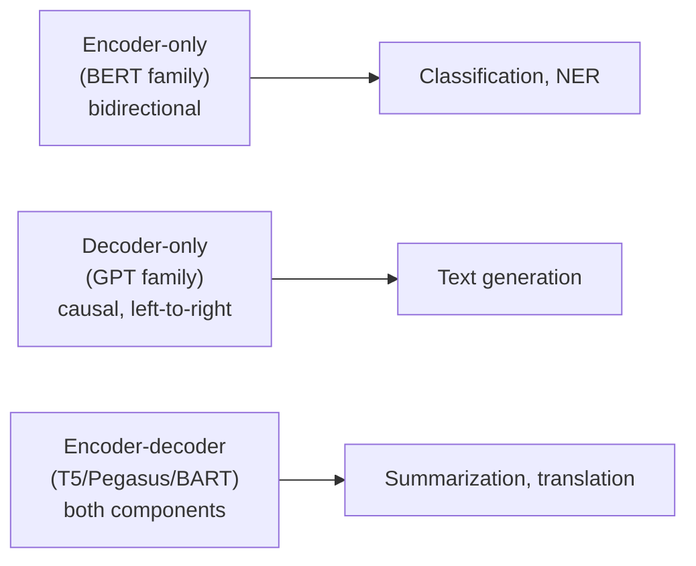
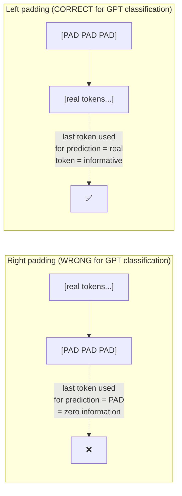

# 🏗 Fine-Tuning Transformer Architectures — Encoder, Decoder & Encoder-Decoder Fine-Tuning From Scratch

- <i>**Series:** Module 3 of the broader course — Part 1, opening a new module that follows directly from the DSPy/Prompt Engineering module (Module 2). The instructor explicitly framed Module 3's arc in the prior class as: vanilla transformer fine-tuning first, then naive decoding, KV cache, attention variants (MHA/GQA/MLA), and RoPE positional encoding — expected to run 3-4 classes ·
- **Instructor:** Paul
- **Note on scope:** This class is deliberately "old," pre-PEFT, 2019/2020-era full fine-tuning — explicitly not SFT, not alignment, not LoRA/PEFT (those are reserved for Module 4). It runs two full live training exercises (DistilBERT for sentiment classification, DistilGPT-2 for news classification) end to end, and shows — but does not execute live — a third, encoder-decoder (FLAN-T5) summarization notebook, assigned as self-study. A dedicated NER notebook was mentioned in the opening framing but not actually built or run in this class; it's included here only as a defined term. KV cache, attention variants, RoPE, paged attention, and VLLM/SGLang deployment are all explicitly deferred to upcoming classes in this same module, and PEFT/SFT/alignment techniques are deferred to Module 4.</i>

---

## 📑 Table of Contents

1. [Session Overview](#-session-overview)
2. [Learning Objectives](#-learning-objectives)
3. [Detailed Notes](#-detailed-notes)
   - [1. Framing: Three Architecture Families and Why This Module Starts "Old"](#1-framing-three-architecture-families-and-why-this-module-starts-old)
   - [2. Tooling and Setup: The Hugging Face Ecosystem and Netron for Visualization](#2-tooling-and-setup-the-hugging-face-ecosystem-and-netron-for-visualization)
   - [3. Encoder Model Variants and Choosing Cased vs Uncased](#3-encoder-model-variants-and-choosing-cased-vs-uncased)
   - [4. Full Fine-Tuning Walkthrough 1: DistilBERT for Sentiment Classification](#4-full-fine-tuning-walkthrough-1-distilbert-for-sentiment-classification)
   - [5. Training Results and Evaluation: DistilBERT](#5-training-results-and-evaluation-distilbert)
   - [6. Decoder-Only Fine-Tuning: DistilGPT-2 for News Classification](#6-decoder-only-fine-tuning-distilgpt-2-for-news-classification)
   - [7. The Padding Problem: Why GPT Needs Left Padding and BERT Needs Right Padding](#7-the-padding-problem-why-gpt-needs-left-padding-and-bert-needs-right-padding)
   - [8. Training Results and Evaluation: DistilGPT-2](#8-training-results-and-evaluation-distilgpt-2)
   - [9. Encoder-Decoder: FLAN-T5 for Summarization (Shown, Not Executed Live)](#9-encoder-decoder-flan-t5-for-summarization-shown-not-executed-live)
   - [10. Production Judgment: Model Selection, Serving and Scaling](#10-production-judgment-model-selection-serving-and-scaling)
   - [11. Production Judgment: Data Labeling, Continuous Pre-Training and Evaluation Without Ground Truth](#11-production-judgment-data-labeling-continuous-pre-training-and-evaluation-without-ground-truth)
   - [12. Closing: Deferred Topics and Roadmap](#12-closing-deferred-topics-and-roadmap)
4. [Glossary](#-glossary)
5. [Revision Notes — One-Minute Revision](#-revision-notes--one-minute-revision)
6. [Cheat Sheet](#-cheat-sheet)
7. [Interview Questions & Answers](#-interview-questions--answers)
8. [Scenario-Based Interview Questions](#-scenario-based-interview-questions)
9. [Hands-on Exercises](#-hands-on-exercises)
10. [Practice Assignment](#-practice-assignment)
11. [Additional Resources](#-additional-resources)
12. [Final Revision Sheet](#-final-revision-sheet)

---

## 🎯 Session Overview

This class opens Module 3 by getting hands-on, syntactically fluent with vanilla transformer fine-tuning again — deliberately "old," 2019/2020-era technique, with nothing PEFT-, SFT-, or alignment-related. It covers:

1. **The three architecture families** (encoder-only, decoder-only, encoder-decoder) and a tour of encoder model variants (DistilBERT, ALBERT, RoBERTa, DeBERTa, ELECTRA, ModernBERT, BioBERT).
2. **A full, live, end-to-end fine-tuning run of DistilBERT** for 3-class sentiment classification on the Cardiff NLP tweet-sentiment dataset — dataset loading, tokenization, training configuration, training, evaluation, custom inference, and pushing to Hugging Face.
3. **A full, live, end-to-end fine-tuning run of DistilGPT-2** for 4-class news classification on AG News — with a deep, explicit contrast against the BERT run: causal vs. bidirectional attention, and the critical, easy-to-miss requirement that GPT-style classification needs **left** padding, not right padding.
4. **A conceptual, not-executed-live tour of an encoder-decoder notebook** (FLAN-T5, for summarization via ROUGE), assigned as self-study homework.
5. **An unusually long, practical, production-facing Q&A** — model-family selection under compliance constraints, serving fine-tuned models (VLLM/SGLang vs. Hugging Face hosting), scaling strategies, evaluation without ground truth, data-labeling bottlenecks, and continuous pre-training.

> 💡 **Key framing, given directly:** *"There is nothing conceptually, everything, the idea is getting syntactically familiar with Transformers. Okay, that is the main idea behind today's session."*

---

## 🎯 Learning Objectives

By the end of this guide, you will be able to:

- [ ] Name the three transformer architecture families and give an example model for each.
- [ ] Explain the difference between cased and uncased tokenizers, and when each is the right choice.
- [ ] Walk through a full fine-tuning pipeline for an encoder-only model using `Trainer`/`TrainingArguments`, including hardware-aware choices (BF16 vs. FP16, fused vs. non-fused AdamW).
- [ ] Explain why GPT-style models require left padding for classification, and what breaks if you use right padding instead.
- [ ] Read and interpret a classification report, confusion matrix, and epoch-by-epoch training/validation loss trajectory for a fine-tuned model.
- [ ] Reason about production model selection, serving, and scaling decisions the way a working ML engineer would, including compliance-driven constraints.
- [ ] Explain the data-labeling bottleneck in domain-specific fine-tuning, and describe at least two mitigations (continuous pre-training, RL-based reward-driven labeling).

---

## 📚 Detailed Notes

### 1. Framing: Three Architecture Families and Why This Module Starts "Old"

#### 📖 Definition — The Three Families

> 💡 **Given directly:** *"Encoder specific Architectures Then you have, like, decoder... And finally, the combination of sequence-to-sequence models, encoder and decoder both."*

- **Encoder-only** (BERT-family): bidirectional attention, used for classification, NER, and other understanding tasks.
- **Decoder-only** (GPT-family): causal (left-to-right) attention, used for generation tasks.
- **Encoder-decoder** (T5/Pegasus/BART-family): both components, used for sequence-to-sequence tasks like summarization and translation.

> 💡 **Given directly, on why the module starts here:** *"Now these are not PEPT related texts... it's pure take the data, then let's build a sentiment model... Similarly for encoder-decoder, something like text summarization that we can pick up."*

#### 🔍 Internal Working — Deliberately Not Advanced

Full fine-tuning of all parameters, no PEFT, no SFT, no alignment techniques — those are explicitly reserved for Module 4. The instructor frames this as "Transformers Revisited": *"Nothing related to your actual fine-tuning, where we use PEPT. SFT alignment, those type of techniques, nothing."*



#### 🎯 Key Takeaways

* Only a free Google Colab T4 GPU is required for this class — nothing more.
* The plan stated at the outset was sentiment (BERT), NER (BERT), and summarization (encoder-decoder); in practice, the class actually delivered sentiment (BERT), news classification (GPT), and a conceptual (not live) walkthrough of summarization — NER was only defined verbally, not built.

---

### 2. Tooling and Setup: The Hugging Face Ecosystem and Netron for Visualization

#### 📖 Definition — The Core Library Stack

Libraries: `transformers`, `datasets`, `evaluate`, `accelerate` — described directly as *"pretty much the entire [Hugging Face] Transformers ecosystem."* Core classes: `AutoTokenizer`, `AutoModelForSequenceClassification`, `TrainingArguments`, `Trainer`, and `pipeline`.

#### 🔍 Internal Working — Netron for Architecture Visualization

> 💡 **Given directly:** *"I've been using it back from 2019, when Nitron [Netron] came... this is one of the fastest way... you can simply drop up a model."*

Netron (netron.app) can open a model's Safetensors, ONNX, PyTorch, Pickle, or TensorFlow file directly in the browser and render its layer-by-layer architecture — demonstrated live by dropping DistilBERT's `model.safetensors` (~268 MB) in and walking through embeddings → layer normalization → linear layers. *"More than, I think, 30, 40 model formats are supported."*

#### ⚠ Common Mistakes

* Trying to run pandas operations directly on a Hugging Face `Dataset` object — it has its own format and needs an explicit `.to_pandas()` conversion first: *"directly you cannot use Pandas-based operation on top of that."*
* Loading an older, Parquet-format Hugging Face dataset with a recent `datasets` library version (5.x) without a `revision` tag — this throws an error; the fix is adding the `revision` tag explicitly.
* Not moving the dataset to the GPU alongside the model — moving only the model does nothing on its own: *"if you don't move it to the GPU... what is the benefit of using the GPU? Then do everything on CPU."*

#### 🎯 Key Takeaways

* Pandas itself is not GPU-optimized; for GPU-native tabular work, the instructor mentioned Polars or "FireDucks" as better-suited alternatives.
* Netron is a fast, no-setup way to inspect any model's architecture without writing code — useful at any point, not just for debugging.

---

### 3. Encoder Model Variants and Choosing Cased vs Uncased

#### 📖 Definition — The Variant Landscape

DistilBERT (smallest/fastest, recommended starting point), ALBERT (parameter-efficient, the instructor's personal favorite), RoBERTa ("I use less"), ELECTRA, DeBERTa (v1, v2, v3 — v3 called "the modern encoders"), ModernBERT (a newer, heavier architecture), BioBERT (domain-specific, built on top of BERT).

> 💡 **Given directly, on the instructor's own workflow:** *"I start with Distilbert, then directly I will be going for parameter efficiency, directly I will look into Albert. If Albert is performing fine... Modern BERT... that is a heavier architecture."*

#### 🔍 Internal Working — Cased vs. Uncased

Explained via a named-entity example: for tasks like NER, lowercasing a word like "London" removes capitalization that signals it's a proper noun, losing context. For tasks where capitalization carries no useful signal — such as sentiment classification — the **uncased** version is the right, simpler choice.

> 💡 **Given directly:** *"If I actually try to make it a smaller case operation, automatically, lesser context, because it really cannot understand with respect to the noun part."*

#### ⚠ Common Mistakes

* Defaulting to the heaviest/most-recent architecture first — the instructor's explicit rule is to always start with the lightest, fastest option and escalate only if needed: *"generally I don't start any task with a heavier model. Always do the testing with a light version."*
* Assuming BERT can't be used in production — it can: *"Yes, you can use BERT in production also, it totally depends upon the problem statement."*

#### 🎯 Key Takeaways

* The escalation path recommended: DistilBERT → ALBERT → ModernBERT, skipping most of the variants in between as optional experiments rather than defaults.
* Cased vs. uncased is a genuine task-dependent decision, not a fixed default — driven by whether capitalization carries task-relevant information.

---

### 4. Full Fine-Tuning Walkthrough 1: DistilBERT for Sentiment Classification

#### 🪜 Step-by-Step — Dataset and Task

**Dataset:** Cardiff NLP `tweet_sentiment_multilingual`, English subset. Labels: 0=negative, 1=neutral, 2=positive. Splits: train 1839, validation ~324, test ~870 — all pre-existing splits pulled directly from Hugging Face.

**Tokenizer output fields:** `labels`, `input_ids`, `token_type_ids`, `attention_mask`. The CLS token is ID 101; BERT's vocabulary size is roughly 30K. BERT uses **right padding** by default.

#### 🔍 Internal Working — Training Configuration

```python
model_name = "distilbert-base-uncased"
max_seq_length = 128
num_train_epochs = 3
weight_decay = 0.01           # deliberately not too small — avoid values like 0.0001
eval_strategy = "epoch"
load_best_model_at_end = True
metric_for_best_model = "f1_weighted"
logging_steps = 50
report_to = "none"            # Weights & Biases named as the standard integration, not wired in here
bf16 = torch.cuda.is_available() and gpu_supports_bf16   # else fp16
optim = "adamw_torch_fused" if device_type == "cuda" else "adamw_torch"
```

> 💡 **Given directly, on weight decay:** *"Don't keep it very, very small, like .0001 or something like that. Keep it at 0.1 [or] probably .001. Because it will actually help you at any point of time if it gets stuck in the mean loss function curve... it gives a decent amount of push towards your local minima progression."*

> 💡 **Given directly, on BF16 vs. FP16:** *"Brain float [BF16] is much more optimized for your hardware, whereas the normal float 16, that is the generic version... the brain float concept came from Google only [and] this is BERT. This is also Google['s] architecture."* Fallback rule: *"if you really don't have the hardware with you, then by default use FP16 only... it doesn't make sense to use BF16 if there is no availability of CUDA."*

> 💡 **Given directly, on fused AdamW:** *"The fused version works much better on top of GPUs. There is no added benefit when [used] on top of CPUs."*

Full fine-tuning updated all parameters — no layers frozen. Total trainable parameters: **~66 million**. `label2id`/`id2label` mappings were passed into the model config for later decoding.

#### ⚠ Common Mistakes

* Setting batch size and other VRAM-sensitive parameters without checking actual GPU utilization first — mid-training, the instructor noticed under 20% GPU usage on the T4 and increased the batch size accordingly: *"Out of 50, probably less than 20% of the GPU which is being used... from here, directly, I know that, yes, we can increase it."*
* Ignoring the compute-first principle when picking a model size: *"Compute availability in the field of deep learning... how much compute you have, based on that, always take the decision."*

#### 🎯 Key Takeaways

* Batch size is the single most VRAM-sensitive training parameter; gradient accumulation exists specifically to let smaller-VRAM setups simulate a larger effective batch size.
* Steps-per-epoch = dataset length / batch size; total steps = steps-per-epoch × number of epochs — a simple, always-applicable formula for estimating training time.

---

### 5. Training Results and Evaluation: DistilBERT

#### 🔍 Internal Working — What the Numbers Looked Like

Only 3 epochs were run deliberately. Training loss dropped from roughly 1.04; validation loss moved from about 0.87 down to roughly 0.68–0.69 by the final epoch — described as "not a lot of improvement." Final weighted F1 landed close to 0.64, and test-set eval loss was about 0.7274, close enough to the validation loss that the instructor didn't flag an underfitting concern:

> 💡 **Given directly:** *"Directly, if you look into this particular accuracy, then only you can say that underfitting scenario. But again, the percentage is very less... once we look into the longer results, then from there we can actually do the evaluation."*

#### 📖 Definition — Reading the Classification Report

Precision was higher for the positive class, lower for the neutral class; recall was higher for the negative class. The instructor's stated preference:

> 💡 **Given directly:** *"I prefer always the models which are always having higher recalls as compared to higher precision. That is how things works in real world also."*

#### 🪜 Step-by-Step — Custom Inference and Deployment

A custom PyTorch inference function was walked through: tokenize the input, move tensors to the active device, put the model in `eval()` mode, run under `torch.no_grad()`, apply `torch.softmax()` to the logits, and take the `argmax` for the predicted label and its confidence. Sample predictions: *"I absolutely love the product"* → positive at 81% confidence; *"This is terrible"* → negative; *"The package arrived on time, this is nothing special"* → neutral — described as *"most of the samples looks correct to me."*

The high-level `pipeline()` wrapper was also demoed as a simpler alternative to manual inference code. The trained model was saved locally, reloaded to verify, and pushed to the Hugging Face Hub (requiring a write-access token) — students were assigned to push their own trained model and share the link.

#### ⚠ Common Mistakes

* Judging a model purely from training loss/accuracy: *"Nobody looks into the training [loss] or the training accuracy and directly judge the result. It's a very, very bad practice."*
* Forgetting that the test set must stay completely untouched until the very end: *"test is something like totally unsafe. It means that you keep it totally out of the system. Once the model is available, then only you bring it."*

#### 🎯 Key Takeaways

* A classification report's precision/recall imbalance across classes is informative on its own — a preference for recall over precision is a deliberate, stated design choice here, not a universal rule.
* Saving, reloading, and pushing to the Hub is part of the standard workflow, not an optional afterthought.

---

### 6. Decoder-Only Fine-Tuning: DistilGPT-2 for News Classification

#### 📖 Definition — Why Bidirectional Context Usually Wins for Classification

> 💡 **Given directly:** *"We can use GPT also for classification... Only thing, you have to just maintain your last token through left padding."* But the instructor's stated general preference is still encoder-style models for classification: *"I need a bi-directional context, always."*

#### 🔍 Internal Working — Attention Type and Pre-Training Objective Contrast

| Aspect | Encoder (BERT) | Decoder (GPT) |
|---|---|---|
| Attention | Bidirectional | Causal ("only left to right, just because of the mask") |
| Pre-training objective | Masked Language Modeling (MLM) — "fill in the blanks" | Next-word prediction (autoregressive) |
| Padding token by default | Enabled | **Not** enabled by default |
| Special tokens | CLS, SEP, segment/token-type IDs | None of these by default; EOS marks sequence end |

> 💡 **Given directly:** *"By default, the padding token is always enabled in [BERT-based] architectures, whereas, by default, it is not enabled in GPT."* Manual setup required: `tokenizer.pad_token = tokenizer.eos_token` and `tokenizer.padding_side = "left"`.

#### 🪜 Step-by-Step — Dataset: AG News

News classification into 4 classes (World, Sports, Business, Sci/Tech). Roughly 120K training rows and ~7K test rows, with **no pre-built validation split** — the instructor manually sampled one: 600 samples/class (2,400 total) for training-derived data, 100/class for validation, 1,000 total for test (250/class).

> 💡 **Given directly, on why a proper validation split matters:** *"Nobody looks into the training [loss]... [it's] a very, very bad practice."* (Same principle as Section 5, reapplied here since this dataset required manual splitting.)

GPT-2's tokenizer vocabulary is roughly **50K** tokens, versus BERT's ~30K — confirmed live via a class quiz. There is no CLS token; the EOS ("end of text") token substitutes for marking sequence boundaries.

#### ⚠ Common Mistakes

* Assuming encoder architectures have no attention masking at all — they do, just a different kind. A student ("Alok") correctly recalled this from an earlier class: *"there are two types of mask. One is the padding token mask... in encoder side also you have the mask"* (as opposed to GPT's causal/multi-head-attention mask).
* Not accounting for average sequence length vs. `max_seq_length` when choosing padding — average token length on this training set was about 50, against a `max_seq_length` of 128, meaning roughly 78 tokens per sequence were pure padding on average.

#### 🎯 Key Takeaways

* GPT-2's default vocabulary is noticeably larger than BERT's — a fact worth remembering for tokenizer-related questions.
* DistilGPT-2's Safetensors file (~353 MB) is meaningfully larger than DistilBERT's (~268 MB), reflecting more parameters, despite both being "distil"/lightweight variants of their respective families.

---

### 7. The Padding Problem: Why GPT Needs Left Padding and BERT Needs Right Padding

#### 📖 Definition — The Core Mechanism

For classification, the model bases its prediction on the **last token's** representation. Because GPT uses causal (left-to-right) attention, if you right-pad a GPT sequence, the actual final token in the tensor becomes a meaningless PAD token — carrying zero real information for the classifier to use.

> 💡 **Given directly:** *"If we actually do a right padding... my right, the last token, probably in the sequence... it will be having a zero information."*

#### 🔍 Internal Working — The Left-Padding Fix

Padding is instead placed **before** the real sequence, so the tensor always ends with a genuine, informative token:

> 💡 **Given directly:** *"Padding on the left ensures that the actual text ends with the position minus 1... giving the model a meaningful final token to do the prediction on."*



`config.pad_token_id` must also be set manually so `AutoModelForSequenceClassification`'s classification head can correctly locate each sequence's true last token.

#### ⚠ Common Mistakes

* Applying BERT's default right-padding convention to a GPT-based classifier without thinking it through — this silently produces a classifier that's making predictions off empty padding tokens.
* Forgetting to set `tokenizer.pad_token` at all for GPT-2, since it has no pad token by default — this will error out or silently misbehave unless explicitly configured.

#### 🎯 Key Takeaways

* This padding-side distinction (right for BERT, left for GPT when the last token matters for the task) is one of the most concrete, testable, easy-to-get-wrong details in this entire session.
* By default, GPT's `padding_side` is `None`/unset; left padding should only be chosen deliberately when the last token genuinely matters for the downstream task.

---

### 8. Training Results and Evaluation: DistilGPT-2

#### 🔍 Internal Working — Training Trajectory

Training loss started around 0.49 and dropped over the epochs; validation loss also dropped. Accuracy/weighted-F1 rose across epochs (roughly 82 → 86 → 87%). Final test evaluation: validation loss ≈ 0.27, test loss ≈ 0.7 ("close to validation... I will say that this is good"), accuracy and weighted F1 both landing around 89–90%.

> 💡 **Given directly, on run-to-run reproducibility:** *"Generally, the seed will always set the idea as the values will be close... but if you change the parameters or batch size, anything, so for sure the impact will be there. So the values will be different, for sure."*

#### 📖 Definition — Per-Class Performance

Sports performed the best; World performed well but slightly behind Sports; Business and Science/Tech were the weaker classes — described as "somehow not improving but again 86, 85 [percent], good," with more training samples suggested as the fix.

#### 🪜 Step-by-Step — Live Misprediction Example

At least one custom sports-headline example was mispredicted live, with the model's confidence in the 57–59% range on the wrong class:

> 💡 **Given directly:** *"Expected sports, but again here the model is performing bad, I can say, in the sports category... yes, there will be mistakes, and error rates are there."*

The `pipeline()` wrapper was again demoed as a simpler high-level interface for the same task, and the model was saved, reloaded, and pushed to the Hugging Face Hub the same way as the BERT run.

#### ⚠ Common Mistakes

* Expecting perfect predictions from a lightweight, quickly-fine-tuned model — the instructor treats occasional mispredictions as expected and normal, not a sign of a broken pipeline.

#### 🎯 Key Takeaways

* Roughly 80% of the two notebooks' content overlaps; the meaningful 20% difference is entirely the padding-side/tokenizer configuration.
* Batch-size best practice: *"try to always use the number 2 to the power of [N]... if you use 50, it means that your hardware is not optimized. Hardware is optimized for 2 [to the power of N]."*

---

### 9. Encoder-Decoder: FLAN-T5 for Summarization (Shown, Not Executed Live)

#### 📖 Definition — Why It Wasn't Run Live

The instructor explicitly named this the remaining architecture family and opened the notebook, but did not execute it live due to time cost:

> 💡 **Given directly:** *"The training time will be much more higher because you have encoder as well as decoder guys... the training time can be 30-40 minutes because the number of parameters are close to 10x."* The instructor had pre-run it on an **A100** to save time, but left the notebook's actual settings configured for a free-tier T4: *"Here I was working with A100, but again, everything is configured according to T4 settings."*

#### 🔍 Internal Working — Model and Metric Choices

Model: **FLAN-T5 (large variant)** — *"Flan is, like, one of the best versions of T5."* Other seq2seq options surveyed for later exploration: plain T5, Pegasus/Pegasus-X (commonly used for summarization), mT5, and Meta's BART — with a notable aside that *"the initial Llama was built on top of BART."*

Metric: **ROUGE** (ROUGE-1, ROUGE-2) — tied explicitly back to earlier course material: *"Previously, already, I have taught you Rouge 1, Rouge 2... This is summarization, so word-to-word, that's why Rouge score comes into the system."*

#### ⚠ Common Mistakes

* Skipping this notebook because it wasn't run live in class — the instructor was explicit that it's still required reading: *"Look into the third notebook that I have shared, don't skip it... The core settings are same, so please don't ignore that."*

#### 🎯 Key Takeaways

* Encoder-decoder models carry roughly 10x the parameters of the classification models used earlier in this session, which directly explains the much longer training time.
* This notebook was assigned as self-study homework, not covered in depth — expect roughly 15-20 minutes to skim it properly.

---

### 10. Production Judgment: Model Selection, Serving and Scaling

#### 📖 Definition — Model Selection Heuristic

> 💡 **Given directly:** *"Start with always a smaller variant, then look into the upgraded variant... always look into the number of downloads... at least do a testing on top of your subset. From there, at least you will know that we are going ahead in the right direction."*

Deployment-target and cost modeling come before architecture:

> 💡 **Given directly:** *"The first criteria that I take is time, latency of that particular model in general responses... Then the next step, for the model execution, if I try to host it in a custom environment, then at least what will be the charge for the... every month?... at least try to think that solution that you are building, at least from a 3-year prospect, 5-year prospect."*

#### 🔍 Internal Working — Compliance-Driven Model-Family Selection

A student's org restricts models from certain countries of origin for compliance reasons. The instructor's response frames family selection as often dictated by legal/procurement constraints, not pure technical merit:

> 💡 **Given directly:** *"In organizations, if they reject anything from the Chinese family... Queen [Qwen] family is widely used... but in some case, if they say it is not required, then probably some other family... If nothing is available, by default, go with Llama. Whole world accepts Llama. There is nobody who will reject Llama... Mistral has also a few open models that you can actually look into. Those models, nobody will reject."*

#### 🪜 Step-by-Step — Serving and Scaling

Saving a fine-tuned model to the Hugging Face Hub is storage, not serving:

> 💡 **Given directly:** *"You need some type of inferencing server, whether probably you want to proceed it with VLLM, or you want to proceed it with SGLang... if you want to host it in Hugging Face [for serving], that is a much more costlier solution. Generally, nobody does it. The whole world uses SGLang or VLLM."*

Scaling guidance: solve for a smaller number of concurrent requests first, then scale up incrementally, using serverless-GPU platforms (named: **Runpod**) for elastic horizontal scaling:

> 💡 **Given directly:** *"At least, look, first of all, try to solve the problem of 10,000, then move to 20,000. It's not like directly we start solving the problem of 100K [requests]."*

#### ⚠ Common Mistakes

* Assuming local/on-device inference always needs a GPU — it doesn't; a GPU mainly buys lower latency. On a machine with at least 12GB VRAM, models under 4 billion parameters are generally runnable, with 30-40 tokens/second considered a good mark and under 10 tokens/second the bare minimum acceptable.
* Picking a model purely by benchmark reputation rather than by deployment target, latency needs, and a proper A/B test against a curated evaluation set with real ground truth.

#### 🎯 Key Takeaways

* A tool named **"LLM fit"** was recommended for checking hardware-vs-model-size compatibility and expected tokens/second.
* Self-hosted serving (VLLM/SGLang) is typically cheaper long-term for enterprises than third-party hosted inference, especially with long-term contract discounts (cited as up to ~70%).

---

### 11. Production Judgment: Data Labeling, Continuous Pre-Training and Evaluation Without Ground Truth

#### 📖 Definition — Continuous Pre-Training (CPT)

Raised in response to a question about re-training FinBERT on fresh market data without erasing prior learning:

> 💡 **Given directly:** *"Why old training? There is a concept of CPT, continuous pre-training."*

#### 🔍 Internal Working — The Data-Labeling Bottleneck

A detailed real exchange: a student had raw, current equity-market data but labeling was the bottleneck (manual labeling of ~2,000 samples took about 3 days), and using general-purpose LLMs for labeling produced too many mistakes on inspection, with additional restrictions on LLM use.

> 💡 **Given directly:** *"If there is restriction on that, then finally, because generally in every team we have that annotation team who does it and then we get the data... Data is always expected... if you say I cannot use LLM also, then how the hell I will actually train any type of supervised learning techniques. Not possible, practical."*

The suggested mitigation: **RL-based, reward-driven labeling**, still followed by human validation:

> 💡 **Given directly:** *"Probably using RL, you can actually do the labeling also by building a reward point system. Through RL, it is possible... after that, also, a new [round of human] validation is required."*

Rough data-volume guidance given: *"samples at least 30k, 50k, then we proceed towards a decent model. If it becomes 100K, 300K, a better version."*

#### 🪜 Step-by-Step — Evaluation Without Ground Truth

A recurring, blunt principle across multiple Q&A exchanges this session:

> 💡 **Given directly:** *"Without the ground truth, practically not possible."* And on trying to make evaluation free of LLM-calling cost: *"It has to be completely custom logic. It means that no LLM calling... based on your use case, you need to create [metrics]. Otherwise, how you can make the cost completely zero?"*

When an LLM-as-judge is genuinely needed, it should be a stronger model than the one being judged, not necessarily top-tier: *"the idea is at least you take a better version [of model]... Not necessarily a top tier, but at least a better version of the existing one."*

#### ⚠ Common Mistakes

* Believing free/zero-cost LLM-based evaluation is realistic in production — it isn't, without either custom non-LLM metrics or accepting the cost of a stronger reference model.
* Assuming full fine-tuning always destroys a pretrained model's prior knowledge — empirically, full fine-tuning on a generic, in-domain (same-language) task caused less than a 1% accuracy drop compared to the un-fine-tuned base model in this session's own results; the risk rises sharply only when the downstream domain or language diverges significantly, at which point the tokenizer itself may also need retraining.

#### 🎯 Key Takeaways

* Ground truth is the non-negotiable requirement for both supervised training and evaluation — there is no way around needing it in some form (human, LLM-assisted, or RL-bootstrapped).
* Catastrophic forgetting from full fine-tuning is a real but often overstated risk for in-domain, same-language tasks; it becomes a serious concern mainly when shifting language or domain substantially.

---

### 12. Closing: Deferred Topics and Roadmap

#### 🎯 Key Takeaways — What's Explicitly Deferred

* **Naive/next decoding problem and KV cache** — named as the very next topic: *"From tomorrow, we will start with the [next] decoding problem, and why exactly the KV cache."*
* **Attention variants over time** (MHA, GQA, MLA), including what DeepSeek R1 used, and **RoPE** positional encoding upgrades — both named as upcoming Module 3 material.
* **Paged attention** — theory only, still within Module 3.
* **VLLM in practice** — deferred to a later "deployment" module; only discussed conceptually here.
* **PEFT, SFT, and alignment techniques** — explicitly reserved for **Module 4**: *"those are advanced strategies that we'll be discussing in Mod 4."*
* **A dedicated NER notebook** — only defined verbally ("NER stands for Named Entity Recognization"), not built or run despite being named in the original session plan.
* **GPT-based text-generation as a downstream task** (rather than classification) — suggested as self-practice, not covered live.
* **Zero-shot fine-tuning** — pointed to Hugging Face's own documentation, not covered in class.

#### 🎯 Key Takeaways — What Was Actually Covered Today

1. The three architecture families and an encoder-model variant tour.
2. Netron for model-architecture visualization.
3. A complete, live DistilBERT fine-tuning run for sentiment classification, with full training-configuration reasoning and evaluation.
4. A complete, live DistilGPT-2 fine-tuning run for news classification, with a deep, explicit contrast against BERT's attention type, padding convention, and tokenizer.
5. A conceptual (not live) tour of an encoder-decoder FLAN-T5 summarization notebook, assigned as self-study.
6. An extended, practically-oriented Q&A on production model selection, serving, scaling, evaluation, and data-labeling challenges.

---

## 📝 Glossary

| Term | Definition |
|---|---|
| **Encoder-only architecture** | Bidirectional-attention transformer family (BERT and variants), used for classification, NER, and understanding tasks. |
| **Decoder-only architecture** | Causal-attention transformer family (GPT and variants), used for generation tasks. |
| **Encoder-decoder architecture** | Combines both components (T5, Pegasus, BART), used for sequence-to-sequence tasks like summarization. |
| **Cased / Uncased tokenizer** | Whether the tokenizer preserves original capitalization (cased) or lowercases everything (uncased); choice depends on whether capitalization carries task-relevant signal. |
| **Netron** | A browser-based tool for visualizing a model's architecture directly from its saved weights file (Safetensors, ONNX, PyTorch, Pickle, TensorFlow). |
| **BF16 (bfloat16)** | A more hardware-optimized floating-point format than FP16 on modern (Google-originated) hardware; falls back to FP16 if unsupported. |
| **Fused AdamW** | A GPU-optimized variant of the AdamW optimizer; offers no benefit on CPU. |
| **Right padding** | Padding tokens added after the real sequence; the default and correct choice for BERT-style classification. |
| **Left padding** | Padding tokens added before the real sequence; required for GPT-style classification so the last token stays informative. |
| **CLS token** | BERT's special token (ID 101) used as the aggregate sequence representation for classification. |
| **EOS token** | GPT's "end of text" token, doubling as its pad token when one is manually configured. |
| **CPT (Continuous Pre-Training)** | Continuing to pre-train a model on new data without discarding its prior learning, as an alternative to full re-training. |
| **VLLM / SGLang** | The two dominant self-hosted LLM inference-serving frameworks, contrasted with the higher cost of hosting inference directly via Hugging Face. |
| **Runpod** | A named serverless-GPU platform used for elastic, on-demand model-serving pod scaling. |

---

## 🔄 Revision Notes — One-Minute Revision

* Three families: encoder (bidirectional, classification/NER), decoder (causal, generation), encoder-decoder (both, summarization/translation).
* Always start small: DistilBERT → ALBERT → ModernBERT for encoders.
* Cased vs. uncased depends on whether capitalization matters for the task.
* Full fine-tuning updates every parameter; BF16 + fused AdamW when CUDA is available, FP16 + torch AdamW otherwise.
* BERT uses right padding by default; GPT needs left padding for classification, because the last token drives the prediction and a right-padded PAD token there carries zero information.
* GPT's vocab (~50K) is larger than BERT's (~30K); GPT has no CLS token or pad token by default.
* Encoder-decoder models carry ~10x the parameters of the classification models here, hence much longer training time.
* Model selection = deployment target + cost + A/B test on ground-truth eval data, not architecture alone; compliance/legal constraints often dictate model family in practice.
* No ground truth = no real evaluation, and no real supervised training — full stop.

---

## 📋 Cheat Sheet

| Aspect | BERT (Encoder) | GPT-2 (Decoder) |
|---|---|---|
| Attention | Bidirectional | Causal |
| Pre-training objective | Masked Language Modeling | Next-word prediction |
| Padding side | Right (default) | Left (required for classification) |
| Special tokens | CLS, SEP, token type IDs | EOS (doubles as pad token) |
| Vocab size (approx.) | ~30K | ~50K |
| This session's task | Sentiment classification (3 classes) | News classification (4 classes, AG News) |

```python
# GPT-2 classification padding setup — the critical, easy-to-miss step
tokenizer.pad_token = tokenizer.eos_token
tokenizer.padding_side = "left"
model.config.pad_token_id = tokenizer.pad_token_id
```

```python
# Generic TrainingArguments pattern used for both runs
from transformers import TrainingArguments, Trainer

args = TrainingArguments(
    eval_strategy="epoch",
    load_best_model_at_end=True,
    metric_for_best_model="f1_weighted",
    logging_steps=50,
    report_to="none",
    bf16=supports_bf16,
    fp16=not supports_bf16,
    optim="adamw_torch_fused" if device_type == "cuda" else "adamw_torch",
)
```

---

## 🔥 Interview Questions & Answers

### 🟢 Beginner

**Q1.**

**Question:** What are the three transformer architecture families, and give one example model for each?

**Answer:** Encoder-only (BERT), decoder-only (GPT), and encoder-decoder (T5/FLAN-T5).

**Explanation:** Directly, explicitly confirmed.

**Why Interviewers Ask This:** Tests basic architectural literacy before going deeper.

**Possible Follow-up:** "Which family would you pick for a summarization task, and why?"

**Q2.**

**Question:** What's the difference between a cased and an uncased tokenizer, and when would you choose each?

**Answer:** Cased preserves original capitalization; uncased lowercases everything. Choose cased when capitalization carries task-relevant signal (e.g., NER, where it helps distinguish proper nouns); choose uncased when it doesn't (e.g., sentiment classification).

**Explanation:** Directly, explicitly confirmed via the "London" example.

**Why Interviewers Ask This:** Tests whether a candidate makes tokenizer choices deliberately rather than by default.

**Possible Follow-up:** "Would NER performance likely suffer if you used the uncased version anyway?"

**Q3.**

**Question:** Why does the instructor recommend always starting with the lightest model variant (like DistilBERT) rather than a heavier one?

**Answer:** Because compute availability should drive the initial decision, and testing on a light, fast model first is cheaper and faster to iterate on before committing to a heavier architecture.

**Explanation:** Directly, explicitly confirmed.

**Why Interviewers Ask This:** Tests practical, cost-aware experimentation habits.

**Possible Follow-up:** "What would make you escalate from DistilBERT to a heavier model?"

**Q4.**

**Question:** Does BERT use right padding or left padding by default?

**Answer:** Right padding.

**Explanation:** Directly, explicitly confirmed.

**Why Interviewers Ask This:** Tests basic recall of a specific, testable detail.

**Possible Follow-up:** "Why would that default break if applied to GPT-based classification?"

**Q5.**

**Question:** What's the approximate vocabulary size difference between BERT and GPT-2's tokenizers?

**Answer:** BERT is roughly 30K tokens; GPT-2 is roughly 50K tokens.

**Explanation:** Directly, explicitly confirmed live in class.

**Why Interviewers Ask This:** Tests concrete, memorized detail rather than vague familiarity.

**Possible Follow-up:** "Does GPT-2 have a CLS token like BERT does?"

**Q6.**

**Question:** What tool did the instructor recommend for quickly visualizing a model's architecture from its saved weights file?

**Answer:** Netron (netron.app).

**Explanation:** Directly, explicitly confirmed.

**Why Interviewers Ask This:** Tests awareness of practical tooling, not just theory.

**Possible Follow-up:** "What file formats does it support?"

**Q7.**

**Question:** What does BF16 stand for, and why is it generally preferred over FP16 when hardware supports it?

**Answer:** Brain float 16 — it's more hardware-optimized (originating from Google) and generally faster than the generic FP16 format, when the underlying hardware supports it.

**Explanation:** Directly, explicitly confirmed.

**Why Interviewers Ask This:** Tests understanding of practical training-speed trade-offs.

**Possible Follow-up:** "What should you fall back to if your hardware doesn't support BF16?"

**Q8.**

**Question:** Why does a Hugging Face `Dataset` object need `.to_pandas()` before you can run pandas operations on it?

**Answer:** Because Hugging Face datasets use their own internal format, distinct from a pandas DataFrame, and don't support pandas operations directly.

**Explanation:** Directly, explicitly confirmed.

**Why Interviewers Ask This:** Tests hands-on familiarity with the actual Hugging Face `datasets` library, not just the concept.

**Possible Follow-up:** "What's a GPU-friendlier alternative to pandas the instructor mentioned?"

**Q9.**

**Question:** What is CPT (as introduced in this session), and what problem does it solve?

**Answer:** Continuous pre-training — continuing to train a model on new data over time without wholesale re-training or losing prior learning.

**Explanation:** Directly, explicitly confirmed.

**Why Interviewers Ask This:** Tests awareness of a specific technique for keeping models current without full retraining.

**Possible Follow-up:** "How does CPT differ from full fine-tuning on new data?"

**Q10.**

**Question:** According to this session, can you meaningfully evaluate a model without ground truth?

**Answer:** No — "without the ground truth, practically not possible" was stated directly and repeatedly.

**Explanation:** Directly, explicitly, repeatedly confirmed.

**Why Interviewers Ask This:** Tests whether a candidate understands evaluation as fundamentally dependent on labeled reference data.

**Possible Follow-up:** "How would you build a ground-truth evaluation set from scratch with no existing labels?"

---

### 🟡 Intermediate

**Q11.**

**Question:** Walk through why right-padding a GPT-based sequence classifier breaks its predictions.

**Answer:** GPT's causal attention means the model's final hidden state — used for the classification prediction — corresponds to the last token in the sequence. If padding tokens are appended after the real content (right padding), that final position is a meaningless PAD token, so the classifier ends up predicting off zero real information rather than the actual content.

**Explanation:** Directly, explicitly confirmed and diagrammed.

**Why Interviewers Ask This:** Tests deep, mechanistic understanding of causal attention's implications for classification, not just memorized best practice.

**Possible Follow-up:** "What manual configuration steps are needed to switch a GPT tokenizer to left padding?"

**Q12.**

**Question:** The session reported less than a 1% accuracy drop from full fine-tuning DistilBERT on a generic English task, compared to the un-fine-tuned base model. Why was the impact so small, and when would it be much larger?

**Answer:** Because the downstream task stayed in-domain and in-language (English, generic text), so the pretrained representations were barely disturbed. The impact grows sharply when the fine-tuning domain or language diverges significantly from pretraining — in which case the tokenizer/vocabulary may also need to change.

**Explanation:** Directly, explicitly confirmed via the Thomas exchange on catastrophic forgetting.

**Why Interviewers Ask This:** Tests nuanced understanding of catastrophic forgetting rather than a blanket "full fine-tuning always destroys pretraining" assumption.

**Possible Follow-up:** "How would PEFT/LoRA specifically reduce this risk compared to full fine-tuning?"

**Q13.**

**Question:** A student's organization forbids using general-purpose LLMs to label training data, and manual labeling is far too slow. What alternative did the instructor propose?

**Answer:** Build an RL-based, reward-driven labeling system to bootstrap and iteratively improve label quality over time, while still requiring a round of human validation on top.

**Explanation:** Directly, explicitly confirmed via the Arun Kumar RV exchange.

**Why Interviewers Ask This:** Tests knowledge of practical mitigations for the "cold start" labeling problem beyond just "hire more annotators."

**Possible Follow-up:** "Why is human validation still required even after RL-based labeling?"

**Q14.**

**Question:** According to this session, why is hosting a fine-tuned model on the Hugging Face Hub not sufficient for production serving?

**Answer:** The Hub is for storage, not serving; production inference needs a dedicated inferencing server, typically VLLM or SGLang, since hosting inference directly through Hugging Face is described as a much costlier solution that "the whole world" avoids in practice.

**Explanation:** Directly, explicitly confirmed.

**Why Interviewers Ask This:** Tests understanding of the gap between "having a trained model" and "having a production-ready serving stack."

**Possible Follow-up:** "What's the recommended approach to scaling a self-hosted serving stack from 10K to 100K requests?"

**Q15.**

**Question:** How does the instructor recommend narrowing down a Hugging Face model search to the right candidate?

**Answer:** Start with a smaller variant, check download counts as an adoption signal, and validate on your own data subset before committing — an empirical, iterative process rather than picking by benchmark or hype alone.

**Explanation:** Directly, explicitly confirmed.

**Why Interviewers Ask This:** Tests whether a candidate has a repeatable, low-risk process for model selection.

**Possible Follow-up:** "What would you do if the smaller variant underperforms on your validation subset?"

---

### 🔴 Advanced

**Q16.**

**Question:** Design a scaling strategy for a self-hosted LLM serving stack that needs to grow from 10,000 to 100,000 concurrent requests, based on the principles given in this session.

**Answer:** Solve for the smaller number first (10,000), then scale incrementally rather than jumping straight to the largest target; use horizontal scaling of stateless model-serving instances behind a load balancer, and leverage serverless-GPU platforms (e.g., Runpod) for elastic pod scaling based on traffic.

**Explanation:** Directly, explicitly confirmed via the Arunkumar Abimanyu exchange.

**Why Interviewers Ask This:** Tests production infrastructure judgment beyond model training itself.

**Possible Follow-up:** "How does paged attention (in VLLM) help throughput specifically under high concurrent load?"

**Q17.**

**Question:** A team's org restricts the use of models originating from certain countries for compliance reasons, and general-purpose LLM-based data labeling isn't reliable enough for their domain. How should model-family and labeling-strategy decisions account for this?

**Answer:** Model-family selection should factor in legal/compliance/procurement constraints as a first-class input, not an afterthought — defaulting to widely-accepted families (e.g., Llama, Mistral) when others are restricted. For labeling, since general-purpose LLMs are unreliable for the specific domain, use domain-specific labeling tools/models rather than general-purpose ones, supplemented with an RL-based reward system and human validation.

**Explanation:** Directly, explicitly confirmed across two separate Q&A exchanges (Rajeswari's and Arun Kumar RV's).

**Why Interviewers Ask This:** Tests whether a candidate treats compliance and data-quality constraints as real architectural inputs rather than pure technical trade-offs.

**Possible Follow-up:** "What data-residency or provenance questions would you ask before adopting an open-weight foreign-origin model?"

**Q18.**

**Question:** You need to evaluate and compare 3-4 candidate LLMs for a task, but building an LLM-as-judge pipeline feels expensive at scale. What design choices does this session suggest to control that cost?

**Answer:** Either build fully custom, non-LLM evaluation metrics (rule-based/statistical, based on the specific use case) to eliminate LLM-calling cost entirely, or accept the cost of using a genuinely stronger reference model as judge — not necessarily top-tier, but better than the model(s) being evaluated — while still requiring a proper ground-truth evaluation set either way.

**Explanation:** Directly, explicitly confirmed via the Debajyoti Mukhopadhyay and Aishwarya P.S.V.S. exchanges.

**Why Interviewers Ask This:** Tests architectural judgment about evaluation-pipeline cost engineering, a common real production concern.

**Possible Follow-up:** "Why would using purely statistical metrics alone be considered insufficient/gameable, per this session?"

---

## 🧪 Scenario-Based Interview Questions

**Scenario 1:** You're fine-tuning DistilGPT-2 for text classification and notice your model's accuracy is stuck near random-guessing levels, despite a reasonable dataset and training setup. What is the first configuration detail you'd check, and why?

**Approach:** Check the tokenizer's padding side first — if it's defaulting to right padding (or `None`), the classifier's last-token-based prediction is likely reading from meaningless PAD tokens rather than real content; switch to left padding and set `pad_token`/`config.pad_token_id` explicitly.

**Scenario 2:** A stakeholder asks why you can't just fine-tune once and never touch the model again, even as new market/domain data arrives. How do you frame the trade-off using concepts from this session?

**Approach:** Frame it around continuous pre-training (CPT) as the standard way to keep a model current without wholesale re-training, while noting that full fine-tuning's forgetting risk stays low as long as new data remains in-domain and in-language — the risk (and need for tokenizer changes) only rises sharply if the domain or language shifts substantially.

---

## 🛠 Hands-on Exercises

### 🟢 Easy

- Load DistilBERT-base-uncased and DistilGPT-2, drop both `model.safetensors` files into Netron, and compare their architectures layer by layer.
- Write out, from memory, the padding-side and special-token differences between BERT and GPT-2 in a single comparison table.

### 🟡 Medium

- Fine-tune DistilBERT on a 3-class text classification dataset of your choosing (not sentiment), using the same `TrainingArguments` pattern from this session, and produce a full classification report and confusion matrix.
- Fine-tune DistilGPT-2 on the same dataset, deliberately using right padding first to observe the failure mode, then fix it with left padding and compare results.

### 🔴 Advanced

- Design (in writing, not code) a data-labeling pipeline for a domain where general-purpose LLM labeling is unreliable and manual labeling is too slow — incorporating a domain-specific labeling model, an RL-based reward system, and a human-validation checkpoint.
- Sketch a production serving architecture (VLLM or SGLang, load balancer, serverless-GPU autoscaling) for scaling a fine-tuned classification model from 10K to 100K daily requests.

---

## 🏗 Practice Assignment

### Build: "A Three-Architecture Fine-Tuning Comparison"

1. Fine-tune an encoder model (DistilBERT or ALBERT) on a classification task of your choice, following this session's `TrainingArguments` pattern, and report the classification report and confusion matrix.
2. Fine-tune a decoder model (DistilGPT-2) on the same or a comparable task, explicitly documenting the padding-side configuration you used and why.
3. Read through (without necessarily executing) the FLAN-T5 summarization notebook referenced in this session, and write a short paragraph on how its parameter count and training-time profile compare to the two models you actually trained.
4. Write a one-paragraph model-selection justification for a hypothetical production deployment of your encoder model, explicitly citing latency, cost, and compliance considerations as discussed in this session.
5. Sketch how you would build a ground-truth evaluation set for your classification task if none currently existed.

---

## 📚 Additional Resources

- Netron (netron.app) — for visualizing model architectures from Safetensors, ONNX, PyTorch, Pickle, or TensorFlow files.
- Hugging Face's Data Studio dataset viewer — for exploring datasets via a browsable UI or SQL queries, recommended over manual pandas inspection.
- Hugging Face's own zero-shot fine-tuning documentation (referenced but not covered live).
- The FLAN-T5 summarization notebook shared in this session (self-study homework) — model options (T5, Pegasus/Pegasus-X, mT5, BART), ROUGE metric setup, and training-time estimates.
- "LLM fit" — a tool for checking hardware-vs-model-size compatibility and expected tokens/second for local LLM deployment.

---

## 📌 Final Revision Sheet

### ⭐ Core Concepts

- Three architecture families: encoder (bidirectional), decoder (causal), encoder-decoder (both).
- Full fine-tuning updates every parameter; this session used it deliberately as "old," pre-PEFT technique.
- Padding side is architecture-dependent and consequential: right for BERT, left for GPT classification.

### ⭐ Important Definitions

- **CPT (Continuous Pre-Training):** keeps a model current on new data without wholesale re-training.
- **Fused AdamW:** GPU-optimized AdamW variant, no benefit on CPU.
- **BF16:** more hardware-optimized floating-point format than FP16, originating from Google.

### ⭐ Important Commands/Code

```python
tokenizer.pad_token = tokenizer.eos_token
tokenizer.padding_side = "left"
model.config.pad_token_id = tokenizer.pad_token_id
```

### ⭐ Architecture/Process

- Full pipeline: load dataset → tokenize → configure `TrainingArguments` → `Trainer.train()` → evaluate (classification report, confusion matrix) → custom inference or `pipeline()` → save/reload → push to Hub.
- Steps-per-epoch = dataset length / batch size; total steps = steps-per-epoch × epochs.

### ⭐ Best Practices

- Always start with the lightest model variant and escalate only if needed.
- Check actual GPU utilization mid-training and adjust batch size accordingly.
- Keep the test set completely untouched until final evaluation.
- Model selection = deployment target + cost modeling + A/B testing on ground-truth data, not architecture alone.

### ⭐ Common Mistakes

- Right-padding a GPT-based classifier (breaks last-token-based prediction).
- Judging a model by training loss/accuracy alone.
- Assuming zero-cost LLM-based evaluation is realistic in production.
- Assuming full fine-tuning always causes catastrophic forgetting, regardless of domain/language shift.

### ⭐ Interview Points

- Be ready to explain the padding-side mechanism in causal-attention terms, not just as a memorized rule.
- Be ready to discuss model selection and serving as production engineering decisions, not just training exercises.
- Be ready to explain why ground truth is non-negotiable for both training and evaluation.

### ⭐ Things to Remember

- PEFT, SFT, and alignment techniques are explicitly deferred to Module 4 — this module stays "vanilla."
- KV cache, attention variants (MHA/GQA/MLA), RoPE, and paged attention are the named topics for the very next classes in this module.
- The FLAN-T5 summarization notebook is self-study homework, not optional filler.