# 📊 LLM Evaluations for Absolute Beginners

- <i>**Series:** Agentic AI Fundamentals, "For Absolute Beginners" (direct, explicit continuation of the Guardrails & Observability session) · 
- **Instructor:** Divesh Jadwani
- **Note on scope:** This is genuinely, EXPLICITLY **"Part 2"** — DIRECTLY fulfilling the promise made at the CLOSE of the earlier Guardrails & Observability session, where Evaluations was EXPLICITLY named as the FOURTH, DEFERRED component of complete LLM security, with only a BRIEF, motivating analogy given at that time. THIS session delivers the COMPLETE, promised depth: a precise DEFINITION of evaluation, the COMPLETE terminology (goldens, datasets, evaluation matrices), SIX distinct, precisely-defined METRICS, a COMPLETE, real, worked demonstration (an e-commerce RAG chatbot), and FOUR, real, named evaluation FRAMEWORKS (LangSmith, Ragas, DeepEval, Pydantic Logfire) — CLOSING with a genuinely COMPLETE recap, UNLIKE the prior session, which deferred further TOPICS.</i>

---

## 📑 Table of Contents

1. [Session Overview](#-session-overview)
2. [Learning Objectives](#-learning-objectives)
3. [Detailed Notes](#-detailed-notes)
   - [1. Session Context: LLM Evaluations — The Promised Part 2](#1-session-context-llm-evaluations--the-promised-part-2)
   - [2. What Is Evaluation? A School-Exam Analogy, Precisely Applied](#2-what-is-evaluation-a-school-exam-analogy-precisely-applied)
   - [3. Four Ways to Evaluate: LLM-as-a-Judge, Human, Rule-Based & Statistical](#3-four-ways-to-evaluate-llm-as-a-judge-human-rule-based--statistical)
   - [4. The Demo Use Case: An E-Commerce RAG Chatbot](#4-the-demo-use-case-an-e-commerce-rag-chatbot)
   - [5. Key Terminology: Goldens & Datasets](#5-key-terminology-goldens--datasets)
   - [6. Six Evaluation Metrics, Precisely Defined](#6-six-evaluation-metrics-precisely-defined)
   - [7. The Two-Phase Evaluation Pipeline](#7-the-two-phase-evaluation-pipeline)
   - [8. Evaluation Frameworks: LangSmith, Ragas, DeepEval & Pydantic Logfire](#8-evaluation-frameworks-langsmith-ragas-deepeval--pydantic-logfire)
   - [9. Running a Real Evaluation: API Keys & the Complete Workflow](#9-running-a-real-evaluation-api-keys--the-complete-workflow)
   - [10. Closing: A Complete, Genuine Recap](#10-closing-a-complete-genuine-recap)
4. [Glossary](#-glossary)
5. [Revision Notes — One-Minute Revision](#-revision-notes--one-minute-revision)
6. [Cheat Sheet](#-cheat-sheet)
7. [Interview Questions & Answers](#-interview-questions--answers)
8. [Scenario-Based Interview Questions](#-scenario-based-interview-questions)
9. [Hands-on Exercises](#-hands-on-exercises)
10. [Practice Assignment](#-practice-assignment)
11. [Additional Resources](#-additional-resources)
12. [Final Revision Sheet](#-final-revision-sheet)

---

## 🎯 Session Overview

This session COMPLETES the four-part LLM security framework established across BOTH sessions, delivering GENUINE depth on the ONE component the PRIOR session explicitly deferred. It covers:

1. **A precise definition of LLM evaluation**, directly, MEMORABLY built on the SAME school-exam ANALOGY briefly introduced in the PRIOR session — now developed in FULL, precise DETAIL: training = teaching; evaluation = the EXAM; the GOAL = confirming an application is GENUINELY "production ready" (not HALLUCINATING, GIVING correct answers, RETRIEVING correct information).
2. **FOUR distinct ways to evaluate an LLM**: LLM-as-a-Judge (a BIGGER, smarter model JUDGING a smaller, production model), HUMAN evaluation (COSTLY but THOROUGH), rule-based CHECKING, and STATISTICAL metrics.
3. **A COMPLETE, real, worked use case**: an e-commerce RAG chatbot, BUILT on a database of PRODUCT information, POLICIES, and FAQs — directly, CONCRETELY illustrating WHY evaluation matters (a GENUINE, real example of the chatbot HALLUCINATING — answering about "board SPEAKERS" when asked about "SOUND buds").
4. **Precise, essential TERMINOLOGY**: a **golden** (a SINGLE test case — question + expected ANSWER + expected tool USAGE + actual answer + actual tool USED) and a **dataset** (MULTIPLE goldens COMBINED) — directly, MEMORABLY mapped to the SCHOOL-exam analogy (golden = ONE question; dataset = the ENTIRE question paper).
5. **SIX, precisely-defined evaluation METRICS**: faithfulness (measuring HALLUCINATION), answer relevancy, TOOL correctness, context PRECISION, context recall, and answer CORRECTNESS — EACH directly, CONCRETELY illustrated with a REAL example FROM the demo dataset.
6. **The COMPLETE, two-phase evaluation PIPELINE**: Phase 1 (the RAG system ANSWERS every golden's OWN question) → Phase 2 (EACH metric is CALCULATED for every RESPONSE).
7. **FOUR, real, NAMED evaluation frameworks**: LangSmith (PART of the LangChain ecosystem), **Ragas** (the framework USED in THIS session's own DEMO, SPECIFICALLY for RAG applications), DeepEval (for AGENTIC systems, BY Confident AI), and Pydantic LOGFIRE (part of the PYDANTIC ecosystem).
8. **A COMPLETE, real, hands-on WORKFLOW** — SETTING UP the necessary API keys (Groq for the "judge" model, GEMINI for the production model) and RUNNING a REAL evaluation, WITH genuine, observed RESULTS.

> 💡 **Key framing, given directly, on evaluation's own genuine, core PURPOSE:** *"We want to ship all the production ready applications. Now what do I mean by production ready? Those applications which do NOT hallucinate, those applications which are correct in terms of the user queries, and those applications which retrieve the correct information from the tools."*

---

## 🎯 Learning Objectives

By the end of this guide, you will be able to:

- [ ] Explain LLM evaluation's precise purpose, using the school-exam analogy.
- [ ] Name and distinguish four genuine ways to evaluate an LLM.
- [ ] Precisely define "golden" and "dataset," and explain what a golden genuinely contains.
- [ ] Explain and distinguish all six evaluation metrics covered in this session.
- [ ] Describe the complete, two-phase evaluation pipeline.
- [ ] Name and distinguish four real evaluation frameworks, and know which is appropriate for RAG versus agentic systems.
- [ ] Explain the practical, real-world workflow for running an actual LLM evaluation.

---

## 📚 Detailed Notes

### 1. Session Context: LLM Evaluations — The Promised Part 2

#### 🧠 Concept

> 💡 **Given directly, opening the session:** *"I'm super happy to tell you that from here onwards we are starting off with a very very important, a very very hot topic of the agentic AI space, which is LLM evaluations. It is very important as part of LLM security as well."*

#### 🪜 Step-by-Step — A Direct, Explicit Fulfillment of the Prior Session's Own Promise

The PRIOR session (Guardrails & Observability) EXPLICITLY, DIRECTLY named evaluations as the FOURTH component of COMPLETE LLM security, closing with: *"we will see you in the next video, where we are going to start talking about LLM evaluations."* THIS session is PRECISELY that promised CONTINUATION.

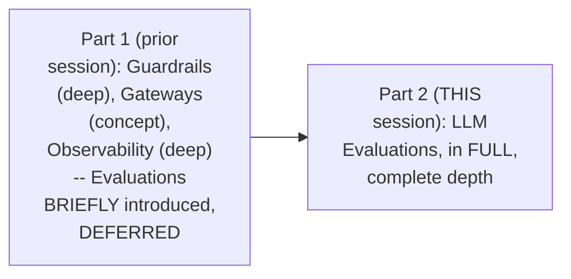

#### 🎯 Key Takeaways

* This session **genuinely, directly FULFILLS** the EXPLICIT promise made at the CLOSE of the prior Guardrails & Observability session.
* Evaluation is directly, precisely framed as **GENUINELY part of LLM security** — CONFIRMING an application is "production READY" BEFORE shipping it.
* UNLIKE the prior session (which EXPLICITLY deferred a topic), THIS session's own CLOSING is **GENUINELY complete** — no FURTHER "part 3" is EXPLICITLY promised.

---

### 2. What Is Evaluation? A School-Exam Analogy, Precisely Applied

#### 🧠 Concept — The Complete, Precise, School-Exam Analogy

> 💡 **Given directly:** *"Let us say you are a student and you are studying in a school. You have been trained for, let us say, 6 months... finally after 6 months we need to make sure — are you ready to go towards the next grade?... You will only be ready to go in seventh grade when you pass an examination. And this examination is nothing but your evaluation."*

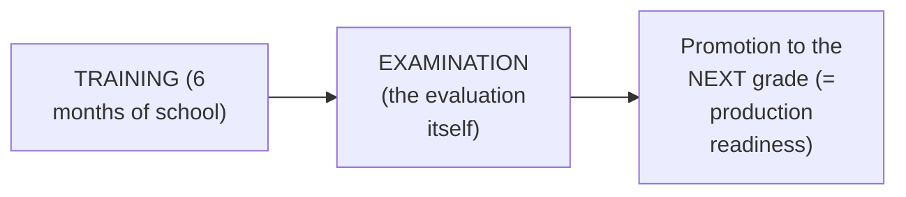

#### 🔍 Internal Working — The Precise, Genuine Mechanism: Prediction vs. Reality

> 💡 **Given directly:** *"We are trying to measure the difference between the predictions and the actual reality. Actual reality here refers to the actual original correct answers... and prediction can be referred to as the answer sheet which students write in their examination."*

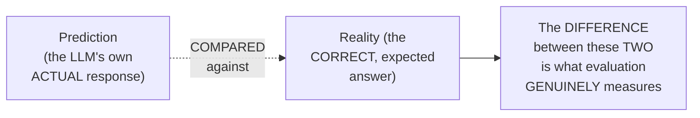

#### 📖 Definition — LLM Evaluation, Precisely Defined

> 💡 **Given directly:** *"LLM evaluations are the tests used to check if an AI model — likely a chatbot or a writing assistant — is doing its job well, safely, and accurately."*

#### ⚠ Common Mistakes

* Assuming evaluation is a VAGUE, subjective ASSESSMENT — explicitly, directly clarified: it's a PRECISE, MEASURED comparison between the LLM's own PREDICTION and the KNOWN, correct REALITY.
* Assuming "production READY" is a SIMPLE, binary state — explicitly, directly clarified as MULTI-DIMENSIONAL: it GENUINELY requires the application to be NON-hallucinating, CORRECT, AND correctly RETRIEVING information — ALL THREE, together.

#### 🎯 Key Takeaways

* **Evaluation** is precisely a TEST measuring HOW WELL an AI model performs — DIRECTLY, MEMORABLY analogous to a STUDENT's own school EXAMINATION.
* The CORE mechanism: comparing the LLM's own **PREDICTION** (its ACTUAL response) against **REALITY** (the KNOWN, correct answer).
* "Production READY" is precisely, MULTI-DIMENSIONALLY defined: NOT hallucinating, CORRECT answers, and CORRECT information RETRIEVAL — ALL required TOGETHER.

---
### 3. Four Ways to Evaluate: LLM-as-a-Judge, Human, Rule-Based & Statistical

#### 📖 Definition — LLM-as-a-Judge, Precisely Introduced

> 💡 **Given directly:** *"One of the ways is a very famous way and the most used way — LLM as a judge. The model which is used in production, let us say it's a small model, 8 billion parameter model, and there will be another large language model which will be a slightly bigger model than this — let us say a 60 billion parameter model... bigger models are usually better models, a smarter brain, a bigger brain — we always try to use a better model to evaluate the model which is being used in production."*

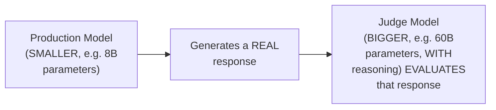

#### 📖 Definition — Human Evaluation, Precisely Introduced

> 💡 **Given directly:** *"Human evaluation is where a human will literally sit and see what are the responses produced by a large language model."*

#### 📖 Definition — Rule-Based Evaluation, Precisely Introduced

> 💡 **Given directly:** *"Rule-based, where we just simply check if this model given by large language model is equal to the model which we have taken as a reference."*

#### 📖 Definition — Statistical Metrics, Briefly Introduced

> 💡 **Given directly:** *"There is also one more way where we calculate the statistical metrics — we don't have to go in all of these depth at this particular point of time."*

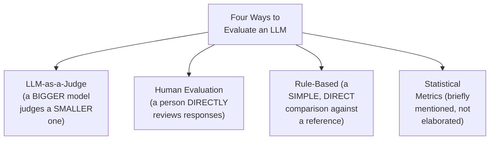

#### ⚠ A Direct, Honest, Real Cost/Effort Trade-Off

> 💡 **Given directly:** *"Human evaluator is a very costly process where you will pay a human to check your large language model — subject matter expertise — and LLM as a judge is a cheaper solution when compared to human evaluator, but the process of entire evaluation itself is very costly. We will understand why and how."*

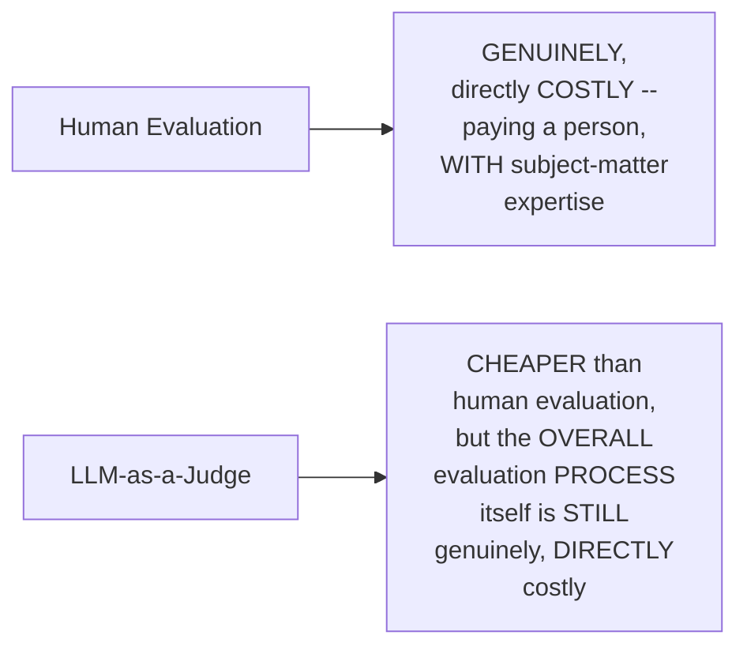

#### ⚠ Common Mistakes

* Assuming ALL FOUR evaluation methods are EQUALLY, GENUINELY common in PRACTICE — explicitly, directly clarified: LLM-as-a-Judge and human EVALUATION are directly identified as the "TWO major ways" — rule-based and statistical are MENTIONED but NOT elaborated in DEPTH.
* Assuming LLM-as-a-Judge is GENUINELY, entirely FREE, simply because it AVOIDS human labor COSTS — explicitly, directly, HONESTLY clarified: the OVERALL evaluation PROCESS remains GENUINELY costly, EVEN using this CHEAPER method.

#### 🎯 Key Takeaways

* **LLM-as-a-Judge** uses a BIGGER, MORE capable model to EVALUATE a SMALLER, production model's OWN responses — directly, explicitly confirmed as the MOST commonly used METHOD.
* **Human evaluation** is GENUINELY thorough but COSTLY (requiring PAID, subject-matter EXPERTISE); **rule-based** and **statistical** methods are BRIEFLY mentioned as ADDITIONAL, less-elaborated OPTIONS.
* This session's own COMPLETE, real demonstration (Section 4 onward) USES the **LLM-as-a-Judge** approach — directly, PRACTICALLY applying this SECTION's own established CONCEPT.

---

### 4. The Demo Use Case: An E-Commerce RAG Chatbot

#### 🪜 Step-by-Step — The Complete, Real, Worked Scenario

> 💡 **Given directly:** *"We have developed a chatbot. This chatbot is being trained, or this chatbot is enabled with a database of customer queries... The database contains policies. The database contains product information... And thirdly, it also has FAQs."*

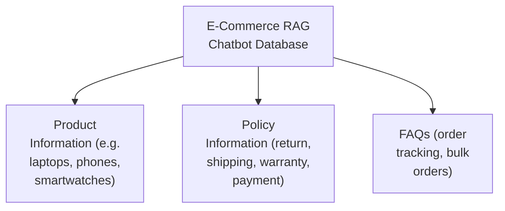

#### 🪜 Step-by-Step — A Complete, Real, Concrete Example of a GENUINE Failure

> 💡 **Given directly:** *"If the question was asked, 'Tell me about soundbuds pro,' the question was this, and the large language model is telling, 'Both speakers are really good.' This is not correct — even though it got the data information from the database, but the response which it is giving — I asked about soundbuds, but you are replying about board speakers. This is not correct. The answer is not relevant to the question."*

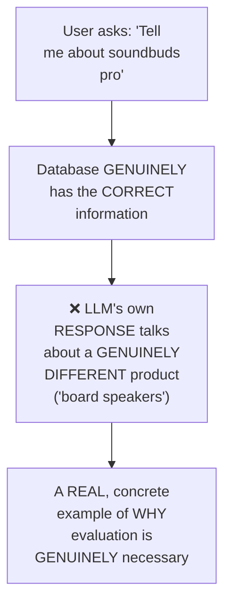

#### ❓ Why It Exists — The Precise, Genuine, Motivating Question

> 💡 **Given directly:** *"We want to check if this cycle is working correctly or not — which means for a given question, is it really answering FROM the database, or is it generating with its own thoughts, because large language models are tricky in nature, random in nature."*

#### ⚠ Common Mistakes

* Assuming a RAG system that CORRECTLY retrieves information from its OWN database will GENUINELY, AUTOMATICALLY produce a CORRECT response — explicitly, directly, CONCRETELY demonstrated as FALSE: the "soundbuds/board speakers" example shows CORRECT retrieval STILL producing an INCORRECT, IRRELEVANT response.

#### 🎯 Key Takeaways

* This session's own COMPLETE demo uses a REAL, worked USE CASE — an e-commerce RAG CHATBOT, built on a database of PRODUCT information, POLICIES, and FAQs.
* A GENUINE, real FAILURE example (asking about "soundbuds," GETTING a response about "board SPEAKERS") directly, CONCRETELY illustrates WHY evaluation is GENUINELY necessary — CORRECT retrieval does NOT GUARANTEE a CORRECT response.
* This demo directly, precisely sets up EVERY subsequent CONCEPT in this session — TERMINOLOGY, METRICS, and the COMPLETE evaluation pipeline are ALL grounded in THIS SAME, concrete example.

---
### 5. Key Terminology: Goldens & Datasets

#### 📖 Definition — Golden, Precisely Defined

> 💡 **Given directly:** *"A golden is a single unit of evaluation... a golden is also called as a test case, and a golden is also used as a single unit — ONE of the unit of the evaluation."*

#### 🔍 Internal Working — Precisely What a Golden GENUINELY Contains

> 💡 **Given directly:** *"This golden will contain the question — what is exactly the question. This golden will contain what exactly is the response expected... And thirdly, it will contain a response which is actually given by our large language model... expected tool usage — every time our large language model is going to give this response, it SHOULD use this particular tool."*

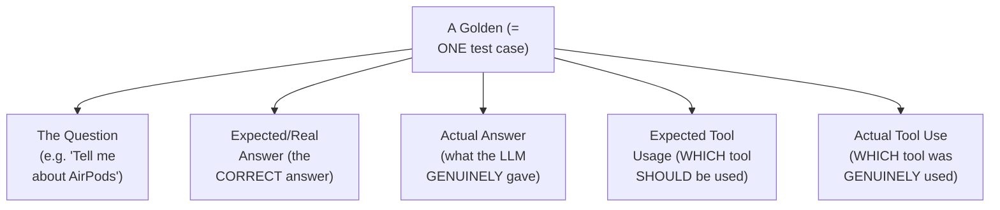

#### 🧠 Concept — A Genuinely Precise, Worked Example of Partial Credit

> 💡 **Given directly:** *"If answer is AirPods Pro price is XYZ [and this is CORRECT], but the LLM did NOT use database tool, it used web search tool — so in this particular scenario, the answer was correct, but the tool which was used was incorrect. Plus marks for answer and negative marks for the tool usage."*

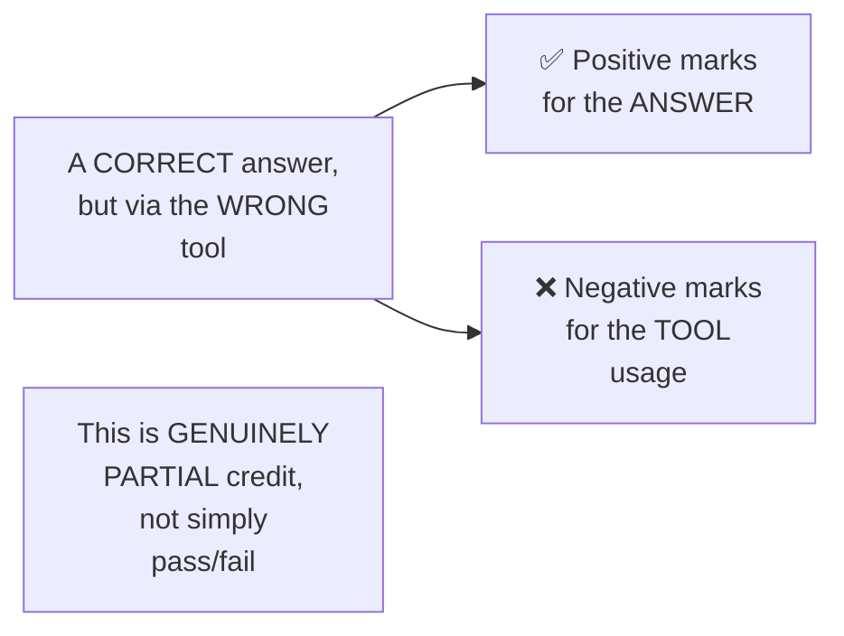

#### 📖 Definition — Dataset, Precisely Defined

> 💡 **Given directly:** *"When we combine multiple goldens... this becomes a dataset."*

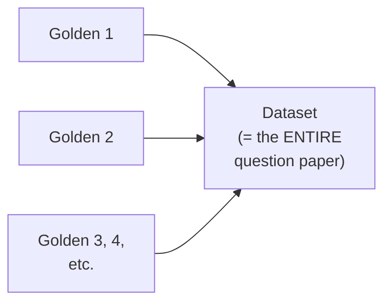

#### ⚠ A Direct, Honest, Important, Practical Clarification

> 💡 **Given directly:** *"Data set preparation in LLM evaluation phase is the most time consuming phase. If we have 1 hour to evaluate our large language model, we will spend 55 minutes in preparing the data set and we will spend 5 minutes in actually testing our data set. Data sets are usually prepared by subject matter expertise or either by a large language model itself."*

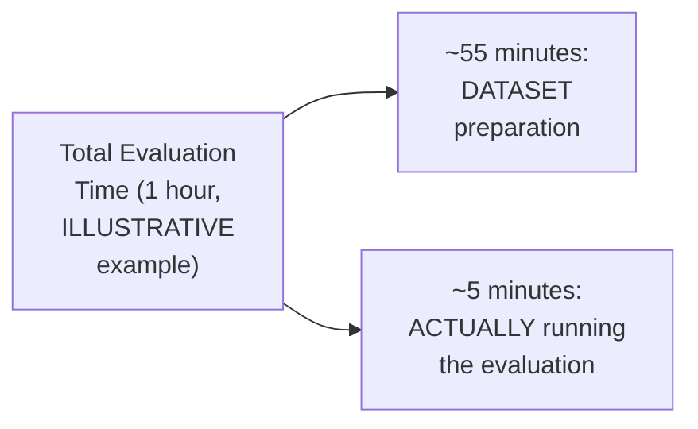

#### ⚠ Common Mistakes

* Assuming a golden is EVALUATED via ONLY a SIMPLE, binary pass/FAIL — explicitly, directly, CONCRETELY demonstrated as GENUINELY, MORE nuanced: a CORRECT answer via the WRONG tool receives PARTIAL credit (positive for the ANSWER, negative for TOOL usage).
* Assuming ACTUALLY running an evaluation is the MOST time-consuming PART of the PROCESS — explicitly, directly, HONESTLY clarified as FALSE: DATASET preparation GENUINELY consumes the VAST MAJORITY of the total TIME (per this session's own "55 of 60 minutes" ILLUSTRATIVE example).

#### 🎯 Key Takeaways

* A **golden** is precisely ONE test CASE — CONTAINING a question, EXPECTED answer, ACTUAL answer, EXPECTED tool usage, and ACTUAL tool used — directly, MEMORABLY analogous to ONE question on a SCHOOL exam.
* A **dataset** is precisely MULTIPLE goldens COMBINED — analogous to the COMPLETE exam QUESTION PAPER.
* **Dataset PREPARATION is GENUINELY the most time-consuming PHASE** of evaluation — directly, HONESTLY acknowledged, and prepared EITHER by SUBJECT-matter experts OR by an LLM ITSELF.

---

### 6. Six Evaluation Metrics, Precisely Defined

#### 📖 Definition — Metric 1: Faithfulness (Measuring Hallucination)

> 💡 **Given directly:** *"LLM hallucination occurs when a model confidently generates information that is incorrect, completely fabricated, and unsupported by the training data, while it's presenting it as absolute truth... Faithfulness will measure the amount of hallucination of a chatbot... The marks are between 0 to 1, zero being the highest hallucination, very high hallucinations, and one being the lowest hallucinations."*

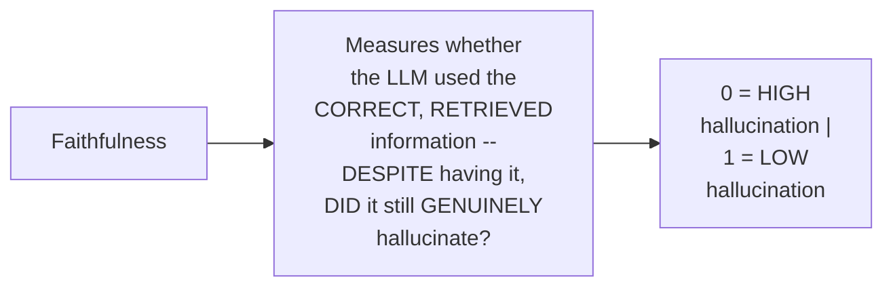

#### 📖 Definition — Metric 2: Answer Relevancy

> 💡 **Given directly:** *"Answer relevancy is a simple process where we see is the answer given by our large language model relevant to the question which was asked... it will here NOT check if it is correct or not. Here it will only check if the answer is relevant to the question or not."*

#### 📖 Definition — Metric 3: Tool Correctness

> 💡 **Given directly:** *"Tool correctness is the process of checking if correct tool use was used or not... this is the CHEAPEST metric, where we will just simply see which was the tool used by our large language model, and we will just simply write a Python line of code — if the tool used by AI was exactly equal to the tool expected."*

#### ⚠ A Direct, Honest, Real Explanation for WHY This Metric Was NOT Used in This Demo

> 💡 **Given directly:** *"In our case, each question will always be answered from our database... I have not made an agentic process... I have made a chain process — I have used LangChain, not LangGraph. If I want to make an agentic process, I will use LangGraph."*

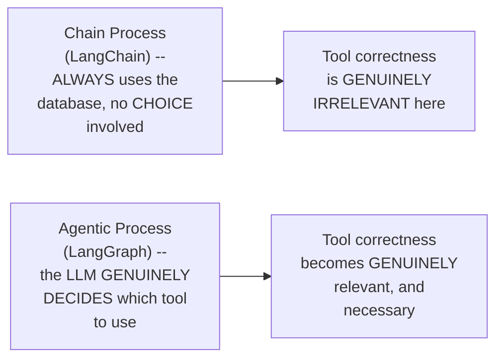

#### 📖 Definition — Metrics 4 & 5: Context Precision & Context Recall

> 💡 **Given directly:** *"Context precision is when retrieved chunks are mostly relevant, and context recall means fetched all chunks answer the needs... this concept of reranking, where the order of the context is properly ranked or not, is called as context precision... context recall — this metric will only make sure if the question was regarding charging, have we retrieved the charging kind of data? Now whether it is on third, fifth, eighth doesn't matter. It will only check are we extracting the CORRECT information."*

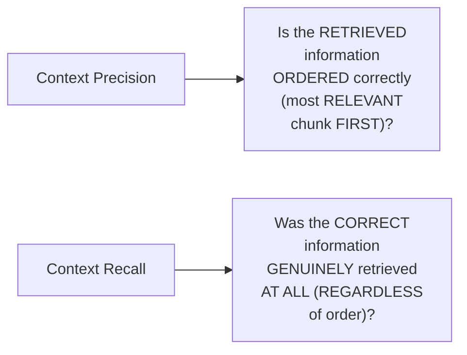

#### 📖 Definition — Metric 6: Answer Correctness

> 💡 **Given directly:** *"Answer correctness is if the LLM answer matches to the ground truth reference... answer correctness will check the answer which we were expecting and the answer which we have received — is it similar or not."*

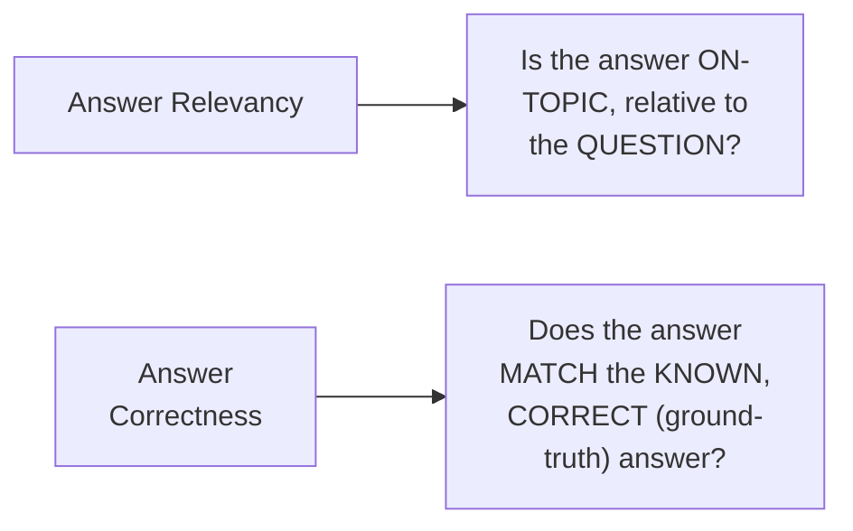

#### ⚠ Common Mistakes

* Confusing "answer RELEVANCY" with "answer CORRECTNESS" — explicitly, directly, PRECISELY distinguished: RELEVANCY checks ONLY whether the answer is ON-topic; CORRECTNESS checks whether it MATCHES the KNOWN, correct ANSWER.
* Confusing "context PRECISION" with "context RECALL" — explicitly, directly, PRECISELY distinguished: PRECISION checks the ORDER of RETRIEVED information; RECALL checks WHETHER the correct information was RETRIEVED AT ALL.
* Assuming "tool CORRECTNESS" is UNIVERSALLY, ALWAYS relevant to EVERY RAG/LLM system — explicitly, directly, HONESTLY clarified: it's GENUINELY IRRELEVANT for a CHAIN-based system (which ALWAYS uses the SAME tool) — it MATTERS SPECIFICALLY for AGENTIC systems, where TOOL choice is GENUINELY, DYNAMICALLY decided.

#### 🎯 Key Takeaways

* **Faithfulness** measures HALLUCINATION (0=high, 1=LOW); **answer relevancy** checks WHETHER the answer is ON-topic; **tool correctness** checks WHETHER the CORRECT tool was USED (relevant ONLY for AGENTIC systems).
* **Context precision** checks WHETHER retrieved information is ORDERED correctly (MOST relevant FIRST); **context recall** checks WHETHER the CORRECT information was retrieved AT ALL, REGARDLESS of order.
* **Answer correctness** checks WHETHER the ANSWER matches the KNOWN, GROUND-TRUTH reference — GENUINELY, PRECISELY distinct from answer RELEVANCY (which checks ONLY topical RELEVANCE, not FACTUAL correctness).

---
### 7. The Two-Phase Evaluation Pipeline

#### 📖 Definition — Phase 1: Answering the Question Paper

> 💡 **Given directly:** *"The pipeline runs in two phases. First, each of the goldens — which means each of the question of the question paper — is solved by the student. Similarly, in phase one, each of the question is passed to our large language model — which means to this system which we have made."*

#### 📖 Definition — Phase 2: Grading the Answers

> 💡 **Given directly:** *"Once the entire question paper is solved, we go for phase two, where we calculate all the metrics... after the entire question paper is checked, we are getting some results."*

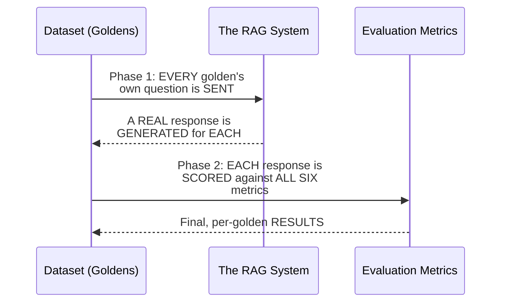

#### 🔍 Internal Working — A Complete, Real, Live-Confirmed Example

> 💡 **Given directly:** *"What is TechNest return policy? The answer is TechNest return policy — returns 30 days of original purchase date, etc. And the reference answer is TechNest accepts 30 days of purchase — which means these both are matching, that the thing which we are ACCEPTING, EXPECTING that it should say 30 days, and it really said 30 days, which means this test is PASSED."*

#### ⚠ Common Mistakes

* Assuming EVALUATION and GENERATION happen SIMULTANEOUSLY, in ONE STEP — explicitly, directly, precisely clarified: they are TWO, GENUINELY SEPARATE, SEQUENTIAL phases — GENERATE ALL responses FIRST, THEN evaluate ALL of them.

#### 🎯 Key Takeaways

* The COMPLETE evaluation PIPELINE runs in **TWO, genuinely SEQUENTIAL phases**: Phase 1 (the RAG system ANSWERS every golden's OWN question) and Phase 2 (EVERY response is SCORED against ALL SIX metrics).
* This MIRRORS the SCHOOL-exam analogy PRECISELY: Phase 1 = the STUDENT writing ANSWERS; Phase 2 = the TEACHER grading THEM.
* A REAL, live example (a TechNest return-policy QUESTION) directly, CONCRETELY confirmed this WORKING correctly — the RAG's own response GENUINELY matched the REFERENCE answer, resulting in a PASSED test.

---

### 8. Evaluation Frameworks: LangSmith, Ragas, DeepEval & Pydantic Logfire

#### 📖 Definition — LangSmith, Precisely Reintroduced (From the Prior Session)

> 💡 **Given directly:** *"LangSmith is a part of the LangChain ecosystem, where we can either evaluate our LangChain- or LangGraph-based systems... LangSmith provides us a way of creating datasets and experiments."*

#### 📖 Definition — Ragas, Precisely Introduced (THIS Session's Own, Used Framework)

> 💡 **Given directly:** *"Ragas — the framework which I have used in this particular demonstration... Ragas is the evaluation framework for SPECIFICALLY evaluating RAG-based applications... every time you have made a RAG application, you will use Ragas to evaluate."*

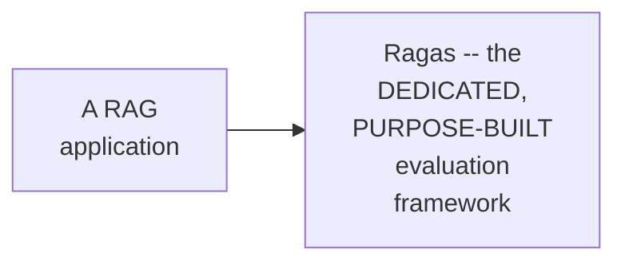

#### 📖 Definition — DeepEval, Precisely Introduced

> 💡 **Given directly:** *"DeepEval is used when you want to evaluate your agentic systems. DeepEval will help you to check your tool correctness. DeepEval will help you to check what exactly information is being communicated within one agent — what conversation is happening between one agent and another agent... developed by Confident AI."*

#### 🔍 Internal Working — A Genuine, Direct Confirmation of Framework Health & Integrations

> 💡 **Given directly:** *"[DeepEval] has 16.5k stars, and this [Ragas] has 14.6k stars... the development was 2 days ago, so they are actively developing... [Ragas' own] active development is... now it is stabilized, so that is why there is no development."*

> 💡 **Given directly, on DeepEval's own PARTNER ecosystem:** *"LangChain, Pydantic AI, OpenAI, LangGraph, Strands, LlamaIndex, Anthropic, CrewAI — these are ALL the partners of DeepEval... is Autogen a partner of DeepEval? The answer is NO... evaluating an Autogen application using DeepEval will be a little bit TOUGHER, because we cannot DIRECTLY integrate."*

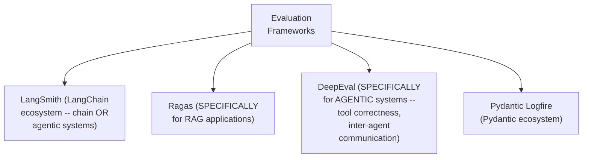

#### 📖 Definition — Pydantic Logfire, Precisely Reintroduced (From the Prior Session)

> 💡 **Given directly:** *"Pydantic Logfire — this is also an observability tool, but this is ALSO used for evaluation... this is similar to how LangSmith provides for LangChain and LangGraph, Pydantic Logfire provides for Pydantic AI and Pydantic."*

#### ⚠ Common Mistakes

* Assuming ANY evaluation framework is UNIVERSALLY, EQUALLY suited to EVERY type of application — explicitly, directly clarified: Ragas is SPECIFICALLY for RAG applications; DeepEval is SPECIFICALLY for AGENTIC systems — CHOOSING the WRONG framework GENUINELY makes evaluation harder.
* Assuming EVERY agent framework is EQUALLY, DIRECTLY integrable WITH a GIVEN evaluation tool — explicitly, directly, HONESTLY demonstrated: DeepEval GENUINELY has NAMED, official PARTNERS (LangChain, CrewAI, etc.), while OTHERS (like AUTOGEN) require MORE manual, CUSTOM integration WORK.

#### 🎯 Key Takeaways

* **Ragas** is SPECIFICALLY, DEDICATEDLY built for evaluating **RAG applications** — directly, PRACTICALLY the framework USED in THIS session's own COMPLETE demonstration.
* **DeepEval** is SPECIFICALLY suited for **agentic SYSTEMS** — checking TOOL correctness and INTER-agent communication — and comes WITH a NAMED set of official PARTNER integrations.
* **LangSmith** and **Pydantic Logfire** were BOTH already introduced in the PRIOR session as OBSERVABILITY tools — THIS session directly, EXPLICITLY confirms they ALSO SERVE an evaluation FUNCTION, extending their OWN, previously-established SCOPE.

---
### 9. Running a Real Evaluation: API Keys & the Complete Workflow

#### 🪜 Step-by-Step — The Complete, Real, Required Setup

> 💡 **Given directly:** *"You cannot run your evaluations until you have a Groq API key. In here, the concept which we have used is LLM as a judge. In this scenario, you are supposed to use two different Groq keys, which means you will use two different email IDs — on one email ID you will create a Groq account and get the Groq API key... this is going to judge your large language model."*

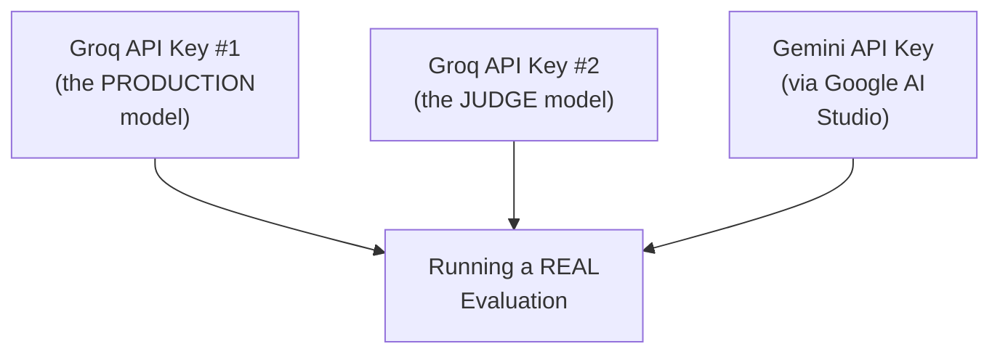

#### 🔍 Internal Working — A Direct, Precise Connection Back to Section 3's Own LLM-as-a-Judge Concept

> 💡 **Given directly, precisely confirming WHY two, SEPARATE keys are genuinely needed:** the SETUP requires TWO, SEPARATE Groq accounts/keys — ONE for the PRODUCTION model being TESTED, and ONE for the JUDGE model DOING the evaluating — directly, PRECISELY applying Section 3's own established LLM-as-a-Judge MECHANISM in PRACTICE.

#### 🪜 Step-by-Step — The Complete, Real Execution Sequence

> 💡 **Given directly:** *"You will have goldens ready. This is your dataset ready, on top of which your RAG application is made... you will run the phase one of asking the RAG to solve the question paper... then you can check the question paper, which will be the phase two. Now phase two will be time consuming. It will take a lot of time... you have to wait for 15 to 20 minutes."*

```mermaid
flowchart LR
    A["Goldens/Dataset<br/>ALREADY prepared"] --> B["Run Phase 1<br/>(RAG answers<br/>EVERY question)"]
    B --> C["Run Phase 2<br/>(evaluation --<br/>TAKES 15-20<br/>minutes)"]
    C --> D["Results GENERATED,<br/>downloadable as<br/>results.json"]
```

#### 🔍 Internal Working — A Genuine, Real, Live-Observed Result

> 💡 **Given directly:** *"We can see context recall in the last question was not so good... but the last question was written to check answer correctness, and answer correctness is good."*

#### ⚠ Common Mistakes

* Assuming ONE, single API key is GENUINELY sufficient to run a COMPLETE LLM-as-a-Judge evaluation — explicitly, directly, PRACTICALLY demonstrated as REQUIRING MULTIPLE, SEPARATE keys — ONE for the PRODUCTION model, ONE for the JUDGE.
* Assuming evaluation RESULTS are GENERATED QUICKLY, similar to a NORMAL LLM response — explicitly, directly, HONESTLY clarified: Phase 2 GENUINELY takes 15-20 MINUTES — directly, MEMORABLY compared to a TEACHER's own REAL, time-consuming PAPER-CHECKING process.
* Assuming EVERY metric will GENUINELY score WELL simultaneously — explicitly, directly, HONESTLY demonstrated via a REAL, observed result: ONE metric (context recall) scored POORLY on a SPECIFIC question, while ANOTHER (answer correctness) scored WELL on the SAME question — metrics GENUINELY, INDEPENDENTLY vary.

#### 🎯 Key Takeaways

* Running a REAL, LLM-as-a-Judge evaluation GENUINELY requires **MULTIPLE, SEPARATE API keys** — TWO Groq keys (production + JUDGE models) PLUS a Gemini key — directly, PRACTICALLY applying Section 3's own LLM-as-a-Judge CONCEPT.
* The COMPLETE, real workflow: PREPARE goldens → run Phase 1 (RAG ANSWERS) → run Phase 2 (evaluation, GENUINELY taking **15-20 minutes**) → REVIEW results (downloadable as `results.json`).
* A REAL, observed result **CONFIRMS metrics GENUINELY vary INDEPENDENTLY** — a SINGLE question can SCORE poorly on ONE metric (context RECALL) while scoring WELL on ANOTHER (answer CORRECTNESS).

---

### 10. Closing: A Complete, Genuine Recap

#### 🪜 Step-by-Step — A Complete, Honest Recap of EVERY Metric

> 💡 **Given directly:** *"First metric was faithfulness... second one is answer relevancy... third one is answer correctness... then after answer correctness we have tool correctness... then we have context precision and context recall."*

```mermaid
flowchart TD
    A["Complete LLM<br/>Evaluation<br/>Framework"] --> B["Terminology:<br/>Goldens, Datasets"]
    A --> C["Six Metrics:<br/>Faithfulness, Answer<br/>Relevancy, Tool<br/>Correctness, Context<br/>Precision, Context<br/>Recall, Answer<br/>Correctness"]
    A --> D["Four Frameworks:<br/>LangSmith, Ragas,<br/>DeepEval, Pydantic<br/>Logfire"]
```

#### 🪜 Step-by-Step — A Direct, Confident, Complete Closing Statement

> 💡 **Given directly:** *"Now you absolutely know what are LLM evaluations, and why do we need them, and which technologies you will use when, right? Wasn't that all you needed to understand this particular concept?"*

#### ⚠ Common Mistakes

* Assuming this session's own COMPLETE recap DIRECTLY implies EVERY POSSIBLE evaluation-related topic has been EXHAUSTIVELY covered — explicitly, directly, this session's own SCOPE is GENUINELY focused on FOUNDATIONAL, beginner-LEVEL understanding — DEEPER, framework-specific IMPLEMENTATION details are EXPLICITLY pointed to EACH framework's own OFFICIAL documentation, rather than covered EXHAUSTIVELY here.

#### 🎯 Key Takeaways

* This session **GENUINELY, DIRECTLY completes** the FOUR-part LLM security FRAMEWORK established ACROSS both sessions — Guardrails, Gateways, Observability (PRIOR session), and NOW Evaluations (THIS session).
* UNLIKE the PRIOR session, THIS one's own CLOSING is **genuinely, CONFIDENTLY complete** — NO further "PART 3" is EXPLICITLY promised or DEFERRED.
* The COMPLETE, recommended NEXT step is directly, EXPLICITLY pointed to EACH framework's OWN official DOCUMENTATION (LangSmith, Ragas, DeepEval, Pydantic Logfire) for DEEPER, hands-ON implementation PRACTICE.

---
## 📝 Glossary

| Term | Definition | Why It Matters |
|---|---|---|
| **LLM Evaluation** | Tests checking if an AI model does its job well, safely, accurately | The 4th, promised component of LLM security |
| **LLM-as-a-Judge** | A bigger, smarter model evaluates a smaller, production model | The most commonly used evaluation method |
| **Human Evaluation** | A person directly reviews LLM responses | Thorough but costly (paid subject-matter expertise) |
| **Golden** | A single test case: question + expected/actual answer + expected/actual tool | The fundamental evaluation unit |
| **Dataset** | Multiple goldens combined | Analogous to a complete exam question paper |
| **Faithfulness** | Measures hallucination (0=high, 1=low) | Checks if the LLM used retrieved info faithfully |
| **Hallucination** | Confidently generating incorrect/fabricated information | What faithfulness specifically measures |
| **Answer Relevancy** | Is the answer on-topic relative to the question? | Distinct from correctness -- checks relevance only |
| **Tool Correctness** | Was the correct tool used? | Relevant only for agentic (not chain) systems |
| **Context Precision** | Is retrieved information ordered correctly (most relevant first)? | About ORDER |
| **Context Recall** | Was the correct information retrieved at all? | About PRESENCE, regardless of order |
| **Answer Correctness** | Does the answer match the ground-truth reference? | Distinct from relevancy -- checks factual accuracy |
| **Ragas** | A dedicated evaluation framework for RAG applications | Used in this session's own demonstration |
| **DeepEval** | An evaluation framework for agentic systems | Checks tool correctness, inter-agent communication |
| **LangSmith** | Part of the LangChain ecosystem | Evaluates LangChain/LangGraph systems |
| **Pydantic Logfire** | Part of the Pydantic ecosystem | Evaluates Pydantic AI systems |

---

## 🔄 Revision Notes — One-Minute Revision

* This is genuinely, EXPLICITLY **"Part 2"** -- directly fulfilling the prior Guardrails & Observability session's own promise to cover LLM Evaluations, the fourth component of complete LLM security.
* **Evaluation, precisely defined**: tests checking if an AI model does its job well, safely, accurately -- directly built on the school-exam analogy (training = teaching; evaluation = the exam; measuring the DIFFERENCE between prediction and reality).
* **4 ways to evaluate**: LLM-as-a-Judge (a bigger model judges a smaller one -- the most common method), Human Evaluation (thorough but costly), Rule-Based, Statistical Metrics (both briefly mentioned).
* **Demo use case**: an e-commerce RAG chatbot (product info, policies, FAQs) -- a real failure example shown: asked about "soundbuds," the LLM answered about "board speakers" despite correct retrieval, directly motivating why evaluation matters.
* **Golden**: a single test case (question + expected/actual answer + expected/actual tool usage) -- can receive PARTIAL credit (e.g. correct answer, wrong tool = positive + negative marks). **Dataset**: multiple goldens combined. HONEST acknowledgment: dataset preparation is the MOST time-consuming phase (~55 of 60 minutes, illustratively).
* **6 evaluation metrics**: (1) Faithfulness -- measures hallucination, 0=high/1=low. (2) Answer Relevancy -- is the answer on-topic? (3) Tool Correctness -- correct tool used? (only relevant for AGENTIC, not chain, systems). (4) Context Precision -- is retrieved info ordered correctly? (5) Context Recall -- was correct info retrieved at all, regardless of order? (6) Answer Correctness -- does the answer match the ground truth?
* **2-phase pipeline**: Phase 1 (RAG answers every golden's question) -> Phase 2 (every response scored against all 6 metrics) -- mirrors a student writing answers, then a teacher grading them.
* **4 evaluation frameworks**: LangSmith (LangChain ecosystem, chain OR agentic), Ragas (SPECIFICALLY for RAG -- used in this demo), DeepEval (SPECIFICALLY for agentic systems, by Confident AI, with named partner integrations), Pydantic Logfire (Pydantic ecosystem).
* **Real workflow**: requires TWO Groq API keys (production model + judge model) PLUS a Gemini key -- Phase 2 genuinely takes 15-20 minutes. Real, observed result: metrics vary INDEPENDENTLY (one question scored poorly on context recall but well on answer correctness).
* **Closing**: this session is GENUINELY complete -- unlike the prior session, no further "part 3" is promised.

---

## 📋 Cheat Sheet

**The 4 ways to evaluate an LLM:**
```text
LLM-as-a-Judge  -- a bigger model judges a smaller one (most common)
Human Evaluation -- thorough, but costly
Rule-Based        -- simple, direct comparison
Statistical         -- briefly mentioned, not elaborated
```

**Golden vs. Dataset:**
```text
Golden  = ONE test case (question + expected/actual answer + expected/actual tool)
Dataset = MULTIPLE goldens combined (= the complete question paper)
```

**The 6 evaluation metrics:**
```text
Faithfulness       -- hallucination measure (0=high, 1=low)
Answer Relevancy   -- is the answer ON-TOPIC?
Tool Correctness   -- was the CORRECT tool used? (agentic systems only)
Context Precision  -- is retrieved info ORDERED correctly?
Context Recall     -- was correct info retrieved AT ALL?
Answer Correctness -- does the answer MATCH the ground truth?
```

**The 2-phase pipeline:**
```text
Phase 1: RAG answers every golden's question
Phase 2: every response is scored against all 6 metrics (takes 15-20 min)
```

**Evaluation frameworks, at a glance:**
```text
LangSmith        -- LangChain ecosystem (chain or agentic)
Ragas             -- RAG applications SPECIFICALLY
DeepEval            -- agentic systems SPECIFICALLY
Pydantic Logfire       -- Pydantic ecosystem
```

**Real evaluation setup:**
```text
2x Groq API keys (production model + judge model) + 1x Gemini API key
```

---

## 🔥 Interview Questions & Answers

### 🟢 Beginner

**Q1.**

**Question:** What is LLM evaluation?

**Answer:** Tests used to check if an AI model is doing its job well, safely, and accurately.

**Explanation:** Directly, precisely defined.

**Why Interviewers Ask This:** The most basic, foundational evaluation question.

**Possible Follow-up:** "What does 'production ready' genuinely mean, in this context?"

**Q2.**

**Question:** What is LLM-as-a-Judge?

**Answer:** Using a bigger, more capable model to evaluate a smaller, production model's own responses.

**Explanation:** Directly, precisely defined.

**Why Interviewers Ask This:** The most commonly used evaluation method.

**Possible Follow-up:** "Why is a bigger model generally preferred as the judge?"

**Q3.**

**Question:** What is a golden?

**Answer:** A single test case, containing a question, expected/actual answer, and expected/actual tool usage.

**Explanation:** Directly, explicitly defined.

**Why Interviewers Ask This:** Foundational, essential evaluation terminology.

**Possible Follow-up:** "What is a dataset, in relation to a golden?"

**Q4.**

**Question:** What does faithfulness measure?

**Answer:** Hallucination -- 0 being highest hallucination, 1 being lowest.

**Explanation:** Directly, precisely explained.

**Why Interviewers Ask This:** Basic, essential metric knowledge.

**Possible Follow-up:** "What is hallucination, precisely?"

**Q5.**

**Question:** What is the genuine difference between answer relevancy and answer correctness?

**Answer:** Relevancy checks whether the answer is on-topic; correctness checks whether it matches the known, correct answer.

**Explanation:** Directly, precisely distinguished.

**Why Interviewers Ask This:** Tests genuine understanding of subtly different, commonly-confused metrics.

**Possible Follow-up:** "Could an answer be relevant but not correct? Give an example."

**Q6.**

**Question:** What is the genuine difference between context precision and context recall?

**Answer:** Precision checks whether retrieved information is ordered correctly; recall checks whether the correct information was retrieved at all, regardless of order.

**Explanation:** Directly, precisely distinguished.

**Why Interviewers Ask This:** Tests genuine understanding of two commonly-confused RAG metrics.

**Possible Follow-up:** "Which of these two would genuinely be affected by a re-ranking step?"

**Q7.**

**Question:** Why was tool correctness NOT used in this session's own demonstration?

**Answer:** The demo uses a chain (LangChain) process, which always uses the same database tool -- no genuine choice of tool is involved.

**Explanation:** Directly, honestly explained.

**Why Interviewers Ask This:** Tests genuine understanding of when a metric is (and isn't) applicable.

**Possible Follow-up:** "When would tool correctness genuinely become relevant?"

**Q8.**

**Question:** Which evaluation framework is specifically dedicated to RAG applications?

**Answer:** Ragas.

**Explanation:** Directly, explicitly stated.

**Why Interviewers Ask This:** Basic, practical tooling knowledge.

**Possible Follow-up:** "Which framework would you use instead for an agentic system?"

**Q9.**

**Question:** Which evaluation framework is developed by Confident AI, specifically for agentic systems?

**Answer:** DeepEval.

**Explanation:** Directly, explicitly stated.

**Why Interviewers Ask This:** Basic, practical tooling knowledge.

**Possible Follow-up:** "Name two named partner integrations of DeepEval."

**Q10.**

**Question:** How many API keys are genuinely needed to run an LLM-as-a-Judge evaluation, per this session's own demonstration?

**Answer:** Three -- two Groq keys (production and judge models) plus one Gemini key.

**Explanation:** Directly, precisely explained.

**Why Interviewers Ask This:** Tests genuine, practical, hands-on setup awareness.

**Possible Follow-up:** "Why are two, separate Groq keys genuinely needed?"

---

### 🟡 Intermediate

**Q11.**

**Question:** Explain why the instructor deliberately, DIRECTLY reuses the SAME school-exam analogy from the prior session, rather than introducing a genuinely NEW analogy for THIS session's own, deeper content.

**Answer:** This is a genuinely deliberate, CONTINUITY-preserving choice: by DIRECTLY building on an ALREADY-FAMILIAR analogy (BRIEFLY introduced in the PRIOR session), the instructor ENSURES learners can IMMEDIATELY, CONFIDENTLY connect NEW, deeper CONCEPTS (goldens = individual QUESTIONS; datasets = the COMPLETE question paper; the two-PHASE pipeline = students WRITING answers, THEN teachers GRADING them) to a MENTAL MODEL they ALREADY, GENUINELY understand — RATHER than requiring them to LEARN an ENTIRELY new metaphor WHILE SIMULTANEOUSLY absorbing SIX distinct, TECHNICAL metrics. This directly, GENUINELY reduces COGNITIVE load, and DIRECTLY reinforces the EXPLICIT "Part 2" CONTINUITY between the TWO sessions.

**Explanation:** Requires recognizing a deliberate, continuity-preserving teaching choice connecting two sessions through a shared, extended analogy.

**Why Interviewers Ask This:** Tests whether a learner recognizes the pedagogical value of extending a familiar mental model rather than introducing disconnected new ones.

**Possible Follow-up:** "Map EVERY evaluation term covered in THIS session (golden, dataset, faithfulness, etc.) to its OWN, precise EQUIVALENT within the school-exam analogy."

**Q12.**

**Question:** A learner argues that since Ragas is "the framework used in this demonstration," it is genuinely the BEST, universally preferred evaluation framework for ALL LLM applications, and DeepEval/LangSmith are genuinely inferior alternatives. Evaluate this claim.

**Answer:** This claim overstates the case, missing THIS session's own PRECISE, explicit SCOPING of each framework's OWN, DIFFERENT purpose. Section 8's own DIRECT statement is UNAMBIGUOUS: Ragas is "the evaluation framework for SPECIFICALLY evaluating RAG-based applications" — its SUITABILITY for THIS session's own DEMO is DIRECTLY, EXPLICITLY because the DEMO is a RAG application, NOT because Ragas is UNIVERSALLY superior. Per Section 8's own, EQUALLY precise statement, DeepEval is SPECIFICALLY suited for AGENTIC systems (tool CORRECTNESS, inter-agent COMMUNICATION) — a GENUINELY different USE case Ragas does NOT DIRECTLY address. The ACCURATE, more PRECISE conclusion: FRAMEWORK choice GENUINELY depends on the APPLICATION's own ARCHITECTURE (RAG vs. AGENTIC vs. LangChain/Pydantic-SPECIFIC ecosystems) — THIS session's own USE of Ragas reflects the DEMO's own SPECIFIC nature (a RAG chatbot), NOT a UNIVERSAL, "Ragas is ALWAYS best" recommendation.

**Explanation:** Tests whether a learner recognizes that a framework's use in a specific demo reflects that demo's own architecture, not a universal recommendation.

**Why Interviewers Ask This:** Distinguishes candidates who understand framework-application fit from those who assume "used in the demo" means "universally best."

**Possible Follow-up:** "For a genuinely agentic, multi-tool system (not a simple RAG chatbot), which framework would you now recommend, and why?"

**Q13.**

**Question:** Explain, precisely, why the instructor DELIBERATELY includes the "correct answer, WRONG tool" partial-credit example (Section 5), rather than presenting golden evaluation as a SIMPLE, binary pass/fail.

**Answer:** This is a genuinely deliberate, IMPORTANT clarification: by DIRECTLY, CONCRETELY demonstrating that a GOLDEN can receive PARTIAL credit (POSITIVE marks for a CORRECT answer, NEGATIVE marks for INCORRECT tool usage, SIMULTANEOUSLY), the instructor PREVENTS a GENUINELY common, OVERSIMPLIFIED misconception — that EVALUATION produces a SINGLE, BINARY "pass" or "FAIL" per golden. This directly, PRECISELY foreshadows Section 6's own SIX, SEPARATE, INDEPENDENT metrics — EACH golden is GENUINELY evaluated ALONG MULTIPLE, distinct DIMENSIONS SIMULTANEOUSLY (faithfulness, RELEVANCY, correctness, tool USE, etc.), NOT reduced to ONE, single SCORE. This directly, CONCRETELY prepares the LEARNER for Section 9's own REAL, observed result — WHERE a SINGLE question scored POORLY on ONE metric WHILE scoring WELL on ANOTHER.

**Explanation:** Requires recognizing that the partial-credit example is deliberately foreshadowing the multi-dimensional nature of the six metrics introduced later.

**Why Interviewers Ask This:** Tests whether a learner understands that LLM evaluation produces multi-dimensional, not binary, results.

**Possible Follow-up:** "Construct your OWN, GENUINE example of a response that would score WELL on answer relevancy but POORLY on answer correctness."

**Q14.**

**Question:** Using this session's own precise "context precision vs. context recall" distinction (Section 6), explain a genuine, real scenario where a RAG system could achieve GENUINELY PERFECT context recall, but GENUINELY POOR context precision.

**Answer:** A precise, reasoned scenario, directly applying Section 6's own EXACT metric definitions: per Section 6's own precise example (charging/QUALITY/life INFORMATION retrieved for a "soundbuds CHARGING" question), IMAGINE the database GENUINELY, SUCCESSFULLY retrieves ALL THREE pieces of information (charging, quality, LIFE) — this would GENUINELY achieve PERFECT context RECALL, since the CORRECT (charging) information IS present SOMEWHERE within the RETRIEVED chunks. HOWEVER, if these THREE chunks are RETURNED in the WRONG ORDER — for EXAMPLE, "quality" FIRST, "life" second, and "CHARGING" (the GENUINELY relevant one) LAST — this would GENUINELY, DIRECTLY represent POOR context PRECISION, per Section 6's own EXACT reasoning ("the DOCUMENTS which are FETCHED... they should be REORDERED properly... CHARGING should be the FIRST"). This directly, precisely illustrates HOW a system can GENUINELY "have" the correct information (RECALL) while STILL failing to PRESENT it in the MOST useful, PRIORITIZED order (PRECISION) — TWO, genuinely INDEPENDENT dimensions of RAG QUALITY.

**Explanation:** Requires applying the precise definitions of context precision and recall to construct a genuinely realistic scenario where these two metrics diverge.

**Why Interviewers Ask This:** Tests whether a learner deeply understands that these two metrics are genuinely independent, not merely two names for the same underlying concept.

**Possible Follow-up:** "What GENUINE, practical RAG-system improvement (a topic NOT explicitly covered in THIS session, but LOGICALLY connected) would directly ADDRESS a context-PRECISION problem specifically?"

**Q15.**

**Question:** Synthesize this session's complete "LLM-as-a-Judge" reasoning (Section 3) with its own "dataset preparation is the most time-consuming phase" acknowledgment (Section 5) to explain a GENUINE, real trade-off a team must consider BEFORE committing to a comprehensive LLM evaluation process.

**Answer:** A precise, synthesized explanation, directly connecting TWO, separately-established FACTS from THIS session: per Section 3's own PRECISE reasoning, LLM-as-a-Judge is GENUINELY, DIRECTLY the CHEAPER of the TWO major evaluation METHODS — but the instructor HIMSELF, DIRECTLY confirms "the PROCESS of entire evaluation ITSELF is very COSTLY," MEANING the SAVINGS from AVOIDING human EVALUATORS do NOT ELIMINATE the OVERALL cost. Per Section 5's own PRECISE, HONEST acknowledgment ("dataset PREPARATION is the MOST time-CONSUMING phase... 55 MINUTES... out of 60"), the GENUINE, real cost of EVALUATION is NOT PRIMARILY in the JUDGE model's own API CALLS, but in the HUMAN LABOR REQUIRED to CAREFULLY construct ACCURATE, comprehensive GOLDENS/datasets — a task REQUIRING genuine subject-MATTER expertise (per Section 5's own DIRECT statement). SYNTHESIZING these TWO facts directly, PRECISELY reveals the GENUINE, real trade-off a TEAM must CONSIDER: CHOOSING LLM-as-a-JUDGE over human EVALUATION reduces the COST of the JUDGING step SPECIFICALLY, but does NOT genuinely ELIMINATE the LARGER, more SIGNIFICANT cost of BUILDING a HIGH-QUALITY, comprehensive DATASET in the FIRST place — a team's OWN resource PLANNING should GENUINELY prioritize DATASET-preparation TIME/expertise, RATHER than assuming LLM-as-a-Judge ALONE makes EVALUATION genuinely, UNCONDITIONALLY cheap.

**Explanation:** Requires synthesizing the cost comparison between evaluation methods with the honest acknowledgment about where time is genuinely spent, to identify a real, practical resource-planning trade-off.

**Why Interviewers Ask This:** A senior-level question testing whether a candidate can reconcile two, separately-stated facts about cost into one, coherent, practical planning insight.

**Possible Follow-up:** "What SPECIFIC step, mentioned directly in THIS session, could GENUINELY help reduce dataset-preparation TIME, even PARTIALLY?"

---

### 🔴 Advanced

**Q16.**

**Question:** Design a complete, reasoned evaluation plan (using ONLY this session's own established concepts) for a hypothetical, NEWLY-built agentic customer-support system (using LangGraph, with access to BOTH a database tool and a web-search tool), explicitly justifying which metrics and which framework you would choose.

**Answer:** A reasonable, complete plan, directly applying this session's own EXACT, established concepts: **Framework choice**: since this is GENUINELY an AGENTIC system (per Section 8's own precise distinction — LangGraph, NOT a simple chain), **DeepEval** would be the GENUINELY appropriate choice, SPECIFICALLY BECAUSE it directly SUPPORTS tool correctness and inter-AGENT communication CHECKING — capabilities Ragas does NOT directly ADDRESS (Ragas being SPECIFICALLY for RAG, per Section 8). **Metrics to APPLY**: UNLIKE THIS session's own DEMO (WHERE tool correctness was GENUINELY skipped, per Section 6's own explicit REASONING, since it was a chain-based SYSTEM), THIS hypothetical system GENUINELY, DIRECTLY needs **tool correctness** (per Section 6's own established DEFINITION) — SINCE the agent GENUINELY, DYNAMICALLY chooses BETWEEN the database TOOL and the web-search TOOL, making INCORRECT tool selection a GENUINE, real RISK. ADDITIONALLY apply **faithfulness** (checking HALLUCINATION REGARDLESS of WHICH tool was used), **answer RELEVANCY** and **answer CORRECTNESS** (STANDARD, universally-relevant METRICS per Section 6), and — IF the DATABASE tool is USED — **context PRECISION/recall** (SPECIFICALLY for THOSE database-sourced RESPONSES). **Dataset construction**: per Section 5's own HONEST acknowledgment, EACH golden should GENUINELY specify the EXPECTED tool (database OR web SEARCH) for EACH question, ENABLING the tool-correctness METRIC to GENUINELY function.

**Explanation:** Requires synthesizing every major concept from this session (framework choice, metric selection, dataset construction) into one complete, reasoned evaluation plan for a genuinely new, more complex scenario.

**Why Interviewers Ask This:** A realistic, senior-level question testing whether a candidate can adapt this session's own established concepts to a genuinely different, more complex system architecture.

**Possible Follow-up:** "How would your metric selection CHANGE if this system had NO database tool at ALL, relying ENTIRELY on web search?"

**Q17.**

**Question:** Critically evaluate: "Since this session confirms LLM-as-a-Judge uses a BIGGER, smarter model to evaluate a SMALLER one, this means the JUDGE model's own evaluation is ALWAYS, GENUINELY correct and objective, since bigger models are inherently more reliable." Is this an accurate, complete characterization?

**Answer:** Not accurate — this significantly OVERSTATES a GENERAL, relative CAPABILITY comparison ("bigger models are USUALLY better MODELS... a smarter BRAIN") into an UNCONDITIONAL claim of GUARANTEED CORRECTNESS neither this session's OWN content, NOR sound reasoning, SUPPORTS. Section 3's own PRECISE language is CAREFULLY QUALIFIED — "USUALLY better," NOT "ALWAYS, PERFECTLY correct." A LARGER, more capable JUDGE model REMAINS, FUNDAMENTALLY, an LLM ITSELF — and per THIS session's own broader CONTENT (Section 6's own PRECISE hallucination DEFINITION), ANY LLM, REGARDLESS of SIZE, GENUINELY, STRUCTURALLY remains CAPABLE of confidently GENERATING incorrect INFORMATION. A JUDGE model COULD, in PRINCIPLE, GENUINELY misjudge a RESPONSE — INCORRECTLY scoring a CORRECT answer as WRONG, or VICE versa — SINCE it is NOT a PERFECT, infallible ORACLE, but a GENUINELY more CAPABLE, yet STILL fallible, SYSTEM. The ACCURATE, more PRECISE conclusion: LLM-as-a-JUDGE is GENUINELY, PRACTICALLY USEFUL PRECISELY because a BIGGER model is TYPICALLY more RELIABLE than a SMALLER one — but this is a MATTER of DEGREE and PROBABILITY, NOT an ABSOLUTE guarantee of PERFECT, objective correctness — a REASON WHY human evaluation (Section 3's own OTHER, established METHOD) REMAINS a GENUINELY valuable, COMPLEMENTARY check in HIGH-STAKES scenarios.

**Explanation:** Tests whether a learner recognizes that "usually better" doesn't mean "infallible," correctly identifying that judge models remain subject to the same fundamental limitations (like hallucination) discussed elsewhere in the session.

**Why Interviewers Ask This:** Distinguishes candidates who understand the probabilistic, non-absolute nature of model capability from those who treat "bigger" as synonymous with "perfectly reliable."

**Possible Follow-up:** "What GENUINE, practical safeguard might a team implement to CATCH cases where the JUDGE model ITSELF made a GENUINE, real evaluation MISTAKE?"

**Q18.**

**Question:** Synthesize this session's complete "two-phase pipeline" reasoning (Section 7) with its own "15-20 minute" evaluation runtime observation (Section 9) to construct a reasoned explanation of WHY comprehensive LLM evaluation is GENUINELY, STRUCTURALLY unsuitable for REAL-TIME, per-request quality checking in a PRODUCTION application, and what this implies about WHEN evaluation should genuinely happen.

**Answer:** A precise, synthesized explanation, directly connecting TWO, separately-established FACTS: per Section 7's own PRECISE two-PHASE structure, a COMPLETE evaluation GENUINELY requires BOTH generating a RESPONSE (Phase 1) AND THEN calculating MULTIPLE, separate METRICS against it (Phase 2, per Section 6's own SIX-metric framework). Per Section 9's own DIRECT, live-observed CONFIRMATION, Phase 2 ALONE GENUINELY takes "15 to 20 MINUTES" for a SMALL dataset of ONLY 5 goldens — a DURATION GENUINELY, STRUCTURALLY INCOMPATIBLE with a REAL user's own EXPECTATION of a NEAR-INSTANT chatbot RESPONSE. This directly, precisely reveals WHY comprehensive, MULTI-metric LLM evaluation (as COVERED in THIS session) is GENUINELY, STRUCTURALLY designed as an OFFLINE, PRE-PRODUCTION or PERIODIC PROCESS — RUN against a CURATED dataset of GOLDENS BEFORE shipping a NEW version, or PERIODICALLY, to CATCH REGRESSIONS — RATHER than as a REAL-TIME, PER-REQUEST quality GATE a PRODUCTION application could GENUINELY, PRACTICALLY run on EVERY single user QUERY. This directly, logically IMPLIES that PRODUCTION systems GENUINELY need a SEPARATE, LIGHTER-weight mechanism (such as the GUARDRAILS covered in the PRIOR session) for REAL-TIME safety/QUALITY checks, RESERVING the COMPREHENSIVE, six-metric EVALUATION process COVERED in THIS session for OFFLINE, periodic ASSESSMENT.

**Explanation:** Requires synthesizing the two-phase pipeline structure with the observed runtime to explain why evaluation is architecturally an offline process, and connecting this to the prior session's guardrails concept for real-time needs.

**Why Interviewers Ask This:** A capstone-level question testing whether a candidate can reason about WHEN, architecturally, a covered technique GENUINELY belongs within a complete, real-world system — connecting this session's own content to the PRIOR session's own established concepts.

**Possible Follow-up:** "How FREQUENTLY would you GENUINELY recommend running a FULL evaluation cycle for a REAL, production RAG application — after EVERY code change, DAILY, WEEKLY? Explain your reasoning."

---

## 🧪 Scenario-Based Interview Questions

> **Scenario 1:** A colleague's RAG evaluation results show consistently HIGH faithfulness scores (near 1.0) but consistently LOW answer relevancy scores. Using this session's concepts, diagnose the most likely cause.

**Structured Answer:**
1. **Initial investigation:** Recognize this as directly connected to Section 6's own precise metric DEFINITIONS — HIGH faithfulness means the LLM is GENUINELY, FAITHFULLY using its RETRIEVED information (NOT hallucinating); LOW relevancy means the ANSWER is NOT genuinely ON-topic.
2. **Metrics/logs to check:** Directly review a SAMPLE of the RAW retrieved CONTEXT chunks alongside the FINAL responses, CONFIRMING whether the RETRIEVED information ITSELF is genuinely RELEVANT to the ORIGINAL question.
3. **Possible causes:** Per Section 6's own precise REASONING, this PATTERN suggests the RAG's own RETRIEVAL step is FETCHING the WRONG information (a context RECALL problem, per Section 6's own SEPARATE metric) — the LLM is THEN faithfully, ACCURATELY summarizing this WRONG information, PRODUCING a faithful BUT irrelevant RESPONSE.
4. **Debugging approach:** Directly run a FEW, MANUAL test queries, EXAMINING WHICH chunks are GENUINELY retrieved for EACH — CONFIRMING whether the RETRIEVAL step ITSELF is the ROOT cause.
5. **Resolution:** Improve the RETRIEVAL/embedding MECHANISM (a topic COVERED in the EARLIER RAG session in THIS workspace) — RATHER than the LLM's OWN generation STEP, which THIS evidence suggests is GENUINELY working CORRECTLY (high faithfulness).
6. **Prevention:** Establish a standing team PRACTICE of REVIEWING faithfulness AND relevancy TOGETHER, RATHER than in ISOLATION — a "high faithfulness, LOW relevancy" PATTERN GENUINELY, DIRECTLY points to a RETRIEVAL problem, NOT a GENERATION problem — directly APPLYING Section 6's own MULTI-metric, INDEPENDENT-scoring REASONING.

> **Scenario 2 (Advanced):** Your team needs to decide HOW OFTEN to run a comprehensive, six-metric evaluation cycle for a production RAG application that receives frequent, incremental updates to its underlying document database. Using this session's own concepts, construct a complete, reasoned recommendation.

**Structured Answer:**
1. **Initial investigation:** Recognize this as DIRECTLY connected to Advanced Q18's own precise reasoning — comprehensive EVALUATION is GENUINELY an OFFLINE, NOT real-time PROCESS, per Section 7/9's own established RUNTIME characteristics.
2. **Relevant principle:** Per Section 5's own PRECISE, HONEST acknowledgment, DATASET preparation is the MOST time-CONSUMING phase — meaning a WELL-CONSTRUCTED, REUSABLE dataset (GOLDENS) is a GENUINE, valuable ASSET the team should NOT need to REBUILD from SCRATCH for EVERY evaluation RUN.
3. **Possible causes for genuine consideration:** SINCE the UNDERLYING document DATABASE changes FREQUENTLY, the EXISTING dataset's own GROUND-TRUTH answers COULD GENUINELY become STALE/incorrect OVER time, REQUIRING PERIODIC review and UPDATING, SEPARATE from the EVALUATION runs THEMSELVES.
4. **Debugging/evaluation approach:** Directly ESTABLISH a CADENCE — GIVEN Section 9's own OBSERVED 15-20 MINUTE runtime (for a SMALL, 5-golden dataset — LIKELY LONGER for a LARGER, PRODUCTION-scale dataset), a DAILY or PER-DEPLOYMENT evaluation CYCLE is LIKELY more PRACTICAL than a real-time or HOURLY one.
5. **Resolution:** RECOMMEND running the COMPREHENSIVE, six-metric EVALUATION cycle (per Section 6's own COMPLETE framework) AT EACH SIGNIFICANT deployment/RELEASE (catching REGRESSIONS before they REACH users), WHILE SEPARATELY, PERIODICALLY reviewing and UPDATING the dataset's own GROUND-TRUTH answers WHENEVER the underlying DOCUMENT database GENUINELY, SIGNIFICANTLY changes.
6. **Prevention:** Establish a standing team PRACTICE of TREATING the evaluation DATASET as a GENUINE, living ASSET (per Advanced Q16's own dataset-CONSTRUCTION reasoning) — REQUIRING periodic REVIEW, NOT a ONE-TIME artifact — directly PREVENTING evaluation RESULTS from becoming GENUINELY, SILENTLY misleading as the UNDERLYING data EVOLVES.

---

## 🛠 Hands-on Exercises

### 🟢 Easy

1. Write out, from memory, the complete school-exam analogy, mapping training/exam/promotion to evaluation's own equivalent concepts.
2. Explain, in your own words, the difference between a golden and a dataset.
3. List all six evaluation metrics covered in this session, with a one-sentence description of each.

### 🟡 Medium

4. Complete the full, reasoned evaluation plan proposed in Advanced Interview Q16, for a genuinely different agentic system of your own choosing.
5. Write a short explanation (150-200 words) of why comprehensive LLM evaluation is genuinely an offline process, directly applying Advanced Interview Q18's own reasoning.
6. Try running this session's own referenced demo application (if genuinely available), setting up the required API keys and observing real evaluation results.

### 🔴 Advanced

7. Construct your own, complete dataset (at least 5 goldens) for a hypothetical RAG application of your own choosing, including expected answers and expected tool usage.
8. Implement the debugging scenario proposed in Scenario 1 -- deliberately construct a scenario with high faithfulness but low relevancy, and correctly diagnose the root cause.
9. Research and compare Ragas, DeepEval, LangSmith, and Pydantic Logfire's own official documentation, directly extending Section 8's own framework overview into hands-on familiarity.

---

## 🏗 Practice Assignment

### Build: "Complete LLM Evaluation Cycle for a Real RAG Application"

**Objective:** Directly reproduce this session's own complete, real workflow — from dataset construction through a full evaluation cycle with genuine, observed results.

**Requirements:**
- Build (or use an existing) simple RAG application, with a small, real knowledge base (product info, policies, FAQs, or a domain of your own choosing).
- Construct a dataset of at least 5 goldens, each with a question, expected answer, and (if applicable) expected tool usage.
- Choose an appropriate evaluation framework (Ragas for RAG, per this session's own established guidance), and set up the necessary API keys (a production model key and a judge model key).
- Run the complete, two-phase evaluation pipeline, and document your own, real results across all six metrics.
- A written reflection (200-300 words) on which metric revealed the most genuinely surprising or useful insight about your own application's performance.

**Architecture (suggested):**

```text
llm_evaluation_assignment/
├── dataset_goldens.json                 # your constructed dataset
├── evaluation_setup_log.md                # your API key setup + framework choice
├── results.json                             # your real, observed evaluation results
└── REFLECTION.md                                # your written reflection
```

**Expected Functionality:**
- Your dataset should genuinely, accurately reflect real questions and correct answers for your own chosen application.
- Your evaluation results should genuinely, directly reflect real API calls and real scoring, not simulated data.

**Challenges:**
- Correctly constructing goldens with accurate, unambiguous expected answers.
- Correctly setting up multiple, separate API keys for the LLM-as-a-Judge approach.

**Bonus Improvements:**
- Deliberately introduce a known issue (e.g., a poorly-formatted document in your knowledge base) and confirm your evaluation metrics correctly detect the resulting quality degradation.
- Research and implement DeepEval instead, for a genuinely agentic (not simple RAG) system of your own choosing.

---

## 📚 Additional Resources

- **The prior Guardrails & Observability session** (in this same workspace) -- the direct prerequisite content this session explicitly, directly continues as "Part 2."
- **The earlier RAG for Absolute Beginners session** (in this same workspace) -- establishing the RAG/context concepts this session's own demo directly builds on.
- **Ragas, DeepEval, LangSmith, and Pydantic Logfire's own official documentation** (referenced directly, throughout) -- the primary resources for hands-on implementation.
- **Groq and Google AI Studio** (referenced directly) -- the platforms used to obtain the API keys needed for this session's own real, hands-on demonstration.

---

## 📌 Final Revision Sheet

### ⭐ Core Concepts
- **Evaluation**: tests confirming an LLM is production-ready -- built on the school-exam analogy.
- **4 evaluation methods**: LLM-as-a-Judge (most common), Human, Rule-Based, Statistical.
- **Golden**: one test case. **Dataset**: multiple goldens combined.
- **6 metrics**: faithfulness, answer relevancy, tool correctness, context precision, context recall, answer correctness.
- **2-phase pipeline**: generate (Phase 1) -> evaluate (Phase 2, ~15-20 min).
- **4 frameworks**: LangSmith (LangChain), Ragas (RAG), DeepEval (agentic), Pydantic Logfire (Pydantic).

### ⭐ Important Definitions
- **Faithfulness, Golden, Dataset** (see Glossary for full definitions).

### ⭐ Important Commands/Code
```text
(This session is conceptual/demonstration-based; no specific code syntax was taught.)
```

### ⭐ Architecture/Process
- Complete evaluation flow: construct goldens -> combine into a dataset -> Phase 1 (RAG generates responses) -> Phase 2 (score against 6 metrics) -> review results (per-golden and aggregate).

### ⭐ Best Practices
- Choose the evaluation framework based on application architecture (RAG vs. agentic vs. ecosystem-specific).
- Treat the evaluation dataset as a living asset, requiring periodic review as underlying data changes.
- Run comprehensive evaluation offline/periodically, not as a real-time, per-request check.
- Review faithfulness and relevancy together, not in isolation, to correctly diagnose root causes.

### ⭐ Common Mistakes
- Assuming evaluation is a simple, binary pass/fail rather than multi-dimensional, per-metric scoring.
- Confusing answer relevancy with answer correctness, or context precision with context recall.
- Assuming tool correctness is universally relevant, regardless of chain vs. agentic architecture.
- Assuming a bigger judge model is infallible, rather than simply "usually better."

### ⭐ Interview Points
- Be ready to explain all six evaluation metrics precisely, with concrete examples.
- Be ready to explain the two-phase evaluation pipeline.
- Be ready to distinguish the four evaluation frameworks and when each applies.
- Be ready to explain the genuine, real-world cost/time trade-offs in LLM evaluation.

### ⭐ Things to Remember
- This session **genuinely, directly completes** the four-part LLM security framework established across both sessions.
- The **school-exam analogy**, extended from the prior session, remains the central, memorable teaching device throughout.
- This session's own closing is **genuinely complete** — unlike the prior session, no further part is explicitly deferred.

---

## 🔗 Source

- [LLM Evaluation](https://youtu.be/uNivMvEeJgk?si=ODOaripfmCqXo0_N)