# 🚪 LLM Gateways for Absolute Beginners

- <i>**Series:** Agentic AI Fundamentals, "For Absolute Beginners" (EXPLICITLY, DIRECTLY "Part 3" of the LLM Security series — DIRECT continuation of Guardrails & Observability and LLM Evaluations, BOTH already processed in this workspace) · 
- **Instructor:** Divesh Jadwani
- **Note on scope:** This is genuinely, EXPLICITLY the **THIRD part** of a COMPLETE, four-part LLM security FRAMEWORK — the INSTRUCTOR himself CONFIRMS: "I'm DROPPING the third PART of this LLM SECURITY series which is LLM gateways." UNLIKE the PRIOR sessions, THIS one is HEAVILY, GENUINELY hands-ON — featuring a COMPLETE, LIVE walkthrough of a REAL gateway PLATFORM (PortKey), and TEN, distinct, LIVE-demonstrated EXPERIMENTS (tracing, METADATA, retries, TIMEOUTS, fallback, load BALANCING, caching, rate LIMITING, and STREAMING) — EACH directly, CONCRETELY proving a SPECIFIC gateway CAPABILITY.</i>

---

## 📑 Table of Contents

1. [Session Overview](#-session-overview)
2. [Learning Objectives](#-learning-objectives)
3. [Detailed Notes](#-detailed-notes)
   - [1. Session Context: Part 3 of the LLM Security Series — Gateways](#1-session-context-part-3-of-the-llm-security-series--gateways)
   - [2. What Are LLM Gateways? A Pre-Existing Concept, Now Applied to LLMs](#2-what-are-llm-gateways-a-pre-existing-concept-now-applied-to-llms)
   - [3. Why Gateways Exist: Fault Tolerance, Security, Robustness & Cost-Efficiency](#3-why-gateways-exist-fault-tolerance-security-robustness--cost-efficiency)
   - [4. Model Routing & Load Balancing: Directing Traffic Intelligently](#4-model-routing--load-balancing-directing-traffic-intelligently)
   - [5. A Live Demo: PortKey's Own Dashboard & Observability](#5-a-live-demo-portkeys-own-dashboard--observability)
   - [6. The Four Major Gateway Frameworks](#6-the-four-major-gateway-frameworks)
   - [7. Virtual Keys: The Temple Shoe-Rack Analogy](#7-virtual-keys-the-temple-shoe-rack-analogy)
   - [8. Live Experiments 1-2: Tracing & Metadata](#8-live-experiments-1-2-tracing--metadata)
   - [9. Live Experiments 3-5: Retries, Timeouts & Fallback (Working Together)](#9-live-experiments-3-5-retries-timeouts--fallback-working-together)
   - [10. Live Experiment 6: Load Balancing in Action](#10-live-experiment-6-load-balancing-in-action)
   - [11. Live Experiment 7: Caching — Simple vs. Semantic](#11-live-experiment-7-caching--simple-vs-semantic)
   - [12. Live Experiments 8-9: Rate Limiting & Streaming](#12-live-experiments-8-9-rate-limiting--streaming)
   - [13. Closing: A Complete, Hands-On Recap](#13-closing-a-complete-hands-on-recap)
4. [Glossary](#-glossary)
5. [Revision Notes — One-Minute Revision](#-revision-notes--one-minute-revision)
6. [Cheat Sheet](#-cheat-sheet)
7. [Interview Questions & Answers](#-interview-questions--answers)
8. [Scenario-Based Interview Questions](#-scenario-based-interview-questions)
9. [Hands-on Exercises](#-hands-on-exercises)
10. [Practice Assignment](#-practice-assignment)
11. [Additional Resources](#-additional-resources)
12. [Final Revision Sheet](#-final-revision-sheet)

---

## 🎯 Session Overview

This session COMPLETES the four-part LLM security framework's OWN THIRD component — GATEWAYS — WITH genuine, extensive HANDS-ON depth. It covers:

1. **A precise, honest FRAMING**: gateways are DIRECTLY confirmed as a PRE-EXISTING software-ENGINEERING concept ("AI SOFTWARES are softwares IN the end") — NOW applied SPECIFICALLY to LLM applications.
2. **FOUR, genuine reasons GATEWAYS exist**: **fault TOLERANCE** (SURVIVING provider outages/API LIMITS), **security** (GUARDRAILS are EXPLICITLY confirmed as "PART of gateways"), **robustness** (FAST, low-LATENCY responses), and **cost-EFFICIENCY** — WITH traceability ADDED as a FIFTH, related BENEFIT.
3. **Model ROUTING and load BALANCING**, precisely DISTINGUISHED — ROUTING sends DIFFERENT request TYPES to DIFFERENT, specialized MODELS (e.g., IMAGE generation → GEMINI); load BALANCING distributes VOLUME across MULTIPLE, capable models to IMPROVE speed.
4. **A COMPLETE, live DEMONSTRATION of PortKey** — a REAL, production-grade GATEWAY platform — SHOWING its OWN dashboard, cost TRACKING, latency METRICS, and observability FEATURES.
5. **FOUR major GATEWAY frameworks**, precisely COMPARED: **PortKey** (feature-COMPLETE, production-GRADE), **LiteLLM** (the BIGGEST open-SOURCE option), **OpenRouter** (free, GOOD for exploration), and **Bifrost** (the FASTEST, though FEWER integrations).
6. **Virtual KEYS**, precisely explained VIA a GENUINELY memorable, REAL analogy — a TEMPLE's own SHOE-rack token SYSTEM — DIRECTLY illustrating HOW a gateway SECURELY manages YOUR real API KEYS on your BEHALF.
7. **TEN, distinct, LIVE-demonstrated EXPERIMENTS**, using a REAL companion DEMO application — DIRECTLY, CONCRETELY proving TRACING, metadata TRACKING, automatic RETRIES, timeouts, FALLBACK routing, load BALANCING, caching (SIMPLE versus SEMANTIC), rate LIMITING, and STREAMING — EACH with GENUINE, observed RESULTS (e.g., a REAL cache HIT dropping response TIME from 1,538ms to 101ms).

> 💡 **Key framing, given directly, on precisely WHY LLM gateways genuinely matter:** *"We want to make fault tolerant systems. We want to make very highly secure and robust systems. We want to make a system in such a way that it will never face any kind of downtime, all right, to maintain the reputation of the organization. So for all of these different kind of reasons we go ahead and make LLM gateways."*

---

## 🎯 Learning Objectives

By the end of this guide, you will be able to:

- [ ] Explain what LLM gateways are, and why they're not a genuinely new software concept.
- [ ] Explain the four genuine reasons gateways exist: fault tolerance, security, robustness, and cost-efficiency.
- [ ] Distinguish model routing from load balancing.
- [ ] Name and compare the four major gateway frameworks, and know when each is appropriate.
- [ ] Explain virtual keys, using the temple shoe-rack analogy.
- [ ] Explain and distinguish tracing, metadata tracking, retries, timeouts, fallback, load balancing, caching, rate limiting, and streaming.
- [ ] Explain the genuine difference between simple and semantic caching.

---

## 📚 Detailed Notes

### 1. Session Context: Part 3 of the LLM Security Series — Gateways

#### 🧠 Concept

> 💡 **Given directly, opening the session:** *"Super happy to tell you that now I'm dropping the third part of this LLM security series which is LLM gateways. Now gateways is a very important software level integration which you have to do in your LLM applications."*

#### 🪜 Step-by-Step — Directly Confirming This Session's Own Position in the Series

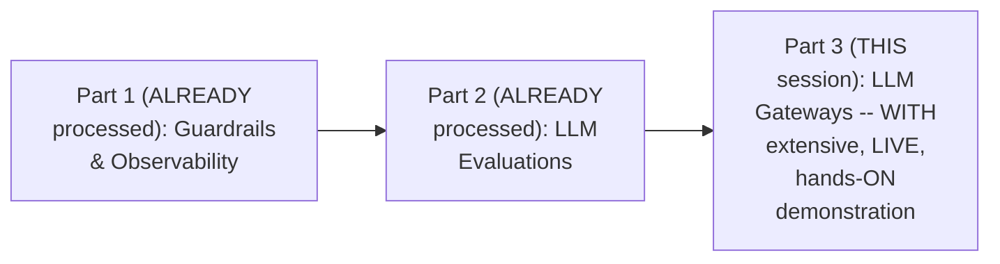
```mermaid
flowchart LR
    A["Part 1 (ALREADY<br/>processed): Guardrails<br/>& Observability"] --> B["Part 2 (ALREADY<br/>processed): LLM<br/>Evaluations"]
    B --> C["Part 3 (THIS<br/>session): LLM<br/>Gateways -- WITH<br/>extensive, LIVE,<br/>hands-ON<br/>demonstration"]
```

#### 🎯 Key Takeaways

* This session **GENUINELY, EXPLICITLY completes** the THIRD component of the FOUR-part LLM security FRAMEWORK established ACROSS this instructor's OWN series.
* UNLIKE the PRIOR two sessions (PRIMARILY conceptual/theoretical), THIS session is **GENUINELY, HEAVILY hands-ON** — FEATURING a COMPLETE, live WALKTHROUGH of a REAL platform and TEN, distinct EXPERIMENTS.
* Gateways are directly, HONESTLY framed as **DIRECTLY connected TO guardrails** — "GUARDRAILS is a PART of gateways" — DIRECTLY linking BACK to the PRIOR session's OWN established CONTENT.

---

### 2. What Are LLM Gateways? A Pre-Existing Concept, Now Applied to LLMs

#### 📖 Definition — LLM Gateways, Precisely Introduced

> 💡 **Given directly:** *"It is also a security level component of your LLM applications... is gateways a new concept? No. Gateways is a very old concept which has been introduced in software engineering from very long time... AI softwares are softwares in the end. AI engineers are software engineers in the end."*

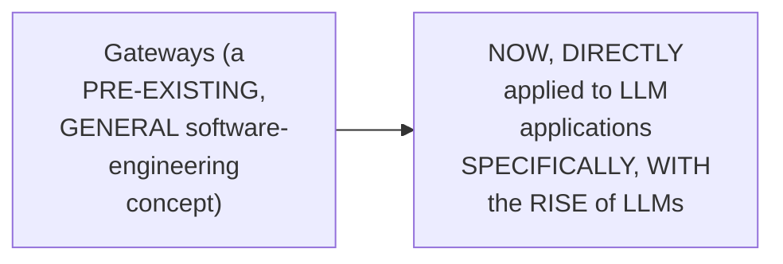
```mermaid
flowchart LR
    A["Gateways (a<br/>PRE-EXISTING,<br/>GENERAL software-<br/>engineering<br/>concept)"] --> B["NOW, DIRECTLY<br/>applied to LLM<br/>applications<br/>SPECIFICALLY, WITH<br/>the RISE of LLMs"]
```

#### 📖 Definition — The Precise, Genuine, Dual Role

> 💡 **Given directly:** *"The major portion is it acts as a security layer, but it also acts as a major backup layer."*

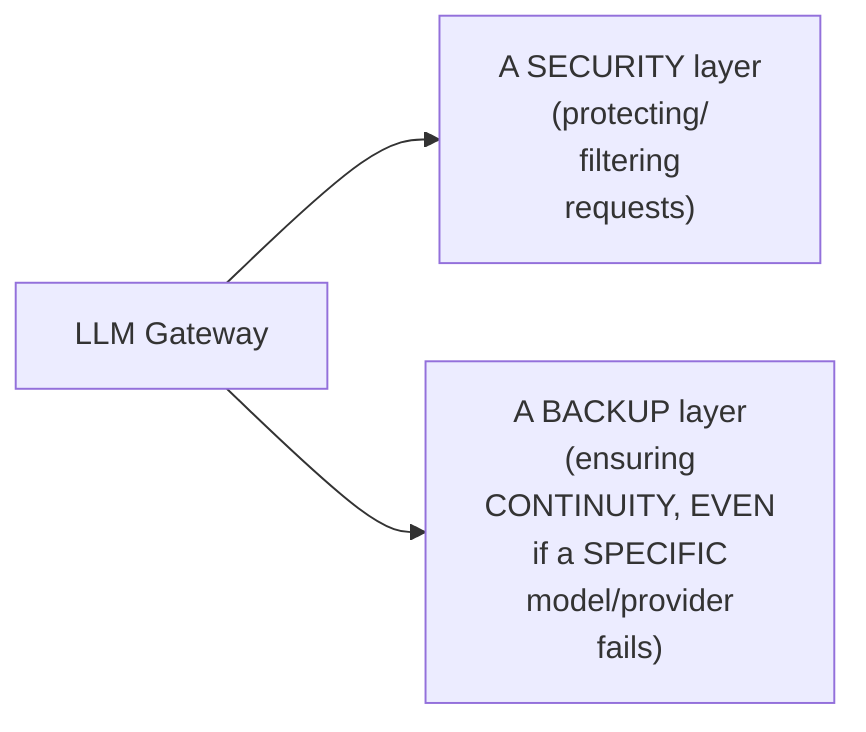
```mermaid
flowchart LR
    A["LLM Gateway"] --> B["A SECURITY layer<br/>(protecting/<br/>filtering<br/>requests)"]
    A --> C["A BACKUP layer<br/>(ensuring<br/>CONTINUITY, EVEN<br/>if a SPECIFIC<br/>model/provider<br/>fails)"]
```

#### ⚠ Common Mistakes

* Assuming GATEWAYS are a GENUINELY, ENTIRELY new CONCEPT, INVENTED specifically FOR the LLM era — explicitly, directly, HONESTLY corrected: gateways GENUINELY PRE-DATE LLMs — they're a WELL-established, GENERAL software-ENGINEERING pattern, NOW applied to a NEW domain.

#### 🎯 Key Takeaways

* **LLM gateways** are directly, HONESTLY confirmed as a **PRE-EXISTING** software-ENGINEERING concept, NOW applied SPECIFICALLY to LLM applications — NOT a GENUINELY novel invention.
* Gateways GENUINELY serve a **DUAL role**: a SECURITY layer, AND a BACKUP layer — ENSURING both PROTECTION and CONTINUITY.
* This SETS UP the REST of this session's OWN content — EVERY subsequent CAPABILITY (routing, retries, FALLBACK, caching) DIRECTLY serves ONE or BOTH of these TWO, genuine ROLES.

---
### 3. Why Gateways Exist: Fault Tolerance, Security, Robustness & Cost-Efficiency

#### ❓ Why It Exists — Reason 1: Fault Tolerance

> 💡 **Given directly:** *"What if the API limits are over?... what if OpenAI is under development? Server downtime... our application will also be down for that particular point of time... how bad it would look if a customer is chatting with our chatbot and our chatbot is saying that backend error."*

#### 🧠 Concept — A Genuinely Relatable, Real Analogy: Phone "Talktime Balance"

> 💡 **Given directly:** *"We used to have talktime balance in our phones... people who used to chitchat a lot, in 15 days their balance used to get over... now balance is over, now we cannot call anyone."*

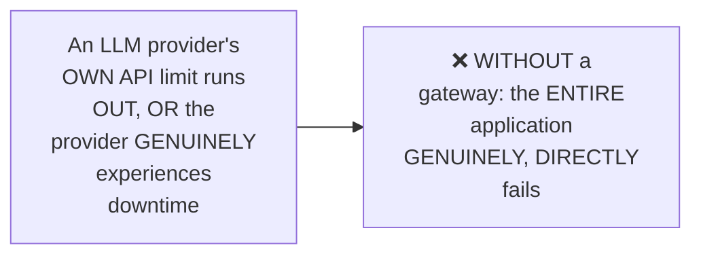
```mermaid
flowchart LR
    A["An LLM provider's<br/>OWN API limit runs<br/>OUT, OR the<br/>provider GENUINELY<br/>experiences<br/>downtime"] --> B["❌ WITHOUT a<br/>gateway: the ENTIRE<br/>application<br/>GENUINELY, DIRECTLY<br/>fails"]
```

#### ❓ Why It Exists — Reason 2: Security

> 💡 **Given directly:** *"Second one is, you know, security, to keep our system secure... now what we learned is guardrails, right? We have learned about guardrails. Now guardrails is a part of gateways."*

#### ❓ Why It Exists — Reason 3: Robustness (Speed & Low Latency)

> 💡 **Given directly:** *"Third, we also want to make robust systems. Now what is robust system means? Robust systems which are very fast and low latency... internally we don't have to use only one model."*

#### 📖 Definition — A Genuine, Direct Confirmation of Multi-Model Strategy

> 💡 **Given directly:** *"Instead of using one model we can use three models. This is OpenAI, this is Grok and this is Claude or Gemini... if one will not work, other will work. If other will not work, the third will work... our system will never fail. That is how it will become fault tolerant."*

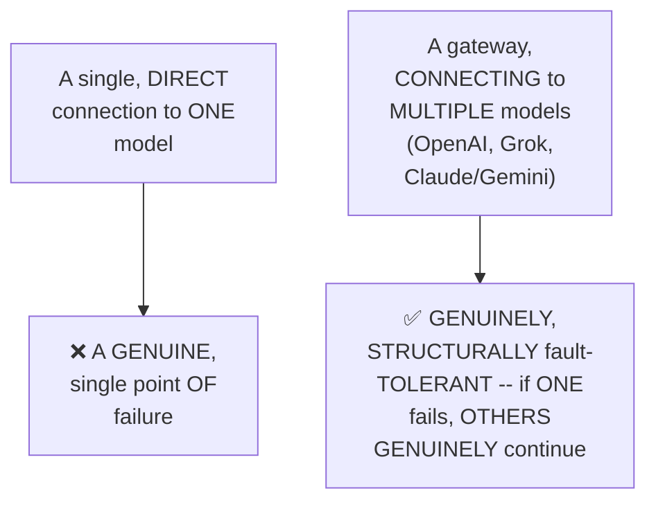
```mermaid
flowchart TD
    A["A single, DIRECT<br/>connection to ONE<br/>model"] --> B["❌ A GENUINE,<br/>single point OF<br/>failure"]
    C["A gateway,<br/>CONNECTING to<br/>MULTIPLE models<br/>(OpenAI, Grok,<br/>Claude/Gemini)"] --> D["✅ GENUINELY,<br/>STRUCTURALLY fault-<br/>TOLERANT -- if ONE<br/>fails, OTHERS<br/>GENUINELY continue"]
```

#### ❓ Why It Exists — Reason 4 (Added Later): Cost-Efficiency & Traceability

> 💡 **Given directly:** *"Gateways helps us to make fault tolerant, secure and robust systems, okay, and I can also add traceable systems... and cost efficient systems as well."*

#### ⚠ Common Mistakes

* Assuming a SINGLE, well-FUNDED LLM subscription is GENUINELY, SUFFICIENTLY reliable ON its OWN — explicitly, directly, CONCRETELY demonstrated as a GENUINE, real RISK — EVEN large, well-RESOURCED providers CAN GENUINELY experience DOWNTIME or usage LIMITS.
* Assuming "SECURITY" and "guardrails" are TWO, genuinely SEPARATE, unrelated CONCEPTS — explicitly, directly, DIRECTLY connected: "GUARDRAILS is a PART of gateways" — DIRECTLY unifying the PRIOR session's OWN content WITH this ONE.

#### 🎯 Key Takeaways

* Gateways GENUINELY exist for **FOUR, precise reasons**: **fault TOLERANCE** (SURVIVING provider OUTAGES/limits), **security** (GUARDRAILS are EXPLICITLY "part of" GATEWAYS), **robustness** (fast, LOW-latency responses), and **cost-EFFICIENCY** (WITH traceability as a RELATED benefit).
* A GENUINELY relatable, REAL analogy (PHONE "talktime BALANCE" running OUT) directly, CONCRETELY illustrates the fault-TOLERANCE motivation.
* Using **MULTIPLE models SIMULTANEOUSLY** (RATHER than ONE) is directly, PRECISELY confirmed as the CORE, structural MECHANISM enabling FAULT tolerance — "IF one will NOT work, OTHER will work."

---

### 4. Model Routing & Load Balancing: Directing Traffic Intelligently

#### 📖 Definition — Model Routing, Precisely Introduced

> 💡 **Given directly:** *"OpenAI models are considered very smart for content generation... Grok models are good for fast tasks... Gemini is good for generating images... depending upon the user query we want to... automatically sent to the appropriate model. This particular concept... is called model routing."*

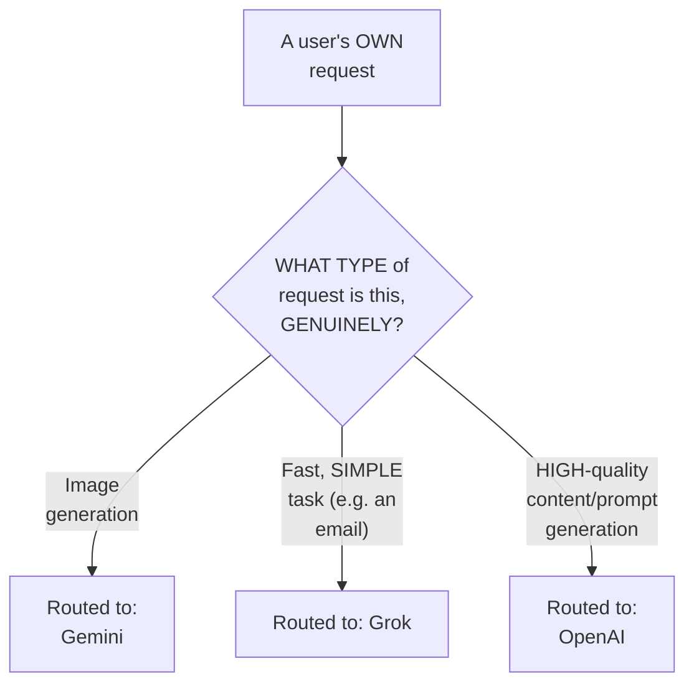
```mermaid
flowchart TD
    A["A user's OWN<br/>request"] --> B{"WHAT TYPE of<br/>request is this,<br/>GENUINELY?"}
    B -->|"Image<br/>generation"| C["Routed to:<br/>Gemini"]
    B -->|"Fast, SIMPLE<br/>task (e.g. an<br/>email)"| D["Routed to: Grok"]
    B -->|"HIGH-quality<br/>content/prompt<br/>generation"| E["Routed to:<br/>OpenAI"]
```

#### 📖 Definition — Load Balancing, Precisely Introduced

> 💡 **Given directly:** *"If you have 400 users... we have different different models, OpenAI model, so ChatGPT, Gemini model, and third we have Claude... for each 100 users, we will send them... balancing the load of the users with the respective models... because if 400 requests are all hitting this particular GPT, it will tolerate it but the response will go slower and slower."*

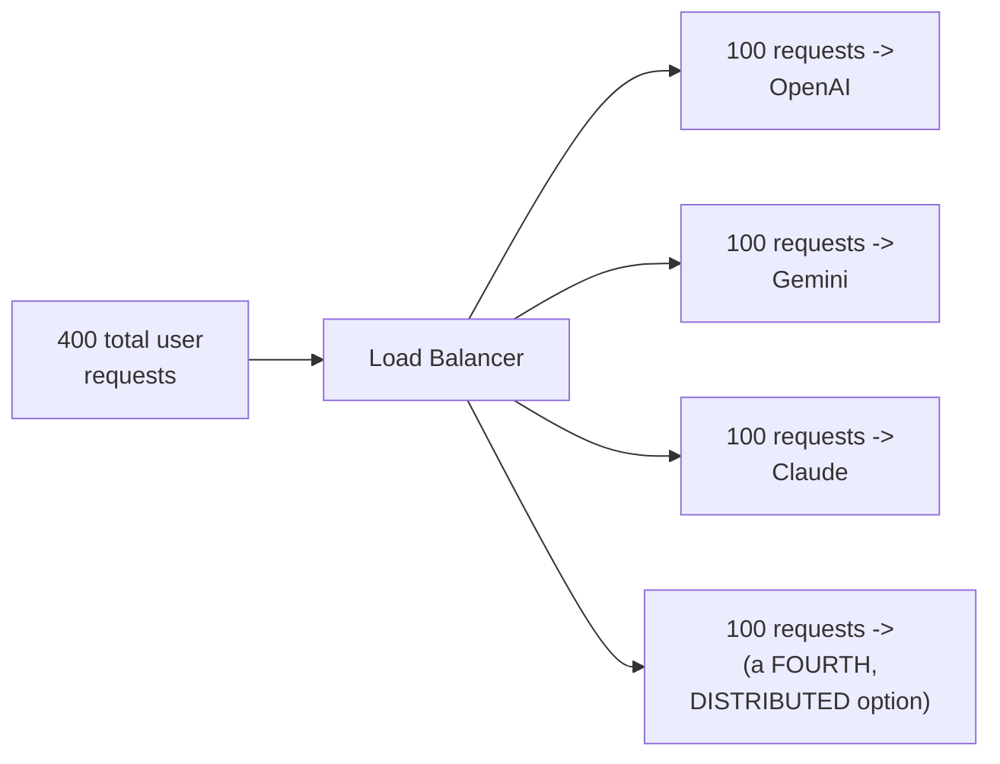
```mermaid
flowchart LR
    A["400 total user<br/>requests"] --> B["Load Balancer"]
    B --> C["100 requests -><br/>OpenAI"]
    B --> D["100 requests -><br/>Gemini"]
    B --> E["100 requests -><br/>Claude"]
    B --> F["100 requests -><br/>(a FOURTH,<br/>DISTRIBUTED option)"]
```

#### ⚠ Common Mistakes

* Confusing MODEL routing with LOAD balancing — explicitly, directly, PRECISELY distinguished: ROUTING directs DIFFERENT request TYPES to DIFFERENT, SPECIALIZED models (BASED on the request's OWN nature); LOAD balancing DISTRIBUTES SIMILAR requests ACROSS multiple, CAPABLE models (BASED on volume/CAPACITY).
* Assuming a SINGLE model CAN genuinely handle UNLIMITED, growing traffic WITHOUT any GENUINE, real performance IMPACT — explicitly, directly clarified: it "WILL tolerate it BUT the response WILL go slower and SLOWER."

#### 🎯 Key Takeaways

* **Model ROUTING** directs DIFFERENT TYPES of requests (IMAGE generation, FAST simple tasks, HIGH-quality content) to DIFFERENT, SPECIALIZED models, BASED on EACH model's OWN, genuine strengths.
* **Load BALANCING** distributes HIGH-VOLUME traffic ACROSS multiple, CAPABLE models — DIRECTLY, PRACTICALLY improving SPEED and preventing ANY single model from BECOMING overloaded.
* BOTH concepts directly, precisely serve THIS session's own established "ROBUSTNESS" goal (Section 3) — ENSURING fast, LOW-latency responses, EVEN under REAL, significant user LOAD.

---
### 5. A Live Demo: PortKey's Own Dashboard & Observability

#### 🪜 Step-by-Step — A Complete, Real, Live Introduction to PortKey

> 💡 **Given directly:** *"I'm opening some platform something called as PortKey... PortKey is a production grade application or a production grade framework when we want to use gateways... 12.3K stars, 2 months ago active development is going on."*

#### 🔍 Internal Working — A Genuine, Real, Live-Confirmed Dashboard Walkthrough

> 💡 **Given directly:** *"We can see a dashboard, okay, we can see how much cost I have spent till now, I have spent $0.05 till now on my models, how much latency, on an average level my models are giving reply in 208.5 milliseconds, how many requests I have received till now, 100 requests are received... how many unique users, I have four unique users."*

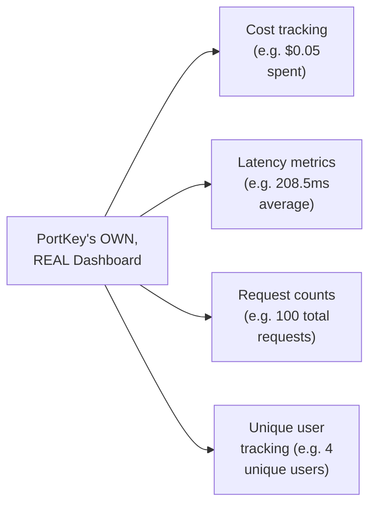
```mermaid
flowchart LR
    A["PortKey's OWN,<br/>REAL Dashboard"] --> B["Cost tracking<br/>(e.g. $0.05<br/>spent)"]
    A --> C["Latency metrics<br/>(e.g. 208.5ms<br/>average)"]
    A --> D["Request counts<br/>(e.g. 100 total<br/>requests)"]
    A --> E["Unique user<br/>tracking (e.g. 4<br/>unique users)"]
```

#### 🏢 Real-World / Production Usage — A Genuine, Direct, Honest Confirmation

> 💡 **Given directly:** *"You have to also know that only PortKey is giving this kind of luxury. Not all frameworks give you this kind of luxury."*

#### ⚠ Common Mistakes

* Assuming EVERY gateway FRAMEWORK offers the SAME LEVEL of DASHBOARD/observability DETAIL — explicitly, directly, HONESTLY clarified: THIS level of RICH, detailed ANALYTICS is SPECIFICALLY highlighted as a PortKey-specific STRENGTH, NOT a UNIVERSAL feature ACROSS all frameworks.

#### 🎯 Key Takeaways

* **PortKey** is directly, LIVE-demonstrated as a REAL, production-GRADE gateway PLATFORM — providing COST tracking, LATENCY metrics, REQUEST counts, and UNIQUE-user tracking, ALL within ONE, unified DASHBOARD.
* This LIVE walkthrough directly, CONCRETELY grounds THIS session's OWN, abstract "observability" CLAIMS in a REAL, working PRODUCT — NOT merely a THEORETICAL description.
* The instructor **directly, HONESTLY confirms** this LEVEL of dashboard RICHNESS is SPECIFICALLY a PortKey strength — NOT a UNIVERSAL guarantee ACROSS every GATEWAY framework.

---

### 6. The Four Major Gateway Frameworks

#### 📖 Definition — PortKey, Precisely Confirmed as the "Feature-Complete" Choice

> 💡 **Given directly:** *"PortKey is the most feature complete framework... all these concepts which I was talking about... no framework gives you guardrails, gateways, observability, caching, load balancing, all of that in one place. PortKey is giving you and that is why I'm referring it to as feature complete."*

#### 📖 Definition — LiteLLM, Precisely Introduced as the Open-Source Leader

> 💡 **Given directly:** *"LiteLLM is the biggest, biggest open source framework of gateways... 52.6K GitHub stars... very wide community... it can integrate any LLM, any A2A [agent-to-agent]... 1500 plus models... 100% uptime."*

#### 📖 Definition — OpenRouter, Precisely Introduced as the Exploration-Friendly Option

> 💡 **Given directly:** *"OpenRouter is also a free source... it has less integrations... 400 plus models... 70 plus providers... if you want to explore gateways and try out a solution, OpenRouter is go to."*

#### 📖 Definition — Bifrost, Precisely Introduced as the Fastest Option

> 💡 **Given directly:** *"Bifrost is also amazing... open-source, high-performance gateway... this is the fastest gateway, okay, if I say this is the fastest of any gateways, not even PortKey is as fast as this... only drawback of this is it has less partners, less integrations."*

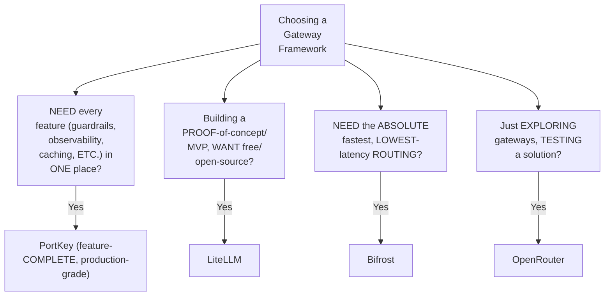
```mermaid
flowchart TD
    A["Choosing a<br/>Gateway<br/>Framework"] --> B["NEED every<br/>feature (guardrails,<br/>observability,<br/>caching, ETC.) in<br/>ONE place?"]
    B -->|"Yes"| C["PortKey (feature-<br/>COMPLETE, production-<br/>grade)"]
    A --> D["Building a<br/>PROOF-of-concept/<br/>MVP, WANT free/<br/>open-source?"]
    D -->|"Yes"| E["LiteLLM"]
    A --> F["NEED the ABSOLUTE<br/>fastest, LOWEST-<br/>latency ROUTING?"]
    F -->|"Yes"| G["Bifrost"]
    A --> H["Just EXPLORING<br/>gateways, TESTING<br/>a solution?"]
    H -->|"Yes"| I["OpenRouter"]
```

#### 🔍 Internal Working — A Genuine, Brief Mention of Additional Frameworks

> 💡 **Given directly:** *"There is also something called as Cloudflare... Kong. There are many... when you are already using Cloudflare in your systems and you want to integrate Cloudflare only as your gateways... you can go for Cloudflare."*

#### ⚠ Common Mistakes

* Assuming ONE, single FRAMEWORK is GENUINELY, UNIVERSALLY "the BEST" for EVERY possible SCENARIO — explicitly, directly, PRECISELY clarified: EACH framework GENUINELY excels IN a DIFFERENT dimension (FEATURE-completeness, OPEN-source availability, RAW speed, or EASE of EXPLORATION) — the CORRECT choice DEPENDS on the SPECIFIC, real USE case.
* Assuming Cloudflare's OWN gateway OFFERING is GENUINELY, DIRECTLY comparable in SCOPE to the OTHER four, MAJOR frameworks — explicitly, directly clarified: it's RECOMMENDED SPECIFICALLY for TEAMS ALREADY using CLOUDFLARE for OTHER purposes (e.g., AUTHENTICATION).

#### 🎯 Key Takeaways

* **PortKey** is the "FEATURE-complete," PRODUCTION-grade CHOICE — COMBINING guardrails, GATEWAYS, observability, and CACHING in ONE platform.
* **LiteLLM** is the BIGGEST OPEN-source option — WELL-suited for PROOF-of-concept/MVP PROJECTS.
* **Bifrost** is the FASTEST option (EVEN faster than PORTKEY) but has FEWER integrations; **OpenRouter** is GENUINELY well-suited for EXPLORATION and TESTING.

---
### 7. Virtual Keys: The Temple Shoe-Rack Analogy

#### ❓ Why It Exists — The Precise, Genuine Problem: Managing Many API Keys

> 💡 **Given directly:** *"The task is to manage these API keys is a problem, okay, because keys will increase so much it will be a problem... handling over 50 API keys is a problem. So why not give someone else to handle our API keys?"*

#### 🧠 Concept — A Genuinely Memorable, Real Analogy: The Temple Shoe Rack

> 💡 **Given directly:** *"We have been to temples, right? If you go to temples, okay, you have a shoe rack... there is a man standing over here, you will go here, you will give your shoes to him, and what he will give you in return, he will give you a token... this token number 43 represents your shoes. When you give me back this token number 43, I will give you your shoes back."*

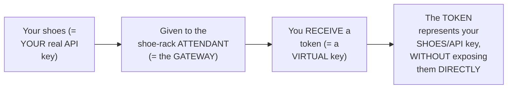
```mermaid
flowchart LR
    A["Your shoes (=<br/>YOUR real API<br/>key)"] --> B["Given to the<br/>shoe-rack ATTENDANT<br/>(= the GATEWAY)"]
    B --> C["You RECEIVE a<br/>token (= a<br/>VIRTUAL key)"]
    C --> D["The TOKEN<br/>represents your<br/>SHOES/API key,<br/>WITHOUT exposing<br/>them DIRECTLY"]
```

#### 📖 Definition — Virtual Key, Precisely Defined

> 💡 **Given directly:** *"We give our API key... no matter one API key or 100 API keys, how many models we have, all the API keys we can give this to our gateway... gateway will give us something called as virtual keys. Now this virtual keys is as good as the token I told you about. These virtual keys represent this API key."*

#### 📖 Definition — Slug, Precisely Introduced as the Technical Term

> 💡 **Given directly:** *"Virtual keys have a technical word... and this word is called slug... similarly you have something called as virtual key, you are calling it slug, you are giving it a name, technical name, slug."*

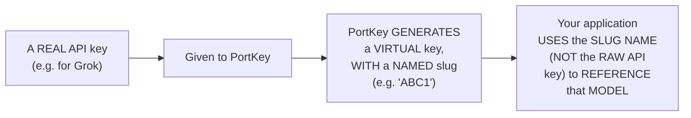
```mermaid
flowchart LR
    A["A REAL API key<br/>(e.g. for Grok)"] --> B["Given to PortKey"]
    B --> C["PortKey GENERATES<br/>a VIRTUAL key,<br/>WITH a NAMED slug<br/>(e.g. 'ABC1')"]
    C --> D["Your application<br/>USES the SLUG NAME<br/>(NOT the RAW API<br/>key) to REFERENCE<br/>that MODEL"]
```

#### 🪜 Step-by-Step — A Complete, Live, Real, Worked Example

> 💡 **Given directly:** *"I will go ahead and show you how to make it... new integration... I will choose my provider which is Grok. I will click Grok, I will enter a name... ABC1... I will generate a new API key... I will call it ABC1... I will copy this and I will paste this."*

#### ⚠ A Direct, Honest, Important Risk Acknowledgment

> 💡 **Given directly:** *"If gateway is down, if gateway is hacked, okay, it will all be down. So this is the downside of it. If gateway only is not working, okay, if there is a server downtime on gateway, then we will not have you know, no purpose of all this."*

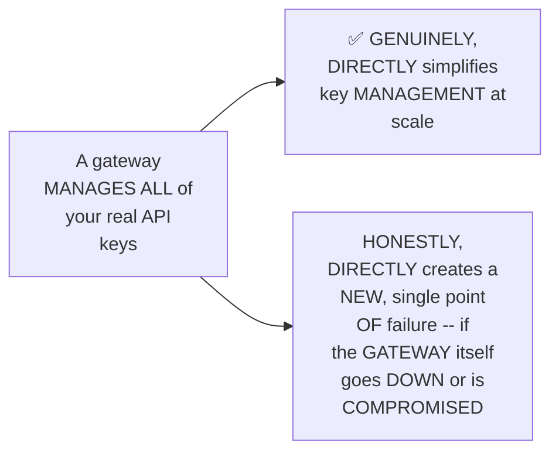
```mermaid
flowchart LR
    A["A gateway<br/>MANAGES ALL of<br/>your real API<br/>keys"] --> B["✅ GENUINELY,<br/>DIRECTLY simplifies<br/>key MANAGEMENT at<br/>scale"]
    A --> C["HONESTLY,<br/>DIRECTLY creates a<br/>NEW, single point<br/>OF failure -- if<br/>the GATEWAY itself<br/>goes DOWN or is<br/>COMPROMISED"]
```

#### ⚠ Common Mistakes

* Assuming VIRTUAL keys are GENUINELY, FUNCTIONALLY equivalent to JUST renaming your OWN, existing API keys — explicitly, directly, PRECISELY clarified: they GENUINELY REPLACE the need to EVER directly HANDLE/expose the REAL API key WITHIN your OWN application code.
* Assuming a GATEWAY's own KEY-management convenience is GENUINELY, ENTIRELY risk-FREE — explicitly, directly, HONESTLY acknowledged: it GENUINELY creates a NEW, real DEPENDENCY/risk — IF the gateway ITSELF fails or is COMPROMISED, ALL managed KEYS are GENUINELY, DIRECTLY affected.

#### 🎯 Key Takeaways

* Managing MANY, individual API keys (ACROSS multiple models/PROJECTS) is a GENUINE, real, growing PROBLEM — GATEWAYS solve this BY securely HOLDING your REAL keys and ISSUING **virtual keys** INSTEAD.
* The **TEMPLE shoe-rack ANALOGY** directly, MEMORABLY captures this: your REAL API key (LIKE your shoes) is GIVEN to the gateway (the ATTENDANT), WHICH returns a **virtual key/TOKEN** (technically CALLED a **"slug"**) that REPRESENTS it.
* This CONVENIENCE is directly, HONESTLY balanced WITH a REAL, acknowledged RISK: the gateway ITSELF becomes a NEW, potential single POINT of FAILURE — IF it goes DOWN or is COMPROMISED, EVERY managed KEY is GENUINELY, DIRECTLY affected.

---
### 8. Live Experiments 1-2: Tracing & Metadata

#### 🪜 Step-by-Step — The Baseline: Life WITHOUT a Gateway

> 💡 **Given directly:** *"This is life without gateway. Your application is directly interacting with a model... we cannot see any trace on PortKey... we do not have a backup... if I mess up this API key... it will not work, it will say that hey service is down."*

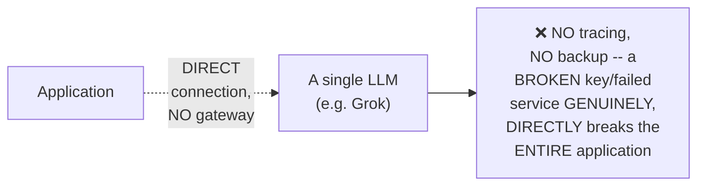
```mermaid
flowchart LR
    A["Application"] -.->|"DIRECT<br/>connection,<br/>NO gateway"| B["A single LLM<br/>(e.g. Grok)"]
    B --> C["❌ NO tracing,<br/>NO backup -- a<br/>BROKEN key/failed<br/>service GENUINELY,<br/>DIRECTLY breaks the<br/>ENTIRE application"]
```

#### 🪜 Step-by-Step — Live Experiment 1: Basic Tracing WITH a Gateway

> 💡 **Given directly:** *"Now let us see how is life with gateway. The first experiment... we can start to trace our LLM calls... your application now it will not directly contact your LLM, there will be a gateway in between... this all will be logged on PortKey dashboard."*

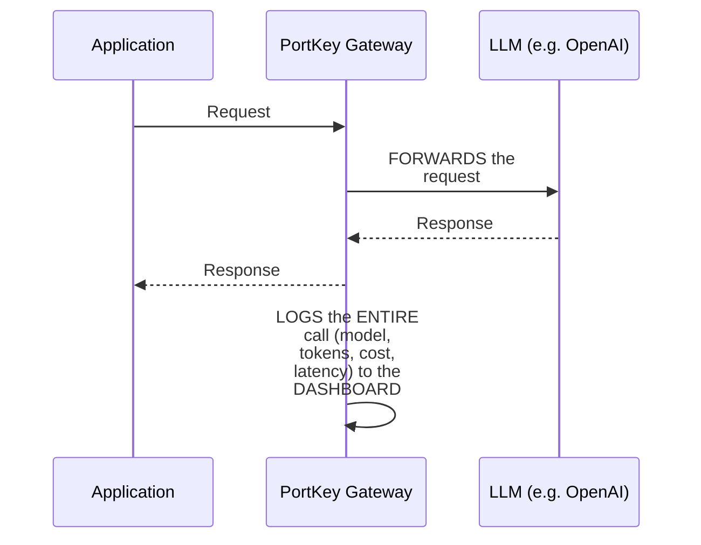
```mermaid
sequenceDiagram
    participant App as Application
    participant GW as PortKey Gateway
    participant LLM as LLM (e.g. OpenAI)
    App->>GW: Request
    GW->>LLM: FORWARDS the<br/>request
    LLM-->>GW: Response
    GW-->>App: Response
    GW->>GW: LOGS the ENTIRE<br/>call (model,<br/>tokens, cost,<br/>latency) to the<br/>DASHBOARD
```

#### 🔍 Internal Working — A Genuine, Real, Live-Confirmed Result

> 💡 **Given directly:** *"A request was sent, this is my email ID, this is the model used, OpenAI 20 billion model... tokens used are 300... I can go to logs... I can trace each request... this was the cost, 0.01 cost."*

#### 📖 Definition — Live Experiment 2: Metadata, Precisely Introduced

> 💡 **Given directly:** *"We will not only send the request, but we will also send information with it, which means which particular user, which particular environment, and in which particular zone we are using it... metadata is extra information about your data."*

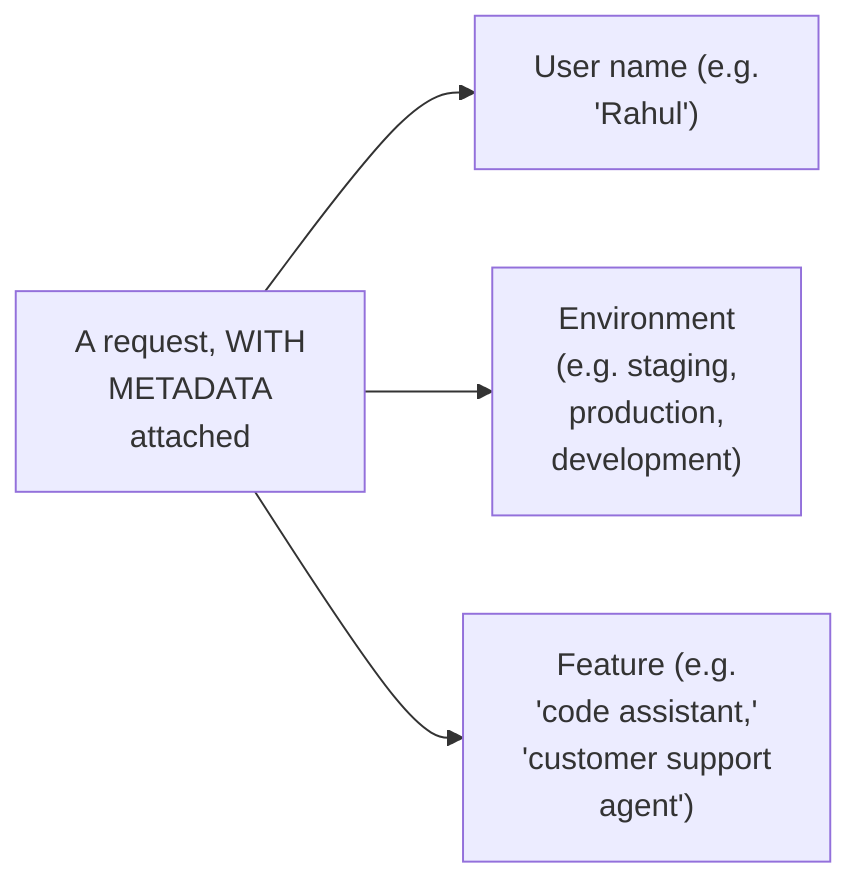
```mermaid
flowchart LR
    A["A request, WITH<br/>METADATA<br/>attached"] --> B["User name (e.g.<br/>'Rahul')"]
    A --> C["Environment<br/>(e.g. staging,<br/>production,<br/>development)"]
    A --> D["Feature (e.g.<br/>'code assistant,'<br/>'customer support<br/>agent')"]
```

#### 🔍 Internal Working — A Genuine, Real, Live-Confirmed Result: User-Level Tracking

> 💡 **Given directly:** *"We have two unique users, we have Rahul and my ID... and we can trace all of them... this is how we do user level tracking... we can filter on basis of users... or we can also filter on basis of, you know, any filter we can apply."*

#### 🔍 Internal Working — A Genuine, Brief, Related Concept: Session IDs

> 💡 **Given directly:** *"If I open ChatGPT... the moment I ask a question... we have a session ID which means for this particular session, remember everything that user is talking about. So that is how it maintains a memory as well."*

#### ⚠ Common Mistakes

* Assuming a GATEWAY's OWN tracing CAPABILITY is AUTOMATIC, WITHOUT any REQUIRED, additional SETUP — explicitly, directly, LIVE-demonstrated: THIS requires GENUINELY routing REQUESTS THROUGH the gateway ITSELF, NOT DIRECTLY to the LLM.
* Confusing METADATA (user/environment/feature INFO, attached PER request) WITH a session ID (MAINTAINING conversational MEMORY across MULTIPLE requests) — explicitly, directly, PRECISELY distinguished as TWO, genuinely DIFFERENT, though RELATED, concepts.

#### 🎯 Key Takeaways

* WITHOUT a gateway, an application has **NO tracing and NO backup** — a BROKEN key or FAILED service GENUINELY, DIRECTLY breaks the ENTIRE application, LIVE-demonstrated.
* **Experiment 1** directly, LIVE-confirmed that ROUTING requests THROUGH a gateway ENABLES complete TRACING — EVERY call's OWN model, TOKENS, cost, and LATENCY becomes VISIBLE on a DASHBOARD.
* **Experiment 2** directly, LIVE-confirmed that attaching **METADATA** (user, environment, FEATURE) enables GENUINE, real **user-LEVEL tracking and FILTERING** — a REAL, practical capability FOR managing MANY users at SCALE.

---

### 9. Live Experiments 3-5: Retries, Timeouts & Fallback (Working Together)

#### 📖 Definition — Live Experiment 3: Automatic Retries, Precisely Introduced

> 💡 **Given directly:** *"When LLM hit rate limits, occasionally throw 500 errors... without a gateway, your application will crash... with PortKey retry config, failed requests are automatically retried in exponential backoff... it will retry and after multiple attempts it will deliver your response."*

#### 📖 Definition — Timeout, Precisely Introduced

> 💡 **Given directly:** *"Timeout means there are many applications which are critical to response, which means I want my response within 10 seconds only... if it is not doing in 10 seconds, go for another model."*

#### 📖 Definition — Fallback, Precisely Introduced (With a Memorable, Real Analogy)

> 💡 **Given directly:** *"You are playing football, okay, lot of your opponents have come in your court, you will call your team, fall back, come to me, save me. Similarly, fallback is the feature when one model is not working, it will go back to the next model."*

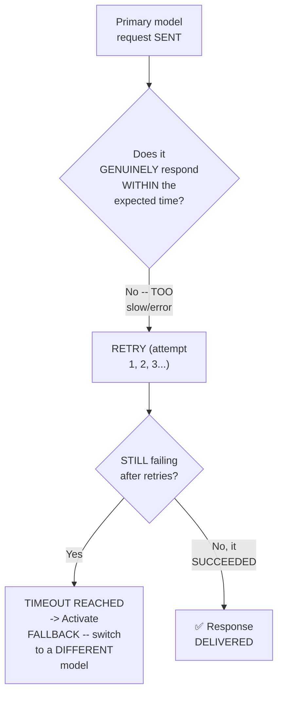
```mermaid
flowchart TD
    A["Primary model<br/>request SENT"] --> B{"Does it<br/>GENUINELY respond<br/>WITHIN the<br/>expected time?"}
    B -->|"No -- TOO<br/>slow/error"| C["RETRY (attempt<br/>1, 2, 3...)"]
    C --> D{"STILL failing<br/>after retries?"}
    D -->|"Yes"| E["TIMEOUT REACHED<br/>-> Activate<br/>FALLBACK -- switch<br/>to a DIFFERENT<br/>model"]
    D -->|"No, it<br/>SUCCEEDED"| F["✅ Response<br/>DELIVERED"]
```

#### 🔍 Internal Working — A Genuine, Direct Confirmation That These Three Concepts Are Used TOGETHER

> 💡 **Given directly:** *"Retry, timeout and fallback are always used together... they can be used standalone but they are usually used in combination. See, first in 5 seconds it is not replying, retry... too slow to error, retry... then now we tried, model is not working again, retry... activating fallback, switching to different model."*

#### 🪜 Step-by-Step — A Complete, Live, Real Demonstration of the Full Sequence

> 💡 **Given directly:** *"I will fail my model by giving it a wrong slug... request calling primary model timed out. Retry one, calling primary model, timed out. Retry two, calling primary model, timed out. Activating fallback, switching to different model."*

#### ⚠ Common Mistakes

* Assuming RETRY, timeout, and FALLBACK are THREE, genuinely UNRELATED, separate CAPABILITIES to be CONFIGURED independently — explicitly, directly, LIVE-demonstrated as GENUINELY, PRACTICALLY working TOGETHER, in SEQUENCE, as a SINGLE, coherent resilience STRATEGY.
* Assuming a FAILED request GENUINELY, IMMEDIATELY triggers FALLBACK, WITHOUT any INTERMEDIATE retry ATTEMPTS — explicitly, directly, LIVE-demonstrated: MULTIPLE retry ATTEMPTS genuinely OCCUR first, WITH fallback ONLY activating AFTER retries are EXHAUSTED.

#### 🎯 Key Takeaways

* **Automatic RETRIES** re-attempt a FAILED request (WITH exponential BACKOFF); **timeouts** cap HOW long a MODEL has to RESPOND; **fallback** SWITCHES to a BACKUP model WHEN the primary GENUINELY fails.
* These THREE concepts are directly, EXPLICITLY confirmed as **GENUINELY used TOGETHER**, in SEQUENCE — NOT as ISOLATED, standalone FEATURES.
* A COMPLETE, live DEMONSTRATION directly, CONCRETELY traced the FULL sequence: RETRY → retry AGAIN → TIMEOUT reached → FALLBACK activated — a REAL, observed PROOF of THIS session's OWN "fault TOLERANT systems" goal (Section 3).

---
### 10. Live Experiment 6: Load Balancing in Action

#### 🪜 Step-by-Step — A Complete, Live, Real, Configurable Demonstration

> 💡 **Given directly:** *"If 10 requests are coming, it will be passed through your PortKey gateway, 70% of the requests will go somewhere else, 30% will go somewhere else... we can divide this, we can make it 10-20, 80-40-60, 50/50, we can do whatever... let us try with 60-40. Large model will take 60% of the requests, small model will take 40%."*

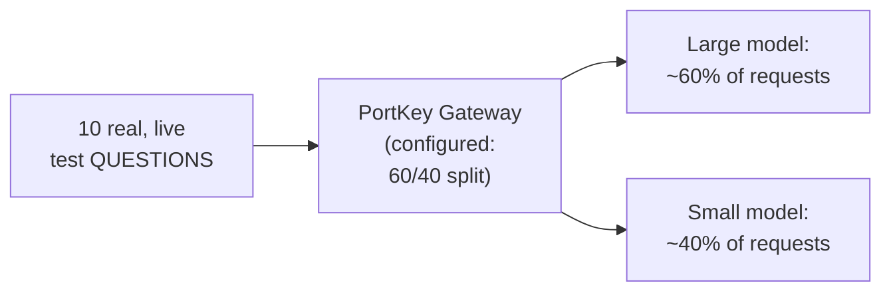
```mermaid
flowchart LR
    A["10 real, live<br/>test QUESTIONS"] --> B["PortKey Gateway<br/>(configured:<br/>60/40 split)"]
    B --> C["Large model:<br/>~60% of requests"]
    B --> D["Small model:<br/>~40% of requests"]
```

#### 🔍 Internal Working — A Genuine, Real, Live-Confirmed Result

> 💡 **Given directly:** *"So here we can see the analytics, five questions were sent to large model, five questions were sent to large model... zero errors... we're able to trace all of this on a user level."*

#### 🪜 Step-by-Step — A Genuine, Live Test of Failure Handling Within Load Balancing

> 💡 **Given directly:** *"Let us try to fail this main model... and let me fire five, all the requests now... let us see how that happens. Now if I fire five requests, 10 requests, all of them failed... do we have any error rates over here?... we should always try to fail our systems like that."*

#### ⚠ Common Mistakes

* Assuming load-BALANCING splits are FIXED, non-CONFIGURABLE proportions — explicitly, directly, LIVE-demonstrated as GENUINELY, FLEXIBLY configurable (e.g., "10-20, 80-40-60, 50/50, WE can do WHATEVER").
* Assuming LOAD balancing ALONE genuinely PREVENTS failures ENTIRELY — explicitly, directly, LIVE-demonstrated as GENUINELY, STILL susceptible to FAILURE if the UNDERLYING model ITSELF fails — DIRECTLY connecting BACK to WHY retries/fallback (Section 9) REMAIN necessary EVEN alongside LOAD balancing.

#### 🎯 Key Takeaways

* Load BALANCING is directly, LIVE-demonstrated as **GENUINELY, FLEXIBLY configurable** — SPLITTING traffic ACROSS models AT any CHOSEN ratio (e.g., 60/40, 50/50).
* A REAL, live TEST directly, CONCRETELY confirmed the SPLIT WORKING correctly — FIVE requests GENUINELY, DIRECTLY routed to EACH of TWO models, WITH zero ERRORS.
* This session's OWN, deliberate "FAIL the main MODEL" test directly, HONESTLY demonstrates that LOAD balancing ALONE is NOT genuinely SUFFICIENT for FULL fault TOLERANCE — REINFORCING WHY retries and FALLBACK (Section 9) REMAIN, GENUINELY, complementary NECESSITIES.

---

### 11. Live Experiment 7: Caching — Simple vs. Semantic

#### 🧠 Concept — A Genuinely Relatable, Real Analogy: A Half-Filled Google Form

> 💡 **Given directly:** *"You are trying to fill a Google form... lot of time what happens is while filling the Google form, you close it accidentally... but when you again open this Google form, it is almost filled... this is caching. The browser which you were using was maintaining your cache."*

#### 📖 Definition — Caching, Precisely Applied to LLM Chatbots

> 💡 **Given directly:** *"If people have already asked about vacation and the chatbot remembers that this was the answer I gave for vacation, it will directly pick the answer from the cache memory and it will not hit the LLM again."*

#### 📖 Definition — Simple Cache, Precisely Defined

> 💡 **Given directly:** *"Simple cache will check for exact similar words. If I asked what is AI for the first time, it will search the database and give me the response. But if I exactly ask the same question, what is AI, again, it will not hit the database... it will respond from the cache memory."*

#### 📖 Definition — Semantic Cache, Precisely Defined

> 💡 **Given directly:** *"Semantic, the word semantic means meaningful... one person can also ask what is AI? One person can also ask tell me about AI, explain me AI... all of these questions have a same answer... even if the question is semantically similar, it will give the response from the database — only the words are different, the meaning is the same."*

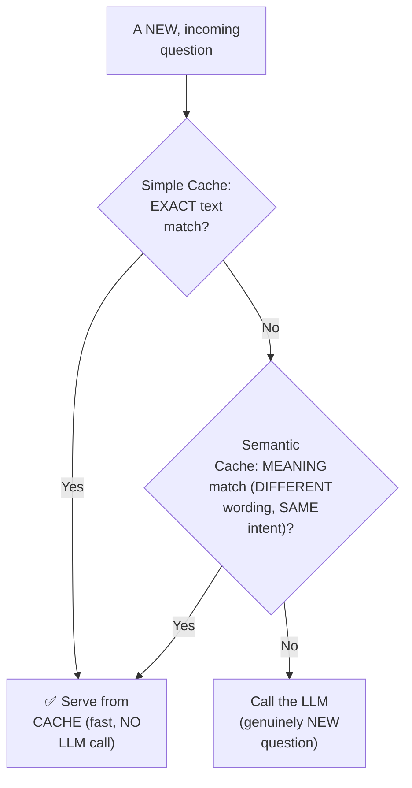
```mermaid
flowchart TD
    A["A NEW, incoming<br/>question"] --> B{"Simple Cache:<br/>EXACT text<br/>match?"}
    B -->|"Yes"| C["✅ Serve from<br/>CACHE (fast, NO<br/>LLM call)"]
    B -->|"No"| D{"Semantic<br/>Cache: MEANING<br/>match (DIFFERENT<br/>wording, SAME<br/>intent)?"}
    D -->|"Yes"| C
    D -->|"No"| E["Call the LLM<br/>(genuinely NEW<br/>question)"]
```

#### 🪜 Step-by-Step — A Complete, Live, Real, Dramatic Performance Demonstration

> 💡 **Given directly:** *"How does internet actually work?... first time I'm running it, it took 1538 milliseconds... if I run this for the second time, same question... check this out, it took 101 milliseconds... this is a cache hit."*

```text
Live-confirmed, real cache performance:
  First call (cache MISS):  1,538 ms
  Second call (cache HIT):    101 ms
  -> A GENUINE, DRAMATIC ~15x speedup
```

#### 🔍 Internal Working — A Genuine, Real, Direct Confirmation of Cost Savings

> 💡 **Given directly:** *"0.02 cents were saved because cache was hit... using this cache concept, we save our tokens. So if you are asked in an interview that how will you optimize your cost in a large language model, you will say I will implement caching."*

#### ⚠ Common Mistakes

* Assuming CACHING is a GENUINELY novel, LLM-specific invention — explicitly, directly, HONESTLY connected BACK to a FAMILIAR, everyday EXAMPLE (a WEB browser's OWN, existing form-CACHING behavior) — a WELL-established, general SOFTWARE concept, applied HERE to LLMs.
* Confusing SIMPLE cache (EXACT text MATCH) with SEMANTIC cache (MEANING-based MATCH, WORKING even WHEN wording GENUINELY differs) — explicitly, directly, PRECISELY distinguished.

#### 🎯 Key Takeaways

* **Simple CACHE** matches on **EXACT text**; **semantic CACHE** matches on **MEANING**, EVEN when the WORDING genuinely DIFFERS (e.g., "what is AI?" VERSUS "explain me AI").
* A COMPLETE, live TEST directly, CONCRETELY confirmed a **DRAMATIC, REAL performance GAIN** — a cache HIT reduced response TIME from 1,538ms to 101ms — a ~15x SPEEDUP.
* Caching is directly, EXPLICITLY confirmed as a **GENUINE, real, interview-RELEVANT cost-optimization STRATEGY** — "I will IMPLEMENT caching" is DIRECTLY offered as a MODEL interview ANSWER.

---
### 12. Live Experiments 8-9: Rate Limiting & Streaming

#### 📖 Definition — Rate Limiting, Precisely Introduced

> 💡 **Given directly:** *"Rate limiting means... you are using OpenAI, you have a large language model ready, but when you are giving it to users, you want to apply subscription plans. You only want to give your users that only use 10 requests... if 10 chats exceed, a pop-up will come, subscribe to our... pro plan."*

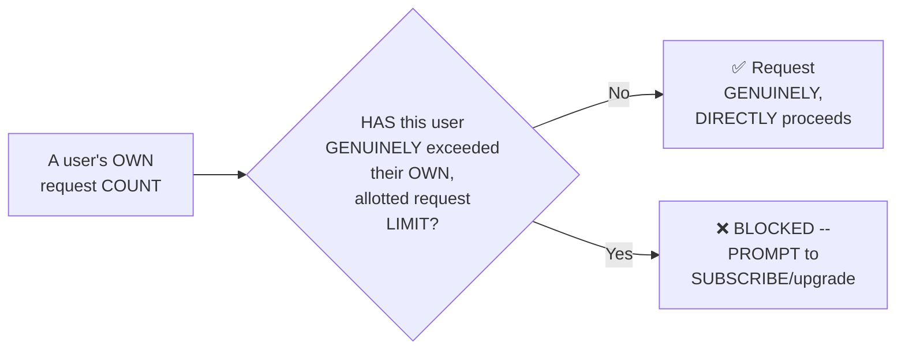
```mermaid
flowchart LR
    A["A user's OWN<br/>request COUNT"] --> B{"HAS this user<br/>GENUINELY exceeded<br/>their OWN,<br/>allotted request<br/>LIMIT?"}
    B -->|"No"| C["✅ Request<br/>GENUINELY,<br/>DIRECTLY proceeds"]
    B -->|"Yes"| D["❌ BLOCKED --<br/>PROMPT to<br/>SUBSCRIBE/upgrade"]
```

#### 📖 Definition — Streaming, Precisely Introduced

> 💡 **Given directly:** *"Streaming is very simple... see the response, okay, it will stream the response word by word... check this out, I'm asking this question, what is AI? Okay, we want to see 25 tokens in the stream... get response full at once, it will take a second and it will give us full response... but here I will add what is life without AI, okay, it will stream."*

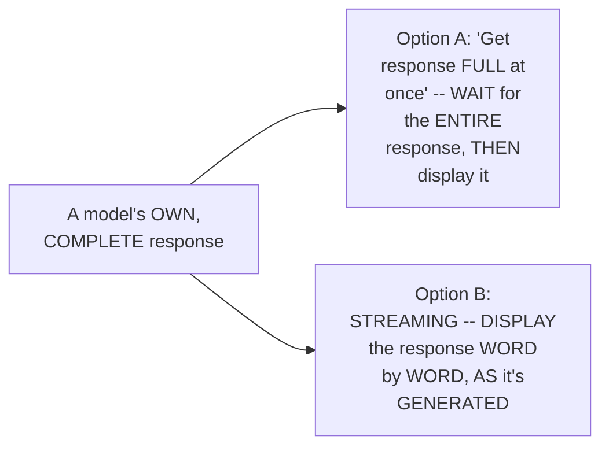
```mermaid
flowchart LR
    A["A model's OWN,<br/>COMPLETE response"] --> B["Option A: 'Get<br/>response FULL at<br/>once' -- WAIT for<br/>the ENTIRE<br/>response, THEN<br/>display it"]
    A --> C["Option B:<br/>STREAMING -- DISPLAY<br/>the response WORD<br/>by WORD, AS it's<br/>GENERATED"]
```

#### 🔍 Internal Working — A Genuine, Real, Relatable Example: ChatGPT's Own Streaming

> 💡 **Given directly:** *"See streaming, I will show you again ChatGPT. What is AI? See the response, okay, it will stream the response word by word... see it is streaming in front of us. Okay, I don't know why I'm facing this lag but see here also it is streaming."*

#### ⚠ Common Mistakes

* Assuming RATE limiting is GENUINELY, PURELY a technical/COST-control mechanism, UNRELATED to BUSINESS strategy — explicitly, directly connected: it's DIRECTLY tied to SUBSCRIPTION-tier BUSINESS models — "SUBSCRIBE to our PRO plan."
* Assuming STREAMING is GENUINELY just a COSMETIC, visual PREFERENCE — explicitly, directly implied as a GENUINE, real user-EXPERIENCE consideration — USERS see PROGRESS immediately, RATHER than WAITING for the ENTIRE response BEFORE seeing ANYTHING.

#### 🎯 Key Takeaways

* **Rate LIMITING** restricts USERS to a SPECIFIC number of REQUESTS — DIRECTLY, PRACTICALLY tied to SUBSCRIPTION-based business MODELS (e.g., "SUBSCRIBE for MORE requests").
* **Streaming** delivers a RESPONSE word-BY-word, AS it's GENERATED — RATHER than WAITING for the COMPLETE response BEFORE displaying ANYTHING — directly, LIVE-demonstrated VIA BOTH ChatGPT and the SESSION's own DEMO application.
* BOTH capabilities directly, GENUINELY connect to THIS session's OWN, broader THEMES — rate LIMITING to COST-efficiency (Section 3), and STREAMING to the "ROBUST, low-LATENCY" user EXPERIENCE goal (Section 3).

---

### 13. Closing: A Complete, Hands-On Recap

#### 🪜 Step-by-Step — A Complete, Honest, Direct Confirmation

> 💡 **Given directly:** *"So, yes, these were all the different different experiments of PortKey. Okay, not really PortKey, these were all the experiments for LLM gateway... this link is provided, you can add your API keys and you can experiment all the different different experiments to get a hands-on and understand the concept."*

```mermaid
flowchart TD
    A["Complete LLM<br/>Gateway<br/>Framework"] --> B["Core Motivation:<br/>Fault Tolerance,<br/>Security,<br/>Robustness, Cost-<br/>Efficiency"]
    A --> C["Routing/Balancing:<br/>Model Routing,<br/>Load Balancing"]
    A --> D["Resilience: Retries,<br/>Timeouts, Fallback"]
    A --> E["Efficiency: Caching<br/>(Simple/Semantic),<br/>Rate Limiting,<br/>Streaming"]
    A --> F["Security/Management:<br/>Virtual Keys,<br/>Metadata/Tracing"]
```

#### ⚠ Common Mistakes

* Assuming THIS session's own coverage is SPECIFIC to "PortKey" AS a UNIQUE, proprietary set of FEATURES — explicitly, directly, HONESTLY clarified: "NOT really PortKey, THESE were ALL the experiments FOR LLM gateway" — the CONCEPTS GENUINELY apply ACROSS gateway FRAMEWORKS, NOT just THIS one, SPECIFIC platform.

#### 🎯 Key Takeaways

* This session **GENUINELY, COMPLETELY delivers** its OWN, EXPLICIT "Part 3" PROMISE — LLM gateways, COVERED with GENUINE, extensive HANDS-on depth ACROSS ten, distinct EXPERIMENTS.
* The instructor **directly, HONESTLY clarifies** that THESE concepts are GENUINELY, GENERALLY applicable ACROSS gateway FRAMEWORKS — NOT specific TO PortKey alone, DESPITE PortKey being the SPECIFIC platform USED for demonstration.
* A REAL, hands-ON demo APPLICATION is directly, EXPLICITLY shared — ENABLING learners to GENUINELY, PRACTICALLY reproduce EVERY experiment THEMSELVES.

---
## 📝 Glossary

| Term | Definition | Why It Matters |
|---|---|---|
| **LLM Gateway** | A pre-existing software concept, now applied to LLMs | Provides security + backup layers for LLM applications |
| **Fault Tolerance** | Surviving provider outages/API limits without full failure | One of gateways' four core motivations |
| **Model Routing** | Directing DIFFERENT request types to DIFFERENT, specialized models | e.g. images -> Gemini, fast tasks -> Grok |
| **Load Balancing** | Distributing HIGH-VOLUME traffic across multiple, capable models | Improves speed, prevents overload |
| **Virtual Key** | A token representing a real API key, issued by the gateway | Simplifies key management at scale |
| **Slug** | The technical name for a virtual key | e.g. "ABC1" |
| **Tracing** | Logging every LLM call (model, tokens, cost, latency) | Enabled by routing requests through a gateway |
| **Metadata** | Extra info attached to a request (user, environment, feature) | Enables user-level tracking and filtering |
| **Automatic Retry** | Re-attempting a failed request, with exponential backoff | Works together with timeout and fallback |
| **Timeout** | Capping how long a model has to respond | Triggers fallback if exceeded |
| **Fallback** | Switching to a backup model when the primary fails | Works together with retry and timeout |
| **Simple Cache** | Caching based on EXACT text match | Faster, but misses semantically similar questions |
| **Semantic Cache** | Caching based on MEANING, even with different wording | More flexible; catches paraphrased questions |
| **Rate Limiting** | Restricting users to a specific number of requests | Tied to subscription-based business models |
| **Streaming** | Delivering a response word-by-word, as it's generated | Improves perceived responsiveness |

---

## 🔄 Revision Notes — One-Minute Revision

* This is genuinely, EXPLICITLY **"Part 3"** of a 4-part LLM security series -- directly continuing Guardrails/Observability (Part 1) and LLM Evaluations (Part 2), both already processed in this workspace.
* **LLM Gateways**: a PRE-EXISTING software-engineering concept, now applied to LLMs -- serving a DUAL role as a security layer AND a backup layer. Guardrails are explicitly confirmed as "part of gateways."
* **4 genuine reasons gateways exist**: fault tolerance (surviving provider outages/API limits, illustrated via a phone "talktime balance" analogy), security (guardrails), robustness (fast, low-latency, via multi-model use), and cost-efficiency (with traceability as a related benefit).
* **Model routing vs. load balancing**: routing sends DIFFERENT request types to DIFFERENT specialized models (images -> Gemini, fast tasks -> Grok, high-quality content -> OpenAI); load balancing distributes SIMILAR, high-volume traffic across multiple models to improve speed.
* **PortKey live demo**: a real, production-grade platform showing cost tracking ($0.05 spent), latency (208.5ms avg), request counts (100), and unique users (4) -- honestly confirmed as a PortKey-specific strength, not universal across all frameworks.
* **4 major frameworks**: PortKey (feature-complete, production-grade), LiteLLM (biggest open-source, 52.6K stars, good for MVPs), OpenRouter (free, fewer integrations, good for exploring), Bifrost (fastest, but fewer partners). Cloudflare/Kong briefly mentioned.
* **Virtual Keys**: the temple shoe-rack analogy -- give your real API key (your shoes) to the gateway (the attendant), receive a virtual key/token (technically called a "slug") in return. Honest risk acknowledgment: if the gateway itself fails or is hacked, everything managed by it is affected.
* **10 live experiments** (via a real demo app): (1) baseline WITHOUT a gateway -- no tracing, no backup, fails on a broken key; (2) basic tracing WITH a gateway -- every call logged; (3) metadata -- user/environment/feature tracking, enabling user-level filtering (plus a related concept, session IDs, for conversational memory); (4) automatic retries; (5) timeouts; (6) fallback -- retry, timeout, and fallback GENUINELY used TOGETHER, live-demonstrated in full sequence; (7) load balancing -- a configurable split (e.g. 60/40) across two models, live-confirmed; (8) caching -- simple (exact match) vs. semantic (meaning-based match), with a REAL, dramatic live result: 1,538ms (cache miss) -> 101ms (cache hit), a ~15x speedup, plus genuine cost savings; (9) rate limiting -- tied to subscription business models; (10) streaming -- word-by-word response delivery, demonstrated via both ChatGPT and the demo app.
* **Closing**: honestly clarified that these concepts apply across gateway frameworks generally, not just PortKey specifically, despite PortKey being the demo platform used.

---

## 📋 Cheat Sheet

**Why gateways exist (4 reasons):**
```text
1. Fault Tolerance   -- survive provider outages/API limits
2. Security          -- guardrails are "part of" gateways
3. Robustness        -- fast, low-latency (via multi-model use)
4. Cost-Efficiency   -- (+ traceability as a related benefit)
```

**Model routing vs. load balancing:**
```text
Routing        -- DIFFERENT request types -> DIFFERENT specialized models
Load Balancing -- SIMILAR, high-volume traffic -> spread across multiple models
```

**The 4 major gateway frameworks:**
```text
PortKey     -- feature-complete, production-grade (BEST for full-feature needs)
LiteLLM     -- biggest open-source (BEST for MVPs/proof-of-concepts)
Bifrost     -- fastest performance (BEST for ultra-low-latency needs)
OpenRouter  -- free, good for exploring (BEST for testing/learning)
```

**Virtual keys, in one line:**
```text
Real API key -> given to the Gateway -> Gateway issues a Virtual Key (= a "slug")
Your app uses the SLUG, never the raw API key, directly
```

**Retry + Timeout + Fallback (used together):**
```text
Request sent -> too slow/error -> RETRY (1, 2, 3...) -> still failing ->
TIMEOUT reached -> FALLBACK to a different model
```

**Caching, at a glance:**
```text
Simple Cache   -- EXACT text match only
Semantic Cache -- MEANING match, even with different wording
Live-confirmed: 1,538ms (miss) -> 101ms (hit) = ~15x speedup + cost savings
```

---

## 🔥 Interview Questions & Answers

### 🟢 Beginner

**Q1.**

**Question:** Are LLM gateways a genuinely new concept?

**Answer:** No -- gateways are a pre-existing software engineering concept, now applied to LLMs.

**Explanation:** Directly, honestly clarified.

**Why Interviewers Ask This:** Tests genuine, foundational understanding of gateways' own origin.

**Possible Follow-up:** "What dual role does an LLM gateway genuinely serve?"

**Q2.**

**Question:** What are the four genuine reasons LLM gateways exist?

**Answer:** Fault tolerance, security, robustness, and cost-efficiency.

**Explanation:** Directly, explicitly stated.

**Why Interviewers Ask This:** Foundational, frequently-tested gateway motivation.

**Possible Follow-up:** "How does guardrails relate to gateways specifically?"

**Q3.**

**Question:** What is the genuine difference between model routing and load balancing?

**Answer:** Routing sends different request types to different specialized models; load balancing distributes similar, high-volume traffic across multiple models.

**Explanation:** Directly, precisely distinguished.

**Why Interviewers Ask This:** A commonly-confused, genuine distinction.

**Possible Follow-up:** "Give a concrete example of each."

**Q4.**

**Question:** What is a virtual key?

**Answer:** A token representing a real API key, issued by the gateway.

**Explanation:** Directly, precisely explained, via the temple shoe-rack analogy.

**Why Interviewers Ask This:** Basic, essential gateway security knowledge.

**Possible Follow-up:** "What is the technical name for a virtual key?"

**Q5.**

**Question:** Name the four major LLM gateway frameworks discussed in this session.

**Answer:** PortKey, LiteLLM, OpenRouter, and Bifrost.

**Explanation:** Directly, explicitly named.

**Why Interviewers Ask This:** Basic, practical tooling knowledge.

**Possible Follow-up:** "Which one is genuinely the fastest?"

**Q6.**

**Question:** Do retry, timeout, and fallback work independently or together?

**Answer:** Together -- live-demonstrated as a coherent, sequential strategy.

**Explanation:** Directly, explicitly confirmed.

**Why Interviewers Ask This:** Tests genuine, practical understanding of resilience mechanisms.

**Possible Follow-up:** "What is the genuine sequence in which they activate?"

**Q7.**

**Question:** What is the genuine difference between simple and semantic caching?

**Answer:** Simple cache matches exact text; semantic cache matches meaning, even with different wording.

**Explanation:** Directly, precisely distinguished.

**Why Interviewers Ask This:** Basic, essential caching knowledge.

**Possible Follow-up:** "Give an example of two, differently-worded questions that a semantic cache would treat as the same."

**Q8.**

**Question:** How would you answer an interview question about optimizing LLM costs?

**Answer:** Implement caching in the LLM system.

**Explanation:** Directly, explicitly offered as a model answer.

**Why Interviewers Ask This:** An explicitly-named, genuine, common interview question.

**Possible Follow-up:** "What other gateway feature could ALSO genuinely help control costs?"

**Q9.**

**Question:** What does rate limiting genuinely enable, from a business perspective?

**Answer:** Subscription-based business models (e.g., limiting free users to a certain number of requests).

**Explanation:** Directly, precisely explained.

**Why Interviewers Ask This:** Tests genuine, practical business-context awareness.

**Possible Follow-up:** "What genuinely happens when a user exceeds their own rate limit?"

**Q10.**

**Question:** What is streaming, in the context of LLM responses?

**Answer:** Delivering a response word-by-word, as it's generated, rather than waiting for the complete response.

**Explanation:** Directly, precisely explained.

**Why Interviewers Ask This:** Basic, practical user-experience knowledge.

**Possible Follow-up:** "What genuine user-experience benefit does streaming provide?"

---

### 🟡 Intermediate

**Q11.**

**Question:** Explain why the instructor deliberately demonstrates the "life WITHOUT a gateway" baseline BEFORE showing any gateway-enabled experiments, rather than starting directly with the gateway features.

**Answer:** This is a genuinely deliberate, contrastive teaching choice, DIRECTLY consistent with a PATTERN seen ACROSS this instructor's own broader series (e.g., using REAL, worked SCENARIOS to motivate EACH new concept). By FIRST, GENUINELY, LIVE demonstrating a broken key CAUSING complete, VISIBLE failure — WITH no tracing, no BACKUP, no observability — the instructor makes EVERY SUBSEQUENT gateway CAPABILITY (tracing, RETRY, fallback) feel GENUINELY, DIRECTLY necessary, RATHER than abstractly "NICE to have." This directly, CONCRETELY establishes a BEFORE/after CONTRAST that makes THIS session's own OPENING motivations (Section 3 — fault TOLERANCE, security, robustness) feel GENUINELY, PRACTICALLY earned, rather than MERELY asserted.

**Explanation:** Requires recognizing the deliberate, contrastive value of demonstrating a genuine failure baseline before introducing solutions.

**Why Interviewers Ask This:** Tests whether a learner recognizes the pedagogical value of a "before/after" demonstration over introducing features in isolation.

**Possible Follow-up:** "What GENUINE, additional risk (beyond what was SHOWN) might a REAL, production application face, WITHOUT a gateway, that THIS demo did NOT explicitly cover?"

**Q12.**

**Question:** A learner argues that since PortKey is "feature-complete," it is genuinely the correct choice for EVERY LLM application, regardless of context. Evaluate this claim.

**Answer:** This claim overstates the case, missing a GENUINELY important, DIRECT clarification THIS session's own content PROVIDES. Section 6's own PRECISE, explicit FRAMEWORK-comparison DIRECTLY states DIFFERENT frameworks are GENUINELY appropriate FOR different SCENARIOS — "if you are DEVELOPING proof of CONCEPTS, MVP projects, go for LiteLLM... if you are DEVELOPING some solution which NEEDS very high performance... Bifrost is go TO." PortKey's OWN "feature-COMPLETE" status is GENUINELY, DIRECTLY valuable FOR production applications REQUIRING comprehensive OBSERVABILITY/guardrails/caching TOGETHER — but a TEAM building a QUICK proof-of-CONCEPT, or ONE needing THE absolute FASTEST possible ROUTING, would GENUINELY, PRACTICALLY be better served BY a DIFFERENT framework, per THIS session's own DIRECT, explicit GUIDANCE. The ACCURATE, more PRECISE conclusion: "feature-COMPLETE" is a GENUINE strength FOR comprehensive, production NEEDS — NOT a UNIVERSAL, unconditional RECOMMENDATION for EVERY context.

**Explanation:** Tests whether a learner recognizes that "most feature-complete" doesn't equal "universally correct choice," and can apply the session's own stated framework-selection guidance.

**Why Interviewers Ask This:** Distinguishes candidates who understand context-dependent tool selection from those who default to the "most feature-rich" option unconditionally.

**Possible Follow-up:** "Construct a GENUINE, real scenario where CHOOSING PortKey, DESPITE its own feature-completeness, would GENUINELY be the WRONG choice."

**Q13.**

**Question:** Explain, precisely, why the instructor deliberately, honestly demonstrates a REAL, live failure ("let us try to fail this main model") WITHIN the load-balancing experiment (Section 10), rather than ending the demonstration once the successful, split-traffic result was shown.

**Answer:** This is a genuinely deliberate, HONEST teaching choice, DIRECTLY consistent with THIS instructor's OWN, established PATTERN (e.g., the RETRY/timeout/fallback SEQUENCE, Section 9, ALSO deliberately shown FAILING before SUCCEEDING). By DIRECTLY, LIVE demonstrating that LOAD balancing ALONE does NOT genuinely PREVENT failures (the DELIBERATELY-failed model STILL caused REAL errors), the instructor PREVENTS a GENUINELY common MISCONCEPTION — that LOAD balancing, BY itself, provides COMPLETE fault TOLERANCE. This DIRECTLY, CONCRETELY reinforces WHY retries, TIMEOUTS, and FALLBACK (Section 9) REMAIN, genuinely, NECESSARY, COMPLEMENTARY mechanisms — EVEN WHEN load balancing is ALSO in PLACE.

**Explanation:** Requires recognizing a deliberate, honest demonstration of a limitation, connecting it to why complementary mechanisms remain necessary.

**Why Interviewers Ask This:** Tests whether a learner understands that load balancing and fault-tolerance mechanisms (retry/timeout/fallback) are genuinely complementary, not redundant.

**Possible Follow-up:** "Design a COMPLETE, real configuration COMBINING load balancing WITH retry/timeout/FALLBACK, for a hypothetical, high-traffic APPLICATION."

**Q14.**

**Question:** Using this session's own precise "virtual keys" reasoning (Section 7), explain a GENUINE, real trade-off a team must consider when deciding HOW MUCH of their overall LLM infrastructure to route through a SINGLE gateway provider.

**Answer:** A precise, reasoned TRADE-OFF analysis, directly extending Section 7's own established REASONING: per Section 7's own PRECISE, honest ACKNOWLEDGMENT, a gateway GENUINELY, DIRECTLY becomes a NEW, single POINT of failure — "if GATEWAY is down, IF gateway is HACKED... it will ALL be down." A TEAM routing 100% of THEIR LLM traffic THROUGH ONE gateway PROVIDER GENUINELY, DIRECTLY maximizes the CONVENIENCE benefits (Section 7's own established KEY-management SIMPLIFICATION) — but ALSO GENUINELY, PROPORTIONALLY maximizes THEIR own EXPOSURE to THAT single provider's OWN, potential FAILURE or COMPROMISE. This directly, precisely reveals a GENUINE, real TRADE-OFF: TEAMS must GENUINELY weigh the CONVENIENCE of CENTRALIZED key MANAGEMENT against the RISK of CENTRALIZED failure — POTENTIALLY considering a MULTI-gateway or HYBRID strategy for THEIR most CRITICAL, revenue-affecting APPLICATIONS, DESPITE the ADDED complexity THIS would GENUINELY introduce.

**Explanation:** Requires extending the virtual-keys risk acknowledgment to identify a genuine, practical infrastructure trade-off around gateway centralization.

**Why Interviewers Ask This:** Tests whether a learner recognizes that gateway convenience comes with a genuine, proportional centralization risk worth actively managing.

**Possible Follow-up:** "What GENUINE, practical strategy (beyond THIS session's own explicit content) might a team use to MITIGATE the risk of gateway-provider CENTRALIZATION?"

**Q15.**

**Question:** Synthesize this session's complete "caching" reasoning (Section 11) with its own "streaming" reasoning (Section 12) to explain a GENUINE, real scenario where these two features could GENUINELY conflict, or require careful, combined configuration.

**Answer:** A precise, synthesized explanation, directly connecting TWO, separately-established sections: per Section 11's own PRECISE mechanism, a CACHE hit GENUINELY, DIRECTLY delivers a COMPLETE, pre-stored RESPONSE almost INSTANTLY (per the LIVE-confirmed "101ms" result). Per Section 12's own PRECISE mechanism, STREAMING delivers a response WORD-by-word, AS it's GENUINELY, PROGRESSIVELY generated — a MECHANISM inherently DESIGNED for RESPONSES that take GENUINE, measurable TIME to PRODUCE. SYNTHESIZING these TWO facts directly, PRECISELY reveals a GENUINE, real, PRACTICAL design QUESTION: WHEN a cache HIT occurs, should the RESPONSE be DELIVERED instantly, COMPLETE (SINCE it's ALREADY, fully AVAILABLE), or SHOULD it STILL be ARTIFICIALLY streamed WORD-by-word (to MAINTAIN a CONSISTENT, familiar user EXPERIENCE, matching NON-cached responses)? THIS session's own content does NOT EXPLICITLY address this SPECIFIC interaction — but SYNTHESIZING the TWO, established MECHANISMS reveals it as a GENUINE, real, PRACTICAL design DECISION a team WOULD need to MAKE when IMPLEMENTING both FEATURES together.

**Explanation:** Requires synthesizing the caching and streaming mechanisms to identify a genuine, practical design question neither section explicitly addresses.

**Why Interviewers Ask This:** A senior-level question testing whether a candidate can identify a nuanced, real interaction between two, separately-taught features that requires independent, careful reasoning.

**Possible Follow-up:** "What would YOUR OWN, reasoned recommendation be for THIS specific design QUESTION, and WHY?"

---

### 🔴 Advanced

**Q16.**

**Question:** Design a complete, reasoned gateway configuration (using ONLY this session's own established concepts) for a high-traffic, customer-facing chatbot application, explicitly justifying your use of EVERY major gateway capability covered in this session.

**Answer:** A reasonable, complete configuration, directly applying this session's OWN, exact established CONCEPTS:

```text
1. Framework choice: PortKey (per Section 6's own established "feature-
   complete" reasoning) -- since this is a PRODUCTION, customer-facing
   application NEEDING comprehensive observability, caching, AND
   guardrails together.

2. Virtual Keys (per Section 7): manage ALL underlying model API keys
   (OpenAI, Claude, Grok) through PortKey, issuing named slugs for
   each, avoiding direct API-key exposure in application code.

3. Model Routing (per Section 4): route image-generation requests to
   Gemini, fast/simple requests to Grok, and high-quality content
   requests to OpenAI, based on each model's own strength.

4. Load Balancing (per Section 10): for high-volume, similar requests
   (e.g., general customer support queries), split traffic across
   multiple, capable models (e.g., 60/40) to maintain low latency
   under load.

5. Retry + Timeout + Fallback (per Section 9): configure automatic
   retries with exponential backoff, a reasonable timeout (e.g., 10
   seconds for critical responses), and a fallback model, ensuring
   fault tolerance if the primary model genuinely fails.

6. Caching (per Section 11): implement SEMANTIC caching specifically,
   since customer questions will genuinely be phrased in many
   different ways, but often carry the same underlying intent (e.g.,
   "what's your refund policy?" vs. "how do refunds work?").

7. Rate Limiting (per Section 12): apply per-user request limits,
   tied to the business's own subscription/usage tiers.

8. Metadata + Tracing (per Section 8): attach user ID, session, and
   feature metadata to every request, enabling user-level tracking,
   filtering, and debugging via the dashboard.

9. Streaming (per Section 12): enable streaming for GENUINELY new
   (non-cached) responses, improving perceived responsiveness for
   customers.
```

This complete CONFIGURATION directly, precisely APPLIES every ESTABLISHED gateway CONCEPT from THIS session, EXPLICITLY justified AGAINST the STATED application's own, REAL requirements.

**Explanation:** Requires synthesizing every major gateway concept from this session into one complete, reasoned, real-world configuration for a realistic application scenario.

**Why Interviewers Ask This:** A realistic, senior-level question testing whether a candidate can integrate MULTIPLE, separately-taught gateway concepts into ONE, coherent, production-appropriate design.

**Possible Follow-up:** "If THIS application's own budget were GENUINELY, SEVERELY constrained, which of THESE nine components would you PRIORITIZE first, and WHY?"

**Q17.**

**Question:** Critically evaluate: "Since this session confirms Bifrost is genuinely the fastest gateway framework, this means Bifrost is UNCONDITIONALLY the best choice for ANY application where speed genuinely matters, regardless of other requirements." Is this an accurate, complete characterization?

**Answer:** Not fully accurate — this OVERSTATES a GENUINE, narrow PERFORMANCE claim into an UNCONDITIONAL recommendation NEITHER this session's own CONTENT, nor sound REASONING, fully SUPPORTS. Section 6's own PRECISE, HONEST framing DIRECTLY, EXPLICITLY pairs Bifrost's OWN speed advantage WITH a GENUINE, real LIMITATION: "ONLY drawback of THIS is it has LESS partners, less INTEGRATIONS, less model PROVIDERS... NOT all the features are THERE in Bifrost." An application NEEDING BOTH speed AND access to a SPECIFIC, less-common MODEL provider Bifrost does NOT genuinely SUPPORT would FIND Bifrost's own SPEED advantage GENUINELY IRRELEVANT, since the REQUIRED functionality SIMPLY isn't AVAILABLE. The ACCURATE, more PRECISE conclusion: Bifrost's OWN speed ADVANTAGE is GENUINELY, PRACTICALLY valuable ONLY WHEN combined WITH sufficient MODEL-provider coverage FOR that SPECIFIC application's own NEEDS — speed ALONE, WITHOUT considering INTEGRATION breadth, is an INCOMPLETE basis FOR framework selection.

**Explanation:** Tests whether a learner recognizes that a genuine performance advantage must be weighed against a stated, real limitation, rather than treated as an unconditional trump card.

**Why Interviewers Ask This:** Distinguishes candidates who weigh multiple, genuine trade-offs from those who optimize for a single metric (speed) while ignoring stated constraints.

**Possible Follow-up:** "Describe a GENUINE, real scenario where Bifrost's OWN speed advantage would GENUINELY be irrelevant, DUE to its OWN, stated integration limitations."

**Q18.**

**Question:** Synthesize this session's complete "gateways are pre-existing, general software concepts" reasoning (Section 2) with its own "guardrails is part of gateways" reasoning (Section 3) to construct a reasoned explanation of WHY the LLM security series' own, overall structure (Guardrails/Observability -> Evaluations -> Gateways) makes GENUINE, pedagogical sense, RATHER than being an arbitrary ordering.

**Answer:** A precise, synthesized explanation, directly connecting TWO, separately-established sections ACROSS this instructor's OWN, complete series: per Section 2's own PRECISE framing, GATEWAYS are a GENERAL, software-ENGINEERING umbrella CONCEPT — DIRECTLY, EXPLICITLY confirmed AS containing GUARDRAILS "as a PART of" gateways (Section 3). This directly, PRECISELY reveals that the SERIES' own STRUCTURE genuinely, LOGICALLY moves FROM a SPECIFIC, narrower COMPONENT (guardrails, and OBSERVABILITY — covered FIRST, in Part 1) THROUGH evaluation METHODOLOGY (Part 2, ENSURING the UNDERLYING system GENUINELY works CORRECTLY) TOWARD the BROADER, umbrella CONCEPT that GENUINELY, STRUCTURALLY encompasses BOTH (gateways, Part 3, COVERED last). This ORDERING is NOT genuinely ARBITRARY — it FOLLOWS a "SPECIFIC-to-general" PEDAGOGICAL logic: LEARNERS FIRST understand a SPECIFIC, tangible SECURITY mechanism (guardrails) and HOW to VERIFY system QUALITY (evaluations), BEFORE encountering the BROADER, architectural CONCEPT (gateways) that GENUINELY, STRUCTURALLY contains and ORCHESTRATES both of THESE, ALREADY-understood pieces TOGETHER — a GENUINELY more EFFECTIVE learning SEQUENCE than INTRODUCING the BROADEST, most ABSTRACT concept FIRST.

**Explanation:** Requires synthesizing the general-to-specific relationship between gateways and guardrails to explain why the series' own three-part ordering follows a deliberate, pedagogically sound structure.

**Why Interviewers Ask This:** A capstone-level question testing whether a candidate can identify and articulate a deliberate curricular design choice by connecting concepts across an entire, multi-part series.

**Possible Follow-up:** "Given THIS same 'specific-to-general' LOGIC, what GENUINE, additional LLM-security topic might GENUINELY, LOGICALLY come NEXT, extending BEYOND this session's own, explicit, three-part series?"

---

## 🧪 Scenario-Based Interview Questions

> **Scenario 1:** A colleague reports that their gateway-enabled application is genuinely experiencing higher-than-expected costs, despite having caching enabled. Using this session's concepts, diagnose the most likely cause.

**Structured Answer:**
1. **Initial investigation:** Recognize this as directly connected to Section 11's own precise "simple VERSUS semantic CACHE" distinction — the TYPE of caching ENABLED genuinely MATTERS.
2. **Metrics/logs to check:** Directly REVIEW the gateway's OWN dashboard LOGS (per Section 8's own established TRACING capability), CONFIRMING the ACTUAL cache-HIT rate FOR real, incoming QUERIES.
3. **Possible causes:** Per Section 11's own precise REASONING, if ONLY SIMPLE caching is ENABLED (EXACT-match only), MANY genuinely, SEMANTICALLY similar but DIFFERENTLY-worded questions WOULD, incorrectly, MISS the cache and GENUINELY hit the LLM EVERY time — DRIVING up costs UNNECESSARILY.
4. **Debugging approach:** Directly SAMPLE a SET of REAL, recent queries, CHECKING whether MANY of THEM are GENUINELY, SEMANTICALLY similar to EACH other, DESPITE different WORDING.
5. **Resolution:** SWITCH to (or ENABLE) SEMANTIC caching (per Section 11's own established MECHANISM), ALLOWING semantically-SIMILAR questions to GENUINELY, CORRECTLY hit the CACHE, REGARDLESS of their EXACT wording.
6. **Prevention:** Establish a standing team PRACTICE of REGULARLY reviewing CACHE-hit rates ON the gateway's OWN dashboard, DIRECTLY confirming WHETHER the CURRENT caching STRATEGY (simple VERSUS semantic) is GENUINELY, adequately OPTIMIZED for the APPLICATION's own, REAL query PATTERNS.

> **Scenario 2 (Advanced):** Your organization's production chatbot experiences a complete outage when your primary LLM provider goes down, DESPITE having a gateway configured with retries, timeouts, and fallback. Using this session's own concepts, construct a complete, reasoned investigation and remediation plan.

**Structured Answer:**
1. **Initial investigation:** Recognize this as directly connected to Section 9's own precise "retry, TIMEOUT, and FALLBACK work TOGETHER" reasoning — CONFIRM whether ALL three were GENUINELY, correctly CONFIGURED, and WHETHER a GENUINE, working fallback MODEL was ACTUALLY specified.
2. **Metrics/logs to check:** Directly REVIEW the gateway's OWN logs (per Section 8's own established tracing capability) FROM the OUTAGE period, CONFIRMING whether RETRY attempts and FALLBACK activation GENUINELY, CORRECTLY occurred.
3. **Possible causes:** Per Section 7's own PRECISE, honest RISK acknowledgment, IF the gateway ITSELF (NOT just the underlying LLM PROVIDER) experienced GENUINE downtime, then RETRY/timeout/FALLBACK configurations WOULD be GENUINELY, STRUCTURALLY irrelevant — SINCE the GATEWAY itself is the SINGLE point of FAILURE in THIS scenario.
4. **Debugging approach:** Directly CONFIRM whether the OUTAGE originated FROM the GATEWAY provider ITSELF, OR SPECIFICALLY from the UNDERLYING LLM provider (per Section 7's own established DISTINCTION between THESE two, genuinely DIFFERENT failure POINTS).
5. **Resolution:** IF the gateway ITSELF failed, this DIRECTLY confirms Advanced Q14's own established "GATEWAY centralization RISK" — the team SHOULD genuinely CONSIDER a multi-GATEWAY or hybrid STRATEGY for their MOST critical APPLICATIONS.
6. **Prevention:** Establish a standing organizational PRACTICE of REGULARLY testing FAILOVER scenarios (per Section 10's own established "DELIBERATELY fail the MODEL" testing APPROACH) — INCLUDING testing WHAT happens IF the gateway ITSELF, NOT just an UNDERLYING model, GENUINELY fails.

---

## 🛠 Hands-on Exercises

### 🟢 Easy

1. Write out, from memory, the four genuine reasons LLM gateways exist.
2. Explain, in your own words, the temple shoe-rack analogy for virtual keys.
3. List the four major gateway frameworks, with a one-sentence description of when each is genuinely appropriate.

### 🟡 Medium

4. Sign up for PortKey (or an equivalent gateway platform), and reproduce this session's own baseline "life without a gateway" test.
5. Write a short explanation (150-200 words) of why retry, timeout, and fallback are genuinely used together, rather than independently.
6. Implement and test both simple and semantic caching, documenting the genuine, real performance difference you observe.

### 🔴 Advanced

7. Complete the full, reasoned gateway configuration proposed in Advanced Interview Q16, for a genuinely different application scenario of your own choosing.
8. Implement the debugging scenario proposed in Scenario 1 -- deliberately test simple vs. semantic caching against a set of differently-worded, semantically similar queries.
9. Research and compare PortKey, LiteLLM, OpenRouter, and Bifrost's own official documentation, directly extending Section 6's own framework overview into hands-on familiarity.

---

## 🏗 Practice Assignment

*(This session's own stated, direct suggestion, reproduced faithfully)*

> 💡 **The instructor's own words, given directly:** *"This link is provided, you can add your API keys and you can experiment all the different different experiments to get a hands-on and understand the concept."*

### Build: "Complete, Hands-On LLM Gateway Experimentation"

**Objective:** Directly reproduce this session's own complete, real workflow — all ten experiments, using a real gateway platform.

**Requirements:**
- Set up a real account on PortKey (or an equivalent gateway platform).
- Create virtual keys (slugs) for at least two different model providers.
- Reproduce the baseline "life without a gateway" test, confirming genuine failure on a broken key.
- Reproduce basic tracing, metadata tracking, retries, timeouts, and fallback -- confirming the full sequence live.
- Reproduce load balancing, testing at least two different traffic-split ratios.
- Reproduce both simple and semantic caching, documenting the real performance difference.
- Test rate limiting and streaming.
- A written reflection (200-300 words) on which experiment most clearly demonstrated gateways' own genuine value to you.

**Architecture (suggested):**

```text
llm_gateways_assignment/
├── virtual_keys_setup_log.md            # your slug creation steps
├── baseline_failure_test.md                # your "without gateway" test
├── tracing_metadata_log.md                    # your tracing + metadata results
├── retry_timeout_fallback_log.md                 # your full-sequence test
├── load_balancing_test.md                           # your traffic-split results
├── caching_comparison.md                               # your simple vs. semantic results
└── REFLECTION.md                                          # your written reflection
```

**Expected Functionality:**
- Your experiments should genuinely, directly reflect real gateway behavior, not simulated data.
- Your caching comparison should genuinely, precisely document the real performance difference observed.

**Challenges:**
- Correctly configuring multiple virtual keys for genuine fallback testing.
- Correctly distinguishing when a request genuinely hits the cache versus the underlying LLM.

**Bonus Improvements:**
- Research and implement a genuine, real multi-gateway strategy, directly addressing Advanced Q14's own identified centralization risk.
- Compare the SAME set of experiments across two different gateway frameworks (e.g., PortKey and LiteLLM).

---

## 📚 Additional Resources

- **The prior Guardrails & Observability session** (in this same workspace) -- the direct prerequisite content, Part 1 of this same LLM security series.
- **The prior LLM Evaluations session** (in this same workspace) -- Part 2 of this same LLM security series.
- **PortKey, LiteLLM, OpenRouter, and Bifrost's own official documentation and GitHub repositories** (referenced directly, throughout) -- the primary resources for hands-on implementation.
- **The companion demo application** (referenced directly) -- shared by the instructor for reproducing all ten experiments hands-on.

---

## 📌 Final Revision Sheet

### ⭐ Core Concepts
- **Gateways**: a pre-existing software concept, now applied to LLMs; a dual security + backup layer.
- **4 reasons gateways exist**: fault tolerance, security (guardrails), robustness, cost-efficiency.
- **Model routing** (different types -> different models) vs. **load balancing** (similar traffic -> spread across models).
- **Virtual keys**: the temple shoe-rack analogy -- real API key -> gateway -> virtual key/slug.
- **4 frameworks**: PortKey (feature-complete), LiteLLM (open-source), OpenRouter (exploration), Bifrost (fastest).
- **10 live experiments**: baseline, tracing, metadata, retries, timeouts, fallback, load balancing, caching (simple/semantic), rate limiting, streaming.

### ⭐ Important Definitions
- **Virtual Key, Semantic Cache** (see Glossary for full definitions).

### ⭐ Important Commands/Code
```text
(This session is demonstration-based, using the PortKey platform's own UI; no specific code syntax was taught as the primary focus.)
```

### ⭐ Architecture/Process
- Complete gateway request flow: Application -> Gateway (checks cache, applies routing/load balancing) -> LLM (with retry/timeout/fallback as needed) -> Response -> Gateway (logs to dashboard) -> Application.

### ⭐ Best Practices
- Use multiple models for genuine fault tolerance, not just one.
- Configure retry, timeout, and fallback together, not independently.
- Use semantic (not just simple) caching for genuinely paraphrased, real-world queries.
- Choose a gateway framework based on genuine, specific needs (features vs. speed vs. cost vs. exploration).

### ⭐ Common Mistakes
- Assuming gateways are a genuinely new, LLM-specific invention.
- Confusing model routing with load balancing.
- Assuming one gateway framework is universally "the best" regardless of context.
- Assuming load balancing alone provides complete fault tolerance.

### ⭐ Interview Points
- Be ready to explain the four genuine reasons gateways exist.
- Be ready to explain virtual keys, using the temple shoe-rack analogy.
- Be ready to distinguish simple from semantic caching, with a concrete example.
- Be ready to explain why retry, timeout, and fallback work together.

### ⭐ Things to Remember
- This session **genuinely, explicitly completes** "Part 3" of a four-part LLM security series.
- The **ten live experiments** are this session's own central, memorable proof points — each directly, concretely demonstrating a specific gateway capability, not just describing it.
- The instructor **honestly clarifies** that these concepts apply across gateway frameworks generally, not just to PortKey specifically.

---

## 🔗 Source

- [LLM Gateways](https://youtu.be/oj_5RlJ72yU?si=7QKGvy2hi1KSduGo)