# 🧠 Agentic Memory — Complete Guide (Parts 1 & 2): Short-Term Memory, Long-Term Memory & Real Frameworks

> **Series:** Agentic AI Fundamentals — "Agentic Memory" (a complete, two-part series) · **Instructor:** Divesh Jadwani
> **Note on scope:** This GUIDE COMBINES BOTH parts OF a COMPLETE, two-part SERIES into ONE, single DOCUMENT. **Part 1** ESTABLISHES why AGENTIC memory GENUINELY matters, and BUILDS a COMPLETE, hands-ON understanding OF **SEVEN, distinct SHORT-term memory TYPES** — EACH demonstrated VIA a REAL, live INTERACTIVE demo (an AI agent NAMED "Nova"). **Part 2** DIRECTLY continues FROM Part 1's OWN foundation, BUILDING through **FIVE, distinct LONG-term memory TYPES** — EACH, EXPLICITLY, GENUINELY **"human-INSPIRED"** — and CLOSES with a REAL, live TOUR through **THREE, genuine, PRODUCTION frameworks** (LangMem, MEM0, Neo4j). The SERIES' own, FINAL, closing PRINCIPLE: PRODUCTION memory SYSTEMS should ALWAYS use **HYBRID** combinations — NEVER relying ON a single MEMORY technique alone.

---

## 📑 Table of Contents

1. [Series Overview](#-series-overview)
2. [Learning Objectives](#-learning-objectives)
3. [Detailed Notes — Part 1: Short-Term Memory](#-detailed-notes--part-1-short-term-memory)
   - [1. Session Context: A New Series — Why Agentic Memory Matters](#1-session-context-a-new-series--why-agentic-memory-matters)
   - [2. The Agentic Loop: A Complete, Real HR Policy Agent Example](#2-the-agentic-loop-a-complete-real-hr-policy-agent-example)
   - [3. The Four Message Types & The Concept of a "Turn"](#3-the-four-message-types--the-concept-of-a-turn)
   - [4. Stateful AI Agents: A Genuine, Real Coding-Assistant Example](#4-stateful-ai-agents-a-genuine-real-coding-assistant-example)
   - [5. A Brief, Honest Pointer to Context Engineering (Deferred)](#5-a-brief-honest-pointer-to-context-engineering-deferred)
   - [6. The Baseline: No Memory at All](#6-the-baseline-no-memory-at-all)
   - [7. Conversational Buffer Memory: Perfect Recall, Exponential Cost](#7-conversational-buffer-memory-perfect-recall-exponential-cost)
   - [8. Sliding Window Memory: Tight Cost Control, Lost Old Context](#8-sliding-window-memory-tight-cost-control-lost-old-context)
   - [9. Summary Memory: Compression, AI-Controlled Loss & "Context Echo"](#9-summary-memory-compression-ai-controlled-loss--context-echo)
   - [10. Summary Buffer Memory: A Hybrid of Recency and Gist](#10-summary-buffer-memory-a-hybrid-of-recency-and-gist)
   - [11. Token Buffer Memory: Precise, Token-Based Cost Control](#11-token-buffer-memory-precise-token-based-cost-control)
   - [12. Vector Store Memory: The Cheapest Solution, via Similarity Search](#12-vector-store-memory-the-cheapest-solution-via-similarity-search)
   - [13. Entity Memory: Structured Facts, via Named Entity Recognition](#13-entity-memory-structured-facts-via-named-entity-recognition)
   - [14. Closing Part 1: A Complete Comparison & What's Next in Part 2](#14-closing-part-1-a-complete-comparison--whats-next-in-part-2)
4. [Detailed Notes — Part 2: Long-Term Memory & Frameworks](#-detailed-notes--part-2-long-term-memory--frameworks)
   - [15. Session Context: Part 2 — From Short-Term to Long-Term Memory](#15-session-context-part-2--from-short-term-to-long-term-memory)
   - [16. Short-Term vs. Long-Term Memory: The Precise, Foundational Distinction](#16-short-term-vs-long-term-memory-the-precise-foundational-distinction)
   - [17. Episodic Memory: Remembering in Story-Shaped Units](#17-episodic-memory-remembering-in-story-shaped-units)
   - [18. Semantic Memory: Distilling Facts & Personality Over Time](#18-semantic-memory-distilling-facts--personality-over-time)
   - [19. Procedural Memory: Updating How the Agent Behaves](#19-procedural-memory-updating-how-the-agent-behaves)
   - [20. Self-Reflection Memory: An Extension of Procedural Memory](#20-self-reflection-memory-an-extension-of-procedural-memory)
   - [21. Memory Routing: Directing Information to the Right Store](#21-memory-routing-directing-information-to-the-right-store)
   - [22. Framework 1: LangMem](#22-framework-1-langmem)
   - [23. Framework 2: Mem0](#23-framework-2-mem0)
   - [24. Framework 3: Neo4j (Graph-Based Memory)](#24-framework-3-neo4j-graph-based-memory)
   - [25. Closing: Hybrid Memory Is the Real-World Standard](#25-closing-hybrid-memory-is-the-real-world-standard)
5. [Glossary](#-glossary)
6. [Revision Notes — One-Minute Revision](#-revision-notes--one-minute-revision)
7. [Cheat Sheet](#-cheat-sheet)
8. [Interview Questions & Answers](#-interview-questions--answers)
9. [Scenario-Based Interview Questions](#-scenario-based-interview-questions)
10. [Hands-on Exercises](#-hands-on-exercises)
11. [Practice Assignment](#-practice-assignment)
12. [Additional Resources](#-additional-resources)
13. [Final Revision Sheet](#-final-revision-sheet)

---

## 🎯 Series Overview

This COMPLETE, two-part SERIES builds a FULL, hands-ON understanding OF agentic memory — FROM foundational MOTIVATION through SEVEN short-TERM techniques (Part 1), FIVE long-TERM, human-INSPIRED techniques, and THREE real, PRODUCTION frameworks (Part 2). It covers:

1. **A GENUINE, real, LIVE demonstration** (VIA ChatGPT) of BOTH short-TERM memory (REMEMBERING a name WITHIN a chat) and LONG-term memory (RECALLING a chat's OWN first message) — DIRECTLY, CONCRETELY motivating WHY memory is GENUINELY essential FOR any USABLE AI agent.
2. **The COMPLETE "agentic LOOP"** and **FOUR, precise message TYPES** (user, SYSTEM, tool, AI) that TOGETHER constitute ONE, complete **"TURN"** — a GENUINELY foundational, frequently-tested VOCABULARY concept.
3. **SEVEN, distinct, HISTORICAL, short-TERM memory TECHNIQUES**, EACH demonstrated VIA a REAL, LIVE, interactive DEMO — conversational BUFFER, sliding WINDOW, summary, SUMMARY buffer, token BUFFER, vector STORE, and ENTITY memory.
4. **A precise DISTINCTION** between SHORT-term memory (WITHIN a SINGLE session) and **LONG-term MEMORY** (ACROSS multiple, SEPARATE sessions), FOLLOWED by **FIVE, distinct, GENUINELY "human-INSPIRED" long-TERM memory types**: episodic, SEMANTIC, procedural, self-REFLECTION, and memory ROUTING.
5. **THREE, real, PRODUCTION frameworks**, LIVE-toured: **LangMem** (BY LangChain), **MEM0** (a UNIVERSAL memory LAYER), and **NEO4J** (graph-BASED memory) — WITH a DIRECT, closing EMPHASIS on HYBRID architectures AS the GENUINE, real-world STANDARD.

> 💡 **Key framing, given directly, on precisely WHY memory is genuinely essential:** *"If memory is not there, there will be no flow of the conversation. So AI will just be a content generator and never be a, you know, our coding partner or a video generator — it will never be a part of our human ecosystem. We can never integrate it in our workflows if AI is not maintaining its memory."*

> 💡 **Key framing, given directly, on precisely WHY long-term memory matters:** *"Why do we need agents to remember things or memorize things? The answer is only one particular word. The answer is user experience. We want to enhance the user experience so that it feels like it is talking to a real entity."*

---

## 🎯 Learning Objectives

By the end of this guide, you will be able to:

- [ ] Explain why agentic memory is essential for usable, integrated AI agents.
- [ ] Trace a complete agentic loop, identifying all four message types and what constitutes a "turn."
- [ ] Explain and distinguish all seven short-term memory types, with their specific cost/accuracy/context trade-offs.
- [ ] Explain "context echo" and why summary-based memory is vulnerable to it.
- [ ] Distinguish short-term from long-term memory, and explain why the latter genuinely matters.
- [ ] Explain and distinguish all five long-term memory types: episodic, semantic, procedural, self-reflection, and memory routing.
- [ ] Explain how memory routing directs information to the correct store, based on detected intent.
- [ ] Name and describe three real, production memory frameworks: LangMem, Mem0, and Neo4j.
- [ ] Explain why hybrid, multi-store architecture is the genuine, real-world standard for production memory systems.

---

## 📚 Detailed Notes — Part 1: Short-Term Memory

### 1. Session Context: A New Series — Why Agentic Memory Matters

#### 🧠 Concept

> 💡 **Given directly, opening the session:** *"I'm super excited to tell you that from this particular moment onwards, we are starting off with a new series. The name of this series is agentic memory... agentic memory is very important when we talk about increasing the performance of your AI agents, increasing the reliability, increasing the usability of your AI agents."*

#### 🪜 Step-by-Step — A Complete, Real, Live Demonstration (via ChatGPT)

> 💡 **Given directly:** *"If I tell ChatGPT, my name is Divesh and I need to learn agentic AI... now if I tell this AI that what's my name and what I am trying to learn... you're trying to learn agentic AI, your name is Divesh — okay, so we understand it is remembering memory. This is a short-term memory."*

> 💡 **Given directly, on long-term memory:** *"If I show you this chat, this chat is a pretty long chat... and if I ask, what is my first message? See, it will tell us about my first message... this was an example of long-term memory, where it is able to retrieve information of longer duration as well."*

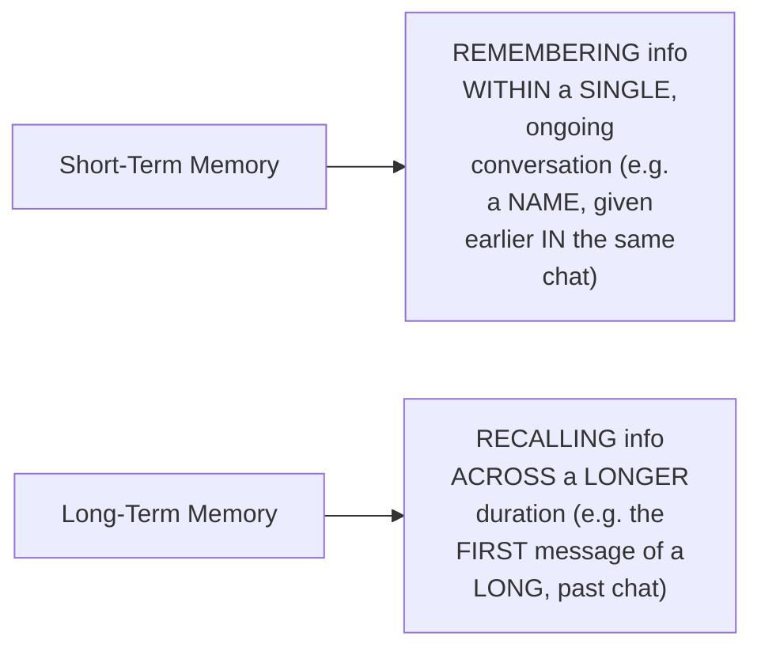

#### ⚠ Common Mistakes

* Assuming AI systems GENUINELY, AUTOMATICALLY "remember" EVERYTHING WITHOUT any UNDERLYING, deliberate MEMORY architecture — explicitly, directly, LIVE-demonstrated as GENUINELY, STRUCTURALLY dependent ON specific, DELIBERATE memory TECHNIQUES (the SUBJECT of THIS entire session).
* Assuming MEMORY is a "NICE to have" FEATURE, rather THAN a GENUINE, structural NECESSITY — explicitly, directly, HONESTLY clarified: WITHOUT it, AI "WILL just be a CONTENT generator," NEVER a GENUINE "coding PARTNER" or workflow-INTEGRATED tool.

#### 🎯 Key Takeaways

* THIS episode OPENS a BRAND-new SERIES on **AGENTIC memory** — DIRECTLY, EXPLICITLY framed as ESSENTIAL for AI AGENT performance, RELIABILITY, and USABILITY.
* A COMPLETE, real, LIVE demonstration (VIA ChatGPT) directly, CONCRETELY distinguished **SHORT-term memory** (WITHIN a single CHAT) from **LONG-term memory** (ACROSS a LONGER duration).
* Memory is directly, HONESTLY confirmed as **GENUINELY essential**, NOT optional — WITHOUT it, AI CANNOT genuinely become a REAL "coding PARTNER" or BE integrated INTO real, human WORKFLOWS.

---

### 2. The Agentic Loop: A Complete, Real HR Policy Agent Example

#### 🪜 Step-by-Step — A Complete, Real, Worked Example

> 💡 **Given directly:** *"This AI agent is a HR policy agent. An HR policy agent can retrieve all the HR policy related information. Now the moment user asks, 'tell me about the vacation policies,' the large language model will think, is the user trying to make a conversation, or is he asking me some HR related assistance?... in this scenario, the LLM will go to the tool. The tool will give all the information — this information is nothing but the context."*

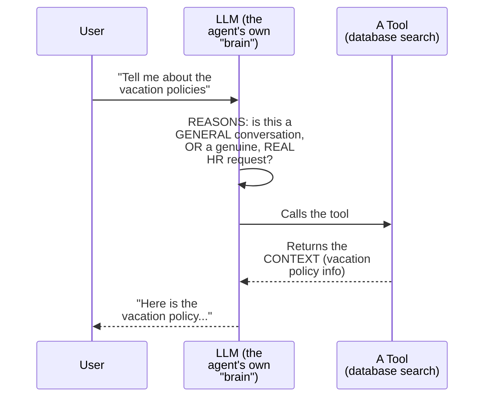

#### 📖 Definition — System Instructions, Precisely Introduced

> 💡 **Given directly:** *"Internally, in the backend, we have also given an instruction to this AI that, 'Hey, you are a HR policy assistant. Only answer the questions of users in under 300 words. You will always use the database to answer the questions.' So what are these? These are system instructions which we have given this particular AI agent... to remember how to behave in the environment."*

#### ⚠ Common Mistakes

* Assuming an AI agent's OWN "response" is GENUINELY, DIRECTLY generated PURELY from the LLM's OWN, internal KNOWLEDGE — explicitly, directly, PRECISELY clarified: the AGENT was ONLY able to GIVE an "accurate, VALIDATED answer" BECAUSE the INFORMATION was GENUINELY, DIRECTLY retrieved FROM a trusted, EXTERNAL tool/database — NOT INVENTED.

#### 🎯 Key Takeaways

* A COMPLETE, real HR-policy-AGENT example directly, CONCRETELY traces the FULL "agentic LOOP": USER message → LLM REASONING (conversation VERSUS genuine REQUEST) → tool CALL (retrieving CONTEXT) → AI RESPONSE.
* **SYSTEM instructions** GENUINELY, DIRECTLY shape HOW the agent BEHAVES (e.g., "ANSWER under 300 words," "ALWAYS use the database") — a FORM of DELIBERATE, backend PROMPT engineering.
* This COMPLETE loop directly, PRECISELY sets UP the NEXT, essential VOCABULARY — the FOUR distinct MESSAGE types (Section 3) that GENUINELY, STRUCTURALLY compose EVERY, single agentic INTERACTION.

---

### 3. The Four Message Types & The Concept of a "Turn"

#### 📖 Definition — The Four, Precise Message Types

> 💡 **Given directly:** *"Every time an AI agent is running, multiple kind of messages come into the picture. These are the four kind of messages which come. The very first message is user message... second one is system message... then we have tool message... the last type of message is AI message, which is nothing but a response to the user."*

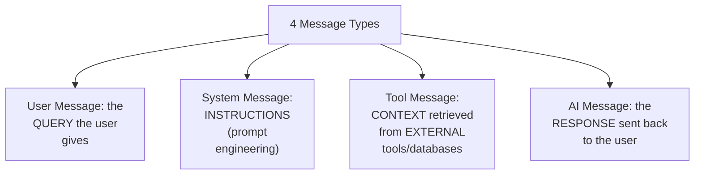

#### 📖 Definition — "Turn," Precisely Defined

> 💡 **Given directly:** *"For every agentic loop, this all messages is considered as a turn... in one turn, four messages come into the picture... this entire workflow, this entire thing which happened, is called one turn."*

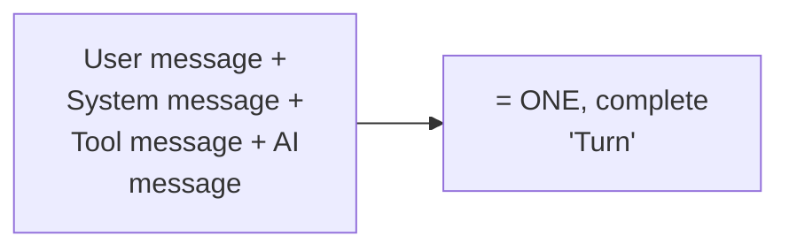

#### 🔍 Internal Working — A Genuine, Direct Confirmation: AI Must Remember TURNS, Not Just Messages

> 💡 **Given directly:** *"AI has to not only remember what the user gave, it also has to remember what was the instruction and what was the tool information and everything. So AI has to not remember messages — AI has to remember turns."*

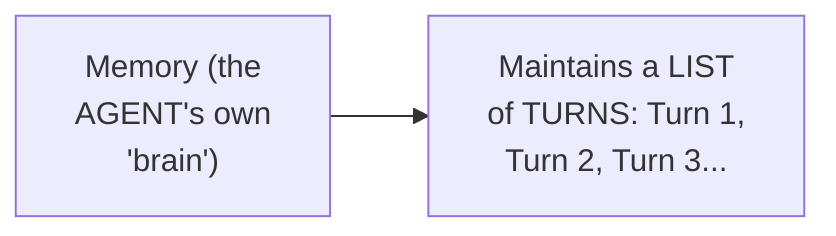

#### 🧠 Concept — A Genuinely Memorable, Real Analogy: Driving Directions

> 💡 **Given directly:** *"You are at a location X and you want to reach location Y... in your journey, there are multiple turns — first you have to turn right, then go straight, then take a turn... you will only be able to take a turn when you remember where exactly you want to go, or from where you are coming."*

#### ⚠ Common Mistakes

* Assuming an AI agent's OWN memory is GENUINELY, SIMPLY a list OF individual MESSAGES — explicitly, directly, PRECISELY corrected: it GENUINELY, STRUCTURALLY maintains a LIST of complete **TURNS** — EACH containing ALL four, related MESSAGE types.
* Confusing "TURN" (the FULL, four-message CYCLE) with a SINGLE message (LIKE just the USER's own query) — explicitly, directly, REPEATEDLY distinguished.

#### 🎯 Key Takeaways

* EVERY agentic LOOP involves **FOUR, precise message TYPES**: user, SYSTEM, tool, and AI — TOGETHER forming ONE, complete **"TURN."**
* AI agents GENUINELY must remember **TURNS**, not MERELY individual messages — EACH turn CARRIES the FULL context (WHAT the user SAID, what INSTRUCTIONS applied, WHAT the tool RETURNED, and what RESPONSE was GIVEN).
* The DRIVING-directions ANALOGY directly, MEMORABLY captures WHY "turn"-based MEMORY genuinely matters — YOU can only NAVIGATE correctly IF you GENUINELY remember WHERE you're coming FROM and WHERE you're GOING.

---

### 4. Stateful AI Agents: A Genuine, Real Coding-Assistant Example

#### 📖 Definition — "Stateful," Precisely Introduced

> 💡 **Given directly:** *"Just how a human maintains its memory, humans are called stateful... this is very important, and we have tried our best in the research paradigm to make AI agents also stateful. We have to make AI agents stateful."*

#### 🏢 Real-World / Production Usage — A Genuine, Real, Coding-Assistant Example

> 💡 **Given directly:** *"Let us take an example of a coding assistant... GitHub Copilot, or Claude Code, or Google Antigravity, or Codex... how they work is they don't take an image, or text, or these small things as input — a bigger thing which they take is a folder. We run these coding assistants in a folder. In a folder there can be 1,000 files. So an AI agent has to maintain its memory across 1,000 files."*

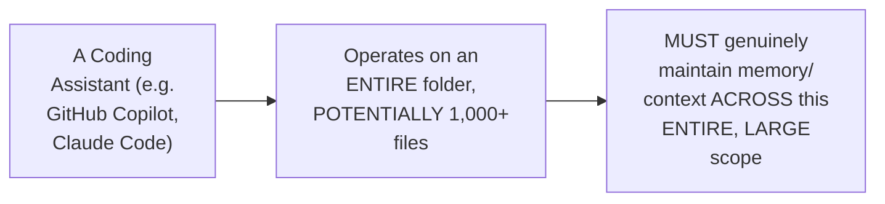

#### 🧠 Concept — A Genuine, Relatable, Human Parallel: The README File

> 💡 **Given directly:** *"If I am a human, I will not remember that in which exact file which exact code is there — so for that, I will maintain something called as README file. In that README file, I have kept it written that, 'for finding this, you will go here.' So what I'm doing, I am developing different techniques to maintain my memory."*

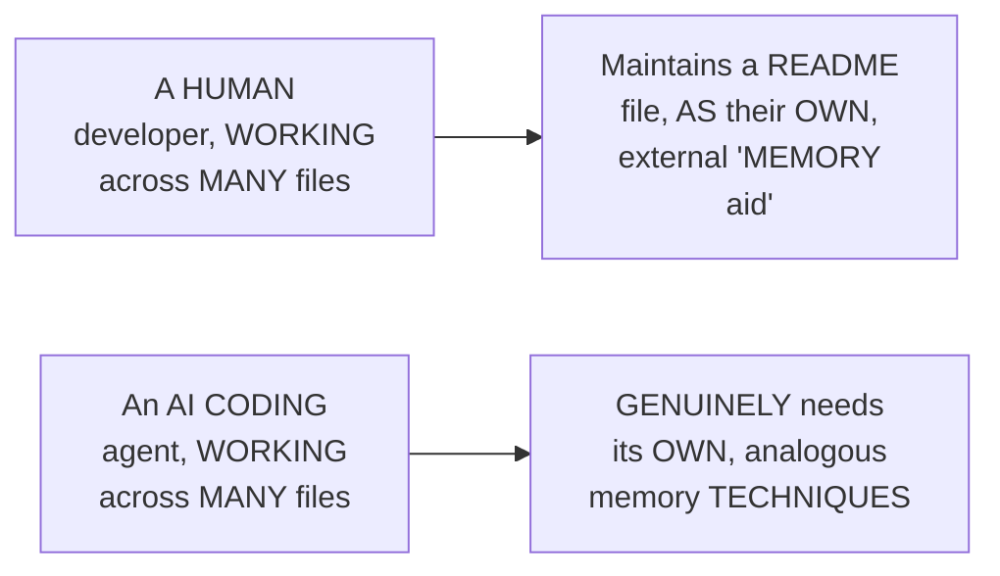

#### ⚠ Common Mistakes

* Assuming "STATEFUL" is a GENUINELY, PURELY technical, AI-specific term — explicitly, directly, MEMORABLY grounded IN a HUMAN parallel: HUMANS themselves ARE, genuinely, "STATEFUL" — REMEMBERING context ACROSS time, JUST as we're TRYING to make AI agents DO.

#### 🎯 Key Takeaways

* **"STATEFUL"** describes an AGENT (OR person) that GENUINELY, DIRECTLY maintains CONTEXT/memory ACROSS time — HUMANS are GENUINELY, NATURALLY stateful; AI AGENTS must be DELIBERATELY engineered TO become so.
* A REAL, relatable CODING-assistant example (GITHUB Copilot, Claude CODE) directly, CONCRETELY illustrates WHY statefulness GENUINELY matters AT scale — MANAGING memory ACROSS potentially THOUSANDS of files.
* The README-FILE analogy directly, MEMORABLY connects HUMAN memory-MANAGEMENT techniques TO the SAME, underlying NEED AI agents GENUINELY have — DIRECTLY setting UP the REST of this SESSION's own, CONCRETE techniques.

---

### 5. A Brief, Honest Pointer to Context Engineering (Deferred)

#### 📖 Definition — Context Engineering, Briefly Introduced

> 💡 **Given directly:** *"Now, to the techniques to maintain your memory, to always stay up to date, is called as context engineering. This is another topic of discussion, we will do it at some another time."*

#### ❓ Why It Exists — A Genuine, Direct Motivation

> 💡 **Given directly:** *"AI agent is trying to remember information in terms of turns... but what if we have a thousand turns? If AI agent is trying to remember a thousand turns, first, token cost will blow up... to manage all of this information in an efficient way, so that memory doesn't blow up, there are different techniques, and that technique is called as context engineering."*

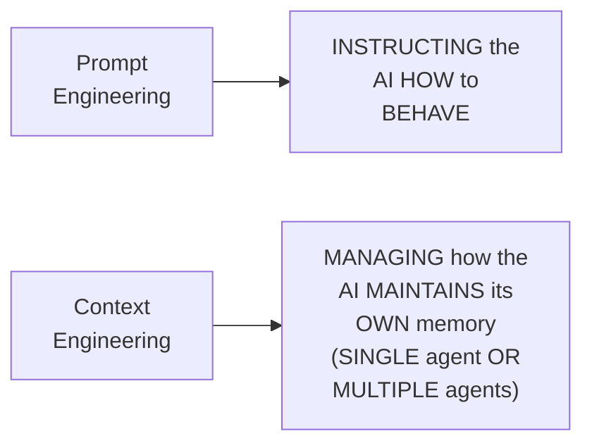

#### ⚠ Common Mistakes

* Confusing "PROMPT engineering" with "CONTEXT engineering" — explicitly, directly, PRECISELY distinguished: PROMPT engineering INSTRUCTS the AI HOW to BEHAVE; CONTEXT engineering MANAGES HOW the AI MAINTAINS its OWN memory OVER time.

#### 🎯 Key Takeaways

* **CONTEXT engineering** is BRIEFLY, HONESTLY introduced as a **SEPARATE, future TOPIC** — the SET of TECHNIQUES for MANAGING an agent's OWN memory EFFICIENTLY, so it does NOT "blow UP" in COST as TURNS accumulate.
* **PROMPT engineering** and **CONTEXT engineering** are directly, PRECISELY distinguished as TWO, genuinely DIFFERENT concepts — INSTRUCTING behavior VERSUS managing MEMORY over time.
* This directly, PRECISELY motivates the REST of THIS session's own CONTENT — the SEVEN, specific memory TECHNIQUES (Sections 6-13) ARE, themselves, CONCRETE examples OF context-engineering APPROACHES.

---

### 6. The Baseline: No Memory at All

#### 🪜 Step-by-Step — A Complete, Real, Live Demonstration

> 💡 **Given directly:** *"What if there is no memory? Earlier AI agents only had one thing — brain, and also tools. There was no concept of memory earlier... if I now give a message that, 'Hi, I am Maya'... if I simply ask, 'What is agentic AI?'... now if I ask, 'What's my name?'... it's going to tell me, 'We haven't had a complete chance to introduce ourselves.'"*

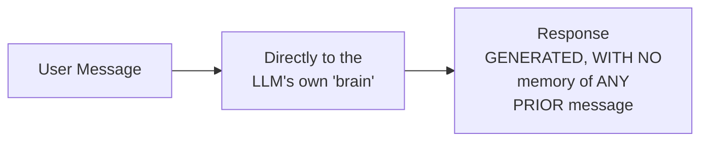

#### 🔍 Internal Working — A Genuine, Real, Live-Confirmed Technical Detail

> 💡 **Given directly:** *"Every time a new query comes... there is only one system message and there is only one user message. Every time we will give a new query... even if I give something called as 'hi' right now, this 'hi' will be treated separately."*

#### ⚠ Common Mistakes

* Assuming a "NO memory" AI agent GENUINELY, STILL retains SOME, minimal AWARENESS of prior MESSAGES within the SAME session — explicitly, directly, LIVE-demonstrated as GENUINELY, COMPLETELY isolated — EACH new MESSAGE is TREATED entirely SEPARATELY, EVEN a SIMPLE "hi."

#### 🎯 Key Takeaways

* WITHOUT any MEMORY technique, an AI agent GENUINELY, DIRECTLY forgets EVERYTHING the MOMENT a response is GIVEN — EACH new MESSAGE is TREATED as a COMPLETELY isolated, FRESH interaction.
* The GENUINE trade-off: "FREE and instant" (NO memory to STORE, manage, or PAY for) VERSUS "FORGETS everything" — MAKING follow-up QUESTIONS (OR coding-assistant CORRECTIONS) genuinely IMPOSSIBLE.
* This BASELINE directly, PRECISELY motivates EVERY subsequent MEMORY technique (Sections 7-13) — EACH one GENUINELY, DIRECTLY solves THIS exact, foundational PROBLEM, in a DIFFERENT way.

---

### 7. Conversational Buffer Memory: Perfect Recall, Exponential Cost

#### 📖 Definition — Conversational Buffer Memory, Precisely Defined

> 💡 **Given directly:** *"The name of this technique... is conversational buffer memory... we go on maintaining turns after turns. Turn one, turn two, turn three, turn four, turn five — as simple as that. We just maintain the history of all the turns."*

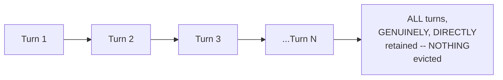

#### 🪜 Step-by-Step — A Complete, Real, Live-Demonstrated Result

> 💡 **Given directly:** *"'What's my name?'... 'Your name is Maya'... 'I have a cat whose name is Whiskers'... and now if I ask, 'What is my cat's name?' — it's going to remember all of this... but look at the tokens, and look at how the cost is blowing up."*

#### 🔍 Internal Working — Why the Name "Buffer"

> 💡 **Given directly:** *"What do you mean by this word buffer? The word buffer means a list. So we are just dumping the chats... into a list of the conversation. That is why the name is conversational buffer memory."*

#### ⚠ Common Mistakes

* Assuming CONVERSATIONAL buffer MEMORY is GENUINELY, PRACTICALLY sufficient FOR any real, LONG-running application — explicitly, directly, LIVE-demonstrated as GENUINELY, DIRECTLY problematic AT scale: "IF your turns have BLOWED up to, YOU know, 100 turns, THEN it will MESS up your RESPONSES... there WILL be some HALLUCINATION involved."

#### 🎯 Key Takeaways

* **CONVERSATIONAL buffer MEMORY** GENUINELY, DIRECTLY dumps EVERY turn INTO a growing LIST, WITHOUT any EVICTION or SUMMARIZATION.
* The GENUINE trade-off: **PERFECT recall** (NEVER forgets ANYTHING) VERSUS **EXPONENTIALLY growing COST** — AND, at SCALE, SLOWER responses AND a GENUINE risk of HALLUCINATION.
* This is directly, HONESTLY confirmed as the **FIRST, historical TECHNIQUE** — WITH its OWN, genuine COST problem DIRECTLY motivating the NEXT technique (SLIDING window MEMORY, Section 8).

---

### 8. Sliding Window Memory: Tight Cost Control, Lost Old Context

#### 📖 Definition — Sliding Window Memory, Precisely Defined

> 💡 **Given directly:** *"In order to keep a tight control over your cost, what we do is we set a threshold, a limit, that after five messages, the rest of the messages should be evicted."*

#### 🔍 Internal Working — A Genuine, Precise Distinction: "Evicted," Not "Deleted"

> 💡 **Given directly:** *"I'm saying evicted from this, but not, you know, deleted — deleted is different, and evicted is different."*

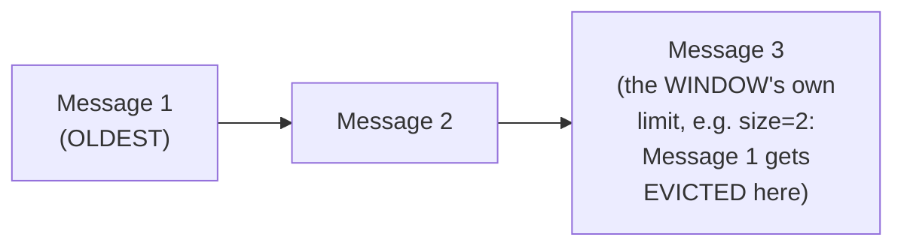

#### 🪜 Step-by-Step — A Complete, Real, Live-Demonstrated Result

> 💡 **Given directly:** *"If I keep a window size of two... 'Hi, my name is Divesh and my salary is 30,000'... 'How much is my salary?' — it will remember... but if I ask, 'What is my name?' — 'I don't think we have discussed your name'... because we are evicting the messages."*

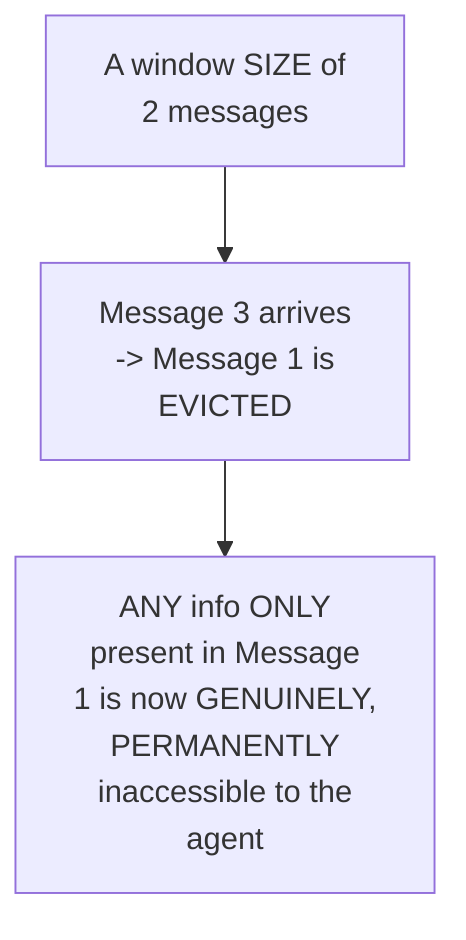

#### ⚠ Common Mistakes

* Assuming SLIDING window MEMORY GENUINELY, DIRECTLY solves the COST problem WITHOUT any NEW, genuine trade-OFF — explicitly, directly, LIVE-demonstrated as GENUINELY, DIRECTLY losing IMPORTANT, old INFORMATION — "ANYTHING older than the SLIDING window, the INFORMATION is gone COMPLETELY, even IF it matters."
* Assuming a LARGER window SIZE is ALWAYS, GENUINELY the "BETTER" choice — explicitly, directly, PRECISELY clarified: a LARGER window GENUINELY, DIRECTLY increases COST, while a SMALLER window GENUINELY, DIRECTLY increases the RISK of losing IMPORTANT context — a REAL, deliberate TRADE-off.

#### 🎯 Key Takeaways

* **SLIDING window MEMORY** GENUINELY, DIRECTLY keeps ONLY the LAST N messages — OLDER messages are **EVICTED** (NOT deleted FROM any UNDERLYING database — MERELY removed FROM the agent's OWN, ACTIVE memory).
* The GENUINE trade-off: **"CHEAP and FAST"** (cost NEVER grows, REGARDLESS of CHAT length) VERSUS **PERMANENT loss** of ANYTHING beyond the WINDOW — EVEN if it GENUINELY still MATTERS.
* This directly, PRECISELY solves BUFFER memory's own COST problem (Section 7), but INTRODUCES a NEW, genuine problem — LOST context — DIRECTLY motivating the NEXT technique (SUMMARY memory, Section 9).

---

### 9. Summary Memory: Compression, AI-Controlled Loss & "Context Echo"

#### 📖 Definition — Summary Memory, Precisely Defined

> 💡 **Given directly:** *"The idea is, instead of keeping the raw transcript, Nova keeps one running recap of everything said so far... for every new message, a summary will be generated."*

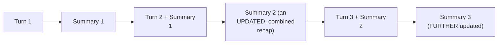

#### 🔍 Internal Working — A Genuine, Direct Confirmation: The New "Turn" Structure

> 💡 **Given directly:** *"There will be only one thing: new user message and previous summary... to convert the conversation into a summary, here also AI agent is involved... AI agent first is giving a response based on the context, and second, it is also building the context by summarizing it."*

#### ⚠ A Direct, Honest, Genuine Limitation #1: AI-Controlled Information Loss

> 💡 **Given directly:** *"We are compressing information, so we might lose out an important detail — because here the control of summarization is in AI's hands. AI thinks, is it important to summarize, or is it not important? If AI did not summarize a very important detail because it thought this is not important, we will lose our context."*

#### ⚠ A Direct, Honest, Genuine Limitation #2: "Context Echo"

> 💡 **Given directly:** *"If a user is mentioning about football in every sentence... from 100 sentences, let's say user has said football in 70 sentences — the summary of this 100 sentences in one paragraph, 40 to 50% words will be football. This is nothing but context echo... football is being highlighted, used a lot of times — so in order to tell about football 100 times, we might miss out on an important detail."*

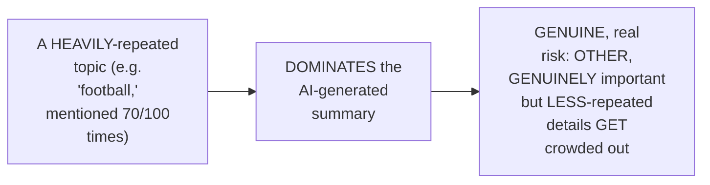

#### 🧠 Concept — A Genuinely Relatable, Real Analogy: A Book

> 💡 **Given directly:** *"The best example of summarization memory is a book — how a book of 1,000 pages is all summarized in one page. Even though people read this, they will understand the same thing together."*

#### ⚠ Common Mistakes

* Assuming SUMMARY memory GENUINELY, DIRECTLY solves BOTH the COST and CONTEXT-loss problems, WITHOUT any NEW, genuine trade-OFF — explicitly, directly, HONESTLY clarified: it introduces TWO, distinct, NEW risks — AI-CONTROLLED information LOSS, and "CONTEXT echo."
* Assuming "CONTEXT echo" is GENUINELY the SAME problem as SIMPLE information LOSS — explicitly, directly, PRECISELY distinguished: it's a SPECIFIC, related but DIFFERENT phenomenon — REPEATED topics DISPROPORTIONATELY DOMINATING the summary, CROWDING out OTHER, genuinely important DETAILS.

#### 🎯 Key Takeaways

* **SUMMARY memory** GENUINELY, CONTINUOUSLY re-summarizes the ENTIRE conversation INTO a single, RUNNING recap — REPLACING the raw TRANSCRIPT ENTIRELY.
* This introduces **TWO, distinct, genuine LIMITATIONS**: (1) **AI-CONTROLLED information LOSS** (the AI ITSELF decides WHAT's "important" ENOUGH to SUMMARIZE — and CAN, genuinely, get this WRONG); (2) **"CONTEXT echo"** — HEAVILY-repeated topics DISPROPORTIONATELY dominate the SUMMARY, crowding OUT other, genuinely IMPORTANT details.
* The BOOK analogy directly, MEMORABLY illustrates summary MEMORY's own, genuine VALUE (compressing VAST information INTO a manageable FORM) — WHILE the TWO, established limitations DIRECTLY motivate the NEXT, hybrid TECHNIQUE (summary BUFFER memory, Section 10).

---

### 10. Summary Buffer Memory: A Hybrid of Recency and Gist

#### 📖 Definition — Summary Buffer Memory, Precisely Defined

> 💡 **Given directly:** *"From this name, you can understand that this is a combination of summary memory and conversational buffer memory... the idea is a hybrid: Nova keeps the last couple of messages with proper understanding, and for the older messages, it is creating a summary."*

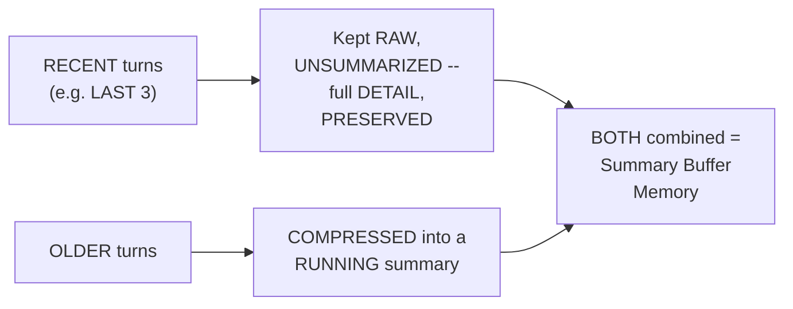

#### 🪜 Step-by-Step — A Complete, Real, Live-Demonstrated Result

> 💡 **Given directly:** *"Currently, we are maintaining the recent messages — user, Nova, user, Nova — the latest three messages are being maintained, but the rest we have summarized... 'Maya introduces herself, confirms her name' — two turns were combined in one small sentence, in eight tokens."*

#### ❓ Why It Exists — A Genuine, Direct Confirmation of the Balance Achieved

> 💡 **Given directly:** *"We balance both the words — sharp on the recent details, and still keep the gist going with the old stuff. But moving parts, rather than each technique alone, so that it's harder to predict and tune."*

#### ⚠ A Direct, Honest, Genuine Limitation

> 💡 **Given directly:** *"What if the summary becomes too long? What if the summary becomes, you know, 10,000 words long? At that particular point, our cost will go on increasing... and hallucination will also come into the picture — AI will start to forget what is happening."*

#### ⚠ Common Mistakes

* Assuming SUMMARY buffer MEMORY is GENUINELY, COMPLETELY problem-FREE, since it COMBINES the STRENGTHS of TWO, earlier techniques — explicitly, directly, HONESTLY clarified: it STILL, GENUINELY carries its OWN, real risk — an UNBOUNDED, growing SUMMARY can EVENTUALLY become GENUINELY, PRACTICALLY problematic (COST and HALLUCINATION), JUST like plain SUMMARY memory.
* Assuming "MORE moving PARTS" (COMBINING two TECHNIQUES) is GENUINELY, UNAMBIGUOUSLY better — explicitly, directly, HONESTLY acknowledged: it's ALSO "HARDER to PREDICT and TUNE" — a REAL, genuine COMPLEXITY cost.

#### 🎯 Key Takeaways

* **SUMMARY buffer MEMORY** GENUINELY, DIRECTLY combines BUFFER memory's own RAW, recent-TURN precision WITH summary MEMORY's own long-TERM compression — the RECENT few TURNS stay RAW; OLDER turns get SUMMARIZED.
* A COMPLETE, real, LIVE-demonstrated EXAMPLE directly, CONCRETELY confirmed a GENUINE compression WIN — TWO full TURNS compressed INTO an eight-TOKEN summary SENTENCE.
* This HYBRID is directly, HONESTLY confirmed as GENUINELY, PRACTICALLY effective — but STILL carries a REAL, residual RISK: an UNBOUNDED, growing SUMMARY can EVENTUALLY reintroduce BOTH cost and HALLUCINATION problems, and the COMBINED technique is GENUINELY "HARDER to predict AND tune."

---

### 11. Token Buffer Memory: Precise, Token-Based Cost Control

#### 📖 Definition — Token Buffer Memory, Precisely Defined

> 💡 **Given directly:** *"In sliding window, what we did, we were limiting with the number of turns. Here, instead of turns, we limit it to tokens, number of words... after 200 words, it will forget — the rest of the information will be evicted."*

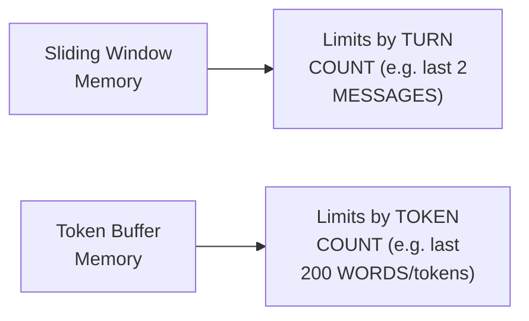

#### ❓ Why It Exists — A Genuine, Precise Motivation

> 💡 **Given directly:** *"We were earlier in the sliding window counting each turn — even though a message was small or big, it was considered as a turn. So tokens are being lost like that. But this time, if a message is small, less tokens will be used, and if a message is big, then large tokens will be used."*

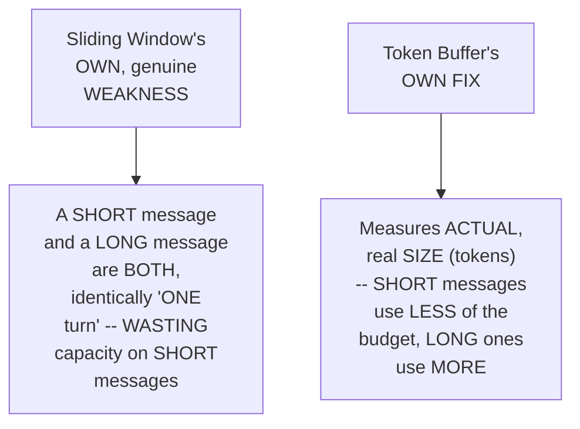

#### ⚠ Common Mistakes

* Assuming TOKEN buffer MEMORY is GENUINELY, STRUCTURALLY a COMPLETELY different CONCEPT from SLIDING window MEMORY — explicitly, directly, PRECISELY clarified: it's GENUINELY the SAME, underlying EVICTION logic — ONLY the MEASUREMENT unit (TOKENS, rather THAN turns) genuinely DIFFERS.
* Assuming TOKEN buffer memory GENUINELY, DIRECTLY solves the CONTEXT-loss problem THAT sliding window MEMORY has — explicitly, directly, HONESTLY clarified: it STILL, GENUINELY loses "IMPORTANT recent CONTEXT" once the TOKEN limit is EXCEEDED — the SAME, fundamental trade-OFF remains.

#### 🎯 Key Takeaways

* **TOKEN buffer MEMORY** GENUINELY, DIRECTLY mirrors SLIDING window memory's OWN eviction LOGIC — but MEASURES by **TOKEN count**, RATHER than TURN count — GIVING more PRECISE, granular COST control.
* This directly, PRECISELY solves SLIDING window memory's OWN, genuine INEFFICIENCY — a SHORT message and a LONG message NO longer CONSUME the SAME, fixed "ONE turn" ALLOWANCE.
* The GENUINE trade-off REMAINS the SAME as SLIDING window MEMORY: "WE are LOSING context... FORGET about LONG-term, there is NO such long-TERM scenario HERE" — a REAL, persistent LIMITATION.

---

### 12. Vector Store Memory: The Cheapest Solution, via Similarity Search

#### ❓ Why It Exists — A Genuine, Direct Motivation: Don't Waste What's Already Stored

> 💡 **Given directly:** *"We are maintaining a conversation history, and once it is out of the window, we will evict them. But after evicting them, we are still storing them in a database... because if there will be a UI, we want to show the chats. So we are not deleting the chat, we are still maintaining in the database. So if we are not deleting it, this entire information which we are storing is a waste — why not utilize it?"*

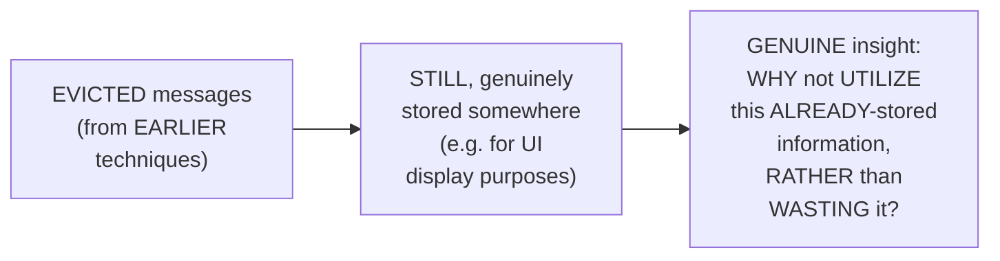

#### 📖 Definition — Vector Store Memory, Precisely Defined

> 💡 **Given directly:** *"Your sentences... this sentence will be converted into a vector, 0.8, 0.9, 0.7... every time a new user query will come, it will be fetched from the vector database, to fetch the relevant context — just how we do it for RAG systems, similarly we were doing it for memory as well."*

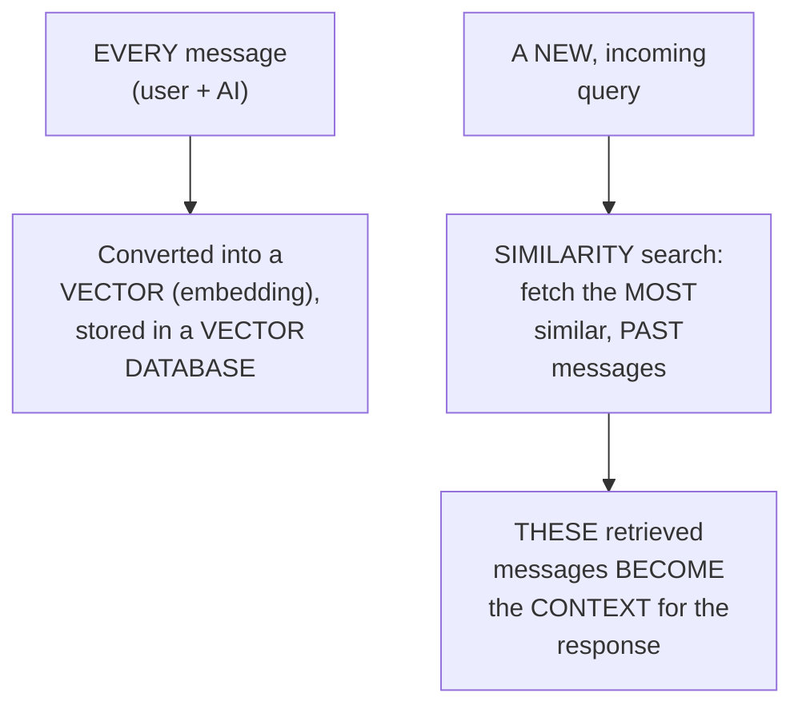

#### 🧠 Concept — A Genuinely Memorable, Real Analogy: Reality-Show Eviction

> 💡 **Given directly:** *"Just how it happens in Big Boss — we evict the contestants, we don't delete them, we evict them, which means they are out of the game."*

#### 🏢 Real-World / Production Usage — A Genuine, Direct Confirmation of This Technique's Own Cost Advantage

> 💡 **Given directly:** *"Vector store was the cheapest solution in the memory game... we were not maintaining any summary, we were not maintaining any buffer — directly, the moment user message is coming into the picture, it was directly stored in a vector database... vector databases are very cost friendly."*

#### 🔍 Internal Working — A Genuine, Direct Mention of a Third, Hybrid Approach

> 💡 **Given directly:** *"We can also maintain a context window for short buffer, we can also maintain information in a vector database — the moment new user query is coming, the AI agent will search for the similar query in the vector database, and after the information is retrieved, this will be summarized first, and then passed to the AI agent."*

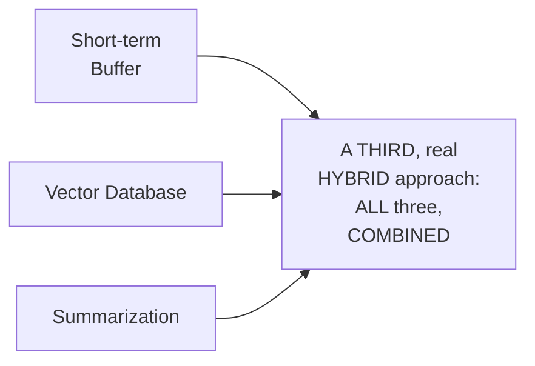

#### ⚠ Common Mistakes

* Assuming DATA that's EVICTED from an AGENT's active MEMORY is GENUINELY, PERMANENTLY lost/DELETED — explicitly, directly, PRECISELY clarified: it's TYPICALLY, GENUINELY still STORED (e.g., FOR UI display PURPOSES) — VECTOR store memory GENUINELY, DIRECTLY leverages this ALREADY-stored data, RATHER than letting it GO to waste.
* Assuming VECTOR store MEMORY genuinely REQUIRES any SLIDING window, BUFFER, or SUMMARIZATION LOGIC — explicitly, directly, PRECISELY clarified: it's GENUINELY, STRUCTURALLY a DIFFERENT, standalone approach — EVERY message goes DIRECTLY into the VECTOR database, WITH relevant CONTEXT retrieved VIA similarity SEARCH.

#### 🎯 Key Takeaways

* **VECTOR store MEMORY** GENUINELY, DIRECTLY stores EVERY message as an EMBEDDING in a VECTOR database — RETRIEVING the MOST SIMILAR, relevant PAST messages VIA similarity search (the SAME, underlying MECHANISM used in RAG SYSTEMS).
* This is directly, EXPLICITLY confirmed as the **CHEAPEST solution** IN the "memory GAME" — since VECTOR databases are GENUINELY, PRACTICALLY very cost-FRIENDLY, and it AVOIDS wasting ALREADY-stored, evicted DATA.
* A GENUINE, real **THIRD hybrid APPROACH** directly, EXPLICITLY combines SHORT-term buffer, VECTOR database RETRIEVAL, and SUMMARIZATION TOGETHER — DIRECTLY illustrating THIS session's own, REPEATED theme: INNOVATION, in PRACTICE, MEANS combining EXISTING techniques.

---

### 13. Entity Memory: Structured Facts, via Named Entity Recognition

#### 📖 Definition — Entity Memory, Precisely Defined

> 💡 **Given directly:** *"Entity memory refers to a very old NLP concept called as named entity recognition — where given a sentence, 'my name is Divesh, my salary is 30,000,' internally a map will be created: name, Divesh; gender, male; salary, 30,000... whenever a user sends a message, AI will dig into this particular entity memory, and from that it will give us the response."*

```mermaid
flowchart LR
    A["A user's OWN<br/>message ('my name<br/>is Divesh, my<br/>salary is 30,000')"] --> B["Named Entity<br/>Recognition (NER)"]
    B --> C["A structured MAP:<br/>Name=Divesh,<br/>Salary=30000, etc."]
```

#### 🔍 Internal Working — A Genuine, Direct Confirmation of This Technique's Own, Real Cost

> 💡 **Given directly:** *"This turn made eight API calls, not just one. This technique just did some extra steps behind the scene... every time it is trying to map entities... you can also see this is costing us the highest — 4,678 tokens in only this much, two messages."*

```mermaid
flowchart LR
    A["EVERY, single turn"] --> B["Requires<br/>MULTIPLE, SEPARATE<br/>API calls, to<br/>GENUINELY, ACTIVELY<br/>map ENTITIES"]
    B --> C["The MOST<br/>EXPENSIVE technique<br/>of the SEVEN<br/>covered"]
```

#### ⚠ A Direct, Honest, Genuine Limitation

> 💡 **Given directly:** *"It is bad at, you know, free-flowing stories. It can match entities, it can remember the contextual information like that, but it cannot remember free-flowing stories."*

#### ⚠ Common Mistakes

* Assuming ENTITY memory GENUINELY, PRACTICALLY excels at REMEMBERING GENERAL, NARRATIVE conversation — explicitly, directly, HONESTLY clarified: it's GENUINELY, SPECIFICALLY strong AT structured, FACT-like information (NAMES, numbers, roles) — but "BAD at... FREE-flowing STORIES."
* Assuming ENTITY memory is GENUINELY the "BEST" technique, SINCE it's DESCRIBED as GIVING "ACCURATE" information — explicitly, directly, HONESTLY clarified: it's ALSO the **MOST expensive** technique COVERED (REQUIRING multiple, SEPARATE API calls PER turn) — a REAL, genuine COST trade-off.

#### 🎯 Key Takeaways

* **ENTITY memory** GENUINELY, DIRECTLY builds a STRUCTURED map OF facts (NAME, gender, SALARY, etc.) — GROUNDED in the CLASSIC NLP technique of **NAMED entity RECOGNITION (NER)**.
* This is directly, LIVE-confirmed as the **MOST expensive** technique COVERED — REQUIRING multiple, SEPARATE API calls PER turn (e.g., EIGHT calls FOR just TWO messages) — SINCE the AI must ACTIVELY, GENUINELY map entities EACH time.
* Entity memory's OWN, genuine STRENGTH is **ACCURATE, structured FACTS**; its OWN, genuine WEAKNESS is **"free-FLOWING stories"** — a REAL, precise TRADE-off worth REMEMBERING.

---

### 14. Closing Part 1: A Complete Comparison & What's Next in Part 2

#### 🪜 Step-by-Step — A Direct, Honest, Complete Recap

> 💡 **Given directly:** *"So, yes, this was all the different kind of basic memories. Buffer memory, sliding window, summary, summary buffer, token buffer, vector store, entity. You can always combine any of these memories to create a hybrid of them, and then lastly, you can see a comparison — 24 queries will run, and once this is completed, you can see the comparison of how it looks like."*

```mermaid
flowchart LR
    A["Part 1 (DONE): WHY<br/>agentic memory<br/>matters, the AGENTIC<br/>loop, FOUR message<br/>types, 'STATEFUL'<br/>agents, and SEVEN<br/>short-TERM memory<br/>techniques"] --> B["Part 2 (EXPLICITLY<br/>promised): ADVANCED,<br/>long-TERM memory<br/>patterns -- episodic,<br/>SEMANTIC, procedural<br/>memory, AND MORE"]
```

#### 🪜 Step-by-Step — A Direct, Explicit Preview of Part 2's Own Content

> 💡 **Given directly:** *"That brings us to the end of part one of agentic memory, where we understood various kinds of agentic memory layers. And this all, trust me, are very, very important, and can still be used in simple prototypes... in part two, we will study the advanced patterns, the advanced form of memories which are used in state-of-the-art models — for example, episodic memory, semantic memory, procedural memory, and all those different kind of memories."*

#### ⚠ Common Mistakes

* Assuming the SEVEN, short-TERM memory techniques COVERED in Part 1 REPRESENT a COMPLETE, EXHAUSTIVE treatment OF agentic memory — explicitly, directly, HONESTLY clarified: THESE are GENUINELY, EXPLICITLY confirmed as still-USEFUL for "SIMPLE prototypes," WITH the MORE advanced, STATE-of-the-art patterns (episodic, SEMANTIC, procedural memory) EXPLICITLY deferred TO Part 2.

#### 🎯 Key Takeaways

* This episode **GENUINELY, COMPLETELY delivers** its OWN, stated GOALS — a COMPLETE, hands-ON tour THROUGH seven, DISTINCT short-TERM memory techniques, EACH grounded IN a real, LIVE demonstration.
* A REAL, LIVE comparison TOOL (RUNNING 24 queries ACROSS all SEVEN techniques) is DIRECTLY, EXPLICITLY mentioned AS a WAY to SEE all techniques' own TRADE-offs SIDE by side.
* **EPISODIC memory, SEMANTIC memory, PROCEDURAL memory**, and OTHER, more ADVANCED, "state-of-the-art" PATTERNS are directly, EXPLICITLY confirmed as PART 2's own, PROMISED content.

---

---

## 📚 Detailed Notes — Part 2: Long-Term Memory & Frameworks

### 15. Session Context: Part 2 — From Short-Term to Long-Term Memory

#### 🧠 Concept

> 💡 **Given directly, opening the session:** *"We are continuing with the part two of our agentic memory. In the last video, we understood that what is agentic memory, why do we need agentic memory, and we understood a few types of those memories. Now those were the short-term memories which we understood in the last part. In this part, we are going to understand the long-term memory and the different kind of frameworks."*

```mermaid
flowchart LR
    A["Part 1 (ALREADY<br/>processed): WHY<br/>agentic memory<br/>matters, the<br/>agentic LOOP, and<br/>SEVEN core SHORT-<br/>term memory<br/>techniques"] --> B["Part 2 (THIS<br/>session): LONG-<br/>term memory<br/>(episodic, SEMANTIC,<br/>procedural, self-<br/>REFLECTION, memory<br/>routing) + REAL<br/>frameworks (LangMem,<br/>Mem0, Neo4j)"]
```

#### 🪜 Step-by-Step — A Direct, Honest, Compact Recap of Part 1

> 💡 **Given directly:** *"If I will summarize all of this in one shot, buffer memory is simply you are talking to one person, other person is replying... sliding window memory... you have kept a window that I will only remember three messages... summary memory... everything that we spoke will be summarized in a line... summary buffer... token buffer... vector store memory... and lastly we have entity memory."*

#### 🎯 Key Takeaways

* This is GENUINELY **Part 2**, DIRECTLY continuing FROM Part 1's OWN, ESTABLISHED short-TERM memory FOUNDATION — WITH a COMPACT, honest RECAP opening THIS session.
* The instructor **directly, EXPLICITLY frames** long-TERM memory's own GENUINE motivation as **USER experience** — MAKING an AI agent FEEL like "a REAL entity," RATHER than a STATELESS tool.
* This session's OWN, CENTRAL organizing PRINCIPLE: EVERY long-TERM memory TYPE is GENUINELY, DIRECTLY **"human-inspired"** — DERIVED from REAL, human PSYCHOLOGICAL concepts.

---

### 16. Short-Term vs. Long-Term Memory: The Precise, Foundational Distinction

#### 📖 Definition — The Precise, Genuine Distinction

> 💡 **Given directly:** *"All these things which we spoke about is short-term... to maintain conversations on a shorter duration... in one particular chat, one particular session... long-term memory can either be used in one session as well, or it can be used across session as well. Across sessions — now the main goal was to keep it across sessions itself."*

```mermaid
flowchart LR
    A["Short-Term<br/>Memory"] --> B["WITHIN a SINGLE<br/>session/<br/>conversation"]
    C["Long-Term<br/>Memory"] --> D["ACROSS multiple,<br/>SEPARATE sessions --<br/>the GENUINE goal"]
```

#### 🔍 Internal Working — A Genuine, Direct, Relatable Explanation of "Session"

> 💡 **Given directly:** *"What is a session? If you don't understand that — see, the moment I chat with GPT, a session is created. This is a session, and these are all different sessions — based on all these sessions, GPT was able to tell my personality."*

#### 🧠 Concept — A Genuinely Relatable, Real, Human Analogy

> 💡 **Given directly:** *"If you talk to a human, and to a human, if you tell that 'do you remember what you spoke the last time,' so the human will remember... you have made a new friend, every day you are interacting with this friend... and while you're interacting with them day by day, you build a personality of that person in your head."*

#### ⚠ Common Mistakes

* Assuming "SHORT-term" and "LONG-term" memory are GENUINELY, MERELY about TIME duration ALONE — explicitly, directly, PRECISELY clarified: the KEY, structural DISTINCTION is GENUINELY about **SESSION boundaries** — WITHIN one SESSION (short-term) VERSUS ACROSS multiple, SEPARATE sessions (LONG-term).

#### 🎯 Key Takeaways

* **SHORT-term memory** GENUINELY operates WITHIN a SINGLE session; **LONG-term memory** GENUINELY, DIRECTLY operates **ACROSS multiple, SEPARATE sessions** — THIS "across-SESSIONS" capability is the GENUINE, primary GOAL.
* A "**SESSION**" is precisely DEFINED as ONE, distinct CONVERSATION instance (e.g., ONE chat WINDOW) — DIFFERENT sessions, TOGETHER, enable an AGENT to BUILD a persistent PERSONALITY understanding.
* A GENUINELY relatable, HUMAN analogy (BUILDING an understanding OF a new FRIEND, over MANY, separate INTERACTIONS) directly, MEMORABLY grounds THIS distinction.

---

### 17. Episodic Memory: Remembering in Story-Shaped Units

#### 🧠 Concept — A Genuinely Memorable, Real Human Analogy

> 💡 **Given directly:** *"You don't remember your life as a flat list of random facts. You remember it as episodes... the trip where the flight got delayed and we ended up talking all night at the airport. This is a episode you remember... one memory with a beginning, middle, and end. Not 50 separate facts."*

```mermaid
flowchart LR
    A["A LIST of ISOLATED,<br/>individual facts (per<br/>BUFFER memory, from<br/>Part 1)"] --> B["VERSUS: ONE,<br/>COHERENT, story-<br/>SHAPED unit -- WITH<br/>a beginning, MIDDLE,<br/>and END (episodic<br/>memory)"]
```

#### 🪜 Step-by-Step — A Complete, Real, Live-Demonstrated Session Flow

> 💡 **Given directly:** *"'Thanks Nova, that is it for today'... session one finished... I am done with talking to this... this is a session, we are ending with the session... the moment we close a session with AI, it extracts memories."*

#### 🔍 Internal Working — A Genuine, Live-Confirmed Look at Extracted Memory

> 💡 **Given directly:** *"This is a user chat... but see how does the AI agent remember that internally? Raw text, it remembers TOPICS — the topics which we spoke about, compound interest, exam stress, study strategies... session ID, timestamp... and summary: 'Maya discussed compound interest, exam stress with Nova, who provided explanation and stress-reducing techniques.'"*

```mermaid
flowchart TD
    A["A COMPLETE<br/>session ends"] --> B["AI EXTRACTS: raw<br/>topics, session ID,<br/>TIMESTAMP, and a<br/>SESSION-level<br/>summary"]
    B --> C["This becomes ONE,<br/>COMPLETE 'episode' --<br/>STORED for FUTURE<br/>retrieval"]
```

#### 🪜 Step-by-Step — A Complete, Real, Cross-Session Test

> 💡 **Given directly:** *"Session two has started. A new, fresh conversation. 'Hey Nova, it's me again. What's been stressing me out lately?'... 'I've been tracking your previous conversations. I think I remember you were feeling stressed about an upcoming project at work.'... we are maintaining memories across sessions."*

```mermaid
sequenceDiagram
    participant User
    participant Nova as Nova (AI Agent)
    User->>Nova: Session 1 (discusses<br/>compound interest,<br/>exam stress)
    Nova->>Nova: Session ends -><br/>EXTRACTS the episode
    User->>Nova: Session 2 (NEW,<br/>fresh conversation)
    User->>Nova: "What's been<br/>stressing me out<br/>lately?"
    Nova-->>User: CORRECTLY recalls<br/>the PRIOR episode,<br/>ACROSS sessions
```

#### ⚠ Common Mistakes

* Assuming EPISODIC memory GENUINELY means REMEMBERING EVERY, exact DETAIL of a PAST conversation — explicitly, directly, PRECISELY clarified: it's SPECIFICALLY about REMEMBERING the OVERALL "episode" (a COHERENT story, WITH beginning/middle/END), NOT EVERY, individual FACT.
* Assuming EPISODIC memory OPERATES the SAME way AS buffer MEMORY (FROM Part 1) — explicitly, directly, DIRECTLY contrasted: BUFFER memory STORES a "FLAT list OF random FACTS"; episodic MEMORY stores COHERENT, story-SHAPED units.

#### 🎯 Key Takeaways

* **EPISODIC memory** GENUINELY, DIRECTLY mirrors HOW humans REMEMBER their OWN LIVES — as **COHERENT episodes** (WITH a beginning, MIDDLE, end), NOT ISOLATED, individual facts.
* A COMPLETE, real, LIVE demonstration directly, CONCRETELY confirmed: WHEN a session ENDS, the AGENT extracts a STRUCTURED "episode" (RAW topics, session ID, TIMESTAMP, and a SESSION-level summary).
* A REAL, cross-SESSION test directly, CONCRETELY confirmed episodic MEMORY's own, GENUINE value — the AGENT SUCCESSFULLY recalled a PRIOR episode ("STRESSED about a WORK project") IN a genuinely NEW, separate session.

---

### 18. Semantic Memory: Distilling Facts & Personality Over Time

#### 🧠 Concept — A Genuinely Memorable, Real Human Analogy

> 💡 **Given directly:** *"Both of you are meeting every day. Every day you guys go for a coffee. Your friend does not like sugar in the coffee... one day you offered sugar, second day you offered sugar... third day also did... fourth day, what happened? You did not even ask him for sugar. You directly gave him the coffee... you developed an understanding for this person."*

```mermaid
flowchart LR
    A["MULTIPLE,<br/>SEPARATE episodes<br/>(e.g. MANY coffee<br/>meetups)"] --> B["DISTILLED, over<br/>time, into a<br/>GENERAL, PERSISTENT<br/>fact/pattern (e.g.<br/>'this person doesn't<br/>take SUGAR')"]
```

#### 📖 Definition — Semantic Memory, Precisely Distinguished From Episodic

> 💡 **Given directly:** *"Instead of storing what happened in one session, distill the generation pattern that hold across sessions. Episodic memory is a diary. Semantic memory is an encyclopedia entry it eventually produces."*

```mermaid
flowchart LR
    A["Episodic Memory"] --> B["A DIARY -- SPECIFIC<br/>episodes, EACH WITH<br/>its OWN, unique STORY"]
    C["Semantic Memory"] --> D["An ENCYCLOPEDIA<br/>ENTRY -- GENERAL,<br/>DISTILLED patterns,<br/>ACROSS many episodes"]
```

#### 🪜 Step-by-Step — A Complete, Real, Live-Confirmed Result: Confidence Scores

> 💡 **Given directly:** *"Maya is a perfectionist. Category preference, confidence 0.88, which means it is 80% [sic, 88%] confidence that Maya is perfectionist... it has also kept reasons... Maya feels overwhelmed with long explanations when stressed. Studying and stress management are important to Maya, 60% confidence."*

```mermaid
flowchart TD
    A["Semantic Memory<br/>Extraction"] --> B["A DISTILLED trait<br/>(e.g. 'perfectionist')"]
    B --> C["A CONFIDENCE score<br/>(e.g. 88%)"]
    B --> D["SUPPORTING reasons/<br/>evidence FOR that<br/>trait"]
```

#### ⚠ Common Mistakes

* Confusing EPISODIC and SEMANTIC memory as GENUINELY, FUNCTIONALLY the SAME thing — explicitly, directly, MEMORABLY distinguished VIA the "DIARY versus ENCYCLOPEDIA entry" ANALOGY — episodic REMEMBERS specific EVENTS; semantic DISTILLS general PATTERNS.
* Assuming SEMANTIC memory's own EXTRACTED traits are GENUINELY, ABSOLUTELY certain — explicitly, directly, PRECISELY clarified: THEY are ASSIGNED a **CONFIDENCE score** (e.g., 88%, 60%) — REFLECTING GENUINE, appropriate UNCERTAINTY.

#### 🎯 Key Takeaways

* **SEMANTIC memory** GENUINELY, DIRECTLY distills GENERAL patterns/PERSONALITY traits FROM many, SEPARATE episodes — "the DIARY" (episodic) VERSUS "the ENCYCLOPEDIA entry it EVENTUALLY produces" (semantic).
* A COMPLETE, real, LIVE-confirmed EXAMPLE directly, CONCRETELY demonstrated EXTRACTED traits (e.g., "PERFECTIONIST") ALONGSIDE a **CONFIDENCE score** (e.g., 88%) and SUPPORTING reasons — a GENUINE, real, NUANCED approach TO personality MODELING.
* Semantic memory's OWN, genuine VALUE is DIRECTLY, CONCRETELY demonstrated VIA a REAL ChatGPT example — DIRECTLY changing RESPONSE style (e.g., HUMOR/joke-TELLING) BASED on the SYSTEM's own, ACCUMULATED understanding of the USER's own personality.

---

### 19. Procedural Memory: Updating How the Agent Behaves

#### 📖 Definition — Procedural Memory, Precisely Defined

> 💡 **Given directly:** *"How procedural memory works is, an AI agent, depending upon the conversation, it will go on updating its system instructions... procedural memory. It is not about I know a fact about you, but I act differently because I know something about you."*

```mermaid
flowchart LR
    A["A conversation<br/>reveals SOMETHING<br/>about the USER"] --> B["The AGENT<br/>UPDATES its OWN<br/>system<br/>INSTRUCTIONS,<br/>ACCORDINGLY"]
    B --> C["Future BEHAVIOR<br/>genuinely, DIRECTLY<br/>changes -- NOT just<br/>knowledge, but<br/>ACTUAL conduct"]
```

#### 🏢 Real-World / Production Usage — A Complete, Real, Coding-Assistant Example

> 💡 **Given directly:** *"The moment you have initialized a new session with your coding agent, the coding agent doesn't know anything... you will tell this coding agent, 'read my files, understand my code and writing patterns'... it understood that I maintain a strict file-naming convention — camelCase... after getting all of this information, the AI agent is going to write instructions for himself: 'the user always maintains camelCase, so make sure you will not write any other file... the person likes to write secure code, so always make sure you are adding validators.'"*

```mermaid
sequenceDiagram
    participant User
    participant Agent as Coding<br/>Agent
    User->>Agent: "Read my files,<br/>understand my<br/>code/writing<br/>patterns"
    Agent->>Agent: OBSERVES: camelCase<br/>naming, a RAG<br/>project, SPECIFIC<br/>file structure
    Agent->>Agent: WRITES its OWN,<br/>NEW system<br/>instructions,<br/>REFLECTING these<br/>observations
    Note over Agent: FUTURE code<br/>GENUINELY, DIRECTLY<br/>follows THESE<br/>self-updated rules
```

#### 🧠 Concept — A Genuinely Memorable, Real Human Analogy

> 💡 **Given directly:** *"You do this automatically with everyone you know — once you learn a friend takes their tea with no sugar, you just stop offering sugar... you have turned one remembered fact into a standing habit — that's procedural memory. Not 'I know a fact about you,' but 'I act differently because of it.'"*

#### ⚠ A Direct, Honest, Genuine Limitation

> 💡 **Given directly:** *"Who is in charge of updating himself? AI agent. If the AI agent thinks or assumes something about you, it will update himself. Similarly, this particular concept in humans is called misunderstanding... a bad rule that gets reinforced by mistake causes the same wrong behavior every time."*

```mermaid
flowchart LR
    A["The AGENT ITSELF<br/>decides WHAT to<br/>update"] --> B["GENUINE risk: a<br/>MISTAKEN<br/>ASSUMPTION (e.g.<br/>'user LIKES driving<br/>slow,' when they<br/>were JUST sick THAT<br/>one day) GETS<br/>PERMANENTLY,<br/>INCORRECTLY baked<br/>in"]
```

#### ⚠ Common Mistakes

* Assuming PROCEDURAL memory is GENUINELY, MERELY about STORING additional FACTS — explicitly, directly, MEMORABLY corrected: it's GENUINELY about CHANGING **BEHAVIOR** — "SHAPES how AGENT behaves, NOT what it KNOWS."
* Assuming an AGENT's OWN, self-UPDATED instructions are ALWAYS, GENUINELY correct — explicitly, directly, HONESTLY clarified: THEY can GENUINELY, DIRECTLY reflect a MISTAKEN assumption — DIRECTLY paralleling HUMAN misunderstanding.

#### 🎯 Key Takeaways

* **PROCEDURAL memory** GENUINELY, DIRECTLY means the AGENT UPDATES its OWN system INSTRUCTIONS, based ON the conversation — CHANGING **HOW it BEHAVES**, not MERELY what it KNOWS.
* A COMPLETE, real CODING-assistant example directly, CONCRETELY illustrated THIS: OBSERVING a user's OWN file-naming CONVENTIONS and CODING preferences, THEN self-updating its OWN instructions to MATCH.
* This technique CARRIES a GENUINE, honest RISK — SINCE the AGENT itself DECIDES what to UPDATE, a MISTAKEN assumption CAN become a PERSISTENT, incorrect HABIT — DIRECTLY paralleling GENUINE, human MISUNDERSTANDING.

---

### 20. Self-Reflection Memory: An Extension of Procedural Memory

#### 📖 Definition — Self-Reflection Memory, Precisely Introduced

> 💡 **Given directly:** *"Every time this AI bot... before doing a task, before doing an action, it will check itself. It will self-reflect on the thought that, am I doing the right thing?"*

```mermaid
flowchart LR
    A["Procedural<br/>Memory"] --> B["UPDATES the<br/>agent's OWN<br/>instructions"]
    C["Self-Reflection<br/>Memory"] --> D["CHECKS whether<br/>the agent is<br/>GENUINELY,<br/>CORRECTLY<br/>FOLLOWING those<br/>UPDATED<br/>instructions --<br/>BEFORE acting"]
```

#### 🧠 Concept — Two, Genuinely Memorable, Real Human Analogies

> 💡 **Given directly, teaching example:** *"I was taking a lecture... this audience was non-technical, and I did not know that. I spoke all the technical things, and they did not understand anything. I learned something from it — when there are non-technical students, take different examples."*

> 💡 **Given directly, football example:** *"This person was able to tackle you because they got to know your weak point. You worked on your weak point, and the next time, before playing, you made sure you remembered where you are weak, and you practiced that skill."*

> 💡 **Given directly, the "inner voice" framing:** *"This is voice in your head on the walk home after an awkward conversation — 'did I say the wrong thing there?' Or after a presentation — 'I should have explained this slide better.' You are not just remembering what happened — you are now judging your own performance against how you meant to come across."*

#### ⚠ Common Mistakes

* Confusing SELF-reflection memory WITH procedural memory as the SAME, single CONCEPT — explicitly, directly, PRECISELY distinguished: procedural MEMORY updates the RULES; SELF-reflection memory CHECKS whether the AGENT is GENUINELY, CORRECTLY following THOSE rules, BEFORE it acts.

#### 🎯 Key Takeaways

* **SELF-reflection MEMORY** is precisely an **EXTENSION** of PROCEDURAL memory — the AGENT genuinely CHECKS its OWN, past behavior/INSTRUCTIONS BEFORE acting AGAIN, ASKING "am I doing the RIGHT thing?"
* TWO, genuinely MEMORABLE, real human ANALOGIES (a TEACHER learning FROM a non-technical AUDIENCE; an ATHLETE addressing a KNOWN weak POINT) directly, CONCRETELY illustrate THIS "THINK before you ACT/speak" principle.
* This directly, PRECISELY completes the "PROCEDURAL family" of MEMORY — SETTING up the NEXT, final CONCEPT: memory ROUTING (Section 7), WHICH determines WHICH of ALL these memory TYPES a GIVEN piece of information SHOULD genuinely go TO.

---

### 21. Memory Routing: Directing Information to the Right Store

#### 📖 Definition — Memory Routing, Precisely Introduced

> 💡 **Given directly:** *"Memory routing — how it works is, depending upon the situation or depending upon the conversation, right, we route to different different memories... route to that particular memory which is required in that particular situation."*

```mermaid
flowchart TD
    A["A NEW message"] --> B["DETECT its OWN,<br/>GENUINE intent"]
    B --> C{"WHAT type of<br/>intent is THIS,<br/>genuinely?"}
    C -->|"Fact query/<br/>update"| D["Entity Memory<br/>+ Procedural<br/>Memory"]
    C -->|"Knowledge<br/>query"| E["Procedural<br/>Memory + Vector<br/>Store Memory"]
    C -->|"Constraint<br/>update"| F["Procedural<br/>Memory"]
    C -->|"Emotional<br/>signal"| G["Procedural<br/>Memory + Semantic<br/>Memory"]
```

#### 🧠 Concept — A Genuinely Memorable, Real Human Analogy

> 💡 **Given directly:** *"If a friend asks you what's your phone number, you don't think your whole life story for your phone number — you directly go to the fact... if they ask, 'remind me what we talked about last time,' then you will switch to a completely different kind of memory search... you will never consciously think, which part of my brain should I check — you just route to the question correctly every time."*

#### 🪜 Step-by-Step — A Complete, Real, Live-Demonstrated Series of Routing Examples

> 💡 **Given directly, on a fact query:** *"'What is my current salary?'... intention is detected... it is a fact query... we store it in entity memory and procedural memory."*

> 💡 **Given directly, on a fact update:** *"'I just adopted a new puppy'... this is a fact update... again, entity memory and procedural memory."*

> 💡 **Given directly, on a knowledge query:** *"'How does compound interest work?'... route this message — knowledge... procedural memory and vector store memory."*

> 💡 **Given directly, on a constraint update:** *"'Please always keep your answer short from now on'... intention is constraint... constraint update... this will be stored in procedural memory."*

> 💡 **Given directly, on an emotional signal:** *"'I'm really anxious about my exam results'... this is emotional signal... procedural and semantic memory, in this particular scenario, to understand that user gets emotional while exams."*

```text
Live-Confirmed Routing Examples:
  "What is my current salary?"          -> Fact query    -> Entity + Procedural
  "I just adopted a new puppy"          -> Fact update    -> Entity + Procedural
  "How does compound interest work?"    -> Knowledge query -> Procedural + Vector Store
  "Please keep answers short"           -> Constraint update -> Procedural
  "I'm really anxious about my exams"   -> Emotional signal  -> Procedural + Semantic
```

#### ⚠ A Direct, Honest, Genuine Trade-Off

> 💡 **Given directly:** *"Best thing about this is big token saving at scale — you only pay for the stores that actually matter. Worst thing is a misclassified message silently queries the wrong store — you were supposed to remember something, but you forgot."*

```mermaid
flowchart LR
    A["Memory Routing"] --> B["✅ GENUINE, real<br/>COST savings -- ONLY<br/>the RELEVANT<br/>store(s) get<br/>UPDATED/queried"]
    A --> C["GENUINE, real<br/>RISK -- a<br/>MISCLASSIFIED<br/>message SILENTLY<br/>goes to the WRONG<br/>store, LOSING<br/>information"]
```

#### ⚠ Common Mistakes

* Assuming EVERY, single piece OF information SHOULD genuinely go TO every, available MEMORY store (entity, VECTOR, episodic, SEMANTIC, procedural) — explicitly, directly, PRECISELY clarified: MEMORY routing SPECIFICALLY, DELIBERATELY sends EACH message ONLY to the STORE(S) genuinely RELEVANT to its OWN, detected intent — a REAL, deliberate cost-SAVING mechanism.
* Assuming ROUTING is GENUINELY, PERFECTLY reliable — explicitly, directly, HONESTLY acknowledged: a MISCLASSIFIED message CAN, genuinely, SILENTLY query (OR store to) the WRONG memory STORE — a REAL, practical RISK.

#### 🎯 Key Takeaways

* **MEMORY routing** GENUINELY, DIRECTLY detects a NEW message's own INTENT (fact QUERY, fact UPDATE, knowledge QUERY, constraint UPDATE, emotional SIGNAL), and ROUTES it to ONLY the memory STORE(S) genuinely RELEVANT.
* FIVE, complete, real, LIVE-demonstrated EXAMPLES directly, CONCRETELY confirmed THIS routing behavior — DIFFERENT message TYPES genuinely, DIRECTLY routed TO different combinations OF entity, PROCEDURAL, vector-STORE, and SEMANTIC memory.
* The GENUINE trade-off: **BIG token SAVINGS** at SCALE (only PAYING for RELEVANT stores) VERSUS a **REAL risk** of MISCLASSIFICATION — a MESSAGE silently, INCORRECTLY routed CAN cause GENUINE, real information LOSS.

---

### 22. Framework 1: LangMem

#### 🏢 Real-World / Production Usage — A Complete, Real, Live GitHub/Documentation Tour

> 💡 **Given directly:** *"LangMem is a framework for agentic memory... it has 1.5K stars... two weeks ago, development is good... it is a framework by LangChain itself. SDK for agent long-term memory — so you can use this within the LangChain ecosystem itself."*

```mermaid
flowchart LR
    A["LangMem"] --> B["Built by LangChain<br/>ITSELF"]
    A --> C["An SDK for<br/>agent LONG-term<br/>memory"]
    A --> D["Best-suited FOR<br/>teams ALREADY,<br/>GENUINELY working<br/>WITHIN the<br/>LangChain ecosystem"]
```

#### 🔍 Internal Working — A Genuine, Direct Confirmation of Its Own, Documented Concepts

> 💡 **Given directly:** *"Defer background memory processing, manage semantic memory, optimize single prompts, optimize multiple prompts, summarize message history, extractive memory, prompt optimization, short-term memory, summarization results — now you will understand each of these concepts because we have been through this, right?"*

#### ⚠ Common Mistakes

* Assuming LangMem's own DOCUMENTED concepts are GENUINELY, ENTIRELY new, unfamiliar TERMINOLOGY — explicitly, directly, DIRECTLY confirmed as GENUINELY, CONCRETELY connected to EVERYTHING already ESTABLISHED across THIS entire two-part SERIES — "YOU will UNDERSTAND each OF these concepts, BECAUSE we have BEEN through THIS."

#### 🎯 Key Takeaways

* **LangMEM** is a REAL, production FRAMEWORK BUILT by LangChain ITSELF — an SDK SPECIFICALLY for AGENT long-term MEMORY, WELL-suited for TEAMS already WORKING within the LangChain ECOSYSTEM.
* A COMPLETE, real, LIVE documentation TOUR directly, CONCRETELY confirmed its OWN, documented concepts (SEMANTIC memory, PROMPT optimization, SUMMARIZATION) DIRECTLY map ONTO everything ALREADY established ACROSS this two-PART series.
* This is the FIRST of THREE, real, PRODUCTION frameworks TOURED — SETTING up a DIRECT, practical BRIDGE from THEORY to REAL-world implementation TOOLS.

---

### 23. Framework 2: Mem0

#### 🏢 Real-World / Production Usage — A Complete, Real, Live GitHub/Documentation Tour

> 💡 **Given directly:** *"Mem0... universal memory layer for AI agents... 60.6K stars, 7K forks, 18 hours ago, active development... this is all the benchmarks on which it has been tested... we can read the research paper as well."*

```mermaid
flowchart LR
    A["Mem0"] --> B["A UNIVERSAL<br/>memory LAYER for<br/>AI agents (NOT<br/>tied to ONE,<br/>specific ecosystem)"]
    B --> C["60.6K+ GitHub<br/>stars, ACTIVE,<br/>ONGOING<br/>development"]
```

#### 🔍 Internal Working — A Genuine, Direct Confirmation of Its Own, Documented Integrations

> 💡 **Given directly:** *"Explore Mem0 integrations, which means what are the partners of Mem0? Autogen, CrewAI, LlamaIndex, LangChain, AgentOps, ScaleAI, ElevenLabs, Pipecat — all of these different agentic frameworks are the partners of Mem0."*

```mermaid
flowchart LR
    A["Mem0"] --> B["Integrates WITH:<br/>Autogen, CrewAI,<br/>LlamaIndex,<br/>LangChain, AgentOps,<br/>ScaleAI, ElevenLabs,<br/>Pipecat"]
    B --> C["A GENUINELY,<br/>DIRECTLY broader,<br/>ECOSYSTEM-agnostic<br/>choice, COMPARED<br/>to LangMem"]
```

#### 🔍 Internal Working — A Genuine, Direct Confirmation of Its Own, Documented Memory Types

> 💡 **Given directly:** *"Memory types — conversational, session, user, organizational... factual, episodic, semantic — concepts are the same. See, factual, episodic, semantic concepts are the same. You will understand all of this, because now you know the base."*

#### ⚠ Common Mistakes

* Assuming Mem0's own TERMINOLOGY ("FACTUAL," "episodic," "SEMANTIC") REPRESENTS a GENUINELY, ENTIRELY different SET of concepts FROM what's ALREADY established — explicitly, directly, DIRECTLY confirmed as the SAME, underlying CONCEPTS ALREADY taught IN this session — "CONCEPTS are the SAME."

#### 🎯 Key Takeaways

* **MEM0** is a REAL, production "**UNIVERSAL memory LAYER**" — NOT tied to ONE, single ECOSYSTEM (UNLIKE LangMem's OWN, LangChain-specific SCOPE) — WITH BROAD integrations ACROSS many, DIFFERENT agentic frameworks (AUTOGEN, CrewAI, LangChain, and OTHERS).
* A COMPLETE, real, LIVE documentation TOUR directly, CONCRETELY confirmed its OWN, documented memory TYPES (factual, EPISODIC, semantic) DIRECTLY map ONTO the SAME concepts ALREADY established EARLIER in THIS session.
* MEM0's own, BROAD, cross-FRAMEWORK integration LIST directly, PRACTICALLY illustrates a GENUINE, real advantage OVER ecosystem-SPECIFIC frameworks LIKE LangMem — WORTH considering FOR projects NOT tied to ONE, single AGENTIC framework.

---

### 24. Framework 3: Neo4j (Graph-Based Memory)

#### 🏢 Real-World / Production Usage — A Complete, Real, Live GitHub/Documentation Tour

> 💡 **Given directly:** *"Neo4j Labs agent memory... 359 stars, 3 days ago, development is going on... see how they are storing memory — check this out, amazing diagram... it is telling us: long-term memory, conversation, first message, reasoning trace, reasoning step, tool call retrieved. So it is storing memory in graphical concepts."*

```mermaid
flowchart LR
    A["Neo4j (Graph<br/>Database)"] --> B["Stores memory as<br/>a GRAPH -- nodes<br/>and RELATIONSHIPS<br/>(e.g. conversation<br/>-> message -><br/>reasoning trace -><br/>tool call)"]
```

#### 🔍 Internal Working — A Genuine, Direct Confirmation of Its Own, Documented Concepts

> 💡 **Given directly:** *"Context graph, entity extraction, preference learning, semantic search, agent integration... we also have a chatbot over here, Neomi, which is Neo4j's AI assistant."*

```mermaid
flowchart LR
    A["Neo4j's own<br/>documented concepts"] --> B["Context GRAPH"]
    A --> C["Entity<br/>EXTRACTION"]
    A --> D["Preference<br/>LEARNING"]
    A --> E["Semantic SEARCH"]
```

#### ⚠ Common Mistakes

* Assuming GRAPH-based memory (NEO4J) is GENUINELY, DIRECTLY interchangeable WITH vector-database-BASED memory (VECTOR store memory, FROM Part 1) — explicitly, directly, IMPLIED as GENUINELY, STRUCTURALLY different: GRAPH databases STORE relationships BETWEEN entities EXPLICITLY (NODES and edges); VECTOR databases STORE similarity-BASED embeddings.

#### 🎯 Key Takeaways

* **NEO4J** provides **GRAPH-based MEMORY** — STORING conversations, MESSAGES, reasoning TRACES, and tool CALLS as an EXPLICIT, connected GRAPH of nodes AND relationships.
* A COMPLETE, real, LIVE documentation TOUR directly, CONCRETELY confirmed ITS own, documented CONCEPTS (CONTEXT graph, ENTITY extraction, PREFERENCE learning) — DIRECTLY building on THIS session's own, ESTABLISHED vocabulary.
* This is directly, EXPLICITLY confirmed as REPRESENTING the "MOST advanced WAY of maintaining MEMORIES" (per Part 1's own OPENING framing) — a GENUINE, real BRIDGE toward the SERIES' own, EVENTUAL, more advanced GRAPH-based content.

---

### 25. Closing: Hybrid Memory Is the Real-World Standard

#### 🪜 Step-by-Step — A Direct, Honest, Important Closing Principle

> 💡 **Given directly:** *"Every time you will integrate memory in your AI agents, you will never go for a single memory — one memory is a wrong thing, remember this forever. Every time you will go for adding agentic memory, you will always try with hybrids... these days vector DB and graph DB, these kind of combinations are used in current scenarios to store the memories."*

```mermaid
flowchart LR
    A["A SINGLE memory<br/>TYPE, used ALONE"] --> B["❌ GENUINELY,<br/>DIRECTLY insufficient<br/>-- CANNOT handle<br/>EVERY, different<br/>REAL-world scenario"]
    C["A HYBRID<br/>combination (e.g.<br/>vector DB + GRAPH<br/>DB)"] --> D["✅ The GENUINE,<br/>REAL-world STANDARD<br/>-- HANDLES DIVERSE,<br/>REAL scenarios<br/>CORRECTLY"]
```

#### ⚠ Common Mistakes

* Assuming a PRODUCTION AI agent SHOULD genuinely, PRACTICALLY choose JUST ONE memory TECHNIQUE (e.g., ONLY vector STORE, or ONLY entity MEMORY) — explicitly, directly, EMPHATICALLY corrected: "ONE memory is a WRONG thing, REMEMBER this FOREVER" — REAL, production SYSTEMS genuinely, PRACTICALLY require HYBRID combinations.

#### 🎯 Key Takeaways

* This episode **GENUINELY, COMPLETELY concludes** the TWO-part agentic-MEMORY series — DELIVERING on EVERY, promised LONG-term memory TYPE, and TOURING three, REAL production FRAMEWORKS.
* The instructor **directly, EMPHATICALLY closes** with a SINGLE, CRITICAL principle: PRODUCTION memory SYSTEMS should ALWAYS, GENUINELY use **HYBRID combinations** (e.g., VECTOR database + GRAPH database) — NEVER relying ON a SINGLE memory TECHNIQUE alone.
* This directly, PRECISELY reinforces THIS session's own, ESTABLISHED "MEMORY routing" concept (Section 7) — DIFFERENT scenarios GENUINELY require DIFFERENT memory TYPES, WORKING together, RATHER than ANY single TECHNIQUE handling EVERYTHING alone.

---

---

## 📝 Glossary

| Term | Definition | Why It Matters |
|---|---|---|
| **Agentic Memory** | The concept of AI agents remembering conversations | Essential for usable, integrated AI agents |
| **Turn** | One complete cycle: user + system + tool + AI message | The basic unit of agentic memory |
| **Stateful** | Maintaining context/memory across time | The goal for both humans and AI agents |
| **Context Engineering** | Techniques for managing an agent's memory efficiently | Distinct from prompt engineering |
| **Conversational Buffer Memory** | Dumps all turns into a growing list | Perfect recall, but exponential cost |
| **Sliding Window Memory** | Keeps only the last N messages | Cheap/fast, but loses old context |
| **Summary Memory** | Continuously re-summarizes the entire conversation | Risk of AI-controlled loss and "context echo" |
| **Context Echo** | Heavily-repeated topics dominate an AI-generated summary | A specific risk of summary memory |
| **Summary Buffer Memory** | Hybrid: raw recent turns + summary of older ones | Balances recency and long-term gist |
| **Token Buffer Memory** | Like sliding window, but limits by token count | More precise cost control |
| **Vector Store Memory** | Stores messages as embeddings; retrieves via similarity | The cheapest solution; RAG-style |
| **Entity Memory** | Builds a structured map of facts (NER-based) | Accurate for facts, weak on narrative, most expensive |
| **Session** | One distinct conversation instance | The boundary between short-term and long-term memory |
| **Episodic Memory** | Remembering coherent "episodes," not isolated facts | A diary; extracted when a session ends |
| **Semantic Memory** | Distilling general patterns/personality across episodes | An encyclopedia entry; includes confidence scores |
| **Procedural Memory** | The agent updates its own system instructions | Changes behavior, not just knowledge |
| **Self-Reflection Memory** | The agent checks its own past behavior before acting | An extension of procedural memory |
| **Memory Routing** | Directing each message to the correct memory store(s) | Based on detected intent; saves tokens |
| **LangMem** | A LangChain-built SDK for agent long-term memory | Best within the LangChain ecosystem |
| **Mem0** | A universal, ecosystem-agnostic memory layer | Integrates with Autogen, CrewAI, LangChain, and others |
| **Neo4j (Agent Memory)** | Graph-based memory storage | Stores conversations as connected nodes/relationships |

---

## 🔄 Revision Notes — One-Minute Revision

### Part 1 — Short-Term Memory
* **Why agentic memory matters**: without it, AI is "just a content generator," never a real coding partner or workflow-integrated tool. Live-demonstrated via ChatGPT: short-term (remembering a name within a chat) vs. long-term (recalling a chat's first message).
* **The agentic loop**: user message -> LLM reasoning (conversation vs. genuine request) -> tool call (retrieving context) -> AI response. System instructions shape behavior (prompt engineering).
* **4 message types + "turn"**: user, system, tool, AI messages together form ONE "turn." AI agents must remember TURNS, not just messages.
* **Stateful agents**: a real coding-assistant example (GitHub Copilot, Claude Code) -- maintaining memory across 1,000s of files, like a human's README file.
* **Context engineering** (briefly introduced, deferred): managing memory efficiently so cost doesn't "blow up" as turns accumulate. Distinct from prompt engineering.
* **7 short-term memory types, each live-demonstrated on "Nova"**:
  1. **No memory** (baseline): each message isolated; cheap but useless for follow-ups.
  2. **Conversational buffer**: dumps ALL turns; perfect recall, but exponential cost.
  3. **Sliding window**: keeps last N messages; cheap/fast, but permanently loses older context.
  4. **Summary memory**: continuous re-summarization; risk of AI-controlled loss AND "context echo" (repeated topics dominate).
  5. **Summary buffer**: hybrid -- raw recent turns + running summary of older ones; balances recency/gist, but harder to tune, and summaries can still bloat.
  6. **Token buffer**: like sliding window, but limits by TOKEN count, not turn count -- more precise cost control.
  7. **Vector store**: stores every message as an embedding; retrieves via similarity search (RAG-style) -- the CHEAPEST solution; avoids wasting already-stored, evicted data.
  8. **Entity memory**: NER-based structured fact map; MOST accurate for facts, MOST expensive (multiple API calls/turn), weak on "free-flowing stories."

### Part 2 — Long-Term Memory & Frameworks
* **Short-term vs. long-term**: short-term = within ONE session; long-term = ACROSS multiple, separate sessions (the genuine goal). All long-term types are "human-inspired."
* **Episodic memory**: remembering coherent "episodes" (beginning/middle/end), not isolated facts -- a diary. Extracted when a session ends (raw topics, session ID, timestamp, summary). Live-confirmed working across sessions.
* **Semantic memory**: distills general patterns/personality across MANY episodes -- an encyclopedia entry. Live example: "Maya is a perfectionist" at 88% confidence, with supporting reasons.
* **Procedural memory**: the agent updates its OWN system instructions based on the conversation -- changes BEHAVIOR, not just knowledge. Real coding-assistant example: learning camelCase naming conventions. Genuine risk: a mistaken assumption becomes a persistent, incorrect habit (like human misunderstanding).
* **Self-reflection memory**: an EXTENSION of procedural memory -- the agent checks its own past behavior/instructions before acting again ("am I doing the right thing?").
* **Memory routing**: detects a NEW message's own intent (fact query/update, knowledge query, constraint update, emotional signal) and routes it ONLY to the relevant memory store(s) -- saves tokens at scale, but risks silent misclassification.
* **3 real, production frameworks, live-toured**:
  - **LangMem** (by LangChain): an SDK for agent long-term memory, best within the LangChain ecosystem.
  - **Mem0**: a UNIVERSAL memory layer, integrating with Autogen, CrewAI, LlamaIndex, LangChain, and more.
  - **Neo4j**: GRAPH-based memory, storing conversations as connected nodes/relationships.
* **Closing principle**: NEVER rely on a single memory type in production -- always use HYBRID combinations (e.g., vector DB + graph DB).

---

## 📋 Cheat Sheet

**The agentic loop & "turn":**
```text
User Message + System Message + Tool Message + AI Message = ONE "Turn"
```

**7 short-term memory types, at a glance:**
```text
No Memory              -- free, but forgets instantly
Conversational Buffer  -- perfect recall, exponential cost
Sliding Window         -- cheap/fast, loses old context (by TURN count)
Summary                -- compresses, but AI-controlled loss + "context echo"
Summary Buffer         -- hybrid: raw recent + summarized old
Token Buffer           -- like sliding window, but by TOKEN count
Vector Store           -- cheapest; similarity-search retrieval (RAG-style)
Entity                 -- most accurate for facts, most expensive, weak on narrative
```

**5 long-term memory types, at a glance:**
```text
Episodic         -- coherent "episodes" (a diary), across sessions
Semantic         -- distilled patterns/personality (an encyclopedia), with confidence scores
Procedural       -- the agent updates its OWN system instructions (behavior, not knowledge)
Self-Reflection  -- checks past behavior before acting (extends procedural)
Memory Routing   -- directs each message to the correct store(s), by intent
```

**3 real frameworks:**
```text
LangMem  -- by LangChain; best within the LangChain ecosystem
Mem0     -- universal, ecosystem-agnostic; broad integrations
Neo4j    -- graph-based memory (nodes + relationships)
```

**The closing rule:**
```text
NEVER use a single memory type in production -- ALWAYS use hybrids (e.g. vector DB + graph DB)
```

---

## 🔥 Interview Questions & Answers

### 🟢 Beginner

**Q1.**

**Question:** What are the four message types that make up one "turn" in an agentic loop?

**Answer:** User message, system message, tool message, and AI message.

**Explanation:** Directly, explicitly named.

**Why Interviewers Ask This:** Foundational, frequently-tested agentic-loop vocabulary.

**Possible Follow-up:** "Why must an AI agent remember turns, rather than just individual messages?"

**Q2.**

**Question:** What is the genuine trade-off of conversational buffer memory?

**Answer:** Perfect recall, but exponentially growing cost as turns accumulate.

**Explanation:** Directly, precisely explained.

**Why Interviewers Ask This:** Tests basic understanding of the simplest, historical memory technique.

**Possible Follow-up:** "What technique was developed to solve this cost problem?"

**Q3.**

**Question:** What is the genuine difference between sliding window memory and token buffer memory?

**Answer:** Sliding window limits by turn/message count; token buffer limits by token (word) count.

**Explanation:** Directly, precisely distinguished.

**Why Interviewers Ask This:** A commonly-tested, genuine distinction between two similar techniques.

**Possible Follow-up:** "Why is token-based limiting more precise than turn-based limiting?"

**Q4.**

**Question:** What is "context echo," in the context of summary memory?

**Answer:** Heavily-repeated topics disproportionately dominate an AI-generated summary, crowding out other important details.

**Explanation:** Directly, precisely defined.

**Why Interviewers Ask This:** Tests genuine understanding of a specific, real limitation of summary-based memory.

**Possible Follow-up:** "What hybrid technique helps mitigate this?"

**Q5.**

**Question:** Why is vector store memory described as the "cheapest" solution?

**Answer:** Vector databases are cost-friendly, and it avoids wasting already-stored, evicted conversation data.

**Explanation:** Directly, precisely explained.

**Why Interviewers Ask This:** Basic, practical memory-architecture knowledge.

**Possible Follow-up:** "What retrieval mechanism does vector store memory use?"

**Q6.**

**Question:** What is the genuine difference between short-term and long-term memory?

**Answer:** Short-term operates within a single session; long-term operates across multiple, separate sessions.

**Explanation:** Directly, precisely distinguished.

**Why Interviewers Ask This:** Foundational, frequently-tested distinction opening Part 2.

**Possible Follow-up:** "What is a 'session,' precisely?"

**Q7.**

**Question:** What is the genuine difference between episodic and semantic memory?

**Answer:** Episodic remembers specific, coherent events (a diary); semantic distills general patterns across many events (an encyclopedia entry).

**Explanation:** Directly, memorably distinguished.

**Why Interviewers Ask This:** A core, frequently-tested long-term memory distinction.

**Possible Follow-up:** "What additional piece of information does semantic memory extraction typically include?"

**Q8.**

**Question:** What is procedural memory?

**Answer:** The agent updates its own system instructions based on the conversation, changing its behavior (not just its knowledge).

**Explanation:** Directly, precisely defined.

**Why Interviewers Ask This:** Basic, essential long-term memory knowledge.

**Possible Follow-up:** "What is procedural memory's own, genuine risk?"

**Q9.**

**Question:** How does self-reflection memory relate to procedural memory?

**Answer:** Self-reflection memory is an extension of procedural memory -- it checks whether the agent is genuinely following its own updated instructions before acting.

**Explanation:** Directly, precisely explained.

**Why Interviewers Ask This:** Tests genuine understanding of how these two, related concepts connect.

**Possible Follow-up:** "Give a real, human analogy for self-reflection memory."

**Q10.**

**Question:** Name the three real, production memory frameworks covered in this series.

**Answer:** LangMem, Mem0, and Neo4j.

**Explanation:** Directly, explicitly named.

**Why Interviewers Ask This:** Basic, practical, real-world tooling knowledge.

**Possible Follow-up:** "What genuinely distinguishes Mem0 from LangMem?"

---

### 🟡 Intermediate

**Q11.**

**Question:** Explain why the instructor deliberately demonstrates the SAME conversation (Maya, Whiskers the cat, compound interest, exam stress) across almost every memory type covered in Part 1, rather than using a different example each time.

**Answer:** This is a genuinely deliberate, CONTROLLED-comparison teaching choice: by KEEPING the SAME, underlying conversation CONSTANT across EVERY, different memory TECHNIQUE, the instructor ISOLATES the SPECIFIC, genuine IMPACT of EACH technique's OWN, unique approach — learners can DIRECTLY, CONCRETELY compare HOW the SAME information is HANDLED differently (DUMPED entirely, EVICTED after a WINDOW, SUMMARIZED, embedded IN a vector database, OR mapped as ENTITIES) — RATHER than needing to MENTALLY account for DIFFERENT, VARYING content EACH time. This directly, CONCRETELY makes the REAL, observed DIFFERENCES (token COUNTS, API-call COUNTS, WHAT gets REMEMBERED versus FORGOTTEN) GENUINELY, DIRECTLY attributable TO the technique ITSELF, NOT to VARYING conversation CONTENT.

**Explanation:** Requires recognizing the deliberate, controlled-comparison value of holding conversation content constant while varying only the memory technique.

**Why Interviewers Ask This:** Tests whether a learner recognizes the pedagogical value of controlled comparison across techniques.

**Possible Follow-up:** "Using THIS SAME, established conversation, predict HOW entity memory WOULD, GENUINELY, handle the 'Whiskers the CAT' detail, DIFFERENTLY from HOW vector STORE memory would."

**Q12.**

**Question:** A learner argues that since entity memory is described as having "accurate information," it must genuinely be the best overall memory technique to use in any production system. Evaluate this claim.

**Answer:** This claim overstates the case, missing a GENUINELY important, DIRECTLY-stated LIMITATION this session's own CONTENT provides. Section 13 (Part 1)'s own PRECISE, HONEST characterization DIRECTLY confirms entity memory is "BAD at... free-FLOWING stories" and is GENUINELY the **MOST expensive** technique COVERED (REQUIRING multiple, SEPARATE API calls PER turn — e.g., EIGHT calls for JUST two MESSAGES). "ACCURATE" specifically REFERS to its STRENGTH with STRUCTURED, fact-LIKE information (NAMES, numbers, roles) — NOT a GENERAL claim of OVERALL superiority. The ACCURATE, more PRECISE conclusion, DIRECTLY reinforced by THIS session's own, EXPLICIT closing PRINCIPLE (Section 11, Part 2): NO single MEMORY technique is GENUINELY, UNCONDITIONALLY "best" — PRODUCTION systems SHOULD, genuinely, ALWAYS use HYBRID combinations, SELECTING the RIGHT technique FOR each, SPECIFIC scenario (per MEMORY routing, Section 7, Part 2).

**Explanation:** Tests whether a learner recognizes that "accurate for facts" is a specific, scoped strength, not a claim of unconditional, overall superiority, especially given the session's own closing hybrid-memory principle.

**Why Interviewers Ask This:** Distinguishes candidates who understand context-dependent tool selection from those who over-generalize one technique's specific strength.

**Possible Follow-up:** "Design a GENUINE, real HYBRID combination that USES entity memory FOR what it's GENUINELY good AT, while COMPENSATING for its OWN, established weakness."

**Q13.**

**Question:** Explain, precisely, why the instructor deliberately introduces memory routing (Section 7, Part 2) as the LAST long-term memory concept, immediately before moving to the real frameworks section, rather than introducing it earlier, alongside episodic or semantic memory.

**Answer:** This is a genuinely deliberate, SEQUENCING choice: memory ROUTING (Section 7) is GENUINELY, STRUCTURALLY different FROM the OTHER four long-term MEMORY types (episodic, SEMANTIC, procedural, self-REFLECTION) — it does NOT introduce a NEW way OF storing information; INSTEAD, it GENUINELY, DIRECTLY orchestrates WHICH of the ALREADY-established memory TYPES a GIVEN piece of information SHOULD go TO. By introducing IT LAST, AFTER all FIVE memory TYPES (four long-term PLUS the SEVEN short-term TYPES from Part 1) are ALREADY, GENUINELY established, the instructor ENSURES routing GENUINELY makes SENSE as an "ORCHESTRATION layer" SITTING on TOP of everything ALREADY taught — a LOGICAL bridge DIRECTLY connecting the THEORETICAL concepts (Sections 3-6) TO the practical, REAL-world frameworks SECTION that FOLLOWS (Sections 8-10), WHICH themselves IMPLEMENT this SAME, routing-based ARCHITECTURE.

**Explanation:** Requires recognizing the deliberate, structural placement of memory routing as an orchestration concept, positioned to bridge theory and real frameworks.

**Why Interviewers Ask This:** Tests whether a learner recognizes the pedagogical logic behind a specific concept's placement within a broader curriculum sequence.

**Possible Follow-up:** "Explain HOW memory ROUTING (Section 7) DIRECTLY, PRACTICALLY connects to WHAT you SAW in the LangMem/Mem0/Neo4j documentation TOUR (Sections 8-10)."

**Q14.**

**Question:** Using this session's own precise "procedural memory's own, genuine risk" reasoning (Section 5, Part 2), explain a GENUINE, real way self-reflection memory (Section 6, Part 2) could DIRECTLY help mitigate this specific risk.

**Answer:** A precise, reasoned MITIGATION analysis, directly connecting TWO, separately-established sections: per Section 5's own PRECISE, honest RISK, procedural memory's own GENUINE danger is that the AGENT ITSELF decides WHAT to update, MEANING a MISTAKEN assumption (e.g., "the user ALWAYS wants SLOW driving," based ON just ONE, sick-day INCIDENT) can GENUINELY, PERMANENTLY become an INCORRECT, standing HABIT. Per Section 6's own PRECISE mechanism, self-REFLECTION memory GENUINELY, DIRECTLY involves the AGENT CHECKING its OWN, past BEHAVIOR/instructions BEFORE acting AGAIN — ASKING "am I DOING the right THING?" SYNTHESIZING these TWO facts directly, PRECISELY reveals a GENUINE, real MITIGATION pathway: IF an agent's OWN self-reflection PROCESS GENUINELY, DIRECTLY includes CHECKING whether a PROCEDURALLY-updated rule is STILL, GENUINELY being CONFIRMED by ONGOING, real user BEHAVIOR (RATHER than blindly FOLLOWING a rule DERIVED from a SINGLE, possibly-MISLEADING incident), the AGENT could GENUINELY, PRACTICALLY catch and CORRECT its OWN, earlier misunderstanding — DIRECTLY mirroring HOW a human MIGHT genuinely reconsider an EARLIER, mistaken assumption AFTER further, REAL observation.

**Explanation:** Requires synthesizing procedural memory's own genuine risk with self-reflection memory's own checking mechanism to identify a genuine mitigation pathway.

**Why Interviewers Ask This:** A senior-level question testing whether a candidate can connect two, related long-term memory concepts to identify a genuine, practical risk-mitigation strategy.

**Possible Follow-up:** "Design a SPECIFIC, real self-reflection CHECK an AI coding AGENT could PERFORM, to VERIFY whether its OWN, procedurally-LEARNED file-naming CONVENTION is STILL, genuinely CORRECT, before applying IT to a NEW file."

**Q15.**

**Question:** Synthesize this session's complete "memory routing" reasoning (Section 7, Part 2) with its own "hybrid memory is the standard" closing principle (Section 11, Part 2) to explain WHY memory routing is GENUINELY, STRUCTURALLY necessary for hybrid memory systems to work efficiently, rather than being merely a nice, optional addition.

**Answer:** A precise, synthesized explanation, directly connecting TWO, separately-established sections: per Section 11's own PRECISE, established CLOSING principle, GENUINE, real production SYSTEMS should ALWAYS, GENUINELY combine MULTIPLE memory TYPES (e.g., vector DB + GRAPH DB) — NEVER relying ON a single TECHNIQUE alone. Per Section 7's own PRECISE mechanism, memory ROUTING GENUINELY, DIRECTLY determines WHICH SPECIFIC memory store(s) a GIVEN piece of INFORMATION should be SENT to, BASED on its OWN, detected INTENT. SYNTHESIZING these TWO facts directly, PRECISELY reveals WHY routing is GENUINELY, STRUCTURALLY **necessary**, NOT merely OPTIONAL, for HYBRID systems: WITHOUT a ROUTING mechanism, a HYBRID system COMBINING multiple MEMORY types WOULD have NO, genuine WAY to DECIDE which store(s) EACH, incoming message SHOULD actually GO to — it WOULD either need to SEND every MESSAGE to EVERY store (RE-introducing the SAME, exponential COST problem THAT buffer memory, Section 7 of PART 1, already DEMONSTRATED as GENUINELY problematic), OR arbitrarily, INCORRECTLY pick JUST one store (LOSING the GENUINE benefit of HAVING multiple, specialized STORES in the FIRST place). This directly, PRECISELY reveals memory ROUTING as the GENUINE, STRUCTURAL mechanism that MAKES hybrid MEMORY architectures PRACTICALLY, EFFICIENTLY possible AT all.

**Explanation:** Requires synthesizing the memory-routing mechanism with the hybrid-memory closing principle to explain why routing is structurally necessary, not merely a nice addition, for hybrid systems to function efficiently.

**Why Interviewers Ask This:** A senior-level, architecturally-deep question testing whether a candidate can identify the structural dependency between two, seemingly separate concepts (routing and hybrid architecture) covered at different points in the session.

**Possible Follow-up:** "Design a GENUINE, real hybrid memory ARCHITECTURE (combining AT LEAST three of the memory TYPES covered ACROSS both parts of THIS series), EXPLICITLY specifying HOW memory routing WOULD determine WHICH store(s) EACH, different KIND of incoming message SHOULD go to."

---

### 🔴 Advanced

**Q16.**

**Question:** Design a complete, reasoned hybrid memory architecture (using ONLY this session's own established concepts, from both Part 1 and Part 2) for a hypothetical, real-world customer support AI agent that needs to handle both quick factual lookups and long-term relationship building with returning customers.

**Answer:** A reasonable, complete architecture, directly applying this session's OWN, exact established CONCEPTS:

```text
1. Short-term, within-session handling (per Part 1's own established
   techniques): use TOKEN BUFFER memory (Section 11, Part 1) for the
   ACTIVE, ongoing conversation -- providing PRECISE, tight cost
   control for the CURRENT session's own, real-time exchange.

2. Fact storage and lookup (per Part 1's own established Entity
   Memory, Section 13, and Part 2's own established Memory Routing,
   Section 7): route FACT-type queries/updates (e.g., "my ACCOUNT
   number is X," "I ORDERED product Y") to ENTITY memory -- ensuring
   ACCURATE, structured recall of CUSTOMER-specific facts.

3. Cross-session relationship building (per Part 2's own established
   Episodic and Semantic Memory, Sections 3-4): at the END of each
   support session, EXTRACT an episodic SUMMARY (per Section 3's own
   mechanism) -- capturing WHAT specific issue was DISCUSSED and
   RESOLVED. Over MULTIPLE sessions, DISTILL semantic patterns (per
   Section 4's own mechanism) -- e.g., "this CUSTOMER tends to
   prefer EMAIL follow-ups over PHONE calls," WITH an appropriate
   confidence score.

4. Agent behavior adaptation (per Part 2's own established
   Procedural and Self-Reflection Memory, Sections 5-6): as the
   agent LEARNS a customer's OWN communication preferences
   (procedural memory), it should ALSO self-reflect (per Section 6's
   own mechanism) BEFORE applying a learned PREFERENCE too RIGIDLY
   -- CONFIRMING the preference STILL, genuinely holds, RATHER than
   blindly APPLYING a POSSIBLY-outdated assumption.

5. Knowledge-base queries (per Part 1's own established Vector Store
   Memory, Section 12): route GENERAL knowledge questions (e.g.,
   "what is YOUR return policy?") to a VECTOR store, containing the
   company's OWN documentation -- retrieved via similarity SEARCH.

6. Overall hybrid principle (per Part 2's own established closing
   principle, Section 11): NEVER rely on ANY single technique alone
   -- this ARCHITECTURE genuinely, DIRECTLY combines entity,
   episodic, semantic, procedural, self-reflection, AND vector-store
   memory, ORCHESTRATED via memory ROUTING (Section 7).
```

This complete ARCHITECTURE directly, precisely APPLIES every MAJOR concept FROM both PARTS of this SERIES — SHORT-term cost CONTROL, structured FACT storage, cross-SESSION relationship BUILDING, behavior ADAPTATION, and knowledge RETRIEVAL — to a GENUINELY realistic, real-WORLD customer-support SCENARIO.

**Explanation:** Requires synthesizing nearly every major concept from both parts of this series into one complete, reasoned hybrid architecture for a realistic business application.

**Why Interviewers Ask This:** A comprehensive, capstone-level question testing whether a candidate can integrate the full range of memory concepts (short-term AND long-term) into one coherent, production-appropriate system design.

**Possible Follow-up:** "Which of THESE six, combined COMPONENTS would you PRIORITIZE implementing FIRST, if your team had LIMITED engineering TIME, and WHY?"

**Q17.**

**Question:** Critically evaluate: "Since this session confirms that memory routing detects a message's own intent and directs it to the appropriate store, this means a well-designed memory-routing system genuinely eliminates the need for any hybrid, multi-store architecture, since routing itself handles the complexity." Is this an accurate, complete characterization?

**Answer:** Not accurate — this CONFLATES TWO, genuinely DIFFERENT, though RELATED, architectural CONCEPTS. Memory ROUTING (Section 7, Part 2) is GENUINELY, STRUCTURALLY a **MECHANISM for DIRECTING** information TO the correct STORE(S) — it does NOT, on its OWN, genuinely REPLACE the NEED for MULTIPLE, distinct STORES to EXIST in the FIRST place. Section 11's own PRECISE, DIRECT closing PRINCIPLE explicitly STATES the OPPOSITE relationship: hybrid, MULTI-store architectures are the GENUINE, real-world STANDARD, and memory ROUTING is the MECHANISM that MAKES such HYBRID architectures PRACTICALLY, EFFICIENTLY workable (per Advanced Q15's own established REASONING) — ROUTING PRESUPPOSES the EXISTENCE of multiple, DISTINCT stores TO route BETWEEN; it does NOT eliminate THEIR need. The ACCURATE, more PRECISE conclusion: memory ROUTING and HYBRID, multi-store architecture are GENUINELY, STRUCTURALLY complementary, NOT substitutable — ROUTING is the ORCHESTRATION layer THAT sits ON TOP of a HYBRID architecture, NOT a REPLACEMENT for having ONE.

**Explanation:** Tests whether a learner recognizes that memory routing is a complementary orchestration mechanism that depends on hybrid architecture existing, rather than a replacement for it.

**Why Interviewers Ask This:** Distinguishes candidates who understand the genuine, structural relationship between routing and hybrid architecture from those who conflate a coordination mechanism with the systems it coordinates.

**Possible Follow-up:** "Describe a GENUINE, real scenario where memory ROUTING alone, WITHOUT an UNDERLYING hybrid architecture, would GENUINELY, PRACTICALLY fail to PROVIDE any real BENEFIT."

**Q18.**

**Question:** Synthesize this session's complete "Part 1, no-memory baseline" reasoning with its own "Part 2, episodic memory" reasoning to construct a reasoned explanation of a GENUINE, structural parallel between these two, seemingly very different concepts — one representing the WORST possible memory approach, and one representing a SOPHISTICATED, human-inspired approach.

**Answer:** A precise, synthesized explanation, directly connecting TWO, WIDELY-separated sections FROM across BOTH parts of THIS series: per Part 1's own PRECISE, established "NO memory" BASELINE (Section 6), EVERY message is GENUINELY, COMPLETELY treated as an ISOLATED, standalone INTERACTION — WITH absolutely NO connection to ANY prior EXCHANGE, EVEN within the SAME session. Per Part 2's own PRECISE "EPISODIC memory" mechanism (Section 3), information is GENUINELY organized INTO complete, COHERENT "episodes" — EACH WITH its OWN beginning, MIDDLE, and end — RATHER than a "FLAT list of RANDOM facts." SYNTHESIZING these TWO, WIDELY-separated concepts directly, PRECISELY reveals a GENUINE, STRUCTURAL parallel: BOTH approaches, in THEIR own way, GENUINELY "ISOLATE" units of INFORMATION — the "NO memory" baseline ISOLATES EVERY, single MESSAGE (the SMALLEST possible UNIT, WITH zero, genuine CONNECTION between them); episodic MEMORY, by CONTRAST, isolates AT a MUCH LARGER, more MEANINGFUL granularity — the COMPLETE session/EPISODE (WITH GENUINE, internal coherence PRESERVED, but STILL genuinely, STRUCTURALLY separated FROM other, DIFFERENT episodes). This directly, PRECISELY reveals THAT the SPECTRUM from "WORST" (no MEMORY) to "SOPHISTICATED" (episodic MEMORY) is NOT genuinely about "ISOLATION VERSUS no isolation" — it's GENUINELY about **CHOOSING the RIGHT, meaningful GRANULARITY** at WHICH information gets ORGANIZED and CONNECTED — a SUBTLE, but GENUINELY important, STRUCTURAL insight CONNECTING the SERIES' own OPENING and MID-point content.

**Explanation:** Requires synthesizing the no-memory baseline (Part 1) with episodic memory (Part 2) to identify a genuine, structural parallel around the concept of information "granularity," connecting content from widely-separated points in the series.

**Why Interviewers Ask This:** A capstone-level question testing whether a candidate can identify a deep, structural insight connecting the series' own opening (worst-case) and later (sophisticated) content.

**Possible Follow-up:** "Using THIS SAME 'granularity' framing, where WOULD you GENUINELY, PRECISELY place CONVERSATIONAL buffer memory (Section 7, Part 1) ON this SAME spectrum, BETWEEN 'no memory' and 'EPISODIC memory'?"

---

## 🧪 Scenario-Based Interview Questions

> **Scenario 1:** A colleague implements semantic memory for their AI agent, but is confused because the extracted user traits sometimes seem to genuinely contradict each other across different sessions (e.g., "user is very formal" in one extraction, "user enjoys casual humor" in another). Using this session's concepts, diagnose the most likely cause.

**Structured Answer:**
1. **Initial investigation:** Recognize this as directly connected to Section 4 (Part 2)'s own precise "CONFIDENCE score" mechanism — SEMANTIC memory extractions are GENUINELY, EXPLICITLY probabilistic, NOT absolute, FIXED facts.
2. **Relevant principle:** Per Section 4's own established REASONING, EACH, extracted TRAIT carries its OWN CONFIDENCE score (e.g., 88%, 60%) — LOWER-confidence TRAITS are GENUINELY, INHERENTLY more LIKELY to be INCONSISTENT or CONTEXT-dependent.
3. **Possible causes:** The USER's own, GENUINE behavior MAY be GENUINELY, LEGITIMATELY context-DEPENDENT (e.g., FORMAL in WORK-related sessions, CASUAL in personal ONES) — the SEMANTIC-memory system is CORRECTLY, ACCURATELY reflecting THIS real variability, RATHER than GENUINELY malfunctioning.
4. **Debugging/evaluation approach:** Directly REVIEW the CONFIDENCE scores AND supporting REASONS for BOTH, seemingly-CONTRADICTORY extractions — CHECKING whether EACH is GENUINELY, LEGITIMATELY grounded in DIFFERENT, real conversational CONTEXTS.
5. **Resolution:** IF both TRAITS are GENUINELY, LEGITIMATELY supported (WITH reasonable CONFIDENCE), CONSIDER this a GENUINE, real reflection OF the user's OWN, context-DEPENDENT behavior, RATHER than a SYSTEM error — POTENTIALLY implement CONTEXT-aware trait APPLICATION (e.g., USING the "FORMAL" trait ONLY in work-RELATED conversational contexts).
6. **Prevention:** Establish a standing team PRACTICE of ALWAYS reviewing CONFIDENCE scores ALONGSIDE extracted SEMANTIC traits, RATHER than treating THEM as absolute, UNCONDITIONAL facts — DIRECTLY applying Section 4's own established, PROBABILISTIC framing.

> **Scenario 2 (Advanced):** Your team's memory-routing system has misclassified several "emotional signal" messages as "fact queries," causing important emotional context to be silently lost. Using this session's own concepts, construct a complete, reasoned response.

**Structured Answer:**
1. **Initial investigation:** Recognize this as directly connected to Section 7 (Part 2)'s own precise, HONEST acknowledgment: "a MISCLASSIFIED message SILENTLY queries the WRONG store" — a GENUINE, ACKNOWLEDGED, real risk of MEMORY routing.
2. **Relevant principle:** Per Section 7's own established REASONING, EMOTIONAL signals should GENUINELY route to PROCEDURAL and SEMANTIC memory (per THIS session's own, LIVE-confirmed example) — NOT to entity/PROCEDURAL memory (the ROUTE for FACT queries).
3. **Possible causes:** The INTENT-classification MECHANISM (per Section 7's own established WORKFLOW) LIKELY struggles to DISTINGUISH emotionally-CHARGED factual statements (e.g., "I'm REALLY anxious about my EXAM RESULTS" — WHICH contains BOTH a fact-LIKE element, "exam RESULTS," and a GENUINE emotional SIGNAL, "anxious") FROM purely FACTUAL statements.
4. **Debugging/evaluation approach:** Directly REVIEW a SAMPLE of MISCLASSIFIED messages, IDENTIFYING whether THEY share a COMMON, genuine PATTERN (e.g., emotionally-CHARGED language COMBINED with a FACTUAL detail).
5. **Resolution:** REFINE the intent-CLASSIFICATION mechanism to GENUINELY, BETTER detect emotional LANGUAGE cues (per Section 7's OWN, established emotional-SIGNAL example), POSSIBLY prioritizing EMOTIONAL-signal routing WHEN both EMOTIONAL and factual ELEMENTS are GENUINELY present in the SAME message.
6. **Prevention:** Establish a standing team PRACTICE of REGULARLY auditing MEMORY-routing decisions (per THIS session's own, HONEST acknowledgment of misclassification RISK) — DIRECTLY, PROACTIVELY catching and CORRECTING systematic routing ERRORS before they GENUINELY, REPEATEDLY cause important CONTEXT loss.

---

## 🛠 Hands-on Exercises

### 🟢 Easy

1. Write out, from memory, all seven short-term memory types from Part 1, with a one-sentence description of each.
2. Write out, from memory, all five long-term memory types from Part 2, with a one-sentence description of each.
3. Explain, in your own words, the genuine difference between episodic and semantic memory.

### 🟡 Medium

4. Design a complete "turn" for a hypothetical customer-support AI agent, identifying all four message types.
5. Write a short explanation (150-200 words) of why "context echo" is a genuine, distinct risk from simple information loss, in summary memory.
6. Design a memory-routing scheme for at least 5 different, original message types (not the exact ones demonstrated in this session).

### 🔴 Advanced

7. Complete the full, reasoned hybrid memory architecture proposed in Advanced Interview Q16, for a genuinely different business scenario of your own choosing.
8. Implement the debugging scenario proposed in Scenario 2 -- construct a set of genuinely ambiguous messages (containing both factual and emotional elements), and design an improved routing rule to handle them correctly.
9. Research LangMem, Mem0, and Neo4j's own official documentation further, and write a complete, original comparison of when each would genuinely be the preferred choice.

---

## 🏗 Practice Assignment

*(This series' own stated, direct recommendations, reproduced faithfully)*

> 💡 **The instructor's own words, given directly (Part 1):** *"There are more than 30 techniques to maintain your memory... it is not the case that you don't need all these techniques. You need all these techniques. You combine these techniques to make hybrids."*

> 💡 **The instructor's own words, given directly (Part 2):** *"I really hope that you will go ahead and explore all the pages which I just showed you"* (referring to LangMem, Mem0, and Neo4j's own documentation).

### Build: "Complete Agentic Memory Architecture: From Theory to Framework"

**Objective:** Directly consolidate this complete, two-part series into a working understanding, ready for real, practical implementation.

**Requirements:**
- Write a complete summary (300-400 words) covering all seven short-term and five long-term memory types, in your own words.
- Sign up for and explore at least one of the three real frameworks (LangMem, Mem0, or Neo4j), following their own, official quick-start documentation.
- Design a complete, hybrid memory architecture for an original AI-agent use case of your own choosing, explicitly specifying which memory types you'd combine and why.
- Research the two, real research papers mentioned in Part 1 ("Memory in the Age of AI Agents" and "Magma") and write a brief summary of each.
- A written reflection (200-300 words) on which memory type's own, human-inspired analogy was most genuinely clarifying for you.

**Architecture (suggested):**

```text
agentic_memory_assignment/
├── complete_memory_types_summary.md      # your written summary of all 12 memory types
├── framework_exploration_notes.md           # your hands-on notes from LangMem/Mem0/Neo4j
├── original_hybrid_architecture_design.md      # your own, complete architecture design
├── research_paper_summaries.md                    # your summaries of the two referenced papers
└── REFLECTION.md                                      # your written reflection
```

**Expected Functionality:**
- Your hybrid architecture design should genuinely, explicitly justify each memory-type choice, connecting it back to this session's own established concepts.

**Challenges:**
- Correctly distinguishing which memory types genuinely complement each other, versus which are redundant for a given use case.
- Correctly applying memory routing logic to a genuinely new, original set of message types.

**Bonus Improvements:**
- Implement a working prototype using one of the three real frameworks, on a simple, original AI agent use case.
- Research and compare additional, real memory frameworks beyond the three covered in this session.

---

## 📚 Additional Resources

- **"Memory in the Age of AI Agents"** (referenced directly, Part 1) -- a research paper published January 13, 2026, covering LLM-based agent systems, flat memory, hierarchical memory, benchmarks, and complete foundational concepts.
- **"Magma: A Multi-Graph Based Agentic Memory Architecture for AI Agents"** (referenced directly, Part 1) -- a research paper published April 16, 2026, covering state-of-the-art, dynamically-evolving memory architecture.
- **LangMem's own official documentation** (referenced directly, Part 2) -- github.com (search "LangMem"), covering quick-start, concepts, and short/long-term memory management within the LangChain ecosystem.
- **Mem0's own official documentation** (referenced directly, Part 2) -- github.com (search "Mem0"), covering memory types, integrations (Autogen, CrewAI, LlamaIndex, LangChain, and more), and getting-started guides.
- **Neo4j Labs' own "agent-memory" documentation** (referenced directly, Part 2) -- covering graph-based memory tutorials, context graphs, entity extraction, and a live RAG demo.

---

## 📌 Final Revision Sheet

### ⭐ Core Concepts
- **The agentic loop and "turn"**: user + system + tool + AI messages, together forming one turn.
- **7 short-term memory types**: no memory, conversational buffer, sliding window, summary, summary buffer, token buffer, vector store, entity.
- **5 long-term memory types**: episodic, semantic, procedural, self-reflection, memory routing.
- **3 real frameworks**: LangMem (LangChain-specific), Mem0 (universal), Neo4j (graph-based).
- **The closing principle**: hybrid, multi-store architecture is the genuine, real-world standard.

### ⭐ Important Definitions
- **Stateful, Context Echo, Session** (see Glossary for full definitions).

### ⭐ Important Commands/Code
```text
(This series is entirely conceptual/demonstration-based, using a live "Nova" AI agent demo application; no specific code syntax was taught as the primary focus, though real frameworks -- LangMem, Mem0, Neo4j -- were toured via their own, official documentation.)
```

### ⭐ Architecture/Process
- Complete memory-system design flow: identify short-term vs. long-term needs -> select appropriate short-term technique(s) (cost/context trade-offs) -> select appropriate long-term technique(s) (human-inspired, session-spanning) -> implement memory routing to direct messages correctly -> combine into a hybrid architecture, never relying on a single technique alone.

### ⭐ Best Practices
- Never rely on a single memory type in production; always design for hybrid combinations.
- Match short-term memory technique to your genuine cost/context-retention priorities.
- Use confidence scores (semantic memory) to avoid treating extracted traits as absolute facts.
- Regularly audit memory-routing decisions to catch systematic misclassification.

### ⭐ Common Mistakes
- Confusing "turn" with a single message.
- Assuming entity memory's "accuracy" makes it unconditionally the best technique.
- Assuming memory routing eliminates the need for hybrid, multi-store architecture (it enables it).
- Treating semantic-memory-extracted traits as absolute, rather than confidence-scored, facts.

### ⭐ Interview Points
- Be ready to explain and distinguish all seven short-term and five long-term memory types.
- Be ready to explain the genuine, specific trade-off of each memory technique.
- Be ready to explain "context echo" and procedural memory's own genuine risk.
- Be ready to name and distinguish LangMem, Mem0, and Neo4j.

### ⭐ Things to Remember
- This is a genuinely **two-part, hands-on series** — Part 1 builds seven short-term techniques via live demos on "Nova"; Part 2 builds five long-term techniques (all explicitly "human-inspired") and tours three real, production frameworks.
- **"One memory is a wrong thing"** — the series' own final, explicit, emphatic principle: production systems must always use hybrid combinations.
- **Memory routing** (Part 2, Section 7) is the structural mechanism that makes hybrid architectures practically, efficiently possible — not a replacement for having multiple stores.

---

## 🔗 Source

- [What is Agentic Memory & Types](https://youtu.be/9ta1cawyVsU?si=XJmZwpRUJDKQPhTi)
- [Long Term Memory & Frameworks](https://youtu.be/x0zifxrq9Is?si=ZRfs-4_Z0WHuG2Qh)
- [Agentic Memory Project](https://github.com/d-hackmt/Agentic-Memory/tree/main)