# 🐧 Linux Zero to Hero — Day 1: Fundamentals of Linux & Free Local Setup

- <i>**Series:** Linux Zero to Hero (Day 1 of 5 planned episodes, covering a stated 10-section syllabus) · 
- **Instructor:** Abhishek
- **Note on scope:** This is genuinely **Day 1** of a NEW, dedicated "Linux Zero to Hero" series from the same instructor as this workspace's Shell Scripting series. The COMPLETE, stated syllabus spans TEN sections (getting started, folder structure, user management, file management, vi shortcuts, file permissions, process management, monitoring, networking, disk management), to be delivered across FIVE total episodes. THIS specific episode covers ONLY Section 1 ("Getting Started") — operating system fundamentals, Linux's own history and structure, Linux distributions, and, most practically, TWO genuinely FREE ways to set up a real Linux environment (WSL and Docker) WITHOUT needing a paid cloud instance — plus package managers (`apt`).</i>

---

## 📑 Table of Contents

1. [Session Overview](#-session-overview)
2. [Learning Objectives](#-learning-objectives)
3. [Detailed Notes](#-detailed-notes)
   - [1. Session Context: Linux Zero to Hero, Day 1 — The Complete, 10-Section Syllabus](#1-session-context-linux-zero-to-hero-day-1--the-complete-10-section-syllabus)
   - [2. Why Operating Systems Exist: The Bridge Between Hardware, Users & Applications](#2-why-operating-systems-exist-the-bridge-between-hardware-users--applications)
   - [3. A Brief History: From Unix to Linux's Dominance](#3-a-brief-history-from-unix-to-linuxs-dominance)
   - [4. Linux's Structure: Kernel, System Utilities & Shell](#4-linuxs-structure-kernel-system-utilities--shell)
   - [5. Linux Distributions: Same Kernel, Different Wrappers](#5-linux-distributions-same-kernel-different-wrappers)
   - [6. Setting Up Linux for Free: WSL & Docker (No Cloud Billing Required)](#6-setting-up-linux-for-free-wsl--docker-no-cloud-billing-required)
   - [7. Package Managers: apt, Explained](#7-package-managers-apt-explained)
   - [8. Closing: What's Next](#8-closing-whats-next)
4. [Glossary](#-glossary)
5. [Revision Notes — One-Minute Revision](#-revision-notes--one-minute-revision)
6. [Cheat Sheet](#-cheat-sheet)
7. [Interview Questions & Answers](#-interview-questions--answers)
8. [Scenario-Based Interview Questions](#-scenario-based-interview-questions)
9. [Hands-on Exercises](#-hands-on-exercises)
10. [Practice Assignment](#-practice-assignment)
11. [Additional Resources](#-additional-resources)
12. [Final Revision Sheet](#-final-revision-sheet)

---

## 🎯 Session Overview

This episode builds Linux understanding from the absolute ground up — starting with WHY operating systems exist at all, before ever touching a terminal command. It covers:

1. **The complete, stated 10-section syllabus** for this entire series — directly clarifying that THIS specific episode covers ONLY Section 1 ("Getting Started"), with notes hosted in a public GitHub repository ("Ultimate Linux Guide").
2. **A precise, first-principles explanation of WHY operating systems exist**: hardware (CPU, memory, storage) cannot be directly used by EITHER users OR software applications — the operating system is the GENUINE, necessary INTERMEDIARY layer performing process, memory, device, and network management.
3. **A concise, genuine history of operating systems**: Unix (1960s) → Minix (1970s, partially open source) → Windows (1980s, GUI revolution) → Linux (1990s, Linus Torvalds, FULLY open source) — directly explaining WHY Linux GENUINELY dominates today (roughly 90% of production workloads), specifically due to the COMBINATION of being free, open source, AND secure.
4. **Linux's own precise, four-part structure**: the Linux KERNEL (the only GENUINELY mandatory component, handling process/memory/device/network management) → system libraries/utilities → the SHELL (CLI, genuinely mandatory for user interaction) → optionally, a GUI.
5. **Linux distributions**, precisely explained: companies (Canonical, Red Hat, etc.) take the SAME, open-source Linux code and add their OWN wrappers/features, producing Ubuntu, Red Hat, Debian, Alpine, Fedora, etc. — directly explaining WHY shell scripts are GENUINELY portable ACROSS distributions (shared underlying libraries), unlike across DIFFERENT operating systems entirely.
6. **TWO, genuinely FREE ways to set up a real Linux environment** — WSL (Windows Subsystem for Linux, via `wsl --install`) and Docker (a live-demonstrated, pre-designed `docker run` command with volume binding) — directly, explicitly recommended OVER paying for a cloud instance, purely to LEARN Linux.
7. **Package managers**, precisely explained through `apt` (Ubuntu's own default) — `apt list`, `apt search`, `apt install`, `apt update` — directly connecting to a CENTRALIZED, TRUSTED repository (e.g., `archive.ubuntu.com`).

> 💡 **Key framing, given directly, on this session's own genuine, practical recommendation:** *"A lot of people create cloud instances and they continuously keep watching the cloud instances, they worry about the cloud billing. However, to learn Linux, it is not required. I will show you how to set up a Linux system on your machine for absolutely free of cost."*

---

## 🎯 Learning Objectives

By the end of this guide, you will be able to:

- [ ] Explain, precisely, WHY operating systems exist as an intermediary layer.
- [ ] Describe the genuine, historical progression from Unix through Linux, and why Linux dominates production workloads today.
- [ ] Describe Linux's own four-part structure, and identify its ONE genuinely mandatory component.
- [ ] Explain what a Linux distribution is, and why shell scripts are portable across them.
- [ ] Set up a real, free Linux environment on your own machine using EITHER WSL or Docker.
- [ ] Use `apt` to list, search for, install, and update packages on a Linux system.

---

## 📚 Detailed Notes

### 1. Session Context: Linux Zero to Hero, Day 1 — The Complete, 10-Section Syllabus

#### 🧠 Concept

> 💡 **Given directly, opening the session:** *"Today is the very first episode of Linux Zero to Hero series, and in this episode we will focus on fundamentals of Linux. The main goal of this course is to help everyone master Linux — whether you are from development background, DevOps engineering, or even someone beginner in IT."*

#### 🪜 Step-by-Step — The Complete, Stated, Ten-Section Syllabus

> 💡 **Given directly:** *"I have categorized the complete core syllabus into 10 different sections... overall, we will complete the end-to-end course in five episodes or five tutorial classes."*

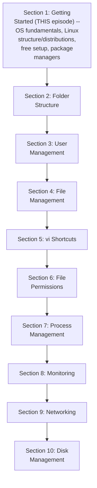

#### 📖 Definition — The Genuine, Real Documentation Resource

> 💡 **Given directly:** *"All the notes related to Linux Zero to Hero series is uploaded to this GitHub repository, which is called Ultimate Linux Guide... as the series progresses, if I have to update more documentation, I will keep doing it — so just star the repository to get continuous updates."*

#### 🎯 Key Takeaways

* This is genuinely **Day 1 of a 5-episode series**, covering a stated, complete 10-SECTION syllabus — THIS specific episode covers ONLY Section 1 ("Getting Started").
* Course notes are **genuinely, publicly hosted** on GitHub ("Ultimate Linux Guide"), with ONGOING updates as the series progresses.
* The course is explicitly, directly framed as valuable for **developers, DevOps engineers, AND complete IT beginners** alike — not a narrowly-scoped, audience-specific course.

---

### 2. Why Operating Systems Exist: The Bridge Between Hardware, Users & Applications

#### 🧠 Concept — Starting With "Why," Not "What"

> 💡 **Given directly:** *"Instead of learning what is operating system, let's start with why operating systems."*

#### 📖 Definition — Hardware, Precisely Named

> 💡 **Given directly:** *"The physical component of any computer is what we call as hardware — combination of CPU, memory, storage, motherboard, and network interfaces."*

#### 📖 Definition — The Two Genuine Actors Who Want to Use Hardware

> 💡 **Given directly:** *"There are two primary actors who want to interact with the hardware... one is the users, that is you and me. Two, software applications."*

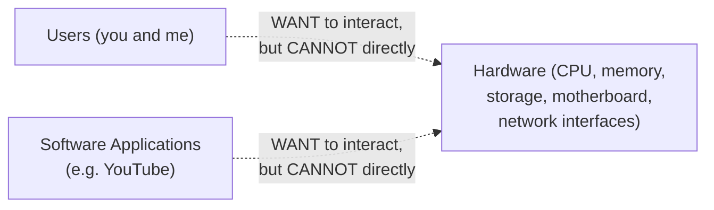

#### ❓ Why It Exists — Precisely Why NEITHER Actor Can Directly Interact With Hardware

> 💡 **Given directly, on applications:** *"Imagine you write a simple hello world program in Python — you do not write the instructions on how to manage the CPU for this program... so obviously your application cannot deal with the hardware resources, because you have not written the code."*

> 💡 **Given directly, on users:** *"As users, you cannot directly interact with the physical component — you at least need a graphical user interface or command line interface, and both of them are not provided by the hardware."*

#### 📖 Definition — The Operating System, Precisely Defined

> 💡 **Given directly:** *"A intermediate layer which is called as operating system can help them — operating system is a special software program that knows how to use the hardware... it can basically perform process management, memory management, device management, and even network management."*

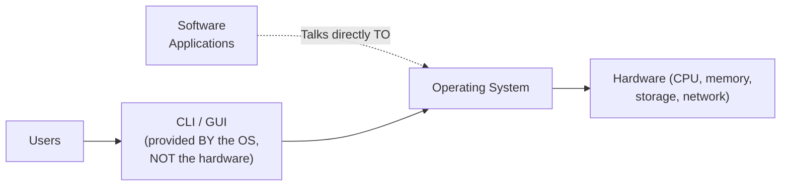

#### 📖 Definition — The Complete, Precise, Formal Definition

> 💡 **Given directly:** *"Operating system is an intermediate software layer that acts as a bridge between software and hardware, or acts as a bridge between user and hardware. It performs process management, memory management, device management, and network management."*

#### ⚠ Common Mistakes

* Assuming applications can genuinely, directly manage hardware resources (like CPU or memory) themselves — explicitly, directly clarified via a REAL, concrete example (a simple Python "hello world" program) — the application GENUINELY relies on the operating system for this.
* Assuming users could theoretically interact with hardware WITHOUT any intermediary, GIVEN enough technical skill — explicitly, directly clarified: even the CLI/GUI itself is provided BY the operating system, NOT the hardware.

#### 🎯 Key Takeaways

* **Hardware** (CPU, memory, storage, motherboard, network interfaces) cannot be DIRECTLY used by EITHER users OR software applications.
* The **operating system** is the GENUINE, necessary intermediary — precisely defined as a software layer performing process, memory, device, and network management, bridging BOTH users and applications to the underlying hardware.
* This "why first" framing directly, precisely sets up EVERYTHING that follows in this session — Linux's own STRUCTURE (Section 4) is DIRECTLY built around these SAME four responsibilities.

---
### 3. A Brief History: From Unix to Linux's Dominance

#### 🪜 Step-by-Step — The Complete, Precise, Chronological History

> 💡 **Given directly:** *"In 1960s, Unix is the first operating system that was developed... before Unix, it was very difficult for the application developers... Unix solved this problem, so it became very popular in no time."*

> 💡 **Given directly:** *"Looking at the success of Unix, in 1970s another operating system was released, which is Minix — Minix was kind of developed on top of Unix — Unix was open source, but Minix is not completely open source, it was partially open sourced."*

> 💡 **Given directly:** *"In 1980s there was a revolution in the space of operating systems — Microsoft released their operating system, which is Windows, and Microsoft's operating system, unlike the previous operating systems, had a rich graphical user interface."*

> 💡 **Given directly:** *"In 1990s... a person called Linus worked on the development of Linux kernel, and this was the first popular open-source operating system... Linux became the new popular choice for the developers and also for the companies."*

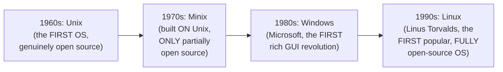

#### 🔍 Internal Working — The Precise, Genuine Reason Linux Dominates Today

> 💡 **Given directly:** *"Even today... if you look at Linux versus Windows, 90% of the production workloads today... use Linux operating system. It's not because Linux is free — many people think because Linux is free, companies go for using Linux — this is some part true. However, the major part is that Linux is open source."*

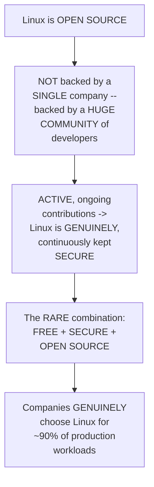

#### ⚠ Common Mistakes

* Assuming Linux's dominance is PRIMARILY because it's FREE — explicitly, directly, precisely corrected: *"this is SOME part true, however, the MAJOR part is that Linux is open source"* — being open source (community-driven, continuously secured) is the GENUINE, primary reason.
* Confusing Unix and Minix's own genuine OPEN-SOURCE status — explicitly, directly distinguished: Unix was GENUINELY, fully open source; Minix was ONLY PARTIALLY open source.

#### 🎯 Key Takeaways

* The **precise, chronological history**: Unix (1960s, fully open source) → Minix (1970s, PARTIALLY open source) → Windows (1980s, the GUI revolution) → Linux (1990s, Linus Torvalds, the first POPULAR, FULLY open-source OS).
* Linux GENUINELY dominates roughly **90% of production workloads today** — directly, precisely attributed to the RARE COMBINATION of being free, open source, AND secure — with open-source status specifically identified as the MAJOR, primary reason (not merely being free).
* This history directly, precisely sets up Section 5's own discussion of Linux DISTRIBUTIONS — companies building on TOP of this SAME, open-source foundation.

---

### 4. Linux's Structure: Kernel, System Utilities & Shell

#### 📖 Definition — The Linux Kernel, Precisely Defined

> 💡 **Given directly:** *"The main component of Linux operating system is called Linux kernel — everything that we discussed till now, so the interaction with hardware, such as process management, memory management, disk management, and network management, is handled through the Linux kernel — this is basically like the engine of the car, which is doing the heavy lifting."*

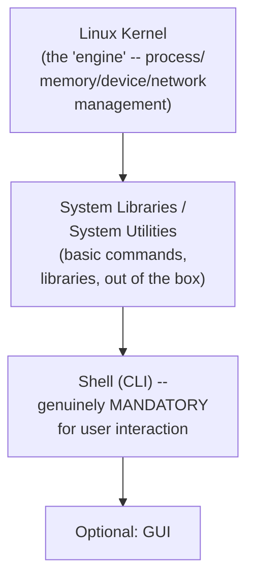

#### 🔍 Internal Working — A Genuine, Direct, Live-Answered Question: What's GENUINELY Mandatory?

> 💡 **Given directly:** *"Abhishek, is it possible to ship Linux operating systems without these things? You can still do it today, because kernel is the one which is taking care of the major responsibility — so you can actually remove most of these things and even ship a Linux operating system. But this will [not] help the users — that's why you have system utilities, libraries, and shell. Shell is mandatory — without CLI, users cannot interact with the hardware."*

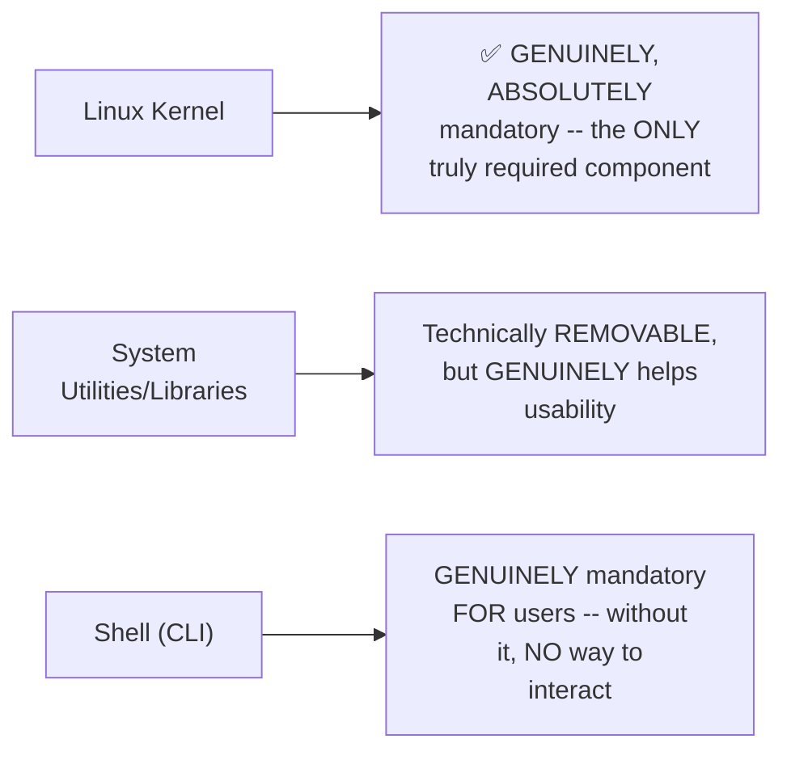

#### ⚠ Common Mistakes

* Assuming ALL FOUR components (kernel, utilities, shell, GUI) are EQUALLY, GENUINELY mandatory — explicitly, directly, precisely clarified: the KERNEL alone is technically SUFFICIENT to ship an operating system; utilities/libraries GENUINELY help but are technically removable; the SHELL is GENUINELY mandatory specifically FOR user interaction (though not for the kernel's OWN core function).
* Assuming Linux ALWAYS includes a GUI, similar to Windows — explicitly, directly, precisely clarified: *"usually when it comes to Linux, it is CLI"* — a GUI is GENUINELY optional, not the default expectation.

#### 🎯 Key Takeaways

* Linux's own **precise, four-part structure**: Linux KERNEL (process/memory/device/network management) → system libraries/utilities → SHELL (CLI) → optional GUI.
* The **Linux kernel is the ONLY genuinely, absolutely mandatory component** — everything else GENUINELY exists to make Linux more USABLE, not to fulfill its CORE, kernel-level function.
* The **shell (CLI) is GENUINELY mandatory specifically for USER interaction** — without it, users have NO way to GENUINELY communicate with the operating system.

---
### 5. Linux Distributions: Same Kernel, Different Wrappers

#### ❓ Why It Exists — The Precise, Genuine Business Opportunity

> 💡 **Given directly:** *"As I told you, Linux is open source — so the people, Linux [Torvalds] and other contributors, they have developed Linux and made it open source — so when it is open source, you are free to download the code, and you can add more features to it, or remove certain features to it, and ship as a product — that is where companies like Canonical saw the opportunity."*

#### 📖 Definition — Precisely How Distributions Are Genuinely Created

> 💡 **Given directly:** *"What they do, even today, Canonical as a company, they take the copy of the open-source Linux, they add some more features, they add more wrappers on top of Linux operating system, and provide that as Ubuntu Linux distribution — there is another company called Red Hat, which also does the same thing... similarly, Debian, Alpine, Fedora, all of them do the same thing."*

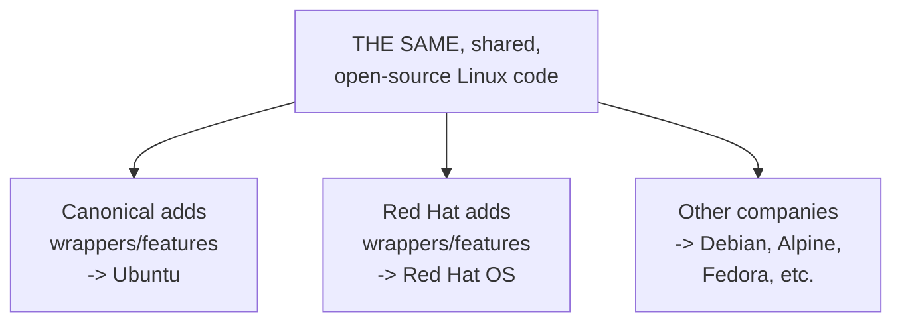

#### 🔍 Internal Working — The Precise, Genuine Consequence: Cross-Distribution Portability

> 💡 **Given directly:** *"They all have their origins common, but they add more wrappers, they add more commands, or they add more features, and distribute them as new products — that's why if you have a program, or let's say you have a shell script that is running on Ubuntu, most likely it also works on Red Hat, because underlying system libraries are common, underlying system packages are common."*

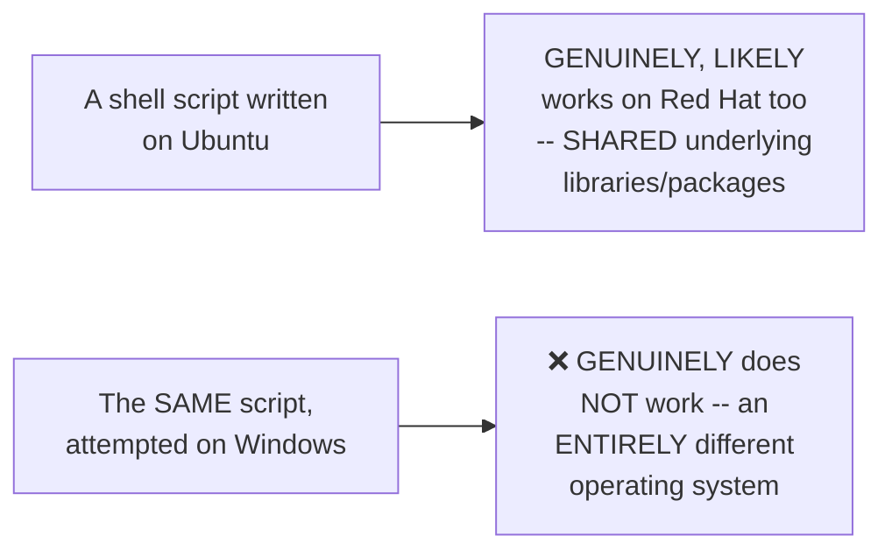

#### 🏢 Real-World / Production Usage — A Genuine, Direct, Practical Recommendation

> 💡 **Given directly:** *"Which one is popular? Ubuntu is a very popular operating system, and if you want to get started, I would highly recommend Ubuntu as an operating system, because it's very easy to use — it also comes with most of the required system packages and libraries — so for beginners, it's hassle-free."*

#### ⚠ Common Mistakes

* Assuming DIFFERENT Linux distributions are GENUINELY, fundamentally different operating systems — explicitly, directly, precisely clarified: they SHARE the SAME, common origin, DIFFERING only in ADDED wrappers/features — not in their CORE, underlying nature.
* Assuming a shell script's own PORTABILITY is GENUINELY universal (working on ANY operating system) — explicitly, directly, precisely bounded: portability is GENUINELY strong ACROSS Linux distributions specifically (shared libraries), but does NOT extend to GENUINELY different operating systems like Windows.

#### 🎯 Key Takeaways

* **Linux distributions** (Ubuntu, Red Hat, Debian, Alpine, Fedora) all GENUINELY share the SAME, common, open-source origin — companies simply add their OWN wrappers/features on top.
* This SHARED origin directly, precisely explains WHY **shell scripts are GENUINELY portable ACROSS different Linux distributions** — but NOT across genuinely different operating systems like Windows.
* **Ubuntu is directly, explicitly recommended** as the best starting distribution for beginners — genuinely easy to use, with most required packages/libraries INCLUDED out of the box.

---

### 6. Setting Up Linux for Free: WSL & Docker (No Cloud Billing Required)

#### ❓ Why It Exists — A Direct, Explicit, Genuine, Practical Recommendation

> 💡 **Given directly:** *"A lot of people create cloud instances, and they continuously keep watching the cloud instances, they worry about the cloud billing — however, to learn Linux, it is NOT required — I will show you how to set up a Linux system on your machine for absolutely free of cost."*

#### 📖 Definition — WSL, Precisely Introduced (Option 1)

> 💡 **Given directly:** *"Let's say you're using a Windows machine — one simple thing that you can do is install WSL — WSL stands for Windows Subsystem for Linux... just go to your command prompt or PowerShell in your Windows and run the command `wsl --install`."*

```bash
wsl --install
```

#### 🔍 Internal Working — A Genuine, Precise, Important Clarification

> 💡 **Given directly:** *"When you run `wsl --install`, it creates a Linux-like environment on your Windows machine — it does NOT create a virtual machine, but it creates a Linux-like environment on your Windows machine — once this is done, just restart your machine, or reboot your machine, and go to your command prompt and run `wsl` again."*

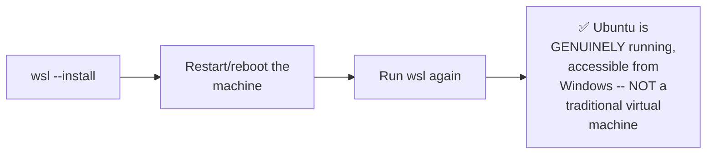

#### 📖 Definition — Docker, Precisely Introduced (Option 2)

> 💡 **Given directly:** *"Abhishek, for some reason I cannot run WSL on my machine, is there any other alternative? Definitely yes, you can use Docker... if you go to `setup.md`, you will find this Docker command, which is a sophisticated command that I have designed — I've added all the properties so that your Docker container runs as a Linux machine on either your Windows or Mac OS laptops."*

```bash
docker run -it --name ubuntu_container -v /tmp/ubuntu_data:/data ubuntu
```

#### 🔍 Internal Working — The Genuine, Precise Purpose of the Volume Binding

> 💡 **Given directly:** *"By default that Linux computer, or a small computer, does NOT have storage — I'm just binding my local location, which is `/tmp/ubuntu_data`, to `/data` folder of that computer — now whatever storage, or whatever files are available in this particular location, can be accessible through the container as well."*

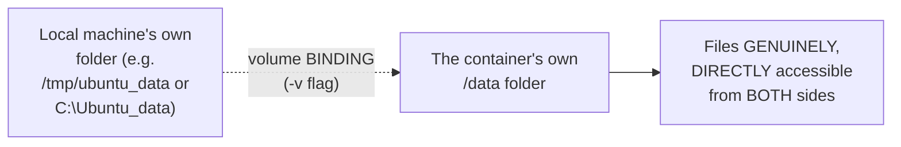

#### 🪜 Step-by-Step — Entering the Running Container

> 💡 **Given directly:** *"Just exec to the container — how you can do that? Copy and run the command `docker exec` followed by the ID of the container, and `/bin/bash` — that's it, you have a Linux environment running on your Mac OS or even Windows [via] container."*

```bash
docker exec -it <container_id> /bin/bash
```

#### 🏢 Real-World / Production Usage — A Genuine, Direct, Final Recommendation

> 💡 **Given directly:** *"Either go for WSL or use the Docker container to simulate Linux environment on your laptop — if both of these don't work, which is extremely rare case, only then go ahead to your cloud platform and create a cloud instance."*

#### ⚠ Common Mistakes

* Assuming WSL creates a TRADITIONAL virtual machine — explicitly, directly, precisely clarified: it creates a "Linux-like environment," NOT a genuine, full virtual machine.
* Assuming a Docker-based Linux container GENUINELY has its OWN, persistent storage by default — explicitly, directly clarified: it does NOT — the VOLUME BINDING (`-v` flag) is SPECIFICALLY, GENUINELY necessary to connect the container to REAL, local storage.
* Defaulting to a PAID cloud instance for LEARNING Linux — explicitly, directly, practically discouraged: WSL or Docker should GENUINELY be tried FIRST, with cloud instances reserved for the "extremely rare case" where NEITHER works.

#### 🎯 Key Takeaways

* **WSL** (`wsl --install`) creates a genuine "Linux-like environment" (NOT a traditional VM) directly on Windows — free, and requiring only a restart to activate.
* **Docker** offers a SECOND, genuinely free alternative — a pre-designed `docker run` command (with VOLUME BINDING for persistent storage) followed by `docker exec -it <container_id> /bin/bash` to enter the running Linux environment.
* Both methods are **directly, explicitly recommended OVER a paid cloud instance** for the specific purpose of LEARNING Linux — cloud instances are reserved for the genuinely rare case where NEITHER local option works.

---
### 7. Package Managers: apt, Explained

#### ❓ Why It Exists — The Precise, Genuine, Motivating Question

> 💡 **Given directly:** *"Now, finally, what is package manager, right?... let's say I want to install Python — if you're using a Windows machine, you can go to the internet, download packages — but when I am on Linux, how to install packages?"*

#### 📖 Definition — Package Managers, Precisely Introduced

> 💡 **Given directly:** *"What these Linux distributions do — like I told you, Linux distributions take the open-source code, and they add more libraries — one such thing the Linux distributions do is they add package managers — package managers help you deploy or install a dependency, something like Python — it helps you upgrade to the new version of the package, delete the version of the package, or even maintain the packages."*

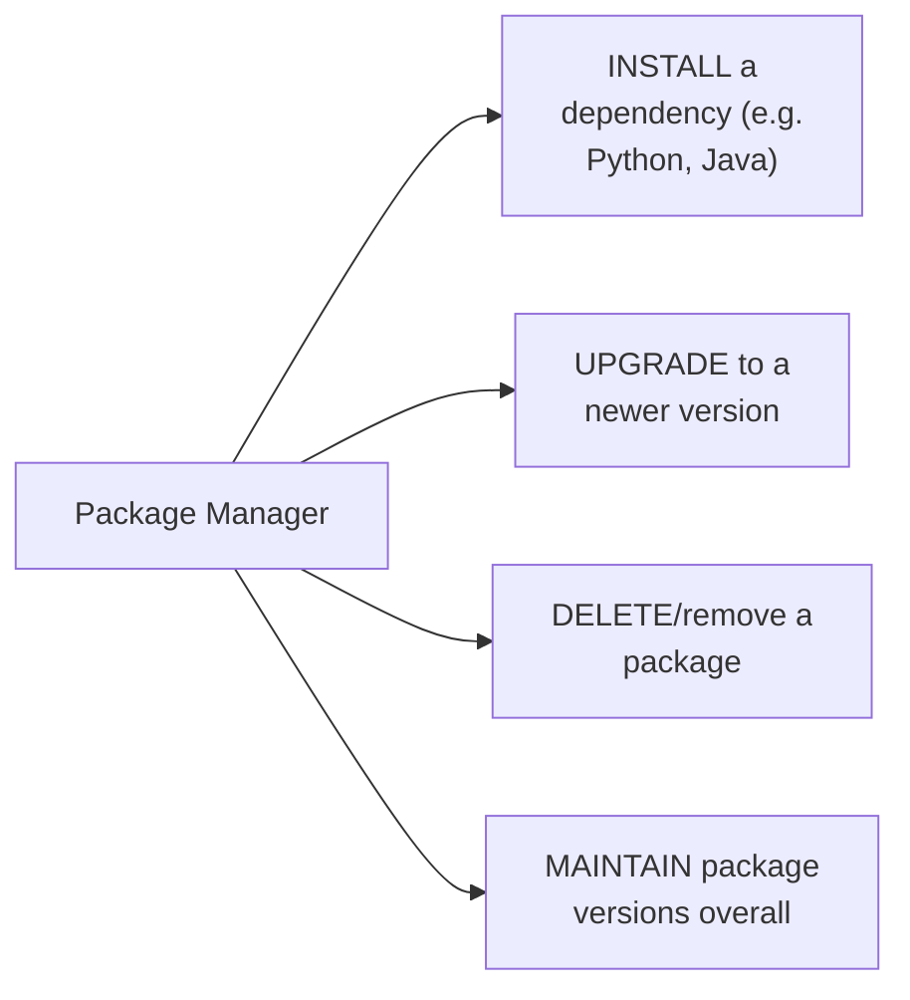

#### 📖 Definition — apt, Precisely Introduced as Ubuntu's Own Default

> 💡 **Given directly:** *"When you're using Ubuntu, the package manager is `apt` — so `apt` is installed out of the box."*

#### 🪜 Step-by-Step — The Four, Genuine, Core apt Commands

> 💡 **Given directly, `apt list`:** *"You can just run `apt list`, for example — it shows a list of packages that are available on this machine."*

```bash
apt list
```

> 💡 **Given directly, `apt search`:** *"You can run `apt search` to search for a particular version of the package."*

```bash
apt search <package_name>
```

> 💡 **Given directly, `apt install`:** *"Abhishek, what is `apt install`? So when I do `apt install`, let's say Python 3, so what it does is it goes to a centralized location — these package managers download and... store dependencies at a centralized location — for example, Ubuntu stores in `archive.ubuntu.com`."*

```bash
apt install python3
```

> 💡 **Given directly, `apt update`:** *"First time when you install, you need to run `apt update` — it is required because, you know, whenever you are installing a Linux virtual machine, this kernel might be packaged sometime back — so it is important to update all the packages on your machine, only then you can run `apt install python`, for example."*

```bash
apt update
```

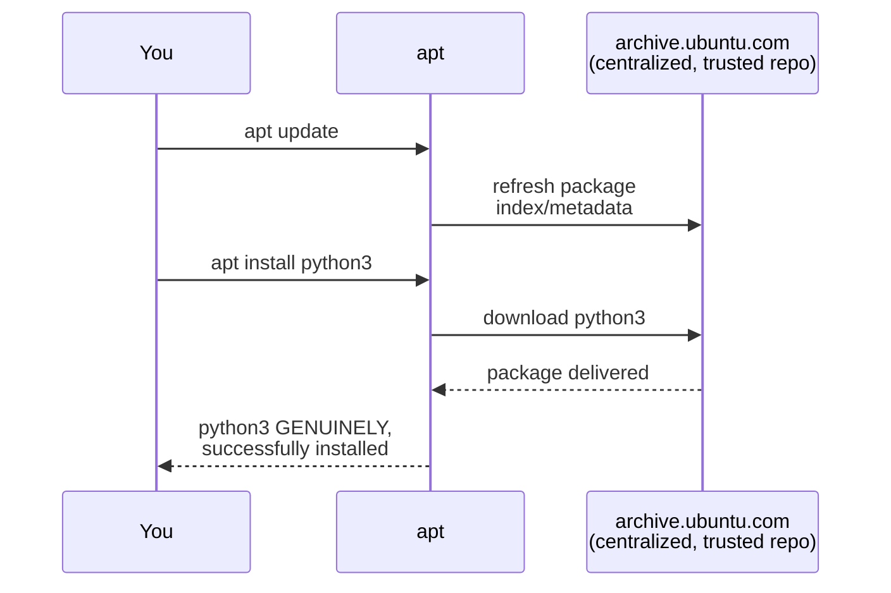

#### 🔍 Internal Working — A Genuine, Direct, Honest Caveat

> 💡 **Given directly:** *"Of course, there are some packages which are not available with the package manager — then you need to know curl command or wget command, which you will learn in the future classes."*

#### ⚠ Common Mistakes

* Assuming `apt install` can be run IMMEDIATELY, without any prior step, on a freshly-created machine — explicitly, directly clarified: `apt update` should GENUINELY be run FIRST, since the machine's own package index may be GENUINELY outdated.
* Assuming EVERY possible package is GENUINELY available via `apt` alone — explicitly, directly, honestly acknowledged: some packages GENUINELY require ALTERNATIVE tools (`curl`/`wget`), a topic EXPLICITLY deferred to future classes.

#### 🎯 Key Takeaways

* **Package managers** (like `apt`) GENUINELY handle installing, upgrading, removing, and maintaining software DEPENDENCIES — a capability Linux distributions ADD on top of the shared, open-source Linux core.
* The complete, core `apt` workflow: **`apt list`** (see available packages) → **`apt search`** (find a specific package) → **`apt update`** (refresh the package index, FIRST) → **`apt install`** (download and install FROM a centralized, TRUSTED repository).
* This section directly, precisely **connects back to Section 5's own distribution discussion**: package managers are ONE of the GENUINE, real "wrappers" that distributions ADD on top of the shared, open-source Linux foundation.

---

### 8. Closing: What's Next

#### 🪜 Step-by-Step — A Complete, Honest Recap

> 💡 **Given directly:** *"What have we learned today? We have learned the fundamentals of Linux, where we learned what is a Linux kernel, what are the responsibilities of it — similarly, what is Linux operating system — we learned about the comparison of Linux with Windows — we learned various Linux distributions — the setup of Linux using WSL as well as Docker container — finally, we learned about Linux package managers."*

#### 🪜 Step-by-Step — The Explicit, Direct, Practical Call to Action

> 💡 **Given directly:** *"Going ahead, please try to use WSL or the Docker container that I share to use — in case if this doesn't work for you, do let me know in the comment section, I will definitely respond back to your comment and make sure it works for you, or even you can join our Discord server."*

#### 🪜 Step-by-Step — The Explicit, Stated Roadmap Ahead

> 💡 **Given directly:** *"This is the first section — I try to keep it simple — from the next section, it is going to be interesting, where we are going to learn a lot of new things."*

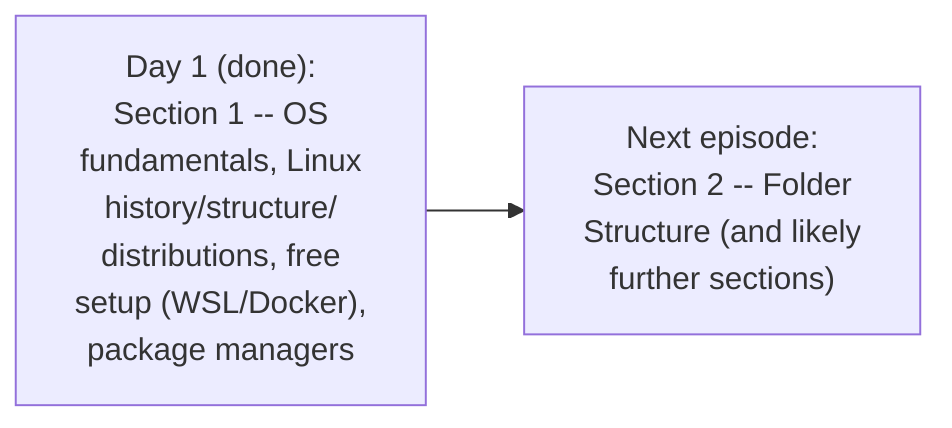

#### ⚠ Common Mistakes

* Assuming this session's own coverage represents the FULL, complete Linux curriculum — explicitly, directly, honestly clarified: this is GENUINELY only Section 1 of TEN total sections, with NINE more sections EXPLICITLY still ahead.
* Assuming setup difficulties are a DEAD END — explicitly, directly, genuinely addressed: the instructor OFFERS direct, personal support (comments, Discord) for anyone genuinely struggling with WSL/Docker setup.

#### 🎯 Key Takeaways

* This episode **genuinely, honestly recaps** its own complete scope: OS fundamentals, Linux's history/structure/distributions, free local setup (WSL/Docker), and package managers.
* The instructor **directly, explicitly offers ongoing support** (comments, Discord) for anyone experiencing genuine setup difficulties.
* **Section 2 (Folder Structure) and the remaining EIGHT sections** are explicitly, directly confirmed as the CONTINUING roadmap — this episode is GENUINELY just the beginning of a much LARGER, complete course.

---
## 📝 Glossary

| Term | Definition | Why It Matters |
|---|---|---|
| **Hardware** | CPU, memory, storage, motherboard, network interfaces | Cannot be directly used by users or applications |
| **Operating System** | The intermediary software layer between hardware and users/apps | Performs process, memory, device, and network management |
| **Linux Kernel** | Linux's core component -- the "engine" | The ONLY genuinely mandatory Linux component |
| **Shell (CLI)** | The command-line interface | Genuinely mandatory FOR user interaction |
| **Linux Distribution** | A company's own wrapper/features added to the shared Linux code | Ubuntu, Red Hat, Debian, Alpine, Fedora, etc. |
| **WSL** | Windows Subsystem for Linux | A free, non-VM "Linux-like environment" on Windows |
| **Docker (for this use case)** | A container platform, used here to simulate a Linux environment | A free alternative to WSL or a paid cloud instance |
| **Volume Binding** | Connecting a container's folder to a REAL, local folder | Containers have NO persistent storage by default |
| **Package Manager** | A tool for installing/upgrading/removing software dependencies | apt is Ubuntu's own default |
| **apt** | Ubuntu's default package manager | list / search / update / install |

---

## 🔄 Revision Notes — One-Minute Revision

* This is **Day 1 of a 5-episode "Linux Zero to Hero" series**, covering a stated, complete 10-SECTION syllabus -- THIS episode covers ONLY Section 1 ("Getting Started"). Notes hosted on GitHub ("Ultimate Linux Guide").
* **Why operating systems exist**: hardware cannot be directly used by users OR applications -- the OS is the GENUINE, necessary intermediary, precisely performing process/memory/device/network management.
* **History**: Unix (1960s, fully open source) -> Minix (1970s, ONLY partially open source) -> Windows (1980s, the GUI revolution) -> Linux (1990s, Linus Torvalds, the first POPULAR, FULLY open-source OS). Linux GENUINELY dominates ~90% of production workloads today -- PRIMARILY because it's OPEN SOURCE (community-driven, continuously secured), not merely because it's free.
* **Linux's structure**: Kernel (process/memory/device/network management -- the ONLY genuinely mandatory component) -> system utilities/libraries -> Shell/CLI (genuinely mandatory FOR users) -> optional GUI.
* **Linux distributions**: companies (Canonical, Red Hat, etc.) take the SAME, shared, open-source Linux code and add their OWN wrappers/features -> Ubuntu, Red Hat, Debian, Alpine, Fedora. This SHARED origin is WHY shell scripts are GENUINELY portable ACROSS distributions (but NOT across genuinely different OSes like Windows). Ubuntu is directly recommended for beginners.
* **Free setup (NO cloud billing required)**: WSL (`wsl --install` -- creates a "Linux-like environment," NOT a true VM) OR Docker (a pre-designed `docker run` command WITH volume binding for persistent storage, then `docker exec -it <container_id> /bin/bash` to enter). A paid cloud instance is explicitly recommended ONLY as a last resort.
* **Package managers**: handle install/upgrade/remove/maintain for dependencies. `apt` is Ubuntu's own default -- `apt list` (see available packages), `apt search` (find a package), `apt update` (refresh the index, FIRST), `apt install` (download from a centralized, trusted repo like archive.ubuntu.com). Some packages require curl/wget instead (deferred to future classes).
* **Closing**: this episode covers ONLY Section 1 of TEN -- Section 2 (Folder Structure) and eight further sections remain, across the REMAINING FOUR episodes.

---

## 📋 Cheat Sheet

**Why operating systems exist:**
```text
Hardware (CPU, memory, storage) <- CANNOT be directly used by -> Users / Applications
Operating System = the GENUINE, necessary INTERMEDIARY layer
```

**History, in order:**
```text
1960s: Unix (fully open source) -> 1970s: Minix (PARTIALLY open source, built on Unix)
-> 1980s: Windows (Microsoft, GUI revolution) -> 1990s: Linux (Linus Torvalds, FULLY open source)
```

**Linux's structure:**
```text
Linux Kernel (ONLY genuinely mandatory component)
  -> System Utilities/Libraries (technically removable)
  -> Shell/CLI (genuinely mandatory FOR users)
  -> GUI (optional)
```

**Free Linux setup options:**
```bash
# Option 1: WSL (Windows only)
wsl --install
# restart machine, then:
wsl

# Option 2: Docker (Windows or Mac)
docker run -it --name ubuntu_container -v /tmp/ubuntu_data:/data ubuntu
docker exec -it <container_id> /bin/bash

# Option 3 (LAST resort): a paid cloud instance (AWS/Azure/GCP)
```

**apt (Ubuntu's default package manager):**
```bash
apt list                # see available packages
apt search <package>      # find a specific package
apt update                  # refresh the package index (do FIRST)
apt install <package>         # download and install (e.g. apt install python3)
```

---

## 🔥 Interview Questions & Answers

### 🟢 Beginner

**Q1.**

**Question:** What is an operating system, precisely?

**Answer:** An intermediate software layer that bridges hardware and users/applications, performing process, memory, device, and network management.

**Explanation:** Directly, precisely defined.

**Why Interviewers Ask This:** The most basic, foundational OS question.

**Possible Follow-up:** "Why can't applications directly manage hardware resources themselves?"

**Q2.**

**Question:** In what decade was Unix developed?

**Answer:** The 1960s.

**Explanation:** Directly, explicitly stated.

**Why Interviewers Ask This:** Basic, factual OS history knowledge.

**Possible Follow-up:** "Was Unix fully or partially open source?"

**Q3.**

**Question:** Why does Linux genuinely dominate production workloads today?

**Answer:** Primarily because it's open source (community-driven, continuously secured) -- not merely because it's free.

**Explanation:** Directly, precisely clarified.

**Why Interviewers Ask This:** Tests genuine understanding, not a surface-level "it's free" assumption.

**Possible Follow-up:** "Roughly what percentage of production workloads use Linux today?"

**Q4.**

**Question:** What is the ONE genuinely mandatory component of a Linux operating system?

**Answer:** The Linux kernel.

**Explanation:** Directly, explicitly confirmed.

**Why Interviewers Ask This:** Tests precise understanding of Linux's own structure.

**Possible Follow-up:** "Is the shell also mandatory? For what purpose?"

**Q5.**

**Question:** What is a Linux distribution?

**Answer:** A company's own wrapper/features added on top of the shared, open-source Linux code.

**Explanation:** Directly, precisely defined.

**Why Interviewers Ask This:** Basic, foundational distribution knowledge.

**Possible Follow-up:** "Why are shell scripts generally portable across different Linux distributions?"

**Q6.**

**Question:** What does WSL stand for, and does it create a traditional virtual machine?

**Answer:** Windows Subsystem for Linux -- and no, it creates a "Linux-like environment," not a traditional VM.

**Explanation:** Directly, precisely clarified.

**Why Interviewers Ask This:** Basic, practical setup knowledge.

**Possible Follow-up:** "What command installs WSL?"

**Q7.**

**Question:** Why does a Docker-based Linux container require volume binding for genuine, useful storage?

**Answer:** Because a container does not have persistent storage by default.

**Explanation:** Directly, precisely explained.

**Why Interviewers Ask This:** Tests genuine, practical Docker/container knowledge.

**Possible Follow-up:** "What Docker flag is used to set up this volume binding?"

**Q8.**

**Question:** What is Ubuntu's default package manager?

**Answer:** apt.

**Explanation:** Directly, explicitly stated.

**Why Interviewers Ask This:** Basic, practical package management knowledge.

**Possible Follow-up:** "What command should genuinely be run first, before installing a new package?"

**Q9.**

**Question:** What does `apt update` genuinely do?

**Answer:** Refreshes the package index/metadata, ensuring subsequent installs use current information.

**Explanation:** Directly, precisely explained.

**Why Interviewers Ask This:** Tests genuine, practical apt workflow knowledge.

**Possible Follow-up:** "What happens if you skip this step before running apt install?"

**Q10.**

**Question:** How many total sections does this Linux Zero to Hero course cover, and how many did this specific episode cover?

**Answer:** 10 total sections; this episode covered only Section 1.

**Explanation:** Directly, explicitly stated.

**Why Interviewers Ask This:** Tests attention to the session's own honest, stated scope.

**Possible Follow-up:** "What is the next section's own topic?"

---

### 🟡 Intermediate

**Q11.**

**Question:** Explain why the instructor deliberately structures this episode to teach "why operating systems exist" BEFORE ever introducing Linux-specific commands or concepts.

**Answer:** This is a genuinely deliberate, first-principles teaching choice: by establishing WHY an intermediary software layer is GENUINELY necessary (neither users nor applications can directly interact with hardware), the instructor ensures that EVERY subsequent Linux-specific concept — the kernel's OWN responsibilities (Section 4), package managers (Section 7) — lands as a CONCRETE INSTANCE of this ALREADY-understood, GENERAL principle, rather than an isolated, memorized fact. This directly mirrors the SAME "motivation before mechanism" pattern seen throughout this instructor's OTHER series (e.g., the Shell Scripting series' own "why automation" opening) — a CONSISTENT, deliberate pedagogical approach across THIS instructor's own body of work.

**Explanation:** Requires recognizing a deliberate, first-principles teaching structure, and connecting it to a consistent pattern across the instructor's own broader body of work.

**Why Interviewers Ask This:** Tests whether a learner recognizes the genuine, practical value of building understanding from first principles, rather than memorizing disconnected facts.

**Possible Follow-up:** "How does this SAME 'why before what' structure appear later in THIS episode, when introducing Linux distributions?"

**Q12.**

**Question:** A learner argues that since this episode confirms shell scripts are "generally portable across Linux distributions," ANY shell script written for Ubuntu will ALWAYS work identically on ANY other distribution, with no exceptions. Evaluate this claim.

**Answer:** This claim overstates the case, treating a GENUINE, GENERAL tendency as an ABSOLUTE, unconditional guarantee. The instructor's own PRECISE language is genuinely CAREFUL: "most likely it ALSO works on Red Hat" — using QUALIFYING language ("most likely"), NOT an absolute claim of GUARANTEED, universal compatibility. This directly connects to THIS instructor's own broader, established content (from the Shell Scripting series in this SAME workspace) — SPECIFICALLY, the `/bin/sh` vs. `/bin/bash`/`/bin/dash` distinction ESTABLISHES that even WITHIN the shared "Linux" umbrella, SPECIFIC configuration DIFFERENCES (like WHICH shell `/bin/sh` genuinely links to) can GENUINELY cause a script to BEHAVE differently across DIFFERENT machines, EVEN when BOTH are technically "Linux." The ACCURATE, more precise conclusion: shell scripts are GENERALLY, LARGELY portable across distributions (due to SHARED underlying libraries, per THIS episode's own reasoning) — but "generally portable" does NOT mean "universally, unconditionally identical" — SPECIFIC, distribution-level configuration differences CAN still, genuinely cause EXCEPTIONS.

**Explanation:** Tests whether a learner recognizes the difference between a general tendency and an absolute guarantee, and can connect this session's claim to a more precise, related fact from elsewhere in this instructor's own established content.

**Why Interviewers Ask This:** Distinguishes candidates who track PRECISE, qualified claims from those who over-generalize a "generally true" statement into an unconditional guarantee.

**Possible Follow-up:** "Name a SPECIFIC, real example (from this instructor's own Shell Scripting series) where the SAME 'Linux' label did NOT guarantee identical script behavior."

**Q13.**

**Question:** Explain, precisely, why the instructor recommends WSL/Docker over a cloud instance SPECIFICALLY for LEARNING Linux, while NOT claiming these are always the GENERALLY superior choice for ALL Linux use cases.

**Answer:** This is a genuinely PRECISE, SCOPE-LIMITED recommendation, NOT a UNIVERSAL claim about WSL/Docker's own general superiority. The instructor's OWN reasoning is SPECIFICALLY tied to the LEARNING use case: avoiding UNNECESSARY cloud BILLING and the OPERATIONAL overhead of "continuously watching the instances" — a GENUINE, real CONCERN specifically relevant to someone WHO is JUST starting to learn, with NO genuine NEED for cloud-specific features (like REAL networking, SCALABILITY, or PRODUCTION-level infrastructure). For OTHER, GENUINELY DIFFERENT use cases — e.g., LEARNING cloud-specific Linux administration, or TESTING an application's behavior in a GENUINE, production-like NETWORKED environment — a REAL cloud instance would GENUINELY be the MORE APPROPRIATE choice, since WSL/Docker do NOT genuinely REPLICATE a full, REAL cloud environment's own NETWORKING and INFRASTRUCTURE characteristics. This directly, precisely illustrates that the instructor's own recommendation is GENUINELY, CAREFULLY SCOPED to the SPECIFIC goal of THIS course (learning CORE Linux fundamentals), not a BLANKET claim about WSL/Docker's own UNIVERSAL superiority over cloud instances.

**Explanation:** Requires recognizing that a specific, scoped recommendation (for learning purposes) doesn't generalize into an unconditional claim about the tools' overall superiority.

**Why Interviewers Ask This:** Tests whether a learner understands the PRECISE SCOPE of a given recommendation, rather than over-generalizing it beyond its stated, intended purpose.

**Possible Follow-up:** "Name a SPECIFIC, real Linux-related learning goal (later in THIS course's own 10-section syllabus) where a cloud instance MIGHT genuinely become more appropriate than WSL/Docker."

**Q14.**

**Question:** Using this session's own precise Linux structure explanation (Section 4), explain why REMOVING the shell (CLI) from a Linux system would GENUINELY still leave the kernel FUNCTIONING, but would make the system PRACTICALLY unusable for a HUMAN user, connecting this to the OS-fundamentals discussion (Section 2).

**Answer:** A precise, synthesized explanation, directly connecting Section 2's own OS-fundamentals reasoning to Section 4's own SPECIFIC Linux-structure claims: per Section 2's own established principle, users GENUINELY cannot directly interact with hardware — they GENUINELY require SOME interface (CLI or GUI) to communicate WITH the operating system. Per Section 4's own PRECISE, direct confirmation, the Linux KERNEL alone is technically SUFFICIENT to constitute a genuine, functioning operating system (handling process/memory/device/network management INTERNALLY) — but WITHOUT a SHELL (or GUI), there would be NO genuine WAY for a HUMAN user to ISSUE commands or OBSERVE the system's OWN state. This means the KERNEL would GENUINELY continue "working" (in the sense of managing hardware resources CORRECTLY), but the ENTIRE system would be GENUINELY, PRACTICALLY unusable for ANY human — directly, precisely illustrating WHY the instructor DIRECTLY, EXPLICITLY calls the shell "mandatory," DESPITE it NOT being TECHNICALLY required for the kernel's OWN core function — mandatory specifically FROM THE PERSPECTIVE of GENUINE, PRACTICAL human usability, which Section 2's own EARLIER reasoning DIRECTLY establishes as a GENUINE, SEPARATE requirement from the kernel's OWN, internal hardware-management function.

**Explanation:** Requires synthesizing the OS-fundamentals principle (users need an interface) with the specific Linux-structure claim (kernel alone is technically sufficient) to explain a nuanced distinction between technical functioning and practical usability.

**Why Interviewers Ask This:** A senior-level question testing whether a candidate can connect an EARLIER, general principle to a LATER, specific claim, constructing a complete, coherent explanation.

**Possible Follow-up:** "Would this SAME reasoning apply differently for an AUTOMATED system (like a server running a single, pre-configured application with no direct human interaction)? Explain your reasoning."

**Q15.**

**Question:** Synthesize this session's complete package-manager explanation (Section 7) with its own Linux-distribution explanation (Section 5) to explain why DIFFERENT distributions genuinely use DIFFERENT package managers (e.g., `apt` for Ubuntu), rather than ALL distributions sharing ONE, SINGLE, universal package manager.

**Answer:** A precise, synthesized explanation, directly connecting Section 5's own "distributions add their OWN wrappers" principle to Section 7's own package-manager discussion: per Section 5's own PRECISE explanation, EACH distribution-creating company (Canonical, Red Hat, etc.) GENUINELY, INDEPENDENTLY "adds more wrappers... adds more features" on TOP of the SAME, shared, open-source Linux CODE — and per Section 7's own DIRECT confirmation, the PACKAGE MANAGER ITSELF is SPECIFICALLY named as "ONE such thing the Linux distributions do" — meaning the PACKAGE MANAGER is ITSELF ONE of these DISTRIBUTION-SPECIFIC "wrappers," NOT a UNIVERSAL, shared component of the CORE, open-source Linux code ITSELF. This directly, precisely explains WHY `apt` is SPECIFICALLY Ubuntu's own choice, while OTHER distributions (per general, real Linux knowledge EXTENDING beyond this session's own explicit content) GENUINELY use THEIR OWN, DIFFERENT package managers (e.g., `yum`/`dnf` for Red Hat-based systems) — EACH distribution-creating company GENUINELY made its OWN, INDEPENDENT choice about HOW to implement package management, EXACTLY as Section 5's own general "different wrappers" principle would PREDICT.

**Explanation:** Requires synthesizing the general distribution/wrapper concept with the specific package-manager discussion to explain why package managers are distribution-specific, extending slightly beyond the session's own explicit content into a logical, well-supported inference.

**Why Interviewers Ask This:** A senior-level question testing whether a candidate can apply a GENERAL principle (distributions add their own wrappers) to correctly explain a SPECIFIC, related fact (package manager diversity) not explicitly, fully spelled out in the session's own content.

**Possible Follow-up:** "Based on this SAME reasoning, would you expect Ubuntu's own `apt` commands to work IDENTICALLY on a Red Hat-based system? Explain your reasoning."

---

### 🔴 Advanced

**Q16.**

**Question:** Design a complete, reasoned decision framework (using ONLY this session's own established concepts) for helping a genuinely new learner choose between WSL, Docker, and a cloud instance for their OWN, specific Linux learning setup, covering AT LEAST three different, realistic learner scenarios.

**Answer:** A reasonable, complete framework, directly applying this session's own exact, established guidance: **Scenario 1 — a Windows user with NO prior Docker/container experience**: RECOMMEND WSL FIRST (per Section 6's own DIRECT, primary recommendation) — it's the SIMPLEST, most DIRECT path ("just go to your command prompt... run `wsl --install`"), requiring NO prior container knowledge. **Scenario 2 — a Mac OS user, OR a Windows user for whom WSL genuinely fails to work**: RECOMMEND Docker (per Section 6's own EXPLICIT "alternative" framing) — the instructor's OWN pre-designed command handles the COMPLEXITY, requiring ONLY that the learner correctly set UP the referenced local folder (e.g., `/tmp/ubuntu_data`) and run the PROVIDED command. **Scenario 3 — a learner for whom BOTH WSL and Docker genuinely, repeatedly fail (per Section 6's own "extremely rare case" framing)**: ONLY THEN recommend a cloud instance (AWS/Azure/GCP) — explicitly, directly framed as the LAST-RESORT option, SPECIFICALLY to AVOID the "cloud billing" WORRY Section 6 itself directly, explicitly identifies as a GENUINE, real concern for LEARNERS. This complete framework directly, precisely applies Section 6's own EXACT, stated priority ORDER (WSL first, Docker second, cloud LAST) to THREE genuinely different, realistic learner situations.

**Explanation:** Requires applying the session's own exact recommendation and priority ordering to construct a complete, reasoned framework covering multiple realistic scenarios.

**Why Interviewers Ask This:** A realistic, senior-level question testing whether a candidate can operationalize a GENERAL recommendation into a COMPLETE, PRACTICAL decision framework for GENUINELY different, real situations.

**Possible Follow-up:** "What GENUINE, additional factor (beyond operating system) might further influence THIS decision, for a learner with a GENUINELY limited or unreliable internet connection?"

**Q17.**

**Question:** Critically evaluate: "Since this session confirms the Linux kernel is the ONLY genuinely mandatory component, and package managers are merely distribution-added wrappers (per Section 5/7), this means package managers are GENUINELY OPTIONAL, and a Linux system could function PERFECTLY WELL without ANY package manager at all." Is this an accurate, complete characterization?

**Answer:** Partially accurate as a NARROW, TECHNICAL claim, but INCOMPLETE and potentially MISLEADING as a PRACTICAL characterization. It IS genuinely TRUE, per Section 4's own PRECISE reasoning, that the kernel ALONE is TECHNICALLY sufficient — and per Section 5/7's own established reasoning, a package MANAGER is INDEED a DISTRIBUTION-added "wrapper," not a CORE, kernel-level requirement. HOWEVER, this OVERLOOKS a GENUINELY important, PRACTICAL consequence THIS session's own content DIRECTLY implies (though doesn't EXPLICITLY spell out): WITHOUT a package MANAGER, INSTALLING, UPGRADING, or REMOVING software (Section 7's own DIRECT, established use case — e.g., installing Python) would GENUINELY require MANUAL, ERROR-PRONE processes — DIRECTLY analogous to Section 4's own REASONING about WHY the SHELL, though TECHNICALLY optional for the KERNEL's own function, is GENUINELY "mandatory" FOR practical, human USABILITY. By THIS SAME LOGIC, a package MANAGER, though TECHNICALLY optional for the KERNEL's own CORE function, is GENUINELY, PRACTICALLY essential for a USABLE, MAINTAINABLE real-world Linux SYSTEM — the ACCURATE, more PRECISE conclusion parallels Section 4's own SHELL discussion: TECHNICALLY removable, but GENUINELY, PRACTICALLY indispensable for REAL, day-to-day usability.

**Explanation:** Tests whether a learner recognizes that "technically optional" doesn't mean "practically dispensable," correctly applying the SAME reasoning pattern established for the shell (Section 4) to package managers (Section 7) — a connection the session's own content doesn't explicitly draw, but strongly implies.

**Why Interviewers Ask This:** Distinguishes candidates who can extend an ESTABLISHED reasoning pattern (technical optionality vs. practical necessity) to a NEW, related component, from those who take "technically optional" as license to dismiss GENUINE, practical importance.

**Possible Follow-up:** "Construct a GENUINE, concrete example of the PRACTICAL difficulty someone would face MAINTAINING a real Linux system WITHOUT any package manager at all."

**Q18.**

**Question:** Synthesize this session's complete Linux history (Section 3, Linux's OPEN-SOURCE, community-driven security model) with its own package-manager explanation (Section 7, packages downloaded from a "centralized, TRUSTED location") to construct a reasoned explanation of WHY this "centralized, trusted repository" model is GENUINELY, STRUCTURALLY important for MAINTAINING the SAME security advantage Section 3 attributes to Linux's own open-source nature.

**Answer:** A precise, synthesized explanation, directly connecting TWO, separately-taught concepts from THIS session into ONE, coherent, SECURITY-focused understanding: per Section 3's own PRECISE reasoning, Linux's own SECURITY advantage GENUINELY comes from its OPEN-SOURCE nature — a LARGE, ACTIVE community of developers CONTINUOUSLY reviewing and CONTRIBUTING to the CODE, GENUINELY catching and FIXING vulnerabilities. HOWEVER, this SAME open-source PRINCIPLE, if APPLIED naively to EVERY possible SOFTWARE PACKAGE a user might WANT to install, could ALSO introduce a GENUINE, real RISK — if ANYONE could FREELY distribute ANY package CLAIMING to be legitimate SOFTWARE, a MALICIOUS actor could GENUINELY, EASILY distribute COMPROMISED software DISGUISED as a legitimate PACKAGE. Section 7's own PRECISE package-manager MECHANISM DIRECTLY, STRUCTURALLY addresses THIS exact risk: by CENTRALIZING package DISTRIBUTION through a SPECIFIC, TRUSTED location (e.g., `archive.ubuntu.com`, per Section 7's own DIRECT example) — rather than allowing INSTALLATION from ANY, ARBITRARY internet source — the DISTRIBUTION-MAINTAINING organization (e.g., Canonical, per Section 5's own established REASONING) can GENUINELY VET and CURATE which packages are made AVAILABLE through this TRUSTED channel, DIRECTLY PRESERVING a MEANINGFUL security BOUNDARY, even WITHIN an open-source ECOSYSTEM where, in PRINCIPLE, ANYONE could theoretically DISTRIBUTE software. This directly, precisely illustrates HOW the "centralized, TRUSTED repository" model GENUINELY, STRUCTURALLY COMPLEMENTS — rather than CONTRADICTS — Linux's own broader OPEN-SOURCE, community-driven security PHILOSOPHY established in Section 3.

**Explanation:** Requires synthesizing Linux's own broader open-source security philosophy with the specific, centralized package-repository mechanism to explain how these two ideas work together rather than in tension.

**Why Interviewers Ask This:** A capstone-level question testing whether a candidate can identify HOW a specific, practical mechanism (centralized package repositories) genuinely supports a broader, previously-established principle (open-source security), rather than treating them as unrelated facts.

**Possible Follow-up:** "What GENUINE, additional risk might STILL exist, even WITH a centralized, trusted package repository, that a careful DevOps engineer should GENUINELY remain aware of?"

---

## 🧪 Scenario-Based Interview Questions

> **Scenario 1:** A colleague, new to Linux, successfully installs WSL and starts using it for daily development work. Weeks later, they report that a shell script they wrote (and tested successfully on THEIR OWN WSL/Ubuntu environment) fails with unexpected errors when a teammate runs it on a Red Hat-based production server. Using this session's concepts, diagnose the most likely cause.

**Structured Answer:**
1. **Initial investigation:** Recognize this as directly connected to Intermediate Q12's own precise, careful reading of Section 5's own claim — the SESSION genuinely says scripts are "MOST LIKELY" portable across distributions, NOT ABSOLUTELY, UNCONDITIONALLY guaranteed to be IDENTICAL.
2. **Metrics/logs to check:** Directly examine the SPECIFIC error message(s) reported on the Red Hat server, checking whether they relate to a SPECIFIC command, package, or SHELL-behavior difference NOT present on the colleague's OWN Ubuntu/WSL setup.
3. **Possible causes:** Per Section 5's own precise, GENERAL reasoning (SHARED libraries, but DIFFERENT "wrappers"), the SCRIPT likely relies on a PACKAGE or COMMAND that is AVAILABLE (perhaps even PRE-INSTALLED) on Ubuntu SPECIFICALLY, but NOT genuinely available (or installed DIFFERENTLY, e.g., via `yum` instead of `apt`, per Advanced Q17's own extended reasoning) on the Red Hat-based SERVER.
4. **Debugging approach:** Directly attempt to run the SCRIPT'S own INDIVIDUAL commands, ONE BY ONE, on the Red Hat server, identifying the SPECIFIC command that GENUINELY fails or behaves DIFFERENTLY.
5. **Resolution:** Either INSTALL the missing package/dependency on the Red Hat server (using the APPROPRIATE package manager FOR that distribution), or MODIFY the script to use a MORE UNIVERSALLY-available command/approach that GENUINELY works consistently across BOTH distributions.
6. **Prevention:** Establish a standing team practice of TESTING scripts on MULTIPLE, REPRESENTATIVE target distributions (not JUST the developer's OWN local environment) BEFORE deploying to PRODUCTION, directly avoiding this EXACT class of "worked on my machine" cross-distribution surprise.

> **Scenario 2 (Advanced):** Your organization is deciding whether new hires should learn Linux fundamentals using WSL, Docker, or dedicated cloud instances, given a MIX of Windows and Mac laptops across the team, and a genuine concern about onboarding cost/complexity. Using this session's own concepts, construct a complete, reasoned recommendation.

**Structured Answer:**
1. **Initial investigation:** Recognize this as directly connected to Advanced Q16's own complete decision framework — the ORGANIZATION'S own situation GENUINELY involves MULTIPLE, different learner scenarios (Windows AND Mac laptops) SIMULTANEOUSLY.
2. **Relevant principle:** Per Section 6's own PRECISE guidance, WSL is SPECIFICALLY a Windows-ONLY solution — it GENUINELY cannot serve the Mac-laptop PORTION of the team; Docker, by CONTRAST, is DIRECTLY confirmed as working on "either your Windows or Mac OS laptops" (Section 6's own EXACT words).
3. **Possible causes for genuine consideration:** GIVEN the team's own MIXED laptop environment, STANDARDIZING on a SINGLE onboarding APPROACH would GENUINELY, PRACTICALLY require EITHER maintaining TWO SEPARATE onboarding paths (WSL for Windows, something ELSE for Mac), OR choosing ONE, UNIVERSALLY-compatible approach.
4. **Debugging/evaluation approach:** Directly WEIGH the GENUINE, real TRADE-OFF: Docker offers ONE, CONSISTENT onboarding EXPERIENCE across BOTH operating systems (SIMPLER for the ORGANIZATION to DOCUMENT/support), while WSL might offer a SLIGHTLY more "native" experience SPECIFICALLY for Windows users, at the COST of requiring a SEPARATE solution for Mac users.
5. **Resolution:** RECOMMEND standardizing on Docker (per Section 6's own EXPLICIT confirmation of CROSS-PLATFORM compatibility) as the PRIMARY onboarding approach, SPECIFICALLY to avoid MAINTAINING two SEPARATE documentation/support PATHS — directly ADDRESSING the organization's OWN stated concern about onboarding COST/complexity — while STILL avoiding cloud-instance BILLING concerns (per Section 6's own PRIMARY motivation).
6. **Prevention:** Establish a standing ORGANIZATIONAL practice of DIRECTLY documenting the CHOSEN setup approach (with the EXACT, tested command, per THIS session's own "sophisticated, pre-designed" Docker command APPROACH) in a SINGLE, CENTRALIZED onboarding GUIDE, directly REDUCING the RISK of INCONSISTENT setups across DIFFERENT new hires.

---

## 🛠 Hands-on Exercises

### 🟢 Easy

1. Write out, from memory, the precise, four-part definition of an operating system, and the four responsibilities it performs.
2. Explain, in your own words, why Linux's dominance is primarily attributed to being open source, rather than simply being free.
3. List the complete, chronological history of operating systems covered in this session (decade and name for each).

### 🟡 Medium

4. Set up a real Linux environment on your own machine, using EITHER WSL or Docker, following this session's own exact steps.
5. Write a short explanation (150-200 words) of why the Linux kernel alone is technically sufficient, but the shell is genuinely "mandatory" for practical usability, directly applying Intermediate Q14's own reasoning.
6. Use `apt list`, `apt search`, `apt update`, and `apt install` on your own, real Linux setup, documenting the output of each command.

### 🔴 Advanced

7. Complete the full, reasoned decision framework proposed in Advanced Interview Q16, applied to your own, real team or personal setup scenario.
8. Research (beyond this session's own content) what package manager Red Hat-based distributions use INSTEAD of `apt`, and document the equivalent commands for list/search/update/install.
9. Implement the debugging scenario proposed in Scenario 1 — write a small shell script relying on a specific package, test it on Ubuntu (via WSL/Docker), then attempt to identify what would genuinely differ if run on a Red Hat-based system (research-based, if you don't have direct access to test).

---

## 🏗 Practice Assignment

### Build: "Complete, Real Linux Environment Setup & First Exploration"

**Objective:** Directly complete this session's own core, practical goal — set up a genuine, free, local Linux environment, and begin exploring it.

**Requirements:**
- Set up a real Linux environment using EITHER WSL (if on Windows) or Docker (if on Mac, or as a Windows alternative), following this session's own exact steps.
- Verify your setup by running at least 3 basic commands of your own choosing.
- Use `apt` to update your package list, then install one real package (e.g., Python 3), documenting each step's own output.
- Write a complete, from-memory explanation (200-300 words) of WHY operating systems exist, and HOW Linux's own structure (kernel, utilities, shell) relates to this broader principle.
- A written reflection (150-200 words) on any genuine setup challenges you encountered, and how you resolved them.

**Architecture (suggested):**

```text
linux_day1_setup_assignment/
├── setup_log.md                      # your WSL/Docker setup steps + verification
├── apt_workflow_log.md                 # your apt list/search/update/install output
├── os_explanation.md                     # your from-memory OS explanation
└── REFLECTION.md                            # your written reflection
```

**Expected Functionality:**
- Your Linux environment should genuinely, correctly be running and accessible.
- Your apt workflow should genuinely, successfully install a real package.

**Challenges:**
- Correctly setting up volume binding if using the Docker approach.
- Correctly troubleshooting any genuine setup errors, using the instructor's own offered support channels if needed.

**Bonus Improvements:**
- Set up BOTH WSL and Docker (if on Windows), comparing the two approaches directly.
- Research and document what the next section (Section 2: Folder Structure) is likely to cover, based on this session's own syllabus overview.

---

## 📚 Additional Resources

- **The "Ultimate Linux Guide" GitHub repository** (referenced directly) -- the primary, ongoing documentation resource for this entire series.
- **This instructor's own Shell Scripting Zero to Hero series** (in this same workspace) -- directly complementary content, covering practical shell scripting that builds on this Linux foundation.
- **The instructor's own Discord server** (referenced directly) -- offered as a genuine, direct support channel for setup difficulties.
- **The next episode** (referenced directly, "next section") -- covering Section 2: Folder Structure.

---

## 📌 Final Revision Sheet

### ⭐ Core Concepts
- **OS definition**: the intermediary layer between hardware and users/applications.
- **History**: Unix -> Minix -> Windows -> Linux, with Linux's dominance attributed primarily to being open source.
- **Linux structure**: kernel (mandatory) -> utilities -> shell (mandatory for users) -> optional GUI.
- **Distributions**: shared origin, different company-added wrappers (Ubuntu, Red Hat, Debian, Alpine, Fedora).
- **Free setup**: WSL (Windows-only, non-VM) or Docker (cross-platform, needs volume binding) -- cloud instances as a last resort.
- **Package managers**: apt (Ubuntu) -- list/search/update/install, from a centralized, trusted repository.

### ⭐ Important Definitions
- **Volume Binding, Linux Distribution** (see Glossary for full definitions).

### ⭐ Important Commands/Code
```bash
wsl --install
docker run -it --name ubuntu_container -v /tmp/ubuntu_data:/data ubuntu
docker exec -it <container_id> /bin/bash
apt update && apt install python3
```

### ⭐ Architecture/Process
- Complete conceptual flow: hardware -> OS (kernel + utilities + shell) -> distributions (wrappers, including package managers) -> your own, free local setup (WSL/Docker) -> package installation (apt).

### ⭐ Best Practices
- Use WSL or Docker for learning Linux, reserving cloud instances for genuine, rare necessity.
- Always run `apt update` before `apt install` on a freshly-created machine.
- Recognize that "generally portable across distributions" is not an absolute guarantee.
- Choose Ubuntu as a beginner-friendly starting distribution.

### ⭐ Common Mistakes
- Assuming Linux's popularity is primarily because it's free (it's primarily because it's open source).
- Assuming WSL creates a traditional virtual machine (it doesn't).
- Assuming a Docker container has persistent storage by default (it doesn't, without volume binding).
- Assuming shell scripts are unconditionally, universally portable across all Linux distributions.

### ⭐ Interview Points
- Be ready to explain the precise definition and four responsibilities of an operating system.
- Be ready to explain why Linux dominates production workloads today.
- Be ready to explain Linux distributions and why shell scripts are generally portable across them.
- Be ready to explain the apt workflow (list, search, update, install).

### ⭐ Things to Remember
- This is **genuinely Day 1 of a 5-episode series**, covering ONLY Section 1 of a stated, complete 10-section syllabus.
- The **"why before what" teaching pattern** (motivating OS/Linux concepts before introducing commands) is a CONSISTENT, deliberate approach across this instructor's own broader body of work.
- **Nine further sections remain**, across the REMAINING four episodes — this is genuinely just the beginning of a much larger, complete course.

---

## 🔗 Source

- [Fundamentals of Linux](https://youtu.be/SCS51FDPKgQ?si=ub3T5dG8G_CT2aYn)