# 🐧 Linux Zero to Hero — Day 2: The Complete Linux Folder Structure

- <i>**Series:** Linux Zero to Hero (Day 2 of 5 planned episodes, direct continuation of Day 1) · 
- **Instructor:** Abhishek
- **Note on scope:** This is genuinely **Day 2**, directly continuing Day 1's stated 10-section syllabus — specifically covering **Section 2: Folder Structure**. This session builds a COMPLETE, precise understanding of EVERY major directory found in a default Linux installation — demonstrated LIVE, across BOTH a Docker-based Linux environment AND a real AWS EC2 instance, directly comparing their DIFFERENT default entry points and explaining WHY they differ. The session closes with a genuinely important, often-overlooked mechanism: the `PATH` environment variable, precisely explaining HOW the Linux kernel finds and executes commands like `ls` WITHOUT the user ever specifying a full file path.</i>

---

## 📑 Table of Contents

1. [Session Overview](#-session-overview)
2. [Learning Objectives](#-learning-objectives)
3. [Detailed Notes](#-detailed-notes)
   - [1. Session Context: Linux Zero to Hero, Day 2 — Understanding the Folder Structure](#1-session-context-linux-zero-to-hero-day-2--understanding-the-folder-structure)
   - [2. Reading the Terminal Prompt: User, Host & Path](#2-reading-the-terminal-prompt-user-host--path)
   - [3. The Home Directory Shortcut and the Root of the File System](#3-the-home-directory-shortcut-and-the-root-of-the-file-system)
   - [4. System Binaries vs. User Binaries: /sbin, /bin & the /usr Shortcut Structure](#4-system-binaries-vs-user-binaries-sbin-bin--the-usr-shortcut-structure)
   - [5. Boot, Libraries & Server Files: /boot, /lib & /srv](#5-boot-libraries--server-files-boot-lib--srv)
   - [6. Third-Party Software: Why /opt Exists (Not /home)](#6-third-party-software-why-opt-exists-not-home)
   - [7. Storage, Logs & Users: /mnt, /media, /var & /home](#7-storage-logs--users-mnt-media-var--home)
   - [8. Temporary, Volatile & Special Directories: /proc, /tmp, /root, /run, /data](#8-temporary-volatile--special-directories-proc-tmp-root-run-data)
   - [9. The Most Important Folder: /etc](#9-the-most-important-folder-etc)
   - [10. How Commands Are Found: The PATH Environment Variable](#10-how-commands-are-found-the-path-environment-variable)
   - [11. Closing: What's Next](#11-closing-whats-next)
4. [Glossary](#-glossary)
5. [Revision Notes — One-Minute Revision](#-revision-notes--one-minute-revision)
6. [Cheat Sheet](#-cheat-sheet)
7. [Interview Questions & Answers](#-interview-questions--answers)
8. [Scenario-Based Interview Questions](#-scenario-based-interview-questions)
9. [Hands-on Exercises](#-hands-on-exercises)
10. [Practice Assignment](#-practice-assignment)
11. [Additional Resources](#-additional-resources)
12. [Final Revision Sheet](#-final-revision-sheet)

---

## 🎯 Session Overview

This episode builds a complete, precise mental map of the Linux file system — treating each folder as having a genuine, specific PURPOSE, not an arbitrary name. It covers:

1. **A precise, live re-confirmation of Day 1's own setup methods** (Docker and AWS EC2), directly used as the TWO, real environments this session compares throughout.
2. **How to read a Linux terminal prompt**: user, hostname, and current path — directly, precisely explaining WHY Docker's DEFAULT login is `root`, while EC2's default is a SEPARATE, less-privileged `ubuntu` user, created SPECIFICALLY for security.
3. **The home-directory shortcut (`~`)** and the FILE SYSTEM's own root (`/`) — precisely explained via a genuinely relatable Google Drive analogy.
4. **The complete, precise distinction between `/sbin` (system/administrative binaries) and `/bin` (user/non-administrative binaries)** — directly, LIVE-demonstrated, including WHY Linux deliberately SEPARATES these for security.
5. **`/boot`, `/lib`, and `/srv`** — precisely explained, including a genuinely INSIGHTFUL, LIVE comparison showing `/boot` GENUINELY EMPTY in a Docker container (which never truly "boots") versus POPULATED on a real EC2 instance.
6. **`/opt`**, precisely explained via a genuinely important, real REASONING exercise: WHY third-party software belongs in a SHARED, COMMON location, rather than an individual user's OWN home directory.
7. **Storage, logging, and user directories**: `/mnt` (mounting new volumes), `/media`, `/var` (logs, LIVE-demonstrated with a real web-server log example), and `/home` (LIVE-demonstrated by creating a genuinely NEW user).
8. **Temporary, volatile, and special-purpose directories**: `/proc`, `/tmp`, `/root` (the ONE, genuine EXCEPTION to the `/home` pattern), `/run`, and `/data`.
9. **`/etc`**, directly, explicitly confirmed as "one of the MOST important folders" — containing system CONFIGURATION files, LIVE-demonstrated via `/etc/passwd`, `/etc/hosts`, and `/etc/os-release`.
10. **The `PATH` environment variable**, precisely explaining the GENUINELY important mechanism by which the Linux kernel FINDS and EXECUTES a command like `ls` WITHOUT the user ever specifying its FULL, real location.

> 💡 **Key framing, given directly, on this session's own core, guiding principle:** *"Every folder has a meaning — that is what you need to understand... you need to know what each folder is doing and use the specific folders for working on a specific task."*

---

## 🎯 Learning Objectives

By the end of this guide, you will be able to:

- [ ] Read and interpret a Linux terminal prompt, identifying the user, hostname, and current path.
- [ ] Explain why Docker and EC2 environments genuinely differ in their default login user.
- [ ] Distinguish `/sbin` from `/bin`, and explain why Linux deliberately separates administrative from non-administrative commands.
- [ ] Explain the purpose of `/boot`, `/lib`, `/srv`, `/opt`, `/mnt`, `/media`, `/var`, and `/home`.
- [ ] Explain why `/opt` exists, rather than installing third-party software in a user's own home directory.
- [ ] Identify `/root` as the one genuine exception to the standard `/home/<username>` pattern.
- [ ] Explain `/etc`'s own role as the primary location for Linux system configuration files.
- [ ] Explain how the `PATH` environment variable allows commands to be executed without specifying their full location.

---

## 📚 Detailed Notes

### 1. Session Context: Linux Zero to Hero, Day 2 — Understanding the Folder Structure

#### 🧠 Concept

> 💡 **Given directly, opening the session:** *"We are at second episode of Linux Zero to Hero series — in the previous episode we learned about the fundamentals of Linux... in today's video we will learn about folder structures — by default, when you set up a Linux machine, there are a lot of folders that are available on that Linux machine, let's try to understand what is the significance of that folders."*

#### 🪜 Step-by-Step — A Complete, Direct Recap of Day 1

> 💡 **Given directly:** *"We learned what is operating system, what is the structure of Linux operating system, that is what is a Linux kernel, what is the CLI in Linux, then we learned about Linux distributions, how to set up Linux machine on your personal computer, and finally we learned about package managers."*

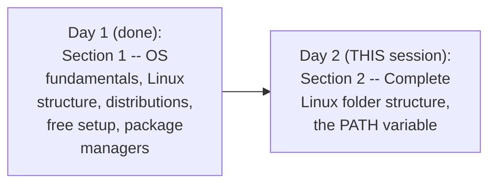

#### 🪜 Step-by-Step — Re-Confirming the SAME, Free Setup Methods From Day 1

> 💡 **Given directly:** *"So for that, in the previous lecture we learned how to start a Linux system on your Windows machine or Mac OS using Docker... let's say you don't want to use this, or you don't want to use WSL as well, so you can spin up an EC2 instance on AWS, or you can spin up a virtual machine on Azure."*

#### 🎯 Key Takeaways

* This is genuinely **Day 2, directly continuing Day 1's own stated 10-section syllabus** — specifically Section 2: Folder Structure.
* The session directly, precisely REUSES BOTH free setup methods established in Day 1 (Docker and EC2) — using their GENUINE, real DIFFERENCES as a teaching tool throughout THIS session.
* The guiding, core principle: **EVERY folder GENUINELY has a specific, real purpose** — not an arbitrary or interchangeable name.

---

### 2. Reading the Terminal Prompt: User, Host & Path

#### 📖 Definition — The Complete, Precise Anatomy of a Terminal Prompt

> 💡 **Given directly:** *"It says root at the rate ubuntu /dev colon /hashtag — what does this mean? So the first part of it is basically the USER with which you logged into the Linux environment."*

```text
root@ubuntu:/#
 ^     ^    ^ ^
 |     |    | prompt symbol (# = root; $ = non-root)
 |     |    current PATH
 |     hostname
 USER
```

#### 📖 Definition — Root User, Precisely Explained

> 💡 **Given directly:** *"By default you will get a user called root user, which is the ADMINISTRATIVE user on Linux — however, your DevOps engineering team or system administrator team, they will set up MULTIPLE users... only the root user has administrative privileges, rest of the users' access is RESTRICTED according to what they do in the organization."*

#### 🔍 Internal Working — A Genuine, Direct, Live-Compared Confirmation: Docker vs. EC2 Defaults

> 💡 **Given directly:** *"By default, when you create environment using Docker, you log in as a root user — at the same time, when you check EC2 instance here, the username is Ubuntu — so when you create an EC2 instance, what it does, along with the root user, it creates automatically ANOTHER user for you, and that username is Ubuntu."*

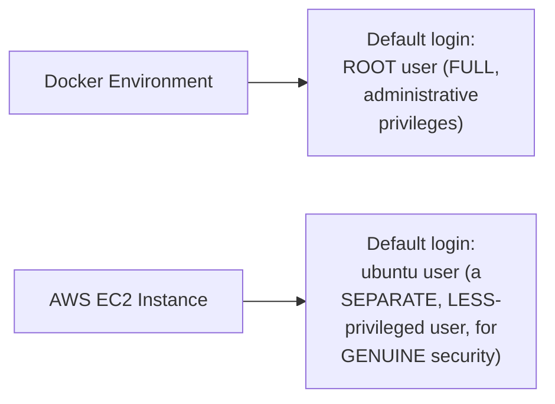

#### ⚠ Common Mistakes

* Assuming the terminal prompt's own text is GENUINELY meaningless, decorative clutter — explicitly, directly, precisely explained: EVERY part (user, hostname, path, prompt symbol) carries REAL, specific information.
* Assuming Docker and EC2 environments GENUINELY, ALWAYS log you in with the SAME default privileges — explicitly, directly, LIVE-compared as GENUINELY DIFFERENT: Docker defaults to ROOT; EC2 defaults to a SEPARATE, LESS-privileged `ubuntu` user, SPECIFICALLY for security.

#### 🎯 Key Takeaways

* A Linux terminal prompt precisely encodes **THREE genuine pieces of information**: the USER you're logged in as, the HOSTNAME, and the CURRENT PATH.
* **`root`** is the GENUINE, administrative user — REAL organizations RESTRICT root access, creating SEPARATE, LESS-privileged users for DAY-TO-DAY work.
* Docker's OWN default login (`root`) and EC2's OWN default login (`ubuntu`) GENUINELY, DIRECTLY DIFFER — EC2's choice is EXPLICITLY, DIRECTLY motivated by SECURITY (not granting FULL root access by default).

---
### 3. The Home Directory Shortcut and the Root of the File System

#### 📖 Definition — The File System's Own Root, Precisely Explained

> 💡 **Given directly:** *"File system is nothing but STORAGE, and for this storage there is a PARENT location, or there is a root location, that is nothing but SLASH — by default, when you get a storage, the path that you get is just the slash path, and ALL your files and folders by default are created in this particular location."*

#### 🧠 Concept — A Genuinely Relatable, Real Analogy: Google Drive

> 💡 **Given directly:** *"Just imagine Google Drive, right, for simple example — when you create a Google Drive, by default you get a PARENT location, and WITHIN that location you can create multiple folders, and within each folder if you want, you can create another folder, within this folder you can save files — SIMILARLY, when you buy a file system, or when you get a Linux environment with a file system, the DEFAULT path that you get is always the slash path."*

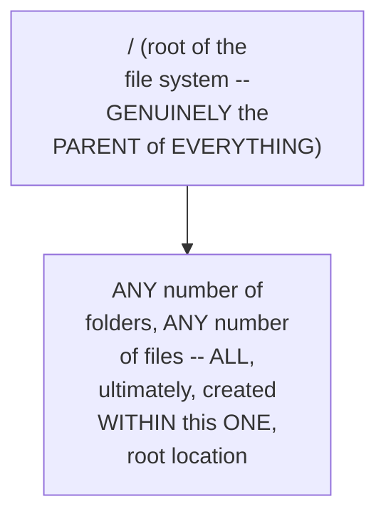

#### 📖 Definition — The Tilde (~) Shortcut, Precisely Explained

> 💡 **Given directly:** *"What is this tilde? Tilde basically is /home/ubuntu — Docker environment gave you DIRECT access to the file system, that is, this is your DEFAULT location, whereas when you logged into the EC2 instance, the default path is /home/ubuntu."*

> 💡 **Given directly, the precise, general RULE:** *"Tilde basically is the HOME DIRECTORY of ANY user that you logged in — if you logged in as Ubuntu user, tilde means /home/ubuntu; let's say if you logged in as Abi as a user, tilde means /home/abi."*

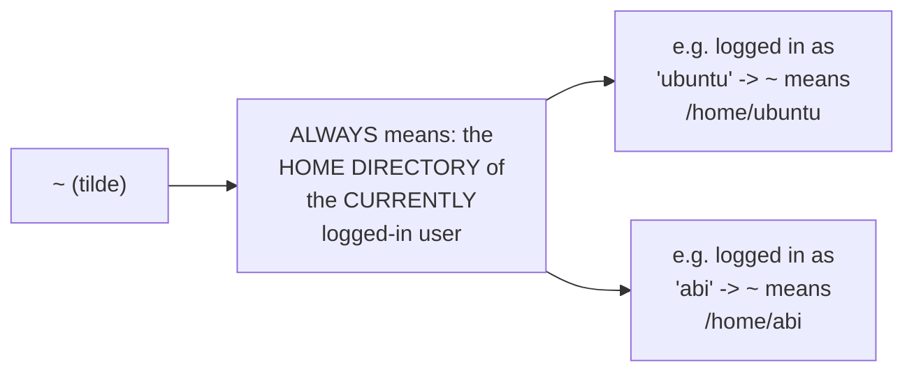

#### 🔍 Internal Working — Precisely WHY Docker's and EC2's Own Default Locations Genuinely Differ

> 💡 **Given directly:** *"Docker environment gave you DIRECT access to the file system, that is, this is your default location [i.e., `/`], whereas when you logged into the EC2 instance, the default path is /home/ubuntu."*

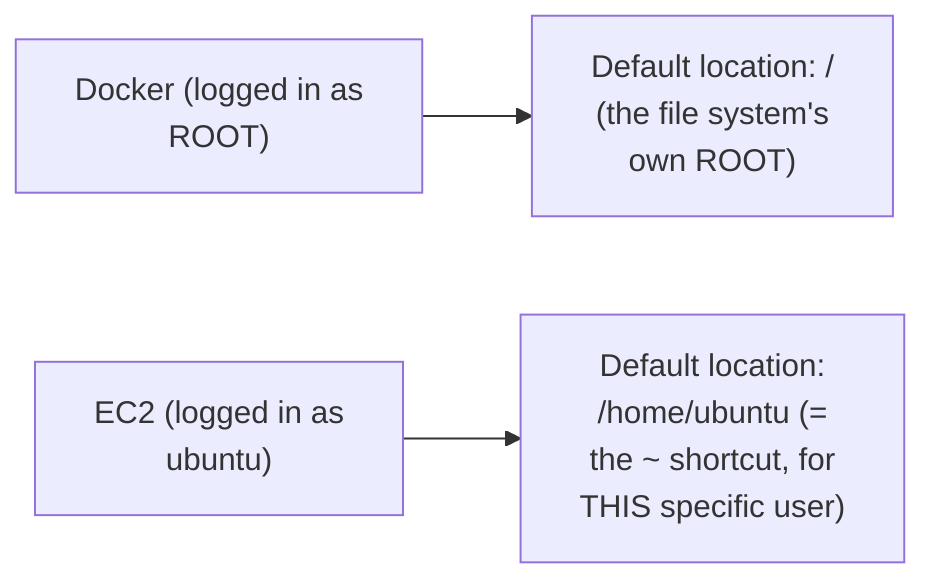

#### ⚠ Common Mistakes

* Assuming `~` GENUINELY, ALWAYS refers to the SAME, fixed path, REGARDLESS of which user is logged in — explicitly, directly, precisely clarified: it GENUINELY, DYNAMICALLY refers to the HOME DIRECTORY of WHOEVER is currently logged in.
* Assuming Docker's and EC2's own default STARTING locations are GENUINELY the SAME — explicitly, directly, LIVE-compared as DIFFERENT: Docker starts at `/` (root, since you're logged in AS root); EC2 starts at `/home/ubuntu` (since you're logged in as the LESS-privileged `ubuntu` user).

#### 🎯 Key Takeaways

* **`/`** (slash) is precisely the ROOT of the ENTIRE Linux file system — the PARENT location containing EVERY other file/folder — directly, memorably illustrated via a Google Drive analogy.
* **`~`** (tilde) is a GENUINE, DYNAMIC shortcut — ALWAYS referring to the HOME DIRECTORY of the CURRENTLY logged-in user (e.g., `/home/ubuntu` if logged in as `ubuntu`).
* Docker's and EC2's own DIFFERENT default LOGIN users (Section 2) directly, precisely EXPLAIN why their DEFAULT starting LOCATIONS also genuinely DIFFER.

---

### 4. System Binaries vs. User Binaries: /sbin, /bin & the /usr Shortcut Structure

#### ❓ Why It Exists — The Precise, Genuine, Motivating Question

> 💡 **Given directly:** *"If you noticed, I entered `ls` command, and it listed the files — now, how does your Linux system know `ls` means to list the files? There has to be a PACKAGE, and that package is provided in one of these folders."*

#### 📖 Definition — /sbin, Precisely Introduced

> 💡 **Given directly:** *"SBIN means SYSTEM BINARIES — what are these system binaries? Basically the commands or the binary files that you can use to MANAGE your system... user add — this particular command helps you to create the users, AS A LINUX ADMINISTRATOR."*

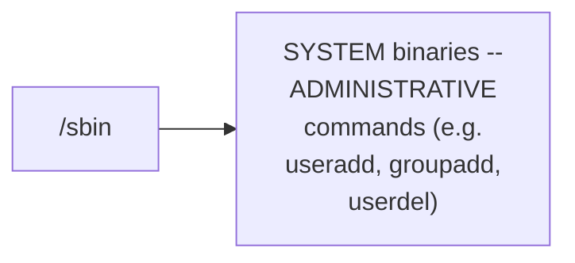

#### 📖 Definition — /bin, Precisely Introduced

> 💡 **Given directly:** *"SBIN stands for system binaries, whereas BIN stands for USER binaries... these are not administrative commands, or these are not system commands — maybe you can grant access to these commands to your REGULAR users as well — for example, if I just use `date`, it will just print the date and time... this doesn't have to be an administrative action."*

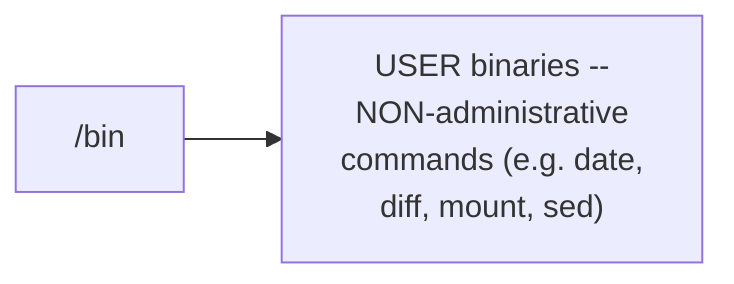

#### ❓ Why It Exists — The Precise, Genuine, Security-Driven Reason for This Separation

> 💡 **Given directly:** *"If a user executes these commands, there is not severe action, whereas if you grant access to these commands to regular users, they might create DUMMY users, they might create PASSWORDS to the users, and they might probably HACK the system or CORRUPT the system — that's why Linux segregated them to SBIN directory and this to BIN directory."*

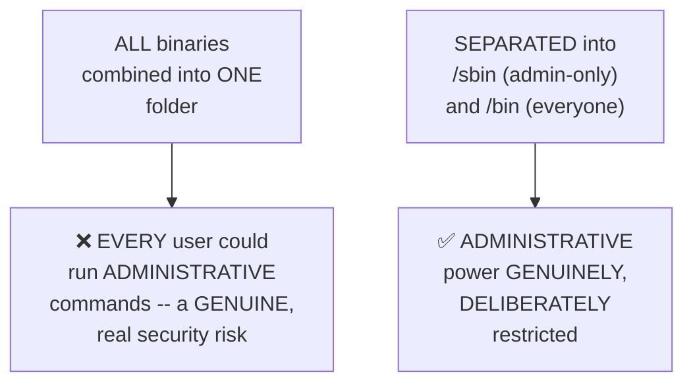

#### 🔍 Internal Working — The Genuine, Precise, "Shortcut" Structure Underlying /sbin and /bin

> 💡 **Given directly:** *"All of these binaries are within a PARENT folder, which is /usr — if you look for /usr/sbin, you will find these commands, and if you look for /usr/bin, you will get these commands — SBIN is a SHORTCUT for /usr/sbin, and BIN is a shortcut for /usr/bin."*

#### 🧠 Concept — A Genuinely Relatable, Real Analogy for "Shortcut"

> 💡 **Given directly:** *"Imagine you have a movie or a game that you play regularly... you right-click on this particular file and you say 'create shortcut'... when you execute the shortcut, it actually runs this command, and the file is executed from THIS location itself — we are using the SAME concept in Linux as well."*

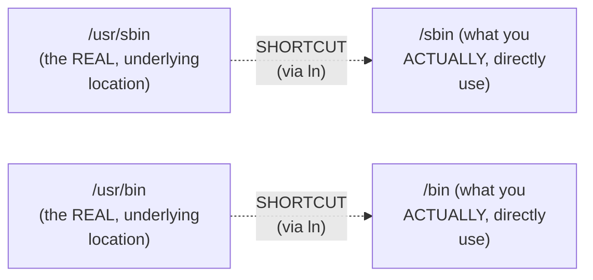

#### 🔍 Internal Working — Precisely What Else Lives Inside /usr

> 💡 **Given directly:** *"If you go to user folder, you will realize... it has the bin directory, it has the lib directory, and it has the sbin directory — apart from that, it has games... then you have libexec... then you have share... src, just like any source code."*

#### ⚠ Common Mistakes

* Assuming `/sbin` and `/bin` are GENUINELY, ENTIRELY SEPARATE, unrelated folders — explicitly, directly, precisely clarified: they are BOTH genuinely SHORTCUTS, pointing to `/usr/sbin` and `/usr/bin` respectively — their REAL, underlying content lives WITHIN `/usr`.
* Assuming `date`, `diff`, `mount`, and `sed` (examples of `/bin` commands) are GENUINELY, somehow LESS important than `/sbin` commands — explicitly, directly clarified: the DISTINCTION is about ADMINISTRATIVE RISK, NOT importance — `/bin` commands are simply GENUINELY SAFE for ANY user to run.

#### 🎯 Key Takeaways

* **`/sbin`** contains SYSTEM (administrative) binaries (e.g., `useradd`); **`/bin`** contains USER (non-administrative) binaries (e.g., `date`) — a DELIBERATE, security-DRIVEN SEPARATION, directly preventing regular users from GENUINELY risky, administrative actions.
* BOTH `/sbin` and `/bin` are GENUINELY SHORTCUTS — their REAL, underlying content lives WITHIN `/usr/sbin` and `/usr/bin` respectively.
* `/usr` ALSO contains **`/usr/lib`** (a shortcut source), plus `games`, `libexec`, `share`, and `src` — directly, explicitly confirmed as GENUINELY less important for THIS course's own, practical focus.

---
### 5. Boot, Libraries & Server Files: /boot, /lib & /srv

#### 📖 Definition — /lib, Precisely Introduced

> 💡 **Given directly:** *"The name itself explains that it is LIBRARY folder — SBIN is system binaries, LIB is basically LIBRARIES — what exactly is inside this library file? These libraries are used by your LINUX KERNEL — as a user, you don't use these libraries, these are used by Linux kernel for making SYSTEM CALLS with the hardware, or basically to EXECUTE its action."*

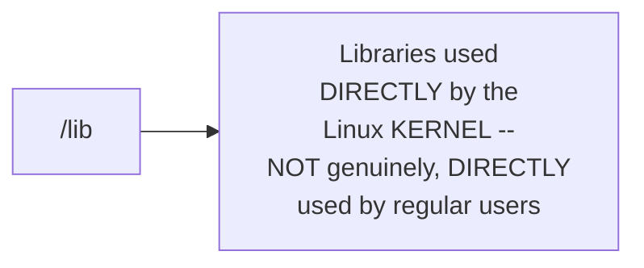

#### 📖 Definition — /boot, Precisely Introduced

> 💡 **Given directly:** *"Boot is basically for BOOTING your Linux machine, that is, STARTING or RESTARTING your Linux machine — when your Linux machine restarts, or maybe it starts, whatever inside the boot folder are basically helps the Linux machine during the restart."*

#### 🪜 Step-by-Step — A Genuinely Insightful, Live-Compared Demonstration

> 💡 **Given directly:** *"If I do `ls boot`, I will NOT find anything on the container environment — whereas if I run the same command `ls boot` on the EC2 instance, you will see there are a LOT of commands — why? EC2 instance is a VIRTUAL environment, that is, this actually RESTARTS your Linux environment, whereas THIS [Docker] is basically SIMULATION — that's why here you don't find anything inside the boot; if you just RESTART the container environment, it does NOT do any action, whereas if you START EC2 instance, or if you just STOP the instance and RESTART it, there are certain actions that it performs, and that is basically using the files which is inside the boot."*

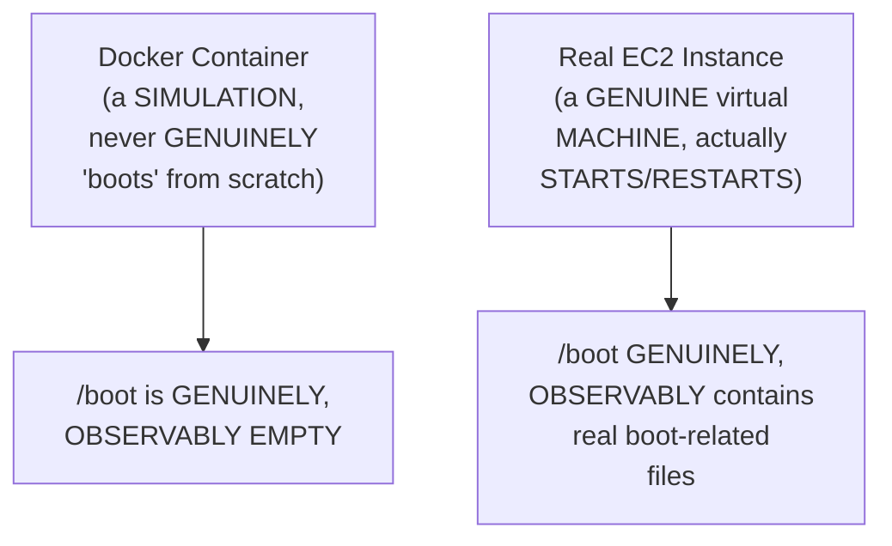

#### 📖 Definition — /srv, Precisely Introduced

> 💡 **Given directly:** *"SRV is basically SERVER — you have a folder called srv where you can store configuration files or any important information related to your WEB SERVERS — by default, when you create some web servers, it will actually store some files in the srv — by default it doesn't have anything, if I just do `ls srv`, there are no files here, because I don't have any web server installed."*

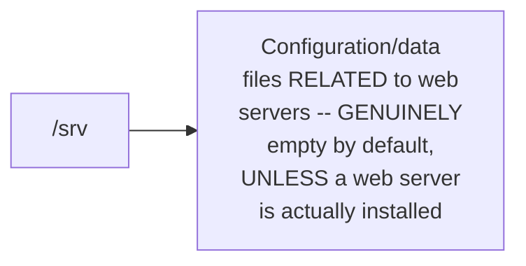

#### ⚠ Common Mistakes

* Assuming `/boot` should ALWAYS contain files, REGARDLESS of environment type — explicitly, directly, LIVE-demonstrated as GENUINELY DIFFERENT between a Docker container (empty — a genuine "simulation," never truly booting) and a real EC2 instance (populated — a GENUINE virtual machine that actually starts/restarts).
* Assuming an EMPTY folder (like `/srv` or `/boot` in Docker) means the folder GENUINELY, INCORRECTLY has no purpose — explicitly, directly clarified: it's EMPTY simply because the RELEVANT software/scenario (a web server, a genuine boot process) is NOT genuinely present in THIS specific environment.

#### 🎯 Key Takeaways

* **`/lib`** contains libraries used DIRECTLY by the LINUX KERNEL (not by regular users); **`/boot`** contains files GENUINELY needed during a REAL system start/restart; **`/srv`** stores DATA/configuration related to WEB SERVERS.
* A genuinely INSIGHTFUL, LIVE comparison directly, CONCRETELY revealed WHY `/boot` is EMPTY in Docker (a "simulation," per the instructor's own precise wording) but POPULATED on a real EC2 instance (a GENUINE virtual machine that ACTUALLY restarts).
* An EMPTY folder does NOT genuinely mean "no purpose" — it simply means the RELEVANT software/scenario (e.g., a web server for `/srv`) is NOT currently PRESENT in that specific environment.

---

### 6. Third-Party Software: Why /opt Exists (Not /home)

#### 📖 Definition — /opt, Precisely Introduced

> 💡 **Given directly:** *"OPT is a very important folder in your Linux environment — when you join an organization, or maybe you're working in a team, and you want to install some third-party dependencies... let's say you want to install a particular version of Java, or maybe you want to install a third-party tool... you will go to OPT folder, and you will create a directory here."*

```bash
mkdir /opt/custom_tool
# place all related executables, shell scripts, documents WITHIN this folder
```

#### ❓ Why It Exists — A Genuinely Important, Real, Direct Reasoning Exercise

> 💡 **Given directly, the PRECISE, direct question posed:** *"Abhishek, why can't I do it within my user — for example, I have a user called Ubuntu, so why can't I just go to `/home/ubuntu`... and copy the files related to that custom tool?"*

> 💡 **Given directly, the PRECISE, complete answer:** *"If you do that, who will have access to that custom tool? ONLY people who has access to `/home/ubuntu` or `/home/abhishek` — in general, this particular directory is very SPECIFIC to your user — you might not want to grant access to your user home directory to EVERYONE in the organization, maybe you are saving some personal files here, or maybe you have some personal scripts here — that's why for third-party dependencies, you need a COMMON location, and that common location is /op."*

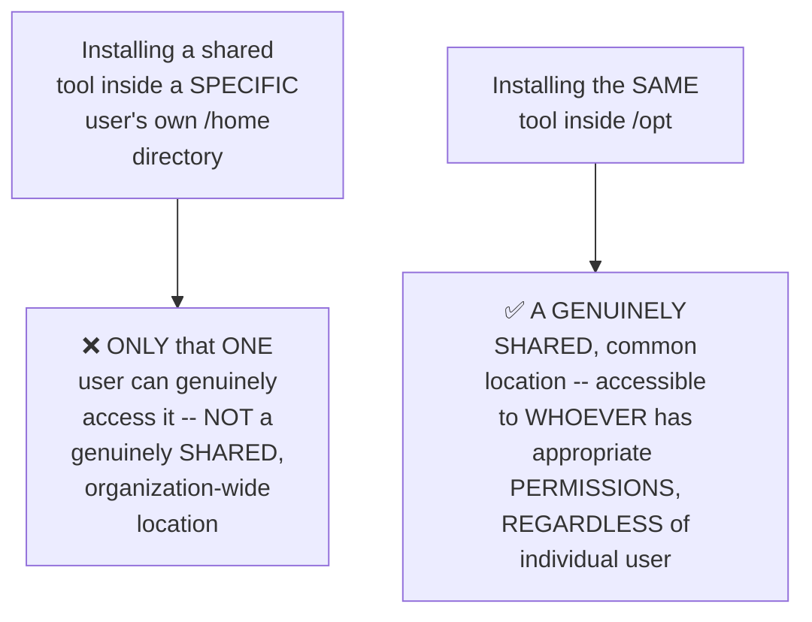

#### ⚠ A Direct, Honest, Real, Practical Warning

> 💡 **Given directly:** *"This is where people knowing Linux and people just using Linux DIFFER — sometimes people install third-party dependencies in RANDOM locations, some people just install in /tmp, some people just create a random directory called XYZ, and within that they start installing third-party dependencies — but a person who KNOWS Linux would create and use that within /opt folder, because this is a COMMON PRACTICE in Linux."*

#### ⚠ Common Mistakes

* Assuming a user's OWN home directory is a GENUINELY appropriate place for SHARED, organization-wide software — explicitly, directly, precisely corrected: home directories are GENUINELY PRIVATE/personal, NOT meant for shared access.
* Installing third-party software in RANDOM, ARBITRARY locations (like `/tmp` or a self-invented folder) — explicitly, directly, HONESTLY identified as a GENUINE, real MARKER distinguishing someone who merely USES Linux from someone who GENUINELY UNDERSTANDS its conventions.

#### 🎯 Key Takeaways

* **`/opt`** is the CONVENTIONAL, GENUINELY correct location for INSTALLING third-party software/dependencies — providing a SHARED, common location, ACCESSIBLE based on PERMISSIONS, rather than tied to ONE specific user's own home directory.
* The PRECISE, reasoned ANSWER to "why not `/home`?" directly, concretely illustrates a GENUINELY important Linux PRINCIPLE: home directories are PRIVATE; shared software needs a GENUINELY common, organization-wide location.
* Using `/opt` correctly (rather than `/tmp` or an ARBITRARY, self-invented folder) is directly, honestly identified as a GENUINE, real MARKER of Linux proficiency.

---
### 7. Storage, Logs & Users: /mnt, /media, /var & /home

#### 📖 Definition — /mnt, Precisely Introduced

> 💡 **Given directly:** *"MNT means MOUNT — why is this important? System administrators in Linux, they usually have a task which is ADDING MORE SPACE to the file system — this Linux environment is created after some time, let's say initially it is created with 20 GB storage, after some time 20 GB is COMPLETELY UTILIZED, and you want to add 30 GB more."*

#### 🪜 Step-by-Step — The Precise, Genuine, Complete Process

> 💡 **Given directly:** *"For doing it, what Linux administrator needs to do — first, they need to PROCURE a 30 GB disk somewhere, a temporary or permanent disk, and then they have to MOUNT it, or first ADD it to this TEMPORARY location, mount — /mnt — so they will FIRST mount it at /mnt, and THEN they will add this disk to the file system."*

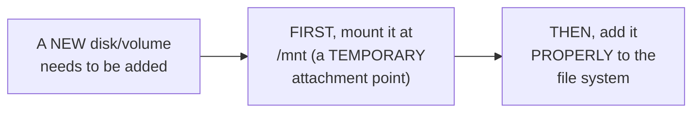

> 💡 **Given directly, a genuine, honest deferral:** *"For doing this, there are commands — we will learn that in Episode 9, I believe we have a session for disk management, that is Episode 10."*

#### 📖 Definition — /media, Briefly Introduced

> 💡 **Given directly:** *"Media, you can skip it — this is just for adding, let's say, any audio files or MP4 files — usually as DevOps engineers, as developers, you might NOT use this folder called media — people who are using this as their PERSONAL machines... they might be using media section, but usually WE don't use it."*

#### 📖 Definition — /var, Precisely Introduced

> 💡 **Given directly:** *"VAR is basically used to store LOG FILES — right, majorly it is used to store log files, or maybe some LIBRARIES — not the regular libraries, but some third-party libraries, or libraries that you download from the internet — but MOSTLY, var is used for log files."*

#### 🪜 Step-by-Step — A Complete, Concrete, Real Example

> 💡 **Given directly:** *"Let's say you install a web server, now this web server, like Apache or HTTPD, the LOGS of this server, it might log to `/var/log`... when you install Apache or HTTPD, it might create ANOTHER folder INSIDE `/var/log`, and within that folder you have the LOG FILES related to the web servers or your third-party applications."*

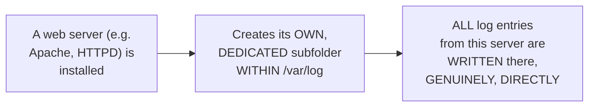

#### 📖 Definition — /home, Precisely Re-Confirmed With a Live Demonstration

> 💡 **Given directly:** *"If I create another user, for example if I do `add user abi`... now within HOME, you will find abhishek1 as well as Ubuntu — this is what I explained 10 or 15 minutes back, whenever you create a user using `add user` command, you will see within the home... the user folder is created."*

```bash
apt install adduser   # if not already present
adduser abhishek1
ls /home               # now shows BOTH "ubuntu" AND the NEWLY-created "abhishek1"
```

> 💡 **Given directly, precisely explaining PRIVACY:** *"If I am saving some files at slash, that means EVERYBODY can access that files, and you are basically making that files PUBLIC — if I'm storing that within my user, they are PRIVATE to me."*

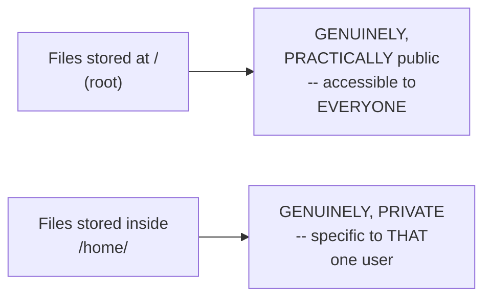

#### ⚠ Common Mistakes

* Assuming `/mnt` is a GENUINELY PERMANENT storage location — explicitly, directly, precisely clarified: it's specifically a TEMPORARY attachment POINT, used FIRST, BEFORE a new disk is PROPERLY added to the file system.
* Assuming EVERY user's OWN `/home/<username>` folder is CREATED manually — explicitly, directly, LIVE-demonstrated as AUTOMATIC: running `adduser` GENUINELY, AUTOMATICALLY creates the CORRESPONDING home folder.

#### 🎯 Key Takeaways

* **`/mnt`** is a TEMPORARY attachment point for NEWLY-added disks/volumes (full disk management deferred to Episode 9/10); **`/media`** is GENUINELY less relevant for DevOps/development work (mainly for PERSONAL machines, audio/video files).
* **`/var`** GENUINELY, PRIMARILY stores LOG FILES — directly, concretely demonstrated via a real web-server (Apache/HTTPD) logging example.
* **`/home`** was directly, LIVE-demonstrated: creating a NEW user (`adduser abhishek1`) AUTOMATICALLY creates a CORRESPONDING home folder — files stored HERE are GENUINELY PRIVATE, unlike files stored at the file system's OWN root (`/`), which are GENUINELY PUBLIC.

---

### 8. Temporary, Volatile & Special Directories: /proc, /tmp, /root, /run, /data

#### 📖 Definition — /data, Precisely Introduced

> 💡 **Given directly:** *"DATA folder — this is basically for storing any data — let's say I want to share the data with other people, or I have data related to organizational billing information, right, organizational cloud cost, or people in the organization — any data that can be SHARED with other people in the organization... you can put that within /data."*

#### 📖 Definition — /proc and /tmp, Precisely Introduced as Temporary/Volatile

> 💡 **Given directly:** *"After data, you have a set of TEMPORARY or VOLATILE files, or volatile folders — the data that is inside this are basically NOT PERMANENT — for example, you have PROC — proc is basically VIRTUAL FILE SYSTEM for your PROCESSES and SYSTEM INFORMATION."*

> 💡 **Given directly, on /tmp:** *"TMP is also used, the name itself says TEMPORARY — imagine you want to have a file that only lives for a certain time, instead of DELETING it after using, what you can do is you can create that files or folders within TMP."*

#### 🧠 Concept — A Genuinely Relatable, Real Analogy for /tmp

> 💡 **Given directly:** *"Just like recently deleted images on your mobile — when you delete an image on your mobile, it still stays on the recently deleted images after a while, maybe after 30 days, 20 days, 1 day, 2 days, the files are deleted — same is with /tmp as well — when you're writing scripts, and your script generates a log file, you want to delete that after a while, put that in the /tmp."*

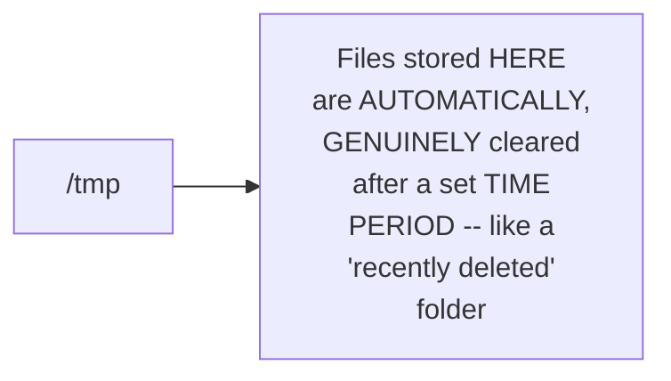

#### 📖 Definition — /root, Precisely Introduced as the ONE, Genuine Exception

> 💡 **Given directly:** *"We know what is root, right — root is the HOME DIRECTORY of the root — abhishek, you said the home directory for Ubuntu is `/home/ubuntu`, similarly home directory of ABI is `/home/abi`, but for root, why is the home directory `/root`? So root is the ONLY EXCEPTION — only for root, the home directory is `/root` — REST any user that you create, home directory is start with `/home`."*

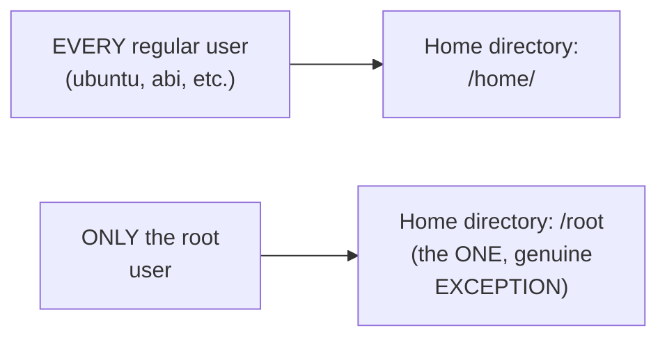

#### 📖 Definition — /run, Precisely Introduced

> 💡 **Given directly:** *"RUN basically stores the RUNTIME DATA of the processes — that is, WHILE a process is running, if it has any runtime data, that is stored WITHIN the run folder."*

#### ⚠ Common Mistakes

* Assuming `/home/root` is the GENUINELY correct home directory for the root user, following the SAME pattern as regular users — explicitly, directly, precisely clarified: root is the ONE, GENUINE exception — its home directory is `/root`, DIRECTLY off the root of the file system, NOT within `/home`.
* Assuming data placed in `/tmp` GENUINELY persists indefinitely, LIKE data in other folders — explicitly, directly clarified: it's GENUINELY, AUTOMATICALLY subject to periodic CLEANUP, unlike PERMANENT storage locations.

#### 🎯 Key Takeaways

* **`/data`** stores SHAREABLE organizational data; **`/proc`** and **`/tmp`** are GENUINELY temporary/volatile (full scripting-related detail deferred to future lectures); **`/run`** stores RUNTIME data for currently-active PROCESSES.
* **`/root`** is directly, explicitly confirmed as the **ONE, GENUINE EXCEPTION** to the standard `/home/<username>` pattern — root's OWN home directory is `/root`, NOT `/home/root`.
* **`/tmp`**'s own genuine behavior is directly, memorably compared to a mobile phone's "recently deleted" folder — files GENUINELY, AUTOMATICALLY clear after a SET time period, rather than persisting PERMANENTLY.

---
### 9. The Most Important Folder: /etc

#### 📖 Definition — /etc, Precisely Introduced as Genuinely Critical

> 💡 **Given directly:** *"Although it is the FINAL one, it is ONE OF THE MOST IMPORTANT folders of your Linux system — within ETC, you have a lot of SYSTEM CONFIGURATION FILES."*

#### 🧠 Concept — A Genuinely Relatable, Real Analogy: Windows' C Drive & Mobile Settings

> 💡 **Given directly:** *"If you're using a Windows machine, you can somewhat correlate this to the C drive in Windows — you have a C drive, or a C folder, within which you have all the system configuration files — similarly in Linux, you have a folder called ETC, within which you have all the system configuration files — what does that mean? Using these files, you can CONFIGURE or MODIFY your system — these are just like your SETTINGS on your mobile phone, or settings on your laptop."*

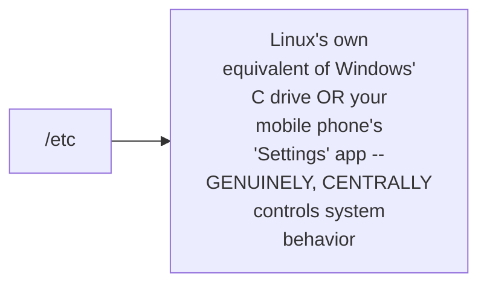

#### 🪜 Step-by-Step — Three, Complete, Live-Demonstrated Examples

> 💡 **Given directly, `/etc/passwd`:** *"P-A-S-S-W-D, which is PASSWORD — using this, you can MODIFY password of ANY user on the Linux machine."*

> 💡 **Given directly, `/etc/hosts`:** *"HOST is a file where you can add LOCAL DNS CACHING for your Linux environment — maybe you can say that, you know, this particular website has this IP address."*

> 💡 **Given directly, `/etc/os-release`:** *"OS RELEASE — this is a file where you have the Linux environment OS details — if I just do `cat etc/os-release`, you will find all the information about your Linux environment, the operating system version of it, everything."*

```bash
cat /etc/passwd       # user account information (modify passwords here)
cat /etc/hosts          # local DNS caching (map hostnames to IPs)
cat /etc/os-release       # OS version and distribution details
```

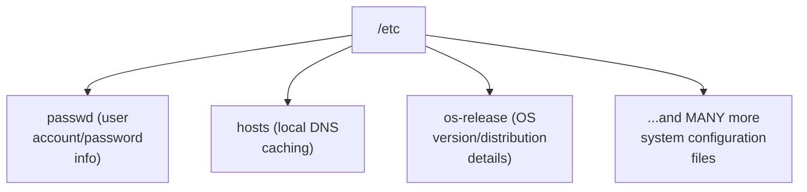

#### 🔍 Internal Working — A Genuine, Direct Confirmation of RC Files

> 💡 **Given directly:** *"You have these RC folders where you can just add your EXECUTABLES, and this is the PRIORITY of the executables, right — everything that is related to CONFIGURATION of your Linux system is added to the etc folder."*

#### ⚠ Common Mistakes

* Assuming `/etc` is JUST ANOTHER folder, EQUALLY as significant (or insignificant) as any other directory — explicitly, directly, EXPLICITLY confirmed as "one of the MOST IMPORTANT folders" — the PRIMARY, centralized location for system-wide CONFIGURATION.
* Assuming CONFIGURATION changes are made THROUGH some SEPARATE, dedicated settings APPLICATION (as on many consumer operating systems) — explicitly, directly clarified: on Linux, configuration GENUINELY happens by DIRECTLY editing FILES within `/etc`.

#### 🎯 Key Takeaways

* **`/etc`** is directly, explicitly confirmed as ONE of the MOST important Linux folders — containing SYSTEM CONFIGURATION files, genuinely ANALOGOUS to Windows' own C drive or a mobile phone's "Settings" app.
* THREE, complete, real examples were directly, LIVE-demonstrated: `/etc/passwd` (user passwords), `/etc/hosts` (local DNS caching), and `/etc/os-release` (OS version/distribution details).
* Linux CONFIGURATION genuinely happens by DIRECTLY editing FILES within `/etc` — NOT through a SEPARATE, dedicated settings application.

---

### 10. How Commands Are Found: The PATH Environment Variable

#### ❓ Why It Exists — A Genuinely Important, Direct, Final Question

> 💡 **Given directly:** *"If I run `ls`, OK, you explained that `ls` should be part of one of these folders, but I am just running `ls`, right, and it returns the output — I did NOT instruct the Linux machine that `ls` is in one of these folders — I did NOT say which is the CORRECT PATH of `ls` command — so how is my Linux file system able to execute it?"*

#### 🪜 Step-by-Step — A Complete, Live, Precise Confirmation of WHERE `ls` Genuinely Lives

> 💡 **Given directly:** *"`which ls` tells me what is the ACTUAL LOCATION of `ls` — ideally, I should have run this command, `/usr/bin/ls`, only THEN it should return the output — if I just run `ls`, how my kernel is able to give the same output?"*

```bash
which ls
# Genuinely, live confirms: /usr/bin/ls
```

#### 📖 Definition — PATH, Precisely Introduced as the Genuine Answer

> 💡 **Given directly:** *"There is something called as PATH on your Linux machine — this is also available on Windows, you might not use it regularly — but what this PATH does is it will tell the Linux system that WHEN SOMEBODY ENTERS the command, or when somebody writes something on the terminal, basically CHECK IN ALL THE FOLDERS WITHIN THE PATH, and if it is in one of that folders, you can directly EXECUTE it."*

```bash
echo $PATH
# Genuinely, live confirms: /usr/local/sbin:/usr/local/bin:/usr/sbin:/usr/bin:/sbin:/bin
```

```mermaid
flowchart TD
    A["User types: ls"] --> B["Kernel checks EVERY<br/>folder LISTED in the<br/>PATH variable, ONE<br/>BY ONE"]
    B --> C{"Is 'ls' FOUND in<br/>ANY of these<br/>folders?"}
    C -->|"Yes (e.g.<br/>/usr/bin)"| D["✅ Command<br/>GENUINELY,<br/>SUCCESSFULLY<br/>executes"]
    C -->|"No"| E["❌ 'command not<br/>found' -- GENUINELY,<br/>DIRECTLY confirmed<br/>via a live test"]
```

#### 🪜 Step-by-Step — A Complete, Live, Genuine, Confirming Failure Test

> 💡 **Given directly:** *"If I just run `abhishek`, you will see the SAME output, command NOT FOUND — because there is NO binary called `abhishek` in one of these folders."*

#### 🔍 Internal Working — A Genuine, Direct, Practical Confirmation: PATH Is Extensible

> 💡 **Given directly:** *"If you want to add MORE folders to this, you can APPEND path — you can add MORE paths to the PATH environment variable, which we will learn in the FUTURE classes."*

#### ⚠ Common Mistakes

* Assuming a command like `ls` GENUINELY runs simply because "Linux just knows it" — explicitly, directly, PRECISELY explained via the REAL, underlying mechanism: the kernel GENUINELY checks EVERY folder LISTED in the `PATH` environment variable.
* Assuming EVERY installed binary/command is AUTOMATICALLY, GENUINELY executable from ANYWHERE — explicitly, directly, LIVE-demonstrated as REQUIRING its OWN folder to be GENUINELY, EXPLICITLY LISTED within `PATH` — otherwise, "command not found" GENUINELY results, even if the file EXISTS somewhere on the system.

#### 🎯 Key Takeaways

* The **`PATH`** environment variable directly, precisely explains HOW a command like `ls` runs WITHOUT the user SPECIFYING its FULL location — the kernel GENUINELY checks EVERY folder LISTED within `PATH`.
* This was **directly, LIVE-verified**: `which ls` confirmed its REAL location (`/usr/bin/ls`); `echo $PATH` confirmed the COMPLETE list of SEARCHED folders; and a DELIBERATE, FAKE command ("abhishek") correctly, GENUINELY produced "command not found."
* `PATH` is directly, explicitly confirmed as **EXTENSIBLE** — additional folders can GENUINELY be APPENDED, a topic EXPLICITLY deferred to FUTURE classes.

---

### 11. Closing: What's Next

#### 🪜 Step-by-Step — A Complete, Honest Recap

> 💡 **Given directly:** *"For today's class, what we learned is the FOLDER STRUCTURE of Linux, and this is more than enough — if you want to revise the topics, you know where to go, and I made it more simple in the documentation."*

#### 🪜 Step-by-Step — The Genuine, Real, Organized Documentation Categories

> 💡 **Given directly:** *"I have categorized them into different sections — first there is a section for the SYSTEM CONFIGURATION files and regular configuration files or the binaries, then you have a section for IMPORTANT AND SYSTEM DIRECTORIES, etc, boot, then you have APPLICATION or USER-SPECIFIC directories, which is home, opt, srv, root, then I categorize the folders into TEMPORARY or VOLATILE directories, which is tmp, run, sys, dev, and then you have MOUNTPOINT directories."*

```mermaid
flowchart TD
    A["Day 2 (done):<br/>Section 2 -- Complete<br/>Linux folder structure,<br/>PATH variable"] --> B["Section 3 (next):<br/>User Management"]
```

#### ⚠ Common Mistakes

* Assuming this session's own coverage represents the FULL, complete Linux curriculum — explicitly, directly, honestly clarified: this is GENUINELY only Section 2 of TEN total sections (per Day 1's own stated syllabus), with EIGHT more sections still ahead.

#### 🎯 Key Takeaways

* This episode **genuinely, honestly recaps** its own complete scope: the COMPLETE Linux folder structure, and the `PATH` environment variable.
* The instructor's own **GitHub documentation** organizes EVERY folder into FIVE, genuine categories: system configuration, important/system directories, application/user-specific directories, temporary/volatile directories, and MOUNTPOINT directories — a GENUINELY useful, structured REVISION tool.
* **Section 3 (User Management)** is directly, explicitly confirmed as the NEXT topic — several folders covered TODAY (like `/home`, and the `useradd`/`adduser` commands GLIMPSED live) are EXPLICITLY, DIRECTLY set up to be revisited THERE.

---
## 📝 Glossary

| Term | Definition | Why It Matters |
|---|---|---|
| **Terminal Prompt** | user@hostname:path# (or $) | Encodes 3 genuine pieces of info: user, host, path |
| **root** | The administrative Linux user | Docker's default login; full, unrestricted privileges |
| **/ (slash)** | The root of the entire file system | The parent location of ALL files/folders |
| **~ (tilde)** | Shortcut for the current user's home directory | Dynamic -- changes based on who is logged in |
| **/sbin** | System (administrative) binaries | e.g. useradd -- restricted to admins |
| **/bin** | User (non-administrative) binaries | e.g. date, diff -- safe for everyone |
| **/usr** | Parent folder containing the REAL bin/sbin/lib | /sbin and /bin are shortcuts INTO /usr |
| **/lib** | Libraries used by the Linux kernel | Not directly used by regular users |
| **/boot** | Files needed during system start/restart | Empty in Docker (simulation); populated on EC2 |
| **/srv** | Web server configuration/data | Empty unless a web server is installed |
| **/opt** | The correct location for third-party software | A SHARED location, unlike a private /home directory |
| **/mnt** | Temporary attachment point for new disks/volumes | Full disk management deferred to Episode 9/10 |
| **/var** | Primarily stores log files | e.g. web server logs in /var/log |
| **/home** | Contains each user's own home directory | Created automatically via adduser |
| **/data** | Shareable organizational data | e.g. billing/cost information |
| **/proc, /tmp** | Temporary/volatile directories | /tmp auto-clears after a set time period |
| **/root** | The home directory of the root user | The ONE exception to the /home/<username> pattern |
| **/run** | Runtime data for currently-active processes | -- |
| **/etc** | System configuration files | One of the MOST important folders |
| **PATH** | An environment variable listing searchable folders | Explains HOW commands like `ls` are found and run |

---

## 🔄 Revision Notes — One-Minute Revision

* This is **Day 2**, directly continuing Day 1's own stated 10-section syllabus -- specifically **Section 2: Folder Structure**.
* **Terminal prompt**: user@hostname:path# -- encodes user, hostname, and current path. Docker defaults to ROOT user (full privileges); EC2 defaults to a SEPARATE, less-privileged "ubuntu" user, for genuine security.
* **File system root** (`/`): the parent location of ALL files/folders (Google Drive analogy). **Tilde** (`~`): a DYNAMIC shortcut for the CURRENT user's own home directory (e.g. /home/ubuntu if logged in as ubuntu).
* **/sbin vs. /bin**: sbin = system/administrative binaries (e.g. useradd); bin = user/non-administrative binaries (e.g. date). Deliberately SEPARATED for security -- both are actually SHORTCUTS into /usr/sbin and /usr/bin.
* **/lib**: libraries used by the KERNEL, not regular users. **/boot**: files needed during a REAL start/restart -- LIVE-compared: EMPTY in Docker (a "simulation"), POPULATED on real EC2 (a genuine VM). **/srv**: web server config/data.
* **/opt**: the CORRECT location for third-party software -- a SHARED location (unlike a user's private /home directory). Installing software in random locations (like /tmp or a made-up folder) is a genuine marker of NOT knowing Linux conventions.
* **/mnt**: TEMPORARY attachment point for NEW disks (full disk management deferred to Episode 9/10). **/media**: rarely used by DevOps/developers. **/var**: PRIMARILY log files (e.g. /var/log for web server logs). **/home**: each user's own directory, AUTOMATICALLY created via `adduser` -- files here are PRIVATE; files at `/` are PUBLIC.
* **/data**: shareable organizational data. **/proc, /tmp**: temporary/volatile -- /tmp auto-clears after a set time (like a phone's "recently deleted" folder). **/root**: the ONE, genuine EXCEPTION -- root's home directory is /root, NOT /home/root. **/run**: runtime process data.
* **/etc**: ONE of the MOST important folders -- system configuration (like Windows' C drive, or a phone's Settings app). Live-demonstrated: /etc/passwd (passwords), /etc/hosts (local DNS caching), /etc/os-release (OS/distro details).
* **PATH**: an environment variable listing EVERY folder the kernel searches when a command is typed -- explains HOW `ls` runs without specifying `/usr/bin/ls`. Live-verified: `which ls` -> /usr/bin/ls; `echo $PATH` -> the full, searched folder list; a fake command ("abhishek") correctly produced "command not found."
* **Closing**: this is genuinely only Section 2 of 10 -- Section 3 (User Management) is confirmed as the next topic.

---

## 📋 Cheat Sheet

**Reading a terminal prompt:**
```text
root@ubuntu:/#
 user @ hostname : path  (# = root prompt, $ = non-root prompt)
```

**Key shortcuts:**
```text
/  = root of the ENTIRE file system
~  = home directory of the CURRENTLY logged-in user (dynamic!)
```

**The complete folder map:**
```text
/sbin   -- system/admin binaries (SHORTCUT for /usr/sbin)
/bin    -- user/non-admin binaries (SHORTCUT for /usr/bin)
/usr    -- REAL location of bin, sbin, lib + games/libexec/share/src
/lib    -- kernel-used libraries
/boot   -- files needed to start/restart the system
/srv    -- web server config/data
/opt    -- THE correct location for third-party software
/mnt    -- temporary disk/volume attachment point
/media  -- audio/video (rarely used by DevOps)
/var    -- log files (e.g. /var/log)
/home   -- each user's own home directory
/data   -- shareable organizational data
/proc, /tmp -- temporary/volatile (/tmp auto-clears)
/root   -- root user's home directory (the ONE exception)
/run    -- runtime process data
/etc    -- system configuration files (ONE of the most important)
```

**Finding & verifying commands:**
```bash
which ls        # shows the REAL location, e.g. /usr/bin/ls
echo $PATH        # shows every folder the kernel searches
adduser <name>       # creates a user AND their /home/<name> folder
cat /etc/os-release    # shows OS/distribution details
```

---

## 🔥 Interview Questions & Answers

### 🟢 Beginner

**Q1.**

**Question:** What are the three pieces of information encoded in a Linux terminal prompt?

**Answer:** The user, the hostname, and the current path.

**Explanation:** Directly, precisely explained.

**Why Interviewers Ask This:** Basic, foundational terminal literacy.

**Possible Follow-up:** "What does a # versus a $ at the end of the prompt typically indicate?"

**Q2.**

**Question:** What does `~` (tilde) represent?

**Answer:** The home directory of the currently logged-in user.

**Explanation:** Directly, explicitly defined.

**Why Interviewers Ask This:** Basic, essential navigation knowledge.

**Possible Follow-up:** "If you're logged in as 'abi', what does ~ resolve to?"

**Q3.**

**Question:** What is the genuine difference between /sbin and /bin?

**Answer:** /sbin contains system/administrative binaries; /bin contains user/non-administrative binaries.

**Explanation:** Directly, precisely distinguished.

**Why Interviewers Ask This:** Foundational, frequently-tested Linux folder knowledge.

**Possible Follow-up:** "What is the underlying, real location both of these are shortcuts for?"

**Q4.**

**Question:** Why is /boot genuinely empty in a Docker container, but populated on a real EC2 instance?

**Answer:** Docker is a "simulation" that never truly boots from scratch; EC2 is a genuine virtual machine that actually starts/restarts.

**Explanation:** Directly, live-demonstrated and explained.

**Why Interviewers Ask This:** Tests genuine understanding of environment-specific behavior.

**Possible Follow-up:** "What folder is similarly used for web-server-related configuration?"

**Q5.**

**Question:** Why should third-party software genuinely be installed in /opt, rather than a user's own home directory?

**Answer:** A home directory is private to that one user; /opt is a shared, common location accessible based on permissions.

**Explanation:** Directly, precisely reasoned through.

**Why Interviewers Ask This:** Tests genuine understanding of Linux conventions, not just memorized facts.

**Possible Follow-up:** "What does installing software in /tmp or a random folder genuinely indicate about someone's Linux knowledge?"

**Q6.**

**Question:** What is /mnt genuinely used for?

**Answer:** A temporary attachment point for newly-added disks/volumes, before they're properly added to the file system.

**Explanation:** Directly, precisely explained.

**Why Interviewers Ask This:** Basic, practical disk-management-adjacent knowledge.

**Possible Follow-up:** "Is /mnt a permanent storage location?"

**Q7.**

**Question:** What does /var primarily store?

**Answer:** Log files.

**Explanation:** Directly, explicitly stated.

**Why Interviewers Ask This:** Basic, practical Linux folder knowledge.

**Possible Follow-up:** "Give a real, concrete example of what would be logged there."

**Q8.**

**Question:** What is the ONE genuine exception to the /home/<username> pattern?

**Answer:** The root user -- its home directory is /root, not /home/root.

**Explanation:** Directly, explicitly confirmed.

**Why Interviewers Ask This:** A commonly-tested, precise Linux detail.

**Possible Follow-up:** "What is root's own home directory genuinely called instead?"

**Q9.**

**Question:** What is /etc genuinely used for?

**Answer:** System configuration files.

**Explanation:** Directly, explicitly, precisely defined.

**Why Interviewers Ask This:** Basic, essential Linux knowledge -- /etc is genuinely critical.

**Possible Follow-up:** "Name three real, specific files found inside /etc."

**Q10.**

**Question:** What does the PATH environment variable genuinely do?

**Answer:** It lists every folder the kernel searches when a command is typed, allowing commands to run without specifying their full location.

**Explanation:** Directly, precisely, live-demonstrated.

**Why Interviewers Ask This:** Tests genuine, deeper understanding of command execution.

**Possible Follow-up:** "What command shows a specific command's real, full location?"

---

### 🟡 Intermediate

**Q11.**

**Question:** Explain why the instructor deliberately, directly compares the Docker environment and the EC2 instance THROUGHOUT this session, rather than teaching folder structure using only ONE environment.

**Answer:** This is a genuinely deliberate, valuable teaching choice: by DIRECTLY comparing TWO, genuinely DIFFERENT real environments (a Docker "simulation" versus a REAL EC2 virtual machine), the instructor makes CONCRETE, OBSERVABLE differences (like `/boot`'s own content, or the DEFAULT login user) that would OTHERWISE remain PURELY abstract or theoretical. A learner using ONLY Docker might GENUINELY, INCORRECTLY assume `/boot` is ALWAYS empty, or that ROOT is ALWAYS the default user — the DIRECT comparison PREVENTS this exact, GENUINE misconception, directly demonstrating that Linux's OWN behavior can GENUINELY vary based on the SPECIFIC environment/virtualization TYPE, while the UNDERLYING folder STRUCTURE and PURPOSE remains CONSISTENT.

**Explanation:** Requires recognizing a deliberate, comparative teaching structure and articulating its genuine, practical value.

**Why Interviewers Ask This:** Tests whether a learner recognizes why environment-specific comparison strengthens, rather than complicates, understanding.

**Possible Follow-up:** "What OTHER folder or behavior, beyond /boot, might GENUINELY differ between a Docker container and a real virtual machine?"

**Q12.**

**Question:** A learner argues that since /sbin and /bin are "just shortcuts" for /usr/sbin and /usr/bin, there's genuinely no meaningful difference between using the shortcut path or the full /usr path, and it's purely a stylistic choice. Evaluate this claim.

**Answer:** This claim is LARGELY accurate for DAY-TO-DAY USE (per this session's own content, BOTH paths GENUINELY, FUNCTIONALLY lead to the SAME, real files) — but it MISSES a genuinely important, PRACTICAL nuance: the EXISTENCE of the shortcut ITSELF (rather than requiring EVERYONE to remember the FULL `/usr/sbin` or `/usr/bin` path) is a DELIBERATE, real USABILITY decision, directly PARALLELING this session's own "shortcut" analogy for GAME/MOVIE files on Windows. WHILE the shortcut and the FULL path are FUNCTIONALLY EQUIVALENT (both work), the SHORTCUT'S own EXISTENCE reflects a GENUINE, real Linux DESIGN principle: FREQUENTLY-used paths GENUINELY benefit from SHORTER, more MEMORABLE shortcuts, REDUCING the COGNITIVE burden on USERS and SCRIPT authors alike. So the claim is CORRECT that they're FUNCTIONALLY interchangeable, but INCOMPLETE in DISMISSING the shortcut's own GENUINE, real USABILITY purpose as "PURELY stylistic."

**Explanation:** Tests whether a learner recognizes that functional equivalence doesn't mean the design choice itself was arbitrary or purposeless.

**Why Interviewers Ask This:** Distinguishes candidates who understand BOTH the technical mechanism AND the underlying design REASONING from those who only grasp the surface-level functional fact.

**Possible Follow-up:** "Name another example (from ANYWHERE in your OWN computing experience) where a 'shortcut' serves a genuine, real usability purpose, beyond pure convenience."

**Q13.**

**Question:** Explain, precisely, why the instructor structures the /opt explanation as a DIRECT QUESTION-AND-ANSWER ("Abhishek, why can't I do it within my user?") rather than simply STATING /opt's own purpose directly.

**Answer:** This is a genuinely deliberate, EFFECTIVE teaching technique: by POSING the OBVIOUS, NATURAL counter-question a genuine BEGINNER would GENUINELY ask ("why NOT just use my OWN home directory?"), the instructor DIRECTLY ANTICIPATES and ADDRESSES a REAL, likely point of CONFUSION, rather than SIMPLY stating the "correct" answer and HOPING the learner doesn't WONDER about the ALTERNATIVE. This Q&A STRUCTURE FORCES the learner to GENUINELY, ACTIVELY reason THROUGH the trade-off (PRIVATE vs. SHARED access) THEMSELVES, rather than PASSIVELY receiving a CONCLUSION — a GENUINELY more EFFECTIVE way to build LASTING, TRANSFERABLE understanding, since the learner NOW understands the UNDERLYING REASONING (privacy vs. shared access), not JUST the surface-level RULE ("use /opt for third-party software").

**Explanation:** Requires recognizing a deliberate Q&A teaching structure and articulating why it builds more durable understanding than a direct statement would.

**Why Interviewers Ask This:** Tests whether a learner recognizes the value of REASONED understanding over MEMORIZED rules.

**Possible Follow-up:** "Construct your OWN, similar 'why not just do X' question that could be used to teach the DIFFERENCE between /var and /tmp."

**Q14.**

**Question:** Using this session's own precise PATH explanation (Section 10), explain what would GENUINELY happen if a system administrator installed a NEW, custom command inside `/opt/custom_tool/`, but a user tried to run it by SIMPLY typing its name (without the FULL path), and explain how the ADMIN could FIX this.

**Answer:** A precise, reasoned explanation, directly applying Section 10's own EXACT PATH mechanism: per Section 10's own precise reasoning, typing a COMMAND's name ALONE (WITHOUT its full path) ONLY works if the FOLDER containing that command is GENUINELY, DIRECTLY LISTED within the `PATH` environment variable. Since `/opt/custom_tool/` is a GENUINELY NEW, custom LOCATION (per Section 6's own established PURPOSE for `/opt`) — and PATH's own DEFAULT list (per Section 10's own precise, LIVE-confirmed example: `/usr/local/sbin:/usr/local/bin:/usr/sbin:/usr/bin:/sbin:/bin`) does NOT genuinely INCLUDE this new location by DEFAULT — a user SIMPLY typing the COMMAND's name would GENUINELY, PREDICTABLY receive "command NOT found," EVEN THOUGH the command GENUINELY, PHYSICALLY exists on the SYSTEM. Per Section 10's own DIRECT, explicit CONFIRMATION ("you can APPEND path, you can add MORE paths to the PATH environment variable"), the ADMINISTRATOR could FIX this by EXPLICITLY, DIRECTLY APPENDING `/opt/custom_tool` to the SYSTEM's own PATH variable — AFTER this MODIFICATION, users COULD GENUINELY run the command by NAME alone, WITHOUT needing to TYPE its FULL, complete path.

**Explanation:** Requires applying the PATH mechanism to a genuinely new, concrete scenario combining two separately-taught concepts (/opt and PATH), correctly identifying both the problem and its precise fix.

**Why Interviewers Ask This:** Tests whether a learner can synthesize two separately-taught concepts into a coherent, practical troubleshooting scenario.

**Possible Follow-up:** "What GENUINE, real command would you use to ACTUALLY append this new folder to the PATH variable?"

**Q15.**

**Question:** Synthesize this session's complete "/sbin vs. /bin" security reasoning (Section 4) with its own "/opt" reasoning (Section 6) to explain a GENUINE, shared underlying PRINCIPLE both sections directly illustrate about Linux's OWN, overall design philosophy.

**Answer:** A precise, synthesized explanation, directly connecting TWO, separately-taught sections into ONE, coherent, underlying PRINCIPLE: per Section 4's own precise reasoning, `/sbin` and `/bin` are DELIBERATELY SEPARATED SPECIFICALLY to PREVENT regular users from ACCIDENTALLY or MALICIOUSLY performing ADMINISTRATIVE actions — a GENUINE, real SECURITY/ACCESS-CONTROL principle. Per Section 6's own precise reasoning, `/opt` EXISTS SPECIFICALLY to PREVENT third-party software from being TIED to ONE, SPECIFIC user's own PRIVATE home directory — a GENUINE, real SHARED-ACCESS/ORGANIZATION principle. BOTH sections, TAKEN TOGETHER, directly reveal a SHARED, UNDERLYING Linux DESIGN philosophy: the FILE SYSTEM's own STRUCTURE is NOT ARBITRARY — it is DELIBERATELY organized to REFLECT and ENFORCE WHO should GENUINELY have ACCESS to WHAT, and WHY — WHETHER that's RESTRICTING administrative COMMANDS to admins ONLY (Section 4), or ENSURING shared SOFTWARE is GENUINELY, APPROPRIATELY accessible to WHOEVER needs it, RATHER than locked to ONE individual's own PRIVATE space (Section 6). This directly, precisely illustrates that Linux's OWN folder STRUCTURE is GENUINELY, FUNDAMENTALLY an ACCESS-CONTROL and ORGANIZATIONAL system, NOT merely a NAMING convention.

**Explanation:** Requires synthesizing two, separately-taught sections to identify a shared, underlying design principle neither section explicitly states on its own.

**Why Interviewers Ask This:** A senior-level question testing whether a candidate can identify GENERAL, underlying principles connecting SPECIFIC, separately-taught facts, rather than treating each folder's own purpose as an isolated, disconnected fact.

**Possible Follow-up:** "Identify ONE MORE folder from THIS session's own content that ALSO reflects this SAME, underlying access-control/organizational principle, and explain how."

---

### 🔴 Advanced

**Q16.**

**Question:** Design a complete, reasoned "folder decision guide" (using ONLY this session's own established concepts) that a genuinely new Linux administrator could use to decide WHERE to place a given file/resource, covering at least five distinct, realistic scenarios.

**Answer:** A reasonable, complete guide, directly applying this session's own EXACT, established reasoning: **Scenario 1 — installing a third-party monitoring tool for the WHOLE team**: place it in `/opt` (Section 6's own precise reasoning — a SHARED, common location, NOT tied to one user). **Scenario 2 — a personal script only YOU should access**: place it WITHIN your OWN `/home/<username>` directory (Section 3/7's own precise reasoning — GENUINELY private). **Scenario 3 — a web server's own log files**: these will AUTOMATICALLY, GENUINELY be written to `/var/log` (Section 7's own precise, live-demonstrated example) — no MANUAL placement decision genuinely needed. **Scenario 4 — a temporary file your SCRIPT generates, that should AUTO-DELETE after some time**: place it in `/tmp` (Section 8's own precise reasoning — the "recently deleted" analogy). **Scenario 5 — data you want to SHARE with other people in your organization (e.g., cost reports)**: place it in `/data` (Section 8's own precise, direct example). This complete guide directly, precisely applies FIVE, genuinely DIFFERENT folders' own established purposes to FIVE, genuinely realistic, DIFFERENT scenarios.

**Explanation:** Requires applying the session's own complete set of folder purposes to construct a genuinely new, practical decision-making tool covering multiple realistic scenarios.

**Why Interviewers Ask This:** A realistic, senior-level question testing whether a candidate can translate MEMORIZED folder purposes into PRACTICAL, real-world placement decisions.

**Possible Follow-up:** "Where would you place a NEWLY-added 50GB disk that needs to be TEMPORARILY attached BEFORE being fully integrated into the file system?"

**Q17.**

**Question:** Critically evaluate: "Since this session confirms /boot is genuinely EMPTY in a Docker container (because Docker is a 'simulation' that never truly boots), this means Docker containers are GENERALLY, UNCONDITIONALLY unsuitable for learning ANY Linux concept that relates to system startup or boot processes." Is this an accurate, complete characterization?

**Answer:** Partially accurate as a SPECIFIC, narrow observation, but INCOMPLETE and OVERSTATED as a GENERAL claim. It IS genuinely TRUE, per Section 5's own PRECISE, live-demonstrated comparison, that Docker containers do NOT genuinely EXPERIENCE a REAL boot process the way a TRUE virtual machine (like EC2) does — meaning `/boot`'s own CONTENT and BEHAVIOR GENUINELY cannot be MEANINGFULLY explored via Docker. HOWEVER, this SPECIFIC limitation does NOT GENERALIZE into Docker being UNSUITABLE for ALL boot-related LEARNING — the VAST MAJORITY of THIS session's own CONTENT (the FOLDER structure ITSELF, `/sbin` vs. `/bin`, `/opt`, `/etc`, the PATH VARIABLE) was SUCCESSFULLY, GENUINELY taught and DEMONSTRATED using the Docker environment WITHOUT any GENUINE limitation — Docker remains GENUINELY, PRACTICALLY EXCELLENT for LEARNING the OVERWHELMING MAJORITY of Linux CONCEPTS. The ACCURATE, more PRECISE conclusion: Docker is GENUINELY UNSUITABLE SPECIFICALLY for OBSERVING genuine BOOT/RESTART behavior (a NARROW, SPECIFIC limitation) — but REMAINS GENUINELY, PRACTICALLY EXCELLENT for the VAST MAJORITY of OTHER Linux learning, DIRECTLY confirmed by THIS session's own SUCCESSFUL, EXTENSIVE use of Docker THROUGHOUT.

**Explanation:** Tests whether a learner recognizes that a specific, narrow limitation doesn't generalize into unconditional unsuitability across an entire domain, correctly scoping the claim to its genuine, precise boundary.

**Why Interviewers Ask This:** Distinguishes candidates who correctly scope a demonstrated limitation from those who over-generalize it into a sweeping, unsupported conclusion.

**Possible Follow-up:** "Name TWO, GENUINE, SPECIFIC Linux concepts (beyond boot-related ones) that Docker MIGHT ALSO be GENUINELY UNSUITABLE for teaching, and explain your reasoning."

**Q18.**

**Question:** Synthesize this session's complete "root user is the ONE exception" reasoning (Section 8, `/root` vs. `/home/<username>`) with its own "Docker defaults to root" observation (Section 2) to construct a reasoned explanation of a GENUINE, practical CONSEQUENCE: WOULD a Docker container's own default `~` (tilde) shortcut GENUINELY point to `/home/root`, or somewhere ELSE — and WHY?

**Answer:** A precise, synthesized answer, directly connecting TWO, separately-established FACTS from THIS session: per Section 2's own PRECISE confirmation, Docker's own DEFAULT login is the `root` user. Per Section 8's own PRECISE, EXPLICIT confirmation, root is the ONE, GENUINE EXCEPTION to the standard `/home/<username>` pattern — root's OWN home directory is GENUINELY `/root`, NOT `/home/root`. SYNTHESIZING these TWO, established facts DIRECTLY, PRECISELY reveals: since Docker's OWN default user IS root, and root's OWN home directory is GENUINELY `/root` (per Section 8), the `~` shortcut WITHIN a Docker container (LOGGED IN as its DEFAULT root user) would GENUINELY, CORRECTLY resolve to `/root` — NOT `/home/root` (which does NOT genuinely, STRUCTURALLY exist, per Section 8's own DIRECT confirmation that root is the EXCEPTION). This directly, precisely EXPLAINS a SUBTLE but GENUINELY IMPORTANT consequence — even THOUGH Section 3's own EARLIER example STATED that Docker's default LOCATION is `/` (the file system's OWN root, SPECIFICALLY because it's LOGGED IN as root FROM THE START), the `~` SHORTCUT ITSELF, if EXPLICITLY tested WITHIN a Docker container, would GENUINELY resolve to `/root` — DIRECTLY, PRECISELY demonstrating HOW Section 2's own, Section 3's own, AND Section 8's own SEPARATELY-taught facts GENUINELY, COHERENTLY connect into ONE, UNIFIED, correct understanding.

**Explanation:** Requires synthesizing three, separately-established facts from across the session (Docker's default user, the tilde shortcut mechanism, and root's exceptional home directory) into one coherent, correct, and non-obvious conclusion.

**Why Interviewers Ask This:** A capstone-level question testing whether a candidate can integrate MULTIPLE, separately-taught facts from ACROSS an entire session into ONE, precise, correct, synthesized understanding.

**Possible Follow-up:** "If you SWITCHED to a DIFFERENT, non-root user WITHIN the SAME Docker container, WOULD the tilde shortcut's own value CHANGE? Explain your reasoning, directly connecting to Section 3's own established mechanism."

---

## 🧪 Scenario-Based Interview Questions

> **Scenario 1:** A colleague, new to Linux, installs a custom monitoring script inside `/opt/monitoring_tool/`, but reports that typing `monitoring_tool` in the terminal produces "command not found," even though they can confirm the file genuinely exists at that location. Using this session's concepts, diagnose the cause and construct a fix.

**Structured Answer:**
1. **Initial investigation:** Recognize this as DIRECTLY connected to Advanced Interview Q14's own precise scenario — a GENUINE, real gap between a command's PHYSICAL existence and its DISCOVERABILITY via the PATH variable.
2. **Metrics/logs to check:** Directly run `echo $PATH` to CONFIRM whether `/opt/monitoring_tool` is GENUINELY listed within the CURRENT PATH.
3. **Possible causes:** Per Section 10's own precise reasoning, `/opt` is GENUINELY NOT included in the STANDARD, default PATH list (per Section 10's own live-confirmed EXAMPLE: `/usr/local/sbin:/usr/local/bin:/usr/sbin:/usr/bin:/sbin:/bin`) — the KERNEL simply does NOT KNOW to CHECK `/opt/monitoring_tool` UNLESS explicitly TOLD to.
4. **Debugging approach:** Directly confirm the EXACT, full path using `ls /opt/monitoring_tool`, and directly TEST running the command using its FULL path (e.g., `/opt/monitoring_tool/monitoring_tool`), CONFIRMING it GENUINELY works when the FULL path is provided.
5. **Resolution:** APPEND `/opt/monitoring_tool` to the PATH environment variable (per Section 10's own direct confirmation that PATH is EXTENSIBLE), then CONFIRM the command NOW runs correctly by NAME alone.
6. **Prevention:** Establish a standing team PRACTICE of EXPLICITLY documenting WHICH folders have been ADDED to a system's own PATH, WHENEVER new SOFTWARE is installed OUTSIDE the standard `/bin`/`/sbin` locations — directly avoiding this EXACT, common, genuine "command not found" confusion for FUTURE users.

> **Scenario 2 (Advanced):** Your team is auditing a production Linux server and discovers a critical application's log files GENUINELY missing from `/var/log`, despite the application clearly running (confirmed via `ps`). Using this session's own concepts, construct a complete, reasoned diagnosis approach.

**Structured Answer:**
1. **Initial investigation:** Recognize this as directly connected to Section 7's own precise `/var/log` reasoning — WHILE `/var/log` is the CONVENTIONAL, EXPECTED location for application logs, this session's own content does NOT claim EVERY application AUTOMATICALLY, GUARANTEED writes there — it's a CONVENTION, not an ENFORCED, structural requirement.
2. **Metrics/logs to check:** Directly check the APPLICATION's own configuration FILES (likely within `/etc`, per Section 9's own established REASONING about `/etc` containing SYSTEM/application configuration) for a CUSTOM, non-standard log PATH setting.
3. **Possible causes:** Per Section 6's own precise `/opt` reasoning (third-party software OFTEN maintains its OWN, custom directory structure), it's GENUINELY POSSIBLE this application STORES its OWN logs WITHIN its OWN `/opt/<application>/logs` folder, rather than following the STANDARD `/var/log` convention.
4. **Debugging approach:** Directly search the ENTIRE file system for RECENTLY-modified files matching a LOG-like PATTERN (e.g., `find / -name "*.log" -mtime -1`, a command BEYOND this session's own explicit content, but a REASONABLE, DIRECT extension), directly LOCATING where the application IS ACTUALLY writing its logs.
5. **Resolution:** ONCE the ACTUAL log location is CONFIRMED, either RECONFIGURE the application to WRITE to the STANDARD `/var/log` location (per Section 7's own established CONVENTION), OR DOCUMENT the application's own NON-STANDARD location CLEARLY, for FUTURE reference.
6. **Prevention:** Establish a standing team PRACTICE of EXPLICITLY, DIRECTLY verifying and DOCUMENTING EACH application's own ACTUAL log location DURING initial DEPLOYMENT, rather than ASSUMING every application AUTOMATICALLY follows the `/var/log` CONVENTION — directly avoiding this EXACT, real, potentially SERIOUS troubleshooting DELAY during a FUTURE incident.

---

## 🛠 Hands-on Exercises

### 🟢 Easy

1. Write out, from memory, the complete meaning of each part of a Linux terminal prompt (user, hostname, path).
2. Explain, in your own words, why /sbin and /bin are genuinely separated.
3. List at least eight major Linux folders covered in this session, with a one-sentence description of each.

### 🟡 Medium

4. Set up either a Docker or EC2 Linux environment (per Day 1's own established methods), and directly explore at least 10 of the folders covered in this session.
5. Write a short explanation (150-200 words) of why /opt exists rather than using a user's own home directory, directly applying Section 6's own established reasoning.
6. Run `which ls`, `echo $PATH`, and a deliberately fake command on your own Linux environment, documenting the real, observed output of each.

### 🔴 Advanced

7. Complete the full, reasoned "folder decision guide" proposed in Advanced Interview Q16, adding at least three additional, realistic scenarios of your own choosing.
8. Implement the debugging scenario proposed in Scenario 1 -- create a custom script in /opt, confirm the "command not found" error, then correctly fix it by appending to PATH.
9. Directly compare a Docker environment and a real EC2 instance (or another genuine VM), documenting at least three additional, observable differences beyond /boot's own content.

---

## 🏗 Practice Assignment

### Build: "Complete Linux Folder Structure Exploration & Documentation"

**Objective:** Directly build a genuine, personal reference document exploring every major folder covered in this session, on a real, working Linux environment.

**Requirements:**
- Set up a real Linux environment (Docker or EC2, per Day 1's own established methods).
- For EACH major folder covered in this session (/sbin, /bin, /usr, /lib, /boot, /srv, /opt, /mnt, /media, /var, /home, /data, /proc, /tmp, /root, /run, /etc), run `ls` on that folder and document its own real, observed contents.
- Create a new user (via `adduser`), and directly confirm its own home directory was automatically created.
- Directly test the PATH mechanism: run `which` on at least 3 different commands, and `echo $PATH` to see the complete search list.
- A written reflection (200-300 words) on which folder's own purpose was most genuinely surprising or non-obvious to you, and why.

**Architecture (suggested):**

```text
linux_day2_folder_exploration/
├── folder_by_folder_notes.md         # your own, real observations for each folder
├── user_creation_log.md                # your adduser test + confirmation
├── path_verification_log.md              # your which/echo $PATH tests
└── REFLECTION.md                            # your written reflection
```

**Expected Functionality:**
- Your exploration should genuinely, directly use a real Linux environment, not merely theoretical description.
- Your notes should reflect YOUR OWN, actual observed output, not simply restating this session's own examples.

**Challenges:**
- Correctly distinguishing folders that are genuinely empty by default versus folders that should contain real content.
- Correctly understanding the shortcut relationship between /sbin, /bin, /lib and their /usr counterparts.

**Bonus Improvements:**
- Directly compare your findings between a Docker environment AND a real EC2 instance, documenting every observed difference.
- Research (beyond this session's own content) what /sys and /dev are genuinely used for, since they were briefly mentioned but not covered in depth.

---

## 📚 Additional Resources

- **Day 1 of this series** -- the direct prerequisite session, covering OS fundamentals, Linux structure, distributions, and free setup methods, all of which this session directly builds on.
- **The instructor's own GitHub repository ("Ultimate Linux Guide")** -- containing the Episode 1 setup.md file, and a categorized README for this session's own complete folder structure content.
- **Episode 9/10 of this series** (referenced directly) -- explicitly promised to cover disk management, including full /mnt-related commands.
- **Section 3 (User Management)** -- the next topic, directly building on several concepts (adduser, /home, root vs. regular users) introduced in this session.

---

## 📌 Final Revision Sheet

### ⭐ Core Concepts
- **Terminal prompt**: user@hostname:path -- Docker defaults to root; EC2 defaults to a separate "ubuntu" user.
- **/ (root)** vs. **~ (home directory shortcut, dynamic per user)**.
- **/sbin vs. /bin**: admin vs. non-admin binaries, both shortcuts into /usr.
- **/boot**: empty in Docker (simulation), populated on real EC2 (genuine VM).
- **/opt**: the correct, shared location for third-party software (not /home).
- **/var**: primarily log files. **/home**: each user's own, private directory.
- **/root**: the ONE exception -- root's home directory, not /home/root.
- **/etc**: system configuration -- one of the most important folders.
- **PATH**: the environment variable explaining how commands are found and run.

### ⭐ Important Definitions
- **PATH, /opt** (see Glossary for full definitions).

### ⭐ Important Commands/Code
```bash
which ls
echo $PATH
adduser <username>
cat /etc/os-release
```

### ⭐ Architecture/Process
- Complete conceptual map: / (root) -> /usr (real bin/sbin/lib) -> /sbin, /bin, /lib (shortcuts) -> /opt (shared third-party software) -> /home (private user directories) -> /etc (configuration) -> PATH (how it all gets found and executed).

### ⭐ Best Practices
- Install third-party software in /opt, never in a personal home directory or a random, made-up folder.
- Use /tmp for genuinely temporary files that should auto-clear.
- Store shareable organizational data in /data, not scattered across individual home directories.
- Always verify a new command's location is genuinely included in PATH before assuming "command not found" indicates a missing installation.

### ⭐ Common Mistakes
- Assuming /home/root is root's own home directory (it's actually /root).
- Assuming Docker and EC2 environments behave identically by default.
- Assuming an installed command is automatically runnable by name alone, regardless of its location.
- Assuming /sbin and /bin are entirely separate, unrelated folders (they're both shortcuts into /usr).

### ⭐ Interview Points
- Be ready to explain every major folder's own precise purpose.
- Be ready to explain why /sbin and /bin are deliberately separated.
- Be ready to explain the PATH mechanism and demonstrate `which`/`echo $PATH`.
- Be ready to explain why /opt exists rather than using a personal home directory.

### ⭐ Things to Remember
- This is **genuinely Day 2**, covering Section 2 of Day 1's own stated, complete 10-section syllabus.
- The **Docker vs. EC2 comparison** is used as a deliberate, consistent teaching tool throughout — not incidental detail.
- **Section 3 (User Management)** is confirmed as the next topic, directly building on concepts (adduser, /home, root) introduced here.

---

## 🔗 Source

- [Linux Folder Structure](https://youtu.be/3WbDexOsVXw?si=VnX-HQ6TNJEakpnt)