# 🐧 Linux Zero to Hero — Day 3: User Management, File Management & vi Shortcuts

- <i>**Series:** Linux Zero to Hero (Day 3 of 5 planned episodes, direct continuation of Day 2) · 
- **Instructor:** Abhishek
- **Note on scope:** This is genuinely **Day 3**, directly continuing the stated 10-section syllabus — covering THREE sections in ONE episode: **Section 3 (User Management)**, **Section 4 (File Management)**, and **Section 5 (vi Editor Shortcuts)**. This session directly builds on Day 2's own established folder-structure knowledge (`/etc`, `/home`) — genuinely demonstrating WHY user management matters through a real, LIVE security test (attempting to delete `/sbin` as a non-root user), covering TWO, explicitly-named GENUINE interview questions (`useradd` vs. `adduser`, and whether Linux passwords can be decrypted), and closing with a complete, hands-on tour of file management commands and the `vi`/`vim` text editor's three modes.</i>

---

## 📑 Table of Contents

1. [Session Overview](#-session-overview)
2. [Learning Objectives](#-learning-objectives)
3. [Detailed Notes](#-detailed-notes)
   - [1. Session Context: Day 3 — Three Sections in One Episode](#1-session-context-day-3--three-sections-in-one-episode)
   - [2. Why User Management Matters: Accountability & Security](#2-why-user-management-matters-accountability--security)
   - [3. Creating Users & Passwords: useradd, passwd, /etc/passwd & /etc/shadow](#3-creating-users--passwords-useradd-passwd-etcpasswd--etcshadow)
   - [4. useradd vs. adduser: A Genuine Interview Question](#4-useradd-vs-adduser-a-genuine-interview-question)
   - [5. Live Proof: Testing Permission Restrictions](#5-live-proof-testing-permission-restrictions)
   - [6. Groups: Why They Exist & How to Use Them](#6-groups-why-they-exist--how-to-use-them)
   - [7. Connecting to a Real Linux Server: SSH & Password Authentication](#7-connecting-to-a-real-linux-server-ssh--password-authentication)
   - [8. File Management: Core Commands](#8-file-management-core-commands)
   - [9. The vi/vim Editor: Three Modes & Essential Shortcuts](#9-the-vivim-editor-three-modes--essential-shortcuts)
   - [10. Reading & Writing Files Without vim: less, head, tail & echo](#10-reading--writing-files-without-vim-less-head-tail--echo)
   - [11. Closing: What's Next](#11-closing-whats-next)
4. [Glossary](#-glossary)
5. [Revision Notes — One-Minute Revision](#-revision-notes--one-minute-revision)
6. [Cheat Sheet](#-cheat-sheet)
7. [Interview Questions & Answers](#-interview-questions--answers)
8. [Scenario-Based Interview Questions](#-scenario-based-interview-questions)
9. [Hands-on Exercises](#-hands-on-exercises)
10. [Practice Assignment](#-practice-assignment)
11. [Additional Resources](#-additional-resources)
12. [Final Revision Sheet](#-final-revision-sheet)

---

## 🎯 Session Overview

This episode covers THREE complete sections, moving from WHY user management matters through to hands-on file editing. It covers:

1. **A precise, real, motivating contrast**: personal laptops (where accountability is OBVIOUS — you're the only user) versus shared Linux servers (where MULTIPLE people GENUINELY need access) — directly, concretely establishing WHY user management is a GENUINE, real necessity, not a bureaucratic formality.
2. **The complete, real user-creation workflow**: `useradd` (creating a user), `passwd` (setting a password), and the TWO genuine files that STORE this information — `/etc/passwd` (user records) and `/etc/shadow` (ENCRYPTED, one-way-hashed passwords) — directly, explicitly framed as containing a REAL, common interview question: can Linux passwords GENUINELY be decrypted? (No.)
3. **A SECOND, explicitly-named, genuine interview question**: the PRECISE difference between `useradd` and `adduser` — directly, LIVE-demonstrated (only `adduser` creates a home directory and prompts for user details).
4. **A genuinely BOLD, LIVE security demonstration**: the instructor DELIBERATELY attempts to DELETE `/sbin` while logged in as a NON-ROOT user, DIRECTLY, CONCRETELY proving that Linux's own permission system GENUINELY prevents this catastrophic action.
5. **Groups**, precisely motivated via a REAL, concrete SCALING scenario (500 users, 250 needing a PERMISSION change) — directly, LIVE-demonstrated via `groupadd`, `/etc/group`, and `usermod -aG`.
6. **The complete, REAL-WORLD workflow for connecting to an ACTUAL cloud Linux server** — SSH clients (Git Bash, iTerm2), the `ssh user@ip` command, and a genuinely IMPORTANT security detail: WHY password authentication is DISABLED by default on cloud providers, and HOW to (carefully) re-enable it for LEARNING purposes.
7. **Complete, hands-on File Management (Section 4)**: `ls`, `cd`, `pwd`, `mkdir`, `rmdir`, `touch`, `rm`, `cp`, and `mv` — each directly, LIVE-demonstrated.
8. **The complete `vi`/`vim` editor (Section 5)**: its THREE genuine modes (normal, insert, command), essential navigation shortcuts (`:0`, `:500`, `Shift+G`), and a complete, real 1,000-line file used to DEMONSTRATE genuine, practical navigation at SCALE.
9. **Reading and writing files WITHOUT opening `vim`**: `less`, `head`, `tail`, and `echo` — including a genuine, HONEST, LIVE mistake (confusing `>` with `>>`) that DIRECTLY, CONCRETELY illustrates the real difference between OVERWRITING and APPENDING.

> 💡 **Key framing, given directly, on precisely WHY user management genuinely matters:** *"If all of these developers are granted with root user and password of the root user, and unfortunately a developer deletes a file from the Linux server... your Linux server is almost corrupt... this is called LACK OF ACCOUNTABILITY, and your Linux server is not at all safe when there is no user management."*

---

## 🎯 Learning Objectives

By the end of this guide, you will be able to:

- [ ] Explain why user management is genuinely necessary on a shared Linux server, using a concrete, real scenario.
- [ ] Create a user and set a password, and explain where this information is genuinely stored.
- [ ] Correctly answer whether Linux passwords can genuinely be decrypted, and explain why.
- [ ] Precisely distinguish `useradd` from `adduser`, and explain when each is genuinely appropriate.
- [ ] Explain why groups are genuinely necessary at scale, and create/manage them.
- [ ] Connect to a real, remote Linux server via SSH, and explain why password authentication is often disabled by default.
- [ ] Use core file management commands: `ls`, `cd`, `pwd`, `mkdir`, `rmdir`, `touch`, `rm`, `cp`, `mv`.
- [ ] Navigate and edit files using `vi`/`vim`'s three modes, and use `less`, `head`, `tail`, and `echo` for quick file operations.

---

## 📚 Detailed Notes

### 1. Session Context: Day 3 — Three Sections in One Episode

#### 🧠 Concept

> 💡 **Given directly, opening the session:** *"Today is episode 3 of Linux Zero to Hero series, and in this episode we will cover THREE sections — user management, file management, and vi shortcuts — so typically we will learn section 3, four, and five of our Linux course."*

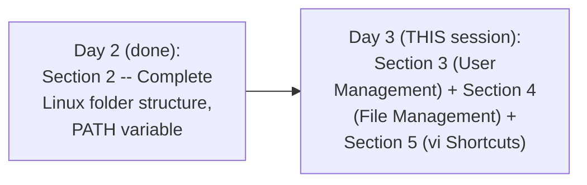

#### 🎯 Key Takeaways

* This episode **genuinely, directly continues** Day 2's own stated 10-section syllabus — covering THREE full sections (3, 4, and 5) in ONE session.
* The session **directly builds on Day 2's own established knowledge** — specifically `/etc` (Day 2) is now DIRECTLY used to store user data (`/etc/passwd`, `/etc/shadow`, `/etc/group`), and `/home` (Day 2) is now DIRECTLY populated via user-creation commands.
* This episode is **explicitly, honestly acknowledged** by the instructor as genuinely "lengthy" — covering a LARGE amount of GENUINELY practical, hands-on material.

---

### 2. Why User Management Matters: Accountability & Security

#### 🧠 Concept — A Genuinely Relatable, Real Contrast: Personal Laptop vs. Shared Server

> 💡 **Given directly:** *"When you buy [a personal laptop] for the first time, you set up an admin user and password for the admin user — it's very unlikely that you go back and create more users on your personal laptop... because the accountability on your personal laptop is pretty clear."*

#### ❓ Why It Exists — The Precise, Genuine, Real Motivating Scenario

> 💡 **Given directly:** *"Imagine there is NO user management on Linux, and your company has 100 developers... all of them are SHARED with the root user and password of the root user... unfortunately a developer deletes... `/sbin` folder from the Linux server, which is system binary folder, and it has all the important binaries — your Linux server is almost corrupt — if you know who has done this, you might restrict access... however, all of them are granted with the root user, so there is NO WAY you know who has done it — this is called LACK OF ACCOUNTABILITY."*

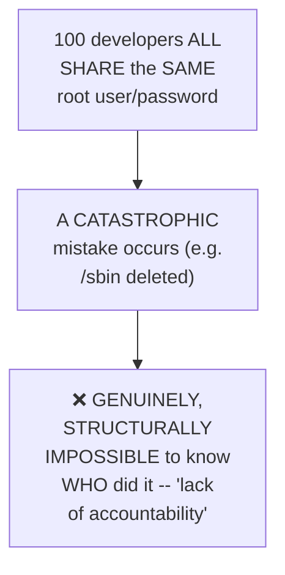

#### 📖 Definition — The Precise, Genuine Solution

> 💡 **Given directly:** *"What administrators do, as part of user management, they would create users and groups — for every developer in the organization... individual users are created for those engineers... for each user you would grant permissions depending upon what they do in the organization."*

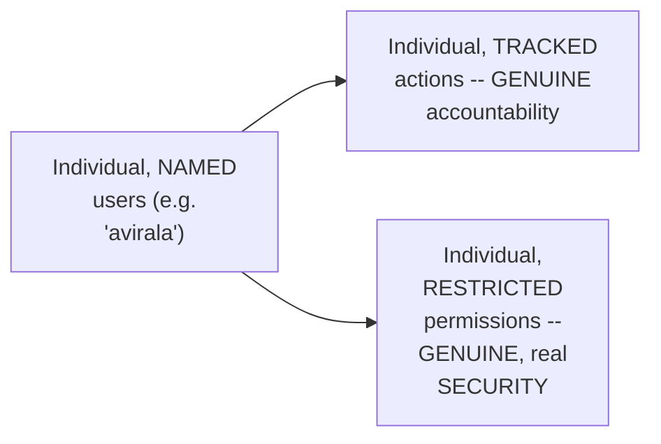

#### ⚠ Common Mistakes

* Assuming user management is PRIMARILY about ORGANIZATION or convenience — explicitly, directly, precisely clarified: it's PRIMARILY about GENUINE, real ACCOUNTABILITY and SECURITY — knowing WHO did WHAT, and RESTRICTING what each person CAN do.
* Assuming a SHARED root login is a GENUINELY acceptable shortcut for a small team — explicitly, directly, concretely demonstrated as GENUINELY dangerous, via the "100 developers, one root login" scenario.

#### 🎯 Key Takeaways

* User management genuinely EXISTS to solve **TWO, real problems**: LACK OF ACCOUNTABILITY (who did what?) and INSUFFICIENT SECURITY (everyone has FULL, root-level power).
* The PRECISE, real solution: create INDIVIDUAL, NAMED users, each with PERMISSIONS matched to their ACTUAL role — directly, concretely motivated via a real, worked "100 developers sharing root" scenario.
* This section directly, precisely sets up the REST of this episode's own user-management content — creation, passwords, groups, and a LIVE security demonstration.

---
### 3. Creating Users & Passwords: useradd, passwd, /etc/passwd & /etc/shadow

#### 💻 Code Example — Creating a User

> 💡 **Given directly:** *"To create a user in Linux, you will use this command called `user add`, followed by name of the user."*

```bash
useradd avirala
```

#### 🔍 Internal Working — Verifying User Creation

> 💡 **Given directly:** *"How can I check that a user is created successfully? For that, there is a file in Linux which is `/etc/passwd`... within that there is a file called passwd — if you open this, you will find a user called avirala is created."*

```bash
cat /etc/passwd
```

#### 💻 Code Example — Setting a Password

> 💡 **Given directly:** *"A user without password is of no use — so how to create password for the user? For that there is a command called `passwd`, followed by name of your user."*

```bash
passwd avirala
```

#### 🔍 Internal Working — Verifying the Password: /etc/shadow

> 💡 **Given directly:** *"How can I check the password is created? ... `cat /etc/shadow` — for avirala user, this is the ENCRYPTED password."*

```bash
cat /etc/shadow
```

#### ❓ Why It Exists — A Direct, Explicit, Genuine Interview Question

> 💡 **Given directly:** *"Abhishek, can I decrypt this password? This is a VERY important interview question — if you have access to a Linux server, can you decrypt passwords of users on the Linux machine?... answer is NO — although you have encrypted password here, this is VERY highly encrypted... SHA 256, I believe — there is a HASHING done, and this is a ONE-WAY encryption, so decryption is NOT possible."*

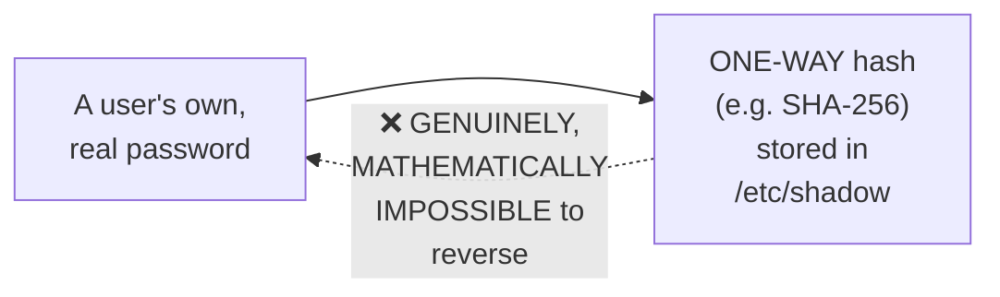

#### 🔍 Internal Working — The Precise, Genuine, Real-World Consequence

> 💡 **Given directly:** *"As an administrator, you shared username and password to a developer — after 1 month, developer FORGOT the password — can you RESTORE the old password? In BOTH cases, answer is NO... if somebody forgets the password, there is NO WAY to restore the old password — there are some tools on the internet which promise to do it, however they are NOT AT ALL SAFE... they are NOT allowed to use in the organization."*

#### 💻 Code Example — Deleting a User

> 💡 **Given directly:** *"Imagine I have to delete a user — very simple, all that you need is `user del`, that is user delete, followed by name of the user."*

```bash
userdel avirala
```

#### ⚠ Common Mistakes

* Assuming an ENCRYPTED password (even a GENUINELY strong one) can ALWAYS be reversed by someone with SUFFICIENT access or tools — explicitly, directly, precisely corrected: `/etc/shadow`'s own HASHING mechanism is GENUINELY, MATHEMATICALLY one-way — NO amount of ACCESS or effort can genuinely REVERSE it.
* Assuming a FORGOTTEN password can GENUINELY be "recovered" or "restored" to its ORIGINAL value — explicitly, directly clarified: it can ONLY be RESET to a NEW value — the OLD one is GENUINELY, PERMANENTLY unrecoverable.

#### 🎯 Key Takeaways

* **`useradd <name>`** creates a new user, recorded in **`/etc/passwd`**; **`passwd <name>`** sets that user's password, stored (ENCRYPTED) in **`/etc/shadow`**.
* **Linux passwords are GENUINELY, MATHEMATICALLY impossible to decrypt** — directly, explicitly confirmed as a REAL, common interview question, with a precise, correct "no" answer, ROOTED in one-way hashing (e.g., SHA-256).
* **`userdel <name>`** removes a user — directly, LIVE-confirmed by checking `/etc/passwd` afterward.

---

### 4. useradd vs. adduser: A Genuine Interview Question

#### ❓ Why It Exists — A Genuinely Important, Live-Discovered Problem

> 💡 **Given directly:** *"Abhishek, you created a user with `user add`, but details of the user was NOT saved — sometimes you want to take the details of the user, for example what is the full name of the user, to which group this user belongs to, and you also want to CREATE A HOME DIRECTORY for the user — when I did `user add avirala`, although user is created, if I just look at `ls /home`, you will see there is NO folder for avirala."*

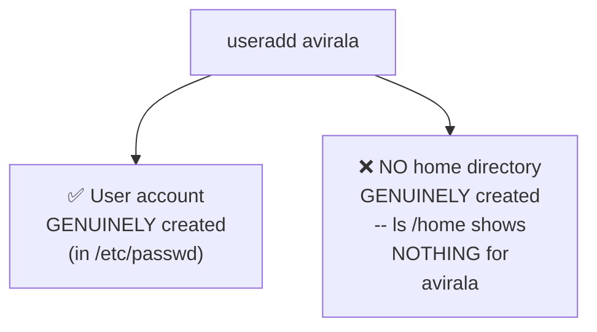

#### 💻 Code Example — The Genuine, Real Fix: adduser

> 💡 **Given directly:** *"To do that, there is a similar command — instead of `user add`, you should do `add user` — now it is asking what is the FULL NAME of the user... room number, work phone number, home phone number... and also HOME DIRECTORY is created for the user."*

```bash
adduser avirala
# Genuinely, interactively prompts for: password, full name, room number,
# work phone, home phone, and OTHER information -- AND creates /home/avirala
```

#### 📖 Definition — The Complete, Precise, Genuine Distinction

> 💡 **Given directly:** *"What is the difference between `user add` and `add user`? BOTH of these commands does the SAME thing — however, `add user` CREATES home directory for avirala, it also takes a LOT of user information — whereas `user add` is a QUICK way of creating the users, where it does NOT prompt for details."*

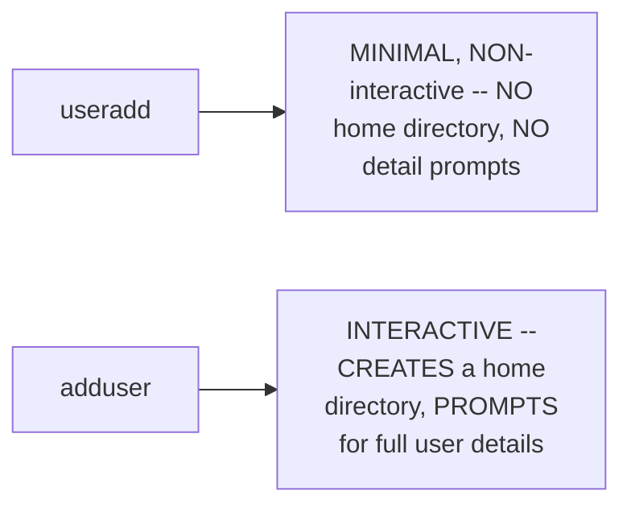

#### 🏢 Real-World / Production Usage — Precisely WHEN useradd's Own Simplicity Is Genuinely Valuable

> 💡 **Given directly:** *"Abhishek, then what is the use of `user add`? Because `add user` looks to be more powerful — very simple: `user add` is VERY USEFUL when you are WRITING SCRIPTS — when you are writing scripts, you don't want the tool or the command to PROMPT inputs... because this becomes an INTERACTIVE way — whereas when you are writing a shell script or Python script, you want a command that just creates a user and goes to the next instruction."*

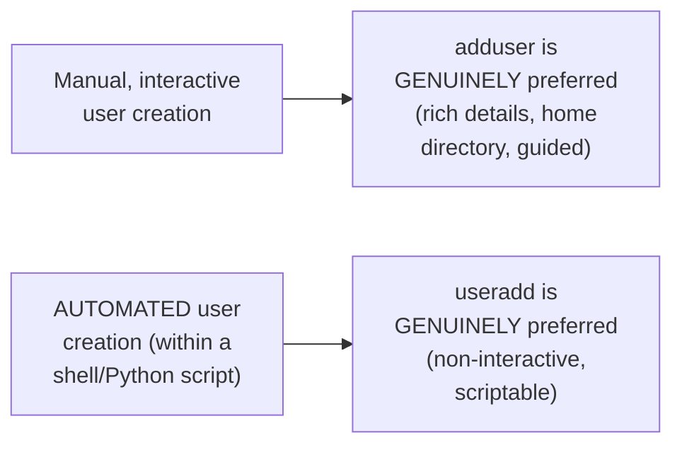

#### ⚠ Common Mistakes

* Assuming `useradd` and `adduser` are GENUINELY, FUNCTIONALLY IDENTICAL commands with merely DIFFERENT names — explicitly, directly, LIVE-demonstrated as GENUINELY DIFFERENT: only `adduser` creates a home directory and prompts for detailed information.
* Assuming `adduser`'s own GREATER capability makes it UNCONDITIONALLY the "better" choice — explicitly, directly clarified: `useradd`'s own SIMPLICITY is GENUINELY, SPECIFICALLY valuable for AUTOMATED, scripted user creation, where INTERACTIVE prompts would GENUINELY be UNDESIRABLE.

#### 🎯 Key Takeaways

* **`useradd`** is a MINIMAL, NON-interactive command — creating a user account WITHOUT a home directory or detailed prompts; **`adduser`** is INTERACTIVE — creating a home directory AND prompting for full user details.
* This is **explicitly, directly confirmed** as a genuine, real INTERVIEW question — the PRECISE, correct answer identifies BOTH the functional DIFFERENCE and WHY EACH command genuinely has its OWN, appropriate use case.
* **`useradd`'s own simplicity** is SPECIFICALLY valuable for AUTOMATED, SCRIPTED user creation — where INTERACTIVE prompts would GENUINELY, PRACTICALLY interfere with a script's own automated FLOW.

---
### 5. Live Proof: Testing Permission Restrictions

#### ❓ Why It Exists — A Direct, Explicit, Genuine Challenge

> 💡 **Given directly:** *"Abhishek, you said user management is important for accountability and keeping Linux environment secure — can you PROVE this? Sure — what we will do — we are in the root user, let's switch to avirala user and try to DELETE sbin."*

#### 🪜 Step-by-Step — Switching to a Non-Root User

> 💡 **Given directly:** *"To switch to that user, I'm in root right now, to switch there, there is a command called `su- avirala`... you can see from root I went to avirala... I can also check that using another command called `who am i`."*

```bash
su - avirala
whoami   # confirms: avirala
```

#### 🪜 Step-by-Step — The Complete, Genuine, Live "Destructive Test"

> 💡 **Given directly:** *"I'm going to risk it, `rm -rf /sbin`... you can see it says PERMISSIONS ARE DENIED — that is the power of user management in Linux — when you create users, by DEFAULT they will NOT have permissions like the root user."*

```bash
rm -rf /sbin
# Genuinely, live confirms: "Permission denied"
```

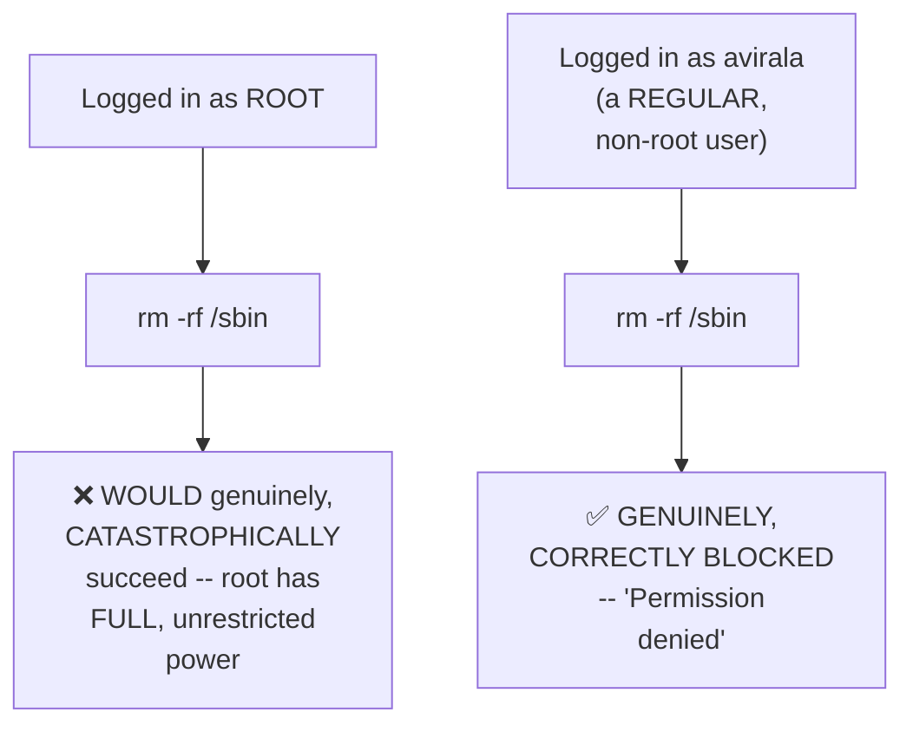

#### 🔍 Internal Working — A Genuine, Honest, Direct Acknowledgment

> 💡 **Given directly:** *"If I go back and run the RM command AS ROOT user, all that folder will be deleted — if somebody wants to risk it, they can."*

#### 🪜 Step-by-Step — A Genuine, Direct Deferral

> 💡 **Given directly:** *"Abhishek, how can I GRANT permissions to avirala? Don't worry, you will learn that as part of FILE PERMISSIONS, the next section — for today's class, let's not jump and dive to that point."*

#### ⚠ Common Mistakes

* Assuming user-management "security" claims are GENUINELY abstract, theoretical assertions — explicitly, directly, CONCRETELY demonstrated via a REAL, LIVE, DELIBERATE test — the instructor GENUINELY attempted a destructive command, and it GENUINELY failed, exactly as claimed.
* Assuming EVERY user, REGARDLESS of privilege level, would produce the SAME result when attempting `rm -rf /sbin` — explicitly, directly, LIVE-contrasted: root COULD genuinely succeed (destructively); a regular user is GENUINELY blocked.

#### 🎯 Key Takeaways

* This section directly, **CONCRETELY PROVES** Section 2's own theoretical accountability/security claims — a REAL, LIVE, DELIBERATE `rm -rf /sbin` attempt GENUINELY FAILS when run as a non-root user ("Permission denied").
* The instructor **HONESTLY, DIRECTLY acknowledges** that root COULD genuinely, CATASTROPHICALLY succeed at this SAME command — user management RESTRICTS regular users SPECIFICALLY, not root itself.
* **Granting SPECIFIC permissions to a regular user** is EXPLICITLY, DIRECTLY deferred to the NEXT section (File Permissions) — NOT covered within THIS specific episode.

---

### 6. Groups: Why They Exist & How to Use Them

#### ❓ Why It Exists — A Genuine, Real, Concrete Scaling Scenario

> 💡 **Given directly:** *"If you have five users in the organization, you can manage it through the users — even 10, it's fine — but let's say you have 500 users on the Linux server, out of which 250 are developers... and one fine day you are asked to change a particular file permission for 250 developers... imagine going to each and every user, going to file, and trying to update permissions of 250 developers is a VERY TEDIOUS activity."*

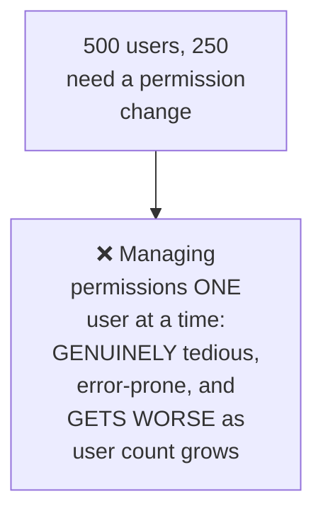

#### 📖 Definition — Groups, Precisely Introduced as the Genuine Fix

> 💡 **Given directly:** *"What you do instead is you basically create the groups — you will create groups called dev, QE, DevOps, followed by management, and what you will simply do as a ONE-TIME activity, you will just PUT all 250 developers inside the dev group — now if you get such a request, instead of doing that at USER level, you will just go to the GROUP and you will modify the permissions of the group."*

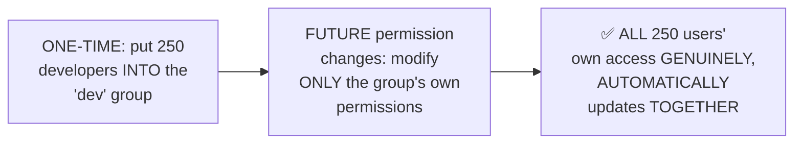

#### 💻 Code Example — Creating a Group

> 💡 **Given directly:** *"Group add, just like `user add` — group add, followed by, I'll call this group as devops."*

```bash
groupadd devops
cat /etc/group   # confirms the new group's own existence
```

#### 💻 Code Example — Adding a User to a Group

> 💡 **Given directly:** *"How to add a user to the group? For that, there is a command called `user mod -a -G`, name of the group, followed by user, which is avirala."*

```bash
usermod -aG devops avirala
cat /etc/group   # confirms: devops:x:10:avirala
```

#### ⚠ Common Mistakes

* Assuming groups are a GENUINELY optional, purely organizational nicety — explicitly, directly, CONCRETELY motivated as a GENUINE, real, SCALE-driven NECESSITY, via the "500 users, 250 developers" scenario.
* Confusing `groupadd` (creating a NEW group) with `usermod -aG` (adding an EXISTING user TO an existing group) — explicitly, directly, precisely distinguished as TWO, SEPARATE, sequential steps.

#### 🎯 Key Takeaways

* **Groups** GENUINELY solve a REAL, scale-driven problem — managing PERMISSIONS for LARGE numbers of users, ONE at a time, becomes GENUINELY, PRACTICALLY unmanageable, but managing them at the GROUP level remains GENUINELY simple.
* **`groupadd <name>`** creates a new group (verified via `cat /etc/group`); **`usermod -aG <group> <user>`** adds an EXISTING user to an EXISTING group.
* This SAME "one-time setup, then EFFICIENT bulk management" pattern DIRECTLY, precisely mirrors the CORE value proposition of GROUP-based permission systems in ANY multi-user computing environment, not just Linux.

---
### 7. Connecting to a Real Linux Server: SSH & Password Authentication

#### ❓ Why It Exists — The Precise, Genuine, Real-World Context

> 💡 **Given directly:** *"How does this entire thing work in real time? For example, when I join a company, I will not be asked to log into a Linux container environment — I will be asked to log into a REAL Linux server... on cloud platforms like AWS or Azure, companies have something called virtual machine."*

#### 📖 Definition — SSH, Precisely Introduced

> 💡 **Given directly:** *"To connect to this Linux environment, what you need is something called as SSH client — every Linux environment, out of the box on the Linux server, there is a process that is running which is SSHD — on your personal laptop or office laptop, you install something called SSH client... you will take this SSH client, run a SINGLE command, with which you will connect to the Linux server."*

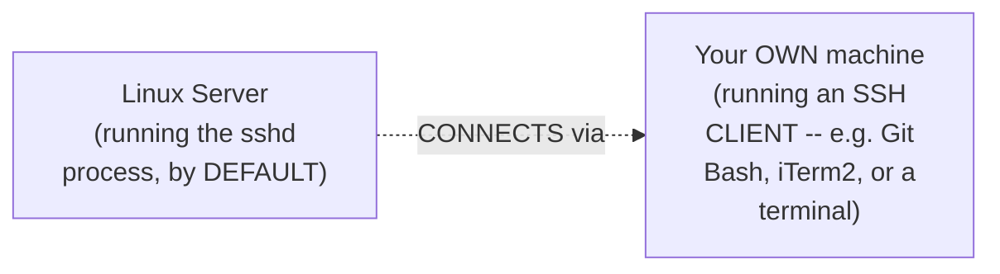

#### 🪜 Step-by-Step — Genuine, Real, Named SSH Clients

> 💡 **Given directly:** *"Abhishek, what are these SSH clients? Popular one if you're on Windows is Git Bash... or you can use WSL as well, but Git Bash is very powerful — if you're on Mac, you can use terminal of Mac... if you don't get it, just go to internet and search for iTerm2."*

#### 💻 Code Example — The Complete, Real, Live SSH Connection

> 💡 **Given directly:** *"I will run the command `ssh`, followed by the user that was given to me, `avirala@` the IP address of the instance — enter — it asks you for the password — just provide the password that is shared by the administrator — and now you are inside the Linux environment."*

```bash
ssh avirala@<instance_ip>
# genuinely prompts for the password, then logs in
whoami   # confirms: avirala
uname -a   # confirms details about the specific Linux instance
```

#### ⚠ A Direct, Honest, Real, Important Security Clarification

> 💡 **Given directly:** *"Abhishek, when I tried to do it on one of the virtual machines or one of the cloud providers, password was disabled — yeah, you are right — so what these cloud providers do, out of the box... passwords are something that gets leaked, because people WRITE it on the desk, people write it on the wall... so to avoid such things, what cloud providers do — they will set up `password authentication as no`."*

```text
File location: /etc/ssh/sshd_config.d/<config_file>
Default (on most cloud providers): PasswordAuthentication no
```

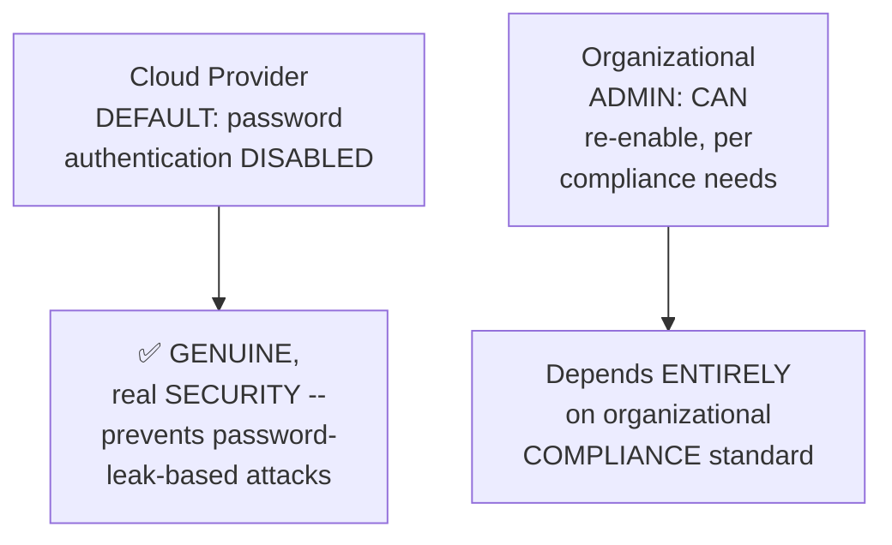

#### 🔧 Configuration — The Precise, Live-Demonstrated Steps to (Carefully) Re-Enable Password Auth

> 💡 **Given directly:** *"I just went to this file, I changed password authentication from YES to NO [in the demo, from no to yes], and I ran this command called `systemctl restart SSH` — if you are on Ubuntu user, you need `sudo`; if you are on root, you don't need it."*

```bash
# Edit /etc/ssh/sshd_config.d/<file>, set: PasswordAuthentication yes
sudo systemctl restart ssh
```

#### 🔍 Internal Working — A Genuine, Honest, Direct Deferral

> 💡 **Given directly:** *"Abhishek, if password authentication is disabled, how can I log in? If password authentication is disabled, then you have something called as PEM file — I will cover about PEM file in the future classes, right now we are learning about user management, so it is NOT required."*

#### ⚠ Common Mistakes

* Assuming password-based SSH login is ALWAYS genuinely available on a fresh cloud instance — explicitly, directly, HONESTLY clarified: it's DISABLED BY DEFAULT on MOST cloud providers, specifically for SECURITY reasons.
* Assuming re-enabling password authentication is GENUINELY a universally recommended practice — explicitly, directly clarified: it DEPENDS ENTIRELY on an organization's OWN compliance standards — the instructor RE-ENABLED it PURELY for THIS specific demonstration's own purposes.

#### 🎯 Key Takeaways

* Connecting to a REAL Linux server GENUINELY requires an **SSH CLIENT** (e.g., Git Bash, iTerm2, a Mac terminal) and the command **`ssh user@ip`** — directly, LIVE-demonstrated end to end.
* Cloud providers **GENUINELY, DELIBERATELY DISABLE password authentication BY DEFAULT** — a REAL, important security decision, DIRECTLY motivated by the GENUINE risk of leaked/written-down passwords.
* **PEM files** (the ALTERNATIVE to password authentication) are **explicitly, HONESTLY deferred** to a FUTURE class — NOT covered in DEPTH within THIS specific episode.

---

### 8. File Management: Core Commands

#### 💻 Code Example — Listing, Navigating & Checking Location

> 💡 **Given directly:** *"How to list the files? Just go to the root user, type `ls`... how to go to one of these directories? For that, the command is change directory, which is `cd`... how can I come back? Use the `cd` command, but just write TWO DOTS."*

```bash
ls              # list files/folders
cd tmp            # move INTO a directory
cd ..               # move UP one level
pwd                   # print working directory (confirm your current location)
```

#### 💻 Code Example — Creating & Deleting Directories

> 💡 **Given directly:** *"To create a new folder in Linux, we call it as directory — the command is `mkdir`... if I want to DELETE this directory... `rmdir` followed by name of the directory."*

```bash
mkdir avirala
rmdir avirala
```

#### 💻 Code Example — Creating & Deleting Files

> 💡 **Given directly:** *"To delete file, first let's learn how to CREATE a file — there is one command called `touch`... so `touch ab_file` will actually create a file... for removing a directory, we used `rmdir`, but for removing a file, we can just use `rm`, followed by ab_file."*

```bash
touch ab_file
rm ab_file
rm -rf avirala   # deletes a DIRECTORY (and its contents) forcefully
```

#### 🔍 Internal Working — A Genuine, Practical, Visual Way to Distinguish Files From Directories

> 💡 **Given directly:** *"How do I know this is a folder? Looking at the COLOR... this color is for folder, and this color is for file... if you do `ls -ltr`, if you see a `d` at the starting, that means it's a directory — if you don't see a `d`, that means it's a file."*

#### 💻 Code Example — Copying vs. Renaming

> 💡 **Given directly:** *"How to copy the files? ... you can use a command called `cp`, what is the file and what is the NEW NAME of the file that you want to copy — it will create ANOTHER file... but instead of creating a duplicate, what I want to do is just RENAME this file — for that, the command is `mv`."*

```bash
cp abi virala      # COPIES abi -> creates a SEPARATE, new file called virala
mv abi virala        # RENAMES abi -> virala (no duplicate created)
```

#### ⚠ Common Mistakes

* Confusing `cp` (creates a genuinely SEPARATE, duplicate file) with `mv` (RENAMES/moves the SAME file, with NO duplicate created) — explicitly, directly, precisely distinguished.
* Confusing `rmdir` (deletes an EMPTY directory) with `rm -rf` (FORCEFULLY deletes a directory AND its contents) — explicitly, directly demonstrated as TWO, genuinely different commands for TWO different scenarios.

#### 🎯 Key Takeaways

* Core NAVIGATION commands: **`ls`** (list), **`cd`** (change directory, `cd ..` to go UP), **`pwd`** (confirm current location).
* Core CREATION/DELETION commands: **`mkdir`**/**`rmdir`** (directories), **`touch`**/**`rm`** (files) — with **`rm -rf`** for FORCEFULLY deleting a directory and its contents.
* **`cp`** GENUINELY creates a SEPARATE, duplicate file; **`mv`** GENUINELY renames/moves the SAME file, WITHOUT creating a duplicate.

---
### 9. The vi/vim Editor: Three Modes & Essential Shortcuts

#### 📖 Definition — vi vs. vim, Precisely Distinguished

> 💡 **Given directly:** *"In Linux, it's a little complicated — you need to use a utility called `vi` or `vim` — I would recommend `vim` over `vi`, commands will work absolutely the same, you usually called it as VI editor only — vim is a wrapper on top of vi."*

```bash
apt install vim   # (sudo apt install vim if not root)
vim ab_file          # opens (or creates + opens) the file
```

#### 📖 Definition — The Complete, Precise, Three-Mode System

> 💡 **Given directly:** *"By default, this particular file, when you open, has THREE different modes — NORMAL mode, INSERT (that is write mode), or COMMAND mode."*

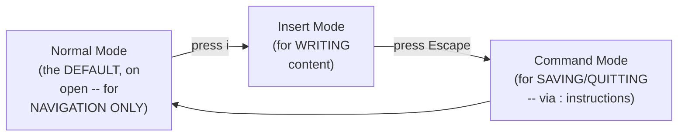

#### 🪜 Step-by-Step — The Complete, Genuine Writing & Saving Workflow

> 💡 **Given directly:** *"In normal mode, you CANNOT write content to the file — to write content to the file, you should go to the insert mode — type `I` as an alphabet, you will see '-- INSERT --,' that means you are in insert mode — now you can start writing anything... to SAVE the file, you need to go to the COMMAND mode — press ESCAPE, press COLON WQ — WQ is to SAVE, W is to save, and Q is to quit the file."*

```bash
i                  # enter insert mode (write freely)
<Esc>:wq!            # save AND quit
<Esc>:q!               # quit WITHOUT saving
```

#### 🔍 Internal Working — Precisely What Normal Mode Is Genuinely FOR

> 💡 **Given directly:** *"Normal mode is ONLY for navigation — so if you open the file in normal mode, you can just go up, you can go down, you can just scroll to the left side, scroll to the right side, because there may be a thousand lines in the file."*

#### 🪜 Step-by-Step — A Complete, Real, Large-Scale Navigation Demonstration (1,000 Lines)

> 💡 **Given directly:** *"You know, we are in line number 1,000, and I want to go to line number one — I cannot keep scrolling up, is there something that I can do? Definitely — first you need to come to the normal mode... escape, colon 0, and you are at the first line."*

```bash
<Esc>:0        # jump to the FIRST line
<Esc>:500        # jump to a SPECIFIC line (e.g., line 500)
<Esc>Shift+G       # jump to the LAST line
<Esc>Shift+O         # create a NEW line
<Esc>u                 # UNDO (remove a line/change)
```

#### 🔍 Internal Working — A Genuine, Honest, Practical Acknowledgment

> 💡 **Given directly:** *"It's slightly confusing, I know, because I'm pressing my keyboard, you cannot see my keyboard — what you can do is you can actually go through all the instructions here — I have provided all the instructions for insert mode, basic navigation, editing the text, search and replace — you can go through the commands here... spend some 30 minutes or 1 hour on it, and you will definitely enjoy it."*

#### ⚠ Common Mistakes

* Confusing `:wq!` (save AND quit) with `:q!` (quit WITHOUT saving) — explicitly, directly, LIVE-demonstrated: content written but SAVED via `:q!` is GENUINELY, PERMANENTLY LOST.
* Attempting to TYPE content while STILL in normal mode — explicitly, directly clarified: normal mode is GENUINELY, EXCLUSIVELY for NAVIGATION — writing REQUIRES first entering insert mode (via `i`).
* Assuming vi/vim's own shortcuts must ALL be MEMORIZED perfectly on the FIRST attempt — explicitly, directly, HONESTLY acknowledged: the instructor RECOMMENDS dedicating GENUINE, focused PRACTICE TIME (30 minutes to an hour) with the PROVIDED reference documentation.

#### 🎯 Key Takeaways

* **`vi`/`vim`** operates through **THREE, genuine modes**: NORMAL (default, navigation-only), INSERT (press `i`, for writing), and COMMAND (press Escape, then `:`, for saving/quitting).
* The COMPLETE, essential workflow: **`i`** (start writing) → **`Escape`** → **`:wq!`** (save and quit) or **`:q!`** (quit WITHOUT saving).
* A REAL, 1,000-line file was used to directly, CONCRETELY demonstrate GENUINE, practical navigation shortcuts at SCALE: **`:0`** (first line), **`:500`** (a SPECIFIC line), **`Shift+G`** (last line).

---

### 10. Reading & Writing Files Without vim: less, head, tail & echo

#### 📖 Definition — less, Precisely Introduced

> 💡 **Given directly:** *"Let's say you have a task where you just want to OPEN the file WITHOUT printing the contents of the file on your terminal — for that, what you can do is type `less`, followed by name of the file... it will actually create an INTERACTIVE page for you, where you can scroll up and scroll down... but here you CANNOT run any instructions... press Q, and you will come out of the file."*

```bash
apt install less   # if not already present
less demo_file.txt
q                    # exits the interactive view
```

#### 📖 Definition — head and tail, Precisely Introduced

> 💡 **Given directly:** *"How about printing the last 20 lines of the file? You can just do `tail -n 20 demo_file.txt`... how about printing the first 10 lines of the file? `head -10 demo_file.txt` — tail is to print from BOTTOM, head is to print from TOP."*

```bash
tail -n 20 demo_file.txt    # last 20 lines
head -10 demo_file.txt        # first 10 lines
```

#### 📖 Definition — echo, Precisely Introduced for Writing (With a Genuine, Honest Live Mistake)

> 💡 **Given directly:** *"If you want to write contents to the file WITHOUT using vim, you can use a command like `echo`... `echo hello`, followed by name of our file, demo_file.txt."*

> 💡 **Given directly, the GENUINE, honest, live-caught mistake:** *"Oh, my bad — okay, I just messed it up — instead of ONE greater-than symbol, I should have used TWO greater-than symbols... so when you use ONE greater-than symbol, it will DELETE all the content of the file and just add the line that you used in echo — whereas if you use TWO greater-than symbols, it will just APPEND to the existing file."*

```bash
echo "hello" > demo_file.txt     # OVERWRITES the ENTIRE file with just "hello"
echo "world" >> demo_file.txt      # APPENDS "world" as a NEW line, preserving EXISTING content
```

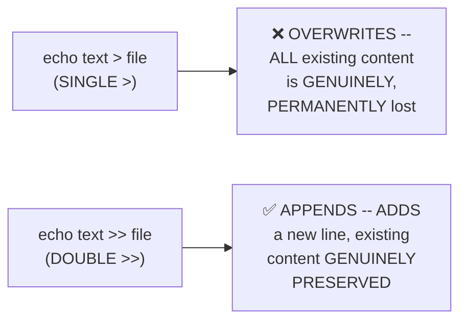

#### ⚠ Common Mistakes

* Confusing `>` (single, OVERWRITES the entire file) with `>>` (double, APPENDS a new line) — explicitly, directly, HONESTLY demonstrated via a REAL, live MISTAKE the instructor GENUINELY made and CORRECTED on camera.
* Assuming `less` is genuinely IDENTICAL to `vim` — explicitly, directly distinguished: `less` is PURELY for VIEWING (no editing instructions can be RUN); `vim` is for GENUINE editing.

#### 🎯 Key Takeaways

* **`less <file>`** provides an interactive, SCROLLABLE VIEW of a file's own content, WITHOUT genuinely opening it for EDITING; **`head -N`**/**`tail -N`** print the FIRST/LAST N lines respectively.
* **`echo`** can WRITE to a file — but the CHOICE between **`>`** (OVERWRITE) and **`>>`** (APPEND) is GENUINELY, CRITICALLY important — directly, HONESTLY demonstrated via a REAL mistake that PERMANENTLY erased the file's own previous content.
* This section's own **honest, live-caught error** directly, concretely reinforces WHY understanding `>` vs. `>>` GENUINELY matters — a small SYNTAX difference with a GENUINELY significant, real CONSEQUENCE.

---

### 11. Closing: What's Next

#### 🪜 Step-by-Step — A Complete, Honest Recap

> 💡 **Given directly:** *"So this is about section 3, section 4, and section 5 — yeah, it might be a LENGTHY session, but we have covered a LOT of interesting things — I hope you found it well, and I would highly recommend to go back to the documentation, I spent a LOT of time adding this documentation, so please go through it."*

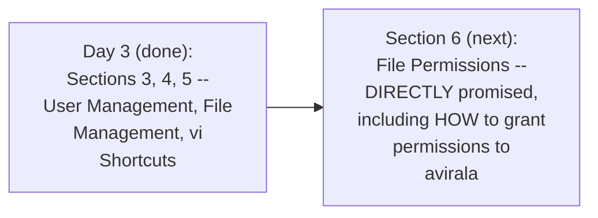

#### ⚠ Common Mistakes

* Assuming this episode's own coverage represents the FULL, complete Linux curriculum — explicitly, directly, honestly clarified: this is GENUINELY only Sections 3-5 of TEN total sections, with FIVE more sections still ahead.
* Assuming file permissions were FULLY covered within THIS episode — explicitly, directly, HONESTLY deferred (Section 5's own live demonstration EXPLICITLY promised this for the NEXT section).

#### 🎯 Key Takeaways

* This episode **genuinely, honestly recaps** its own SUBSTANTIAL, THREE-section scope: user management (accountability, users, passwords, groups, SSH), file management (core commands), and vi/vim shortcuts (three modes, navigation, viewing/writing without vim).
* The instructor **directly, explicitly recommends** REVIEWING the accompanying GitHub documentation — DIRECTLY acknowledging that NOT every command was covered LIVE within the video itself.
* **Section 6 (File Permissions) is EXPLICITLY, DIRECTLY confirmed** as the NEXT topic — DIRECTLY completing the "how do I grant avirala access to `/sbin`?" question this SAME episode deliberately left OPEN.

---
## 📝 Glossary

| Term | Definition | Why It Matters |
|---|---|---|
| **useradd** | Minimal, non-interactive user creation | No home directory, no detail prompts -- good for scripts |
| **adduser** | Interactive user creation | Creates a home directory, prompts for full details |
| **/etc/passwd** | Stores user account records | Verifies a user was genuinely created |
| **/etc/shadow** | Stores ENCRYPTED (hashed) passwords | One-way -- genuinely cannot be decrypted |
| **passwd** | Sets/changes a user's password | -- |
| **userdel** | Deletes a user | -- |
| **groupadd** | Creates a new group | -- |
| **/etc/group** | Stores group membership records | -- |
| **usermod -aG** | Adds an existing user to an existing group | -- |
| **su -** | Switch to a different user | Used to genuinely TEST permission restrictions |
| **SSH** | Secure Shell -- remote server connection protocol | Genuine, real-world server access method |
| **PasswordAuthentication** | An sshd_config setting | Disabled by default on most cloud providers, for security |
| **ls, cd, pwd** | List, change directory, print working directory | Core navigation |
| **mkdir, rmdir** | Create/remove a directory | -- |
| **touch, rm** | Create/remove a file | -- |
| **cp, mv** | Copy (duplicate) vs. move/rename (no duplicate) | Genuinely different outcomes |
| **vi / vim** | Linux's core text editor | vim is a wrapper on top of vi; same commands work |
| **Normal / Insert / Command Mode** | vi/vim's three genuine modes | Normal=navigate, Insert=write, Command=save/quit |
| **less** | Interactive, scrollable file viewer | Cannot edit, unlike vim |
| **head / tail** | Print first/last N lines | -- |
| **echo > vs >>** | Overwrite vs. append when writing to a file | A single character difference with major consequences |

---

## 🔄 Revision Notes — One-Minute Revision

* This is **Day 3**, covering Sections 3 (User Management), 4 (File Management), and 5 (vi Shortcuts) in ONE episode.
* **Why user management matters**: on a personal laptop, accountability is obvious; on a SHARED Linux server, if 100 developers ALL share root, and a catastrophic mistake occurs (e.g. /sbin deleted), there's GENUINELY no way to know who did it -- "lack of accountability." Fix: individual, named users with role-appropriate permissions.
* **Creating users/passwords**: `useradd <name>` (records in /etc/passwd) -> `passwd <name>` (encrypted, stored in /etc/shadow). GENUINE interview question: can Linux passwords be decrypted? NO -- one-way hashing (e.g. SHA-256) is genuinely, mathematically irreversible; forgotten passwords can only be RESET, never restored.
* **useradd vs. adduser** (a SECOND genuine interview question): useradd = minimal, non-interactive, NO home directory (good for scripts); adduser = interactive, creates a home directory, prompts for full details.
* **Live security proof**: switching to a non-root user (`su - avirala`) and attempting `rm -rf /sbin` -> genuinely, correctly BLOCKED ("Permission denied") -- directly proving user management's own real security value. As ROOT, the SAME command would genuinely, catastrophically succeed.
* **Groups**: motivated by a real scaling scenario (500 users, 250 needing a permission change -- managing this per-user is genuinely tedious). Fix: `groupadd <name>`, then `usermod -aG <group> <user>` -- change permissions ONCE, at the group level.
* **Real-world SSH**: connecting to an ACTUAL cloud server requires an SSH client (Git Bash, iTerm2, Mac terminal) and `ssh user@ip`. Cloud providers DISABLE password authentication BY DEFAULT (security, since passwords get written down/leaked) -- re-enabling requires editing /etc/ssh/sshd_config.d/ and running `systemctl restart ssh`. PEM files (the alternative) are deferred to future classes.
* **File management core commands**: `ls`/`cd`/`pwd` (navigation), `mkdir`/`rmdir` (directories), `touch`/`rm` (files), `cp` (creates a DUPLICATE) vs. `mv` (RENAMES, no duplicate).
* **vi/vim's three modes**: Normal (default, navigation ONLY) -> Insert (press `i`, for writing) -> Command (press Escape then `:`, for saving/quitting). Complete workflow: `i` -> write -> Escape -> `:wq!` (save+quit) or `:q!` (quit without saving). Navigation at scale (1,000-line demo): `:0` (first line), `:500` (specific line), `Shift+G` (last line).
* **Reading/writing without vim**: `less` (interactive view, no editing) | `head -N`/`tail -N` (first/last N lines) | `echo "text" > file` (OVERWRITES everything!) vs. `echo "text" >> file` (APPENDS a new line) -- demonstrated via a genuine, honest, live mistake.
* **Closing**: this is genuinely only Sections 3-5 of 10 -- Section 6 (File Permissions) is explicitly confirmed as the next topic, directly completing the "how do I grant avirala access?" question left open here.

---

## 📋 Cheat Sheet

**User management:**
```bash
useradd <name>              # minimal, non-interactive (good for scripts)
adduser <name>                 # interactive, creates home directory + prompts for details
passwd <name>                     # set/change password
userdel <name>                       # delete a user
cat /etc/passwd                        # verify user creation
cat /etc/shadow                          # view encrypted (unreadable) password hash
```

**Groups:**
```bash
groupadd <group>
usermod -aG <group> <user>
cat /etc/group
```

**Testing permissions (as a non-root user):**
```bash
su - <username>
whoami
rm -rf /sbin        # correctly BLOCKED ("Permission denied") for non-root users
```

**Remote server access:**
```bash
ssh <username>@<ip_address>
# password auth disabled by default on cloud providers:
# edit /etc/ssh/sshd_config.d/<file>: PasswordAuthentication yes
sudo systemctl restart ssh
```

**File management:**
```bash
ls | cd <dir> | cd .. | pwd
mkdir <dir> | rmdir <dir>
touch <file> | rm <file> | rm -rf <dir>
cp <src> <dst>    # DUPLICATE created
mv <src> <dst>      # RENAMED (no duplicate)
```

**vi/vim's three modes:**
```text
Normal (default) --press i--> Insert (write) --Escape--> Command (:wq! save+quit, :q! quit only)
Navigation: :0 (first line) | :500 (line 500) | Shift+G (last line) | Escape u (undo)
```

**Reading/writing without vim:**
```bash
less <file>          # q to exit -- viewing ONLY
head -10 <file>         # first 10 lines
tail -n 20 <file>          # last 20 lines
echo "text" > file            # OVERWRITES entire file
echo "text" >> file              # APPENDS a new line
```

---

## 🔥 Interview Questions & Answers

### 🟢 Beginner

**Q1.**

**Question:** Why is user management genuinely necessary on a shared Linux server?

**Answer:** To ensure accountability (knowing who did what) and security (restricting what each person can do), rather than everyone sharing the same, full-power root login.

**Explanation:** Directly, precisely explained via a real scenario.

**Why Interviewers Ask This:** Foundational, frequently-tested conceptual grounding.

**Possible Follow-up:** "What genuinely happens if 100 developers all share the root login and one deletes /sbin?"

**Q2.**

**Question:** Can Linux passwords genuinely be decrypted?

**Answer:** No -- they are stored as one-way hashes (e.g., SHA-256) in /etc/shadow, which are mathematically irreversible.

**Explanation:** Directly, explicitly confirmed as a genuine interview question.

**Why Interviewers Ask This:** A commonly-asked, real security question.

**Possible Follow-up:** "If a user forgets their password, can it be restored?"

**Q3.**

**Question:** What is the genuine difference between `useradd` and `adduser`?

**Answer:** useradd is minimal/non-interactive (no home directory, no prompts); adduser is interactive (creates a home directory, prompts for full details).

**Explanation:** Directly, precisely distinguished.

**Why Interviewers Ask This:** An explicitly-named, genuine interview question.

**Possible Follow-up:** "When would useradd's own simplicity genuinely be preferred?"

**Q4.**

**Question:** What genuinely happens when a non-root user attempts `rm -rf /sbin`?

**Answer:** "Permission denied" -- the command is genuinely blocked.

**Explanation:** Directly, live-demonstrated.

**Why Interviewers Ask This:** Tests genuine, practical understanding of Linux's own permission system.

**Possible Follow-up:** "Would this SAME command succeed if run as root?"

**Q5.**

**Question:** Why do groups exist, rather than managing permissions per-user?

**Answer:** At scale (e.g., hundreds of users), managing permissions individually becomes genuinely tedious; groups allow a ONE-TIME setup followed by efficient, bulk permission changes.

**Explanation:** Directly, precisely reasoned through a real scenario.

**Why Interviewers Ask This:** Basic, essential group-management knowledge.

**Possible Follow-up:** "What two commands are genuinely needed to add a user to a group?"

**Q6.**

**Question:** Why is password authentication genuinely disabled by default on most cloud providers?

**Answer:** Passwords are prone to being leaked (written down, shared insecurely); disabling password auth is a genuine, real security measure.

**Explanation:** Directly, explicitly explained.

**Why Interviewers Ask This:** Tests genuine, practical cloud security awareness.

**Possible Follow-up:** "What alternative to password authentication was mentioned (though deferred)?"

**Q7.**

**Question:** What is the genuine difference between `cp` and `mv`?

**Answer:** cp creates a duplicate (separate) file; mv renames/moves the same file, with no duplicate created.

**Explanation:** Directly, precisely distinguished.

**Why Interviewers Ask This:** Basic, essential file-management knowledge.

**Possible Follow-up:** "Which command would you use to simply rename a file, without creating a copy?"

**Q8.**

**Question:** Name vi/vim's three genuine modes.

**Answer:** Normal (navigation only), Insert (writing), and Command (saving/quitting).

**Explanation:** Directly, explicitly named.

**Why Interviewers Ask This:** Foundational, essential vi/vim knowledge.

**Possible Follow-up:** "What key press moves you from normal mode into insert mode?"

**Q9.**

**Question:** What is the genuine difference between `:wq!` and `:q!` in vi/vim?

**Answer:** :wq! saves and quits; :q! quits WITHOUT saving.

**Explanation:** Directly, precisely distinguished.

**Why Interviewers Ask This:** Basic, essential, commonly-confused vi/vim knowledge.

**Possible Follow-up:** "What genuinely happens to unsaved content if you use :q!?"

**Q10.**

**Question:** What is the genuine difference between `>` and `>>` when using echo to write to a file?

**Answer:** A single `>` overwrites the entire file's content; a double `>>` appends a new line, preserving existing content.

**Explanation:** Directly, honestly demonstrated via a real, live mistake.

**Why Interviewers Ask This:** Tests genuine, practical awareness of a commonly-made, real mistake.

**Possible Follow-up:** "What would genuinely happen to a file's existing content if you accidentally used a single > instead of >>?"

---

### 🟡 Intermediate

**Q11.**

**Question:** Explain why the instructor deliberately, genuinely RISKS deleting /sbin live (Section 5), rather than simply describing the permission system abstractly.

**Answer:** This is a genuinely deliberate, consistent teaching choice, directly matching this instructor's OWN established pattern (also seen in Day 2's own live PATH-testing demonstration). By GENUINELY, LIVE attempting a POTENTIALLY catastrophic command (`rm -rf /sbin`), rather than merely CLAIMING "this would be blocked," the instructor makes the ABSTRACT concept of "permission restriction" CONCRETELY, VISIBLY real — the learner GENUINELY WITNESSES the system work as claimed, rather than TRUSTING an unverified assertion. The instructor's OWN honest acknowledgment ("if I go back and run the RM command AS ROOT, all that folder WILL be deleted... if somebody wants to RISK it, they can") further REINFORCES that this is a GENUINE, REAL test with REAL stakes, not a SIMULATED or SCRIPTED demonstration.

**Explanation:** Requires recognizing a deliberate, high-stakes, live demonstration choice and connecting it to a broader, consistent teaching pattern.

**Why Interviewers Ask This:** Tests whether a learner recognizes the genuine, practical value of concrete, high-stakes demonstration over abstract description.

**Possible Follow-up:** "What GENUINE, real risk did the instructor accept by performing this test on his OWN, actual Docker environment, rather than a purely theoretical example?"

**Q12.**

**Question:** A learner argues that since `adduser` is genuinely MORE capable than `useradd` (creating a home directory and prompting for details), `useradd` is essentially obsolete and should never be used. Evaluate this claim.

**Answer:** This claim overstates the case, directly missing Section 4's own precise, explicit REASONING for WHY `useradd` genuinely REMAINS valuable. The instructor's OWN direct explanation is SPECIFIC: `useradd`'s own value is PRECISELY its NON-INTERACTIVE nature — when WRITING SCRIPTS (shell or Python), a command that PROMPTS for INPUT (like `adduser` does) would GENUINELY, PRACTICALLY BREAK the AUTOMATED flow, requiring MANUAL, human intervention at EACH step. `useradd`'s own SIMPLICITY is NOT a genuine LIMITATION in THIS specific context — it's PRECISELY the FEATURE that makes AUTOMATED, SCRIPTED user creation GENUINELY possible. The ACCURATE, more precise conclusion: `adduser` is GENERALLY preferred for MANUAL, interactive user creation; `useradd` REMAINS genuinely, PRACTICALLY essential for AUTOMATED, scripted WORKFLOWS — NEITHER command is UNCONDITIONALLY "better"; they serve GENUINELY DIFFERENT, complementary PURPOSES.

**Explanation:** Tests whether a learner recognizes that "more capable" doesn't mean "universally superior," correctly identifying the specific, genuine context where the "simpler" tool is actually preferred.

**Why Interviewers Ask This:** Distinguishes candidates who understand nuanced tool-selection reasoning from those who default to "more features = always better."

**Possible Follow-up:** "Write a brief, conceptual outline of a shell script that would genuinely NEED useradd's own non-interactive behavior to function correctly."

**Q13.**

**Question:** Explain, precisely, why the instructor teaches `su -` and `whoami` at THIS SPECIFIC point in the session (Section 5), rather than introducing them earlier, alongside the OTHER basic commands covered in Day 1 or 2.

**Answer:** This is a genuinely deliberate, PURPOSEFUL sequencing choice, DIRECTLY stated by the instructor HIMSELF: *"I'm intentionally trying to put these commands in place in ORDER, so that you will never FORGET them... I could have taught this on DAY ONE as well, but the BEST place for teaching this command is RIGHT NOW."* The GENUINE, precise REASONING: `su -` and `whoami` are GENUINELY, PRACTICALLY MEANINGLESS commands WITHOUT the CONTEXT this session ITSELF just established — WITHOUT first understanding WHY multiple users GENUINELY exist (Section 2), and WITHOUT having a SPECIFIC, SECOND user ALREADY created (`avirala`, Sections 3-4), teaching `su -` EARLIER would have been GENUINELY, PEDAGOGICALLY premature — the LEARNER would have LACKED a MEANINGFUL, CONCRETE reason to genuinely CARE about SWITCHING users. By introducing these commands EXACTLY when they become GENUINELY, PRACTICALLY USEFUL (RIGHT BEFORE the live permission TEST), the instructor ensures the LEARNER experiences them as GENUINELY MEANINGFUL TOOLS, rather than ABSTRACT, disconnected SYNTAX to memorize in ISOLATION.

**Explanation:** Requires recognizing a deliberate, explicitly-acknowledged sequencing choice, and connecting it to the broader pedagogical principle of introducing tools when their purpose is genuinely, contextually clear.

**Why Interviewers Ask This:** Tests whether a learner recognizes the value of "just-in-time" teaching over front-loading every command regardless of immediate relevance.

**Possible Follow-up:** "Identify ANOTHER command from THIS session that was similarly introduced ONLY once its own genuine, practical NEED had been established."

**Q14.**

**Question:** Using this session's own precise `/etc/passwd` and `/etc/shadow` distinction (Section 3), explain why a Linux administrator with FULL, root-level access to a server STILL cannot genuinely recover a forgotten user's OWN original password, even though they can VIEW the encrypted hash.

**Answer:** A precise, reasoned explanation, directly applying Section 3's own EXACT, established mechanism: per Section 3's own precise reasoning, `/etc/shadow` stores a ONE-WAY HASH (e.g., SHA-256) of the password — NOT the password ITSELF, and NOT a REVERSIBLY-encrypted version of it. A ONE-WAY hash function is MATHEMATICALLY DESIGNED so that, GIVEN the ORIGINAL password, you can EASILY compute the HASH — but GIVEN ONLY the hash, there is NO GENUINE, PRACTICAL, computationally-feasible way to WORK BACKWARDS to the ORIGINAL password. This means ROOT-level ACCESS to the SERVER (and, therefore, to the `/etc/shadow` file ITSELF) provides NO genuine ADVANTAGE in this SPECIFIC regard — root can VIEW the hash, EXACTLY as any user WITH sufficient permissions could, but VIEWING the hash does NOT GENUINELY, MATHEMATICALLY enable REVERSING it. This directly, precisely explains WHY the ONLY genuine RECOURSE for a forgotten password is to SET a COMPLETELY NEW one (via `passwd`) — NOT to "look up" or "decrypt" the OLD one, REGARDLESS of the ADMINISTRATOR's own access level.

**Explanation:** Requires applying the precise, established hashing mechanism to explain why even the highest level of server access doesn't overcome a genuine, mathematical limitation.

**Why Interviewers Ask This:** Tests whether a learner understands the PRECISE, mathematical reason behind "no, passwords cannot be decrypted" — not just that the ANSWER is "no."

**Possible Follow-up:** "Is there ANY genuine, real scenario where having root access WOULD help an administrator determine a user's OWN original password? Explain your reasoning."

**Q15.**

**Question:** Synthesize this session's complete "groups" reasoning (Section 6) with its own "SSH/real-world server access" discussion (Section 7) to construct a reasoned explanation of HOW group-based permissions would GENUINELY, PRACTICALLY matter for a team accessing a SHARED, REAL cloud server via SSH.

**Answer:** A precise, synthesized explanation, directly connecting TWO, separately-taught sections into ONE, coherent, real-world understanding: per Section 7's own precise, real-world SSH workflow, MULTIPLE team members (developers, DevOps, QE, per Section 2's own established roles) would EACH genuinely connect to the SAME, SHARED cloud server via THEIR OWN, INDIVIDUAL SSH credentials (`ssh <username>@<ip>`). Per Section 6's own precise GROUPS mechanism, RATHER than the administrator MANAGING each of these MULTIPLE users' own PERMISSIONS individually (a GENUINELY tedious process, per Section 6's own "500 users" scenario), the ADMINISTRATOR would GENUINELY, PRACTICALLY place EACH user into their APPROPRIATE group (e.g., `usermod -aG dev <username>` for developers) — meaning that WHEN a developer GENUINELY connects via SSH (Section 7), their OWN, INDIVIDUAL access level is GENUINELY, AUTOMATICALLY determined by their GROUP MEMBERSHIP (Section 6), NOT by a SEPARATE, MANUALLY-configured, PER-USER permission set. This directly, precisely reveals HOW these TWO, separately-taught mechanisms GENUINELY, PRACTICALLY combine in a REAL, production environment: SSH provides the CONNECTION mechanism; GROUPS provide the SCALABLE, MANAGEABLE permission STRUCTURE governing what EACH connected user can genuinely DO once they're IN.

**Explanation:** Requires synthesizing the groups mechanism with the real-world SSH workflow to construct a coherent, practical understanding of how they combine in an actual production environment.

**Why Interviewers Ask This:** A senior-level question testing whether a candidate can connect MULTIPLE, separately-taught concepts into ONE, coherent, real-world operational picture.

**Possible Follow-up:** "If a NEW developer joins the team, what is the MINIMAL set of steps (combining BOTH user creation AND group assignment) an administrator would GENUINELY need to perform, per THIS session's own established commands?"

---

### 🔴 Advanced

**Q16.**

**Question:** Design a complete, reasoned onboarding SCRIPT OUTLINE (using ONLY this session's own established commands) for a NEW developer joining an organization, explicitly justifying WHY each command is chosen over its own genuine alternative (e.g., useradd vs. adduser).

**Answer:** A reasonable, complete outline, directly applying this session's own EXACT, established commands and REASONING:

```bash
#!/bin/bash
# Onboarding script for a new developer

# Step 1: Create the user account (NON-interactive, since this is a SCRIPT --
# per Section 4's own precise reasoning, useradd is chosen over adduser,
# SPECIFICALLY because adduser's own interactive prompts would GENUINELY
# BREAK this script's own automated flow)
useradd "$1"

# Step 2: Set an initial, temporary password (would genuinely be communicated
# securely per Section 3's own established practice)
echo "$1:TempPassword123" | chpasswd

# Step 3: Add the user to the appropriate group (per Section 6's own
# established mechanism, ensuring scalable, group-based permission management)
usermod -aG dev "$1"

# Step 4: Confirm the user and group membership (per Section 3/6's own
# established verification methods)
grep "$1" /etc/passwd
grep dev /etc/group
```

This complete outline directly, precisely applies `useradd` (NOT `adduser`) SPECIFICALLY because this is a SCRIPTED, automated context (per Intermediate Q12's own precise reasoning), followed by GROUP assignment (per Section 6's own established, scalable mechanism), with EXPLICIT verification steps (per Section 3's own established `/etc/passwd`/`/etc/group` checking pattern).

**Explanation:** Requires applying the session's own complete set of user-management commands to construct a genuinely new, reasoned, automated script, explicitly justifying each command choice against its known alternative.

**Why Interviewers Ask This:** A realistic, senior-level question testing whether a candidate can synthesize MULTIPLE, separately-taught commands into ONE, coherent, PRACTICAL automation script.

**Possible Follow-up:** "What GENUINE, additional step would you add to this script to ALSO create a home directory for this user, GIVEN that useradd alone does NOT do this?"

**Q17.**

**Question:** Critically evaluate: "Since this session confirms that disabling password authentication is a genuine, real cloud-provider security best practice, this means password-based SSH authentication should NEVER, UNDER ANY circumstances, be used, even for learning/development purposes." Is this an accurate, complete characterization?

**Answer:** Not accurate — this significantly OVERSTATES a GENERAL, PRODUCTION-focused security RECOMMENDATION into an ABSOLUTE, unconditional PROHIBITION neither this session's own content, NOR sound reasoning, SUPPORTS. Section 7's own DIRECT, HONEST demonstration EXPLICITLY shows the INSTRUCTOR HIMSELF RE-ENABLING password authentication ("just for the demo purpose, I ALREADY logged into the instance BEFORE, and I changed password authentication as YES") — SPECIFICALLY for LEARNING/demonstration PURPOSES. Section 7's OWN, PRECISE framing is that this CHOICE "DEPENDS TOTALLY upon your organizational COMPLIANCE standard" — NOT an UNCONDITIONAL, universal PROHIBITION. The ACCURATE, more precise conclusion: DISABLING password authentication is a GENUINE, STRONGLY-RECOMMENDED best practice for PRODUCTION, REAL-WORLD deployments (where SECURITY risk is GENUINELY, PRACTICALLY significant) — but for CONTROLLED, LEARNING/development environments (like THIS session's own demonstration), TEMPORARILY re-enabling it, WITH full AWARENESS of the trade-off, is a GENUINELY REASONABLE, PRACTICAL choice, DIRECTLY modeled by the INSTRUCTOR himself.

**Explanation:** Tests whether a learner recognizes that a strong, production-focused security recommendation doesn't translate into an absolute, universal prohibition, correctly scoping the guidance to its genuine, stated context.

**Why Interviewers Ask This:** Distinguishes candidates who correctly scope security recommendations to their genuine, real-world context from those who over-generalize them into absolute, unconditional rules.

**Possible Follow-up:** "What SPECIFIC, additional precaution would you GENUINELY want to take if temporarily re-enabling password authentication, even for LEARNING purposes?"

**Q18.**

**Question:** Synthesize this session's complete `rm -rf /sbin` security test (Section 5) with its own `echo >` vs. `>>` mistake (Section 10) to construct a reasoned explanation of a SHARED, underlying LESSON both moments GENUINELY illustrate about working with Linux's OWN, powerful, DESTRUCTIVE commands.

**Answer:** A precise, synthesized explanation, directly connecting TWO, separately-occurring moments from ACROSS this session into ONE, coherent, underlying LESSON: per Section 5's own DIRECT demonstration, `rm -rf` is a GENUINELY, POTENTIALLY CATASTROPHIC command — CAPABLE of DESTROYING critical system files (`/sbin`) IF run with SUFFICIENT (root) privileges, WITHOUT any GENUINE, built-in "are you sure?" confirmation. Per Section 10's own DIRECT, honestly-shown MISTAKE, a SINGLE `>` (versus `>>`) with `echo` is SIMILARLY, GENUINELY DESTRUCTIVE — SILENTLY OVERWRITING an ENTIRE file's own existing content, with NO WARNING or confirmation EITHER. BOTH moments, TAKEN TOGETHER, directly, precisely reveal a SHARED, GENUINELY IMPORTANT characteristic of Linux's OWN command-line PHILOSOPHY: MANY of its OWN, MOST POWERFUL commands (`rm -rf`, `echo >`) OPERATE WITHOUT confirmation PROMPTS, TRUSTING the USER to GENUINELY UNDERSTAND the CONSEQUENCES BEFORE executing them — UNLIKE many GRAPHICAL interfaces (e.g., Windows' own "are you sure you want to DELETE this?" dialogs), Linux's OWN command-line TOOLS GENERALLY execute IMMEDIATELY and IRREVERSIBLY, PLACING the FULL burden of CAUTION on the USER THEMSELVES. This directly, precisely explains WHY THIS session's own instructor CHOSE to demonstrate BOTH a DELIBERATE, high-stakes TEST (Section 5) AND an HONEST, UNPLANNED mistake (Section 10) — TOGETHER, they GENUINELY, VIVIDLY reinforce the SAME, CRITICAL lesson: Linux's OWN power comes WITHOUT GENUINE, built-in safety NETS, making CAREFUL, DELIBERATE command usage a GENUINE, real PROFESSIONAL necessity.

**Explanation:** Requires synthesizing two, separately-occurring moments from across the session (a deliberate security test and an honest, real mistake) into one, coherent, underlying lesson about Linux's own command-line philosophy.

**Why Interviewers Ask This:** A capstone-level question testing whether a candidate can identify a SHARED, underlying THEME connecting seemingly UNRELATED moments across an entire session, rather than treating each as an ISOLATED, disconnected fact.

**Possible Follow-up:** "Name ONE MORE command from THIS session (or an earlier session in this SAME series) that SIMILARLY operates WITHOUT a genuine, built-in confirmation prompt, and explain the GENUINE, real risk this poses."

---

## 🧪 Scenario-Based Interview Questions

> **Scenario 1:** A colleague reports that a shell script they wrote, intended to automate new-user creation for their team, is genuinely FAILING/HANGING when run as part of a larger, unattended automation pipeline (e.g., triggered by a CI/CD system with no human present). Using this session's concepts, diagnose the most likely cause.

**Structured Answer:**
1. **Initial investigation:** Recognize this as directly connected to Section 4's own precise `useradd` vs. `adduser` distinction — an UNATTENDED, automated pipeline GENUINELY CANNOT respond to INTERACTIVE prompts.
2. **Metrics/logs to check:** Directly review the SCRIPT's own SOURCE CODE, SPECIFICALLY checking WHETHER it uses `adduser` (interactive) or `useradd` (non-interactive).
3. **Possible causes:** Per Section 4's own precise reasoning, if the SCRIPT uses `adduser`, it would GENUINELY, CORRECTLY HANG, waiting for HUMAN input (full name, phone number, etc.) that will NEVER arrive in an UNATTENDED context.
4. **Debugging approach:** Directly test running the SAME script's own user-creation LINE MANUALLY, in an INTERACTIVE terminal, CONFIRMING whether it GENUINELY prompts for INPUT.
5. **Resolution:** REPLACE `adduser` with `useradd` (per Section 4's own precise, established distinction) — DIRECTLY eliminating the INTERACTIVE prompts that were CAUSING the pipeline to HANG.
6. **Prevention:** Establish a standing team PRACTICE of ALWAYS using `useradd` (NEVER `adduser`) WITHIN any AUTOMATED script or PIPELINE — directly, EXPLICITLY documenting THIS distinction (per Section 4's own established REASONING) in the team's own scripting GUIDELINES.

> **Scenario 2 (Advanced):** Your organization's security team flags that a critical configuration file was ACCIDENTALLY, COMPLETELY overwritten (its previous content entirely lost) during a routine update script run by a junior engineer. Using this session's own concepts, construct a complete, reasoned diagnosis and prevention plan.

**Structured Answer:**
1. **Initial investigation:** Recognize this as DIRECTLY connected to Section 10's own PRECISE, honestly-demonstrated `echo >` vs. `>>` MISTAKE — a GENUINELY common, real, EASY-to-make error with a SIGNIFICANT, real consequence.
2. **Metrics/logs to check:** Directly review the UPDATE script's OWN source code, SPECIFICALLY checking WHETHER it uses a SINGLE `>` (overwrite) where a DOUBLE `>>` (append) was GENUINELY intended.
3. **Possible causes:** Per Section 10's own precise, honestly-demonstrated mechanism, a SINGLE, SIMPLE typo (missing ONE character) would GENUINELY, SILENTLY cause the ENTIRE file's own PREVIOUS content to be LOST, WITHOUT any WARNING or confirmation.
4. **Debugging approach:** Directly review the SCRIPT's own VERSION HISTORY (if tracked via GIT or similar), CONFIRMING the EXACT moment/change WHERE the `>`/`>>` DISTINCTION was GENUINELY, incorrectly used.
5. **Resolution:** CORRECT the script to use the APPROPRIATE redirection OPERATOR, and RESTORE the configuration file's own content from a BACKUP (if available) — directly ADDRESSING the IMMEDIATE, real DAMAGE.
6. **Prevention:** Establish a standing team practice of EXPLICITLY, CAREFULLY REVIEWING any script containing `>` or `>>` redirection DURING code review — SPECIFICALLY flagging THIS EXACT class of error, per Section 10's own honestly-demonstrated, GENUINE risk — and CONSIDERING using `>>` (APPEND) as the DEFAULT, SAFER choice UNLESS overwriting is EXPLICITLY, DELIBERATELY intended.

---

## 🛠 Hands-on Exercises

### 🟢 Easy

1. Write out, from memory, the complete difference between useradd and adduser.
2. Explain, in your own words, why Linux passwords cannot genuinely be decrypted.
3. List the three vi/vim modes, and explain what each is genuinely used for.

### 🟡 Medium

4. Set up a Linux environment (per Day 1's own established methods), create a new user with both useradd and adduser (on separate attempts), and directly compare the results.
5. Write a short explanation (150-200 words) of why groups genuinely matter at scale, directly applying Section 6's own reasoning.
6. Practice the complete vi/vim workflow: create a file, write multiple lines, save, quit, and reopen to confirm your content was genuinely saved.

### 🔴 Advanced

7. Complete the full, reasoned onboarding script outline proposed in Advanced Interview Q16, testing it on a real Linux environment.
8. Implement the debugging scenario proposed in Scenario 1 -- write a small script using adduser, deliberately run it in a non-interactive context, and observe the genuine hanging behavior; then fix it using useradd.
9. Directly test the `echo >` vs. `>>` distinction from Section 10 yourself, deliberately reproducing the instructor's own mistake, then correcting it, and documenting the observed difference.

---

## 🏗 Practice Assignment

### Build: "Complete User & Group Management Workflow, With File Editing Practice"

**Objective:** Directly build a genuine, complete, hands-on workflow combining user management, file management, and vi/vim skills.

**Requirements:**
- Set up a real Linux environment (per Day 1's own established methods).
- Create at least 3 users, using a MIX of `useradd` and `adduser`, documenting the observed differences.
- Create at least 2 groups, and assign your created users to appropriate groups.
- Directly test permission restrictions: switch to a non-root user, and attempt at least one action that should genuinely be blocked.
- Create a file using `vim`, write at least 20 lines of content, and practice navigating using `:0`, a specific line number, and `Shift+G`.
- Use `head`, `tail`, and `less` to explore your own created file.
- A written reflection (200-300 words) on which command or concept from this session you found most genuinely surprising or non-obvious.

**Architecture (suggested):**

```text
linux_day3_practice/
├── user_group_setup_log.md           # your useradd/adduser/group commands + output
├── permission_test_log.md              # your su - and blocked-action test
├── vim_practice_file.txt                 # your created, edited file
└── REFLECTION.md                            # your written reflection
```

**Expected Functionality:**
- Your user/group setup should genuinely, correctly reflect real commands run on a real environment.
- Your permission test should genuinely, directly confirm a blocked action, not merely describe the expected behavior.

**Challenges:**
- Correctly distinguishing when useradd vs. adduser is genuinely appropriate.
- Correctly navigating vi/vim's own modal editing system without accidentally losing unsaved work.

**Bonus Improvements:**
- Set up SSH access to a real cloud instance (per Section 7's own established method), and practice connecting via your own SSH client.
- Research and document (beyond this session's own content) what a PEM file genuinely is, and how it serves as an alternative to password authentication.

---

## 📚 Additional Resources

- **Days 1 and 2 of this series** -- the direct prerequisite sessions, establishing the folder structure (/etc, /home) this session directly builds on.
- **The instructor's own GitHub repository** -- containing the complete README documentation for user management, file management, and vi/vim shortcuts, including additional commands not covered live (e.g., `chage -M 90`, account locking/unlocking).
- **Section 6 (File Permissions)** -- the next topic, directly, explicitly promised to cover HOW to grant specific permissions to a user (like avirala).

---

## 📌 Final Revision Sheet

### ⭐ Core Concepts
- **User management**: accountability + security, via individual, named users with role-appropriate permissions.
- **useradd vs. adduser**: minimal/scriptable vs. interactive/detailed.
- **Passwords**: one-way hashed in /etc/shadow -- genuinely, mathematically undecryptable.
- **Groups**: scalable, bulk permission management for large user counts.
- **SSH**: the real-world connection method to remote servers; password auth often disabled by default.
- **File management**: ls/cd/pwd, mkdir/rmdir, touch/rm, cp (duplicate) vs. mv (rename).
- **vi/vim**: three modes -- normal (navigate), insert (write), command (save/quit).
- **echo redirection**: > overwrites, >> appends.

### ⭐ Important Definitions
- **/etc/passwd, /etc/shadow** (see Glossary for full definitions).

### ⭐ Important Commands/Code
```bash
useradd <name> && passwd <name>
adduser <name>
groupadd <group> && usermod -aG <group> <user>
su - <user> && whoami
ssh <user>@<ip>
vim <file>   # i (insert), Esc:wq! (save+quit), Esc:q! (quit only)
echo "text" >> <file>   # append, NOT overwrite
```

### ⭐ Architecture/Process
- Complete onboarding flow: useradd/adduser (create) -> passwd (secure) -> groupadd/usermod (organize) -> SSH (real-world access) -> file management + vi/vim (day-to-day work).

### ⭐ Best Practices
- Use useradd in scripts, adduser for manual, detailed setup.
- Never attempt to "recover" a forgotten password -- only reset it.
- Use groups for permission management at any meaningful scale.
- Default to >> (append) with echo, unless overwriting is explicitly intended.
- Always verify vi/vim saves succeeded (:wq!) rather than accidentally discarding work (:q!).

### ⭐ Common Mistakes
- Assuming useradd and adduser are functionally identical.
- Assuming Linux passwords can genuinely be decrypted or recovered.
- Confusing rmdir (empty directories only) with rm -rf (forceful, recursive deletion).
- Confusing echo's single > (overwrite) with double >> (append).

### ⭐ Interview Points
- Be ready to explain the useradd vs. adduser distinction precisely.
- Be ready to explain why Linux passwords cannot be decrypted, with the underlying reasoning (one-way hashing).
- Be ready to explain groups' own genuine, scale-driven purpose.
- Be ready to demonstrate vi/vim's three-mode workflow from memory.

### ⭐ Things to Remember
- This episode **genuinely, directly continues** Day 2's own established folder-structure knowledge (/etc, /home), now put to PRACTICAL use.
- The **live `/sbin` deletion test** and the **honest `>`/`>>` mistake** are BOTH deliberate, genuinely valuable demonstrations of Linux's OWN powerful, consequence-heavy command-line philosophy.
- **Section 6 (File Permissions)** is explicitly, directly confirmed as the next topic — completing the "how do I grant permissions?" question this session deliberately left open.

---

## 🔗 Source

- [User Management, File Management & Vi Editor](https://youtu.be/WNQU9QFK80M?si=mbkVwbHhUmW7sq76)