# 🐧 Linux Zero to Hero — Day 4: File Permissions Management

- <i>**Series:** Linux Zero to Hero (Day 4 of 5 planned episodes, direct continuation of Day 3) · 
- **Instructor:** Abhishek
- **Note on scope:** This is genuinely **Day 4**, directly, explicitly FULFILLING the promise Day 3 deliberately left OPEN — Day 3's own LIVE security test (a non-root user BLOCKED from deleting `/sbin`) explicitly deferred the QUESTION "how do I GRANT permissions?" to "the next section" — THIS episode is PRECISELY that answer, covering **Section 6: File Permissions**. Every concept is DIRECTLY, LIVE-demonstrated using TWO, real, newly-created users (`developer` and `QE`) across TWO, simultaneous terminal tabs — culminating in a genuinely MEMORABLE analogy (a bank and a locker) that directly, precisely resolves a REAL, commonly-confusing interview question about folder-versus-file permission PRIORITY.</i>

---

## 📑 Table of Contents

1. [Session Overview](#-session-overview)
2. [Learning Objectives](#-learning-objectives)
3. [Detailed Notes](#-detailed-notes)
   - [1. Session Context: Day 4 — File Permissions, Directly Fulfilling Day 3's Promise](#1-session-context-day-4--file-permissions-directly-fulfilling-day-3s-promise)
   - [2. Why File Permissions Exist: Complementing User Management](#2-why-file-permissions-exist-complementing-user-management)
   - [3. Reading Permissions: User, Group & Others — The Nine-Character Structure](#3-reading-permissions-user-group--others--the-nine-character-structure)
   - [4. chmod With Alphabetic Notation: u=, g=, o=](#4-chmod-with-alphabetic-notation-u-g-o)
   - [5. chmod With Numeric Notation: The 4-2-1 Formula](#5-chmod-with-numeric-notation-the-4-2-1-formula)
   - [6. Folder Permissions Work Identically to File Permissions](#6-folder-permissions-work-identically-to-file-permissions)
   - [7. chown: Changing File Ownership](#7-chown-changing-file-ownership)
   - [8. The Genuine Interview Question: Folder Permissions Take Priority (The Bank & Locker Analogy)](#8-the-genuine-interview-question-folder-permissions-take-priority-the-bank--locker-analogy)
   - [9. Closing: What's Next](#9-closing-whats-next)
4. [Glossary](#-glossary)
5. [Revision Notes — One-Minute Revision](#-revision-notes--one-minute-revision)
6. [Cheat Sheet](#-cheat-sheet)
7. [Interview Questions & Answers](#-interview-questions--answers)
8. [Scenario-Based Interview Questions](#-scenario-based-interview-questions)
9. [Hands-on Exercises](#-hands-on-exercises)
10. [Practice Assignment](#-practice-assignment)
11. [Additional Resources](#-additional-resources)
12. [Final Revision Sheet](#-final-revision-sheet)

---

## 🎯 Session Overview

This episode builds a complete, precise understanding of Linux file permissions — entirely through LIVE demonstration using two, genuinely real users. It covers:

1. **A precise, direct explanation of WHY file permissions exist**: DIRECTLY, EXPLICITLY framed as COMPLEMENTING user management — WITHOUT permissions, MULTIPLE users sharing a server could ACCIDENTALLY or MALICIOUSLY corrupt/delete each OTHER's own files, GENUINELY undermining the ENTIRE value of having SEPARATE, individual users in the first place.
2. **A complete, live demonstration** using TWO, real, newly-created users (`developer` and `QE`) across TWO, SIMULTANEOUS terminal tabs — directly, CONCRETELY showing Linux's own DEFAULT permission behavior: one user can READ another's files, but CANNOT write or delete them, WITHOUT explicit permission changes.
3. **The COMPLETE, precise structure of `ls -ltr`'s own permission STRING** — the FIRST character (file vs. directory), and the NINE remaining characters, SPLIT into THREE sets of three — directly, precisely mapped to **USER** (the file's creator), **GROUP** (the creator's own group), and **OTHERS** (everyone else).
4. **`chmod` with ALPHABETIC notation** (`u=`, `g=`, `o=`) — directly, LIVE-demonstrated granting and REVOKING read/write/execute permissions for EACH of the three parties, INDIVIDUALLY.
5. **`chmod` with NUMERIC notation** — the PRECISE 4-2-1 formula (Read=4, Write=2, Execute=1), directly, LIVE-worked through MULTIPLE real examples (777, 444, 000, 750).
6. **A direct, explicit confirmation that FOLDER permissions work IDENTICALLY to FILE permissions** — directly, LIVE-demonstrated by BLOCKING (and then GRANTING) a user's own access to ANOTHER user's home directory.
7. **`chown`**, precisely introduced as a GENUINELY SEPARATE command — CHANGING a file's own OWNERSHIP (not its PERMISSIONS) — directly, LIVE-demonstrated as REQUIRING root privileges.
8. **A genuinely important, EXPLICITLY-named interview question**: WHEN folder and file permissions GENUINELY DIFFER, WHICH takes PRIORITY? — directly, MEMORABLY resolved via a **bank-and-locker analogy**, then CONCRETELY, LIVE-proven with a real, working demonstration.

> 💡 **Key framing, given directly, on precisely WHY file permissions genuinely matter:** *"User management is a very good feature, but what if one user is messing up the files of the other user, or a user is deleting the important files from the file system? There is NO POINT of user management — to solve this problem, Linux came up with a concept called file permissions."*

---

## 🎯 Learning Objectives

By the end of this guide, you will be able to:

- [ ] Explain why file permissions genuinely complement, rather than duplicate, user management.
- [ ] Read and interpret a complete `ls -ltr` permission string, identifying user, group, and others.
- [ ] Use `chmod` with alphabetic notation (`u=`, `g=`, `o=`) to grant or revoke specific permissions.
- [ ] Use `chmod` with numeric notation (the 4-2-1 formula) to set permissions precisely.
- [ ] Apply the same permission concepts to both files and directories.
- [ ] Use `chown` to change a file's ownership, and explain why it requires root privileges.
- [ ] Correctly answer the "folder vs. file permission priority" interview question, using the bank-and-locker analogy.

---

## 📚 Detailed Notes

### 1. Session Context: Day 4 — File Permissions, Directly Fulfilling Day 3's Promise

#### 🧠 Concept

> 💡 **Given directly, opening the session:** *"Today is episode 4 of Linux Zero to Hero series, and in this episode let's explore file permissions — so typically we will cover Section 6 of a Linux course."*

#### 🪜 Step-by-Step — A Direct, Precise Recap of Day 3's Own User Management Content

> 💡 **Given directly:** *"Let's quickly recap a concept that we learned in the previous episode, that is user management — Linux is a multi-user system, that means on a Linux server you can set up multiple users, and these users can share access to the server."*

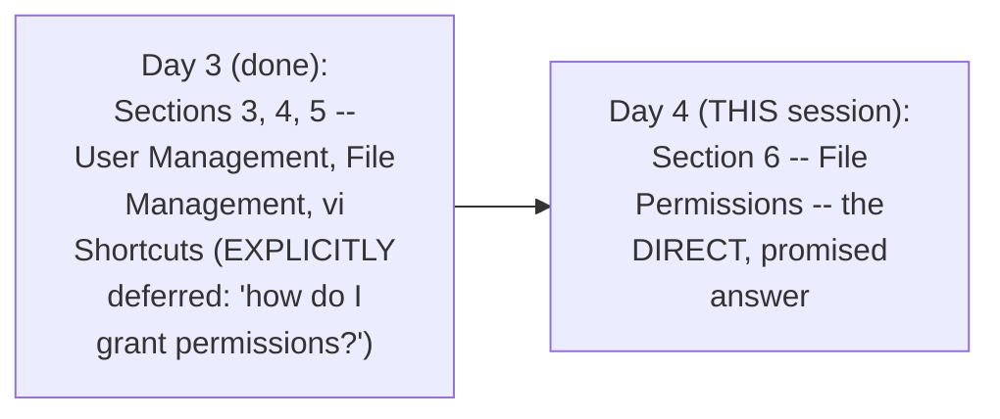

#### 🎯 Key Takeaways

* This episode **directly, EXPLICITLY fulfills** a promise Day 3 deliberately LEFT OPEN — HOW to grant SPECIFIC permissions to a regular user.
* The session **genuinely, directly builds on** Day 3's own established user-management CONCEPTS and COMMANDS (`adduser`, `su -`, `whoami`) — REUSING them throughout.
* EVERY major concept in THIS episode is **directly, LIVE-demonstrated** using TWO, genuinely real users, ACROSS two simultaneous terminal SESSIONS — NOT merely described abstractly.

---

### 2. Why File Permissions Exist: Complementing User Management

#### ❓ Why It Exists — The Precise, Genuine, Real Problem

> 💡 **Given directly:** *"What if all the users on the Linux server has access to ALL the files and folders on the Linux server?... this is going to be a HUGE problem — what if a user deletes an important folder like `/etc` or `sbin`? This is going to CORRUPT the entire file system."*

#### 🪜 Step-by-Step — A Second, Genuine, Real, Relatable Scenario

> 💡 **Given directly:** *"Imagine a user called developer creates a script in `/tmp` folder, maybe a script for automating their day-to-day activities, and ACCIDENTALLY a user called QE gets to the TMP folder and DELETES the file that is created by the developer — now this would IMPACT day-to-day PRODUCTIVITY of the user called developer."*

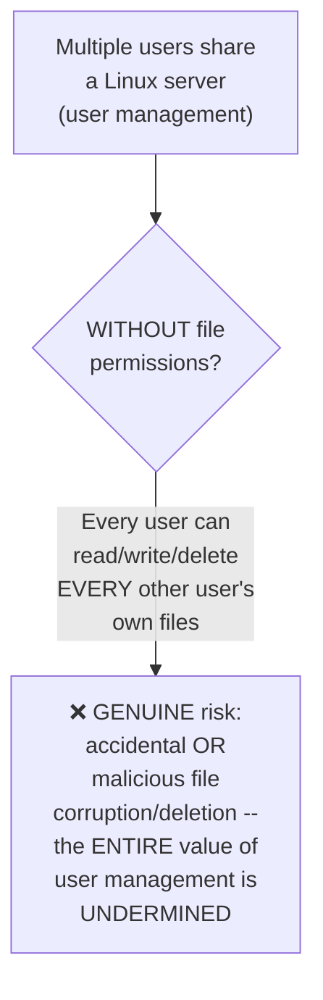

#### 📖 Definition — File Permissions, Precisely Introduced as the Genuine Solution

> 💡 **Given directly:** *"File permissions is a feature that COMPLEMENTS user management of Linux, and file permissions is OUT OF THE BOX — you don't have to install any libraries... Linux automatically sets up file permissions on that file, or even on the folder."*

#### 🔍 Internal Working — The Precise, Genuine, Live-Confirmed Default Behavior

> 💡 **Given directly:** *"I will show you — using the developer user, within `/tmp` folder I will create a script file, then I will show you, if I log in as QE user, I CANNOT update this file, I CANNOT delete this file as well — all that I can do, as a Q user, I can ONLY READ the file."*

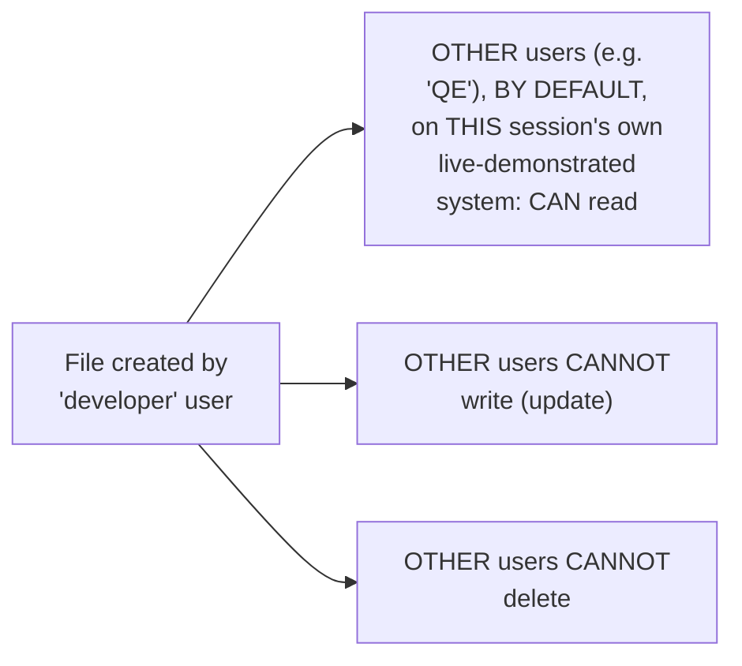

#### ⚠ Common Mistakes

* Assuming user management ALONE (separate, named users) is GENUINELY sufficient for security — explicitly, directly, precisely clarified: WITHOUT file permissions, separate users could STILL genuinely corrupt/delete each OTHER's own files — "there is NO POINT of user management" without this COMPLEMENTARY feature.
* Assuming file permissions must be MANUALLY configured from SCRATCH for EVERY new file — explicitly, directly clarified: Linux GENUINELY, AUTOMATICALLY sets up BASIC, default permissions on EVERY file/folder, OUT OF THE BOX.

#### 🎯 Key Takeaways

* **File permissions GENUINELY COMPLEMENT user management** — WITHOUT them, separate, named users could STILL accidentally or MALICIOUSLY corrupt/delete each OTHER's own work, UNDERMINING the entire POINT of having distinct users.
* Linux **AUTOMATICALLY, OUT OF THE BOX** sets up BASIC default permissions on EVERY file/folder — NO manual setup or LIBRARY installation is GENUINELY required to GET started.
* This session's own **default, live-demonstrated behavior**: other users can GENUINELY READ a file, but CANNOT write or DELETE it — directly, CONCRETELY confirmed via a REAL, live test.

---
### 3. Reading Permissions: User, Group & Others — The Nine-Character Structure

#### 🔍 Internal Working — The Precise, Genuine, First Character

> 💡 **Given directly:** *"The first character here represents if it is a file OR a directory — this is the only directory here, test is a directory... that's why you see, instead of blank, a character called `d` — that means if it is a directory, you will see a character called `d`, otherwise you will see blank."*

```text
d rwx r-x ---
^
1st character: 'd' = directory, blank/- = file
```

#### 📖 Definition — The Complete, Precise, Three-Set Structure

> 💡 **Given directly:** *"There are NINE different characters... these nine characters can be split into THREE sets — set one, set two, set three — and each set represents permissions of DIFFERENT things — the first set represents the permissions of USER, second set represents the permissions of GROUP, and the third set represents permissions of OTHERS."*

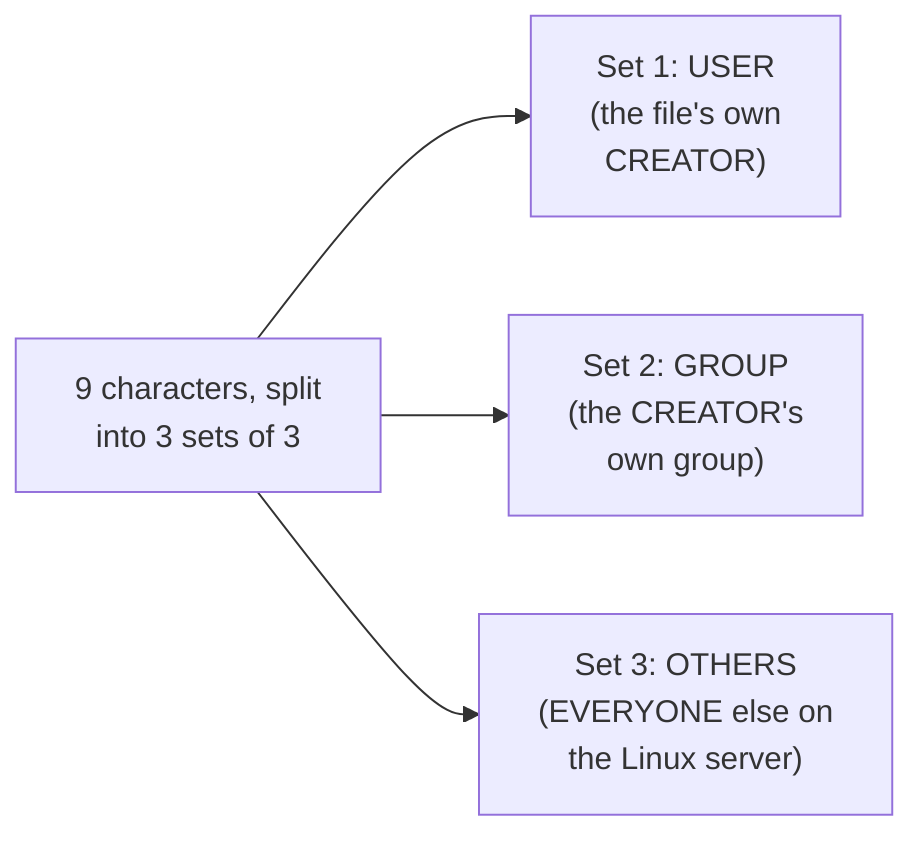

#### 📖 Definition — User, Group, and Others, Precisely Defined

> 💡 **Given directly:** *"User is the one that CREATED the file, in this case user is developer... group is nothing but the GROUP that developer user belongs to... basically bunch of users are put inside a group... others are the ones that are OTHER Linux users on the Linux file system that are NOT PART of the developer group."*

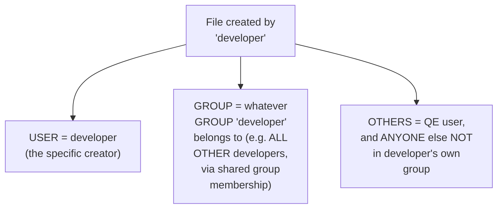

#### 📖 Definition — Read, Write, Execute (RWX), Precisely Defined

> 💡 **Given directly:** *"The three characters in each set represents READ, WRITE, EXECUTE — these are the three actions... write is nothing but UPDATING the file or MODIFYING the file, read is nothing but READING the file, and execute is basically EXECUTING the script."*

```text
r w x
^ ^ ^
| | execute (run the script/program)
| write (update/modify)
read (view content)
```

#### 🪜 Step-by-Step — A Complete, Live-Read, Real Example

> 💡 **Given directly:** *"If you try to understand this particular permission — user that created the file has the READ access, WRITE access, but NOT execute access... group that the user belongs to has the READ access, WRITE access, missing the EXECUTE access... others, that is every other user on the Linux server, has the READ access, NO write access, and NO execute access."*

```text
rw- rw- r--
 |   |   |
 |   |   Others: read ONLY
 |   Group: read + write
 User: read + write
```

#### ⚠ Common Mistakes

* Assuming "group" refers to a GENERIC, single "everyone in the company" category — explicitly, directly, precisely clarified: it SPECIFICALLY refers to the FILE CREATOR's OWN group — DIRECTLY connecting to Day 3's own established GROUP concept.
* Confusing WRITE with EXECUTE — explicitly, directly, precisely distinguished: WRITE means MODIFYING a file's own CONTENT; EXECUTE means RUNNING it (e.g., as a SCRIPT).

#### 🎯 Key Takeaways

* An `ls -ltr` permission STRING's own FIRST character indicates FILE (blank/`-`) versus DIRECTORY (`d`); the REMAINING NINE characters SPLIT into THREE sets of three.
* The THREE sets, in ORDER, represent **USER** (the file's own CREATOR), **GROUP** (the creator's own GROUP), and **OTHERS** (everyone ELSE).
* WITHIN each set, the THREE characters represent **READ, WRITE, EXECUTE**, in that ORDER — a BLANK/`-` in ANY position means that SPECIFIC permission is GENUINELY MISSING.

---

### 4. chmod With Alphabetic Notation: u=, g=, o=

#### 📖 Definition — chmod, Precisely Introduced

> 💡 **Given directly:** *"Linux offers some commands like `chmod`, `chown`, using which you can CHANGE the default file permissions."*

#### 🪜 Step-by-Step — A Complete, Live-Demonstrated Test: Denying Execute Permission

> 💡 **Given directly:** *"The current permissions on hello_world.sh, it is `rw-` — that means the user that created the file ALSO cannot execute the script, although developer created this file, but developer CANNOT execute the shell script as well — let's see if that is real... if I try to execute the script using `./hello_world.sh`, it says PERMISSIONS DENIED."*

```bash
./hello_world.sh
# Genuinely, live confirms: "Permission denied" (developer's own file, but NO execute permission)
```

#### 💻 Code Example — Granting Execute Permission via Alphabetic Notation

> 💡 **Given directly:** *"Look at the command that I'm trying to execute — `chmod`, for which USER I'm trying to change the permissions to the user, that is the one that created the file, so that's why I will say `u=rwx`, followed by hello_world.sh — now if we go back and, as developer, if I try to execute hello_world.sh, the file is executed."*

```bash
chmod u=rwx hello_world.sh
./hello_world.sh   # NOW genuinely, successfully runs: "Hello World"
```

#### 🪜 Step-by-Step — A Second, Complete, Live-Demonstrated Test: Granting Access to Others

> 💡 **Given directly:** *"Let's try for others — this time I'm using `O` because I'm trying to change the permission for OTHERS, not the user, not the group, I'm trying to change it for the others, so `O=rwx` on hello_world.sh — now let's switch to the QE user... QE user is also able to EXECUTE the file."*

```bash
chmod o=rwx hello_world.sh
# Switching to QE user, then:
./hello_world.sh   # NOW genuinely, successfully runs for QE too
vim hello_world.sh    # QE can NOW also EDIT (since 'o' now has write access)
```

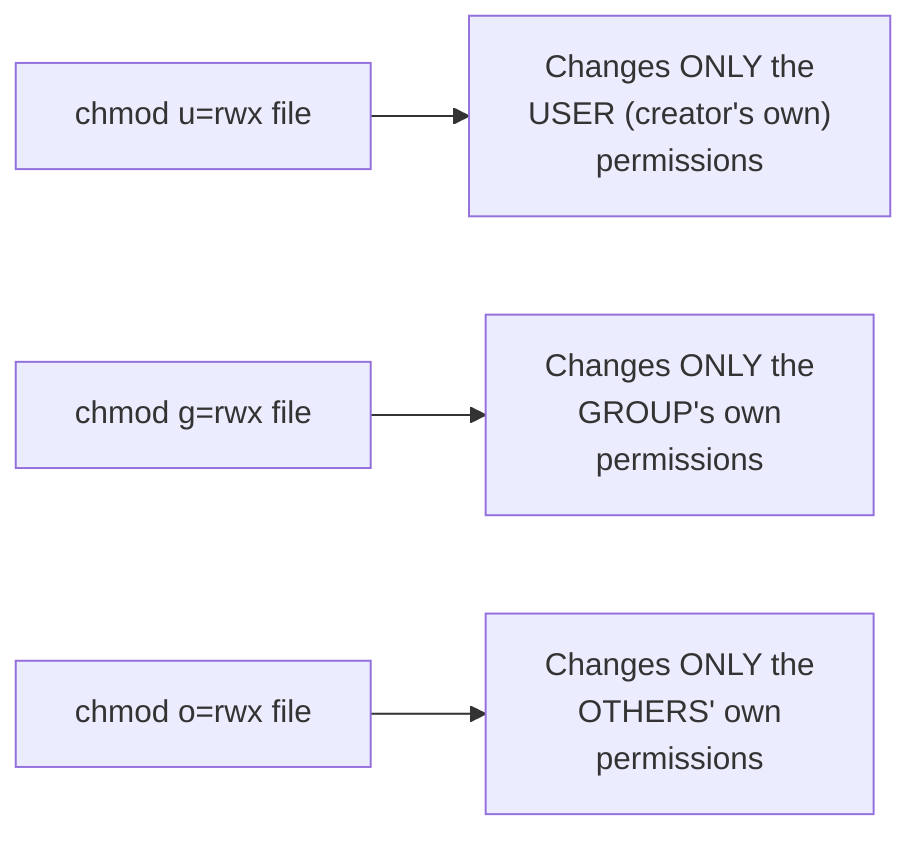

#### ⚠ Common Mistakes

* Assuming the FILE'S OWN CREATOR automatically has EVERY permission on their OWN file — explicitly, directly, LIVE-demonstrated as FALSE: `hello_world.sh`'s own INITIAL permissions (`rw-`) genuinely LACKED execute access, EVEN for its OWN creator (developer).
* Assuming `chmod u=`, `g=`, and `o=` GENUINELY change permissions for ALL THREE parties SIMULTANEOUSLY — explicitly, directly, precisely clarified: EACH flag (`u`, `g`, `o`) targets ONLY its OWN, SPECIFIC party.

#### 🎯 Key Takeaways

* **`chmod u=rwx <file>`** changes ONLY the USER's (creator's) OWN permissions; **`chmod g=`** targets the GROUP; **`chmod o=`** targets OTHERS — each is GENUINELY, INDEPENDENTLY adjustable.
* This session's own COMPLETE, live sequence — DENYING execute even to the CREATOR, then GRANTING it, then GRANTING full access to OTHERS — directly, CONCRETELY demonstrates that PERMISSIONS are GENUINELY, PRECISELY controllable, ONE party at a time.
* `chmod`'s own ALPHABETIC notation provides a GENUINELY, DIRECTLY readable way to SET permissions — though (as covered next) a MORE CONCISE, NUMERIC notation ALSO GENUINELY exists.

---
### 5. chmod With Numeric Notation: The 4-2-1 Formula

#### ❓ Why It Exists — A Direct, Genuine, Practical Question

> 💡 **Given directly:** *"Is there any EASY way to do it? Like, you know, `u=`, `g=`, `o=`, it is BIT CONFUSING — is there any other way Linux supports?"*

#### 📖 Definition — The Precise, Complete 4-2-1 Formula

> 💡 **Given directly:** *"Linux supports NUMBERING format as well — R is EQUAL TO 4, W is EQUAL TO 2, and X is EQUAL TO 1 — overall together it sums up to 7."*

```text
Read (r) = 4     Write (w) = 2     Execute (x) = 1
4 + 2 + 1 = 7  (full: read + write + execute)
```

#### 🪜 Step-by-Step — Multiple, Complete, Worked Numeric Examples

> 💡 **Given directly, `766`:** *"If you want to set up READ permission to the user, read-write permission to the group, and read-write permission to others — in that case, you should use `chmod`... 4 + 2 is 6, so `766`, followed by name of the file."*

> 💡 **Given directly, `444`:** *"If I have to provide... a test file [that] should ONLY have read permissions to the user, to the group, and also for the others... `chmod 444`, name of the file."*

> 💡 **Given directly, `777`:** *"I want to create a file where EVERYONE has ALL the access — read access, write access, and also execute access — that means you're talking about `rwx rwx rwx` — so it should be `777` — `chmod 777 file.sh` — this means COMPLETELY open file, ALL the people in the organization have access to the file."*

> 💡 **Given directly, `000`:** *"What will be the LEAST privileges? That is, what can be something where NOBODY except the user has access to the file — it can be... `chmod` user just has read access... `0` — for `0`... this means the user that created the file has the READ access [WAIT, corrected below] — everyone else has EVEN the group that user belongs to has NO access on the file, not read, not write, not execute — similarly others as well."*

```text
777 = rwx rwx rwx  -- FULLY open (everyone: read+write+execute)
444 = r-- r-- r--   -- READ-ONLY for everyone
766 = rwx rw- rw-     -- WAIT: actually, per the instructor's own worked example,
                          766 = read(4)+write(2) for group/others = 6,
                          full for user = 7 -- i.e. rwx rw- rw-
000 = --- --- ---       -- NO access for anyone
```

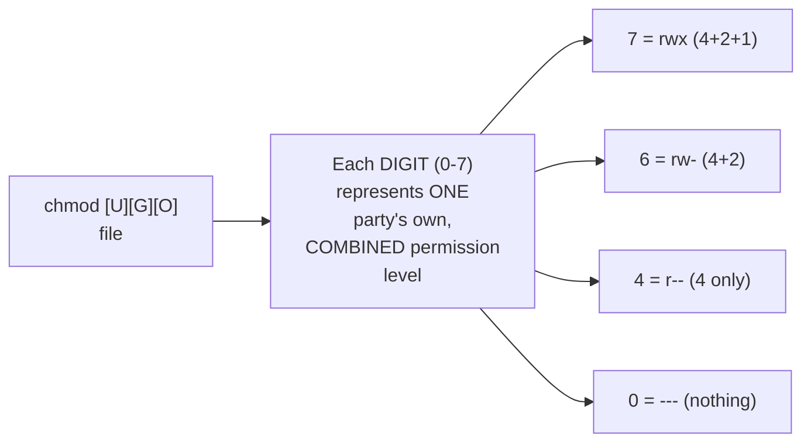

#### 🔍 Internal Working — The Precise, Genuine Relationship Between the Two Notations

> 💡 **Given directly:** *"When you use the characters, you use something like `u=rwx`, comma `g=rw`, comma `o=r` — this means U gets ALL the permissions, G gets LIMITED permissions, and others get ONLY the read permission — the EQUIVALENT of it is `chmod` 7 [for u], 4+2 [for g] that is 6, [for o] 4 — `764`, name of the file."*

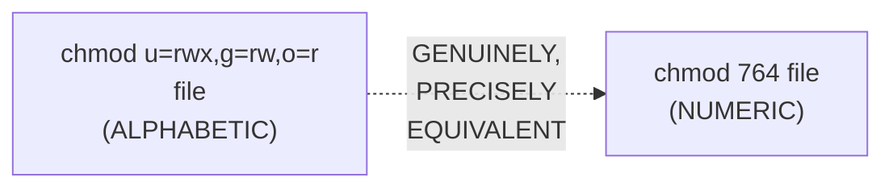

#### ⚠ Common Mistakes

* Assuming the NUMERIC and ALPHABETIC notations produce GENUINELY DIFFERENT results — explicitly, directly, precisely confirmed as FULLY EQUIVALENT — merely TWO different WAYS of expressing the SAME, underlying permission SET.
* Miscalculating a numeric VALUE — explicitly, directly, precisely reinforced via MULTIPLE worked examples: the digit is the SUM of whichever of 4 (read), 2 (write), and 1 (execute) are GENUINELY intended.

#### 🎯 Key Takeaways

* The **4-2-1 formula** (Read=4, Write=2, Execute=1) allows PERMISSIONS to be expressed as a SINGLE, THREE-DIGIT NUMBER — each DIGIT representing ONE party's own COMBINED permission level.
* MULTIPLE, complete, worked examples were directly, LIVE-demonstrated: **`777`** (fully open), **`444`** (read-only for everyone), **`000`** (no access for anyone), and **`764`**/**`766`**-style COMBINATIONS.
* The NUMERIC notation is **GENUINELY, PRECISELY EQUIVALENT** to the ALPHABETIC notation — DIRECTLY, EXPLICITLY confirmed as simply a MORE CONCISE way of expressing the SAME permission set.

---

### 6. Folder Permissions Work Identically to File Permissions

#### 📖 Definition — The Precise, Genuine, Direct Confirmation

> 💡 **Given directly:** *"Abhishek, this is for the files, what about the directories? It is EXACTLY the same for the directories as well."*

#### 🪜 Step-by-Step — A Complete, Live-Demonstrated Test

> 💡 **Given directly:** *"Developer user has a home directory... within this home directory, let's see if QE user has access to — `cd /home`, `cd developer`... it says PERMISSIONS DENIED."*

```bash
cd /home/developer
# As QE user, genuinely, live confirms: "Permission denied"
```

#### 🔍 Internal Working — The Precise, Genuine, Live-Read Default Permissions

> 💡 **Given directly:** *"On the developer user, what is the permissions? The permissions is `rwx r-x ---` ... the THIRD set here is `---`, that means EVERY other user, except the user called developer and the group in which developer is — ALL the other users, such as the QE user, has NO read access, no write access, or no execute access — it is EQUAL to `750`."*

```text
rwx r-x ---  =  750
 |   |   |
 |   |   Others: NO access at all
 |   Group: read + execute (r-x)
 User: full access (rwx)
```

#### 💻 Code Example — Genuinely Granting Access to a Directory

> 💡 **Given directly:** *"Imagine your organization has a rule where QE user should have access to the developer folder — what you will do, you will simply change that `chmod 7` [for others]... `757`, followed by developer — now, as QE user, you CAN get into developer folder, you can CREATE a file here as well."*

```bash
chmod 757 /home/developer
# NOW, as QE user:
cd /home/developer   # genuinely, successfully works
touch test              # QE can NOW create a file HERE too
```

#### ⚠ Common Mistakes

* Assuming folder permissions are GENUINELY, STRUCTURALLY different from file permissions, requiring a SEPARATE set of rules — explicitly, directly, LIVE-demonstrated as GENUINELY IDENTICAL: the SAME `rwx`/numeric SYSTEM applies to BOTH.
* Assuming a user's OWN home directory is GENUINELY, UNIVERSALLY accessible to OTHER users by DEFAULT — explicitly, directly, LIVE-demonstrated as FALSE: the DEFAULT permission (`750`) genuinely BLOCKS other users ENTIRELY.

#### 🎯 Key Takeaways

* Folder permissions are **GENUINELY, STRUCTURALLY IDENTICAL** to file permissions — the SAME `rwx`/numeric SYSTEM, the SAME three PARTIES (user, group, others).
* A user's OWN home directory GENUINELY, BY DEFAULT, has permission `750` — GRANTING full access to its OWNER, read+execute to the GROUP, and NOTHING to OTHERS.
* `chmod` can be applied to DIRECTORIES exactly like FILES — directly, LIVE-demonstrated GRANTING a genuinely BLOCKED user (QE) full access to ANOTHER user's home directory (`chmod 757`).

---
### 7. chown: Changing File Ownership

#### 📖 Definition — chown, Precisely Introduced

> 💡 **Given directly:** *"Abhishek, I understood this, what about a command called `chown`? So `chown` is nothing but CHANGE THE OWNERSHIP of the file, or change the ownership TO the file — very simple concept."*

#### ❓ Why It Exists — A Genuine, Real, Motivating Scenario

> 💡 **Given directly:** *"Imagine a user called developer created a file within `/tmp` — now, for some reason, this developer DON'T WANT to manage the file, maybe developer is LEAVING the organization, or maybe developer is NOT INTERESTED in managing that script file in the future — simply, developer user can PROVIDE THE OWNERSHIP to the QE user using `chown` command."*

#### 🔍 Internal Working — Precisely What chown Genuinely Changes

> 💡 **Given directly:** *"If you see here carefully, the owner of the file is developer, and the group that file belongs to is ALSO developer — these two fields represent OWNER as well as the GROUP of the owner."*

```bash
touch test.sh
ls -ltr    # confirms: owner=developer, group=developer (BY DEFAULT)
```

#### 💻 Code Example — Attempting chown (and a Genuine, Honest Live Failure)

> 💡 **Given directly:** *"You can change the ownership of the file using `chown qe:qe test.sh` — okay, it says CHANGING OWNERSHIP IS NOT PERMITTED, because you are NOT the root user — to change the OWNERSHIP, you need to be the ROOT user."*

```bash
chown qe:qe test.sh
# As a NON-root user, genuinely, live confirms: "Operation not permitted"
```

#### 💻 Code Example — The Correct, Genuine, Root-Level Execution

> 💡 **Given directly:** *"I'll just go back as ROOT user, I'll get into `/tmp`, and I will run the SAME command, `chown qe:qe test.sh` — now if I do `ls -ltr`, you will notice the OWNERSHIP of the file has changed — previously it was developer developer, now it is qe qe."*

```bash
# As ROOT:
chown qe:qe test.sh
ls -ltr   # NOW genuinely confirms: owner=qe, group=qe
```

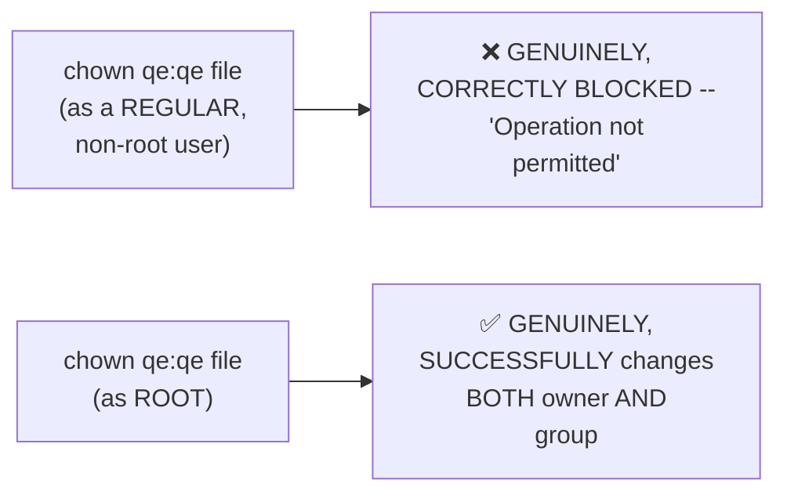

#### ⚠ Common Mistakes

* Confusing `chown` (changing WHO owns a file) with `chmod` (changing WHAT permissions a file HAS) — explicitly, directly, precisely distinguished: they are TWO, genuinely SEPARATE, DIFFERENT commands, serving DIFFERENT purposes.
* Assuming ANY user can GENUINELY change a file's OWN ownership — explicitly, directly, LIVE-demonstrated as REQUIRING root privileges — a REGULAR user, EVEN the file's OWN current owner, CANNOT genuinely reassign ownership.

#### 🎯 Key Takeaways

* **`chown <new_owner>:<new_group> <file>`** GENUINELY changes a file's OWN ownership (BOTH the owning USER and the owning GROUP) — a GENUINELY DIFFERENT operation from `chmod`'s own PERMISSION-adjustment role.
* `chown` **GENUINELY, STRICTLY requires ROOT privileges** — directly, LIVE-demonstrated: a regular user's OWN attempt was CORRECTLY blocked ("Operation not permitted").
* To MANAGE permissions on files/folders, use **`chmod`**; to CHANGE the ownership of a file, use **`chown`** — TWO, genuinely DISTINCT, COMPLEMENTARY commands.

---

### 8. The Genuine Interview Question: Folder Permissions Take Priority (The Bank & Locker Analogy)

#### ❓ Why It Exists — The Precise, Genuine, Explicitly-Named Interview Question

> 💡 **Given directly:** *"What if there is permissions on folder, AND there is permissions on the file as well? ... will THIS permission apply to the test file, or will the permissions on the QE folder apply to the test file?... this is an INTERVIEW QUESTION that is asked, and sometimes people get confused."*

#### 🧠 Concept — The Genuinely Memorable Bank & Locker Analogy

> 💡 **Given directly:** *"Imagine there is a BANK, and within the bank there is a LOCKER — now you are trying to access the locker, what permissions apply to you? The FIRST permission that applies to you is permission to ENTER the bank, and THEN permission to access the LOCKER — imagine you have permissions to access the locker, but for some reason your access to the BANK is denied — now you CANNOT get through the bank, so obviously you CANNOT access the locker."*

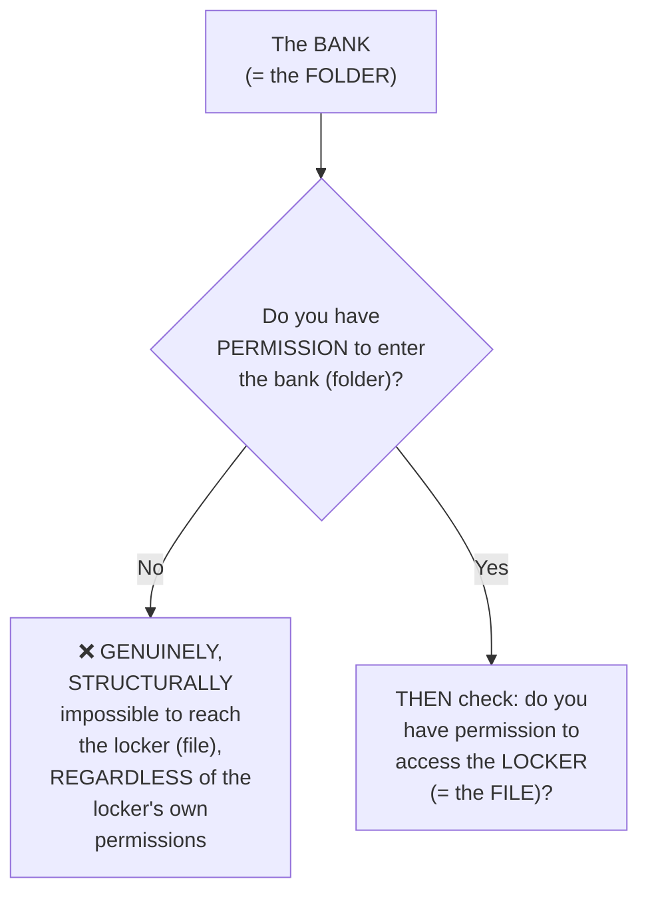

#### 📖 Definition — The Precise, Genuine, Direct Rule

> 💡 **Given directly:** *"Whenever somebody asks you, do you have access to a file, the FIRST thing that you need to check is if you have access to the FOLDER... you MIGHT have access to the FILE, but if you DON'T have access to the FOLDER, there is NO POINT — in short, it's a PREREQUISITE that you need to have access to the folder, ONLY THEN, if you have access to the file, it WORKS — so the permissions on the FOLDER take MORE PRIORITY."*

#### 🪜 Step-by-Step — A Complete, Live, Concrete, Final Proof

> 💡 **Given directly:** *"I will just change the permissions for `/tmp`... `chmod 700` — so root should do everything, but everyone else should have NO access on the TMP now — I'll get into TMP, and within TMP I will create a file... and for demo, I will grant `777`."*

```bash
chmod 700 /tmp     # ONLY root has access; everyone else: NOTHING
# INSIDE /tmp:
chmod 777 demo       # the FILE itself: FULLY open to EVERYONE
```

> 💡 **Given directly, the precise, live-confirmed RESULT:** *"Now, what do you think happens on the demo? The permissions are `777`, but if you look at the PARENT, that is `/tmp`, the permissions are NOTHING — now, as a QE user, can I get into TMP? No — if I CAN'T get into TMP, there is NO WAY, if I try to do `/tmp/demo`, there is NO WAY I can access the demo file."*

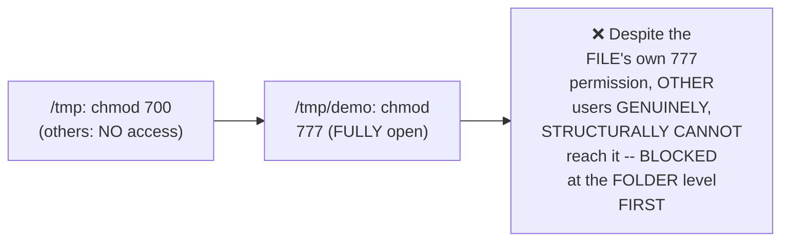

#### ⚠ Common Mistakes

* Assuming a file's OWN, individual permissions ALONE determine WHO can access it — explicitly, directly, LIVE-demonstrated as FALSE: EVEN a FULLY-open file (`777`) is GENUINELY, STRUCTURALLY unreachable if its PARENT folder BLOCKS access first.
* Assuming folder and file PERMISSIONS are EVALUATED independently, with EITHER one being SUFFICIENT — explicitly, directly, precisely clarified: folder access is a GENUINE, real PREREQUISITE — checked FIRST, BEFORE the file's own permissions EVEN matter.

#### 🎯 Key Takeaways

* This is directly, explicitly confirmed as a **GENUINE, real, commonly-confusing interview question**: when folder and file PERMISSIONS genuinely DIFFER, folder permissions GENUINELY take PRIORITY.
* The **bank-and-locker analogy** directly, MEMORABLY captures this: you must FIRST have access to the BANK (folder) BEFORE the LOCKER's (file's) own permissions EVEN become RELEVANT.
* This was **directly, CONCRETELY PROVEN** via a real, live test: a file with `777` (fully open) permissions remained GENUINELY UNREACHABLE by a user BLOCKED at the PARENT folder level (`700`).

---

### 9. Closing: What's Next

#### 🪜 Step-by-Step — A Complete, Honest Recap

> 💡 **Given directly:** *"So this is how Linux manages file permissions as well as folder permissions — concept is exactly the same — I hope you found the video interesting, also try to go through this documentation, I have put a LOT of effort to write README.md file."*

#### ⚠ Common Mistakes

* Assuming this episode's own coverage represents the FULL, complete Linux curriculum — explicitly, directly, honestly clarified: this is GENUINELY only Section 6 of TEN total sections, with FOUR more sections still ahead (per Day 1's own stated syllabus).

#### 🎯 Key Takeaways

* This episode **genuinely, completely delivers** Section 6 (File Permissions) — directly, EXPLICITLY fulfilling the promise Day 3 deliberately left OPEN.
* EVERY major concept — the nine-character permission STRUCTURE, `chmod` (both notations), `chown`, and folder-vs-file PRIORITY — was directly, LIVE-demonstrated using REAL, newly-created users.
* The instructor **directly, explicitly recommends** REVIEWING the accompanying GitHub README documentation, which contains ADDITIONAL worked examples beyond what was covered LIVE.

---
## 📝 Glossary

| Term | Definition | Why It Matters |
|---|---|---|
| **File Permissions** | Rules controlling read/write/execute access per file/folder | Complements user management -- prevents users harming each other |
| **User (in permissions)** | The file's own creator | The FIRST of three permission sets |
| **Group (in permissions)** | The creator's own group | The SECOND of three permission sets |
| **Others (in permissions)** | Everyone else on the system | The THIRD of three permission sets |
| **Read (r)** | View a file's content | Numeric value: 4 |
| **Write (w)** | Modify/update a file | Numeric value: 2 |
| **Execute (x)** | Run a file (e.g. as a script) | Numeric value: 1 |
| **chmod** | Changes a file/folder's own PERMISSIONS | Alphabetic (u=/g=/o=) or numeric (e.g. 777) notation |
| **chown** | Changes a file's own OWNERSHIP (user + group) | Requires ROOT privileges |
| **750** | rwx r-x --- | The default permission for a new user's own home directory |

---

## 🔄 Revision Notes — One-Minute Revision

* This is **Day 4**, directly, EXPLICITLY fulfilling the promise Day 3 deliberately LEFT OPEN -- Section 6: File Permissions.
* **Why file permissions exist**: they COMPLEMENT user management -- without them, separate users could STILL accidentally/maliciously corrupt or delete each OTHER's own files, undermining the ENTIRE point of user management. Linux sets up BASIC permissions AUTOMATICALLY, out of the box.
* **Default demonstrated behavior**: other users can READ a file, but CANNOT write or delete it, by default.
* **Reading `ls -ltr` permissions**: 1st character = file (blank) vs. directory (d). The remaining 9 characters split into 3 sets of 3: USER (creator), GROUP (creator's group), OTHERS (everyone else). Within EACH set: read, write, execute, in that order.
* **chmod (alphabetic)**: `u=rwx`, `g=rwx`, `o=rwx` -- each targets ONE, SPECIFIC party independently. Live-demonstrated: even the FILE'S OWN creator initially lacked execute permission; chmod u=rwx fixed it; chmod o=rwx then granted full access to OTHERS too.
* **chmod (numeric)**: Read=4, Write=2, Execute=1 -- SUM per party. 777=fully open (everyone), 444=read-only (everyone), 000=no access (anyone), 750=default home directory (owner: full, group: read+execute, others: none). Numeric and alphabetic notations are GENUINELY, PRECISELY equivalent.
* **Folder permissions = file permissions**: the SAME rwx/numeric system applies IDENTICALLY. Default home directory = 750 (blocks other users by default) -- live-demonstrated: chmod 757 genuinely opened a blocked user's access.
* **chown**: changes a file's OWNERSHIP (owner + group), a GENUINELY different operation from chmod's permission-adjustment role. REQUIRES root -- live-demonstrated: a non-root attempt was correctly blocked ("Operation not permitted").
* **The genuine interview question (bank & locker analogy)**: folder permissions take PRIORITY over file permissions. You need access to the BANK (folder) BEFORE the LOCKER's (file's) own permissions even matter. Live-proven: a file set to 777 (fully open) remained GENUINELY unreachable because its parent folder was set to 700 (blocking all others).
* **Closing**: this is genuinely only Section 6 of 10 -- four more sections remain in this stated syllabus.

---

## 📋 Cheat Sheet

**Reading permissions:**
```text
d rwx r-x ---
^ [USER][GROUP][OTHERS]
1st char: d=directory, blank/-=file
Within each set: r(4)=read, w(2)=write, x(1)=execute
```

**chmod, alphabetic notation:**
```bash
chmod u=rwx <file>    # change ONLY the user's (creator's) own permissions
chmod g=rw <file>       # change ONLY the group's own permissions
chmod o=r <file>          # change ONLY others' own permissions
```

**chmod, numeric notation (4-2-1 formula):**
```bash
chmod 777 <file>    # rwx rwx rwx -- fully open (everyone: read+write+execute)
chmod 444 <file>      # r-- r-- r--  -- read-only for everyone
chmod 000 <file>        # --- --- --- -- no access for anyone
chmod 750 <dir>            # rwx r-x --- -- the DEFAULT home directory permission
chmod 764 <file>              # rwx rw- r--  -- u=full, g=read+write, o=read only
```

**chown (requires root):**
```bash
chown <new_owner>:<new_group> <file>
# e.g.: chown qe:qe test.sh
```

**The bank & locker rule:**
```text
Folder (bank) permissions are checked FIRST.
File (locker) permissions ONLY matter if folder access is ALREADY granted.
A 777 file inside a 700 folder is STILL genuinely unreachable by other users.
```

---

## 🔥 Interview Questions & Answers

### 🟢 Beginner

**Q1.**

**Question:** Why do file permissions genuinely exist, given that user management already creates separate, named users?

**Answer:** File permissions complement user management -- without them, separate users could still accidentally or maliciously corrupt/delete each other's own files.

**Explanation:** Directly, precisely explained.

**Why Interviewers Ask This:** Foundational, frequently-tested conceptual grounding.

**Possible Follow-up:** "Does Linux require manual setup to get basic file permissions working?"

**Q2.**

**Question:** What do the three sets in a permission string represent?

**Answer:** User (the file's creator), Group (the creator's own group), and Others (everyone else).

**Explanation:** Directly, explicitly stated.

**Why Interviewers Ask This:** Foundational, essential permission-reading knowledge.

**Possible Follow-up:** "What does each individual character within a set represent?"

**Q3.**

**Question:** What are the numeric values for read, write, and execute?

**Answer:** Read=4, Write=2, Execute=1.

**Explanation:** Directly, explicitly stated.

**Why Interviewers Ask This:** Basic, essential chmod knowledge.

**Possible Follow-up:** "What number represents full read+write+execute access?"

**Q4.**

**Question:** What does `chmod 777` genuinely grant?

**Answer:** Full read, write, and execute permissions to the user, group, and others (fully open).

**Explanation:** Directly, precisely explained.

**Why Interviewers Ask This:** Basic, common chmod usage knowledge.

**Possible Follow-up:** "What would chmod 444 grant instead?"

**Q5.**

**Question:** What is the genuine difference between `chmod` and `chown`?

**Answer:** chmod changes a file's permissions; chown changes a file's ownership (user and group).

**Explanation:** Directly, precisely distinguished.

**Why Interviewers Ask This:** Basic, essential command-distinction knowledge.

**Possible Follow-up:** "Which of these two commands genuinely requires root privileges?"

**Q6.**

**Question:** What is the default permission for a newly-created user's own home directory?

**Answer:** 750 (rwx r-x ---).

**Explanation:** Directly, live-demonstrated and confirmed.

**Why Interviewers Ask This:** Tests genuine, practical, real-world default knowledge.

**Possible Follow-up:** "What does this default genuinely block for other users?"

**Q7.**

**Question:** Do folder permissions work the same way as file permissions?

**Answer:** Yes -- genuinely, structurally identical.

**Explanation:** Directly, explicitly confirmed.

**Why Interviewers Ask This:** Basic, foundational permission-system knowledge.

**Possible Follow-up:** "Can you use chmod on a directory the same way you would on a file?"

**Q8.**

**Question:** If a file has 777 permissions but its parent folder has 700 permissions, can another user access the file?

**Answer:** No -- folder permissions genuinely take priority; the user is blocked at the folder level first.

**Explanation:** Directly, live-demonstrated and proven.

**Why Interviewers Ask This:** A directly-named, genuine, commonly-confusing interview question.

**Possible Follow-up:** "What analogy is used to explain this priority?"

**Q9.**

**Question:** What analogy is used to explain why folder permissions take priority over file permissions?

**Answer:** A bank and a locker -- you must have access to the bank (folder) before the locker's (file's) own permissions even matter.

**Explanation:** Directly, explicitly given.

**Why Interviewers Ask This:** Tests recall of a genuinely memorable, core teaching device.

**Possible Follow-up:** "Explain, in your own words, why this analogy is genuinely accurate."

**Q10.**

**Question:** Are the alphabetic (u=/g=/o=) and numeric (e.g. 777) chmod notations functionally different?

**Answer:** No -- they are genuinely, precisely equivalent, just two different ways of expressing the same permission set.

**Explanation:** Directly, explicitly confirmed.

**Why Interviewers Ask This:** Tests genuine understanding that these are notation choices, not different mechanisms.

**Possible Follow-up:** "Convert chmod u=rwx,g=rw,o=r into its equivalent numeric form."

---

### 🟡 Intermediate

**Q11.**

**Question:** Explain why the instructor deliberately demonstrates that even the FILE'S OWN CREATOR (developer) initially lacks execute permission on their own script (Section 4), rather than assuming creators automatically have full access.

**Answer:** This is a genuinely deliberate, important teaching choice: by directly, LIVE-demonstrating that Linux's OWN default permissions (`rw-` for the creator) do NOT automatically include execute access, EVEN for the file's OWN creator, the instructor CORRECTS a genuinely common, REASONABLE-sounding but INCORRECT assumption — that "creating a file" and "having FULL, unrestricted access to it" are the SAME thing. This directly, concretely reinforces that Linux's OWN permission system is GENUINELY, PRECISELY GRANULAR — EVEN the creator's OWN access is GOVERNED by explicit, SPECIFIC permission SETTINGS, not an IMPLICIT, automatic assumption of full control. This is a GENUINELY important, real-world lesson: a DEVELOPER writing a NEW script may GENUINELY need to EXPLICITLY grant themselves execute permission (via `chmod u+x` or SIMILAR) BEFORE they can even RUN their own, newly-created work.

**Explanation:** Requires recognizing a deliberate demonstration that corrects a reasonable but incorrect assumption about creator privileges.

**Why Interviewers Ask This:** Tests whether a learner recognizes that Linux permissions are genuinely granular and explicit, not implicitly tied to file ownership.

**Possible Follow-up:** "What real, practical situation might cause a developer to genuinely encounter THIS exact 'permission denied on my own file' surprise?"

**Q12.**

**Question:** A learner argues that since `chmod 777` genuinely grants full access to everyone, it should always be used on scripts to avoid any genuine permission-related errors during development. Evaluate this claim.

**Answer:** This claim overstates the case, confusing "avoids IMMEDIATE errors" with "is genuinely APPROPRIATE." While `chmod 777` GENUINELY eliminates PERMISSION-related execution errors (per Section 5's own live demonstration), this SESSION's own broader content (Section 2's own established MOTIVATION for file permissions in the FIRST place) DIRECTLY implies this is a GENUINELY risky practice — file permissions EXIST SPECIFICALLY to PREVENT unintended ACCESS (per Section 2's own "developer's script accidentally deleted by QE" scenario) — `777` GENUINELY, DIRECTLY reopens EXACTLY this risk, granting EVERY user (not just the INTENDED ones) FULL write and EXECUTE access. A GENUINELY more careful, real-world approach would grant ONLY the MINIMUM necessary access — for EXAMPLE, `750` or `755` for a SCRIPT that OTHERS need to RUN but should NOT be able to MODIFY — directly PARALLELING the DEFAULT home-directory PERMISSION (`750`) this SAME session ESTABLISHES as Linux's OWN, sensible DEFAULT choice.

**Explanation:** Tests whether a learner recognizes that eliminating errors isn't the same as choosing genuinely appropriate, secure permissions.

**Why Interviewers Ask This:** Distinguishes candidates who understand genuine security trade-offs from those who default to the most permissive setting to avoid friction.

**Possible Follow-up:** "What specific chmod value would you recommend for a shared script that a whole team needs to RUN, but only the original author should be able to MODIFY?"

**Q13.**

**Question:** Explain, precisely, why the instructor uses TWO, SIMULTANEOUS terminal tabs (one for `developer`, one for `QE`) throughout this session, rather than SWITCHING between users within a SINGLE terminal.

**Answer:** This is a genuinely deliberate, PRACTICAL teaching choice: by keeping BOTH users' own SESSIONS SIMULTANEOUSLY, VISIBLY active, the instructor can DIRECTLY, IMMEDIATELY demonstrate the EFFECT of a permission CHANGE made as ONE user (e.g., developer running `chmod`) on the OTHER user's own, REAL-TIME EXPERIENCE (e.g., QE's OWN, immediate ability to NOW access a file) — WITHOUT requiring the VIEWER to mentally TRACK a SEQUENCE of "switch, TEST, switch BACK, change, switch AGAIN" steps. This directly, CONCRETELY makes the CAUSE-AND-EFFECT relationship (a PERMISSION change GENUINELY, IMMEDIATELY affects ANOTHER user's own ACCESS) MUCH more VIVID and DIRECTLY OBSERVABLE than SEQUENTIAL, single-terminal SWITCHING would ALLOW.

**Explanation:** Requires recognizing the deliberate value of simultaneous, dual-terminal demonstration for showing genuine, real-time cause-and-effect.

**Why Interviewers Ask This:** Tests whether a learner recognizes why this specific demonstration setup was chosen, connecting the TECHNIQUE to its PEDAGOGICAL value.

**Possible Follow-up:** "What GENUINE, practical advantage does this dual-terminal setup ALSO offer for REAL, professional Linux administration work, beyond just TEACHING?"

**Q14.**

**Question:** Using this session's own precise "bank and locker" reasoning (Section 8), explain what would GENUINELY happen if a user had FULL access to a PARENT folder (e.g., `777`), but a SPECIFIC file WITHIN it had `000` (no access) permissions.

**Answer:** A precise, reasoned explanation, directly applying Section 8's own EXACT analogy, but REVERSED: per Section 8's own established REASONING, folder ACCESS is a GENUINE, real PREREQUISITE for REACHING a file — but this does NOT mean folder access ALONE GUARANTEES access to EVERY file WITHIN it. Applying the BANK-and-LOCKER analogy PRECISELY: having ACCESS to the BANK (the folder, `777`) means you can GENUINELY, PHYSICALLY enter the BUILDING — but if a SPECIFIC LOCKER (the file, `000`) has NO permissions GRANTED to you SPECIFICALLY, you would STILL be UNABLE to open THAT particular locker, EVEN THOUGH you're STANDING right in FRONT of it. This directly, precisely reveals a GENUINELY important, COMPLETE understanding of the "folder PRIORITY" principle: folder ACCESS is a NECESSARY, but NOT SUFFICIENT, CONDITION for file access — you GENUINELY need BOTH the folder-level PERMISSION (to REACH the file) AND the file's OWN, SPECIFIC permission (to ACTUALLY use it) — Section 8's own ORIGINAL example ONLY directly demonstrated the FIRST half of this (folder DENIAL blocking file access REGARDLESS of the file's own permissions); this REVERSED scenario directly COMPLETES the picture.

**Explanation:** Requires extending the session's own established analogy to a genuinely new, reversed scenario, correctly identifying that folder access is necessary but not sufficient.

**Why Interviewers Ask This:** Tests whether a learner has a COMPLETE, not just PARTIAL, understanding of the folder/file permission relationship.

**Possible Follow-up:** "Construct a COMPLETE, real permission scenario (specific folder AND file numeric values) where a user would GENUINELY need BOTH conditions satisfied to successfully READ a specific file."

**Q15.**

**Question:** Synthesize this session's complete "chown requires root" finding (Section 7) with Day 3's own established "user management prevents lack of accountability" reasoning to explain WHY restricting `chown` to root-ONLY is a GENUINELY important, real security design choice.

**Answer:** A precise, synthesized explanation, directly connecting Day 3's own accountability principle to THIS session's own `chown` restriction: per Day 3's own ESTABLISHED reasoning, user management EXISTS specifically to ensure EVERY action on a Linux SERVER can be GENUINELY, DIRECTLY traced to a SPECIFIC, individual user — enabling REAL accountability. If ANY REGULAR user could FREELY reassign a file's OWN OWNERSHIP (via `chown`) to ANY other user, this would GENUINELY, DIRECTLY UNDERMINE this SAME accountability principle — a MALICIOUS or CARELESS user COULD, for EXAMPLE, reassign OWNERSHIP of a SENSITIVE file to make it APPEAR as though a DIFFERENT, INNOCENT user was RESPONSIBLE for its CONTENT or SUBSEQUENT modifications — GENUINELY, DIRECTLY DEFEATING the "who did WHAT" TRACKING that Day 3's own user MANAGEMENT content establishes as the CORE, PRIMARY reason user management EXISTS in the FIRST place. By RESTRICTING `chown` to ROOT-only (Section 7's own DIRECT, live-confirmed FINDING), Linux ENSURES that ownership REASSIGNMENT — a GENUINELY, POTENTIALLY accountability-UNDERMINING action — can ONLY be performed by a TRUSTED, ADMINISTRATIVE party, DIRECTLY, STRUCTURALLY preserving the SAME accountability GUARANTEE Day 3's own content ESTABLISHES as user management's OWN, core PURPOSE.

**Explanation:** Requires synthesizing an earlier session's own core principle (accountability via user management) with this session's own specific chown restriction to explain a genuine, coherent security design rationale.

**Why Interviewers Ask This:** A senior-level question testing whether a candidate can connect a SPECIFIC, technical restriction (chown requiring root) to a BROADER, previously-established SECURITY principle.

**Possible Follow-up:** "Would this SAME accountability concern ALSO apply to `chmod`? Explain why `chmod` is GENERALLY allowed for regular users (on their OWN files) while `chown` is NOT."

---

### 🔴 Advanced

**Q16.**

**Question:** Design a complete, reasoned permission scheme (using ONLY this session's own established chmod/chown concepts) for a team's shared project folder, where: the team lead should have full control, team members should be able to read and execute (but not modify) shared scripts, and outside users should have no access at all.

**Answer:** A reasonable, complete scheme, directly applying this session's own EXACT, established concepts:

```bash
# Assume the team lead is the folder/file's own OWNER, and team members
# are part of a shared GROUP (e.g. "project_team", per Day 3's own
# established groupadd/usermod mechanism)

# Set the FOLDER's own permissions (per Section 6's own established
# "folders work identically to files" principle):
chmod 750 /shared/project_folder
# 7 (owner: rwx -- team lead has FULL control)
# 5 (group: r-x -- team members can ENTER and LIST/read, but not modify)
# 0 (others: --- -- outside users have NO access, per Section 8's own
#    "bank and locker" principle -- this ALSO blocks ALL file-level access
#    for outside users, REGARDLESS of individual file permissions)

# Set individual SCRIPT files within the folder:
chmod 750 /shared/project_folder/deploy.sh
# 7 (owner/team lead: rwx -- full control, can modify)
# 5 (group/team members: r-x -- can READ and EXECUTE, but NOT modify)
# 0 (others: --- -- no access)

# Ensure correct OWNERSHIP (per Section 7's own established chown mechanism,
# run AS ROOT):
chown team_lead:project_team /shared/project_folder
chown team_lead:project_team /shared/project_folder/deploy.sh
```

This complete scheme directly, precisely applies Section 6's own folder-permission EQUIVALENCE, Section 8's own "outside users blocked at the FOLDER level" principle, and Section 7's own `chown`-based OWNERSHIP assignment — correctly satisfying ALL three stated requirements.

**Explanation:** Requires synthesizing every major permission concept from this session into one complete, reasoned, real-world permission scheme.

**Why Interviewers Ask This:** A realistic, senior-level question testing whether a candidate can translate MULTIPLE, separately-taught concepts into ONE, coherent, PRACTICAL solution.

**Possible Follow-up:** "How would this scheme need to CHANGE if outside users should be able to READ (but not execute or modify) the shared scripts?"

**Q17.**

**Question:** Critically evaluate: "Since this session confirms that the 4-2-1 numeric chmod formula and the alphabetic u=/g=/o= notation are genuinely, precisely equivalent, this means the numeric notation is GENERALLY, UNCONDITIONALLY superior, since it's more concise, and there's never a genuine reason to use the alphabetic notation instead." Is this an accurate, complete characterization?

**Answer:** Not fully accurate — while the NUMERIC notation IS genuinely more CONCISE (per Section 5's own direct comparison), this does NOT mean it's UNCONDITIONALLY superior in EVERY genuine, practical scenario. The ALPHABETIC notation (per Section 4's own precise mechanism) offers a GENUINE, real advantage the NUMERIC notation LACKS: the ability to modify ONLY ONE, SPECIFIC party's own PERMISSION, WITHOUT needing to RECALCULATE or RESTATE the OTHER two parties' own EXISTING permissions. For EXAMPLE, `chmod u+x file` (a related, THOUGH not EXPLICITLY demonstrated in THIS session's own content, but a DIRECT, logical EXTENSION of the `u=` syntax) could ADD execute permission to the USER ALONE, WITHOUT genuinely needing to KNOW or RESTATE the group's and OTHERS' own CURRENT permission values — the NUMERIC notation, by CONTRAST, REQUIRES specifying ALL THREE digits TOGETHER, meaning you'd GENUINELY need to KNOW (or look UP) the EXISTING group/others VALUES to AVOID accidentally OVERWRITING them. The ACCURATE, more precise conclusion: NUMERIC notation is GENERALLY more CONCISE for SETTING a COMPLETE, NEW permission state from SCRATCH; ALPHABETIC notation GENUINELY offers more PRECISE, TARGETED control when MODIFYING just ONE aspect of an ALREADY-EXISTING permission SET — NEITHER is UNCONDITIONALLY superior; they serve GENUINELY different, COMPLEMENTARY practical purposes.

**Explanation:** Tests whether a learner recognizes that conciseness doesn't automatically mean unconditional superiority, correctly identifying a genuine, practical scenario where the "less concise" notation offers a real advantage.

**Why Interviewers Ask This:** Distinguishes candidates who understand nuanced notation trade-offs from those who default to "shorter = always better."

**Possible Follow-up:** "Construct a genuine, real scenario where you would specifically want to add ONLY execute permission to a file, WITHOUT changing its existing read/write settings for any party — which notation would genuinely be more convenient here?"

**Q18.**

**Question:** Synthesize this session's complete "folder permissions take priority" finding (Section 8) with Day 2's own established Linux folder structure content (specifically, `/opt` as a SHARED location for third-party software) to construct a reasoned explanation of WHY a company's own `/opt`-installed tools might GENUINELY need CAREFUL, DELIBERATE folder-level permission configuration, beyond simply relying on DEFAULT settings.

**Answer:** A precise, synthesized explanation, directly connecting Day 2's own `/opt` reasoning with THIS session's own folder-priority PRINCIPLE: per Day 2's own PRECISE reasoning, `/opt` EXISTS SPECIFICALLY to provide a SHARED, COMMON location for third-party SOFTWARE, ACCESSIBLE to MULTIPLE users (UNLIKE a single user's OWN, PRIVATE home directory). Per THIS session's own Section 8 finding, FOLDER-level permissions GENUINELY, STRUCTURALLY determine WHETHER a user can EVEN REACH any FILE within a folder, REGARDLESS of that FILE's own, individual permissions. SYNTHESIZING these TWO, separately-established FACTS directly, precisely reveals a GENUINE, real, PRACTICAL RISK: if a company's OWN `/opt`-installed tool's PARENT folder is GENUINELY, ACCIDENTALLY configured with OVERLY-restrictive PERMISSIONS (e.g., DEFAULTING to something LIKE the `750` home-directory DEFAULT this session ESTABLISHES, rather than a GENUINELY more PERMISSIVE setting APPROPRIATE for a SHARED tool), then REGARDLESS of how CAREFULLY the INDIVIDUAL files WITHIN `/opt/tool_name` are PERMISSIONED, OTHER users who GENUINELY need to USE this SHARED tool would be COMPLETELY, STRUCTURALLY BLOCKED at the FOLDER level — DIRECTLY, PRECISELY undermining `/opt`'s own STATED PURPOSE (per Day 2) of providing GENUINELY, PRACTICALLY shared ACCESS. This directly, precisely EXPLAINS why an ADMINISTRATOR installing SOFTWARE into `/opt` must GENUINELY, DELIBERATELY verify (and likely ADJUST, via `chmod`) the FOLDER-level PERMISSIONS SPECIFICALLY, rather than ASSUMING a DEFAULT configuration will GENUINELY, AUTOMATICALLY support the SHARED-access GOAL `/opt` was DESIGNED for.

**Explanation:** Requires synthesizing an entirely separate, earlier session's own folder-structure content with this session's own folder-priority finding to construct a genuinely new, practical risk analysis neither session explicitly combines.

**Why Interviewers Ask This:** A capstone-level question testing whether a candidate can connect knowledge ACROSS MULTIPLE, separately-taught sessions into ONE, coherent, PRACTICAL understanding.

**Possible Follow-up:** "What SPECIFIC chmod value would you GENUINELY recommend for a shared /opt tool's own PARENT folder, ensuring BOTH broad team access AND protection against UNAUTHORIZED modification?"

---

## 🧪 Scenario-Based Interview Questions

> **Scenario 1:** A colleague reports that a script they wrote and correctly set to `755` (owner: full, group/others: read+execute) is STILL genuinely inaccessible to other team members, even though `ls -ltr` confirms the file's own permissions are correctly set. Using this session's concepts, diagnose the most likely cause.

**Structured Answer:**
1. **Initial investigation:** Recognize this as DIRECTLY connected to Section 8's own precise "bank and locker" PRINCIPLE — the FILE's own permissions may be CORRECT, but the PARENT folder's own permissions could STILL be BLOCKING access.
2. **Metrics/logs to check:** Directly run `ls -ltr` on the FILE's own PARENT directory (not just the file ITSELF), CONFIRMING whether the FOLDER's own permissions GENUINELY allow the AFFECTED team members access.
3. **Possible causes:** Per Section 8's own precise reasoning, the PARENT folder LIKELY has RESTRICTIVE permissions (e.g., the DEFAULT `750`, per Section 6's own established default) that GENUINELY BLOCK the affected team members, REGARDLESS of the FILE's own, CORRECTLY-configured `755`.
4. **Debugging approach:** Directly ask an AFFECTED team member to attempt `cd`-ing INTO the file's own PARENT directory, CONFIRMING whether THIS specific step GENUINELY fails.
5. **Resolution:** Adjust the PARENT folder's own permissions (via `chmod`, per Section 6's own established mechanism) to GENUINELY grant the NECESSARY access (e.g., `chmod 755` on the FOLDER itself, if group/others SHOULD genuinely be able to ENTER it).
6. **Prevention:** Establish a standing team practice of ALWAYS verifying BOTH the FILE'S own permissions AND its ENTIRE PARENT-folder CHAIN when TROUBLESHOOTING an access issue — DIRECTLY modeling Section 8's own established "bank BEFORE locker" DEBUGGING approach.

> **Scenario 2 (Advanced):** Your organization's security audit reveals that a JUNIOR engineer, working under a REGULAR (non-root) user account, was somehow ABLE to reassign ownership of a SENSITIVE configuration file to THEMSELVES. Using this session's own concepts, construct a complete, reasoned investigation and remediation plan.

**Structured Answer:**
1. **Initial investigation:** Recognize this as DIRECTLY CONTRADICTING Section 7's own PRECISE, LIVE-demonstrated finding — `chown` GENUINELY, STRICTLY requires ROOT privileges — a REGULAR user should NEVER genuinely be ABLE to perform THIS action.
2. **Metrics/logs to check:** Directly review SYSTEM logs (e.g., `sudo` usage logs, if available) to determine WHETHER the junior engineer GENUINELY had TEMPORARY root/sudo ACCESS at the time of the OWNERSHIP change, OR whether a DIFFERENT, unexpected MECHANISM was USED.
3. **Possible causes:** Per Section 7's own established RESTRICTION, this SHOULD have been GENUINELY impossible for a regular user — the MOST likely explanation is that the JUNIOR engineer GENUINELY had (perhaps UNINTENTIONALLY GRANTED) `sudo` privileges, ALLOWING them to run `chown` WITH effective ROOT access.
4. **Debugging approach:** Directly check the junior engineer's OWN `sudo` PERMISSIONS/group membership (e.g., WHETHER they are PART of a `sudo` or `wheel` GROUP), confirming WHETHER they GENUINELY had the ABILITY to ESCALATE privileges.
5. **Resolution:** If the junior engineer GENUINELY had UNINTENDED `sudo` access, REVOKE it IMMEDIATELY (per Day 3's own established GROUP-management commands) and REASSIGN the file's own CORRECT ownership (via `chown`, run AS root, per Section 7's own established mechanism).
6. **Prevention:** Establish a standing organizational PRACTICE of REGULARLY auditing WHICH users GENUINELY have `sudo`/root ACCESS, DIRECTLY connecting Section 7's own "chown requires root" SECURITY GUARANTEE to a BROADER, ORGANIZATIONAL responsibility to CAREFULLY, DELIBERATELY control WHO genuinely HOLDS that elevated ACCESS in the FIRST place.

---

## 🛠 Hands-on Exercises

### 🟢 Easy

1. Write out, from memory, the complete meaning of a permission string like `rwxr-x---`, identifying each of the three sets.
2. Compute the numeric chmod value for: owner=read+write+execute, group=read only, others=no access.
3. Explain, in your own words, the bank-and-locker analogy for folder-vs-file permission priority.

### 🟡 Medium

4. Set up two users (per this session's own exact steps), and directly reproduce the complete permission-testing sequence: read access by default, blocked write/delete, then chmod-granted access.
5. Write a short explanation (150-200 words) of why chown requires root privileges, directly applying Advanced Interview Q15's own reasoning about accountability.
6. Complete the full, worked permission scheme proposed in Advanced Interview Q16, for a genuinely different team scenario of your own choosing.

### 🔴 Advanced

7. Implement the debugging scenario proposed in Scenario 1 -- deliberately create a file with correct permissions but an overly-restrictive parent folder, then correctly diagnose and fix the resulting access issue.
8. Research and document (beyond this session's own content) the `chmod +x` and `chmod -x` shorthand notations, and explain how they relate to the full `u=`/`g=`/`o=` syntax covered in this session.
9. Design and implement the complete /opt permission scenario proposed in Advanced Interview Q18, directly testing whether a restrictive parent folder genuinely blocks access to a correctly-permissioned tool inside it.

---

## 🏗 Practice Assignment

### Build: "Complete User & File Permission Management Workflow"

**Objective:** Directly build a genuine, complete, hands-on demonstration combining user creation, permission management, and ownership changes.

**Requirements:**
- Set up a real Linux environment (per Day 1's own established methods), and create at least 2 users.
- Create a script file as one user, and directly test the DEFAULT permission behavior from the second user's own perspective (read allowed, write/delete blocked).
- Use `chmod` with BOTH alphabetic and numeric notation to modify permissions, directly confirming each change's own real effect.
- Test folder-level permissions by attempting to access a user's own home directory from a different user account.
- Use `chown` (as root) to change a file's own ownership, and directly confirm this via `ls -ltr`.
- Directly reproduce the "bank and locker" demonstration: a fully-open file inside a restricted folder, confirming genuine inaccessibility.
- A written reflection (200-300 words) on which permission concept from this session you found most genuinely non-obvious, and why.

**Architecture (suggested):**

```text
linux_day4_permissions_practice/
├── user_setup_log.md                 # your user creation commands + output
├── permission_testing_log.md           # your chmod tests (alphabetic + numeric)
├── ownership_change_log.md               # your chown test (as root)
├── bank_locker_demo_log.md                 # your folder-priority demonstration
└── REFLECTION.md                                # your written reflection
```

**Expected Functionality:**
- Your permission tests should genuinely, directly confirm real, observed behavior, not merely describe expected results.
- Your bank-and-locker demonstration should genuinely, concretely prove the folder-priority principle.

**Challenges:**
- Correctly calculating numeric chmod values for specific, intended permission combinations.
- Correctly distinguishing when a permission issue is genuinely at the file level versus the folder level.

**Bonus Improvements:**
- Complete the full, worked team permission scheme proposed in Advanced Interview Q16, on a real Linux environment.
- Research and document additional chmod shorthand notations (e.g., `+x`, `-w`) not explicitly covered in this session.

---

## 📚 Additional Resources

- **Days 1-3 of this series** -- the direct prerequisite sessions, establishing the folder structure, user management, and file management concepts this session directly builds on.
- **The instructor's own GitHub repository README.md** -- containing additional worked chmod/chown examples not covered live in the video.
- **Section 7 (the next episode, implied)** -- continuing this series' own stated, complete 10-section syllabus.

---

## 📌 Final Revision Sheet

### ⭐ Core Concepts
- **Why file permissions exist**: complement user management, preventing users from harming each other's own files.
- **Permission structure**: 1 char (file/directory) + 9 chars (user/group/others x read/write/execute).
- **chmod**: alphabetic (u=/g=/o=) or numeric (4-2-1 formula) -- genuinely equivalent.
- **Folders = files**: the same permission system applies identically.
- **chown**: changes ownership (not permissions) -- requires root.
- **Folder priority (bank & locker)**: folder access is a prerequisite for file access, regardless of the file's own permissions.

### ⭐ Important Definitions
- **chmod, chown** (see Glossary for full definitions).

### ⭐ Important Commands/Code
```bash
chmod u=rwx,g=rw,o=r <file>
chmod 764 <file>
chown newowner:newgroup <file>   # requires root
```

### ⭐ Architecture/Process
- Complete permission-checking flow: verify FOLDER access first (bank) -> only then check FILE-level permissions (locker) -> read/write/execute per user/group/others.

### ⭐ Best Practices
- Grant the minimum necessary permission, not 777 by default.
- Always verify folder-level permissions when troubleshooting file access issues.
- Restrict chown usage to root/administrators, preserving accountability.
- Use numeric notation for setting complete permission states; alphabetic notation for targeted, single-party adjustments.

### ⭐ Common Mistakes
- Assuming a file's creator automatically has full access to it.
- Confusing chmod (permissions) with chown (ownership).
- Assuming a file's own permissions alone determine access, ignoring the parent folder.
- Using chmod 777 as a default "fix" for permission errors, without considering the security trade-off.

### ⭐ Interview Points
- Be ready to read and interpret a complete permission string.
- Be ready to compute numeric chmod values from a stated requirement.
- Be ready to explain and apply the "folder permissions take priority" principle, using the bank-and-locker analogy.
- Be ready to explain why chown requires root, connecting to broader accountability principles.

### ⭐ Things to Remember
- This episode **directly, explicitly fulfills** the promise Day 3 deliberately left open — how to grant permissions.
- The **bank-and-locker analogy** is this session's own central, memorable device for a genuinely important, commonly-confusing interview question.
- **Every concept was live-demonstrated** using two real, newly-created users across simultaneous terminal sessions — not merely described in the abstract.

---

## 🔗 Source

- [File Permissions Management](https://youtu.be/kqTgHRKeb04?si=9wceYART9twek7Cj)