# 🐧 Linux Zero to Hero — Day 5 (Final Episode): Process Management, Monitoring, Networking & Disk Management

- <i>**Series:** Linux Zero to Hero (Day 5 of 5 — the FINAL episode, direct continuation of Day 4) · 
- **Instructor:** Abhishek
- **Note on scope:** This is genuinely the **FINAL episode** of the complete, stated 10-section Linux Zero to Hero syllabus — covering the LAST FOUR sections in ONE session: **Section 7 (Process Management)**, **Section 8 (Monitoring)**, **Section 9 (Networking)**, and **Section 10 (Disk Management)**. Process Management and Disk Management are covered in GENUINE, deep, hands-on detail (including a REAL, live AWS EC2 volume-creation demonstration, complete with an HONEST, ON-CAMERA mistake and correction). Monitoring is covered PRACTICALLY, with an HONEST acknowledgment that these commands are for QUICK troubleshooting, while REAL production monitoring uses Prometheus/Grafana (covered in a SEPARATE, dedicated playlist). Networking is EXPLICITLY, DIRECTLY redirected to an ALREADY-EXISTING, dedicated "Networking Fundamentals" playlist, rather than being re-taught here.</i>

---

## 📑 Table of Contents

1. [Session Overview](#-session-overview)
2. [Learning Objectives](#-learning-objectives)
3. [Detailed Notes](#-detailed-notes)
   - [1. Session Context: Day 5 — The Final Episode, Completing the Series](#1-session-context-day-5--the-final-episode-completing-the-series)
   - [2. Process Management: What Is a Process & Why Management Matters](#2-process-management-what-is-a-process--why-management-matters)
   - [3. Viewing & Counting Processes: ps, ps aux vs. ps -ef](#3-viewing--counting-processes-ps-ps-aux-vs-ps--ef)
   - [4. Killing, Stopping & Resuming Processes](#4-killing-stopping--resuming-processes)
   - [5. Prioritizing Processes: renice](#5-prioritizing-processes-renice)
   - [6. Services: Special, Auto-Starting Processes](#6-services-special-auto-starting-processes)
   - [7. Monitoring: top, htop, vmstat, free, du -sh (and an Honest Note on Prometheus/Grafana)](#7-monitoring-top-htop-vmstat-free-du--sh-and-an-honest-note-on-prometheusgrafana)
   - [8. Networking: An Honest Redirection to a Dedicated Playlist](#8-networking-an-honest-redirection-to-a-dedicated-playlist)
   - [9. Disk Management: Mounting & Formatting New Storage](#9-disk-management-mounting--formatting-new-storage)
   - [10. Closing: The Complete Series, Wrapped Up](#10-closing-the-complete-series-wrapped-up)
4. [Glossary](#-glossary)
5. [Revision Notes — One-Minute Revision](#-revision-notes--one-minute-revision)
6. [Cheat Sheet](#-cheat-sheet)
7. [Interview Questions & Answers](#-interview-questions--answers)
8. [Scenario-Based Interview Questions](#-scenario-based-interview-questions)
9. [Hands-on Exercises](#-hands-on-exercises)
10. [Practice Assignment](#-practice-assignment)
11. [Additional Resources](#-additional-resources)
12. [Final Revision Sheet](#-final-revision-sheet)

---

## 🎯 Session Overview

This FINAL episode covers FOUR complete sections, closing out the entire stated Linux Zero to Hero syllabus. It covers:

1. **Process Management** (Section 7): a precise definition of a "process," directly, concretely motivated via a GENUINE, real, worked scenario (a CPU-intensive Python/ML process STARVING a web server and a cron job of resources) — followed by the THREE genuine administrative activities: VIEWING (`ps`, `ps aux`, `ps -ef`), KILLING/STOPPING/RESUMING (`kill`, `kill -9`, `kill -3`, `kill -STOP`/`kill -CONT`), and PRIORITIZING (`renice`) processes.
2. **TWO, explicitly-named, genuine interview questions**: the PRECISE difference between `ps aux` and `ps -ef` (CPU+memory vs. CPU only), and the PRECISE difference between `kill` and `kill -9` (graceful vs. FORCEFUL termination).
3. **Services**, precisely distinguished from ordinary processes — GENUINELY special processes that AUTOMATICALLY restart at SERVER BOOT — directly, LIVE-demonstrated via `systemctl`.
4. **Monitoring** (Section 8): `top`, `htop` (a visual wrapper), `vmstat`, `free -h`, and `du -sh` — directly, HONESTLY framed as tools for QUICK, manual TROUBLESHOOTING, with a genuine, direct acknowledgment that REAL, production-grade monitoring uses **Prometheus and Grafana** (covered in a SEPARATE, dedicated playlist).
5. **Networking** (Section 9): a genuinely HONEST, EXPLICIT decision NOT to re-teach networking fundamentals within THIS video — DIRECTLY redirecting learners to an ALREADY-EXISTING, dedicated 3-hour "Networking Fundamentals" playlist instead of DUPLICATING content.
6. **Disk Management** (Section 10): a real, concrete MOTIVATING scenario (logs/storage GROWING over time, eventually requiring MORE disk space) — followed by a COMPLETE, LIVE, REAL AWS EC2 demonstration: creating a NEW EBS volume, `lsblk`/`fdisk -l` (INSPECTING attached storage), `mkfs -t ext4` (FORMATTING), and `mount`/`umount` — including an HONEST, ON-CAMERA MISTAKE (creating the volume in the WRONG availability zone) that the instructor GENUINELY catches and CORRECTS.
7. **A complete, honest closing recap**: this session GENUINELY completes the STATED, 5-episode Linux Zero to Hero series — directly pointing to TWO companion series (Networking Zero to Hero, Shell Scripting) as the COMPLETE, recommended Linux learning PATH.

> 💡 **Key framing, given directly, on precisely WHY process management genuinely matters:** *"If this process is taking more amount of CPU's time... it is utilizing 90 percentage of the CPU, then rest of the processes are only left with 10 percentage... your shell script or your cron job, whatever you are trying to run, is left with NO CPU resources."*

---

## 🎯 Learning Objectives

By the end of this guide, you will be able to:

- [ ] Explain what a process is, and why CPU/memory-intensive processes genuinely require management.
- [ ] View and count running processes using `ps`, `ps aux`, and `ps -ef`, and explain their genuine differences.
- [ ] Kill, forcefully kill, stop, and resume a process, and explain when each is genuinely appropriate.
- [ ] Adjust a process's own CPU priority using `renice`.
- [ ] Explain the genuine difference between a process and a service.
- [ ] Use `top`, `htop`, `vmstat`, `free`, and `du -sh` for quick, manual system monitoring.
- [ ] Explain why production monitoring typically uses tools like Prometheus and Grafana instead.
- [ ] Add, format, and mount new storage to a real Linux instance.

---

## 📚 Detailed Notes

### 1. Session Context: Day 5 — The Final Episode, Completing the Series

#### 🧠 Concept

> 💡 **Given directly, opening the session:** *"Today is episode 5 of Linux Zero to Hero series, and in this episode let's explore process management, monitoring, networking, and disk management — overall we will learn Section 7, 8, 9, and 10 of our Linux course."*

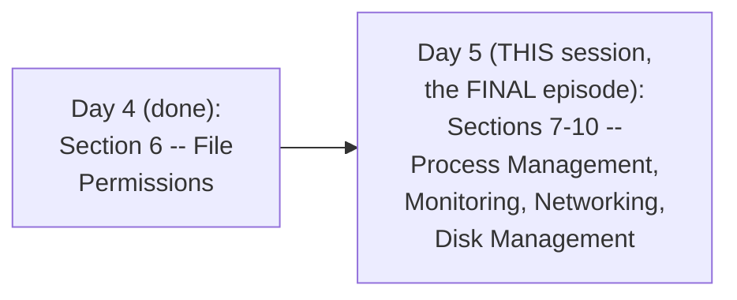

#### 🪜 Step-by-Step — A Direct, Honest, Practical Framing

> 💡 **Given directly:** *"Of course there are so many concepts, but MOST of these concepts are INTERCONNECTED — also I'm going to share a LOT of useful resources in the video, so make sure you watch it till the END."*

#### 🎯 Key Takeaways

* This is genuinely the **FINAL episode** of the COMPLETE, stated 10-section Linux Zero to Hero syllabus — directly, GENUINELY completing what Day 1 originally OUTLINED.
* This episode **directly, explicitly ACKNOWLEDGES** that some SECTIONS (specifically networking) will be COVERED via HONEST REDIRECTION to EXISTING, dedicated content, rather than DUPLICATING it here.
* EVERY hands-on CONCEPT is directly, LIVE-demonstrated on a REAL AWS EC2 instance — NOT merely the Docker container environment used in EARLIER episodes.

---

### 2. Process Management: What Is a Process & Why Management Matters

#### 📖 Definition — Process, Precisely Defined

> 💡 **Given directly:** *"A process is a RUNNING INSTANCE of any program — for example, you are running a Python application on a Linux server, now this running Python application is a process."*

#### 🔍 Internal Working — Direct, Precise Connection to Day 1's Own OS Fundamentals

> 💡 **Given directly:** *"In episode 1, I explained you that software applications or programs CANNOT directly interact with hardware... there is an INTERMEDIATE layer, which is called as operating system — what an operating system does, it performs CPU management, CPU scheduling, memory management, file system management, and network management."*

#### 🪜 Step-by-Step — A Complete, Genuine, Real, Worked Scenario

> 💡 **Given directly:** *"Imagine you have a Linux server with JUST ONE CPU, and you are trying to run a Python program, a cron job, and a web server — the Python application... is CPU intensive, something like an ML model — quite obviously there are a LOT of calculations... it is going to take a lot of CPU's time... let's say it is utilizing 90 PERCENTAGE of the CPU, then rest of the processes are only left with 10 percentage... your shell script or your cron job... is left with NO CPU resources."*

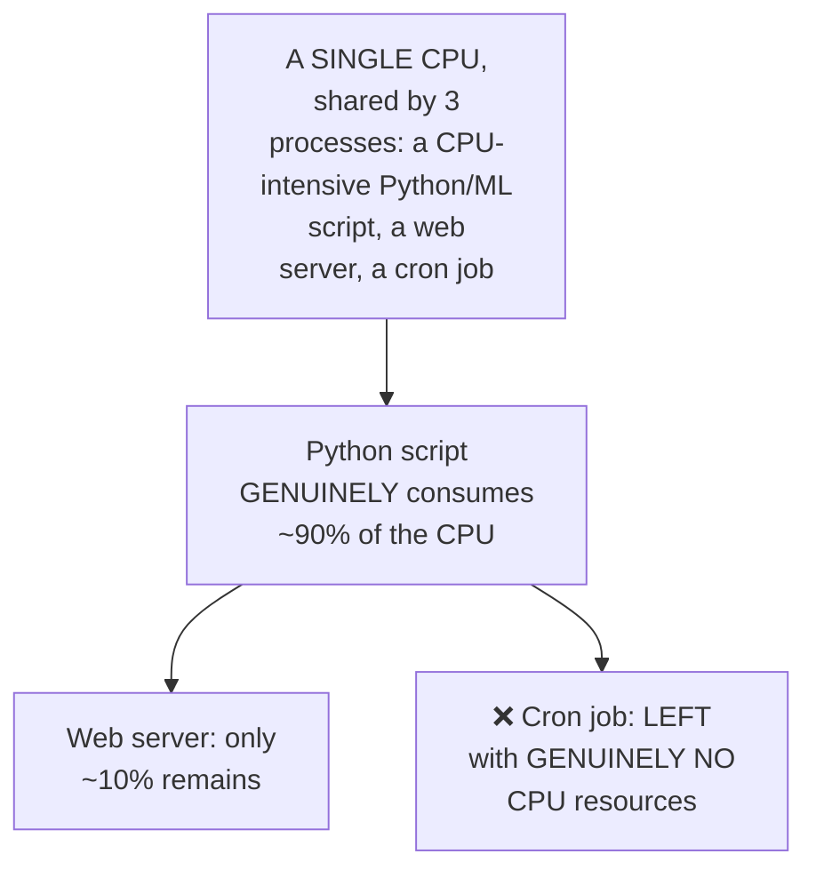

#### 🧠 Concept — A Genuinely Relatable, Real Analogy: The Doctor & ICU Patients

> 💡 **Given directly:** *"This can be understood as DOCTOR and the patients — let's say there are a lot of patients, ALL patients are important, however for a doctor, patients in ICU are MORE important, so doctor might spend MORE time with this particular patient — similarly, if a process... is spending MORE time with the CPU, that means CPU PRIORITIZES that process."*

#### 📖 Definition — The Three, Genuine Administrative Activities

> 💡 **Given directly:** *"As an administrator... you need to perform THREE activities — one, you might need to VIEW the processes... two, at times you need to KILL certain processes... at times you also need to PRIORITIZE or DEPRIORITIZE the processes."*

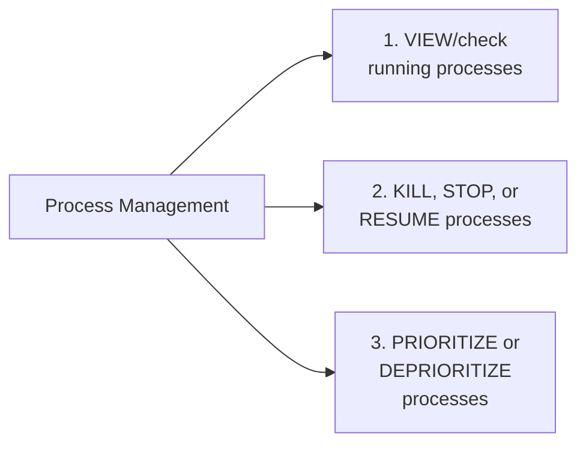

#### ⚠ Common Mistakes

* Assuming a MEMORY-intensive scenario is GENUINELY different from a CPU-intensive one, requiring an ENTIRELY separate mental model — explicitly, directly clarified: the SAME underlying dynamic applies — a memory-hungry Java application can SIMILARLY starve OTHER processes ("out of memory" errors), just LIKE a CPU-hungry process does.
* Assuming process PRIORITIZATION is something an administrator has FULL, direct control over — explicitly, directly clarified: "you don't have a lot of CONTROL on how CPU deals with the processes" — administrators can INFLUENCE, but the CPU's OWN scheduling algorithm GENUINELY governs the underlying MECHANICS.

#### 🎯 Key Takeaways

* A **process** is precisely a RUNNING INSTANCE of ANY program — directly, precisely connecting BACK to Day 1's own established "operating system as intermediary" CONCEPT.
* A GENUINE, real, worked scenario (a single CPU, THREE competing processes) directly, CONCRETELY illustrates WHY process management GENUINELY matters — resource-hungry processes can GENUINELY STARVE others.
* Administrators genuinely perform **THREE core activities**: VIEWING, KILLING/stopping/resuming, and PRIORITIZING processes — directly, precisely setting up the REST of this section's own content.

---
### 3. Viewing & Counting Processes: ps, ps aux vs. ps -ef

#### 💻 Code Example — The Basic ps Command

> 💡 **Given directly:** *"To check the list of running processes, the command that I can use is `ps` — so `ps` will list the processes, however it does NOT list ALL the processes."*

```bash
ps        # limited, incomplete list
ps aux      # ALL processes, WITH CPU and memory utilization
```

#### 🪜 Step-by-Step — Counting Total Running Processes

> 💡 **Given directly:** *"Can I check how many processes are running? What you can simply do, `ps aux` pipe... `nl` — NL is the LINE NUMBER — you will see, along with the output, in the first column you will find the number of the lines... there is also another way... `wc -l`, which is WORD COUNT."*

```bash
ps aux | nl        # numbers each line -- the LAST number = total process count
ps aux | wc -l        # directly counts the total number of lines/processes
```

#### ❓ Why It Exists — A Direct, Explicit, Genuine Interview Question

> 💡 **Given directly:** *"This is an interview question, where usually interviewers ask you: what is the difference between `ps aux` and `ps -ef`?... `ps aux` shows you the memory utilization, but `ps -ef` does NOT show you the memory utilization — it shows you the CPU utilization, but NOT memory."*

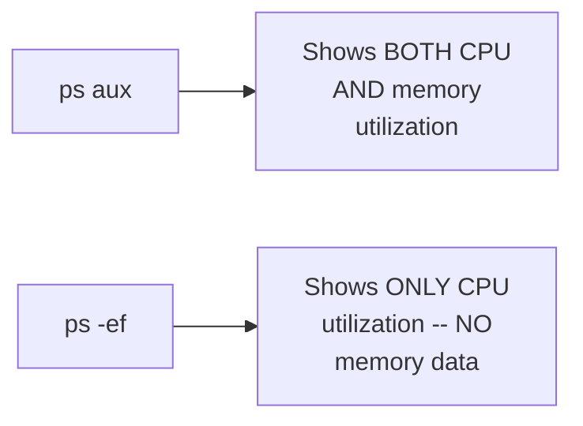

#### 📖 Definition — The Complete, Precise Column Meanings

> 💡 **Given directly:** *"USER is the one which INITIATED the process, or user is the one who TRIGGERED the process... second is the PROCESS ID — every process has a UNIQUE process ID... you know what is CPU utilization, what is memory utilization... then you will find the START TIME of the process, and also the COMMAND that is with which command the process has STARTED."*

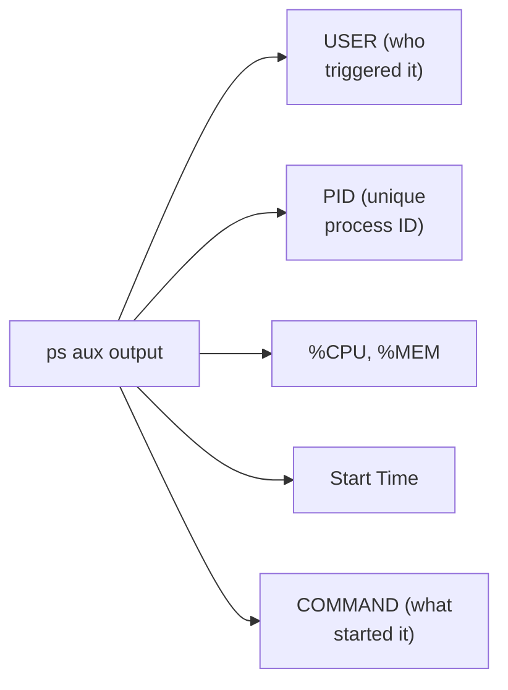

#### ⚠ Common Mistakes

* Assuming `ps` (alone, without flags) shows the COMPLETE list of ALL running processes — explicitly, directly clarified: it shows only a LIMITED subset; `ps aux` is GENUINELY needed for the FULL, complete picture.
* Confusing `ps aux` and `ps -ef` as GENUINELY IDENTICAL commands — explicitly, directly, PRECISELY distinguished: `ps aux` GENUINELY includes MEMORY utilization; `ps -ef` does NOT.

#### 🎯 Key Takeaways

* **`ps aux`** displays ALL processes, WITH BOTH CPU and MEMORY utilization; **`ps -ef`** ALSO shows all processes, but WITHOUT memory data — directly, explicitly confirmed as a GENUINE, real, common interview question.
* **`ps aux | nl`** or **`ps aux | wc -l`** GENUINELY count the total number of running processes.
* EACH process has a **UNIQUE Process ID (PID)** — GENUINELY necessary since multiple processes can share the SAME user, but EACH still needs its OWN, distinct identifier for MANAGEMENT purposes (killing, prioritizing, etc.).

---

### 4. Killing, Stopping & Resuming Processes

#### ❓ Why It Exists — A Genuine, Real, Concrete Motivating Scenario

> 💡 **Given directly:** *"In real time, you might get a requirement, like on a Jira ticket, or you might get it on the email — 'can you find the Java application process that is running on the server and kill the process?'"*

#### 🪜 Step-by-Step — Finding & Killing a Specific Process

> 💡 **Given directly:** *"You just run `ps aux` pipe `grep`... followed by, you will just do `java`... take that process ID and run `kill`, followed by the process ID... this would KILL the Java process."*

```bash
ps aux | grep java
kill <PID>
```

#### 🔍 Internal Working — A Genuine, Real, Practical Refinement

> 💡 **Given directly:** *"By default, you will get ONE line, which is nothing but the COMMAND that you executed — the command that you executed is ALSO a process... don't confuse that with the actual Java process... if you don't want to get confused, you can just use this command, `ps aux` pipe `grep java` pipe `grep -v grep` — this will NOT PRINT that line."*

```bash
ps aux | grep java | grep -v grep
```

#### 📖 Definition — The Genuine, Real Difference Between kill and kill -9

> 💡 **Given directly:** *"If I just try to do `kill 4040`... it said the process is killed, but if I again do `ps aux`, you will STILL find the process — that means the process is NOT getting removed — in such cases, you can FORCEFULLY kill the process, for example `kill -9 4040`... this is an INTERVIEW QUESTION — what is the difference between `kill` and `kill -9`? `kill -9` is FORCEFULLY deleting the process."*

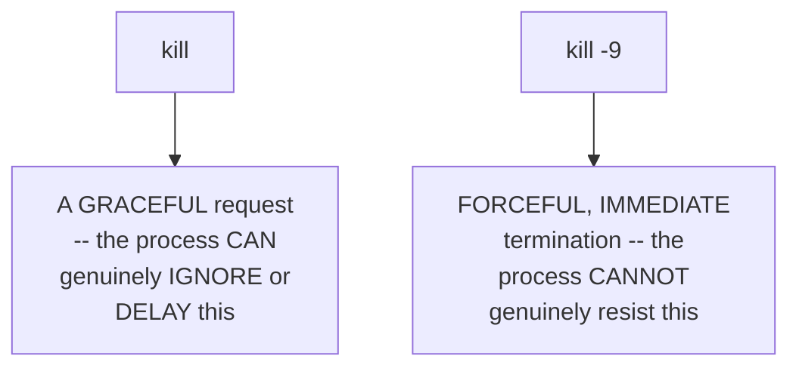

#### 📖 Definition — kill -3, Precisely Introduced for a Specific, Real Use Case

> 💡 **Given directly:** *"Imagine there is a Java process, and this Java process is taking a lot of memory... your developer might ask you, 'Abhishek, can you share the THREAD DUMPS for the process?'... in such cases, you can use the kill command... `kill -3` — is to GET the thread dumps, especially for Java applications."*

#### 💻 Code Example — Temporarily Stopping & Resuming a Process

> 💡 **Given directly:** *"Let's say I want to TEMPORARILY stop this particular process, so I can just do `kill -STOP`, followed by 4048 — now what does this do? You will STILL find that process... but the process is TEMPORARILY stopped — whenever you want to RESUME the process, you can simply do `kill -CONT`, that is CONTINUE."*

```bash
kill -STOP <PID>   # temporarily PAUSES the process
kill -CONT <PID>      # RESUMES the paused process
```

#### ⚠ Common Mistakes

* Assuming `kill <PID>` ALWAYS, GENUINELY terminates a process IMMEDIATELY — explicitly, directly, LIVE-demonstrated as SOMETIMES INSUFFICIENT: some processes GENUINELY IGNORE the standard `kill` signal, requiring `kill -9` (force kill) instead.
* Assuming `kill -9` is ALWAYS the GENERALLY preferred, DEFAULT choice — explicitly, directly implied as a LAST-RESORT option: plain `kill` allows a process to GENUINELY, GRACEFULLY clean up (e.g., closing files, saving state) BEFORE terminating, while `kill -9` GENUINELY, ABRUPTLY terminates WITHOUT this opportunity.

#### 🎯 Key Takeaways

* **`kill <PID>`** sends a GRACEFUL termination request (which a process CAN genuinely ignore); **`kill -9 <PID>`** FORCEFULLY, IMMEDIATELY terminates it — directly, explicitly confirmed as a GENUINE, real interview question.
* **`kill -3 <PID>`** is a SPECIFIC, GENUINE tool for retrieving THREAD DUMPS from Java applications — a REAL, PRACTICAL DIAGNOSTIC need, distinct from termination.
* **`kill -STOP`**/**`kill -CONT`** GENUINELY, TEMPORARILY pause and RESUME a process — WITHOUT terminating it ENTIRELY.

---
### 5. Prioritizing Processes: renice

#### 📖 Definition — renice, Precisely Introduced

> 💡 **Given directly:** *"For that there is a command in Linux which is `renice` — `renice -n 10 -p 4048`."*

#### 📖 Definition — The Precise, Genuine Priority Scale

> 💡 **Given directly:** *"Whenever you set `-n`, let's say 10, so it starts with MIN -19 to 20 — when you set a LESS number, that means the PRIORITY is more at the CPU — when you set a HIGHER number, the priority is LESS at the CPU — for example, when you set -19, that means the process gets a very HIGH priority, when you set +19, the process gets a very LESS priority."*

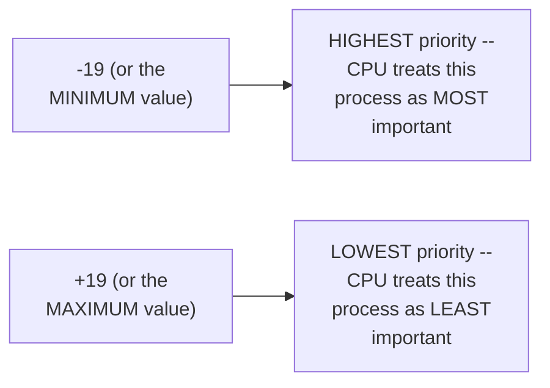

#### 🔍 Internal Working — The SAME Doctor & ICU Analogy, Directly Reused

> 💡 **Given directly:** *"I already explained why is it needed — by default, the ALGORITHM of the CPU thinks WHICHEVER process spends more time with the CPU, it is IMPORTANT process, just like doctor and the patient — doctor always thinks patient in the ICU is very important — similarly, CPU... but when you want to say CPU that, 'hey, I know it is taking a lot of resources from you, but I want to tell you as an administrator this process is NOT that important,' then you will use the renice command."*

#### ⚠ A Direct, Honest, Real, Important Warning

> 💡 **Given directly:** *"You need to be VERY careful while using these commands — you cannot just use it, you need to have a VERY strong understanding of what are ALL processes running on your Linux server — so a STAR MARK while using this — please be extra careful, ONLY if you are aware what all the processes are running on that Linux server, or ONLY if you own that Linux server, use these commands."*

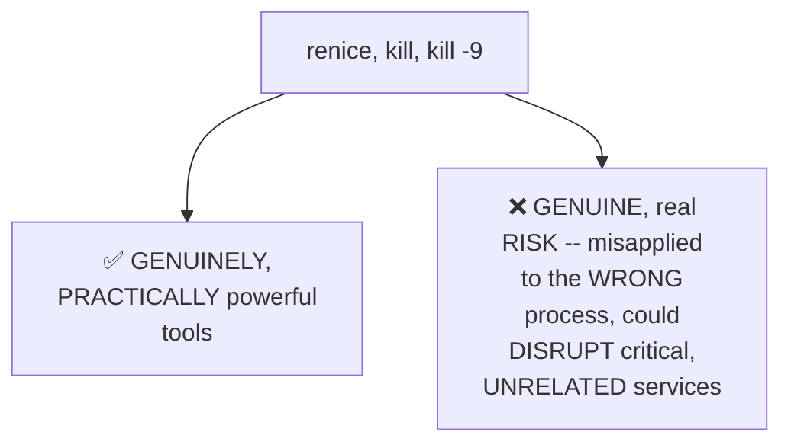

#### ⚠ Common Mistakes

* Assuming a LOWER `renice` number GENUINELY means LOWER priority (an intuitively PLAUSIBLE, but INCORRECT assumption) — explicitly, directly, PRECISELY clarified: it's the OPPOSITE — LOWER numbers mean HIGHER priority.
* Applying `renice` (or `kill`) WITHOUT GENUINELY understanding the FULL context of ALL processes running on a server — explicitly, directly, HONESTLY warned against as a GENUINE, real risk.

#### 🎯 Key Takeaways

* **`renice -n <priority> -p <PID>`** GENUINELY adjusts a process's OWN CPU priority — the scale runs from **-19 (highest priority)** to **+19 (lowest priority)** — a COUNTERINTUITIVE, but PRECISE, real convention worth REMEMBERING exactly.
* The SAME doctor/ICU analogy from Section 2 is **DIRECTLY, DELIBERATELY reused** here — REINFORCING the SAME underlying concept (the CPU's own DEFAULT prioritization LOGIC) across TWO, related commands.
* `renice` (and `kill`) are **GENUINELY POWERFUL but RISKY** tools — DIRECTLY, HONESTLY warned as requiring GENUINE, FULL understanding of a server's own RUNNING processes BEFORE use.

---

### 6. Services: Special, Auto-Starting Processes

#### 📖 Definition — Services, Precisely Introduced

> 💡 **Given directly:** *"There is another important CONCEPT related to the process, that is SPECIAL processes on the Linux server, which are called as SERVICES — it's NOT completely different from process, but services are BACKGROUND running process — services are SPECIAL kind of process which STARTS AT THE BOOT of the server."*

#### 🧠 Concept — A Genuinely Relatable, Real Analogy: YouTube on a Restarted Laptop

> 💡 **Given directly:** *"Best example is your laptop — let's say you're watching YouTube on your laptop, on your browser, and AUTOMATICALLY for some reason, maybe the battery is dead, or a software upgrade, your laptop restarted — will your YouTube application come up AUTOMATICALLY? Mostly NO, right? So they are basically process, but even when your laptop goes down, SOME of the process on your laptop AUTOMATICALLY come up — such kind of things are called as SERVICES."*

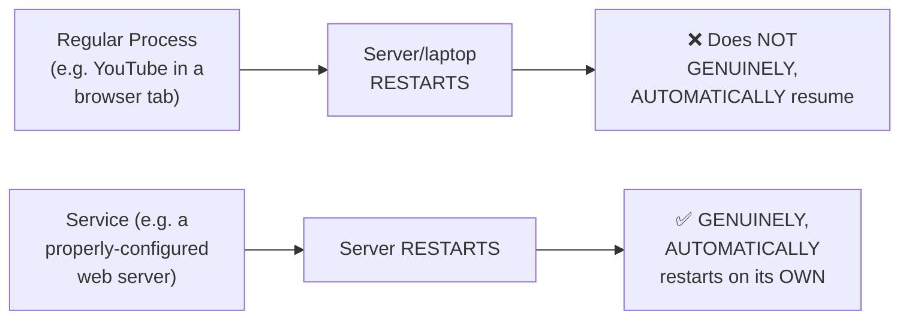

#### 🏢 Real-World / Production Usage — A Genuine, Real, Direct Example

> 💡 **Given directly:** *"Best example is your web server — most of these web servers, like Apache, Engine X, they already... the install script that they provide, they already make sure that the web server is running as a service, so that if the Linux server stops, next time when the Linux server comes up, their web server is running AUTOMATICALLY."*

#### 💻 Code Example — Listing, Stopping & Starting Services

> 💡 **Given directly:** *"How can you LIST services? For that, the command that you can use is `systemctl` — a UTILITY for managing your SYSTEMS — you can just do `list-units`... `--type=service`... let's just try `systemctl stop`, followed by cron service."*

```bash
systemctl list-units --type=service
sudo systemctl stop <service_name>
sudo systemctl start <service_name>
```

#### ⚠ Common Mistakes

* Assuming a REGULAR process and a SERVICE are GENUINELY, FUNDAMENTALLY different KINDS of things — explicitly, directly clarified: a service is GENUINELY "not completely different from process" — it's SPECIFICALLY a process with the ADDED behavior of AUTOMATICALLY restarting at BOOT.
* Assuming EVERY application MUST manually be CONFIGURED to restart on boot — explicitly, directly, HONESTLY clarified: MOST modern web servers ALREADY, AUTOMATICALLY set THEMSELVES up as services, via their OWN, provided install SCRIPTS.

#### 🎯 Key Takeaways

* A **service** is precisely a SPECIAL KIND of process — GENUINELY DISTINGUISHED by AUTOMATICALLY restarting at SERVER BOOT, unlike a regular process (directly, memorably illustrated via the "YouTube after a laptop restart" analogy).
* **`systemctl`** is the GENUINE, primary tool for LISTING, STOPPING, and STARTING services — directly, LIVE-demonstrated on a REAL EC2 instance.
* MOST real, modern WEB SERVERS (Apache, Nginx) ALREADY configure THEMSELVES as services via THEIR OWN install scripts — a GENUINE, real convenience, NOT requiring MANUAL setup in most cases.

---
### 7. Monitoring: top, htop, vmstat, free, du -sh (and an Honest Note on Prometheus/Grafana)

#### ❓ Why It Exists — The Precise, Genuine, Motivating Problem

> 💡 **Given directly:** *"Using `ps aux` you can check all the process, but USUALLY there are a lot of process, right? There can be a THOUSAND process as well — so going to EACH line and understanding using `ps aux` is NOT that easy — are there any commands that's going to help administrators understand the TOP processes in terms of CPU, or top process which are consuming more amount of memory?"*

#### 📖 Definition — top, Precisely Introduced

> 💡 **Given directly:** *"The command is `top` — when you run this, you will see the process ID and the EXACT amount of CPU and memory utilized by the process, REAL TIME — it KEEPS UPDATING real time... the top ones you will find at the STARTING, and the LEAST consuming process you will find at the BOTTOM."*

```bash
top   # REAL-TIME, sorted (highest consumers FIRST) CPU/memory monitoring
```

#### 📖 Definition — htop, Precisely Introduced

> 💡 **Given directly:** *"Then you have just an add-on to top, which is called `htop` — so `htop` is basically a WRAPPER on top of your top process... it is just providing the SAME information, with a MORE beautiful user interface, or better representation."*

#### 📖 Definition — vmstat & free, Precisely Introduced

> 💡 **Given directly:** *"You also have this command called `vmstat` — what `vmstat` does is that it reports the SYSTEM PERFORMANCE — you can check what is the FREE memory that is available... you can also find the same information, instead of `vmstat`, if you only need memory information, just do `free -h`... it is giving you the STATIC output, you can just perform some `grep` on it, or you can perform a `sed` on it, and you can get the EXACT field that you need."*

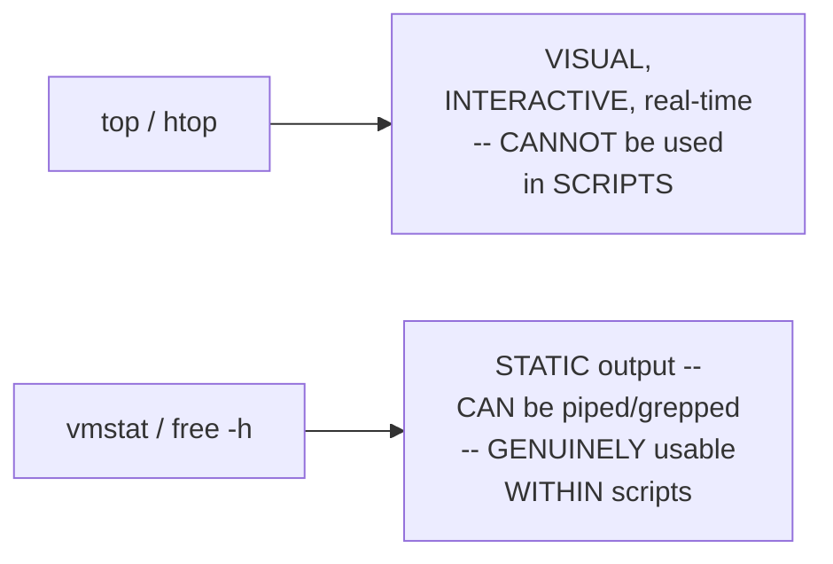

#### 🔍 Internal Working — Precisely WHY free's Own Static Output Matters

> 💡 **Given directly:** *"Top is a very GOOD command, but it CANNOT be used in your scripts — let's say you are a DevOps engineer, and you are writing a simple health-monitoring virtual-machine SCRIPT — you CANNOT use the top in that script, because it's a VISUAL representation, whereas when you run `free -m`, it is giving you the STATIC output."*

#### 📖 Definition — du -sh, Precisely Introduced for Folder-Level Disk Usage

> 💡 **Given directly:** *"How can I see FOLDER by folder?... what you can do is you can just run `du -sh`... any number of folders that are within `/opt`, you will see the disk UTILIZATION of each folder — this way you can find if there is any LARGE files in a particular folder."*

```bash
df -h        # disk space, BY PARTITION
du -sh <path>  # disk usage, BY FOLDER (within a given path)
```

#### 🪜 Step-by-Step — A Complete, Live-Demonstrated Confirmation

> 💡 **Given directly:** *"Within `opt` I create a folder called `logs`, I create a folder called `scripts`, and I create a folder called... `python`... now when I run `du -sh`, it will EXACTLY tell me what is the utilization of logs — for now it's EMPTY, that's why it's 4 KB... in case somebody complains that there are NO resources on this file system, I can simply go to that folder and DELETE the logs."*

#### ⚠ A Direct, Honest, Important Real-World Clarification

> 💡 **Given directly:** *"These days, we also connect Linux environment with Prometheus, we connect Linux environment with Grafana, where we can get MORE CPU or memory related information... so UTILIZATION or usage of these commands has SIGNIFICANTLY gone down — for a QUICK troubleshooting, these commands can be used, but a BETTER way of doing it is INTEGRATING your Linux server with monitoring tools like Prometheus and Grafana."*

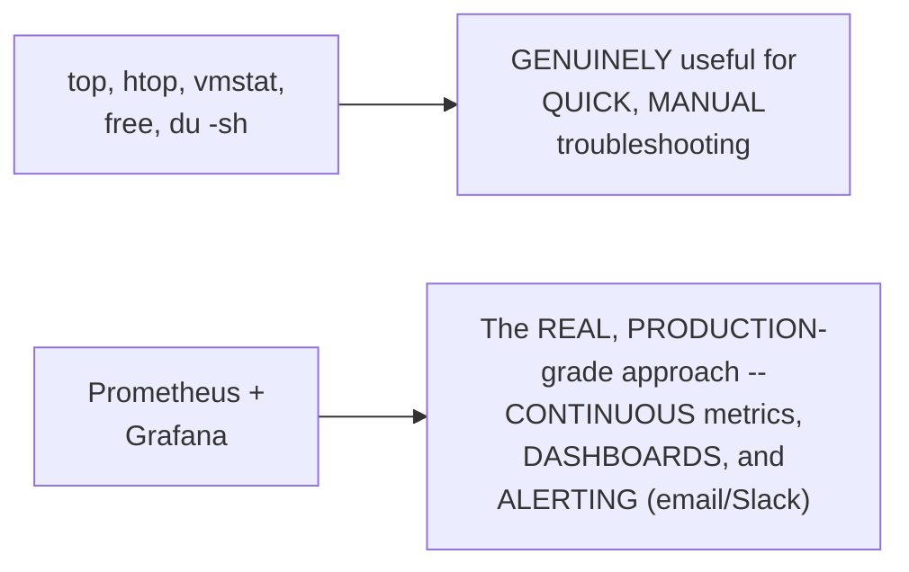

#### 🔍 Internal Working — A Genuine, Brief, Direct Overview of the Production Workflow

> 💡 **Given directly:** *"You might have a Linux server, so what you can do, you can CONNECT this Linux server to Prometheus, where Prometheus SCRAPES the metrics of the Linux environment using node exporter... once it gets this information, it puts that information in Grafana — in Grafana, you can create DASHBOARDS, which can SEND ALERTS, such as EMAIL notification or SLACK notification, to the development team."*

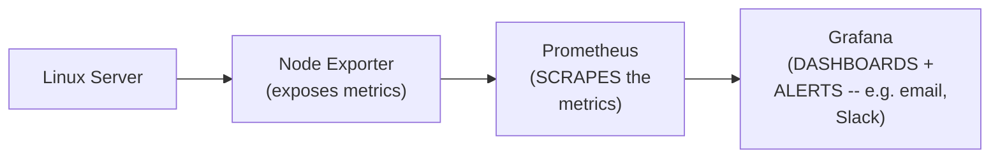

#### ⚠ Common Mistakes

* Assuming `top`/`htop` can be GENUINELY used WITHIN automated shell scripts — explicitly, directly, precisely clarified: their VISUAL, interactive nature makes them GENUINELY UNSUITABLE — `vmstat`/`free`'s own STATIC output is REQUIRED for scripting.
* Assuming manual commands (`top`, `free`, etc.) represent the GENUINE, COMPLETE, production-grade monitoring APPROACH — explicitly, directly, HONESTLY clarified: REAL, production environments GENUINELY use Prometheus/Grafana INSTEAD, with these manual commands reserved for QUICK, occasional troubleshooting.

#### 🎯 Key Takeaways

* **`top`**/**`htop`** provide REAL-TIME, VISUAL CPU/memory monitoring (sorted by CONSUMPTION) but CANNOT genuinely be used WITHIN scripts; **`vmstat`**/**`free -h`** provide STATIC output, GENUINELY usable in AUTOMATED scripts.
* **`du -sh`** GENUINELY reveals folder-level disk usage — directly, LIVE-demonstrated identifying WHICH specific folder GENUINELY consumes the MOST space.
* The instructor **DIRECTLY, HONESTLY acknowledges** these manual commands are for QUICK troubleshooting ONLY — REAL production monitoring GENUINELY uses **Prometheus and Grafana**, covered in a SEPARATE, dedicated playlist.

---

### 8. Networking: An Honest Redirection to a Dedicated Playlist

#### ⚠ A Direct, Honest, Explicit Decision NOT to Re-Teach This Section

> 💡 **Given directly:** *"Networking is SUPER, SUPER important part of your entire Linux... what I've done for you, I have created a NETWORKING PLAYLIST — if you go to our YouTube channel, you will find networking fundamentals playlist, where I've created ALMOST 3 HOURS content on networking... instead of REPEATING the same content, which will take ANOTHER 2 hours or another 3 hours, what I'm going to do, within the description and also in the GitHub repository, I will put the links of the networking fundamentals playlist."*

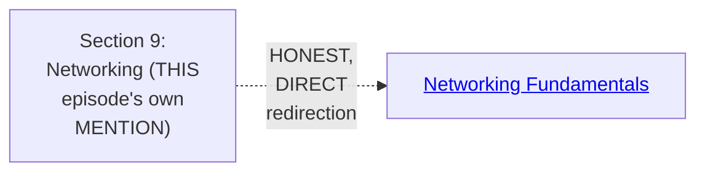

#### 🪜 Step-by-Step — Precisely What the Referenced Playlist Genuinely Covers

> 💡 **Given directly:** *"You will learn all the concepts, right from IP address, CIDR, subnets, then the OSI model, examples of OSI model, PRACTICALLY."*

#### 🏢 Real-World / Production Usage — A Genuine, Direct Recommendation for Sequencing

> 💡 **Given directly:** *"I would highly encourage you to FIRST go through the networking fundamentals playlist, then you can go through the AWS networking or Azure networking LATER, when you learn those concepts."*

#### ⚠ Common Mistakes

* Assuming THIS specific episode GENUINELY, COMPLETELY covers networking — explicitly, directly, HONESTLY clarified: it does NOT — networking is COVERED via a DIRECT, EXPLICIT redirection to a SEPARATE, dedicated resource.
* Assuming CLOUD-specific networking (AWS/Azure) should be studied BEFORE general networking FUNDAMENTALS — explicitly, directly recommended in the OPPOSITE order: fundamentals FIRST, cloud-specific concepts LATER.

#### 🎯 Key Takeaways

* This episode **GENUINELY, HONESTLY declines** to re-teach networking CONTENT already covered ELSEWHERE, in GENUINE depth, avoiding UNNECESSARY duplication.
* The referenced **Networking Fundamentals playlist** GENUINELY covers IP addresses, CIDR, subnets, and the COMPLETE OSI model — a SEPARATE, DEDICATED, ~3-hour resource.
* The GENUINE, recommended LEARNING order: networking FUNDAMENTALS first, THEN cloud-specific (AWS/Azure) networking CONCEPTS.

---
### 9. Disk Management: Mounting & Formatting New Storage

#### ❓ Why It Exists — A Genuine, Real, Concrete Motivating Scenario

> 💡 **Given directly:** *"Imagine there are FIVE applications running on this instance, each application, every second, every minute, keep adding the LOGS — info logs, debug logs... EVENTUALLY this is going to be of HUGE size... EVENTUALLY you will run out of the storage — in such cases, either you have to take BACKUP of these logs, or you need to INCREASE the storage, because storage is not that expensive — usually companies PREFER adding more storage."*

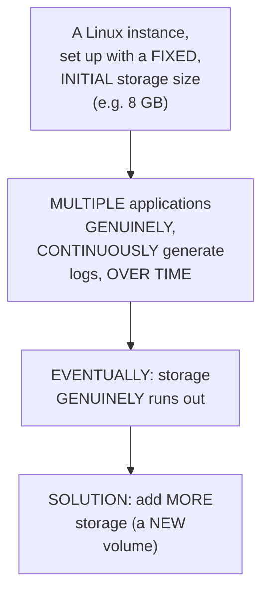

#### 📖 Definition — The Precise, Genuine, Two-Step Requirement Before New Storage Is Usable

> 💡 **Given directly:** *"By default, WHEN you add a storage... it doesn't WORK — you need to MOUNT it to a location like `/mnt`, or any specific location on your Linux instance, ONLY then the applications... can use that particular storage — also, by default, the volume that you create is of type BLOCK STORAGE, but your applications CANNOT directly use the block storage — you ALSO need to FORMAT the volume... to something more common, like EXT4 or XFS."*

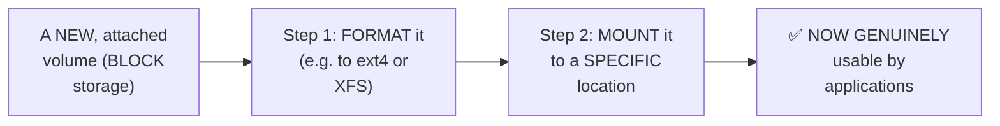

#### 💻 Code Example — Inspecting Existing Storage: lsblk & fdisk -l

> 💡 **Given directly:** *"There is a command called `lsblk` — what does `lsblk` do? It LISTS the BLOCKS that are ATTACHED to the instance... your DISK is PARTITIONED into FOUR different parts, or the disk is SPLIT into four different PARTITIONS — on root, it is 7GB... where did ONE GB more go? If you do `lsblk`, you will notice you have OTHER partitions... which is used by the BOOT."*

```bash
lsblk       # lists ALL attached blocks/volumes and their PARTITIONS
sudo fdisk -l   # SIMILAR to lsblk, but provides MORE detail
```

#### 🔍 Internal Working — Precisely Connecting BACK to Day 2's Own Folder Structure

> 💡 **Given directly:** *"If you remember EPISODE TWO, where we learned about the FOLDER structure, `/boot` has IMAGES that are used by the EC2 instance during the TIME of boot... this is where OTHER 1 GB is utilized."*

#### 🪜 Step-by-Step — A Complete, Real, Live AWS Demonstration (Including an Honest Mistake)

> 💡 **Given directly, an HONEST, LIVE, CAUGHT mistake:** *"One important thing that you need to note — my EC2 instance is in the AVAILABILITY ZONE US East 1C — so my VOLUME should ALSO be in the SAME data center... looks like I forgot, I created it in 1A — let me QUICKLY delete this, that would have been a BIG mess."*

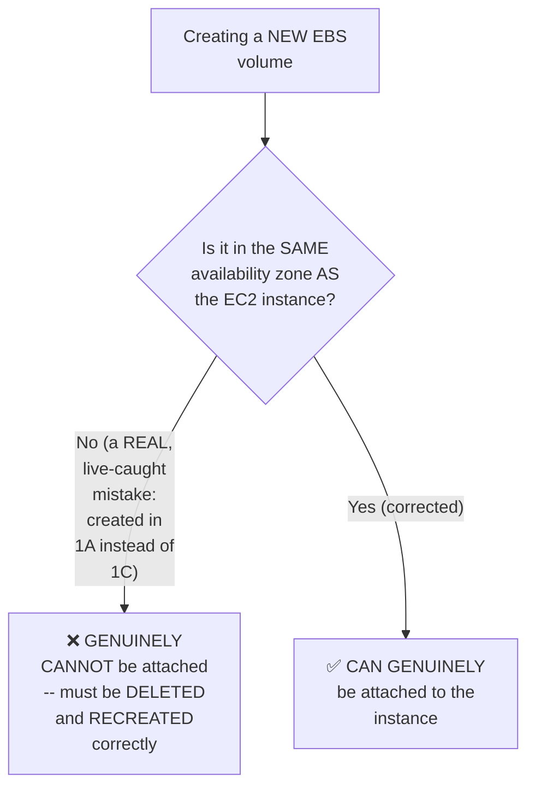

#### 💻 Code Example — The Complete, Precise, Correct Sequence

> 💡 **Given directly:** *"`mkdir -p /mnt/demo_volume`, which is a TEMPORARY mount directory... `mkfs -t ext4`... `/dev/xvdf` — this is what we are trying to FORMAT... 'file system writing SUPERBLOCKS' — perfect, so the FORMAT is also done — now we can simply use the `mount` command — `mount /dev/xvdf` on which location? `/mnt/demo_volume`."*

```bash
# 1. Create a mount point
sudo mkdir -p /mnt/demo_volume

# 2. Format the NEW, attached volume (BLOCK storage -> a usable file system)
sudo mkfs -t ext4 /dev/xvdf

# 3. Mount it to the newly-created location
sudo mount /dev/xvdf /mnt/demo_volume

# 4. Verify
cd /mnt/demo_volume
touch test_file
ls
df -h    # confirms GENUINELY, ADDITIONAL available space
```

#### 🔍 Internal Working — The Genuine, Real, Live-Confirmed Result

> 💡 **Given directly:** *"If you do `df -h` now, you will see, so you have 9-8 GB, out of which only 1% is utilized, and on your root of your file system, you have 4.44 GB left — PREVIOUSLY it was only 4 GB, NOW I have 14 GB size left on the instance."*

#### 📖 Definition — umount, Precisely Introduced as the Reverse Operation

> 💡 **Given directly:** *"`mount`, which is used to mount a particular file system... `umount` — I did NOT show you, but it is EXACTLY OPPOSITE, where you want to REMOVE a mount — previously I added a volume to the mount `/mnt/demo_users`, using `umount` you can REMOVE this."*

```bash
sudo umount /mnt/demo_volume
```

#### ⚠ Common Mistakes

* Assuming a NEWLY-attached volume is IMMEDIATELY, GENUINELY usable by applications — explicitly, directly, LIVE-demonstrated as REQUIRING TWO, SEPARATE, mandatory steps FIRST: formatting AND mounting.
* Attempting to attach a NEW volume to an INSTANCE WITHOUT verifying MATCHING availability zones — explicitly, directly, HONESTLY demonstrated as a REAL, common, EASY-to-make mistake, requiring the VOLUME to be DELETED and RECREATED correctly.

#### 🎯 Key Takeaways

* A REAL, concrete scenario (LOGS growing OVER TIME, eventually EXHAUSTING storage) directly, PRECISELY motivates the NEED to add MORE storage to an EXISTING Linux instance.
* A NEWLY-attached volume genuinely requires **TWO, MANDATORY steps** before USE: **FORMATTING** (`mkfs -t ext4`, converting raw BLOCK storage into a usable FILE SYSTEM) and **MOUNTING** (`mount`, attaching it to a SPECIFIC folder location).
* This session's own **COMPLETE, HONEST, live AWS demonstration** — INCLUDING a REAL, caught availability-zone MISTAKE — directly, CONCRETELY confirmed the ENTIRE workflow, ending with a GENUINE, LIVE-VERIFIED increase in AVAILABLE disk space (`df -h`).

---

### 10. Closing: The Complete Series, Wrapped Up

#### 🪜 Step-by-Step — A Complete, Honest, Genuine Recap of the ENTIRE Series

> 💡 **Given directly:** *"So this is about disk management, and my request is to go through NETWORKING zero to hero playlist, and I will also add SHELL SCRIPTING playlist — overall, in this particular Linux zero to hero playlist, you will find FIVE episodes related to Linux zero to hero, then you will find TWO episodes related to networking zero to hero, and you will find FOUR or FIVE shell scripting videos."*

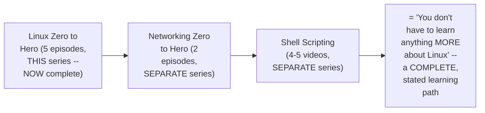

#### 🏢 Real-World / Production Usage — A Genuine, Direct, Confident Claim

> 💡 **Given directly:** *"People keep asking, 'Abhishek, how much Linux is important?' If you complete ALL of this — shell scripting videos of mine, networking zero to hero, and this FIVE episodes of Linux zero to hero — you DON'T have to learn anything ABOUT Linux, only this is MORE than enough — because when it comes to cloud, I ALSO covered cloud networking in AWS, Azure — so this FUNDAMENTALS is 100 PERCENT enough for your interviews."*

#### ⚠ Common Mistakes

* Assuming THIS single video, on its OWN, represents the COMPLETE, recommended Linux learning PATH — explicitly, directly clarified: the FULL, recommended path GENUINELY includes TWO additional, companion series (Networking Zero to Hero, Shell Scripting).
* Assuming ADDITIONAL, deeper Linux content is STILL genuinely needed BEYOND this complete, THREE-series combination — explicitly, directly, CONFIDENTLY claimed as "100 PERCENT enough for your interviews."

#### 🎯 Key Takeaways

* This episode **GENUINELY, COMPLETELY concludes** the stated, FIVE-episode Linux Zero to Hero series — covering ALL TEN sections originally OUTLINED in Day 1.
* The instructor's own **COMPLETE, recommended Linux LEARNING PATH** genuinely spans THREE, related series: Linux Zero to Hero (5 episodes), Networking Zero to Hero (2 episodes), and Shell Scripting (4-5 videos).
* This COMBINATION is **directly, CONFIDENTLY claimed** as GENUINELY sufficient PREPARATION for Linux-related interviews — INCLUDING cloud-specific networking CONCEPTS (AWS, Azure), covered in SEPARATE, related content.

---
## 📝 Glossary

| Term | Definition | Why It Matters |
|---|---|---|
| **Process** | A running instance of any program | The core, foundational unit of process management |
| **ps aux** | Lists ALL processes, WITH CPU + memory | Genuinely different from ps -ef (a common interview Q) |
| **ps -ef** | Lists ALL processes, WITH CPU only (no memory) | -- |
| **PID** | Process ID -- a unique identifier per process | Used to kill, stop, resume, or reprioritize a process |
| **kill** | Sends a graceful termination request | Can genuinely be ignored by the process |
| **kill -9** | FORCEFUL, immediate termination | A genuine interview question vs. plain kill |
| **kill -3** | Retrieves thread dumps (Java applications) | A specific, real diagnostic use case |
| **kill -STOP / -CONT** | Temporarily pause / resume a process | Doesn't terminate the process |
| **renice** | Adjusts a process's own CPU priority | Scale: -19 (highest) to +19 (lowest) |
| **Service** | A special process that auto-restarts at boot | Distinguishes it from a regular process |
| **systemctl** | Manages services (list/start/stop) | -- |
| **top / htop** | Real-time, visual CPU/memory monitoring | CANNOT be used within scripts |
| **vmstat / free -h** | Static memory/performance output | CAN be used within scripts |
| **du -sh** | Disk usage, by folder | Identifies which specific folder consumes the most space |
| **Prometheus + Grafana** | Real, production-grade monitoring tools | The genuine, real-world alternative to manual commands |
| **lsblk / fdisk -l** | Lists attached blocks/volumes and partitions | -- |
| **mkfs -t ext4** | Formats block storage into a usable file system | A mandatory step before a new volume can be used |
| **mount / umount** | Attaches / detaches a file system to a location | The second mandatory step for using new storage |

---

## 🔄 Revision Notes — One-Minute Revision

* This is genuinely **Day 5, the FINAL episode**, completing the entire, stated 10-section Linux Zero to Hero syllabus -- covering Sections 7-10: Process Management, Monitoring, Networking, Disk Management.
* **Process Management**: a process = a running instance of a program. Motivated via a real, worked scenario (a CPU-intensive script starving a web server + cron job) and the doctor/ICU-patient analogy for CPU prioritization. THREE admin activities: view, kill/stop/resume, prioritize.
* **Viewing processes**: `ps aux` (ALL processes, CPU+memory) vs. `ps -ef` (ALL processes, CPU only, NO memory) -- a GENUINE interview question. `ps aux | nl` or `ps aux | wc -l` counts total processes. `ps aux | grep <name> | grep -v grep` avoids the self-matching grep artifact.
* **Killing/stopping/resuming**: `kill <PID>` (graceful, CAN be ignored) vs. `kill -9 <PID>` (FORCEFUL -- a SECOND genuine interview question). `kill -3` retrieves Java thread dumps. `kill -STOP`/`kill -CONT` temporarily pause/resume WITHOUT terminating.
* **renice**: `renice -n <value> -p <PID>` -- scale from -19 (HIGHEST priority) to +19 (LOWEST priority) -- COUNTERINTUITIVE, worth remembering precisely. HONEST warning: use only with FULL understanding of what's running on the server.
* **Services**: special processes that AUTOMATICALLY restart at server boot (unlike regular processes -- the "YouTube after a laptop restart" analogy). Most modern web servers already configure themselves as services. `systemctl list-units --type=service`, `systemctl stop/start <service>`.
* **Monitoring**: `top`/`htop` (real-time, VISUAL, cannot be scripted) vs. `vmstat`/`free -h` (STATIC output, CAN be scripted). `du -sh` reveals folder-level disk usage. HONEST acknowledgment: these are for QUICK troubleshooting -- REAL production monitoring uses Prometheus (scrapes metrics via node exporter) + Grafana (dashboards + email/Slack alerts).
* **Networking**: HONESTLY, EXPLICITLY redirected to a SEPARATE, dedicated "Networking Fundamentals" playlist (~3 hours: IP addresses, CIDR, subnets, OSI model) -- NOT re-taught in this episode, to avoid duplication. Recommended order: fundamentals first, THEN cloud-specific (AWS/Azure) networking.
* **Disk Management**: motivated by logs/storage growing over time. A NEW volume genuinely needs TWO steps before use: FORMAT (`mkfs -t ext4`) and MOUNT (`mount`). `lsblk`/`fdisk -l` inspect attached storage and partitions (directly connects to Day 2's own /boot content). Complete, live AWS demo: creating a new EBS volume -- INCLUDING an honest, real, caught mistake (wrong availability zone, corrected) -- then mkdir, mkfs, mount, verified via `df -h` showing genuinely increased space. `umount` reverses a mount.
* **Closing**: this episode GENUINELY completes the 5-episode Linux Zero to Hero series. The full, recommended learning path spans THREE series: Linux Zero to Hero (5 episodes) + Networking Zero to Hero (2 episodes) + Shell Scripting (4-5 videos) -- directly, confidently claimed as "100% enough" for Linux interviews.

---

## 📋 Cheat Sheet

**Viewing processes:**
```bash
ps aux              # ALL processes, WITH CPU + memory
ps -ef                 # ALL processes, WITH CPU only (no memory)
ps aux | wc -l            # count total processes
ps aux | grep <name> | grep -v grep   # find a specific process, avoiding self-match
```

**Killing/stopping/resuming:**
```bash
kill <PID>        # graceful (can be ignored)
kill -9 <PID>        # FORCEFUL
kill -3 <PID>           # Java thread dumps
kill -STOP <PID>          # temporarily pause
kill -CONT <PID>             # resume
```

**Prioritizing:**
```bash
renice -n <value> -p <PID>   # -19 (highest priority) to +19 (lowest priority)
```

**Services:**
```bash
systemctl list-units --type=service
sudo systemctl stop <service>
sudo systemctl start <service>
```

**Monitoring:**
```bash
top / htop           # real-time, VISUAL (cannot script)
vmstat / free -h        # static output (CAN script)
nproc                     # CPU count
df -h                        # disk space, by partition
du -sh <path>                   # disk usage, by folder
```

**Disk management (adding new storage):**
```bash
lsblk                          # list attached blocks/volumes
sudo fdisk -l                     # similar, more detail
sudo mkdir -p /mnt/<name>            # create a mount point
sudo mkfs -t ext4 /dev/<device>         # FORMAT (mandatory, step 1)
sudo mount /dev/<device> /mnt/<name>       # MOUNT (mandatory, step 2)
sudo umount /mnt/<name>                       # reverse a mount
```

---

## 🔥 Interview Questions & Answers

### 🟢 Beginner

**Q1.**

**Question:** What is a process?

**Answer:** A running instance of any program.

**Explanation:** Directly, precisely defined.

**Why Interviewers Ask This:** The most basic, foundational process-management question.

**Possible Follow-up:** "Give an example of something that becomes a process when run."

**Q2.**

**Question:** What is the genuine difference between `ps aux` and `ps -ef`?

**Answer:** ps aux shows both CPU and memory utilization; ps -ef shows only CPU, not memory.

**Explanation:** Directly, explicitly confirmed as a genuine interview question.

**Why Interviewers Ask This:** An explicitly-named, common, real interview question.

**Possible Follow-up:** "Which would you use if you specifically needed memory data?"

**Q3.**

**Question:** What is the genuine difference between `kill` and `kill -9`?

**Answer:** kill sends a graceful request (which can be ignored); kill -9 forcefully, immediately terminates.

**Explanation:** Directly, explicitly confirmed as a genuine interview question.

**Why Interviewers Ask This:** An explicitly-named, common, real interview question.

**Possible Follow-up:** "Why might you prefer plain kill over kill -9, if both are available?"

**Q4.**

**Question:** What does `kill -3` genuinely do?

**Answer:** Retrieves thread dumps, especially for Java applications.

**Explanation:** Directly, precisely explained.

**Why Interviewers Ask This:** Tests genuine, practical, real-world diagnostic knowledge.

**Possible Follow-up:** "In what real scenario would a developer genuinely request this?"

**Q5.**

**Question:** On the renice priority scale, does a lower number mean higher or lower priority?

**Answer:** Higher priority.

**Explanation:** Directly, explicitly, precisely clarified.

**Why Interviewers Ask This:** A commonly-confused, counterintuitive detail.

**Possible Follow-up:** "What is the genuine range of this scale?"

**Q6.**

**Question:** What is the genuine difference between a process and a service?

**Answer:** A service is a special kind of process that automatically restarts at server boot; a regular process does not.

**Explanation:** Directly, precisely distinguished.

**Why Interviewers Ask This:** Basic, foundational process-vs-service knowledge.

**Possible Follow-up:** "Give a real, concrete example of a service."

**Q7.**

**Question:** Why can't `top` genuinely be used within an automated shell script?

**Answer:** It's a visual, interactive representation, not static output that can be piped or grepped.

**Explanation:** Directly, precisely explained.

**Why Interviewers Ask This:** Tests genuine, practical scripting awareness.

**Possible Follow-up:** "What command would you use instead, within a script?"

**Q8.**

**Question:** What two, real production tools does this session recommend over manual monitoring commands?

**Answer:** Prometheus and Grafana.

**Explanation:** Directly, explicitly named.

**Why Interviewers Ask This:** Tests genuine, real-world monitoring tooling awareness.

**Possible Follow-up:** "What role does Prometheus play, versus Grafana?"

**Q9.**

**Question:** What two, mandatory steps must a newly-attached volume go through before it can genuinely be used?

**Answer:** Formatting (e.g., mkfs -t ext4) and mounting.

**Explanation:** Directly, precisely explained and live-demonstrated.

**Why Interviewers Ask This:** Basic, essential disk-management knowledge.

**Possible Follow-up:** "What command reverses a mount?"

**Q10.**

**Question:** Is networking genuinely taught in full depth within this specific episode?

**Answer:** No -- it's explicitly, honestly redirected to a separate, dedicated Networking Fundamentals playlist.

**Explanation:** Directly, explicitly acknowledged.

**Why Interviewers Ask This:** Tests attention to the session's own honest, stated scope.

**Possible Follow-up:** "What topics does that separate playlist genuinely cover?"

---

### 🟡 Intermediate

**Q11.**

**Question:** Explain why the instructor deliberately, honestly shows himself making a REAL mistake (creating an EBS volume in the wrong availability zone) rather than editing it out or performing the demo flawlessly.

**Answer:** This is a genuinely deliberate, CONSISTENT teaching choice, directly matching a PATTERN seen ACROSS this instructor's own broader body of work in this SAME series (e.g., Day 3's own live `/sbin` deletion test, Day 3's own honest `>`/`>>` mistake). By GENUINELY, LIVE making and CORRECTING a REAL, common mistake (availability-zone MISMATCH), the instructor DIRECTLY demonstrates a GENUINELY realistic, PRACTICAL troubleshooting SCENARIO — REAL Linux/cloud administration GENUINELY involves catching and CORRECTING this EXACT class of mistake, and SHOWING it HONESTLY prepares learners for the SAME kind of real, PRACTICAL friction they will GENUINELY encounter, rather than PRESENTING an artificially FLAWLESS, idealized WORKFLOW.

**Explanation:** Requires recognizing a deliberate, consistent, honest teaching pattern across this instructor's own body of work.

**Why Interviewers Ask This:** Tests whether a learner recognizes the genuine, practical value of honest, unedited demonstrations over polished, idealized ones.

**Possible Follow-up:** "What GENERAL debugging/verification habit would help you AVOID this exact class of mistake in your OWN, future work?"

**Q12.**

**Question:** A learner argues that since `kill -9` genuinely, forcefully terminates ANY process, it should ALWAYS be used as the DEFAULT choice, since it's guaranteed to work, unlike plain `kill`, which can be ignored. Evaluate this claim.

**Answer:** This claim overstates the case, missing a GENUINELY important, real trade-off THIS session's own content implies but doesn't EXPLICITLY state. While `kill -9` IS genuinely GUARANTEED to terminate a process (per Section 4's own LIVE demonstration), this GUARANTEE comes at a REAL COST: `kill -9` provides the PROCESS with NO opportunity to GRACEFULLY clean up — SAVING unsaved DATA, CLOSING open file HANDLES, or releasing OTHER resources PROPERLY. Plain `kill`, by CONTRAST, sends a REQUEST the process CAN choose to HANDLE gracefully — ALLOWING it to GENUINELY, SAFELY shut down BEFORE terminating. Using `kill -9` as an UNCONDITIONAL DEFAULT risks GENUINE, real DATA loss or CORRUPTION for processes that GENUINELY need a graceful SHUTDOWN. The ACCURATE, more precise conclusion: plain `kill` should GENERALLY be TRIED first; `kill -9` is APPROPRIATE SPECIFICALLY when a process GENUINELY fails to respond to the GRACEFUL request (per Section 4's own EXACT, demonstrated scenario).

**Explanation:** Tests whether a learner recognizes the genuine trade-off between guaranteed termination and graceful shutdown, rather than defaulting to the "more forceful" option unconditionally.

**Why Interviewers Ask This:** Distinguishes candidates who understand genuine operational trade-offs from those who default to the most forceful tool available.

**Possible Follow-up:** "Construct a genuine, real scenario where using kill -9 as a FIRST, immediate choice (rather than trying plain kill first) would GENUINELY be the correct, appropriate decision."

**Q13.**

**Question:** Explain, precisely, why the instructor DELIBERATELY reuses the SAME doctor/ICU-patient analogy for BOTH explaining WHY process management matters (Section 2) AND explaining `renice`'s own priority mechanism (Section 5), rather than using TWO, genuinely different analogies.

**Answer:** This is a genuinely deliberate, INTENTIONAL choice, DIRECTLY reinforcing a SINGLE, CONNECTED underlying CONCEPT across TWO, related but DISTINCT topics. In Section 2, the analogy DIRECTLY establishes the GENERAL principle: the CPU's OWN algorithm NATURALLY prioritizes WHATEVER process is ALREADY consuming more resources (JUST as a doctor prioritizes the ICU patient). In Section 5, the SAME analogy is DIRECTLY REVISITED to explain WHY an ADMINISTRATOR might need to OVERRIDE this DEFAULT behavior (via `renice`) — TELLING the CPU, "I KNOW this process is CONSUMING resources, but I want you to TREAT it as LESS important." By REUSING the SAME, ALREADY-FAMILIAR analogy, the LEARNER can DIRECTLY, IMMEDIATELY understand `renice`'s OWN purpose as a DIRECT, LOGICAL EXTENSION of the CONCEPT ALREADY established — RATHER than needing to LEARN a genuinely NEW, disconnected mental MODEL for THIS specific command.

**Explanation:** Requires recognizing a deliberate, connected use of the same analogy across two related sections, and articulating why this strengthens rather than weakens understanding.

**Why Interviewers Ask This:** Tests whether a learner recognizes the pedagogical value of a continuous, connected teaching narrative over disconnected, independent examples.

**Possible Follow-up:** "How would you EXTEND this SAME doctor/ICU analogy to explain WHY `kill -9` might be GENUINELY necessary, in a way that's CONSISTENT with how it's been used SO FAR?"

**Q14.**

**Question:** Using this session's own precise `top`/`htop` vs. `vmstat`/`free` distinction (Section 7), explain WHY a DevOps engineer writing an AUTOMATED, scheduled health-check script would GENUINELY need to choose the SECOND category specifically, connecting this to Day 3's own established shell-scripting principles.

**Answer:** A precise, synthesized explanation, directly connecting THIS session's own monitoring-tool distinction to Day 3's own established shell-scripting PRINCIPLES: per Section 7's own PRECISE reasoning, `top`/`htop` produce VISUAL, INTERACTIVE output — GENUINELY designed for a HUMAN to WATCH and INTERPRET in REAL time — this OUTPUT format is GENUINELY, STRUCTURALLY incompatible with an AUTOMATED script's own NEED to PROGRAMMATICALLY read, PARSE, and ACT on SPECIFIC data VALUES (e.g., "IS memory usage ABOVE 90%?"). `vmstat`/`free`'s own STATIC output, by CONTRAST, can be GENUINELY, DIRECTLY piped THROUGH tools like `grep` or `sed` (per Section 7's own DIRECT mention) — DIRECTLY, PRECISELY analogous to Day 3's own established SHELL-SCRIPTING principle that AUTOMATED, SCRIPTED workflows GENUINELY require NON-INTERACTIVE, PROGRAMMATICALLY-PARSEABLE COMMANDS (the SAME underlying REASONING that made `useradd` GENUINELY preferable to `adduser` WITHIN scripts, per Day 3's own established DISTINCTION). This directly, precisely reveals a SHARED, GENERAL principle CONNECTING TWO, separately-taught SESSIONS: automation GENUINELY requires PREDICTABLE, PARSEABLE, NON-INTERACTIVE output — WHETHER that's a USER-creation command (Day 3) or a MONITORING command (THIS session).

**Explanation:** Requires synthesizing this session's own monitoring-tool distinction with an entirely separate, earlier session's own scripting principle to identify a shared, underlying theme.

**Why Interviewers Ask This:** A senior-level question testing whether a candidate can connect a GENERAL, underlying automation PRINCIPLE across MULTIPLE, separately-taught, seemingly UNRELATED topics.

**Possible Follow-up:** "Name ONE MORE command (from ANY session in this SERIES) that would SIMILARLY be UNSUITABLE for automated scripting, for the SAME underlying reason."

**Q15.**

**Question:** Synthesize this session's complete "services" reasoning (Section 6) with its own "disk management" reasoning (Section 9) to explain WHY a company's OWN, custom-written monitoring/health-check script (per Section 7's own established use case) would ALSO GENUINELY benefit from being configured as a SERVICE, rather than run MANUALLY.

**Answer:** A precise, synthesized explanation, directly connecting TWO, separately-taught sections into ONE, coherent, PRACTICAL understanding: per Section 6's own PRECISE reasoning, a SERVICE's own GENUINE, defining advantage is AUTOMATICALLY RESTARTING at SERVER BOOT — WITHOUT requiring MANUAL, human INTERVENTION. A CUSTOM health-check/monitoring SCRIPT (per Section 7's own established USE case) is PRECISELY the KIND of tool that GENUINELY, PRACTICALLY BENEFITS from THIS property — if the SERVER GENUINELY restarts (e.g., DUE to a maintenance WINDOW, or an UNEXPECTED crash), a monitoring SCRIPT configured as a REGULAR process would GENUINELY, SILENTLY FAIL to resume, meaning the ORGANIZATION would LOSE VISIBILITY into their OWN system's health PRECISELY DURING the period FOLLOWING a genuinely SIGNIFICANT, disruptive EVENT (a server RESTART) — EXACTLY when MONITORING is MOST genuinely NEEDED. By CONFIGURING this monitoring SCRIPT as a SERVICE (per Section 6's own established `systemctl` mechanism), the ORGANIZATION ensures monitoring GENUINELY, AUTOMATICALLY RESUMES, WITHOUT requiring a HUMAN to REMEMBER to manually RESTART it — DIRECTLY, PRECISELY connecting Section 6's own GENERAL "services restart automatically" PRINCIPLE to THIS session's own SPECIFIC, real monitoring USE case.

**Explanation:** Requires synthesizing the services concept with the monitoring use case to construct a coherent, practical justification for a specific configuration choice neither section explicitly recommends together.

**Why Interviewers Ask This:** A senior-level question testing whether a candidate can apply a GENERAL principle (services auto-restart) to a SPECIFIC, practical scenario (monitoring scripts) not explicitly connected in the session's own content.

**Possible Follow-up:** "What GENUINE, additional risk might arise if this SAME monitoring script, configured as a service, ITSELF becomes the process CONSUMING excessive resources — how would you GENUINELY detect and address THIS specific, recursive scenario?"

---

### 🔴 Advanced

**Q16.**

**Question:** Design a complete, reasoned incident-response PLAYBOOK (using ONLY this session's own established process-management and monitoring commands) for the scenario: "a production web application is reported as GENUINELY slow, and the on-call engineer suspects a runaway process."

**Answer:** A reasonable, complete playbook, directly applying this session's own EXACT, established commands and REASONING:

```text
1. IDENTIFY the top resource-consuming process (Section 7):
   Run `top` (or `htop`), observe the TOP-listed process (GENUINELY highest
   CPU/memory consumer, per Section 7's own "sorted, top = highest" mechanism).

2. GATHER detailed process information (Section 3):
   Run `ps aux | grep <suspected_process_name> | grep -v grep`, noting the
   GENUINE PID.

3. CHECK memory/disk context (Section 7):
   Run `free -h` (memory) and `df -h`/`du -sh` (disk), confirming whether
   OTHER resources are ALSO GENUINELY constrained.

4. ATTEMPT a GRACEFUL fix FIRST (Section 4, per Intermediate Q12's own
   reasoning):
   If the process appears GENUINELY unresponsive/hung, try `kill <PID>`
   FIRST -- ALLOWING a graceful shutdown, if the process CAN respond.

5. ESCALATE to a FORCEFUL kill, ONLY if genuinely necessary (Section 4):
   If the process STILL persists (confirmed via a repeat `ps aux` check),
   use `kill -9 <PID>`.

6. IF the issue is a REPEATED, KNOWN pattern (rather than a one-time
   incident), CONSIDER `renice` (Section 5) to PROACTIVELY DEPRIORITIZE
   a KNOWN, resource-heavy but NON-CRITICAL process, RATHER than killing
   it EVERY time.

7. DOCUMENT and VERIFY REAL, ongoing monitoring (Section 7):
   Confirm WHETHER this SAME server is GENUINELY integrated with
   Prometheus/Grafana for FUTURE, proactive alerting -- IF not, this
   INCIDENT itself becomes the JUSTIFICATION for SETTING that UP.
```

This complete playbook directly, precisely applies EVERY major process-MANAGEMENT and MONITORING command from THIS session, in a LOGICAL, ESCALATING order — STARTING with the LEAST disruptive ACTION (observation) and ENDING with the MOST disruptive (forceful termination), ONLY when genuinely NECESSARY.

**Explanation:** Requires synthesizing every major command from this session into one complete, logically-ordered, real-world incident-response procedure.

**Why Interviewers Ask This:** A realistic, senior-level question testing whether a candidate can integrate MULTIPLE, separately-taught commands into ONE, coherent, PRACTICAL troubleshooting workflow.

**Possible Follow-up:** "At what SPECIFIC point in this playbook would you GENUINELY escalate to a HUMAN team member, rather than continuing to TROUBLESHOOT alone?"

**Q17.**

**Question:** Critically evaluate: "Since this session confirms that manual commands like `top`, `free`, and `du -sh` are genuinely less relevant than Prometheus/Grafana for production monitoring, this means learning these manual commands is GENUINELY a waste of time for anyone pursuing a real, production-focused DevOps career." Is this an accurate, complete characterization?

**Answer:** Not accurate — this significantly OVERSTATES a GENUINE, HONEST acknowledgment ("utilization... has significantly gone DOWN") into an UNCONDITIONAL claim of IRRELEVANCE NEITHER this session's OWN content, NOR sound reasoning, SUPPORTS. Section 7's own PRECISE, careful FRAMING is DIRECT: "for a QUICK troubleshooting, these commands CAN be used" — this is NOT a claim these commands are OBSOLETE, but that they SERVE a GENUINELY DIFFERENT, COMPLEMENTARY purpose COMPARED to Prometheus/Grafana. EVEN in a GENUINELY production-focused, Prometheus/Grafana-INTEGRATED environment, an ENGINEER would STILL GENUINELY need these MANUAL commands for DIRECT, IMMEDIATE, hands-on INVESTIGATION DURING an ACTIVE incident (e.g., SSH-ing directly INTO a server to RUN `top` WHILE Prometheus/Grafana DASHBOARDS are BEING consulted SIMULTANEOUSLY) — PARTICULARLY in SCENARIOS where the MONITORING infrastructure ITSELF might be GENUINELY unavailable or INSUFFICIENTLY GRANULAR for a SPECIFIC, IMMEDIATE debugging NEED. The ACCURATE, more PRECISE conclusion: these MANUAL commands REMAIN GENUINELY, PRACTICALLY VALUABLE as a COMPLEMENTARY, hands-ON skill SET — REDUCED in RELATIVE importance COMPARED to a FULL, automated Prometheus/Grafana SETUP, but NOT genuinely OBSOLETE or a "WASTE of time."

**Explanation:** Tests whether a learner recognizes that "reduced relative importance" doesn't mean "genuinely obsolete," correctly identifying the continued, complementary value of manual troubleshooting skills.

**Why Interviewers Ask This:** Distinguishes candidates who correctly interpret a nuanced, honest acknowledgment from those who over-generalize it into an absolute, dismissive claim.

**Possible Follow-up:** "Describe a GENUINE, real scenario where knowing these MANUAL commands would be GENUINELY, PRACTICALLY valuable, EVEN in a FULLY Prometheus/Grafana-integrated production environment."

**Q18.**

**Question:** Synthesize this session's complete "disk management" workflow (Section 9) with Day 4's own established "chmod/chown" permission concepts to construct a reasoned explanation of WHY a newly-mounted volume's own DEFAULT permissions might GENUINELY need to be EXPLICITLY reviewed/adjusted, rather than assuming they are AUTOMATICALLY, CORRECTLY configured for the applications that will USE it.

**Answer:** A precise, synthesized explanation, directly connecting Day 4's own established permission PRINCIPLES to THIS session's own disk-management WORKFLOW: per Day 4's own PRECISE reasoning, EVERY file and FOLDER on a Linux SYSTEM has permissions GOVERNING who can READ, WRITE, or EXECUTE — with DEFAULT permissions OFTEN being MORE restrictive THAN a SPECIFIC use case GENUINELY requires (per Day 4's own DIRECT `750` home-directory DEFAULT example). Per THIS session's own PRECISE `mount` workflow (Section 9), a NEWLY-formatted and MOUNTED volume GENUINELY receives its OWN, DEFAULT permissions (typically ROOT-owned, GIVEN the demonstration's own use of `sudo`/root for THESE operations) — this means if a NON-root APPLICATION or SERVICE (e.g., a WEB server RUNNING as a DEDICATED, non-root SERVICE user, per Section 6's own established CONCEPT) NEEDS to WRITE LOGS to THIS newly-mounted VOLUME, it would GENUINELY, LIKELY encounter a "PERMISSION denied" ERROR — DIRECTLY analogous to Day 4's own established "developer CANNOT execute their OWN script BY DEFAULT" surprise — UNLESS an administrator EXPLICITLY, DELIBERATELY adjusts the NEW mount point's OWN ownership (via `chown`, per Day 4's own established MECHANISM) or PERMISSIONS (via `chmod`) to GENUINELY, CORRECTLY match the INTENDED application's own ACCESS needs. This directly, precisely reveals a GENUINE, PRACTICAL, often-OVERLOOKED step in REAL disk-management WORKFLOWS — new STORAGE isn't JUST technically MOUNTED, it must ALSO be CORRECTLY PERMISSIONED for its INTENDED use.

**Explanation:** Requires synthesizing an entirely separate, earlier session's own permission concepts with this session's own disk-management workflow to identify a genuine, practical, often-overlooked consideration neither session explicitly combines.

**Why Interviewers Ask This:** A capstone-level question testing whether a candidate can connect knowledge ACROSS MULTIPLE, separately-taught sessions to identify a genuine, real, practical gap.

**Possible Follow-up:** "What SPECIFIC chown/chmod commands would you run to GENUINELY prepare THIS session's own `/mnt/demo_volume` for use by a non-root web-server SERVICE?"

---

## 🧪 Scenario-Based Interview Questions

> **Scenario 1:** A colleague reports that a critical background job STOPPED running after a SCHEDULED server RESTART (for a security PATCH), even though the SAME job worked FINE before the restart. Using this session's own concepts, diagnose the most likely cause.

**Structured Answer:**
1. **Initial investigation:** Recognize this as directly connected to Section 6's own precise PROCESS-vs-SERVICE distinction — a job that GENUINELY, SUCCESSFULLY ran BEFORE a restart, but FAILED to resume AFTER, STRONGLY suggests it was RUNNING as a REGULAR process, NOT a SERVICE.
2. **Metrics/logs to check:** Directly check WHETHER this JOB is GENUINELY registered via `systemctl list-units --type=service` — CONFIRMING whether it was EVER GENUINELY configured to AUTO-START.
3. **Possible causes:** Per Section 6's own precise reasoning, a REGULAR process (unlike a SERVICE) does NOT AUTOMATICALLY restart FOLLOWING a server REBOOT — the JOB was LIKELY started MANUALLY (e.g., via SSH, directly RUNNING the command) rather than CONFIGURED as a PROPER service.
4. **Debugging approach:** Directly attempt to MANUALLY restart the JOB, CONFIRMING it GENUINELY still WORKS correctly — this CONFIRMS the issue is SPECIFICALLY about STARTUP behavior, NOT the job's OWN underlying logic.
5. **Resolution:** CONFIGURE this job as a GENUINE `systemd` SERVICE (a topic BEYOND this session's own EXPLICIT content, but a DIRECT, LOGICAL extension of Section 6's own established `systemctl` USAGE), ensuring it AUTOMATICALLY restarts on FUTURE reboots.
6. **Prevention:** Establish a standing team PRACTICE of CONFIGURING ALL critical, LONG-RUNNING jobs as GENUINE services (NOT manually-started processes) FROM THE START — directly APPLYING Section 6's own established PRINCIPLE that CRITICAL functionality should GENUINELY survive a SERVER restart.

> **Scenario 2 (Advanced):** Your team's production Linux server is GENUINELY running low on disk space, and the on-call engineer discovers a SPECIFIC log directory consuming AN UNUSUALLY LARGE amount of space. Using this session's own concepts, construct a complete, reasoned investigation and remediation plan.

**Structured Answer:**
1. **Initial investigation:** Recognize this as DIRECTLY connected to Section 7's own precise `du -sh` mechanism — DIRECTLY, PRECISELY designed to IDENTIFY WHICH SPECIFIC folder is GENUINELY consuming the MOST disk space.
2. **Metrics/logs to check:** Directly run `df -h` to CONFIRM the OVERALL disk-space SITUATION, then `du -sh` on SUSPECTED PARENT directories (e.g., `/var/log`, per the EARLIER Shell Scripting session's own established LOG-location CONVENTION) to NARROW DOWN the SPECIFIC, offending folder.
3. **Possible causes:** Per THIS session's own directly-established REASONING (Section 9's own "logs grow over time" MOTIVATION), the MOST LIKELY cause is a LOG file (or SET of log files) that has GENUINELY, CONTINUOUSLY grown WITHOUT being ROTATED or ARCHIVED.
4. **Debugging approach:** Directly INSPECT the SPECIFIC, identified log FILES (e.g., via `ls -ltr` combined with `du -sh` on INDIVIDUAL files), CONFIRMING their OWN size and LAST-modified TIMESTAMPS.
5. **Resolution:** Per Section 9's own DIRECTLY-mentioned OPTIONS, EITHER (a) BACKUP/ARCHIVE the EXCESSIVE logs and REMOVE them from the CURRENT volume, OR (b) — if this is a GENUINELY, ONGOING, RECURRING need — ADD additional STORAGE (per Section 9's own COMPLETE, live-demonstrated volume-CREATION workflow) SPECIFICALLY DEDICATED to logs.
6. **Prevention:** Establish a standing team PRACTICE of CONFIGURING log ROTATION (a topic BEYOND this session's own EXPLICIT content, but a DIRECT, LOGICAL extension of the "logs GROW over time" problem THIS session establishes) — AUTOMATICALLY archiving/DELETING old logs BEFORE they GENUINELY exhaust available DISK space, directly PREVENTING this EXACT class of incident from RECURRING.

---

## 🛠 Hands-on Exercises

### 🟢 Easy

1. Write out, from memory, the genuine difference between ps aux and ps -ef.
2. Explain, in your own words, why kill -9 should generally be a last resort, not a first choice.
3. List the two mandatory steps a newly-attached volume must go through before it can be used.

### 🟡 Medium

4. Set up a Linux environment (per Day 1's own established methods), and directly practice ps/kill/renice on a real, deliberately-started background process.
5. Write a short explanation (150-200 words) of why top/htop cannot be used in automated scripts, but vmstat/free can, directly applying Section 7's own reasoning.
6. Complete the full, worked incident-response playbook proposed in Advanced Interview Q16, testing it against a deliberately-created, resource-heavy process.

### 🔴 Advanced

7. Set up a real AWS EC2 instance (or equivalent cloud VM), and directly reproduce this session's own complete disk-management demonstration -- creating, formatting, and mounting a new volume.
8. Implement the debugging scenario proposed in Scenario 1 -- create a background job as a regular process (not a service), restart your environment, and confirm it genuinely fails to resume; then configure it as a proper systemd service and confirm it now survives a restart.
9. Research and document (beyond this session's own content) how log rotation (e.g., via `logrotate`) genuinely works, directly connecting it to the disk-management problem this session establishes.

---

## 🏗 Practice Assignment

### Build: "Complete Process Management & Disk Management Workflow"

**Objective:** Directly build a genuine, complete, hands-on demonstration combining process management, monitoring, and disk management skills.

**Requirements:**
- Set up a real Linux environment (Docker, WSL, or a real cloud instance, per Day 1's own established methods).
- Start a background process, then practice viewing (ps aux/-ef), killing (both graceful and forceful), and reprioritizing (renice) it.
- Use top, htop (if available), vmstat, and free to monitor your environment's own real resource usage.
- If using a real cloud instance: create, format, and mount a new storage volume, following this session's own exact steps.
- A written reflection (200-300 words) on which command or concept from this session you found most genuinely non-obvious, and why.

**Architecture (suggested):**

```text
linux_day5_final_practice/
├── process_management_log.md         # your ps/kill/renice commands + output
├── monitoring_log.md                    # your top/htop/vmstat/free observations
├── disk_management_log.md                 # your volume creation/format/mount (if applicable)
└── REFLECTION.md                              # your written reflection
```

**Expected Functionality:**
- Your process-management tests should genuinely, directly confirm real, observed behavior.
- Your disk-management workflow (if completed) should genuinely, correctly result in usable, mounted storage.

**Challenges:**
- Correctly distinguishing when a graceful kill is sufficient versus when kill -9 is genuinely necessary.
- Correctly matching availability zones when creating cloud storage volumes.

**Bonus Improvements:**
- Set up a genuine, working Prometheus/Grafana integration (per Section 7's own recommendation), even at a basic level.
- Complete the Networking Fundamentals playlist (per Section 8's own explicit recommendation), directly extending your Linux knowledge into networking.

---

## 📚 Additional Resources

- **Days 1-4 of this series** -- the direct prerequisite sessions, establishing OS fundamentals, folder structure, user management, file management, vi/vim, and file permissions, all of which this session directly builds on.
- **The instructor's own "Observability Zero to Hero" playlist** (referenced directly) -- covering the complete Prometheus/Grafana integration briefly overviewed in this session.
- **The instructor's own "Networking Fundamentals" playlist** (referenced directly, ~3 hours) -- the dedicated resource for Section 9's own content, explicitly recommended before this session's own brief mention.
- **The instructor's own Shell Scripting series** (in this same workspace) -- directly complementary content, completing the instructor's own stated, complete Linux learning path.

---

## 📌 Final Revision Sheet

### ⭐ Core Concepts
- **Process management**: view (ps aux/-ef), kill (graceful vs. -9), prioritize (renice).
- **Services**: special processes that auto-restart at boot; managed via systemctl.
- **Monitoring**: top/htop (visual, real-time) vs. vmstat/free (static, scriptable); du -sh for folder-level usage. Real production monitoring uses Prometheus/Grafana.
- **Networking**: honestly redirected to a dedicated, separate playlist.
- **Disk management**: new storage needs formatting (mkfs) AND mounting (mount) before use.

### ⭐ Important Definitions
- **PID, kill -9, renice** (see Glossary for full definitions).

### ⭐ Important Commands/Code
```bash
ps aux | grep <name> | grep -v grep
kill <PID> / kill -9 <PID>
renice -n -19 -p <PID>
systemctl list-units --type=service
sudo mkfs -t ext4 /dev/<device> && sudo mount /dev/<device> /mnt/<name>
```

### ⭐ Architecture/Process
- Complete process-management flow: view (ps) -> diagnose (top/htop/vmstat/free) -> act (kill/renice) -> configure for reliability (systemctl, for critical jobs).
- Complete disk-management flow: inspect (lsblk/fdisk -l) -> create a volume (cloud provider) -> format (mkfs) -> mount (mount) -> verify (df -h).

### ⭐ Best Practices
- Try a graceful kill before escalating to kill -9.
- Configure critical, long-running jobs as services, not manually-started processes.
- Use vmstat/free (not top/htop) within automated scripts.
- Verify availability zone matching before attaching cloud storage volumes.
- Integrate real, production servers with Prometheus/Grafana rather than relying solely on manual commands.

### ⭐ Common Mistakes
- Confusing ps aux (shows memory) with ps -ef (does not).
- Using kill -9 as a default, rather than a last resort.
- Assuming top/htop can be used within automated scripts.
- Assuming newly-attached storage is immediately usable without formatting and mounting.

### ⭐ Interview Points
- Be ready to explain ps aux vs. ps -ef, and kill vs. kill -9 -- both explicitly-named, genuine interview questions.
- Be ready to explain the renice priority scale precisely (-19 highest, +19 lowest).
- Be ready to distinguish a process from a service.
- Be ready to explain the two mandatory steps (format, mount) for new disk storage.

### ⭐ Things to Remember
- This is genuinely the **FINAL episode** of the complete, stated Linux Zero to Hero series -- covering ALL TEN sections originally outlined in Day 1.
- The instructor's own **honest, live mistake** (wrong availability zone) is a deliberate, valuable, realistic demonstration -- not an embarrassing accident to overlook.
- The **complete, recommended Linux learning path** spans THREE series: Linux Zero to Hero, Networking Zero to Hero, and Shell Scripting -- directly, confidently claimed as sufficient preparation for real interviews.

---

## 🔗 Source

- [Process Management, Monitoring & Disk Management](https://youtu.be/H9DAWegYpag?si=cdTBlDE3ZNOSeLlM)