# 🐧 Top 10 Linux Commands Every Software Engineer Should Know

> **Series:** Standalone video, direct companion to the Linux Zero to Hero series (SAME instructor) · **Instructor:** Abhishek
> **Note on scope:** This is a **standalone, curated "top 10" video** from the SAME instructor as this workspace's complete Linux Zero to Hero series — genuinely framed as ESSENTIAL knowledge for DevOps engineers, system administrators, and Linux administrators specifically. SEVERAL commands DIRECTLY REINFORCE material ALREADY covered in the Zero to Hero series (`top`, `htop`, `ps aux`, `df -h`, `du -sh`, `free -h`) — this guide notes those connections DIRECTLY. However, THIS video also introduces SEVERAL, GENUINELY NEW commands NOT covered in that earlier series: `pgrep`, `pstree`, `netstat`, `tcpdump`, `ping`/`traceroute`, `journalctl`, `lsof`, and TWO real, practical productivity SHORTCUTS (reverse history search via `Ctrl+R`, and `PS1` prompt customization).

---

## 📑 Table of Contents

1. [Session Overview](#-session-overview)
2. [Learning Objectives](#-learning-objectives)
3. [Detailed Notes](#-detailed-notes)
   - [1. Session Context: A Standalone "Top 10" Companion to the Zero to Hero Series](#1-session-context-a-standalone-top-10-companion-to-the-zero-to-hero-series)
   - [2. Commands 1-2: System & Process Monitoring (top/htop, ps/pgrep/pstree)](#2-commands-1-2-system--process-monitoring-tophtop-pspgreppstree)
   - [3. Commands 3-4: Network Troubleshooting (netstat, tcpdump)](#3-commands-3-4-network-troubleshooting-netstat-tcpdump)
   - [4. Command 5: Network Path Diagnostics (ping & traceroute)](#4-command-5-network-path-diagnostics-ping--traceroute)
   - [5. Commands 6-7: Disk & Memory Utilization (df/du, free)](#5-commands-6-7-disk--memory-utilization-dfdu-free)
   - [6. Command 8: Service Logs (journalctl)](#6-command-8-service-logs-journalctl)
   - [7. Command 9: Finding Processes by Port (lsof)](#7-command-9-finding-processes-by-port-lsof)
   - [8. Command 10: Log Analysis (tail & head)](#8-command-10-log-analysis-tail--head)
   - [9. Two Bonus Productivity Shortcuts: Reverse History Search & PS1 Customization](#9-two-bonus-productivity-shortcuts-reverse-history-search--ps1-customization)
   - [10. Closing: Complete Recap](#10-closing-complete-recap)
4. [Glossary](#-glossary)
5. [Revision Notes — One-Minute Revision](#-revision-notes--one-minute-revision)
6. [Cheat Sheet](#-cheat-sheet)
7. [Interview Questions & Answers](#-interview-questions--answers)
8. [Scenario-Based Interview Questions](#-scenario-based-interview-questions)
9. [Hands-on Exercises](#-hands-on-exercises)
10. [Practice Assignment](#-practice-assignment)
11. [Additional Resources](#-additional-resources)
12. [Final Revision Sheet](#-final-revision-sheet)

---

## 🎯 Session Overview

This video curates ten essential commands (PLUS two bonus shortcuts) around REAL, common, day-to-day troubleshooting SCENARIOS. It covers:

1. **System performance monitoring**: `top`/`htop` — directly, precisely REINFORCING the Zero to Hero series' own established content, with a genuinely useful NEW analogy (comparing this to an SRE's own APPLICATION-monitoring dashboard, but for SYSTEM performance).
2. **Process family commands**: `ps`/`ps aux` (REINFORCEMENT) alongside TWO genuinely NEW commands — `pgrep` (a DIRECT SHORTCUT for finding a SPECIFIC process by name) and `pstree` (VISUALIZING the COMPLETE process HIERARCHY, tracing WHICH process STARTED which).
3. **`netstat`**, GENUINELY NEW — inspecting NETWORK connections and IDENTIFYING which PORTS are ALREADY in use, directly solving the GENUINELY common "port already in use" error.
4. **`tcpdump`**, GENUINELY NEW — CAPTURING and ANALYZING real network PACKETS, directly, LIVE-demonstrated for DIAGNOSING application LATENCY and connectivity issues (with a genuine, real POINTER to Wireshark for DEEPER packet analysis).
5. **`ping` and `traceroute`**, GENUINELY NEW — TWO, progressively more DETAILED tools for diagnosing WHY a connection to an EXTERNAL destination (like `google.com`) might be SLOW or FAILING.
6. **`df -h`/`du -sh`** (disk) and **`free -h`** (memory) — DIRECT REINFORCEMENT of Zero to Hero content.
7. **`journalctl`**, GENUINELY NEW — retrieving the COMPLETE LOGS of SYSTEMD-managed services, directly, precisely DISTINGUISHED from `systemctl` (which STARTS/STOPS services, but doesn't show their LOGS).
8. **`lsof`**, GENUINELY NEW — identifying EXACTLY which PROCESS is using a SPECIFIC port, directly, precisely COMPLETING the "port already in use" TROUBLESHOOTING workflow `netstat` BEGAN.
9. **`tail`/`head`**, briefly touched EARLIER in the series, but GIVEN a real, LIVE demonstration HERE using ACTUAL `/var/log` files.
10. **TWO, genuinely PRACTICAL bonus shortcuts**: REVERSE history search (`Ctrl+R`) and `PS1` PROMPT customization — directly, HONESTLY distinguished as SHORTCUTS, not Linux COMMANDS themselves.

> 💡 **Key framing, given directly, on this video's own genuine, targeted audience:** *"Especially if you're a DevOps engineer, system administrator, or a Linux administrator, there is absolutely NO EXCUSE — you should DEFINITELY know these commands."*

---

## 🎯 Learning Objectives

By the end of this guide, you will be able to:

- [ ] Use `top`/`htop` for real-time system monitoring, and `ps`/`pgrep`/`pstree` for process investigation.
- [ ] Use `netstat` to identify which network ports are already in use.
- [ ] Use `tcpdump` to capture and diagnose network packet-level issues.
- [ ] Use `ping` and `traceroute` to diagnose connectivity and latency to an external destination.
- [ ] Use `df -h`, `du -sh`, and `free -h` for disk and memory utilization checks.
- [ ] Use `journalctl` to retrieve the complete logs of a systemd-managed service.
- [ ] Use `lsof` to identify which specific process is using a given port.
- [ ] Use `tail`/`head` for quick log file analysis.
- [ ] Use reverse history search (`Ctrl+R`) and customize your shell prompt via `PS1`.

---

## 📚 Detailed Notes

### 1. Session Context: A Standalone "Top 10" Companion to the Zero to Hero Series

#### 🧠 Concept

> 💡 **Given directly, opening the session:** *"In today's video, let's explore top 10 Linux commands every software engineer should know — especially if you're a DevOps engineer, system administrator, or a Linux administrator, there is absolutely NO EXCUSE, you should DEFINITELY know these commands."*

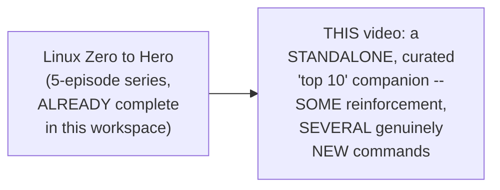

#### 🎯 Key Takeaways

* This is a **standalone video**, from the SAME instructor as the Linux Zero to Hero series — organized around COMMON, real TROUBLESHOOTING scenarios, RATHER than a structured, sequential CURRICULUM.
* SEVERAL commands **DIRECTLY REINFORCE** material ALREADY established in Zero to Hero (`top`, `htop`, `ps aux`, `df -h`, `du -sh`, `free -h`) — this guide DIRECTLY notes these CONNECTIONS.
* SEVERAL commands are **GENUINELY NEW**: `pgrep`, `pstree`, `netstat`, `tcpdump`, `ping`/`traceroute`, `journalctl`, `lsof`, and TWO practical SHORTCUTS.

---

### 2. Commands 1-2: System & Process Monitoring (top/htop, ps/pgrep/pstree)

#### 🔍 Internal Working — top/htop, A Genuinely Useful, New Analogy

> 💡 **Given directly:** *"It's just like a MONITORING DASHBOARD — what SRE engineers do WITH applications, top command does the SAME thing WITH system performance, or your Linux nodes."*

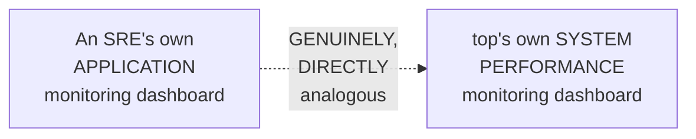

#### 🏢 Real-World / Production Usage — A Genuine, Direct, Practical Workflow

> 💡 **Given directly:** *"Maybe your CPU utilization has exceeded 90 percentage, and you want to understand WHICH process is utilizing more CPU — so you can just monitor for 5 minutes... you can see through the dashboard which process is the one that is taking more resources — EITHER you can kill the process, or you can take the required action... sometimes you might just want to INFORM your development team."*

#### 📖 Definition — ps, Precisely Re-Confirmed, With a Genuine, New Distinction

> 💡 **Given directly:** *"By just running the process command or `ps` command, you cannot get ALL of this information — but there are cool EXTENSIONS to `ps` — for example, when you run `ps aux`, it provides you a VERY detailed information — most of this information you can get through `top` as well, but `top` is MORE real time, whereas `ps` you can use it WITHIN your shell scripts."*

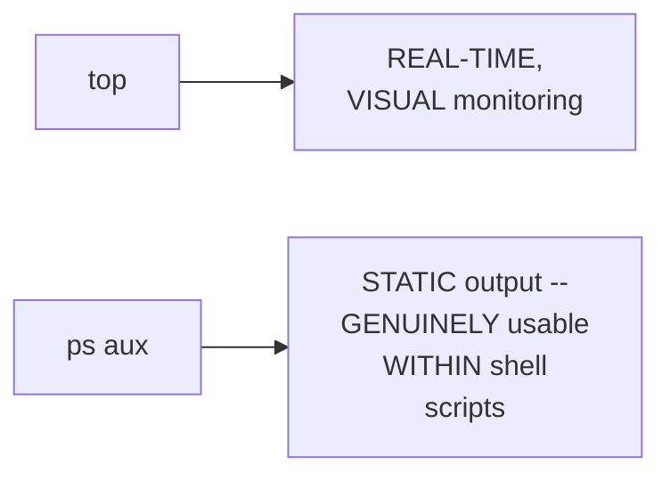

#### 📖 Definition — pgrep, Genuinely NEW, Precisely Introduced

> 💡 **Given directly:** *"If you already know Engine X process is running on this machine, you can just search for `pgrep enginex`, and you can get the process IDs associated related to the enginex — otherwise, you had to run this command, `ps aux` pipe `grep`... you can EASILY fetch that using `pgrep enginex`."*

```bash
pgrep <process_name>   # a DIRECT SHORTCUT, replacing "ps aux | grep <name>"
```

#### 📖 Definition — pstree, Genuinely NEW, Precisely Introduced

> 💡 **Given directly:** *"My favorite part with `ps` is this cool EXTENSION of `ps`, that is `pstree` — using `pstree`... you can see HIERARCHY of all the processes... this explains: someone has logged into the Linux machine using the SSHD process, then they use the BASH process... and using the bash process, they have EXECUTED the `pstree` command."*

```bash
pstree           # shows the COMPLETE process hierarchy
pstree <process_name>   # e.g., pstree java_app -- shows what STARTED this SPECIFIC process
```

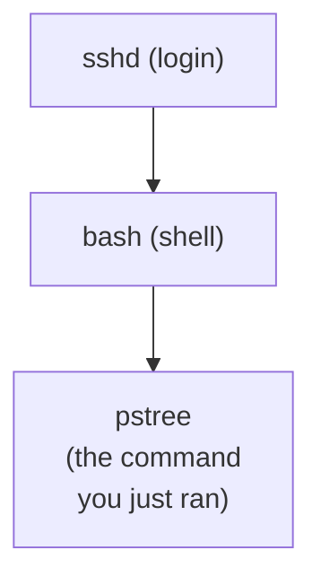

#### 🏢 Real-World / Production Usage — A Genuine, Direct, Practical Use Case

> 💡 **Given directly:** *"Imagine how USEFUL this is when you have an UNKNOWN process running on your Linux machine — as an administrator, it is NOT mandatory that you know about ALL the processes that are running on your machine — so whenever there is a STRANGE process, or whenever there is a process that you are NOT completely aware of, just use the `pstree` command."*

#### ⚠ Common Mistakes

* Assuming `pgrep` and `ps aux | grep <name>` produce GENUINELY DIFFERENT results — explicitly, directly clarified: `pgrep` is a DIRECT, more CONVENIENT shortcut, achieving the SAME underlying GOAL.
* Assuming `ps`'s own OUTPUT alone reveals HOW a specific process GENUINELY started — explicitly, directly clarified: `pstree` is SPECIFICALLY needed to see the FULL, PARENT-to-CHILD process HIERARCHY.

#### 🎯 Key Takeaways

* **`top`**/**`htop`** and **`ps`**/**`ps aux`** directly, precisely REINFORCE the Zero to Hero series' own established content — WITH a genuinely useful NEW analogy (SRE application dashboards).
* **`pgrep <name>`** is a GENUINELY NEW, direct SHORTCUT for finding a SPECIFIC process by NAME, WITHOUT the `ps aux | grep` PIPE chain.
* **`pstree`** is GENUINELY NEW — REVEALING the COMPLETE process HIERARCHY, GENUINELY valuable for INVESTIGATING an UNFAMILIAR, unexpected process.

---
### 3. Commands 3-4: Network Troubleshooting (netstat, tcpdump)

#### 📖 Definition — netstat, Genuinely NEW, Precisely Introduced

> 💡 **Given directly:** *"Netstat is used to INSPECT the network connections — especially if you want to know if a PORT is available or not — a lot of times, ESPECIALLY if you're using Linux machines, you might have seen this error, 'port is ALREADY in use' — how do you know which ports are already in use, and which ports are AVAILABLE for you? Just run `netstat -tn`."*

```bash
netstat -tn   # shows PORTS that are ALREADY in use (and active connections)
```

#### 🔍 Internal Working — A Complete, Live-Confirmed Example

> 💡 **Given directly:** *"It says here, port 8 is already in use, port 53 is already in use, which is DNS port — it also tells you that these are the ports that have ACTIVE connection — by getting this information, you can take care of your application, maybe you can use a DIFFERENT port other than the ports that are already in use."*

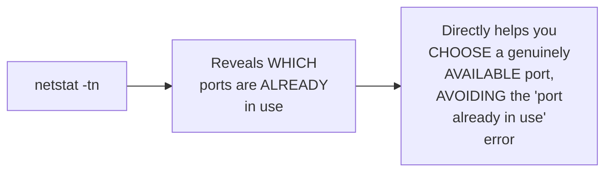

#### 📖 Definition — tcpdump, Genuinely NEW, Precisely Introduced

> 💡 **Given directly:** *"How many times you have got a question from your client... 'I receive response late from the application,' or 'there is LATENCY when I try to access the application'... whenever someone tells you that, just use the `tcpdump` command — it will CAPTURE and ANALYZE network packets for DIAGNOSING connectivity issues."*

```bash
sudo tcpdump -i <interface> port <port_number>
```

#### 🔍 Internal Working — Precisely Finding the Correct Network Interface

> 💡 **Given directly:** *"You know, on every Linux instance... typically every instance is connected to a NETWORK INTERFACE — if you just type `ifconfig`, you can get the information of the PRIMARY network interface — when you are using EC2 instances, the primary network interface is `enX0` on your machines — the most common one is `e0` or `e1`, but when it comes to the Linux instances created on AWS, it comes with `enX0` interface."*

```bash
ifconfig   # identifies YOUR machine's own PRIMARY network interface (e.g. enX0, eth0)
```

#### 🪜 Step-by-Step — A Complete, Live-Demonstrated Command

> 💡 **Given directly:** *"Just say `-i enX0 port 80`... right now there is nothing running on port 80... but Abhishek, I don't have any issues with a particular application, but when I try to connect to the instance itself, or ALL the processes that are running on the instance, they are going through the latency issues, then what you can do, again just go for `ifconfig`, look at the primary network interface, and just run `tcpdump` followed by `-i`, which is the interface."*

```bash
sudo tcpdump -i enX0 port 80    # network-level (application-specific) diagnosis
sudo tcpdump -i enX0                 # interface-wide (instance-level) diagnosis
```

#### 🏢 Real-World / Production Usage — A Genuine, Direct Pointer for Deeper Analysis

> 💡 **Given directly:** *"You will RECEIVE the complete network packet information of your primary network interface — now looking at this, you can understand HOW requests flow through your interface — let's say you don't understand this, you can use WIRESHARK, which is a VERY popular... packet [analyzer] — when you provide information of your `tcpdump`, or when you provide your network TRAFFIC using Wireshark, you can understand MUCH more about how requests flow through your interface."*

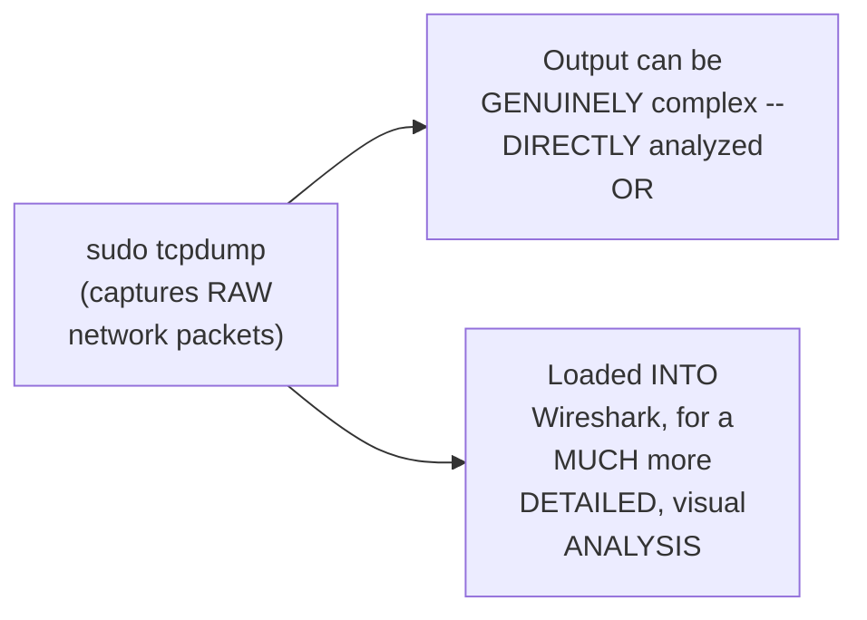

#### ⚠ Common Mistakes

* Assuming `tcpdump` requires NO special network-interface AWARENESS — explicitly, directly, LIVE-demonstrated as GENUINELY requiring the CORRECT `-i <interface>` value, FIRST identified via `ifconfig`.
* Assuming `netstat` and `tcpdump` serve the SAME, IDENTICAL purpose — explicitly, directly distinguished: `netstat` reveals WHICH ports are IN USE; `tcpdump` captures the ACTUAL, real-time PACKET-level TRAFFIC for DEEPER diagnosis.

#### 🎯 Key Takeaways

* **`netstat -tn`** is GENUINELY NEW — directly, precisely revealing WHICH ports are ALREADY in use, SOLVING the common "port already in use" ERROR before it even OCCURS.
* **`tcpdump -i <interface> port <port>`** is GENUINELY NEW — CAPTURING real network PACKETS for DIAGNOSING latency/connectivity ISSUES — requiring the CORRECT interface (found via `ifconfig`) as a PREREQUISITE.
* **Wireshark** is directly, GENUINELY recommended as a COMPANION tool for MORE DETAILED, VISUAL analysis of `tcpdump`'s OWN, raw packet OUTPUT.

---

### 4. Command 5: Network Path Diagnostics (ping & traceroute)

#### ❓ Why It Exists — The Precise, Genuine, Motivating Question

> 💡 **Given directly:** *"Is there any EASY way — I don't need the COMPLETE network latency, or I don't need the complete packet, but when I try to connect to google.com, or through this instance, when I try to connect to a particular website, during that time I see the network LATENCY, or I see the RESPONSE from the upstream server or target is late — how can I troubleshoot it?"*

#### 📖 Definition — ping, Precisely Introduced

> 💡 **Given directly:** *"I think most of you are aware of `ping` — you know, when you just do `ping google.com`, you'll get the BASIC information — 'time to get the response back is 1.66 milliseconds,' which is definitely good — but it does NOT provide MORE information than that."*

```bash
ping google.com   # BASIC round-trip response time -- limited detail
```

#### 📖 Definition — traceroute, Genuinely NEW, Precisely Introduced

> 💡 **Given directly:** *"If you want to get MORE information, first you need to install `traceroute`... `traceroute google.com`... what you'll get, when you use `traceroute`, MORE detailed information — when your command or your instance is trying to connect to google.com, usually there are a LOT of upstream servers — you can see HOW request flows from your instance, THROUGH the upstream server, from there to your internet service PROVIDER, from there to the upstream server, and from there PROBABLY to google.com."*

```bash
sudo apt install traceroute   # (if not already installed)
traceroute google.com
```

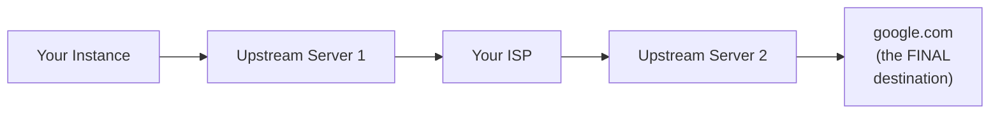

#### ⚠ Common Mistakes

* Assuming `ping` and `traceroute` provide the SAME LEVEL of detail — explicitly, directly, precisely distinguished: `ping` provides ONLY a basic round-trip TIME; `traceroute` reveals the COMPLETE PATH, hop by HOP, through EVERY intermediate server.
* Assuming `traceroute` is ALWAYS pre-installed, LIKE `ping` — explicitly, directly, LIVE-demonstrated as REQUIRING a separate INSTALLATION step in this specific ENVIRONMENT.

#### 🎯 Key Takeaways

* **`ping`** provides a QUICK, basic round-trip RESPONSE TIME — GENUINELY useful for a FIRST, simple check.
* **`traceroute`** (GENUINELY NEW) provides a FAR more DETAILED, hop-by-hop VIEW of the COMPLETE network PATH — directly, precisely useful when `ping` ALONE isn't SUFFICIENT to diagnose WHERE, SPECIFICALLY, a delay is occurring.
* This is directly, explicitly framed as the **FIRST place to START** when an INSTANCE cannot GENUINELY connect to the internet — a real, PRACTICAL, common troubleshooting ENTRY point.

---
### 5. Commands 6-7: Disk & Memory Utilization (df/du, free)

#### 📖 Definition — df -h, Directly Reinforced

> 💡 **Given directly:** *"Most of times you run into 'out of storage,' like probably there is no disk space LEFT on your Linux machine — how do you troubleshoot that? Just use `df -h`."*

```bash
df -h   # disk space, by partition
```

#### 📖 Definition — du -sh, Directly Reinforced

> 💡 **Given directly:** *"If I want to check the UTILIZATION of a particular folder... `opt`, let's say — so I can just use `du -sh` followed by `opt` — this way, instead of looking at the storage utilization... of a particular MOUNT, you can just CHECK for a particular folder using `du -sh`."*

```bash
du -sh <folder>   # disk usage, for a SPECIFIC folder
```

#### 📖 Definition — free -h, Directly Reinforced

> 💡 **Given directly:** *"How about memory utilization? Yes, it's a VERY simple command — all that you need to do is `free -h` — using `free -h`, you can INSTANTLY check the memory utilization — right now it says that this is the TOTAL memory, which is approximately 1 GB on this machine, out of which 350 MB is UTILIZED, and this is the FREE memory that is available."*

```bash
free -h   # memory utilization, human-readable
```

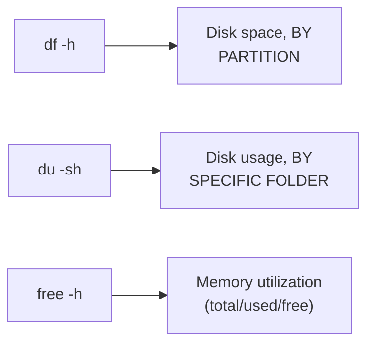

#### ⚠ Common Mistakes

* Assuming `df -h` alone can genuinely reveal WHICH SPECIFIC folder is CONSUMING the most disk space — explicitly, directly clarified: `du -sh` is GENUINELY needed for THIS more granular, FOLDER-level view.

#### 🎯 Key Takeaways

* **`df -h`** (disk space, by partition), **`du -sh`** (disk usage, by SPECIFIC folder), and **`free -h`** (memory utilization) directly, PRECISELY reinforce material ALREADY established in the Zero to Hero series — CONFIRMED here as GENUINELY, CONSISTENTLY essential, real-world tools.
* This section serves as a **direct, useful BRIDGE**, connecting THIS video's own broader TROUBLESHOOTING context (network issues, PORT conflicts) to the SAME, foundational RESOURCE-monitoring commands COVERED in depth ELSEWHERE.

---

### 6. Command 8: Service Logs (journalctl)

#### ❓ Why It Exists — The Precise, Genuine, Motivating Scenario

> 💡 **Given directly:** *"Imagine you are dealing with a Engine X service, and you want to check the LOGS of the running Engine X service, or logs of any services that are managed by SYSTEMD — systemd is a process, right, it's a DAEMON process, and it is MANAGING a lot of services on your Linux machine — if you want to check LOGS of services that are running on your machine, you can use `journalctl` command."*

#### 📖 Definition — journalctl, Genuinely NEW, Precisely Introduced

> 💡 **Given directly:** *"Using this command, you can get the COMPLETE logs of the services — you can ALSO check for a particular service, let's say the Engine X service itself, so just search for `journalctl -u enginex`."*

```bash
journalctl                # complete logs of ALL services
journalctl -u <service_name>   # logs of a SPECIFIC service (e.g. journalctl -u enginex)
```

#### 🔍 Internal Working — Precisely What journalctl Genuinely Reveals

> 💡 **Given directly:** *"So using this command, you can see that, okay, during this particular timestamp, Engine X service was STARTED by a particular user, and at this particular timestamp, Engine X service is ALREADY started — similarly, for some reason, if your Engine X service is CRASHED, or for some reason your Engine X service was STOPPED, you can see WHY was your Engine X service stopped, or WHY was your Engine X service crashed."*

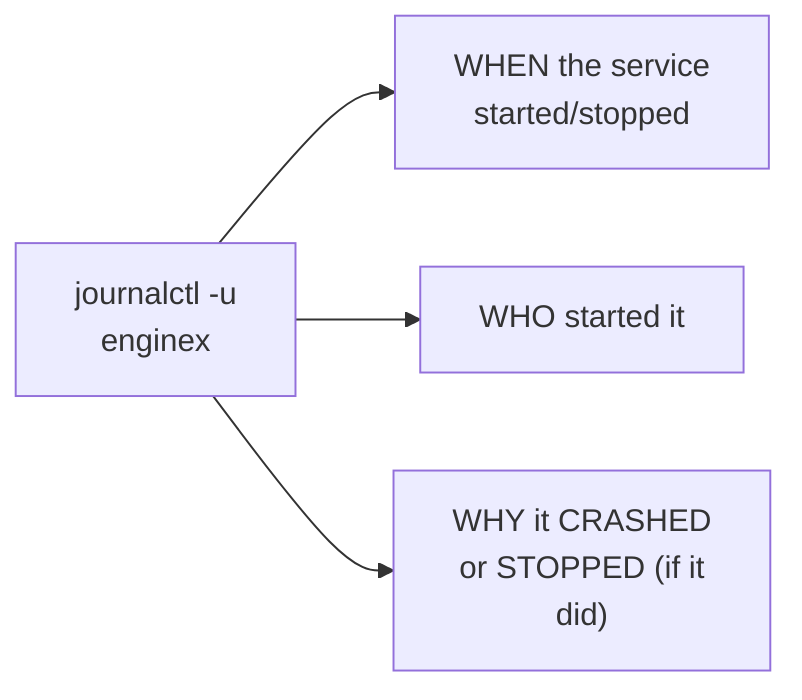

#### 🔍 Internal Working — A Genuine, Direct, Precise Distinction From systemctl

> 💡 **Given directly, DIRECTLY connecting back to the Zero to Hero series' own established `systemctl` command:** journalctl is SPECIFICALLY for LOGS, while `systemctl` (established in the EARLIER Zero to Hero series) is for STARTING/STOPPING services — these are TWO, genuinely DIFFERENT, COMPLEMENTARY tools, NOT the SAME command.

#### 🏢 Real-World / Production Usage — A Genuine, Direct, Practical Audience

> 💡 **Given directly:** *"As application developers, you might NOT use this command — but Linux administrators and DevOps engineers, this can become your FAVORITE command when you are UPGRADING your Linux instances, or PROBABLY when you are dealing with MULTIPLE systemd... services on your Linux server."*

#### ⚠ Common Mistakes

* Confusing `journalctl` with `systemctl` — explicitly, directly distinguished: `systemctl` MANAGES a service's own RUNNING state (start/stop); `journalctl` retrieves a service's own HISTORICAL LOGS.
* Assuming `journalctl` is GENUINELY, EQUALLY relevant to EVERY role — explicitly, directly clarified: it's GENUINELY MOST valuable for Linux administrators/DevOps engineers, SPECIFICALLY — less so for APPLICATION developers.

#### 🎯 Key Takeaways

* **`journalctl`** (GENUINELY NEW) retrieves the COMPLETE LOGS of systemd-managed SERVICES — directly, precisely showing WHEN a service STARTED, and — CRUCIALLY — WHY it might have CRASHED or STOPPED.
* This command is **directly, precisely DISTINGUISHED** from `systemctl` (Zero to Hero's own established command) — `systemctl` MANAGES; `journalctl` LOGS.
* This is directly, explicitly framed as a **GENUINE, real FAVORITE** for Linux administrators/DevOps engineers, SPECIFICALLY during instance UPGRADES or MULTI-SERVICE troubleshooting.

---
### 7. Command 9: Finding Processes by Port (lsof)

#### ❓ Why It Exists — A Direct, Precise Connection BACK to netstat

> 💡 **Given directly:** *"Sometime back in the video, I explained that you can check LIST of used ports using `netstat` — so we ran the command `netstat -ln`, where we can see... the FOLLOWING are the ports that are ALREADY in use — let's NOW see how to CHECK the process that is USING this port."*

#### 📖 Definition — lsof, Genuinely NEW, Precisely Introduced

> 💡 **Given directly:** *"You can use this during the time of CONFLICT — so here it says port 8085 is ALREADY in use, let's see WHICH process is using this port — for that, you can use this ninth command, `lsof`, which is LIST OF OPEN FILES — `lsof -i :8085`."*

```bash
lsof -i :<port_number>   # e.g. lsof -i :8085
```

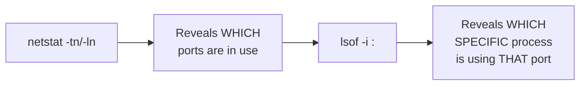

#### 🔍 Internal Working — A Complete, Live-Confirmed Result

> 💡 **Given directly:** *"So NOW you can see here, Python3 is the process, or this is the ONE that has initiated this process — so you can tell your DEVELOPERS that, 'hey, Python3, there is some application that is triggered using Python3, and it is USING this port' — probably you can go for another one, or when they say, 'no, we need this port,' you can just go back to the... process ID, either KILL it, or just check WHO initiated this process ID."*

#### 🏢 Real-World / Production Usage — A Genuine, Direct, Practical Conflict-Resolution Workflow

> 💡 **Given directly:** *"This is especially useful during the time of CONFLICT — when someone tells you the port is ALREADY in use — using this command, you can check WHO has used this port, or who is the ONE currently using this particular port."*

#### ⚠ Common Mistakes

* Assuming `netstat` ALONE genuinely provides ENOUGH information to RESOLVE a "port already in use" CONFLICT — explicitly, directly clarified: `netstat` reveals WHICH ports are IN USE, but `lsof` is GENUINELY needed to identify WHICH SPECIFIC process is RESPONSIBLE.
* Assuming `lsof`'s own name ("list of open FILES") is UNRELATED to PORT investigation — explicitly, directly clarified: on Linux, NETWORK connections/PORTS are GENUINELY treated as a TYPE of "open file," making `lsof` a GENUINELY appropriate tool for THIS purpose.

#### 🎯 Key Takeaways

* **`lsof -i :<port>`** (GENUINELY NEW) directly, precisely identifies WHICH SPECIFIC process is USING a given PORT — directly, EXPLICITLY completing the "port CONFLICT" TROUBLESHOOTING workflow `netstat` BEGAN.
* This section directly, precisely **CONNECTS TWO commands** into ONE, COMPLETE, real workflow: `netstat` (WHICH ports are in USE) → `lsof` (WHICH process is USING a SPECIFIC one).
* This is directly, explicitly framed as GENUINELY useful **DURING port CONFLICTS** — enabling a CONCRETE next step (KILLING the process, or IDENTIFYING who to CONTACT).

---

### 8. Command 10: Log Analysis (tail & head)

#### ❓ Why It Exists — The Precise, Genuine, Motivating Scenario

> 💡 **Given directly:** *"Whenever you're dealing with a HUGE amount of log files, or when you are dealing with a LOG FILE with LARGE amount of data, how do you read LAST few lines of the log file? As Linux administrators and DevOps engineers, you might deal with... service logs which might spawn up to 20,000, 30,000 LOGS — lines of logs."*

#### 💻 Code Example — A Complete, Live, Real Demonstration

> 💡 **Given directly:** *"Let's try to look at `syslog`... `cat /var/log/syslog`... it has a LOT of log lines — I just want to READ last 10 lines of this log file — I can just do `tail -n` followed by 10 — which means LAST 10 lines of this log file."*

```bash
tail -n 10 /var/log/syslog   # LAST 10 lines
head -n 10 /var/log/syslog     # FIRST 10 lines
```

#### 📖 Definition — head, Precisely Introduced as tail's Own, Direct Counterpart

> 💡 **Given directly:** *"Abhishek, I want to READ the FIRST 10 lines of the log file — again, it's very SIMPLE — instead of `tail`, just go for `head`."*

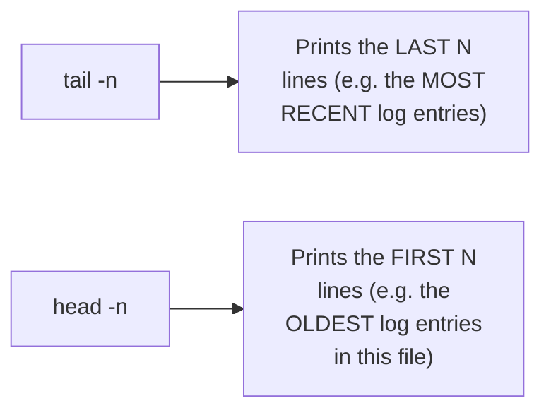

#### ⚠ Common Mistakes

* Assuming `cat`ing an ENTIRE, LARGE log file is a GENUINELY practical way to READ its content — explicitly, directly, LIVE-demonstrated as UNWIELDY for FILES with THOUSANDS of lines — `tail`/`head` are GENUINELY the more PRACTICAL choice.

#### 🎯 Key Takeaways

* **`tail -n <N> <file>`** prints the LAST N lines (typically the MOST RECENT log entries); **`head -n <N> <file>`** prints the FIRST N lines.
* This is directly, precisely CONFIRMED as a genuinely SIMPLE, but GENUINELY underused command PAIR — DIRECTLY relevant when dealing with REAL, large log FILES (up to "20,000, 30,000 lines").
* This section was **directly, LIVE-demonstrated** on a REAL log file (`/var/log/syslog`), NOT merely described in the abstract.

---
### 9. Two Bonus Productivity Shortcuts: Reverse History Search & PS1 Customization

#### ⚠ A Direct, Honest, Precise Clarification

> 💡 **Given directly:** *"Let me also share TWO shortcuts that I use on day-to-day basis, and that are SUPER useful for me — these are my PERSONAL favorite — these are NOT the Linux commands, but these are actually the SHORTCUTS."*

#### ❓ Why It Exists — The Precise, Genuine, Motivating Problem

> 💡 **Given directly:** *"Imagine I ran a command 10 days back, and I completely FORGOT that command — I just VAGUELY remember it, that it was a Docker command, or I VAGUELY remember that the command is related to something like `export` — it's very DIFFICULT to go through 1,500 Linux commands, right, which is in my history — sometimes it can be 10,000 as well."*

#### 📖 Definition — Reverse History Search (Ctrl+R), Precisely Introduced

> 💡 **Given directly:** *"I often do this — I don't actually WRITE commands, I just use this shortcut called `Ctrl+R` — in your case, it can be `Command+R` as well — it's either Control+R, it's Command+R on your MACHINE — so just type `Ctrl+R`, and if you remember the command is related to Docker, just SEARCH docker — you can QUICKLY get that command — let's say this is NOT the command, just press `Ctrl+R` again, again, till the time you GET the command that you are looking for."*

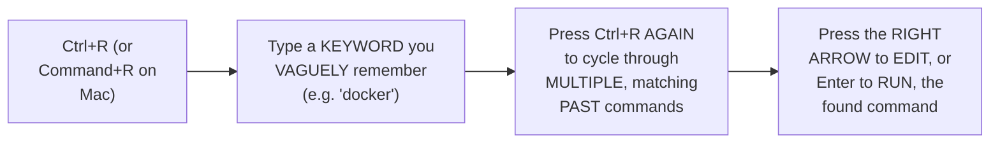

#### 🔍 Internal Working — Precisely What This Genuinely Does

> 💡 **Given directly:** *"What Control+R does, it will perform a REVERSE SEARCH on your history — instead of going through the history, TYPING the grep command on the history, then COPY-pasting on your terminal, just do Ctrl+R... you don't have to do that copy-paste — instead, just use the reverse search."*

#### 🏢 Real-World / Production Usage — A Genuine, Direct, Personal Confirmation

> 💡 **Given directly:** *"If you WATCH my video tutorials, most likely I NEVER actually write the ENTIRE command — if you watch my Docker tutorials, Kubernetes tutorials, you will see most of the times I use Ctrl+R, and I just do `kubectl`, I get this, I just press TAB, and I execute the command."*

#### 📖 Definition — PS1 Customization, Precisely Introduced

> 💡 **Given directly:** *"Another shortcut... this is just for FANCY editor-related things, editing of your TERMINAL — this might NOT improve your productivity, but this is JUST for a better INTERFACE, or just for a better UI — what you can do is you can just use this command called `export`, followed by the environment variable called `PS1`."*

```bash
export PS1="Abhishek Virala"      # replaces the ENTIRE prompt with THIS static text
export PS1='$(pwd)'                  # shows the PRESENT WORKING DIRECTORY as the prompt
```

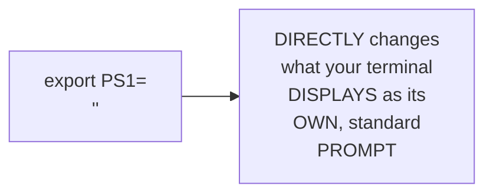

#### ⚠ A Direct, Honest, Precise Clarification on Genuine Purpose

> 💡 **Given directly:** *"This might NOT improve your productivity, but this is JUST for a better interface."*

#### ⚠ Common Mistakes

* Assuming `Ctrl+R` and `PS1` customization are GENUINELY, FORMAL Linux COMMANDS, on the SAME level as `top`, `netstat`, or `journalctl` — explicitly, directly, HONESTLY clarified: they are GENUINELY SHORTCUTS/CONFIGURATIONS, not commands themselves.
* Assuming `PS1` customization is GENUINELY, PRACTICALLY as VALUABLE as reverse history search — explicitly, directly, HONESTLY distinguished: `PS1` is explicitly, HONESTLY framed as COSMETIC ("just for a better interface"), while `Ctrl+R` is directly, GENUINELY framed as a REAL, DAILY productivity BOOST.

#### 🎯 Key Takeaways

* **`Ctrl+R`** (reverse history search) GENUINELY, DIRECTLY solves the REAL, common problem of REMEMBERING a specific PAST command — searching by KEYWORD, rather than SCROLLING through hundreds or THOUSANDS of history ENTRIES.
* **`PS1`** environment-variable CUSTOMIZATION changes your terminal's own DISPLAYED prompt — directly, HONESTLY framed as COSMETIC (a better INTERFACE), NOT a genuine productivity IMPROVEMENT.
* BOTH are directly, EXPLICITLY distinguished from the TEN, "real" Linux COMMANDS covered EARLIER — genuinely useful SHELL FEATURES/shortcuts, not commands THEMSELVES.

---

### 10. Closing: Complete Recap

#### 🪜 Step-by-Step — A Complete, Honest, Genuine Recap of ALL Ten Commands

> 💡 **Given directly:** *"The commands that we learned were TOP, HTOP — these were the commands that we learned for system PERFORMANCE... then we learned about PS, followed by PGREP and PSTREE, which are basically for looking at the PROCESSES... then we learned about NETSTAT for network connections, to look at OPEN ports — then we learned about TCPDUMP for ANALYZING the network traffic... then we learned about PING and TRACEROUTE... then we learned about DISK utilization, DF, DU-SH — then we learned about MEMORY utilization, using FREE -H... then we COMPLETELY switched gears, and we learned about SYSTEM LOGS... JOURNALCTL... then we learned about LSOF for checking the process ID that is using a particular port — and finally, we learned about TAIL and HEAD commands."*

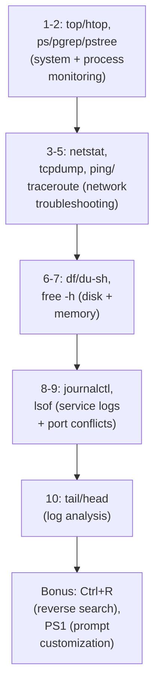

#### ⚠ Common Mistakes

* Assuming THIS video's own coverage represents a COMPLETE, standalone LINUX curriculum — explicitly, directly implied as a CURATED, PRACTICAL companion to the DEEPER, foundational Zero to Hero series, rather than a REPLACEMENT for it.

#### 🎯 Key Takeaways

* This video **genuinely, completely delivers** its OWN, stated goal — TEN, real, PRACTICAL Linux commands, ORGANIZED around GENUINE, common TROUBLESHOOTING scenarios (performance, PROCESSES, networking, disk/memory, LOGS, port CONFLICTS).
* SEVERAL commands **directly REINFORCE** the Zero to Hero series' own established CONTENT, while SEVERAL others (`pgrep`, `pstree`, `netstat`, `tcpdump`, `traceroute`, `journalctl`, `lsof`) are **GENUINELY NEW**, valuable ADDITIONS.
* The TWO bonus SHORTCUTS (`Ctrl+R`, `PS1`) directly, HONESTLY round out this video's own PRACTICAL, real-world FOCUS — everyday PRODUCTIVITY tools, distinct from the TEN "core" commands THEMSELVES.

---
## 📝 Glossary

| Term | Definition | Why It Matters |
|---|---|---|
| **top / htop** | Real-time system performance monitoring | REINFORCEMENT of Zero to Hero content |
| **ps aux** | Detailed process listing, usable in scripts | REINFORCEMENT of Zero to Hero content |
| **pgrep** | Direct shortcut for finding a process by name | GENUINELY NEW -- replaces "ps aux | grep" |
| **pstree** | Visualizes the complete process hierarchy | GENUINELY NEW -- useful for unfamiliar processes |
| **netstat -tn** | Shows which network ports are already in use | GENUINELY NEW |
| **tcpdump** | Captures and analyzes real network packets | GENUINELY NEW -- requires the correct interface |
| **ifconfig** | Identifies your machine's primary network interface | A prerequisite for tcpdump |
| **ping** | Basic round-trip response time to a destination | GENUINELY NEW (in depth) |
| **traceroute** | Detailed, hop-by-hop network path diagnostics | GENUINELY NEW |
| **df -h / du -sh** | Disk space (by partition / by folder) | REINFORCEMENT |
| **free -h** | Memory utilization, human-readable | REINFORCEMENT |
| **journalctl** | Complete logs of systemd-managed services | GENUINELY NEW -- distinct from systemctl |
| **lsof -i :<port>** | Identifies WHICH process is using a specific port | GENUINELY NEW -- completes netstat's workflow |
| **tail / head** | Prints the last / first N lines of a file | Live-demonstrated on real log files |
| **Ctrl+R** | Reverse history search | A genuine, real productivity shortcut |
| **PS1** | The environment variable controlling your shell prompt | Cosmetic customization, not a genuine productivity boost |

---

## 🔄 Revision Notes — One-Minute Revision

* This is a **standalone "top 10" video**, from the SAME instructor as the Linux Zero to Hero series -- SOME reinforcement, SEVERAL genuinely new commands.
* **top/htop, ps/ps aux**: REINFORCEMENT. NEW: `pgrep <name>` (direct shortcut for finding a process); `pstree` (visualizes the complete process hierarchy, useful for unfamiliar processes).
* **netstat -tn**: GENUINELY NEW -- reveals which ports are already in use, solving the "port already in use" error.
* **tcpdump -i <interface> port <port>**: GENUINELY NEW -- captures real network packets for diagnosing latency/connectivity. Requires the correct interface (found via `ifconfig`). Wireshark recommended for deeper, visual packet analysis.
* **ping vs. traceroute**: ping gives a basic round-trip time; traceroute (GENUINELY NEW, in depth) reveals the complete, hop-by-hop path to a destination -- the first place to start when an instance can't connect to the internet.
* **df -h, du -sh, free -h**: REINFORCEMENT of disk/memory monitoring from Zero to Hero.
* **journalctl**: GENUINELY NEW -- retrieves the complete LOGS of a systemd-managed service (`journalctl -u <service>`), showing when it started/stopped and WHY it crashed. Distinct from `systemctl` (which starts/stops services but doesn't show logs).
* **lsof -i :<port>**: GENUINELY NEW -- identifies WHICH specific process is using a given port, directly completing the "port conflict" workflow netstat began.
* **tail -n / head -n**: last/first N lines of a file -- live-demonstrated on a real /var/log file, genuinely useful for files with thousands of log lines.
* **Bonus shortcuts (NOT genuine Linux commands)**: `Ctrl+R` (reverse history search -- a REAL, daily productivity tool) and `PS1` customization (explicitly, honestly framed as COSMETIC, not a genuine productivity boost).
* **Closing**: this video is a curated, practical companion to the deeper Zero to Hero series -- not a replacement for it.

---

## 📋 Cheat Sheet

**System & process monitoring:**
```bash
top / htop                    # real-time monitoring
ps aux                          # detailed process list (scriptable)
pgrep <name>                       # find a process by name (shortcut)
pstree [process_name]                 # visualize process hierarchy
```

**Network troubleshooting:**
```bash
netstat -tn                    # which ports are already in use
ifconfig                          # find your primary network interface
sudo tcpdump -i <interface> port <port>   # capture packets for diagnosis
ping <destination>                           # basic round-trip time
traceroute <destination>                        # detailed, hop-by-hop path
```

**Disk & memory:**
```bash
df -h              # disk space, by partition
du -sh <folder>       # disk usage, by folder
free -h                 # memory utilization
```

**Service logs & port conflicts:**
```bash
journalctl                    # complete logs, all services
journalctl -u <service>          # logs for a SPECIFIC service
lsof -i :<port>                     # WHICH process is using this port
```

**Log analysis:**
```bash
tail -n <N> <file>    # last N lines
head -n <N> <file>       # first N lines
```

**Bonus shortcuts:**
```bash
Ctrl+R (or Command+R)    # reverse history search -- type a keyword, press again to cycle
export PS1='<text or $(pwd)>'   # customize your shell prompt (cosmetic)
```

---

## 🔥 Interview Questions & Answers

### 🟢 Beginner

**Q1.**

**Question:** What is the genuine shortcut for finding a specific process by name, without piping ps aux through grep?

**Answer:** pgrep <name>.

**Explanation:** Directly, explicitly introduced as a direct shortcut.

**Why Interviewers Ask This:** Tests genuine, practical, everyday command fluency.

**Possible Follow-up:** "What would the equivalent, longer ps aux command look like?"

**Q2.**

**Question:** What does pstree genuinely show?

**Answer:** The complete process hierarchy -- which process started which.

**Explanation:** Directly, explicitly defined.

**Why Interviewers Ask This:** Tests awareness of a genuinely useful, less commonly known tool.

**Possible Follow-up:** "When would this be genuinely more useful than plain ps aux?"

**Q3.**

**Question:** What does netstat -tn genuinely reveal?

**Answer:** Which network ports are already in use.

**Explanation:** Directly, explicitly explained.

**Why Interviewers Ask This:** Basic, practical network troubleshooting knowledge.

**Possible Follow-up:** "What common error does this directly help you avoid?"

**Q4.**

**Question:** What is tcpdump genuinely used for?

**Answer:** Capturing and analyzing real network packets, for diagnosing connectivity/latency issues.

**Explanation:** Directly, precisely explained.

**Why Interviewers Ask This:** Tests genuine, practical network diagnostic knowledge.

**Possible Follow-up:** "What command do you need to run FIRST to identify the correct network interface?"

**Q5.**

**Question:** What is the genuine difference between ping and traceroute?

**Answer:** ping gives a basic round-trip response time; traceroute reveals the complete, hop-by-hop network path.

**Explanation:** Directly, precisely distinguished.

**Why Interviewers Ask This:** Basic, foundational network-diagnostics knowledge.

**Possible Follow-up:** "Which would you use first, when troubleshooting a connectivity issue?"

**Q6.**

**Question:** What does journalctl genuinely retrieve?

**Answer:** The complete logs of systemd-managed services.

**Explanation:** Directly, explicitly explained.

**Why Interviewers Ask This:** Basic, practical service-log knowledge.

**Possible Follow-up:** "How is this different from systemctl?"

**Q7.**

**Question:** What does lsof -i :<port> genuinely reveal?

**Answer:** Which specific process is using a given port.

**Explanation:** Directly, explicitly explained.

**Why Interviewers Ask This:** Tests genuine, practical port-conflict resolution knowledge.

**Possible Follow-up:** "What command would you typically run BEFORE this, to first identify the conflicting port?"

**Q8.**

**Question:** What is the genuine difference between tail and head?

**Answer:** tail prints the last N lines of a file; head prints the first N lines.

**Explanation:** Directly, explicitly distinguished.

**Why Interviewers Ask This:** Basic, essential log-analysis knowledge.

**Possible Follow-up:** "Which would you use to see the most recent log entries?"

**Q9.**

**Question:** What does Ctrl+R genuinely do in a Linux terminal?

**Answer:** Performs a reverse search on your command history.

**Explanation:** Directly, explicitly explained.

**Why Interviewers Ask This:** Tests genuine, practical, everyday productivity knowledge.

**Possible Follow-up:** "How do you cycle through multiple matching results?"

**Q10.**

**Question:** Is customizing PS1 genuinely a productivity improvement?

**Answer:** No -- it's explicitly, honestly framed as cosmetic (a better interface), not a productivity boost.

**Explanation:** Directly, honestly clarified.

**Why Interviewers Ask This:** Tests attention to the session's own honest framing of different tools' genuine value.

**Possible Follow-up:** "What environment variable would you modify to customize your prompt?"

---

### 🟡 Intermediate

**Q11.**

**Question:** Explain why the instructor deliberately connects `lsof` DIRECTLY back to `netstat` (Section 7), rather than introducing it as a genuinely standalone, unrelated command.

**Answer:** This is a genuinely deliberate, connected teaching choice: by DIRECTLY referencing the EARLIER `netstat` demonstration ("sometime back in the video, I explained that you can check list of used ports using netstat"), the instructor constructs ONE, COMPLETE, REALISTIC troubleshooting NARRATIVE, rather than TEN, disconnected, ISOLATED command demonstrations. This directly, CONCRETELY shows learners HOW multiple commands GENUINELY work TOGETHER in a REAL scenario — `netstat` identifies THAT a port is in USE; `lsof` identifies WHO is using it — a NATURAL, SEQUENTIAL workflow a learner would GENUINELY follow in REAL, practical troubleshooting, rather than TWO, seemingly unrelated FACTS to memorize IN ISOLATION.

**Explanation:** Requires recognizing a deliberate, connected teaching choice linking two commands into one coherent, realistic workflow.

**Why Interviewers Ask This:** Tests whether a learner recognizes the practical value of connected, sequential troubleshooting knowledge over isolated command facts.

**Possible Follow-up:** "What would be the genuine, real NEXT step after identifying the process via lsof, in a real port-conflict scenario?"

**Q12.**

**Question:** A learner argues that since `tcpdump` can capture ALL network traffic on an interface, it should ALWAYS be run WITHOUT specifying a port filter, to ensure NO relevant information is missed during troubleshooting. Evaluate this claim.

**Answer:** This claim overstates the case, missing a GENUINE, real, practical trade-off. While `tcpdump` CAN genuinely capture ALL traffic on an interface (per the instructor's OWN demonstrated `-i <interface>`-only command, WITHOUT a port filter), doing so UNCONDITIONALLY produces a GENUINELY, PRACTICALLY overwhelming VOLUME of data on a busy, PRODUCTION server — making it GENUINELY HARDER, not easier, to isolate the SPECIFIC issue being INVESTIGATED. The instructor's OWN, precise DEMONSTRATION directly shows BOTH approaches: `tcpdump -i <interface> port 80` (FOCUSED, port-specific) for APPLICATION-specific latency; `tcpdump -i <interface>` alone (BROADER) SPECIFICALLY for instance-WIDE latency issues (per the instructor's own DIRECT distinction: "I don't have any issues with a PARTICULAR application, but... ALL the processes... are going through the latency issues"). The ACCURATE, more precise conclusion: the SCOPE of a `tcpdump` command should GENUINELY match the SCOPE of the SUSPECTED problem — a port FILTER is GENERALLY preferred for APPLICATION-specific issues; the BROADER, interface-wide capture is RESERVED for GENUINELY instance-wide symptoms.

**Explanation:** Tests whether a learner recognizes the genuine, practical trade-off between comprehensive data capture and focused, actionable diagnosis.

**Why Interviewers Ask This:** Distinguishes candidates who understand genuine scoping trade-offs from those who assume "more data is always better."

**Possible Follow-up:** "What GENUINE, additional risk (beyond just being harder to read) might arise from running an UNFILTERED tcpdump capture on a genuinely high-traffic production server?"

**Q13.**

**Question:** Explain, precisely, why the instructor introduces `pstree` with the SPECIFIC example of an "unknown process" (Section 2), rather than a generic "here's what pstree shows" description.

**Answer:** This is a genuinely deliberate choice, directly connecting an ABSTRACT capability ("visualizing process hierarchy") to a CONCRETE, REAL, professionally-relevant SCENARIO — administering a Linux server GENUINELY, PRACTICALLY involves ENCOUNTERING unfamiliar processes ("it is NOT mandatory that you know about ALL the processes that are running on your machine"), and `pstree`'s own GENUINE value is SPECIFICALLY in RESOLVING this exact, real UNCERTAINTY — tracing an UNFAMILIAR process BACK to its OWN, PARENT origin (e.g., WAS it started via SSH, a CRON job, or ANOTHER application?). This directly, CONCRETELY illustrates WHY `pstree` matters, RATHER than merely DESCRIBING its MECHANICAL output.

**Explanation:** Requires recognizing why grounding an abstract tool's description in a concrete, professionally-relevant scenario is more effective than an abstract explanation alone.

**Why Interviewers Ask This:** Tests whether a learner understands the genuine, practical VALUE of a tool, not just its mechanical function.

**Possible Follow-up:** "Construct your OWN, similarly concrete scenario where pstree's own hierarchy view would genuinely help you make a real, practical decision."

**Q14.**

**Question:** Using this session's own precise `journalctl` vs. `systemctl` distinction (Section 6), explain a GENUINE, real troubleshooting scenario where BOTH commands would GENUINELY need to be used TOGETHER, in sequence.

**Answer:** A precise, reasoned scenario, directly applying Section 6's own EXACT distinction: imagine a REAL, production ENGINE X service has GENUINELY, UNEXPECTEDLY stopped RESPONDING. The FIRST, genuine step would be to check its OWN, CURRENT status — via `systemctl status enginex` (per the EARLIER Zero to Hero series' own established `systemctl` usage) — CONFIRMING WHETHER the service is GENUINELY stopped. If it IS stopped, the NEXT, GENUINE step is to UNDERSTAND WHY — this is PRECISELY where `journalctl -u enginex` (THIS session's own GENUINELY new command) becomes NECESSARY — REVIEWING the SERVICE's own HISTORICAL logs to IDENTIFY the SPECIFIC error or EVENT that caused it to CRASH or STOP. ONLY AFTER understanding the ROOT CAUSE (via `journalctl`) would an administrator GENUINELY, CONFIDENTLY restart the service (via `systemctl start enginex`) — potentially AFTER first FIXING whatever UNDERLYING issue `journalctl`'s own LOGS revealed. This directly, precisely illustrates HOW these TWO, genuinely DIFFERENT commands COMBINE into ONE, COMPLETE, real troubleshooting WORKFLOW: `systemctl` for STATE (is it running?), `journalctl` for HISTORY/DIAGNOSIS (why did it stop?).

**Explanation:** Requires synthesizing this session's own new journalctl command with the earlier series' own established systemctl command to construct a coherent, complete, real troubleshooting sequence.

**Why Interviewers Ask This:** A senior-level question testing whether a candidate can integrate a newly-learned command with previously-established knowledge into one, coherent, practical workflow.

**Possible Follow-up:** "What SPECIFIC information, within journalctl's own output, would you look for FIRST, to diagnose WHY a service crashed?"

**Q15.**

**Question:** Synthesize this session's complete `netstat`/`lsof` port-conflict workflow (Sections 3 and 7) with the earlier Zero to Hero series' own established `kill`/`kill -9` commands to construct a complete, reasoned resolution procedure for a genuine "port already in use" scenario.

**Answer:** A precise, synthesized, COMPLETE procedure, directly connecting THIS session's own commands with the EARLIER series' own established process-management KNOWLEDGE: **Step 1**: run `netstat -tn` (THIS session, Section 3) to CONFIRM the SPECIFIC port is GENUINELY already in USE. **Step 2**: run `lsof -i :<port>` (THIS session, Section 7) to IDENTIFY the EXACT process ID and COMMAND RESPONSIBLE for occupying that PORT. **Step 3**: DECIDE whether this PROCESS should GENUINELY be terminated — if YES, apply the EARLIER series' own established `kill <PID>` FIRST (a GRACEFUL request), ESCALATING to `kill -9 <PID>` (FORCEFUL termination) ONLY if the process GENUINELY fails to RESPOND (per the EARLIER series' own established REASONING for WHEN each is APPROPRIATE). **Step 4**: RE-RUN `netstat -tn` to CONFIRM the port is NOW genuinely FREE, before ATTEMPTING to start the NEW, intended application on THAT SAME port. This complete, synthesized procedure directly, precisely INTEGRATES commands from BOTH this session AND the EARLIER series into ONE, COHERENT, real-world troubleshooting WORKFLOW.

**Explanation:** Requires synthesizing this session's port-conflict-specific commands with the earlier series' own general process-termination commands into one complete, real procedure.

**Why Interviewers Ask This:** A senior-level question testing whether a candidate can integrate knowledge from MULTIPLE, separately-taught sessions into ONE, coherent, end-to-end troubleshooting procedure.

**Possible Follow-up:** "What GENUINE, additional consideration would you want to confirm BEFORE killing the identified process, to avoid disrupting a genuinely important, unrelated service?"

---

### 🔴 Advanced

**Q16.**

**Question:** Design a complete, reasoned troubleshooting DECISION TREE (using ONLY this session's own ten commands, plus the two bonus shortcuts) for the general scenario: "a user reports that a web application is genuinely slow or unresponsive."

**Answer:** A reasonable, complete decision tree, directly applying this session's own EXACT, established commands:

```text
1. Check OVERALL system health FIRST:
   top / htop -- is CPU or memory genuinely maxed out?
   -> If YES: identify the offending process, per the EARLIER series' own
      kill/renice workflow.
   -> If NO (system resources look fine): proceed to network diagnosis.

2. Check NETWORK-level symptoms:
   ping <application_host> -- is there a GENUINE, basic connectivity issue?
   -> If ping is slow/failing: traceroute <host> -- identify WHERE, along
      the path, the delay is occurring.
   -> If ping looks fine: proceed to application-specific diagnosis.

3. Check APPLICATION-specific network behavior:
   sudo tcpdump -i <interface> port <app_port> -- capture REAL packet-level
   data, for a SPECIFIED duration, DURING a reported slow request.
   -> Analyze directly, OR feed the capture into Wireshark for DEEPER
      analysis.

4. If the issue involves a SPECIFIC PORT conflict (e.g. the app WON'T
   even START):
   netstat -tn -- confirm the port is genuinely occupied.
   lsof -i :<port> -- identify the SPECIFIC, conflicting process.

5. If the application runs as a SYSTEMD service, and it appears to have
   STOPPED or CRASHED:
   journalctl -u <service> -- review the HISTORICAL logs for the ROOT
   cause.

6. Throughout: use tail -n <N> <app_log_file> to check the MOST RECENT
   application-level log entries for ANY explicit error messages.

7. (Productivity aid): use Ctrl+R throughout this ENTIRE process to
   quickly re-run any of these commands from your OWN command history,
   rather than re-typing them each time.
```

This complete decision tree directly, precisely applies EVERY command from THIS session, in a LOGICAL, escalating ORDER — from GENERAL system health, THROUGH network diagnosis, TO application-specific and service-level INVESTIGATION.

**Explanation:** Requires synthesizing every command from this session into one complete, logically-ordered, real-world troubleshooting decision tree.

**Why Interviewers Ask This:** A realistic, senior-level question testing whether a candidate can integrate MULTIPLE, separately-taught commands into ONE, coherent, practical troubleshooting methodology.

**Possible Follow-up:** "At which SPECIFIC step in this decision tree would you GENUINELY escalate to a teammate, rather than continuing to troubleshoot alone?"

**Q17.**

**Question:** Critically evaluate: "Since this session confirms Wireshark provides a MORE detailed, visual analysis of network traffic than raw tcpdump output, this means tcpdump is GENUINELY, LARGELY redundant, and engineers should ALWAYS use Wireshark instead." Is this an accurate, complete characterization?

**Answer:** Not accurate — this significantly OVERSTATES a genuine, COMPLEMENTARY relationship into an UNCONDITIONAL claim of REDUNDANCY neither this session's OWN content, NOR sound reasoning, SUPPORTS. The instructor's OWN, precise framing is DIRECT: "if you PROVIDE information of your tcpdump... using Wireshark, you can UNDERSTAND much more" — this PHRASING directly implies Wireshark GENUINELY WORKS WITH tcpdump's own OUTPUT (or a SIMILAR capture), NOT as a genuinely SEPARATE, ALTERNATIVE tool that REPLACES it entirely. Additionally, `tcpdump` GENUINELY offers a REAL, practical advantage Wireshark (typically a GUI-based tool) does NOT: it can be RUN DIRECTLY on a REMOTE server VIA a terminal SSH session (per THIS session's own EXACT demonstration, on a REAL EC2 instance) — WITHOUT requiring a GRAPHICAL interface — GENUINELY, PRACTICALLY essential for troubleshooting REMOTE, headless SERVERS where Wireshark ITSELF may not GENUINELY be INSTALLABLE or usable. The ACCURATE, more PRECISE conclusion: `tcpdump` and Wireshark are GENUINELY COMPLEMENTARY — `tcpdump` for CAPTURING data (ESPECIALLY on remote, headless SERVERS), Wireshark for a MORE detailed, VISUAL ANALYSIS of that SAME captured data — NEITHER genuinely REPLACES the other.

**Explanation:** Tests whether a learner recognizes that "more detailed analysis" doesn't mean "genuinely redundant," correctly identifying the complementary, sequential relationship between these two tools.

**Why Interviewers Ask This:** Distinguishes candidates who understand genuine tool complementarity from those who assume a "better" tool always makes an earlier one obsolete.

**Possible Follow-up:** "Describe a GENUINE, real scenario where tcpdump would be GENUINELY necessary, EVEN IF Wireshark were ALSO available."

**Q18.**

**Question:** Synthesize this session's complete `pstree` reasoning (Section 2) with its own `lsof` reasoning (Section 7) to construct a reasoned explanation of HOW these two, seemingly separate commands could GENUINELY be used TOGETHER to investigate a SPECIFIC, real, suspicious scenario: "an unfamiliar process is GENUINELY consuming a specific network port, and you want to understand BOTH what it's doing AND how it GENUINELY got started."

**Answer:** A precise, synthesized explanation, directly connecting TWO, separately-taught commands into ONE, coherent, INVESTIGATIVE workflow: per Section 7's own PRECISE `lsof` mechanism, `lsof -i :<port>` would FIRST, DIRECTLY identify the SPECIFIC process ID OCCUPYING the port in QUESTION. Per Section 2's own PRECISE `pstree` mechanism, this SAME process ID (or PROCESS NAME) could THEN be PASSED to `pstree` (e.g., `pstree <process_name_or_PID>`) to REVEAL its COMPLETE, ANCESTRAL hierarchy — DIRECTLY showing WHETHER this process was GENUINELY started via a LEGITIMATE, EXPECTED path (e.g., a SYSTEMD service, or a KNOWN application's own STARTUP script) or via a GENUINELY SUSPICIOUS, UNEXPECTED one (e.g., an UNKNOWN SSH session, or an UNRECOGNIZED PARENT script). This directly, precisely reveals HOW these TWO, SEPARATELY-introduced commands GENUINELY COMBINE into a COMPLETE, real SECURITY-INVESTIGATION workflow: `lsof` answers "WHAT is using this RESOURCE?"; `pstree` answers "HOW, and by WHOM, did this PROCESS GENUINELY originate?" — TOGETHER providing a MUCH MORE complete PICTURE than EITHER command could PROVIDE alone.

**Explanation:** Requires synthesizing two, separately-taught commands (lsof and pstree) into one, coherent, security-relevant investigative workflow neither section explicitly combines.

**Why Interviewers Ask This:** A capstone-level question testing whether a candidate can creatively, correctly combine MULTIPLE, separately-taught diagnostic tools into a genuinely new, practical investigative procedure.

**Possible Follow-up:** "If pstree's own output revealed this process was GENUINELY started via an UNRECOGNIZED, suspicious parent process, what would your GENUINE, immediate next step be, from a SECURITY perspective?"

---

## 🧪 Scenario-Based Interview Questions

> **Scenario 1:** A developer reports they cannot start their application because it says "port 8080 is already in use," but they don't know what's using it. Using this session's concepts, construct a complete, step-by-step resolution.

**Structured Answer:**
1. **Initial investigation:** Recognize this as directly connected to Section 3's own precise `netstat` mechanism -- confirming the port is GENUINELY occupied.
2. **Metrics/logs to check:** Run `netstat -tn`, confirming port 8080 GENUINELY appears in the ACTIVE connections/ports-in-use list.
3. **Possible causes:** Per Section 7's own precise reasoning, ANOTHER process (perhaps a PREVIOUS, un-terminated instance of the SAME application, or a GENUINELY different application) is CURRENTLY occupying this SPECIFIC port.
4. **Debugging approach:** Run `lsof -i :8080` (Section 7), identifying the EXACT process ID and COMMAND responsible.
5. **Resolution:** If the IDENTIFIED process is GENUINELY safe to terminate (e.g., a STALE, leftover process), use `kill <PID>` (per the EARLIER series' own established command), ESCALATING to `kill -9` if GENUINELY necessary -- then RETRY starting the ORIGINAL application.
6. **Prevention:** Establish a standing personal/team practice of ALWAYS checking `netstat`/`lsof` BEFORE assuming a port conflict requires CHANGING the application's own CONFIGURED port -- the ROOT cause is often a SIMPLE, LEFTOVER process.

> **Scenario 2 (Advanced):** Your production monitoring alerts show a specific EC2 instance experiencing intermittent network latency, but `top`/`htop` show NORMAL CPU and memory usage. Using this session's own concepts, construct a complete, reasoned investigation plan.

**Structured Answer:**
1. **Initial investigation:** Recognize this as DIRECTLY connected to Section 4's own precise "ping vs. traceroute" reasoning -- SINCE CPU/memory look NORMAL (per `top`/`htop`), the issue is LIKELY GENUINELY network-related, not COMPUTE-related.
2. **Metrics/logs to check:** Run `ping <destination>` FIRST, for a QUICK, basic connectivity CHECK; if latency is GENUINELY confirmed, run `traceroute <destination>` to identify WHERE, ALONG the network PATH, the delay is OCCURRING.
3. **Possible causes:** Per Section 3's own PRECISE reasoning, the issue COULD ALSO be at the PACKET level (e.g., DROPPED packets, RETRANSMISSIONS) — NOT genuinely VISIBLE via ping/traceroute ALONE.
4. **Debugging approach:** Run `sudo tcpdump -i <interface>` (Section 3), CAPTURING raw TRAFFIC on the PRIMARY interface DURING a period of REPORTED latency, then ANALYZE this capture (DIRECTLY, or via Wireshark) for ANY genuine, real PACKET-level anomalies.
5. **Resolution:** BASED on the SPECIFIC finding (e.g., a SPECIFIC upstream HOP showing high LATENCY, per `traceroute`; or PACKET RETRANSMISSIONS, per `tcpdump`), ESCALATE to the APPROPRIATE team (e.g., YOUR own cloud PROVIDER's support, if the issue is GENUINELY UPSTREAM of your OWN instance).
6. **Prevention:** Establish a standing team PRACTICE of INTEGRATING network-LEVEL monitoring (NOT just CPU/memory) into your STANDARD alerting SETUP, directly RECOGNIZING that "NORMAL compute metrics" does NOT GENUINELY rule OUT network-level ISSUES.

---

## 🛠 Hands-on Exercises

### 🟢 Easy

1. Write out, from memory, the ten commands covered in this session, with a one-sentence description of each.
2. Explain, in your own words, why journalctl and systemctl are genuinely different, complementary tools.
3. Practice using Ctrl+R on your own terminal to find a command you ran earlier in your session.

### 🟡 Medium

4. Set up a Linux environment (per the Zero to Hero series' own established methods), and directly practice the complete netstat -> lsof port-conflict workflow.
5. Write a short explanation (150-200 words) of why tcpdump and Wireshark are complementary, not redundant, directly applying Advanced Interview Q17's own reasoning.
6. Use tail and head on a real log file (e.g., /var/log/syslog, if available) to practice reading both the most recent and oldest entries.

### 🔴 Advanced

7. Complete the full, worked troubleshooting decision tree proposed in Advanced Interview Q16, testing it against a deliberately-created, real scenario (e.g., a slow application).
8. Implement the debugging scenario proposed in Scenario 1 -- deliberately start two processes on the same port, then correctly diagnose and resolve the conflict using netstat and lsof.
9. Install and use traceroute on a real Linux environment, directly comparing its output against a simple ping to the same destination.

---

## 🏗 Practice Assignment

### Build: "Complete Linux Troubleshooting Toolkit Practice"

**Objective:** Directly build genuine, hands-on fluency with all ten commands and two bonus shortcuts covered in this session.

**Requirements:**
- Set up a real Linux environment (per the Zero to Hero series' own established methods).
- Practice pgrep and pstree on your own, real running processes.
- Practice netstat and lsof together, deliberately creating and resolving a port conflict.
- Install and use tcpdump (with a specific port filter) and traceroute, documenting your own real output.
- Use journalctl on a real, systemd-managed service, documenting its own start/stop history.
- Practice tail and head on a real log file.
- Use Ctrl+R at least 5 times during your own practice session, and customize your PS1 prompt at least once.
- A written reflection (200-300 words) on which command from this session you found most genuinely useful, and why.

**Architecture (suggested):**

```text
top10_commands_practice/
├── process_commands_log.md           # your pgrep/pstree output
├── network_commands_log.md             # your netstat/tcpdump/ping/traceroute output
├── service_and_port_log.md               # your journalctl/lsof output
├── log_analysis_log.md                     # your tail/head output
└── REFLECTION.md                                # your written reflection
```

**Expected Functionality:**
- Your practice should genuinely, directly use real commands on a real environment, not merely describe expected behavior.
- Your port-conflict resolution should genuinely, correctly demonstrate the complete netstat -> lsof -> kill workflow.

**Challenges:**
- Correctly identifying your own machine's primary network interface for tcpdump.
- Correctly distinguishing when journalctl vs. systemctl is genuinely the appropriate tool.

**Bonus Improvements:**
- Complete the full, worked troubleshooting decision tree from Advanced Interview Q16 against a genuinely real, deliberately-created scenario.
- Explore Wireshark, loading a real tcpdump capture for deeper, visual analysis.

---

## 📚 Additional Resources

- **The Linux Zero to Hero series** (in this same workspace) -- the direct, deeper prerequisite content this video directly builds on and REINFORCES for several commands.
- **Wireshark's own official documentation** (referenced directly) -- for deeper, visual analysis of tcpdump captures.
- **The instructor's own Docker and Kubernetes tutorials** (referenced directly) -- where the Ctrl+R reverse-search shortcut is genuinely, frequently demonstrated in practice.

---

## 📌 Final Revision Sheet

### ⭐ Core Concepts
- **System/process monitoring**: top/htop, ps/pgrep/pstree.
- **Network troubleshooting**: netstat (ports in use), tcpdump (packet capture), ping/traceroute (path diagnostics).
- **Disk/memory**: df/du-sh, free -h.
- **Service logs & port conflicts**: journalctl (logs, distinct from systemctl), lsof (which process uses a port).
- **Log analysis**: tail/head.
- **Bonus shortcuts**: Ctrl+R (genuine productivity), PS1 (cosmetic).

### ⭐ Important Definitions
- **journalctl, lsof** (see Glossary for full definitions).

### ⭐ Important Commands/Code
```bash
pgrep <name> && pstree <name>
netstat -tn && lsof -i :<port>
sudo tcpdump -i <interface> port <port>
journalctl -u <service>
tail -n <N> <file>
```

### ⭐ Architecture/Process
- Complete port-conflict workflow: netstat (confirm) -> lsof (identify) -> kill/kill -9 (resolve).
- Complete network-latency workflow: ping (basic check) -> traceroute (path detail) -> tcpdump (packet-level) -> Wireshark (visual analysis).

### ⭐ Best Practices
- Use pgrep instead of ps aux | grep for quick, direct process lookups.
- Scope tcpdump captures (by port) when investigating application-specific issues; use broader, interface-wide captures only for instance-wide symptoms.
- Use journalctl to diagnose WHY a service stopped, before simply restarting it.
- Use Ctrl+R instead of manually scrolling through command history.

### ⭐ Common Mistakes
- Confusing journalctl (logs) with systemctl (start/stop).
- Assuming netstat alone resolves a port conflict, without lsof to identify the specific process.
- Assuming tcpdump and Wireshark are redundant, rather than complementary.
- Treating PS1 customization as a genuine productivity improvement, rather than a cosmetic one.

### ⭐ Interview Points
- Be ready to explain the complete netstat -> lsof port-conflict resolution workflow.
- Be ready to distinguish journalctl from systemctl precisely.
- Be ready to explain when ping is sufficient versus when traceroute is genuinely needed.
- Be ready to demonstrate awareness of pgrep and pstree as practical ps alternatives.

### ⭐ Things to Remember
- This is a **standalone, curated companion** to the Zero to Hero series -- SOME reinforcement, SEVERAL genuinely new, valuable commands.
- The **netstat -> lsof** and **journalctl <-> systemctl** relationships are this video's own key, connected workflows worth remembering as PAIRS, not isolated facts.
- The **two bonus shortcuts** (Ctrl+R, PS1) are explicitly, honestly distinguished from the ten "real" commands -- genuinely useful, but a different category of knowledge.

---

## 🔗 Source

- [10 Linux Commands every Software Engineer should know](https://youtu.be/RRkMxy1vGd4?si=ghqoxcjYDY1BLTHw)