# 🧠 MCP (Model Context Protocol) — Part 1: Why MCP Exists & Core Architecture

- <i>**Series:** Agentic AI / LangChain Advanced Track — MCP Deep-Dive (Class 1 of ~3-4) · 
- **Instructor:** Mayank
- **Note on scope:** This is genuinely **Class 1** of a dedicated, multi-class deep dive into MCP (Model Context Protocol) — the instructor explicitly, directly states this will take "around three classes, easily... can take four as well," because the goal is complete, in-depth mastery: understanding MCP well enough to not just USE existing MCP servers, but to build your OWN MCP servers, MCP clients, MCP gateways, run them in Docker, and publish them as real packages to PyPI. This first class covers WHY MCP had to exist (a complete, narrative history from ChatGPT's launch through function calling's own scaling failure), MCP's official definition, and its core host-client-server architecture — built through a genuinely extensive, live Q&A session where the instructor repeatedly, patiently clarifies the SAME core distinctions (MCP vs. API, host vs. client vs. server) from many different angles. Deep architectural detail (JSON-RPC, the full lifecycle, building a real server from scratch) is explicitly promised for the next class.</i>

---

## 📑 Table of Contents

1. [Session Overview](#-session-overview)
2. [Learning Objectives](#-learning-objectives)
3. [Detailed Notes](#-detailed-notes)
   - [1. Session Context: Part 1 of an In-Depth, Multi-Class MCP Series](#1-session-context-part-1-of-an-in-depth-multi-class-mcp-series)
   - [2. The Story of Why MCP Exists: LLM as a Black Box](#2-the-story-of-why-mcp-exists-llm-as-a-black-box)
   - [3. Context: Why It Matters, Demonstrated Live](#3-context-why-it-matters-demonstrated-live)
   - [4. Function Calling: Giving the AI "Hands," But Not Yet a Solution](#4-function-calling-giving-the-ai-hands-but-not-yet-a-solution)
   - [5. The Scaling Nightmare: Why Function Calling's Fix Was Short-Lived](#5-the-scaling-nightmare-why-function-callings-fix-was-short-lived)
   - [6. MCP's Solution: The Official Definition & the Before/After Comparison](#6-mcps-solution-the-official-definition--the-beforeafter-comparison)
   - [7. MCP's Architecture: Host, Client, Server & the SIM Card Analogy](#7-mcps-architecture-host-client-server--the-sim-card-analogy)
   - [8. MCP's Three Primitives & Transport Layers](#8-mcps-three-primitives--transport-layers)
   - [9. Clarifying the Confusion: MCP vs. API vs. Tools (Genuine, Real Q&A)](#9-clarifying-the-confusion-mcp-vs-api-vs-tools-genuine-real-qa)
   - [10. Closing: What's Next](#10-closing-whats-next)
4. [Glossary](#-glossary)
5. [Revision Notes — One-Minute Revision](#-revision-notes--one-minute-revision)
6. [Cheat Sheet](#-cheat-sheet)
7. [Interview Questions & Answers](#-interview-questions--answers)
8. [Scenario-Based Interview Questions](#-scenario-based-interview-questions)
9. [Hands-on Exercises](#-hands-on-exercises)
10. [Practice Assignment](#-practice-assignment)
11. [Additional Resources](#-additional-resources)
12. [Final Revision Sheet](#-final-revision-sheet)

---

## 🎯 Session Overview

This class builds MCP's motivation and architecture from first principles, through a genuine, connected narrative rather than a dry definition. It covers:

1. **A complete, real, narrative history**: from ChatGPT's own November 2022 launch (reaching 1 million users in a week), through understanding an LLM as fundamentally a "black box" — a next-token predictor that can only ANSWER, never ACT.
2. **Context**, precisely defined and demonstrated LIVE (asking Claude "who is the president of Venezuela" with and without web search enabled) — directly showing why "everything your model can see when it answers" genuinely determines answer quality.
3. **Function calling**, OpenAI's own mid-2023 fix — binding tools/functions to an LLM so it could describe WHAT to run (though never running code itself) — genuinely solving the "AI can only talk, not act" problem, for a while.
4. **The genuine scaling nightmare** function calling eventually created: duplicate code across every company and every project, redundant maintenance, and a real, honest admission that "we spent the SAME time now maintaining our tools" that AI was originally meant to save.
5. **MCP's own precise, official solution**: a genuine, open, standardized PROTOCOL (directly analogous to HTTP or FTP) allowing any AI application to connect to any properly-built MCP server and instantly gain its tools, resources, and prompts — with NO duplicate maintenance burden on the AI application's own side.
6. **MCP's core architecture**: Host, Client, and Server — built through a genuinely memorable analogy (a mobile phone = host, a SIM card = client, the network = server) and directly, repeatedly reinforced across dozens of real, live audience questions.
7. **MCP's three primitives** (tools, resources, prompts) and its two transport mechanisms (STDIO and Streamable HTTP, with the older HTTP+SSE approach explicitly, officially deprecated in March 2025).
8. **An extensive, genuine, live Q&A** directly addressing the SAME confusion from many angles — MCP vs. raw APIs, MCP vs. simple "tools," why creating your own MCP server is worthwhile even when third-party ones exist, and how authentication/authorization can genuinely be layered onto MCP servers.

> 💡 **Key framing, given directly, on precisely why MCP is not simply "extra intelligence":** *"MCP is not about giving our LLM more intelligence. It is about giving it an ability to see more."*

---

## 🎯 Learning Objectives

By the end of this guide, you will be able to:

- [ ] Explain the complete, historical motivation for MCP — from ChatGPT's launch through function calling's own genuine scaling failure.
- [ ] Precisely define "context," and explain why it directly determines an LLM's answer quality.
- [ ] Explain function calling's own genuine mechanism, and why LLMs never execute code themselves.
- [ ] Explain the specific, real problem MCP was created to solve (the N×M tool-maintenance scaling nightmare).
- [ ] State MCP's official, precise definition, and explain the host-client-server architecture using the SIM card analogy.
- [ ] Name MCP's three primitives, and distinguish STDIO from Streamable HTTP transport.
- [ ] Correctly answer the most commonly-confused, genuine questions about MCP vs. APIs vs. simple tool-binding.

---

## 📚 Detailed Notes

### 1. Session Context: Part 1 of an In-Depth, Multi-Class MCP Series

#### 🧠 Concept

> 💡 **Given directly, opening the session:** *"Today, everyone, we are going to start with a very, very important topic that's actually going to be very much in depth. So the topic name is MCP, Model Context Protocol."*

#### 🪜 Step-by-Step — The Stated, Complete Plan for This Entire Series

> 💡 **Given directly:** *"We are going to cover MCP in depth. I'm not going to teach you MCP with respect to LangChain. I'm going to teach you MCP otherwise, so that you can create your own MCP server. You can create your own MCP client, MCP gateways. You can even host or push your MCP servers... It will take around three classes easily, around three. It can take four as well."*

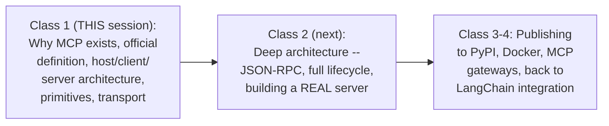

#### 📖 Definition — The Explicitly-Stated Prerequisites

> 💡 **Given directly:** *"To understand, we will be doing simple plain vanilla Python... Claude slash Claude Desktop... otherwise I think we are fine if we have a good knowledge of APIs as well."*

#### 🎯 Key Takeaways

* This is genuinely **Class 1 of a dedicated, 3-4 class MCP deep dive** — explicitly designed to teach MCP as a STANDALONE protocol, not tied to any single framework like LangChain.
* The stated, ambitious goal: not just USING existing MCP servers, but genuinely being able to **build your own servers, clients, gateways**, run them in Docker, and publish them as real, usable packages.
* **Prerequisites** are directly, explicitly named: plain Python, familiarity with Claude/Claude Desktop, and general API knowledge.

---

### 2. The Story of Why MCP Exists: LLM as a Black Box

#### 🪜 Step-by-Step — ChatGPT's Own, Real, Historical Launch

> 💡 **Given directly:** *"Our story actually starts with the most important thing... that is when ChatGPT was launched... November 30, 2022... it gained, I think, around 1 million users in around one week. And by two, three months, it was already having around 100 million plus users."*

#### 📖 Definition — LLM as a Genuine "Black Box"

> 💡 **Given directly:** *"I would like to present LLM just as a black box... you give it an input, and you get an output. The input, everyone, can be in natural language, and you get the output also, which is going to be in natural language."*

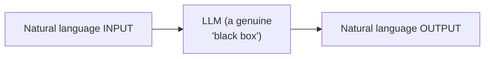

#### 📖 Definition — Precisely Why This Connects to MCP's Own Name

> 💡 **Given directly:** *"All my LLM is, is that if I give it a hi, it will just try to give you the reply token by token... it is a next word or token generator... you ask it something, it used to give you that, nothing else... so that is where the model context protocol, the MODEL part is coming, model context protocol -- so model is coming from this thing."*

#### ❓ Why It Exists — The Precise, Genuine, Human Motivation

> 💡 **Given directly:** *"There's a very inherent problem with us human beings, and that problem, everyone, is that we are very lazy... we now want that our ChatGPT or our AI, it can not only give me the overall email... it send the same as well."*

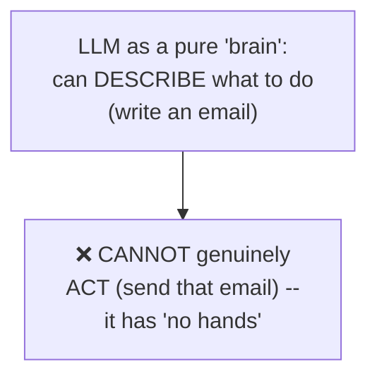

#### ⚠ Common Mistakes

* Assuming an LLM genuinely "does" things (sends emails, runs code) simply because it can DESCRIBE how to do them — explicitly, directly, repeatedly clarified: it is fundamentally a next-token PREDICTOR, a "brain without any hand," genuinely incapable of ACTING on its own.
* Assuming MCP's own name ("model CONTEXT protocol") is arbitrary — explicitly, directly traced back to this exact, historical "LLM as black box" framing — the "model" IS the LLM itself.

#### 🎯 Key Takeaways

* ChatGPT's own, real launch (November 2022) is directly, precisely framed as **"the dawn of the AI era"** — a genuinely historic, rapid-adoption event (1 million users in a week).
* An LLM is genuinely, precisely a **"black box"** — a next-token predictor, taking natural-language input and producing natural-language output, with **NO inherent ability to ACT** on the world.
* This exact limitation — a smart "brain" with **no hands** — directly, precisely motivates EVERYTHING that follows in this session's own narrative.

---
### 3. Context: Why It Matters, Demonstrated Live

#### 📖 Definition — Context, Precisely Defined

> 💡 **Given directly:** *"If I have to give the definition of context, context is everything that your LLM/model can see when it answers your question."*

#### 🪜 Step-by-Step — A Complete, Real, Live Demonstration

> 💡 **Given directly:** *"If I just take away the excess of web search... if I ask it, 'who is the president of Venezuela, tell without searching internet' -- now we will see... it will be giving the answer as wrong. Saying Nicolas Maduro has been the president of Venezuela. Since you asked not to search, of course the answer is wrong... but without the context, the answer would be wrong."*

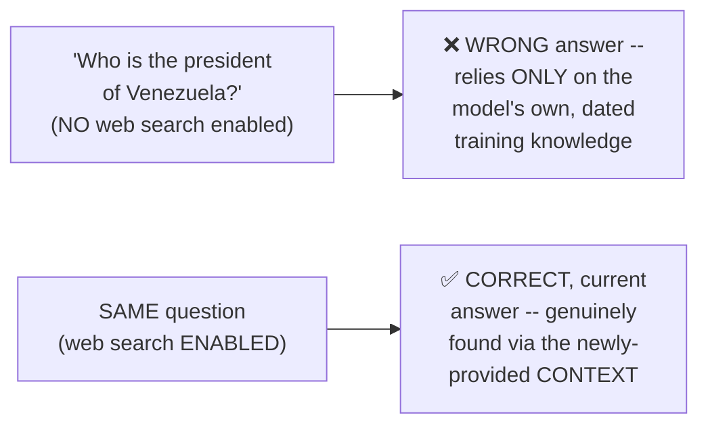

> 💡 **Given directly, the precise, live-confirmed result once search was enabled:** *"If you will notice everyone, it is searching the internet, it will get all the answer, and now it will give the right answer."*

#### 📖 Definition — MCP's Own, Precise Name, Fully Explained

> 💡 **Given directly:** *"MCP is not about giving our LLM more intelligence. It is about giving it an ability to see more. So this is the reason everyone MCP is having context in its name."*

#### ⚠ Common Mistakes

* Assuming an LLM's own, dated training data alone is always sufficient for accurate, current answers — explicitly, directly, LIVE-demonstrated as producing a genuinely WRONG answer (a real, dated fact about Venezuela's presidency), specifically because the model lacked genuine, current CONTEXT.
* Assuming "giving an LLM more context" is the SAME as "making the LLM smarter/more intelligent" — explicitly, directly, precisely distinguished: context expands what the model can genuinely SEE, not its underlying intelligence.

#### 🎯 Key Takeaways

* **Context** is precisely, genuinely defined as "everything that your LLM/model can see when it answers your question" — directly, LIVE-demonstrated via a real, concrete example (a genuinely wrong answer without context, a genuinely correct one with it).
* This exact concept — context expanding what a model can genuinely SEE — is **directly, precisely why "context" appears in MCP's own name**.
* This section directly, precisely sets up the NEXT genuine problem: even with better context, an LLM STILL cannot genuinely ACT — covered next.

---

### 4. Function Calling: Giving the AI "Hands," But Not Yet a Solution

#### 📖 Definition — Function Calling, Precisely Introduced

> 💡 **Given directly:** *"The very first thing that ChatGPT gave was it gave us the ability to write and make a function call... you used to tell your AI that, hey, we can actually bind tools to our LLM... it can tell us that, okay, this is the tool, everyone, which we have to use to get the work done."*

#### 🔍 Internal Working — A Genuinely Important, Precise Clarification: LLMs Never Run Code Themselves

> 💡 **Given directly:** *"LLM does not used to run the tool itself... when it kind of got started, it was still either running it in a separate machine or it asks you to run it on a machine. So LLM never runs the code itself. It actually just provides you that these are the arguments with which I want you to run."*

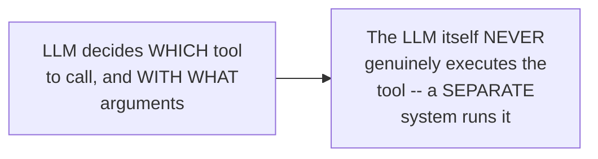

#### 🪜 Step-by-Step — A Complete, Live, Real Demonstration

> 💡 **Given directly:** *"When I ask it, 'can you check my calendar from 30th to 10th September and tell if I have any event?'... it will actually tell or go through my calendar... then it will try to run it with some arguments... start time, end time, time zone, order by, and page size... so it is saying that no events are found on your calendar."*

#### 📖 Definition — When This Genuinely Shipped

> 💡 **Given directly:** *"I think it was somewhere around 23, mid 23, OpenAI actually shipped this thing, because it actually gets the gap that, hey, people want to make sure that they can interact with their tools."*

#### 📖 Definition — Vocabulary: "Tool" = "Action" = An API Being Called

> 💡 **Given directly:** *"Whatever I'm calling this as a tool, and this is where your vocabulary should be very much clear -- this tool, everyone, you can call it as an action. And in the backend, it is an API being called."*

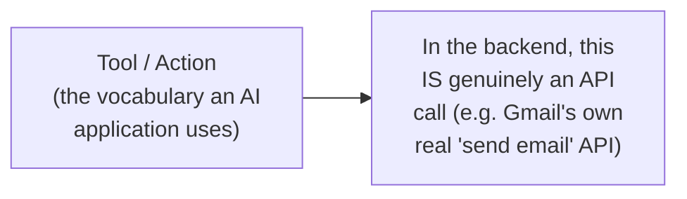

#### ⚠ Common Mistakes

* Assuming function calling means the LLM directly, genuinely EXECUTES code — explicitly, directly, repeatedly corrected: the LLM only DESCRIBES what to run and with what arguments; a SEPARATE system genuinely performs the execution.
* Assuming "tool," "action," and "API" are three genuinely different, unrelated concepts — explicitly, directly clarified: a tool/action IS, in the backend, genuinely an API call — simply given a name and description the LLM can understand and select.

#### 🎯 Key Takeaways

* **Function calling** (shipped by OpenAI around mid-2023) genuinely gave LLMs the ability to DESCRIBE which tool to call and with what arguments — directly, precisely solving the "brain with no hands" problem, for the first time.
* The LLM itself **NEVER genuinely executes code** — it only specifies the call; execution happens on a SEPARATE system.
* "Tool," "action," and "API" are directly, precisely the SAME underlying concept, viewed from different vocabulary layers — a genuinely important clarification for everything that follows.

---
### 5. The Scaling Nightmare: Why Function Calling's Fix Was Short-Lived

#### ❓ Why It Exists — The Precise, Genuine Problem That Emerged at Scale

> 💡 **Given directly:** *"The problem arise everyone, that now it solved the problem at an individual level, but for a company level or when it scales, it again became a problem. Just think about if your company runs three different AI assistants... and it used to touch base on 20 of the tools... this is easily 24 tools I'm looking forward to."*

```text
Example: 4 applications x 6 actions each = 24 tools to genuinely build, maintain, secure
```

#### 🔍 Internal Working — The Complete, Precise List of Genuine, Real Burdens

> 💡 **Given directly:** *"Every function needed its own method, its own data format, its own error handling. We have to maintain the same. We have to make sure that they are secure. And though we started using AI and connected tools to save time, now we are spending that same time to MAINTAIN our tools."*

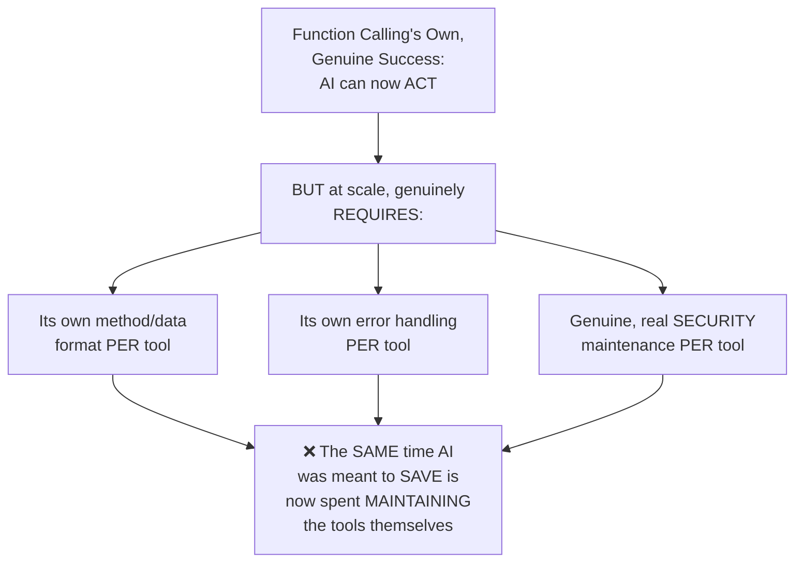

#### 🪜 Step-by-Step — The Precise, Honest, Summarizing Confession

> 💡 **Given directly:** *"So we found a shorter way, but now we need a complete, complete thing to make the shortcut running. And this is where everyone now MCP came up and why MCP has to exist. Anthropic saw this problem and it understood that, hey, this is generally a problem which needs to be solved."*

#### 🔍 Internal Working — The Precise, Genuine Root Cause: This Is an N×M Problem

> 💡 **Given directly, a genuine, real, direct audience example:** *"If there are 500 teams, 500 teams will be writing the same code to send their email with their AI services."*

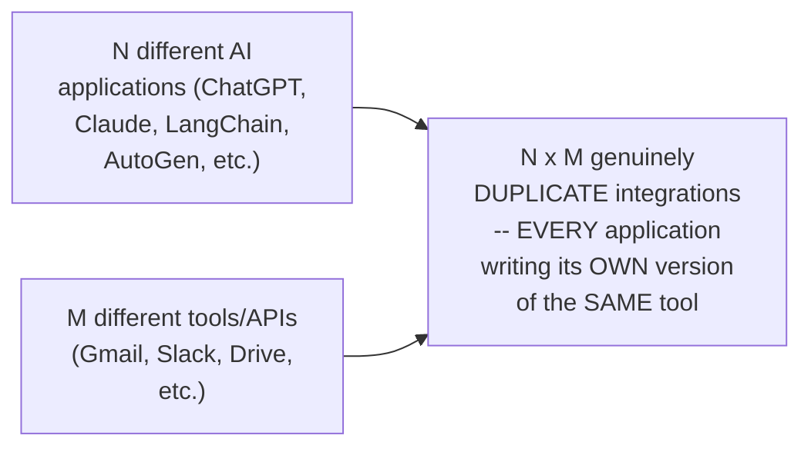

#### ⚠ Common Mistakes

* Assuming function calling's own failure was about the CONCEPT being flawed — explicitly, directly clarified: the CONCEPT genuinely worked; the failure was specifically about SCALE — maintaining N×M duplicate integrations became genuinely unsustainable.
* Assuming this scaling problem was merely theoretical — explicitly, directly grounded in a genuine, real, concrete example (500 teams, each independently writing the SAME email-sending integration).

#### 🎯 Key Takeaways

* Function calling genuinely solved the "AI can't act" problem at an **individual level**, but created a genuine, real **N×M SCALING nightmare**: every AI application needed its own, separately-maintained integration for every tool.
* The precise, honest, real burdens: **duplicate code, redundant effort, and genuine security/maintenance overhead**, PER tool, PER application — directly, honestly confessed as "we are spending that same time to maintain our tools" that AI was meant to save.
* This EXACT problem — DIRECTLY, EXPLICITLY recognized by Anthropic — **is precisely why MCP was created**, covered next.

---

### 6. MCP's Solution: The Official Definition & the Before/After Comparison

#### 📖 Definition — MCP, the Complete, Official Definition

> 💡 **Given directly, quoting Anthropic's own official documentation:** *"MCP is the open source standard for connecting AI application to external systems. Using MCP, AI applications like Claude or ChatGPT can connect to data sources, local files, databases, tools, search engines, calculators, and workflows, specialized prompts... enabling them to access key information and perform tasks."*

#### 🔍 Internal Working — A Genuine, Direct Departure From the Common "USB-C" Analogy

> 💡 **Given directly:** *"Normally people explain MCP with a USB-C port, but I don't actually like this explanation, because it tries to sometimes oversimplify it and then make it very difficult to follow. In my case, this is how you have to think about MCP: MCP is a collection of tools... APIs, we already had those, around those we create our tools or actions. And then when we combine multiple of these tools and actions and gave AI a way to call them, that is where MCP came into picture."*

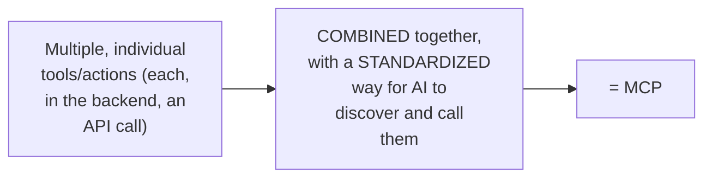

#### 🪜 Step-by-Step — BEFORE MCP: A Complete, Honest Positive/Negative Analysis

> 💡 **Given directly, the genuine, stated POSITIVES:** *"Super easy to define... easily understandable... you can go to ChatGPT... ask it for a Python script which can help me to send email via Gmail. It will give you the complete Python script."*

> 💡 **Given directly, the genuine, stated NEGATIVES:** *"You will have duplicate code by everyone or in every project... it is redundant... it is prone to failure or change over time... Google can mention that, hey, I now need another layer of service... you can mess up the security... The first one is the main point: it is NOT SCALABLE."*

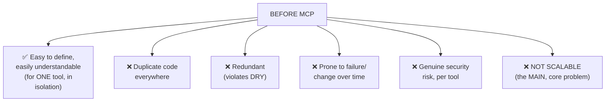

#### 🪜 Step-by-Step — AFTER MCP: A Complete, Positive Re-Framing

> 💡 **Given directly:** *"What actually happened after MCP was introduced?... We are connecting directly via MCP server. So I actually don't care now... MCP server provides me all the tools... In the backend, yes, they will also be calling APIs and everything, but I don't have to maintain or care [about] them."*

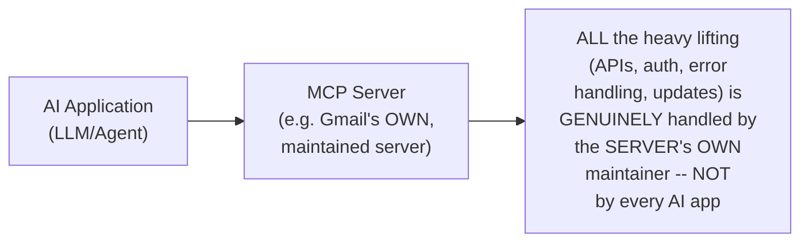

#### 🏢 Real-World / Production Usage — A Genuine, Live, Real Demonstration

> 💡 **Given directly:** *"These connectors, I could just go to manage connector. I could just say that, hey, connect with the Gmail one. I could easily connect it... once I do the authorization, my Claude, my application is connecting to the complete Gmail MCP server. I get lots of tools, everyone."*

#### ⚠ Common Mistakes

* Assuming BEFORE-MCP tool integration was genuinely, entirely BAD — explicitly, directly, honestly acknowledged as having REAL positives (simplicity, understandability) for a SINGLE, isolated tool — the genuine failure was specifically about SCALE.
* Assuming MCP genuinely eliminates APIs — explicitly, directly clarified: APIs still genuinely exist and are still genuinely called IN THE BACKEND; MCP simply moves the maintenance BURDEN to the server's OWN maintainer, away from every individual AI application.

#### 🎯 Key Takeaways

* **MCP's official definition**: an open-source standard connecting AI applications to external systems (data sources, tools, workflows, prompts) — DIRECTLY, precisely quoted from Anthropic's own documentation.
* The instructor's own **preferred framing** (rather than the common "USB-C" analogy): MCP is a COLLECTION of tools/actions, COMBINED and given a STANDARDIZED way for AI to discover and call them.
* The **BEFORE/AFTER comparison** directly, precisely demonstrates MCP's real, core benefit: moving tool maintenance OFF of every individual AI application and ONTO the tool provider's own, single, maintained MCP server.

---
### 7. MCP's Architecture: Host, Client, Server & the SIM Card Analogy

#### 📖 Definition — The Precise, Three-Part Architecture

> 💡 **Given directly:** *"When I talk about MCP components, everyone, it is a very similar kind of a host-server kind of a case... there is host, client, and server. Okay, three things are there, everyone... to make sure that this MCP server can give us an answer, we use an MCP client. They speak the same language."*

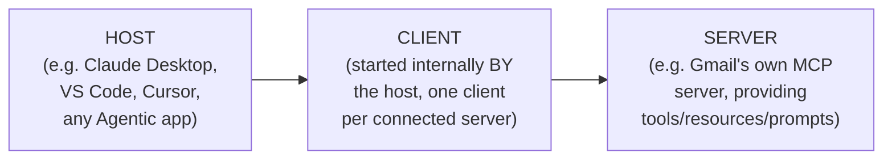

#### 🧠 Concept — The Genuinely Memorable SIM Card Analogy

> 💡 **Given directly, in direct, live response to a genuine, real audience question:** *"If you have a mobile, just with a mobile, you cannot connect to your network. You need to make sure that you add a SIM — SIM is a host [client]... Claude as an application, or VS Code as an application, [does] directly [not] connect to MCP servers... VS Code starts an MCP client. VS Code starts a client and says that, hey, you have to communicate with this particular MCP server."*

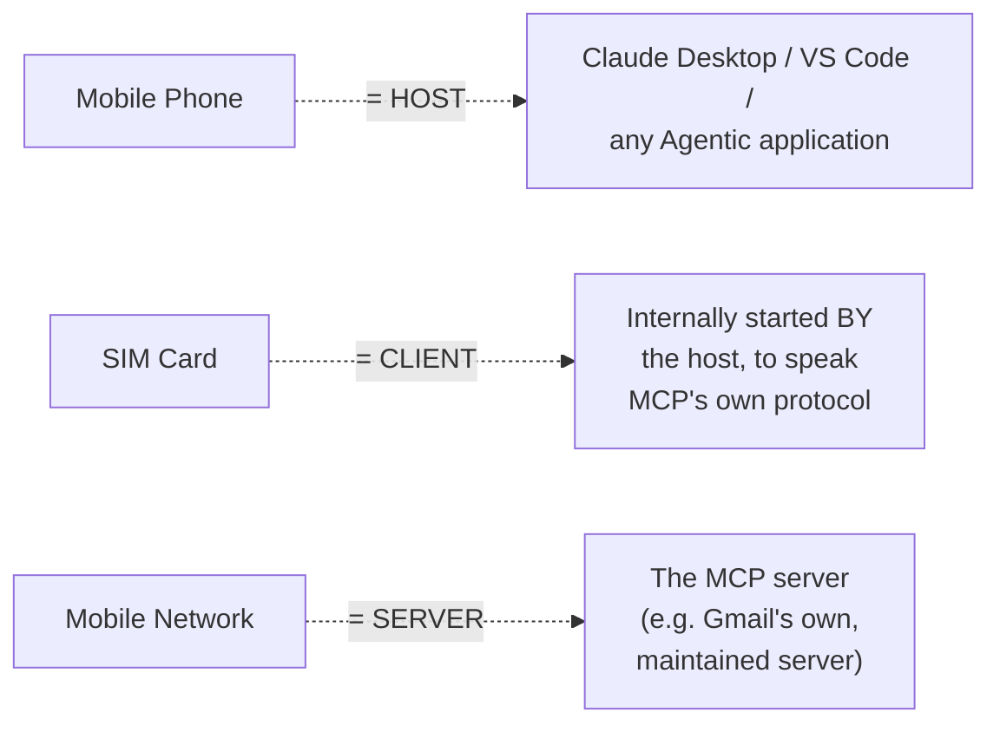

#### 🔍 Internal Working — Precisely WHO Initiates the Connection

> 💡 **Given directly:** *"Actually what happened is that VS Code internally starts its own host... you cannot see it like this... [but] when a host starts, it sends the request to multiple MCP servers via client to list the tools and everything."*

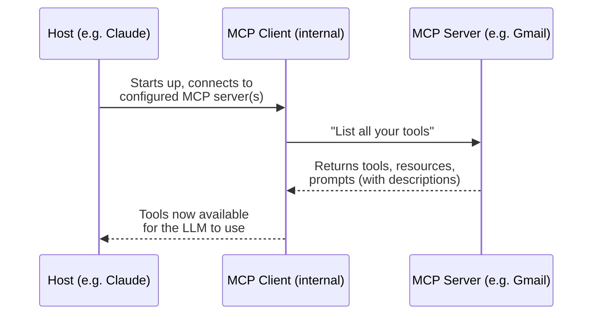

#### 🔍 Internal Working — A Genuinely Important, Direct Clarification: "Client" and "Server" Are Relative

> 💡 **Given directly, in direct, live response to a genuine, real, thoughtful audience question:** *"It is very relative. For example, for Claude, WE are a client... but when the frame changes, when Claude has to connect to a server... this time Claude is like the host PLUS client. This changes the frame — because now Claude is making a request. So WHOEVER makes the request, that is a client, and who completes the request, that is a server."*

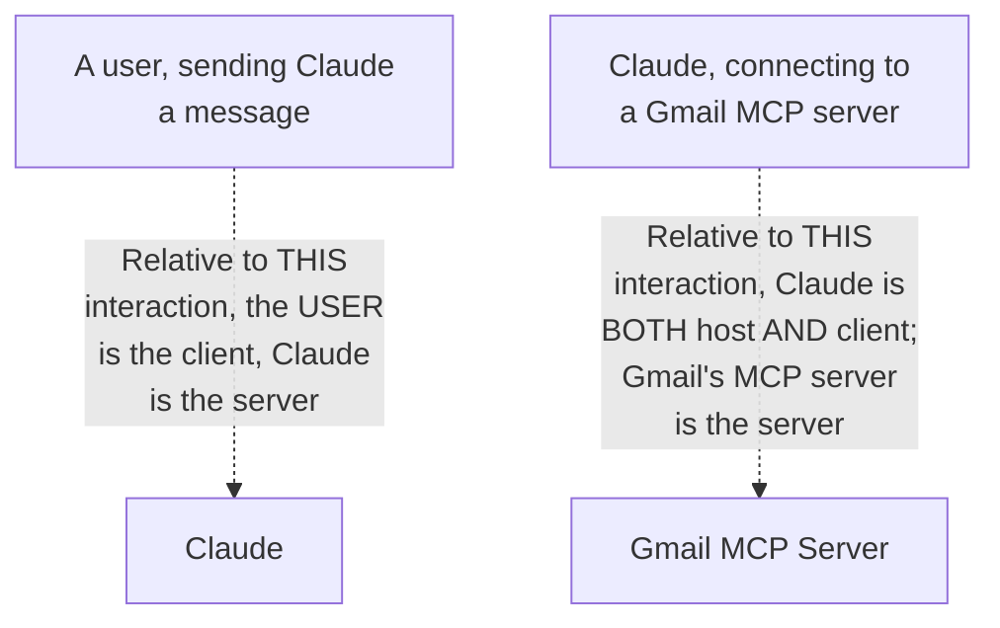

#### ⚠ Common Mistakes

* Assuming "host" and "client" are the SAME thing, or that a host directly, itself connects to an MCP server — explicitly, directly, repeatedly clarified: the HOST (e.g., Claude Desktop) internally STARTS a CLIENT, and it's specifically the CLIENT that speaks MCP's own protocol to the server.
* Assuming "client" and "server" are FIXED, absolute roles — explicitly, directly clarified as GENUINELY RELATIVE: WHOEVER makes a request is the client; whoever FULFILLS it is the server — the SAME application (like Claude) can genuinely be a server in one interaction and a host/client in another.
* Confusing a "connector" (the UI element you click in Claude's settings) with "client" — explicitly, directly clarified: connectors in the UI represent MCP SERVERS you're connecting TO; the CLIENT is the internal component your host starts to actually speak with that server.

#### 🎯 Key Takeaways

* MCP's core architecture has **three genuine components**: Host (the AI application, like Claude Desktop or VS Code), Client (internally started BY the host, speaking MCP's protocol), and Server (providing the actual tools/resources/prompts).
* The **SIM card analogy** directly, memorably captures this: mobile phone = host, SIM card = client, network = server — you cannot connect to the network WITHOUT the SIM, just as a host cannot reach an MCP server WITHOUT its internal client.
* **"Client" and "server" are GENUINELY RELATIVE roles**, not fixed labels — determined entirely by WHO is making a request versus WHO is fulfilling it, in any GIVEN interaction.

---

### 8. MCP's Three Primitives & Transport Layers

#### 📖 Definition — The Three, Genuine MCP Primitives

> 💡 **Given directly:** *"It will have all the tools. Along with tools, it will have RESOURCES and PROMPT as well. So these are the three things which MCP provides... these are known as MCP PRIMITIVES."*

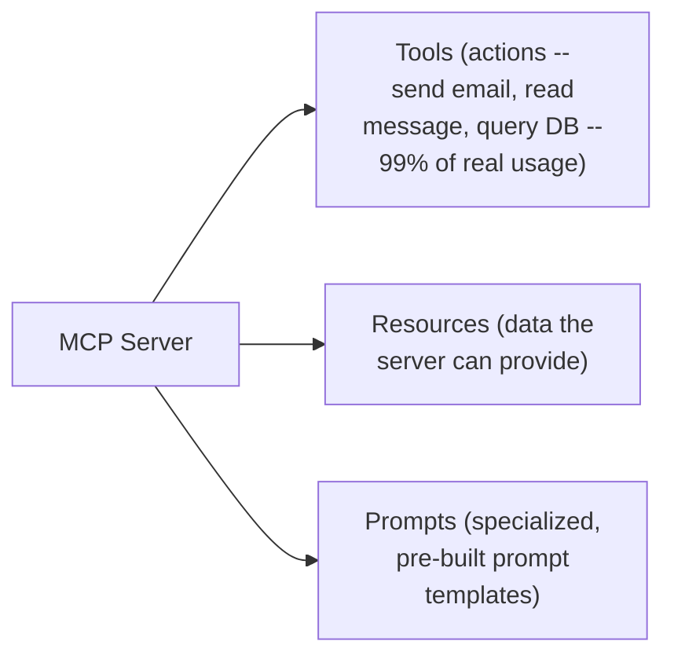

> 💡 **Given directly, a genuine, honest, practical note on relative usage:** *"99% of the times we are using tools or action in our server, which allows our AI to have hands and perform actions."*

#### 📖 Definition — The Two, Genuine Transport Mechanisms

> 💡 **Given directly:** *"There are two kinds of MCP servers as well... one is your STDIO, standard input output. Second, everyone, is STREAMABLE HTTP. So earlier it was HTTP plus SSE, but now it has been deprecated, last I checked in the official documentation... the legacy HTTP plus SSE spec version [was] released [and later deprecated] in March 2025."*

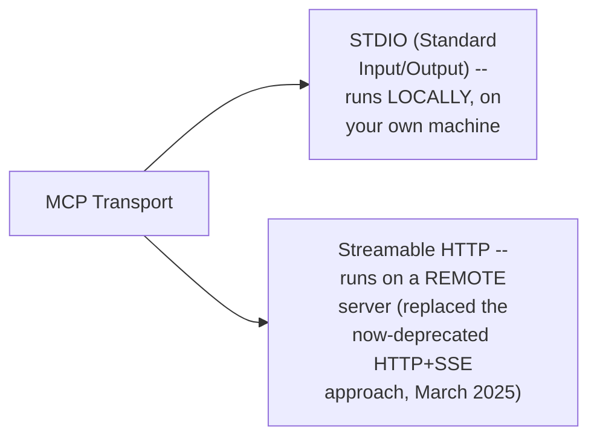

#### 🔍 Internal Working — Precisely How This Fits the Complete Flow

> 💡 **Given directly:** *"Whenever there is a question for which ChatGPT needs to access MCP, it takes that request to the client. Client hits the server. They talk in the same language. Server can tell the client what all tools or actions it can perform. Then based on that, client asks for a particular action, and we give the final result to ChatGPT."*

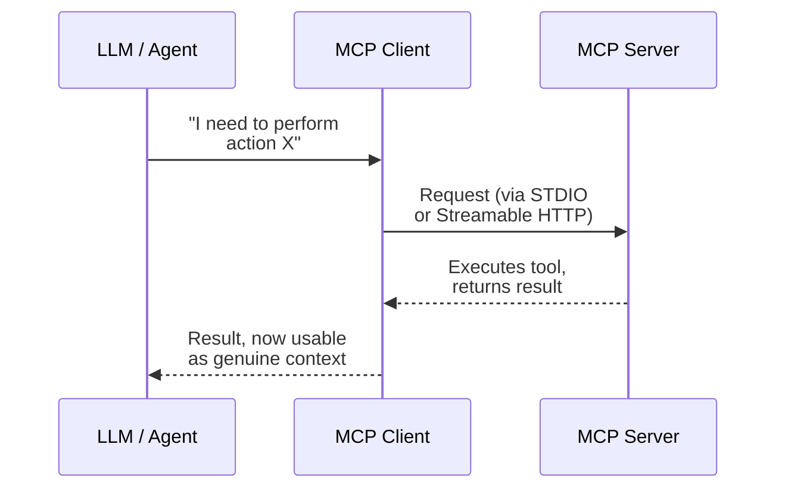

#### ⚠ Common Mistakes

* Assuming "resources" and "prompts" are used as commonly as "tools" — explicitly, directly, honestly clarified: tools genuinely dominate real-world usage ("99% of the times").
* Assuming HTTP+SSE is still the current, standard remote-transport approach — explicitly, directly confirmed as OFFICIALLY DEPRECATED (March 2025), replaced by Streamable HTTP.

#### 🎯 Key Takeaways

* MCP servers provide **three genuine primitives**: Tools (actions — the dominant, real-world use case), Resources (data), and Prompts (specialized templates).
* MCP supports **two transport mechanisms**: STDIO (local, on your own machine) and Streamable HTTP (remote) — with the OLDER HTTP+SSE approach explicitly, officially DEPRECATED as of March 2025.
* The **complete request flow** directly, precisely follows: LLM/Agent → Client → Server (via STDIO or Streamable HTTP) → Server executes and returns → Client relays back to the LLM as genuine, usable context.

---
### 9. Clarifying the Confusion: MCP vs. API vs. Tools (Genuine, Real Q&A)

#### ❓ Why It Exists — A Genuine, Repeatedly-Asked, Important Question

> 💡 **Given directly, in response to a genuine, real, persistent audience question:** *"How is it different from a typical REST API? Typical REST APIs, we have to add, we have to tell how to call. MCP is a totally new PROTOCOL... It is faster? No, it's different. So that is the language. It is different."*

#### 🪜 Step-by-Step — The Complete, Precise, Repeated Answer, Given Multiple Times

> 💡 **Given directly, one of several, genuinely patient re-explanations:** *"See, APIs are actually the action. MCP servers just bind them along with other things — resources, prompts, and tools. Just that MCP servers are having a different protocol, and it CAN CONNECT DIRECTLY with your thing, with your AI chatbot, Claude, everything. API, you will have to define the code and everything. Plus, API will again, then you are handling it. You are maintaining it, you are authenticating, handling security, you are running the code inside it."*

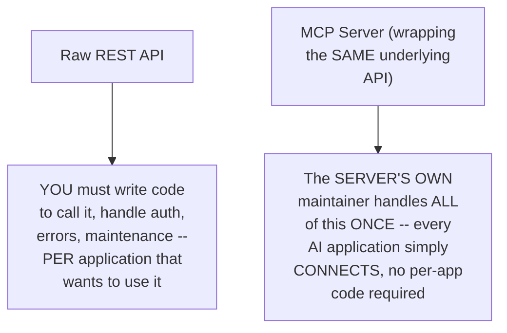

#### 🪜 Step-by-Step — Why Creating Your OWN MCP Server Still Matters (Even With Third-Party Ones Available)

> 💡 **Given directly:** *"If they are providing or maintaining their MCP servers and we are connecting there, then what will be the use of making our own MCP server? ...If you're having any application which is in your company, you will need to have the MCP servers which you use, right? No one is going to create that. Further, many times we need an MCP server which is having less number of tools, which is having different varied tools as well."*

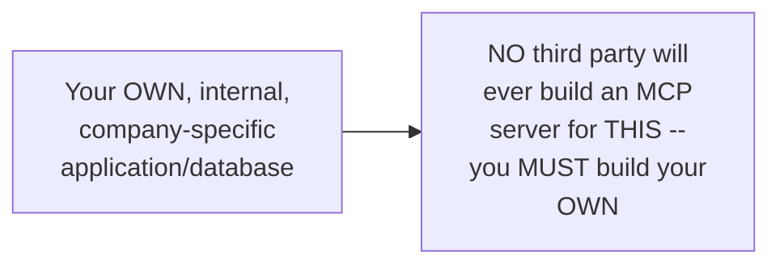

#### 🪜 Step-by-Step — A Genuinely Persistent, Multi-Turn Clarification: "Isn't MCP Just Wrapping the Same API Calls I'd Write Anyway?"

> 💡 **Given directly, the instructor's own patient, complete, final answer to a genuinely extended back-and-forth:** *"Can you directly connect those APIs with everyone? Can you give it access to everyone with these APIs? You will have to share lots of things. People will have to write it down at their own end, right?... So, person wants to use your DB or your APIs with an AI agent or an AI chatbot. How will you support that?... [With MCP] rather than, again, they maintaining those tools or those things, they can — they are much better off with an MCP which you can maintain, because when you will be maintaining your server, you can maintain your MCP easily, and everyone can just hit that MCP."*

#### 🔍 Internal Working — MCP Servers Genuinely Track Changes Automatically

> 💡 **Given directly, directly addressing a genuine, real, practical maintenance concern:** *"If you have written a FastAPI server, just in a second, you can create an MCP server with that. So it is able to understand it itself... if I do any changes here, automatically I could just change the description. And if I change anything here... my MCP server will get re-initialized, and my AI agents, they will know that, hey, now you need to send three, rather than you doing a change here, then you telling me, then I doing the change at my end, then my workflow's failing."*

```mermaid
flowchart LR
    A["A tool's own definition<br/>changes (e.g. a new,<br/>required parameter)"] --> B["MCP server<br/>automatically reflects<br/>this change"]
    B --> C["EVERY connected AI<br/>application genuinely,<br/>automatically sees the<br/>updated tool -- NO<br/>manual, per-application<br/>update required"]
```

#### ❓ Why It Exists — On Authentication & Role-Based Access at the MCP Server Level

> 💡 **Given directly, in response to a genuine, real, thoughtful audience question about restricting tool access by role:** *"We have authentication, the same as authenticated. Then after that, for a separate tools, authentication at a tool level... it should be possible... because I know the code, how it is written, right... when we send that back, we can check with authentication, like what level of access the person is having. So it's a simple IF code."*

```mermaid
flowchart LR
    A["A user's own request<br/>reaches the MCP server"] --> B["Server checks the<br/>user's OWN auth<br/>token/scope"]
    B --> C["Server returns ONLY<br/>the tools that user's<br/>OWN role/scope<br/>genuinely permits"]
```

#### ⚠ Common Mistakes

* Assuming MCP is "just a REST client" or fundamentally identical to a raw API, only with extra branding — explicitly, directly, repeatedly, patiently corrected across MULTIPLE genuine audience challenges: MCP is a genuinely DIFFERENT PROTOCOL, specifically designed so AI applications can discover and call tools WITHOUT each application separately writing, maintaining, and securing its own integration code.
* Assuming if a company already uses internal APIs, creating an MCP server is genuinely redundant — explicitly, directly clarified: an MCP server is what makes those SAME internal APIs genuinely, directly usable BY an AI application, WITHOUT that AI application (or its own developers) needing to write custom integration code.
* Assuming per-tool, role-based authentication is impossible or unsupported by MCP itself — explicitly, directly, honestly clarified as GENUINELY POSSIBLE (a straightforward, real implementation detail, "a simple IF code"), though the instructor honestly notes he needed to verify official, built-in support for this specific pattern.

#### 🎯 Key Takeaways

* MCP is **genuinely, structurally different** from a raw REST API — not merely a stylistic wrapper — specifically because it lets EVERY AI application discover and call tools through ONE, standardized protocol, WITHOUT separately writing, maintaining, and securing custom integration code.
* **Building your OWN MCP server remains genuinely necessary** for internal, company-specific applications and databases — no third party will EVER build this for you.
* **MCP servers genuinely, automatically propagate changes** — a tool's updated description/parameters are immediately, automatically visible to EVERY connected AI application, directly eliminating the N×M maintenance nightmare from Section 5.
* **Role-based, per-tool authentication is genuinely possible** at the MCP server level — a real, practical implementation detail, not a structural limitation of the protocol itself.

---

### 10. Closing: What's Next

#### 🪜 Step-by-Step — The Explicit, Stated Roadmap

> 💡 **Given directly:** *"So thanks for everyone with that. I think that's all the [doubts]. Please revise the classes. Most probably next weekend we will be [continuing] the MCP in depth properly, so that you will have a much better idea."*

> 💡 **Given directly, earlier in the session, confirming the genuine, ambitious practical goal ahead:** *"In the project we are using LangChain MCP... we will be pushing our MCP like — I plan to show you how you can push your MCP servers to PyPI, and then anyone across us can also use it. So that would be your part as well, how you will be with me creating an MCP server live and pushing it, so that everyone can use it. And yeah, I think that's the highest level of understanding. If you sit in an interview and tell that I have created an MCP server, that is the level of depth I want."*

```mermaid
flowchart LR
    A["Class 1 (done):<br/>Why MCP, official<br/>definition, host/client/<br/>server, primitives,<br/>transport"] --> B["Class 2 (next weekend):<br/>Deep architecture,<br/>building a REAL server,<br/>live coding"]
    B --> C["Later: publishing to<br/>PyPI, Docker, MCP<br/>gateways"]
    C --> D["Eventually: back to<br/>LangChain, integrating<br/>MCP into real agent<br/>projects"]
```

#### ⚠ Common Mistakes

* Assuming this session's own extensive Q&A represents the FULL depth of MCP architecture — explicitly, directly clarified: deep, structural topics (JSON-RPC specifically, the complete connection lifecycle, actually writing server code) are EXPLICITLY deferred to the next class.
* Assuming MCP knowledge alone is the end goal — explicitly, directly framed as a STEPPING STONE: the instructor's own stated plan is to return to LangChain afterward, directly integrating MCP into real, practical agent projects.

#### 🎯 Key Takeaways

* This class **genuinely, completely covers** MCP's own motivation, official definition, and core architecture — with genuinely extensive, real, live Q&A directly reinforcing the most commonly-confused distinctions.
* **Deep, structural MCP topics** — JSON-RPC specifically, the full connection lifecycle, and actually writing/publishing a real MCP server — are **explicitly, directly promised for the next class**.
* The instructor's own **stated, ambitious end goal**: genuine, interview-ready depth — building an MCP server live, publishing it to PyPI, and eventually returning to LangChain to integrate MCP into real, practical agent projects.

---
## 📝 Glossary

| Term | Definition | Why It Matters |
|---|---|---|
| **LLM (Large Language Model)** | A genuine "black box" -- next-token predictor, input/output in natural language | Cannot genuinely ACT on its own |
| **Context** | Everything the LLM/model can genuinely see when it answers | Directly, precisely why MCP has "context" in its name |
| **Function Calling** | OpenAI's mid-2023 feature -- binding tools/functions to an LLM | The FIRST fix for "AI can't act" -- but didn't scale |
| **Tool / Action** | The vocabulary term for a bound function -- in the backend, genuinely an API call | Core building block of both function calling and MCP |
| **N x M Problem** | Every AI app x every tool = genuine, duplicate integration effort | The EXACT scaling nightmare MCP was created to solve |
| **MCP (Model Context Protocol)** | Anthropic's open-source standard connecting AI apps to external systems | This entire session's own core subject |
| **Host** | The AI application itself (Claude Desktop, VS Code, Cursor, etc.) | Analogous to a mobile PHONE |
| **Client** | Started internally BY the host, speaks MCP's protocol to a server | Analogous to a SIM CARD |
| **Server** | Provides the actual tools/resources/prompts | Analogous to the mobile NETWORK |
| **MCP Primitives** | Tools, Resources, Prompts -- the three things an MCP server provides | Tools dominate real-world usage (~99%) |
| **STDIO** | Standard Input/Output -- a LOCAL transport mechanism | Runs on your own machine |
| **Streamable HTTP** | A REMOTE transport mechanism, replacing the deprecated HTTP+SSE | Officially deprecated HTTP+SSE in March 2025 |

---

## 🔄 Revision Notes — One-Minute Revision

* This is **Class 1 of a dedicated, 3-4 class, in-depth MCP series** -- the goal is genuine mastery: building your OWN servers, clients, gateways, publishing to PyPI, running in Docker.
* **The story**: ChatGPT (Nov 2022) launched an LLM -- a genuine "black box," a next-token predictor that can only ANSWER, never ACT (a "brain with no hands"). "Model" in MCP's own name comes from this exact framing.
* **Context**: everything the LLM can genuinely SEE when answering -- LIVE-demonstrated (Venezuela president question: wrong without web search, correct with it). "Context" in MCP's name = giving the LLM an ability to SEE more, not more raw intelligence.
* **Function calling** (mid-2023, OpenAI): binding tools to an LLM -- the LLM decides WHICH tool + WHAT arguments, but NEVER genuinely executes code itself. "Tool"="action"=an API call, in the backend.
* **The genuine scaling nightmare**: function calling worked at an individual level, but at COMPANY scale (e.g. 4 apps x 6 actions = 24 tools), every tool needed its own method/data format/error handling/security -- "we are spending that same time to MAINTAIN our tools." This is an N x M problem: every AI app x every tool = genuine, duplicate integration effort (e.g. "500 teams... writing the same code").
* **MCP's official definition**: "an open source standard for connecting AI application to external systems." The instructor's OWN preferred framing (not the common USB-C analogy): a COLLECTION of tools/actions, combined, with a STANDARDIZED way for AI to discover and call them.
* **Before/After MCP**: Before -- easy for ONE tool, but NOT SCALABLE (duplicate code, redundant, security risk). After -- connect ONCE to an MCP server, get ALL its tools; the SERVER'S OWN maintainer handles the heavy lifting.
* **Architecture**: Host (the AI app, e.g. Claude Desktop) -> Client (started INTERNALLY by the host, speaks MCP protocol) -> Server (provides tools/resources/prompts). SIM CARD ANALOGY: mobile phone=host, SIM card=client, network=server. "Client" and "server" are GENUINELY RELATIVE roles -- whoever makes a request is the client, whoever fulfills it is the server.
* **Three primitives**: Tools (99% of real usage), Resources, Prompts. **Two transports**: STDIO (local) and Streamable HTTP (remote) -- the older HTTP+SSE approach was officially DEPRECATED in March 2025.
* **MCP vs. raw API**: MCP is a genuinely DIFFERENT protocol -- lets EVERY AI app discover/call tools through ONE standard, without separately writing/maintaining/securing custom integration code. Building your OWN MCP server remains necessary for internal, company-specific applications -- no third party will build this for you. MCP servers automatically propagate tool changes to every connected AI app. Role-based, per-tool authentication is genuinely possible (a real implementation detail, not a protocol limitation).
* **Next class (next weekend)**: deep architecture (JSON-RPC, full connection lifecycle), building a REAL MCP server live, later publishing to PyPI, Docker, MCP gateways -- eventually returning to LangChain to integrate MCP into real agent projects.

---

## 📋 Cheat Sheet

**The complete historical narrative:**
```text
ChatGPT launches (Nov 2022) -> LLM = "black box" (answer only, no action)
-> Context matters (what the model can genuinely SEE)
-> Function Calling (mid-2023): LLM can DESCRIBE tool calls, never executes itself
-> Scaling nightmare: N apps x M tools = duplicate, unmaintainable integrations
-> MCP (Anthropic): ONE standard protocol, tools maintained ONCE by the server owner
```

**MCP architecture (the SIM card analogy):**
```text
Host   = Mobile Phone     (e.g. Claude Desktop, VS Code, Cursor)
Client = SIM Card          (started INTERNALLY by the host)
Server = Mobile Network      (provides tools/resources/prompts)
```

**MCP's three primitives:**
```text
Tools (actions -- ~99% of real usage) | Resources (data) | Prompts (templates)
```

**Two transport mechanisms:**
```text
STDIO             -- LOCAL, runs on your own machine
Streamable HTTP    -- REMOTE (replaced the now-deprecated HTTP+SSE, March 2025)
```

**MCP vs. raw API, in one line:**
```text
Raw API: YOU write/maintain/secure the integration, PER application
MCP:     The SERVER'S owner maintains it ONCE; every AI app just CONNECTS
```

---

## 🔥 Interview Questions & Answers

### 🟢 Beginner

**Q1.**

**Question:** What is an LLM, according to this session's own "black box" framing?

**Answer:** A next-token predictor that takes natural-language input and produces natural-language output, with no inherent ability to act.

**Explanation:** Directly, precisely explained.

**Why Interviewers Ask This:** Foundational, conceptual grounding for MCP's own motivation.

**Possible Follow-up:** "Why is this framing directly connected to MCP's own name?"

**Q2.**

**Question:** What is "context," per this session's own precise definition?

**Answer:** Everything the LLM/model can genuinely see when it answers a question.

**Explanation:** Directly, explicitly stated.

**Why Interviewers Ask This:** Directly tests understanding of MCP's own naming.

**Possible Follow-up:** "Give a concrete example of how context changed an answer's correctness."

**Q3.**

**Question:** Does an LLM genuinely execute the tools/functions it decides to call?

**Answer:** No -- it only specifies which tool and what arguments; a separate system executes it.

**Explanation:** Directly, precisely, repeatedly clarified.

**Why Interviewers Ask This:** A commonly-confused, foundational fact about function calling.

**Possible Follow-up:** "What year did OpenAI ship function calling?"

**Q4.**

**Question:** What is the "N x M problem" this session describes?

**Answer:** Every AI application needing its own, separately-maintained integration for every tool, causing massive, genuine duplication at scale.

**Explanation:** Directly, precisely explained.

**Why Interviewers Ask This:** The core, genuine motivation for MCP's own existence.

**Possible Follow-up:** "Give the session's own concrete numeric example of this problem."

**Q5.**

**Question:** What are MCP's three primitives?

**Answer:** Tools, Resources, and Prompts.

**Explanation:** Directly, explicitly named.

**Why Interviewers Ask This:** Basic, foundational MCP terminology.

**Possible Follow-up:** "Which of these three is used most often in real-world MCP servers?"

**Q6.**

**Question:** In the SIM card analogy, what does the SIM card represent?

**Answer:** The MCP client.

**Explanation:** Directly, precisely mapped.

**Why Interviewers Ask This:** Tests recall of a genuinely memorable, core analogy.

**Possible Follow-up:** "What does the mobile network represent in this same analogy?"

**Q7.**

**Question:** Which older MCP transport mechanism was officially deprecated in March 2025?

**Answer:** HTTP + SSE (Server-Sent Events).

**Explanation:** Directly, explicitly stated.

**Why Interviewers Ask This:** Tests awareness of MCP's own, real, evolving specification.

**Possible Follow-up:** "What replaced it?"

**Q8.**

**Question:** Who created MCP?

**Answer:** Anthropic.

**Explanation:** Directly, explicitly stated.

**Why Interviewers Ask This:** Basic, foundational, factual MCP knowledge.

**Possible Follow-up:** "Is MCP tied exclusively to Claude/Anthropic's own products?"

**Q9.**

**Question:** Are "client" and "server" fixed, absolute roles in MCP's architecture?

**Answer:** No -- they are genuinely relative, determined by who makes a request versus who fulfills it.

**Explanation:** Directly, precisely clarified.

**Why Interviewers Ask This:** Tests a genuinely subtle, important architectural nuance.

**Possible Follow-up:** "Give an example of the SAME application being both a client and a server, in different interactions."

**Q10.**

**Question:** In the backend, what does an MCP "tool" genuinely correspond to?

**Answer:** An API call.

**Explanation:** Directly, explicitly stated.

**Why Interviewers Ask This:** Basic, foundational vocabulary clarification.

**Possible Follow-up:** "So does MCP eliminate the need for APIs entirely?"

---

### 🟡 Intermediate

**Q11.**

**Question:** Explain why the instructor deliberately rejects the common "USB-C port" analogy for MCP, offering his own, different framing instead.

**Answer:** The instructor directly, explicitly states this common analogy "tries to sometimes oversimplify it and then make it very difficult to follow." A USB-C port analogy emphasizes UNIVERSAL PHYSICAL CONNECTIVITY (any device, any cable) — but this genuinely risks obscuring MCP's own, real, structural NATURE as a protocol combining MULTIPLE, DISTINCT primitives (tools, resources, prompts) with a STANDARDIZED discovery/calling mechanism. His own preferred framing — "a collection of tools... combined, and gave AI a way to call them" — directly, precisely emphasizes the GENUINE, structural problem MCP solves (the N×M scaling nightmare) rather than a purely physical, connectivity-based metaphor that doesn't directly explain WHY this specific problem needed solving.

**Explanation:** Requires recognizing a deliberate, reasoned rejection of a common analogy in favor of a problem-motivated framing.

**Why Interviewers Ask This:** Tests whether a learner understands MCP's own genuine, structural purpose, not just a popular, potentially oversimplified metaphor.

**Possible Follow-up:** "In your own words, explain why 'connecting to any tool' alone doesn't fully capture what MCP genuinely solves."

**Q12.**

**Question:** A learner argues that since MCP's tools are, in the backend, "just APIs," creating an MCP server provides no genuine technical advantage over simply documenting your APIs well and asking developers to write their own integrations. Evaluate this claim.

**Answer:** This claim overstates the case, conflating "the underlying execution mechanism is the same" with "there is no genuine, structural advantage." The instructor's own precise, repeated answer directly addresses this exact confusion: while a tool genuinely IS an API call in the backend, MCP's GENUINE advantage is in HOW that API becomes DISCOVERABLE and CALLABLE by AI applications — WITHOUT each application's own developers needing to write, test, and maintain custom integration code. Well-documented APIs still require EVERY consuming team to independently READ that documentation, WRITE their own integration code, and MAINTAIN it as the API evolves — precisely the N×M duplication problem Section 5 directly identifies. MCP's genuine, structural advantage is that the SERVER OWNER maintains ONE, standardized interface that EVERY AI application can automatically discover and use — directly, precisely eliminating the duplicate-code burden, REGARDLESS of how well-documented the underlying API already is.

**Explanation:** Tests whether a learner distinguishes "same execution mechanism" from "no genuine structural advantage," correctly identifying MCP's real value in discoverability and maintenance, not novel execution.

**Why Interviewers Ask This:** Distinguishes candidates who understand MCP's precise, structural value proposition from those who dismiss it as "just a wrapper with no real benefit."

**Possible Follow-up:** "If your company already has excellent, well-documented internal APIs, what SPECIFIC, additional benefit would building an MCP server still provide?"

**Q13.**

**Question:** Explain, precisely, why the instructor's genuine, live demonstration (asking Claude about Venezuela's president, with and without web search) is a more convincing way to teach "context" than simply defining the term abstractly.

**Answer:** This is a genuinely deliberate pedagogical choice: an ABSTRACT definition ("context is everything the model can see") doesn't concretely demonstrate WHY this matters — a learner might nod along without genuinely INTERNALIZING the real, practical CONSEQUENCE of missing context. By LIVE-demonstrating a GENUINELY WRONG answer (without context) immediately followed by a GENUINELY CORRECT one (with context, via web search), the instructor makes the abstract definition CONCRETELY, VISIBLY consequential — the SAME question, the SAME model, but a GENUINELY different, verifiably WRONG-vs-RIGHT outcome, based SOLELY on whether context was available. This directly, precisely mirrors this session's own broader teaching pattern (established across the entire narrative) of grounding EVERY abstract concept in a genuine, concrete, often LIVE example, rather than relying purely on definitions.

**Explanation:** Requires recognizing a deliberate pedagogical choice — live demonstration over abstract definition — and articulating why it's more effective.

**Why Interviewers Ask This:** Tests whether a learner recognizes the value of concrete demonstration in building genuine understanding, not just recalling the definition itself.

**Possible Follow-up:** "Design your own, similarly concrete demonstration to teach the concept of function calling to someone who has never seen it."

**Q14.**

**Question:** Using this session's own precise "relative client/server roles" clarification (Section 7), explain what role Claude Desktop plays when a USER sends it a message, versus what role it plays when IT connects to a Gmail MCP server — and why these are genuinely different roles for the SAME application.

**Answer:** A precise, synthesized explanation, directly applying the instructor's own exact reasoning: when a USER sends Claude Desktop a message, Claude Desktop is genuinely acting as a SERVER (fulfilling the user's own request) — the USER, in this specific interaction, is the CLIENT (making the request). However, when Claude Desktop ITSELF needs to reach out to a Gmail MCP server (to genuinely send an email, for example), the FRAME shifts — Claude Desktop is now the one MAKING a request, meaning it genuinely becomes the HOST (per Section 7's own architecture) PLUS, internally, starts up its OWN CLIENT to speak with Gmail's server. This directly, precisely illustrates WHY "client" and "server" cannot be treated as FIXED, permanent labels attached to a specific application — the SAME application (Claude Desktop) genuinely occupies BOTH roles, simultaneously, depending on WHICH SPECIFIC interaction/relationship you're examining.

**Explanation:** Requires applying the "relative roles" principle to a concrete, two-part scenario involving the SAME application in genuinely different roles.

**Why Interviewers Ask This:** Tests whether a learner can apply the RELATIVE nature of these roles to a genuinely new, concrete scenario, not just recite the abstract principle.

**Possible Follow-up:** "In this SAME scenario, what role does Gmail's own MCP server play, relative to Claude Desktop's client?"

**Q15.**

**Question:** Synthesize this session's complete "before MCP" honest positive/negative analysis (Section 6) with the earlier LangChain/Middleware sessions' own established "tool binding" mechanism to explain precisely what a LangChain-based agent genuinely GAINS by connecting to an MCP server, versus using LangChain's own, native tool-binding approach directly.

**Answer:** A precise, synthesized explanation, directly connecting this session's own new content to the earlier LangChain/Middleware sessions' own established mechanism: LangChain's own native tool-binding (covered in the earlier Middleware sessions) genuinely REQUIRES the DEVELOPER to WRITE each tool's own Python function, WITH its own docstring/description, error handling, and any necessary authentication logic — directly, precisely the SAME kind of PER-APPLICATION integration burden Section 6's own "before MCP" analysis identifies as GENUINELY unsustainable at scale. By INSTEAD connecting a LangChain agent to an EXISTING, third-party MCP server (e.g., a Gmail MCP server, per this session's own live demonstration), the LangChain DEVELOPER genuinely GAINS all of that server's tools WITHOUT writing ANY of that integration code themselves — directly, precisely realizing the "AFTER MCP" benefit (Section 6) WITHIN a LangChain-based project specifically. This directly explains WHY this instructor's own stated plan (Section 10) is to teach MCP as a STANDALONE concept FIRST, then RETURN to LangChain — MCP's own genuine value is FULLY separable from any single framework, and LangChain-based agents genuinely BENEFIT from this SAME value, just like any other AI application.

**Explanation:** Requires synthesizing this session's own new content with a genuinely separate, earlier LangChain-specific mechanism (native tool binding) to explain a precise, concrete integration benefit.

**Why Interviewers Ask This:** A senior-level question testing whether a candidate can connect MCP's own general value proposition to a SPECIFIC, familiar framework's own existing capabilities, correctly identifying what's genuinely GAINED.

**Possible Follow-up:** "Would a LangChain agent connected to an MCP server still be able to use its OWN, custom, natively-bound tools at the SAME time? Explain your reasoning."

---

### 🔴 Advanced

**Q16.**

**Question:** Design a complete, reasoned analysis: a company has 5 internal microservices (each with its own REST API) and wants AI agents (potentially using DIFFERENT frameworks — LangChain, AutoGen, and a custom Python script) to access all 5. Using this session's own precise "before/after MCP" framework, construct a complete comparison of the BEFORE approach (each framework separately integrating with each API) versus the AFTER approach (a single, shared MCP server).

**Answer:** A reasonable, complete comparison, directly applying Section 6's own exact methodology: **BEFORE (no MCP)**: for EACH of the 3 AI frameworks (LangChain, AutoGen, custom script) to access ALL 5 microservices, the company would need to write and maintain `3 x 5 = 15` SEPARATE integrations — each framework's own developers writing their OWN wrapper code, their OWN error handling, their OWN authentication logic for EACH of the 5 services — directly, precisely the N×M problem Section 5 establishes. If ANY of the 5 microservices' own APIs change (e.g., a new required parameter), ALL 3 frameworks' own integrations for THAT service would need SEPARATE, MANUAL updates. **AFTER (with a single, shared MCP server)**: the company builds ONE MCP server (or, per Section 9's own guidance, potentially 5 separate, focused MCP servers, one per microservice) — this SINGLE, maintained interface exposes ALL the necessary tools, with the SERVER OWNER (the company's own platform team) handling ALL authentication, error handling, and maintenance ONCE. ALL 3 AI frameworks then simply CONNECT to this SAME MCP server (or servers) — REQUIRING ZERO custom, per-framework integration code, and AUTOMATICALLY receiving ANY updates the server owner makes (per Section 9's own "automatic propagation" reasoning) — directly reducing the company's OWN genuine integration burden from 15 separate, manually-maintained integrations down to a SINGLE, centrally-maintained MCP layer.

**Explanation:** Requires applying the session's own exact before/after methodology to a genuinely new, concrete, multi-framework scenario, with precise quantitative reasoning.

**Why Interviewers Ask This:** A realistic, senior-level question testing whether a candidate can apply MCP's own core value proposition to a genuinely new, concrete, multi-system scenario.

**Possible Follow-up:** "Would you recommend ONE, combined MCP server for all 5 microservices, or 5 separate, focused ones? Explain your reasoning, directly connecting to this session's own stated guidance."

**Q17.**

**Question:** Critically evaluate: "Since this session confirms LLMs never execute code themselves (Section 4) and MCP servers handle all the actual tool execution (Section 6), this means MCP servers are GENUINELY SAFER than function calling, since the LLM itself never has direct access to sensitive systems." Is this an accurate, complete characterization?

**Answer:** Partially accurate, but INCOMPLETE — this correctly identifies a genuine, real structural similarity (the LLM itself never directly executes code, in EITHER function calling OR MCP), but incorrectly implies MCP is INHERENTLY, STRUCTURALLY safer purely because of this shared property, when this SAME "LLM doesn't execute directly" property was ALREADY, GENUINELY true of function calling (per Section 4's own precise clarification). The GENUINE, real security consideration MCP introduces isn't about the LLM's OWN direct access (which was NEVER the case, in either approach) — it's about the SCOPE and CONTROL of what the CONNECTED MCP SERVER itself can do, and WHO can access it. Per Section 9's own direct, honest audience exchange ("Are these MCP secure? As secure as you want them to be... there is one very big caveat, that the WRONG people should not get access to the MCP server, just like an API, because then they can do ANYTHING on top of that"), MCP servers carry the SAME GENUINE security responsibility as any API server — authentication, authorization, rate limiting are ALL things the SERVER OWNER must GENUINELY implement, exactly as they would for a raw API. MCP does NOT inherently, structurally improve security beyond what a well-secured API already provides — it genuinely IMPROVES maintainability and discoverability (Section 6's own core claims), but security remains GENUINELY the server owner's OWN, real responsibility, precisely as honestly acknowledged in this session's own Q&A.

**Explanation:** Tests whether a learner recognizes that "LLM doesn't execute directly" was already true of function calling, and correctly identifies MCP's own genuine value (maintainability, discoverability) as distinct from an unsupported claim of inherent, structural security improvement.

**Why Interviewers Ask This:** Distinguishes candidates who track WHICH specific problem a technique solves from those who attribute UNRELATED benefits to it based on surface-level similarity.

**Possible Follow-up:** "What SPECIFIC, concrete steps would a company genuinely need to take to make their own MCP server GENUINELY secure, per this session's own honest guidance?"

**Q18.**

**Question:** Synthesize this session's complete "why context matters" demonstration (Section 3) with its own "why function calling wasn't enough" reasoning (Section 4-5) to construct a complete, precise explanation of why MCP is genuinely described as giving AI BOTH better context AND the ability to act — rather than solving only ONE of these two, genuinely separate problems.

**Answer:** A precise, synthesized explanation, directly connecting TWO separately-introduced concepts (context, Section 3; and action/tools, Sections 4-5) into ONE, complete understanding of MCP's own genuine, dual purpose: per Section 3's own precise demonstration, an LLM's ANSWER QUALITY genuinely depends on what it can SEE (context) — and MCP's own RESOURCES primitive (per Section 8's own precise taxonomy) DIRECTLY addresses this, allowing an AI application to genuinely PULL IN relevant DATA (files, database records, documentation) as CONTEXT, exactly the same way the LIVE Venezuela example demonstrated web search providing GENUINE, needed context. SEPARATELY, per Sections 4-5's own precise reasoning, an LLM's ability to genuinely ACT (not just answer) depends on TOOLS — and MCP's own TOOLS primitive DIRECTLY addresses THIS, GENUINELY DIFFERENT need. This directly, precisely explains why MCP's OWN NAME contains BOTH "model" (Section 2, the LLM itself) AND "context" (Section 3, what it can see) — while its ARCHITECTURE (Section 8) provides BOTH resources (context) AND tools (action) as GENUINELY SEPARATE, but COMPLEMENTARY primitives, solving what could otherwise have remained TWO, entirely separate technical problems (better answers via context, versus genuine action via tools) through ONE, UNIFIED protocol.

**Explanation:** Requires synthesizing the "context" concept (Section 3) with the "action/tools" concept (Sections 4-5) to explain why MCP's own name and architecture directly address BOTH, rather than treating them as unrelated.

**Why Interviewers Ask This:** A capstone-level question testing whether a candidate can connect MCP's own name, motivation, and architecture into ONE coherent, complete understanding, rather than treating "context" and "tools" as separate, unconnected session topics.

**Possible Follow-up:** "Give a concrete, realistic example of an MCP server that would need to provide BOTH resources AND tools to be genuinely useful for a specific, real task."

---

## 🧪 Scenario-Based Interview Questions

> **Scenario 1:** A colleague, new to MCP, argues that since their company already has 15 well-documented, internal REST APIs, building MCP servers is genuinely unnecessary extra work — developers can simply read the API docs and write their own integrations, as they always have. Using this session's concepts, evaluate this reasoning and provide a recommendation.

**Structured Answer:**
1. **Initial investigation:** Recognize this as directly connected to Section 6's own precise "before MCP" analysis — well-documented APIs were ALREADY genuinely true "before MCP," yet the SCALING problem (Section 5) still, genuinely emerged.
2. **Metrics/logs to check:** Directly assess how MANY different AI applications/frameworks (LangChain agents, custom scripts, Claude Desktop connections, etc.) currently need — or will SOON need — access to these 15 APIs, directly estimating the genuine, real N×M scaling exposure.
3. **Possible causes:** Per Section 5's own precise reasoning, the colleague's argument genuinely holds for a SINGLE, isolated integration, but GENUINELY breaks down as the NUMBER of consuming AI applications grows — EACH new AI application/framework wanting access would GENUINELY require its OWN, separately-written and maintained integration code.
4. **Debugging/evaluation approach:** Directly project forward: if the company anticipates 3, 5, or more DIFFERENT AI applications/frameworks needing access to these SAME 15 APIs over the next year, calculate the GENUINE, real integration/maintenance burden under BOTH approaches (per Advanced Interview Q16's own precise methodology).
5. **Resolution:** If GENUINE, multi-application/framework access is anticipated (or already occurring), recommend building MCP servers for these 15 APIs — directly, precisely realizing Section 6's own "after MCP" benefits (centralized maintenance, automatic propagation of changes). If access will genuinely remain limited to ONE, single application, the colleague's reasoning may be genuinely sufficient for now — but should be REVISITED as adoption grows.
6. **Prevention:** Establish a standing team practice of directly evaluating the ANTICIPATED number of consuming AI applications/frameworks BEFORE deciding whether MCP-server investment is genuinely warranted, rather than assuming EITHER "always build MCP" or "documentation is always sufficient" as a universal rule.

> **Scenario 2 (Advanced):** Your team is deciding whether to use an existing, third-party MCP server for GitHub (which has a limited, fixed set of tools) or to build a custom MCP server wrapping GitHub's own REST API directly, to get additional, needed functionality. Using this session's concepts, construct a complete, reasoned recommendation.

**Structured Answer:**
1. **Initial investigation:** Recognize this as directly connected to a genuine, real audience question this session's own content DIRECTLY addresses (Section 9) — a team finding an existing MCP server (GitHub's own) genuinely insufficient for their specific needs.
2. **Relevant principle:** Per the instructor's own direct, precise answer to this EXACT scenario, an MCP server CANNOT genuinely be "extended" via inheritance/wrapper patterns the way ordinary code can — but you CAN build your OWN, SEPARATE MCP server (potentially even one that, internally, uses an MCP CLIENT to call the EXISTING GitHub server for SOME functionality, while adding your OWN, additional tools directly).
3. **Possible causes for the current gap:** GitHub's own official MCP server is maintained by GitHub, based on GITHUB'S OWN priorities — it may genuinely NOT cover every tool your SPECIFIC team needs, precisely because it's a GENERAL-PURPOSE server, not tailored to your team's own specific workflow.
4. **Debugging/evaluation approach:** Directly assess whether your team's own MISSING functionality is GENUINELY available via GitHub's own REST API (even if not exposed via their MCP server) — if so, building a genuinely CUSTOM, SUPPLEMENTARY MCP server (wrapping the SPECIFIC, additional GitHub API endpoints your team needs) is a GENUINE, viable option.
5. **Resolution:** Recommend building a SUPPLEMENTARY, custom MCP server SPECIFICALLY for the missing functionality, while CONTINUING to use GitHub's own official server for its EXISTING, well-covered tools — directly avoiding genuinely, unnecessarily REBUILDING functionality GitHub's own server ALREADY, adequately provides.
6. **Prevention:** Establish a standing team practice of directly, precisely auditing WHICH SPECIFIC tools a THIRD-PARTY MCP server genuinely provides BEFORE assuming it's either "fully sufficient" or "entirely inadequate" — most REAL gaps are PARTIAL, not total, making a supplementary approach GENERALLY more practical than a full, from-scratch replacement.

---

## 🛠 Hands-on Exercises

### 🟢 Easy

1. Write out, from memory, the complete narrative arc from ChatGPT's launch through MCP's own creation, in your own words.
2. Explain the SIM card analogy for host/client/server, and draw a simple diagram illustrating it.
3. List MCP's three primitives, and state which one is used most often in real-world servers.

### 🟡 Medium

4. Complete the full, worked before/after MCP comparison proposed in Advanced Interview Q16, using a genuinely different, concrete scenario of your own choosing (e.g., a company with 3 internal databases and 2 AI frameworks).
5. Write a short explanation (150-200 words) of why "client" and "server" are genuinely relative roles, directly applying Intermediate Q14's own reasoning to a scenario of your own choosing.
6. Research (outside this session) an actual, real, publicly-available MCP server (e.g., for GitHub, Slack, or Notion), and document its own actual list of available tools.

### 🔴 Advanced

7. Install Claude Desktop or VS Code, connect to at least one real, existing MCP server (e.g., via Claude's own "Connectors" feature), and directly observe the tools it provides.
8. Design a complete, reasoned security/authentication plan for a hypothetical, company-internal MCP server, directly applying Section 9's own "role-based access" reasoning.
9. Implement the "supplementary MCP server" approach proposed in Scenario 2, building a small, custom MCP server (using FastMCP, previewed in this session) that wraps at least one real, public API endpoint not covered by an existing, third-party MCP server.

---

## 🏗 Practice Assignment

### Build: "Complete MCP Architecture Explanation & Real-World Connector Exploration"

**Objective:** Directly reinforce this session's own core narrative and architecture, preparing for the next class's own deep, hands-on coding content.

**Requirements:**
- Write a complete, from-memory explanation (500-800 words) of the full narrative arc this session covers — from ChatGPT's launch through MCP's own creation — in your own words, without referring back to this guide.
- Connect to at least TWO real, existing MCP servers via Claude Desktop's own "Connectors" feature (or VS Code's own MCP support), and document the specific tools each one provides.
- Write a complete, precise answer (200-300 words) to the question: "Why is MCP genuinely different from a raw REST API?" — directly incorporating this session's own precise reasoning.
- A written reflection (150-200 words) on which specific, real audience question from this session's own extensive Q&A you found most genuinely clarifying, and why.

**Architecture (suggested):**

```text
mcp_class1_reinforcement/
├── narrative_explanation.md          # your from-memory narrative
├── connector_exploration.md            # your real MCP server tool documentation
├── mcp_vs_api_explanation.md             # your precise, complete answer
└── REFLECTION.md                            # your written reflection
```

**Expected Functionality:**
- Your narrative explanation should genuinely, correctly capture the complete causal chain (ChatGPT -> context -> function calling -> scaling nightmare -> MCP).
- Your connector exploration should document ACTUAL, real tools from ACTUAL, real MCP servers you've genuinely connected to.

**Challenges:**
- Correctly explaining WHY function calling's own genuine success still led to a genuine, real failure at scale.
- Correctly distinguishing host, client, and server for a SPECIFIC, real application you've used (e.g., Claude Desktop or VS Code).

**Bonus Improvements:**
- Directly test the "context" demonstration yourself — ask an AI assistant a genuinely time-sensitive question with and without web search/tool access enabled, documenting the difference.
- Research FastMCP (mentioned directly in this session) and write a brief summary of what it appears to offer, in preparation for the next class's own hands-on server-building content.

---

## 📚 Additional Resources

- **Anthropic's official MCP documentation** (referenced directly, quoted directly for MCP's own official definition) -- the primary, authoritative source for MCP's own specification.
- **The prior LangChain/Middleware sessions in this series** -- the direct prerequisite content, covering native tool-binding, which this session directly contrasts with MCP's own approach.
- **FastMCP** (referenced directly, briefly previewed) -- the tool explicitly mentioned for quickly building real MCP servers, to be covered in depth in the next class.
- **The next class** (referenced directly, "next weekend") -- covering deep MCP architecture, JSON-RPC, the complete connection lifecycle, and building a real MCP server live.

---

## 📌 Final Revision Sheet

### ⭐ Core Concepts
- **LLM as black box**: next-token predictor, cannot genuinely ACT on its own.
- **Context**: everything the model can genuinely see when answering -- directly, live-demonstrated.
- **Function calling** (mid-2023): LLM describes tool calls, never executes itself -- solved "no hands," but not at scale.
- **The N x M scaling nightmare**: every AI app x every tool = genuine, duplicate integration burden.
- **MCP**: an open standard letting AI apps discover/call tools via ONE protocol, maintained ONCE by the server owner.
- **Architecture**: Host (mobile phone) -> Client (SIM card, started internally) -> Server (network).
- **Client/server roles are GENUINELY RELATIVE**, not fixed.
- **Three primitives**: Tools (dominant), Resources, Prompts. **Two transports**: STDIO (local), Streamable HTTP (remote, replacing deprecated HTTP+SSE).

### ⭐ Important Definitions
- **N x M Problem, MCP Primitives** (see Glossary for full definitions).

### ⭐ Important Commands/Code
```text
(Deep, hands-on code -- FastMCP server creation, JSON-RPC -- explicitly promised for the NEXT class)
```

### ⭐ Architecture/Process
- Complete flow: LLM/Agent has a need -> Host starts/uses its internal Client -> Client requests from Server (via STDIO or Streamable HTTP) -> Server executes/responds -> Client relays result back as genuine context.

### ⭐ Best Practices
- Build your own MCP server for internal, company-specific applications -- no third party will do this for you.
- Evaluate whether an existing, third-party MCP server genuinely covers your needs before building a full, custom replacement -- consider a supplementary server instead.
- Treat MCP server security with the SAME rigor as any API server -- authentication, authorization, and rate limiting remain the server owner's own, genuine responsibility.

### ⭐ Common Mistakes
- Assuming the LLM itself directly executes tools/code (it never does, in either function calling or MCP).
- Assuming MCP is "just a REST client" with no genuine, structural advantage over raw APIs.
- Assuming "client" and "server" are fixed, permanent labels rather than genuinely relative roles.
- Assuming building an MCP server is unnecessary when third-party ones exist, even for company-internal systems.

### ⭐ Interview Points
- Be ready to explain the complete historical narrative motivating MCP's own creation.
- Be ready to explain the host/client/server architecture using the SIM card analogy.
- Be ready to precisely distinguish MCP from raw APIs, addressing the "isn't this just a wrapper" challenge.
- Be ready to name MCP's three primitives and two transport mechanisms.

### ⭐ Things to Remember
- This is **genuinely Class 1 of a dedicated, 3-4 class MCP series** -- deep architecture (JSON-RPC, full lifecycle) and hands-on server-building are explicitly promised for the NEXT class.
- The instructor's own **stated, ambitious end goal**: genuine, interview-ready depth -- building and publishing a real MCP server, then returning to integrate MCP into real LangChain-based agent projects.
- This session's own **extensive, genuine, live Q&A** directly, repeatedly reinforces the SAME core distinctions (MCP vs. API, host vs. client vs. server) from many different angles -- a genuinely valuable resource for anticipating common, real points of confusion.