# 🔌 MCP Deep Dive, Part 2 — Clients, Primitives, Lifecycle & JSON-RPC

- <i>**Series:** A live, cohort-based Agentic AI course (direct continuation of "MCP Part 1: Why MCP & Architecture," already processed in this workspace) · 
- **Instructor:** Mayank Aggarwal
- **Note on scope:** This is genuinely a **LIVE, cohort-based class session** — NOT a scripted tutorial. It INCLUDES course ADMINISTRATION (the instructor's OWN, honest DISCLOSURE of a personal EMERGENCY and a THROAT infection), EXTENSIVE, real-TIME audience Q&A, and a LENGTHY, GENUINE one-on-one discussion AT the close WITH several, individual STUDENTS. This guide FOCUSES on the GENUINE, substantive TECHNICAL content — the MCP CLIENT's own role, the THREE MCP primitives (tools, RESOURCES, prompts), the COMPLETE MCP lifecycle (initialization, OPERATION, shutdown), and a DEEP, precise EXPLANATION of JSON-RPC — while HONESTLY summarizing the Q&A's own MOST valuable, transferable INSIGHTS (INCLUDING a GENUINELY compelling, real ARGUMENT for WHY MCP exists AT ALL, versus PLAIN HTTP/REST APIs).</i>

---

## 📑 Table of Contents

1. [Session Overview](#-session-overview)
2. [Learning Objectives](#-learning-objectives)
3. [Detailed Notes](#-detailed-notes)
   - [1. Session Context: Part 2 — Direct Continuation of MCP Architecture](#1-session-context-part-2--direct-continuation-of-mcp-architecture)
   - [2. The Client's Own Role: Why the Host Never Talks Directly to the Server](#2-the-clients-own-role-why-the-host-never-talks-directly-to-the-server)
   - [3. The One-to-One Client-Server Relationship & Its Genuine Benefits](#3-the-one-to-one-client-server-relationship--its-genuine-benefits)
   - [4. MCP Primitives: Tools, Resources & Prompts](#4-mcp-primitives-tools-resources--prompts)
   - [5. Primitive Functions: List, Call, Read, Get & Subscribe](#5-primitive-functions-list-call-read-get--subscribe)
   - [6. A Real, Live Example: Gmail's Own MCP Server](#6-a-real-live-example-gmails-own-mcp-server)
   - [7. The MCP Lifecycle: Three Phases](#7-the-mcp-lifecycle-three-phases)
   - [8. JSON-RPC: The Language Client and Server Speak](#8-json-rpc-the-language-client-and-server-speak)
   - [9. Why JSON-RPC Over REST: Four Genuine Reasons](#9-why-json-rpc-over-rest-four-genuine-reasons)
   - [10. The Complete, Three-Step Initialization Handshake](#10-the-complete-three-step-initialization-handshake)
   - [11. Version Negotiation: A Precise, Genuine Mechanism](#11-version-negotiation-a-precise-genuine-mechanism)
   - [12. Q&A Deep Dive: MCP vs. Raw HTTP/REST — The N+M Argument](#12-qa-deep-dive-mcp-vs-raw-httprest--the-nm-argument)
   - [13. Q&A Deep Dive: FastMCP vs. Official SDK & Calling MCPs From MCPs](#13-qa-deep-dive-fastmcp-vs-official-sdk--calling-mcps-from-mcps)
   - [14. Closing: What's Deferred to the Next Session](#14-closing-whats-deferred-to-the-next-session)
4. [Glossary](#-glossary)
5. [Revision Notes — One-Minute Revision](#-revision-notes--one-minute-revision)
6. [Cheat Sheet](#-cheat-sheet)
7. [Interview Questions & Answers](#-interview-questions--answers)
8. [Scenario-Based Interview Questions](#-scenario-based-interview-questions)
9. [Hands-on Exercises](#-hands-on-exercises)
10. [Practice Assignment](#-practice-assignment)
11. [Additional Resources](#-additional-resources)
12. [Final Revision Sheet](#-final-revision-sheet)

---

## 🎯 Session Overview

This session extends Part 1's own established HOST/client/SERVER architecture into GENUINE, precise MECHANICAL depth. It covers:

1. **The CLIENT's own, PRECISE role**: the HOST GENUINELY, STRUCTURALLY can **NEVER directly connect** to a server — it ALWAYS pops UP a dedicated CLIENT, which SHARES a COMMON "language" (JSON-RPC) WITH the server.
2. **A STRICT, one-to-ONE relationship** between EVERY client and SERVER — DIRECTLY, PRECISELY explained via THREE genuine benefits: SCALABILITY, PARALLELISM, and SECURITY (via DECOUPLING).
3. **MCP PRIMITIVES** — the THREE things a SERVER can genuinely OFFER: **TOOLS** (ACTIONS the AI can PERFORM), **RESOURCES** (STATIC data the AI can READ), and **PROMPTS** (PRE-defined templates GUIDING the AI toward the BEST way to use a SERVER).
4. **PRIMITIVE functions** — the PRECISE, underlying MECHANISMS (list/CALL for tools; list/READ/subscribe FOR resources; list/GET for PROMPTS) that ENABLE a client to DISCOVER a server's OWN, complete capabilities.
5. **The COMPLETE MCP LIFECYCLE** — THREE, sequential PHASES: **initialization** (the HANDSHAKE), **operation** (the ACTUAL work), and **shutdown** (CLOSING the connection).
6. **JSON-RPC 2.0**, precisely DECOMPOSED — JSON (a FAMILIAR data FORMAT) plus RPC (Remote PROCEDURE Call — EXECUTING a function on ANOTHER machine AS IF it were LOCAL).
7. **FOUR, genuine REASONS** MCP uses JSON-RPC INSTEAD of REST — LIGHTWEIGHT, TRANSPORT-agnostic, GENUINELY **bidirectional** (BOTH client AND server can INITIATE requests — REST GENUINELY cannot), and BUILT-in NOTIFICATIONS.
8. **The COMPLETE, three-step INITIALIZATION handshake** — DIRECTLY, LIVE-traced THROUGH real Claude DESKTOP log FILES.
9. **Version NEGOTIATION**, precisely EXPLAINED — a SINGLE counteroffer MECHANISM (NOT a retry LOOP), WITH disconnect as the ONLY fallback IF versions genuinely CANNOT be reconciled.
10. **An EXTENSIVE, genuinely VALUABLE closing Q&A** — DIRECTLY, PRECISELY articulating WHY MCP GENUINELY exists AT ALL, versus PLAIN HTTP/REST APIs (the "N+M VERSUS N×M" INTEGRATIONS argument).

> 💡 **Key framing, given directly, on precisely WHY the host GENUINELY cannot talk directly to a server:** *"The host, never directly connects with your servers... each and every server gets connected to your host by having a client, so host actually cannot directly talk to your server. Host pops up something known as client, so that they can connect with the server."*

---

## 🎯 Learning Objectives

By the end of this guide, you will be able to:

- [ ] Explain why a host genuinely cannot connect directly to an MCP server.
- [ ] Explain the genuine, one-to-one client-server relationship and its three core benefits.
- [ ] Name and distinguish the three MCP primitives: tools, resources, and prompts.
- [ ] Explain the primitive functions (list, call, read, get, subscribe) that enable discovery.
- [ ] Explain the complete, three-phase MCP lifecycle.
- [ ] Explain JSON-RPC 2.0, and the four genuine reasons MCP uses it over REST.
- [ ] Trace the complete, three-step initialization handshake.
- [ ] Explain version negotiation, and why it uses exactly one counteroffer.
- [ ] Explain the genuine, real argument for why MCP exists, versus plain HTTP/REST APIs.

---

## 📚 Detailed Notes

### 1. Session Context: Part 2 — Direct Continuation of MCP Architecture

#### 🧠 Concept

> 💡 **Given directly, opening the session:** *"I hope all of you will remember that we were discussing about the MCP, and we are going to do the same thing in depth... let me help you revise everything as well quickly, so that all of you are on the same page."*

#### 🪜 Step-by-Step — A Direct, Honest Recap of Part 1's Own Established Content

> 💡 **Given directly:** *"We first understood why MCP has to exist... how Anthropic came up with something via which we can connect... any AI tool can connect to the actual outside application which we use... we understood about the context part, the model part, and of course the protocol part... we understood about MCP architecture... we have majorly three parts: host, client, and server."*

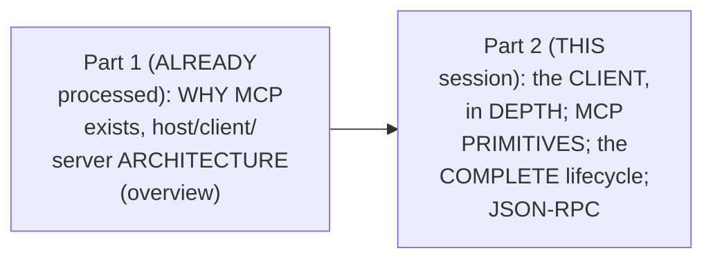

#### 🎯 Key Takeaways

* This is genuinely **Part 2**, DIRECTLY continuing Part 1's OWN established host/CLIENT/server ARCHITECTURE — NOW GOING into genuine, PRECISE mechanical DEPTH.
* The instructor **directly, EXPLICITLY frames** this DEPTH as GENUINE interview PREPARATION — "IF you're able to EXPLAIN in this much DEPTH in ANY interview, the person WOULD know that YES, this person is ACTUALLY understanding the MCP."
* This session is a **GENUINE, live class** — WITH real, HONEST course-ADMINISTRATION content (a PERSONAL emergency, a THROAT infection) WOVEN throughout — this GUIDE focuses on the SUBSTANTIVE technical MATERIAL.

---

### 2. The Client's Own Role: Why the Host Never Talks Directly to the Server

#### 📖 Definition — The Precise, Genuine, Structural Rule

> 💡 **Given directly:** *"The main thing to note is that the host never directly connects with your servers... each and every server gets connected to your host by having a client, so host actually cannot directly talk to your server. Host pops up something known as client, so that they can connect with the server."*

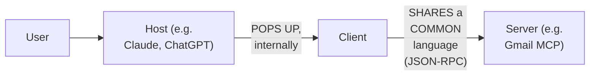

#### 🪜 Step-by-Step — A Complete, Real, Worked Example: "Send an Email"

> 💡 **Given directly:** *"Let's say that you are asking your Claude that, hey, can you please send an email to my manager asking for a leave tomorrow... your host realized that, hey, I cannot do the same directly, I have no way of sending an email... it would require that it could connect to the Gmail somehow. That connection, that capability, your Claude will ask, or just change that high-level request to the client. The client will then make sure that it connects further with server."*

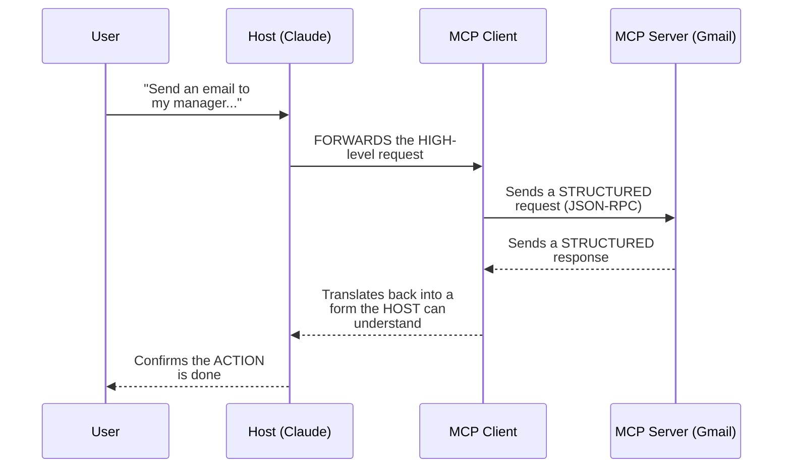

#### 🔍 Internal Working — A Genuine, Real, Live-Confirmed Example (Claude's Own Connectors)

> 💡 **Given directly:** *"If I talk and go to Claude... Manage Connectors... we will see that all these are different, different MCP servers only... this host, it has not connected directly to your server. For each of the MCP servers, let's say if there is a Gmail server, it has, in the backend, started off an MCP client. That client actually connects to your server."*

#### ⚠ Common Mistakes

* Assuming a HOST (like CLAUDE or ChatGPT) GENUINELY, DIRECTLY connects TO an MCP server — explicitly, directly, REPEATEDLY corrected: it GENUINELY, STRUCTURALLY REQUIRES an intermediate CLIENT — "HOST cannot DIRECTLY talk to your SERVER."
* Assuming the CLIENT is SOMETHING the USER genuinely, DIRECTLY sees or MANAGES — explicitly, directly clarified: it's STARTED "in the BACKGROUND" — INVISIBLE, unless YOU are the one BUILDING it.

#### 🎯 Key Takeaways

* The HOST **GENUINELY, STRUCTURALLY cannot** connect DIRECTLY to an MCP SERVER — it ALWAYS pops UP a dedicated **CLIENT** to HANDLE this connection.
* Client and SERVER GENUINELY "SPEAK the SAME language" — DIRECTLY foreshadowing THIS session's own LATER, DEEP dive into **JSON-RPC**.
* A COMPLETE, real EXAMPLE ("send an EMAIL") directly, CONCRETELY traces the FULL request PATH: USER → host → CLIENT → server → CLIENT → host → user.

---
### 3. The One-to-One Client-Server Relationship & Its Genuine Benefits

#### 📖 Definition — The Precise, Genuine, Structural Rule

> 💡 **Given directly:** *"One more very important thing to note. Each and every server gets a separate client... there is a one-to-one relationship between the client and the server... if you have multiple servers, you will be needing multiple clients."*

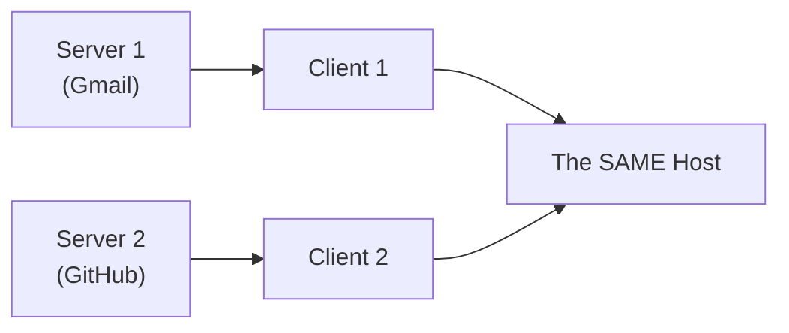

#### 📖 Definition — Benefit 1: Scalability

> 💡 **Given directly:** *"Rather than one client having to connect with multiple servers, it is, of course, a lot more scalable."*

#### 📖 Definition — Benefit 2: Parallelism

> 💡 **Given directly:** *"Since now we are having multiple clients, if we want to have a request where we are connecting with multiple servers, let's say the Gmail and the calendar server, it can happen in parallel. If I ask my Claude that, hey, can you please check my calendar and also send an email to my manager, it can make sure that it can do the same, by making it a single call."*

#### 📖 Definition — Benefit 3: Security (via Decoupling)

> 💡 **Given directly:** *"It is very, very good with respect to the security. If, in case, there is a problem with one of the clients, or one of the connections gets compromised, the other thing will not be having any issues, because they are decoupled with each other... each and every one of these connections can have different authorization handles as well."*

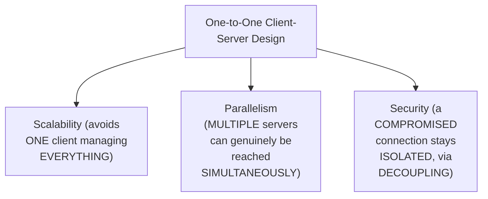

#### ⚠ Common Mistakes

* Assuming ONE client CAN genuinely, DIRECTLY connect to MULTIPLE servers, or MULTIPLE clients to a SINGLE server — explicitly, directly, REPEATEDLY corrected: "it's NOT N-to-1, NOT 1-to-N. 1 is TO 1. As SIMPLE."
* Assuming a COMPROMISED connection would GENUINELY, DIRECTLY affect OTHER, unrelated SERVER connections — explicitly, directly clarified: the ONE-to-one DESIGN GENUINELY, STRUCTURALLY decouples them — a REAL, important SECURITY benefit.

#### 🎯 Key Takeaways

* EVERY client-SERVER pairing is GENUINELY, STRICTLY **ONE-to-one** — NEVER one-to-MANY or many-to-ONE.
* This design GENUINELY provides **THREE benefits**: SCALABILITY, PARALLELISM (MULTIPLE servers reachable SIMULTANEOUSLY, in a SINGLE user REQUEST), and SECURITY (DECOUPLING — a COMPROMISED connection stays ISOLATED, and EACH connection can have its OWN, DIFFERENT authorization).
* This directly, precisely CONNECTS back to Section 2's OWN established ARCHITECTURE — MULTIPLE, SEPARATE clients EXPLAIN how a SINGLE host can GENUINELY, SIMULTANEOUSLY manage MANY, different SERVER connections.

---

### 4. MCP Primitives: Tools, Resources & Prompts

#### 📖 Definition — MCP Primitive, Precisely Introduced

> 💡 **Given directly:** *"All what your server can offer, that is known as MCP primitives. There are three major things, everyone, which your MCP primitive can offer, and that is right in front of us: the tools, the resources, and the prompts."*

#### 📖 Definition — Tools, Precisely Defined

> 💡 **Given directly:** *"Tools are something which we will be using the most, or normally which gets used the most. And it is actually an action, which AI can ask the server to perform. A very simple example, everyone, sending an email."*

#### 📖 Definition — Resources, Precisely Defined

> 💡 **Given directly:** *"Resources... it is your data sources that AI can read. Normally they are static in nature, something which doesn't change. A very good example of this, everyone: when you have a GitHub repo, you can have a README, which normally doesn't change."*

#### 📖 Definition — Prompts, Precisely Defined (With a Complete, Real Example)

> 💡 **Given directly:** *"Prompts... predefined prompt template, which help AI to do work better... let's say that you are asking your Claude to send an email to your manager... this request... your AI can just use the send email tool, and just send a very basic kind of an email... but this might not be a very right way of sending an email in a company setting... this is where prompts are able to help your AI work better."*

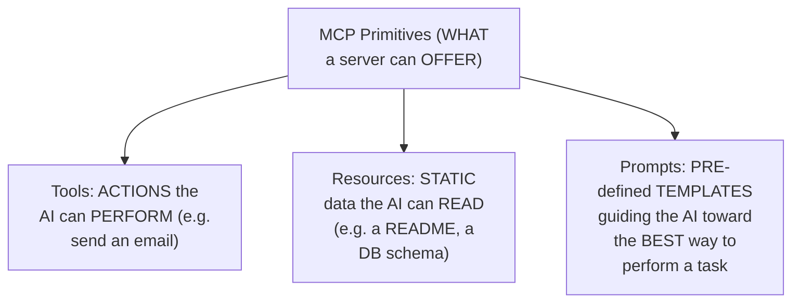

#### 🪜 Step-by-Step — A Complete, Real, Worked Example of Prompts: "Plan a Vacation"

> 💡 **Given directly:** *"Prompt provides structured templates for common tasks. In the travel planning... it is giving you the complete idea about the argument as well... destination, duration, budget, interest... rather than an unstructured natural language input, the prompt system enables selection of the plan navigation template... it will always be asking for these four things, and that is how your AI will now be performing a lot better."*

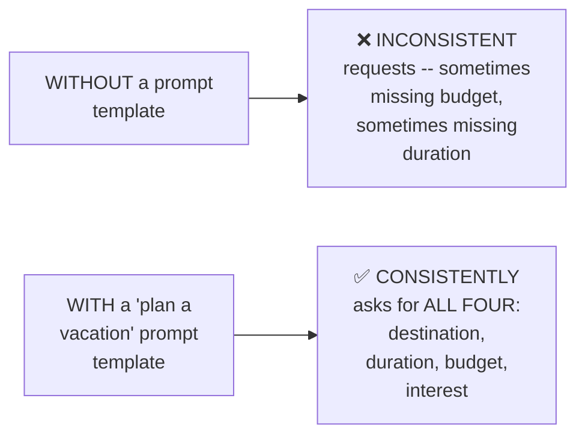

#### ⚠ Common Mistakes

* Assuming a "PROMPT" primitive is GENUINELY the SAME thing as a SIMPLE, ad-hoc TEXT instruction — explicitly, directly, PRECISELY clarified: it's a STRUCTURED, REUSABLE template, ENSURING CONSISTENT, complete REQUESTS across MULTIPLE calls.
* Assuming TOOLS alone are GENUINELY sufficient — explicitly, directly clarified via a REAL example: a "SEND email" tool ALONE produces a GENERIC email; a "SEND email TO manager" PROMPT provides the ADDITIONAL, structured GUIDANCE needed for a GENUINELY appropriate result.
* Assuming EVERY MCP server GENUINELY, ALWAYS offers ALL three PRIMITIVES — explicitly, directly, HONESTLY clarified (in the Q&A): "it is TOTALLY fine... it is NOT a REQUIREMENT" — MANY real SERVERS (e.g., GitHub's OWN) offer ONLY tools, WITHOUT resources or PROMPTS.

#### 🎯 Key Takeaways

* MCP servers GENUINELY offer THREE, distinct **PRIMITIVES**: **TOOLS** (actions), **RESOURCES** (STATIC, readable DATA), and **PROMPTS** (structured TEMPLATES guiding BEST usage).
* A COMPLETE, real EXAMPLE ("PLAN a vacation") directly, CONCRETELY illustrates PROMPTS' own GENUINE value — ENSURING consistent, COMPLETE requests (destination, DURATION, budget, INTEREST) ACROSS every call.
* NOT every SERVER genuinely NEEDS all three PRIMITIVES — TOOLS alone are OFTEN sufficient; RESOURCES and prompts are GENUINELY optional, added WHEN they provide REAL, additional value.

---
### 5. Primitive Functions: List, Call, Read, Get & Subscribe

#### 📖 Definition — Primitive Functions, Precisely Introduced

> 💡 **Given directly:** *"This is actually what allows your AI to understand what all your server supports... during the initial part... it can ask your server for all these primitives."*

#### 📖 Definition — Tools: List & Call

> 💡 **Given directly:** *"There are two functions... your client, it asks first that, hey, if you can list all the tools. So there is a list, everyone, and there is a call. These are the two functions. The very first time your host connects... to the server, it asks your server to list all the tools it is having."*

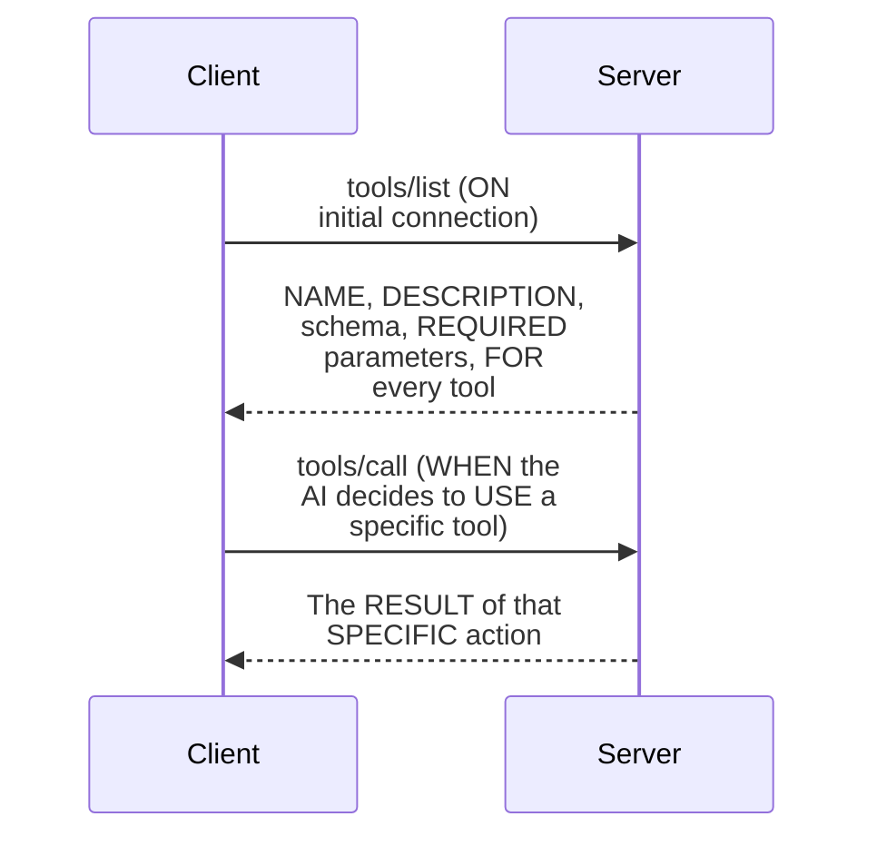

#### 📖 Definition — Resources: List, Read, Template List & Subscribe

> 💡 **Given directly:** *"The very basic ones are, of course, to list... and read a resource... resource slash list, list available direct resources. Resource template list, discover resource templates... resource read, retrieve the resource contents... and now there is subscription, listen as well, which can monitor the changes in your resource."*

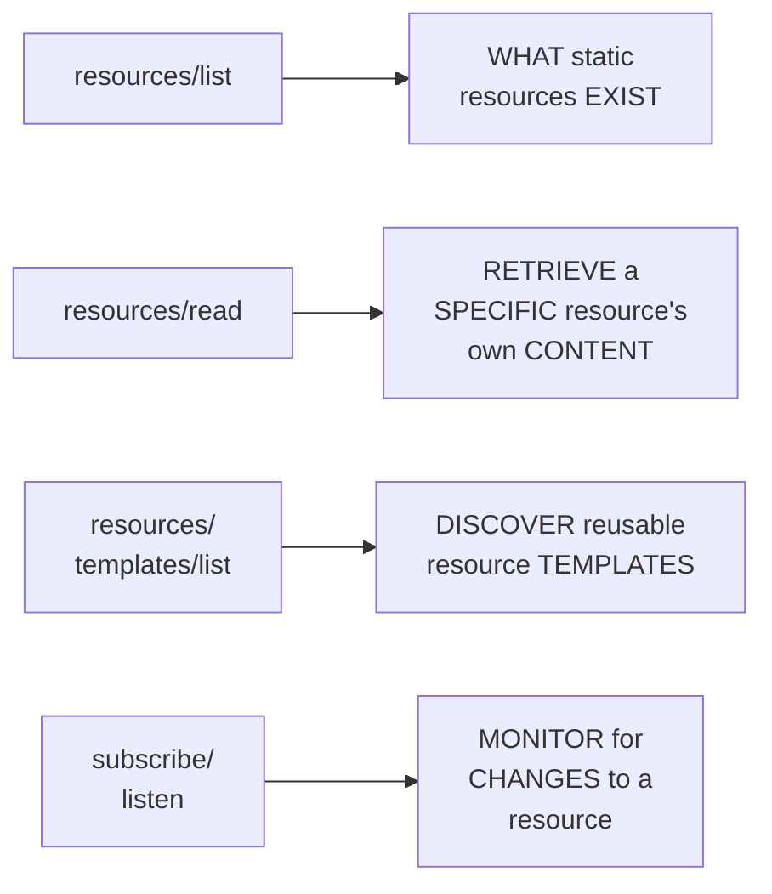

#### 📖 Definition — Prompts: List & Get

> 💡 **Given directly:** *"For the prompt as well, we have the list and the get."*

#### 🔍 Internal Working — A Genuine, Direct, Precise Distinction: List vs. Get

> 💡 **Given directly:** *"What is the difference between list and get? Let's take it with respect to the resource. List will tell you what all resource it is having, that, hey, I'm having a DB file, I'm having schema. Get will get that exact file for you."*

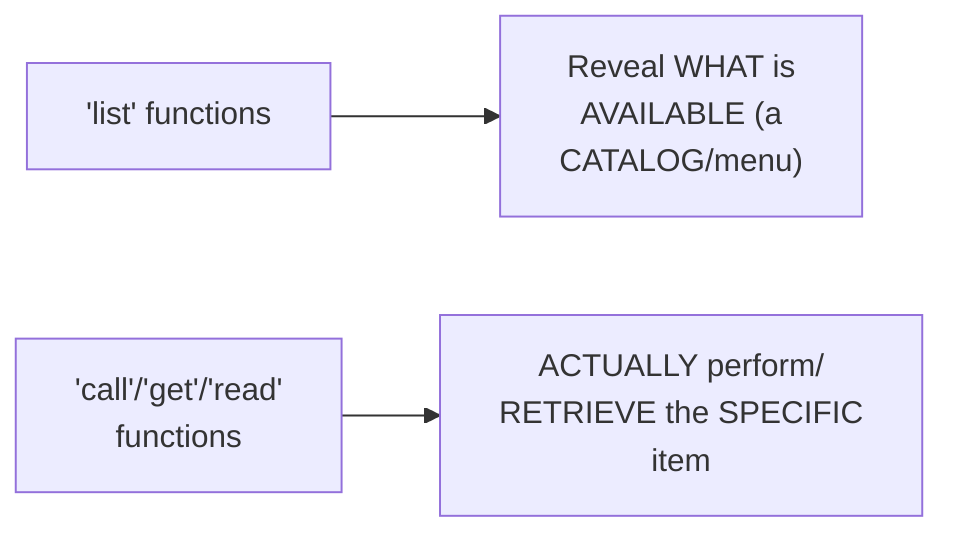

#### ⚠ Common Mistakes

* Confusing "LIST" (DISCOVERING what's AVAILABLE) with "CALL"/"GET"/"READ" (ACTUALLY using a SPECIFIC item) — explicitly, directly, PRECISELY distinguished as TWO, genuinely DIFFERENT STAGES.
* Assuming these PRIMITIVE functions are CALLED REPEATEDLY, on EVERY single USER request — explicitly, directly clarified: "LIST" functions are GENUINELY called PRIMARILY DURING the INITIAL connection — THOUGH modern VERSIONS support CACHING and SUBSCRIPTION-based updates FOR efficiency.

#### 🎯 Key Takeaways

* EACH primitive TYPE has its OWN, PRECISE set of FUNCTIONS: **tools** (list, CALL), **resources** (list, READ, template list, subscribe/LISTEN), **prompts** (list, GET).
* **"LIST"** functions REVEAL what's GENUINELY available; **"CALL"/"GET"/"READ"** functions ACTUALLY perform OR retrieve the SPECIFIC item.
* THESE functions are GENUINELY, DIRECTLY what "MAKES your MCP servers USABLE" — ENABLING a client to DISCOVER a server's OWN, COMPLETE capabilities BEFORE using ANY of them.

---

### 6. A Real, Live Example: Gmail's Own MCP Server

#### 🪜 Step-by-Step — A Complete, Real, Live Walkthrough

> 💡 **Given directly:** *"Let's see this for real... this is a Gmail AutoAuth MCP server, right?... and these are all the available tools, everyone. So, again, as I mentioned, send email tool. It tells you, like, basic email, email with attachment, and examples, and multi-part email example."*

#### 🔍 Internal Working — A Genuine, Real Confirmation of Prompts in Practice

> 💡 **Given directly:** *"Try this prompt with Claude after connecting the Gmail MCP server. So it is saying that, hey, if you will give this kind of a request, I am having prompts... manage email, act as an email administrator, okay? So inside it, it has actually defined the prompts and everything, and of course, all the tools will also be there."*

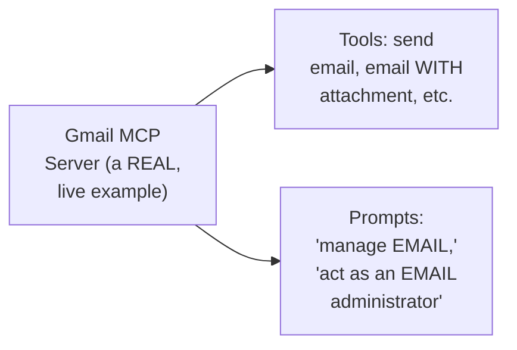

#### 🏢 Real-World / Production Usage — A Genuine, Direct, Career-Relevant Framing

> 💡 **Given directly:** *"The reason, again, I'm going in this much depth, because I want that you can sit comfortably in an interview, be it for Google, Amazon, Uber, any of these highest of the companies... this is where in the next part, we will actually start with a complete MCP lifecycle."*

#### ⚠ Common Mistakes

* Assuming YOU would GENUINELY need to "GO inside" an MCP server YOURSELF to KNOW what it OFFERS — explicitly, directly, PRECISELY clarified: "YOU will NOT go inside an MCP SERVER — the SECOND you have TO go inside... that is NOT a good SERVER" — a WELL-designed server COMMUNICATES its OWN capabilities THROUGH its documented TOOLS/prompts.

#### 🎯 Key Takeaways

* A COMPLETE, real, LIVE walkthrough of the **Gmail MCP server** directly, CONCRETELY confirmed BOTH tools (SEND email VARIANTS) AND prompts (MANAGE email, ACT as an email ADMINISTRATOR) — GROUNDING this session's OWN, abstract primitive CONCEPTS in a REAL, working EXAMPLE.
* A WELL-designed MCP server GENUINELY, DIRECTLY communicates its OWN capabilities THROUGH documented tools/PROMPTS — a USER should NEVER need to "GO inside" the server ITSELF.
* This DEPTH is directly, EXPLICITLY framed as GENUINE, real interview PREPARATION — SPECIFICALLY for TOP-tier companies (GOOGLE, Amazon, UBER).

---
### 7. The MCP Lifecycle: Three Phases

#### 📖 Definition — The Complete, Precise, Three-Phase Lifecycle

> 💡 **Given directly:** *"When we talk about the MCP lifecycle, there are three major points... initialization, operation, and the shutdown... initialization happens when we initialize the connection, so meet for the very first time, agree on a version, declare the capabilities. Operations, what are the different, different operations which can be performed? Discover what's available, call tools, read the resources... finally we can close the connection."*

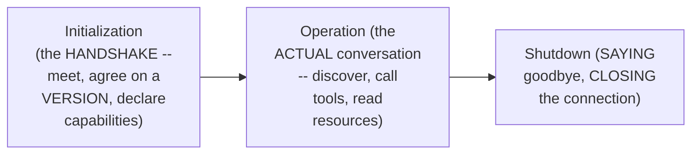

#### 🧠 Concept — A Genuinely Memorable, Real Analogy

> 💡 **Given directly:** *"Initialization is handshake and introduction. Operation is actual conversation. Shutdown is saying goodbye and leaving the room, just like real life. You can't skip straight to the conversation before anyone's ever been introduced."*

#### ⚠ Common Mistakes

* Assuming a CLIENT and SERVER can GENUINELY, DIRECTLY skip to the "OPERATION" phase, WITHOUT first COMPLETING initialization — explicitly, directly, MEMORABLY corrected: "you CAN'T skip STRAIGHT to the CONVERSATION before ANYONE's ever been INTRODUCED."
* Assuming the SHUTDOWN phase can ONLY genuinely be INITIATED by the SERVER — explicitly, directly clarified: "CONNECTION can be closed FROM either the client OR the server end. NORMALLY, it is FROM the client END."

#### 🎯 Key Takeaways

* EVERY, GENUINE MCP connection GENUINELY follows **THREE, sequential phases**: **initialization** (HANDSHAKE), **operation** (ACTUAL work), and **shutdown** (CLOSING the connection).
* The "MEETING SOMEONE for the FIRST time" analogy directly, MEMORABLY captures WHY this ORDER is GENUINELY, STRICTLY required — you CANNOT genuinely CONVERSE before BEING introduced.
* The **OPERATION phase** is directly, PRECISELY confirmed as WHERE "the MAJOR [chunk]" of TIME is genuinely SPENT — WHERE the CLIENT and server, ONCE connected, can PERFORM any NUMBER of operations.

---

### 8. JSON-RPC: The Language Client and Server Speak

#### 🪜 Step-by-Step — A Complete, Live, Real Log-File Walkthrough

> 💡 **Given directly:** *"This is actually my complete logging of MCP when my Cloud Desktop runs... method initialize, parameters, protocol version, capabilities... client info, name, Claude AI, version. JSON RPC 2.0, ID 0. So if you will notice, everyone, this was exactly the message from client."*

```bash
# The path to Claude Desktop's own MCP logs (Mac):
~/Library/Logs/Claude/mcp.log
```

#### 📖 Definition — JSON, Precisely Confirmed as Familiar

> 💡 **Given directly:** *"We all are kind of aware about JSON, so it is JavaScript Object Notation... curly brackets, name, whatever it is."*

#### 📖 Definition — RPC (Remote Procedure Call), Precisely Defined

> 💡 **Given directly:** *"RPC, which is Remote Procedure Call... allows a program to execute a function on another computer, or rather another machine, as if it is local, abstracting the details of transfer of data and communication or network communication. It helps or this makes it easy to build distributed applications."*

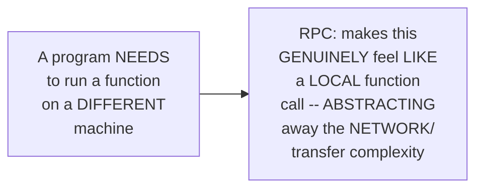

#### 🔍 Internal Working — A Genuine, Real, Live-Confirmed Message Example

> 💡 **Given directly:** *"Every message in either direction shares my shape. Client to server request, JSON RPC, the ID. Server to client, whenever it is response, JSON RPC... field, JSON RPC, always 2.0, the shared format version. ID, matches the response or error. Method, params."*

```json
{
  "jsonrpc": "2.0",
  "id": 0,
  "method": "initialize",
  "params": {
    "protocolVersion": "...",
    "capabilities": {},
    "clientInfo": { "name": "Claude AI", "version": "..." }
  }
}
```

#### ⚠ A Direct, Honest, Important Clarification

> 💡 **Given directly:** *"Many of us have not heard about this JSON RPC, but it is not an MCP invention. So JSON RPC, if we try to search, it is used in networks... it is not connected to MCP. MCP has just picked this up directly because of the advantages which we discussed."*

#### ⚠ Common Mistakes

* Assuming JSON-RPC is a GENUINELY, NEWLY-invented protocol, CREATED specifically FOR MCP — explicitly, directly, HONESTLY corrected: it's a PRE-EXISTING, GENERAL protocol — Anthropic SIMPLY chose to ADOPT it.
* Assuming the request "ID" field is a MINOR, cosmetic detail — explicitly, directly, PRECISELY clarified: it's GENUINELY, STRUCTURALLY essential — "THIS ID helps us to UNDERSTAND that WHEN we get BACK the response... because these servers, they can SEND response asynchronously."

#### 🎯 Key Takeaways

* **JSON-RPC** is precisely JSON (a FAMILIAR data FORMAT) COMBINED with **RPC** (Remote PROCEDURE Call) — ENABLING a program to EXECUTE a function on ANOTHER machine AS IF it were GENUINELY, LOCALLY running.
* JSON-RPC is directly, HONESTLY confirmed as a **PRE-EXISTING, GENERAL protocol** — NOT an MCP INVENTION — Anthropic SIMPLY, DELIBERATELY chose to ADOPT it.
* EVERY JSON-RPC message SHARES the SAME, PRECISE shape: `jsonrpc` (ALWAYS "2.0"), `id` (MATCHING request TO response), `method`, and `params` — DIRECTLY, LIVE-confirmed via REAL Claude Desktop LOG files.

---
### 9. Why JSON-RPC Over REST: Four Genuine Reasons

#### 📖 Definition — Reason 1: Lightweight

> 💡 **Given directly:** *"The very first one, everyone is lightweight, okay? So plain JSON, human-readable at a glance. As you can notice, it is very, very lightweight. There are actually no headers... which you require, which is actually the requirement in your simple JSON request, or a REST-based request."*

#### 📖 Definition — Reason 2: Transport Agnostic

> 💡 **Given directly:** *"Second, everyone, is a transport agnostic. So, again, this we will discuss in a bit, when we will see the types of MCP servers, the transport layer part of it, which is your local and the remote server."*

#### 📖 Definition — Reason 3: Genuinely Bidirectional (The Key, Structural Difference From REST)

> 💡 **Given directly:** *"It is two-way by design, so either side can send the request. This thing is very, very important, and actually one of the most important part. In your REST-based API, everyone, it's a one-way request, majorly. Your client can send the request to the server, but server doesn't normally send the request to the client. Whereas in JSON RPC... it can go both ways."*

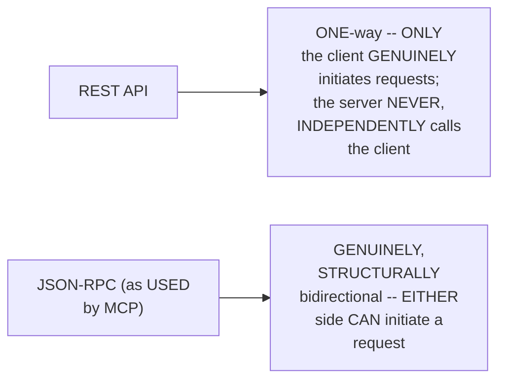

#### 📖 Definition — Reason 4: Built-In Notifications

> 💡 **Given directly:** *"Notification built in, no ID, fires and expect nothing back."*

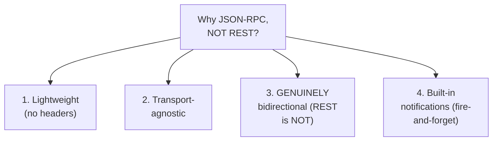

#### ❓ Why It Exists — A Genuine, Real, Practical Motivating Scenario for Bidirectionality

> 💡 **Given directly:** *"Just think about a request where it takes a lot of time. So your server will then tell the client that, hey, this is how much it has been completed, this is the current sequence. So don't you think that server should also be able to send the client request then? Rather than client asking that, hey, what is the status, what is the status?"*

#### ⚠ Common Mistakes

* Assuming REST APIs are GENUINELY, ALSO capable of the SERVER independently INITIATING a request TO the client — explicitly, directly, REPEATEDLY corrected: "SERVER can NEVER make a CALL to the client" IN plain REST — THIS is PRECISELY the KEY, structural DIFFERENCE JSON-RPC provides.
* Assuming JSON-RPC's OWN bidirectionality MAKES it FUNCTIONALLY equivalent TO a persistent CONNECTION like WebSocket — explicitly, directly, HONESTLY clarified (in the Q&A): "I DON'T think WebSocket is REQUIRED... WebSocket is a CONSTANT connection... THAT would have been OVERKILL."

#### 🎯 Key Takeaways

* MCP GENUINELY chose JSON-RPC OVER REST for **FOUR, precise reasons**: LIGHTWEIGHT (no HEADERS), transport-AGNOSTIC, GENUINELY **bidirectional** (BOTH sides can INITIATE requests — the MOST important, structural DIFFERENCE), and BUILT-in notifications.
* REST's OWN, GENUINE limitation: it's STRUCTURALLY **one-way** — a SERVER can NEVER, INDEPENDENTLY call the CLIENT — a REAL, PRACTICAL problem FOR long-running TASKS needing PROGRESS updates.
* JSON-RPC's OWN bidirectionality is GENUINELY, DELIBERATELY LESS than a FULL, persistent connection (like WEBSOCKET) — a DELIBERATE, appropriate DESIGN choice, AVOIDING unnecessary COMPLEXITY.

---
### 10. The Complete, Three-Step Initialization Handshake

#### 🪜 Step-by-Step — Step 1: Client Speaks First

> 💡 **Given directly:** *"The very first one, everyone, which happens is that your client sends an initialize request to your server. JSON RPC 2.0, ID1, initialize. Multiple parameters and multiple things it can send... but the very first one, everyone, is this simple initialize, here's the version and everything."*

#### 🪜 Step-by-Step — Step 2: Server Answers, Matching the Same ID

> 💡 **Given directly:** *"Your server sends it back to the client that, hey, I am having this protocol version, you send me with the ID one, I'm returning with ID 1, because, again, see, server can get multiple requests from this client, right?... So client said that, hey, this is my initialization call with ID1. Server said that, okay, for your ID1 request only, I'm telling you that I have the protocol version, I have the tools, what is my server name."*

#### 🪜 Step-by-Step — Step 3: Client Seals the Handshake With a Notification

> 💡 **Given directly:** *"Next, everyone, we just have an initialized notification. So here, no ID, anything. Client just tells to the server, hey, I am able to support you, I support you the same thing, and we have been initialized."*

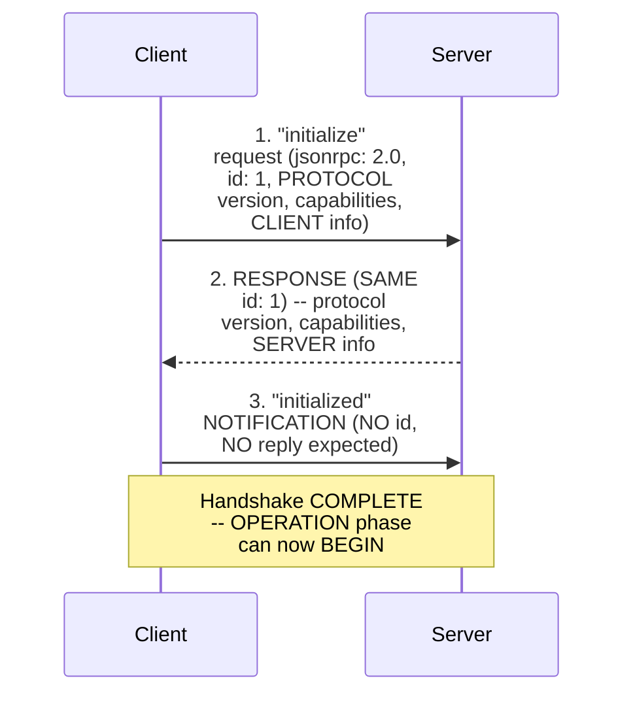

#### ⚠ Two Genuine, Precise Rules During Initialization

> 💡 **Given directly:** *"Client should not send anything but a ping before the server responds to initialize... server should not send anything but a ping or log before receiving initialized... the whole idea is that your client and server, they should be very, very nicely connected."*

#### 🔍 Internal Working — A Genuine, Real, Live-Confirmed Practical Consequence

> 💡 **Given directly:** *"If I go onto connectors, you will see this warning sign. Because some connector, it is not able to understand. Maybe the authorization have expired, but yes, it is not able to make the connection... it did this initialization. It is aware at the starting."*

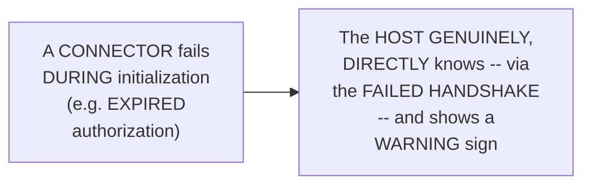

#### ⚠ Common Mistakes

* Assuming the initialization HANDSHAKE is a SINGLE, ATOMIC step — explicitly, directly, PRECISELY clarified: it's GENUINELY **THREE, sequential STEPS** — client INITIALIZE → server RESPONSE → client NOTIFICATION.
* Assuming the FINAL "initialized" NOTIFICATION GENUINELY expects a RESPONSE, like the EARLIER steps — explicitly, directly clarified: it's a GENUINE notification (NO ID, NO reply EXPECTED) — "SEALS the HANDSHAKE."

#### 🎯 Key Takeaways

* The COMPLETE INITIALIZATION handshake GENUINELY requires **THREE, sequential steps**: (1) CLIENT sends "initialize" (WITH an ID); (2) SERVER responds, MATCHING the SAME ID; (3) CLIENT sends "initialized" (a NOTIFICATION — NO id, NO reply EXPECTED).
* This ENTIRE handshake was directly, LIVE-traced THROUGH REAL Claude Desktop LOG files — GROUNDING the ABSTRACT protocol IN genuine, OBSERVABLE evidence.
* A GENUINE, real, PRACTICAL consequence: WHEN a connector's OWN initialization FAILS (e.g., EXPIRED authorization), the HOST genuinely, DIRECTLY knows — DISPLAYING a warning SIGN — SINCE it "IS aware AT the starting."

---

### 11. Version Negotiation: A Precise, Genuine Mechanism

#### 📖 Definition — The Precise, Genuine Negotiation Process

> 💡 **Given directly:** *"In the initialization request, the client must send a protocol version it supports. This should be the latest version supported by the [client]. If the server supports the protocol version, it must respond with the same version. Otherwise, the server must respond with another protocol version it supports. This should be the latest supported by the server. If the client does not support the version in the response, it should disconnect."*

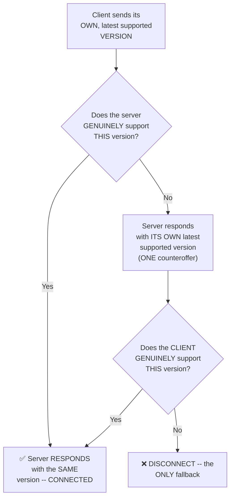

#### ⚠ A Direct, Honest, Important Clarification: NOT a Retry Loop

> 💡 **Given directly:** *"Version negotiation isn't a retry loop. It's exactly one counteroffer, checked exactly once, with disconnect as the only fallback... it will NOT that, hey, you will tell that, hey, I support this, can you fix this? No, no, no. It is just that I support all these versions, you tell me your versions. If we are compatible, we will connect, else we will disconnect."*

#### 🧠 Concept — A Genuinely Memorable, Real Analogy: Windows Software Compatibility

> 💡 **Given directly:** *"Windows is a very good example. If you have created any application on Windows 7, it will work on Windows 11 as well... because Windows... supports the previous application as well... can you run GTA V on Windows XP? ... No, right? Can you run a Windows game on Mac? ... Not supported by default."*

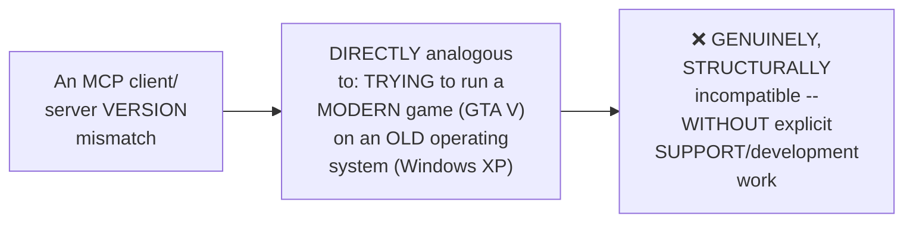

#### 🏢 Real-World / Production Usage — A Genuine, Direct, Real Interview Framing

> 💡 **Given directly:** *"A very good question in a Google interview can be that, hey, you are sitting in an interview, the interviewer can ask you: you have to create an MCP client which supports two-year-old MCP servers as well. And if you say that, hey, I will just connect it with the MCP URL, that is where you will never know why you got rejected."*

#### 🔍 Internal Working — A Genuine, Direct Clarification: Whose Job Is Version Support?

> 💡 **Given directly:** *"It is genuinely on you, the developer... when you are creating a client, you will make sure whatever was there in the previous version, should I support it or not? And vice versa on the server end as well."*

#### ⚠ Common Mistakes

* Assuming version NEGOTIATION involves MULTIPLE rounds of BACK-and-forth, UNTIL a COMPATIBLE version is FOUND — explicitly, directly, PRECISELY corrected: it's GENUINELY **EXACTLY one COUNTEROFFER** — NOT a retry LOOP — DISCONNECT is the ONLY fallback.
* Assuming VERSION compatibility is SOMEHOW handled AUTOMATICALLY, WITHOUT any GENUINE, deliberate DEVELOPER effort — explicitly, directly clarified: it's GENUINELY "ON you, the developer" — DECIDING, DELIBERATELY, whether to SUPPORT older VERSIONS.

#### 🎯 Key Takeaways

* Version NEGOTIATION is GENUINELY, PRECISELY **ONE counteroffer** — NOT a retry LOOP — DISCONNECT is the ONLY fallback IF versions GENUINELY cannot be RECONCILED.
* The WINDOWS software-COMPATIBILITY analogy directly, MEMORABLY captures WHY this MATTERS — SOME software GENUINELY works ACROSS versions (BACKWARD compatibility); OTHERS GENUINELY do not (LIKE running a MODERN game on an OLD OS).
* Version SUPPORT is directly, EXPLICITLY confirmed as GENUINELY, DELIBERATELY the **DEVELOPER's own RESPONSIBILITY** — a REAL, PRACTICAL consideration WHEN building a CLIENT or SERVER intended for LONG-term, real-world USE — DIRECTLY framed as GENUINE interview MATERIAL.

---
### 12. Q&A Deep Dive: MCP vs. Raw HTTP/REST — The N+M Argument

#### ❓ Why It Exists — A Genuine, Real, Direct Audience Question

> 💡 **Given directly:** *"Why can't we use the same thing in the HTTP also? Suppose I don't want to [need] extra MCP, I simply have some server."*

#### 🔍 Internal Working — The Precise, Genuine, Core Argument

> 💡 **Given directly:** *"If you are having an API server, you will be creating separate tools for each of these APIs? If there are 100 people in your organization, or 100 teams, all of them will be creating their own [tools]... if tomorrow you change your API, you launched a V2, or you changed some parameters, you would have to do the change at all these things? All the hundred things?"*

#### 📖 Definition — The Precise, Genuine "N+M vs. N×M" Argument

> 💡 **Given directly:** *"Let's say if you are having five apps — Claude, VS Code, ChatGPT — and if you, let's say, if they need five tools, so this is 25 separate integrations you will have to write, test, and keep working every time... with MCP, that reduces a lot more... instead of N-into-M, it is N plus M."*

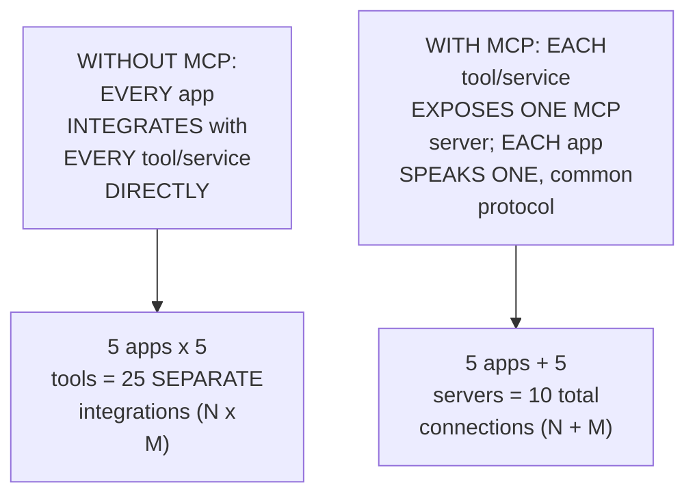

#### 🔍 Internal Working — A Genuine, Direct, Precise Framing: MCP as "Abstracted API"

> 💡 **Given directly:** *"In the ideal sense, like, MCP is just using API in the backend, but it has been very nicely abstracted... doing it directly via HTTP protocol is not that simple... as a layman user, you don't have to go in depth of it, right? He can just ask the AI, and AI will do it for him, because AI knows [how to speak] this protocol."*

#### ⚠ A Direct, Honest, Personal Admission

> 💡 **Given directly:** *"Honestly, I also have a very hard time [wrapping] my brain around it... if you will think, as a design expert, even I will also find MCP a little bit useless, to be honest. But then I also got around it, and I understand what is the use case — if you zoom out and understand it for the normal public, that phase, it is a little different thing."*

```mermaid
flowchart LR
    A["FROM a PURE,<br/>technical/engineering<br/>PERSPECTIVE"] --> B["MCP CAN genuinely<br/>seem LIKE 'just an<br/>abstracted API<br/>call'"]
    C["FROM the<br/>PERSPECTIVE of a NON-<br/>technical, LAYPERSON<br/>USER"] --> D["MCP GENUINELY,<br/>PRACTICALLY makes AI<br/>tool-USE dramatically<br/>SIMPLER and more<br/>ACCESSIBLE"]
```

#### ⚠ Common Mistakes

* Assuming MCP GENUINELY introduces some ENTIRELY new, technical CAPABILITY that PLAIN APIs COULDN'T already ACHIEVE — explicitly, directly, HONESTLY clarified: "the CORE is the SAME. Core is EXACTLY the same. It is STILL API, it is STILL server" — MCP's OWN, genuine value is PRIMARILY about STANDARDIZATION and ABSTRACTION, NOT a fundamentally NEW capability.
* Assuming a SKEPTICAL, "why NOT just use HTTP DIRECTLY" reaction is GENUINELY, ENTIRELY unreasonable — explicitly, directly, HONESTLY validated BY the instructor HIMSELF — a GENUINE, thoughtful QUESTION worth taking SERIOUSLY, not DISMISSING.

#### 🎯 Key Takeaways

* The GENUINE, core ARGUMENT for MCP OVER direct API integration: WITHOUT it, EVERY AI application must BUILD its OWN, SEPARATE integration WITH every TOOL/service — an **N×M** problem; WITH MCP, EACH service EXPOSES ONE server, and EACH app SPEAKS one COMMON protocol — an **N+M** problem — a GENUINE, DRAMATIC reduction IN integration EFFORT at SCALE.
* MCP is directly, HONESTLY confirmed as GENUINELY "JUST... API IN the backend," but "VERY nicely ABSTRACTED" — NOT a fundamentally NEW capability, but a GENUINELY valuable STANDARDIZATION LAYER.
* The instructor's OWN, HONEST, personal ADMISSION ("EVEN I find MCP a little BIT useless" FROM a pure DESIGN perspective) directly, GENUINELY validates a COMMON, reasonable SKEPTICISM — WHILE still ARRIVING at a GENUINE, real justification WHEN considering the NON-technical, LAYPERSON user's OWN perspective.

---

### 13. Q&A Deep Dive: FastMCP vs. Official SDK & Calling MCPs From MCPs

#### ❓ Why It Exists — A Genuine, Real, Direct Audience Question

> 💡 **Given directly:** *"Can I derive this, my MCP? I create my custom MCP from the GitHub-provided MCP, or I need to write my own MCP from the ground up?"*

#### 🔍 Internal Working — A Genuine, Direct, Precise Answer: MCPs Can Call Other MCPs

> 💡 **Given directly:** *"You can have your MCP call another MCP... your MCP can call other MCPs. So that is what I'm saying — you can call GitHub MCP from your MCP."*

```mermaid
flowchart LR
    A["Your OWN, CUSTOM<br/>MCP server"] -->|"CAN, genuinely,<br/>DIRECTLY call"| B["An EXISTING MCP<br/>server (e.g. GitHub's<br/>OWN)"]
```

#### 📖 Definition — FastMCP vs. the Official SDK, Precisely Distinguished (via a Genuinely Memorable Analogy)

> 💡 **Given directly:** *"FastMCP is state-of-the-art, there is Anthropic official one as well... it's just that FastMCP is the most used one, the best one... do you know about Keras and TensorFlow, by any chance?... TensorFlow and Keras, same thing. This you can understand about TensorFlow, FastMCP is Keras... for Keras, the base is TensorFlow only, but it made it very easy."*

```mermaid
flowchart LR
    A["The OFFICIAL MCP<br/>SDK (from<br/>Anthropic)"] --> B["DIRECTLY analogous<br/>to: TensorFlow (the<br/>FOUNDATIONAL,<br/>lower-LEVEL base)"]
    C["FastMCP"] --> D["DIRECTLY analogous<br/>to: Keras (a<br/>SIMPLER, EASIER-to-<br/>use WRAPPER, BUILT<br/>on TOP of the SAME<br/>base)"]
```

#### ⚠ Common Mistakes

* Assuming a CUSTOM MCP server MUST genuinely be BUILT "from the GROUND up," WITHOUT reusing EXISTING servers — explicitly, directly, PRECISELY clarified: YOUR MCP CAN genuinely, DIRECTLY call ANOTHER, EXISTING MCP server.
* Assuming FastMCP and the OFFICIAL SDK are GENUINELY, ENTIRELY different, COMPETING technologies — explicitly, directly clarified: FastMCP is GENUINELY built ON TOP of the SAME, underlying FOUNDATION — SIMPLY offering an EASIER, more CONVENIENT interface.

#### 🎯 Key Takeaways

* An MCP server CAN GENUINELY, DIRECTLY **call ANOTHER MCP server** — ENABLING reuse of EXISTING servers (e.g., GitHub's OWN) WITHIN your OWN, CUSTOM implementation.
* **FastMCP** and the **OFFICIAL Anthropic SDK** are directly, MEMORABLY DISTINGUISHED via the Keras/TensorFlow ANALOGY — FastMCP is the EASIER, more CONVENIENT wrapper; the OFFICIAL SDK is the FOUNDATIONAL base.
* Choosing BETWEEN them is GENUINELY a MATTER of CONVENIENCE VERSUS low-level CONTROL — NOT a fundamentally DIFFERENT, incompatible APPROACH.

---
### 14. Closing: What's Deferred to the Next Session

#### 🪜 Step-by-Step — A Complete, Honest, Direct Confirmation

> 💡 **Given directly:** *"Next concept was capability negotiation, then we would have done two operations... after that we would have talked about shutdown. In that only, we would have discussed about transport layer. So STDIO and HTTP... and that's, yeah, these were the major things. After that, you know MCP in a lot more detail than anyone else... after that is just some way of using it, via Claude, via code."*

```mermaid
flowchart LR
    A["THIS session<br/>(complete): the<br/>CLIENT, MCP<br/>primitives, the<br/>COMPLETE lifecycle's<br/>own INITIALIZATION<br/>phase, JSON-RPC,<br/>version NEGOTIATION"] --> B["NEXT session<br/>(EXPLICITLY<br/>promised): capability<br/>negotiation, the<br/>OPERATION phase,<br/>shutdown, the<br/>TRANSPORT layer<br/>(STDIO vs. HTTP)"]
```

#### ⚠ Common Mistakes

* Assuming THIS session's own COVERAGE represents the COMPLETE MCP lifecycle — explicitly, directly, HONESTLY clarified: CAPABILITY negotiation, the OPERATION phase (in FULL depth), SHUTDOWN, and the TRANSPORT layer (STDIO VERSUS HTTP) REMAIN explicitly DEFERRED to the NEXT session.

#### 🎯 Key Takeaways

* This session **GENUINELY, SUBSTANTIALLY delivers** its OWN stated GOALS — the CLIENT's own role, MCP primitives, the INITIALIZATION phase of the LIFECYCLE, and JSON-RPC — ALL covered in GENUINE, precise DEPTH.
* **Capability NEGOTIATION, the OPERATION phase, SHUTDOWN, and the TRANSPORT layer** (STDIO VERSUS HTTP) are DIRECTLY, EXPLICITLY confirmed as the NEXT session's OWN content.
* The instructor **directly, REPEATEDLY frames** this ENTIRE depth as GENUINE, real INTERVIEW preparation — EXPLICITLY stating the GOAL is MAKING learners "INTERVIEW-ready," NOT merely ABLE to superficially USE MCP.

---

## 📝 Glossary

| Term | Definition | Why It Matters |
|---|---|---|
| **Client** | The intermediary a host pops up to connect to a server | A host can never directly connect to a server |
| **One-to-One Relationship** | Every client connects to exactly one server | NOT one-to-many or many-to-one |
| **MCP Primitive** | What a server can offer: tools, resources, or prompts | The complete set of a server's own capabilities |
| **Tool** | An action the AI can ask a server to perform | e.g., sending an email |
| **Resource** | Static data the AI can read | e.g., a README, a database schema |
| **Prompt** | A predefined, structured template guiding best usage | Ensures consistent, complete requests |
| **List (function)** | Reveals what's available (a catalog) | Called during initial connection |
| **Call/Get/Read (function)** | Actually performs/retrieves a specific item | Used after discovery, during operation |
| **MCP Lifecycle** | Initialization, Operation, Shutdown | The three phases every MCP connection follows |
| **JSON-RPC 2.0** | The "language" client and server speak | JSON + Remote Procedure Call |
| **RPC** | Executing a function on another machine as if local | Abstracts away network/transfer complexity |
| **Notification** | A JSON-RPC message with no ID, expecting no reply | e.g., the "initialized" notification |
| **Version Negotiation** | Client/server agree on a compatible protocol version | Exactly one counteroffer; disconnect is the only fallback |
| **N+M (vs. N×M)** | The genuine, core argument for MCP over direct APIs | Reduces integration effort dramatically, at scale |

---

## 🔄 Revision Notes — One-Minute Revision

* This is **Part 2** of a live MCP course, directly continuing Part 1's own established host/client/server architecture.
* **The client's own role**: a host can GENUINELY never connect directly to a server -- it always pops up a dedicated client. Client and server "speak the same language" (JSON-RPC).
* **One-to-one relationship**: every client connects to EXACTLY one server (never one-to-many or many-to-one). 3 genuine benefits: scalability, parallelism (multiple servers reachable in a single request), and security (via decoupling -- a compromised connection stays isolated).
* **MCP Primitives (3 things a server can offer)**: Tools (actions, e.g. send email), Resources (static data, e.g. a README/schema), Prompts (structured templates guiding best usage, e.g. a "plan a vacation" template ensuring consistent destination/duration/budget/interest). NOT every server needs all three -- many (like GitHub's) offer only tools.
* **Primitive functions**: tools (list, call), resources (list, read, template list, subscribe/listen), prompts (list, get). "List" reveals what's available; "call/get/read" actually uses it.
* **Real, live example**: Gmail's own MCP server, showing real tools (send email variants) and prompts (manage email, act as an email administrator).
* **The MCP Lifecycle (3 phases)**: Initialization (handshake), Operation (actual work), Shutdown (closing). Memorable analogy: meeting someone -> conversing -> saying goodbye -- you can't skip straight to conversation before introduction.
* **JSON-RPC 2.0**: JSON (familiar data format) + RPC (Remote Procedure Call -- executing a function on another machine as if local). Honestly confirmed as NOT an MCP invention -- a pre-existing, general protocol Anthropic simply adopted.
* **4 reasons for JSON-RPC over REST**: lightweight (no headers), transport-agnostic, GENUINELY bidirectional (both client AND server can initiate requests -- REST cannot), built-in notifications (fire-and-forget, no ID).
* **The complete, 3-step initialization handshake**: (1) client sends "initialize" (with an ID); (2) server responds, matching the same ID; (3) client sends "initialized" (a notification -- no ID, no reply expected). Live-traced through real Claude Desktop log files.
* **Version negotiation**: client sends its latest supported version; if the server supports it, it matches back; if not, the server sends ITS latest supported version (exactly ONE counteroffer); if the client still can't support it, disconnect. NOT a retry loop. Memorable analogy: Windows software backward compatibility (can you run GTA V on Windows XP? No).
* **Q&A: the N+M vs. N×M argument**: without MCP, every AI app must integrate separately with every tool (5 apps x 5 tools = 25 integrations); with MCP, each service exposes ONE server, each app speaks ONE protocol (5+5 = 10). This is the genuine, core argument for MCP's own existence. Honest, personal admission: even the instructor finds MCP "a little bit useless" from a pure design perspective, until considering the non-technical, layperson user's own needs.
* **Q&A: FastMCP vs. official SDK**: the Keras/TensorFlow analogy -- FastMCP is the easier wrapper, the official SDK is the foundational base. An MCP server CAN genuinely call another MCP server.
* **Closing**: capability negotiation, the full operation phase, shutdown, and the transport layer (STDIO vs. HTTP) are explicitly deferred to the next session.

---

## 📋 Cheat Sheet

**The complete request flow:**
```text
User -> Host (pops up a Client) -> Client -> Server -> Client -> Host -> User
(Host NEVER connects directly to Server)
```

**One-to-one client-server relationship, and its 3 benefits:**
```text
1 client : 1 server (ALWAYS)
Benefits: Scalability | Parallelism | Security (decoupling)
```

**The 3 MCP primitives:**
```text
Tools     -- actions (e.g. send email)       -> functions: list, call
Resources -- static data (e.g. README)        -> functions: list, read, template list, subscribe
Prompts   -- structured templates (best usage)   -> functions: list, get
```

**The MCP Lifecycle (3 phases):**
```text
Initialization (handshake) -> Operation (actual work) -> Shutdown (close)
```

**The complete initialization handshake:**
```json
// Step 1: Client -> Server
{"jsonrpc": "2.0", "id": 1, "method": "initialize", "params": {...}}
// Step 2: Server -> Client (SAME id)
{"jsonrpc": "2.0", "id": 1, "result": {"protocolVersion": "...", "capabilities": {...}}}
// Step 3: Client -> Server (a NOTIFICATION -- no id, no reply expected)
{"jsonrpc": "2.0", "method": "notifications/initialized"}
```

**Why JSON-RPC over REST:**
```text
1. Lightweight (no headers)
2. Transport-agnostic
3. GENUINELY bidirectional (REST cannot do this)
4. Built-in notifications (fire-and-forget)
```

**Version negotiation:**
```text
Client sends latest version -> Server supports it? YES: connect | NO: ONE counteroffer
Client supports the counteroffer? YES: connect | NO: DISCONNECT (only fallback)
```

**The N+M vs. N×M argument:**
```text
WITHOUT MCP: 5 apps x 5 tools = 25 separate integrations (N x M)
WITH MCP:    5 apps + 5 servers = 10 total connections (N + M)
```

---

## 🔥 Interview Questions & Answers

### 🟢 Beginner

**Q1.**

**Question:** Can a host directly connect to an MCP server?

**Answer:** No -- it always pops up a dedicated client to handle the connection.

**Explanation:** Directly, repeatedly confirmed.

**Why Interviewers Ask This:** The most basic, foundational MCP architecture question.

**Possible Follow-up:** "What language do the client and server genuinely share?"

**Q2.**

**Question:** Is the client-server relationship one-to-many, many-to-one, or one-to-one?

**Answer:** One-to-one, always.

**Explanation:** Directly, repeatedly confirmed.

**Why Interviewers Ask This:** A commonly-tested, precise architectural detail.

**Possible Follow-up:** "What are the three genuine benefits of this design?"

**Q3.**

**Question:** Name the three MCP primitives.

**Answer:** Tools, resources, and prompts.

**Explanation:** Directly, explicitly named.

**Why Interviewers Ask This:** Foundational, frequently-tested MCP terminology.

**Possible Follow-up:** "Are all three genuinely required for every MCP server?"

**Q4.**

**Question:** What is the genuine difference between a tool and a resource?

**Answer:** A tool is an action the AI can perform; a resource is static data the AI can read.

**Explanation:** Directly, precisely distinguished.

**Why Interviewers Ask This:** Basic, essential primitive-type knowledge.

**Possible Follow-up:** "Give a concrete example of each."

**Q5.**

**Question:** What are the three phases of the MCP lifecycle?

**Answer:** Initialization, Operation, Shutdown.

**Explanation:** Directly, explicitly named.

**Why Interviewers Ask This:** Foundational, frequently-tested lifecycle knowledge.

**Possible Follow-up:** "What genuinely happens during initialization?"

**Q6.**

**Question:** What does JSON-RPC stand for/consist of?

**Answer:** JSON (JavaScript Object Notation) + RPC (Remote Procedure Call).

**Explanation:** Directly, precisely explained.

**Why Interviewers Ask This:** Basic, essential MCP protocol knowledge.

**Possible Follow-up:** "Is JSON-RPC an MCP invention?"

**Q7.**

**Question:** Is REST API communication genuinely bidirectional?

**Answer:** No -- only the client can initiate requests; the server can never independently call the client.

**Explanation:** Directly, repeatedly confirmed.

**Why Interviewers Ask This:** Tests genuine, key understanding of why MCP chose JSON-RPC over REST.

**Possible Follow-up:** "Is JSON-RPC genuinely bidirectional?"

**Q8.**

**Question:** How many steps are in the complete initialization handshake?

**Answer:** Three -- client sends "initialize," server responds (matching ID), client sends "initialized" notification.

**Explanation:** Directly, explicitly stated.

**Why Interviewers Ask This:** Basic, essential handshake knowledge.

**Possible Follow-up:** "Does the final 'initialized' step genuinely expect a reply?"

**Q9.**

**Question:** Is version negotiation a retry loop?

**Answer:** No -- it's exactly one counteroffer, with disconnect as the only fallback.

**Explanation:** Directly, explicitly confirmed.

**Why Interviewers Ask This:** Tests genuine, precise understanding of a commonly-misunderstood mechanism.

**Possible Follow-up:** "Whose responsibility is it to support older protocol versions?"

**Q10.**

**Question:** What is the genuine, core argument for using MCP instead of direct API integrations?

**Answer:** Reduces integration effort from N×M (every app, every tool) to N+M (each service exposes one server, each app speaks one protocol).

**Explanation:** Directly, precisely explained.

**Why Interviewers Ask This:** Tests genuine, deep understanding of WHY MCP exists.

**Possible Follow-up:** "Is MCP a fundamentally new technical capability, or an abstraction?"

---

### 🟡 Intermediate

**Q11.**

**Question:** Explain why the instructor deliberately, honestly admits "even I find MCP a little bit useless" from a pure design perspective, rather than presenting MCP as unconditionally, obviously necessary.

**Answer:** This is a genuinely deliberate, HONEST teaching choice: by DIRECTLY, PERSONALLY validating a REASONABLE, common SKEPTICISM (WHY not JUST use HTTP directly?), the instructor PREVENTS learners FROM feeling GENUINELY confused OR inadequate FOR having the SAME, reasonable QUESTION. This directly, CONCRETELY models GENUINE, critical THINKING — RATHER than ACCEPTING a NEW technology's OWN value UNCRITICALLY, the instructor DIRECTLY works THROUGH the SKEPTICISM, ARRIVING at a GENUINE, well-REASONED justification (the N+M ARGUMENT, and the NON-technical USER's own PERSPECTIVE) — a FAR more CONVINCING, memorable EXPLANATION than SIMPLY asserting "MCP is IMPORTANT, trust ME."

**Explanation:** Requires recognizing the deliberate, honest value of validating skepticism before resolving it with genuine reasoning, rather than asserting importance unconditionally.

**Why Interviewers Ask This:** Tests whether a learner recognizes the pedagogical and intellectual value of honestly engaging with reasonable doubt.

**Possible Follow-up:** "Construct your OWN, genuine counter-argument to the N+M reasoning — under what circumstances might DIRECT API integration STILL genuinely be preferable?"

**Q12.**

**Question:** A learner argues that since JSON-RPC is genuinely bidirectional, this makes MCP functionally equivalent to a WebSocket-based, persistent connection. Evaluate this claim.

**Answer:** This claim overstates the case, missing a GENUINELY important, explicit clarification THIS session's own content PROVIDES. WHILE JSON-RPC IS genuinely bidirectional (EITHER side CAN send a request), THIS session's own DIRECT, honest Q&A response CLARIFIES that WebSocket is GENUINELY, STRUCTURALLY different — "WebSocket is a CONSTANT connection... I DON'T think it is REQUIRED... that WOULD have been OVERKILL." Bidirectionality (EITHER side CAN send a MESSAGE) is GENUINELY, STRUCTURALLY different FROM a PERSISTENT, ALWAYS-open connection (WebSocket's OWN, defining CHARACTERISTIC). The ACCURATE, more precise conclusion: JSON-RPC's OWN bidirectionality is a DELIBERATE, MODEST design choice — ENOUGH to SOLVE the "server NEEDS to notify CLIENT" problem, WITHOUT the ADDED complexity/OVERHEAD of a FULL, persistent WEBSOCKET connection.

**Explanation:** Tests whether a learner correctly distinguishes "bidirectional messaging" from "persistent connection," recognizing these as genuinely different, non-equivalent properties.

**Why Interviewers Ask This:** Distinguishes candidates who understand precise, technical distinctions from those who conflate related-sounding concepts.

**Possible Follow-up:** "What GENUINE, real scenario would GENUINELY require a persistent, WebSocket-style connection, WHERE JSON-RPC's OWN bidirectionality alone would NOT be sufficient?"

**Q13.**

**Question:** Explain, precisely, why the instructor deliberately traces the initialization handshake THROUGH real Claude Desktop log files, rather than simply describing the three steps abstractly.

**Answer:** This is a genuinely deliberate teaching choice, DIRECTLY consistent with a PATTERN seen ACROSS THIS instructor's own, broader teaching STYLE (e.g., LIVE-demonstrating REAL Gmail/GitHub MCP SERVERS, rather than HYPOTHETICAL examples). By DIRECTLY, LIVE showing the ACTUAL, real JSON PAYLOADS (WITH genuine field NAMES, IDs, and VALUES) FROM his OWN, working Claude DESKTOP installation, the instructor makes the ABSTRACT protocol CONCRETELY, VISIBLY real — LEARNERS GENUINELY witness the HANDSHAKE happening, RATHER than TRUSTING an unverified, ABSTRACT description. This DIRECTLY, CONCRETELY reinforces the SESSION's own EXPLICIT goal — PREPARING learners to DISCUSS this "in DEPTH" during REAL interviews, WHERE being able to DESCRIBE genuine, OBSERVED behavior is FAR more CONVINCING than reciting MEMORIZED, abstract STEPS.

**Explanation:** Requires recognizing the deliberate, concrete value of demonstrating real log files rather than describing the handshake abstractly.

**Why Interviewers Ask This:** Tests whether a learner recognizes the practical, credibility-building value of grounding abstract protocol descriptions in concrete, observed evidence.

**Possible Follow-up:** "How would you GENUINELY, PRACTICALLY find and inspect these SAME MCP log files ON your OWN machine, per THIS session's own established PATH?"

**Q14.**

**Question:** Using this session's own precise "one-to-one client-server relationship" reasoning (Section 3), explain a GENUINE, real architectural implication if a company wanted TWO, genuinely different Gmail accounts connected to the SAME Claude instance.

**Answer:** A precise, reasoned architectural IMPLICATION, directly extending Section 3's own established MECHANISM: per Section 3's own PRECISE, direct Q&A CONFIRMATION, "IF I have TWO Gmails, can we CREATE multiple clients FOR the same Gmail CONNECTOR? No, it's a ONE-on-one connection. YOU should THEN have TWO servers." This directly, precisely reveals that CONNECTING two, GENUINELY different Gmail ACCOUNTS would GENUINELY require **TWO, SEPARATE MCP server INSTANCES** (ONE per ACCOUNT), each with its OWN, DEDICATED client — NOT a SINGLE server/client PAIR somehow HANDLING both ACCOUNTS simultaneously. This directly, CONCRETELY illustrates HOW the one-to-ONE design (Section 3's own established PRINCIPLE) DIRECTLY, STRUCTURALLY shapes REAL, practical DEPLOYMENT decisions — MULTIPLE, genuinely DISTINCT resources of the SAME TYPE require MULTIPLE, SEPARATE server instances, NOT a SINGLE, shared one.

**Explanation:** Requires applying the one-to-one relationship principle to a genuine, practical multi-account scenario, correctly concluding that separate server instances are needed.

**Why Interviewers Ask This:** Tests whether a learner can apply the one-to-one architectural rule to a realistic, practical deployment scenario.

**Possible Follow-up:** "What GENUINE, additional consideration (e.g., naming/IDENTIFICATION) would a developer need to HANDLE, when SETTING UP two, SEPARATE Gmail MCP servers FOR the same host?"

**Q15.**

**Question:** Synthesize this session's complete "MCP primitives" reasoning (Section 4) with its own "N+M vs. N×M" argument (Section 12) to explain WHY prompts, specifically, provide a GENUINE, additional efficiency benefit BEYOND what tools alone would provide, within THIS SAME scaling argument.

**Answer:** A precise, synthesized explanation, directly connecting TWO, separately-established sections: per Section 12's own precise N+M ARGUMENT, MCP's own GENUINE efficiency benefit comes from EACH service EXPOSING its OWN capabilities ONCE, REUSABLE by MANY, DIFFERENT client applications. Per Section 4's own PRECISE prompt REASONING, WITHOUT a prompt TEMPLATE, EACH, individual AI APPLICATION (or EACH different USER) might GENUINELY, INDEPENDENTLY need to DISCOVER/develop its OWN, best PRACTICE for USING a given tool CORRECTLY (e.g., WHAT information to GATHER before CREATING a GitHub issue). SYNTHESIZING these TWO facts directly, PRECISELY reveals a GENUINE, ADDITIONAL efficiency BENEFIT: prompts GENUINELY, DIRECTLY extend the N+M SAVINGS BEYOND just TOOL access — THEY also CENTRALIZE and STANDARDIZE the "BEST PRACTICE" knowledge FOR using a tool CORRECTLY, PREVENTING every, INDIVIDUAL client/application FROM needing to INDEPENDENTLY, REDUNDANTLY develop the SAME, "how to USE this WELL" understanding — a GENUINE, SECOND layer of REUSE, on TOP of the tool-ACCESS reuse ALONE.

**Explanation:** Requires synthesizing the N+M scaling argument with the specific value of prompts to identify a genuine, additional efficiency benefit neither section explicitly combines.

**Why Interviewers Ask This:** A senior-level question testing whether a candidate can extend a core architectural argument (N+M) to explain the specific, additional value of a secondary primitive (prompts).

**Possible Follow-up:** "Construct a GENUINE, real example of a prompt template that would GENUINELY save SIGNIFICANT, redundant 'best PRACTICE' development EFFORT across MULTIPLE, different client applications."

---

### 🔴 Advanced

**Q16.**

**Question:** Design a complete, reasoned MCP server specification (using ONLY this session's own established concepts) for a hypothetical company's internal HR system, explicitly justifying which primitives you would include and why.

**Answer:** A reasonable, complete specification, directly applying this session's OWN, exact established CONCEPTS:

```text
Tools (per Section 4's own established mechanism -- ACTIONS the AI
performs):
- submit_leave_request(start_date, end_date, reason)
- check_leave_balance(employee_id)
- update_employee_address(employee_id, new_address)

Resources (per Section 4's own established mechanism -- STATIC data
the AI reads):
- employee_handbook.pdf (the company's OWN policy document, RARELY
  changing)
- org_chart.json (the CURRENT organizational structure)
- holiday_calendar_2026.json (a YEARLY, largely STATIC resource)

Prompts (per Section 4's own established mechanism -- STRUCTURED
templates for BEST usage):
- "request_leave" prompt: ensures EVERY leave request GENUINELY
  includes start date, end date, REASON, and MANAGER notification
  preference -- PREVENTING inconsistent, incomplete requests (per
  Section 4's own "plan a vacation" REASONING).
- "escalate_hr_issue" prompt: ensures a STRUCTURED, complete issue
  summary (per the SESSION's own "structured escalation" example).

Justification: Tools are GENUINELY, DIRECTLY necessary for the
system's OWN, core actionable functionality. Resources are included
SPECIFICALLY for the GENUINELY static, rarely-changing DOCUMENTS
(handbook, org chart, HOLIDAY calendar) that the AI would OTHERWISE
need to be RE-TOLD on every SINGLE interaction. Prompts are included
SPECIFICALLY because leave requests and HR ESCALATIONS GENUINELY
benefit from STRUCTURED, consistent formatting (per Section 4's own
established REASONING) -- preventing the AI from PRODUCING
inconsistent, incomplete requests ACROSS different users/sessions.
```

This complete SPECIFICATION directly, precisely APPLIES every ESTABLISHED primitive CONCEPT from THIS session, EXPLICITLY justified AGAINST a REALISTIC, real-world USE case.

**Explanation:** Requires synthesizing all three MCP primitives into one complete, reasoned server specification for a realistic scenario, with explicit justification for each inclusion.

**Why Interviewers Ask This:** A realistic, senior-level question testing whether a candidate can design a genuinely appropriate MCP server, correctly distinguishing which primitives serve which purpose.

**Possible Follow-up:** "Which of these RESOURCES would GENUINELY benefit from the 'subscribe/LISTEN' function (per Section 5's own established mechanism), and WHY?"

**Q17.**

**Question:** Critically evaluate: "Since this session confirms JSON-RPC is genuinely bidirectional, this means MCP servers can ALWAYS, UNCONDITIONALLY push updates to a host WITHOUT the host ever having to ask, making polling entirely unnecessary in MCP." Is this an accurate, complete characterization?

**Answer:** Not fully accurate — this OVERSTATES a GENUINE, structural CAPABILITY into an UNCONDITIONAL, guaranteed BEHAVIOR neither this session's own CONTENT, nor sound REASONING, fully SUPPORTS. WHILE JSON-RPC's OWN bidirectionality GENUINELY, STRUCTURALLY ENABLES a server to SEND a request TO the client (UNLIKE REST), THIS session's own content does NOT claim EVERY MCP interaction GENUINELY, AUTOMATICALLY uses THIS capability — the section 5's own PRECISE "subscribe/LISTEN" function FOR resources DIRECTLY implies that MONITORING for CHANGES is a SPECIFIC, OPT-IN mechanism, NOT a UNIVERSAL, automatic BEHAVIOR applied to EVERY interaction. The ACCURATE, more PRECISE conclusion: JSON-RPC's OWN bidirectionality PROVIDES the STRUCTURAL CAPABILITY for servers to GENUINELY push updates — but WHETHER this GENUINELY happens for ANY given INTERACTION depends on HOW the SPECIFIC server/client IMPLEMENTATION chooses to USE that capability (e.g., VIA the subscribe/LISTEN mechanism SPECIFICALLY) — NOT an UNCONDITIONAL, automatic GUARANTEE for EVERY possible MCP interaction.

**Explanation:** Tests whether a learner recognizes that a structural capability (bidirectionality) doesn't guarantee its universal, automatic use across every interaction.

**Why Interviewers Ask This:** Distinguishes candidates who understand the difference between "structurally possible" and "universally, automatically occurring" from those who conflate the two.

**Possible Follow-up:** "Describe a GENUINE, real MCP interaction where the server would NOT genuinely need to push an UNSOLICITED update to the client, DESPITE having the STRUCTURAL capability to do so."

**Q18.**

**Question:** Synthesize this session's complete "version negotiation" reasoning (Section 11) with its own "N+M vs. N×M" argument (Section 12) to construct a reasoned explanation of a GENUINE, real, additional risk that emerges specifically BECAUSE of MCP's own N+M efficiency design, that would NOT genuinely exist in a purely N×M, direct-integration world.

**Answer:** A precise, synthesized explanation, directly connecting TWO, separately-established sections: per Section 12's own PRECISE N+M ARGUMENT, MCP's OWN efficiency comes FROM a SINGLE server BEING reused BY many, DIFFERENT client APPLICATIONS. Per Section 11's own PRECISE version-NEGOTIATION reasoning, CLIENT and server MUST genuinely SHARE a COMPATIBLE protocol VERSION, or they GENUINELY, STRUCTURALLY disconnect ENTIRELY. SYNTHESIZING these TWO facts directly, PRECISELY reveals a GENUINE, real, ADDITIONAL risk UNIQUE to the N+M MODEL: IF a POPULAR MCP server (e.g., GITHUB's own) GENUINELY, SIGNIFICANTLY updates its OWN protocol VERSION, in a way that is GENUINELY, STRUCTURALLY incompatible WITH older CLIENTS, this could SIMULTANEOUSLY, GENUINELY break MANY, DIFFERENT client applications AT ONCE — a "BLAST radius" problem that GENUINELY would NOT exist in a PURELY N×M, direct-integration WORLD, WHERE each, INDIVIDUAL integration is GENUINELY, STRUCTURALLY isolated FROM the others (a BREAKING change in ONE direct INTEGRATION would NOT, STRUCTURALLY, affect ANY other, SEPARATE integration). This directly, precisely reveals a GENUINE, real TRADE-OFF: MCP's own N+M EFFICIENCY (Section 12) GENUINELY comes WITH a CORRESPONDING, CONCENTRATED risk — a SINGLE, shared server's OWN version CHANGE can GENUINELY, SIMULTANEOUSLY impact EVERY client DEPENDING on it, DIRECTLY connecting BACK to Section 11's own established VERSION-compatibility REQUIREMENT.

**Explanation:** Requires synthesizing the N+M efficiency argument with the version-negotiation mechanism to identify a genuine, structural risk (concentrated, simultaneous breakage) unique to the shared-server model.

**Why Interviewers Ask This:** A capstone-level question testing whether a candidate can identify a genuine, non-obvious trade-off that emerges specifically from MCP's own efficiency-driving design choice.

**Possible Follow-up:** "What GENUINE, practical strategy (extending BEYOND this session's own explicit content) might an MCP server maintainer use to MINIMIZE this 'BLAST radius' risk WHEN releasing a GENUINELY breaking, version-incompatible CHANGE?"

---

## 🧪 Scenario-Based Interview Questions

> **Scenario 1:** A colleague reports that their newly-built MCP client can successfully complete the initialization handshake with a server, but subsequent tool calls fail with an error. Using this session's concepts, diagnose the most likely cause.

**Structured Answer:**
1. **Initial investigation:** Recognize this as directly connected to Section 5's own precise "primitive FUNCTIONS" reasoning — a SUCCESSFUL handshake CONFIRMS the CONNECTION itself, but DOES NOT genuinely GUARANTEE correct TOOL usage.
2. **Metrics/logs to check:** Directly REVIEW whether the CLIENT genuinely CALLED `tools/list` BEFORE attempting `tools/call` — per Section 5's own established SEQUENCE (DISCOVERY before USE).
3. **Possible causes:** Per Section 5's own precise REASONING, the CLIENT may be ATTEMPTING to CALL a tool WITHOUT first CONFIRMING its EXACT name/SCHEMA (via `tools/list`), OR may be PASSING INCORRECT parameters that DON'T match the tool's OWN, documented schema.
4. **Debugging approach:** Directly INSPECT the RAW JSON-RPC MESSAGES (per Section 8's own established LOG-file approach) being SENT during the `tools/call` REQUEST, CONFIRMING the METHOD name and PARAMETERS EXACTLY match WHAT `tools/list` returned.
5. **Resolution:** CORRECT the client's OWN tool-CALL implementation to GENUINELY match the DISCOVERED tool schema.
6. **Prevention:** Establish a standing DEVELOPMENT practice of ALWAYS calling `tools/list` and VALIDATING against its OWN, returned schema BEFORE constructing ANY `tools/call` request — DIRECTLY applying Section 5's own established DISCOVERY-before-use SEQUENCE.

> **Scenario 2 (Advanced):** Your organization maintains a popular, internal MCP server used by multiple, different teams' own AI applications. You need to release a breaking, protocol-incompatible update. Using this session's own concepts, construct a complete, reasoned rollout plan.

**Structured Answer:**
1. **Initial investigation:** Recognize this as directly connected to Advanced Q18's own precise "CONCENTRATED blast RADIUS" risk — a BREAKING change GENUINELY, SIMULTANEOUSLY risks EVERY client CURRENTLY depending on THIS server.
2. **Relevant principle:** Per Section 11's own PRECISE version-negotiation MECHANISM, OLDER clients WOULD genuinely, AUTOMATICALLY disconnect IF they CANNOT support the NEW version — a GENUINE, real RISK of WIDESPREAD, simultaneous BREAKAGE.
3. **Possible mitigation approaches:** Per Section 11's own established REASONING (developers CHOOSE whether to SUPPORT older versions), CONSIDER maintaining BACKWARD compatibility WITHIN the SAME server (SUPPORTING both the OLD and NEW protocol VERSIONS SIMULTANEOUSLY, per Section 11's own established "it is ON you, the DEVELOPER" principle) — RATHER than a HARD, immediate CUTOVER.
4. **Debugging/rollout approach:** IDENTIFY every, KNOWN client CURRENTLY connected (per Section 8's own established LOGGING/observability APPROACH), directly COMMUNICATING the UPCOMING change and ITS OWN timeline.
5. **Resolution:** RELEASE the new VERSION WHILE genuinely MAINTAINING backward COMPATIBILITY for a TRANSITION period, ALLOWING each, DEPENDENT team to UPGRADE their OWN client at THEIR own PACE, RATHER than a SINGLE, simultaneous cutover THAT would trigger Advanced Q18's own identified "BLAST radius" risk.
6. **Prevention:** Establish a standing organizational PRACTICE of MAINTAINING backward COMPATIBILITY for a REASONABLE, DEFINED period FOR any widely-DEPENDED-upon, INTERNAL MCP server — DIRECTLY, PROACTIVELY mitigating the SHARED-server risk IDENTIFIED in Advanced Q18.

---

## 🛠 Hands-on Exercises

### 🟢 Easy

1. Write out, from memory, the complete request flow (user -> host -> client -> server -> client -> host -> user).
2. Explain, in your own words, the three MCP primitives, with a real example of each.
3. Explain, in your own words, why version negotiation is exactly one counteroffer, not a retry loop.

### 🟡 Medium

4. Find and inspect your own Claude Desktop's own MCP log files (per this session's own established path), identifying the complete initialization handshake in your own, real logs.
5. Write a short explanation (150-200 words) of the N+M vs. N×M argument, directly applying this session's own established reasoning.
6. Explore a real, published MCP server (e.g., Gmail's or GitHub's) on GitHub, identifying its own tools, resources, and prompts.

### 🔴 Advanced

7. Complete the full, reasoned MCP server specification proposed in Advanced Interview Q16, for a genuinely different domain of your own choosing.
8. Implement the debugging scenario proposed in Scenario 1 -- deliberately construct a tool call with mismatched parameters, confirm the resulting error, then correctly diagnose and fix it.
9. Research and compare the official Anthropic MCP SDK and FastMCP's own documentation, directly extending Section 13's own Keras/TensorFlow analogy into hands-on familiarity.

---

## 🏗 Practice Assignment

### Build: "Complete MCP Lifecycle Tracing & Primitive Design"

**Objective:** Directly solidify this session's own conceptual foundation, ahead of the next session's own deeper coverage of capability negotiation, operation, shutdown, and the transport layer.

**Requirements:**
- Find and inspect your own host's own MCP log files (Claude Desktop, or an equivalent).
- Identify and annotate the complete, three-step initialization handshake in your own, real logs.
- Design a complete MCP primitive specification (tools, resources, prompts) for a domain of your own choosing.
- Write a complete explanation (200-300 words) of the N+M vs. N×M argument, using your own, original example (not the "5 apps, 5 tools" example from this session).
- A written reflection (150-200 words) on which concept from this session was most genuinely clarifying for you.

**Architecture (suggested):**

```text
mcp_part2_assignment/
├── log_file_analysis.md              # your annotated, real initialization handshake
├── primitive_specification.md           # your complete tools/resources/prompts design
├── n_plus_m_explanation.md                 # your own, original N+M example
└── REFLECTION.md                              # your written reflection
```

**Expected Functionality:**
- Your log-file analysis should genuinely, directly reference real, observed data from your own machine.
- Your primitive specification should genuinely, correctly distinguish which items belong in each category.

**Challenges:**
- Correctly locating and interpreting real MCP log files on your own machine.
- Correctly justifying which primitives (tools vs. resources vs. prompts) fit which specific need.

**Bonus Improvements:**
- Research and test an MCP server calling another MCP server, per Section 13's own established capability.
- Compare a real MCP server's own protocol version against the current, latest version, confirming compatibility.

---

## 📚 Additional Resources

- **The prior "MCP Part 1: Why MCP & Architecture" session** (in this same workspace) -- the direct prerequisite content this session explicitly, directly continues.
- **The official MCP specification and documentation** (referenced directly, throughout) -- the primary, authoritative source for the lifecycle, JSON-RPC, and primitive details covered in this session.
- **The instructor's own GitHub repository** (referenced directly) -- containing class notes, code examples, and diagrams.
- **The next session in this series** (explicitly promised) -- covering capability negotiation, the full operation phase, shutdown, and the transport layer (STDIO vs. HTTP).

---

## 📌 Final Revision Sheet

### ⭐ Core Concepts
- **The client's role**: a host can never connect directly to a server; it always uses a client.
- **One-to-one relationship**: every client connects to exactly one server, providing scalability, parallelism, and security.
- **MCP Primitives**: tools (actions), resources (static data), prompts (structured templates).
- **The MCP Lifecycle**: initialization, operation, shutdown.
- **JSON-RPC**: JSON + Remote Procedure Call; lightweight, transport-agnostic, bidirectional, with built-in notifications.
- **Version negotiation**: exactly one counteroffer; disconnect is the only fallback.

### ⭐ Important Definitions
- **RPC, Notification** (see Glossary for full definitions).

### ⭐ Important Commands/Code
```json
{"jsonrpc": "2.0", "id": 1, "method": "initialize", "params": {...}}
{"jsonrpc": "2.0", "method": "notifications/initialized"}
```

### ⭐ Architecture/Process
- Complete request flow: user -> host -> client -> server -> client -> host -> user.
- Complete initialization handshake: client "initialize" -> server response (same ID) -> client "initialized" notification.

### ⭐ Best Practices
- Always call "list" functions before "call/get/read" functions, to discover what's genuinely available.
- Design MCP servers with only the primitives genuinely needed -- not every server requires resources or prompts.
- Explicitly decide, as a developer, whether your client/server should support older protocol versions.
- Maintain backward compatibility for widely-depended-upon, shared MCP servers, to avoid a concentrated "blast radius" of breakage.

### ⭐ Common Mistakes
- Assuming a host can connect directly to a server.
- Assuming the client-server relationship can be one-to-many or many-to-one.
- Assuming REST APIs are genuinely bidirectional, like JSON-RPC.
- Assuming version negotiation is a retry loop, rather than exactly one counteroffer.

### ⭐ Interview Points
- Be ready to explain the complete request flow, and why a client is genuinely necessary.
- Be ready to explain and distinguish all three MCP primitives.
- Be ready to trace the complete, three-step initialization handshake.
- Be ready to explain the N+M vs. N×M argument for why MCP genuinely exists.

### ⭐ Things to Remember
- This is genuinely **Part 2** of a live MCP course — directly continuing Part 1's own established architecture.
- The **N+M vs. N×M argument** (Section 12) is this session's own single most compelling, real justification for MCP's own existence — worth remembering precisely.
- **Capability negotiation, the operation phase, shutdown, and the transport layer** are explicitly, directly deferred to the next session.