# 🔍 MCP Deep Dive, Part 0 — Capability Negotiation, Operation Phase & a Complete No-Code Project

- <i>**Series:** MCP (DIRECTLY preceding the LATER, established SESSIONS already PROCESSED in this WORKSPACE — WHICH began THEIR own recap AT "capability negotiation" AS ALREADY covered) · 
- **Instructor:** Mayank
- **Note on scope:** THIS session COMPLETES the initialization PHASE (capability NEGOTIATION), moves THROUGH the OPERATION phase (DISCOVERY and CALLING), and THEN delivers a COMPLETE, real, LIVE, no-CODE automation PROJECT — an "AI newsletter/UPDATES" workflow, BUILT entirely THROUGH Claude Desktop's OWN, established CONNECTORS (Gmail, GOOGLE Calendar, Apple NOTES, Tavily, and a REAL, third-party STOCK-market server) — GROUNDED, throughout, IN genuine, honest DISCUSSIONS of PRIVACY, interview EXPECTATIONS, and REAL, economic CHANGE.</i>

---

## 📑 Table of Contents

1. [Session Overview](#-session-overview)
2. [Learning Objectives](#-learning-objectives)
3. [Detailed Notes](#-detailed-notes)
   - [1. Session Context: Completing Initialization — Capability Negotiation](#1-session-context-completing-initialization--capability-negotiation)
   - [2. Capability Negotiation: The Complete, Real Mechanism](#2-capability-negotiation-the-complete-real-mechanism)
   - [3. Elicitation: A Server Requesting Information From the User, via the Client](#3-elicitation-a-server-requesting-information-from-the-user-via-the-client)
   - [4. A Complete, Real, Live Demonstration: Claude Desktop's Own, Established Connectors](#4-a-complete-real-live-demonstration-claude-desktops-own-established-connectors)
   - [5. The Operation Phase: Discovery & Calling, Precisely Explained](#5-the-operation-phase-discovery--calling-precisely-explained)
   - [6. A Complete, Real, Live Demonstration: Discovery & Calling via Apple Notes](#6-a-complete-real-live-demonstration-discovery--calling-via-apple-notes)
   - [7. A Genuine, Honest, Real Discussion: Information Leakage & Middleware Guardrails](#7-a-genuine-honest-real-discussion-information-leakage--middleware-guardrails)
   - [8. A Complete, Real, Live Demonstration: A Full JSON-RPC Trace, via a "Time Server"](#8-a-complete-real-live-demonstration-a-full-json-rpc-trace-via-a-time-server)
   - [9. A Genuine, Honest, Important Note: Why This Depth Genuinely Matters for Interviews](#9-a-genuine-honest-important-note-why-this-depth-genuinely-matters-for-interviews)
   - [10. A Complete, Real, No-Code Project: Defining the Manual Process First](#10-a-complete-real-no-code-project-defining-the-manual-process-first)
   - [11. A Genuine, Real, Important Principle: Map "Brain" vs. "Application" Before Building](#11-a-genuine-real-important-principle-map-brain-vs-application-before-building)
   - [12. A Complete, Real, Live Demonstration: Connecting Applications & Generating a Meta-Prompt](#12-a-complete-real-live-demonstration-connecting-applications--generating-a-meta-prompt)
   - [13. A Complete, Real, Live Execution: The Multi-Step, Agentic AI-Newsletter Workflow](#13-a-complete-real-live-execution-the-multi-step-agentic-ai-newsletter-workflow)
   - [14. A Genuine, Real, Business Argument: Why AI Genuinely Changed Project Economics](#14-a-genuine-real-business-argument-why-ai-genuinely-changed-project-economics)
   - [15. Adding a Real, Third-Party Server: Alpha Vantage & Scheduling](#15-adding-a-real-third-party-server-alpha-vantage--scheduling)
   - [16. Real Q&A: Debugging & Understanding a Scheduled, Agentic Workflow](#16-real-qa-debugging--understanding-a-scheduled-agentic-workflow)
   - [17. Closing: A Direct Preview & Encouragement](#17-closing-a-direct-preview--encouragement)
4. [Glossary](#-glossary)
5. [Revision Notes — One-Minute Revision](#-revision-notes--one-minute-revision)
6. [Cheat Sheet](#-cheat-sheet)
7. [Interview Questions & Answers](#-interview-questions--answers)
8. [Scenario-Based Interview Questions](#-scenario-based-interview-questions)
9. [Hands-on Exercises](#-hands-on-exercises)
10. [Practice Assignment](#-practice-assignment)
11. [Additional Resources](#-additional-resources)
12. [Final Revision Sheet](#-final-revision-sheet)

---

## 🎯 Session Overview

This GENUINELY, THOROUGH episode COMPLETES the INITIALIZATION phase and MOVES fully THROUGH the OPERATION phase, THEN delivers a COMPLETE, real, no-CODE project. It covers:

1. **CAPABILITY negotiation** — the COMPLETE, real MECHANISM by WHICH client AND server EXCHANGE their OWN, respective FEATURE lists — INCLUDING **ELICITATION** (a SERVER requesting INFORMATION from the USER, via the CLIENT).
2. **THE operation PHASE**, precisely EXPLAINED — **DISCOVERY** (automatic, tool-LIST retrieval) and **CALLING** (the ACTUAL, real tool INVOCATION) — DEMONSTRATED live, VIA Apple Notes.
3. **A GENUINE, honest DISCUSSION** of REAL privacy CONCERNS (information LEAKAGE) and PRACTICAL, code-level MITIGATIONS (middleware GUARDRAILS).
4. **A COMPLETE, real, LIVE-traced EXAMPLE** — a FULL JSON-RPC CONVERSATION, via a SIMPLE "TIME server," SHOWING every, SINGLE step OF the MCP lifecycle, in REAL time.
5. **A COMPLETE, real, NO-code AUTOMATION project** — an "AI NEWSLETTER/updates" WORKFLOW, built ENTIRELY through Claude DESKTOP's own, established CONNECTORS — DEMONSTRATING the COMPLETE, real PROCESS of MAPPING a manual WORKFLOW before AUTOMATING it.
6. **A GENUINE, real, ECONOMIC argument** — WHY AI genuinely, DIRECTLY changed the REAL cost of BUILDING this KIND of automation — FROM a REAL, "10 LAKH" project TO "UNDER a DOLLAR."

> 💡 **Key framing, given directly, on precisely why this session's own, complete depth genuinely matters:** *"No one will hire you for saying, here, yeah, you can define an MCP server, please come and work for us... interviews are, like, way, way, way more difficult than the real work. So in the interview, they will not want a person who is able to just create it... they want the person to explain the architecture."*

---

## 🎯 Learning Objectives

By the end of this guide, you will be able to:

- [ ] Explain capability negotiation, and how it completes the MCP initialization phase.
- [ ] Explain elicitation, and how it represents genuine, two-way MCP communication.
- [ ] Explain the two, precise steps of the operation phase — discovery and calling.
- [ ] Explain real privacy risks in MCP-connected applications, and practical, code-level mitigations.
- [ ] Trace a complete, real JSON-RPC conversation, from initialization through a tool call.
- [ ] Apply this session's own, established "map the manual process first" methodology, to a real, no-code automation project.
- [ ] Articulate a genuine, real, economic argument for how AI has changed automation project costs.

---

## 📚 Detailed Notes

### 1. Session Context: Completing Initialization — Capability Negotiation

#### 🧠 Concept

> 💡 **Given directly, opening the session:** *"We started with MCP lifecycle yesterday, but before that, we understood about two major things. First one was around the client part... after that, it was around the primitives... then, we started with the MCP lifecycle... we understood about the first process, which was handshake... along with that, we discussed around the JSON RPC... the handshake, how exactly it happens... then version negotiation."*

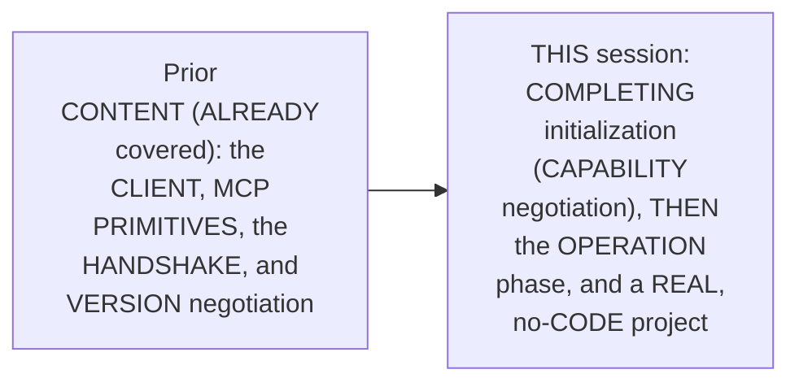

#### 🎯 Key Takeaways

* THIS session is GENUINELY, DIRECTLY confirmed AS a CONTINUATION — COMPLETING the initialization PHASE's own, FINAL step (CAPABILITY negotiation), BEFORE moving INTO the operation PHASE.
* This directly, PRECISELY sets UP the SESSION's own, FIRST, essential CONTENT — capability NEGOTIATION, precisely EXPLAINED (Section 2).

---

### 2. Capability Negotiation: The Complete, Real Mechanism

#### 📖 Definition — Capability Negotiation, Precisely Explained

> 💡 **Given directly:** *"Client and server capabilities establish which optional protocols will be available during the session. Key capabilities include, so from the client side, client tells the capability, like, routes... server similarly, have these three major things, prompts, resources, and tools."*

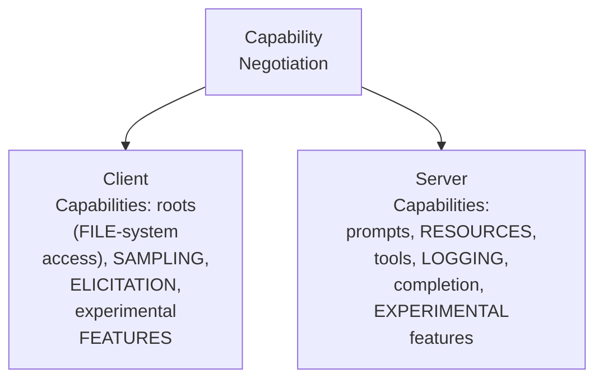

#### 🔍 Internal Working — A Genuine, Memorable Analogy

> 💡 **Given directly:** *"Capability negotiation, both sides, handing over an honest menu before anyone orders. So, they tell that what exactly is going to be the thing which is possible, from both the sites."*

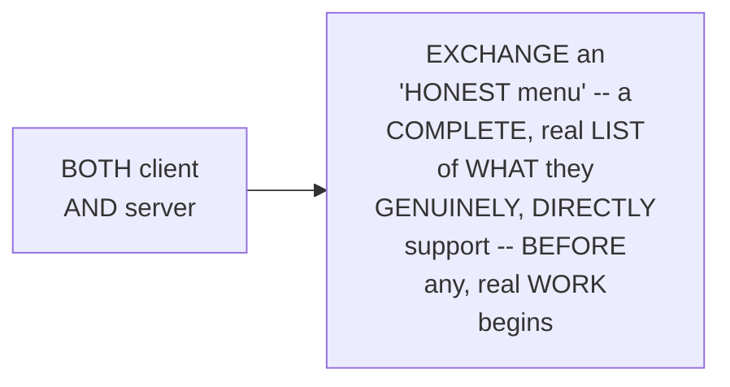

#### ⚠ A Direct, Honest, Important Clarification: Deprecation Doesn't Mean Disuse

> 💡 **Given directly:** *"Why are you referring to old version... many of you will see that I have mentioned that how, in the latest version, it has been formally deprecated. When something is deprecated, it is not that it is not being used. The latest version of MCP has just been launched last month. And many of the servers are still on this particular communication... majority of the servers are on this communication."*

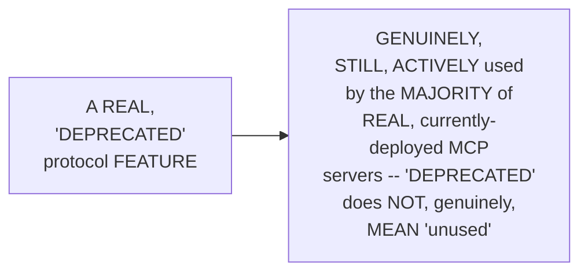

#### ⚠ Common Mistakes

* Assuming a REAL, "DEPRECATED" MCP feature is GENUINELY, PRACTICALLY irrelevant, and NO longer WORTH learning — explicitly, directly, HONESTLY clarified: THE majority OF real, CURRENTLY-deployed servers STILL, genuinely USE this SAME, "deprecated" COMMUNICATION style — MAKING it GENUINELY, PRACTICALLY essential KNOWLEDGE.

#### 🎯 Key Takeaways

* **CAPABILITY negotiation** is precisely EXPLAINED as an "HONEST menu" EXCHANGE — CLIENT capabilities (roots, SAMPLING, elicitation) and SERVER capabilities (prompts, resources, TOOLS, logging) are BOTH, genuinely SHARED, before REAL work begins.
* THE instructor **directly, HONESTLY clarifies** a REAL, important DISTINCTION — "DEPRECATED" does NOT, genuinely, mean "UNUSED" — the MAJORITY of real, CURRENTLY-deployed MCP servers STILL rely ON this SAME, "deprecated" communication STYLE.
* This directly, PRECISELY sets UP the SESSION's own, NEXT, essential CONTENT — ELICITATION, a genuinely IMPORTANT, two-way CAPABILITY (Section 3).

---
### 3. Elicitation: A Server Requesting Information From the User, via the Client

#### 📖 Definition — Elicitation, Precisely Explained

> 💡 **Given directly:** *"Elicitation, if your server tomorrow wants to hit out any requests... the MCP provides a standardized way for servers to request additional information from user through client during interaction... server can ask client to a server client can ask the user, via client, for some information."*

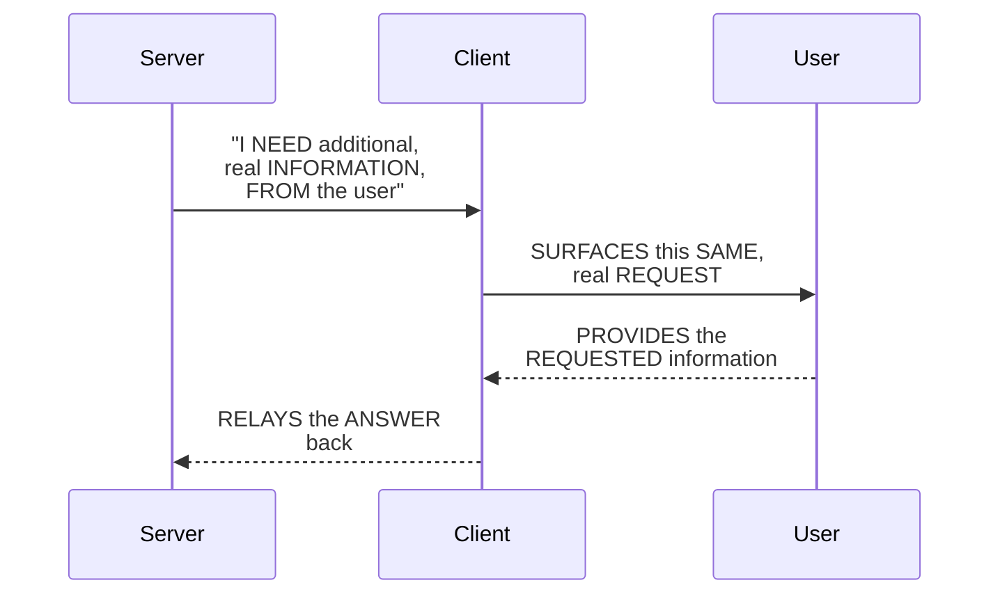

#### 🔍 Internal Working — A Genuine, Direct, Real Connection to LangChain/LangGraph

> 💡 **Given directly:** *"Elicitation is the MCP mechanism for a server to request input in the middle of a tool call. When a server needs input, the request surfaces as Langraph interrupt, so the person already reviewing the agent work answers it and run resumes... this is not [the same as] HITL. HITL is a separate concept."*

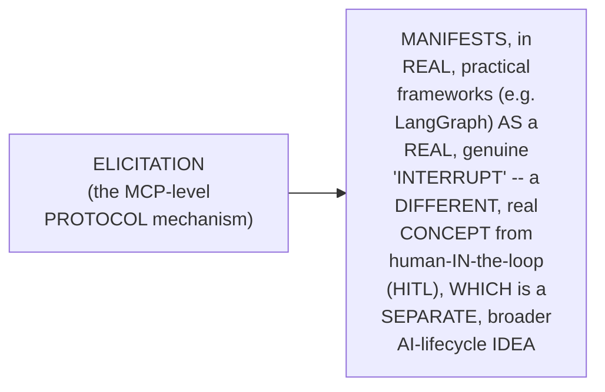

#### ⚠ Common Mistakes

* Assuming MCP communication GENUINELY, ALWAYS flows in ONE, single direction — CLIENT genuinely, DIRECTLY requesting things FROM the server, ONLY — explicitly, directly, PRECISELY clarified: "IT is NOT always CLIENT making the CALL. SERVER can ALSO make the CALL" — elicitation GENUINELY, CONCRETELY demonstrates this SAME, real, TWO-way communication.
* Assuming ELICITATION and HITL (human-IN-the-loop) are GENUINELY, DIRECTLY the SAME concept — explicitly, directly, PRECISELY clarified: "HITL is a SEPARATE concept" — elicitation is SPECIFICALLY an MCP-LEVEL, protocol MECHANISM.

#### 🎯 Key Takeaways

* **ELICITATION** is precisely EXPLAINED as a REAL, standardized MECHANISM — a SERVER genuinely, DIRECTLY requesting ADDITIONAL information FROM the user, VIA the client, MID-tool-call.
* THIS directly, CONCRETELY demonstrates MCP's OWN, genuine, TWO-way COMMUNICATION capability — it's NOT, genuinely, ALWAYS the client MAKING the call.
* THE instructor **directly, PRECISELY distinguishes** elicitation FROM HITL — a SEPARATE, broader AI-lifecycle CONCEPT.
* This directly, PRECISELY sets UP the SESSION's own, NEXT, essential CONTENT — a COMPLETE, real, LIVE demonstration OF Claude Desktop's OWN, established connectors (Section 4).

---

### 4. A Complete, Real, Live Demonstration: Claude Desktop's Own, Established Connectors

#### 🪜 Step-by-Step — A Complete, Real, Live Example

> 💡 **Given directly:** *"In the Cloud desktop as well, everyone, we will be able to actually, if we go on any connectors, we see that in every connector, there are tools which are present, and Claude always makes these calls and get that, okay, what are the tools?... even before we did anything, it has discovered the tools."*

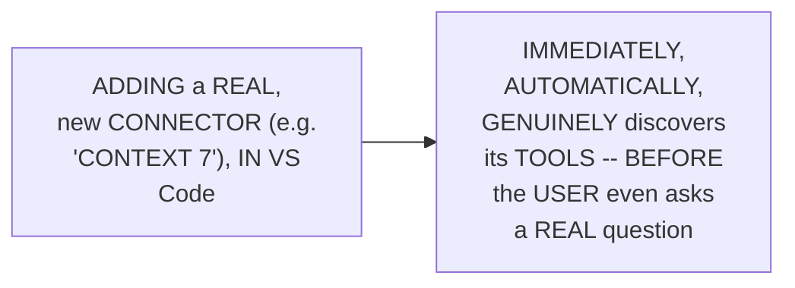

#### 🔍 Internal Working — A Genuine, Real, Worked Example: Apple Notes

> 💡 **Given directly:** *"There is list notes. Then there is get node content... add node... update node content. So there seems to be four tools... which we can very easily now see in the Claude UI. So these four are only the notes... My Cloud desktop, it can connect with my Apple Notes... and get me the list notes, get the content of the node, add a particular note, or create a note, and update note content."*

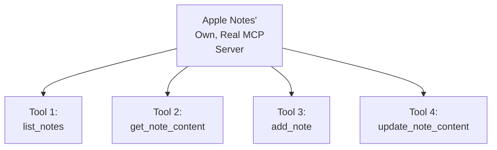

#### ⚠ Common Mistakes

* Assuming this SESSION's own, LIVE demonstration OF real-world CONNECTORS is GENUINELY, MERELY a PRODUCT-tour, rather THAN direct, PRACTICAL evidence OF the ESTABLISHED, MCP protocol AT work — explicitly, directly, CONCRETELY clarified: "THIS is HOW it ACTUALLY, JUST make SURE that it IS able TO do the WORK... IT'S not that YOU will HAVE to define ALL these THINGS" — the ENTIRE, real DEMONSTRATION is DIRECT, live EVIDENCE of the SAME, established PROTOCOL steps, GENUINELY operating BEHIND a FAMILIAR, real INTERFACE.

#### 🎯 Key Takeaways

* A COMPLETE, real, LIVE demonstration directly, CONCRETELY confirmed: REAL, established CONNECTORS (Apple NOTES, Context 7) genuinely, AUTOMATICALLY DISCOVER their OWN, complete tool LIST, IMMEDIATELY upon connection.
* THIS directly, PRACTICALLY confirms the ESTABLISHED, MCP protocol GENUINELY operates BEHIND familiar, real, PRODUCTION interfaces — LEARNERS do NOT, genuinely, need TO manually IMPLEMENT this SAME discovery PROCESS.
* This directly, PRECISELY sets UP the SESSION's own, NEXT, essential CONTENT — the OPERATION phase, precisely EXPLAINED (Section 5).

---
### 5. The Operation Phase: Discovery & Calling, Precisely Explained

#### 📖 Definition — The Two, Precise Steps

> 💡 **Given directly:** *"When this tool slash list is called, my server returns me back, that, hey, for your ID2 request in the JSON RPC 2.0, I am having these tools... this is actually how it gets filled up... the better the description, in the operation phase, when the tool slash list is called, your host will get all this information."*

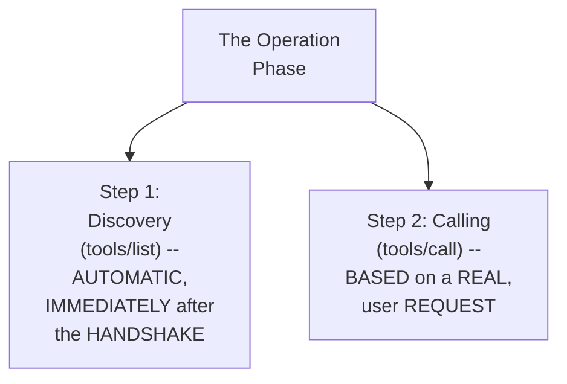

#### 🔍 Internal Working — A Genuine, Direct Confirmation: Discovery Is Automatic & Free

> 💡 **Given directly:** *"Discovery fires automatically the instant the handshake completes before the user even asks a question... it is not going to charge any money or anything, or any LLM cost as well, because it is just asking the server that, hey, tell me what all tools and everything is present."*

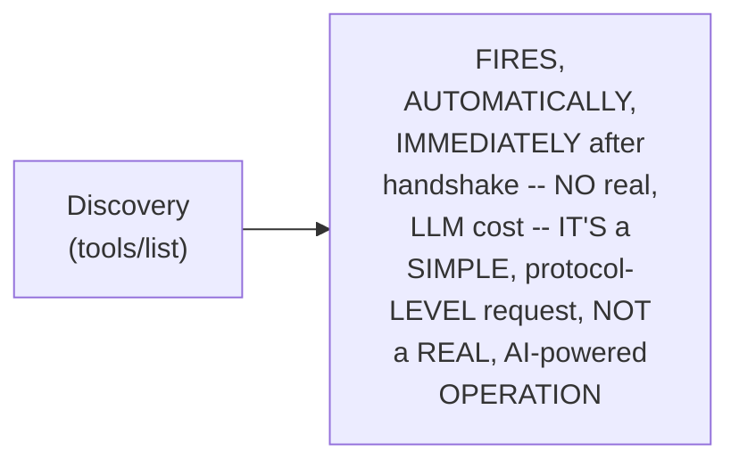

#### ⚠ Common Mistakes

* Assuming DISCOVERY (`TOOLS/list`) is GENUINELY, DIRECTLY triggered BY a REAL, user QUESTION — explicitly, directly, PRECISELY clarified: "DISCOVERY isn't SOMETHING you TRIGGER, it is SOMETHING that ALREADY happened, QUIETLY, the MOMENT your HANDSHAKE finished" — it's ENTIRELY, genuinely AUTOMATIC, and OCCURS before ANY, real USER interaction.

#### 🎯 Key Takeaways

* THE **OPERATION phase** is precisely EXPLAINED as a TWO-step process: **DISCOVERY** (`TOOLS/list`, AUTOMATIC, free) and **CALLING** (`TOOLS/call`, based ON a REAL, user REQUEST).
* THE instructor **directly, PRECISELY confirms** discovery GENUINELY, DIRECTLY incurs NO real, LLM COST — it's a SIMPLE, protocol-LEVEL exchange, NOT a REAL, AI-powered OPERATION.
* This directly, PRECISELY sets UP the SESSION's own, NEXT, essential CONTENT — a COMPLETE, real, LIVE demonstration OF discovery and CALLING, via Apple NOTES (Section 6).

---

### 6. A Complete, Real, Live Demonstration: Discovery & Calling via Apple Notes

#### 🪜 Step-by-Step — A Complete, Real, Live Test

> 💡 **Given directly:** *"Hi, can you please... list my Apple Notes... Claude want to use list and read notes, so I can say allow once... search available, it is sending the query. Now, tools were loaded... it sends request, folder personal. There was no limit sent. Limit was 20 by default, and yes, I was able to get the answer back, name my handles."*

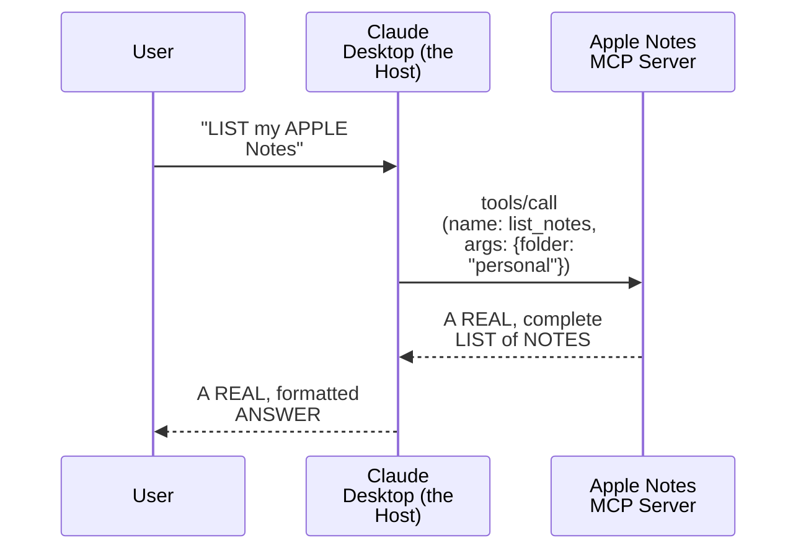

#### 🔍 Internal Working — A Genuine, Direct Confirmation: The Two Required Arguments for a Tool Call

> 💡 **Given directly:** *"When we are calling a particular tool, we have to make sure of giving two things majorly. So, these two things, everyone, are, of course, name, and arguments. Once we provide these things up, then our MCP can help with the calling of the tool."*

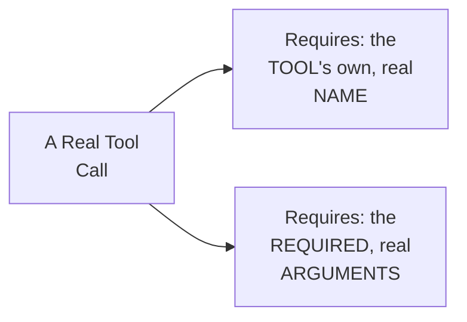

#### ⚠ Common Mistakes

* Assuming a REAL, MCP-connected APPLICATION genuinely, DIRECTLY requires SPECIAL, additional CODE to CORRECTLY interpret a USER's own, NATURAL-language request — explicitly, directly, LIVE-demonstrated as GENUINELY, DIRECTLY false — the HOST's own, real "BRAIN" (the LLM) GENUINELY, DIRECTLY translates a natural-LANGUAGE request (e.g., "LIST my PERSONAL notes") into the CORRECT, real tool NAME and ARGUMENTS, AUTOMATICALLY.

#### 🎯 Key Takeaways

* A COMPLETE, real, LIVE demonstration directly, CONCRETELY confirmed: a REAL, natural-LANGUAGE request ("LIST my APPLE Notes") GENUINELY, CORRECTLY translated INTO a REAL `tools/CALL` request — WITH the CORRECT tool NAME and ARGUMENTS.
* A REAL, tool CALL directly, PRECISELY requires TWO things: the TOOL's own, real NAME, and its REQUIRED arguments.
* This directly, PRECISELY sets UP the SESSION's own, NEXT, essential CONTENT — a GENUINE, honest DISCUSSION of REAL privacy concerns (Section 7).

---
### 7. A Genuine, Honest, Real Discussion: Information Leakage & Middleware Guardrails

#### ⚠ A Direct, Honest, Important Acknowledgment

> 💡 **Given directly:** *"This information is being sent to the cloud servers, right? Whatever, I got the response... so, the client is sending this thing to host. So, that's information leakage, in a way."*

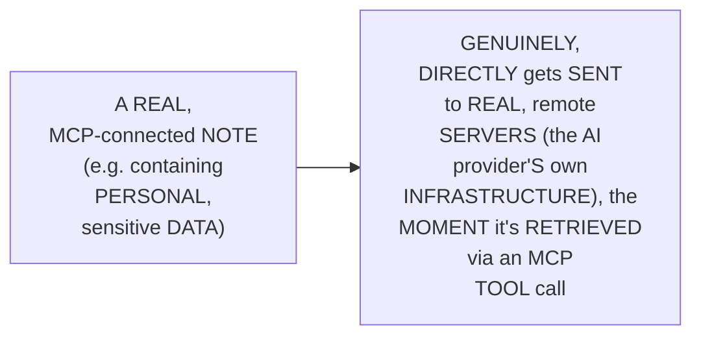

#### 🪜 Step-by-Step — A Complete, Real, Live-Demonstrated Mitigation

> 💡 **Given directly:** *"You should tell your Claude that, hey, don't ever go through this particular thing, or lock away your notes... if it is open, MCP, or rather, anyone can access it... let's try to do it. Lock note... Close all lock notes. Now it is logged, everyone... so, again, everyone, thanks to Apple and its security approach, it is not able to tell you these things, because we have logged the note now."*

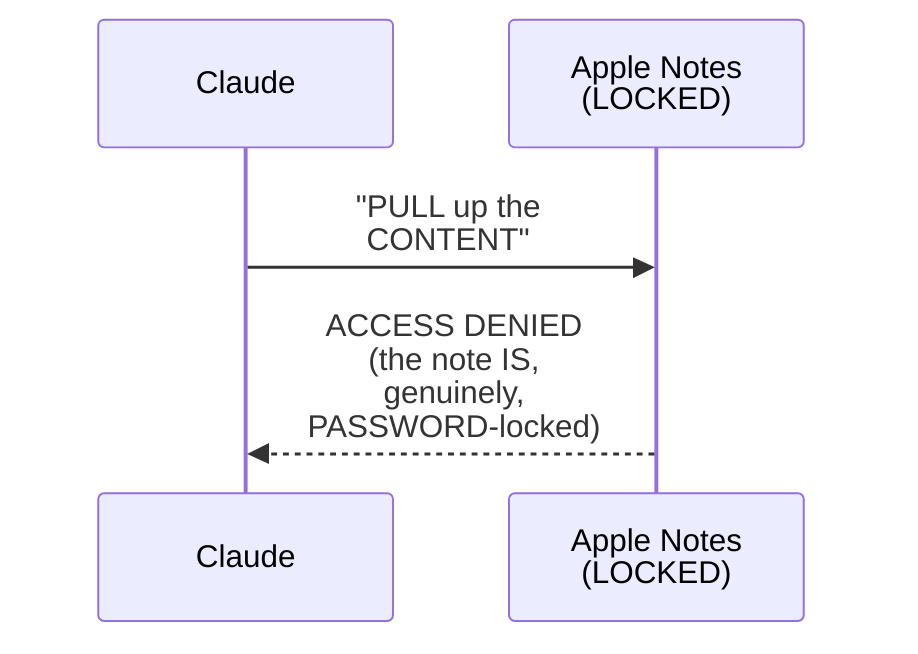

#### 🔍 Internal Working — A Genuine, Direct, Code-Level Solution: Middleware

> 💡 **Given directly:** *"On the code side, what you can do... there, also, we can block it. So, if required, we can block it on the code side as well... we can also add our own guardrail and custom middleware before model call to wrap the... those all is exactly possible... this operation... was actually done with LLM... after this, LLM should not give you this answer."*

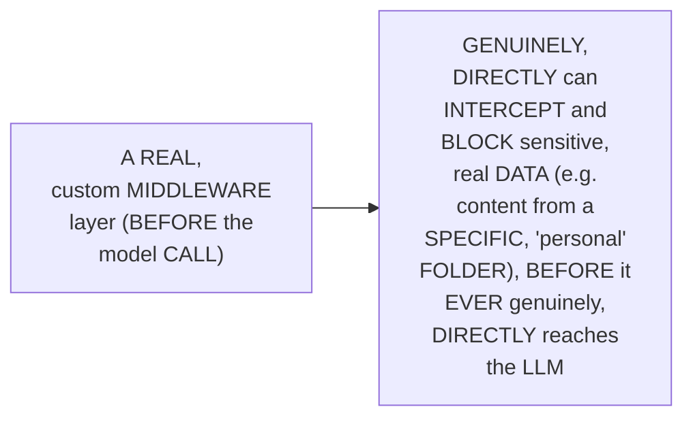

#### ⚠ Common Mistakes

* Assuming a REAL, MCP-connected APPLICATION genuinely, AUTOMATICALLY protects SENSITIVE information, WITHOUT any, EXPLICIT, real SAFEGUARD — explicitly, directly, HONESTLY demonstrated as GENUINELY, DIRECTLY false — "IF everything GOES cross-platform" (i.e., WITHOUT genuine, real PROTECTION), sensitive DATA genuinely, DIRECTLY leaks — REAL safeguards (application-LEVEL locking, OR code-level MIDDLEWARE) are GENUINELY, DIRECTLY required.

#### 🎯 Key Takeaways

* THE instructor **directly, HONESTLY acknowledges** a REAL, genuine PRIVACY concern — CONNECTING an MCP SERVER to a REAL, sensitive DATA source GENUINELY, DIRECTLY sends that SAME, real INFORMATION to REMOTE, AI-provider SERVERS.
* A COMPLETE, real, LIVE-demonstrated MITIGATION directly, CONCRETELY confirmed: PASSWORD-locking a REAL, sensitive note GENUINELY, DIRECTLY prevents the MCP server FROM accessing its OWN content.
* A GENUINE, real, CODE-level solution directly, CONCRETELY confirmed: CUSTOM MIDDLEWARE (per THIS series' own, PRIOR, established content) GENUINELY, DIRECTLY intercepts and BLOCKS sensitive data, BEFORE it EVER reaches the LLM.
* This directly, PRECISELY sets UP the SESSION's own, NEXT, essential CONTENT — a COMPLETE, real, LIVE-traced JSON-RPC conversation, VIA a "TIME server" (Section 8).

---

### 8. A Complete, Real, Live Demonstration: A Full JSON-RPC Trace, via a "Time Server"

#### 🪜 Step-by-Step — A Complete, Real, Live-Traced Example

> 💡 **Given directly:** *"Change the current time to Chicago time... this is where, again, everything has happened, so it is getting the Asia Kolkata time. Now it is converting the same... isError is false. So this is where tool getCurrentTime was called."*

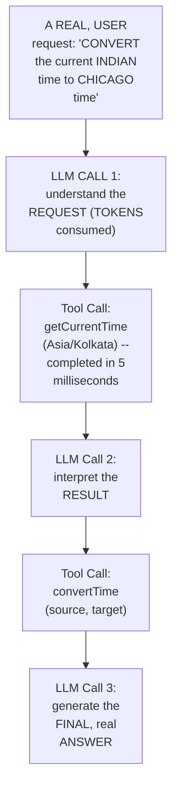

#### 🔍 Internal Working — A Genuine, Direct Confirmation of the Complete, Real Message Cycle

> 💡 **Given directly:** *"This time, everyone, when we made a call, right? ID is 5... I've used tool slash call. Method is tool slash call, so this I'm reaching out to my MCP. I'm telling the name of my tool, the argument... I'm getting JSON RPC ID, and the result. This result will be sent to the LLM or the AI."*

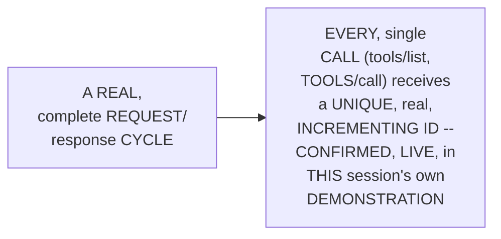

#### ⚠ Common Mistakes

* Assuming a REAL, complete "AI ANSWERS a QUESTION" interaction GENUINELY, DIRECTLY involves a SINGLE, real LLM call — explicitly, directly, LIVE-traced as GENUINELY, DIRECTLY false — a SIMPLE, TWO-tool question GENUINELY, DIRECTLY involved THREE, separate, real LLM CALLS (understanding THE request, interpreting EACH, tool RESULT).

#### 🎯 Key Takeaways

* A COMPLETE, real, LIVE-traced EXAMPLE directly, CONCRETELY confirmed the FULL, real MESSAGE cycle — MULTIPLE, SEPARATE LLM calls, INTERLEAVED with REAL, fast (5-millisecond) TOOL calls.
* THIS directly, CONCRETELY confirmed EVERY, real REQUEST genuinely, DIRECTLY receives a UNIQUE, incrementing ID — MATCHING this series' OWN, established JSON-RPC KNOWLEDGE.
* This directly, PRECISELY sets UP the SESSION's own, NEXT, essential CONTENT — a GENUINE, honest, important NOTE on WHY this DEPTH genuinely matters, FOR real interviews (Section 9).

---
### 9. A Genuine, Honest, Important Note: Why This Depth Genuinely Matters for Interviews

#### ⚠ A Direct, Honest, Important Confession

> 💡 **Given directly:** *"Balak, when I take an interview... I do ask about the MCP architecture in depth. I genuinely ask that, hey, you are having an MCP, can you tell me what are the different, different processes in MCP? They are not sure of that, and I know that person has not done anything. When I ask them that, hey, why JSON RPC? And if I ask that, hey, why cannot you use HTTP for your MCP? They don't have any answer. Simple reject."*

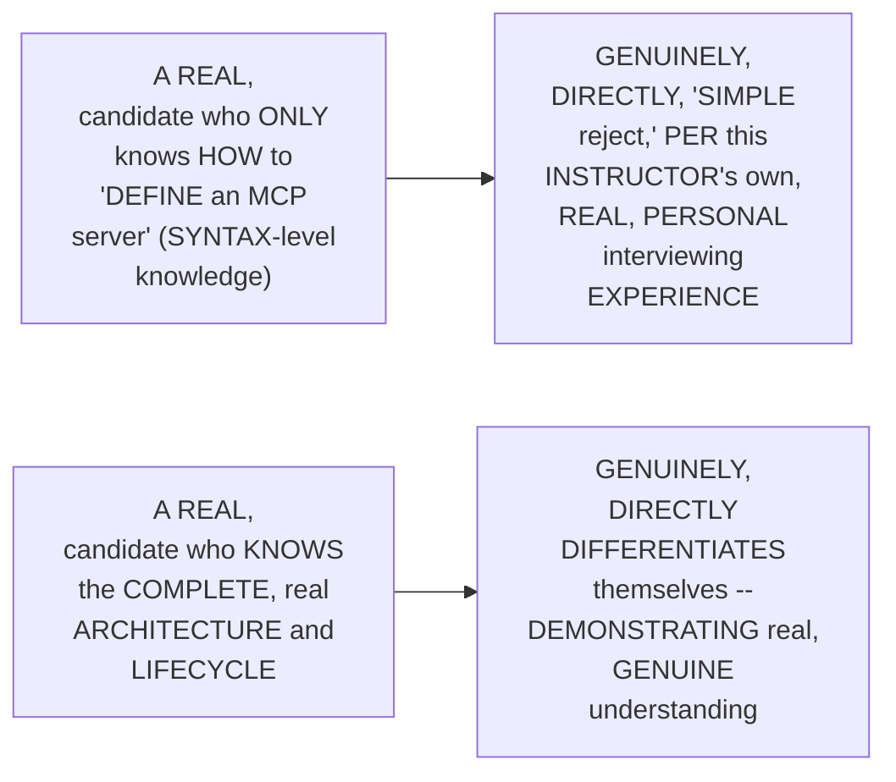

#### ⚠ A Direct, Honest, Important Distinction

> 💡 **Given directly:** *"Interviews are, like, way, way, way more difficult than the real work. So in the interview, they will not want a person who is able to explain MCP... even though in future you might create it like this only... don't you think that companies, like these big companies, when they are creating their MCP servers, they need that level of understanding?"*

#### ⚠ Common Mistakes

* Assuming a REAL interview's OWN, expected DEPTH of KNOWLEDGE genuinely, DIRECTLY matches the SIMPLICITY of REAL, day-to-day MCP-server-BUILDING work — explicitly, directly, HONESTLY clarified: "INTERVIEWS are... WAY more DIFFICULT than the REAL work" — GENUINE, complete architectural UNDERSTANDING is EXPECTED, EVEN if the ACTUAL, day-to-day IMPLEMENTATION work is GENUINELY, RELATIVELY simple.

#### 🎯 Key Takeaways

* THE instructor **directly, PERSONALLY confesses** a REAL, HONEST hiring PRACTICE — CANDIDATES who genuinely, DIRECTLY cannot EXPLAIN MCP's own, complete ARCHITECTURE (WHY JSON-RPC, NOT HTTP; WHAT are the LIFECYCLE phases) are "SIMPLE reject[ed]."
* THIS directly, HONESTLY reinforces WHY this SERIES' own, established DEPTH genuinely MATTERS — REAL, big-COMPANY interviews GENUINELY, DIRECTLY expect COMPLETE, architectural UNDERSTANDING, EVEN though the ACTUAL, day-to-day BUILDING work (via FastMCP, per THIS series' own, LATER content) is GENUINELY, relatively SIMPLE.
* This directly, PRECISELY sets UP the SESSION's own, NEXT, essential CONTENT — a COMPLETE, real, NO-code project, beginning WITH mapping the MANUAL process (Section 10).

---

### 10. A Complete, Real, No-Code Project: Defining the Manual Process First

#### 🪜 Step-by-Step — The Complete, Real, Manual Process, Mapped First

> 💡 **Given directly:** *"Whenever we are trying to automate anything, or any work... It is very, very important that we understand the manual process of the same... normally, when we need to keep up with the AI updates, we just go and search on internet for all the updates... then we try to make sure that we are doing multiple searches... we will just combine all this information... and save the same as draft in my email."*

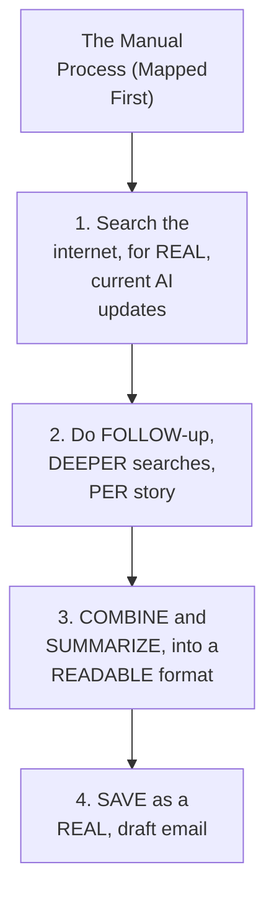

#### 🔍 Internal Working — A Genuine, Direct, Important Methodology

> 💡 **Given directly:** *"Most people, what they do is, they just show you the same without explaining you the thinking process... whenever you are trying to automate any of your day-to-day work as well... you should always and always map out [the manual process]."*

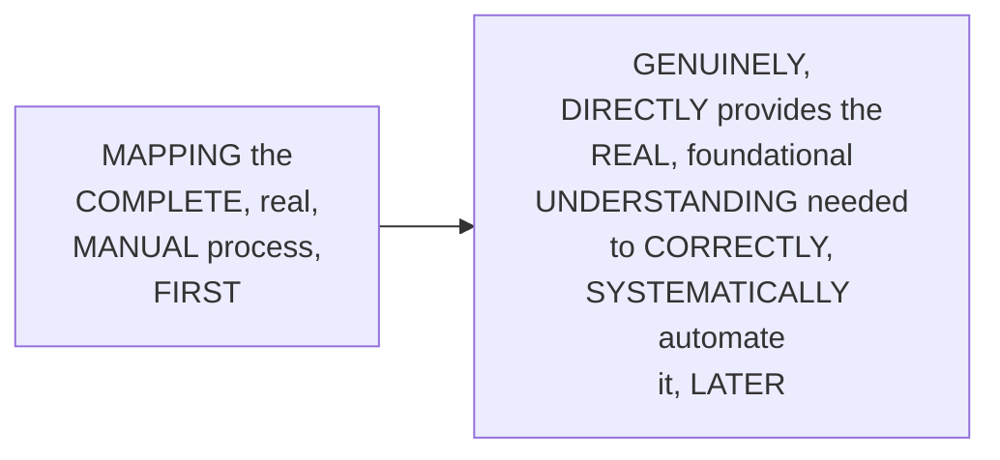

#### ⚠ Common Mistakes

* Assuming a REAL, effective AUTOMATION project GENUINELY, PRACTICALLY should START directly WITH the AI tool (Claude, ChatGPT), or WITH writing REAL code — explicitly, directly, HONESTLY clarified: "THEY are MORE focused ON movement, THEN to ACTUALLY understand THE problem... I always SUGGEST that SPEND time IN understanding the PROBLEM first."

#### 🎯 Key Takeaways

* A COMPLETE, real, MANUAL process directly, CONCRETELY confirmed: SEARCH → FOLLOW-up SEARCH → COMBINE/summarize → SAVE as a DRAFT — MAPPED, deliberately, BEFORE any, real AUTOMATION begins.
* THE instructor **directly, PRACTICALLY confirms** this "MAP the manual PROCESS first" methodology is a GENUINE, important, TRANSFERABLE skill — MOST people SKIP this SAME, foundational STEP, and GO directly to the AI TOOL.
* This directly, PRECISELY sets UP the SESSION's own, NEXT, essential CONTENT — the GENUINE, important PRINCIPLE of mapping "BRAIN" versus "APPLICATION" needs (Section 11).

---
### 11. A Genuine, Real, Important Principle: Map "Brain" vs. "Application" Before Building

#### 📖 Definition — The Complete, Real, Two-Category Framework

> 💡 **Given directly:** *"Let's try to understand where all our brain will be used, everyone. Once we try to understand the brain, and all the different, different applications, that is what we have to, from our real-world use case, extract... how can we understand that where we need LLM? Wherever there is a brain, LLM will be used."*

```mermaid
flowchart TD
    A["A Real, Manual<br/>Process (Mapped, per<br/>Section 10)"] --> B["Where is<br/>'BRAIN' (LLM)<br/>genuinely,<br/>REQUIRED? (e.g.<br/>FORMING search<br/>QUERIES,<br/>SUMMARIZING<br/>results)"]
    A --> C["Where is a REAL,<br/>'APPLICATION'<br/>(connector/MCP)<br/>genuinely, REQUIRED?<br/>(e.g. TAVILY for<br/>SEARCH, Gmail FOR<br/>drafting)"]
```

#### 🔍 Internal Working — A Genuine, Direct, Complete, Worked Example

> 💡 **Given directly:** *"Tavilly, everyone, is just like search, but which can directly be used for your AI or agents... next is everyone where we have to take a readable letter manner. So, in here, I think simple file will work, which Claude can create for me... save as draft, if we need to use everyone, we have to use Gmail as a connector."*

```mermaid
flowchart LR
    A["AI Updates<br/>(Newsletter) Project"] --> B["Brain (LLM):<br/>FORM queries,<br/>SUMMARIZE, WRITE<br/>readable TEXT"]
    A --> C["Application:<br/>Tavily (SEARCH),<br/>Gmail (DRAFT<br/>email), Google<br/>Calendar (REMINDER),<br/>Apple Notes (SAVE<br/>a POST)"]
```

#### ⚠ Common Mistakes

* Assuming a REAL, complex AUTOMATION project GENUINELY, DIRECTLY requires a SINGLE, unified TOOL to handle EVERY, single ASPECT — explicitly, directly, PRACTICALLY clarified: a WELL-designed, real WORKFLOW genuinely, DELIBERATELY separates "BRAIN" (LLM REASONING) needs from "APPLICATION" (connector/MCP) needs — EACH, distinct part SERVED by the APPROPRIATE, real TOOL.

#### 🎯 Key Takeaways

* THE genuine, real FRAMEWORK directly, PRACTICALLY confirmed: FOR every, real STEP in the MAPPED, manual PROCESS, EXPLICITLY identify WHETHER it GENUINELY, DIRECTLY requires "BRAIN" (LLM reasoning) OR a REAL "APPLICATION" (a SPECIFIC connector/MCP tool).
* A COMPLETE, real, WORKED example directly, CONCRETELY confirmed: TAVILY (search), Gmail (DRAFTING), Google CALENDAR (reminders), and APPLE Notes (SAVING) — EACH, genuinely mapped TO a SPECIFIC, real NEED, within the OVERALL workflow.
* This directly, PRECISELY sets UP the SESSION's own, NEXT, essential CONTENT — a COMPLETE, real, LIVE demonstration OF connecting these SAME applications, and GENERATING a META-prompt (Section 12).

---

### 12. A Complete, Real, Live Demonstration: Connecting Applications & Generating a Meta-Prompt

#### 🪜 Step-by-Step — Connecting the Complete, Real Applications

> 💡 **Given directly:** *"I will go to Manage Connectors, and in this, I will just make sure to connect the applications which I need... Gmail, which is already connected. There is Google Calendar, which is connected... Apple Notes is also required... Alpha Vantage."*

```mermaid
flowchart LR
    A["Manage<br/>Connectors (IN<br/>Claude Desktop)"] --> B["CONNECT: Gmail,<br/>Google Calendar,<br/>Apple Notes, Tavily<br/>-- EACH, real<br/>APPLICATION,<br/>authenticated<br/>SEPARATELY"]
```

#### 🪜 Step-by-Step — A Genuine, Real, Meta-Prompting Technique

> 💡 **Given directly:** *"Since we have created this blueprint kind of a thing, I can just go to Claude, paste it here, and say that, can you please provide me with the prompt which I can give in another Claude chat?... AI is very smart that it can give the prompt itself... rather than me writing it or giving it very vaguely, then Claude asking me follow-up questions."*

```mermaid
flowchart LR
    A["A REAL, hand-<br/>DRAWN 'blueprint'<br/>(the MAPPED, manual<br/>PROCESS + brain/<br/>APPLICATION split)"] --> B["GIVEN to CLAUDE,<br/>with the REQUEST:<br/>'GENERATE a<br/>COMPLETE prompt,<br/>FOR this SAME<br/>workflow'"]
    B --> C["PRODUCES: a<br/>GENUINELY, MORE<br/>thorough, real<br/>PROMPT than<br/>WRITING it<br/>MANUALLY, FROM<br/>scratch"]
```

#### ⚠ Common Mistakes

* Assuming WRITING a REAL, complete AUTOMATION prompt MANUALLY, from SCRATCH, is GENUINELY, PRACTICALLY superior to ASKING the AI to GENERATE it, FROM a REAL, mapped BLUEPRINT — explicitly, directly, PERSONALLY clarified: "GENERALLY, this IS very MUCH better THEN what I WOULD have WRITTEN myself WHILE explaining the PROBLEM" — meta-PROMPTING, when GROUNDED in a REAL, careful BLUEPRINT, GENUINELY produces a MORE thorough RESULT.

#### 🎯 Key Takeaways

* A COMPLETE, real, LIVE demonstration directly, CONCRETELY confirmed CONNECTING FOUR, real applications (Gmail, Google CALENDAR, Apple Notes, TAVILY), via Claude Desktop's OWN, established CONNECTORS.
* A GENUINE, real, META-prompting TECHNIQUE directly, PRACTICALLY confirmed: GIVING Claude a REAL, mapped BLUEPRINT, and ASKING it TO generate the COMPLETE, detailed PROMPT itself — CONFIRMED, personally, AS genuinely SUPERIOR to writing IT manually.
* This directly, PRECISELY sets UP the SESSION's own, NEXT, essential CONTENT — a COMPLETE, real, LIVE execution OF the FULL, multi-step, AGENTIC workflow (Section 13).

---
### 13. A Complete, Real, Live Execution: The Multi-Step, Agentic AI-Newsletter Workflow

#### 🪜 Step-by-Step — The Complete, Real, Live-Executed Workflow

> 💡 **Given directly:** *"All 5 steps are done. Calendar, no existing need today's update event, so I created daily 8 to 8.15 recurring event. Step 1, 2, 3, research and synthesis... ran broad searches across AI tech business and finance market news, then deep dive shortlisted story. Two stories got dropped after the deep dive turned out to not scale, and replaced with better verified stories."*

```mermaid
flowchart TD
    A["A REAL, LIVE-<br/>executed, AGENTIC<br/>WORKFLOW"] --> B["1. Search (via<br/>Tavily) -- broad,<br/>THEN deep-dive"]
    B --> C["2. Verify (drop<br/>UNRELIABLE<br/>stories)"]
    C --> D["3. Draft an<br/>Email (via<br/>Gmail)"]
    D --> E["4. Create a<br/>Calendar Event<br/>(via Google<br/>Calendar)"]
    E --> F["5. Save Notes<br/>(via Apple<br/>Notes)"]
```

#### 🔍 Internal Working — A Genuine, Direct Confirmation: This Is Human-in-the-Loop, Live

> 💡 **Given directly:** *"Claude want to search for events on the user primary calendar. Let me say always allow. It will ask you for these things, and if you want, this is a very good understanding. If you want, this is actually the time in your real application when you would like to have, maybe, human-in-the-loop concept... this is human in the loop, right?"*

```mermaid
flowchart LR
    A["EACH, real<br/>TOOL call, DURING<br/>this LIVE,<br/>EXECUTED workflow"] --> B["REQUIRES: EXPLICIT,<br/>real USER approval<br/>('ALLOW once') --<br/>a REAL, LIVE,<br/>PRACTICAL EXAMPLE<br/>of human-IN-the-loop"]
```

#### ⚠ A Direct, Honest, Important Acknowledgment: Imperfect Results Require Real Iteration

> 💡 **Given directly:** *"Apple Notes are not readable. Can you please fix the same? Make sure that it is having lines, new lines in between... I will highly suggest that please, please make sure that you go through these steps as well... diagnosing why node formatting collapsed into one paragraph. I think it did try to do it nicely, but it failed."*

```mermaid
flowchart LR
    A["A REAL, LIVE-<br/>EXECUTED, agentic<br/>WORKFLOW"] --> B["GENUINELY,<br/>DIRECTLY produced an<br/>IMPERFECT, real<br/>RESULT (POOR note<br/>FORMATTING) --<br/>HONESTLY,<br/>DIRECTLY acknowledged<br/>and CORRECTED,<br/>LIVE, rather THAN<br/>hidden"]
```

#### ⚠ Common Mistakes

* Assuming a REAL, agentic WORKFLOW, once LAUNCHED, GENUINELY, AUTOMATICALLY produces a PERFECT, correct RESULT, WITHOUT any, genuine, HUMAN oversight — explicitly, directly, HONESTLY demonstrated as GENUINELY, DIRECTLY false — REAL, imperfect results (LIKE poor NOTE formatting) genuinely, DIRECTLY occurred, REQUIRING real, human-DIRECTED correction.

#### 🎯 Key Takeaways

* A COMPLETE, real, LIVE-executed WORKFLOW directly, CONCRETELY confirmed: a FIVE-step, real, AGENTIC process (SEARCH, verify, DRAFT, schedule, SAVE) — SUCCESSFULLY completed, USING the CONNECTED, real applications.
* THIS directly, CONCRETELY demonstrated a REAL, LIVE example OF human-in-the-LOOP — EVERY, tool CALL required EXPLICIT, real USER approval.
* THE instructor **directly, HONESTLY acknowledges** a REAL, genuine IMPERFECTION (poor NOTE formatting) — REQUIRING real, human-DIRECTED correction, RATHER than presenting the WORKFLOW as FLAWLESS.
* This directly, PRECISELY sets UP the SESSION's own, NEXT, essential CONTENT — a GENUINE, real, ECONOMIC argument FOR why AI changed PROJECT costs (Section 14).

---

### 14. A Genuine, Real, Business Argument: Why AI Genuinely Changed Project Economics

#### ⚠ A Direct, Honest, Important, Economic Confession

> 💡 **Given directly:** *"Earlier, all of this would have been done via code, something which would have genuinely fetched easily $7,000-$8,000 as a project... in the last 5 years, this project went on from being a 10 lakh project, or 10,000 USD project, to genuinely a project which you can do in under a dollar. So this is exactly how technology can democratize."*

```mermaid
flowchart LR
    A["THIS SAME,<br/>REAL, complete<br/>AUTOMATION workflow<br/>(SEARCH, draft,<br/>schedule, SAVE)"] --> B["5 YEARS ago: a<br/>REAL, '10-lakh<br/>($10,000+)' custom-<br/>DEVELOPMENT project"]
    A --> C["TODAY: GENUINELY,<br/>DIRECTLY achievable<br/>'UNDER a dollar' --<br/>VIA Claude<br/>Desktop's OWN,<br/>established<br/>connectors"]
```

#### ⚠ Common Mistakes

* Assuming this SESSION's own, HANDS-on, real DEMONSTRATION is GENUINELY, MERELY an EDUCATIONAL exercise, WITHOUT any, real, PRACTICAL economic SIGNIFICANCE — explicitly, directly, HONESTLY clarified: this REPRESENTS a REAL, genuine, DRAMATIC shift IN the underlying ECONOMICS of software DEVELOPMENT — a CONCRETE, real ILLUSTRATION of technology's OWN, genuine, DEMOCRATIZING effect.

#### 🎯 Key Takeaways

* THE instructor **directly, HONESTLY confesses** a REAL, personal, ECONOMIC observation — THIS SAME, complete AUTOMATION project GENUINELY, DIRECTLY cost "10 LAKH" (roughly $10,000+) TO build, FIVE years ago — TODAY, it's GENUINELY achievable "UNDER a DOLLAR."
* THIS directly, CONCRETELY illustrates a REAL, broader, genuine ARGUMENT — AI-powered CONNECTORS/MCP have GENUINELY, DRAMATICALLY democratized ACCESS to SOPHISTICATED, real AUTOMATION capabilities.
* This directly, PRECISELY sets UP the SESSION's own, NEXT, essential CONTENT — ADDING a REAL, third-party server, and SCHEDULING (Section 15).

---
### 15. Adding a Real, Third-Party Server: Alpha Vantage & Scheduling

#### 🪜 Step-by-Step — Connecting a Complete, Real, Third-Party Stock Server

> 💡 **Given directly:** *"Alpha Vantage. Stock Market Data for Algorithmic trading. It can get you the real-time data and everything... you can genuinely just go to connectors, add a connector and add a custom connector... just paste it... the second I do continue, everyone, see, it is connecting and everything, and it is able to now ask you for the overall authorization."*

```mermaid
flowchart LR
    A["A REAL, THIRD-<br/>party STOCK-data<br/>server (ALPHA<br/>Vantage)"] --> B["ADDED, via a<br/>REAL, custom-<br/>CONNECTOR URL, PLUS<br/>a REAL, free API<br/>KEY"]
    B --> C["INSTANTLY, GENUINELY,<br/>DIRECTLY usable, VIA<br/>NATURAL-language<br/>REQUESTS -- 'PLEASE<br/>make sure TO get<br/>ME stock<br/>RECOMMENDATION,<br/>BASED on the<br/>NEWS'"]
```

#### 🔍 Internal Working — A Genuine, Direct Confirmation: You Don't Need to Understand the Backend

> 💡 **Given directly:** *"The benefit is that you don't need to understand how AlphaVantage is running in the backend. You just connect it and tell what you want... best part, you don't need to understand any of this. Your AI will make sense of this."*

#### 🪜 Step-by-Step — Scheduling the Complete, Real Workflow

> 💡 **Given directly:** *"Schedule this task to run at 7 a.m. every day. And the second I click on this, everyone, that's the best thing with Claude, that it will be able to understand and schedule the task with all of these applications working for me."*

```mermaid
flowchart LR
    A["A COMPLETE,<br/>real, MULTI-<br/>application<br/>WORKFLOW (search,<br/>DRAFT, schedule,<br/>SAVE, recommend)"] --> B["SCHEDULED, VIA<br/>Claude's OWN, real<br/>'Cowork' FEATURE --<br/>NOT the REGULAR<br/>chat INTERFACE,<br/>since CHAT sessions<br/>DON'T, genuinely,<br/>PERSIST"]
```

#### ⚠ Common Mistakes

* Assuming SCHEDULING a REAL, automated TASK genuinely, DIRECTLY works, FROM within a REGULAR Claude CHAT session — explicitly, directly, LIVE-clarified as GENUINELY, DIRECTLY false — a REGULAR CHAT genuinely, DOES not persist, in the REQUIRED way — CLAUDE's own, DEDICATED "COWORK" feature is GENUINELY, DIRECTLY required, FOR real, persistent SCHEDULING.

#### 🎯 Key Takeaways

* A COMPLETE, real, LIVE demonstration directly, CONCRETELY confirmed CONNECTING a REAL, third-party STOCK server (ALPHA Vantage), via a CUSTOM connector URL AND a REAL, free API KEY.
* THE genuine, real BENEFIT directly, CONCRETELY confirmed: "YOU don't NEED to UNDERSTAND how ALPHAVANTAGE is RUNNING in the BACKEND" — the AI GENUINELY, DIRECTLY handles this SAME, underlying COMPLEXITY.
* SCHEDULING a REAL, complete workflow directly, CONCRETELY requires Claude's OWN, dedicated "COWORK" feature — a REGULAR chat SESSION genuinely, DOES not persist, in the REQUIRED way.
* This directly, PRECISELY sets UP the SESSION's own, FINAL, real Q&A segment (Section 16).

---

### 16. Real Q&A: Debugging & Understanding a Scheduled, Agentic Workflow

#### 🪜 Step-by-Step — The Real, Complete Question & Answer

> 💡 **Given directly, from a real participant, Basavanna:** *"As we are using the desktop AI, and it is doing [the workflow], I was curious to know, like, how should I debug, going backtracking?... how should I chuck the whole workflow of what it has scheduled?"*

> 💡 **The genuine, direct answer:** *"When you schedule something, [Claude] tells you the steps and everything... it is saying it is reading from the memory, like the previous chat... instructions are there. It will just read these instructions. If you face any issues, you can change the instructions, update it, edit it out."*

```mermaid
flowchart LR
    A["A REAL,<br/>SCHEDULED, agentic<br/>WORKFLOW"] --> B["GENUINELY,<br/>DIRECTLY stores its<br/>OWN, complete,<br/>REAL instructions --<br/>VIEWABLE and,<br/>DIRECTLY, EDITABLE --<br/>ENABLING real,<br/>PRACTICAL debugging<br/>and REFINEMENT,<br/>OVER time"]
```

#### 🎯 Key Takeaways

* A REAL, complete AUDIENCE question directly, PRACTICALLY addressed a GENUINE, real, PRACTICAL concern — HOW to DEBUG and UNDERSTAND a SCHEDULED, agentic WORKFLOW, WITHOUT direct ACCESS to CODE-level logs.
* THE genuine, real ANSWER: a SCHEDULED, real WORKFLOW genuinely, DIRECTLY stores ITS own, complete INSTRUCTIONS — VIEWABLE and EDITABLE, ENABLING real, practical DEBUGGING and REFINEMENT.
* THIS episode **GENUINELY, COMPREHENSIVELY delivers** its OWN, stated GOALS — a COMPLETE, real treatment OF capability negotiation and the OPERATION phase, GROUNDED in GENUINE, honest DISCUSSIONS of PRIVACY, and a COMPLETE, real, NO-code project THAT demonstrates BOTH the technical MECHANICS of MCP, and its GENUINE, real, PRACTICAL, economic VALUE.
* This directly, PRECISELY sets UP the SESSION's own, FINAL, closing CONTENT — a DIRECT preview AND encouragement (Section 17).

---

### 17. Closing: A Direct Preview & Encouragement

#### 🪜 Step-by-Step — A Direct, Genuine, Final Preview

> 💡 **Given directly:** *"Let me tell you what all is left in the MCP part... shutdown. Latest updates. Create MCP server. Then, host, or let's say Dockerizing it, and pip availability... I think it will take me around one and a half class."*

```mermaid
flowchart LR
    A["THIS session<br/>(DONE): capability<br/>NEGOTIATION,<br/>OPERATION phase,<br/>PRIVACY, and a<br/>COMPLETE, no-CODE<br/>project"] --> B["A FUTURE<br/>session,<br/>EXPLICITLY, DIRECTLY<br/>promised: SHUTDOWN,<br/>latest UPDATES,<br/>CREATING servers,<br/>DOCKER, and PIP<br/>availability"]
```

#### ⚠ Common Mistakes

* Assuming REAL, deep MCP UNDERSTANDING alone is GENUINELY, SUFFICIENTLY complete, WITHOUT also, GENUINELY, PRACTICALLY applying it, TO real, hands-ON automation — explicitly, directly, PERSONALLY encouraged AGAINST — the INSTRUCTOR directly, REPEATEDLY urges LEARNERS to GENUINELY, PRACTICALLY use THESE same TOOLS, TO automate their OWN, real, day-to-day WORK.

#### 🎯 Key Takeaways

* THE instructor **directly, EXPLICITLY previews** the REMAINING MCP topics — SHUTDOWN, LATEST updates, CREATING servers, DOCKER, and PIP availability.
* THE instructor **directly, PERSONALLY encourages** learners to GENUINELY, PRACTICALLY apply THESE same tools, TO automate their OWN, real, day-to-day WORK — NOT merely to UNDERSTAND the ARCHITECTURE, for INTERVIEW purposes ALONE.

---
## 📝 Glossary

| Term | Definition | Why It Matters |
|---|---|---|
| **Capability Negotiation** | Client and server exchanging their real, respective feature lists | An "honest menu," completing the initialization phase |
| **Elicitation** | A server requesting additional info from the user, via the client | Confirms MCP's genuine, two-way communication |
| **Discovery (tools/list)** | Automatic retrieval of a server's tool list | Fires immediately after handshake, with no real LLM cost |
| **Calling (tools/call)** | Invoking a specific, real tool | Requires a tool name and its arguments |
| **Human-in-the-Loop (in MCP)** | Explicit user approval, before a tool call executes | Live-demonstrated via "Allow once" prompts |
| **Meta-Prompting** | Using AI to generate a complete prompt, from a real blueprint | Confirmed as genuinely superior to writing prompts manually |
| **Cowork** | Claude's dedicated feature for persistent, scheduled tasks | Required for real scheduling; a regular chat does not persist |

---

## 🔄 Revision Notes — One-Minute Revision

* This session completes the initialization phase (capability negotiation), moves through the operation phase, and delivers a complete, no-code automation project.
* **Capability negotiation**: an "honest menu" exchange -- client capabilities (roots, sampling, elicitation) and server capabilities (prompts, resources, tools) are both shared before real work begins. "Deprecated" doesn't mean "unused" -- the majority of currently-deployed servers still use this communication style.
* **Elicitation**: a server genuinely requesting additional information from the user, via the client, mid-tool-call -- confirming MCP's genuine, two-way communication. Distinct from HITL, a separate, broader AI-lifecycle concept.
* **A complete, live demonstration**: real connectors (Apple Notes, Context 7) automatically discover their own tool list, immediately upon connection -- confirming the established protocol operates behind familiar, production interfaces.
* **The operation phase**: two steps -- discovery (tools/list, automatic, free, fires immediately after handshake) and calling (tools/call, based on a real user request).
* **A complete, live demonstration** (Apple Notes): a natural-language request correctly translated into a real tools/call request, with the correct tool name and arguments.
* **A genuine, honest privacy discussion**: MCP-connected data genuinely gets sent to remote AI servers -- "information leakage." Real mitigations: application-level locking (demonstrated live) and code-level middleware guardrails.
* **A complete, live-traced JSON-RPC example**: a simple, two-tool question involved three separate LLM calls, interleaved with fast (5-millisecond) tool calls -- every request received a unique, incrementing ID.
* **A genuine, honest confession**: the instructor personally "simple reject[s]" candidates who can't explain MCP's complete architecture -- interviews are "way more difficult than the real work."
* **A complete, real, no-code project**: mapping the manual process first (search -> follow-up search -> combine/summarize -> save as draft), then explicitly separating "brain" (LLM) needs from "application" (connector/MCP) needs.
* **A genuine, real meta-prompting technique**: giving Claude a real, mapped blueprint and asking it to generate the complete prompt itself -- confirmed as genuinely superior to writing it manually.
* **A complete, live-executed, agentic workflow**: five real steps (search, verify, draft, schedule, save), each requiring explicit human-in-the-loop approval -- with an honest acknowledgment of imperfect results (poor note formatting) requiring real correction.
* **A genuine, real economic argument**: this same automation project cost roughly $10,000 five years ago; today it's achievable "under a dollar" -- a concrete illustration of AI's democratizing effect.
* **Adding a real, third-party server** (Alpha Vantage): connected via a custom connector URL and a free API key -- "you don't need to understand how it's running in the backend."
* **Scheduling**: requires Claude's dedicated "Cowork" feature; a regular chat session does not persist.
* **Real Q&A**: debugging a scheduled workflow -- its complete instructions are viewable and editable, enabling practical debugging without code-level logs.
* **Closing**: a direct preview of remaining topics (shutdown, latest updates, creating servers, Docker, pip) and a genuine encouragement to practically apply these tools, not just understand the architecture.

---

## 📋 Cheat Sheet

**Capability negotiation (completing initialization):**
```text
Client capabilities:  roots, sampling, elicitation, experimental
Server capabilities:  prompts, resources, tools, logging, completion
```

**The operation phase, two steps:**
```text
1. Discovery (tools/list): automatic, immediate, free
2. Calling (tools/call):   requires {name, arguments}
```

**Privacy mitigations:**
```text
Application-level: lock/password-protect sensitive data
Code-level:        custom middleware, before the model call
```

**The "map before you build" methodology:**
```text
1. Map the complete, manual process
2. For each step, ask: "Brain (LLM) or Application (connector)?"
3. Connect the required applications
4. Ask the AI to generate a complete prompt, from this blueprint
5. Execute, with human-in-the-loop approval at each tool call
```

---

## 🔥 Interview Questions & Answers

### 🟢 Beginner

**Q1.**

**Question:** What is capability negotiation, in one sentence?

**Answer:** An "honest menu" exchange, where client and server both share their real, respective feature lists.

**Explanation:** Directly, explicitly explained.

**Why Interviewers Ask This:** The most basic, foundational MCP initialization question.

**Possible Follow-up:** "Does 'deprecated' genuinely mean 'unused,' for an MCP feature?"

**Q2.**

**Question:** What is elicitation, and how does it demonstrate MCP's two-way communication?

**Answer:** A server genuinely requesting information from the user, via the client, mid-tool-call -- confirming it isn't always the client making the call.

**Explanation:** Directly, explicitly confirmed.

**Why Interviewers Ask This:** Foundational, frequently-tested advanced-capability knowledge.

**Possible Follow-up:** "Is elicitation the same concept as HITL?"

**Q3.**

**Question:** What are the two, precise steps of the operation phase?

**Answer:** Discovery (tools/list, automatic) and calling (tools/call, based on a real request).

**Explanation:** Directly, explicitly confirmed.

**Why Interviewers Ask This:** Foundational, frequently-tested MCP lifecycle knowledge.

**Possible Follow-up:** "Does discovery genuinely incur any real LLM cost?"

**Q4.**

**Question:** What two things are genuinely required, to call a specific MCP tool?

**Answer:** The tool's name, and its required arguments.

**Explanation:** Directly, explicitly confirmed.

**Why Interviewers Ask This:** Basic, essential, hands-on MCP knowledge.

**Possible Follow-up:** "Who genuinely determines these values -- the user, or the LLM?"

**Q5.**

**Question:** According to this session's own, honest, real demonstration, does connecting an MCP server to sensitive data pose a genuine privacy risk?

**Answer:** Yes -- confirmed as genuine "information leakage" to remote AI servers.

**Explanation:** Directly, honestly demonstrated.

**Why Interviewers Ask This:** Tests genuine, practical understanding of real MCP privacy implications.

**Possible Follow-up:** "Name two, real mitigations demonstrated in this session."

**Q6.**

**Question:** In this session's own, live-traced example, did answering one, simple, two-tool question genuinely involve only one LLM call?

**Answer:** No -- it genuinely involved three, separate LLM calls, interleaved with tool calls.

**Explanation:** Directly, live-demonstrated.

**Why Interviewers Ask This:** Tests genuine, precise understanding of real, agentic tool-use mechanics.

**Possible Follow-up:** "Roughly how fast was each, individual tool call, in this example?"

**Q7.**

**Question:** According to this session's own, honest confession, is knowing how to define an MCP server genuinely sufficient, for a real, technical interview?

**Answer:** No -- genuine, complete architectural understanding is explicitly required.

**Explanation:** Directly, honestly confirmed.

**Why Interviewers Ask This:** Tests genuine, practical interview-readiness awareness.

**Possible Follow-up:** "What two, specific, real questions did the instructor say he genuinely asks candidates?"

**Q8.**

**Question:** What is the first, genuinely recommended step, before automating any real, manual process?

**Answer:** Mapping out the complete, manual process itself.

**Explanation:** Directly, explicitly confirmed.

**Why Interviewers Ask This:** Tests genuine, practical, real-world automation methodology.

**Possible Follow-up:** "What is the second, genuinely recommended step?"

**Q9.**

**Question:** According to this session's own, real, worked example, what determines whether a step needs "brain" (LLM) or a real "application" (connector)?

**Answer:** Wherever real reasoning/summarization is needed, use the brain; wherever a specific, external action is needed, use an application.

**Explanation:** Directly, precisely explained.

**Why Interviewers Ask This:** Tests genuine, practical workflow-design reasoning.

**Possible Follow-up:** "Give one, real example of each, from this session's own project."

**Q10.**

**Question:** Does scheduling a real, recurring automation genuinely work from within a regular Claude chat session?

**Answer:** No -- it genuinely requires Claude's dedicated "Cowork" feature.

**Explanation:** Directly, live-demonstrated.

**Why Interviewers Ask This:** Tests genuine, practical, hands-on product knowledge.

**Possible Follow-up:** "Why, specifically, does a regular chat session not work for this?"

---
### 🟡 Intermediate

**Q11.**

**Question:** Explain why the instructor deliberately, live-demonstrates the complete JSON-RPC trace of a simple "time server" (Section 8), rather than simply describing the operation phase abstractly.

**Answer:** This is a genuinely deliberate, EVIDENCE-based teaching choice, CONSISTENT with a PATTERN seen THROUGHOUT this SERIES: by DIRECTLY, LIVE tracing a REAL, complete REQUEST cycle — SHOWING the exact, REAL sequence of LLM CALLS, tool calls, and their UNIQUE, incrementing IDS — the instructor TRANSFORMS an ABSTRACT description ("DISCOVERY, then CALLING") into a GENUINELY, CONCRETELY verifiable DEMONSTRATION. THIS directly, PRACTICALLY reveals a GENUINE, non-obvious FACT — a SIMPLE, two-tool QUESTION involves MULTIPLE, separate LLM CALLS, not JUST one — a DETAIL that WOULD, genuinely, REMAIN hidden, WITHOUT this SAME, direct, LIVE evidence.

**Explanation:** Requires recognizing the deliberate, evidence-based value of a live JSON-RPC trace, which reveals a genuine, non-obvious fact (multiple LLM calls per simple question) that abstract description alone would not convey.

**Why Interviewers Ask This:** Tests whether a learner recognizes the pedagogical value of concrete, live evidence for revealing non-obvious, real system behavior.

**Possible Follow-up:** "Describe the GENUINE, non-obvious FACT this SAME, live TRACE revealed, ABOUT the NUMBER of LLM calls INVOLVED."

**Q12.**

**Question:** A learner argues that since this session confirms discovery (tools/list) incurs no real LLM cost, this means an MCP-connected application with hundreds of connectors genuinely incurs no meaningful overhead, regardless of how many are connected. Evaluate this claim.

**Answer:** This claim OVERSTATES a GENUINE, SPECIFIC fact (DISCOVERY, ITSELF, is NOT an LLM-COST operation) into an UNCONDITIONAL claim OF "NO meaningful OVERHEAD," which the SESSION's own content does NOT, genuinely, FULLY support. WHILE discovery genuinely, DIRECTLY avoids LLM COST, it STILL, genuinely, REQUIRES a REAL, protocol-level REQUEST/response exchange, WITH every, CONNECTED server — a REAL, non-zero, THOUGH typically SMALL, real OVERHEAD, in TERMS of connection SETUP and MAINTENANCE. ADDITIONALLY, per THIS session's own, established REASONING, ONCE a REAL, natural-language REQUEST genuinely, DIRECTLY requires the LLM to REASON about WHICH, among HUNDREDS of DISCOVERED tools, to USE, that SAME, LARGE number OF available TOOLS COULD, genuinely, DIRECTLY increase the REAL, underlying context/TOKEN cost OF that reasoning STEP — an INDIRECT, but GENUINE, real COST that GROWS with CONNECTOR count. The ACCURATE, more PRECISE conclusion: DISCOVERY itself is GENUINELY, DIRECTLY free of LLM cost — but a LARGE number OF connected TOOLS can STILL, genuinely, INDIRECTLY impact REAL, downstream reasoning COSTS, when the LLM MUST choose AMONG them.

**Explanation:** Tests whether a learner recognizes that "discovery has no LLM cost" is a narrow, specific fact that doesn't imply zero overhead overall, since a large number of discovered tools can still indirectly increase downstream reasoning costs.

**Why Interviewers Ask This:** Distinguishes candidates who correctly scope a specific, technical fact from those who over-generalize it into an unconditional claim about total system overhead.

**Possible Follow-up:** "Propose a GENUINE, real, PRACTICAL strategy FOR managing this INDIRECT, real cost, WHEN connecting a LARGE number OF real tools."

**Q13.**

**Question:** Explain, precisely, why the instructor deliberately shows an imperfect result (poor Apple Notes formatting, Section 13) during the live execution of the AI-newsletter project, rather than either pre-testing the workflow to avoid this, or editing it out.

**Answer:** This is a genuinely deliberate, HONEST-transparency teaching choice, CONSISTENT with a PATTERN seen THROUGHOUT this BROADER series (e.g., LATER sessions' own, established, HONEST live FAILURES). By DIRECTLY, GENUINELY showing an IMPERFECT, real RESULT — and THEN, live, CORRECTING it — the instructor MODELS a GENUINE, professional, REALISTIC workflow: REAL, agentic AUTOMATION genuinely, OFTEN requires ITERATION, RATHER than PRODUCING a PERFECT result, ON the FIRST attempt. THIS directly, PRACTICALLY prevents a GENUINE, likely MISCONCEPTION — that REAL, agentic WORKFLOWS are GENUINELY, ALWAYS flawless, ONCE configured — a MISCONCEPTION that COULD, genuinely, DISCOURAGE a LEARNER encountering a SIMILAR, real IMPERFECTION, in THEIR own, later WORK.

**Explanation:** Requires recognizing the deliberate, honest-transparency value of showing and correcting a real, imperfect result live, rather than presenting an idealized, flawless demonstration.

**Why Interviewers Ask This:** Tests whether a learner recognizes the pedagogical and professional value of demonstrating realistic iteration, rather than an unrealistically perfect, first-attempt result.

**Possible Follow-up:** "Describe a GENUINE, real RISK of a LEARNER believing AGENTIC workflows ALWAYS, genuinely PRODUCE a PERFECT result, on the FIRST attempt."

**Q14.**

**Question:** Using this session's own precise "map brain vs. application, before building" reasoning (Section 11), explain a GENUINE, real risk a team might face if they skip this mapping step, and instead connect every available connector to an AI assistant, hoping the AI will "figure it out."

**Answer:** A precise, reasoned RISK analysis, directly extending Section 11's own established METHODOLOGY: per Section 11's own PRECISE, established REASONING, a WELL-designed, real WORKFLOW genuinely, DELIBERATELY separates "BRAIN" needs FROM "APPLICATION" needs, FOR each, individual STEP — ENSURING the CORRECT, real TOOL is USED, for EACH, specific PURPOSE. GIVEN this, a GENUINE, real RISK emerges IF a TEAM skips this SAME, deliberate MAPPING, and INSTEAD connects EVERY available CONNECTOR, hoping the AI GENUINELY, AUTOMATICALLY "figures IT out": per Advanced Q12's own established REASONING, a LARGE, UNMAPPED number OF connected TOOLS GENUINELY, DIRECTLY increases the LLM's own, real REASONING burden — RISKING genuinely, DIRECTLY choosing the WRONG tool, FOR a given STEP (e.g., GENUINELY, MISTAKENLY using a SEARCH tool WHEN a CALENDAR tool was REQUIRED) — a REAL, avoidable CONFUSION that THIS session's own, established, DELIBERATE mapping PROCESS (Sections 10-11) GENUINELY, DIRECTLY prevents.

**Explanation:** Requires extending the deliberate mapping methodology to identify a genuine, real risk (tool-selection confusion, increased reasoning burden) of skipping it and relying entirely on the AI's own, unguided judgment.

**Why Interviewers Ask This:** Tests whether a learner can connect a stated, best-practice methodology to a genuine, real, practical consequence of skipping it.

**Possible Follow-up:** "Propose a GENUINE, real, PRACTICAL way a TEAM could VERIFY their OWN mapping is CORRECT, BEFORE genuine, full DEPLOYMENT."

**Q15.**

**Question:** Synthesize this session's complete "information leakage" acknowledgment (Section 7) with its own "meta-prompting from a mapped blueprint" technique (Section 12) to explain a GENUINE, structural reason why explicitly documenting privacy/data-sensitivity requirements, within the mapped blueprint itself, would genuinely improve the resulting, AI-generated prompt's own real safety.

**Answer:** A precise, synthesized explanation, directly connecting TWO, separately-established sections: per Section 7's own PRECISE, established ACKNOWLEDGMENT, MCP-connected DATA genuinely, DIRECTLY risks REAL "information LEAKAGE," to REMOTE, AI-provider servers — REQUIRING real, EXPLICIT mitigations (LOCKING, middleware). Per Section 12's own PRECISE, established TECHNIQUE, the QUALITY of an AI-GENERATED prompt genuinely, DIRECTLY depends ON the COMPLETENESS of the REAL, mapped BLUEPRINT it's GENERATED from. SYNTHESIZING these TWO facts directly, PRECISELY reveals a GENUINE, structural REASON why EXPLICITLY documenting PRIVACY/sensitivity requirements, WITHIN the mapped BLUEPRINT itself, would GENUINELY, DIRECTLY improve SAFETY: IF the BLUEPRINT (per Section 12) EXPLICITLY, DIRECTLY notes "THIS folder CONTAINS sensitive DATA — never SUMMARIZE or FORWARD its CONTENTS," THEN the AI-GENERATED prompt (per THIS same, established TECHNIQUE) would GENUINELY, DIRECTLY incorporate this SAME, real CONSTRAINT — PROACTIVELY, DIRECTLY addressing the information-LEAKAGE risk (per Section 7) AT the prompt-DESIGN stage, RATHER than requiring a SEPARATE, reactive FIX (LIKE locking a NOTE), AFTER a REAL, unwanted disclosure has ALREADY occurred.

**Explanation:** Requires synthesizing the information-leakage risk with the blueprint-driven meta-prompting technique to reveal that explicitly documenting privacy requirements within the blueprint would proactively address the risk at the design stage, rather than reactively.

**Why Interviewers Ask This:** A senior-level question testing whether a candidate can connect a genuine, real risk (data leakage) with a specific, established technique (blueprint-driven prompting) to design a genuinely proactive, rather than reactive, mitigation.

**Possible Follow-up:** "Draft a GENUINE, real, SPECIFIC blueprint ANNOTATION, THAT would DIRECTLY address THIS exact, identified RISK, for the SESSION's own, established APPLE Notes example."

---

### 🔴 Advanced

**Q16.**

**Question:** Design a complete, reasoned "manual-to-automated" workflow-mapping template (using ONLY this session's own established concepts) for a hypothetical team automating a genuinely different, real, recurring business process (e.g., weekly competitor analysis).

**Answer:** A reasonable, complete template, directly applying this session's OWN, exact established CONCEPTS:

```text
1. Map the Complete, Manual Process First (per Section 10's own
   established METHODOLOGY): DOCUMENT every, real STEP a HUMAN
   currently PERFORMS, manually, FOR weekly COMPETITOR analysis --
   BEFORE considering ANY, real AUTOMATION tool.

2. Classify Each Step as "Brain" or "Application" (per Section
   11's own established FRAMEWORK): FOR each, mapped STEP,
   EXPLICITLY determine WHETHER it GENUINELY requires LLM
   reasoning (e.g. SUMMARIZING findings) OR a SPECIFIC, real
   APPLICATION/connector (e.g. SEARCHING news, SAVING a report).

3. Identify and Connect the Minimum, Required Applications (per
   Advanced Q12's own established, INDIRECT-cost REASONING):
   CONNECT only the SPECIFIC, genuinely REQUIRED applications --
   AVOIDING an UNNECESSARILY large, UNMAPPED connector SET.

4. Document Privacy/Sensitivity Requirements, Within the Blueprint
   (per Advanced Q15's own established SYNTHESIS): EXPLICITLY
   note ANY, real, sensitive DATA sources (e.g. INTERNAL
   pricing DATA) genuinely INVOLVED, and REQUIRED handling
   CONSTRAINTS, DIRECTLY within the mapped BLUEPRINT itself.

5. Generate the Complete Prompt, From This Blueprint (per Section
   12's own established, META-prompting TECHNIQUE): PROVIDE
   this COMPLETE, documented BLUEPRINT to the AI, and REQUEST a
   COMPLETE, detailed PROMPT -- RATHER than WRITING it manually,
   FROM scratch.

6. Execute With Human-in-the-Loop Approval, and Expect Real
   Iteration (per Section 13's own established, HONEST
   demonstration): EXECUTE the WORKFLOW with EXPLICIT approval AT
   each, real TOOL call -- and GENUINELY, REALISTICALLY expect
   TO iterate ON imperfect, INITIAL results, RATHER than assuming
   PERFECTION on the FIRST attempt.
```

This complete TEMPLATE directly, precisely APPLIES this session's OWN, established CONCEPTS — MANUAL-process mapping, brain/APPLICATION classification, MINIMAL connector SELECTION, privacy DOCUMENTATION, meta-PROMPTING, and REALISTIC, iterative EXECUTION — to a GENUINELY realistic, DIFFERENT, real BUSINESS-automation scenario.

**Explanation:** Requires synthesizing manual-process mapping, brain/application classification, minimal connector selection, privacy documentation, meta-prompting, and realistic execution into one complete, reasoned workflow-mapping template.

**Why Interviewers Ask This:** A comprehensive, capstone-level question testing whether a candidate can apply the complete range of this session's own concepts to a genuinely new, different, real automation scenario.

**Possible Follow-up:** "WHICH of THESE six, template STEPS would you GENUINELY, PRACTICALLY consider MOST important, if you HAD to skip ONE, DUE to time CONSTRAINTS?"

**Q17.**

**Question:** Critically evaluate: "Since this session confirms a real automation project's cost dropped from roughly $10,000 to under a dollar, this means all custom software development work has genuinely become economically obsolete, and companies should never pay for custom-built automation anymore." Is this an accurate, complete characterization?

**Answer:** Not accurate — this OVERSTATES a GENUINE, SPECIFIC, well-documented COST reduction (FOR a PARTICULAR, real KIND of task — CONNECTOR-based, no-CODE AUTOMATION, using EXISTING, well-SUPPORTED applications LIKE Gmail and GOOGLE Calendar) into an UNCONDITIONAL claim THAT ALL custom SOFTWARE development has BECOME "obsolete." THIS session's own, BROADER content DIRECTLY contradicts THIS overstated CONCLUSION, in MULTIPLE, real ways. FIRST, THIS series' own, LATER, established CONTENT (BUILDING real, CUSTOM MCP servers, FROM scratch, per THIS series' own, PRIOR-established CATALOG) DIRECTLY confirms GENUINE, custom DEVELOPMENT work REMAINS necessary, WHENEVER an APPLICATION doesn't ALREADY have a WELL-supported, EXISTING connector. SECOND, per Section 9's own established REASONING, REAL, professional COMPANIES STILL, genuinely REQUIRE deep, ARCHITECTURAL understanding, TO build THEIR own, PRODUCTION-grade MCP servers — a GENUINE, real skill DISTINCT from SIMPLY using EXISTING, no-code CONNECTORS. The ACCURATE, more PRECISE conclusion: THE dramatic COST reduction GENUINELY, DIRECTLY applies to a SPECIFIC, real CATEGORY of task (no-CODE automation, USING existing, WELL-supported connectors) — it does NOT, genuinely, IMPLY that ALL custom, PROFESSIONAL software DEVELOPMENT has BECOME economically OBSOLETE.

**Explanation:** Tests whether a learner recognizes that a genuine, documented cost reduction for one, specific category of task (no-code automation via existing connectors) doesn't generalize into a claim that all custom software development is obsolete, especially given this series' own, broader emphasis on building custom MCP servers.

**Why Interviewers Ask This:** Distinguishes candidates who correctly scope a specific, genuine economic observation from those who over-generalize it into an unconditional claim about an entire industry.

**Possible Follow-up:** "Describe a GENUINE, real SCENARIO (FROM elsewhere IN this SERIES' own, established CONTENT) where CUSTOM, professional MCP-server DEVELOPMENT would GENUINELY, STILL be REQUIRED."

---

## 🧪 Scenario-Based Interview Questions

> **Scenario 1:** A colleague, having completed this session's own exact capability-negotiation lessons, reports that their custom MCP client genuinely fails to discover any resources from a connected server, even though the server's own logs confirm it does provide real resources. Using this session's own concepts, construct a complete, reasoned debugging response.

**Structured Answer:**
1. **Initial investigation:** Recognize this as directly connected to Section 2's own precise, established capability-negotiation mechanism — a GENUINE, likely MISMATCH, between the CLIENT's own, DECLARED capabilities and the SERVER's own, real OFFERINGS.
2. **Relevant principle:** Per Section 2's own established REASONING, capability NEGOTIATION is an "HONEST menu" EXCHANGE — BOTH sides GENUINELY, DIRECTLY declare WHAT they support, BEFORE real WORK begins.
3. **Possible causes:** THE colleague's OWN, custom CLIENT LIKELY, genuinely FAILED to correctly DECLARE support FOR resources, DURING its OWN, initial capability NEGOTIATION — CAUSING the server TO, genuinely, correctly ASSUME resources are NOT, genuinely, WANTED/supported, by THIS specific client.
4. **Debugging approach:** Directly REVIEW the CLIENT's own, real, INITIALIZATION-request PAYLOAD — CONFIRMING whether it GENUINELY, CORRECTLY declares resource-related CAPABILITIES.
5. **Resolution:** UPDATE the CLIENT's own, real capability DECLARATION, to CORRECTLY include RESOURCE support (per Section 2's own established MECHANISM) — THEN, genuinely, RE-test the connection.
6. **Prevention:** Establish a standing, PERSONAL practice of EXPLICITLY, carefully REVIEWING a CUSTOM client's own, real capability DECLARATION, AGAINST the FULL, established LIST of PRIMITIVES (per THIS series' own, PRIOR, established CONTENT) it GENUINELY intends TO support.

> **Scenario 2 (Advanced):** Your organization is planning to replicate this session's own, established "AI newsletter" automation, but for a genuinely more sensitive use case — automatically summarizing internal, confidential customer support tickets and drafting weekly team reports. A colleague suggests simply reusing the exact same, established blueprint and connector pattern, without modification. Using this session's own concepts, construct a complete, reasoned response.

**Structured Answer:**
1. **Initial investigation:** Recognize this as directly connected to Section 7's own precise, established information-leakage acknowledgment — a GENUINE, elevated RISK, given the GENUINELY, more sensitive NATURE of this NEW use case.
2. **Relevant principle:** Per Section 7's own established REASONING, "THIS information IS being SENT to the CLOUD servers... THAT'S information LEAKAGE" — a GENUINE, real risk that GENUINELY, DIRECTLY scales WITH the SENSITIVITY of the UNDERLYING data.
3. **Possible risks:** SIMPLY reusing the EXISTING blueprint, WITHOUT modification, GENUINELY, DIRECTLY risks SENDING confidential, real CUSTOMER data to REMOTE AI servers, WITHOUT the SAME, established, EXPLICIT safeguards (per Section 7's own established MITIGATIONS) THIS session's own content CONFIRMS are GENUINELY, DIRECTLY required, for SENSITIVE data.
4. **Debugging/evaluation approach:** Directly APPLY Advanced Q15's own established SYNTHESIS — EXPLICITLY document THIS new use CASE's own, real PRIVACY/sensitivity requirements, WITHIN the mapped BLUEPRINT itself (per Section 12's own established TECHNIQUE), BEFORE generating ANY, real PROMPT.
5. **Resolution:** IMPLEMENT real, EXPLICIT safeguards (per Section 7's own established MITIGATIONS) — e.g., RESTRICTING which, SPECIFIC support-TICKET fields the CONNECTOR can ACCESS, and/or IMPLEMENTING real, code-LEVEL middleware TO redact genuinely sensitive FIELDS, BEFORE they EVER reach the LLM.
6. **Prevention:** Establish a standing, ORGANIZATIONAL policy REQUIRING an EXPLICIT, documented PRIVACY review — per THIS session's own, established REASONING — BEFORE reusing ANY, existing automation BLUEPRINT, for a GENUINELY more sensitive, real USE case.

---

## 🛠 Hands-on Exercises

### 🟢 Easy

1. Write out, from memory, the complete list of client and server capabilities, exchanged during capability negotiation.
2. Explain, in your own words, why discovery (tools/list) genuinely incurs no real LLM cost.
3. Explain, in your own words, why elicitation demonstrates MCP's genuine, two-way communication.

### 🟡 Medium

4. Reproduce this session's own, complete "manual process mapping" exercise, for a genuinely different, real, recurring task of your own choosing.
5. Apply this session's own, established "brain vs. application" framework, to your own, mapped process.
6. Use this session's own, established meta-prompting technique, to generate a complete automation prompt, from your own blueprint.

### 🔴 Advanced

7. Complete the full, reasoned workflow-mapping template proposed in Advanced Interview Q16, for a genuinely different, real business process of your own choosing.
8. Implement the debugging scenario proposed in Scenario 1 -- deliberately misconfigure a client's own capability declaration, then correctly diagnose and fix it.
9. Design and document a complete, real privacy/sensitivity annotation, for a genuinely sensitive automation use case of your own choosing.

---

## 🏗 Practice Assignment

*(This session's own stated, direct, personal encouragement, reproduced faithfully)*

> 💡 **The instructor's own words, given directly:** *"Don't you think that all of you can automate lots of things around you? In your day-to-day work as well, can't you create a seamless system like this and automate things around you?"*

### Build: "Complete, Personal, No-Code Automation Project"

**Objective:** Directly apply this session's own, complete "map, then automate" methodology, to a genuinely real, personal or professional automation need.

**Requirements:**
- Choose a genuinely real, recurring task from your own, personal or professional life.
- Map the complete, manual process, step by step, exactly as demonstrated in this session.
- Explicitly classify each step as requiring "brain" (LLM) or a real "application" (connector).
- Connect the required, real applications, via Claude Desktop's own connectors.
- Use this session's own, established meta-prompting technique, to generate a complete prompt.
- Execute the workflow, with explicit, human-in-the-loop approval at each step.
- A written reflection (200-300 words) on any genuine, real imperfections you encountered, and how you resolved them.

**Architecture (suggested):**

```text
personal_automation_project/
├── manual_process_map.md
├── brain_vs_application_classification.md
├── generated_prompt.md
├── execution_log.md
└── REFLECTION.md
```

**Expected Functionality:**
- Your complete project should genuinely, correctly demonstrate every, major technique established in this session.

**Challenges:**
- Correctly mapping a genuinely complex, real, manual process, in complete detail.
- Handling genuinely imperfect, real results, requiring live iteration.

**Bonus Improvements:**
- Apply Advanced Q16's own, established workflow-mapping template, formally, to your own project.
- Add explicit, documented privacy/sensitivity annotations, per Advanced Q15's own established synthesis, if your project involves any, real sensitive data.

---

## 📚 Additional Resources

- **Later sessions in this same MCP series** (in this same workspace, as separate, complete study guides) -- covering the shutdown phase, creating real MCP servers from scratch, and Claude integration -- the direct, established continuation of this session's own content.
- **Tavily's own, official website** (referenced directly) -- an AI-native search engine and web intelligence API, used throughout this session's own, real project.
- **Alpha Vantage's own, official documentation** (referenced directly) -- for further, independent exploration of real, stock-market MCP integration.

---

## 📌 Final Revision Sheet

### ⭐ Core Concepts
- **Capability negotiation**: an "honest menu" exchange, completing initialization.
- **Elicitation**: a server requesting info from the user, via the client -- genuine, two-way communication.
- **The operation phase**: discovery (automatic, free) and calling (name + arguments).
- **Information leakage**: a genuine, real privacy risk, with real, practical mitigations.
- **"Map, then automate"**: the session's own, central, transferable methodology.

### ⭐ Important Definitions
- **Meta-Prompting, Cowork** (see Glossary for full definitions).

### ⭐ Important Commands/Code
- *(This session was concept- and no-code-demonstration-focused, rather than code-heavy; refer to the companion, later MCP guides in this workspace for this series' own, complete code examples.)*

### ⭐ Architecture/Process
- Complete workflow: capability negotiation (initialization) -> discovery (operation phase, automatic) -> calling (operation phase, on request) -> for real projects: map the manual process -> classify brain vs. application needs -> connect real applications -> generate a complete prompt, via meta-prompting -> execute, with human-in-the-loop approval -> schedule, via a dedicated, persistent feature (Cowork).

### ⭐ Best Practices
- Always map the complete, manual process, before attempting any, real automation.
- Explicitly classify each step as needing "brain" or a real "application."
- Use meta-prompting, from a complete, real blueprint, rather than writing prompts manually from scratch.
- Explicitly document privacy/sensitivity requirements, especially for genuinely sensitive, real data.
- Expect genuine iteration; real, agentic workflows rarely produce a perfect result on the first attempt.

### ⭐ Common Mistakes
- Assuming "deprecated" MCP features are genuinely unused, in real, current practice.
- Assuming discovery is triggered by a user question, rather than firing automatically.
- Assuming MCP-connected applications automatically protect sensitive data, without explicit safeguards.
- Assuming a real automation project should start with the AI tool, rather than mapping the manual process first.

### ⭐ Interview Points
- Be ready to explain capability negotiation and elicitation, as genuine, two-way MCP mechanisms.
- Be ready to explain the operation phase's own, two, precise steps.
- Be ready to discuss real, practical privacy risks and mitigations, in MCP-connected applications.
- Be ready to walk through a complete, real, worked example of the "map, then automate" methodology.

### ⭐ Things to Remember
- This session's own **complete, live JSON-RPC trace** (Section 8) is this session's own, single most concrete, technically-grounding demonstration.
- The **complete, real, no-code AI-newsletter project** (Sections 10-15) is this session's own, most practically valuable, end-to-end demonstration — connecting this series' own, established, technical architecture to genuine, real-world, economic value.
- The **honest acknowledgment of imperfect, real results** (Section 13) and the **genuine, real, economic argument** (Section 14) together reflect this series' own, consistent, honest teaching philosophy.