# 🔌 MCP Deep Dive — Transport Layer, Shutdown Phase & Building Real Servers

- <i>**Series:** MCP (Model Context Protocol) — a COMPLETE, in-DEPTH series (Parts 1-2 ALREADY processed, per THIS workspace's own, ESTABLISHED catalog) · 
- **Instructor:** Mayank
- **Note on scope:** THIS session COMPLETES the MCP lifecycle's own, FINAL phase — the **SHUTDOWN phase** — WHICH, the instructor DIRECTLY explains, GENUINELY, STRUCTURALLY depends ON first understanding the **TRANSPORT layer** (STDIO and streamable HTTP). THE session THEN moves INTO a COMPLETE, real, HANDS-on treatment OF building ACTUAL MCP servers — FROM the "LEGACY," verbose ORIGINAL SDK, THROUGH FastMCP, TO connecting a REAL, working server TO Claude Desktop — GROUNDED throughout IN live, PRACTICAL demonstrations and a SUBSTANTIVE, real Q&A.</i>

---

## 📑 Table of Contents

1. [Session Overview](#-session-overview)
2. [Learning Objectives](#-learning-objectives)
3. [Detailed Notes](#-detailed-notes)
   - [1. Session Context: Completing the MCP Lifecycle — The Shutdown Phase](#1-session-context-completing-the-mcp-lifecycle--the-shutdown-phase)
   - [2. The Transport Layer: A Genuine, Foundational Prerequisite for Shutdown](#2-the-transport-layer-a-genuine-foundational-prerequisite-for-shutdown)
   - [3. STDIO Transport: A Complete, Real, Live-Demonstrated Explanation](#3-stdio-transport-a-complete-real-live-demonstrated-explanation)
   - [4. STDIO's Own, Real Benefits: Fast, Secure & Simple](#4-stdios-own-real-benefits-fast-secure--simple)
   - [5. Streamable HTTP: A Complete, Real, Live-Demonstrated Explanation](#5-streamable-http-a-complete-real-live-demonstrated-explanation)
   - [6. STDIO Shutdown: Client-Initiated vs. Server-Initiated](#6-stdio-shutdown-client-initiated-vs-server-initiated)
   - [7. Streamable HTTP Shutdown: Closing the Connection & Handling Failures](#7-streamable-http-shutdown-closing-the-connection--handling-failures)
   - [8. From Legacy to Modern: A Complete, Real History of MCP Server Creation](#8-from-legacy-to-modern-a-complete-real-history-of-mcp-server-creation)
   - [9. FastMCP: A Complete, Real, Live-Coded Example](#9-fastmcp-a-complete-real-live-coded-example)
   - [10. MCP Inspector: A Complete, Real, Live Walkthrough](#10-mcp-inspector-a-complete-real-live-walkthrough)
   - [11. Adding Resources & Prompts: A Complete, Real, Live Demonstration](#11-adding-resources--prompts-a-complete-real-live-demonstration)
   - [12. Connecting to Claude Desktop: A Complete, Real, Practical Step](#12-connecting-to-claude-desktop-a-complete-real-practical-step)
   - [13. A Genuine, Real-World Analogy: MCP for a CRM/Lead-Management System](#13-a-genuine-real-world-analogy-mcp-for-a-crmlead-management-system)
   - [14. Real Q&A: Testing MCP Tools Across Multiple, Real LLM Clients](#14-real-qa-testing-mcp-tools-across-multiple-real-llm-clients)
   - [15. Real Q&A: Why MCP, Not Just Wrapped REST APIs? A Genuine, Direct Debate](#15-real-qa-why-mcp-not-just-wrapped-rest-apis-a-genuine-direct-debate)
   - [16. Closing: A Direct Preview of the Next Class](#16-closing-a-direct-preview-of-the-next-class)
4. [Glossary](#-glossary)
5. [Revision Notes — One-Minute Revision](#-revision-notes--one-minute-revision)
6. [Cheat Sheet](#-cheat-sheet)
7. [Interview Questions & Answers](#-interview-questions--answers)
8. [Scenario-Based Interview Questions](#-scenario-based-interview-questions)
9. [Hands-on Exercises](#-hands-on-exercises)
10. [Practice Assignment](#-practice-assignment)
11. [Additional Resources](#-additional-resources)
12. [Final Revision Sheet](#-final-revision-sheet)

---

## 🎯 Session Overview

This GENUINELY, THOROUGH, in-DEPTH episode COMPLETES the MCP lifecycle and MOVES into REAL, hands-on SERVER building. It covers:

1. **THE transport LAYER** — **STDIO** and **STREAMABLE HTTP** — the GENUINE, foundational PREREQUISITE for understanding HOW an MCP connection GENUINELY, DIRECTLY shuts down.
2. **THE shutdown PHASE**, precisely COMPLETED — DIFFERENT, real shutdown MECHANICS for EACH, distinct transport TYPE.
3. **A COMPLETE, real HISTORY** of MCP server CREATION — FROM the VERBOSE, "LEGACY" official SDK, THROUGH the MUCH simpler **FastMCP** library.
4. **A COMPLETE, real, LIVE-coded EXAMPLE** — BUILDING an ACTUAL "recipe BOX" MCP server, WITH tools, RESOURCES, and PROMPTS.
5. **CONNECTING** this REAL server TO Claude DESKTOP, and INSPECTING it VIA the OFFICIAL MCP Inspector.
6. **A SUBSTANTIVE, real Q&A SEGMENT** — a GENUINE, real-world CRM analogy, testing MCP tools ACROSS multiple LLM CLIENTS, and a DIRECT, honest DEBATE over WHY MCP genuinely MATTERS, beyond SIMPLY wrapping REST APIs.

> 💡 **Key framing, given directly, on precisely why this session's own, complete depth genuinely matters:** *"I don't think any company would be there who can reject you... but that said, now we have understood how and everything this happens. Next part, everyone, we will be understanding about how to now finally create our own MCP servers."*

---

## 🎯 Learning Objectives

By the end of this guide, you will be able to:

- [ ] Explain why the transport layer must be understood before the MCP shutdown phase.
- [ ] Explain STDIO transport, including its real, three-step process and genuine benefits.
- [ ] Explain streamable HTTP transport, including its real, POST-call-based mechanism.
- [ ] Explain the precise, distinct shutdown mechanics for both STDIO and streamable HTTP.
- [ ] Explain the genuine difference between the legacy MCP SDK and FastMCP.
- [ ] Build a complete, real MCP server, with tools, resources, and prompts, using FastMCP.
- [ ] Articulate a genuine, real-world justification for MCP, beyond simply wrapping REST APIs.

---

## 📚 Detailed Notes

### 1. Session Context: Completing the MCP Lifecycle — The Shutdown Phase

#### 🧠 Concept

> 💡 **Given directly, opening the session:** *"We discussed... we first started with MCP, like, why MCP has to exist... then we went on to understand about the lifecycle and the architecture. So, in that, we divided the same into three phases. Initialized, operation, and shutdown... and now we are starting with the overall shutdown phase."*

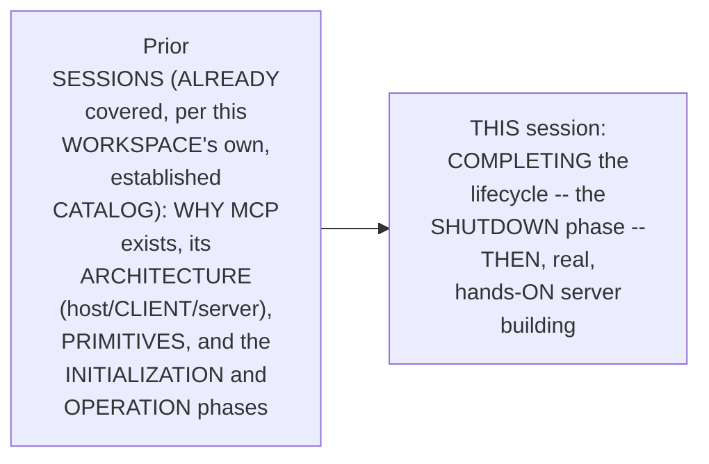

#### 🎯 Key Takeaways

* THIS session is GENUINELY, DIRECTLY confirmed AS the SERIES' own, CONTINUING journey — COMPLETING the THIRD and FINAL phase OF the MCP lifecycle (INITIALIZATION, operation, SHUTDOWN), THEN moving INTO practical SERVER creation.
* THE session's OWN, complete AGENDA directly, EXPLICITLY spans: the SHUTDOWN phase, CREATING MCP servers PLUS clients, and (DEFERRED to a FUTURE session) a REAL project.
* This directly, PRECISELY sets UP the SESSION's own, FIRST, essential PREREQUISITE — the TRANSPORT layer (Section 2).

---

### 2. The Transport Layer: A Genuine, Foundational Prerequisite for Shutdown

#### 📖 Definition — Why Shutdown Genuinely Depends on the Transport Layer

> 💡 **Given directly:** *"A client and a server is going to shut down their connection, depends on how exactly are they connected... to close your connection, I should understand how you are connected... how exactly this connection comes into picture, that is something which we have to now understand."*

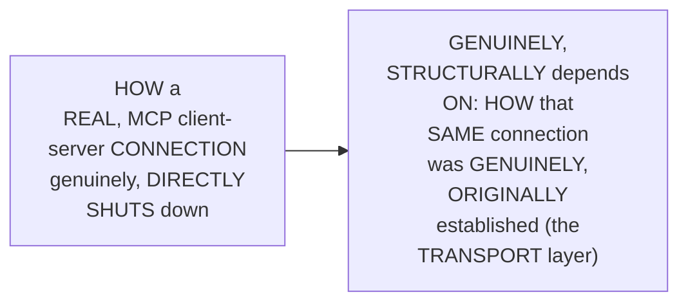

#### 🔍 Internal Working — A Genuine, Memorable Analogy

> 💡 **Given directly:** *"If I'm closing the connection between you and your friend whom you are talking, it will depend on how you two are connected. For example, if you are chatting on WhatsApp, then I might have to close the internet... but if you are talking on phone, do you think that closing internet will help?"*

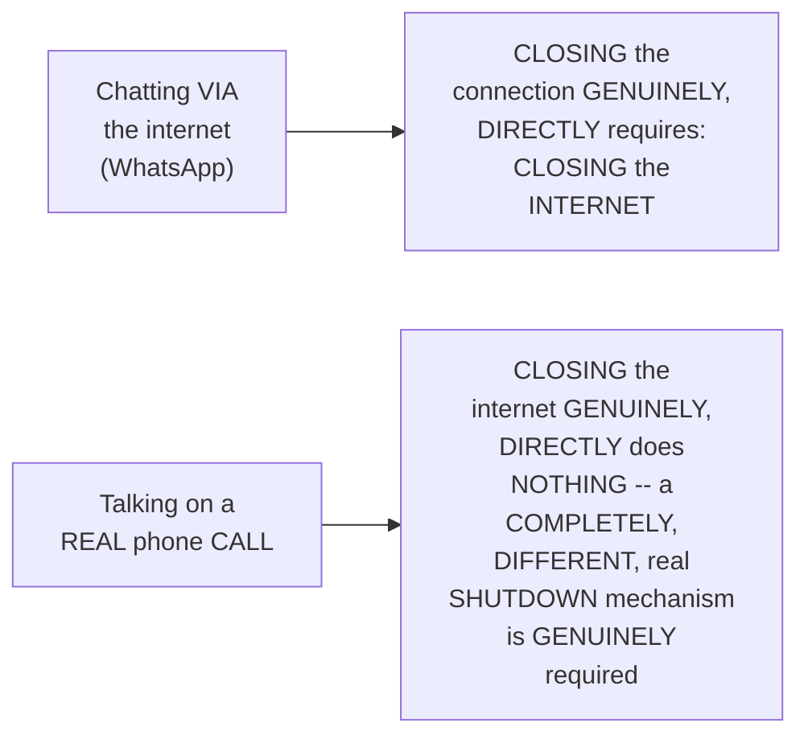

#### 📖 Definition — The Two, Precise Transport Types

> 💡 **Given directly:** *"Your MCP... the client and the architecture, they can be connected in two ways... the first one being STDIO, the second one being streamable HTTP. Now, this is something which is known as transport layer."*

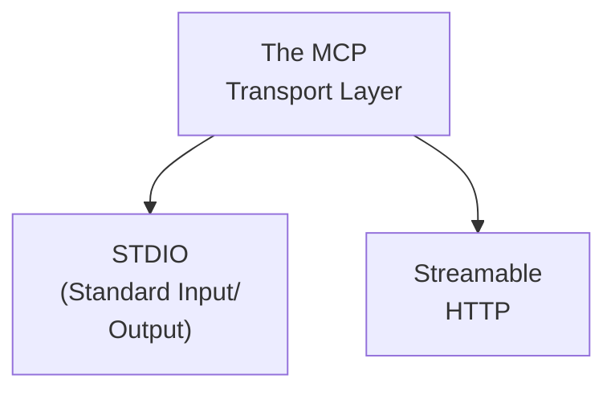

#### ⚠ Common Mistakes

* Assuming JSON-RPC (the "LANGUAGE" MCP components USE to COMMUNICATE) is GENUINELY, DIRECTLY the SAME thing AS the "TRANSPORT layer" (HOW they are CONNECTED) — explicitly, directly, PRECISELY clarified: "JSON RPC IS the LANGUAGE. IT is NOT the TRANSPORT thing... HOW this WILL be SENT to your FRIEND is the TRANSPORT protocol."

#### 🎯 Key Takeaways

* THE genuine, real MOTIVATION for LEARNING the transport LAYER directly, PRECISELY confirmed: SHUTDOWN mechanics GENUINELY, STRUCTURALLY depend ON how a CONNECTION was ORIGINALLY established.
* A GENUINE, memorable ANALOGY (WhatsApp versus a PHONE call) directly, CONCRETELY illustrates WHY different, real CONNECTION types genuinely REQUIRE different, real SHUTDOWN mechanisms.
* TWO, precise TRANSPORT types directly, EXPLICITLY confirmed: **STDIO** and **STREAMABLE HTTP**.
* This directly, PRECISELY sets UP the SESSION's own, NEXT, essential CONTENT — a COMPLETE, real, LIVE-demonstrated EXPLANATION of STDIO transport (Section 3).

---
### 3. STDIO Transport: A Complete, Real, Live-Demonstrated Explanation

#### 📖 Definition — STDIO, Precisely Explained: A Three-Step Process

> 💡 **Given directly:** *"The full form of STDIO is standard input and output... this actually is a three-step process. Client launches the server as a sub-process... server reads stdin, writes stdout... std error is free for logging... no separate authorization layer, credentials from the environment."*

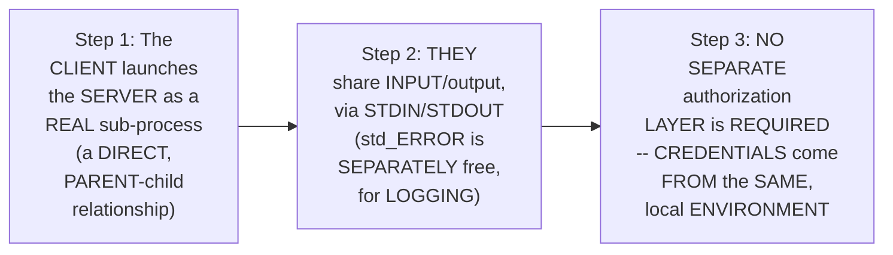

#### 🪜 Step-by-Step — A Complete, Real, Live Terminal Demonstration

> 💡 **Given directly:** *"Let's try to create a Python file... print, Hello Mayank... name, which is input, please tell me the name... this terminal, everyone, starts this Python file as a sub-process. And is a server. Now, these two, everyone, are connected by STDIO."*

```python
# a simple, real Python file, run directly from a terminal
name = input("Please tell me the name: ")
print(name)
print("Hello Mayank from Python file")
```

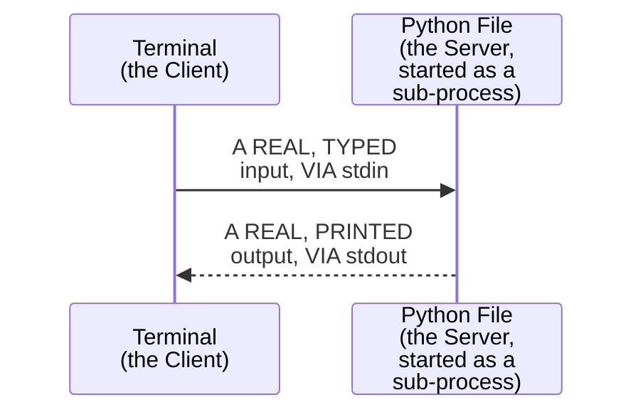

#### ⚠ Common Mistakes

* Assuming STDIO is a GENUINELY, EXOTIC, unfamiliar CONCEPT, requiring ENTIRELY new, real KNOWLEDGE — explicitly, directly, MEMORABLY reframed: "WE have BEEN actually DOING this STDIO SINCE our COMPLETE life" — ANY, real terminal-based PROGRAM (EVEN a SIMPLE, C-language `#INCLUDE stdio.h`) GENUINELY, DIRECTLY relies ON this SAME, foundational MECHANISM.

#### 🎯 Key Takeaways

* **STDIO** (standard INPUT/output) is precisely EXPLAINED as a REAL, three-STEP process — the CLIENT launches the SERVER as a SUB-process, they SHARE input/OUTPUT (via STDIN/stdout), and NO separate AUTHORIZATION layer is REQUIRED.
* A COMPLETE, real, LIVE terminal DEMONSTRATION directly, CONCRETELY confirmed: a SIMPLE Python FILE, run FROM a terminal, GENUINELY, DIRECTLY illustrates the EXACT, same mechanism EVERY, MCP STDIO connection USES.
* This directly, PRECISELY sets UP the SESSION's own, NEXT, essential CONTENT — STDIO's OWN, real, PRACTICAL benefits (Section 4).

---

### 4. STDIO's Own, Real Benefits: Fast, Secure & Simple

#### 📖 Definition — The Three, Precise, Real Benefits

> 💡 **Given directly:** *"There are a few benefits of the same. The very first one, everyone, is how this connection will be very, very fast... then, along with being fast, it will be very secure as well. Secure because? Both are running on the same system... if we kind of think about the same, this is a very simple kind of a connection."*

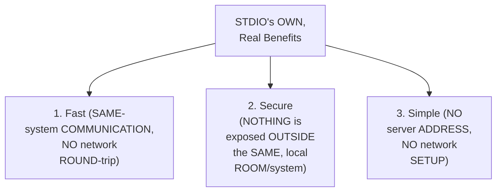

#### ⚠ A Direct, Honest, Genuine Limitation

> 💡 **Given directly:** *"Any cons of STDIO? It cannot be used everywhere. That's the con, because, of course, everything cannot be running on your local."*

#### ⚠ Common Mistakes

* Assuming STDIO is GENUINELY, UNIVERSALLY the "BETTER" transport CHOICE, in EVERY, real SCENARIO — explicitly, directly, HONESTLY clarified: it's GENUINELY, STRUCTURALLY limited to CONNECTIONS where BOTH the CLIENT and server GENUINELY, DIRECTLY run ON the SAME, local SYSTEM.

#### 🎯 Key Takeaways

* STDIO's OWN, real BENEFITS directly, EXPLICITLY confirmed: **FAST** (same-SYSTEM, no NETWORK round-trip), **SECURE** (NOTHING exposed OUTSIDE the SAME system), and **SIMPLE** (no SERVER address OR network SETUP required).
* THE honest, genuine LIMITATION: it "CANNOT be USED everywhere" — SINCE it GENUINELY, STRUCTURALLY requires BOTH the client AND server TO run ON the SAME, local SYSTEM.
* This directly, PRECISELY sets UP the SESSION's own, NEXT, essential CONTENT — a COMPLETE, real, LIVE-demonstrated EXPLANATION of STREAMABLE HTTP (Section 5).

---

### 5. Streamable HTTP: A Complete, Real, Live-Demonstrated Explanation

#### 📖 Definition — Streamable HTTP, Precisely Explained

> 💡 **Given directly:** *"Streamable HTTP, and before, it was something known as HTTP plus SSE, which is your server-side events. Now that has been kind of deprecated... HTTP allows my host to reach out to a server running anywhere on the internet... it sends a post call... to my server. And in this post call only, we can send our JSON RPC as well."*

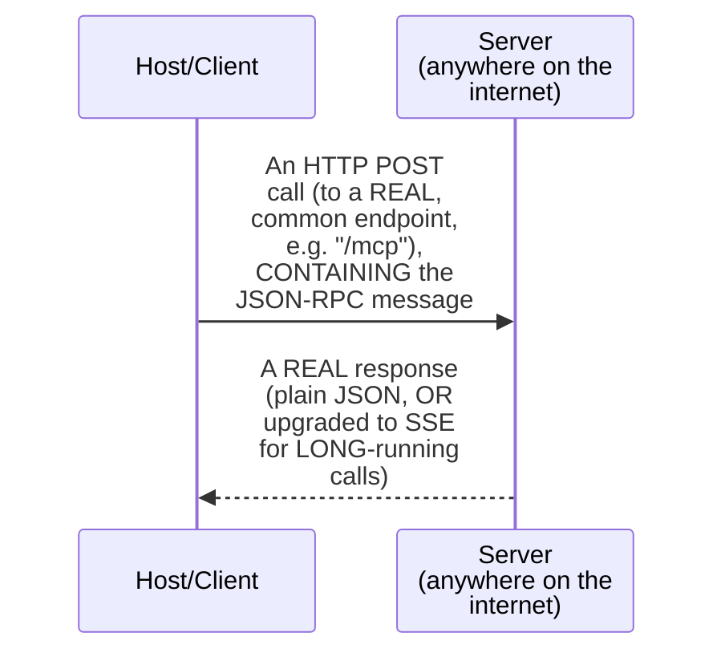

#### 🪜 Step-by-Step — A Complete, Real, Live-Demonstrated Test (via MCP Jam)

> 💡 **Given directly:** *"Pay attention. So, for the timing, just forget this first call... this time, when I'm doing the initialization, everyone, I am actually making a post calling... this, everyone, is the request to initialize my complete connection... this post call, everyone... it is being sent here. So, post slash MCP, the request got sent."*

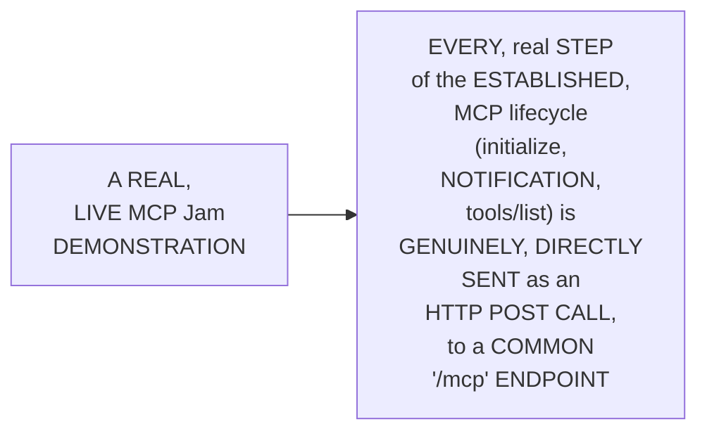

#### ⚠ Common Mistakes

* Assuming STREAMABLE HTTP genuinely, DIRECTLY requires an ENTIRELY new, DIFFERENT set OF real PROTOCOL rules — explicitly, directly, PRECISELY clarified: it's GENUINELY, DIRECTLY "BASED on the HTTP PROTOCOL" — the SAME, widely-FAMILIAR web STANDARD, REUSED for MCP communication.

#### 🎯 Key Takeaways

* **STREAMABLE HTTP** is precisely EXPLAINED as being GENUINELY, DIRECTLY based ON the FAMILIAR HTTP protocol — ALLOWING a CLIENT to REACH a server ANYWHERE on the REAL internet.
* THE COMPLETE, real MECHANISM: the CLIENT sends a REAL, HTTP POST call (to a COMMON `/mcp` ENDPOINT), CONTAINING the JSON-RPC MESSAGE — the SERVER responds with EITHER plain JSON, OR an UPGRADE to server-SIDE events, for LONGER-running calls.
* A COMPLETE, real, LIVE demonstration (VIA MCP Jam) directly, CONCRETELY confirmed EVERY, single STEP of the ESTABLISHED MCP lifecycle GENUINELY, DIRECTLY manifests AS a REAL, HTTP POST call.
* This directly, PRECISELY sets UP the SESSION's own, NEXT, essential CONTENT — the COMPLETE, precise shutdown MECHANICS for STDIO, specifically (Section 6).

---
### 6. STDIO Shutdown: Client-Initiated vs. Server-Initiated

#### 📖 Definition — The Complete, Precise Shutdown Sequence

> 💡 **Given directly:** *"No JSON RPC messages exchanged during shutdown at all. The entire responsibility shifts to the transport layer... in STDIO, majorly, the overall duty of closing the connection lies on the client side... client initiated, which is very, very common. Close the STD in... or wait, even if it doesn't happen, then we send signal termination command... even after that, if it doesn't happen, then it says kill, which is like the last resort."*

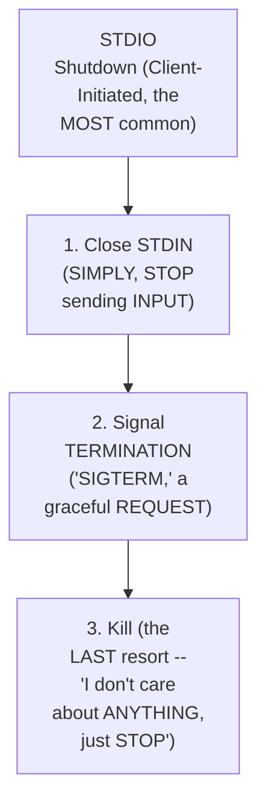

#### 🔍 Internal Working — Server-Initiated Shutdown (Rare)

> 💡 **Given directly:** *"Server-initiated, which is very rare. So, for example, your file system can also say that, hey, I don't want to connect with you... server closes its output stream and exit."*

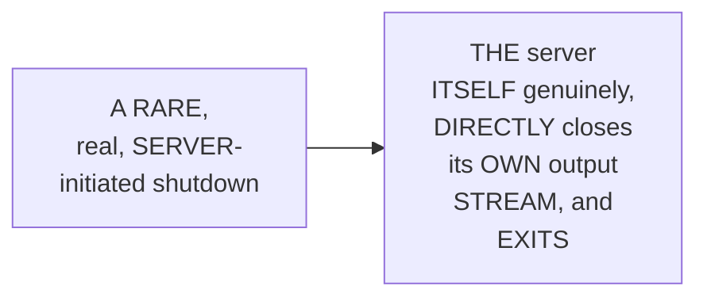

#### ⚠ Common Mistakes

* Assuming a SERVER GENUINELY, TYPICALLY initiates the SHUTDOWN of an STDIO CONNECTION — explicitly, directly, PRECISELY clarified: "MAJORITY of the TIME, or RATHER 99% of the TIME, it IS initiated BY the client" — server-INITIATED shutdown is GENUINELY, EXPLICITLY confirmed AS "VERY rare."

#### 🎯 Key Takeaways

* STDIO shutdown directly, PRECISELY confirmed AS involving **NO** real, JSON-RPC messages — "the ENTIRE responsibility SHIFTS to THE transport LAYER" itself.
* **CLIENT-initiated shutdown** (the OVERWHELMING majority, "99% OF the time") directly, CONCRETELY follows a REAL, three-step ESCALATION: closing STDIN, a GRACEFUL "SIGTERM," and, as a LAST resort, a FORCEFUL "kill."
* **SERVER-initiated shutdown** is directly, EXPLICITLY confirmed AS "VERY rare" — the SERVER itself CLOSING its OWN output STREAM, and EXITING.
* This directly, PRECISELY sets UP the SESSION's own, NEXT, essential CONTENT — the COMPLETE, precise shutdown MECHANICS for STREAMABLE HTTP (Section 7).

---

### 7. Streamable HTTP Shutdown: Closing the Connection & Handling Failures

#### 📖 Definition — Streamable HTTP Shutdown, Precisely Explained

> 💡 **Given directly:** *"In streamable HTTP, it is very, very simple, if you think about the same. Again, if you have to just not connect to any particular... just close the HTTP connection. It's that simple... key, when you want to close any HTTP connection, you just close the client."*

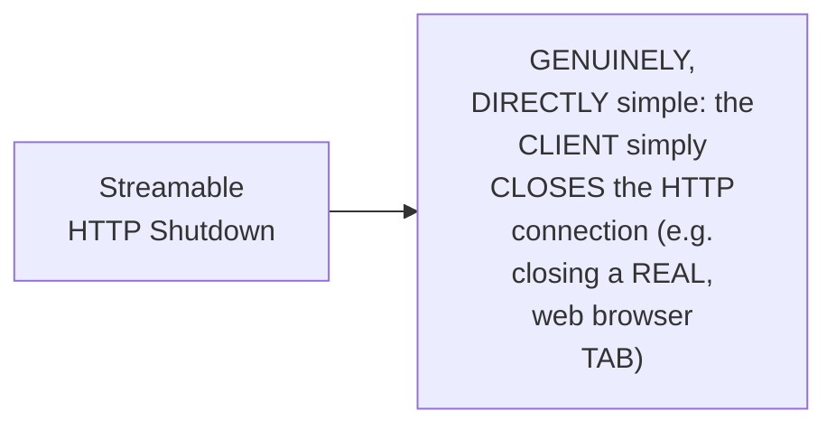

#### ⚠ A Direct, Honest, Important Scenario: Unexpected Server Closure

> 💡 **Given directly:** *"When the server closes unexpectedly... if you think about the same, then this is a kind of a problem. If your server closes unexpectedly during your HTTP connection... that points to something being wrong in your connection... we should reconnect to the same gracefully, so that we should try, the client should try to connect to the server again."*

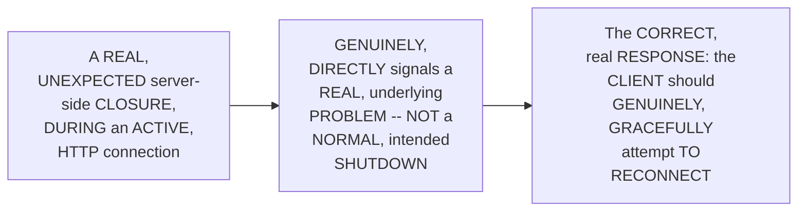

#### ⚠ Common Mistakes

* Assuming ANY, real SERVER-side closure of an HTTP CONNECTION is GENUINELY, ALWAYS a NORMAL, intended SHUTDOWN event — explicitly, directly, HONESTLY clarified: an UNEXPECTED server CLOSURE "POINTS to SOMETHING being WRONG" — the CORRECT, real RESPONSE is a GRACEFUL reconnect ATTEMPT, not SIMPLY accepting the DISCONNECTION.

#### 🎯 Key Takeaways

* **STREAMABLE HTTP shutdown** is directly, PRECISELY confirmed AS genuinely SIMPLE — the CLIENT simply CLOSES the HTTP connection (MEMORABLY compared TO closing a REAL browser TAB).
* AN UNEXPECTED, real SERVER-side closure is directly, HONESTLY distinguished FROM a NORMAL shutdown — it GENUINELY, DIRECTLY signals a REAL problem, REQUIRING a GRACEFUL, client-INITIATED reconnection ATTEMPT.
* THIS directly, THOROUGHLY completes the SESSION's own, ESTABLISHED MCP lifecycle — INITIALIZATION, operation, AND shutdown — SETTING up the SESSION's own, NEXT, essential CONTENT — a COMPLETE, real HISTORY of MCP server CREATION (Section 8).

---
### 8. From Legacy to Modern: A Complete, Real History of MCP Server Creation

#### 📖 Definition — Two, Real MCP Server Libraries

> 💡 **Given directly:** *"In this, majorly, you will be coming and seeing two libraries, which is the simple MCP one, so that is nothing but the official MCP library... by anthropic. And second, everyone, is your fast MCP... which is, again, created by someone to make sure that they are able to make MCP servers a lot more easily."*

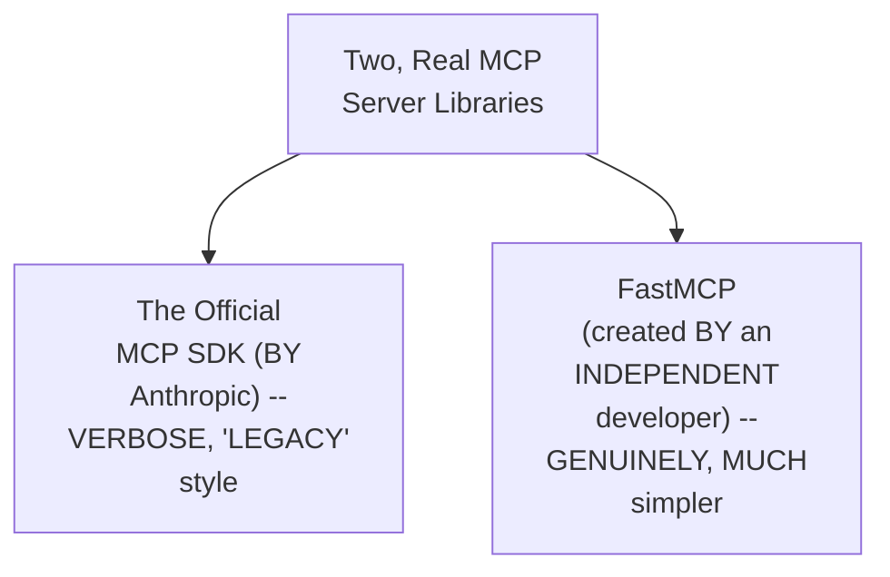

#### 🔍 Internal Working — A Genuine, Memorable Analogy: TensorFlow & Keras

> 💡 **Given directly:** *"A very good example... anyone who wants to understand this, is exactly TensorFlow and Keras. TensorFlow was created by Google... it was very difficult to write and work with. Someone created Keras, which was genuinely very, very easy. Google hired that person, and then further made sure that all the good parts and everything of Keras is something which has been taken inside of TensorFlow."*

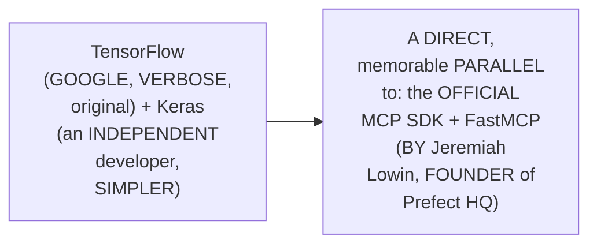

#### ⚠ A Direct, Honest, Important Clarification

> 💡 **Given directly:** *"Just to point out here, many of you might be aware about FastAPI... it is not that people and FastAPI, they created Fast MCP... it has been created by an individual developer. So, FAST MCP is not directly created by FastAPI, like, the company and everything behind it... though FastMCP and FastAPI, they are very, very compatible with each other."*

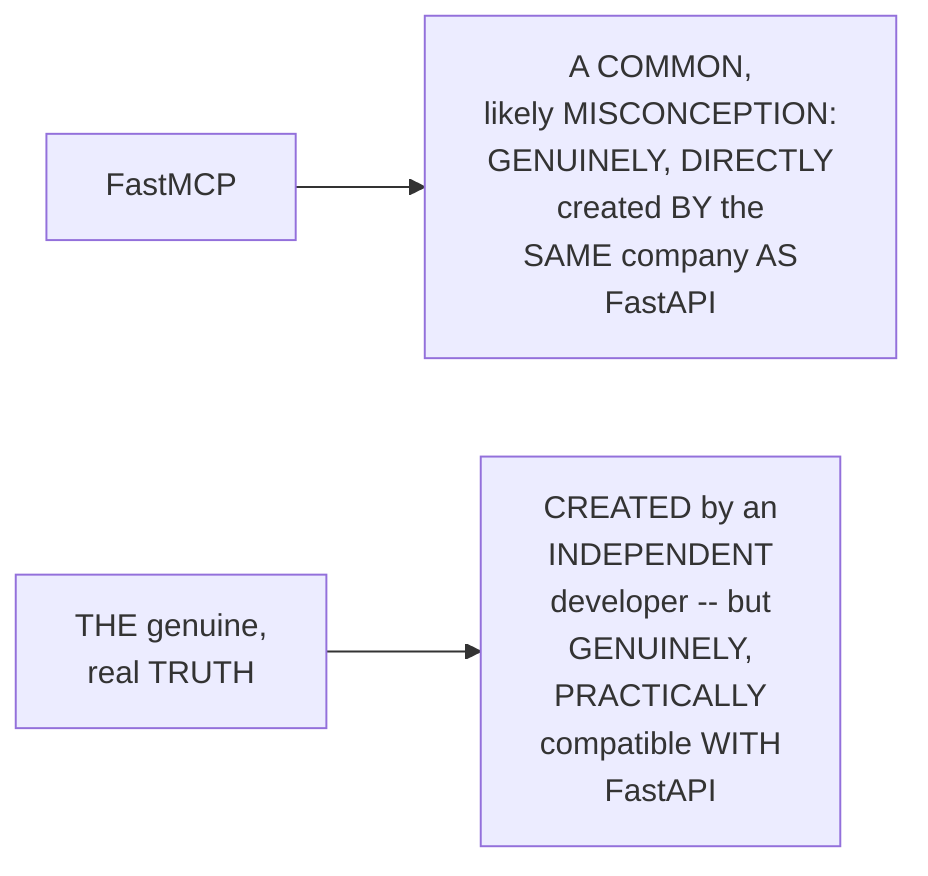

#### 🔍 Internal Working — A Genuine, Direct Confirmation: Why This History Genuinely Matters

> 💡 **Given directly:** *"Fast MCP 1.0, like, the first version was so popular that Anthropic... folded a version of it into the official SDK... standalone Fast MCP remains what most real servers use... in companies, we can still find the previous code... just 6 months ago, I was creating my MCP servers by writing code like this."*

#### ⚠ Common Mistakes

* Assuming the ORIGINAL, "LEGACY" MCP SDK style is GENUINELY, ENTIRELY obsolete, and GENUINELY, PRACTICALLY never ENCOUNTERED in a REAL, professional CONTEXT — explicitly, directly, HONESTLY clarified: "IN companies, WE can STILL find THE previous CODE... believe ME when I SAY this, YOU can still SEE this code... in ANY company."

#### 🎯 Key Takeaways

* TWO, real MCP server LIBRARIES directly, EXPLICITLY confirmed: the OFFICIAL, verbose MCP SDK (BY Anthropic), and **FastMCP** — CREATED by an INDEPENDENT developer, SPECIFICALLY to SIMPLIFY server CREATION.
* A GENUINE, memorable ANALOGY (TENSORFLOW and Keras) directly, CONCRETELY illustrates this SAME, real RELATIONSHIP — GOOGLE (ANTHROPIC) eventually FOLDING the SIMPLER library's OWN, best PARTS into the OFFICIAL SDK.
* THE instructor **directly, HONESTLY clarifies** FastMCP is NOT, genuinely, CREATED by the SAME company AS FastAPI — DESPITE genuine, PRACTICAL compatibility BETWEEN the two.
* THE ORIGINAL, "LEGACY" style GENUINELY, STILL appears IN real, PROFESSIONAL codebases — MAKING it GENUINELY, PRACTICALLY worth understanding, EVEN though it's NO longer the RECOMMENDED, modern APPROACH.
* This directly, PRECISELY sets UP the SESSION's own, NEXT, essential CONTENT — a COMPLETE, real, LIVE-coded FastMCP example (Section 9).

---
### 9. FastMCP: A Complete, Real, Live-Coded Example

#### 🪜 Step-by-Step — The Complete, Real Server, Live-Coded

> 💡 **Given directly:** *"What I will do, I will just quickly create an MCP server, so fast MCP... recipe box. Now, pay attention, what I have to do. I will just now be defining the tools... def list recipes... it will be returning a list of dictionary... I can just define the next MCP tool. MCP.tool. And I could define get recipes."*

```python
from fastmcp import FastMCP

recipes = {
    "1": {"title": "Weeknight Pasta", "minutes": 20, "tags": ["quick"]},
    "2": {"title": "5-Minute Salsa", "minutes": 5, "tags": ["quick", "no-cook"]},
}

mcp = FastMCP("Recipe Box")

@mcp.tool()
def list_recipes() -> list[dict]:
    """Return all available recipes, by ID and title."""
    return [{"id": k, "title": v["title"]} for k, v in recipes.items()]

@mcp.tool()
def get_recipe(recipe_id: str) -> dict:
    """Return the full details for one, specific recipe, by its ID."""
    return recipes[recipe_id]

@mcp.tool()
def search_recipes(tag: str) -> list[dict]:
    """Search recipes by a specific tag (e.g. 'quick')."""
    return [{"id": k, "title": v["title"]} for k, v in recipes.items() if tag in v["tags"]]

if __name__ == "__main__":
    mcp.run()
```

#### 🔍 Internal Working — A Genuine, Direct Comparison to a Simple API

> 💡 **Given directly:** *"This is very, very much how we normally write the API code... if we try to understand, this is actually just writing a function, or in defining an API... this is exactly what we were doing in here [in the legacy version]. The same thing, in a much easier manner, can be just done via this."*

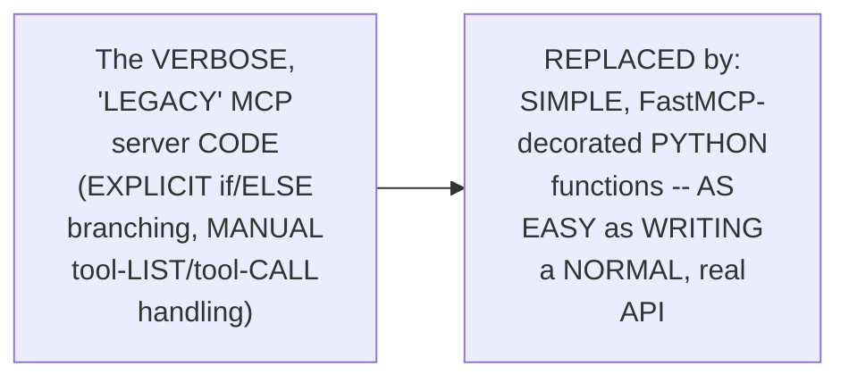

#### ⚠ Common Mistakes

* Assuming DEFINING a REAL, working MCP tool GENUINELY, PRACTICALLY requires COMPLEX, protocol-SPECIFIC boilerplate CODE — explicitly, directly, LIVE-demonstrated as GENUINELY, DIRECTLY false — WITH FastMCP, a SIMPLE, decorated PYTHON function IS, genuinely, the COMPLETE, real implementation.

#### 🎯 Key Takeaways

* A COMPLETE, real, LIVE-coded EXAMPLE directly, CONCRETELY confirmed BUILDING a GENUINE, working "RECIPE box" MCP server — WITH three, real TOOLS (`LIST_recipes`, `GET_recipe`, `SEARCH_recipes`).
* THE instructor **directly, PRACTICALLY confirms** THIS FastMCP-based APPROACH is GENUINELY, DIRECTLY "as EASY as" writing a NORMAL, real API function — CONTRASTING sharply WITH the VERBOSE, legacy STYLE.
* This directly, PRECISELY sets UP the SESSION's own, NEXT, essential CONTENT — a COMPLETE, real, LIVE walkthrough OF the MCP Inspector (Section 10).

---

### 10. MCP Inspector: A Complete, Real, Live Walkthrough

#### 📖 Definition — MCP Inspector, Precisely Explained

> 💡 **Given directly:** *"MCP inspector doesn't care how you build your server, which I think is also very logical. MCP inspector just cares that, hey, is your server defined correctly? So that is all what MCP Inspector cares... it is just like a front-end. It doesn't care how your MCP server is created."*

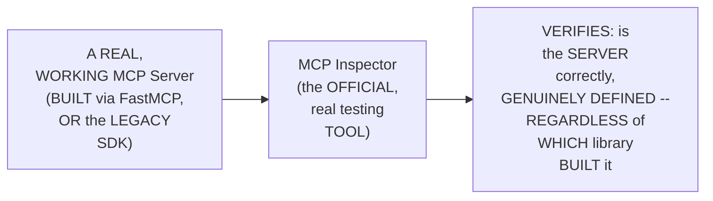

#### 🪜 Step-by-Step — A Complete, Real, Live Test

> 💡 **Given directly:** *"npx mcp inspector python3 recipe_box_fast_mcp.py... when it gets connected, everyone, when your MCP connector starts, it hits all these calls... tools list, resource list, prompt list, and this prompt resource template list as well."*

```bash
npx @modelcontextprotocol/inspector python3 recipe_box_fast_mcp.py
```

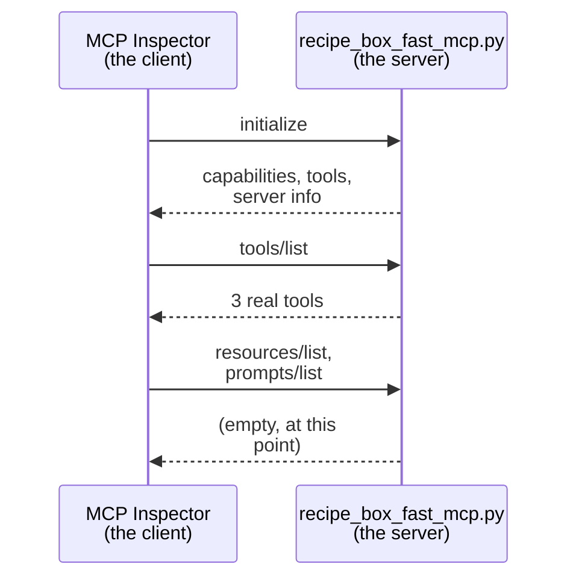

#### ⚠ Common Mistakes

* Assuming the MCP Inspector genuinely, DIRECTLY cares WHICH, specific library (FastMCP VERSUS the LEGACY SDK) a REAL server was BUILT with — explicitly, directly, PRECISELY clarified: "IT is JUST like a FRONT-end" — it GENUINELY, ONLY verifies the SERVER is CORRECTLY defined, per the ESTABLISHED protocol, REGARDLESS of implementation.

#### 🎯 Key Takeaways

* **MCP Inspector** is precisely EXPLAINED as a REAL, official TESTING tool — GENUINELY, DIRECTLY indifferent to WHICH library BUILT the server; it ONLY verifies CORRECT, protocol-level DEFINITION.
* A COMPLETE, real, LIVE test directly, CONCRETELY confirmed CONNECTING to the "RECIPE box" server — GENUINELY, SUCCESSFULLY revealing ITS three, real TOOLS, and CONFIRMING no resources/PROMPTS existed, YET.
* This directly, PRECISELY sets UP the SESSION's own, NEXT, essential CONTENT — a COMPLETE, real, LIVE demonstration OF adding resources AND prompts (Section 11).

---
### 11. Adding Resources & Prompts: A Complete, Real, Live Demonstration

#### 🪜 Step-by-Step — A Complete, Real Resource

> 💡 **Given directly:** *"Let's try to add the resources as well... what we have to do is, we just have to now define that it is going to be an MCP.resource. And I will just make sure that I am adding recipe tags... define valid tags. I'm going to return a list of strings."*

```python
@mcp.resource("recipe://tags")
def valid_tags() -> list[str]:
    """Return the list of valid recipe tags."""
    return ["quick", "no-cook", "vegetarian"]
```

#### 🪜 Step-by-Step — A Complete, Real Prompt

> 💡 **Given directly:** *"Now you can define a prompt as well, everyone. So, for the prompt, what I will do, pay attention. I will just now define at the rate MCP.prompt. And you can just define let's see... plan weekly meals."*

```python
@mcp.prompt()
def plan_weekly_meals() -> str:
    """A reusable prompt, asking the AI to plan a full week of meals."""
    return "Please plan a full week of meals, using the available recipes."
```

#### 🔍 Internal Working — A Genuine, Direct Confirmation: No Manual Restart Required

> 💡 **Given directly:** *"Since I've added a resource, everyone... let me try to see if it gets refreshed itself... do we have resources? Yes. So, seems like we don't need to refresh our servers, everyone. It is actually able to, like FastAPI, it is able to take up our changes."*

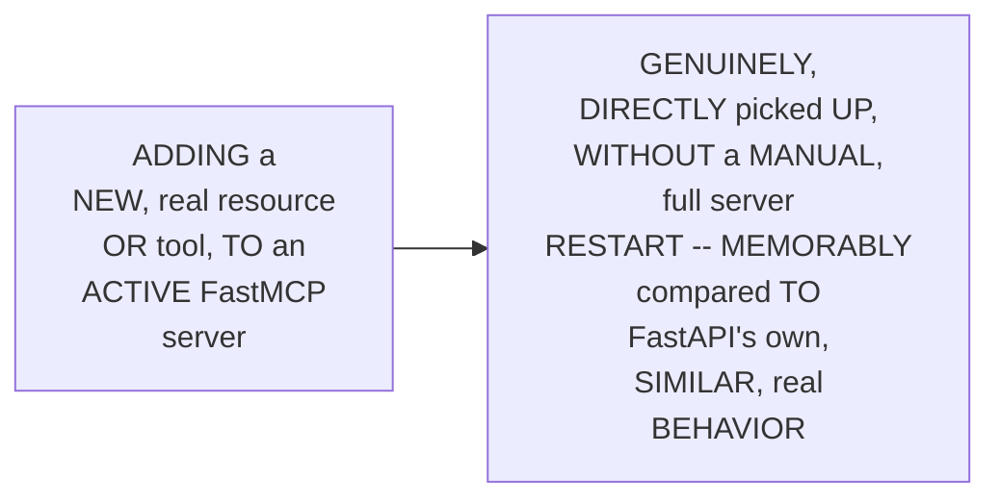

#### ⚠ Common Mistakes

* Assuming ADDING a NEW resource OR prompt to an ACTIVE, real MCP server GENUINELY, ALWAYS requires a FULL, manual server RESTART — explicitly, directly, LIVE-demonstrated as GENUINELY, DIRECTLY unnecessary, FOR tools/resources — BUT a PROMPT addition SPECIFICALLY DID require a REAL, manual disconnect/RECONNECT, in THIS session's own, LIVE demo.

#### 🎯 Key Takeaways

* A COMPLETE, real, LIVE demonstration directly, CONCRETELY confirmed ADDING a REAL, working RESOURCE (`recipe://TAGS`) and a REAL, working PROMPT (`plan_WEEKLY_meals`) — USING the SAME, established `@mcp.RESOURCE` and `@MCP.prompt` decorator PATTERN.
* THE instructor **directly, PRACTICALLY confirms** MOST changes are GENUINELY, DIRECTLY picked UP without a MANUAL restart — MEMORABLY compared TO FastAPI's own, SIMILAR, real BEHAVIOR.
* This directly, PRECISELY sets UP the SESSION's own, NEXT, essential CONTENT — CONNECTING this SAME, real server TO Claude Desktop (Section 12).

---

### 12. Connecting to Claude Desktop: A Complete, Real, Practical Step

#### 🪜 Step-by-Step — The Complete, Real Installation Command

> 💡 **Given directly:** *"By running a single command, which is your UV Run Fast MCP install Claude Desktop, and I will just do recipe box fast MCP. So this command... will install my recipe box in my Claude desktop... I am able to now easily just also add it into my Cloud desktop, just thus making it directly useful."*

```bash
uv run fastmcp install claude-desktop recipe_box_fast_mcp.py
```

```mermaid
flowchart LR
    A["A REAL,<br/>WORKING, LOCAL<br/>FastMCP server"] --> B["ONE, real<br/>COMMAND"] --> C["GENUINELY,<br/>DIRECTLY installed,<br/>INTO Claude<br/>Desktop's own,<br/>REAL 'connectors'"]
```

#### 🔍 Internal Working — A Genuine, Direct Confirmation of the Real, Working Result

> 💡 **Given directly:** *"This MCP server, the one which I ran, which I created, everyone, I am able to now easily just also add it into my Cloud desktop... file system server helped me to read the local files, okay?"* (as EARLIER, live-DEMONSTRATED, using the FILE-system MCP server, as a REAL, worked EXAMPLE of the SAME, general CONNECTION pattern)

#### ⚠ Common Mistakes

* Assuming CONNECTING a REAL, custom MCP server TO Claude Desktop GENUINELY, PRACTICALLY requires a COMPLEX, MANUAL configuration PROCESS — explicitly, directly, LIVE-demonstrated as GENUINELY, DIRECTLY simple — a SINGLE, real COMMAND (`uv RUN fastmcp INSTALL claude-desktop ...`) genuinely, DIRECTLY handles the ENTIRE, complete INSTALLATION.

#### 🎯 Key Takeaways

* CONNECTING a REAL, custom FastMCP server TO Claude Desktop directly, CONCRETELY requires ONLY a SINGLE, real COMMAND — `uv RUN fastmcp INSTALL claude-DESKTOP [server_FILE]`.
* THIS directly, PRACTICALLY completes the SESSION's own, COMPLETE, end-to-END workflow — FROM a REAL, working MCP server, TO a GENUINE, DIRECTLY usable AI-assistant INTEGRATION.
* This directly, PRECISELY sets UP the SESSION's own, NEXT, essential CONTENT — a GENUINE, real-world ANALOGY, illustrating MCP's own, PRACTICAL, enterprise VALUE (Section 13).

---
### 13. A Genuine, Real-World Analogy: MCP for a CRM/Lead-Management System

#### 🪜 Step-by-Step — A Complete, Real, Enterprise Example

> 💡 **Given directly, in response to a real, direct question:** *"System, aka, leads karta customers reach out karte, lead management kind of thing hai... complete leads ka list mein aarhi hai... abhi sab to hamare API se power, right? All this is getting powered by APIs... I have now asked my team to add an agent here... rather than me teaching my agent, this is the API, or adding it separately, what I will do is, for all my APIs, I will create a MCP server."*

```mermaid
flowchart LR
    A["A REAL,<br/>WORKING CRM (lead-<br/>MANAGEMENT system),<br/>POWERED entirely BY<br/>REAL, existing<br/>APIs"] --> B["WRAPPED, via a<br/>REAL, dedicated MCP<br/>server -- MAKING<br/>the SAME,<br/>existing APIS<br/>GENUINELY,<br/>DIRECTLY accessible<br/>to a REAL AI<br/>agent"]
```

#### 🔍 Internal Working — A Genuine, Direct, Worked Query

> 💡 **Given directly:** *"I could ask, can you tell me about this lead, Rudh Mehta? And it will try to get all the information about the lead here... complete information about the details we tried to get in here, key, what was the recent activity. But agent or AI can do all of that in real time because of MCP, because I will create the tool, so I can create getLeadInfo as one of the tools, and that tool will have... just ask for the name of the patient, and when I get the name, it will receive all these things."*

```mermaid
sequenceDiagram
    participant Agent as A Real AI<br/>Agent
    participant MCP as The CRM's<br/>Own, Real MCP<br/>Server
    participant API as The<br/>Existing, Real<br/>CRM APIs
    Agent->>MCP: "TELL me ABOUT<br/>lead, RUDH<br/>Mehta"
    MCP->>API: getLeadInfo(name="Rudh<br/>Mehta")
    API-->>MCP: A REAL, complete<br/>LEAD record
    MCP-->>Agent: A REAL, complete,<br/>real-TIME answer
```

#### 🔍 Internal Working — A Genuine, Direct Confirmation: Why This Is Better Than Direct API Access

> 💡 **Given directly:** *"Don't you think that for a scale problem, that would be a menu problem?... let's say Google is having 15 tools, Gmail... you will always define 15 tools and make sure that you are adding them into your AI, right?... now, think about that. If tomorrow three of them changes, and you will be doing that change... MCP server, [you don't] have to give it to my agent separately. GiveHI change this API. MCP server, everything is present, just connect and get everything."*

```mermaid
flowchart LR
    A["Directly,<br/>MANUALLY wrapping<br/>MULTIPLE, real APIs<br/>as SEPARATE, real<br/>agent TOOLS"] --> B["GENUINELY,<br/>DIRECTLY creates a<br/>REAL, ONGOING<br/>maintenance BURDEN<br/>-- EVERY, real API<br/>CHANGE requires a<br/>SEPARATE, manual<br/>agent-side UPDATE"]
    C["A DEDICATED,<br/>REAL MCP server"] --> D["GENUINELY,<br/>DIRECTLY centralizes<br/>this SAME<br/>MAINTENANCE -- an<br/>API change<br/>UPDATES the MCP<br/>server, ONCE, and<br/>EVERY, connected<br/>agent GENUINELY,<br/>AUTOMATICALLY<br/>benefits"]
```

#### ⚠ Common Mistakes

* Assuming MCP is GENUINELY, MERELY an ABSTRACT, theoretical PROTOCOL, with NO, real, PRACTICAL enterprise APPLICATION — explicitly, directly, CONCRETELY demonstrated via a REAL, worked EXAMPLE — a REAL, existing CRM, wrapped VIA MCP, GENUINELY, DIRECTLY becomes AI-accessible, WITHOUT requiring EXTENSIVE, per-agent, MANUAL integration WORK.

#### 🎯 Key Takeaways

* A REAL, complete, ENTERPRISE example directly, CONCRETELY confirmed MCP's own, GENUINE, practical VALUE — WRAPPING an EXISTING CRM's own, real APIS, via a DEDICATED MCP server, MAKING them GENUINELY, DIRECTLY accessible TO a REAL AI agent.
* THE genuine, real ADVANTAGE, over DIRECTLY wrapping APIs AS separate agent TOOLS: MCP GENUINELY, DIRECTLY centralizes MAINTENANCE — a SINGLE, real API CHANGE updates the MCP server ONCE, RATHER than requiring SEPARATE, per-agent UPDATES.
* This directly, PRECISELY sets UP the SESSION's own, NEXT, essential CONTENT — a SUBSTANTIVE, real Q&A ON testing MCP tools ACROSS multiple LLM clients (Section 14).

---

### 14. Real Q&A: Testing MCP Tools Across Multiple, Real LLM Clients

#### 🪜 Step-by-Step — The Real, Complete Question

> 💡 **Given directly, from a real participant, Dinesh:** *"I have created an MCP, and I've deployed it, and it is being used by clients... I have tested my MCP with all the golden questions and ground truth, and it works fine with Claude. But with Copilot, it is not giving the right response... how do I test the MCP so that it can give you nearly deterministic [results]?"*

#### 🔍 Internal Working — A Genuine, Direct, Real Answer

> 💡 **Given directly:** *"You have to make sure that you are giving right information about your tool and everything... of course, it will depend on the LLM as well, like, you can have all the things, but if the LLM is weak, then also it will not be the case... for that, you will have to make sure that, when the way you are defining your prompts, resources, and tools, okay, that... prompts are a real good way of doing that. If you can share the prompts, very nicely in your MCP server."*

```mermaid
flowchart LR
    A["A REAL, MCP<br/>Server, WORKING<br/>WELL with ONE LLM<br/>(Claude), but<br/>POORLY with<br/>ANOTHER (Copilot)"] --> B["The GENUINE, real<br/>SOLUTION: WRITE<br/>GENUINELY, more<br/>PRECISE, CLEAR tool<br/>DESCRIPTIONS, and<br/>PROVIDE well-<br/>WRITTEN, real<br/>PROMPTS -- RATHER<br/>than assuming<br/>EVERY, real LLM<br/>will GENUINELY,<br/>EQUALLY interpret<br/>ambiguous<br/>INSTRUCTIONS"]
```

#### 🔍 Internal Working — The Genuine, Recommended Testing Approach

> 💡 **Given directly:** *"You should be able to create a tool which can run those ground truth before I deploy it to production, right? With multiple LLMs... making sure that every tool is getting tested, and then tool testing is based on the normal API thing, that how many times it is getting called, is it failing? Am I getting the right arguments?"*

#### ⚠ Common Mistakes

* Assuming an MCP server's OWN, real BEHAVIOR is GENUINELY, EQUALLY consistent, ACROSS every, DIFFERENT real LLM CLIENT — explicitly, directly, HONESTLY acknowledged as GENUINELY, DIRECTLY false — RESULT quality genuinely, DIRECTLY depends ON the SPECIFIC, underlying LLM's OWN, real CAPABILITY, REQUIRING dedicated, real TESTING across MULTIPLE clients.

#### 🎯 Key Takeaways

* A REAL, complete AUDIENCE question directly, HONESTLY addressed a GENUINE, real production CHALLENGE — an MCP server GENUINELY, DIRECTLY working WELL with ONE LLM client, but NOT another.
* THE genuine, real ANSWER: WRITE genuinely PRECISE, clear TOOL descriptions and PROMPTS, and RUN systematic, "GROUND truth" testing ACROSS multiple, real LLM clients, BEFORE production DEPLOYMENT.
* This directly, PRECISELY sets UP the SESSION's own, FINAL, closing Q&A — a GENUINE, direct DEBATE over WHY MCP genuinely MATTERS, beyond SIMPLY wrapping REST APIs (Section 15).

---
### 15. Real Q&A: Why MCP, Not Just Wrapped REST APIs? A Genuine, Direct Debate

#### 🪜 Step-by-Step — The Real, Complete, Challenging Question

> 💡 **Given directly, from a real participant, Rakesh Kumar:** *"Whatever APIs we are exposing, right, we are wrapping in the tool, so it will become MCP compliant... why not with the traditional REST APIs, we already have a REST API ecosystem in the place... what's the difference between calling all those REST APIs and this tool?"*

#### 🔍 Internal Working — A Genuine, Direct, Real Rebuttal: The Scaling Problem

> 💡 **Given directly:** *"Don't you think that for a scale problem, that would be a menu [maintenance] problem?... let's say Google is having 15 tools, Gmail. You will always define 15 tools and make sure that you are adding them into your AI, right?... now, think about that. If tomorrow three of them changes, and you will be doing that change... Gmail send tool requires that you don't send double CC or BCC. It's okay, but earlier that was supported, so you will be doing that change now?"*

```mermaid
flowchart LR
    A["DIRECTLY,<br/>MANUALLY wrapping<br/>15, real API<br/>ENDPOINTS as<br/>SEPARATE agent<br/>TOOLS"] --> B["A REAL API<br/>change (e.g. a<br/>MODIFIED PARAMETER)<br/>GENUINELY, DIRECTLY<br/>requires a<br/>MANUAL, agent-<br/>SIDE update, for<br/>EVERY, single,<br/>REAL integration"]
```

#### 🔍 Internal Working — A Genuine, Direct Rebuttal: The "Two-Way" & Progress-Reporting Advantage

> 💡 **Given directly:** *"Then we have STDIO-based MCP servers as well, which cannot be done via API directly. So there is where MCP protocol comes into picture... just as a very basic example, you ask an MCP to download a file. Now, it is going to take one hour. So the server can tell the client that, hey, I'm 5 by 100 completed, I'm 20 by 100 completed. That is not possible in... HTTP."*

```mermaid
flowchart LR
    A["A REAL, plain<br/>REST API"] --> B["GENUINELY,<br/>STRUCTURALLY, ONE-way<br/>(client REQUESTS,<br/>server RESPONDS) --<br/>CANNOT genuinely,<br/>DIRECTLY push REAL,<br/>real-time PROGRESS<br/>updates, back TO<br/>the client"]
    C["MCP (VIA its<br/>OWN, established<br/>JSON-RPC<br/>PROTOCOL)"] --> D["GENUINELY,<br/>STRUCTURALLY,<br/>TWO-way -- the<br/>SERVER can<br/>GENUINELY, DIRECTLY<br/>push REAL,<br/>real-time PROGRESS<br/>updates, BACK to<br/>the client"]
```

#### 🔍 Internal Working — A Genuine, Direct Rebuttal: LLM-Native Access

> 💡 **Given directly:** *"When I connect to Gmail and MCP, I just give my request as an NLP... you cannot make a call saying that, hey, send an email. In that, when you connect, you have to tell exactly this is the system of vision which you want to focus on. MCP as a protocol makes that easier, where you can just easily connect it and make it, ASK connect to send an email, so it automatically figures out what to do, which API to call."*

```mermaid
flowchart LR
    A["A REAL,<br/>natural-LANGUAGE<br/>REQUEST ('SEND an<br/>email TO...')"] --> B["MCP: GENUINELY,<br/>DIRECTLY, the LLM<br/>ITSELF reasons<br/>about WHICH, real<br/>TOOL to CALL, and<br/>WITH what<br/>ARGUMENTS"]
    A --> C["A REAL,<br/>traditional<br/>CONNECTOR (e.g.<br/>a THIRD-party<br/>INTEGRATION<br/>BUTTON)"] --> D["GENUINELY,<br/>DIRECTLY, a FIXED,<br/>pre-DEFINED action<br/>-- NOT, genuinely,<br/>REASONED about, BY<br/>an LLM, in<br/>REAL time"]
```

#### ⚠ Common Mistakes

* Assuming "WRAPPING" an EXISTING REST API AS a REAL, MCP-compliant tool GENUINELY, MERELY consists OF a SIMPLE, one-TIME, cosmetic RE-labeling — explicitly, directly, THOROUGHLY rebutted — MCP GENUINELY, DIRECTLY provides a REAL, structural ADVANTAGE — centralizing MAINTENANCE, ENABLING genuine, two-WAY, real-TIME communication (e.g. PROGRESS updates), and SUPPORTING true, LLM-NATIVE reasoning about TOOL selection.

#### 🎯 Key Takeaways

* A REAL, complete, CHALLENGING Q&A directly, THOROUGHLY addressed WHY MCP genuinely MATTERS — BEYOND simply "WRAPPING" existing REST APIs.
* THREE, distinct, genuine REBUTTALS directly, CONCRETELY confirmed: (1) MCP genuinely, DIRECTLY solves a REAL, SCALING/maintenance problem — CENTRALIZING API CHANGES; (2) MCP's OWN, established JSON-RPC PROTOCOL genuinely, STRUCTURALLY enables TWO-way communication (e.g., REAL-time PROGRESS updates) — IMPOSSIBLE, via plain HTTP; (3) MCP genuinely, DIRECTLY enables TRUE, LLM-native REASONING about WHICH tool to CALL, RATHER than a FIXED, pre-defined CONNECTOR action.
* THIS episode **GENUINELY, COMPREHENSIVELY delivers** its OWN, stated GOALS — a COMPLETE, in-DEPTH treatment OF the MCP transport LAYER and shutdown PHASE, a REAL, hands-ON server-building JOURNEY (legacy TO FastMCP), and a GENUINE, thorough DEFENSE of MCP's own, real, PRACTICAL value.
* This directly, PRECISELY sets UP the SESSION's own, FINAL, closing CONTENT — a DIRECT preview OF the NEXT class (Section 16).

---

### 16. Closing: A Direct Preview of the Next Class

#### 🪜 Step-by-Step — A Direct, Genuine, Final Preview

> 💡 **Given directly:** *"Let's meet in the tomorrow's class. Please make sure that you revise it, because tomorrow we'll be doing some testing and coding part properly... I plan to do a little bit of major project, but I just also want to move away from these basic things."*

```mermaid
flowchart LR
    A["THIS session<br/>(DONE): the<br/>COMPLETE MCP<br/>lifecycle, PLUS<br/>real, hands-ON<br/>server BUILDING"] --> B["A FUTURE<br/>session,<br/>EXPLICITLY, DIRECTLY<br/>promised: TESTING,<br/>CODING, and a<br/>REAL project"]
```

#### ⚠ Common Mistakes

* Assuming THIS session's own, COMPLETE server-BUILDING content REPRESENTS the SERIES' own, FINAL, complete SCOPE — explicitly, directly, DIRECTLY confirmed as CONTINUING — a REAL, complete PROJECT, deployment TO the cloud, and MCP integration WITH LangChain ALL remain, explicitly PROMISED.

#### 🎯 Key Takeaways

* THE instructor **directly, EXPLICITLY previews** the NEXT class's own, complete AGENDA — TESTING and CODING, WORKING toward a REAL, complete PROJECT.
* THIS directly, PRECISELY continues THIS series' own, established, PROGRESSIVE journey — MCP fundamentals → LIFECYCLE/transport → real SERVER building (DONE) → TESTING/coding → a REAL project → MCP with LANGCHAIN → multi-AGENT systems.

---
## 📝 Glossary

| Term | Definition | Why It Matters |
|---|---|---|
| **Transport Layer** | How a client and server are connected (STDIO or HTTP) | Determines how shutdown genuinely works |
| **STDIO** | Standard Input/Output; local, sub-process based connection | Fast, secure, simple, but only works locally |
| **Streamable HTTP** | An HTTP POST-based connection, over the internet | Enables remote server access, anywhere |
| **SIGTERM** | A graceful termination signal | Step 2 of STDIO client-initiated shutdown |
| **FastMCP** | A simplified library for building MCP servers | Now folded into the official SDK; simplifies server creation dramatically |
| **MCP Inspector** | The official testing tool for any MCP server | Framework-agnostic; only verifies correct protocol definition |
| **@mcp.tool() / @mcp.resource() / @mcp.prompt()** | FastMCP's three, core decorators | Turn a plain Python function into an MCP primitive |

---

## 🔄 Revision Notes — One-Minute Revision

* This session completes the MCP lifecycle's own, final phase -- the shutdown phase -- and then moves into real, hands-on server building.
* **Why the transport layer matters for shutdown**: how a connection shuts down genuinely depends on how it was originally established -- memorably illustrated via a WhatsApp-vs-phone-call analogy.
* **Two transport types**: STDIO (local, sub-process based) and streamable HTTP (internet-based, POST-call driven).
* **STDIO, precisely explained**: a three-step process -- the client launches the server as a sub-process, they share input/output via stdin/stdout, and no separate authorization layer is required. Genuinely demonstrated live, via a simple terminal/Python file example. Benefits: fast, secure, simple. Limitation: cannot be used remotely.
* **Streamable HTTP, precisely explained**: based on the familiar HTTP protocol -- the client sends a POST call (to a common "/mcp" endpoint) containing the JSON-RPC message; the server responds with plain JSON or upgrades to server-sent events for long-running calls. Live-demonstrated via MCP Jam, showing every lifecycle step as a real HTTP POST.
* **STDIO shutdown**: no JSON-RPC messages are exchanged; the transport layer handles it entirely. Client-initiated (99% of the time): close stdin -> SIGTERM -> kill (last resort). Server-initiated (rare): the server closes its own output stream and exits.
* **Streamable HTTP shutdown**: genuinely simple -- the client closes the HTTP connection. An unexpected server-side closure is honestly distinguished as signaling a real problem, requiring a graceful reconnection attempt, not a normal shutdown.
* **Legacy vs. FastMCP**: the official, verbose MCP SDK (Anthropic) vs. FastMCP (created by an independent developer, Jeremiah Lowin, founder of Prefect HQ) -- memorably compared to TensorFlow and Keras. FastMCP's best parts were eventually folded into the official SDK, but the legacy style still genuinely appears in real, professional codebases.
* **A complete, live-coded FastMCP example**: a "recipe box" server, with three tools (list_recipes, get_recipe, search_recipes), defined as simply as writing normal API functions.
* **MCP Inspector**: the official testing tool -- framework-agnostic, only verifying correct, protocol-level definition, regardless of which library built the server.
* **Adding resources and prompts**: the same @mcp.resource and @mcp.prompt decorator pattern; most changes are picked up live, without a manual restart (memorably compared to FastAPI).
* **Connecting to Claude Desktop**: a single command (`uv run fastmcp install claude-desktop [file]`) handles the entire installation.
* **A genuine, real-world CRM analogy**: wrapping an existing, real lead-management system's APIs via a dedicated MCP server makes them directly accessible to a real AI agent, without requiring per-agent, manual integration work for every API change.
* **Real Q&A #1**: testing MCP tools across multiple, real LLM clients -- write genuinely precise tool descriptions/prompts, and run systematic, "ground truth" testing across multiple clients before production deployment, since result quality genuinely depends on the specific, underlying LLM.
* **Real Q&A #2**: a genuine, direct debate on why MCP matters beyond wrapping REST APIs -- three real rebuttals: (1) centralized maintenance, avoiding a real scaling problem; (2) genuine, two-way, real-time communication (e.g., progress updates), impossible via plain HTTP; (3) true, LLM-native reasoning about tool selection, rather than a fixed, pre-defined connector action.
* **Closing**: a direct preview of the next class -- testing, coding, and a real, complete project.

---

## 📋 Cheat Sheet

**The transport layer:**
```text
STDIO:            local, sub-process based, fast/secure/simple, local-only
Streamable HTTP:  internet-based, POST calls to "/mcp", works anywhere
```

**STDIO shutdown (client-initiated, most common):**
```text
1. Close stdin (stop sending input)
2. SIGTERM (graceful termination signal)
3. Kill (last resort)
```

**Streamable HTTP shutdown:**
```text
Normal:      client simply closes the HTTP connection
Unexpected:  server closure signals a problem -> client should reconnect gracefully
```

**The complete FastMCP server pattern:**
```python
from fastmcp import FastMCP

mcp = FastMCP("Server Name")

@mcp.tool()
def my_tool(arg: str) -> dict:
    """A clear, precise description -- shared directly with the LLM."""
    return {...}

@mcp.resource("my://resource")
def my_resource() -> list[str]:
    """..."""
    return [...]

@mcp.prompt()
def my_prompt() -> str:
    """..."""
    return "..."

if __name__ == "__main__":
    mcp.run()
```

**Running MCP Inspector:**
```bash
npx @modelcontextprotocol/inspector python3 my_server.py
```

**Connecting to Claude Desktop:**
```bash
uv run fastmcp install claude-desktop my_server.py
```

---

## 🔥 Interview Questions & Answers

### 🟢 Beginner

**Q1.**

**Question:** Why does the MCP shutdown phase genuinely depend on understanding the transport layer first?

**Answer:** How a connection shuts down depends on how it was originally established (STDIO vs. streamable HTTP).

**Explanation:** Directly, explicitly confirmed.

**Why Interviewers Ask This:** The most basic, foundational MCP lifecycle question.

**Possible Follow-up:** "Name the two, real transport types."

**Q2.**

**Question:** What are the three, precise steps of STDIO's own transport mechanism?

**Answer:** The client launches the server as a sub-process; they share input/output via stdin/stdout; no separate authorization layer is required.

**Explanation:** Directly, explicitly confirmed.

**Why Interviewers Ask This:** Foundational, frequently-tested transport-layer knowledge.

**Possible Follow-up:** "What are STDIO's genuine benefits, and its limitation?"

**Q3.**

**Question:** How does a client typically initiate STDIO shutdown, in sequence?

**Answer:** Close stdin, then SIGTERM (graceful termination), then kill (last resort).

**Explanation:** Directly, explicitly confirmed.

**Why Interviewers Ask This:** Tests genuine, practical, hands-on shutdown-mechanics knowledge.

**Possible Follow-up:** "Is server-initiated shutdown common, or rare?"

**Q4.**

**Question:** How does streamable HTTP shutdown genuinely work, in the normal case?

**Answer:** The client simply closes the HTTP connection.

**Explanation:** Directly, explicitly confirmed.

**Why Interviewers Ask This:** Tests genuine understanding of HTTP-based shutdown.

**Possible Follow-up:** "What does an unexpected server closure genuinely signal, instead?"

**Q5.**

**Question:** What is FastMCP, and who genuinely created it?

**Answer:** A simplified library for building MCP servers, created by an independent developer (Jeremiah Lowin, founder of Prefect HQ) -- not by the FastAPI team.

**Explanation:** Directly, explicitly confirmed.

**Why Interviewers Ask This:** Tests genuine, accurate understanding of the MCP ecosystem's own history.

**Possible Follow-up:** "What analogy was used to explain the relationship between the legacy SDK and FastMCP?"

**Q6.**

**Question:** Does MCP Inspector genuinely care which library (FastMCP or the legacy SDK) built a given server?

**Answer:** No -- it only verifies correct, protocol-level definition, regardless of implementation.

**Explanation:** Directly, explicitly confirmed.

**Why Interviewers Ask This:** Tests genuine, practical, hands-on MCP tooling knowledge.

**Possible Follow-up:** "What three FastMCP decorators were demonstrated in this session?"

**Q7.**

**Question:** What command genuinely connects a local FastMCP server to Claude Desktop?

**Answer:** `uv run fastmcp install claude-desktop [server-file]`.

**Explanation:** Directly, explicitly confirmed.

**Why Interviewers Ask This:** Basic, practical, hands-on deployment knowledge.

**Possible Follow-up:** "Does this process genuinely require complex, manual configuration?"

**Q8.**

**Question:** According to this session's real Q&A, does an MCP server's own behavior genuinely remain consistent, across different LLM clients?

**Answer:** No -- result quality genuinely depends on the specific, underlying LLM's own real capability.

**Explanation:** Directly, honestly confirmed.

**Why Interviewers Ask This:** Tests genuine, practical, production-testing knowledge.

**Possible Follow-up:** "What is the genuine, recommended solution for this issue?"

**Q9.**

**Question:** According to this session's real debate, what is one, genuine, structural advantage of MCP over simply wrapping REST APIs as agent tools?

**Answer:** MCP genuinely centralizes API-change maintenance -- a single, real update to the MCP server benefits every connected agent, rather than requiring separate, per-agent updates.

**Explanation:** Directly, explicitly confirmed.

**Why Interviewers Ask This:** Tests genuine, practical, architectural reasoning about MCP's own real value.

**Possible Follow-up:** "Name a second, real advantage, related to two-way communication."

**Q10.**

**Question:** According to this session's real, worked example, can an MCP server genuinely report real-time progress, back to a client, for a long-running task?

**Answer:** Yes -- confirmed as genuinely possible, since MCP's own protocol is two-way; this is explicitly confirmed as not possible via plain HTTP.

**Explanation:** Directly, explicitly confirmed.

**Why Interviewers Ask This:** Tests genuine, precise understanding of a key, structural MCP advantage.

**Possible Follow-up:** "What real, worked example was given, to illustrate this?"

---
### 🟡 Intermediate

**Q11.**

**Question:** Explain why the instructor deliberately, live-demonstrates STDIO transport using a simple, everyday Python-and-terminal example (Section 3), rather than only defining STDIO abstractly, in terms of MCP itself.

**Answer:** This is a genuinely deliberate, "DEMYSTIFY the FAMILIAR" teaching choice: by DIRECTLY, LIVE demonstrating STDIO USING a SIMPLE, everyday PYTHON script — SOMETHING LEARNERS have LIKELY, genuinely used COUNTLESS times WITHOUT realizing IT — the instructor TRANSFORMS an ABSTRACT, MCP-specific concept INTO a GENUINELY, IMMEDIATELY recognizable, REAL-world mechanism. THIS directly, MEMORABLY reinforces the SESSION's own, established CONCLUSION: "WE have BEEN actually DOING this STDIO SINCE our COMPLETE life" — MAKING the SUBSEQUENT, MCP-specific APPLICATION feel GENUINELY, CONCRETELY grounded, RATHER than an ENTIRELY new, INTIMIDATING concept.

**Explanation:** Requires recognizing the deliberate, "demystify the familiar" value of grounding an abstract, MCP-specific concept in a genuinely everyday, already-familiar example.

**Why Interviewers Ask This:** Tests whether a learner recognizes the pedagogical value of connecting new, technical concepts to genuinely familiar, everyday experience.

**Possible Follow-up:** "Describe a GENUINE, real, DIFFERENT everyday EXAMPLE (BEYOND a PYTHON script) THAT could ALSO, genuinely, ILLUSTRATE this SAME, established STDIO mechanism."

**Q12.**

**Question:** A learner argues that since this session confirms MCP Inspector doesn't care which library (FastMCP or the legacy SDK) built a given server, this means the choice between these two libraries is genuinely, completely inconsequential, for any real, practical purpose. Evaluate this claim.

**Answer:** This claim OVERSTATES a GENUINE, SPECIFIC, narrow FACT (MCP Inspector's OWN, real, TOOL-level INDIFFERENCE) into an UNCONDITIONAL claim OF "COMPLETE inconsequentiality," which DIRECTLY contradicts Section 8's own, established REASONING. Section 8's own PRECISE statement DIRECTLY confirms a GENUINE, real, practical DIFFERENCE remains — "IN companies, WE can STILL find THE previous CODE... believe ME when I SAY this, YOU can STILL see THIS code IN any COMPANY" — MEANING a REAL, professional DEVELOPER genuinely, PRACTICALLY needs TO recognize and UNDERSTAND both STYLES, REGARDLESS of Inspector's OWN, tool-level INDIFFERENCE. ADDITIONALLY, Section 8's own established REASONING confirms a REAL, practical DIFFERENCE in DEVELOPER experience — the LEGACY style GENUINELY, DIRECTLY requires SUBSTANTIALLY more, COMPLEX, verbose CODE, compared TO FastMCP's OWN, genuinely SIMPLER, decorator-BASED approach. The ACCURATE, more PRECISE conclusion: MCP INSPECTOR's own, real INDIFFERENCE is a GENUINE, narrow, TOOL-level fact — it does NOT, genuinely, IMPLY the CHOICE between THESE two libraries is GENUINELY inconsequential, for a REAL, practical DEVELOPER's own, day-TO-day experience, OR their ability TO read/maintain REAL, existing, professional CODE.

**Explanation:** Tests whether a learner recognizes that a narrow, tool-level fact (Inspector's indifference) doesn't imply the broader choice between libraries is inconsequential, given this session's own, explicit statements about real, practical differences in code complexity and professional relevance.

**Why Interviewers Ask This:** Distinguishes candidates who correctly scope a specific, tool-level observation from those who over-generalize it into a broader, unsupported claim about practical inconsequentiality.

**Possible Follow-up:** "Describe a GENUINE, real, SPECIFIC scenario where a REAL, professional developer WOULD, genuinely, still NEED to understand the LEGACY MCP SDK's own, real SYNTAX."

**Q13.**

**Question:** Explain, precisely, why the instructor deliberately walks through the complete history of FastMCP (Section 8) — including the TensorFlow/Keras analogy and the clarification that FastMCP wasn't created by the FastAPI team — rather than simply teaching FastMCP's own, current syntax directly.

**Answer:** This is a genuinely deliberate, "TEACH the WHY, not JUST the WHAT" choice: by DIRECTLY, THOROUGHLY explaining FastMCP's OWN, complete HISTORY (its INDEPENDENT origin, its EVENTUAL folding INTO the official SDK), the instructor ENSURES learners GENUINELY, DEEPLY understand WHY two, distinct LIBRARIES genuinely EXIST, and WHY the LEGACY style STILL, genuinely APPEARS in real, PROFESSIONAL work — RATHER than LEARNERS SIMPLY memorizing FastMCP's OWN, current SYNTAX, WITHOUT genuinely UNDERSTANDING this BROADER, real CONTEXT. THIS directly, PRACTICALLY prevents a GENUINE, real, likely MISCONCEPTION — CONFUSING FastMCP WITH FastAPI, DUE to their SIMILAR, real NAMES — a MISCONCEPTION the instructor EXPLICITLY, DIRECTLY anticipates and CORRECTS.

**Explanation:** Requires recognizing the deliberate, "teach the why" value of a complete historical explanation, which also prevents a specific, anticipated misconception (confusing FastMCP with FastAPI).

**Why Interviewers Ask This:** Tests whether a learner recognizes the pedagogical value of teaching underlying context and history, not just current, practical syntax.

**Possible Follow-up:** "Describe the GENUINE, specific MISCONCEPTION this session's OWN, historical EXPLANATION directly, PROACTIVELY prevented."

**Q14.**

**Question:** Using this session's own precise "MCP centralizes API-change maintenance" reasoning (Section 15), explain a GENUINE, real risk an organization might face if it deploys an MCP server wrapping a set of real, existing APIs, but doesn't establish a genuine, ongoing process for keeping the MCP server's own tool definitions synchronized with real, underlying API changes.

**Answer:** A precise, reasoned RISK analysis, directly extending Section 15's own established ADVANTAGE, and CONNECTING back TO Section 14's own established TESTING reasoning: per Section 15's own PRECISE, established REASONING, MCP's OWN, genuine ADVANTAGE is CENTRALIZING maintenance — a SINGLE, real UPDATE to the MCP server BENEFITS every, CONNECTED agent. GIVEN this, a GENUINE, real RISK emerges IF an organization GENUINELY, DIRECTLY fails to ESTABLISH an ONGOING, real PROCESS for KEEPING the MCP server's OWN tool DEFINITIONS synchronized WITH real, underlying API CHANGES: the CENTRALIZATION advantage GENUINELY, DIRECTLY becomes a SINGLE, real POINT of FAILURE, instead — IF the UNDERLYING Gmail "SEND" API GENUINELY changes ITS own, real PARAMETERS (per Section 15's own established EXAMPLE), but the MCP server's OWN tool DEFINITION is NEVER, genuinely UPDATED to MATCH, EVERY, connected AGENT genuinely, SIMULTANEOUSLY experiences the SAME, real FAILURE — a GENUINE, real, MAGNIFIED consequence OF the SAME, structural CENTRALIZATION that OTHERWISE provides a REAL, genuine BENEFIT — DIRECTLY connecting BACK to Section 14's own, established NEED for SYSTEMATIC, ongoing TESTING (per THE "ground truth" TESTING recommendation).

**Explanation:** Requires extending the centralized-maintenance advantage to identify a genuine, real risk (a single point of failure, magnified across every connected agent) if ongoing synchronization isn't genuinely maintained, connecting back to the testing recommendation from a separate section.

**Why Interviewers Ask This:** Tests whether a learner can identify that a stated, structural advantage (centralization) carries a corresponding, genuine risk if not actively, ongoingly maintained.

**Possible Follow-up:** "Propose a GENUINE, real, PRACTICAL process an ORGANIZATION could ESTABLISH, to DIRECTLY mitigate this EXACT, identified risk."

**Q15.**

**Question:** Synthesize this session's complete "STDIO cannot be used everywhere" limitation (Section 4) with its own "streamable HTTP allows connection anywhere on the internet" capability (Section 5) to explain a GENUINE, structural reason why a real, enterprise organization (like the CRM example in Section 13) would likely need to support BOTH transport types, rather than choosing only one.

**Answer:** A precise, synthesized explanation, directly connecting TWO, separately-established sections: per Section 4's own PRECISE, established LIMITATION, STDIO GENUINELY, STRUCTURALLY "CANNOT be used EVERYWHERE" — it REQUIRES both the CLIENT and SERVER to run ON the SAME, local SYSTEM. Per Section 5's own PRECISE, established CAPABILITY, streamable HTTP GENUINELY, DIRECTLY "ALLOWS my HOST to REACH out TO server RUNNING anywhere ON the INTERNET." SYNTHESIZING these TWO facts directly, PRECISELY reveals a GENUINE, structural REASON why a REAL, enterprise organization (per Section 13's own established CRM example) would LIKELY, genuinely NEED both TRANSPORT types, TOGETHER: LOCAL, developer-FACING tools (e.g., a REAL, internal file-SYSTEM MCP server, per THIS session's own, established EXAMPLE) GENUINELY, STRUCTURALLY benefit FROM STDIO's own, real ADVANTAGES (fast, SECURE, simple, LOCAL-only access) — WHILE the SAME organization's OWN, customer-FACING CRM (per Section 13) GENUINELY, STRUCTURALLY requires STREAMABLE HTTP, SINCE it MUST, genuinely, be ACCESSIBLE remotely, TO real, DEPLOYED, cloud-based AGENTS, NOT merely LOCAL, developer TOOLS.

**Explanation:** Requires synthesizing STDIO's own, local-only limitation with streamable HTTP's own, internet-wide capability to reveal that a genuine, real enterprise would likely need both transport types, for genuinely different, complementary use cases (local developer tools vs. remote, customer-facing systems).

**Why Interviewers Ask This:** A senior-level question testing whether a candidate can connect two, separately-established transport characteristics to a genuine, real, enterprise architecture need spanning both local and remote use cases.

**Possible Follow-up:** "Describe a GENUINE, real, SPECIFIC, ADDITIONAL use case (BEYOND the CRM example) WHERE STDIO, SPECIFICALLY, would GENUINELY, remain the APPROPRIATE, correct CHOICE, WITHIN this SAME, enterprise CONTEXT."

---

### 🔴 Advanced

**Q16.**

**Question:** Design a complete, reasoned MCP server production-readiness checklist (using ONLY this session's own established concepts) for a hypothetical team preparing to deploy a real, custom MCP server, wrapping an existing set of enterprise APIs.

**Answer:** A reasonable, complete checklist, directly applying this session's OWN, exact established CONCEPTS:

```text
1. Choose the Appropriate Transport Type(s) (per Advanced Q15's own
   established SYNTHESIS): EXPLICITLY, DELIBERATELY choose STDIO
   for GENUINELY local, DEVELOPER-facing use CASES, and STREAMABLE
   HTTP for GENUINELY remote, CUSTOMER-facing or MULTI-user
   scenarios -- RATHER than DEFAULTING to a SINGLE, unexamined
   choice.

2. Write Clear, Precise Tool Descriptions (per Section 14's own
   established, MULTI-client TESTING guidance): ENSURE every,
   real TOOL genuinely HAS a CLEAR, precise DESCRIPTION -- SINCE
   result QUALITY genuinely, DIRECTLY depends ON this SAME,
   real context, ACROSS different, real LLM CLIENTS.

3. Test Across Multiple, Real LLM Clients (per Section 14's own
   established, "GROUND truth" METHODOLOGY): RUN systematic,
   REAL testing, USING GENUINE ground-TRUTH question SETS, ACROSS
   multiple, DIFFERENT real LLM CLIENTS -- BEFORE genuine,
   production DEPLOYMENT.

4. Establish Ongoing API-Synchronization Processes (per Advanced
   Q14's own established, "CENTRALIZATION risk" analysis):
   IMPLEMENT a REAL, ongoing PROCESS for KEEPING the MCP server's
   OWN tool DEFINITIONS genuinely, CONTINUOUSLY synchronized WITH
   real, underlying API CHANGES -- AVOIDING the identified,
   SINGLE-point-of-FAILURE risk.

5. Plan for Graceful Shutdown Handling (per Sections 6-7's own
   established, PRECISE mechanics): EXPLICITLY, CORRECTLY
   implement the ESTABLISHED, transport-SPECIFIC shutdown
   sequence (STDIO's THREE-step escalation, OR streamable
   HTTP's RECONNECTION logic) -- RATHER than assuming a GENERIC,
   one-size-FITS-all approach.

6. Verify via MCP Inspector, Regardless of Build Library (per
   Section 10's own established, FRAMEWORK-agnostic
   confirmation): USE MCP Inspector TO independently, GENUINELY
   verify CORRECT, protocol-level DEFINITION -- REGARDLESS of
   WHETHER FastMCP OR the LEGACY SDK was USED, to BUILD the
   server.
```

This complete CHECKLIST directly, precisely APPLIES this session's OWN, established CONCEPTS — TRANSPORT selection, CLEAR tool DESCRIPTIONS, MULTI-client testing, ONGOING synchronization, GRACEFUL shutdown, and INDEPENDENT verification — to a GENUINELY realistic, production-READINESS scenario.

**Explanation:** Requires synthesizing transport selection, clear tool descriptions, multi-client testing, ongoing synchronization, graceful shutdown handling, and independent verification into one complete, reasoned production-readiness checklist.

**Why Interviewers Ask This:** A comprehensive, capstone-level question testing whether a candidate can apply the complete range of this session's own concepts to a genuinely realistic, production deployment scenario.

**Possible Follow-up:** "WHICH of THESE six, checklist ITEMS would you GENUINELY, PRACTICALLY prioritize FIRST, GIVEN a LIMITED amount OF time BEFORE a REQUIRED, initial LAUNCH?"

**Q17.**

**Question:** Critically evaluate: "Since this session confirms MCP genuinely solves a real scaling/maintenance problem, compared to manually wrapping REST APIs as separate agent tools, this means any organization currently using direct, manual API integrations with their AI agents should, unconditionally, immediately migrate everything to MCP, regardless of scale or complexity." Is this an accurate, complete characterization?

**Answer:** Not accurate — this OVERSTATES a GENUINE, SPECIFIC, well-reasoned ADVANTAGE (SOLVING a REAL, scaling PROBLEM, at a CERTAIN, meaningful SCALE) into an UNCONDITIONAL, "IMMEDIATE, universal MIGRATION" recommendation, WHICH the SESSION's own, established REASONING does NOT, genuinely, SUPPORT. Section 15's own PRECISE, established REBUTTAL SPECIFICALLY frames the GENUINE, real ADVANTAGE in TERMS of SCALE — "GOOGLE is HAVING 15 TOOLS... don't YOU think THAT for a SCALE problem, THAT would BE a MENU [maintenance] problem?" — a DIRECT, explicit ACKNOWLEDGMENT that the GENUINE, real PROBLEM MCP solves is SPECIFICALLY relevant AT a MEANINGFUL, real SCALE (MULTIPLE tools, ONGOING changes) — NOT, genuinely, EVERY, single, POSSIBLE integration, REGARDLESS of its OWN, real SIZE or COMPLEXITY. A GENUINELY, SMALL, simple integration (e.g., a SINGLE, RARELY-changing API endpoint) MIGHT, genuinely, NOT warrant the SAME, real MIGRATION effort — THE genuine, real COST-benefit calculation GENUINELY, DIRECTLY depends ON the SPECIFIC, real CONTEXT (NUMBER of tools, FREQUENCY of CHANGE, number OF connected AGENTS). The ACCURATE, more PRECISE conclusion: MCP GENUINELY, DIRECTLY solves a REAL, meaningful problem, AT scale — but this does NOT, genuinely, IMPLY an UNCONDITIONAL, "IMMEDIATELY migrate EVERYTHING" recommendation, REGARDLESS of a GIVEN organization's OWN, specific, real CONTEXT and SCALE.

**Explanation:** Tests whether a learner recognizes that this session's own, explicit, scale-focused framing of MCP's advantage ("for a scale problem") directly contradicts treating it as an unconditional, universal migration recommendation, regardless of an organization's specific, real context.

**Why Interviewers Ask This:** Distinguishes candidates who correctly scope a genuine, context-dependent advantage from those who over-generalize it into an unconditional, one-size-fits-all recommendation.

**Possible Follow-up:** "Describe a GENUINE, real, HYPOTHETICAL scenario where an ORGANIZATION's OWN, existing, direct API integration WOULD, genuinely, REMAIN the REASONABLE, appropriate CHOICE, rather than MIGRATING to MCP."

---

## 🧪 Scenario-Based Interview Questions

> **Scenario 1:** A colleague, having completed this session's own exact FastMCP lessons, reports their real, deployed MCP server genuinely fails to shut down gracefully when Claude Desktop is closed -- the underlying Python process remains running, consuming system resources, long after the client has closed. Using this session's own concepts, construct a complete, reasoned debugging response.

**Structured Answer:**
1. **Initial investigation:** Recognize this as directly connected to Section 6's own precise, established STDIO shutdown mechanics — a GENUINE, likely FAILURE in the ESTABLISHED, three-step ESCALATION sequence.
2. **Relevant principle:** Per Section 6's own established REASONING, CLIENT-initiated SHUTDOWN genuinely, DIRECTLY follows a REAL escalation — CLOSE stdin -> SIGTERM -> kill — WITH the SERVER expected TO respond, CORRECTLY, to EACH, real STAGE.
3. **Possible causes:** THE colleague's OWN, server PROCESS LIKELY, genuinely FAILS to correctly HANDLE the SIGTERM signal (per Section 6's own established, GRACEFUL termination STEP) — CAUSING it to GENUINELY, DIRECTLY require the "KILL" (last RESORT) signal, WHICH, DEPENDING on the OPERATING system, MAY not, genuinely, ALWAYS be sent RELIABLY or PROMPTLY.
4. **Debugging approach:** Directly VERIFY whether the SERVER's own, REAL Python process GENUINELY, CORRECTLY implements signal HANDLING for SIGTERM (per Section 6's own established MECHANISM) — CONFIRMING it CORRECTLY exits, WHEN this SIGNAL is RECEIVED.
5. **Resolution:** IMPLEMENT correct, EXPLICIT signal HANDLING within the SERVER's own, real CODE (per Section 6's own established, THREE-step ESCALATION) — ENSURING a GRACEFUL exit, upon RECEIVING SIGTERM, RATHER than REQUIRING the LAST-resort "KILL" signal.
6. **Prevention:** Establish a standing, PERSONAL practice of EXPLICITLY testing a SERVER's own, REAL shutdown behavior (per THIS session's own, established, THREE-step SEQUENCE) — BEFORE genuine, production DEPLOYMENT.

> **Scenario 2 (Advanced):** Your organization's real, deployed MCP server (wrapping a real CRM's own APIs, following this session's own, established pattern) has been working well for six months, but a recent, real audit reveals that when the underlying CRM's API team updated their "getLeadInfo" endpoint's own parameters, three, separate, real AI agents (each independently, directly integrated with the raw API, rather than via the MCP server) all silently began returning incorrect results, while agents connected through the MCP server continued working correctly. Using this session's own concepts, construct a complete, reasoned response.

**Structured Answer:**
1. **Initial investigation:** Recognize this as directly connected to Section 15's own precise, established "centralized maintenance" advantage — a GENUINE, real, LIVE confirmation OF this EXACT, established BENEFIT.
2. **Relevant principle:** Per Section 15's own established REASONING, MCP GENUINELY, DIRECTLY centralizes API-change MAINTENANCE — "MCP server, EVERYTHING is present, JUST connect and GET everything" — WHILE DIRECT, per-agent INTEGRATIONS genuinely, DIRECTLY require SEPARATE, manual UPDATES, for EACH, individual AGENT.
3. **Possible causes:** THE three, FAILING agents ARE, genuinely, DIRECTLY integrated WITH the RAW API, bypassing THE MCP server ENTIRELY — MEANING they GENUINELY, DIRECTLY missed the API TEAM's own, real PARAMETER update — WHILE the MCP-connected AGENTS genuinely, AUTOMATICALLY benefited FROM the (presumably) UPDATED MCP server's OWN tool DEFINITION.
4. **Debugging/evaluation approach:** Directly CONFIRM (per Advanced Q14's own established, ONGOING-synchronization REASONING) whether the MCP server's OWN tool DEFINITIONS were, genuinely, CORRECTLY updated, TO match the NEW API parameters — CONFIRMING this IS, genuinely, why MCP-connected AGENTS continued WORKING correctly.
5. **Resolution:** MIGRATE the THREE, directly-integrated AGENTS to ALSO, genuinely CONNECT via the SAME, established MCP server (per Section 15's own established PATTERN) — ELIMINATING this SAME, real RISK, going FORWARD.
6. **Prevention:** Establish a standing, ORGANIZATIONAL policy REQUIRING ALL, real AI-agent INTEGRATIONS with a GIVEN, underlying system to GENUINELY, EXCLUSIVELY route THROUGH the ESTABLISHED, centralized MCP server — per Advanced Q16's own established, "ONGOING synchronization" checklist ITEM — RATHER than ALLOWING direct, BYPASSING integrations to GENUINELY, SILENTLY persist.

---

## 🛠 Hands-on Exercises

### 🟢 Easy

1. Write out, from memory, the three-step, client-initiated STDIO shutdown escalation sequence.
2. Explain, in your own words, why STDIO cannot genuinely be used for remote, internet-based connections.
3. Explain, in your own words, why MCP Inspector doesn't genuinely care which library built a given server.

### 🟡 Medium

4. Reproduce this session's own, complete "recipe box" FastMCP server, with your own, original tools, resources, and prompts.
5. Connect your own, reproduced server to Claude Desktop, and confirm it works correctly.
6. Deliberately test your server against at least two, genuinely different LLM clients, documenting any genuine, real behavioral differences.

### 🔴 Advanced

7. Complete the full, reasoned production-readiness checklist proposed in Advanced Interview Q16, for a real or hypothetical MCP server of your own design.
8. Implement the debugging scenario proposed in Scenario 1 -- deliberately reproduce a graceful-shutdown failure, then correctly diagnose and fix it.
9. Design a real, "ground truth" testing suite (following this session's own established methodology), for your own, reproduced MCP server.

---

## 🏗 Practice Assignment

*(This session's own stated, direct, forward-looking preview, reproduced faithfully)*

> 💡 **The instructor's own words, given directly:** *"Let's meet in the tomorrow's class. Please make sure that you revise it, because tomorrow we'll be doing some testing and coding part properly."*

### Build: "Complete, Personal MCP Server Portfolio"

**Objective:** Directly apply this session's own, complete set of MCP server-building techniques, in preparation for the series' own, next, promised testing/project content.

**Requirements:**
- Build a complete, real FastMCP server, with at least three, genuinely useful tools, one resource, and one prompt.
- Successfully connect this server to Claude Desktop, and confirm real, correct functionality.
- Test your server using MCP Inspector, documenting the complete, real protocol-level flow (initialize, tools/list, tool calls).
- Deliberately implement and test both a STDIO-based and a (locally-simulated) streamable-HTTP-based version of your own server.
- Test your server's own real, correct shutdown behavior, for both transport types.
- A written reflection (200-300 words) on which parts of this session's own, established content (transport, shutdown, or server-building) you found most genuinely challenging, and why.

**Architecture (suggested):**

```text
mcp_server_portfolio/
├── my_server_stdio.py
├── my_server_http.py
├── inspector_test_log.md
├── claude_desktop_connection.md
└── REFLECTION.md
```

**Expected Functionality:**
- Your complete portfolio should genuinely, correctly demonstrate every, major technique established in this session.

**Challenges:**
- Correctly implementing and testing genuine, graceful shutdown behavior, for both transport types.
- Designing tools with genuinely clear, precise descriptions, that work reliably across multiple, real LLM clients.

**Bonus Improvements:**
- Apply Advanced Q16's own, established production-readiness checklist, to your own, complete server.
- Research and document Section 15's own, established, real advantages of MCP over direct API wrapping, applied to a real, hypothetical use case of your own choosing.

---

## 📚 Additional Resources

- **Prior sessions in this same MCP series** (referenced directly, and per this workspace's own, established catalog) -- covering MCP architecture, primitives, and the initialization/operation phases of the lifecycle.
- **The official MCP specification and documentation** (referenced directly, at modelcontextprotocol.io) -- covering the complete, base protocol specification, including transport-layer details.
- **The official MCP Python SDK** (referenced directly) -- Anthropic's own, official server-building library.
- **FastMCP's own, official documentation** (referenced directly) -- the simplified, widely-used server-building library.
- **MCP Jam** (referenced directly) -- a real, practical application for testing and visualizing MCP connections.

---

## 📌 Final Revision Sheet

### ⭐ Core Concepts
- **The transport layer**: STDIO (local) vs. streamable HTTP (remote), determining shutdown mechanics.
- **STDIO shutdown**: close stdin -> SIGTERM -> kill (client-initiated, the vast majority of the time).
- **Streamable HTTP shutdown**: close the HTTP connection (normal); reconnect gracefully (unexpected server closure).
- **Legacy SDK vs. FastMCP**: verbose, official original vs. simplified, independently-created library.
- **MCP Inspector**: framework-agnostic; only verifies protocol-level correctness.
- **Why MCP matters, beyond REST**: centralized maintenance, two-way communication, LLM-native tool reasoning.

### ⭐ Important Definitions
- **SIGTERM, FastMCP** (see Glossary for full definitions).

### ⭐ Important Commands/Code
```python
from fastmcp import FastMCP
mcp = FastMCP("Server Name")

@mcp.tool()
def my_tool(): ...
```
```bash
npx @modelcontextprotocol/inspector python3 my_server.py
uv run fastmcp install claude-desktop my_server.py
```

### ⭐ Architecture/Process
- Complete workflow: choose a transport type (STDIO or streamable HTTP) -> build the server (via FastMCP) -> define tools/resources/prompts -> verify via MCP Inspector -> connect to a real client (Claude Desktop) -> implement and test correct, graceful shutdown -> test across multiple, real LLM clients.

### ⭐ Best Practices
- Choose STDIO for local, developer-facing tools; streamable HTTP for remote, customer-facing systems.
- Write genuinely clear, precise tool descriptions, since LLM behavior directly depends on this context.
- Test MCP servers across multiple, real LLM clients, using systematic, "ground truth" test sets.
- Establish an ongoing process for keeping MCP tool definitions synchronized with real, underlying API changes.
- Implement correct, explicit shutdown handling, for both transport types.

### ⭐ Common Mistakes
- Assuming server-initiated STDIO shutdown is common, rather than rare.
- Assuming any server-side HTTP closure is a normal shutdown, rather than a signal something's wrong.
- Confusing FastMCP as being created by the same team as FastAPI.
- Assuming MCP's advantage over direct API wrapping applies unconditionally, regardless of an organization's real scale.

### ⭐ Interview Points
- Be ready to explain both transport types, and their precise, distinct shutdown mechanics.
- Be ready to explain the genuine history and relationship between the legacy MCP SDK and FastMCP.
- Be ready to build a complete, real MCP server, with tools, resources, and prompts.
- Be ready to give a genuine, well-reasoned defense of MCP's own value, beyond simply wrapping REST APIs.

### ⭐ Things to Remember
- This session **completes the MCP lifecycle** — initialization, operation, and now shutdown — before moving into real, hands-on server building.
- The **complete, real CRM analogy** (Section 13) and the **genuine, direct debate over MCP's own value** (Section 15) are this session's own most practically important, real-world grounding moments.
- **Testing and a real, complete project remain explicitly, directly promised** for the following class — this session's own content is confirmed as foundational, not final.