# 🏗 MCP Deep Dive, Part 2 — Real Integrations, a Complete Real-World Project & System Design

- <i>**Series:** MCP (DIRECTLY continuing FROM the PRIOR, established SESSION already PROCESSED in this WORKSPACE — WHICH completed the LIFECYCLE and BUILT the "recipe BOX" server) · 
- **Instructor:** Mayank Aggarwal
- **Note on scope:** THIS session MOVES fully INTO practical, REAL-world APPLICATION — CONNECTING MCP servers to CLAUDE via BOTH connectors AND config FILES, USING REAL, third-PARTY community SERVERS, and BUILDING a COMPLETE, real "TIME tracker" application FROM scratch — a REAL FastAPI backend, WITH a REAL MCP server BUILT on TOP of it. THE session CLOSES with an UNUSUALLY LONG, substantive, REAL Q&A segment — COVERING architecture TRADE-offs, DOCKER, sampling, ASYNC, and GENUINE system-DESIGN reasoning ABOUT MCP shutdown AND scaling.</i>

---

## 📑 Table of Contents

1. [Session Overview](#-session-overview)
2. [Learning Objectives](#-learning-objectives)
3. [Detailed Notes](#-detailed-notes)
   - [1. Recap: Two Ways to Connect MCP Servers to Claude](#1-recap-two-ways-to-connect-mcp-servers-to-claude)
   - [2. A Genuine, Honest, Live Debugging Moment: The UV Path Issue](#2-a-genuine-honest-live-debugging-moment-the-uv-path-issue)
   - [3. Community & Third-Party MCP Servers: Not All Are HTTP](#3-community--third-party-mcp-servers-not-all-are-http)
   - [4. The Time Tracker Project: A Real, Complete FastAPI Backend](#4-the-time-tracker-project-a-real-complete-fastapi-backend)
   - [5. A Genuine, Real Argument: Why This Project Genuinely Needs MCP](#5-a-genuine-real-argument-why-this-project-genuinely-needs-mcp)
   - [6. Building the MCP Server From Scratch: Tools & a Prompt](#6-building-the-mcp-server-from-scratch-tools--a-prompt)
   - [7. MCP Inspector: Verifying the Real Project's Server](#7-mcp-inspector-verifying-the-real-projects-server)
   - [8. The "4-Line" Alternative & Why Manual Building Is Still Preferred](#8-the-4-line-alternative--why-manual-building-is-still-preferred)
   - [9. Mounting FastAPI + FastMCP on the Same Server](#9-mounting-fastapi--fastmcp-on-the-same-server)
   - [10. Real Q&A: Tool-as-Wrapper vs. Direct API Endpoint Control](#10-real-qa-tool-as-wrapper-vs-direct-api-endpoint-control)
   - [11. Real Q&A: Docker's Role in MCP Deployment](#11-real-qa-dockers-role-in-mcp-deployment)
   - [12. Real Q&A: Bidirectional Communication & Security](#12-real-qa-bidirectional-communication--security)
   - [13. Real Q&A: Dynamic SQL Tools & the Need for Guardrails](#13-real-qa-dynamic-sql-tools--the-need-for-guardrails)
   - [14. Real Q&A: Sampling — When a Server Asks to Use the Client's Own LLM](#14-real-qa-sampling--when-a-server-asks-to-use-the-clients-own-llm)
   - [15. Real Q&A: Why Async Genuinely Matters for MCP Servers](#15-real-qa-why-async-genuinely-matters-for-mcp-servers)
   - [16. Real Q&A: A Genuine System-Design Discussion on Shutdown & Scaling](#16-real-qa-a-genuine-system-design-discussion-on-shutdown--scaling)
   - [17. Closing: Career Guidance & a Preview of the Next Class](#17-closing-career-guidance--a-preview-of-the-next-class)
4. [Glossary](#-glossary)
5. [Revision Notes — One-Minute Revision](#-revision-notes--one-minute-revision)
6. [Cheat Sheet](#-cheat-sheet)
7. [Interview Questions & Answers](#-interview-questions--answers)
8. [Scenario-Based Interview Questions](#-scenario-based-interview-questions)
9. [Hands-on Exercises](#-hands-on-exercises)
10. [Practice Assignment](#-practice-assignment)
11. [Additional Resources](#-additional-resources)
12. [Final Revision Sheet](#-final-revision-sheet)

---

## 🎯 Session Overview

This GENUINELY, PRACTICALLY dense episode MOVES the SERIES' own, established MCP KNOWLEDGE fully INTO real-world APPLICATION. It covers:

1. **TWO, real WAYS** to CONNECT an MCP server TO Claude — REAL "CONNECTORS" (for HOSTED servers) and a REAL "CONFIG file" (for LOCAL servers) — WITH a GENUINE, honest, LIVE debugging MOMENT (a REAL, incorrect UV path).
2. **REAL, community MCP SERVERS** (Gmail, TAVILY) — CONFIRMING they are NOT, genuinely, ALWAYS HTTP-based — MANY run LOCALLY, via NODE/NPX or DOCKER.
3. **A COMPLETE, real "TIME tracker" PROJECT** — BUILT from SCRATCH, WITH a real, SQLite-backed FastAPI BACKEND, and a REAL MCP server, BUILT on TOP of it.
4. **A GENUINE, real ARGUMENT** for WHY this SPECIFIC project genuinely NEEDS MCP — GROUNDED in a REAL, relatable SCENARIO (avoiding MANUAL time-LOGGING).
5. **THE genuine, real TRADE-off** between MANUALLY building MCP TOOLS versus a "4-LINE," automatic FastAPI-to-MCP CONVERSION.
6. **AN UNUSUALLY LONG, substantive, REAL Q&A SEGMENT** — COVERING tool-DESIGN philosophy, DOCKER, security, DYNAMIC SQL tools, SAMPLING, async, AND genuine, real system-DESIGN reasoning.

> 💡 **Key framing, given directly, on why this session's own, complete depth genuinely matters, for a real interview:** *"If you're saying that, hey, I know MCP, what do you know? Versus, I know how to connect with MCP... the second person has a much more better chances of getting selected. He said, I have the complete lifecycle architecture and how to create the servers and everything, I've done this."*

---

## 🎯 Learning Objectives

By the end of this guide, you will be able to:

- [ ] Explain the two, real ways to connect an MCP server to Claude Desktop.
- [ ] Explain why real, community MCP servers are not always HTTP-based.
- [ ] Build a complete, real MCP server, on top of an existing, real FastAPI backend.
- [ ] Explain the genuine trade-off between manually-built MCP tools and automatic FastAPI-to-MCP conversion.
- [ ] Explain sampling, and why async genuinely matters for real MCP servers.
- [ ] Apply genuine, real system-design reasoning to MCP shutdown and scaling questions.

---

## 📚 Detailed Notes

### 1. Recap: Two Ways to Connect MCP Servers to Claude

#### 📖 Definition — The Two, Precise, Real Methods

> 💡 **Given directly:** *"There are actually two ways of majorly integrating your MCP servers in Claude. One is, by default, the connectors... where what happened, you add those connectors, everyone, right into the, complete your own overall Claude... second, using your own locally hosted MCP server [via the config file]."*

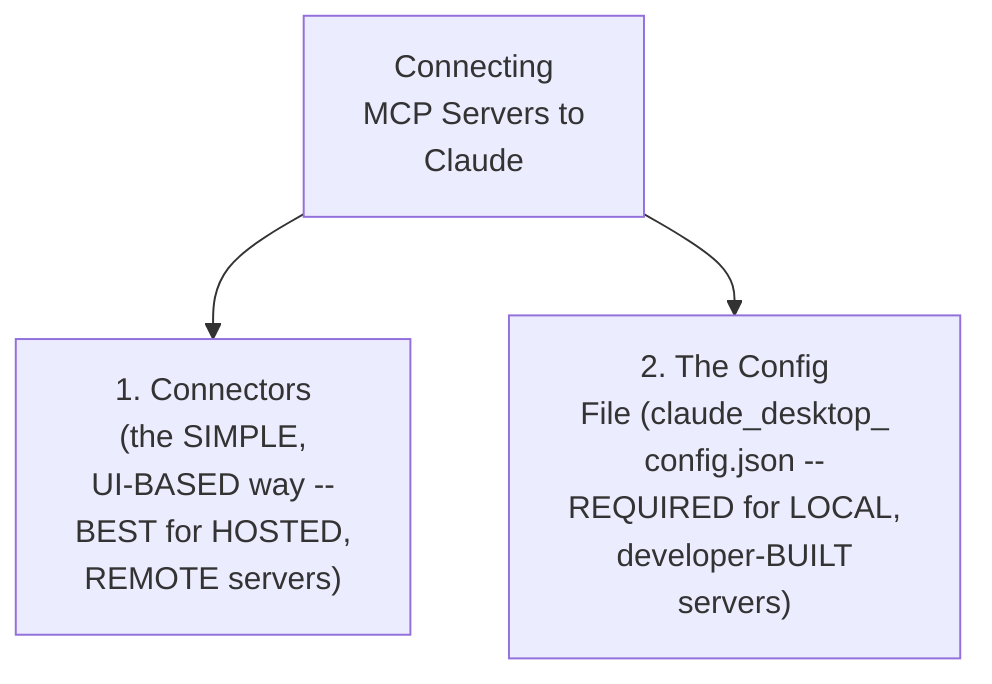
```mermaid
flowchart TD
    A["Connecting<br/>MCP Servers to<br/>Claude"] --> B["1. Connectors<br/>(the SIMPLE,<br/>UI-BASED way --<br/>BEST for HOSTED,<br/>REMOTE servers)"]
    A --> C["2. The Config<br/>File (claude_desktop_<br/>config.json --<br/>REQUIRED for LOCAL,<br/>developer-BUILT<br/>servers)"]
```

#### 🔍 Internal Working — A Genuine, Direct Confirmation: Connectors Are Just a UI Layer

> 💡 **Given directly:** *"It is not that when we are using the config file... you can just add the local servers? No, all the servers can actually be added. Rather, in the backend, Claude is maintaining those config files when you are adding them into the same."*

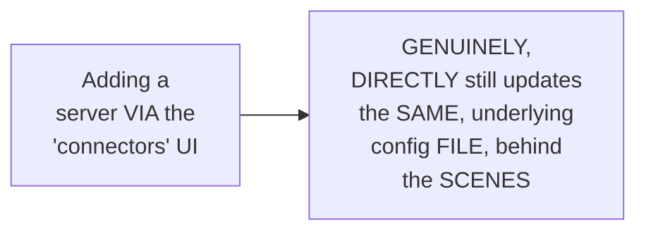
```mermaid
flowchart LR
    A["Adding a<br/>server VIA the<br/>'connectors' UI"] --> B["GENUINELY,<br/>DIRECTLY still updates<br/>the SAME, underlying<br/>config FILE, behind<br/>the SCENES"]
```

#### ⚠ Common Mistakes

* Assuming the "CONNECTORS" UI and the REAL "CONFIG file" are TWO, genuinely SEPARATE, INDEPENDENT systems — explicitly, directly, PRECISELY clarified: "IN the backend, CLAUDE is MAINTAINING those CONFIG files WHEN you ARE adding them INTO the SAME" — connectors are GENUINELY, DIRECTLY just a SIMPLER, user-FACING interface, OVER the SAME, underlying CONFIG mechanism.

#### 🎯 Key Takeaways

* TWO, precise, REAL methods directly, EXPLICITLY confirmed: **CONNECTORS** (SIMPLE, for hosted SERVERS) and the **CONFIG file** (REQUIRED, for LOCAL, developer-built SERVERS).
* THE instructor **directly, PRECISELY clarifies**: connectors GENUINELY, DIRECTLY still update the SAME, underlying CONFIG file — they're NOT, genuinely, a SEPARATE system.
* This directly, PRECISELY sets UP the SESSION's own, NEXT, essential CONTENT — a GENUINE, honest, LIVE debugging MOMENT, involving the CONFIG file (Section 2).

---

### 2. A Genuine, Honest, Live Debugging Moment: The UV Path Issue

#### 🪜 Step-by-Step — A Complete, Real, Live-Encountered Error

> 💡 **Given directly:** *"I'm seeing recipe box, but actually, recipe box updated is not visible... normally what happens, instead of UV, we have to provide the complete path of UV, like, where exactly the UV is installed in my machine... you can just execute the shell command, which UV? And it gives you the complete path of the same."*

```bash
which uv
# e.g. /opt/homebrew/bin/uv
```

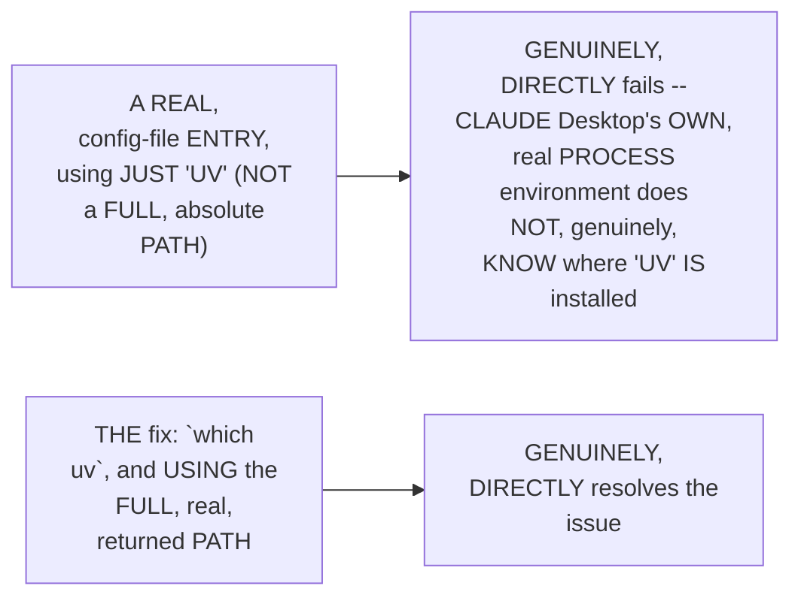
```mermaid
flowchart LR
    A["A REAL,<br/>config-file ENTRY,<br/>using JUST 'UV' (NOT<br/>a FULL, absolute<br/>PATH)"] --> B["GENUINELY,<br/>DIRECTLY fails --<br/>CLAUDE Desktop's OWN,<br/>real PROCESS<br/>environment does<br/>NOT, genuinely,<br/>KNOW where 'UV' IS<br/>installed"]
    C["THE fix: `which<br/>uv`, and USING the<br/>FULL, real,<br/>returned PATH"] --> D["GENUINELY,<br/>DIRECTLY resolves the<br/>issue"]
```

#### ⚠ Common Mistakes

* Assuming a COMMAND that GENUINELY, DIRECTLY works CORRECTLY in a REAL, interactive TERMINAL (e.g., simply "UV") will GENUINELY, AUTOMATICALLY work THE same way, WITHIN a DIFFERENT, real PROCESS environment (LIKE Claude DESKTOP's own, INTERNAL process) — explicitly, directly, LIVE-demonstrated as GENUINELY, DIRECTLY false — the FULL, absolute PATH is REQUIRED, since the OTHER process DOES not, genuinely, SHARE the SAME, interactive shell's OWN, established PATH configuration.

#### 🎯 Key Takeaways

* A COMPLETE, real, LIVE-encountered ERROR directly, CONCRETELY confirmed: a CONFIG-file entry USING just "UV" (WITHOUT its FULL, absolute PATH) genuinely, DIRECTLY FAILED, WITHIN Claude Desktop's OWN, internal process environment.
* THE genuine, real FIX: RUN `WHICH uv`, and USE the FULL, real, RETURNED path, WITHIN the CONFIG file's OWN, established ENTRY.
* This directly, PRECISELY sets UP the SESSION's own, NEXT, essential CONTENT — REAL, community MCP servers, and WHY they're NOT always HTTP-based (Section 3).

---
### 3. Community & Third-Party MCP Servers: Not All Are HTTP

#### ⚠ A Direct, Honest, Important Clarification

> 💡 **Given directly:** *"If you will notice, this is actually a NPX-based server, which is a node-based server, which gets started on your local only... a takeaway here, it is not that all the servers of third-party application will be HTTP. Many people have that mistake. It is not the case."*

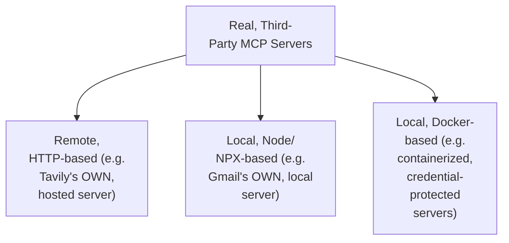
```mermaid
flowchart TD
    A["Real, Third-<br/>Party MCP Servers"] --> B["Remote,<br/>HTTP-based (e.g.<br/>Tavily's OWN,<br/>hosted server)"]
    A --> C["Local, Node/<br/>NPX-based (e.g.<br/>Gmail's OWN, local<br/>server)"]
    A --> D["Local, Docker-<br/>based (e.g.<br/>containerized,<br/>credential-<br/>protected<br/>servers)"]
```

#### 🔍 Internal Working — A Genuine, Direct Clarification: Local Doesn't Mean Isolated

> 💡 **Given directly:** *"Don't think local server is just for local. No, no, no, that is wrong. That is where, when you will develop, you will face issues in interview, etc.... if it is running locally, that doesn't mean it cannot reach out. So Tavily people are saying that, hey, you take our code, it will start up an MCP server... whatever minimum load is there, it will be on your machine, and you hit it up."*

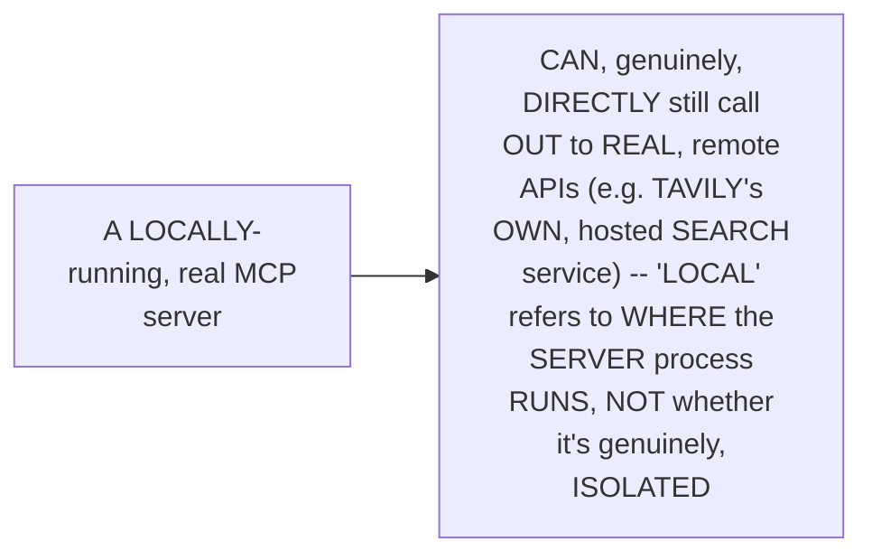
```mermaid
flowchart LR
    A["A LOCALLY-<br/>running, real MCP<br/>server"] --> B["CAN, genuinely,<br/>DIRECTLY still call<br/>OUT to REAL, remote<br/>APIs (e.g. TAVILY's<br/>OWN, hosted SEARCH<br/>service) -- 'LOCAL'<br/>refers to WHERE the<br/>SERVER process<br/>RUNS, NOT whether<br/>it's genuinely,<br/>ISOLATED"]
```

#### ⚠ Common Mistakes

* Assuming a "LOCAL" MCP server (RUNNING on a DEVELOPER's own MACHINE) is GENUINELY, STRUCTURALLY isolated, and CANNOT, genuinely, make REAL, outbound CALLS to REMOTE services — explicitly, directly, HONESTLY corrected: "THAT is WRONG... IF it IS running LOCALLY, that DOESN'T mean it CANNOT reach OUT" — a LOCAL server GENUINELY, DIRECTLY can, and OFTEN does, call OUT to REAL, remote APIs.

#### 🎯 Key Takeaways

* THE instructor **directly, HONESTLY clarifies** a COMMON, real MISCONCEPTION: THIRD-party MCP servers are NOT, genuinely, ALWAYS HTTP-based — MANY, real servers (GMAIL, per THIS session's own EXAMPLE) run LOCALLY, via NODE/NPX, OR via Docker.
* "LOCAL" GENUINELY, DIRECTLY refers to WHERE the SERVER process RUNS — NOT whether it's GENUINELY, STRUCTURALLY isolated FROM the internet; a LOCAL server CAN, and OFTEN does, CALL out to REAL, remote APIs.
* This directly, PRECISELY sets UP the SESSION's own, NEXT, essential CONTENT — a COMPLETE, real "TIME tracker" project, BUILT from scratch (Section 4).

---

### 4. The Time Tracker Project: A Real, Complete FastAPI Backend

#### 🪜 Step-by-Step — The Complete, Real Project Setup

> 💡 **Given directly:** *"Real timesheet tool, log billable hours through a browser, or through an AI assistant, and see the exact same data... it is having a complete index.html, which is nothing but... your front end for the code... there is database.py. It will be making sure that... we or employees can track their time. And for the same, we are using DB."*

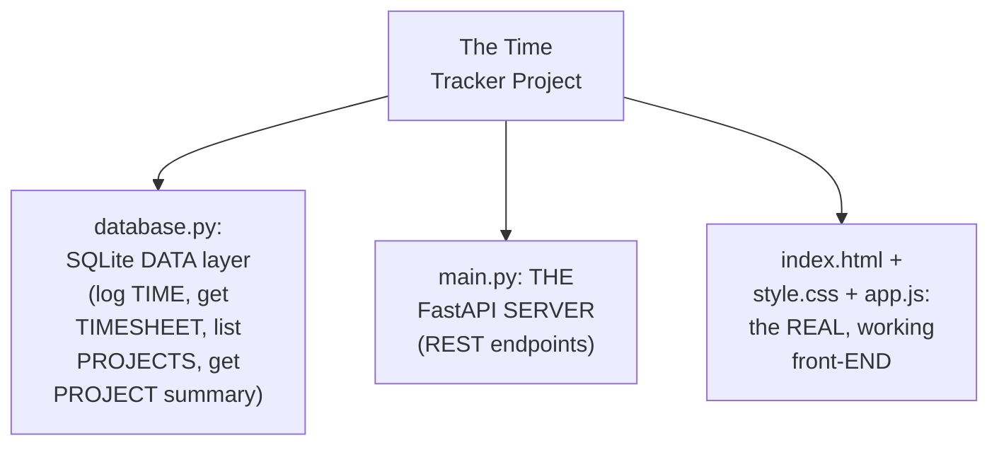
```mermaid
flowchart TD
    A["The Time<br/>Tracker Project"] --> B["database.py:<br/>SQLite DATA layer<br/>(log TIME, get<br/>TIMESHEET, list<br/>PROJECTS, get<br/>PROJECT summary)"]
    A --> C["main.py: THE<br/>FastAPI SERVER<br/>(REST endpoints)"]
    A --> D["index.html +<br/>style.css + app.js:<br/>the REAL, working<br/>front-END"]
```

#### 🪜 Step-by-Step — The Complete, Real FastAPI Server, Built Live

> 💡 **Given directly:** *"From fast API, we will import your fast API... I will be actually using FastAPI to first create our complete server... app is equal to FastAPI application... get slash API slash entries... post call... I will just have employee name, project, entry date, hours, and description."*

```python
from fastapi import FastAPI
from pydantic import BaseModel
import database as db

db.init_db()

app = FastAPI(title="Time Track", description="A simple time tracking app with REST and MCP endpoints.", version="1.0.0")

@app.get("/api/entries")
def list_all_entries():
    return db.list_all_entries()

@app.get("/api/projects")
def list_projects():
    return db.list_projects()

@app.get("/api/projects/{project}/summary")
def project_summary(project: str):
    return db.get_project_summary(project)

class NewEntry(BaseModel):
    employee_name: str
    project: str
    entry_date: str
    hours: float
    description: str

@app.post("/api/entries")
def log_time(entry: NewEntry):
    return db.log_time(entry.employee_name, entry.project, entry.entry_date, entry.hours, entry.description)
```

#### 🔍 Internal Working — A Genuine, Direct Confirmation: Swagger, for Testing

> 💡 **Given directly:** *"The second we add docs in front of it, a very nice Swagger page gets opened up... Swagger is just for testing that everything works... just like MCP inspector, that is FastAPI Inspector."*

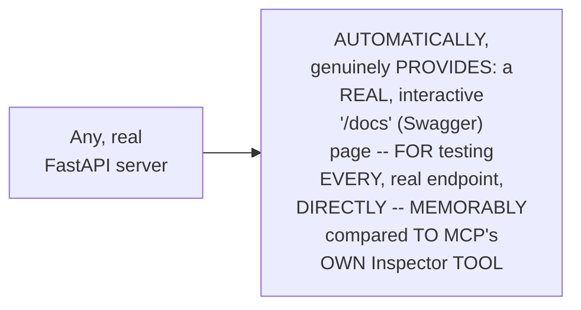
```mermaid
flowchart LR
    A["Any, real<br/>FastAPI server"] --> B["AUTOMATICALLY,<br/>genuinely PROVIDES: a<br/>REAL, interactive<br/>'/docs' (Swagger)<br/>page -- FOR testing<br/>EVERY, real endpoint,<br/>DIRECTLY -- MEMORABLY<br/>compared TO MCP's<br/>OWN Inspector TOOL"]
```

#### ⚠ Common Mistakes

* Assuming a REAL, "TIME-tracking" project GENUINELY, DIRECTLY requires MCP from the VERY start — explicitly, directly, HONESTLY structured OTHERWISE — the SESSION deliberately BUILDS a COMPLETE, real, WORKING application FIRST (with plain REST endpoints), BEFORE introducing MCP AT all — REINFORCING a REAL, established PATTERN: MCP is BUILT on TOP of an EXISTING application, NOT the OTHER way around.

#### 🎯 Key Takeaways

* A COMPLETE, real PROJECT directly, CONCRETELY confirmed: a "TIME tracker" application, WITH a REAL, SQLite-backed database LAYER, a REAL FastAPI server (WITH GET/POST endpoints), and a REAL, working FRONT-end.
* **SWAGGER** ("/DOCS") is directly, PRECISELY confirmed AS FastAPI's OWN, built-in, INTERACTIVE testing PAGE — MEMORABLY compared TO MCP's own INSPECTOR tool.
* THIS directly, DELIBERATELY reinforces a REAL, established PATTERN — MCP servers are ALMOST always BUILT on TOP of an EXISTING, real application, NOT created "OUT of the BLUE."
* This directly, PRECISELY sets UP the SESSION's own, NEXT, essential CONTENT — a GENUINE, real ARGUMENT for WHY this SPECIFIC project genuinely NEEDS MCP (Section 5).

---
### 5. A Genuine, Real Argument: Why This Project Genuinely Needs MCP

#### ⚠ A Direct, Honest, Relatable Justification

> 💡 **Given directly:** *"The problem is that with AI, we are lazy. If I give you that, hey, Kapil, you have to now enter this thing up for 10 days. Won't you want that, Mayank, can't you give me in Slack? Yeah, I can just enter that, hey, log my entry... rather, or would you like to come here?... We would want that AI can help us in that."*

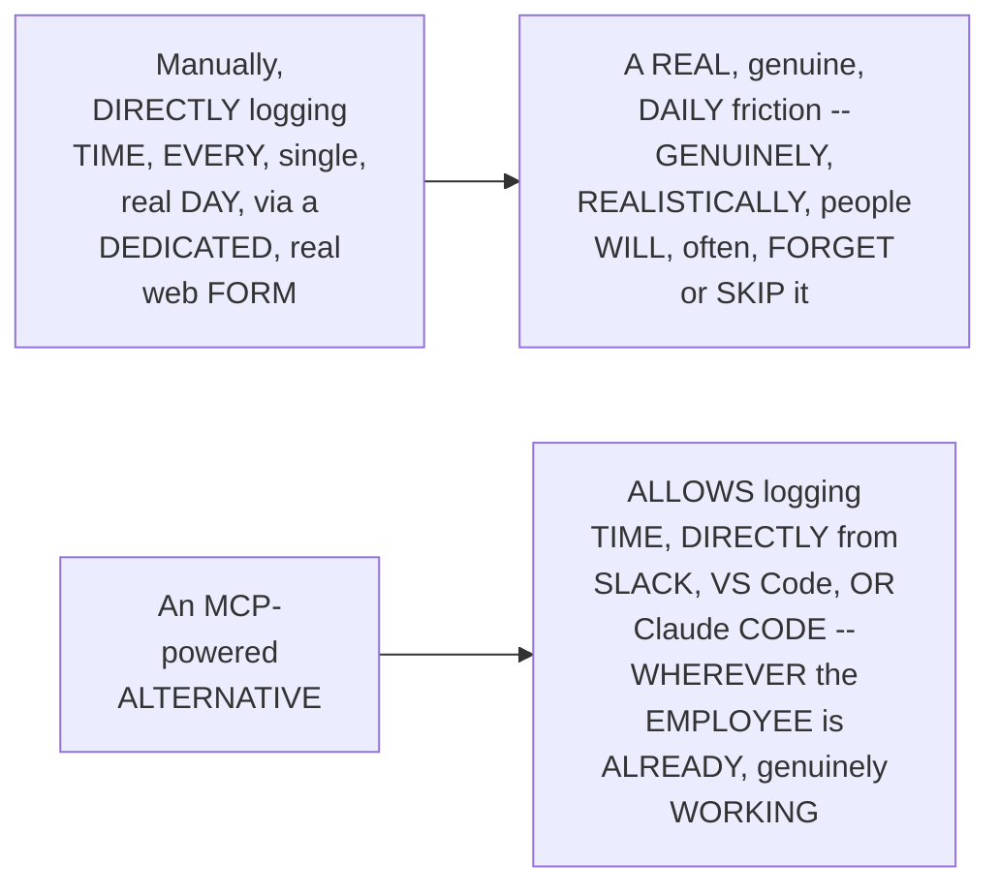
```mermaid
flowchart LR
    A["Manually,<br/>DIRECTLY logging<br/>TIME, EVERY, single,<br/>real DAY, via a<br/>DEDICATED, real<br/>web FORM"] --> B["A REAL, genuine,<br/>DAILY friction --<br/>GENUINELY,<br/>REALISTICALLY, people<br/>WILL, often, FORGET<br/>or SKIP it"]
    C["An MCP-<br/>powered<br/>ALTERNATIVE"] --> D["ALLOWS logging<br/>TIME, DIRECTLY from<br/>SLACK, VS Code, OR<br/>Claude CODE --<br/>WHEREVER the<br/>EMPLOYEE is<br/>ALREADY, genuinely<br/>WORKING"]
```

#### 🔍 Internal Working — A Genuine, Direct, Competitive Business Argument

> 💡 **Given directly:** *"I think that if I'm getting this application, and now if I want people to use my application... I come up and say that, hey, I've created an MCP, no matter if your team is using Slack, VS Code, Cloud Desktop... whenever they are working, it will automatically log in their hours... surely people will use mine."*

#### 🔍 Internal Working — A Genuine, Direct Argument: Avoiding Breaking Changes

> 💡 **Given directly:** *"If tomorrow I make some changes here [in the backend], Claude is having the script and everything which it runs. But, again, it will fail because I changed something in the backend, Claude will try to still fix it up, so multiple problems will happen. MCP solves that all up... if I have 1 lakh clients, 1,000 companies, do you think that... it's good that I ask them that, hey, do the changes?"*

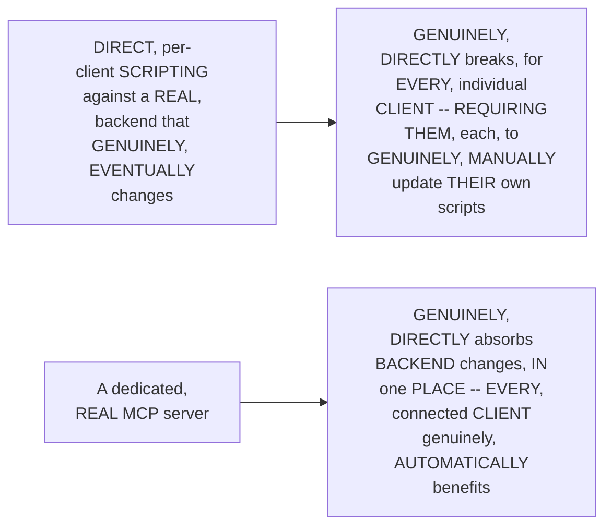
```mermaid
flowchart LR
    A["DIRECT, per-<br/>client SCRIPTING<br/>against a REAL,<br/>backend that<br/>GENUINELY, EVENTUALLY<br/>changes"] --> B["GENUINELY,<br/>DIRECTLY breaks, for<br/>EVERY, individual<br/>CLIENT -- REQUIRING<br/>THEM, each, to<br/>GENUINELY, MANUALLY<br/>update THEIR own<br/>scripts"]
    C["A dedicated,<br/>REAL MCP server"] --> D["GENUINELY,<br/>DIRECTLY absorbs<br/>BACKEND changes, IN<br/>one PLACE -- EVERY,<br/>connected CLIENT<br/>genuinely, AUTOMATICALLY<br/>benefits"]
```

#### ⚠ Common Mistakes

* Assuming this SPECIFIC project's OWN, genuine NEED for MCP is GENUINELY, MERELY an ABSTRACT, academic EXERCISE — explicitly, directly, GROUNDED in a REAL, relatable, everyday SCENARIO — the GENUINE, human TENDENCY toward LAZINESS/friction-avoidance, and a REAL, competitive business ARGUMENT (MORE clients, GENUINELY, will CHOOSE the MCP-enabled PRODUCT).

#### 🎯 Key Takeaways

* A GENUINE, real, relatable ARGUMENT directly, CONCRETELY confirmed: MCP genuinely, DIRECTLY reduces REAL, daily friction (MANUAL time-LOGGING) — LETTING employees LOG time from WHEREVER they're ALREADY working.
* A SECOND, genuine, real ARGUMENT directly, CONCRETELY confirmed: MCP genuinely, DIRECTLY PREVENTS the SAME, real "1,000 COMPANIES, each MANUALLY updating THEIR own SCRIPTS" scaling PROBLEM, previously ESTABLISHED in THIS series' own, PRIOR session.
* This directly, PRECISELY sets UP the SESSION's own, NEXT, essential CONTENT — a COMPLETE, real, LIVE-built MCP server, ON top OF this SAME project (Section 6).

---

### 6. Building the MCP Server From Scratch: Tools & a Prompt

#### 🪜 Step-by-Step — The Complete, Real, Live-Coded Server

> 💡 **Given directly:** *"From fast MCP, I will import Fast MCP... I will first make sure that I'm creating some tools. So, let me first create MCP equals to time track... at the rate mcp.tool, and now I can say def log underscore time, employee name, project, entry date, hours and description."*

```python
from fastmcp import FastMCP

mcp = FastMCP("Time Track")

@mcp.tool()
def log_time(employee_name: str, project: str, entry_date: str, hours: float, description: str) -> dict:
    """Log a new time entry, for a specific employee and project."""
    return db.log_time(employee_name, project, entry_date, hours, description)

@mcp.tool()
def get_timesheet(employee_name: str) -> list[dict]:
    """Get the complete timesheet, for a specific employee."""
    return db.get_timesheet(employee_name)

@mcp.tool()
def get_project_summary(project: str) -> dict:
    """Get a full summary of hours logged, for a specific project."""
    return db.get_project_summary(project)

@mcp.tool()
def list_projects() -> list[str]:
    """List all known projects."""
    return db.list_projects()

@mcp.prompt()
def generate_weekly_report(employee_name: str, week_start: str) -> str:
    """A reusable prompt for generating a complete, weekly time report."""
    return f"Generate a complete weekly time report for {employee_name}, starting {week_start}."

if __name__ == "__main__":
    mcp.run()
```

#### 🔍 Internal Working — A Genuine, Real Confirmation: Why the Prompt Genuinely Matters

> 💡 **Given directly:** *"We have the prompt as well, generate weekly report, because this is something which AI can use... your prompt can also ask for the arguments, everyone. Because prompts can also be dynamic... when my AI will run this prompt, all the different, different tools which will be used as a part of this will be able to give me the complete information."*

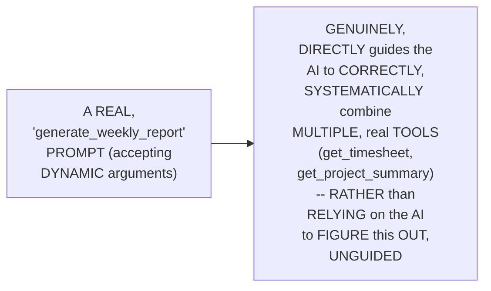
```mermaid
flowchart LR
    A["A REAL,<br/>'generate_weekly_report'<br/>PROMPT (accepting<br/>DYNAMIC arguments)"] --> B["GENUINELY,<br/>DIRECTLY guides the<br/>AI to CORRECTLY,<br/>SYSTEMATICALLY combine<br/>MULTIPLE, real TOOLS<br/>(get_timesheet,<br/>get_project_summary)<br/>-- RATHER than<br/>RELYING on the AI<br/>to FIGURE this OUT,<br/>UNGUIDED"]
```

#### ⚠ Common Mistakes

* Assuming MCP PROMPTS are GENUINELY, MERELY static, FIXED text TEMPLATES — explicitly, directly, LIVE-demonstrated as GENUINELY, DIRECTLY false — "PROMPTS can ALSO be DYNAMIC" — this SESSION's own, REAL "generate_WEEKLY_report" prompt GENUINELY, DIRECTLY accepts REAL, dynamic ARGUMENTS (employee NAME, week START).

#### 🎯 Key Takeaways

* A COMPLETE, real, LIVE-coded MCP server directly, CONCRETELY confirmed: FOUR, real TOOLS (`log_TIME`, `get_TIMESHEET`, `get_PROJECT_summary`, `list_PROJECTS`), and ONE, real, DYNAMIC prompt (`generate_WEEKLY_report`).
* THE genuine, real VALUE of a DEDICATED prompt directly, CONCRETELY confirmed: it GUIDES the AI to CORRECTLY, SYSTEMATICALLY combine MULTIPLE tools — RATHER than relying ON the AI to FIGURE this OUT, unguided, every SINGLE time.
* This directly, PRECISELY sets UP the SESSION's own, NEXT, essential CONTENT — a COMPLETE, real, LIVE verification, VIA MCP Inspector (Section 7).

---
### 7. MCP Inspector: Verifying the Real Project's Server

#### 🪜 Step-by-Step — A Complete, Real, Live Verification

> 💡 **Given directly:** *"So, if I show you everyone now, all the dots should get connected. This is an MCP inspector which we have... it is following the complete architecture which we have understood in so much depth... it is asking for the tools, and there actually is a tool. And when the tool information actually is shared, it is shared properly, the description, and all the input schemas."*

```bash
npx @modelcontextprotocol/inspector uv run fastmcp run main.py
```

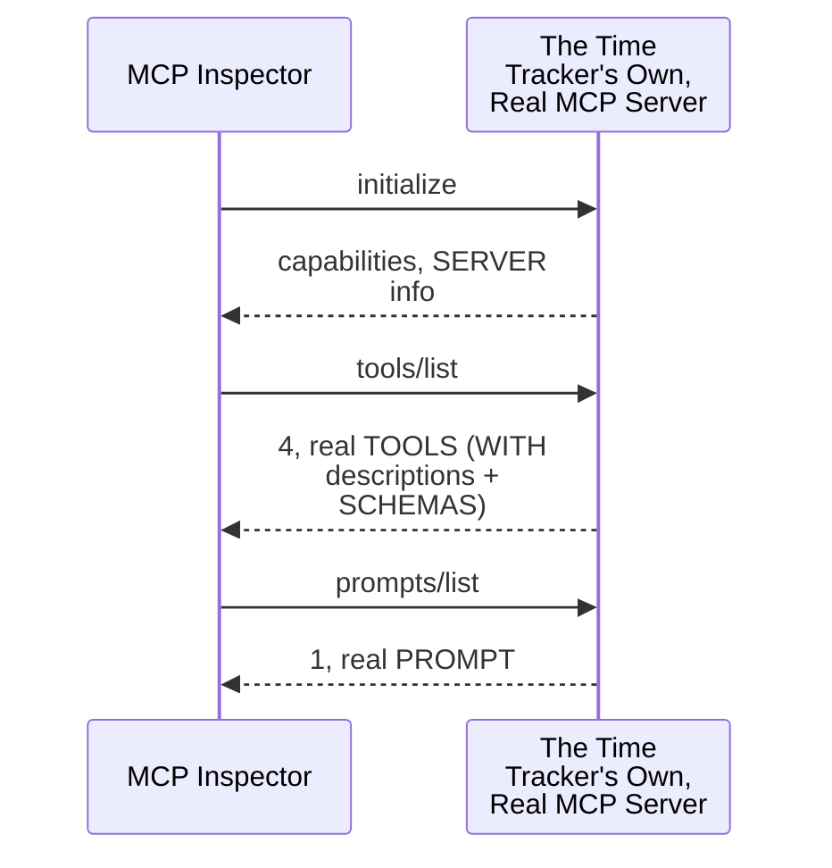
```mermaid
sequenceDiagram
    participant Inspector as MCP Inspector
    participant Server as The Time<br/>Tracker's Own,<br/>Real MCP Server
    Inspector->>Server: initialize
    Server-->>Inspector: capabilities, SERVER<br/>info
    Inspector->>Server: tools/list
    Server-->>Inspector: 4, real TOOLS (WITH<br/>descriptions +<br/>SCHEMAS)
    Inspector->>Server: prompts/list
    Server-->>Inspector: 1, real PROMPT
```

#### 🔍 Internal Working — A Genuine, Direct, Live Test of the Dynamic Prompt

> 💡 **Given directly:** *"We have a prompt. So, it is asking that... give me the employee name, let's say Mayank... and week start... you can see that how your prompt can also ask for the arguments... how nicely it has given this."*

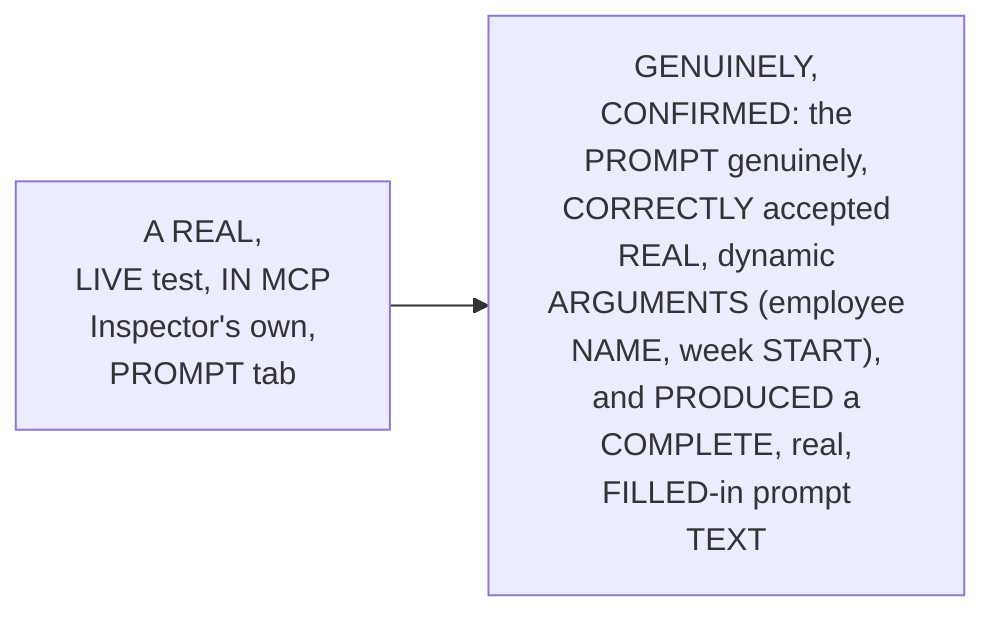
```mermaid
flowchart LR
    A["A REAL,<br/>LIVE test, IN MCP<br/>Inspector's own,<br/>PROMPT tab"] --> B["GENUINELY,<br/>CONFIRMED: the<br/>PROMPT genuinely,<br/>CORRECTLY accepted<br/>REAL, dynamic<br/>ARGUMENTS (employee<br/>NAME, week START),<br/>and PRODUCED a<br/>COMPLETE, real,<br/>FILLED-in prompt<br/>TEXT"]
```

#### ⚠ Common Mistakes

* Assuming MCP Inspector GENUINELY, ONLY verifies TOOLS — explicitly, directly, LIVE-demonstrated as GENUINELY, DIRECTLY broader — it ALSO, genuinely, VERIFIES prompts, RESOURCES, and their OWN, respective, DYNAMIC argument HANDLING.

#### 🎯 Key Takeaways

* A COMPLETE, real, LIVE verification directly, CONCRETELY confirmed: the TIME tracker's OWN, real MCP server GENUINELY, CORRECTLY exposed its FOUR tools AND its ONE, dynamic prompt, VIA MCP Inspector.
* THIS directly, CONCRETELY confirmed the PROMPT's own, real DYNAMIC-argument capability — ACCEPTING employee NAME and week-START ARGUMENTS, correctly.
* This directly, PRECISELY sets UP the SESSION's own, NEXT, essential CONTENT — the GENUINE, real trade-off BETWEEN manual TOOL-building and an AUTOMATIC, "4-LINE" alternative (Section 8).

---

### 8. The "4-Line" Alternative & Why Manual Building Is Still Preferred

#### 📖 Definition — The Genuine, Real, Automatic Alternative

> 💡 **Given directly:** *"Generate an MCP server from your fast API? Yeah. Generally, this is this easy, and again, that is how these two applications, sorry, two libraries gets connected."*

```python
from fastmcp import FastMCP

mcp = FastMCP.from_fastapi(app=app)  # automatically wraps every FastAPI endpoint as a real MCP tool
```

#### ⚠ A Direct, Honest, Important, Personal Preference

> 💡 **Given directly:** *"Ideally, if you are having extra things like prompts or any extra things which you would want to control, that is where I would love to have myself create the MCP server, and normally, if I tell you, I still love to create my MCP server myself, so because I can give it much more better AI helpful documentation."*

```mermaid
flowchart LR
    A["`FastMCP.from_fastapi()`<br/>(the FAST,<br/>AUTOMATIC<br/>ALTERNATIVE)"] --> B["WRAPS every, REAL<br/>API endpoint,<br/>AUTOMATICALLY -- but<br/>OFFERS LESS control<br/>OVER naming,<br/>DESCRIPTIONS, and<br/>MULTI-API<br/>COMBINATIONS"]
    C["MANUALLY,<br/>DELIBERATELY BUILDING<br/>each, real TOOL"] --> D["GENUINELY,<br/>DIRECTLY offers FULL<br/>control -- BETTER,<br/>AI-friendly<br/>DESCRIPTIONS, and<br/>the ABILITY to<br/>COMBINE MULTIPLE<br/>APIs, WITHIN a<br/>SINGLE, real<br/>TOOL"]
```

#### 🔍 Internal Working — A Genuine, Direct, Real Argument: Avoiding Touching Working Code

> 💡 **Given directly:** *"Normally APIs are already created, so to go and change something which is already working, that is... I can add a description here, and it will be kind of taken away. But, still, I would not love to change this thing, because it can fail something... rather than me changing the already working code in Gmail, I would want to maybe take the pace-taking effort to write the MCP myself."*

#### ⚠ Common Mistakes

* Assuming the "MANUAL" versus "AUTOMATIC" choice is GENUINELY, MERELY a MATTER of coding SPEED — explicitly, directly, HONESTLY clarified: it's GENUINELY, PRIMARILY about REAL, careful CONTROL — AVOIDING risky CHANGES to ALREADY-working, real production CODE, and ENSURING genuinely BETTER, AI-friendly documentation.

#### 🎯 Key Takeaways

* `FASTMCP.from_fastapi()` directly, CONCRETELY provides a GENUINE, real, "4-LINE" automatic ALTERNATIVE — wrapping EVERY, existing API ENDPOINT as a REAL MCP tool.
* THE instructor **directly, PERSONALLY confirms** he STILL, genuinely PREFERS MANUALLY building TOOLS himself — FOR full CONTROL over NAMING, descriptions, and MULTI-API combinations.
* A GENUINE, real, important REASON directly, HONESTLY confirmed: AVOIDING risky CHANGES to ALREADY-working, PRODUCTION API code — a SEPARATE, dedicated MCP-tool LAYER genuinely, DIRECTLY isolates this SAME risk.
* This directly, PRECISELY sets UP the SESSION's own, NEXT, essential CONTENT — MOUNTING both FastAPI AND FastMCP, on the SAME, real server (Section 9).

---
### 9. Mounting FastAPI + FastMCP on the Same Server

#### 🪜 Step-by-Step — The Complete, Real, Combined Server

> 💡 **Given directly, from the real Q&A, with Prerana:** *"Time clock means, we are having the localhost 8000 for the website. Slash MCP is my MCP endpoint... on the same server, we have both the gates running on the same link... what I've done is, I'm saying, whatever app I'm running, which is my normal application, FastAPI, use MCP mount, please mount this."*

```python
mcp_app = mcp.streamable_http_app()  # convert the MCP server into a real, mountable ASGI app
app.mount("/mcp", mcp_app)  # mount it onto the SAME, existing FastAPI application
```

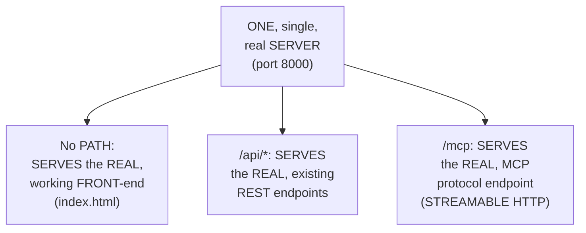
```mermaid
flowchart TD
    A["ONE, single,<br/>real SERVER<br/>(port 8000)"] --> B["No PATH:<br/>SERVES the REAL,<br/>working FRONT-end<br/>(index.html)"]
    A --> C["/api/*: SERVES<br/>the REAL, existing<br/>REST endpoints"]
    A --> D["/mcp: SERVES<br/>the REAL, MCP<br/>protocol endpoint<br/>(STREAMABLE HTTP)"]
```

#### 🔍 Internal Working — A Genuine, Direct Confirmation: One Server, Multiple Interfaces

> 💡 **Given directly:** *"It is a server, it doesn't care whether it doesn't care, like, has a problem at all. Server should be able to handle the load... that's the right way of deploying it, actually, whether we will not have two servers or something. One server, we will have everything deployed."*

#### ⚠ Common Mistakes

* Assuming a REAL, production DEPLOYMENT genuinely, PRACTICALLY needs TWO, separate servers — ONE for the REGULAR, web-FACING application, and a SEPARATE one, SPECIFICALLY for MCP — explicitly, directly, PRECISELY clarified: ONE, single, REAL server can GENUINELY, DIRECTLY serve ALL three interfaces (WEB front-end, REST API, and MCP endpoint) SIMULTANEOUSLY.

#### 🎯 Key Takeaways

* A COMPLETE, real, COMBINED server directly, CONCRETELY confirmed: `APP.mount("/mcp", MCP_app)` genuinely, DIRECTLY combines a REGULAR, web-facing FastAPI application AND a REAL MCP server, ON the SAME, single PORT.
* THIS directly, PRACTICALLY confirms the "RIGHT way OF deploying IT" — ONE, unified SERVER, rather THAN separate, DUPLICATED infrastructure.
* This directly, PRECISELY sets UP the SESSION's own, EXTENSIVE, real Q&A SEGMENT (Sections 10-16).

---

### 10. Real Q&A: Tool-as-Wrapper vs. Direct API Endpoint Control

#### 🪜 Step-by-Step — The Real, Complete Question

> 💡 **Given directly, from a real participant, Dipika:** *"Why did we use add-tool instead of direct API endpoint?... how it is connecting, if you do this, all the APIs get converted to tools. In here, too, you have the complete control."*

#### 🔍 Internal Working — A Genuine, Direct, Real Answer

> 💡 **Given directly:** *"Do you want to do an authentication at each tool level or at an MCP server level? Normally, it will be at a server level... you first let the person in with auth, and then you say that, hey, you are not allowed to call this tool... don't ever think that the tools are one-to-one with APIs. No, that is not the case. That happens most of the time, but that is not a requirement. Your tool can have multiple API calls as well."*

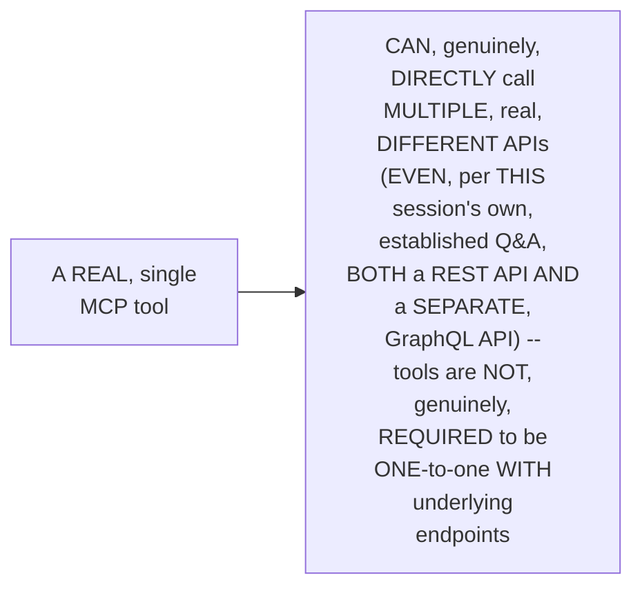
```mermaid
flowchart LR
    A["A REAL, single<br/>MCP tool"] --> B["CAN, genuinely,<br/>DIRECTLY call<br/>MULTIPLE, real,<br/>DIFFERENT APIs<br/>(EVEN, per THIS<br/>session's own,<br/>established Q&A,<br/>BOTH a REST API AND<br/>a SEPARATE,<br/>GraphQL API) --<br/>tools are NOT,<br/>genuinely,<br/>REQUIRED to be<br/>ONE-to-one WITH<br/>underlying<br/>endpoints"]
```

#### ⚠ Common Mistakes

* Assuming an MCP TOOL must GENUINELY, STRUCTURALLY correspond to EXACTLY one, single, real API ENDPOINT — explicitly, directly, EXPLICITLY corrected: "DON'T ever THINK that the TOOLS are ONE-to-one WITH APIs... THAT is NOT the CASE... your TOOL can HAVE multiple API CALLS as well."

#### 🎯 Key Takeaways

* A REAL, complete AUDIENCE question directly, GENUINELY addressed the CORE difference BETWEEN auto-generated (WRAPPER) tools and MANUALLY-built ones — the GENUINE, real ANSWER centers ON control.
* A GENUINE, real, IMPORTANT clarification: MCP TOOLS are explicitly, DIRECTLY confirmed as NOT, genuinely, REQUIRED to be ONE-to-one WITH underlying API endpoints — a SINGLE, real tool CAN, genuinely, COMBINE multiple, DIFFERENT API calls (EVEN across DIFFERENT API types, LIKE REST and GraphQL).
* This directly, PRECISELY sets UP the SESSION's own, NEXT, essential Q&A — DOCKER's own, real ROLE, in MCP deployment (Section 11).

---
### 11. Real Q&A: Docker's Role in MCP Deployment

#### 🪜 Step-by-Step — The Real, Complete Question & Answer

> 💡 **Given directly, from a real participant, Bala:** *"How do we really use Docker in this kind of [deployment]?"*

> 💡 **The genuine, direct answer:** *"I can just have this complete application inside a Docker container, and then I can use it. So once the Docker container will unwrap, it will give me the API server, it will give me the MCP server as well... Docker is just to make sure that everything is properly containerized, so that when it works, we don't face any error."*

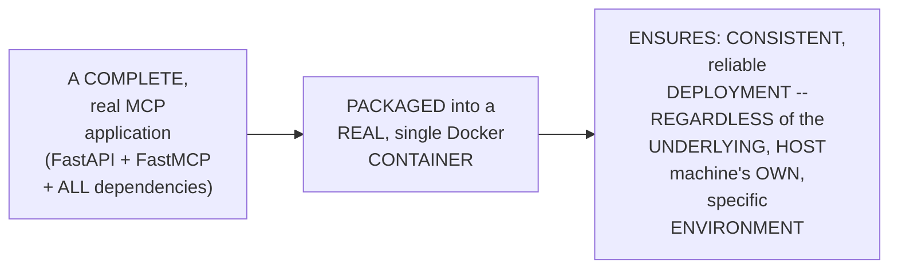
```mermaid
flowchart LR
    A["A COMPLETE,<br/>real MCP<br/>application<br/>(FastAPI + FastMCP<br/>+ ALL dependencies)"] --> B["PACKAGED into a<br/>REAL, single Docker<br/>CONTAINER"]
    B --> C["ENSURES: CONSISTENT,<br/>reliable<br/>DEPLOYMENT --<br/>REGARDLESS of the<br/>UNDERLYING, HOST<br/>machine's OWN,<br/>specific<br/>ENVIRONMENT"]
```

#### 🎯 Key Takeaways

* A REAL, complete AUDIENCE question directly, PRACTICALLY addressed DOCKER's own, real ROLE — PACKAGING a COMPLETE, real MCP application (server, TOOLS, and ALL dependencies) into a SINGLE, CONSISTENT, deployable CONTAINER.
* This directly, PRECISELY sets UP the SESSION's own, NEXT, essential Q&A — BIDIRECTIONAL communication AND security (Section 12).

---

### 12. Real Q&A: Bidirectional Communication & Security

#### 🪜 Step-by-Step — The Real, Complete Question & Answer

> 💡 **Given directly, from a real participant, Basavanna:** *"As it is a bidirectional, when the call is made... is there any further concerns I should have with respect to security because of the bidirectional communication?"*

> 💡 **The genuine, direct answer:** *"As a protocol, MCP kind of handles it, plus the bidirectional communication is majorly... the server tells you that how much it has done a particular work. Or if you want to use your AI... client is having the access to AI, server is not having that. MCP server doesn't have any access to it, so if it ever want to use AI, that is where it can ask client to do the same for you... you just want to make sure that you connect with the right servers."*

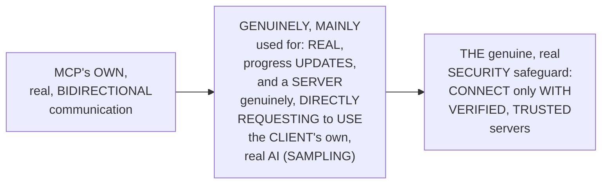
```mermaid
flowchart LR
    A["MCP's OWN,<br/>real, BIDIRECTIONAL<br/>communication"] --> B["GENUINELY, MAINLY<br/>used for: REAL,<br/>progress UPDATES,<br/>and a SERVER<br/>genuinely, DIRECTLY<br/>REQUESTING to USE<br/>the CLIENT's own,<br/>real AI (SAMPLING)"]
    B --> C["THE genuine, real<br/>SECURITY safeguard:<br/>CONNECT only WITH<br/>VERIFIED, TRUSTED<br/>servers"]
```

#### 🎯 Key Takeaways

* A REAL, complete AUDIENCE question directly, HONESTLY addressed SECURITY concerns, RELATED to MCP's OWN, established BIDIRECTIONAL communication CAPABILITY.
* THE genuine, real ANSWER: BIDIRECTIONAL communication is MAINLY used FOR progress UPDATES and a REAL, server-initiated REQUEST to use the CLIENT's own AI — the GENUINE, real SAFEGUARD is CONNECTING only WITH verified, TRUSTED servers.
* This directly, PRECISELY sets UP the SESSION's own, NEXT, essential Q&A — DYNAMIC SQL tools, and the NEED for real GUARDRAILS (Section 13).

---

### 13. Real Q&A: Dynamic SQL Tools & the Need for Guardrails

#### 🪜 Step-by-Step — The Real, Complete Question & Live-Coded Answer

> 💡 **Given directly, from a real participant, Murthy:** *"If I wanted to insert from the tool... how that we can retrieve it?"*

> 💡 **The genuine, direct, live-coded answer:** *"You will create a tool, create a function here first, where you will take... def execute query... so, when your AI will be using this, it will be sending the query and the parameters... this tells you [via `mcp.resource`], so now your AI will be able to understand that, okay, this is the exact table which is there, and it can execute the query."*

```python
@mcp.tool()
def execute_query_dynamically(query: str) -> list[dict]:
    """Execute a real, dynamic SQL query against the database."""
    return db.execute_query(query)

@mcp.resource("timetrack://schema")
def database_schema() -> str:
    """Provide the real database schema, so the AI knows the available tables/columns."""
    return db.get_schema()
```

#### ⚠ A Direct, Honest, Important, Real Safety Concern

> 💡 **Given directly:** *"Just one thing to note here, I will now have to love to have some guardrails, because I don't want that it deletes anything... here everything is allowed as of now... any query which you give, I just directly execute it. I'm not stopping anywhere, just totally on you."*

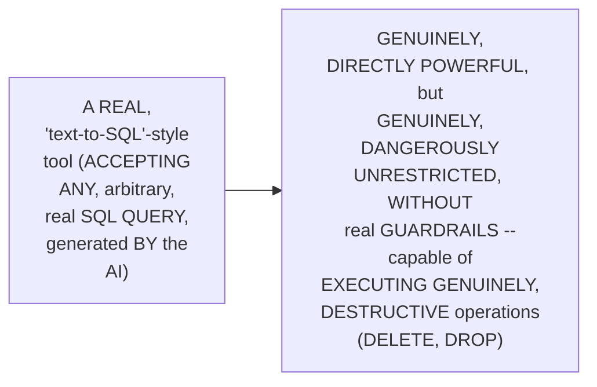
```mermaid
flowchart LR
    A["A REAL,<br/>'text-to-SQL'-style<br/>tool (ACCEPTING<br/>ANY, arbitrary,<br/>real SQL QUERY,<br/>generated BY the<br/>AI)"] --> B["GENUINELY,<br/>DIRECTLY POWERFUL, but<br/>GENUINELY,<br/>DANGEROUSLY<br/>UNRESTRICTED, WITHOUT<br/>real GUARDRAILS --<br/>capable of<br/>EXECUTING GENUINELY,<br/>DESTRUCTIVE operations<br/>(DELETE, DROP)"]
```

#### ⚠ Common Mistakes

* Assuming a REAL, dynamic, "text-TO-SQL" style TOOL is GENUINELY, SAFELY deployable, WITHOUT any, EXPLICIT, real SAFETY constraints — explicitly, directly, HONESTLY confirmed as GENUINELY, DIRECTLY dangerous, "AS of NOW" — REAL guardrails are EXPLICITLY, DIRECTLY confirmed as a REQUIRED, NEXT step, NOT yet IMPLEMENTED, in THIS specific, live EXAMPLE.

#### 🎯 Key Takeaways

* A REAL, complete AUDIENCE question directly, PRACTICALLY led to a LIVE-coded DEMONSTRATION — a REAL, dynamic SQL-execution tool, PAIRED with a REAL, schema-describing RESOURCE.
* THE instructor **directly, HONESTLY acknowledges** a REAL, important SAFETY gap — THIS specific TOOL currently, genuinely EXECUTES any, arbitrary QUERY, WITHOUT real GUARDRAILS — EXPLICITLY confirming THIS is a REQUIRED, future FIX.
* This directly, PRECISELY sets UP the SESSION's own, NEXT, essential Q&A — SAMPLING, a genuinely ADVANCED MCP capability (Section 14).

---
### 14. Real Q&A: Sampling — When a Server Asks to Use the Client's Own LLM

#### 🪜 Step-by-Step — The Real, Complete Question & Answer

> 💡 **Given directly, from a real participant, Debajyoti:** *"Can I call the LLM [from my MCP server]?"*

> 💡 **The genuine, direct answer:** *"You can. But, is it the best approach? No... one more thing, MCP can use the client's LLM?... this was actually the feature, so sampling, context injection, and everything... your server is saying to the MCP, can I please use your AI? So, it will take a prompt, like, send this prompt... pretty advanced thing."*

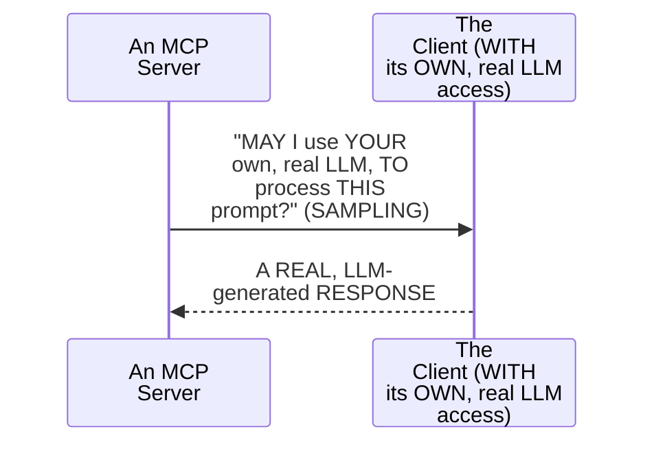
```mermaid
sequenceDiagram
    participant Server as An MCP<br/>Server
    participant Client as The<br/>Client (WITH<br/>its OWN, real LLM<br/>access)
    Server->>Client: "MAY I use YOUR<br/>own, real LLM, TO<br/>process THIS<br/>prompt?" (SAMPLING)
    Client-->>Server: A REAL, LLM-<br/>generated RESPONSE
```

#### ⚠ Common Mistakes

* Assuming an MCP SERVER GENUINELY, DIRECTLY needs its OWN, separate LLM ACCESS/API key, TO perform ANY, real REASONING task — explicitly, directly, PRACTICALLY clarified: "IS it the BEST approach? NO" — SAMPLING allows a SERVER to GENUINELY, DIRECTLY request the CLIENT's own, EXISTING LLM access, INSTEAD — AVOIDING a REDUNDANT, SEPARATE integration.

#### 🎯 Key Takeaways

* **SAMPLING** is precisely EXPLAINED as an ADVANCED, real MCP CAPABILITY — a SERVER genuinely, DIRECTLY requesting to USE the CLIENT's own, EXISTING LLM access, RATHER than requiring its OWN, separate INTEGRATION.
* THE instructor **directly, PRACTICALLY confirms** THIS is the GENUINELY, preferred APPROACH — over a SERVER genuinely, DIRECTLY calling an LLM ITSELF.
* This directly, PRECISELY sets UP the SESSION's own, NEXT, essential Q&A — WHY async genuinely MATTERS, for REAL MCP servers (Section 15).

---

### 15. Real Q&A: Why Async Genuinely Matters for MCP Servers

#### 🪜 Step-by-Step — The Real, Complete Question & Answer

> 💡 **Given directly, from a real participant, Debajyoti (asking why MCP tools are usually written as async functions):** *"Async, I will explain you from our use case... if you're not doing async, let's say that I am executing this query, and it is taking 5 minutes... it will wait, it will not have any other requests coming in till then... if you have 5 requests, they will take 10 minutes total to execute... first [request is] waited, everyone else will have to wait before the execution comes."*

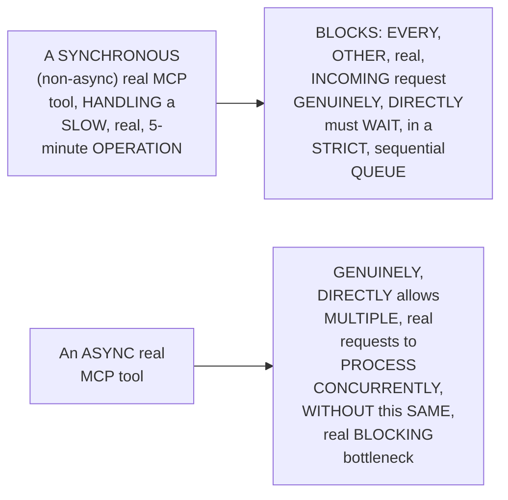
```mermaid
flowchart LR
    A["A SYNCHRONOUS<br/>(non-async) real MCP<br/>tool, HANDLING a<br/>SLOW, real, 5-<br/>minute OPERATION"] --> B["BLOCKS: EVERY,<br/>OTHER, real,<br/>INCOMING request<br/>GENUINELY, DIRECTLY<br/>must WAIT, in a<br/>STRICT, sequential<br/>QUEUE"]
    C["An ASYNC real<br/>MCP tool"] --> D["GENUINELY,<br/>DIRECTLY allows<br/>MULTIPLE, real<br/>requests to<br/>PROCESS<br/>CONCURRENTLY,<br/>WITHOUT this SAME,<br/>real BLOCKING<br/>bottleneck"]
```

#### ⚠ Common Mistakes

* Assuming ASYNC is GENUINELY, MERELY a STYLISTIC, optional CODING convention, FOR MCP tool DEFINITIONS — explicitly, directly, CONCRETELY clarified via a REAL, worked EXAMPLE: WITHOUT async, a SINGLE, slow, real OPERATION genuinely, DIRECTLY blocks EVERY, other, INCOMING request — a REAL, meaningful PERFORMANCE and scalability CONCERN.

#### 🎯 Key Takeaways

* A REAL, complete AUDIENCE question directly, CONCRETELY confirmed WHY async GENUINELY, PRACTICALLY matters — WITHOUT it, a SINGLE, slow OPERATION genuinely, DIRECTLY blocks EVERY, other, incoming REQUEST, in a STRICT, sequential QUEUE.
* This directly, PRECISELY sets UP the SESSION's own, FINAL, most substantive Q&A — a GENUINE, real system-DESIGN discussion ON shutdown AND scaling (Section 16).

---
### 16. Real Q&A: A Genuine System-Design Discussion on Shutdown & Scaling

#### 🪜 Step-by-Step — The Real, Complete Question & Answer

> 💡 **Given directly, from a real participant, Hardik Patel:** *"Agar hum streaming HTTP use karte hain, toh usme toh directly hum shutdown kar sakte hain, bas browser close kiya ya... connection kum me chhut jaaye ga, to ideally... sab connections band karke... [if we don't do this properly] timeout ke saath."*

> 💡 **The genuine, direct answer:** *"Client transport clean-times closes... uske dwara band karte hain... whenever you close the windows, your Mac, your laptop, toh koshish karte hai saari applications gracefully shutdown kare... state ko preserve kare... jo request tha, jo response wapas aani thi, agar main band ho chuka toh woh response... multiple benefits of this."*

```mermaid
flowchart LR
    A["A REAL,<br/>graceful CLIENT<br/>shutdown (e.g.<br/>CLOSING a BROWSER<br/>tab, OR the<br/>WHOLE machine)"] --> B["GENUINELY,<br/>DIRECTLY attempts to<br/>PRESERVE real STATE,<br/>and CORRECTLY<br/>handle any,<br/>in-FLIGHT<br/>requests/responses<br/>-- RATHER than<br/>ABRUPTLY,<br/>UNGRACEFULLY<br/>terminating"]
```

#### 🔍 Internal Working — A Genuine, Direct Confirmation: This Is a Real System-Design Concern

> 💡 **Given directly:** *"This is a very one-on-one kind of a system designing thing... EFI, the author system... aapko lagega jab MCP suya sari re-hai unko theek toh, fir sab help karega interview k... the more you know, the luck gets low and the chances becomes high."*

#### ⚠ Common Mistakes

* Assuming REAL, "SHUTDOWN" mechanics (per THIS series' own, EARLIER, established CONTENT) are GENUINELY, MERELY a LOW-level, protocol DETAIL, SEPARATE from REAL, genuine SYSTEM-design CONSIDERATIONS — explicitly, directly, LIVE-connected: GRACEFUL shutdown DIRECTLY, CONCRETELY connects to REAL, meaningful SYSTEM-design PRINCIPLES — state PRESERVATION, request/RESPONSE integrity, and OVERALL, real system RELIABILITY.

#### 🎯 Key Takeaways

* A REAL, complete, ADVANCED audience QUESTION directly, GENUINELY connected THIS series' own, EARLIER, established shutdown-MECHANICS content TO broader, real SYSTEM-design PRINCIPLES — state PRESERVATION, and REQUEST/response INTEGRITY.
* THE instructor **directly, EXPLICITLY reinforces**, once MORE, THIS session's own, CENTRAL, REPEATED message — DEEP, genuine UNDERSTANDING of MCP's own, COMPLETE architecture GENUINELY, DIRECTLY provides a REAL, competitive ADVANTAGE, in a REAL, professional INTERVIEW.
* This directly, PRECISELY sets UP the SESSION's own, FINAL, closing CONTENT — career GUIDANCE, and a PREVIEW of the NEXT class (Section 17).

---

### 17. Closing: Career Guidance & a Preview of the Next Class

#### 🪜 Step-by-Step — Genuine, Real, Personalized Career Guidance

> 💡 **Given directly, to a real participant with 15+ years of experience:** *"You should be targeting an architect kind of a role at any position... AI is just a part of your work, or part of your building, not the complete thing, because right now as well, most companies suffer by creating good systems rather than integrating AI to it... 70-80% of your capability will be tested on the work which you have already done."*

```mermaid
flowchart LR
    A["A REAL,<br/>experienced (15+<br/>year) LEARNER"] --> B["GENUINE, direct<br/>CAREER guidance:<br/>TARGET architect/<br/>tech-LEAD roles --<br/>AI genuinely, DIRECTLY<br/>remains ONLY a<br/>PART of a<br/>REAL, complete<br/>SKILLSET -- NOT the<br/>ENTIRE, complete<br/>picture"]
```

#### 🪜 Step-by-Step — A Direct, Genuine, Final Preview

> 💡 **Given directly:** *"In the next class now, what I will do... please revise everyone... in future, next class, we will create an agent as well as a client, so that whatever MCP we are creating, we can ourselves use it with agents... I think we will use Langchain there."*

```mermaid
flowchart LR
    A["THIS session<br/>(DONE): REAL<br/>integrations, a<br/>COMPLETE real<br/>PROJECT, and an<br/>EXTENSIVE, real<br/>Q&A"] --> B["A FUTURE<br/>session,<br/>EXPLICITLY, DIRECTLY<br/>promised: BUILDING<br/>an MCP CLIENT and a<br/>REAL agent, USING<br/>LangChain"]
```

#### ⚠ Common Mistakes

* Assuming REAL, deep MCP/AI KNOWLEDGE, alone, is GENUINELY, SUFFICIENTLY, the COMPLETE career-ADVANCEMENT story, for a REAL, senior PROFESSIONAL — explicitly, directly, HONESTLY clarified: "AI is JUST a PART of your WORK... NOT the COMPLETE thing" — REAL, foundational system-DESIGN and engineering CAPABILITY remains the PRIMARY, real EVALUATION criterion, for SENIOR roles.

#### 🎯 Key Takeaways

* THE instructor **directly, PERSONALLY provides** GENUINE, real career GUIDANCE — for EXPERIENCED professionals, AI genuinely, DIRECTLY remains ONLY a PART of a COMPLETE skillset — REAL, foundational engineering CAPABILITY remains PRIMARY.
* THE instructor **directly, EXPLICITLY previews** the NEXT class's own, complete AGENDA — BUILDING a REAL MCP client AND agent, USING LangChain.
* THIS episode **GENUINELY, COMPREHENSIVELY delivers** its OWN, stated GOALS — REAL, practical MCP integration, a COMPLETE, real-world PROJECT, and an UNUSUALLY substantive, REAL Q&A segment, COVERING architecture, SECURITY, and genuine SYSTEM-design reasoning.

---
## 📝 Glossary

| Term | Definition | Why It Matters |
|---|---|---|
| **Connectors** | Claude's simple, UI-based way to add MCP servers | Best for hosted, remote servers; updates the same config file internally |
| **Config File** | claude_desktop_config.json | Required for local, developer-built MCP servers |
| **Swagger / "/docs"** | FastAPI's built-in, interactive testing page | The REST-API equivalent of MCP Inspector |
| **FastMCP.from_fastapi()** | An automatic FastAPI-to-MCP conversion function | Fast, but offers less control than manual tool-building |
| **app.mount()** | Mounting an MCP server onto an existing FastAPI app | Enables one server to serve web, API, and MCP traffic together |
| **Sampling** | A server requesting to use the client's own LLM | Avoids requiring a separate, redundant LLM integration on the server |
| **Async** | Non-blocking request handling | Prevents one slow operation from blocking all other, concurrent requests |

---

## 🔄 Revision Notes — One-Minute Revision

* This session moves the series' own, established MCP knowledge fully into real-world application.
* **Two ways to connect MCP servers to Claude**: connectors (simple UI, for hosted servers) and the config file (required for local, developer-built servers) -- connectors genuinely still update the same, underlying config file.
* **A genuine, live debugging moment**: a config-file entry using just "uv" (not its full, absolute path) failed within Claude Desktop's own process environment -- fixed via `which uv` and using the returned, full path.
* **Community/third-party MCP servers are not always HTTP-based**: many (like Gmail's) run locally via Node/NPX or Docker -- and "local" doesn't mean isolated; a local server can still call out to real, remote APIs.
* **The Time Tracker project**: a complete, real FastAPI backend (SQLite-backed), built before any MCP was introduced -- reinforcing the established pattern that MCP is built on top of an existing application, not the other way around. Swagger ("/docs") is FastAPI's own equivalent of MCP Inspector.
* **A genuine, real argument for why this project needs MCP**: reduces real, daily friction (manual time-logging, wherever an employee is already working), and prevents the "1,000 companies, each manually updating scripts" scaling problem when the backend changes.
* **Building the MCP server from scratch**: four real tools (log_time, get_timesheet, get_project_summary, list_projects) and one, dynamic prompt (generate_weekly_report) that accepts real arguments and guides the AI to correctly combine multiple tools.
* **MCP Inspector verification**: confirmed both the tools and the dynamic prompt worked correctly, live.
* **The "4-line" automatic alternative** (`FastMCP.from_fastapi()`) exists, but the instructor personally still prefers manually building tools -- for full control over naming/descriptions, the ability to combine multiple APIs in one tool, and avoiding risky changes to already-working, production API code.
* **Mounting FastAPI + FastMCP on the same server**: `app.mount("/mcp", mcp_app)` combines a web front-end, a REST API, and an MCP endpoint on one, single server -- confirmed as "the right way of deploying it."
* **Real Q&A #1**: MCP tools are not required to be one-to-one with API endpoints -- a single tool can genuinely combine multiple, different API calls (even across REST and GraphQL).
* **Real Q&A #2**: Docker packages a complete MCP application into one, consistent, deployable container.
* **Real Q&A #3**: bidirectional communication is mainly used for progress updates and sampling; the genuine safeguard is connecting only with verified, trusted servers.
* **Real Q&A #4**: a live-coded, dynamic SQL-execution tool, paired with a schema-describing resource -- honestly flagged as currently lacking real guardrails, a required next step.
* **Real Q&A #5**: sampling lets a server request to use the client's own, existing LLM access, rather than requiring a separate, redundant integration.
* **Real Q&A #6**: async prevents one slow operation from blocking all other, concurrent requests.
* **Real Q&A #7**: an advanced, genuine system-design discussion connecting graceful shutdown to state preservation and request/response integrity.
* **Closing**: genuine, personalized career guidance (AI is only part of a complete skillset, for senior roles), and a direct preview of the next class -- building a real MCP client and agent, using LangChain.

---

## 📋 Cheat Sheet

**Two ways to connect MCP servers to Claude:**
```text
Connectors:   simple UI, for hosted/remote servers
Config file:  claude_desktop_config.json, required for local servers
              (use the FULL path, e.g. `which uv`, not just "uv")
```

**The complete, manually-built MCP tool pattern:**
```python
from fastmcp import FastMCP
mcp = FastMCP("Time Track")

@mcp.tool()
def log_time(employee_name: str, project: str, entry_date: str, hours: float, description: str) -> dict:
    """..."""
    return db.log_time(...)

@mcp.prompt()
def generate_weekly_report(employee_name: str, week_start: str) -> str:
    """..."""
    return f"..."
```

**The automatic, "4-line" alternative:**
```python
mcp = FastMCP.from_fastapi(app=app)  # wraps every endpoint automatically
```

**Mounting MCP on an existing FastAPI app:**
```python
mcp_app = mcp.streamable_http_app()
app.mount("/mcp", mcp_app)
```

**Key real Q&A takeaways:**
```text
Tools are NOT required to be 1:1 with API endpoints
Docker packages the entire app for consistent deployment
Sampling: server asks to use the CLIENT's own LLM
Async prevents one slow request from blocking all others
Graceful shutdown = state preservation + request/response integrity
```

---

## 🔥 Interview Questions & Answers

### 🟢 Beginner

**Q1.**

**Question:** What are the two, precise ways to connect an MCP server to Claude Desktop?

**Answer:** Connectors (simple UI, for hosted servers) and the config file (required for local, developer-built servers).

**Explanation:** Directly, explicitly confirmed.

**Why Interviewers Ask This:** The most basic, foundational, practical MCP integration question.

**Possible Follow-up:** "Does using connectors avoid the underlying config file entirely?"

**Q2.**

**Question:** Why did a config-file entry using just "uv" genuinely fail, in this session's own, live example?

**Answer:** Claude Desktop's own, internal process environment doesn't share the same PATH as an interactive terminal; the full, absolute path is required.

**Explanation:** Directly, live-demonstrated.

**Why Interviewers Ask This:** Tests genuine, practical, hands-on MCP configuration troubleshooting knowledge.

**Possible Follow-up:** "What command genuinely reveals the correct, full path?"

**Q3.**

**Question:** Are all real, third-party MCP servers genuinely HTTP-based?

**Answer:** No -- many, like Gmail's, run locally via Node/NPX or Docker.

**Explanation:** Directly, explicitly confirmed.

**Why Interviewers Ask This:** Tests genuine, accurate understanding of real MCP server deployment patterns.

**Possible Follow-up:** "Does a 'local' server genuinely mean it's isolated from the internet?"

**Q4.**

**Question:** According to this session's own, real argument, does MCP require the underlying application to already have APIs?

**Answer:** Yes -- the instructor confirms MCP is always built on top of an existing, real application, not created "out of the blue."

**Explanation:** Directly, explicitly confirmed.

**Why Interviewers Ask This:** Foundational, frequently-tested MCP architecture knowledge.

**Possible Follow-up:** "What was the concrete, real example used to illustrate this?"

**Q5.**

**Question:** Is `FastMCP.from_fastapi()` genuinely the instructor's own, personally preferred approach?

**Answer:** No -- he personally still prefers manually building tools, for full control.

**Explanation:** Directly, explicitly confirmed.

**Why Interviewers Ask This:** Tests genuine, practical understanding of MCP tool-design trade-offs.

**Possible Follow-up:** "Name one, specific, real reason for this preference."

**Q6.**

**Question:** Are MCP tools genuinely required to be one-to-one with underlying API endpoints?

**Answer:** No -- a single tool can genuinely combine multiple, different API calls.

**Explanation:** Directly, explicitly confirmed.

**Why Interviewers Ask This:** Tests genuine, practical, architectural understanding of MCP tool design.

**Possible Follow-up:** "What real, worked example illustrated this, in this session's own Q&A?"

**Q7.**

**Question:** What is "sampling," in MCP?

**Answer:** A server genuinely requesting to use the client's own, existing LLM access, rather than requiring a separate integration.

**Explanation:** Directly, explicitly confirmed.

**Why Interviewers Ask This:** Basic, essential, advanced-MCP terminology.

**Possible Follow-up:** "Is a server calling its own, separate LLM the recommended approach?"

**Q8.**

**Question:** Why does async genuinely matter, for real MCP tools?

**Answer:** Without it, one slow operation genuinely blocks all other, concurrent requests, in a strict, sequential queue.

**Explanation:** Directly, concretely demonstrated.

**Why Interviewers Ask This:** Tests genuine, practical, hands-on MCP server performance knowledge.

**Possible Follow-up:** "What real, worked example (5 requests, 5 minutes each) illustrated this?"

**Q9.**

**Question:** Can a real MCP application (FastAPI + MCP + database) genuinely run on one, single server?

**Answer:** Yes -- confirmed as "the right way of deploying it," via app.mount().

**Explanation:** Directly, explicitly confirmed.

**Why Interviewers Ask This:** Tests genuine, practical deployment-architecture knowledge.

**Possible Follow-up:** "What code, specifically, achieves this?"

**Q10.**

**Question:** Was the dynamic, "text-to-SQL"-style tool demonstrated in this session's own real Q&A confirmed as production-ready, as-is?

**Answer:** No -- honestly flagged as currently lacking real guardrails, a required next step.

**Explanation:** Directly, honestly confirmed.

**Why Interviewers Ask This:** Tests genuine, honest, practical understanding of real, production safety requirements.

**Possible Follow-up:** "What genuine, real risk does this specific tool, as-shown, carry?"

---
### 🟡 Intermediate

**Q11.**

**Question:** Explain why the instructor deliberately builds the entire Time Tracker application (FastAPI, database, front-end) BEFORE introducing any MCP code, rather than starting with MCP directly.

**Answer:** This is a genuinely deliberate, "REALITY-matching" teaching choice: by DIRECTLY, LIVE building a COMPLETE, real APPLICATION FIRST — WITH its OWN, real database LAYER, REST endpoints, and a WORKING front-END — the instructor MIRRORS the SAME, genuine, real-WORLD pattern he EXPLICITLY, REPEATEDLY states THROUGHOUT this SESSION: "WE never CREATE an MCP SERVER out OF the BLUE. WE normally ALWAYS try to CREATE an MCP server WHICH is BASED on an ALREADY existing APPLICATION." THIS sequencing GENUINELY, DIRECTLY teaches learners the CORRECT, real MENTAL model — MCP is a LAYER added ON TOP of EXISTING infrastructure, NOT a STARTING point — RATHER than RISKING learners GENUINELY, INCORRECTLY believing MCP servers are TYPICALLY built FROM a COMPLETELY blank SLATE.

**Explanation:** Requires recognizing the deliberate, "reality-matching" value of building a complete application before MCP, mirroring the session's own, explicitly-stated, real-world pattern.

**Why Interviewers Ask This:** Tests whether a learner recognizes the pedagogical value of sequencing a demonstration to match genuine, real-world practice, rather than an idealized, MCP-first order.

**Possible Follow-up:** "Describe a GENUINE, real RISK of a LEARNER incorrectly BELIEVING MCP servers are TYPICALLY built FROM a COMPLETELY blank SLATE."

**Q12.**

**Question:** A learner argues that since this session confirms `FastMCP.from_fastapi()` can automatically convert an entire, existing FastAPI application into a working MCP server in just a few lines, this means manually building MCP tools is genuinely, always an unnecessary, wasteful extra step. Evaluate this claim.

**Answer:** This claim OVERSTATES a GENUINE, SPECIFIC capability (AUTOMATIC conversion IS, genuinely, POSSIBLE and FAST) into an UNCONDITIONAL claim THAT manual BUILDING is "ALWAYS unnecessary," which DIRECTLY contradicts Section 8's own, EXPLICIT, personal REASONING. Section 8's own PRECISE statement DIRECTLY confirms the INSTRUCTOR himself, PERSONALLY, "STILL love[s] to CREATE my MCP server MYSELF" — CITING multiple, GENUINE, real REASONS: BETTER, AI-helpful DOCUMENTATION, the ABILITY to COMBINE multiple APIs WITHIN a SINGLE tool (per Section 10's own established CLARIFICATION), and, CRITICALLY, AVOIDING risky, DIRECT changes to ALREADY-working, PRODUCTION API code. The ACCURATE, more PRECISE conclusion: THE automatic CONVERSION is a GENUINE, real, VALID option, for SIMPLE, low-STAKES cases — but MANUAL building REMAINS the GENUINELY, preferred CHOICE, for CASES requiring FINE-grained control, MULTI-API tool COMBINATION, or PROTECTION of EXISTING, production CODE.

**Explanation:** Tests whether a learner recognizes that automatic conversion's genuine convenience doesn't imply manual building is always unnecessary, given the instructor's own, explicit, multi-reasoned preference for manual building.

**Why Interviewers Ask This:** Distinguishes candidates who correctly track this session's own, explicit, nuanced trade-off from those who over-generalize a convenient shortcut into a universal recommendation.

**Possible Follow-up:** "Describe a GENUINE, real SCENARIO where the AUTOMATIC conversion WOULD, genuinely, be the REASONABLE, appropriate CHOICE."

**Q13.**

**Question:** Explain, precisely, why the instructor deliberately, honestly acknowledges the dynamic SQL tool (Section 13) currently lacks real guardrails, rather than either omitting this admission or building the guardrails before demonstrating the tool.

**Answer:** This is a genuinely deliberate, HONEST-transparency teaching choice: by DIRECTLY, EXPLICITLY acknowledging "I will NOW have to LOVE to have SOME guardrails, BECAUSE I don't WANT that it DELETES anything," the instructor MODELS a GENUINE, professional VALUE — TRANSPARENTLY communicating a REAL, known LIMITATION, RATHER than PRESENTING a POWERFUL, but GENUINELY, currently-UNSAFE tool AS if it WERE, already, COMPLETE and production-READY. THIS directly, PRACTICALLY teaches a TRANSFERABLE, real LESSON — POWERFUL capabilities (LIKE dynamic SQL EXECUTION) genuinely, STRUCTURALLY require EXPLICIT, deliberate SAFETY considerations, and IT'S genuinely, PROFESSIONALLY appropriate TO acknowledge a GAP openly, RATHER than SILENTLY glossing OVER it.

**Explanation:** Requires recognizing the deliberate, honest-transparency value of openly acknowledging a real safety gap, rather than omitting the admission or presenting the tool as already complete.

**Why Interviewers Ask This:** Tests whether a learner recognizes the pedagogical and professional value of transparently communicating a known limitation, rather than presenting incomplete work as finished.

**Possible Follow-up:** "Propose a GENUINE, real, SPECIFIC guardrail THAT could be ADDED, to DIRECTLY address this EXACT, acknowledged gap."

**Q14.**

**Question:** Using this session's own precise "async prevents blocking" reasoning (Section 15), explain a GENUINE, real risk a team might face if they deploy the Time Tracker's own, dynamic SQL-execution tool (Section 13) as a SYNCHRONOUS (non-async) function, in a real, production environment with many, real, simultaneous users.

**Answer:** A precise, reasoned RISK analysis, directly CONNECTING two, separately-established sections: per Section 15's own PRECISE, established DEMONSTRATION, a SYNCHRONOUS OPERATION genuinely, DIRECTLY blocks EVERY, other, incoming REQUEST, in a STRICT, sequential QUEUE — "IF you have 5 REQUESTS, they will TAKE 10 minutes TOTAL to EXECUTE." GIVEN this, a GENUINE, real RISK emerges IF the dynamic SQL-execution TOOL (per Section 13's own established EXAMPLE) is GENUINELY, DIRECTLY deployed as a SYNCHRONOUS function: a REAL, complex, SLOW-running SQL query (e.g., a REAL, full-table AGGREGATION, across a LARGE, growing TIME-entries table) would GENUINELY, DIRECTLY block EVERY, OTHER, real, SIMULTANEOUS user's OWN request — CAUSING a REAL, cascading PERFORMANCE degradation, ACROSS the ENTIRE, real MCP server — a GENUINE, real RISK that COMPOUNDS, precisely BECAUSE this SPECIFIC tool GENUINELY, DIRECTLY accepts ARBITRARY, real SQL queries — SOME of WHICH could BE, genuinely, SLOW.

**Explanation:** Requires extending the async-blocking demonstration to the specific, dynamic SQL tool, identifying a genuine, compounding risk given that arbitrary queries can genuinely vary widely in execution time.

**Why Interviewers Ask This:** Tests whether a learner can synthesize a general, demonstrated principle (async prevents blocking) with a specific, real tool's own characteristics (arbitrary, variable-duration queries) to identify a genuine, compounding production risk.

**Possible Follow-up:** "Propose a GENUINE, real, ADDITIONAL safeguard (BEYOND simply USING async) THAT could FURTHER mitigate THIS exact, IDENTIFIED risk."

**Q15.**

**Question:** Synthesize this session's complete "MCP tools are not required to be one-to-one with API endpoints" clarification (Section 10) with its own "sampling" capability (Section 14) to explain a GENUINE, structural reason why a single, well-designed MCP tool might combine BOTH a real API call AND a real sampling request, within one, unified operation.

**Answer:** A precise, synthesized explanation, directly connecting TWO, separately-established sections: per Section 10's own PRECISE, established CLARIFICATION, a SINGLE, real MCP tool GENUINELY, DIRECTLY can COMBINE multiple, DIFFERENT operations — "YOUR tool CAN have MULTIPLE API calls AS well." Per Section 14's own PRECISE, established MECHANISM, SAMPLING allows a SERVER to GENUINELY, DIRECTLY request the CLIENT's own, EXISTING LLM access, WITHIN a SINGLE, real OPERATION. SYNTHESIZING these TWO facts directly, PRECISELY reveals a GENUINE, structural REASON why a WELL-designed, real MCP tool MIGHT, genuinely, COMBINE both: CONSIDER a REAL, "SUMMARIZE this WEEK's time ENTRIES" tool — it GENUINELY, DIRECTLY could FIRST call a REAL, existing API (per Section 10's own established FLEXIBILITY, TO fetch the RAW, real time-ENTRY data), and THEN, genuinely, DIRECTLY use SAMPLING (per Section 14's own established MECHANISM) TO request the CLIENT's own LLM GENERATE a real, natural-LANGUAGE summary OF that data — ALL within ONE, unified, real TOOL call — AVOIDING the NEED for the SERVER to MAINTAIN its OWN, separate LLM INTEGRATION, WHILE still delivering a GENUINELY, richer, more COMPLETE result THAN a SIMPLE, raw API call ALONE.

**Explanation:** Requires synthesizing the multi-API tool flexibility with the sampling mechanism to design a genuine, plausible, real tool that combines both, delivering a richer result without requiring the server's own, separate LLM integration.

**Why Interviewers Ask This:** A senior-level question testing whether a candidate can creatively combine two, separately-established, advanced MCP concepts into a single, coherent, genuinely useful tool design.

**Possible Follow-up:** "Describe a GENUINE, real, DIFFERENT example (BEYOND time-ENTRY summarization) where THIS same, COMBINED pattern (API call + SAMPLING) would GENUINELY, DIRECTLY add REAL value."

---

### 🔴 Advanced

**Q16.**

**Question:** Design a complete, reasoned production-deployment checklist (using ONLY this session's own established concepts) for a hypothetical team preparing to deploy a real MCP server on top of an existing, real application, similar to the Time Tracker.

**Answer:** A reasonable, complete checklist, directly applying this session's OWN, exact established CONCEPTS:

```text
1. Build the Application First, MCP Second (per Section 4's own
   established, DELIBERATE sequencing): CONFIRM a COMPLETE, real,
   WORKING application (DATABASE, REST endpoints, FRONT-end)
   GENUINELY, ALREADY exists, BEFORE introducing ANY, real MCP
   code -- NEVER build MCP "OUT of the BLUE."

2. Choose Manual Tool-Building for Production-Grade Control (per
   Section 8's own established, PERSONAL preference): DEFAULT to
   MANUALLY building EACH, real TOOL -- REPLACING AUTOMATIC,
   `from_fastapi()`-style conversion ONLY when GENUINE,
   real SPEED, OVER control, IS the EXPLICIT priority.

3. Design Tools Around Real User Needs, Not API Structure (per
   Section 10's own established CLARIFICATION): EXPLICITLY,
   DELIBERATELY combine MULTIPLE, real API calls, WITHIN a
   SINGLE tool, WHEN this GENUINELY, DIRECTLY better serves a
   REAL, user-facing NEED -- REFUSING the assumption THAT tools
   MUST be ONE-to-one WITH endpoints.

4. Implement Real Guardrails for Powerful, Dynamic Tools (per
   Section 13's own established, HONEST acknowledgment):
   EXPLICITLY, DELIBERATELY implement REAL, safety GUARDRAILS
   (e.g. QUERY validation, permission CHECKS) FOR any, real,
   dynamic-execution TOOL -- BEFORE genuine, production
   DEPLOYMENT, NOT after.

5. Implement Async, for Any Genuinely Variable-Duration Operation
   (per Advanced Q14's own established SYNTHESIS): EXPLICITLY use
   ASYNC function DEFINITIONS, for ANY, real TOOL WHOSE own,
   REAL execution TIME could GENUINELY vary (e.g. DYNAMIC SQL,
   EXTERNAL API calls) -- AVOIDING the IDENTIFIED, real BLOCKING
   risk.

6. Deploy via a Single, Unified Server, Where Reasonable (per
   Section 9's own established, "RIGHT way OF deploying it"
   confirmation): USE `app.mount()`, to COMBINE web, API, and MCP
   traffic, ON one, SINGLE server, RATHER than MAINTAINING
   SEPARATE, duplicated infrastructure.
```

This complete CHECKLIST directly, precisely APPLIES this session's OWN, established CONCEPTS — SEQUENCING, tool-BUILDING approach, tool DESIGN flexibility, GUARDRAILS, async, and DEPLOYMENT architecture — to a GENUINELY realistic, production-deployment SCENARIO.

**Explanation:** Requires synthesizing sequencing, tool-building approach, tool design flexibility, guardrails, async implementation, and deployment architecture into one complete, reasoned production checklist.

**Why Interviewers Ask This:** A comprehensive, capstone-level question testing whether a candidate can apply the complete range of this session's own concepts to a genuinely realistic, production deployment scenario.

**Possible Follow-up:** "WHICH of THESE six, checklist ITEMS would you GENUINELY, PRACTICALLY consider MOST critical, if you HAD to prioritize ONLY one, BEFORE a REQUIRED, initial LAUNCH?"

**Q17.**

**Question:** Critically evaluate: "Since this session confirms a real, competitive business argument for MCP (companies with MCP-enabled products will genuinely attract more clients than those without), this means every, real software product should, unconditionally, immediately build an MCP server, regardless of the product's own, specific use case or user base." Is this an accurate, complete characterization?

**Answer:** Not accurate — this OVERSTATES a GENUINE, SPECIFIC, well-reasoned business ARGUMENT (MADE, specifically, IN the CONTEXT of a REAL, workflow-automation TOOL, where AGENTIC, autonomous ACCESS genuinely PROVIDES real, MEANINGFUL value) into an UNCONDITIONAL, "EVERY product, REGARDLESS of USE case" recommendation, WHICH this session's own, BROADER, established REASONING does NOT, genuinely, SUPPORT. Section 5's own PRECISE, established ARGUMENT is SPECIFICALLY grounded IN a CONCRETE, real SCENARIO — REDUCING "LAZINESS"-driven, real FRICTION, in a REPETITIVE, daily WORKFLOW (time LOGGING) — a GENUINE, real USE case where AUTONOMOUS, AI-driven ACCESS provides CLEAR, meaningful VALUE. NOT every, REAL software PRODUCT genuinely SHARES this SAME, structural CHARACTERISTIC — a PRODUCT with GENUINELY infrequent, HIGH-stakes, OR fundamentally NON-repetitive user INTERACTIONS (e.g., a ONE-time, complex LEGAL document REVIEW tool) might NOT, genuinely, BENEFIT from the SAME, real "REDUCE daily FRICTION" argument, in the SAME, meaningful WAY. The ACCURATE, more PRECISE conclusion: MCP GENUINELY, DIRECTLY provides REAL, competitive VALUE, for products WITH genuinely REPETITIVE, workflow-INTEGRATED use CASES — but this does NOT, genuinely, IMPLY an UNCONDITIONAL, "EVERY product SHOULD build ONE" recommendation, REGARDLESS of a GIVEN product's OWN, specific, real CONTEXT.

**Explanation:** Tests whether a learner recognizes that this session's own, context-specific business argument (reducing daily, repetitive friction) doesn't generalize into an unconditional recommendation for every possible software product, regardless of its own, genuine use case.

**Why Interviewers Ask This:** Distinguishes candidates who correctly scope a genuine, context-specific business argument from those who over-generalize it into a universal, unconditional recommendation.

**Possible Follow-up:** "Describe a GENUINE, real, HYPOTHETICAL software PRODUCT where THIS same, established 'REDUCE daily FRICTION' argument WOULD, genuinely, NOT apply, as STRONGLY."

---

## 🧪 Scenario-Based Interview Questions

> **Scenario 1:** A colleague, having completed this session's own exact Time Tracker lessons, reports their own, real MCP server (also built on top of an existing FastAPI app, using `app.mount()`) genuinely works correctly when tested via MCP Inspector, but fails entirely when connected to Claude Desktop, with no visible error message. Using this session's own concepts, construct a complete, reasoned debugging response.

**Structured Answer:**
1. **Initial investigation:** Recognize this as directly connected to Section 2's own precise, established UV-path debugging pattern — a GENUINE, likely CONFIGURATION-level issue, RATHER than a PROBLEM with the MCP SERVER's own, real CODE.
2. **Relevant principle:** Per Section 2's own established REASONING, "CLAUDE desktop's OWN, internal PROCESS environment does NOT, genuinely, SHARE the SAME, interactive SHELL's own, established PATH" — a GENUINE, common cause OF "silent," unexplained FAILURES, specifically WITHIN Claude Desktop.
3. **Possible causes:** THE colleague's OWN, config-FILE entry LIKELY, genuinely USES a SHORT command NAME (e.g., "UV" or "PYTHON3"), WITHOUT its FULL, absolute PATH — GENUINELY, DIRECTLY working, VIA MCP Inspector's OWN, terminal-based EXECUTION context, but FAILING, within CLAUDE Desktop's OWN, DIFFERENT process ENVIRONMENT.
4. **Debugging approach:** Directly RUN `WHICH uv` (or the RELEVANT, equivalent COMMAND), and CONFIRM whether the COLLEAGUE's own, config-FILE entry GENUINELY, CURRENTLY uses this SAME, full, ABSOLUTE path.
5. **Resolution:** UPDATE the CONFIG file's own, real ENTRY to USE the FULL, absolute PATH (per Section 2's own established FIX) — THEN, genuinely, RESTART Claude Desktop, to PICK up this SAME, corrected CONFIGURATION.
6. **Prevention:** Establish a standing, PERSONAL practice of ALWAYS using FULL, absolute PATHS, WITHIN any, real Claude Desktop CONFIG-file entry — RATHER than assuming SHORT, terminal-STYLE command names WILL, genuinely, WORK correctly.

> **Scenario 2 (Advanced):** Your organization's real, production Time-Tracker-style MCP server (following this session's own established pattern, with a dynamic SQL-execution tool per Section 13) has been live for three months, and a recent, real security audit reveals that a test user, via natural-language prompting to Claude, was genuinely able to execute a real DELETE query against the production database, despite no malicious intent. Using this session's own concepts, construct a complete, reasoned response.

**Structured Answer:**
1. **Initial investigation:** Recognize this as directly connected to Section 13's own precise, established, honest acknowledgment — a GENUINE, real, PREDICTED consequence OF deploying the dynamic SQL TOOL, without REAL guardrails.
2. **Relevant principle:** Per Section 13's own established, EXPLICIT warning, "I will NOW have to LOVE to have SOME guardrails, BECAUSE I don't WANT that it DELETES anything... HERE everything is ALLOWED as of NOW" — this EXACT, real risk was GENUINELY, HONESTLY predicted, DURING the tool's OWN, initial demonstration.
3. **Possible causes:** THE organization's OWN, production DEPLOYMENT LIKELY, genuinely SHIPPED this SAME, dynamic SQL TOOL, WITHOUT ever, genuinely IMPLEMENTING the EXPLICITLY-acknowledged, REQUIRED guardrails — a REAL, direct CONSEQUENCE of NOT completing this SAME, established, "NEXT step."
4. **Debugging/evaluation approach:** Directly REVIEW the CURRENT, production TOOL's own, real IMPLEMENTATION — CONFIRMING whether ANY, real QUERY-type restrictions (e.g., BLOCKING DELETE/DROP OPERATIONS) or PERMISSION checks GENUINELY, CURRENTLY exist.
5. **Resolution:** IMPLEMENT real, EXPLICIT guardrails (per Section 13's own established, ACKNOWLEDGED need) — e.g., RESTRICTING the DYNAMIC tool to READ-only queries BY default, or REQUIRING separate, EXPLICIT authorization FOR any, real WRITE/delete operation.
6. **Prevention:** Establish a standing, ORGANIZATIONAL policy REQUIRING explicit, REAL security REVIEW — SPECIFICALLY covering DYNAMIC, arbitrary-EXECUTION tools — per Advanced Q16's own established, PRODUCTION-deployment checklist ITEM — BEFORE any, real TOOL of this TYPE reaches PRODUCTION deployment.

---

## 🛠 Hands-on Exercises

### 🟢 Easy

1. Write out, from memory, the two, real ways to connect an MCP server to Claude Desktop.
2. Explain, in your own words, why "local" doesn't genuinely mean "isolated," for a real MCP server.
3. Explain, in your own words, why MCP tools are not genuinely required to be one-to-one with API endpoints.

### 🟡 Medium

4. Reproduce this session's own, complete Time Tracker MCP server, with your own, original database and tools.
5. Deliberately reproduce the config-file UV-path error, then correctly diagnose and fix it.
6. Mount your own, reproduced MCP server onto a real FastAPI app, using `app.mount()`.

### 🔴 Advanced

7. Complete the full, reasoned production-deployment checklist proposed in Advanced Interview Q16, for your own, reproduced Time Tracker server.
8. Implement the debugging scenario proposed in Scenario 1 -- deliberately reproduce a "works in Inspector, fails in Claude Desktop" failure, then correctly diagnose and fix it.
9. Design and implement real, explicit guardrails for the dynamic SQL tool from Section 13, addressing the exact, honestly-acknowledged gap.

---

## 🏗 Practice Assignment

*(This session's own stated, direct, forward-looking preview, reproduced faithfully)*

> 💡 **The instructor's own words, given directly:** *"In the next class now... we will create an agent as well as a client, so that whatever MCP we are creating, we can ourselves use it with agents... I think we will use Langchain there."*

### Build: "Complete, Personal, Real-World MCP Application"

**Objective:** Directly apply this session's own, complete set of real-world MCP integration techniques, in preparation for the series' own, next, promised client/agent content.

**Requirements:**
- Build a complete, real application (with a real database and REST API), for a genuinely different, real use case of your own choosing.
- Build a complete, real MCP server, on top of this application, with at least three, genuinely useful tools and one, dynamic prompt.
- Connect this server to Claude Desktop, via the config file, correctly resolving any real, path-related errors.
- Implement real, explicit guardrails, for any tool that performs a genuinely destructive or sensitive operation.
- Mount your MCP server onto your existing FastAPI app, using `app.mount()`, confirming all three interfaces (web, API, MCP) work correctly, on one server.
- A written reflection (200-300 words) on which of this session's own, real Q&A topics (tool design, Docker, sampling, async, or system design) you found most genuinely instructive, and why.

**Architecture (suggested):**

```text
real_world_mcp_application/
├── database.py
├── main.py                    # FastAPI + FastMCP, mounted together
├── index.html / style.css / app.js
├── claude_desktop_config_entry.md
├── guardrails_notes.md
└── REFLECTION.md
```

**Expected Functionality:**
- Your complete application should genuinely, correctly demonstrate every, major technique established in this session.

**Challenges:**
- Correctly resolving any real, path-related configuration errors, when connecting to Claude Desktop.
- Designing genuinely appropriate, real guardrails, for any tool performing a sensitive operation.

**Bonus Improvements:**
- Apply Advanced Q16's own, established production-deployment checklist, to formally verify your own, complete application.
- Research and implement a real, working sampling-based tool, per Section 14's own, established mechanism.

---

## 📚 Additional Resources

- **The prior session in this same MCP series** (in this same workspace, as a separate, complete study guide) -- the directly-preceding session, completing the MCP lifecycle and building the initial "recipe box" server, this session builds directly upon.
- **FastMCP's own, official documentation** (referenced directly) -- covering `from_fastapi()`, mounting, sampling, and async patterns.
- **FastAPI's own, official documentation** (referenced directly) -- covering the Swagger/"/docs" interactive testing page.
- **FastMCP Cloud / Horizon** (referenced directly, from Prefect) -- for further, independent exploration of real, hosted MCP server deployment.

---

## 📌 Final Revision Sheet

### ⭐ Core Concepts
- **Connectors vs. config file**: two ways to connect MCP servers to Claude, with connectors updating the same, underlying config.
- **MCP is built on top of existing applications**: never "out of the blue."
- **Manual tool-building vs. automatic conversion**: a genuine trade-off between speed and control.
- **Tools are not required to be one-to-one with API endpoints.**
- **Guardrails, async, and sampling**: three genuinely important, advanced, real considerations for production MCP servers.

### ⭐ Important Definitions
- **Sampling, app.mount()** (see Glossary for full definitions).

### ⭐ Important Commands/Code
```python
mcp = FastMCP.from_fastapi(app=app)  # automatic
mcp_app = mcp.streamable_http_app()
app.mount("/mcp", mcp_app)
```
```bash
which uv  # for correct, full config-file paths
```

### ⭐ Architecture/Process
- Complete workflow: build the real application first (database, API, front-end) -> build the MCP server on top (manually, for full control) -> verify via MCP Inspector -> implement guardrails for any sensitive tools -> use async for variable-duration operations -> mount everything on one, unified server -> connect to Claude Desktop, via the config file (using full, absolute paths).

### ⭐ Best Practices
- Always build the real application before the MCP server.
- Prefer manual tool-building, for production-grade control and safety.
- Design tools around genuine user needs, not rigid, one-to-one API mapping.
- Implement explicit, real guardrails, for any dynamic or destructive tool.
- Use async, for any tool whose real execution time could genuinely vary.

### ⭐ Common Mistakes
- Assuming a config-file entry using a short command name (like "uv") will work, without its full, absolute path.
- Assuming all third-party MCP servers are HTTP-based.
- Assuming MCP tools must be one-to-one with API endpoints.
- Deploying a dynamic, arbitrary-execution tool without real, explicit guardrails.

### ⭐ Interview Points
- Be ready to explain both ways of connecting MCP servers to Claude, and troubleshoot common, real configuration errors.
- Be ready to justify the trade-off between manual and automatic MCP tool-building.
- Be ready to explain sampling, async, and real, production-safety guardrails.
- Be ready to discuss genuine, real system-design reasoning around MCP shutdown and scaling.

### ⭐ Things to Remember
- This session's own **complete, real Time Tracker project** (Sections 4-9) is the series' own most practically important, end-to-end, real-world demonstration.
- The **honest acknowledgment of missing guardrails** (Section 13) and the **extensive, substantive, real Q&A segment** (Sections 10-16) together reflect this series' own, consistent, honest teaching philosophy — real limitations, openly acknowledged, and genuine, advanced questions, genuinely, thoroughly answered.
- **Building a real MCP client and agent, using LangChain, remains explicitly, directly promised** for the following class — this session's own content is confirmed as foundational, not final.