# 🔌 MCP Deep Dive — Hosting, Deployment & the MCP Client

- <i>**Series:** MCP (directly continuing from Part 2, which built the complete "Time Track" project — a real, SQLite-backed FastAPI backend with a FastMCP server mounted on top of it) ·
- **Instructor:** Mayank Aggarwal
- **Note on scope:** This session moves the Time Track project from a local prototype to a genuinely hosted, shareable application — covering HTTP transport, live JSON-RPC debugging, deployment on both Prefect Horizon and Vercel (including a real paid-tier obstacle and its workaround), building an MCP client from scratch, and a long, substantive live Q&A on tool design, protocol architecture, and production judgment. "MCP modern vs. legacy architecture" and the concepts of sampling and ping were named on the agenda but not actually taught live in this transcript — they are flagged below as assigned reading rather than invented.</i>

---

## 📑 Table of Contents

1. [Session Overview](#-session-overview)
2. [Learning Objectives](#-learning-objectives)
3. [Detailed Notes](#-detailed-notes)
   - [1. STDIO vs HTTP Transport: Recap and Deep Dive](#1-stdio-vs-http-transport-recap-and-deep-dive)
   - [2. Switching the Server to HTTP and Live Debugging](#2-switching-the-server-to-http-and-live-debugging)
   - [3. Talking to the MCP Server via curl: The JSON-RPC Handshake](#3-talking-to-the-mcp-server-via-curl-the-json-rpc-handshake)
   - [4. Hosting on Prefect Horizon: Deployment Walkthrough](#4-hosting-on-prefect-horizon-deployment-walkthrough)
   - [5. The Database Reinitialization Design Flaw](#5-the-database-reinitialization-design-flaw)
   - [6. The Horizon Paid Tier Authentication Wall](#6-the-horizon-paid-tier-authentication-wall)
   - [7. Circumventing the Wall: Deploying the Full App to Vercel](#7-circumventing-the-wall-deploying-the-full-app-to-vercel)
   - [8. AI Harness Engineering and Building an MCP Client From Scratch](#8-ai-harness-engineering-and-building-an-mcp-client-from-scratch)
   - [9. The Central Principle: AI Never Calls the Tool Directly](#9-the-central-principle-ai-never-calls-the-tool-directly)
   - [10. MCP Protocol vs HTTP and REST: Architectural Clarifications](#10-mcp-protocol-vs-http-and-rest-architectural-clarifications)
   - [11. Design Judgment: Tool Granularity, Guardrails and Multi Tenancy](#11-design-judgment-tool-granularity-guardrails-and-multi-tenancy)
   - [12. Closing: Homework, Roadmap and Career Guidance](#12-closing-homework-roadmap-and-career-guidance)
4. [Glossary](#-glossary)
5. [Revision Notes — One-Minute Revision](#-revision-notes--one-minute-revision)
6. [Cheat Sheet](#-cheat-sheet)
7. [Interview Questions & Answers](#-interview-questions--answers)
8. [Scenario-Based Interview Questions](#-scenario-based-interview-questions)
9. [Hands-on Exercises](#-hands-on-exercises)
10. [Practice Assignment](#-practice-assignment)
11. [Additional Resources](#-additional-resources)
12. [Final Revision Sheet](#-final-revision-sheet)

---

## 🎯 Session Overview

This session takes the Time Track project (built in Part 2) out of the local prototype stage and makes it a real, hosted, shareable application. It covers:

1. **A deep recap of STDIO vs. HTTP transport**, and switching the Time Track server from STDIO to HTTP — including two live debugging moments.
2. **Talking to the MCP server directly with `curl`** — the raw JSON-RPC `initialize` handshake, the `Mcp-Session-Id` header, and a `tools/list` call, done by hand to demystify what a client normally does automatically.
3. **Hosting the server on Prefect Horizon** (the company behind FastMCP) — a full deployment walkthrough, a live GitHub-push authentication problem, and an explicit callout of a real design flaw: the database re-initializes on every deploy.
4. **A paid-tier authentication wall on Horizon**, and the workaround: deploying the entire application (UI, API, and MCP endpoint together) to Vercel instead, with one critical setting that must be disabled.
5. **Building an MCP client from scratch** and the concept of "AI harness engineering" — culminating in the session's single most repeated point: the AI never calls a tool directly.
6. **An unusually long, substantive live Q&A** — architecture protocol clarifications, tool granularity, guardrails, multi-tenant filtering, and honest, sometimes blunt production judgment.

> 💡 **Key framing, given directly, on why manual understanding still matters even though AI could generate all of this code in seconds:** *"This thing anyone can do [use AI to write code], but when it fails, that is where we need [understanding]. That is where people are not equipped... you could have never cracked any interview or understood why and what happened."*

---

## 🎯 Learning Objectives

By the end of this guide, you will be able to:

- [ ] Explain the practical difference between running an MCP server over STDIO and over HTTP, and switch a FastMCP server between the two.
- [ ] Perform a raw JSON-RPC handshake with an MCP server using `curl`, including the `initialize` call and the `Mcp-Session-Id` header.
- [ ] Deploy an MCP server on Prefect Horizon, and explain why the underlying database re-initializes on every deploy.
- [ ] Deploy a complete FastAPI + MCP application on Vercel, and correctly disable Deployment Protection.
- [ ] Explain "AI harness engineering" and build a minimal MCP client's agent loop from scratch.
- [ ] State precisely why an AI model can never call an MCP tool directly, and what actually sits between them.
- [ ] Explain the relationship between the MCP protocol and HTTP/REST, and defend where MCP is (and isn't) the right architectural choice.

---

## 📚 Detailed Notes

### 1. STDIO vs HTTP Transport: Recap and Deep Dive

#### 📖 Definition — The Two Transports, Compared

> 💡 **Given directly:** *"This local STDIO, everyone, if I have started on my machine. Only I can start and connect it with my machine applications. No one outside my machine can access the same. There are ways of tunneling, etc, but we are not discussing them here."*

| Aspect | Local STDIO | Remote HTTP |
|---|---|---|
| Where it runs | On your own machine, launched as a sub-process | Somewhere else, reachable over the internet |
| Speed | Fast — "just a pipe," no network hop | Slower — every request is a real network round trip |
| Who can use it | Only whoever launched it | Multiple clients, from anywhere, at the same time |
| Where compute happens | On whoever's machine is running it | Centralized on the server itself |
| Typical use case | A personal tool, one person, one machine | Team tools, company-wide tools, anything meant to be shared |

> 💡 **Given directly:** *"That is the reason all the major enterprise MCP servers you will see, those will be HTTP."*

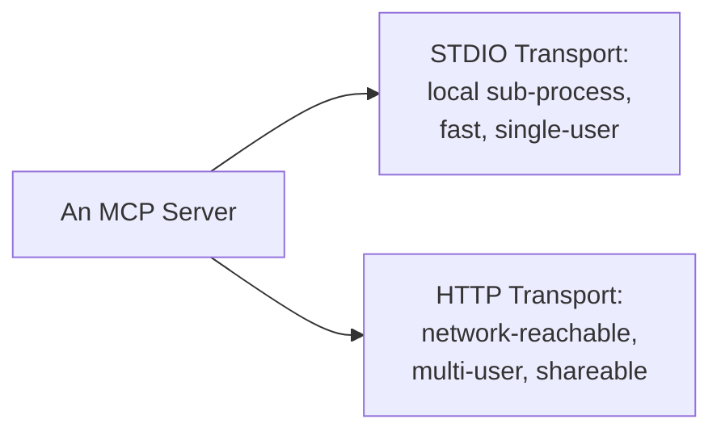

#### ⚠ Common Mistakes

* Assuming HTTP+SSE is still the current standard for remote MCP servers — directly clarified as effectively legacy: "streamable HTTP, HTTP plus SSE is now kind of deprecated." The modern default is streamable HTTP.

#### 🎯 Key Takeaways

* STDIO is fast and simple but strictly single-machine; HTTP is slower per-call but is what makes a server genuinely shareable across a team or company.
* This is why enterprise MCP servers are almost always HTTP-based — the whole point is that more than one person needs to reach them.
* This sets up the session's next step: actually switching the Time Track server over to HTTP (Section 2).

---

### 2. Switching the Server to HTTP and Live Debugging

#### 🪜 Step-by-Step — Running the Server Over HTTP

> 💡 **Given directly:** *"Transport protocol to use, HTTP, STDIO, SSE, or streamable HTTP."* (from the `fastmcp run` CLI's own docstring; STDIO is the default.)

```bash
# default: STDIO
uv run fastmcp run main.py

# switched to HTTP
uv run fastmcp run main.py --transport http --host 127.0.0.1 --port 8001

# running the combined FastAPI + MCP app via uvicorn, from inside the project folder
cd time_track
uv run uvicorn main:app --reload --host 127.0.0.1 --port 8000
```

#### 🔍 Internal Working — A Live Debugging Moment: "Could Not Import Module 'main'"

> 💡 **Given directly:** *"It is saying could not import module main... seems like it is not able to find the module main, and the reason is pretty simple, everyone. We are in Time Track Project, but if you notice, it is inside time track folder... we have to make sure that we are providing the same command by doing the CD... time track."*

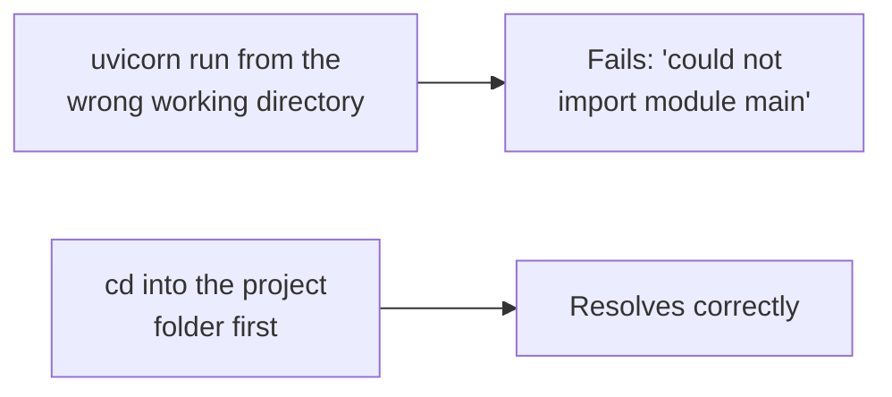

#### 🔍 Internal Working — A Live Debugging Moment: Hitting /mcp Directly in a Browser

Visiting the mounted `/mcp` path directly in a browser returns:

```json
{"jsonrpc":"2.0","id":null,"error":{"code":-32600,"message":"Bad Request: Missing session ID"}}
```

> 💡 **Given directly:** *"Of course, it's an MCP server, everyone, so we cannot just directly connect to it via our browser... it is having a different protocol, not directly via our browser we can connect here."*

#### ⚠ Common Mistakes

* Assuming a plain browser `GET` can talk to an MCP endpoint the way it talks to a normal web page — an MCP endpoint expects a proper JSON-RPC `POST` with the right headers and an active session, not a bare browser visit.
* Running the server-start command from outside the project's own root folder — Python cannot resolve `main` as a module if the working directory doesn't match where `main.py` actually lives.

#### 🎯 Key Takeaways

* `fastmcp run` defaults to STDIO; passing `--transport http --host ... --port ...` switches it to a network-reachable HTTP server.
* A bare browser visit to an MCP endpoint fails by design — MCP is a distinct protocol on top of HTTP, not a normal web page.
* This sets up the session's next step: talking to the running HTTP server properly, by hand, with `curl` (Section 3).

---

### 3. Talking to the MCP Server via curl: The JSON-RPC Handshake

#### 🪜 Step-by-Step — The Initialize Call

> 💡 **Given directly:** *"Before I can make the request, everyone, I have to make sure that I'm initializing the same as well."*

```bash
curl -i -X POST http://127.0.0.1:8000/mcp \
  -H "Content-Type: application/json" \
  -H "Accept: application/json, text/event-stream" \
  -d '{
    "jsonrpc": "2.0",
    "id": 1,
    "method": "initialize",
    "params": {
      "protocolVersion": "2024-11-05",
      "capabilities": {},
      "clientInfo": {"name": "manual-curl-client", "version": "1.0"}
    }
  }'
```

The response carries an `Mcp-Session-Id` header, along with the server's own capabilities in the JSON body.

> 💡 **Given directly:** *"The most important thing in here, everyone, is my MCP session ID, because this kind of tells that, hey, we have started a MCP session... it happens internally with the client, but because we are making these things up as of now, we will have to make sure that we are using them."*

#### 🪜 Step-by-Step — Listing Tools With the Session ID

```bash
curl -i -X POST http://127.0.0.1:8000/mcp \
  -H "Content-Type: application/json" \
  -H "Accept: application/json, text/event-stream" \
  -H "Mcp-Session-Id: <session-id-from-initialize>" \
  -d '{"jsonrpc":"2.0","id":2,"method":"tools/list","params":{}}'
```

This returns all four Time Track tools with their descriptions and JSON schemas.

> 💡 **Given directly:** *"I'm just asking it to list my tools. So, this happens on the background, when we are using Claude or everything, right?"*

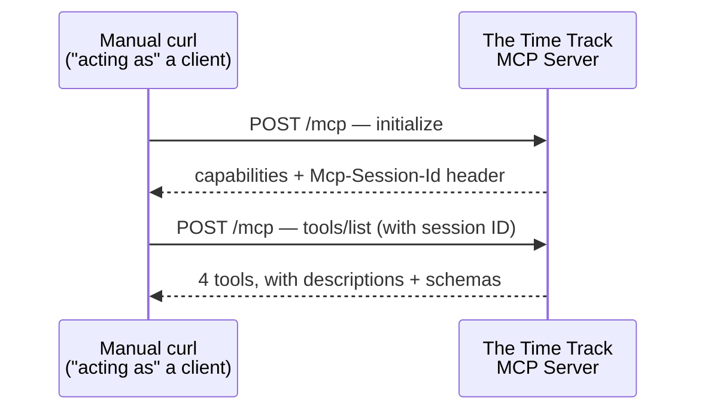

He then pastes the raw JSON response into an LLM and asks it to render it more readably — explicitly framing this as a philosophy, not a shortcut:

> 💡 **Given directly:** *"I want that due to AI-assisted development. Not AI-led, we are AI doing this."*

#### ⚠ Common Mistakes

* Skipping the `initialize` call and going straight to `tools/list` — the session ID from `initialize` is required on every subsequent call; without it the server has no session to attach the request to.
* Assuming a POST-based protocol like this can be reached from a browser address bar — a browser's default navigation is a `GET` request, not the `POST` the protocol requires.

#### 🎯 Key Takeaways

* The `Mcp-Session-Id` returned by `initialize` is what a real client uses (silently, behind the scenes) on every following request — this manual `curl` exercise exists purely to make that normally-invisible step visible.
* This section deliberately demystifies what "the client" does for you automatically, before Section 8 builds a real client from scratch.
* This sets up the session's next step: hosting this same server somewhere reachable over the real internet, rather than on `127.0.0.1` (Section 4).

---

### 4. Hosting on Prefect Horizon: Deployment Walkthrough

#### 📖 Definition — What Prefect Horizon Is

> 💡 **Given directly:** *"This Prefect is the company which is behind FastMCP... they are saying that, okay, if you want, you can actually even host your MCP servers as well."*

Horizon (formerly FastMCP Cloud) is described on its own pricing page as "the MCP gateway and governance layer for authorized agents — a secure way to manage and control your server in production." Its free tier offers 1 developer, 200 MCP servers, 1 agent, and 5 deployments.

#### 🪜 Step-by-Step — The Deployment Process

> 💡 **Given directly, on preparing a clean repository:** *"Create a clean, separate repository containing just the MCP server piece, not your whole learning project. This matters because Horizon builds from exactly what's in the repo. So, notes, scratch files, and unrelated course material don't belong here."*

1. Create a new, dedicated GitHub repository (e.g. `time-track-mcp-server`) containing only `main.py`, `database.py`, `pyproject.toml`, and `uv.lock`.
2. Add a `.gitignore` covering stray scratch files, `.venv`, and `.env` — nothing that isn't needed to actually run the server.
3. Sign in to Prefect Horizon and connect the GitHub integration.
4. **Build and Deploy** → select the repo → configure:
   - Server name: `Time Track Server`
   - Entry point: `main.py`
   - Object to serve: `mcp` (not `app`)
   - Advanced configuration: optional requirements file and environment variables
5. Horizon runs a CI/CD build — installing dependencies from `pyproject.toml`/`uv.lock` — then deploys.

> 💡 **Given directly, on why `pyproject.toml` and `uv.lock` matter:** *"In the pyproject.toml, we have the details about our complete thing. It has the libraries which is needed. In the uv.lock, everyone, we have the exact link, the exact versions of the libraries which we need."*

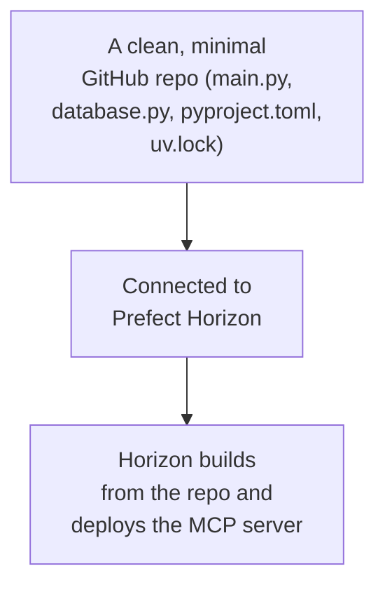

#### 🔍 Internal Working — A Live Debugging Moment: Two GitHub Accounts

With two GitHub accounts configured locally, the default git credentials didn't match the account that owned the new repo.

> 💡 **Given directly:** *"My git commands are also not... My git commands are associated with a different email ID... so it will not be able to push it directly."*

This was resolved by explicitly telling the coding assistant which account's credentials to use rather than letting it guess:

> 💡 **Given directly:** *"I have just trained my [assistant] that, hey, I will tell you which ID I'm using, so use that secret only."*

#### ⚠ Common Mistakes

* Pushing a whole learning/course repo (with unrelated notes, scratch files, and course material) to the deployment target — Horizon builds from exactly what's in the repo, so anything extraneous either bloats the build or introduces confusion.
* Assuming a locally-working `git push` will just work if a machine has more than one GitHub account configured — credentials have to be explicit, not assumed.

#### 🎯 Key Takeaways

* Horizon deployment needs a clean, minimal repo, the entry-point file, and the object to serve (`mcp`, not the FastAPI `app`) — plus correctly-scoped git credentials if multiple accounts are in play.
* This sets up the session's next, important callout: what actually happens to the server's database once it's live on Horizon (Section 5).

---

### 5. The Database Reinitialization Design Flaw

#### 🔍 Internal Working — What Actually Happens to the DB on Deploy

> 💡 **Given directly, posed as a class prediction exercise before revealing the answer:** *"Before I hit this, would you like to take a guess if I will get MCP practice or not?... There is a server running. On that, we have a DB as well... until and unless you do the next deployment, the DB will be there... The second I do the next deployment, all the data will be lost again, and it will just get initialized with the three [seed] projects."*

The root cause is that `database.py`'s `init_db()` runs every single time the application starts — which is exactly what happens on every new deployment.

> 💡 **Given directly, the explicit, honest callout:** *"Because in our code, this db.init gets run every time a deployment starts. Whenever you will be doing a deployment again, it will just override everything... which genuinely is a very, very bad design."*

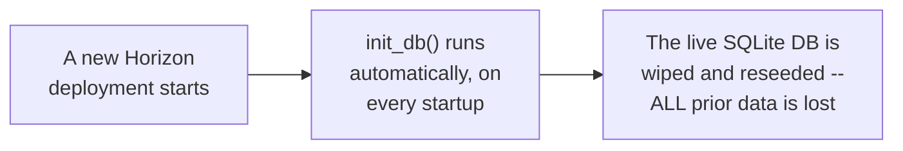

#### ⚠ Common Mistakes

* Assuming a hosted server's local SQLite file behaves like a persistent, durable production database — it is local to whatever process is currently running, is never pulled from GitHub, and is fully reset by any code path (like an unconditional `init_db()` call) that runs on every startup.
* Treating this design flaw as purely academic — it is explicitly flagged by the instructor as a *real* bug worth fixing, not a quirk to shrug off.

#### 🎯 Key Takeaways

* Calling `init_db()` unconditionally on every startup is a genuine, real production bug — every redeploy silently destroys all previously logged data.
* The correct fix (assigned later as homework, Section 12) is to swap this local SQLite pattern for a real, external, persistent database.
* This sets up the session's next, separate obstacle: a business/access limitation on Horizon itself, unrelated to code (Section 6).

---

### 6. The Horizon Paid Tier Authentication Wall

#### ⚠ A Direct, Honest Limitation

> 💡 **Given directly:** *"There is one thing which I'm very bad at... What is that one thing? I require authentication... [Horizon says] ensure clients connecting to your server are logged into Horizon and are a member of [my] Test Organization."*

> 💡 **Given directly, on trying to disable this:** *"I thought, okay, the world is very good place, I can just disable it, and that is where you cannot do it. You have to actually upgrade to developer [the paid tier]. And you have to pay for the same. Something which I would honestly don't want any of my learners to do. But yes, this was required, because earlier in Fast MCP Cloud, I remember that was not the case. Now, it does require you that."*

Despite this, the OAuth sign-in flow was still demonstrated live, and a connected Claude instance successfully called `list_projects` and `log_time` via natural language once authorized.

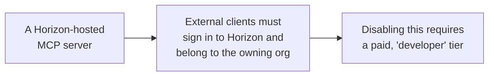

#### ⚠ Common Mistakes

* Assuming a free-tier hosted MCP server can be shared freely with any external client, with no further setup — Horizon's own access model requires authenticated, org-scoped access unless a paid tier is used.

#### 🎯 Key Takeaways

* Horizon's free tier forces every external client to sign in and belong to the deploying organization — there is no free way to open the server to arbitrary outside users.
* This directly motivates the session's next move: finding a hosting path that avoids this specific limitation entirely (Section 7).

---

### 7. Circumventing the Wall: Deploying the Full App to Vercel

#### 📖 Definition — Horizon vs. Vercel

> 💡 **Given directly:** *"Horizon was specifically created for MCP, it was starting up those MCP servers... On the other hand, Vercel can start up my complete application if required... it can just make sure that I can have the UI, I can have the MCP, and I can have the API as well."*

| | Prefect Horizon | Vercel |
|---|---|---|
| Scope | MCP servers only | The complete application (UI + API + MCP) |
| Free-tier external access | Requires org sign-in | No login required, once configured |
| Best for | A standalone, dedicated MCP server | An app that also needs a working front-end |

#### 🪜 Step-by-Step — Deploying to Vercel

1. Sign in to Vercel and create a team.
2. **New Project → Import Repo** → select the same `time-track-mcp-server` GitHub repo — Vercel auto-detects it as a FastAPI application.
3. Click **Deploy** — no extra build configuration or environment variables needed for this demo.
4. The deployed root URL now serves the full, working FastAPI application, including its UI — not only the MCP endpoint.

#### 🔍 Internal Working — The One Setting That Must Be Disabled

> 💡 **Given directly:** *"One very important setting. Because if you don't do that, still you will not be able to access your MCP server... Go to Settings... you will see deployment protection... make sure that you select this server, Time Track MCP server. And you disable this."*

**Project → Settings → Deployment Protection → turn off Vercel Authentication → Save.**

> 💡 **Given directly:** *"If you don't do this, then again, you will face the same problem which we faced on your complete Horizon, that is where it will ask you to authorize."*

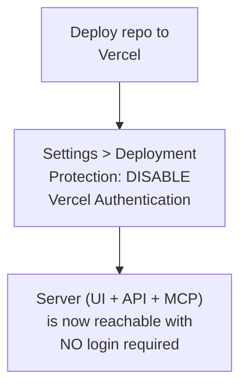

After disabling it, a Claude connector was added with no authentication step at all, and a natural-language request ("add a 10-hour entry for Mayank, MCP practice") was verified by refreshing the live web UI and seeing the new row appear.

> 💡 **Given directly, the pedagogical point:** *"You don't need to understand API, you don't need to have anything, just each and everything will be done as you try to quickly check it up... Would you have made this entry by going into this UI, or by going into the API thing?... Isn't this much, much easier, everyone?"*

#### 🔍 Internal Working — A Real-World Example

The instructor briefly shows a real, production CRM built for a US client, where an agent connected via MCP answers questions like "which step is this lead in the cadence?" by calling the MCP server directly rather than the model needing to understand the underlying API. He also mentions doing HIPAA-compliance work that same week for a separate healthcare client, underlining that this is live production work, not only a classroom exercise.

#### ⚠ Common Mistakes

* Deploying to Vercel and stopping there — without disabling Deployment Protection, external clients hit exactly the same authorization wall as on Horizon, just under a different name.
* Assuming Horizon and Vercel are interchangeable — Horizon is purpose-built for MCP servers alone, while Vercel is for deploying the whole application, MCP endpoint included.

#### 🎯 Key Takeaways

* Deploying the entire application (not just the MCP server) to Vercel, and disabling Deployment Protection, produces a hosted server reachable with zero authentication friction.
* This is presented as the practical way around Horizon's free-tier access wall — not a criticism of MCP itself, but of one specific host's business model.
* This sets up the session's central conceptual segment: what actually connects an AI model to a running MCP server (Section 8).

---

### 8. AI Harness Engineering and Building an MCP Client From Scratch

#### 📖 Definition — Harness Engineering

> 💡 **Given directly:** *"You have the intelligence [an API key to a model]. You have a server. You need to harness this intelligence. You would need a client which can connect to this server... how many of you have heard about harness, AI harness, harness engineering?... don't you think that harness engineering is [about] making sure that we can harness this AI very nicely?"*

Claude Desktop and Claude Code already act as both the AI harness and the MCP client automatically. A developer connecting a raw model API key to a custom MCP server has neither of those for free and must build the client themselves.

> 💡 **Given directly:** *"In your application, will you be getting Claude Desktop? No."*

#### 🪜 Step-by-Step — The Client's Agent Loop

```python
from fastmcp import Client

async with Client("main.py") as client:   # or a URL, for an HTTP-hosted server
    # connection / handshake completed
    tools = await client.list_tools()
    # convert each tool's name, description, and input schema
    # into the model provider's own tool-schema format

    response = model_client.messages.create(..., tools=converted_tools)

    if response.stop_reason == "tool_use":
        result = await client.call_tool(tool_name, tool_args)
        # append the tool result to the conversation and loop again
    else:
        # return the final text response
```

> 💡 **Given directly:** *"If the stop reason is not tool use, then we will just say that, hey, you are fine, return. If it is tool use, everyone, then we can call the tool. We can run the tool call, everyone, with the client and whatever we need. And we can get the answer, and we can append the tool results. And then we can start the complete cycle again."*

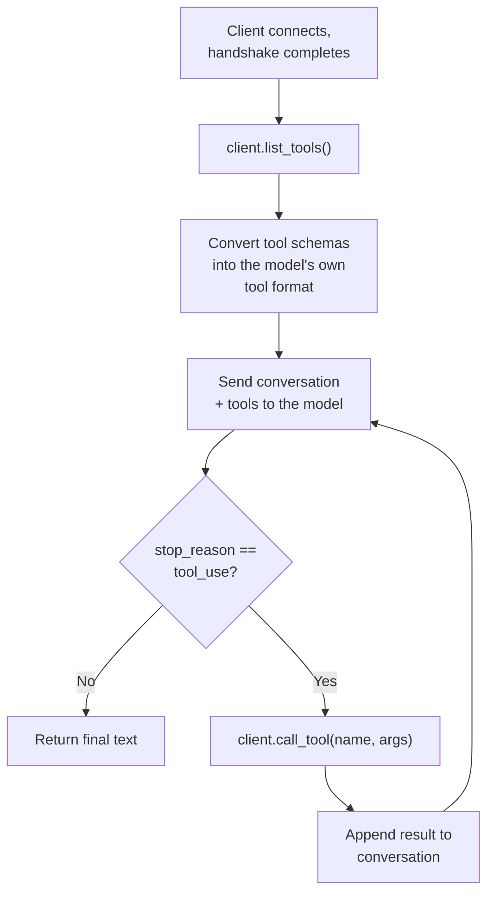

This loop is explicitly linked back to a from-scratch, framework-free tool-calling agent built earlier in the course:

> 💡 **Given directly:** *"We did the very, very similar thing in [our earlier, from-scratch agent], the one which we created, right? Where we had an AI, we send it the tools which we created. This time, we are just sending the tools of AI [from MCP]... Client fetch the tool and pass it to agent. And then client can connect and call the tool as well."*

#### ⚠ Common Mistakes

* Believing that connecting an MCP server to *any* AI application happens automatically, the way it does inside Claude Desktop — outside of a pre-built host, a client and its agent loop have to be written by hand.
* Assuming LangChain's MCP adapter is somehow a server-side concept — it is explicitly described as client-only: "LangChain has nothing to do with the server."

#### 🎯 Key Takeaways

* "Harness engineering" is the practice of wiring a model's raw intelligence to real tools and data through a client and an agent loop — this doesn't happen for free outside of pre-built hosts like Claude Desktop.
* The client's agent loop is the same conceptual shape as any from-scratch tool-calling loop: list tools, convert schemas, send to the model, check the stop reason, call the tool if asked, append the result, and loop.
* This directly sets up the session's single most repeated, emphasized point (Section 9).

---

### 9. The Central Principle: AI Never Calls the Tool Directly

#### ⚠ The Session's Most Repeated Statement

> 💡 **Given directly:** *"Will my AI call the tool?... AI will never call the tool... AI used to tell that, hey, this is the tool which I want you to call, this is the parameters, you call it on whatever server you are running it."*

> 💡 **Given directly:** *"ChatGPT will never ever call your tool. ChatGPT will tell you that, [call this function] with these parameters, you will be calling the tool."*

> 💡 **Given directly, stated with maximum emphasis:** *"Can your AI directly connect to the MCP server? It cannot. It cannot. Your AI can never get into the MCP server. No, never, ever. Never, ever, ever, ever. You need an MCP client in between."*

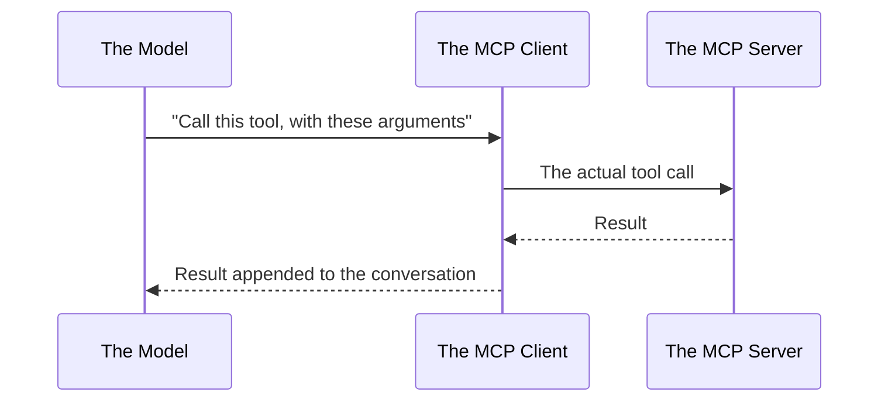

This was also demonstrated live on a third-party AI-plus-client sandbox site, connected to the deployed MCP server, resolving a natural-language request ("list all projects") end-to-end — contrasted against an earlier, simpler client-only tool that had no AI in the loop and required the tool call to be specified manually.

#### 🔍 Internal Working — A Frank Aside on Teaching With AI Tools

> 💡 **Given directly:** *"I even don't write this whole code myself... I am very honest about it. I opened [an AI assistant] while teaching as well... because it will be like that, I don't want to turn it into a [pretense] if we are still using anything."*

#### ⚠ Common Mistakes

* Believing the model itself reaches out and executes a tool — the model only ever *decides* and *describes* the call; the client is what actually executes it against the server.
* Assuming this distinction is a minor technicality — it is treated in this session as the single most important mental model for understanding what MCP (and tool use generally) actually is.

#### 🎯 Key Takeaways

* An AI model never has direct access to an MCP server — it can only request that a tool be called, and it is always the client that carries out the actual call.
* This is presented as the same principle underlying any tool-calling system, MCP or otherwise, and is the conceptual foundation the rest of the session's Q&A builds on.
* This sets up the session's next major thread: precisely how MCP relates to HTTP and REST underneath the client-server boundary (Section 10).

---

### 10. MCP Protocol vs HTTP and REST: Architectural Clarifications

#### 🔍 Internal Working — MCP Is Its Own Protocol

This section reconstructs an extended, repeated audience exchange (Ramakrishna P.) trying to pin down whether MCP is "just HTTP underneath."

> 💡 **Given directly:** *"MCP by itself is a protocol. Now, you cannot say that, hey, MCP doesn't follow HTTP. No, no. Does HTTP follow MCP? No. MCP, by default, is a complete... its own protocol... You cannot compare protocols, no?"*

> 💡 **Given directly, on the transport underneath:** *"If it is a HTTP-hosted server, then yes [it uses HTTP as the transport], else it can work with STDIO as well."*

> 💡 **Given directly, on what a tool is allowed to do internally:** *"Your tool can call anything, so not a worry... any protocol in that case, it can be SMTP protocol... [or] MQ also it can call... your tool is just like a normal function now, it can do anything."*

The final, synthesized position:

> 💡 **Given directly:** *"The client-server communication[:] only the MCP... but underlying [what a tool internally does], it can be anything."*

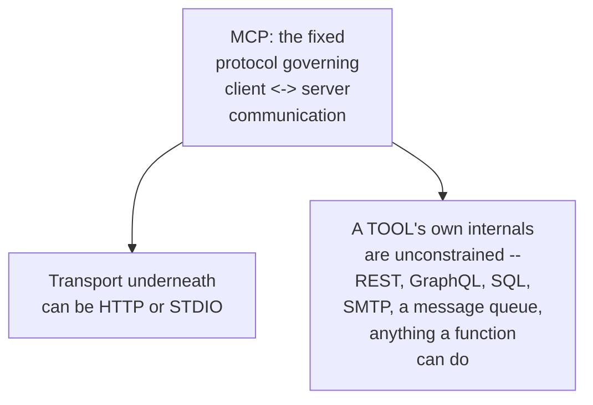

A related audience question (Basavanna Olekar) on bidirectional communication reinforced the same boundary:

> 💡 **Given directly:** *"It used the MCP architecture... HTTP transport layer with JSON [RPC] 2.0 is first sending the initialized request... it will be a post-call and kind of call, but we will not call it a HTTP architecture, it's a MCP architecture... it's a complete life cycle. There's initialization, then operation, then shutdown."*

#### ⚠ Common Mistakes

* Treating "MCP" and "HTTP" as competing or comparable things — they operate at different layers; HTTP (or STDIO) is the transport MCP's JSON-RPC messages travel over, not an alternative to MCP itself.
* Assuming that because MCP fixes the client-server contract, it also constrains what a *tool* is allowed to do internally — a tool is just a function, and can call any API, protocol, or system it needs to.

#### 🎯 Key Takeaways

* MCP is a protocol in its own right, layered on top of a transport (HTTP or STDIO) — asking "is MCP just HTTP?" conflates two different layers.
* What a tool does internally is completely unconstrained by MCP — REST, GraphQL, raw SQL, SMTP, or a message queue are all fair game inside a single tool's implementation.
* This sets up the session's final major thread: applying real design judgment to tool granularity, guardrails, and multi-tenant access (Section 11).

---

### 11. Design Judgment: Tool Granularity, Guardrails and Multi Tenancy

#### 🔍 Internal Working — Tools Don't Limit an Agent's Context, They Expand It

> 💡 **Given directly, in response to a question (Rashim) about whether giving an agent tools limits its context:** *"No... that's the wrong understanding... that is not limiting the context, that is expanding the context... you are expanding the ability of your agents, by giving [it] access to other outside external tools."*

#### 🔍 Internal Working — Designing Tools Around Actions, Not Around Tables

> 💡 **Given directly, on whether a system with many interlinked database tables needs one tool per table:** *"It is dependent on how you want to use it. You will not have 20 tools, you can have one tool as well, which can read from the table... just put yourself in terms of, instead of AI, and see that, are you getting all the information to make the right call? If yes, then AI will also most probably be able to make the right call."*

He illustrates with a concrete example: adding a user updates five different tables. One option is a raw "run SQL" tool plus the schema; the other is a single, purpose-built `add_user` tool that internally updates all five tables.

> 💡 **Given directly:** *"It should be... based on action, not... on changes."*

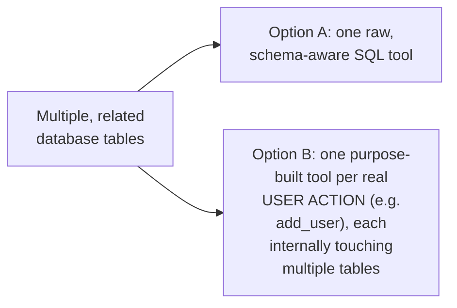

#### 🔍 Internal Working — When MCP Is the Wrong Choice

A financial-services audience question (Debajyoti Mukhopadhyay) about real-time fraud/compliance screening on every transaction, under a strict SLA, drew the session's most direct negative verdict on MCP:

> 💡 **Given directly:** *"MCP is worst for that, worst... because MCP will first take a call with their diligence [about] which [tool] to call and can make a mistake there... your problem is generally not even... to do with AI or not anything to do with MCP... you just have to make sure that for every transaction, you are calling in Request. Verify... it is a part of the process. API is better, not MCP... if you have to always call, no MCP, nothing will be helpful there."*

He allows that AI-driven analysis can still happen *behind* that fixed, deterministic API call — the point is that the *decision to call* should not be left to model judgment when it must happen every single time, without exception.

#### 🔍 Internal Working — Guardrails via Environment Variables

Responding to a question (Subhasis Mohanty) on enforcing read-only access against a production database:

> 💡 **Given directly:** *"You can ask for environment variables, etc, in our MCPs as well... if it is false, then what you will do is, in your code... you can read the environment variable, and based on that, you can load the tools. So if it is false, you will not load the tools, and it will be read only."*

```python
import os

ALLOW_WRITE_TOOLS = os.environ.get("ALLOW_WRITE_TOOLS", "false") == "true"

if ALLOW_WRITE_TOOLS:
    # only register mutating tools (insert/update/delete) when explicitly enabled
    register_write_tools(mcp)
```

The same pattern generalizes to routing between different database backends via environment variables, and to filtering which of a multi-tenant SaaS's many client-specific tools get loaded for a given connection:

> 💡 **Given directly, on multi-tenant filtering:** *"You should have filter to understand, like, which client will have which MCP, the middleware concept or something... if your client A is accessing it, let's just give him the MCP which he needs, why to give him 100 of MCPs?... you can have an environment variable which is sent. Based on that environment variable, you can have the authentication or tools loaded based on the requirement."*

#### 🔍 Internal Working — Tool-Count Growth and Selection Cost

A related question (Vasudev N.) on managing many registered tools (e.g. 15) without sending the entire list on every single call:

> 💡 **Given directly:** *"There are factors and filters through which you can limit the number of tools which are being sent... for example, let's say that my 15 tools, 7 are admin, 7 are user. If you're logged in as user, you are just sending 8."*

> 💡 **Given directly, on a cheaper pre-routing model:** *"We can use a cheaper model, maybe... rather than using [the main, expensive model]... a cheaper model which can take the call that, hey, you need to call this tool. So we can save there."*

He is explicit that this only goes so far: if all the tools genuinely are relevant, the model has to see all of them to make the right call — "there is no way through which you cannot do that."

#### ⚠ Common Mistakes

* Assuming every database table, or every API endpoint, needs its own dedicated tool — good tool design groups by real user action, not by underlying schema structure.
* Reaching for MCP for a fixed, must-always-happen check (like per-transaction compliance screening) — a deterministic, always-executed step belongs behind a plain API call, not behind a model's tool-selection judgment.
* Shipping a dynamic or multi-tenant tool without any environment-variable-driven access control — this is exactly the gap that turns a powerful tool into a real production risk.

#### 🎯 Key Takeaways

* Giving an agent more tools expands what it can do — it does not shrink or dilute its context.
* Tool boundaries should follow real user actions, not the raw shape of the underlying database or API.
* MCP's own strength (letting a model choose which tool to call) is exactly the wrong fit for a step that must happen deterministically, every time, without exception.
* Environment variables are the session's recommended, practical mechanism for read/write gating, backend selection, and multi-tenant tool filtering alike.
* This sets up the session's closing content: what's left as homework, what's coming next, and closing career guidance (Section 12).

---

### 12. Closing: Homework, Roadmap and Career Guidance

#### 🪜 Step-by-Step — What Was Explicitly Assigned

> 💡 **Given directly:** *"Two things which you can do better in this code... First is changing it with a real DB [not local SQLite]... Second thing is that, how we can have asynchronous calls... as of now, if you see, in our database, all the calls are synchronous, which means that you cannot have more than one call [at a time]."*

> 💡 **Given directly, on the recurring monthly assignment:** *"You will be given an assignment every month... you will be able to create an MCP server, just like we did here."*

#### 🪜 Step-by-Step — The Course Roadmap

> 💡 **Given directly:** *"Today we have to do lots of things. First, HTTP versus STDIO... Next, we have to make a server/application hosted... Then, we have to talk about a little bit productionizing it... Next, everyone, we have to discuss about MCP client... and concepts like sampling, ping, etc. And last, we have to discuss about MCP modern versus legacy architecture."*

Of this agenda, sampling, ping, and "MCP modern vs. legacy architecture" were **not** actually reached live in this transcript. A written reference doc covering JSON-RPC basics and the legacy-vs-modern distinction was assigned as required reading instead:

> 💡 **Given directly:** *"I request all of you to read through it, because this will be very, very required... most of the servers, I guess around 80–90% still are there [on legacy]."*

The stated path forward: MCP integrated with LangChain next, then multi-agent LangChain, then a larger, in-depth portfolio project (bigger than Time Track) beginning roughly two weeks out.

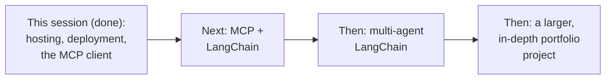

#### 🔍 Internal Working — A Direct Point on AI-Assisted vs. AI-Led Learning

> 💡 **Given directly:** *"Understand the concepts in depth... the better you understand [the underlying concepts], because AI will give you any code, anything at all... this is the reason companies are still asking the basics... this thing anyone can do, but when it fails, that is where we need [understanding]. That is where people are not equipped."*

He connects this directly to why the course spends real class time building MCP manually rather than simply asking an AI assistant to generate a finished client and server:

> 💡 **Given directly:** *"You know that what is there in MCP, what... where it can break, you can understand it. Otherwise, you could have just... gone to [an AI assistant] and said... give me an MCP server, give me an MCP client... today's class, I could have done it the very first class... but trust me, you could have never cracked any interview or understood that why and what happened."*

#### ⚠ Common Mistakes

* Treating "MCP modern vs. legacy architecture" as covered simply because it appeared on the agenda — it was explicitly deferred to self-study reading, not taught live.
* Assuming that because an AI assistant can generate working MCP code instantly, understanding the protocol by hand is now unnecessary — the session explicitly argues the opposite: understanding is what lets you diagnose failures and defend your work in an interview.

#### 🎯 Key Takeaways

* Two concrete homework items were assigned: replace local SQLite with a real database, and convert the project's synchronous database calls to asynchronous ones.
* Sampling, ping, and "MCP modern vs. legacy architecture" remain open reading/self-study items, not yet covered live.
* The course's declared next steps are MCP-in-LangChain, then multi-agent LangChain, then a larger portfolio project.

---

## 📝 Glossary

| Term | Definition | Why It Matters |
|---|---|---|
| **STDIO Transport** | Running an MCP server as a local sub-process | Fast, but reachable only by whoever launched it |
| **HTTP Transport** | Running an MCP server as a network-reachable service | What makes a server genuinely shareable across a team |
| **Mcp-Session-Id** | A session identifier returned by `initialize` | Required on every subsequent JSON-RPC call to that server |
| **Prefect Horizon** | A hosting platform built by FastMCP's own creators, purpose-built for MCP servers | Fast to deploy to, but its free tier requires org-scoped sign-in for external clients |
| **Deployment Protection** | A Vercel setting requiring authentication to reach a deployment | Must be disabled for an MCP endpoint to be reachable without login |
| **Harness Engineering** | Wiring a model's raw intelligence to real tools and data via a client and an agent loop | What Claude Desktop/Claude Code do for you automatically, and what you must build yourself outside of them |
| **MCP Client** | The component that actually executes a tool call on a model's behalf | The model itself is never able to reach a server directly |
| **MCP Gateway** | A component that aggregates multiple MCP servers behind one entry point | Useful when one application needs to reach many underlying servers |
| **UVX** | Runs a Python CLI tool in an isolated, temporary environment without installing it into a project | The `npx`-equivalent for Python-based MCP servers |
| **Guardrails (env-var gated)** | Conditionally loading or restricting tools based on environment variables | The session's practical mechanism for read/write restriction and multi-tenant filtering |

---

## 🔄 Revision Notes — One-Minute Revision

* This session moves the Time Track project from a local prototype to a real, hosted, shareable application.
* STDIO is fast but single-machine; HTTP is slower per-call but genuinely shareable — enterprise MCP servers are almost always HTTP-based.
* A raw `curl`-based JSON-RPC handshake (`initialize`, then `tools/list` using the returned `Mcp-Session-Id`) demystifies what a real client normally does automatically.
* Hosting on Prefect Horizon works, but its free tier requires external clients to sign in and belong to the deploying org — removing that requires a paid tier.
* A real, explicitly-acknowledged design flaw: the Time Track database re-initializes on every deploy, because `init_db()` runs unconditionally on startup.
* The workaround for Horizon's access wall: deploy the entire application to Vercel and disable Deployment Protection — this removes login friction entirely.
* "Harness engineering" is what wires a model to real tools via a client and an agent loop — this doesn't happen for free outside pre-built hosts.
* The session's single most repeated point: an AI model can never call an MCP tool directly; it can only ask the client to call it.
* MCP is its own protocol, layered over a transport (HTTP or STDIO) — comparing "MCP vs. HTTP" conflates two different layers; a tool's own internals are completely unconstrained by MCP.
* Design judgment covered live: tools should be built around real user actions (not raw table structure); MCP is the wrong fit for a fixed, must-always-happen check like per-transaction compliance; environment variables are the practical mechanism for read/write guardrails and multi-tenant filtering.
* Homework assigned: swap local SQLite for a real database, and make the database calls asynchronous.
* Not covered live (assigned as reading): sampling, ping, and MCP modern-vs-legacy architecture.
* Roadmap: MCP + LangChain next, then multi-agent LangChain, then a larger portfolio project.

---

## 📋 Cheat Sheet

**Switching an MCP server's transport:**
```bash
uv run fastmcp run main.py                                              # STDIO (default)
uv run fastmcp run main.py --transport http --host 127.0.0.1 --port 8001   # HTTP
```

**The manual JSON-RPC handshake:**
```bash
# 1) initialize -> returns an Mcp-Session-Id header
curl -i -X POST <url>/mcp -H "Content-Type: application/json" \
  -H "Accept: application/json, text/event-stream" \
  -d '{"jsonrpc":"2.0","id":1,"method":"initialize","params":{...}}'

# 2) tools/list -> requires that session ID
curl -i -X POST <url>/mcp -H "Content-Type: application/json" \
  -H "Accept: application/json, text/event-stream" \
  -H "Mcp-Session-Id: <id>" \
  -d '{"jsonrpc":"2.0","id":2,"method":"tools/list","params":{}}'
```

**The client's agent loop, in shape:**
```text
list_tools() -> convert to model's tool format -> send to model
if stop_reason == tool_use: call_tool() -> append result -> loop
else: return final text
```

**Environment-variable guardrail pattern:**
```python
ALLOW_WRITE_TOOLS = os.environ.get("ALLOW_WRITE_TOOLS", "false") == "true"
if ALLOW_WRITE_TOOLS:
    register_write_tools(mcp)
```

**Key judgment calls:**
```text
AI never calls a tool directly -- only the CLIENT calls it
MCP governs client<->server communication; a tool's internals are unconstrained
Design tools around real user ACTIONS, not raw database tables
A fixed, must-always-happen check -> plain API, not MCP tool selection
```

---

## 🔥 Interview Questions & Answers

### 🟢 Beginner

**Q1.**

**Question:** What is the practical difference between running an MCP server over STDIO versus over HTTP?

**Answer:** STDIO runs as a local sub-process, reachable only by whoever launched it; HTTP is network-reachable and can serve multiple clients from anywhere at once.

**Explanation:** Directly, explicitly confirmed via the session's own comparison table.

**Why Interviewers Ask This:** Tests basic, foundational MCP deployment knowledge.

**Possible Follow-up:** "Why are enterprise MCP servers almost always HTTP-based?"

**Q2.**

**Question:** What does the `Mcp-Session-Id` returned by an `initialize` call get used for?

**Answer:** It must be included as a header on every subsequent JSON-RPC call to that server, in the same session.

**Explanation:** Directly demonstrated via the manual `curl` handshake.

**Why Interviewers Ask This:** Tests hands-on understanding of the raw MCP protocol, not just the client abstraction over it.

**Possible Follow-up:** "What happens if you skip `initialize` and call `tools/list` directly?"

**Q3.**

**Question:** According to this session, why did the Time Track project's database lose all its data on every Horizon redeploy?

**Answer:** Because `init_db()` ran unconditionally on every application startup, wiping and reseeding the local SQLite database each time.

**Explanation:** Directly, honestly acknowledged as a real design flaw.

**Why Interviewers Ask This:** Tests practical understanding of state and persistence in hosted deployments.

**Possible Follow-up:** "What's the correct fix for this specific problem?"

**Q4.**

**Question:** What single Vercel setting had to be disabled to reach the deployed MCP server without logging in?

**Answer:** Deployment Protection (specifically, Vercel Authentication), under Project Settings.

**Explanation:** Directly, explicitly confirmed.

**Why Interviewers Ask This:** Tests real, hands-on deployment troubleshooting knowledge.

**Possible Follow-up:** "What error would you see if you forgot to disable it?"

**Q5.**

**Question:** Can an AI model call an MCP tool directly?

**Answer:** No — the model can only request that a tool be called; the MCP client is what actually executes the call.

**Explanation:** Directly, repeatedly, and emphatically confirmed as the session's central point.

**Why Interviewers Ask This:** Tests the single most fundamental mental model for tool-calling systems generally.

**Possible Follow-up:** "What role does the client play in this loop?"

**Q6.**

**Question:** Is MCP the same thing as HTTP?

**Answer:** No — MCP is its own protocol that can run over either HTTP or STDIO as its transport.

**Explanation:** Directly, explicitly clarified.

**Why Interviewers Ask This:** Tests whether a candidate understands protocol layering, not just surface terminology.

**Possible Follow-up:** "Does that mean a tool's own internal calls are restricted to HTTP as well?"

**Q7.**

**Question:** What is "harness engineering," in this session's own terms?

**Answer:** Wiring a model's raw intelligence to real tools and data through a client and an agent loop.

**Explanation:** Directly, explicitly defined.

**Why Interviewers Ask This:** Basic, essential MCP/agent-architecture terminology.

**Possible Follow-up:** "What does Claude Desktop provide automatically that a custom application must build itself?"

**Q8.**

**Question:** What was the one, practical mechanism recommended in this session for enforcing read-only access to a production database from an MCP server?

**Answer:** An environment variable checked in the server's own startup code, which conditionally loads (or omits) any mutating tools.

**Explanation:** Directly, concretely demonstrated with a code pattern.

**Why Interviewers Ask This:** Tests practical, production-safety judgment.

**Possible Follow-up:** "How would the same pattern generalize to multi-tenant tool filtering?"

**Q9.**

**Question:** Were "sampling," "ping," and "MCP modern vs. legacy architecture" actually taught live in this session?

**Answer:** No — they were named on the agenda but deferred; a written reference doc was assigned as required reading instead.

**Explanation:** Directly, honestly confirmed.

**Why Interviewers Ask This:** Tests attentiveness to what was and wasn't actually covered, rather than assuming full agenda coverage.

**Possible Follow-up:** "What fraction of servers, per the instructor, still use the legacy architecture?"

**Q10.**

**Question:** What two things were assigned as homework on the Time Track project's own codebase?

**Answer:** Replacing local SQLite with a real, external database, and converting its synchronous database calls to asynchronous ones.

**Explanation:** Directly, explicitly assigned.

**Why Interviewers Ask This:** Tests whether a learner tracks concrete, stated action items, not just concepts.

**Possible Follow-up:** "Why does synchronous database access become a real problem under real, concurrent load?"

---

### 🟡 Intermediate

**Q11.**

**Question:** Explain why the instructor deliberately demonstrates a raw `curl`-based JSON-RPC handshake with the MCP server, rather than moving straight to building a proper client.

**Answer:** This is a deliberate demystification step: by manually performing the `initialize` call and manually carrying the returned `Mcp-Session-Id` into a `tools/list` call, the exercise makes visible exactly what a real client does silently and automatically. Without this step, a learner might treat "the client talks to the server" as an unexamined black box; with it, the learner has directly seen the underlying JSON-RPC contract (the session ID requirement, the POST-only nature of the endpoint, the shape of the response) that any real client — including the one built later in this same session — has to satisfy.

**Explanation:** Requires recognizing the deliberate demystification value of manual protocol exposure before building an abstraction over it.

**Why Interviewers Ask This:** Tests whether a learner understands MCP at the protocol level, not only through a convenient library wrapper.

**Possible Follow-up:** "What specifically would fail if the session ID were omitted from the `tools/list` call?"

**Q12.**

**Question:** A learner argues that since Vercel's Deployment Protection setting can simply be disabled, security is not a real concern for a hosted MCP server. Evaluate this claim.

**Answer:** This overstates a narrow fact (disabling login-wall access is possible and was demonstrated) into an unwarranted general claim about security. Disabling Deployment Protection removes a specific, coarse authentication wall meant for the whole Vercel deployment — it says nothing about whether the MCP server's own tools have appropriate guardrails. The session's own separate guardrail discussion (Section 11) makes clear that real production safety comes from deliberate, tool-level controls — environment-variable-gated write access, multi-tenant filtering — not from whatever a hosting platform's login wall happens to be set to. The accurate conclusion: disabling a hosting platform's access wall and securing the server's own tools are two entirely separate concerns, and removing the former does not address the latter at all.

**Explanation:** Requires distinguishing platform-level access control from tool-level guardrails, which the session treats as separate concerns.

**Why Interviewers Ask This:** Distinguishes candidates who track the session's own layered view of security from those who conflate a single setting with security as a whole.

**Possible Follow-up:** "Describe a concrete scenario where Deployment Protection is off but the server is still safe, and one where it's on but the server is still unsafe."

**Q13.**

**Question:** Explain, precisely, why the instructor argues that per-transaction fraud/compliance screening (as in the Lloyds Bank-style example) is a poor fit for MCP, even though MCP can technically expose a tool that performs such a check.

**Answer:** This is a deliberate distinction between *can* and *should*: MCP's genuine value is letting a model exercise judgment about *which* tool to call and *when*. A per-transaction compliance check under a strict SLA is precisely the opposite kind of requirement — it must run identically, deterministically, and without exception, on every single transaction, with zero room for the model to decide otherwise (or make a mistake in its own tool-selection reasoning). Wrapping that requirement inside an MCP tool reintroduces exactly the discretion the requirement is designed to eliminate. The correct architecture keeps that fixed check behind a plain, always-invoked API call, and reserves MCP (and model judgment generally) for the parts of the workflow that genuinely benefit from flexible, context-dependent decision-making.

**Explanation:** Requires recognizing that MCP's core value proposition (flexible tool selection) is the wrong fit for a requirement demanding zero discretion.

**Why Interviewers Ask This:** Tests whether a learner can correctly scope MCP's strengths rather than treating it as a universal integration layer.

**Possible Follow-up:** "Where, if anywhere, could AI/MCP still add value in this same fraud-screening workflow?"

**Q14.**

**Question:** Using this session's own "tools should be built around real user actions, not raw table structure" principle, critique a hypothetical MCP server that exposes one raw `run_sql(query: str)` tool covering an entire, multi-table application, with no other tools.

**Answer:** This design technically satisfies the letter of MCP tool-building but fails the session's own actual guidance in two ways. First, per the `add_user`-style example, well-designed tools should map to real actions a user or agent wants to take, each of which may span several tables internally — a single generic SQL tool pushes that translation work back onto the model, on every call, rather than encoding it once in the tool itself. Second, and more seriously, per the session's own separate warning about dynamic SQL tools (established in Part 2 of this series), a fully generic, unrestricted query tool carries a real, direct risk of destructive operations (deletes, drops) with no guardrails at all — exactly the gap this session's own environment-variable-gated pattern (Section 11) exists to close. The accurate critique: a single raw SQL tool is both a worse interface (offloading design work onto the model) and a real safety risk (unless paired with explicit guardrails it does not have here).

**Explanation:** Requires connecting the tool-granularity principle with the separate guardrails discussion to produce a two-part critique.

**Why Interviewers Ask This:** Tests synthesis across two, separately-covered concepts (tool design philosophy and safety guardrails) applied to one concrete design.

**Possible Follow-up:** "Redesign this hypothetical server with a small number of well-scoped, action-based tools instead."

**Q15.**

**Question:** Synthesize the "AI never calls the tool directly" principle (Section 9) with the "MCP governs only client-server communication" clarification (Section 10) to explain precisely what a well-designed MCP client is actually responsible for.

**Answer:** These two facts, taken together, define the client's real job precisely. Per Section 9, the model only ever produces a *request* to call a tool with certain arguments — it never reaches the server itself. Per Section 10, the MCP protocol's own contract governs exactly the client-server leg of that journey (the JSON-RPC handshake, the session ID, the `tools/call` message) — but says nothing about what happens on either side of that leg. Synthesizing these: the client is responsible for everything the model itself cannot do — converting the model's tool-call request into a valid MCP protocol message, sending it to the server under an established session, receiving the raw result, and translating that result back into a form the model can read and continue reasoning over. The client is therefore not a passive pipe; it is the only component that actually speaks MCP on the model's behalf.

**Explanation:** Requires combining the model/client boundary with the protocol-scope clarification to precisely define the client's actual responsibilities.

**Why Interviewers Ask This:** A senior-level question testing whether a candidate can precisely delineate responsibilities across the model, client, and server, rather than treating "the client" as a vague intermediary.

**Possible Follow-up:** "What would break if the client faithfully forwarded the model's tool-call request but didn't correctly manage the session ID?"

---

### 🔴 Advanced

**Q16.**

**Question:** Design a complete, reasoned production-deployment checklist (using only this session's own established concepts) for a team preparing to take an MCP server like Time Track from a local prototype to a real, externally-reachable, production deployment.

**Answer:** A reasoned checklist, applying this session's own concepts directly:

```text
1. Fix the persistence layer first (Section 5): replace any
   unconditional init_db()-on-startup pattern with a real, external
   database that survives redeploys -- never let a deploy silently
   wipe production data.

2. Choose a hosting path deliberately (Sections 4, 6, 7): use a
   dedicated MCP host (like Horizon) only if its access model fits
   your real audience; if external clients need frictionless access
   without an org-level login, deploy the full application elsewhere
   (like Vercel) and explicitly review its own access-control
   settings before considering the deployment done.

3. Build (or confirm) a real client, not just a server (Section 8):
   verify the full agent loop -- list_tools, schema conversion,
   stop_reason handling, tool execution, result appension -- works
   end-to-end, since the model itself can never reach the server
   directly (Section 9).

4. Scope tools around real actions (Section 11): audit whether any
   tool is a raw, generic wrapper (like an unrestricted SQL
   executor) that should instead be several smaller, purpose-built,
   action-oriented tools.

5. Add real guardrails before go-live (Section 11): gate any
   mutating or sensitive tool behind an explicit environment
   variable or permission check -- never ship a dynamic, powerful
   tool "as of now, everything is allowed."

6. Re-examine any deterministic, must-always-happen step (Section
   11): if a step in the workflow must run identically on every
   request without exception (e.g. a compliance check), keep it
   behind a plain, always-invoked API call rather than an MCP tool a
   model chooses whether to call.

7. Apply multi-tenant filtering, if relevant (Section 11): ensure a
   given client only ever sees the tools that belong to it, using
   the same environment-variable-driven pattern used for read/write
   gating.
```

This checklist directly applies the session's own established concepts — persistence, hosting choice, the client's real responsibilities, tool granularity, guardrails, deterministic-step scoping, and multi-tenancy — to a realistic production-readiness review.

**Explanation:** Requires synthesizing persistence, hosting, client architecture, tool design, guardrails, and multi-tenancy into one complete, reasoned checklist.

**Why Interviewers Ask This:** A comprehensive, capstone-level question testing whether a candidate can apply this session's full range of concepts to a realistic deployment scenario.

**Possible Follow-up:** "Which of these seven items would you prioritize first, if you had to ship with only one fully addressed?"

**Q17.**

**Question:** Critically evaluate: "Since this session shows that an AI assistant can generate a complete, working MCP client and server in seconds, manually learning MCP's internals (transports, the JSON-RPC handshake, the agent loop) is no longer a valuable use of a learner's time."

**Answer:** This overstates a genuine, specific capability (fast, competent code generation) into an unwarranted general conclusion about the value of understanding. The session directly and explicitly rejects this framing: the instructor argues that generating working MCP code was always possible from day one of the course, but that doing so without first building it manually would have left learners unable to diagnose failures, defend their own understanding under interview questioning, or reason about design trade-offs (hosting choice, tool granularity, guardrails) that a generated example doesn't automatically get right. The session's own repeated framing — that companies still test "the basics" precisely because AI-generated code has made surface-level competence common and differentiation now rests on genuine understanding — directly contradicts the claim that manual understanding has become unnecessary. The accurate conclusion: AI-assisted generation is a genuine accelerant for producing code, but the session treats manual, first-principles understanding as what makes that generated code diagnosable, defensible, and correctly adaptable — not a redundant, skippable step.

**Explanation:** Tests whether a learner recognizes that fast code generation and genuine understanding serve different purposes, per the session's own explicit argument.

**Why Interviewers Ask This:** Distinguishes candidates who correctly track the session's own stated pedagogical philosophy from those who over-generalize a convenience into a reason to skip fundamentals.

**Possible Follow-up:** "Describe a concrete situation from this session where understanding the internals (not just having working code) was what actually solved a live problem."

---

## 🧪 Scenario-Based Interview Questions

> **Scenario 1:** A colleague deploys their own Time Track-style MCP server to Prefect Horizon, and it works correctly in local testing, but every external teammate who tries to connect gets stuck at a login/authorization screen instead of reaching the server directly. Using this session's own concepts, construct a complete, reasoned response.

**Structured Answer:**
1. **Initial investigation:** Recognize this as directly connected to Section 6's own established limitation — a likely access-control issue at the hosting-platform level, not a bug in the MCP server's own code.
2. **Relevant principle:** Per Section 6, Horizon's free tier requires any external client to sign in to Horizon and belong to the deploying organization — this is a platform-level restriction, not something fixable in `main.py`.
3. **Possible causes:** The colleague is on Horizon's free tier and has not (and, without paying, cannot) disabled this organization-scoped login requirement.
4. **Debugging approach:** Confirm whether every teammate hitting the wall is genuinely outside the deploying organization, and confirm the account's tier.
5. **Resolution:** Either invite each external teammate into the Horizon organization (workable for a small, known audience), or — per Section 7 — deploy the full application to Vercel instead and explicitly disable Deployment Protection, which removes the login requirement entirely.
6. **Prevention:** Before choosing a hosting platform for anything meant to be reachable by an open or external audience, explicitly check its own default access-control model rather than assuming "hosted" implies "publicly reachable."

> **Scenario 2 (Advanced):** Three months after launch, your organization's production Time Track-style MCP server has an `execute_query_dynamically`-style tool (from the prior session) that is now, per Section 11's environment-variable pattern, correctly gated behind an `ALLOW_WRITE_TOOLS` flag defaulting to `false`. A recent audit finds that a support engineer, debugging a client issue, temporarily set the flag to `true` in the shared production environment to test something, forgot to revert it, and it stayed enabled for two weeks before being caught. Using this session's own concepts, construct a complete, reasoned response.

**Structured Answer:**
1. **Initial investigation:** Recognize that the environment-variable guardrail pattern itself (Section 11) worked exactly as designed — the actual gap is operational, in how that flag is managed, not in the pattern's own logic.
2. **Relevant principle:** Per Section 11, the guardrail's entire safety value depends on the flag reliably reflecting the intended state — a shared, manually-edited production environment variable is a single point of failure for that guarantee.
3. **Possible causes:** No process existed to catch or automatically revert a manual, temporary override in a shared production environment.
4. **Debugging/evaluation approach:** Review how environment variables are set and audited in production — specifically, whether changes are logged, time-limited, or require a second approval.
5. **Resolution:** Introduce a process control on top of the existing technical guardrail: time-boxed or explicitly-approved overrides only, an alert whenever `ALLOW_WRITE_TOOLS` (or any similarly sensitive flag) changes in production, and a scheduled review of all such flags' current values.
6. **Prevention:** Treat a guardrail implemented as a single environment variable as necessary but not sufficient — per this session's own production-checklist reasoning (Q16), pair any such technical guardrail with an operational control that governs who can change it, and how that change is tracked.

---

## 🛠 Hands-on Exercises

### 🟢 Easy

1. Switch a FastMCP server between STDIO and HTTP transport, and observe the different startup behavior for each.
2. Perform the manual `curl`-based `initialize` + `tools/list` handshake against your own running MCP server.
3. Explain, in your own words, why an AI model can never call an MCP tool directly.

### 🟡 Medium

4. Deploy your own MCP server to either Prefect Horizon or Vercel, and correctly resolve any access-control setting that blocks external clients.
5. Fix the "database re-initializes on every deploy" flaw, by switching from an unconditional `init_db()` call to a real, persistent, external database.
6. Build a minimal MCP client from scratch, implementing the full agent loop (list tools, convert schemas, send to a model, check the stop reason, call the tool, append the result, loop).

### 🔴 Advanced

7. Complete the full, reasoned production-deployment checklist proposed in Advanced Interview Q16, for your own MCP server.
8. Implement the debugging scenario proposed in Scenario 1 — deliberately reproduce a Horizon-style organization login wall, then correctly diagnose and resolve it via the Vercel workaround.
9. Design and implement environment-variable-driven guardrails and multi-tenant tool filtering for a hypothetical, multi-client MCP server.

---

## 🏗 Practice Assignment

*(This session's own stated homework and forward-looking roadmap, reproduced faithfully)*

> 💡 **The instructor's own words, given directly:** *"Two things which you can do better in this code... first is changing it with a real DB... second thing is that, how we can have asynchronous calls."*

### Build: "A Genuinely Hosted, Production-Minded MCP Application"

**Objective:** Apply this session's complete set of hosting, client, and design-judgment concepts to move a real MCP project from local prototype to a genuinely production-minded deployment.

**Requirements:**
- Deploy a complete MCP server (of your own choosing, or the Time Track project) to either Prefect Horizon or Vercel, resolving any access-control setting that blocks external clients.
- Replace any local, re-initializing SQLite pattern with a real, persistent, external database.
- Convert at least one synchronous database call into an asynchronous one, and explain why this matters under concurrent load.
- Build a minimal MCP client from scratch (not relying on Claude Desktop or another pre-built host), implementing the full agent loop.
- Add at least one environment-variable-gated guardrail to a mutating or sensitive tool.
- A written reflection (200–300 words) on which of this session's own real Q&A topics (protocol architecture, tool granularity, guardrails, or the "AI never calls the tool directly" principle) you found most genuinely clarifying, and why.

**Architecture (suggested):**

```text
hosted_mcp_application/
├── database.py           # real, persistent DB connection
├── main.py                # FastAPI + FastMCP, mounted together
├── client.py               # a from-scratch MCP client + agent loop
├── guardrails_notes.md
└── REFLECTION.md
```

**Expected Functionality:**
- Your deployed application should correctly demonstrate every major technique established in this session, end-to-end.

**Challenges:**
- Correctly resolving whichever hosting platform's own access-control setting blocks external clients by default.
- Designing genuinely appropriate guardrails for any tool performing a sensitive or destructive operation.

**Bonus Improvements:**
- Apply Advanced Q16's own established production-deployment checklist to formally verify your own, complete application.
- Read the assigned "MCP modern vs. legacy architecture" reference material and summarize, in your own words, what changed between the two.

---

## 📚 Additional Resources

- **Part 2 of this same MCP series** (in this same workspace, as a separate, complete study guide) — the directly-preceding session, which built the original Time Track FastAPI + FastMCP project this session hosts and extends.
- **The instructor's own shared reference document on JSON-RPC and MCP modern vs. legacy architecture** — assigned as required reading; not covered live in this transcript.
- **FastMCP's own official documentation** — covering transports, mounting, and the Python client library used in Section 8.
- **Prefect Horizon and Vercel's own documentation** — for further, independent exploration of real, hosted MCP deployment and access-control settings.
- **MCP sampling and ping concepts** — named on this session's own agenda but deferred; flagged here as an open item for further, independent study.

---

## 📌 Final Revision Sheet

### ⭐ Core Concepts
- **STDIO vs. HTTP transport**: fast/single-machine vs. slower/genuinely shareable.
- **The manual JSON-RPC handshake**: `initialize` returns an `Mcp-Session-Id`, required on every following call.
- **Hosting trade-offs**: a dedicated MCP host (Horizon) vs. hosting the whole application (Vercel) — each with its own access-control defaults to check.
- **AI never calls the tool directly** — only the MCP client does.
- **MCP governs client-server communication only** — a tool's own internals are unconstrained.

### ⭐ Important Definitions
- **Harness engineering, MCP Gateway, guardrails** (see Glossary for full definitions).

### ⭐ Important Commands/Code
```bash
uv run fastmcp run main.py --transport http --host 127.0.0.1 --port 8001
which uv   # for correct config-file paths, per the prior session
```
```python
ALLOW_WRITE_TOOLS = os.environ.get("ALLOW_WRITE_TOOLS", "false") == "true"
```

### ⭐ Architecture/Process
- Complete workflow: fix persistence (a real DB, not a self-wiping local file) -> choose a hosting platform deliberately, checking its own access-control defaults -> build a real client with a full agent loop -> scope tools around real actions -> add guardrails before go-live -> keep deterministic, must-always-happen steps behind plain APIs, not MCP tool selection -> apply multi-tenant filtering where relevant.

### ⭐ Best Practices
- Never call `init_db()` (or any destructive setup step) unconditionally on every startup in a hosted environment.
- Check a hosting platform's own default access-control setting before considering a deployment done.
- Build tools around real user actions, not raw database or API structure.
- Gate any mutating or sensitive tool behind an explicit, environment-variable-driven guardrail.
- Keep any fixed, must-always-happen check behind a plain API call, not behind model-driven MCP tool selection.

### ⭐ Common Mistakes
- Assuming a hosted server's local database is persistent and durable by default.
- Assuming disabling a hosting platform's login wall is equivalent to securing the server's own tools.
- Believing an AI model can reach an MCP server without a client in between.
- Reaching for MCP for a requirement that must run identically and deterministically on every single request.

### ⭐ Interview Points
- Be ready to explain STDIO vs. HTTP transport, and to perform a raw JSON-RPC handshake by hand.
- Be ready to state precisely why an AI model can never call an MCP tool directly.
- Be ready to explain the relationship between the MCP protocol and its underlying transport, and why a tool's own internals are unconstrained by MCP.
- Be ready to defend when MCP is (and is not) the right architectural choice, with a concrete example.

### ⭐ Things to Remember
- This session's own **real design flaw** (the self-wiping database) and **real business obstacle** (Horizon's paid-tier wall) were both handled with the same honest, transparent teaching approach used throughout this series.
- **"AI never calls the tool directly"** is this session's single most repeated, foundational point — every other design-judgment discussion in Section 11 builds on it.
- **Sampling, ping, and MCP modern-vs-legacy architecture remain open, assigned reading** — not yet covered live, and not to be assumed as taught.