# 🧠 NLP Day 1: Introduction, Roadmap & Text Preprocessing Fundamentals

- <i>**Session:** NLP for Machine Learning & Deep Learning Series — Day 1 (Introduction to NLP) · 
- **Instructor:** Krish Naik
- **Note on scope:** This is the genuine, chronological STARTING POINT of the broader NLP series this course arc belongs to — the instructor explicitly frames it as Day 1 of what will become a 15-20 day journey covering everything from basic text preprocessing through to BERT and Transformers. This session covers WHY NLP matters (directly connecting to the AI/ML/DL hierarchy), the COMPLETE roadmap for the entire upcoming series (presented as a genuine, bottom-to-top pyramid), and the first four foundational text-preprocessing techniques: tokenization, stop words, stemming, and lemmatization — each explained with real, concrete, worked examples. Bag of Words and TF-IDF are explicitly promised for the very next session.</i>

---

## 📑 Table of Contents

1. [Session Overview](#-session-overview)
2. [Learning Objectives](#-learning-objectives)
3. [Detailed Notes](#-detailed-notes)
   - [1. Session Context: Day 1, The Start of an Extensive NLP Series](#1-session-context-day-1-the-start-of-an-extensive-nlp-series)
   - [2. Why NLP? Text as Data, and the AI/ML/DL Relationship](#2-why-nlp-text-as-data-and-the-aimldl-relationship)
   - [3. The Complete Roadmap of NLP: A Pyramid, Bottom to Top](#3-the-complete-roadmap-of-nlp-a-pyramid-bottom-to-top)
   - [4. A Motivating Example: Building a Spam Classifier](#4-a-motivating-example-building-a-spam-classifier)
   - [5. Tokenization: Converting Sentences Into Words](#5-tokenization-converting-sentences-into-words)
   - [6. Stop Words: Removing Low-Value, Frequent Words](#6-stop-words-removing-low-value-frequent-words)
   - [7. Stemming: Fast, But Potentially Meaningless](#7-stemming-fast-but-potentially-meaningless)
   - [8. Lemmatization: Meaningful, But Slower](#8-lemmatization-meaningful-but-slower)
   - [9. Choosing Between Stemming and Lemmatization: Use Cases & Correct Order](#9-choosing-between-stemming-and-lemmatization-use-cases--correct-order)
4. [Glossary](#-glossary)
5. [Revision Notes — One-Minute Revision](#-revision-notes--one-minute-revision)
6. [Cheat Sheet](#-cheat-sheet)
7. [Interview Questions & Answers](#-interview-questions--answers)
8. [Scenario-Based Interview Questions](#-scenario-based-interview-questions)
9. [Hands-on Exercises](#-hands-on-exercises)
10. [Practice Assignment](#-practice-assignment)
11. [Additional Resources](#-additional-resources)
12. [Final Revision Sheet](#-final-revision-sheet)

---

## 🎯 Session Overview

This session lays the genuine foundation for the entire NLP series — establishing WHY the field matters, WHAT the complete learning journey looks like, and teaching the first, essential text-preprocessing techniques. It covers:

1. **A precise explanation of WHY NLP is needed**, directly connected to the already-established AI/ML/DL hierarchy — NLP is explicitly positioned as usable within BOTH machine learning AND deep learning, since its defining characteristic is simply that the DATASET itself is TEXT, requiring conversion into numerical VECTORS before any model can genuinely understand it.
2. **A complete, stated roadmap for the ENTIRE upcoming series**, presented as a genuine, bottom-to-top PYRAMID: text preprocessing (tokenization, stopwords, stemming, lemmatization) → text-to-vector conversion (Bag of Words, TF-IDF) → more advanced text-to-vector techniques (Word2Vec, Average Word2Vec, via Gensim) → real ML use cases → deep learning (RNN, LSTM, GRU, Bidirectional LSTM) → advanced word embeddings → Encoder-Decoder → Attention models → Transformers → BERT.
3. **Real, concrete, motivating examples** of NLP's genuine, everyday impact — Google's own knowledge graph, DALL-E's text-to-image capability, and Google Translate as a genuine machine-translation application.
4. **A precise, worked motivating example**: building a genuine spam classifier, using email body and subject as independent features — directly illustrating WHY raw text cannot simply be fed into a machine learning algorithm without genuine preprocessing.
5. **Tokenization**, precisely defined and demonstrated: converting a sentence into its constituent words.
6. **Stop words**, precisely explained: removing frequently-occurring, low-information words — with a genuinely important, direct caveat about words like "not," which can carry real, meaning-changing significance.
7. **Stemming**, demonstrated through multiple, real worked examples — reducing words to a base/stem form, genuinely fast, but with a real, honest disadvantage: the resulting "word" can be entirely meaningless.
8. **Lemmatization**, directly contrasted with stemming — genuinely producing meaningful, dictionary-valid words, at the cost of being noticeably slower.
9. **Precise, practical guidance** on when to use stemming versus lemmatization, based on genuine use-case requirements (spam/review classification vs. chatbots/text summarization/translation), and the correct, overall preprocessing order.

> 💡 **Key framing, given directly, on the instructor's own stated ambition and pacing for this entire series:** *"This will go till 15 to 20 days, that is what I feel, if I am able to cover every day one and a half to two hour session... so many things we'll go slowly, we'll try to convert this into 15 days."*

---

## 🎯 Learning Objectives

By the end of this guide, you will be able to:

- [ ] Explain precisely why NLP can be used within both machine learning and deep learning contexts.
- [ ] Describe the complete, stated roadmap for learning NLP, from basic text preprocessing through to BERT and Transformers.
- [ ] Explain why raw text cannot be directly fed into a machine learning model, using a concrete spam-classification example.
- [ ] Define tokenization and correctly apply it to a sample sentence.
- [ ] Explain stop words' purpose, and identify a genuine exception (words like "not") where removal can be harmful.
- [ ] Define stemming, apply it to example words, and state its core advantage and disadvantage.
- [ ] Define lemmatization, explain how it differs from stemming, and state its core advantage and disadvantage.
- [ ] Correctly choose between stemming and lemmatization for a given real-world use case, and state the correct overall preprocessing order.

---

## 📚 Detailed Notes

### 1. Session Context: Day 1, The Start of an Extensive NLP Series

#### 🧠 Concept

> 💡 **Given directly, opening the session:** *"Today we are going to start the NLP series, and this is specifically for machine learning and deep learning."*

#### 🪜 Step-by-Step — The Stated, Complete Agenda for Today

> 💡 **Given directly:** *"The agenda of this session will be -- number one, we are going to basically see the roadmap of NLP... second thing is, why NLP... third, today we are also going to see a lot of examples, real-world scenarios... and then we'll start with some basic things, like tokenization, and then we will understand two more words, which is called as stemming and lemmatization -- and then, finally, the fifth topic we are going to see something called as bag of words."*

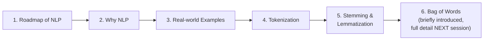

#### 📖 Definition — The Explicitly-Stated Prerequisites

> 💡 **Given directly:** *"The prerequisites is that we are going to basically learn -- you need to know Python, some amount of stats is required, third, at least some machine learning algorithms you need to know... fourth, ANN idea you need to have -- not CNN, CNN is also not required, but at least ANN with all the optimizers, loss functions you should need to know."*

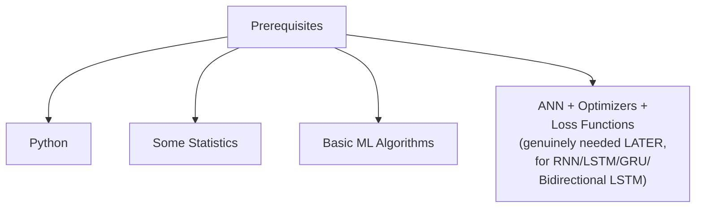

#### 🎯 Key Takeaways

* This is **genuinely Day 1** — the chronological starting point of an extensive, planned 15-20 day NLP series, explicitly designed to go "from basics... till BERT and Transformers."
* The stated **prerequisites** are directly, explicitly named: Python, basic statistics, foundational ML algorithms, and ANN (with optimizers and loss functions) — the LATTER specifically needed for later sessions covering RNN, LSTM, GRU, and Bidirectional LSTM.
* This session's own **genuine, substantive content** — the NLP roadmap, why NLP matters, and the first four text-preprocessing techniques — is interwoven with live audience engagement (a quiz with real cash prizes); this guide focuses on the substantive, teaching content.

---

### 2. Why NLP? Text as Data, and the AI/ML/DL Relationship

#### 🧠 Concept — Directly Re-Confirming the AI/ML/DL Hierarchy

> 💡 **Given directly:** *"AI, what is the main aim of artificial intelligence, is that you try to create an application which can do its tasks by itself, without any human intervention... machine learning is a subset of AI... machine learning actually provides the stats tools to analyze the data, explore the data, do future forecasting... deep learning is another subset of machine learning -- here the focus is that we create a multi-layered neural network... we are trying to mimic the human brain."*

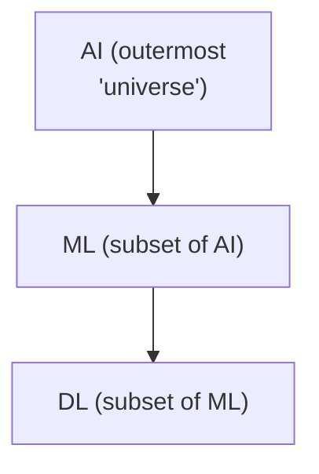

#### ❓ Why It Exists — Precisely Where NLP Genuinely Fits

> 💡 **Given directly:** *"Where does NLP come into this? Can we learn NLP in machine learning, can we learn in deep learning? ...NLP can be used both in machine learning and deep learning, because NLP specifically says that here, the dataset that we are specifically dealing with is related to TEXT."*

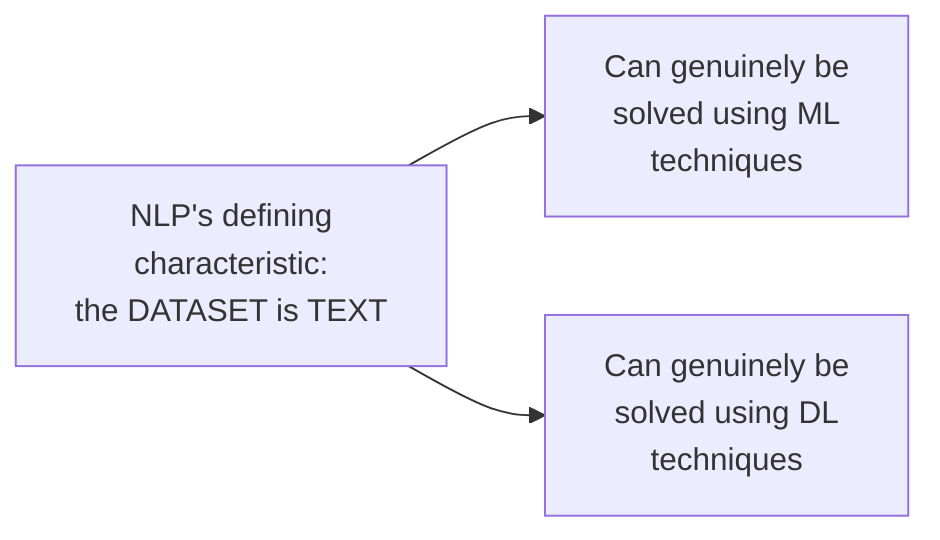

#### 📖 Definition — Precisely Why Machines Genuinely Need Vectors, Not Raw Text

> 💡 **Given directly:** *"You have a machine, if you say that 'hey, go and bring water,' the machine will not just be able to do that specific task, because machine language is completely different, right -- the basic language for the machine to understand, it is completely different from the words or text that we usually give... machine in short understands binaries, guys -- ones and zeros -- we have to give them numbers, let's say vectors."*

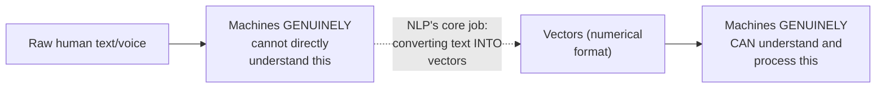

#### 🏢 Real-World / Production Usage — Concrete, Real Examples of NLP's Genuine Impact

> 💡 **Given directly, on Google's own knowledge graph:** *"If I search about Krishnaik, do you see many things over here on the right-hand side... this is from graph knowledge, graph theory, we basically say it's a graph knowledge that has been built up... you will be able to see the recommendation, what all related keywords people are searching about."*

> 💡 **Given directly, on DALL-E and text-to-image generation:** *"I hope everybody has heard about DALL-E 2, right? You just write the text, and it will automatically be converting to an image -- that entire thing is basically text-to-image conversion, and that will basically be using NLP."*

> 💡 **Given directly, on Google Translate as machine translation:** *"If I talk about Google, Google Translator is nothing but it is a machine translation, what we say as a machine translation -- it is basically converting one language into another language."*

#### ❓ Why It Exists — A Genuine, Honestly-Acknowledged Open Challenge: Sarcasm

> 💡 **Given directly:** *"One thing that I feel that is missing, you know, that is sarcasm -- I may say you, 'hey, you are brilliant,' so this is a positive way of telling that you are brilliant -- but if I say, 'hey, you are just brilliant, you don't know anything,' like that, so this is another sarcasm... the major challenge that is existing right now is that sarcasm -- the machine is not able to capture the sarcasm properly."*

#### ⚠ Common Mistakes

* Assuming NLP is genuinely a THIRD, separate field alongside ML and DL — explicitly, directly clarified: NLP is defined by its DATASET (text), and can genuinely be tackled using EITHER machine learning OR deep learning techniques, depending on the specific approach chosen.
* Assuming machine understanding of language is a genuinely SOLVED problem — explicitly, directly, honestly countered via the sarcasm example: real, significant challenges genuinely remain, even at major research institutions.

#### 🎯 Key Takeaways

* **NLP's defining characteristic** is that its dataset is genuinely TEXT — this is precisely WHY it can be tackled using EITHER machine learning OR deep learning techniques, rather than being a separate, third category.
* Machines genuinely require **numerical vectors**, not raw text — directly, precisely motivating the ENTIRE text-preprocessing pipeline this course will build, step by step.
* **Real, concrete examples** (Google's knowledge graph, DALL-E, Google Translate) directly, vividly ground NLP's genuine, everyday relevance — alongside an honest acknowledgment that real, significant challenges (like sarcasm detection) remain genuinely unsolved.

---
### 3. The Complete Roadmap of NLP: A Pyramid, Bottom to Top

#### 🧠 Concept — The Precise, Stated Structure: A Genuine Pyramid

> 💡 **Given directly:** *"I hope you can see this as a pyramid, right -- your basics should get strong, because if you're good at this, then you will be able to learn this -- if you're good at this, you will be able to learn this."*

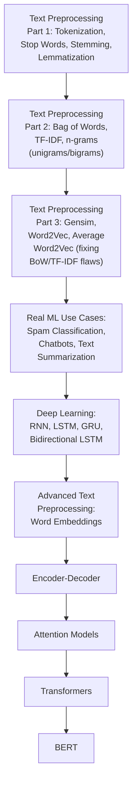

#### 📖 Definition — Text Preprocessing, Part 1 (Precisely Named)

> 💡 **Given directly:** *"The first step, I will go from bottom to top approach -- the first step you really need to know in machine learning, in NLP specifically, is called as TEXT PREPROCESSING... in text preprocessing, I have various steps like tokenization... then we have something called as lemmatization... we also have something called as stop words... we also have a technique which is called as stemming."*

#### 📖 Definition — Text Preprocessing, Part 2 (Precisely Named)

> 💡 **Given directly:** *"Coming to the second layer... in this text preprocessing part 2, I am going to focus on how I can convert the words into vectors -- here I am going to basically have techniques like bag of words, I'm going to have techniques like TF-IDF, here I'm going to have techniques like unigrams, bigrams."*

#### 📖 Definition — Text Preprocessing, Part 3 (Precisely Named)

> 💡 **Given directly:** *"In my third step of preprocessing, here we will be learning techniques like Gensim -- we will be using amazing libraries like Gensim... we'll be using techniques like Word2Vec, we'll be using average Word2Vec... there are some problems with bag of words, there are some problems with TF-IDF, and the problems that exist over there, we are going to remove it, with the help of Word2Vec and average Word2Vec."*

#### 🪜 Step-by-Step — Moving Into Deep Learning: The Explicit, Stated Justification

> 💡 **Given directly, a genuinely honest, direct justification for WHY the basics still matter even as the series moves into deep learning:** *"It is always good that we know all these things also -- nowadays many people use this deep learning, but this all things should be taught, because your basics needs to be very, very strong -- whenever you are implementing anything, right -- tomorrow, if you have a simple problem statement, why you want to directly use deep learning and try to solve it, right? If you're getting a good accuracy with machine learning techniques... why you have to actually go above?"*

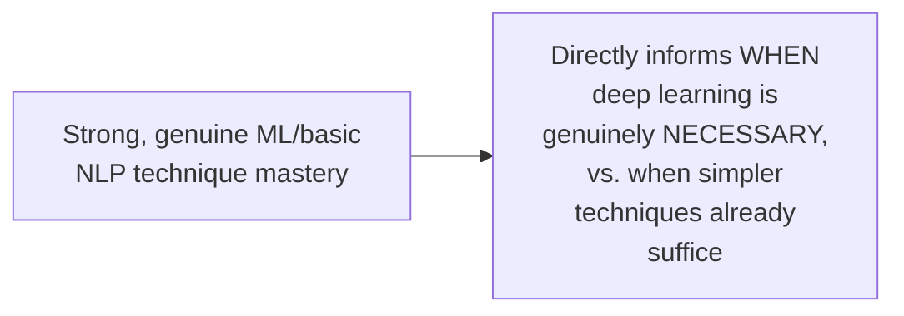

#### 📖 Definition — Advanced Text Preprocessing & the Series' Final Topics

> 💡 **Given directly:** *"We go to the advanced text preprocessing side... here we will be starting to learn about amazing things like WORD EMBEDDING... this internally uses a technique of Word2Vec only, but this is far more advanced... we will try to move to the advanced deep learning techniques, which is called as BIDIRECTIONAL LSTM... we'll be having ENCODERS, DECODERS... we will be having ATTENTION MODELS... we will be learning about TRANSFORMERS, we'll be learning about the final thing, which is called as BERT."*

#### 📖 Definition — The Complete, Named Library Stack

> 💡 **Given directly:** *"What are libraries we are going to cover -- one library for machine learning, we are going to use NLTK, then we are going to use SPACY, one more library is something called as TEXTBLOB... with respect to deep learning, we will be covering TENSORFLOW."*

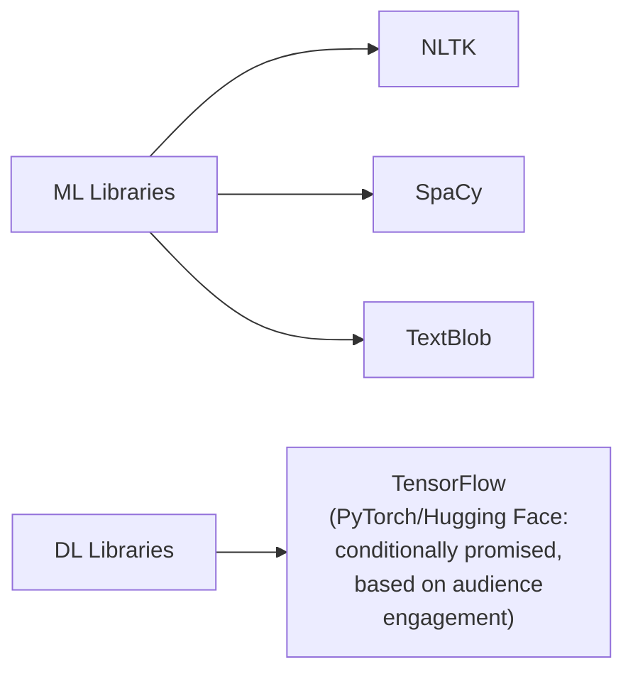

#### ⚠ Common Mistakes

* Assuming this roadmap represents a genuinely quick, one-session overview — explicitly, directly stated as a substantial, roughly 15-20 DAY journey, deliberately paced to avoid overwhelming learners.
* Assuming deep learning techniques are always, unconditionally preferable to the earlier, simpler techniques in this roadmap — explicitly, directly countered: strong basics genuinely inform WHEN deep learning is truly necessary, versus when simpler, already-covered techniques genuinely suffice.

#### 🎯 Key Takeaways

* The complete NLP roadmap is explicitly, directly presented as a **genuine PYRAMID** — text preprocessing (parts 1-3) → ML use cases → deep learning (RNN/LSTM/GRU/Bidirectional LSTM) → advanced word embeddings → Encoder-Decoder → Attention → Transformers → BERT.
* **Text Preprocessing Part 1** = tokenization, stopwords, stemming, lemmatization; **Part 2** = Bag of Words, TF-IDF, n-grams; **Part 3** = Gensim, Word2Vec, Average Word2Vec (explicitly framed as FIXING Part 2's own genuine disadvantages).
* The **named library stack**: NLTK, SpaCy, and TextBlob for machine learning; TensorFlow for deep learning — with PyTorch and Hugging Face explicitly, conditionally promised based on audience engagement.

---

### 4. A Motivating Example: Building a Spam Classifier

#### 🪜 Step-by-Step — Setting Up a Genuine, Concrete Classification Problem

> 💡 **Given directly:** *"Let's say I am building a spam classifier... my dataset will be email body, or it may be an email subject, and my output that you will be seeing is either yes or no -- that basically means it is a spam or a ham, we basically say spam or ham."*

```text
Independent features: Email Body, Email Subject
Output (dependent feature): Spam or Ham
```

#### 🪜 Step-by-Step — Three, Complete, Worked Example Data Points

> 💡 **Given directly, Example 1:** *"My email body [says] that 'you won one million dollar,' and the email subject is that 'billionaire'... in this particular case, what do you think the output will be? It will basically be a spam."*

> 💡 **Given directly, Example 2:** *"The other email that I could [have] is that 'hey Krish, how are you'... subject stays there, I can write is that 'hello'... definitely my output label will be ham."*

> 💡 **Given directly, Example 3:** *"Credit card, you have one credit card... worth something, and you have the winner something -- so obviously here, in this particular case, you'll see that this is a spam."*

```text
Example 1: Body="you won one million dollar", Subject="billionaire" -> Spam
Example 2: Body="hey Krish how are you", Subject="hello" -> Ham
Example 3: Body="credit card...winner...", Subject=(implied) -> Spam
```

#### ❓ Why It Exists — The Precise, Genuine, Motivating Problem

> 💡 **Given directly:** *"Think over it -- I cannot just give a machine this kind of sentence and say that, 'okay, predict it' -- how will the machine be able to understand this kind of words? That is the main thing, right -- now you need to do some steps."*

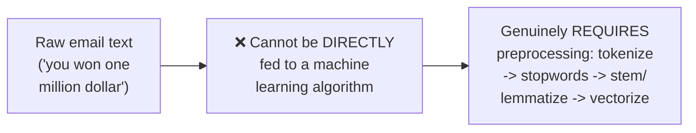

#### ⚠ Common Mistakes

* Assuming a genuine dataset of raw text sentences could be directly used to train a classifier without any preprocessing — explicitly, directly demonstrated as fundamentally impossible: the ENTIRE remainder of this session (and much of the broader roadmap) exists specifically to solve this genuine, real problem.

#### 🎯 Key Takeaways

* A **genuine, concrete spam-classification example** — using real email body/subject text as independent features, and spam/ham as the output — directly, precisely motivates WHY text preprocessing is genuinely, structurally necessary.
* **Three, complete, worked data points** directly illustrate genuine spam vs. genuine ham examples, grounding the ENTIRE subsequent discussion of tokenization, stopwords, stemming, and lemmatization in a real, concrete, motivating scenario.

---
### 5. Tokenization: Converting Sentences Into Words

#### 📖 Definition — Tokenization, Precisely Defined

> 💡 **Given directly:** *"Tokenization is nothing but it is converting sentence into words -- everybody clear with this? Now sentence into words basically means what?"*

#### 🪜 Step-by-Step — A Complete, Worked Example

> 💡 **Given directly:** *"In my email body, I have 'you won one million dollar,' right -- so this is the entire sentence -- so what we'll do is that we'll try to divide this into words -- now my words will be 'you' -- this will be one word, second word 'won,' 'one' -- this will be third word, and 'dollar' will be fourth word."*

```text
Sentence: "you won one million dollar"
Tokens:   ["you", "won", "one", "million", "dollar"]
```

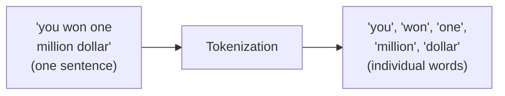

#### ❓ Why It Exists — The Precise, Genuine Purpose

> 💡 **Given directly:** *"Here in tokenization, what we focus on -- we focus on converting sentence into words, because this words needs to be understandable by the machine learning algorithm, or whatever algorithm you are trying to [use] -- so this is the first step of preprocessing."*

#### ⚠ Common Mistakes

* Assuming tokenization is a genuinely complex, multi-step process — explicitly, directly demonstrated as the simplest, most direct FIRST step: taking a sentence and splitting it into its constituent words, nothing more.

#### 🎯 Key Takeaways

* **Tokenization** is precisely, simply the process of converting a SENTENCE into its constituent, individual WORDS.
* This is explicitly confirmed as the **genuine, necessary FIRST step** of text preprocessing — a direct, necessary prerequisite before any further cleaning or vectorization can occur.

---

### 6. Stop Words: Removing Low-Value, Frequent Words

#### 🪜 Step-by-Step — A Genuine, Motivating Example Sentence

> 💡 **Given directly:** *"Let's say I have a sentence, 'hey buddy, I want to go to your house' -- let's say I have this sentence -- now in this particular sentence, do you find some words like -- I'll say 'to,' right -- they will make some words like 'of,' and this kind of words, you know, may get repeated many number of times."*

#### 📖 Definition — Stop Words, Precisely Defined

> 💡 **Given directly:** *"If you want to remove this word, because this word is not that important, based on the output that we are going to get... what we do is that we can remove these words, and in order to remove the words, we will be applying something called as STOP WORDS."*

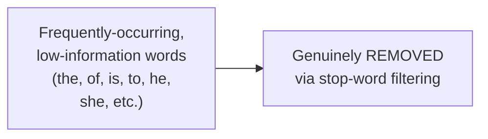

#### ⚠ A Direct, Important, Honest Exception: "Not" and Meaning-Changing Words

> 💡 **Given directly, a genuinely important, precise caveat:** *"One word can be very important -- 'not,' this word will be very important, okay -- 'not,' or because I may say that, 'I did go to the house,' 'I did not go to the house' -- these two are opposite words, right... 'not' keyword can play [a role]."*

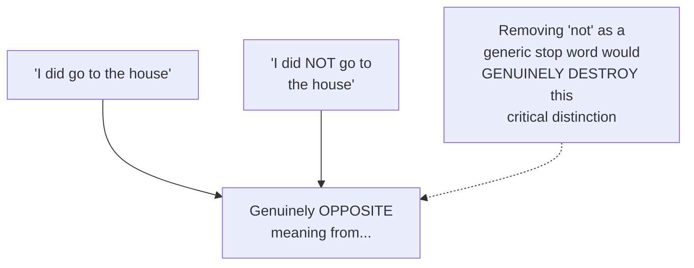

#### 📖 Definition — Customizability: You Can Define Your OWN Stop Words

> 💡 **Given directly:** *"Can you have your own stop words? The answer is YES -- you can also have your own stop words, you can create a list of stop words, and you can compare that how many words are actually present over here, just to remove it -- but right now, the library like NLTK, you know, the stop words list is also present over there."*

#### 🏢 Real-World / Production Usage — Precisely Which Use Cases Genuinely Need Stop-Word Removal

> 💡 **Given directly:** *"This will not be important for use cases like spam classification -- for some of the use cases, it can be important, for some other use cases, like text summarization... for text summarization, it can be important, but for some of the use cases, this will not be important."*

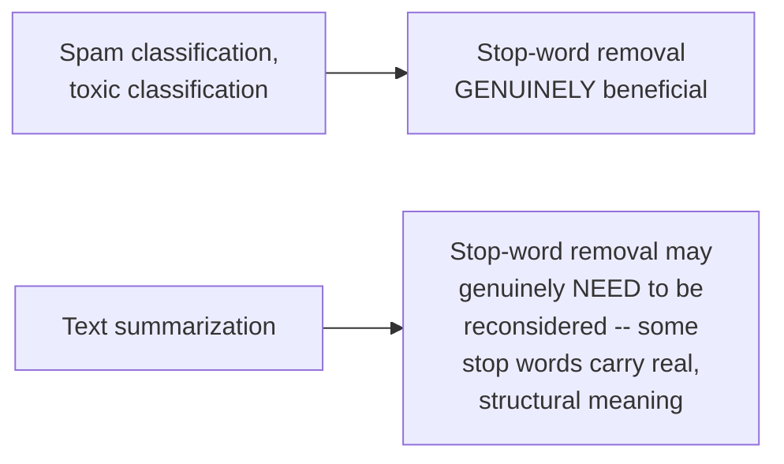

#### ⚠ Common Mistakes

* Assuming ALL common, frequently-occurring words should ALWAYS be removed as stop words — explicitly, directly, importantly corrected: words like "not" carry genuine, MEANING-CHANGING significance and should generally be EXCLUDED from a custom stop-word list, since removing them can genuinely invert a sentence's meaning.
* Assuming NLTK's default stop-word list is the ONLY genuine option — explicitly, directly clarified: you can genuinely define your OWN, custom stop-word list, tailored to your specific task's needs.

#### 🎯 Key Takeaways

* **Stop words** are frequently-occurring, generally low-information words (the, of, to, he, she, etc.) that are commonly REMOVED during text preprocessing.
* A genuinely important, direct exception: words like **"not"** carry real, MEANING-CHANGING significance and should generally be excluded from removal, since dropping them can genuinely invert a sentence's true meaning.
* Whether to genuinely apply stop-word removal is **use-case-dependent** — beneficial for spam/toxic classification, but potentially harmful for tasks like text summarization, where certain "common" words may carry genuine, structural importance.

---
### 7. Stemming: Fast, But Potentially Meaningless

#### 📖 Definition — Stemming, Precisely Defined

> 💡 **Given directly:** *"Stemming, in stemming what we focus on is that we try to find out the BASE of this word -- base of a specific word, or base stem of a specific word."*

> 💡 **Given directly, the complete, precise, general definition:** *"Stemming is a process of REDUCING WORDS TO THEIR BASE WORD, STEM."*

#### 🪜 Step-by-Step — Worked Example 1: "Historical" and "History"

> 💡 **Given directly:** *"Suppose I have two separate words, like this -- 'historical' and 'history' -- now, whenever I have this two words, this two words represent different, different things -- yes, context-wise, I'll say that it represents something different -- but the base and the stem are almost same -- if I apply stemming on this word, then this will get converted into 'histori' -- it will be converted into H-I-S-T-O-R-I."*

```text
"historical" -> stemming -> "histori"
"history"    -> stemming -> "histori"
```

#### ⚠ A Direct, Honest Disadvantage, Demonstrated Immediately

> 💡 **Given directly:** *"One disadvantage is that this word may not have any meaning -- not have any meaning -- this will definitely not have any meaning."*

#### 🪜 Step-by-Step — Worked Example 2: "Finally," "Final," "Finalized"

> 💡 **Given directly:** *"Let's consider one more simple word... 'finally,' 'final,' and 'finalized' -- now here, you know that the context may be different, but all has the SAME base, or base stem -- so this will actually -- if we apply stemming on this, it will get converted to something called as 'final.'"*

```text
"finally"   -> stemming -> "final"
"final"     -> stemming -> "final"
"finalized" -> stemming -> "final"
```

#### 🪜 Step-by-Step — Worked Example 3: "Going," "Goes," "Go" (A Genuinely Meaningful Result)

> 💡 **Given directly:** *"Suppose I have a word which is like 'going,' 'goes,' 'go' -- if I apply stemming to these three words, I will basically be getting 'go' -- so in this case, I am getting a MEANINGFUL word -- I am getting definitely a meaningful word, right."*

```text
"going" -> stemming -> "go"   (a GENUINELY meaningful result, this time)
"goes"  -> stemming -> "go"
"go"    -> stemming -> "go"
```

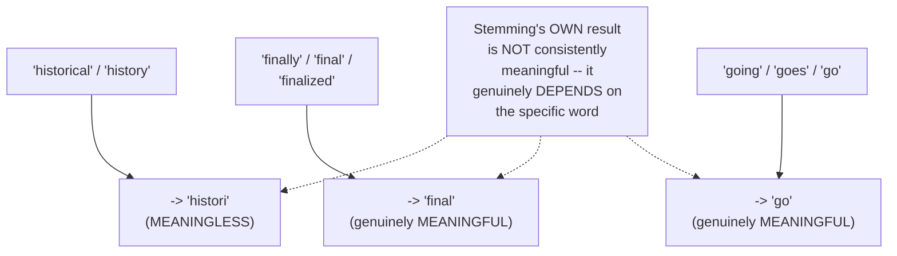

#### 📖 Definition — The Precise, Complete Advantage/Disadvantage Summary

> 💡 **Given directly, the advantage:** *"Advantages of stemming -- stemming process is really fast, is really fast -- it can actually help you for text preprocessing for huge dataset."*

> 💡 **Given directly, the disadvantage:** *"The disadvantage that I will talk about is that it is removing the meaning of the word."*

#### ⚠ A Direct, Honest, Live-Verified Clarification

> 💡 **Given directly:** *"Don't say that it will come as 'final' -- I have tried this with the stemming purpose, many people will be thinking 'final' should come or not, but I tried it out with the help of an NLTK library over there -- specifically 'fina' was coming -- so whatever things I'm showing you over here, right, I did it, and then only I'm showing you."*

#### ⚠ Common Mistakes

* Assuming stemming ALWAYS produces genuinely meaningless results — explicitly, directly demonstrated as FALSE via the "going/goes/go" example, where stemming genuinely DOES produce a meaningful word.
* Assuming stemming ALWAYS produces genuinely meaningful results — explicitly, directly demonstrated as FALSE via the "historical/history" example, where the result ("histori") is genuinely meaningless.
* Assuming the instructor's own stated examples are theoretical/untested — explicitly, directly, honestly clarified: these specific results were GENUINELY, LIVE-VERIFIED using the actual NLTK library, not merely assumed.

#### 🎯 Key Takeaways

* **Stemming** reduces words to their base/stem form — a genuinely fast process, well-suited to preprocessing HUGE datasets efficiently.
* Stemming's result is **NOT consistently meaningful** — it genuinely DEPENDS on the specific word: "going/goes/go" → "go" (meaningful), but "historical/history" → "histori" (meaningless).
* Stemming's precise **advantage**: genuinely fast; its precise **disadvantage**: it can genuinely REMOVE a word's meaning, depending on the specific word being stemmed.

---

### 8. Lemmatization: Meaningful, But Slower

#### ❓ Why It Exists — Precisely Motivated by Stemming's Own Genuine Disadvantage

> 💡 **Given directly:** *"In order to overcome this disadvantage, what we do is that we have something called as LEMMATIZATION."*

#### 📖 Definition — Lemmatization, Precisely Defined

> 💡 **Given directly:** *"In lemmatization, we try to convert the word, but here we will be getting MEANINGFUL word."*

#### 🪜 Step-by-Step — The Same "Historical/History" Example, Now via Lemmatization

> 💡 **Given directly:** *"When I probably give this to a lemmatization in NLTK, there is something called as WordNet Lemmatizer -- so here I will be getting a meaningful word, 'history.'"*

```text
"historical" -> lemmatization -> "history"   (GENUINELY meaningful this time)
```

#### 🔍 Internal Working — Precisely HOW Lemmatization Achieves This

> 💡 **Given directly:** *"You may be thinking, how it is able to do it -- it has the entire dictionary of words -- it will probably check with respect to the base word, and it will compare."*

#### 🪜 Step-by-Step — Confirming the Same "Finally/Final/Finalized" Result

> 💡 **Given directly:** *"If I also have a scenario which it says like 'finally,' 'final,' and 'finalized' -- this will also get converted to a word which is called as 'final.'"*

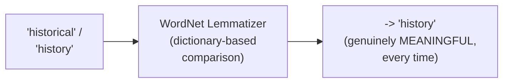

#### 📖 Definition — The Precise, Complete Advantage/Disadvantage Summary

> 💡 **Given directly, the advantage:** *"Advantage -- yes, we are able to get a meaningful word, meaningful word."*

> 💡 **Given directly, the disadvantage:** *"Disadvantage will be that it is SLOW -- I hope everybody knows why it is slow, because it has to really do a lot of comparison with respect to all the dictionary of what it has -- it is slow when compared to stemming."*

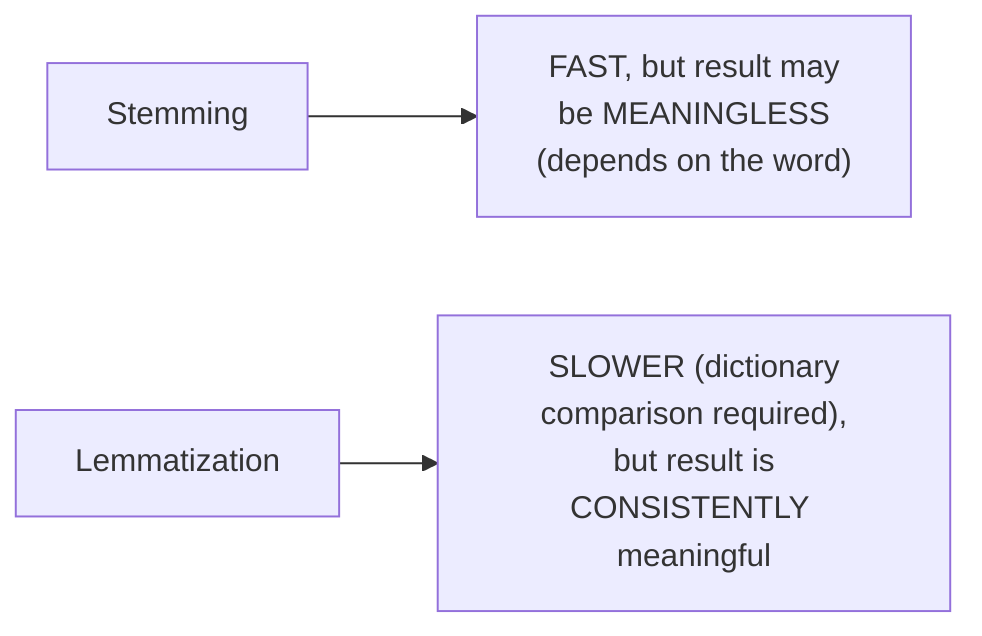

#### ⚠ Common Mistakes

* Assuming lemmatization is a genuinely simple, rule-based transformation, similar to stemming — explicitly, directly clarified: it genuinely relies on comparing against a COMPLETE DICTIONARY of words, a fundamentally different, more computationally involved mechanism.
* Assuming lemmatization is unconditionally, always the "better" choice over stemming since it produces meaningful words — explicitly, directly qualified: it comes with a genuine, real SPEED cost, directly relevant when choosing between the two techniques (covered in Section 9).

#### 🎯 Key Takeaways

* **Lemmatization** directly, precisely solves stemming's genuine disadvantage — it CONSISTENTLY produces meaningful, genuine dictionary words (via NLTK's own `WordNetLemmatizer`), by comparing each word against a complete dictionary.
* Lemmatization's precise **advantage**: consistently meaningful results; its precise **disadvantage**: genuinely SLOWER than stemming, due to the dictionary-comparison process required.
* The SAME example words ("historical/history," "finally/final/finalized") produce **genuinely different results** between stemming and lemmatization — directly, concretely illustrating their core distinction.

---
### 9. Choosing Between Stemming and Lemmatization: Use Cases & Correct Order

#### 🏢 Real-World / Production Usage — Precisely When to Use Stemming

> 💡 **Given directly:** *"If I talk about some use cases -- in case of stemming, here I can say, in SPAM CLASSIFICATION, I can use this... second one is that COMMENTS CLASSIFICATION, whether it is good, bad, or REVIEW CLASSIFICATION."*

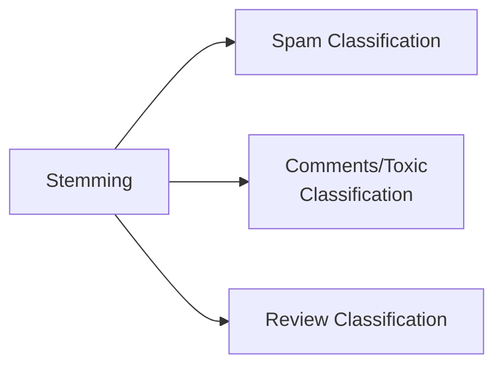

#### 🏢 Real-World / Production Usage — Precisely When to Use Lemmatization

> 💡 **Given directly:** *"In case of lemmatization, if I talk about some use cases, because here MEANINGFUL WORDS is important, so I can basically use something like TEXT SUMMARIZATION... LANGUAGE TRANSLATION... third, CHAT BOTS -- because chatbots also require good, complete lemmatized words."*

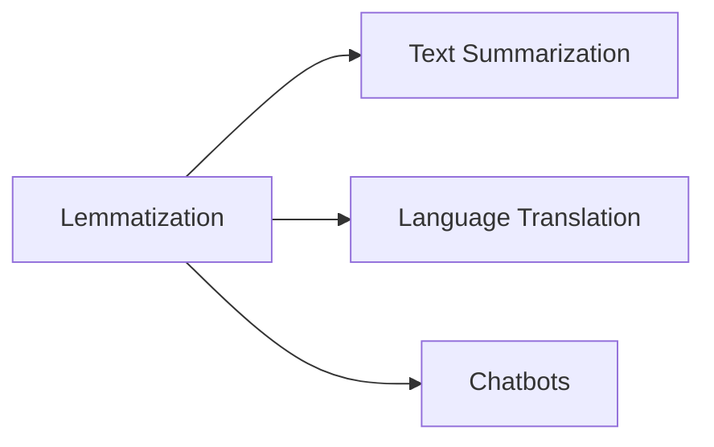

#### 🔍 Internal Working — The Precise, Underlying Reasoning for This Split

> 💡 **Given directly, the implicit but clearly-stated reasoning:** genuinely meaningful output words matter MORE for tasks where the FINAL, generated text is directly SEEN or USED (chatbots, translation, summarization) — while tasks that simply need to CLASSIFY based on PATTERN/frequency (spam, toxicity, review sentiment) can genuinely tolerate stemming's occasionally-meaningless intermediate results, since the FINAL output is just a classification LABEL, not human-readable text.

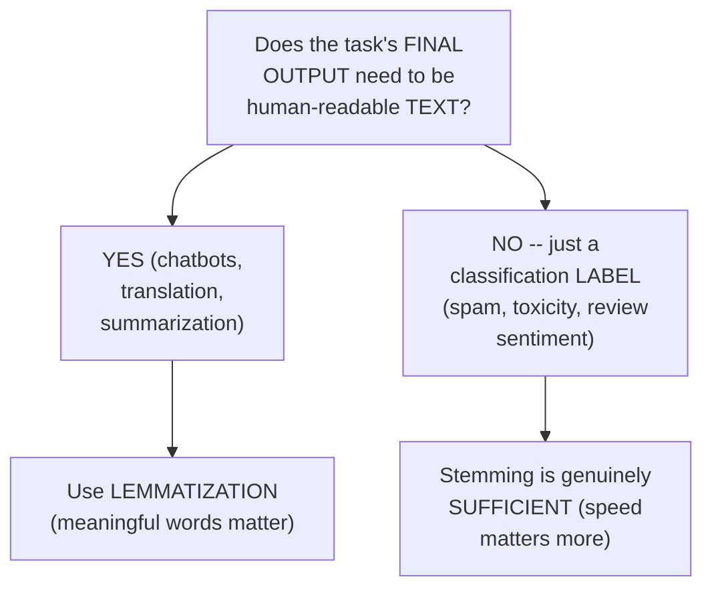

#### 📖 Definition — The Complete, Correct Preprocessing Order

> 💡 **Given directly:** *"Overall, if I talk about what is the first step that we basically do -- we do tokenization -- so in text preprocessing, these are the steps we do -- text preprocessing, these are the steps we do -- first is tokenization, the second step that we focus on is applying stop words, the third step we can basically do stemming, and the fourth step that we can actually do is lemmatization."*

```text
CORRECT PREPROCESSING ORDER:
1. Tokenization  (sentence -> words)
2. Stop Words    (remove low-value, frequent words)
3. Stemming      (OR skip to step 4 directly)
4. Lemmatization
```

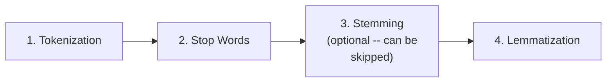

#### ⚠ A Direct, Important Clarification: Stemming and Lemmatization Are Alternatives, Not Always Both Used

> 💡 **Given directly:** *"Sometimes, if you don't want to do stemming also, you can skip that, and you can directly do lemmatization -- but again, [it] depends on the use cases."*

#### ⚠ Common Mistakes

* Assuming BOTH stemming AND lemmatization must ALWAYS be applied together, in sequence — explicitly, directly clarified: they are generally ALTERNATIVE choices for the SAME step, with the specific use case determining WHICH one (not both) is genuinely appropriate.
* Assuming the correct preprocessing order is arbitrary or interchangeable — explicitly, directly, precisely confirmed: tokenization MUST genuinely come first (since stemming/lemmatization operate on individual WORDS, which tokenization produces), with stop-word removal typically applied before stemming/lemmatization.

#### 🎯 Key Takeaways

* **Stemming** is genuinely well-suited for tasks needing only a CLASSIFICATION label (spam classification, comment/toxic classification, review classification) — where speed matters more than perfectly meaningful intermediate words.
* **Lemmatization** is genuinely well-suited for tasks where the FINAL output must be genuinely meaningful, human-readable text (text summarization, language translation, chatbots).
* The **correct, complete preprocessing order**: tokenization → stop words → (stemming OR lemmatization, chosen based on the specific use case) — with stemming and lemmatization functioning as ALTERNATIVES for the same step, not necessarily both applied together.

---

## 📝 Glossary

| Term | Definition | Why It Matters |
|---|---|---|
| **NLP** | Natural Language Processing -- dealing with TEXT as the dataset | Can be tackled via ML OR DL techniques |
| **Vector** | A numerical representation a machine can genuinely process | The genuine target format for all text preprocessing |
| **Tokenization** | Converting a sentence into its individual words | The genuine, necessary FIRST preprocessing step |
| **Stop Words** | Frequent, generally low-information words, often removed | Speeds up processing; "not" is a genuine exception |
| **Stemming** | Reducing words to a base/stem form via rule-based truncation | Fast, but the result may be meaningless |
| **Lemmatization** | Reducing words to their genuine dictionary base form | Slower, but consistently meaningful |
| **WordNet Lemmatizer** | NLTK's dictionary-based lemmatization tool | The specific tool demonstrated in this session |
| **Bag of Words** | The NEXT session's own first text-to-vector technique | Explicitly promised, not yet covered here |
| **TF-IDF** | Term Frequency-Inverse Document Frequency | Explicitly promised for the next session |

---

## 🔄 Revision Notes — One-Minute Revision

* This is **genuinely Day 1** -- the chronological start of an extensive, planned 15-20 day NLP series, going from basics all the way to BERT and Transformers.
* **Prerequisites**: Python, basic stats, foundational ML algorithms, ANN (with optimizers/loss functions -- needed LATER for RNN/LSTM/GRU/Bidirectional LSTM).
* **Why NLP**: NLP's defining characteristic is that its DATASET is TEXT -- it can genuinely be tackled via EITHER machine learning OR deep learning. Machines genuinely need VECTORS (numerical), not raw text -- directly motivating the entire preprocessing pipeline. Sarcasm detection remains a genuine, honestly-acknowledged open challenge.
* **The complete roadmap (a genuine pyramid)**: Text Preprocessing Part 1 (tokenization, stopwords, stemming, lemmatization) -> Part 2 (Bag of Words, TF-IDF, n-grams) -> Part 3 (Gensim, Word2Vec, Average Word2Vec -- fixing Part 2's disadvantages) -> real ML use cases -> Deep Learning (RNN, LSTM, GRU, Bidirectional LSTM) -> Advanced Word Embeddings -> Encoder-Decoder -> Attention -> Transformers -> BERT. Libraries: NLTK, SpaCy, TextBlob (ML); TensorFlow (DL).
* **Motivating example**: a genuine spam classifier (email body/subject -> spam/ham) -- directly demonstrates why raw text cannot be fed to a model without preprocessing.
* **Tokenization**: sentence -> words (e.g., "you won one million dollar" -> 5 individual words) -- the genuine, necessary first step.
* **Stop words**: removing frequent, low-information words (the, of, to, he, she) -- with a genuinely important exception: "not" carries real, meaning-changing significance and should generally be KEPT. You can define your OWN custom stop-word list.
* **Stemming**: reduces words to a base/stem form -- FAST, but inconsistently meaningful ("historical/history" -> meaningless "histori"; "going/goes/go" -> meaningful "go"). Use for: spam classification, comment/toxic classification, review classification.
* **Lemmatization**: uses a dictionary (WordNet Lemmatizer) to produce CONSISTENTLY meaningful words ("historical" -> "history") -- SLOWER than stemming. Use for: text summarization, language translation, chatbots.
* **Correct preprocessing order**: Tokenization -> Stop Words -> Stemming OR Lemmatization (an alternative choice, not necessarily both).
* **Next session**: Bag of Words and TF-IDF (explicitly promised).

---
## 📋 Cheat Sheet

**Why NLP fits both ML and DL:**
```text
NLP's defining trait: the dataset is TEXT
-> Text can be processed via EITHER machine learning OR deep learning techniques
```

**The complete roadmap (pyramid, bottom to top):**
```text
1. Text Preprocessing Part 1: Tokenization, Stop Words, Stemming, Lemmatization
2. Text Preprocessing Part 2: Bag of Words, TF-IDF, n-grams
3. Text Preprocessing Part 3: Gensim, Word2Vec, Average Word2Vec
4. Real ML Use Cases: Spam Classification, Chatbots, Text Summarization
5. Deep Learning: RNN, LSTM, GRU, Bidirectional LSTM
6. Advanced Text Preprocessing: Word Embeddings
7. Encoder-Decoder -> Attention Models -> Transformers -> BERT
```

**The four foundational preprocessing techniques:**
```text
1. Tokenization:    sentence -> words
2. Stop Words:      remove frequent, low-info words (KEEP "not"!)
3. Stemming:        rule-based truncation -> base/stem (FAST, may be meaningless)
4. Lemmatization:    dictionary-based -> genuine base word (SLOWER, always meaningful)
```

**Stemming vs. Lemmatization -- worked examples:**
```text
"historical"/"history" -> Stemming: "histori" (meaningless) | Lemmatization: "history" (meaningful)
"finally"/"final"/"finalized" -> BOTH: "final" (meaningful)
"going"/"goes"/"go" -> Stemming: "go" (meaningful, this time)
```

**When to use which:**
```text
Stemming:      Spam classification, comment/toxic classification, review classification
Lemmatization: Text summarization, language translation, chatbots
```

**Correct preprocessing order:**
```text
Tokenization -> Stop Words -> (Stemming OR Lemmatization -- an ALTERNATIVE choice, not both)
```

---

## 🔥 Interview Questions & Answers

### 🟢 Beginner

**Q1.**

**Question:** Why can NLP be used in both machine learning and deep learning?

**Answer:** Because NLP's defining characteristic is that its dataset is text -- text can be processed using either approach.

**Explanation:** Directly, precisely explained.

**Why Interviewers Ask This:** A foundational, "big picture" NLP question.

**Possible Follow-up:** "Why do machines require vectors rather than raw text?"

**Q2.**

**Question:** What is tokenization?

**Answer:** Converting a sentence into its individual words.

**Explanation:** Directly, precisely defined.

**Why Interviewers Ask This:** The most basic, foundational NLP preprocessing question.

**Possible Follow-up:** "What is genuinely the first step of text preprocessing?"

**Q3.**

**Question:** Should the word "not" typically be removed as a stop word?

**Answer:** No -- it carries meaning-changing significance and should generally be kept.

**Explanation:** Directly, explicitly clarified.

**Why Interviewers Ask This:** Tests awareness of a commonly-overlooked, important exception.

**Possible Follow-up:** "Give an example sentence pair where removing 'not' would invert the meaning."

**Q4.**

**Question:** What is stemming's core advantage?

**Answer:** It is genuinely fast.

**Explanation:** Directly, explicitly stated.

**Why Interviewers Ask This:** Basic, foundational stemming knowledge.

**Possible Follow-up:** "What is its core disadvantage?"

**Q5.**

**Question:** What is lemmatization's core advantage over stemming?

**Answer:** It consistently produces meaningful words.

**Explanation:** Directly, explicitly stated.

**Why Interviewers Ask This:** Basic, foundational lemmatization knowledge.

**Possible Follow-up:** "What is the cost/trade-off for this advantage?"

**Q6.**

**Question:** What NLTK tool was directly named for performing lemmatization?

**Answer:** WordNet Lemmatizer.

**Explanation:** Directly, explicitly named.

**Why Interviewers Ask This:** Basic, practical tooling knowledge.

**Possible Follow-up:** "How does this tool determine a word's genuine base form?"

**Q7.**

**Question:** For spam classification, would stemming or lemmatization typically be preferred?

**Answer:** Stemming.

**Explanation:** Directly, explicitly stated.

**Why Interviewers Ask This:** Tests practical, use-case-based technique selection.

**Possible Follow-up:** "Why is lemmatization's extra meaningfulness less critical for this specific task?"

**Q8.**

**Question:** For chatbots, would stemming or lemmatization typically be preferred?

**Answer:** Lemmatization.

**Explanation:** Directly, explicitly stated.

**Why Interviewers Ask This:** Tests practical, use-case-based technique selection.

**Possible Follow-up:** "Why does chatbot output specifically require meaningful words?"

**Q9.**

**Question:** What is the correct order of the first four text-preprocessing steps?

**Answer:** Tokenization, then stop words, then stemming or lemmatization.

**Explanation:** Directly, explicitly confirmed.

**Why Interviewers Ask This:** A commonly-tested, precise implementation-order question.

**Possible Follow-up:** "Why must tokenization genuinely come first?"

**Q10.**

**Question:** What two techniques were explicitly promised for the next session in this series?

**Answer:** Bag of Words and TF-IDF.

**Explanation:** Directly, explicitly stated.

**Why Interviewers Ask This:** Tests awareness of the course's own stated, immediate next steps.

**Possible Follow-up:** "What broader category do these two techniques belong to, within the stated roadmap?"

---

### 🟡 Intermediate

**Q11.**

**Question:** Explain why the instructor deliberately structures the entire NLP roadmap as a "pyramid," explicitly emphasizing that strong basics are needed before moving to more advanced topics, rather than presenting all techniques as equally accessible starting points.

**Answer:** This reflects a genuine, deliberate pedagogical philosophy directly stated by the instructor: "your basics needs to be very, very strong, whenever you are implementing anything." The pyramid structure directly, precisely communicates that EACH layer genuinely DEPENDS on the one below it -- Bag of Words and TF-IDF (Part 2) require genuine understanding of tokenization and cleaning (Part 1); Word2Vec (Part 3) exists specifically to fix disadvantages that only make sense once Bag of Words/TF-IDF are genuinely understood; and deep learning techniques (RNN, LSTM) are explicitly framed as requiring a REASONED judgment about when they're genuinely necessary versus when simpler techniques already suffice -- a judgment that itself requires genuine mastery of the "lower" layers. This directly discourages a common, real anti-pattern: jumping straight to advanced techniques (like Transformers or BERT) without genuinely understanding WHY they exist or what problems they specifically solve.

**Explanation:** Requires recognizing a deliberate, stated pedagogical philosophy, not merely a convenient way to organize topics.

**Why Interviewers Ask This:** Tests whether a learner recognizes the reasoning behind a structured learning path, not just its contents.

**Possible Follow-up:** "How might understanding stemming and lemmatization's own trade-offs directly help you evaluate a MORE advanced technique's own trade-offs later in this roadmap?"

**Q12.**

**Question:** A learner argues that since lemmatization always produces meaningful words, it should always be used instead of stemming, for every possible NLP task. Evaluate this claim.

**Answer:** This claim overstates the case. While lemmatization genuinely produces MORE meaningful results, this session's own direct content establishes a genuine, real trade-off: lemmatization is SLOWER than stemming, since it requires dictionary comparison for every word. For use cases like spam classification, comment classification, or review classification -- where the FINAL output is simply a classification LABEL, not human-readable text -- the extra meaningfulness lemmatization provides offers GENUINELY LIMITED practical benefit, while its SLOWER speed becomes a real, genuine cost, especially for HUGE datasets (directly connecting back to stemming's own stated advantage: "it can actually help you for text preprocessing for huge dataset"). The accurate, more precise conclusion: lemmatization is genuinely preferable when the task's OWN output requires meaningful text (chatbots, translation, summarization), but stemming remains genuinely appropriate -- and more EFFICIENT -- for classification-only tasks where speed matters more than perfectly meaningful intermediate representations.

**Explanation:** Tests whether a learner recognizes lemmatization's own genuine trade-off (speed), correctly scoping "better" to specific, appropriate use cases rather than treating it as universally superior.

**Why Interviewers Ask This:** Distinguishes candidates who understand genuine trade-offs from those who assume "more accurate/meaningful" always means "unconditionally better."

**Possible Follow-up:** "For a dataset with 10 million documents, would you expect this speed difference to become a genuinely significant, practical concern? Explain your reasoning."

**Q13.**

**Question:** Explain, precisely, why the instructor's own stemming example ("going/goes/go" → "go") produces a genuinely meaningful result, while the "historical/history" example ("histori") does not — what precise, structural difference between these words explains this?

**Answer:** This reflects a genuine, structural property of how STEMMING algorithms typically work — they generally apply RULE-BASED SUFFIX-STRIPPING (removing common endings like "-ing," "-es," "-al," "-ly"), WITHOUT any genuine understanding of the resulting word's own validity. For "going/goes/go," stripping the "-ing" and "-es" suffixes HAPPENS to land on "go" — which is ALREADY, GENUINELY a valid, meaningful English word, purely by COINCIDENCE of how English's own morphology works for this specific word family. For "historical/history," the SAME kind of rule-based suffix-stripping (removing "-ical" and adjusting "history" itself) produces "histori" — a string that does NOT genuinely correspond to any valid English word, since the STEMMING algorithm has NO genuine, dictionary-based understanding of what a "correct" result should look like; it's PURELY mechanical, rule-based truncation. This directly, precisely explains WHY stemming's results are inherently, structurally INCONSISTENT in their meaningfulness — it depends ENTIRELY on whether the specific word's own rule-based truncation HAPPENS to coincide with a genuinely valid word, which is NOT something the algorithm itself can systematically guarantee.

**Explanation:** Requires reasoning through the underlying, structural mechanism of rule-based stemming to explain why its meaningfulness is inherently inconsistent, word by word.

**Why Interviewers Ask This:** Tests whether a learner understands the genuine, structural REASON behind stemming's inconsistent results, not just that inconsistency happens to occur.

**Possible Follow-up:** "Would lemmatization's own dictionary-based approach ever produce a similarly meaningless result? Why or why not?"

**Q14.**

**Question:** Using this session's own precise "why stop words are removed" reasoning, explain why a stop-word list appropriate for spam classification might genuinely need to be DIFFERENT from one appropriate for text summarization.

**Answer:** Per Section 6's own precise reasoning, the DECISION of which specific words to include in a stop-word list is directly tied to whether those words carry genuine, TASK-RELEVANT information. For SPAM classification, common function words (the, of, to) genuinely carry LITTLE information about whether a message is spam — their presence or absence is roughly EQUALLY likely in both spam and genuine messages, making them SAFE to remove without losing genuinely useful, discriminating signal. For TEXT SUMMARIZATION, by contrast, per Section 6's own direct acknowledgment ("for text summarization, it can be important"), certain "common" words may carry genuine STRUCTURAL or GRAMMATICAL importance for producing a coherent, readable summary — removing them could genuinely DEGRADE the summary's own readability or grammatical correctness, even if those SAME words carried little discriminating signal for a classification task. This directly illustrates that "stop word" status is NOT an intrinsic property of a word itself — it's a genuinely TASK-DEPENDENT judgment about whether that word's presence or absence meaningfully affects the SPECIFIC task's own success criteria.

**Explanation:** Requires reasoning through why the SAME words might be safely removable for one task but genuinely important for another, connecting back to each task's own specific success criteria.

**Why Interviewers Ask This:** Tests whether a learner understands stop-word status as a genuinely task-dependent judgment, not an intrinsic, universal word property.

**Possible Follow-up:** "Would you expect 'not' to be a genuinely important word to KEEP for text summarization too, or might its importance differ from the classification-task reasoning given in Section 6?"

**Q15.**

**Question:** Synthesize this session's complete roadmap (Section 3) with its own explicit prerequisite list (Section 1) to explain why "ANN with optimizers and loss functions" is listed as a prerequisite for THIS entire NLP series, even though Day 1's own content (tokenization, stopwords, stemming, lemmatization) doesn't require any neural network knowledge at all.

**Answer:** A precise, synthesized explanation: per Section 1's own exact prerequisite list, ANN knowledge is explicitly, directly required — but per Section 3's own complete roadmap, this specific prerequisite doesn't become genuinely NECESSARY until the roadmap's OWN later stages (Deep Learning: RNN, LSTM, GRU, Bidirectional LSTM), NOT for Day 1's own immediate content. This reveals that the instructor is deliberately, directly stating the COMPLETE, FULL prerequisite list UPFRONT — covering the ENTIRE planned 15-20 day journey — rather than introducing each prerequisite only when it becomes immediately relevant. This is a genuinely deliberate, transparent choice: by stating the COMPLETE prerequisite list at the very start (Section 1), learners can genuinely, honestly ASSESS whether they're prepared for the ENTIRE planned journey, not just the immediately upcoming session — directly avoiding a scenario where a learner comfortably completes early, more accessible sessions (tokenization, stemming, etc.) only to discover MUCH LATER that they're missing a genuinely necessary prerequisite (ANN, optimizers, loss functions) for the deep-learning-focused later stages.

**Explanation:** Requires synthesizing the complete, stated prerequisite list with the complete, stated roadmap to explain why prerequisites for LATER stages are stated at the very BEGINNING, rather than introduced progressively.

**Why Interviewers Ask This:** A senior-level question testing whether a candidate can reason about a course's own deliberate, transparent structuring choice, connecting seemingly-premature information to its own genuine, later relevance.

**Possible Follow-up:** "Why might stating the COMPLETE prerequisite list upfront be considered a more honest, transparent approach than introducing prerequisites progressively, session by session?"

---

### 🔴 Advanced

**Q16.**

**Question:** Design a complete, from-scratch application of ALL FOUR preprocessing steps (tokenization, stop words, stemming, lemmatization) to a genuinely new sentence of your own choosing (at least 8 words, including at least one word with a clear stem/lemma distinction, like "running" or "studies"), explicitly tracing the sentence through each step in the correct order.

**Answer:** A reasonable, complete trace, directly applying this session's own exact methodology — for example, using the sentence "The students were quickly running to their final classes": **Step 1 (Tokenization)**: `["The", "students", "were", "quickly", "running", "to", "their", "final", "classes"]`. **Step 2 (Stop Words)**: removing genuinely low-information words ("The," "were," "to," "their") — per Section 6's own reasoning, this depends on the specific stop-word list used, but a typical result: `["students", "quickly", "running", "final", "classes"]`. **Step 3a (Stemming, one option)**: applying rule-based truncation — `["student", "quickli", "run", "final", "class"]` (note: "quickly" and "classes" may produce genuinely imperfect, non-dictionary results, per Section 7's own established, inconsistent-meaningfulness pattern). **Step 3b (Lemmatization, the alternative option)**: applying dictionary-based comparison — `["student", "quickly", "running", "final", "class"]` (genuinely more consistently meaningful, per Section 8's own established pattern — note "running" may remain unchanged without additional part-of-speech context, a genuine, real nuance of lemmatization's own dictionary-based approach). This complete trace directly, precisely demonstrates the ENTIRE four-step pipeline applied to a genuinely new example.

**Explanation:** Requires applying the session's own complete, four-step methodology to a genuinely new example, correctly demonstrating each step's own specific transformation.

**Why Interviewers Ask This:** A realistic, senior-level question testing whether a candidate can apply the taught methodology completely and correctly to new, unseen text.

**Possible Follow-up:** "Why might 'running' remain unchanged after lemmatization, without additional context about its grammatical role in the sentence?"

**Q17.**

**Question:** Critically evaluate: "Since this session establishes that stemming is 'fast' and lemmatization is 'meaningful,' and modern computers are extremely powerful, the speed difference between these two techniques is now genuinely negligible for any real, practical dataset, making lemmatization the unconditionally correct default choice in 2024 and beyond." Is this an accurate, updated characterization?

**Answer:** Not accurate as an unconditional, updated claim — this significantly overstates the genuine, real impact of general computing power improvements on this SPECIFIC trade-off. While computing power has genuinely increased over time, this session's own stated reasoning for lemmatization's slowness is SPECIFICALLY about the STRUCTURAL nature of the operation itself — "it has to really do a lot of comparison with respect to all the dictionary of what it has" — a computational cost that GENUINELY SCALES with BOTH the dataset's size AND the dictionary's own size, not a fixed, one-time cost that simply "disappears" with faster hardware. For GENUINELY MASSIVE, real-world datasets (the kind explicitly referenced throughout this broader course — Google's own 3-billion-word Word2Vec training corpus, for example), this per-word dictionary-comparison cost, MULTIPLIED across billions of words, remains a genuinely REAL, MEANINGFUL computational consideration, even on modern hardware — the RELATIVE speed difference between stemming and lemmatization genuinely PERSISTS, even as ABSOLUTE processing times for BOTH techniques improve with better hardware. The claim also ignores this session's own use-case-based guidance (Section 9) — even if speed were GENUINELY irrelevant, tasks like spam classification simply don't GENUINELY BENEFIT from lemmatization's extra meaningfulness, since the final output is just a classification label — making the CHOICE between these techniques genuinely about MORE than just raw computational feasibility.

**Explanation:** Tests whether a learner recognizes that a stated trade-off (speed) reflects a genuine, STRUCTURAL/relative cost, not merely an absolute, hardware-dependent limitation that improves away over time — and that the choice also involves genuine use-case fit, beyond pure speed.

**Why Interviewers Ask This:** Distinguishes candidates who reason about the STRUCTURAL nature of a stated trade-off from those who assume general technological progress automatically eliminates any specific, real limitation.

**Possible Follow-up:** "For a dataset the size of Google's own real, 3-billion-word Word2Vec training corpus, would you expect the ABSOLUTE speed difference between stemming and lemmatization to be practically negligible, or genuinely significant? Explain your reasoning."

**Q18.**

**Question:** Synthesize this session's complete "why NLP" explanation (Section 2) with its own stated roadmap (Section 3) to explain why Word2Vec (explicitly named as Part 3 of the roadmap) is specifically described as fixing "disadvantages" in Bag of Words and TF-IDF (Part 2), rather than being introduced as a completely independent, unrelated technique.

**Answer:** A precise, synthesized explanation, directly connecting Section 2's own core "why NLP" framing to the roadmap's own internal, sequential logic: per Section 2's own precise reasoning, NLP's fundamental task is genuinely converting text into VECTORS that meaningfully preserve and represent the text's own genuine information. Section 3's own precise roadmap structure (Part 1 → Part 2 → Part 3, each building on the previous) directly reflects that Bag of Words and TF-IDF (Part 2) represent a GENUINE, real, FIRST attempt at solving this core "why NLP" challenge — converting words into some numerical vector form — but this session's own content directly, explicitly signals (without fully detailing, since these techniques are reserved for the NEXT session) that these techniques carry GENUINE, real "disadvantages." Word2Vec's OWN Part 3 positioning as SPECIFICALLY fixing these disadvantages directly demonstrates the roadmap's own INTERNAL, deliberate LOGIC — it's not simply a chronological list of unrelated techniques, but a genuinely CAUSAL, problem-solving PROGRESSION, where EACH new technique exists specifically because the PREVIOUS one had a genuine, real limitation — directly, precisely mirroring the SAME "each technique solves the previous one's genuine flaw" narrative structure this broader course consistently uses across ITS ENTIRE curriculum (directly connecting to the SAME pattern established for the optimizer lineage in the deep learning sessions, and for RNN→LSTM→Bidirectional LSTM in the sequence-modeling sessions).

**Explanation:** Requires synthesizing the core "why NLP" motivation with the roadmap's own internal sequencing logic to explain why later techniques are framed as solving earlier ones' genuine flaws, connecting to a broader, recurring pattern across this course.

**Why Interviewers Ask This:** A capstone-level question testing whether a candidate can recognize a recurring, deliberate "problem-solution lineage" teaching pattern, connecting THIS session's own roadmap structure to the SAME underlying philosophy used elsewhere in the broader curriculum.

**Possible Follow-up:** "Based on this same, recurring pattern, what specific KIND of genuine disadvantage would you predict Bag of Words and TF-IDF have, even before those techniques are formally covered in the next session?"

---

## 🧪 Scenario-Based Interview Questions

> **Scenario 1:** A colleague's spam classifier, built using this session's own recommended stemming approach, is genuinely misclassifying messages that use negation (e.g., "I did not win a prize" being flagged as spam, similar to "I did win a prize"). Using this session's concepts, diagnose the most likely cause.

**Structured Answer:**
1. **Initial investigation:** Recognize this as directly connected to Section 6's own precise, important caveat about "not" -- if the colleague's stop-word list REMOVED "not" (rather than genuinely keeping it, per this session's own explicit guidance), this would directly explain the observed misclassification.
2. **Metrics/logs to check:** Directly inspect the colleague's own stop-word list configuration, confirming whether "not" (and similar, genuinely meaning-changing words) were included for removal.
3. **Possible causes:** Per Section 6's own precise reasoning, using a GENERIC, unmodified stop-word list (which often includes "not" by default) would directly cause this exact class of error -- genuinely opposite-meaning sentences becoming indistinguishable after preprocessing.
4. **Debugging approach:** Directly test the preprocessing pipeline on the SPECIFIC example sentences ("I did win a prize" vs. "I did not win a prize"), confirming whether they produce IDENTICAL or DISTINCT processed representations.
5. **Resolution:** Create a CUSTOM stop-word list (per Section 6's own explicit, stated option: "you can also have your own stop words"), specifically EXCLUDING "not" and other genuinely meaning-changing words from removal.
6. **Prevention:** Establish a standing team practice of NEVER using a fully generic, unexamined stop-word list for tasks where negation genuinely matters -- always explicitly reviewing and customizing the list, directly per this session's own established guidance.

> **Scenario 2 (Advanced):** Your team is building a customer-support chatbot and needs to decide on a text-preprocessing pipeline, but a colleague proposes using stemming (rather than lemmatization) specifically for FASTER response times. Using this session's concepts, evaluate this proposal and provide a recommendation.

**Structured Answer:**
1. **Initial investigation:** Recognize this as directly connected to Section 9's own explicit, precise use-case guidance -- chatbots are SPECIFICALLY named as a genuine lemmatization use case, precisely because their output must be genuinely meaningful.
2. **Relevant principle:** Per Section 8's own precise reasoning, lemmatization's core advantage (consistently meaningful words) is GENUINELY IMPORTANT for chatbots specifically, since a chatbot's own OUTPUT is directly, genuinely SEEN and READ by real users -- unlike spam classification's own purely internal classification label.
3. **Possible causes for this proposal:** A reasonable-sounding but potentially MISPLACED optimization -- prioritizing SPEED without fully considering that stemming's own genuine disadvantage (potentially meaningless words, per Section 7) could directly, negatively affect the CHATBOT'S OWN USER-FACING QUALITY, a genuinely more critical concern for this SPECIFIC use case than raw preprocessing speed.
4. **Debugging/evaluation approach:** Directly test BOTH approaches (stemming vs. lemmatization) on a representative SAMPLE of real, expected chatbot interactions, empirically comparing the RESULTING OUTPUT QUALITY (not just raw processing speed) for genuine user-facing coherence.
5. **Resolution:** Recommend AGAINST prioritizing stemming's speed advantage for THIS SPECIFIC use case -- directly per Section 9's own explicit guidance, lemmatization remains the genuinely more appropriate choice for chatbots, since output quality/meaningfulness is a more critical concern here than raw preprocessing speed (which, per Section 8's own reasoning, matters MORE specifically for "huge dataset" preprocessing scenarios, not necessarily real-time, per-message chatbot response generation).
6. **Prevention:** Establish a standing team practice of directly matching preprocessing technique choice to the SPECIFIC use case's own genuine priorities (output quality vs. raw processing speed), rather than defaulting to the FASTER technique without considering the SPECIFIC task's own genuine requirements.

---

## 🛠 Hands-on Exercises

### 🟢 Easy

1. Write out, from memory, the complete NLP roadmap pyramid, from Text Preprocessing Part 1 through to BERT.
2. Apply tokenization to a sentence of your own choosing (at least 6 words), listing the resulting tokens.
3. List three words that should genuinely be included in a custom stop-word list, and one word that should genuinely be EXCLUDED (despite being common), with justification.

### 🟡 Medium

4. Complete the full, four-step preprocessing trace proposed in Advanced Interview Q16, using a genuinely different sentence of your own choosing.
5. Write a short explanation (150-200 words) of why stemming's results are inconsistently meaningful, directly applying Intermediate Q13's own reasoning.
6. Research (outside this session) NLTK's PorterStemmer and WordNetLemmatizer, and write short, working Python code applying both to a list of 10 words of your own choosing, comparing the results.

### 🔴 Advanced

7. Implement a complete text-preprocessing pipeline (tokenization, custom stop-word removal, and a choice between stemming/lemmatization) for a genuine dataset of your own choosing, with written justification for your stemming/lemmatization choice based on the dataset's own intended use case.
8. Implement the empirical speed comparison proposed in Advanced Interview Q17, measuring actual processing time for stemming vs. lemmatization on a dataset of genuinely increasing size (e.g., 1,000, 10,000, 100,000 words), and document the observed scaling behavior.
9. Research and implement the negation-handling fix proposed in Scenario 1, building a custom stop-word list that explicitly excludes "not" and other genuinely meaning-changing words, then empirically test it against a set of negation-containing example sentences.

---

## 🏗 Practice Assignment

### Build: "Complete Text Preprocessing Pipeline, With Use-Case Justification"

**Objective:** Directly reproduce this session's own complete, four-step text-preprocessing methodology, applied to a genuinely new dataset, with reasoned technique selection.

**Requirements:**
- A genuinely new text dataset of your own choosing (at least 20 sentences), representing a real or realistic use case (e.g., product reviews, customer support tickets, or social media comments).
- A complete, working tokenization step, applied to your entire dataset.
- A custom stop-word list, with written justification for at least 3 words you deliberately chose to EXCLUDE from removal (beyond just "not"), based on your own dataset's specific characteristics.
- A reasoned choice between stemming and lemmatization, directly applying Section 9's own use-case guidance to your OWN dataset's specific goal, with written justification.
- A written reflection (200-300 words) on any genuinely surprising or inconsistent results you observed (e.g., words where stemming produced meaningless results, similar to "historical" → "histori").

**Architecture (suggested):**

```text
text_preprocessing_pipeline/
├── dataset_and_goal.md               # your dataset description and use case
├── tokenization.py                     # your tokenization implementation
├── custom_stopwords.py                   # your custom stop-word list + justification
├── stemming_or_lemmatization.py            # your chosen technique + justification
└── REFLECTION.md                              # your written reflection
```

**Expected Functionality:**
- Your pipeline should genuinely, correctly process your entire dataset end to end.
- Your technique choice (stemming vs. lemmatization) should be genuinely, explicitly justified based on your dataset's own specific use case, directly applying this session's own established reasoning framework.

**Challenges:**
- Correctly identifying which "common" words genuinely need to be preserved for your specific use case (beyond just "not").
- Correctly reasoning through whether your specific use case prioritizes speed (stemming) or meaningfulness (lemmatization).

**Bonus Improvements:**
- Implement BOTH stemming and lemmatization on the same dataset, and empirically compare their outputs, directly documenting any genuinely meaningless stemming results you observe.
- Extend your pipeline to prepare for the NEXT session's own promised content (Bag of Words, TF-IDF), by researching these techniques independently.

---

## 📚 Additional Resources

- **NLTK, SpaCy, and TextBlob** (all explicitly named) -- the three primary machine-learning-oriented NLP libraries this entire series will use.
- **TensorFlow** (explicitly named) -- the primary deep-learning library for this series' later sessions.
- **The community/course dashboard** (referenced directly) -- where session materials are made available.
- **The next session** (referenced directly, explicitly next) -- covering Bag of Words and TF-IDF in complete detail.
- **Google's own knowledge graph and DALL-E** (referenced directly, as real-world examples) -- genuinely useful for building further, independent intuition about NLP's real-world impact.

---

## 📌 Final Revision Sheet

### ⭐ Core Concepts
- **NLP's defining trait**: text as the dataset -- usable in BOTH ML and DL.
- **The complete roadmap**: Text Preprocessing (3 parts) -> ML use cases -> Deep Learning -> Advanced Word Embeddings -> Encoder-Decoder -> Attention -> Transformers -> BERT.
- **Tokenization**: sentence -> words (the genuine, necessary first step).
- **Stop words**: remove frequent, low-info words -- but KEEP "not" and similar, meaning-changing words.
- **Stemming**: fast, rule-based, inconsistently meaningful.
- **Lemmatization**: slower, dictionary-based, consistently meaningful.
- **Correct order**: Tokenization -> Stop Words -> Stemming OR Lemmatization.

### ⭐ Important Definitions
- **Vector, WordNet Lemmatizer** (see Glossary for full definitions).

### ⭐ Important Commands/Code
```text
Tokenization: "you won one million dollar" -> ["you","won","one","million","dollar"]
Stemming: "historical"/"history" -> "histori" (meaningless)
Lemmatization: "historical"/"history" -> "history" (meaningful)
```

### ⭐ Architecture/Process
- Complete preprocessing pipeline: raw text -> tokenization -> stop-word removal -> stemming OR lemmatization -> (next session: Bag of Words/TF-IDF vectorization).

### ⭐ Best Practices
- Always customize stop-word lists for your specific task, never assuming a generic list is universally appropriate.
- Choose stemming for classification-only tasks; lemmatization for tasks requiring genuinely meaningful, human-facing output.
- Always verify tokenization happens BEFORE any subsequent preprocessing step.

### ⭐ Common Mistakes
- Assuming NLP is a separate field from ML/DL, rather than definable by its text-based dataset.
- Removing "not" and similar meaning-changing words as generic stop words.
- Assuming stemming always produces meaningless (or always meaningful) results.
- Assuming lemmatization is unconditionally superior to stemming, ignoring its genuine speed cost.

### ⭐ Interview Points
- Be ready to explain why NLP fits both ML and DL.
- Be ready to define and demonstrate all four Day 1 preprocessing techniques.
- Be ready to explain the stemming vs. lemmatization trade-off and correct use-case selection.
- Be ready to state the correct preprocessing order.

### ⭐ Things to Remember
- This is **genuinely Day 1** -- the chronological starting point of an extensive, 15-20 day NLP series, going from complete basics to BERT and Transformers.
- The **complete prerequisite list is stated upfront**, covering the ENTIRE planned journey, not just this session's own immediate content.
- **Bag of Words and TF-IDF are explicitly promised** for the very next session, directly continuing the roadmap's own Text Preprocessing Part 2.

---

## 🔗 Source

- [Text Preprocessing Fundamentals](https://www.youtube.com/live/CG9iLLhqQF8?si=po7_D6_TW-rNIT_c)