# 🧠 NLP Day 2: Bag of Words, One-Hot Encoding & N-Grams (Theory & Practical)

- <i>**Session:** NLP for Machine Learning & Deep Learning Series — Day 2 (Bag of Words, TF-IDF, Word2Vec) · 
- **Instructor:** Krish Naik
- **Note on scope:** This is the **direct, explicitly-promised continuation** of Day 1, which closed with Bag of Words and TF-IDF promised as next steps. This session genuinely delivers One-Hot Encoding, Bag of Words, and N-Grams completely — both theory (built through fully worked, concrete examples) AND a real, live practical implementation using NLTK and Scikit-learn's `CountVectorizer`. TF-IDF is explicitly, honestly acknowledged as NOT covered in this specific session (despite being in the title) — the instructor ran out of time and directly, transparently defers it to the next class. Word2Vec is similarly deferred. This guide covers exactly what was genuinely taught: basic NLP terminology, the complete text-to-vector pipeline, One-Hot Encoding, Bag of Words, N-Grams, and their real, hands-on implementation.</i>

---

## 📑 Table of Contents

1. [Session Overview](#-session-overview)
2. [Learning Objectives](#-learning-objectives)
3. [Detailed Notes](#-detailed-notes)
   - [1. Session Context: Day 2, From Terminology to Vectors](#1-session-context-day-2-from-terminology-to-vectors)
   - [2. Basic NLP Terminologies: Corpus, Documents, Vocabulary & Words](#2-basic-nlp-terminologies-corpus-documents-vocabulary--words)
   - [3. The Complete NLP Pipeline: From Raw Text to Vectors](#3-the-complete-nlp-pipeline-from-raw-text-to-vectors)
   - [4. One-Hot Encoding: A Complete Worked Example & Its Genuine Disadvantages](#4-one-hot-encoding-a-complete-worked-example--its-genuine-disadvantages)
   - [5. Bag of Words: A Complete Worked Example](#5-bag-of-words-a-complete-worked-example)
   - [6. Bag of Words' Advantages, Disadvantages & Cosine Similarity](#6-bag-of-words-advantages-disadvantages--cosine-similarity)
   - [7. N-Grams: A Partial Fix for Lost Word Order](#7-n-grams-a-partial-fix-for-lost-word-order)
   - [8. Practical Implementation: NLTK, Stemming, Lemmatization & CountVectorizer](#8-practical-implementation-nltk-stemming-lemmatization--countvectorizer)
   - [9. Closing: TF-IDF Deferred & What's Next](#9-closing-tf-idf-deferred--whats-next)
4. [Glossary](#-glossary)
5. [Revision Notes — One-Minute Revision](#-revision-notes--one-minute-revision)
6. [Cheat Sheet](#-cheat-sheet)
7. [Interview Questions & Answers](#-interview-questions--answers)
8. [Scenario-Based Interview Questions](#-scenario-based-interview-questions)
9. [Hands-on Exercises](#-hands-on-exercises)
10. [Practice Assignment](#-practice-assignment)
11. [Additional Resources](#-additional-resources)
12. [Final Revision Sheet](#-final-revision-sheet)

---

## 🎯 Session Overview

This session genuinely delivers the first, complete text-to-vector techniques — building each one from a fully worked example, then implementing it live in real code. It covers:

1. **Four foundational NLP terminologies** — corpus, documents, vocabulary, and words — precisely defined via a genuine, worked sentiment-analysis example (four documents, each with a positive/negative label).
2. **The complete NLP pipeline**, restated precisely: raw dataset → text preprocessing (tokenization, lowering, stemming/lemmatization, stop words) → converting cleaned words into VECTORS (one-hot encoding → Bag of Words → TF-IDF → Word2Vec).
3. **One-Hot Encoding**, built through a complete, worked example (a genuine, 9-word-vocabulary corpus) — followed by FOUR, precisely-named, genuine disadvantages: sparse matrices, out-of-vocabulary (OOV) failure, inconsistent input size, and lost semantic meaning.
4. **Bag of Words**, built through a SECOND, complete worked example — directly demonstrating how stop-word removal, frequency-based vocabulary ordering, and both COUNT-based and BINARY variants combine to produce a genuine, usable feature representation.
5. **Bag of Words' own genuine advantages and disadvantages** — directly including a real, practical detour into COSINE SIMILARITY (explained via concrete angle examples: 0°, 45°, 90°) and its real-world application in recommendation systems.
6. **N-Grams** (bigrams, trigrams), introduced as a genuine, PARTIAL fix for Bag of Words' own lost word-ordering problem — directly worked through multiple, real counting exercises.
7. **A complete, real, practical implementation** — NLTK setup, sentence tokenization, stemming vs. lemmatization comparison on real words, regex-based cleaning, and finally Scikit-learn's `CountVectorizer` for genuine Bag of Words vectorization (including the binary variant).
8. **An honest, direct, transparent acknowledgment**: despite the session's own title mentioning TF-IDF and Word2Vec, NEITHER was genuinely covered in this specific class — both are explicitly, directly deferred to the next session, due to genuinely running out of time.

> 💡 **Key framing, given directly, on the instructor's own honest acknowledgment of this session's real scope:** *"I will not cover Word2Vec today, probably in the next class this will be covered -- but till here, with respect to practical implementation, everything will be covered, from tokenization to lowering the case... then we'll try to understand Bag of Words, then TF-IDF, and then we'll try to do a lot of practical [implementation]."* (Note: TF-IDF was ALSO, ultimately, not reached live — directly, honestly deferred at the session's actual close.)

---

## 🎯 Learning Objectives

By the end of this guide, you will be able to:

- [ ] Precisely define corpus, documents, vocabulary, and words, using a concrete example.
- [ ] Describe the complete NLP pipeline, from raw dataset through to vectorized, model-ready features.
- [ ] Manually construct a One-Hot Encoding representation for a small corpus, and explain its four genuine disadvantages.
- [ ] Manually construct a Bag of Words representation (both count-based and binary), including frequency-based vocabulary ordering.
- [ ] Explain cosine similarity using concrete angle examples, and connect it to real-world recommendation systems.
- [ ] Explain what N-grams are, and manually construct bigrams/trigrams for a given sentence.
- [ ] Implement tokenization, stemming, lemmatization, and Bag of Words vectorization using real Python code (NLTK and Scikit-learn).

---

## 📚 Detailed Notes

### 1. Session Context: Day 2, From Terminology to Vectors

#### 🧠 Concept

> 💡 **Given directly, opening the session:** *"I hope everybody is rocking, and I hope you have seen the study session that is the Day One session -- today, again, we'll be having the Day Two session."*

#### 🪜 Step-by-Step — The Stated, Complete Agenda for Today

> 💡 **Given directly:** *"There are multiple ways that we are going to focus on -- one is one-hot encoding... the second step that we are basically going to see [is] something called as bag of words, which we also say it as BOW -- the third technique... is something called as TF-IDF... there is also one more technique that we are going to focus on, [which] is something called as Word2Vec."*

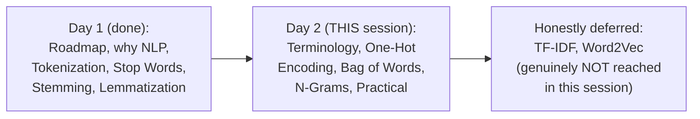

#### 🎯 Key Takeaways

* This session **directly, explicitly continues** Day 1 — assuming genuine familiarity with tokenization, stop words, stemming, and lemmatization, all covered previously.
* Despite the session's own title listing "Bag of Words, TF-IDF, Word2Vec," the instructor **honestly, transparently acknowledges** that TF-IDF and Word2Vec were genuinely NOT reached in this specific, live session — both are directly deferred to the following class.
* This session's own genuine, delivered content — terminology, One-Hot Encoding, Bag of Words, N-Grams, and a real practical implementation — is substantial and complete in its own right, even though it falls short of the session's own originally-stated, full scope.

---

### 2. Basic NLP Terminologies: Corpus, Documents, Vocabulary & Words

#### ❓ Why It Exists — The Precise, Stated Motivation

> 💡 **Given directly:** *"We really need to understand some of the terminologies... this is the basic thing that you really need to know whenever we basically start."*

#### 🪜 Step-by-Step — A Complete, Worked Sentiment-Analysis Example

> 💡 **Given directly:** *"Let's say that I have a sentiment analysis problem statement -- in sentiment analysis, what will be there? You will be having a text, and you will be having an output... let's say my first data point... D1... I will just say that 'the food is good'... let's say the output is 1, because it shows a positive sentiment... my D2 is that... 'the food is bad,' so my output will basically be zero."*

```text
D1: "the food is good"  -> Output: 1 (positive)
D2: "the food is bad"    -> Output: 0 (negative)
D3: "pizza is amazing"     -> Output: 1 (positive)
D4: "burger is bad"          -> Output: 0 (negative)
```

#### 📖 Definition — Corpus, Precisely Defined

> 💡 **Given directly:** *"Whenever we have this entire dataset, suppose if I combine all this data points -- if I combine all these data points, then that specifically becomes CORPUS -- corpus basically means that you can also say that this can be called as PARAGRAPH."*

#### 📖 Definition — Documents, Precisely Defined

> 💡 **Given directly:** *"What is documents? Documents is nothing but it's just like SENTENCE -- but in NLP, we specifically use it as document -- so here, specifically, D1 will be one document, D2 will be another document."*

#### 📖 Definition — Vocabulary, Precisely Defined

> 💡 **Given directly:** *"Vocabulary basically means what? Suppose if I consider a dictionary book, let's say in a dictionary book, how many words may be present... how many number of unique words are there... the total number of unique words is nothing but it is called as VOCABULARY."*

#### 📖 Definition — Words, Precisely Defined

> 💡 **Given directly:** *"Coming to the word section -- I hope word is very much simple -- whatever words is present inside this unique word, I can separately take this as a separate, separate word."*

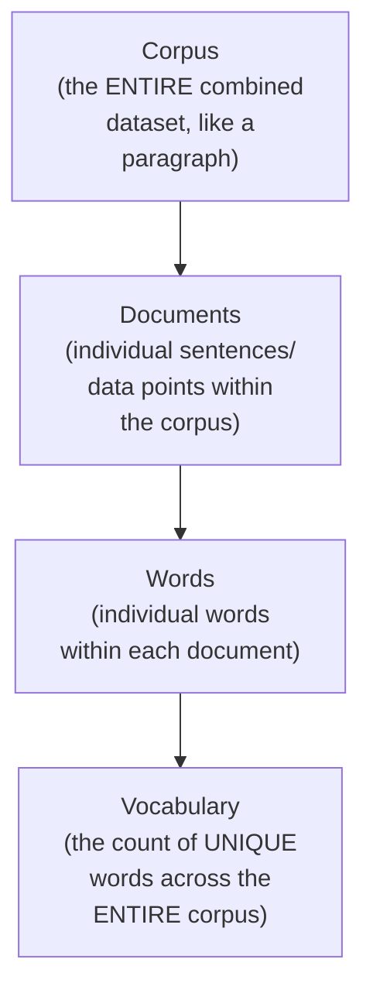

#### ⚠ Common Mistakes

* Confusing "document" with "corpus" — explicitly, directly distinguished: a document is ONE sentence/data point; the corpus is the ENTIRE, COMBINED collection of all documents.
* Assuming "vocabulary" refers to the total word COUNT (including repeats) — explicitly, directly clarified: vocabulary specifically counts UNIQUE words only.

#### 🎯 Key Takeaways

* **Corpus** = the entire, combined dataset (like a paragraph); **Documents** = individual sentences/data points within the corpus; **Vocabulary** = the count of UNIQUE words across the entire corpus; **Words** = individual words within the vocabulary.
* These four terms are **precisely, consistently used** throughout NLP — genuine fluency with this terminology is explicitly framed as a necessary foundation before proceeding further.
* This terminology is directly, concretely grounded via a **real, worked sentiment-analysis example** (4 documents, each with a positive/negative label) — not introduced abstractly.

---
### 3. The Complete NLP Pipeline: From Raw Text to Vectors

#### 🪜 Step-by-Step — The Precise, Restated, Complete Pipeline

> 💡 **Given directly:** *"From the dataset, what all the steps that we usually perform in an NLP task -- if I have this specific dataset, the second step that we specifically do is something called as text preprocessing... let's say this is text preprocessing one, so the first thing that I will definitely do is that -- tokenization -- then I may add some more things, like lowering the case of the words."*

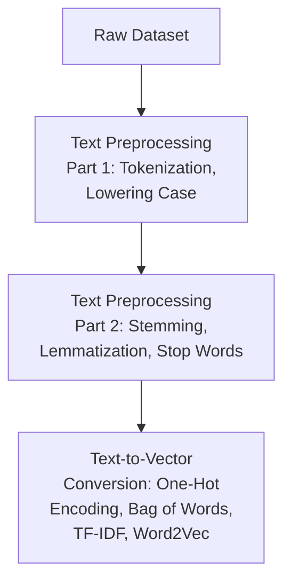

#### 📖 Definition — Precisely Confirming the Text-to-Vector Techniques Covered Today

> 💡 **Given directly:** *"After text preprocessing, you will be able to see that all the data will be clean -- and now my main aim will be that I'll be trying to convert the words into vectors -- so here the first step I can use is something called as Bag of Words, second step that I can actually use is something called as TF-IDF, the third step that I can basically use is something called as Word2Vec."*

#### ⚠ Common Mistakes

* Assuming text-to-vector conversion is a SINGLE, monolithic step — explicitly, directly demonstrated as its OWN, multi-technique stage (One-Hot Encoding, Bag of Words, TF-IDF, Word2Vec), following text preprocessing, not merged with it.

#### 🎯 Key Takeaways

* The complete NLP pipeline directly, precisely follows: **raw dataset → text preprocessing (tokenization, lowering, stemming/lemmatization, stop words) → text-to-vector conversion (one-hot encoding → Bag of Words → TF-IDF → Word2Vec)**.
* This session's own genuine focus is the **text-to-vector conversion stage**, specifically One-Hot Encoding, Bag of Words, and N-Grams — with TF-IDF and Word2Vec honestly deferred.

---

### 4. One-Hot Encoding: A Complete Worked Example & Its Genuine Disadvantages

#### 🪜 Step-by-Step — Setting Up a Real, Complete Corpus

> 💡 **Given directly:** *"Let's say I have a simple dataset which is basically something like this -- the corpus is basically 'a man eat food, cat eat food, people watch Krish YouTube channel' -- let's say this is my entire corpus."*

```text
Corpus: "a man eat food. cat eat food. people watch Krish YouTube channel."
```

#### 🪜 Step-by-Step — Counting the Genuine Vocabulary

> 💡 **Given directly:** *"If I say, what should be my vocabulary? Vocabulary basically means... how many unique words are there -- over here you can see 'a man eat food' -- four, five... food is also repeated, one, two, three, four, five, okay, and then six, seven, eight, nine -- so here you can see that if I do the overall count, the vocabulary is nine."*

```text
Vocabulary (9 unique words): a, man, eat, food, cat, people, watch, Krish, YouTube
```

#### 🪜 Step-by-Step — The Complete, Worked One-Hot Representation

> 💡 **Given directly:** *"Wherever the 'a' is present... 'a' will get converted into a one-hot encoded format of one -- 'a' will become one, and remaining all will become zeros... document one, wherever there is 'a,' that will become one, wherever there is 'man,' this will become zero one zero zero zero zero zero zero."*

```text
Document 1 (using ONLY the 4 words genuinely present in it, per the instructor's own live correction):
"a" ->    [1, 0, 0, 0]
"man" ->  [0, 1, 0, 0]
"eat" ->  [0, 0, 1, 0]
"food" -> [0, 0, 0, 1]

Document 2 ("cat eat food"):
"cat" ->  [1, 0, 0]
"eat" ->  [0, 1, 0]
"food" -> [0, 0, 1]
```

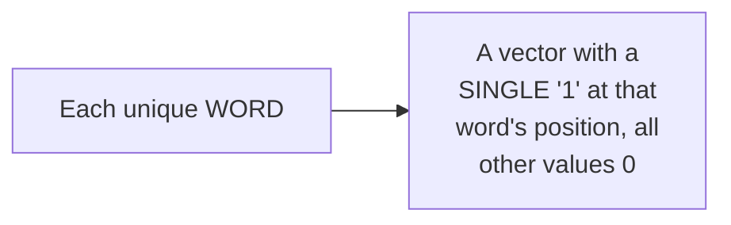

#### ⚠ Advantage — Precisely Stated

> 💡 **Given directly:** *"Advantage is that... it is quite simple, this is very, very simple to implement -- easy to implement, simple to implement -- and it is also intuitive."*

#### ⚠ Disadvantage 1: Sparse Matrix

> 💡 **Given directly:** *"The major issue that you can probably find out over here is that SPARSITY -- sparse matrix is that you'll have this kind of matrix where one value is zero, one value is one, and remaining all are zero... a lot much more computation -- sparse metrics."*

#### ⚠ Disadvantage 2: Out-of-Vocabulary (OOV)

> 💡 **Given directly, the complete, precise explanation:** *"Let's say tomorrow, in my test data, I have one more word -- I can say that 'cat eat food dog' -- so if 'dog' is present, do you think we can create this kind of vectors? No, right -- in our training dataset... I don't have dog, but in my test dataset, I have dog -- so can we create vectors of dog also? No, it is not possible -- so after all the words that are present in this training dataset, if any NEW data comes in the test data, we will not be able to handle it."*

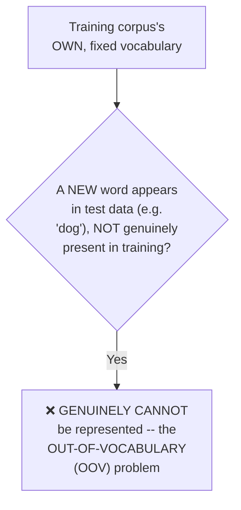

#### ⚠ Disadvantage 3: Inconsistent, Non-Fixed Size

> 💡 **Given directly:** *"Always remember, whenever you're training a machine learning model, the inputs will be FIXED... but in this particular case, the second sentence... is just having three features, right -- here we cannot train the model."*

#### ⚠ Disadvantage 4: No Semantic Meaning Captured

> 💡 **Given directly:** *"Between the words, semantic meaning is not captured -- what does this basically mean? That we are not able to find out the relationship between 'a man' and 'eat,' or 'man' [and] 'food' -- no relationship -- wherever that specific word is, that is only present as one over there."*

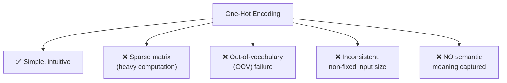

#### ⚠ Common Mistakes

* Assuming One-Hot Encoding genuinely uses the ENTIRE corpus vocabulary for EACH document — explicitly, directly, live-corrected: for THIS specific technique (unlike Bag of Words, covered next), each document's own vectors are based ONLY on the words genuinely PRESENT within that specific document, not the full corpus vocabulary.
* Assuming a genuinely NEW word encountered in test data can somehow be handled by simply "adding a zero" — explicitly, directly clarified as fundamentally impossible: the entire vector structure is fixed to the TRAINING vocabulary's own size.

#### 🎯 Key Takeaways

* **One-Hot Encoding** converts each word into a vector with a single "1" at that word's position — genuinely simple and intuitive, but suffering from FOUR real, direct disadvantages.
* **Sparse matrices** (mostly zeros) create genuine, real computational/memory burden; **out-of-vocabulary (OOV)** words genuinely CANNOT be represented if unseen during training; **inconsistent input size** across documents genuinely prevents model training; and **no semantic meaning** is captured between related words.
* These FOUR, precisely-named disadvantages **directly, explicitly motivate** the next technique — Bag of Words — covered in Section 5.

---
### 5. Bag of Words: A Complete Worked Example

#### 🪜 Step-by-Step — Setting Up Three, Genuine, Complete Example Sentences

> 💡 **Given directly:** *"Let's say that I have a sentence one, like this... D1 basically says 'he is a good boy'... D2 says that 'she is a good girl'... and let's say my D3 sentence is 'boys and girls are good.'"*

```text
D1: "he is a good boy"
D2: "she is a good girl"
D3: "boys and girls are good"
```

#### 🪜 Step-by-Step — Applying Stop Words FIRST

> 💡 **Given directly:** *"First of all, we will try to find out the vocabulary -- now, before finding out the vocabulary, what we do is that we have to remove the unnecessary words... how do we remove these words? We apply STOP WORDS."*

```text
After stop-word removal (and lowering):
D1: "good boy"
D2: "good girl"
D3: "boys girl good"    [instructor's own live-corrected version, using "girl" not "girls"]
```

#### 🪜 Step-by-Step — Building the Vocabulary, Ordered by FREQUENCY

> 💡 **Given directly:** *"In this particular case, you can see that vocabulary -- how many are present? One is good, one is boy, one is girl... if I try to find out the frequency, how many times good is present -- one, two, three, right, so this count will be three -- how many times boy is present -- one, two -- how many times girl is present -- one, two."*

```text
Vocabulary, by frequency: good (3), boy (2), girl (2)
```

> 💡 **Given directly, the precise, stated rule for feature ordering:** *"Always remember, guys, I have to basically -- the order of the feature will be based on this frequency, okay -- in bag of words, based on this frequency."*

#### 🪜 Step-by-Step — Building the Complete, Count-Based Vector Table

> 💡 **Given directly:** *"What is my document one? ...You can see what is the sentence that is present over here -- good boy -- so I will go to document one -- wherever there is good, I will increase the count by one -- so over here you can see 'good boy' is present, so good will become one, boy will become one -- whether girl is present over there -- girl is not present in sentence one, so I am basically going to make it as zero."*

| | good | boy | girl |
|---|---|---|---|
| **D1** ("good boy") | 1 | 1 | 0 |
| **D2** ("good girl") | 1 | 0 | 1 |
| **D3** ("boys girl good") | 1 | 1 | 1 |

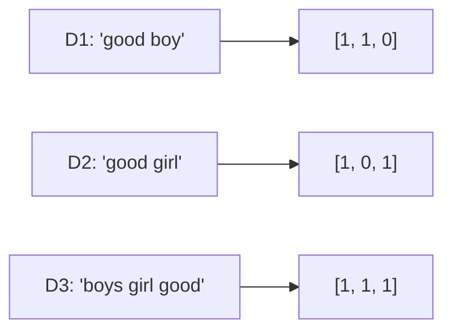

#### 📖 Definition — Binary Bag of Words, Precisely Introduced

> 💡 **Given directly:** *"If one more word 'good' is present, so what will happen over here, can you say that I have to increase the count? ...In bag of words, we have an option to make this as BINARY BAG OF WORDS -- in binary bag of words, we just say that if there is anything more than one, then also we make it as... one -- because at the end of the day, we really need to understand whether it is ones and zeros -- it is just indicating that whether the word is present in the statement sentence or not."*

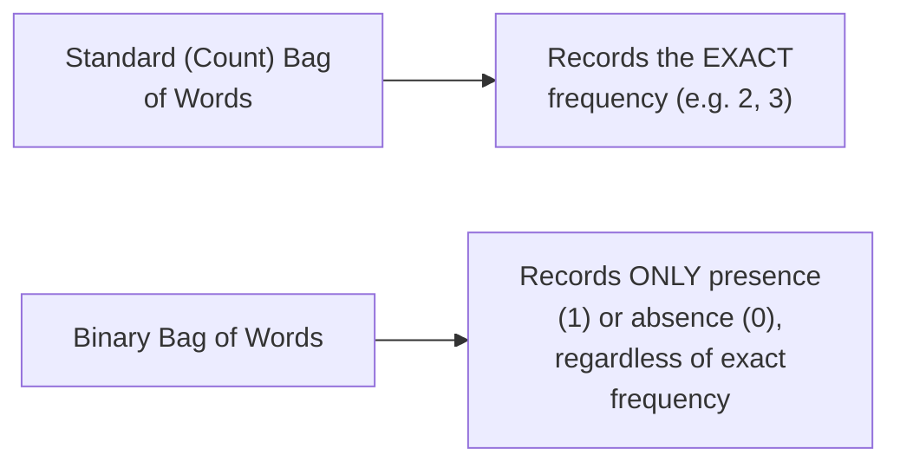

#### ⚠ Common Mistakes

* Assuming Bag of Words vocabulary is ordered arbitrarily — explicitly, directly clarified: the feature ORDER is genuinely based on FREQUENCY, with the most frequent word listed first.
* Assuming Bag of Words ALWAYS records exact word counts — explicitly, directly clarified: a genuine, alternative BINARY variant exists, recording ONLY presence/absence (0 or 1), regardless of the exact frequency.
* Confusing Bag of Words with One-Hot Encoding — explicitly, directly distinguished: One-Hot Encoding assigns ONE vector PER WORD; Bag of Words assigns ONE vector PER DOCUMENT (sentence), with each position representing a VOCABULARY word's count/presence within that specific document.

#### 🎯 Key Takeaways

* **Bag of Words** builds a vocabulary from the ENTIRE corpus (after stop-word removal), ORDERED by frequency, then represents EACH document as a vector of counts (or binary presence) across this SHARED vocabulary.
* This is a genuinely DIFFERENT structure from One-Hot Encoding: **one vector PER DOCUMENT** (not per word), with each position representing a specific vocabulary word's count/presence.
* **Binary Bag of Words** is a genuine, real variant recording ONLY presence (1) or absence (0), rather than the exact word count.

---

### 6. Bag of Words' Advantages, Disadvantages & Cosine Similarity

#### 📖 Definition — The Precise, Stated Advantage

> 💡 **Given directly:** *"The advantages first is that it is simple -- simple and intuitive, very much simple."*

#### ⚠ Disadvantage 1: Sparsity Genuinely Remains (Though Somewhat Reduced)

> 💡 **Given directly:** *"If our dataset is very huge, thousands and thousands of records, then what will happen over here? ...Sparsity issue is not getting fixed -- then also you'll be having ones and zeros -- up to some instance it can become better, only for some specific dataset... but in a use-case scenario, this is not that much solving the problem -- there is still a problem, it will reduce, but not that much."*

#### ⚠ Disadvantage 2: Out-of-Vocabulary Genuinely Persists

> 💡 **Given directly:** *"Out of vocabulary, in this scenario also, you may have -- let's say there is one more word, 'cat'... cat will not get handled by this vocabulary... this entire word will get rejected -- now when this word is getting rejected, understand, the entire sentence meaning may get changed."*

#### ⚠ Disadvantage 3: Word Ordering Is Genuinely Lost

> 💡 **Given directly:** *"Good boy over here, you can see good boy girl, right -- the ORDERING OF THE WORDS has completely changed -- based on the frequency, I am using the feature like good boy girl -- but... 'he is a good boy,' good boy ordering is good, right -- there, you'll be able to understand more meaningful information."*

#### ⚠ Disadvantage 4: Semantic Meaning Is Still Genuinely Lost

> 💡 **Given directly:** *"Semantic meaning -- it is not able to capture the semantic meaning."*

#### 🧠 Concept — A Genuine, Real Detour Into Cosine Similarity

> 💡 **Given directly, precisely setting up the motivation:** *"If I take this three-dimension points, and probably... plot it in a three dimension... I will be able to capture the distance between this two point -- how do we capture the distance between two this point? There are two ways -- one is euclidean distance, and one is... cosine similarity."*

#### 🪜 Step-by-Step — Worked Cosine Similarity Example 1: 45°

> 💡 **Given directly:** *"Let's say this angle is something around 45 degree... cos 45, how much? Cos 45 is it is somewhere around 0.7071... if I really want to find out the similarity between P1 and P2, it is very simple -- I am just going to basically say 1 minus [cosine similarity]... so if I probably check out the cosine similarity, it is nothing but 0.29... so P1 and P2 is only [this] similar."*

```text
Angle = 45 degrees
cos(45) ≈ 0.7071
Distance = 1 - 0.7071 = 0.29   -> genuinely, reasonably similar
```

#### 🪜 Step-by-Step — Worked Cosine Similarity Example 2: 90° and 0°

> 💡 **Given directly:** *"There is one point which is mentioned as 0 comma 1... this is P2, this is mentioned as 1 comma 0 -- the angle is nothing but 90 degree -- what is cos 90? Cos 90 is 0 -- so if I really want to find out the cosine similarity, it is nothing but 1 minus 0, which is nothing but 1... the difference is huge."*

> 💡 **Given directly:** *"If I try to calculate a distance between this point and this point... what is the angle... it will be zero -- so what is cos 0? Cos 0 is nothing but it is 1 -- so 1 minus 1 is going to be 0 -- whenever I get 0, that basically means these two points are almost similar."*

```text
Angle = 90 degrees -> distance = 1 - 0 = 1   -> GENUINELY, completely different
Angle = 0 degrees  -> distance = 1 - 1 = 0   -> GENUINELY, almost identical
```

#### 🏢 Real-World / Production Usage — Cosine Similarity in Recommendation Systems

> 💡 **Given directly:** *"In recommendation system, there is one movie which is called as Avengers -- if a person sees Avengers, will he get the recommendation? ...If it is in this point, let's say this is Iron Man -- if person is seeing Avengers, he'll get recommendation of Iron Man, because these two are almost similar... suppose there is another movie which is like Minions -- Minions is a comedy movie -- if you are seeing this kind of action movie, Minions will not get recommended."*

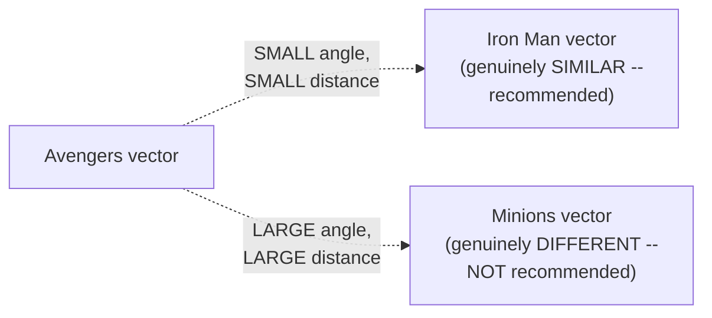

#### ⚠ Common Mistakes

* Assuming Bag of Words GENUINELY, FULLY solves One-Hot Encoding's own disadvantages — explicitly, directly clarified: sparsity and OOV problems genuinely PERSIST (though sparsity is somewhat reduced); word ordering and semantic meaning remain GENUINELY unsolved.
* Assuming cosine SIMILARITY and cosine DISTANCE are the same value — explicitly, directly distinguished: distance is precisely `1 − cosine similarity`.

#### 🎯 Key Takeaways

* Bag of Words is **simple and intuitive**, but genuinely retains FOUR real disadvantages: persistent (if somewhat reduced) sparsity, persistent OOV failure, LOST word ordering, and LOST semantic meaning.
* **Cosine similarity**, precisely demonstrated via three worked angle examples (0°, 45°, 90°), provides a genuine, real way to measure how similar two Bag-of-Words vectors are — directly, concretely applied to real-world recommendation systems (Avengers/Iron Man vs. Minions).
* Bag of Words' own **lost word-ordering problem** directly, precisely motivates N-Grams, covered next.

---
### 7. N-Grams: A Partial Fix for Lost Word Order

#### ❓ Why It Exists — The Precise, Direct Motivation

> 💡 **Given directly:** *"In order to capture the semantic information -- in order to capture the semantic information -- what we will do is that we will be using something called as N-GRAMS."*

#### 📖 Definition — Bigrams, Precisely Introduced

> 💡 **Given directly:** *"If I am using a combination of two, then it becomes BIGRAMS... bigram says that, apart from only single features, we'll be using a COMBINATION of features."*

#### 🪜 Step-by-Step — A Complete, Worked Bigram Example

> 💡 **Given directly, using this session's own Section 5 examples:** *"How it will become -- 'good boy' and 'good girl' -- okay, so this will be my feature one, this will be my feature two... is there 'good boy' present in sentence one? See, 'good boy' is actually present, right -- so whenever 'good boy' is there, then this count will become one -- whether 'good girl' is there? No, it is not there, so this will become zero."*

```text
Bigram features: "good boy", "good girl"

D1 ("good boy"):  [1, 0]
D2 ("good girl"): [0, 1]
D3 ("boys girl good"): [0, 0]   (neither exact bigram is present)
```

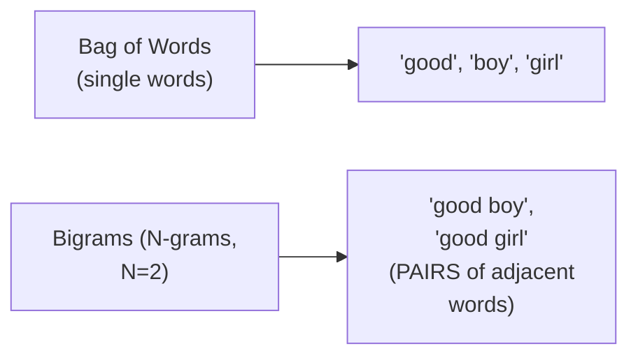

#### 🪜 Step-by-Step — A Second, Worked Bigram Example: "Krish Eats Food"

> 💡 **Given directly:** *"If I tell you to make a bigram, how many bigrams you can actually make? ...There are two bigrams -- here what will happen, it will say 'Krish eats' will be one, and then 'eats food' will be another bigram."*

```text
Sentence: "Krish eats food"
Bigrams: ["Krish eats", "eats food"]   -- 2 total bigrams
```

#### 📖 Definition — Trigrams, Precisely Introduced

> 💡 **Given directly, a genuine, direct audience exercise:** *"How many different trigrams can be here? Tell me, how many different trigrams will be here -- this will be the question for you."*

#### 🪜 Step-by-Step — A Complete, Worked Trigram Example: "I Am Not Feeling Well"

> 💡 **Given directly:** *"'I am not' -- this will be my one word, then 'am not feeling,' this will be another trigram, 'not feeling well,' this can be three trigrams -- so are we getting three trigrams?"*

```text
Sentence: "I am not feeling well"
Trigrams: ["I am not", "am not feeling", "not feeling well"]   -- 3 total trigrams
```

#### 🔍 Internal Working — Combining Multiple N-Gram Ranges

> 💡 **Given directly:** *"In practically, I can basically say [ngram_range=]1 comma 3... if I do one comma three, then this will become like this -- 'I am not' -- so this will be my feature one, this will be my feature two, this is my feature three... after this, I will first of all use bigram."*

```text
ngram_range=(1,3) means: include ALL unigrams (single words) + ALL bigrams (pairs) +
                           ALL trigrams (triples), together, as combined features
```

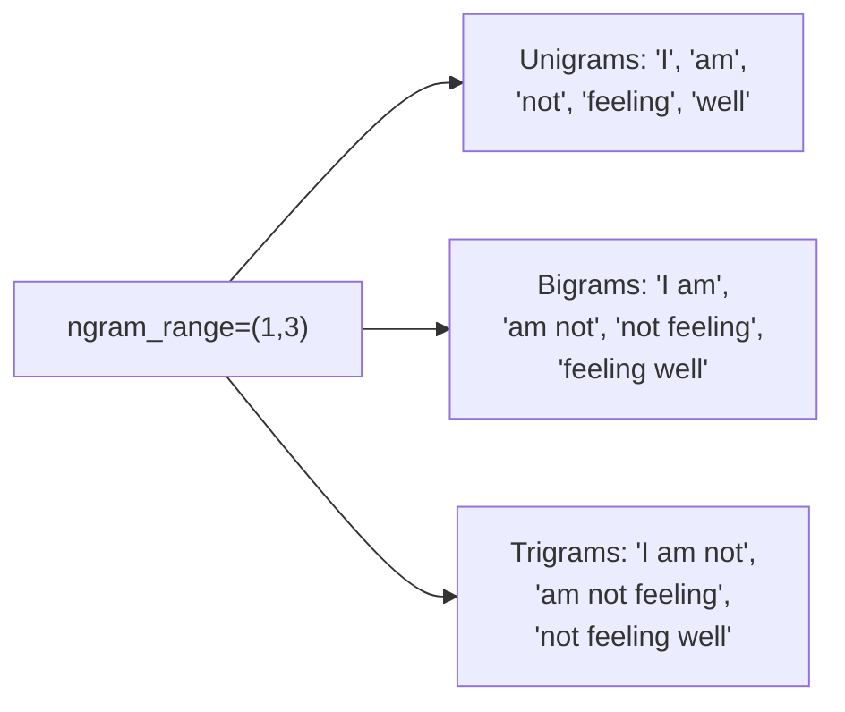

#### ⚠ Common Mistakes

* Assuming N-grams REPLACE the standard, single-word Bag of Words vocabulary entirely — explicitly, directly clarified: N-grams can be COMBINED with single-word features (via a range like `1,3`), rather than necessarily replacing them.
* Miscounting the number of possible bigrams/trigrams for a given sentence — explicitly, directly demonstrated via multiple, real worked examples (2 bigrams for a 3-word sentence; 3 trigrams for a 5-word sentence) — the count is precisely `(number of words) − (N − 1)`.

#### 🎯 Key Takeaways

* **N-grams** directly, partially address Bag of Words' own lost word-ordering problem by using COMBINATIONS of adjacent words (bigrams = pairs, trigrams = triples) as features, rather than single words alone.
* Multiple, complete, worked examples directly, precisely demonstrate the counting pattern: a 3-word sentence produces **2 bigrams**; a 5-word sentence produces **3 trigrams**.
* N-gram RANGES (e.g., `ngram_range=(1,3)`) allow COMBINING unigrams, bigrams, and trigrams TOGETHER as a single, unified feature set — directly, practically implemented via Scikit-learn's own `CountVectorizer`.

---

### 8. Practical Implementation: NLTK, Stemming, Lemmatization & CountVectorizer

#### 💻 Code Example — Setup: Installing NLTK & Loading a Real Corpus

> 💡 **Given directly:** *"First of all, install PIP install NLTK... let me open and search for any corpus -- I probably will search for any corpus... let's go to the Wikipedia [page for Narendra Modi]... this will be my paragraph that I really want to work with."*

```python
!pip install nltk

paragraph = """... (a real Wikipedia paragraph, copied directly) ..."""
```

#### 💻 Code Example — Sentence Tokenization

> 💡 **Given directly:** *"In order to use this tokenization process in NLTK, we have something called as `sent_tokenize`... this is going to convert the paragraph into sentences... in order to use this, you need to download one package in NLTK, and that package is something called as PUNKT."*

```python
import nltk
nltk.download('punkt')
from nltk.tokenize import sent_tokenize

sentences = sent_tokenize(paragraph)
print(len(sentences))   # 16, in this session's own live example
```

#### 💻 Code Example — Stemming, Applied to Real Words

> 💡 **Given directly, the complete, live-observed results:** *"If I write `stemmer.stem` and give any word, like 'going,' then it will convert into the base root -- you can see 'go' -- if I probably use 'facial,' here you can see I'm getting 'facial' -- if I write 'thinking,' you can see that I'm able to convert it as 'think' -- if I write 'drinking,' you will be able to see that I'm actually getting 'drink' -- if I probably write something called as 'history,' here you can see that I'm actually getting 'history.'"*

```python
from nltk.stem import PorterStemmer
stemmer = PorterStemmer()

print(stemmer.stem('going'))    # go
print(stemmer.stem('facial'))   # facial (unchanged)
print(stemmer.stem('thinking')) # think
print(stemmer.stem('drinking')) # drink
print(stemmer.stem('history'))  # history (genuinely UNCHANGED, in this live run)
```

#### 💻 Code Example — Lemmatization, Applied to the SAME Words

> 💡 **Given directly:** *"If I give 'stemmer.stem' with 'history,' you can see I'm getting 'history' -- now if I give 'lemmatizer.lemmatize' with 'history,' here you will be able to get the proper word... if I'm giving 'going,' I will be getting the proper word 'going.'"*

```python
from nltk.stem import WordNetLemmatizer
lemmatizer = WordNetLemmatizer()

print(lemmatizer.lemmatize('history'))   # history
print(lemmatizer.lemmatize('going'))     # going (UNCHANGED -- without part-of-speech context)
print(lemmatizer.lemmatize('drinking'))  # drinking (UNCHANGED)
print(lemmatizer.lemmatize('goes'))      # go
```

> 💡 **Given directly, an honest, live-observed nuance about lemmatization's own default behavior:** the lemmatizer, WITHOUT explicit part-of-speech information, may leave certain words genuinely UNCHANGED (like "going" and "drinking" remaining as-is) — directly, honestly demonstrated live, not glossed over.

#### 💻 Code Example — Regex-Based Cleaning of the Entire Corpus

> 💡 **Given directly:** *"I will be using regular expression -- import RE -- and let's say this is my corpus, my NEW corpus, after cleaning... `re.sub`... other than A to Z small, or capital A to capital Z, replace that with a blank character."*

```python
import re

corpus = []
for i in range(len(sentences)):
    review = re.sub('[^a-zA-Z]', ' ', sentences[i])
    review = review.lower()
    review = review.split()
    corpus.append(review)
```

#### 💻 Code Example — Applying Stop Words + Stemming (or Lemmatization) Across the Entire Corpus

> 💡 **Given directly:** *"For I in corpus, `nltk.word_tokenize` will make sure that from the sentence I am getting the words -- then for word in words, if word not in `set(stopwords.words('english'))`, print `stemmer.stem(word)`."*

```python
from nltk.corpus import stopwords

for i in corpus:
    words = nltk.word_tokenize(i)
    for word in words:
        if word not in set(stopwords.words('english')):
            print(stemmer.stem(word))       # OR: lemmatizer.lemmatize(word)
```

#### 💻 Code Example — Bag of Words, via Scikit-Learn's `CountVectorizer`

> 💡 **Given directly:** *"For bag of words, it is very much simple -- I will be using a library which is called as, for Sklearn dot -- Count Vectorizer... from `sklearn.feature_extraction.text` import `CountVectorizer`."*

```python
from sklearn.feature_extraction.text import CountVectorizer

cv = CountVectorizer()
X = cv.fit_transform(corpus)

print(cv.vocabulary_)          # word -> index mapping (e.g. 'narendra': 95)
print(X[0].toarray())          # the Bag of Words vector for the first document
```

#### 🔍 Internal Working — Precisely Confirming the Binary Bag of Words Option

> 💡 **Given directly:** *"If I really want to convert this into a binary bag of words -- press shift tab over here, and here you will be having a parameter which is called as `binary` -- so binary, right now, is false -- if you make binary as true... you will not be able to see any twos over here, that will become one."*

```python
cv_binary = CountVectorizer(binary=True)
```

#### 🔍 Internal Working — What `cv.vocabulary_` Genuinely Returns (A Genuine, Live Quiz Question)

> 💡 **Given directly:** *"What does `cv.vocabulary` give? Dictionary contains word FREQUENCY mapping, dictionary contains word INDEX mapping... dictionary contains word INDEX mapping."*

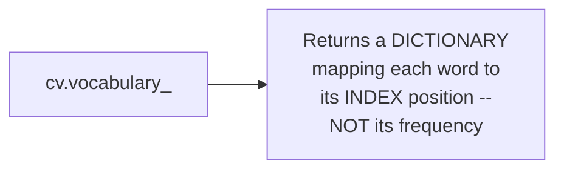

#### ⚠ Common Mistakes

* Assuming `cv.vocabulary_` returns word FREQUENCY counts — explicitly, directly, correctly clarified (and directly tested as a genuine quiz question): it returns each word's INDEX position within the vocabulary, not its frequency.
* Forgetting to apply stop-word filtering BEFORE stemming/lemmatization when processing tokenized words in a loop — explicitly, directly demonstrated in the correct order: check `if word not in stopwords` FIRST, THEN apply stemming/lemmatization only to the remaining, genuine words.
* Assuming lemmatization ALWAYS produces a genuinely different result from the original word — explicitly, directly, honestly demonstrated as sometimes leaving a word UNCHANGED (e.g., "going," "drinking") when no part-of-speech context is provided.

#### 🎯 Key Takeaways

* The complete, real practical pipeline: **NLTK setup → `sent_tokenize` (with the `punkt` package) → `PorterStemmer`/`WordNetLemmatizer` comparison → regex-based cleaning → stop-word filtering → `CountVectorizer` for Bag of Words**.
* **Stemming and lemmatization**, directly, live-compared on the SAME real words, confirm the theoretical distinction established in Day 1: stemming can produce genuinely unchanged OR meaningless results; lemmatization tends toward genuine words, but can ALSO leave some words unchanged without additional context.
* **`CountVectorizer`** provides both the standard, count-based Bag of Words (default) AND a genuine binary variant (via `binary=True`) — with `cv.vocabulary_` returning a word-to-INDEX mapping, not a frequency count.

---
### 9. Closing: TF-IDF Deferred & What's Next

#### ⚠ A Direct, Honest, Transparent Acknowledgment

> 💡 **Given directly, live, during the quiz itself:** *"TF-IDF is used in -- very simple -- in text preprocessing, page ranking in search engine, both, first and second, none -- I have not explained you this, because you did not give me time -- so face the consequences... this was the most difficult question, I guess, because I have not taught them."*

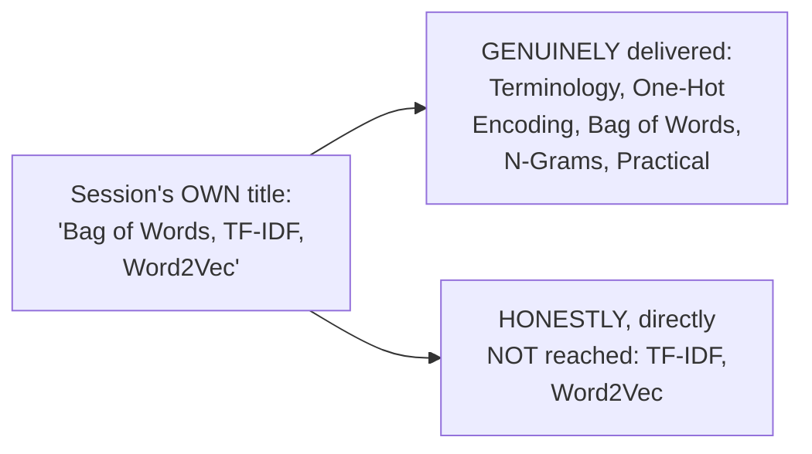

#### 🪜 Step-by-Step — The Explicit, Stated Schedule and Roadmap Ahead

> 💡 **Given directly:** *"Tomorrow I'm not going to have that session, because tomorrow I have some kind of work, so I will not be available -- day after, tomorrow, we will try to do it -- so tomorrow, Thursday, I'll not be available, we'll do it on Friday."*

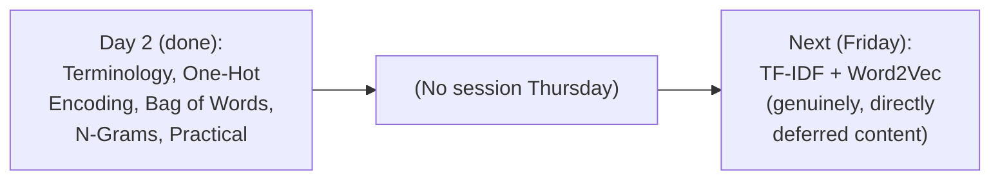

#### ⚠ Common Mistakes

* Assuming this session's own title fully, accurately reflects its genuine, delivered content — explicitly, directly, honestly demonstrated as NOT the case: TF-IDF and Word2Vec were both genuinely deferred, despite appearing in the title.
* Assuming the NEXT session will pick up from a genuinely different starting point — explicitly, directly confirmed: the very NEXT session (Friday) will specifically, directly cover the content THIS session's own title promised but didn't reach.

#### 🎯 Key Takeaways

* Despite the session's own title, **TF-IDF and Word2Vec were genuinely, honestly NOT covered** in this specific class — directly, transparently acknowledged by the instructor himself, live, during the closing quiz.
* The **next session is explicitly scheduled for Friday** (skipping Thursday) — directly, specifically promising to cover TF-IDF and Word2Vec, the content this session's own title had originally promised.
* This session's own genuine, delivered content — terminology, One-Hot Encoding, Bag of Words, N-Grams, and a complete, real practical implementation — remains substantial and complete in its own right.

---

## 📝 Glossary

| Term | Definition | Why It Matters |
|---|---|---|
| **Corpus** | The entire, combined dataset (like a paragraph) | The top-level collection of all documents |
| **Documents** | Individual sentences/data points within the corpus | The "sentence" unit in NLP terminology |
| **Vocabulary** | The count of UNIQUE words across the entire corpus | Determines vector dimensionality |
| **One-Hot Encoding** | One vector PER WORD, with a single "1" at that word's position | Simple, but sparse, OOV-prone, no semantic meaning |
| **Bag of Words** | One vector PER DOCUMENT, based on a shared, frequency-ordered vocabulary | Improves on One-Hot Encoding, but still has real limitations |
| **Binary Bag of Words** | Records only presence (1) or absence (0), not exact count | A genuine BoW variant |
| **Sparse Matrix** | A matrix mostly filled with zeros | A genuine, real computational/memory burden |
| **Out-of-Vocabulary (OOV)** | A word unseen during training, encountered later | Cannot genuinely be represented |
| **Cosine Similarity** | cos(angle) between two vectors | Distance = 1 - cosine similarity |
| **N-grams** | Combinations of N adjacent words (bigrams=2, trigrams=3) | Partially restores lost word-order information |
| **CountVectorizer** | Scikit-learn's tool for building Bag of Words vectors | This session's own practical implementation tool |

---

## 🔄 Revision Notes — One-Minute Revision

* This is **Day 2**, directly continuing Day 1 -- genuinely delivers terminology, One-Hot Encoding, Bag of Words, and N-Grams (both theory and practical) -- but HONESTLY, TRANSPARENTLY defers TF-IDF and Word2Vec to Friday's session, despite both appearing in this session's own title.
* **Terminology**: Corpus (entire combined dataset) -> Documents (individual sentences) -> Words (individual tokens) -> Vocabulary (count of UNIQUE words).
* **The complete pipeline**: raw dataset -> text preprocessing (tokenize, lower, stem/lemmatize, stopwords) -> text-to-vector (One-Hot -> Bag of Words -> TF-IDF -> Word2Vec).
* **One-Hot Encoding**: one vector PER WORD (using only words genuinely present in EACH document, not the full corpus). FOUR genuine disadvantages: sparse matrix (heavy computation), out-of-vocabulary (OOV) failure, inconsistent/non-fixed input size, NO semantic meaning captured.
* **Bag of Words**: one vector PER DOCUMENT, built from a SHARED, frequency-ordered vocabulary (after stop-word removal). Genuine COUNT-based (exact frequency) or BINARY (presence/absence only) variants.
* **Bag of Words' own genuine limitations**: sparsity and OOV genuinely PERSIST (though somewhat reduced); word ORDERING and SEMANTIC MEANING remain genuinely unsolved.
* **Cosine similarity** (worked via 0/45/90 degree examples): distance = 1 - cos(angle) -- 0=identical, 0.29=similar (45deg), 1=completely different (90deg) -- directly applied to recommendation systems (Avengers/Iron Man vs. Minions).
* **N-grams**: bigrams (pairs) and trigrams (triples) of adjacent words, partially restoring lost word order -- a 3-word sentence produces 2 bigrams; a 5-word sentence produces 3 trigrams. `ngram_range=(1,3)` combines unigrams+bigrams+trigrams together.
* **Practical implementation**: NLTK setup (`sent_tokenize` + `punkt`), `PorterStemmer` vs. `WordNetLemmatizer` (live-compared on real words: "going"->"go" via stemming but unchanged via lemmatization without POS context; "history" stayed "history" via BOTH, in this live run), regex cleaning, stopword filtering, and `CountVectorizer` (with `binary=True` for binary Bag of Words). `cv.vocabulary_` returns a word-to-INDEX mapping, NOT frequency.
* **Honest, direct closing acknowledgment**: TF-IDF and Word2Vec genuinely NOT reached live -- explicitly deferred to Friday (no Thursday session).

---
## 📋 Cheat Sheet

**Basic terminology:**
```text
Corpus (entire dataset) -> Documents (individual sentences) -> Words (individual tokens)
Vocabulary = count of UNIQUE words in the corpus
```

**Complete pipeline:**
```text
Raw Dataset -> Text Preprocessing (tokenize, lower, stem/lemmatize, stopwords)
             -> Text-to-Vector (One-Hot -> Bag of Words -> [TF-IDF -> Word2Vec, next session])
```

**One-Hot Encoding vs. Bag of Words:**
```text
One-Hot Encoding: ONE vector PER WORD (using only words present in that document)
Bag of Words:     ONE vector PER DOCUMENT (using the full, shared, frequency-ordered vocabulary)
```

**One-Hot Encoding's 4 genuine disadvantages:**
```text
1. Sparse matrix (heavy computation)
2. Out-of-vocabulary (OOV) failure
3. Inconsistent, non-fixed input size
4. NO semantic meaning captured
```

**Bag of Words' genuine advantages/disadvantages:**
```text
Advantage: simple, intuitive
Disadvantages: sparsity persists (reduced) | OOV persists | word ORDER lost | semantic MEANING lost
```

**Cosine similarity:**
```text
Distance = 1 - cos(angle)
0 degrees  -> distance 0 -> IDENTICAL
45 degrees -> distance 0.29 -> SIMILAR
90 degrees -> distance 1 -> COMPLETELY DIFFERENT
```

**N-grams:**
```text
Bigram (N=2): pairs of adjacent words -- "Krish eats food" -> 2 bigrams
Trigram (N=3): triples of adjacent words -- "I am not feeling well" -> 3 trigrams
ngram_range=(1,3): combines unigrams + bigrams + trigrams together
```

**Complete practical pipeline:**
```python
import nltk
nltk.download('punkt')
from nltk.tokenize import sent_tokenize
from nltk.stem import PorterStemmer, WordNetLemmatizer
from nltk.corpus import stopwords
from sklearn.feature_extraction.text import CountVectorizer
import re

sentences = sent_tokenize(paragraph)

corpus = []
for i in range(len(sentences)):
    review = re.sub('[^a-zA-Z]', ' ', sentences[i]).lower().split()
    corpus.append(' '.join(review))

cv = CountVectorizer(binary=True)   # or binary=False for count-based
X = cv.fit_transform(corpus)
print(cv.vocabulary_)   # word -> INDEX mapping (not frequency!)
```

---

## 🔥 Interview Questions & Answers

### 🟢 Beginner

**Q1.**

**Question:** Define corpus, documents, and vocabulary in NLP terminology.

**Answer:** Corpus = the entire, combined dataset; Documents = individual sentences within the corpus; Vocabulary = the count of unique words across the corpus.

**Explanation:** Directly, precisely defined.

**Why Interviewers Ask This:** Foundational NLP terminology, frequently tested.

**Possible Follow-up:** "What is the difference between vocabulary and words?"

**Q2.**

**Question:** Does One-Hot Encoding assign one vector per word, or one per document?

**Answer:** One vector per word.

**Explanation:** Directly, precisely stated.

**Why Interviewers Ask This:** A commonly-confused, foundational distinction from Bag of Words.

**Possible Follow-up:** "What does Bag of Words assign instead?"

**Q3.**

**Question:** Name the four genuine disadvantages of One-Hot Encoding.

**Answer:** Sparse matrix, out-of-vocabulary (OOV) failure, inconsistent input size, and no semantic meaning captured.

**Explanation:** Directly, explicitly listed.

**Why Interviewers Ask This:** Foundational, frequently-tested One-Hot Encoding limitations.

**Possible Follow-up:** "Which of these disadvantages does Bag of Words genuinely solve?"

**Q4.**

**Question:** What does "vocabulary ordered by frequency" mean in Bag of Words?

**Answer:** The most frequently-occurring word in the corpus becomes the first feature, and so on.

**Explanation:** Directly, explicitly stated.

**Why Interviewers Ask This:** Tests understanding of Bag of Words' precise construction.

**Possible Follow-up:** "Does this ordering affect the model's own genuine performance?"

**Q5.**

**Question:** What is Binary Bag of Words?

**Answer:** A variant recording only word presence (1) or absence (0), not the exact frequency count.

**Explanation:** Directly, precisely explained.

**Why Interviewers Ask This:** Tests awareness of a genuine, common Bag of Words variant.

**Possible Follow-up:** "How would you configure this in Scikit-learn's CountVectorizer?"

**Q6.**

**Question:** What is the formula for cosine distance?

**Answer:** 1 minus cosine similarity.

**Explanation:** Directly, precisely stated.

**Why Interviewers Ask This:** Foundational similarity/distance measurement knowledge.

**Possible Follow-up:** "What distance value indicates two identical vectors?"

**Q7.**

**Question:** How many bigrams can be formed from a 3-word sentence?

**Answer:** 2.

**Explanation:** Directly, explicitly confirmed via a real, worked example.

**Why Interviewers Ask This:** Tests basic N-gram counting.

**Possible Follow-up:** "What is the general formula for the number of N-grams, given a sentence with W words?"

**Q8.**

**Question:** Does `cv.vocabulary_` in Scikit-learn's CountVectorizer return word frequencies?

**Answer:** No -- it returns a word-to-index mapping.

**Explanation:** Directly, explicitly, correctly clarified.

**Why Interviewers Ask This:** A commonly-confused, practical implementation detail.

**Possible Follow-up:** "How would you retrieve the actual word counts for a specific document instead?"

**Q9.**

**Question:** Was TF-IDF covered in this specific session, despite appearing in its title?

**Answer:** No -- it was honestly, explicitly deferred to the next session.

**Explanation:** Directly, transparently acknowledged.

**Why Interviewers Ask This:** Tests attention to the session's own honest, stated scope.

**Possible Follow-up:** "What technique WAS covered as a partial fix for Bag of Words' lost word ordering?"

**Q10.**

**Question:** What NLTK package must be downloaded before using `sent_tokenize`?

**Answer:** punkt.

**Explanation:** Directly, explicitly stated.

**Why Interviewers Ask This:** Basic, practical NLTK setup knowledge.

**Possible Follow-up:** "What does `sent_tokenize` do?"

---

### 🟡 Intermediate

**Q11.**

**Question:** Explain why the instructor deliberately corrects himself live, changing One-Hot Encoding's example to use only the words genuinely present in each specific document, rather than the full corpus vocabulary.

**Answer:** This is a genuinely important, precise structural distinction between One-Hot Encoding and Bag of Words that the instructor's own live correction directly clarifies: One-Hot Encoding, as GENUINELY, traditionally defined, assigns a vector to EACH WORD based on ITS OWN document's local context (or sometimes the full vocabulary, depending on implementation) -- but the KEY, distinguishing feature this session establishes is that Bag of Words SPECIFICALLY uses the FULL, SHARED corpus vocabulary for EVERY document, ensuring ALL documents' vectors have the SAME, CONSISTENT length. By live-correcting this distinction, the instructor ensures learners don't conflate the two techniques' own genuinely different construction methods -- a subtle but important point that would otherwise cause GENUINE confusion when learners later work with real implementations.

**Explanation:** Requires recognizing a deliberate, live correction addressing a genuinely important structural distinction.

**Why Interviewers Ask This:** Tests whether a learner tracks precise, corrected details, not just an initial, potentially imprecise explanation.

**Possible Follow-up:** "Why does Bag of Words specifically REQUIRE a shared, full vocabulary across all documents, while One-Hot Encoding, as taught here, does not?"

**Q12.**

**Question:** A learner argues that since Bag of Words with N-grams (ngram_range=(1,3)) captures more context than plain Bag of Words, it should always be used with the largest possible N value for maximum accuracy. Evaluate this claim.

**Answer:** This claim overstates the case. While N-grams genuinely capture MORE local word-order context as N increases, this session's own content directly implies a genuine, real trade-off: LARGER N values produce EXPONENTIALLY MORE possible feature combinations, directly WORSENING the sparsity problem Bag of Words already, genuinely struggles with (Section 6) -- a GENUINELY larger, sparser feature matrix requires MORE memory and computation, and RARER, longer N-gram combinations may appear so INFREQUENTLY across the corpus that they provide GENUINELY LITTLE statistical signal for a model to learn from. Additionally, GENUINELY rare N-grams make the OUT-OF-VOCABULARY (OOV) problem WORSE, not better -- a longer N-gram is MORE likely to be absent from any NEW, unseen text, compared to a single word. The accurate, more precise conclusion: N-gram range is a genuine, real trade-off between capturing MORE context and WORSENING sparsity/OOV issues -- not a parameter that should simply be maximized without genuine, careful consideration.

**Explanation:** Tests whether a learner recognizes N-grams' own genuine trade-off (more context vs. worse sparsity/OOV), rather than treating "more context" as an unconditional improvement.

**Why Interviewers Ask This:** Distinguishes candidates who understand genuine hyperparameter trade-offs from those who assume "more information" always means "better."

**Possible Follow-up:** "How would you empirically determine an appropriate N-gram range for a specific, real dataset?"

**Q13.**

**Question:** Explain, precisely, why cosine similarity — rather than Euclidean distance — is generally preferred for comparing Bag of Words vectors, using this session's own precise angle-based reasoning.

**Answer:** This session's own content directly establishes cosine similarity as measuring the ANGLE between two vectors, GENUINELY INDEPENDENT of their own individual MAGNITUDES (lengths). For Bag of Words vectors specifically, this is a genuinely important, precise property: two documents with GENUINELY SIMILAR word-usage PATTERNS, but GENUINELY DIFFERENT LENGTHS (one document repeating the same words more often than another, shorter document, perhaps due to genuinely different overall document length), would still produce a SMALL angle (high cosine similarity), CORRECTLY identifying them as semantically similar. EUCLIDEAN DISTANCE, by contrast, is GENUINELY SENSITIVE to vector MAGNITUDE -- a LONGER document (with genuinely higher word counts across the board) would produce a LARGER Euclidean distance from a SHORTER, but semantically similar document, PURELY due to this length difference, POTENTIALLY, INCORRECTLY suggesting these documents are LESS similar than they GENUINELY are. This directly, precisely explains why cosine similarity is generally the MORE APPROPRIATE choice for comparing TEXT-based, Bag-of-Words-style vectors, where document LENGTH genuinely varies independently of TOPICAL similarity.

**Explanation:** Requires reasoning through the precise, mathematical distinction between angle-based (cosine) and magnitude-sensitive (Euclidean) distance measures, applied specifically to text data's own genuine characteristics.

**Why Interviewers Ask This:** Tests whether a learner understands the PRECISE, structural reason cosine similarity is preferred for text, not just that it's "commonly used."

**Possible Follow-up:** "Construct a concrete example of two documents with genuinely different lengths but genuinely similar word-usage patterns, and explain why cosine similarity would correctly identify them as similar while Euclidean distance might not."

**Q14.**

**Question:** Using this session's own precise stemming vs. lemmatization comparison (Section 8), explain why "going" was genuinely converted differently by these two techniques in this specific, live example, and what this reveals about lemmatization's own real, practical limitation.

**Answer:** Per Section 8's own live-observed, real results, `stemmer.stem('going')` genuinely produced "go" (a meaningful result, directly matching Day 1's own earlier example), while `lemmatizer.lemmatize('going')`, WITHOUT any additional part-of-speech (POS) information, genuinely left the word UNCHANGED as "going." This reveals a genuinely important, real limitation of lemmatization's DEFAULT behavior: NLTK's `WordNetLemmatizer`, by default, assumes a word is a NOUN unless told otherwise -- and "going," interpreted AS A NOUN, is GENUINELY already a valid, unchanged dictionary word (as in, "the going was tough"). To GENUINELY get lemmatization's own claimed advantage (correctly reducing "going" to "go," recognizing it as a VERB form), the lemmatizer would GENUINELY need to be told the word's correct part of speech (e.g., `lemmatizer.lemmatize('going', pos='v')`). This directly reveals that lemmatization's own real, practical effectiveness DEPENDS on providing GENUINELY accurate part-of-speech context — a real, additional complexity beyond simply "always producing meaningful words," which this session's own live, honest demonstration directly, concretely reveals.

**Explanation:** Requires reasoning through WHY the live-observed result differs from expectations, connecting it to a genuine, real technical detail (default POS assumption) the session's own content demonstrates but doesn't fully explain.

**Why Interviewers Ask This:** Tests whether a learner can reason through a genuine, real, honestly-observed discrepancy, rather than assuming lemmatization always, unconditionally "just works."

**Possible Follow-up:** "How would you modify the `lemmatizer.lemmatize()` call to genuinely, correctly convert 'going' to 'go'?"

**Q15.**

**Question:** Synthesize this session's complete One-Hot Encoding disadvantages (Section 4) with Bag of Words' own genuine advantages/disadvantages (Section 6) to explain PRECISELY which specific disadvantages Bag of Words genuinely FIXES, and which it does NOT — constructing a complete, side-by-side comparison.

**Answer:** A precise, synthesized comparison, directly connecting BOTH sections' own explicit content: **Sparse matrix**: Bag of Words does NOT genuinely fix this -- Section 6 explicitly states "sparsity issue is not getting fixed... it will reduce, but not that much" -- a PARTIAL, not complete, improvement. **Out-of-vocabulary (OOV)**: Bag of Words does NOT genuinely fix this either -- Section 6 explicitly demonstrates a new word ("cat") still being "rejected," directly paralleling One-Hot Encoding's own OOV failure. **Inconsistent, non-fixed size**: Bag of Words DOES genuinely FIX this -- since EVERY document's vector is built from the SAME, SHARED, full corpus vocabulary (Section 5's own precise construction method), every document's vector is GUARANTEED to have the SAME, consistent length, DIRECTLY solving One-Hot Encoding's own genuine "not fixed size" problem (Section 4). **No semantic meaning captured**: Bag of Words does NOT genuinely fix this -- Section 6 explicitly states "semantic meaning, it is not able to capture the semantic meaning," identically to One-Hot Encoding's own stated limitation. This precise, complete comparison reveals that Bag of Words genuinely improves on ONLY ONE of One-Hot Encoding's four disadvantages (fixed size) — the OTHER THREE (sparsity, OOV, semantic meaning) GENUINELY PERSIST, directly motivating the NEED for further techniques (TF-IDF, Word2Vec) this session's own content explicitly defers to the next session.

**Explanation:** Requires synthesizing two separately-described disadvantage lists to construct a precise, complete, side-by-side comparison of what genuinely IS and IS NOT fixed.

**Why Interviewers Ask This:** A senior-level question testing whether a candidate can precisely track WHICH SPECIFIC problems a new technique solves, rather than assuming a "new, improved" technique solves ALL of its predecessor's problems.

**Possible Follow-up:** "Based on this precise comparison, what SPECIFIC problem would you predict TF-IDF (the next session's own topic) is most likely designed to address?"

---

### 🔴 Advanced

**Q16.**

**Question:** Design a complete, from-scratch Bag of Words construction (with frequency-based vocabulary ordering) for a genuinely NEW set of three sentences of your own choosing (each 4-6 words, after stop-word removal), explicitly showing the final vector table.

**Answer:** A reasonable, complete construction, directly applying Section 5's own exact methodology — for example, using "the cat sat on mat," "the dog sat on floor," "cat and dog played" (after stop-word removal, assuming "the," "on," "and" are removed): **Cleaned**: D1="cat sat mat", D2="dog sat floor", D3="cat dog played". **Word frequencies across the corpus**: cat(2), sat(2), dog(2), mat(1), floor(1), played(1). **Vocabulary, ordered by frequency** (ties broken by first appearance, per this session's own convention): cat, sat, dog, mat, floor, played. **Final vector table**:

| | cat | sat | dog | mat | floor | played |
|---|---|---|---|---|---|---|
| D1 ("cat sat mat") | 1 | 1 | 0 | 1 | 0 | 0 |
| D2 ("dog sat floor") | 0 | 1 | 1 | 0 | 1 | 0 |
| D3 ("cat dog played") | 1 | 0 | 1 | 0 | 0 | 1 |

This complete, worked table directly, precisely mirrors Section 5's own exact construction methodology, correctly applied to a genuinely new example.

**Explanation:** Requires applying the session's own exact frequency-counting and vector-construction methodology to a genuinely new example.

**Why Interviewers Ask This:** A realistic, senior-level question testing whether a candidate can apply the taught methodology completely and correctly to new, unseen text.

**Possible Follow-up:** "Construct the corresponding BINARY Bag of Words table for this same example -- would it differ from the count-based table shown here?"

**Q17.**

**Question:** Critically evaluate: "Since this session confirms cosine similarity of exactly 1 (0-degree angle) means two vectors are 'almost same,' and Bag of Words vectors are built purely from word counts, two GENUINELY DIFFERENT sentences with the SAME word-frequency PROFILE (e.g., 'dog bites man' and 'man bites dog') would be judged completely identical by this entire pipeline." Is this an accurate, complete characterization of a genuine limitation?

**Answer:** Accurate as a GENUINE, real limitation — and this is actually a PRECISE, correct application of this session's own established facts, not an overstatement. Since Bag of Words (Section 5) genuinely discards word ORDER (Section 6's own explicitly-stated disadvantage: "ordering of the words has completely changed"), and cosine similarity (Section 6) operates PURELY on the resulting word-COUNT vectors, two sentences with IDENTICAL word-frequency profiles but GENUINELY DIFFERENT, even OPPOSITE, meanings (like "dog bites man" vs. "man bites dog," a classic, real linguistics example) would GENUINELY, PRECISELY produce IDENTICAL Bag of Words vectors -- and therefore a cosine similarity of EXACTLY 1, INCORRECTLY suggesting these two, semantically OPPOSITE sentences are "almost same." This is PRECISELY the "no semantic meaning captured" and "word ordering lost" disadvantages Section 6 explicitly, directly names — this specific example simply makes those ABSTRACT, stated limitations GENUINELY, CONCRETELY vivid. This is EXACTLY the kind of real, structural limitation that directly, precisely motivates N-grams (Section 7, a PARTIAL fix -- bigrams would GENUINELY distinguish "dog bites" from "bites dog," at least partially recovering SOME ordering information) and, more fully, the NEXT session's own promised techniques (TF-IDF, Word2Vec).

**Explanation:** Tests whether a learner can construct and validate a genuinely concrete, correct example that precisely illustrates an abstractly-stated limitation, confirming (rather than needing to refute) the claim.

**Why Interviewers Ask This:** Distinguishes candidates who can construct GENUINE, precise, illustrative examples of a stated limitation from those who only recognize the limitation in the abstract.

**Possible Follow-up:** "Would BIGRAMS genuinely, fully distinguish 'dog bites man' from 'man bites dog'? Trace through the actual bigram sets for both sentences to verify your answer."

**Q18.**

**Question:** Synthesize this session's complete N-gram counting methodology (Section 7) with its own precise vocabulary-size discussion (Section 4/5) to explain why using a LARGE N-gram range (e.g., ngram_range=(1,5)) on a GENUINELY LARGE, real corpus (like Google's own 3-billion-word corpus, referenced in earlier sessions) would produce a GENUINELY, PRACTICALLY UNMANAGEABLE vocabulary size, even before considering any machine learning model's own training cost.

**Answer:** A precise, synthesized, quantitative reasoning: per Section 7's own exact counting formula (a sentence with W words produces `W-(N-1)` N-grams for a SPECIFIC N), a genuinely large corpus with GENUINELY DIVERSE vocabulary would produce an ENORMOUS number of UNIQUE possible N-gram combinations as N increases -- while a SINGLE-word vocabulary is bounded by the corpus's own genuine, UNIQUE word count (a real, finite, and RELATIVELY manageable number, even for large corpora, per the earlier Word2Vec sessions' own reference to Google's real, 3-billion-word corpus still having a MANAGEABLE unique-word vocabulary), the number of GENUINELY UNIQUE bigrams, trigrams, or higher-order N-grams grows COMBINATORIALLY -- theoretically, the number of possible N-word combinations from a vocabulary of size V is bounded by V^N (though REAL, natural language combinations are far fewer than this theoretical maximum, since not all word combinations are genuinely meaningful or occur in practice). For a GENUINELY large corpus with, say, 100,000 unique single words, even a MODEST increase to trigrams could GENUINELY produce MILLIONS of unique, real trigram combinations that ACTUALLY occur in the corpus -- directly, precisely explaining why Section 6's own already-acknowledged sparsity problem becomes GENUINELY, DRAMATICALLY WORSE as N-gram range increases, and why REAL, production NLP systems must GENUINELY, CAREFULLY balance N-gram range against this combinatorial explosion, rather than simply maximizing N for "more context," directly extending Intermediate Q12's own reasoning into a genuinely quantitative, scale-aware argument.

**Explanation:** Requires synthesizing the precise N-gram counting formula with genuine, real-world corpus-scale considerations (referencing earlier sessions' own established scale facts) to construct a quantitative, reasoned argument about combinatorial vocabulary growth.

**Why Interviewers Ask This:** A capstone-level question testing whether a candidate can reason quantitatively about how a stated trade-off (Intermediate Q12) GENUINELY SCALES with real, production-level corpus sizes, connecting to established facts from earlier, related sessions.

**Possible Follow-up:** "Given this genuine, combinatorial growth concern, what PRACTICAL strategies might a real NLP system use to manage N-gram vocabulary size, beyond simply choosing a smaller N?"

---

## 🧪 Scenario-Based Interview Questions

> **Scenario 1:** A colleague's Bag of Words-based sentiment classifier, built using this session's exact methodology, genuinely fails to distinguish between "the movie was not good" and "the movie was good" — treating both as similarly positive. Using this session's concepts, diagnose the most likely cause.

**Structured Answer:**
1. **Initial investigation:** Recognize this as directly connected to BOTH Day 1's own "not" stop-word caveat AND this session's own "semantic meaning lost" disadvantage (Section 6) -- if "not" was genuinely REMOVED as a stop word, both sentences would produce NEARLY IDENTICAL Bag of Words vectors, differing only by the presence/absence of "not" itself.
2. **Metrics/logs to check:** Directly inspect the colleague's own stop-word configuration, confirming whether "not" was genuinely included in the removal list -- directly per Day 1's own explicit warning against this.
3. **Possible causes:** Per Day 1's own precise reasoning (directly referenced and reinforced in this session's broader context), removing "not" as a generic stop word would GENUINELY eliminate the ONE, crucial signal distinguishing these two, semantically OPPOSITE sentences.
4. **Debugging approach:** Directly test the preprocessing pipeline on BOTH example sentences, confirming whether their resulting Bag of Words vectors are GENUINELY, problematically similar or identical.
5. **Resolution:** Create a custom stop-word list (per Day 1's own explicit guidance) that GENUINELY EXCLUDES "not" and similar negation words from removal, directly restoring this crucial distinguishing signal.
6. **Prevention:** Establish a standing team practice of NEVER using a fully generic stop-word list for sentiment-analysis tasks specifically, directly per Day 1's own explicit, established guidance -- always customizing the list to preserve genuinely meaning-changing words.

> **Scenario 2 (Advanced):** Your team's Bag of Words model, built on a training corpus of product reviews, shows genuinely degraded performance in production, where customer reviews frequently include GENUINELY new product names and slang terms not present in the original training vocabulary. Using this session's concepts, diagnose and recommend a fix.

**Structured Answer:**
1. **Initial investigation:** Recognize this as a direct, genuine instance of the Out-of-Vocabulary (OOV) problem, explicitly established in BOTH Section 4 (One-Hot Encoding) and Section 6 (Bag of Words) as a genuinely PERSISTENT limitation.
2. **Metrics/logs to check:** Directly compare the vocabulary present in the ORIGINAL training corpus against the actual, real vocabulary appearing in PRODUCTION customer reviews, quantifying the genuine, real gap.
3. **Possible causes:** Per Section 6's own precise reasoning, GENUINELY NEW words (product names, evolving slang) that weren't present during training will be SILENTLY, ENTIRELY DROPPED/rejected by the trained Bag of Words vectorizer, directly losing potentially important, genuine signal.
4. **Debugging approach:** Directly quantify how MANY words in a sample of REAL production reviews are genuinely being dropped (OOV), and assess whether their absence correlates with GENUINE prediction errors.
5. **Resolution:** Consider RETRAINING the vectorizer on a GENUINELY more current, representative corpus that includes recent product names/slang, OR (per this session's own broader context, anticipating the NEXT session's content) migrating to a technique like Word2Vec, which can GENUINELY handle unseen words more gracefully via subword/similarity-based mechanisms not available in pure Bag of Words.
6. **Prevention:** Establish a standing practice of PERIODICALLY re-evaluating and retraining Bag-of-Words-based vocabularies against GENUINELY CURRENT, real production data, directly anticipating that language (product names, slang) genuinely EVOLVES over time -- a real, practical concern this session's own OOV discussion directly anticipates.

---

## 🛠 Hands-on Exercises

### 🟢 Easy

1. Write out, from memory, the four precise NLP terminologies (corpus, documents, vocabulary, words), with a brief definition for each.
2. Manually construct a One-Hot Encoding representation for a sentence of your own choosing (at least 5 words).
3. Compute cosine distance for two vectors with a 60-degree angle between them.

### 🟡 Medium

4. Complete the full, worked Bag of Words construction proposed in Advanced Interview Q16, using a genuinely different set of sentences of your own choosing.
5. Write a short explanation (150-200 words) of why cosine similarity is generally preferred over Euclidean distance for text data, directly applying Intermediate Q13's own reasoning.
6. Manually count the total number of bigrams and trigrams for a sentence of your own choosing (at least 8 words).

### 🔴 Advanced

7. Implement a complete Bag of Words pipeline from scratch in Python (NLTK + Scikit-learn's CountVectorizer), on a genuinely new corpus of your own choosing, including both count-based and binary variants.
8. Implement the "dog bites man" vs. "man bites dog" example from Advanced Interview Q17 as genuine, working code, confirming that plain Bag of Words produces identical vectors, then testing whether bigrams genuinely distinguish them.
9. Implement the combinatorial N-gram vocabulary growth analysis proposed in Advanced Interview Q18, empirically measuring vocabulary size for unigrams, bigrams, and trigrams on a genuinely real, moderately-sized text corpus.

---

## 🏗 Practice Assignment

### Build: "Complete Bag of Words & N-Grams Pipeline, With Cosine Similarity Analysis"

**Objective:** Directly reproduce this session's own complete theory and practical implementation, applied to a genuinely new dataset.

**Requirements:**
- A genuinely new text corpus of your own choosing (at least 10 sentences).
- A complete, working implementation: NLTK tokenization, stop-word removal (with a documented, deliberate choice about which "common" words to preserve), and CountVectorizer-based Bag of Words (both count and binary variants).
- A genuine cosine similarity comparison between at least 3 pairs of documents from your corpus, with written interpretation of the results.
- A working N-gram implementation (bigrams, at minimum), directly testing whether it resolves at least one genuine word-order ambiguity present in your own corpus.
- A written reflection (200-300 words) on which of One-Hot Encoding's/Bag of Words' four genuine disadvantages you observed most directly in your own dataset.

**Architecture (suggested):**

```text
bag_of_words_ngrams_project/
├── corpus_and_preprocessing.py        # your tokenization + cleaning pipeline
├── bag_of_words_implementation.py       # your CountVectorizer-based BoW
├── cosine_similarity_analysis.py          # your document-comparison results
├── ngram_implementation.py                  # your bigram/trigram implementation
└── REFLECTION.md                                # your written reflection
```

**Expected Functionality:**
- Your pipeline should genuinely, correctly run end to end on your own, new corpus.
- Your cosine similarity analysis should directly, empirically compare at least 3 real document pairs.

**Challenges:**
- Correctly constructing a frequency-ordered vocabulary matching this session's own exact methodology.
- Correctly implementing and verifying bigram/trigram counts against manual calculations.

**Bonus Improvements:**
- Implement the "dog bites man" vs. "man bites dog" test from Advanced Interview Q17, directly on your own corpus (or a custom example).
- Research and briefly summarize TF-IDF (the next session's own promised topic), based on independent research, before the next session covers it formally.

---

## 📚 Additional Resources

- **Day 1 of this series** -- the direct prerequisite session, covering tokenization, stop words, stemming, and lemmatization, all of which this session directly builds on.
- **NLTK's official documentation** (implied, standard tooling reference) -- genuinely useful for exploring `sent_tokenize`, `PorterStemmer`, `WordNetLemmatizer`, and `stopwords` further.
- **Scikit-learn's `CountVectorizer` documentation** (implied) -- genuinely useful for exploring additional parameters beyond `binary` and `ngram_range`.
- **The next session** (referenced directly, scheduled for Friday) -- explicitly, directly promising to cover TF-IDF and Word2Vec, the content this session's own title had originally promised.

---

## 📌 Final Revision Sheet

### ⭐ Core Concepts
- **Terminology**: Corpus (entire dataset) -> Documents (sentences) -> Words -> Vocabulary (unique word count).
- **One-Hot Encoding**: one vector per WORD -- 4 disadvantages (sparse matrix, OOV, non-fixed size, no semantic meaning).
- **Bag of Words**: one vector per DOCUMENT, shared frequency-ordered vocabulary -- fixes ONLY the non-fixed-size problem; sparsity/OOV/semantic meaning genuinely PERSIST.
- **Cosine similarity**: distance = 1 - cos(angle) -- 0=identical, 1=completely different.
- **N-grams**: bigrams/trigrams partially restore lost word order -- genuine trade-off with worsening sparsity as N increases.
- **Practical pipeline**: NLTK (tokenize, stem/lemmatize) -> regex clean -> stopwords -> CountVectorizer (Bag of Words).

### ⭐ Important Definitions
- **Sparse Matrix, Out-of-Vocabulary (OOV)** (see Glossary for full definitions).

### ⭐ Important Commands/Code
```python
from sklearn.feature_extraction.text import CountVectorizer
cv = CountVectorizer(binary=True, ngram_range=(1,3))
X = cv.fit_transform(corpus)
print(cv.vocabulary_)   # word -> INDEX (not frequency)
```

### ⭐ Architecture/Process
- Complete pipeline: raw corpus -> sentence tokenization -> regex cleaning + lowering -> stopword filtering -> stem/lemmatize -> CountVectorizer (Bag of Words, with optional N-grams).

### ⭐ Best Practices
- Always customize stop-word lists to preserve meaning-changing words (like "not").
- Choose N-gram range as a genuine trade-off between context and sparsity, not by simply maximizing N.
- Use cosine similarity, not Euclidean distance, for comparing text-based vectors.
- Provide part-of-speech context to lemmatizers for genuinely correct results.

### ⭐ Common Mistakes
- Confusing One-Hot Encoding (per-word vectors) with Bag of Words (per-document vectors).
- Assuming Bag of Words fixes ALL of One-Hot Encoding's disadvantages (it only fixes non-fixed size).
- Assuming `cv.vocabulary_` returns word frequencies, rather than index positions.
- Assuming a session's own title fully reflects its actually-delivered content.

### ⭐ Interview Points
- Be ready to define all four basic NLP terminologies precisely.
- Be ready to manually construct One-Hot Encoding and Bag of Words vectors.
- Be ready to explain cosine similarity with worked angle examples.
- Be ready to explain precisely which of One-Hot Encoding's disadvantages Bag of Words does and does not fix.

### ⭐ Things to Remember
- This session **directly continues** Day 1, but **honestly, transparently defers** TF-IDF and Word2Vec (despite both appearing in its own title) to the next session.
- The **complete, real practical implementation** (NLTK + CountVectorizer) directly, precisely mirrors every theoretical concept covered.
- **The next session is explicitly scheduled for Friday** (no Thursday session) — directly, specifically promising TF-IDF and Word2Vec.

---

## 🔗 Source

- [Bag of Words, One-Hot-Encoding & N-Grams](https://www.youtube.com/live/VO6PeW6AePs?si=Sq8CA-VmC3LsJUpX)