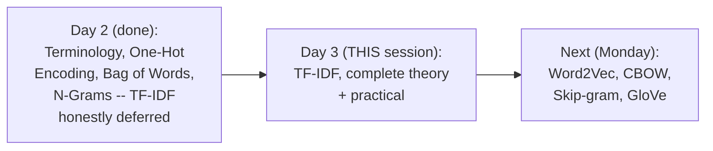
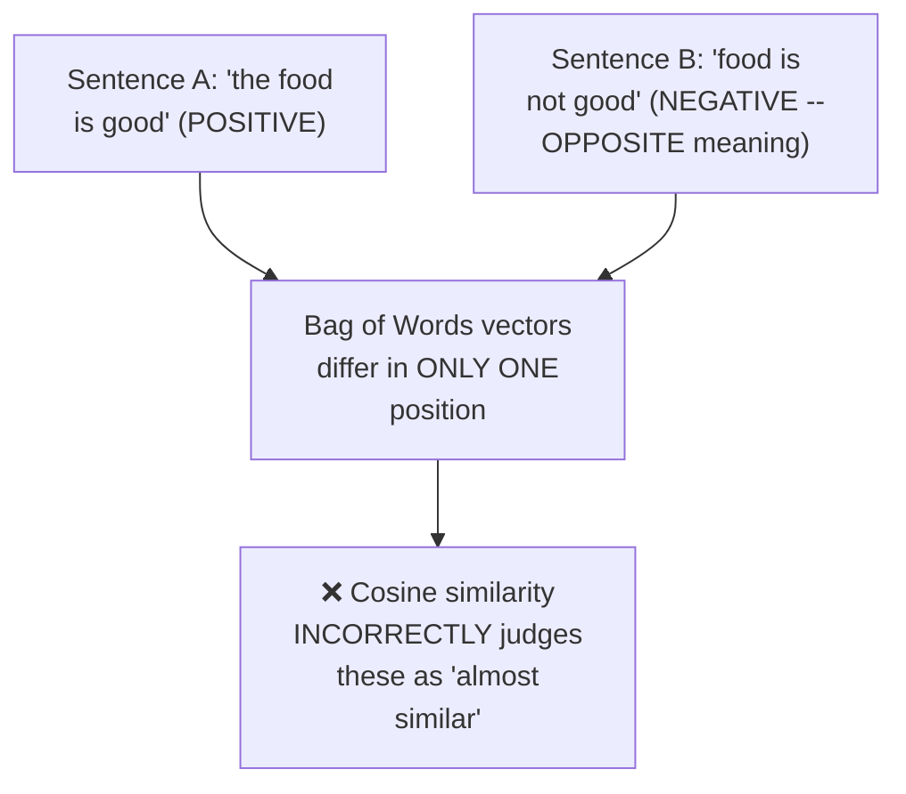
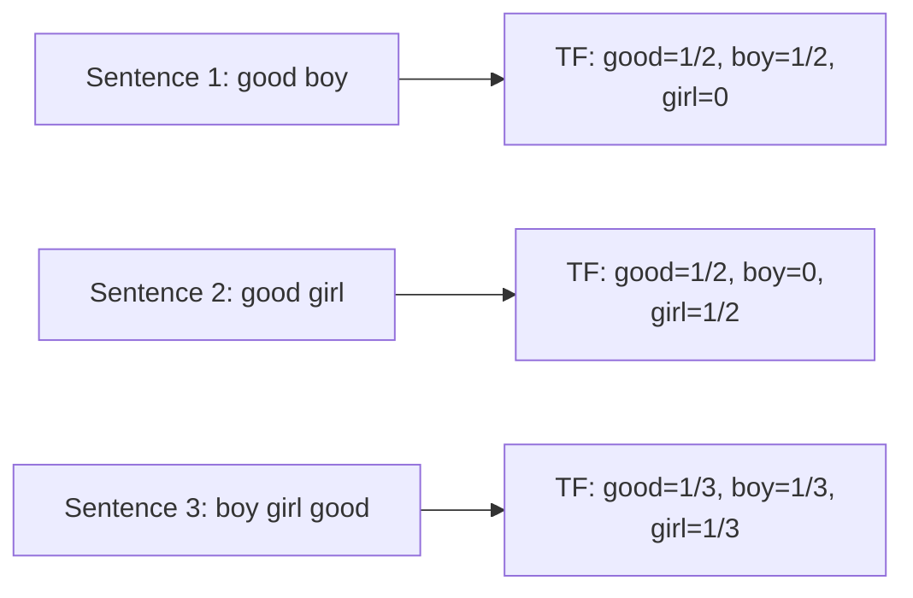
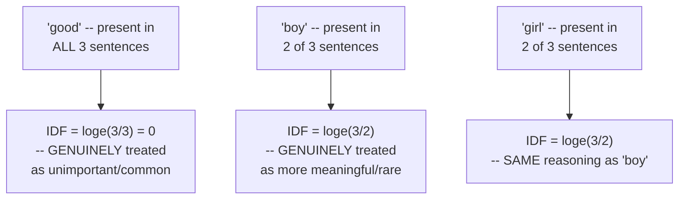
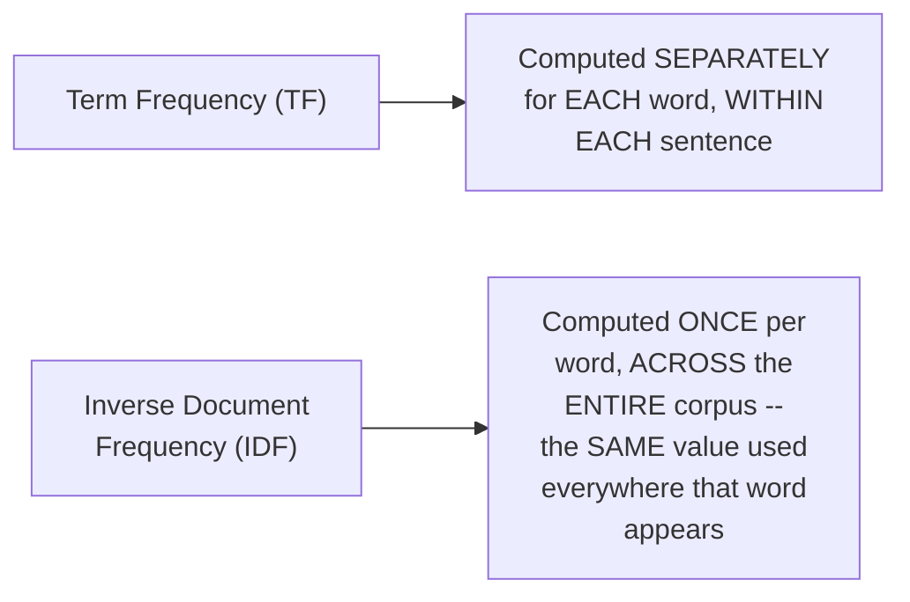
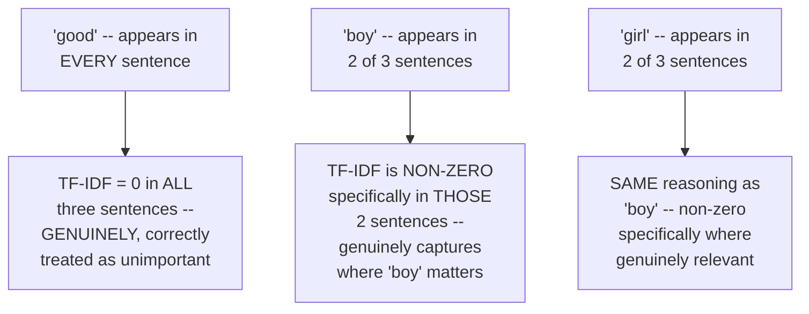
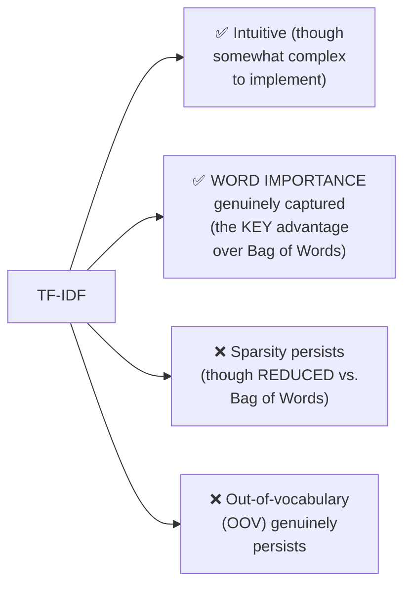
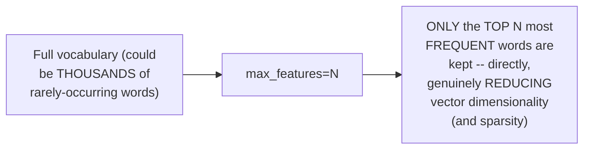
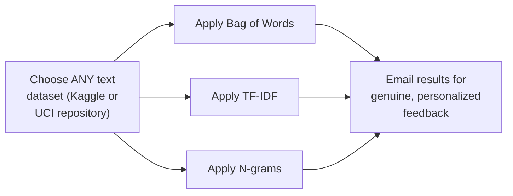
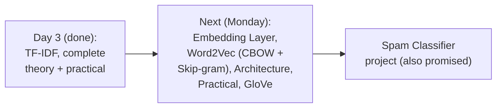

# 🧠 NLP Day 3: TF-IDF, Complete Theory & Practical Implementation

- <i>**Session:** NLP for Machine Learning & Deep Learning Series — Day 3 (TF-IDF With Practical Application) · 
- **Instructor:** Krish Naik
- **Note on scope:** This is the **direct, promise-fulfilling continuation** of Day 2, which honestly deferred TF-IDF due to running out of time. This session genuinely, completely delivers TF-IDF — built through a precise, memorable motivating example (two OPPOSITE-meaning sentences that Bag of Words incorrectly judges as similar), followed by a complete, worked derivation of both Term Frequency and Inverse Document Frequency formulas, their combination, and a real, live practical implementation using Scikit-learn's `TfidfVectorizer` (including N-grams and the `max_features` parameter). Word2Vec, CBOW, Skip-gram, and GloVe are explicitly promised for the following Monday's session.</i>

---

## 📑 Table of Contents

1. [Session Overview](#-session-overview)
2. [Learning Objectives](#-learning-objectives)
3. [Detailed Notes](#-detailed-notes)
   - [1. Session Context: Day 3, Completing TF-IDF](#1-session-context-day-3-completing-tf-idf)
   - [2. The Motivating Problem: Why Bag of Words Genuinely Fails on Opposite-Meaning Sentences](#2-the-motivating-problem-why-bag-of-words-genuinely-fails-on-opposite-meaning-sentences)
   - [3. Term Frequency (TF): A Complete Worked Example](#3-term-frequency-tf-a-complete-worked-example)
   - [4. Inverse Document Frequency (IDF): A Complete Worked Example](#4-inverse-document-frequency-idf-a-complete-worked-example)
   - [5. Combining TF × IDF: The Complete, Worked Vector Table](#5-combining-tf--idf-the-complete-worked-vector-table)
   - [6. TF-IDF's Advantages & Disadvantages](#6-tf-idfs-advantages--disadvantages)
   - [7. Practical Implementation: N-Grams, TfidfVectorizer & max_features](#7-practical-implementation-n-grams-tfidfvectorizer--max_features)
   - [8. Closing: The Assignment & What's Next (Word2Vec, GloVe)](#8-closing-the-assignment--whats-next-word2vec-glove)
4. [Glossary](#-glossary)
5. [Revision Notes — One-Minute Revision](#-revision-notes--one-minute-revision)
6. [Cheat Sheet](#-cheat-sheet)
7. [Interview Questions & Answers](#-interview-questions--answers)
8. [Scenario-Based Interview Questions](#-scenario-based-interview-questions)
9. [Hands-on Exercises](#-hands-on-exercises)
10. [Practice Assignment](#-practice-assignment)
11. [Additional Resources](#-additional-resources)
12. [Final Revision Sheet](#-final-revision-sheet)

---

## 🎯 Session Overview

This session genuinely, completely delivers TF-IDF — the technique Day 2 honestly promised but ran out of time to cover. It covers:

1. **A precise, genuinely memorable motivating example**: "the food is good" vs. "the food is not good" — two OPPOSITE-meaning sentences that, when converted via Bag of Words and compared via cosine similarity, are incorrectly judged as "almost similar," directly, concretely demonstrating Bag of Words' own genuine failure to capture word IMPORTANCE.
2. **Term Frequency (TF)**, built through a complete, precise formula (`repetitions of a word in a sentence ÷ total words in that sentence`) and fully worked across three real example sentences.
3. **Inverse Document Frequency (IDF)**, built through a complete, precise formula (`loge(total sentences ÷ sentences containing the word)`) and fully worked across the SAME three sentences — directly, numerically demonstrating that common words (like "good," present in every sentence) genuinely receive an IDF of ZERO.
4. **Combining TF × IDF**, worked completely into a full, final vector table — directly, concretely demonstrating that RARE words (like "boy" and "girl") genuinely receive meaningful, non-zero weight, while COMMON words (like "good") are genuinely, correctly suppressed to zero.
5. **TF-IDF's own precise advantages and disadvantages** — genuinely capturing word IMPORTANCE (the key improvement over Bag of Words), while sparsity and out-of-vocabulary issues genuinely, honestly persist.
6. **A complete, real, practical implementation** — N-grams via `CountVectorizer`'s `ngram_range` parameter, TF-IDF via Scikit-learn's `TfidfVectorizer`, and the genuinely useful `max_features` parameter for directly controlling vector dimensionality.
7. **A genuine, real, stated assignment**: choose any text dataset (from Kaggle or the UCI repository), apply Bag of Words, TF-IDF, and N-grams, and email the results for direct, personalized feedback.

> 💡 **Key framing, given directly, on precisely why TF-IDF genuinely exists:** *"We should try to give some importance to the specific words -- then how do we give it? For that, we use something called as TERM FREQUENCY and INVERSE DOCUMENT FREQUENCY."*

---

## 🎯 Learning Objectives

By the end of this guide, you will be able to:

- [ ] Explain, using a concrete example, why Bag of Words genuinely fails to distinguish opposite-meaning sentences.
- [ ] Write and apply the Term Frequency (TF) formula to a real sentence.
- [ ] Write and apply the Inverse Document Frequency (IDF) formula to a real corpus.
- [ ] Combine TF and IDF to compute a complete, correct TF-IDF vector table for a small corpus.
- [ ] State TF-IDF's genuine advantages and disadvantages, particularly its improvement over Bag of Words.
- [ ] Implement Bag of Words with N-grams, and TF-IDF, using real Python code (Scikit-learn).
- [ ] Use the `max_features` parameter to directly control vector dimensionality.

---

## 📚 Detailed Notes

### 1. Session Context: Day 3, Completing TF-IDF

#### 🧠 Concept

> 💡 **Given directly, opening the session:** *"We have covered a lot of things initially, and we have learned so many things in the past two classes -- and what we will do is that today, we will try to learn bag of words -- bag of words is almost completed -- TF-IDF, we'll try to learn."*

#### 🪜 Step-by-Step — The Stated, Complete Agenda for Today

> 💡 **Given directly:** *"Agenda will basically be -- again, I'm just going to revise you bag of words, which was left in the previous class... and the second one that we are probably going to learn is something called TF-IDF -- third, practical implementation, practical implementation with the help of Python and NLTK libraries."*



#### 🎯 Key Takeaways

* This session **directly, genuinely fulfills** Day 2's own honest promise — TF-IDF, covered completely, both theory and practical.
* The instructor's own **stated schedule note**: no session Saturday/Sunday (due to a separate, paid bootcamp starting), with the NEXT NLP session explicitly scheduled for Monday.
* **Word2Vec, CBOW, Skip-gram, and GloVe** are explicitly, directly promised for that Monday session.

---

### 2. The Motivating Problem: Why Bag of Words Genuinely Fails on Opposite-Meaning Sentences

#### 🪜 Step-by-Step — A Precise, Genuinely Memorable, Motivating Example

> 💡 **Given directly:** *"Suppose I say 'the food is good,' and I may also have another word or sentence which says 'food is not good' -- now you know that this two sentences is quite opposite, right -- but if you try to convert this into vectors..."*

```text
Sentence A: "the food is good"
Sentence B: "food is not good"
-- GENUINELY OPPOSITE in meaning
```

#### 🪜 Step-by-Step — The Complete, Worked Vector Comparison

> 💡 **Given directly:** *"With respect to this first sentence, you will be able to see what will be my vectors... wherever food is, food is there, so I'll write 1, good is there, I'll write... is is there, I will write 1, not is not there, so I'll write it as 0, the is there, so I'll write it as 1 -- whereas in the case of this sentence... food is actually there, I'm going to just write it as 1, good is also present over here... is is there, not is also there, and the is also there."*

```text
Vocabulary: food, good, is, not, the

Sentence A ("the food is good"): [1, 1, 1, 0, 1]
Sentence B ("food is not good"): [1, 1, 1, 1, 0]
-- ONLY ONE position differs (not vs. the)
```

#### ❓ Why It Exists — The Precise, Genuine Consequence

> 💡 **Given directly:** *"If I take this vectors and probably try to calculate the cosine similarity... what will happen is that they will try to say that this sentence are ALMOST SIMILAR, right, because of these vectors -- so exact semantic meaning is missing... even though this sentence are completely opposite."*



#### ⚠ A Direct, Important Reinforcement of Day 1's Own "Not" Warning

> 💡 **Given directly:** *"You may be telling, Krish, why did you not remove the stop word? Let's remove the stop word... but NOT, don't remove it, because 'not' can play a very important role -- but in stop words, 'not' is actually present, okay, so you should create your own separate type of stop words, so that this 'not' should be captured over there."*

#### ❓ Why It Exists — A Second, Genuine Problem: Equal Weighting

> 💡 **Given directly:** *"Either you are getting ones and zeros... because of this, what will happen is that the real semantic meaning is not getting captured in this entire sentence -- which word should I focus more? Because over here, good is also there, boy is also there, and BOTH are given the SAME importance."*

#### ⚠ Common Mistakes

* Assuming removing "not" as a stop word would genuinely fix this problem — explicitly, directly demonstrated as making things WORSE, not better: removing "not" (in addition to "the") would leave the two sentences differing by ONLY the "not"/"the" position either way, still producing near-identical vectors.
* Assuming Bag of Words' failure here is about vocabulary SIZE or sparsity — explicitly, directly clarified as a GENUINELY DIFFERENT problem: even with a correct, complete vocabulary, Bag of Words gives EVERY word EQUAL weight/importance, regardless of how genuinely meaningful or rare that word is.

#### 🎯 Key Takeaways

* A precise, concrete example — **"the food is good" vs. "food is not good"** — directly, vividly demonstrates Bag of Words' own genuine failure: two OPPOSITE-meaning sentences produce nearly IDENTICAL vectors, which cosine similarity then INCORRECTLY judges as "almost similar."
* This reinforces Day 1's own **"not" warning**: it must genuinely be EXCLUDED from stop-word removal, though even preserving it doesn't fully solve the underlying problem.
* The GENUINE, root cause is that Bag of Words gives **EVERY word EQUAL importance** — regardless of how rare, common, or genuinely meaningful that specific word is — directly, precisely motivating TF-IDF, covered next.

---
### 3. Term Frequency (TF): A Complete Worked Example

#### 📖 Definition — TF-IDF, Precisely Named and Introduced

> 💡 **Given directly:** *"How do you fix this issue? By using TF-IDF -- TF-IDF is nothing but TERM FREQUENCY and INVERSE DOCUMENT FREQUENCY."*

#### 🪜 Step-by-Step — Re-Establishing the Same Three Example Sentences

> 💡 **Given directly:** *"Let me take the both the sentences which I have actually defined on the top -- over here, my sentence one, after cleaning the text, I have got it as 'good boy,' right -- in sentence two, I have got something called as 'good girl'... in sentence three, I've got something called as 'boy girl good.'"*

```text
Sentence 1: "good boy"
Sentence 2: "good girl"
Sentence 3: "boy girl good"
```

#### 📖 Definition — The Precise, Complete Term Frequency Formula

> 💡 **Given directly:** *"Term frequency is basically defined as NUMBER OF REPETITIONS OF WORDS IN SENTENCE, divided by NUMBER OF WORDS IN SENTENCE."*

```text
TF(word, sentence) = (repetitions of word in that sentence) / (total words in that sentence)
```

#### 🪜 Step-by-Step — The Complete, Worked Calculation for Sentence 1

> 💡 **Given directly:** *"If I really want to find out the term frequency of good... how many times good is present in this sentence? Only one -- so this will be 1, divided by how many number of words are there in the sentence -- so here you can basically say that they are two words -- so one by two."*

```text
Sentence 1 ("good boy", 2 words total):
TF(good, S1) = 1/2
TF(boy, S1)  = 1/2
TF(girl, S1) = 0/2 = 0    (girl is NOT present in Sentence 1)
```

#### 🪜 Step-by-Step — The Complete, Worked Calculations for Sentences 2 and 3

> 💡 **Given directly, Sentence 2:** *"With respect to sentence two... good and girl will be present, so boy will be zero -- good is basically again one by two, because how many words are there, there is two words, so one by two."*

> 💡 **Given directly, Sentence 3:** *"With respect to sentence three, good is present, present, so here I am going to basically write one by three, because the total number of words that are present is three."*

```text
Sentence 2 ("good girl", 2 words total):
TF(good, S2) = 1/2    TF(boy, S2) = 0    TF(girl, S2) = 1/2

Sentence 3 ("boy girl good", 3 words total):
TF(good, S3) = 1/3    TF(boy, S3) = 1/3    TF(girl, S3) = 1/3
```



#### ⚠ Common Mistakes

* Computing TF using the TOTAL vocabulary size (across the entire corpus) as the denominator — explicitly, directly clarified: the denominator is specifically the number of words in THAT SPECIFIC SENTENCE, not the entire corpus's own vocabulary.
* Assuming TF is computed ONCE per word, globally — explicitly, directly demonstrated as computed SEPARATELY for EACH sentence — the SAME word ("good") genuinely has a DIFFERENT TF value in each sentence (1/2 in S1, 1/2 in S2, 1/3 in S3).

#### 🎯 Key Takeaways

* **Term Frequency (TF)** is precisely `(repetitions of a word within a specific sentence) ÷ (total words in that same sentence)` — computed SEPARATELY for every word, within every sentence.
* This session's own complete, worked example (three sentences, three words) directly, numerically confirms this formula's exact application.
* TF alone doesn't yet solve the "equal importance" problem from Section 2 — this genuinely requires COMBINING TF with IDF, covered next.

---

### 4. Inverse Document Frequency (IDF): A Complete Worked Example

#### 📖 Definition — The Precise, Complete IDF Formula

> 💡 **Given directly:** *"Inverse document frequency here I'm just going to write two things -- one is words, and one is IDF... good IDF basically means NUMBER OF SENTENCES, divided by NUMBER OF SENTENCES CONTAINING THE WORD."*

```text
IDF(word) = loge( total number of sentences / number of sentences containing that word )
```

#### 🪜 Step-by-Step — The Complete, Worked Calculation for "Good"

> 💡 **Given directly:** *"How many number of sentences are there? There are three sentences, right -- one, two, three -- okay, so three sentences, divided by how many number of sentences contains the word good? Go and see -- good is present in sentence one, good is present in sentence two, good is present in sentence three -- so one, two, three -- so it will be log base e, three divided by three -- so this is basically going to be ZERO."*

```text
IDF(good) = loge(3/3) = loge(1) = 0    -- "good" is present in ALL 3 sentences
```

#### 🪜 Step-by-Step — The Complete, Worked Calculations for "Boy" and "Girl"

> 💡 **Given directly:** *"With respect to boy... how many sentences can consist of the word boy? So here you can see one and two -- so two [sentences]... so log base e, 3 by 2."*

```text
IDF(boy)  = loge(3/2)    -- "boy" is present in 2 of 3 sentences
IDF(girl) = loge(3/2)    -- "girl" is present in 2 of 3 sentences
```



#### ❓ Why It Exists — The Precise, Genuine, Underlying Logic

> 💡 **Given directly:** *"Whichever words are RARELY present in the sentences, we should try to give MORE weightage -- more weightage to the rare words that are present in sentences or this entire documents."*

#### 🔍 Internal Working — IDF Is Genuinely Computed ONCE Per Word, Across the Whole Corpus

> 💡 **Given directly:** *"This term frequency is getting computed for every sentences, okay, and this [IDF] is going to be SAME throughout, throughout the any problem statements."*



#### ⚠ Common Mistakes

* Confusing WHERE TF and IDF are each computed — explicitly, directly distinguished: TF is genuinely PER-SENTENCE (recomputed for every document); IDF is genuinely computed ONCE per word, using the ENTIRE corpus, and reused consistently.
* Assuming a word present in EVERY sentence would receive a HIGH IDF value — explicitly, directly demonstrated as producing the LOWEST possible IDF (zero) — since `loge(N/N) = loge(1) = 0` whenever a word appears in ALL N sentences.

#### 🎯 Key Takeaways

* **Inverse Document Frequency (IDF)** is precisely `loge(total sentences ÷ sentences containing that word)` — computed ONCE per word, using the entire corpus.
* A word present in **EVERY sentence** (like "good," in this session's own example) genuinely receives an IDF of **ZERO** — directly, mathematically confirming that common words are treated as GENUINELY less important.
* A word present in **FEWER sentences** (like "boy" or "girl," present in only 2 of 3) genuinely receives a **HIGHER, non-zero** IDF value — directly, mathematically confirming that rarer words are treated as GENUINELY more important.

---
### 5. Combining TF × IDF: The Complete, Worked Vector Table

#### 📖 Definition — The Precise, Complete Combination Formula

> 💡 **Given directly:** *"We are just going to multiply this two -- term frequency multiplied by inverse document frequency -- it will become... TF-IDF."*

```text
TF-IDF(word, sentence) = TF(word, sentence) × IDF(word)
```

#### 🪜 Step-by-Step — The Complete, Worked Calculation for Sentence 1

> 💡 **Given directly:** *"For sentence one, good -- so good, this will be 1 by 2, multiplied by 0 -- can I write 0 over here? ...Then let's go with respect to boy -- boy is over here, 1 by 2, multiplied by log 3 by 2 -- then for the girl part, 0 multiplied by this value, so this is going to become 0."*

```text
Sentence 1 ("good boy"):
TF-IDF(good, S1) = (1/2) × 0        = 0
TF-IDF(boy, S1)  = (1/2) × loge(3/2) = (a non-zero, genuine value)
TF-IDF(girl, S1) = 0 × loge(3/2)      = 0
```

#### 🪜 Step-by-Step — The Complete, Worked Calculations for Sentences 2 and 3

> 💡 **Given directly, Sentence 2:** *"With respect to sentence 2, I'm just going to take this vectors and multiply with this specific vectors -- I'm just going to multiply 1 by 2 by 0, so this is going to be for good it is going to be 0 -- then 0 multiplied by this will be 0 -- last one will be 1 by 2 multiplied by log base e, 3 by 2."*

> 💡 **Given directly, Sentence 3:** *"In case of sentence 3, we have all the values, 1 by 3, 1 by 3, 1 by 3 -- so only the first one will be 0, since it is 0 over there, and then we will multiply 1 by 3 log base e 3 by 2, and 1 by 3 log base e 3 by 2."*

```text
Sentence 2 ("good girl"):
TF-IDF(good, S2) = (1/2) × 0        = 0
TF-IDF(boy, S2)  = 0 × loge(3/2)      = 0
TF-IDF(girl, S2) = (1/2) × loge(3/2) = (a non-zero, genuine value)

Sentence 3 ("boy girl good"):
TF-IDF(good, S3) = (1/3) × 0        = 0
TF-IDF(boy, S3)  = (1/3) × loge(3/2) = (a non-zero, genuine value)
TF-IDF(girl, S3) = (1/3) × loge(3/2) = (a non-zero, genuine value)
```

| | good | boy | girl |
|---|---|---|---|
| **S1** ("good boy") | 0 | (1/2)·loge(3/2) | 0 |
| **S2** ("good girl") | 0 | 0 | (1/2)·loge(3/2) |
| **S3** ("boy girl good") | 0 | (1/3)·loge(3/2) | (1/3)·loge(3/2) |

#### 🔍 Internal Working — The Precise, Genuine Payoff: Semantic Importance IS Now Captured

> 💡 **Given directly, the complete, precise, closing observation:** *"If you go and observe in these vectors, do you see 'good' is having all zero values, right? See, with respect to 'good,' it is zero, because it is present in every sentence -- so it is not playing a very big role... but since good is present in all the sentences, it is saying the vectors to NOT give importance to that specific 'good' vector... now boy is present rarely in two sentences... so I have to give some importance in this two sentences to boy -- so here you can see some value is there with respect to boy, and similarly in girl, you can see that girl importance is there in two sentences."*



> 💡 **Given directly, the precise, concluding statement:** *"Through this, you can see that we will be able to find out the most rare word that is present in the document -- so here you can basically see all these things, and this is how we convert this entire words into vectors."*

#### ⚠ Common Mistakes

* Assuming TF-IDF genuinely, fully solves ALL semantic understanding — explicitly, directly, honestly qualified elsewhere in this session: it captures relative word IMPORTANCE (rare vs. common), NOT deep, contextual meaning — a genuine, real improvement over Bag of Words, but not a complete solution.
* Assuming the FINAL TF-IDF vector for a document is simply the TF vector or the IDF vector alone — explicitly, directly clarified: it's the ELEMENT-WISE PRODUCT of BOTH, computed together, for every word-sentence combination.

#### 🎯 Key Takeaways

* **TF-IDF** is precisely computed as `TF(word, sentence) × IDF(word)` — combining the SENTENCE-SPECIFIC frequency with the CORPUS-WIDE rarity of each word.
* The complete, worked vector table directly, numerically confirms the SESSION's own genuine payoff: **"good" (common) genuinely receives ZERO weight everywhere**, while **"boy" and "girl" (rarer) genuinely receive non-zero weight** specifically in the sentences where they appear.
* This directly, precisely demonstrates TF-IDF's core, genuine advantage over Bag of Words: **word IMPORTANCE is now genuinely captured**, rather than every word receiving equal weight.

---

### 6. TF-IDF's Advantages & Disadvantages

#### 📖 Definition — The Precise, Stated Advantage

> 💡 **Given directly:** *"Advantages is that -- yes, intuitive... it is bit complex to implement TF-IDF, but it is [intuitive] and simple."*

#### ⚠ Disadvantage 1: Sparsity Genuinely Persists (Though Reduced)

> 💡 **Given directly:** *"If our vectors are very big, you know, sparsity issue is there -- sparsity issue is there -- yes, it is reducing when compared to the bag of words."*

#### ⚠ Disadvantage 2: Out-of-Vocabulary Genuinely Persists

> 💡 **Given directly:** *"With respect to disadvantage, there is again an issue of out of -- OOV, out of vocabulary -- this is not getting handled over here anyhow."*

#### 🏢 Real-World / Production Usage — The Precise, Genuine Advantage, Restated

> 💡 **Given directly:** *"The main advantage is that WORD IMPORTANCE are getting captured -- word importance is getting captured -- and because of this, it can really perform a better role."*



#### ⚠ Common Mistakes

* Assuming TF-IDF genuinely SOLVES sparsity or OOV problems entirely — explicitly, directly, honestly clarified: BOTH genuinely PERSIST, with sparsity merely REDUCED (not eliminated) compared to Bag of Words.
* Assuming TF-IDF and Bag of Words share the SAME set of genuine advantages/disadvantages — explicitly, directly distinguished: TF-IDF's OWN, KEY, additional advantage is specifically CAPTURING WORD IMPORTANCE — something Bag of Words genuinely, entirely lacks.

#### 🎯 Key Takeaways

* **TF-IDF's precise advantage**: genuinely intuitive, and — MOST IMPORTANTLY — genuinely **captures word importance**, directly solving Bag of Words' own "equal weighting" problem demonstrated in Section 2.
* **TF-IDF's precise disadvantages**: sparsity genuinely PERSISTS (though reduced compared to Bag of Words), and the out-of-vocabulary (OOV) problem genuinely, entirely PERSISTS as well.
* Word2Vec — explicitly, directly named as the NEXT session's own topic — is positioned as the technique that will FURTHER address these remaining, genuine limitations.

---
### 7. Practical Implementation: N-Grams, TfidfVectorizer & max_features

#### 🪜 Step-by-Step — A Brief, Direct Recap of the Prior Session's Cleaning Pipeline

> 💡 **Given directly:** *"What is the use of Porter Stemmer? For stemming purpose, we basically use it... sent_tokenize... [is] basically converting paragraph into sentences... Porter Stemmer is basically used for the stemming purpose, WordNet Lemmatizer is basically used for the lemmatization purpose."*

```python
import nltk, re
from nltk.tokenize import sent_tokenize
from nltk.stem import PorterStemmer, WordNetLemmatizer
from nltk.corpus import stopwords

sentences = sent_tokenize(paragraph)

corpus = []
for i in range(len(sentences)):
    review = re.sub('[^a-zA-Z]', ' ', sentences[i]).lower().split()
    corpus.append(' '.join(review))
```

#### 💻 Code Example — N-Grams, Applied Live via `CountVectorizer`'s `ngram_range`

> 💡 **Given directly:** *"In Count Vectorizer, you have some amazing parameters like `ngram_range`... if I use `ngram_range`... and if I write 3 comma 3, that basically means it is just going to create the trigram."*

```python
from sklearn.feature_extraction.text import CountVectorizer

cv_trigram = CountVectorizer(ngram_range=(3, 3))
X_trigram = cv_trigram.fit_transform(corpus)
print(cv_trigram.vocabulary_)   # ONLY trigrams, e.g. "narendra damodar das"
```

> 💡 **Given directly, confirming the combined-range behavior:** *"If I write 2 comma 3, so it is basically going to consider BOTH bigrams and trigrams."*

```python
cv_combined = CountVectorizer(ngram_range=(2, 3))
```

#### ⚠ A Direct, Honest, Live-Observed Acknowledgment: Sparsity Is a Genuine, Real Problem

> 💡 **Given directly:** *"Now if you probably see corpus of 0, and if you try to see the output... this many features -- just imagine, now this is the problem of sparsity, right -- this is the problem of sparsity, which is really, really bad."*

#### 💻 Code Example — TF-IDF, Applied Live via `TfidfVectorizer`

> 💡 **Given directly:** *"For TF-IDF, I will just go to write, from `sklearn.feature_extraction.text`, I'm going to import another library, which is called as TF-IDF Vectorizer."*

```python
from sklearn.feature_extraction.text import TfidfVectorizer

tv = TfidfVectorizer()
X_tfidf = tv.fit_transform(corpus)

print(X_tfidf[0].toarray())
# genuine, real output: decimal values like 0.1966, 0.2523, 0.216, etc.
```

> 💡 **Given directly, precisely confirming the genuine, real, decimal-valued output:** *"Do you see different, different values in each and every sentence? ...Point one nine six six, point two five two three, point two five -- this vector that is getting created, right -- here you can basically see that different, different values are coming up."*

#### 🔍 Internal Working — `TfidfVectorizer` Also Genuinely Supports N-Grams

> 💡 **Given directly:** *"If I go and see TF-IDF Vectorizer... `ngram_range`... I can basically also use this and write over here, and let's say I want just trigram, then I can execute this -- so with respect to trigram, you can see that I am getting different, different words."*

```python
tv_trigram = TfidfVectorizer(ngram_range=(3, 3))
```

#### 💻 Code Example — The `max_features` Parameter, Precisely Explained

> 💡 **Given directly:** *"There is also one amazing feature -- if I say `max_features` as 3, let's say, so it is going to consider all the words that are at least present three times... it's going to pick the TOP THREE HIGH-OCCURRING elements, or high-frequency features."*

```python
tv_top3 = TfidfVectorizer(max_features=3)
# builds a vocabulary containing ONLY the top 3 most frequent words in the corpus
```

> 💡 **Given directly, the precise, official definition, directly read from the documentation:** *"If not none, build a vocabulary that only considers the TOP max_features, ordered by term frequency, across the corpus."*

#### 🔍 Internal Working — Precisely Why `max_features` Genuinely Matters

> 💡 **Given directly:** *"There will be some words that will only be present one time, right, that will be present one time or two times or three times, right -- so it is always good that we take the top maximum number of words, or highest-occurring words, that are present in the entire corpus."*



#### ⚠ Common Mistakes

* Assuming `ngram_range=(3,3)` produces unigrams, bigrams, AND trigrams together — explicitly, directly clarified: a SINGLE value pair like `(3,3)` produces ONLY trigrams; a RANGE like `(2,3)` is genuinely needed to combine bigrams AND trigrams together.
* Assuming `max_features` selects words RANDOMLY or ALPHABETICALLY — explicitly, directly, precisely confirmed (via the official documentation, read live): it selects the TOP N words, ordered specifically by TERM FREQUENCY (most frequent first).
* Assuming TF-IDF's raw output values are directly comparable to Bag of Words' own integer counts — explicitly, directly, live-demonstrated as GENUINELY DIFFERENT: TF-IDF produces real, DECIMAL values (like 0.1966, 0.2523), not simple integer counts.

#### 🎯 Key Takeaways

* **N-grams**, applied via `ngram_range` in EITHER `CountVectorizer` OR `TfidfVectorizer`, allow direct, practical control over whether unigrams, bigrams, trigrams, or COMBINATIONS thereof are used as features.
* **`TfidfVectorizer`** genuinely produces real, DECIMAL-valued vectors (not simple counts), directly, live-confirmed via `.toarray()` on a real, trained corpus.
* **`max_features`** provides a genuine, direct, practical way to CONTROL vector dimensionality — keeping ONLY the top N most frequent words — directly, practically addressing the sparsity concern raised throughout this session.

---
### 8. Closing: The Assignment & What's Next (Word2Vec, GloVe)

#### 🪜 Step-by-Step — The Explicit, Stated Assignment

> 💡 **Given directly:** *"Go to Kaggle -- don't go to Kaggle, otherwise UCI repository -- go and pick up any dataset that you want... take any dataset, any text dataset -- I don't want to create a model right now -- apply Bag of Words, apply TF-IDF, apply N-grams, and just apply on this specific dataset, and just try it out."*

> 💡 **Given directly, the genuine, direct invitation for personal feedback:** *"After you do it, just drop me a mail at [the instructor's email], after doing your assignment -- just drop me a mail... I'll have a look, and based on that -- because we need to learn a lot of things, right."*



#### 🪜 Step-by-Step — The Explicit, Stated Roadmap Ahead

> 💡 **Given directly:** *"In the next session, we will focus on Word2Vec -- we are going to learn many things in Word2Vec -- first of all, we are going to see what is embedding layer... second topic that we are basically going to see is Word2Vec -- Word2Vec has two different things, one is CBOW, and the other one is skip-gram... then I'm going to basically discuss about the architecture of Word2Vec -- then we are going to solve practical problems, and then I also want to take one topic which is called as GLOVE."*



#### ⚠ A Direct, Honest Schedule Clarification

> 💡 **Given directly:** *"This entire thing will get completed in the next week Monday class, okay -- not on Saturday and Sunday, okay -- Saturday, Sunday, I have to take [bootcamp] classes -- okay, so all the seven days I'll be teaching."*

#### ⚠ Common Mistakes

* Assuming the assignment requires building a genuine, trained classification MODEL — explicitly, directly clarified: the assignment is specifically about APPLYING the vectorization techniques (Bag of Words, TF-IDF, N-grams) themselves — "I don't want to create a model right now."
* Assuming the NEXT NLP session would happen on the immediately-following weekend — explicitly, directly clarified: due to a separate, paid bootcamp occupying Saturday and Sunday, the next NLP session is specifically scheduled for MONDAY.

#### 🎯 Key Takeaways

* A **genuine, real assignment** was given: choose any text dataset, apply Bag of Words, TF-IDF, and N-grams, and email the results directly to the instructor for genuine, personalized feedback.
* **Word2Vec (embedding layer, CBOW, Skip-gram, architecture, practical implementation), GloVe, and a spam classifier project** are all explicitly, directly promised for the following Monday's session.
* This session's own honest, complete delivery of TF-IDF — directly fulfilling Day 2's own promise — sets a genuine, consistent pattern of transparency about what is and isn't covered in each specific class.

---

## 📝 Glossary

| Term | Definition | Why It Matters |
|---|---|---|
| **TF-IDF** | Term Frequency x Inverse Document Frequency | Directly fixes Bag of Words' "equal weighting" problem |
| **Term Frequency (TF)** | (word repetitions in a sentence) / (total words in that sentence) | Computed PER-SENTENCE, per word |
| **Inverse Document Frequency (IDF)** | loge(total sentences / sentences containing the word) | Computed ONCE per word, across the entire corpus |
| **TfidfVectorizer** | Scikit-learn's tool for building TF-IDF vectors | This session's own practical implementation tool |
| **ngram_range** | A CountVectorizer/TfidfVectorizer parameter controlling N-gram size | (3,3)=trigrams only; (2,3)=bigrams+trigrams |
| **max_features** | Limits the vocabulary to the top N most frequent words | Directly, practically reduces sparsity |

---

## 🔄 Revision Notes — One-Minute Revision

* This is **Day 3**, directly, genuinely fulfilling Day 2's own honest promise -- TF-IDF, covered completely (theory + practical).
* **Motivating problem**: "the food is good" vs. "food is not good" (OPPOSITE meanings) -- Bag of Words vectors differ by only ONE position, so cosine similarity INCORRECTLY judges them as "almost similar." Root cause: Bag of Words gives EVERY word EQUAL importance.
* **Term Frequency (TF)**: `(word repetitions in sentence) / (total words in sentence)` -- computed PER-SENTENCE. Worked example ("good boy"/"good girl"/"boy girl good"): good=1/2,1/2,1/3; boy=1/2,0,1/3; girl=0,1/2,1/3.
* **Inverse Document Frequency (IDF)**: `loge(total sentences / sentences containing the word)` -- computed ONCE per word, across the whole corpus. Worked example: IDF(good)=loge(3/3)=0 (present in ALL sentences); IDF(boy)=IDF(girl)=loge(3/2) (present in only 2 of 3).
* **Combining TF x IDF**: "good" -> 0 in EVERY sentence (correctly suppressed, since it's common); "boy"/"girl" -> genuinely NON-ZERO specifically where they appear (correctly highlighted as meaningful). This is TF-IDF's own genuine payoff: word IMPORTANCE is captured.
* **Advantages**: intuitive, and (most importantly) genuinely captures word IMPORTANCE. **Disadvantages**: sparsity persists (though reduced vs. Bag of Words); OOV genuinely persists too.
* **Practical**: `CountVectorizer(ngram_range=(3,3))` for trigrams-only; `(2,3)` for bigrams+trigrams combined. `TfidfVectorizer()` produces genuine, real DECIMAL values (e.g. 0.1966), not simple counts. `max_features=N` keeps ONLY the top N most frequent words -- directly, practically reducing sparsity.
* **Assignment**: choose ANY text dataset (Kaggle/UCI), apply Bag of Words + TF-IDF + N-grams, email results for feedback -- no model-building required.
* **Next (Monday)**: Word2Vec (embedding layer, CBOW, Skip-gram, architecture, practical), GloVe, spam classifier project.

---
## 📋 Cheat Sheet

**The motivating problem:**
```text
"the food is good" vs. "food is not good" -- OPPOSITE meanings
Bag of Words vectors differ by ONLY 1 position -> cosine similarity WRONGLY says "similar"
Root cause: Bag of Words gives EVERY word EQUAL weight
```

**Term Frequency (TF):**
```text
TF(word, sentence) = (repetitions of word IN that sentence) / (total words IN that sentence)
-- computed PER-SENTENCE
```

**Inverse Document Frequency (IDF):**
```text
IDF(word) = loge(total sentences / sentences containing that word)
-- computed ONCE per word, across the WHOLE corpus
-- word in EVERY sentence -> IDF = 0 (genuinely unimportant/common)
-- word in FEW sentences -> IDF = high (genuinely important/rare)
```

**Combining TF x IDF:**
```text
TF-IDF(word, sentence) = TF(word, sentence) x IDF(word)
```

**Worked example (3 sentences: "good boy", "good girl", "boy girl good"):**
```text
IDF(good)=loge(3/3)=0   | IDF(boy)=IDF(girl)=loge(3/2)

TF-IDF table:
         good  boy              girl
S1:       0    (1/2)*loge(3/2)   0
S2:       0    0                 (1/2)*loge(3/2)
S3:       0    (1/3)*loge(3/2)   (1/3)*loge(3/2)
```

**TF-IDF advantages/disadvantages:**
```text
Advantages: intuitive; WORD IMPORTANCE genuinely captured (the KEY improvement)
Disadvantages: sparsity persists (reduced vs. BoW); OOV genuinely persists
```

**Complete practical implementation:**
```python
from sklearn.feature_extraction.text import CountVectorizer, TfidfVectorizer

# Bag of Words with N-grams
cv = CountVectorizer(ngram_range=(2,3))   # bigrams + trigrams
X_bow = cv.fit_transform(corpus)

# TF-IDF, with max_features
tv = TfidfVectorizer(max_features=3)   # top 3 most frequent words only
X_tfidf = tv.fit_transform(corpus)
print(X_tfidf[0].toarray())   # genuine DECIMAL values
```

---

## 🔥 Interview Questions & Answers

### 🟢 Beginner

**Q1.**

**Question:** What does TF-IDF stand for?

**Answer:** Term Frequency - Inverse Document Frequency.

**Explanation:** Directly, explicitly stated.

**Why Interviewers Ask This:** Basic, foundational terminology.

**Possible Follow-up:** "What genuine problem does this technique solve?"

**Q2.**

**Question:** Write the formula for Term Frequency.

**Answer:** (repetitions of a word in a sentence) / (total words in that sentence).

**Explanation:** Directly, precisely stated.

**Why Interviewers Ask This:** A commonly-tested, foundational formula.

**Possible Follow-up:** "Is TF computed per-sentence or across the whole corpus?"

**Q3.**

**Question:** Write the formula for Inverse Document Frequency.

**Answer:** loge(total number of sentences / number of sentences containing the word).

**Explanation:** Directly, precisely stated.

**Why Interviewers Ask This:** A commonly-tested, foundational formula.

**Possible Follow-up:** "What IDF value would a word present in every single sentence receive?"

**Q4.**

**Question:** If a word appears in all sentences of a corpus, what is its IDF value?

**Answer:** 0.

**Explanation:** Directly, mathematically confirmed (loge(N/N) = loge(1) = 0).

**Why Interviewers Ask This:** Tests genuine understanding of the formula's real, mathematical behavior.

**Possible Follow-up:** "Why does this genuinely make sense, conceptually?"

**Q5.**

**Question:** What is TF-IDF's core, genuine advantage over Bag of Words?

**Answer:** It genuinely captures word importance, rather than giving every word equal weight.

**Explanation:** Directly, precisely explained.

**Why Interviewers Ask This:** Foundational, frequently-tested comparison.

**Possible Follow-up:** "What example directly demonstrates Bag of Words' own failure to capture this?"

**Q6.**

**Question:** Does TF-IDF genuinely solve the sparsity problem?

**Answer:** No -- it genuinely reduces it somewhat, but doesn't eliminate it.

**Explanation:** Directly, honestly clarified.

**Why Interviewers Ask This:** Tests precise understanding of TF-IDF's real, honest limitations.

**Possible Follow-up:** "Does TF-IDF solve the out-of-vocabulary (OOV) problem?"

**Q7.**

**Question:** What Scikit-learn class implements TF-IDF vectorization?

**Answer:** TfidfVectorizer.

**Explanation:** Directly, explicitly named.

**Why Interviewers Ask This:** Basic, practical tooling knowledge.

**Possible Follow-up:** "What kind of values does its output contain -- integers or decimals?"

**Q8.**

**Question:** What does ngram_range=(3,3) produce?

**Answer:** Trigrams only.

**Explanation:** Directly, explicitly confirmed.

**Why Interviewers Ask This:** Tests precise, practical N-gram configuration knowledge.

**Possible Follow-up:** "What would ngram_range=(2,3) produce instead?"

**Q9.**

**Question:** What does the max_features parameter control?

**Answer:** It limits the vocabulary to the top N most frequently-occurring words.

**Explanation:** Directly, precisely explained.

**Why Interviewers Ask This:** Tests practical, direct sparsity-management knowledge.

**Possible Follow-up:** "Are these top N words selected alphabetically, or by frequency?"

**Q10.**

**Question:** What was this session's own stated assignment?

**Answer:** Choose any text dataset (from Kaggle or the UCI repository), apply Bag of Words, TF-IDF, and N-grams, and email the results for feedback.

**Explanation:** Directly, explicitly stated.

**Why Interviewers Ask This:** Tests awareness of the session's own genuine, concrete next steps.

**Possible Follow-up:** "Did this assignment require building a trained classification model?"

---

### 🟡 Intermediate

**Q11.**

**Question:** Explain why the instructor deliberately uses "the food is good" vs. "food is not good" — rather than a more generic example — to motivate TF-IDF.

**Answer:** This is a genuinely deliberate, precise choice: by using two sentences that are GENUINELY, OBVIOUSLY opposite in meaning to any human reader, the instructor makes Bag of Words' own failure GENUINELY, VIVIDLY concrete and undeniable -- rather than an abstract, hard-to-visualize claim. The example ALSO directly, deliberately reinforces Day 1's own "not" warning, showing that even AWARENESS of this specific word's importance doesn't fully solve the underlying problem on its own (since Bag of Words gives EVERY word equal weight, regardless of whether "not" is genuinely present or removed). This directly, precisely sets up TF-IDF as solving a GENUINELY DIFFERENT, deeper problem (equal weighting) than simply "keep the right stop words."

**Explanation:** Requires recognizing a deliberate, vivid example choice connecting back to earlier, established content (Day 1's "not" warning).

**Why Interviewers Ask This:** Tests whether a learner recognizes why a SPECIFIC, opposite-meaning example is more pedagogically effective than a generic one.

**Possible Follow-up:** "Construct your own, different example pair of opposite-meaning sentences that would similarly demonstrate this Bag of Words limitation."

**Q12.**

**Question:** A learner argues that since TF-IDF assigns "good" a value of exactly 0 in every sentence of this session's own worked example, "good" is now genuinely useless information and should simply be removed from the vocabulary entirely. Evaluate this claim.

**Answer:** This claim overstates the case. While "good" genuinely receives a TF-IDF weight of 0 in THIS SPECIFIC, small, illustrative corpus (where it happens to appear in EVERY sentence), this is a GENUINE, CONTEXT-DEPENDENT outcome, not a universal property of the word "good" itself. In a GENUINELY DIFFERENT, larger corpus, where "good" appears in ONLY SOME documents (not all), it would GENUINELY receive a non-zero, meaningful TF-IDF weight. TF-IDF's own weighting is ENTIRELY RELATIVE to the SPECIFIC corpus being processed -- the SAME word can receive GENUINELY DIFFERENT importance scores across GENUINELY DIFFERENT corpora, depending on that word's own relative rarity WITHIN each specific corpus. Removing "good" permanently from the vocabulary, based on ONE specific corpus's own result, would be a genuinely incorrect generalization -- TF-IDF's own weighting mechanism ALREADY, AUTOMATICALLY handles this correctly, on a PER-CORPUS basis, without requiring manual vocabulary pruning.

**Explanation:** Tests whether a learner recognizes TF-IDF's weighting as corpus-relative, not an intrinsic, universal property of specific words.

**Why Interviewers Ask This:** Distinguishes candidates who understand TF-IDF's genuinely relative, automatic weighting mechanism from those who might over-generalize a single, specific example's result.

**Possible Follow-up:** "Construct a genuinely different, larger corpus where the word 'good' would receive a meaningfully non-zero TF-IDF weight."

**Q13.**

**Question:** Explain, precisely, why IDF uses a LOGARITHM (specifically `loge`), rather than simply using the raw ratio `(total sentences / sentences containing the word)` directly.

**Answer:** This is a genuinely important, real mathematical design choice this session's own content doesn't explicitly justify but directly implies through its worked example. Using the RAW ratio directly (without a logarithm) would produce GENUINELY, DRAMATICALLY LARGER values for VERY rare words in a VERY large corpus -- for example, a word appearing in only 1 of 1,000,000 documents would produce a raw ratio of 1,000,000, GENUINELY, DISPROPORTIONATELY DOMINATING the final TF-IDF score compared to a word appearing in, say, 10 of 1,000,000 documents (ratio: 100,000) -- an EXTREME, poorly-scaled difference. The LOGARITHM genuinely COMPRESSES this range -- `loge(1,000,000) ≈ 13.8` versus `loge(100,000) ≈ 11.5` -- a much more REASONABLE, PROPORTIONATE difference that still GENUINELY, CORRECTLY favors rarer words, without letting EXTREMELY rare words GENUINELY, DISPROPORTIONATELY dominate the entire vector's own scale. This directly, precisely explains why virtually EVERY real, standard TF-IDF implementation (including Scikit-learn's own `TfidfVectorizer`, used in this session's own practical implementation) genuinely uses a logarithmic IDF formulation.

**Explanation:** Requires reasoning through the mathematical, scaling justification for the logarithm, which the session's own content doesn't explicitly state but the formula itself implies.

**Why Interviewers Ask This:** Tests whether a learner understands the PRECISE, mathematical reasoning behind a specific formula detail, not just that a logarithm happens to be used.

**Possible Follow-up:** "For a corpus of 1,000 documents, compute both the raw ratio and the loge-based IDF for a word appearing in only 1 document, and compare the magnitude of these two values."

**Q14.**

**Question:** Using this session's own precise TF-IDF combination table (Section 5), explain why "boy" in Sentence 1 and "boy" in Sentence 3 receive GENUINELY DIFFERENT TF-IDF values, even though "boy" has the EXACT SAME IDF value in both cases.

**Answer:** A precise, synthesized explanation, directly connecting Section 3's own per-sentence TF calculation with Section 4's own corpus-wide, fixed IDF calculation: per Section 5's own precise table, `TF-IDF(boy, S1) = (1/2) × loge(3/2)`, while `TF-IDF(boy, S3) = (1/3) × loge(3/2)` -- the IDF term (`loge(3/2)`) is GENUINELY IDENTICAL in both cases (since IDF is computed ONCE per word, across the WHOLE corpus, per Section 4's own precise reasoning), but the TF term GENUINELY DIFFERS -- `1/2` in Sentence 1 (where "boy" is 1 of 2 total words) versus `1/3` in Sentence 3 (where "boy" is 1 of 3 total words). This directly, precisely demonstrates that even though a word's CORPUS-WIDE rarity (IDF) is fixed, its FINAL TF-IDF weight WITHIN a specific sentence GENUINELY DEPENDS on that word's RELATIVE PROMINENCE within THAT SPECIFIC sentence (its TF) -- a word appearing in a SHORTER sentence (fewer total words) genuinely receives a HIGHER TF, and therefore a HIGHER final TF-IDF weight, than the SAME word appearing in a LONGER sentence, even with an IDENTICAL IDF value.

**Explanation:** Requires synthesizing the per-sentence TF calculation with the corpus-wide, fixed IDF calculation to explain a genuine, precise numerical difference the session's own table directly shows but doesn't explicitly discuss.

**Why Interviewers Ask This:** Tests whether a learner can precisely trace WHY two TF-IDF values differ, correctly attributing the difference to the TF component specifically, not the (identical) IDF component.

**Possible Follow-up:** "If Sentence 3 instead had 6 total words (with 'boy' still appearing once), what would the new TF-IDF value for 'boy' in Sentence 3 become?"

**Q15.**

**Question:** Synthesize this session's complete "food is good" vs. "food is not good" example (Section 2) with the full TF-IDF formula (Sections 3-5) to explain whether TF-IDF, if genuinely applied to THIS SPECIFIC example pair, would GENUINELY, FULLY solve the semantic-opposite problem Bag of Words failed to solve.

**Answer:** A precise, reasoned, and genuinely nuanced answer, extending beyond what this session's own content explicitly computes for this SPECIFIC example: applying TF-IDF to "the food is good" vs. "food is not good" would GENUINELY assign a HIGHER weight to "not" specifically (since "not" appears in ONLY ONE of the two sentences, giving it a non-zero IDF, unlike "food," "is," and "good," which appear in BOTH sentences and would GENUINELY receive an IDF of 0, per Section 4's own exact `loge(2/2)=0` calculation for words present in BOTH documents). This means TF-IDF WOULD GENUINELY, PARTIALLY improve on Bag of Words here -- the resulting vectors would GENUINELY differ more MEANINGFULLY (weighted specifically toward the "not"/"the" distinguishing position) than Bag of Words' own equal-weighted vectors. HOWEVER, this does NOT mean TF-IDF FULLY, COMPLETELY solves the semantic problem -- TF-IDF STILL treats "not" as simply ANOTHER word to weight by frequency/rarity; it has NO genuine, deeper UNDERSTANDING that "not" specifically INVERTS the meaning of "good" that follows it (a genuinely different kind of understanding requiring WORD-ORDER and CONTEXTUAL awareness that NEITHER Bag of Words NOR TF-IDF genuinely provide, per this session's own explicit N-grams discussion in Day 2, and per the STILL-PERSISting "out of vocabulary" and general semantic limitations Section 6 honestly acknowledges). The accurate, precise conclusion: TF-IDF GENUINELY IMPROVES this specific example's vector separation (a real, meaningful step forward), but does NOT achieve GENUINE, DEEP semantic/contextual understanding of negation — that requires the WORD2VEC and deep-learning-based techniques explicitly promised for the NEXT session.

**Explanation:** Requires synthesizing the specific motivating example with the complete TF-IDF formula to construct a nuanced, honest evaluation — neither overselling nor dismissing TF-IDF's genuine improvement.

**Why Interviewers Ask This:** A senior-level question testing whether a candidate can honestly, precisely evaluate a technique's GENUINE, PARTIAL improvement, without either overselling it as a complete fix or dismissing it as no improvement at all.

**Possible Follow-up:** "Compute the actual, complete TF-IDF vectors for both 'the food is good' and 'food is not good,' and directly compute their cosine similarity, comparing it to Bag of Words' own result from Section 2."

---

### 🔴 Advanced

**Q16.**

**Question:** Design a complete, from-scratch TF-IDF calculation for a genuinely NEW set of three sentences of your own choosing (each 4-6 words), explicitly computing TF, IDF, and the final combined TF-IDF value for every word in every sentence.

**Answer:** A reasonable, complete calculation, directly applying Sections 3-5's own exact methodology — for example, using "the cat sat quietly," "the dog barked loudly," "cat and dog played" (assume "the," "and" are removed as stop words, per this session's own established practice): **Cleaned**: S1="cat sat quietly" (3 words), S2="dog barked loudly" (3 words), S3="cat dog played" (3 words). **TF**: TF(cat,S1)=1/3, TF(sat,S1)=1/3, TF(quietly,S1)=1/3; TF(dog,S2)=1/3, TF(barked,S2)=1/3, TF(loudly,S2)=1/3; TF(cat,S3)=1/3, TF(dog,S3)=1/3, TF(played,S3)=1/3. **IDF** (3 total sentences): IDF(cat)=loge(3/2) [appears in S1,S3]; IDF(dog)=loge(3/2) [appears in S2,S3]; IDF(sat)=IDF(quietly)=IDF(barked)=IDF(loudly)=IDF(played)=loge(3/1)=loge(3) [each appears in only 1 sentence]. **Final TF-IDF** (selected examples): TF-IDF(cat,S1)=(1/3)×loge(3/2); TF-IDF(sat,S1)=(1/3)×loge(3); TF-IDF(cat,S3)=(1/3)×loge(3/2); TF-IDF(played,S3)=(1/3)×loge(3). This complete calculation directly, precisely demonstrates that words appearing in ONLY ONE sentence (sat, quietly, barked, loudly, played) receive a GENUINELY HIGHER IDF (loge(3)≈1.0986) than words appearing in TWO sentences (cat, dog, at loge(3/2)≈0.4055) — directly, correctly reflecting their genuinely greater rarity.

**Explanation:** Requires applying the session's own complete, exact TF, IDF, and combined TF-IDF methodology to a genuinely new example.

**Why Interviewers Ask This:** A realistic, senior-level question testing whether a candidate can perform the COMPLETE, correct computation for a genuinely new example, not just recite the formulas.

**Possible Follow-up:** "Which single word, across this entire new corpus, has the highest final TF-IDF value in its respective sentence, and why?"

**Q17.**

**Question:** Critically evaluate: "Since this session confirms TF-IDF's own max_features parameter can directly reduce vector dimensionality by keeping only the top N most frequent words, this parameter genuinely, fully solves TF-IDF's own honestly-acknowledged sparsity disadvantage." Is this an accurate characterization?

**Answer:** Not fully accurate — this significantly overstates a genuine, useful MITIGATION into a claim of a COMPLETE FIX the session's own content doesn't support. While `max_features` GENUINELY, DIRECTLY reduces the TOTAL vector dimensionality (fewer columns overall, per Section 7's own precise explanation), this does NOT mean the RESULTING, SMALLER vectors are genuinely DENSE (non-sparse) — INDIVIDUAL documents, even within a REDUCED vocabulary, will STILL genuinely contain ZERO values for MANY of the retained top-N words that simply DON'T appear in that SPECIFIC document. Additionally, `max_features` introduces its OWN, genuine trade-off (directly analogous to Intermediate Q12's own broader reasoning about TF-IDF weighting): by KEEPING ONLY the most FREQUENT words, this parameter GENUINELY, DIRECTLY DISCARDS potentially IMPORTANT, rare words — the VERY words TF-IDF's own IDF component is specifically designed to HIGHLIGHT as genuinely meaningful (per Section 4's own precise "rare words get higher IDF" reasoning) — a GENUINE, real TENSION between `max_features`' own dimensionality-reduction goal and TF-IDF's own core, stated purpose (capturing importance, especially for RARE words). The accurate, more precise conclusion: `max_features` genuinely, USEFULLY reduces dimensionality and SOMEWHAT mitigates sparsity, but does NOT fully eliminate it, and introduces its OWN, genuine trade-off against TF-IDF's own core value proposition.

**Explanation:** Tests whether a learner recognizes that a genuinely useful mitigation (max_features) doesn't constitute a complete fix, and identifies a genuine, real tension this specific parameter introduces against TF-IDF's own core purpose.

**Why Interviewers Ask This:** Distinguishes candidates who understand genuine, partial mitigations from those who treat any dimensionality-reduction technique as a complete solution.

**Possible Follow-up:** "Design a genuine experiment to empirically measure how much max_features genuinely reduces sparsity (percentage of zero values) for a real, moderately-sized corpus."

**Q18.**

**Question:** Synthesize this session's complete TF-IDF mechanism (Sections 3-5) with the earlier Average Word2Vec session's own precise "averaging preserves semantic information" reasoning to explain a genuinely important, structural difference in HOW each technique represents a document's overall meaning.

**AnswER:** A precise, synthesized comparison: TF-IDF (per THIS session's own exact mechanism) represents a document as a WEIGHTED COMBINATION of INDIVIDUAL WORD IMPORTANCE SCORES — each dimension of a TF-IDF vector corresponds to a SPECIFIC, INDIVIDUAL vocabulary word, with the vector's VALUES reflecting HOW IMPORTANT that word is WITHIN that document, RELATIVE to the corpus. This means TF-IDF's own vectors are GENUINELY, DIRECTLY INTERPRETABLE — a HIGH value at a specific position DIRECTLY tells you "THIS specific word is genuinely important in THIS document" — but the vector CARRIES NO genuine information about the SEMANTIC MEANING or CONCEPTUAL similarity of the words themselves (TF-IDF has NO way of knowing that "happy" and "joyful" are semantically related, per the earlier Word2Vec sessions' own established feature-representation concept). Average Word2Vec (per the earlier, referenced session's own precise mechanism), by contrast, represents a document by AVERAGING each word's OWN, pre-trained SEMANTIC vector — meaning the RESULTING document vector genuinely, implicitly ENCODES semantic relationships (words like "happy" and "joyful," having similar underlying Word2Vec vectors, would GENUINELY contribute similarly to the averaged result) — but this AVERAGED vector is NO LONGER directly, individually INTERPRETABLE in terms of "which SPECIFIC word contributed how much" the way TF-IDF's own vector positions directly are. This precisely reveals a genuine, fundamental trade-off: TF-IDF offers DIRECT INTERPRETABILITY (which specific words matter) at the cost of GENUINE semantic awareness; Average Word2Vec offers GENUINE semantic awareness at the cost of DIRECT, per-word interpretability in the final, combined vector.

**Explanation:** Requires synthesizing this session's specific TF-IDF mechanism with an entirely separate, later session's own Average Word2Vec mechanism to identify a genuinely important, structural trade-off (interpretability vs. semantic awareness) neither session explicitly compares directly.

**Why Interviewers Ask This:** A capstone-level question testing whether a candidate can compare TWO GENUINELY DIFFERENT text-vectorization philosophies, correctly identifying their respective, genuine strengths and weaknesses.

**Possible Follow-up:** "For a task requiring genuine EXPLAINABILITY (e.g., showing a user WHICH specific words drove a spam classification decision), which of these two techniques would you recommend, and why?"

---

## 🧪 Scenario-Based Interview Questions

> **Scenario 1:** A colleague's TF-IDF-based document search system genuinely fails to surface relevant results for queries containing common, but contextually important, industry-specific terms (e.g., "cloud" in a computing-focused corpus, where "cloud" appears in nearly every document). Using this session's concepts, diagnose the most likely cause.

**Structured Answer:**
1. **Initial investigation:** Recognize this as directly connected to Section 4's own precise IDF mechanism -- if "cloud" GENUINELY appears in NEARLY EVERY document within this specific, computing-focused corpus, its IDF value would GENUINELY approach ZERO (per the exact `loge(N/N)≈0` behavior demonstrated for "good" in Section 5's own worked example).
2. **Metrics/logs to check:** Directly compute and inspect the actual IDF value for "cloud" within this specific corpus, confirming whether it's GENUINELY, problematically close to zero.
3. **Possible causes:** Per Section 4/5's own precise reasoning, TF-IDF's own core mechanism SPECIFICALLY, DELIBERATELY suppresses common words -- but in a SPECIALIZED, domain-specific corpus, a word that would be GENUINELY "rare" in general English (like "cloud," in a computing context) may be GENUINELY common WITHIN this specific corpus, causing TF-IDF to INCORRECTLY treat it as unimportant.
4. **Debugging approach:** Directly compare the term's OWN frequency distribution within this specific, specialized corpus against a GENERAL, broader corpus, confirming whether domain-specificity is genuinely causing this exact issue.
5. **Resolution:** Consider domain-specific adjustments -- potentially EXCLUDING certain expected, universally-relevant domain terms from the standard IDF penalty, or considering a DIFFERENT weighting scheme (or the NEXT session's own promised Word2Vec/GloVe techniques) that could genuinely better handle domain-specific term importance.
6. **Prevention:** Establish a standing practice of directly examining IDF distributions for KEY, expected-to-be-important domain terms BEFORE deploying a TF-IDF-based system in a SPECIALIZED corpus, directly anticipating this exact class of "too-common-within-domain" issue.

> **Scenario 2 (Advanced):** Your team's TF-IDF pipeline, built using this session's exact methodology, shows genuinely degraded performance when max_features is set very low (e.g., max_features=50) on a large, diverse corpus, compared to using the full vocabulary. Using this session's concepts, diagnose and recommend a fix.

**Structured Answer:**
1. **Initial investigation:** Recognize this as directly connected to Advanced Interview Q17's own precise reasoning about the genuine tension between max_features' own dimensionality-reduction benefit and TF-IDF's own core purpose (highlighting rare, important words).
2. **Metrics/logs to check:** Directly compare the ACTUAL top-50 words retained (via `max_features=50`) against words that GENUINELY, MEANINGFULLY distinguish documents in this specific corpus, checking whether GENUINELY important, discriminating words were EXCLUDED.
3. **Possible causes:** Per Advanced Q17's own reasoning, an EXTREMELY low `max_features` value likely retains ONLY extremely COMMON words (which, per Section 4/5's own reasoning, TF-IDF ALREADY tends to de-weight via low IDF) -- while EXCLUDING the genuinely RARER, more DISCRIMINATING words TF-IDF's own core mechanism is specifically designed to highlight.
4. **Debugging approach:** Directly test a RANGE of `max_features` values (e.g., 50, 500, 5000, and no limit), empirically measuring how performance genuinely changes across this range, identifying a more appropriate value.
5. **Resolution:** Increase `max_features` to a GENUINELY more appropriate value for this specific corpus's own size and diversity, directly balancing dimensionality reduction against the GENUINE need to retain enough RARE, discriminating words for TF-IDF's own core mechanism to function effectively.
6. **Prevention:** Establish a standing team practice of EMPIRICALLY testing multiple `max_features` values on REAL, held-out validation data, rather than choosing an arbitrarily low value purely to minimize dimensionality, directly balancing this session's own established sparsity concern against TF-IDF's own core, stated purpose.

---

## 🛠 Hands-on Exercises

### 🟢 Easy

1. Write out, from memory, the complete TF and IDF formulas.
2. Compute the IDF value for a word appearing in 4 out of 10 sentences in a corpus.
3. Explain, in your own words, why "good" received a TF-IDF value of 0 in this session's own worked example.

### 🟡 Medium

4. Complete the full, worked TF-IDF calculation proposed in Advanced Interview Q16, using a genuinely different corpus of your own choosing.
5. Write a short explanation (150-200 words) of why IDF uses a logarithm, directly applying Intermediate Q13's own reasoning.
6. Implement the "good"/"boy"/"girl" worked example from Sections 3-5 as genuine, working Python code (using either manual computation or `TfidfVectorizer`), verifying your results match this session's own hand-computed values.

### 🔴 Advanced

7. Implement a complete TF-IDF pipeline from scratch (without using `TfidfVectorizer`), directly computing TF, IDF, and the combined TF-IDF value for a genuinely new corpus, verified against `TfidfVectorizer`'s own output.
8. Implement the domain-specific IDF issue proposed in Scenario 1, using a deliberately-constructed, specialized corpus where a genuinely important term appears in nearly every document, empirically confirming its resulting low IDF value.
9. Implement the max_features empirical comparison proposed in Scenario 2, testing multiple values on a real, moderately-sized corpus, and documenting the observed performance/dimensionality trade-off.

---

## 🏗 Practice Assignment

*(This session's own stated assignment, reproduced faithfully)*

> 💡 **The instructor's own words, given directly:** *"Take any dataset, any text dataset -- I don't want to create a model right now -- apply Bag of Words, apply TF-IDF, apply N-grams, and just apply on this specific dataset, and just try it out... after you do it, just drop me a mail."*

### Build: "Complete Vectorization Comparison, Applied to a New Dataset"

**Objective:** Directly complete this session's own genuine, stated assignment — apply Bag of Words, TF-IDF, and N-grams to a self-chosen text dataset.

**Requirements:**
- Source a text dataset from Kaggle or the UCI Machine Learning Repository (per this session's own direct recommendation).
- Apply the complete text-cleaning pipeline (tokenization, regex cleaning, stop words, stemming/lemmatization), directly reusing Days 1-2's own established methodology.
- Apply Bag of Words (via `CountVectorizer`), with at least one N-gram range tested.
- Apply TF-IDF (via `TfidfVectorizer`), with at least one `max_features` value tested.
- A written comparison (200-300 words) of the resulting vectors' own characteristics (dimensionality, sparsity, and any observed differences in word weighting between Bag of Words and TF-IDF).

**Architecture (suggested):**

```text
vectorization_comparison_assignment/
├── dataset_and_cleaning.py           # your dataset + cleaning pipeline
├── bag_of_words_with_ngrams.py         # your CountVectorizer implementation
├── tfidf_with_max_features.py            # your TfidfVectorizer implementation
└── COMPARISON.md                            # your written comparison
```

**Expected Functionality:**
- Your pipeline should genuinely, correctly run end to end on your own, real, chosen dataset.
- Your written comparison should directly, concretely reference actual, observed numbers (vocabulary size, sparsity percentage, example weight values) from your own implementation.

**Challenges:**
- Correctly choosing an appropriate `max_features` value for your specific dataset's own size and diversity.
- Correctly interpreting whether observed TF-IDF weight differences genuinely reflect meaningful word importance for your specific dataset.

**Bonus Improvements:**
- Directly email your completed assignment to the instructor, per this session's own genuine, stated invitation for personalized feedback.
- Implement the "domain-specific IDF" issue from Scenario 1, testing whether your own dataset contains any genuinely important, but overly-common, domain-specific terms.

---

## 📚 Additional Resources

- **Days 1-2 of this series** -- the direct prerequisite sessions, covering tokenization, stop words, stemming/lemmatization, One-Hot Encoding, Bag of Words, and N-grams, all of which this session's own TF-IDF content directly builds on.
- **The Kaggle platform and UCI Machine Learning Repository** (both referenced directly, explicitly recommended) -- for the session's own stated assignment.
- **The instructor's own email** (referenced directly) -- explicitly offered for genuine, personalized assignment feedback.
- **The next session** (referenced directly, scheduled for Monday) -- covering the embedding layer, Word2Vec (CBOW and Skip-gram), Word2Vec's architecture, a practical implementation, GloVe, and a spam classifier project.

---

## 📌 Final Revision Sheet

### ⭐ Core Concepts
- **Motivating problem**: Bag of Words gives every word EQUAL importance, incorrectly judging opposite-meaning sentences as similar.
- **TF**: (word repetitions in a sentence) / (total words in that sentence) -- per-sentence.
- **IDF**: loge(total sentences / sentences containing the word) -- once per word, corpus-wide. Common words -> IDF near 0.
- **TF-IDF**: TF x IDF -- genuinely captures word importance (common words suppressed, rare words highlighted).
- **Advantages**: intuitive, genuinely captures word importance. **Disadvantages**: sparsity persists (reduced); OOV persists.
- **Practical**: `CountVectorizer`/`TfidfVectorizer`, `ngram_range`, `max_features` (top-N most frequent words).

### ⭐ Important Definitions
- **TfidfVectorizer, max_features** (see Glossary for full definitions).

### ⭐ Important Commands/Code
```python
TF(word, sentence) = repetitions_in_sentence / total_words_in_sentence
IDF(word) = log_e(total_sentences / sentences_containing_word)
TF-IDF = TF x IDF

from sklearn.feature_extraction.text import TfidfVectorizer
tv = TfidfVectorizer(ngram_range=(1,2), max_features=100)
X = tv.fit_transform(corpus)
```

### ⭐ Architecture/Process
- Complete pipeline: raw corpus -> clean (tokenize, regex, stopwords, stem/lemmatize) -> TfidfVectorizer (with optional ngram_range, max_features) -> final, weighted vectors.

### ⭐ Best Practices
- Always preserve "not" and similar meaning-changing words in custom stop-word lists.
- Use max_features to manage dimensionality, but recognize its own genuine trade-off against retaining rare, important words.
- Verify IDF behavior for domain-specific corpora, where "common English" words may not match "common within this corpus."

### ⭐ Common Mistakes
- Assuming TF-IDF fully solves sparsity or OOV (both genuinely persist).
- Confusing TF (per-sentence) with IDF (corpus-wide, computed once).
- Assuming ngram_range=(3,3) includes unigrams and bigrams too (it produces ONLY trigrams).
- Assuming max_features fully eliminates sparsity (it reduces dimensionality, not sparsity within retained features).

### ⭐ Interview Points
- Be ready to write and apply both the TF and IDF formulas precisely.
- Be ready to explain why TF-IDF genuinely improves on Bag of Words, using the "food is good"/"food is not good" example.
- Be ready to discuss TF-IDF's genuine, honest advantages and disadvantages.
- Be ready to explain ngram_range and max_features precisely.

### ⭐ Things to Remember
- This session **directly, genuinely fulfills** Day 2's own honest promise -- TF-IDF, covered completely.
- The **"food is good" vs. "food is not good" example** is the session's own genuinely memorable, central motivating illustration.
- **Word2Vec, CBOW, Skip-gram, GloVe, and a spam classifier project are explicitly, directly promised** for the following Monday's session.

---

## 🔗 Source

- [TF-IDF](https://www.youtube.com/live/_gGRBWaRpAQ?si=OOs2zjN0-AS-RTZk)