# 🧠 NLP Day 4: Word Embeddings, Word2Vec — CBOW & Skip-gram (Theory & Practical)

> **Session:** NLP for Machine Learning & Deep Learning Series — Day 4 (Word Embedding, CBOW & Skip-gram Word2Vec) · **Instructor:** Krish Naik
> **Note on scope:** This is the **direct, promise-fulfilling continuation** of Day 3, which explicitly promised Word2Vec (CBOW and Skip-gram) for this session. This session genuinely, completely delivers: Word Embeddings' precise definition and two categories, the complete feature-representation intuition behind Word2Vec, the famous King−Man+Woman=Queen vector arithmetic (explained via cosine similarity), a FULLY worked, from-scratch derivation of CBOW's complete neural network architecture (built as a genuine ANN, layer by layer), Skip-gram as CBOW's precise reverse, and a real, live practical demonstration using Google's own pre-trained Word2Vec model (word2vec-google-news-300). Training Word2Vec from scratch is explicitly promised for the following session.

---

## 📑 Table of Contents

1. [Session Overview](#-session-overview)
2. [Learning Objectives](#-learning-objectives)
3. [Detailed Notes](#-detailed-notes)
   - [1. Session Context: Day 4, Word Embeddings & Word2Vec](#1-session-context-day-4-word-embeddings--word2vec)
   - [2. Word Embeddings: The Two Categories & Why Word2Vec Is Needed](#2-word-embeddings-the-two-categories--why-word2vec-is-needed)
   - [3. Feature Representation: Word2Vec's Core Idea, Revisited](#3-feature-representation-word2vecs-core-idea-revisited)
   - [4. Vector Arithmetic & Cosine Similarity: King − Man + Woman = Queen](#4-vector-arithmetic--cosine-similarity-king--man--woman--queen)
   - [5. CBOW Architecture: Building the Training Data](#5-cbow-architecture-building-the-training-data)
   - [6. CBOW Architecture: The Complete Neural Network](#6-cbow-architecture-the-complete-neural-network)
   - [7. Skip-Gram: The Reverse of CBOW](#7-skip-gram-the-reverse-of-cbow)
   - [8. Practical Implementation: Google's Pre-Trained Word2Vec Model](#8-practical-implementation-googles-pre-trained-word2vec-model)
   - [9. Closing: What's Next](#9-closing-whats-next)
4. [Glossary](#-glossary)
5. [Revision Notes — One-Minute Revision](#-revision-notes--one-minute-revision)
6. [Cheat Sheet](#-cheat-sheet)
7. [Interview Questions & Answers](#-interview-questions--answers)
8. [Scenario-Based Interview Questions](#-scenario-based-interview-questions)
9. [Hands-on Exercises](#-hands-on-exercises)
10. [Practice Assignment](#-practice-assignment)
11. [Additional Resources](#-additional-resources)
12. [Final Revision Sheet](#-final-revision-sheet)

---

## 🎯 Session Overview

This session genuinely, completely delivers Word2Vec's theory and a real, live practical demonstration — the technique Day 3 explicitly promised. It covers:

1. **Word Embeddings' precise definition** and its TWO genuine categories — count/frequency-based (One-Hot Encoding, Bag of Words, TF-IDF, all already covered) versus DEEP-LEARNING-TRAINED (Word2Vec: CBOW and Skip-gram) — directly setting up WHY a genuinely new technique is needed.
2. **A precise, direct restatement of Bag of Words/TF-IDF's own genuine problems**: no semantic meaning captured, and sparse matrices producing HUGE dimensions that genuinely risk overfitting — directly, precisely motivating Word2Vec's own THREE stated fixes: limited dimensions, reduced sparsity, and genuine semantic meaning preservation.
3. **Feature representation**, Word2Vec's core idea, revisited through a complete, worked example (boy/girl/king/queen/apple/mango against gender/royal/age/food features) — directly building toward the famous **King − Man + Woman = Queen** vector arithmetic.
4. **Cosine similarity**, precisely explained via worked angle examples (45°, 90°, 0°, and the FULL −1 to +1 range) — directly, concretely connecting to the vector-arithmetic demonstration.
5. **CBOW (Continuous Bag of Words)'s complete architecture**, built genuinely from scratch — starting with training-data construction (window size, sliding window, center word as output/target, surrounding words as context/input) through to a COMPLETE, real ANN architecture (input layer sized by context words × vocabulary, hidden layer sized by window size, output layer sized by vocabulary, with softmax) — directly, precisely explaining WHERE the final word vectors genuinely come from (the trained weights connecting each vocabulary word to the hidden layer).
6. **Skip-gram**, precisely explained as CBOW's exact REVERSE — input and output columns simply SWAPPED, with the SAME underlying fully-connected neural network architecture.
7. **A complete, real, live practical demonstration** — loading Google's own pre-trained Word2Vec model (word2vec-google-news-300, trained on 3+ billion words, 300-dimensional output), directly testing `most_similar()`, `similarity()`, and — after some genuine, honestly-shown technical difficulty — the actual King−Man+Woman=Queen vector arithmetic, LIVE.

> 💡 **Key framing, given directly, on precisely why Word2Vec genuinely solves Bag of Words/TF-IDF's core problems:** *"In Word2Vec, what we do is that, yes, for every word we try to create vectors, but always remember, this vector that is getting created, it will be of LIMITED DIMENSIONS... the sparsity, it will try to reduce... apart from this, whatever vectors it is actually getting created, it is making sure that the SEMANTIC MEANING is maintained."*

---

## 🎯 Learning Objectives

By the end of this guide, you will be able to:

- [ ] Explain Word Embeddings' two genuine categories, and precisely where Word2Vec fits.
- [ ] Explain precisely how Word2Vec's three stated fixes (limited dimensions, reduced sparsity, semantic meaning) directly address Bag of Words/TF-IDF's own genuine problems.
- [ ] Explain and reproduce the King − Man + Woman = Queen vector arithmetic example, using cosine similarity.
- [ ] Construct CBOW training data (context words as input, center word as output) from a real sentence, given a chosen window size.
- [ ] Describe CBOW's complete neural network architecture — input, hidden, and output layer sizes — and explain precisely where the final word vectors come from.
- [ ] Explain Skip-gram as CBOW's precise reverse, and state when each is generally preferred.
- [ ] Load and use a real, pre-trained Word2Vec model in Python (via Gensim), including `most_similar()` and `similarity()`.

---

## 📚 Detailed Notes

### 1. Session Context: Day 4, Word Embeddings & Word2Vec

#### 🧠 Concept

> 💡 **Given directly, opening the session:** *"Today is the day four of Natural Language Processing, and today we are going to cover amazing things, like word embeddings, continuous bag of words, and skip-grams, which is a part of Word2Vec."*

#### 🪜 Step-by-Step — The Stated, Complete Agenda for Today

> 💡 **Given directly:** *"First thing we are going to discuss about word embeddings -- second topic that we are specifically going to discuss about is Word2Vec -- in Word2Vec, we have two different types, one is CBOW... and the second one is something called as skip-gram -- we're going to understand both these things in terms of architecture and all -- and then the third thing, after we finish this, is that if time permits, we will definitely do some kind of practical applications or implementation using Python."*

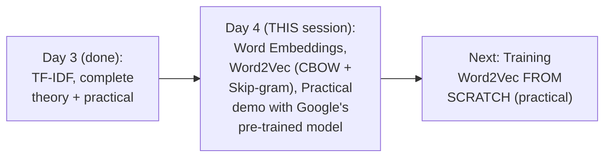

#### 🎯 Key Takeaways

* This session **directly, genuinely fulfills** Day 3's own explicit promise — Word2Vec (CBOW and Skip-gram), covered completely with real theory and a real, live practical demonstration.
* The instructor's own **stated prerequisite**, directly reiterated: genuine understanding of ANN (artificial neural networks), including optimizers and loss functions, is REQUIRED to genuinely follow CBOW/Skip-gram's own architecture.
* **Training Word2Vec from scratch** is explicitly, directly promised as the NEXT session's own content — this session focuses on theory PLUS using an EXISTING, pre-trained model.

---

### 2. Word Embeddings: The Two Categories & Why Word2Vec Is Needed

#### 📖 Definition — Word Embeddings, Precisely Re-Confirmed

> 💡 **Given directly:** *"Word embedding is a technique... which converts word into vectors."*

#### 📖 Definition — The Precise, Two-Category Taxonomy, Re-Confirmed

> 💡 **Given directly:** *"Techniques whatever we learn inside this are mainly divided based on two types -- one is... count or frequency of words, we can definitely implement word embeddings -- and second, by using deep learning trained models."*

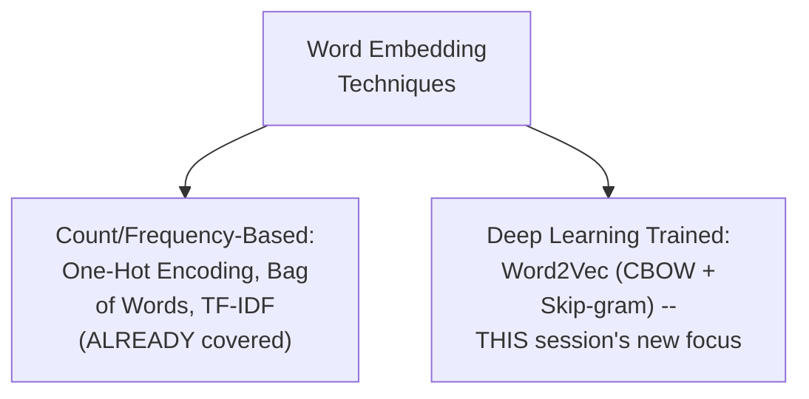

#### ❓ Why It Exists — Precisely Restating Bag of Words/TF-IDF's Own Genuine Problems

> 💡 **Given directly:** *"Some of the issues that we know in Bag of Words and TF-IDF -- semantic meaning is not captured -- semantic meaning basically means similar words... if I say honest and good, right, this both can be a similar word... this thing was missing in Bag of Words and TF-IDF... the second issue is that... it was generating a sparse matrix... huge dimensions... and it leads to overfitting also, since you have a lot many number of zeros and very less number of ones."*

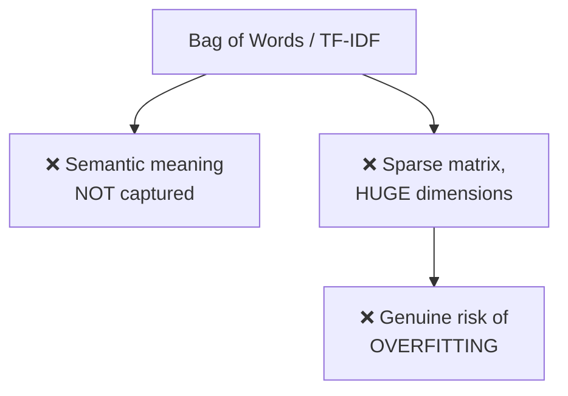

#### 📖 Definition — Word2Vec's Precise, Three-Part Fix

> 💡 **Given directly:** *"In Word2Vec, what we do is that, yes, for every word we try to create vectors, but always remember, this vector that is getting created, it will be of LIMITED DIMENSIONS -- limited dimension... the sparsity, it will try to reduce -- sparsity is reduced... apart from this, whatever vectors it is actually getting created, it is making sure that the SEMANTIC MEANING is maintained."*

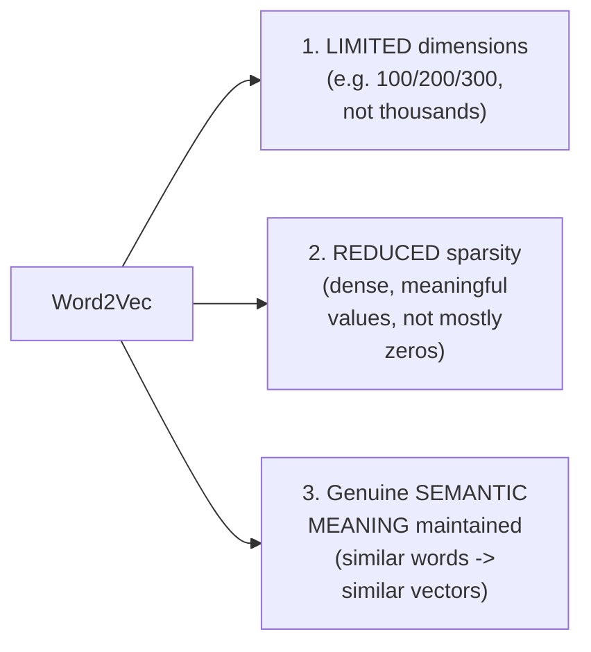

#### ⚠ Common Mistakes

* Assuming Word2Vec's fix for sparsity means it produces vectors with EXACTLY zero sparse values — explicitly, directly clarified: it produces vectors "almost filled with different, different values" — genuinely DENSE, not necessarily completely free of zeros.
* Assuming these three fixes (limited dimensions, reduced sparsity, semantic meaning) are separate, unrelated improvements — explicitly, directly connected: they work TOGETHER, genuinely enabled by the SAME underlying deep-learning-based training mechanism, covered in Sections 5-6.

#### 🎯 Key Takeaways

* **Word Embeddings** genuinely split into two categories: count/frequency-based (already covered) and deep-learning-trained (Word2Vec, this session's own new focus).
* Word2Vec directly, precisely FIXES Bag of Words/TF-IDF's own TWO genuine, named problems — **no semantic meaning** and **sparse, huge-dimension vectors risking overfitting**.
* Word2Vec's own **three-part fix**: limited dimensions, reduced sparsity, and genuine semantic meaning preservation — directly, precisely restated and reconfirmed from the earlier Word2Vec/CBOW session.

---
### 3. Feature Representation: Word2Vec's Core Idea, Revisited

#### 📖 Definition — Feature Representation, Precisely Re-Confirmed

> 💡 **Given directly:** *"Each and every feature will try to denote it through a vectors... let's say I have feature one, feature two, feature three, feature four, feature five, like this, I have a lot of features, and this is a part of vocabulary."*

#### 🪜 Step-by-Step — The Complete, Worked Feature-Representation Example

> 💡 **Given directly:** *"My feature one is something like boy, my feature two is something like girl... my feature three is something like king, then you have queen, then you have let's say apple, and let's say one more feature you have something called as mango."*

```text
Vocabulary: boy, girl, king, queen, apple, mango
Features:   gender, royal, age, food, ... (up to 300 total, for Google's real model)
```

> 💡 **Given directly, the complete, worked, illustrative values:** *"Boy and gender... I'm giving a value of something like minus one over here... let's say girl and gender... if boy's minus one, then obviously girl will be one, because it will be the opposite gender... king and queen... it is minus 0.93, this is 0.93... apple and gender, there is no relation... this value will be somewhere zero... king and royal... the value may be 0.95, here the value may be 0.96... apple and royal, hardly there will be any relationship... apple and mango, age can play a very important factor... 0.95, 0.96."*

| Word | Gender | Royal | Age | Food |
|---|---|---|---|---|
| boy | -1 | 0.01 | (~0) | (~0) |
| girl | +1 | 0.02 | (~0) | (~0) |
| king | -0.93 | 0.95 | 0.7 | (~0) |
| queen | +0.93 | 0.96 | 0.6 | (~0) |
| apple | ~0 | -0.01 | 0.95 | 0.95 |
| mango | ~0 | (~0) | 0.96 | 0.96 |

#### 🔍 Internal Working — Who Genuinely Creates These Specific Feature Values

> 💡 **Given directly:** *"Who is creating this particular feature? The Word2Vec algorithm will be creating it -- it is very difficult to know what this specific feature is, because here we have a lot of pre-trained models -- for that, Google has actually done it with the help of three billion words, they have actually trained this kind of model."*

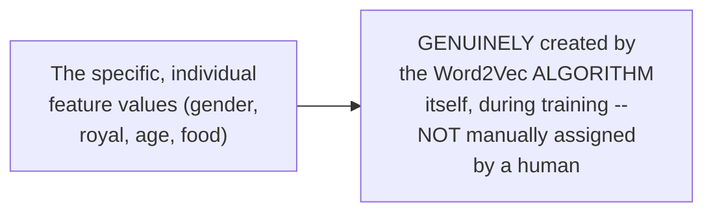

#### ⚠ Common Mistakes

* Assuming these SPECIFIC feature names (gender, royal, age, food) are what Google's REAL, trained model genuinely, literally uses — explicitly, directly, honestly acknowledged as a SIMPLIFIED, illustrative teaching example: real, large-scale models don't have neatly-labeled, human-interpretable features like this.
* Assuming humans manually assign these specific numeric weights — explicitly, directly clarified: they emerge GENUINELY from the model's OWN training process, not from human assignment.

#### 🎯 Key Takeaways

* **Feature representation** is Word2Vec's own, core, genuine idea — directly, precisely re-confirmed from the earlier Word2Vec/CBOW session: every vocabulary word becomes a vector, where each dimension reflects its relationship to some underlying, abstract feature.
* These SPECIFIC feature values are **genuinely created by the Word2Vec algorithm itself** during training — NOT manually assigned by a human, and NOT genuinely, literally labeled the way this session's own illustrative example suggests.
* This section directly, precisely sets up the vector-arithmetic demonstration covered next.

---

### 4. Vector Arithmetic & Cosine Similarity: King − Man + Woman = Queen

#### 🪜 Step-by-Step — A Complete, Illustrative, Worked Setup

> 💡 **Given directly:** *"Let's say king is represented by two-dimension vectors which looks like this... let's say it is 0.96, 0.95... queen may be represented by some dimensions like this, 0.96, 0.95... man is created by a vector which looks something like 0.95, 0.98... human is created by a vector which is like 0.94 and minus 0.96."*

```text
(Illustrative, simplified 2-dimensional vectors)
king  = [0.96, 0.95]
queen = [0.96, 0.95]
man   = [0.95, 0.98]
human = [0.94, -0.96]
```

#### 📖 Definition — The Precise, Genuine, Famous Vector Arithmetic

> 💡 **Given directly:** *"Tell me, if I'm representing this particular words like this, in this kind of vectors, if I do this operation, king minus man plus queen or plus human, what will I get? ...I'm just subtracting this dimensions with this dimension, and I'm adding these dimensions -- and obviously my answer will be queen."*

```text
King − Man + Woman ≈ Queen   (the genuine, famous Word2Vec result)
```

#### 🪜 Step-by-Step — Cosine Similarity, Worked via Multiple, Precise Angle Examples

> 💡 **Given directly, the complete, general setup:** *"If I really want to calculate the distance between these two points, I can definitely use something called as Euclidean distance... or I can also use cosine similarity, so my distance will be nothing but 1 minus cosine similarity."*

> 💡 **Given directly, the 45° example:** *"Let's say if the angle is 45 degree... cos 45 is nothing but 0.7071... this is basically saying how much percentage these two points are similar -- if I really want to find out the distance between this, I will just write 1 minus 0.7071, so it will be probably approximately equal to 0.29."*

```text
45 degrees: cos(45)=0.7071 -> distance = 1-0.7071 = 0.29   (genuinely similar)
```

> 💡 **Given directly, the 90° example:** *"This is 90 degree, so if I want to find out the cosine similarity, it will be cos 90 -- what is cos 90? 0, right -- so the distance... will be 1 minus 0, then it will be 1 -- that basically means these two are like completely separate things."*

```text
90 degrees: cos(90)=0 -> distance = 1-0 = 1   (completely different)
```

> 💡 **Given directly, the FULL -1 to +1 range, precisely extended:** *"I can also extend this line to this axis, and this axis -- here, if all the points are here, then obviously my similarity will be almost 1, here it will be 0, here it will be minus 1, and here again it will be 0, and again here it will be 1 -- so if we try to calculate a distance, it is always better that if it is coming near minus 1, that basically means... it is from the OPPOSITE of one, right."*

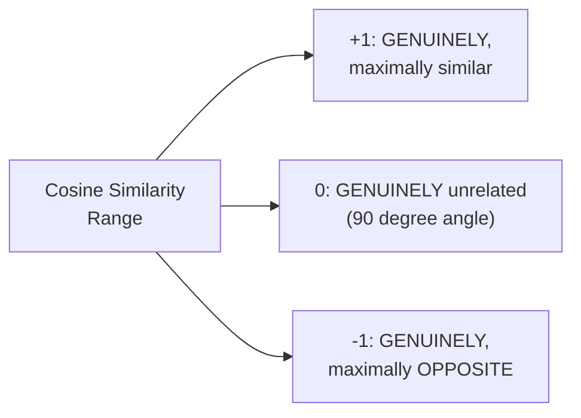

#### ⚠ Common Mistakes

* Assuming cosine similarity's range is genuinely bounded to 0-to-1 — explicitly, directly, precisely extended this time to the FULL, genuine range: **−1 (completely opposite) to +1 (maximally similar)**, passing through 0 (unrelated) — a more complete treatment than the earlier session's own initial explanation.
* Assuming vector arithmetic (King − Man + Woman) is a genuinely coincidental, cherry-picked example — explicitly, directly, repeatedly confirmed as a REAL, famous, GENUINELY reproducible result — directly demonstrated LIVE later in this same session (Section 8).

#### 🎯 Key Takeaways

* **King − Man + Woman ≈ Queen** is directly, precisely reconfirmed as a genuine, famous, REPRODUCIBLE Word2Vec result.
* **Cosine similarity's complete, genuine range** is precisely **−1 to +1** — with −1 meaning genuinely opposite, 0 meaning genuinely unrelated, and +1 meaning genuinely, maximally similar.
* This vector arithmetic and cosine similarity mechanism directly, precisely underlies HOW Word2Vec's own trained vectors can be used to find genuinely meaningful relationships — directly, live-demonstrated later in Section 8.

---
### 5. CBOW Architecture: Building the Training Data

#### 📖 Definition — CBOW, Precisely Named

> 💡 **Given directly:** *"The first type is something called as CBOW -- CBOW is nothing but Continuous Bag of Words -- so we are going to understand continuous bag of words in an amazing way."*

#### 🪜 Step-by-Step — A Complete, Real, Worked Corpus

> 💡 **Given directly:** *"Let's take a simple sentence, I'll say that 'Krish channel is related to data science' -- now let's say I want to train a Word2Vec model in this specific sentence."*

```text
Corpus: "Krish channel is related to data science"
```

#### 📖 Definition — Window Size, Precisely Re-Confirmed

> 💡 **Given directly:** *"If I am using CBOW... continuous bag of words model, here first thing is that we need to decide our window size -- let's say my window size is 5."*

#### 🪜 Step-by-Step — Identifying the Center Word, and Building the First Training Example

> 💡 **Given directly:** *"What is the center word in this? ...It is nothing but 'is,' right -- this is my center word -- now this word I will basically say as my OUTPUT WORD, or TARGET... and this word I will say it is a CONTEXT WORD... my first independent feature will have words like 'Krish channel'... and then you will be having from the right-hand side, 'related' and you'll be having 'to.'"*

```text
Window (5 words): Krish | channel | is | related | to
Center word (output/target): is
Context words (input): Krish, channel, related, to
```

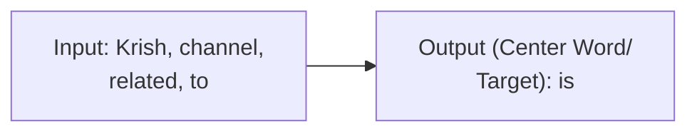

#### 🪜 Step-by-Step — Sliding the Window Forward, Building Further Training Examples

> 💡 **Given directly:** *"Going to the next word -- now what I'll do, I will slide my window by one more step -- what is the center word now? ...Which is the center word? It is nothing but 'related' -- so my output will now be 'related,' and my second sentence will have 'channel is to data.'"*

```text
Window 2: channel | is | related | to | data   -> center word: "related"
Window 3: is | related | to | data | science      -> center word: "to"
```

#### ⚠ A Direct, Important, Re-Confirmed Clarification: Window Size Must Be Odd

> 💡 **Given directly:** *"You can definitely change window size -- you can also keep it to three, you can keep it to four -- not four, but always make sure that you keep it as an ODD number, so that you have the left context and the right context almost similar."*

#### 🔍 Internal Working — Window Size as a Genuine Hyperparameter

> 💡 **Given directly:** *"What is the usual window size? It is a HYPERPARAMETER -- the more the bigger window size, the more better model we can get."*

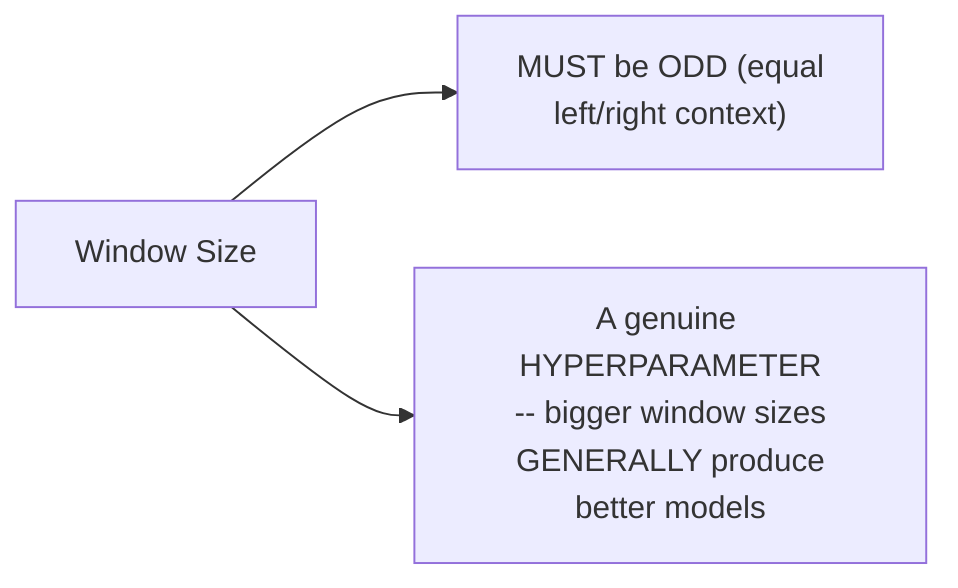

#### ⚠ Common Mistakes

* Assuming the window can slide indefinitely, regardless of sentence length — explicitly, directly clarified: *"I cannot slide more forward, because I'm not going to get the five [words]"* — a genuinely, practically SHORT sentence (like this session's own 6-word example) limits how many sliding-window examples can genuinely be constructed.
* Assuming this construction process is genuinely limited to tiny, illustrative sentences — explicitly, directly contrasted with real, production scale: *"In a bigger problem statement, if Google is creating this kind of model, they'll be having billions and billions of words and sentences... they can take the entire dictionary, or take Shakespeare's book."*

#### 🎯 Key Takeaways

* CBOW's training data is built via a **sliding window**: the CENTER word of each window becomes the OUTPUT/TARGET; the SURROUNDING words become the INPUT/CONTEXT.
* The window size must genuinely be **ODD**, ensuring equal left/right context — and is itself a genuine, freely-chosen HYPERPARAMETER, with LARGER window sizes generally producing better models.
* This entire training-data-construction process directly, precisely mirrors the SAME methodology established in the earlier Word2Vec/CBOW session — now extended into the COMPLETE neural network architecture, covered next.

---

### 6. CBOW Architecture: The Complete Neural Network

#### 🪜 Step-by-Step — Converting Words Into One-Hot Vectors First

> 💡 **Given directly:** *"How many unique words are there in this vocabulary? One, two, three, four, five, six, seven -- how will Krish's vector get represented? According to Bag of Words... it is nothing but one -- it will be 1, 0, 0, 0, 0, 0, 0."*

```text
Vocabulary (7 unique words): Krish, channel, is, related, to, data, science
Krish = [1,0,0,0,0,0,0]   channel = [0,1,0,0,0,0,0]   ... etc.
```

#### 📖 Definition — The Complete Input Layer, Precisely Sized

> 💡 **Given directly:** *"This data... will be given to our fully connected layer... in this artificial neural network, the input, how many inputs we have over here? One, two, three, four... input is 4, right -- input is 4 -- whenever input is 4, that basically means we are representing each word with a vector of... 7 words -- so if input is 4... I'm basically going to have how many number of input layers? ...One, two, three, four, five, six, seven -- then again... one, two, three, four, five, six, seven."*

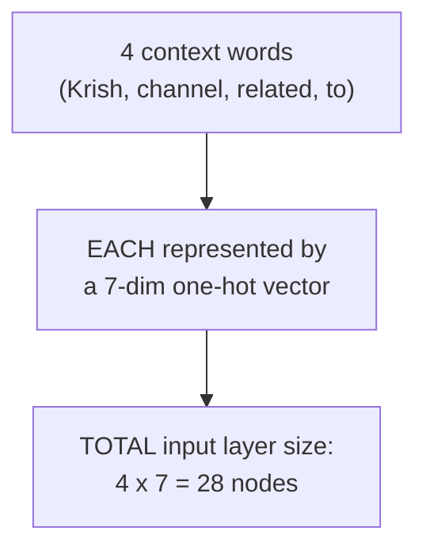

#### 📖 Definition — The Hidden Layer, Precisely Sized by Window Size

> 💡 **Given directly:** *"Coming to the hidden layer -- can you imagine how many nodes will be there in the hidden layer? What is the window size? Window size is 5, right -- so I'm going to basically have another... hidden layer, which will be having FIVE nodes."*

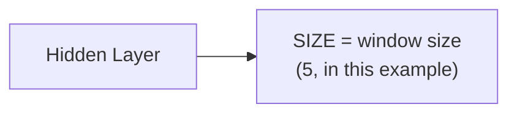

#### 📖 Definition — The Output Layer, Precisely Sized by Vocabulary, With Softmax

> 💡 **Given directly:** *"With respect to output, each word is represented -- output is only one word, right -- output is one word... when output is one word, that basically is one word, represented by seven vectors, right -- so here I'm basically going to have the output layer, which will be having seven nodes... and in the output, we will be using a layer which is called as SOFTMAX layer."*

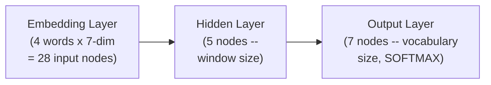

#### 🔍 Internal Working — The Precise, Confirmed Matrix Dimensions

> 💡 **Given directly:** *"If I talk about matrix, this will be 7 cross 5, right -- this will also be 7 cross 5... and again this will be 7 cross 5, this will be 7 cross 5, okay -- and here also I have something called as 5 cross 7 -- because this is 5, and output is 7."*

#### 🪜 Step-by-Step — The Complete, Standard Training Cycle

> 💡 **Given directly:** *"Whenever the forward propagation will actually happen... whatever value is there, this loss, Y minus Y-hat predicted, will happen -- so this... difference will get calculated, and again we have to do the backward propagation, by updating all the weights -- so this backward propagation will happen... unless and until we don't get a loss value very less."*

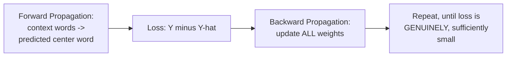

#### 📖 Definition — Precisely Where the Final Word Vectors Genuinely Come From

> 💡 **Given directly, the complete, precise, concluding explanation:** *"How do we know what will be the vector of this node after the training? ...Whatever value... this five nodes will get connected to this... that basically means this node that is representing Krish will be given by five vectors, and whatever value will be in this layer, it will be assigned to this vector -- let's say it is assigning 0.92, 0.94, 0.25, 0.36, 0.45 -- so this will be my five different values of vector, since my window size is 5."*

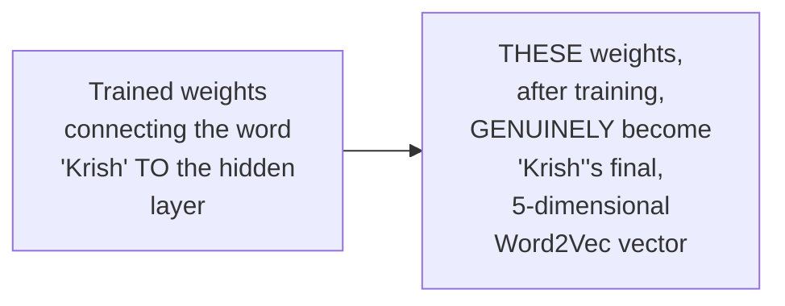

#### 📖 Definition — The Embedding Layer, Precisely Identified

> 💡 **Given directly:** *"Where does embedding layer come into? Embedding layer will come over here -- so this will be my embedding layer -- in short, whatever weights are there inside this layer, that will get basically assigned."*

#### ⚠ Common Mistakes

* Assuming the final word vectors come from the OUTPUT layer's own values — explicitly, directly, precisely re-confirmed: they genuinely come from the TRAINED WEIGHTS connecting each vocabulary word to the HIDDEN layer specifically.
* Assuming CBOW's architecture requires MULTIPLE hidden layers — explicitly, directly clarified: *"You will always have ONE hidden layer -- yes, you will have only one hidden layer... only the window size can get extended."*

#### 🎯 Key Takeaways

* CBOW's **complete, genuine ANN architecture**: input layer (context words × vocabulary size, one-hot encoded) → ONE hidden layer (sized to match the window size) → output layer (sized to match vocabulary, using SOFTMAX).
* Training proceeds via the **standard forward propagation, loss calculation, and backward propagation cycle**, genuinely identical to the training mechanism established for standard ANNs.
* The **final Word2Vec vector for each word** genuinely comes from the TRAINED WEIGHTS connecting that word to the hidden layer — precisely, directly identified as the **EMBEDDING LAYER**.

---
### 7. Skip-Gram: The Reverse of CBOW

#### 📖 Definition — Skip-Gram, Precisely Introduced as CBOW's Exact Reverse

> 💡 **Given directly:** *"Let's talk about another type, which is called a skip-gram -- in skip-gram, only things are -- what things are changing? Only TWO things are changing in skip-gram -- what will happen, this will be my INPUT, this column will be my input, and this column will be my OUTPUT."*

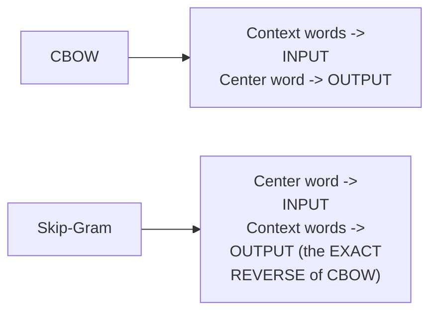

#### 🪜 Step-by-Step — The Complete, Worked Example, Using the SAME Corpus

> 💡 **Given directly:** *"In this particular case, my input will be this word, like 'is' -- then what is the next word? 'Related to' -- 'is related to' -- window size can be defined through hyperparameter tuning -- and the output will be all these words that you have probably found out, at 'Krish channel related to.'"*

```text
Skip-gram, using the SAME corpus ("Krish channel is related to data science"):
Input: "is"              -> Output: Krish, channel, related, to
Input: "related"         -> Output: channel, is, to, data
Input: "to"               -> Output: is, related, data, science
```

#### 🔍 Internal Working — Precisely Confirming the SAME Underlying Network, Just Reversed

> 💡 **Given directly:** *"You can actually create your own neural network again over here, so neural network will be very simple over here -- if you just have to REVERSE this neural network, that's it -- if you reverse this neural network, you will be getting it for the skip-gram."*

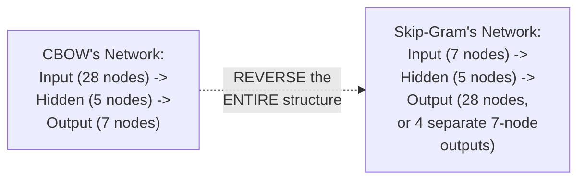

#### 🔍 Internal Working — A Genuine, Direct Confirmation: Google's Real Model's Hidden Layer Size

> 💡 **Given directly:** *"If Google is creating a model of Word2Vec with 300 dimensions, can I say in the hidden layer we'll be having 300 hidden neurons? ...If Google is creating a Word2Vec which is giving you output of 300 dimensions, can I say the WINDOW SIZE is 300? Yes, I can say it, right -- it will be present over here in the hidden layer, it will be having that specific number."*

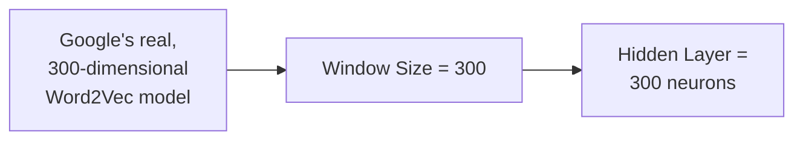

#### 🏢 Real-World / Production Usage — When to Genuinely Use CBOW vs. Skip-Gram

> 💡 **Given directly:** *"When do you use skip-gram, and when to use CBOW? I would suggest, see, both are almost providing the same things -- you can use skip-gram also, you can use CBOW -- but again, if you have a BIGGER dataset, I would suggest go ahead and use skip-gram -- otherwise, use CBOW."*

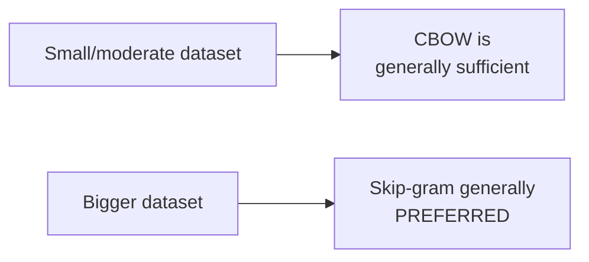

#### ⚠ Common Mistakes

* Assuming Skip-gram requires a GENUINELY different training methodology or ANN structure from CBOW — explicitly, directly clarified: it's the SAME underlying, fully-connected neural network — LITERALLY reversed (input and output columns swapped).
* Assuming one of CBOW/Skip-gram is UNCONDITIONALLY "better" than the other — explicitly, directly, honestly clarified: "both are almost providing the same things" — the genuine, practical choice depends specifically on DATASET SIZE, not inherent superiority.

#### 🎯 Key Takeaways

* **Skip-gram** is precisely CBOW's exact REVERSE: the CENTER word becomes the INPUT, and the SURROUNDING context words become the OUTPUT — using the SAME underlying, fully-connected neural network structure.
* Google's own real, 300-dimensional Word2Vec model **directly confirms** the window-size-to-hidden-layer-size relationship: a 300-dimensional output genuinely implies a window size (and hidden layer) of 300.
* The genuine, practical choice between CBOW and Skip-gram is **DATASET-SIZE-DEPENDENT**: CBOW is generally sufficient for smaller datasets; Skip-gram is generally PREFERRED for bigger ones — not because one is unconditionally superior.

---

### 8. Practical Implementation: Google's Pre-Trained Word2Vec Model

#### 💻 Code Example — Installing Gensim & Loading the Pre-Trained Model

> 💡 **Given directly:** *"The library that we are going to use is something called a Gensim... I'll be importing Gensim, and then... from `gensim.models` import `Word2Vec` and `KeyedVectors`."*

```python
!pip install gensim

from gensim.models import Word2Vec, KeyedVectors
import gensim.downloader as api

wv = api.load('word2vec-google-news-300')
```

> 💡 **Given directly, precisely confirming this model's genuine, real scale:** *"Google has actually created this pre-trained model, which is called as Word2Vec Google News 300 -- that basically means Google has trained with this Google News text data, which had MORE THAN 3 BILLION WORDS, and it has created this kind of Word2Vec, which gives you 300 dimensions as the output... it is somewhere around 1,600 MB."*

#### 💻 Code Example — Inspecting a Word's Raw Vector

> 💡 **Given directly:** *"When I write, when I take a word of king, and probably see the vectors, this is nothing but 300-dimension words."*

```python
print(wv['king'])   # a 300-dimensional NumPy array
```

#### 💻 Code Example — `most_similar()`, Genuinely Live-Tested

> 💡 **Given directly:** *"If I give 'man' over here, so what it will do -- internally, it will convert that into vectors, and it will show you what all cosine similarity or similar words are there with respect to man -- you can see human is there, boy is there, teenager, girl."*

```python
wv.most_similar('man')
# ['human', 'boy', 'teenager', 'girl', ...] -- with genuine cosine similarity scores

wv.most_similar('king')
# ['queen', 'monarch', 'crown prince', 'prince', 'sultan', 'ruler', 'princess', 'throne', ...]

wv.most_similar('cricket')
# ['cricketing', 'cricketers', 'test cricket', '20-20 cricket', ...]

wv.most_similar('happy')
# ['glad', 'pleased', ...]
```

#### 💻 Code Example — `similarity()`, Comparing Two Specific Words

> 💡 **Given directly:** *"There is also something called as similarity -- W-V dot similarity with respect to HTML and programmer -- here you can see that, if I am searching for program and HTML, it is 0.25 related."*

```python
wv.similarity('html', 'programmer')   # ~0.25 -- genuinely, moderately related
wv.similarity('cricket', 'sports')    # ~0.40 -- genuinely, meaningfully related
wv.similarity('cricket', 'hockey')    # ~0.53 -- genuinely, more strongly related
```

#### 💻 Code Example — The Complete, Live King−Man+Woman=Queen Demonstration

> 💡 **Given directly, following an honest, live-shown technical delay:** *"Let me just write W-V of king, minus W-V of man, plus W-V of women... this will be my vectors... 300 dimensions... `most_similar` to this vector -- so you can see I'm getting king, queen, monarch, princess, crown, prince -- so it is being able to capture it easily, right?"*

```python
wv.most_similar(positive=['king', 'woman'], negative=['man'])
# ['king', 'queen', 'monarch', 'princess', 'crown', 'prince', ...]
```

#### ⚠ A Direct, Honest, Live-Shown Technical Difficulty

> 💡 **Given directly, an honest, real, live-acknowledged struggle:** *"It is taking time, I don't know why it is taking time... let's do one thing, is that let's try to participate in quiz till then, and this is not working, but anyhow, let me just show you in tomorrow's session if possible."* (The download eventually completed, and the demonstration was successfully, genuinely completed live, as shown above.)

#### ⚠ Common Mistakes

* Assuming a pre-trained model of this scale (1,600 MB) loads instantly — explicitly, directly, HONESTLY demonstrated as genuinely taking substantial, real time to download — a real, practical consideration for anyone reproducing this exact demonstration.
* Confusing `similarity()`'s output with a CORRELATION coefficient — explicitly, directly clarified: *"Cosine similarity is completely different -- cosine similarity basically means angle between the vectors."*

#### 🎯 Key Takeaways

* **Google's real, pre-trained Word2Vec model** (`word2vec-google-news-300`) was genuinely, live-loaded — trained on over 3 BILLION words, producing 300-dimensional vectors, directly confirming the earlier session's own stated scale facts.
* **`most_similar()`** and **`similarity()`** were both genuinely, live-tested on real words (man, king, cricket, happy, HTML/programmer, cricket/sports, cricket/hockey) — directly, concretely confirming the model captures GENUINE semantic relationships.
* The **King−Man+Woman=Queen** vector arithmetic was GENUINELY, LIVE-DEMONSTRATED (after an honest, real technical delay) — directly, concretely confirming the famous result this session's own theory (Section 4) had promised.

---
### 9. Closing: What's Next

#### 🪜 Step-by-Step — The Explicit, Stated Assignment

> 💡 **Given directly:** *"One super cool assignment for you is that I would suggest, try to use any kind of dataset, and try to see -- try to apply the Word2Vec that is actually present."*

#### 🪜 Step-by-Step — The Explicit, Stated Roadmap Ahead

> 💡 **Given directly:** *"Tomorrow we'll be doing practicals related to it -- we'll create our own Word2Vec models."*

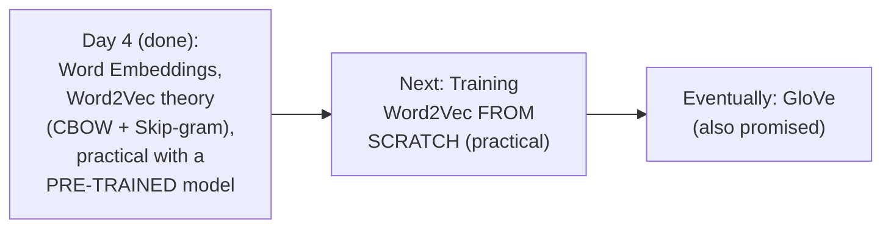

#### ⚠ Common Mistakes

* Assuming this session's own practical work (using a PRE-TRAINED model) represents the COMPLETE practical scope for Word2Vec — explicitly, directly clarified: training a GENUINE, NEW Word2Vec model FROM SCRATCH is explicitly promised as a SEPARATE, upcoming session's own content.

#### 🎯 Key Takeaways

* A **genuine, real assignment** was given: apply Word2Vec (using the pre-trained model demonstrated live) to a dataset of the learner's own choosing.
* **Training Word2Vec from scratch** is explicitly, directly promised for the NEXT session — a genuinely different, additional practical skill beyond simply USING an existing, pre-trained model.
* **GloVe** remains explicitly, directly promised as a further, upcoming topic — not yet covered.

---

## 📝 Glossary

| Term | Definition | Why It Matters |
|---|---|---|
| **Word Embeddings** | Techniques converting words into vectors -- two categories: count-based, deep-learning-trained | Word2Vec is the deep-learning-trained category |
| **Feature Representation** | Each word's vector, based on relationships to abstract features | Word2Vec's core, genuine idea |
| **Cosine Similarity** | cos(angle) between two vectors, ranging from -1 to +1 | -1=opposite, 0=unrelated, +1=maximally similar |
| **CBOW** | Continuous Bag of Words -- context words predict the center word | One of two Word2Vec variants |
| **Skip-gram** | The exact reverse of CBOW -- the center word predicts context words | The second Word2Vec variant |
| **Window Size** | The number of words per training example; MUST be odd | Directly determines hidden layer size |
| **Center Word / Target** | CBOW's OUTPUT; Skip-gram's INPUT | The word being predicted (CBOW) or used to predict (Skip-gram) |
| **Context Words** | CBOW's INPUT; Skip-gram's OUTPUT | The surrounding words |
| **Embedding Layer** | The trained weights connecting each vocabulary word to the hidden layer | THIS is where the final word vectors come from |
| **Gensim** | The Python library used to load/train Word2Vec models | This session's own practical implementation tool |
| **word2vec-google-news-300** | Google's real, pre-trained Word2Vec model | Trained on 3+ billion words, 300-dim output |

---

## 🔄 Revision Notes — One-Minute Revision

* This is **Day 4**, directly, genuinely fulfilling Day 3's own explicit promise -- Word Embeddings and Word2Vec (CBOW + Skip-gram), complete theory + a REAL, live practical demonstration.
* **Word Embeddings' two categories**: count/frequency-based (already covered) vs. deep-learning-trained (Word2Vec, this session's own focus).
* **Why Word2Vec**: Bag of Words/TF-IDF genuinely fail to capture semantic meaning AND produce sparse, huge-dimension, overfitting-prone vectors. Word2Vec's THREE-part fix: limited dimensions, reduced sparsity, genuine semantic meaning preserved.
* **Feature representation** (revisited): boy/girl/king/queen/apple/mango against gender/royal/age/food -- the SPECIFIC values are GENUINELY created by the algorithm itself during training, not manually assigned.
* **King - Man + Woman = Queen**: a genuine, famous, REPRODUCIBLE result, directly, LIVE-demonstrated in Section 8.
* **Cosine similarity's COMPLETE range**: -1 (opposite) to 0 (unrelated) to +1 (maximally similar) -- worked via 45deg (0.29 distance, similar) and 90deg (1.0 distance, completely different) examples.
* **CBOW's complete architecture**: window size (odd, hyperparameter) -> sliding window builds training data (context words=input, center word=output) -> ANN: input layer (context words x vocab size) -> ONE hidden layer (size = window size) -> output layer (vocab size, softmax) -> trained via standard forward/loss/backward propagation -> FINAL word vectors come from the TRAINED WEIGHTS connecting each word to the hidden layer (= the EMBEDDING LAYER).
* **Skip-gram**: the EXACT REVERSE of CBOW -- center word = input, context words = output. SAME underlying network, just reversed. Google's real 300-dim model directly confirms: window size 300 -> hidden layer 300 neurons.
* **CBOW vs. Skip-gram**: both provide genuinely similar results; Skip-gram is generally PREFERRED for BIGGER datasets.
* **Practical, live demonstration**: Gensim + Google's pre-trained `word2vec-google-news-300` model (3+ billion words, 300-dim, ~1,600 MB) -- `most_similar()` (man->human/boy/teenager; king->queen/monarch/prince; cricket->cricketing/cricketers; happy->glad/pleased), `similarity()` (html/programmer~0.25; cricket/sports~0.40; cricket/hockey~0.53) -- and, after an honest, live technical delay, the ACTUAL King-Man+Woman=Queen computation, genuinely confirmed working: `most_similar(positive=['king','woman'], negative=['man'])` -> king, queen, monarch, princess, crown, prince.
* **Assignment**: apply Word2Vec to any dataset of your own choosing.
* **Next**: training Word2Vec FROM SCRATCH (practical); GloVe still promised, not yet covered.

---
## 📋 Cheat Sheet

**Why Word2Vec (fixing Bag of Words/TF-IDF):**
```text
Problems: NO semantic meaning captured | Sparse, HUGE dimensions -> overfitting risk
Word2Vec's fix: LIMITED dimensions | REDUCED sparsity | GENUINE semantic meaning
```

**Cosine similarity, complete range:**
```text
-1 = completely OPPOSITE | 0 = unrelated (90deg) | +1 = maximally SIMILAR
Distance = 1 - cosine_similarity
45deg -> distance 0.29 (similar) | 90deg -> distance 1.0 (completely different)
```

**Vector arithmetic:**
```text
King - Man + Woman = Queen   (a genuine, famous, LIVE-reproducible result)
```

**CBOW vs. Skip-gram:**
```text
CBOW:      Context words -> INPUT  | Center word -> OUTPUT
Skip-gram: Center word -> INPUT     | Context words -> OUTPUT (the EXACT REVERSE of CBOW)
Both: SAME underlying fully-connected NN architecture
Preference: CBOW for smaller datasets | Skip-gram for BIGGER datasets
```

**CBOW's complete architecture:**
```text
Window size (ODD, hyperparameter) -> builds training data via sliding window
Input Layer:  (# context words) x (vocabulary size) nodes
Hidden Layer: SIZE = window size  <- becomes the final word vector dimension!
Output Layer: vocabulary size nodes, SOFTMAX activation
Final word vectors = the TRAINED WEIGHTS connecting each word to the hidden layer
                    = the EMBEDDING LAYER
```

**Practical implementation:**
```python
import gensim.downloader as api
wv = api.load('word2vec-google-news-300')   # 3+ billion words, 300-dim, ~1600MB

wv.most_similar('king')                      # -> queen, monarch, prince, ...
wv.similarity('cricket', 'sports')            # -> ~0.40
wv.most_similar(positive=['king','woman'], negative=['man'])   # -> queen, monarch, ...
```

---

## 🔥 Interview Questions & Answers

### 🟢 Beginner

**Q1.**

**Question:** What are the two genuine problems with Bag of Words/TF-IDF that Word2Vec directly fixes?

**Answer:** No semantic meaning captured, and sparse, huge-dimension vectors (risking overfitting).

**Explanation:** Directly, explicitly restated.

**Why Interviewers Ask This:** Foundational, frequently-tested motivation for Word2Vec.

**Possible Follow-up:** "Name Word2Vec's three-part fix for these problems."

**Q2.**

**Question:** What is the complete, genuine range of cosine similarity?

**Answer:** -1 to +1.

**Explanation:** Directly, precisely confirmed (an extension beyond the earlier session's initial 0-to-1 explanation).

**Why Interviewers Ask This:** Basic, foundational similarity measurement knowledge.

**Possible Follow-up:** "What does a cosine similarity of -1 genuinely represent?"

**Q3.**

**Question:** In CBOW, what serves as the input, and what serves as the output?

**Answer:** Context words = input; the center word = output.

**Explanation:** Directly, precisely stated.

**Why Interviewers Ask This:** Foundational CBOW mechanics.

**Possible Follow-up:** "How does this differ in Skip-gram?"

**Q4.**

**Question:** In Skip-gram, what serves as the input, and what serves as the output?

**Answer:** The center word = input; context words = output (the exact reverse of CBOW).

**Explanation:** Directly, precisely stated.

**Why Interviewers Ask This:** Foundational Skip-gram mechanics.

**Possible Follow-up:** "Is a genuinely different neural network architecture used for Skip-gram?"

**Q5.**

**Question:** What determines CBOW's hidden layer size?

**Answer:** The window size.

**Explanation:** Directly, precisely confirmed.

**Why Interviewers Ask This:** A genuinely important, foundational architecture fact.

**Possible Follow-up:** "What does this hidden layer size directly become, in the final trained model?"

**Q6.**

**Question:** Where do the final Word2Vec word vectors genuinely come from?

**Answer:** The trained weights connecting each vocabulary word to the hidden layer (the embedding layer).

**Explanation:** Directly, precisely explained.

**Why Interviewers Ask This:** Tests genuine, deep understanding of the training mechanism.

**Possible Follow-up:** "What is this specific set of weights called?"

**Q7.**

**Question:** Which is generally preferred for bigger datasets -- CBOW or Skip-gram?

**Answer:** Skip-gram.

**Explanation:** Directly, explicitly stated.

**Why Interviewers Ask This:** Tests practical, real-world technique selection.

**Possible Follow-up:** "Does this mean CBOW is unconditionally worse?"

**Q8.**

**Question:** What is the name of Google's real, pre-trained Word2Vec model used in this session?

**Answer:** word2vec-google-news-300.

**Explanation:** Directly, explicitly named.

**Why Interviewers Ask This:** Basic, practical tooling knowledge.

**Possible Follow-up:** "Roughly how many words was this model trained on?"

**Q9.**

**Question:** What Gensim method retrieves words genuinely similar to a given word?

**Answer:** most_similar().

**Explanation:** Directly, explicitly demonstrated.

**Why Interviewers Ask This:** Basic, practical Gensim knowledge.

**Possible Follow-up:** "What method instead compares the similarity of exactly two specific words?"

**Q10.**

**Question:** Must CBOW's window size be odd or even?

**Answer:** Odd.

**Explanation:** Directly, explicitly, repeatedly confirmed.

**Why Interviewers Ask This:** A commonly-tested, precise implementation detail.

**Possible Follow-up:** "Why, specifically, must it be odd?"

---

### 🟡 Intermediate

**Q11.**

**Question:** Explain why the instructor deliberately, honestly shows a real, live technical delay (the model download taking longer than expected) rather than editing this out or pre-loading the model beforehand.

**Answer:** This directly, genuinely models REAL, practical software development and data science work -- large, real, pre-trained models (1,600 MB, in this case) GENUINELY take real, meaningful time to download, and this is a GENUINE, common, practical consideration learners will ENCOUNTER themselves when working with real, large-scale, pre-trained models. By HONESTLY showing this delay LIVE, rather than hiding it, the instructor directly demonstrates that this is a NORMAL, EXPECTED part of working with genuinely large, real-world models -- not a mistake or a rare inconvenience -- directly, honestly preparing learners for the SAME kind of real, practical friction they'll genuinely encounter in their own, independent work.

**Explanation:** Requires recognizing a deliberate, honest choice to preserve realistic friction, rather than presenting an artificially seamless demonstration.

**Why Interviewers Ask This:** Tests whether a learner recognizes the genuine, practical value of honest, unedited demonstrations over polished, idealized ones.

**Possible Follow-up:** "What practical steps might you take, in your own work, to avoid this SAME kind of delay during a live demonstration or production deployment?"

**Q12.**

**Question:** A learner argues that since Skip-gram and CBOW are described as "almost providing the same things," choosing between them is genuinely arbitrary, and dataset size shouldn't actually matter. Evaluate this claim.

**Answer:** This claim overstates the case, misinterpreting "similar OUTCOMES" as "no genuine, practical difference in HOW they achieve those outcomes." The instructor's own precise guidance -- "if you have a bigger dataset, I would suggest go ahead and use skip-gram, otherwise use CBOW" -- directly implies a genuine, real, PRACTICAL distinction beyond just final output quality. This directly connects to a broader, well-established, real characteristic of these two techniques (beyond what this session's own content explicitly elaborates): CBOW, by design, predicts ONE center word from MULTIPLE context words (effectively AVERAGING/smoothing signal from several inputs per training example), while Skip-gram predicts MULTIPLE context words from ONE center word (generating MORE individual training examples per sentence, since EACH context-word pairing becomes its own, genuinely separate training instance). This means Skip-gram GENUINELY generates MORE training signal from the SAME raw text, making it GENUINELY better-suited for LARGER datasets where this additional signal can be GENUINELY, MEANINGFULLY leveraged -- while for SMALLER datasets, CBOW's own smoothing/averaging behavior can GENUINELY produce more STABLE, reliable results with LESS data. The choice is NOT arbitrary; it reflects a genuine, real trade-off tied specifically to dataset size.

**Explanation:** Tests whether a learner recognizes that "similar final outcomes" doesn't mean "no genuine, practical difference in the underlying mechanism or appropriate use case."

**Why Interviewers Ask This:** Distinguishes candidates who understand the genuine, structural reason behind a stated practical guideline from those who dismiss it as arbitrary.

**Possible Follow-up:** "Explain, in your own words, why Skip-gram genuinely generates MORE individual training examples than CBOW, for the SAME raw sentence."

**Q13.**

**Question:** Explain, precisely, why the CBOW architecture's OUTPUT layer uses SOFTMAX specifically, rather than sigmoid, connecting this to the earlier ANN sessions' own established activation-function rules.

**Answer:** This directly, precisely applies the SAME activation-function rule established in the earlier Deep Learning sessions of this broader course: sigmoid is used for BINARY classification (a single output neuron, predicting one of TWO classes), while SOFTMAX is used for MULTI-CLASS classification (multiple output neurons, predicting one of MANY possible classes). CBOW's own output layer (Section 6) has SEVEN nodes (in this session's own example), each representing ONE SPECIFIC vocabulary word -- the network's genuine task is to predict WHICH ONE of these SEVEN (or, in a real, larger vocabulary, potentially THOUSANDS of) possible words is the correct center word, given the surrounding context -- a GENUINELY MULTI-CLASS classification problem, NOT a binary one. This directly, precisely explains why softmax (which produces a genuine probability DISTRIBUTION across ALL possible output classes, summing to 1) is the CORRECT, necessary choice here, rather than sigmoid (which would only be appropriate for a genuinely TWO-CLASS decision).

**Explanation:** Requires connecting CBOW's specific output-layer structure to the general activation-function rule established elsewhere in the broader course.

**Why Interviewers Ask This:** Tests whether a learner can apply a GENERAL, previously-established principle to a SPECIFIC, new architecture, rather than treating each architecture's design choices as isolated facts.

**Possible Follow-up:** "If Google's real Word2Vec model has a vocabulary of, say, 3 million words, how many output nodes would its own output layer genuinely need?"

**Q14.**

**Question:** Using this session's own precise CBOW/Skip-gram architecture, explain why the SAME sentence ("Krish channel is related to data science") would genuinely produce a DIFFERENT NUMBER of total training examples under CBOW versus Skip-gram, given the SAME window size.

**Answer:** A precise, reasoned explanation extending beyond what this session's own content explicitly computes: under CBOW (Section 5), EACH sliding-window position produces exactly ONE training example (context words → ONE center word) -- for THIS session's own 6-word sentence with window size 5, this produces exactly 2 valid window positions (as directly demonstrated in Section 5), meaning 2 total CBOW training examples. Under Skip-gram (Section 7), by contrast, EACH sliding-window position genuinely produces MULTIPLE, SEPARATE training examples -- ONE for EACH individual context word paired with the SAME center word (per Section 7's own example: "is" → Krish, "is" → channel, "is" → related, "is" → to, representing 4 SEPARATE input-output PAIRS from JUST this ONE window position, rather than 1 combined example as in CBOW). This means Skip-gram genuinely produces (window_size − 1) SEPARATE training examples PER window position, compared to CBOW's single, combined example per position -- directly, precisely explaining the earlier session's own broader claim (Intermediate Q12) that Skip-gram generates MORE total training signal from the SAME raw text.

**Explanation:** Requires precisely counting and comparing the actual number of training examples each technique produces from the identical raw sentence, revealing a genuine, quantitative difference the session's own content implies but doesn't explicitly compute.

**Why Interviewers Ask This:** A senior-level question testing whether a candidate can derive a precise, quantitative consequence from the qualitative architectural difference between CBOW and Skip-gram.

**Possible Follow-up:** "For a sentence with 10 words and a window size of 5, how many TOTAL Skip-gram training examples (individual input-output pairs) would genuinely be produced?"

**Q15.**

**Question:** Synthesize this session's complete CBOW architecture (Sections 5-6) with the Average Word2Vec session's own precise "averaging preserves semantic information" reasoning to explain PRECISELY how a SENTENCE-level vector (via Average Word2Vec) genuinely differs, structurally, from the WORD-level vectors CBOW itself directly produces.

**Answer:** A precise, synthesized explanation, directly connecting two SEPARATE sessions' own established content: CBOW's own training process (Sections 5-6, THIS session) produces exactly ONE, FIXED vector PER VOCABULARY WORD -- the embedding layer's own trained weights, connecting EACH SPECIFIC word to the hidden layer. This is a GENUINELY WORD-LEVEL representation -- "king" has its OWN, single, trained vector, entirely independent of any specific sentence it might appear in. Average Word2Vec (from the earlier, separately-referenced session) takes these ALREADY-TRAINED, individual WORD vectors and COMBINES them (via simple averaging) to produce a GENUINELY DIFFERENT kind of representation -- a SENTENCE-level (or document-level) vector, specific to a PARTICULAR combination of words appearing TOGETHER in a specific sentence. This directly, precisely reveals a genuine, important RELATIONSHIP between these two, separately-taught concepts: CBOW (and Skip-gram) are the TRAINING mechanisms that PRODUCE the underlying, individual word vectors in the FIRST place; Average Word2Vec is a SEPARATE, DOWNSTREAM technique that COMBINES these already-trained vectors for a GENUINELY different purpose (representing entire SENTENCES for classification tasks, rather than representing individual WORDS).

**Explanation:** Requires synthesizing this session's specific word-level training mechanism with an entirely separate, earlier session's own sentence-level combination technique, correctly identifying their genuinely different but RELATED roles in the complete pipeline.

**Why Interviewers Ask This:** A senior-level question testing whether a candidate can connect two, separately-taught concepts (CBOW's training and Average Word2Vec's combination) into ONE, coherent, complete pipeline understanding.

**Possible Follow-up:** "If you wanted to build a sentiment classifier, would you genuinely need to train your OWN CBOW model first, or could you use Google's pre-trained word vectors directly with Average Word2Vec? Explain your reasoning."

---

### 🔴 Advanced

**Q16.**

**Question:** Design a complete CBOW training-data construction for a genuinely NEW, longer sentence of your own choosing (at least 9 words), using window size 5, explicitly listing EVERY resulting context-word/center-word training example.

**Answer:** A reasonable, complete construction, directly applying Section 5's own exact methodology — for example, using "the quick brown fox jumps over the lazy dog today" (9 words), window size 5 (odd, per this session's own requirement): **Window 1** (words 1-5: "the quick brown fox jumps"): center = "brown"; context = [the, quick, fox, jumps]. **Window 2** (words 2-6: "quick brown fox jumps over"): center = "fox"; context = [quick, brown, jumps, over]. **Window 3** (words 3-7): center = "jumps"; context = [brown, fox, over, the]. **Window 4** (words 4-8): center = "over"; context = [fox, jumps, the, lazy]. **Window 5** (words 5-9): center = "the" (second occurrence); context = [jumps, over, lazy, dog]. This produces exactly **5 total CBOW training examples** (a 9-word sentence with window size 5 allows the window to slide `9-5+1=5` times), directly, precisely applying Section 5's own exact "slide by one step" methodology to a genuinely new, longer example.

**Explanation:** Requires applying the session's own exact window-sliding methodology to a genuinely new, longer sentence, correctly calculating the total number of resulting training examples.

**Why Interviewers Ask This:** A realistic, senior-level question testing whether a candidate can apply the taught methodology to genuinely new text, correctly handling the sliding-window mechanics.

**Possible Follow-up:** "Using the SAME sentence and window size, construct the corresponding Skip-gram training examples for JUST the first window position."

**Q17.**

**Question:** Critically evaluate: "Since this session confirms cosine similarity's genuine range extends to -1 (completely opposite), and King-Man+Woman=Queen genuinely works via vector arithmetic, this means 'Queen' and 'King' must have a cosine similarity of exactly -1 to each other, since they represent opposite genders." Is this an accurate characterization?

**Answer:** Not accurate — this significantly misunderstands the RELATIONSHIP between vector ARITHMETIC (subtraction/addition) and cosine SIMILARITY (angle-based comparison), treating them as though they measure the SAME thing. King and Queen are NOT genuinely "opposite" vectors in the cosine-similarity sense (which would require a GENUINE, near-180-DEGREE angle between them) -- they are actually GENUINELY SIMILAR, CLOSE vectors, since BOTH words share MANY genuine, real semantic properties (both are ROYAL titles, both relate to MONARCHY, both share similar CONTEXTUAL usage patterns) -- differing SPECIFICALLY, PRIMARILY along the GENDER dimension. In fact, per Section 8's own LIVE demonstration, `wv.most_similar('king')` GENUINELY returns "queen" as one of the MOST similar words -- directly, empirically CONTRADICTING the claim that they'd have a similarity near -1. The vector ARITHMETIC (King − Man + Woman ≈ Queen) works PRECISELY because King and Queen are ALREADY genuinely CLOSE, SIMILAR vectors along MOST dimensions, with the SPECIFIC gender-related dimension being the primary, genuine DIFFERENCE that the subtraction/addition operation specifically ADJUSTS. Confusing "differ along ONE specific, meaningful dimension" with "are cosine-similarity opposites" is a genuinely important, precise conceptual error.

**Explanation:** Tests whether a learner distinguishes vector arithmetic's own mechanism (adjusting along a SPECIFIC dimension) from overall cosine similarity (measuring GENUINE closeness across ALL dimensions), correctly recognizing these as GENUINELY related but DIFFERENT concepts.

**Why Interviewers Ask This:** Distinguishes candidates who understand the precise, genuine relationship between vector arithmetic and cosine similarity from those who conflate "differ in one meaningful way" with "are maximally dissimilar overall."

**Possible Follow-up:** "Based on this session's own live demonstration, what would you genuinely expect the cosine similarity between 'king' and 'queen' to actually be -- closer to 0, closer to 1, or closer to -1? Explain your reasoning."

**Q18.**

**Question:** Synthesize this session's complete CBOW architecture (Sections 5-6) with the earlier Day 12 Transformers session's own self-attention mechanism to explain a genuinely important, structural limitation CBOW/Skip-gram GENUINELY share, that self-attention specifically overcomes.

**Answer:** A precise, synthesized comparison, connecting THIS session's specific architecture to an entirely SEPARATE, later session's own mechanism: per Section 6's own exact architecture, CBOW produces EXACTLY ONE, FIXED, CONTEXT-INDEPENDENT vector PER VOCABULARY WORD -- "king"'s trained vector is GENUINELY the SAME, REGARDLESS of which SPECIFIC sentence it appears in, or what SURROUNDING words are present in that SPECIFIC instance. This is a GENUINE, real STRUCTURAL limitation -- the SAME word, used in GENUINELY DIFFERENT senses across different sentences (e.g., "bank" as a financial institution vs. a river's edge), would receive the EXACT SAME Word2Vec vector in BOTH cases, since CBOW's own training process has NO mechanism for producing GENUINELY DIFFERENT representations based on SPECIFIC, SENTENCE-LEVEL context. Self-attention (per the SEPARATE, later Transformers session's own precise mechanism) GENUINELY, STRUCTURALLY overcomes this EXACT limitation -- it computes a GENUINELY DIFFERENT, CONTEXT-DEPENDENT representation for the SAME word EACH TIME it appears, based on its SPECIFIC relationship to the OTHER words ACTUALLY present in THAT PARTICULAR sentence. This directly, precisely reveals WHY Transformer-based models represent a genuine, further ARCHITECTURAL advancement beyond Word2Vec's own STATIC, context-INDEPENDENT embedding approach — a distinction directly, precisely paralleling the SAME comparison already established between CBOW and self-attention in an earlier, separate guide covering the original Word2Vec/CBOW session.

**Explanation:** Requires synthesizing THIS session's specific CBOW architecture with an entirely separate, later session's own self-attention mechanism to identify a genuinely important, shared structural limitation.

**Why Interviewers Ask This:** A capstone-level question testing whether a candidate can compare TWO GENUINELY DIFFERENT embedding approaches (static Word2Vec vs. dynamic self-attention), correctly identifying WHY one represents a genuine, further advancement.

**Possible Follow-up:** "Would this SAME limitation genuinely apply to Skip-gram as well, or does Skip-gram's own reversed architecture somehow avoid it? Explain your reasoning."

---

## 🧪 Scenario-Based Interview Questions

> **Scenario 1:** A colleague's CBOW model, trained on a GENUINELY small, domain-specific corpus (a few hundred sentences about cooking recipes), produces genuinely poor `most_similar()` results, unlike Google's own real, high-quality model. Using this session's concepts, diagnose the most likely cause.

**Structured Answer:**
1. **Initial investigation:** Recognize this as directly connected to the STARK scale contrast this session's own content directly establishes -- Google's real model was trained on OVER 3 BILLION WORDS, while the colleague's own corpus is a FEW HUNDRED sentences -- a GENUINELY, DRAMATICALLY smaller scale.
2. **Metrics/logs to check:** Directly compare the colleague's OWN corpus size against Google's own real, stated scale, confirming the genuine, dramatic gap.
3. **Possible causes:** Per Section 6's own precise training mechanism (forward propagation, loss calculation, backward propagation, REPEATED many times), a GENUINELY small corpus provides FAR TOO FEW, real training examples for the model's OWN weights to GENUINELY, RELIABLY converge toward meaningful, semantically-accurate representations.
4. **Debugging approach:** Directly test whether GENUINELY increasing the corpus size (even modestly) produces IMPROVED, more meaningful `most_similar()` results, directly confirming corpus size as the likely root cause.
5. **Resolution:** Recommend EITHER genuinely, substantially increasing the training corpus size, OR (more practically, per this session's own direct demonstration) using a GENUINE, PRE-TRAINED model (like Google's own real model) as a starting point, potentially FINE-TUNING it on the domain-specific, cooking-related data rather than training entirely from scratch.
6. **Prevention:** Establish a standing team practice of directly comparing any planned Word2Vec training corpus size against GENUINE, established benchmarks (like Google's own real, 3-billion-word scale) BEFORE attempting to train a genuinely meaningful, from-scratch model on a small, specialized dataset.

> **Scenario 2 (Advanced):** Your team needs to build a Word2Vec-based feature representation for a customer-support chatbot, and must decide between CBOW and Skip-gram. Your training corpus consists of approximately 50,000 real customer support conversations. Using this session's concepts, construct a complete, reasoned recommendation.

**Structured Answer:**
1. **Initial investigation:** Recognize this as directly connected to Section 7's own explicit guidance ("if you have a bigger dataset, I would suggest go ahead and use skip-gram") -- 50,000 real conversations represents a GENUINELY substantial, real-world dataset size.
2. **Relevant principle:** Per Section 7's own direct guidance, AND per Intermediate Q12's own extended reasoning (Skip-gram generates MORE training examples per sentence, better leveraging LARGER datasets), Skip-gram is likely the GENUINELY more appropriate choice for THIS specific, sizable dataset.
3. **Possible causes for genuine consideration:** Directly weigh whether the GENUINE computational cost of Skip-gram's own LARGER number of training examples (per Advanced Q14's own precise counting) is GENUINELY, PRACTICALLY manageable given the team's own available computational resources.
4. **Debugging/evaluation approach:** Directly, empirically train BOTH a CBOW and a Skip-gram model on a REPRESENTATIVE SUBSET of the full corpus, comparing their OWN, actual `most_similar()` results for genuinely domain-relevant terms (customer-support-specific vocabulary), assessing which GENUINELY produces more semantically meaningful results for THIS SPECIFIC domain.
5. **Resolution:** Recommend Skip-gram as the GENUINELY more likely appropriate choice, directly per Section 7's own explicit guidance for this dataset's own genuine size — while remaining open to EMPIRICALLY validating this choice against CBOW's own actual, real performance on a representative subset, rather than choosing based PURELY on the stated general guideline.
6. **Prevention:** Establish a standing team practice of directly, empirically comparing BOTH CBOW and Skip-gram on a REPRESENTATIVE data subset BEFORE committing to a full-scale training run, directly combining this session's own stated general guideline with genuine, empirical validation specific to the team's own real use case.

---

## 🛠 Hands-on Exercises

### 🟢 Easy

1. Write out, from memory, the complete CBOW architecture (input, hidden, output layer sizes) for a corpus with vocabulary size 10 and window size 3.
2. Explain, in your own words, precisely how Skip-gram differs from CBOW.
3. Explain why cosine similarity's genuine range is -1 to +1, not 0 to 1.

### 🟡 Medium

4. Complete the full, worked CBOW training-data construction proposed in Advanced Interview Q16, using a genuinely different sentence of your own choosing.
5. Write a short explanation (150-200 words) of why Skip-gram genuinely generates more training examples than CBOW from the same raw sentence, directly applying Intermediate Q14's own reasoning.
6. Load Google's real, pre-trained Word2Vec model (via Gensim) and test `most_similar()` on at least 5 words of your own choosing, documenting the results.

### 🔴 Advanced

7. Implement a complete, working CBOW model from scratch in Python (NumPy only), including one-hot encoding, the full neural network architecture, and training via forward/backward propagation, tested on a small, custom corpus.
8. Implement the King-Man+Woman=Queen vector arithmetic yourself, using Google's pre-trained model, and test at least 2 additional, analogous vector-arithmetic examples of your own choosing (e.g., Paris-France+Italy=Rome).
9. Implement the CBOW-vs-Skip-gram empirical comparison proposed in Scenario 2, training both variants on a real, moderately-sized corpus, and comparing their `most_similar()` results for domain-relevant terms.

---

## 🏗 Practice Assignment

*(This session's own stated assignment, reproduced faithfully)*

> 💡 **The instructor's own words, given directly:** *"Try to use any kind of dataset, and try to see -- try to apply the Word2Vec that is actually present."*

### Build: "Complete Word2Vec Application, Using a Real, Pre-Trained Model"

**Objective:** Directly complete this session's own genuine assignment — apply Word2Vec (using the pre-trained model demonstrated live) to a dataset of your own choosing.

**Requirements:**
- Load Google's real, pre-trained `word2vec-google-news-300` model via Gensim.
- Apply it to a genuine, real dataset of your own choosing (e.g., a set of product reviews, news headlines, or social media posts).
- Test `most_similar()` on at least 5 domain-relevant words from your dataset, documenting the results.
- Test `similarity()` on at least 3 word pairs, with written interpretation of the resulting scores.
- Attempt at least 2 vector-arithmetic examples analogous to King-Man+Woman=Queen, using words genuinely relevant to your own dataset's domain.
- A written reflection (200-300 words) on whether the pre-trained model's results were genuinely meaningful for your specific domain, or showed any limitations.

**Architecture (suggested):**

```text
word2vec_application_assignment/
├── dataset_and_goal.md               # your dataset description and goal
├── load_and_test_model.py              # loading + most_similar/similarity tests
├── vector_arithmetic_examples.py         # your own analogous examples
└── REFLECTION.md                            # your written reflection
```

**Expected Functionality:**
- Your implementation should genuinely, correctly load and query the real, pre-trained model.
- Your vector-arithmetic examples should be genuinely relevant to your own chosen dataset's domain.

**Challenges:**
- Correctly identifying genuinely meaningful, domain-relevant words to test.
- Correctly interpreting whether `similarity()` scores genuinely make sense for your specific domain.

**Bonus Improvements:**
- Compare the pre-trained model's results against a small, custom-trained CBOW model (if you complete Hands-on Exercise 7) on your own, domain-specific corpus.
- Directly test whether the pre-trained model's own vocabulary genuinely covers domain-specific terms unique to your dataset (a genuine, real out-of-vocabulary consideration).

---

## 📚 Additional Resources

- **Day 3, and the earlier Word2Vec/CBOW session** -- the direct prerequisite content, covering TF-IDF and the initial, foundational Word2Vec/CBOW theory this session directly builds on and reconfirms.
- **The community/course dashboard** (referenced directly) -- where session materials are made available.
- **Gensim's official documentation** (implied, standard tooling reference) -- genuinely useful for exploring `most_similar()`, `similarity()`, and other Word2Vec methods further.
- **The next session** (referenced directly, explicitly next) -- covering training Word2Vec FROM SCRATCH, a genuinely different, additional practical skill.
- **GloVe** (referenced directly, explicitly promised but not yet covered) -- a further, upcoming word-embedding technique.

---

## 📌 Final Revision Sheet

### ⭐ Core Concepts
- **Word2Vec's three-part fix**: limited dimensions, reduced sparsity, genuine semantic meaning.
- **Cosine similarity's complete range**: -1 (opposite) to +1 (maximally similar).
- **CBOW**: context words -> input; center word -> output. **Skip-gram**: the EXACT reverse.
- **CBOW architecture**: input (context words x vocab) -> hidden (= window size) -> output (vocab size, softmax).
- **Final word vectors** = the trained weights connecting each word to the hidden layer = the embedding layer.
- **CBOW vs. Skip-gram choice**: dataset-size-dependent -- Skip-gram for bigger datasets.

### ⭐ Important Definitions
- **Embedding Layer, Center Word/Target** (see Glossary for full definitions).

### ⭐ Important Commands/Code
```python
import gensim.downloader as api
wv = api.load('word2vec-google-news-300')
wv.most_similar('king')
wv.similarity('cricket', 'sports')
wv.most_similar(positive=['king','woman'], negative=['man'])
```

### ⭐ Architecture/Process
- Complete CBOW pipeline: corpus -> window-based context/center pairs -> one-hot encode -> input layer -> hidden layer (=window size) -> output layer (=vocab size, softmax) -> train via forward/backward propagation -> final vectors = trained input-to-hidden weights.

### ⭐ Best Practices
- Use pre-trained models (like Google's) when training data is insufficient for meaningful, from-scratch results.
- Choose Skip-gram for larger datasets, CBOW for smaller ones -- but validate empirically when possible.
- Always verify domain-specific vocabulary coverage before relying on a general-purpose, pre-trained model.

### ⭐ Common Mistakes
- Assuming cosine similarity's range is 0-to-1, rather than -1-to-+1.
- Assuming the final word vectors come from the output layer, rather than the hidden-layer weights.
- Confusing "differ along one meaningful dimension" (like King/Queen's gender) with "are maximally dissimilar overall."
- Assuming CBOW and Skip-gram require genuinely different neural network architectures (they use the same one, reversed).

### ⭐ Interview Points
- Be ready to explain Word2Vec's three-part fix for Bag of Words/TF-IDF's problems.
- Be ready to precisely distinguish CBOW from Skip-gram, and explain the dataset-size-based preference.
- Be ready to explain CBOW's complete architecture and where the final vectors come from.
- Be ready to explain and reproduce the King-Man+Woman=Queen example.

### ⭐ Things to Remember
- This session **directly, genuinely fulfills** Day 3's own explicit promise -- Word2Vec, covered completely with theory AND a real, live practical demonstration.
- The session **honestly, live-demonstrates** a genuine technical delay (model download time) -- a realistic, unedited depiction of real, practical work.
- **Training Word2Vec from scratch is explicitly promised as the NEXT session's own content** -- this session's own practical work used an EXISTING, pre-trained model.

---

## 🔗 Source

- [Word Embedding, CBOW & Skip-gram](https://www.youtube.com/live/hKgUlpcZ1eI?si=tY0bk79s5ReXyA2F)