# 🧠 NLP Day 5: Training Word2Vec From Scratch & Average Word2Vec (Complete Spam-Ham Project)

- <i>**Session:** NLP for Machine Learning & Deep Learning Series — Day 5 (Training Word2Vec From Scratch & Average Word2Vec, In-Depth Intuition) · 
- **Instructor:** Krish Naik
- **Note on scope:** This session is a **complete, real, end-to-end practical project** — a genuine Spam-Ham SMS classification task, using the real UCI SMS Spam Collection dataset (5,572 messages). The instructor directly, systematically compares THREE different text-vectorization techniques on the SAME real dataset: Bag of Words, TF-IDF, and — the session's own core, new content — Word2Vec, GENUINELY TRAINED FROM SCRATCH (not using a pre-trained model, unlike the prior session), combined with Average Word2Vec to produce fixed-size sentence vectors. The session also includes a genuinely honest, direct acknowledgment of a real data-leakage shortcut taken purely for teaching efficiency. RNN and LSTM are explicitly promised as the very next topic, moving the series into deep learning.</i>

---

## 📑 Table of Contents

1. [Session Overview](#-session-overview)
2. [Learning Objectives](#-learning-objectives)
3. [Detailed Notes](#-detailed-notes)
   - [1. Session Context: Day 5, The Complete Practical Spam-Ham Project](#1-session-context-day-5-the-complete-practical-spam-ham-project)
   - [2. Setting Up: The SMS Spam Collection Dataset & Cleaning Pipeline](#2-setting-up-the-sms-spam-collection-dataset--cleaning-pipeline)
   - [3. Bag of Words: Building & Evaluating the Classifier](#3-bag-of-words-building--evaluating-the-classifier)
   - [4. TF-IDF: Building & Evaluating the Classifier](#4-tf-idf-building--evaluating-the-classifier)
   - [5. A Genuine, Honest Acknowledgment: Data Leakage](#5-a-genuine-honest-acknowledgment-data-leakage)
   - [6. Word2Vec: Pre-Trained vs. Training From Scratch](#6-word2vec-pre-trained-vs-training-from-scratch)
   - [7. Average Word2Vec: The Core Problem & Solution, Revisited](#7-average-word2vec-the-core-problem--solution-revisited)
   - [8. Practical: Training Word2Vec From Scratch & Building Average Word2Vec](#8-practical-training-word2vec-from-scratch--building-average-word2vec)
   - [9. Closing: The Assignment & What's Next (RNN, LSTM, GloVe, Hugging Face)](#9-closing-the-assignment--whats-next-rnn-lstm-glove-hugging-face)
4. [Glossary](#-glossary)
5. [Revision Notes — One-Minute Revision](#-revision-notes--one-minute-revision)
6. [Cheat Sheet](#-cheat-sheet)
7. [Interview Questions & Answers](#-interview-questions--answers)
8. [Scenario-Based Interview Questions](#-scenario-based-interview-questions)
9. [Hands-on Exercises](#-hands-on-exercises)
10. [Practice Assignment](#-practice-assignment)
11. [Additional Resources](#-additional-resources)
12. [Final Revision Sheet](#-final-revision-sheet)

---

## 🎯 Session Overview

This session is genuinely, entirely practical — a complete, real spam-classification project, directly comparing three vectorization techniques on identical data. It covers:

1. **A genuine, real dataset**: the UCI SMS Spam Collection (5,572 messages, tab-separated, with `label` [spam/ham] and `message` columns) — directly loaded and explored via pandas.
2. **A complete text-cleaning pipeline**: regex-based special-character removal, lowering, splitting, stopword filtering, and stemming (via `PorterStemmer`) — with real, live-observed results.
3. **Bag of Words**, built via `CountVectorizer` (with `max_features=2500` and `binary=True`), trained with `MultinomialNB`, achieving a genuine, real test accuracy of approximately 97%.
4. **TF-IDF**, built via `TfidfVectorizer` (with `max_features=2500` and `ngram_range=(1,2)`), achieving a genuine, real accuracy improvement to approximately 98% — with `RandomForestClassifier` also tested and shown to perform comparably or better.
5. **A genuinely honest, direct, live acknowledgment**: the instructor openly admits to taking a real DATA LEAKAGE shortcut (fitting the vectorizer on the FULL corpus before splitting into train/test) — explicitly, transparently explaining this isn't best practice, and outlining the CORRECT, proper approach.
6. **Word2Vec's two genuine training paths**: using a PRE-TRAINED model versus TRAINING FROM SCRATCH — with real, practical, genuine guidance on WHEN to choose each (roughly: if a pre-trained model already captures ~75% of your own vocabulary, use it; otherwise, train from scratch).
7. **Average Word2Vec's core motivating problem, revisited with a cleaner, second worked example**: since every WORD gets its OWN fixed-dimension vector, a sentence with MULTIPLE words would have an inconsistent TOTAL dimension count unless those word vectors are AVERAGED into one, fixed-size sentence vector.
8. **A complete, real, live practical implementation**: training a genuinely NEW Word2Vec model from scratch (using Gensim, with `WordNetLemmatizer` for cleaner spelling this time), inspecting the resulting vocabulary and word similarities, and building a real, working `average_word2vec` function.

> 💡 **Key framing, given directly, on this session's own primary, practical goal:** *"Our main aim is not to follow all the best practices, but trying to talk about how you can convert a word into vectors."*

---

## 🎯 Learning Objectives

By the end of this guide, you will be able to:

- [ ] Load, explore, and clean a real, tab-separated text dataset for a spam-classification task.
- [ ] Build and evaluate a Bag of Words-based classifier using `CountVectorizer` and `MultinomialNB`.
- [ ] Build and evaluate a TF-IDF-based classifier, and compare its performance to Bag of Words.
- [ ] Explain what data leakage is in this specific context, and describe the correct, proper fix.
- [ ] Explain when to use a pre-trained Word2Vec model versus training one from scratch.
- [ ] Explain, with a second, clean worked example, why Average Word2Vec is genuinely necessary.
- [ ] Train a genuinely new Word2Vec model from scratch using Gensim, and build a working `average_word2vec` function.

---

## 📚 Detailed Notes

### 1. Session Context: Day 5, The Complete Practical Spam-Ham Project

#### 🧠 Concept

> 💡 **Given directly, opening the session:** *"Today we are going to do Word2Vec and average Word2Vec, with respect to practicals -- we'll try to complete it, and we'll try to solve a problem statement over here."*

#### 🪜 Step-by-Step — The Stated, Complete Plan

> 💡 **Given directly:** *"Whatever things we have learned till now -- Bag of Words, TF-IDF, and apart from that we had also seen Word2Vec -- today I'm going to again cover one more concept, which is called as average Word2Vec... we're going to see that how we can solve one text classification, so we'll try to cover up with Bag of Words and TF-IDF, and then we'll try to solve this project, and then we'll go and see how to solve it [with] Word2Vec."*

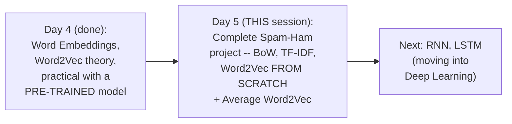

#### 🎯 Key Takeaways

* This session is **genuinely, entirely practical** — a complete, real spam-classification project, directly comparing Bag of Words, TF-IDF, and Word2Vec (trained from scratch) + Average Word2Vec on the SAME real dataset.
* Unlike Day 4's own practical demonstration (which used Google's PRE-TRAINED model), this session's own Word2Vec work **genuinely trains a NEW model from scratch**.
* The instructor's own **direct, honest framing**: this session prioritizes teaching the CORE vectorization concepts over strictly following every genuine ML best practice — a distinction directly, explicitly addressed in Section 5.

---

### 2. Setting Up: The SMS Spam Collection Dataset & Cleaning Pipeline

#### 📖 Definition — The Genuine, Real Dataset

> 💡 **Given directly:** *"In this particular file, this is basically a tab-separated dataset... you'll be able to see you're getting as an output as ham, and this is your entire text information... spam and ham -- today's problem statement that we are going to solve is basically spam or ham classification."*

```python
import pandas as pd

messages = pd.read_csv('SMSSpamCollection', sep='\t', names=['label', 'message'])
print(messages.shape)   # (5572, 2) -- genuinely, real, confirmed live
```

> 💡 **Given directly, confirming the dataset's own genuine source:** *"This dataset has been taken from a UCI repository -- so I've given that in the GitHub link."*

#### 🪜 Step-by-Step — The Complete, Stated Text-Preprocessing Plan

> 💡 **Given directly:** *"In this session we are going to do practical implementation... first step, what we are going to do is something called as text preprocessing -- second step, in this text preprocessing, what all things we are going to do -- we are going to basically do tokenization, we are going to apply stop words... and along with this... we are also going to apply something called as lemmatization or stemming."*

#### 💻 Code Example — The Complete, Real Cleaning Loop

> 💡 **Given directly:** *"For I in range of zero comma length of messages... I'm traversing through all the messages, and this first word is basically to remove all the special characters other than small a to z and capital A to Z... then we really need to do the lowering of the sentence... then we actually do the splitting of this entire words, and for each and every word we traverse it, we apply stop words, and then we apply stemming."*

```python
import re
from nltk.corpus import stopwords
from nltk.stem import PorterStemmer

ps = PorterStemmer()
corpus = []
for i in range(len(messages)):
    review = re.sub('[^a-zA-Z]', ' ', messages['message'][i])
    review = review.lower()
    review = review.split()
    review = [ps.stem(word) for word in review if word not in stopwords.words('english')]
    review = ' '.join(review)
    corpus.append(review)
```

#### 🔍 Internal Working — The Genuine, Real, Live-Observed Results

> 💡 **Given directly:** *"Here you will be able to see all these words that are present in the sentences have got applied with stemming -- so this is where you can see 'trouble' has become 'troubl,' you know, 'wait finished lecture' has become 'left'... this all things are actually there, but let's see whether we are able to get a good performance."*

#### ⚠ A Direct, Honest Acknowledgment: Stemming's Imperfect Words Are Genuinely Acceptable Here

> 💡 **Given directly:** *"I know stemming creates a lot of wrong words, but this is a kind of spam classification -- spam or ham classification -- so if we have sufficient amount of data with respect to our training cases, I think this will definitely work -- yes, for some of the questions like Q&A chatbots, you know, we should definitely try to make sure that we use it [lemmatization]."*

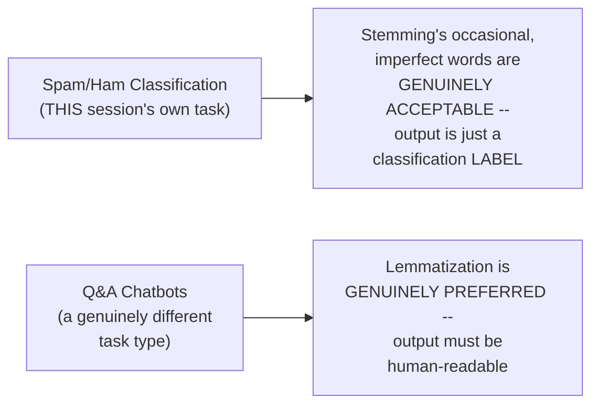

#### ⚠ Common Mistakes

* Assuming a real, production text-cleaning pipeline must include EVERY possible preprocessing step in every project — explicitly, directly demonstrated as a genuine, DELIBERATE choice, made based on this SPECIFIC task's own genuine requirements (a classification LABEL output, not human-readable text).
* Assuming stemming's occasionally meaningless results (like "troubl") are a genuine, disqualifying flaw for THIS specific task — explicitly, directly, honestly reframed: for spam/ham classification specifically, this is genuinely ACCEPTABLE, directly reusing the SAME use-case-based reasoning established in Day 1.

#### 🎯 Key Takeaways

* This session works with a **genuine, real, UCI-sourced dataset** (SMS Spam Collection, 5,572 messages) — loaded, explored, and directly confirmed via pandas.
* The complete cleaning pipeline — **regex, lowering, splitting, stopwords, stemming** — directly, precisely reuses the SAME methodology established across earlier sessions in this series.
* The instructor **directly, honestly reconfirms** Day 1's own established use-case guidance: stemming's occasional imperfection is genuinely acceptable for classification-only tasks like spam/ham, but lemmatization would genuinely be preferred for tasks requiring human-readable output.

---
### 3. Bag of Words: Building & Evaluating the Classifier

#### 💻 Code Example — Building the Bag of Words Vectors

> 💡 **Given directly:** *"When I have this corpus, the next thing that I'm going to apply [is] the Bag of Words -- in Bag of Words, we are going to use something called as Count Vectorizer... one thing I'm going to make it over here is that binary is equal to true, okay, so that I want all the numbers in the form of binary."*

```python
from sklearn.feature_extraction.text import CountVectorizer

cv = CountVectorizer(max_features=2500, binary=True)
X = cv.fit_transform(corpus).toarray()
```

#### 🔍 Internal Working — Precisely Explaining `max_features`

> 💡 **Given directly:** *"Why I have taken [max_features] as 2500? We can select different values, but again, understand what does max feature actually say -- it is saying that you can basically take the TOP MAXIMUM 2500 features... the maximum occurring features."*

#### 💻 Code Example — Label Encoding the Output & Train-Test Split

> 💡 **Given directly:** *"The next thing I'm also going to make sure that I do the LABEL ENCODING for Y feature, because right now it is spam and ham... so here I'm basically going to just use `get_dummies`, and probably take the Y values."*

```python
y = pd.get_dummies(messages['label'])
y = y.iloc[:, 1].values   # keeping just one column (e.g. spam=1, ham=0)

from sklearn.model_selection import train_test_split
X_train, X_test, y_train, y_test = train_test_split(X, y, test_size=0.20, random_state=0)
```

#### 💻 Code Example — Training & Evaluating With Multinomial Naive Bayes

> 💡 **Given directly:** *"Usually, for if I really want to apply any kind of algorithm for this machine learning, for this kind of text task, I can basically use something called as MULTINOMIAL NAIVE BAYES."*

```python
from sklearn.naive_bayes import MultinomialNB
from sklearn.metrics import accuracy_score, classification_report

spam_detect_model = MultinomialNB().fit(X_train, y_train)
y_pred = spam_detect_model.predict(X_test)

print(accuracy_score(y_test, y_pred))          # ~97%, genuinely, live-confirmed
print(classification_report(y_test, y_pred))   # ~98%, genuinely, live-confirmed
```

#### ⚠ Common Mistakes

* Assuming `max_features` selects words RANDOMLY — explicitly, directly, precisely re-confirmed: it selects the TOP N most frequently-occurring words, directly reusing the SAME reasoning established in the earlier TF-IDF session.
* Assuming `binary=True` counts occurrences — explicitly, directly clarified: it produces ONLY 0/1 presence indicators, regardless of how many times a word genuinely appears in a message.

#### 🎯 Key Takeaways

* **Bag of Words**, built via `CountVectorizer(max_features=2500, binary=True)` and trained with `MultinomialNB`, achieved a genuine, real test accuracy of approximately **97%** on this real spam-classification dataset.
* `max_features` and `binary` directly, precisely apply the SAME parameter behavior established in earlier sessions — real, direct, hands-on confirmation on genuine data.
* This result serves as the **genuine, real BASELINE** for comparing TF-IDF and Word2Vec's own performance, covered next.

---

### 4. TF-IDF: Building & Evaluating the Classifier

#### 💻 Code Example — Building the TF-IDF Vectors

> 💡 **Given directly:** *"For TF-IDF, it is quite simple -- from `sklearn.feature_extraction`, we import TF-IDF Vectorizer -- and TF-IDF Vectorizer, here also I'm going to use max features equal to 2500... here you also have something called as `ngram_range` -- so let's say I'm going to take one comma two, so all the possible combination of N-gram."*

```python
from sklearn.feature_extraction.text import TfidfVectorizer

tv = TfidfVectorizer(max_features=2500, ngram_range=(1, 2))
X = tv.fit_transform(corpus).toarray()
```

#### 💻 Code Example — Training & Evaluating, Directly Compared to Bag of Words

> 💡 **Given directly:** *"If I probably try to see the accuracy, here you can see that it is being IMPROVED, when compared to the previous one -- I had 97 [percent] somewhere over here, and here I'm actually able to get 98 percent."*

```python
X_train, X_test, y_train, y_test = train_test_split(X, y, test_size=0.20, random_state=0)

spam_detect_model = MultinomialNB().fit(X_train, y_train)
y_pred = spam_detect_model.predict(X_test)
print(accuracy_score(y_test, y_pred))   # ~98%, a genuine, real improvement over Bag of Words
```

#### 💻 Code Example — Also Testing RandomForestClassifier

> 💡 **Given directly:** *"It's not like you just have to use only this specific model, so you can also use Random Forest -- from `sklearn.ensemble` import `RandomForestClassifier`... classifier.fit on X train comma Y train."*

```python
from sklearn.ensemble import RandomForestClassifier

classifier = RandomForestClassifier()
classifier.fit(X_train, y_train)
y_pred = classifier.predict(X_test)
print(accuracy_score(y_test, y_pred))   # ~98%, genuinely, comparably or better than Naive Bayes
```

#### ⚠ Common Mistakes

* Assuming ONLY Naive Bayes is genuinely suitable for text classification — explicitly, directly demonstrated: Random Forest is ALSO tested and performs comparably (or better) — directly reusing the earlier session's own established principle that ANY genuine classifier can work once text is converted to vectors.
* Assuming the accuracy improvement from Bag of Words (97%) to TF-IDF (98%) is genuinely dramatic — explicitly, directly demonstrated as a MODEST, real, incremental improvement — a realistic, honest result, not an exaggerated claim.

#### 🎯 Key Takeaways

* **TF-IDF**, built via `TfidfVectorizer(max_features=2500, ngram_range=(1,2))`, achieved a genuine, real accuracy of approximately **98%** — a modest, real improvement over Bag of Words' own 97%.
* **RandomForestClassifier** was ALSO genuinely tested, achieving comparable or slightly better results than Naive Bayes — directly confirming this task can genuinely be solved by multiple, different classifier choices.
* This session's own real, side-by-side comparison directly, concretely demonstrates TF-IDF's genuine, incremental advantage over Bag of Words — consistent with the earlier session's own theoretical claims.

---
### 5. A Genuine, Honest Acknowledgment: Data Leakage

#### ⚠ A Direct, Honest, Live Confession

> 💡 **Given directly, in direct, live response to a genuine, real audience challenge:** *"Office says, why you fit on the Bag of Words? ...I'm not following the exact good practices, because if I try to follow the exact good practices, it will be quite amazing... you are, I've taught you all about data leakage and all, definitely you can apply for that, not a problem... if I'm actually doing in this way here, the main aim -- again I'm telling you, your main aim is not to follow all the best practices, but trying to talk about how you can convert a word into vectors -- okay, definitely, DATA LEAKAGE will be there."*

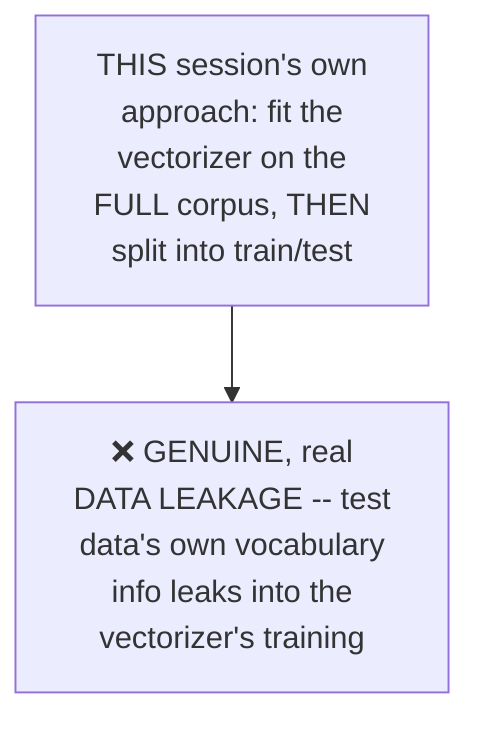

#### 🪜 Step-by-Step — The Precise, Correct, Proper Alternative, Directly Outlined

> 💡 **Given directly:** *"If you want to go ahead with the best practices, what I can do is that I can do something like this for you -- let's say, here what I'm actually going to do -- this is my corpus -- here, what I will do is that I will just clearly talk about something, just after uploading this data, right -- I'll separate X and Y over here, and then I will try to do the train-test split... and then try to apply this transformation."*

```python
# The CORRECT, proper order (directly outlined, though not fully executed live):
X_train_raw, X_test_raw, y_train, y_test = train_test_split(corpus, y, test_size=0.20, random_state=0)

cv = CountVectorizer(max_features=2500, binary=True)
X_train = cv.fit_transform(X_train_raw).toarray()   # fit ONLY on training data
X_test = cv.transform(X_test_raw).toarray()          # transform test data using the SAME, already-fit vectorizer
```

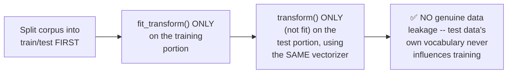

#### ❓ Why It Exists — The Precise, Genuine Reason This Distinction Matters

> 💡 **Given directly, an honest, direct acknowledgment of the trade-off:** the instructor's own SHORTCUT (fitting the vectorizer on the FULL corpus before splitting) means the vectorizer's own vocabulary and feature-selection decisions (like WHICH words become the top `max_features`) were genuinely influenced by information from the TEST set — a genuine, real violation of the train/test separation principle, since a truly unseen test set should NEVER influence any part of the model-building process, including vectorization.

#### ⚠ Common Mistakes

* Assuming this session's own SHORTCUT is a genuinely correct, production-ready approach — explicitly, directly, HONESTLY acknowledged as NOT following best practices, purely for TEACHING efficiency.
* Assuming data leakage in NLP pipelines only applies to the FINAL classifier, not the VECTORIZATION step itself — explicitly, directly, honestly demonstrated: the vectorizer ITSELF (Bag of Words, TF-IDF, etc.) can ALSO genuinely leak information if fit on data that includes the test set.

#### 🎯 Key Takeaways

* The instructor **directly, honestly, transparently acknowledges** a genuine data-leakage shortcut taken throughout this session's own Bag of Words/TF-IDF work — fitting the vectorizer on the FULL corpus BEFORE splitting into train/test.
* The **correct, proper fix**: split the RAW corpus into train/test FIRST, then `fit_transform()` the vectorizer ONLY on the training portion, and `transform()` (never `fit`) the test portion using that SAME, already-fit vectorizer.
* This honest acknowledgment directly, genuinely models a real, important practice: **openly admitting a genuine shortcut**, rather than presenting it as though it were correct — a genuinely valuable, honest teaching moment.

---

### 6. Word2Vec: Pre-Trained vs. Training From Scratch

#### 📖 Definition — The Precise, Two Genuine Paths

> 💡 **Given directly:** *"In Gensim library, we have Word2Vec, through which we can train the model from scratch -- there are two type of Word2Vec models -- one is PRE-TRAINED... I can use this Google News 300-dimension data points, or model that I have already shown you -- and the other one is that we can TRAIN THIS MODEL FROM SCRATCH."*

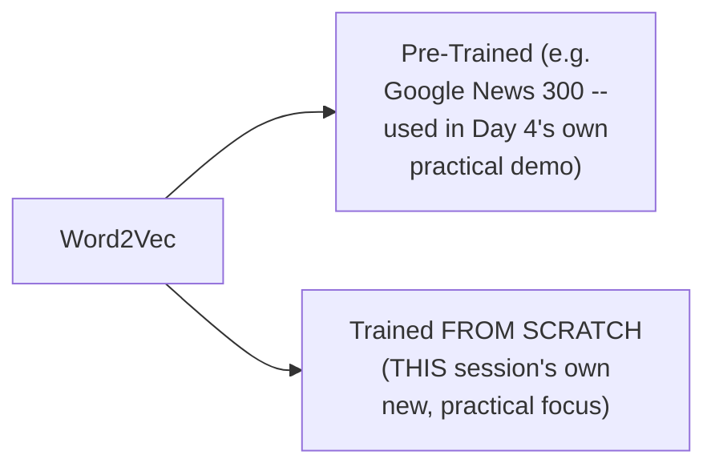

#### ❓ Why It Exists — A Genuine, Direct, Practical Decision Rule

> 💡 **Given directly:** *"Should we always train the model from scratch, or should we go with the pre-trained model? ...If, inside this pre-trained model, it already captures around 75 PERCENTAGE of this entire words, then I would suggest just go ahead and use this pre-trained model -- but if you see that, inside this dataset, if such text are used wherein those texts are NOT PRESENT in the pre-trained model, at that point of time, you can train your model from scratch."*

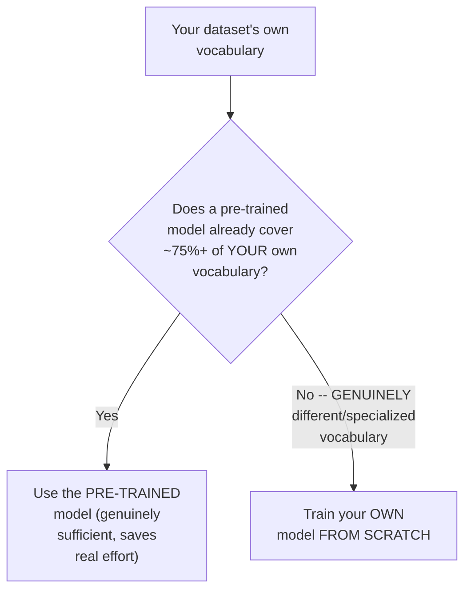

#### 🏢 Real-World / Production Usage — A Genuine, Direct, Real-World Confirmation

> 💡 **Given directly:** *"Most of the industries wherever they use Word2Vec, what they do is that they try to create their own specific model, and that is a very good purpose."*

#### ⚠ Common Mistakes

* Assuming pre-trained models are ALWAYS the genuinely preferred, default choice — explicitly, directly, honestly countered: MOST real industries genuinely TRAIN THEIR OWN models, specifically BECAUSE their own domain vocabulary often genuinely differs from a general-purpose, pre-trained model's own training data.
* Assuming there's no genuine, practical decision criterion for choosing between these two paths — explicitly, directly given a real, concrete rule of thumb: the approximate 75% vocabulary-coverage threshold.

#### 🎯 Key Takeaways

* Word2Vec offers **two genuine training paths**: using an EXISTING, pre-trained model, or TRAINING A NEW model FROM SCRATCH — this session's own genuine, new practical focus is the LATTER.
* A **genuine, practical decision rule**: if a pre-trained model already covers roughly 75%+ of your OWN dataset's vocabulary, use it; otherwise, genuinely train your own model from scratch.
* **Most real, industry use cases genuinely train their OWN models** — directly, honestly confirmed as a common, real, practical choice, not merely a theoretical alternative.

---
### 7. Average Word2Vec: The Core Problem & Solution, Revisited

#### ❓ Why It Exists — A Genuine, Direct, Newly-Framed Restatement of the Core Problem

> 💡 **Given directly:** *"You need to understand one thing here -- EVERY WORD is basically given by 300 dimensions -- but in our input, right, what will be our input? Our input will be one kind of message, and one output will be one kind of message, like spam or ham -- now inside this message, I may have any word, I may have many words."*

#### 🪜 Step-by-Step — A Complete, Genuinely New, Worked Example: "I Want to Eat Pizza"

> 💡 **Given directly:** *"Let's say I'm having a word, right -- 'I want to eat pizza' -- okay, so this is my first sentence -- now for each and every word, if I convert this into 300 dimensions, then, you know, how many total number of dimensions will happen? Tell me, guys, if each and every word is converted into 300 dimensions... this all will have 300 dimensions... but I need to always make sure that this ENTIRE input is basically converted into A 300 DIMENSION."*

```text
"I want to eat pizza" (5 words) x 300 dimensions each = 1,500 total dimensions
BUT: the model needs ONE, FIXED-size input (300 dimensions), regardless of sentence length
```

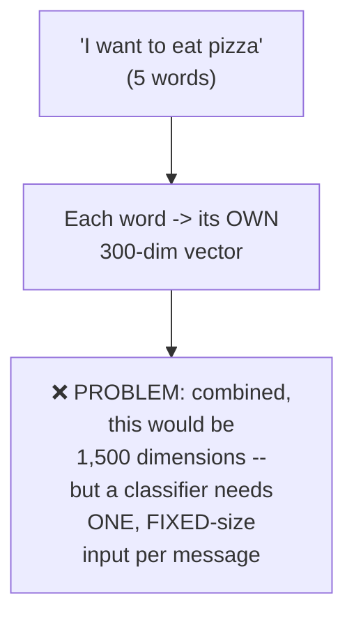

#### 🪜 Step-by-Step — A Second, Complete, Precise Worked Example: "Please Subscribe Krish Channel"

> 💡 **Given directly:** *"Please subscribe Krish channel -- okay, suppose this is my sentence, and let's say I want to convert this word into 300 dimensions... this is my first word, please -- this will be converted into 300 dimensions, subscribe will be converted to another 300 dimensions, Krish will get converted to another 300 dimensions, and channel will get converted into another 300 dimensions."*

```text
"please subscribe Krish channel" (4 words)
please  -> 300-dim vector
subscribe -> 300-dim vector
Krish   -> 300-dim vector
channel -> 300-dim vector
```

#### 📖 Definition — The Precise, Complete Averaging Solution

> 💡 **Given directly:** *"I want to make sure that this entire sentence is basically represented by 300 dimensions -- right now, it is like, since four words are there, it becomes 1,200 dimensions, 1,200 features -- so if I really want to convert this entire sentence into this 300 dimension, we basically use AVERAGE WORD2VEC -- average Word2Vec is nothing but all this dimensions... will get added to this, this will get added to this, this will get added to this, and this entire average will get calculated, and we will get ONE value."*

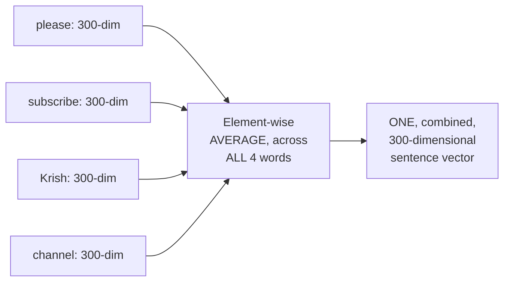

#### ❓ Why It Exists — A Genuine, Direct, Live-Answered Audience Question

> 💡 **Given directly, in direct, live response to a genuine, real, important audience question:** *"When you do average, does not individual word importance get [lost]? No, because ALL THESE VALUES will be assigned a vector based on different, different SEMANTIC MEANINGS, right, so I think that should not be a problem."*

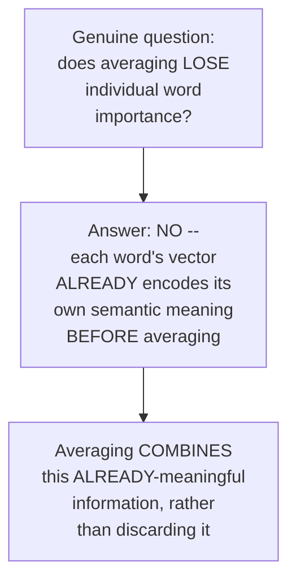

#### 🪜 Step-by-Step — A Third, Simplified, Numerically Illustrative Example: 5 Dimensions

> 💡 **Given directly:** *"Let's say I am designing a Word2Vec model, let's say in this Word2Vec I have five dimensions -- five dimension basically means -- let's say there is a word like 'Krish data science channel' is my vocabulary... Krish will be represented by five dimensions... but I cannot give my dataset like this to train in a machine learning model, because my inputs need to be same -- the input vectors need to be same... so what will happen, this summation will happen, and an average will get calculated."*

```text
"Krish data science channel" (4 words), each 5-dimensional
4 words x 5 dims = 20 total dims, if simply concatenated (INCONSISTENT across different sentences)
Average Word2Vec: element-wise mean across the 4 vectors -> STILL 5 dimensions
```

#### ⚠ Common Mistakes

* Assuming averaging genuinely discards or dilutes individual word importance — explicitly, directly, honestly addressed via a genuine, real, live-answered audience question: since each word's vector ALREADY encodes its own semantic meaning, averaging COMBINES (not discards) this information.
* Assuming this session's own SECOND worked example (please/subscribe/Krish/channel, or Krish/data/science/channel) is somehow a genuinely DIFFERENT concept from the earlier session's own "the food is good" example — explicitly, directly the SAME, identical underlying principle, simply re-illustrated with fresh, concrete examples for reinforcement.

#### 🎯 Key Takeaways

* Average Word2Vec's core problem, **freshly re-illustrated**: since every WORD gets its own FIXED-dimension vector, a MULTI-WORD sentence would have an INCONSISTENT total dimension count (varying by sentence length) unless those vectors are combined into ONE, fixed-size representation.
* The **solution**: element-wise AVERAGING across all word vectors in a sentence, producing ONE vector of the SAME dimensionality as each individual word — directly, precisely re-confirmed via TWO fresh, complete, worked examples.
* A genuine, real, live-answered audience question **directly confirms**: averaging does NOT genuinely lose individual word importance, since each word's own vector ALREADY carries meaningful, semantic information BEFORE the averaging step.

---
### 8. Practical: Training Word2Vec From Scratch & Building Average Word2Vec

#### 💻 Code Example — A Genuinely Different Cleaning Choice This Time: Lemmatization

> 💡 **Given directly:** *"I want to create from scratch -- but before that, let's apply WordNet Lemmatizer -- I also want to see how my model will perform if I apply WordNet Lemmatizer... instead of writing `stemmer.stem`, I'm going to basically write `lemmatizer.lemmatize`."*

```python
from nltk.stem import WordNetLemmatizer

lemmatizer = WordNetLemmatizer()
corpus = []
for i in range(len(messages)):
    review = re.sub('[^a-zA-Z]', ' ', messages['message'][i])
    review = review.lower().split()
    review = [lemmatizer.lemmatize(word) for word in review if word not in stopwords.words('english')]
    corpus.append(' '.join(review))
```

> 💡 **Given directly, confirming the genuine, real, spelling-correct results:** *"Here you can see that here all the spellings will be perfect, right -- all the spellings will be perfect -- 'lol,' 'always,' 'convincing,' 'catch,' 'bus,' 'frying,' 'egg'... so I'm going to basically apply Word2Vec on this kind of text, because Word2Vec will give me a fixed dimension."*

#### 💻 Code Example — Tokenizing With Gensim's `simple_preprocess`

> 💡 **Given directly:** *"Everybody focus on here, and try to understand what is this `simple_preprocess` function -- it says that it CONVERTS A DOCUMENT INTO A LIST OF LOWERCASE TOKENS -- this is super important, because you don't have to lower it again."*

```python
from nltk.tokenize import sent_tokenize
from gensim.utils import simple_preprocess

words = []
for sentence in corpus:
    sent_token = sent_tokenize(sentence)
    for sent in sent_token:
        words.append(simple_preprocess(sent))
```

#### 💻 Code Example — Training Word2Vec From Scratch

> 💡 **Given directly:** *"In Gensim, you'll be seeing `models.Word2Vec`... the first parameter is basically your sentences that you're going to give -- the second is what is the vector size -- can I say how much is my dimension? By default, how much is my dimension? ...You can see over here, this vector size is nothing but it is a dimension."*

```python
from gensim.models import Word2Vec

model = Word2Vec(words, window=5, min_count=2)
```

> 💡 **Given directly, precisely confirming the default vector size:** *"Dimension is 100."*

> 💡 **Given directly, precisely re-confirming `window` and `min_count`:** *"What is this window? Window basically means -- to understand the context, how many context of the words on the left-hand side and right-hand side we basically have to take... what is this minimum count? Minimum count basically ignores all the words with total frequency lower than this."*

#### 🔍 Internal Working — Inspecting the Genuine, Real, Trained Vocabulary

> 💡 **Given directly:** *"If I write `model.wv.index_to_key`, you'll be able to find out all the vocabularies, right -- like 'call,' 'get,' 'your,' 'gt,' 'lt,' 'free,' 'no,' 'come,' 'like' -- everything is there, okay, and all are good words, you know, the meaning is correct, absolutely correct."*

```python
print(model.wv.index_to_key)   # the genuine, real, trained vocabulary
```

#### 💻 Code Example — `similar_by_word()`, Genuinely Live-Tested

> 💡 **Given directly:** *"If I take any word like this, like 'price,' and I can basically find out the similar word by just using this function called as `similar_by_word`... here you can see, 'claim,' 'line,' 'call,' 'land,' 'guaranteed,' 'show,' 'draw,' 'cash,' 'HR,' 'code' -- so it is being able to capture all the specific information."*

```python
model.wv.similar_by_word('price')
# ['claim', 'line', 'call', 'land', 'guaranteed', 'show', 'draw', 'cash', 'hr', 'code', ...]

model.wv.similar_by_word('happy')
# ['your', 'day', 'make', 'hello', 'dear', 'new', 'keep', 'app', 'like', 'love', ...]
```

#### 💻 Code Example — The Complete, Real `avg_word2vec` Function

> 💡 **Given directly:** *"We are going to create ONE function which is called as average Word2Vec, and it is just saying, return `np.mean`, for every word in the documents, I am just going to compute `model.wv` of word -- here we are going to get the vectors, and I have to make sure that always those vectors should be present in the vocabulary."*

```python
import numpy as np

def avg_word2vec(doc):
    return np.mean(
        [model.wv[word] for word in doc if word in model.wv.index_to_key],
        axis=0
    )
```

#### 💻 Code Example — Applying This Function Across the Entire Dataset

> 💡 **Given directly:** *"For I in range of length of words, I'm just going to apply this average Word2Vec on words of I."*

```python
X_new = []
for i in range(len(words)):
    X_new.append(avg_word2vec(words[i]))

X_new = np.array(X_new)
print(X_new[0].shape)   # (100,) -- genuinely, live-confirmed
```

#### 🔍 Internal Working — Confirming the Genuine, Real, Consistent Output Shape

> 💡 **Given directly:** *"For each and every word, so this is my input feature X_new -- X_new is my input features, right -- if I want to see all my input features, here you'll be able to see -- these are all my input features."*

#### ⚠ A Direct, Honest Acknowledgment: The Final Model Training Is Left as an Assignment

> 💡 **Given directly:** *"In the next step, what you can do is that do the train-test split -- you have your X_new, do train and test split, you have your Y variable, and then you apply a model onto this, okay -- this can be an ASSIGNMENT for you, guys -- please try to do this as an assignment -- I have simply NOT done [it for] both the things."*

#### ⚠ Common Mistakes

* Assuming `simple_preprocess` and this session's own earlier regex-cleaning step are duplicating the SAME work — explicitly, directly clarified: `simple_preprocess` specifically handles TOKENIZATION and lowercasing (as a genuine convenience, since the text was already lowered earlier), while the EARLIER regex step specifically handled SPECIAL CHARACTER removal.
* Assuming this session's own practical work FULLY completes the Word2Vec-based spam classifier — explicitly, directly, honestly acknowledged: the FINAL train-test split and model training/evaluation step was DELIBERATELY left as a genuine ASSIGNMENT, not completed live.

#### 🎯 Key Takeaways

* Training Word2Vec from scratch, via Gensim, uses the SAME core parameters established in Day 4's own theoretical discussion: **`vector_size`** (default 100), **`window`** (context size, e.g., 5), and **`min_count`** (minimum word frequency, e.g., 2).
* `model.wv.similar_by_word()` was genuinely, live-tested on real words ("price," "happy") from THIS specific, real dataset — directly, concretely confirming the model captures genuine, meaningful semantic relationships.
* The complete, working **`avg_word2vec` function** was built and applied across the ENTIRE dataset, producing consistent, 100-dimensional vectors for every message — with the FINAL classifier training step honestly, explicitly left as a genuine assignment.

---

### 9. Closing: The Assignment & What's Next (RNN, LSTM, GloVe, Hugging Face)

#### 🪜 Step-by-Step — The Explicit, Stated Assignment

> 💡 **Given directly:** *"One assignment that I really want to give you is that try to do it for this particular dataset -- IMDb dataset, or CSV -- so here you basically have 50K movie reviews -- you can try it out... but instead of doing it [with] Bag of Words and TF-IDF, I definitely want to see this with the help of Word2Vec."*

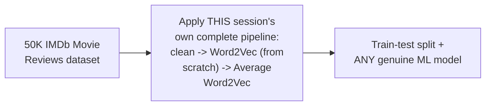

#### 🪜 Step-by-Step — The Explicit, Stated Roadmap Ahead

> 💡 **Given directly:** *"From tomorrow, [we're] mostly into deep learning and NLP -- we are getting into where we will be understanding about RNN and LSTM... but if before that, if time permits, I'll also be teaching you about GloVe -- and later on, when we learn about Transformers and BERT, at that time I will be taking a new library which is called as Hugging Face."*

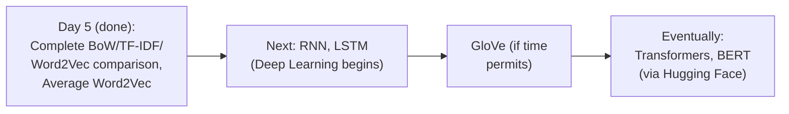

#### ⚠ Common Mistakes

* Assuming this session's own practical work represents the FINAL, complete scope of classical NLP techniques before deep learning begins — explicitly, directly confirmed: GloVe remains explicitly, directly promised (though conditionally, "if time permits"), and the NEXT session GENUINELY moves into deep learning (RNN, LSTM).
* Assuming Hugging Face is relevant to THIS session's own current content — explicitly, directly clarified: it's specifically reserved for LATER, when Transformers and BERT are covered.

#### 🎯 Key Takeaways

* A **genuine, real assignment** was given: apply this session's own complete pipeline (cleaning, Word2Vec trained from scratch, Average Word2Vec) to the real, 50K-review IMDb movie review dataset.
* **RNN and LSTM are explicitly, directly promised** as the very next topic — genuinely marking the series' own transition into deep learning.
* **GloVe** remains promised (conditionally), and **Hugging Face** is explicitly reserved for the later Transformers/BERT content — directly, precisely mapping out the remainder of this course's own broader roadmap.

---
## 📝 Glossary

| Term | Definition | Why It Matters |
|---|---|---|
| **SMS Spam Collection** | The genuine, real UCI dataset used in this session (5,572 messages) | The complete, real project's own data source |
| **max_features** | Limits the vocabulary to the top N most frequent words | Used identically in both CountVectorizer and TfidfVectorizer |
| **binary=True** | Records only word presence (1) or absence (0) | A CountVectorizer parameter for Bag of Words |
| **MultinomialNB** | Multinomial Naive Bayes -- the classifier used for both BoW and TF-IDF | Achieved ~97-98% accuracy on this real task |
| **Data Leakage** | Test data information influencing model/vectorizer training | Honestly, directly acknowledged as a real shortcut taken this session |
| **Pre-trained vs. From Scratch** | Two genuine Word2Vec training paths | ~75% vocabulary coverage is the practical decision rule |
| **simple_preprocess** | Gensim's tokenization + lowercasing utility | Used before training Word2Vec from scratch |
| **avg_word2vec** | A function averaging all in-vocabulary word vectors in a sentence | Produces one, fixed-size vector per message |

---

## 🔄 Revision Notes — One-Minute Revision

* This session is **genuinely, entirely practical** -- a complete, real Spam-Ham classification project (UCI SMS Spam Collection, 5,572 messages), directly comparing Bag of Words, TF-IDF, and Word2Vec (trained FROM SCRATCH, unlike Day 4's pre-trained demo) + Average Word2Vec.
* **Cleaning pipeline**: regex (a-z/A-Z only) -> lower -> split -> stopwords + stemming (PorterStemmer) -> joined into corpus. Stemming's occasional imperfect results ("troubl") are genuinely ACCEPTABLE for classification-only tasks like spam/ham.
* **Bag of Words**: `CountVectorizer(max_features=2500, binary=True)` + `MultinomialNB` -> ~97% test accuracy.
* **TF-IDF**: `TfidfVectorizer(max_features=2500, ngram_range=(1,2))` + `MultinomialNB` -> ~98% (a genuine, modest improvement). RandomForestClassifier also tested, comparable/better.
* **Honest, direct data-leakage acknowledgment**: the vectorizer was fit on the FULL corpus BEFORE splitting into train/test -- a genuine, real shortcut, explicitly NOT best practice. Correct fix: split the RAW corpus FIRST, `fit_transform()` ONLY on training data, `transform()` (never fit) on test data.
* **Word2Vec: pre-trained vs. from scratch**: if a pre-trained model already covers ~75%+ of your OWN vocabulary, use it; otherwise, train from scratch. Most REAL industries genuinely train their own models.
* **Average Word2Vec, revisited with fresh examples**: "I want to eat pizza" (5 words x 300-dim = 1,500 dims, INCONSISTENT) and "please subscribe Krish channel" (4 words x 300-dim = 1,200 dims) -- BOTH need to collapse to ONE, FIXED 300-dim vector via ELEMENT-WISE AVERAGING. A genuine, live-answered question confirms: averaging does NOT lose individual word importance, since each word's vector already encodes semantic meaning before averaging.
* **Practical, from-scratch training**: WordNetLemmatizer (cleaner spelling, this time) -> `simple_preprocess` (tokenize + lowercase) -> `Word2Vec(words, window=5, min_count=2)` (default vector_size=100) -> `model.wv.index_to_key` (real vocabulary) -> `similar_by_word()` (live-tested: "price"->claim/line/call/guaranteed; "happy"->day/make/hello/love) -> complete `avg_word2vec` function (`np.mean` over in-vocabulary word vectors) -> applied across the entire dataset, producing consistent 100-dim vectors.
* **Honestly, explicitly left as an assignment**: the FINAL train-test split and classifier training/evaluation for the Word2Vec-based pipeline was NOT completed live.
* **Stated assignment**: apply this session's own complete pipeline to the 50K IMDb movie review dataset, using Word2Vec specifically (not BoW/TF-IDF).
* **Next**: RNN, LSTM (deep learning begins); GloVe (if time permits); Hugging Face (reserved for later, Transformers/BERT).

---

## 📋 Cheat Sheet

**The complete, real project pipeline (3 techniques compared):**
```python
# 1. Clean
review = re.sub('[^a-zA-Z]', ' ', message).lower().split()
review = [ps.stem(w) for w in review if w not in stopwords.words('english')]

# 2. Bag of Words
cv = CountVectorizer(max_features=2500, binary=True)
X = cv.fit_transform(corpus).toarray()   # ~97% accuracy (MultinomialNB)

# 3. TF-IDF
tv = TfidfVectorizer(max_features=2500, ngram_range=(1,2))
X = tv.fit_transform(corpus).toarray()   # ~98% accuracy (MultinomialNB / RandomForest)

# 4. Word2Vec from scratch + Average Word2Vec
model = Word2Vec(words, window=5, min_count=2)   # default vector_size=100
def avg_word2vec(doc):
    return np.mean([model.wv[w] for w in doc if w in model.wv.index_to_key], axis=0)
X_new = np.array([avg_word2vec(words[i]) for i in range(len(words))])
```

**Data leakage: wrong vs. correct order:**
```python
# WRONG (this session's own honest shortcut):
X = cv.fit_transform(corpus)               # fit on FULL corpus
X_train, X_test, y_train, y_test = train_test_split(X, y)

# CORRECT (the proper fix):
corpus_train, corpus_test, y_train, y_test = train_test_split(corpus, y)
X_train = cv.fit_transform(corpus_train)    # fit ONLY on train
X_test = cv.transform(corpus_test)           # transform ONLY (never fit) on test
```

**Word2Vec: pre-trained vs. from scratch:**
```text
Pre-trained model covers ~75%+ of YOUR vocabulary -> use PRE-TRAINED
Otherwise (specialized/different vocabulary) -> TRAIN FROM SCRATCH
Most real industries: train their OWN models
```

**Average Word2Vec, why it's needed:**
```text
"I want to eat pizza" -> 5 words x 300-dim = 1,500 dims (inconsistent across sentences)
Average Word2Vec -> element-wise MEAN across all words -> ONE, FIXED 300-dim vector
```

---

## 🔥 Interview Questions & Answers

### 🟢 Beginner

**Q1.**

**Question:** What dataset was used for this session's own complete practical project?

**Answer:** The UCI SMS Spam Collection (5,572 messages).

**Explanation:** Directly, explicitly stated.

**Why Interviewers Ask This:** Basic, factual recall of the session's own real, concrete project.

**Possible Follow-up:** "What were the two columns in this dataset?"

**Q2.**

**Question:** What test accuracy did Bag of Words achieve on this task?

**Answer:** Approximately 97%.

**Explanation:** Directly, explicitly, live-confirmed.

**Why Interviewers Ask This:** Tests awareness of the session's own genuine, real results.

**Possible Follow-up:** "What accuracy did TF-IDF achieve instead?"

**Q3.**

**Question:** What is data leakage, in the context of this session's own honest acknowledgment?

**Answer:** Fitting the vectorizer on the full corpus (including test data) before splitting into train/test, causing test data to influence the model-building process.

**Explanation:** Directly, honestly explained.

**Why Interviewers Ask This:** Tests genuine, practical understanding of a commonly-encountered ML pipeline mistake.

**Possible Follow-up:** "What is the correct, proper order to avoid this?"

**Q4.**

**Question:** According to this session, when should you use a pre-trained Word2Vec model rather than training your own?

**Answer:** When the pre-trained model already covers roughly 75% or more of your own dataset's vocabulary.

**Explanation:** Directly, explicitly stated.

**Why Interviewers Ask This:** Tests practical, real-world decision-making knowledge.

**Possible Follow-up:** "What do most real industries actually do?"

**Q5.**

**Question:** What Gensim utility handles tokenization and lowercasing together?

**Answer:** simple_preprocess.

**Explanation:** Directly, explicitly named.

**Why Interviewers Ask This:** Basic, practical Gensim tooling knowledge.

**Possible Follow-up:** "What does simple_preprocess specifically return?"

**Q6.**

**Question:** What is the default vector_size (dimension) for a Gensim Word2Vec model?

**Answer:** 100.

**Explanation:** Directly, explicitly confirmed.

**Why Interviewers Ask This:** Basic, practical, factual Gensim knowledge.

**Possible Follow-up:** "What two other parameters were directly used alongside vector_size?"

**Q7.**

**Question:** In this session's avg_word2vec function, why is the `if word in model.wv.index_to_key` check genuinely necessary?

**Answer:** To ensure only words genuinely present in the trained model's own vocabulary are included, avoiding an out-of-vocabulary error.

**Explanation:** Directly, precisely explained.

**Why Interviewers Ask This:** Tests understanding of a genuine, necessary safeguard.

**Possible Follow-up:** "What would happen if this check were omitted?"

**Q8.**

**Question:** Was the final classifier (train-test split + model training) for the Word2Vec pipeline completed live in this session?

**Answer:** No -- it was honestly, explicitly left as an assignment.

**Explanation:** Directly, honestly acknowledged.

**Why Interviewers Ask This:** Tests attention to the session's own honest, stated scope.

**Possible Follow-up:** "What dataset was assigned for further, independent practice?"

**Q9.**

**Question:** What text-cleaning tool was used this time for the Word2Vec-from-scratch pipeline, instead of stemming?

**Answer:** WordNetLemmatizer.

**Explanation:** Directly, explicitly stated.

**Why Interviewers Ask This:** Tests attention to a deliberate, stated preprocessing choice.

**Possible Follow-up:** "Why was lemmatization chosen this time, specifically?"

**Q10.**

**Question:** What topic is explicitly promised as the very next session's own content?

**Answer:** RNN and LSTM (moving into deep learning).

**Explanation:** Directly, explicitly stated.

**Why Interviewers Ask This:** Tests awareness of the course's own stated, immediate roadmap.

**Possible Follow-up:** "What two additional topics remain promised beyond that?"

---

### 🟡 Intermediate

**Q11.**

**Question:** Explain why the instructor deliberately, honestly admits to a real data-leakage shortcut, rather than either hiding it or simply avoiding the mistake entirely.

**Answer:** This is a genuinely deliberate, honest teaching choice, directly triggered by a real, live audience question ("why you fit on the Bag of Words?"). Rather than dismissing the question or quietly correcting the code without explanation, the instructor DIRECTLY, OPENLY acknowledges the shortcut, explains WHY it was taken (to prioritize teaching the CORE vectorization concept over strict best-practice adherence), and THEN provides the CORRECT, proper fix. This directly models a genuinely valuable, honest practice: acknowledging real trade-offs and limitations transparently, rather than presenting an imperfect demonstration as though it were flawless -- directly, genuinely teaching learners BOTH the core concept AND the real-world discipline of recognizing and correctly fixing this exact class of mistake.

**Explanation:** Requires recognizing a deliberate, honest pedagogical choice — using a real mistake as a genuine teaching opportunity, not glossing over it.

**Why Interviewers Ask This:** Tests whether a learner recognizes the value of transparent acknowledgment of trade-offs, a genuinely important, real professional practice.

**Possible Follow-up:** "In your own future work, how would you decide when a similar 'shortcut for clarity' is genuinely acceptable versus when it must be avoided?"

**Q12.**

**Question:** A learner argues that since TF-IDF achieved only a modest, 1% accuracy improvement over Bag of Words in this session's own real results, TF-IDF provides negligible genuine value and isn't worth the additional complexity. Evaluate this claim.

**Answer:** This claim overstates the case, drawing an overly broad conclusion from ONE, SPECIFIC dataset's own result. This session's own real, complete comparison shows a genuine, real 1% improvement (97% to 98%) -- but generalizing this SPECIFIC, modest margin into "negligible value across all use cases" ignores several genuine, real considerations: FIRST, for a dataset of THIS size (5,572 messages) and this SPECIFIC task's own characteristics (spam detection, where certain keywords are STRONGLY, consistently predictive), Bag of Words may ALREADY perform quite well, genuinely LIMITING the ROOM for TF-IDF's own improvement to manifest strongly -- a DIFFERENT, more nuanced dataset (with more SUBTLE, importance-dependent signals) might show a GENUINELY LARGER improvement. SECOND, TF-IDF's implementation COST, using `TfidfVectorizer`, is GENUINELY TRIVIAL (a near-identical API to `CountVectorizer`), meaning even a MODEST, real improvement comes at ESSENTIALLY NO additional genuine implementation complexity. The accurate, more precise conclusion: THIS SPECIFIC dataset showed a modest, real improvement, but this doesn't GENERALIZE to "TF-IDF provides negligible value everywhere," especially given its genuinely LOW implementation cost.

**Explanation:** Tests whether a learner recognizes that a single, specific result doesn't generalize into an unconditional claim, and considers implementation cost alongside raw performance gain.

**Why Interviewers Ask This:** Distinguishes candidates who correctly scope a single experimental result from those who over-generalize it into a broad, unsupported claim.

**Possible Follow-up:** "Design a genuine experiment (using a different, real dataset type) where you'd expect TF-IDF to show a MORE substantial improvement over Bag of Words."

**Q13.**

**Question:** Explain, precisely, why the SAME sentence ("please subscribe Krish channel") produces GENUINELY DIFFERENT total dimensions (1,200) when concatenated versus a SINGLE, fixed dimension (300) when processed via Average Word2Vec, and why ONLY the latter is genuinely usable for classifier training.

**AnswER:** This directly, precisely reflects Section 7's own exact reasoning: concatenating word vectors (simply placing each word's own 300-dim vector one after another) produces a TOTAL dimension count that GENUINELY DEPENDS on the sentence's own LENGTH — a 4-word sentence produces 1,200 dimensions; a 5-word sentence would produce 1,500; a 2-word sentence would produce only 600. Since GENUINE classifier training (per Day 2's own established "fixed input size" requirement for machine learning models) REQUIRES every training example to have the EXACT SAME number of input features, this length-DEPENDENT dimension count is GENUINELY, STRUCTURALLY incompatible with standard classifier training. AVERAGING (Section 7's own exact solution), by contrast, computes the ELEMENT-WISE MEAN across ALL word vectors — REGARDLESS of how MANY words are being averaged, the RESULT always has the SAME dimensionality as a SINGLE word vector (300, in this example) — GENUINELY, STRUCTURALLY solving the fixed-input-size requirement, REGARDLESS of the original sentence's own varying length.

**Explanation:** Requires connecting Average Word2Vec's specific mechanism to the broader, established "fixed input size" requirement for machine learning models, established much earlier in this course.

**Why Interviewers Ask This:** Tests whether a learner understands the PRECISE, structural reason averaging (not concatenation) is genuinely necessary, connecting back to a fundamental ML requirement.

**Possible Follow-up:** "Would concatenation ever be a genuinely viable alternative to averaging, under some specific, different circumstance? Explain your reasoning."

**Q14.**

**Question:** Using this session's own precise, honest data-leakage acknowledgment (Section 5), explain whether the SAME genuine leakage concern would ALSO apply to the Word2Vec-from-scratch training performed later in this session (Section 8), and why or why not.

**Answer:** A precise, reasoned analysis extending beyond what this session's own content explicitly discusses: the SAME genuine, structural CONCERN (fitting on data that includes what will LATER become "test" data) COULD, in principle, ALSO apply to the Word2Vec-from-scratch training in Section 8 -- since the Word2Vec MODEL ITSELF was trained on the ENTIRE corpus (per Section 8's own exact code), without any EXPLICIT train/test split occurring BEFORE this training step. HOWEVER, there's a genuinely important, nuanced DISTINCTION worth recognizing: Word2Vec's OWN training objective is fundamentally DIFFERENT from a SUPERVISED classifier's objective — Word2Vec learns GENERAL, UNSUPERVISED word relationships (via CBOW/Skip-gram's own prediction task, established in Day 4), NOT a DIRECT mapping to the SPECIFIC spam/ham LABELS this session's own eventual classifier will need to predict. This means training Word2Vec on the FULL corpus is GENERALLY considered a GENUINELY more ACCEPTABLE practice (directly analogous to using a genuinely UNSUPERVISED, PRE-TRAINED embedding model, which BY DEFINITION was trained on data with NO knowledge of ANY SPECIFIC downstream task's own labels) — a MEANINGFULLY DIFFERENT situation from Section 5's own SPECIFIC concern, which was about the SUPERVISED vectorizer's OWN feature-selection process (like `max_features`, which DIRECTLY, EXPLICITLY depends on WORD FREQUENCY COUNTS ACROSS the dataset, including what will become test data) being genuinely INFLUENCED by information that SHOULD have remained unseen.

**Explanation:** Requires reasoning through a genuinely subtle, nuanced distinction between supervised feature-selection leakage (Section 5's own concern) and unsupervised embedding training (Section 8's own approach), which the session's own content doesn't explicitly address together.

**Why Interviewers Ask This:** A senior-level question testing whether a candidate can distinguish genuinely different KINDS of potential data leakage, correctly reasoning about which concerns GENUINELY apply to unsupervised vs. supervised components of a pipeline.

**Possible Follow-up:** "Would this SAME reasoning change if you were FINE-TUNING a pre-trained Word2Vec model specifically on labeled training data, rather than training entirely unsupervised on the raw corpus?"

**Q15.**

**Question:** Synthesize this session's complete, real accuracy comparison (Bag of Words ~97%, TF-IDF ~98%) with the Average Word2Vec session's own established genuine advantages (semantic meaning, reduced sparsity, limited dimensions) to construct a reasoned hypothesis for why Word2Vec-based features might NOT necessarily outperform Bag of Words/TF-IDF on THIS SPECIFIC spam-classification task, despite Word2Vec's own genuine, theoretical advantages.

**Answer:** A precise, reasoned hypothesis, directly connecting this session's own real results to earlier-established theory: Word2Vec's own genuine advantages (semantic meaning, reduced sparsity) are MOST valuable for tasks GENUINELY requiring nuanced, CONTEXTUAL understanding of MEANING — but spam detection, as a task, may be GENUINELY, LARGELY solvable through simpler, more DIRECT signals: the PRESENCE of specific, HIGHLY predictive keywords (like "free," "win," "claim," "urgent," directly, concretely observed in this session's own `similar_by_word('price')` results) is often GENUINELY, STRONGLY correlated with spam, REGARDLESS of deeper semantic nuance. Bag of Words and TF-IDF, by DIRECTLY capturing word PRESENCE/frequency, may ALREADY, GENUINELY capture MOST of the relevant, discriminating signal for THIS SPECIFIC task — meaning Word2Vec's own ADDITIONAL semantic sophistication provides GENUINELY LESS INCREMENTAL benefit here than it MIGHT for a GENUINELY more nuanced task (like SENTIMENT analysis, where subtle, CONTEXTUAL distinctions — e.g., sarcasm, negation — GENUINELY matter more). This directly, precisely illustrates that a technique's own THEORETICAL advantages don't automatically translate into SUPERIOR EMPIRICAL performance for EVERY possible task — the GENUINE, practical benefit depends on whether the SPECIFIC task's own success criteria actually LEVERAGE that technique's OWN distinguishing strengths.

**Explanation:** Requires synthesizing this session's own real, empirical results with earlier-established theoretical claims to construct a reasoned, nuanced hypothesis about why theoretical superiority doesn't automatically guarantee empirical superiority for every task.

**Why Interviewers Ask This:** A senior-level question testing whether a candidate can reconcile theoretical claims with real, empirical results, recognizing that a technique's genuine advantages are TASK-DEPENDENT, not universal.

**Possible Follow-up:** "Design a genuine experiment, using this session's own complete pipeline, to empirically test whether Average Word2Vec genuinely outperforms Bag of Words/TF-IDF on THIS specific dataset, completing the assignment the instructor himself left unfinished."

---

### 🔴 Advanced

**Q16.**

**Question:** Design a complete, from-scratch trace of the correct, non-leaky train-test-split methodology (per Section 5's own outlined fix), explicitly applied to a genuinely new, small corpus of your own choosing (at least 6 messages), showing exactly which steps happen BEFORE and AFTER the split.

**Answer:** A reasonable, complete trace, directly applying Section 5's own exact, corrected methodology — for example, using a small corpus of 6 messages: **Step 1 (BEFORE split)**: clean ALL 6 raw messages (regex, lowering, stopwords, stemming/lemmatization) — this step is GENUINELY, LEGITIMATELY safe to perform on the full corpus, since it involves NO learned parameters or corpus-wide statistics (each message is cleaned INDEPENDENTLY). **Step 2**: split the CLEANED corpus (not yet vectorized) into train (e.g., 4 messages) and test (e.g., 2 messages) sets, using `train_test_split`. **Step 3 (AFTER split)**: initialize the vectorizer (`CountVectorizer` or `TfidfVectorizer`), and call `fit_transform()` ONLY on the 4 TRAINING messages — this is the step where the vectorizer LEARNS its vocabulary and any corpus-wide statistics (like IDF values), and it must NEVER see the test messages during this learning step. **Step 4**: call `transform()` (NOT `fit_transform()`) on the 2 TEST messages, using the ALREADY-FITTED vectorizer from Step 3 — this correctly applies the LEARNED vocabulary/statistics to genuinely NEW, unseen data, WITHOUT allowing the test data to influence the vectorizer's own learned parameters. This complete trace directly, precisely demonstrates the CORRECT order Section 5 itself outlines but doesn't fully execute live.

**Explanation:** Requires applying the session's own outlined but not-fully-executed correction to a genuinely new, complete example, correctly distinguishing which steps are safe before vs. after the split.

**Why Interviewers Ask This:** A realistic, senior-level question testing whether a candidate can correctly implement the FULL, proper methodology, not just recite that "data leakage is bad."

**Possible Follow-up:** "Would stemming/lemmatization (Step 1) EVER genuinely need to happen AFTER the split, rather than before? Explain your reasoning."

**Q17.**

**Question:** Critically evaluate: "Since this session confirms most real industries train their OWN Word2Vec models rather than using pre-trained ones, this proves that pre-trained models (like Google's, used in Day 4) are genuinely INFERIOR and should generally be AVOIDED in real, professional NLP work." Is this an accurate, generalizable conclusion?

**Answer:** Not accurate — this significantly OVERSTATES a genuine, real INDUSTRY PATTERN into an unconditional claim of INFERIORITY, directly CONTRADICTING this session's own explicit, precise guidance. Section 6's own DIRECT statement is precisely: "if inside this pre-trained model, it ALREADY captures around 75 percentage of this entire words, then I would suggest just go ahead and use this pre-trained model" — this is EXPLICITLY, DIRECTLY a CONDITIONAL recommendation FAVORING pre-trained models when their VOCABULARY COVERAGE is GENUINELY sufficient, NOT a blanket dismissal. The observation that "most industries train their own models" GENUINELY reflects a DIFFERENT, related but DISTINCT reality: MANY real, professional NLP applications GENUINELY involve HIGHLY SPECIALIZED, DOMAIN-SPECIFIC vocabulary (medical terminology, legal language, internal company jargon) that a GENERAL-PURPOSE, pre-trained model (trained on GENERAL news text, as Google's OWN model was) GENUINELY, STRUCTURALLY would NOT adequately cover — DIRECTLY explaining WHY training from scratch is COMMON in THOSE SPECIFIC, real, specialized contexts. This does NOT mean pre-trained models are GENERALLY inferior — for TASKS where GENERAL-PURPOSE vocabulary is genuinely SUFFICIENT (as THIS session's own earlier guidance directly states), pre-trained models GENUINELY save SUBSTANTIAL, real training time and computational resources, while STILL providing GENUINELY strong, real performance (as DIRECTLY, LIVE-demonstrated in Day 4's own complete, successful practical demonstration).

**Explanation:** Tests whether a learner recognizes that a real, observed industry PATTERN reflects a CONDITIONAL, task-dependent reality, not an unconditional claim of inferiority the session's own explicit guidance directly contradicts.

**Why Interviewers Ask This:** Distinguishes candidates who correctly interpret a stated pattern within its GENUINE, conditional context from those who over-generalize it into an absolute, unsupported claim.

**Possible Follow-up:** "Name a specific, real professional NLP application where a pre-trained, general-purpose Word2Vec model would likely be GENUINELY sufficient, versus one where training from scratch would likely be GENUINELY necessary."

**Q18.**

**Question:** Synthesize this session's complete, real Bag of Words/TF-IDF/Word2Vec comparison with the earlier Day 12 Transformers session's own self-attention mechanism to construct a complete, reasoned prediction: if this SAME spam-classification task were solved using a Transformer-based approach instead, would you GENUINELY expect a meaningfully HIGHER accuracy than this session's own real 97-98% results, and why or why not?

**Answer:** A precise, reasoned prediction, extending beyond what THIS session's own content explicitly tests, but directly grounded in established, cross-session reasoning: given Intermediate Q15's own precise hypothesis (that spam detection may be LARGELY solvable through DIRECT keyword-presence signals, which Bag of Words/TF-IDF ALREADY capture WELL), a Transformer-based approach's own GENUINE advantage — direct, context-DEPENDENT understanding of EACH word's specific role within its SPECIFIC sentence (per the earlier Transformers session's own precise self-attention mechanism) — might provide GENUINELY LESS INCREMENTAL benefit for THIS SPECIFIC task than it would for a GENUINELY more nuanced, context-DEPENDENT task. This means a REASONABLE, precise prediction would be: a Transformer-based approach MIGHT achieve a MODEST, INCREMENTAL improvement over this session's own real 97-98% results (since Transformers GENUINELY, STRUCTURALLY capture STRICTLY MORE information than Bag of Words/TF-IDF/Word2Vec, per the earlier session's own established "direct, single-step access to ALL word pairs" advantage) — but the MARGIN of improvement would likely be GENUINELY SMALL, NOT dramatic, PRECISELY BECAUSE this session's own real results ALREADY achieve a GENUINELY HIGH accuracy (97-98%) using SIMPLER techniques, leaving GENUINELY LIMITED remaining "room" for further, substantial improvement — directly, precisely illustrating a genuine, real DIMINISHING-RETURNS pattern: more SOPHISTICATED techniques provide their LARGEST, most MEANINGFUL improvements specifically on tasks where SIMPLER techniques GENUINELY, SUBSTANTIALLY struggle, not necessarily on tasks ALREADY solved WELL by simpler means.

**Explanation:** Requires synthesizing this session's own real, empirical baseline results with an entirely separate, later session's own theoretical architecture to construct a reasoned, precise, testable prediction about diminishing returns.

**Why Interviewers Ask This:** A capstone-level question testing whether a candidate can reason about DIMINISHING RETURNS when applying increasingly sophisticated techniques to a task where SIMPLER methods ALREADY perform genuinely well.

**Possible Follow-up:** "Design a genuine, complete experiment to empirically TEST this specific prediction, directly comparing a fine-tuned BERT model's actual accuracy against this session's own real 97-98% baseline, on the EXACT SAME dataset."

---

## 🧪 Scenario-Based Interview Questions

> **Scenario 1:** A colleague, replicating this session's own exact spam-classification pipeline on a genuinely DIFFERENT, real dataset (customer support tickets, rather than SMS messages), reports GENUINELY worse accuracy (only 85%) than this session's own real 97-98% results. Using this session's concepts, diagnose the most likely cause.

**Structured Answer:**
1. **Initial investigation:** Recognize this as potentially connected to Intermediate Q15's own precise hypothesis -- customer support tickets likely involve GENUINELY MORE nuanced, context-dependent language than SMS spam messages (which often rely on DIRECT, obvious keyword signals like "free," "win," "claim").
2. **Metrics/logs to check:** Directly compare the ACTUAL vocabulary and message characteristics of the customer-support dataset against the SMS spam dataset, checking for GENUINELY greater linguistic complexity or ambiguity.
3. **Possible causes:** Per Intermediate Q15's own reasoning, if customer-support tickets GENUINELY require more nuanced, context-dependent classification (e.g., distinguishing GENUINE urgency from routine language), Bag of Words/TF-IDF's own SIMPLER, keyword-presence-based approach may GENUINELY, STRUCTURALLY be LESS SUFFICIENT for this specific, different task.
4. **Debugging approach:** Directly test whether Average Word2Vec (per THIS session's own complete pipeline) genuinely produces BETTER results than Bag of Words/TF-IDF SPECIFICALLY on this NEW, different dataset -- if Word2Vec's own SEMANTIC understanding genuinely helps MORE here than it did for SMS spam, this would directly, empirically CONFIRM the hypothesis.
5. **Resolution:** If Word2Vec/Average Word2Vec genuinely shows improvement, adopt it as the PREFERRED vectorization technique for THIS specific, different task -- if even Word2Vec's own semantic understanding proves genuinely insufficient, consider a GENUINELY more sophisticated approach (per Advanced Q18's own reasoning, potentially a Transformer-based model).
6. **Prevention:** Establish a standing team practice of directly, empirically testing MULTIPLE vectorization techniques (not assuming ONE technique's own success on ONE dataset GENERALIZES to a genuinely different task/domain) -- directly modeling THIS session's own real, side-by-side comparison methodology.

> **Scenario 2 (Advanced):** Your team discovers, during a genuine, thorough code review, that a production spam classifier (built using this session's own exact methodology) has the SAME data-leakage issue this session honestly acknowledges — the vectorizer was fit on the full dataset before the train-test split. The model is CURRENTLY deployed and reporting 98% accuracy. Using this session's concepts, construct a complete plan to address this.

**Structured Answer:**
1. **Initial investigation:** Recognize this as directly, precisely connected to Section 5's own honest acknowledgment -- the REPORTED 98% accuracy is likely GENUINELY, ARTIFICIALLY INFLATED, since the vectorizer's own feature selection (max_features, vocabulary) was GENUINELY influenced by information that should have remained UNSEEN.
2. **Metrics/logs to check:** Directly re-evaluate the model using the CORRECT methodology (per Advanced Q16's own precise trace) -- splitting the RAW corpus FIRST, then fitting the vectorizer ONLY on training data -- and comparing this GENUINE, corrected accuracy against the ORIGINAL, leaky 98% figure.
3. **Possible causes:** Confirm this is GENUINELY the SAME issue Section 5 directly describes -- the vectorizer's own `fit_transform()` call occurred on the FULL dataset, BEFORE any genuine train-test separation.
4. **Debugging approach:** Directly implement Advanced Q16's own precise, corrected methodology, and measure the RESULTING, genuine accuracy DROP (if any) compared to the original, leaky figure -- this DIRECTLY quantifies how much the ORIGINAL reported accuracy was GENUINELY inflated by the leakage.
5. **Resolution:** RETRAIN and REDEPLOY the model using the CORRECTED, non-leaky methodology, directly reporting the GENUINE, corrected accuracy to stakeholders -- being transparent that the PREVIOUS 98% figure was GENUINELY, ARTIFICIALLY inflated.
6. **Prevention:** Establish a standing team code-review checklist SPECIFICALLY checking for THIS exact class of vectorizer-level data leakage (not just classifier-level leakage) in EVERY NLP pipeline, directly modeling THIS session's own honest, transparent acknowledgment as a genuine best practice for catching and correcting real, deployed mistakes.

---

## 🛠 Hands-on Exercises

### 🟢 Easy

1. Load a genuine, real text dataset of your own choosing, and apply this session's own complete cleaning pipeline (regex, lowering, stopwords, stemming).
2. Write out, from memory, the correct, non-leaky order of operations for train-test split + vectorization.
3. Explain, in your own words, the ~75% vocabulary-coverage rule for choosing between pre-trained and from-scratch Word2Vec.

### 🟡 Medium

4. Build and evaluate a Bag of Words-based classifier on a dataset of your own choosing, directly comparing count-based vs. binary variants.
5. Write a short explanation (150-200 words) of why concatenating word vectors is structurally incompatible with classifier training, but averaging genuinely solves this, directly applying Intermediate Q13's own reasoning.
6. Complete the session's own left-as-an-assignment step: perform train-test split and train a genuine classifier on the Average Word2Vec features built in Section 8, reporting your own observed accuracy.

### 🔴 Advanced

7. Implement the complete, corrected, non-leaky methodology proposed in Advanced Interview Q16, on a genuinely new corpus of your own choosing, and empirically measure any accuracy difference compared to the "leaky" approach.
8. Complete this session's own stated assignment: apply the complete pipeline (cleaning, Word2Vec from scratch, Average Word2Vec) to the 50K IMDb movie review dataset, and report your own genuine, real results.
9. Design and implement the empirical comparison proposed in Advanced Interview Q18, directly testing whether a Transformer-based approach (e.g., using Hugging Face) achieves meaningfully higher accuracy than this session's own real 97-98% baseline, on the exact same SMS Spam Collection dataset.

---

## 🏗 Practice Assignment

*(This session's own stated assignment, reproduced faithfully)*

> 💡 **The instructor's own words, given directly:** *"Try to do it for this particular dataset -- IMDb dataset... 50K movie reviews... instead of doing it Bag of Words and TF-IDF, I definitely want to see this with the help of Word2Vec."*

### Build: "Complete Word2Vec-Based Movie Review Classifier"

**Objective:** Directly complete this session's own genuine, stated assignment — apply the complete Word2Vec-from-scratch + Average Word2Vec pipeline to the 50K IMDb movie review dataset.

**Requirements:**
- Load the real, 50K IMDb movie review dataset.
- Apply the complete text-cleaning pipeline (regex, lowering, stopwords, lemmatization — directly reusing this session's own established methodology).
- Train a genuinely NEW Word2Vec model from scratch on this dataset, using Gensim.
- Build and apply a complete `avg_word2vec` function, producing one, fixed-size vector per review.
- Complete the FINAL step this session's own instructor left unfinished: perform train-test split, train a genuine classifier, and report your own real accuracy.
- A written comparison (200-300 words) between your own Word2Vec-based results and a Bag of Words/TF-IDF baseline on the SAME dataset.

**Architecture (suggested):**

```text
imdb_word2vec_assignment/
├── data_loading_and_cleaning.py        # your loading + cleaning pipeline
├── word2vec_from_scratch.py              # your Word2Vec training
├── avg_word2vec_function.py                # your averaging function
├── classifier_training.py                    # the FINAL step, completed
└── COMPARISON.md                                # your written comparison
```

**Expected Functionality:**
- Your pipeline should genuinely, correctly run end to end on the real, 50K-review dataset.
- Your final classifier should be genuinely trained and evaluated, directly completing what this session's own instructor left as an assignment.

**Challenges:**
- Correctly handling the genuinely larger scale of this dataset (50K reviews) compared to this session's own 5,572-message example.
- Correctly reasoning through whether Word2Vec genuinely outperforms Bag of Words/TF-IDF for THIS specific, different task (movie review sentiment, rather than spam detection).

**Bonus Improvements:**
- Implement the correct, non-leaky train-test-split methodology from Advanced Interview Q16, avoiding the SAME shortcut this session's own instructor honestly acknowledged taking.
- Directly compare pre-trained (Google News 300) vs. from-scratch Word2Vec performance on this SAME dataset, applying Section 6's own ~75% vocabulary-coverage decision rule.

---

## 📚 Additional Resources

- **Day 4 of this series** -- the direct prerequisite session, covering Word Embeddings, Word2Vec theory (CBOW/Skip-gram), and a practical demonstration using a PRE-TRAINED model, which this session directly extends into training FROM SCRATCH.
- **The UCI Machine Learning Repository** (referenced directly) -- the source of the SMS Spam Collection dataset used throughout this session.
- **The 50K IMDb Movie Review dataset** (referenced directly, explicitly assigned) -- for further, independent practice.
- **The community/course dashboard and GitHub link** (referenced directly) -- where session materials and code are made available.
- **The next session** (referenced directly, explicitly next) -- covering RNN and LSTM, genuinely marking the series' transition into deep learning.

---

## 📌 Final Revision Sheet

### ⭐ Core Concepts
- **Complete, real spam-classification project**: Bag of Words (~97%), TF-IDF (~98%), both via MultinomialNB/RandomForest.
- **Honest, direct data-leakage acknowledgment**: fit vectorizer on full corpus BEFORE split (a genuine shortcut) -- correct fix: split raw corpus first, fit_transform ONLY on train, transform (never fit) on test.
- **Pre-trained vs. from-scratch Word2Vec**: ~75% vocabulary coverage rule; most real industries train their own.
- **Average Word2Vec, revisited**: multi-word sentences need ONE, fixed-size vector -- element-wise averaging solves this without losing individual word meaning.
- **Practical, from-scratch training**: WordNetLemmatizer -> simple_preprocess -> Word2Vec(window=5, min_count=2, default vector_size=100) -> avg_word2vec function.

### ⭐ Important Definitions
- **Data Leakage, Pre-trained vs. From Scratch** (see Glossary for full definitions).

### ⭐ Important Commands/Code
```python
cv = CountVectorizer(max_features=2500, binary=True)
tv = TfidfVectorizer(max_features=2500, ngram_range=(1,2))
model = Word2Vec(words, window=5, min_count=2)
def avg_word2vec(doc):
    return np.mean([model.wv[w] for w in doc if w in model.wv.index_to_key], axis=0)
```

### ⭐ Architecture/Process
- Complete pipeline: raw dataset -> clean -> [BoW | TF-IDF | Word2Vec+Average] -> train-test split (BEFORE vectorizer fitting, for correctness) -> classifier -> evaluate.

### ⭐ Best Practices
- Always split BEFORE fitting any vectorizer, to avoid genuine data leakage.
- Choose stemming vs. lemmatization based on the specific task's own output requirements.
- Choose pre-trained vs. from-scratch Word2Vec based on genuine vocabulary coverage, not default preference.
- Empirically test multiple vectorization techniques rather than assuming one generalizes across tasks.

### ⭐ Common Mistakes
- Fitting a vectorizer on the full corpus before splitting into train/test.
- Assuming pre-trained models are always inferior just because many industries train their own.
- Assuming a technique's theoretical advantage automatically produces a large, empirical improvement on every task.
- Assuming Average Word2Vec genuinely loses individual word importance (it doesn't -- it combines already-meaningful vectors).

### ⭐ Interview Points
- Be ready to explain and correctly implement the non-leaky train-test-split order.
- Be ready to explain the pre-trained vs. from-scratch decision rule.
- Be ready to explain why Average Word2Vec is structurally necessary, connecting to the fixed-input-size ML requirement.
- Be ready to discuss this session's own real accuracy results and reason about why Word2Vec might not dramatically outperform simpler techniques here.

### ⭐ Things to Remember
- This session is **genuinely, entirely practical** -- a complete, real, honest, side-by-side comparison of three vectorization techniques on genuine data.
- The instructor's own **honest, direct data-leakage acknowledgment** is a genuinely valuable, real teaching moment — modeling transparency about real, practical shortcuts.
- **RNN and LSTM are explicitly, directly promised** as the very next topic — this session genuinely marks the transition from classical NLP into deep learning.

---

## 🔗 Source

- [Word2Vec & Average Word2Vec](https://www.youtube.com/live/g-Y5a4WDe7g?si=_83NrhorxnsA27Bw)