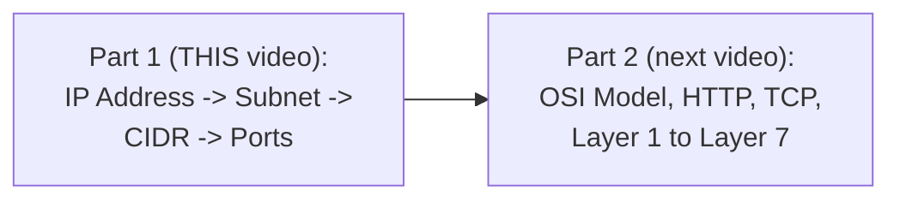
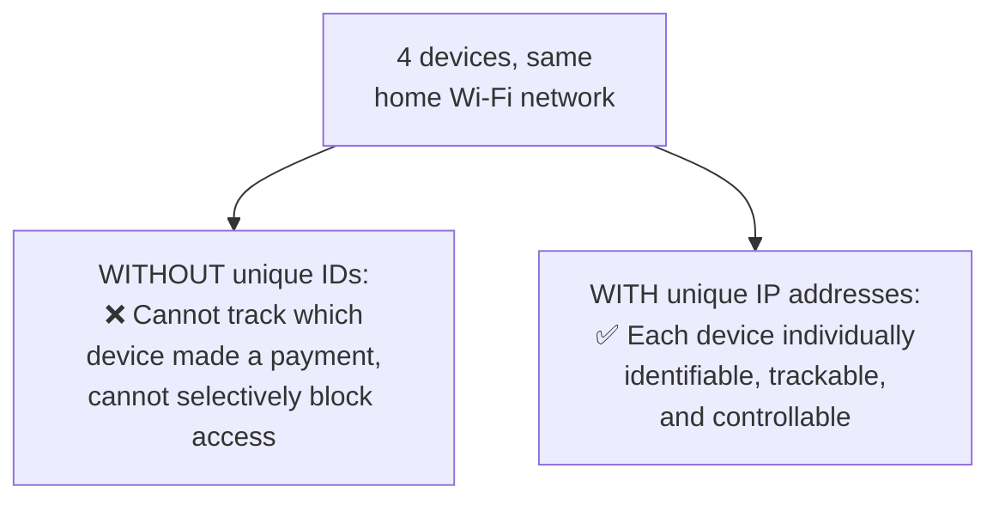
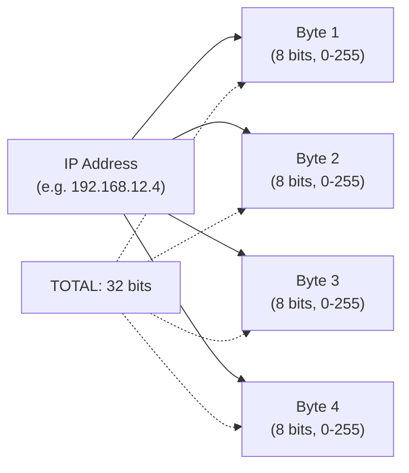
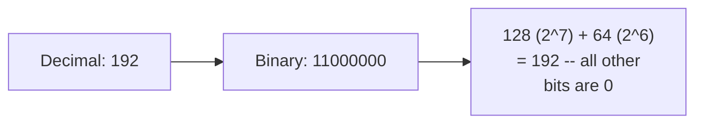
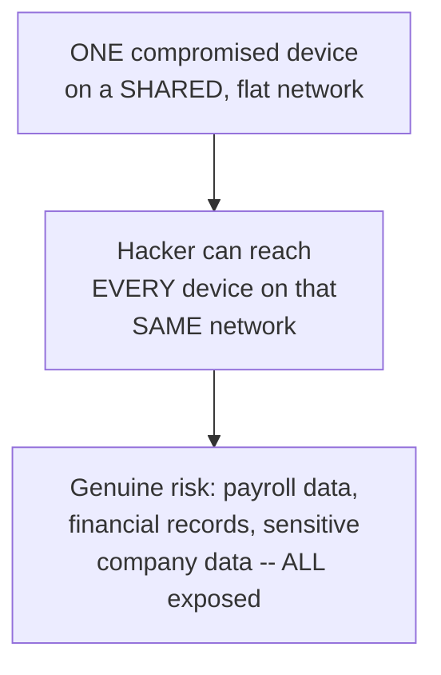
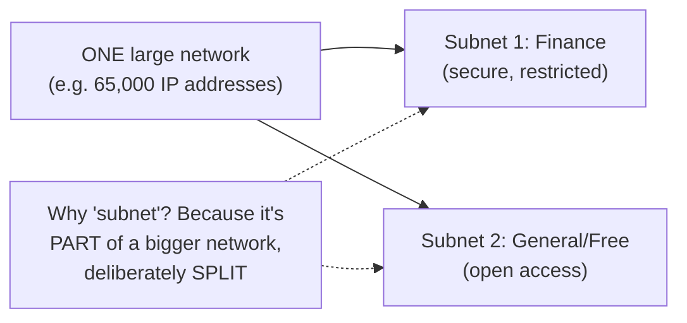
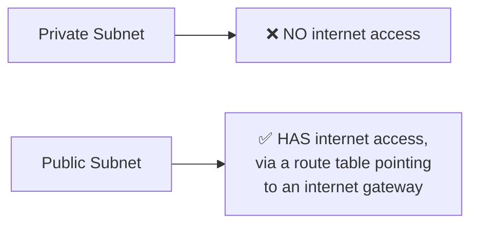
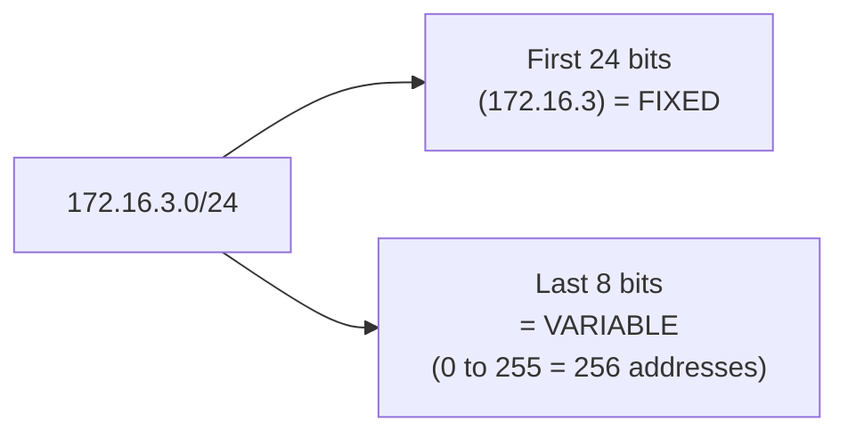
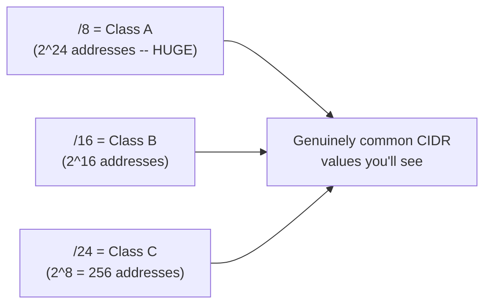
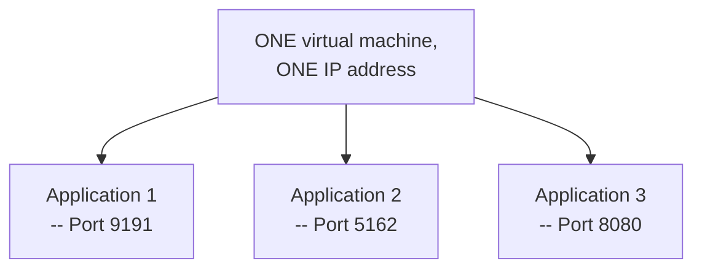

# 🌐 Networking Concepts Are Easy — Part 1: IP Addresses, Subnets, CIDR & Ports

- <i>**Session:** Networking Fundamentals Playlist — Video 1 ("Networking Concepts are Easy: Networking Explained in a Simple Way") · 
- **Instructor:** Abhishek
- **Note on scope:** This is a **standalone, self-contained foundational video** — the first entry in a dedicated networking playlist, distinct from the numbered DevOps Zero to Hero course. It deliberately builds every concept from first principles, using genuinely simple, real-world analogies (a home Wi-Fi network, a company office network) before connecting them to real cloud platforms (AWS VPCs, subnets). The video covers four core concepts — IP addresses, subnets, CIDR, and ports — and explicitly defers the OSI model, HTTP, TCP, and the seven networking layers to Part 2 of the same playlist.</i>

---

## 📑 Table of Contents

1. [Session Overview](#-session-overview)
2. [Learning Objectives](#-learning-objectives)
3. [Detailed Notes](#-detailed-notes)
   - [1. Session Context: Networking Fundamentals, Part 1 of a Playlist](#1-session-context-networking-fundamentals-part-1-of-a-playlist)
   - [2. IP Addresses: Why They Exist & How They're Structured](#2-ip-addresses-why-they-exist--how-theyre-structured)
   - [3. Converting an IP Address to Binary: A Complete Worked Example](#3-converting-an-ip-address-to-binary-a-complete-worked-example)
   - [4. Subnets: Splitting a Network for Security & Isolation](#4-subnets-splitting-a-network-for-security--isolation)
   - [5. CIDR: Calculating How Many IP Addresses a Subnet Gets](#5-cidr-calculating-how-many-ip-addresses-a-subnet-gets)
   - [6. Ports: Distinguishing Applications on the Same Device](#6-ports-distinguishing-applications-on-the-same-device)
4. [Glossary](#-glossary)
5. [Revision Notes — One-Minute Revision](#-revision-notes--one-minute-revision)
6. [Cheat Sheet](#-cheat-sheet)
7. [Interview Questions & Answers](#-interview-questions--answers)
8. [Scenario-Based Interview Questions](#-scenario-based-interview-questions)
9. [Hands-on Exercises](#-hands-on-exercises)
10. [Practice Assignment](#-practice-assignment)
11. [Additional Resources](#-additional-resources)
12. [Final Revision Sheet](#-final-revision-sheet)

---

## 🎯 Session Overview

This video builds a complete, practical foundation in core networking vocabulary — the exact terms (IP address, subnet, CIDR, ports) that show up constantly in DevOps, cloud, and infrastructure work but are rarely explained from first principles. It covers:

1. **IP addresses**, motivated by a genuinely relatable home-network scenario (tracking which of four devices in a house made a payment, or blocking a specific device from a website) — establishing WHY unique device identification is necessary before introducing the IPv4 format itself.
2. **The precise, binary foundation of IPv4** — four bytes (32 bits), each ranging 0-255, with a complete, hand-worked conversion of a real IP address (192) into its binary representation, directly explaining WHY 255 is the maximum value in any octet.
3. **Subnets**, motivated by a genuinely concrete security scenario — an office network where a single compromised device could expose an entire company's sensitive data, directly motivating the need to split one large network into isolated pieces (e.g., a secure finance subnet vs. a free general-access subnet).
4. **Private vs. public subnets**, precisely distinguished by one single criterion: internet access (via a route table pointing to an internet gateway) — not a fundamentally different technology.
5. **CIDR notation**, built up through multiple, genuinely worked examples — /24, /31, /27, /16, /8 — each calculated via the same, consistent formula (32 minus the CIDR number, then 2 raised to that remaining power), directly connected to real AWS VPC/subnet creation.
6. **Class A/B/C terminology** (/8, /16, /24) and the standard, reserved private IP address ranges (10.x, 172.x, 192.168.x) that show up by convention in virtually every private cloud network.
7. **Ports**, explaining how a single device (or virtual machine) can run MANY applications simultaneously, each distinguished by a genuinely unique port number — directly connecting IP address + port to real, complete application access (e.g., `172.16.3.4:9191`).

> 💡 **Key framing, given directly, on why this foundational depth matters across roles:** *"Whether you are a DevOps engineer, data engineer, full stack engineer, networking fundamentals are very important to understand your organizational infrastructure or the application workflow."*

---

## 🎯 Learning Objectives

By the end of this guide, you will be able to:

- [ ] Explain why unique IP addresses are necessary, using a concrete, multi-device scenario.
- [ ] Explain the IPv4 format precisely: four bytes, 32 bits total, each byte ranging 0-255.
- [ ] Manually convert a decimal IP address octet (like 192) into its 8-bit binary representation, and vice versa.
- [ ] Explain what a subnet is, why it exists (security, privacy, isolation), and the precise difference between a private and a public subnet.
- [ ] Calculate the number of IP addresses available in a given CIDR range (e.g., /24, /27, /16, /8).
- [ ] Determine the correct CIDR notation for a subnet given a required number of IP addresses.
- [ ] Name the standard, reserved private IP address ranges.
- [ ] Explain what a port is, and why a single IP address can host multiple, independently-accessible applications.

---

## 📚 Detailed Notes

### 1. Session Context: Networking Fundamentals, Part 1 of a Playlist

#### 🧠 Concept

> 💡 **Given directly, opening the video:** *"To the terms like IP address, subnet, CIDR range, OSI model often confuse you -- have you ever wondered how your mobile device connects to websites like google.com or the internet, how does the traffic flow from your device to the website, and how these websites receive your request and send response back to you?"*

#### 🪜 Step-by-Step — The Stated, Complete Scope of This Video

> 💡 **Given directly, the video's own closing summary:** *"What did we cover till now? Till now we covered the concept of IP address, we covered the concept of CIDR, we covered the concept of subnet -- within subnet we tried to cover what is private subnet, we tried to cover what is public subnet as well... and there is one concept that is left, that is OSI model... this is going to be a huge topic, so let's try to put this in the part 2."*



#### 🎯 Key Takeaways

* This video is **explicitly, deliberately scoped** to four foundational concepts — IP address, subnet, CIDR, and ports — with the OSI model and its related topics (HTTP, TCP, network layers) genuinely deferred to a dedicated, separate video.
* The instructor's own stated audience is deliberately broad: **DevOps, data, and full-stack engineers** are all named as genuinely benefiting from this foundational knowledge, not just network specialists.
* The teaching approach is explicitly **example-first** — every concept is introduced through a concrete, relatable scenario (a home network, an office network) before any formal definition or formula appears.

---

### 2. IP Addresses: Why They Exist & How They're Structured

#### ❓ Why It Exists — The Motivating, Concrete Scenario

> 💡 **Given directly, the complete, worked home-network example:** *"Let's say you have a home network... two people... each person has two devices, so overall there are four devices... one of these devices was used to connect to a payments website and made a payment. You want to track which of these devices was connected... If each of these devices does not have a unique identification number, how can you do that? It's practically not possible."*



#### 📖 Definition — IP Address, Precisely Defined

> 💡 **Given directly:** *"That unique identification is nothing but IP address... just like human beings have names, or houses have the house number which are unique... this particular representation is done through IPv4."*

#### 🔍 Internal Working — Precisely Why a Structured Standard (IPv4) Is Needed, Not Ad-Hoc Numbering

> 💡 **Given directly, the precise, scaling argument:** *"For my house, if there are only four devices, so I can simply say one device as 1.1, one device as 1.2... but what if there are 10 more devices that got added, or instead of this house, let's take example of your school or your university, where there can be 10,000 or 20,000 devices... so to maintain a proper standard, the one that is used is IPv4."*

#### 📖 Definition — The Precise, Structural Format of IPv4

> 💡 **Given directly:** *"An IP address is nothing but four bytes, or 32 bits... four bytes, each byte is separated by a dot... each of this number can vary from 0 to 255... that is because in computer language, in IPv4 standard, you have four bytes, and one byte is nothing but 8 bits, so four bytes is nothing but 32 bits."*



#### ⚠ Common Mistakes

* Assuming an IP address octet could genuinely contain a number like 600 -- explicitly, directly corrected: *"192.600.12.254 -- this is not an IP address because 600 is not possible"* -- every octet is fundamentally constrained to 0-255 by the underlying 8-bit binary representation.
* Assuming ad-hoc, informal numbering (like "1.1," "1.2," "2.1") could scale to a genuinely large network -- explicitly, directly demonstrated as impractical beyond a handful of devices, directly motivating the need for a genuine, structured standard.

#### 🎯 Key Takeaways

* An **IP address** provides a genuinely unique identifier for every device on a network -- directly enabling tracking, monitoring, and selective access control, none of which is possible without unique identification.
* **IPv4** structures this address as **four bytes (32 bits total)**, each byte (octet) constrained to the range 0-255 -- a structural, non-negotiable consequence of the underlying binary representation, not an arbitrary convention.
* This structured standard exists specifically to **scale** beyond small, informal numbering schemes -- genuinely necessary once a network grows beyond a handful of devices (a school or university with 10,000-20,000 devices being the video's own concrete example).

---
### 3. Converting an IP Address to Binary: A Complete Worked Example

#### 🪜 Step-by-Step — The Complete, Hand-Traced Conversion of "192"

> 💡 **Given directly, the complete, step-by-step conversion:** *"When I say 192, how does computer understand this? Computer understands this 192 as 1 1 0 0 0 0 0 0... for each bit that you see here, you start with zero, you call it as 2^0, this is 2^1, this is 2^2, 2^3, 2^4, 2^5, 2^6, and 2^7... because the first number is 192, 2^7 + 2^6, that is 128 + 64, which comes to 192."*

```text
Bit position:  2^7  2^6  2^5  2^4  2^3  2^2  2^1  2^0
Value:         128   64   32   16    8    4    2    1
For 192:         1    1    0    0    0    0    0    0
128 + 64 = 192
```



#### 🔍 Internal Working — Precisely Why 255 Is the Genuine Maximum

> 💡 **Given directly:** *"Even if you put one, one, one, one, one, one, one, computer understands this as 2^0 + 2^1 + 2^2 + 2^3 + 4, 5, 6, and 7, which combinedly comes to 255. That's why maximum number in an IP address can be 255 only."*

```text
2^7 + 2^6 + 2^5 + 2^4 + 2^3 + 2^2 + 2^1 + 2^0
= 128 + 64 + 32 + 16 + 8 + 4 + 2 + 1 = 255
```

#### 🪜 Step-by-Step — A Second, Assigned Practice Example (172)

> 💡 **Given directly, the video's own assigned self-practice exercise:** *"Your assignment can be: convert this particular IP address, that is 172... into the format that I have explained, that is using the bits format -- how does computer understand this particular IP address? To do this, what you'll simply do, you will convert each byte into 8 hyphens..."*

```text
For 172:
128 (2^7) + 32 (2^5) + 8 (2^3) + 4 (2^2) = 172
Binary: 10101100
```

#### ⚠ Common Mistakes

* Assuming this binary conversion is merely a theoretical curiosity, unrelated to practical networking work -- explicitly, directly framed as genuinely foundational: *"Later point of time you will understand why I'm stressing so much on this particular representation -- when we try to understand subnets and CIDR, this comes very, very handy."*
* Confusing "octal" and "hexadecimal" terminology when referring to this byte-by-byte representation -- explicitly, directly self-corrected in the video itself: *"This is how number is converted into decimal -- sorry, hexadecimal, or -- octet format, it's octet format, it's not hexa."*

#### 🎯 Key Takeaways

* Every IP address octet (like "192") can be **precisely, manually converted to its 8-bit binary form** using powers of 2 (2^7 down to 2^0), directly explaining why 255 (all eight bits set to 1) is the genuine, structural maximum.
* This binary representation is explicitly, directly framed as **essential groundwork** for understanding subnets and CIDR notation, covered next -- not an isolated, disconnected fact.
* The correct term for this per-byte representation is **"octet"** format -- a precise, technical term the video itself explicitly clarifies after an initial, self-corrected slip.

---

### 4. Subnets: Splitting a Network for Security & Isolation

#### ❓ Why It Exists — A Genuinely Concrete, Motivating Security Scenario

> 💡 **Given directly, the complete, worked office-network scenario:** *"There is this employee who accessed a malicious website... because this person has accessed it, hacker got access into this particular device, and now... all of these devices are connected to the same network, that means hacker got access to one device, but because they are connected to the same network, hacker can access all the devices."*



#### 📖 Definition — Subnet, Precisely Defined

> 💡 **Given directly:** *"There is a concept in networking which is called as subnet... if you look at the name itself, it says sub-networking, where... you will say, out of this complete network, I will split it into two parts... one network I will use only for finance-related things... I will call this network as secure network... and I will call [the other] a free network."*



#### 🏢 Real-World / Production Usage — The Precise, Stated Benefits of Subnetting

> 💡 **Given directly:** *"Even if the hacker... gets access to it, all the devices in this particular network are compromised, but still all of [the finance data] are... secure. This concept is called as subnetting... the advantage of creating a subnet is you get security, you have the privacy, and you have a proper isolation."*

#### 📖 Definition — Private vs. Public Subnet, Precisely Distinguished

> 💡 **Given directly, the single, precise distinguishing criterion:** *"Private subnet is some network that does not have access to internet, and public subnet is a subnet that has access to internet -- that's the only difference, it's a very simple difference."*



> 💡 **Given directly, precisely explaining the actual mechanism enabling internet access:** *"You can go to this particular subnets and you can attach route tables to this particular subnet, and destination of a particular route of the subnet you can provide as an internet gateway, and that will grant access to the internet."*

#### ⚠ Common Mistakes

* Assuming private and public subnets are fundamentally different TECHNOLOGIES -- explicitly, directly clarified: the only genuine difference is whether a route to an internet gateway exists; the underlying subnet mechanism itself is identical.
* Assuming subnetting is only relevant to large, enterprise networks -- explicitly, directly clarified: *"Today you can go back and you can create subnet in your home Wi-Fi network as well... you can say only the heavy usage appliances should use a particular subnet and other appliances should use a different subnet."*

#### 🎯 Key Takeaways

* **Subnetting** means splitting one larger network into smaller, isolated pieces -- directly motivated by a genuine security scenario where a single compromised device on a SHARED network exposes every other device on that same network.
* The core, stated benefits: **security, privacy, and isolation** -- sensitive resources (like finance data) can be genuinely protected even if other parts of the network are compromised.
* **Private vs. public subnet** is distinguished by exactly ONE criterion: whether the subnet has a route to the internet (via an internet gateway) -- not a fundamentally different mechanism.

---
### 5. CIDR: Calculating How Many IP Addresses a Subnet Gets

#### ❓ Why It Exists — The Precise, Motivating Question

> 💡 **Given directly:** *"Overall when you created this VPC in AWS, you have requested for 65,000 IP addresses... now you are saying you will create two subnets... one is finance and two is a free subnet... but how will you say that this finance subnet only needs 256 IP addresses and this needs rest of all IP addresses? How will you divide that?"*

#### 📖 Definition — CIDR, Precisely Introduced

> 💡 **Given directly:** *"Whenever you are creating this subnet, you will be asked to provide a CIDR range... this is also called as cider... this CIDR is a way of explaining how many IP addresses are available in a particular subnet."*

#### 🪜 Step-by-Step — The Complete, Worked /24 Example

> 💡 **Given directly, the complete, worked calculation:** *"Let's say the VPC IP address range should be 172.16.0.0 to 172.16.255.255... pick up any IP address, let's pick up 172.16.3.4... I just need 256 IP addresses for the finance domain, so only this last [octet] is enough... this can be common, this can be common, this can be common, only this thing will vary... so that's why I'm providing 172.16.3.0/24 -- why 24? Because I've cancelled 24, that is all this 24 bits can remain static, can remain same, and only this 8 bits have to vary."*



#### 📖 Definition — The General CIDR Formula, Precisely Stated

> 💡 **Given directly, the complete, general rule:** *"You should not calculate from 2 power [the CIDR number itself] -- always try to calculate 32 minus the number that is provided here... 2 power the number that is left."*

```text
Number of IP addresses = 2^(32 - CIDR number)
```

#### 🪜 Step-by-Step — Multiple, Additional Worked Examples

> 💡 **Given directly, each calculation walked through explicitly:**
> - **/31**: *"32 minus 31, out of which I have cancelled 31 hyphens, so there is only 1 left... 2 power 1 is left, so the answer is 2."*
> - **/24**: *"32 minus 24, what is left? 8. What is 2^8? 256 IP addresses."*
> - **/27**: *"32 minus 27 is 5, and 2^5 is 32, so I can simply provide here 27"* (for a required 32 addresses).
> - **/8**: *"32 minus 8 which is 24, so the number of IP addresses is 2^24."*
> - **/29**: *"32 minus 29 which is 3, so number of IP addresses 2^3 which is 8."*

| CIDR | Bits Fixed | Bits Variable | IP Addresses |
|---|---|---|---|
| /31 | 31 | 1 | 2^1 = 2 |
| /29 | 29 | 3 | 2^3 = 8 |
| /27 | 27 | 5 | 2^5 = 32 |
| /24 | 24 | 8 | 2^8 = 256 |
| /16 | 16 | 16 | 2^16 = 65,536 |
| /8 | 8 | 24 | 2^24 = 16,777,216 |

#### 📖 Definition — Class A, B, C Terminology

> 💡 **Given directly:** *"Whenever you are seeing something with /8, which is nothing but it is also called as Class A IP addresses, and if you are seeing something with /16, which are called as Class B, when you see /24, which is called Class C."*



#### 📖 Definition — Standard, Reserved Private IP Address Ranges

> 💡 **Given directly:** *"Most of the times when we talk about private subnets, you will see this numbers only -- 172, 10... these are the ones that are used for private subnets... when you are creating a private subnet, your CIDR range cannot be [an arbitrary public address] -- probably this public IP address has been taken by some particular website, for example 8.8.8.8 is a public IP address that is taken by google.com."*

```text
Standard private IP ranges: 10.x.x.x, 172.x.x.x, 192.168.x.x
```

#### ⚠ Common Mistakes

* Assuming the number of IP addresses is calculated as `2^(CIDR number)` directly -- explicitly, directly corrected: it's always **`2^(32 - CIDR number)`** -- the CIDR number represents FIXED bits, not the count of variable ones.
* Assuming a private subnet's CIDR range can use any arbitrary IP address -- explicitly, directly corrected: private subnets should use the STANDARD, reserved ranges (10.x, 172.x, 192.168.x) specifically to avoid genuine conflicts with real, public IP addresses already assigned to actual websites (e.g., 8.8.8.8, Google's DNS).

#### 🎯 Key Takeaways

* **CIDR notation** specifies how many bits of an IP address are FIXED (shared across every address in the subnet) versus VARIABLE (available to assign to individual devices).
* The **general formula**: number of IP addresses = `2^(32 - CIDR number)` -- directly, consistently verified across multiple worked examples (/31, /29, /27, /24, /16, /8).
* **/8, /16, /24** correspond to the traditional **Class A, B, C** terminology respectively -- genuinely common CIDR values worth recognizing by name.
* **Private subnets** should use the standard, reserved ranges (**10.x, 172.x, 192.168.x**) specifically to avoid conflicts with genuine, real public IP addresses already in use elsewhere on the internet.

---

### 6. Ports: Distinguishing Applications on the Same Device

#### ❓ Why It Exists — The Precise, Motivating Scenario

> 💡 **Given directly:** *"Let's take a virtual machine... on this virtual machine I have deployed an application... now on this virtual machine there can be number of applications... so what you can do is for [each] application you can provide a unique port."*



#### 📖 Definition — Port, Precisely Defined

> 💡 **Given directly:** *"Port is a unique number for your application in an instance -- there can be hundreds of applications, and using port you can distinguish [which] request has to go to which particular application."*

#### ⚠ A Direct, Practical Warning: Some Ports Are Effectively "Reserved" by Convention

> 💡 **Given directly:** *"There are some ports that are taken also -- for example, there is a specific port for MySQL, better not to take that particular port, or there can be a port for Jenkins, usually Jenkins starts on 8080, so better not to take that particular port... better not to take ports like 3306, which are taken by other kind of applications."*

#### 🪜 Step-by-Step — Combining IP Address and Port for Real Application Access

> 💡 **Given directly, the complete, worked example:** *"To access this particular application from the internet, you need two things: one is the IP address of this virtual machine... let's say this is a public IP address, 3.4.5.8, colon 9191. Now if this application has port 5162, so you will access using 5162."*

```text
Full access format: <IP address>:<port>
Example: 3.4.5.8:9191
```

#### ⚠ Common Mistakes

* Assuming an IP address alone is sufficient to access a specific application on a multi-application server -- explicitly, directly clarified: BOTH the IP address AND the correct port are genuinely required together.
* Choosing arbitrary, commonly-used port numbers (like 3306, or 8080) for a new, custom application without checking for conflicts -- explicitly, directly warned against, since these specific numbers are conventionally associated with well-known services (MySQL, Jenkins respectively).

#### 🎯 Key Takeaways

* A **port** is a unique number distinguishing individual applications running on the SAME device/IP address -- without ports, a device could only meaningfully host one accessible application at a time.
* Certain port numbers are effectively **reserved by convention** (e.g., 3306 for MySQL, 8080 commonly used by Jenkins) -- genuinely worth avoiding for new applications to prevent real, practical conflicts.
* **Full application access requires both** the IP address AND the port together (e.g., `3.4.5.8:9191`) -- neither alone is sufficient to reach a specific application on a multi-application host.

---
## 📝 Glossary

| Term | Definition | Why It Matters |
|---|---|---|
| **IP Address** | A unique identifier assigned to a device on a network | Enables tracking, monitoring, and selective access control |
| **IPv4** | The standard representing IP addresses as 4 bytes (32 bits) | Each octet ranges 0-255 |
| **Octet** | One byte (8 bits) of an IP address | The correct term for each of the 4 dot-separated numbers |
| **Subnet** | A smaller network, split off from a larger one | Provides security, privacy, and isolation |
| **Private Subnet** | A subnet with NO internet access | Distinguished from public subnet by this ONE criterion |
| **Public Subnet** | A subnet WITH internet access (via a route to an internet gateway) | Distinguished from private subnet by this ONE criterion |
| **CIDR** | Classless Inter-Domain Routing -- notation specifying subnet size | Formula: 2^(32 - CIDR number) = number of addresses |
| **Class A / B / C** | Traditional names for /8, /16, /24 CIDR ranges | Common CIDR values worth recognizing by name |
| **Port** | A unique number distinguishing applications on the same device | Required alongside an IP address to reach a specific application |

---

## 🔄 Revision Notes — One-Minute Revision

* This is **Part 1 of a dedicated networking playlist** -- covering IP address, subnet, CIDR, and ports, with the OSI model explicitly deferred to Part 2.
* **IP addresses** provide unique device identification -- motivated by a genuine home-network scenario (tracking which device made a payment); without unique IDs, selective tracking/blocking is genuinely impossible.
* **IPv4** structures an address as **4 bytes (32 bits)**, each byte (octet) ranging 0-255 -- a structural consequence of binary representation, not an arbitrary convention. A complete, hand-worked example converts 192 to binary (`11000000` = 128+64).
* **Subnets** split one larger network into smaller, isolated pieces -- motivated by a genuine security scenario (a single compromised device on a shared network exposes every other device on it). Benefits: **security, privacy, isolation**.
* **Private vs. public subnet**: distinguished by exactly ONE criterion -- whether the subnet has a route to an internet gateway (public) or not (private).
* **CIDR** specifies subnet size via the formula **2^(32 - CIDR number)** -- verified across multiple worked examples: /31=2, /29=8, /27=32, /24=256, /16=65,536, /8=16,777,216. /8, /16, /24 correspond to **Class A, B, C** respectively.
* **Private subnets** should use standard, reserved ranges (**10.x, 172.x, 192.168.x**) to avoid conflicts with real, public IP addresses (e.g., 8.8.8.8, Google's DNS).
* **Ports** distinguish multiple applications running on the SAME device/IP address -- full access requires BOTH IP address and port together (e.g., `3.4.5.8:9191`). Some ports are conventionally reserved (3306 for MySQL, 8080 commonly used by Jenkins).

---

## 📋 Cheat Sheet

**IPv4 structure:**
```text
IP Address = 4 bytes (32 bits total), each byte (octet) ranges 0-255
Example: 192.168.12.4
```

**Binary conversion (192 example):**
```text
2^7  2^6  2^5  2^4  2^3  2^2  2^1  2^0
128   64   32   16    8    4    2    1
 1    1    0    0    0    0    0    0   -> 128+64 = 192
```

**CIDR formula:**
```text
Number of IP addresses = 2^(32 - CIDR number)

/31 -> 2^1 = 2
/29 -> 2^3 = 8
/27 -> 2^5 = 32
/24 -> 2^8 = 256
/16 -> 2^16 = 65,536
/8  -> 2^24 = 16,777,216
```

**Class A/B/C:**
```text
/8  = Class A (huge -- 2^24 addresses)
/16 = Class B
/24 = Class C (256 addresses)
```

**Private IP ranges:**
```text
10.x.x.x | 172.x.x.x | 192.168.x.x
```

**Private vs. public subnet:**
```text
Private -> NO internet access
Public  -> HAS internet access (route to internet gateway)
```

**Application access:**
```text
<IP address>:<port>
Example: 3.4.5.8:9191
```

---

## 🔥 Interview Questions & Answers

### 🟢 Beginner

**Q1.**

**Question:** Why does every device on a network need a unique IP address?

**Answer:** Without unique identification, it's impossible to track which specific device performed an action (like making a payment) or to selectively grant/block access for individual devices.

**Explanation:** Directly, precisely explained via a concrete home-network example.

**Why Interviewers Ask This:** Foundational networking motivation.

**Possible Follow-up:** "What standard is used to generate these unique addresses?"

**Q2.**

**Question:** What is the structure of an IPv4 address?

**Answer:** Four bytes (32 bits total), each byte (octet) ranging from 0 to 255.

**Explanation:** Directly, precisely stated.

**Why Interviewers Ask This:** Basic, essential IPv4 knowledge.

**Possible Follow-up:** "Why can't an octet exceed 255?"

**Q3.**

**Question:** Convert the decimal number 192 to its 8-bit binary representation.

**Answer:** 11000000 (128 + 64 = 192).

**Explanation:** Directly, precisely demonstrated.

**Why Interviewers Ask This:** Tests genuine, hands-on binary conversion ability.

**Possible Follow-up:** "What is the maximum possible value for a single octet, and why?"

**Q4.**

**Question:** What is a subnet, and why is it used?

**Answer:** A smaller network split off from a larger one, providing security, privacy, and isolation.

**Explanation:** Directly, precisely explained.

**Why Interviewers Ask This:** Foundational networking/cloud infrastructure concept.

**Possible Follow-up:** "Give a real-world scenario motivating the use of subnets."

**Q5.**

**Question:** What is the single distinguishing criterion between a private and a public subnet?

**Answer:** Whether the subnet has internet access (via a route to an internet gateway).

**Explanation:** Directly, precisely stated.

**Why Interviewers Ask This:** A commonly-asked, practical cloud-networking question.

**Possible Follow-up:** "What specific cloud resource enables a subnet to have internet access?"

**Q6.**

**Question:** How many IP addresses are available in a /24 CIDR range?

**Answer:** 256 (2^8, since 32-24=8).

**Explanation:** Directly, precisely calculated.

**Why Interviewers Ask This:** A foundational, frequently-tested CIDR calculation.

**Possible Follow-up:** "What is this CIDR range also commonly called?"

**Q7.**

**Question:** What are the standard, reserved private IP address ranges?

**Answer:** 10.x.x.x, 172.x.x.x, and 192.168.x.x.

**Explanation:** Directly, explicitly named.

**Why Interviewers Ask This:** Practical, commonly-needed cloud/networking knowledge.

**Possible Follow-up:** "Why must private subnets use these specific ranges rather than arbitrary IP addresses?"

**Q8.**

**Question:** What is a port, and why is it needed?

**Answer:** A unique number distinguishing individual applications running on the same device/IP address.

**Explanation:** Directly, precisely explained.

**Why Interviewers Ask This:** Foundational networking/application-access knowledge.

**Possible Follow-up:** "What two pieces of information together are needed to access a specific application?"

**Q9.**

**Question:** Name two ports that are conventionally reserved and best avoided for new applications.

**Answer:** 3306 (MySQL) and 8080 (commonly used by Jenkins).

**Explanation:** Directly, explicitly named.

**Why Interviewers Ask This:** Practical, real-world port-selection awareness.

**Possible Follow-up:** "What could happen if you chose a conflicting port for a new application?"

**Q10.**

**Question:** What topic is explicitly deferred to Part 2 of this playlist?

**Answer:** The OSI model (and related topics like HTTP, TCP, and the seven network layers).

**Explanation:** Directly, explicitly stated.

**Why Interviewers Ask This:** Tests awareness of course structure and scope.

**Possible Follow-up:** "Why might the instructor have chosen to cover this topic separately?"

---

### 🟡 Intermediate

**Q11.**

**Question:** Explain why the video deliberately teaches binary conversion (Section 3) before introducing CIDR notation (Section 5), rather than presenting CIDR as a standalone formula to memorize.

**Answer:** CIDR notation is fundamentally a statement about WHICH BITS of an IP address are fixed versus variable -- a concept that is genuinely meaningless without first understanding that an IP address IS a sequence of 32 bits in the first place. The video's own explicit framing ("later point of time you will understand why I'm stressing so much on this particular representation -- when we try to understand subnets and CIDR, this comes very, very handy") directly signals this is a deliberate, sequenced teaching choice -- building genuine, bit-level intuition FIRST makes the CIDR formula (`2^(32-CIDR number)`) a natural CONSEQUENCE of that understanding, rather than an arbitrary formula to memorize disconnected from any underlying mechanism.

**Explanation:** Requires recognizing a deliberate pedagogical sequencing choice connecting two sections.

**Why Interviewers Ask This:** Tests whether a learner understands WHY binary representation is genuinely foundational to CIDR, not just two separate facts.

**Possible Follow-up:** "Without understanding binary representation, would the CIDR formula make genuine sense, or would it just be an arbitrary rule to memorize?"

**Q12.**

**Question:** A learner argues that since subnetting provides security benefits, EVERY network should be subnetted into the smallest possible pieces (e.g., every single device its own subnet) to maximize security. Evaluate this claim.

**Answer:** This claim overstates the case by ignoring genuine, practical trade-offs the video's own reasoning implies. The video's motivating example specifically subnets by FUNCTIONAL GROUPING (finance vs. general access) -- a deliberate choice reflecting which devices genuinely NEED to communicate with each other and share trust boundaries, not an arbitrary minimization goal. Subnetting every single device individually would eliminate genuine, necessary communication between devices that legitimately need to interact (e.g., devices within the same team or workflow), while adding substantial administrative complexity (route tables, access rules) for every single device. The video's own security benefit (isolating a hacker's access) is achieved by drawing GROUP boundaries around genuinely different trust/sensitivity levels -- not by maximizing the NUMBER of subnets for its own sake.

**Explanation:** Tests whether a learner recognizes that subnetting granularity should reflect genuine trust/functional boundaries, not be maximized indiscriminately.

**Why Interviewers Ask This:** Distinguishes candidates who understand the underlying REASONING for subnet boundaries from those who treat "more subnets = more secure" as an unconditional rule.

**Possible Follow-up:** "What genuine costs or trade-offs come with creating many small subnets rather than fewer, larger ones?"

**Q13.**

**Question:** Explain, precisely, why the video's CIDR calculation always uses `32 - CIDR number` rather than the CIDR number directly, using the underlying bit-level meaning of CIDR notation.

**Answer:** The CIDR number itself represents the count of FIXED (shared, unchanging) bits across every address in that subnet -- NOT the count of addresses or variable bits directly. Since an IPv4 address is fundamentally 32 bits total (per Section 2's own established structure), the number of bits genuinely FREE to vary (and therefore assign to individual devices) is necessarily `32 - CIDR number`. Each of these VARIABLE bits can independently be either 0 or 1, and since these are independent binary choices, the total number of distinct combinations (i.e., distinct IP addresses) is `2` raised to the power of however many variable bits exist -- precisely `2^(32 - CIDR number)`. Using the CIDR number directly (rather than subtracting it from 32 first) would incorrectly treat the FIXED bit count as if it were the VARIABLE bit count, producing a completely different, incorrect result.

**Explanation:** Requires connecting the CIDR formula to the underlying, bit-level meaning of "fixed" vs. "variable" bits established in Section 3.

**Why Interviewers Ask This:** Tests whether a learner understands WHY the formula takes this specific form, not just that it does.

**Possible Follow-up:** "If someone mistakenly calculated `2^24` directly for a /24 range (instead of `2^8`), what would the resulting, incorrect number represent instead?"

**Q14.**

**Question:** Using the video's own precise distinction between private and public subnets, explain why an application intended for INTERNAL company use only (e.g., an internal HR system) should genuinely be placed in a private subnet, even if the underlying server has no other security vulnerabilities.

**Answer:** Per the video's own precise definition (Section 4), a private subnet's defining property is having NO route to the internet -- meaning devices/applications within it are simply UNREACHABLE from outside the company's own network, REGARDLESS of any other security measures on the server itself. Placing an internal HR system in a PUBLIC subnet would mean it's genuinely, directly reachable from the internet (assuming its IP address became known and no additional access controls existed) -- creating an unnecessary exposure surface even if the application itself has no known vulnerabilities, since "no known vulnerabilities today" doesn't guarantee "no vulnerabilities ever." Using a private subnet for internal-only applications directly enforces the "isolation" benefit the video's own Section 4 explicitly names -- eliminating an entire CATEGORY of potential attack vector (direct internet-based access) as a structural, architectural guarantee, rather than relying solely on the application's own security correctness.

**Explanation:** Requires applying the video's own private/public distinction to a genuinely new scenario, reasoning through why architectural isolation matters independent of an individual application's own security quality.

**Why Interviewers Ask This:** Tests whether a learner can apply a stated definition to a genuinely new, realistic scenario with correct reasoning about defense-in-depth.

**Possible Follow-up:** "If this internal HR system genuinely needs to be accessed by remote employees working from home, how might this requirement be reconciled with keeping it in a private subnet?"

**Q15.**

**Question:** Synthesize the video's binary conversion example (Section 3) with its CIDR calculation examples (Section 5) to explain, at the bit level, EXACTLY which specific bits are "fixed" versus "variable" for the CIDR range 172.16.3.0/27, and what the resulting valid IP address range genuinely is.

**Answer:** A precise, bit-level synthesis: 172.16.3.0/27 means the first 27 bits (out of 32 total) are FIXED, and the remaining 5 bits are VARIABLE (`32-27=5`, directly matching the video's own /27 example). Converting the first three octets (172, 16, 3) to binary using Section 3's own method: 172 = `10101100`, 16 = `00010000`, 3 = `00000011` -- these first 24 bits are entirely fixed (since they belong to complete, whole octets). The 27th bit specifically falls within the FOURTH octet -- meaning only the FIRST 3 bits of that fourth octet are fixed (all zero, since the base address is `.0`), while the REMAINING 5 bits of that fourth octet are genuinely variable. This means the fourth octet's variable portion can range from `00000` to `11111` in its final 5 bits, while its first 3 bits remain `000` -- producing a fourth-octet range of decimal 0 to 31 (since `2^5=32` distinct combinations, matching Section 5's own /27 calculation of 32 total addresses). The complete, valid IP address range is therefore **172.16.3.0 through 172.16.3.31**.

**Explanation:** Requires synthesizing binary conversion mechanics with CIDR's fixed/variable bit distinction to derive a genuinely new, precise result (the exact valid address range) neither section explicitly walks through together.

**Why Interviewers Ask This:** A senior-level question testing whether a candidate can perform genuine, precise bit-level CIDR range calculation, not just recall the address-COUNT formula.

**Possible Follow-up:** "What would the valid IP address range be for 172.16.3.32/27 instead?"

---

### 🔴 Advanced

**Q16.**

**Question:** Design a complete subnetting plan for a hypothetical company VPC with a 172.16.0.0/16 address range, needing exactly three subnets: a finance subnet (needs 64 addresses), a general-access subnet (needs 4,000 addresses), and a DMZ/public-facing subnet (needs 256 addresses) — specifying the exact CIDR notation for each, and explaining which should be private versus public.

**Answer:** A reasonable, complete plan, directly applying the video's own formula (`2^(32-CIDR)`) in reverse: (1) **Finance subnet** -- needs 64 addresses; since `2^6=64`, this requires `32-6=26` fixed bits, i.e., a `/26` -- e.g., `172.16.1.0/26`. Given the video's own explicit reasoning (Section 4) about protecting sensitive financial data, this should be a **PRIVATE** subnet (no internet gateway route), directly matching the video's own original finance/security example. (2) **General-access subnet** -- needs 4,000 addresses; since `2^12=4096` (the smallest power of 2 meeting this requirement), this requires `32-12=20` fixed bits, i.e., a `/20` -- e.g., `172.16.16.0/20`. This could reasonably be either private or public depending on whether general employees need direct internet access from this subnet (likely private, with internet access instead routed through a NAT gateway, a genuine, standard real-world pattern beyond this video's own explicit scope). (3) **DMZ/public-facing subnet** -- needs 256 addresses; since `2^8=256`, this requires `32-8=24` fixed bits, i.e., a `/24` -- e.g., `172.16.32.0/24`. This should genuinely be **PUBLIC** (with a route to an internet gateway), since a DMZ/public-facing subnet's entire purpose is being genuinely reachable from the internet. Each of these three subnet ranges must be chosen to avoid overlapping address ranges within the overall `172.16.0.0/16` space -- a genuine, additional practical constraint beyond simply calculating each subnet's own required size independently.

**Explanation:** Synthesizes the video's own CIDR formula (in reverse, from required address count to CIDR notation) with its private/public distinction, applied to a genuinely new, multi-subnet planning scenario.

**Why Interviewers Ask This:** A realistic, senior-level cloud-networking design question testing whether a candidate can apply CIDR calculation and private/public reasoning together in a genuine, practical planning exercise.

**Possible Follow-up:** "How many total addresses remain unused/available in the 172.16.0.0/16 range after allocating these three subnets?"

**Q17.**

**Question:** Critically evaluate: "Since the video's own formula shows a /8 CIDR range provides 16,777,216 addresses -- vastly more than any single company could plausibly need -- provisioning a VPC with a /8 range is always a reasonable, safe default choice, regardless of the company's actual size." Is this an accurate characterization?

**Answer:** Not accurate -- this significantly overstates the reasonableness of defaulting to the largest possible range, ignoring genuine, practical constraints the video's own content implies. While a /8 range genuinely does provide a vast number of addresses (matching Section 5's own stated calculation), real cloud providers (and IP address allocation generally) operate within GENUINELY LIMITED total address space -- the video's own emphasis on standard, reserved PRIVATE ranges (10.x, 172.x, 192.168.x, per Section 5) directly implies that address space, even within private ranges, is a genuinely finite, shared resource across an organization's ENTIRE cloud footprint, not something to be claimed wastefully by any single VPC. Provisioning an unnecessarily large /8 range for a company that genuinely needs only a few thousand addresses would UNNECESSARILY CONSUME a disproportionate share of the organization's total available private address space, potentially causing genuine conflicts or shortages if the SAME organization later needs to provision ADDITIONAL VPCs or networks (e.g., for different regions, environments, or acquired companies) that must avoid overlapping with this excessively large initial allocation. The video's own worked examples consistently demonstrate matching CIDR size to ACTUAL, genuine requirements (256 for finance, calculated ranges for specific needs) -- directly modeling right-sized allocation as the intended practice, not defaulting to the maximum possible range.

**Explanation:** Tests whether a learner recognizes that "technically sufficient capacity" doesn't imply "reasonable default choice," correctly identifying genuine resource-planning trade-offs the video's own examples implicitly model.

**Why Interviewers Ask This:** Distinguishes candidates who understand genuine capacity-planning trade-offs from those who conflate "technically possible" with "practically advisable."

**Possible Follow-up:** "What genuine, practical problems might arise if an organization provisions multiple VPCs, each unnecessarily large, within the same limited private address space?"

**Q18.**

**Question:** Synthesize the video's binary conversion mechanics (Section 3), CIDR bit-level reasoning (Section 5), and port-based application distinction (Section 6) to explain a complete, precise technical description of exactly what information is genuinely required to route a single HTTP request from a home computer to a specific application running in AWS, and at which point each piece of information becomes relevant.

**Answer:** A precise, complete synthesis: (1) At the DEVICE level, the home computer itself has its OWN IP address (per Section 2's own home-network example) — though for a request LEAVING the home network, this is typically translated via NAT to the home router's own public IP address. (2) The request must be directed to the AWS-hosted application's OWN public IP address, which itself exists within a PUBLIC subnet (per Section 4's own precise private/public distinction) — meaning this subnet genuinely has a route to an internet gateway, making it reachable from the broader internet at all. (3) This public IP address itself sits within a broader CIDR-defined range (per Section 5's own bit-level fixed/variable distinction) — e.g., if the VPC uses `10.0.0.0/16` and this specific public subnet uses `10.0.1.0/24`, the SPECIFIC instance's IP address (e.g., `10.0.1.5`) has its first 24 bits FIXED (matching the subnet) and its last 8 bits VARIABLE (uniquely identifying this specific instance within that subnet). (4) Once the request reaches this specific IP address, the PORT number (per Section 6's own precise definition) determines WHICH SPECIFIC APPLICATION on that instance should receive the request — e.g., `10.0.1.5:9191` directs the request specifically to the application listening on port 9191, distinguishing it from any other application that might also be running on that same instance. This complete chain — device IP, public subnet routing via an internet gateway, CIDR-defined instance addressing, and port-based application selection — represents the FULL, precise technical path the video's own four separately-taught concepts (Sections 2-6) combine to describe, though the video itself doesn't walk through this complete, unified chain in a single explanation.

**Explanation:** Requires synthesizing all four of the video's main sections into one coherent, technically precise account of a complete, realistic networking scenario.

**Why Interviewers Ask This:** A capstone-level question testing whether a candidate can integrate genuinely separate, sequentially-taught concepts into one coherent, technically accurate end-to-end explanation.

**Possible Follow-up:** "At which specific step in this chain would the OSI model (explicitly deferred to Part 2) become directly relevant for a more complete, technically precise explanation?"

---

## 🧪 Scenario-Based Interview Questions

> **Scenario 1:** A team member creates a new AWS VPC subnet with CIDR `10.0.5.0/28`, expecting it to support 32 devices, but reports that several devices fail to get an IP address. Using this video's concepts, diagnose the likely cause.

**Structured Answer:**
1. **Initial investigation:** Recognize this as likely a genuine CIDR-calculation error, directly connecting to Section 5's own precise formula -- `/28` does NOT provide 32 addresses.
2. **Metrics/logs to check:** Directly recalculate: `32 - 28 = 4`, so `2^4 = 16` addresses -- genuinely HALF of the team member's expected 32.
3. **Possible causes:** The team member likely confused `/28` with `/27` (which genuinely DOES provide 32 addresses, per Section 5's own worked example) -- a plausible, easy mistake given how visually similar these two CIDR numbers are.
4. **Debugging approach:** Directly verify the actual, required device count against the CORRECT CIDR calculation, confirming whether 16 addresses (from `/28`) is genuinely insufficient for the stated 32-device requirement.
5. **Resolution:** Change the subnet's CIDR notation to `/27` (providing the genuinely correct 32 addresses), directly resolving the address shortage.
6. **Prevention:** Establish a standing team practice of double-checking CIDR calculations against the `2^(32-CIDR)` formula (or a verified CIDR calculator, as the video itself suggests) before provisioning any new subnet, specifically to catch this exact class of easily-made, off-by-one CIDR confusion.

> **Scenario 2 (Advanced):** Your organization's security team reports that an internal application, intended to be accessible ONLY within the company's private network, was somehow accessed by an external party from the public internet. Using this video's concepts, diagnose the most likely cause.

**Structured Answer:**
1. **Initial investigation:** Recognize this as directly connected to Section 4's own precise private/public subnet distinction -- the application was likely, mistakenly placed in a PUBLIC subnet rather than a private one, or a private subnet was incorrectly configured with an internet gateway route.
2. **Metrics/logs to check:** Directly review the specific subnet's route table (per Section 4's own explicit mechanism: *"you can attach route tables to this particular subnet, and destination of a particular route... you can provide as an internet gateway"*), confirming whether an internet gateway route genuinely exists where it should not.
3. **Possible causes:** Most likely, either the application was deployed into the WRONG subnet (a public one, when a private one was intended), or a private subnet's route table was mistakenly modified to include an internet gateway route it should never have had.
4. **Debugging approach:** Directly audit every subnet's route table configuration, specifically checking for unexpected internet gateway routes on subnets that should genuinely be private.
5. **Resolution:** Remove the mistaken internet gateway route (or migrate the application to a genuinely correctly-configured private subnet), directly restoring the intended access restriction.
6. **Prevention:** Establish a standing, automated audit (or manual review process) specifically checking that subnets designated as "private" genuinely have no internet gateway route, catching this exact class of misconfiguration before it results in a genuine, real security exposure.

---

## 🛠 Hands-on Exercises

### 🟢 Easy

1. Convert the decimal number 172 to its 8-bit binary representation, directly reproducing the video's own assigned practice exercise.
2. Calculate the number of IP addresses available for CIDR ranges /30 and /8, directly reproducing the video's own assigned, closing assignment.
3. Write out, from memory, the three standard, reserved private IP address ranges.

### 🟡 Medium

4. Complete the precise, bit-level range calculation proposed in Advanced Interview Q15, but for the CIDR range `172.16.3.32/27` instead of `172.16.3.0/27`.
5. Design a subnetting plan for a hypothetical small business VPC (using a range of your own choosing) needing two subnets: one for sensitive financial data (64 addresses) and one for general employee access (500 addresses), specifying the exact CIDR notation for each.
6. Research (outside this video) what a NAT gateway is, and write a short explanation (100-150 words) of how it differs from an internet gateway, directly connecting it to this video's own private/public subnet distinction.

### 🔴 Advanced

7. Implement the complete, three-subnet design proposed in Advanced Interview Q16, verifying no address ranges overlap within the overall `172.16.0.0/16` space.
8. Design and document the automated route-table audit proposed in Scenario 2's resolution, specifying exactly what conditions would trigger a genuine security alert.
9. Write the complete, end-to-end technical trace proposed in Advanced Interview Q18, for a scenario of your own choosing (a different application, different IP ranges).

---

## 🏗 Practice Assignment

*(This video's own stated assignments, reproduced faithfully)*

> 💡 **The instructor's own words, given directly:** *"Your assignment can be: convert this particular IP address... into the format that I have explained... In the comment section, you can mention what will be the number of IP addresses for both of this CIDR range."*

### Build: "Complete Networking Fundamentals Verification"

**Objective:** Directly complete this video's own two explicitly-stated assignments, plus extend them into a small, applied subnetting exercise.

**Requirements:**
- Convert the IP address 172.32.16.1 into its complete, 32-bit binary (octet) representation, showing your work for each of the four octets.
- Calculate the number of IP addresses for CIDR ranges /30 and /8, showing your work using the `2^(32-CIDR)` formula.
- Design a complete subnetting plan for a hypothetical VPC of your own choosing, with at least two subnets (one private, one public), specifying exact CIDR notation for each.
- A written reflection (150-200 words) on which specific concept (IP address binary structure, subnetting for security, CIDR calculation, or ports) you found most immediately applicable to your own work or study, and why.

**Architecture (suggested):**

```text
networking_fundamentals_assignment/
├── binary_conversion.md              # your worked 172.32.16.1 conversion
├── cidr_calculations.md                # your /30 and /8 calculations
├── subnetting_plan.md                    # your 2+ subnet design
└── REFLECTION.md                            # your written reflection
```

**Expected Functionality:**
- Your binary conversion should be genuinely, correctly worked through bit by bit, directly matching the video's own demonstrated method.
- Your subnetting plan should specify exact, correctly-calculated CIDR notation for each subnet, with genuine reasoning for the private/public choice.

**Challenges:**
- Correctly tracking which specific bits are fixed vs. variable when a CIDR boundary falls WITHIN a single octet (rather than neatly at an octet boundary, like /24).
- Choosing genuinely non-overlapping subnet ranges within your overall VPC range.

**Bonus Improvements:**
- Verify your calculations using an online CIDR calculator, directly following the video's own suggested verification method.
- Extend your subnetting plan with a specific application and port number for each subnet, directly modeling Section 6's own IP-address-plus-port access pattern.

---

## 📚 Additional Resources

- **Part 2 of this playlist** (referenced directly, explicitly next) -- covering the OSI model, HTTP, TCP, and layers 1 through 7.
- **Online CIDR calculators** (referenced directly) -- explicitly recommended for verifying manual CIDR calculations: *"you just search for CIDR calculators, you will get hundreds of it, and verify if your calculation is right."*

---

## 📌 Final Revision Sheet

### ⭐ Core Concepts
- **IP addresses** provide unique device identification -- IPv4 structures this as 4 bytes (32 bits), each octet 0-255.
- **Binary conversion**: each octet is computed via powers of 2 (2^7 down to 2^0) -- 192 = 128+64 = `11000000`.
- **Subnets** split a larger network for security, privacy, and isolation -- private (no internet access) vs. public (has internet access, via an internet gateway route).
- **CIDR formula**: number of IP addresses = `2^(32 - CIDR number)` -- /8=Class A, /16=Class B, /24=Class C.
- **Standard private ranges**: 10.x, 172.x, 192.168.x.
- **Ports** distinguish applications on the same IP address -- full access requires IP address + port together.

### ⭐ Important Definitions
- **Octet, CIDR** (see Glossary for full definitions).

### ⭐ Important Commands/Code
- N/A -- this is a conceptual networking foundations video; hands-on cloud console/CLI usage is implicitly referenced (AWS VPC/subnet creation) but not directly demonstrated with commands.

### ⭐ Architecture/Process
- Complete access chain: device IP -> public subnet (internet gateway route) -> CIDR-defined instance address -> port-based application selection.

### ⭐ Best Practices
- Match CIDR subnet size to genuine, actual requirements -- avoid unnecessarily large allocations.
- Use standard, reserved private IP ranges (10.x, 172.x, 192.168.x) for private subnets.
- Avoid conventionally-reserved port numbers (3306, 8080, etc.) for new applications.
- Verify manual CIDR calculations against an online CIDR calculator.

### ⭐ Common Mistakes
- Calculating IP address count as `2^(CIDR number)` instead of `2^(32-CIDR number)`.
- Assuming private and public subnets are fundamentally different technologies, rather than differing by one routing criterion.
- Assuming an IP address alone (without a port) is sufficient to reach a specific application.
- Confusing visually similar CIDR numbers (e.g., /27 vs. /28).

### ⭐ Interview Points
- Be ready to manually convert a decimal IP octet to binary and back.
- Be ready to calculate the number of addresses for any given CIDR range.
- Be ready to precisely distinguish private from public subnets by their one defining criterion.
- Be ready to explain why ports are necessary alongside IP addresses.

### ⭐ Things to Remember
- This is **Part 1 of a dedicated networking playlist** -- the OSI model, HTTP, TCP, and network layers are explicitly deferred to Part 2.
- Every concept is taught through a **genuinely concrete, relatable example** first (home network, office network) before any formula or formal definition.
- The video's own **two explicit, stated assignments** (converting 172 to binary; calculating IP counts for /30 and /8) are worth completing directly as practice.

---

## 🔗 Source

- [Networkoing - Part 1](https://youtu.be/PhTn8RkF0F4?si=A8G_aTbOrcn2pPO6)