# 🌐 Networking Concepts Are Easy — Part 2: The OSI Model, Fully Traced

- <i>**Session:** Networking Fundamentals Playlist — Video 2 ("OSI Model Simplified: You Will Never Forget OSI Model After This") · 
- **Instructor:** Abhishek
- **Note on scope:** This is the **direct, explicitly-promised continuation** of Part 1 ("Networking Concepts are Easy"), which covered IP addresses, subnets, and CIDR. This video delivers on that promise, walking through the complete OSI model using ONE single, continuous, concrete example — a browser request to google.com — traced literally layer by layer, from the moment a user hits enter to the moment Google's server sends back an HTML response. It also covers two genuinely important prerequisites the OSI model itself doesn't include: DNS resolution and the TCP three-way handshake, both of which happen BEFORE the OSI model's own layers even begin.</i>

---

## 📑 Table of Contents

1. [Session Overview](#-session-overview)
2. [Learning Objectives](#-learning-objectives)
3. [Detailed Notes](#-detailed-notes)
   - [1. Session Context: Episode 2, Continuing From IP/Subnet/CIDR](#1-session-context-episode-2-continuing-from-ipsubnetcidr)
   - [2. Before the OSI Model: DNS Resolution](#2-before-the-osi-model-dns-resolution)
   - [3. Before the OSI Model: The TCP Three-Way Handshake](#3-before-the-osi-model-the-tcp-three-way-handshake)
   - [4. Layers 7, 6, 5: The Browser's Own Job (Application, Presentation, Session)](#4-layers-7-6-5-the-browsers-own-job-application-presentation-session)
   - [5. Layer 4: Transport — Segmentation & Protocol Selection](#5-layer-4-transport--segmentation--protocol-selection)
   - [6. Layers 3 and 2: Network & Data Link — Packets, Frames & Addressing](#6-layers-3-and-2-network--data-link--packets-frames--addressing)
   - [7. Layer 1: Physical — Electronic Signals](#7-layer-1-physical--electronic-signals)
   - [8. The Reverse Journey: How the Server Receives & Responds](#8-the-reverse-journey-how-the-server-receives--responds)
   - [9. OSI vs. TCP/IP Model & Practical Relevance for DevOps](#9-osi-vs-tcpip-model--practical-relevance-for-devops)
4. [Glossary](#-glossary)
5. [Revision Notes — One-Minute Revision](#-revision-notes--one-minute-revision)
6. [Cheat Sheet](#-cheat-sheet)
7. [Interview Questions & Answers](#-interview-questions--answers)
8. [Scenario-Based Interview Questions](#-scenario-based-interview-questions)
9. [Hands-on Exercises](#-hands-on-exercises)
10. [Practice Assignment](#-practice-assignment)
11. [Additional Resources](#-additional-resources)
12. [Final Revision Sheet](#-final-revision-sheet)

---

## 🎯 Session Overview

This video makes the OSI model genuinely memorable by never leaving its single, running example — a real browser request to google.com, traced from the very first keystroke through to the HTML response landing back on your screen. It covers:

1. **A brief recap** of Episode 1's content (IP addresses, subnets, CIDR) before introducing today's topic.
2. **DNS resolution**, explained as the first of two genuine PREREQUISITES to the OSI model itself — a domain name must first be resolved to an IP address, checked first against a local cache, then against the ISP's own DNS records, BEFORE any data journey can meaningfully begin.
3. **The TCP three-way handshake**, the second prerequisite — SYN, SYN-ACK, ACK — a genuine "can we even talk?" negotiation between your laptop and the server, occurring before any OSI-layer data transmission starts.
4. **Layers 7, 6, and 5** (Application, Presentation, Session) — precisely identified as ALL handled entirely by your own browser, before your request ever physically leaves your laptop: choosing HTTP/HTTPS (L7), encrypting the data (L6), and creating/maintaining a session via cookies and cache (L5).
5. **Layer 4 (Transport)** — where data genuinely gets split into segments, and where the specific protocol (TCP or UDP) is determined, based on the request type.
6. **Layers 3 and 2 (Network and Data Link)** — where your ROUTER adds source/destination IP addresses (turning segments into "packets"), and where SWITCHES add MAC addresses (turning packets into "frames") — directly illustrated via a Delhi-to-Mumbai routing analogy.
7. **Layer 1 (Physical)** — where frames are finally converted into genuine electronic signals, transmitted over optical cables.
8. **The complete, reverse journey at the receiving end** — Google's own server receiving your request from Layer 1 back up to Layer 7, and sending its own HTML response back down through the same seven layers in reverse.
9. **A precise, honest comparison** between the OSI model and the more modern TCP/IP model (which merges layers 7, 6, and 5 into one), plus a genuinely candid, practical assessment of how much OSI-model depth a DevOps engineer actually needs.

> 💡 **Key framing, given directly, on why this video insists on tracing ONE continuous example rather than covering each layer abstractly:** *"OSI model explains the entire thing in seven layers... what each of these layers actually do, how my data gets transformed in each of these layers, and finally how does it reach one of these Google servers -- let's try to understand the same thing in today's video, we will use the same example, that is request to google.com, and let's try to understand the complete workflow."*

---

## 🎯 Learning Objectives

By the end of this guide, you will be able to:

- [ ] Explain what DNS resolution does, and why it must happen before any OSI-layer data transmission begins.
- [ ] Name and explain all three steps of the TCP three-way handshake.
- [ ] Correctly identify which three OSI layers are handled entirely by the browser, and what each one does.
- [ ] Explain what happens to data at Layer 4 (segmentation and protocol selection).
- [ ] Explain the precise difference between a "packet" (Layer 3) and a "frame" (Layer 2), and what gets added at each layer.
- [ ] Explain what Layer 1 physically transmits, and over what medium.
- [ ] Trace the complete, reverse journey of a response from a server back to a client, layer by layer.
- [ ] Explain the key structural difference between the OSI model and the TCP/IP model.

---

## 📚 Detailed Notes

### 1. Session Context: Episode 2, Continuing From IP/Subnet/CIDR

#### 🧠 Concept

> 💡 **Given directly, opening the video:** *"Today is episode two of networking fundamentals, and in this video we will deep dive into the concept called OSI model. Before we do that, let's quickly recap what we have learned as part of episode one. In episode one, we learned about IP address, what exactly is a subnet, what are the different types of subnets, we learned about CIDR, how to read, write, and perform calculations on CIDR blocks."*

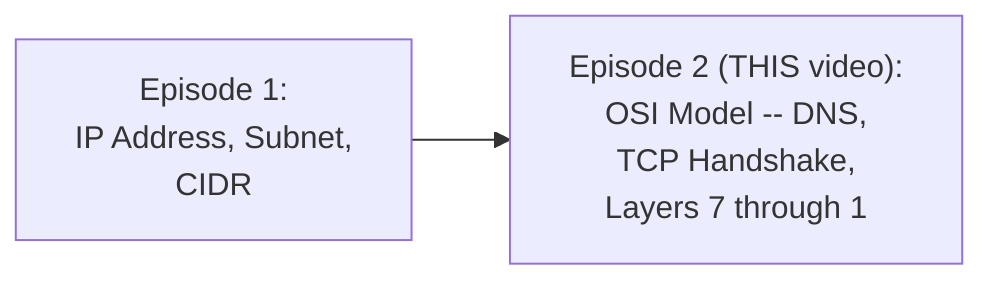

#### 🎯 Key Takeaways

* This video is **explicitly, directly the promised continuation** of Episode 1 — genuine prior familiarity with IP addresses, subnets, and CIDR is assumed, not re-taught.
* The entire video is built around **one single, continuous example** — a real request to google.com — deliberately avoiding an abstract, layer-by-layer list disconnected from a genuine, traceable scenario.

---

### 2. Before the OSI Model: DNS Resolution

#### ❓ Why It Exists — Two Genuine Prerequisites, Before the OSI Model Even Begins

> 💡 **Given directly:** *"Even before the OSI model comes into picture, they are number one is DNS resolution... and the second thing that happens is the TCP handshake."*

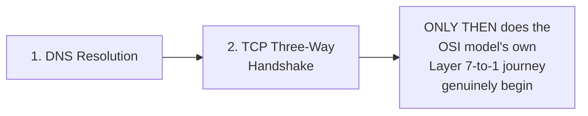

#### 📖 Definition — DNS, Precisely Defined

> 💡 **Given directly:** *"There is a system called DNS, which is nothing but Domain Naming Service -- you can understand it as a simple database, where records are maintained... every router has this information, which is records of domain name mapping with IP address."*

#### 🪜 Step-by-Step — Exactly Where DNS Resolution Looks, in Order

> 💡 **Given directly, the precise, ordered lookup sequence:** *"Router verifies this initially in the local cache... if this information is not available in the local cache, then it goes to your internet service provider and verifies this particular mapping... every internet service provider maintains a DNS where the complete records are available -- so google.com is usually mapped to the IP address 8.8.8.8."*

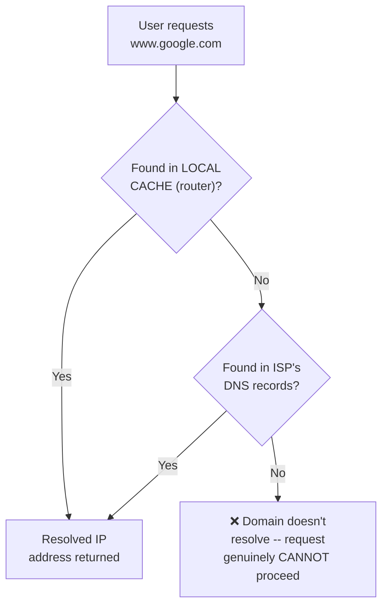

#### ❓ Why It Exists — Precisely Why This Check Must Happen First

> 💡 **Given directly, the precise, motivating reasoning:** *"Sometimes you might be uploading some 10GB file, or you might be sending a huge amount of data -- now if the DNS itself is not resolved, what's the point of even starting the data journey, or what's the point of even initiating the request?"*

#### ⚠ Common Mistakes

* Assuming DNS resolution is part of the OSI model's own seven layers — explicitly, directly clarified: it's a genuine PREREQUISITE, occurring entirely BEFORE the OSI model's own Layer 7-to-1 journey begins.
* Assuming DNS lookup always requires contacting an external server — explicitly, directly clarified: the LOCAL CACHE is checked FIRST, and only falls through to the ISP's own DNS records if the local cache doesn't already have the mapping.

#### 🎯 Key Takeaways

* **DNS resolution** translates a human-readable domain name (like `www.google.com`) into a genuine, usable IP address — checked first in a LOCAL cache, then against the ISP's own DNS records.
* This step exists specifically to **avoid wasting resources** on a data transmission whose destination doesn't even genuinely exist or resolve — verified BEFORE any actual data journey begins.

---
### 3. Before the OSI Model: The TCP Three-Way Handshake

#### ❓ Why It Exists — The Precise, Motivating Question

> 💡 **Given directly:** *"You are trying to send a request to it, you are ready to send a request, but is the server that you're trying to send ready to accept your request? What if it denies your request even after sending this entire thing? What if you cannot make a handshake with it?"*

#### 📖 Definition — Handshake, Precisely Defined With a Simple Analogy

> 💡 **Given directly:** *"Handshake is nothing but you are just trying to say hi, and it says hi, I'm okay to accept your request."*

#### 🪜 Step-by-Step — The Complete, Three-Step Handshake

> 💡 **Given directly, the complete, precise sequence:** *"Router tries to send a high [hi], in networking terminology we call it as SYNC [SYN] -- and if this server is ready to accept, if it says that okay, I'm good, then it says hi, which is in the networking terminology SYNC acknowledged [SYN-ACK] -- and finally your laptop says acknowledged [ACK]. So this happens in three steps, that's why we call it as a three-way handshake."*

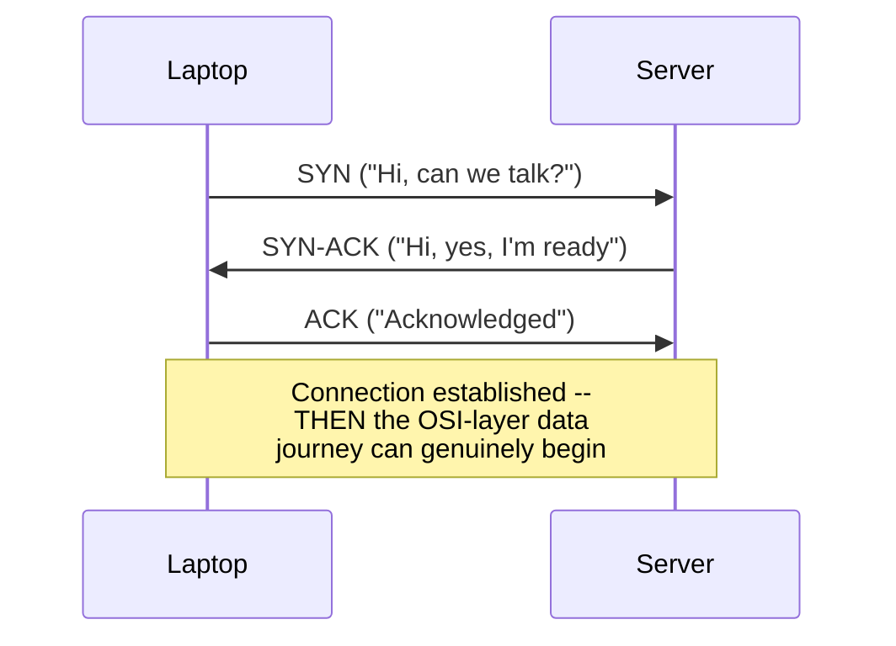

#### 🔍 Internal Working — Other Handshake Types, Briefly Named

> 💡 **Given directly, a genuinely honest acknowledgment that alternatives exist:** *"You might ask me, but Abhishek, why can't it be very simple -- as you say SYNC and it say SYNC acknowledge and it's done? ...There is also something called two-way handshake, and there's also something called four-way handshake... three-way is the most popular and which is mostly used."*

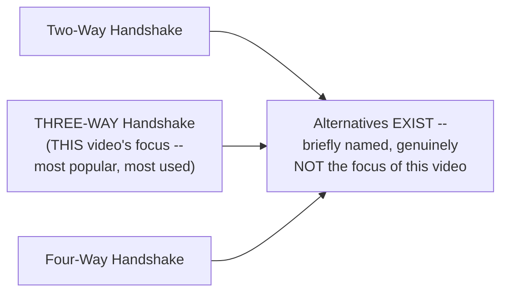

#### ⚠ Common Mistakes

* Assuming the three-way handshake is part of the OSI model's own seven layers — explicitly, directly clarified: like DNS resolution, it's a genuine PREREQUISITE, occurring before the OSI model's own data journey begins.
* Assuming a two-step handshake (just SYN and SYN-ACK) would be sufficient — explicitly, directly implied as insufficient by the video's own three-step description: the final ACK step is what genuinely confirms the connection is established from BOTH sides.

#### 🎯 Key Takeaways

* The **TCP three-way handshake** (SYN → SYN-ACK → ACK) genuinely confirms both the client and server are ready to communicate BEFORE any actual data transmission begins.
* This is the **second of two genuine prerequisites** to the OSI model — DNS resolution confirms the destination genuinely exists; the TCP handshake confirms the destination is genuinely ready to receive data.
* **Alternative handshake types** (two-way, four-way) genuinely exist, but the three-way handshake is explicitly named as the most popular and most widely used — the video's own deliberate focus.

---

### 4. Layers 7, 6, 5: The Browser's Own Job (Application, Presentation, Session)

#### 📖 Definition — Layer 7 (Application Layer), Precisely Introduced

> 💡 **Given directly:** *"Your browser initiates a HTTP or HTTPS request to the server... you are searching for google.com in the browser, so your browser is initiating a request... it says use HTTP-based request, why? Because you have asked for it... this particular stage is called as Layer 7, which is the initial stage, and also called as Application Layer. In this particular layer, you can pass some headers, and you can also provide information for the authentication."*

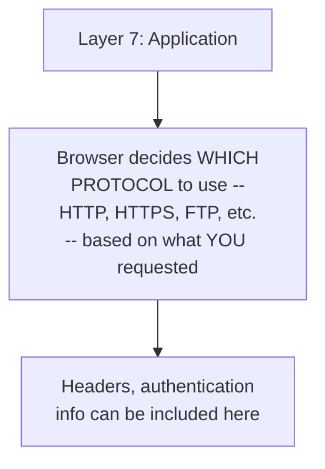

#### 📖 Definition — Layer 6 (Presentation Layer), Precisely Introduced

> 💡 **Given directly:** *"Once the request is initiated... the next step should be data encryption, right? Because... data goes through multiple routers... if your data is encrypted, then even if someone tries to hack your data, they don't understand what exactly it is, and that [is] where we use HTTPS... this layer in OSI model is called as Layer 6, which is also called as Presentation Layer."*

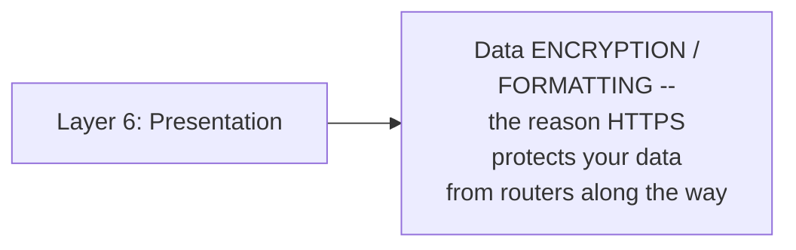

#### 📖 Definition — Layer 5 (Session Layer), Precisely Introduced, With a Genuinely Relatable Example

> 💡 **Given directly, the complete Facebook example:** *"Today you can go to facebook.com and probably search for facebook.com/AbhishekVemula, 20 minutes later take a different tab... and search for facebook.com/Raju or John, your browser will not ask you to authenticate one more time... this session is very, very important because sometimes, let's take example of your banking transaction... unless you log out, your bank server should not ask you to log in one more time -- and that happens only if your browser creates a session."*

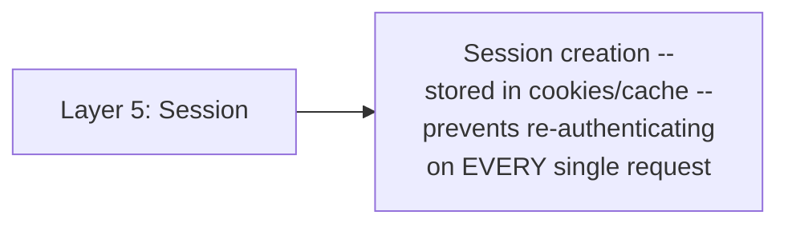

> 💡 **Given directly, a genuinely concrete, verifiable proof of this concept:** *"If you want an example, just go to your browser settings and try to clear cache as well as cookies, and then try to authenticate with facebook.com... two minutes later, if you delete the cookies and cache, it will ask you to authenticate one more time, because you have deleted the session -- session is basically stored in cookies and cache."*

#### 🔍 Internal Working — Precisely Why L7, L6, L5 Are Grouped Together in This Explanation

> 💡 **Given directly, the precise, unifying insight:** *"One interesting thing about all these three layers, right -- Layer 7, Layer 6, and Layer 5 -- is that ALL of these three layers are maintained by your browser... we did not even come to the router part... if I'm talking about only Layer 6, 5, and 4... my request even did not reach [beyond] the browser."*

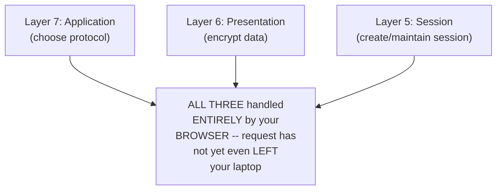

#### ⚠ Common Mistakes

* Assuming any of Layers 7, 6, or 5 involve the network/router at all — explicitly, directly clarified: ALL THREE happen entirely WITHIN the browser, before the request has even physically left the laptop.
* Assuming session and encryption are the same concept — explicitly, directly distinguished: encryption (L6) protects the CONTENT of the data as it travels; session (L5) avoids REPEATED AUTHENTICATION across multiple requests — genuinely different purposes.

#### 🎯 Key Takeaways

* **Layer 7 (Application)**: the browser decides which protocol to use (HTTP, HTTPS, FTP), based on what was requested.
* **Layer 6 (Presentation)**: data gets encrypted/formatted — directly explaining why HTTPS protects data from routers along its path.
* **Layer 5 (Session)**: a session is created and maintained (via cookies/cache) — directly explaining why you're not re-asked to log in on every single request.
* **All three of these layers are handled entirely by the browser** — a genuinely important, unifying insight: the request hasn't even left the laptop by the time these three layers are complete.

---
### 5. Layer 4: Transport — Segmentation & Protocol Selection

#### ❓ Why It Exists — The Precise, Motivating Scenario

> 💡 **Given directly:** *"To transmit the data... some cases the data that can [be] transmitting can be of 10GB also, right, probably you [are] trying to upload a movie... so if you are trying to do data at one time -- like if 10GB if you're trying to upload at once -- what usually happens is your data is segmented."*

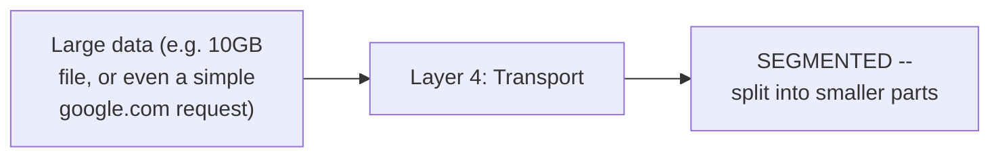

#### 📖 Definition — Segmentation, Precisely Defined

> 💡 **Given directly:** *"The data that you're trying to send, or the data that you are trying to receive, is segmented and split into parts -- this particular thing is called as segmentation, and this happens in Layer 4."*

#### 📖 Definition — Protocol Selection, Precisely Explained

> 💡 **Given directly:** *"Along with the segmentation, in this particular layer, the protocol is also defined -- whether you want to use TCP or UDP... there are only two protocols which are widely used, TCP as well as UDP."*

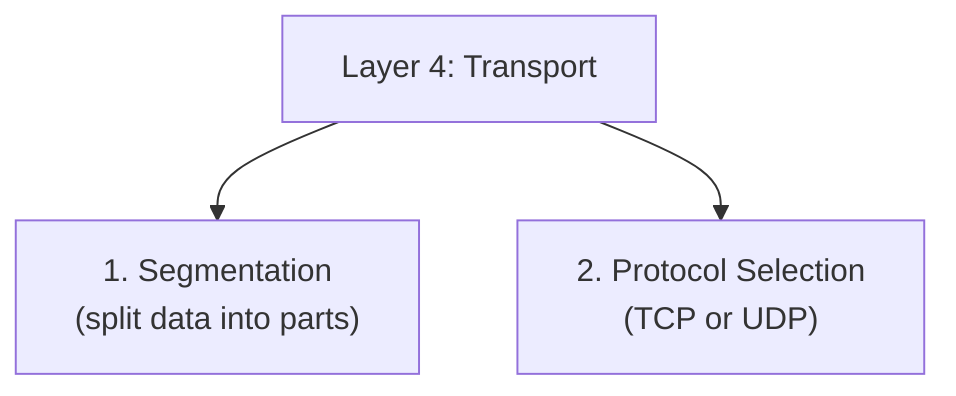

#### 🔍 Internal Working — Precisely How the Protocol Gets Determined

> 💡 **Given directly:** *"Mostly these are standardized -- let's say if you're using HTTP, the protocol is TCP; if you're using something like DNS or something else, the protocol is UDP -- so these protocols are standardized... if you [are] using HTTP, TCP is the protocol that is used to transmit the data."*

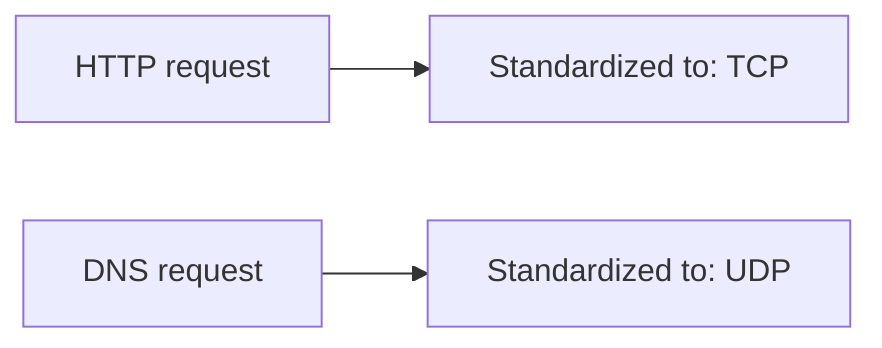

#### ⚠ Common Mistakes

* Assuming the protocol (TCP/UDP) is manually, arbitrarily chosen by the user each time — explicitly, directly clarified: it's genuinely STANDARDIZED, determined by the TYPE of request being made (e.g., HTTP requests standardly use TCP).
* Assuming segmentation and encryption (Layer 6) are related concepts — explicitly, directly distinguished: encryption protects data CONTENT; segmentation genuinely BREAKS data into transmittable PIECES — entirely different purposes, at entirely different layers.

#### 🎯 Key Takeaways

* **Layer 4 (Transport)** performs two genuinely distinct tasks: **segmentation** (splitting data into smaller, transmittable parts) and **protocol selection** (determining whether TCP or UDP is used).
* This layer is explicitly the FIRST point where data genuinely gets prepared for actual network transmission — everything before this (Layers 7, 6, 5) happened entirely within the browser.
* Protocol choice (TCP vs. UDP) is **standardized by request type** — not an arbitrary, per-request user decision.

---

### 6. Layers 3 and 2: Network & Data Link — Packets, Frames & Addressing

#### 🧠 Concept — The Delhi-to-Mumbai Routing Analogy

> 💡 **Given directly, the complete, motivating analogy:** *"Let's say you want to travel from Delhi to Mumbai -- here you know what is your destination, right, you know that you want to travel from Delhi to Mumbai, and second thing is, what is the shortest path? Probably you can travel from Delhi to Mumbai in 20 different ways, but you will only pick up the shortest path."*

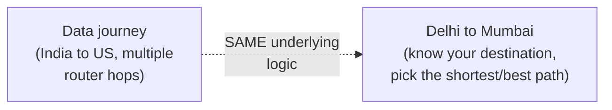

#### 📖 Definition — Layer 3 (Network Layer), Precisely Defined

> 💡 **Given directly:** *"In the Layer 3, what we will do is we will add source IP address as well as destination IP address to each segment... once you add the source IP address and the destination IP address, we call this data as packets... this decision is taken by your router, and this layer is called as networking layer."*

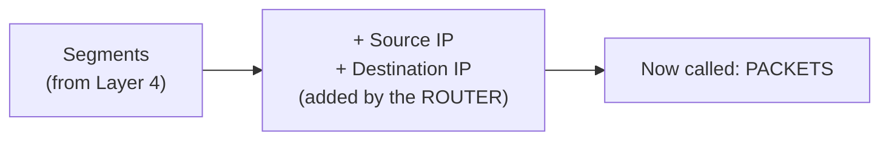

#### 🔍 Internal Working — Precisely What "Multiple Hops" Means

> 💡 **Given directly:** *"There will be multiple hops for your data, that is there are multiple routers that are involved -- probably your home router, then your internet service provider, from your internet service provider to XYZ, and finally it reaches the Google server -- so which routers or which hops should your data take to reach the Google server in the fastest way?"*

#### 📖 Definition — Layer 2 (Data Link Layer), Precisely Defined

> 💡 **Given directly:** *"Usually these routers are connected to switches... data has to be transformed from the packets to frames, depending upon the medium that you're using -- if you're using router, the data is converted into packets, then if you're using these switches, the data is converted into frames -- and in this frames, along with this IP address that you have provided, MAC information is also added, which is nothing but MAC -- MAC information tells these switches what are the other components within your network."*

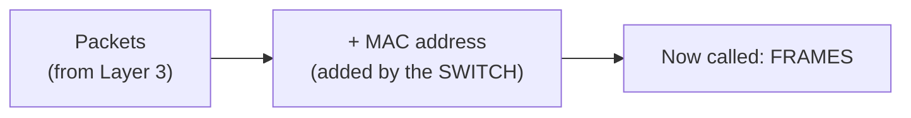

#### ❓ Why It Exists — Precisely Why the Data Format Changes Between Layer 3 and Layer 2

> 💡 **Given directly:** *"You might be thinking, but why can't I use packets? Because your medium has changed -- from router, this request is being sent to switches, and switches only understand how data can be transmitted in the frames."*

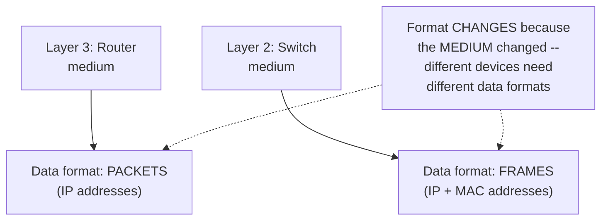

#### ⚠ Common Mistakes

* Using "packet" and "frame" interchangeably — explicitly, directly distinguished: a PACKET has source/destination IP addresses (added at Layer 3, by the router); a FRAME has this SAME information PLUS MAC addresses (added at Layer 2, by the switch).
* Assuming the data format change (packets to frames) is arbitrary — explicitly, directly explained: it's a genuine, necessary consequence of the MEDIUM changing (router to switch), since switches specifically require frames, not packets.

#### 🎯 Key Takeaways

* **Layer 3 (Network)**: the router adds source and destination IP addresses to each segment, producing **packets** — directly analogous to knowing your destination and choosing the fastest route (the Delhi-to-Mumbai analogy).
* **Layer 2 (Data Link)**: switches add MAC address information on top of the existing IP information, producing **frames** — a genuine format change required because the MEDIUM changed from router to switch.
* **"Multiple hops"** refers to the real, multiple routers data passes through (home router → ISP → intermediate routers → destination server) — with the router's job specifically being choosing the fastest, best path through these hops.

---
### 7. Layer 1: Physical — Electronic Signals

#### 📖 Definition — Layer 1, Precisely Defined

> 💡 **Given directly:** *"Finally you have Layer 1, that is your data -- end of the day, your router, switches, end of the day are connected to optical cables, and guess what language this optical cable understands? The language this optical cable understands is electronic signals... here your data is transmitted into electronic signal, and using optical cables data is transmitted very fast."*

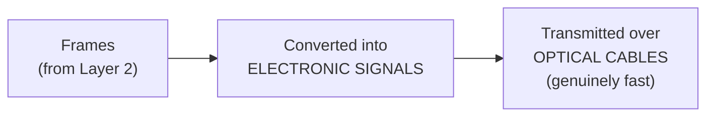

#### 🔍 Internal Working — The Complete, Seven-Layer Summary, Restated in One Pass

> 💡 **Given directly, the video's own complete, single-pass restatement:** *"If I have to explain this in one single slide one more time... [Layer 7] first of all it defines what is the type of request... [Layer 6] encrypt the data... [Layer 5] create a session with the server... [Layer 4] segmentation of data is important, and here along with the segmentation the protocol is also identified... [Layer 3] within the routers the path to transmit the data is identified, because in this layer we add the IP address... we call them as packets... [Layer 2] data is converted into frames where you add the MAC address... [Layer 1] these switches are connected to optical cables, and here the data is converted to electric signals."*

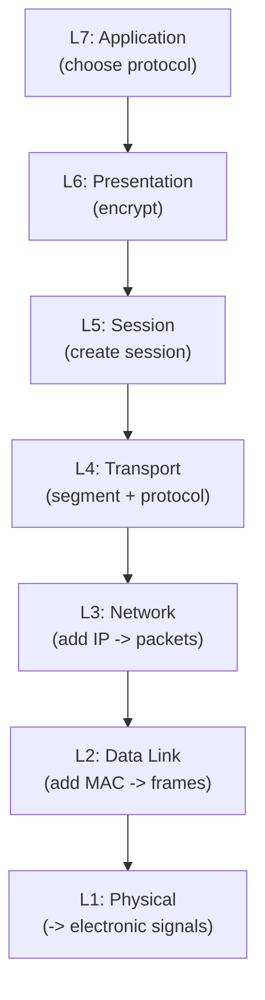

#### ⚠ Common Mistakes

* Assuming these seven layers are genuinely, physically SEPARATE hardware components — explicitly, directly clarified: *"All of these layers are virtual, just for you to understand -- OSI model is trying to just explain you that okay, this is the first step that happens, this is the second step that happens."*

#### 🎯 Key Takeaways

* **Layer 1 (Physical)** is the final, genuinely physical transformation — frames become electronic signals, transmitted over optical cables.
* The complete, **seven-layer journey** (Application → Presentation → Session → Transport → Network → Data Link → Physical) transforms data step by step: choosing a protocol, encrypting, creating a session, segmenting, addressing with IP, addressing with MAC, and finally converting to electronic signals.
* All seven layers are explicitly, directly described as **"virtual"** — a conceptual explanatory FRAMEWORK, not seven genuinely separate physical components.

---

### 8. The Reverse Journey: How the Server Receives & Responds

#### 🪜 Step-by-Step — The Complete, Reverse Journey at Google's Server

> 💡 **Given directly, the complete, precise reverse trace:** *"When this data [is] received by one of these Google servers, again the OSI model comes into picture, where initially data is received by one of these Google physical servers -- so one of these Google physical servers is connected to an optical cable, so L1 -- from there it will go to one of the switch boards, then it identifies which router to use, from there the data which you have been using as packets... let's say we are using the TCP protocol, so here the TCP data is taken into place -- from there, once you have the TCP data here, then session is validated, after that de-encryption takes place, from there it will go to one of the Google's applications."*

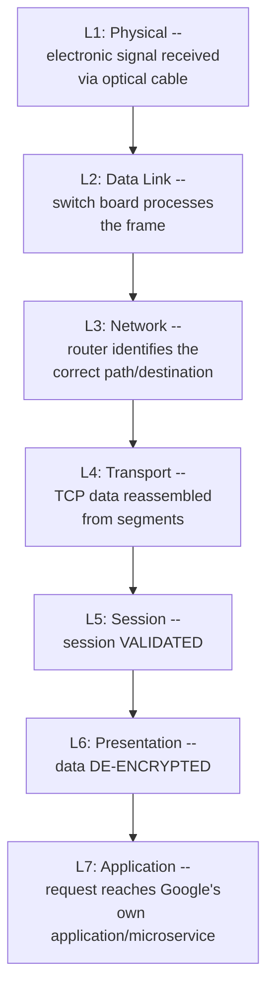

#### ❓ Why It Exists — What the Application Layer Genuinely Does With the Request

> 💡 **Given directly:** *"This Google application will say, hey, okay, this is your request, so let me give you a HTML page as a response -- here this application is a microservice or any particular monolith application which has the source code, and it understands, depending upon your request, okay, I want to generate a HTML page."*

#### 🔄 The Response's Own Journey, Traced Back Down

> 💡 **Given directly:** *"This HTML page is sent back to your personal laptop, and the same thing happens, right -- before it reaches your personal laptop, your router is connected to a physical cable, so it has to move from L1, L2, L3, L4, 5, 6, and finally reach your particular laptop."*

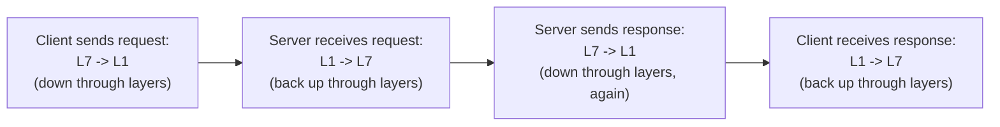

#### ⚠ Common Mistakes

* Assuming the OSI model only describes the SENDING side of a request — explicitly, directly demonstrated as applying EQUALLY, in reverse, to the RECEIVING side, and then AGAIN for the response traveling back.
* Assuming "Layer 7 to Layer 1" is a fixed, universal direction — explicitly, directly clarified at the video's opening: *"Sometimes it can be Layer 1 to Layer 7, if you are at the end of the data"* — direction depends on whether you're SENDING (7→1) or RECEIVING (1→7).

#### 🎯 Key Takeaways

* The OSI model applies **symmetrically** — a request travels DOWN through layers 7→1 on the sender's side, then back UP through layers 1→7 on the receiver's side.
* This entire process then **repeats in reverse** for the response — the server's own generated HTML page travels back down through 7→1, and the client receives it back up through 1→7.
* **Session validation and de-encryption** happen on the RECEIVING end specifically at Layers 5 and 6 respectively — directly mirroring the session creation and encryption that happened on the SENDING end.

---
### 9. OSI vs. TCP/IP Model & Practical Relevance for DevOps

#### 📖 Definition — The Precise, Stated Difference From the TCP/IP Model

> 💡 **Given directly:** *"Of course, OSI model is not the latest model -- there are models like TCP/IP model, right, which is again based on OSI model, but the thing is, in TCP/IP model, L7, L6, L5 is combined, because, you know, more or less these are performed by the same component, that is your browser -- so L7, L6, and L5 are combined and called as a single layer in the TCP/IP model."*

```mermaid
flowchart LR
    A["OSI Model<br/>(7 layers)"] --> B["L7 Application"]
    A --> C["L6 Presentation"]
    A --> D["L5 Session"]
    A --> E["L4-L1<br/>(unchanged)"]
    F["TCP/IP Model<br/>(fewer layers)"] --> G["L7+L6+L5<br/>COMBINED into ONE layer<br/>(since all are browser-handled)"]
    F --> H["L4-L1<br/>(same as OSI)"]
```

#### ❓ Why It Exists — Precisely Why OSI Remains the Preferred Teaching Standard

> 💡 **Given directly:** *"Why people usually prefer OSI model, because this is a standard, and if you understand this standard, you typically understand the entire transmission of data -- whether it's TCP/IP model or any new model, they are all based on the OSI model."*

#### 🏢 Real-World / Production Usage — A Genuinely Honest, Direct Assessment for DevOps Engineers

> 💡 **Given directly, a candid, non-inflated assessment of practical relevance:** *"How this OSI model is helpful for the DevOps engineers, I will tell you that it is not completely a must-have thing, right -- this knowledge is kind of a good-to-have thing... these days all of these things is standardized, and this entire thing is completely automated -- like you won't see anyone using Wireshark these days, unless you are working in the core networking company."*

```mermaid
flowchart LR
    A["Deep, protocol-level<br/>OSI knowledge<br/>(Wireshark, packet<br/>decryption, L2/L3 protocols)"] --> B["Genuinely needed ONLY<br/>for core networking<br/>companies/roles"]
    C["High-level OSI<br/>understanding<br/>(THIS video's own scope)"] --> D["✅ 'More than enough'<br/>for a DevOps engineer"]
```

#### ⚠ A Direct, Honest Boundary on This Video's Own Scope

> 💡 **Given directly:** *"You don't have to dig deep and try to understand what are the different protocols in Layer 3, right, you don't have to understand what are the different types of techniques that are available in Layer 2, because there is -- this is an ocean, and whatever I taught in this particular video, it's more than enough if you are trying to understand networking as a DevOps engineer."*

#### ⚠ Common Mistakes

* Assuming the OSI model is the current, actively-used industry standard in every real system — explicitly, directly clarified: it's explicitly acknowledged as "not the latest model," with the TCP/IP model (which merges L7/L6/L5) being the more modern, commonly-implemented variant — OSI remains valuable primarily as a genuinely useful TEACHING/conceptual standard.
* Assuming a DevOps engineer needs deep, protocol-level OSI expertise (packet-level tools like Wireshark, detailed Layer 2/3 protocol knowledge) — explicitly, directly, honestly corrected: this level of depth is specifically needed only in CORE NETWORKING roles/companies, not general DevOps work.

#### 🎯 Key Takeaways

* The **TCP/IP model** is a more modern variant of the OSI model, differing specifically by MERGING Layers 7, 6, and 5 into a single layer — a direct consequence of all three being handled by the same component (the browser).
* **OSI remains the preferred TEACHING standard** specifically because understanding it provides a genuine foundation for understanding ANY related model, including TCP/IP.
* The video's own **honest, direct assessment**: OSI model knowledge is a genuine "good to have," not a "must have," for DevOps engineers specifically — deep, protocol-level expertise (Wireshark, detailed Layer 2/3 protocols) is explicitly scoped to core networking roles, not general DevOps work.

---

## 📝 Glossary

| Term | Definition | Why It Matters |
|---|---|---|
| **DNS Resolution** | Translating a domain name into an IP address | A genuine prerequisite, occurring BEFORE the OSI model's own layers |
| **TCP Three-Way Handshake** | SYN -> SYN-ACK -> ACK | Confirms both sides are ready to communicate, before OSI layers begin |
| **Layer 7 (Application)** | Browser decides the protocol (HTTP, HTTPS, FTP) | Handled entirely by the browser |
| **Layer 6 (Presentation)** | Data encryption/formatting | Handled entirely by the browser; the reason HTTPS protects data |
| **Layer 5 (Session)** | Session creation/maintenance via cookies/cache | Handled entirely by the browser; avoids repeated re-authentication |
| **Layer 4 (Transport)** | Segmentation + protocol selection (TCP/UDP) | First layer where data genuinely prepares for network transmission |
| **Layer 3 (Network)** | Router adds source/destination IP -> "packets" | The router's own layer -- path/routing decisions happen here |
| **Layer 2 (Data Link)** | Switch adds MAC address -> "frames" | Format changes because the MEDIUM changed (router to switch) |
| **Layer 1 (Physical)** | Data converted to electronic signals | Transmitted over optical cables |
| **Packet** | Data + source/destination IP address | Produced at Layer 3, by the router |
| **Frame** | A packet + MAC address information | Produced at Layer 2, by the switch |
| **TCP/IP Model** | A more modern model merging OSI's L7/L6/L5 | Reflects that all three are handled by the same component (browser) |

---

## 🔄 Revision Notes — One-Minute Revision

* This is **Episode 2** of the networking fundamentals playlist -- directly continuing from Episode 1 (IP address, subnet, CIDR).
* **Two genuine PREREQUISITES** happen before the OSI model's own layers begin: **DNS resolution** (checks local cache, then ISP's DNS records, to translate a domain name into an IP address) and the **TCP three-way handshake** (SYN -> SYN-ACK -> ACK, confirming both sides are ready to communicate).
* **Layers 7, 6, 5 are ALL handled entirely by the browser**, before the request even leaves the laptop: **L7 (Application)** chooses the protocol (HTTP/HTTPS); **L6 (Presentation)** encrypts/formats the data (why HTTPS protects you); **L5 (Session)** creates/maintains a session via cookies/cache (why you're not re-asked to log in constantly -- verifiable by clearing cookies and cache).
* **L4 (Transport)** does two things: SEGMENTS the data into smaller parts, and identifies the PROTOCOL (TCP or UDP, standardized by request type -- HTTP uses TCP, DNS uses UDP).
* **L3 (Network)**: the ROUTER adds source/destination IP addresses, producing **PACKETS** -- directly analogous to knowing your destination and choosing the fastest route (Delhi-to-Mumbai analogy). Multiple ROUTER HOPS occur along the real path.
* **L2 (Data Link)**: SWITCHES add MAC address information, producing **FRAMES** -- the format genuinely changes because the MEDIUM changed (router to switch).
* **L1 (Physical)**: data becomes genuine ELECTRONIC SIGNALS, transmitted over optical cables. All seven layers are explicitly described as **"virtual"** -- a conceptual framework, not physically separate components.
* The **complete journey is symmetric**: request travels DOWN 7->1 on the sender's side, back UP 1->7 on the receiver's side (with session VALIDATION and DE-ENCRYPTION happening at L5/L6 on receipt) -- then the SAME process repeats in reverse for the response.
* **TCP/IP model** merges L7/L6/L5 into one layer, since all three are handled by the same component (the browser) -- OSI remains the preferred TEACHING standard since understanding it provides a foundation for any related model.
* **Honest, practical assessment for DevOps engineers**: OSI knowledge is a genuine "good to have," not a "must have" -- deep, protocol-level expertise (Wireshark, Layer 2/3 protocol details) is scoped specifically to core networking roles.

---
## 📋 Cheat Sheet

**The two prerequisites, before OSI layers begin:**
```text
1. DNS Resolution (local cache -> ISP DNS -> resolved IP)
2. TCP Three-Way Handshake (SYN -> SYN-ACK -> ACK)
```

**The complete seven layers, top to bottom (sending):**
```text
L7 Application    -> choose protocol (HTTP/HTTPS/FTP)         [BROWSER]
L6 Presentation   -> encrypt/format data                       [BROWSER]
L5 Session        -> create/maintain session (cookies/cache)    [BROWSER]
L4 Transport      -> segment data + choose protocol (TCP/UDP)
L3 Network        -> add source/dest IP -> PACKETS              [ROUTER]
L2 Data Link      -> add MAC address -> FRAMES                  [SWITCH]
L1 Physical       -> convert to electronic signals              [CABLE]
```

**Packet vs. frame:**
```text
Packet = data + source/destination IP (Layer 3, added by router)
Frame  = packet + MAC address (Layer 2, added by switch)
```

**Direction depends on role:**
```text
Sending:   L7 -> L1 (down through layers)
Receiving: L1 -> L7 (back up through layers)
```

**OSI vs. TCP/IP model:**
```text
OSI:      L7, L6, L5 are SEPARATE layers
TCP/IP:   L7, L6, L5 are COMBINED into ONE layer (all browser-handled)
```

**DevOps relevance:**
```text
High-level OSI understanding -> genuinely sufficient for DevOps
Deep protocol-level expertise (Wireshark, L2/L3 protocols) -> core networking roles only
```

---

## 🔥 Interview Questions & Answers

### 🟢 Beginner

**Q1.**

**Question:** What two things happen before the OSI model's own layers begin?

**Answer:** DNS resolution and the TCP three-way handshake.

**Explanation:** Directly, explicitly named.

**Why Interviewers Ask This:** Tests understanding of the complete, genuine request lifecycle, not just the OSI layers in isolation.

**Possible Follow-up:** "What does DNS resolution check first -- local cache or the ISP's DNS records?"

**Q2.**

**Question:** Name the three steps of the TCP three-way handshake.

**Answer:** SYN, SYN-ACK, ACK.

**Explanation:** Directly, precisely named and ordered.

**Why Interviewers Ask This:** Foundational, frequently-tested networking knowledge.

**Possible Follow-up:** "Why is it called a THREE-way handshake specifically?"

**Q3.**

**Question:** Which three OSI layers are handled entirely by the browser?

**Answer:** Layer 7 (Application), Layer 6 (Presentation), Layer 5 (Session).

**Explanation:** Directly, explicitly stated.

**Why Interviewers Ask This:** Tests a genuinely important, unifying insight about where these layers actually happen.

**Possible Follow-up:** "What does each of these three layers specifically do?"

**Q4.**

**Question:** What happens at Layer 4 (Transport)?

**Answer:** Data is segmented into smaller parts, and the transmission protocol (TCP or UDP) is identified.

**Explanation:** Directly, precisely explained.

**Why Interviewers Ask This:** Foundational Transport-layer knowledge.

**Possible Follow-up:** "Which protocol does HTTP standardly use?"

**Q5.**

**Question:** What is the difference between a packet and a frame?

**Answer:** A packet has source/destination IP addresses (added at Layer 3); a frame has this same information plus a MAC address (added at Layer 2).

**Explanation:** Directly, precisely distinguished.

**Why Interviewers Ask This:** A commonly-confused, foundational terminology distinction.

**Possible Follow-up:** "Which device adds MAC address information -- the router or the switch?"

**Q6.**

**Question:** What does Layer 1 (Physical) do?

**Answer:** Converts frames into electronic signals, transmitted over optical cables.

**Explanation:** Directly, precisely explained.

**Why Interviewers Ask This:** Basic, foundational OSI-layer knowledge.

**Possible Follow-up:** "Are the seven OSI layers physically separate components?"

**Q7.**

**Question:** In which direction does data travel when RECEIVING a request?

**Answer:** Layer 1 to Layer 7 (bottom to top) -- the reverse of sending.

**Explanation:** Directly, explicitly clarified.

**Why Interviewers Ask This:** Tests understanding that OSI layer direction depends on sender vs. receiver role.

**Possible Follow-up:** "What happens at Layer 5 specifically when a server RECEIVES a request?"

**Q8.**

**Question:** How does the TCP/IP model differ structurally from the OSI model?

**Answer:** The TCP/IP model combines Layers 7, 6, and 5 into a single layer, since all three are handled by the same component (the browser).

**Explanation:** Directly, precisely explained.

**Why Interviewers Ask This:** Tests awareness of a genuinely important, related networking model.

**Possible Follow-up:** "Why does OSI remain the preferred teaching standard despite not being the 'latest' model?"

**Q9.**

**Question:** Is deep, protocol-level OSI knowledge (e.g., Wireshark usage) a "must-have" for DevOps engineers, per this video?

**Answer:** No -- explicitly described as a "good to have," genuinely necessary only for core networking roles/companies.

**Explanation:** Directly, honestly stated.

**Why Interviewers Ask This:** Tests awareness of a genuinely practical, role-specific scoping of networking depth.

**Possible Follow-up:** "What level of OSI understanding IS considered sufficient for a DevOps engineer?"

**Q10.**

**Question:** How can you verify, in your own browser, that a "session" (Layer 5) genuinely exists and is stored in cookies/cache?

**Answer:** Clear your browser's cookies and cache after logging into a site, then check whether you're asked to log in again.

**Explanation:** Directly, precisely described as a genuine, verifiable test.

**Why Interviewers Ask This:** Tests understanding of a concrete, hands-on way to verify an abstract concept.

**Possible Follow-up:** "What would happen if you DIDN'T clear cookies/cache, but instead just closed and reopened the browser?"

---

### 🟡 Intermediate

**Q11.**

**Question:** Explain why the video insists that DNS resolution and the TCP handshake are genuine PREREQUISITES to the OSI model, rather than simply being additional OSI layers themselves.

**Answer:** The video's own precise reasoning is that these two steps answer fundamentally DIFFERENT questions than the OSI model's own seven layers address. The OSI model describes HOW data is genuinely transformed and transmitted ONCE a connection is meaningfully possible and worthwhile. DNS resolution and the TCP handshake instead answer two PRIOR questions: "does this destination even genuinely exist/resolve?" (DNS) and "is this destination genuinely ready to receive data?" (TCP handshake). Both are explicitly framed as avoiding WASTED EFFORT -- there's no point beginning an elaborate, seven-layer data transformation and transmission process for a destination that doesn't exist or isn't ready. This is a genuine, meaningful conceptual distinction, not merely a matter of where these steps happen to be listed.

**Explanation:** Requires recognizing why these steps are conceptually distinct from the OSI model's own scope, not just sequentially prior to it.

**Why Interviewers Ask This:** Tests whether a learner understands WHY these are prerequisites, not just that they occur first.

**Possible Follow-up:** "What would happen if a browser skipped DNS resolution and attempted the OSI-layer journey anyway?"

**Q12.**

**Question:** A learner argues that since Layers 7, 6, and 5 are all handled by the browser, they are essentially "the same layer" and the OSI model's distinction between them is genuinely unnecessary complexity. Evaluate this claim.

**Answer:** This claim overstates the case, conflating WHERE something happens (the browser, as a physical/software LOCATION) with WHAT genuinely happens (three functionally distinct TASKS). Even though all three occur within the same component, each performs a genuinely DIFFERENT function: Layer 7 decides WHICH PROTOCOL to use; Layer 6 ENCRYPTS/FORMATS the data; Layer 5 manages SESSION STATE across multiple requests. These are conceptually separable concerns -- a request could theoretically use HTTP (L7) without encryption (no HTTPS, so effectively skipping L6's protective function) while still maintaining a session (L5) via cookies. The TCP/IP model's OWN choice to merge these three layers (per Section 9) is a genuine, deliberate SIMPLIFICATION reflecting that they're commonly IMPLEMENTED together -- but this doesn't mean the underlying FUNCTIONAL distinction the OSI model draws is meaningless; it specifically reflects a judgment that, for TCP/IP's own purposes, a coarser-grained model is sufficient, not that the finer-grained distinction is genuinely incorrect or unnecessary.

**Explanation:** Tests whether a learner distinguishes physical/component-level grouping from functional/conceptual distinction.

**Why Interviewers Ask This:** Distinguishes candidates who understand the genuine reason for OSI's finer-grained layering from those who conflate "same location" with "same function."

**Possible Follow-up:** "Give an example where a request might use Layer 7 and Layer 5 (session), but skip meaningful Layer 6 encryption."

**Q13.**

**Question:** Explain, precisely, why the video uses the Delhi-to-Mumbai analogy specifically for Layer 3 (Network), rather than for Layer 2 (Data Link) or Layer 4 (Transport).

**Answer:** The Delhi-to-Mumbai analogy specifically illustrates TWO things Layer 3 genuinely does: (1) knowing your DESTINATION (directly mirroring the destination IP address added at this layer), and (2) choosing the SHORTEST/BEST PATH among multiple possible routes (directly mirroring the router's own job of selecting the fastest hop-by-hop path across multiple possible routers). This analogy is specifically APT for Layer 3 because Layer 3's entire function IS routing/addressing decisions -- neither Layer 2 (which is about the LOCAL, immediate MEDIUM-specific addressing via MAC, not long-distance PATH selection) nor Layer 4 (which is about SEGMENTING data and choosing a PROTOCOL, not choosing a geographic/network PATH) would be well-served by this specific analogy, since neither genuinely involves "choosing among multiple possible routes to a destination" the way Layer 3 explicitly does.

**Explanation:** Requires reasoning through why a specific analogy maps precisely onto one layer's function and not others.

**Why Interviewers Ask This:** Tests whether a learner understands the PRECISE function of Layer 3 specifically, distinguishing it from adjacent layers.

**Possible Follow-up:** "Construct your own, different analogy that would be well-suited to explaining Layer 2's specific function instead."

**Q14.**

**Question:** Using the video's own reverse-journey description (Section 8), explain precisely why "session validation" happens at Layer 5 on the RECEIVING end, and what would happen if this step were skipped.

**Answer:** Per the video's own reverse-trace description, once data reaches Layer 5 on the receiving end (after being reassembled at L4 and having its path/frame processed at L3/L2/L1), the server must verify whether this request belongs to an EXISTING, already-authenticated session (directly mirroring the SAME session concept established on the sending side, per Section 4) or whether it requires fresh authentication. If this step were genuinely skipped, the server would have no way to distinguish a request from an already-authenticated user (who should be granted access without re-login) from a request lacking any genuine authentication at all -- this would either force EVERY request to re-authenticate (breaking the entire convenience benefit sessions provide, as the video's own Facebook example demonstrates) or, worse, could allow genuinely unauthenticated requests to proceed as if they were authenticated, a serious security failure. Session validation at this specific layer is precisely what allows the server to correctly apply the SAME "don't ask for repeated authentication" behavior the browser itself implements on the sending side.

**Explanation:** Requires connecting the receiving-end description (Section 8) back to the sending-end session concept (Section 4) to explain the genuine necessity of this specific step.

**Why Interviewers Ask This:** Tests whether a learner can trace a concept (sessions) across BOTH the sending and receiving sides of a complete request-response cycle.

**Possible Follow-up:** "At which specific layer does 'de-encryption' happen on the receiving end, and why must it happen at THIS specific point, rather than earlier or later?"

**Q15.**

**Question:** Synthesize the video's own DNS resolution explanation (Section 2) with its Layer 3 routing explanation (Section 6) to precisely distinguish these two genuinely different kinds of "address resolution" that occur at different points in a request's overall journey.

**Answer:** These represent two GENUINELY DIFFERENT resolution steps, occurring at different STAGES and answering different QUESTIONS. DNS resolution (Section 2) happens BEFORE the OSI model even begins, and answers "what IP address does this DOMAIN NAME correspond to?" -- a ONE-TIME translation from a human-readable name (like `www.google.com`) into a single, specific destination IP address. Layer 3's own IP addressing (Section 6) happens WITHIN the OSI model's own data journey, and is concerned with a DIFFERENT question: "given that we already KNOW the destination IP address (from DNS), which SPECIFIC PATH (sequence of router hops) should THIS PARTICULAR PACKET take to reach it?" This distinction is genuinely important: DNS resolution determines the destination ONCE, at the very start; Layer 3 routing decisions are made REPEATEDLY, potentially differently for different packets or at different times, as routers dynamically determine the best available path given current network conditions. Confusing these two would incorrectly suggest that "resolving an address" is a single, uniform concept, when the video's own content reveals it's genuinely two distinct processes serving different purposes at different points in the pipeline.

**Explanation:** Requires synthesizing two separately-taught "addressing" concepts to precisely distinguish their genuinely different roles and timing.

**Why Interviewers Ask This:** A senior-level question testing whether a candidate can distinguish superficially similar concepts (both involve "IP addresses") by their precise, different functional roles.

**Possible Follow-up:** "Does DNS resolution ever need to happen again during a single request's journey, once it has already occurred at the start?"

---

### 🔴 Advanced

**Q16.**

**Question:** Design a complete, precise trace of what happens, layer by layer, when a user's DNS resolution SUCCEEDS but the subsequent TCP three-way handshake FAILS (the server never responds to the SYN) — explaining exactly where in the process this failure is detected, and why the OSI model's own layers never get invoked in this scenario.

**Answer:** A precise trace: (1) The user's browser/router initiates DNS resolution for the target domain; per Section 2's own described lookup sequence, this succeeds -- the domain genuinely resolves to a valid IP address (found either in local cache or via the ISP's DNS records). (2) With a valid destination IP address now known, the TCP three-way handshake begins: the client sends a SYN packet to the resolved IP address. (3) In this specific failure scenario, the server either doesn't exist at that address, is down, or is otherwise unreachable -- meaning NO SYN-ACK response is ever received. (4) Since the handshake's SECOND step (SYN-ACK) never occurs, the handshake genuinely cannot complete -- the client's connection attempt will eventually TIME OUT, reporting a connection failure to the user. (5) Critically, per Section 3's own precise framing, the OSI model's own seven layers (7 through 1) are ENTIRELY SKIPPED in this scenario -- since the TCP handshake is a genuine PREREQUISITE occurring BEFORE any OSI-layer data transmission begins, and it never completed, there was never any actual DATA (HTTP request, encrypted payload, session, segments, packets, frames, or electronic signals) genuinely transmitted through the OSI model's own layers at all. This directly illustrates why treating DNS/TCP-handshake as genuine prerequisites (rather than as OSI layers themselves) is functionally important: a failure at THIS stage means the OSI model's own layer-by-layer process never even begins.

**Explanation:** Requires tracing a complete, realistic failure scenario through both prerequisite steps, explaining precisely why and where the OSI model's own layers are never invoked.

**Why Interviewers Ask This:** A realistic, senior-level troubleshooting question testing whether a candidate understands the precise, sequential dependency between DNS, TCP handshake, and the OSI model's own layers.

**Possible Follow-up:** "At what point would this exact failure be reported to the end user, and what would the error message typically indicate?"

**Q17.**

**Question:** Critically evaluate: "Since this video explains that OSI's seven layers are 'virtual' and not physically separate components, this implies the entire OSI model is a purely theoretical abstraction with no genuine, practical correspondence to real hardware or software components." Is this an accurate characterization?

**Answer:** Not accurate -- this significantly overstates the "virtual" framing into a claim the video's own content directly contradicts. The video EXPLICITLY, REPEATEDLY connects OSI layers to genuinely REAL, physical/software components: Layers 7, 6, 5 are explicitly tied to a REAL, physical component (the browser); Layer 3 is explicitly tied to a REAL physical device (the router); Layer 2 is explicitly tied to REAL physical devices (switches); Layer 1 is explicitly tied to REAL physical infrastructure (optical cables, electronic signals). The "virtual" framing specifically means something narrower and more precise: the SEVEN-LAYER BOUNDARY LINES THEMSELVES are a conceptual, explanatory FRAMEWORK -- a given piece of REAL hardware or software might genuinely perform functions spanning what the OSI model labels as multiple, separate layers (exactly as the browser genuinely performs the functions the OSI model separately labels as L7, L6, and L5). The model's VALUE is precisely in providing a clear, standardized way to TALK ABOUT and REASON ABOUT these genuinely real processes and components, even though the boundary lines between "layers" don't correspond to physically separate, standalone hardware modules for each and every layer.

**Explanation:** Tests whether a learner distinguishes "the layer boundaries are conceptual" from "the entire model is disconnected from real components," a genuinely important, precise distinction.

**Why Interviewers Ask This:** Distinguishes candidates who understand the precise scope of the "virtual" framing from those who over-generalize it into dismissing the model's real, practical grounding.

**Possible Follow-up:** "Name one REAL, physical or software component the video directly associates with each of the seven OSI layers."

**Q18.**

**Question:** Synthesize the video's complete request-and-response cycle (Sections 2 through 8) with its own honest DevOps-relevance assessment (Section 9) to construct a precise argument for WHICH specific parts of this entire cycle a DevOps engineer genuinely, practically needs to understand deeply, versus which parts remain safely at a "good to have, high-level only" understanding.

**Answer:** A precise, reasoned argument: DevOps engineers genuinely, PRACTICALLY need deep understanding of the concepts most DIRECTLY tied to their actual, everyday responsibilities -- which, per the video's OWN Episode 1 content (subnets, CIDR, private/public subnet routing) and this video's own Layer 3/4 content (IP addressing, TCP/UDP protocol selection, routing paths), corresponds most closely to LAYERS 3 AND 4 and the surrounding infrastructure concepts (subnets, CIDR, security groups, load balancers) -- since DevOps engineers routinely CONFIGURE cloud networking resources (VPCs, subnets, security groups) that directly correspond to these specific layers' concerns. DNS resolution (Section 2) is ALSO genuinely practically relevant, since DevOps engineers routinely configure DNS records for real services. By contrast, per the video's OWN explicit, honest scoping (Section 9), DEEP Layer 2 protocol details (specific data-link protocols, MAC-address-level troubleshooting) and DEEP Layer 1 physical-layer details (optical cable specifications, electronic signal encoding) are explicitly named as genuinely UNNECESSARY for DevOps work, reserved specifically for core networking specialists. Layers 7, 6, 5 (Section 4) sit in an interesting middle ground: a DevOps engineer benefits from understanding THAT sessions/encryption/protocol-selection happen (useful for debugging application-level issues, like session/cookie problems, or configuring HTTPS/TLS termination at a load balancer), without needing browser-internals-level implementation depth. This produces a genuinely reasoned, differentiated priority list -- directly derived from combining WHAT DevOps engineers actually configure/troubleshoot (per the video's OWN Episode 1 and Episode 2 content) with the video's OWN explicit, honest relevance assessment -- rather than treating "know the OSI model" as an undifferentiated, single block of required knowledge.

**Explanation:** Requires synthesizing the complete technical content of both sections with the video's own honest, practical relevance framing to produce a genuinely reasoned, differentiated study-priority argument.

**Why Interviewers Ask This:** A capstone-level question testing whether a candidate can translate conceptual, layer-by-layer knowledge into a genuinely reasoned, role-specific practical priority assessment.

**Possible Follow-up:** "Where would you place 'configuring an HTTPS load balancer' in this priority assessment, and which specific OSI layer(s) does this task most directly correspond to?"

---

## 🧪 Scenario-Based Interview Questions

> **Scenario 1:** A user reports that a website loads correctly on their first visit, but every subsequent page on the same site asks them to log in again, unlike most other websites they use. Using this video's concepts, diagnose the most likely cause.

**Structured Answer:**
1. **Initial investigation:** Recognize this as directly connected to Section 4's own precise explanation of Layer 5 (Session) -- the expected behavior (per the video's own Facebook example) is that a session should be maintained across multiple requests, avoiding repeated authentication.
2. **Metrics/logs to check:** Directly verify whether the browser is genuinely storing cookies/cache for this specific site, or whether something is preventing this (browser privacy settings, an incognito/private window, or the site's own cookie configuration).
3. **Possible causes:** Per Section 4's own precise mechanism ("session is basically stored in cookies and cache"), the most likely cause is that cookies are being blocked, cleared, or not properly SET by the site for this specific user -- directly preventing Layer 5's own session-maintenance function from working as intended.
4. **Debugging approach:** Directly reproduce the video's own suggested verification method (Section 4) -- check whether cookies/cache genuinely persist for this site between page loads, and check browser privacy/cookie settings for anything blocking this specific site.
5. **Resolution:** Adjust browser cookie settings (if they're the cause) or investigate the site's own session-cookie configuration (if this is a site-side issue), restoring genuine Layer 5 session persistence.
6. **Prevention:** Establish a standing practice of testing session persistence explicitly (clearing cookies deliberately to confirm expected re-authentication behavior, per Section 4's own suggested test) when debugging any genuinely unexpected authentication-related behavior.

> **Scenario 2 (Advanced):** Your organization's application works correctly when accessed via its IP address directly, but fails entirely when accessed via its domain name, with users reporting the browser simply hangs and eventually times out. Using this video's concepts, diagnose the most likely cause.

**Structured Answer:**
1. **Initial investigation:** Recognize this as most likely a DNS resolution issue (Section 2), since the application genuinely WORKS when the OSI-model journey is triggered directly via IP address (skipping DNS resolution entirely) but fails specifically when DNS resolution is genuinely required.
2. **Metrics/logs to check:** Directly verify whether the domain name genuinely resolves to the CORRECT IP address, checking both local cache and the actual, authoritative DNS records for the domain.
3. **Possible causes:** Per Section 2's own precise reasoning, the domain name likely either has NO valid DNS mapping at all, or has a STALE/INCORRECT mapping (pointing to an old or wrong IP address) -- meaning the "if this mapping happens... only then you will move to the second stage" condition genuinely fails, preventing the request from ever reaching the TCP handshake or OSI-layer stages at all.
4. **Debugging approach:** Use a DNS lookup tool to directly verify what IP address the domain name genuinely resolves to, comparing this against the application's own actual, correct IP address.
5. **Resolution:** Correct the DNS record (if missing or pointing to the wrong IP address), directly restoring correct domain-to-IP resolution.
6. **Prevention:** Establish a standing, automated monitoring check specifically verifying that critical domain names resolve to their correct, expected IP addresses, catching DNS misconfigurations before they cause genuine, user-facing failures.

---

## 🛠 Hands-on Exercises

### 🟢 Easy

1. Write out, from memory, the complete sequence of the TCP three-way handshake, including the correct networking terminology (SYN, SYN-ACK, ACK) for each step.
2. Draw (or describe in writing) which three OSI layers are handled entirely by the browser, and one sentence describing what each one does.
3. Directly perform the video's own suggested verification test: log into a website, then clear your browser's cookies and cache, and observe whether you're asked to authenticate again.

### 🟡 Medium

4. Write a short explanation (150-200 words) precisely distinguishing a "packet" from a "frame," including which device adds which specific information at each stage.
5. Complete the DNS-resolution-success-but-TCP-handshake-failure trace proposed in Advanced Interview Q16, for a scenario of your own choosing.
6. Research (outside this video) a real DNS lookup tool (e.g., `dig` or `nslookup`), and use it to look up the actual IP address a real domain name resolves to.

### 🔴 Advanced

7. Implement the complete DevOps-relevance priority assessment proposed in Advanced Interview Q18, extending it to at least two additional, genuinely realistic DevOps tasks (e.g., configuring a load balancer, debugging a failed health check).
8. Design and document the DNS-resolution monitoring check proposed in Scenario 2's resolution, specifying exactly what conditions would trigger a genuine alert.
9. Write the complete, precise trace proposed in Advanced Interview Q15, extended to explain what would happen if a device's local DNS cache contained a STALE (outdated) IP address mapping.

---

## 🏗 Practice Assignment

### Build: "Complete Request-Response Cycle Trace"

**Objective:** Directly reproduce this video's own complete, layer-by-layer trace of a request-response cycle, for a genuinely new, self-chosen example.

**Requirements:**
- A complete, written trace of a request to a website of your own choosing (not google.com), covering DNS resolution, the TCP handshake, and all seven OSI layers on the sending side.
- A complete, written trace of the SAME request being received by the server, covering Layers 1 through 7 in reverse, including session validation and de-encryption.
- A complete, written trace of the server's response traveling back to the client, through all seven layers again.
- A written reflection (200-300 words) on which specific layer or concept (DNS resolution, the TCP handshake, session management, or the packet/frame distinction) you found most immediately useful for understanding real-world DevOps/cloud networking work.

**Architecture (suggested):**

```text
osi_model_complete_trace/
├── 01_dns_and_handshake.md          # your DNS resolution + TCP handshake trace
├── 02_sending_side_layers.md          # your L7-L1 sending trace
├── 03_receiving_side_layers.md          # your L1-L7 receiving trace
├── 04_response_journey.md                 # your response's own L7-L1-L1-L7 trace
└── REFLECTION.md                             # your written reflection
```

**Expected Functionality:**
- Your trace should be genuinely, specifically detailed at each layer -- not a generic restatement, but applied to YOUR chosen example.
- Your reflection should demonstrate genuine, applied understanding, connecting this video's content to real, practical relevance.

**Challenges:**
- Correctly tracking which specific information (IP address, MAC address, session state) is genuinely added or validated at each specific layer.
- Correctly reasoning through the DIRECTION of data flow (7->1 vs. 1->7) at each stage of the complete cycle.

**Bonus Improvements:**
- Extend your trace to include a genuine DNS resolution failure scenario, directly modeling Advanced Interview Q16's own reasoning.
- Research and add a genuine comparison to the TCP/IP model's own layer structure for your specific example.

---

## 📚 Additional Resources

- **Episode 1 of this playlist** ("Networking Concepts are Easy") -- the direct prerequisite video, covering IP addresses, subnets, and CIDR, all of which this video directly builds on (particularly at Layer 3).
- **Further reading on two-way and four-way handshakes** (referenced directly, though not covered in depth) -- explicitly suggested for genuinely curious viewers wanting to compare handshake types.
- **Wireshark** (referenced directly, as an example of a deep, packet-level analysis tool) -- explicitly named as relevant only for core networking roles, not general DevOps work.

---

## 📌 Final Revision Sheet

### ⭐ Core Concepts
- **DNS resolution** and the **TCP three-way handshake** are genuine PREREQUISITES, occurring before the OSI model's own seven layers begin.
- **Layers 7, 6, 5** (Application, Presentation, Session) are ALL handled entirely by the browser.
- **Layer 4** (Transport) segments data and selects the protocol (TCP/UDP).
- **Layer 3** (Network, router) adds IP addresses -> packets; **Layer 2** (Data Link, switch) adds MAC addresses -> frames.
- **Layer 1** (Physical) converts data to electronic signals.
- The complete journey is **symmetric**: 7->1 sending, 1->7 receiving, then the SAME process repeats for the response.
- **TCP/IP model** merges L7/L6/L5 into one layer.
- OSI knowledge is a **"good to have," not "must have"** for DevOps engineers -- deep protocol-level expertise is scoped to core networking roles.

### ⭐ Important Definitions
- **Packet, Frame, DNS Resolution** (see Glossary for full definitions).

### ⭐ Important Commands/Code
- N/A -- this is a conceptual networking foundations video; no hands-on commands are directly demonstrated.

### ⭐ Architecture/Process
- Complete cycle: DNS resolution -> TCP handshake -> L7->L1 (sender) -> L1->L7 (receiver, including session validation and de-encryption) -> L7->L1 (response, sender-side at server) -> L1->L7 (response, receiver-side at client).

### ⭐ Best Practices
- Verify DNS resolution and TCP connectivity separately when troubleshooting connection failures.
- Test session persistence explicitly (clearing cookies/cache) when debugging unexpected authentication behavior.
- Scope OSI-model depth appropriately to your actual role -- high-level understanding is sufficient for most DevOps work.

### ⭐ Common Mistakes
- Assuming DNS resolution and the TCP handshake are OSI layers themselves, rather than genuine prerequisites.
- Using "packet" and "frame" interchangeably.
- Assuming the seven OSI layers are physically separate hardware components.
- Assuming deep, protocol-level OSI expertise is required for general DevOps work.

### ⭐ Interview Points
- Be ready to name the three TCP handshake steps in order.
- Be ready to explain which three layers the browser handles entirely.
- Be ready to precisely distinguish a packet from a frame.
- Be ready to explain the structural difference between the OSI and TCP/IP models.

### ⭐ Things to Remember
- This is **Episode 2** of the networking fundamentals playlist -- directly continuing from Episode 1's IP address/subnet/CIDR content.
- The entire video is built around **one single, continuous, concrete example** (a request to google.com) -- deliberately avoiding abstract, disconnected layer-by-layer explanation.
- The video's own **honest, direct DevOps-relevance assessment** ("good to have, not must have") is a genuinely important, practical framing worth remembering alongside the technical content itself.

---

## 🔗 Source

- [Networkoing - Part 2](https://youtu.be/lomiPKIXdEo?si=BjXm7d6HppSAxkLT)