# 🔍 RAG for Absolute Beginners — Retrieval Augmented Generation, Complete Fundamentals

- <i>**Series:** Agentic AI Fundamentals (standalone, foundational session) · 
- **Instructor:** Divesh Jadwani
- **Note on scope:** This is genuinely framed as the FIRST, MOST FOUNDATIONAL concept in the agentic AI space — the instructor directly states RAG is "the most important, the most basic, and the very first concept which we learn when we speak about AI agents." The session builds RAG entirely through LIVE demonstrations FIRST (ChatGPT failing without documents, then succeeding with them) before ever introducing formal definitions — followed by a complete, precise breakdown of the two-pipeline RAG architecture (data ingestion and data retrieval), embeddings/vector similarity, vector database types, and an honest, direct discussion of "traditional RAG"'s own genuine limitations. An assignment (exploring named vector databases) is explicitly given.</i>

---

## 📑 Table of Contents

1. [Session Overview](#-session-overview)
2. [Learning Objectives](#-learning-objectives)
3. [Detailed Notes](#-detailed-notes)
   - [1. Session Context: RAG for Absolute Beginners — Starting With a Live Demo](#1-session-context-rag-for-absolute-beginners--starting-with-a-live-demo)
   - [2. What Is RAG? Definition, Context & a Relatable Analogy](#2-what-is-rag-definition-context--a-relatable-analogy)
   - [3. RAG's Real-World Use Cases: Chatbots, Enterprise Apps & Rule-Based vs. Intelligent Systems](#3-rags-real-world-use-cases-chatbots-enterprise-apps--rule-based-vs-intelligent-systems)
   - [4. Why RAG Came Into Existence: Knowledge Cutoffs, Fine-Tuning's Cost & Hallucination](#4-why-rag-came-into-existence-knowledge-cutoffs-fine-tunings-cost--hallucination)
   - [5. Two Key Terms Before the Pipelines: System Prompt vs. Context](#5-two-key-terms-before-the-pipelines-system-prompt-vs-context)
   - [6. The Data Ingestion Pipeline: Load, Chunk, Embed, Store](#6-the-data-ingestion-pipeline-load-chunk-embed-store)
   - [7. Understanding Embeddings & Vector Similarity](#7-understanding-embeddings--vector-similarity)
   - [8. The Data Retrieval Pipeline: From Query to Response](#8-the-data-retrieval-pipeline-from-query-to-response)
   - [9. Types of Vector Databases & Their Terminology](#9-types-of-vector-databases--their-terminology)
   - [10. The Drawbacks of Traditional RAG](#10-the-drawbacks-of-traditional-rag)
4. [Glossary](#-glossary)
5. [Revision Notes — One-Minute Revision](#-revision-notes--one-minute-revision)
6. [Cheat Sheet](#-cheat-sheet)
7. [Interview Questions & Answers](#-interview-questions--answers)
8. [Scenario-Based Interview Questions](#-scenario-based-interview-questions)
9. [Hands-on Exercises](#-hands-on-exercises)
10. [Practice Assignment](#-practice-assignment)
11. [Additional Resources](#-additional-resources)
12. [Final Revision Sheet](#-final-revision-sheet)

---

## 🎯 Session Overview

This session builds RAG entirely through LIVE, concrete demonstration before ever introducing a formal definition — directly showing WHY the technique matters before explaining HOW it works. It covers:

1. **A genuine, live, "before and after" demonstration**: ChatGPT genuinely FAILS to answer personal or company-specific questions WITHOUT documents, then SUCCEEDS immediately once a real document is uploaded — directly, concretely establishing WHAT RAG accomplishes before any formal definition is given.
2. **RAG's precise, formal definition**: an AI technique connecting large language models to EXTERNAL, private, or real-time data sources — with **context** precisely defined via a genuinely relatable, real analogy (a third person joining a conversation needing background information to meaningfully contribute).
3. **RAG's real-world use cases**: chatbots (distinguishing RULE-BASED from INTELLIGENT/LLM-powered), enterprise assistants, and GENERATIVE AI applications — directly, live-demonstrated via an AI travel planner (pulling from maps, hotel APIs, and reviews) and a restaurant assistant chatbot.
4. **A precise, historical, three-part motivation for RAG's OWN existence**: LLMs' genuine KNOWLEDGE CUTOFF problem (live-demonstrated), fine-tuning's genuine COST and "catastrophic forgetting" risk, and HALLUCINATION (giving genuinely irrelevant or wrong answers).
5. **Two foundational terms**, precisely distinguished BEFORE the pipelines are introduced: **system prompt** (instructions defining an LLM's own behavior/role) versus **context** (the actual, retrieved information used to answer a SPECIFIC question) — directly, live-demonstrated via an HR policy assistant.
6. **The complete, four-step data INGESTION pipeline**: load data → chunk/split data (motivated by a genuinely memorable PIZZA analogy, directly connected to REAL, live-researched context-window limits) → embed data (convert to numbers) → store in a vector database.
7. **Embeddings and vector similarity**, precisely explained via a genuinely memorable analogy (cricket/football/king/queen) and COSINE SIMILARITY — directly connecting the MATHEMATICAL concept to WHY "closest" documents get retrieved.
8. **The complete, four-step data RETRIEVAL pipeline**: a NEW query → converted to a vector → compared against the ENTIRE database → top similar chunks retrieved → combined with the system prompt → passed to the LLM for a final response.
9. **Vector database TYPES** (in-memory, persistent/local, cloud) with GENUINE, named, real technologies (Chroma, FAISS, Qdrant DB, Astra DB, Pinecone, Weaviate) — plus an EXPLICIT, stated assignment to explore them.
10. **An honest, direct discussion of "traditional RAG"'s own genuine LIMITATIONS**: always hitting the vector database (even for irrelevant queries), lacking context re-ranking/semantic chunking, latency at scale, and insufficient security for sensitive documents.

> 💡 **Key framing, given directly, on RAG's own genuine, foundational importance:** *"A fun fact — if there are 100 agentic AI or AI applications in this world, then almost 98% are RAG applications... most of the use cases, 98% use cases in this world, are RAG-based use cases."*

---

## 🎯 Learning Objectives

By the end of this guide, you will be able to:

- [ ] Explain RAG's precise definition, and why it exists, using concrete, real examples.
- [ ] Precisely define "context," and distinguish it from a "system prompt."
- [ ] Explain the three genuine, historical motivations for RAG's existence (knowledge cutoff, fine-tuning cost, hallucination).
- [ ] Describe the complete, four-step data ingestion pipeline (load, chunk, embed, store).
- [ ] Explain embeddings and vector similarity, using a concrete analogy.
- [ ] Describe the complete data retrieval pipeline, from query to final response.
- [ ] Name and distinguish the three types of vector databases, and real, named examples of each.
- [ ] Explain "traditional RAG"'s own genuine limitations, and why they matter.

---

## 📚 Detailed Notes

### 1. Session Context: RAG for Absolute Beginners — Starting With a Live Demo

#### 🧠 Concept

> 💡 **Given directly, opening the session:** *"I'm super excited to tell you that in this particular video, we are going to start with RAG for absolute beginners — whether you are new into this agentic AI space, or whether you are exploring RAG, whether you are a student and you don't know where to start from, this is the right place."*

#### 🪜 Step-by-Step — A Complete, Live, "Before" Demonstration

> 💡 **Given directly:** *"If I go here and if I open chat.gbt.com, and if I write, 'What are my bills for this month?' It will not have any answer, because we have not given any kind of information of our bills."*

#### 🪜 Step-by-Step — A Complete, Live, "After" Demonstration

> 💡 **Given directly:** *"Now what I can do is I can upload a document over here... the moment I upload a document, information is extracted about this document, and I can simply ask a question — 'Which is the most attractive place to visit?'... the reply we have got is the river park is the most visited attraction — on what basis did we get this information? We got this information from our travel guide document."*

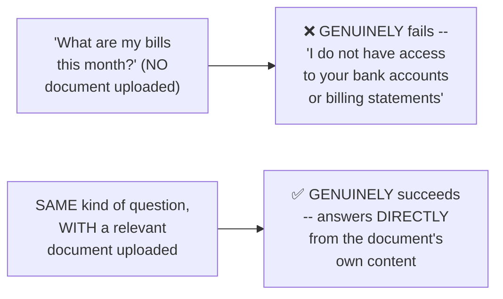

#### 🎯 Key Takeaways

* This session is **genuinely, explicitly framed** as THE foundational, first concept in agentic AI — "the most important, the most basic, and the very first concept."
* The teaching approach directly, deliberately **shows WHAT RAG accomplishes FIRST** (a live, "before and after" demonstration), BEFORE introducing any formal definition.
* RAG applications are **directly, explicitly confirmed** as representing roughly 98-99% of ALL current agentic AI/AI applications — a genuinely, overwhelmingly dominant use case.

---

### 2. What Is RAG? Definition, Context & a Relatable Analogy

#### 📖 Definition — RAG, Precisely Defined

> 💡 **Given directly:** *"Retrieval augmented generation is an AI technique used to connect large language models to external, private, or real-time data sources."*

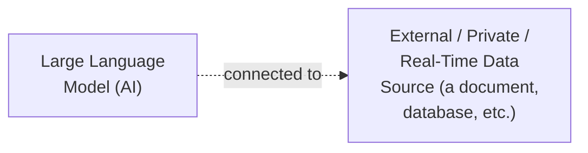

#### 📖 Definition — Context, Precisely Defined

> 💡 **Given directly:** *"The information which is being retrieved from the document to the large language model is called as context."*

#### 🧠 Concept — A Genuinely Relatable, Real Analogy for Context

> 💡 **Given directly:** *"Two people are talking... both of them are talking about AI agents. One is telling about how AI agents is used for HR policies in his company. Second person is telling how AI is used for making PowerPoint presentations. Now we have a third person coming into the picture — he is not understanding anything about what they both are talking about, so he will ask them, 'Hey, tell me also what you guys are talking about'... once he got the context of the topic, then he was able to answer the question better."*

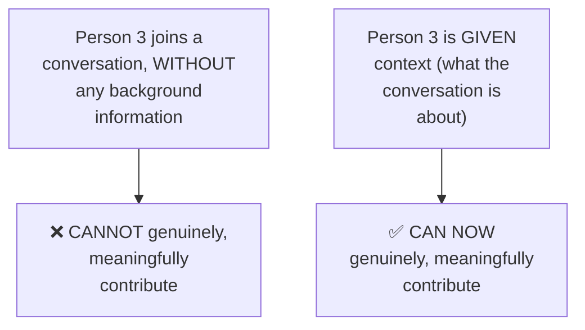

#### 🪜 Step-by-Step — A Second, Direct, Concrete Illustration

> 💡 **Given directly:** *"If I just ask you, if I have not provided you this PDF, you don't know nothing about this PDF, and I just simply ask you, 'You know what is the time when City Museum opens?' You will ask me, 'Hey, which City Museum, what City Museum? I don't know nothing about this City Museum.' But when I provide you that, 'Hey, City Museum opens at 9:00 to 6:00 p.m.,' and if someone else will ask you the same question, then you will be able to give the response."*

#### ⚠ Common Mistakes

* Assuming an LLM genuinely "knows" information about ANY topic, including private/personal/company-specific data — explicitly, directly, LIVE-demonstrated as FALSE without genuine, provided context.
* Confusing "context" with the LLM's OWN, general training knowledge — explicitly, directly distinguished: context SPECIFICALLY refers to information RETRIEVED from a SPECIFIC, external source, FOR a SPECIFIC question.

#### 🎯 Key Takeaways

* **RAG** is precisely defined as connecting large language models to EXTERNAL, private, or real-time data sources.
* **Context** is precisely the information RETRIEVED from a document (or other source) and PASSED to the LLM — directly, memorably illustrated via the "third person joining a conversation" analogy.
* WITHOUT genuine context, an LLM (or a person) GENUINELY cannot answer questions about information it was NEVER given — this is the EXACT, core problem RAG solves.

---
### 3. RAG's Real-World Use Cases: Chatbots, Enterprise Apps & Rule-Based vs. Intelligent Systems

#### 📖 Definition — Retrieval + Augmented + Generation, Precisely Broken Down

> 💡 **Given directly:** *"We are retrieving, which means we are extracting information from some document — there can be one document, or there can be multiple documents, or different sources of information... from all these sources, we extracted some information and we augmented it as one information... AI model is generating — how is it able to generate? Because it has some retrieved information, it has some context."*

#### 🧠 Concept — A Genuinely Relatable, Personal Analogy

> 💡 **Given directly:** *"When we were kids, we used to study from different different sources — one is our teacher taught us something, one we understood something from the digest, one was some last-year question paper — we used to collect all the information from these different sources, and finally we used to build our master bank, our master notes, and that we used to use for giving the exam."*

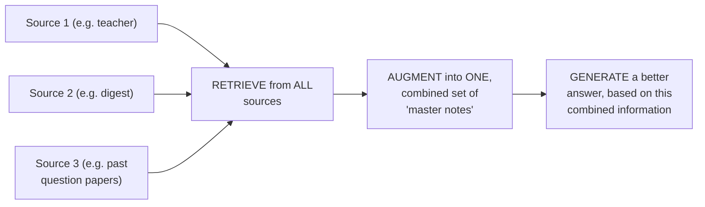

#### 🪜 Step-by-Step — A Complete, Live-Demonstrated Use Case: AI Travel Planner

> 💡 **Given directly:** *"Plan me a trip to maybe some place Munnar in Kerala, for 3 days... it will plan a 3-day trip — let us talk about the kind of sources it is using — first, it is extracting the maps information... second, it got all the information of the hotels... how did it get the information of hotels? Web search was performed, hotel prices or maybe some hotel API would be used, agoda.com, tripadvisor.com... thirdly, they might also be picking up reviews of hotels."*

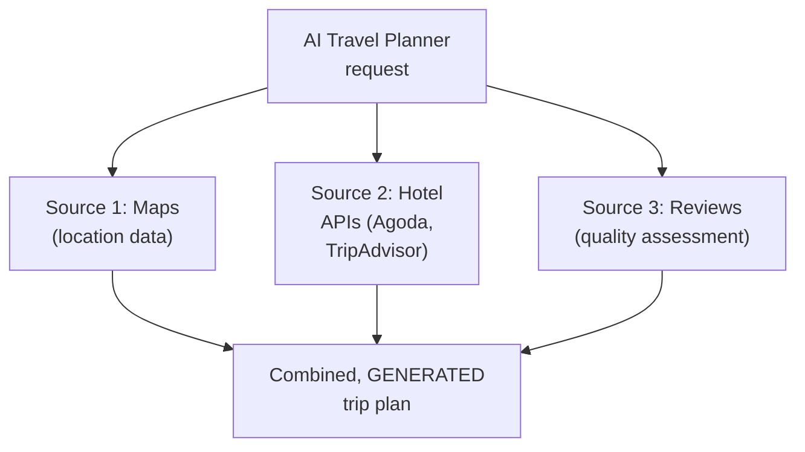

#### 🪜 Step-by-Step — A Second, Live-Demonstrated Use Case: A Restaurant Assistant

> 💡 **Given directly:** *"'What's your most popular pizza?' It is telling, our most popular pizza we are proud of... Margherita Supreme. How was it able to tell that? Based on what reviews it got, the number of sales they have done, and this all data is being fed to this restaurant assistant."*

#### 📖 Definition — Rule-Based vs. Intelligent Chatbots, Precisely Distinguished

> 💡 **Given directly:** *"Chatbots are also of two kinds — one is a rule-based chatbot, and one is intelligent chatbot. Intelligent chatbots are those chatbots which leverage AI or large language models in the backend. And rule-based chatbots are those chatbots where we have defined — the moment user is coming, you will ask this, and user will reply something of these three, then based on these three, you will reply this."*

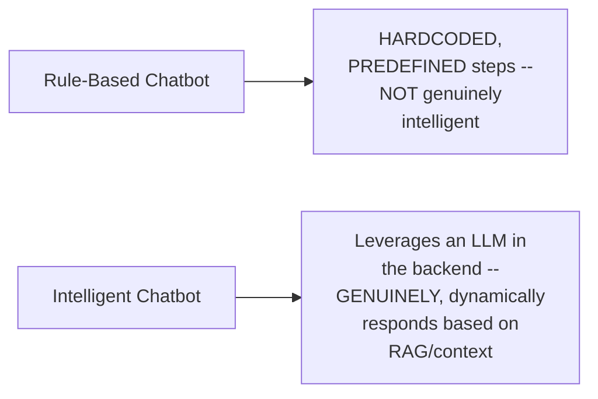

#### 🪜 Step-by-Step — A Live-Demonstrated, Real Example of a Rule-Based Chatbot

> 💡 **Given directly:** *"This is some university, DY Patil International University — 'I am Nike, your admission assistant'... this is rule-based, people have programmed this to behave like this exactly, it is not intelligent... it is working on predefined steps, it is not intelligent — people have programmed this, hardcoded this."*

#### ⚠ Common Mistakes

* Assuming EVERY chatbot genuinely uses an LLM/RAG in the backend — explicitly, directly, LIVE-demonstrated as FALSE: many real, existing chatbots (like the DY Patil admissions example) are GENUINELY rule-based, following predefined, hardcoded steps.
* Assuming RAG applications are LIMITED to simple document Q&A — explicitly, directly, LIVE-demonstrated as extending to GENUINELY complex, MULTI-SOURCE applications (like the travel planner, combining maps, hotel APIs, AND reviews).

#### 🎯 Key Takeaways

* RAG's own NAME directly, precisely maps to its process: **RETRIEVE** (extract information from one or MULTIPLE sources) → **AUGMENT** (combine into one, unified set of information) → **GENERATE** (the LLM produces a response, based on this combined information).
* Real, live-demonstrated use cases include an **AI travel planner** (combining maps, hotel APIs, and reviews) and a **restaurant assistant** (trained on sales/review data) — directly illustrating RAG's own genuine breadth beyond simple document Q&A.
* Chatbots are genuinely of **TWO distinct kinds**: RULE-BASED (hardcoded, predefined — NOT intelligent) and INTELLIGENT (LLM-powered, GENUINELY leveraging RAG) — directly, live-demonstrated via a REAL, rule-based university admissions chatbot.

---

### 4. Why RAG Came Into Existence: Knowledge Cutoffs, Fine-Tuning's Cost & Hallucination

#### ❓ Why It Exists — Reason 1: The Genuine, Real Knowledge-Cutoff Problem

> 💡 **Given directly:** *"Earlier, in 2022, when large language models came into existence... when we used to ask ChatGPT some questions like 'who is the current prime minister?'... we used to get a specific response that, 'I am trained until 2021 only, I do not have any kind of information after 2021'... this was a very big loophole into this system, because what kind of chatbot is this when it does not know what is going on currently?"*

#### 🪜 Step-by-Step — A Complete, Live, Genuine Demonstration of This EXACT Problem

> 💡 **Given directly:** *"'Don't use web and tell me who is the current prime minister of America'... check out this response — 'as of my knowledge cutoff in August 2025, the president of the United States was Donald Trump, who began his second term in January 2025' — it is telling that cutoff date was August 2025, I do not know anything about it [after that]."*

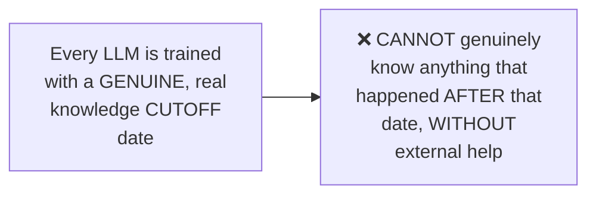

#### ❓ Why It Exists — Reason 2: Fine-Tuning's Genuine Cost & "Forgetting" Risk

> 💡 **Given directly:** *"People were using large language models in their system, but if people want to make a chatbot on their company data, they either had two options — either train their own large language model, which is very costly... or think of a solution — RAG."*

> 💡 **Given directly, the genuine, real, additional problem WITH fine-tuning:** *"We trained a large language model, let us say on 25th May we trained it — on 26th June we have some new data incoming, on 28th August we have new data incoming — we continuously have new data incoming, and now because this large language model is already trained, we cannot feed this extra information... we'll have to again retrain, and again costly — and there is a high chance that in the process of retraining, it can lose the previous information."*

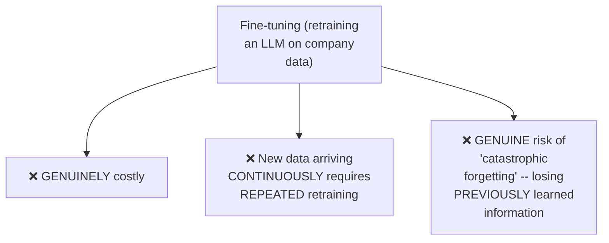

#### 🪜 Step-by-Step — The Genuine, Real, "Software Engineer" Solution

> 💡 **Given directly:** *"People were very fed up of this, and then they thought, 'Let us go really simple, let us think in a software engineer way' — what would a software engineer do? Connect it to a database — they simply connected this large language model to a database... and not only ONE particular database, they can connect it to 10 different databases."*

#### ❓ Why It Exists — Reason 3: Hallucination, Precisely Defined

> 💡 **Given directly:** *"Hallucination is a very widely famous term... your model hallucinates — what does this word hallucination mean? Giving wrong response — we are asking, 'Tell me about the courses you offer at your organization,' and the chatbot is replying, 'This is how to make a coffee' — which means question and answer is nowhere relevant."*

> 💡 **Given directly, precisely confirming hallucination's own measurement:** *"We calculate different hallucination levels before shipping our chatbot in the organization... hallucination is also calculated in terms of zero to one — the lower the hallucination levels, the better the model or your solution is."*

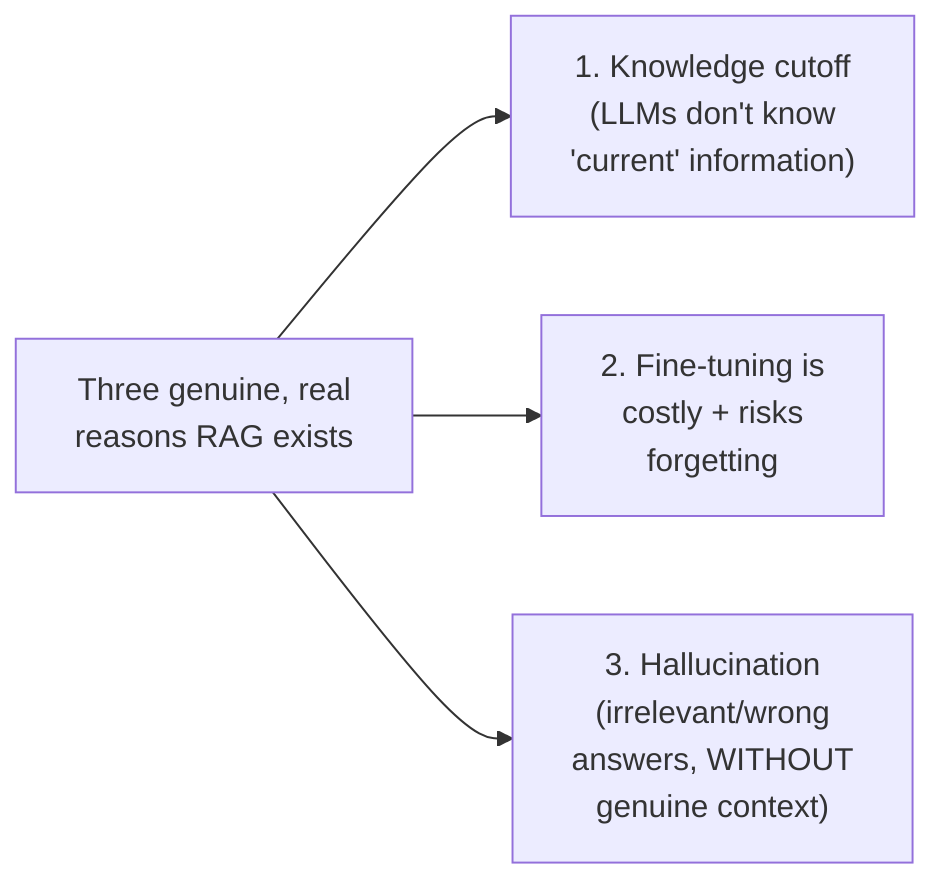

#### ⚠ Common Mistakes

* Assuming LLMs GENUINELY, AUTOMATICALLY know "current" information (like who currently holds a specific office) — explicitly, directly, LIVE-demonstrated as FALSE via a real, concrete example.
* Assuming fine-tuning is a GENUINELY, PERMANENTLY solved, one-time process — explicitly, directly clarified: NEW, incoming data GENUINELY requires REPEATED retraining, with a real risk of losing PREVIOUSLY-learned information EACH time.
* Assuming hallucination is a VAGUE, unmeasurable concept — explicitly, directly clarified: it is GENUINELY, PRACTICALLY measured on a numeric scale (zero to one) before a real chatbot is shipped.

#### 🎯 Key Takeaways

* RAG's own genuine, historical motivation rests on **THREE, precise, real reasons**: LLMs' genuine KNOWLEDGE CUTOFF (directly, LIVE-demonstrated), fine-tuning's genuine COST and forgetting RISK, and HALLUCINATION (measurably, giving irrelevant/wrong answers).
* The genuine, practical SOLUTION — connecting an LLM to an EXTERNAL database (rather than retraining it) — is directly, precisely framed as "thinking like a software engineer" — a SIMPLE, elegant fix to a GENUINELY complex, costly problem.
* Hallucination is **GENUINELY, PRACTICALLY measurable** (on a zero-to-one scale) — a real, concrete metric used BEFORE deploying a real chatbot, not merely an abstract concern.

---
### 5. Two Key Terms Before the Pipelines: System Prompt vs. Context

#### 📖 Definition — System Prompt, Precisely Introduced

> 💡 **Given directly:** *"System prompt is instructions which we provide to our large language model — why do we have to provide instructions? For example, 'Hey, you are a sales chatbot,' or 'Hey, you are a customer service chatbot, your only task is to make sales' — 'You are an HR policy assistant, your only job is to respond about HR policies, nothing else.'"*

#### 🪜 Step-by-Step — A Complete, Live-Demonstrated Confirmation

> 💡 **Given directly:** *"Let us go here and let us ask a random question... 'Tell me about Acme Corp'... 'I am Acme Corp HR policy assistant, I can only answer questions about company policies' — so it is restricting itself... if I ask a random question, 'how to make a coffee?' — 'I'm Acme Corp, my only job is to tell you about company policies, I cannot help you with other kinds of questions.'"*

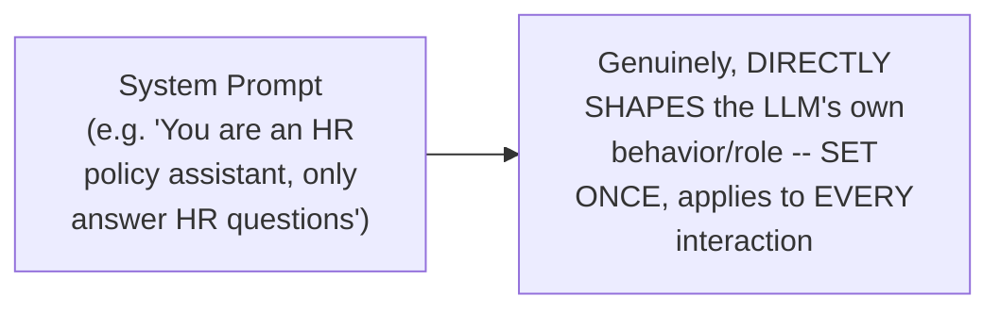

#### 📖 Definition — Context, Precisely Re-Confirmed and Distinguished

> 💡 **Given directly:** *"'Tell me about premium for employee-only plans'... it will give me the information based on the documents — the documents which are fetched, this is nothing but context — the documents it required, the documents it used to give me the response, is context."*

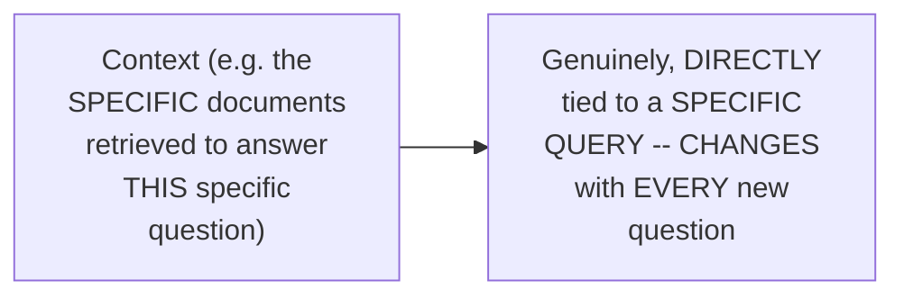

#### ❓ Why It Exists — The Precise, Genuine, Combined Purpose

> 💡 **Given directly:** *"Context is required for accurate and reliable response — if context will be provided, then only we will be able to give a proper response, else we will give a hallucinated response."*

#### ⚠ Common Mistakes

* Confusing "system prompt" with "context" — explicitly, directly, precisely distinguished: the SYSTEM PROMPT is FIXED, GENERAL behavioral INSTRUCTIONS (set ONCE); CONTEXT is the SPECIFIC, RETRIEVED information relevant to ONE PARTICULAR question (CHANGES with every query).
* Assuming EITHER a system prompt OR context ALONE is genuinely sufficient for a reliable RAG application — explicitly, directly, LIVE-demonstrated as WORKING TOGETHER: the system prompt SHAPES behavior/scope; context PROVIDES the actual, factual answer material.

#### 🎯 Key Takeaways

* **System prompt** is GENUINELY, PERMANENTLY-set instructions defining an LLM's OWN role/behavior (e.g., "you are an HR assistant, only answer HR questions") — directly, live-demonstrated RESTRICTING responses to off-topic questions.
* **Context** is the SPECIFIC, RETRIEVED information relevant to a PARTICULAR question — GENUINELY changing with every new query, directly sourced from the underlying documents.
* These TWO, DISTINCT concepts are BOTH genuinely necessary — directly, precisely setting up the COMPLETE pipeline architecture covered next.

---

### 6. The Data Ingestion Pipeline: Load, Chunk, Embed, Store

#### 📖 Definition — The Two Genuine Pipelines, Precisely Introduced

> 💡 **Given directly:** *"There are basically two pipelines which come into the picture — the first pipeline is the data ingestion pipeline, and the second pipeline is data retrieval pipeline."*

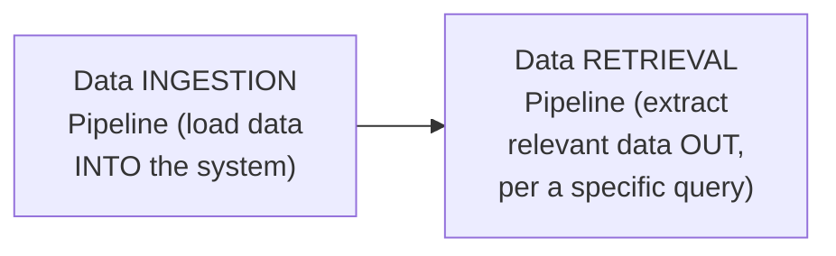

#### 📖 Definition — Step 1: Load the Data

> 💡 **Given directly:** *"We have so many varieties of data in this world — we have PDF data, we have HTML kind of data, website data, we have JSON data, URL data, PowerPoint, images, and text kind of data... we want to take all of this data and first load this into our system."*

#### 📖 Definition — Step 2: Chunk/Split the Data

#### 🧠 Concept — A Genuinely Memorable, Real Motivating Analogy: Pizza

> 💡 **Given directly:** *"You go to a restaurant, you order a 16-inch pizza... you cannot take this entire pizza and eat it — of course, you will break this pizza into slices, into chunks... if you take this entire pizza in your mouth, it will be information overflow, or pizza overflow — similarly, we don't want to give this large language model the entire pizza, or the entire data, at once."*

#### ❓ Why It Exists — The Precise, Genuine Reason: Context Window Limits

> 💡 **Given directly:** *"All of the large language models comes with something called as context window... if my window is this much, I cannot pass this much big information which is bigger than my window — but what I can do is I can chop this information into pieces, small small pieces, and I can feed small small pieces which will fit and pass through my window."*

#### 🪜 Step-by-Step — A Complete, Live, Real, Researched Confirmation

> 💡 **Given directly:** *"Gemini models has the longest context window of all — they are supporting up to 1 lakh to 2 lakh tokens... tokens means number of words... Gemma 2, open-source model, it is taking 8k tokens... so there is a context window which a large language model can take in."*

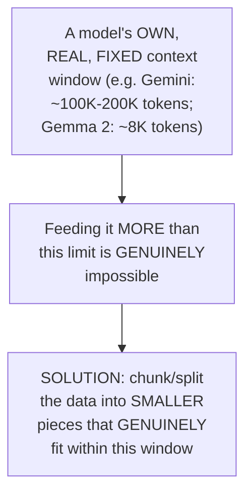

#### 📖 Definition — Step 3: Embed the Data (Convert to Numbers)

> 💡 **Given directly:** *"What we want to do is we want to convert this data, this text... into numbers — 0.1, 0.8, 0.9, just some random number."*

#### 📖 Definition — Step 4: Store the Data in a Vector Database

> 💡 **Given directly:** *"If we have 1,000 documents, we cannot just store in the system memory, it will be vanished — we want to use a database to store it, so that when we have new information, we can add new information in the database... this database is called vector database — a database which stores only vectors."*

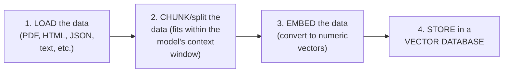

#### 🪜 Step-by-Step — A Complete, Live-Verified Confirmation

> 💡 **Given directly:** *"'When is mid-year check-in conducted?' It will properly tell me July... it went into all the documents, it fetched for the proper document which was suiting us — 'conducted in July' — this was the most similar document, and based on this similar document, it gave me the replies."*

#### ⚠ Common Mistakes

* Assuming an ENTIRE, large document can genuinely be fed to an LLM at once, REGARDLESS of length — explicitly, directly, LIVE-demonstrated as INCORRECT: every model has a GENUINE, real, FIXED context window limit.
* Assuming "chunking" is an arbitrary, unimportant preprocessing step — explicitly, directly connected to a GENUINE, real, technical necessity (fitting within context window limits), NOT merely a stylistic choice.

#### 🎯 Key Takeaways

* The complete, four-step **data ingestion pipeline**: LOAD (any data format) → CHUNK/split (to fit within context window limits) → EMBED (convert to numeric vectors) → STORE (in a vector database).
* **Chunking is GENUINELY, DIRECTLY motivated** by real, FIXED context-window limits — DIRECTLY, LIVE-researched and confirmed (Gemini: ~100K-200K tokens; Gemma 2: ~8K tokens).
* A **vector database** stores ONLY vectors (numeric embeddings) — directly, LIVE-verified via a real query ("mid-year check-in") correctly retrieving the GENUINELY relevant document chunk.

---
### 7. Understanding Embeddings & Vector Similarity

#### 📖 Definition — Embedding, Precisely Re-Confirmed

> 💡 **Given directly:** *"What is embedding? Embedding means numerical representation of these documents."*

#### 🧠 Concept — A Genuinely Memorable, Real Analogy: Cricket, Football, King & Queen

> 💡 **Given directly:** *"This is a game called cricket, and this is a terminology called king — now when there is a new term coming in between, if I use a new term called football, football comes into game kind of category, so football will come here — if we calculate the distance between cricket and football, it will be really less, because they both are of game category — but if we calculate the distance between football and king, there will be a huge distance involved."*

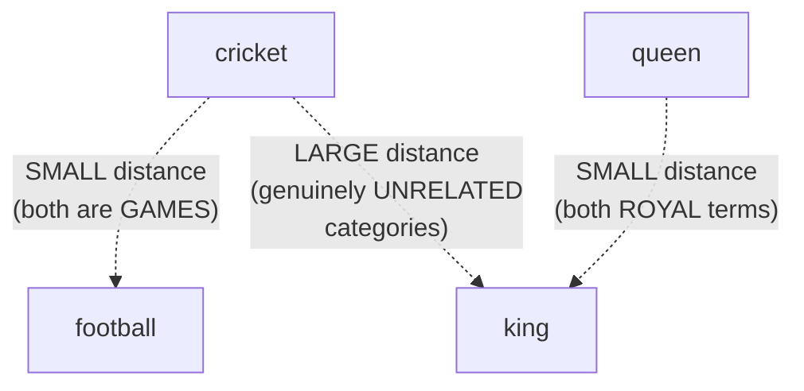

#### 📖 Definition — Cosine Similarity, Precisely Introduced

> 💡 **Given directly:** *"These distances are calculated based on cosine similarity — it's all right if you don't understand the term, this is cos angle, right, we are extracting an angle — that's why cosine similarity."*

#### 🪜 Step-by-Step — A Complete, Precise, Worked, Numeric Example

> 💡 **Given directly:** *"This is king, and king has some number, 0.8, 0.3, 0.2 — this is cricket, cricket has some number, 0.1, 0.9, 0.8 — we have a new input coming into the picture... the moment this new term has come into the picture, this will be compared with both of them, and it will be plotted closest to [whichever it's genuinely similar to]."*

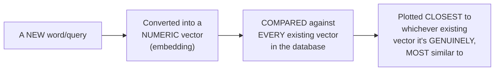

#### 🔍 Internal Working — Precisely How This Powers Real Document Retrieval

> 💡 **Given directly:** *"The moment a new question is coming, 'Then tell me about the premium employee plans,' our system is checking the entire database — it is not checking one, it is checking the entire database — and after checking the entire database, it is calculating scores that this particular document has this much similarity, other document has this much similarity, third document has this much similarity — and based on the similarity scores, we fetch the top three similar documents."*

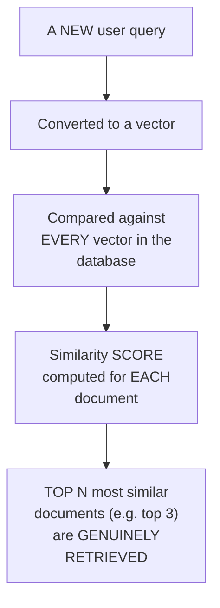

#### ⚠ Common Mistakes

* Assuming embeddings/vector similarity are GENUINELY too complex to intuitively understand — explicitly, directly, precisely simplified via a GENUINELY memorable, real analogy (cricket/football/king/queen).
* Assuming a query is compared against ONLY ONE document at a time — explicitly, directly clarified: the ENTIRE database is GENUINELY checked, with a similarity SCORE computed for EVERY document, before the TOP matches are selected.

#### 🎯 Key Takeaways

* **Embeddings** are precisely NUMERIC representations of text — GENUINELY, MATHEMATICALLY similar concepts (like cricket and football) produce vectors that are GENUINELY, MATHEMATICALLY close together; DISSIMILAR concepts (like football and king) produce vectors that are GENUINELY, MATHEMATICALLY far apart.
* **Cosine similarity** is the GENUINE, precise mathematical mechanism (measuring the ANGLE between vectors) used to compute this closeness.
* A NEW query is GENUINELY compared against the **ENTIRE** vector database, with a similarity score computed for EVERY document, before the TOP N most similar documents are RETRIEVED as context.

---

### 8. The Data Retrieval Pipeline: From Query to Response

#### 📖 Definition — Data Retrieval, Precisely Defined

> 💡 **Given directly:** *"Data retrieval is the process of extracting context from vector DB to feed our large language model, so that our large language model can give us a better response."*

#### 🪜 Step-by-Step — The Complete, Precise, Four-Step Retrieval Process

> 💡 **Given directly:** *"The moment a user query is going to come — 'what is vector database?' — this will be converted into numbers... 0.1, 0.2, 0.8 — the moment new user query has come, this query will be converted into a vector, this vector will be compared with all the collections... depending upon the vector, the closest collections were fourth, third, and second."*

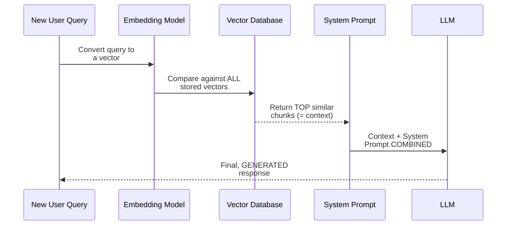

#### 🪜 Step-by-Step — A Complete, Live-Demonstrated Confirmation of Combining Context + System Prompt

> 💡 **Given directly:** *"'What is cricket?' Let us see what kind of response we get — I just wanted to know cricket is a game, but it gave me a lot of information — so we don't want that... 'only answer in two to three sentences if needed, and you are an HR assistant, do not answer any other questions'... this system prompt, the instructions, and the retrieved context, ALL of this together will be passed to our large language model."*

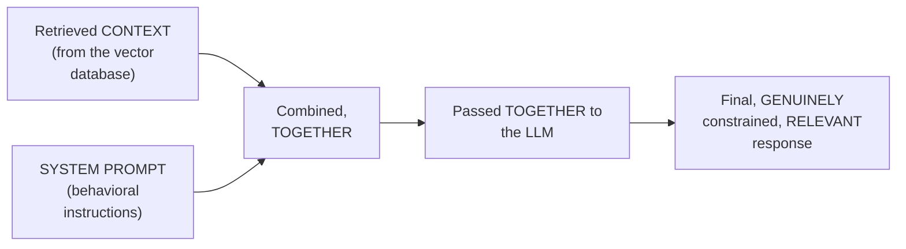

#### ⚠ Common Mistakes

* Assuming context ALONE (without a system prompt) is genuinely sufficient for a WELL-BEHAVED RAG response — explicitly, directly, LIVE-demonstrated as INSUFFICIENT: WITHOUT a system prompt constraining response LENGTH/tone/scope, an LLM may genuinely produce EXCESSIVE, unhelpful output.
* Assuming the retrieval PIPELINE and the ingestion PIPELINE are the SAME process — explicitly, directly distinguished: ingestion happens ONCE (loading data INTO the system); retrieval happens EVERY TIME a NEW query arrives.

#### 🎯 Key Takeaways

* The complete **data retrieval pipeline**: a NEW query → converted to a vector → COMPARED against the ENTIRE database → TOP similar chunks retrieved (= context) → COMBINED with the system prompt → passed TOGETHER to the LLM → final, generated response.
* **Context and system prompt work TOGETHER**, not independently — directly, live-demonstrated: context alone can produce EXCESSIVE, unconstrained responses WITHOUT a system prompt's own behavioral guidance.
* This section directly, precisely **completes the full, two-pipeline RAG architecture** — ingestion (Section 6, ONE-TIME setup) and retrieval (THIS section, EVERY query) working TOGETHER.

---
### 9. Types of Vector Databases & Their Terminology

#### 📖 Definition — The Three, Genuine Types of Vector Databases

> 💡 **Given directly:** *"Types of vector databases — first one is in-memory, second one is persistent, and third one is cloud databases."*

#### 📖 Definition — In-Memory, Precisely Explained

> 💡 **Given directly:** *"In-memory means it will not be stored anywhere — it will be stored only for that particular session or interaction — this document which I have shown you, this is in memory — once I refresh, all of this will be lost."*

#### 📖 Definition — Persistent, Precisely Explained

> 💡 **Given directly:** *"Persistent, which means it actually uses some memory in your computer — it will make a folder in your computer, and it will store the vectors in your computer space, so that when you restart the computer, that data will already be loaded."*

#### 📖 Definition — Cloud, Precisely Explained

> 💡 **Given directly:** *"Cloud is simple — you will not be storing this data in your memory, not in any folder on your computer, it will be stored on the cloud."*

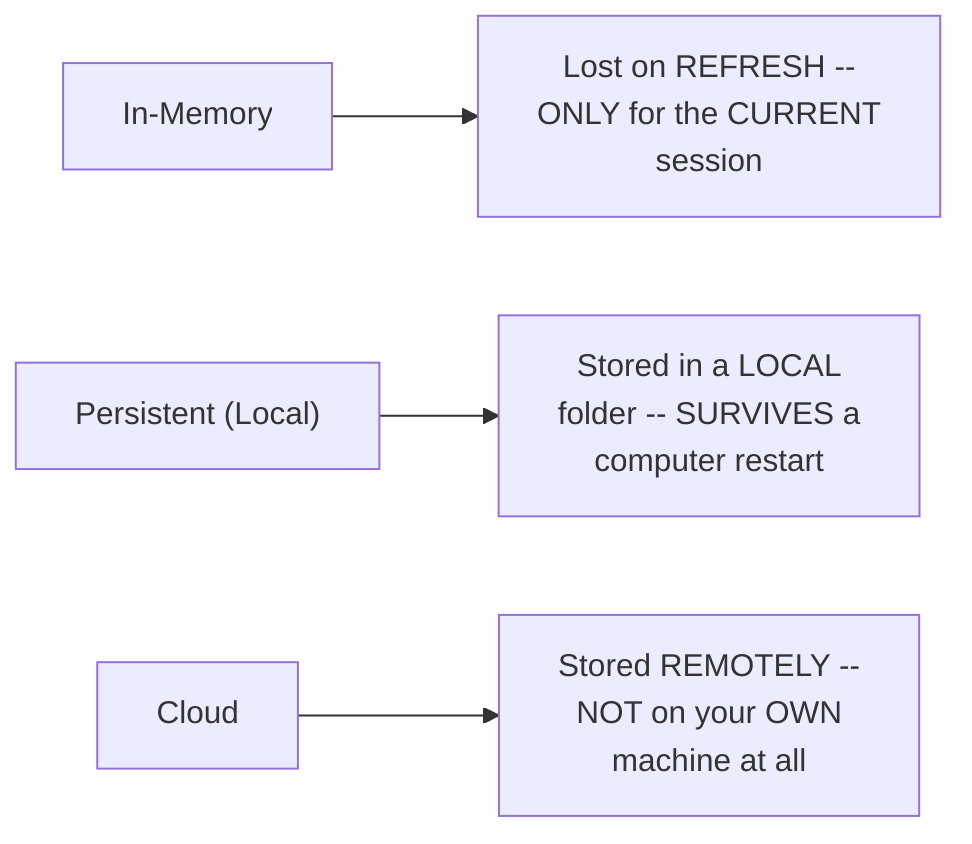

#### 🪜 Step-by-Step — Genuine, Real, Named Technologies for Each Type

> 💡 **Given directly, LOCAL/native options:** *"The name of that particular technology is Chroma... and FAISS, Facebook AI similarity search, this is developed by Meta — and this is Chroma, an organization, they have made it."*

> 💡 **Given directly, CLOUD options:** *"We have Qdrant DB, the most famous. Second is Astra DB, the second most famous. Third, we have Pinecone. Fourth, we have Weaviate."*

```mermaid
flowchart TD
    A["Vector Database<br/>Technologies"] --> B["Local/Native: Chroma,<br/>FAISS (Facebook AI<br/>Similarity Search)"]
    A --> C["Cloud: Qdrant DB,<br/>Astra DB, Pinecone,<br/>Weaviate"]
```

#### 🏢 Real-World / Production Usage — When to Genuinely Use Which Type

> 💡 **Given directly:** *"When you are developing a proof of concept, POC, at that particular time you don't go for any cloud services — you just use what is available natively... or when you want to develop a really small solution where you don't have huge data coming in, that is time when you can use local databases."*

#### 📖 Definition — Two, Genuine, Important Terminology Concepts: Collection & Object

> 💡 **Given directly:** *"Collection means bunch of objects, that's it — bunch of objects... what we will have in an object is: first, we will have an INDEX, that this is the first object; secondly, we will have the ACTUAL TEXT; and third, we will have the NUMERICAL REPRESENTATION of the text — this is what our object is, and many such objects form up a collection."*

```mermaid
flowchart LR
    A["Object"] --> B["1. Index (position/<br/>identifier)"]
    A --> C["2. Actual text (the<br/>original content)"]
    A --> D["3. Numerical<br/>representation<br/>(the embedding)"]
    E["Collection"] --> F["A BUNCH of related<br/>objects, GROUPED<br/>together"]
```

#### 🪜 Step-by-Step — The Explicit, Stated Assignment

> 💡 **Given directly:** *"What is our assignment going to be? You will explore all of these. Assignment, explore all the vector databases — in this process, you will also understand what is vector database, and second, you will also understand what are the different kinds of vector databases."*

#### ⚠ Common Mistakes

* Assuming ALL vector database types are GENUINELY, functionally equivalent, regardless of use case — explicitly, directly clarified: the CHOICE genuinely depends on the SPECIFIC use case (POC/small solution = local; production/scale = cloud).
* Confusing "collection" with "object" — explicitly, directly, precisely distinguished: an OBJECT is a SINGLE unit (index + text + numeric vector); a COLLECTION is a GROUPED BUNCH of MULTIPLE objects.

#### 🎯 Key Takeaways

* Vector databases genuinely fall into **THREE types**: in-memory (session-only), persistent/local (survives restarts, stored on your OWN machine), and cloud (stored remotely).
* **Real, named technologies**: Chroma and FAISS for local/native use; Qdrant DB, Astra DB, Pinecone, and Weaviate for CLOUD-based use — with an EXPLICIT, stated assignment to EXPLORE all of these.
* **"Object"** (index + text + numeric vector) and **"collection"** (a grouped bunch of objects) are GENUINE, foundational vector-database TERMINOLOGY, directly, precisely distinguished.

---

### 10. The Drawbacks of Traditional RAG

#### 📖 Definition — "Traditional RAG," Precisely Framed

> 💡 **Given directly:** *"Everything which we were studying till now was called a traditional RAG — what makes it traditional? What makes it traditional is it is NOT dynamic in nature — what we can see over here is a CHAIN of process."*

#### ⚠ Drawback 1: Always Hits the Vector Database (Even When Genuinely Unnecessary)

> 💡 **Given directly:** *"Every time a new user query will come, let us say the new user query is 'How to make a coffee?'... if the RAG system is made for HR documents, and the question is regarding coffee, we will never go and hit our database — we will directly give the large language model the question, and the response should be generated — but if the question is not relevant, then STILL we are hitting the database, and then we are fetching WRONG context."*

```mermaid
flowchart TD
    A["A genuinely OFF-TOPIC<br/>query (e.g. 'how to<br/>make coffee' on an<br/>HR-only system)"] --> B["❌ Traditional RAG<br/>STILL, BLINDLY hits<br/>the vector database"]
    B --> C["Fetches GENUINELY<br/>IRRELEVANT context,<br/>which then GETS FED<br/>to the LLM anyway"]
```

#### ⚠ Drawback 2: No Context Engineering (Re-Ranking & Semantic Chunking)

> 💡 **Given directly, on re-ranking:** *"Let us say this collection is the most important, even though the mathematical function has failed, but if a human will read it, the human will say that this collection is more important — if we reorder them... this process is called re-ranking. In the traditional RAG, there is NO such concept as re-ranking."*

> 💡 **Given directly, on semantic chunking:** *"Let us say many documents are being chunked together... order is lost, everything is lost, which means after the first collection, we will have some other data, other collection — we don't want that, we want to keep the SIMILAR chunks TOGETHER, and this process is called as SEMANTIC CHUNKING."*

```mermaid
flowchart LR
    A["Re-Ranking<br/>(MISSING in traditional<br/>RAG)"] --> B["Reordering retrieved<br/>chunks by GENUINE,<br/>HUMAN-JUDGED<br/>relevance, not just a<br/>raw math score"]
    C["Semantic Chunking<br/>(MISSING in<br/>traditional RAG)"] --> D["Keeping<br/>MEANINGFULLY related<br/>chunks TOGETHER,<br/>rather than losing<br/>their order"]
```

#### ⚠ Drawback 3: Latency With Scaling

> 💡 **Given directly:** *"When we have 10,000 or 1 lakh documents in our vector database, that time the similarity operation which we will be running will be a little slower — we are getting slower responses with high traffic of users or high information of data — latency, we are achieving slow responses."*

#### ⚠ Drawback 4: No Security for Sensitive Documents

> 💡 **Given directly:** *"Thirdly — sorry, fourthly — no security for sensitive documents."*

```mermaid
flowchart TD
    A["Traditional RAG"] --> B["1. Always hits the<br/>vector database (even<br/>for OFF-TOPIC queries)"]
    A --> C["2. No re-ranking /<br/>semantic chunking<br/>(context ENGINEERING<br/>is MISSING)"]
    A --> D["3. Latency issues at<br/>SCALE (10,000+<br/>documents)"]
    A --> E["4. No genuine<br/>security for sensitive<br/>documents"]
```

#### ⚠ Common Mistakes

* Assuming "traditional RAG" (as covered in THIS session) is the FINAL, complete, production-ready form of RAG — explicitly, directly, HONESTLY acknowledged as having FOUR real, genuine limitations, DIRECTLY implying more advanced techniques exist BEYOND this foundational scope.
* Confusing "re-ranking" with "semantic chunking" — explicitly, directly distinguished: re-ranking REORDERS ALREADY-retrieved chunks by genuine relevance; semantic chunking ensures chunks are SPLIT MEANINGFULLY in the FIRST place, keeping RELATED content TOGETHER.

#### 🎯 Key Takeaways

* "**Traditional RAG**" (this session's own complete scope) genuinely has **FOUR, honest, real limitations**: always querying the database (even when irrelevant), lacking context engineering (no re-ranking, no semantic chunking), latency at scale, and insufficient security for sensitive documents.
* **Re-ranking** and **semantic chunking** are BOTH genuinely MISSING from traditional RAG — directly, precisely distinguished as addressing DIFFERENT problems (REORDERING already-retrieved results vs. SPLITTING data more MEANINGFULLY in the first place).
* This honest, direct acknowledgment of limitations **directly, precisely sets up** more advanced RAG techniques as a genuine, natural NEXT topic — beyond THIS session's own explicitly-stated, foundational scope.

---
## 📝 Glossary

| Term | Definition | Why It Matters |
|---|---|---|
| **RAG** | Retrieval Augmented Generation -- connecting LLMs to external/private/real-time data | ~98-99% of real agentic AI applications are RAG-based |
| **Context** | Information RETRIEVED from a source, specific to a given question | Required for accurate, non-hallucinated responses |
| **System Prompt** | Fixed instructions defining an LLM's role/behavior | Set once; shapes ALL responses, not just one query |
| **Hallucination** | An LLM giving a genuinely wrong or irrelevant response | Measured on a 0-1 scale; lower is better |
| **Context Window** | The maximum amount of text/tokens a model can process at once | Directly motivates the NEED for chunking |
| **Chunking** | Splitting data into smaller pieces | Fits within a model's context window |
| **Embedding** | A numeric (vector) representation of text | Enables mathematical similarity comparison |
| **Cosine Similarity** | The angle-based measure used to compute vector closeness | Determines which documents are "most similar" |
| **Vector Database** | A database that stores ONLY vectors (embeddings) | Chroma, FAISS (local); Qdrant/Astra/Pinecone/Weaviate (cloud) |
| **Collection** | A bunch of related objects, grouped together | A vector-database organizational unit |
| **Object** | Index + actual text + numerical representation | The individual unit stored within a collection |
| **Data Ingestion Pipeline** | Load -> Chunk -> Embed -> Store | The ONE-TIME setup process |
| **Data Retrieval Pipeline** | Query -> Vectorize -> Compare -> Retrieve -> Respond | Runs EVERY time a new query arrives |
| **Re-Ranking** | Reordering retrieved chunks by GENUINE relevance | Missing in traditional RAG |
| **Semantic Chunking** | Splitting data so MEANINGFULLY related content stays together | Missing in traditional RAG |

---

## 🔄 Revision Notes — One-Minute Revision

* This session is **explicitly framed** as THE most foundational, first concept in agentic AI -- ~98-99% of real AI applications are genuinely RAG-based.
* **RAG's precise definition**: an AI technique connecting LLMs to external/private/real-time data sources. **Context**: the information RETRIEVED from a document and passed to the LLM -- directly, memorably illustrated via the "third person joining a conversation" analogy.
* **Use cases**: rule-based chatbots (hardcoded, NOT intelligent) vs. intelligent chatbots (LLM-powered) -- live-demonstrated with a real, rule-based university admissions bot and complex, multi-source apps like an AI travel planner (maps + hotel APIs + reviews).
* **Why RAG exists (3 genuine reasons)**: (1) LLM knowledge CUTOFF (live-demonstrated: a model genuinely couldn't identify the "current" US president past its training cutoff), (2) fine-tuning's GENUINE cost + "forgetting" risk when retraining on new data, (3) HALLUCINATION (measured on a 0-1 scale). The genuine fix: connect the LLM to an EXTERNAL database ("think like a software engineer"), rather than retraining it.
* **System prompt vs. context**: system prompt = FIXED, general behavioral instructions (set once); context = SPECIFIC, retrieved information (changes per query). BOTH are needed together -- live-demonstrated: context alone, without a system prompt, can produce excessive, unconstrained output.
* **Data ingestion pipeline (4 steps)**: LOAD (any format: PDF/HTML/JSON/text) -> CHUNK/split (motivated by REAL, fixed context-window limits -- Gemini ~100K-200K tokens, Gemma 2 ~8K tokens) -> EMBED (convert to numeric vectors) -> STORE (in a vector database).
* **Embeddings & similarity**: numeric representations of text -- GENUINELY similar concepts (cricket/football) produce CLOSE vectors; dissimilar ones (football/king) produce FAR vectors, measured via COSINE SIMILARITY (angle-based). A new query is compared against the ENTIRE database, with a similarity score computed per document, before the TOP N matches are retrieved.
* **Data retrieval pipeline (4 steps)**: NEW query -> converted to a vector -> compared against the ENTIRE database -> top similar chunks retrieved (= context) -> COMBINED with the system prompt -> passed to the LLM -> final response.
* **Vector database types**: in-memory (lost on refresh) | persistent/local (survives restarts, own machine) | cloud (stored remotely). Named technologies: Chroma, FAISS (local); Qdrant DB, Astra DB, Pinecone, Weaviate (cloud). Terminology: object (index+text+vector); collection (a bunch of objects). ASSIGNMENT: explore all named vector databases.
* **Traditional RAG's 4 honest, genuine drawbacks**: (1) ALWAYS hits the vector database, even for genuinely IRRELEVANT queries; (2) NO context engineering -- missing RE-RANKING (reordering by true relevance) AND missing SEMANTIC CHUNKING (keeping related content together); (3) LATENCY at scale (10,000+ documents slow down similarity search); (4) NO genuine security for sensitive documents.

---

## 📋 Cheat Sheet

**RAG's core definition:**
```text
RAG = an AI technique connecting LLMs to external/private/real-time data sources
Context = information RETRIEVED from a source, specific to a given question
System Prompt = FIXED instructions defining the LLM's own role/behavior
```

**Why RAG exists (3 reasons):**
```text
1. Knowledge cutoff -- LLMs don't genuinely know "current" information
2. Fine-tuning is costly + risks "forgetting" previously-learned info
3. Hallucination -- giving genuinely wrong/irrelevant answers (measured 0-1)
```

**Data ingestion pipeline:**
```text
LOAD (any format) -> CHUNK (fits context window) -> EMBED (convert to vectors) -> STORE (vector DB)
```

**Data retrieval pipeline:**
```text
NEW query -> vectorize -> compare against ENTIRE database -> retrieve TOP N similar chunks (=context)
-> combine with system prompt -> pass to LLM -> final response
```

**Vector database types & real technologies:**
```text
In-memory (session-only) | Persistent/local: Chroma, FAISS | Cloud: Qdrant DB, Astra DB, Pinecone, Weaviate
```

**Traditional RAG's 4 drawbacks:**
```text
1. Always hits the vector database, even for irrelevant queries
2. No context engineering (no re-ranking, no semantic chunking)
3. Latency with scaling (10,000+ documents = slower similarity search)
4. No security for sensitive documents
```

---

## 🔥 Interview Questions & Answers

### 🟢 Beginner

**Q1.**

**Question:** What does RAG stand for, and what does it precisely do?

**Answer:** Retrieval Augmented Generation -- an AI technique connecting LLMs to external, private, or real-time data sources.

**Explanation:** Directly, precisely defined.

**Why Interviewers Ask This:** The most basic, foundational RAG question.

**Possible Follow-up:** "What percentage of real agentic AI applications are genuinely RAG-based?"

**Q2.**

**Question:** What is "context," in the RAG sense?

**Answer:** The specific information retrieved from a document/source, relevant to a particular question, and passed to the LLM.

**Explanation:** Directly, precisely defined.

**Why Interviewers Ask This:** Foundational, frequently-tested RAG terminology.

**Possible Follow-up:** "How does context differ from a system prompt?"

**Q3.**

**Question:** Name the three genuine reasons RAG came into existence.

**Answer:** LLM knowledge cutoff, fine-tuning's cost/forgetting risk, and hallucination.

**Explanation:** Directly, explicitly stated.

**Why Interviewers Ask This:** Tests genuine understanding of RAG's own historical motivation.

**Possible Follow-up:** "Why is retraining (fine-tuning) genuinely risky, beyond just cost?"

**Q4.**

**Question:** What is hallucination, and how is it genuinely measured?

**Answer:** An LLM giving a genuinely wrong or irrelevant response; measured on a 0-1 scale, with lower being better.

**Explanation:** Directly, precisely explained.

**Why Interviewers Ask This:** Basic, essential RAG/LLM terminology.

**Possible Follow-up:** "What role does context play in reducing hallucination?"

**Q5.**

**Question:** What are the four steps of the data ingestion pipeline?

**Answer:** Load, chunk, embed, store.

**Explanation:** Directly, explicitly stated.

**Why Interviewers Ask This:** Foundational, frequently-tested RAG architecture knowledge.

**Possible Follow-up:** "Why is the chunking step genuinely necessary?"

**Q6.**

**Question:** What is an embedding?

**Answer:** A numeric (vector) representation of text.

**Explanation:** Directly, explicitly defined.

**Why Interviewers Ask This:** Basic, essential RAG terminology.

**Possible Follow-up:** "What mathematical technique is used to compare embeddings for similarity?"

**Q7.**

**Question:** What are the four steps of the data retrieval pipeline?

**Answer:** Query received -> converted to a vector -> compared against the database -> top similar chunks retrieved, combined with the system prompt, and passed to the LLM.

**Explanation:** Directly, precisely described.

**Why Interviewers Ask This:** Foundational, frequently-tested RAG architecture knowledge.

**Possible Follow-up:** "Does the retrieval pipeline run once, or every time a new query arrives?"

**Q8.**

**Question:** Name two real, local/native vector database technologies, and two real, cloud-based ones.

**Answer:** Local: Chroma, FAISS. Cloud: Qdrant DB, Astra DB, Pinecone, or Weaviate (any two).

**Explanation:** Directly, explicitly named.

**Why Interviewers Ask This:** Tests genuine, practical, real-world tooling knowledge.

**Possible Follow-up:** "When would you genuinely choose a local database over a cloud one?"

**Q9.**

**Question:** What is the genuine difference between an "object" and a "collection" in vector database terminology?

**Answer:** An object is a single unit (index + text + numeric vector); a collection is a grouped bunch of multiple objects.

**Explanation:** Directly, precisely distinguished.

**Why Interviewers Ask This:** Basic, practical vector-database terminology.

**Possible Follow-up:** "What three components make up a single object?"

**Q10.**

**Question:** Name the four genuine drawbacks of "traditional RAG" covered in this session.

**Answer:** Always hitting the vector database (even for irrelevant queries), no context engineering (no re-ranking/semantic chunking), latency at scale, and no security for sensitive documents.

**Explanation:** Directly, explicitly stated.

**Why Interviewers Ask This:** Tests genuine, honest understanding of RAG's own real limitations.

**Possible Follow-up:** "What is the difference between re-ranking and semantic chunking?"

---

### 🟡 Intermediate

**Q11.**

**Question:** Explain why the instructor deliberately opens this session with a LIVE demonstration (ChatGPT failing, then succeeding with a document) BEFORE ever introducing RAG's formal definition.

**Answer:** This is a genuinely deliberate pedagogical choice: by FIRST showing a CONCRETE, RELATABLE FAILURE (ChatGPT genuinely unable to answer a personal question) and its IMMEDIATE, VISIBLE fix (successfully answering ONCE a document is uploaded), the instructor makes the ABSTRACT, formal definition ("connecting LLMs to external data sources") land as a PRECISE DESCRIPTION of something the learner has ALREADY, GENUINELY WITNESSED — rather than an abstract concept requiring separate, additional interpretation. This directly mirrors a GENUINELY effective teaching pattern seen ACROSS multiple instructors in this workspace's own broader collection (e.g., the Docker session's own "why containerization" motivation BEFORE its formal definition) — establishing GENUINE, felt NEED before introducing the FORMAL solution.

**Explanation:** Requires recognizing a deliberate "demonstration before definition" pedagogical structure, and connecting it to a similar pattern used elsewhere.

**Why Interviewers Ask This:** Tests whether a learner recognizes the genuine, practical value of concrete demonstration in building durable understanding.

**Possible Follow-up:** "Construct your own, similarly concrete 'before and after' demonstration to teach RAG to someone who has never seen it."

**Q12.**

**Question:** A learner argues that since embeddings are "just numbers," and cosine similarity is "just an angle calculation," building a genuinely effective RAG system is purely a mathematical/mechanical exercise, with no room for genuine judgment or design choices. Evaluate this claim.

**Answer:** This claim overstates the case, missing a genuinely important point THIS session's own content DIRECTLY establishes: Section 10's own "traditional RAG drawbacks" discussion DIRECTLY reveals that PURELY mathematical similarity scores can GENUINELY be WRONG, from a human, judgment-based PERSPECTIVE — the instructor's OWN, direct example ("even though the mathematical function has failed, but if a human will read it, the human will say that this collection is more important") DIRECTLY demonstrates that RAW, mechanical similarity SCORES do NOT always align with GENUINE, human-relevant importance — this is PRECISELY why "re-ranking" (a HUMAN-informed, or at least MORE sophisticated, reordering STEP) is identified as a genuinely IMPORTANT, MISSING capability in traditional RAG. Additionally, CHUNKING decisions (per Section 6) GENUINELY require JUDGMENT — HOW to split data (by word count, by sentence, SEMANTICALLY) is a DESIGN choice with REAL, practical consequences (per Section 10's own "semantic chunking" discussion). The accurate, more precise conclusion: WHILE the UNDERLYING mathematics (embeddings, cosine similarity) IS genuinely mechanical, BUILDING an EFFECTIVE RAG system GENUINELY requires THOUGHTFUL, HUMAN design choices AROUND this mathematical CORE — chunking strategy, re-ranking, system prompt design, and MORE.

**Explanation:** Tests whether a learner recognizes that underlying mathematical mechanisms don't eliminate the need for thoughtful, human design decisions in building an effective system.

**Why Interviewers Ask This:** Distinguishes candidates who understand RAG as a genuinely engineered SYSTEM (with real design trade-offs) from those who view it as a purely mechanical, "solved" mathematical process.

**Possible Follow-up:** "Name a SPECIFIC, real design decision (from this session's own content) where a RAG engineer's OWN judgment would genuinely matter, beyond the raw mathematics."

**Q13.**

**Question:** Explain, precisely, why the instructor uses TWO, genuinely different analogies (the "conversation/third person" analogy for context, AND the "cricket/football/king/queen" analogy for embeddings) rather than reusing the SAME analogy for both concepts.

**Answer:** This is a genuinely deliberate choice, reflecting a REAL, important DISTINCTION between these TWO, RELATED but DIFFERENT concepts. The "conversation" analogy (Section 2) is SPECIFICALLY designed to convey WHY context matters — the GENUINE, human EXPERIENCE of NOT being able to meaningfully CONTRIBUTE without background information — a CONCEPTUAL, EXPERIENTIAL analogy. The "cricket/football/king/queen" analogy (Section 7), by CONTRAST, is SPECIFICALLY designed to convey HOW context is genuinely IDENTIFIED and RETRIEVED — the MATHEMATICAL, SPATIAL relationship between CONCEPTS (measured via distance/similarity) — a STRUCTURAL, MECHANISM-focused analogy. Using the SAME analogy for BOTH would GENUINELY, INCORRECTLY conflate "WHY context matters" (a conceptual, human-experience POINT) with "HOW context is COMPUTATIONALLY found" (a mathematical, MECHANISM point) — TWO, genuinely DIFFERENT questions that DESERVE, and RECEIVE, their OWN, SEPARATE, PURPOSE-BUILT analogies.

**Explanation:** Requires recognizing that two different analogies serve two genuinely different pedagogical purposes — conceptual motivation vs. mechanistic explanation.

**Why Interviewers Ask This:** Tests whether a learner distinguishes "why something matters" from "how something works," recognizing these as genuinely separate, both necessary understandings.

**Possible Follow-up:** "Which of THESE two analogies would you use FIRST, when teaching RAG to a genuinely new beginner, and why?"

**Q14.**

**Question:** Using this session's own precise "traditional RAG drawbacks" discussion (Section 10), explain why Drawback 1 (always hitting the vector database) and Drawback 2 (no context engineering) are GENUINELY DIFFERENT problems, even though BOTH ultimately relate to "getting the WRONG context."

**Answer:** A precise, synthesized distinction, directly connecting the TWO, separately-described drawbacks: Drawback 1 (always hitting the database) is a problem of GENUINELY UNNECESSARY RETRIEVAL — the SYSTEM queries the vector database EVEN WHEN the question is COMPLETELY UNRELATED to the underlying documents (per Section 10's OWN "how to make coffee" example, on an HR-ONLY system) — the FUNDAMENTAL issue here is a MISSING "should I EVEN retrieve?" DECISION STEP, occurring BEFORE any retrieval genuinely happens. Drawback 2 (no context ENGINEERING), by CONTRAST, is a problem that GENUINELY occurs AFTER retrieval HAS ALREADY happened — EVEN WHEN retrieval WAS genuinely appropriate, the RESULTING chunks may be POORLY ORDERED (missing re-ranking) or POORLY STRUCTURED in the FIRST place (missing semantic chunking). This directly, precisely reveals TWO, genuinely SEPARATE, SEQUENTIAL failure POINTS in the traditional RAG PIPELINE: Drawback 1 occurs BEFORE retrieval (a DECISION problem — should we retrieve AT ALL?); Drawback 2 occurs DURING/AFTER retrieval (a QUALITY problem — is the retrieved information GENUINELY well-ordered and well-structured?).

**Explanation:** Requires distinguishing two genuinely different failure points within the RAG pipeline — a pre-retrieval decision problem versus a post-retrieval quality problem — that the session's own content presents sequentially but doesn't explicitly contrast.

**Why Interviewers Ask This:** Tests whether a learner can precisely locate WHERE, WITHIN the pipeline, each specific drawback genuinely occurs, rather than treating all four drawbacks as a single, undifferentiated list.

**Possible Follow-up:** "Which of these two drawbacks would a 'should I retrieve?' decision step (sometimes called agentic/adaptive RAG) directly address, and which would it NOT solve?"

**Q15.**

**Question:** Synthesize this session's complete "why RAG exists" reasoning (Section 4) with its own "traditional RAG drawbacks" discussion (Section 10) to explain why RAG, despite GENUINELY solving the fine-tuning/knowledge-cutoff problems, does NOT fully, completely ELIMINATE hallucination as a genuine, ongoing concern.

**Answer:** A precise, synthesized explanation, directly connecting Section 4's own THREE motivating reasons to Section 10's own HONEST limitations: per Section 4's own precise reasoning, RAG was PARTIALLY motivated BY hallucination — providing GENUINE context REDUCES the likelihood of a WRONG, irrelevant response, compared to an LLM operating WITHOUT any external information. HOWEVER, per Section 10's own DIRECT, honest limitations, TRADITIONAL RAG STILL retrieves POTENTIALLY IRRELEVANT context (Drawback 1, ALWAYS hitting the database even for UNRELATED queries) and STILL may retrieve POORLY-ORDERED or POORLY-STRUCTURED context (Drawback 2, missing re-ranking/semantic chunking) — meaning the LLM COULD STILL receive GENUINELY MISLEADING or LOW-QUALITY context, EVEN WITHIN a "working" RAG system. This directly, precisely reveals that RAG GENUINELY REDUCES hallucination RISK (by providing SOME relevant context, MOST of the time) but does NOT GENUINELY ELIMINATE it ENTIRELY — the SAME retrieval MECHANISM that SOLVES the "no information AT ALL" problem can ITSELF, under Section 10's own honestly-acknowledged CONDITIONS, introduce NEW, GENUINE opportunities for the LLM to receive IRRELEVANT or POORLY-STRUCTURED information, which can STILL, GENUINELY lead to hallucinated OR low-quality responses.

**Explanation:** Requires synthesizing the original motivation for RAG (reducing hallucination via context) with its own honestly-acknowledged, later-discussed limitations to explain why the problem isn't fully solved.

**Why Interviewers Ask This:** A senior-level question testing whether a candidate can reconcile a technique's own stated benefit with its own honestly-acknowledged limitations, recognizing that a partial solution to one problem doesn't fully eliminate a related, deeper concern.

**Possible Follow-up:** "Beyond re-ranking and semantic chunking, what OTHER, genuine improvement might further reduce this remaining hallucination risk?"

---

### 🔴 Advanced

**Q16.**

**Question:** Design a complete, from-scratch data ingestion pipeline plan (using this session's own exact four-step structure) for a hypothetical company wanting to build an HR policy assistant, explicitly addressing chunking strategy and vector database choice, given a genuinely small (50-page) policy document set.

**Answer:** A reasonable, complete plan, directly applying this session's own exact, established methodology: **Step 1 (Load)**: load the 50-page HR policy documents (likely PDF format, per Section 6's own named data-format examples). **Step 2 (Chunk)**: given the GENUINELY SMALL document size (50 pages, WELL within EVEN a modest context window, per Section 6's own real, researched figures), a MODERATE chunk size (e.g., splitting by SECTION/topic, or a few hundred words per chunk) would be GENUINELY appropriate — directly avoiding BOTH excessive fragmentation (losing MEANING, per Section 10's own "semantic chunking" concern) and overly-large chunks that RISK approaching context-window limits UNNECESSARILY. **Step 3 (Embed)**: convert EACH chunk into a numeric vector, using a STANDARD embedding model. **Step 4 (Store)**: GIVEN the GENUINELY SMALL scale (50 pages, likely FEWER than a few hundred total chunks) and a LIKELY early-stage/POC context, a LOCAL, PERSISTENT vector database (e.g., Chroma or FAISS, per Section 9's own named LOCAL options) would be GENUINELY, PRACTICALLY sufficient — AVOIDING the ADDED complexity/cost of a CLOUD solution (Qdrant, Astra, Pinecone, Weaviate) that would be MORE appropriate for a GENUINELY larger, production-SCALE deployment (per Section 9's own "when to use cloud" reasoning).

**Explanation:** Requires applying the session's own exact ingestion methodology, chunking reasoning, and vector-database-type guidance to construct a genuinely new, complete, reasoned plan.

**Why Interviewers Ask This:** A realistic, senior-level question testing whether a candidate can translate GENERAL RAG principles into a SPECIFIC, reasoned, practical implementation plan.

**Possible Follow-up:** "If this company's own document set GENUINELY grew to 10,000 pages over the next year, which SPECIFIC parts of your plan would you need to RECONSIDER, and why?"

**Q17.**

**Question:** Critically evaluate: "Since this session confirms fine-tuning is GENUINELY costly and risks 'catastrophic forgetting,' this means fine-tuning is ALWAYS the genuinely WORSE choice compared to RAG, and companies should NEVER use fine-tuning." Is this an accurate, complete characterization?

**Answer:** Not accurate — this significantly OVERSTATES a SPECIFIC, CONTEXTUAL comparison (Section 4's own discussion of WHY RAG emerged as an ALTERNATIVE) into an UNCONDITIONAL, absolute claim NEITHER this session's OWN content, NOR sound reasoning, GENUINELY supports. Section 4's own PRECISE framing is that fine-tuning was the ORIGINAL, EARLIER approach companies used BEFORE RAG's own emergence — and it CARRIED genuine, real DRAWBACKS (cost, forgetting risk, DIFFICULTY handling CONTINUOUSLY-changing data) SPECIFICALLY relevant to the USE CASE THIS session focuses ON (keeping a chatbot CURRENT with FREQUENTLY-changing company data). This does NOT mean fine-tuning is UNIVERSALLY, UNCONDITIONALLY inferior for EVERY possible use case — fine-tuning REMAINS genuinely VALUABLE for SCENARIOS RAG does NOT directly address, such as TEACHING a model an ENTIRELY NEW writing STYLE, a SPECIALIZED DOMAIN VOCABULARY, or a GENUINELY DIFFERENT REASONING pattern — CHANGES to the MODEL'S OWN underlying BEHAVIOR, rather than simply PROVIDING it with additional FACTUAL information (which is PRECISELY what RAG's OWN "context" mechanism, per Section 2, is DESIGNED to do). The ACCURATE, more PRECISE conclusion: for the SPECIFIC use case of keeping a chatbot's KNOWLEDGE CURRENT/company-specific (THIS session's own EXPLICIT focus), RAG is GENUINELY the more PRACTICAL, COST-EFFECTIVE choice — but this does NOT GENERALIZE into an UNCONDITIONAL claim that fine-tuning is ALWAYS, UNIVERSALLY inferior for EVERY possible AI use case.

**Explanation:** Tests whether a learner recognizes that a specific, contextual comparison (RAG vs. fine-tuning for keeping knowledge current) doesn't generalize into an absolute, universal claim about fine-tuning's overall value.

**Why Interviewers Ask This:** Distinguishes candidates who correctly scope a comparison to its stated context from those who over-generalize it into an unconditional, sweeping claim.

**Possible Follow-up:** "Name a genuine, real use case where fine-tuning would likely be the MORE appropriate choice, EVEN THOUGH RAG is technically available as an alternative."

**Q18.**

**Question:** Synthesize this session's complete embeddings/cosine-similarity explanation (Section 7) with its own "traditional RAG drawbacks" discussion (Section 10) to construct a reasoned explanation for WHY latency GENUINELY, STRUCTURALLY worsens as a vector database SCALES to 10,000+ documents, connecting this DIRECTLY to the underlying similarity-COMPUTATION mechanism.

**Answer:** A precise, synthesized explanation, directly connecting Section 7's own PRECISE similarity mechanism to Section 10's own HONEST scaling concern: per Section 7's own EXACT, established mechanism, a NEW query is GENUINELY compared AGAINST "the ENTIRE database" — meaning a SIMILARITY score is COMPUTED for EVERY SINGLE stored VECTOR, NOT just a SUBSET. This DIRECTLY, MATHEMATICALLY implies that the TOTAL computational WORK required for A SINGLE query GENUINELY, LINEARLY (or WORSE) SCALES with the TOTAL number of stored VECTORS — with 100 documents, ONLY 100 similarity CALCULATIONS are GENUINELY needed; with 10,000 documents (per Section 10's own DIRECT example), 10,000 SEPARATE similarity CALCULATIONS become GENUINELY, STRUCTURALLY necessary FOR EVERY SINGLE incoming query. This directly, precisely EXPLAINS Section 10's own honest "latency with scaling" concern — it is NOT an ARBITRARY, unexplained LIMITATION, but a DIRECT, MATHEMATICAL CONSEQUENCE of the BRUTE-FORCE, "compare against EVERYTHING" similarity MECHANISM Section 7 itself ESTABLISHES. This ALSO directly, precisely EXPLAINS (extending BEYOND this session's own explicit content, but DIRECTLY implied by ITS OWN established reasoning) WHY real, production vector DATABASES GENUINELY employ SPECIALIZED indexing ALGORITHMS (rather than this NAIVE, brute-force comparison) — to AVOID this EXACT, mathematically-INEVITABLE linear (or WORSE) scaling PROBLEM.

**Explanation:** Requires synthesizing the precise similarity-computation mechanism with the honestly-acknowledged scaling limitation to construct a mathematically-grounded explanation of why latency genuinely worsens at scale.

**Why Interviewers Ask This:** A capstone-level question testing whether a candidate can trace a session's own honestly-stated limitation BACK to its precise, underlying, mechanistic cause, rather than accepting it as an unexplained fact.

**Possible Follow-up:** "Based on this reasoning, would you EXPECT a cloud-based vector database (like Pinecone) to genuinely handle THIS scaling concern differently than a simple, local database (like FAISS)? Explain your reasoning."

---

## 🧪 Scenario-Based Interview Questions

> **Scenario 1:** A colleague's RAG-based customer support chatbot, built for a software company, is GENUINELY, FREQUENTLY answering unrelated, off-topic questions (e.g., general programming help) with CONFIDENT-sounding, but GENUINELY IRRELEVANT, retrieved context from the company's own internal documentation. Using this session's concepts, diagnose the most likely cause.

**Structured Answer:**
1. **Initial investigation:** Recognize this as directly connected to Section 10's own precise Drawback 1 ("always hits the vector database") — the SYSTEM is likely GENUINELY retrieving context for EVERY query, REGARDLESS of whether the query is GENUINELY related to the underlying documentation.
2. **Metrics/logs to check:** Directly review a SAMPLE of the chatbot's OWN recent, off-topic interactions, confirming WHETHER genuinely IRRELEVANT context chunks were RETRIEVED and PASSED to the LLM alongside these off-topic questions.
3. **Possible causes:** Per Section 10's own precise reasoning, TRADITIONAL RAG (which THIS system likely implements) GENUINELY LACKS a "should I EVEN retrieve?" decision STEP — it BLINDLY queries the vector database FOR EVERY incoming question, REGARDLESS of TOPICAL relevance.
4. **Debugging approach:** Directly test the system with a DELIBERATELY, OBVIOUSLY off-topic question (e.g., "what's the weather today?"), confirming WHETHER it STILL retrieves and USES context from the company's OWN internal documentation.
5. **Resolution:** Strengthen the SYSTEM PROMPT (per Section 5's own established mechanism) to MORE EXPLICITLY instruct the LLM to DISREGARD retrieved context when a query is GENUINELY off-topic, AND/OR implement a PRE-RETRIEVAL relevance CHECK (a MORE advanced technique, beyond THIS session's own explicit "traditional RAG" scope, but DIRECTLY motivated by Section 10's OWN honestly-acknowledged Drawback 1).
6. **Prevention:** Establish a standing team practice of EXPLICITLY testing RAG systems with GENUINELY off-topic queries BEFORE deployment, directly confirming the system correctly HANDLES (rather than BLINDLY retrieves context for) queries OUTSIDE its own intended SCOPE.

> **Scenario 2 (Advanced):** Your team is deciding whether to store 500,000 legal documents (highly sensitive, requiring strict access controls) in a cloud-based vector database (like Pinecone) or a persistent, local vector database (like FAISS), given genuine concerns about both scale and security. Using this session's own concepts, construct a complete, reasoned recommendation.

**Structured Answer:**
1. **Initial investigation:** Recognize this as directly connected to BOTH Section 9's own vector-database-type discussion AND Section 10's own Drawback 4 ("no security for sensitive documents") — a GENUINE, real TENSION between SCALE needs and SECURITY needs.
2. **Relevant principle:** Per Section 10's own precise, HONEST acknowledgment, traditional RAG GENUINELY LACKS built-in security for SENSITIVE documents — this is a REAL, ACKNOWLEDGED gap REGARDLESS of WHICH specific vector database TYPE is chosen; per Advanced Q18's own precise reasoning, 500,000 documents would GENUINELY, STRUCTURALLY suffer FROM latency issues on a NAIVE, brute-force LOCAL solution.
3. **Possible causes for genuine consideration:** A LOCAL/persistent database (FAISS) might GENUINELY offer MORE DIRECT control OVER physical DATA location (a GENUINE security consideration for HIGHLY sensitive legal documents), but per Advanced Q18's own reasoning, would LIKELY GENUINELY struggle with LATENCY at THIS scale (500,000 documents); a cloud SOLUTION (Pinecone) would LIKELY handle SCALE better (through SPECIALIZED indexing, per Advanced Q18's own reasoning), but introduces ADDITIONAL, genuine questions about the CLOUD PROVIDER's own security/compliance POSTURE.
4. **Debugging/evaluation approach:** Directly research and COMPARE the SPECIFIC security/compliance CERTIFICATIONS offered by cloud vector-database PROVIDERS (a step BEYOND this session's own explicit content, but a DIRECT, NECESSARY extension GIVEN the legal-document SENSITIVITY), against the OPERATIONAL/latency BURDEN of self-managing a LOCAL solution AT THIS scale.
5. **Resolution:** GIVEN the GENUINE, real scale (500,000 documents, likely GENUINELY suffering FROM latency on a naive LOCAL solution, per Advanced Q18's own reasoning) COMBINED with the GENUINE need for ROBUST security, RECOMMEND a CLOUD vector database SPECIFICALLY chosen for its OWN, VERIFIED security/compliance CERTIFICATIONS (e.g., SOC 2, relevant legal-industry compliance standards) — directly ADDRESSING Section 10's own honestly-ACKNOWLEDGED security gap through the CLOUD PROVIDER's own DEDICATED security infrastructure, rather than attempting to BUILD this from SCRATCH on a self-managed, LOCAL solution.
6. **Prevention:** Establish a standing organizational practice of EXPLICITLY evaluating BOTH scale AND security requirements TOGETHER, BEFORE choosing a vector database TYPE, directly avoiding a DECISION based on EITHER factor ALONE — DIRECTLY modeling Section 9's own "type" discussion COMBINED with Section 10's own honest SECURITY acknowledgment.

---

## 🛠 Hands-on Exercises

### 🟢 Easy

1. Write out, from memory, the complete, four-step data ingestion pipeline, and the complete, four-step data retrieval pipeline.
2. Explain, in your own words, the difference between a system prompt and context, using an example of your own choosing.
3. List the three genuine reasons RAG came into existence.

### 🟡 Medium

4. Complete the full, worked ingestion-pipeline plan proposed in Advanced Interview Q16, for a genuinely different use case of your own choosing.
5. Write a short explanation (150-200 words) of why traditional RAG's Drawback 1 and Drawback 2 are genuinely different problems, directly applying Intermediate Q14's own reasoning.
6. Try building a simple RAG application yourself, using a free, no-code tool (similar to this session's own live demonstrations) and a document of your own choosing.

### 🔴 Advanced

7. Complete this session's own stated assignment: research and document Chroma, FAISS, Qdrant DB, Astra DB, Pinecone, and Weaviate, noting each one's own genuine strengths and typical use case.
8. Implement the debugging scenario proposed in Scenario 1 -- build a small RAG system, deliberately test it with off-topic queries, and document whether it correctly handles (or blindly retrieves context for) them.
9. Implement the mathematically-grounded latency analysis proposed in Advanced Interview Q18 -- empirically measure how similarity-search time genuinely changes as you scale a real, local vector database from 100 to 10,000+ documents.

---

## 🏗 Practice Assignment

*(This session's own stated assignment, reproduced faithfully)*

> 💡 **The instructor's own words, given directly:** *"You will explore all of these. Assignment, explore all the vector databases. In this process, you will also understand what is vector database, and second, you will also understand what are the different kinds of vector databases."*

### Build: "Complete Vector Database Exploration & Comparison"

**Objective:** Directly complete this session's own genuine, stated assignment — research and understand the named vector database technologies.

**Requirements:**
- Research Chroma and FAISS (local/native options), documenting their own genuine setup process and typical use case.
- Research Qdrant DB, Astra DB, Pinecone, and Weaviate (cloud options), documenting each one's own genuine strengths, pricing model (if available), and typical use case.
- For at least ONE local and ONE cloud database, attempt a real, hands-on setup (following each tool's own official documentation).
- Write a complete comparison table, directly summarizing your own findings across all six technologies.
- A written reflection (200-300 words) on which vector database you would genuinely choose for a hypothetical, small personal project, versus a hypothetical, large production application — and why.

**Architecture (suggested):**

```text
vector_db_exploration_assignment/
├── local_databases_research.md         # Chroma + FAISS findings
├── cloud_databases_research.md           # Qdrant/Astra/Pinecone/Weaviate findings
├── hands_on_setup_log.md                   # your real, attempted setup
├── comparison_table.md                       # your complete, summarized comparison
└── REFLECTION.md                                # your written reflection
```

**Expected Functionality:**
- Your research should genuinely, accurately reflect each technology's own real, current documentation.
- Your hands-on setup attempt should genuinely, directly test at least one local and one cloud option.

**Challenges:**
- Correctly navigating each tool's own, potentially different documentation structure and terminology.
- Correctly evaluating trade-offs (cost, ease of use, scale) across genuinely different technologies.

**Bonus Improvements:**
- Build a small, working RAG application using one of the LOCAL databases you researched (Chroma or FAISS).
- Research and document how re-ranking and semantic chunking (Section 10's own named, missing capabilities) could genuinely be implemented, extending beyond this session's own "traditional RAG" scope.

---

## 📚 Additional Resources

- **The live-demonstrated RAG applications** (referenced directly, throughout) -- including a travel planner, restaurant assistant, and university admissions chatbot, all directly illustrating RAG's own real-world breadth.
- **Chroma, FAISS, Qdrant DB, Astra DB, Pinecone, and Weaviate's own official documentation** (referenced directly) -- the primary resources for this session's own stated assignment.
- **Further videos on this topic** (referenced directly, implied as forthcoming) -- the instructor's own stated intent to continue building on this foundational session.

---

## 📌 Final Revision Sheet

### ⭐ Core Concepts
- **RAG**: connecting LLMs to external/private/real-time data. **Context**: retrieved, question-specific information. **System prompt**: fixed, behavioral instructions.
- **Why RAG exists**: knowledge cutoff, fine-tuning cost/forgetting risk, hallucination.
- **Data ingestion pipeline**: load -> chunk -> embed -> store.
- **Embeddings**: numeric representations; similarity measured via cosine similarity.
- **Data retrieval pipeline**: query -> vectorize -> compare against entire DB -> retrieve top matches -> combine with system prompt -> LLM response.
- **Vector database types**: in-memory, persistent/local (Chroma, FAISS), cloud (Qdrant, Astra, Pinecone, Weaviate).
- **Traditional RAG's 4 drawbacks**: always retrieves, no context engineering (re-ranking/semantic chunking), latency at scale, no security for sensitive documents.

### ⭐ Important Definitions
- **Object, Collection** (see Glossary for full definitions).

### ⭐ Important Commands/Code
```text
(This session is conceptual/demonstration-based; no specific code syntax was taught.)
```

### ⭐ Architecture/Process
- Complete RAG flow: raw data -> ingestion pipeline (load/chunk/embed/store) -> vector database -> retrieval pipeline (query/vectorize/compare/retrieve) -> combine with system prompt -> LLM -> response.

### ⭐ Best Practices
- Always pair context with a well-defined system prompt.
- Choose vector database type based on genuine scale and security needs, not just familiarity.
- Recognize traditional RAG's own real limitations before assuming a "working" RAG system is fully production-ready.

### ⭐ Common Mistakes
- Confusing system prompt (fixed, general) with context (specific, per-query).
- Assuming an LLM genuinely knows "current" information without RAG.
- Assuming all vector database types are functionally interchangeable.
- Assuming traditional RAG always correctly determines whether retrieval is genuinely necessary.

### ⭐ Interview Points
- Be ready to explain RAG's precise definition and the three reasons it exists.
- Be ready to describe both complete pipelines (ingestion and retrieval) in order.
- Be ready to explain embeddings and cosine similarity using a concrete analogy.
- Be ready to discuss traditional RAG's four honest, genuine limitations.

### ⭐ Things to Remember
- This session is **explicitly framed** as THE foundational, first concept in agentic AI — genuinely essential grounding before any more advanced topic.
- The **"demonstration before definition"** teaching approach is a deliberate, consistent pattern worth recognizing across this instructor's own teaching style.
- **Traditional RAG's own honest, acknowledged limitations** (Section 10) directly, naturally set up more advanced RAG techniques as a genuine, implied next topic.

---

## 🔗 Source

- [Fundamentals of RAG](https://youtu.be/FS-V8hMWDhQ?si=pfEamOwrE03UqLUw)