# 🌲 Vectorless RAG Tutorial: Building Reasoning-Based Retrieval With PageIndex (No Vector DB, No Chunking)

- <i>**Format:** A standalone, hands-on YouTube tutorial (a NEW, trending TOPIC for this workspace) · 
- **Instructor:** Krish Naik
- **Note on scope:** This is a GENUINELY comprehensive, SINGLE-video treatment COMBINING a COMPLETE conceptual EXPLANATION of "VECTORLESS RAG" WITH a REAL, hands-on, LINE-by-line CODE walkthrough (USING the OPEN-source `pageindex` LIBRARY). The instructor HIMSELF, DIRECTLY frames THIS as "a VERY important, NEW trending TOPIC" — and the ENTIRE video BUILDS toward ONE, genuinely POWERFUL insight: an LLM CAN reason DIRECTLY over a document's OWN, hierarchical STRUCTURE (LIKE a HUMAN using a TABLE of contents), COMPLETELY eliminating the NEED for chunking, EMBEDDING, and vector DATABASES.</i>

---

## 📑 Table of Contents

1. [Video Overview](#-video-overview)
2. [Learning Objectives](#-learning-objectives)
3. [Detailed Notes](#-detailed-notes)
   - [1. Video Context: A New, Trending Topic — Vectorless RAG](#1-video-context-a-new-trending-topic--vectorless-rag)
   - [2. Traditional Vector RAG: A Quick, Necessary Recap](#2-traditional-vector-rag-a-quick-necessary-recap)
   - [3. Vectorless RAG: The Core, New Concept](#3-vectorless-rag-the-core-new-concept)
   - [4. The LLM Tree Builder: Building a Hierarchical, Summarized Index](#4-the-llm-tree-builder-building-a-hierarchical-summarized-index)
   - [5. Retrieval in Vectorless RAG: How the LLM Reasons Over the Tree](#5-retrieval-in-vectorless-rag-how-the-llm-reasons-over-the-tree)
   - [6. What If There's No Table of Contents? A Genuine, Alternative Workflow](#6-what-if-theres-no-table-of-contents-a-genuine-alternative-workflow)
   - [7. The Complete, Four-Step Retrieval Process](#7-the-complete-four-step-retrieval-process)
   - [8. A Live, Real Demo: chat.pageindex.ai](#8-a-live-real-demo-chatpageindexai)
   - [9. Hands-On Code: Setup & Uploading/Indexing a PDF](#9-hands-on-code-setup--uploadingindexing-a-pdf)
   - [10. Hands-On Code: Inspecting the Tree Structure](#10-hands-on-code-inspecting-the-tree-structure)
   - [11. Hands-On Code: Building the LLM Tree Search Function](#11-hands-on-code-building-the-llm-tree-search-function)
   - [12. Hands-On Code: Extracting Nodes & Generating the Final Answer](#12-hands-on-code-extracting-nodes--generating-the-final-answer)
   - [13. Closing: Genuine Promise, Open Questions & What's Deferred](#13-closing-genuine-promise-open-questions--whats-deferred)
4. [Glossary](#-glossary)
5. [Revision Notes — One-Minute Revision](#-revision-notes--one-minute-revision)
6. [Cheat Sheet](#-cheat-sheet)
7. [Interview Questions & Answers](#-interview-questions--answers)
8. [Scenario-Based Interview Questions](#-scenario-based-interview-questions)
9. [Hands-on Exercises](#-hands-on-exercises)
10. [Practice Assignment](#-practice-assignment)
11. [Additional Resources](#-additional-resources)
12. [Final Revision Sheet](#-final-revision-sheet)

---

## 🎯 Video Overview

This COMPREHENSIVE video builds a COMPLETE understanding OF "vectorless RAG" — FROM the conceptual FOUNDATION through a REAL, line-by-LINE code implementation. It covers:

1. **A QUICK, necessary RECAP** of TRADITIONAL vector RAG — PDF → chunking → EMBEDDING → vector DATABASE → similarity SEARCH → context → LLM → ANSWER — SETTING up the DIRECT contrast WITH vectorless RAG.
2. **VECTORLESS RAG**, precisely INTRODUCED — a GENUINELY new APPROACH requiring **NO vector DATABASE whatsoever**.
3. **The "LLM TREE builder"**, precisely EXPLAINED — CONVERTING a document's OWN table OF contents (OR its INFERRED structure) INTO a **hierarchical TREE of NODES**, WHERE each NODE contains an LLM-GENERATED summary OF that section's OWN content.
4. **HOW retrieval GENUINELY works** — the LLM is GIVEN the ENTIRE JSON tree INDEX as context, and it **REASONS/traverses** through the TREE to find the RELEVANT node(s) — DIRECTLY analogous TO how a HUMAN uses a book's OWN table of CONTENTS.
5. **A genuine, ALTERNATIVE workflow** for documents WITHOUT a table OF contents — WHERE the LLM ITSELF reads pages, INFERS headings/structure, and CREATES section-AWARE (NOT token-count-based) SPLITS.
6. **The COMPLETE, four-step RETRIEVAL process**: read the TREE index → reason AND select relevant NODES → extract SECTION content → CHECK sufficiency (LOOPING back IF needed) → GENERATE the answer.
7. **A COMPLETE, real, LINE-by-line CODE walkthrough** — USING the OPEN-source `pageindex` LIBRARY — UPLOADING/indexing a REAL PDF, INSPECTING the RESULTING tree STRUCTURE, building a CUSTOM `llm_tree_search` FUNCTION, and GENERATING a COMPLETE, cited ANSWER.

> 💡 **Key framing, given directly, on precisely WHY this topic genuinely matters:** *"This is an amazing trending topic that is going on... you don't have any kind of database, you don't require any kind of vector databases... you don't have the burden of setting up the vector RAG, vector DB also."*

---

## 🎯 Learning Objectives

By the end of this guide, you will be able to:

- [ ] Explain traditional vector RAG's own, complete pipeline, as a point of contrast.
- [ ] Explain vectorless RAG, and why it genuinely requires no vector database.
- [ ] Explain how an LLM tree builder converts a document's structure into a hierarchical, summarized JSON tree index.
- [ ] Explain how retrieval works when there's no table of contents available.
- [ ] Walk through the complete, four-step vectorless RAG retrieval process.
- [ ] Use the PageIndex library to upload, index, and query a real PDF document.
- [ ] Build a complete, custom tree-search and answer-generation pipeline in Python.

---

## 📚 Detailed Notes

### 1. Video Context: A New, Trending Topic — Vectorless RAG

#### 🧠 Concept

> 💡 **Given directly, opening the video:** *"In this specific video we are going to discuss about a very important new trending topic which is called vectorless RAG... now we are moving one more step ahead where we are talking about vectorless RAG, wherein you don't even require vector databases also."*

#### 🪜 Step-by-Step — A Direct, Explicit Confirmation of This Video's Own, Complete Scope

> 💡 **Given directly:** *"I will be talking about how vectorless RAG works. Along with that, I have also created some amazing practical applications which everybody should definitely follow. I will be showing you line by line code how the vectorless RAG works."*

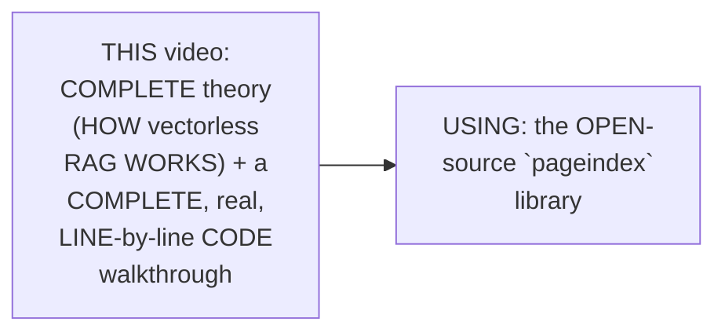

#### 🎯 Key Takeaways

* This VIDEO introduces **VECTORLESS RAG** — EXPLICITLY, DIRECTLY framed as a GENUINELY "NEW trending TOPIC" — a DIRECT evolution BEYOND traditional, VECTOR-database-based RAG.
* The VIDEO's own, COMPLETE scope COMBINES conceptual THEORY with a REAL, hands-ON, line-by-LINE code IMPLEMENTATION — USING the `PAGEINDEX` open-source LIBRARY.
* This directly, PRACTICALLY builds ON this WORKSPACE's own, PREVIOUSLY-established RAG foundations (FROM earlier, TRADITIONAL vector-RAG SESSIONS) — DIRECTLY extending that KNOWLEDGE toward a GENUINELY newer APPROACH.

---

### 2. Traditional Vector RAG: A Quick, Necessary Recap

#### 📖 Definition — The Complete, Precise, Traditional Pipeline

> 💡 **Given directly:** *"In traditional vector RAG... let's say we have some sets of long PDF documents, and first of all what we do is we need to store this PDF document into some kind of vector databases. For converting this PDF document, first of all we need to apply chunking, and then after applying chunking, we need to go ahead and apply embedding."*

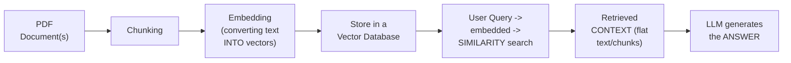

#### ⚠ Common Mistakes

* Assuming TRADITIONAL vector RAG's OWN chunking PROCESS genuinely, ALWAYS respects a DOCUMENT's own, LOGICAL section BOUNDARIES — explicitly, directly, DIRECTLY foreshadowed AS a GENUINE limitation (Section 6): chunking CAN, GENUINELY, split a SINGLE, coherent SECTION across MULTIPLE, separate chunks.

#### 🎯 Key Takeaways

* **TRADITIONAL vector RAG**'s own, COMPLETE pipeline: PDF → **CHUNKING** → **EMBEDDING** → VECTOR database → SIMILARITY search → CONTEXT → LLM → answer.
* This QUICK recap directly, DELIBERATELY establishes a CLEAR, concrete POINT of CONTRAST — EVERY step in THIS pipeline is GENUINELY, DIRECTLY eliminated OR replaced IN vectorless RAG (Section 3).
* This is DIRECTLY confirmed as ALREADY, EXTENSIVELY covered IN the instructor's OWN, prior RAG-focused VIDEO playlist — THIS session BUILDS directly ON that ESTABLISHED foundation.

---
### 3. Vectorless RAG: The Core, New Concept

#### 📖 Definition — Vectorless RAG, Precisely Introduced

> 💡 **Given directly:** *"One amazing thing about vectorless RAG is that you don't have any kind of database — you don't require any kind of vector databases."*

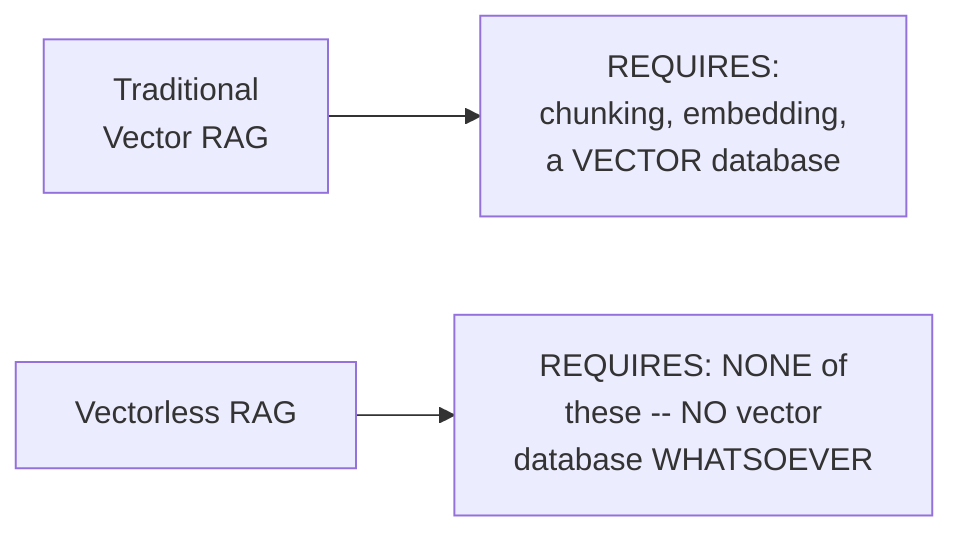

#### 🏢 Real-World / Production Usage — The Genuine, Real Source Product

> 💡 **Given directly:** *"There is an amazing GitHub repository which is called PageIndex, and with the help of this specific repository, we will be creating some vectorless, reasoning-based RAG... go to the homepage of vectify.ai, which is also called pageindex.ai. It says: 'hack humanlike document AI, it unlocks precise, verifiable answers and insights for complex documents.'"*

#### ⚠ Common Mistakes

* Assuming "VECTORLESS" RAG GENUINELY means "SIMPLER" or "LESS sophisticated" — explicitly, directly IMPLIED throughout THIS video as GENUINELY, DIRECTLY MORE reasoning-INTENSIVE — REPLACING mathematical SIMILARITY search WITH genuine, LLM-driven REASONING over structure.

#### 🎯 Key Takeaways

* **VECTORLESS RAG** GENUINELY, DIRECTLY eliminates the NEED for ANY vector DATABASE — a GENUINELY NEW, distinct APPROACH from traditional, VECTOR-based RAG.
* The REAL, source TOOL used THROUGHOUT this VIDEO is **PageIndex** (VIA vectify.ai) — an OPEN-source (WITH SOME usage LIMITS) repository SPECIFICALLY built FOR this PURPOSE.
* This directly, PRECISELY sets UP the NEXT, essential CONCEPT — the "LLM TREE builder" (Section 4) — WHICH is the GENUINE, core MECHANISM replacing chunking AND embedding.

---

### 4. The LLM Tree Builder: Building a Hierarchical, Summarized Index

#### 📖 Definition — LLM Tree Builder, Precisely Introduced

> 💡 **Given directly:** *"For this PDF document, you basically go ahead and create an LLM tree builder... let's say in the PDF document you have a TOC, table of content — it's just like an index table. So whenever you have this kind of table of content, we generate a hierarchy of sections."*

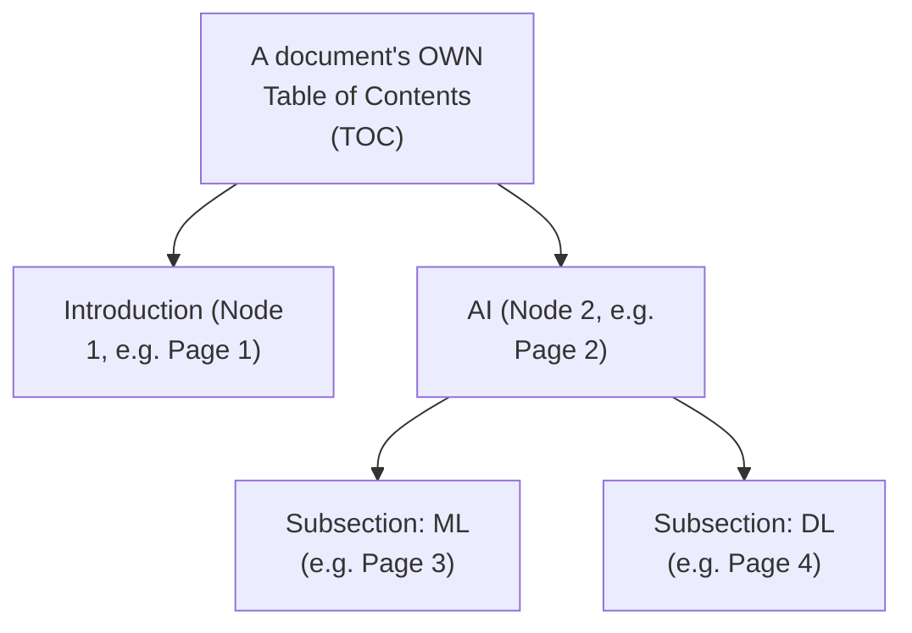

#### 🔍 Internal Working — What Genuinely Lives Inside Each Node

> 💡 **Given directly:** *"What is present inside this particular node? Let's say the AI is available in page 2 — whatever content is available inside this section will have a summarized version, by the LLM. So P2 has the content of the AI module, it will summarize using the LLM, and it will keep it over here."*

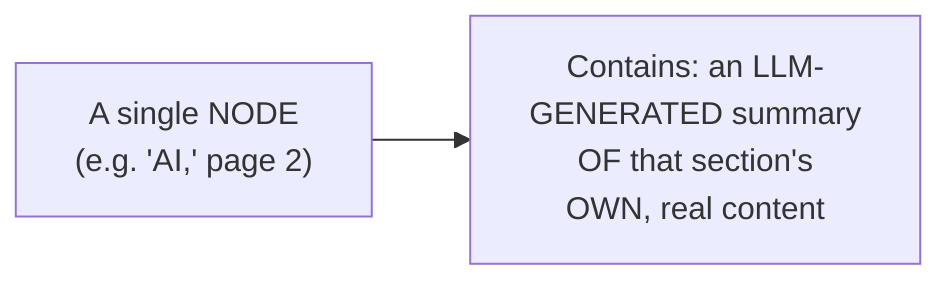

#### 📖 Definition — The JSON Tree Index, Precisely Introduced

> 💡 **Given directly:** *"After creating the LLM tree builder, this is basically converted into a JSON tree index — a JSON tree index is just used for specifying or parsing through this entire node structure."*

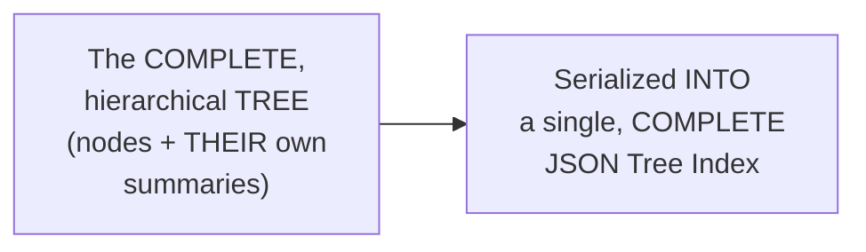

#### ⚠ Common Mistakes

* Assuming a NODE's own SUMMARY is GENUINELY, MERELY the RAW, unedited TEXT of THAT section — explicitly, directly, PRECISELY clarified: it's a GENUINE, LLM-GENERATED **summary** of the section's OWN content — NOT the RAW text ITSELF.
* Assuming the "TREE" structure is a GENUINELY abstract, purely CONCEPTUAL idea — explicitly, directly, PRECISELY grounded: it's LITERALLY, DIRECTLY serialized INTO a REAL, concrete **JSON tree INDEX** — a TANGIBLE, usable DATA structure.

#### 🎯 Key Takeaways

* The **LLM tree BUILDER** GENUINELY, DIRECTLY converts a DOCUMENT's own table OF contents (OR inferred STRUCTURE) into a **HIERARCHICAL tree of NODES** — MIRRORING the document's OWN, logical ORGANIZATION.
* EACH node GENUINELY, DIRECTLY contains an **LLM-generated SUMMARY** of that SPECIFIC section's own, REAL content — NOT the raw TEXT itself.
* This ENTIRE tree STRUCTURE is directly, CONCRETELY serialized INTO a single, COMPLETE **JSON tree INDEX** — the GENUINE, foundational data STRUCTURE that vectorless RAG'S own retrieval PROCESS (Section 5) operates ON.

---
### 5. Retrieval in Vectorless RAG: How the LLM Reasons Over the Tree

#### 🪜 Step-by-Step — A Complete, Precise Walkthrough of the Retrieval Process

> 💡 **Given directly:** *"Whenever a user query comes, the LLM will be given a context of this entire JSON tree index... let's say the query is saying, 'what is deep learning?' The LLM will be responsible for traversing this entire node, because it knows all the information — it has this entire JSON tree section. It goes to that specific node, picks up the summarized content, and gets the result."*

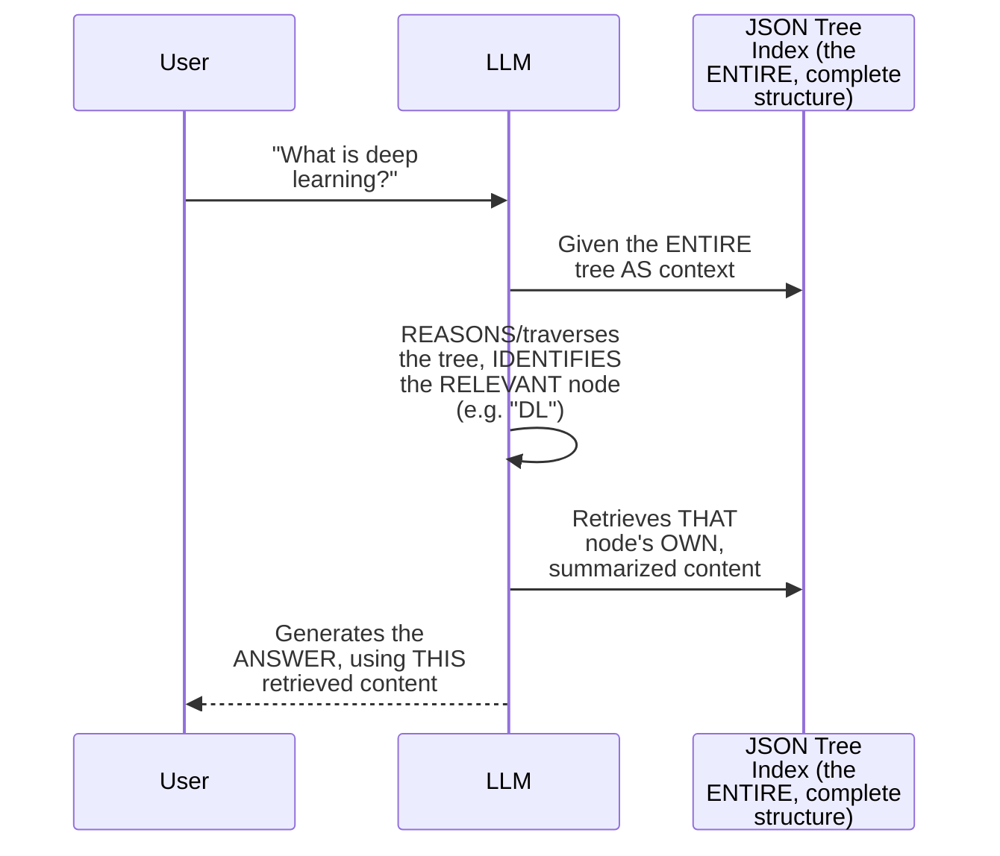

#### 🧠 Concept — A Genuinely Memorable, Real Human Analogy

> 💡 **Given directly:** *"The reason-based retrieval navigates just like how a human expert navigates. If we are given a book, we will go ahead and see the table of contents, and we will see, okay, which page number it is, and based on that page number we will pick up that information."*

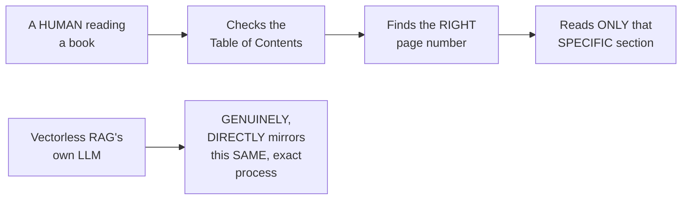

#### ⚠ Common Mistakes

* Assuming the LLM GENUINELY, DIRECTLY performs a MATHEMATICAL, similarity-BASED search (LIKE traditional VECTOR RAG) to FIND the relevant NODE — explicitly, directly, PRECISELY distinguished: it GENUINELY, DIRECTLY **REASONS** about the TREE's own, STRUCTURED information (TITLES, page NUMBERS, summaries) — a QUALITATIVELY different MECHANISM than VECTOR similarity.

#### 🎯 Key Takeaways

* IN vectorless RAG, the LLM is GIVEN the **ENTIRE** JSON tree INDEX as context, and **REASONS/traverses** through IT to identify the RELEVANT node(s) — RATHER than PERFORMING a mathematical, SIMILARITY-based search.
* This process is directly, MEMORABLY compared TO how a HUMAN expert USES a book's own TABLE of contents — CHECKING the index, FINDING the right PAGE, and READING only THAT specific SECTION.
* This directly, PRECISELY sets UP the NEXT, important QUESTION (Section 6) — WHAT happens WHEN a document GENUINELY, PRACTICALLY lacks a table OF contents in the FIRST place?

---

### 6. What If There's No Table of Contents? A Genuine, Alternative Workflow

#### ❓ Why It Exists — A Genuine, Real, Practical Problem

> 💡 **Given directly:** *"What if I don't have a table of contents? There may be many PDFs which may not have any kind of table of contents. When I say table of content, you don't know what is there in the first section, second section. So let's say if I don't have any table of content with the page number, then what?"*

#### 🪜 Step-by-Step — The Complete, Real, Alternative Workflow

> 💡 **Given directly:** *"Here's the flow: let's say I have a raw PDF document, it can be any long, structured document. First of all, we do TOC detection — we'll scan some end pages for existing headers. If it has a TOC, we go with the same structure. If it does not have the TOC, then the LLM itself reads pages, infers heading plus structure."*

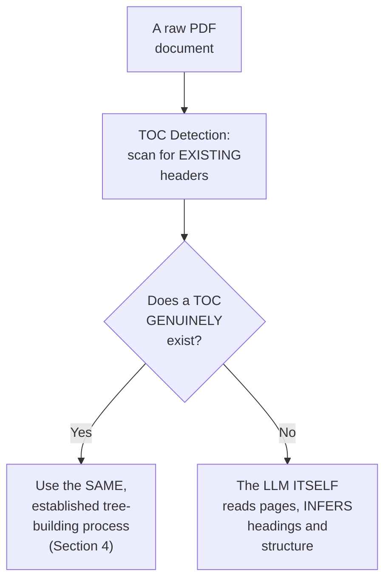

#### 🔍 Internal Working — The Genuine, Precise Distinction From Traditional Chunking

> 💡 **Given directly:** *"This is very important for you to understand — in vector RAG, chunking is not evenly split, it can be split between, let's say a section can be split three times. But in this case, when LLM is reading pages, it's going to make sure it makes a split based on various sections... it'll be section-aware splitting, respecting logical boundaries — this is very, very important — respecting logical boundaries, not on token count, which usually happens in traditional RAG."*

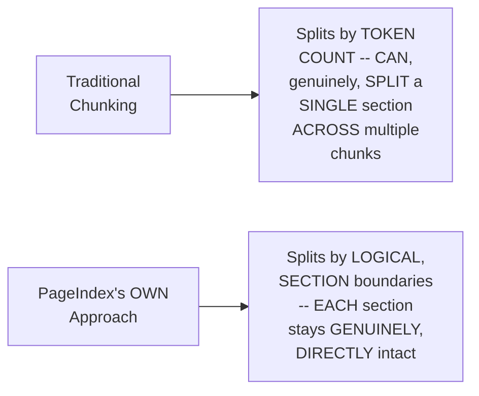

#### 🪜 Step-by-Step — Completing the Tree, Even Without an Original TOC

> 💡 **Given directly:** *"LLM summarizes each section, creates a node ID, title, page, summary, and finally assembles the hierarchical tree. It'll look something like this in the form of JSON — let's say there's a topic on financial stability, it has a node, a node number, a page number, 22 to 28 is one section, 28 to 31 is another section, and inside this there'll be a summarized version of that particular page/content section."*

#### ⚠ Common Mistakes

* Assuming a MISSING table OF contents GENUINELY, COMPLETELY prevents vectorless RAG FROM working — explicitly, directly, PRECISELY clarified as a GENUINE, real ALTERNATIVE workflow: the LLM ITSELF can INFER the structure, WITHOUT requiring a PRE-existing TOC.
* Assuming SECTION-aware splitting (PageIndex's OWN approach) and TOKEN-count-based CHUNKING (traditional RAG) are GENUINELY, FUNCTIONALLY equivalent — explicitly, directly, REPEATEDLY emphasized as GENUINELY, STRUCTURALLY different — ONE respects LOGICAL boundaries; the OTHER can GENUINELY, ARBITRARILY split a SINGLE section ACROSS multiple pieces.

#### 🎯 Key Takeaways

* WHEN a document GENUINELY lacks a table OF contents, PageIndex FIRST attempts **TOC detection** (SCANNING for existing HEADERS); IF none is found, the **LLM ITSELF reads pages** and INFERS the document's own HEADING structure.
* THIS approach GENUINELY, DIRECTLY produces **SECTION-aware splits** — respecting LOGICAL boundaries — a GENUINE, structural IMPROVEMENT over TRADITIONAL chunking's own, TOKEN-count-based approach (WHICH can GENUINELY, ARBITRARILY split a SINGLE section ACROSS multiple chunks).
* REGARDLESS of WHETHER a TOC originally EXISTED, the FINAL result is the SAME: a COMPLETE, hierarchical TREE — WITH node ID, title, PAGE range, and SUMMARY — ASSEMBLED into the SAME, established JSON TREE index FORMAT.

---
### 7. The Complete, Four-Step Retrieval Process

#### 📖 Definition — The Precise, Complete, Four-Step Process

> 💡 **Given directly:** *"This is usually the retrieval process that happens in vectorless RAG. First of all, we give the user query. Step one is to read the tree index — the LLM scans title, pages, summaries in context. Step two is reason and select the road — return thinking plus node list, JSON. Then extract section content from the selected nodes. Is it sufficient to answer? If it is not, then again it'll loop back to step two. Otherwise, it'll go ahead and generate the answer."*

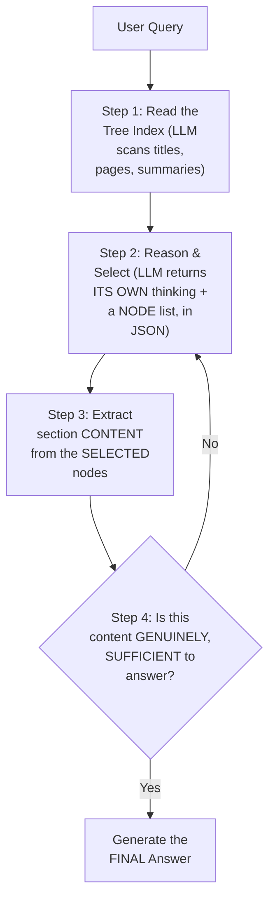

#### 🔍 Internal Working — A Genuine, Direct Confirmation of the Iterative, Self-Correcting Nature

> 💡 **Given directly:** *"If it is not [sufficient], then again it'll loop back to the second step."*

#### ⚠ Common Mistakes

* Assuming vectorless RAG's OWN retrieval PROCESS is GENUINELY a SINGLE-pass, ONE-shot operation — explicitly, directly, PRECISELY clarified: it's GENUINELY, STRUCTURALLY **ITERATIVE** — IF the FIRST attempt's own, RETRIEVED content is GENUINELY insufficient, the SYSTEM loops BACK to reasoning/SELECTION again.

#### 🎯 Key Takeaways

* The COMPLETE, precise RETRIEVAL process: **(1) READ** the tree INDEX; **(2) REASON and SELECT** relevant nodes (RETURNING both THINKING and a NODE list); **(3) EXTRACT** the section CONTENT; **(4) CHECK sufficiency** — LOOPING back to STEP 2 if INSUFFICIENT, otherwise GENERATING the final ANSWER.
* This process is directly, STRUCTURALLY confirmed as **ITERATIVE/self-CORRECTING** — NOT a rigid, single-PASS operation — a GENUINE, important DISTINCTION from TRADITIONAL, one-shot VECTOR-similarity retrieval.
* This directly, PRECISELY sets UP the REST of THIS session's own CONTENT — a REAL, live DEMO (Section 8) and a COMPLETE, hands-ON code implementation (Sections 9-12) BOTH directly, CONCRETELY apply THIS exact, four-STEP process.

---

### 8. A Live, Real Demo: chat.pageindex.ai

#### 🪜 Step-by-Step — A Complete, Real, Live Demonstration

> 💡 **Given directly:** *"If you go to chat.pageindex.ai, you'll be able to see that you can clearly communicate anything. Let's say this is the PDF document — I will select this PDF document and ask, 'summarize this book.' And this entire thing is working on the tree index. You can see 'get document structure,' all the JSON is basically created, node-wise."*

#### 🔍 Internal Working — A Genuine, Direct, Live-Confirmed Observation

> 💡 **Given directly:** *"See how fast it is? You don't have any dependency on vector DB and all. So here you can see, 'Pattern Recognition and Machine Learning.' I'll ask a question: what are the challenges in pattern recognition? The user is asking, let me look at the relevant section — these all things are there, it's thinking, and then now it gets the page content — you can see all the page content, with respect to summarized, it is being picked up."*

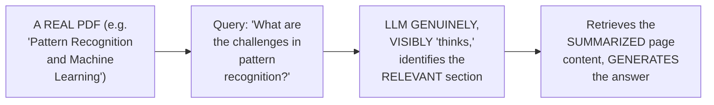

#### ⚠ Common Mistakes

* Assuming a LIVE, hosted TOOL like `CHAT.pageindex.ai` REQUIRES the SAME, familiar VECTOR-DB setup steps AS traditional RAG TOOLS — explicitly, directly, LIVE-demonstrated as GENUINELY, DIRECTLY requiring NO such SETUP — SIMPLY uploading a PDF and ASKING a question.

#### 🎯 Key Takeaways

* A COMPLETE, real, LIVE demonstration (VIA `chat.PAGEINDEX.ai`) directly, CONCRETELY confirmed vectorless RAG'S own, PRACTICAL functionality — UPLOADING a REAL PDF ("PATTERN Recognition and MACHINE Learning") and ASKING a genuine QUESTION.
* The LIVE demo directly, VISUALLY confirmed the SYSTEM's own, INTERNAL reasoning PROCESS — SHOWING the LLM "THINKING," identifying the RELEVANT section, and RETRIEVING its SUMMARIZED content.
* This demo directly, PRACTICALLY confirms the SPEED and SIMPLICITY advantage OF vectorless RAG — "YOU don't have ANY dependency ON vector DB and ALL."

---
### 9. Hands-On Code: Setup & Uploading/Indexing a PDF

#### 📖 Definition — A Precise, Direct Comparison of Key Concepts

> 💡 **Given directly:** *"Traditional RAG is nothing but chunking, embedding, cosine similarity, and retrieve. Whereas in the case of PageIndex RAG, you build a tree, LLM reasons over the tree, and retrieves the exact section. The best part is that whenever you build this tree, all the nodes will have the correct, summarized version of that particular section, which is more than sufficient to give the context to the LLM."*

```text
Traditional RAG: chunk -> embed -> cosine similarity -> retrieve
PageIndex RAG:    build tree -> LLM reasons over tree -> retrieve exact section
```

#### 🪜 Step-by-Step — A Complete, Real Setup Walkthrough

> 💡 **Given directly:** *"First of all we'll be requiring the PageIndex API key — you can get it, for a thousand documents it provides you completely for free. First packages required: pageindex, openai, and python-dotenv, so you'll be able to load all the environment variables."*

```bash
pip install pageindex openai python-dotenv --break-system-packages
```

```python
import os
import json
import time
from dotenv import load_dotenv
load_dotenv()

# Load API keys from environment variables
page_index_api_key = os.getenv("PAGEINDEX_API_KEY")
openai_api_key = os.getenv("OPENAI_API_KEY")

from pageindex import PageIndexClient
from openai import OpenAI

pi_client = PageIndexClient(api_key=page_index_api_key)
openai_client = OpenAI(api_key=openai_api_key)
```

#### 🪜 Step-by-Step — Uploading and Indexing a Real PDF

> 💡 **Given directly:** *"I have created an amazing PDF, which is a course syllabus... here you can see I have a table of contents, but I don't have page numbers... so this kind of problem statement I sought."*

```python
pdf_path = "sample_document.pdf"
doc_result = pi_client.submit_document(pdf_path)
document_id = doc_result["doc_id"]  # save this ID -- used throughout the notebook
print(document_id)
```

#### ⚠ A Direct, Honest, Genuine Note on Processing Time

> 💡 **Given directly:** *"PageIndex builds the tree asynchronously. For a 50-page PDF, this typically takes 30 to 90 seconds."*

```python
# Check tree-building status (asynchronous process):
status_result = pi_client.get_document(document_id)
print(status_result["status"])  # confirms whether the tree index is ready
```

#### ⚠ Common Mistakes

* Assuming a REAL PDF, DELIBERATELY chosen FOR this DEMO, would GENUINELY, NECESSARILY have a "CLEAN," complete TABLE of contents (WITH page NUMBERS) — explicitly, directly, DELIBERATELY chosen OTHERWISE: THIS specific PDF GENUINELY, INTENTIONALLY has a TOC WITHOUT page NUMBERS — a REALISTIC, deliberate TEST of PageIndex's OWN, more CHALLENGING scenario.
* Assuming TREE-building COMPLETES instantly, SYNCHRONOUSLY, upon UPLOAD — explicitly, directly, HONESTLY clarified: it's a GENUINELY **ASYNCHRONOUS** process, TAKING 30-90 seconds FOR a 50-page PDF.

#### 🎯 Key Takeaways

* THE core, KEY-concept comparison: TRADITIONAL RAG is "CHUNK, embed, COSINE similarity, retrieve"; PageIndex RAG is "BUILD tree, LLM REASONS over tree, RETRIEVE exact section."
* SETUP requires THREE packages (`pageindex`, `OPENAI`, `python-DOTENV`) and TWO API keys (PageIndex's OWN — FREE for 1,000 DOCUMENTS — and OpenAI's).
* Uploading a PDF (`PI_CLIENT.submit_document()`) RETURNS a **DOCUMENT ID**, and TREE building is a GENUINELY **ASYNCHRONOUS** process — TAKING 30-90 SECONDS for a 50-page PDF, CHECKED via `GET_document()`'s own STATUS field.

---

### 10. Hands-On Code: Inspecting the Tree Structure

#### 🪜 Step-by-Step — A Complete, Real Retrieval of the Full Tree

> 💡 **Given directly:** *"We will go ahead and inspect the tree structure — I'll use `pipeline.get_tree` on the document ID, and `node_summary` is equal to true, and we'll use `tree_result.get` and this key to display everything. We're also dumping all the results in the form of JSON."*

```python
tree_result = pi_client.get_tree(document_id, node_summary=True)
tree_json = tree_result.get("result")
print(json.dumps(tree_json, indent=2))

# e.g., a REAL, live-confirmed result:
# "Top-level sections: 24"
# "Title: Preface, Node ID: 000, page_index: [1,3], summary text: ..."
```

#### 🪜 Step-by-Step — A Complete, Real, Recursive Tree Traversal

> 💡 **Given directly:** *"I want to print the whole tree, how it looks like. So every node I will go ahead and traverse — `node.get` of page index, I'm just using this specific key and displaying it."*

```python
def print_tree(nodes, indent=0):
    for node in nodes:
        print("  " * indent + f"{node.get('title')} (Page {node.get('page_index')})")
        if "nodes" in node:
            print_tree(node["nodes"], indent + 1)

print_tree(tree_json["nodes"])
# e.g., live-confirmed output includes:
#   Preface
#   Module 1 (Page 4): Neural Network Refresher, Hardware (Page 5)
#   Modern LLM Fine-Tuning
#     0.1.1 The LLM Development Lifecycle
#     Pre-training Deep Dive
#     Data Preparation for Fine-Tuning
```

#### 🔍 Internal Working — A Genuine, Direct, Live-Confirmed Result

> 💡 **Given directly:** *"Total number of nodes in the tree is 40."*

#### ⚠ Common Mistakes

* Assuming `GET_tree()`'s own RESULT is GENUINELY, DIRECTLY usable WITHOUT further PARSING — explicitly, directly, PRACTICALLY demonstrated as REQUIRING a SIMPLE, recursive TRAVERSAL function to DISPLAY the COMPLETE, nested tree STRUCTURE clearly.

#### 🎯 Key Takeaways

* `PI_CLIENT.get_tree(document_id, NODE_summary=True)` DIRECTLY, PRACTICALLY retrieves the COMPLETE, hierarchical TREE structure — WITH each node's OWN title, PAGE range, and LLM-GENERATED summary.
* A COMPLETE, real, RECURSIVE Python FUNCTION directly, PRACTICALLY traverses and DISPLAYS this ENTIRE tree — LIVE-confirmed, for THIS specific PDF, as containing **40 total NODES**.
* This directly, CONCRETELY confirms the TREE-building process (Section 4/6) GENUINELY, SUCCESSFULLY works ON a real, PRACTICAL document — EVEN one DELIBERATELY chosen for LACKING page NUMBERS in its OWN table of CONTENTS.

---
### 11. Hands-On Code: Building the LLM Tree Search Function

#### 📖 Definition — A Precise, Direct Comparison: Vector Retrieval vs. Tree Search

> 💡 **Given directly:** *"In vector RAG retrieval, we basically give the query, embed it, do the cosine similarity, and get the top-K chunks. In PageIndex, we give the query plus tree plus LLM reasons."*

```text
Vector RAG:  query -> embed -> cosine similarity -> top-K chunks
PageIndex:   query + tree -> LLM reasons -> relevant node(s)
```

#### 🪜 Step-by-Step — A Complete, Real, Custom Python Function

> 💡 **Given directly:** *"There's a function we've defined called `llm_tree_search`... we've also used a prompt: 'You are given a query and a document structure, like a table of contents. Your task: identify which nodes most likely contain the answer to the query. Think step by step.' The query is over here, and the document structure — we're directly giving it in the form of JSON."*

```python
def llm_tree_search(query, tree_json):
    prompt = f"""
    You are given a query and a document structure (like a table of contents).
    Your task: identify which nodes most likely contain the answer to the query.
    Think step by step.

    Query: {query}
    Document Structure: {json.dumps(tree_json)}

    Return your thinking, followed by a JSON list of relevant node IDs.
    """
    response = openai_client.chat.completions.create(
        model="gpt-4",
        messages=[{"role": "user", "content": prompt}]
    )
    return response.choices[0].message.content
```

#### 🪜 Step-by-Step — A Complete, Real, Live-Confirmed Test

> 💡 **Given directly:** *"I've asked the question: what is the syllabus covered in modern LLM fine-tuning? LLM tree search — LLM is going to do that search to find nodes relevant to the query about the syllabus. For this, I first identify the section titles — and here is all the nodes it has probably caught: 011, 012, 013, 014... and if you go ahead and see whether it is matching or not — I've asked about modern LLM fine-tuning, and it has given me all the specific information."*

```python
result = llm_tree_search(
    query="What is the syllabus covered in modern LLM fine-tuning?",
    tree_json=tree_json
)
print(result)
# Live-confirmed: correctly identifies relevant node IDs (0.1.1, 0.1.2, 0.1.3, ...)
```

#### ⚠ Common Mistakes

* Assuming the `LLM_tree_search` function's own OUTPUT is GENUINELY, DIRECTLY the FINAL answer — explicitly, directly, PRECISELY clarified: it RETURNS only the **THINKING and a LIST of relevant NODE IDs** — the ACTUAL content EXTRACTION and answer GENERATION are SEPARATE, SUBSEQUENT steps (Section 12).
* Assuming the PROMPT's own WORDING ("think STEP by step") is a GENUINELY, MERELY cosmetic ADDITION — explicitly, directly, IMPLIED as GENUINELY, DIRECTLY important — ENCOURAGING the LLM to GENUINELY reason THROUGH the tree's own structure, RATHER than GUESSING.

#### 🎯 Key Takeaways

* PageIndex's OWN retrieval APPROACH is precisely: "QUERY plus TREE plus LLM reasons" — a QUALITATIVELY different MECHANISM from TRADITIONAL, embedding-BASED "query → EMBED → cosine SIMILARITY → top-K chunks."
* A COMPLETE, real, CUSTOM `llm_tree_search()` FUNCTION directly, PRACTICALLY implements THIS reasoning PROCESS — GIVING the LLM the QUERY plus the ENTIRE JSON tree, and ASKING it to IDENTIFY relevant NODE IDs, STEP by step.
* A COMPLETE, real, LIVE-confirmed TEST directly, CONCRETELY confirmed CORRECT node IDENTIFICATION — QUERYING about "MODERN LLM fine-TUNING" correctly, DIRECTLY surfaced the RELEVANT node IDs (0.1.1 THROUGH 0.1.7, and OTHERS).

---

### 12. Hands-On Code: Extracting Nodes & Generating the Final Answer

#### 🪜 Step-by-Step — A Complete, Real Node-Extraction Function

> 💡 **Given directly:** *"There's a function definition, `find_nodes_by_id` — if the node is in the target node list, append it, otherwise extend."*

```python
def find_nodes_by_id(nodes, target_ids, found=None):
    if found is None:
        found = []
    for node in nodes:
        if node.get("node_id") in target_ids:
            found.append(node)
        if "nodes" in node:
            find_nodes_by_id(node["nodes"], target_ids, found)
    return found
```

#### 🪜 Step-by-Step — A Complete, Real Answer-Generation Function

> 💡 **Given directly:** *"There's a function called `generate_answer`. If not nodes, return 'no relevant section found in the document.' Context parts: for node in nodes, context_parts.append — we're appending the section, the title, the page index, each and every information. And here's the prompt: 'You are an expert document analyst. Answer the question using only the provided context. For every claim you make, cite the section title, page number in parenthesis.'"*

```python
def generate_answer(query, nodes):
    if not nodes:
        return "No relevant section found in the document."

    context_parts = []
    for node in nodes:
        context_parts.append(
            f"Section: {node.get('title')}, Page: {node.get('page_index')}\n"
            f"Summary: {node.get('summary')}"
        )
    context = "\n\n".join(context_parts)

    prompt = f"""
    You are an expert document analyst. Answer the question using ONLY the provided context.
    For every claim you make, cite the section title and page number in parenthesis.

    Question: {query}
    Context: {context}
    """
    response = openai_client.chat.completions.create(
        model="gpt-4",
        messages=[{"role": "user", "content": prompt}]
    )
    return response.choices[0].message.content
```

#### 🪜 Step-by-Step — The Complete, Real, End-to-End Vectorless RAG Function

> 💡 **Given directly:** *"This is a complete vectorless RAG function — first I'll get my search result, I'll get my node IDs, then this all information I will be also getting my nodes, and giving all this information to my `generate_answer`, and finally I get the answer."*

```python
def vectorless_rag(query, tree_json):
    search_result = llm_tree_search(query, tree_json)
    node_ids = json.loads(search_result)  # the reasoned, relevant node ID list

    nodes = find_nodes_by_id(tree_json["nodes"], node_ids)
    answer = generate_answer(query, nodes)
    return answer

# A complete, real, live-confirmed test:
final_answer = vectorless_rag(
    "What is the syllabus covered in modern LLM fine-tuning?",
    tree_json
)
print(final_answer)
# Live-confirmed: correctly, directly answers, citing the relevant sections/pages
```

#### 🔍 Internal Working — A Genuine, Direct Confirmation of Multiple, Real Test Queries

> 💡 **Given directly:** *"I have created three more queries, and you can test the query also. So let's test this — this is my question, and this will be my answer... for the answer, I'm just displaying the 300 words."*

#### ⚠ Common Mistakes

* Assuming the `generate_answer()` function GENUINELY, DIRECTLY receives the FULL, raw TEXT of the ENTIRE document — explicitly, directly, PRECISELY clarified: it receives ONLY the CONTEXT from the SPECIFIC, ALREADY-identified nodes — the TITLE, page INDEX, and SUMMARY of EACH relevant NODE.
* Assuming CITATION requirements ("CITE the section TITLE, page NUMBER") are GENUINELY, MERELY cosmetic — explicitly, directly, PRACTICALLY demonstrated as a REAL, GENUINE feature of the FINAL, generated ANSWER — DIRECTLY connecting BACK to Section 5's own "SECTION plus PAGE citation" REASONING.

#### 🎯 Key Takeaways

* A COMPLETE, real `FIND_nodes_by_id()` function directly, PRACTICALLY extracts the FULL node OBJECTS corresponding TO the previously-IDENTIFIED, relevant node IDs.
* A COMPLETE, real `GENERATE_answer()` function directly, PRACTICALLY constructs a CONTEXT string (section TITLE, page, SUMMARY) and PROMPTS the LLM to ANSWER using ONLY that context — REQUIRING explicit, PER-claim citations.
* THE complete, END-to-end `VECTORLESS_rag()` pipeline directly, PRACTICALLY chains ALL three functions TOGETHER — and was LIVE-confirmed, ACROSS multiple, real TEST queries, to CORRECTLY, DIRECTLY generate CITED, accurate ANSWERS — WITHOUT any vector DATABASE whatsoever.

---
### 13. Closing: Genuine Promise, Open Questions & What's Deferred

#### 🪜 Step-by-Step — A Direct, Honest Assessment of This Approach's Own, Genuine Value

> 💡 **Given directly:** *"Very interesting concept — because of this, you don't have the burden of setting up the vector RAG, the vector DB also."*

#### ⚠ A Direct, Honest, Open Question About Real-World Adoption

> 💡 **Given directly:** *"I think a very trending topic altogether — how it is going to go, I don't know. How many companies have started implementing it, I'm trying to ask managers, I've been suggesting many architects to probably go ahead and use this, because a lot less setup is required."*

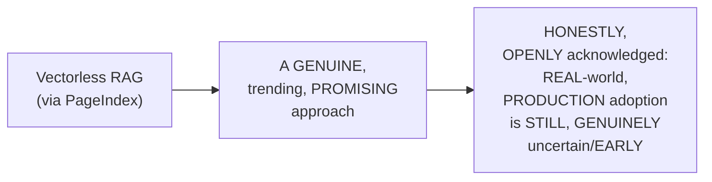

#### ⚠ A Direct, Honest, Genuine Limitation Briefly Deferred

> 💡 **Given directly:** *"The only thing with respect to this LLM tree — if it becomes big, how do you save it in some kind of external memory? That I will try to cover in some glance [in a future video]."*

#### ⚠ Common Mistakes

* Assuming a NEWLY-emerging, "TRENDING" technique like VECTORLESS RAG is GENUINELY, ALREADY a PROVEN, widely-ADOPTED, production-READY standard — explicitly, directly, HONESTLY clarified: its REAL-world, PRODUCTION adoption REMAINS genuinely, OPENLY uncertain — the instructor HIMSELF is STILL, ACTIVELY "ASKING managers" ABOUT this.
* Assuming THIS video's own coverage ADDRESSES every, POSSIBLE practical CHALLENGE (e.g., MANAGING an EXTREMELY large TREE) — explicitly, directly, HONESTLY deferred: THIS specific concern is EXPLICITLY flagged FOR a FUTURE video.

#### 🎯 Key Takeaways

* This video **GENUINELY, COMPREHENSIVELY delivers** its OWN, stated GOALS — a COMPLETE conceptual EXPLANATION of vectorless RAG, PLUS a REAL, line-by-LINE, working CODE implementation.
* The instructor **directly, HONESTLY acknowledges** GENUINE, OPEN uncertainty ABOUT this approach's OWN, real-world PRODUCTION adoption — a REFRESHINGLY honest, NON-hyped assessment OF a genuinely NEW, trending technique.
* **HOW to manage an EXTREMELY large TREE in EXTERNAL memory** is directly, HONESTLY flagged as a GENUINE, real limitation — EXPLICITLY deferred to a FUTURE, follow-up video.

---

## 📝 Glossary

| Term | Definition | Why It Matters |
|---|---|---|
| **Vectorless RAG** | RAG that requires no vector database whatsoever | A genuinely new, trending alternative to traditional RAG |
| **LLM Tree Builder** | Converts a document's structure into a hierarchical node tree | Each node contains an LLM-generated summary |
| **JSON Tree Index** | The serialized, complete tree structure | The context given to the LLM for reasoning |
| **TOC Detection** | Scanning a document for existing headers/structure | The first step when no clean TOC is provided |
| **Section-Aware Splitting** | Splitting by logical boundaries, not token count | Contrasts with traditional chunking's own limitation |
| **LLM Tree Search** | The LLM reasons over the tree to identify relevant nodes | Replaces cosine-similarity vector search |
| **PageIndex** | The open-source library/product used throughout this video | Available via vectify.ai / pageindex.ai |

---

## 🔄 Revision Notes — One-Minute Revision

* This is a **standalone, comprehensive tutorial** on "vectorless RAG" -- a genuinely new, trending topic, combining full theory with a real, line-by-line code walkthrough using the PageIndex library.
* **Traditional vector RAG recap**: PDF -> chunking -> embedding -> vector database -> similarity search -> context -> LLM -> answer.
* **Vectorless RAG's core idea**: requires NO vector database whatsoever. Uses PageIndex (via vectify.ai).
* **The LLM Tree Builder**: converts a document's table of contents (or inferred structure) into a hierarchical tree of nodes, where EACH node contains an LLM-generated SUMMARY of that section's content. This entire tree is serialized into a JSON Tree Index.
* **Retrieval, conceptually**: the LLM is given the ENTIRE JSON tree as context, and REASONS/traverses it to find the relevant node(s) -- directly analogous to a human using a book's table of contents.
* **When there's no table of contents**: PageIndex first attempts TOC detection (scanning for existing headers); if none found, the LLM itself reads pages and infers headings/structure, producing SECTION-AWARE splits (respecting logical boundaries) -- unlike traditional chunking, which splits by TOKEN COUNT and can arbitrarily split a single section across multiple chunks.
* **The complete, 4-step retrieval process**: (1) read the tree index; (2) reason and select relevant nodes (returning thinking + a node list, in JSON); (3) extract section content from selected nodes; (4) check sufficiency -- loop back to step 2 if insufficient, otherwise generate the answer. This process is ITERATIVE, not single-pass.
* **Live demo (chat.pageindex.ai)**: uploading a real PDF ("Pattern Recognition and Machine Learning") and asking a genuine question, live-confirming the reasoning process and fast, dependency-free retrieval.
* **Hands-on code**: setup requires the `pageindex`, `openai`, and `python-dotenv` packages, plus a PageIndex API key (free for 1,000 documents) and an OpenAI API key. Uploading a PDF (`submit_document()`) returns a document ID; tree-building is ASYNCHRONOUS (30-90 seconds for a 50-page PDF).
* **Inspecting the tree**: `get_tree(document_id, node_summary=True)` retrieves the complete, hierarchical structure; a real, live-confirmed example totaled 40 nodes.
* **Building the search**: an `llm_tree_search()` function gives the LLM the query + entire tree JSON, prompting it to identify relevant node IDs, step by step -- live-confirmed correctly identifying nodes for a "modern LLM fine-tuning" query.
* **Generating the answer**: `find_nodes_by_id()` extracts the full node objects; `generate_answer()` builds a context string (title, page, summary) and prompts the LLM to answer using ONLY that context, with mandatory, per-claim citations (section title + page number).
* **The complete `vectorless_rag()` pipeline**: chains search -> extraction -> answer generation together, live-confirmed across multiple, real test queries.
* **Closing**: an honest, refreshingly non-hyped acknowledgment that real-world, production adoption of this approach remains genuinely uncertain. Managing an extremely large tree in external memory is explicitly flagged as a genuine, open concern, deferred to a future video.

---

## 📋 Cheat Sheet

**Traditional RAG vs. Vectorless RAG (PageIndex):**
```text
Traditional RAG: chunk -> embed -> cosine similarity -> retrieve top-K chunks
PageIndex RAG:    build tree -> LLM reasons over tree -> retrieve exact section
```

**The complete 4-step retrieval process:**
```text
1. Read the tree index (LLM scans titles, pages, summaries)
2. Reason & Select (LLM returns thinking + a node list, in JSON)
3. Extract section content from selected nodes
4. Check sufficiency -> loop to step 2 if insufficient, else generate the answer
```

**Complete, minimal code skeleton:**
```python
from pageindex import PageIndexClient
from openai import OpenAI

pi_client = PageIndexClient(api_key=PAGEINDEX_API_KEY)
openai_client = OpenAI(api_key=OPENAI_API_KEY)

# 1. Upload & index
doc_result = pi_client.submit_document(pdf_path)
document_id = doc_result["doc_id"]

# 2. Retrieve the tree (async; 30-90s for a 50-page PDF)
tree_result = pi_client.get_tree(document_id, node_summary=True)
tree_json = tree_result.get("result")

# 3. Complete pipeline
def vectorless_rag(query, tree_json):
    node_ids = json.loads(llm_tree_search(query, tree_json))
    nodes = find_nodes_by_id(tree_json["nodes"], node_ids)
    return generate_answer(query, nodes)
```

---

## 🔥 Interview Questions & Answers

### 🟢 Beginner

**Q1.**

**Question:** What is the genuine, core difference between vectorless RAG and traditional RAG?

**Answer:** Vectorless RAG requires no vector database at all; traditional RAG requires chunking, embedding, and a vector database.

**Explanation:** Directly, precisely explained.

**Why Interviewers Ask This:** The most basic, foundational vectorless-RAG question.

**Possible Follow-up:** "What replaces the vector database in vectorless RAG?"

**Q2.**

**Question:** What does an LLM tree builder genuinely produce?

**Answer:** A hierarchical tree of nodes, mirroring the document's structure, where each node contains an LLM-generated summary of its own section.

**Explanation:** Directly, precisely defined.

**Why Interviewers Ask This:** Basic, essential vectorless-RAG terminology.

**Possible Follow-up:** "What is this tree ultimately serialized into?"

**Q3.**

**Question:** What happens when a document genuinely lacks a table of contents?

**Answer:** PageIndex first attempts TOC detection (scanning for headers); if none found, the LLM itself reads pages and infers the structure.

**Explanation:** Directly, precisely explained.

**Why Interviewers Ask This:** Tests genuine understanding of a real, practical edge case.

**Possible Follow-up:** "How does this differ from traditional, token-count-based chunking?"

**Q4.**

**Question:** Is vectorless RAG's own retrieval process a single-pass, one-shot operation?

**Answer:** No -- it's genuinely iterative; if retrieved content is insufficient, it loops back to reason and select again.

**Explanation:** Directly, precisely confirmed.

**Why Interviewers Ask This:** Tests genuine understanding of the complete, four-step retrieval process.

**Possible Follow-up:** "What are the four steps of this retrieval process?"

**Q5.**

**Question:** What is the genuine analogy used to explain how the LLM retrieves information in vectorless RAG?

**Answer:** A human expert using a book's table of contents to find the right page and section.

**Explanation:** Directly, memorably explained.

**Why Interviewers Ask This:** Tests genuine, conceptual understanding beyond rote definitions.

**Possible Follow-up:** "Why is this analogy genuinely appropriate?"

**Q6.**

**Question:** In the hands-on code, what does `submit_document()` genuinely return?

**Answer:** A document ID, used throughout subsequent API calls.

**Explanation:** Directly, explicitly demonstrated.

**Why Interviewers Ask This:** Basic, practical PageIndex API knowledge.

**Possible Follow-up:** "Is tree-building synchronous or asynchronous?"

**Q7.**

**Question:** What does the `generate_answer()` function genuinely require, per its own prompt?

**Answer:** Mandatory, per-claim citations (section title and page number).

**Explanation:** Directly, explicitly demonstrated.

**Why Interviewers Ask This:** Tests genuine, practical understanding of the answer-generation step.

**Possible Follow-up:** "Why does citation matter for this kind of retrieval system?"

**Q8.**

**Question:** What is the genuine difference between traditional chunking and PageIndex's own section-aware splitting?

**Answer:** Traditional chunking splits by token count (can split a section across chunks); PageIndex splits by logical section boundaries.

**Explanation:** Directly, precisely distinguished.

**Why Interviewers Ask This:** Tests genuine understanding of a key, structural advantage.

**Possible Follow-up:** "Why might splitting mid-section genuinely hurt retrieval quality?"

**Q9.**

**Question:** According to the instructor, is real-world, production adoption of vectorless RAG already well-established?

**Answer:** No -- he honestly acknowledges this remains genuinely uncertain/early.

**Explanation:** Directly, honestly stated.

**Why Interviewers Ask This:** Tests whether a learner absorbed the video's own honest, non-hyped framing.

**Possible Follow-up:** "What genuine limitation does the instructor flag as still unresolved?"

**Q10.**

**Question:** What genuine limitation is explicitly deferred to a future video?

**Answer:** How to save a very large LLM tree in external memory.

**Explanation:** Directly, honestly deferred.

**Why Interviewers Ask This:** Tests attention to the video's own, honest scope boundaries.

**Possible Follow-up:** "Why might tree size genuinely become a practical concern at scale?"

---

### 🟡 Intermediate

**Q11.**

**Question:** Explain why the instructor deliberately chooses a PDF with a table of contents that LACKS page numbers for the hands-on demo, rather than a "clean" PDF with a complete TOC.

**Answer:** This is a genuinely deliberate, REALISTIC teaching choice: by SPECIFICALLY choosing a document that GENUINELY, PRACTICALLY represents a HARDER, more REALISTIC scenario (a TOC EXISTS, but is INCOMPLETE, lacking PAGE numbers), the instructor DIRECTLY demonstrates PageIndex's own, GENUINE robustness — RATHER than ONLY showing the EASIEST, "best-CASE" scenario (a PERFECT, complete TOC). This DIRECTLY, CONCRETELY proves the SYSTEM's own, PRACTICAL value FOR the MANY, real-world documents THAT genuinely have INCOMPLETE or MESSY structural INFORMATION — a FAR more CONVINCING, realistic DEMONSTRATION than a "PERFECT" example WOULD have provided.

**Explanation:** Requires recognizing the deliberate, realistic value of choosing a genuinely imperfect, real-world example over an idealized one.

**Why Interviewers Ask This:** Tests whether a learner recognizes the pedagogical and persuasive value of demonstrating robustness against realistic, imperfect inputs.

**Possible Follow-up:** "Construct a GENUINE, real example of an EVEN harder scenario (BEYOND 'no page NUMBERS') that WOULD further TEST PageIndex's own, established TOC-detection fallback."

**Q12.**

**Question:** A learner argues that since vectorless RAG eliminates chunking and embedding, this means it is genuinely, unconditionally superior to traditional vector RAG for all use cases. Evaluate this claim.

**Answer:** This claim overstates the case, missing a GENUINELY important, HONEST caveat THIS session's own CONTENT directly PROVIDES. Section 13's own PRECISE, HONEST closing DIRECTLY acknowledges GENUINE, OPEN uncertainty ABOUT real-world PRODUCTION adoption — "HOW it is GOING to go, I DON'T know... HOW many companies HAVE started IMPLEMENTING it" — this is NOT the LANGUAGE of an UNCONDITIONALLY, PROVEN-superior technique. ADDITIONALLY, THIS session's own CONTENT does NOT genuinely, DIRECTLY compare RETRIEVAL LATENCY, cost AT extreme SCALE (MILLIONS of documents), or PERFORMANCE on GENUINELY unstructured, NON-hierarchical content (e.g., a COLLECTION of unrelated, SHORT emails, RATHER than a SINGLE, structured DOCUMENT) — SCENARIOS where TRADITIONAL, vector-based RAG MIGHT genuinely REMAIN more APPROPRIATE. The ACCURATE, more PRECISE conclusion: vectorless RAG GENUINELY, DIRECTLY offers a COMPELLING, "LESS setup REQUIRED" alternative FOR structured, hierarchical DOCUMENTS — but its OWN, GENERAL superiority ACROSS every, possible RAG use CASE remains, per the INSTRUCTOR's own, HONEST framing, an OPEN, unresolved QUESTION.

**Explanation:** Tests whether a learner recognizes the session's own honest, open uncertainty about production readiness, rather than treating a genuinely promising new technique as unconditionally superior.

**Why Interviewers Ask This:** Distinguishes candidates who critically evaluate a new technique's own, stated limitations from those who assume "eliminates a complex step" automatically means "unconditionally better."

**Possible Follow-up:** "Describe a GENUINE, real scenario where TRADITIONAL, vector-based RAG might STILL, genuinely be the MORE appropriate choice, COMPARED to vectorless RAG."

**Q13.**

**Question:** Explain, precisely, why the instructor deliberately builds the complete pipeline as THREE, separate functions (`llm_tree_search`, `find_nodes_by_id`, `generate_answer`), rather than a single, monolithic function.

**Answer:** This is a genuinely deliberate, MODULAR, software-engineering CHOICE: by SEPARATING the PIPELINE into three, DISTINCT, single-RESPONSIBILITY functions — SEARCHING/reasoning, EXTRACTING nodes, and GENERATING the answer — the CODE genuinely, PRACTICALLY becomes EASIER to DEBUG, test, and MODIFY independently (e.g., ONE could GENUINELY swap OUT `generate_answer`'S own PROMPT, WITHOUT touching the SEARCH logic AT all). This directly, CONCRETELY mirrors the ESTABLISHED, four-step RETRIEVAL process (Section 7) — EACH function GENUINELY, DIRECTLY corresponds to ONE or MORE of THOSE, conceptually-DISTINCT steps — MAKING the CODE'S own structure DIRECTLY, TRANSPARENTLY traceable BACK to the UNDERLYING, conceptual PROCESS.

**Explanation:** Requires recognizing the deliberate, modular software-engineering value of separating a pipeline into distinct, single-responsibility functions that mirror the established conceptual process.

**Why Interviewers Ask This:** Tests whether a learner recognizes the practical, maintainability-focused value of modular code design, connected back to the conceptual pipeline it implements.

**Possible Follow-up:** "If you WANTED to ADD the SESSION's own established 'LOOP back IF insufficient' logic (Section 7's own STEP 4) INTO this CODE, which SPECIFIC function(s) would you GENUINELY need to MODIFY?"

**Q14.**

**Question:** Using this session's own precise "section-aware splitting" reasoning (Section 6), explain a GENUINE, real risk of a document that has GENUINELY inconsistent or messy internal formatting (e.g., inconsistent heading styles), even when using PageIndex's own, LLM-based structure-inference fallback.

**Answer:** A precise, reasoned RISK analysis, directly extending Section 6's own established MECHANISM: per Section 6's own PRECISE reasoning, WHEN no TOC is FOUND, "the LLM ITSELF reads pages, INFERS heading plus STRUCTURE" — this PROCESS GENUINELY, DIRECTLY relies ON the LLM's own ABILITY to CORRECTLY identify what GENUINELY constitutes a "HEADING" or "SECTION boundary." IF a document GENUINELY has INCONSISTENT, messy internal FORMATTING (e.g., SOME sections use BOLD headings, OTHERS use ALL-caps, others use NO distinct FORMATTING at all), the LLM's own INFERENCE process could GENUINELY, DIRECTLY produce an INCORRECT, or OVERLY coarse/FINE-grained tree STRUCTURE — POTENTIALLY merging GENUINELY distinct sections TOGETHER, or SPLITTING a SINGLE, coherent section INTO multiple, ARTIFICIAL nodes. This directly, PRECISELY illustrates a GENUINE, real LIMITATION of the LLM-based FALLBACK: it's GENUINELY more ROBUST than RIGID, token-count-based CHUNKING, but it's NOT genuinely IMMUNE to STRUCTURAL ambiguity IN the SOURCE document itself.

**Explanation:** Requires extending the section-aware splitting mechanism to identify a genuine, realistic risk when source documents have inconsistent internal formatting.

**Why Interviewers Ask This:** Tests whether a learner understands that the LLM-based fallback, while more robust than traditional chunking, is not immune to genuine document-quality issues.

**Possible Follow-up:** "What GENUINE, practical step could a user TAKE (BEFORE uploading a document) to REDUCE this SPECIFIC risk?"

**Q15.**

**Question:** Synthesize this session's complete "iterative, four-step retrieval process" reasoning (Section 7) with its own "citation-requiring generate_answer" reasoning (Section 12) to explain a GENUINE, real way these two mechanisms could combine to produce a more trustworthy, verifiable final answer than a single-pass, uncited retrieval system.

**Answer:** A precise, synthesized explanation, directly connecting TWO, separately-established sections: per Section 7's own PRECISE, established MECHANISM, the RETRIEVAL process GENUINELY, STRUCTURALLY checks WHETHER retrieved content is "SUFFICIENT to ANSWER" — LOOPING back IF not — ENSURING the FINAL context PROVIDED to the answer-GENERATION step is GENUINELY, ADEQUATELY complete. Per Section 12's own PRECISE, established MECHANISM, the `generate_answer()` function GENUINELY, DIRECTLY requires "FOR every CLAIM you make, CITE the section TITLE, page NUMBER" — TYING every, GENERATED statement BACK to a SPECIFIC, VERIFIABLE source LOCATION. SYNTHESIZING these TWO facts directly, PRECISELY reveals a GENUINE, real, COMBINED benefit: THE iterative SUFFICIENCY check (Section 7) GENUINELY, DIRECTLY ensures the LLM has ADEQUATE, complete CONTEXT before GENERATING an answer, WHILE the CITATION requirement (Section 12) GENUINELY, DIRECTLY makes THAT answer **VERIFIABLE** — a HUMAN reader can DIRECTLY, PRACTICALLY check EACH cited SECTION/page to CONFIRM the answer's OWN, genuine ACCURACY — TOGETHER, these TWO mechanisms produce a FAR more TRUSTWORTHY, auditable RESULT than a SINGLE-pass system THAT neither CHECKS sufficiency NOR requires CITATIONS.

**Explanation:** Requires synthesizing the iterative sufficiency-checking mechanism with the citation-requiring answer generation to explain their combined, genuine contribution to answer trustworthiness and verifiability.

**Why Interviewers Ask This:** A senior-level question testing whether a candidate can identify how two, separately-taught mechanisms genuinely combine to produce a more robust, trustworthy overall system.

**Possible Follow-up:** "Design a GENUINE, additional verification STEP (beyond citation ALONE) that COULD further increase TRUST in the FINAL, generated answer."

---

### 🔴 Advanced

**Q16.**

**Question:** Design a complete, reasoned decision framework (using ONLY this session's own established concepts) for choosing between traditional vector RAG and vectorless RAG (PageIndex), for three different, hypothetical document types: (1) a well-structured, 500-page technical manual with clear chapters, (2) a collection of 10,000 short, unrelated customer support tickets, and (3) a single, 50-page research paper with an incomplete table of contents.

**Answer:** A reasonable, complete framework, directly applying this session's OWN, exact established CONCEPTS:

```text
1. The 500-page technical manual (per Section 4's own established
   mechanism): GENUINELY, STRONGLY favors VECTORLESS RAG -- a clear,
   hierarchical structure (chapters, sections) is EXACTLY what the
   LLM tree builder is DESIGNED to leverage. The document's own,
   GENUINE size (500 pages) also means AVOIDING vector-DB setup
   overhead (per Section 2's own established pipeline) is
   GENUINELY, PRACTICALLY valuable.

2. The 10,000 short, unrelated support tickets (per Section 3's own
   established "vectorless RAG requires NO vector database"
   reasoning, considered CAREFULLY): this scenario GENUINELY,
   STRUCTURALLY lacks the HIERARCHICAL, "TABLE of contents"-like
   structure vectorless RAG's OWN tree-building mechanism (Section
   4) is DESIGNED around -- EACH ticket is GENUINELY, INDEPENDENTLY
   unrelated to the OTHERS, unlike a SINGLE document's own,
   INTERNAL sections. TRADITIONAL vector RAG's OWN similarity-search
   approach (Section 2) is LIKELY, GENUINELY better suited HERE,
   SINCE it doesn't ASSUME any HIERARCHICAL relationship BETWEEN
   the individual pieces of CONTENT.

3. The 50-page paper with an INCOMPLETE TOC (per Section 6's own
   established fallback MECHANISM): GENUINELY, DIRECTLY suited to
   vectorless RAG -- THIS is PRECISELY the scenario THIS session's
   own hands-on DEMO (Sections 9-12) was BUILT around, and the
   LLM's own structure-INFERENCE fallback (Section 6) GENUINELY,
   DIRECTLY handles this CASE.
```

This complete FRAMEWORK directly, precisely APPLIES this session's OWN, established CONCEPTS — the LLM tree BUILDER's own, hierarchical ASSUMPTION, and vectorless RAG'S own, GENUINE strengths and LIMITATIONS — to THREE, genuinely DIFFERENT, realistic document TYPES.

**Explanation:** Requires synthesizing the LLM tree builder's own hierarchical assumption with vectorless RAG's genuine strengths to correctly choose the appropriate RAG approach for three, structurally different document scenarios.

**Why Interviewers Ask This:** A realistic, senior-level question testing whether a candidate can apply the core, structural assumption behind vectorless RAG to correctly identify when it is, and isn't, the appropriate choice.

**Possible Follow-up:** "For the 10,000 SUPPORT-ticket scenario, could vectorless RAG'S own APPROACH be GENUINELY, PRACTICALLY adapted, e.g. by ARTIFICIALLY imposing SOME kind of STRUCTURE? Explain your REASONING."

**Q17.**

**Question:** Critically evaluate: "Since this session confirms PageIndex's LLM-based fallback creates section-aware splits that respect logical boundaries, this means vectorless RAG GENUINELY, ALWAYS produces higher-quality retrieval than traditional, token-count-based chunking, regardless of document type." Is this an accurate, complete characterization?

**Answer:** Not fully accurate — this OVERSTATES a GENUINE, SPECIFIC advantage (SECTION-aware splitting) into an UNCONDITIONAL, "ALWAYS better" claim NEITHER this session's own CONTENT, nor sound REASONING, fully SUPPORTS. Per Advanced Q14's own established REASONING, the LLM-based FALLBACK's own, GENUINE effectiveness DEPENDS on the SOURCE document GENUINELY having SOME, discernible STRUCTURE (EVEN if messy) — FOR a document GENUINELY, STRUCTURALLY lacking ANY meaningful, HIERARCHICAL organization (per Advanced Q16's own established "10,000 UNRELATED tickets" counterexample), THERE is NO genuine "LOGICAL boundary" for the LLM to RESPECT in the FIRST place — MAKING the SECTION-aware advantage GENUINELY, STRUCTURALLY irrelevant FOR such content. The ACCURATE, more PRECISE conclusion: SECTION-aware splitting GENUINELY, DIRECTLY outperforms token-COUNT-based chunking **SPECIFICALLY** for documents WITH genuine, discernible HIERARCHICAL structure — NOT UNCONDITIONALLY, across EVERY possible DOCUMENT type.

**Explanation:** Tests whether a learner recognizes that section-aware splitting's genuine advantage is conditional on the source document having discernible structure, not an unconditional, universal improvement.

**Why Interviewers Ask This:** Distinguishes candidates who understand the conditional, structure-dependent nature of vectorless RAG's own advantage from those who over-generalize it into unconditional superiority.

**Possible Follow-up:** "Describe a GENUINE, real, PRACTICAL test a team could RUN to DETERMINE whether their OWN, specific document COLLECTION is GENUINELY, STRUCTURALLY suited to vectorless RAG'S own approach."

**Q18.**

**Question:** Synthesize this session's complete "asynchronous tree-building" reasoning (Section 9) with its own "iterative, four-step retrieval" reasoning (Section 7) to explain a GENUINE, real, practical latency trade-off between vectorless RAG and traditional vector RAG, considering BOTH the initial indexing phase AND the ongoing query phase.

**Answer:** A precise, synthesized, TWO-phase latency ANALYSIS, directly connecting TWO, separately-established sections: per Section 9's own PRECISE, HONEST note, vectorless RAG'S own **INDEXING phase** is GENUINELY, DIRECTLY slower UPFRONT than TRADITIONAL RAG's own chunking/EMBEDDING process — "FOR a 50-page PDF, this TYPICALLY takes 30 TO 90 seconds" — a GENUINE, real, UPFRONT cost, SPECIFICALLY due to the LLM GENERATING a SUMMARY for EVERY, single node. Per Section 7's own PRECISE, established **QUERY phase** mechanism, vectorless RAG'S own retrieval is GENUINELY **ITERATIVE** — POTENTIALLY requiring MULTIPLE, SEQUENTIAL LLM calls (reason → EXTRACT → check SUFFICIENCY → possibly LOOP back) — WHEREAS traditional VECTOR RAG's own query PHASE (embed → COSINE similarity → retrieve) is GENUINELY, STRUCTURALLY a SINGLE, fast, MATHEMATICAL operation. SYNTHESIZING these TWO facts directly, PRECISELY reveals a GENUINE, real, TWO-sided latency TRADE-off: vectorless RAG GENUINELY, DIRECTLY incurs a LARGER, one-TIME cost UPFRONT (during INDEXING), and a POTENTIALLY larger, PER-query cost DURING retrieval (due to ITS own, iterative, LLM-reasoning-based approach) — COMPARED to traditional VECTOR RAG's own, GENERALLY faster, MORE predictable query-time PERFORMANCE (ONCE the initial EMBEDDING/indexing is COMPLETE) — a GENUINE, real CONSIDERATION for LATENCY-sensitive, real-time APPLICATIONS.

**Explanation:** Requires synthesizing the asynchronous indexing latency with the iterative, multi-step retrieval process to construct a complete, two-phase latency comparison against traditional vector RAG.

**Why Interviewers Ask This:** A capstone-level question testing whether a candidate can construct a complete, nuanced latency analysis spanning both the indexing and query phases, rather than considering only one dimension of performance.

**Possible Follow-up:** "For a GENUINELY, REAL-time, latency-SENSITIVE application (e.g. a LIVE customer-SUPPORT chat), would you GENUINELY, PRACTICALLY recommend vectorless RAG, GIVEN this two-PHASE latency trade-OFF? Explain your REASONING."

---

## 🧪 Scenario-Based Interview Questions

> **Scenario 1:** A colleague implements the complete vectorless_rag() pipeline from this session, but finds that for a specific query, the llm_tree_search() function returns an EMPTY list of relevant node IDs, even though the answer clearly exists somewhere in the document. Using this session's concepts, diagnose the most likely cause.

**Structured Answer:**
1. **Initial investigation:** Recognize this as directly connected to Section 7's own precise "iterative, FOUR-step" reasoning — a SINGLE, failed SEARCH attempt SHOULD, genuinely, TRIGGER the ESTABLISHED "loop BACK" mechanism, RATHER than being TREATED as a FINAL, "no answer EXISTS" result.
2. **Relevant principle:** Per Section 6's own established REASONING, IF the document's OWN tree structure is GENUINELY, POORLY formed (e.g., DUE to messy, inconsistent SOURCE formatting, per ADVANCED Q14's own established RISK), the RELEVANT information MIGHT genuinely be SPLIT across MULTIPLE, oddly-STRUCTURED nodes, none of WHICH individually, CLEARLY signals RELEVANCE to the LLM'S own reasoning PROCESS.
3. **Possible causes:** The QUERY's own WORDING might GENUINELY not CLOSELY match the VOCABULARY used in the DOCUMENT's own section TITLES/summaries — CAUSING the LLM'S own reasoning STEP (Section 11) to GENUINELY, INCORRECTLY conclude no RELEVANT section exists.
4. **Debugging approach:** Directly REVIEW the TREE's own structure (per Section 10's own established `PRINT_tree()` function) FOR the SPECIFIC topic in QUESTION, CONFIRMING whether it's GENUINELY, CLEARLY represented AS a distinct NODE, with an ACCURATE, matching SUMMARY.
5. **Resolution:** IF the tree STRUCTURE is genuinely PROBLEMATIC, CONSIDER re-INDEXING with ADDITIONAL guidance; IF the tree is FINE but the QUERY wording is the ISSUE, REPHRASE the query to MORE closely MATCH the document's OWN, actual terminology.
6. **Prevention:** Establish a standing PRACTICE of ALWAYS implementing Section 7's own established "LOOP back if INSUFFICIENT" logic EXPLICITLY in production CODE (RATHER than TREATING a single, EMPTY search RESULT as final) — DIRECTLY, PROACTIVELY handling THIS exact, realistic FAILURE mode.

> **Scenario 2 (Advanced):** Your organization needs to deploy vectorless RAG across a rapidly-growing collection of 500+ internal documents, and a colleague is concerned about the cumulative, asynchronous indexing time (30-90 seconds per 50-page document) becoming a genuine operational bottleneck. Using this session's own concepts, construct a complete, reasoned response.

**Structured Answer:**
1. **Initial investigation:** Recognize this as directly connected to Section 9's own precise, HONEST "asynchronous TREE-building" acknowledgment — a GENUINE, real, PRACTICAL concern AT scale.
2. **Relevant principle:** Per Section 9's own established MECHANISM, TREE-building is GENUINELY, STRUCTURALLY asynchronous — MEANING it CAN, in PRINCIPLE, be run in PARALLEL, across MULTIPLE documents SIMULTANEOUSLY, RATHER than SEQUENTIALLY, one AT a time.
3. **Possible solutions:** RECOMMEND batching/PARALLELIZING the `submit_document()` calls (per Section 9's own established API) ACROSS all 500+ documents SIMULTANEOUSLY, RATHER than PROCESSING them ONE at a TIME — SINCE the ASYNCHRONOUS nature MEANS the SYSTEM genuinely SUPPORTS concurrent INDEXING jobs.
4. **Debugging/evaluation approach:** Directly MONITOR the `GET_document()` status ENDPOINT (per Section 9's own established mechanism) ACROSS all SUBMITTED documents, CONFIRMING completion RATES and IDENTIFYING any GENUINE, individual failures.
5. **Resolution:** IMPLEMENT a BATCH-indexing workflow, SUBMITTING all 500+ documents FOR asynchronous PROCESSING upfront (RATHER than one-BY-one, on-demand), ACCEPTING the ONE-time, UPFRONT cost (per Advanced Q18's own established LATENCY reasoning) IN exchange for FAST, ready-to-QUERY trees THEREAFTER.
6. **Prevention:** Establish a standing organizational PRACTICE of RUNNING new-document INDEXING as a SCHEDULED, BACKGROUND batch PROCESS (per THIS session's own established ASYNCHRONOUS nature) — RATHER than REQUIRING real-time, ON-demand indexing FOR every, newly-ADDED document.

---

## 🛠 Hands-on Exercises

### 🟢 Easy

1. Write out, from memory, the genuine difference between traditional vector RAG and vectorless RAG's own, complete pipelines.
2. Explain, in your own words, what genuinely lives inside a single node of an LLM-built tree.
3. Explain, in your own words, the complete, four-step vectorless RAG retrieval process.

### 🟡 Medium

4. Set up a real PageIndex account, obtain API keys, and reproduce this session's own exact setup code.
5. Upload a real PDF of your own choosing, and inspect its resulting tree structure, confirming the total node count.
6. Build and test your own `llm_tree_search()` function, using an original query against your own uploaded document.

### 🔴 Advanced

7. Complete the full, reasoned decision framework proposed in Advanced Interview Q16, for three, genuinely different document types of your own choosing.
8. Implement the debugging scenario proposed in Scenario 1 -- deliberately construct a query that returns an empty node list, then diagnose and resolve it.
9. Research and implement the "loop back if insufficient" logic (Section 7's own Step 4), explicitly extending this session's own, provided code.

---

## 🏗 Practice Assignment

### Build: "Complete, Original Vectorless RAG Pipeline"

**Objective:** Directly reproduce this session's own complete, real workflow, on a document and set of queries of your own choosing.

**Requirements:**
- Obtain real PageIndex and OpenAI API keys.
- Upload and index a real PDF of your own choosing (ideally one with an imperfect or missing table of contents, to test the LLM-based fallback).
- Reproduce the complete `llm_tree_search()`, `find_nodes_by_id()`, and `generate_answer()` functions from this session.
- Test your complete pipeline with at least 5 original, genuinely different queries.
- Implement the "loop back if insufficient" logic explicitly, extending Section 7's own established, four-step process.
- A written reflection (200-300 words) on how this pipeline's own, generated answers compared, in your own assessment, to a traditional, vector-based RAG system you may have built previously.

**Architecture (suggested):**

```text
vectorless_rag_assignment/
├── setup_and_indexing.py              # your API setup + document upload/indexing code
├── tree_inspection.py                     # your tree-printing and node-count confirmation
├── vectorless_rag_pipeline.py                 # your complete, reproduced pipeline
├── test_queries_and_results.md                    # your 5+ original queries and their answers
└── REFLECTION.md                                      # your written reflection
```

**Expected Functionality:**
- Your pipeline should genuinely, successfully generate cited, accurate answers for your own, original test queries.

**Challenges:**
- Correctly handling a document with a genuinely imperfect or missing table of contents.
- Correctly implementing the iterative, "loop back if insufficient" retrieval logic.

**Bonus Improvements:**
- Research and implement a solution for managing very large trees in external memory, directly addressing this session's own, explicitly-deferred limitation.
- Compare your vectorless RAG pipeline's own performance (both latency and answer quality) against a traditional, vector-based RAG pipeline, on the same document and queries.

---

## 📚 Additional Resources

- **The PageIndex GitHub repository and official website** (vectify.ai / pageindex.ai, referenced directly) -- the primary, open-source source for this entire session's own tooling.
- **chat.pageindex.ai** (referenced directly) -- a live, hosted chat interface for testing vectorless RAG without writing any code.
- **The instructor's own, prior RAG-focused video playlist** (referenced directly) -- covering traditional, vector-based RAG in depth, which this session directly builds on and contrasts against.
- **A future, promised video/coverage** (referenced directly) -- addressing how to manage very large LLM trees in external memory, an explicitly-acknowledged, open limitation.

---

## 📌 Final Revision Sheet

### ⭐ Core Concepts
- **Vectorless RAG**: requires no vector database; uses an LLM tree builder instead.
- **The LLM Tree Builder**: converts document structure into a hierarchical, summarized JSON tree index.
- **Retrieval**: the LLM reasons over the entire tree, rather than performing similarity search.
- **The 4-step retrieval process**: read tree -> reason & select -> extract -> check sufficiency (loop if needed) -> generate answer.
- **Section-aware splitting**: respects logical boundaries, unlike token-count-based chunking.

### ⭐ Important Definitions
- **JSON Tree Index, TOC Detection** (see Glossary for full definitions).

### ⭐ Important Commands/Code
```python
pi_client = PageIndexClient(api_key=PAGEINDEX_API_KEY)
doc_result = pi_client.submit_document(pdf_path)
tree_result = pi_client.get_tree(document_id, node_summary=True)
```

### ⭐ Architecture/Process
- Complete pipeline: upload/index PDF -> (async) tree building -> inspect tree structure -> llm_tree_search() -> find_nodes_by_id() -> generate_answer() -> cited, final answer.

### ⭐ Best Practices
- Choose vectorless RAG for documents with genuine, discernible hierarchical structure.
- Always implement the "loop back if insufficient" retrieval logic explicitly.
- Require per-claim citations in generated answers, for verifiability.
- Consider batch/parallel indexing for large document collections, given the asynchronous nature of tree-building.

### ⭐ Common Mistakes
- Assuming a missing table of contents makes vectorless RAG unusable.
- Assuming section-aware splitting is unconditionally better than chunking, regardless of document structure.
- Treating a single, failed search attempt as a final "no answer exists" result.
- Assuming this approach is already, unconditionally proven and production-ready.

### ⭐ Interview Points
- Be ready to explain the complete, four-step retrieval process precisely.
- Be ready to distinguish traditional and vectorless RAG's own, complete pipelines.
- Be ready to explain what happens when a document lacks a table of contents.
- Be ready to discuss the genuine, two-phase latency trade-off (indexing vs. query time) against traditional RAG.

### ⭐ Things to Remember
- This is a genuinely **new, trending topic** — the instructor himself, honestly, acknowledges real-world production adoption remains an open question.
- The **complete, working code pipeline** (Sections 9-12) is this session's own central, practical contribution — directly reproducible, using real API keys.
- **Managing very large trees in external memory** is explicitly, honestly flagged as an unresolved limitation, deferred to future coverage.

---

## 🔗 Source

- [Vectorless RAG](https://youtu.be/nkbtOplq9jM?si=-cPD-xrdjEyVa7An)
- [GitHub](https://github.com/krishnaik06/RAG-Tutorials/blob/main/PageIndex_Vectorless_RAG_CrashCourse%20(1).ipynb)