# 🤖 RAG for Absolute Beginners — Building an HR Policy RAG Assistant From Scratch

- <i>**Series:** RAG for Absolute Beginners (the FIRST, complete, hands-on CODING session of this SERIES) · 
- **Instructor:** Divesh Jadwani
- **Note on scope:** THIS is a GENUINELY, EXTREMELY hands-on, beginner-FOCUSED tutorial — BUILDING the "TRADITIONAL," most BASIC form OF a Retrieval-AUGMENTED Generation (RAG) SYSTEM, end TO end. THE session COMBINES foundational, real-WORLD engineering PRACTICES (virtual environments, GIT/GitHub, requirements MANAGEMENT) WITH the COMPLETE, real CODE for BOTH halves OF a RAG system — a **DATA ingestion PIPELINE** (loading, SPLITTING, embedding, and STORING company HR-policy data) and a **DATA retrieval PIPELINE** (connecting an LLM, BUILDING a real RETRIEVAL tool, and CREATING a COMPLETE AI agent) — CULMINATING in a GENUINE, live-CONFIRMED comparison OF the agent's OWN behavior, WITH and WITHOUT its REQUIRED tool.</i>

---

## 📑 Table of Contents

1. [Session Overview](#-session-overview)
2. [Learning Objectives](#-learning-objectives)
3. [Detailed Notes](#-detailed-notes)
   - [1. Session Context: The First, Traditional RAG — HR Policy Assistant](#1-session-context-the-first-traditional-rag--hr-policy-assistant)
   - [2. RAG, Conceptually Introduced: User, LLM & Tools](#2-rag-conceptually-introduced-user-llm--tools)
   - [3. The Complete Session Agenda](#3-the-complete-session-agenda)
   - [4. Setting Up the Virtual Environment With UV](#4-setting-up-the-virtual-environment-with-uv)
   - [5. Building requirements.txt: A Genuine, Real Practice](#5-building-requirementstxt-a-genuine-real-practice)
   - [6. LangChain & Groq: The Framework and the LLM Provider](#6-langchain--groq-the-framework-and-the-llm-provider)
   - [7. Securing API Keys: The .env File](#7-securing-api-keys-the-env-file)
   - [8. The HR Policy Data & the Data Ingestion Pipeline, Previewed](#8-the-hr-policy-data--the-data-ingestion-pipeline-previewed)
   - [9. Document Loaders, Embeddings & Vector Databases: A Genuine, Complete Landscape](#9-document-loaders-embeddings--vector-databases-a-genuine-complete-landscape)
   - [10. Git & GitHub, Precisely Explained: A Complete, Real, Live Demo](#10-git--github-precisely-explained-a-complete-real-live-demo)
   - [11. A Genuine, Direct Assignment](#11-a-genuine-direct-assignment)
   - [12. The Complete Data Ingestion Pipeline: Loading & Understanding Documents](#12-the-complete-data-ingestion-pipeline-loading--understanding-documents)
   - [13. Splitting the Data: Chunk Size & Chunk Overlap, Precisely Explained](#13-splitting-the-data-chunk-size--chunk-overlap-precisely-explained)
   - [14. Embedding & Storing the Data: Jina Embeddings & FAISS](#14-embedding--storing-the-data-jina-embeddings--faiss)
   - [15. A Genuine, Real, Live-Confirmed Similarity Search Test](#15-a-genuine-real-live-confirmed-similarity-search-test)
   - [16. Connecting to the LLM: ChatGroq & Temperature](#16-connecting-to-the-llm-chatgroq--temperature)
   - [17. Building the AI Agent: LLM, Tools & Memory](#17-building-the-ai-agent-llm-tools--memory)
   - [18. A Genuine, Honest, Live-Encountered Error: The Agent Without a Tool](#18-a-genuine-honest-live-encountered-error-the-agent-without-a-tool)
   - [19. Building the Retrieval Tool: From Vector Store to Python Function](#19-building-the-retrieval-tool-from-vector-store-to-python-function)
   - [20. A Complete, Real, Live-Confirmed Comparison: With Tool vs. Without](#20-a-complete-real-live-confirmed-comparison-with-tool-vs-without)
   - [21. Closing: The Complete, Traditional RAG, & a Direct Promise of What's Next](#21-closing-the-complete-traditional-rag--a-direct-promise-of-whats-next)
4. [Glossary](#-glossary)
5. [Revision Notes — One-Minute Revision](#-revision-notes--one-minute-revision)
6. [Cheat Sheet](#-cheat-sheet)
7. [Interview Questions & Answers](#-interview-questions--answers)
8. [Scenario-Based Interview Questions](#-scenario-based-interview-questions)
9. [Hands-on Exercises](#-hands-on-exercises)
10. [Practice Assignment](#-practice-assignment)
11. [Additional Resources](#-additional-resources)
12. [Final Revision Sheet](#-final-revision-sheet)

---

## 🎯 Session Overview

This GENUINELY comprehensive, HANDS-on episode BUILDS a COMPLETE, working RAG SYSTEM — FROM a genuinely EMPTY project FOLDER, all the WAY to a REAL, functioning HR policy ASSISTANT. It covers:

1. **FOUNDATIONAL engineering PRACTICES** — SETTING up a VIRTUAL environment (VIA `uv`), MANAGING dependencies (`requirements.TXT`), and USING git/GitHub FOR version control.
2. **THE complete DATA ingestion pipeline** — LOADING real, TEXT-based HR-policy DATA, SPLITTING it into CHUNKS, EMBEDDING those chunks INTO numbers, and STORING them in a REAL, local vector DATABASE (FAISS).
3. **THE complete DATA retrieval pipeline** — CONNECTING to a REAL LLM (via GROQ), BUILDING an ACTUAL retrieval TOOL (a Python FUNCTION wrapping the VECTOR store), and ASSEMBLING a COMPLETE AI agent (via LANGCHAIN's `create_AGENT`).
4. **A GENUINE, honest, LIVE-encountered ERROR** — the AGENT, configured to ALWAYS use a tool, GENUINELY fails WITHOUT one — DIRECTLY motivating WHY the retrieval TOOL must be BUILT.
5. **A COMPLETE, real, LIVE-confirmed COMPARISON** — the AGENT's own, GENUINELY different BEHAVIOR, WITH versus WITHOUT its REQUIRED tool — PROVING the ENTIRE, established RAG architecture GENUINELY works.

> 💡 **Key framing, given directly, on precisely what this session sets out to build:** *"We are moving ahead in our RAG for absolute beginners series, where we will talk about how do you go ahead and program the very first RAG of your life... We are going to build a traditional RAG, the most basic RAG, the first ever way of building RAGs."*

---

## 🎯 Learning Objectives

By the end of this guide, you will be able to:

- [ ] Set up a Python virtual environment using `uv`, and manage dependencies via `requirements.txt`.
- [ ] Explain git and GitHub, and perform the complete init/add/commit/push workflow.
- [ ] Explain the complete data ingestion pipeline: load, split, embed, and store.
- [ ] Explain chunk size and chunk overlap, and why chunking strategy genuinely matters.
- [ ] Connect to a real LLM provider (Groq) and control its output via temperature.
- [ ] Explain the three components of an AI agent: LLM, tools, and memory.
- [ ] Build a real, working retrieval tool, and understand why a docstring is required.
- [ ] Explain LangChain's own message structure: system, human, tool, and AI messages.

---

## 📚 Detailed Notes

### 1. Session Context: The First, Traditional RAG — HR Policy Assistant

#### 🧠 Concept

> 💡 **Given directly, opening the session:** *"So guys, we are moving ahead in our RAG for absolute beginners series where we will talk about how do you go ahead and program the very first RAG of your life. To demonstrate this, we will be picking a very simple and very nice use case which would be an HR assistant use case."*

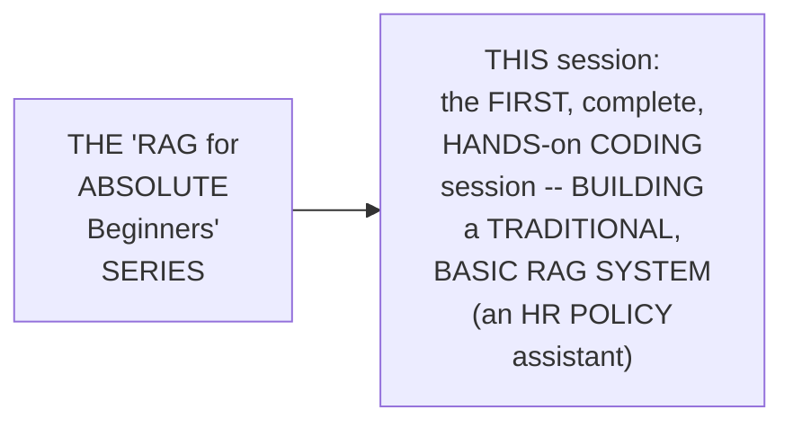

#### 🎯 Key Takeaways

* THIS session is GENUINELY, EXPLICITLY confirmed AS the SERIES' own, FIRST, complete, HANDS-on CODING session — BUILDING "the MOST basic RAG, the FIRST ever WAY of building RAGS."
* THE session's OWN, chosen USE case — an "HR POLICY assistant" — SERVES as a GENUINELY, REALISTIC, relatable EXAMPLE THROUGHOUT.
* This directly, PRECISELY sets UP the SESSION's own, NEXT, essential CONTENT — CONCEPTUALLY introducing RAG ITSELF (Section 2).

---

### 2. RAG, Conceptually Introduced: User, LLM & Tools

#### 📖 Definition — RAG, Precisely Introduced

> 💡 **Given directly:** *"The full form of RAG is retrieval augmented generation... there will be a user which will be talking to our large language model. Now this large language model can be anything — OpenAI, Grok, Claude, or any particular large language model provider... Then this large language model will have access to something called tools."*

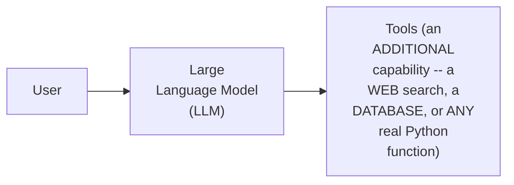

#### 🔍 Internal Working — A Genuine, Direct Explanation of "Tools"

> 💡 **Given directly:** *"Tools is an additional functionality which we give our AI agent to do some wonders — to behave like, you know, a customized chatbot, to behave a chatbot for our organization. Now this tools can be anything — this tools can be a web search tool, this tools can be a database, right, and it can be any particular Python function."*

#### ⚠ Common Mistakes

* Assuming an LLM, BY itself, GENUINELY, DIRECTLY possesses SPECIALIZED, organization-SPECIFIC knowledge (LIKE a COMPANY's own HR POLICIES) — explicitly, directly, IMPLIED as GENUINELY, DIRECTLY requiring "TOOLS" — an ADDITIONAL capability GIVING the LLM ACCESS to THIS specific, real INFORMATION.

#### 🎯 Key Takeaways

* **RAG (RETRIEVAL Augmented GENERATION)** is precisely INTRODUCED via THREE, core COMPONENTS: a **USER**, a **LARGE language MODEL** (the "BRAIN"), and **TOOLS** (an ADDITIONAL, real CAPABILITY — a web SEARCH, a database, OR any Python FUNCTION).
* THE LLM ITSELF can be ANY, real PROVIDER (OpenAI, Grok, CLAUDE) — a GENUINELY, DIRECTLY interchangeable CHOICE.
* This directly, PRECISELY sets UP the SESSION's own, NEXT, essential CONTENT — the COMPLETE, real AGENDA for THIS entire SESSION (Section 3).

---
### 3. The Complete Session Agenda

#### 🪜 Step-by-Step — The Complete, Real Agenda

> 💡 **Given directly:** *"Firstly we will go ahead and understand what and how to make virtual environments... secondly we will set up our experiments... then we will go ahead with RAG in which we will build two things — first one will be data ingestion pipeline and second one will be data retrieval pipeline... and then we will be building an application for that."*

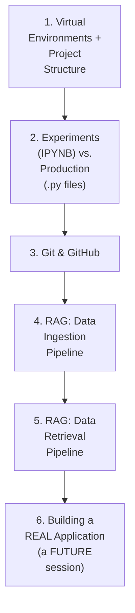

#### 📖 Definition — A Genuine, Direct Preview of the Final Application

> 💡 **Given directly:** *"This will be the application which we will be building by the end of this particular scenario... where we can simply talk, 'who are you,' and it will tell that, 'I'm your HR policy assistant, I can ask some question about some part of my data and I will get response from that.'"*

#### ⚠ Common Mistakes

* Assuming "EXPERIMENTS" and "PRODUCTION" code are GENUINELY, MERELY stylistic PREFERENCES, without any REAL, structural DIFFERENCE — explicitly, directly, PRECISELY clarified: EXPERIMENTS are WRITTEN in `.ipynb` FILES (Jupyter NOTEBOOKS); PRODUCTION code is WRITTEN in PLAIN `.py` FILES — a GENUINE, real DISTINCTION in HOW Python is WRITTEN and RUN.

#### 🎯 Key Takeaways

* THE complete, real AGENDA directly, PRECISELY spans: VIRTUAL environments/project STRUCTURE, EXPERIMENTS-versus-production CODING, git/GitHub, the RAG's own TWO pipelines (INGESTION and RETRIEVAL), and BUILDING a REAL application.
* A GENUINE, direct PREVIEW confirms the FINAL, intended OUTCOME — a WORKING HR policy ASSISTANT, capable OF answering REAL, data-GROUNDED questions.
* This directly, PRECISELY sets UP the SESSION's own, FIRST, PRACTICAL step — SETTING up the VIRTUAL environment ITSELF (Section 4).

---

### 4. Setting Up the Virtual Environment With UV

#### 📖 Definition — UV, Precisely Introduced

> 💡 **Given directly:** *"To make a virtual environment, I will be using UV... UV is the fastest, 10 to 100x faster than pip. Earlier we were using pip, pip tools, pip x, poetry — all these different technologies to make a virtual environment. Now we will be using UV because it is the latest and the fastest of all — because it is made using Rust programming language."*

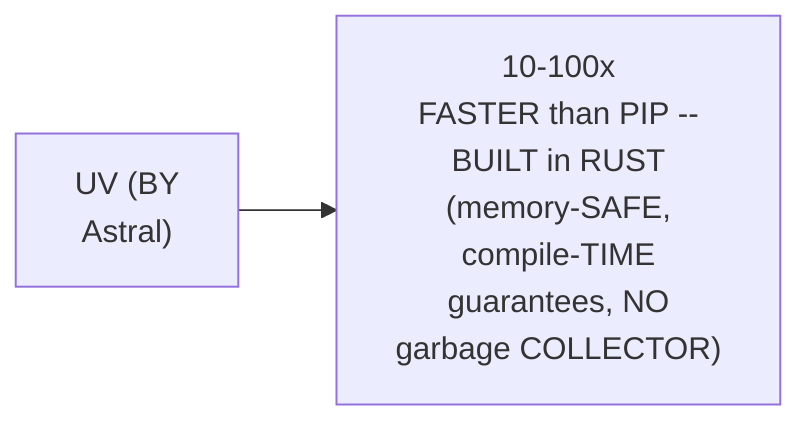

#### 🪜 Step-by-Step — The Complete, Real Setup Commands

> 💡 **Given directly:** *"We can go to installation, it will tell us that you just simply have to write pip install uv... Now using UV I will make a virtual environment, so I will write UV venv, and the name of that virtual environment can be basic rag environment."*

```bash
pip install uv
uv venv basic_rag_env
# Then activate the environment (path shown by uv)
uv pip install numpy
uv pip install numpy streamlit   # multiple libraries at once
```

#### ⚠ Common Mistakes

* Assuming STANDARD `pip INSTALL` commands should STILL be USED, ONCE `uv` is INSTALLED — explicitly, directly, PRECISELY clarified: "FROM now ON, anything THAT we HAVE to install, WE will use `UV pip INSTALL` something" — `uv` GENUINELY, DIRECTLY replaces the ONGOING, day-to-DAY package-installation WORKFLOW, not JUST the INITIAL setup.

#### 🎯 Key Takeaways

* **UV** (by ASTRAL) is precisely INTRODUCED as a GENUINELY, DIRECTLY faster (10-100X) ALTERNATIVE to pip/POETRY — BUILT in RUST, for GENUINE, real PERFORMANCE.
* THE complete, real SETUP sequence: `PIP install UV` → `uv VENV [name]` → ACTIVATE the environment → `uv PIP install [library]` for ALL, future PACKAGE installations.
* This directly, PRECISELY sets UP the SESSION's own, NEXT, essential PRACTICE — MANAGING MULTIPLE dependencies VIA a `requirements.TXT` file (Section 5).

---
### 5. Building requirements.txt: A Genuine, Real Practice

#### 📖 Definition — requirements.txt, Precisely Explained

> 💡 **Given directly:** *"What if I have a list of libraries? In this scenario what I can do is I can make something called requirements.txt. This is a standard practice. Now every time you have to install bunch of libraries, so every time you set up a project or start something, you make your requirements.txt, and with time you go ahead and update it."*

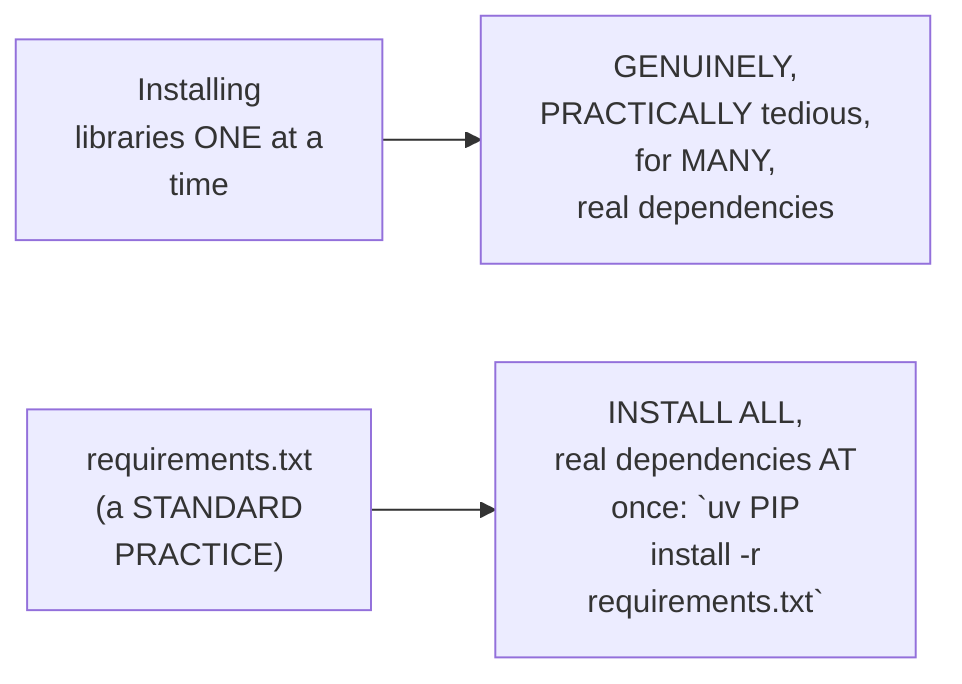

#### 🪜 Step-by-Step — This Session's Own, Complete Requirements List

> 💡 **Given directly:** *"We are going to make our AI agents using LangChain... we need LangChain, we need LangChain core... we need LangChain community... we will be using an LLM provider, the name of this LLM provider will be Grok, so for that we will be using LangChain Grok... secondly we need something called LangChain text splitters."*

```text
langchain
langchain-core
langchain-community
langchain-groq
langchain-text-splitters
faiss-cpu
jupyter
ipykernel
streamlit
python-dotenv
```

#### ⚠ Common Mistakes

* Assuming a SINGLE, real Python LIBRARY (LIKE "LANGCHAIN") is GENUINELY, SUFFICIENTLY complete, ON its OWN, for BUILDING a REAL RAG system — explicitly, directly, PRECISELY clarified: MULTIPLE, SEPARATE, related LIBRARIES (langchain-CORE, langchain-COMMUNITY, langchain-GROQ, and MORE) are GENUINELY, DIRECTLY required, TOGETHER.

#### 🎯 Key Takeaways

* **`requirements.TXT`** is precisely CONFIRMED as a GENUINE, "STANDARD practice" — LISTING all, REQUIRED dependencies IN one, SINGLE file, INSTALLABLE via ONE command.
* THIS session's own, COMPLETE requirements LIST directly, CONCRETELY spans: LANGCHAIN (PLUS its core/COMMUNITY/Groq/text-SPLITTER sub-packages), `FAISS-cpu` (the VECTOR store), `JUPYTER`/`ipykernel` (FOR running NOTEBOOKS), `STREAMLIT` (for the FUTURE web APP), and `python-DOTENV` (for LOADING environment VARIABLES).
* This directly, PRECISELY sets UP the SESSION's own, NEXT, essential CONTENT — PRECISELY WHY LangChain and GROQ are GENUINELY needed (Section 6).

---

### 6. LangChain & Groq: The Framework and the LLM Provider

#### 📖 Definition — LangChain, Precisely Explained

> 💡 **Given directly:** *"LangChain is a framework or a technology to make AI agents... it is telling that agent is equals to model plus harness... harness is just simply using a large language model, in simple words."*

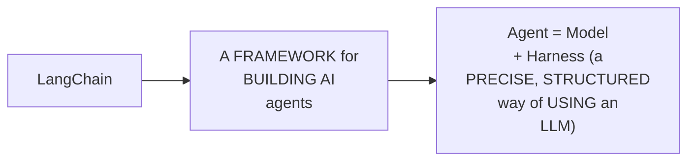

#### 📖 Definition — Groq, Precisely Explained

> 💡 **Given directly:** *"Grok is a LLM provider which provides us LLMs for free... we need Grok API key for this."*

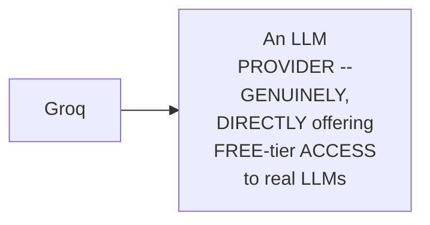

#### ⚠ Common Mistakes

* Assuming LANGCHAIN ITSELF is GENUINELY, DIRECTLY an LLM PROVIDER — explicitly, directly, PRECISELY distinguished: LANGCHAIN is a FRAMEWORK/technology FOR building AGENTS; GROQ is a SEPARATE, REAL LLM PROVIDER — LangChain GENUINELY, DIRECTLY integrates WITH providers LIKE Groq, RATHER than BEING one itself.

#### 🎯 Key Takeaways

* **LANGCHAIN** is precisely EXPLAINED as a FRAMEWORK for BUILDING AI agents — SUMMARIZED as "AGENT = model + HARNESS."
* **GROQ** is precisely INTRODUCED as a REAL, genuine LLM PROVIDER — OFFERING free-TIER access, REQUIRING its OWN, separate API KEY.
* This directly, PRECISELY sets UP the SESSION's own, NEXT, essential, SECURITY-focused STEP — SECURELY storing THESE API keys VIA a `.env` file (Section 7).

---
### 7. Securing API Keys: The .env File

#### ⚠ A Direct, Honest, Important Security Practice

> 💡 **Given directly:** *"The best practice to use an API key, we don't use the API key inside our project, we don't use it anywhere openly. Okay, we use it secretly. So to secretly store these API keys, what we do is we make .env. Now in this .env we will store our API keys secretly."*

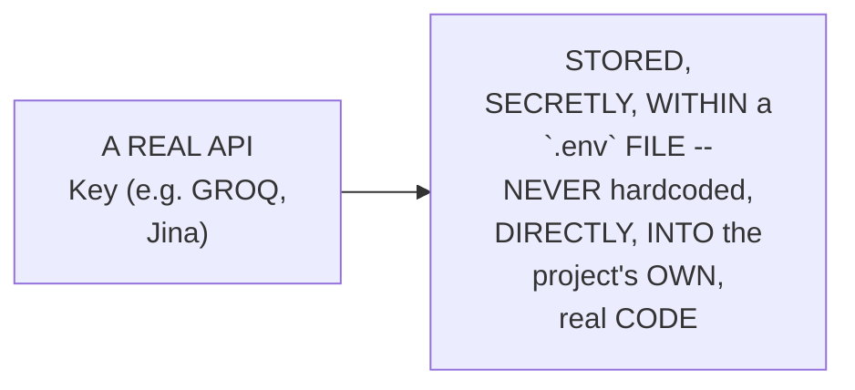

#### 🔍 Internal Working — A Genuine, Direct Explanation of Why This Genuinely Matters

> 💡 **Given directly:** *"People usually load up balance in this, people recharge these API keys to use the LLM, all right, so it is important to keep it secure."*

```env
GROQ_API_KEY="your-key-here"
JINA_API_KEY="your-key-here"
```

#### ⚠ Common Mistakes

* Assuming a REAL, sensitive API KEY is GENUINELY, SAFELY usable IF simply WRITTEN, directly, WITHIN a project's OWN, real CODE files — explicitly, directly, HONESTLY warned AGAINST — a `.env` file, KEPT SEPARATE (and, LATER, git-IGNORED), is the GENUINE, required, SECURE practice.

#### 🎯 Key Takeaways

* A `.ENV` file is directly, PRECISELY confirmed AS the GENUINE, standard PRACTICE for SECURELY storing SENSITIVE API keys — NEVER hardcoded, DIRECTLY, into a PROJECT's own, real CODE.
* THIS genuinely, DIRECTLY matters BECAUSE compromised API KEYS can GENUINELY, DIRECTLY lead to REAL, financial harm (UNAUTHORIZED usage, RUNNING up REAL bills).
* This directly, PRECISELY sets UP the SESSION's own, NEXT, essential CONTENT — the ACTUAL, real HR-policy DATA this session's OWN RAG system WILL be BUILT around (Section 8).

---

### 8. The HR Policy Data & the Data Ingestion Pipeline, Previewed

#### 🪜 Step-by-Step — A Complete, Real Look at the Source Data

> 💡 **Given directly:** *"Let us first pull up the data for you... this all will be provided. What I will do is I will just make a new folder over here called data, and in this data I will store something called HR policy text file... this is the company name, and this is leave policy, work from home policy, probation period, notice period, reimbursement policy, code of conduct."*

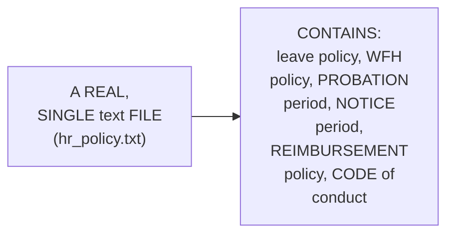

#### 📖 Definition — The Data Ingestion Pipeline, Precisely Previewed

> 💡 **Given directly:** *"How it works is, in a real-world scenario we have different types of data — text data, image data, JSON data, URLs, PDF data, Excel sheets, MD formats... this is the first phase of RAG which is data ingestion pipeline. In order to make a chatbot, first we have to ingest the data into the system."*

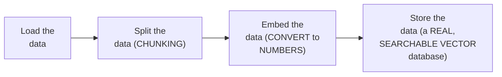

#### ⚠ Common Mistakes

* Assuming the DATA-ingestion pipeline GENUINELY, DIRECTLY handles ONLY ONE, specific DATA type — explicitly, directly, PRECISELY clarified: REAL-world data GENUINELY, DIRECTLY spans MANY types (text, IMAGE, JSON, URLS, PDF, Excel) — LangChain PROVIDES a DIFFERENT "LOADER" for EACH, specific TYPE.

#### 🎯 Key Takeaways

* THIS session's OWN, real DATA is a SINGLE, TEXT-format file CONTAINING SIX, distinct HR POLICIES — LEAVE, work-FROM-home, probation, NOTICE period, REIMBURSEMENT, and CODE of conduct.
* THE **DATA ingestion PIPELINE** is precisely PREVIEWED as FOUR, sequential STEPS: **LOAD**, **split** (CHUNK), **EMBED** (convert TO numbers), and **STORE** (in a REAL, searchable VECTOR database).
* This directly, PRECISELY sets UP the SESSION's own, NEXT, essential CONTENT — a COMPLETE, real LANDSCAPE of DOCUMENT loaders, EMBEDDING providers, and VECTOR databases (Section 9).

---
### 9. Document Loaders, Embeddings & Vector Databases: A Genuine, Complete Landscape

#### 📖 Definition — Document Loaders, Precisely Explained

> 💡 **Given directly:** *"Depending upon the type of data, we use something called loader — whatever data it is, if it is text data, we will use text loader, if it is PDF data, we will use PDF loader, if it is JSON data, we will use JSON loader."*

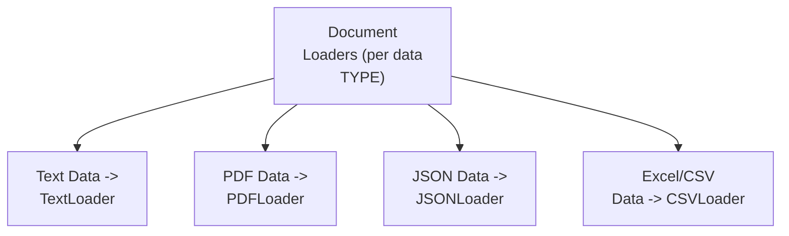

#### 📖 Definition — Embeddings & the MTEB Leaderboard

> 💡 **Given directly:** *"To make these embeddings, we will be using something called Jina embeddings... how to know which model is leading? So to do that we have something called the MTEB leaderboard, on Hugging Face — MTEB leaderboard tells you about who are the leading models."*

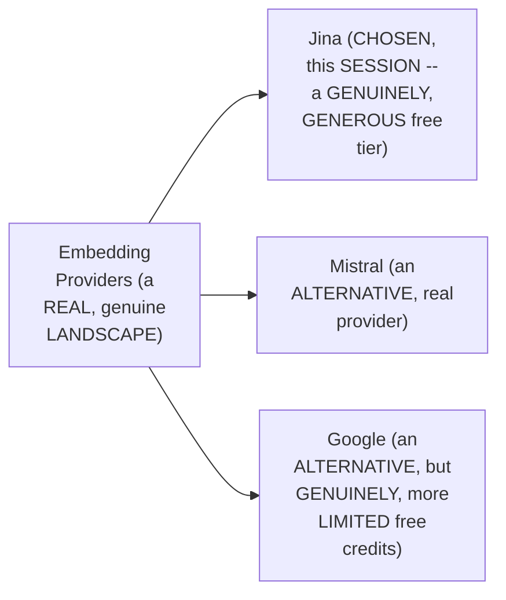

#### ⚠ A Direct, Honest, Practical Justification

> 💡 **Given directly:** *"Why are we not going for Google? Because Google gives us very less credits to use it... we'll not be able to enjoy the application."*

#### 📖 Definition — Vector Databases, Local vs. Cloud

> 💡 **Given directly:** *"For now I will be using a local vector database, which means on my computer itself, which is FAISS — Facebook AI Similarity Search vector database — we have another local vector database which is Chroma. But apart from this we have cloud solutions as well — cloud-based solutions are Qdrant, Pinecone, Weaviate, AstraDB."*

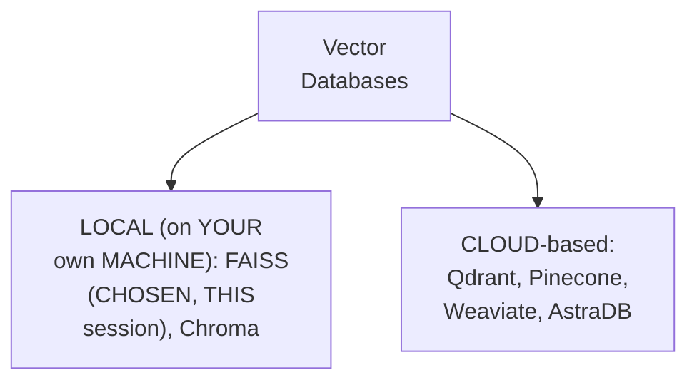

#### ⚠ Common Mistakes

* Assuming ONE, single EMBEDDING provider OR vector DATABASE is GENUINELY, UNIVERSALLY the "CORRECT" choice — explicitly, directly, HONESTLY clarified: THE choice GENUINELY, DIRECTLY depends ON practical FACTORS (LIKE free-TIER generosity, per THIS session's own, HONEST Jina-vs-Google REASONING) — MULTIPLE, genuinely VALID options exist.

#### 🎯 Key Takeaways

* **DOCUMENT loaders** GENUINELY, DIRECTLY vary BY data TYPE — TEXT, PDF, JSON, and EXCEL/CSV data EACH require THEIR own, SPECIFIC loader.
* **JINA embeddings** was CHOSEN specifically FOR its GENUINE, real, GENEROUS free TIER — the **MTEB leaderboard** (on HUGGING Face) is directly, PRACTICALLY recommended FOR comparing REAL, current embedding MODELS.
* **VECTOR databases** genuinely, DIRECTLY split INTO two CATEGORIES: **LOCAL** (FAISS, CHROMA — used ON your OWN machine) and **CLOUD-based** (QDRANT, Pinecone, WEAVIATE, AstraDB).
* This directly, PRECISELY sets UP the SESSION's own, NEXT, essential, FOUNDATIONAL content — GIT and GITHUB, precisely EXPLAINED via a COMPLETE, real, LIVE demonstration (Section 10).

---

### 10. Git & GitHub, Precisely Explained: A Complete, Real, Live Demo

#### 📖 Definition — Git vs. GitHub, Precisely Distinguished

> 💡 **Given directly:** *"Git is a technology, and GitHub is a website to use this technology. As simple as that... we use both of these for versioning, for version control systems."*

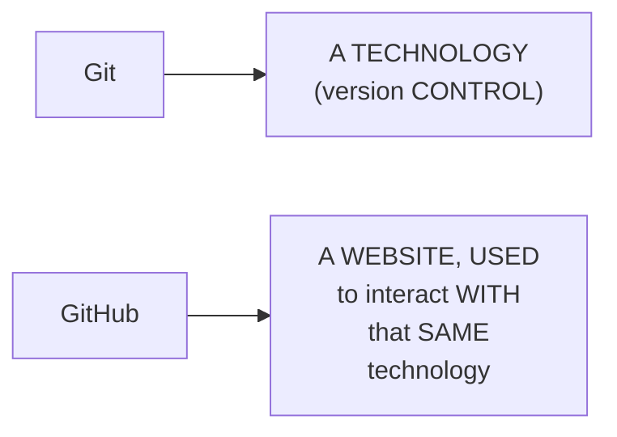

#### 📖 Definition — Version Control, Precisely Explained

> 💡 **Given directly:** *"Let us say you are working in a testing environment, and there something you have main environment... you did some tests, and then you merged it with the main environment... so what are we doing? We are maintaining different versions, and we can any time go back to this previous version, just in case if we messed up."*

#### 🪜 Step-by-Step — The Complete, Real Git Workflow

> 💡 **Given directly:** *"First command is git init... Now what if there is something that I don't want the public to see? So I will add something called .gitignore... get add readme.md... get add space dot means everything which you can see over here, which is not ignored, push it... get commit -m 'ready to rag'... and get push."*

```bash
git init
# .gitignore -- exclude sensitive files (e.g., .env, venv folders)
git add .
git commit -m "ready to rag"
git push
```

#### 🔍 Internal Working — A Genuine, Direct Confirmation of Only Three Commands

> 💡 **Given directly:** *"There are only three commands to remember in GitHub — the first command is git add, second one is git commit -m 'some message,' and the third command will be git push. These are all the three commands which you need."*

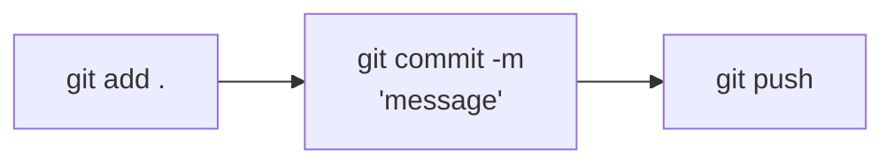

#### ⚠ Common Mistakes

* Assuming GIT and GITHUB are GENUINELY, INTERCHANGEABLY the SAME thing — explicitly, directly, PRECISELY distinguished: GIT is a TECHNOLOGY; GITHUB is a WEBSITE FOR using it.
* Assuming SENSITIVE files (LIKE `.env`) will GENUINELY, AUTOMATICALLY be excluded FROM a git REPOSITORY — explicitly, directly, PRACTICALLY demonstrated as REQUIRING an EXPLICIT `.gitignore` FILE, listing EXACTLY which FILES/folders to EXCLUDE.

#### 🎯 Key Takeaways

* **GIT** is precisely DISTINGUISHED as the UNDERLYING TECHNOLOGY (version CONTROL); **GITHUB** is the WEBSITE used to INTERACT with it — ENABLING collaboration and PROFILE-building.
* **VERSION control** genuinely, DIRECTLY enables MAINTAINING multiple, SEPARATE versions of a PROJECT — ALLOWING a SAFE return TO a prior VERSION, if NEEDED.
* THE COMPLETE, real git WORKFLOW directly, CONCRETELY requires ONLY **THREE, essential COMMANDS**: `git ADD .`, `git COMMIT -m "MESSAGE"`, and `git PUSH` — PLUS an INITIAL `git INIT` and a `.gitignore` FILE, for SENSITIVE data.

---
### 11. A Genuine, Direct Assignment

#### 🪜 Step-by-Step — The Complete, Real Assignment

> 💡 **Given directly:** *"You have to search for all the different type of data loaders on LangChain... second one, you want to learn text splitters — what are different text splitters in LangChain... third task, you have to search from where I will be getting embeddings, who are all the embedding providers... lastly you want to know vector DBs, what are the different vector databases you have."*

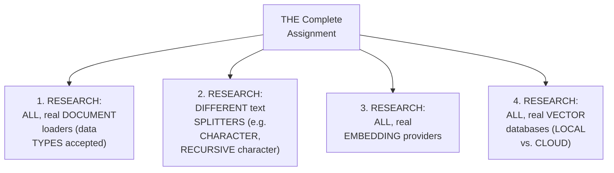

#### 🔍 Internal Working — A Genuine, Direct Mention of Local LLMs (Ollama)

> 💡 **Given directly:** *"Do we have a way to download a model on our computer and run that model? That is called local LLM. It is very important... local LLM is Llama."*

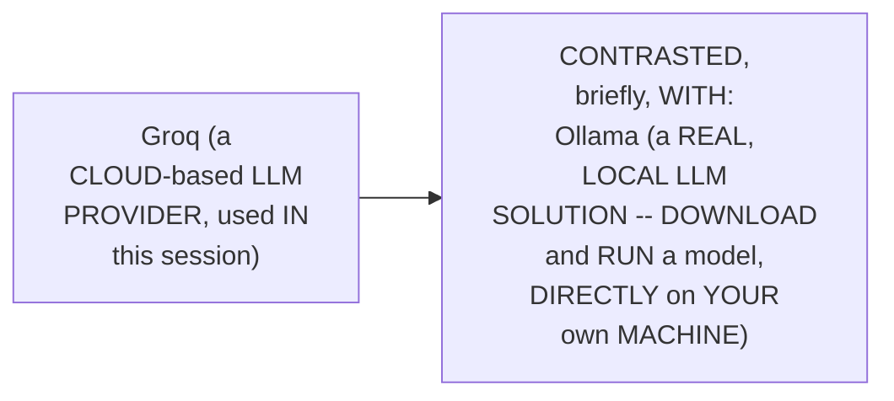

#### ⚠ Common Mistakes

* Assuming CLOUD-based LLM PROVIDERS (LIKE Groq) are the ONLY, real WAY to USE a large LANGUAGE model — explicitly, directly, BRIEFLY introduced AS an ALTERNATIVE: LOCAL LLMs (e.g., VIA OLLAMA) genuinely, DIRECTLY allow RUNNING a model ENTIRELY on YOUR own MACHINE.

#### 🎯 Key Takeaways

* A GENUINE, complete ASSIGNMENT directly, EXPLICITLY requires RESEARCHING: ALL real DOCUMENT loaders, TEXT splitters, EMBEDDING providers, and VECTOR databases (BOTH local and CLOUD).
* **OLLAMA** is BRIEFLY, directly INTRODUCED as a REAL, "LOCAL LLM" solution — ALLOWING models to be DOWNLOADED and RUN directly ON one's OWN machine, CONTRASTING with GROQ's own, cloud-BASED approach.
* This directly, PRECISELY sets UP the SESSION's own, COMPLETE, hands-ON coding SECTION — BEGINNING the ACTUAL data INGESTION pipeline (Section 12).

---

### 12. The Complete Data Ingestion Pipeline: Loading & Understanding Documents

#### 🪜 Step-by-Step — Loading Environment Variables

> 💡 **Given directly:** *"I will import OS... then second I will import from dotenv import load_dotenv... why do we need this? So that we can access a file which is env file... So load_dotenv, I will use this method, and I will load my environment variables. It is showing me true."*

```python
import os
from dotenv import load_dotenv

load_dotenv()  # returns True if successful

groq_key = os.getenv("GROQ_API_KEY")
jina_key = os.getenv("JINA_API_KEY")
```

#### 🪜 Step-by-Step — Loading the Text Data

> 💡 **Given directly:** *"From LangChain community, I will import a class document loader... from this document loaders I will import a method of this class which is text loader... I am making an object of this text loader class... it takes a few things... first it tells, hey which is the data I want to load — file path — next we have something called encoding, and encoding is UTF-8."*

```python
from langchain_community.document_loaders import TextLoader

data_file_path = os.path.join("data", "hr_policy.txt")
loader = TextLoader(data_file_path, encoding="utf-8")
documents = loader.load()

print("Data loaded")
print("=" * 40)
```

#### 📖 Definition — LangChain's Own "Document," Precisely Explained

> 💡 **Given directly:** *"LangChain processes everything in form of documents... in a document there are two things — one is page content, and one is metadata. Page content means the actual data, and metadata means information about the data... why do we need this extra information? Because we have to tell where is this data coming from."*

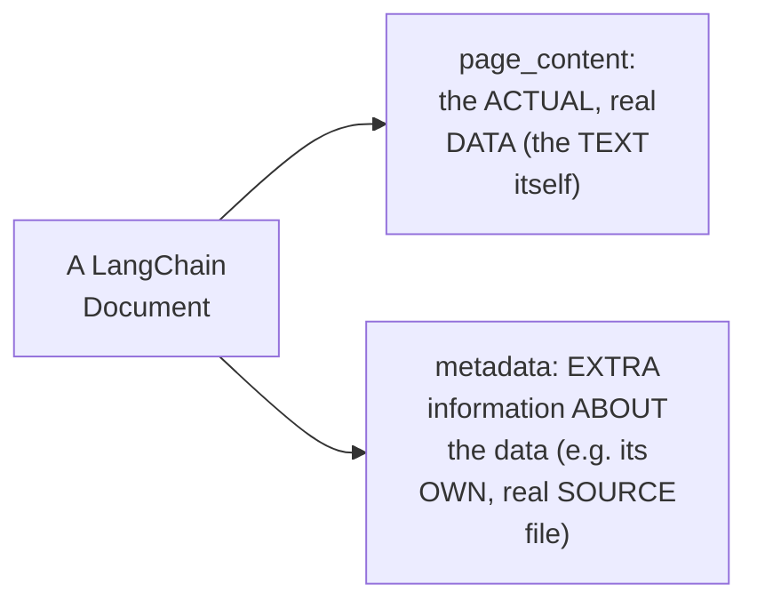

#### ⚠ Common Mistakes

* Assuming METADATA (LIKE a DOCUMENT's own SOURCE) is GENUINELY, MERELY optional/decorative INFORMATION — explicitly, directly, PRACTICALLY clarified: it GENUINELY, DIRECTLY matters AT real SCALE — "IF we have HUGE amounts OF data... we NEED to tell EXACTLY... where IS this data COMING from."

#### 🎯 Key Takeaways

* THE complete, real DATA-loading CODE directly, CONCRETELY confirmed: LOADING environment VARIABLES (`os`, `LOAD_dotenv`), then LOADING the ACTUAL text DATA (`TextLoader`, SPECIFYING the FILE path and `UTF-8` ENCODING).
* LANGCHAIN'S OWN **"DOCUMENT"** concept directly, PRECISELY consists OF **`page_CONTENT`** (the ACTUAL data) and **`METADATA`** (information ABOUT the DATA, e.g., its SOURCE) — a REQUIRED, foundational STRUCTURE for ALL, LangChain-based PROCESSING.
* This directly, PRECISELY sets UP the SESSION's own, NEXT, essential STEP — SPLITTING this LOADED data INTO smaller, manageable CHUNKS (Section 13).

---
### 13. Splitting the Data: Chunk Size & Chunk Overlap, Precisely Explained

#### 📖 Definition — Why Splitting Genuinely Matters

> 💡 **Given directly:** *"The total number of characters is 2598... why do we need this kind of information? We need this information to decide how exactly we will break this into pieces, what size our pieces will be — if you are five people at home, and you have one big garlic bread, and if you want to divide this into five people, you will divide it like this — five, right? But if you are only two people, so you would divide it like this."*

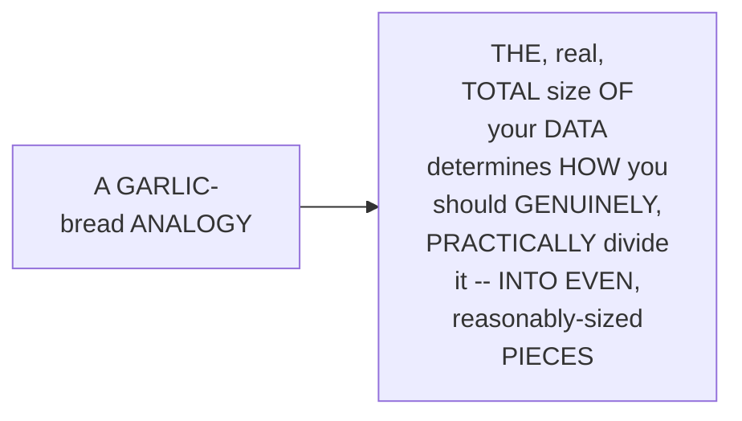

#### 🪜 Step-by-Step — Chunk Size & Chunk Overlap, Precisely Defined

> 💡 **Given directly:** *"From LangChain text splitters, import recursive character text splitter — this is just a smart way of text splitting... I can pass chunk size, chunk size will be 500, and I can pass chunk overlap, chunk overlap 50 — which means the words will be overlapped so that we know the continuity."*

```python
from langchain_text_splitters import RecursiveCharacterTextSplitter

text_splitter = RecursiveCharacterTextSplitter(
    chunk_size=500,
    chunk_overlap=50
)

chunks = text_splitter.split_documents(documents)
print(f"Number of chunks: {len(chunks)}")  # 9 chunks
```

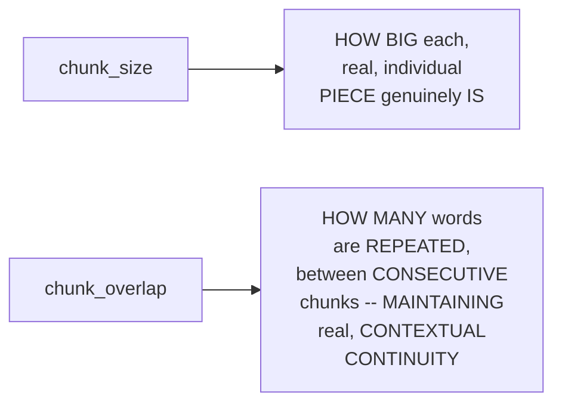

#### 🔍 Internal Working — A Genuine, Live-Demonstrated Comparison of Chunk Sizes

> 💡 **Given directly:** *"If instead of 500 I give this 300... chunk sizes are changing, if you can see, chunk sizes are changing, right, so you have to smartly decide the chunk... you literally have different techniques of chunking — fixed size chunking, recursive character splitting, semantic chunking, hierarchical chunking."*

```mermaid
flowchart TD
    A["Chunking<br/>Techniques (a<br/>GENUINE, real<br/>LANDSCAPE)"] --> B["Fixed-Size<br/>Chunking"]
    A --> C["Recursive<br/>Character<br/>Splitting (USED,<br/>THIS session)"]
    A --> D["Semantic<br/>Chunking"]
    A --> E["Hierarchical<br/>Chunking"]
```

#### ⚠ Common Mistakes

* Assuming a SINGLE, "CORRECT" chunk SIZE genuinely, UNIVERSALLY applies to EVERY, real PROJECT — explicitly, directly, LIVE-demonstrated as GENUINELY, DIRECTLY variable — DIFFERENT chunk SIZES (500 versus 300) PRODUCE genuinely DIFFERENT, real RESULTS — REQUIRING a "SMART" decision, PER project.
* Assuming "RECURSIVE character TEXT splitter" is the ONLY, real CHUNKING technique — explicitly, directly, BRIEFLY confirmed: MULTIPLE, real TECHNIQUES exist (FIXED-size, SEMANTIC, hierarchical) — recursive CHARACTER splitting is ONE, genuinely SMART choice, AMONG several.

#### 🎯 Key Takeaways

* **CHUNK size** determines HOW big EACH, individual DATA piece genuinely IS; **CHUNK overlap** determines HOW many WORDS are REPEATED between CONSECUTIVE chunks — MAINTAINING real, CONTEXTUAL continuity.
* THIS session's OWN, real code USED `RecursiveCharacterTextSplitter` WITH a chunk SIZE of 500 and OVERLAP of 50 — PRODUCING 9, real CHUNKS from the ORIGINAL, 2,598-character DOCUMENT.
* A GENUINE, live-DEMONSTRATED comparison (500 VERSUS 300) directly, CONCRETELY confirmed CHUNKING strategy GENUINELY, DIRECTLY matters — DIFFERENT sizes PRODUCE genuinely DIFFERENT, real RESULTS.

---

### 14. Embedding & Storing the Data: Jina Embeddings & FAISS

#### 🪜 Step-by-Step — Embedding the Chunks

> 💡 **Given directly:** *"From LangChain community dot embeddings, import Jina embeddings... I would make something called embeddings model... I will use this Jina embedding class, and I will pass model name — the name of my model will be this Jina embeddings V2 base encoder model."*

```python
from langchain_community.embeddings import JinaEmbeddings

embeddings_model = JinaEmbeddings(model_name="jina-embeddings-v2-base-en")
print(f"Embedding model ready: {embeddings_model.model_name}")
```

#### 🪜 Step-by-Step — Storing the Chunks in FAISS

> 💡 **Given directly:** *"From LangChain community dot vector stores, import FAISS... Facebook AI Similarity Search... it's an open-source library... I would make a vector store variable... and here I would write FAISS dot from_documents — which means I'm going to use some documents to store over here... my documents are in form of chunks... and embedding, which embedding model you are using, we'll say we'll use our embedding model."*

```python
from langchain_community.vectorstores import FAISS

vector_store = FAISS.from_documents(chunks, embeddings_model)
print(f"Chunks stored: {vector_store.index.ntotal}")
```

#### ⚠ Common Mistakes

* Assuming `FAISS.FROM_documents` GENUINELY, DIRECTLY requires the ORIGINAL, unsplit DOCUMENTS — explicitly, directly, PRECISELY clarified: it GENUINELY, DIRECTLY requires the **CHUNKS** (the SPLIT, smaller PIECES) — NOT the ORIGINAL, whole DOCUMENT(s).

#### 🎯 Key Takeaways

* **JINA embeddings** are directly, CONCRETELY configured VIA the `JinaEmbeddings` CLASS, SPECIFYING a REAL, specific MODEL name (e.g., `jina-embeddings-V2-base-en`).
* **FAISS** (Facebook AI SIMILARITY Search) directly, CONCRETELY stores the CHUNKS via `FAISS.FROM_documents(chunks, EMBEDDINGS_model)` — CREATING a REAL, searchable VECTOR database.
* This directly, PRECISELY sets UP the SESSION's own, NEXT, essential VERIFICATION — a REAL, live-CONFIRMED similarity SEARCH test, WITHOUT any AI involved YET (Section 15).

---
### 15. A Genuine, Real, Live-Confirmed Similarity Search Test

#### 🪜 Step-by-Step — A Complete, Real, Manual Test (No AI, Yet)

> 💡 **Given directly:** *"Let us use a query and try to retrieve information from the database, just how an AI would retrieve — how many sick leaves employees get? What is going to happen? This particular sentence will be compared against each chunk in the vector database — this is called similarity search."*

```python
query = "how many sick leaves employees get?"
top_matches = vector_store.similarity_search(query, k=2)

print(f"Query: {query}")
for i, match in enumerate(top_matches, start=1):
    print(f"Match {i}:")
    print(match.page_content)
```

#### 🔍 Internal Working — A Genuine, Direct, Live-Confirmed Result

> 💡 **Given directly:** *"Given my this particular query, these are the similar things which are fetched from the data. So because my — there was something called leave, I fetched something called holidays, and because there was something called leave, I fetched something similar to leave — some chunk similar to leave."*

```mermaid
sequenceDiagram
    participant Query as A REAL Query<br/>("sick<br/>leaves")
    participant Vector as Vector Store<br/>(FAISS)
    participant Chunks as MATCHING<br/>Chunks
    Query->>Vector: similarity_search(query,<br/>k=2)
    Vector->>Chunks: RETURNS the TOP-<br/>2, most<br/>SIMILAR chunks<br/>(e.g. "holidays,"<br/>"leave")
```

#### ⚠ Common Mistakes

* Assuming a REAL, "SIMILARITY search" GENUINELY, DIRECTLY requires an AI/LLM to BE involved — explicitly, directly, LIVE-demonstrated as GENUINELY, DIRECTLY possible WITHOUT any AI — "THERE is no AI IN it right NOW" — the VECTOR database ITSELF performs the SEARCH, based ON embedding SIMILARITY.

#### 🎯 Key Takeaways

* A COMPLETE, real, LIVE test directly, CONCRETELY confirmed `vector_STORE.similarity_search(query, K=2)` — RETURNING the TOP-K, most SIMILAR chunks TO a REAL, sample query.
* THIS test directly, HONESTLY demonstrates SIMILARITY search HAPPENS ENTIRELY at the VECTOR-database level — WITHOUT any, real AI/LLM INVOLVEMENT — a KEY, foundational CONCEPT.
* This directly, PRECISELY completes the SESSION's own, COMPLETE DATA-ingestion pipeline — SETTING up the SESSION's own, NEXT, essential PHASE — CONNECTING to a REAL LLM (Section 16).

---

### 16. Connecting to the LLM: ChatGroq & Temperature

#### 🪜 Step-by-Step — Connecting to Groq

> 💡 **Given directly:** *"From LangChain Grok, import ChatGrok — these are called chat models... I would make a variable LLM, in this variable I made a model ChatGrok — ChatGrok will take two things from me, first it will tell me give me the name of the model, and second one is temperature."*

```python
from langchain_groq import ChatGroq

llm = ChatGroq(
    model="openai/gpt-oss-120b",
    temperature=0
)

print(f"Model name: {llm.model_name}")
```

#### 🪜 Step-by-Step — Testing the LLM

> 💡 **Given directly:** *"The method is called invoke, LLM dot invoke — which means poking the model, hey give me something... 'is learning RAG hard, answer in one line'... this response, whatever response I'm getting, from this I will do dot content."*

```python
test_response = llm.invoke("Is learning RAG hard? Answer in one line.")
print(test_response.content)
```

#### 📖 Definition — Temperature, Precisely Explained

> 💡 **Given directly:** *"Temperature ranges between 0 to 1. Temperature means creativity of the model — right, you know, we have friends who get over creative sometimes, and we ask them to slow down, 'hey, chill out a bit, don't get so creative' — similarly, we can control the creativity of AI as well... with high creativity, it increases high randomness in the model."*

```mermaid
flowchart LR
    A["Temperature<br/>= 0"] --> B["LOW creativity<br/>-- MORE consistent,<br/>PREDICTABLE<br/>responses"]
    C["Temperature<br/>= 0.7-1.0"] --> D["HIGH creativity<br/>-- MORE varied, BUT<br/>ALSO more<br/>RANDOM/<br/>unpredictable<br/>responses"]
```

#### ⚠ Common Mistakes

* Assuming a HIGHER TEMPERATURE genuinely, ALWAYS PRODUCES a "BETTER" or MORE desirable RESPONSE — explicitly, directly, LIVE-demonstrated as GENUINELY, DIRECTLY introducing MORE randomness — a HIGH-temperature response WAS, live, CONFIRMED as GENUINELY, NOTICEABLY less COHERENT ("EXTRA. It's TALKING extra. It WAS not GOOD.").

#### 🎯 Key Takeaways

* **CHATGROQ** is directly, CONCRETELY configured VIA a REAL model NAME and a **TEMPERATURE** parameter — CONNECTING LangChain to the GROQ LLM provider.
* **`.INVOKE()`** is precisely CONFIRMED as the METHOD used to "POKE" (QUERY) the LLM — RETURNING a RESPONSE object, WHOSE `.content` HOLDS the ACTUAL, real TEXT.
* **TEMPERATURE** (0 to 1) precisely CONTROLS the MODEL's own "CREATIVITY" — LOWER values PRODUCE more CONSISTENT responses; HIGHER values GENUINELY, DIRECTLY introduce more RANDOMNESS — a LIVE-demonstrated, real TRADE-off.

---
### 17. Building the AI Agent: LLM, Tools & Memory

#### 📖 Definition — The Three, Precise Components of an AI Agent

> 💡 **Given directly:** *"What are the three things an AI agent contains? AI agent has three things — the first thing is LLM, which means the brain of the AI agent, second thing is a tool, which means, you know, what is the extra superpower you have... and third one is memory. So in this we will not be using memory currently."*

```mermaid
flowchart TD
    A["An AI<br/>Agent"] --> B["1. LLM (the<br/>BRAIN)"]
    A --> C["2. Tools (the<br/>REAL, extra<br/>'superpower' --<br/>THIS session's OWN<br/>vector database)"]
    A --> D["3. Memory (NOT<br/>USED, in THIS<br/>session)"]
```

#### 🪜 Step-by-Step — Creating the Agent (Without a Tool, Initially)

> 💡 **Given directly:** *"We will use LangChain create agent... from LangChain agents, import create agent... which model? A model, I will tell LLM. What is stored in my LLM? Grok model. Second one, it is asking me tools. Currently I don't have any tool. And thirdly, we can pass something called system instructions — system prompt."*

```python
from langchain.agents import create_agent

system_prompt = (
    "You are a friendly HR assistant. Always use the search_hr_policy "
    "tool to look up the facts before answering. If the answer isn't "
    "in the search results, you say I don't know."
)

hr_assistant = create_agent(
    model=llm,
    tools=[],  # no tool yet
    system_prompt=system_prompt
)
```

#### 🪜 Step-by-Step — Building an Ask-Function Wrapper

> 💡 **Given directly:** *"We are making a method called ask HR assistant, which is going to take a question from us, and it is going to give us a reply in string format... I will invoke my HR assistant... LangChain expects us to give the messages to the AI agent in a specific way — a dictionary of messages, in which we have to tell messages, and here we will give that the role — the role is of user, and the content is going to be the question."*

```python
def ask_hr_assistant(question: str) -> str:
    print("-" * 60)
    print(f"Question: {question}")
    print("-" * 60)
    response = hr_assistant.invoke({
        "messages": [
            {"role": "user", "content": question}
        ]
    })
    answer = response["messages"][-1].content
    return answer
```

#### ⚠ Common Mistakes

* Assuming an AI AGENT genuinely, DIRECTLY needs ALL three COMPONENTS (LLM, tools, MEMORY) to GENUINELY function — explicitly, directly, PRECISELY clarified: THIS session's own, INITIAL agent GENUINELY, DELIBERATELY omits MEMORY — DEMONSTRATING an agent CAN function WITH just the LLM and TOOLS.

#### 🎯 Key Takeaways

* AN AI agent genuinely, PRECISELY consists OF **THREE components**: the **LLM** (the "BRAIN"), **TOOLS** (extra, real CAPABILITIES), and **MEMORY** (NOT used, in THIS session).
* `create_AGENT` (from `langchain.AGENTS`) directly, CONCRETELY assembles the AGENT — REQUIRING a MODEL, a LIST of tools, and an OPTIONAL system PROMPT (instructions).
* LANGCHAIN GENUINELY, DIRECTLY expects MESSAGES in a SPECIFIC, DICTIONARY-based FORMAT — a LIST of MESSAGES, EACH with a `ROLE` (e.g., "USER") and `CONTENT`.
* This directly, PRECISELY sets UP the SESSION's own, NEXT, essential, HONEST content — a REAL, live-ENCOUNTERED error, WHEN attempting to USE this agent WITHOUT a genuine TOOL (Section 18).

---

### 18. A Genuine, Honest, Live-Encountered Error: The Agent Without a Tool

#### ⚠ A Direct, Honest, Live-Encountered Error

> 💡 **Given directly:** *"Tell me about leave policies, how to apply for leave? Check this out. Something bad is happening. Let us see the error. Tool choices none — okay, understand this part, it did not run, because it says that, hey, you told me to use a tool, every time it is asking me a HR question, but I don't have any tool."*

```mermaid
flowchart LR
    A["ERROR: 'TOOL<br/>choice IS none...<br/>but the MODEL<br/>called TOOL'"] --> B["ROOT CAUSE: the<br/>SYSTEM prompt<br/>EXPLICITLY,<br/>DIRECTLY instructs<br/>the AGENT to<br/>'ALWAYS use the<br/>search_hr_policy<br/>TOOL' -- but NO,<br/>real TOOL WAS,<br/>YET, genuinely<br/>PROVIDED"]
```

#### 🔍 Internal Working — A Genuine, Honest Explanation

> 💡 **Given directly:** *"Actually what is happening is it will always call a tool, because we are creating an AI agent, right? It will always call a tool. So let us make that tool, people, don't worry, let us make that tool."*

#### ⚠ Common Mistakes

* Assuming an AI AGENT's own, CONFIGURED SYSTEM prompt (INSTRUCTING it TO "always USE" a SPECIFIC tool) is GENUINELY, MERELY a "SUGGESTION" — explicitly, directly, LIVE-demonstrated as a GENUINELY, STRUCTURALLY binding INSTRUCTION — WITHOUT the ACTUAL, real tool PROVIDED, the AGENT genuinely, DIRECTLY fails, RATHER than SIMPLY ignoring the INSTRUCTION.

#### 🎯 Key Takeaways

* A GENUINE, honest, LIVE-encountered ERROR directly, CONCRETELY confirmed: an AGENT CONFIGURED to "ALWAYS use" a SPECIFIC tool GENUINELY, DIRECTLY fails, IF that TOOL doesn't YET exist.
* THIS error directly, CONCRETELY motivates THE session's own, NEXT, essential STEP — a REAL, honest DEMONSTRATION of WHY the tool GENUINELY, STRUCTURALLY must be BUILT, before the AGENT can FUNCTION correctly.
* This directly, PRECISELY sets UP the SESSION's own, NEXT, essential CONTENT — BUILDING the ACTUAL, real retrieval TOOL (Section 19).

---
### 19. Building the Retrieval Tool: From Vector Store to Python Function

#### 🪜 Step-by-Step — Converting the Vector Store Into a Retriever

> 💡 **Given directly:** *"I will make a retriever... retriever is equals to vector store — remember we made a vector store, we will convert it into a retriever... search keyword arguments, K is equals to — it needs the top K documents. So we have made this."*

```python
retriever = vector_store.as_retriever(search_kwargs={"k": 3})
```

#### 🪜 Step-by-Step — Writing the Tool (a Python Function, With a Required Docstring)

> 💡 **Given directly:** *"We would define a — we will make a tool. How do you do that? You just make a Python function, that is a tool... search HR policy, this is the tool — this takes a question, and it will also give us response in form of string. Now we would write some logic — matching chunks is equals to retriever dot invoke... we will return the similar chunks."*

```python
def search_hr_policy(question: str) -> str:
    """Search the HR policy document for information about leave,
    work from home, probation, notice period, and reimbursement."""
    matching_chunks = retriever.invoke(question)
    return "\n".join(chunk.page_content for chunk in matching_chunks)
```

#### ⚠ A Direct, Honest, Important Requirement: The Docstring

> 💡 **Given directly:** *"Function must have a docstring — every time you want to make a tool, you also have to give something called a docstring. Docstring means information about what this function will do. Why do we have to make a docstring? So that AI knows which tool to use."*

```mermaid
flowchart LR
    A["A Python<br/>Function (a TOOL)"] --> B["MUST, genuinely,<br/>have a REQUIRED<br/>DOCSTRING"]
    B --> C["THE agent's OWN,<br/>real LLM READS this<br/>docstring TO<br/>decide WHICH tool<br/>to USE, and WHEN"]
```

#### 🪜 Step-by-Step — Attaching the Tool to the Agent

> 💡 **Given directly:** *"I would just go ahead and add a tool to my AI agent... search HR policy will be the tool."*

```python
hr_assistant = create_agent(
    model=llm,
    tools=[search_hr_policy],
    system_prompt=system_prompt
)
```

#### ⚠ Common Mistakes

* Assuming a REAL, Python FUNCTION is GENUINELY, AUTOMATICALLY usable AS a LangChain TOOL, WITHOUT any, additional REQUIREMENT — explicitly, directly, LIVE-demonstrated as GENUINELY, STRUCTURALLY requiring a **DOCSTRING** — WITHOUT it, LangChain GENUINELY, DIRECTLY raises an ERROR ("FUNCTION must HAVE a docstring").

#### 🎯 Key Takeaways

* THE VECTOR store is directly, CONCRETELY converted INTO a **RETRIEVER**, via `.as_RETRIEVER(search_kwargs={"K": 3})` — SPECIFYING how MANY, top-matching CHUNKS to RETURN.
* THE ACTUAL, real **TOOL** is precisely CONFIRMED as SIMPLY a PYTHON function — WRAPPING the RETRIEVER's own `.invoke()` call — REQUIRING a **DOCSTRING**, so the LLM GENUINELY knows WHICH tool to USE, and WHEN.
* THE completed TOOL is directly, CONCRETELY attached TO the agent, VIA the `TOOLS` parameter OF `create_AGENT` — COMPLETING the ENTIRE, established AGENT architecture.
* This directly, PRECISELY sets UP the SESSION's own, FINAL, essential VERIFICATION — a COMPLETE, real, LIVE-confirmed COMPARISON of the AGENT's own behavior, WITH and WITHOUT this TOOL (Section 20).

---

### 20. A Complete, Real, Live-Confirmed Comparison: With Tool vs. Without

#### 🪜 Step-by-Step — A Complete, Real, Successful Run (With the Tool)

> 💡 **Given directly:** *"Now if I run this, see this time it is not giving us any error, this time it will run... let us see the response. Now if I do the response, see messages, AI message, tool message, AI message... this information was retrieved from the tool, and all this information was passed to our AI agent, and now when we get the last message, see it will tell us leave policies at a glance — it is giving us good information."*

```mermaid
sequenceDiagram
    participant User
    participant Agent as HR Assistant<br/>Agent
    participant Tool as search_hr_policy<br/>Tool
    participant Vector as Vector Store
    User->>Agent: "Tell me about<br/>leave policies"
    Agent->>Tool: Calls the TOOL<br/>(per its OWN,<br/>system PROMPT)
    Tool->>Vector: retriever.invoke()
    Vector-->>Tool: Returns MATCHING<br/>chunks
    Tool-->>Agent: Returns the REAL,<br/>retrieved TEXT
    Agent-->>User: A GROUNDED, accurate<br/>ANSWER
```

#### 🔍 Internal Working — A Genuine, Direct, Live-Confirmed Contrast: The LLM Alone (No Tool)

> 💡 **Given directly:** *"If I use this separately, I can show you how bad it can behave. If I'm just using this brain, okay, if there is no tool, and I can ask, hey, what is the leave policy? If there is no tool, if there is only brain, see what it will respond — it will respond, sure thing, could you let me know which organization or leave policy you are interested."*

```mermaid
flowchart LR
    A["The LLM,<br/>ALONE (no REAL<br/>tool)"] --> B["Produces a<br/>GENERIC,<br/>UNGROUNDED response<br/>-- ASKING for<br/>CLARIFICATION,<br/>WITHOUT any, real<br/>company-SPECIFIC<br/>knowledge"]
    C["The Complete<br/>Agent (WITH the<br/>REAL tool)"] --> D["Produces an<br/>ACCURATE, GROUNDED<br/>response -- DIRECTLY<br/>reflecting the<br/>ACTUAL, real HR-<br/>policy DATA"]
```

#### 📖 Definition — LangChain's Own, Complete Message Structure

> 💡 **Given directly:** *"System message will be given, then human message, and then AI message. So system message means, hey, you are an HR assistant, behave like that. Human message will be tell me about policies, and AI message will be the AI message... there will also be something more like tool message — tool message will be the information retrieved from the vector database."*

```mermaid
flowchart LR
    A["System<br/>Message (the<br/>INSTRUCTIONS)"] --> B["Human Message<br/>(the USER's OWN,<br/>real QUESTION)"]
    B --> C["Tool Message<br/>(the RETRIEVED,<br/>real INFORMATION)"]
    C --> D["AI Message (the<br/>FINAL, real,<br/>GROUNDED answer)"]
```

#### ⚠ Common Mistakes

* Assuming an LLM, WITHOUT a REAL, grounding TOOL, is GENUINELY, ALWAYS capable OF answering ORGANIZATION-specific QUESTIONS accurately — explicitly, directly, LIVE-demonstrated as GENUINELY, DIRECTLY producing ONLY generic, UNHELPFUL responses, WITHOUT real, company-SPECIFIC data TO ground it.

#### 🎯 Key Takeaways

* A COMPLETE, real, LIVE-confirmed SUCCESS directly, CONCRETELY validated the ENTIRE, established RAG architecture — the AGENT, WITH its REAL tool, GENUINELY produces ACCURATE, grounded ANSWERS.
* A GENUINE, direct CONTRAST directly, CONCRETELY confirmed the LLM ALONE (WITHOUT the tool) PRODUCES only GENERIC, unhelpful RESPONSES — PROVING the TOOL's own, real, GROUNDING value.
* LANGCHAIN's own, COMPLETE message STRUCTURE directly, PRECISELY flows: **SYSTEM message** → **HUMAN message** → **TOOL message** (the RETRIEVED data) → **AI message** (the FINAL, grounded ANSWER).

---
### 21. Closing: The Complete, Traditional RAG, & a Direct Promise of What's Next

#### 🪜 Step-by-Step — A Direct, Genuine, Complete Reflection

> 💡 **Given directly:** *"We have successfully made our RAG, and this was the first time we have made our RAG, and we went through the entire process, wherein we also made a tool, and tool is nothing but a Python function which we write to hit our vector database... and this completes our retrieval process — question, system prompt, retrieved information, LLM, and the final answer."*

```mermaid
flowchart LR
    A["Question"] --> B["System<br/>Prompt"]
    B --> C["Retrieved<br/>Information<br/>(the TOOL)"]
    C --> D["LLM"]
    D --> E["Final,<br/>GROUNDED Answer"]
```

#### 🪜 Step-by-Step — A Direct, Genuine Promise of What Comes Next

> 💡 **Given directly:** *"In the next video I would take this one step further — I would take the same system and I would make modular programming. I would write modular code to develop the same system, and you would see the difference between experimentation and production, right, and we would also make an application out of it."*

```mermaid
flowchart LR
    A["THIS session<br/>(a COMPLETE,<br/>WORKING, but<br/>EXPERIMENTAL,<br/>NOTEBOOK-based<br/>RAG)"] --> B["A FUTURE session<br/>(EXPLICITLY<br/>promised): MODULAR,<br/>PRODUCTION-grade<br/>Python CODE, PLUS<br/>a REAL, working<br/>APPLICATION"]
```

#### ⚠ Common Mistakes

* Assuming THIS session's own, COMPLETE, NOTEBOOK-based RAG SYSTEM represents its OWN, FINAL, production-READY form — explicitly, directly, HONESTLY clarified: it's EXPLICITLY confirmed AS "the MOST basic RAG" — a FUTURE session WILL genuinely, DIRECTLY convert THIS same SYSTEM into MODULAR, production-GRADE code, PLUS a REAL application.

#### 🎯 Key Takeaways

* This episode **GENUINELY, COMPREHENSIVELY delivers** its OWN, stated GOALS — a COMPLETE, real, working RAG SYSTEM, BUILT entirely FROM scratch, COVERING both the DATA-ingestion and DATA-retrieval PIPELINES.
* THE COMPLETE, established RETRIEVAL flow is directly, PRECISELY summarized: **QUESTION → system PROMPT → retrieved INFORMATION (the TOOL) → LLM → FINAL answer**.
* THE instructor **directly, EXPLICITLY promises** a FUTURE session — CONVERTING this SAME system INTO modular, PRODUCTION-grade code, and BUILDING a REAL, complete APPLICATION.

---

## 📝 Glossary

| Term | Definition | Why It Matters |
|---|---|---|
| **RAG** | Retrieval Augmented Generation | Combines an LLM with real, external, grounding data |
| **uv** | A fast, Rust-based Python package/environment manager | 10-100x faster than pip |
| **LangChain** | A framework for building AI agents | "Agent = model + harness" |
| **Document (LangChain)** | page_content + metadata | The foundational unit LangChain processes everything as |
| **Chunk Size / Overlap** | Controls how data is split | Directly affects retrieval quality |
| **Embeddings** | Converting text into numerical vectors | Enables similarity search |
| **FAISS** | Facebook AI Similarity Search | A free, local vector database |
| **Retriever** | A vector store, wrapped for querying | The foundation of a real, retrieval tool |
| **Temperature** | Controls LLM output randomness/creativity | 0 = consistent; higher = more varied/random |
| **Docstring (tools)** | Required documentation for a tool function | Tells the LLM what the tool does, and when to use it |

---

## 🔄 Revision Notes — One-Minute Revision

* This is the "RAG for Absolute Beginners" series' own, FIRST, complete, hands-on coding session -- building a traditional, basic RAG system: an HR policy assistant.
* **RAG, conceptually**: a user talks to an LLM; the LLM has access to tools (a web search, a database, any Python function) that give it extra, real capability beyond its own, base knowledge.
* **The complete agenda**: virtual environments + project structure -> experiments (IPYNB) vs. production (.py) -> git/GitHub -> RAG's two pipelines (ingestion + retrieval) -> a real application (future session).
* **Setting up with `uv`**: 10-100x faster than pip, built in Rust. `pip install uv` -> `uv venv [name]` -> activate -> `uv pip install [library]` for all future installs.
* **requirements.txt**: a standard practice for installing many dependencies at once. This session's own list: langchain, langchain-core, langchain-community, langchain-groq, langchain-text-splitters, faiss-cpu, jupyter, ipykernel, streamlit, python-dotenv.
* **LangChain & Groq**: LangChain is the agent-building framework; Groq is a real, free-tier LLM provider.
* **Securing API keys**: always store in a `.env` file, never hardcoded directly in project code.
* **The HR policy data**: a single text file, covering leave, WFH, probation, notice period, reimbursement, and code of conduct policies.
* **Document loaders, embeddings & vector databases**: loaders vary by data type (text, PDF, JSON, CSV); Jina embeddings was chosen for its generous free tier (compare via the MTEB leaderboard); vector databases split into local (FAISS, Chroma) and cloud (Qdrant, Pinecone, Weaviate, AstraDB).
* **Git & GitHub**: Git is the technology; GitHub is the website. Version control lets you maintain and revert between versions. The complete workflow: `git init` -> `.gitignore` (for secrets) -> `git add .` -> `git commit -m "message"` -> `git push`.
* **A genuine assignment**: research all document loaders, text splitters, embedding providers, and vector databases (local vs. cloud). A brief mention of Ollama, for running LLMs locally.
* **The complete data ingestion pipeline (real code)**: load environment variables (`os`, `dotenv`) -> load the text data (`TextLoader`) -> understand LangChain's own "Document" (page_content + metadata) -> split into chunks (`RecursiveCharacterTextSplitter`, chunk_size=500, chunk_overlap=50, producing 9 chunks) -> embed (`JinaEmbeddings`) -> store (`FAISS.from_documents`).
* **A genuine, live similarity search test**: confirmed working WITHOUT any AI/LLM involved -- pure vector-database search.
* **Connecting to the LLM**: `ChatGroq`, with a model name and a temperature (0-1, controlling creativity/randomness) -- tested via `.invoke()`.
* **Building the AI agent**: three components -- LLM (brain), tools (superpowers), memory (not used, here). `create_agent` assembles it, with a system prompt.
* **A genuine, honest, live-encountered error**: the agent, instructed to "always use" a tool, genuinely fails when no tool yet exists ("tool choice is none... but the model called tool").
* **Building the retrieval tool**: convert the vector store into a retriever (`.as_retriever`), then wrap it in a real Python function with a REQUIRED docstring (so the LLM knows what the tool does and when to use it).
* **The complete, live-confirmed comparison**: the LLM alone produces generic, unhelpful responses; the complete agent, with its tool, produces accurate, grounded answers. LangChain's own message flow: system -> human -> tool -> AI.
* **Closing**: this is the complete, "traditional"/basic RAG. A future session will convert this same system into modular, production-grade code, and build a real application.

---

## 📋 Cheat Sheet

**The complete environment setup:**
```bash
pip install uv
uv venv basic_rag_env
# activate
uv pip install -r requirements.txt
```

**The complete git workflow:**
```bash
git init
# create .gitignore (exclude .env, venv folders)
git add .
git commit -m "message"
git push
```

**The complete data ingestion pipeline:**
```python
import os
from dotenv import load_dotenv
load_dotenv()

from langchain_community.document_loaders import TextLoader
from langchain_text_splitters import RecursiveCharacterTextSplitter
from langchain_community.embeddings import JinaEmbeddings
from langchain_community.vectorstores import FAISS

loader = TextLoader("data/hr_policy.txt", encoding="utf-8")
documents = loader.load()

text_splitter = RecursiveCharacterTextSplitter(chunk_size=500, chunk_overlap=50)
chunks = text_splitter.split_documents(documents)

embeddings_model = JinaEmbeddings(model_name="jina-embeddings-v2-base-en")
vector_store = FAISS.from_documents(chunks, embeddings_model)
```

**The complete data retrieval pipeline:**
```python
from langchain_groq import ChatGroq
from langchain.agents import create_agent

llm = ChatGroq(model="openai/gpt-oss-120b", temperature=0)
retriever = vector_store.as_retriever(search_kwargs={"k": 3})

def search_hr_policy(question: str) -> str:
    """Search the HR policy document for leave, WFH, probation,
    notice period, and reimbursement information."""
    matching_chunks = retriever.invoke(question)
    return "\n".join(chunk.page_content for chunk in matching_chunks)

hr_assistant = create_agent(
    model=llm,
    tools=[search_hr_policy],
    system_prompt="You are a friendly HR assistant. Always use the "
                  "search_hr_policy tool to look up facts before answering."
)

response = hr_assistant.invoke({"messages": [{"role": "user", "content": "Tell me about leave policies"}]})
print(response["messages"][-1].content)
```

---

## 🔥 Interview Questions & Answers

### 🟢 Beginner

**Q1.**

**Question:** What does RAG stand for, and what are its three, core components?

**Answer:** Retrieval Augmented Generation; a user, an LLM, and tools.

**Explanation:** Directly, explicitly stated.

**Why Interviewers Ask This:** The most basic, foundational RAG question.

**Possible Follow-up:** "What kinds of things can genuinely serve as a 'tool'?"

**Q2.**

**Question:** What are the two, distinct pipelines that make up a complete RAG system?

**Answer:** Data ingestion and data retrieval.

**Explanation:** Directly, explicitly named.

**Why Interviewers Ask This:** Foundational, frequently-tested RAG architecture knowledge.

**Possible Follow-up:** "What four steps make up the data ingestion pipeline?"

**Q3.**

**Question:** What are the two components of a LangChain "Document"?

**Answer:** page_content and metadata.

**Explanation:** Directly, explicitly named.

**Why Interviewers Ask This:** Basic, essential LangChain terminology.

**Possible Follow-up:** "Why does metadata genuinely matter, at scale?"

**Q4.**

**Question:** What do chunk size and chunk overlap each control?

**Answer:** Chunk size controls how big each piece is; chunk overlap controls how many words repeat between consecutive chunks, for continuity.

**Explanation:** Directly, precisely explained.

**Why Interviewers Ask This:** Tests genuine, practical chunking knowledge.

**Possible Follow-up:** "Does a single, correct chunk size apply universally, to every project?"

**Q5.**

**Question:** What does "temperature" control, in an LLM?

**Answer:** Its creativity/randomness -- lower values produce consistent responses; higher values produce more varied, random ones.

**Explanation:** Directly, precisely explained.

**Why Interviewers Ask This:** Basic, practical LLM configuration knowledge.

**Possible Follow-up:** "What range does temperature typically fall within?"

**Q6.**

**Question:** What are the three components of a complete AI agent?

**Answer:** LLM (the brain), tools (extra capabilities), and memory.

**Explanation:** Directly, explicitly named.

**Why Interviewers Ask This:** Foundational, frequently-tested agent-architecture knowledge.

**Possible Follow-up:** "Was memory genuinely used, in this session's own agent?"

**Q7.**

**Question:** What is genuinely required for a Python function to work as a LangChain tool?

**Answer:** A docstring.

**Explanation:** Directly, explicitly confirmed.

**Why Interviewers Ask This:** Tests genuine, practical, hands-on tool-building knowledge.

**Possible Follow-up:** "Why does the LLM genuinely need this docstring?"

**Q8.**

**Question:** Does an LLM alone, without a real, grounding tool, genuinely answer organization-specific questions accurately?

**Answer:** No -- it produces generic, unhelpful responses, without real, company-specific data.

**Explanation:** Directly, live-demonstrated.

**Why Interviewers Ask This:** Tests genuine understanding of RAG's own, core value proposition.

**Possible Follow-up:** "What does adding the retrieval tool genuinely change?"

**Q9.**

**Question:** What is the genuine, real difference between Git and GitHub?

**Answer:** Git is the underlying technology (version control); GitHub is the website used to interact with it.

**Explanation:** Directly, precisely distinguished.

**Why Interviewers Ask This:** Basic, foundational software-engineering knowledge.

**Possible Follow-up:** "What are the three, essential Git commands you genuinely need to know?"

**Q10.**

**Question:** What vector database was used in this session, and is it local or cloud-based?

**Answer:** FAISS (Facebook AI Similarity Search); local.

**Explanation:** Directly, explicitly confirmed.

**Why Interviewers Ask This:** Tests genuine, practical, hands-on vector-database knowledge.

**Possible Follow-up:** "Name two, real, cloud-based alternatives."

---
### 🟡 Intermediate

**Q11.**

**Question:** Explain why the instructor deliberately demonstrates the agent failing (Section 18, the "tool choice is none" error) BEFORE showing the completed, working tool, rather than presenting the finished, working code directly.

**Answer:** This is a genuinely deliberate, BEFORE-and-AFTER teaching choice: by GENUINELY, LIVE encountering and PRESERVING this REAL error — RATHER than SKIPPING straight TO the finished, WORKING solution — the instructor DIRECTLY, CONCRETELY demonstrates WHY a TOOL is genuinely, STRUCTURALLY necessary, NOT merely a CONVENIENT add-on. LEARNERS GENUINELY, DIRECTLY witness the AGENT's own, REAL failure MODE (it "WILL always CALL a tool," per THE system PROMPT's own INSTRUCTIONS) — MAKING the SUBSEQUENT tool-BUILDING section FEEL genuinely EARNED and MOTIVATED, RATHER than an ARBITRARY, unexplained REQUIREMENT.

**Explanation:** Requires recognizing the deliberate, before-and-after value of showing a genuine failure to motivate the subsequent solution, rather than presenting the working code without this context.

**Why Interviewers Ask This:** Tests whether a learner recognizes the pedagogical value of demonstrating a genuine failure mode to motivate a solution's own, real necessity.

**Possible Follow-up:** "Describe ANOTHER, genuine MOMENT, elsewhere IN this session, WHERE a SIMILAR, 'show the PROBLEM, then the SOLUTION' approach WAS used."

**Q12.**

**Question:** A learner argues that since this session confirms `similarity_search` genuinely works without any AI/LLM involvement, this means the vector database ITSELF is genuinely "intelligent," and understands the meaning of the query in a human-like way. Evaluate this claim.

**Answer:** This claim OVERSTATES the GENUINE, real MECHANISM behind similarity SEARCH. Section 15's own PRECISE, established DEMONSTRATION confirms the VECTOR database GENUINELY, DIRECTLY performs a MATHEMATICAL comparison — COMPARING the QUERY's own, EMBEDDED (numerical) REPRESENTATION against EACH, stored chunk's OWN, embedded representation — RETURNING the chunks WHOSE numerical VECTORS are MOST mathematically SIMILAR. THIS is a GENUINE, real, STATISTICAL/geometric operation — NOT genuine, human-LIKE "understanding" of MEANING. The ACCURATE, more PRECISE conclusion: SIMILARITY search GENUINELY, DIRECTLY works BECAUSE the EMBEDDING model (per Section 14's own established MECHANISM) ALREADY converted TEXT into numbers THAT capture SEMANTIC relationships — the VECTOR database ITSELF is GENUINELY, MERELY performing FAST, mathematical COMPARISON, not GENUINE, independent "understanding."

**Explanation:** Tests whether a learner recognizes that similarity search is a genuine, mathematical/geometric operation on pre-computed embeddings, not independent, human-like semantic understanding by the database itself.

**Why Interviewers Ask This:** Distinguishes candidates who understand the genuine, mechanical basis of vector similarity from those who anthropomorphize the database's own, real capability.

**Possible Follow-up:** "WHERE, precisely, does the GENUINE 'semantic UNDERSTANDING' capability ACTUALLY come FROM, in this COMPLETE, established PIPELINE?"

**Q13.**

**Question:** Explain, precisely, why the instructor deliberately shows a live comparison of chunk_size=500 versus chunk_size=300 (Section 13), rather than simply stating "choose an appropriate chunk size" as an abstract recommendation.

**Answer:** This is a genuinely deliberate, EVIDENCE-based teaching choice: by DIRECTLY, LIVE re-RUNNING the SAME splitting OPERATION with a DIFFERENT chunk SIZE, and SHOWING the GENUINELY, VISIBLY different RESULTING chunks, the instructor TRANSFORMS an ABSTRACT recommendation ("CHOOSE wisely") into a GENUINELY, CONCRETELY observable PHENOMENON — LEARNERS can DIRECTLY, VISUALLY see HOW the SAME, underlying DOCUMENT gets SPLIT differently, DEPENDING on this ONE, specific PARAMETER — MAKING the "CHUNKING strategy MATTERS" lesson GENUINELY, CONCRETELY convincing, RATHER than a VAGUE, unsupported CLAIM.

**Explanation:** Requires recognizing the deliberate, evidence-based value of a live, side-by-side comparison, rather than an abstract, unsupported recommendation.

**Why Interviewers Ask This:** Tests whether a learner recognizes the pedagogical value of concrete, observable evidence over abstract, general advice.

**Possible Follow-up:** "Beyond CHUNK size, name ONE other, GENUINE parameter (FROM this session's OWN, established CONTENT) that COULD, similarly, be LIVE-compared, to demonstrate ITS own, real IMPACT."

**Q14.**

**Question:** Using this session's own precise "docstring required for tools" reasoning (Section 19), explain a GENUINE, real risk of writing a docstring that is vague or genuinely inaccurate, relative to what a tool actually does.

**Answer:** A precise, reasoned RISK analysis, directly extending Section 19's own established MECHANISM: per Section 19's own PRECISE reasoning, the LLM GENUINELY, DIRECTLY relies ON a tool's OWN docstring TO decide "WHICH tool to USE, and WHEN." IF a docstring is GENUINELY, VAGUELY written (e.g., simply "SEARCHES data"), OR genuinely INACCURATELY describes the TOOL's own, REAL capability (e.g., CLAIMING it searches "ALL company DATA," when it ONLY, genuinely searches HR policies SPECIFICALLY), a GENUINE, real RISK emerges: the LLM COULD, genuinely, DIRECTLY call this TOOL for QUESTIONS it GENUINELY cannot answer (e.g., a SALES-related question), PRODUCING a MISLEADING, or GENUINELY incorrect RESPONSE — OR, CONVERSELY, FAIL to call the tool WHEN it genuinely SHOULD, for a LEGITIMATE, in-SCOPE HR question — DIRECTLY undermining the ENTIRE, established RAG architecture's own, CORE, grounding PURPOSE.

**Explanation:** Requires extending the docstring mechanism to identify a genuine, real risk (incorrect tool selection) of writing a vague or inaccurate docstring, connecting back to the tool-selection mechanism itself.

**Why Interviewers Ask This:** Tests whether a learner understands that a tool's docstring is a functionally important, not merely descriptive, piece of the agent's own decision-making process.

**Possible Follow-up:** "Write a GENUINE, real, IMPROVED docstring FOR this session's OWN `search_hr_policy` tool, that is MORE precise ABOUT its OWN, real SCOPE and LIMITATIONS."

**Q15.**

**Question:** Synthesize this session's complete "temperature" reasoning (Section 16) with its own "AI agent" reasoning (Section 17) to explain a GENUINE, real consideration for choosing a temperature setting, SPECIFICALLY for a real, production HR-policy assistant, as opposed to a more casual, general-purpose chatbot.

**Answer:** A precise, synthesized explanation, directly connecting TWO, separately-established sections: per Section 16's own PRECISE, established MECHANISM, LOWER temperature GENUINELY, DIRECTLY produces MORE consistent, PREDICTABLE responses; HIGHER temperature GENUINELY introduces MORE randomness. Per Section 17's own PRECISE, established PURPOSE, an HR POLICY assistant's OWN, CORE job is to PROVIDE accurate, GROUNDED, factual INFORMATION about REAL, company policies (per THIS session's own, established SYSTEM prompt — "IF the answer ISN'T in the SEARCH results, you SAY I don't KNOW"). SYNTHESIZING these TWO facts directly, PRECISELY reveals a GENUINE, real CONSIDERATION: FOR THIS, SPECIFIC use case (an HR-POLICY assistant), a **LOW temperature** (e.g., THIS session's own, CHOSEN value OF 0) is GENUINELY, DIRECTLY the APPROPRIATE choice — SINCE the GOAL is CONSISTENT, factual ACCURACY, NOT creative, VARIED responses — a HIGHER temperature WOULD, genuinely, RISK introducing UNNECESSARY randomness INTO what SHOULD, genuinely, be a PRECISE, policy-GROUNDED answer.

**Explanation:** Requires synthesizing the temperature mechanism with the agent's own, stated, factual-accuracy purpose to explain why low temperature is genuinely the appropriate choice for this specific use case.

**Why Interviewers Ask This:** A senior-level question testing whether a candidate can connect a general, technical parameter (temperature) to a genuine, use-case-specific design decision, based on the agent's own, stated purpose.

**Possible Follow-up:** "Describe a GENUINE, real, DIFFERENT use CASE (BEYOND an HR-policy assistant) where a HIGHER temperature setting WOULD, legitimately, be the MORE appropriate CHOICE."

---

### 🔴 Advanced

**Q16.**

**Question:** Design a complete, reasoned RAG-quality-improvement plan (using ONLY this session's own established concepts) for a hypothetical organization whose HR-policy RAG assistant, built following this session's own exact workflow, is genuinely producing occasionally inaccurate or incomplete answers.

**Answer:** A reasonable, complete plan, directly applying this session's OWN, exact established CONCEPTS:

```text
1. Chunking Strategy Review (per Section 13's own established,
   live-DEMONSTRATED comparison): RE-EXAMINE the CURRENT chunk_SIZE
   and chunk_OVERLAP settings -- GENUINELY, DIRECTLY experiment WITH
   different VALUES (per THIS session's own, LIVE 500-vs-300
   comparison), to SEE if RETRIEVAL quality GENUINELY improves.

2. Retrieval Parameter Review (per Section 19's own established
   retriever CONFIGURATION): RECONSIDER the `k` VALUE (currently 3)
   -- IS the AGENT genuinely RETRIEVING enough (OR too MANY)
   matching CHUNKS, for a GIVEN, real QUERY?

3. Docstring Precision Review (per Advanced Q14's own established
   RISK analysis): AUDIT the TOOL's own docstring FOR genuine
   precision and ACCURACY -- ENSURING the LLM genuinely,
   CORRECTLY understands WHAT the tool CAN and CANNOT answer.

4. System Prompt Review (per Section 17's own established SYSTEM
   prompt): CONFIRM the system PROMPT genuinely, EXPLICITLY
   instructs the AGENT to SAY "I don't KNOW" when GENUINELY
   uncertain -- RATHER than genuinely GUESSING or
   HALLUCINATING an answer.

5. Temperature Review (per Advanced Q15's own established
   REASONING): CONFIRM temperature REMAINS genuinely LOW (e.g. 0),
   GIVEN this use CASE's own, established NEED for CONSISTENT,
   factual ACCURACY, rather than CREATIVE variation.

6. Data Quality Review (per Section 8's own established, SOURCE-
   data foundation): ULTIMATELY, CONFIRM the UNDERLYING HR-policy
   TEXT file itself is GENUINELY, COMPLETELY accurate and UP to
   date -- SINCE the ENTIRE, established RAG architecture is ONLY
   as GOOD as its OWN, real, source DATA.
```

This complete PLAN directly, precisely APPLIES this session's OWN, established CONCEPTS — CHUNKING, retrieval PARAMETERS, docstring PRECISION, system-PROMPT design, TEMPERATURE, and SOURCE-data quality — to a GENUINELY realistic, RAG-quality-improvement SCENARIO.

**Explanation:** Requires synthesizing chunking strategy, retrieval parameters, docstring precision, system prompt design, temperature, and source-data quality into one complete, reasoned improvement plan.

**Why Interviewers Ask This:** A comprehensive, capstone-level question testing whether a candidate can systematically diagnose and improve a real, underperforming RAG system, using the complete range of this session's own concepts.

**Possible Follow-up:** "WHICH of THESE six, plan COMPONENTS would you GENUINELY, PRACTICALLY investigate FIRST, given a LIMITED amount OF debugging time?"

**Q17.**

**Question:** Critically evaluate: "Since this session confirms this HR-policy RAG assistant successfully answers real, worked example questions, this means the system is genuinely production-ready, and no further work is needed before deploying it for real employees to use." Is this an accurate, complete characterization?

**Answer:** Not accurate — this OVERSTATES a GENUINE, SUCCESSFUL, LIMITED demonstration into an UNCONDITIONAL claim OF "production-READY," which NEITHER this session's own CONTENT, nor sound REASONING, SUPPORTS. Section 21's own PRECISE, EXPLICIT statement DIRECTLY confirms THIS is "THE most BASIC rag" — a GENUINELY, DELIBERATELY simplified, EXPERIMENTAL, notebook-BASED system — and a FUTURE session is EXPLICITLY, DIRECTLY promised, SPECIFICALLY to CONVERT it into "MODULAR" code and a REAL "application," IMPLYING this session's OWN, current form is NOT, genuinely, considered PRODUCTION-ready by the INSTRUCTOR himself. ADDITIONALLY, THIS session's own, ESTABLISHED code GENUINELY lacks SEVERAL, real, production-RELEVANT considerations — ERROR handling, INPUT validation, MONITORING, and (per Section 17's own established OMISSION) GENUINE conversation MEMORY. The ACCURATE, more PRECISE conclusion: THIS session's own, COMPLETE demonstration GENUINELY, SUCCESSFULLY proves the CORE, underlying RAG ARCHITECTURE works — but GENUINE production READINESS requires SUBSTANTIALLY more WORK (modularization, ERROR handling, TESTING, and MORE) — EXPLICITLY, DIRECTLY promised as the SUBJECT of a FUTURE, separate session.

**Explanation:** Tests whether a learner recognizes that a successful, experimental demonstration doesn't constitute production readiness, especially given the instructor's own, explicit acknowledgment that a future session will address this exact gap.

**Why Interviewers Ask This:** Distinguishes candidates who understand the genuine, real gap between "working demo" and "production-ready system" from those who conflate a successful, isolated test with complete readiness.

**Possible Follow-up:** "Beyond MODULARIZATION, name TWO, SPECIFIC, genuine PRODUCTION considerations (EXTENDING beyond THIS session's own, EXPLICIT content) that a REAL, employee-facing HR assistant WOULD, additionally, require."

---

## 🧪 Scenario-Based Interview Questions

> **Scenario 1:** A colleague, following this session's own exact workflow, reports their agent consistently returns the error "tool_choice is none... but the model called tool," even after they've written and attached a real `search_hr_policy` function. Using this session's own concepts, construct a complete, reasoned debugging response.

**Structured Answer:**
1. **Initial investigation:** Recognize this as directly connected to Section 18's own precise, established error, and Section 19's own established fix — a GENUINE, likely REMAINING issue, DESPITE the tool's own EXISTENCE.
2. **Relevant principle:** Per Section 19's own established REQUIREMENT, a tool GENUINELY, STRUCTURALLY requires a REAL, valid DOCSTRING — WITHOUT it, LangChain GENUINELY, DIRECTLY raises its OWN, SEPARATE error ("FUNCTION must have A docstring").
3. **Possible causes:** THE colleague's own FUNCTION LIKELY, genuinely LACKS a REAL, valid docstring — OR the TOOL was GENUINELY not CORRECTLY passed INTO the `TOOLS` list, DURING `create_AGENT`.
4. **Debugging approach:** Directly CONFIRM the function GENUINELY, ACTUALLY has a REAL docstring (per Section 19's own established REQUIREMENT), and CONFIRM it's GENUINELY, CORRECTLY included in the `tools=[...]` LIST passed TO `create_agent`.
5. **Resolution:** ADD a REAL, valid docstring, IF missing (per Section 19's OWN established SYNTAX), and/OR correctly PASS the tool INTO the agent's OWN, `tools` PARAMETER.
6. **Prevention:** Establish a standing PRACTICE of VERIFYING each, INDIVIDUAL requirement (REAL function, VALID docstring, CORRECTLY passed TO `create_agent`) SEPARATELY — RATHER than ASSUMING "I wrote A function" alone IS sufficient.

> **Scenario 2 (Advanced):** Your organization's HR-policy RAG assistant, built following this session's own workflow, genuinely, correctly answers questions about leave and reimbursement policies, but consistently fails to answer questions about a newly-added "remote work stipend" policy, even though this policy genuinely exists in the source text file. Using this session's own concepts, construct a complete, reasoned response.

**Structured Answer:**
1. **Initial investigation:** Recognize this as directly connected to Section 13's own precise, established chunking mechanism — a GENUINE, likely CHUNKING or RE-indexing issue, RATHER than a genuine SYSTEM-prompt or LLM problem.
2. **Relevant principle:** Per Section 12 and 14's own established PIPELINE, ANY, real CHANGE to the SOURCE text file GENUINELY, STRUCTURALLY requires RE-running the COMPLETE data-INGESTION pipeline (loading, SPLITTING, embedding, and STORING) — SIMPLY editing the SOURCE file does NOT, genuinely, AUTOMATICALLY update the EXISTING vector DATABASE.
3. **Possible causes:** THE "REMOTE work stipend" policy was LIKELY, genuinely ADDED to the SOURCE text FILE, but the VECTOR database was NEVER, genuinely RE-built (RE-running the COMPLETE ingestion PIPELINE) to INCLUDE this NEW information.
4. **Debugging approach:** Directly CONFIRM (per Section 15's own established, MANUAL similarity-SEARCH test) whether a QUERY about "REMOTE work STIPEND" genuinely RETURNS any, real MATCHING chunks FROM the CURRENT vector database.
5. **Resolution:** RE-run the COMPLETE data-ingestion PIPELINE (per Section 12-14's own established WORKFLOW) — LOADING the UPDATED source FILE, re-SPLITTING, re-embedding, and RE-storing — ENSURING the VECTOR database GENUINELY, CURRENTLY reflects the NEW, real POLICY content.
6. **Prevention:** Establish a standing team PRACTICE of TREATING the data-INGESTION pipeline as a REQUIRED, REPEATABLE step, WHENEVER the UNDERLYING source DATA genuinely CHANGES — RATHER than ASSUMING a ONE-TIME ingestion GENUINELY, PERMANENTLY reflects ALL, future data UPDATES.

---

## 🛠 Hands-on Exercises

### 🟢 Easy

1. Write out, from memory, the complete, four-step data ingestion pipeline.
2. Explain, in your own words, the genuine difference between a LangChain Document's page_content and metadata.
3. Explain, in your own words, why a tool function genuinely requires a docstring.

### 🟡 Medium

4. Set up your own virtual environment (using `uv`), and reproduce this session's own, complete requirements.txt.
5. Reproduce this session's own, complete data ingestion pipeline, using your own, original text data (not the HR-policy example).
6. Build a complete, real AI agent, with a working retrieval tool, and confirm it correctly answers questions grounded in your own data.

### 🔴 Advanced

7. Complete the full, reasoned RAG-quality-improvement plan proposed in Advanced Interview Q16, applied to your own, reproduced system.
8. Implement the debugging scenario proposed in Scenario 2 -- add new, real content to your own source data, and correctly diagnose why it isn't initially retrievable, then fix it.
9. Research at least three, real alternatives for each of: document loaders, embedding providers, and vector databases, and document their genuine, real trade-offs.

---

## 🏗 Practice Assignment

*(This session's own stated, direct assignment, reproduced faithfully)*

> 💡 **The instructor's own words, given directly:** *"You have to search for all the different type of data loaders on LangChain... you want to learn text splitters... you have to search from where I will be getting embeddings... lastly you want to know vector DBs."*

### Build: "Complete, Original RAG System, From Scratch"

**Objective:** Directly reproduce this session's own, complete workflow, using your own, original data and use case.

**Requirements:**
- Set up a virtual environment using `uv`, and a complete `requirements.txt`.
- Choose your own, original text data (a different use case than HR policies).
- Complete the full research assignment: document loaders, text splitters, embedding providers, and vector databases (local vs. cloud).
- Build the complete data ingestion pipeline: load, split, embed, and store your own data.
- Build the complete data retrieval pipeline: connect to an LLM, build a real retrieval tool (with a correct docstring), and assemble a complete AI agent.
- Confirm your agent produces accurate, grounded answers, genuinely different from the LLM's own, ungrounded responses.
- Set up git and GitHub, and push your complete project, with a proper `.gitignore` and README.
- A written reflection (200-300 words) on which part of this complete workflow you found most genuinely challenging, and why.

**Architecture (suggested):**

```text
your_rag_project/
├── data/
│   └── your_data.txt
├── rag.ipynb                       # your experimental notebook
├── requirements.txt
├── .env                                 # (git-ignored)
├── .gitignore
├── README.md
└── REFLECTION.md
```

**Expected Functionality:**
- Your agent should genuinely, correctly answer questions grounded in your own, real data, and appropriately say "I don't know" for genuinely out-of-scope questions.

**Challenges:**
- Correctly configuring your own, chosen embedding provider and vector database.
- Writing a genuinely precise, accurate docstring for your own retrieval tool.

**Bonus Improvements:**
- Experiment with different chunk sizes/overlaps, and document their genuine, observed impact on retrieval quality.
- Research and implement a local LLM (via Ollama), as a genuine alternative to Groq.

---

## 📚 Additional Resources

- **The "RAG for Absolute Beginners" series' own, prior, conceptual session** (in this same workspace, "RAG for Absolute Beginners" by Divesh Jadwani) -- the direct, conceptual foundation this session's own, hands-on coding builds on.
- **The official LangChain documentation** (referenced directly, throughout) -- covering document loaders, text splitters, chat models, and agent creation.
- **The MTEB leaderboard, on Hugging Face** (referenced directly) -- for comparing real, current embedding models.
- **Jina AI's own, official website** (referenced directly) -- the embeddings provider used in this session.
- **Groq's own, official website** (referenced directly) -- the free-tier LLM provider used in this session.
- **Ollama's own, official documentation** (referenced directly) -- for running LLMs locally, an alternative to cloud-based providers like Groq.

---

## 📌 Final Revision Sheet

### ⭐ Core Concepts
- **RAG**: user + LLM + tools.
- **The two pipelines**: data ingestion (load, split, embed, store) and data retrieval (LLM, tool, agent).
- **LangChain Document**: page_content + metadata.
- **Chunk size/overlap**: controls how data is split, and how much context is preserved.
- **AI agent's 3 components**: LLM, tools, memory.
- **Tools require a docstring**: so the LLM knows what a tool does, and when to use it.

### ⭐ Important Definitions
- **Retriever, Temperature** (see Glossary for full definitions).

### ⭐ Important Commands/Code
```python
loader = TextLoader("data/hr_policy.txt", encoding="utf-8")
text_splitter = RecursiveCharacterTextSplitter(chunk_size=500, chunk_overlap=50)
vector_store = FAISS.from_documents(chunks, embeddings_model)
retriever = vector_store.as_retriever(search_kwargs={"k": 3})
```

### ⭐ Architecture/Process
- Complete workflow: set up environment (uv) -> requirements.txt -> git/GitHub -> data ingestion (load, split, embed, store) -> connect to LLM -> build a real tool (with docstring) -> assemble the agent (create_agent) -> verify with/without the tool.

### ⭐ Best Practices
- Always store API keys in a `.env` file, never hardcoded in project code.
- Use `.gitignore` to exclude sensitive files and virtual environment folders from version control.
- Write precise, accurate docstrings for every tool, since the LLM relies on them for tool selection.
- Use a low temperature (e.g., 0) for factual, accuracy-focused use cases like HR assistants.
- Re-run the complete ingestion pipeline whenever the underlying source data changes.

### ⭐ Common Mistakes
- Assuming an LLM alone, without a real, grounding tool, can accurately answer organization-specific questions.
- Assuming a single, "correct" chunk size applies universally to every project.
- Forgetting the required docstring, when writing a tool function.
- Assuming editing the source data file automatically updates an already-built vector database.

### ⭐ Interview Points
- Be ready to explain the complete, real data ingestion pipeline, step by step.
- Be ready to explain the complete, real data retrieval pipeline, and the agent's own, three components.
- Be ready to explain why a docstring is genuinely required for a LangChain tool.
- Be ready to discuss the genuine, observed difference between an LLM alone and a complete, tool-equipped RAG agent.

### ⭐ Things to Remember
- This is the series' own **first, complete, hands-on coding session** — building the most basic, "traditional" RAG, from a genuinely empty project folder.
- The **live-encountered "tool_choice is none" error** (Section 18) is this session's own most instructive, honest moment — directly motivating why a real tool is structurally necessary.
- **A future session will convert this same system into modular, production-grade code, and a real application** — this session's own, complete demo is explicitly, honestly framed as "the most basic RAG," not a production-ready system.

---

## 🔗 Source

- [HR Policy RAG Assistant from Scratch](https://youtu.be/Zlj8Uz5sgIo?si=_mDDPEd3gpjzVqe0)