# 🚀 RAG for Absolute Beginners, Part 2 — Deploying the HR Policy RAG Assistant

- <i>**Series:** RAG for Absolute Beginners (Part 2, the DIRECTLY-promised follow-up to the SERIES' own, FIRST coding session, ALREADY processed in this workspace) ·
- **Instructor:** Divesh Jadwani
- **Note on scope:** THIS session TAKES the COMPLETE, EXPERIMENTAL, notebook-BASED RAG system BUILT in Part 1, and CONVERTS it INTO real, MODULAR, production-GRADE Python code — SPLIT across TEN, distinct, SEPARATE files — and THEN DEPLOYS it as a REAL, working WEB application, VIA Streamlit. THE session COMBINES a THOROUGH, precise EXPLANATION of WHY modular programming genuinely MATTERS, a COMPLETE, file-BY-file code WALKTHROUGH, a GENUINE, honest, LIVE-encountered ERROR (a MISSING `if __NAME__ == "__main__"` GUARD), and a COMPLETE, real, LIVE-confirmed DEPLOYMENT — BOTH via the COMMAND line AND via a REAL, working Streamlit WEB interface.</i>

---

## 📑 Table of Contents

1. [Session Overview](#-session-overview)
2. [Learning Objectives](#-learning-objectives)
3. [Detailed Notes](#-detailed-notes)
   - [1. Session Context: Part 2 — From Experimentation to Production](#1-session-context-part-2--from-experimentation-to-production)
   - [2. A Complete Recap: The RAG Pipeline & Its Own, Established Technologies](#2-a-complete-recap-the-rag-pipeline--its-own-established-technologies)
   - [3. Jupyter Notebooks vs. Python Scripts: A Precise, Foundational Distinction](#3-jupyter-notebooks-vs-python-scripts-a-precise-foundational-distinction)
   - [4. Modular Programming, Precisely Explained: Why One Giant File Genuinely Fails](#4-modular-programming-precisely-explained-why-one-giant-file-genuinely-fails)
   - [5. The Complete, Planned Project Structure](#5-the-complete-planned-project-structure)
   - [6. Building config.py: A Single, Centralized Source of Truth](#6-building-configpy-a-single-centralized-source-of-truth)
   - [7. Three Types of Vector-Store Memory: In-Memory, Persistent & Cloud](#7-three-types-of-vector-store-memory-in-memory-persistent--cloud)
   - [8. Building the Data Ingestion Files: document_loader.py, splitter.py & embeddings.py](#8-building-the-data-ingestion-files-document_loaderpy-splitterpy--embeddingspy)
   - [9. Building vector_store.py: The Pipeline's Most Substantial File](#9-building-vector_storepy-the-pipelines-most-substantial-file)
   - [10. A Genuine, Honest Confession: The Real Skill Is Knowing How to Search](#10-a-genuine-honest-confession-the-real-skill-is-knowing-how-to-search)
   - [11. Building the Data Retrieval Files: tools.py, llm.py & agent.py](#11-building-the-data-retrieval-files-toolspy-llmpy--agentpy)
   - [12. Building pipeline.py: The Single, Real Entry Point](#12-building-pipelinepy-the-single-real-entry-point)
   - [13. Building main.py: A Genuine, Honest, Live-Encountered Error](#13-building-mainpy-a-genuine-honest-live-encountered-error)
   - [14. A Complete, Real, Live-Confirmed Command-Line Success](#14-a-complete-real-live-confirmed-command-line-success)
   - [15. Deploying via Streamlit: Building app.py](#15-deploying-via-streamlit-building-apppy)
   - [16. A Complete, Real, Live-Confirmed Streamlit Application, Explained](#16-a-complete-real-live-confirmed-streamlit-application-explained)
   - [17. Pushing the Complete Project to GitHub](#17-pushing-the-complete-project-to-github)
   - [18. A Genuine, Direct, Complete Assignment: A Second RAG, for a Different Organization](#18-a-genuine-direct-complete-assignment-a-second-rag-for-a-different-organization)
   - [19. Closing: A Genuine, Warm Reflection on the Complete Journey](#19-closing-a-genuine-warm-reflection-on-the-complete-journey)
4. [Glossary](#-glossary)
5. [Revision Notes — One-Minute Revision](#-revision-notes--one-minute-revision)
6. [Cheat Sheet](#-cheat-sheet)
7. [Interview Questions & Answers](#-interview-questions--answers)
8. [Scenario-Based Interview Questions](#-scenario-based-interview-questions)
9. [Hands-on Exercises](#-hands-on-exercises)
10. [Practice Assignment](#-practice-assignment)
11. [Additional Resources](#-additional-resources)
12. [Final Revision Sheet](#-final-revision-sheet)

---

## 🎯 Session Overview

This GENUINELY comprehensive episode TAKES Part 1's own, COMPLETE, EXPERIMENTAL RAG system, and CONVERTS it INTO a REAL, production-GRADE, deployed APPLICATION. It covers:

1. **A COMPLETE recap** OF the established RAG PIPELINE and its OWN, established TECHNOLOGIES (TEXTLOADER, RECURSIVE character SPLITTING, Jina EMBEDDINGS, FAISS, Groq).
2. **MODULAR programming**, precisely EXPLAINED — WHY a SINGLE, giant PYTHON file GENUINELY, PRACTICALLY fails AT scale, and HOW splitting LOGIC across MULTIPLE, focused FILES genuinely SOLVES this.
3. **THE complete, real PROJECT structure** — TEN, distinct FILES (`config.PY`, `document_LOADER.py`, `splitter.PY`, `embeddings.PY`, `vector_STORE.py`, `tools.PY`, `llm.PY`, `agent.PY`, `pipeline.PY`), PLUS `main.PY` and `app.PY`.
4. **A COMPLETE, file-BY-file CODE walkthrough** — BUILDING each, REAL file's own, SPECIFIC logic, ONE at a TIME.
5. **A GENUINE, honest, LIVE-encountered ERROR** — a MISSING `if __NAME__ == "__main__"` GUARD — PREVENTING the MAIN script FROM genuinely RUNNING.
6. **A COMPLETE, real, LIVE-confirmed DEPLOYMENT** — BOTH via a COMMAND-line DEMO, and via a REAL, working STREAMLIT web APPLICATION.
7. **A GENUINE, complete ASSIGNMENT** — BUILDING a SECOND, real RAG agent, FOR a DIFFERENT organization, USING a DIFFERENT loader (`WebBaseLoader`) and a DIFFERENT vector STORE (Chroma).

> 💡 **Key framing, given directly, on precisely why this session's own, central shift genuinely matters:** *"Modular programming is the real way of programming in production grade scenarios... Whatever we did in the last video was plain explanation or plain experimentation. But in this particular video, we will take it next level."*

---

## 🎯 Learning Objectives

By the end of this guide, you will be able to:

- [ ] Explain the genuine, practical difference between Jupyter notebooks and Python scripts.
- [ ] Explain modular programming, and why it genuinely matters at real, production scale.
- [ ] Design a complete, modular project structure for a real RAG system.
- [ ] Build a centralized `config.py` file, and explain why centralization genuinely matters.
- [ ] Explain the three types of vector-store memory: in-memory, persistent, and cloud.
- [ ] Build a complete, modular data ingestion pipeline, across multiple, focused files.
- [ ] Build a complete, modular data retrieval pipeline, including a real AI agent.
- [ ] Deploy a real, working RAG application via Streamlit.

---

## 📚 Detailed Notes

### 1. Session Context: Part 2 — From Experimentation to Production

#### 🧠 Concept

> 💡 **Given directly, opening the session:** *"We are moving ahead in our RAG journey, and this is the part two of our HR policy RAG assistant. In the previous part, what we did was we developed an experimentation kind of scenario around our project... In this video, we are going to go ahead and learn modular programming."*

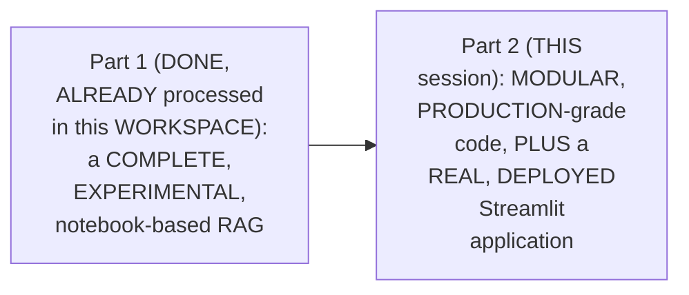

#### 🎯 Key Takeaways

* THIS session is GENUINELY, DIRECTLY confirmed AS the SERIES' own, PROMISED follow-UP — CONVERTING Part 1's OWN, complete, EXPERIMENTAL system INTO real, PRODUCTION-grade code.
* THE session's OWN, TWO core GOALS: **MODULAR programming** (the "REAL way OF programming IN production GRADE scenarios") and **DEPLOYING** the APPLICATION via Streamlit.
* This directly, PRECISELY sets UP the SESSION's own, NEXT, essential CONTENT — a COMPLETE recap OF the established RAG pipeline (Section 2).

---

### 2. A Complete Recap: The RAG Pipeline & Its Own, Established Technologies

#### 🪜 Step-by-Step — The Complete, Established Pipeline, Recapped

> 💡 **Given directly:** *"First phase of RAG is data ingestion... you load your data, you split your data into chunks, you embed your data, which means convert them into numbers, and then you store those numbers in a database called vector database... Next phase is data retrieval phase, where the moment a user question comes, the entire question will be passed to vector database."*

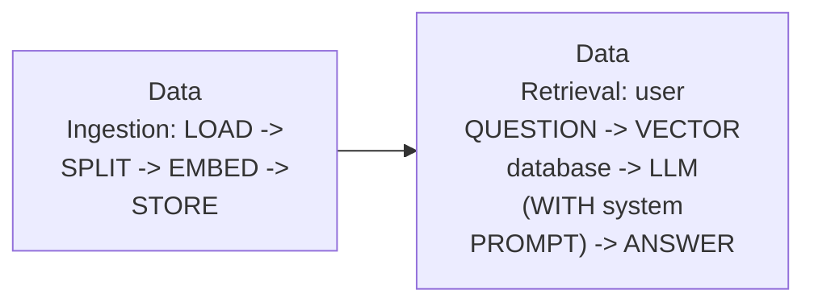

#### 🔍 Internal Working — The Complete, Established Technology Stack, Recapped

> 💡 **Given directly:** *"For loading our data, we had text data, so we were using text loader... To split our data, we use something called recursive character text splitter... Then we have embeddings, we use something called Jina embeddings... for vector store we used FAISS."*

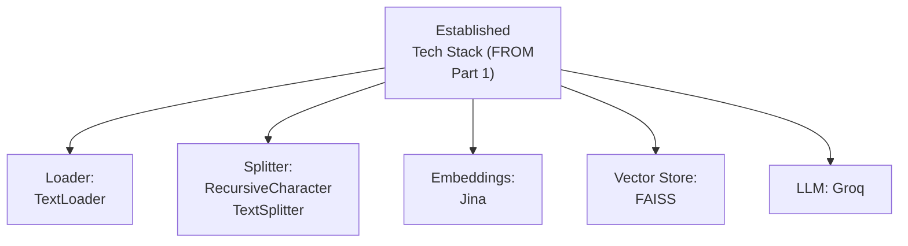

#### ⚠ Common Mistakes

* Assuming THIS session's own, NEW content GENUINELY, DIRECTLY introduces an ENTIRELY new, TECHNICAL approach — explicitly, directly, CLARIFIED: THE underlying, ESTABLISHED technologies REMAIN identical TO Part 1 — ONLY the CODE's own, real ORGANIZATION genuinely CHANGES.

#### 🎯 Key Takeaways

* THE COMPLETE, established RAG pipeline directly, PRECISELY recaps: DATA ingestion (LOAD, split, EMBED, store) and DATA retrieval (QUESTION → vector DATABASE → LLM → ANSWER).
* THE complete, ESTABLISHED technology STACK remains UNCHANGED FROM Part 1 — TextLoader, RECURSIVE character SPLITTING, Jina EMBEDDINGS, FAISS, and GROQ.
* This directly, PRECISELY sets UP the SESSION's own, NEXT, essential DISTINCTION — JUPYTER notebooks versus PYTHON scripts (Section 3).

---
### 3. Jupyter Notebooks vs. Python Scripts: A Precise, Foundational Distinction

#### 📖 Definition — The Precise, Foundational Distinction

> 💡 **Given directly:** *"Jupyter notebook is the IPYNB file... that file is always used first to experiment a bunch of things... Now once the experimentation is done, when you are taking it to production, you don't use Jupyter notebooks, they are literally for experimentation... you see softwares, websites running online, they are running in Python scripts, Python files."*

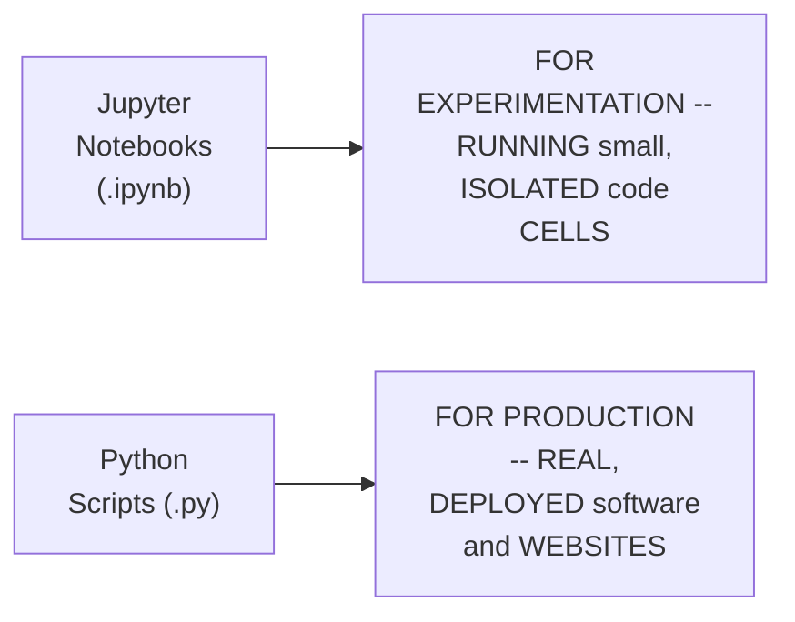

#### ⚠ Common Mistakes

* Assuming JUPYTER notebooks are GENUINELY, SUITABLY usable FOR real, DEPLOYED, production SOFTWARE — explicitly, directly, PRECISELY clarified: THEY are "LITERALLY for EXPERIMENTATION" — REAL software and WEBSITES genuinely RUN in Python SCRIPTS.

#### 🎯 Key Takeaways

* **JUPYTER notebooks** (`.IPYNB` files) are precisely CONFIRMED as GENUINELY suited FOR experimentation — RUNNING small, ISOLATED code CELLS.
* **PYTHON scripts** (`.py` files) are precisely CONFIRMED as the GENUINE, real FORMAT for production SOFTWARE — WHAT real, DEPLOYED websites and SOFTWARE ACTUALLY run AS.
* This directly, PRECISELY sets UP the SESSION's own, NEXT, essential CONCEPT — MODULAR programming, and WHY it genuinely MATTERS (Section 4).

---

### 4. Modular Programming, Precisely Explained: Why One Giant File Genuinely Fails

#### ⚠ A Direct, Honest, Important Motivation

> 💡 **Given directly:** *"Imagine if you have one Python file... and if in that Python file there is one thousand lines of code... three lakh lines of code, and imagine if you touch this part of the code, and everything over here is disturbed... that would not be nice."*

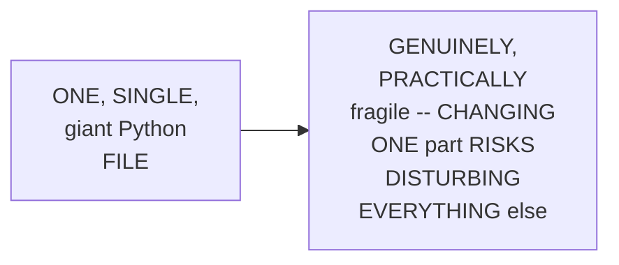

#### 📖 Definition — Modular Programming, Precisely Explained

> 💡 **Given directly:** *"All these small small logics will be divided in small small other files... one Python file literally would be for chunking, one Python file would be for vector database, one Python file would be simply for making an AI agent, and so on. And all these files would be connected to a main file."*

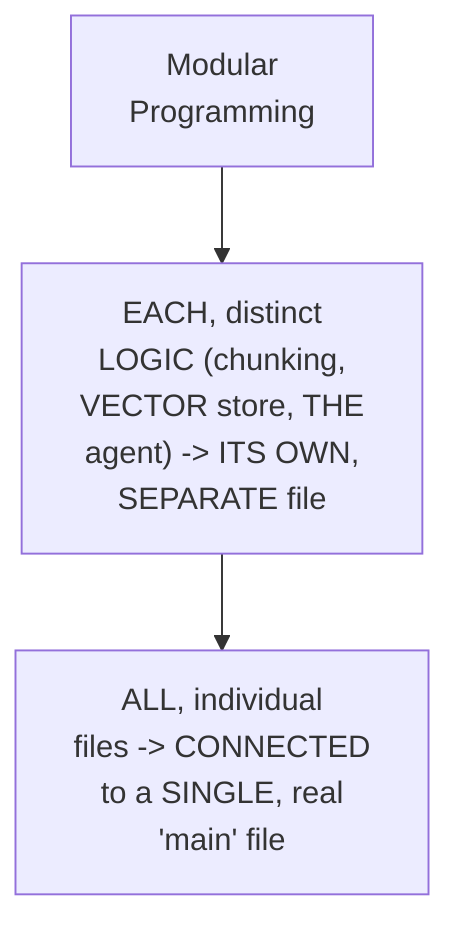

#### 🔍 Internal Working — A Genuine, Direct Confirmation of the Underlying Purpose

> 💡 **Given directly:** *"What is the purpose of writing this modular programming? Which means we want to find out in which part of the pipeline, in which corner of the pipeline the error is lying. That is why we do this modular programming."*

#### ⚠ Common Mistakes

* Assuming MODULAR programming is GENUINELY, MERELY a STYLISTIC preference — explicitly, directly, PRECISELY clarified: it GENUINELY, DIRECTLY serves a REAL, practical PURPOSE — ISOLATING errors TO a SPECIFIC, identifiable PART of the pipeline, RATHER than a MASSIVE, undifferentiated CODE file.

#### 🎯 Key Takeaways

* **MODULAR programming** is precisely EXPLAINED as SPLITTING distinct, real LOGIC (CHUNKING, vector STORAGE, agent CREATION) INTO separate, FOCUSED files — ALL connected TO a single, REAL "main" file.
* THE genuine, real PURPOSE: GENUINELY, DIRECTLY isolating WHERE a real ERROR occurs — RATHER than SEARCHING through ONE, massive, UNDIFFERENTIATED file.
* This directly, PRECISELY sets UP the SESSION's own, NEXT, essential CONTENT — the COMPLETE, planned PROJECT structure THIS session will BUILD (Section 5).

---

### 5. The Complete, Planned Project Structure

#### 🪜 Step-by-Step — The Complete, Real, Planned Structure

> 💡 **Given directly:** *"We would make a separate file for making an agent, a separate file for making our configurations... a separate file for loading data, separate file for embeddings, LLM... for splitting, for tools, for vector store... And then finally, all of this will be running in pipeline. Pipeline will be the main file of all these files. And your application will run your main."*

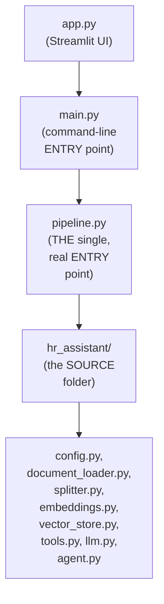

#### ⚠ Common Mistakes

* Assuming `main.PY` and `app.PY` GENUINELY, DIRECTLY contain the CORE, real RAG LOGIC themselves — explicitly, directly, PRECISELY clarified: BOTH files GENUINELY, DIRECTLY DELEGATE to `pipeline.PY` — the ACTUAL, real, single ENTRY point WIRING everything TOGETHER.

#### 🎯 Key Takeaways

* THE complete, PLANNED project STRUCTURE directly, PRECISELY spans: an `hr_assistant` SOURCE folder (WITH EIGHT, distinct, FOCUSED files), a `pipeline.PY` (THE single, real ENTRY point), and TWO, top-level "RUNNERS" — `main.PY` (command-LINE) and `app.PY` (Streamlit UI).
* BOTH `main.PY` and `app.PY` directly, CONCRETELY DELEGATE to the SAME, single `pipeline.PY` — a GENUINE, DRY (Don't-Repeat-Yourself) architectural PRINCIPLE.
* This directly, PRECISELY sets UP the SESSION's own, FIRST, real, FILE-by-file BUILD — STARTING with `CONFIG.py` (Section 6).

---
### 6. Building config.py: A Single, Centralized Source of Truth

#### ⚠ A Direct, Honest, Motivating Scenario

> 💡 **Given directly:** *"Let us say if logic one and logic three both require data file... and what we have done is we are not the best programmers, we also wrote the data file over here, data file over here, data file over here... one day the data file path is changed... we changed it over here and here, but we forgot to change it over here. That would not be the best."*

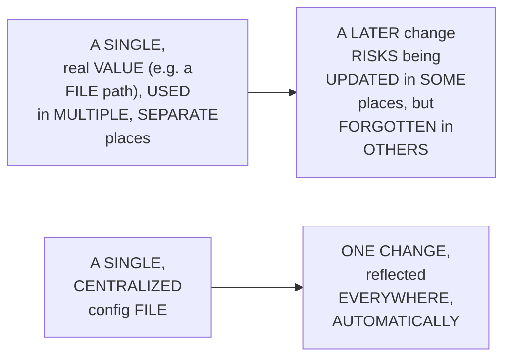

#### 🪜 Step-by-Step — The Complete, Real config.py

> 💡 **Given directly:** *"All settings for the application live here in one place... Grock API key and Gina API key... we will define the path, data path and vector store path... third, we have to set our models, which LLM and which embedding model... then we would be defining our text splitting configs... we would have something called retrieval results... we would also make system instructions... and finally we would write a function check API keys."*

```python
import os
from dotenv import load_dotenv

load_dotenv()

GROQ_API_KEY = os.getenv("GROQ_API_KEY")
JINA_API_KEY = os.getenv("JINA_API_KEY")

DATA_FILE_PATH = os.path.join("data", "hr_policy.txt")
VECTOR_STORE_PATH = os.path.join("data", "faiss_index")

LLM_MODEL_NAME = "openai/gpt-oss-120b"
EMBEDDING_MODEL_NAME = "jina-embeddings-v2-base-en"

CHUNK_SIZE = 500
CHUNK_OVERLAP = 50
RETRIEVAL_TOP_K = 3

SYSTEM_INSTRUCTIONS = (
    "You are a friendly HR assistant. Always use the search_hr_policy "
    "tool to look up the facts before answering."
)

def check_api_keys():
    """Stop early with a clear message if a required API key is missing."""
    if not GROQ_API_KEY:
        raise ValueError("GROQ_API_KEY is missing")
    if not JINA_API_KEY:
        raise ValueError("JINA_API_KEY is missing")
```

#### ⚠ A Direct, Honest, Real-World GitHub Security Note

> 💡 **Given directly:** *"If you're developing this alone, if you're not going to share this anywhere, not GitHub — GitHub will not even allow to push you the code if there is an API key in your code. GitHub will detect that, 'hey, there is some API key over here, I cannot allow you to push the code.'"*

#### ⚠ Common Mistakes

* Assuming `check_API_keys()` is GENUINELY, MERELY an OPTIONAL, defensive CONVENIENCE — explicitly, directly, PRECISELY clarified: "THERE is no MEANING of USER uploading the DATA, writing the QUERY, and going AHEAD" — WITHOUT valid API KEYS, the ENTIRE system GENUINELY, STRUCTURALLY cannot FUNCTION — FAILING EARLY, with a CLEAR message, is GENUINELY the CORRECT behavior.

#### 🎯 Key Takeaways

* **`config.PY`** directly, CONCRETELY centralizes EVERY, real project SETTING — ENVIRONMENT variables (API KEYS), file PATHS, model NAMES, chunk SIZE/overlap, retrieval TOP-K, and the SYSTEM prompt.
* A GENUINE, honest, MOTIVATING scenario directly, CONCRETELY illustrates WHY centralization GENUINELY matters — AVOIDING the REAL risk OF updating a VALUE in SOME places, but FORGETTING others.
* **`check_API_keys()`** directly, PRECISELY confirms a GENUINE, important PRINCIPLE — FAIL EARLY, with a CLEAR error, RATHER than ALLOWING the system TO proceed WITHOUT its REQUIRED credentials.

---

### 7. Three Types of Vector-Store Memory: In-Memory, Persistent & Cloud

#### 📖 Definition — The Three, Precise Types

> 💡 **Given directly:** *"Vector store are of three types. The first type of vector store is in memory, which means variables — A is equals to 10... once you restart your project, A will not have anything until and unless you run it again. Then we have something called persistent memory, which means literally in a folder... and third, we have cloud memory, directly store it to the cloud database."*

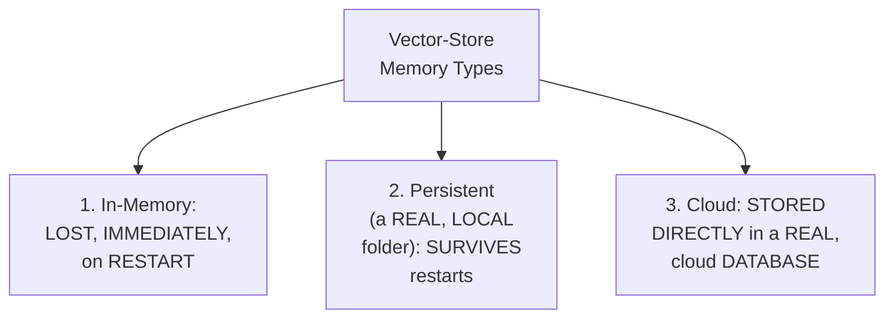

#### 🔍 Internal Working — A Genuine, Real, Worked Example: Why Persistence Matters

> 💡 **Given directly:** *"Let us say we have 100 GB of data, and we have already run data ingestion once, and after running data ingestion it took 50 hours to ingest 100 GBs of data — now imagine you close your project and you have not stored that, you will have to ingest that 100 GB again. So once you ingest, store it in a folder."*

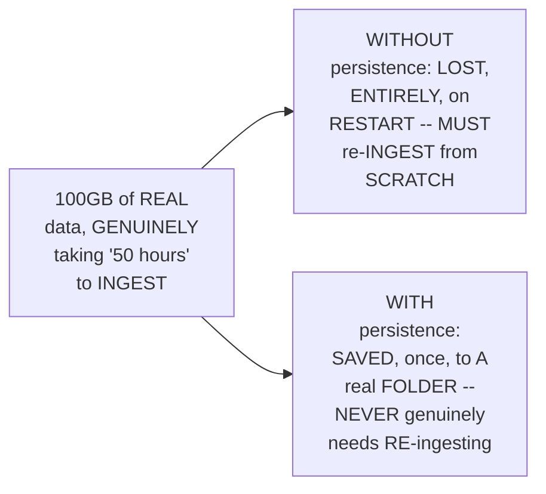

#### ⚠ Common Mistakes

* Assuming an "IN-memory" vector STORE is GENUINELY, PRACTICALLY sufficient FOR any, REAL, ongoing PROJECT — explicitly, directly, LIVE-demonstrated as GENUINELY, DIRECTLY risky — DATA is LOST, entirely, ON restart, WITHOUT genuine, real PERSISTENCE.

#### 🎯 Key Takeaways

* VECTOR-store memory GENUINELY, PRECISELY splits INTO **THREE types**: **IN-memory** (LOST, on RESTART), **PERSISTENT** (a REAL, local FOLDER, surviving RESTARTS), and **CLOUD** (a REAL, cloud database).
* A GENUINE, real, WORKED example (100GB, TAKING 50 HOURS to ingest) directly, CONCRETELY illustrates WHY persistent STORAGE genuinely, PRACTICALLY matters — AVOIDING costly, REPEATED re-ingestion.
* THIS session's OWN, real PROJECT genuinely, DIRECTLY uses **PERSISTENT** memory — SAVING the VECTOR database TO a real, LOCAL folder.

---
### 8. Building the Data Ingestion Files: document_loader.py, splitter.py & embeddings.py

#### 🪜 Step-by-Step — Building document_loader.py

> 💡 **Given directly:** *"In this particular file, we would write the logic for reading the data — read the raw document from the data folder... define load_document, it would take a file path as input... the file path will be config.data_file_path."*

```python
# document_loader.py
from langchain_community.document_loaders import TextLoader
from hr_assistant import config

def load_document(file_path):
    """Load the raw document from the data folder."""
    loader = TextLoader(file_path, encoding="utf-8")
    return loader.load()
```

#### 🪜 Step-by-Step — Building splitter.py

> 💡 **Given directly:** *"This will contain the logic to split the data which we have loaded... chop the document into small searchable chunks... define split_into_chunks, this would be my function name, and what will be the input... would be documents."*

```python
# splitter.py
from langchain_text_splitters import RecursiveCharacterTextSplitter
from hr_assistant import config

def split_into_chunks(documents):
    """Split documents into small, overlapping chunks."""
    text_splitter = RecursiveCharacterTextSplitter(
        chunk_size=config.CHUNK_SIZE,
        chunk_overlap=config.CHUNK_OVERLAP
    )
    return text_splitter.split_documents(documents)
```

#### 🪜 Step-by-Step — Building embeddings.py

> 💡 **Given directly:** *"Turn text into numbers, vectors, using Jina... define get_embeddings_model — this function is going to return us the Jina embedding... model name it's going to be config.embedding_model_name."*

```python
# embeddings.py
from langchain_community.embeddings import JinaEmbeddings
from hr_assistant import config

def get_embeddings_model():
    """Return a Jina embedding model. Reads the Jina API key from the environment."""
    return JinaEmbeddings(model_name=config.EMBEDDING_MODEL_NAME)
```

#### 🔍 Internal Working — A Genuine, Direct Confirmation: Docstrings Genuinely Matter, Here Too

> 💡 **Given directly:** *"This information which we are writing, this is not only helpful for the humans, but this is also helpful to an AI agent who knows which function to use when, because it is able to read the docstring."*

#### ⚠ Common Mistakes

* Assuming EACH, real DATA-ingestion FILE needs to GENUINELY, DIRECTLY re-IMPORT its OWN, complete SET of raw VALUES (e.g., a HARDCODED chunk SIZE) — explicitly, directly, PRECISELY clarified: EVERY file GENUINELY, DIRECTLY imports FROM the SAME, single `CONFIG` module — the SAME, established PRINCIPLE from SECTION 6.

#### 🎯 Key Takeaways

* **`document_LOADER.py`** directly, CONCRETELY implements `load_DOCUMENT(file_path)` — WRAPPING `TextLOADER`, using CONFIG's own DATA path.
* **`splitter.PY`** directly, CONCRETELY implements `split_INTO_chunks(documents)` — WRAPPING `RecursiveCharacterTextSPLITTER`, using CONFIG's own CHUNK size/overlap.
* **`embeddings.PY`** directly, CONCRETELY implements `get_EMBEDDINGS_model()` — WRAPPING `JinaEMBEDDINGS`, using CONFIG's own MODEL name.
* EVERY, single FILE directly, CONSISTENTLY imports FROM the SAME, CENTRALIZED `config` MODULE — DIRECTLY, PRACTICALLY reinforcing Section 6's OWN, established CENTRALIZATION principle.

---
### 9. Building vector_store.py: The Pipeline's Most Substantial File

#### 🪜 Step-by-Step — build_vector_store()

> 💡 **Given directly:** *"Building a vector store using FAISS... define build_vector_store, what this is going to do is going to embed every chunk and build a searchable FAISS index in memory... return FAISS.from_documents is the method to convert the chunks into embeddings."*

```python
# vector_store.py
import os
from langchain_community.vectorstores import FAISS
from hr_assistant import config
from hr_assistant.embeddings import get_embeddings_model

def build_vector_store(chunks):
    """Embed every chunk and build a searchable FAISS index in memory."""
    embeddings_model = get_embeddings_model()
    return FAISS.from_documents(chunks, embeddings_model)
```

#### 🪜 Step-by-Step — save_vector_store() & load_vector_store()

> 💡 **Given directly:** *"Save vector store... this function is going to take vector store, hey give me a vector store to save it, secondly path... vector_store.save_local, where do you are supposed to save? You are supposed to save at this particular path... define load_vector_store... first build it, then store it, once you have stored it, load it."*

```python
def save_vector_store(vector_store, path=config.VECTOR_STORE_PATH):
    """Save the FAISS index to disk so we don't have to build it every time."""
    vector_store.save_local(path)

def load_vector_store(path=config.VECTOR_STORE_PATH):
    """Load a previously-saved FAISS index from disk."""
    embeddings_model = get_embeddings_model()
    return FAISS.load_local(path, embeddings_model, allow_dangerous_deserialization=True)
```

#### 🪜 Step-by-Step — check_if_vector_store_exists() & get_retriever()

> 💡 **Given directly:** *"Check if vector store is there... return a Boolean value, true or false... last method, get retriever — it would take vector store as input, and what will it return? It would return us the top three results... turns a vector store into a retriever, why do we have to do that? Because AI doesn't know what is vector store, AI only knows what is a retriever."*

```python
def check_if_vector_store_exists(path=config.VECTOR_STORE_PATH):
    """Return True if a saved vector store already exists at this path."""
    return os.path.exists(path)

def get_retriever(vector_store):
    """Turn a vector store into a retriever the LLM can interact with."""
    return vector_store.as_retriever(search_kwargs={"k": config.RETRIEVAL_TOP_K})
```

#### ⚠ A Direct, Honest Explanation of Why "Extra" Production-Grade Methods Were Added

> 💡 **Given directly:** *"These both are extra production-grade methods which we have added — which means loading and checking if vector store is also there, and saving also, so that we don't have to run it again and again. Why did we add it? So that our system never fails."*

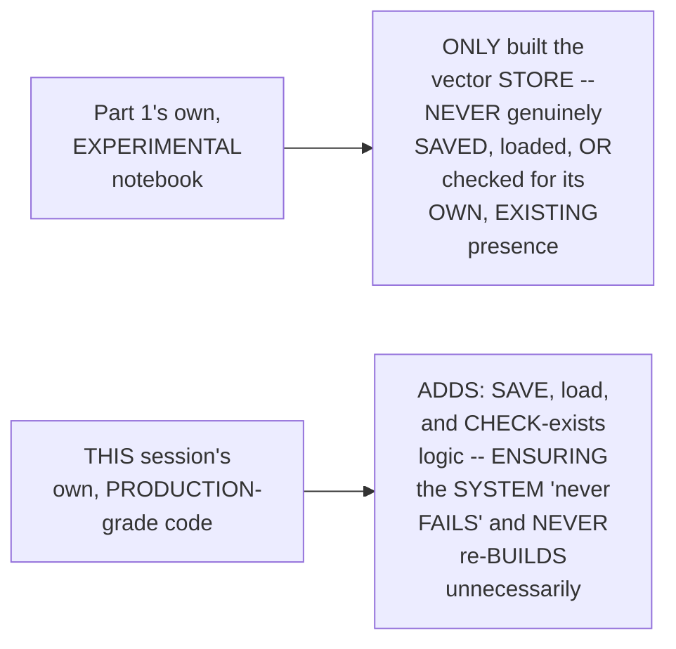

#### ⚠ Common Mistakes

* Assuming Part 1's OWN, established, EXPERIMENTAL logic (BUILDING a VECTOR store) is GENUINELY, DIRECTLY sufficient FOR a REAL, production SYSTEM — explicitly, directly, PRECISELY clarified: THREE, additional, GENUINELY "production-GRADE" methods (SAVE, LOAD, check-EXISTS) are GENUINELY, DIRECTLY required, BEYOND the ORIGINAL, experimental LOGIC.

#### 🎯 Key Takeaways

* **`vector_STORE.py`** directly, CONCRETELY implements **FIVE, distinct METHODS**: `BUILD_vector_store`, `SAVE_vector_store`, `LOAD_vector_store`, `check_IF_vector_store_exists`, and `GET_retriever`.
* THREE of THESE five METHODS (save, LOAD, check-exists) are directly, HONESTLY confirmed AS "EXTRA production-grade METHODS" — NOT present IN Part 1's OWN, simpler, EXPERIMENTAL notebook — ADDED SPECIFICALLY "so THAT our SYSTEM never FAILS."
* **`get_RETRIEVER`** directly, PRECISELY converts a RAW vector STORE into a RETRIEVER — SINCE "AI ONLY knows WHAT is a RETRIEVER," not a VECTOR store DIRECTLY.

---
### 10. A Genuine, Honest Confession: The Real Skill Is Knowing How to Search

#### ⚠ A Direct, Honest, Important Confession

> 💡 **Given directly:** *"How do I remember that? Okay, first thing, this method is standard for all the technologies... you don't have to remember this as well. How would you get it? You would simply go to Google... you always should know how to find your answers, that is where you differ as a developer."*

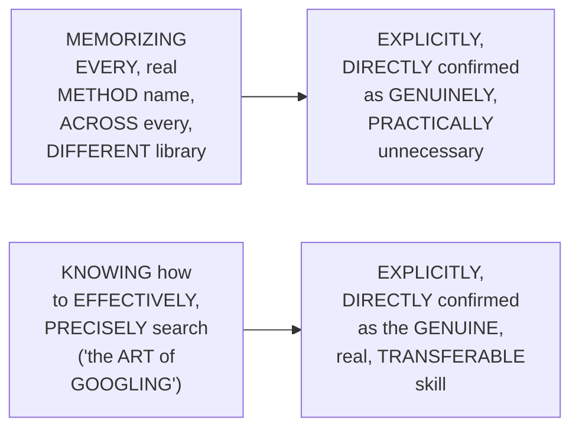

#### 🔍 Internal Working — A Genuine, Direct, Live-Demonstrated Example

> 💡 **Given directly:** *"How to store documents in vector database LangChain... this itself will give you... they have used add documents. We are using from documents, it is the same thing... so answer is you don't have to remember anything, you only should know how do I find my things."*

#### ⚠ Common Mistakes

* Assuming a GENUINELY, SKILLED developer must GENUINELY, PERSONALLY memorize EVERY, real METHOD name, ACROSS every, POSSIBLE library and TECHNOLOGY — explicitly, directly, HONESTLY clarified: "YOU cannot EXPECT a HUMAN to REMEMBER everything" — the GENUINE, real DIFFERENTIATOR is KNOWING how TO find the ANSWER, efficiently.

#### 🎯 Key Takeaways

* THE instructor **directly, HONESTLY confesses** he does NOT, genuinely, MEMORIZE every, real METHOD name — INSTEAD, he RELIES on EFFECTIVE, PRECISE searching ("THE art OF Googling").
* A GENUINE, live-DEMONSTRATED search directly, CONCRETELY confirmed DIFFERENT libraries (e.g., CHROMA versus FAISS) OFTEN use DIFFERENT, but CONCEPTUALLY equivalent METHOD names (e.g., `add_DOCUMENTS` versus `from_DOCUMENTS`).
* This directly, HONESTLY reframes a GENUINE, transferable SKILL — "YOU should KNOW where CAN I find WHICH thing" — RATHER than pure, ROTE memorization.

---

### 11. Building the Data Retrieval Files: tools.py, llm.py & agent.py

#### 🪜 Step-by-Step — Building tools.py

> 💡 **Given directly:** *"From LangChain.tools, it is going to use a tool — a tool is nothing but a decorator, which means some method which converts any Python function into a LangChain tool... returns a tool function that searches HR policy documents."*

```python
# tools.py
from langchain.tools import tool

def create_search_tool(retriever):
    @tool
    def search_hr_policy(question: str) -> str:
        """Search the HR policy document for leave, WFH, probation,
        notice period, and reimbursement information."""
        matching_chunks = retriever.invoke(question)
        return "\n".join(chunk.page_content for chunk in matching_chunks)
    return search_hr_policy
```

#### 🪜 Step-by-Step — Building llm.py

> 💡 **Given directly:** *"Connects the LLM to the brain of the assistant... we need our Grock because we are using Grock as our LLM... get_llm, which would be ChatGrok, config.llm_model_name... and creativity temperature would be zero."*

```python
# llm.py
from langchain_groq import ChatGroq
from hr_assistant import config

def get_llm():
    """Connects the LLM to the brain of the assistant."""
    return ChatGroq(model=config.LLM_MODEL_NAME, temperature=0)
```

#### 🪜 Step-by-Step — Building agent.py

> 💡 **Given directly:** *"We are building the agent that ties the LLM and the search tool together... define create_hr_agent, returns a LangChain agent which can call our tools to answer our question... create_agent, which is going to take model, tools, and system prompt."*

```python
# agent.py
from langchain.agents import create_agent
from hr_assistant import config

def create_hr_agent(llm, search_tool):
    """Returns a LangChain agent which can call our tools to answer our question."""
    return create_agent(
        model=llm,
        tools=[search_tool],
        system_prompt=config.SYSTEM_INSTRUCTIONS
    )
```

#### ⚠ Common Mistakes

* Assuming `TOOLS.py` should GENUINELY, DIRECTLY import the RETRIEVER ITSELF, at the FILE's own TOP level — explicitly, directly, IMPLIED as GENUINELY, STRUCTURALLY better organized AS a FUNCTION that ACCEPTS the retriever AS a PARAMETER — ENABLING the RETRIEVER to be BUILT/wired TOGETHER, elsewhere (in `pipeline.PY`).

#### 🎯 Key Takeaways

* **`tools.PY`** directly, CONCRETELY uses LANGCHAIN's OWN **`@tool`** decorator — a MECHANISM that GENUINELY, DIRECTLY converts ANY, real Python FUNCTION into a USABLE LangChain TOOL.
* **`llm.PY`** directly, CONCRETELY implements `get_LLM()` — WRAPPING `ChatGROQ`, using CONFIG's own MODEL name and a FIXED temperature OF 0.
* **`agent.PY`** directly, CONCRETELY implements `create_HR_agent(llm, SEARCH_tool)` — WRAPPING `create_AGENT`, PASSING the MODEL, tools, and SYSTEM prompt.
* This directly, PRECISELY sets UP the SESSION's own, NEXT, essential FILE — `pipeline.PY`, THE single, real ENTRY point WIRING every, PRIOR file TOGETHER (Section 12).

---
### 12. Building pipeline.py: The Single, Real Entry Point

#### 📖 Definition — pipeline.py, Precisely Introduced

> 💡 **Given directly:** *"This is going to wire all the components together in a ready-to-use agent. This is a single entry point that main.py and app.py, which is a Streamlit file, both call."*

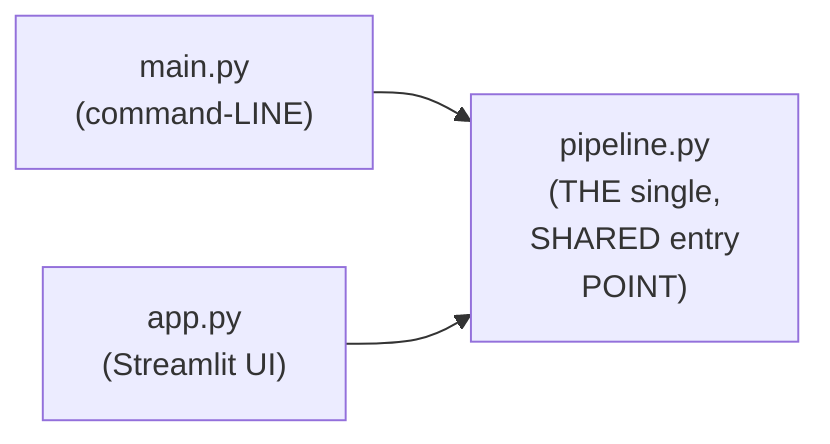

#### 🪜 Step-by-Step — build_vector_store_from_documents()

> 💡 **Given directly:** *"This function will take a data file path, it would check, does my vector store exist? If my vector store exists, load my vector store. So simple... if there is no vector store found, building one from scratch."*

```python
# pipeline.py
from hr_assistant import config
from hr_assistant.document_loader import load_document
from hr_assistant.splitter import split_into_chunks
from hr_assistant.vector_store import (
    build_vector_store, save_vector_store,
    load_vector_store, check_if_vector_store_exists
)
from hr_assistant.embeddings import get_embeddings_model
from hr_assistant.tools import create_search_tool
from hr_assistant.llm import get_llm
from hr_assistant.agent import create_hr_agent

def build_vector_store_from_documents():
    if check_if_vector_store_exists():
        return load_vector_store()
    print("No saved vector store found. Building one from scratch.")
    documents = load_document(config.DATA_FILE_PATH)
    chunks = split_into_chunks(documents)
    vector_store = build_vector_store(chunks)
    save_vector_store(vector_store)
    return vector_store
```

#### 🪜 Step-by-Step — build_hr_assistant() & ask_agent()

> 💡 **Given directly:** *"Build a full RAG agent ready to answer your questions... check your API keys, vector store, build vector store documents, retriever get retriever, search tool create search tool, LLM will be getting LLM, agent will be create HR agent... define ask_agent, question string, ask the agent a question and return the final answer as plain text."*

```python
def build_hr_assistant():
    """Build a full RAG agent, ready to answer your questions."""
    config.check_api_keys()
    vector_store = build_vector_store_from_documents()
    retriever = vector_store.as_retriever(search_kwargs={"k": config.RETRIEVAL_TOP_K})
    search_tool = create_search_tool(retriever)
    llm = get_llm()
    return create_hr_agent(llm, search_tool)

def ask_agent(agent, question: str) -> str:
    """Ask the agent a question and return the final answer as plain text."""
    response = agent.invoke({
        "messages": [{"role": "user", "content": question}]
    })
    return response["messages"][-1].content
```

#### ⚠ Common Mistakes

* Assuming `PIPELINE.py` GENUINELY, DIRECTLY re-implements the CORE, real LOGIC ITSELF — explicitly, directly, PRECISELY clarified: it GENUINELY, DIRECTLY only WIRES together (IMPORTS and CALLS) FUNCTIONS ALREADY defined IN the OTHER, established FILES — a PURE ORCHESTRATION layer.

#### 🎯 Key Takeaways

* **`pipeline.PY`** is directly, PRECISELY confirmed AS "a SINGLE entry POINT that `main.PY` and `app.PY`... BOTH call" — a PURE, real ORCHESTRATION layer, WIRING every, PRIOR file's own LOGIC together.
* `build_VECTOR_store_from_documents()` directly, CONCRETELY implements a GENUINE, "SMART" pattern — CHECK if a VECTOR store ALREADY exists; IF so, LOAD it; IF not, BUILD it, from SCRATCH.
* `build_HR_assistant()` and `ask_AGENT()` directly, CONCRETELY complete the PIPELINE — ASSEMBLING the FULL, real AGENT, and PROVIDING a SIMPLE, reusable WAY to QUERY it.
* This directly, PRECISELY sets UP the SESSION's own, NEXT, essential FILE — `main.PY`, a COMMAND-line DEMO of this COMPLETE pipeline (Section 13).

---

### 13. Building main.py: A Genuine, Honest, Live-Encountered Error

#### 🪜 Step-by-Step — The Complete main.py

> 💡 **Given directly:** *"From HR assistant.pipeline, we need only these things: ask and build HR assistant... first, it will print building the HR policy assistant, agent, I'm making an agent variable which is going to build HR assistant, and it's going to print agent is ready. Then some demo questions."*

```python
# main.py
from hr_assistant.pipeline import build_hr_assistant, ask_agent

def main():
    print("Building the HR policy assistant...")
    agent = build_hr_assistant()
    print("Agent is ready.")

    demo_questions = [
        "How many paid annual leaves do I get?",
        "What is the notice period?",
        "Can I work from home every day?"
    ]

    for question in demo_questions:
        answer = ask_agent(agent, question)
        print(f"Q: {question}\nA: {answer}\n")
```

#### ⚠ A Direct, Honest, Live-Encountered Error

> 💡 **Given directly:** *"We did not get anything. Again, why did we not get anything? ...in order to run a Python file, we have to make it an executable file... if the name of our Python file is running, check if there is something called main, and if there is main, run that main function."*

```python
if __name__ == "__main__":
    main()
```

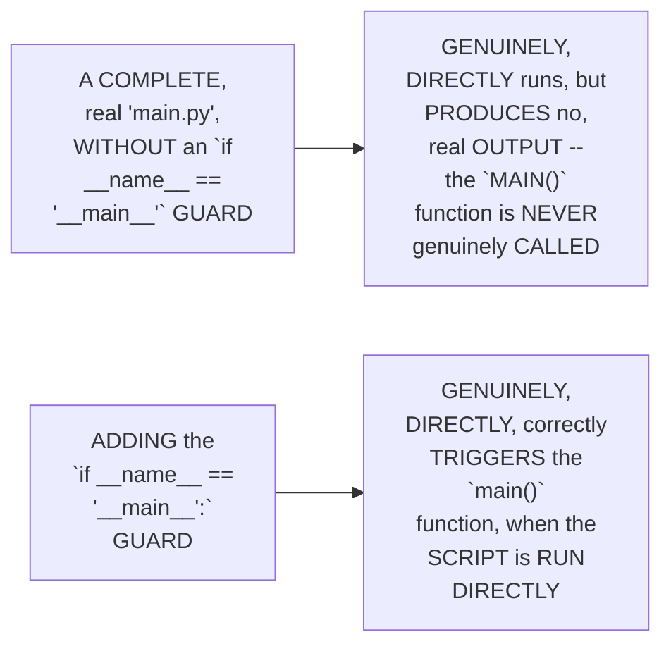

#### ⚠ Common Mistakes

* Assuming DEFINING a `main()` FUNCTION, ALONE, is GENUINELY, AUTOMATICALLY sufficient TO have it GENUINELY, DIRECTLY execute — explicitly, directly, LIVE-demonstrated as GENUINELY, DIRECTLY insufficient — an EXPLICIT `if __NAME__ == "__main__":` GUARD is GENUINELY, STRUCTURALLY required, to ACTUALLY trigger the FUNCTION's own CALL.

#### 🎯 Key Takeaways

* **`main.PY`** directly, CONCRETELY implements a COMMAND-line DEMO — BUILDING the AGENT, and ASKING it THREE, real, sample QUESTIONS.
* A GENUINE, honest, LIVE-encountered ERROR directly, CONCRETELY confirmed: the SCRIPT initially PRODUCED no, real OUTPUT — BECAUSE it was MISSING the STANDARD `if __NAME__ == "__main__":` guard, REQUIRED to GENUINELY trigger the `main()` FUNCTION's own EXECUTION.
* This directly, PRECISELY sets UP the SESSION's own, NEXT, essential VERIFICATION — a COMPLETE, real, LIVE-confirmed COMMAND-line success, AFTER this FIX (Section 14).

---
### 14. A Complete, Real, Live-Confirmed Command-Line Success

#### 🪜 Step-by-Step — A Complete, Real, Live-Confirmed Run

> 💡 **Given directly:** *"Python main.py, I'm just running it... building HR assistant, no saved vector store found, building one from scratch — see it made and stored a vector database — it is answering our questions. How many leaves do I get? What is the notice period? Can I get work from home every day?"*

```bash
python main.py
```

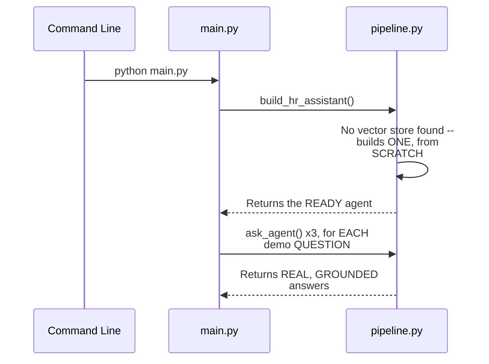

#### 🔍 Internal Working — A Genuine, Direct Confirmation of the Result

> 💡 **Given directly:** *"This is same as good as running Claude in your terminal or any agent in your terminal... our agent is working fine, and it is giving us the reply. During the probation period, notice period is 15 days. Where is it getting all these answers from? It is getting from here — the data which is stored."*

#### ⚠ Common Mistakes

* Assuming a COMMAND-line, TERMINAL-based agent is GENUINELY, MEANINGFULLY different, IN terms OF its OWN, underlying CAPABILITY, FROM a REAL, popular, commercial AI TOOL — explicitly, directly, MEMORABLY confirmed: "THIS is SAME as GOOD as running CLAUDE in your TERMINAL" — the SAME, fundamental RAG architecture UNDERLIES both.

#### 🎯 Key Takeaways

* A COMPLETE, real, LIVE-confirmed RUN directly, CONCRETELY validated the ENTIRE, established MODULAR architecture — `python MAIN.py` GENUINELY, SUCCESSFULLY built the VECTOR store (SINCE none EXISTED yet) and ANSWERED all THREE, demo QUESTIONS correctly.
* THE instructor **directly, MEMORABLY confirms** THIS command-LINE agent is "SAME as GOOD as RUNNING Claude IN your terminal" — GROUNDING this ACHIEVEMENT in a FAMILIAR, real-WORLD comparison.
* This directly, PRECISELY sets UP the SESSION's own, NEXT, essential STEP — MAKING this SAME, complete SYSTEM accessible TO non-developers, VIA a REAL, Streamlit web APPLICATION (Section 15).

---

### 15. Deploying via Streamlit: Building app.py

#### 📖 Definition — Streamlit, Precisely Introduced

> 💡 **Given directly:** *"Not everyone in this world is a developer, people want a simple way to use it... instead of this, we would make something called Streamlit. Now what is Streamlit? Streamlit is a way to build UI for your logics."*

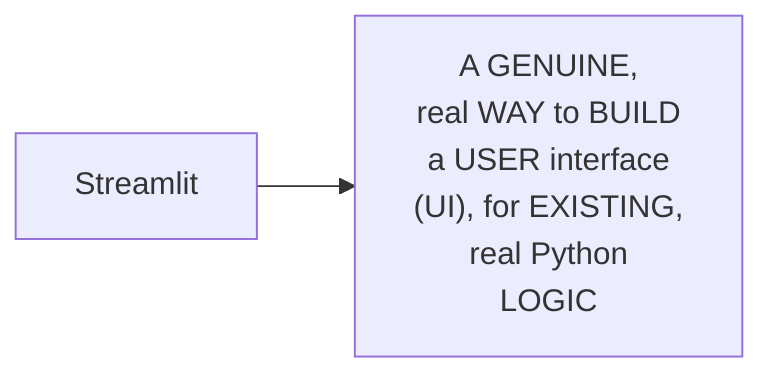

#### 🪜 Step-by-Step — Running the Streamlit App

> 💡 **Given directly:** *"To run a Streamlit file, you simply run a command which is Streamlit run, and wherever the Streamlit code is written... Streamlit run app.py. What this is going to do? This is going to open an application for us."*

```bash
streamlit run app.py
```

#### 🔍 Internal Working — A Genuine, Direct, Live-Confirmed Result

> 💡 **Given directly:** *"Found a vector stored on the disk, loading it, no re-embedding — which means earlier when we ran it, it built a vector store, but this time it did not build a vector store."*

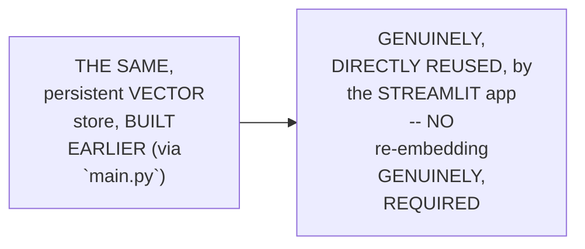

#### ⚠ Common Mistakes

* Assuming a REAL, complete APPLICATION (LIKE this HR ASSISTANT) genuinely, DIRECTLY requires ITS own, SEPARATE, independent VECTOR store, PER "runner" (COMMAND-line VERSUS Streamlit) — explicitly, directly, LIVE-demonstrated as GENUINELY, DIRECTLY sharing the SAME, persistent VECTOR store — a DIRECT, real BENEFIT of THIS session's own, ESTABLISHED "check IF exists, then LOAD" pattern (Section 9).

#### 🎯 Key Takeaways

* **STREAMLIT** is precisely INTRODUCED as a GENUINE, real WAY to build a USER interface (UI) FOR existing, real PYTHON logic — MAKING an application ACCESSIBLE to NON-developers.
* THE Streamlit app is directly, PRACTICALLY run VIA `streamlit RUN app.PY` — OPENING a REAL, working web APPLICATION.
* A GENUINE, live-CONFIRMED result directly, CONCRETELY validated THIS session's own, ESTABLISHED persistence PATTERN (Section 9) — the STREAMLIT app GENUINELY, DIRECTLY reused the SAME, already-BUILT vector STORE, WITHOUT re-embedding.

---
### 16. A Complete, Real, Live-Confirmed Streamlit Application, Explained

#### 🪜 Step-by-Step — The Complete, Real Streamlit Code, Walked Through

> 💡 **Given directly:** *"Import Streamlit as st... from pipeline, ask and build HR assistant... set page config, HR policy assistant and icon... set a title... caption, ask me anything about the company HR documents... cache resource, which means if we refresh, things will still be there."*

```python
# app.py
import streamlit as st
from hr_assistant.pipeline import build_hr_assistant, ask_agent

st.set_page_config(page_title="HR Policy Assistant", page_icon="🤖")
st.title("HR Policy Assistant")
st.caption("Ask me anything about the company HR documents.")

@st.cache_resource
def get_agent():
    return build_hr_assistant()

agent = get_agent()

if "messages" not in st.session_state:
    st.session_state.messages = []
```

#### 🪜 Step-by-Step — Handling Chat Input & Displaying History

> 💡 **Given directly:** *"If message is in session state, why do we have to maintain a session state? So that we can maintain chat... whatever messages we are getting, we are adding this to a list of messages, and we also set roles... question variable st.chat_input... if question, append the question in the list of messages... and then it is going to reply in markdown format."*

```python
for message in st.session_state.messages:
    with st.chat_message(message["role"]):
        st.markdown(message["content"])

question = st.chat_input("Ask a question about HR policy")

if question:
    st.session_state.messages.append({"role": "user", "content": question})
    with st.chat_message("user"):
        st.markdown(question)

    with st.chat_message("assistant"):
        with st.spinner("Thinking..."):
            answer = ask_agent(agent, question)
        st.markdown(answer)
    st.session_state.messages.append({"role": "assistant", "content": answer})
```

#### 🔍 Internal Working — A Genuine, Direct Clarification: Session State Is Not Agent Memory

> 💡 **Given directly:** *"So to maintain this chat on the UI itself, not agentic memory, nothing about memory over here — we are just maintaining so that we can show this on the UI."*

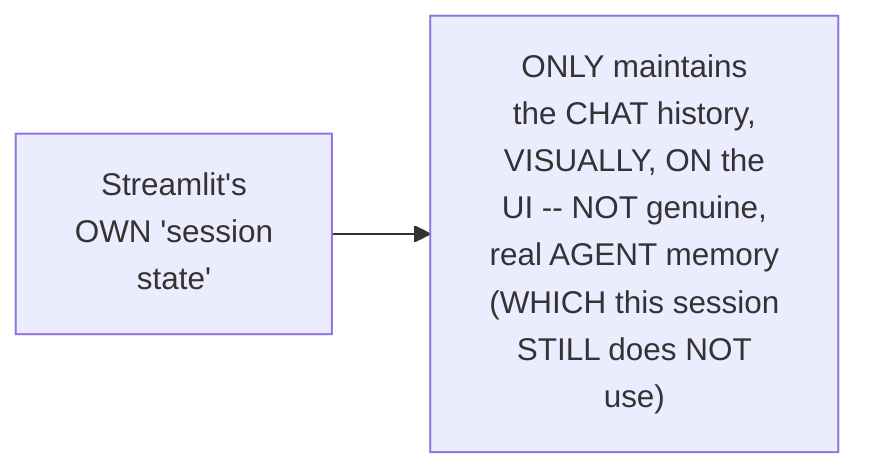

#### ⚠ Common Mistakes

* Assuming STREAMLIT's own "SESSION state" (MAINTAINING chat HISTORY, visually) is GENUINELY, EQUIVALENT to REAL, "agentic MEMORY" — explicitly, directly, PRECISELY clarified: "NOTHING about MEMORY over HERE" — the AGENT itself GENUINELY, STILL has NO real, PERSISTENT memory OF prior QUESTIONS — session STATE is PURELY a UI-level, DISPLAY mechanism.

#### 🎯 Key Takeaways

* THE complete, real STREAMLIT code directly, CONCRETELY confirmed: PAGE configuration, a CACHED agent (`@st.cache_RESOURCE`), SESSION-state-based CHAT history, and a REAL, chat-INPUT-driven interaction LOOP.
* THE instructor **directly, PRECISELY clarifies** SESSION state is GENUINELY, MERELY a UI-level DISPLAY mechanism — NOT genuine, real "AGENTIC memory" — the AGENT itself STILL, genuinely LACKS true, persistent MEMORY.
* This directly, PRECISELY sets UP the SESSION's own, NEXT, essential STEP — PUSHING this COMPLETE, finished PROJECT to GitHub (Section 17).

---

### 17. Pushing the Complete Project to GitHub

#### 🪜 Step-by-Step — A Complete, Real, Final Git Workflow

> 💡 **Given directly:** *"Once our entire code base is ready, I would just simply go ahead and push all this data to GitHub — but we don't want people on GitHub to see our files, data... I would go to my .gitignore, and I will add this... I would just add it, all the changes, I would write project finish, and I would commit it."*

```bash
# .gitignore should already exclude: .env, venv folders, data/faiss_index/
git add .
git commit -m "project finish"
git push
```

#### ⚠ Common Mistakes

* Assuming a REAL project's own, COMPLETE `.gitignore` CONFIGURATION is a ONE-TIME, "set AND forget" STEP — explicitly, directly, PRACTICALLY reinforced AS an ONGOING responsibility — NEW, sensitive OR unnecessary FILES (LIKE THIS session's own, NEWLY-created VECTOR-store folder) genuinely, DIRECTLY require ADDING to `.gitignore` AS the project EVOLVES.

#### 🎯 Key Takeaways

* THE COMPLETE, final project directly, CONCRETELY pushed to GITHUB, using the SAME, established THREE-command WORKFLOW (`git ADD`, `git COMMIT`, `git PUSH`) FROM Part 1.
* THE `.gitignore` FILE was directly, PRACTICALLY updated — ENSURING sensitive/unnecessary FILES (LIKE the VECTOR-store folder) genuinely, DIRECTLY remain EXCLUDED from PUBLIC visibility.
* This directly, PRECISELY sets UP the SESSION's own, FINAL, essential CONTENT — a GENUINE, complete ASSIGNMENT, extending THIS session's own, established PATTERN (Section 18).

---
### 18. A Genuine, Direct, Complete Assignment: A Second RAG, for a Different Organization

#### 🪜 Step-by-Step — The Complete, Real Assignment

> 💡 **Given directly:** *"You will make a RAG agent for LangChain organization... instead of a text loader, you would use web base loader — just how a text loader will take a text file as an input, a web base loader will take a website URL as an input... you would use Gina embeddings itself... but vector store, in our tutorial we used FAISS, you will use Chroma."*

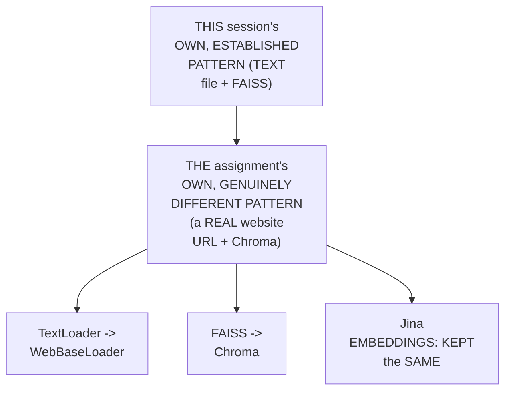

#### 🔍 Internal Working — A Genuine, Direct, Practical Encouragement

> 💡 **Given directly:** *"You don't necessarily have to make a LangChain AI agent, you can make an AI agent for any organization you feel like... you can just simply give anthropic.com to your web base URL, and it would load all the Anthropic.com data for you."*

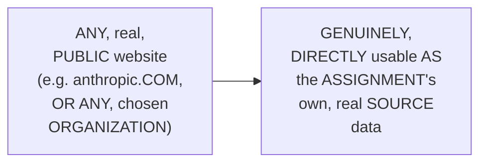

#### ⚠ Common Mistakes

* Assuming BUILDING a RAG SYSTEM around a REAL, LIVE website's own DATA genuinely, DIRECTLY requires an ENTIRELY new, unfamiliar METHODOLOGY — explicitly, directly, PRECISELY clarified: the ENTIRE, established PROCESS (SPLITTING, embedding, STORING, retrieving) genuinely, DIRECTLY REMAINS the SAME — ONLY the LOADER and VECTOR-store TECHNOLOGY genuinely CHANGE.

#### 🎯 Key Takeaways

* A GENUINE, complete ASSIGNMENT directly, EXPLICITLY requires BUILDING a SECOND, real RAG agent — FOR a DIFFERENT organization — USING **`WEBBASELOADER`** (INSTEAD of `TextLOADER`) and **CHROMA** (instead of FAISS).
* THE instructor **directly, PRACTICALLY encourages** CHOOSING ANY, real, public ORGANIZATION's own website (e.g., ANTHROPIC.com) — REINFORCING that the ESTABLISHED, complete PROCESS genuinely, DIRECTLY generalizes BEYOND the SPECIFIC, HR-policy USE case.
* This directly, PRECISELY sets UP the SESSION's own, FINAL, closing CONTENT — a GENUINE, warm REFLECTION on the COMPLETE journey (Section 19).

---

### 19. Closing: A Genuine, Warm Reflection on the Complete Journey

#### 🪜 Step-by-Step — A Direct, Genuine, Warm Reflection

> 💡 **Given directly:** *"Wasn't this amazing, developing a RAG, then modular programming it, and then also deploying it on Streamlit? So yes, that's the kind of projects we build... this was very simple, because we are talking about absolute beginners, and this was a great accomplishment for you guys."*

```mermaid
flowchart LR
    A["Part 1: a<br/>COMPLETE,<br/>EXPERIMENTAL RAG"] --> B["Part 2 (THIS<br/>session): MODULAR<br/>programming +<br/>REAL, deployed<br/>Streamlit<br/>application"]
    B --> C["A COMPLETE,<br/>GENUINE journey --<br/>EXPLICITLY<br/>confirmed AS 'a<br/>GREAT<br/>accomplishment,'<br/>FOR absolute<br/>BEGINNERS"]
```

#### ⚠ Common Mistakes

* Assuming THIS session's own, COMPLETE, TWO-part journey REPRESENTS a GENUINELY, "SIMPLE" or TRIVIAL accomplishment — explicitly, directly, ENCOURAGINGLY reframed: it's DIRECTLY confirmed AS "a GREAT accomplishment," SPECIFICALLY appropriate FOR absolute BEGINNERS — a GENUINE, real achievement, GIVEN the STARTING point.

#### 🎯 Key Takeaways

* This episode **GENUINELY, COMPREHENSIVELY delivers** its OWN, stated GOALS — CONVERTING Part 1's OWN, complete, EXPERIMENTAL RAG system INTO real, MODULAR, production-GRADE code, and DEPLOYING it as a REAL, working Streamlit APPLICATION.
* THE instructor **directly, WARMLY reflects** on the COMPLETE, two-PART journey — EXPLICITLY confirming it AS "a GREAT accomplishment" for ABSOLUTE beginners.
* THE instructor **directly, EXPLICITLY promises** MORE, future VIDEOS — CONTINUING this SERIES' own, established, progressive LEARNING journey.

---

## 📝 Glossary

| Term | Definition | Why It Matters |
|---|---|---|
| **Modular Programming** | Splitting logic across separate, focused files | Isolates errors; the standard, production practice |
| **config.py** | A single, centralized settings file | Prevents inconsistent updates across multiple files |
| **pipeline.py** | The single, shared entry point | Called by both main.py and app.py |
| **Persistent Vector Store** | A vector store saved to a local folder | Survives restarts; avoids costly re-ingestion |
| **@tool** | LangChain's decorator | Converts any Python function into a usable tool |
| **`if __name__ == "__main__":`** | The standard Python execution guard | Required to actually trigger a script's main() function |
| **Streamlit** | A UI-building framework for Python logic | Makes an application accessible to non-developers |
| **Session State (Streamlit)** | UI-level chat history display | NOT the same as genuine agent memory |

---

## 🔄 Revision Notes — One-Minute Revision

* This is Part 2, the direct, promised follow-up to Part 1 -- converting the complete, experimental, notebook-based RAG system into real, modular, production-grade code, and deploying it via Streamlit.
* **A complete recap**: the established RAG pipeline (data ingestion: load, split, embed, store; data retrieval: question -> vector database -> LLM -> answer) and its established technology stack (TextLoader, RecursiveCharacterTextSplitter, Jina embeddings, FAISS, Groq) remain unchanged.
* **Jupyter notebooks vs. Python scripts**: notebooks are for experimentation; real, deployed software runs in Python scripts.
* **Modular programming**: splitting distinct logic into separate, focused files, all connected to a main file -- genuinely helps isolate where errors occur, rather than searching one, massive file.
* **The complete project structure**: an `hr_assistant` source folder (config.py, document_loader.py, splitter.py, embeddings.py, vector_store.py, tools.py, llm.py, agent.py), a `pipeline.py` (the single, shared entry point), and two runners (main.py, app.py).
* **config.py**: centralizes API keys, file paths, model names, chunk size/overlap, retrieval top-K, the system prompt, and a `check_api_keys()` function that fails early with a clear error.
* **Three types of vector-store memory**: in-memory (lost on restart), persistent (a real, local folder, surviving restarts -- used here), and cloud.
* **The data ingestion files**: document_loader.py (`load_document`), splitter.py (`split_into_chunks`), embeddings.py (`get_embeddings_model`) -- each importing from the same, centralized config.
* **vector_store.py**: the most substantial file -- `build_vector_store`, `save_vector_store`, `load_vector_store`, `check_if_vector_store_exists`, and `get_retriever`. Three of these five methods are genuinely new, "production-grade" additions, beyond Part 1's simpler, experimental logic.
* **A genuine, honest confession**: the real, transferable skill isn't memorizing every method name -- it's knowing how to search effectively ("the art of Googling").
* **The data retrieval files**: tools.py (using LangChain's `@tool` decorator), llm.py (`get_llm`, wrapping ChatGroq), agent.py (`create_hr_agent`, wrapping `create_agent`).
* **pipeline.py**: the single, shared entry point that both main.py and app.py call. `build_vector_store_from_documents()` checks if a vector store already exists before building one from scratch; `build_hr_assistant()` and `ask_agent()` complete the pipeline.
* **main.py**: a genuine, honest, live-encountered error -- the script initially produced no output, because it was missing the standard `if __name__ == "__main__":` guard.
* **A complete, live-confirmed command-line success**: `python main.py` correctly built the vector store and answered all three demo questions, described as "same as good as running Claude in your terminal."
* **Deploying via Streamlit**: `streamlit run app.py` opens a real, working web application. A live-confirmed result showed it correctly reused the already-built, persistent vector store, without re-embedding.
* **The complete Streamlit app**: page config, a cached agent (`@st.cache_resource`), session-state-based chat history, and a chat-input-driven interaction loop. Session state is explicitly clarified as NOT the same as genuine agent memory -- it's purely a UI-level display mechanism.
* **Pushing to GitHub**: the same, established three-command workflow (add, commit, push), with an updated `.gitignore`.
* **A genuine, complete assignment**: build a second RAG agent, for a different organization, using `WebBaseLoader` (instead of TextLoader) and Chroma (instead of FAISS) -- keeping Jina embeddings the same.
* **Closing**: a genuine, warm reflection on the complete, two-part journey, explicitly confirmed as "a great accomplishment" for absolute beginners, with more, future videos promised.

---

## 📋 Cheat Sheet

**The complete, modular project structure:**
```text
hr_assistant/
├── __init__.py
├── config.py           # centralized settings
├── document_loader.py  # load_document()
├── splitter.py         # split_into_chunks()
├── embeddings.py       # get_embeddings_model()
├── vector_store.py     # build/save/load/check/get_retriever
├── tools.py            # create_search_tool() (@tool decorator)
├── llm.py              # get_llm()
└── agent.py            # create_hr_agent()
pipeline.py              # the single, shared entry point
main.py                  # command-line runner
app.py                   # Streamlit UI runner
```

**Running the application:**
```bash
python main.py             # command-line demo
streamlit run app.py       # real, deployed web UI
```

**The critical, required guard:**
```python
if __name__ == "__main__":
    main()
```

**The three, "extra," production-grade vector-store methods:**
```text
save_vector_store()             -- persist to disk
load_vector_store()             -- reload from disk
check_if_vector_store_exists()  -- avoid unnecessary rebuilding
```

**The assignment's own, changed technologies:**
```text
TextLoader -> WebBaseLoader (for real website data)
FAISS -> Chroma (a different, but equivalent, local vector store)
Jina embeddings -> unchanged
```

---

## 🔥 Interview Questions & Answers

### 🟢 Beginner

**Q1.**

**Question:** What is the genuine, real difference between Jupyter notebooks and Python scripts, in terms of their intended use?

**Answer:** Notebooks are for experimentation; production software runs in Python scripts.

**Explanation:** Directly, precisely distinguished.

**Why Interviewers Ask This:** The most basic, foundational distinction this session establishes.

**Possible Follow-up:** "Which format did this session's own, deployed application ultimately use?"

**Q2.**

**Question:** What is the genuine, core purpose of modular programming?

**Answer:** To isolate where a real error occurs, rather than searching through one, massive, undifferentiated file.

**Explanation:** Directly, explicitly explained.

**Why Interviewers Ask This:** Foundational, frequently-tested software-engineering knowledge.

**Possible Follow-up:** "Name three, distinct files this session's own project was split into."

**Q3.**

**Question:** What single file does this session confirm both `main.py` and `app.py` genuinely call?

**Answer:** `pipeline.py`.

**Explanation:** Directly, explicitly confirmed.

**Why Interviewers Ask This:** Tests genuine, practical understanding of the complete architecture.

**Possible Follow-up:** "Why is this shared entry point genuinely beneficial?"

**Q4.**

**Question:** What are the three types of vector-store memory discussed in this session?

**Answer:** In-memory, persistent, and cloud.

**Explanation:** Directly, explicitly named.

**Why Interviewers Ask This:** Basic, practical vector-database knowledge.

**Possible Follow-up:** "Which type did this session's own project genuinely use?"

**Q5.**

**Question:** What genuine, real error did the instructor live-encounter when first running `main.py`?

**Answer:** The script produced no output, because it was missing the `if __name__ == "__main__":` guard.

**Explanation:** Directly, honestly demonstrated.

**Why Interviewers Ask This:** Tests genuine, practical, real-world Python execution knowledge.

**Possible Follow-up:** "What does this guard genuinely do?"

**Q6.**

**Question:** What does LangChain's `@tool` decorator genuinely do?

**Answer:** Converts any Python function into a usable LangChain tool.

**Explanation:** Directly, precisely explained.

**Why Interviewers Ask This:** Tests genuine, practical, hands-on tool-building knowledge.

**Possible Follow-up:** "What was still required of the underlying function, even with this decorator?"

**Q7.**

**Question:** Is Streamlit's own "session state" the same thing as genuine, real agent memory?

**Answer:** No -- it's purely a UI-level display mechanism for chat history; the agent itself still has no real, persistent memory.

**Explanation:** Directly, explicitly clarified.

**Why Interviewers Ask This:** Tests genuine understanding of a commonly-confused UI/architecture distinction.

**Possible Follow-up:** "What would genuinely be required to add real, persistent memory to this agent?"

**Q8.**

**Question:** According to this session, what is the genuine, real, transferable developer skill -- memorizing every method name, or knowing how to search effectively?

**Answer:** Knowing how to search effectively ("the art of Googling").

**Explanation:** Directly, honestly confirmed.

**Why Interviewers Ask This:** Tests genuine, practical, professional self-awareness.

**Possible Follow-up:** "Give a real, worked example from this session where this skill was directly demonstrated."

**Q9.**

**Question:** What two, real technologies does this session's own assignment ask you to genuinely change, compared to the main tutorial?

**Answer:** The document loader (TextLoader -> WebBaseLoader) and the vector store (FAISS -> Chroma).

**Explanation:** Directly, explicitly confirmed.

**Why Interviewers Ask This:** Tests attention to this session's own, stated assignment.

**Possible Follow-up:** "Which technology stays genuinely the same, in this assignment?"

**Q10.**

**Question:** What command genuinely runs a Streamlit application?

**Answer:** `streamlit run app.py`.

**Explanation:** Directly, explicitly given.

**Why Interviewers Ask This:** Basic, practical, hands-on deployment knowledge.

**Possible Follow-up:** "What genuine, real benefit did the live demo show, regarding the vector store, when this command was run?"

---
### 🟡 Intermediate

**Q11.**

**Question:** Explain why the instructor deliberately demonstrates the "forgot to update it in one place" scenario (Section 6) BEFORE introducing `config.py`, rather than simply presenting the finished, centralized configuration file directly.

**Answer:** This is a genuinely deliberate, MOTIVATION-first teaching choice: by DIRECTLY, CONCRETELY walking THROUGH a REALISTIC, relatable FAILURE scenario (a VALUE updated in TWO places, but GENUINELY forgotten in a THIRD) BEFORE presenting the SOLUTION, the instructor MAKES `config.PY`'s own, genuine VALUE proposition IMMEDIATELY, VISCERALLY apparent — RATHER than PRESENTING centralization AS an ABSTRACT, "BEST practice" to SIMPLY accept ON faith. THIS directly, CONSISTENTLY mirrors a PATTERN seen THROUGHOUT this BROADER, related content (e.g., Part 1's own, established "SHOW the traditional WORKFLOW before THE compose file" APPROACH, in the SEPARATE Docker COMPOSE session) — SHOWING the PROBLEM first GENUINELY makes the SOLUTION feel EARNED.

**Explanation:** Requires recognizing the deliberate, motivation-first value of demonstrating a realistic failure scenario before presenting the architectural solution, consistent with a broader teaching pattern.

**Why Interviewers Ask This:** Tests whether a learner recognizes the pedagogical value of grounding an architectural best practice in a concrete, relatable failure scenario.

**Possible Follow-up:** "Describe ANOTHER, genuine SCENARIO (BEYOND a FILE path) where CENTRALIZED configuration WOULD, similarly, GENUINELY prevent a REAL, practical problem."

**Q12.**

**Question:** A learner argues that since this session confirms three of the five `vector_store.py` methods are "extra" production-grade additions beyond Part 1's experimental logic, this means Part 1's own, simpler code was genuinely deficient or incorrectly written. Evaluate this claim.

**Answer:** This claim is GENUINELY, DIRECTLY incorrect, and MISUNDERSTANDS the GENUINE, DIFFERENT purposes OF Part 1 VERSUS Part 2. Part 1's own, EXPLICIT, established GOAL (per THIS session's own, OPENING recap) was GENUINELY, SPECIFICALLY "EXPERIMENTATION" — CHECKING "THE feasibility THAT will WE able TO do it OR not." FOR that SPECIFIC, genuine PURPOSE, Part 1's own, SIMPLER code (BUILDING a vector STORE, WITHOUT save/load/EXISTS-checking) was GENUINELY, ENTIRELY sufficient and APPROPRIATE — THERE was NO, genuine NEED for PERSISTENCE logic, DURING a SINGLE, exploratory NOTEBOOK session. THE "EXTRA" methods (per Section 9) are GENUINELY, SPECIFICALLY required FOR a DIFFERENT, real CONTEXT — a REPEATEDLY-run, PRODUCTION application, WHERE re-BUILDING the vector STORE every, single TIME would be GENUINELY, PRACTICALLY wasteful. The ACCURATE, more PRECISE conclusion: Part 1's own CODE was GENUINELY, APPROPRIATELY scoped TO its OWN, stated PURPOSE (experimentation) — the "EXTRA" methods REFLECT a GENUINE, DIFFERENT set OF requirements (PRODUCTION readiness), NOT a CORRECTION of a PRIOR deficiency.

**Explanation:** Tests whether a learner recognizes that Part 1's simpler code was appropriately scoped to its own, stated experimental purpose, rather than being a genuinely deficient version of Part 2's production code.

**Why Interviewers Ask This:** Distinguishes candidates who understand that different development phases have genuinely different, appropriate requirements from those who conflate "simpler" with "incorrect."

**Possible Follow-up:** "Describe a GENUINE, real, DIFFERENT project PHASE (BEYOND experimentation AND production) where YET another, DIFFERENT set OF vector-store REQUIREMENTS might GENUINELY apply."

**Q13.**

**Question:** Explain, precisely, why the instructor deliberately demonstrates BOTH the command-line application (`main.py`) AND the Streamlit application (`app.py`), rather than only building and showing the Streamlit version, since that's the one intended for real, non-developer users.

**Answer:** This is a genuinely deliberate, INCREMENTAL-verification teaching choice: by FIRST, genuinely CONFIRMING the COMPLETE, underlying PIPELINE works CORRECTLY via the SIMPLER, command-LINE `main.PY` (per Section 14's own established, LIVE-confirmed SUCCESS), the instructor ISOLATES and VERIFIES the CORE, real RAG logic BEFORE introducing the ADDITIONAL complexity OF a UI LAYER (Streamlit). THIS directly, PRACTICALLY demonstrates a GENUINE, professional DEBUGGING principle — IF something GENUINELY goes WRONG later, WITH the Streamlit APP, this INCREMENTAL approach HELPS isolate WHETHER the PROBLEM lies IN the CORE pipeline LOGIC, or SPECIFICALLY in the UI LAYER — RATHER than DEBUGGING both, SIMULTANEOUSLY, INTERTWINED layers AT once.

**Explanation:** Requires recognizing the deliberate, incremental-verification value of confirming the core pipeline works via a simpler interface, before adding the additional complexity of a full UI layer.

**Why Interviewers Ask This:** Tests whether a learner recognizes the pedagogical and practical, debugging-oriented value of layered, incremental verification.

**Possible Follow-up:** "IF the STREAMLIT app HAD, genuinely, FAILED to WORK, but `main.PY` genuinely SUCCEEDED, WHAT would THIS immediately, correctly TELL you about WHERE the PROBLEM likely LIES?"

**Q14.**

**Question:** Using this session's own precise "session state is not agent memory" clarification (Section 16), explain a GENUINE, real limitation a user might, reasonably, encounter when interacting with this session's own, deployed Streamlit application, across multiple, related questions.

**Answer:** A precise, reasoned LIMITATION analysis, directly extending Section 16's own established CLARIFICATION: per Section 16's own PRECISE reasoning, SESSION state ONLY, genuinely MAINTAINS the chat HISTORY'S own, VISUAL display — it does NOT, genuinely, PROVIDE the AGENT with REAL, functional AWARENESS of PRIOR questions/answers, WITHIN its OWN, actual REASONING process. GIVEN this, a GENUINE, real LIMITATION emerges: IF a user ASKS a FOLLOW-up question that GENUINELY, IMPLICITLY relies ON a PRIOR, established CONTEXT (e.g., first ASKING "WHAT is the LEAVE policy," and THEN asking "AND how do I APPLY for it," EXPECTING the agent to UNDERSTAND "IT" refers TO the leave POLICY), the AGENT would GENUINELY, DIRECTLY fail to UNDERSTAND this IMPLICIT reference — SINCE it GENUINELY has NO, real MEMORY of the PRIOR exchange, WITHIN its OWN, actual PROCESSING — EACH question is GENUINELY, STRUCTURALLY treated AS an INDEPENDENT, isolated QUERY, DESPITE what the USER visually SEES on the CHAT interface.

**Explanation:** Requires extending the "session state is not agent memory" clarification to identify a genuine, real limitation (failure to understand implicit, follow-up references) a user would likely encounter.

**Why Interviewers Ask This:** Tests whether a learner can connect a stated, architectural clarification to a genuine, practical, user-facing consequence.

**Possible Follow-up:** "Describe, at a HIGH level, WHAT would GENUINELY need to be ADDED to this SYSTEM'S own architecture, TO correctly HANDLE this KIND of, real FOLLOW-up question."

**Q15.**

**Question:** Synthesize this session's complete "the art of Googling" reasoning (Section 10) with its own "modular programming" reasoning (Section 4) to explain a GENUINE, structural reason why modular code is ALSO, genuinely, easier to debug via web searches, compared to one, single, massive file.

**Answer:** A precise, synthesized explanation, directly connecting TWO, separately-established sections: per Section 4's own PRECISE, established REASONING, modular PROGRAMMING isolates DISTINCT, real LOGIC (e.g., VECTOR-store handling) INTO its OWN, SEPARATE, focused FILE. Per Section 10's own PRECISE, established REASONING, EFFECTIVE, professional DEVELOPMENT genuinely, DIRECTLY relies on SEARCHING for SPECIFIC, real SOLUTIONS (e.g., "HOW to STORE documents IN vector DATABASE LangChain") RATHER than MEMORIZING every, real DETAIL. SYNTHESIZING these TWO facts directly, PRECISELY reveals a GENUINE, structural REASON why modular CODE is ALSO, genuinely, MORE search-FRIENDLY: WHEN an ERROR occurs WITHIN a SPECIFIC, isolated FILE (e.g., `vector_STORE.py`), a DEVELOPER can GENUINELY, DIRECTLY construct a HIGHLY specific, TARGETED search QUERY (e.g., "FAISS load_LOCAL allow_dangerous_DESERIALIZATION error") — DIRECTLY related TO that FILE's own, NARROW, focused RESPONSIBILITY — RATHER than STRUGGLING to FORMULATE an EFFECTIVE search QUERY for an ERROR BURIED, ambiguously, WITHIN a MASSIVE, undifferentiated FILE handling MANY, unrelated CONCERNS simultaneously — MAKING Section 10's own, established "ART of Googling" GENUINELY, DIRECTLY easier to PRACTICE, precisely BECAUSE of Section 4's own, established MODULAR structure.

**Explanation:** Requires synthesizing the "art of Googling" skill with modular programming's own file-isolation benefit to reveal that modularity also makes web-search-based debugging genuinely more effective and targeted.

**Why Interviewers Ask This:** A senior-level question testing whether a candidate can identify a genuine, secondary, structural benefit of modular architecture (more effective debugging via search) that isn't the primary, stated reason for adopting it.

**Possible Follow-up:** "Construct a GENUINE, real, SPECIFIC search QUERY you WOULD use, if `EMBEDDINGS.py` (SPECIFICALLY) GENUINELY, DIRECTLY threw a REAL, unfamiliar error."

---

### 🔴 Advanced

**Q16.**

**Question:** Design a complete, reasoned production-readiness checklist (using ONLY this session's own established concepts) for further hardening this session's own, complete, deployed HR-policy RAG assistant, before making it available to a real organization's entire employee base.

**Answer:** A reasonable, complete checklist, directly applying this session's OWN, exact established CONCEPTS:

```text
1. Configuration Robustness (per Section 6's own established
   check_api_keys() function): CONFIRM this FUNCTION is GENUINELY,
   ACTIVELY called BEFORE any, real USER interaction begins --
   ENSURING the SYSTEM fails EARLY and CLEARLY, RATHER than
   genuinely, CONFUSINGLY failing MID-conversation.

2. Vector-Store Persistence Verification (per Section 7 and 9's own
   established, PERSISTENT-memory reasoning): CONFIRM the
   PERSISTENT vector-STORE folder is GENUINELY, PROPERLY excluded
   FROM version control (per Section 17's own established
   .gitignore PRACTICE), yet GENUINELY, RELIABLY backed up,
   SEPARATELY, in a REAL, production DEPLOYMENT environment.

3. Session-State vs. Memory Clarity (per Section 16's own
   established CLARIFICATION): EXPLICITLY, CLEARLY document (for
   REAL, end USERS) that the AGENT genuinely, STRUCTURALLY does NOT
   retain REAL memory ACROSS questions -- SETTING accurate,
   real USER expectations, GIVEN Advanced Q14's own established
   LIMITATION.

4. Docstring & Tool-Selection Audit (per THIS session's OWN,
   established tools.py, AND Part 1's own established docstring
   REASONING): RE-VERIFY the `search_hr_policy` tool's OWN
   docstring GENUINELY, PRECISELY reflects its REAL, current scope
   -- ESPECIALLY IF the underlying HR-POLICY data GENUINELY expands
   over TIME.

5. Modular Testing (per Section 4's own established MODULAR
   architecture): ESTABLISH genuine, INDIVIDUAL tests FOR each,
   SEPARATE file (document_LOADER, splitter, EMBEDDINGS,
   vector_store, TOOLS, llm, AGENT) -- LEVERAGING the SAME,
   established MODULARITY that ALREADY isolates ERRORS, to ALSO
   isolate TEST coverage.

6. Deployment Environment Review (per Section 15's own established
   Streamlit DEPLOYMENT): CONFIRM the REAL, production deployment
   environment GENUINELY, PROPERLY manages environment VARIABLES
   (per Section 6's own established .env PRACTICE) -- SEPARATELY
   from the LOCAL, development .env FILE used DURING this
   session's OWN, established WALKTHROUGH.
```

This complete CHECKLIST directly, precisely APPLIES this session's OWN, established CONCEPTS — CONFIGURATION robustness, PERSISTENCE verification, session-STATE clarity, DOCSTRING accuracy, MODULAR testing, and DEPLOYMENT-environment review — to a GENUINELY realistic, PRODUCTION-hardening SCENARIO.

**Explanation:** Requires synthesizing configuration robustness, persistence, session-state clarity, docstring accuracy, modular testing, and deployment environment review into one complete, reasoned production-readiness checklist.

**Why Interviewers Ask This:** A comprehensive, capstone-level question testing whether a candidate can identify the complete, genuine gap between this session's own, working demo and a fully production-hardened, organization-wide deployment.

**Possible Follow-up:** "WHICH of THESE six, checklist ITEMS would you GENUINELY, PRACTICALLY prioritize FIRST, GIVEN a LIMITED amount OF time BEFORE a REQUIRED, organization-wide LAUNCH?"

**Q17.**

**Question:** Critically evaluate: "Since this session confirms the completed Streamlit application successfully reused the persistent vector store without re-embedding, this means this session's own, complete architecture genuinely, fully handles any future updates to the underlying HR-policy source data, automatically." Is this an accurate, complete characterization?

**Answer:** Not accurate — this OVERSTATES a GENUINE, SPECIFIC, observed BEHAVIOR (REUSING an EXISTING vector STORE, when the SOURCE data GENUINELY hasn't CHANGED) into an UNCONDITIONAL claim OF "AUTOMATICALLY handling ANY future UPDATES," which NEITHER this session's own CONTENT, nor sound REASONING, SUPPORTS. Section 12's own PRECISE, established `build_VECTOR_store_from_documents()` LOGIC directly, CONCRETELY confirms the SYSTEM checks IF a vector STORE "EXISTS" — it does NOT, genuinely, check WHETHER the UNDERLYING source DATA has GENUINELY, RECENTLY changed. THIS directly, PRECISELY MEANS: IF the REAL, HR-policy text FILE is genuinely, LATER edited (e.g., ADDING a new POLICY), the EXISTING, persistent vector STORE would GENUINELY, STILL be loaded AS-is (per the SAME, established "IF exists, LOAD it" logic) — GENUINELY, DIRECTLY missing the NEW, real content — UNTIL the vector STORE is MANUALLY, deliberately DELETED or REBUILT. The ACCURATE, more PRECISE conclusion: THIS session's own, ESTABLISHED persistence LOGIC genuinely, CORRECTLY avoids UNNECESSARY re-EMBEDDING, when data GENUINELY hasn't CHANGED — but it does NOT, genuinely, AUTOMATICALLY detect OR incorporate REAL, ongoing changes TO the underlying SOURCE data, WITHOUT additional, EXPLICIT logic (e.g., a FILE-modification-timestamp CHECK) THAT this session's own, CURRENT code does NOT, genuinely, INCLUDE.

**Explanation:** Tests whether a learner recognizes that the persistence logic checks for the vector store's own existence, not whether the underlying source data has genuinely changed, meaning source-data updates require manual intervention.

**Why Interviewers Ask This:** Distinguishes candidates who correctly understand the precise, narrow scope of the "check if exists" logic from those who over-generalize it into automatic, ongoing data-freshness handling.

**Possible Follow-up:** "Design a GENUINE, real, ADDITIONAL piece OF logic (EXTENDING beyond THIS session's own, EXPLICIT content) that COULD, genuinely, AUTOMATICALLY detect WHEN the source DATA has CHANGED, and TRIGGER a RE-build accordingly."

---

## 🧪 Scenario-Based Interview Questions

> **Scenario 1:** A colleague, having completed this session's own exact modular refactor, reports that when they run `python main.py`, they genuinely see no output at all -- not even an error message -- and the terminal simply returns to the prompt immediately. Using this session's own concepts, construct a complete, reasoned debugging response.

**Structured Answer:**
1. **Initial investigation:** Recognize this as directly connected to Section 13's own precise, established, live-encountered error — a GENUINE, likely MISSING `if __name__ == "__main__":` GUARD.
2. **Relevant principle:** Per Section 13's own established MECHANISM, DEFINING a `main()` function ALONE does NOT, genuinely, CAUSE it to EXECUTE — an EXPLICIT guard is GENUINELY, STRUCTURALLY required.
3. **Possible causes:** THE colleague's own `main.PY` LIKELY, genuinely DEFINES the `main()` function CORRECTLY, but GENUINELY forgot TO include the STANDARD `if __NAME__ == "__main__": main()` lines AT the BOTTOM of the FILE.
4. **Debugging approach:** Directly CHECK the BOTTOM of `main.PY` for the PRESENCE of THIS exact, standard GUARD (per Section 13's own established FIX).
5. **Resolution:** ADD the MISSING `if __name__ == "__main__": main()` LINES (per Section 13's own established, EXACT syntax) — THEN re-RUN `python MAIN.py`.
6. **Prevention:** Establish a standing, PERSONAL practice OF always including THIS standard GUARD, IMMEDIATELY when WRITING any, new, real Python SCRIPT intended for DIRECT execution — RATHER than DISCOVERING its ABSENCE only AFTER a REAL, confusing "NO output" symptom.

> **Scenario 2 (Advanced):** Your organization has deployed this session's own, complete Streamlit application, and after several months of genuine, real use, an employee reports that a question about a newly-introduced "sabbatical leave" policy returns "I don't know," even though this new policy was genuinely added to the underlying HR-policy text file weeks ago. Using this session's own concepts, construct a complete, reasoned response.

**Structured Answer:**
1. **Initial investigation:** Recognize this as directly connected to Advanced Q17's own precise, established limitation — a GENUINE, likely STALE, un-rebuilt VECTOR store.
2. **Relevant principle:** Per Section 12's own established LOGIC, `build_VECTOR_store_from_documents()` ONLY, genuinely CHECKS if a vector STORE "EXISTS" — it does NOT, genuinely, detect WHETHER the underlying SOURCE file has CHANGED.
3. **Possible causes:** THE "SABBATICAL leave" policy was LIKELY, genuinely ADDED to the SOURCE text FILE, weeks AGO — but the EXISTING, persistent vector STORE (built BEFORE this ADDITION) was NEVER, genuinely REBUILT, and is STILL, genuinely being LOADED, as-is.
4. **Debugging approach:** Directly CONFIRM (per Section 9's own established, `check_IF_vector_store_exists` LOGIC) that the CURRENT vector store IS, genuinely, the OLDER, pre-UPDATE version — by CHECKING its OWN file-MODIFICATION timestamp, AGAINST the SOURCE text FILE's own, MORE recent EDIT.
5. **Resolution:** MANUALLY delete the EXISTING, persistent vector-STORE folder, and RE-run the APPLICATION (per Section 12's own established LOGIC) — TRIGGERING a FRESH `build_VECTOR_store` call, WHICH will GENUINELY, CORRECTLY include the NEW, real "sabbatical LEAVE" content.
6. **Prevention:** Establish a standing, ORGANIZATIONAL practice (per Advanced Q17's own established, PROPOSED extension) of EITHER manually REBUILDING the vector STORE whenever the SOURCE data genuinely CHANGES, OR implementing an ADDITIONAL, automated, FILE-modification-timestamp CHECK — ENSURING future, real POLICY updates are GENUINELY, AUTOMATICALLY reflected, WITHOUT requiring MANUAL intervention EVERY time.

---

## 🛠 Hands-on Exercises

### 🟢 Easy

1. Write out, from memory, the complete, ten-file (plus main.py and app.py) modular project structure.
2. Explain, in your own words, why `config.py` genuinely matters, using this session's own, established, real motivating scenario.
3. Explain, in your own words, the genuine difference between Streamlit's own session state and real agent memory.

### 🟡 Medium

4. Reproduce this session's own, complete modular refactor, converting a Part-1-style, single-notebook RAG system into the full, ten-file structure.
5. Deliberately reproduce the missing `if __name__ == "__main__":` error, confirm the "no output" symptom, then correctly diagnose and fix it.
6. Deploy your own, reproduced system via Streamlit, and confirm it correctly reuses an already-built, persistent vector store.

### 🔴 Advanced

7. Complete the full, reasoned production-readiness checklist proposed in Advanced Interview Q16, applied to your own, reproduced system.
8. Implement the debugging scenario proposed in Scenario 2 -- add new, real content to your own source data, confirm it's initially missed by the deployed application, then correctly diagnose and fix the underlying, stale vector store.
9. Complete this session's own, stated assignment -- build a second, complete RAG agent for a different, real organization's website, using `WebBaseLoader` and Chroma.

---

## 🏗 Practice Assignment

*(This session's own stated, direct assignment, reproduced faithfully)*

> 💡 **The instructor's own words, given directly:** *"You will make a RAG agent for LangChain organization... instead of we used text loader, you would use web base loader... vector store, in our tutorial we used FAISS, you will use Chroma... make a RAG on top of that."*

### Build: "A Second, Complete, Modular RAG Application, for a Different Organization"

**Objective:** Directly complete this session's own, stated assignment -- building a second, complete, modular RAG application, following the same, established architecture, but for a genuinely different data source and technology stack.

**Requirements:**
- Choose a real, public organization's website (LangChain, Anthropic, or any organization of your own choosing).
- Reproduce the complete, modular project structure from this session, adapted for this new use case.
- Use `WebBaseLoader` (instead of TextLoader) to load the real, chosen website's own data.
- Use Chroma (instead of FAISS) as your vector store, keeping Jina embeddings unchanged.
- Build a complete, working command-line demo (`main.py`), confirming it correctly answers real questions about your chosen organization.
- Deploy a complete, working Streamlit application (`app.py`), with an appropriately-updated system prompt and UI text.
- Push your complete project to GitHub, with a proper `.gitignore` excluding sensitive files and your vector-store folder.
- A written reflection (200-300 words) on which parts of this session's own, established architecture genuinely transferred directly, and which parts required genuine, real adaptation.

**Architecture (suggested):**

```text
your_second_rag_project/
├── your_assistant/
│   ├── __init__.py
│   ├── config.py
│   ├── document_loader.py    # using WebBaseLoader
│   ├── splitter.py
│   ├── embeddings.py
│   ├── vector_store.py       # using Chroma
│   ├── tools.py
│   ├── llm.py
│   └── agent.py
├── pipeline.py
├── main.py
├── app.py
└── REFLECTION.md
```

**Expected Functionality:**
- Your complete application should genuinely, correctly answer real questions, grounded in your chosen organization's own, real website content.

**Challenges:**
- Correctly adapting the `vector_store.py` file's own methods to Chroma's own, slightly different API (`add_documents` versus `from_documents`).
- Correctly configuring `WebBaseLoader` for your own, chosen website URL.

**Bonus Improvements:**
- Extend your own, deployed application with a genuine, real mechanism to detect and handle underlying, source-data changes (per Advanced Q17's own established, proposed extension).
- Deploy your completed Streamlit application online, making it genuinely accessible beyond your own, local machine.

---

## 📚 Additional Resources

- **Part 1 of this same series** (in this same workspace, "Build an HR Policy RAG Assistant from Scratch") -- the direct, established, experimental foundation this session's own, complete modular refactor builds on.
- **The official LangChain documentation** (referenced directly, throughout) -- specifically for `WebBaseLoader` and Chroma integration, per this session's own, stated assignment.
- **The official Streamlit documentation** (referenced implicitly) -- for further, independent exploration of session state, caching, and chat-based UI components.

---

## 📌 Final Revision Sheet

### ⭐ Core Concepts
- **Modular programming**: separate files, connected via a shared pipeline.
- **config.py**: a single, centralized source of truth.
- **The three vector-store memory types**: in-memory, persistent, cloud.
- **pipeline.py**: the single, shared entry point.
- **The `if __name__ == "__main__":` guard**: required to actually run `main()`.
- **Session state ≠ agent memory**: a UI-level display mechanism only.

### ⭐ Important Definitions
- **@tool decorator, Persistent Vector Store** (see Glossary for full definitions).

### ⭐ Important Commands/Code
```bash
python main.py
streamlit run app.py
```
```python
if __name__ == "__main__":
    main()
```

### ⭐ Architecture/Process
- Complete workflow: config.py (centralized settings) -> data ingestion files (loader, splitter, embeddings, vector_store) -> data retrieval files (tools, llm, agent) -> pipeline.py (wires everything together) -> main.py / app.py (the two, real runners).

### ⭐ Best Practices
- Centralize all project settings in a single `config.py` file.
- Use persistent (not in-memory) vector stores, for any real, ongoing project.
- Always fail early, with a clear error, if required API keys are missing.
- Reuse the same, shared pipeline across all application "runners" (CLI, UI).
- Learn to search effectively, rather than attempting to memorize every method name.

### ⭐ Common Mistakes
- Assuming a `main()` function will automatically execute, without the `if __name__ == "__main__":` guard.
- Assuming Streamlit's own session state provides genuine, real agent memory.
- Assuming a persistent vector store automatically detects and incorporates changes to its own, underlying source data.
- Writing all project logic in one, single file, rather than genuinely modularizing it.

### ⭐ Interview Points
- Be ready to explain modular programming, and why it genuinely matters at scale.
- Be ready to walk through the complete, ten-file (plus runners) project structure.
- Be ready to explain the three types of vector-store memory, and which is genuinely appropriate for production.
- Be ready to explain the genuine difference between session state and real, persistent agent memory.

### ⭐ Things to Remember
- This session is the **direct, promised follow-up to Part 1** — completing the journey from experimentation to a real, deployed application.
- The **live-encountered `if __name__ == "__main__":` error** (Section 13) is this session's own most instructive, honest, "gotcha" moment for anyone new to writing standalone Python scripts.
- The **"session state is not agent memory" clarification** (Section 16) is a genuinely important, easily-confused distinction, directly relevant to understanding this application's own, real limitations.

---

## 🔗 Source

- [Modular Implementation of RAG](https://youtu.be/QUwFxLzUd60?si=tyNp6kx-ufGfdhfB)