# 🚪 RAG for Absolute Beginners, Part 6 — Adding an LLM Gateway to the RAG App

- <i>**Series:** RAG for Absolute Beginners (Part 6, DIRECTLY continuing FROM Part 4's own, ESTABLISHED guardrails work AND Part 5's own, REAL Qdrant cloud MIGRATION, BOTH already PROCESSED in this WORKSPACE) · 
- **Instructor:** Divesh Jadwani
- **Note on scope:** THIS session ADDS a REAL, working **LLM Gateway** (VIA Portkey) TO the PREVIOUSLY-built RAG application — EXPLICITLY confirmed AS "the MOST awaited TOPIC" in this ENTIRE series. THE session COMBINES a THOROUGH EXPLANATION of WHY gateways GENUINELY matter (managing MULTIPLE LLM providers, FALLBACK logic, cost TRACKING), a GENUINELY foundational CONCEPT ("OpenAI-compatible" REQUESTS), a COMPLETE, real, HANDS-on IMPLEMENTATION (Portkey SETUP, "slugs," fallback CONFIGURATION), and a COMPLETE, real, LIVE-confirmed DEMONSTRATION — CONFIRMING, once AGAIN, that this SERIES' own, established MODULAR architecture made THIS integration GENUINELY, DIRECTLY seamless.</i>

---

## 📑 Table of Contents

1. [Session Overview](#-session-overview)
2. [Learning Objectives](#-learning-objectives)
3. [Detailed Notes](#-detailed-notes)
   - [1. Session Context: Part 6 — The Most Awaited Topic](#1-session-context-part-6--the-most-awaited-topic)
   - [2. Gateway as LLM Security: Why Multi-LLM Workflows Genuinely Need It](#2-gateway-as-llm-security-why-multi-llm-workflows-genuinely-need-it)
   - [3. The Genuine, Real Problem: Single-Provider Dependency & Fallback Logic](#3-the-genuine-real-problem-single-provider-dependency--fallback-logic)
   - [4. Portkey, Precisely Introduced: A Genuine "Keychain" for LLM API Keys](#4-portkey-precisely-introduced-a-genuine-keychain-for-llm-api-keys)
   - [5. Additional Gateway Benefits: Security, Authorization & Load Balancing](#5-additional-gateway-benefits-security-authorization--load-balancing)
   - [6. Setting Up Portkey: Account, API Key & Configuration](#6-setting-up-portkey-account-api-key--configuration)
   - [7. "Slug," Precisely Explained: A Managed Reference to an Underlying Key](#7-slug-precisely-explained-a-managed-reference-to-an-underlying-key)
   - [8. A Complete, Real, Live-Confirmed Demonstration: Testing Models via Portkey](#8-a-complete-real-live-confirmed-demonstration-testing-models-via-portkey)
   - [9. Creating a Second, Backup Slug](#9-creating-a-second-backup-slug)
   - [10. Portkey's Own, Real Analytics Dashboard](#10-portkeys-own-real-analytics-dashboard)
   - [11. "OpenAI-Compatible," Precisely Explained: A Genuinely Foundational Concept](#11-openai-compatible-precisely-explained-a-genuinely-foundational-concept)
   - [12. Building gateway.py: Primary & Fallback Targets, and the Gateway Config](#12-building-gatewaypy-primary--fallback-targets-and-the-gateway-config)
   - [13. Updating llm.py: A Genuine, Practical Demonstration of Modular Coding's Benefit](#13-updating-llmpy-a-genuine-practical-demonstration-of-modular-codings-benefit)
   - [14. A Genuine, Additional Mention: More Gateway Features (Retry, Timeout, Caching)](#14-a-genuine-additional-mention-more-gateway-features-retry-timeout-caching)
   - [15. A Genuine, Honest, Live-Encountered Error & a Complete, Real, Live-Confirmed Success](#15-a-genuine-honest-live-encountered-error--a-complete-real-live-confirmed-success)
   - [16. A Genuine, Direct, Two-Part Assignment](#16-a-genuine-direct-two-part-assignment)
   - [17. Closing: A Direct Preview of the Remaining Roadmap](#17-closing-a-direct-preview-of-the-remaining-roadmap)
4. [Glossary](#-glossary)
5. [Revision Notes — One-Minute Revision](#-revision-notes--one-minute-revision)
6. [Cheat Sheet](#-cheat-sheet)
7. [Interview Questions & Answers](#-interview-questions--answers)
8. [Scenario-Based Interview Questions](#-scenario-based-interview-questions)
9. [Hands-on Exercises](#-hands-on-exercises)
10. [Practice Assignment](#-practice-assignment)
11. [Additional Resources](#-additional-resources)
12. [Final Revision Sheet](#-final-revision-sheet)

---

## 🎯 Session Overview

This GENUINELY, PRACTICALLY important episode ADDS a REAL, working LLM GATEWAY (via PORTKEY) to the PREVIOUSLY-built RAG application. It covers:

1. **GATEWAY as a FORM of LLM security** — WHY the RISE of AGENTIC AI (using MULTIPLE LLMs, ACROSS different WORKFLOWS) genuinely, DIRECTLY necessitates a GATEWAY.
2. **THE genuine, real PROBLEM** — single-PROVIDER dependency, and the ESTABLISHED solution: **FALLBACK logic** ("model ROUTING").
3. **PORTKEY**, precisely INTRODUCED — "the MOST feature-COMPLETE gateway" — a GENUINE, memorable ANALOGY: a "KEYCHAIN" for YOUR LLM API keys.
4. **"SLUG,"** precisely EXPLAINED — a REAL, Portkey-specific CONCEPT — a NAMED, managed REFERENCE to an UNDERLYING API key.
5. **"OPENAI-compatible,"** precisely EXPLAINED — a GENUINELY foundational, industry-WIDE concept — WHY most GATEWAYS/providers MIMIC OpenAI's OWN, original request FORMAT.
6. **A COMPLETE, real, HANDS-on IMPLEMENTATION** — BUILDING `gateway.PY` (primary/fallback TARGETS, a fallback CONFIGURATION) and UPDATING `llm.PY` — CONFIRMING, once AGAIN, this series' OWN, established modular ARCHITECTURE made this INTEGRATION genuinely SEAMLESS.

> 💡 **Key framing, given directly, on precisely why this session's own topic genuinely matters:** *"We are going to learn the most awaited topic, LLM gateways. LLM gateways is a way to make your application robust, to make your application reliable, something which you can trust, and you know that is not going to fail."*

---

## 🎯 Learning Objectives

By the end of this guide, you will be able to:

- [ ] Explain why gateways are genuinely a form of LLM security.
- [ ] Explain the real problem of single-provider dependency, and how fallback logic solves it.
- [ ] Explain Portkey's own "slug" concept, and why it genuinely matters for key management.
- [ ] Explain "OpenAI-compatible" requests, and why this concept is genuinely foundational.
- [ ] Build a complete, real gateway integration, including primary and fallback targets.
- [ ] Confirm a gateway-integrated application requires no changes to the surrounding pipeline.

---

## 📚 Detailed Notes

### 1. Session Context: Part 6 — The Most Awaited Topic

#### 🧠 Concept

> 💡 **Given directly, opening the session:** *"We have come a long way. We have integrated LLM security. We have developed this application from scratch, added a cloud vector database, guardrails, everything... we are going to learn the most awaited topic, LLM gateways."*

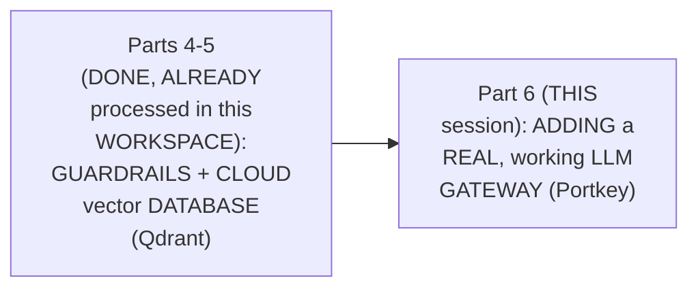

#### 🎯 Key Takeaways

* THIS session is GENUINELY, DIRECTLY confirmed AS the SERIES' own, DIRECTLY-promised NEXT step — FULFILLING the "LLM gateways" PROMISE first made BACK in Part 4.
* THE session's OWN, stated GOAL directly, EXPLICITLY confirms GATEWAYS as "the MOST awaited TOPIC" — MAKING the application GENUINELY "ROBUST... reliable" and TRUST-worthy.
* This directly, PRECISELY sets UP the SESSION's own, NEXT, essential CONTENT — PRECISELY why a GATEWAY is genuinely a FORM of LLM security (Section 2).

---

### 2. Gateway as LLM Security: Why Multi-LLM Workflows Genuinely Need It

#### 📖 Definition — Gateway as a Genuine Form of LLM Security

> 💡 **Given directly:** *"Gateway is a form of LLM security. Please never forget that. Why is it a form of LLM security? Because earlier you used to use only one LLM in your workflow. But with the rise of agentic AI, now you use more than one LLMs in your different workflows."*

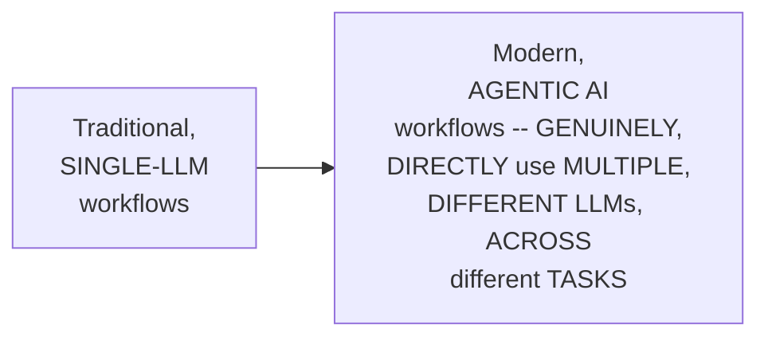

#### 🔍 Internal Working — A Genuine, Precise Explanation of the Resulting, Real Concerns

> 💡 **Given directly:** *"Because we are using both of these different services, we have to manage their API keys... we also want to see how much cost we are getting from each LLM... we also want to see who is faster, who is not giving us a lot of complaints, who is giving the user queries fast, which is the most cost-friendly."*

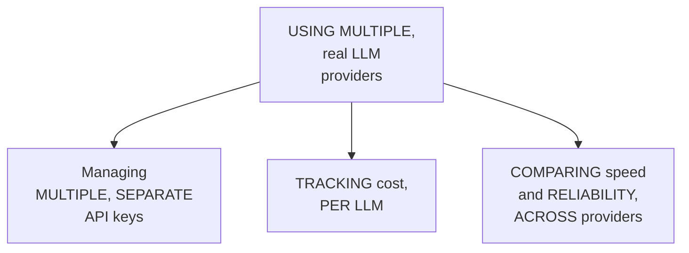

#### ⚠ Common Mistakes

* Assuming "LLM SECURITY" genuinely, DIRECTLY refers ONLY to PREVENTING malicious USER input/output (LIKE guardrails, PER Part 4) — explicitly, directly, PRECISELY clarified: a GATEWAY is ALSO, genuinely, a FORM of LLM security — SPECIFICALLY addressing the REAL, operational challenges OF managing MULTIPLE, real LLM PROVIDERS.

#### 🎯 Key Takeaways

* A GATEWAY is directly, EXPLICITLY confirmed AS "a FORM of LLM SECURITY" — a GENUINE, direct RESPONSE to the RISE of MULTI-LLM, agentic WORKFLOWS.
* USING MULTIPLE, real LLM providers GENUINELY, DIRECTLY introduces THREE, real CONCERNS: managing MULTIPLE api KEYS, tracking COST per LLM, and COMPARING speed/RELIABILITY.
* This directly, PRECISELY sets UP the SESSION's own, NEXT, essential CONTENT — the GENUINE, real PROBLEM of single-PROVIDER dependency, and ITS own, established SOLUTION (Section 3).

---
### 3. The Genuine, Real Problem: Single-Provider Dependency & Fallback Logic

#### 🪜 Step-by-Step — A Complete, Real, Worked Example

> 💡 **Given directly:** *"This is the user, this is us, programmers, we are trying to use OpenAI LLM into our application. What if that particular day, or for some particular amount of time, OpenAI is not working? Because we were only dependent upon OpenAI, our program is stuck."*

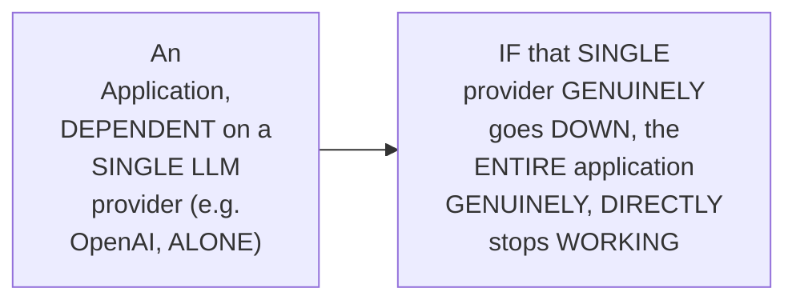

#### 📖 Definition — Fallback Logic & Model Routing, Precisely Introduced

> 💡 **Given directly:** *"Do we have a backup plan in this scenario?... people used to write something called fallback logics. I'm going to write another synonym with this particular word, model routing... if this particular road is not open, go to another route. This is the main feature which LLM gateways gives us."*

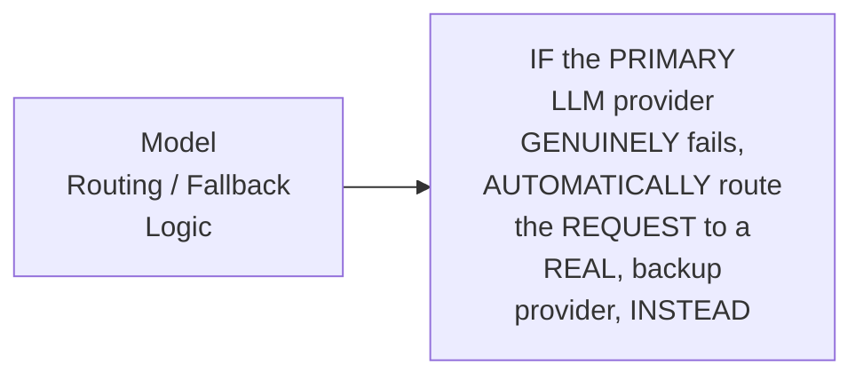

#### ⚠ Common Mistakes

* Assuming "GATEWAYS" and "FALLBACK logic"/"model ROUTING" are GENUINELY, entirely DIFFERENT, separate CONCEPTS — explicitly, directly, PRECISELY clarified: fallback LOGIC/model ROUTING is DIRECTLY confirmed AS "THE main FEATURE which LLM GATEWAYS gives US" — a GATEWAY is, IN large part, a MODERN, packaged SOLUTION to a PROBLEM engineers USED to solve MANUALLY, via CUSTOM code.

#### 🎯 Key Takeaways

* A COMPLETE, real, WORKED example directly, CONCRETELY illustrates the CORE problem — an APPLICATION genuinely, DIRECTLY dependent ON a SINGLE LLM provider GENUINELY, STRUCTURALLY stops WORKING, IF that provider EVER fails.
* **FALLBACK logic** (ALSO called **model ROUTING**) is precisely INTRODUCED as the ESTABLISHED solution — AUTOMATICALLY routing REQUESTS to a REAL, backup PROVIDER, if the PRIMARY one FAILS.
* This directly, PRECISELY sets UP the SESSION's own, NEXT, essential CONTENT — Portkey, precisely INTRODUCED as a REAL, specific GATEWAY implementation (Section 4).

---

### 4. Portkey, Precisely Introduced: A Genuine "Keychain" for LLM API Keys

#### 📖 Definition — Portkey, Precisely Introduced

> 💡 **Given directly:** *"Portkey is the most feature-complete gateway. It gives us all the features you name it — coding assistance, enterprise agents, co-pilots, SAAS agents, browser agents, databases, 3,000 plus LLMs."*

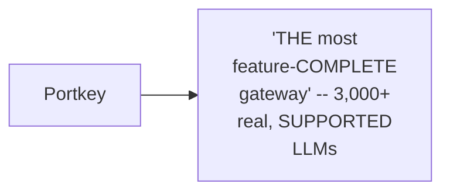

#### 🔍 Internal Working — A Genuine, Memorable Analogy

> 💡 **Given directly:** *"There are many API keys which you have to manage if you have multiple models... won't that be a good thing if you bound them to a key chain? This is Portkey. The keychain of your LLM applications."*

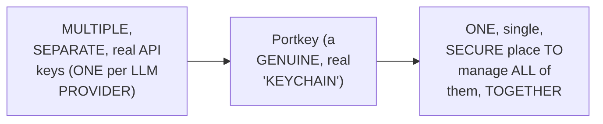

#### ⚠ Common Mistakes

* Assuming a GATEWAY GENUINELY, MERELY provides "MORE LLM options" — explicitly, directly, MEMORABLY reframed: it GENUINELY, DIRECTLY solves the REAL, practical PROBLEM of managing MULTIPLE, separate API KEYS — a "KEYCHAIN," CONSOLIDATING them INTO one, SECURE place.

#### 🎯 Key Takeaways

* **PORTKEY** is precisely INTRODUCED as "THE most feature-COMPLETE gateway" — SUPPORTING over 3,000, real LLM PROVIDERS.
* A GENUINE, memorable ANALOGY (a "KEYCHAIN") directly, CONCRETELY illustrates Portkey's OWN, core VALUE — CONSOLIDATING multiple, SEPARATE API keys INTO one, SECURE, MANAGED place.
* This directly, PRECISELY sets UP the SESSION's own, NEXT, essential CONTENT — ADDITIONAL, real gateway BENEFITS beyond FALLBACK alone (Section 5).

---
### 5. Additional Gateway Benefits: Security, Authorization & Load Balancing

#### 📖 Definition — Security & Authorization

> 💡 **Given directly:** *"Gateway gives us security... this is the another concern or advantage of gateway. Gives us authorization, which means, are you even allowed to enter through this gate? Are you a hacker, or are you a suspicious link? Are you even allowed to enter this link?"*

#### 📖 Definition — Load Balancing

> 💡 **Given directly:** *"Load balancing, which means... if OpenAI has a lot of load, [another provider] will take care of it, and if both of these have a lot of load, Grok will take care of it."*

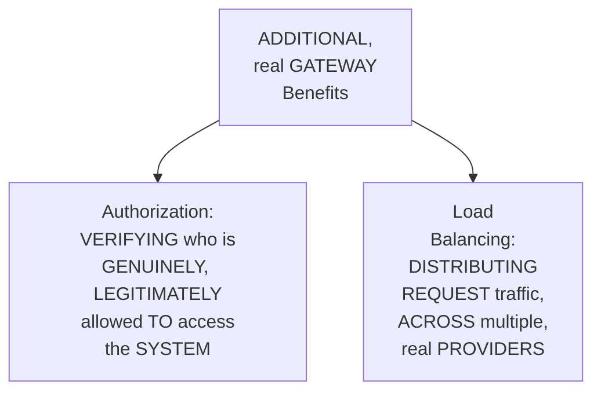

#### ⚠ Common Mistakes

* Assuming a GATEWAY's own, real VALUE is GENUINELY, ENTIRELY limited TO fallback/model-ROUTING alone — explicitly, directly, ADDITIONALLY confirmed: it ALSO, genuinely PROVIDES real AUTHORIZATION (verifying LEGITIMATE access) and LOAD balancing (DISTRIBUTING traffic ACROSS providers) — a GENUINELY, more COMPREHENSIVE set OF capabilities.

#### 🎯 Key Takeaways

* A GATEWAY GENUINELY, DIRECTLY provides **AUTHORIZATION** — verifying WHETHER a GIVEN request is GENUINELY, legitimately ALLOWED to access the SYSTEM.
* A GATEWAY GENUINELY, DIRECTLY provides **LOAD balancing** — DISTRIBUTING request TRAFFIC across MULTIPLE, real PROVIDERS, PREVENTING any, SINGLE provider FROM becoming overwhelmed.
* This directly, PRECISELY sets UP the SESSION's own, CORE, hands-ON content — SETTING up a REAL, working Portkey ACCOUNT (Section 6).

---

### 6. Setting Up Portkey: Account, API Key & Configuration

#### 🪜 Step-by-Step — The Complete, Real Setup Process

> 💡 **Given directly:** *"I'm just going to sign in because we are going to use Portkey in our application... the moment it opens, it's going to give you an API key which you can copy... we are going to go to our env, and we are going to add LLM gateway, Portkey AI is what we are going to use, and I'm going to write Portkey API key."*

```env
PORTKEY_API_KEY=your-key-here
```

#### 🪜 Step-by-Step — Updating requirements.txt

> 💡 **Given directly:** *"I'm going to open my requirements, and I am simply going to add LLM gateways... I'm going to add Portkey AI and Langchain OpenAI. Every gateway gives you an OpenAI-compatible request."*

```text
portkey-ai
langchain-openai
```

#### 🔍 Internal Working — A Genuine, Direct Confirmation: Adding to config.py

> 💡 **Given directly:** *"You don't need this right now, because your Portkey is maintaining this... even if I remove it, my system will work, but let us keep it for now. And here I will add gateway... I simply have to pull up my API key."*

```python
# config.py -- addition
PORTKEY_API_KEY = os.getenv("PORTKEY_API_KEY")
```

#### ⚠ Common Mistakes

* Assuming the ORIGINAL, EXISTING `GROQ_API_key` variable (WITHIN `config.PY`) genuinely, DIRECTLY needs to be REMOVED, once a GATEWAY is ADOPTED — explicitly, directly, HONESTLY clarified: "EVEN if I REMOVE it, MY system WILL work" — but it's INTENTIONALLY LEFT in PLACE, SINCE a SEPARATE, guardrails-specific LLM (per Part 4) STILL, genuinely USES it DIRECTLY, at THIS point in the SERIES.

#### 🎯 Key Takeaways

* SETTING up PORTKEY directly, CONCRETELY requires CREATING a REAL account and OBTAINING a REAL API KEY — ADDED to BOTH `.env` and `config.PY`.
* THE `requirements.TXT` update directly, CONCRETELY adds `PORTKEY-ai` and `LANGCHAIN-openai` — a GENUINE, direct HINT toward the SESSION's own, UPCOMING "OpenAI-compatible" CONCEPT.
* This directly, PRECISELY sets UP the SESSION's own, NEXT, essential CONCEPT — "SLUG," a REAL, Portkey-specific TERM for a MANAGED, named API-key REFERENCE (Section 7).

---
### 7. "Slug," Precisely Explained: A Managed Reference to an Underlying Key

#### 📖 Definition — Slug, Precisely Explained

> 💡 **Given directly:** *"Slug is a manager. The gateway has given us this manager, that hey, I'm giving you someone whom you can trust with your keys, and he will give you a way to access it securely, and he will manage everything... use this particular word to access any model."*

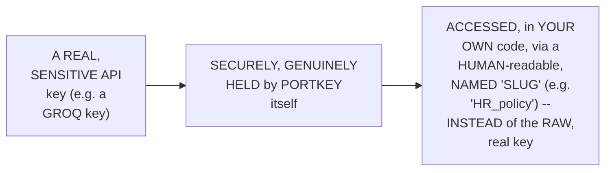

#### 🪜 Step-by-Step — A Complete, Real, Live Demonstration

> 💡 **Given directly:** *"I will go here and I will choose Grok... it is telling me which LLM do you have? I will say, hey, I have Grok. What is the name? I will just simply give some another name, for example, HR policy... you have to enter the API key."*

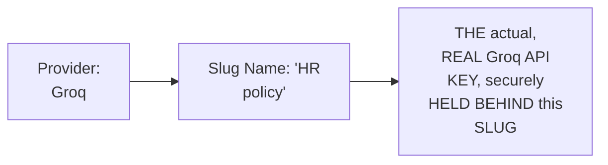

#### ⚠ Common Mistakes

* Assuming a "SLUG" is GENUINELY, MERELY a COSMETIC, arbitrary LABEL — explicitly, directly, PRECISELY clarified: it's a GENUINE, real, FUNCTIONAL reference — YOUR application's OWN code GENUINELY, DIRECTLY uses THIS named slug TO access the model, NEVER seeing OR handling the RAW, underlying API key DIRECTLY.

#### 🎯 Key Takeaways

* **"SLUG"** is precisely EXPLAINED as a REAL, Portkey-specific CONCEPT — a NAMED, human-READABLE reference (e.g., "HR_policy") that SECURELY, GENUINELY manages an UNDERLYING, real API key, ON your BEHALF.
* A COMPLETE, real, LIVE demonstration directly, CONCRETELY confirmed CREATING a REAL slug — CHOOSING a PROVIDER (GROQ), naming it ("HR POLICY"), and PROVIDING the REAL, underlying API KEY, ONE time.
* This directly, PRECISELY sets UP the SESSION's own, NEXT, essential VERIFICATION — a COMPLETE, real, LIVE-confirmed TEST of this NEWLY-created slug, ACROSS multiple MODELS (Section 8).

---

### 8. A Complete, Real, Live-Confirmed Demonstration: Testing Models via Portkey

#### 🪜 Step-by-Step — A Complete, Real, Live Test

> 💡 **Given directly:** *"I can just simply select any model, let us say DeepSeek, and I will run test query, is it working? It is giving error, that hey, DeepSeek, we are not using DeepSeek anymore, so I will choose something else... let us say GPT-OSS 20 billion, because this is working, I know, I will just run test query, and this time we will get some response."*

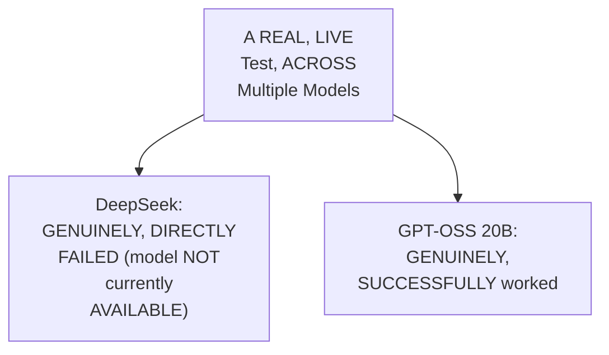

#### ⚠ A Direct, Honest, Live-Encountered Observation

> 💡 **Given directly:** *"I don't know which model is working right now, right? So I can just simply select any model... you have to see which models are working, because models are updated, right?"*

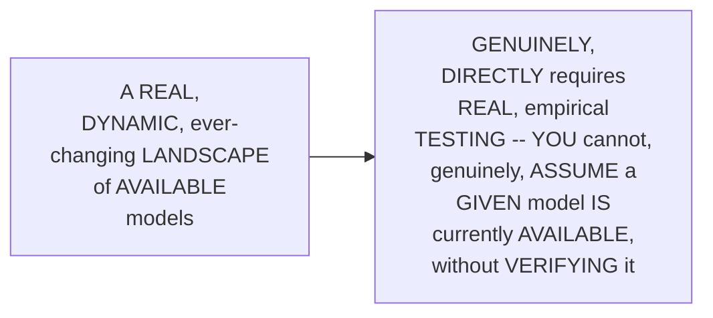

#### ⚠ Common Mistakes

* Assuming a SPECIFIC, real MODEL name (e.g., "DEEPSEEK") is GENUINELY, PERMANENTLY guaranteed to REMAIN available, WITHIN a GIVEN gateway's OWN, model CATALOG — explicitly, directly, HONESTLY demonstrated as GENUINELY, PRACTICALLY unreliable — REAL, live TESTING is GENUINELY, DIRECTLY required, to CONFIRM current AVAILABILITY.

#### 🎯 Key Takeaways

* A COMPLETE, real, LIVE test directly, CONCRETELY confirmed TESTING multiple, DIFFERENT models VIA the SAME, established SLUG — DeepSeek GENUINELY, DIRECTLY failed; GPT-OSS 20B GENUINELY, SUCCESSFULLY worked.
* THE instructor **directly, HONESTLY acknowledges** a REAL, dynamic MODEL landscape — REQUIRING genuine, EMPIRICAL testing, RATHER than ASSUMING a SPECIFIC model REMAINS permanently AVAILABLE.
* This directly, PRECISELY sets UP the SESSION's own, NEXT, essential CONTENT — CREATING a SECOND, real, BACKUP slug (Section 9).

---
### 9. Creating a Second, Backup Slug

#### 🪜 Step-by-Step — A Complete, Real, Backup Slug Creation

> 💡 **Given directly:** *"I'm making a backup LLM, because if one key is not working, other key will work. In a real case scenario, you actually use different LLMs, rather different services of LLMs... what we are going to do, we are going to create an API key backup key, which means if one Grok key is not working, use this particular key."*

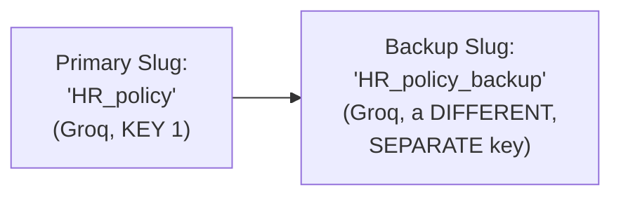

#### ⚠ A Direct, Honest, Important Caveat

> 💡 **Given directly:** *"Because this is a free service we are using Grok, but in a real scenario, you actually use different LLMs, rather different services of LLMs."*

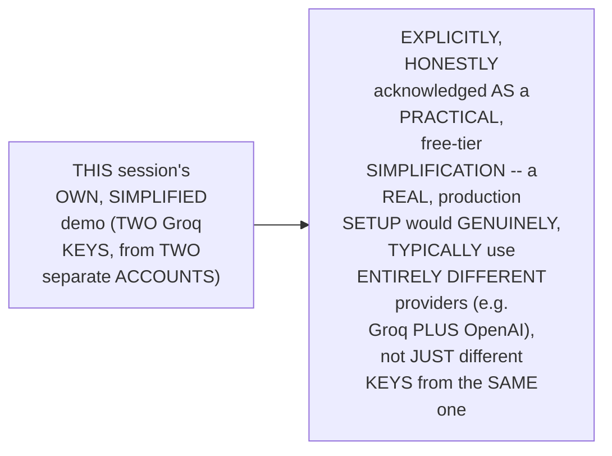

#### ⚠ Common Mistakes

* Assuming THIS session's own, SPECIFIC demo (TWO separate GROQ keys, AS "primary" AND "backup") REPRESENTS the GENUINELY, IDEAL, real-world FALLBACK strategy — explicitly, directly, HONESTLY clarified: it's a PRACTICAL, free-TIER simplification — a REAL, production DEPLOYMENT would GENUINELY, TYPICALLY use ENTIRELY different, DIVERSE providers, NOT merely different KEYS from the SAME, single provider.

#### 🎯 Key Takeaways

* A COMPLETE, real BACKUP slug ("HR_policy_backup") directly, CONCRETELY confirmed CREATING a SECOND, real slug — USING a DIFFERENT, SEPARATE Groq API key.
* THE instructor **directly, HONESTLY acknowledges** THIS specific setup (TWO Groq keys) is a PRACTICAL, free-TIER simplification — a REAL, production SETUP would GENUINELY, TYPICALLY use ENTIRELY different LLM PROVIDERS as its REAL, primary/backup PAIR.
* This directly, PRECISELY sets UP the SESSION's own, NEXT, essential CONTENT — a GENUINE, real demonstration OF Portkey's own, COMPLETE analytics DASHBOARD (Section 10).

---

### 10. Portkey's Own, Real Analytics Dashboard

#### 🪜 Step-by-Step — A Complete, Real, Live-Confirmed Dashboard Review

> 💡 **Given directly:** *"In analytics we will be able to see that currently this particular account which I have used, here we have invested 2 cents, and these are both the models we have used... we have made seven requests, out of seven, three are failed and four are passed. So we are able to have complete tracking of how our system is behaving."*

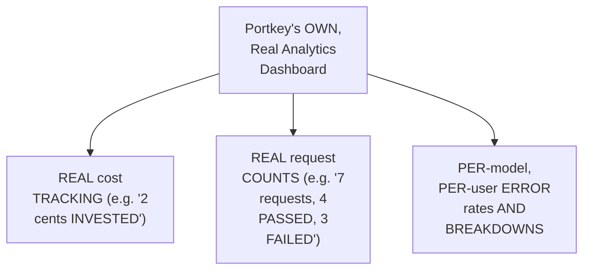

#### 🔍 Internal Working — A Genuine, Direct Confirmation: Team-Level Visibility

> 💡 **Given directly:** *"Let us say we have given two keys to two different teams, we can see which team is giving us how much cost. If you go to users, so from users we can filter it as well."*

#### ⚠ Common Mistakes

* Assuming a REAL, gateway-provided ANALYTICS dashboard is GENUINELY, MERELY a "NICE-to-have" convenience — explicitly, directly, PRACTICALLY demonstrated as GENUINELY, DIRECTLY valuable — ENABLING real, PER-team cost ATTRIBUTION, error-RATE monitoring, and COMPLETE, real REQUEST-level traceability.

#### 🎯 Key Takeaways

* A COMPLETE, real, LIVE-confirmed DASHBOARD review directly, CONCRETELY demonstrated Portkey's OWN, genuine ANALYTICS capabilities — REAL cost tracking, REQUEST counts, and PER-model ERROR rates.
* THIS analytics CAPABILITY directly, ADDITIONALLY supports TEAM-level visibility — ENABLING an ORGANIZATION to SEE which, SPECIFIC team is GENUINELY, DIRECTLY generating WHICH, real COSTS.
* This directly, PRECISELY sets UP the SESSION's own, NEXT, essential CONCEPT — "OPENAI-compatible" requests, a GENUINELY foundational, industry-WIDE concept (Section 11).

---
### 11. "OpenAI-Compatible," Precisely Explained: A Genuinely Foundational Concept

#### 📖 Definition — Why This Concept Genuinely Matters

> 💡 **Given directly:** *"OpenAI was kind of the first into this LLM game. OpenAI had released their SDK, software development kit, which means, hey, OpenAI, use our LLMs... everyone learned from OpenAI, and everyone got used to this OpenAI kind of request body."*

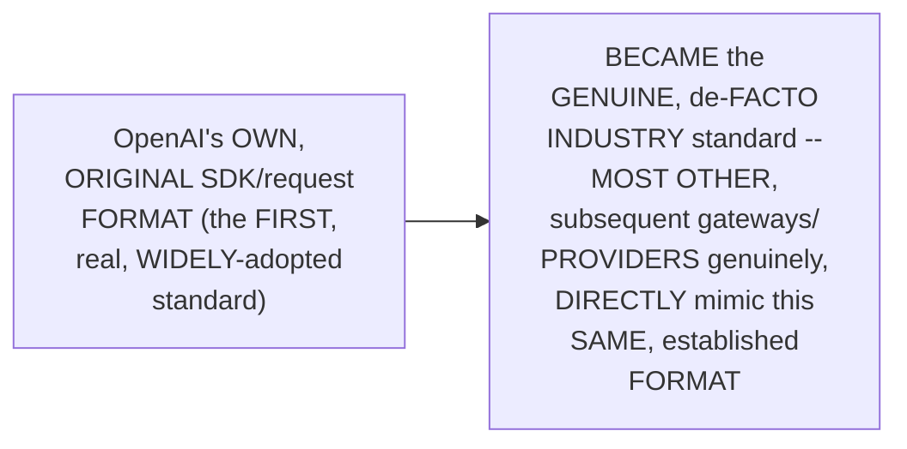

#### 🔍 Internal Working — The Complete, Precise Request Body Structure

> 💡 **Given directly:** *"You first have to write your model name. In this you have to give your model name, and what is the message you are passing... this is similar to LangChain... invoke messages, we are passing that, hey, I'm a user, and this is what I'm passing. So this is the OpenAI-compatible way."*

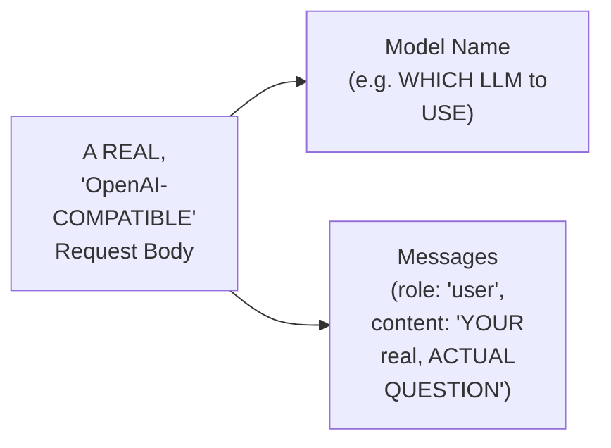

#### 📖 Definition — A Genuine, Memorable Analogy: A Gift, With a Sender Label

> 💡 **Given directly:** *"Let us say you are giving this body as a gift to someone. Hey, take my gift. On top of gift you are writing sender, who is the sender? ...and secondly you are saying that, hey, I am allowed to send this particular gift to you, that is your API key, and this is nothing but headers."*

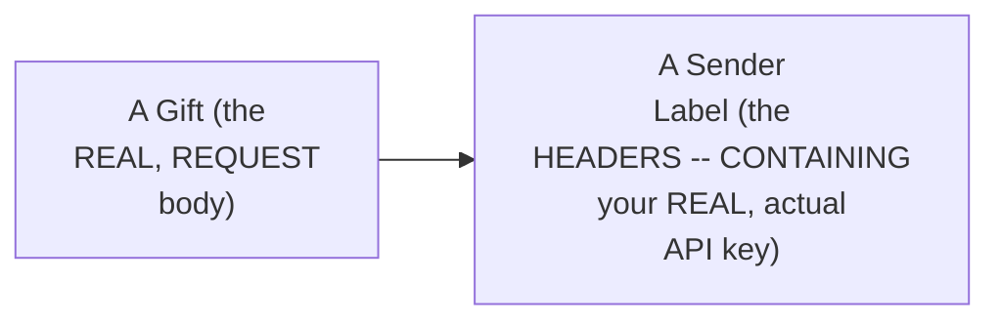

#### ⚠ Common Mistakes

* Assuming a REQUEST's own "BODY" and its "HEADERS" are GENUINELY, INTERCHANGEABLE, or SERVE the SAME, real PURPOSE — explicitly, directly, MEMORABLY distinguished: the BODY carries the ACTUAL, real CONTENT (the model NAME, the MESSAGES); the HEADERS carry the AUTHORIZATION/ACCESS credentials (the API KEY) — TWO, genuinely SEPARATE, complementary PARTS of the SAME, real REQUEST.

#### 🎯 Key Takeaways

* **"OPENAI-compatible"** is precisely EXPLAINED as a GENUINELY foundational, INDUSTRY-wide concept — OpenAI's OWN, original REQUEST format BECAME the de-FACTO standard, WIDELY mimicked BY subsequent gateways AND providers.
* THE complete, PRECISE request-BODY structure directly, CONCRETELY consists OF a **MODEL name** and **MESSAGES** (ROLE plus content) — a FORMAT DIRECTLY, MEMORABLY comparable TO LangChain's OWN, already-familiar INVOCATION pattern.
* A GENUINE, memorable ANALOGY (a GIFT, with a SENDER label) directly, CONCRETELY distinguishes the REQUEST's own **BODY** (the ACTUAL content) from its **HEADERS** (the AUTHORIZATION/API-key CREDENTIALS).
* This directly, PRECISELY sets UP the SESSION's own, CORE, hands-ON content — BUILDING `gateway.PY`, USING this SAME, "OpenAI-COMPATIBLE" pattern (Section 12).

---

### 12. Building gateway.py: Primary & Fallback Targets, and the Gateway Config

#### 🪜 Step-by-Step — Defining Primary & Fallback Targets

> 💡 **Given directly:** *"Primary target means my main model, my main application model... provider, here we have to write HR policy, because this was our slug... fallback target, if this model doesn't work, do I have another model? Yes, I have another model, this name will be HR policy backup."*

```python
# gateway.py
primary_target = {"provider": "HR_policy", "override_params": {"model": config.LLM_MODEL_NAME}}
fallback_target = {"provider": "HR_policy_backup", "override_params": {"model": "openai/gpt-oss-20b"}}
```

#### 🪜 Step-by-Step — The Complete, Real Gateway Configuration

> 💡 **Given directly:** *"I want to use some feature of Portkey, and my strategy is going to be fallback... targets, who are going to be my targets? My two targets are going to be primary target and fallback target. This will be a list of models."*

```python
gateway_config = {
    "strategy": {"mode": "fallback"},
    "targets": [primary_target, fallback_target]
}
```

#### 🪜 Step-by-Step — The Complete, Real get_gateway_llm() Function

> 💡 **Given directly:** *"Chat OpenAI, it's asking the API key, and it is asking the gateway URL, and it is asking for headers... this is a dummy key... because we will pass our API key in the headers."*

```python
from langchain_openai import ChatOpenAI
from portkey_ai import createHeaders, PORTKEY_GATEWAY_URL
from hr_assistant import config
from hr_assistant.logger import get_logger

logger = get_logger(__name__)

def get_gateway_llm():
    """Route the LLM through the Portkey gateway."""
    logger.info("Initializing LLM via Portkey")
    return ChatOpenAI(
        api_key="dummy",
        base_url=PORTKEY_GATEWAY_URL,
        default_headers=createHeaders(
            api_key=config.PORTKEY_API_KEY,
            config=gateway_config
        )
    )
```

#### ⚠ Common Mistakes

* Assuming `ChatOpenAI`'s own, REQUIRED `api_key` PARAMETER genuinely, DIRECTLY needs a REAL, valid OpenAI KEY, when USED with a GATEWAY — explicitly, directly, PRECISELY clarified: it's DELIBERATELY a "DUMMY" value — the REAL, actual AUTHENTICATION happens VIA the HEADERS, INSTEAD (per Section 11's own established, "GIFT plus sender LABEL" analogy).

#### 🎯 Key Takeaways

* THE complete, real `gateway.PY` directly, CONCRETELY defines a **PRIMARY target** and a **FALLBACK target** — EACH referencing a REAL, established SLUG (per Section 7).
* A **GATEWAY config** (a REAL, Python DICTIONARY) directly, PRECISELY specifies the FALLBACK "STRATEGY" and the TWO, real TARGETS.
* **`get_GATEWAY_llm()`** directly, CONCRETELY uses `ChatOpenAI` (SINCE Portkey is "OpenAI-COMPATIBLE," per Section 11) — WITH a "DUMMY" API key, and the REAL, actual AUTHENTICATION passed VIA `createHEADERS()`.

---
### 13. Updating llm.py: A Genuine, Practical Demonstration of Modular Coding's Benefit

#### 🪜 Step-by-Step — The Complete, Real, Minimal Update

> 💡 **Given directly:** *"Earlier LLM we were using ChatGrok. This time we don't want to use ChatGrok, this time we want to use Portkey, because Portkey will use ChatGrok. So I will remove this line literally, and I will write from HR assistant.gateway, import gateway_llm."*

```python
# llm.py -- updated
from hr_assistant.gateway import get_gateway_llm

def get_llm():
    """Initializing LLM via Portkey."""
    return get_gateway_llm()
```

#### 🔍 Internal Working — A Genuine, Direct Confirmation: Zero Changes to pipeline.py

> 💡 **Given directly:** *"Wherever the pipeline block was, we fixed that pipeline, we don't have to touch the entire pipeline. We simply added a new part, and we integrated it so smoothly that in this pipeline we don't have to edit anything, because we have developed it in the backend. Nothing changed over here. Code is the same. This is the beauty of modular coding."*

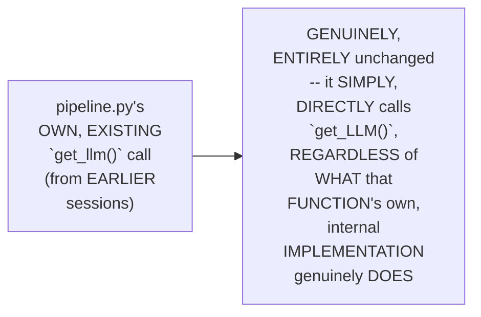

#### ⚠ Common Mistakes

* Assuming a MAJOR, architectural CHANGE (LIKE routing ALL LLM calls THROUGH a NEW gateway) genuinely, PRACTICALLY requires MODIFYING every, real FILE that GENUINELY, DIRECTLY uses an LLM — explicitly, directly, THOROUGHLY confirmed as GENUINELY, DIRECTLY unnecessary — ONLY `llm.PY` itself REQUIRED a CHANGE; `pipeline.PY` (and EVERYTHING calling `get_LLM()`) GENUINELY, ENTIRELY remained UNTOUCHED.

#### 🎯 Key Takeaways

* `llm.PY` was directly, CONCRETELY updated TO call the NEW `get_GATEWAY_llm()` function, INSTEAD of `ChatGROQ` directly.
* THE instructor **directly, EXPLICITLY confirms** `PIPELINE.py` genuinely, ENTIRELY required **ZERO changes** — a REAL, concrete DEMONSTRATION of "the BEAUTY of modular CODING," CONSISTENT with THIS same, structural BENEFIT ALREADY confirmed DURING Part 5's own, vector-STORE migration.
* This directly, PRECISELY sets UP the SESSION's own, NEXT, essential CONTENT — a GENUINE, additional mention OF further, real gateway FEATURES (Section 14).

---

### 14. A Genuine, Additional Mention: More Gateway Features (Retry, Timeout, Caching)

#### 🪜 Step-by-Step — A Direct, Genuine Mention

> 💡 **Given directly:** *"Gateways have a lot of features. Load balancing, model routing, caching... whenever you want to access any kind of feature... you have to write something called configuration."*

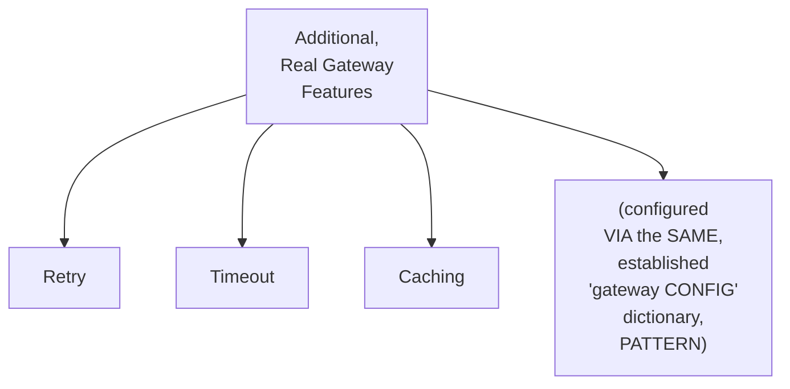

#### 🔍 Internal Working — A Genuine, Honest Demonstration of Using an AI Coding Assistant

> 💡 **Given directly:** *"You can only use AI when you know what is going on in the backend. Now this thing would have made sense... I wrote the core structure, and for the upper part, for enhancing part, I used AI."*

```mermaid
flowchart LR
    A["A GENUINE,<br/>foundational<br/>UNDERSTANDING (BUILT<br/>throughout THIS<br/>session)"] --> B["ENABLES:<br/>effectively USING an<br/>AI coding ASSISTANT<br/>to GENERATE a MORE<br/>complete, EXPANDED<br/>configuration --<br/>RATHER than<br/>BLINDLY copying<br/>UNEXPLAINED code"]
```

#### ⚠ Common Mistakes

* Assuming USING an AI coding ASSISTANT to GENERATE code is GENUINELY, ONLY appropriate ONCE a DEVELOPER already KNOWS how TO write it MANUALLY — explicitly, directly, PRECISELY reframed: it's a GENUINE, real, PRACTICAL workflow — BUILDING a FOUNDATIONAL, real UNDERSTANDING first (the CORE structure), THEN using AI TO efficiently EXPAND upon IT.

#### 🎯 Key Takeaways

* GATEWAYS genuinely, DIRECTLY support ADDITIONAL, real FEATURES beyond FALLBACK — INCLUDING **RETRY**, **timeout**, and **CACHING** — ALL configured VIA the SAME, established "GATEWAY config" DICTIONARY pattern.
* THE instructor **directly, HONESTLY demonstrates** a GENUINE, practical WORKFLOW — WRITING the CORE, foundational structure HIMSELF, THEN using an AI coding ASSISTANT to GENERATE a MORE complete, EXPANDED configuration.
* This directly, PRECISELY sets UP the SESSION's own, NEXT, essential VERIFICATION — a GENUINE, honest, LIVE-encountered error, and a COMPLETE, real, live-CONFIRMED success (Section 15).

---
### 15. A Genuine, Honest, Live-Encountered Error & a Complete, Real, Live-Confirmed Success

#### ⚠ A Direct, Honest, Live-Encountered Error

> 💡 **Given directly:** *"Vector store missing, vector store from documents, missing one requirement... let me hit this, let me see what it is showing over here on the app... it is telling you have error at this line, Qdrant vector store, it is telling there is some error over here, but last time I think it was working."*

```mermaid
flowchart LR
    A["A REAL,<br/>UNEXPECTED error,<br/>UNRELATED to THIS<br/>session's own,<br/>NEW gateway<br/>WORK"] --> B["HONESTLY,<br/>DIRECTLY<br/>investigated, LIVE<br/>-- LIKELY a MINOR,<br/>INCIDENTAL glitch"]
```

#### 🔍 Internal Working — A Genuine, Honest, Quick Resolution

> 💡 **Given directly:** *"While I was showing you this vector store, I might have clicked somewhere... let us rerun to see if it is working now... it is working, HR assistant is ready to take, initializing LLM via Portkey."*

#### 🪜 Step-by-Step — A Complete, Real, Live-Confirmed Success

> 💡 **Given directly:** *"I send a hi, it's going to tell me... how to make a coffee, so it's going to tell you that it's not going to help you. Tell me about leave policy, so all these things are going to be traced over here. Check this out, this is the Portkey cloud, we have received new requests."*

```mermaid
sequenceDiagram
    participant User
    participant App as Streamlit App<br/>(Gateway-routed)
    participant Portkey as Portkey<br/>Gateway
    participant Groq
    User->>App: A REAL, test<br/>QUESTION
    App->>Portkey: ROUTES the REQUEST<br/>THROUGH the gateway
    Portkey->>Groq: FORWARDS to the<br/>PRIMARY (OR fallback)<br/>SLUG
    Groq-->>Portkey: Returns a REAL<br/>response
    Portkey-->>App: Returns the SAME,<br/>real RESPONSE,<br/>NOW fully TRACED
```

#### 🔍 Internal Working — A Genuine, Direct, Complete Traceability Confirmation

> 💡 **Given directly:** *"If I go to the logs, I will be able to see that... this request, you are HR friendly assistant, tell me about the leave policy, it used the tool, it retrieved, search HR policy is the tool... how much was the cost, which user made this request, what was the response — complete traceability."*

#### ⚠ Common Mistakes

* Assuming a REAL error ENCOUNTERED, DURING a SPECIFIC feature's OWN, live DEMONSTRATION (LIKE the GATEWAY, here), is GENUINELY, DIRECTLY caused by THAT same, NEW feature — explicitly, directly, HONESTLY clarified: this SPECIFIC error was GENUINELY, DIRECTLY unrelated TO the gateway WORK — a REAL, incidental GLITCH, quickly RESOLVED.

#### 🎯 Key Takeaways

* A GENUINE, honest, LIVE-encountered ERROR (VECTOR-store related) was directly, HONESTLY investigated and QUICKLY resolved — CONFIRMED as GENUINELY, DIRECTLY unrelated TO the session's OWN, new gateway WORK.
* A COMPLETE, real, LIVE-confirmed SUCCESS directly, CONCRETELY validated the ENTIRE, established GATEWAY integration — REAL, live REQUESTS genuinely, SUCCESSFULLY routed THROUGH Portkey, TO the underlying GROQ provider.
* A GENUINE, complete TRACEABILITY confirmation directly, CONCRETELY confirmed Portkey's OWN, real LOGS capture the FULL, end-to-END interaction — QUESTION, tool USAGE, cost, and RESPONSE.

---

### 16. A Genuine, Direct, Two-Part Assignment

#### 🪜 Step-by-Step — Assignment Part 1: Route the Guardrails Model Through Portkey, Too

> 💡 **Given directly:** *"We have used LLM in two places. One is for using it from Portkey, or using it for HR assistant. Second LLM which we have used is in guardrails... we have not, we can also use gateway Portkey gateway for this part. This will be an assignment. You will use Portkey gateway to replace ChatGrok from guard LLM."*

```mermaid
flowchart LR
    A["THE main,<br/>PRIMARY LLM<br/>(HR_assistant)"] --> B["ALREADY, genuinely<br/>ROUTED through<br/>PORTKEY (THIS<br/>session's own,<br/>MAIN work)"]
    C["THE SEPARATE,<br/>GUARDRAILS LLM<br/>(from Part 4)"] --> D["STILL, genuinely<br/>using `ChatGrok`<br/>DIRECTLY -- the<br/>ASSIGNMENT: route<br/>THIS one, TOO"]
```

#### 🪜 Step-by-Step — Assignment Part 2: Explore LangSmith's Own, Native Gateway

> 💡 **Given directly:** *"Recently, LangChain has also giving a way to use... or LangSmith is also giving a way to use gateway. This is going to be your assignment. You will try to do gateways... use LangSmith gateway... if you are not able to do it, no problem, at least use Portkey."*

```mermaid
flowchart LR
    A["Portkey (a<br/>THIRD-party<br/>GATEWAY, USED<br/>THROUGHOUT this<br/>session)"] --> B["An ALTERNATIVE,<br/>ASSIGNMENT<br/>OPTION: LangSmith's<br/>OWN, NATIVE gateway<br/>FEATURE"]
```

#### ⚠ Common Mistakes

* Assuming THIS session's own, MAIN gateway WORK genuinely, COMPLETELY covers EVERY, real LLM CALL within the ENTIRE application — explicitly, directly, HONESTLY clarified: the SEPARATE, GUARDRAILS-specific LLM (per Part 4) GENUINELY, STILL uses `ChatGROQ` directly — a REAL, remaining GAP, EXPLICITLY assigned AS practice.

#### 🎯 Key Takeaways

* A GENUINE, complete ASSIGNMENT directly, EXPLICITLY requires TWO, distinct TASKS: **(1)** route the SEPARATE, guardrails-SPECIFIC LLM (STILL using ChatGROQ directly) THROUGH Portkey, TOO; and **(2)** EXPLORE LangSmith's OWN, native GATEWAY feature, AS an ALTERNATIVE.
* THE instructor **directly, ENCOURAGINGLY confirms** COMPLETING at LEAST the FIRST, Portkey-based TASK is GENUINELY sufficient — "IF you are NOT able TO do it, NO problem... at LEAST use PORTKEY."
* This directly, PRECISELY sets UP the SESSION's own, FINAL, closing CONTENT — a DIRECT preview OF the SERIES' own, REMAINING roadmap (Section 17).

---
### 17. Closing: A Direct Preview of the Remaining Roadmap

#### 🪜 Step-by-Step — A Direct, Genuine, Final Preview

> 💡 **Given directly:** *"We have successfully learned LLM gateways, we have integrated Portkey AI gateway into our application... see you in the further videos where we are going to take this to next level, we are going to learn LLM evaluations, we are going to take this to cloud deployment, we are going to also understand about AI governance."*

```mermaid
flowchart LR
    A["THIS session<br/>(Part 6, DONE): a<br/>COMPLETE, real<br/>GATEWAY<br/>integration<br/>(Portkey)"] --> B["A FUTURE session,<br/>EXPLICITLY, DIRECTLY<br/>promised: LLM<br/>EVALUATIONS"]
    B --> C["A FUTURE<br/>session: CLOUD<br/>deployment"]
    C --> D["A FUTURE<br/>session: AI<br/>governance"]
```

#### ⚠ Common Mistakes

* Assuming THIS session's own, COMPLETE gateway WORK represents the FINAL, complete SCOPE of the SERIES' own, established, remaining ROADMAP — explicitly, directly, DIRECTLY confirmed AS ONLY the LATEST STEP — THREE, additional, FUTURE topics REMAIN, explicitly PROMISED: EVALUATIONS, cloud DEPLOYMENT, and AI GOVERNANCE.

#### 🎯 Key Takeaways

* This episode **GENUINELY, COMPREHENSIVELY delivers** its OWN, stated GOALS — a COMPLETE, real, WORKING LLM gateway INTEGRATION (via PORTKEY), FULFILLING the SERIES' own, direct PROMISE from Part 4.
* THE instructor **directly, EXPLICITLY previews** the SERIES' own, REMAINING roadmap — **LLM evaluations**, **CLOUD deployment**, and **AI governance**.
* This directly, PRECISELY continues THIS series' own, established, PROGRESSIVE journey — DEVELOPMENT → observability → SECURITY (guardrails, GATEWAY) → cloud MIGRATION → (NEXT) evaluations → CLOUD deployment → AI governance.

---

## 📝 Glossary

| Term | Definition | Why It Matters |
|---|---|---|
| **LLM Gateway** | A layer routing requests to one or more LLM providers | Provides fallback, load balancing, and cost tracking |
| **Fallback Logic / Model Routing** | Automatically switching to a backup provider on failure | The core, historical problem gateways solve |
| **Portkey** | A feature-complete, real LLM gateway service | Used throughout this session's own implementation |
| **Slug** | A named, managed reference to an underlying API key | Lets code use models without ever handling raw keys |
| **OpenAI-Compatible** | Mimicking OpenAI's original request format | The de-facto industry standard most gateways follow |
| **Headers** | The authorization portion of a request | Carries the real API key; the body carries the content |

---

## 🔄 Revision Notes — One-Minute Revision

* This is Part 6, directly fulfilling the "LLM gateways" promise made back in Part 4 -- explicitly confirmed as "the most awaited topic" in this series.
* **Gateway as LLM security**: with the rise of agentic AI, applications genuinely use multiple LLMs across different workflows, creating real concerns -- managing multiple API keys, tracking cost per LLM, and comparing speed/reliability.
* **The genuine, real problem**: an application dependent on a single LLM provider genuinely stops working if that provider fails. The solution: fallback logic (also called model routing) -- automatically routing to a backup provider.
* **Portkey, precisely introduced**: "the most feature-complete gateway" (3,000+ LLMs), memorably compared to a "keychain" -- consolidating multiple, separate API keys into one, secure place.
* **Additional gateway benefits**: authorization (verifying legitimate access) and load balancing (distributing traffic across providers).
* **Setting up Portkey**: create an account, obtain an API key, add `portkey-ai` and `langchain-openai` to requirements.txt, and add the API key to both `.env` and `config.py`.
* **"Slug," precisely explained**: a named, human-readable reference (e.g., "HR_policy") that securely manages an underlying, real API key -- your code uses the slug's name, never handling the raw key directly.
* **A complete, live-confirmed demonstration**: testing multiple models via a created slug -- some genuinely fail (DeepSeek), others genuinely succeed (GPT-OSS 20B) -- confirming a dynamic model landscape requiring real, empirical testing.
* **A second, backup slug**: created using a different Groq key, with an honest caveat -- a real, production setup would typically use entirely different providers, not just different keys from the same one.
* **Portkey's own analytics dashboard**: real cost tracking, request counts, and per-model error rates, plus team-level cost attribution.
* **"OpenAI-compatible," precisely explained**: OpenAI's original SDK/request format became the de-facto industry standard -- most gateways mimic it. The request body contains the model name and messages; the headers (memorably compared to a gift's sender label) carry the real API key.
* **Building gateway.py**: defines a primary target and a fallback target (each referencing a real slug), a gateway config (specifying the fallback strategy), and `get_gateway_llm()` (using `ChatOpenAI` with a "dummy" API key, since real authentication happens via headers).
* **Updating llm.py**: minimal change -- swap `ChatGroq` for the new `get_gateway_llm()`. Zero changes required in `pipeline.py` -- a genuine, practical demonstration of this series' own, established modular architecture's real benefit.
* **A genuine, additional mention**: gateways support retry, timeout, and caching, all configured via the same gateway-config pattern -- demonstrated using an AI coding assistant to expand the configuration, after building foundational understanding first.
* **A genuine, honest, live-encountered error** (vector-store related, unrelated to the gateway work) was quickly investigated and resolved, followed by a complete, live-confirmed success -- real requests routed through Portkey, with complete traceability (question, tool usage, cost, response) visible on Portkey's own dashboard.
* **A genuine, two-part assignment**: (1) route the separate, guardrails-specific LLM (still using ChatGroq directly) through Portkey too; (2) explore LangSmith's own, native gateway feature, as an alternative.
* **Closing**: a direct preview of the remaining roadmap -- LLM evaluations, cloud deployment, and AI governance.

---

## 📋 Cheat Sheet

**The complete gateway architecture:**
```text
User -> App -> Portkey Gateway -> (Primary Slug -> Groq) or (Fallback Slug -> Groq/other)
```

**The complete requirements.txt additions:**
```text
portkey-ai
langchain-openai
```

**The complete gateway.py:**
```python
from langchain_openai import ChatOpenAI
from portkey_ai import createHeaders, PORTKEY_GATEWAY_URL
from hr_assistant import config

primary_target = {"provider": "HR_policy", "override_params": {"model": config.LLM_MODEL_NAME}}
fallback_target = {"provider": "HR_policy_backup", "override_params": {"model": "openai/gpt-oss-20b"}}

gateway_config = {
    "strategy": {"mode": "fallback"},
    "targets": [primary_target, fallback_target]
}

def get_gateway_llm():
    return ChatOpenAI(
        api_key="dummy",
        base_url=PORTKEY_GATEWAY_URL,
        default_headers=createHeaders(api_key=config.PORTKEY_API_KEY, config=gateway_config)
    )
```

**What genuinely didn't change:**
```text
pipeline.py -- zero changes. Only llm.py and the new gateway.py were touched.
```

**The 2-part assignment:**
```text
1. Route the guardrails LLM through Portkey too (still uses ChatGroq directly, currently)
2. Explore LangSmith's own, native gateway feature, as an alternative
```

---

## 🔥 Interview Questions & Answers

### 🟢 Beginner

**Q1.**

**Question:** Why is a gateway genuinely considered a form of LLM security?

**Answer:** It directly addresses the real, operational challenges of managing multiple LLM providers, which arise from modern, agentic AI workflows.

**Explanation:** Directly, explicitly stated.

**Why Interviewers Ask This:** The most basic, foundational gateway question.

**Possible Follow-up:** "Name three, specific concerns multi-LLM workflows genuinely introduce."

**Q2.**

**Question:** What is fallback logic (also called model routing)?

**Answer:** Automatically routing a request to a backup LLM provider, if the primary one genuinely fails.

**Explanation:** Directly, precisely explained.

**Why Interviewers Ask This:** Foundational, frequently-tested gateway terminology.

**Possible Follow-up:** "Is this a genuinely new concept, or a packaged solution to an older, manually-solved problem?"

**Q3.**

**Question:** What is a "slug," in Portkey's own terminology?

**Answer:** A named, managed reference to an underlying API key.

**Explanation:** Directly, explicitly confirmed.

**Why Interviewers Ask This:** Basic, essential, hands-on Portkey knowledge.

**Possible Follow-up:** "Does your code ever directly handle the raw, underlying API key, once a slug is set up?"

**Q4.**

**Question:** What does "OpenAI-compatible" genuinely mean?

**Answer:** Following OpenAI's original request format (model name + messages), which became the de-facto industry standard.

**Explanation:** Directly, precisely explained.

**Why Interviewers Ask This:** Tests genuine, foundational understanding of a widely-used industry convention.

**Possible Follow-up:** "What does the request body genuinely contain, versus the headers?"

**Q5.**

**Question:** In the request/headers analogy, what does the "sender label" (headers) genuinely carry?

**Answer:** The real, actual API key/authorization credential.

**Explanation:** Directly, precisely explained.

**Why Interviewers Ask This:** Tests genuine understanding of a memorable, foundational analogy.

**Possible Follow-up:** "What does the 'gift' itself (the body) genuinely carry, instead?"

**Q6.**

**Question:** Why is the `api_key` parameter passed to `ChatOpenAI` genuinely a "dummy" value, in this session's own gateway implementation?

**Answer:** Because the real, actual authentication happens via the headers, not this parameter.

**Explanation:** Directly, explicitly clarified.

**Why Interviewers Ask This:** Tests genuine, practical, hands-on gateway integration knowledge.

**Possible Follow-up:** "What function genuinely creates these headers?"

**Q7.**

**Question:** Did this session's own gateway integration require any changes to `pipeline.py`?

**Answer:** No -- zero changes were genuinely required.

**Explanation:** Directly, explicitly confirmed.

**Why Interviewers Ask This:** Tests genuine understanding of this series' own, established modular architecture's real benefit.

**Possible Follow-up:** "Which two files did genuinely require changes?"

**Q8.**

**Question:** Name three, additional gateway features (beyond fallback) mentioned in this session.

**Answer:** Retry, timeout, and caching.

**Explanation:** Directly, explicitly named.

**Why Interviewers Ask This:** Tests genuine, broader awareness of gateway capabilities.

**Possible Follow-up:** "How are these additional features genuinely configured?"

**Q9.**

**Question:** Was this session's own "primary vs. backup" setup (using two Groq keys) genuinely presented as the ideal, real-world fallback strategy?

**Answer:** No -- honestly acknowledged as a practical, free-tier simplification; real production setups typically use entirely different providers.

**Explanation:** Directly, honestly clarified.

**Why Interviewers Ask This:** Tests attention to this session's own, stated, honest caveat.

**Possible Follow-up:** "What would a more realistic, production fallback setup genuinely look like?"

**Q10.**

**Question:** What is this session's own, stated, two-part assignment?

**Answer:** (1) Route the separate, guardrails-specific LLM through Portkey too; (2) explore LangSmith's own, native gateway feature.

**Explanation:** Directly, explicitly stated.

**Why Interviewers Ask This:** Tests attention to this session's own, stated, practical next steps.

**Possible Follow-up:** "Which LLM, specifically, still used ChatGroq directly, at the end of this session?"

---
### 🟡 Intermediate

**Q11.**

**Question:** Explain why the instructor deliberately, live-tests multiple, different models via Portkey's own dashboard (Section 8), rather than simply stating "check the current model list" as an abstract instruction.

**Answer:** This is a genuinely deliberate, EVIDENCE-based teaching choice: by DIRECTLY, LIVE testing MULTIPLE models (DeepSeek, WHICH genuinely FAILED; GPT-OSS 20B, WHICH genuinely SUCCEEDED), the instructor CONCRETELY demonstrates a REAL, important OPERATIONAL truth — GATEWAY model CATALOGS genuinely, DIRECTLY change OVER time, and a DEVELOPER GENUINELY cannot, SAFELY assume ANY, specific model REMAINS permanently AVAILABLE, WITHOUT genuine, EMPIRICAL verification. THIS directly, PRACTICALLY models a GENUINE, transferable DEBUGGING habit — TEST, don't ASSUME — RATHER than PRESENTING this AS an ABSTRACT warning, WITHOUT a CONCRETE, real DEMONSTRATION of WHAT genuinely, PRACTICALLY happens WHEN this ASSUMPTION proves WRONG.

**Explanation:** Requires recognizing the deliberate, evidence-based value of live-testing multiple models to demonstrate a real, operational truth (models can genuinely become unavailable), rather than stating this as an abstract warning.

**Why Interviewers Ask This:** Tests whether a learner recognizes the pedagogical value of concrete, live demonstration over abstract instruction, for a genuinely operational, real-world concern.

**Possible Follow-up:** "Describe a GENUINE, real, PRACTICAL consequence a TEAM might FACE, if they GENUINELY, HARD-coded a SPECIFIC model NAME, WITHOUT this SAME, established AWARENESS."

**Q12.**

**Question:** A learner argues that since this session confirms Portkey provides a genuine "keychain" for managing multiple API keys, this means an application using Portkey no longer needs to secure its own, real `PORTKEY_API_KEY` itself, since Portkey is already handling security. Evaluate this claim.

**Answer:** This claim is GENUINELY, DIRECTLY incorrect, and CONFUSES TWO, genuinely DIFFERENT, SEPARATE security CONCERNS. Section 4's own PRECISE, established ANALOGY confirms PORTKEY genuinely, DIRECTLY secures the UNDERLYING LLM PROVIDER keys (e.g., the REAL Groq API key) — HIDING them BEHIND a NAMED "slug." HOWEVER, THIS does NOT, genuinely, ELIMINATE the SEPARATE, real NEED to SECURE the application's OWN `PORTKEY_API_KEY` itself (per Section 6's own established SETUP, ADDED to `.env`) — SINCE this KEY, ITSELF, genuinely GRANTS access TO the ENTIRE, gateway-MANAGED keychain — a COMPROMISED `PORTKEY_API_KEY` would GENUINELY, DIRECTLY expose EVERY, single UNDERLYING provider KEY it MANAGES. The ACCURATE, more PRECISE conclusion: Portkey GENUINELY, DIRECTLY solves the "MANAGING multiple PROVIDER keys" problem — but it CREATES a NEW, SINGLE, real point OF access (the `PORTKEY_API_KEY` itself) that GENUINELY, STILL requires the SAME, established SECURITY diligence (per THIS series' own, REPEATEDLY reinforced `.env`/`.gitignore` PRACTICES, from EARLIER sessions).

**Explanation:** Tests whether a learner recognizes that Portkey's own API key remains a genuine, separate security concern, distinct from the underlying provider keys it manages, since compromising it would expose the entire, managed keychain.

**Why Interviewers Ask This:** Distinguishes candidates who correctly understand layered security responsibilities from those who assume a security-focused tool eliminates all, further security considerations.

**Possible Follow-up:** "Describe a GENUINE, real, PRACTICAL consequence of a COMPROMISED `PORTKEY_API_KEY`, SPECIFICALLY, GIVEN this session's own established, KEYCHAIN analogy."

**Q13.**

**Question:** Explain, precisely, why the instructor deliberately walks through the "OpenAI-compatible" concept (Section 11) using a real ChatGPT conversation, demonstrating how a learner might independently research this concept, rather than simply defining it directly.

**Answer:** This is a genuinely deliberate, "MODEL the RESEARCH process" teaching choice: by DIRECTLY, LIVE demonstrating HOW he PERSONALLY would GO about LEARNING an UNFAMILIAR concept (ASKING an AI assistant TO "explain me THAT in simple WORDS with EXAMPLE... use a BLOCK of code"), the instructor is NOT merely TEACHING the specific CONCEPT ("OpenAI-compatible") — he's ALSO, genuinely, teaching a TRANSFERABLE, real research METHODOLOGY. THIS directly, CONSISTENTLY mirrors a PATTERN seen THROUGHOUT this ENTIRE series (e.g., PART 2's own, established "THE art of GOOGLING" reasoning) — REINFORCING that a GENUINE, transferable DEVELOPER skill is KNOWING how TO effectively LEARN new, unfamiliar CONCEPTS, not MERELY memorizing PRE-existing definitions.

**Explanation:** Requires recognizing the deliberate, meta-level teaching value of modeling a real research process, rather than simply providing a direct definition, consistent with this series' own, established "learn how to find answers" philosophy.

**Why Interviewers Ask This:** Tests whether a learner recognizes the pedagogical value of demonstrating a transferable research/learning methodology, alongside the specific, technical content itself.

**Possible Follow-up:** "Identify ANOTHER, GENUINE example, FROM elsewhere in THIS series, WHERE a SIMILAR, 'MODEL the RESEARCH process' approach WAS used."

**Q14.**

**Question:** Using this session's own precise "fallback strategy" reasoning (Section 12), explain a GENUINE, real, operational risk of configuring a fallback target using a model that hasn't been genuinely, empirically tested (per Section 8's own established methodology) beforehand.

**Answer:** A precise, reasoned RISK analysis, directly extending Section 12's own established CONFIGURATION, and CONNECTING back TO Section 8's own established TESTING methodology: per Section 12's own PRECISE, established DESIGN, a FALLBACK target is SPECIFICALLY intended TO activate ONLY WHEN the PRIMARY target GENUINELY fails — a REAL, relatively RARE, "EMERGENCY" scenario. GIVEN Section 8's own established REASONING (MODEL availability GENUINELY, DIRECTLY changes OVER time, REQUIRING empirical TESTING), a GENUINE, real OPERATIONAL risk EMERGES: IF a TEAM configures a FALLBACK target USING a model that WAS, genuinely, tested and CONFIRMED working AT setup TIME, but NEVER, again, re-TESTED — THAT specific FALLBACK model COULD, genuinely, ITSELF have BECOME unavailable, BY the TIME a REAL, primary-target FAILURE actually OCCURS — MEANING the ENTIRE, established fallback MECHANISM would GENUINELY, SILENTLY fail, PRECISELY at the MOMENT it was MOST needed — a "FALLBACK to a FALLBACK" gap THIS session's own, established CONTENT doesn't EXPLICITLY address, but GENUINELY, LOGICALLY follows FROM its OWN, established REASONING.

**Explanation:** Requires extending the fallback configuration with the model-availability testing methodology to identify a genuine, real operational risk: an untested, stale fallback target silently failing precisely when it's needed most.

**Why Interviewers Ask This:** Tests whether a learner can synthesize two, separately-established pieces of this session's own content to identify a genuine, non-obvious operational risk in the complete, established design.

**Possible Follow-up:** "Propose a GENUINE, real, PRACTICAL monitoring PROCESS a team COULD implement, to PROACTIVELY avoid this EXACT, identified risk."

**Q15.**

**Question:** Synthesize this session's complete "modular coding, zero pipeline.py changes" reasoning (Section 13) with its own "Part 5's Qdrant migration, similarly minimal pipeline.py changes" reasoning to explain a GENUINE, structural, cumulative benefit this series' own, established architecture has now demonstrated across two, separate, major integrations.

**Answer:** A precise, synthesized explanation, directly connecting THIS session's own content WITH Part 5's own, PREVIOUSLY-established, PARALLEL finding: per Section 13's own PRECISE, established CONFIRMATION, THIS session's own, MAJOR gateway INTEGRATION genuinely, DIRECTLY required "ZERO changes" to `pipeline.PY` — ONLY `llm.PY` (and a NEW `gateway.PY`) genuinely NEEDED modification. Per Part 5's own, PREVIOUSLY-established, SIMILAR finding (per THAT session's own content), the MAJOR vector-STORE migration (FAISS to QDRANT) SIMILARLY required ONLY MINIMAL changes to `pipeline.PY` — the ENTIRE, complete data-RETRIEVAL pipeline (`build_HR_assistant`, `ASK_agent`) remained GENUINELY, ENTIRELY untouched, in BOTH sessions. SYNTHESIZING these TWO, SEPARATE, real EXAMPLES directly, PRECISELY reveals a GENUINE, structural, CUMULATIVE benefit: this SERIES' own, established MODULAR architecture (FIRST built in PART 2) has NOW, genuinely, DEMONSTRATED its OWN, real VALUE across TWO, genuinely SEPARATE, MAJOR, architectural CHANGES (vector-STORE technology, AND LLM-provider ROUTING) — a REAL, growing BODY of EVIDENCE confirming this ARCHITECTURAL choice GENUINELY, CONSISTENTLY isolates MAJOR, real CHANGES to SPECIFIC, focused files — NOT a ONE-time, coincidental BENEFIT, but a GENUINE, repeated, STRUCTURAL pattern.

**Explanation:** Requires synthesizing this session's own finding with a previously-established, parallel finding from an earlier session (Part 5) to reveal a genuine, cumulative, repeated pattern of structural benefit from this series' own, established modular architecture.

**Why Interviewers Ask This:** A senior-level question testing whether a candidate can connect evidence across multiple, separate sessions to identify a genuine, cumulative, structural pattern, rather than treating each session's own finding in isolation.

**Possible Follow-up:** "Predict WHETHER this SAME, established PATTERN (minimal `pipeline.py` CHANGES) would GENUINELY, LIKELY continue to HOLD true, for THIS series' own, NEXT, promised TOPIC (LLM evaluations) -- and EXPLAIN your REASONING."

---

### 🔴 Advanced

**Q16.**

**Question:** Design a complete, reasoned gateway-hardening plan (using ONLY this session's own established concepts) for a hypothetical organization that has just completed this session's own, exact gateway integration, and now wants to address the genuine, remaining gaps this session itself, honestly, identified or implied.

**Answer:** A reasonable, complete plan, directly applying this session's OWN, exact established CONCEPTS:

```text
1. Complete Guardrails-LLM Migration (per Section 16's own established
   ASSIGNMENT, part 1): ROUTE the SEPARATE, guardrails-specific LLM
   (STILL using `ChatGrok` DIRECTLY, per Section 16's OWN
   established OBSERVATION) THROUGH Portkey, TOO -- ACHIEVING
   COMPLETE, consistent GATEWAY coverage, ACROSS every, REAL LLM
   call IN the application.

2. Fallback-Target Health Monitoring (per Advanced Q14's own
   established RISK analysis): ESTABLISH a genuine, PERIODIC,
   AUTOMATED re-testing PROCESS for the CONFIGURED fallback TARGET
   -- DIRECTLY, PROACTIVELY avoiding the identified "STALE
   fallback" risk.

3. PORTKEY_API_KEY Security Review (per Advanced Q12's own
   established, LAYERED-security REASONING): CONFIRM the
   application's OWN `PORTKEY_API_KEY` is GENUINELY, PROPERLY
   secured (per THIS series' own, established `.env`/`.gitignore`
   PRACTICES) -- RECOGNIZING it, ITSELF, represents a REAL,
   SINGLE point OF access to the ENTIRE, managed KEYCHAIN.

4. Diverse-Provider Fallback Planning (per Section 9's own
   established, HONEST caveat): FOR a REAL, PRODUCTION deployment,
   REPLACE this session's OWN, demo-appropriate "TWO Groq KEYS"
   setup WITH a GENUINELY, more ROBUST fallback -- USING an
   ENTIRELY different, real LLM PROVIDER (e.g. OpenAI OR
   Anthropic), per THIS session's own, EXPLICIT, honest
   RECOMMENDATION.

5. Additional Feature Exploration (per Section 14's own established,
   ADDITIONAL features): SYSTEMATICALLY evaluate and,
   WHERE appropriate, CONFIGURE additional, real GATEWAY features
   (retry, TIMEOUT, caching) -- USING the SAME, ESTABLISHED
   gateway-CONFIG pattern this session's OWN content already
   DEMONSTRATED.

6. LangSmith Gateway Comparison (per Section 16's own established
   ASSIGNMENT, part 2): COMPLETE a genuine, real EVALUATION of
   LangSmith's OWN, native gateway FEATURE, as an ALTERNATIVE --
   DOCUMENTING genuine, real TRADE-offs, COMPARED to the CURRENT,
   Portkey-based IMPLEMENTATION.
```

This complete PLAN directly, precisely APPLIES this session's OWN, established CONCEPTS — COMPLETE gateway coverage, FALLBACK health MONITORING, API-key SECURITY, diverse-PROVIDER planning, ADDITIONAL feature EXPLORATION, and ALTERNATIVE-gateway comparison — to a GENUINELY realistic, gateway-HARDENING scenario.

**Explanation:** Requires synthesizing complete gateway coverage, fallback-target health monitoring, API-key security, diverse-provider fallback planning, additional feature exploration, and alternative-gateway comparison into one complete, reasoned hardening plan.

**Why Interviewers Ask This:** A comprehensive, capstone-level question testing whether a candidate can identify the complete, genuine set of remaining gaps this session itself, honestly, identified or implied, and construct a systematic plan to address them.

**Possible Follow-up:** "WHICH of THESE six, plan COMPONENTS would you GENUINELY, PRACTICALLY prioritize FIRST, GIVEN a LIMITED amount OF time BEFORE a REQUIRED, organization-wide LAUNCH?"

**Q17.**

**Question:** Critically evaluate: "Since this session confirms this gateway integration successfully provides fallback, cost tracking, and load balancing, this means the application is now genuinely, completely protected against any real, operational LLM-related failure, and no further resilience work is genuinely needed." Is this an accurate, complete characterization?

**Answer:** Not accurate — this OVERSTATES a GENUINE, real, SUBSTANTIAL improvement (ADDING fallback, COST tracking, and LOAD balancing) into an UNCONDITIONAL claim OF "COMPLETELY protected" against "ANY" operational FAILURE, which NEITHER this session's own CONTENT, nor sound REASONING, SUPPORTS. Section 16's own PRECISE, established ASSIGNMENT DIRECTLY confirms a REAL, remaining GAP — the SEPARATE, guardrails-specific LLM GENUINELY, STILL uses `ChatGrok` DIRECTLY, WITHOUT any, gateway-PROVIDED fallback PROTECTION. ADDITIONALLY, Advanced Q14's own established RISK analysis directly, LOGICALLY identifies a GENUINE, real "STALE fallback" risk — a CONFIGURED fallback TARGET, itself, COULD genuinely BECOME unavailable, OVER time, WITHOUT ongoing, real MONITORING. FURTHER, Section 9's own established, HONEST CAVEAT confirms THIS session's own, SPECIFIC fallback SETUP (two GROQ keys) is a DEMO-appropriate SIMPLIFICATION, NOT a GENUINELY robust, diverse-PROVIDER production STRATEGY. The ACCURATE, more PRECISE conclusion: THIS session's own, gateway INTEGRATION genuinely, SUBSTANTIALLY improves the APPLICATION's own, real RESILIENCE — but it does NOT, genuinely, represent "COMPLETE" protection — MULTIPLE, real, IDENTIFIED gaps (incomplete GUARDRAILS-LLM coverage, POTENTIAL fallback STALENESS, and a NON-diverse fallback PROVIDER) genuinely, STILL remain.

**Explanation:** Tests whether a learner recognizes that this session's own, substantial gateway improvements don't constitute complete, unconditional protection, given the session's own, explicit, honest acknowledgment of a remaining, incomplete integration, plus the logically-derivable risks of fallback staleness and non-diverse provider selection.

**Why Interviewers Ask This:** Distinguishes candidates who correctly scope a genuine, substantial improvement from those who over-generalize it into a claim of complete, unconditional protection.

**Possible Follow-up:** "Rank THIS session's OWN, three IDENTIFIED (or LOGICALLY implied) gaps -- INCOMPLETE guardrails-LLM COVERAGE, POTENTIAL fallback STALENESS, and NON-diverse provider SELECTION -- BY which YOU believe GENUINELY represents the MOST significant, REAL, remaining RISK, and EXPLAIN your REASONING."

---

## 🧪 Scenario-Based Interview Questions

> **Scenario 1:** A colleague, having completed this session's own exact Portkey integration, reports their application genuinely fails with an authentication error, even though they've correctly configured a slug and copied their `PORTKEY_API_KEY` into `.env`. Using this session's own concepts, construct a complete, reasoned debugging response.

**Structured Answer:**
1. **Initial investigation:** Recognize this as directly connected to Section 11-12's own precise, established "OpenAI-compatible," headers-based AUTHENTICATION mechanism — a GENUINE, likely MIX-up between the REQUEST body's own API-key PARAMETER and the REQUIRED, real HEADERS.
2. **Relevant principle:** Per Section 12's own established `get_GATEWAY_llm()` implementation, the `ChatOpenAI` CONSTRUCTOR's own `api_KEY` parameter is DELIBERATELY a "DUMMY" value — the REAL, actual AUTHENTICATION genuinely, DIRECTLY happens via `createHEADERS()`, INSTEAD.
3. **Possible causes:** THE colleague's own CODE LIKELY, genuinely PASSED their REAL `PORTKEY_API_KEY` INTO the `ChatOpenAI` constructor's OWN `api_key` PARAMETER directly (a NATURAL, but INCORRECT assumption) — RATHER than CORRECTLY passing it INTO `createHEADERS()`.
4. **Debugging approach:** Directly REVIEW the COMPLETE `get_GATEWAY_llm()` implementation, CONFIRMING the REAL `PORTKEY_API_KEY` is CORRECTLY passed TO `createHEADERS()` (per Section 12's own established, EXACT syntax) — NOT the `ChatOpenAI` constructor's OWN, direct `api_KEY` parameter.
5. **Resolution:** CORRECT the CODE, ensuring the REAL API key IS genuinely, CORRECTLY passed VIA `createHEADERS()` — WHILE the `ChatOpenAI` constructor's OWN `api_key` REMAINS a "DUMMY" placeholder VALUE.
6. **Prevention:** Establish a standing, PERSONAL practice of CAREFULLY distinguishing a REQUEST's own "BODY" parameters FROM its "HEADERS" (per Section 11's own established, "GIFT plus SENDER label" analogy) — WHENEVER integrating WITH any, real, OpenAI-compatible SERVICE.

> **Scenario 2 (Advanced):** Your organization's gateway-integrated RAG assistant has been running in production for six months, and a monitoring alert reveals the fallback target was genuinely, silently triggered dozens of times over the past week, though users report no noticeable service disruption. Using this session's own concepts, construct a complete, reasoned investigation plan.

**Structured Answer:**
1. **Initial investigation:** Recognize this as directly connected to Section 10's own precise, established ANALYTICS-dashboard capability — a GENUINE, real OPPORTUNITY to INVESTIGATE this PATTERN, using Portkey's OWN, built-in TOOLS.
2. **Relevant principle:** Per Section 10's own established DASHBOARD capability, PORTKEY genuinely, DIRECTLY provides COMPLETE, real REQUEST-level tracking — INCLUDING WHICH, specific target (PRIMARY or FALLBACK) handled EACH, individual REQUEST.
3. **Possible causes:** THE primary TARGET (per Section 12's own established CONFIGURATION) is LIKELY, genuinely EXPERIENCING intermittent, REAL failures OR degraded PERFORMANCE — TRIGGERING the fallback MECHANISM automatically — WHICH, per THIS session's own established DESIGN, is WORKING exactly AS intended, HENCE the LACK of USER-visible disruption.
4. **Debugging approach:** Directly REVIEW Portkey's OWN, real analytics DASHBOARD (per Section 10's own established CAPABILITY), FILTERING for REQUESTS specifically ROUTED to the FALLBACK target, OVER the past WEEK — IDENTIFYING patterns (SPECIFIC times, error TYPES) in the PRIMARY target's OWN, underlying FAILURES.
5. **Resolution:** BASED on the IDENTIFIED failure PATTERN, INVESTIGATE the PRIMARY provider's (per Section 9's own established, PROVIDER-specific REASONING) own, real SERVICE status/RELIABILITY, DURING the AFFECTED periods — DETERMINING WHETHER this is a GENUINE, ongoing, real PROVIDER issue, requiring FURTHER escalation OR a PERMANENT, primary-TARGET change.
6. **Prevention:** Establish a standing, ORGANIZATIONAL practice of SETTING UP proactive, AUTOMATED alerts (per Advanced Q16's own established, "FALLBACK health MONITORING" component) — SPECIFICALLY, DIRECTLY notifying the TEAM whenever the FALLBACK mechanism GENUINELY activates, RATHER than DISCOVERING this ONLY, reactively, THROUGH a LATER, periodic REVIEW.

---

## 🛠 Hands-on Exercises

### 🟢 Easy

1. Write out, from memory, the genuine difference between a request's own "body" and its "headers."
2. Explain, in your own words, why a gateway is genuinely considered a form of LLM security.
3. Explain, in your own words, what a "slug" is, and why it genuinely matters for key management.

### 🟡 Medium

4. Set up a real Portkey account, create a real slug, and confirm it works with at least two, different, real models.
5. Reproduce this session's own, complete gateway.py implementation, including a primary and fallback target.
6. Confirm your own, gateway-integrated system requires zero changes to its existing pipeline logic.

### 🔴 Advanced

7. Complete the full, reasoned gateway-hardening plan proposed in Advanced Interview Q16, applied to your own, reproduced system.
8. Implement the debugging scenario proposed in Scenario 2 -- research Portkey's own, real analytics/alerting capabilities for monitoring fallback-target activation.
9. Complete this session's own, stated, two-part assignment -- route the guardrails LLM through Portkey, and explore LangSmith's own, native gateway feature.

---

## 🏗 Practice Assignment

*(This session's own stated, direct, two-part assignment, reproduced faithfully)*

> 💡 **The instructor's own words, given directly:** *"You will use Portkey gateway to replace ChatGrok from guard LLM... recently, LangSmith is also giving a way to use gateway. This is going to be your assignment. You will try to do gateways using LangSmith... if you are not able to do it, no problem, at least use Portkey."*

### Build: "Complete Gateway Coverage & a LangSmith Gateway Comparison"

**Objective:** Directly complete this session's own, stated, two-part assignment.

**Requirements (Part 1):**
- Route the separate, guardrails-specific LLM (currently still using `ChatGroq` directly) through Portkey, using the same, established `gateway.py` pattern this session already built.
- Confirm your updated guardrails LLM correctly uses the GPT-OSS-Safeguard model (or an equivalent), via a new, dedicated slug.
- Confirm your complete application still correctly blocks unsafe input/output, with this new, gateway-routed guardrails LLM.

**Requirements (Part 2):**
- Research LangSmith's own, native gateway feature, following this session's own, referenced documentation.
- Attempt to implement a basic, real gateway configuration, using LangSmith instead of Portkey.
- Document any genuine, real differences you discover, compared to this session's own, established Portkey implementation.

**Architecture (suggested):**

```text
gateway_assignment/
├── gateway_guardrails_update.md       # your updated guardrails.py + gateway routing
├── langsmith_gateway_attempt.md           # your own, real LangSmith gateway exploration
└── COMPARISON.md                              # your written, real Portkey-vs-LangSmith notes
```

**Expected Functionality:**
- Your complete application should genuinely, correctly route BOTH the main HR-assistant LLM and the guardrails LLM through a real gateway.

**Challenges:**
- Correctly configuring a second, distinct slug/model specifically for the guardrails LLM.
- Navigating LangSmith's own, potentially less-familiar gateway documentation, compared to Portkey's.

**Bonus Improvements:**
- Apply Advanced Q16's own, established gateway-hardening plan, to your own, complete, two-LLM gateway implementation.
- Set up a real, diverse-provider fallback (e.g., Groq primary, a different, real provider as fallback), per Section 9's own established, honest recommendation.

---

## 📚 Additional Resources

- **Parts 1-5 of this same series** (in this same workspace) -- the direct, established, complete RAG application (including observability, guardrails, and cloud migration) this session's own gateway work builds on top of.
- **Portkey's own, official documentation** (referenced directly) -- covering observability, gateways, model catalog, agent gateway, and guardrails, in complete detail.
- **LangSmith's own, official gateway documentation** (referenced directly) -- the required resource for completing this session's own, stated assignment (part 2).

---

## 📌 Final Revision Sheet

### ⭐ Core Concepts
- **Gateway as LLM security**: managing multiple providers, fallback logic, cost tracking.
- **Portkey**: a feature-complete gateway, memorably compared to a "keychain."
- **Slug**: a named, managed reference to an underlying API key.
- **OpenAI-compatible**: the industry-standard request format (body + headers).
- **Modular architecture's benefit**: zero changes required to pipeline.py.

### ⭐ Important Definitions
- **Fallback Logic/Model Routing, Headers** (see Glossary for full definitions).

### ⭐ Important Commands/Code
```python
from portkey_ai import createHeaders, PORTKEY_GATEWAY_URL

ChatOpenAI(
    api_key="dummy",
    base_url=PORTKEY_GATEWAY_URL,
    default_headers=createHeaders(api_key=config.PORTKEY_API_KEY, config=gateway_config)
)
```

### ⭐ Architecture/Process
- Complete workflow: set up Portkey account -> create slug(s) for provider(s) -> update requirements.txt/config.py/.env -> build gateway.py (targets + config + get_gateway_llm) -> update llm.py -> confirm zero pipeline.py changes -> test and verify via Portkey's own dashboard.

### ⭐ Best Practices
- Never assume a specific model name remains permanently available -- test empirically.
- Always secure the gateway's own API key, since it grants access to the entire, managed keychain.
- Use genuinely diverse LLM providers for real, production fallback strategies, not just different keys from the same provider.
- Route every, single LLM call in an application through the same, established gateway, for complete, consistent coverage.
- Monitor fallback-target activation proactively, rather than discovering it only reactively.

### ⭐ Common Mistakes
- Assuming a gateway's own "keychain" security eliminates the need to separately secure the gateway's own API key.
- Passing the real API key into the wrong parameter (the request body, instead of the headers).
- Assuming a configured fallback target remains permanently available, without genuine, ongoing verification.
- Assuming this session's own, single-provider (two-Groq-key) demo represents a genuinely ideal, production fallback strategy.

### ⭐ Interview Points
- Be ready to explain why a gateway is genuinely a form of LLM security.
- Be ready to explain "slug" and "OpenAI-compatible," precisely.
- Be ready to walk through the complete gateway.py implementation.
- Be ready to discuss the genuine, remaining gaps this session itself, honestly, acknowledged.

### ⭐ Things to Remember
- This session **directly fulfills** the series' own, long-standing "LLM gateways" promise, first made in Part 4.
- The **zero-change confirmation for pipeline.py** (Section 13) directly, cumulatively reinforces the same, structural benefit already demonstrated during Part 5's own, separate Qdrant migration.
- **Three, real, honest gaps remain, at this session's own close**: incomplete guardrails-LLM gateway coverage, a demo-appropriate (not production-ideal) fallback strategy, and the series' own, remaining roadmap (evaluations, cloud deployment, AI governance).

---

## 🔗 Source

- [Adding LLM Gateway to RAG](https://youtu.be/gnHZWGb5-zo?si=A-g3w3pnJo3c16Lt)