# 📝 RAG for Absolute Beginners, Part 7 — RAG Evaluations With LangSmith

- <i>**Series:** RAG for Absolute Beginners (Part 7, DIRECTLY continuing FROM Part 6's own, ESTABLISHED LLM-gateway INTEGRATION, ALREADY processed IN this WORKSPACE) ·
- **Instructor:** Divesh Jadwani
- **Note on scope:** THIS session ADDS a COMPLETE **evaluation LAYER** to the PREVIOUSLY-built RAG application — EXPLICITLY confirmed AS "THE most IMPORTANT topic OF this PARTICULAR development JOURNEY," and "THE last STAGE" of the DEVELOPMENT life CYCLE, before DEPLOYMENT. THE session COMBINES a GENUINELY memorable, "EXAM" analogy FOR evaluation, a COMPLETE, real, HANDS-on IMPLEMENTATION (dataset CREATION, a SEPARATE judge LLM, CORRECTNESS and GROUNDEDNESS scoring), a GENUINE, real DISCOVERY of an ACTUAL hallucination, and a GENUINELY honest, LIVE-encountered ERROR (a real, RATE-limit issue) — ALL grounded WITHIN LangSmith, SINCE it's ALREADY, genuinely PART of this project's OWN, established ECOSYSTEM.</i>

---

## 📑 Table of Contents

1. [Session Overview](#-session-overview)
2. [Learning Objectives](#-learning-objectives)
3. [Detailed Notes](#-detailed-notes)
   - [1. Session Context: Part 7 — The Last Stage of the Development Life Cycle](#1-session-context-part-7--the-last-stage-of-the-development-life-cycle)
   - [2. Evaluation as an Exam: A Genuine, Precise, Memorable Analogy](#2-evaluation-as-an-exam-a-genuine-precise-memorable-analogy)
   - [3. Two, Precise Metrics: Correctness & Groundedness](#3-two-precise-metrics-correctness--groundedness)
   - [4. Groundedness/Faithfulness: Precisely Explained as an Anti-Hallucination Check](#4-groundednessfaithfulness-precisely-explained-as-an-anti-hallucination-check)
   - [5. A Genuine, Real Industry Overview: Evaluation Frameworks](#5-a-genuine-real-industry-overview-evaluation-frameworks)
   - [6. LangSmith's Own Evaluation Terminology: Dataset, Experiment & Evaluators](#6-langsmiths-own-evaluation-terminology-dataset-experiment--evaluators)
   - [7. Who Creates the Dataset? Three, Real Options](#7-who-creates-the-dataset-three-real-options)
   - [8. A Genuine, Honest, Real-World Discovery: Catching a Real Hallucination](#8-a-genuine-honest-real-world-discovery-catching-a-real-hallucination)
   - [9. Building evaluation.py: The Complete, Real Setup](#9-building-evaluationpy-the-complete-real-setup)
   - [10. Defining the Dataset & the Separate Judge LLM](#10-defining-the-dataset--the-separate-judge-llm)
   - [11. ensure_dataset(): A Genuine, Familiar "Check, Then Create" Pattern](#11-ensure_dataset-a-genuine-familiar-check-then-create-pattern)
   - [12. run_evaluation(): The Core, Complete Function](#12-run_evaluation-the-core-complete-function)
   - [13. Building evaluate.py: A Genuine, Simple Runner File](#13-building-evaluatepy-a-genuine-simple-runner-file)
   - [14. A Genuine, Honest, Live-Encountered Error: "Too Many Requests"](#14-a-genuine-honest-live-encountered-error-too-many-requests)
   - [15. A Genuine, Precise Diagnosis & a Live-Demonstrated Fix](#15-a-genuine-precise-diagnosis--a-live-demonstrated-fix)
   - [16. A Complete, Real Results Review & an Honest Acknowledgment](#16-a-complete-real-results-review--an-honest-acknowledgment)
   - [17. Closing: A Direct Preview of the Deployment Life Cycle](#17-closing-a-direct-preview-of-the-deployment-life-cycle)
4. [Glossary](#-glossary)
5. [Revision Notes — One-Minute Revision](#-revision-notes--one-minute-revision)
6. [Cheat Sheet](#-cheat-sheet)
7. [Interview Questions & Answers](#-interview-questions--answers)
8. [Scenario-Based Interview Questions](#-scenario-based-interview-questions)
9. [Hands-on Exercises](#-hands-on-exercises)
10. [Practice Assignment](#-practice-assignment)
11. [Additional Resources](#-additional-resources)
12. [Final Revision Sheet](#-final-revision-sheet)

---

## 🎯 Session Overview

This GENUINELY, PRACTICALLY important episode ADDS a COMPLETE evaluation LAYER to the PREVIOUSLY-built RAG application. It covers:

1. **EVALUATION as an EXAM** — a GENUINELY memorable ANALOGY: a STUDENT (the LLM) taking a TEST, GRADED by a TEACHER (a JUDGE LLM), USING reference ANSWERS.
2. **TWO, precise METRICS**: **correctness** (HOW well the ANSWER matches a REFERENCE) and **groundedness/FAITHFULNESS** (WHETHER the answer GENUINELY uses ONLY its RETRIEVED context — CATCHING hallucination).
3. **A COMPLETE, real, HANDS-on IMPLEMENTATION** — BUILDING a REAL dataset (TEN, real question-ANSWER pairs), a SEPARATE judge LLM, and TWO, real EVALUATORS, ALL within LANGSMITH.
4. **A GENUINE, real DISCOVERY** — RUNNING this evaluation GENUINELY, DIRECTLY revealed a REAL hallucination — INFORMATION the LLM FABRICATED, that WAS never, genuinely PRESENT in its OWN, source data.
5. **A GENUINE, honest, LIVE-encountered ERROR** — a REAL, "too MANY requests" rate-LIMIT issue — CAUSED by SHARING a SINGLE API key BETWEEN the main AND judge LLMs.
6. **A COMPLETE, real RESULTS review** — REAL scores, LATENCY, token USAGE, and cost DATA — plus a GENUINE, honest ACKNOWLEDGMENT of this SESSION's own, SIMPLIFIED scope.

> 💡 **Key framing, given directly, on precisely why this session's own topic genuinely matters:** *"We have to evaluate our application before shipping it to the client, before shipping it to any other users... are we ready to give this particular application to our users? The answer is no. Why are we not ready? Because we have not yet examined our application."*

---

## 🎯 Learning Objectives

By the end of this guide, you will be able to:

- [ ] Explain evaluation using the "exam" analogy, and its own, precise terminology (dataset, experiment, evaluator).
- [ ] Explain correctness and groundedness/faithfulness, and why both genuinely matter.
- [ ] Explain the three, real options for creating an evaluation dataset.
- [ ] Build a complete, real evaluation pipeline using LangSmith and open-evals.
- [ ] Explain why sharing a single API key between a main LLM and a judge LLM genuinely causes rate-limit issues.
- [ ] Interpret real evaluation results, including scores, latency, and cost.

---

## 📚 Detailed Notes

### 1. Session Context: Part 7 — The Last Stage of the Development Life Cycle

#### 🧠 Concept

> 💡 **Given directly, opening the session:** *"We are on the last stage of our development life cycle of AI application development life cycle, which is adding LLM evaluations... This is the most important topic of this particular development journey."*

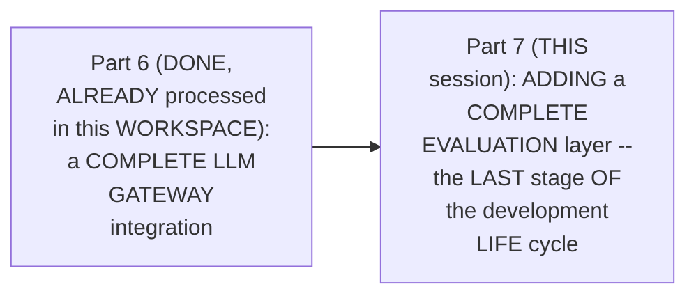

#### 🎯 Key Takeaways

* THIS session is GENUINELY, DIRECTLY confirmed AS the SERIES' own, NEXT step — FULFILLING the "EVALUATIONS" promise FIRST made BACK in Part 6.
* THE session's OWN, stated GOAL directly, EXPLICITLY confirms EVALUATION as "THE last STAGE" of the DEVELOPMENT life cycle — a GENUINE, real, REQUIRED step BEFORE any, real DEPLOYMENT.
* This directly, PRECISELY sets UP the SESSION's own, NEXT, essential CONTENT — a GENUINE, memorable ANALOGY, precisely EXPLAINING what evaluation GENUINELY means (Section 2).

---

### 2. Evaluation as an Exam: A Genuine, Precise, Memorable Analogy

#### 📖 Definition — The Complete, Precise Analogy

> 💡 **Given directly:** *"Just how we always compare these LLMs to intelligence... how we evaluate intelligence, human intelligence is evaluated via an exam, in which the human is given questions which human has never seen, and we give some scores... there is going to be a judge LLM, and judge LLM has the reference answers as well."*

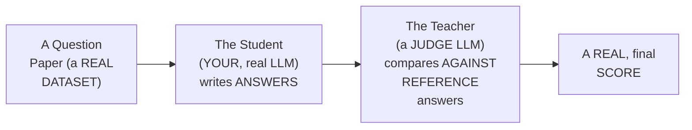

#### 🔍 Internal Working — A Genuine, Direct Confirmation of the Underlying Purpose

> 💡 **Given directly:** *"The underlying fact is, is the LLM performing the way we expected? As simple as that. If the LLM is performing the way we expected, then we will go ahead and tell our client, or roll this out to the users to use it."*

#### ⚠ Common Mistakes

* Assuming EVALUATION is GENUINELY, MERELY a SUBJECTIVE, "DOES it seem GOOD" judgment CALL — explicitly, directly, PRECISELY reframed: it's a GENUINE, structured PROCESS — COMPARING real, ACTUAL answers AGAINST REFERENCE answers, USING a SEPARATE, dedicated "JUDGE" model.

#### 🎯 Key Takeaways

* **EVALUATION** is precisely EXPLAINED via a GENUINELY memorable ANALOGY — a REAL exam, WHERE the LLM (the "STUDENT") answers UNSEEN questions, GRADED by a "JUDGE LLM" (the "TEACHER"), USING real REFERENCE answers.
* THE genuine, real PURPOSE: CONFIRMING whether "THE LLM IS performing THE way we EXPECTED" — BEFORE genuinely, DIRECTLY rolling an APPLICATION out TO real users.
* This directly, PRECISELY sets UP the SESSION's own, NEXT, essential CONTENT — the TWO, precise METRICS this session WILL genuinely, DIRECTLY implement (Section 3).

---
### 3. Two, Precise Metrics: Correctness & Groundedness

#### 📖 Definition — Correctness, Precisely Explained

> 💡 **Given directly:** *"Correctness means the answer given by LLM, LLM answer, is it equal to, or approximately equal to, the reference answer, which means how much your answer is correct with respect to the reference answer. This is called correctness."*

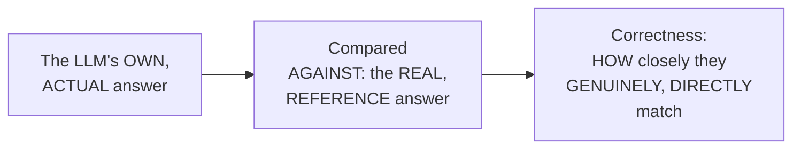

#### 🔍 Internal Working — A Genuine, Honest Acknowledgment of Scope

> 💡 **Given directly:** *"Generally there are six to seven scores, and maybe more depending upon your use case. Currently for this scenario we will pick up only two scores."*

#### ⚠ Common Mistakes

* Assuming a REAL, COMPLETE evaluation SYSTEM genuinely, ALWAYS requires MEASURING every, real, AVAILABLE metric — explicitly, directly, HONESTLY clarified: MANY, real metrics EXIST (six TO seven, OR more) — THIS session DELIBERATELY chooses ONLY two, GIVEN its OWN, established SCOPE.

#### 🎯 Key Takeaways

* **CORRECTNESS** (also called "ANSWER correctness") is precisely EXPLAINED as HOW closely the LLM's OWN, actual ANSWER matches a REAL, reference ANSWER.
* THE instructor **directly, HONESTLY acknowledges** MANY more, real METRICS genuinely EXIST — THIS session DELIBERATELY, PRACTICALLY scopes its OWN work TO just TWO.
* This directly, PRECISELY sets UP the SESSION's own, NEXT, essential CONTENT — GROUNDEDNESS/faithfulness, precisely EXPLAINED as an ANTI-hallucination check (Section 4).

---

### 4. Groundedness/Faithfulness: Precisely Explained as an Anti-Hallucination Check

#### 📖 Definition — Groundedness, Precisely Explained

> 💡 **Given directly:** *"Groundedness or faithfulness... your LLM is going to use a tool to answer all the questions. Now whenever LLM triggers this tool, this tool gives some contextual information... we have to check that the answer given by LLM, did it involve summary plus context, which means did it use this context to answer, or did it make the answer up?"*

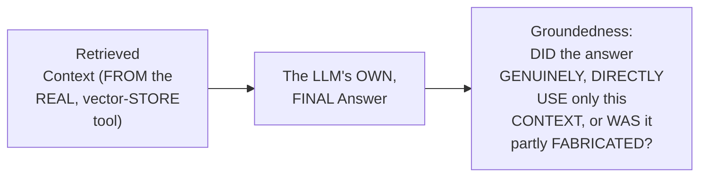

#### 🔍 Internal Working — A Genuine, Memorable Analogy

> 💡 **Given directly:** *"Just how we do in exams, students are simply writing whatever they feel like — there are a lot of times that the question is of 10 marks, and we really don't know the answer, so we will write anything just to get the marks, to fill up the pages. Similarly, LLM can give a random response... faithfulness is used to check hallucination."*

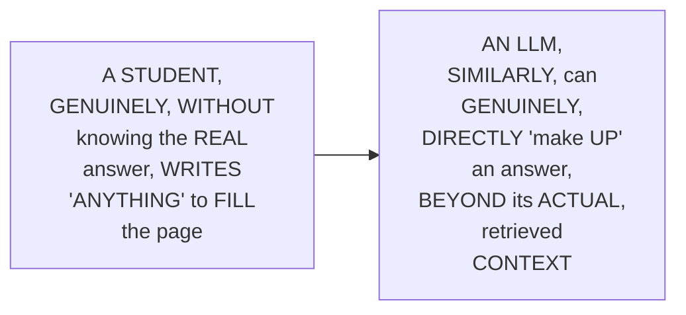

#### ⚠ Common Mistakes

* Assuming CORRECTNESS ALONE is GENUINELY, PRACTICALLY sufficient TO fully evaluate a REAL RAG system — explicitly, directly, PRECISELY distinguished: an ANSWER can GENUINELY, DIRECTLY be "CORRECT" (matching a REFERENCE answer) WHILE ALSO containing GENUINELY fabricated, UN-grounded ADDITIONS — GROUNDEDNESS specifically CATCHES this DIFFERENT, real FAILURE mode.

#### 🎯 Key Takeaways

* **GROUNDEDNESS** (also called "FAITHFULNESS") is precisely EXPLAINED as CHECKING whether an LLM's OWN, final ANSWER genuinely, DIRECTLY uses ONLY its RETRIEVED context — RATHER than "MAKING up" additional, UN-grounded CONTENT.
* A GENUINE, memorable ANALOGY (a STUDENT filling PAGES with UNKNOWN answers) directly, CONCRETELY illustrates WHY hallucination GENUINELY occurs — an LLM, SIMILARLY, can GENUINELY "MAKE up" an ANSWER, beyond its ACTUAL, real CONTEXT.
* This directly, PRECISELY sets UP the SESSION's own, NEXT, essential CONTENT — a GENUINE, real, INDUSTRY overview OF available evaluation FRAMEWORKS (Section 5).

---
### 5. A Genuine, Real Industry Overview: Evaluation Frameworks

#### 📖 Definition — The Real, Available Frameworks

> 💡 **Given directly:** *"We already know those frameworks, RAGAS right, DeepEval. So for RAG application, RAGAS is the best. So even for our application RAGAS will be the best. DeepEval we will use it for some another project where we will be having the agentic kind of scenario... thirdly we can use LangSmith as well."*

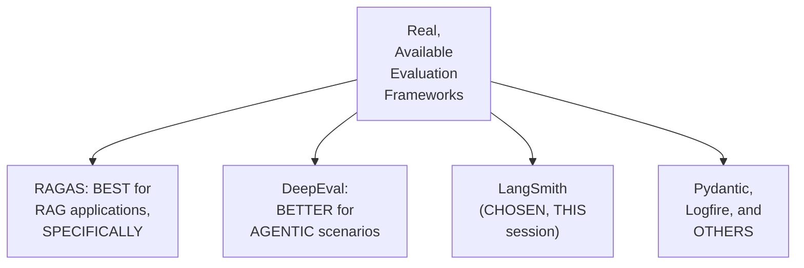

#### 🔍 Internal Working — A Genuine, Direct, Practical Justification

> 💡 **Given directly:** *"But for our particular project we will be using LangSmith because everything which we have done in this particular project is in the LangChain, LangGraph, and LangSmith ecosystem. So for evaluation as well we will be using LangSmith. And your assignment will be that you will be using RAGAS for evaluation."*

#### ⚠ Common Mistakes

* Assuming RAGAS (EXPLICITLY confirmed AS "THE best" FOR RAG applications, SPECIFICALLY) is GENUINELY, AUTOMATICALLY the RIGHT choice FOR THIS session's own, SPECIFIC project — explicitly, directly, PRACTICALLY clarified: LangSmith is CHOSEN INSTEAD, SPECIFICALLY BECAUSE it's ALREADY, genuinely PART of this PROJECT's own, ESTABLISHED ecosystem — a REAL, practical CONSIDERATION, beyond "WHICH tool is GENERALLY best."

#### 🎯 Key Takeaways

* MULTIPLE, real evaluation FRAMEWORKS genuinely EXIST — **RAGAS** (BEST for RAG, SPECIFICALLY), **DeepEval** (BETTER for AGENTIC scenarios), **LANGSMITH**, Pydantic, and LOGFIRE.
* **LANGSMITH** was directly, PRACTICALLY chosen FOR this session's OWN, specific PROJECT — SPECIFICALLY because it's ALREADY part OF the project's OWN, established LangChain/LangGraph ECOSYSTEM.
* A GENUINE, complete ASSIGNMENT directly, EXPLICITLY requires REPRODUCING this SAME evaluation, using **RAGAS** INSTEAD.
* This directly, PRECISELY sets UP the SESSION's own, NEXT, essential CONTENT — LangSmith's OWN, precise evaluation TERMINOLOGY (Section 6).

---

### 6. LangSmith's Own Evaluation Terminology: Dataset, Experiment & Evaluators

#### 📖 Definition — The Complete, Precise Terminology

> 💡 **Given directly:** *"Question paper is called datasets, and examination is called an experiment... evaluators, so now who can check your exam? A human can check your exam, some predefined code can check your exam, LLM as a judge can check your exam."*

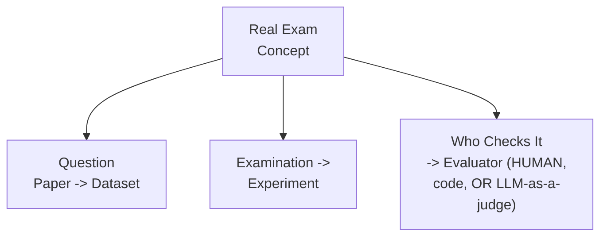

#### 🔍 Internal Working — A Genuine, Direct Confirmation of This Session's Own, Chosen Approach

> 💡 **Given directly:** *"LangSmith is giving us two approaches — either use LLM as a judge to check your answer sheet, or use a simple Python program which will check your answers. So we will be going for LLM as a judge."*

#### ⚠ Common Mistakes

* Assuming "DATASET," "EXPERIMENT," and "EVALUATOR" are GENUINELY, ARBITRARY, technical JARGON, disconnected FROM real, INTUITIVE meaning — explicitly, directly, MEMORABLY mapped TO the SESSION's own, ESTABLISHED exam ANALOGY — dataset = QUESTION paper; EXPERIMENT = the EXAM itself; evaluator = WHO checks it.

#### 🎯 Key Takeaways

* LANGSMITH'S OWN, precise TERMINOLOGY directly, MEMORABLY maps ONTO the SESSION's own, established EXAM analogy — **DATASET** (question PAPER), **EXPERIMENT** (the EXAM itself), and **EVALUATOR** (WHO checks it — HUMAN, code, OR LLM-as-a-JUDGE).
* THIS session directly, EXPLICITLY chooses the **"LLM as a JUDGE"** evaluator APPROACH, over a SIMPLE, predefined PYTHON program.
* This directly, PRECISELY sets UP the SESSION's own, NEXT, essential QUESTION — WHO, precisely, creates the DATASET (question PAPER) itself (Section 7)?

---
### 7. Who Creates the Dataset? Three, Real Options

#### 📖 Definition — The Three, Precise Options

> 💡 **Given directly:** *"Data set is made by different people. It can be made by the go-to approach or the real approach, which is subject matter expertise, the people who are the domain experts... this is a very costly and time-consuming process... secondly, we can have an LLM also to make a question paper... thirdly, the developer who is generating it, that person can also generate."*

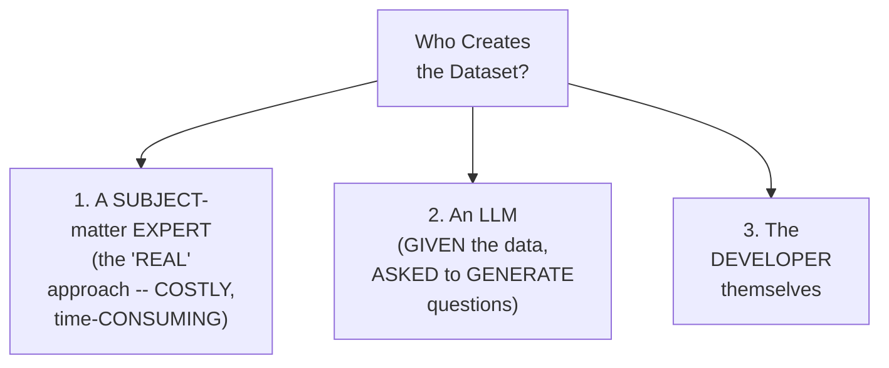

#### 🪜 Step-by-Step — This Session's Own, Chosen Approach

> 💡 **Given directly:** *"What I told my Claude Code is, hey, take my data, design some questions, and use my HR policy program, and get the answers of these questions... your Claude Code will ask you how many questions, you will say make 10 questions... and our Claude Code will make 10 questions."*

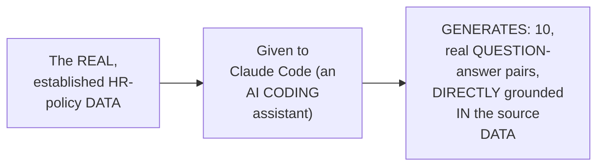

#### ⚠ Common Mistakes

* Assuming a REAL, evaluation DATASET must GENUINELY, ALWAYS be MANUALLY, painstakingly CREATED by a HUMAN, domain EXPERT — explicitly, directly, PRACTICALLY demonstrated as GENUINELY, EFFICIENTLY achievable VIA an AI coding ASSISTANT (CLAUDE Code), GIVEN the REAL, source data AND clear INSTRUCTIONS.

#### 🎯 Key Takeaways

* THREE, precise, real OPTIONS exist FOR creating a DATASET: **A subject-MATTER expert** (the "REAL" approach, but COSTLY/time-consuming), **an LLM** (given the DATA, asked to GENERATE questions), or **THE developer** themselves.
* THIS session's OWN, chosen APPROACH directly, CONCRETELY used **CLAUDE Code** — GIVEN the REAL, established HR-policy DATA, and INSTRUCTED to GENERATE 10, real QUESTION-answer pairs.
* This directly, PRECISELY sets UP the SESSION's own, NEXT, essential CONTENT — a GENUINE, honest, real-WORLD discovery, MADE possible BY this SAME, generated DATASET (Section 8).

---

### 8. A Genuine, Honest, Real-World Discovery: Catching a Real Hallucination

#### ⚠ A Direct, Honest, Real-World Discovery

> 💡 **Given directly:** *"We asked a question, how many paid sick leaves do I get per year? The answer that you are entitled to paid, get 10 paid sick leaves, this was correct... but after that we also got some more response — if you need more time off due to illness, just submit a request through HR portal, and provide a medical certificate. Nowhere it is mentioned like this."*

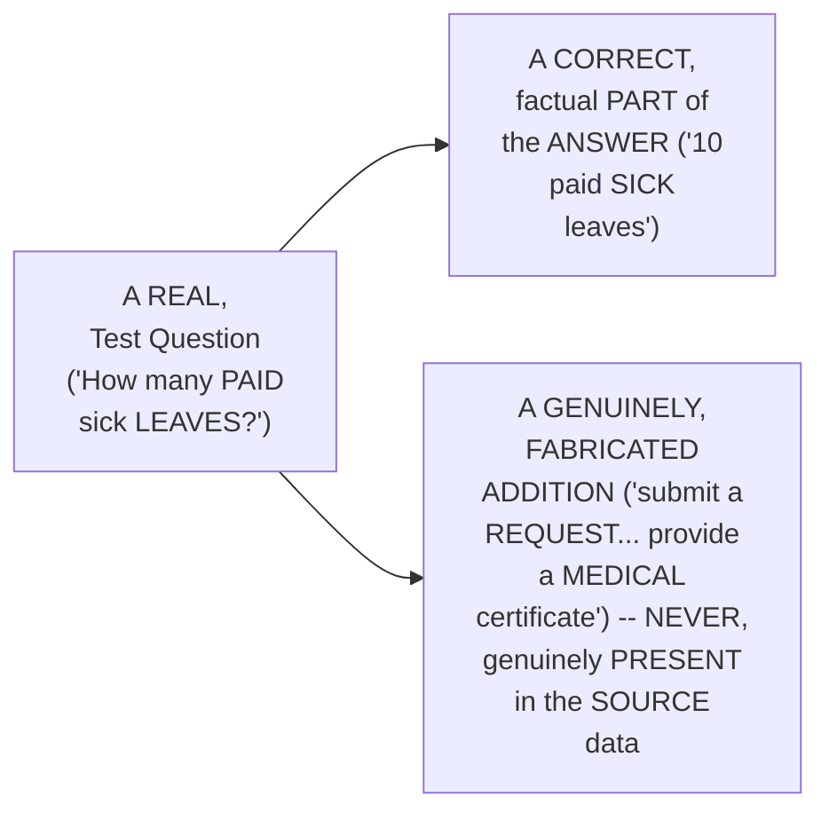

#### 🔍 Internal Working — A Genuine, Direct Confirmation of Why This Discovery Genuinely Matters

> 💡 **Given directly:** *"Who caught this? I did not catch it with my naked eye, because these are 10 questions, we will have 50, 60,000 questions to check our LLM for different scenarios. Now I cannot read all of them, so that is why we have a scoring system... this is not Python functions. These are LLMs, you know, LLMs are very non-deterministic, very random in behavior."*

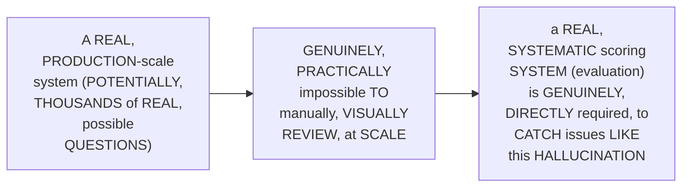

#### ⚠ Common Mistakes

* Assuming a HUMAN reviewer COULD, genuinely, PRACTICALLY catch EVERY, real HALLUCINATION, SIMPLY by MANUALLY reading THROUGH an LLM's OWN, generated RESPONSES — explicitly, directly, HONESTLY demonstrated as GENUINELY, PRACTICALLY infeasible, at REAL scale — EVEN the INSTRUCTOR himself DID NOT, genuinely, CATCH this SPECIFIC hallucination WITH his "NAKED eye."

#### 🎯 Key Takeaways

* A GENUINE, honest, REAL-world discovery directly, CONCRETELY confirmed a REAL hallucination — a CORRECT, factual PARTIAL answer, COMBINED with GENUINELY fabricated, ADDITIONAL content NEVER present IN the SOURCE data.
* THE instructor **directly, HONESTLY confirms** he did NOT, genuinely, CATCH this HALLUCINATION manually — REINFORCING WHY a REAL, systematic SCORING system is GENUINELY, DIRECTLY necessary, at REAL, production SCALE.
* This directly, PRECISELY sets UP the SESSION's own, CORE, hands-ON content — BUILDING the ACTUAL `evaluation.PY` file, that CATCHES issues LIKE this ONE (Section 9).

---
### 9. Building evaluation.py: The Complete, Real Setup

#### 🪜 Step-by-Step — Updating requirements.txt

> 💡 **Given directly:** *"I will be going here and I will add a new requirement for my evaluations... we will be using open evals. Open evals is the open-source framework made by LangChain to run evaluations... a built-in customizable evaluators to test and grade the quality of output of LLM evaluations."*

```text
open-evals
```

#### 🪜 Step-by-Step — The Complete, Real Imports

> 💡 **Given directly:** *"From LangChain, chat OpenAI, because we want to use LLM. Second one, from LangSmith import client... from open_evals.llm import create_llm_as_judge... from open_evals.prompts import correctness_prompt and rag_groundedness_prompt."*

```python
# evaluation.py
from langchain_openai import ChatOpenAI
from langsmith import Client
from openevals.llm import create_llm_as_judge
from openevals.prompts import CORRECTNESS_PROMPT, RAG_GROUNDEDNESS_PROMPT
from hr_assistant import config
from hr_assistant.gateway import get_gateway_llm
from hr_assistant.logger import get_logger
from hr_assistant.pipeline import ask, build_hr_assistant
from hr_assistant.vector_store import get_retriever, load_vector_store

logger = get_logger(__name__)
```

#### 🔍 Internal Working — A Genuine, Direct Confirmation: These Prompts Were Not Written by the Instructor

> 💡 **Given directly:** *"So this prompt, internally we are programming the LLM only... this prompt, we are giving the LLM some instructions that how do you have to behave... I have not written this prompt, this people have written this prompt, LangChain people, open eval people have written this prompt."*

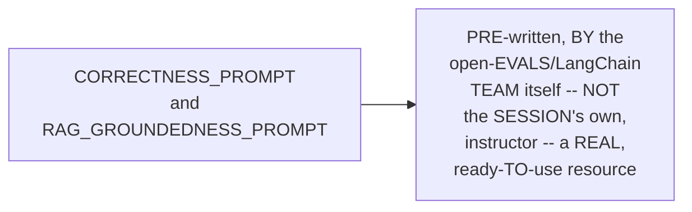

#### ⚠ Common Mistakes

* Assuming BUILDING a REAL, complete EVALUATION system genuinely, DIRECTLY requires WRITING your OWN, custom "JUDGE" prompts, FROM scratch — explicitly, directly, PRACTICALLY clarified: OPEN-evals (a REAL, open-source LIBRARY) ALREADY provides PRE-written, well-CRAFTED prompts (`CORRECTNESS_prompt`, `RAG_GROUNDEDNESS_prompt`) — REUSABLE, directly.

#### 🎯 Key Takeaways

* THE `REQUIREMENTS.txt` update directly, CONCRETELY adds **`open-EVALS`** — a REAL, open-source LIBRARY, maintained BY LangChain, PROVIDING built-in, CUSTOMIZABLE evaluators.
* THE complete, real IMPORTS directly, CONCRETELY include `ChatOpenAI`, LangSmith's OWN `Client`, `create_LLM_as_judge`, and TWO, PRE-written PROMPTS (`CORRECTNESS_prompt`, `RAG_groundedness_PROMPT`).
* THE instructor **directly, HONESTLY confirms** THESE two prompts were GENUINELY, DIRECTLY written BY the open-EVALS/LangChain team ITSELF — NOT authored, PERSONALLY, by the INSTRUCTOR.
* This directly, PRECISELY sets UP the SESSION's own, NEXT, essential CONTENT — DEFINING the ACTUAL dataset, and the SEPARATE, real judge LLM (Section 10).

---

### 10. Defining the Dataset & the Separate Judge LLM

#### 🪜 Step-by-Step — Defining the Dataset Name & Test Cases

> 💡 **Given directly:** *"Data set name, which means data set is the question paper. We will be setting the name of our question paper. So the question paper name I am setting is HR policy Q&A... some test cases... question, how many days of annual leave do I get per year? And this will be the answer, 20 days."*

```python
DATASET_NAME = "HR Policy Q&A"

TEST_CASES = [
    {"question": "How many days of paid annual leave do I get per year?", "answer": "20 days"},
    {"question": "How many days of unused leave can be carried over?", "answer": "up to 5 days"},
    {"question": "What is the standard notice period for resignation?", "answer": "30 days"},
    {"question": "Within how many days must reimbursement claims be submitted?", "answer": "30 days of expense"},
    # ... 6 more, real question-answer pairs
]
```

#### 🪜 Step-by-Step — Building the Separate Judge LLM

> 💡 **Given directly:** *"Judge model name, we will be using this particular model from Grok as a judge... how we will make our judge LLM? This is the same code to make our LLM... chat OpenAI, it's going to take the same thing, base URL, default headers, and the model."*

```python
def get_judge_llm():
    """Creates the judge LLM, routed through Portkey using the same, established gateway."""
    return get_gateway_llm()  # reuses the same, established gateway pattern from Part 6
```

#### 🔍 Internal Working — A Genuine, Direct Confirmation: The Judge Also Routes Through the Gateway

> 💡 **Given directly:** *"The judge model is routed through Portkey too, using the same slug, so we will not hit it directly, to keep that secure."*

#### ⚠ Common Mistakes

* Assuming a "JUDGE" LLM is GENUINELY, STRUCTURALLY a COMPLETELY DIFFERENT, unrelated PIECE of infrastructure, REQUIRING an ENTIRELY new, SEPARATE setup PATTERN — explicitly, directly, PRACTICALLY clarified: it GENUINELY, DIRECTLY reuses the SAME, established GATEWAY pattern (from PART 6) — JUST with a DIFFERENT, real PROVIDER/slug reference.

#### 🎯 Key Takeaways

* THE COMPLETE, real DATASET directly, CONCRETELY consists OF a **NAME** ("HR POLICY Q&A") and **TEN, real TEST cases** — EACH a REAL question-ANSWER pair.
* THE JUDGE LLM is directly, EXPLICITLY confirmed AS ALSO, genuinely ROUTED through **PORTKEY** — REUSING the SAME, established GATEWAY pattern FROM Part 6.
* This directly, PRECISELY sets UP the SESSION's own, NEXT, essential CONTENT — `ensure_DATASET()`, a genuine, FAMILIAR "check, THEN create" pattern (Section 11).

---
### 11. ensure_dataset(): A Genuine, Familiar "Check, Then Create" Pattern

#### 🪜 Step-by-Step — The Complete, Real Function

> 💡 **Given directly:** *"If a client has data set with my data set name, then conduct a new experiment in the same data set... if the name is already there, make a new experiment instead of making a new data set, but if the name is not there, we will be creating a new data set."*

```python
def ensure_dataset(client, dataset_name, test_cases):
    """If dataset exists, reuse it. If not, create a new one."""
    if client.has_dataset(dataset_name=dataset_name):
        logger.info(f"Dataset '{dataset_name}' already exists. Reusing it.")
        return client.read_dataset(dataset_name=dataset_name)

    logger.info(f"No dataset found. Creating '{dataset_name}' with {len(test_cases)} cases.")
    dataset = client.create_dataset(dataset_name=dataset_name)
    client.create_examples(
        dataset_id=dataset.id,
        inputs=[{"question": case["question"]} for case in test_cases],
        outputs=[{"answer": case["answer"]} for case in test_cases]
    )
    return dataset
```

#### 🔍 Internal Working — A Genuine, Direct Parallel to This Series' Own, Established Pattern

> 💡 **Given directly:** *"Again, what is happening? If data set is there, reuse it. If not, create a new data set. What is data set? Again, data set is a question paper which we are creating."*

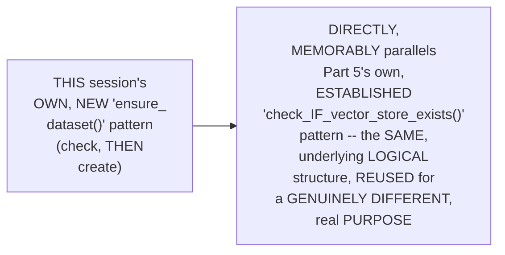

#### ⚠ Common Mistakes

* Assuming EACH, real TIME an evaluation is GENUINELY, DIRECTLY run, an ENTIRELY new, SEPARATE dataset should GENUINELY be CREATED — explicitly, directly, PRECISELY clarified: THE established DATASET, ONCE created, is GENUINELY, DIRECTLY reused — SUBSEQUENT evaluation RUNS become NEW "EXPERIMENTS," WITHIN the SAME, existing DATASET.

#### 🎯 Key Takeaways

* **`ensure_DATASET()`** directly, CONCRETELY implements a GENUINE, familiar "CHECK, then CREATE" pattern — IF the DATASET already EXISTS, reuse IT; if NOT, create IT, from scratch.
* THIS pattern directly, MEMORABLY parallels PART 5's own, ESTABLISHED `check_IF_vector_store_exists()` LOGIC — the SAME, underlying STRUCTURE, reused FOR a genuinely DIFFERENT, real purpose.
* This directly, PRECISELY sets UP the SESSION's own, CORE, most SUBSTANTIAL function — `run_EVALUATION()` (Section 12).

---

### 12. run_evaluation(): The Core, Complete Function

#### 🪜 Step-by-Step — Building the Agent & Defining the "Target"

> 💡 **Given directly:** *"Run one test question through the real agent, and also capture the retrieved chunk, so the groundedness can capture and check the answer against what was actually retrieved... define target, this is write the answers... this entire function is start the exam."*

```python
def run_evaluation():
    """Upload the dataset and run the correctness + groundedness evaluation."""
    client = Client()
    dataset = ensure_dataset(client, DATASET_NAME, TEST_CASES)

    agent = build_hr_assistant()
    retriever = get_retriever(load_vector_store())

    def target(inputs: dict) -> dict:
        """Run one, real question through the real agent, capturing both the
        answer and the retrieved context, so groundedness can be checked."""
        question = inputs["question"]
        answer = ask(agent, question)
        context = retriever.invoke(question)
        return {"answer": answer, "context": context}
```

#### 🪜 Step-by-Step — Defining the Two, Real Evaluators

> 💡 **Given directly:** *"Two types of marks we are giving. One is correctness evaluator and one is groundedness judge. We will be using create_llm_as_judge... prompt correctness_prompt, feedback key is correctness, and judge is get_judge_llm."*

```python
    correctness_evaluator = create_llm_as_judge(
        prompt=CORRECTNESS_PROMPT,
        feedback_key="correctness",
        judge=get_judge_llm()
    )

    groundedness_evaluator = create_llm_as_judge(
        prompt=RAG_GROUNDEDNESS_PROMPT,
        feedback_key="groundedness",
        judge=get_judge_llm()
    )
```

#### 🪜 Step-by-Step — Triggering the Complete Evaluation

> 💡 **Given directly:** *"This evaluate function is the trigger function that runs this function. So finally this takes the target, data set name, evaluators, which means correctness and groundedness, experiment prefix, HR policy eval, and description is HR policy assistant correctness plus groundedness evaluation."*

```python
    return client.evaluate(
        target,
        data=dataset.name,
        evaluators=[correctness_evaluator, groundedness_evaluator],
        experiment_prefix="HR_policy_eval",
        description="HR policy assistant correctness + groundedness evaluation"
    )
```

#### ⚠ Common Mistakes

* Assuming the `TARGET` function GENUINELY, DIRECTLY only needs to RETURN the LLM's OWN, final ANSWER — explicitly, directly, PRECISELY clarified: it ALSO, genuinely CAPTURES the RETRIEVED context, SPECIFICALLY so the GROUNDEDNESS evaluator can GENUINELY, DIRECTLY check the ANSWER against WHAT was ACTUALLY retrieved.

#### 🎯 Key Takeaways

* **`run_EVALUATION()`** directly, CONCRETELY builds the REAL agent, and DEFINES a **`TARGET`** function — RUNNING each, real QUESTION through the ACTUAL agent, CAPTURING both the ANSWER and the RETRIEVED context.
* **TWO, real evaluators** are directly, CONCRETELY defined via `create_LLM_as_judge` — ONE for **CORRECTNESS**, one for **GROUNDEDNESS** — EACH using the PRE-written prompts (per Section 9) and the SEPARATE judge LLM (per Section 10).
* `CLIENT.evaluate()` directly, CONCRETELY triggers the COMPLETE, real evaluation — UPLOADING results TO LangSmith, AS a NEW, real "EXPERIMENT."

---
### 13. Building evaluate.py: A Genuine, Simple Runner File

#### 🪜 Step-by-Step — The Complete, Real Runner File

> 💡 **Given directly:** *"I will be making an evaluate.py outside... from HR assistant.evaluation we will be importing run_evaluation... we will say we are running this particular evaluation... results is going to run the evaluation... once done we will be printing that exam done, open your LangSmith and see the experiment."*

```python
# evaluate.py
from hr_assistant.evaluation import run_evaluation

def main():
    print("Running the HR policy assistant evaluation...")
    results = run_evaluation()
    print("Exam done. Open your LangSmith and see the experiment.")
    print(results)

if __name__ == "__main__":
    main()
```

```bash
python evaluate.py
```

#### 🔍 Internal Working — A Genuine, Direct Confirmation: Running the App vs. Running an Evaluation

> 💡 **Given directly:** *"No changes in evaluations, and no changes in pipeline. Like I said, running your app is different thing, and running an evaluation pipeline is different thing."*

```mermaid
flowchart LR
    A["`python<br/>main.py` / `streamlit<br/>run app.py`"] --> B["RUNS the REAL,<br/>DEPLOYED<br/>application"]
    C["`python<br/>evaluate.py`"] --> D["RUNS a SEPARATE,<br/>DISTINCT<br/>EVALUATION<br/>pipeline -- a<br/>GENUINELY DIFFERENT<br/>ACTIVITY"]
```

#### ⚠ Common Mistakes

* Assuming "RUNNING an EVALUATION" is GENUINELY, MERELY a SPECIAL mode OF the MAIN application ITSELF — explicitly, directly, PRECISELY clarified: it's a GENUINELY, STRUCTURALLY SEPARATE, distinct ACTIVITY — a DEDICATED `evaluate.PY` file, entirely SEPARATE from `main.PY`/`app.PY`.

#### 🎯 Key Takeaways

* **`evaluate.PY`** directly, CONCRETELY provides a SIMPLE, standalone RUNNER — CALLING `run_EVALUATION()`, and PRINTING a CLEAR, real CONFIRMATION message.
* THE instructor **directly, EXPLICITLY confirms** RUNNING the MAIN application and RUNNING an EVALUATION are GENUINELY, STRUCTURALLY TWO, entirely SEPARATE activities.
* This directly, PRECISELY sets UP the SESSION's own, NEXT, essential VERIFICATION — a GENUINE, honest, LIVE-encountered ERROR, ENCOUNTERED while RUNNING this COMPLETE evaluation (Section 14).

---

### 14. A Genuine, Honest, Live-Encountered Error: "Too Many Requests"

#### 🪜 Step-by-Step — A Complete, Real, Live-Encountered Failure

> 💡 **Given directly:** *"There is a problem, too many requests. Too many requests, too many requests... it is still conducting and failing, conducting and failing the experiments, and now we see a huge error, and finally, key error, answer."*

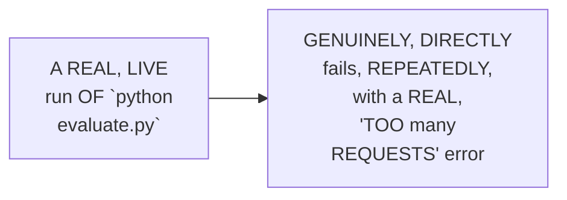

#### 🔍 Internal Working — A Genuine, Honest, Live-Confirmed Consequence

> 💡 **Given directly:** *"We hit this rate limit error, because we use the same LLM for both the task, and that is why we hit the rate limit error."*

#### ⚠ Common Mistakes

* Assuming a REAL, LIVE-encountered "TOO many REQUESTS" error is GENUINELY, DIRECTLY caused BY a genuine, technical BUG in the ESTABLISHED code ITSELF — explicitly, directly, HONESTLY clarified: it's GENUINELY, DIRECTLY caused by a REAL, architectural DECISION (SHARING one, SINGLE API key/SLUG between BOTH the main AND judge LLMs) — NOT a genuine, code-LEVEL defect.

#### 🎯 Key Takeaways

* A GENUINE, honest, LIVE-encountered ERROR directly, CONCRETELY confirmed: a REAL, "TOO many REQUESTS" rate-LIMIT failure — REPEATEDLY, genuinely occurring, DURING the LIVE evaluation RUN.
* THE instructor **directly, HONESTLY confirms** THIS error's own, real ROOT cause — USING the SAME, SINGLE LLM (and, THEREFORE, the SAME rate LIMIT) for BOTH the MAIN application and the JUDGE.
* This directly, PRECISELY sets UP the SESSION's own, NEXT, essential CONTENT — a GENUINE, precise DIAGNOSIS, and a LIVE-demonstrated FIX (Section 15).

---
### 15. A Genuine, Precise Diagnosis & a Live-Demonstrated Fix

#### 🔍 Internal Working — A Genuine, Precise, Complete Diagnosis

> 💡 **Given directly:** *"What is the mistake we have done? So currently our main LLM, who is giving the exam, and secondly our judge LLM, who is taking the exam, now what they both are doing is they both are sending requests to one LLM only, on that one API only... you use a better and powerful LLM, because of course your teacher will be much more experienced than you."*

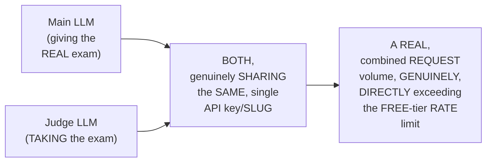

#### 🪜 Step-by-Step — A Complete, Live-Demonstrated Fix (Left as an Assignment)

> 💡 **Given directly:** *"What we have to do is we have to go to Grok, we have to make a new Grok ID from a new Gmail account, we have to get that Grok API key, and here we have to add a new thing called judge_grok... you will be going to Portkey, and you will be making a new model integration."*

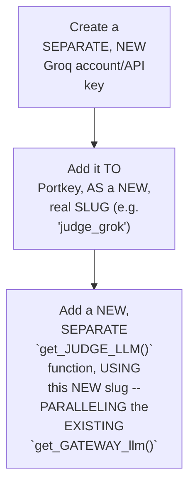

#### 🔍 Internal Working — A Genuine, Direct Confirmation of Modular Coding's Own, Real Benefit, Again

> 💡 **Given directly:** *"You saw, because of this modular programming, it was so simple to have all the integrations, right?"*

#### ⚠ Common Mistakes

* Assuming a MAIN LLM and a JUDGE LLM should GENUINELY, PRACTICALLY use the SAME provider AND the SAME API key — explicitly, directly, PRECISELY clarified: a REAL, production SETUP would GENUINELY use a SEPARATE, DEDICATED key (and OFTEN, a MORE powerful MODEL) FOR the judge ROLE specifically — MEMORABLY compared TO a REAL teacher GENUINELY being "MORE experienced" than THEIR student.

#### 🎯 Key Takeaways

* THE genuine, precise DIAGNOSIS directly, CONCRETELY confirmed: the MAIN and JUDGE LLMs were BOTH, genuinely SHARING the SAME, single API KEY/slug — CAUSING a REAL, COMBINED rate-LIMIT breach.
* A COMPLETE, LIVE-demonstrated FIX directly, CONCRETELY walked THROUGH creating a SEPARATE, new JUDGE-specific API key/SLUG, via PORTKEY — THOUGH explicitly, HONESTLY left AS an ASSIGNMENT, RATHER than PERMANENTLY applied.
* THE instructor **directly, EXPLICITLY confirms** this SERIES' own, ESTABLISHED "MODULAR programming" made THIS fix GENUINELY, PRACTICALLY "SO simple" to IMPLEMENT.

---

### 16. A Complete, Real Results Review & an Honest Acknowledgment

#### 🪜 Step-by-Step — A Complete, Real, Live-Confirmed Results Review

> 💡 **Given directly:** *"These scores are usually between 0 to 1. Zero means the worst, and one means the best. So our model is performing really the best way... this is the latency, this is the number of tokens utilized, this is the cost which it has undertaken, and this is the error rate."*

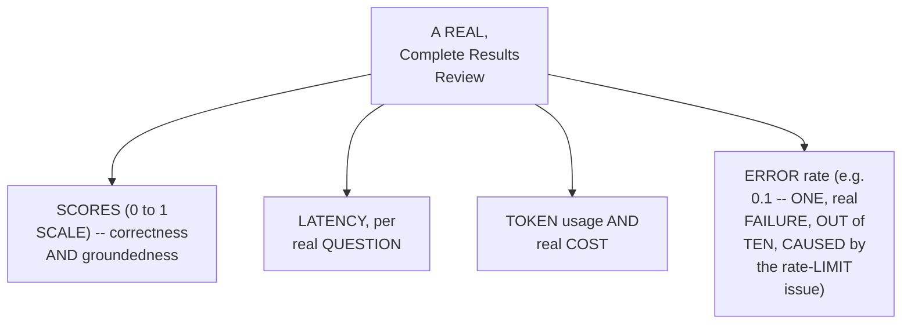

#### ⚠ A Direct, Honest Acknowledgment of This Session's Own, Simplified Scope

> 💡 **Given directly:** *"Model will perform absolutely good, because you know the data set is small... two reasons: the data set is small, that is why model is performing remarkably. But what if the model is failing? In this scenario, we have to do prompt versioning... you have to work more on your prompt, your guardrails, wherever you are spotting the bug."*

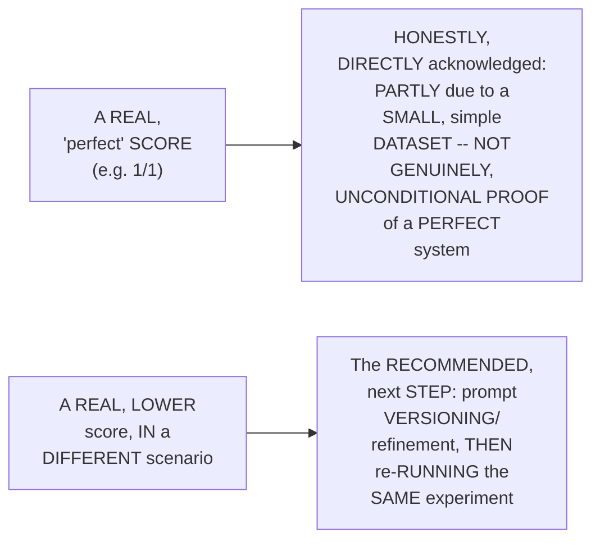

#### ⚠ Common Mistakes

* Assuming a REAL, "PERFECT" evaluation SCORE (e.g., 1 out OF 1) GENUINELY, UNCONDITIONALLY proves a SYSTEM is COMPLETELY, flawlessly WORKING — explicitly, directly, HONESTLY qualified: THIS session's own, SPECIFIC, perfect SCORE is PARTLY attributable TO a SMALL, simple DATASET — NOT a GENUINE, unconditional GUARANTEE of PERFECTION.

#### 🎯 Key Takeaways

* A COMPLETE, real RESULTS review directly, CONCRETELY confirmed REAL scores (0 TO 1 scale), LATENCY, token USAGE, cost, and ERROR rate (0.1, DIRECTLY caused BY the rate-LIMIT issue).
* THE instructor **directly, HONESTLY acknowledges** THIS session's own, "PERFECT" results are PARTLY attributable TO a SMALL, simple DATASET — NOT genuinely, UNCONDITIONAL proof OF a flawless SYSTEM.
* A GENUINE, direct WORKFLOW is CONFIRMED for LOWER, real SCORES — "PROMPT versioning" (REFINING the SYSTEM prompt/guardrails), THEN re-running the SAME, established EXPERIMENT.

---
### 17. Closing: A Direct Preview of the Deployment Life Cycle

#### 🪜 Step-by-Step — A Direct, Genuine, Final Preview

> 💡 **Given directly:** *"Now we are done with the development life cycle, right? We are going towards now deployment stage, where cloud is coming into the picture. We will take this project to cloud, we will learn some cloud basics, and we will be developing an entire CI/CD pipeline to develop the cloud deployment, and that is going to be very interesting."*

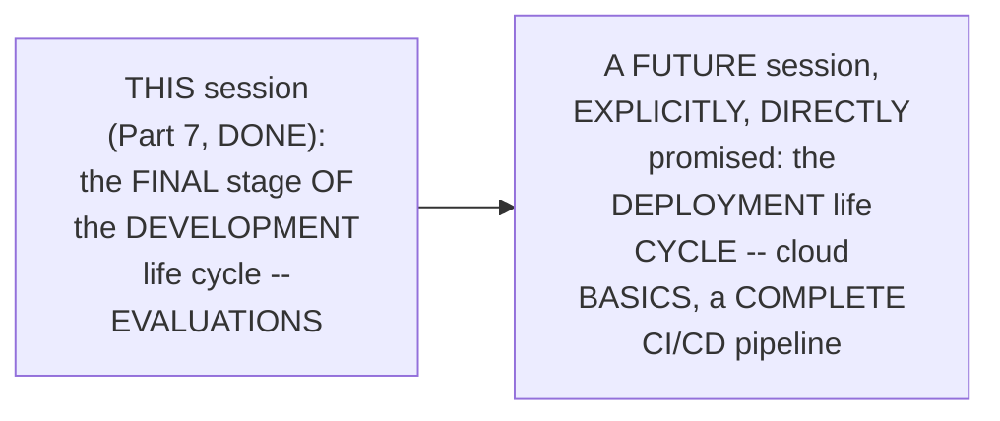

#### ⚠ Common Mistakes

* Assuming THIS session's own, COMPLETE evaluation WORK represents the ABSOLUTE, final END of this ENTIRE, established SERIES — explicitly, directly, DIRECTLY confirmed AS ONLY the END of the DEVELOPMENT life cycle SPECIFICALLY — "THIS is NOT the end, WE are JUST beginning WITH the deployment LIFE cycle."

#### 🎯 Key Takeaways

* This episode **GENUINELY, COMPREHENSIVELY delivers** its OWN, stated GOALS — a COMPLETE, real EVALUATION system (dataset, JUDGE LLM, correctness AND groundedness SCORING), GROUNDED in a GENUINE, real HALLUCINATION discovery and an HONEST, live-ENCOUNTERED rate-limit ERROR.
* THE instructor **directly, EXPLICITLY confirms** the COMPLETE DEVELOPMENT life cycle is NOW finished — THIS marks the TRANSITION into a NEW, DEPLOYMENT-focused phase.
* THIS directly, PRECISELY previews the SERIES' own, NEXT, PROMISED content — CLOUD basics, and a COMPLETE, real CI/CD pipeline.

---

## 📝 Glossary

| Term | Definition | Why It Matters |
|---|---|---|
| **Dataset (LangSmith)** | The "question paper" -- a set of question/reference-answer pairs | The foundation of any real evaluation |
| **Experiment (LangSmith)** | The "exam" -- one, complete run of a dataset against a real system | Uploaded to LangSmith, per evaluation run |
| **Evaluator** | Who checks the exam -- human, code, or LLM-as-a-judge | This session uses LLM-as-a-judge |
| **Correctness** | How closely an answer matches its reference | One of this session's two, chosen metrics |
| **Groundedness/Faithfulness** | Whether an answer genuinely uses only its retrieved context | Catches hallucination; this session's other metric |
| **open-evals** | An open-source, LangChain-maintained evaluation library | Provides pre-written judge prompts and helper functions |
| **Judge LLM** | A separate LLM used specifically to grade answers | Should genuinely use a separate API key/provider |

---

## 🔄 Revision Notes — One-Minute Revision

* This is Part 7, the final stage of the development life cycle -- adding a complete LLM evaluation layer, explicitly confirmed as "the most important topic" of this entire journey.
* **Evaluation as an exam**: a genuinely memorable analogy -- the LLM is a student answering unseen questions; a judge LLM (the teacher) grades against real, reference answers.
* **Two, chosen metrics**: correctness (how closely an answer matches its reference) and groundedness/faithfulness (whether an answer genuinely uses only its retrieved context, catching hallucination) -- honestly acknowledged as a deliberate subset of six-to-seven-plus available metrics.
* **A genuine, real industry overview**: RAGAS (best for RAG specifically), DeepEval (better for agentic scenarios), and LangSmith -- chosen here specifically because it's already part of this project's own, established LangChain/LangGraph ecosystem. Assignment: reproduce using RAGAS.
* **LangSmith's own terminology**: dataset (question paper), experiment (the exam), evaluator (who checks it -- human, code, or LLM-as-a-judge, chosen here).
* **Who creates the dataset**: a subject-matter expert (costly, time-consuming), an LLM (given data, asked to generate questions), or the developer. This session used Claude Code, given the real HR-policy data, to generate 10, real question-answer pairs.
* **A genuine, honest discovery**: running these 10 test cases revealed a real hallucination -- a correct, factual partial answer (about sick leave) combined with genuinely fabricated additional content (about submitting a request and medical certificate) never present in the source data. The instructor honestly confirms he didn't catch this manually -- reinforcing why systematic, scored evaluation genuinely matters at scale.
* **Building evaluation.py**: imports ChatOpenAI, LangSmith's Client, `create_llm_as_judge` (from open-evals), and two pre-written prompts (CORRECTNESS_PROMPT, RAG_GROUNDEDNESS_PROMPT) -- honestly confirmed as written by the open-evals/LangChain team, not the instructor.
* **The dataset and judge LLM**: a named dataset ("HR Policy Q&A") with 10 real test cases; a separate judge LLM, also routed through Portkey, reusing the same, established gateway pattern from Part 6.
* **ensure_dataset()**: a "check, then create" pattern, directly paralleling Part 5's own, established `check_if_vector_store_exists()` logic.
* **run_evaluation()**: builds the real agent, defines a `target` function (running each question through the real agent, capturing both the answer and retrieved context), defines two evaluators (correctness, groundedness) via `create_llm_as_judge`, and triggers the complete evaluation via `client.evaluate()`.
* **evaluate.py**: a simple, standalone runner file. Running the app and running an evaluation are confirmed as two, entirely separate activities.
* **A genuine, honest, live-encountered error**: "too many requests" -- a real rate-limit failure, caused by the main LLM and judge LLM sharing the same, single API key/slug.
* **A genuine, precise diagnosis & a live-demonstrated fix**: create a separate, new Groq account/API key, add it to Portkey as a new slug, and add a new `get_judge_llm()` function -- explicitly left as an assignment, not permanently applied, though the instructor confirms modular programming made this fix genuinely simple to walk through.
* **A complete, real results review**: real scores (0-1 scale), latency, token usage, cost, and a 0.1 error rate (directly caused by the rate-limit issue). An honest acknowledgment: this session's own "perfect" scores are partly attributable to a small, simple dataset -- for lower, real scores, the next step is prompt "versioning" (refinement), then re-running the same experiment.
* **Closing**: the development life cycle is now complete -- a direct preview of the deployment life cycle: cloud basics, and a complete, real CI/CD pipeline.

---

## 📋 Cheat Sheet

**The exam analogy, mapped to LangSmith terminology:**
```text
Question paper -> Dataset
Examination     -> Experiment
Who checks it    -> Evaluator (human, code, or LLM-as-a-judge)
```

**The two, chosen metrics:**
```text
Correctness:  does the answer match the reference?
Groundedness: does the answer use ONLY its retrieved context (no hallucination)?
```

**The complete evaluation.py structure:**
```python
from langsmith import Client
from openevals.llm import create_llm_as_judge
from openevals.prompts import CORRECTNESS_PROMPT, RAG_GROUNDEDNESS_PROMPT

def ensure_dataset(client, name, test_cases):
    # check if exists; if not, create it

def run_evaluation():
    client = Client()
    dataset = ensure_dataset(client, DATASET_NAME, TEST_CASES)
    agent = build_hr_assistant()

    def target(inputs):
        answer = ask(agent, inputs["question"])
        context = retriever.invoke(inputs["question"])
        return {"answer": answer, "context": context}

    correctness_evaluator = create_llm_as_judge(prompt=CORRECTNESS_PROMPT, judge=get_judge_llm())
    groundedness_evaluator = create_llm_as_judge(prompt=RAG_GROUNDEDNESS_PROMPT, judge=get_judge_llm())

    return client.evaluate(target, data=dataset.name, evaluators=[correctness_evaluator, groundedness_evaluator])
```

**The rate-limit error and its fix:**
```text
Problem: main LLM + judge LLM share the same API key -> "too many requests"
Fix: create a separate Groq account/API key -> add as a new Portkey slug -> get_judge_llm() uses it
```

**Running the app vs. running an evaluation:**
```bash
streamlit run app.py    # runs the real, deployed application
python evaluate.py      # runs a completely separate evaluation pipeline
```

---

## 🔥 Interview Questions & Answers

### 🟢 Beginner

**Q1.**

**Question:** What are the two, precise evaluation metrics this session chose to implement?

**Answer:** Correctness and groundedness (faithfulness).

**Explanation:** Directly, explicitly named.

**Why Interviewers Ask This:** The most basic, foundational RAG-evaluation question.

**Possible Follow-up:** "How many metrics genuinely exist, in total?"

**Q2.**

**Question:** In LangSmith's own terminology, what does "dataset" genuinely correspond to, in the exam analogy?

**Answer:** The question paper.

**Explanation:** Directly, explicitly confirmed.

**Why Interviewers Ask This:** Basic, essential evaluation terminology.

**Possible Follow-up:** "What does 'experiment' correspond to?"

**Q3.**

**Question:** What does groundedness/faithfulness genuinely check for?

**Answer:** Hallucination -- whether an answer uses only its retrieved context, or "makes up" additional content.

**Explanation:** Directly, precisely explained.

**Why Interviewers Ask This:** Foundational, frequently-tested RAG-evaluation concept.

**Possible Follow-up:** "Give a real, worked example of a groundedness failure."

**Q4.**

**Question:** Which evaluation framework did this session choose, and why?

**Answer:** LangSmith -- because it's already part of this project's own, established LangChain/LangGraph ecosystem.

**Explanation:** Directly, precisely explained.

**Why Interviewers Ask This:** Tests genuine, practical decision-making around tool selection.

**Possible Follow-up:** "Which framework was confirmed as genuinely 'best' for RAG applications specifically?"

**Q5.**

**Question:** How was this session's own, real evaluation dataset created?

**Answer:** Using Claude Code, given the real HR-policy data, to generate 10 question-answer pairs.

**Explanation:** Directly, explicitly confirmed.

**Why Interviewers Ask This:** Tests genuine, practical knowledge of dataset-creation options.

**Possible Follow-up:** "Name the other two, real options for creating a dataset."

**Q6.**

**Question:** Did this session's own, real testing genuinely reveal a hallucination?

**Answer:** Yes -- a correct, partial answer combined with genuinely fabricated, additional content.

**Explanation:** Directly, honestly demonstrated.

**Why Interviewers Ask This:** Tests genuine understanding of evaluation's own, real, practical value.

**Possible Follow-up:** "Did the instructor genuinely catch this manually, or was it caught via scoring?"

**Q7.**

**Question:** What Python library provides the pre-written "judge" prompts used in this session?

**Answer:** open-evals.

**Explanation:** Directly, explicitly confirmed.

**Why Interviewers Ask This:** Basic, practical, hands-on evaluation-tooling knowledge.

**Possible Follow-up:** "Who genuinely wrote these specific prompts?"

**Q8.**

**Question:** What genuine, honest error did the instructor live-encounter when first running the evaluation?

**Answer:** "Too many requests" -- a rate-limit error.

**Explanation:** Directly, honestly demonstrated.

**Why Interviewers Ask This:** Tests genuine, practical debugging knowledge.

**Possible Follow-up:** "What was the genuine, root cause of this error?"

**Q9.**

**Question:** Why did sharing one API key between the main LLM and judge LLM genuinely cause a rate-limit error?

**Answer:** Because both LLMs' combined request volume exceeded the shared key's free-tier rate limit.

**Explanation:** Directly, precisely explained.

**Why Interviewers Ask This:** Tests genuine, practical understanding of API rate limits.

**Possible Follow-up:** "What is the genuinely recommended fix?"

**Q10.**

**Question:** Is running the main application and running an evaluation genuinely the same activity, or two, separate ones?

**Answer:** Two, entirely separate activities.

**Explanation:** Directly, explicitly confirmed.

**Why Interviewers Ask This:** Tests attention to this session's own, stated, structural distinction.

**Possible Follow-up:** "What are the two, respective command-line commands used for each?"

---
### 🟡 Intermediate

**Q11.**

**Question:** Explain why the instructor deliberately preserves and discusses the honest, live-encountered "too many requests" error in detail (Sections 14-15), rather than editing it out and simply presenting a pre-configured system with separate API keys from the start.

**Answer:** This is a genuinely deliberate, EARNED-solution teaching choice, DIRECTLY consistent WITH a PATTERN seen THROUGHOUT this ENTIRE series (e.g., PART 4's own, established, HONEST prompt-INJECTION bypass NARRATIVE). By DIRECTLY, HONESTLY preserving and DEBUGGING this REAL error, LIVE, the instructor DEMONSTRATES a GENUINE, transferable, real-WORLD debugging SKILL — DIAGNOSING a rate-LIMIT issue, TRACING it BACK to its GENUINE, architectural ROOT cause (SHARED API keys) — RATHER than SIMPLY presenting a "CORRECTLY configured" system, WITHOUT this SAME, valuable CONTEXT. THIS directly, PRACTICALLY teaches learners a GENUINE, important LESSON about REAL, production LLM systems — MAIN and JUDGE models SHOULD, genuinely, use SEPARATE credentials — a LESSON far MORE memorable, HAVING GENUINELY witnessed the REAL, live CONSEQUENCE of NOT doing so.

**Explanation:** Requires recognizing the deliberate, earned-solution value of preserving and debugging a real, honest error, consistent with this series' own, established pattern of honest, live troubleshooting.

**Why Interviewers Ask This:** Tests whether a learner recognizes the pedagogical value of demonstrating a genuine, real debugging process, rather than only presenting a pre-solved, "correct" configuration.

**Possible Follow-up:** "Identify ANOTHER, genuine EXAMPLE, from EARLIER in this SERIES, WHERE a SIMILAR, HONEST, live-ENCOUNTERED error WAS preserved and DEBUGGED, rather THAN edited OUT."

**Q12.**

**Question:** A learner argues that since this session confirms this specific evaluation run achieved "perfect" (1/1) scores, this means the HR-policy RAG assistant is genuinely, completely free of hallucination and correctness issues, and no further evaluation work is genuinely needed. Evaluate this claim.

**Answer:** This claim OVERSTATES a GENUINE, SPECIFIC, LIMITED result into an UNCONDITIONAL claim OF "COMPLETELY free" of issues, which DIRECTLY contradicts Section 16's own, EXPLICIT, honest QUALIFICATION. Section 16's own PRECISE statement DIRECTLY confirms: "MODEL will PERFORM absolutely GOOD, because... the DATA set is SMALL" — the INSTRUCTOR himself EXPLICITLY, DIRECTLY attributes this SPECIFIC, perfect RESULT, at LEAST partly, to the SMALL, simple SCOPE of THIS particular TEST (only TEN, real questions) — NOT a GENUINE, unconditional GUARANTEE of PERFECTION. ADDITIONALLY, Section 8's own established CONTENT directly, HONESTLY demonstrates THIS same SYSTEM already, GENUINELY produced a REAL hallucination, EARLIER, during INITIAL testing — a DIRECT, historical COUNTER-example to the CLAIM of "COMPLETELY free" of ISSUES. The ACCURATE, more PRECISE conclusion: THIS specific evaluation RUN achieved GENUINE, real success ON its OWN, particular, LIMITED test SET — but this does NOT, genuinely, GUARANTEE the SYSTEM is COMPLETELY hallucination-FREE, across EVERY, possible, real-WORLD question — ONGOING, expanded EVALUATION (per Section 5's own established, real-WORLD scale REASONING — "50, 60,000 QUESTIONS") remains GENUINELY necessary.

**Explanation:** Tests whether a learner recognizes that this session's own, explicit, honest qualification (small dataset) and its own, earlier, documented hallucination discovery directly contradict treating one, limited, perfect evaluation run as complete, unconditional proof of system correctness.

**Why Interviewers Ask This:** Distinguishes candidates who correctly scope a limited, positive evaluation result from those who over-generalize it into an unconditional, permanent guarantee.

**Possible Follow-up:** "Describe a GENUINE, real, PRACTICAL way this session's OWN, small DATASET could be EXPANDED, to GENUINELY, more THOROUGHLY test THIS system."

**Q13.**

**Question:** Explain, precisely, why the instructor deliberately walks through creating a real hallucination-catching test case (Section 8), using an actual, real question from the established dataset, rather than simply stating "evaluation catches hallucinations" as an abstract claim.

**Answer:** This is a genuinely deliberate, EVIDENCE-based teaching choice, DIRECTLY consistent WITH a PATTERN seen THROUGHOUT this ENTIRE series (e.g., Part 1's OWN, established, LIVE "WITH tool VERSUS without TOOL" comparison). By DIRECTLY, CONCRETELY showing a REAL, ACTUAL example of a HALLUCINATION (a REAL question ABOUT sick LEAVE, producing a REAL, PARTIALLY-fabricated answer), the instructor TRANSFORMS an ABSTRACT claim ("EVALUATION catches HALLUCINATIONS") into a GENUINELY, VISCERALLY convincing, REAL demonstration. THIS directly, ADDITIONALLY reinforces WHY a SYSTEMATIC, real SCORING mechanism GENUINELY matters — the instructor HIMSELF honestly ADMITS he did NOT, genuinely, CATCH this SPECIFIC issue MANUALLY — a REAL, credible ADMISSION that makes the EVALUATION system's OWN, genuine VALUE feel CONCRETELY earned, RATHER than an ABSTRACT, unproven CLAIM.

**Explanation:** Requires recognizing the deliberate, evidence-based value of demonstrating a real, concrete hallucination example, combined with an honest, personal admission, rather than making an abstract, unsupported claim about evaluation's own value.

**Why Interviewers Ask This:** Tests whether a learner recognizes the pedagogical value of concrete, real evidence, paired with genuine, honest vulnerability, over an abstract, general claim.

**Possible Follow-up:** "Describe ANOTHER, genuine EXAMPLE, from ELSEWHERE in THIS series, WHERE a SIMILAR, 'REAL evidence PLUS honest ADMISSION' approach WAS used."

**Q14.**

**Question:** Using this session's own precise "ensure_dataset(), check-then-create" reasoning (Section 11), explain a GENUINE, real risk of a team modifying its established test cases (e.g., adding new, additional questions) without genuinely understanding this session's own, established "reuse if exists" logic.

**Answer:** A precise, reasoned RISK analysis, directly extending Section 11's own established MECHANISM: per Section 11's own PRECISE reasoning, `ensure_DATASET()` GENUINELY, DIRECTLY checks IF a dataset WITH a GIVEN name ALREADY exists — IF so, it GENUINELY, DIRECTLY reuses the EXISTING dataset, WITHOUT modification. GIVEN this, a GENUINE, real RISK emerges: IF a TEAM genuinely, DIRECTLY modifies the `TEST_CASES` list WITHIN their OWN code (e.g., ADDING five, NEW, additional QUESTIONS), but the ORIGINAL dataset NAME ("HR POLICY Q&A") remains UNCHANGED, `ensure_DATASET()` would GENUINELY, DIRECTLY detect the EXISTING dataset (BY name) and REUSE it AS-is — MEANING the FIVE, new QUESTIONS would GENUINELY, SILENTLY never GET added TO the actual, REAL LangSmith dataset — a TEAM might GENUINELY, MISTAKENLY believe THEIR evaluation now COVERS 15 questions, WHEN it GENUINELY, STILL only tests the ORIGINAL 10 — a REAL, potentially SIGNIFICANT, silent gap BETWEEN intended and ACTUAL test COVERAGE.

**Explanation:** Requires extending the check-then-create mechanism to identify a genuine, real risk (a silent, unintended mismatch between code-level test cases and the actual, persisted dataset) when a team modifies test cases without genuinely understanding this reuse logic.

**Why Interviewers Ask This:** Tests whether a learner can identify a genuine, non-obvious, practical consequence of a "check, then reuse" pattern, when the underlying, code-level data genuinely changes but the persisted, named resource does not.

**Possible Follow-up:** "Propose a GENUINE, real, PRACTICAL convention (e.g. REGARDING dataset NAMING) a TEAM could ADOPT, to AVOID this EXACT, identified RISK."

**Q15.**

**Question:** Synthesize this session's complete "judge should be more powerful than the student" reasoning (Section 15) with its own "small dataset, honest qualification" reasoning (Section 16) to explain a GENUINE, structural reason why a genuinely robust, real, production evaluation strategy would need to address BOTH the judge model's own quality AND the dataset's own, real size/diversity, rather than focusing on just one.

**Answer:** A precise, synthesized explanation, directly connecting TWO, separately-established sections: per Section 15's own PRECISE, established REASONING, a GENUINELY, real, credible EVALUATION requires a JUDGE model that is GENUINELY "MORE experienced" (i.e., MORE capable) THAN the system BEING evaluated — a WEAK, or INSUFFICIENTLY powerful JUDGE could GENUINELY, DIRECTLY produce UNRELIABLE, inaccurate SCORES, REGARDLESS of the UNDERLYING system's OWN, real QUALITY. Per Section 16's own PRECISE, established ACKNOWLEDGMENT, a SMALL, simple DATASET (per THIS session's own, TEN-question EXAMPLE) GENUINELY, DIRECTLY risks PRODUCING an OVERLY optimistic, UNREPRESENTATIVE evaluation RESULT — REGARDLESS of the JUDGE's own, genuine QUALITY. SYNTHESIZING these TWO facts directly, PRECISELY reveals a GENUINE, structural REASON why BOTH factors GENUINELY, DIRECTLY matter, TOGETHER: a GENUINELY robust, real EVALUATION strategy REQUIRES BOTH a SUFFICIENTLY capable, real JUDGE model (per Section 15) AND a SUFFICIENTLY large, DIVERSE, real dataset (per Section 16) — IMPROVING ONLY one, WHILE neglecting the OTHER, would GENUINELY, STILL produce an UNRELIABLE, INCOMPLETE picture of a REAL system's OWN, actual QUALITY — a WEAK judge PRODUCES unreliable SCORES, even on a LARGE dataset; a SMALL dataset produces an UNREPRESENTATIVE picture, EVEN with a STRONG judge.

**Explanation:** Requires synthesizing the judge-quality reasoning with the dataset-size reasoning to reveal that a genuinely robust evaluation strategy requires addressing both factors together, since improving only one leaves the other as a genuine, remaining source of unreliability.

**Why Interviewers Ask This:** A senior-level question testing whether a candidate can identify that two, separately-established, genuine concerns (judge quality and dataset size/diversity) are independently necessary, and neither alone is sufficient for a robust evaluation strategy.

**Possible Follow-up:** "GIVEN a LIMITED, real BUDGET, would you GENUINELY, PRACTICALLY prioritize IMPROVING the JUDGE model's OWN quality, OR EXPANDING the DATASET's own SIZE/diversity, FIRST? EXPLAIN your REASONING."

---

### 🔴 Advanced

**Q16.**

**Question:** Design a complete, reasoned evaluation-maturity roadmap (using ONLY this session's own established concepts) for a hypothetical organization that has just completed this session's own, exact evaluation implementation, and now wants to systematically mature it into a genuinely robust, real, production-grade evaluation process.

**Answer:** A reasonable, complete roadmap, directly applying this session's OWN, exact established CONCEPTS:

```text
1. Separate the Judge LLM (per Section 15's own established
   DIAGNOSIS/fix): IMMEDIATELY implement the SESSION's own, LIVE-
   demonstrated FIX -- a SEPARATE, dedicated API key/SLUG for the
   JUDGE LLM -- ELIMINATING the ESTABLISHED "TOO many REQUESTS"
   risk, PERMANENTLY.

2. Expand the Dataset's Own, Real Size & Diversity (per Section 16's
   own established, HONEST qualification, and Section 8's own
   established, REAL-world-scale reasoning): SYSTEMATICALLY grow
   the TEST-case dataset, BEYOND the CURRENT 10 questions --
   TOWARD a GENUINELY more REPRESENTATIVE, real SAMPLE OF actual,
   possible USER questions.

3. Additional Metrics Evaluation (per Section 3's own established,
   HONEST "six to SEVEN metrics" acknowledgment): SYSTEMATICALLY
   evaluate WHETHER additional, real METRICS (BEYOND correctness AND
   groundedness) would GENUINELY, ADDITIONALLY benefit THIS
   specific, real use CASE.

4. Framework Comparison (per Section 5's own established,
   ASSIGNMENT): COMPLETE the SESSION's own, STATED assignment --
   REPRODUCING this SAME evaluation via RAGAS -- COMPARING genuine,
   real TRADE-offs against the CURRENT, LangSmith-based
   implementation.

5. Judge-Model Quality Review (per Advanced Q15's own established,
   SYNTHESIZED reasoning): SPECIFICALLY, DELIBERATELY evaluate
   WHETHER the CURRENT judge MODEL is GENUINELY, sufficiently
   "MORE experienced" than the MAIN, evaluated SYSTEM -- per
   Section 15's own established PRINCIPLE.

6. Continuous, Regression-Focused Re-evaluation (per Section 16's
   own established, "PROMPT versioning" WORKFLOW): ESTABLISH a
   standing, ONGOING practice of RE-running this SAME, established
   EXPERIMENT, EVERY time a REAL, meaningful CHANGE is MADE (a NEW
   prompt, a NEW model, a NEW guardrail) -- CATCHING genuine,
   real REGRESSIONS, EARLY.
```

This complete ROADMAP directly, precisely APPLIES this session's OWN, established CONCEPTS — JUDGE separation, DATASET expansion, ADDITIONAL metrics, FRAMEWORK comparison, JUDGE-quality review, and CONTINUOUS re-evaluation — to a GENUINELY realistic, evaluation-MATURITY scenario.

**Explanation:** Requires synthesizing judge separation, dataset expansion, additional metrics, framework comparison, judge-quality review, and continuous re-evaluation into one complete, reasoned evaluation-maturity roadmap.

**Why Interviewers Ask This:** A comprehensive, capstone-level question testing whether a candidate can extend this session's own, deliberately-scoped, simplified demonstration into a genuinely mature, production-grade evaluation process.

**Possible Follow-up:** "WHICH of THESE six, roadmap COMPONENTS would you GENUINELY, PRACTICALLY prioritize FIRST, GIVEN a LIMITED amount OF time BEFORE a REQUIRED, organization-wide LAUNCH?"

**Q17.**

**Question:** Critically evaluate: "Since this session confirms this evaluation system successfully caught a real hallucination during initial testing, this means running this exact, same evaluation process, once, is genuinely sufficient for the entire lifetime of this application, with no need for further, ongoing evaluation." Is this an accurate, complete characterization?

**Answer:** Not accurate — this OVERSTATES a GENUINE, SPECIFIC, one-TIME success (CATCHING one, PARTICULAR hallucination, DURING initial TESTING) into an UNCONDITIONAL claim OF "sufficient FOR the entire LIFETIME," which DIRECTLY contradicts this session's OWN, explicit CONTENT. Section 16's own PRECISE, established WORKFLOW directly, DIRECTLY confirms EVALUATION is INTENDED to be RE-run, "EVERY time" a REAL, meaningful CHANGE occurs — "AFTER a PROMPT change, a NEW model, OR a NEW guardrail" — a GENUINE, EXPLICIT confirmation THAT evaluation is INTENDED as an ONGOING, REPEATED process, NOT a ONE-time EVENT. ADDITIONALLY, Section 11's own established `ensure_DATASET()` LOGIC is SPECIFICALLY designed TO support MULTIPLE, real, REPEATED "EXPERIMENTS" WITHIN the SAME dataset — a STRUCTURAL confirmation THAT the ESTABLISHED system GENUINELY, DIRECTLY anticipates ONGOING, repeated USE, not a SINGLE, one-time RUN. The ACCURATE, more PRECISE conclusion: THIS session's own, established EVALUATION system GENUINELY, SUCCESSFULLY proved ITS own, real VALUE, during ONE, specific TESTING session — but its OWN, established, INTENDED design and WORKFLOW EXPLICITLY, DIRECTLY anticipate ONGOING, repeated, real USE — SPECIFICALLY to CATCH new, real REGRESSIONS, as the SYSTEM continues to EVOLVE, over TIME.

**Explanation:** Tests whether a learner recognizes that this session's own, explicit, established workflow (re-running evaluation after any meaningful change) directly contradicts treating a single, successful evaluation run as sufficient for an application's entire lifetime.

**Why Interviewers Ask This:** Distinguishes candidates who correctly understand evaluation as a genuinely ongoing, repeated process from those who treat a single, successful test run as complete, permanent validation.

**Possible Follow-up:** "Describe a GENUINE, real, SPECIFIC, future TRIGGER (BEYOND a PROMPT change, a NEW model, OR a NEW guardrail) that SHOULD, genuinely, PROMPT a TEAM to RE-run this SAME, established evaluation PROCESS."

---

## 🧪 Scenario-Based Interview Questions

> **Scenario 1:** A colleague, having completed this session's own exact evaluation implementation, reports that their evaluation run genuinely produces inconsistent results -- the same, exact question sometimes scores a "1" for correctness, and sometimes scores a "0.5," across different, separate runs. Using this session's own concepts, construct a complete, reasoned debugging response.

**Structured Answer:**
1. **Initial investigation:** Recognize this as directly connected to Section 8's own precise, established observation about LLM behavior — a GENUINE, likely CONSEQUENCE of LLMs' OWN, inherent, real NON-determinism.
2. **Relevant principle:** Per Section 8's own established REASONING, "THESE are LLMs, YOU know, LLMs are VERY non-DETERMINISTIC, very RANDOM in behavior" — BOTH the MAIN LLM (GENERATING the ANSWER) AND the judge LLM (GENERATING the SCORE) can GENUINELY, DIRECTLY produce SLIGHTLY different OUTPUTS, across SEPARATE, real RUNS, EVEN for the IDENTICAL, same INPUT.
3. **Possible causes:** THE colleague's OWN, observed INCONSISTENCY is LIKELY, genuinely a NORMAL, expected CONSEQUENCE of THIS same, inherent LLM non-determinism — NOT, necessarily, a GENUINE, real bug IN their OWN, established evaluation CODE.
4. **Debugging approach:** Directly CONFIRM (per Section 12's own established `GET_llm()`/`get_JUDGE_llm()` configuration) whether TEMPERATURE settings are GENUINELY, CONSISTENTLY set to A LOW, near-ZERO value, FOR both the MAIN and JUDGE LLMs — REDUCING (but NOT, genuinely, ELIMINATING) this SAME, inherent RANDOMNESS.
5. **Resolution:** RECOMMEND running MULTIPLE, real EVALUATION passes (per THIS session's own established, REPEATED "EXPERIMENT" capability, Section 11), and ANALYZING the AVERAGE, real SCORE ACROSS these MULTIPLE runs — RATHER than TREATING a SINGLE, individual RUN's own RESULT as a genuinely DEFINITIVE, final SCORE.
6. **Prevention:** Establish a standing team PRACTICE of GENUINELY, EXPLICITLY acknowledging LLM-based evaluation's OWN, inherent, real NON-determinism — INTERPRETING evaluation RESULTS as GENUINE, statistical TRENDS, over MULTIPLE runs, RATHER than as SINGLE, absolute, DEFINITIVE truths.

> **Scenario 2 (Advanced):** Your organization's production RAG assistant has undergone six months of continuous, real prompt refinements, and a new team member proposes skipping the established, `ensure_dataset()`-based evaluation re-run process this time, believing the changes are "too small" to genuinely warrant a full, real re-evaluation. Using this session's own concepts, construct a complete, reasoned response.

**Structured Answer:**
1. **Initial investigation:** Recognize this as directly connected to Advanced Q17's own precise, established, "evaluation is GENUINELY ongoing" reasoning — a GENUINE, real risk OF skipping a REQUIRED, established VERIFICATION step.
2. **Relevant principle:** Per Section 16's own established WORKFLOW, evaluation is EXPLICITLY, DIRECTLY intended to be RE-run "AFTER a PROMPT change" — WITHOUT any, genuine QUALIFICATION about the CHANGE's own, perceived SIZE or SIGNIFICANCE.
3. **Possible risks:** SKIPPING re-EVALUATION, based SOLELY on a SUBJECTIVE judgment OF "too SMALL" a change, RISKS a GENUINE, real REGRESSION going UNDETECTED — per Section 8's own established REASONING, EVEN small, SEEMINGLY minor changes to a NON-deterministic LLM SYSTEM could GENUINELY, UNEXPECTEDLY introduce a NEW, real hallucination OR correctness ISSUE.
4. **Debugging/evaluation approach:** Directly EXPLAIN to the NEW team MEMBER (per Advanced Q17's own established REASONING) that THIS series' own, ESTABLISHED workflow EXPLICITLY, DIRECTLY confirms re-EVALUATION should occur AFTER any, real PROMPT change — REGARDLESS of ITS own, PERCEIVED size.
5. **Resolution:** RECOMMEND running the ESTABLISHED, complete evaluation PROCESS (per Section 11's own established `ensure_DATASET()` REUSE logic — CREATING a NEW, real "EXPERIMENT," WITHIN the SAME, existing DATASET) — EVEN for THIS, seemingly SMALL change.
6. **Prevention:** Establish a standing, ORGANIZATIONAL policy REQUIRING re-evaluation AFTER every, SINGLE, real prompt/MODEL/guardrail change — REMOVING the SUBJECTIVE, individual JUDGMENT call of "IS this change BIG enough" ENTIRELY, from the DECISION process.

---

## 🛠 Hands-on Exercises

### 🟢 Easy

1. Write out, from memory, the exam analogy, mapped to LangSmith's own terminology (dataset, experiment, evaluator).
2. Explain, in your own words, the genuine difference between correctness and groundedness.
3. Explain, in your own words, why sharing an API key between a main LLM and a judge LLM genuinely causes rate-limit issues.

### 🟡 Medium

4. Reproduce this session's own, complete evaluation.py and evaluate.py files, using your own, original RAG application.
5. Deliberately reproduce the "too many requests" error, then correctly implement the live-demonstrated, separate-judge-LLM fix.
6. Generate your own, original evaluation dataset (10+ real question-answer pairs), using an AI coding assistant of your choosing.

### 🔴 Advanced

7. Complete the full, reasoned evaluation-maturity roadmap proposed in Advanced Interview Q16, applied to your own, reproduced system.
8. Implement the debugging scenario proposed in Scenario 1 -- run your own evaluation multiple times, and document the genuine, real score variance you observe.
9. Complete this session's own, stated assignment -- reproduce the same, exact evaluation, using RAGAS instead of LangSmith.

---

## 🏗 Practice Assignment

*(This session's own stated, direct encouragement, reproduced faithfully)*

> 💡 **The instructor's own words, given directly:** *"Your assignment will be that you will be using RAGAS for evaluation. You can do it. You can just, it is just the matter of opening RAGAS and doing it."*

### Build: "Complete, Reproduced RAG Evaluation, Using RAGAS"

**Objective:** Directly complete this session's own, stated assignment -- reproducing the same, complete evaluation, using RAGAS instead of LangSmith.

**Requirements:**
- Research RAGAS's own, official documentation, following this session's own, established pattern of self-directed research.
- Reproduce the same, real dataset (10 real question-answer pairs, or your own, original set).
- Implement RAGAS's own, equivalent correctness and groundedness/faithfulness metrics.
- Run your complete evaluation, and confirm your results are genuinely comparable to this session's own, established LangSmith results.
- Document any genuine, real differences you discover, between RAGAS's own approach and this session's own, established LangSmith implementation.
- A written reflection (200-300 words) on which framework you found genuinely easier to use, and why.

**Architecture (suggested):**

```text
ragas_evaluation_assignment/
├── ragas_evaluation.py            # your own, complete RAGAS implementation
├── ragas_results.md                   # your own, real results
└── COMPARISON.md                          # your written, real RAGAS-vs-LangSmith notes
```

**Expected Functionality:**
- Your complete RAGAS-based evaluation should genuinely, correctly score your application's own, real correctness and groundedness.

**Challenges:**
- Correctly translating this session's own, LangSmith-specific concepts (dataset, experiment, evaluator) into RAGAS's own, equivalent terminology and API.
- Correctly configuring a separate, real judge LLM within RAGAS's own, established framework.

**Bonus Improvements:**
- Apply Advanced Q16's own, established evaluation-maturity roadmap, to your own, complete RAGAS implementation.
- Expand your own, evaluation dataset beyond 10 questions, per Advanced Q16's own established, "dataset expansion" recommendation.

---

## 📚 Additional Resources

- **Parts 1-6 of this same series** (in this same workspace) -- the direct, established, complete RAG application (including gateway integration) this session's own evaluation work builds on top of.
- **The official LangSmith evaluation documentation** (referenced directly) -- covering offline/online evaluation, evaluators, quick starts, and complete tutorials.
- **The open-evals GitHub repository** (referenced directly) -- the open-source library providing pre-written judge prompts and helper functions.
- **RAGAS's own, official documentation** (referenced directly) -- the required resource for completing this session's own, stated assignment.

---

## 📌 Final Revision Sheet

### ⭐ Core Concepts
- **The exam analogy**: dataset (question paper), experiment (the exam), evaluator (who checks it).
- **The two, chosen metrics**: correctness, groundedness/faithfulness.
- **The three, real dataset-creation options**: subject-matter expert, LLM, or developer.
- **The separate judge LLM**: should genuinely use a different, dedicated API key/provider.
- **Evaluation is ongoing**: re-run after every, real, meaningful change.

### ⭐ Important Definitions
- **open-evals, Target Function** (see Glossary for full definitions).

### ⭐ Important Commands/Code
```python
client.evaluate(target, data=dataset.name, evaluators=[correctness_evaluator, groundedness_evaluator])
```
```bash
python evaluate.py
```

### ⭐ Architecture/Process
- Complete workflow: choose a dataset-creation approach -> build evaluation.py (dataset, separate judge LLM, target function, evaluators) -> build evaluate.py (a simple runner) -> run and diagnose real errors -> review real results -> refine and re-run, as needed.

### ⭐ Best Practices
- Always use a separate, dedicated judge LLM, with its own, real API key.
- Choose your evaluation framework based on genuine ecosystem fit, not just general reputation.
- Re-run evaluation after every, real, meaningful change (prompt, model, or guardrail).
- Interpret evaluation results as statistical trends, given LLMs' own, inherent non-determinism.
- Expand a small, initial dataset over time, toward genuinely representative, real-world coverage.

### ⭐ Common Mistakes
- Assuming correctness alone is sufficient, without also checking groundedness.
- Assuming a human reviewer can genuinely catch every hallucination, manually, at real scale.
- Sharing one API key between a main LLM and a judge LLM.
- Treating a single, "perfect" evaluation score as complete, unconditional proof of system correctness.

### ⭐ Interview Points
- Be ready to explain evaluation using the exam analogy, and its own, precise terminology.
- Be ready to distinguish correctness from groundedness/faithfulness.
- Be ready to explain why a separate judge LLM genuinely matters, and why sharing keys causes real issues.
- Be ready to discuss why evaluation is genuinely an ongoing, not one-time, process.

### ⭐ Things to Remember
- This session marks **the end of the development life cycle** — a complete, real evaluation layer, closing out development before the series' own, next, promised phase: deployment.
- The **honestly-preserved rate-limit error** (Sections 14-15), and the **real, discovered hallucination** (Section 8), both reflect this series' own, consistent, honest teaching philosophy.
- **Evaluation is explicitly, directly confirmed as an ongoing process** — re-run after every, real, meaningful change, not a one-time, "set and forget" activity.

---

## 🔗 Source

- [RAG Evaluation with LangSmith](https://youtu.be/bSuI0RJ1u8g?si=7s_K2pENpx9PxFi-)