# 🐚 Shell Scripting Zero to Hero — Part 1: Fundamentals for DevOps Engineers

- <i>**Series:** Shell Scripting Zero to Hero (Part 1 of a planned series) · 
- **Instructor:** Abhishek
- **Note on scope:** This is genuinely **Part 1** of a stated, planned "Shell Scripting Zero to Hero" series, from the SAME instructor as this workspace's earlier DevOps Zero to Hero content. This session covers the GENUINE fundamentals — motivating WHY shell scripting matters, the foundational Linux commands needed to create/read/edit files, a COMPLETE, precise history of the shebang line and the real, practical `/bin/sh` vs. `/bin/bash` distinction (explicitly framed as a genuine interview question), file permissions via `chmod`, navigation commands, a complete, live-built example script, and a genuine, worked DevOps use-case story. Advanced topics — signal trapping, cron jobs, and more complex scripting — are EXPLICITLY, HONESTLY deferred to a POTENTIAL future video, CONTINGENT on audience demand.</i>

---

## 📑 Table of Contents

1. [Session Overview](#-session-overview)
2. [Learning Objectives](#-learning-objectives)
3. [Detailed Notes](#-detailed-notes)
   - [1. Session Context: Shell Scripting Zero to Hero — Part 1, Basics](#1-session-context-shell-scripting-zero-to-hero--part-1-basics)
   - [2. What Is Shell Scripting? Motivating Automation With a Simple Example](#2-what-is-shell-scripting-motivating-automation-with-a-simple-example)
   - [3. Foundational Linux Commands: touch, ls, man, cat](#3-foundational-linux-commands-touch-ls-man-cat)
   - [4. Editing Files With Vim/VI: Insert Mode, Save & Quit](#4-editing-files-with-vimvi-insert-mode-save--quit)
   - [5. The Shebang Line: A Complete History of sh, bash, dash & ksh](#5-the-shebang-line-a-complete-history-of-sh-bash-dash--ksh)
   - [6. Executing a Script & Understanding Permissions (chmod)](#6-executing-a-script--understanding-permissions-chmod)
   - [7. Navigation Commands: pwd, mkdir, cd — and a Complete, Live Example Script](#7-navigation-commands-pwd-mkdir-cd--and-a-complete-live-example-script)
   - [8. Shell Scripting's Role in DevOps: A Complete, Worked Story](#8-shell-scriptings-role-in-devops-a-complete-worked-story)
   - [9. Monitoring Node Health: nproc, free & top](#9-monitoring-node-health-nproc-free--top)
   - [10. Closing: Advanced Topics Teased, Contingent on Feedback](#10-closing-advanced-topics-teased-contingent-on-feedback)
4. [Glossary](#-glossary)
5. [Revision Notes — One-Minute Revision](#-revision-notes--one-minute-revision)
6. [Cheat Sheet](#-cheat-sheet)
7. [Interview Questions & Answers](#-interview-questions--answers)
8. [Scenario-Based Interview Questions](#-scenario-based-interview-questions)
9. [Hands-on Exercises](#-hands-on-exercises)
10. [Practice Assignment](#-practice-assignment)
11. [Additional Resources](#-additional-resources)
12. [Final Revision Sheet](#-final-revision-sheet)

---

## 🎯 Session Overview

This session builds shell scripting from absolute first principles, directly through the lens of a DevOps engineer's own real, daily work. It covers:

1. **A precise, real motivation for automation**: a simple example (printing numbers 1-10 via `echo`, or creating files via `touch`) directly, concretely demonstrates why manual repetition becomes GENUINELY IMPOSSIBLE at scale — the exact, real problem shell scripting solves.
2. **Foundational Linux commands** — `touch` (create a file), `ls`/`ls -ltr` (list files, with timestamps), `man` (built-in manual/documentation), and `cat` (print file contents without opening) — each demonstrated live.
3. **Editing files with Vim/VI** — the GENUINELY necessary, precise workflow: open the file, press `i` for insert mode, write content, then `:wq` to save-and-quit (or `:q` to quit WITHOUT saving) — directly, live-demonstrated including a real mistake (using `:q` and losing unsaved content).
4. **The shebang line** (`#!/bin/bash`), explained through a COMPLETE, genuine history: the different shell executables (bash, sh, dash, ksh), why `/bin/sh` used to be LINKED to `/bin/bash` via symbolic linking, and why some modern operating systems (like Ubuntu) now link `/bin/sh` to `/bin/dash` INSTEAD — directly, explicitly framed as a real, common interview question.
5. **Script execution and file permissions** — `./scriptname` or `sh scriptname`, and the COMPLETE, precise `chmod` permission model: three categories (owner, group, everyone) × the 4-2-1 (read/write/execute) formula — directly, live-demonstrated with `777`, `444`, and `770`/`111` variations, including a genuine, real "permission denied" error and its fix.
6. **Navigation commands** — `pwd` (present working directory), `mkdir` (make directory), and `cd` (change directory) — directly assembled into a COMPLETE, live-built example script that creates a folder, navigates into it, and creates two files.
7. **A genuine, complete, worked DevOps use-case story** — "John," a DevOps engineer managing 10,000 VMs, who writes an automated node-health-monitoring script rather than manually checking machines one by one — directly illustrating WHY shell scripting is a genuinely essential DevOps skill.
8. **Node health monitoring commands**: `nproc` (CPU count), `free` (memory usage), and `top` (real-time process/resource monitor) — directly connected to real, practical DevOps monitoring needs.

> 💡 **Key framing, given directly, on shell scripting's own core, genuine purpose:** *"Shell scripting in Linux is a process of automating your day-to-day activities or regular activities on your Linux computer."*

---

## 🎯 Learning Objectives

By the end of this guide, you will be able to:

- [ ] Explain why shell scripting is genuinely necessary, using a concrete, scaling example.
- [ ] Create, read, and edit files using `touch`, `cat`, and Vim/VI's insert/save/quit workflow.
- [ ] Explain the shebang line's own precise history, and correctly answer the `/bin/sh` vs. `/bin/bash` interview question.
- [ ] Execute a shell script, and correctly apply `chmod` permissions using the 4-2-1 formula.
- [ ] Navigate the file system using `pwd`, `mkdir`, and `cd`, and write a complete, working script combining these commands.
- [ ] Explain shell scripting's genuine, practical role in a DevOps engineer's daily work, using a concrete, worked example.
- [ ] Use `nproc`, `free`, and `top` to monitor a Linux machine's own CPU and memory health.

---

## 📚 Detailed Notes

### 1. Session Context: Shell Scripting Zero to Hero — Part 1, Basics

#### 🧠 Concept

> 💡 **Given directly, opening the session:** *"Today I'm here with an exciting content that is shell scripting tutorial... I'm going to do a complete shell scripting course where I'll talk it's kind of shell scripting Zero to Hero... today I'm here where I'll talk about the basics of shell script."*

#### 🪜 Step-by-Step — The Stated, Complete Agenda

> 💡 **Given directly:** *"We'll try to understand what is shell script, we'll try to look at the shell scripting in the perspective of a DevOps engineer... why shell scripting is used by a DevOps engineer, what is the role of shell scripting in a DevOps engineer's day-to-day activities, and further we'll also try to look at some advanced as well as intermediate level shell scripting."*

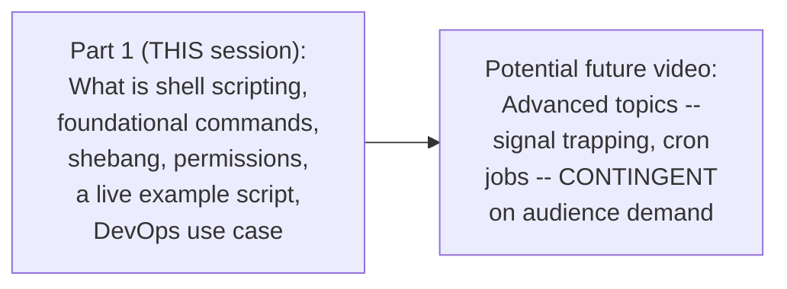

#### 🎯 Key Takeaways

* This is genuinely **Part 1** of a stated, planned "Shell Scripting Zero to Hero" series — from the SAME instructor as the earlier DevOps Zero to Hero content in this workspace.
* The session is explicitly, directly framed through the **DevOps engineer's own, real perspective** — not generic Linux scripting in the abstract.
* Advanced topics (signal trapping, cron jobs) are **explicitly, honestly deferred**, contingent on genuine audience interest — not presented as already covered.

---

### 2. What Is Shell Scripting? Motivating Automation With a Simple Example

#### 📖 Definition — Automation, Precisely Defined

> 💡 **Given directly:** *"Automation is a process where you will try to reduce your manual activities... this is common in any field, right? This has nothing to do with DevOps or software."*

#### 🪜 Step-by-Step — A Complete, Precise, Scaling Example

> 💡 **Given directly:** *"Somebody asked me, 'Abhishek, write numbers from 1 to 10' — so what I'll simply do, I'll use the echo command, I'll print the numbers from 1 to 10... now what if this number increases from 10 to 1000?... now what if I increase the zeros?... so now it is technically impossible."*

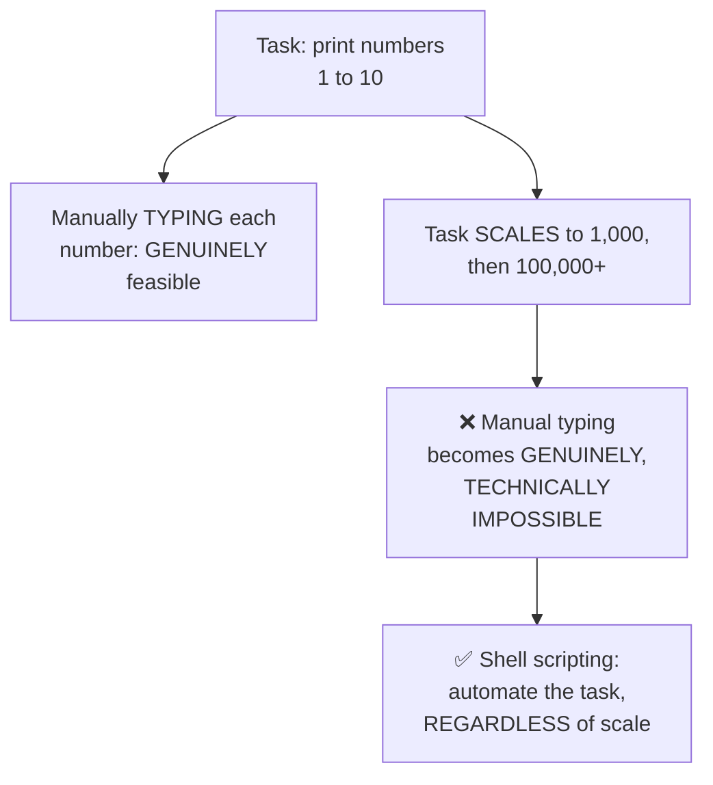

#### 🪜 Step-by-Step — A Second, Precise, Confirming Example

> 💡 **Given directly:** *"Somebody comes to you and says 'Abhishek, create 100 files'... so I'll use one of the Linux commands, probably called touch... so somebody says 'okay, not 100, 2,000'... so this is why you need automation, or this is why you need shell scripting."*

#### 📖 Definition — Shell Scripting, Precisely Defined

> 💡 **Given directly:** *"Shell scripting in Linux is a process of automating your day-to-day activities or regular activities on your Linux computer... this can be anywhere — irrespective of your AWS-hosted Linux virtual machine, or your laptop Linux virtual machine — as far as you are using the same shell."*

#### ⚠ Common Mistakes

* Assuming shell scripting is genuinely relevant only for LARGE, complex automation tasks — explicitly, directly motivated via GENUINELY SIMPLE, small-scale examples (printing numbers, creating files) that become impossible ONLY at scale — the underlying PRINCIPLE applies regardless of task complexity.
* Assuming shell scripts are tied to a SPECIFIC machine or environment — explicitly, directly clarified: they can genuinely run ANYWHERE, as long as the SAME shell is available.

#### 🎯 Key Takeaways

* **Automation**, precisely defined: reducing manual, repetitive activity — a GENERAL principle, not DevOps- or software-specific.
* **Shell scripting** is precisely the process of automating regular, day-to-day activities on a Linux machine — genuinely portable across ANY environment using the same shell.
* The core, motivating insight: tasks that are GENUINELY feasible manually at SMALL scale become GENUINELY, TECHNICALLY IMPOSSIBLE at LARGE scale — directly, concretely motivating the NEED for automation.

---
### 3. Foundational Linux Commands: touch, ls, man, cat

#### 📖 Definition — touch, Precisely Introduced

> 💡 **Given directly:** *"To write a shell script, what is the basic thing that requires is you need to have a file... you can say `touch` and probably let's say 'first shell script'... the extension would be `.sh`, similar to if you are writing a Python file it would be `.py`."*

```bash
touch first_shell_script.sh
```

#### 📖 Definition — ls and ls -ltr, Precisely Introduced

> 💡 **Given directly:** *"How do I list the files?... the command that is used here is `ls`... now if I want to look at the files with timestamp — okay, which file is created first and which file is created next — I can simply say `ls -ltr`, and it shows the files that are created, who created the file, when did they create, what are the permissions, which group they belong to."*

```bash
ls          # list files
ls -ltr     # list files with details, sorted by timestamp
```

#### 📖 Definition — man, Precisely Introduced

> 💡 **Given directly:** *"Linux provides you an option which is very good, called `man` — man is nothing but manual — just suffix any command with man and simply type the command, so it gives you the details of the command."*

```bash
man touch
man ls
```

> 💡 **Given directly, confirming the genuine, real output for `touch`:** *"Touch utility sets the modification and access times of the files. If any file does not exist, it is created with default permissions."*

#### 📖 Definition — cat, Precisely Introduced

> 💡 **Given directly:** *"I don't have to open the file and close the file, I can simply, without opening and closing the file, print the contents of the file — so that is the purpose of using cat command."*

```bash
cat first_shell_script.sh
```

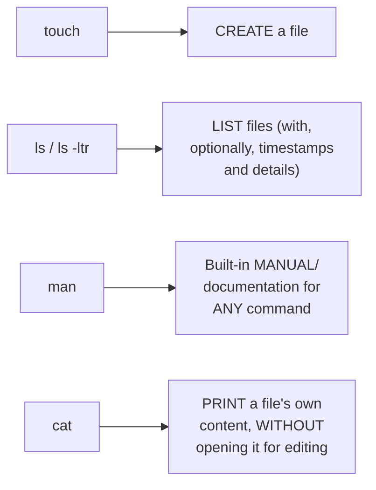

#### ⚠ Common Mistakes

* Assuming `man` requires an internet connection or external resource — explicitly, directly confirmed as a GENUINELY BUILT-IN, offline manual, pre-installed on any Linux machine.
* Assuming `cat` genuinely OPENS a file for editing — explicitly, directly distinguished: it only DISPLAYS the content; editing genuinely requires a DIFFERENT tool (Vim/VI, covered in Section 4).

#### 🎯 Key Takeaways

* **`touch`** creates a new, empty file; **`ls`**/**`ls -ltr`** lists files (optionally with detailed, timestamped information); **`man`** provides built-in, genuine documentation for ANY command; **`cat`** prints a file's own content WITHOUT opening it for editing.
* These four commands are directly, precisely confirmed as **pre-installed, built-in binaries** on ANY Linux machine — no separate installation required.
* `man <command>` is the **genuine, go-to reference** whenever a command's own exact syntax or options are forgotten — directly demonstrated live with `man touch`.

---

### 4. Editing Files With Vim/VI: Insert Mode, Save & Quit

#### 📖 Definition — Vim vs. VI, Precisely Distinguished

> 💡 **Given directly:** *"You can also use the Vim command — so Vim is not available by default, you have to install it — but VI is directly available on any platform. So if you're using any Linux machine, VI is by default available."*

#### 🔍 Internal Working — A Genuine, Direct Confirmation: Vim Both CREATES and OPENS

> 💡 **Given directly:** *"What happens if I don't use the touch command and if I directly use the Vim command?... as soon as I press enter, so the file is automatically created — it says 'this is a new file,' and you can start writing on this file."*

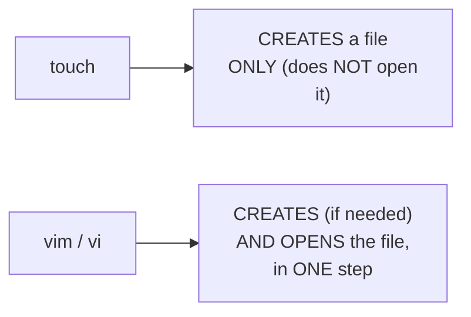

#### ❓ Why It Exists — Precisely Why `touch` Is STILL Genuinely Necessary, Despite Vim's Convenience

> 💡 **Given directly:** *"Touch command is basically used in your automations... whenever you're doing automations, you cannot use the Vim command, because Vim is basically used to write inside a file... what happens if a movie is opened and left like that?... you cannot keep a lot of files open."*

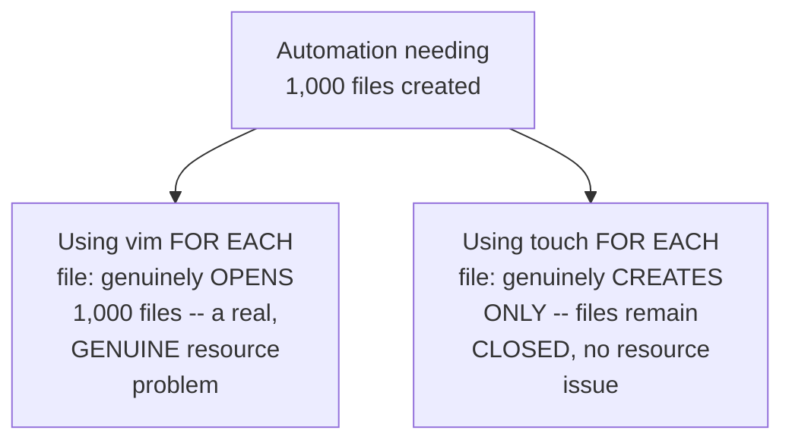

#### 🪜 Step-by-Step — The Complete, Precise Vim Workflow

> 💡 **Given directly:** *"Once you open this file, if I enter my keyboard, okay, so the first thing that I have to do is come to the insert mode... for that you have to use the escape button and press I... once you press I, it says that okay, now we are in the insert mode."*

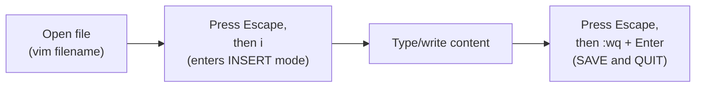

#### ⚠ A Direct, Honest, Live-Demonstrated Mistake

> 💡 **Given directly:** *"Instead of Escape colon WQ, what I'll just say is just Q... what happens here is if I reopen this file, there will be nothing inside this file — now why there is nothing? Because I did not use WQ, but I used Q — is just like quit — so you are not writing anything inside the file, and you are just quitting the file."*

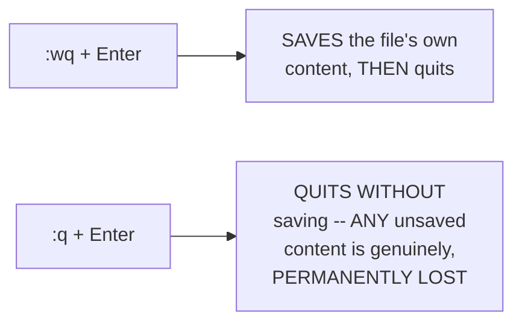

#### ⚠ Common Mistakes

* Confusing `:q` (quit without saving) with `:wq` (write/save, then quit) — explicitly, directly, HONESTLY demonstrated via a real, live mistake: content typed using `:q` was genuinely, permanently LOST.
* Assuming `vim` is always available on every Linux machine, since `vi` is — explicitly, directly clarified: `vim` genuinely requires SEPARATE installation, while `vi` is genuinely, universally pre-installed.

#### 🎯 Key Takeaways

* **`vi`** is universally, genuinely pre-installed on any Linux machine; **`vim`** offers a more user-friendly interface but requires SEPARATE installation.
* Unlike `touch` (create only), `vim`/`vi` genuinely **CREATE AND OPEN** a file in one step — but this makes them GENUINELY UNSUITABLE for automation involving MANY files, since opening many files simultaneously is a real, genuine resource concern.
* The complete, correct editing workflow: **open → Escape, then `i` (insert mode) → type content → Escape, then `:wq` (save and quit)** — directly, honestly distinguished from `:q` (quit WITHOUT saving, genuinely losing unsaved content).

---
### 5. The Shebang Line: A Complete History of sh, bash, dash & ksh

#### 📖 Definition — The Shebang, Precisely Introduced

> 💡 **Given directly:** *"The very first thing that you do is use this specific indentation, or use the specific syntax slash, hashtag, followed by exclamatory, followed by slash — so this is called shebang."*

```bash
#!/bin/bash
```

#### ❓ Why It Exists — The Precise, Genuine Reason Every Script Needs One

> 💡 **Given directly:** *"There has to be an executable who is executing this shell script... these are the executables... there is Bash, there is ksh, there is sh, and similarly there is also something called Dash... you have to specify, you have to inform your Linux or your kernel that, okay, this is the executable that I want to use for executing my shell script."*

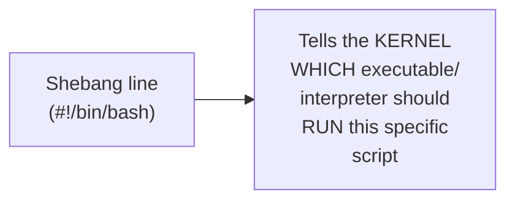

#### 📖 Definition — The Genuine, Real Differences Between Shell Executables

> 💡 **Given directly:** *"Each of them have their own syntax differences... there is not a drastic difference between bash and ksh and dash... but they vary slightly in terms of syntax... the way you write a for loop in bash, and the way you write a for loop in ksh, is totally different."*

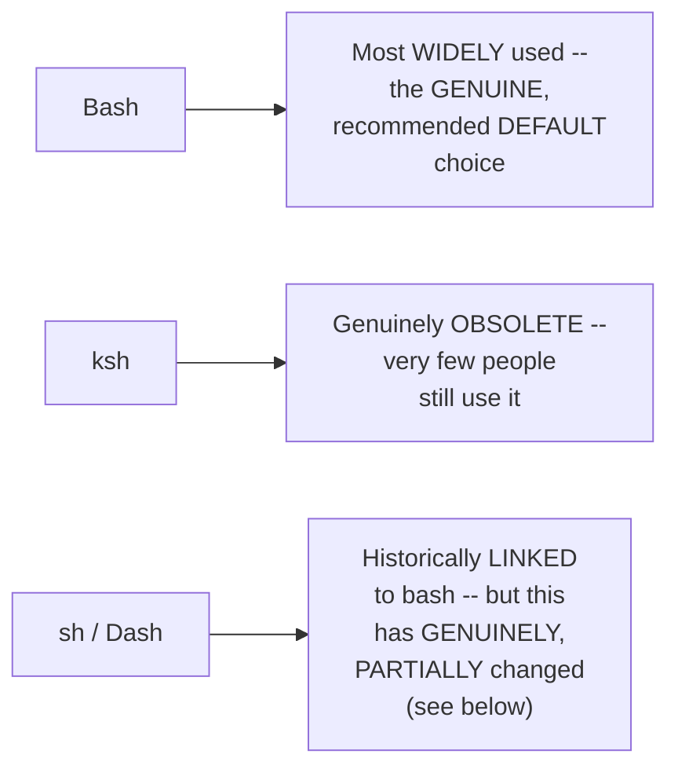

#### 🔍 Internal Working — The Complete, Precise History of `/bin/sh`'s Own Linking Behavior

> 💡 **Given directly:** *"Previously, if you look at the history of Linux, `/bin/sh` is something that redirects... there is a concept in Linux called linking... using linking, even if you are providing `/bin/sh`, it was previously redirecting to `/bin/bash`... so even though you are providing this, the request is taken by sh, but it is forwarded to bash."*

> 💡 **Given directly, the CRITICAL, genuine, recent change:** *"These days, like over a couple of years... some of the operating systems like Ubuntu, they have started using — I mean, they have started linking `/bin/sh` to `/bin/dash`... so instead of bash, they started using Dash as the default."*

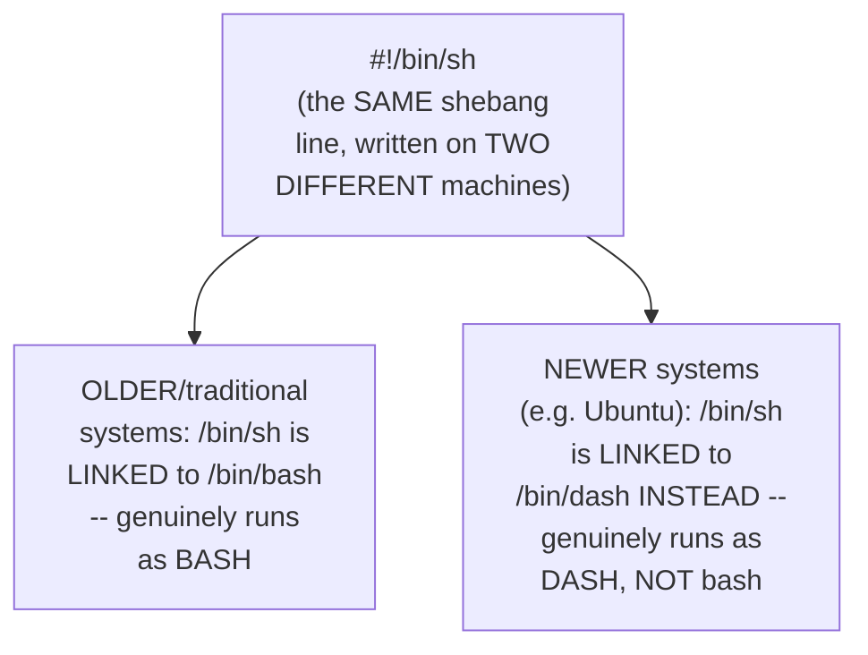

#### ⚠ A Direct, Important, Real, Practical Warning

> 💡 **Given directly:** *"You have to be very careful — if you are writing a bash scripting, always use `/bin/bash`... do not complicate the script... your script might not work in some cases — like, you share your shell script to one of your colleagues, and inside their machine, if `/bin/sh` by default has set a link to `/bin/dash`, your script will not work."*

#### ❓ Why It Exists — A Direct, Explicit, Genuine Interview Question

> 💡 **Given directly:** *"This is your interview question as well — what is the difference between `/bin/sh` and `/bin/dash`? ... if somebody is asking, you have to clearly explain that previously both of them were the same, because `/bin/sh` was redirecting using the linking concept to `/bin/bash`, but now it is not the same, because some of the operating systems have decided to use Dash as default."*

#### ⚠ Common Mistakes

* Assuming `/bin/sh` and `/bin/bash` are GENUINELY, ALWAYS interchangeable — explicitly, directly, HONESTLY corrected: this was historically TRUE (via linking), but is GENUINELY, PRACTICALLY no longer universal, since some modern systems (like Ubuntu) now link `/bin/sh` to `/bin/dash` instead.
* Writing `#!/bin/sh` for a bash-specific script, assuming it will ALWAYS behave identically to `#!/bin/bash` — explicitly, directly, practically warned against: ALWAYS use the EXACT, explicit `#!/bin/bash` when bash-specific syntax is genuinely required.

#### 🎯 Key Takeaways

* The **shebang line** (`#!/bin/bash`) tells the kernel WHICH shell executable should run the script — **bash** is directly confirmed as the most widely-used, RECOMMENDED default; **ksh** is genuinely obsolete.
* `/bin/sh` was **historically LINKED to `/bin/bash`** — but this is GENUINELY, PRACTICALLY no longer universal: some modern systems (e.g., Ubuntu) now link `/bin/sh` to `/bin/dash` INSTEAD.
* This is **explicitly, directly framed as a real, common interview question** — always use the EXPLICIT `#!/bin/bash` for bash-specific scripts, to avoid GENUINE, real portability failures across different machines.

---

### 6. Executing a Script & Understanding Permissions (chmod)

#### 📖 Definition — The Two Genuine Ways to Execute a Script

> 💡 **Given directly:** *"Either I can say `sh`, you can simply suffix with `sh` and enter your file name... or I can simply use `dot slash`... any executable file in Linux can be executed using dot slash."*

```bash
sh scriptname.sh
./scriptname.sh
```

#### ❓ Why It Exists — The Precise, Genuine Reason for a "Permission Denied" Error

> 💡 **Given directly:** *"Although you are the creator of the file, Linux terminal wants to understand — whenever you create a shell script or any file — Linux terminal wants to understand, okay, who can execute this file... the main purpose is security."*

#### 📖 Definition — chmod, Precisely Introduced

> 💡 **Given directly:** *"CH stands for change — so what you are basically doing is you are changing the permissions of a specific file using the chmod command."*

#### 📖 Definition — The Three, Genuine Permission Categories

> 💡 **Given directly:** *"The first category is what are the permissions for the administrator user [owner]... second is what are the permissions for the group... third is what are the permissions for you [everyone]."*

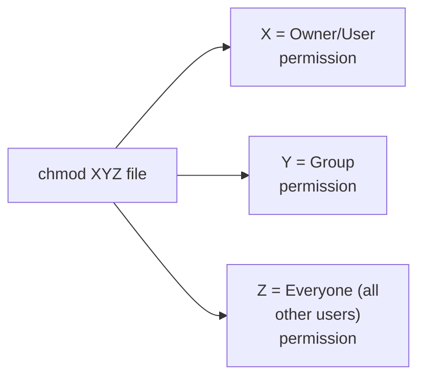

#### 📖 Definition — The Complete, Precise 4-2-1 Formula

> 💡 **Given directly:** *"Linux basically used a formula called four two one — 4 is for read, 2 is for right [write], 1 is for execute."*

```text
4 = Read     2 = Write     1 = Execute
7 = 4+2+1 = Read + Write + Execute (full access)
```

#### 🪜 Step-by-Step — Multiple, Complete, Worked chmod Examples

> 💡 **Given directly, `chmod 777`:** *"If you want to grant access to everybody, you can simply say `chmod 777` followed by the name of the file."*

> 💡 **Given directly, `chmod 444`:** *"The permissions that I have granted is 444 — that means read, read, read... so that means nobody can actually write this file."*

> 💡 **Given directly, a live-demonstrated, genuine "permission denied" error and its fix:** *"If I try to execute this file... it says permission denied — this is because I changed the permissions of the file — if I do it back, like `chmod 777`... now let me try to use the command one more time... so now it got executed."*

```text
chmod 777 file.sh   -> owner: read+write+execute | group: read+write+execute | everyone: read+write+execute
chmod 444 file.sh   -> owner: read only          | group: read only         | everyone: read only
chmod 770 file.sh   -> owner: full access        | group: full access       | everyone: NO access
chmod 111 file.sh   -> owner: execute only       | group: execute only      | everyone: execute only
```

#### 🔍 Internal Working — Confirming Precisely How the history Command Complements This Workflow

> 💡 **Given directly:** *"History is another command — if you just type history and press enter, it will show you all the commands that you have entered — so let's say you forgot a specific command... you can simply use the history command."*

```bash
history
```

#### ⚠ Common Mistakes

* Assuming file OWNERSHIP alone (being the creator) grants execution rights — explicitly, directly, live-demonstrated as FALSE: Linux GENUINELY, SEPARATELY requires explicit EXECUTE permission, regardless of who created the file.
* Miscounting or misapplying the 4-2-1 formula — explicitly, directly, precisely worked through MULTIPLE examples (777, 444, and the owner/group/everyone breakdown for 770 and 111), directly reinforcing the correct, additive calculation.

#### 🎯 Key Takeaways

* A script genuinely requires **EXPLICIT EXECUTE PERMISSION** before it can run — directly, live-demonstrated via a real "permission denied" error, corrected via `chmod 777`.
* **`chmod`**'s three genuine categories (owner, group, everyone) each receive a permission VALUE computed via the **4-2-1 formula** (read=4, write=2, execute=1) — values are ADDED together (e.g., 7 = full read+write+execute access).
* **`history`** genuinely displays every previously-entered command — a real, practical tool for recalling forgotten commands or scripts.

---
### 7. Navigation Commands: pwd, mkdir, cd — and a Complete, Live Example Script

#### 📖 Definition — pwd, Precisely Introduced

> 💡 **Given directly:** *"For listing the current working directory, or the present working directory — in which directory you are — you can simply use the PWD command... PWD says that, okay, this is your path."*

```bash
pwd
```

#### 📖 Definition — mkdir, Precisely Introduced

> 💡 **Given directly:** *"I also want to explain you how to create folders... using mkdir, which is make directory... just say `mkdir my_first_folder`."*

```bash
mkdir my_first_folder
```

#### 📖 Definition — cd, Precisely Introduced

> 💡 **Given directly:** *"I want to go inside this folder... in Linux you use the CD command — so CD is change directory... if I go back using `cd ..` and I use PWD, now it says that, okay, you are in the Shell Scripting Tutorials folder."*

```bash
cd my_first_folder    # move INTO a directory
cd ..                  # move UP one directory level
```

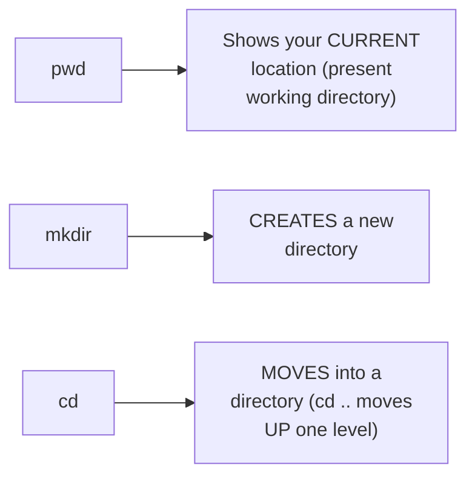

#### 🪜 Step-by-Step — A Complete, Real, Live-Built Example Script

> 💡 **Given directly, the complete, precise, step-by-step construction:** *"I'll say create a file — what is the command to create a file? I can use simply the touch... let me create two files... before that, what I'll do is I'll create a folder as well... I'll name this folder as Abhishek, for example... what is the purpose? I want to go inside this folder using `cd Abhishek`, and I want to create two files."*

```bash
#!/bin/bash

# create a folder
mkdir Abhishek

# go inside the folder
cd Abhishek

# create two files
touch first_file
touch second_file
```

#### 🪜 Step-by-Step — Genuinely, Correctly Granting Permissions & Executing

> 💡 **Given directly:** *"As soon as I save this, what is the thing that I have to do? I have to give permissions to this... I'll simply say `chmod 777`."*

```bash
chmod 777 sample_shell_script.sh
./sample_shell_script.sh
```

#### 🔍 Internal Working — A Complete, Live, Verified Confirmation

> 💡 **Given directly:** *"It executed, it did not print anything... now let me press LS — what happened? This is the script that is there, but it also created a folder called Abhishek... let me go to the folder Abhishek and let me press enter, LS — okay, it created first file and second file. That is your task, and which is accomplished."*

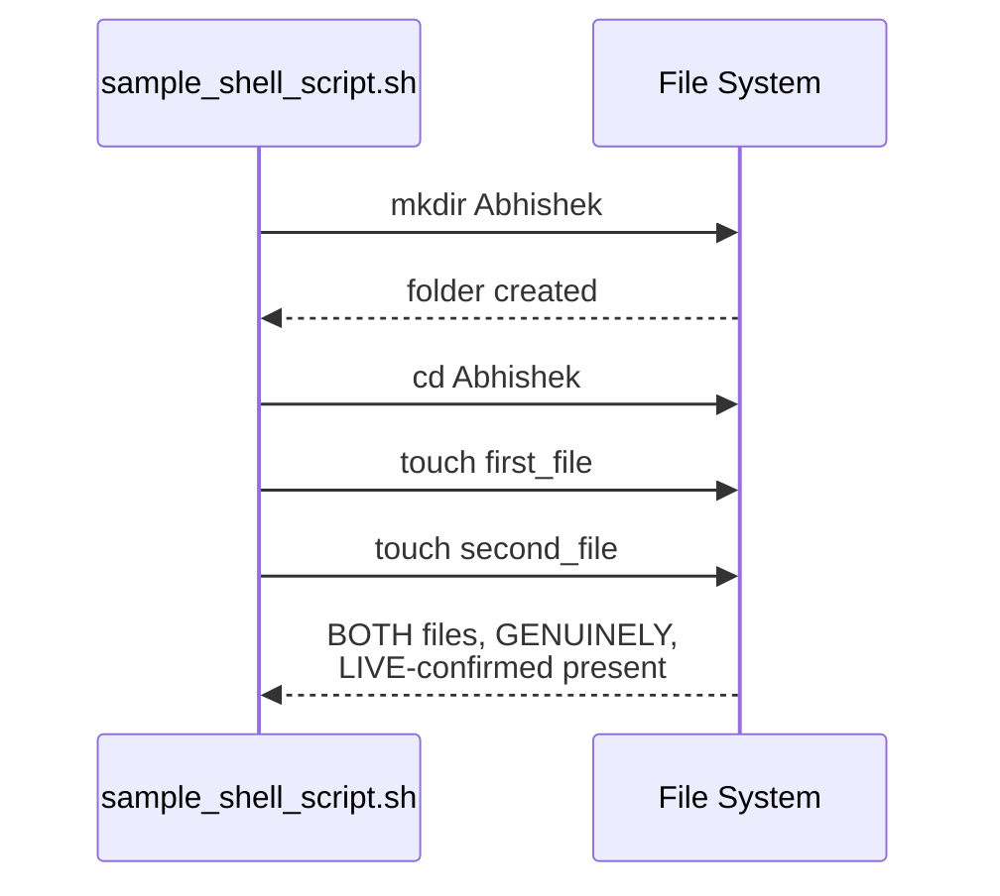

#### 📖 Definition — Comments, Precisely Reinforced

> 💡 **Given directly:** *"Whenever you are writing a cell script, it is always a good practice to write comments... how do you write comments in shell script? Use the `#` — so hashtag references comments — whenever you write something followed by hashtag, this line is ignored."*

#### ⚠ Common Mistakes

* Assuming a shell script that produces NO printed output has genuinely FAILED — explicitly, directly, live-demonstrated as a MISCONCEPTION: the script GENUINELY, SILENTLY succeeded (creating the folder and files), simply WITHOUT any `echo` statement to print confirmation.
* Forgetting to grant EXECUTE permission before attempting to run a NEWLY-written script — explicitly, directly reinforced as a NECESSARY, standard step (Section 6), reapplied here in this complete, worked example.

#### 🎯 Key Takeaways

* **`pwd`** shows your current location; **`mkdir`** creates a new directory; **`cd`** moves between directories (`cd ..` moves UP one level).
* A **complete, real, working script** was built and GENUINELY, LIVE-VERIFIED: creating a folder, navigating into it, and creating two files — directly confirming EVERY command's own real effect via `ls`.
* **Comments** (`#`) are directly, explicitly reinforced as a GOOD, RECOMMENDED practice — helping ANY reader quickly understand a script's own purpose WITHOUT reading every line in full detail.

---

### 8. Shell Scripting's Role in DevOps: A Complete, Worked Story

#### ❓ Why It Exists — The Precise, Genuine, Real-World Context

> 💡 **Given directly:** *"As a DevOps engineer, you have different activities — you have infra maintenance, you maintain all the infrastructure of your organization, you maintain all the code of your organization using Git repositories... you also do a lot of configuration management... for all of these purposes, on a day-to-day basis, you use shell scripting."*

#### 🪜 Step-by-Step — A Complete, Genuine, Worked Story: "John," a DevOps Engineer at a Large Company

> 💡 **Given directly:** *"Let's say there is a person called John... he's working as a DevOps engineer for [a large company, for example]... he has noticed that [the company] has close to 10,000 virtual machines... and all of these VMs are Linux-based VMs. He has to manage all of these 10,000 virtual machines, and he has to monitor the node health of all of these virtual machines."*

#### 🪜 Step-by-Step — The Genuine, Real Problem Before Automation

> 💡 **Given directly:** *"Every time he has to go to these virtual machines, and their developers are facing some troubles with this node — they say that, okay, this virtual machine is not performing as expected — they say the CPU is going out, CPU is getting completed, or they say memory is running out."*

#### 🪜 Step-by-Step — The Genuine, Real Automation Solution

> 💡 **Given directly:** *"He will write one simple shell script, and he'll save the shell script in a Git repository, and whenever some DevOps engineer says, okay, there is an issue with 9999 VM, what he'll do is, using the shell script, he will just execute the shell script on his local machine, and what the shell script does is it logs into this machine... and it looks into all of these parameters, like CPU, memory."*

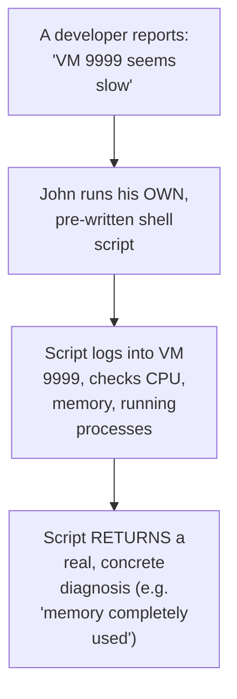

#### 🪜 Step-by-Step — The Genuine, Further, PROACTIVE Automation Step

> 💡 **Given directly:** *"Instead of these people raising [issues], what John thought is, okay, let me do a simple thing — on a frequent basis, like once every day or once every two days, he decides to basically execute this script automatically... this script should log into each of these 10,000 machines, look at the status of each of these 10,000 machines, and it has to send out an email notification."*

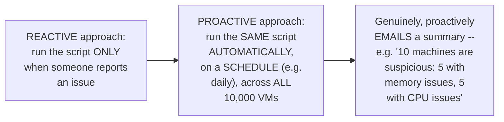

#### 🏢 Real-World / Production Usage — A Genuine, Direct, Practical Interview Framing

> 💡 **Given directly:** *"Whenever somebody is asking why are you using DevOps [with] shell scripting, so you can say this example that I just mentioned — you can say that I have automated all the node health of my virtual machines... people might ask you, okay, there are some automated tools, why do you want to write this shell scripting? So you can say... in my script I am fetching more parameters that are not provided by these tools."*

#### ⚠ Common Mistakes

* Assuming shell scripting's own DevOps value is limited to REACTIVE, one-off troubleshooting — explicitly, directly extended into a GENUINELY more valuable, PROACTIVE, SCHEDULED monitoring pattern (checking ALL machines automatically, rather than only when a problem is REPORTED).
* Assuming pre-built monitoring TOOLS always genuinely make custom shell scripting UNNECESSARY — explicitly, directly, honestly countered: custom scripts can genuinely FETCH additional, SPECIFIC parameters that off-the-shelf tools may NOT provide.

#### 🎯 Key Takeaways

* This complete, worked "John" story directly, concretely illustrates shell scripting's own **genuine, practical DevOps value**: automating REPETITIVE diagnostic work (checking VM health) that would be GENUINELY, PRACTICALLY impossible to do manually at scale (10,000 VMs).
* The story directly demonstrates a genuine **PROGRESSION**: from REACTIVE (run the script when someone reports an issue) to PROACTIVE (run the SAME script automatically, on a schedule, across ALL machines, with automated email alerting).
* This example is **explicitly, directly framed** as genuine, real interview-answer material — a concrete way to articulate shell scripting's own practical value when asked.

---
### 9. Monitoring Node Health: nproc, free & top

#### 📖 Definition — nproc, Precisely Introduced

> 💡 **Given directly:** *"To monitor the node health, like I mentioned, you can monitor the CPU as well as RAM... so for CPU there is a command called `nproc` — `nproc` will list the CPUs on your machine."*

```bash
nproc
```

#### 📖 Definition — free, Precisely Introduced

> 💡 **Given directly:** *"To understand what is the memory that is present on your laptop, you can use the free command — so using free command you can identify what is the free memory, what is the total memory, what is the used memory."*

```bash
free
```

#### 📖 Definition — top, Precisely Introduced

> 💡 **Given directly:** *"Instead of using all of these things, you can use a specific command, or a special command, called `top` — using top command you can basically identify what are the processes that are running on your machine — which process is taking more memory, which process is taking less memory."*

```bash
top
```

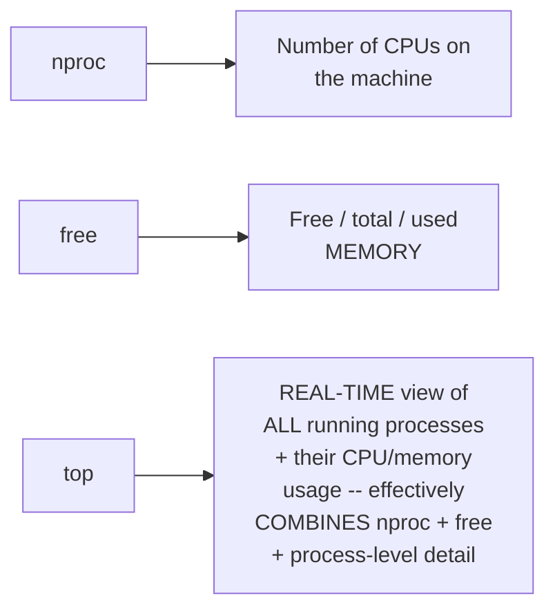

#### 🔍 Internal Working — A Genuine, Real, Live-Observed `top` Output

> 💡 **Given directly:** *"It says total 625 processes running on my machine — there are 625 processes, out of which... 622 are sleeping — and it also provides you information about which process is using how much amount of memory, which process is running with which process ID, how much CPU is being used."*

#### 🏢 Real-World / Production Usage — Direct, Genuine Interview Framing

> 💡 **Given directly:** *"These are some of the interview questions that people will ask you — how do you monitor the node health? You can simply say, I can use the top command, or I can write the custom shell scripts — what are the different parameters that are used to evaluate the node health? Some basic parameters are CPU and RAM."*

#### ⚠ Common Mistakes

* Assuming `nproc` and `free` are genuinely REQUIRED separately, when a more complete overview is needed — explicitly, directly clarified: `top` genuinely provides a MORE comprehensive, real-time, PROCESS-LEVEL view, effectively combining and extending what `nproc`/`free` individually offer.
* Assuming node-health monitoring is a purely THEORETICAL, abstract concept — explicitly, directly, concretely CONNECTED to the "John" story (Section 8): these are PRECISELY the commands a real monitoring script would genuinely use internally.

#### 🎯 Key Takeaways

* **`nproc`** shows the number of CPUs; **`free`** shows memory usage (free/total/used); **`top`** provides a REAL-TIME, comprehensive view of ALL running processes and their CPU/memory usage.
* This section directly, precisely **connects back to Section 8's own "John" story** — these are the GENUINE, real commands a node-health-monitoring script would actually use.
* This is **explicitly, directly framed** as real, common interview material: "how do you monitor node health" is a genuine, practical DevOps question these commands directly answer.

---

### 10. Closing: Advanced Topics Teased, Contingent on Feedback

#### 🪜 Step-by-Step — A Complete, Honest Recap of What Was Covered

> 💡 **Given directly:** *"What did we do today? We learned about what is the reason for shell scripting... we learned an interview question, that is, what is the difference between `bin sh` and `bin bash`... and after that we learned the shell commands."*

#### ⚠ A Direct, Honest, Explicit Deferral of Advanced Topics

> 💡 **Given directly:** *"Without going into the depth of other things, like, you know, how do you trap signals — so there are advanced topics in shell scripting, like how do you trap a signal — for example, if I want to stop an executing shell script, I can simply press Ctrl+C... so how do you trap the signal? Even if somebody is pressing Ctrl+C, the script should not be stopped — these are some of the things which are the advanced topics."*

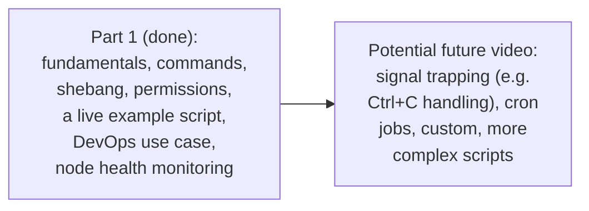

#### 🔍 Internal Working — The Genuine, Direct, Explicit Condition for a Follow-Up

> 💡 **Given directly:** *"If you feel that this video is useful to you, and if you want me to continue and make a video on the advanced shell script concepts, simply comment on the video saying that please do an advanced video on the shell scripting, so that I can go ahead and make the advanced video as well."*

#### ⚠ Common Mistakes

* Assuming this session's own coverage represents the FULL, complete scope of shell scripting — explicitly, directly, honestly clarified: signal trapping and cron jobs are EXPLICITLY named as advanced topics NOT covered here.
* Assuming a follow-up, advanced video is ALREADY, DEFINITELY planned — explicitly, directly clarified: it is EXPLICITLY, HONESTLY made CONTINGENT on genuine, real audience demand (via comments).

#### 🎯 Key Takeaways

* This session **genuinely, honestly recaps** its own complete scope: automation motivation, foundational commands, the shebang/interview-question distinction, permissions, navigation, a live example script, and DevOps use cases.
* **Signal trapping (e.g., handling Ctrl+C) and cron jobs** are EXPLICITLY, directly named as ADVANCED topics NOT covered in this specific session.
* A follow-up, advanced video is **explicitly, honestly made CONTINGENT** on genuine audience interest — not presented as an already-guaranteed continuation.

---
## 📝 Glossary

| Term | Definition | Why It Matters |
|---|---|---|
| **Shebang** | The first line of a script (`#!/bin/bash`), specifying its interpreter | Tells the kernel WHICH shell should run the script |
| **touch** | Creates an empty file | Genuinely necessary for automation (unlike vim/vi) |
| **ls / ls -ltr** | Lists files (optionally with timestamps/details) | Basic navigation/inspection |
| **man** | Built-in manual/documentation for any command | The genuine, go-to reference tool |
| **cat** | Prints a file's content without opening it | Faster than open-then-close for quick inspection |
| **vim / vi** | Text editors -- vi is universal, vim requires installation | CREATE and OPEN a file in one step |
| **chmod** | Changes file permissions | Owner/Group/Everyone x Read(4)/Write(2)/Execute(1) |
| **pwd** | Shows the present working directory | Basic navigation |
| **mkdir** | Creates a new directory | Basic navigation |
| **cd** | Changes the current directory | Basic navigation |
| **nproc** | Shows the number of CPUs | Node health monitoring |
| **free** | Shows memory usage | Node health monitoring |
| **top** | Real-time view of all running processes | Comprehensive node health monitoring |

---

## 🔄 Revision Notes — One-Minute Revision

* This is **Part 1** of a stated, planned "Shell Scripting Zero to Hero" series -- fundamentals only; advanced topics (signal trapping, cron jobs) explicitly, honestly deferred, contingent on audience demand.
* **Automation motivation**: manual tasks (printing 1-10, creating 100 files) become GENUINELY IMPOSSIBLE at scale (1000s+) -- this is precisely why shell scripting exists.
* **Foundational commands**: `touch` (create file) | `ls`/`ls -ltr` (list files) | `man` (built-in manual) | `cat` (print content without opening).
* **Vim/VI workflow**: open -> Escape, then `i` (insert mode) -> type -> Escape, then `:wq` (save+quit) -- `:q` alone QUITS WITHOUT SAVING (a real, live-demonstrated mistake). `vi` is universal; `vim` requires separate installation. Vim/vi CREATE+OPEN in one step -- genuinely UNSUITABLE for automation involving many files (unlike `touch`, which only creates).
* **Shebang** (`#!/bin/bash`): tells the kernel which shell executable runs the script. Bash is the widely-used, recommended default; ksh is genuinely obsolete. HISTORICALLY, `/bin/sh` was LINKED to `/bin/bash` -- but modern systems (e.g. Ubuntu) now link `/bin/sh` to `/bin/dash` INSTEAD. This is a GENUINE, real interview question: always use explicit `#!/bin/bash` for bash-specific scripts.
* **Execution**: `sh script.sh` or `./script.sh`. Requires EXPLICIT execute permission (a real "permission denied" error was live-demonstrated and fixed).
* **chmod**: 3 categories (owner/group/everyone) x the 4-2-1 formula (4=read, 2=write, 1=execute). `777`=full access all around; `444`=read-only all around; `770`=full access for owner+group, NONE for everyone; `111`=execute-only.
* **Navigation**: `pwd` (current location) | `mkdir` (create directory) | `cd` (change directory, `cd ..` moves up).
* **Complete, live-built example**: a script using `mkdir`, `cd`, and `touch` (with `#` comments) to create a folder and two files -- genuinely, live-verified via `ls`.
* **DevOps role**: the "John" story -- a DevOps engineer managing 10,000 VMs writes a node-health-monitoring shell script, first REACTIVELY (run when an issue is reported), then PROACTIVELY (run automatically, on a schedule, across ALL VMs, with email alerting). Explicitly framed as genuine interview-answer material.
* **Node health monitoring**: `nproc` (CPU count) | `free` (memory) | `top` (comprehensive, real-time process view) -- directly connects to the "John" story's own underlying script logic.
* **Closing**: advanced topics (signal trapping, e.g. handling Ctrl+C; cron jobs) explicitly, honestly deferred to a POTENTIAL future video, contingent on genuine audience demand.

---

## 📋 Cheat Sheet

**Foundational commands:**
```bash
touch file.sh          # create a file
ls / ls -ltr             # list files (with details)
man <command>              # built-in manual
cat file.sh                 # print file content
```

**Vim/VI workflow:**
```text
vim file.sh   -> Escape, then i (insert mode) -> type content
              -> Escape, then :wq + Enter (SAVE and quit)
              -> Escape, then :q + Enter (quit WITHOUT saving)
```

**Shebang & execution:**
```bash
#!/bin/bash          # ALWAYS use this explicit form for bash scripts

chmod 777 script.sh    # grant execute permission
./script.sh              # execute (or: sh script.sh)
```

**chmod's 4-2-1 formula:**
```text
4 = Read | 2 = Write | 1 = Execute
chmod [owner][group][everyone] filename
777 = full access, all three | 444 = read-only, all three
770 = full access owner+group, none for everyone
```

**Navigation:**
```bash
pwd            # current directory
mkdir <name>     # create a directory
cd <name>          # move into a directory
cd ..                # move up one level
```

**Node health monitoring:**
```bash
nproc      # CPU count
free        # memory usage
top          # real-time, comprehensive process view
```

---

## 🔥 Interview Questions & Answers

### 🟢 Beginner

**Q1.**

**Question:** What is the genuine, core purpose of shell scripting?

**Answer:** Automating repetitive, manual, day-to-day activities on a Linux machine.

**Explanation:** Directly, precisely defined.

**Why Interviewers Ask This:** Basic, foundational conceptual grounding.

**Possible Follow-up:** "Give a simple example of a task that becomes impossible to do manually at scale."

**Q2.**

**Question:** What is the difference between `touch` and `vim` when creating a file?

**Answer:** `touch` only creates the file; `vim` creates AND opens it for editing, in one step.

**Explanation:** Directly, precisely distinguished.

**Why Interviewers Ask This:** Tests genuine, practical command knowledge.

**Possible Follow-up:** "Why is `touch` specifically preferred for automation involving many files?"

**Q3.**

**Question:** What does `:wq` do in Vim/VI?

**Answer:** Saves (writes) the file, then quits.

**Explanation:** Directly, explicitly confirmed.

**Why Interviewers Ask This:** Basic, essential editor knowledge.

**Possible Follow-up:** "What does `:q` alone do instead?"

**Q4.**

**Question:** What is a shebang line?

**Answer:** The first line of a script (e.g., `#!/bin/bash`), specifying which shell interpreter should run it.

**Explanation:** Directly, precisely defined.

**Why Interviewers Ask This:** Foundational, frequently-tested shell scripting knowledge.

**Possible Follow-up:** "What is the recommended, safest shebang to use for a bash script?"

**Q5.**

**Question:** Is `/bin/sh` always genuinely identical to `/bin/bash`?

**Answer:** No -- historically it was, via linking, but modern systems (e.g. Ubuntu) may link `/bin/sh` to `/bin/dash` instead.

**Explanation:** Directly, precisely, honestly clarified.

**Why Interviewers Ask This:** A directly-stated, common, real interview question.

**Possible Follow-up:** "What should you always do to avoid this exact portability issue?"

**Q6.**

**Question:** What does `chmod 777` genuinely grant?

**Answer:** Full read, write, and execute permissions to the owner, group, and everyone.

**Explanation:** Directly, precisely explained via the 4-2-1 formula.

**Why Interviewers Ask This:** Basic, essential permissions knowledge.

**Possible Follow-up:** "What would `chmod 444` grant instead?"

**Q7.**

**Question:** What command shows the present working directory?

**Answer:** `pwd`.

**Explanation:** Directly, explicitly stated.

**Why Interviewers Ask This:** Basic, foundational navigation knowledge.

**Possible Follow-up:** "What command creates a new directory?"

**Q8.**

**Question:** What command provides a real-time, comprehensive view of all running processes and their resource usage?

**Answer:** `top`.

**Explanation:** Directly, explicitly stated.

**Why Interviewers Ask This:** Basic, practical node-health-monitoring knowledge.

**Possible Follow-up:** "What two, more specific commands does `top` effectively combine and extend?"

**Q9.**

**Question:** In the "John" story, what was the key difference between the REACTIVE and PROACTIVE approaches to node health monitoring?

**Answer:** Reactive: run the script only when an issue is reported. Proactive: run the same script automatically, on a schedule, across ALL machines, with automated alerting.

**Explanation:** Directly, precisely described.

**Why Interviewers Ask This:** Tests genuine understanding of a real, practical DevOps automation pattern.

**Possible Follow-up:** "Why is the proactive approach genuinely more valuable at scale?"

**Q10.**

**Question:** What two advanced topics were explicitly named as deferred to a potential future video?

**Answer:** Signal trapping and cron jobs.

**Explanation:** Directly, explicitly stated.

**Why Interviewers Ask This:** Tests attention to the session's own honest, stated scope.

**Possible Follow-up:** "What condition was given for making that future video?"

---

### 🟡 Intermediate

**Q11.**

**Question:** Explain why the instructor deliberately, honestly demonstrates a real Vim mistake (using `:q` and losing content, Section 4) rather than only showing the correct `:wq` workflow.

**Answer:** This is a genuinely deliberate, honest teaching choice: by directly, LIVE demonstrating the GENUINE, real CONSEQUENCE of confusing `:q` with `:wq` (permanently losing unsaved content), the instructor makes an EASY-TO-MAKE, common beginner mistake CONCRETELY, MEMORABLY vivid — rather than simply STATING the difference abstractly, which a learner might forget or underestimate the real STAKES of. This directly, genuinely prepares learners to AVOID this EXACT, common mistake in their OWN, REAL work — a GENUINELY more effective teaching approach than only presenting the CORRECT workflow in isolation.

**Explanation:** Requires recognizing a deliberate, honest teaching choice — showing a real mistake's real consequence — rather than only presenting correct usage.

**Why Interviewers Ask This:** Tests whether a learner recognizes the genuine, practical value of learning from demonstrated mistakes, not just correct procedures.

**Possible Follow-up:** "What OTHER common Vim/VI mistake might a genuine beginner make, and how would you help them avoid it?"

**Q12.**

**Question:** A learner argues that since `chmod 777` grants full access to everyone, it should ALWAYS be used to avoid genuine permission-related errors, since it's the "safest" choice for getting a script to run. Evaluate this claim.

**Answer:** This claim overstates the case, confusing "avoids IMMEDIATE errors" with "is genuinely SAFE." While `chmod 777` GENUINELY does eliminate PERMISSION-related execution errors (per Section 6's own live demonstration), this session's own content DIRECTLY establishes that permissions exist SPECIFICALLY for SECURITY purposes ("the main purpose is security," Section 6) — GRANTING full read, write, AND execute access to EVERY user on a machine GENUINELY, SUBSTANTIALLY increases security RISK, particularly for SCRIPTS that might contain SENSITIVE logic, or that could be MALICIOUSLY MODIFIED by an UNAUTHORIZED user (since `777` genuinely grants WRITE access to EVERYONE, not just execute). A GENUINELY more careful, real-world approach would use the MINIMUM necessary permission for the ACTUAL use case — for example, `chmod 755` (owner: full access; group and everyone: read+execute, but NOT write) is a GENUINELY, PRACTICALLY more common, safer choice for scripts that OTHERS need to RUN but should NOT be able to MODIFY. The accurate, more precise conclusion: `777` is CONVENIENT for LEARNING/testing (as used throughout THIS session's own demonstrations), but is NOT genuinely the SAFEST, most PRACTICAL choice for REAL, production use.

**Explanation:** Tests whether a learner recognizes that "eliminates errors" and "is genuinely secure" are different properties, correctly reasoning about the real security trade-off `chmod 777` introduces.

**Why Interviewers Ask This:** Distinguishes candidates who understand genuine security trade-offs from those who default to the most permissive setting to avoid errors.

**Possible Follow-up:** "What specific chmod value would you recommend for a production script that others need to EXECUTE, but should NOT be able to MODIFY?"

**Q13.**

**Question:** Explain, precisely, why the instructor directly connects the shebang/interview-question discussion (Section 5) to a REAL, concrete scenario (sharing a script with a colleague whose machine links `/bin/sh` differently), rather than presenting the sh/bash/dash distinction as purely historical trivia.

**Answer:** This is a genuinely deliberate, practical framing: by directly connecting the ABSTRACT, historical fact (some systems link `/bin/sh` to `/bin/dash` instead of `/bin/bash`) to a CONCRETE, REAL, RELATABLE scenario (sharing a script with a colleague, whose script GENUINELY fails to run correctly), the instructor transforms what COULD be dismissed as "just history" into a GENUINELY, PRACTICALLY IMPORTANT, real consideration that DIRECTLY affects whether a learner's OWN scripts will GENUINELY work when shared or deployed across DIFFERENT machines. This directly, precisely explains WHY the instructor frames this as a genuine INTERVIEW question — INTERVIEWERS GENUINELY want to confirm a candidate understands NOT just the HISTORICAL fact, but its REAL, PRACTICAL, professional CONSEQUENCE (script portability failures) — directly connecting ABSTRACT knowledge to GENUINE, real-world professional competence.

**Explanation:** Requires recognizing the deliberate connection between abstract historical fact and concrete, practical consequence, and why this framing serves a genuine interview-preparation purpose.

**Why Interviewers Ask This:** Tests whether a learner understands WHY this specific historical detail has genuine, practical importance, not just that the fact itself is true.

**Possible Follow-up:** "Beyond simply using `#!/bin/bash` explicitly, what OTHER practical step could you take to verify a script will genuinely work on a colleague's DIFFERENT machine, before sharing it?"

**Q14.**

**Question:** Using this session's own precise "John" story (Section 8), explain why writing a shell script for node-health monitoring is described as GENUINELY BETTER than simply asking every developer to directly, manually check CPU/memory on their OWN machines when they suspect an issue.

**Answer:** A precise, reasoned explanation, directly extending Section 8's own established story: if EVERY developer manually checked CPU/memory THEMSELVES (using, e.g., `top`, per Section 9's own commands) WHENEVER they suspected an issue, this would GENUINELY require EVERY developer to INDIVIDUALLY know HOW to interpret these commands' own output, and would GENUINELY, REPEATEDLY duplicate the SAME diagnostic EFFORT across MANY people, for EVERY suspected issue — a GENUINE, real INEFFICIENCY. By CONTRAST, John's OWN, CENTRALIZED shell script (Section 8) GENUINELY, DIRECTLY encodes the CORRECT diagnostic LOGIC ONCE, in a SINGLE, MAINTAINED script — ANY developer (or, in the PROACTIVE version, an AUTOMATED schedule) can then GENUINELY, CONSISTENTLY get the SAME, RELIABLE diagnostic INFORMATION WITHOUT needing to PERSONALLY understand `top`'s own output format, or REMEMBER which SPECIFIC commands/parameters are GENUINELY relevant. This DIRECTLY illustrates a GENERAL, important software-engineering/DevOps principle: CENTRALIZING and AUTOMATING REPEATED diagnostic LOGIC genuinely REDUCES both the SKILL BARRIER for using it, and the RISK of INCONSISTENT, individually-improvised diagnostic approaches across DIFFERENT people.

**Explanation:** Requires reasoning through why centralized automation genuinely outperforms distributed, manual, individually-repeated diagnostic effort — a principle implied but not explicitly stated in this session's own content.

**Why Interviewers Ask This:** Tests whether a learner can articulate WHY automation and centralization are GENUINELY valuable, beyond simply "it saves time."

**Possible Follow-up:** "What GENUINE, additional risk might arise from having ONE, centralized script that EVERYONE relies on, that wouldn't exist if everyone checked manually?"

**Q15.**

**Question:** Synthesize this session's complete chmod permission model (Section 6) with the node-health-monitoring script concept (Section 8-9) to construct a reasoned explanation of WHY John's OWN monitoring script would likely need to be GENUINELY, CAREFULLY permission-controlled, rather than simply using `chmod 777` (as demonstrated for LEARNING purposes throughout this session).

**Answer:** A precise, synthesized explanation, directly connecting Section 6's own permission model to Section 8's own real-world scenario: per Section 6's own precise model, `chmod 777` GENUINELY grants EVERY user on the machine FULL read, write, AND execute access — but John's OWN, REAL monitoring script (Section 8) likely CONTAINS SENSITIVE LOGIC (e.g., how it connects to and diagnoses 10,000 PRODUCTION virtual machines, potentially including CREDENTIALS or ACCESS patterns) — GRANTING everyone WRITE access (per `777`'s own genuine, real permission grant) would mean ANY user on the machine could GENUINELY, POTENTIALLY MODIFY this script's own logic, whether ACCIDENTALLY or MALICIOUSLY, DIRECTLY undermining the RELIABILITY of the monitoring system John built SPECIFICALLY to be TRUSTED and CONSISTENT. A GENUINELY more appropriate, real-world permission scheme (extending Intermediate Q12's own reasoning) would likely GRANT John himself (the OWNER) full access, while RESTRICTING group/everyone to READ or EXECUTE only (e.g., `chmod 755` or even MORE restrictive) — directly, precisely balancing the GENUINE need for OTHERS to potentially RUN or REFERENCE the script, against the GENUINE, real risk of UNAUTHORIZED MODIFICATION to a script responsible for MONITORING PRODUCTION infrastructure.

**Explanation:** Requires synthesizing the permission model with the real-world monitoring scenario to construct a reasoned, security-conscious recommendation neither section explicitly combines.

**Why Interviewers Ask This:** A senior-level question testing whether a candidate can apply general permission principles to a SPECIFIC, real, production-relevant scenario, correctly identifying genuine security stakes.

**Possible Follow-up:** "Beyond file permissions, what OTHER security consideration would genuinely matter for a script that logs into 10,000 production VMs?"

---

### 🔴 Advanced

**Q16.**

**Question:** Design a complete, from-scratch shell script (using ONLY the commands covered in this session) that creates a directory structure for a hypothetical project — a root folder containing THREE subfolders (`src`, `docs`, `tests`), with ONE placeholder file inside EACH subfolder — explicitly including comments and correct permission-granting.

**Answer:** A reasonable, complete script, directly applying this session's own exact, established commands and patterns:

```bash
#!/bin/bash

# create the root project folder
mkdir my_project
cd my_project

# create the src subfolder and a placeholder file
mkdir src
cd src
touch placeholder.txt
cd ..

# create the docs subfolder and a placeholder file
mkdir docs
cd docs
touch placeholder.txt
cd ..

# create the tests subfolder and a placeholder file
mkdir tests
cd tests
touch placeholder.txt
cd ..
```

To run this: `chmod 777 project_setup.sh`, then `./project_setup.sh`. This complete script directly, precisely applies Section 7's own exact `mkdir`/`cd`/`touch` pattern, REPEATED for each subfolder, with `cd ..` used to correctly return to the parent directory before creating the NEXT subfolder — directly extending the session's own single-folder example (Section 7) into a genuinely more complex, multi-folder structure.

**Explanation:** Requires applying the session's own exact commands to construct a genuinely new, more complex script, correctly handling directory navigation between multiple subfolder creations.

**Why Interviewers Ask This:** A realistic, senior-level question testing whether a candidate can extend a simple, taught pattern into a genuinely more complex, real, practical script.

**Possible Follow-up:** "How would you modify this script to also grant `755` permissions to every file it creates, directly after creating each one?"

**Q17.**

**Question:** Critically evaluate: "Since this session confirms `/bin/sh` may no longer reliably link to `/bin/bash` on modern systems, this means the `sh` command (used to execute a script, e.g. `sh script.sh`) is ALSO now unreliable, and should GENERALLY be avoided in favor of `./script.sh`." Is this an accurate, complete characterization?

**Answer:** Partially accurate, but requires a GENUINELY important, precise distinction this session's own content doesn't explicitly separate, but which directly follows from its own established concepts. The session's own PRECISE claim (Section 5) is specifically about the SHEBANG LINE's own linking behavior (`#!/bin/sh` potentially resolving to `dash` instead of `bash`, DEPENDING on the OPERATING SYSTEM) — this is GENUINELY, DIRECTLY relevant when a script's own SHEBANG line uses `/bin/sh`. However, the `sh script.sh` EXECUTION command (Section 6, a SEPARATE, different mechanism from the shebang line) EXPLICITLY, DIRECTLY invokes the `sh` executable REGARDLESS of the script's OWN internal shebang line — meaning `sh script.sh` GENUINELY, DIRECTLY inherits the EXACT SAME potential ambiguity (whether `sh` GENUINELY resolves to `bash` or `dash` on THAT SPECIFIC machine). So the CONCERN is genuinely VALID for BOTH the shebang line AND the `sh` execution command — but `./script.sh` does NOT genuinely, AUTOMATICALLY avoid this SAME concern EITHER — `./script.sh` GENUINELY relies ENTIRELY on the SCRIPT's OWN internal shebang line to determine WHICH interpreter runs it — if THAT shebang line ITSELF says `#!/bin/sh`, the SAME potential ambiguity GENUINELY, STILL applies. The accurate, more precise conclusion: the GENUINE, reliable FIX (per Section 5's own direct, explicit recommendation) is to ALWAYS use the EXPLICIT `#!/bin/bash` shebang line WITHIN the script itself — this makes BOTH `./script.sh` AND `sh script.sh` (or even `bash script.sh`, explicitly) GENUINELY, RELIABLY consistent, REGARDLESS of the executing machine's own `/bin/sh` linking configuration.

**Explanation:** Tests whether a learner recognizes that the genuine ambiguity applies to BOTH `sh script.sh` and `./script.sh` (since the latter depends on the script's own shebang), correctly identifying the EXPLICIT shebang line as the real, reliable fix.

**Why Interviewers Ask This:** Distinguishes candidates who trace the PRECISE mechanism of the ambiguity (shebang resolution) from those who overgeneralize it into an unrelated claim about execution COMMANDS.

**Possible Follow-up:** "If you wanted to be ABSOLUTELY certain a script runs with bash, REGARDLESS of its own shebang line, what execution command could you use INSTEAD of relying on the shebang?"

**Q18.**

**Question:** Synthesize this session's complete "John" DevOps story (Section 8) with its own precise chmod/security discussion (Section 6, extended via Intermediate Q15's own reasoning) to construct a complete, reasoned proposal for HOW John should GENUINELY, SECURELY share his monitoring script with his BROADER DevOps team (not just himself), balancing GENUINE usability against GENUINE security.

**Answer:** A precise, synthesized, complete proposal, directly connecting Section 8's own real scenario with Section 6's own permission model AND the broader Git-repository context Section 8 itself directly mentions ("he'll save the shell script in a Git repository"): **Step 1**: per Section 8's own DIRECT mention, John should GENUINELY store the script in a SHARED, VERSION-CONTROLLED Git repository — this provides a GENUINE, CENTRALIZED, TRACKABLE distribution mechanism, DIRECTLY superior to informally sharing a LOCAL file copy. **Step 2**: per Intermediate Q15's own reasoning, John should GENUINELY set the SCRIPT's own file permissions (once DEPLOYED on any GIVEN machine) to something LIKE `750` or `755` (owner: full access; group [his DevOps team]: read+execute, but NOT write; everyone: little or no access) — directly, GENUINELY allowing his TEAMMATES to RUN the script (execute permission) and REVIEW its OWN logic (read permission), while PREVENTING accidental or unauthorized MODIFICATION (no write permission for the group/everyone). **Step 3**: any GENUINE, INTENTIONAL changes to the script's own logic should happen THROUGH the Git repository (Step 1) — with TEAM MEMBERS proposing changes via a GENUINE, TRACKABLE mechanism (e.g., a pull request), rather than DIRECTLY modifying the DEPLOYED, live script file on any GIVEN machine. This complete, synthesized proposal directly, precisely balances the GENUINE need for John's DevOps team to GENUINELY, PRACTICALLY use the script, against the GENUINE, real security/reliability risk of allowing UNCONTROLLED, direct modification to a script responsible for MONITORING PRODUCTION infrastructure.

**Explanation:** Requires synthesizing the John story's own Git-repository detail with the permission model and Intermediate Q15's own reasoning to construct a genuinely complete, practical, security-conscious sharing proposal.

**Why Interviewers Ask This:** A capstone-level question testing whether a candidate can integrate MULTIPLE, separately-taught concepts (version control, permissions, team workflows) into ONE, coherent, genuinely practical recommendation.

**Possible Follow-up:** "What GENUINE, additional risk might arise even with THIS complete proposal, if the script itself contains hardcoded credentials for logging into the 10,000 VMs?"

---

## 🧪 Scenario-Based Interview Questions

> **Scenario 1:** A colleague shares a shell script with you that begins with `#!/bin/sh`, and it works perfectly on their machine. When you run the EXACT same script on your own machine, it genuinely fails with unexpected syntax errors. Using this session's concepts, diagnose the most likely cause.

**Structured Answer:**
1. **Initial investigation:** Recognize this as DIRECTLY connected to Section 5's own precise, explicit warning — a script using `#!/bin/sh` may GENUINELY behave DIFFERENTLY across DIFFERENT machines, DEPENDING on whether `/bin/sh` is LINKED to `/bin/bash` or `/bin/dash` on EACH specific machine.
2. **Metrics/logs to check:** Directly check WHICH shell `/bin/sh` GENUINELY resolves to on YOUR OWN machine (e.g., via `ls -l /bin/sh`, which typically shows the LINK target), comparing it against your COLLEAGUE's own machine.
3. **Possible causes:** Per Section 5's own precise, direct explanation, YOUR machine likely LINKS `/bin/sh` to `/bin/dash` (e.g., if you're on a modern Ubuntu system), while your COLLEAGUE's machine likely STILL links `/bin/sh` to `/bin/bash` — the SCRIPT itself likely uses BASH-SPECIFIC syntax that Dash does NOT genuinely support.
4. **Debugging approach:** Directly test the SAME script by EXPLICITLY invoking bash (`bash script.sh`, REGARDLESS of its own shebang line), confirming whether it GENUINELY runs correctly when bash is EXPLICITLY, DIRECTLY used.
5. **Resolution:** Change the script's OWN shebang line to the EXPLICIT `#!/bin/bash` (per Section 5's own direct, explicit recommendation), directly ensuring CONSISTENT behavior REGARDLESS of any GIVEN machine's own `/bin/sh` linking configuration.
6. **Prevention:** Establish a standing personal/team practice of ALWAYS using the EXPLICIT `#!/bin/bash` shebang for ANY script using bash-specific syntax, directly avoiding this EXACT, genuine, real portability failure — directly modeling Section 5's own established, precise recommendation.

> **Scenario 2 (Advanced):** Your team's shared monitoring script (similar to John's own, from Section 8) has been GENUINELY, ACCIDENTALLY modified by a teammate, causing it to silently report INCORRECT node-health data across all 10,000 VMs for the past week. Using this session's own concepts, construct a complete, reasoned plan to prevent this exact issue from recurring.

**Structured Answer:**
1. **Initial investigation:** Recognize this as DIRECTLY connected to Advanced Q18's own precise, complete proposal — the GENUINE, real risk of INSUFFICIENT permission controls (e.g., the script being WORLD-WRITABLE, per an OVERLY-permissive `chmod 777`) combined with the ABSENCE of a version-controlled, TRACKABLE change process.
2. **Metrics/logs to check:** Directly check the SCRIPT's own CURRENT file permissions (confirming whether it is GENUINELY, PROBLEMATICALLY writable by the ENTIRE team, or by everyone), and check WHETHER the script is GENUINELY, ACTIVELY tracked in a Git repository (per Section 8's own direct mention) with a REVIEWABLE commit history.
3. **Possible causes:** Per Intermediate Q15's own precise reasoning, the script LIKELY had OVERLY-PERMISSIVE write access (e.g., group or everyone GENUINELY having write permission), allowing the TEAMMATE's own change to be made DIRECTLY, WITHOUT any REVIEW or TRACKING mechanism.
4. **Debugging approach:** Directly review the Git repository's OWN commit history (if the script IS tracked there) to identify EXACTLY WHEN and WHAT changed, confirming the ROOT CAUSE of the incorrect reporting.
5. **Resolution:** Immediately CORRECT the script's own logic (reverting to the LAST KNOWN correct version, via Git, per Section 8's own direct mention of version control), and IMMEDIATELY tighten the DEPLOYED script's own file permissions (per Advanced Q18's own complete proposal — e.g., `750`, removing GENERAL write access).
6. **Prevention:** Establish a standing team practice, directly combining THIS session's own established concepts: (a) ALL script changes GENUINELY happen through the Git repository FIRST (with reviewable pull requests), (b) the DEPLOYED, live script file's own permissions are GENUINELY, CAREFULLY restricted (per Section 6's own chmod model) to PREVENT direct, unreviewed modification, and (c) periodic, PROACTIVE verification (extending Section 8's own "proactive" monitoring concept) that the DEPLOYED script's own content GENUINELY matches the LATEST, approved Git version.

---

## 🛠 Hands-on Exercises

### 🟢 Easy

1. Write out, from memory, the complete Vim/VI workflow: open, insert mode, save-and-quit.
2. Explain, in your own words, the difference between `/bin/sh` and `/bin/bash`, and why this matters.
3. Compute the chmod value for: owner=full access, group=read+execute only, everyone=no access.

### 🟡 Medium

4. Write a complete shell script (using `mkdir`, `cd`, `touch`, and comments) that creates a genuinely different, multi-level folder structure of your own choosing.
5. Write a short explanation (150-200 words) of why `chmod 777` is convenient for learning but not genuinely appropriate for production scripts, directly applying Intermediate Q12's own reasoning.
6. Use `nproc`, `free`, and `top` on your own machine, and write a brief summary of what each command's own output tells you.

### 🔴 Advanced

7. Complete the full, worked multi-folder project-setup script proposed in Advanced Interview Q16, and test it on a real Linux machine (or VM).
8. Implement the debugging scenario proposed in Scenario 1 — deliberately create a script with bash-specific syntax and a `#!/bin/sh` shebang, then test it on two machines with different `/bin/sh` linking, if available to you.
9. Design and implement a complete, real (though small-scale) version of "John's" own node-health-monitoring script — checking CPU and memory on your own machine and printing a genuine, formatted health summary.

---

## 🏗 Practice Assignment

### Build: "Complete Node-Health-Monitoring Shell Script"

**Objective:** Directly build a genuine, working version of the "John" story's own monitoring script (Section 8), using the commands covered in this session.

**Requirements:**
- Write a complete shell script (with the correct shebang, comments, and proper `chmod` permissions) that checks the current machine's own CPU count (`nproc`) and memory usage (`free`).
- Have the script print a clear, human-readable summary of the findings, using `echo`.
- Test the script, confirming it runs correctly and produces genuine, accurate output.
- A written reflection (150-200 words) on how this small, personal script directly relates to the "John" story's own, much larger, 10,000-VM scenario — what would GENUINELY need to change to scale your script up to John's own use case?

**Architecture (suggested):**

```text
node_health_monitor_assignment/
├── health_check.sh                   # your complete, working script
├── sample_output.txt                   # a real, captured example run
└── REFLECTION.md                            # your written reflection
```

**Expected Functionality:**
- Your script should genuinely, correctly run and report REAL CPU/memory data from your own machine.
- Your reflection should directly, thoughtfully connect your small-scale script to the session's own larger, real-world scenario.

**Challenges:**
- Correctly parsing/formatting `free`'s own output into a clear, readable summary.
- Correctly setting and testing file permissions for your script.

**Bonus Improvements:**
- Research (beyond this session's own content) how to add a simple conditional check (e.g., "if memory usage exceeds X%, print a warning") — a natural, genuine extension toward the "advanced topics" this session explicitly defers.
- Research how `top`'s own output could be parsed within a script (beyond simply running it interactively).

---

## 📚 Additional Resources

- **The instructor's own DevOps roadmap video** (referenced directly) -- for broader context on where shell scripting fits within a complete DevOps skill set.
- **Docker.docs and general Linux documentation** (implied, standard reference) -- the built-in `man` command remains the most direct, reliable reference for any command covered in this session.
- **The promised, potential advanced follow-up video** (referenced directly, contingent on audience demand) -- covering signal trapping and cron jobs.

---

## 📌 Final Revision Sheet

### ⭐ Core Concepts
- **Automation motivation**: manual tasks become genuinely impossible at scale.
- **Foundational commands**: touch, ls/ls -ltr, man, cat.
- **Vim/VI**: insert mode (i), save+quit (:wq), quit without saving (:q).
- **Shebang**: #!/bin/bash -- ALWAYS explicit, since /bin/sh may link to dash on modern systems.
- **chmod**: owner/group/everyone x 4(read)/2(write)/1(execute).
- **Navigation**: pwd, mkdir, cd.
- **DevOps role**: the "John" story -- reactive-to-proactive node-health monitoring at scale.
- **Node health**: nproc, free, top.

### ⭐ Important Definitions
- **Shebang, chmod** (see Glossary for full definitions).

### ⭐ Important Commands/Code
```bash
#!/bin/bash
chmod 777 script.sh
./script.sh
mkdir folder && cd folder && touch file.txt
```

### ⭐ Architecture/Process
- Complete script-authoring workflow: touch/vim (create) -> shebang + comments + commands (write) -> chmod (permission) -> ./script.sh (execute) -> verify with ls/cat.

### ⭐ Best Practices
- Always use the explicit `#!/bin/bash` shebang for bash-specific scripts.
- Avoid `chmod 777` for production scripts; use the minimum necessary permission.
- Write comments in every script for clarity.
- Store scripts in version-controlled Git repositories, per the "John" story's own established pattern.

### ⭐ Common Mistakes
- Confusing `:q` (quit without saving) with `:wq` (save and quit).
- Assuming `/bin/sh` is always identical to `/bin/bash`.
- Attempting to execute a script without first granting execute permission.
- Assuming a script that produces no printed output has failed.

### ⭐ Interview Points
- Be ready to explain the `/bin/sh` vs. `/bin/bash` distinction -- explicitly flagged as a real interview question.
- Be ready to compute chmod permission values using the 4-2-1 formula.
- Be ready to articulate shell scripting's DevOps value using a concrete example (like the "John" story).
- Be ready to name the node-health-monitoring commands (nproc, free, top).

### ⭐ Things to Remember
- This is **genuinely Part 1** of a planned series -- advanced topics (signal trapping, cron jobs) are explicitly, honestly deferred, contingent on audience demand.
- The **"John" story** is the session's own central, memorable illustration of shell scripting's real DevOps value -- worth remembering as a complete narrative, not just isolated facts.
- The **`/bin/sh` vs. `/bin/bash` distinction** is explicitly, directly flagged as genuine, real interview material — not merely historical trivia.

---

## 🔗 Source

- [Shell Scripting Part 1](https://youtu.be/zsajhz2_50g?si=Y1exfkJzN1CzNMSw)