# 🐚 Shell Scripting Zero to Hero — Part 2: Advanced Concepts & Real DevOps Practices

- <i>**Series:** Shell Scripting Zero to Hero (Part 2 of the series) · 
- **Instructor:** Abhishek
- **Note on scope:** This is genuinely the **advanced follow-up** Part 1 explicitly, honestly promised — contingent on audience demand, and directly delivered here. This session builds a REAL, evolving `node_health.sh` script, step by step, adding genuine best practices at each stage: metadata/comments, debug mode (`set -x`), process inspection (`ps -ef`), filtering (`grep`), piping, column extraction (`awk`), fail-fast scripting (`set -e` and `set -o pipefail`), remote content retrieval (`curl` vs. `wget`), file searching (`find`), root/sudo usage, control flow (`if`/`else`, `for` loops), and signal trapping (`trap`) — with MULTIPLE, direct, explicitly-named interview questions woven throughout.</i>

---

## 📑 Table of Contents

1. [Session Overview](#-session-overview)
2. [Learning Objectives](#-learning-objectives)
3. [Detailed Notes](#-detailed-notes)
   - [1. Session Context: Part 2, Advanced Shell Scripting (Directly Fulfilling Part 1's Promise)](#1-session-context-part-2-advanced-shell-scripting-directly-fulfilling-part-1s-promise)
   - [2. Building node_health.sh: Metadata, Shebang & the First Working Version](#2-building-node_healthsh-metadata-shebang--the-first-working-version)
   - [3. Readable Output: Echo Statements vs. set -x (Debug Mode)](#3-readable-output-echo-statements-vs-set--x-debug-mode)
   - [4. Finding Processes: ps -ef, grep & the Power of Pipe](#4-finding-processes-ps--ef-grep--the-power-of-pipe)
   - [5. A Genuine Interview Question: Why Pipe Doesn't Always Work (STDIN vs. STDOUT)](#5-a-genuine-interview-question-why-pipe-doesnt-always-work-stdin-vs-stdout)
   - [6. Extracting Columns: The awk Command](#6-extracting-columns-the-awk-command)
   - [7. Fail-Fast Scripting: set -e and set -o pipefail](#7-fail-fast-scripting-set--e-and-set--o-pipefail)
   - [8. Retrieving Remote Content: curl vs. wget](#8-retrieving-remote-content-curl-vs-wget)
   - [9. Searching the File System: find & Understanding sudo/Root](#9-searching-the-file-system-find--understanding-sudoroot)
   - [10. Control Flow: if/else and for Loops](#10-control-flow-ifelse-and-for-loops)
   - [11. Signal Trapping: The trap Command](#11-signal-trapping-the-trap-command)
   - [12. Closing: Further, Deeper Videos Promised, Contingent on Feedback](#12-closing-further-deeper-videos-promised-contingent-on-feedback)
4. [Glossary](#-glossary)
5. [Revision Notes — One-Minute Revision](#-revision-notes--one-minute-revision)
6. [Cheat Sheet](#-cheat-sheet)
7. [Interview Questions & Answers](#-interview-questions--answers)
8. [Scenario-Based Interview Questions](#-scenario-based-interview-questions)
9. [Hands-on Exercises](#-hands-on-exercises)
10. [Practice Assignment](#-practice-assignment)
11. [Additional Resources](#-additional-resources)
12. [Final Revision Sheet](#-final-revision-sheet)

---

## 🎯 Session Overview

This session genuinely, completely delivers the advanced content Part 1 explicitly promised, building ONE real, evolving script rather than isolated examples. It covers:

1. **A real, complete `node_health.sh` script**, built INCREMENTALLY across the entire session — starting with the shebang and genuine METADATA comments (author, date, purpose, version), then progressively adding each new concept as it's taught.
2. **Two, genuinely compared approaches to readable script output**: manual `echo` statements before each command versus the more SCALABLE `set -x` (debug mode), which automatically prints EVERY executed command alongside its output.
3. **Process inspection and filtering**: `ps -ef` (list all running processes) combined with `grep` (filter for specific text) via the PIPE (`|`) operator — directly, precisely explained as "sending the output of the first command to the second."
4. **A genuine, real, EXPLICITLY-NAMED interview question**: why `date | echo "today is"` does NOT work as naively expected — directly tracing this to the STDIN vs. STDOUT distinction.
5. **`awk`**, precisely introduced as a GENUINELY more powerful alternative to `grep` for extracting SPECIFIC COLUMNS from structured output — directly demonstrated extracting process IDs and usernames.
6. **Fail-fast scripting practices**: `set -e` (exit immediately on ANY command failure) and `set -o pipefail` (extending this to catch failures WITHIN a pipe chain, not just the LAST command) — both directly, live-demonstrated with real, observed before/after behavior.
7. **`curl` vs. `wget`**, precisely distinguished — `curl` DISPLAYS/streams remote content directly; `wget` DOWNLOADS it to a local file first — directly, explicitly framed as ANOTHER genuine interview question.
8. **`find`**, for searching the entire file system by name, alongside a genuine, honest explanation of `sudo su -` (switching to the root user) and a real, honest WARNING about root's own destructive power.
9. **Control flow**: `if`/`else` syntax (including the genuinely memorable detail that shell's own closing keyword is `fi` — "if" spelled backward) and `for` loop syntax.
10. **`trap`**, precisely explained as a mechanism for CATCHING Linux SIGNALS (like `Ctrl+C`, which sends `SIGINT`) — directly, explicitly framed as a genuine interview question, with a REAL, concrete, worked example: trapping `Ctrl+C` during a database-population script to CLEAN UP partial data, rather than leaving the database in a genuinely inconsistent state.

> 💡 **Key framing, given directly, on this session's own genuine, evolving-script teaching approach:** *"We will try to enhance the script stage by stage, so that we understand what are the good practices, how do we write shell script in a structured manner."*

---

## 🎯 Learning Objectives

By the end of this guide, you will be able to:

- [ ] Write a shell script with proper metadata comments (author, date, purpose, version).
- [ ] Choose between manual `echo` statements and `set -x` for readable script output.
- [ ] Use `ps -ef`, `grep`, and pipe together to find and filter running processes.
- [ ] Correctly answer the STDIN/STDOUT pipe interview question, using the `date | echo` example.
- [ ] Use `awk` to extract specific columns from structured command output.
- [ ] Apply `set -e` and `set -o pipefail` to build fail-fast, reliable scripts.
- [ ] Correctly distinguish `curl` from `wget`, and use each appropriately.
- [ ] Use `find` to search the file system, and safely use `sudo`/root access.
- [ ] Write correct `if`/`else` and `for` loop syntax in bash.
- [ ] Use `trap` to catch signals like `Ctrl+C`, and explain a genuine, real-world use case.

---

## 📚 Detailed Notes

### 1. Session Context: Part 2, Advanced Shell Scripting (Directly Fulfilling Part 1's Promise)

#### 🧠 Concept

> 💡 **Given directly, opening the session:** *"First of all, thank you so much for all the love and support that you have shown on our previous video, Shell Scripting Zero to Hero for beginners, and today here I am with one more episode where I'll talk about the advanced shell scripting concepts."*

#### 🪜 Step-by-Step — A Direct, Honest Recap of Part 1's Own Ending Point

> 💡 **Given directly:** *"If you remember, we stopped our previous video exactly at writing a very simple shell script — we wrote a very simple shell script which prints, or which creates, some files and folders... and we also looked at the popular commands for debugging the node health, like the DF command... the free command... and finally the nproc command."*

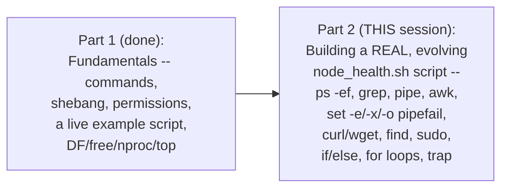

#### 🎯 Key Takeaways

* This session **directly, genuinely fulfills** Part 1's own honest, conditional promise — advanced shell scripting content, delivered because the audience genuinely requested it.
* The session's own approach: build **ONE real, evolving script** (`node_health.sh`), adding genuine best practices INCREMENTALLY, rather than teaching isolated, disconnected examples.
* This session **directly, explicitly builds on Part 1's own established commands** (DF, free, nproc, top) — genuinely assuming that foundational knowledge.

---
### 2. Building node_health.sh: Metadata, Shebang & the First Working Version

#### 📖 Definition — The Precise, Reinforced Shebang Guidance

> 💡 **Given directly:** *"We start with the shebang, always followed by what is the executable that we are trying to use — in our case it is bash — and it is also an interview question... always make sure you provide the executable that you are executing — what happens if you only provide `sh`, then `sh` is a link to the executable... in case if it is not bash and it happens to be dash, then your script might fail."*

```bash
#!/bin/bash
```

#### 📖 Definition — Metadata Comments, Precisely Introduced

> 💡 **Given directly:** *"You always have to mention the details of this shell script — who is the author... why I am using this — hashtags because hashtags are used to create comments, so these are not executable shell commands, but this is something that provides you the information of the author of the file."*

```bash
#!/bin/bash
# Author: Abhishek
# Date: 1st December
# Purpose: This script outputs the node health
# Version: v1
```

#### ❓ Why It Exists — The Precise, Genuine Reason This Matters

> 💡 **Given directly:** *"Always provide the metadata information, because by just looking at the name of the file nobody will understand what this script file is — let's say you will create a shell script called `addition.sh`, but what is this addition? Is it addition of two numbers, addition of three numbers, five numbers? Such details we always provide in the metadata of the file."*

#### 🪜 Step-by-Step — The First, Real, Working Version of the Script

> 💡 **Given directly:** *"We'll just use the same commands that we talked about — we'll use `df -h` for printing the disk space, we'll use `free -g` for printing the memory, we'll use the other command that is `nproc` for printing the resources."*

```bash
#!/bin/bash
# Author: Abhishek
# Date: 1st December
# Purpose: This script outputs the node health
# Version: v1

df -h
free -g
nproc
```

```bash
chmod 777 node_health.sh
./node_health.sh
```

> 💡 **Given directly, the genuine, honest, live-observed problem:** *"Notice that it has provided all the information that is required, but by looking at this information, it is technically impossible to understand what is the output of which command."*

#### ⚠ Common Mistakes

* Skipping metadata comments because "the script is simple enough to understand" — explicitly, directly, precisely countered: even a SIMPLE script's own PURPOSE can be genuinely AMBIGUOUS from its name/content alone, WITHOUT explicit metadata.
* Assuming this session's own use of `chmod 777` throughout represents genuinely correct, production-appropriate practice — explicitly, directly, HONESTLY caveated: *"whenever you create script in your organization, make sure you grant the exact permissions"* — `777` is used here PURELY for this session's own trivial, temporary demonstration purposes.

#### 🎯 Key Takeaways

* Every real script should begin with an **explicit shebang** (`#!/bin/bash`) — directly, precisely reinforcing Part 1's own established interview-question guidance.
* **Metadata comments** (author, date, purpose, version) are genuinely NECESSARY — a script's own NAME alone is often GENUINELY insufficient to convey its real purpose.
* The FIRST, working version of `node_health.sh` genuinely RUNS correctly, but produces **GENUINELY UNREADABLE output** — directly, honestly setting up the NEXT section's own solution.

---

### 3. Readable Output: Echo Statements vs. set -x (Debug Mode)

#### 🪜 Step-by-Step — The First, Genuine Solution: Manual Echo Statements

> 💡 **Given directly:** *"The first option is to use the echo statements — so what you can do is, before executing your command, you can simply say 'print the disk space'... now the difference is, before printing each and every command's output, the echo statement is making sure that the user understands what the output is about."*

```bash
echo "print the disk space"
df -h
echo "print the memory"
free -g
echo "print the CPU"
nproc
```

#### ❓ Why It Exists — The Precise, Genuine Limitation of This First Approach

> 💡 **Given directly:** *"Using echo statements all the times is not feasible — like, you know, in some of the shell scripts you might have some thousands of commands — so if you want to use this echo statement all the times, it's not feasible."*

#### 📖 Definition — set -x, Precisely Introduced as the Scalable Alternative

> 💡 **Given directly:** *"What people usually do is use this command before the beginning of the shell script — before you start writing your cell script, what you do is you have to use the `set` parameter to set this shell script in the debug mode — what does `-x` stand for? Debug mode."*

```bash
#!/bin/bash
set -x

df -h
free -g
nproc
```

> 💡 **Given directly, the genuine, precisely-observed result:** *"Now you see, `df -h`, so this is the command executed, and this is the output... isn't it much better than the echo statements? Because echo statements basically print whatever you are typing, but `set -x`... will show you the command that it is executing, and it will also print the output."*

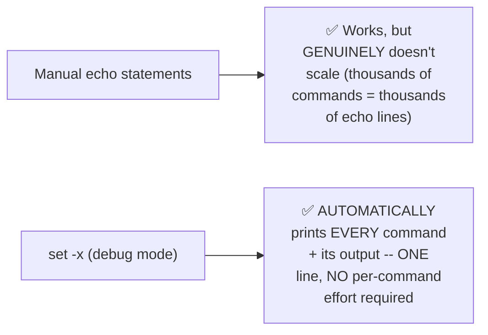

#### 🔍 Internal Working — The Genuine, Practical, Recommended Combination

> 💡 **Given directly:** *"Set minus X plus echo statement — always use the combination of both of them... if you have a very huge script, always using echo statements will not help you — use `set -x`."*

#### 🔍 Internal Working — A Genuine, Real, Practical Note: set -x Can Be Selectively Disabled

> 💡 **Given directly:** *"There are some cases where you might not want the user to show what are the commands that are executed — in such cases, what you can do is you can remove the `set -x` — let's say that you are executing some commands which you don't want the user to know — in such cases, you can simply come here and you can comment this one out."*

#### ⚠ Common Mistakes

* Assuming `echo` statements and `set -x` are mutually EXCLUSIVE choices — explicitly, directly, precisely clarified as GENUINELY COMPLEMENTARY: "always use the combination of both."
* Assuming `set -x` should ALWAYS be enabled, unconditionally — explicitly, directly clarified: it can be GENUINELY, DELIBERATELY commented out when a script's own executed commands should NOT be visible to the end user.

#### 🎯 Key Takeaways

* **Manual `echo` statements** genuinely work for readability, but GENUINELY don't scale to large scripts with many commands.
* **`set -x`** (debug mode) GENUINELY, AUTOMATICALLY prints every executed command alongside its output — a SINGLE, one-line solution that scales to ANY script size.
* The **recommended, real practice**: use BOTH together — `set -x` for automatic, comprehensive tracing, and TARGETED `echo` statements for additional, human-readable context where genuinely helpful.

---
### 4. Finding Processes: ps -ef, grep & the Power of Pipe

#### 📖 Definition — ps -ef, Precisely Introduced

> 💡 **Given directly:** *"There is a command to find out [running processes] — this command is called `ps -ef`... PS stands for the processes, and `-f`, basically, using `-e`, it provides the entire details of the process — like it provides the details of the processes in a full format."*

```bash
ps -ef
```

#### 🧠 Concept — A Genuinely Relatable, Real-World Analogy for "Processes"

> 💡 **Given directly:** *"Let's say now you are watching my video — what is the process that is getting executed?... he might have opened Chrome, this is one process, and then he might have opened YouTube... on a virtual machine there will be a lot and lot of processes — let's say you are working for a company called Amazon, and in Amazon there are 200 microservices... each application starts with a different process."*

#### 📖 Definition — grep, Precisely Introduced

> 💡 **Given directly:** *"What does the grep command do is, out of all the output that is generated, it only fetches the information that is required — let's say you have 100 lines of code, and you only want to get line number 55 and 56... you can use the grep command."*

```bash
ps -ef | grep Amazon
```

#### 📖 Definition — Pipe, Precisely, Directly Reinforced

> 💡 **Given directly:** *"Pipe parameter sends the output of the first command to the second command... so this is one command, and grep Amazon is another command — or grep Abhishek is another command — but who is integrating these two commands? That is the pipe parameter."*

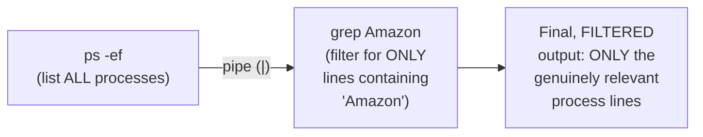

#### 🪜 Step-by-Step — A Complete, Simple, Live-Verified Demonstration

> 💡 **Given directly:** *"Let's write some a very basic script called `test.sh`, and in this `test.sh` what I'll do is I'll say echo 1, echo 11, echo 12, echo 55, echo 99... when you execute the shell script, you want to retrieve all the numbers that has one in it... `./test.sh` followed by pipe grep 1... so it printed 1, 11, 12."*

```bash
#!/bin/bash
echo 1
echo 11
echo 12
echo 55
echo 99
```

```bash
./test.sh | grep 1
# Output: 1, 11, 12  (55 and 99 are correctly, genuinely FILTERED OUT)
```

#### 🔍 Internal Working — A Genuine, Real, Practical Business Scenario, Directly Tied to This Command

> 💡 **Given directly:** *"Your manager comes to you and says, 'Abhishek, find out the processes that are running by Amazon and just get me the process IDs'... so the first step that you'll do is you will use `ps -ef`, you'll find out that, okay, there are these many processes, out of which there are two Amazon processes... but because this is a long list, you might miss some things — what you want to make sure is you want to use, make use of scripting — for that, there comes a very powerful command that is grep."*

#### ⚠ Common Mistakes

* Assuming `grep` and `pipe` are the SAME thing, or genuinely interchangeable terms — explicitly, directly, precisely distinguished: `grep` is the FILTERING command itself; PIPE is the SEPARATE mechanism that CONNECTS one command's output to another's input.
* Assuming `ps -ef`'s own raw, unfiltered output is genuinely usable for finding SPECIFIC processes at scale — explicitly, directly demonstrated as GENUINELY error-prone (risk of "missing things" in a long list) WITHOUT filtering via `grep`.

#### 🎯 Key Takeaways

* **`ps -ef`** lists ALL running processes, in full detail; **`grep`** filters ANY output down to ONLY lines matching a specific PATTERN.
* **Pipe (`|`)** is the GENUINE mechanism connecting these (and any other) two commands — sending the FIRST command's output DIRECTLY as the SECOND command's input.
* A complete, real, worked example (`test.sh | grep 1`) directly, precisely confirmed pipe's own genuine behavior — correctly filtering "1, 11, 12" while EXCLUDING "55" and "99."

---

### 5. A Genuine Interview Question: Why Pipe Doesn't Always Work (STDIN vs. STDOUT)

#### ❓ Why It Exists — A Direct, Explicit, Genuine Interview Question

> 💡 **Given directly:** *"There is an interview question which I want to bring here — people ask you to tell me what is the output of this command... `date | echo 'today is'`... let's see what happens if we execute this command — it did not print the output of `date`."*

```bash
date | echo "today is"
# Genuinely, surprisingly does NOT show the date -- ONLY prints "today is"
```

#### 🔍 Internal Working — The Precise, Complete, Genuine Explanation

> 💡 **Given directly:** *"There is a difference between your `ps -ef` command, or your script — let's say we executed `test.sh`... but the difference here is `date` is a default command, or it's a default shell command, and what it does is it sends the output to STDIN... pipe can only receive the information from the output that is typed from this command — but if this command is sending this information to STDIN, this command will not work, or the pipe does not redirect the output of the first command to the second command."*

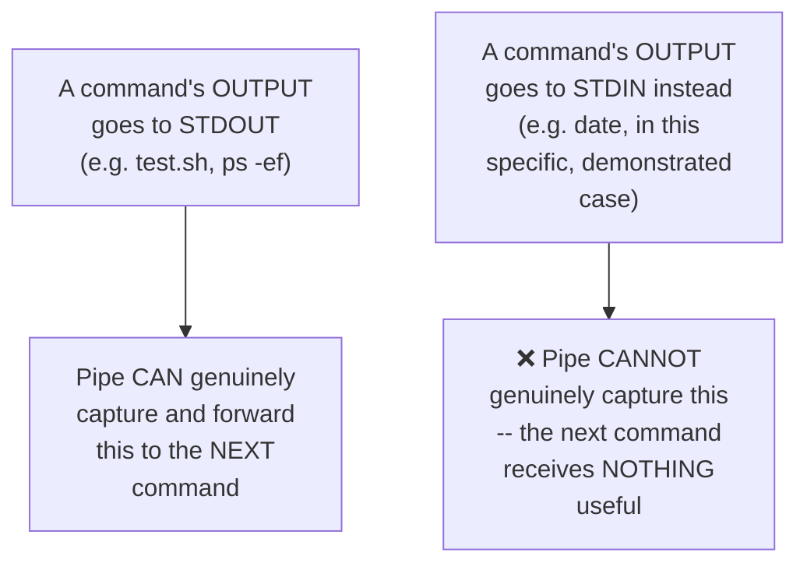

#### 🏢 Real-World / Production Usage — The Precise, Genuine, Correct Interview Answer

> 💡 **Given directly:** *"Whenever somebody is giving you this command and asking you what will be the output, you should simply say that it will only print [today is] — because `date` is a system default command, and this command sends the output to STDIN, but pipe will not be able to receive the information from STDIN."*

#### ⚠ Common Mistakes

* Assuming pipe ALWAYS, UNCONDITIONALLY forwards ANY command's output to the next command — explicitly, directly, HONESTLY corrected via a real, live, SURPRISING demonstration: this GENUINELY depends on WHETHER the first command sends its output to STDOUT (pipe-compatible) or STDIN (NOT pipe-compatible, in this specific case).
* Assuming this is a genuinely rare, unimportant edge case — explicitly, directly, EXPLICITLY framed as a real, common INTERVIEW question, worth remembering precisely.

#### 🎯 Key Takeaways

* Pipe does **NOT ALWAYS** work as naively expected — this GENUINELY depends on WHETHER the first command's output goes to STDOUT (pipe-compatible) versus STDIN (NOT pipe-compatible).
* `date | echo "today is"` is a **directly, explicitly named, genuine interview question** — the correct answer requires explaining THIS EXACT STDIN/STDOUT distinction, not simply guessing at the output.
* This section directly, precisely **extends Section 4's own pipe explanation**, adding a genuinely important, real NUANCE that a simple "pipe connects two commands" definition alone would MISS.

---
### 6. Extracting Columns: The awk Command

#### 📖 Definition — awk, Precisely Introduced

> 💡 **Given directly:** *"There is one command called `awk`... always learn about `awk`, because in the interviews, or even in your real life scenarios... `awk` is nothing but a pattern scanning and processing language... if you want to get some information, like you want to get only the process ID, or... only a specific column."*

#### 🔍 Internal Working — The Precise, Genuine Distinction From grep

> 💡 **Given directly:** *"The difference between the grep command and the awk command is grep command can directly give you the entire statements, or the entire sentences, but awk command is very powerful — it can also give you specific columns from the output."*

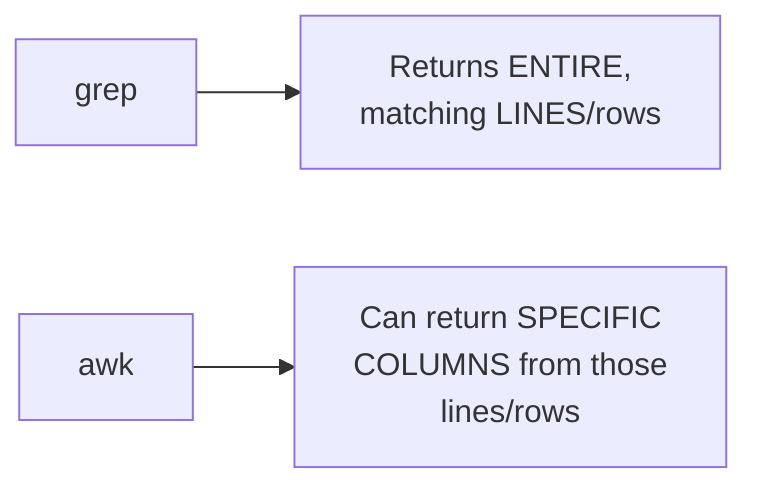

#### 🪜 Step-by-Step — A Complete, Live-Demonstrated Extraction: Process IDs

> 💡 **Given directly:** *"`ps -ef` pipe `grep` Amazon, followed by pipe `awk`... there is a delimiter that I'm using, that is space, followed by I just want to print the second column... now see, we got the process IDs only."*

```bash
ps -ef | grep Amazon | awk '{print $2}'
```

> 💡 **Given directly, the precise, genuine, column-based explanation:** *"Let's say this is the entire row, and in this row there are columns — this is column number one, this is column number two, three, four, five, and so on — my requirement is I just want to get column number 2 from multiple rows."*

#### 🪜 Step-by-Step — A Second, Confirming Example: Changing the Column

> 💡 **Given directly:** *"Instead of column two, if I just change it to column one, what happens? It gives the information of the user — like, root user has started this process, root user has started this process, Ubuntu has started the last process."*

```bash
ps -ef | grep Amazon | awk '{print $1}'
```

#### 🪜 Step-by-Step — A Complete, Second, Illustrative Example: Extracting a Name

> 💡 **Given directly:** *"I'll say 'my name is Abhishek,' and then there is one more person — let's say my employee ID is 111... I can make use of the `awk` command here — I can say what is the row, or what is the column here — one, two, three, four — so I'll simply say `print $4` — it prints the name of the person."*

```bash
grep name file.txt | awk '{print $4}'
```

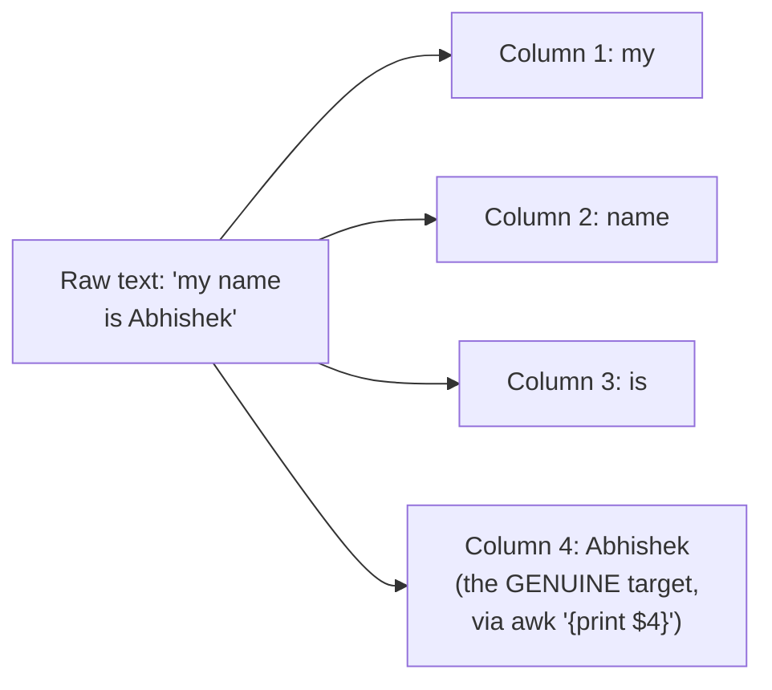

#### ⚠ Common Mistakes

* Assuming `grep` alone is genuinely sufficient for EVERY filtering need — explicitly, directly demonstrated as INSUFFICIENT when a SPECIFIC COLUMN (rather than an entire line) is genuinely needed — `awk` is specifically required for this.
* Miscounting column positions — explicitly, directly reinforced via MULTIPLE, worked examples (process IDs at column 2, usernames at column 1, a name at column 4) — column position must be GENUINELY, CAREFULLY verified against the ACTUAL structure of the output.

#### 🎯 Key Takeaways

* **`awk`** is precisely a "pattern scanning and processing language" — GENUINELY more powerful than `grep` for extracting SPECIFIC COLUMNS from structured, space-delimited output.
* The complete pattern `ps -ef | grep <term> | awk '{print $N}'` directly, precisely chains THREE tools together: list ALL processes → filter to RELEVANT ones → extract a SPECIFIC column (e.g., process ID at column 2).
* This combination (`ps -ef`, `grep`, pipe, `awk`) is **explicitly, directly framed** as a genuinely essential, real, professional DevOps skill set — worth mastering precisely.

---

### 7. Fail-Fast Scripting: set -e and set -o pipefail

#### 📖 Definition — set -e, Precisely Introduced

> 💡 **Given directly:** *"What set -e does is it exits the script when there is an error... let's say you are writing 100 lines of shell script, and your shell script got failed in line number one itself — but because you're not using `set -e`, what happens is all the 100 lines get executed, which is not a good practice."*

```bash
#!/bin/bash
set -e
```

#### 🪜 Step-by-Step — A Complete, Real, Genuine, Ordered Scenario

> 💡 **Given directly:** *"Let's say you are writing a shell script for this specific order — your order is: create a user, then create a file, add the username to the file — let's say this is the order... what happens if step one fails, and step two and step three get executed? There is no use, right?"*

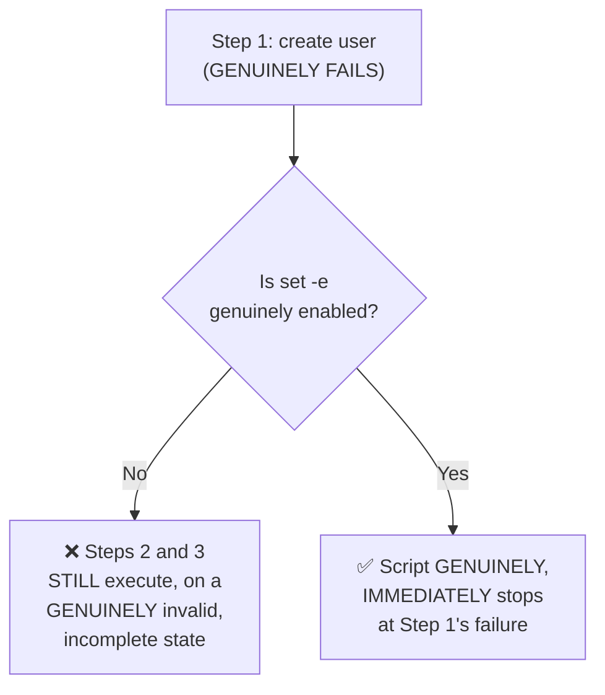

#### 🪜 Step-by-Step — A Complete, Live, Real, Before/After Demonstration

> 💡 **Given directly, WITHOUT `set -e`:** *"I'll write one random command here, okay, ideally this is a wrong command — so what should happen? Your shell script should stop here — but let's see what happens... your shell script got executed, and it gave all the output that is required."*

> 💡 **Given directly, WITH `set -e`:** *"See what happened — it executed the first line, second line, then it said, okay, there is some unknown command here, I don't know what this is, so I am exiting."*

#### 📖 Definition — The Genuine, Real Limitation of set -e Alone

> 💡 **Given directly:** *"One of the drawbacks of `set -e` is it will not error out when there is a pipe... whenever there is a pipe, what `set -e` thinks is, okay, if the last command gets executed, I am fine with it... it will only look for the LAST command in your pipe arguments."*

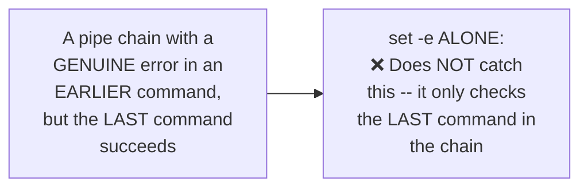

#### 📖 Definition — set -o pipefail, Precisely Introduced as the Fix

> 💡 **Given directly:** *"Whenever you are using `set -e`, by default use `set -o pipefail` as well, because `set -e` will not catch any pipe failures — so when you enable this pipe failure, then your script will [correctly] fail."*

```bash
#!/bin/bash
set -e
set -o pipefail
```

#### 🔍 Internal Working — A Genuine, Real, Practical Recommendation on Formatting

> 💡 **Given directly:** *"Some people also do the entire things in the same command, like instead of writing all of these things, they just write it in the same line — but never do this, at least this is my suggestion — because always you should have the flexibility of removing one of these things... always try to split them into different lines, so it will be very easy to understand."*

```bash
# NOT recommended (harder to selectively modify):
set -exo pipefail

# RECOMMENDED (each on its own line, genuinely easy to toggle):
set -e
set -x
set -o pipefail
```

#### ⚠ Common Mistakes

* Assuming `set -e` alone genuinely catches EVERY possible command failure — explicitly, directly, LIVE-demonstrated as INSUFFICIENT for pipe chains, where it only checks the LAST command.
* Combining `set -e`, `set -x`, and `set -o pipefail` into ONE, single line — explicitly, directly, practically discouraged: SEPARATE lines genuinely preserve the FLEXIBILITY to selectively enable/disable EACH one independently.

#### 🎯 Key Takeaways

* **`set -e`** genuinely causes a script to EXIT IMMEDIATELY upon ANY command's failure — directly, LIVE-demonstrated preventing a script from continuing PAST a genuinely broken step.
* **`set -e` ALONE has a genuine, real LIMITATION**: within a PIPE chain, it only checks the LAST command's own success/failure — EARLIER failures within the SAME pipe can be GENUINELY, SILENTLY missed.
* **`set -o pipefail`** directly, precisely FIXES this limitation — and the GENUINE, practical recommendation is to write `set -e`, `set -x`, and `set -o pipefail` on SEPARATE lines, preserving flexibility.

---
### 8. Retrieving Remote Content: curl vs. wget

#### ❓ Why It Exists — The Precise, Genuine, Real Motivating Scenario

> 💡 **Given directly:** *"Whenever these logs get appended, like there are more and more logs, what people usually do is they upload the logs to some storage platforms — let's say you uploaded the log to some Google storage, or Amazon S3, or Azure Blob Storage — so how do you want to retrieve this information? Using the curl command."*

#### 📖 Definition — curl, Precisely Introduced

> 💡 **Given directly:** *"Curl command retrieves the information from internet... if somebody is coming from a development background, you must already know that whenever you try to reach a service, you try to reach the service using endpoints — you must be aware of tools like Postman — so similarly, if you want to do it in shell scripting, you use a command called curl."*

```bash
curl <URL>
curl -X GET api.foo.com
```

> 💡 **Given directly, a genuine, direct, precise comparison:** *"If somebody is coming from the Python background, it is something similar to the request module in Python."*

#### 🪜 Step-by-Step — A Complete, Live, Real Demonstration

> 💡 **Given directly:** *"I use the curl command followed by the log file location that is in GitHub, and I get all the information — now what I'll do is I'll simply say grep error, and I got the error logs."*

```bash
curl <github_log_file_url> | grep error
```

#### 📖 Definition — wget, Precisely Introduced

> 💡 **Given directly:** *"There is one other command called `wget`... the difference is that wget will download this log file — on the alternative side, what happened with the curl command? Curl command shares the output to you, whereas wget actually stores this information IN a file."*

```bash
wget <github_log_file_url>
ls                                # confirms the file was genuinely downloaded
cat downloaded_file | grep error   # now requires a SEPARATE, second step
```

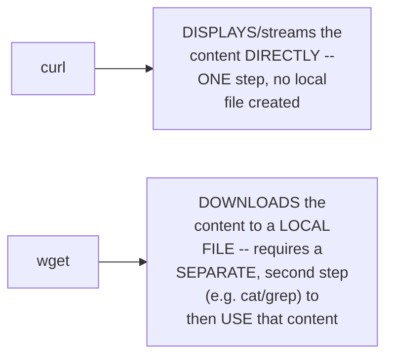

#### ❓ Why It Exists — A Direct, Explicit, Genuine Second Interview Question

> 💡 **Given directly:** *"This is your one more interview question — what is the difference between wget and curl?... in curl command, you are able to do it using a SINGLE command, and using wget, you are able to do it using TWO different commands."*

#### ⚠ Common Mistakes

* Assuming `curl` and `wget` are GENUINELY interchangeable, redundant tools — explicitly, directly, precisely distinguished: `curl` DISPLAYS content directly (one step); `wget` DOWNLOADS it to a file FIRST (two steps to then use it).
* Defaulting to ALWAYS using ONE of these two tools, regardless of the actual, genuine need — explicitly, directly clarified: *"depending upon your requirement, whatever the command that is required, use the appropriate command"* — choose based on whether you genuinely need to SAVE the content locally, or simply VIEW/process it directly.

#### 🎯 Key Takeaways

* **`curl`** retrieves and DISPLAYS remote content directly — GENUINELY analogous to Postman or Python's own `requests` module.
* **`wget`** DOWNLOADS remote content to a LOCAL FILE — requiring a SEPARATE, subsequent step (e.g., `cat`) to then genuinely USE that content.
* This is **explicitly, directly framed** as a SECOND genuine interview question in this session — the precise, correct answer centers on ONE-STEP (curl) versus TWO-STEP (wget) usage.

---

### 9. Searching the File System: find & Understanding sudo/Root

#### 📖 Definition — find, Precisely Introduced

> 💡 **Given directly:** *"Somebody comes to you and says, 'Abhishek, there is a file called `pam.d`, but I don't know where exactly this file is in this virtual machine, but you have to find out and give that file to me' — in such cases, you can make use of the find command."*

```bash
find / -name pam.d
```

> 💡 **Given directly, precisely explaining the syntax:** *"Find slash — what does slash mean? Find everything — all the files and all the folders in this virtual machine — followed by name, and I'll simply say `pam.d`."*

#### 🔍 Internal Working — A Genuine, Real, Live-Observed Permission Obstacle

> 💡 **Given directly:** *"If I directly do this, I get permission denied on a lot of the folders, because as a Ubuntu user, I am not allowed to go and search all of those files and folders — if I just append `sudo` in front of it, that's it, I am able to search the entire file system."*

```bash
sudo find / -name pam.d
```

#### 📖 Definition — sudo, Precisely Explained

> 💡 **Given directly:** *"Sudo means substitute user do — using sudo, you can go to any user... sudo gives you privileges — that means you run some commands on behalf of the root user."*

#### 📖 Definition — sudo su -, Precisely Explained

> 💡 **Given directly:** *"How do we go to the root user? Using this command — `sudo su -`... first command is switch user, and before that, we are saying substitute user do... so `sudo su -` — I want to switch to a different user."*

```bash
sudo su -    # switch to the root user
```

#### ⚠ A Direct, Honest, Real, Important Security Warning

> 💡 **Given directly:** *"Usually you don't use root user in your organization, because root is a very powerful user, and you can delete anything — let's say you delete some important files and folders, they cannot be retrieved back, unless you have them in a monitored volume which has snapshots — if you take a worst case, using root you have deleted the file, and there is no snapshot, or it's not mounted on a volume — what happens is the file is lost forever."*

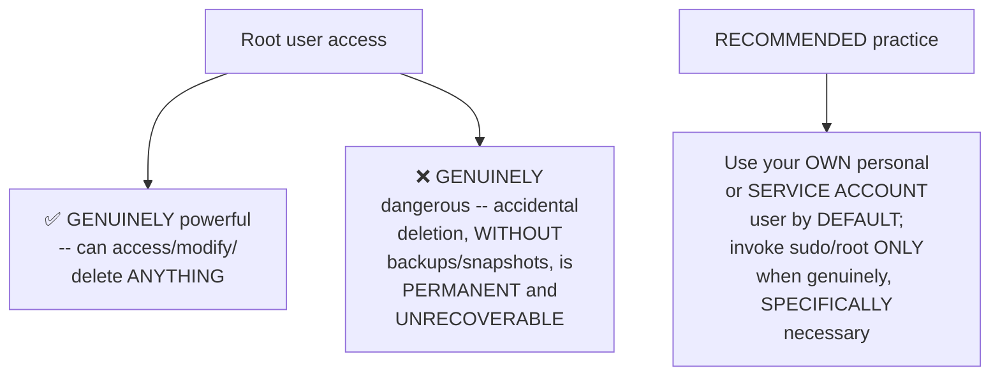

#### ⚠ Common Mistakes

* Assuming `find` genuinely works WITHOUT any permission considerations — explicitly, directly, LIVE-demonstrated as producing REAL "permission denied" errors for a NON-root user searching the ENTIRE file system.
* Assuming root access should be used AS THE DEFAULT working mode — explicitly, directly, HONESTLY warned against: real, DevOps-level access to root is COMMON, but should be invoked ONLY when SPECIFICALLY necessary, given the GENUINE, PERMANENT risk of accidental, unrecoverable deletion.

#### 🎯 Key Takeaways

* **`find / -name <filename>`** searches the ENTIRE file system for a file by name — GENUINELY requiring `sudo` for FULL, unrestricted access across ALL directories.
* **`sudo`** ("substitute user do") allows running SPECIFIC commands with ELEVATED privileges; **`sudo su -`** switches ENTIRELY into the root user's own session.
* Root access is **genuinely powerful but GENUINELY dangerous** — real, PERMANENT data loss is possible WITHOUT proper backups/snapshots — the RECOMMENDED, real practice is using a personal/service account by DEFAULT, invoking root ONLY when SPECIFICALLY, GENUINELY necessary.

---
### 10. Control Flow: if/else and for Loops

#### 📖 Definition — The Precise, Genuine, Complete if/else Syntax

> 💡 **Given directly:** *"You start with `if`, and then you provide what is the expression that is required... if the condition is met, you will say 'then,' what I have to do — but if the condition is not met, go to the else condition and execute these actions — finally, get out of my if loop."*

```bash
a=4
b=10

if [ $a -gt $b ]
then
    echo "a is greater than b"
else
    echo "b is greater than a"
fi
```

> 💡 **Given directly, precisely emphasizing a genuinely memorable, real syntax quirk:** *"In shell scripting, it is slightly funny that if starts with `if`, and whenever you want to end your if loop, you just write it in reverse, saying `fi` — so it is reverse of `if`."*

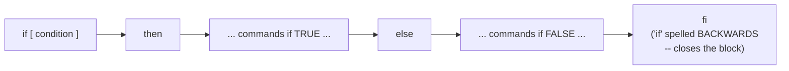

#### ⚠ A Direct, Important, Precise Syntax Warning

> 💡 **Given directly:** *"In shell scripting, there should not be spaces here"* (referring to variable assignment, e.g., `a=4`, NOT `a = 4`).

#### 🪜 Step-by-Step — A Complete, Live-Verified Result

> 💡 **Given directly:** *"If you execute the script, the script will say that, okay, a is smaller than b, so that's why this condition is not met, so I'll say b is greater than a."*

#### 📖 Definition — for Loops, Precisely Introduced

> 💡 **Given directly:** *"For loop is nothing but — let's say you want to execute some action continuously, or you want to do multiple iterations of an action... let's say your task is to print numbers from 1 to 10... will you keep writing all the numbers? No — so in such cases, what we do is we look for automation... we write the loops."*

```bash
for i in 1 2 3 4 5
do
    echo $i
done
```

#### 🔍 Internal Working — The Precise, Complete, Three-Part Structure

> 💡 **Given directly:** *"If we split the for loop into three statements — what is happening is the first statement is called `for`, so what is the `for`? Basically the condition... after that, you are saying 'do' a specific action... once you do that specific action, what you have to do is you have to increment... it will first execute the condition, it will perform the action, then it will go for the incrementation, and finally it will complete the for loop using the `done` statement."*

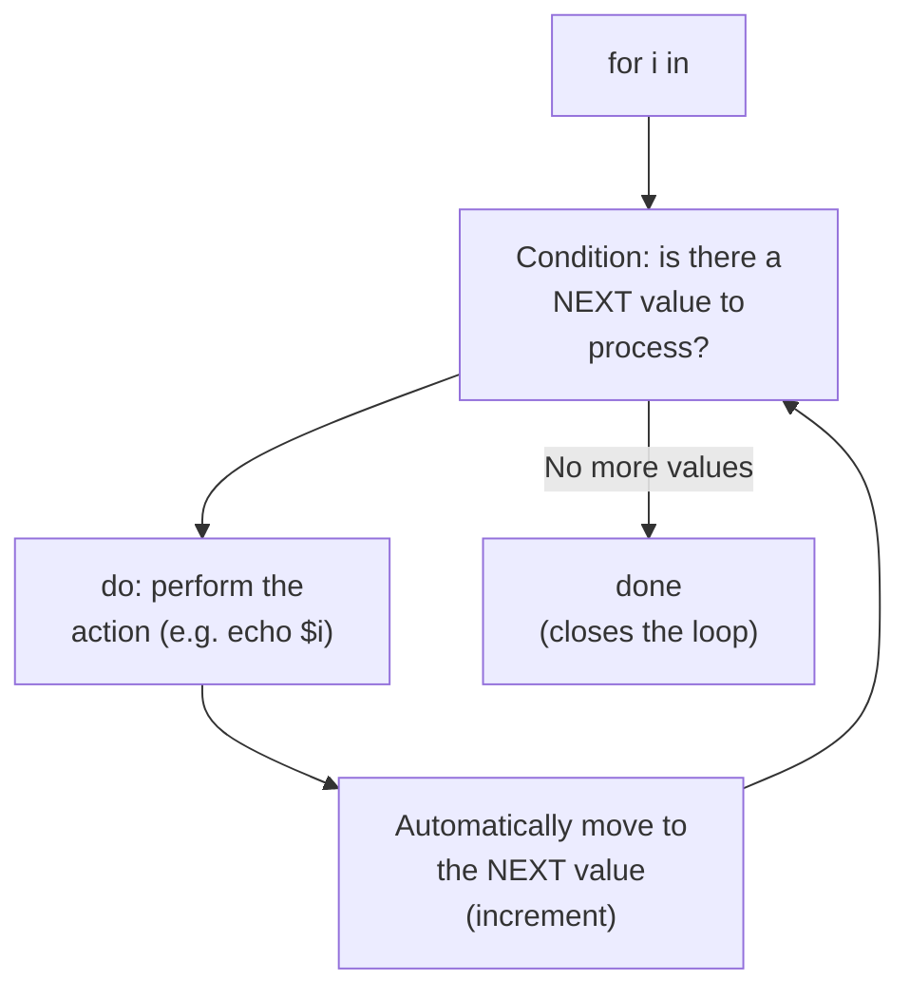

#### ⚠ Common Mistakes

* Adding spaces around the `=` sign in variable assignment (e.g., `a = 4`) — explicitly, directly, precisely warned against as a genuine, common syntax error in shell scripting.
* Forgetting that shell's own closing keywords are DELIBERATELY, memorably REVERSED (`if`→`fi`) — worth remembering PRECISELY, as a genuinely distinctive shell scripting convention.

#### 🎯 Key Takeaways

* The complete **`if`/`then`/`else`/`fi`** structure was directly, precisely demonstrated with a real, worked comparison example — closing with the genuinely memorable, REVERSED `fi` keyword.
* The complete **`for`/`do`/`done`** structure was directly, precisely demonstrated — automatically handling CONDITION checking, ACTION execution, and INCREMENTING in one, complete loop.
* Both structures directly, precisely embody shell scripting's own core PURPOSE (established in Part 1): AUTOMATING tasks that would be GENUINELY impractical to perform manually, one line at a time.

---

### 11. Signal Trapping: The trap Command

#### 📖 Definition — Signals, Precisely Introduced

> 💡 **Given directly:** *"Let's say you're using a kill command — kill command is basically used to kill a process... `kill -9 java`... what is happening behind the scenes is, when you are executing this command, there is a SIGNAL that is passed to the Linux, saying, okay, this person is asking you to kill a specific file — this is a signal."*

#### 🪜 Step-by-Step — A Second, Genuinely Relatable Example: Ctrl+C

> 💡 **Given directly:** *"Let's say there is a script that is getting executed — what we usually do to terminate the script is we use `Ctrl+C`... when you're pressing Ctrl+C, you are pressing it on your keyboard — how does a Linux machine know that, okay, when you press Ctrl+C, I have to stop the execution of a script?... there is a signal that this Linux machine has received."*

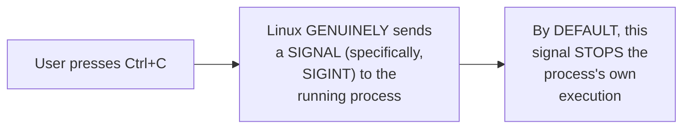

#### 📖 Definition — trap, Precisely Introduced

> 💡 **Given directly:** *"In such cases, what you can do is you can trap the signal — what is meaning by trap? You can trap the Linux, saying, okay, even if somebody is pressing Ctrl+C, understand that I have a trap mechanism that is set on my machine, and even if they press Ctrl+C, don't do anything — or if they press Ctrl+C, send me a notification."*

```bash
trap 'echo "dont use ctrl c"' SIGINT
```

#### ❓ Why It Exists — A Direct, Explicit, Genuine Third Interview Question

> 💡 **Given directly:** *"This is again one of the interview questions — but you will use it like, probably if you are writing 50 to 100 scripts, you might use it once, because the trap command is a very tricky command."*

#### 🪜 Step-by-Step — A Complete, Genuine, Real-World Use Case: Database Population

> 💡 **Given directly:** *"If we want to take a look at a real-time scenario — if somebody is executing a script, and you are using Ctrl+C, and half of the information is — let's say there is a database, and your shell script is trying to populate the list of users into your database — okay, and what happened is somebody came to your terminal and they just use Ctrl+C — now what happens is only half of the information is populated, and the database user thinks that, okay, some information is there, and this is the information I can start using."*

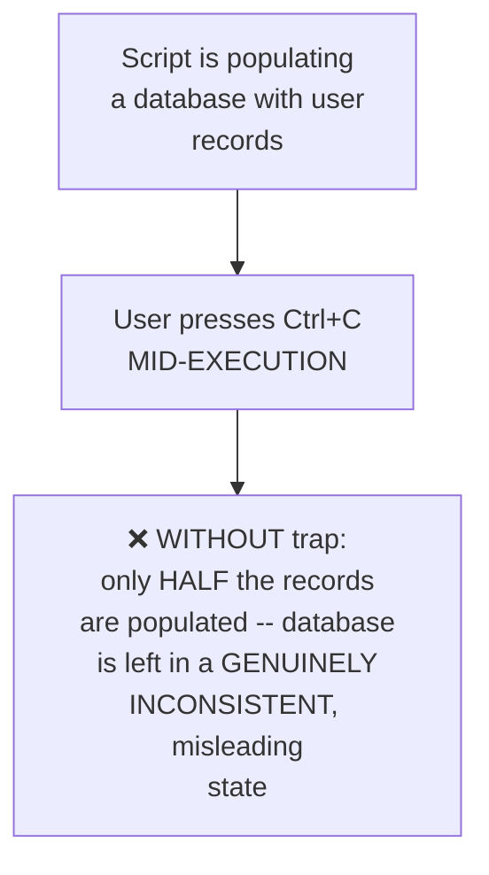

> 💡 **Given directly, the precise, genuine solution:** *"Instead, what you want to do is, whenever somebody presses Ctrl+C, you say, 'delete every content' — so in such cases, what you say is: trap, whenever somebody is using SIGINT — that is the Ctrl+C — what you have to do is `rm -rf *` — if somebody is using Ctrl+C, delete everything from the database, so that the end user will not think, okay, some information is populated, so I can start working."*

```bash
trap 'rm -rf *' SIGINT
```

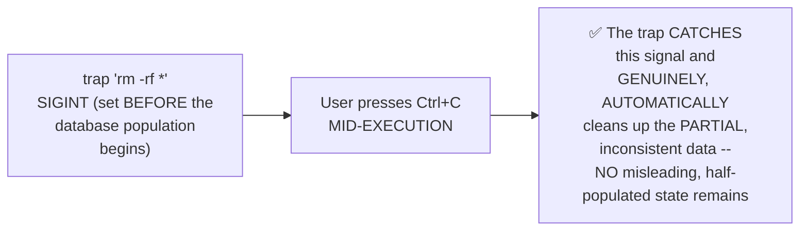

#### ⚠ Common Mistakes

* Assuming `trap` is a GENUINELY common, frequently-used command — explicitly, directly, honestly qualified: *"probably if you are writing 50 to 100 scripts, you might use it once"* — genuinely rare in practice, but still IMPORTANT to understand conceptually.
* Assuming `Ctrl+C` interruption is ALWAYS genuinely harmless — explicitly, directly, concretely demonstrated as potentially causing REAL, GENUINE data-consistency problems (a database left PARTIALLY populated) WITHOUT a trap mechanism in place.

#### 🎯 Key Takeaways

* **`trap`** GENUINELY catches Linux SIGNALS (like `SIGINT`, triggered by `Ctrl+C`) and lets a script define CUSTOM behavior in response — rather than simply, ABRUPTLY stopping.
* This is **explicitly, directly framed** as a THIRD genuine interview question in this session — GENUINELY rare in day-to-day use, but conceptually important.
* A complete, real, worked scenario — a database-population script trapping `SIGINT` to `rm -rf *` (clean up partial data) — directly, concretely demonstrates trap's own GENUINE, practical value: PREVENTING a script's own INTERRUPTION from leaving a system in a genuinely INCONSISTENT, misleading state.

---
### 12. Closing: Further, Deeper Videos Promised, Contingent on Feedback

#### 🪜 Step-by-Step — A Complete, Honest Recap

> 💡 **Given directly:** *"We have learned about how, different scripts that DevOps engineers use — one is the script that we learned, that the node automation — we have learned about the good practices that we have to use in any script, and we also looked at, if there is a log file, huge log file, and if you want to filter out the information, how do you use that — how do we filter out the information using the curl command, what is the purpose of wget command."*

#### ⚠ A Direct, Honest, Explicit Invitation for Further, Deeper Content

> 💡 **Given directly:** *"I know that there are some more things that are left over — so if you feel that I missed some commands, please feel free to put that in the comment section — or if you want me to talk in detail about any of these commands, also put that in the comment section — I'm open to make one more video on this, if you want to understand curl in depth, or if you want to understand SMTP, you want to understand trap signals in depth — anything that you want to learn, just post that in the comment section."*

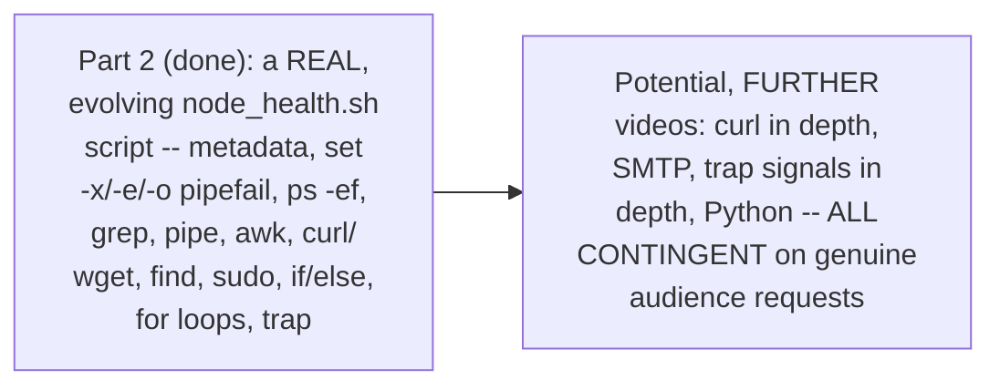

#### ⚠ Common Mistakes

* Assuming this session's own content represents the ABSOLUTE, complete scope of shell scripting knowledge — explicitly, directly, honestly acknowledged as INCOMPLETE by the instructor's OWN admission: "there are some more things that are left over."
* Assuming further, deeper content on SPECIFIC topics (curl, SMTP, trap signals) is ALREADY planned — explicitly, directly clarified as GENUINELY CONTINGENT on audience-driven requests, following the SAME pattern established between Part 1 and this Part 2.

#### 🎯 Key Takeaways

* This session **genuinely, honestly recaps** its own complete scope: an evolving, real script incorporating metadata, debug/fail-fast practices, process filtering, remote content retrieval, file searching, control flow, and signal trapping.
* The instructor **explicitly, honestly acknowledges** this content is NOT exhaustive — further, DEEPER content on specific topics (curl, SMTP, trap signals, Python) is directly, explicitly offered, CONTINGENT on genuine audience interest.
* This mirrors the SAME, established pattern from Part 1 → Part 2 — **audience engagement genuinely, directly shapes** what future content gets created.

---

## 📝 Glossary

| Term | Definition | Why It Matters |
|---|---|---|
| **Metadata Comments** | Author/date/purpose/version info at a script's top | Genuinely necessary -- a filename alone is often ambiguous |
| **set -x** | Debug mode -- auto-prints every executed command + output | Scales better than manual echo statements |
| **ps -ef** | Lists all running processes, in full detail | Combine with grep to find specific processes |
| **grep** | Filters output to lines matching a pattern | Returns ENTIRE matching lines |
| **Pipe (|)** | Sends one command's output to the next command's input | Only works if the source sends to STDOUT, not STDIN |
| **STDIN vs. STDOUT** | Two different output channels | date sends to STDIN -- pipe genuinely can't use it |
| **awk** | A pattern-scanning language; extracts SPECIFIC columns | More powerful than grep for column-level extraction |
| **set -e** | Exits the script immediately on any command failure | Only checks the LAST command within a pipe chain |
| **set -o pipefail** | Extends set -e to catch failures anywhere in a pipe chain | Fixes set -e's own genuine pipe-chain limitation |
| **curl** | Retrieves and displays remote content directly (one step) | Like Postman or Python's requests module |
| **wget** | Downloads remote content to a local file (two steps to use) | Genuine, different interview-question distinction from curl |
| **find** | Searches the entire file system for a file by name | Requires sudo for full, unrestricted access |
| **sudo** | "Substitute user do" -- run a command with elevated privileges | sudo su - switches entirely into root |
| **Signal** | A message sent to a process (e.g. SIGINT via Ctrl+C) | The basis for trap's own genuine mechanism |
| **trap** | Catches signals and defines custom behavior in response | Genuinely rare in practice, but conceptually important |

---

## 🔄 Revision Notes — One-Minute Revision

* This is **Part 2**, directly, genuinely fulfilling Part 1's own honest promise -- advanced shell scripting, built through ONE real, evolving `node_health.sh` script.
* **Metadata comments** (author, date, purpose, version) are genuinely necessary -- a filename alone doesn't convey a script's real purpose.
* **Readable output**: manual echo statements work but don't scale; `set -x` (debug mode) automatically prints every command + output -- use BOTH together for large scripts. `set -x` can be selectively commented out when commands shouldn't be visible.
* **ps -ef + grep + pipe**: `ps -ef` lists all processes; `grep <term>` filters to relevant lines; pipe (`|`) connects them. Verified live: `test.sh | grep 1` correctly filtered "1, 11, 12" while excluding "55, 99."
* **Genuine interview question**: `date | echo "today is"` does NOT print the date -- because `date` sends output to STDIN, not STDOUT, and pipe can only forward STDOUT.
* **awk**: more powerful than grep -- extracts SPECIFIC COLUMNS (e.g. `awk '{print $2}'` for process IDs, `$1` for usernames, `$4` for a specific word position).
* **Fail-fast**: `set -e` exits immediately on ANY command failure -- but ONLY checks the LAST command in a pipe chain. `set -o pipefail` fixes this, catching failures ANYWHERE in the chain. Recommendation: write set -e, set -x, set -o pipefail on SEPARATE lines, not combined, for flexibility.
* **curl vs. wget** (a SECOND genuine interview question): curl DISPLAYS remote content directly (one step, like Postman/Python requests); wget DOWNLOADS it to a local file first (two steps to then use it).
* **find**: `find / -name <filename>` searches the entire file system -- requires `sudo` for full access. `sudo` = "substitute user do"; `sudo su -` switches into root. HONEST WARNING: root is genuinely powerful but dangerous -- accidental deletion without backups/snapshots is PERMANENT.
* **if/else**: `if [ condition ]` / `then` / `else` / `fi` (note: `fi` is "if" spelled BACKWARDS). No spaces around `=` in variable assignment.
* **for loops**: `for i in <range>` / `do` / `done` -- automatically handles condition-check, action, and increment.
* **trap** (a THIRD genuine interview question): catches Linux signals (e.g. SIGINT from Ctrl+C) and defines custom behavior. Genuinely rare in practice ("once per 50-100 scripts") but conceptually important. Real, worked example: `trap 'rm -rf *' SIGINT` cleans up a database left partially populated if a script is interrupted mid-execution.
* **Closing**: this session's own content is explicitly, honestly acknowledged as incomplete -- further, deeper videos (curl in depth, SMTP, trap signals in depth, Python) are explicitly offered, contingent on genuine audience demand.

---

## 📋 Cheat Sheet

**Node health commands (from Part 1, reused here):**
```bash
df -h      # disk space
free -g     # memory
nproc        # CPU count
```

**Readable output:**
```bash
set -x    # debug mode -- auto-prints every command + output
```

**Process finding:**
```bash
ps -ef | grep <term>              # find relevant processes
ps -ef | grep <term> | awk '{print $2}'   # extract process IDs (column 2)
```

**Fail-fast scripting (each on its own line):**
```bash
set -e            # exit on any error
set -x              # debug mode
set -o pipefail       # catch pipe-chain failures too
```

**Remote content:**
```bash
curl <URL>              # display directly (one step)
wget <URL>                # download to a file (two steps to use)
```

**File search & root access:**
```bash
sudo find / -name <filename>
sudo su -    # switch to root (use CAREFULLY)
```

**Control flow:**
```bash
if [ $a -gt $b ]
then
    echo "a is greater"
else
    echo "b is greater or equal"
fi

for i in 1 2 3
do
    echo $i
done
```

**Signal trapping:**
```bash
trap 'rm -rf *' SIGINT    # clean up on Ctrl+C interruption
```

**The three genuine interview questions from this session:**
```text
1. Why doesn't `date | echo "today is"` print the date? (STDIN vs. STDOUT)
2. What's the difference between curl and wget? (display vs. download)
3. What does the trap command do, and when would you use it? (signal handling)
```

---

## 🔥 Interview Questions & Answers

### 🟢 Beginner

**Q1.**

**Question:** What should every shell script's own metadata comments include?

**Answer:** Author, date, purpose, and version.

**Explanation:** Directly, explicitly stated.

**Why Interviewers Ask This:** Tests genuine, practical scripting best practices.

**Possible Follow-up:** "Why is this genuinely necessary, even for a simple script?"

**Q2.**

**Question:** What does `set -x` do?

**Answer:** Enables debug mode -- automatically prints every executed command alongside its output.

**Explanation:** Directly, explicitly stated.

**Why Interviewers Ask This:** Basic, essential scripting readability knowledge.

**Possible Follow-up:** "Why is this genuinely preferred over manual echo statements for large scripts?"

**Q3.**

**Question:** What does `ps -ef` do?

**Answer:** Lists all running processes in full detail.

**Explanation:** Directly, explicitly stated.

**Why Interviewers Ask This:** Basic, foundational process-management knowledge.

**Possible Follow-up:** "How would you filter this down to only processes matching a specific name?"

**Q4.**

**Question:** What does pipe (`|`) genuinely do?

**Answer:** Sends the output of the first command to the second command as input.

**Explanation:** Directly, precisely explained.

**Why Interviewers Ask This:** Foundational, frequently-tested shell scripting mechanics.

**Possible Follow-up:** "Does this always work, regardless of the first command?"

**Q5.**

**Question:** Why does `date | echo "today is"` not print the date?

**Answer:** Because `date` sends its output to STDIN, not STDOUT, and pipe can only forward STDOUT.

**Explanation:** Directly, precisely, genuinely explained.

**Why Interviewers Ask This:** An explicitly-named, real, common interview question.

**Possible Follow-up:** "What WOULD correctly print today's date, using pipe?"

**Q6.**

**Question:** What is the genuine difference between `grep` and `awk`?

**Answer:** `grep` returns entire matching lines; `awk` can extract specific columns.

**Explanation:** Directly, precisely distinguished.

**Why Interviewers Ask This:** Basic, practical command-selection knowledge.

**Possible Follow-up:** "How would you extract just the second column from a command's output?"

**Q7.**

**Question:** What is the genuine limitation of `set -e` alone, within a pipe chain?

**Answer:** It only checks the LAST command in the chain -- earlier failures can be missed.

**Explanation:** Directly, live-demonstrated.

**Why Interviewers Ask This:** Tests genuine, deep understanding of fail-fast scripting.

**Possible Follow-up:** "What command fixes this limitation?"

**Q8.**

**Question:** What is the genuine difference between `curl` and `wget`?

**Answer:** `curl` displays remote content directly; `wget` downloads it to a local file first.

**Explanation:** Directly, explicitly, precisely distinguished.

**Why Interviewers Ask This:** An explicitly-named, real, common interview question.

**Possible Follow-up:** "Which would you use if you just want to quickly view a remote file's content?"

**Q9.**

**Question:** What does `sudo su -` genuinely do?

**Answer:** Switches entirely into the root user's own session.

**Explanation:** Directly, explicitly stated.

**Why Interviewers Ask This:** Basic, essential Linux permissions knowledge.

**Possible Follow-up:** "Why is using root as your DEFAULT working user genuinely discouraged?"

**Q10.**

**Question:** What does `trap` genuinely do?

**Answer:** Catches Linux signals (e.g., SIGINT from Ctrl+C) and defines custom behavior in response.

**Explanation:** Directly, explicitly stated.

**Why Interviewers Ask This:** An explicitly-named, real, common interview question.

**Possible Follow-up:** "Give a real, concrete use case for trap."

---

### 🟡 Intermediate

**Q11.**

**Question:** Explain why the instructor deliberately, honestly shows the `node_health.sh` script FAILING (without `set -e`) before showing it working CORRECTLY (with `set -e`), rather than only presenting the correct, final version.

**Answer:** This is a genuinely deliberate teaching choice, directly consistent with the instructor's own established pattern (also seen in Part 1's Vim mistake demonstration): by LIVE-showing the GENUINE, REAL consequence of OMITTING `set -e` (a script that CONTINUES executing PAST a broken command, silently producing MISLEADING "success" output), the instructor makes an EASY-TO-UNDERESTIMATE risk CONCRETELY, VISIBLY real — rather than merely ASSERTING "always use set -e" as an abstract rule. This directly, genuinely helps learners INTERNALIZE not just the COMMAND itself, but WHY it genuinely matters — a GENUINELY more effective, memorable teaching approach than presenting ONLY the correct, final script.

**Explanation:** Requires recognizing a deliberate, consistent pedagogical pattern (real failure before real fix) across multiple sections of this session.

**Why Interviewers Ask This:** Tests whether a learner recognizes the genuine, practical value of understanding WHY a practice matters, not just WHAT the practice is.

**Possible Follow-up:** "What OTHER genuine, real consequence might occur if a production script SILENTLY continues past a failed step, beyond just 'misleading output'?"

**Q12.**

**Question:** A learner argues that since `set -e` and `set -o pipefail` genuinely make scripts MORE fail-fast and reliable, they should ALWAYS be used in EVERY script, with no exceptions. Evaluate this claim.

**Answer:** This claim overstates the case, missing a genuinely important, real nuance about SCRIPT PURPOSE and INTENDED behavior. While `set -e`/`set -o pipefail` are GENUINELY valuable DEFAULT practices for MOST production scripts (directly, precisely established in Section 7), there are GENUINE, real scenarios where a script might DELIBERATELY need to CONTINUE past a SPECIFIC, EXPECTED failure — for example, a script CHECKING multiple, INDEPENDENT services' health (where ONE service being DOWN should NOT prevent CHECKING the REMAINING services) would GENUINELY, PRACTICALLY be HARMED by unconditional `set -e`, since the SCRIPT'S OWN INTENDED purpose is to REPORT on ALL services, EVEN IF SOME have GENUINELY failed. This directly connects to Section 2's own established practice of using `set -x` SELECTIVELY (commenting it out when NOT desired) — the SAME PRINCIPLE applies to `set -e`/`set -o pipefail`: they are GENUINELY valuable DEFAULTS, but should be APPLIED THOUGHTFULLY, based on the SPECIFIC script's own INTENDED behavior, NOT applied UNCONDITIONALLY to EVERY script REGARDLESS of its own PURPOSE.

**Explanation:** Tests whether a learner recognizes that "generally valuable" doesn't mean "universally, unconditionally required," correctly identifying a genuine scenario where selective, deliberate omission makes sense.

**Why Interviewers Ask This:** Distinguishes candidates who understand genuine, contextual trade-offs from those who apply rules unconditionally without considering a script's own specific purpose.

**Possible Follow-up:** "Design a genuine, real script (conceptually) where DELIBERATELY omitting `set -e` for a SPECIFIC section would be the CORRECT choice."

**Q13.**

**Question:** Explain, precisely, why the instructor directly connects the `trap` command's own real-world value to a DATABASE-population scenario specifically (rather than a simpler, generic example), using this session's own precise reasoning.

**Answer:** This is a genuinely deliberate, precise choice: a SIMPLER example (like merely printing "you pressed Ctrl+C") would demonstrate `trap`'s own MECHANICAL behavior, but would NOT genuinely convey WHY this mechanism GENUINELY MATTERS in real, professional practice. By using a DATABASE-population scenario SPECIFICALLY, the instructor directly, concretely illustrates a GENUINE, real DATA-INTEGRITY risk — an INTERRUPTED script leaving a database in a GENUINELY INCONSISTENT, MISLEADING state (partially populated, but APPEARING complete to anyone who doesn't know better) — a REAL, professionally SIGNIFICANT consequence, GENUINELY worth preventing. This directly, precisely explains WHY `trap` is FRAMED as a genuine interview question DESPITE being genuinely RARE in day-to-day use ("once per 50-100 scripts") — its VALUE lies SPECIFICALLY in preventing THIS EXACT CLASS of genuinely SERIOUS, real data-consistency problem, NOT in being a frequently-used, everyday tool.

**Explanation:** Requires recognizing why a specific, concrete, high-stakes example (database consistency) is more pedagogically effective than a generic one for conveying genuine, real-world importance.

**Why Interviewers Ask This:** Tests whether a learner understands WHY trap's own value is significant DESPITE its rarity, connecting the specific example to the broader, real concern it addresses.

**Possible Follow-up:** "Name another, GENUINELY different real-world scenario (besides database population) where trap's own signal-catching capability would be similarly, genuinely valuable."

**Q14.**

**Question:** Using this session's own precise `awk` demonstration (Section 6), explain why `ps -ef | grep Amazon | awk '{print $2}'` genuinely, reliably extracts the process ID SPECIFICALLY, rather than some OTHER piece of information, connecting this to `ps -ef`'s own OWN, standard output format.

**Answer:** A precise, reasoned explanation, extending beyond what this session's own content explicitly states but directly following from its own established mechanism: per Section 6's own precise `awk` mechanism, `awk '{print $2}'` extracts WHATEVER value occupies the SECOND, space-delimited COLUMN of EACH matching line. This GENUINELY, RELIABLY produces the process ID SPECIFICALLY because `ps -ef`'s own STANDARD, WELL-DEFINED output format PLACES the process ID in EXACTLY this SECOND column position (with the FIRST column GENUINELY being the username who OWNS the process, as directly, precisely CONFIRMED by Section 6's own SECOND example, `awk '{print $1}'`, which returned "root" and "Ubuntu"). This directly, precisely illustrates a GENUINELY IMPORTANT, underlying PRINCIPLE: `awk`'s own column-extraction POWER is ONLY genuinely RELIABLE when the SOURCE command's own output has a CONSISTENT, WELL-KNOWN column STRUCTURE — for a DIFFERENT command with a GENUINELY DIFFERENT or INCONSISTENT output format, the SAME `awk '{print $2}'` syntax might extract SOMETHING ENTIRELY DIFFERENT, or GENUINELY MEANINGLESS, information.

**Explanation:** Requires connecting the specific awk column-extraction example to the underlying, general principle that column position reliability depends on the source command's own consistent output format.

**Why Interviewers Ask This:** Tests whether a learner understands WHY a specific awk command works for THIS specific case, generalizing to the broader principle of output-format dependency.

**Possible Follow-up:** "If you ran the SAME `awk '{print $2}'` command on a DIFFERENT command's output (not `ps -ef`), would you GENUINELY expect it to also extract a process ID? Explain your reasoning."

**Q15.**

**Question:** Synthesize this session's complete `curl`/`wget` distinction (Section 8) with its own `set -e`/`set -o pipefail` fail-fast reasoning (Section 7) to construct a reasoned explanation of a genuine, real RISK that could arise if a script uses `curl` to retrieve a REMOTE log file WITHOUT `set -e`/`set -o pipefail` enabled, and the remote URL is GENUINELY unreachable.

**Answer:** A precise, synthesized explanation, directly connecting TWO, separately-taught concepts from THIS session into ONE, coherent, reasoned risk analysis: per Section 8's own precise `curl` mechanism, `curl <URL> | grep error` GENUINELY relies on `curl` SUCCESSFULLY retrieving content from the SPECIFIED URL — but if THIS URL is GENUINELY unreachable (e.g., a network issue, or the file having been GENUINELY moved/deleted), `curl` would GENUINELY FAIL to retrieve ANY content, meaning the SUBSEQUENT `grep error` command would GENUINELY receive EMPTY input, and would ITSELF "succeed" (in the sense of NOT producing an ERROR) while GENUINELY, SILENTLY reporting "no errors found" — a GENUINELY, DANGEROUSLY MISLEADING result, since the TRUE situation is "the log file COULD NOT BE RETRIEVED AT ALL," NOT "the log file was retrieved and GENUINELY contains no errors." Per Section 7's own precise reasoning, WITHOUT `set -e`/`set -o pipefail` GENUINELY enabled, this SILENT, MISLEADING failure would GENUINELY go UNDETECTED — the script would simply CONTINUE, producing a FALSE sense of "everything is fine." WITH `set -o pipefail` GENUINELY enabled (per Section 7's own precise mechanism, extending `set -e`'s own reach INTO pipe chains), `curl`'s own GENUINE failure (a non-zero EXIT CODE, when the URL is unreachable) would be GENUINELY, CORRECTLY detected, causing the SCRIPT to GENUINELY, APPROPRIATELY halt and REPORT the REAL problem, rather than SILENTLY, MISLEADINGLY reporting a FALSE "no errors" result.

**Explanation:** Requires synthesizing curl's own specific failure mode with the general pipefail mechanism to construct a precise, concrete risk scenario neither section explicitly combines.

**Why Interviewers Ask This:** A senior-level question testing whether a candidate can connect TWO, separately-taught concepts (curl's own behavior, and pipefail's own mechanism) into ONE, coherent, real risk analysis.

**Possible Follow-up:** "Beyond `set -o pipefail`, what ADDITIONAL, genuine safeguard might you add to THIS specific script, to make the 'URL unreachable' failure mode even MORE explicit and clear to whoever reads the script's own output?"

---

### 🔴 Advanced

**Q16.**

**Question:** Design a complete, from-scratch version of `node_health.sh`, directly incorporating EVERY best practice covered in this session (metadata, `set -e`/`-x`/`-o pipefail` on separate lines, `df`/`free`/`nproc`, `ps -ef` process filtering with `awk`), explicitly demonstrating the correct order and structure.

**Answer:** A reasonable, complete script, directly applying this session's own exact, established patterns:

```bash
#!/bin/bash
# Author: [Your Name]
# Date: [Today's Date]
# Purpose: This script outputs the node health and Amazon process IDs
# Version: v1

set -e
set -x
set -o pipefail

echo "Disk space:"
df -h

echo "Memory:"
free -g

echo "CPU count:"
nproc

echo "Amazon process IDs:"
ps -ef | grep Amazon | awk '{print $2}'
```

This complete script directly, precisely applies EVERY established practice: the SHEBANG (Section 2); METADATA comments (Section 2); `set -e`, `set -x`, `set -o pipefail` on SEPARATE lines (Section 7, per the instructor's own explicit RECOMMENDATION); `echo` statements COMBINED with `set -x`'s own automatic tracing (Section 3, per the instructor's own "use the combination" guidance); the THREE node-health commands (`df -h`, `free -g`, `nproc`, directly reused from Part 1); and the COMPLETE `ps -ef | grep | awk` chain (Sections 4 and 6) for finding SPECIFIC process IDs.

**Explanation:** Requires synthesizing every major practice from this session into ONE, complete, correctly-structured script.

**Why Interviewers Ask This:** A realistic, senior-level question testing whether a candidate can integrate MULTIPLE, separately-taught best practices into ONE, coherent, production-quality script.

**Possible Follow-up:** "How would you further modify this script to send an EMAIL notification if the memory usage exceeds a certain threshold?"

**Q17.**

**Question:** Critically evaluate: "Since this session confirms `trap` can catch `SIGINT` (Ctrl+C) and prevent a script from stopping, this means a well-written `trap` mechanism could make a script GENUINELY UNKILLABLE, which would be a serious, real security or operational risk." Is this an accurate, complete characterization?

**Answer:** Partially accurate as a GENUINE, real concern, but INCOMPLETE as a characterization of `trap`'s own actual, demonstrated purpose in this session. Section 11's own PRECISE example DOES show `trap` INTERCEPTING `Ctrl+C` and running CUSTOM logic INSTEAD of the DEFAULT "stop immediately" behavior — and it's GENUINELY TRUE that a MALICIOUSLY or CARELESSLY written `trap` could theoretically be used to make a script GENUINELY DIFFICULT to interrupt via `Ctrl+C` SPECIFICALLY. HOWEVER, this session's own DEMONSTRATED, INTENDED use case (Section 11) is SPECIFICALLY about running CLEANUP logic (`rm -rf *`) IN RESPONSE to the interruption signal — NOT about PREVENTING the script from EVER stopping. Additionally, `SIGINT` (Ctrl+C) is only ONE of MULTIPLE Linux signals — Section 11 itself directly, explicitly acknowledges "there are a LOT of signals that are there in Linux" — and MORE FORCEFUL signals (like `SIGKILL`, sent via `kill -9`, ALSO directly referenced in Section 11's own OPENING explanation) are, by DESIGN, GENUINELY UN-TRAPPABLE at the OPERATING SYSTEM level — a process CANNOT genuinely, PERMANENTLY evade `kill -9`, REGARDLESS of any `trap` configuration. The accurate, more precise conclusion: `trap` CAN genuinely, LEGITIMATELY be used to CUSTOMIZE a script's own response to CERTAIN signals (like SIGINT) for GENUINELY valid, defensive purposes (like Section 11's own database-cleanup example) — but it does NOT make a script GENUINELY, ABSOLUTELY unkillable, since MORE FORCEFUL termination mechanisms GENUINELY remain available.

**Explanation:** Tests whether a learner recognizes the genuine, bounded scope of trap's own capability, correctly distinguishing "can customize response to SOME signals" from "can make a process absolutely unkillable."

**Why Interviewers Ask This:** Distinguishes candidates who understand the PRECISE, bounded scope of a security-adjacent mechanism from those who overstate its power into an unconditional, absolute claim.

**Possible Follow-up:** "What Linux signal, directly mentioned in this session, is GENUINELY, BY DESIGN, un-trappable, and why does this matter for system administrators?"

**Q18.**

**Question:** Synthesize this session's complete `sudo`/root warning (Section 9) with its own `trap` database-cleanup example (Section 11) to construct a reasoned analysis of a genuine, real, ADDITIONAL RISK that could arise if the `trap 'rm -rf *' SIGINT` example from Section 11 were EXECUTED as the ROOT user, rather than a regular, unprivileged user.

**Answer:** A precise, synthesized risk analysis, directly connecting TWO, separately-taught concepts from THIS session: per Section 9's own precise, honest WARNING, root access GENUINELY allows deleting ANYTHING, with NO built-in safeguard against ACCIDENTAL, PERMANENT data loss. Per Section 11's own precise example, `trap 'rm -rf *' SIGINT` is DESIGNED to delete files WITHIN the SCRIPT's own CURRENT WORKING DIRECTORY, SPECIFICALLY to clean up PARTIAL database-population data. If this TRAP were EXECUTING as a REGULAR, unprivileged user, `rm -rf *`'s own DESTRUCTIVE reach would be GENUINELY LIMITED to files that user has PERMISSION to delete, TYPICALLY confined to their OWN, intended working directory. HOWEVER, if this SAME script were RUNNING as ROOT (per Section 9's own precise warning about root's own UNRESTRICTED power), and — due to a GENUINE, real BUG, or an UNEXPECTED working-directory CHANGE — the script's own CURRENT directory HAPPENED to be something UNINTENDED (e.g., accidentally `/` or another CRITICAL system directory), `rm -rf *` executing AS ROOT would GENUINELY, CATASTROPHICALLY delete FAR MORE than the intended, PARTIAL database files — potentially DESTROYING critical SYSTEM files, with NO permission-based safeguard to PREVENT this. This directly, precisely illustrates WHY Section 9's own root-access WARNING becomes EVEN MORE CRITICAL when COMBINED with a `trap`-based, AUTOMATIC deletion mechanism (Section 11) — the COMBINATION of "runs AUTOMATICALLY, without further human CONFIRMATION" (trap) and "has UNRESTRICTED delete power" (root) GENUINELY, SIGNIFICANTLY amplifies the REAL, POTENTIAL damage from EVEN A SMALL bug or unexpected CONDITION.

**Explanation:** Requires synthesizing the root-access warning with the trap-based auto-deletion example to identify a genuine, compounding risk neither section explicitly combines.

**Why Interviewers Ask This:** A capstone-level question testing whether a candidate can identify how TWO, separately-reasonable practices can GENUINELY, DANGEROUSLY compound when combined, without proper safeguards.

**Possible Follow-up:** "What SPECIFIC, additional safeguard would you add to THIS trap example to GENUINELY reduce this compounded risk, even if the script MUST run with elevated privileges?"

---

## 🧪 Scenario-Based Interview Questions

> **Scenario 1:** A colleague's monitoring script, using `ps -ef | grep java | awk '{print $2}'` to find Java process IDs, is GENUINELY, INTERMITTENTLY returning an EXTRA, incorrect line in its output — specifically, the `grep` command's OWN process ID, alongside the ACTUAL Java process IDs. Using this session's concepts, diagnose the most likely cause.

**Structured Answer:**
1. **Initial investigation:** Recognize this as a GENUINE, well-known, real quirk of the `ps -ef | grep <term>` pattern (directly building on Section 4's own established mechanism, though not EXPLICITLY addressed in this specific session) — the `grep java` command ITSELF, when it RUNS, TEMPORARILY appears in the process LIST, and its OWN command line GENUINELY, LITERALLY contains the STRING "java" (since the command IS `grep java`) — causing `grep` to GENUINELY, ACCIDENTALLY match its OWN process entry.
2. **Metrics/logs to check:** Directly inspect the FULL, RAW output of `ps -ef | grep java` (WITHOUT the `awk` filtering), confirming whether an EXTRA line, corresponding to the `grep` command ITSELF, is GENUINELY present.
3. **Possible causes:** Per THIS session's own established `ps -ef`/`grep` mechanism (Section 4), `grep`'s OWN command line GENUINELY, LITERALLY matches its OWN search term, causing this SELF-MATCHING artifact.
4. **Debugging approach:** Directly compare the SUSPICIOUS, extra process ID against the OUTPUT of a SEPARATE `ps -ef | grep grep` command, confirming whether it GENUINELY corresponds to the `grep` process itself.
5. **Resolution:** Modify the GREP pattern to EXCLUDE grep's own process — a COMMON, real technique is `ps -ef | grep java | grep -v grep`, which GENUINELY filters OUT any line ALSO containing the word "grep" (the grep command's OWN entry).
6. **Prevention:** Establish a standing team practice of DIRECTLY, EXPLICITLY testing `ps -ef | grep` patterns for THIS EXACT self-matching artifact BEFORE deploying a monitoring script into PRODUCTION, since this is a GENUINELY common, real, well-known Linux scripting quirk.

> **Scenario 2 (Advanced):** Your team's `node_health.sh` script (directly modeled on this session's own example) is deployed across 500 production servers. A recent update ADDED a `curl` call to retrieve a remote configuration file, but the team FORGOT to add `set -o pipefail` alongside the EXISTING `set -e`. Using this session's own concepts, construct a complete, reasoned incident analysis and remediation plan.

**Structured Answer:**
1. **Initial investigation:** Recognize this as DIRECTLY connected to Intermediate Q15's own precise risk analysis — a `curl` failure (e.g., an UNREACHABLE remote URL) WITHIN a pipe chain, WITHOUT `set -o pipefail`, would GENUINELY, SILENTLY go UNDETECTED by `set -e` ALONE (per Section 7's own precise "only checks the LAST command" limitation).
2. **Metrics/logs to check:** Directly review the SCRIPT's own recent logs across the 500 servers, SPECIFICALLY checking whether ANY servers show EVIDENCE of a FAILED `curl` retrieval (e.g., an EMPTY or ERROR-indicating configuration result) that was NOT, however, flagged as a SCRIPT FAILURE.
3. **Possible causes:** Per Section 7's own precise limitation, IF the `curl` call is PART of a pipe chain (e.g., `curl <URL> | grep something`), and the URL was GENUINELY, TEMPORARILY unreachable on SOME servers (e.g., due to a NETWORK blip), `set -e` ALONE would NOT have DETECTED this, since it ONLY checks the LAST command (`grep`) in the CHAIN, which would GENUINELY "succeed" (finding nothing, but NOT technically ERRORING).
4. **Debugging approach:** Directly, MANUALLY re-run the EXACT `curl` command (in ISOLATION, without the pipe) against SEVERAL of the 500 servers, confirming WHETHER any GENUINELY experienced connectivity issues DURING the affected time period.
5. **Resolution:** IMMEDIATELY add `set -o pipefail` to the SCRIPT (per Section 7's own precise, established fix), and RE-DEPLOY across ALL 500 servers — directly, GENUINELY ensuring FUTURE `curl` failures WITHIN the pipe chain are CORRECTLY detected and REPORTED, rather than SILENTLY ignored.
6. **Prevention:** Establish a standing team CODE-REVIEW checklist SPECIFICALLY requiring `set -o pipefail` WHENEVER `set -e` is present AND the script GENUINELY contains ANY pipe (`|`) usage — directly, PROACTIVELY preventing this EXACT class of GENUINELY common, real oversight from recurring in FUTURE script updates.

---

## 🛠 Hands-on Exercises

### 🟢 Easy

1. Write out, from memory, the complete `if`/`then`/`else`/`fi` and `for`/`do`/`done` syntax structures.
2. Explain, in your own words, the genuine difference between `set -e` alone and `set -e` + `set -o pipefail`.
3. Explain the genuine difference between `curl` and `wget`, with a concrete example of when you'd use each.

### 🟡 Medium

4. Write a complete script (using `ps -ef`, `grep`, and `awk`) that finds and prints the process IDs of any process matching a keyword of your own choosing.
5. Write a short explanation (150-200 words) of the STDIN/STDOUT pipe interview question, directly applying Section 5's own reasoning to a NEW example (not `date`).
6. Complete the full, worked `node_health.sh` script proposed in Advanced Interview Q16, and test it on a real Linux machine.

### 🔴 Advanced

7. Implement the "grep matching its own process" debugging scenario from Scenario 1, deliberately reproducing the issue, then correctly fixing it with `grep -v grep`.
8. Design and implement a complete `trap`-based script that catches `SIGINT` and performs a GENUINE, safe cleanup action (not `rm -rf *` — choose something reversible for your own testing).
9. Implement the compounded root/trap risk analysis from Advanced Interview Q18 as a genuine, reasoned written proposal (not executed code, given the genuine danger) for how to SAFELY structure a trap-based cleanup script that might need elevated privileges.

---

## 🏗 Practice Assignment

### Build: "Complete, Production-Quality node_health.sh"

**Objective:** Directly build a genuine, complete, production-quality version of this session's own central `node_health.sh` script, incorporating every best practice covered.

**Requirements:**
- Include proper metadata comments (author, date, purpose, version).
- Include `set -e`, `set -x`, and `set -o pipefail`, each on its own line.
- Report disk space, memory, and CPU count (`df -h`, `free -g`, `nproc`).
- Find and report process IDs for a service/process of your own choosing, using `ps -ef | grep | awk`.
- Retrieve a remote file (e.g., a configuration file or log) using `curl`, and process it with `grep`.
- Include appropriate `echo` statements for human-readable context, alongside `set -x`'s own automatic tracing.
- A written reflection (200-300 words) on which of this session's own three explicitly-named interview questions (STDIN/STDOUT pipe behavior, curl vs. wget, trap) you found most genuinely non-obvious, and why.

**Architecture (suggested):**

```text
node_health_v2_assignment/
├── node_health.sh                    # your complete, working script
├── sample_output.txt                   # a real, captured example run
└── REFLECTION.md                            # your written reflection
```

**Expected Functionality:**
- Your script should genuinely, correctly run end to end, incorporating every practice from this session.
- Test your script's own `set -e`/`set -o pipefail` behavior by deliberately introducing a broken command, confirming it correctly halts.

**Challenges:**
- Correctly handling the `grep` self-matching artifact (Scenario 1), if your process-finding step encounters it.
- Correctly testing `set -o pipefail`'s own specific behavior, which requires a genuine failure WITHIN a pipe chain (not just at the end).

**Bonus Improvements:**
- Add a `trap` mechanism to your script, handling `SIGINT` gracefully (e.g., printing a clear message rather than abruptly stopping).
- Extend your script with an `if`/`else` check — for example, printing a WARNING if memory usage exceeds a threshold you define.

---

## 📚 Additional Resources

- **Part 1 of this series** (referenced directly) -- the direct prerequisite session, covering foundational commands, the shebang, permissions, and basic navigation, all of which this session directly builds on.
- **The instructor's own GitHub repository** (referenced directly) -- containing the sample log file used in the curl/wget demonstration.
- **Linux signals documentation** (referenced directly, though not exhaustively covered) -- for further, independent study of the complete signal list beyond SIGINT.
- **Potential future videos** (referenced directly, explicitly contingent on audience demand) -- covering curl in depth, SMTP, trap signals in depth, and Python.

---

## 📌 Final Revision Sheet

### ⭐ Core Concepts
- **Metadata comments**: author, date, purpose, version.
- **set -x**: debug mode, auto-prints commands + output.
- **ps -ef + grep + pipe**: find and filter processes.
- **STDIN vs. STDOUT**: pipe only works with STDOUT (the `date | echo` interview question).
- **awk**: extracts specific columns, more powerful than grep for this purpose.
- **set -e**: exits on error, but only checks the LAST command in a pipe. **set -o pipefail**: fixes this.
- **curl vs. wget**: display directly (one step) vs. download to a file (two steps).
- **find + sudo**: search the file system; root is powerful but dangerous.
- **if/then/else/fi, for/do/done**: control flow syntax.
- **trap**: catches signals (e.g. SIGINT), genuinely rare but conceptually important.

### ⭐ Important Definitions
- **Signal, Pipe** (see Glossary for full definitions).

### ⭐ Important Commands/Code
```bash
set -e
set -x
set -o pipefail
ps -ef | grep <term> | awk '{print $2}'
curl <URL> | grep error
trap 'rm -rf *' SIGINT
```

### ⭐ Architecture/Process
- Complete, evolving script-building workflow: shebang + metadata -> set -e/-x/-o pipefail -> node health commands -> process filtering (ps -ef/grep/awk) -> remote content (curl/wget) -> control flow (if/for) -> signal handling (trap).

### ⭐ Best Practices
- Always write set -e, set -x, and set -o pipefail on separate lines, not combined.
- Use set -x AND targeted echo statements together for large scripts.
- Use sudo/root only when specifically necessary, never as a default.
- Test grep-based process searches for the "grep matches itself" artifact.

### ⭐ Common Mistakes
- Assuming set -e alone catches all pipe-chain failures (it only checks the last command).
- Assuming pipe always works, regardless of whether the source sends to STDOUT or STDIN.
- Confusing curl (display) with wget (download).
- Adding spaces around `=` in shell variable assignment.

### ⭐ Interview Points
- Be ready to explain all THREE explicitly-named interview questions: STDIN/STDOUT pipe behavior, curl vs. wget, and trap.
- Be ready to write correct if/else and for loop syntax from memory.
- Be ready to explain set -e's own genuine limitation with pipes, and how set -o pipefail fixes it.
- Be ready to explain a real, concrete trap use case (like database cleanup on interruption).

### ⭐ Things to Remember
- This is **genuinely Part 2**, directly, honestly fulfilling Part 1's own conditional promise -- delivered because the audience genuinely requested it.
- The session's own **evolving, single-script teaching approach** (building node_health.sh incrementally) directly models how real scripts genuinely grow in complexity over time.
- **Further, deeper content** (curl in depth, SMTP, trap signals in depth, Python) remains **explicitly, honestly contingent** on genuine audience demand — the same pattern established between Part 1 and this Part 2.

---

## 🔗 Source

- [Shell Scripting Part 2](https://youtu.be/CyQtk9f646Q?si=tQF6Gd6pNOpqAv-I)