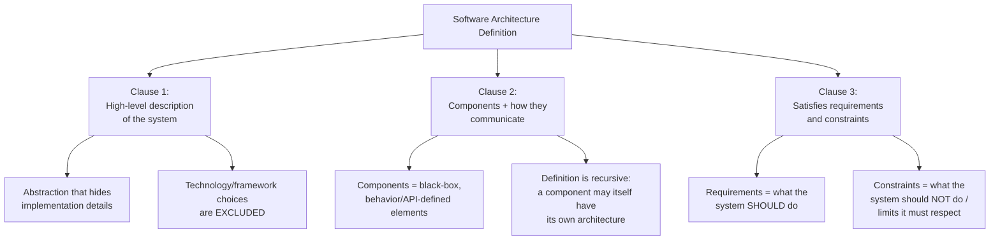
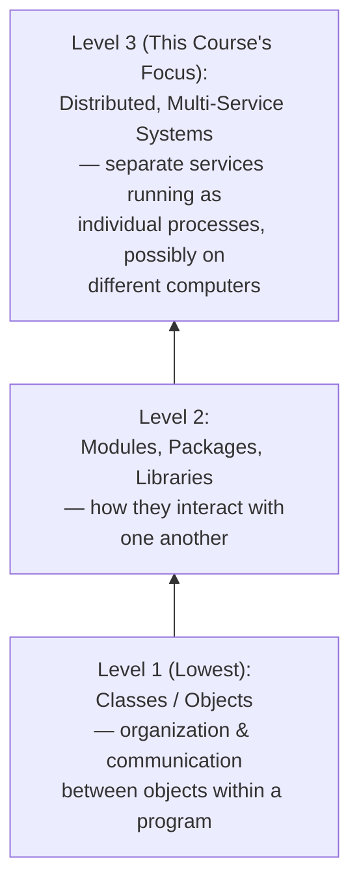
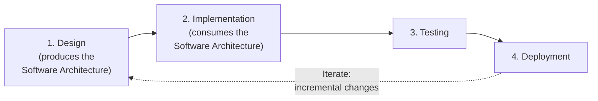

# 🏗 Software Architecture — Lecture 1: Introduction, Definition & Place in the SDLC

- <i>**Course:** Software Architecture (Instructor: Michael)
- **Session Focus:** What software architecture *is*, why it matters, how it is formally defined, the different levels of abstraction at which it can be discussed, and where it sits inside the software development lifecycle.</i>

---

## 📑 Table of Contents

1. [Session Overview](#-session-overview)
2. [Learning Objectives](#-learning-objectives)
3. [Detailed Notes](#-detailed-notes)
   - [1. Building Intuition: Why Structure Matters](#1-building-intuition-why-structure-matters)
   - [2. The Formal Definition of Software Architecture](#2-the-formal-definition-of-software-architecture)
   - [3. Levels of Abstraction in Software Architecture](#3-levels-of-abstraction-in-software-architecture)
   - [4. Real-World Stakes: Why Getting Architecture Right Matters](#4-real-world-stakes-why-getting-architecture-right-matters)
   - [5. Software Architecture's Place in the SDLC](#5-software-architectures-place-in-the-sdlc)
4. [Glossary](#-glossary)
5. [Revision Notes](#-revision-notes)
6. [Cheat Sheet](#-cheat-sheet)
7. [Interview Q&A](#-interview-qa)
   - [🟢 Beginner](#-beginner-questions)
   - [🟡 Intermediate](#-intermediate-questions)
   - [🔴 Advanced](#-advanced-questions)
8. [Scenario-Based Interview Questions](#-scenario-based-interview-questions)
9. [Hands-on Exercises](#-hands-on-exercises)
10. [Practice Assignment](#-practice-assignment)
11. [Additional Resources](#-additional-resources)
12. [Final Revision Sheet](#-final-revision-sheet)

---

## 🎯 Session Overview

This is the **opening lecture** of a course on software architecture, and its job is to set the mental foundation for everything that follows. Michael starts from **intuition rather than jargon**: everything we build — physical or digital — has a structure, whether or not we consciously designed it, and that structure determines what the thing is *good for*.

He then moves from intuition to a **precise, working definition** that the entire course will build on:

> *"The software architecture of a system is a high-level description of the system's structure, its various components, and how these components communicate with one another to satisfy the system's requirements and constraints."*

The lecture dissects this definition piece by piece, explains that architecture is deliberately **technology-agnostic**, introduces the idea that architecture can be discussed at **multiple levels of abstraction** (this course focuses on **distributed, multi-service systems**), makes the business case for why architecture quality has outsized financial and organizational consequences, and finally anchors software architecture as **the output of the Design phase and the input to the Implementation phase** in the four-stage SDLC (Design → Implementation → Testing → Deployment).

---

## 🎯 Learning Objectives

By the end of this lecture, you should be able to:

- [ ] Explain, using a non-software analogy, why structure determines the purpose and characteristics of anything that is built.
- [ ] State the course's formal definition of software architecture from memory and explain each of its three clauses.
- [ ] Explain **why technology and framework choices are explicitly excluded** from software architecture, and when those choices should be made.
- [ ] Describe what makes a "component" in the architectural sense, and why the definition of architecture is inherently **recursive**.
- [ ] List the different levels of abstraction at which software architecture can be discussed, and identify which level this course focuses on and why.
- [ ] Explain the business/financial argument for investing in good architecture upfront.
- [ ] Place software architecture correctly within the four-stage software development lifecycle (SDLC).

---

## 📚 Detailed Notes

### 1. Building Intuition: Why Structure Matters

#### 🧠 Concept

Before defining software architecture formally, the lecture builds intuition using **physical, non-software structures** — because the underlying principle (structure determines purpose) is universal and easier to grasp outside the abstractness of code.

> *"Everything we build has a structure, whether we know it or not, and whether we think about it in advance or arrive at it organically."*

#### 💡 Real-World Example — The Theater vs. the Residential House

| Structure | Optimized For | What Happens If Misused |
|---|---|---|
| **Theater** | Hosting performances and shows (large open space, sightlines, acoustics, stage) | Forcing people to *live or work* there would be extremely uncomfortable |
| **Residential House** | People living comfortably day-to-day (bedrooms, kitchens, privacy) | Hosting a large performance or show would not work well |

Neither structure is "better" in an absolute sense — each is **optimized for a different purpose**, and using it outside that purpose produces a bad experience. This is the core intuition the lecture wants you to carry into software: **a structure is not neutral — it encodes a set of trade-offs that make it good at some things and bad at others.**

#### ⚙ How It Applies to Software

> *"There are virtually an infinite number of ways in which we can organize our code to achieve the functionality of a system, but different organizations will give us different characteristics."*

Two systems can implement the exact same *functional* requirements (the same features, the same user-facing behavior) while having wildly different **non-functional characteristics** depending purely on how the code/components are organized. Specifically, architecture affects:

- **Performance** — how fast the system responds under load.
- **Scalability** — how well it handles growth in users, data, or traffic.
- **Extensibility** — how easy it is to add new features.
- **Team scalability** — how easily the engineering organization itself can grow around the system.
- **Resilience** — how well it tolerates failures.
- **Security posture** — how resistant it is to attacks.

#### ⚠ Common Mistakes

- Assuming there is a single "correct" architecture independent of requirements — in reality architecture is a set of **trade-offs**, exactly like choosing a theater vs. a house.
- Treating structural decisions as free to change later. In practice, the later you change structure, the more expensive it becomes.

#### 🎯 Key Takeaways

- Every built thing — physical or digital — has a structure, whether intentional or accidental.
- Structure is what determines a system's purpose and characteristics, not just its features.
- The same functionality can be implemented with different architectures that produce very different performance, scalability, and resilience outcomes.
- **The later you try to change structure, the more expensive it is** — this is true of buildings and it is true of software.

> 💡 **Memory Trick:** *"Theater vs. House"* — remember that a structure built for one purpose (hosting a show) actively fights against a different purpose (living there). Software is the same: an architecture optimized for one set of requirements will fight against unanticipated ones.

---

### 2. The Formal Definition of Software Architecture

#### 📖 Definition

> **"The software architecture of a system is a high-level description of the system's structure, its various components, and how these components communicate with one another to satisfy the system's requirements and constraints."**

The lecture is explicit that **many** definitions of software architecture exist and have been debated for years — this is simply the working definition adopted **for this course**. It is deliberately broken into three clauses, each of which carries specific meaning.

#### 🔍 Internal Working — Breaking Down the Definition Clause by Clause



**Clause 1 — "A high-level description of the system"**

- Architecture is an **abstraction**: it surfaces the important components needed to *reason about* the system while deliberately **hiding implementation details**.
- ⚠ **Explicitly excluded:** the specific technologies or programming languages used to implement the system. These belong to **implementation**, not architecture.
- > *"This is an important point because many engineers mistakenly assume that software architecture is simply about choosing the right technologies or frameworks. Nothing could be further from the truth."*
- The course's stance: **delay technology/framework choices until the end of the design process.** Architecture describes structure and communication first; the "what do we build it with" question comes last.

**Clause 2 — "Its various components, and how these components communicate with one another"**

- A **component**, in the architectural sense, is a **black-box element defined by its behavior and its API** — not by its internal implementation.
- Because a component is just a black box from the outside, that component may itself be a complex system with **its own internal software architecture**.
- > *"In fact, these components themselves may be complex systems that are described by their own software architecture diagrams. So, in a sense, this definition can be recursive."*
- This recursion is a deliberate design feature of the definition: it lets the same mental model apply whether you're looking at an entire distributed system or a single service inside it.

**Clause 3 — "To satisfy the system's requirements and constraints"**

- **Requirements** = what the system is *supposed to do* (the positive obligations).
- **Constraints** = what the system must *avoid doing*, or the boundaries/limits it must respect (the negative obligations/limits).
- Architecture's job is to show how the components come together to satisfy both.

#### ⚠ Common Mistakes

- Believing that choosing a "modern" tech stack (a particular database, framework, or language) *is* the architecture. It is not — that is an implementation decision that should come **after** the architecture is designed.
- Forgetting that a component can be recursively decomposed — treating every box in a diagram as necessarily "atomic" when it may itself hide an entire sub-architecture.
- Conflating **requirements** (what to do) with **constraints** (what not to do / limits to respect) — interviewers often probe whether you can tell these apart.

#### 🎯 Key Takeaways

- Memorize the definition in three clauses: **(1) high-level, tech-agnostic description → (2) components + communication, recursively definable → (3) satisfies requirements and constraints.**
- Technology/framework selection is **implementation**, not architecture, and should be delayed until the design is settled.
- Components are **black boxes** defined by behavior/API — this is what enables the recursive nature of the definition.

---

### 3. Levels of Abstraction in Software Architecture

#### 🧠 Concept

Software architecture is not a single fixed lens — it can be discussed at **multiple levels of abstraction**, and the "components" at each level look completely different.

#### 📖 Definition — The Abstraction Ladder



| Level | Unit of Composition | Example Concern |
|---|---|---|
| **Classes / objects** | Classes or language-specific structures | How objects within *one program* are organized and communicate |
| **Modules / packages / libraries** | Modules, packages, or libraries | How independently-versioned code units interact |
| **Distributed, multi-service systems** *(this course's focus)* | Separate **services**, each running as its own process (or group of processes) potentially on **different computers** | How independent services communicate to form one large system |

#### ❓ Why This Course Focuses on the Distributed/Multi-Service Level

> *"It turns out that following this more distributed, multi-service approach allows us to design systems that can handle large amounts of requests, process and store very large amounts of data, and serve thousands, hundreds of thousands, or even millions of users every day."*

This is the level of abstraction relevant to large-scale, internet-facing products, and it's explicitly the one the rest of the course will dig into.

#### 🏢 Real-World / Production Usage

Examples of systems that operate at the "millions of users" scale mentioned in the lecture:

- **Ride-sharing** platforms
- **Video-on-demand** services
- **Social media** platforms
- **Online video games**
- **Investment and banking services**

These are the kinds of systems where distributed, multi-service architecture decisions have direct, large-scale business impact.

#### 🎯 Key Takeaways

- Architecture exists at multiple abstraction levels: **class-level → module/package/library-level → distributed multi-service level.**
- This course deliberately focuses on the **distributed, multi-service** level because that's what enables systems to scale to very large numbers of users and very large volumes of data.
- Being able to name *which level* you are discussing is itself an important architectural communication skill — a senior engineer should be explicit about the level of abstraction in any architecture discussion.

---

### 4. Real-World Stakes: Why Getting Architecture Right Matters

#### ❓ Why It Exists — The Business Case for Architecture

> *"When we set our goal on building a product that operates at this scale, getting the design right can mean the difference between a small startup and a billion-dollar company, while making a positive impact on millions of people around the world."*

Conversely:

> *"If we do not do a good job during the design phase, we are likely to waste months of engineering time building a system that does not meet our requirements and that nobody wants to use."*

#### ⚖ Advantages & Limitations — The Asymmetry of Getting It Right vs. Wrong

| Outcome of Design Phase | Consequence |
|---|---|
| ✅ **Good architecture** | Can scale to millions of users; can be the difference between a startup and a billion-dollar company |
| ❌ **Poor architecture** | Months of engineering time wasted; system may not meet requirements; system may fail to attract/retain users |
| ❌ **Refactoring badly-designed systems** | Explicitly called out as **"extremely difficult and expensive"** — much more costly than getting it right the first time |

This directly echoes the theater/house analogy from Section 1: the cost of "redesigning" a physical structure after the fact is significant in time and money — and the lecture states the **same principle applies to software**, especially at large scale.

#### 🎯 Key Takeaways

- Architecture quality has **direct financial and organizational consequences** — this isn't an academic distinction.
- The cost of fixing bad architecture grows the longer you wait, exactly like the cost of remodeling a poorly-designed physical structure.
- The stakes are highest for large-scale, high-traffic systems (the distributed/multi-service level this course targets).

---

### 5. Software Architecture's Place in the SDLC

#### 📖 Definition — The Four Stages of Software Development

> *"Software development can roughly be described in four stages: 1. Design, 2. Implementation, 3. Testing, 4. Deployment."*



- Because products **evolve over long periods of time**, these four stages typically **repeat across multiple iterations**.
- The **first iteration is the most important** — subsequent iterations introduce comparatively incremental changes to the already-existing system.

#### 🔍 Internal Working — Architecture's Exact Position

> *"Software architecture is the output of the design phase and the input to the implementation phase."*

This is the single most important sentence in the lecture for placing architecture correctly:

- The **Design phase** *is*, in essence, the process of **determining the software architecture** of the system.
- That architecture then becomes the **blueprint** that an entire team — or even multiple teams of engineers — will implement, often over **weeks or months**.
- Architecture is therefore a **hand-off artifact**: it is produced once (per iteration) by the design activity and consumed by everyone doing implementation afterward.

#### ⚙ How It Works — Why Architecture Is Uniquely Hard to Get Right

> *"The biggest challenge faced by software architects is the fact that, unlike an algorithm or a mathematical formula, which can be proven to be correct and optimal, we cannot do the same thing with software architecture."*

There is no proof of optimality for an architecture the way there is for an algorithm. The mitigation the course proposes:

1. Follow a **systematic design process**.
2. Apply **architectural patterns** and **proven industry best practices**.

These two mitigations are explicitly named as **what the rest of the course will teach**.

#### ⚠ Common Mistakes

- Treating "design" and "architecture" as separate activities — in this course's model, **designing *is* determining the architecture.**
- Assuming an architecture can be mathematically proven optimal/correct — it cannot; the best you can do is apply systematic process + proven patterns.
- Skipping or rushing the design/architecture phase because it doesn't produce visible "code" — the lecture's whole argument (Sections 1 & 4) is that this phase has the largest long-term cost impact.

#### 🎯 Key Takeaways

- SDLC (this course's model): **Design → Implementation → Testing → Deployment**, repeating across iterations, with the first iteration being the most consequential.
- **Software architecture = output of Design, input to Implementation.** Memorize this exact phrasing — it is quoted almost word-for-word in the lecture and is a natural interview question.
- Architecture cannot be "proven optimal" like an algorithm; the practical answer is a **systematic design process + architectural patterns + industry best practices** — which is the subject of the rest of the course.

---

## 📝 Glossary

| Term | Definition | Why It Matters |
|---|---|---|
| **Software Architecture** | A high-level description of a system's structure, its components, and how those components communicate to satisfy the system's requirements and constraints | The foundational definition the entire course builds on |
| **Component** | A black-box element defined by its behavior and API, which may itself be a complex system with its own internal architecture | Explains why the definition of architecture is recursive |
| **Requirement** | What the system is supposed to do | One half of what architecture must satisfy |
| **Constraint** | What the system should *not* do, or a limit it must respect | The other half of what architecture must satisfy; often confused with requirements |
| **Abstraction Level (Architecture)** | The granularity at which architecture is discussed — e.g., classes, modules/packages/libraries, or distributed services | This course focuses specifically on the distributed, multi-service level |
| **Distributed / Multi-Service System** | A system composed of separate services, each running as its own process (or group of processes), potentially on different computers | The abstraction level this course targets, used to build systems that scale to millions of users |
| **Design Phase (SDLC)** | The stage of the SDLC in which the software architecture is determined | Architecture is defined as the *output* of this phase |
| **Implementation Phase (SDLC)** | The stage where teams build the system according to the architecture | Architecture is defined as the *input* to this phase |
| **SDLC (Software Development Lifecycle)** | The repeating four-stage process: Design → Implementation → Testing → Deployment | The overall framework within which architecture is positioned |
| **Architectural Pattern** | A proven, reusable solution/approach to a recurring architectural problem | One of the two mitigations (with systematic process) for the lack of "provable" architecture |

---

## 🔄 Revision Notes

### ⚡ One-Minute Revision

- Every built thing (a theater, a house, a piece of software) has a **structure**, and that structure determines its purpose/characteristics — not just its features.
- **Definition:** Software architecture = a high-level description of a system's structure, components, and how components communicate, to satisfy requirements and constraints.
- Architecture **excludes** technology/framework choices — those are implementation decisions, deliberately delayed to the end.
- Components are **black boxes** defined by behavior/API, and the definition is **recursive** (a component can have its own internal architecture).
- Architecture can be discussed at multiple **abstraction levels**: classes → modules/packages/libraries → **distributed multi-service systems** (this course's focus).
- Distributed/multi-service architecture is what lets systems scale to millions of users (ride-sharing, video-on-demand, social media, banking, etc.).
- Good architecture = huge business upside; bad architecture = wasted months and very expensive refactoring.
- SDLC: **Design → Implementation → Testing → Deployment**, repeating over iterations, first iteration most important.
- **Architecture is the output of Design and the input to Implementation.**
- Architecture cannot be mathematically proven optimal — mitigate this with a systematic design process + architectural patterns + industry best practices.

---

## 📋 Cheat Sheet

| Item | Quick Reference |
|---|---|
| **The Definition (memorize verbatim)** | "A high-level description of the system's structure, its various components, and how these components communicate with one another to satisfy the system's requirements and constraints." |
| **What's excluded from architecture** | Technology and framework choices → these are **implementation**, delayed until the end of design |
| **What a "component" is** | Black-box element defined by **behavior + API**; may recursively contain its own architecture |
| **Requirements vs. Constraints** | Requirements = what to do. Constraints = what *not* to do / limits to respect |
| **Abstraction levels (low → high, per this course)** | Classes/objects → Modules/packages/libraries → Distributed multi-service systems |
| **This course's focus level** | Distributed, multi-service systems (separate processes, possibly on different machines) |
| **Example large-scale systems** | Ride-sharing, video-on-demand, social media, online gaming, banking/investment platforms |
| **SDLC stages** | Design → Implementation → Testing → Deployment (repeats over iterations) |
| **Architecture's exact position** | Output of Design phase → Input to Implementation phase |
| **Why architecture is hard** | Cannot be proven optimal/correct like an algorithm or formula |
| **How to compensate** | Systematic design process + architectural patterns + proven industry best practices |

---

## 🔥 Interview Q&A

### 🟢 Beginner Questions

**Q1.**
**Question:** What is software architecture, according to the definition used in this course?

**Answer:** It is a high-level description of a system's structure, its various components, and how these components communicate with one another to satisfy the system's requirements and constraints.

**Explanation:** The definition has three parts: (1) a high-level, abstraction-based description, (2) components and their communication, and (3) satisfying requirements and constraints.

**Why Interviewers Ask This:** It's the most fundamental concept-check question — if you can't state the definition, deeper architecture questions won't make sense.

**Possible Follow-up:** "Which part of this definition do engineers most commonly get wrong?"

---

**Q2.**
**Question:** Are technology and framework choices part of software architecture?

**Answer:** No. Software architecture is technology-agnostic; technology and framework choices belong to the implementation phase and should be delayed until the end of the design process.

**Explanation:** Architecture is about structure and communication between components, not the specific tools used to build them.

**Why Interviewers Ask This:** It exposes a very common misconception among junior engineers who equate "architecture" with "picking a tech stack."

**Possible Follow-up:** "Why might delaying technology choices actually make for a better design?"

---

**Q3.**
**Question:** What is a "component" in the architectural sense?

**Answer:** A black-box element that is defined by its behavior and its API, without regard to its internal implementation.

**Explanation:** Because you define a component by what it does (not how), you can reason about it without knowing its internals.

**Why Interviewers Ask This:** Tests whether you understand abstraction as the core tool of architectural thinking.

**Possible Follow-up:** "Why does that make the definition of software architecture recursive?"

---

**Q4.**
**Question:** Why is the definition of software architecture described as "recursive"?

**Answer:** Because a component, which is itself a black box from the outside, may internally be a complex system that has its own software architecture.

**Explanation:** The same architectural lens (structure, components, communication) can be applied at the system level and again inside any one of its components.

**Why Interviewers Ask This:** Checks whether you can zoom in/out between different levels of a system when discussing design.

**Possible Follow-up:** "Give an example of a component that could itself be described by its own architecture diagram."

---

**Q5.**
**Question:** What is the difference between a requirement and a constraint in the context of architecture?

**Answer:** A requirement is what the system is supposed to do; a constraint is what the system should not do, or a limit it must respect.

**Explanation:** Architecture must satisfy both — positive obligations (requirements) and negative/boundary conditions (constraints).

**Why Interviewers Ask This:** People often conflate these two terms; distinguishing them cleanly shows precise thinking.

**Possible Follow-up:** "Give an example of a constraint that isn't a requirement."

---

**Q6.**
**Question:** Name the different levels of abstraction at which software architecture can be discussed.

**Answer:** Classes/objects, modules/packages/libraries, and distributed multi-service systems.

**Explanation:** Each level has a different "unit" that plays the role of a component — objects at the lowest level, up to independent services at the highest level covered in this course.

**Why Interviewers Ask This:** Confirms you know that "architecture" isn't a single fixed scope — the term applies at multiple granularities.

**Possible Follow-up:** "Which level does this course focus on, and why?"

---

**Q7.**
**Question:** Which abstraction level does this course focus on, and why?

**Answer:** Distributed, multi-service systems — because this approach allows systems to handle large request volumes, store large amounts of data, and serve very large numbers of users.

**Explanation:** At scale, a single-process/monolithic view of architecture is insufficient; you need to reason about independent services communicating across machines.

**Why Interviewers Ask This:** Establishes the scope of what you're expected to know for large-scale system design interviews.

**Possible Follow-up:** "Name a few real-world products that operate at this scale."

---

**Q8.**
**Question:** What are the four stages of the software development lifecycle described in this lecture?

**Answer:** Design, Implementation, Testing, and Deployment.

**Explanation:** These stages typically repeat across multiple iterations as a product evolves.

**Why Interviewers Ask This:** Establishes a shared vocabulary/framework for discussing where architecture fits into a broader delivery process.

**Possible Follow-up:** "Where exactly does software architecture fit into these four stages?"

---

**Q9.**
**Question:** Where does software architecture fit within the SDLC?

**Answer:** Software architecture is the output of the design phase and the input to the implementation phase.

**Explanation:** The design phase is essentially the process of determining the system's architecture, which implementation teams then build against.

**Why Interviewers Ask This:** Extremely common conceptual question — tests whether you understand architecture as a hand-off artifact between phases, not an implementation detail.

**Possible Follow-up:** "Why is the first iteration of the SDLC considered the most important?"

---

**Q10.**
**Question:** Why does the lecture use the theater vs. residential house analogy?

**Answer:** To build intuition that structure determines purpose and characteristics — a structure optimized for one purpose (hosting shows) performs poorly for a different purpose (living comfortably), and the same principle applies to software.

**Explanation:** It's a non-software way of showing that "how you organize things" has real consequences on what the thing is good at.

**Why Interviewers Ask This:** Tests conceptual understanding/communication skills rather than rote memorization — can you explain architecture to a non-technical stakeholder using an analogy?

**Possible Follow-up:** "Can you think of another physical-world analogy for software architecture?"

---

### 🟡 Intermediate Questions

**Q11.**
**Question:** Why does the course recommend delaying technology and framework decisions until the end of the design process?

**Answer:** Because those choices are implementation details, not architecture; deciding structure and component communication first, independent of specific technologies, keeps the design flexible and avoids prematurely locking into tools that may not fit the eventual architecture.

**Explanation:** If you pick a database or framework first, you risk designing your architecture *around* that tool's limitations rather than around your actual requirements and constraints.

**Why Interviewers Ask This:** Distinguishes engineers who design architecture-first from those who default to "familiar tool first" thinking, which is a common real-world anti-pattern.

**Possible Follow-up:** "What risks arise from choosing a technology stack before finalizing the architecture?"

---

**Q12.**
**Question:** Why is refactoring a poorly-designed large-scale system described as "extremely difficult and expensive"?

**Answer:** Because structural (architectural) decisions are foundational — nearly everything else in the system is built assuming that structure — so changing it after the fact requires touching large amounts of already-built code, coordinating multiple teams, and re-testing extensively, which the theater/house analogy also illustrates for physical structures.

**Explanation:** This mirrors the general engineering principle that the cost of change increases the later a structural decision is revisited.

**Why Interviewers Ask This:** Tests whether you internalize the business argument for investing properly in the design phase, not just the technical mechanics.

**Possible Follow-up:** "What practices can reduce the cost of late-stage architectural change?"

---

**Q13.**
**Question:** Explain why software architecture cannot be "proven correct" the way an algorithm can.

**Answer:** An algorithm or mathematical formula can be formally proven correct and optimal against a precise specification; software architecture, however, must satisfy a broad, often evolving, and sometimes competing set of requirements and constraints (performance, scalability, team growth, resilience, security, cost, etc.) for which no single formal proof of "optimality" exists.

**Explanation:** This is explicitly called out in the lecture as "the biggest challenge faced by software architects."

**Why Interviewers Ask This:** Senior-level interviewers want to see that you understand architecture as a discipline of trade-offs and judgment, not a solvable equation.

**Possible Follow-up:** "Given that architecture can't be proven optimal, how do we increase confidence that a given design is 'good enough'?"

---

**Q14.**
**Question:** What two things does the course propose to mitigate the fact that architecture cannot be proven optimal?

**Answer:** Following a systematic design process, and applying architectural patterns and proven industry best practices.

**Explanation:** These substitute for formal proof: a repeatable, disciplined process plus reuse of solutions that have already worked for others in similar situations.

**Why Interviewers Ask This:** Checks whether you know that architecture quality comes from process + pattern reuse, not individual genius or guesswork.

**Possible Follow-up:** "Can you name any architectural patterns you're already familiar with?"

---

**Q15.**
**Question:** How does the recursive nature of "component" affect how you would document or diagram a large distributed system?

**Answer:** At the top level, you can treat each service as a single black-box component defined by its API/behavior; when you need more detail, you "zoom in" on any one service and produce a separate, lower-level architecture diagram for its internal structure — without needing to change how the top-level diagram represents that service.

**Explanation:** This lets architecture documentation scale to very large systems by describing each level of detail independently, rather than trying to represent an entire distributed system in one flat diagram.

**Why Interviewers Ask This:** Practical test of whether you can apply the recursive-component idea to real documentation/communication practice, not just recite the definition.

**Possible Follow-up:** "At what point would you decide a component needs its own dedicated architecture diagram?"

---

### 🔴 Advanced Questions

**Q16.**
**Question:** The lecture states that the "first iteration" of the SDLC is the most important. From an architectural standpoint, why might this be true, and what risk does it create for later iterations?

**Answer:** The first iteration establishes the foundational structure — the component boundaries, communication patterns, and technology-agnostic design decisions — that every subsequent iteration will build on top of and be constrained by. If that first architecture is wrong, later iterations inherit the cost of working around (or expensively refactoring) that foundational structure, which is exactly why the lecture stresses that redesigning structure "after the fact" is expensive both for buildings and for software.

**Explanation:** This connects Sections 1, 4, and 5: structure is expensive to change (Section 1/4), and the design phase is where structure/architecture is set (Section 5) — so getting the *first* design phase right has compounding long-term value.

**Why Interviewers Ask This:** Tests whether you can synthesize multiple concepts from the lecture into a single coherent argument, a hallmark of senior-level reasoning.

**Possible Follow-up:** "What practices help reduce the risk of getting the first-iteration architecture wrong?"

---

**Q17.**
**Question:** A colleague argues: "We should pick our cloud provider and database technology first, since that will heavily influence what architecture is even possible." How would you respond, using this lecture's framework?

**Answer:** Per this lecture's definition, architecture is explicitly a technology-agnostic, high-level description of structure, components, and communication that should satisfy requirements and constraints — and the course explicitly recommends *delaying* technology choices until the end of the design process, precisely to avoid letting a specific tool's limitations distort the architecture prematurely. The counter-argument has some practical merit (some constraints are genuinely technology-driven), but the lecture's position is that requirements and constraints should drive the architecture, and the architecture should then inform technology selection — not the reverse. A senior engineer should distinguish *genuine, non-negotiable* technical constraints (e.g., a regulatory requirement to use an on-premises database) from mere technology preference, and only let true constraints influence the architecture early.

**Explanation:** This tests the ability to defend the course's stated principle while still acknowledging real-world nuance — a balanced, senior-level answer rather than a dogmatic one.

**Why Interviewers Ask This:** This is a classic "defend a principle under a plausible-sounding objection" question used to evaluate architectural maturity and communication skills.

**Possible Follow-up:** "Can you give a real example of a constraint that legitimately should influence architecture before technology selection?"

---

## 🧪 Scenario-Based Interview Questions

> **Scenario 1:** Your team lead says, "Let's skip the architecture/design discussion — we already know we're using React, Node.js, and PostgreSQL, so let's just start building." How would you respond and what would you propose instead?

**Structured Answer:**

1. **Initial investigation:** Clarify what the actual business requirements and constraints are (expected scale, latency needs, team size, compliance constraints, budget) — these are currently unstated, and the team is substituting a familiar tech stack for that analysis.
2. **Relevant principle:** Per the lecture's definition, technology choices are implementation details that should come *after* the architecture (structure, components, communication) is designed to satisfy requirements/constraints — not before.
3. **Possible causes:** Teams often default to a familiar stack because it feels like "progress," or because nobody has explicitly separated the design/architecture activity from implementation planning.
4. **Debugging approach (translated to a design context):** Facilitate a short design session focused purely on: what are the components, how do they communicate, what are the requirements and constraints — deliberately deferring the "which framework/database" conversation.
5. **Resolution:** Produce a lightweight architecture description (components + communication + key requirements/constraints) before committing further engineering time to implementation with the chosen stack; validate that React/Node/PostgreSQL are actually compatible with that architecture, not just familiar.
6. **Prevention:** Establish a team norm that every new system/feature goes through an explicit, brief design/architecture step before implementation begins, even if the team is confident about the eventual tech stack.

---

> **Scenario 2:** Six months after launch, your system (originally built quickly to hit a deadline) is struggling to scale, and the team is now debating a costly rewrite. How would you approach this using the concepts from this lecture?

**Structured Answer:**

1. **Initial investigation:** Identify specifically which "characteristics" are failing — is it performance, scalability, team velocity (hard to add features), resilience, or security? The lecture is explicit that architecture affects all of these independently.
2. **Relevant principle:** The lecture warns that refactoring a system that "was not designed correctly is extremely difficult and expensive" — exactly the situation this scenario describes — reinforcing that this cost was foreseeable from under-investing in the design phase.
3. **Possible causes:** The original "first iteration" design phase was likely rushed or skipped (Section 5's point that the first iteration is the most important), and/or technology choices were made before structure was properly designed (Section 2's warning against that ordering).
4. **Debugging approach:** Rather than jumping straight to "rewrite everything," first produce a current-state architecture diagram (components + communication) to see exactly which structural decisions are causing the scaling problems — this may reveal that only certain components/boundaries need to change, not the entire system.
5. **Resolution:** Redesign only the components/communication patterns that are the actual bottleneck, applying the course's promised toolkit of architectural patterns and proven industry best practices, rather than a full rewrite.
6. **Prevention:** Institutionalize a proper design/architecture phase before the *next* first iteration of any new system, explicitly deferring technology choices until structure and component boundaries are settled, to avoid repeating this costly cycle.

---

## 🛠 Hands-on Exercises

### 🟢 Easy

1. In your own words (not verbatim from the lecture), write a two-sentence definition of software architecture that still captures all three clauses: high-level description, components + communication, requirements + constraints.
2. Pick a system you use daily (e.g., a food-delivery app). Identify at least 3 things that would be *requirements* and at least 2 things that would be *constraints* for such a system.

### 🟡 Medium

1. For the food-delivery app from the previous exercise, sketch (on paper or in a simple diagram tool) a top-level architecture diagram showing 4–6 black-box components (e.g., "Order Service," "Payment Service," "Restaurant Catalog Service," "Notification Service") and draw arrows showing how they might communicate. Do **not** name any specific technology.
2. Pick one of the components you drew, and produce a *second*, lower-level diagram showing that component's own internal sub-components — demonstrating the recursive nature of the definition.

### 🔴 Advanced

1. Write a short (200–300 word) design memo arguing why a hypothetical new "million-user" system should be designed at the "distributed, multi-service" abstraction level rather than as a single large application, using the specific business/cost arguments from Section 4 of this lecture (not generic scalability buzzwords).
2. Identify a real (or realistic) example from your own work experience where technology was chosen *before* architecture, and analyze — using this lecture's framework — what problems that ordering caused or could cause, and how you would have approached it differently.

---

## 🏗 Practice Assignment

**Objective:** Produce a one-page "Architecture Charter" document for a hypothetical large-scale system, applying only the concepts from this introductory lecture (no later-course concepts required yet).

**Requirements:**
- Choose one example system from the lecture's list (ride-sharing, video-on-demand, social media, online video games, or investment/banking) or a similar large-scale system of your choice.
- The document must **not** name any specific technology, framework, database, or programming language.
- The document must contain: a short **requirements list**, a short **constraints list**, and a **component list** (black-box components only, described by behavior/API, not implementation).

**Architecture (of the assignment itself):**

```text
Architecture Charter (1 page)
│
├── System Name & One-Line Purpose
├── Requirements (what the system must do)
├── Constraints (what the system must not do / must respect)
├── Components (black-box list)
│     ├── Component A — responsibility (API/behavior only)
│     ├── Component B — responsibility (API/behavior only)
│     └── ...
└── Communication Notes (which components talk to which, and why)
```

**Expected Functionality:** A reader with no prior context should be able to read the charter and understand, at a glance, what the system needs to do, what it must avoid, and what the major black-box components are — without knowing anything about the eventual tech stack.

**Suggested Implementation Approach:**
1. Start from the chosen system's core user journey (e.g., for ride-sharing: rider requests a ride → driver is matched → trip happens → payment is processed).
2. Derive requirements and constraints from that journey.
3. Only after requirements/constraints are clear, identify the natural black-box components implied by the journey.

**Expected Output:** A single Markdown or plain-text page following the structure above.

**Challenges:**
- Resisting the urge to name a specific database, cloud provider, or framework anywhere in the document.
- Correctly separating "requirement" statements from "constraint" statements without mixing them.

**Bonus Improvements:**
- Add a one-level-deeper diagram for your single most complex component, demonstrating the recursive definition of architecture.
- Add a short note on which abstraction level (class / module / distributed-service) each part of your charter is written at.

---

## 📚 Additional Resources

- **Books:** *Software Architecture: The Hard Parts* (Ford, Richards, Sadalage, Dugan) — for a deeper treatment of architectural trade-offs referenced conceptually in this lecture.
- **Books:** *Fundamentals of Software Architecture* (Mark Richards & Neal Ford) — covers formal definitions of architecture, architectural characteristics, and patterns that this course will build toward.
- **Concept Reference:** Look up "non-functional requirements" (a.k.a. "quality attributes" or "-ilities") to deepen the performance/scalability/resilience/security discussion from Section 1.
- **Concept Reference:** Look up "Software Development Life Cycle (SDLC) models" (Waterfall, Agile/Iterative, Spiral) to see how the four-stage model in this lecture maps onto different real-world delivery methodologies.

---

## 📌 Final Revision Sheet

- ⭐ **Core concept:** Structure determines purpose/characteristics — true for physical structures (theater vs. house) and equally true for software.
- ⭐ **Core definition (memorize):** "A high-level description of the system's structure, its various components, and how these components communicate with one another to satisfy the system's requirements and constraints."
- ⭐ **Important definition:** *Component* = black-box, behavior/API-defined element; the architecture definition is **recursive** because a component may itself have its own architecture.
- ⭐ **Important definition:** *Requirements* = what to do. *Constraints* = what not to do / limits to respect.
- ⭐ **Architecture/process:** Abstraction levels — classes/objects → modules/packages/libraries → distributed multi-service systems (this course's focus).
- ⭐ **Architecture/process:** SDLC = Design → Implementation → Testing → Deployment (repeats over iterations; first iteration is most important).
- ⭐ **Best practice:** Delay technology/framework decisions until the **end** of the design process — architecture is technology-agnostic.
- ⭐ **Best practice:** Since architecture can't be "proven optimal," rely on a systematic design process plus architectural patterns and proven industry best practices.
- ⭐ **Common mistake to avoid:** Equating "architecture" with "choosing a tech stack."
- ⭐ **Common mistake to avoid:** Confusing requirements with constraints.
- ⭐ **Interview point:** Be ready to state, verbatim or near-verbatim, that "software architecture is the output of the design phase and the input to the implementation phase."
- ⭐ **Interview point:** Be ready to justify, with the business-cost argument, why getting the *first* design iteration right matters disproportionately.
- ⭐ **Thing to remember:** Real-world stakes example systems — ride-sharing, video-on-demand, social media, online gaming, investment/banking — all operate at the distributed, multi-service abstraction level this course targets.