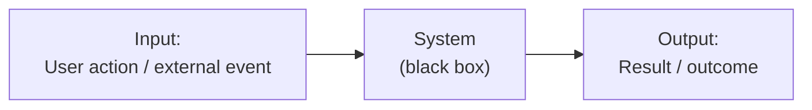
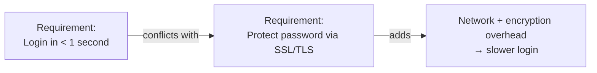
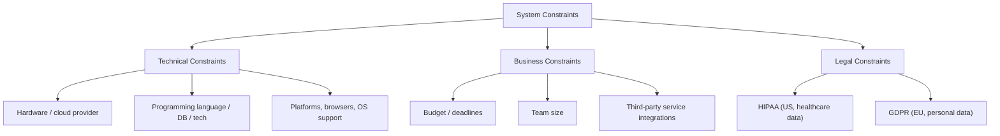
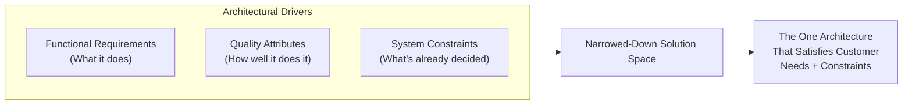

# 🏗 Software Architecture — Lecture 2: System Requirements & Architectural Drivers

- <i>**Course:** Software Architecture (Instructor: Michael)
- **Session Focus:** Why gathering requirements for large-scale systems is uniquely hard, the three types of requirements (Functional Requirements, Quality Attributes, and System Constraints) — collectively called **Architectural Drivers** — and how each one shapes the eventual software architecture.</i>

---

## 📑 Table of Contents

1. [Session Overview](#-session-overview)
2. [Learning Objectives](#-learning-objectives)
3. [Detailed Notes](#-detailed-notes)
   - [1. Why Gathering Requirements for Large-Scale Systems Is Hard](#1-why-gathering-requirements-for-large-scale-systems-is-hard)
   - [2. Functional Requirements (System Features)](#2-functional-requirements-system-features)
   - [3. Quality Attributes (Non-Functional Requirements)](#3-quality-attributes-non-functional-requirements)
   - [4. System Constraints](#4-system-constraints)
   - [5. Architectural Drivers: Bringing the Three Together](#5-architectural-drivers-bringing-the-three-together)
4. [Glossary](#-glossary)
5. [Revision Notes](#-revision-notes)
6. [Cheat Sheet](#-cheat-sheet)
7. [Interview Q&A](#-interview-qa)
   - [🟢 Beginner](#-beginner-questions)
   - [🟡 Intermediate](#-intermediate-questions)
   - [🔴 Advanced](#-advanced-questions)
8. [Scenario-Based Interview Questions](#-scenario-based-interview-questions)
9. [Hands-on Exercises](#-hands-on-exercises)
10. [Practice Assignment](#-practice-assignment)
11. [Additional Resources](#-additional-resources)
12. [Final Revision Sheet](#-final-revision-sheet)

---

## 🎯 Session Overview

This lecture picks up where the introduction left off and tackles the **very first step** of designing any large-scale system: figuring out exactly what needs to be built. Michael opens with a motivational contrast — the requirements we're used to as engineers (implementing a method, a class, a module) versus the requirements for an entire large-scale system (a file-storage system, a video-streaming solution, a ride-sharing service) — and explains why the latter feels so much more overwhelming: **larger scope** and **higher ambiguity**.

He then makes the business case for why getting requirements right *upfront* matters disproportionately for large systems (unlike small code changes, large systems can't be "rewritten overnight"), before formally classifying requirements into **three types**, each with a fundamentally different relationship to architecture:

1. **System Features / Functional Requirements** — *what* the system does.
2. **Quality Attributes / Non-Functional Requirements** — *how well* the system does it (and the type that actually shapes architecture).
3. **System Constraints** — decisions already made for you that limit your degrees of freedom.

Collectively, these three are called **Architectural Drivers**, because they are what narrow an almost infinite solution space down to the one architecture that will actually satisfy the customer.

---

## 🎯 Learning Objectives

By the end of this lecture, you should be able to:

- [ ] Explain the two reasons why requirements for large-scale systems are more ambiguous than requirements for a method, class, or module.
- [ ] Justify, using the lecture's own cost argument, why getting requirements right upfront matters more for large systems than for small ones.
- [ ] Define Functional Requirements and explain why they do *not* determine architecture.
- [ ] Define Quality Attributes and explain why, unlike functional requirements, they *do* strongly influence architecture.
- [ ] State and apply the three important considerations for quality attributes: measurable/testable, trade-offs (no single architecture satisfies all attributes), and feasibility.
- [ ] Define System Constraints, list their three sources (technical, business, legal), and give a real example of each.
- [ ] Explain the two key considerations when handling constraints: distinguishing real vs. self-imposed constraints, and avoiding tight coupling to them.
- [ ] Explain what "Architectural Drivers" means and why all three requirement types are grouped under that name.

---

## 📚 Detailed Notes

### 1. Why Gathering Requirements for Large-Scale Systems Is Hard

#### 🧠 Concept

> *"System requirements are simply a formal term for understanding and narrowing down exactly what we need to build for our customers."*

Engineers already receive informal requirements all the time — but requirements for an **entire large-scale system** differ from requirements for a method, algorithm, or class in two fundamental ways: **scope** and **ambiguity**.

#### 📖 Definition — Scope of the Requirements

| Level of Abstraction | Freedom in Solution Space | Typical Constraint |
|---|---|---|
| Method / algorithm in an existing codebase | Low | Input/output shape is usually known; constrained to the existing programming language |
| Class, module, library, or application | Medium | Range of possible approaches grows as you gain more freedom |
| **Entire large-scale system** (this course's focus) | Very high | Scope becomes so large it can be difficult to even imagine the implementation |

> *"For example, imagine that you are asked to design a file-storage system, a video-streaming solution, or a ride-sharing service that needs to scale to serve millions of users every day. It is difficult not to feel overwhelmed by such a task."*

#### ❓ Why It Exists — Two Reasons for Ambiguity

**Reason 1 — Requirements often don't come from engineers.**
A customer or product manager may describe what they want at a very high, non-technical level. It becomes the engineer's job to **translate high-level requests into precise technical requirements** — and those technical requirements become the foundation the software architecture is built on.

**Reason 2 — Figuring out the exact requirements is itself part of the solution.**
> *"The customer does not always know exactly what they need. The one thing they know for sure is the problem they need to solve."*

##### 💡 Real-World Example — Clarifying a Ride-Sharing Requirement

Given only: *"Design a ride-sharing service that allows people to join drivers already traveling along a route and willing to pick up passengers along the way for a fee."*

It becomes the engineer's job to ask:
- Will this be **real-time**, or will passengers contact drivers in advance?
- Will the experience be on **mobile, desktop, or both**?
- Will **payments** happen through the system, or directly between passenger and driver?

> *"In most system design interviews, one of the things being tested is our ability to clarify requirements and ask these questions upfront."*

#### ❓ Why Getting Requirements Right Matters (The Cost Argument)

A natural objection: *"Software doesn't have big material costs like a building or bridge — can't we just build something, see if the customer is happy, and fix it if not?"*

The lecture's answer — the **mental shift** required:

> *"Large-scale systems are very different from small projects, such as building a method or a few classes, where we can easily rewrite the code several times until we get it right."*

Large-scale systems:
- Require **many engineers**, sometimes multiple teams.
- Can take **months to build** — engineering time is extremely expensive.
- May require **purchasing hardware and software licenses** upfront.
- Often involve **contracts with time and financial commitments**.
- Carry the risk that **missing a delivery deadline can cause serious, potentially irreversible damage** to the company's reputation and brand.

#### ⚠ Common Mistakes

- Assuming large-scale system requirements behave like small-code requirements ("we'll just rewrite it later") — the lecture explicitly rejects this comparison.
- Accepting a customer's high-level ask at face value without asking clarifying questions — this skips work that is *itself* part of the design solution.

#### 🎯 Key Takeaways

- Large-scale system requirements are harder than method/class-level requirements because of **larger scope** and **higher ambiguity**.
- Ambiguity has two sources: requirements coming from non-technical stakeholders, and the fact that discovering the real requirement *is* part of solving the problem.
- Asking clarifying questions upfront is an explicitly tested skill in system design interviews.
- Getting requirements right matters disproportionately for large systems because of engineering cost, contractual commitments, and reputational risk.

---

### 2. Functional Requirements (System Features)

#### 📖 Definition

> *"These requirements basically describe the behavior of the system. In other words: What does the system actually do?"*

Functional requirements are also called **system features**, and they describe the system as a **black-box function**:



#### 🔍 Internal Working — Why Functional Requirements Don't Define Architecture

> *"Features or functional requirements simply define the functionality of our system; they do not define its architecture. In general, many different architectures can achieve the same feature. This is what makes our job as software engineers difficult."*

This is one of the most important distinctions in the entire lecture: **knowing *what* a system must do tells you almost nothing about *how* it should be structured.**

#### 💡 Real-World Example — Ride-Sharing Service

| Functional Requirement | Input | Processing | Output |
|---|---|---|---|
| Show nearby drivers | Passenger logs into the mobile app | System finds nearby drivers | Map displaying drivers within a 5-mile radius |
| Charge for a completed ride | Ride completion event | Charge the passenger, calculate the service fee | Transfer the appropriate amount to the driver |

#### 🎯 Key Takeaways

- Functional requirements = **what** the system does; framed as input → processing → output, exactly like a black-box function.
- Functional requirements do **not** determine architecture — many different architectures can satisfy the same feature set.
- This is precisely why the *next* requirement type (quality attributes) is the one that actually drives architectural decisions.

> 💡 **Memory Trick:** Functional requirement = "the verb" (what happens). Quality attribute = "the adverb" (how well it happens). Only the adverb shapes the architecture.

---

### 3. Quality Attributes (Non-Functional Requirements)

#### ❓ Why It Exists — Motivation

> *"Studies have shown that systems are frequently redesigned and re-architected, not usually because of a functional defect or because of new functional requirements, but because the existing system is not fast enough, cannot scale well enough for the increasing number of users or amount of data, or because the system's architecture makes development, maintenance, or security extremely difficult. In most cases, after these major redesigns, the system provides either equivalent or exactly the same functionality as before."*

This is the strongest possible argument for why quality attributes matter: **systems get rewritten for non-functional reasons far more often than for missing features.**

#### 📖 Definition

> **"Quality attributes are non-functional requirements that describe the qualities of the functional requirements of a system, or the general characteristics of the system."**

They do not describe *what* the system does — they provide a **measure of quality** for how well it performs in a given dimension. Common quality attribute dimensions:

| Dimension | What It Measures |
|---|---|
| **Scalability** | Ability to handle growth in users/data/traffic |
| **Availability** | Uptime / percentage of time the system is operational |
| **Reliability** | Consistency of correct behavior over time |
| **Security** | Resistance to unauthorized access/attacks |
| **Performance** | Speed/latency/throughput |
| **Deployability** | How easily and frequently new versions can be shipped |

> *"The software architecture determines the quality attributes of the system."* — different architectures provide different quality characteristics; there is no free lunch.

#### 💡 Real-World Example — Online Store

**Attached to a specific functional requirement:**
> *"When a user clicks the Search button after entering specific search keywords, the user should be provided with a list of products within a maximum of 100 milliseconds."*
- **Functional requirement:** "Search for products."
- **Quality attribute (performance dimension):** "Return the results within 100 ms."

**Applied to the whole system (not tied to one feature):**
- *"Our online store should be available to users at least 99.9% of the time"* → **availability** dimension.
- *"Our development team should be able to deploy a new version of our online store at least twice per week"* → **deployability** dimension.

> ⚠ Quality attributes must satisfy **all stakeholders**, not just the customer — the deployability example above is a requirement for the *engineering team*, not the end user.

#### ⚙ Three Important Considerations for Quality Attributes

##### 1. Measurable and Testable

> *"If we cannot objectively measure and continuously test our system to prove that it satisfies the required quality attributes, we cannot really know whether our system is performing well or poorly with respect to that requirement."*

| Bad (Vague) Requirement | Good (Measurable) Requirement |
|---|---|
| "When the user clicks Buy, the confirmation should be displayed quickly." | "The purchase confirmation must be displayed within 200 milliseconds for 99% of requests." |

##### 2. There Is No Single Architecture That Provides Every Quality Attribute

> *"If such an architecture existed, everyone would use it for every system, and there would be no need for software architects. The reason this is impossible is that some quality attributes conflict with each other."*

##### 💡 Real-World Example — Performance vs. Security Trade-off



Entering a password and negotiating SSL/TLS adds overhead that directly works against a sub-one-second login goal — a genuine **trade-off between security and performance** that the architect must consciously balance based on business priorities.

The architect's job, given this conflict, is to:
- Make the right decisions.
- **Prioritize** certain quality attributes over others.
- Make **appropriate trade-offs**.
- Design for the **highest chance of success** based on business requirements.

##### 3. Quality Attributes Must Be Achievable (Feasibility)

> *"It is our responsibility as system designers to make sure that the system we are trying to design and eventually build is capable of delivering what the customer is asking for."*

Because customers aren't always technical experts, they may unknowingly request something **technically impossible, extremely expensive, or unrealistic**. It's the engineer's job to catch this early.

##### 💡 Real-World Example — Unrealistic Latency

> Network latency between a customer in South America and a data center in the eastern United States might be ~100–150 ms *on its own*. A page load additionally requires DNS resolution, TLS negotiation, multiple HTTP requests, and asset loading — so a "sub-100ms page load" promise for that customer is **not achievable**, since total page-load time will exceed raw network latency.

**Other examples of infeasible requirements called out in the lecture:**
- **100% availability** (implies the system can *never* fail and can never go offline for maintenance).
- Complete protection against hackers.
- Streaming HD video in areas without sufficient bandwidth.
- Requiring storage capacity to scale at an unreasonable rate.
- Guaranteeing zero downtime under all circumstances.

> *"Before agreeing to any requirement, we may need to consult people with expertise in the relevant domain to make sure that we can actually deliver what we are promising."*

#### ⚠ Common Mistakes

- Writing quality requirements using subjective words like "fast" or "quickly" instead of a measurable target (e.g., "200ms for 99% of requests").
- Assuming a single architecture can maximize every quality attribute simultaneously — ignoring that some attributes fundamentally conflict (e.g., performance vs. security).
- Accepting a customer's quality requirement (e.g., "100% availability") without checking technical feasibility.

#### 🎯 Key Takeaways

- Quality attributes = **non-functional requirements**; they measure *how well* the system performs a dimension (scalability, availability, reliability, security, performance, deployability, etc.), not *what* it does.
- Unlike functional requirements, quality attributes **directly shape the architecture** — "the architecture determines the quality attributes."
- Three must-follow rules: (1) make them **measurable/testable**, (2) accept that trade-offs are unavoidable and **prioritize**, (3) verify **feasibility** before committing.
- Systems are redesigned far more often for quality-attribute failures than for missing features.

---

### 4. System Constraints

#### 📖 Definition

> **"System constraints are essentially decisions that have already been made for us, either completely or partially, which limit our degrees of freedom."**

Unlike quality attributes (where the architect gets to choose trade-offs), constraints are typically **non-negotiable** and act as a starting point:

> *"This is why people sometimes refer to system constraints as the building blocks or foundation of our software architecture... Since constraints are usually non-negotiable, we need to design the rest of the system around them."*

#### 🧩 The Three Types of System Constraints



##### 1. Technical Constraints

Examples: restricted to specific hardware, a particular cloud provider, a required programming language, a specific database, a required technology, or the need to support specific platforms/browsers/operating systems.

> ⚠ *"At first glance, technical constraints may appear to belong entirely to the implementation domain rather than software architecture. Unfortunately, in practice, they often affect the decisions we make during the design phase and place constraints on our architecture."*

**Example — On-premises infrastructure:** If a company must run all services **on-premises** (security/financial reasons), cloud-native models like **IaaS** or **PaaS** may be unavailable or hard to achieve, since the team must build significant infrastructure themselves.

**Example — Legacy browsers/devices:** Supporting legacy browsers or low-end devices that can't handle modern protocols/large data volumes forces the architecture to adapt to old APIs — potentially while offering a more advanced experience to newer devices.

##### 2. Business Constraints

Business constraints come from the business side, not from technology: **limited budget or strict deadlines** lead to very different architectural choices than an unlimited budget/timeline would.

> *"Certain software architectural patterns are more suitable for small startups that need to get to market quickly with a small team. Other architectural patterns are better suited to larger organizations with many engineering teams and a much larger budget."*

**Example — Third-party services as a business constraint:**

| System | Specializes In | Delegates To Third Parties |
|---|---|---|
| Online store | Customer shopping experience | Shipping, billing, payments |
| Investment platform | Core investment product | Banks, brokerage services, security services, fraud-detection services |

> ⚠ Every third-party provider brings its **own APIs, data models, architectural patterns, and limitations**, which must be designed around.

##### 3. Legal Constraints

Constraints from **laws, rules, and regulations** — global or region-specific.

| Regulation | Region | Governs |
|---|---|---|
| **HIPAA** | United States | Who can access patient data, how it's accessed, and required security measures for medical/patient records |
| **GDPR** | European Union | What data can be collected/stored, how it's shared with third parties, and retention periods |

> Which regulations apply depends on both the **country of operation** and the **industry** the service belongs to.

#### ⚙ Two Important Considerations When Dealing with Constraints

##### 1. Don't Take Every Constraint at Face Value

> *"We want to distinguish between real constraints that we cannot do anything about and self-imposed constraints that we may be able to negotiate or even remove."*

- **Real constraints** (e.g., external laws/regulations) — little to no room for negotiation.
- **Self-imposed constraints** (e.g., budget/deadline from the business, an existing hardware/cloud/tech commitment) — may be negotiable, or the current project might be a good opportunity to reconsider them.

⚠ *"Once we agree to accept a particular set of constraints, it becomes very difficult to go back and change them. If we later discover that those constraints were not actually real constraints, our overall architecture may no longer make sense."*

##### 2. Avoid Tight Coupling to Constraints

> *"We need to leave enough flexibility in our architecture to move away from those constraints in the future."*

If constrained to a particular database or third-party service, the system should **not be tightly coupled** to that specific technology/API — so that if a better option becomes available later, the team can switch with **minimal changes** rather than rebuilding the whole system.

#### ⚠ Common Mistakes

- Treating every stated constraint as permanent and non-negotiable without checking whether it's actually "real" versus self-imposed.
- Hard-wiring a system's core logic directly against a specific database/vendor API, making a future swap prohibitively expensive.
- Dismissing technical constraints as "just implementation details" when in practice they shape design-phase decisions.

#### 🎯 Key Takeaways

- System constraints = decisions **already made** that limit your architectural freedom — often described as the foundation you design around.
- Three sources: **technical**, **business**, **legal**.
- Always separate **real** constraints (rarely negotiable, e.g., laws) from **self-imposed** ones (often negotiable, e.g., budget/tooling commitments).
- Architect for **loose coupling** to any constrained technology/service so future replacement is cheap.

---

### 5. Architectural Drivers: Bringing the Three Together

#### 📖 Definition

> *"The three types of requirements we learned about in this lecture are sometimes referred to as architectural drivers. They are called architectural drivers because they essentially drive our architectural decisions."*



#### 🔍 Internal Working — How the Narrowing Happens

> *"We start with an almost unlimited number of possible solutions and gradually narrow them down toward one solution that satisfies the customer's needs and constraints."*

Each driver narrows the space differently:
- **Functional requirements** define the boundary of *what the system must accomplish* — but leave architecture almost completely open.
- **Quality attributes** eliminate architectures that can't deliver the needed scalability/availability/security/performance/etc. — this is where most architectural decision-making actually happens.
- **System constraints** eliminate architectures that violate an already-fixed decision (a mandated cloud provider, a legal restriction, a fixed budget).

#### 🎯 Key Takeaways

- "Architectural Drivers" is the umbrella term for **Functional Requirements + Quality Attributes + System Constraints**.
- All three matter, but they play **different roles**: functional requirements define scope, quality attributes actively shape architecture, and constraints bound the solution space from decisions already made.
- Good requirements-gathering is the process of identifying all three driver types *before* committing to an architecture.

---

## 📝 Glossary

| Term | Definition | Why It Matters |
|---|---|---|
| **System Requirements** | A formal term for understanding and narrowing down exactly what needs to be built for customers | Foundation of the entire design phase |
| **Functional Requirement / System Feature** | A requirement describing *what* the system does, framed as input → processing → output | Defines system scope but not architecture |
| **Quality Attribute / Non-Functional Requirement** | A requirement describing *how well* the system performs in a dimension (e.g., scalability, availability, security) | Directly shapes/determines the software architecture |
| **System Constraint** | A decision already made, fully or partially, that limits architectural freedom | Acts as the "foundation" the rest of the architecture is built around |
| **Architectural Driver** | Umbrella term for the three requirement types (functional, quality attribute, constraint) that collectively drive architectural decisions | Ties the whole lecture together |
| **Technical Constraint** | A constraint originating from hardware, cloud provider, language, database, or platform/browser support requirements | One of the three constraint sources |
| **Business Constraint** | A constraint from budget, deadlines, team size, or required third-party integrations | Often self-imposed and potentially negotiable |
| **Legal Constraint** | A constraint from laws/regulations (e.g., HIPAA, GDPR) | Usually a "real" (non-negotiable) constraint |
| **HIPAA** | US regulation governing access, handling, and security of medical/patient data | Example of a legal constraint |
| **GDPR** | EU regulation governing collection, storage, sharing, and retention of personal data | Example of a legal constraint |
| **Real Constraint** | A constraint that genuinely cannot be changed (e.g., external law) | Distinguishing this from self-imposed constraints avoids wasted negotiation effort |
| **Self-Imposed Constraint** | A constraint the organization chose (e.g., budget, existing tooling) that may be negotiable | Should be periodically re-examined before being treated as fixed |
| **Tight Coupling (to a constraint)** | Designing a system so deeply dependent on a specific constrained technology/service that replacing it later requires major rework | The pattern to avoid when dealing with constraints |

---

## 🔄 Revision Notes

### ⚡ One-Minute Revision

- Requirements for **entire systems** are harder than method/class-level requirements because of larger **scope** and higher **ambiguity** (non-technical origin + "discovering requirements is part of the solution").
- Getting requirements right upfront matters because large systems can't be cheaply rewritten — engineering time, contracts, and reputation are all at stake.
- **Functional requirements** = what the system does (black-box: input → processing → output). They do **not** determine architecture.
- **Quality attributes** = how well the system performs (scalability, availability, reliability, security, performance, deployability...). They **do** determine architecture — "architecture determines quality attributes."
- Quality attribute rules: must be **measurable/testable**; **no single architecture satisfies every attribute** (trade-offs required, e.g. performance vs. security); must be **feasible** (100% availability, zero-downtime, unrealistic latency are all infeasible).
- **System constraints** = decisions already made that limit freedom; three sources: **technical, business, legal** (HIPAA/GDPR).
- Two constraint rules: distinguish **real vs. self-imposed** constraints; avoid **tight coupling** to any constrained technology so it can be swapped later.
- **Architectural Drivers** = Functional Requirements + Quality Attributes + System Constraints, together narrowing an unlimited solution space down to one architecture.

---

## 📋 Cheat Sheet

| Item | Quick Reference |
|---|---|
| **3 Types of Requirements** | Functional Requirements, Quality Attributes, System Constraints |
| **Collective name for the 3 types** | Architectural Drivers |
| **Functional requirement formula** | Input/Event → Processing → Output |
| **Does it shape architecture?** | Functional: **No**. Quality Attribute: **Yes**. Constraint: **Yes** (as a boundary, not a choice) |
| **3 rules for quality attributes** | Measurable & testable · Trade-offs are unavoidable (prioritize) · Must be feasible |
| **Classic trade-off example** | Login speed (< 1s) vs. security (SSL/TLS overhead) |
| **Infeasible requirement examples** | 100% availability, zero downtime, complete hacker-proofing, sub-100ms cross-continent latency |
| **3 sources of constraints** | Technical · Business · Legal |
| **Legal constraint examples** | HIPAA (US, health data) · GDPR (EU, personal data) |
| **2 rules for constraints** | Distinguish real vs. self-imposed · Avoid tight coupling |
| **Why requirements gathering for large systems is hard** | Larger scope + higher ambiguity (non-technical origin + "requirements-discovery is part of the solution") |

---

## 🔥 Interview Q&A

### 🟢 Beginner Questions

**Q1.**
**Question:** What is a system requirement, in the general sense used in this lecture?

**Answer:** A formal term for understanding and narrowing down exactly what needs to be built for customers.

**Explanation:** It's the umbrella concept under which functional requirements, quality attributes, and constraints all fall.

**Why Interviewers Ask This:** Confirms you understand requirements-gathering as a distinct, formal engineering activity rather than an informal afterthought.

**Possible Follow-up:** "Why is this activity harder for large-scale systems than for a single method or class?"

---

**Q2.**
**Question:** What are the two reasons requirements for large-scale systems tend to be highly ambiguous?

**Answer:** (1) Requirements often come from non-technical stakeholders who describe things at a high level, and (2) figuring out the exact requirements is itself part of the solution, since customers know the problem but not always the exact solution.

**Explanation:** Both reasons mean engineers must actively translate and clarify rather than passively receive a spec.

**Why Interviewers Ask This:** Tests whether you understand requirements gathering as an active design activity, not a passive intake step.

**Possible Follow-up:** "Give an example of a clarifying question you'd ask for an ambiguous requirement."

---

**Q3.**
**Question:** Why does the lecture argue that getting requirements right upfront matters more for large systems than for small ones?

**Answer:** Because large systems require many engineers/teams, take months to build (expensive engineering time), may need upfront hardware/license purchases, often involve contractual time/financial commitments, and missing deadlines can cause serious, potentially irreversible reputational damage.

**Explanation:** Unlike a small method or class that can be rewritten cheaply, large systems cannot be "changed overnight."

**Why Interviewers Ask This:** Establishes the business-cost mindset expected of a system design candidate.

**Possible Follow-up:** "How does this compare to the cost argument made about redesigning software architecture in general?"

---

**Q4.**
**Question:** What are functional requirements, and how are they typically framed?

**Answer:** Requirements describing the behavior of the system — what it actually does — typically framed as a black-box function: input/event → processing → output.

**Explanation:** They describe system features/goals directly.

**Why Interviewers Ask This:** Baseline check that you can define and frame functional requirements correctly.

**Possible Follow-up:** "Do functional requirements determine the architecture? Why or why not?"

---

**Q5.**
**Question:** Do functional requirements determine software architecture? Explain.

**Answer:** No — functional requirements only define what the system does; many different architectures can achieve the same feature set.

**Explanation:** This is why quality attributes, not functional requirements, are the primary driver of architectural decisions.

**Why Interviewers Ask This:** A commonly misunderstood point — many candidates assume "features" dictate architecture.

**Possible Follow-up:** "So what type of requirement actually does shape architecture?"

---

**Q6.**
**Question:** What are quality attributes (non-functional requirements)?

**Answer:** Non-functional requirements that describe the qualities of a system's functional requirements, or the system's general characteristics — a measure of how well the system performs in a particular dimension (e.g., scalability, availability, reliability, security, performance).

**Explanation:** They don't describe *what* the system does, only *how well* it does it.

**Why Interviewers Ask This:** Core definitional check — necessary before discussing trade-offs or feasibility.

**Possible Follow-up:** "Give an example of a quality attribute tied to a specific feature versus one that applies to the whole system."

---

**Q7.**
**Question:** Why must quality attributes be measurable and testable?

**Answer:** Because if you can't objectively measure/test whether a system meets a quality requirement, you can't know whether the system is actually performing well or poorly against it.

**Explanation:** Example: "quickly" is not measurable; "within 200ms for 99% of requests" is.

**Why Interviewers Ask This:** Tests whether you can turn vague stakeholder language into a concrete, verifiable spec.

**Possible Follow-up:** "Rewrite this vague requirement to make it measurable: 'the page should load fast.'"

---

**Q8.**
**Question:** What are system constraints?

**Answer:** Decisions that have already been made, completely or partially, which limit the architect's degrees of freedom.

**Explanation:** Unlike quality attributes, where trade-offs are chosen by the architect, constraints are typically imposed and non-negotiable.

**Why Interviewers Ask This:** Baseline definitional check for the third architectural driver.

**Possible Follow-up:** "What are the three sources of system constraints?"

---

**Q9.**
**Question:** Name the three sources/types of system constraints, with one example each.

**Answer:** Technical (e.g., mandated cloud provider), Business (e.g., a strict deadline or limited budget), and Legal (e.g., HIPAA or GDPR compliance).

**Explanation:** Each source has a different origin and different negotiability.

**Why Interviewers Ask This:** Checks whether you can correctly categorize a real constraint by its source, which affects how it should be handled.

**Possible Follow-up:** "Which of these three is typically hardest to negotiate away, and why?"

---

**Q10.**
**Question:** What is meant by the term "Architectural Drivers"?

**Answer:** The collective name for the three requirement types — functional requirements, quality attributes, and system constraints — because together they drive/narrow down the architectural decisions for a system.

**Explanation:** All three combine to shrink an almost unlimited solution space down to one architecture.

**Why Interviewers Ask This:** Checks whether you understand how the pieces of this lecture connect into a single mental model.

**Possible Follow-up:** "Which of the three drivers plays the biggest role in actually shaping the architecture, and why?"

---

### 🟡 Intermediate Questions

**Q11.**
**Question:** The lecture claims systems are more often redesigned due to quality-attribute failures than functional defects. Why would that be true in practice?

**Answer:** Functional gaps are usually fixable incrementally (add a feature, fix a bug) without touching the underlying structure, whereas quality-attribute failures — like an architecture that can't scale, can't be secured properly, or is too hard to maintain — are structural problems baked into the architecture itself, and structural problems can only be fixed by re-architecting, not by adding a feature.

**Explanation:** This connects back to Lecture 1's point that architecture, not features, is what's expensive to change after the fact.

**Why Interviewers Ask This:** Tests whether you connect quality attributes to the deeper "cost of changing structure" argument, rather than treating it as a standalone fact.

**Possible Follow-up:** "What quality attribute failures have you personally seen force a redesign?"

---

**Q12.**
**Question:** Walk through how you would turn the vague quality requirement "the system should be secure" into something measurable and testable.

**Answer:** Decompose "secure" into specific, testable sub-requirements tied to concrete controls and metrics — e.g., "All data in transit must use TLS 1.2+," "Passwords must be hashed with bcrypt/argon2, never stored in plaintext," "The system must pass automated dependency vulnerability scans with zero critical findings before each release," "Failed login attempts must trigger lockout after 5 attempts within 10 minutes." Each of these can be objectively verified (via scanning tools, code review, or automated tests), unlike the vague original statement.

**Explanation:** This directly applies the lecture's "measurable and testable" rule to a dimension (security) that's frequently left vague in practice.

**Why Interviewers Ask This:** Security is one of the most commonly under-specified quality attributes in real interviews; this tests practical translation skill.

**Possible Follow-up:** "How would you prioritize these sub-requirements if you had limited time before launch?"

---

**Q13.**
**Question:** Explain, with an example beyond the login case in the lecture, how two quality attributes might genuinely conflict, and how an architect should resolve that conflict.

**Answer:** Example: **Consistency vs. Availability** in a distributed database — during a network partition, a system can either reject/delay requests to guarantee all replicas agree (favoring consistency) or continue serving possibly-stale data to stay available (favoring availability), but per the CAP theorem it cannot guarantee both perfectly at the same time. The architect resolves this the way the lecture describes generally: by prioritizing based on business requirements — e.g., a banking ledger would lean toward consistency, while a social media "like" counter would lean toward availability.

**Explanation:** This extends the lecture's performance-vs-security example to another canonical conflict, showing you can generalize the "no single architecture satisfies every attribute" principle.

**Why Interviewers Ask This:** Common senior-level check on whether you understand quality-attribute trade-offs beyond the one example given in a course.

**Possible Follow-up:** "How would your prioritization change for a different type of system, like an inventory tracker for a warehouse?"

---

**Q14.**
**Question:** How should an architect determine whether a stated constraint is "real" or "self-imposed," and why does this distinction matter early in a project?

**Answer:** Ask where the constraint actually originates: constraints rooted in external law/regulation, or in physical/technical impossibilities, are typically "real" and non-negotiable; constraints rooted in an internal decision (a budget number set by the business, a technology chosen by a previous team, a deadline set by a sales commitment) are often "self-imposed" and potentially negotiable. This matters early because, per the lecture, once a team accepts and designs around a constraint, discovering later that it wasn't actually fixed can make the whole architecture "no longer make sense" — the cost of reversing course grows the longer the constraint went unchallenged.

**Explanation:** This connects the constraint-handling advice to the general "cost of late structural change" theme running through the whole course.

**Why Interviewers Ask This:** Tests whether you push back appropriately on assumed constraints rather than accepting every limitation at face value — a valued trait in senior engineers.

**Possible Follow-up:** "Give an example of a 'constraint' you successfully got removed or renegotiated on a real project."

---

**Q15.**
**Question:** Why does the lecture recommend avoiding tight coupling to constrained technologies, and what architectural techniques generally support this?

**Answer:** Because constraints can change — a mandated database, cloud provider, or third-party service today might become replaceable tomorrow — and if the system's core logic is tightly coupled to that specific technology's API/data model, replacing it later requires re-engineering large parts of the system rather than a contained, minimal change. Generally-known techniques (beyond what this specific lecture covers in depth) that support loose coupling include: abstraction layers/interfaces around external dependencies (e.g., a repository/adapter pattern hiding a specific database behind a generic interface), dependency inversion, and isolating third-party integrations behind well-defined internal boundaries.

**Explanation:** The lecture explicitly defers the "specific tools and techniques" to a later "architectural building blocks" topic, but the underlying motivation (flexibility to swap out constrained dependencies cheaply) is established here.

**Why Interviewers Ask This:** Tests whether you can connect a stated architectural principle (avoid tight coupling) to concrete design patterns that achieve it.

**Possible Follow-up:** "How would you structure your codebase to make swapping a payment provider cheap in the future?"

---

### 🔴 Advanced Questions

**Q16.**
**Question:** A stakeholder gives you the requirement: "Our platform must be available 100% of the time, and we should be able to deploy new features instantly without any downtime, ever." Using this lecture's framework, how would you respond?

**Answer:** First, separate the *functional* intent (users want a highly reliable, rapidly-evolving platform) from the literal *quality-attribute* wording, which is infeasible as stated: the lecture explicitly lists "100% availability" and "zero downtime under all circumstances" as textbook examples of infeasible requirements, since 100% availability would mean the system can never fail and could never be taken offline for maintenance/upgrades. Rather than rejecting the underlying goal, I would apply the "measurable and feasible" rule and propose a concrete, achievable reformulation — e.g., "99.95% availability measured monthly, with all deployments performed via zero-downtime rolling releases" — and explain the trade-offs involved (higher availability targets generally require more redundancy, more operational complexity, and more cost). I would also flag this as a case where the customer's high-level ask needs technical translation, exactly as described in Section 1 of this lecture, and consult with domain experts (SRE/infrastructure) before committing to a specific number.

**Explanation:** This question forces the candidate to combine three separate lecture threads: ambiguity/translation (Section 1), the feasibility rule (Section 3), and measurable/testable framing (Section 3) into one coherent response.

**Why Interviewers Ask This:** A very common real-world scenario where stakeholders ask for something impossible; interviewers want to see graceful pushback plus a constructive alternative, not blind agreement or blunt refusal.

**Possible Follow-up:** "What would you actually put in the SLA (Service Level Agreement) document for this system?"

---

**Q17.**
**Question:** You're designing a healthcare scheduling platform. Legal constraints (HIPAA) require strict controls on patient data, but the product team also wants extremely fast onboarding of new clinics with minimal engineering involvement, and the business has a tight 3-month budget/deadline constraint. How would you reconcile these architectural drivers?

**Answer:** This scenario layers all three driver types at once: a **legal constraint** (HIPAA, largely non-negotiable — a "real" constraint), a **quality attribute** ask disguised as a business ask (fast, low-touch onboarding implies a quality attribute around configurability/self-service, which is really about maintainability and possibly scalability of the onboarding process itself), and a **business constraint** (3-month deadline/budget). Per the lecture's guidance: (1) treat HIPAA as a hard boundary and design the core patient-data handling and access-control architecture around it first, since it's non-negotiable and foundational; (2) push back on or clarify the "fast onboarding with minimal engineering" ask by translating it into a measurable, testable quality requirement (e.g., "a new clinic can be onboarded via a self-service config flow in under 1 day, with zero code changes"); (3) treat the 3-month deadline as a business constraint that may be somewhat self-imposed — probe whether it's a hard external commitment (e.g., contractual) or an internal target that has some flexibility; (4) given the tight timeline, prioritize a smaller, well-isolated HIPAA-compliant core with a plug-in-style architecture for clinic-specific configuration, deliberately avoiding tight coupling between the compliance-critical core and the fast-changing onboarding/config layer, so future clinics or process changes don't require re-touching compliance-sensitive code.

**Explanation:** This synthesizes functional vs. quality-attribute framing, all three constraint sources, the real-vs-self-imposed distinction, and the loose-coupling principle into a single realistic design conversation.

**Why Interviewers Ask This:** Senior/staff-level system design interviews frequently combine legal, business, and quality pressures in one scenario specifically to see whether a candidate can correctly triage which pressures are truly fixed versus negotiable.

**Possible Follow-up:** "If the 3-month deadline turns out to be a hard, unmovable, contractual constraint, what would you cut first?"

---

## 🧪 Scenario-Based Interview Questions

> **Scenario 1:** A product manager tells you: "We need a new feature where users can 'boost' their post to reach more people, and it just needs to work — I don't have more details right now." How do you proceed before writing any architecture?

**Structured Answer:**

1. **Initial investigation:** Recognize this as a classic ambiguous, non-technical requirement (Section 1) — the PM has described a problem/goal, not a precise spec.
2. **Relevant principle:** Per the lecture, figuring out the exact requirements is itself part of the solution — this is not a delay tactic, it's expected engineering work.
3. **Possible causes:** The PM may not know the answers themselves yet (real-time vs. scheduled boost? paid vs. free? does it affect the recommendation algorithm or just visibility? is there a budget/spend model?).
4. **Debugging approach (translated to requirements-gathering):** Ask targeted clarifying questions covering functional scope (what exactly happens when a post is "boosted"?), quality attributes (does boosted content need real-time visibility updates, or is near-real-time acceptable?), and constraints (is there a required payment provider, a regulatory ad-disclosure requirement, a deadline tied to a marketing campaign?).
5. **Resolution:** Convert the answers into a written functional requirement (e.g., "when a user pays to boost a post, the post's visibility weight in the feed algorithm increases for 24 hours"), an explicit quality attribute (e.g., "the boost must take effect within 5 minutes of payment confirmation"), and any constraints uncovered (e.g., must integrate with the existing payment provider).
6. **Prevention:** Establish a lightweight requirements-gathering checklist (functional / quality / constraints) that the team runs through for every new feature request before any architecture discussion begins.

---

> **Scenario 2:** Midway through building a system, you discover the team assumed a "must use our existing on-prem Oracle database" constraint was fixed, but it turns out it was just a habit from a previous project, not an actual mandate. How do you handle this?

**Structured Answer:**

1. **Initial investigation:** Confirm the constraint's actual source — was it ever formally mandated (contract, regulatory requirement, executive directive), or did it simply carry over from convention/inertia?
2. **Relevant principle:** The lecture explicitly warns to distinguish **real constraints** from **self-imposed constraints** — this is a textbook self-imposed constraint that was mistakenly treated as real.
3. **Possible causes:** Teams often inherit constraints from prior projects without re-validating them, especially when no one explicitly owns the "is this still true?" question.
4. **Debugging approach:** Assess how much of the current architecture is tightly coupled to Oracle-specific behavior; if the team followed the "avoid tight coupling" guidance, switching should be relatively contained (behind a data-access abstraction layer). If not, this is exactly the risk the lecture warned about.
5. **Resolution:** If the current architecture is only loosely coupled to Oracle, evaluate switching now while the cost is still manageable; if it's tightly coupled, make a deliberate, documented trade-off decision about whether to invest in decoupling now versus later, rather than continuing to build on a false assumption.
6. **Prevention:** Explicitly tag every constraint as "real" or "self-imposed" (with its source documented) during requirements gathering, and periodically re-validate self-imposed constraints, especially at the start of new projects that reuse assumptions from earlier ones.

---

## 🛠 Hands-on Exercises

### 🟢 Easy

1. For a "personal budgeting app," write two functional requirements in the input → processing → output format shown in the lecture.
2. Take the vague quality requirement "the app should be secure" and rewrite it as at least two separate, measurable, testable quality attributes.

### 🟡 Medium

1. For the same budgeting app, identify one plausible constraint from each of the three sources (technical, business, legal), and explain, for each, whether it is likely a "real" or "self-imposed" constraint.
2. Take the performance-vs-security trade-off example from this lecture and adapt it to a different feature (e.g., a file-upload feature): describe two conflicting quality attributes and explain how you, as the architect, would prioritize between them and why.

### 🔴 Advanced

1. Design a short "Architectural Drivers Document" (functional requirements list, quality attributes list with measurable targets, constraints list tagged by source and real/self-imposed status) for a hypothetical "food delivery" system, explicitly showing how each driver narrows the solution space, as illustrated in Section 5's diagram.
2. Pick one constraint from your document in the previous exercise and design (at a high level, no code required) an architectural approach that avoids tight coupling to it, explaining specifically what would need to change if that constraint were removed in the future.

---

## 🏗 Practice Assignment

**Objective:** Produce a complete "Requirements & Architectural Drivers" specification for a hypothetical large-scale system, applying every concept from this lecture.

**Requirements:**
- Choose one example system (ride-sharing, video-on-demand, social media, online video games, investment/banking, online store, or a system of your choice).
- Do not describe any specific implementation or technology beyond what is explicitly required by a constraint you define.
- Include at least 3 functional requirements, at least 3 quality attributes (each measurable/testable, with at least one deliberate trade-off called out), and at least one constraint from each of the 3 constraint sources.

**Architecture (of the assignment itself):**

```text
Requirements & Architectural Drivers Spec
│
├── System Name & One-Line Purpose
├── Functional Requirements (≥3, input → processing → output format)
├── Quality Attributes (≥3, each with a measurable target)
│     └── Note at least one explicit trade-off between two attributes
├── System Constraints
│     ├── Technical constraint (tagged: real / self-imposed)
│     ├── Business constraint (tagged: real / self-imposed)
│     └── Legal constraint (tagged: real / self-imposed)
└── Architectural Drivers Summary
      (one paragraph explaining how these drivers narrow the solution space)
```

**Expected Functionality:** A reader should be able to see, at a glance, what the system must do, how well it must do it (with concrete numbers), and what's already fixed for them — enough to begin an architecture design in a later lecture.

**Suggested Implementation Approach:**
1. Start from the system's core user journey to derive functional requirements.
2. For each functional requirement, ask "how well must this be done?" to surface quality attributes.
3. Separately brainstorm technical, business, and legal constraints, and explicitly tag each as real or self-imposed.

**Expected Output:** A single Markdown or plain-text document following the structure above.

**Challenges:**
- Writing quality attributes that are genuinely measurable rather than vague adjectives.
- Correctly tagging constraints as real vs. self-imposed without simply assuming everything given is fixed.

**Bonus Improvements:**
- Identify a trade-off between two of your quality attributes and briefly justify how you'd prioritize between them for your chosen business context.
- Note one place where you would deliberately avoid tight coupling to a constrained technology, and briefly describe how.

---

## 📚 Additional Resources

- **Books:** *Fundamentals of Software Architecture* (Mark Richards & Neal Ford) — has a dedicated, deeper treatment of architectural characteristics (quality attributes) and how they're identified and measured.
- **Books:** *Software Architecture: The Hard Parts* (Ford, Richards, Sadalage, Dugan) — extensive discussion of trade-off analysis between competing quality attributes, extending this lecture's performance-vs-security example.
- **Concept Reference:** Look up the **CAP theorem** to deepen the "quality attributes can conflict" discussion with a concrete, formally-studied example (consistency vs. availability).
- **Concept Reference:** Look up **HIPAA** (hhs.gov/hipaa) and **GDPR** (gdpr.eu) official summaries for authoritative detail on the two legal-constraint examples cited in the lecture.
- **Concept Reference:** Look up "Service Level Agreement (SLA) / Service Level Objective (SLO)" to see how "measurable and testable" quality attributes are formalized in real production systems.

---

## 📌 Final Revision Sheet

- ⭐ **Core concept:** Large-scale system requirements are harder than method/class-level requirements due to greater **scope** and higher **ambiguity**.
- ⭐ **Core concept:** Requirements-gathering (including asking clarifying questions) is itself part of the design solution, not a preliminary formality.
- ⭐ **Important definition:** Functional Requirement = what the system does (input → processing → output); does **not** determine architecture.
- ⭐ **Important definition:** Quality Attribute = how well the system performs a dimension (scalability, availability, reliability, security, performance, deployability); **does** determine architecture.
- ⭐ **Important definition:** System Constraint = a decision already made that limits architectural freedom; often non-negotiable and treated as a foundation.
- ⭐ **Important definition:** Architectural Drivers = the collective term for Functional Requirements + Quality Attributes + System Constraints.
- ⭐ **Architecture/process:** Quality attributes must be (1) measurable/testable, (2) subject to trade-offs/prioritization since no architecture satisfies all of them, and (3) feasible.
- ⭐ **Architecture/process:** Constraints come from 3 sources — technical, business, legal (HIPAA/GDPR) — and should be handled by (1) distinguishing real vs. self-imposed, and (2) avoiding tight coupling.
- ⭐ **Best practice:** Rewrite vague quality language ("fast," "secure," "reliable") into concrete numeric targets before accepting a requirement.
- ⭐ **Best practice:** Periodically re-validate self-imposed constraints rather than assuming they're permanent.
- ⭐ **Common mistake to avoid:** Believing functional requirements alone determine architecture.
- ⭐ **Common mistake to avoid:** Accepting an infeasible requirement (100% availability, zero downtime) without pushing back.
- ⭐ **Interview point:** Be ready to name and briefly define all three architectural drivers, and to work through at least one trade-off example (performance vs. security is the lecture's own canonical case).
- ⭐ **Interview point:** Be ready to classify a given real-world constraint into technical/business/legal and judge whether it's likely real or self-imposed.
- ⭐ **Thing to remember:** "The software architecture determines the quality attributes of the system" is one of the most quotable lines from this lecture — expect it to reappear in later lectures on architectural patterns.