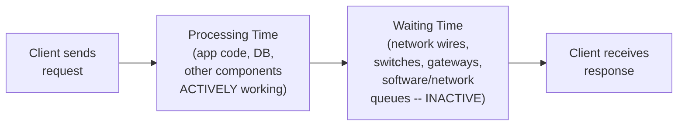
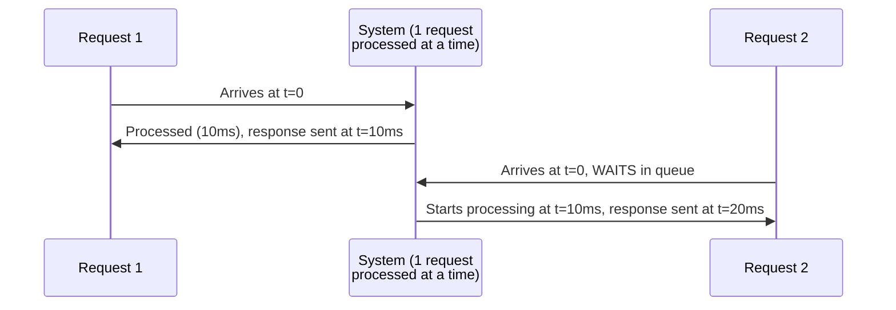
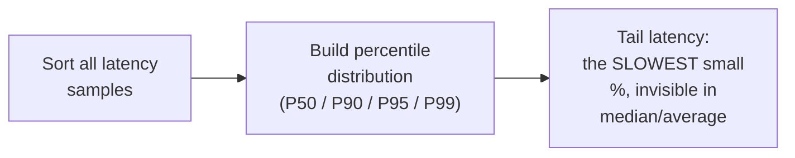
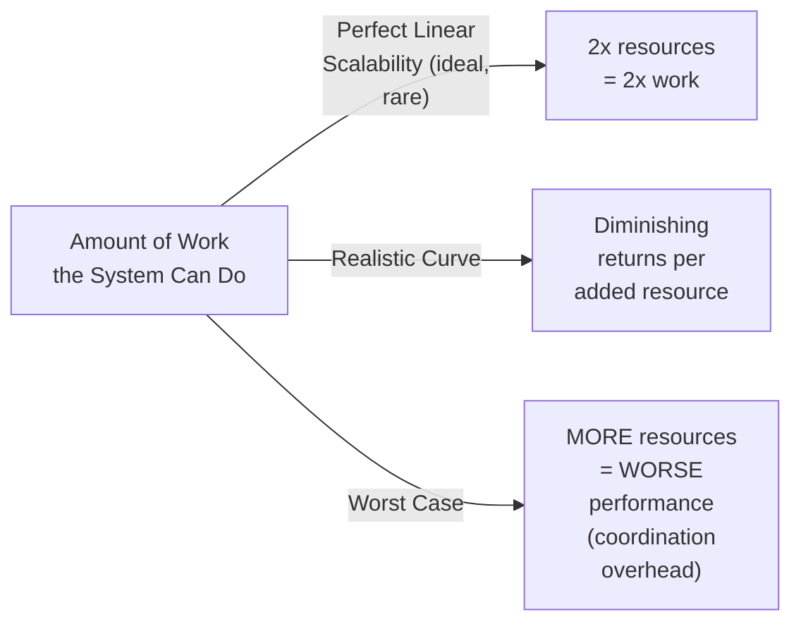
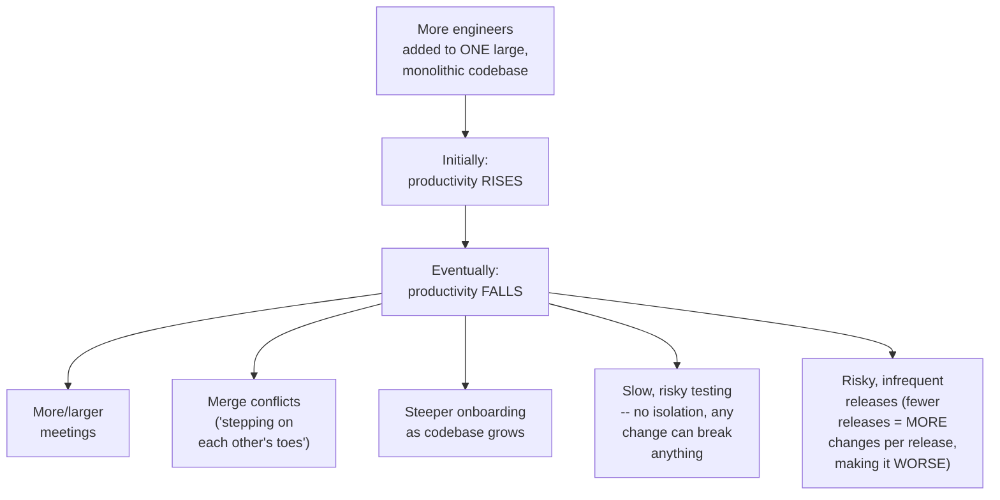
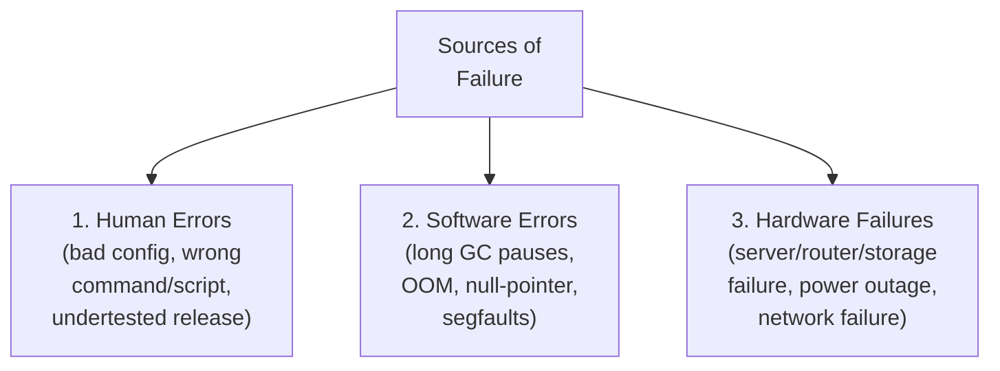
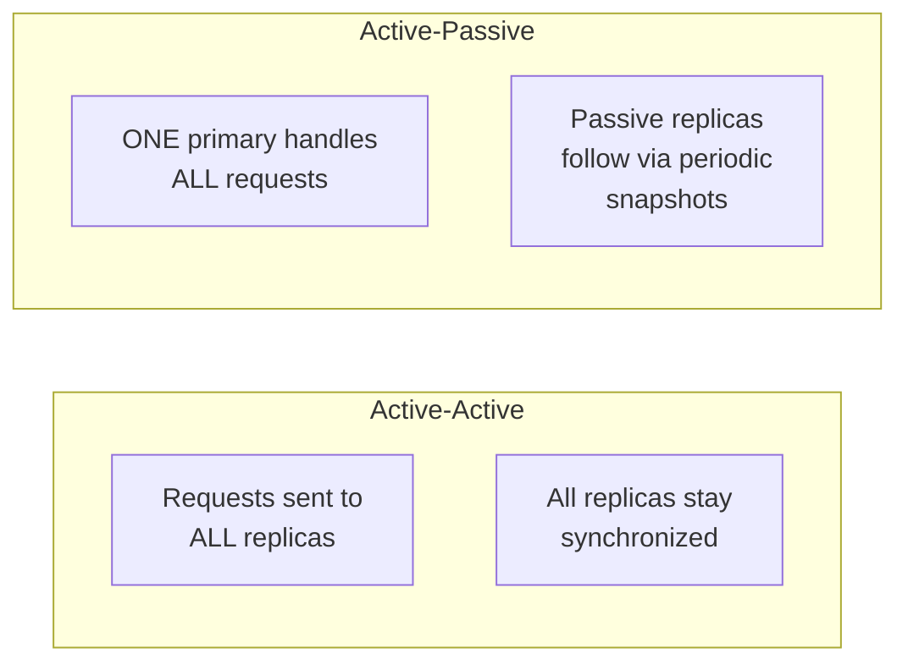
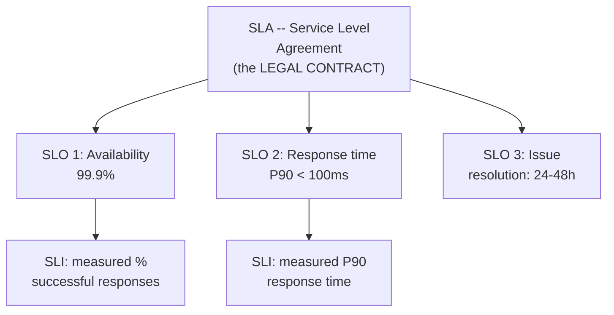

# 🏗 Software Architecture — Lecture 3: Quality Attributes Deep Dive — Performance, Scalability, Availability, Fault Tolerance & SLAs

- <i>**Course:** Software Architecture (Instructor: Michael)
- **Session Focus:** A detailed, quantitative treatment of the most important quality attributes for any large-scale system — **Performance** (latency & throughput), **Scalability** (vertical, horizontal, team), **Availability** (uptime, MTBF/MTTR, the "nines"), **Fault Tolerance** (sources of failure and the three tactics to survive them), and the three contractual terms that formalize all of this: **SLA, SLO, and SLI**.</i>

---

## 📑 Table of Contents

1. [Session Overview](#-session-overview)
2. [Learning Objectives](#-learning-objectives)
3. [Detailed Notes](#-detailed-notes)
   - [1. Performance — Latency](#1-performance--latency)
   - [2. Performance — Throughput](#2-performance--throughput)
   - [3. Measuring & Analyzing Performance Correctly](#3-measuring--analyzing-performance-correctly)
   - [4. Scalability: Definition & Three Dimensions](#4-scalability-definition--three-dimensions)
   - [5. Availability: Definition, Formulas & the "Nines"](#5-availability-definition-formulas--the-nines)
   - [6. Fault Tolerance: Surviving Failure](#6-fault-tolerance-surviving-failure)
   - [7. SLA, SLO, and SLI](#7-sla-slo-and-sli)
4. [Glossary](#-glossary)
5. [Revision Notes](#-revision-notes)
6. [Cheat Sheet](#-cheat-sheet)
7. [Interview Q&A](#-interview-qa)
   - [🟢 Beginner](#-beginner-questions)
   - [🟡 Intermediate](#-intermediate-questions)
   - [🔴 Advanced](#-advanced-questions)
8. [Scenario-Based Interview Questions](#-scenario-based-interview-questions)
9. [Hands-on Exercises](#-hands-on-exercises)
10. [Practice Assignment](#-practice-assignment)
11. [Additional Resources](#-additional-resources)
12. [Final Revision Sheet](#-final-revision-sheet)

---

## 🎯 Session Overview

Having established (Lecture 2) that quality attributes are the requirement type that actually shapes architecture, this lecture drills into the specific quality attributes that matter for **any large-scale system**, regardless of use case. Michael works through five tightly connected topics, each building on the last:

1. **Performance** — defined through two metrics, **latency** (time between request and response, split into processing time + waiting time) and **throughput** (work or data processed per unit time) — plus three critical considerations for measuring it correctly (measure the client-perceived latency, analyze the full percentile distribution rather than averages, and understand the performance-degradation point under load).
2. **Scalability** — formally defined, then broken into **three orthogonal dimensions**: vertical (scaling up), horizontal (scaling out), and team/organizational scalability — with an honest look at the trade-offs of each.
3. **Availability** — why it matters to both users and the business, formally defined via uptime/downtime and via MTBF/MTTR, and benchmarked using the industry's "nines" convention.
4. **Fault Tolerance** — the three sources of failure (human, software, hardware) and the three tactics used to survive them (prevention, detection & isolation, recovery), including active-active vs. active-passive replication.
5. **SLA, SLO, and SLI** — the three formal terms that turn all of the above into concrete promises to users, targets for engineers, and measurements to prove compliance — plus four practical considerations for defining good SLOs.

---

## 🎯 Learning Objectives

By the end of this lecture, you should be able to:

- [ ] Define latency and throughput, and explain the two components of latency.
- [ ] Explain the most common mistake engineers make when measuring latency, and how to avoid it.
- [ ] Explain why percentiles (not averages) should be used to analyze latency, and define tail latency.
- [ ] Explain the "performance degradation point" and identify likely underlying resource bottlenecks.
- [ ] Define scalability formally and distinguish its three orthogonal dimensions, with the advantages/disadvantages of each.
- [ ] Define availability using both the uptime/downtime formula and the MTBF/MTTR formula, and explain why fast recovery is so powerful.
- [ ] Interpret "nines" of availability (e.g., 99.9%) in terms of real downtime per day/year.
- [ ] List the three sources of failure and the three tactics of fault tolerance, and distinguish active-active from active-passive replication.
- [ ] Define SLA, SLO, and SLI, explain how they relate to one another, and apply the four considerations for setting good SLOs.

---

## 📚 Detailed Notes

### 1. Performance — Latency

#### 🧠 Concept

> *"Very often, when we talk about the performance of a system or application, we immediately think about speed... when we interact with a system that responds quickly to our actions, we associate that system with high performance."*

#### 📖 Definition

> **"Latency is the time between a client sending a request and receiving the response."**

Latency is composed of two parts:



| Component | What It Is | Commonly Overlooked? |
|---|---|---|
| **Processing time** | Time the app code, databases, and other components actively spend working on the request | No — this is the obvious part |
| **Waiting time** | Time the request/response spends *inactive* — traveling through wires/switches/gateways, waiting in network or software queues | **Yes** — this is the part engineers most often forget |

> ⚠ Terminology overload: some resources call waiting time "latency," others use "response time" and "latency" interchangeably, because latency literally just means **delay**. To avoid confusion, the lecture recommends calling the full request-to-response time **end-to-end latency**.

#### ❓ Why It Exists — When Latency Actually Matters

> *"Latency is an important performance metric when we are designing a system or subsystem that sits on the critical path of a user interaction... users have limited patience for long response times."*

⚠ **Common Mistake:** Many engineers mistakenly treat latency as *the* definition of performance, or the only performance metric that matters. The lecture is explicit that this is wrong — for some systems, a different metric (throughput, covered next) matters more.

#### 🎯 Key Takeaways

- Latency = time between request sent and response received; it has two parts: **processing time** (active) and **waiting time** (inactive).
- "End-to-end latency" is the recommended unambiguous term for the full request-to-response time, given how overloaded "latency"/"response time" terminology is across different resources.
- Latency matters most for systems on the **critical path of a user interaction** — but it is not the only, or always the most important, performance metric.

---

### 2. Performance — Throughput

#### ❓ Why It Exists — A Case Where Latency Isn't the Point

> *"Suppose we are designing a distributed logging system that collects and analyzes a continuous stream of logs coming from hundreds or perhaps thousands of servers. In this case, the most important performance metric is the ability to ingest and analyze large amounts of data within a given period of time."*

#### 📖 Definition

> **"Throughput is the amount of work our system performs per unit of time."**

Throughput can be measured in two common ways:

| Measurement Style | Unit Example |
|---|---|
| **Tasks completed per unit time** | `10,000 requests/second` |
| **Data processed per unit time** | `500 MB/s` (also: bits/s, bytes/s, MB/s, GB/s) |

#### 🎯 Key Takeaways

- Throughput = amount of work **or** data processed per unit of time — measured as tasks/second or as a data rate (MB/s, GB/s, etc.).
- A distributed logging/analytics system, ingesting continuous streams from many servers, is the lecture's canonical example of a system where **throughput**, not latency, is the primary performance concern.
- Latency and throughput are **complementary**, not competing, metrics — a well-rounded performance analysis considers both.

---

### 3. Measuring & Analyzing Performance Correctly

The lecture identifies three important considerations for defining, measuring, and analyzing performance targets.

#### ⚙ Consideration 1 — Measure Latency as Experienced by the Client

⚠ **Common Mistake:** Measuring only **processing time** (time spent inside your own code) and mistakenly treating it as the full response time. Dashboards can look perfectly healthy while users experience much longer real-world delays.

##### 🪜 Step-by-Step — Why This Mistake Happens (Worked Example)

Two requests arrive at nearly the same time; the system can process only one request at a time:



| Metric | Request 1 | Request 2 |
|---|---|---|
| **Processing time** (what a naive dashboard shows) | 10 ms | 10 ms |
| **Actual response time** (what the user experiences) | 10 ms | **20 ms** (10ms processing + 10ms waiting) |

> Average **processing time** looks like a flat 10ms for both — but the average **response time** is `(10 + 20) / 2 = 15 ms`. This gap between processing time and true response time is exactly the trap the lecture warns about, and it happens **"whenever our system is slightly overloaded with other requests,"** not only in a strict one-at-a-time scenario.

#### ⚙ Consideration 2 — Analyze the Distribution of Latency (Percentiles)

> *"We will always have a distribution of response times... some will be very good, while others may be surprisingly bad."*

##### 📖 Definition — Percentile

> **"The Xth percentile is the value below which X% of the values can be found."**

| Percentile | Meaning |
|---|---|
| **P50 (median)** | 50% of requests were at or below this latency |
| **P90** | 90% of requests were at or below this latency |
| **P95** | 95% of requests were at or below this latency |
| **P99** | 99% of requests were at or below this latency |

##### 📖 Definition — Tail Latency

> **"Tail latency refers to the small percentage of response times from our system that take significantly longer compared with the rest of the values."**



> ⚠ **Common Mistake:** Relying on the **average** or even the **median** response time can completely hide the experience of a meaningful minority of users (e.g., ~20% experiencing very high latency) — this is only visible by examining the **percentile distribution**.

**Setting response-time targets (examples from the lecture):**
- *"The 95th percentile of our response times should be less than 30 ms"* → the system may exceed 30ms for at most 5% of requests.
- *"The 99th percentile should be 30 ms or less"* → a more aggressive target, still leaving room for temporary/unexpected fluctuations.

#### ⚙ Consideration 3 — Performance Degradation Under Increasing Load

This consideration applies to **both latency and throughput**.

##### 📖 Definition — Degradation Point

> **"The point on the performance graph where system performance begins to deteriorate significantly as the load increases."**

##### 🔍 Internal Working — What a Sharp Degradation Usually Means

If performance deteriorates very quickly under load, it usually signals that a specific resource has become **fully utilized**:

| Likely Bottleneck | Symptom |
|---|---|
| **CPU** | Utilization on one or more servers approaching 100% |
| **Memory** | High memory consumption in one of the processes |
| **Network connections** | Too many connections for the OS/network to handle |
| **Software queues** | A queue has reached maximum capacity and can't keep up |

#### 🎯 Key Takeaways

- Always measure **client-perceived** latency (including waiting time) — never rely on processing-time-only dashboards.
- Analyze latency via **percentile distributions** (P50/P90/P95/P99), not averages — this is the only way to see **tail latency**.
- Define response-time targets in terms of percentiles (e.g., "P95 < 30ms"), and track the **degradation point** for both latency and throughput to catch resource bottlenecks (CPU, memory, connections, queues) early.

---

### 4. Scalability: Definition & Three Dimensions

#### ❓ Why It Exists — Traffic Is Never Constant

> *"In general, the load or traffic on our system never remains constant... we can have seasonal traffic patterns... daily patterns... and over the long term, if our business is doing well, we should expect to see more users."*

This directly connects back to the **performance degradation point** from Section 3: as load grows, every system eventually hits that point — scalability is about how gracefully and cost-effectively a system can push that point further out.

#### 📖 Definition

> **"Scalability is a measure of a system's ability to handle an increasing amount of work in an easy and cost-effective way by adding resources to the system."**

##### 💡 Real-World Example — Comparing Two Designs

Given the same time/money budget, if **Design 2** handles more load than **Design 1** after both teams upgrade their systems, Design 2 is **more scalable** — same investment, better result.



#### 🔍 Internal Working — Three Orthogonal Dimensions of Scalability

> *"Vertical scalability, horizontal scalability, and team scalability are orthogonal to one another... we can scale our system along one dimension, two dimensions, or all three dimensions simultaneously."*

##### 1. Vertical Scalability ("Scaling Up")

> **"Adding more resources to, or upgrading the existing resources of, a single computer, with the goal of allowing our system to handle higher traffic or load."**

| ⚖ Advantages | ⚖ Disadvantages |
|---|---|
| Almost any application benefits **without code changes** (e.g., a CPU bottleneck solved by a faster CPU) | **Hard upper limit** — internet-scale systems hit hardware ceilings quickly |
| Simple migration (move to a bigger/smaller machine as needed) — especially easy with a **cloud provider** | Remains a **centralized system** — cannot provide high **availability/fault tolerance** on its own |

##### 2. Horizontal Scalability ("Scaling Out")

> **"Adding more resources in the form of new instances running on different machines, with the goal of allowing our system to handle higher traffic or load."**

| ⚖ Advantages | ⚖ Disadvantages |
|---|---|
| Effectively **no hard limit** — keep adding machines as needed, remove them as load drops | Not every application can be easily distributed across instances — may need **significant code changes** |
| Can provide **high availability and fault tolerance out of the box** if designed correctly | **Increased complexity and coordination** of managing a group of instances |

##### 3. Team / Organizational Scalability

> *"So, believe it or not, our software architecture affects not only system performance but also our ability to scale the team and increase engineering velocity."*

This dimension reframes scalability from the **developer's** perspective: the "work" being scaled is engineering output (features, bug fixes, releases), and the "resource" being added is **more engineers**.

##### 🔍 Internal Working — Why Productivity Degrades on a Large, Monolithic Codebase



##### 🪜 Scaling the Organization Through Architecture

1. First step: divide the codebase into **modules/libraries** — different groups can work more independently, but everything is still one service, so releases remain **tightly coupled**.
2. Real solution: **split the codebase into separate services**, each with its own codebase, technology stack, and release schedule, communicating over **loosely coupled protocols**.

> ⚠ This decomposition "does not come for free" — the lecture explicitly defers the full cost/benefit discussion to the later topic of **architectural patterns**.

#### 🎯 Key Takeaways

- Scalability = handling more work in an **easy, cost-effective** way by adding resources; perfect linear scalability is the ideal but rarely achieved in practice.
- **Vertical scaling** (bigger machine): simple, no code changes, but hard-capped and centralized (weak availability/fault tolerance).
- **Horizontal scaling** (more machines): no real ceiling, better availability/fault tolerance, but needs code changes and adds coordination complexity.
- **Team/organizational scalability**: adding engineers to a monolith eventually *reduces* productivity (meetings, merge conflicts, onboarding cost, fragile testing, risky releases) — splitting into independently-deployable **services** is the architectural fix.
- All three dimensions are **orthogonal** — a system can scale along any combination of them.

---

### 5. Availability: Definition, Formulas & the "Nines"

#### ❓ Why It Exists — Impact on Users and the Business

> *"Availability is one of the most important quality attributes when designing a system because it arguably has the greatest impact on both our users and our business."*

##### 🏢 Real-World / Production Usage

> *"A famous example of this was the AWS Simple Storage Service (S3) outage in February 2017, because hundreds of companies and more than 100,000 websites were using the service."*

For **mission-critical services** (air-traffic monitoring, hospital patient-management systems), unavailability isn't just an inconvenience — it can put lives at risk.

##### 💡 Business Impact of Downtime (Two Consequences)

1. While the system is down, the ability to make money **goes to zero**.
2. Users who lose access **too long or too often will turn to competitors** — a business risks losing **both money and customers**.

#### 📖 Definition — Availability (Uptime/Downtime Formula)

> **"Availability is the fraction of time, or the probability, that our service is operational and accessible to users."**

```text
Availability = Uptime / (Uptime + Downtime)
```

> Note: "uptime" expressed as a percentage (rather than an absolute duration) is, in practice, **the same thing as availability** — the two terms are often used interchangeably in service agreements.

#### 📖 Definition — Availability (MTBF/MTTR Formula)

| Term | Meaning |
|---|---|
| **MTBF** — Mean Time Between Failures | Average time the system operates between failures (most useful for hardware components with their own lifespans — computers, routers, hard drives) |
| **MTTR** — Mean Time To Recovery | Average time to **detect** a failure and **recover** from it (this is, in effect, the average downtime) |

```text
Availability = MTBF / (MTBF + MTTR)
```

> For an existing third-party service or cloud provider, uptime/availability numbers are usually already published, so this calculation is rarely something you need to perform yourself.

#### 🔍 Internal Working — The Power of Fast Recovery

> *"If we theoretically reduce the Mean Time To Recovery (MTTR) to zero, we essentially achieve 100% availability, regardless of the MTBF."*

This is one of the most important insights in the lecture: **it doesn't matter how often you fail if you can recover instantly.** In practice MTTR can never be exactly zero, but this formula is exactly why fast failure detection and recovery (covered in Section 6) is such a powerful lever for availability.

#### ⚙ How Much Availability Should We Aim For?

100% availability is unrealistic in engineering practice — it would leave **zero time** for planned/emergency maintenance and updates.

| Availability | Real-World Meaning |
|---|---|
| **90%** | Unavailable for **more than 2 hours a day**, or **more than 36 days a year** — clearly not "high availability" |
| **95%** | ~1 full day of downtime per month (~1 hour/day) — still not enough for most use cases |
| **99.9%** ("three nines") | Unavailable for **less than ~1.5 minutes per day**, but still ~**8 hours per year** — generally unnoticeable to users |

##### 📖 Definition — The "Nines"

| Availability | Nines |
|---|---|
| 99.9% | Three nines |
| 99.99% | Four nines |
| 99.999% | Five nines |

> Industry standards from cloud providers generally target **99% to 100%**, typically **99.9% or higher**. More nines = a higher (and harder/more expensive) availability requirement.

#### 🎯 Key Takeaways

- Availability = Uptime / (Uptime + Downtime), or equivalently MTBF / (MTBF + MTTR).
- Driving **MTTR toward zero** is a uniquely powerful lever — it can theoretically deliver 100% availability regardless of failure frequency.
- 100% availability is unrealistic (no room for maintenance); the practical industry target is **"three nines" (99.9%) or higher**.
- Always translate a percentage into concrete downtime (minutes/hours per day or year) to judge whether it's actually "high" for your use case.

---

### 6. Fault Tolerance: Surviving Failure

#### ❓ Why It Exists — We Cannot Prevent All Failures

> *"Although we can obviously improve our code review, testing processes, release processes, continuous hardware maintenance... failures will inevitably happen."*

#### 📖 Definition — Three Sources of Failure



#### 📖 Definition — Fault Tolerance

> **"Fault tolerance enables our system to remain operational and available to users even when one or more of its components fail."** A fault-tolerant system may run at full or reduced performance during a failure — but it must not become **completely unavailable**.

Fault tolerance rests on **three main tactics**:

##### 1. Failure Prevention

> Eliminate any **single point of failure** (e.g., one server, one database instance) through **redundancy and replication**.

- **Spatial redundancy** — running replicas of the application/database on different computers.
- **Temporal redundancy** — retrying the same operation/request instead of immediately treating a transient failure as final.

###### ⚖ Active-Active vs. Active-Passive Replication



| Strategy | ⚖ Advantages | ⚖ Disadvantages |
|---|---|---|
| **Active-Active** | Load is distributed across **all** replicas → aligns with **horizontal scalability**, better performance | Keeping all active replicas synchronized requires significant **coordination overhead** |
| **Active-Passive** | Simple: one clear **leader**, other replicas are **followers** | Loses horizontal scalability — all requests still go to a **single machine** |

##### 2. Failure Detection and Isolation

Detect a faulty instance, then **isolate** it (e.g., stop routing traffic to it). Typically handled by a dedicated **monitoring service**, using either:
- **Health-check messages** sent periodically to instances, or
- **Heartbeats** sent periodically *by* healthy instances.

> ⚠ *"We don't necessarily need a perfect monitoring service as long as it does not produce false negatives."* A **false positive** (flagging a healthy host as failed, e.g., due to a temporary network blip or GC pause) is tolerable; a **false negative** (missing an actual failure) is the dangerous outcome to avoid.

Beyond simple pings, monitoring can also track **error rates** per host and **response-time degradation** per host as more sophisticated failure signals.

##### 3. Failure Recovery

Once a faulty instance is detected and isolated:

| Action | Description |
|---|---|
| **Stop sending traffic** | The obvious first step |
| **Restart the host** | The problem may simply disappear |
| **Rollback** | Return to the most recent stable/correct version — common for databases (violated constraints/data integrity) and for software releases (new version causing widespread errors) |

> 🔍 Connecting back to Section 5's MTBF/MTTR formula: if you can **detect and recover from every failure faster than users notice**, your system can still achieve high availability, regardless of how often failures occur.

#### 🎯 Key Takeaways

- Three sources of failure: **human, software, hardware** — all are inevitable, not merely theoretical risks.
- Fault tolerance = staying operational (even if degraded) despite component failures, via three tactics: **prevention** (redundancy/replication), **detection & isolation** (monitoring, health checks/heartbeats, avoiding false negatives), and **recovery** (stop traffic → restart → rollback).
- **Active-active** replication favors scalability/performance at the cost of synchronization complexity; **active-passive** is simpler but sacrifices horizontal scalability.
- Fast, reliable failure recovery is directly what makes the MTTR-driven availability formula (Section 5) work in practice.

---

### 7. SLA, SLO, and SLI

#### 📖 Definition — The Three Terms

> *"Three very important terms that essentially represent the promises we make to our users regarding these quality attributes."*



##### 1. SLA — Service Level Agreement

> **A legal contract** between the service provider and its customers/users, covering promises about availability, performance, data durability, incident-response time, etc. — plus the **financial penalties** (refunds, extensions, service credits) for failing to meet them.

- SLAs almost always exist for **external paying users**; they sometimes exist for **external free users** (e.g., compensating a free-trial user with a trial extension if the service had major problems) and for **internal users** (one internal team depending on another's API) — though internal SLAs rarely carry financial penalties.
- Most fully-free consumer services **avoid publishing a strict public SLA**.

##### 2. SLO — Service Level Objective

> **"SLOs are the individual targets that we set for our system."** Each SLO is a target value or range for one specific metric.

**Examples given:**
- Availability SLO: **99.9%**
- Response-time SLO: **< 100ms at the 90th percentile**
- Issue-resolution-time SLO: **24–48 hours**

> **"An SLA groups together all the relevant SLOs into one legal document."** A system can — and should — have SLOs even without a formal SLA, since without targets, no one (internal or external) knows what to expect from the system.

##### 3. SLI — Service Level Indicator

> **"An SLI is a quantitative measurement of our compliance with an SLO."**

SLIs are the actual numbers pulled from monitoring/logs (e.g., % of successful requests, measured P90 response time) that get compared against the SLO targets.

#### ❓ Why It Exists — The Link Back to "Measurable and Testable" (Lecture 2)

> *"If they are not measurable, we will not be able to identify any SLIs that can verify whether we are actually meeting our SLOs. And if we cannot measure and prove that we are meeting our service-level requirements, we cannot confidently say that we are fulfilling our SLA, which is a legal contract."*

This directly reconnects to Lecture 2's rule that quality attributes must be **measurable and testable** — SLA/SLO/SLI is the concrete, contractual mechanism that rule ultimately serves.

#### 🔍 Internal Working — Who Defines What

| Term | Typically Owned By |
|---|---|
| **SLA** | Business and legal teams |
| **SLO / SLI** | Software engineers and architects |

#### ⚙ Four Considerations for Defining Good SLOs

##### 1. Focus on What Users Care About

> *"Start with what matters to users, define SLOs around those things, and then determine the appropriate SLIs to measure them."* Don't create a target for every measurable metric just because you *can* measure it.

##### 2. Keep the Number of SLOs Small

> *"The fewer SLOs we commit to, the better it is for us."* Fewer SLOs → easier prioritization → architecture can genuinely focus around achieving them.

##### 3. Set Realistic Targets with an Error Budget

Don't commit to the absolute maximum you're technically capable of (e.g., don't promise five nines just because you *can* hit it) — leave room for cost savings, unexpected problems, and maintenance.

| SLO Type | Typical Stance |
|---|---|
| **External SLO** (in a public SLA) | More conservative/flexible (e.g., 99.9%) |
| **Internal SLO** | More aggressive (e.g., 99.99%) |

> This gap ("error budget") lets teams keep improving internally while avoiding financial penalties tied to the external commitment.

##### 4. Have a Recovery Plan

Decide **in advance** what happens when SLIs show an SLO is being violated (extended outage, degraded performance, a spike in error reports). A recovery plan typically includes: automatic alerts, automatic failover, restart procedures, rollback procedures, auto-scaling policies, and **predefined runbooks** — so the on-call engineer doesn't have to improvise during an emergency.

#### 🎯 Key Takeaways

- **SLA** = the legal contract (business/legal-owned); **SLO** = the individual measurable target (engineer-owned); **SLI** = the actual measured number checked against the SLO.
- An SLA is essentially a bundle of SLOs formalized into a legal document — but SLOs matter even without a formal SLA.
- Four rules for good SLOs: focus on what **users** care about, keep the **count small**, set **realistic targets with an error budget** (often via separate external/internal SLOs), and always have a **recovery plan**/runbook ready.

---

## 📝 Glossary

| Term | Definition | Why It Matters |
|---|---|---|
| **Latency / End-to-End Latency** | Time between a client sending a request and receiving the response | Core performance metric; equals processing time + waiting time |
| **Processing Time** | Time actively spent by app code/DB/components working on a request | The commonly-measured (but incomplete) part of latency |
| **Waiting Time** | Time a request/response spends inactive (network, queues) | The commonly-forgotten part of latency; source of the "dashboard looks fine but users are slow" trap |
| **Throughput** | Amount of work or data a system processes per unit of time | Primary metric for high-volume/streaming systems (e.g., log ingestion) |
| **Percentile (Pxx)** | The value below which xx% of samples fall | The correct way to analyze latency distributions instead of averages |
| **Tail Latency** | The small percentage of unusually slow response times | Hidden by averages/medians; a key target for optimization |
| **Performance Degradation Point** | The load level at which performance begins deteriorating sharply | Signals which resource (CPU/memory/connections/queues) is the bottleneck |
| **Scalability** | Ability to handle more work in an easy, cost-effective way by adding resources | One of the most important quality attributes for growing systems |
| **Vertical Scaling (Scaling Up)** | Upgrading resources of a single machine | Simple, no code changes, but hard-capped and centralized |
| **Horizontal Scaling (Scaling Out)** | Adding more machine instances | No real ceiling, better availability, but needs code changes + coordination |
| **Team/Organizational Scalability** | The system/architecture's ability to support a growing engineering team's productivity | Explains why monoliths eventually slow teams down; motivates service decomposition |
| **Availability** | Fraction of time / probability a service is operational and accessible | = Uptime/(Uptime+Downtime) = MTBF/(MTBF+MTTR) |
| **Uptime / Downtime** | Time the system is operational / unavailable | The raw inputs to the availability formula |
| **MTBF (Mean Time Between Failures)** | Average time a system operates between failures | Useful for estimating availability of hardware components |
| **MTTR (Mean Time To Recovery)** | Average time to detect + recover from a failure | Driving this toward zero is the most powerful lever for availability |
| **"Nines"** | Shorthand for availability percentages (99.9% = three nines) | Industry convention for expressing high-availability targets |
| **Fault Tolerance** | Ability to stay operational despite component failures | Achieved via prevention, detection/isolation, and recovery |
| **Single Point of Failure** | Any one component whose failure takes down the whole system | What redundancy/replication is designed to eliminate |
| **Spatial Redundancy** | Running replicas on different machines | One of the two forms of redundancy (with temporal) |
| **Temporal Redundancy** | Retrying a failed operation instead of giving up immediately | The other form of redundancy |
| **Active-Active** | All replicas receive requests and stay synchronized | Favors scalability/performance; costs synchronization overhead |
| **Active-Passive** | One primary handles requests; passive replicas follow via snapshots | Simpler; sacrifices horizontal scalability |
| **False Positive (monitoring)** | Healthy host wrongly flagged as failed | Tolerable |
| **False Negative (monitoring)** | An actual failure that goes undetected | The outcome to avoid at all costs |
| **SLA (Service Level Agreement)** | Legal contract of service-quality promises, with financial penalties | Groups SLOs into one binding document |
| **SLO (Service Level Objective)** | An individual measurable target for the system | The engineer/architect-owned unit of commitment |
| **SLI (Service Level Indicator)** | The actual measured value compared against an SLO | Requires the underlying quality attribute to be measurable/testable |
| **Error Budget** | The gap between what's technically achievable and what's committed to | Leaves room for cost savings, maintenance, and unexpected issues |

---

## 🔄 Revision Notes

### ⚡ One-Minute Revision

- **Latency** = processing time (active) + waiting time (inactive, often forgotten); prefer the unambiguous term "end-to-end latency."
- **Throughput** = work/data per unit time (e.g., 10,000 req/s, 500 MB/s) — the right metric for high-volume/streaming systems.
- Measure **client-perceived** latency (not just processing time); analyze via **percentiles** (P50/P90/P95/P99), not averages, to see **tail latency**; track the **degradation point** (CPU/memory/connections/queues) under load.
- **Scalability** = handling more work cost-effectively by adding resources; three **orthogonal** dimensions: **vertical** (bigger machine, capped, centralized), **horizontal** (more machines, no real cap, needs code changes), **team/organizational** (splitting into independent services to keep engineering productivity high as headcount grows).
- **Availability** = Uptime/(Uptime+Downtime) = MTBF/(MTBF+MTTR); driving **MTTR to zero** is the single most powerful lever; industry target is generally **99.9%+ ("three nines")**.
- **Fault tolerance** = staying operational despite failures (human/software/hardware), via **prevention** (redundancy/replication — active-active vs. active-passive), **detection & isolation** (health checks/heartbeats, avoid false negatives), and **recovery** (stop traffic → restart → rollback).
- **SLA** = legal contract (business/legal-owned) bundling **SLOs** (individual measurable targets, engineer-owned), verified by **SLIs** (actual measured values).
- Good SLOs: focus on what **users** care about, keep the list **small**, use **error budgets** (external vs. internal SLOs), and always have a **recovery plan/runbook**.

---

## 📋 Cheat Sheet

| Item | Quick Reference |
|---|---|
| **Latency formula** | End-to-end latency = Processing time + Waiting time |
| **Throughput units** | requests/second, or bits/bytes/MB/GB per second |
| **Percentile shorthand** | P50 = median · P90 · P95 · P99 |
| **Tail latency** | The slow tail of the percentile distribution, invisible to averages |
| **Scalability formula (informal)** | More scalable = same budget → handles more load |
| **Vertical vs. horizontal** | Vertical: bigger machine, capped, centralized. Horizontal: more machines, ~no cap, needs code changes |
| **Availability formula 1** | Availability = Uptime / (Uptime + Downtime) |
| **Availability formula 2** | Availability = MTBF / (MTBF + MTTR) |
| **Nines table** | 99.9% = 3 nines (~8h/yr downtime) · 99.99% = 4 nines · 99.999% = 5 nines |
| **3 sources of failure** | Human · Software · Hardware |
| **3 fault-tolerance tactics** | Prevention · Detection & Isolation · Recovery |
| **Replication strategies** | Active-Active (scalable, sync overhead) · Active-Passive (simple, single-machine bottleneck) |
| **Monitoring signal to avoid** | False negatives (a real failure that goes undetected) |
| **Recovery actions (in order)** | Stop traffic → Restart → Rollback |
| **SLA / SLO / SLI** | SLA = legal contract · SLO = target · SLI = measured value |
| **Good-SLO rules** | User-focused · Few in number · Realistic w/ error budget · Have a recovery plan |

---

## 🔥 Interview Q&A

### 🟢 Beginner Questions

**Q1.**
**Question:** What is latency, and what are its two components?

**Answer:** Latency is the time between a client sending a request and receiving the response; it consists of processing time (active work by app code/DB/components) and waiting time (inactive time in network wires, gateways, and queues).

**Explanation:** Both components combine to form the full "end-to-end latency."

**Why Interviewers Ask This:** Foundational performance vocabulary.

**Possible Follow-up:** "Which of the two components is most commonly forgotten when measuring latency, and why?"

---

**Q2.**
**Question:** What is throughput, and when does it matter more than latency?

**Answer:** Throughput is the amount of work or data a system processes per unit of time (e.g., requests/second or MB/s). It matters most for high-volume, batch-style systems — the lecture's example is a distributed logging system ingesting streams from thousands of servers.

**Explanation:** Latency and throughput are complementary metrics that matter in different system contexts.

**Why Interviewers Ask This:** Tests whether a candidate assumes latency is universally the most important metric.

**Possible Follow-up:** "Give another example of a system where throughput matters more than latency."

---

**Q3.**
**Question:** What mistake do engineers commonly make when measuring latency, and what's the fix?

**Answer:** Measuring only processing time (time spent inside the code) and mistaking it for the full response time — missing the waiting time spent in queues/network. The fix is to measure latency as experienced by the client, end-to-end.

**Explanation:** This mistake can make dashboards look healthy while users experience much slower real-world response times.

**Why Interviewers Ask This:** A very common, practical measurement pitfall.

**Possible Follow-up:** "Walk through a scenario where this mistake would hide a real problem."

---

**Q4.**
**Question:** Why should latency be analyzed using percentiles instead of averages?

**Answer:** Because averages (and even medians) can completely hide the experience of a meaningful minority of users with unusually high latency (the "tail"); percentiles (P50/P90/P95/P99) reveal the full distribution.

**Explanation:** This is how "tail latency" is identified and targeted.

**Why Interviewers Ask This:** Tests understanding of a core, widely-used SRE/performance practice.

**Possible Follow-up:** "What is tail latency, formally?"

---

**Q5.**
**Question:** Define scalability.

**Answer:** A measure of a system's ability to handle an increasing amount of work in an easy and cost-effective way by adding resources.

**Explanation:** The "easy and cost-effective" qualifier is key — scalability isn't just "can it handle more," it's "can it handle more without disproportionate cost/effort."

**Why Interviewers Ask This:** Baseline definitional check.

**Possible Follow-up:** "What are the three dimensions along which a system can scale?"

---

**Q6.**
**Question:** What is the key difference between vertical and horizontal scaling?

**Answer:** Vertical scaling upgrades a single machine's resources (capped, centralized); horizontal scaling adds more machine instances (no real cap, but needs code changes and coordination).

**Explanation:** Each has different trade-offs around code changes, cost ceiling, and availability/fault tolerance.

**Why Interviewers Ask This:** One of the most common system-design fundamentals questions.

**Possible Follow-up:** "Which of the two provides better availability and fault tolerance out of the box, and why?"

---

**Q7.**
**Question:** Define availability, and give both formulas used to calculate it.

**Answer:** Availability is the fraction of time (or probability) that a service is operational and accessible. Formula 1: Uptime/(Uptime+Downtime). Formula 2: MTBF/(MTBF+MTTR).

**Explanation:** The MTBF/MTTR version is more statistical and useful for estimating (rather than directly measuring) availability.

**Why Interviewers Ask This:** Core, quantitative definition every system-design candidate should know.

**Possible Follow-up:** "What happens to availability if MTTR approaches zero?"

---

**Q8.**
**Question:** What does "three nines" of availability mean in practice?

**Answer:** 99.9% availability, which allows for roughly 8 hours of downtime per year (and under ~1.5 minutes per day) — generally unnoticeable to users.

**Explanation:** Translating a percentage into concrete downtime makes the target's real-world meaning clear.

**Why Interviewers Ask This:** Tests whether a candidate can reason quantitatively about SLAs, not just recite percentages.

**Possible Follow-up:** "What would 'five nines' mean, roughly, in terms of annual downtime?"

---

**Q9.**
**Question:** What are the three sources of failure discussed in this lecture?

**Answer:** Human errors, software errors, and hardware failures.

**Explanation:** All three are described as inevitable, motivating the need for fault tolerance rather than pure prevention.

**Why Interviewers Ask This:** Baseline classification check before discussing fault-tolerance tactics.

**Possible Follow-up:** "What are the three tactics used to achieve fault tolerance?"

---

**Q10.**
**Question:** Define SLA, SLO, and SLI, and explain how they relate to each other.

**Answer:** SLA = a legal contract of service-quality promises with financial penalties. SLO = an individual measurable target within (or independent of) an SLA. SLI = the actual measured value compared against an SLO. An SLA essentially bundles multiple SLOs into one legal document.

**Explanation:** Understanding the hierarchy (SLA contains SLOs; SLIs measure compliance with SLOs) is essential to using these terms correctly.

**Why Interviewers Ask This:** Extremely common real-world terminology every senior engineer is expected to know precisely.

**Possible Follow-up:** "Who typically owns SLAs versus SLOs/SLIs within an organization?"

---

### 🟡 Intermediate Questions

**Q11.**
**Question:** A dashboard shows a flat, healthy 10ms average processing time, yet users are complaining about slow responses. Using this lecture's own worked example, explain what's likely happening and how you'd confirm it.

**Answer:** The dashboard is almost certainly measuring only processing time (work done inside the code), not full end-to-end response time including waiting time in queues. As shown in the lecture's two-requests example, a system that's even slightly overloaded will have later requests waiting behind earlier ones — so processing time stays flat (10ms each) while actual response time grows (10ms, then 20ms, etc.) as queueing increases. To confirm, instrument and measure latency at the client/edge (or as close to the true request-response boundary as possible) rather than only inside application code, and compare it against the processing-time-only metric to reveal the gap.

**Explanation:** Directly applies the lecture's own two-request worked example to a realistic, ambiguous symptom.

**Why Interviewers Ask This:** A very realistic production debugging scenario testing whether a candidate knows to look beyond code-level instrumentation.

**Possible Follow-up:** "What tools or techniques would you use to measure true, client-perceived latency in production?"

---

**Q12.**
**Question:** Explain why setting a target as "average response time < 50ms" is a weaker SLO than "P95 response time < 50ms," using the concept of tail latency.

**Answer:** An average can be pulled down by a large number of fast requests while still allowing a meaningful fraction of users to experience very poor performance — the "tail" of the distribution stays completely invisible in an average. A P95 target directly bounds the experience of the slowest 5% of requests (aside from the explicitly-allowed exceedance), which is a much stronger, user-experience-relevant guarantee, since it can't be "hidden" by a mass of fast requests the way an average can.

**Explanation:** Connects percentile-based measurement directly to the practical difference it makes for SLO quality.

**Why Interviewers Ask This:** Distinguishes candidates who understand *why* percentiles matter, not just that they're used.

**Possible Follow-up:** "Why might a team choose P99 over P95 for a payments-critical endpoint?"

---

**Q13.**
**Question:** A team decides to scale their monolithic application purely vertically as their user base grows 100x over two years. Using this lecture's reasoning, what two distinct problems will they eventually hit, and why?

**Answer:** First, a hard ceiling: vertical scaling has a hardware limit, and an internet-scale system (100x growth) is very likely to hit it — "once we reach that point, there is nowhere else to go." Second, an architectural limitation independent of the ceiling: a purely vertically-scaled system remains centralized, and a centralized system "cannot provide a high degree of availability and fault tolerance" — so even before hitting the hardware ceiling, the team is accepting a structurally worse availability/fault-tolerance profile than a horizontally-scaled alternative would provide.

**Explanation:** Requires distinguishing the capacity-limit argument from the separate availability/fault-tolerance argument against pure vertical scaling.

**Why Interviewers Ask This:** Tests whether a candidate can articulate more than one reason horizontal scaling is preferred at scale, not just "it doesn't have a limit."

**Possible Follow-up:** "At what point would you recommend this team start introducing horizontal scaling, and why?"

---

**Q14.**
**Question:** Explain, using this lecture's own reasoning about team scalability, why simply splitting a monolith's code into internal modules/libraries is not sufficient to fully solve engineering-productivity problems as a team grows.

**Answer:** Per the lecture, modules/libraries let different groups work more independently on their own piece of code, but "all these components are still part of the same service" and therefore remain tightly coupled — especially around releasing new versions to production. Since releases still bundle all modules together, the "risky, infrequent release" problem (fewer releases containing more changes each, making things worse) persists. The lecture's actual fix is to go one step further and split the codebase into **separate services**, each with its own codebase, technology stack, and release schedule, communicating over loosely coupled network protocols — only this removes the release-level coupling that modules alone don't solve.

**Explanation:** Distinguishes a partial fix (code-level modularity) from the lecture's actual recommended fix (service-level decomposition), specifically around the release-coupling problem.

**Why Interviewers Ask This:** Tests whether a candidate understands *why* microservice-style decomposition, not just modularity, is often necessary for organizational scalability.

**Possible Follow-up:** "What costs does the lecture acknowledge come with this service-level split, even though it isn't detailed here?"

---

**Q15.**
**Question:** Using the MTBF/MTTR formula, explain why a system that fails relatively often but recovers extremely fast can have higher availability than a system that fails rarely but takes a long time to recover.

**Answer:** Availability = MTBF/(MTBF+MTTR). A system with, say, MTBF=1 hour and MTTR=1 second has availability = 3600/(3600+1) ≈ 99.97%. A system with MTBF=1 year (~8760 hours) but MTTR=1 hour has availability = 8760/(8760+1) ≈ 99.99%... but if that same rarely-failing system's MTTR were instead, say, 20 hours (a slow, manual recovery process), availability drops to 8760/8780 ≈ 99.77% — worse than the frequently-failing-but-fast-recovering system. This mathematically illustrates the lecture's own point: driving MTTR toward zero can offset even a high failure rate, since availability depends on the *ratio*, not on MTBF or MTTR in isolation.

**Explanation:** Requires applying the formula numerically to demonstrate the "fast recovery beats infrequent failure" insight, not just restating it qualitatively.

**Why Interviewers Ask This:** Tests genuine quantitative understanding of the availability formula, a favorite senior-level SRE/architecture question.

**Possible Follow-up:** "What real engineering investments would you prioritize to reduce MTTR specifically, as opposed to reducing MTBF?"

---

### 🔴 Advanced Questions

**Q16.**
**Question:** Design a complete monitoring and fault-tolerance strategy (at a conceptual level) for a horizontally-scaled service, explicitly using this lecture's three fault-tolerance tactics and explaining how you'd avoid both false negatives in detection and unnecessary flapping from false positives.

**Answer:** **Prevention:** Run the service as multiple instances across different machines/availability zones (spatial redundancy) with no single point of failure, and use retries with backoff for transient failures (temporal redundancy); choose active-active replication for the stateless service tier (to gain horizontal scalability and load distribution) and consider active-passive for a stateful backing store where synchronization complexity would otherwise be prohibitive. **Detection & Isolation:** Deploy a monitoring service using both heartbeats (instances self-report health) and active health checks (monitoring service polls instances), supplemented by error-rate and response-time-based health signals (per Section 6) rather than binary up/down checks alone; explicitly tune detection thresholds (e.g., requiring N consecutive missed heartbeats, or a sustained — not momentary — error-rate spike) to avoid false positives from transient GC pauses or network blips causing unnecessary instance removal ("flapping"), while keeping the detection window short enough to avoid false negatives (a genuinely failed instance continuing to receive traffic). **Recovery:** On confirmed failure, stop routing traffic to the instance immediately, attempt an automatic restart, and if the instance was serving a new software version implicated in a broad error spike, trigger an automatic rollback to the last known-good version — all governed by predefined runbooks so on-call engineers don't have to improvise (directly connecting to Section 7's "recovery plan" SLO consideration).

**Explanation:** Requires synthesizing all three fault-tolerance tactics plus the SLA/SLO recovery-plan concept into one coherent, realistic strategy, while explicitly reasoning about the false-positive/false-negative trade-off named in Section 6.

**Why Interviewers Ask This:** A capstone system-design question testing whether a candidate can operationalize the lecture's individual concepts into one coherent design, not just define each term.

**Possible Follow-up:** "How would this strategy change for the stateful backing store specifically, versus the stateless service tier?"

---

**Q17.**
**Question:** Your company is negotiating an external SLA promising 99.95% availability. Using this lecture's four SLO considerations, explain how you would approach setting the *internal* SLO, and justify your reasoning with the "nines" table.

**Answer:** Per Consideration 3 (realistic targets with an error budget), the internal SLO should be set **more aggressively** than the external 99.95% commitment — for example, targeting 99.99% ("four nines") internally. This creates a buffer: per the nines table, 99.95% allows meaningfully more downtime than 99.99%, so the gap between the internal target and the external promise functions as an error budget that absorbs unexpected incidents, planned maintenance, and normal operational variance without breaching the legally binding external SLA (which per Section 5 also has financial penalties attached). Per Consideration 1 (focus on what users care about), before finalizing either number, I would confirm 99.95% is actually the availability dimension users/customers care most about (versus, say, response time) — and per Consideration 2 (keep SLOs few), I would avoid also committing to a large number of secondary internal SLOs that would dilute engineering focus away from hitting this primary availability target. Finally, per Consideration 4, I would ensure a documented recovery plan (automatic failover, alerting, runbooks) exists specifically to protect the internal 99.99% target, since that operational discipline is what actually keeps the external 99.95% commitment safely inside the error budget rather than being tested directly.

**Explanation:** Synthesizes all four SLO considerations from Section 7 into one coherent negotiation/engineering strategy, explicitly grounded in the nines table from Section 5.

**Why Interviewers Ask This:** A senior/staff-level question testing whether a candidate can connect availability mathematics, contractual risk, and engineering practice into a single defensible recommendation.

**Possible Follow-up:** "What would you do differently if the business wanted to promise 99.99% externally instead of 99.95%?"

---

## 🧪 Scenario-Based Interview Questions

> **Scenario 1:** Your team's dashboards show a flat, low average latency, but customer support is receiving a steady stream of complaints about slow page loads. How do you investigate and resolve this?

**Structured Answer:**

1. **Initial investigation:** Confirm what the dashboard is actually measuring — per Section 3, it is very likely showing only **processing time**, not full client-perceived response time.
2. **Relevant principle:** Latency = processing time + waiting time; averages/medians can also hide a slow tail (Section 3's percentile guidance).
3. **Possible causes:** The system may be slightly overloaded, causing requests to queue (waiting time), or there may be a **tail latency** problem affecting a minority of users invisible in the average.
4. **Debugging approach:** Re-instrument to measure true end-to-end latency from the client's perspective; re-analyze existing samples as a **percentile distribution** (P50/P90/P95/P99) rather than an average, specifically looking for a large gap between median and P95/P99 (a tail-latency signature) or a systemic queueing pattern (a load-related signature).
5. **Resolution:** If it's a queueing/waiting-time issue, address the **degradation point** directly — identify the saturated resource (CPU, memory, connections, or queue capacity per Section 3) and add capacity or scale (per Section 4) accordingly; if it's a tail-latency-specific issue, investigate what's different about the slow subset of requests (e.g., specific data shapes, cold caches, GC pauses).
6. **Prevention:** Replace the processing-time-only dashboard with true end-to-end, percentile-based monitoring, and set explicit percentile-based SLOs (e.g., "P95 < Xms") going forward so this class of problem is caught automatically.

---

> **Scenario 2 (Advanced):** A critical service has an external SLA of 99.9% availability, but a recent incident took it down for 6 hours in a single event — nearly exhausting the entire annual downtime budget for the year in one incident. How do you respond, both immediately and structurally?

**Structured Answer:**

1. **Initial investigation:** Classify the incident against Section 6's three failure sources (human, software, hardware) to understand root cause, and check whether it was detected and resolved efficiently — i.e., examine the incident's own MTTR.
2. **Relevant principle:** Per Section 5's MTBF/MTTR formula, a single long-MTTR incident can disproportionately damage annual availability — a 6-hour outage is nearly the entire "three nines" annual budget (~8h/year) in one event.
3. **Possible causes:** Likely a gap in one or more fault-tolerance tactics from Section 6 — e.g., no redundancy/failover for the failed component (prevention gap), slow detection (a false negative or a monitoring blind spot), or no automated recovery/rollback path (recovery gap) requiring manual intervention that extended the outage.
4. **Debugging approach:** Conduct a blameless postmortem walking through all three tactics: was there a single point of failure that should have been eliminated via redundancy? Was the failure detected quickly, or did it rely on slow, manual detection? Was there an automated rollback/failover path, or did recovery require ad hoc manual steps?
5. **Resolution:** Close whichever gap(s) the postmortem identifies — e.g., add replication/redundancy for the failed component, tighten health-check/heartbeat detection thresholds, and pre-build an automated rollback or failover runbook (per Section 7's "recovery plan" SLO consideration) so a similar incident resolves in minutes, not hours.
6. **Prevention:** Formally establish (or tighten) the internal vs. external SLO gap (error budget) per Section 7, ensure a documented, automated recovery plan exists for this service specifically, and consider whether this component needs to move from active-passive to active-active replication (Section 6) if horizontal failover would have prevented the extended outage.

---

## 🛠 Hands-on Exercises

### 🟢 Easy

1. Given raw response-time samples in milliseconds, calculate the P50, P90, and P99 by hand (or with a short script), and explain in your own words what each value means.
2. Calculate availability using both formulas (Uptime/(Uptime+Downtime) and MTBF/(MTBF+MTTR)) for a hypothetical system with given uptime/downtime and MTBF/MTTR values, and confirm the two results are consistent.

### 🟡 Medium

1. Design a simple monitoring approach (health checks vs. heartbeats, plus one additional signal like error rate or response time) for a fleet of 20 service instances, explicitly explaining how your design avoids false negatives while tolerating occasional false positives.
2. For a hypothetical e-commerce checkout service, write one SLA-appropriate SLO for availability and one for response time, each expressed as a percentile-based target, and identify the corresponding SLI you would measure for each.

### 🔴 Advanced

1. Take a monolithic application design and propose a team/organizational-scalability decomposition into 3–4 independent services, explicitly identifying which teams/codebases/release schedules become independent, and what new coordination challenges you introduce as a result.
2. Design a complete fault-tolerance strategy (prevention, detection/isolation, recovery) for a payment-processing service, explicitly justifying your choice of active-active vs. active-passive replication for at least one component, and write the recovery-plan runbook outline for a "P99 latency SLO violated" alert.

---

## 🏗 Practice Assignment

**Objective:** Produce a complete "Quality Attributes & SLA Specification" for a hypothetical large-scale system, applying every concept from this lecture.

**Requirements:**
- Choose one example system (e.g., a ride-sharing service, an online store, a distributed logging platform).
- Define at least 2 performance targets (one latency-based, using a percentile; one throughput-based, if relevant to your system).
- Define a scalability plan addressing all three dimensions (vertical, horizontal, team/organizational).
- Define an availability target (a specific "nines" level) with justification, and a corresponding MTBF/MTTR estimate.
- Define a fault-tolerance strategy covering all three tactics.
- Write a complete SLA/SLO/SLI table, including at least one external and one internal (more aggressive) SLO for the same metric.

**Architecture (of the assignment itself):**

```text
Quality Attributes & SLA Specification
│
├── System Name & One-Line Purpose
├── Performance Targets
│     ├── Latency SLO (percentile-based)
│     └── Throughput SLO (if applicable)
├── Scalability Plan
│     ├── Vertical scaling approach
│     ├── Horizontal scaling approach
│     └── Team/organizational scaling approach (service decomposition)
├── Availability Target
│     ├── Chosen "nines" level + justification
│     └── MTBF/MTTR estimate
├── Fault Tolerance Strategy
│     ├── Prevention (redundancy strategy, active-active vs. active-passive)
│     ├── Detection & Isolation (monitoring approach)
│     └── Recovery (runbook outline)
└── SLA / SLO / SLI Table
      (external vs. internal SLOs, with SLIs for each)
```

**Expected Functionality:** A reader should be able to see exactly what performance/scalability/availability/fault-tolerance targets the system commits to, and how each is measured and enforced.

**Suggested Implementation Approach:**
1. Start from your system's core user-facing operation to derive the latency/throughput targets.
2. Use the traffic-pattern reasoning from Section 4 to justify your scalability plan.
3. Use the nines table from Section 5 to pick a defensible availability target.
4. Map each fault-tolerance tactic to a concrete design decision for your system.

**Expected Output:** A single Markdown or plain-text document following the structure above.

**Challenges:**
- Choosing a percentile-based latency target that's realistic for your system's actual critical path.
- Correctly distinguishing an external (conservative) SLO from an internal (aggressive) SLO for the same metric.

**Bonus Improvements:**
- Add a mermaid sequence diagram showing your fault-detection and recovery flow end-to-end.
- Calculate the annual downtime budget (in hours/minutes) implied by your chosen availability target.

---

## 📚 Additional Resources

- **Books:** *Site Reliability Engineering* (Google, free online) — the canonical source for SLIs/SLOs/SLAs, error budgets, and percentile-based latency analysis, directly extending this lecture's own terminology.
- **Books:** *Fundamentals of Software Architecture* (Mark Richards & Neal Ford) — deeper treatment of scalability, availability, and fault-tolerance as architectural characteristics.
- **Concept Reference:** Look up "the CAP theorem" and "PACELC theorem" to deepen the active-active vs. active-passive / consistency-availability trade-off discussion from Section 6.
- **Concept Reference:** Look up "error budgets" and "SRE golden signals" (latency, traffic, errors, saturation) to see how this lecture's performance/availability concepts are operationalized in real production monitoring.
- **Concept Reference:** The **AWS S3 outage (February 2017)** post-incident reports are a well-documented, real-world case study of the availability/business-impact reasoning in Section 5.

---

## 📌 Final Revision Sheet

- ⭐ **Core concept:** Latency = processing time + waiting time; always measure client-perceived, end-to-end latency.
- ⭐ **Core concept:** Throughput = work/data per unit time; the right metric for high-volume/streaming systems.
- ⭐ **Important definition:** Percentile (Pxx) and tail latency — always analyze distributions, never rely on averages alone.
- ⭐ **Important definition:** Scalability's three orthogonal dimensions — vertical, horizontal, team/organizational.
- ⭐ **Important definition:** Availability = Uptime/(Uptime+Downtime) = MTBF/(MTBF+MTTR); "nines" convention (99.9% = three nines).
- ⭐ **Important definition:** Fault tolerance's three tactics — prevention, detection & isolation, recovery; active-active vs. active-passive replication.
- ⭐ **Important definition:** SLA (legal contract) ⊃ SLO (target) ← measured by SLI (indicator).
- ⭐ **Architecture/process:** Team/organizational scalability is solved architecturally by splitting a monolith into independently deployable services, not just internal modules.
- ⭐ **Best practice:** Set percentile-based (not average-based) performance SLOs; keep the total number of SLOs small; use an error budget (external vs. internal SLO gap); always have a documented recovery plan/runbook.
- ⭐ **Common mistake to avoid:** Measuring only processing time and mistaking it for full response time.
- ⭐ **Common mistake to avoid:** Assuming 100% availability or zero downtime is a realistic engineering target.
- ⭐ **Common mistake to avoid:** Relying on monitoring that risks false negatives (an undetected real failure) — false positives are tolerable, false negatives are not.
- ⭐ **Interview point:** Be ready to compute availability from both formulas and explain why reducing MTTR toward zero is uniquely powerful.
- ⭐ **Interview point:** Be ready to explain why vertical scaling alone caps out and remains a weak-availability, centralized system.
- ⭐ **Thing to remember:** This lecture's five topics (performance, scalability, availability, fault tolerance, SLA/SLO/SLI) are deeply interconnected — MTTR (availability) is achieved through fault-tolerance recovery tactics, and SLOs are only meaningful because quality attributes were defined as measurable/testable back in Lecture 2.