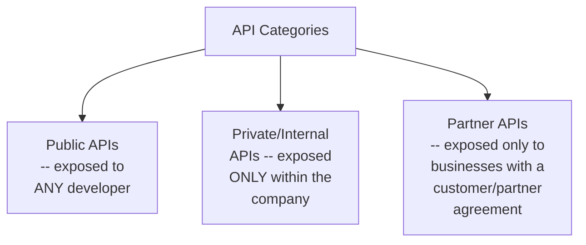
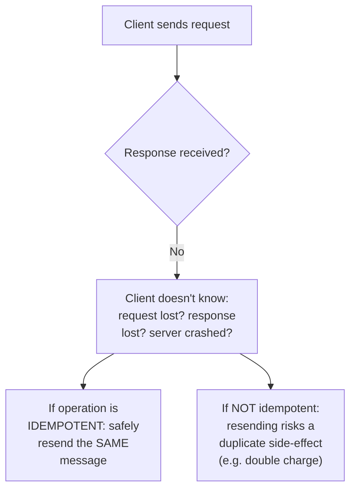
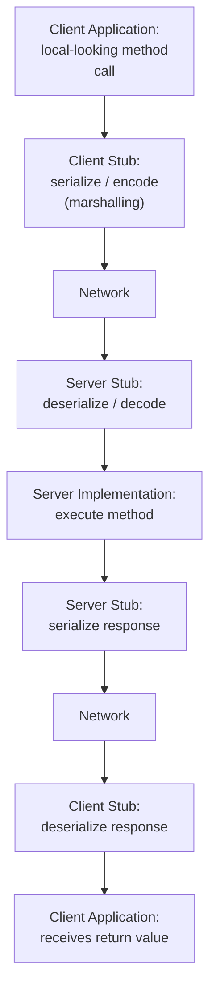
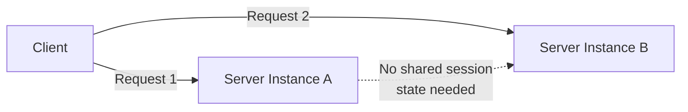

# 🏗 Software Architecture — Lecture 4: API Design, RPC, and REST APIs

- **Course:** Software Architecture (Instructor: Michael)
- **Session Focus:** What an API is and why it matters as a contract between engineers and clients, the three API categories, six best practices for designing a good API, and a deep dive into the two standardized API patterns: **RPC** (Remote Procedure Call) and **REST** (Representational State Transfer), including a full step-by-step REST design walkthrough.

---

## 📑 Table of Contents

1. [Session Overview](#-session-overview)
2. [Learning Objectives](#-learning-objectives)
3. [Detailed Notes](#-detailed-notes)
   - [1. What Is an API, and Why Do We Need One?](#1-what-is-an-api-and-why-do-we-need-one)
   - [2. Categories of APIs](#2-categories-of-apis)
   - [3. API Design Best Practices](#3-api-design-best-practices)
   - [4. RPC — Remote Procedure Calls](#4-rpc--remote-procedure-calls)
   - [5. REST Fundamentals: Resources, Statelessness & Cacheability](#5-rest-fundamentals-resources-statelessness--cacheability)
   - [6. Naming, Organizing & Operating on REST Resources](#6-naming-organizing--operating-on-rest-resources)
   - [7. Designing a REST API Step by Step](#7-designing-a-rest-api-step-by-step)
4. [Glossary](#-glossary)
5. [Revision Notes](#-revision-notes)
6. [Cheat Sheet](#-cheat-sheet)
7. [Interview Q&A](#-interview-qa)
   - [🟢 Beginner](#-beginner-questions)
   - [🟡 Intermediate](#-intermediate-questions)
   - [🔴 Advanced](#-advanced-questions)
8. [Scenario-Based Interview Questions](#-scenario-based-interview-questions)
9. [Hands-on Exercises](#-hands-on-exercises)
10. [Practice Assignment](#-practice-assignment)
11. [Additional Resources](#-additional-resources)
12. [Final Revision Sheet](#-final-revision-sheet)

---

## 🎯 Session Overview

With requirements and quality attributes established (Lectures 2–3), this lecture moves to the first concrete architectural artifact of a large-scale system: its **API** — the contract between the engineers who build the system and the client applications that use it. Michael first covers API fundamentals that apply to *any* API: the **three categories** (public, private, partner), the **business benefits** of a well-defined contract, and **six design best practices** (encapsulation, usability, idempotency, pagination, asynchronous APIs, versioning).

He then covers the first standardized API pattern in depth — **RPC (Remote Procedure Call)** — explaining local transparency, the client/server stub mechanism, its benefits (developer convenience) and drawbacks (slowness, unreliability), and when it's the right choice.

Finally, he introduces **REST (Representational State Transfer)**, contrasting its resource-oriented approach with RPC's procedure-oriented approach, covering the statelessness and cacheability requirements that make REST scale well, HATEOAS (hypermedia-driven dynamic APIs), best practices for naming and organizing resources, how REST operations map onto HTTP methods, and a complete four-step worked example designing a REST API for a movie streaming service.

---

## 🎯 Learning Objectives

By the end of this lecture, you should be able to:

- [ ] Define an API as a contract, and explain why it matters that the API "defines the endpoints for the different paths users can follow."
- [ ] Distinguish public, private, and partner APIs, and give a reason to choose each.
- [ ] Explain and apply all six API design best practices: encapsulation, usability, idempotency, pagination, asynchronous APIs, and versioning.
- [ ] Explain how RPC achieves "local transparency," and describe the client stub / server stub mechanism and the full RPC runtime flow.
- [ ] List RPC's benefits and drawbacks, and identify when RPC is (and isn't) the right choice.
- [ ] Explain how REST's resource-oriented approach differs from RPC's procedure-oriented approach.
- [ ] Explain REST's statelessness and cacheability requirements and why they support scalability and availability.
- [ ] Explain HATEOAS and why REST is considered "dynamic" compared to RPC.
- [ ] Apply REST resource-naming best practices, and map the four REST operations onto their corresponding HTTP methods.
- [ ] Walk through the four-step process for designing a REST API from scratch.

---

## 📚 Detailed Notes

### 1. What Is an API, and Why Do We Need One?

#### 📖 Definition

> *"After we gather all the functional requirements, we can start thinking about our system as a black box with behavior as well as a well-defined interface. This interface is essentially a contract between us, the engineers who implement the system, and the client applications that use our system... we will refer to this interface as an Application Programming Interface, or API for short."*

Since this is a **large-scale system** (not a class or library), the API is called **remotely, over the network**, by:
- Frontend clients (mobile apps, web browsers)
- Other companies' backend systems
- Internal systems within the organization
- Once the system is decomposed into components, **each component has its own API** consumed by other components

#### ❓ Why It Exists — Benefits of a Well-Defined API Contract

| Benefit | Explanation |
|---|---|
| **Customer independence** | Customers can improve their business using the system without knowing anything about its internal design/implementation |
| **Parallel progress** | Once the API is published, customers don't have to wait for the full implementation — they can start integrating immediately |
| **Clarifies internal architecture** | The API "defines the endpoints for the different paths that users can follow to use our system," which makes it easier to design the internal architecture around those paths |

#### 🎯 Key Takeaways

- An API is fundamentally a **contract** — a black-box interface hiding implementation, agreed between engineers and client applications.
- Because this is a large-scale system, APIs are called **remotely over a network**, unlike a class/library interface.
- Publishing the API early lets customers integrate in parallel with implementation, and clarifies the system's own internal architecture.

---

### 2. Categories of APIs

#### 📖 Definition — Three Categories



| Category | Who Can Use It | Notable Practice |
|---|---|---|
| **Public** | Any developer | Good practice: require **registration** before use — enables better security control and the ability to **blacklist** abusive users |
| **Private / Internal** | Other teams/parts of the same organization | Lets internal teams leverage the system without exposing it externally |
| **Partner** | Companies/users with a **business relationship** (customer agreement or subscription) | Similar to public APIs, but access is gated by a commercial relationship rather than open registration |

#### 🎯 Key Takeaways

- **Public APIs** are open to any developer, typically gated by registration for security/control.
- **Private APIs** stay entirely inside the organization.
- **Partner APIs** sit between the two — external, but gated by a business relationship rather than open sign-up.

---

### 3. API Design Best Practices

The lecture presents six best practices/patterns for designing a good, easy-to-use API.

#### ⚙ 1. Encapsulation

> *"Complete encapsulation of the internal design and implementation, hiding those details from the developer who wants to use our system... if a customer... finds that they need information about how the API is implemented internally... the entire purpose of the API has been defeated."*

⚠ **Common Mistake:** Leaking implementation details (business logic, internal data structures) through the API — this both confuses users and prevents changing the internal design later without breaking the contract.

#### ⚙ 2. Usability

> *"Easy to use, easy to understand, and impossible to misuse accidentally or intentionally."*

**Practices that support usability:**
- Only **one way** to retrieve data or perform a task (not many redundant ways).
- **Descriptive names** for operations and resources.
- Expose **only** what the user needs — nothing more.
- **Consistency** throughout the API.

#### ⚙ 3. Make Operations Idempotent

#### 📖 Definition — Idempotent Operation

> **"An operation that has no additional effect on the result if it is performed more than once."**

| Example | Idempotent? |
|---|---|
| Updating a user's address to a new address | ✅ Yes — same result whether done 1×, 5×, or 10× |
| Increasing a user's balance by $100 | ❌ No — result changes with each repetition |

##### ❓ Why It Exists — The Network Reliability Problem

> *"Our API will be used over a network... it is possible that the message could be lost. The response to that message could be lost, or an important component inside our system could crash and the message might never be received... the client application has no idea which of these scenarios actually occurred."*



#### ⚙ 4. API Pagination

> *"Pagination is an important API feature for scenarios where the response... contains a very large payload or dataset."* Without it, clients can't handle the response, or the experience is poor (imagine an inbox showing every email ever received on one page).

**How it works:** the client specifies:
- The **maximum size** of each response (page size)
- The **offset** within the overall dataset

To get the next page, the client simply increases the offset.

#### ⚙ 5. Asynchronous APIs

##### ❓ Why It Exists — When Pagination Doesn't Help

Some operations produce **one large result only at the end** — there's nothing meaningful to return partially. Examples given: a large multi-database report, big-data log aggregation, compressing large video files.

##### 🪜 Step-by-Step — The Asynchronous API Pattern

```text
Client → Start long-running operation
Server → Returns Job ID

Client → Check Job ID
Server → Returns current status

Client → Check Job ID
Server → Returns final result
```

The client gets an **immediate response containing an identifier**, which it uses to poll for status/result later, instead of blocking on the full operation.

#### ⚙ 6. API Versioning

##### ❓ Why It Exists

> *"We cannot always predict the future, and we may have to make backward-incompatible changes to the API at some point."*

Explicit versioning lets you run two versions simultaneously and **gradually deprecate** the older one with proper customer communication:

```text
API v1 → Existing customers
API v2 → New customers / migrated customers

             ↓
       Gradual migration

API v1 → Deprecated
API v2 → Active
```

#### 🎯 Key Takeaways

- Six best practices: **Encapsulation** (hide internals), **Usability** (simple, consistent, minimal surface area), **Idempotency** (safe retries over unreliable networks), **Pagination** (bound large payloads via page size + offset), **Asynchronous APIs** (job ID + polling for long operations with no meaningful partial result), **Versioning** (run parallel versions, deprecate gracefully).
- Idempotency and asynchronous APIs both directly address the **unreliability of network communication** — one makes retries safe, the other avoids blocking on slow operations.

---

### 4. RPC — Remote Procedure Calls

#### 📖 Definition

> **"A Remote Procedure Call is the ability of a client application to execute a subroutine on a remote server."** What distinguishes it is that the remote call **"looks like a normal local method call"** in the code the developer writes — a feature called **local transparency**.

Many (not all) RPC frameworks also support **multiple programming languages**, letting differently-implemented client and server applications communicate.

#### ⚙ How RPC Works — IDL, Stubs, and DTOs

##### 🔍 Internal Working

The API and its data types are declared using an **Interface Definition Language (IDL)** — a schema definition specific to the chosen RPC framework. A compiler/code-generation tool then generates **two separate implementations**:

| Generated Artifact | Side | Role |
|---|---|---|
| **Server stub** | Server | Implements the RPC method's networking/plumbing on the server side |
| **Client stub** | Client | Automatically generated implementation the client calls, that looks like a local method |
| **DTOs (Data Transfer Objects)** | Both | Custom object types from the IDL, compiled into classes/structs in the target language |

#### 🪜 Step-by-Step — RPC Runtime Flow



1. Client calls the RPC method with parameters — **client stub** serializes/encodes the data (a.k.a. **marshalling**).
2. Data is sent over the network to the **server stub**, which listens for messages.
3. Server stub **deserializes** the data and invokes the real method implementation.
4. Server stub **serializes** the result and sends it back.
5. Client stub receives, **deserializes**, and returns it as the ordinary return value of what looks like a local call.

#### 🔍 Internal Working — Client-Server Decoupling via IDL

Because the API/data types are published via the IDL, the client and server are **completely decoupled**: the team can generate the server stub whenever the implementation is ready, and any new client generates its own stub independently using the framework's published tools — potentially in a **different programming language**, if the framework supports it.

#### ⚖ Benefits of RPC

| Benefit | Explanation |
|---|---|
| **Convenience for client developers** | Calling a remote method looks and feels exactly like calling a local one; connection/data-transfer details are fully abstracted away |
| **Familiar error handling** | A communication failure simply surfaces as a normal error/exception, like any local method call |

#### ⚖ Drawbacks of RPC

##### 1. Remote Calls Are Slower

> *"Unlike local methods that execute on the client side, remote methods are much slower and less reliable... the client never knows how long the remote method call might take."*

⚠ Because RPC *looks* like a fast local call, developers can be misled into blocking on it. **Mitigation:** provide **asynchronous versions** of slow methods (Section 3's best practice).

##### 2. Reliability Issues

> 💡 **Worked Example — Credit Card `charge()`:** If a client calls `charge()` and it throws an exception, the client can't tell whether the server received the message, the acknowledgment was lost, or the server crashed before processing — leaving a dilemma: **retry and risk double-charging**, or **don't retry and risk not charging at all**.

**Mitigation:** make operations **idempotent** wherever possible (Section 3's best practice) — this doesn't eliminate the underlying network uncertainty, but it makes it *safe* to retry.

#### ❓ When Should We Use RPC?

> *"Remote Procedure Calls are very commonly used for communication between two backend systems."* Frontend-facing RPC frameworks exist but are less common.

| Good Fit For RPC | Less Good Fit For RPC |
|---|---|
| Backend-to-backend (B2B, or company-to-company) communication | User-facing web/browser-based clients |
| Internal component-to-component communication in a large system | Cases needing direct use of cookies/HTTP headers |
| Situations wanting to **fully abstract** the network away, focusing only on actions performed on the server | APIs focused on **data/resources with simple CRUD** operations |

#### 🔍 Internal Working — RPC Is Procedure-Oriented

RPC centers on **procedures** (methods), not data/resources — every capability is just a new method with its own name/signature, with almost no restriction on how many you define. This is the direct contrast to REST, covered next.

#### 🎯 Key Takeaways

- RPC's defining trait is **local transparency**: a remote call looks like a local call, achieved through an **IDL**, a code-generated **client stub** and **server stub**, and **serialization/deserialization (marshalling)** at each hop.
- Main benefit: **developer convenience** (abstracts networking, familiar error handling). Main drawbacks: **slowness** (mitigate with async APIs) and **unreliability/ambiguous failure semantics** (mitigate with idempotency).
- Best suited to **backend-to-backend** or **internal component** communication, and to APIs focused on **procedures/actions** rather than data/resources.

---

### 5. REST Fundamentals: Resources, Statelessness & Cacheability

#### 📖 Definition

> **REST (Representational State Transfer)** originated from **Roy Fielding's 2000 dissertation**. It is **"a set of architectural constraints and best practices for defining APIs for the web"** — explicitly **not a standard or protocol**, but an architectural style. An API following these constraints is called **RESTful**.

REST is explicitly connected to achieving quality attributes: **scalability, high availability, performance** (Lecture 3's terms).

#### 🔍 Internal Working — REST vs. RPC

| Aspect | RPC | REST |
|---|---|---|
| **Core abstraction** | **Methods**, organized into interfaces | **Named resources** |
| **How you extend the API** | Add more methods | Expose more/different resources |
| **What the client requests** | A method call with parameters | **A representation of a resource's current state** |
| **Transport** | Framework-specific (varies) | **HTTP** |

> *"Our system only sends a representation of the state of the resource. The resource itself can be implemented in a completely different way that is transparent to the client."*

##### 💡 Real-World Example — News Magazine Homepage

Requesting the "homepage" resource returns a representation (title, articles, images) — but internally that resource might be assembled from many database tables, files, or even external services. The client never needs to know.

#### 🔍 Internal Working — HATEOAS (Hypermedia as the Engine of Application State)

> Unlike RPC, where all possible client actions are statically fixed in the IDL, a RESTful API's interface is **dynamic**: **hypermedia links** are attached to the returned state representation, and the client follows those links to evolve its own state.

##### 💡 Real-World Example — Chat/Email System

A request for current messages might return not just the messages themselves, but an additional object describing **further resources/actions** the client can use — e.g., links to retrieve more information or perform specific actions.

#### ⚙ Two Requirements That Deliver Scalability & Availability

##### 1. Statelessness

> *"The server should be stateless and should not maintain any session information about the client. Instead, every request should be handled independently."*



Because no session state is held, requests can be **freely distributed across a cluster of machines** — directly enabling **horizontal scalability** and **high availability** (Lecture 3's terms), completely transparently to the client.

##### 2. Cacheability

> *"The server should explicitly or implicitly identify every response as either cacheable or non-cacheable."*

This lets the client **skip a round trip entirely** if a cached response is available closer to the client — a direct performance win, and it also **reduces load on the system** as a side benefit.

#### 🎯 Key Takeaways

- REST = an **architectural style** (not a protocol), from Fielding's 2000 dissertation, built around **named resources** rather than methods, using **HTTP** as its transport.
- The client only ever sees a **representation** of a resource's state; the underlying implementation stays fully abstracted.
- **HATEOAS** makes REST dynamic — hypermedia links in the response let the client discover further actions, unlike RPC's statically-fixed interface.
- **Statelessness** (no server-side session) enables horizontal scaling/availability; **cacheability** improves performance and reduces load — both directly serve the quality attributes from Lecture 3.

---

### 6. Naming, Organizing & Operating on REST Resources

#### 📖 Definition — URIs and Resource Hierarchy

Every resource is named/addressed via a **URI**, organized hierarchically using `/`. Resources come in two kinds:

| Resource Type | Description |
|---|---|
| **Simple resource** | Has a state; may optionally contain sub-resources |
| **Collection resource** | A list of resources of the same type |

##### 💡 Real-World Example — Movie Streaming Hierarchy

```text
/movies                     <- collection resource
  /movies/{id}               <- simple resource (a single movie)
    /movies/{id}/directors    <- sub-resource (collection of directors)
    /movies/{id}/actors       <- sub-resource (collection of actors)
      /movies/{id}/actors/{id}/profile-picture   <- sub-resource
      /movies/{id}/actors/{id}/contact-info      <- sub-resource
```

#### 📖 Definition — Resource Representations

A representation can be: an image, a link to a stream, an object, an HTML page, binary large data, or even executable code (e.g., JavaScript run in a browser).

#### 🚀 Best Practices for Naming Resources

| # | Practice | Example (Good) | Example (Bad) |
|---|---|---|---|
| 1 | **Use nouns only** (verbs are for the HTTP methods/actions) | `/movies`, `/users`, `/actors`, `/reviews` | `/getMovies`, `/createUser`, `/deleteActor` |
| 2 | **Distinguish collections vs. simple resources** | Plural = collection (`/movies`), Singular = simple resource | Mixing plural/singular inconsistently |
| 3 | **Use clear, meaningful names** | Domain-specific names | Overly generic: `items`, `entities`, `elements`, `instances`, `values`, `objects` |
| 4 | **Unique, URL-friendly resource IDs** | Safe characters, unique per resource | IDs with unsafe/ambiguous characters |

#### 📖 Definition — The Four REST Operations & HTTP Mapping

| REST Operation | HTTP Method |
|---|---|
| Create a resource | `POST` |
| Update a resource | `PUT` |
| Delete a resource | `DELETE` |
| Retrieve a resource (or a collection's list of sub-resources) | `GET` |

> Custom methods beyond these four are possible but **uncommon**.

#### 🔍 Internal Working — HTTP Semantics REST Relies On

| Guarantee | Applies To |
|---|---|
| **Safe** (doesn't change resource state) | `GET` |
| **Idempotent** (repeating has no additional effect) | `GET`, `PUT`, `DELETE` |
| **Cacheable by default** | `GET` (⚠ `POST` responses *can* be made cacheable via headers, but aren't by default) |

> When the client sends data (e.g., in a `POST`/`PUT` body), **JSON** is the typical format, though XML is also acceptable.

##### 💻 Example — A REST Request/Response Pair

```http
POST /users HTTP/1.1
Content-Type: application/json

{
  "name": "Jane Doe",
  "email": "jane@example.com"
}
```

```json
{
  "id": "usr_8f21",
  "name": "Jane Doe",
  "email": "jane@example.com"
}
```

#### 🎯 Key Takeaways

- Resources are addressed via **URIs**, organized hierarchically (`/`), and come as **simple** or **collection** resources.
- Naming best practices: **nouns only**, **plural for collections / singular for simple resources**, **clear domain-specific names** (avoid generic terms like "items"), **unique URL-friendly IDs**.
- The four REST operations map cleanly onto HTTP: **Create→POST, Update→PUT, Delete→DELETE, Retrieve→GET**.
- HTTP semantics directly deliver REST's own requirements: `GET` is safe and cacheable by default; `GET`/`PUT`/`DELETE` are idempotent (echoing Lecture 3/Section 3's idempotency concept).

---

### 7. Designing a REST API Step by Step

#### 🪜 Step-by-Step — A Complete Worked Example (Movie Streaming Service)

##### Step 1: Identify the Entities

> Entities for this example: **Users, Movies, Reviews, Actors.**

##### Step 2: Map Entities to URIs (Build the Hierarchy)

| Entity | Resource Type | Reasoning |
|---|---|---|
| Users | Independent collection | No relationship forcing nesting |
| Movies | Independent collection | Same |
| Actors | Independent collection | **Explicitly independent because the same actor can appear in multiple movies** — not nested under movies |
| Reviews | Sub-resource of `/movies` | Each review belongs to exactly **one** movie |

```text
/users
/movies
  /movies/{id}/reviews
/actors
```

##### Step 3: Choose Resource Representations

- Most common choice: **JSON**.
- Example: the `/movies` collection could be an object mapping **movie names → movie IDs** (easy to search by name, then retrieve the ID).
- A single movie resource could include: full movie info, a **link to play the movie**, and **HATEOAS links** to its reviews and actors sub-resources.

##### Step 4: Map HTTP Methods to Operations

| Resource | HTTP Method | Action |
|---|---|---|
| `/users` | `POST` | Register a new user → response contains the new user ID |
| `/users/{id}` | `GET` | Retrieve user info (e.g., favorite/watch-later movies) |
| `/users/{id}` | `PUT` | Update the user's profile/preferences |
| `/users/{id}` | `DELETE` | Remove the user from the system |

> This same four-step process (identify entities → map to URIs → choose representations → map HTTP methods) is **repeated for every resource** in the system (movies, reviews, actors) to complete the API design.

#### 🎯 Key Takeaways

- REST API design is a repeatable **four-step process**: identify entities → map to a URI hierarchy → choose representations (usually JSON) → map HTTP methods to operations.
- Relationship structure drives the URI hierarchy: **actors stay independent** (reused across movies), while **reviews nest under movies** (owned by exactly one movie) — a direct, worked illustration of the naming/organizing best practices from Section 6.

---

## 📝 Glossary

| Term | Definition | Why It Matters |
|---|---|---|
| **API (Application Programming Interface)** | A contract/interface between a system and the client applications that call it | The core artifact this entire lecture is about |
| **Public API** | Exposed to any developer, typically requiring registration | Broadest audience; needs strongest access control |
| **Private/Internal API** | Exposed only within the organization | Enables internal reuse without external exposure |
| **Partner API** | Exposed only to businesses with a commercial/partner relationship | Middle ground between public and private |
| **Encapsulation (API)** | Hiding internal design/implementation from API consumers | Preserves the freedom to change internals without breaking the contract |
| **Idempotent Operation** | An operation with no additional effect if performed more than once | Makes retries over unreliable networks safe |
| **Pagination** | Returning a bounded subset of a large result, via page size + offset | Prevents overwhelming clients with huge payloads |
| **Asynchronous API** | Returns an immediate job ID for a long operation, polled later for status/result | Avoids blocking clients on slow, non-incremental operations |
| **API Versioning** | Explicitly labeling API versions to allow gradual, non-breaking migration | Handles inevitable backward-incompatible changes |
| **RPC (Remote Procedure Call)** | An API style where a client calls a remote method that looks like a local call | The first standardized API pattern covered |
| **Local Transparency** | RPC's defining feature: remote calls look identical to local calls in code | What makes RPC convenient for client developers |
| **IDL (Interface Definition Language)** | A schema language declaring an RPC API and its data types | Source from which client/server stubs are generated |
| **Client Stub / Server Stub** | Auto-generated code implementing the client/server side of an RPC call | Encapsulates all networking/serialization details |
| **DTO (Data Transfer Object)** | A class/struct compiled from IDL-declared custom types | The data-shape contract between client and server |
| **Marshalling (Serialization)** | Encoding data for network transmission | Happens on both the client stub (outbound) and server stub (inbound) |
| **REST (Representational State Transfer)** | An architectural style (not a protocol) for web APIs, from Fielding's 2000 dissertation | The second standardized API pattern covered |
| **Resource** | A named entity in a REST API, addressed by a URI | REST's core abstraction, replacing RPC's "method" |
| **Representation** | The data returned describing a resource's current state | What the client actually receives — never the resource "itself" |
| **HATEOAS** | Hypermedia as the Engine of Application State — links embedded in responses that drive client behavior | What makes REST "dynamic" compared to RPC's static interface |
| **Statelessness (REST)** | No server-side session state; every request handled independently | Enables horizontal scaling and high availability |
| **Cacheability (REST)** | Responses explicitly/implicitly marked cacheable or not | Improves performance, reduces server load |
| **Simple Resource** | A resource with its own state, optionally with sub-resources | One of the two REST resource types |
| **Collection Resource** | A resource representing a list of same-type resources | The other REST resource type; named with plural nouns |
| **Safe (HTTP method)** | A method that never changes resource state | Property of `GET` |

---

## 🔄 Revision Notes

### ⚡ One-Minute Revision

- An **API** is a **contract** between engineers and clients — publishing it early lets clients integrate in parallel and clarifies internal architecture.
- **3 API categories**: Public (any developer, usually registration-gated), Private/Internal (organization-only), Partner (business-relationship-gated).
- **6 API best practices**: Encapsulation, Usability, **Idempotency** (safe retries), **Pagination** (page size + offset), **Asynchronous APIs** (job ID + polling), **Versioning** (parallel versions, graceful deprecation).
- **RPC**: local transparency (remote call looks local) via an **IDL** compiled into a **client stub** and **server stub**; runtime flow = serialize → network → deserialize → execute → serialize response → network → deserialize. Benefit: developer convenience. Drawbacks: slowness (fix: async APIs) and unreliable failure semantics (fix: idempotency). Best for backend-to-backend/internal, procedure-oriented APIs.
- **REST**: an architectural style (Fielding, 2000), resource-oriented (not procedure-oriented), using **HTTP**. Client only ever receives a **representation** of resource state. **HATEOAS** = hypermedia links make the API dynamic. Requires **statelessness** (→ horizontal scaling/availability) and **cacheability** (→ performance, lower load).
- **REST resources**: named via URIs, organized hierarchically; **simple** vs. **collection** resources; naming rules = nouns only, plural=collection/singular=simple, meaningful names (avoid "items"/"entities"), unique URL-friendly IDs.
- **4 REST operations → HTTP**: Create→POST, Update→PUT, Delete→DELETE, Retrieve→GET. `GET` is safe + cacheable by default; `GET`/`PUT`/`DELETE` are idempotent.
- **REST design in 4 steps**: identify entities → map to URIs (hierarchy driven by relationships) → choose representations (usually JSON) → map HTTP methods to operations.

---

## 📋 Cheat Sheet

| Item | Quick Reference |
|---|---|
| **API categories** | Public (any dev) · Private (internal only) · Partner (business relationship) |
| **6 API best practices** | Encapsulation · Usability · Idempotency · Pagination · Async APIs · Versioning |
| **Idempotent example** | Set address = idempotent. Increment balance by $100 = NOT idempotent |
| **Pagination params** | Page size (max items) + offset (position in dataset) |
| **Async API flow** | `Start op → Job ID` → `Check Job ID → status` → `Check Job ID → final result` |
| **RPC components** | IDL → generates → Client Stub + Server Stub (+ DTOs) |
| **RPC flow** | Client call → serialize → network → deserialize → execute → serialize → network → deserialize → return |
| **RPC benefit** | Local transparency / developer convenience |
| **RPC drawbacks + fixes** | Slow → use async APIs. Unreliable → make ops idempotent |
| **RPC best fit** | Backend-to-backend, internal components, procedure/action-oriented APIs |
| **REST origin** | Roy Fielding, 2000 dissertation — architectural STYLE, not a protocol |
| **REST core abstraction** | Named resource (not a method) |
| **REST requirements** | Statelessness (→ scalability/availability) · Cacheability (→ performance) |
| **HATEOAS** | Hypermedia links in responses drive dynamic client behavior |
| **REST operation → HTTP** | Create→POST · Update→PUT · Delete→DELETE · Retrieve→GET |
| **HTTP method guarantees** | GET = safe + cacheable by default. GET/PUT/DELETE = idempotent |
| **Resource naming rules** | Nouns only · plural=collection/singular=simple · meaningful names · unique URL-safe IDs |
| **REST design steps** | 1) Identify entities 2) Map to URIs 3) Choose representation 4) Map HTTP methods |

---

## 🔥 Interview Q&A

### 🟢 Beginner Questions

**Q1.**
**Question:** What is an API, according to this lecture?

**Answer:** A contract/interface between the engineers who implement a system and the client applications that use it, treating the system as a black box.

**Explanation:** This framing (contract, black box) underlies every best practice discussed later.

**Why Interviewers Ask This:** Foundational definition check.

**Possible Follow-up:** "Why is publishing this contract early beneficial, even before the system is fully implemented?"

---

**Q2.**
**Question:** Name the three categories of APIs and one distinguishing trait of each.

**Answer:** Public (any developer, usually registration-gated), Private/Internal (organization-only), Partner (gated by a business relationship).

**Explanation:** Each targets a different audience with different access-control needs.

**Why Interviewers Ask This:** Basic classification knowledge for API design discussions.

**Possible Follow-up:** "Why might a public API require registration even though it's open to anyone?"

---

**Q3.**
**Question:** What makes an operation idempotent, and why does it matter for APIs?

**Answer:** An idempotent operation produces the same result whether performed once or many times. It matters because APIs run over unreliable networks — if a client doesn't know whether a request succeeded, it can safely retry an idempotent operation without unintended side effects.

**Explanation:** Directly ties a definition to its underlying motivation (network unreliability).

**Why Interviewers Ask This:** One of the most common, practically important API design concepts.

**Possible Follow-up:** "Give an example of a non-idempotent operation and explain the risk of retrying it."

---

**Q4.**
**Question:** What problem does API pagination solve?

**Answer:** It prevents overwhelming clients with excessively large response payloads/datasets by letting the client request only a bounded portion, specified via a page size and an offset.

**Explanation:** Without pagination, clients could crash or have a very poor experience with huge responses.

**Why Interviewers Ask This:** A very common, practical API design requirement.

**Possible Follow-up:** "How does a client retrieve the next page of results?"

---

**Q5.**
**Question:** What defines an asynchronous API, and when should it be used instead of pagination?

**Answer:** An asynchronous API returns an immediate response (usually a job ID) for operations that take a long time and produce only one meaningful result at the end — used when pagination doesn't apply because there's no meaningful partial result to return.

**Explanation:** Pagination handles large-but-incremental results; async APIs handle long-but-atomic results.

**Why Interviewers Ask This:** Tests whether a candidate can distinguish these two related-but-different patterns.

**Possible Follow-up:** "Give an example of an operation that would need an asynchronous API rather than pagination."

---

**Q6.**
**Question:** What is "local transparency" in the context of RPC?

**Answer:** The property that a remote method call looks and behaves like a normal local method call in the code the developer writes.

**Explanation:** This is RPC's single defining characteristic.

**Why Interviewers Ask This:** Core RPC vocabulary check.

**Possible Follow-up:** "What two components does an RPC framework generate to achieve this?"

---

**Q7.**
**Question:** What are the client stub and server stub in RPC?

**Answer:** The client stub is the auto-generated client-side implementation that looks like a local method; the server stub is the server-side implementation handling incoming RPC calls — both generated from the API's Interface Definition Language (IDL).

**Explanation:** These two components implement all the networking/serialization details transparently.

**Why Interviewers Ask This:** Core RPC mechanics.

**Possible Follow-up:** "What are DTOs, and how do they relate to the IDL?"

---

**Q8.**
**Question:** What is REST, and who is it attributed to?

**Answer:** REST (Representational State Transfer) is an architectural style — not a protocol or standard — for designing web APIs, from Roy Fielding's 2000 dissertation.

**Explanation:** Distinguishing "architectural style" from "protocol" is a commonly-tested nuance.

**Why Interviewers Ask This:** Foundational REST definition, frequently misunderstood.

**Possible Follow-up:** "What does it mean for an API to be 'RESTful'?"

---

**Q9.**
**Question:** What is the core difference between REST's and RPC's abstractions?

**Answer:** RPC is centered on methods/procedures exposed to the client; REST is centered on named resources, manipulated through a small, fixed set of operations.

**Explanation:** This is the single most important conceptual distinction between the two patterns.

**Why Interviewers Ask This:** The most common REST-vs-RPC interview question.

**Possible Follow-up:** "How does this difference affect how you'd extend each type of API with new capability?"

---

**Q10.**
**Question:** What are the four REST operations, and what HTTP methods do they map to?

**Answer:** Create→POST, Update→PUT, Delete→DELETE, Retrieve→GET.

**Explanation:** This mapping is the backbone of practical REST API design.

**Why Interviewers Ask This:** Essential, universally-expected REST knowledge.

**Possible Follow-up:** "Which of these HTTP methods are idempotent, and which are safe?"

---

### 🟡 Intermediate Questions

**Q11.**
**Question:** Explain how idempotency and asynchronous APIs both address the same underlying problem, despite being different patterns.

**Answer:** Both patterns exist because API calls travel over an unreliable network where the client cannot always know the true outcome of a request. Idempotency addresses the case where a client is unsure if a request succeeded and needs to safely retry the *same* operation without unintended side effects (e.g., a payment charge). Asynchronous APIs address a related but distinct problem: operations that are slow enough that blocking the client for the full duration is undesirable — instead of retry-safety, the goal is to avoid the client being stuck waiting synchronously, which the lecture ties back to RPC's "remote calls are slower" drawback specifically. Both patterns share the common thread of NOT trusting a single synchronous round trip to fully and safely capture the outcome of a networked operation.

**Explanation:** Requires connecting two separately-introduced best practices to their shared root cause (network unreliability/latency), rather than treating them as unrelated.

**Why Interviewers Ask This:** Tests whether a candidate understands the underlying "why," not just two isolated definitions.

**Possible Follow-up:** "Could an operation reasonably need to be both idempotent AND asynchronous? Give an example."

---

**Q12.**
**Question:** Using the lecture's own credit-card `charge()` example, explain precisely why idempotency mitigates — but does not eliminate — the underlying reliability problem of RPC.

**Answer:** Idempotency mitigates the *consequence* of retrying (the client can safely resend the same `charge()` request without risk of double-charging), but it does not eliminate the underlying *uncertainty* itself — the client still cannot know, with certainty, whether the original request succeeded, whether the acknowledgment was lost, or whether the server crashed before processing. What changes is that this uncertainty no longer forces a bad choice between "retry and risk a double charge" versus "don't retry and risk not charging at all" — with idempotency, retrying is always safe regardless of what actually happened on the first attempt.

**Explanation:** Requires distinguishing "eliminating uncertainty" from "eliminating the negative consequence of acting under uncertainty" — a subtle but important distinction the lecture itself makes explicit ("we cannot truly eliminate this reliability problem, we can mitigate it").

**Why Interviewers Ask This:** Tests precise understanding rather than a superficial "idempotency fixes reliability" answer.

**Possible Follow-up:** "Is there any way to reduce the underlying network uncertainty itself, rather than just mitigating its consequences?"

---

**Q13.**
**Question:** Explain why REST's statelessness requirement is described as enabling both scalability AND high availability — aren't these two separate quality attributes (per Lecture 3)?

**Answer:** They are indeed separate quality attributes (per Lecture 3, scalability and availability are independently defined), but statelessness happens to be an architectural decision that serves both simultaneously, for related reasons. Because no server holds session state, any request can be routed to any server instance in a cluster (this is the scalability benefit — per Lecture 3's horizontal scaling dimension, adding more stateless instances directly increases capacity). The same property also serves availability: if one stateless instance fails, requests can be transparently redirected to any other instance without losing session context (directly connecting to Lecture 3's Section 6 fault-tolerance concept of eliminating a single point of failure via redundancy) — whereas a stateful, session-bound server would require the client to be "pinned" to a specific instance, making that instance's failure disruptive to that client's session.

**Explanation:** Requires synthesizing this lecture's statelessness concept with Lecture 3's scalability (horizontal scaling) and fault-tolerance (redundancy, single point of failure) concepts to explain the dual benefit precisely, rather than just asserting it.

**Why Interviewers Ask This:** Tests whether a candidate can connect concepts across different lectures/topics into one coherent architectural argument.

**Possible Follow-up:** "What REST requirement (from this same lecture) similarly serves performance specifically, and how?"

---

**Q14.**
**Question:** In the movie-streaming worked example, explain precisely why "actors" was kept as an independent top-level collection rather than nested under "movies," while "reviews" was nested under "movies."

**Answer:** The URI hierarchy in REST should reflect genuine ownership/containment relationships between entities, not just "this entity is related to that one." Reviews are nested under movies because each individual review belongs to exactly one movie — a strict one-to-many ownership relationship that maps cleanly to a `/movies/{id}/reviews` sub-resource. Actors, however, are explicitly called out as independent because the same actor can appear in multiple different movies — nesting actors under movies would either duplicate actor data across multiple movie sub-resource paths, or falsely imply an actor "belongs" to just one movie, when the real relationship is many-to-many. Keeping actors as an independent top-level collection resource lets a single actor resource be referenced (e.g., via a link from any movie that features them) without being artificially owned by any single movie.

**Explanation:** Requires reasoning about one-to-many vs. many-to-many relationships to justify the specific hierarchy decision, rather than simply restating "actors are independent, reviews are nested" without the underlying "why."

**Why Interviewers Ask This:** A very common, practical REST API design question — testing whether a candidate can correctly reason about resource hierarchy for a new, unseen entity relationship.

**Possible Follow-up:** "How would you design the URI structure for `directors`, given directors can also appear in multiple movies?"

---

**Q15.**
**Question:** A junior engineer proposes designing a payments API entirely using RPC because "it's simpler for the client to call `chargeCard()` than to figure out REST resources." Evaluate this reasoning using this lecture's own guidance on when to use RPC vs. REST.

**Answer:** The reasoning has some merit but is incomplete. Per this lecture, RPC is indeed well-suited to procedure/action-oriented APIs (like an explicit `charge()` action) and to backend-to-backend communication, which a payments API often is. However, the lecture also explicitly identifies RPC's charge()-style example as the canonical illustration of RPC's *reliability drawback* — the ambiguous retry/double-charge dilemma — precisely because payments-style actions are not naturally idempotent by default. If the team chooses RPC here, per the lecture they are still fully responsible for explicitly designing the `charge()` operation to be idempotent (e.g., via a client-supplied idempotency key) to safely mitigate this exact risk; RPC's "simplicity" does not remove this obligation. If the client were instead a user-facing frontend (e.g., a web checkout page) rather than another backend, the lecture's own guidance would favor REST instead, since frontend-facing RPC is uncommon and REST's resource model (e.g., `POST /charges`) integrates more naturally with cookies/HTTP-level concerns a browser-based client might need.

**Explanation:** Requires applying multiple pieces of lecture guidance together — RPC's use-case fit, its own worked reliability example, and the RPC-vs-REST client-type guidance — to give a nuanced, not one-sided, evaluation.

**Why Interviewers Ask This:** Tests whether a candidate can push back constructively on a plausible-sounding but incomplete engineering argument, using the material's own reasoning rather than a memorized rule.

**Possible Follow-up:** "How exactly would you design an idempotency key for this `charge()` operation?"

---

### 🔴 Advanced Questions

**Q16.**
**Question:** Design (at a conceptual level) a complete REST API for a "hotel booking" system, applying this lecture's full four-step process, and explicitly justify at least one resource-hierarchy decision and one HTTP-method mapping decision using the lecture's own reasoning.

**Answer:** **Step 1 — Identify entities:** Hotels, Rooms, Bookings, Users, Reviews. **Step 2 — Map to URIs:** `/hotels` (independent collection — hotels aren't owned by anything else), `/hotels/{id}/rooms` (sub-resource — each room belongs to exactly one hotel, a clean one-to-many ownership relationship, directly per Section 7's reviews-under-movies reasoning), `/users` (independent collection), `/bookings` (kept as an **independent top-level collection**, NOT nested under either `/users` or `/hotels/{id}/rooms`, because a booking is meaningfully associated with BOTH a user and a room — a many-to-many-adjacent relationship similar to the actors-under-movies reasoning from Section 7 — so nesting it under either parent would be arbitrary; instead, a booking resource references both a `userId` and a `roomId`), `/hotels/{id}/reviews` (sub-resource — each review belongs to one hotel). **Step 3 — Representations:** JSON for all resources; a booking representation includes HATEOAS links to its associated room and user resources, and to a "cancel" action. **Step 4 — HTTP mapping:** `POST /bookings` creates a new booking (justified because creating a booking is a genuinely new resource, not an update to an existing one — matching Section 6's Create→POST rule); `DELETE /bookings/{id}` cancels a booking rather than a custom `POST /bookings/{id}/cancel`, since cancellation is fundamentally the removal of the booking resource, keeping the API within REST's small, standard operation set rather than introducing an uncommon custom method (per Section 6's note that custom methods are possible but "uncommon").

**Explanation:** Requires applying the full four-step process to a genuinely new domain, while explicitly reusing and citing the lecture's own reasoning patterns (ownership relationships, avoiding custom methods) to justify two non-trivial design decisions.

**Why Interviewers Ask This:** A capstone system-design question testing whether a candidate can apply the lecture's abstract rules to a concrete, previously-unseen domain, not just recite definitions.

**Possible Follow-up:** "How would you handle the case where a booking needs to be modified (e.g., date changed) rather than fully replaced?"

---

**Q17.**
**Question:** Critically evaluate: "Since REST is described as more scalable and available than RPC (per its statelessness/cacheability requirements), REST should always be preferred over RPC for any large-scale system's internal, component-to-component communication." Is this accurate?

**Answer:** Not accurate, and it conflates two separate axes the lecture actually keeps distinct: (1) which quality attributes an API style is architecturally suited to deliver, and (2) which use case/client type an API style is intended for. The lecture explicitly states RPC is "very commonly used for communication between two backend systems" and is "also a great choice for communication between different components internally within a large-scale system" — this is a direct, explicit recommendation for exactly the use case in the claim (internal, component-to-component communication), independent of REST's scalability/availability properties. The lecture's REST-vs-RPC distinction is really about **abstraction shape** (procedure-oriented vs. resource-oriented) and **client type** (backend-to-backend vs. user-facing/browser), not a blanket claim that REST is "better" for internal use. In fact, RPC's own benefit — completely abstracting network communication so the client focuses purely on "actions to perform on the server" — is explicitly named as a good fit for exactly this internal-component scenario. A more accurate takeaway: choose RPC internally when the API is naturally procedure/action-oriented and you want strict, code-generated contracts between components (with idempotency explicitly designed in where needed); choose REST internally when the API is naturally resource/CRUD-oriented and you want to lean on HTTP's built-in semantics (caching, statelessness) for that specific component.

**Explanation:** Requires identifying that the claim over-generalizes from one dimension (quality attributes) while ignoring another (use-case/abstraction fit) that the lecture treats as equally important, and correcting it with the lecture's own explicit statements about RPC's internal-communication use case.

**Why Interviewers Ask This:** A senior/staff-level question testing whether a candidate treats architectural style selection as a nuanced, multi-factor decision rather than a simple "REST > RPC" hierarchy.

**Possible Follow-up:** "Give a concrete example of an internal component where you would deliberately choose RPC over REST, and justify it."

---

## 🧪 Scenario-Based Interview Questions

> **Scenario 1:** Your team's public API exposes a `POST /orders` endpoint to place an order. Under high load, some client requests are timing out, and clients report occasionally seeing duplicate orders after retrying. How do you diagnose and fix this?

**Structured Answer:**

1. **Initial investigation:** Confirm whether `POST /orders` is currently idempotent — per Section 3/6, `POST` (Create) is explicitly NOT guaranteed idempotent by HTTP semantics, unlike `GET`/`PUT`/`DELETE`, so this is a very plausible root cause.
2. **Relevant principle:** Per Section 3's idempotency best practice and the credit-card `charge()` reliability example, any operation retried over an unreliable network needs an explicit idempotency mechanism if it isn't naturally idempotent.
3. **Possible causes:** Clients are retrying `POST /orders` after a timeout (not knowing whether the original request succeeded), and each retry creates a brand-new order resource, since plain `POST` has no built-in duplicate-detection.
4. **Debugging approach:** Reproduce the timeout-then-retry sequence in a test environment and confirm duplicate order creation; check whether the API currently accepts or requires any client-supplied request identifier.
5. **Resolution:** Introduce an explicit **idempotency key** pattern: require clients to send a unique key with each order-creation request; on the server, store completed request keys briefly and return the original result (rather than creating a new order) if the same key is seen again — directly applying Section 3's idempotency principle to an operation (Create) that isn't idempotent by default.
6. **Prevention:** Document the idempotency-key requirement clearly as part of the public API contract (Section 1's "contract" framing), and apply the same pattern to any other non-idempotent, retry-prone endpoint going forward.

---

> **Scenario 2 (Advanced):** You're designing the internal API between your order-processing service and your inventory service (both backend, both owned by your company). One engineer wants to use REST; another wants RPC. How do you help the team decide?

**Structured Answer:**

1. **Initial investigation:** Clarify the nature of the operations being exposed — are they naturally CRUD/data-oriented (e.g., "get current stock level for SKU X," "update stock quantity"), or naturally action/procedure-oriented (e.g., "reserveInventory(orderId, items)," "releaseReservation(reservationId)")?
2. **Relevant principle:** Per Section 4/5, REST fits data/resource-oriented APIs with simple CRUD operations; RPC fits procedure-oriented APIs and is explicitly a strong choice for backend-to-backend, internal-component communication.
3. **Possible causes for disagreement:** The two engineers may be picturing different parts of the same API — inventory *queries* (data-oriented, REST-friendly) versus inventory *reservation actions* (procedure-oriented, RPC-friendly) — meaning the disagreement might dissolve once the API is split by operation type rather than forced into one single style.
4. **Debugging/evaluation approach:** List every operation the two services need from each other and classify each as "read/write on a resource" (REST candidate) versus "an action with business-logic side effects, especially ones needing strict typed contracts or multi-language support" (RPC candidate per Section 4's IDL/DTO benefits).
5. **Resolution:** If most operations are genuinely CRUD-shaped (checking/updating stock records), lean REST and gain HTTP-native caching/statelessness benefits (Section 5); if most are action-shaped with strict request/response contracts (like `reserveInventory`), lean RPC and gain compile-time-checked stubs/DTOs (Section 4) — and it's also acceptable, per the lecture's own component-level framing (Section 1: "each component will have its own API"), for different internal APIs in the same system to use different styles where each fits best.
6. **Prevention:** Establish a lightweight internal guideline (data-oriented → REST, action-oriented → RPC, both are fine as different components' own APIs) so future internal API design decisions don't require a fresh debate each time.

---

## 🛠 Hands-on Exercises

### 🟢 Easy

1. For a "task management" app, classify each of the following as idempotent or not, and justify: (a) marking a task as "done," (b) incrementing a task's priority score by 1, (c) deleting a task by ID.
2. Design the URI hierarchy (following this lecture's naming best practices) for a blogging platform with Users, Posts, and Comments, where each comment belongs to exactly one post.

### 🟡 Medium

1. Design an asynchronous API (using the Job-ID pattern from Section 3) for a "bulk CSV import" feature, writing out the exact request/response sequence a client would follow, similar to the lecture's own worked example.
2. Take the movie-streaming REST API from Section 7 and extend it with a `/movies/{id}/reviews/{id}` sub-resource, specifying its representation (JSON) and which HTTP methods it should support and why.

### 🔴 Advanced

1. Design a complete internal API between two backend services of your choosing, deciding explicitly (with written justification, per Q17's reasoning) whether each individual operation should be exposed via REST or RPC.
2. Take the public `POST /orders` idempotency scenario (Scenario 1) and write the full idempotency-key mechanism as a technical design: what the client sends, what the server stores, how long it's retained, and how a duplicate request is detected and handled.

---

## 🏗 Practice Assignment

**Objective:** Design a complete API (choosing either REST or RPC, with justification) for a hypothetical large-scale system, applying every best practice and pattern from this lecture.

**Requirements:**
- Choose one system (e.g., a food-delivery service, a ride-sharing service, a document-collaboration tool).
- Identify at least 4 entities and design their resource hierarchy (if REST) or method/procedure list (if RPC).
- Apply at least 4 of the 6 API best practices explicitly (encapsulation, usability, idempotency, pagination, async APIs, versioning), documenting exactly where and why each applies.
- If choosing REST: provide the full 4-step design walkthrough (Section 7's format) for at least 2 entities.
- If choosing RPC: define the IDL-style interface (pseudocode is fine) for at least 2 methods, and identify which need to be idempotent and why.

**Architecture (suggested):**

```text
api_design_assignment/
├── entities_and_categories.md      # entities identified + API category (public/private/partner)
├── resource_or_method_design.md    # URI hierarchy (REST) or method list (RPC)
├── best_practices_applied.md       # which of the 6 practices you used, and where
└── design_walkthrough.md           # the step-by-step design process you followed
```

**Expected Functionality:** A reader unfamiliar with your system should be able to understand exactly what the API exposes, how to call it, and why you chose REST or RPC for this use case.

**Suggested Implementation Approach:**
1. Start from your system's core entities and their real-world relationships (ownership vs. many-to-many) to drive the hierarchy/method design.
2. Walk through each of the 6 best practices and ask "does this apply here, and if so, how?"
3. If any operation resembles the credit-card `charge()` example (irreversible, side-effecting), explicitly design its idempotency mechanism.

**Expected Output:** A single Markdown document (or the small folder structure above) following the outline given.

**Challenges:**
- Correctly distinguishing entities that should be independent collections from those that should be nested sub-resources.
- Deciding, and clearly justifying, REST vs. RPC for your chosen system rather than defaulting to one without reasoning.

**Bonus Improvements:**
- Add a mermaid diagram showing your full resource hierarchy (if REST) or your RPC runtime flow for one method (if RPC).
- Design an explicit versioning strategy (Section 3) for your API, including what a backward-incompatible change might look like for your system in the future.

---

## 📚 Additional Resources

- **Roy Fielding's dissertation** — *"Architectural Styles and the Design of Network-based Software Architectures"* (2000) — the original source of REST, explicitly cited in this lecture.
- **Books:** *RESTful Web APIs* (Leonard Richardson & Mike Amundsen) — deeper treatment of resource design, HATEOAS, and REST maturity levels (the "Richardson Maturity Model") extending this lecture's own REST coverage.
- **Concept Reference:** Look up **gRPC** and **Protocol Buffers** as a modern, widely-used real-world implementation of the RPC pattern (IDL, code generation, client/server stubs) described in Section 4.
- **Concept Reference:** Look up **idempotency keys** (as used by real payment APIs like Stripe) to see a production implementation of the idempotency mitigation discussed in Sections 3 and 4.
- **Concept Reference:** Look up the **Richardson Maturity Model** (Level 0–3) to deepen the HATEOAS discussion from Section 5 — most real-world "REST" APIs only partially implement HATEOAS.

---

## 📌 Final Revision Sheet

- ⭐ **Core concept:** An API is a **contract** — publishing it early enables parallel client integration and clarifies internal architecture.
- ⭐ **Core concept:** 3 API categories — Public, Private/Internal, Partner — distinguished by audience and access control.
- ⭐ **Important definition:** Idempotent operation — same result no matter how many times it's performed; critical for safe retries over unreliable networks.
- ⭐ **Important definition:** RPC's "local transparency" via IDL → client stub + server stub; runtime flow = serialize → network → deserialize → execute → return.
- ⭐ **Important definition:** REST = architectural style (Fielding, 2000), resource-oriented, using HTTP; client receives a **representation**, never the resource itself.
- ⭐ **Important definition:** HATEOAS — hypermedia links in responses make REST dynamic, unlike RPC's statically-fixed interface.
- ⭐ **Architecture/process:** REST's statelessness → horizontal scalability + availability; cacheability → performance + reduced load.
- ⭐ **Architecture/process:** 4 REST operations → HTTP: Create→POST, Update→PUT, Delete→DELETE, Retrieve→GET; GET is safe+cacheable; GET/PUT/DELETE are idempotent.
- ⭐ **Architecture/process:** REST design in 4 steps — identify entities → map to URIs (ownership drives hierarchy) → choose representation (usually JSON) → map HTTP methods.
- ⭐ **Best practice:** Apply the 6 API practices — encapsulation, usability, idempotency, pagination, async APIs, versioning — and know exactly which problem each solves.
- ⭐ **Best practice:** RPC fits backend-to-backend/internal, procedure-oriented APIs; REST fits data/resource-oriented, especially browser/frontend-facing APIs.
- ⭐ **Common mistake to avoid:** Assuming `POST` is idempotent by default — it is not, unlike GET/PUT/DELETE.
- ⭐ **Common mistake to avoid:** Nesting a many-to-many entity (like actors) under a single parent resource, instead of keeping it independent.
- ⭐ **Interview point:** Be ready to explain RPC's `charge()` reliability dilemma and how idempotency mitigates (not eliminates) it.
- ⭐ **Interview point:** Be ready to justify REST vs. RPC for a given scenario using BOTH quality-attribute fit and use-case/client-type fit, not just one dimension.
- ⭐ **Thing to remember:** This lecture's best practices (idempotency, async APIs) directly serve reliability/performance problems introduced by the network — they are not arbitrary style choices.