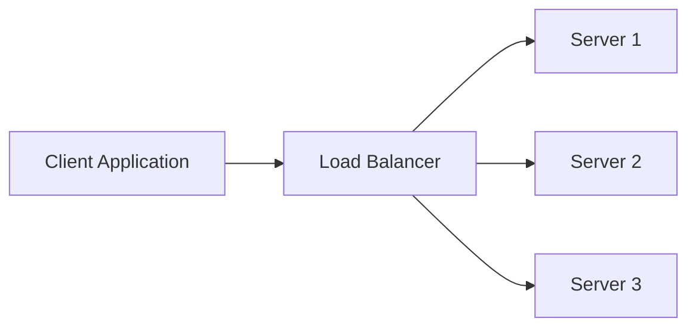
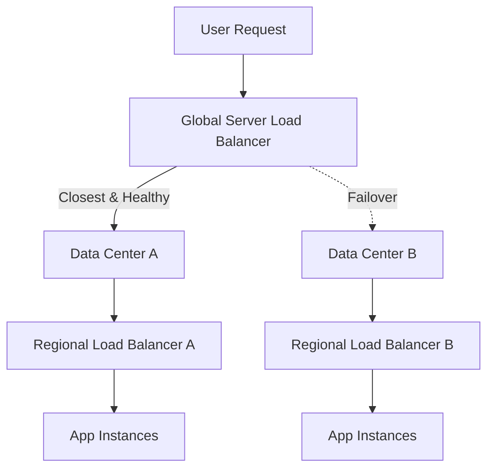
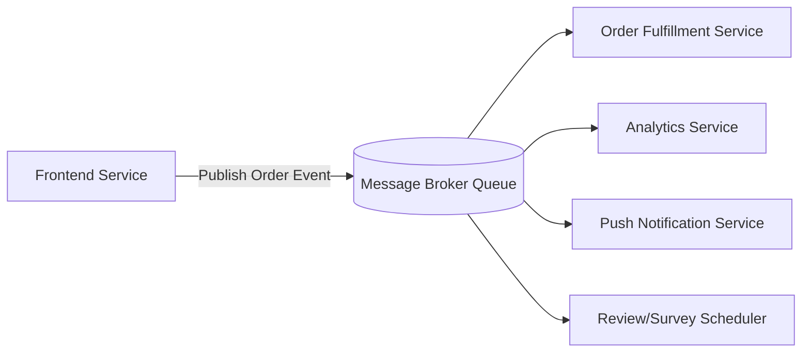
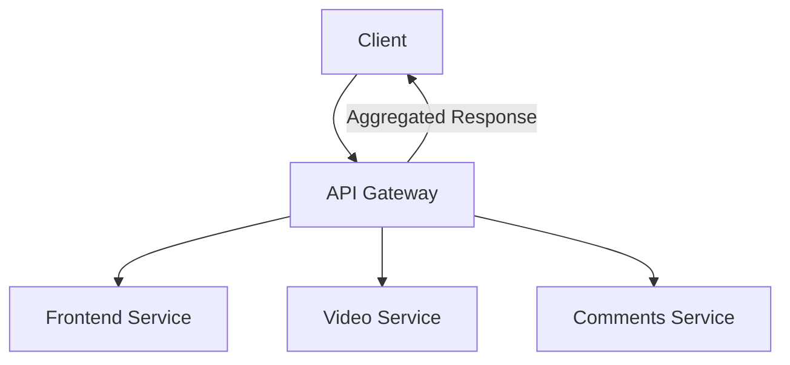

# 🏗 Software Architecture — Lecture 5: Architectural Building Blocks

- <i>**Course:** Software Architecture (Instructor: Michael)
- **Session Focus:** Four of the most widely-used architectural building blocks in large-scale system design — the **Load Balancer** (DNS, hardware/software, and GSLB approaches), the **Message Broker** (asynchronous architecture and pub/sub), the **API Gateway** (API Composition, its six key benefits, and its anti-patterns), and the **Content Delivery Network (CDN)** (Pull vs. Push caching strategies).</i>

---

## 📑 Table of Contents

1. [Session Overview](#-session-overview)
2. [Learning Objectives](#-learning-objectives)
3. [Detailed Notes](#-detailed-notes)
   - [1. Load Balancers — What They Are and Why We Need Them](#1-load-balancers--what-they-are-and-why-we-need-them)
   - [2. Load Balancer Quality Attributes and Performance](#2-load-balancer-quality-attributes-and-performance)
   - [3. Types of Load Balancers](#3-types-of-load-balancers)
   - [4. Message Brokers and Asynchronous Architecture](#4-message-brokers-and-asynchronous-architecture)
   - [5. API Gateway — Purpose and Benefits](#5-api-gateway--purpose-and-benefits)
   - [6. API Gateway Best Practices and Anti-Patterns](#6-api-gateway-best-practices-and-anti-patterns)
   - [7. Content Delivery Networks (CDNs)](#7-content-delivery-networks-cdns)
4. [Glossary](#-glossary)
5. [Revision Notes](#-revision-notes)
6. [Cheat Sheet](#-cheat-sheet)
7. [Interview Q&A](#-interview-qa)
   - [🟢 Beginner](#-beginner-questions)
   - [🟡 Intermediate](#-intermediate-questions)
   - [🔴 Advanced](#-advanced-questions)
8. [Scenario-Based Interview Questions](#-scenario-based-interview-questions)
9. [Hands-on Exercises](#-hands-on-exercises)
10. [Practice Assignment](#-practice-assignment)
11. [Additional Resources](#-additional-resources)
12. [Final Revision Sheet](#-final-revision-sheet)

---

## 🎯 Session Overview

This lecture covers four of the most widely-used **architectural building blocks** in large-scale system design: the **Load Balancer**, the **Message Broker**, the **API Gateway**, and the **Content Delivery Network (CDN)**.

> "In this lecture, we will learn about one of the first and most important building blocks in software engineering, which is used in almost **100% of all real-world large-scale systems**... This building block is called a **Load Balancer**."

Each building block solves a distinct architectural problem — distributing traffic, decoupling synchronous communication, composing internal services into a single external API, and reducing latency by moving content physically closer to users. Together, they form the backbone of nearly every production system operating at scale.

---

## 🎯 Learning Objectives

By the end of this session, you will be able to:

- Explain what a load balancer does and why it is essential for horizontal scalability and high availability.
- Compare DNS load balancing, hardware/software load balancers, and Global Server Load Balancers (GSLB), including their trade-offs.
- Describe the drawbacks of synchronous communication and how a message broker solves them through asynchronous, decoupled communication.
- Explain the publish-subscribe (pub/sub) pattern and how it enables extensibility without modifying existing services.
- Describe the role of an API Gateway, the API Composition pattern, and the six major benefits it provides.
- Identify API Gateway anti-patterns and best practices for avoiding a single point of failure.
- Explain what a CDN is, how it reduces latency, and compare the Pull and Push caching strategies.

---

## 📚 Detailed Notes

### 1. Load Balancers — What They Are and Why We Need Them

#### 🧠 Concept

> "As the name suggests, the primary role of a load balancer is to **balance the traffic load across a group of servers** in our system."

The best way to achieve **high availability and horizontal scalability** is to run multiple identical instances of an application across multiple computers. Without a load balancer, the client would need to know the addresses and number of every server instance directly — **tightly coupling** the client to the system's internal implementation.

#### ❓ Why It Exists

A load balancer solves two problems at once:

1. It distributes traffic so no individual server becomes overloaded.
2. As a side benefit, it provides **abstraction** between the client and the group of servers, making the whole system look like a single, immensely powerful server.

> "This abstraction makes our entire system look like a **single server** capable of providing enormous computing power and a large amount of memory."

Different load-balancing solutions provide different levels of this abstraction, covered in [Types of Load Balancers](#3-types-of-load-balancers).

---

### 2. Load Balancer Quality Attributes and Performance

#### ⚙ How It Works

Load balancers provide several quality attributes to a system:

**High Scalability** — By hiding a group of servers behind a load balancer, the system can scale horizontally up and down:

* Adding additional servers when load increases.
* Removing unnecessary servers when load decreases to save money.

> "In a cloud environment, where we can easily rent more machines on demand, we can use **auto-scaling policies** to intelligently add or remove servers based on various criteria, such as: requests per second, network bandwidth, CPU utilization, and so on."

**High Availability** — Most load balancers can be configured to stop sending traffic to unreachable servers, intelligently routing only to healthy servers.

**Maintainability** — Because servers can be added or removed from the pool at will, individual servers can be taken out of rotation to perform maintenance or upgrades without disrupting the client — a **rolling upgrade** — while maintaining the system's SLA for availability.

#### ⚖ Advantages & Limitations

> "When it comes to performance, load balancers may add a small amount of latency and increase the response time for the user. However, this is generally an acceptable price to pay for increased performance in terms of **throughput**."

Since a load balancer allows many backend servers (subject to reasonable limits), the number of requests processed per unit time — **throughput** — is far greater than what a single server could achieve. The trade-off is a small increase in per-request latency, which is generally acceptable.

#### 🎯 Key Takeaways

| Quality Attribute | How the Load Balancer Provides It |
|---|---|
| High Scalability | Add/remove servers on demand, auto-scaling policies |
| High Availability | Health monitoring, routes only to healthy servers |
| Improved Throughput | More backend servers → more requests/sec |
| Maintainability | Rolling upgrades without disrupting clients |

---

### 3. Types of Load Balancers

#### 📖 Definition

There are four major load-balancing approaches:

1. **DNS Load Balancing**
2. **Hardware Load Balancers**
3. **Software Load Balancers**
4. **Global Server Load Balancers (GSLB)**

#### 🪜 Step-by-Step: DNS Load Balancing

> "The **Domain Name System (DNS)** is part of the Internet infrastructure that maps human-friendly names such as amazon.com, netflix.com, apple.com to IP addresses... It is essentially the **phone book of the Internet**."

1. The client sends a DNS query to a DNS server.
2. The DNS server responds with the IP address (or a **list** of IP addresses) for the domain.
3. By convention, the client selects the **first address** in the list.
4. Since DNS servers return the list in a different order per request, this effectively performs **round-robin** load balancing.

#### ⚠ Common Mistakes / Drawbacks of DNS Load Balancing

| Drawback | Explanation |
|---|---|
| No Health Monitoring | DNS doesn't know if a server is down; the list only updates based on **TTL**, and caching (e.g., on the client) makes this worse. |
| Simple Strategy | Round-robin doesn't account for server power or current load. |
| Security Concerns | Clients receive the **direct IP addresses** of all servers, exposing internals and enabling targeted attacks on a single server. |

#### ⚙ How It Works: Hardware and Software Load Balancers

The only difference between the two is *where* they run:

* **Hardware load balancers** run on dedicated, purpose-built hardware.
* **Software load balancers** run as software on any general-purpose computer.

> "With both hardware and software load balancers, unlike DNS load balancing, **all communication between the client and our group of servers goes through the load balancer**."

This means individual server IPs and count are never exposed — improving security. These load balancers also perform **active health checks** and can route intelligently based on hardware type, current load, open connections, and server health.

**Internal use case:** Hardware/software load balancers aren't only for external traffic — they can sit **between internal services** too. For example, an online shopping system can have a frontend service, an order/fulfillment service, and a billing service, each independently scaled and communicating through load balancers.

#### 🏢 Real-World/Production Usage: Global Server Load Balancer (GSLB)

Hardware/software load balancers are typically deployed **close to** the servers they balance (placing them far away adds latency). This means a single load balancer can't efficiently serve multiple geographic data centers, and load balancers alone don't solve DNS resolution.

> "Therefore, there is a fourth load-balancing solution called a **Global Server Load Balancer**, or **GSLB** for short. A GSLB is somewhat of a combination of a **DNS service** and a hardware or software load balancer."

A GSLB:

* Provides DNS service like any normal DNS server.
* Determines the user's location from the originating IP.
* Monitors the location and health of every registered server/data center.
* Returns the IP of the **closest, healthy** load balancer.
* Can route based on current traffic, CPU load, estimated response time, or available bandwidth — not just geography.
* Plays a key role in **disaster recovery**, redirecting users away from a data center affected by an outage.

To avoid the load balancer itself becoming a **single point of failure**, multiple load balancers can be registered with the GSLB's DNS service, and clients can pick the first one or choose randomly — adding redundancy at the load-balancer layer.

#### 💡 Memory Trick

DNS LB = phonebook, round-robin, no health checks. Hardware/Software LB = smart traffic cop, health checks, hides IPs. GSLB = DNS + smart traffic cop, works across data centers.

---

### 4. Message Brokers and Asynchronous Architecture

#### ❓ Why It Exists

> "You probably noticed that in every case where we mentioned two applications communicating with each other, either directly or through a load balancer, there was always an implicit assumption that both the sender application and the receiver application maintained an active connection... This type of communication is called **synchronous communication**."

Synchronous communication has two key disadvantages:

1. **Both services must stay healthy and connected** for the entire duration of the transaction — a problem when one operation (e.g., a ticket-booking flow involving reservation, charging, and confirmation) takes a long time or the server crashes mid-operation.
2. **Lack of buffering** — a sudden spike in traffic (e.g., a limited-time promotion) can overwhelm a downstream service even if it's scaled with many instances, because each operation still takes a long time to complete.

#### 📖 Definition

> "A message broker is a software architectural building block that uses a **queue data structure** to store messages between senders and receivers."

Unlike a load balancer (which handles external traffic), a message broker is used **inside** the system and is generally not exposed externally. It completely decouples senders from receivers via its own communication protocols and APIs, and provides additional capabilities: **message routing, transformation, validation,** and even load balancing.

#### ⚙ How It Works

With a message broker, the sender does **not** wait for acknowledgment from the receiver — the receiver may not even be online when the message is sent.

* In the ticket-booking example, the user gets an immediate acknowledgment, then an asynchronous confirmation email once the booking service finishes.
* The single monolithic booking service can be split into multiple services, each decoupled from the next via the broker.
* **Buffering** absorbs traffic spikes: the frontend can decrement an inventory counter immediately while actual orders sit in the broker's queue, to be processed one at a time after the spike subsides.

#### 🔍 Internal Working: Publish-Subscribe (Pub/Sub)

> "Most message broker implementations also provide a **publish-subscribe (pub/sub) pattern**, where multiple services can publish messages to a particular channel, and multiple services can subscribe to that channel and receive notifications whenever a new event is published."

This makes the system **extensible without modification** — new subscriber services can be added to an existing channel (e.g., an analytics service, a push-notification service, a post-purchase survey service) without touching any existing code.

#### ⚖ Advantages & Limitations

| Quality Attribute | How Achieved |
|---|---|
| High Availability | Fault tolerance — services communicate even when temporarily unavailable; prevents message loss |
| High Scalability | Buffers messages during traffic spikes without requiring system changes |
| Latency (trade-off) | Adds a small performance cost since the broker is an extra intermediary between services — generally not significant |

---

### 5. API Gateway — Purpose and Benefits

#### ❓ Why It Exists

Imagine a video-sharing system starting as a single monolithic service (frontend, profiles, subscriptions, notifications, storage, comments, and security all in one codebase). As it grows, the codebase becomes unmanageable, so the team splits it into multiple single-purpose services — applying **organizational scalability**.

> "Now, because we have divided our system into multiple services and the client application code is making separate calls to each service, every service needs to reimplement its own **security, authentication, and authorization**, which adds a lot of performance overhead and duplication."

#### 📖 Definition

> "An API Gateway is an **API management service** that sits between the client and a group of backend services... follows a software architectural pattern called **API Composition**."

In API Composition, all the individual service APIs meant for external exposure are composed into a **single API** that clients call — eliminating duplicated logic and decoupling the client from the system's internal service layout.

#### 🎯 Key Takeaways — Six Benefits of an API Gateway

| # | Benefit | Explanation |
|---|---|---|
| 1 | Decoupling Clients from Internal Architecture | Internal service splits (e.g., desktop vs. mobile, HD vs. low-res video) happen transparently to clients. |
| 2 | Centralized Security, AuthN/AuthZ | Malicious requests stopped at the gateway; **SSL termination** happens once; supports **rate limiting** to prevent **DoS attacks**. |
| 3 | Improved Performance (Request Routing) | A single client call is routed to multiple services and the responses are **aggregated into one response**, instead of the client making 3 separate calls. |
| 4 | Caching | Cached responses are returned directly from the gateway, reducing latency. |
| 5 | Monitoring and Alerting | Real-time visibility into traffic patterns; alerts on sudden spikes/drops — improving **observability and availability**. |
| 6 | Protocol Translation | Externally expose JSON over HTTP while internally using different RPC technologies, legacy HTTP/1 + XML services, or third-party integration protocols (e.g., ad networks). |

---

### 6. API Gateway Best Practices and Anti-Patterns

#### ⚠ Common Mistakes

**1. Keep Business Logic Out of the API Gateway**

> "If we make the mistake of following the anti-pattern of adding business logic to our API Gateway and making it too intelligent, we may end up once again with a single service that performs all the work and contains an unmanageable amount of code."

The gateway's job is **API composition and routing** — not business decisions. Those belong in the backend services.

**2. Avoid the API Gateway Becoming a Single Point of Failure (SPOF)**

Scalability, availability, and performance can be solved by running multiple gateway instances behind a load balancer. But a **bad deployment or bug** can still crash the entire gateway and take down the whole system — so gateway releases require extra deployment care.

**3. Avoid Unnecessary API Gateway Bypass**

> "If they know that the only service calling them externally is the API Gateway, they can simply make the changes in the user service and update the API Gateway accordingly, then safely release their new changes. However, if other external clients can also connect directly to the service, the user-service team will have to be much more careful and slower when releasing these changes."

Allowing clients to bypass the gateway reintroduces the tight coupling the gateway was meant to eliminate.

#### 🎯 Key Takeaways

* Business logic → backend services, not the gateway.
* Deploy multiple gateway instances behind a load balancer; be extremely careful with gateway releases.
* Never let external clients bypass the gateway to call services directly.

---

### 7. Content Delivery Networks (CDNs)

#### ❓ Why It Exists

Even with hosting distributed across data centers via GSLB, physical distance between a user and the hosting servers — plus multiple network hops — adds significant latency.

> "In the context of a study published by **Google Analytics in March 2016**, which indicated that **53% of mobile users abandon a website if it takes more than three seconds to load**, this number we just calculated does not look very good for our service."

Worked example (user in Brazil, servers on the US east coast, ~200ms base latency):

| Step | Latency |
|---|---|
| Three-way TCP handshake (3 round trips) | 600 ms |
| HTTP request/response for HTML page | 400 ms |
| Requesting 10 assets | 200 ms |
| Loading all 10 assets | 2,000 ms |
| **Total** | **~3.2 seconds** |

> "It is not our services containing all the business logic that need to be closer to users. It is the **content**, such as images, HTML pages, JavaScript, CSS files, and video files, that mostly needs to be closer to users so that it can be downloaded faster. This is where **CDNs** come in."

#### 📖 Definition

> "CDN, which stands for **Content Delivery Network**, is a globally distributed network of servers located in strategic locations, with the primary goal of accelerating the delivery of content to end users."

CDNs were built to solve the **"World Wide Wait"** — poor user experience from slow connections or overloaded servers. They cache content on **edge servers** at various **Points of Presence (PoPs)**, physically closer to users, and are used to deliver page assets as well as live and on-demand video streams.

#### ⚖ Advantages & Limitations

* **Availability** — since most content is served from the CDN, backend slowdowns are often invisible to users.
* **Security** — CDNs absorb **DDoS attacks** by distributing malicious traffic across many CDN servers instead of hitting the origin directly.
* **Performance** — CDN edge servers use optimized storage drives and compress content (**Gzip**, JS minification) to reduce bandwidth.

Reworking the earlier example with a CDN (50ms latency to edge): TCP handshake (150ms) + HTML request/response (100ms) + asset loading (550ms) = **under 1 second total**, versus ~3.2 seconds without a CDN.

#### 🪜 Step-by-Step: CDN Caching Strategies

**1. Pull Strategy**

1. Configure which content to cache and its **Time to Live (TTL)**.
2. On the *first* request for an asset, the CDN populates its cache by fetching from the origin server.
3. Subsequent requests are served directly from the edge — no origin round trip.
4. When the TTL expires, the CDN re-checks with the origin; if unchanged, it just refreshes the expiration; if changed, it fetches and caches the new version.

**2. Push Strategy**

1. Content is manually or automatically uploaded/deployed directly to the CDN.
2. Whenever content changes, the origin is responsible for republishing to edge servers (or invalidating the cache to force a re-fetch).

#### ⚖ Advantages & Limitations: Pull vs. Push

| | Pull Strategy | Push Strategy |
|---|---|---|
| **Advantage** | Less maintenance — CDN provider manages refresh automatically | Once pushed, traffic goes directly to edge servers; origin can go down temporarily without affecting users |
| **Disadvantage** | First requester pays higher latency (cache miss); same TTL across assets can cause synchronized refresh spikes; origin availability still matters for cache misses | Requires active republishing whenever content changes, or users get **stale/outdated content** |
| **Best for** | Content that changes unpredictably or per standard workflows | Content that changes infrequently |

---

## 📝 Glossary

| Term | Definition |
|---|---|
| **Load Balancer** | A building block that distributes traffic across a group of servers and abstracts the group to look like a single server. |
| **Round-Robin** | A load-balancing strategy that cycles through a list of servers in order. |
| **TTL (Time To Live)** | The duration a DNS record or cached asset remains valid before requiring a refresh. |
| **GSLB (Global Server Load Balancer)** | A combination of DNS service and load balancer that routes users to the closest/healthiest data center. |
| **Single Point of Failure (SPOF)** | A component whose failure takes down the entire system. |
| **Message Broker** | An internal building block that uses a queue to store and route messages between decoupled senders and receivers. |
| **Synchronous Communication** | Communication requiring both sender and receiver to be simultaneously connected and healthy. |
| **Asynchronous Architecture** | A design where the sender does not wait for the receiver to process a message immediately. |
| **Publish-Subscribe (Pub/Sub)** | A messaging pattern where publishers send to a channel and any number of subscribers receive the messages independently. |
| **API Gateway** | An API management service that composes multiple backend APIs into a single external API. |
| **API Composition** | The architectural pattern of exposing many internal service APIs as one unified external API. |
| **SSL Termination** | Decrypting HTTPS traffic at a single point (e.g., the gateway) before forwarding it internally. |
| **Rate Limiting** | Restricting the number of requests a client can make in a given time window, often to prevent DoS attacks. |
| **Request Routing** | Directing a single client request to one or more backend services and aggregating their responses. |
| **Protocol Translation** | Converting between external and internal API protocols/formats (e.g., JSON to XML, HTTP/1 to RPC). |
| **CDN (Content Delivery Network)** | A globally distributed network of edge servers that cache and deliver content close to end users. |
| **Edge Server** | A CDN server located at a Point of Presence (PoP), physically closer to end users. |
| **Point of Presence (PoP)** | A physical location housing CDN edge servers. |
| **Pull Strategy** | CDN caching model where content is fetched from the origin on first request and cached with a TTL. |
| **Push Strategy** | CDN caching model where content is proactively uploaded to edge servers by the origin. |

---

## 🔄 Revision Notes

### ⚡ One-Minute Revision

* **Load Balancer** — distributes traffic, abstracts servers, provides scalability/availability/throughput/maintainability. Four types: DNS (simple, no health checks, security risk), Hardware/Software (health checks, hides IPs), GSLB (DNS + smart routing across data centers, disaster recovery).
* **Message Broker** — solves synchronous communication's coupling and lack-of-buffering problems via a queue; enables async communication and pub/sub; trades a small amount of latency for availability and scalability.
* **API Gateway** — API Composition pattern; single entry point providing decoupling, centralized security, request routing/aggregation, caching, monitoring, protocol translation. Anti-patterns: business logic in the gateway, becoming a SPOF, allowing bypass.
* **CDN** — globally distributed edge servers that cache content close to users, cutting latency dramatically (~3.2s → <1s in the example); improves availability and DDoS resilience; Pull vs. Push caching strategies.

---

## 📋 Cheat Sheet

| Building Block | Primary Purpose | Key Quality Attributes | Watch Out For |
|---|---|---|---|
| Load Balancer | Distribute traffic across servers | Scalability, Availability, Throughput, Maintainability | DNS LB = no health checks, exposes IPs |
| Message Broker | Decouple sync communication, buffer spikes | Availability, Scalability | Adds latency |
| API Gateway | Compose internal APIs into one external API | Security, Performance, Observability | Business logic creep, SPOF, bypass |
| CDN | Cache content near users | Performance, Availability, Security | Stale content (Push), cache-miss latency (Pull) |

---

## 🔥 Interview Q&A

### 🟢 Beginner Questions

**Q1.** What is the primary purpose of a load balancer?

To balance traffic load across a group of servers so no single server becomes overloaded, while also abstracting the group of servers to look like a single server to clients.

**Q2.** Why does a system need a load balancer if it already runs multiple server instances?

Without a load balancer, clients would need to know the addresses and count of every instance directly, tightly coupling the client to the system's internal implementation and making changes difficult.

**Q3.** What is the simplest form of load balancing, and how does it work?

DNS load balancing. A DNS record can map to a list of IP addresses, returned in different orders per client request; clients conventionally pick the first address, producing round-robin distribution.

**Q4.** What are two drawbacks of DNS load balancing?

(1) No health monitoring — DNS keeps directing traffic to dead servers, and (2) it exposes direct server IP addresses, creating a security risk.

**Q5.** What is a message broker?

A software architectural building block that uses a queue data structure to store messages between senders and receivers, enabling asynchronous, decoupled communication.

**Q6.** What is synchronous communication, and what is its main disadvantage?

Communication where both sender and receiver must be simultaneously connected and healthy. Its main disadvantage is that long-running operations or crashes leave both sides blocked/waiting, and there's no buffering for traffic spikes.

**Q7.** What is the publish-subscribe (pub/sub) pattern?

A messaging pattern where publishers send messages to a channel and any number of independent subscribers can receive and act on those messages, without modifying the publisher.

**Q8.** What is an API Gateway?

An API management service that sits between clients and backend services, composing multiple internal APIs into a single external API using the API Composition pattern.

**Q9.** What is a CDN?

A globally distributed network of edge servers, located at Points of Presence, that cache and deliver content closer to end users to reduce latency.

**Q10.** What are the two CDN caching strategies?

Pull (CDN fetches and caches content from the origin on first request, using a TTL) and Push (the origin proactively uploads content to edge servers).

### 🟡 Intermediate Questions

**Q11.** How does a Global Server Load Balancer (GSLB) differ from a regular hardware/software load balancer?

A GSLB combines a DNS service with load-balancer-like intelligence: it determines a user's location, monitors the health of load balancers across multiple data centers, and returns the IP of the closest/healthiest one — solving both DNS resolution and cross-data-center routing, which a regular load balancer (deployed close to one group of servers) cannot do alone.

**Q12.** How does a message broker improve both availability and scalability?

Availability improves through fault tolerance — services can communicate even when temporarily unavailable, and messages aren't lost. Scalability improves because the broker buffers messages during traffic spikes, letting the system absorb bursts without requiring immediate additional capacity.

**Q13.** Explain the "request routing" and response aggregation benefit of an API Gateway with an example.

Instead of a client making three separate calls (to a frontend service, a video service, and a comments service) to render a video page, the client makes a single call to the API Gateway, which routes the request to all three services and aggregates their responses into one.

**Q14.** Why is business logic considered an anti-pattern inside an API Gateway?

Because it recreates the original problem the system was trying to solve — a single, overly complex component doing everything — undermining the separation of concerns achieved by splitting into microservices.

**Q15.** Compare the advantages and disadvantages of the Pull vs. Push CDN caching strategies.

Pull requires less maintenance (the CDN handles refresh automatically via TTL) but the first requester after a cache miss pays extra latency, and uniform TTLs can cause synchronized cache-refresh spikes. Push means content reaches edge servers proactively so traffic never hits the origin for cached content, and the origin can be temporarily down without affecting users — but any content change must be actively republished, or users see stale data.

### 🔴 Advanced Questions

**Q16.** Design-wise, why do hardware/software load balancers typically need to be deployed physically close to the servers they balance, and what problem does this create for multi-data-center systems?

All communication passes through the load balancer, so placing it far from the servers adds latency to every request. For a system running in multiple data centers, one central load balancer would sacrifice performance for at least one location — necessitating either per-data-center load balancers or a GSLB layer to first route users to the appropriate region.

**Q17.** How would you prevent an API Gateway from becoming a single point of failure, and what additional operational risk remains even after solving for scalability/availability?

Deploy multiple gateway instances behind a load balancer to address scalability, availability, and performance. However, an operational risk remains: a bad deployment or software bug that crashes the gateway service itself can bring down the entire system's external access, since all traffic flows through it — requiring careful, controlled rollout practices for gateway releases specifically.

---

## 🧪 Scenario-Based Interview Questions

**Scenario 1:** Your company's e-commerce checkout flow directly calls the order-fulfillment service synchronously from the frontend. During a flash sale, the frontend times out and users see errors, even though orders are technically still being processed in the background. How would you redesign this using the building blocks from this lecture?

*Consider: introduce a message broker so the frontend can enqueue orders and return an immediate acknowledgment; the fulfillment service processes the queue at its own pace; buffering absorbs the traffic spike without needing to instantly scale fulfillment to match peak load; the user gets an async confirmation once the order is actually fulfilled.*

**Scenario 2:** Your system serves both a web app and a mobile app, and users worldwide have reported slow initial page loads (3+ seconds), especially in regions far from your single US-based data center. Product wants users on high-speed connections too. What would you recommend, and why?

*Consider: the latency is dominated by physical distance and the number of network hops for both the HTML and static assets (images, JS, CSS) — this is a CDN problem, not a compute-scaling problem. Recommend introducing a CDN with edge servers/PoPs near international users; choose a Pull strategy if content is dynamic/frequently changing or Push if assets are largely static, weighing maintenance overhead against staleness risk.*

---

## 🛠 Hands-on Exercises

**🟢 Easy:** Draw a diagram showing a client connecting through a load balancer to three application servers. Label which quality attributes (scalability, availability, throughput, maintainability) the load balancer provides in this setup.

**🟡 Medium:** Design a message-broker-based architecture for a food-delivery app where "place order," "notify restaurant," "assign driver," and "send customer SMS updates" are each handled by an independent service subscribing to relevant events on a shared channel.

**🔴 Advanced:** Sketch a full request path for a video-streaming platform that uses a GSLB, regional load balancers, an API Gateway, a message broker for async notifications, and a CDN for video asset delivery — labeling which component each piece of traffic (initial page load, video asset request, "like" button click, notification) passes through.

---

## 🏗 Practice Assignment

Design the architecture for a large-scale **online ticket-booking platform** (concerts, sports events) that must support flash on-sale moments (e.g., popular concert tickets going live at a specific time) with millions of concurrent users worldwide.

Your design should address:

1. How you would use a **GSLB** and **regional load balancers** to route and distribute global traffic.
2. How you would use a **message broker** to handle the ticket-reservation and payment-processing flow without leaving users waiting synchronously, and how you would prevent overselling tickets during the spike.
3. What role an **API Gateway** would play for your public-facing API, including which of its six benefits are most critical for this use case and why.
4. How you would use a **CDN** to deliver the event page, images, and any promotional video content, and which caching strategy (Pull or Push) you would choose and why.
5. Identify at least one potential single point of failure in your design and how you would mitigate it.

---

## 📚 Additional Resources

- Fielding, R. — Architectural Styles and the Design of Network-based Software Architectures (background on distributed system design principles referenced across building-block discussions)
- Google Analytics performance research (March 2016) on mobile page-load abandonment rates, cited in the CDN discussion
- Vendor documentation for major CDN providers (e.g., Cloudflare, Akamai, Amazon CloudFront) on Pull vs. Push caching configuration
- Vendor documentation for message broker systems (e.g., Apache Kafka, RabbitMQ, Amazon SQS/SNS) on queue-based and pub/sub messaging patterns
- Vendor documentation for API Gateway solutions (e.g., Amazon API Gateway, Kong, Apigee) on API Composition, rate limiting, and protocol translation

---

## 📌 Final Revision Sheet

* ⭐ **Load Balancer** = traffic distribution + abstraction. Four types: DNS (simple, insecure, no health checks) → Hardware/Software (health checks, hides IPs, can be internal too) → GSLB (DNS + load balancer, cross-data-center routing, disaster recovery).
* ⭐ **Message Broker** = queue-based decoupling for async architecture. Solves sync communication's coupling + no-buffering problems. Enables pub/sub for extensibility. Trades slight latency for availability + scalability.
* ⭐ **API Gateway** = API Composition pattern; single external entry point. Six benefits: decoupling, centralized security, request routing/aggregation, caching, monitoring, protocol translation. Avoid: business logic inside it, SPOF risk, client bypass.
* ⭐ **CDN** = globally distributed edge servers/PoPs caching content near users. Solves the "World Wide Wait." Improves performance, availability, and DDoS resilience. Pull (lazy, less maintenance, cache-miss latency) vs. Push (proactive, no origin dependency for cached content, staleness risk).
* ⭐ Common theme across all four building blocks: **abstraction + decoupling** between components, traded off against a small increase in latency or operational complexity.