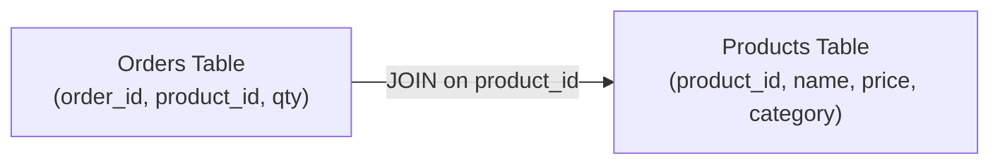
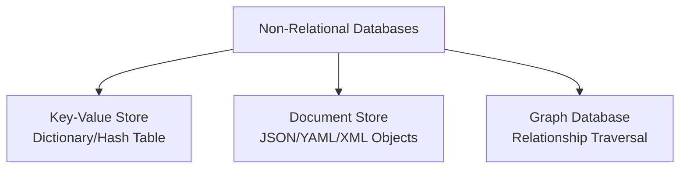
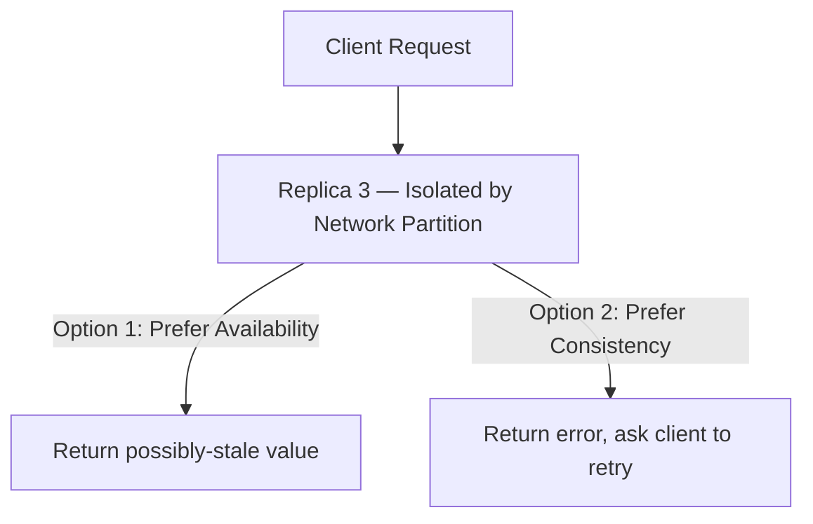

# 🏗 Software Architecture — Lecture 6: Data Storage at Global Scale

- <i>**Course:** Software Architecture (Instructor: Michael)
- **Session Focus:** A systematic approach to choosing the right database for a system's use case — **relational databases** (SQL, ACID transactions, advantages/disadvantages), **non-relational databases** (NoSQL categories: key-value, document, graph), three techniques for scaling any database (**indexing, replication, sharding**), the **CAP Theorem** for distributed databases, and two solutions for storing **unstructured data**: distributed file systems and object storage.</i>

---

## 📑 Table of Contents

1. [Session Overview](#-session-overview)
2. [Learning Objectives](#-learning-objectives)
3. [Detailed Notes](#-detailed-notes)
   - [1. Relational Databases — Fundamentals and ACID Transactions](#1-relational-databases--fundamentals-and-acid-transactions)
   - [2. Relational Databases — Advantages, Disadvantages, and When to Use](#2-relational-databases--advantages-disadvantages-and-when-to-use)
   - [3. Non-Relational (NoSQL) Databases — Motivation and Categories](#3-non-relational-nosql-databases--motivation-and-categories)
   - [4. Scaling Databases: Indexing, Replication, and Sharding](#4-scaling-databases-indexing-replication-and-sharding)
   - [5. The CAP Theorem](#5-the-cap-theorem)
   - [6. Unstructured Data: Distributed File Systems and Object Storage](#6-unstructured-data-distributed-file-systems-and-object-storage)
4. [Glossary](#-glossary)
5. [Revision Notes](#-revision-notes)
6. [Cheat Sheet](#-cheat-sheet)
7. [Interview Q&A](#-interview-qa)
   - [🟢 Beginner](#-beginner-questions)
   - [🟡 Intermediate](#-intermediate-questions)
   - [🔴 Advanced](#-advanced-questions)
8. [Scenario-Based Interview Questions](#-scenario-based-interview-questions)
9. [Hands-on Exercises](#-hands-on-exercises)
10. [Practice Assignment](#-practice-assignment)
11. [Additional Resources](#-additional-resources)
12. [Final Revision Sheet](#-final-revision-sheet)

---

## 🎯 Session Overview

With the traffic, API, and content-delivery building blocks established (Lecture 5), this lecture turns to **databases** — arguably the most consequential architectural decision in a large-scale system. Rather than picking the most popular or trendy database, Michael teaches a **systematic approach**: understand what each type of database provides, weigh its advantages against its disadvantages, and match those trade-offs to the system's actual requirements.

The lecture progresses from **relational databases** (tables, SQL, ACID transactions) to **non-relational databases** (key-value stores, document stores, graph databases), then to three **database-scaling techniques** that apply to either type (indexing, replication, sharding), the theoretical **CAP Theorem** governing distributed databases, and finally the two dominant solutions for storing **unstructured data**: distributed file systems and object storage.

---

## 🎯 Learning Objectives

By the end of this session, you will be able to:

- Explain what a relational database is, how JOINs avoid data duplication, and the four ACID transaction guarantees.
- Compare the advantages and disadvantages of relational databases and identify when to use one.
- Describe the motivation for non-relational databases and distinguish key-value stores, document stores, and graph databases.
- Explain how indexing speeds up queries and the read/write trade-off it introduces.
- Compare database replication and sharding, including their benefits and added complexity.
- State the CAP Theorem precisely and reason about when to prefer consistency over availability (or vice versa).
- Explain what unstructured data is and compare distributed file systems with object storage for different use cases.

---

## 📚 Detailed Notes

### 1. Relational Databases — Fundamentals and ACID Transactions

#### 📖 Definition

> "In a relational database, data is stored in **tables**. Each row in a table represents a single record, and all records are related to each other through a predefined set of columns that exist in each record."

Each record is uniquely identified by a **primary key** (a single column or a combination of columns). Every table's structure is predefined — its **table schema** — which enables the powerful, industry-standard query language: **SQL (Structured Query Language)**. Relational databases have existed since the **1970s**.

#### 🧠 Concept: Avoiding Data Duplication

> "Since a relational database allows us to establish not only relationships between rows within a table but also relationships between multiple tables, we can avoid this duplication and keep the orders table much smaller by storing only the **product ID** associated with each purchase."

Example: rather than repeating full product details in every order row, an orders table stores only a `product_id`, and a **JOIN operation** combines data from the products and orders tables on demand — saving storage without losing the ability to analyze the data together.

#### ⚙ How It Works: ACID Transactions

> "Relational databases provide us with very strong guarantees called **ACID transaction properties**... In the context of a database, a **transaction** is a sequence of operations that must appear to an external observer as a single operation."

| Property | Guarantee |
|---|---|
| **Atomicity** | All operations in a transaction succeed together, or none do — "all or nothing." |
| **Consistency** | A committed transaction is visible to all future queries, and no data constraint is ever violated. |
| **Isolation** | Concurrent transactions never see each other's intermediate (partial) states. |
| **Durability** | Once committed, a transaction's final state persists permanently, even across failures. |

> "So, with this property, we will never encounter a situation where, for example, a user purchases a product from our online store and transfers money to us as part of the transaction, but the purchase record disappears."

---

### 2. Relational Databases — Advantages, Disadvantages, and When to Use

#### ⚖ Advantages & Limitations

**Advantages:**

1. **Powerful and Flexible Queries** — complex SQL queries and JOINs across tables enable deep business/user insight while saving storage space.
2. **Easy to Reason About** — the table structure is natural for humans and requires no computer-science background to understand.
3. **ACID Transactions** — strong correctness guarantees for critical operations like financial transfers.

**Disadvantages:**

| Drawback | Explanation |
|---|---|
| Rigid Schema | The schema must be defined up front; changing it later (adding/removing a column) may require downtime/maintenance. |
| Complexity and Cost | Supporting SQL + ACID guarantees is inherently complex, making relational databases harder and more expensive to maintain and scale. |
| Performance | Read operations tend to be slower than in non-relational databases, as a general rule. |

#### ❓ Why It Exists / When to Use

> "All we need to do is look at the advantages and determine whether these properties are important to us, while the disadvantages can take a back seat."

Choose a relational database when:

* Complex, flexible queries/analysis across related data are important.
* **ACID transaction guarantees** between different entities are required.

Consider an alternative when:

* There's no inherent relationship between records that justifies tables.
* **Read performance** is the most important quality attribute.

#### 💡 Memory Trick

Relational = Tables + SQL + ACID + Rigid Schema. Strong on correctness and analysis, weaker on raw read speed and schema flexibility.

---

### 3. Non-Relational (NoSQL) Databases — Motivation and Categories

#### ❓ Why It Exists

> "Non-relational databases are a relatively new concept that became very popular in the mid-2000s. They primarily came about to solve some of the shortcomings of relational databases."

Two core relational limitations motivated NoSQL:

1. **Rigid, uniform schema** — every row in a table needs the same columns, so adding data relevant to only some records forces a schema change affecting all records.
2. **Only one native data structure (the table)** — unnatural for programming languages, which favor lists, arrays, and maps, often requiring an **ORM (Object-Relational Mapping)** layer to bridge the gap.

> Non-relational databases are generally focused on **faster queries** (relational databases were originally optimized for efficient storage, when storage was expensive).

#### ⚖ Advantages & Limitations

**Advantages:** flexible schemas, faster queries, data structures more natural to programming languages.

**Trade-offs:** harder to analyze/join records across flexible schemas, most operations vary by database implementation, and **ACID transaction guarantees are rarely supported** (with some exceptions).

#### 📖 Definition: Three Categories of NoSQL Databases

*(Note: category boundaries are blurry — the same database may be classified differently across sources.)*

| Category | Description | Ideal Use Cases |
|---|---|---|
| **Key-Value Store** | A key uniquely identifies a record; the value is opaque (integer, string, array, or large binary object) — essentially a large-scale hash table/dictionary. | Counters incremented by multiple services; fast page/data retrieval without a complex SQL query. |
| **Document Store** | Documents (JSON, YAML, XML) map naturally to programming-language objects, each with its own set of attributes/fields. | Semi-structured records that map to application objects. |
| **Graph Database** | An extension of a document store optimized for connecting, traversing, and analyzing relationships between records. | Fraud detection (linking seemingly distinct users); recommendation engines (similar purchase history or social connections). |

#### ❓ When to Use Non-Relational Databases

* **Caching** — in-memory key-value stores are ideal for storing frequently requested query results.
* **Real-time big data** — where relational databases are too slow or not scalable enough (e.g., document stores).
* **Unstructured/variable data** — user profiles or content management where different records carry different attributes.

> "If we are not dealing with any of these use cases, choosing a relational database is usually a safer choice because of its simplicity and long-term popularity."

---

### 4. Scaling Databases: Indexing, Replication, and Sharding

#### 🧠 Concept: Indexing

> "The purpose of indexing is to speed up retrieval operations and locate the required records in **sublinear time**. Without indexing, these operations may require a **full table scan**."

A **database index** is an auxiliary data structure built from a column (or combination of columns), stored in something like a **hash map** (fast direct lookup) or a **B-tree/self-balancing tree** (maintains order, supports range queries in logarithmic time). A **composite index** built on multiple columns together avoids the need for a linear scan even when filtering on more than one column.

> "In the case of indexing, we make **read queries faster** at the cost of additional storage space for the index structures, as well as slower **write operations**."

Indexing applies to both relational and non-relational databases.

#### ⚙ How It Works: Replication

> "If we replicate our data and run multiple instances of our database on different computers, we can increase the overall **fault tolerance** of our system, which in turn provides us with higher availability."

Multiple copies ("replicas") of the same data run on different machines:

* **Benefit 1 — Availability:** if one replica fails, others continue serving queries.
* **Benefit 2 — Throughput:** query volume is distributed across more machines.
* **Trade-off:** increased complexity, especially for concurrent writes/updates/deletes and maintaining consistency guarantees.

> Virtually all non-relational databases support replication out of the box; relational database support varies by implementation.

#### ⚙ How It Works: Sharding (Partitioning)

> "Unlike replication, where we run multiple instances of our database with the same copy of the data on each instance, when we shard a database, we **split the data across different database instances**."

* **Benefit 1 — Capacity:** store far more data than a single machine could hold.
* **Benefit 2 — Performance/Scalability:** queries against different shards run fully in parallel.
* **Trade-off:** the database becomes distributed, requiring query routing to the correct shard and shard-balance management.

> Sharding is a first-class feature in almost all non-relational databases (records are naturally separated); relational database support varies, since multi-record operations like **JOINs** and **ACID transactions** are harder to distribute efficiently.

#### 🔍 Internal Working: Partitioning Beyond Databases

Partitioning can also apply to **infrastructure** in general — e.g., routing paid-customer traffic to one group of machines and free-user traffic to another, or separating mobile vs. desktop traffic — making it easier to isolate the blast radius of an outage.

#### 🎯 Key Takeaways

> "These three techniques — **indexing, replication, and sharding** — are completely **orthogonal** to one another... In fact, all three are commonly used together in most real-world large-scale systems."

| Technique | Improves | Cost |
|---|---|---|
| Indexing | Read/query performance | Extra storage, slower writes |
| Replication | Availability, throughput | Write/consistency complexity |
| Sharding | Scalability (capacity + parallelism) | Routing/distribution complexity |

---

### 5. The CAP Theorem

#### 📖 Definition

> "The **CAP Theorem**, first introduced by Professor **Eric Brewer** in the late 1990s, states that **in the presence of a network partition, a distributed database cannot guarantee both consistency and availability at the same time and must choose between them.**"

* **C — Consistency:** every read receives the **most recent write, or an error** — all clients see the same value at the same time.
* **A — Availability:** every request receives a **non-error response**, with no guarantee it's the most recent write.
* **P — Partition Tolerance:** the system keeps operating despite lost or delayed network messages between nodes.

#### 🔍 Internal Working: Network Partitions

> "Now, the problem occurs when some replicas in our distributed database can no longer be reached by the others... This type of problem is called a **network partition**."

When Replica 3 is isolated and cannot receive an update made on Replica 1, and a client queries Replica 3, there are exactly two options:

1. **Prefer Availability over Consistency** — Replica 3 responds with its own (possibly stale) value.
2. **Prefer Consistency over Availability** — Replica 3 returns an error rather than risk returning stale data.

> "This theory forces our database to make this choice **only when there is a network partition**. However, most of the time... we can easily provide both **consistency and availability**."

#### ⚖ Advantages & Limitations: What CAP Means in Practice

> "So, the only way we can have a database that guarantees both availability and consistency is to have one that runs on **a single computer**."

Since network partitions are inevitable for any truly distributed database given enough time and query volume, a distributed system must accept **partition tolerance** and then choose between:

* **Consistent + Partition-Tolerant (CP):** sacrifices availability during a partition.
* **Available + Partition-Tolerant (AP):** sacrifices consistency during a partition.

A single-computer database can be Consistent + Available, but has no partition tolerance to speak of (and doesn't scale).

#### ❓ When to Prefer Consistency vs. Availability

| Use Case | Preference | Reasoning |
|---|---|---|
| Inventory counter (last item in stock) | **Consistency** | Two customers must not both be told the last item is available. |
| Social media likes/views counter | **Availability** | A temporarily stale count is an acceptable user experience; an error is not. |

> "It is essentially a **dial that we can adjust**... Whenever we move this dial and add more consistency, we get less availability. And if we want more availability, we get less consistency."

This trade-off must be made correctly during the architectural design phase, as part of formalizing **non-functional requirements**.

---

### 6. Unstructured Data: Distributed File Systems and Object Storage

#### 📖 Definition

> "**Unstructured data** is data that does not follow a particular structure, schema, or model."

Binary files (audio, video, images, PDFs) are, without a specialized decoder, just a **large binary object**. Databases can technically store **BLOBs (Binary Large Objects)**, but they are optimized for structured data and typically impose strict size limits (megabytes) on binary content.

#### 🏢 Real-World/Production Usage: Common Use Cases

1. **User-Uploaded Data** — raw images/video/audio/documents, later compressed/transcoded (social media, streaming, file-hosting/backup).
2. **Database Backup and Archiving** — periodic database snapshots, used for **disaster recovery** and legally-required **archiving** (finance, healthcare).
3. **Web Hosting** — images, thumbnails, digital downloads displayed on a website, ideally updatable frequently.
4. **Analytics and Machine Learning** — very large datasets (IoT sensor data, satellite/surveillance images) requiring storage that scales to **terabytes or petabytes**.

#### ⚙ How It Works: Distributed File System

> "A distributed file system provides us with the same abstraction as storing data on our local hard drive, except instead of using a single storage device, we have a network of storage devices connected to each other through the network."

**Advantages:** familiar files-in-directories abstraction, no special API needed, easy to modify/append (e.g., logs), and efficient for **big-data analysis and transformations directly on the file system** (ML/IoT workloads).

**Limitations:** most distributed file systems cap the **number of files** (problematic with many small files), and don't naturally support access via a **web API** without additional abstraction.

#### ⚙ How It Works: Object Storage

> "An **object store** is a scalable storage solution specifically designed to store unstructured data at **Internet scale**... unlike a distributed file system, we have virtually no limitations on the number of binary objects that we can store in it."

Key characteristics:

* Exposes a simple **HTTP REST API** — ideal for web content (images, thumbnails, articles, downloads).
* Supports **object versioning out of the box** (no external version-control system needed).
* Objects live in a **flat structure** organized into **buckets** (not a directory hierarchy); the only real limit is the storage budget.
* An **object** = name/identifier + value (content) + **metadata** (type, size, format) + **Access Control List (ACL)**.
* Individual objects can be several **terabytes**, making object stores ideal for **backups and archiving**.

**Storage tiers (cloud object storage):**

| Tier | Availability | Best For |
|---|---|---|
| Highest (hot) | ~99.99% (four nines), durability 10+ nines | Frequently accessed, user-facing content (videos, images) |
| Middle | ~99.9% (three nines) | Infrequent backups, cheaper, some access restrictions |
| Lowest (archive/cold) | Lowest, cheapest | Long-term legal archival (law firms, healthcare, finance) |

> On-premises/hybrid-cloud object storage is also available, sometimes API-compatible with cloud providers, and (like distributed file systems) uses **data replication** under the hood.

#### ⚖ Advantages & Limitations: Object Storage Drawbacks

1. **Objects are immutable** — no in-place edits, only full replacement; not suited for collaborative document editing or continuously appended log files.
2. **Requires an API** — access needs a specialized or REST API, unlike a normal file system.
3. **Performance** — distributed file systems remain the better choice for very high-throughput operations.

#### 🎯 Key Takeaways

| | Distributed File System | Object Storage |
|---|---|---|
| Structure | Directory tree | Flat, buckets |
| File count limit | Yes (a real constraint) | Virtually none |
| Mutability | Fully editable/appendable | Immutable (replace only) |
| Access | Familiar file APIs | HTTP REST API |
| Versioning | Requires external tooling | Built-in |
| Best for | Big-data/ML analysis, high throughput | Web content, backups/archiving |

---

## 📝 Glossary

| Term | Definition |
|---|---|
| **Relational Database** | A database storing data in tables with a predefined schema, queried via SQL. |
| **Primary Key** | The column (or combination of columns) that uniquely identifies a table record. |
| **JOIN** | An SQL operation combining rows from two or more tables based on a related column. |
| **ACID** | Atomicity, Consistency, Isolation, Durability — the four transaction guarantees of relational databases. |
| **Non-Relational (NoSQL) Database** | A database that does not enforce a uniform table schema, favoring flexible, programming-language-native data structures. |
| **Key-Value Store** | A NoSQL database mapping unique keys to opaque values, like a large hash table. |
| **Document Store** | A NoSQL database storing self-contained, structured documents (JSON/YAML/XML). |
| **Graph Database** | A NoSQL database optimized for traversing and analyzing relationships between records. |
| **ORM (Object-Relational Mapping)** | A layer translating between programming-language objects and relational database rows. |
| **Database Index** | An auxiliary data structure (hash map or B-tree) built on one or more columns to speed up queries. |
| **Composite Index** | An index built from a combination of multiple columns. |
| **Database Replication** | Running multiple synchronized copies of a database on different machines for availability and throughput. |
| **Database Sharding (Partitioning)** | Splitting a database's data across multiple instances/machines to increase capacity and parallelism. |
| **CAP Theorem** | States a distributed database facing a network partition must choose between consistency and availability. |
| **Network Partition** | A failure preventing some database replicas from communicating with others. |
| **Consistency (CAP)** | Every read returns the most recent write or an error. |
| **Availability (CAP)** | Every request returns a non-error response, without guaranteeing it's the latest data. |
| **Partition Tolerance** | The system continues operating despite lost/delayed inter-node network messages. |
| **Unstructured Data** | Data without a defined schema or model, typically binary (images, video, audio, documents). |
| **BLOB (Binary Large Object)** | A large binary object sometimes stored directly inside a database, subject to strict size limits. |
| **Distributed File System** | A network of storage devices providing a familiar directory/file abstraction at scale. |
| **Object Store** | A scalable storage system for unstructured data, exposing objects via an HTTP REST API and organized into buckets. |
| **Bucket** | A flat container for objects in an object store (no directory hierarchy). |
| **ACL (Access Control List)** | Permissions metadata on an object controlling who can read or overwrite it. |
| **Storage Tier / Storage Class** | A pricing/performance/availability category offered by cloud object-storage providers. |

---

## 🔄 Revision Notes

### ⚡ One-Minute Revision

* **Relational DB** — tables + SQL + ACID; powerful queries, easy to reason about, but rigid schema, complex, and comparatively slower reads. Use when relationships/complex queries/ACID matter.
* **Non-Relational (NoSQL) DB** — flexible schema, faster queries, language-native structures, but weaker analysis/joins and usually no ACID. Three types: key-value (hash table), document (JSON-like objects), graph (relationship traversal). Use for caching, real-time big data, or unstructured/variable records.
* **Scaling techniques (orthogonal, often combined):** Indexing (faster reads, slower writes, extra storage) → Replication (availability + throughput, write complexity) → Sharding (capacity + parallel queries, routing complexity).
* **CAP Theorem** — during a network partition, a distributed database must pick Consistency (CP) or Availability (AP); can't have both plus partition tolerance. No partition → both are possible. It's a dial, not binary.
* **Unstructured data** — two solutions: Distributed File System (directory abstraction, mutable, file-count limits, great for big-data/ML) vs. Object Store (flat buckets, immutable, REST API, versioning, great for web content/backups, storage tiers by access frequency).

---

## 📋 Cheat Sheet

| Decision | Choose | Because |
|---|---|---|
| Need complex queries/joins + ACID | Relational DB | Strong consistency and analysis power |
| Need fast, flexible-schema storage | NoSQL (key-value/document/graph) | Optimized for speed and native data structures |
| Need faster reads on specific columns | Add an Index | Sublinear lookup vs. full table scan |
| Need higher availability/throughput | Add Replication | Multiple synced copies serve reads independently |
| Need more capacity/parallelism | Add Sharding | Data split across machines |
| Network partition + inventory-like data | Prefer Consistency (CP) | Avoid overselling/double-counting |
| Network partition + likes/views-like data | Prefer Availability (AP) | Stale-but-served beats an error |
| Large binary files needing directory-like access | Distributed File System | Familiar, mutable, high-throughput |
| Web content, backups, huge object counts | Object Storage | REST API, versioning, virtually unlimited objects |

---

## 🔥 Interview Q&A

### 🟢 Beginner Questions

**Q1.** What is a relational database, and what uniquely identifies each record in a table?

A database that stores data in tables with a predefined schema; each record is uniquely identified by a **primary key** (a single column or combination of columns).

**Q2.** How does a relational database avoid data duplication?

By storing relationships between tables (e.g., an orders table storing only a `product_id`) and using a **JOIN** operation to combine data from multiple tables on demand, instead of duplicating full details in every row.

**Q3.** What does ACID stand for, and briefly define each property.

Atomicity (all-or-nothing), Consistency (committed data is always visible and valid), Isolation (concurrent transactions don't see each other's partial states), Durability (committed data persists permanently).

**Q4.** What motivated the rise of non-relational databases?

The rigid, uniform schema of relational tables (a schema change affects the whole table) and the fact that tables aren't a native data structure for most programming languages, which favor lists, arrays, and maps.

**Q5.** Name the three main categories of non-relational databases and briefly describe each.

Key-value store (key maps to an opaque value, like a hash table), document store (self-contained structured documents like JSON), graph database (optimized for traversing relationships between records).

**Q6.** What is the purpose of a database index?

To speed up retrieval operations, locating records in sublinear time instead of requiring a full table scan.

**Q7.** What is the difference between database replication and database sharding?

Replication runs multiple copies of the *same* data on different machines (for availability/throughput); sharding splits *different* data across multiple machines (for capacity/scalability).

**Q8.** What does the CAP Theorem state?

That in the presence of a network partition, a distributed database cannot guarantee both consistency and availability simultaneously — it must choose one.

**Q9.** What is unstructured data, and give two examples.

Data with no defined schema or model, typically binary — examples include images, video files, audio files, and PDF documents.

**Q10.** What are the two main solutions for storing unstructured data at scale?

Distributed file systems and object storage.

### 🟡 Intermediate Questions

**Q11.** Why do write operations become slower after adding a database index?

Because every insert or update must also update the index structure(s) built on the affected columns, in addition to writing the base row.

**Q12.** Explain the trade-off between a single-column index and a composite index using a two-condition query example.

A single-column index (e.g., on `city`) only narrows results by that column, still requiring a linear scan over those results to check a second condition (e.g., `last_name`). A composite index built on both columns together maps the pair of values directly to the matching row, avoiding the linear scan entirely.

**Q13.** Why is sharding described as a "first-class feature" in most non-relational databases but only variably supported in relational databases?

Non-relational databases separate records by design, making it natural to distribute them across machines. Relational databases frequently need multi-record operations like JOINs and ACID transactions, which are much harder to support efficiently once data is spread across shards.

**Q14.** Explain the difference between the CAP Theorem's definition of "consistency" and typical everyday usage of the word.

CAP consistency specifically means every read returns either the most recent write or an error — all clients see the same value at the same time — rather than a general notion of "the data makes sense" or "constraints are enforced" (which is closer to the ACID definition of consistency).

**Q15.** Why can't a distributed database guarantee both full consistency and full availability indefinitely?

Because network partitions are inevitable in any distributed system given enough time and query volume; a database that only avoids partitions by running on a single computer sacrifices the scalability and fault tolerance that motivated going distributed in the first place.

### 🔴 Advanced Questions

**Q16.** A team is choosing between a distributed file system and an object store to hold a growing library of millions of small user-uploaded thumbnail images served directly to a website. Which would you recommend, and what specific limitation of the alternative drives that choice?

Object storage — it has virtually no limit on the number of objects (unlike distributed file systems, which typically cap the total file count and struggle with many small files), and it exposes a simple HTTP REST API well-suited for serving web content directly, along with built-in versioning.

**Q17.** Design a database scaling strategy for a rapidly growing user table that is experiencing both slow "find users by city and last name" queries and overall capacity/availability concerns. Which of the three techniques would you apply, and in what combination?

Apply a **composite index** on `(city, last_name)` to make the specific query sublinear; apply **replication** to improve availability and read throughput across the growing user base; apply **sharding** (e.g., by user ID or region) once total data size exceeds what a single machine's replicas can hold, to gain capacity and query parallelism. Because indexing, replication, and sharding are orthogonal, all three are typically combined in a real large-scale system.

---

## 🧪 Scenario-Based Interview Questions

**Scenario 1:** You're designing the backend for a flash-sale ticketing platform (introduced in a previous lecture) and need to track remaining ticket inventory across multiple database replicas in different regions. During a network partition between regions, would you configure this counter to prefer consistency or availability, and why? What would you choose instead for a "number of people currently viewing this event" counter on the same page?

*Consider: inventory counters must prefer consistency (CP) to prevent overselling — an error during a partition is preferable to two replicas both claiming the last ticket is available. A "currently viewing" counter is a vanity metric where a stale value is harmless, so it should prefer availability (AP) — an error would frustrate users far more than a slightly outdated number.*

**Scenario 2:** A media company needs to store both (a) millions of user-uploaded video files that must be transcoded and served globally via a website, and (b) nightly encrypted database backups that are rarely accessed but must be retained for 7 years for compliance. Recommend a storage solution for each, including specific object-storage tier considerations.

*Consider: (a) object storage at a high-availability, low-latency tier (frequently accessed, user-facing) given the need for a REST API and web delivery — or a distributed file system first for heavy transcoding/transformation workloads, then object storage for serving. (b) object storage at the lowest-cost, long-term archival tier, since backups are rarely accessed and just need to be durably retained for compliance.*

---

## 🛠 Hands-on Exercises

**🟢 Easy:** Given a `users` table with columns `user_id`, `city`, `last_name`, and `signup_date`, write the SQL statements to create (1) a single-column index on `city` and (2) a composite index on `(city, last_name)`. Explain which queries each index would speed up.

**🟡 Medium:** Design a simple schema comparison: model the same "blog post with comments" data first as two relational tables (posts, comments) with a foreign key relationship, then as a single NoSQL document (a post document containing an embedded array of comments). List one advantage and one disadvantage of each approach.

**🔴 Advanced:** A distributed key-value store has three replicas (R1, R2, R3). R3 becomes network-partitioned from R1 and R2 for 5 minutes while R1 receives 10 writes to the same key. Design (in pseudocode or a diagram) how the system should behave for reads sent to R3 during the partition under (a) an AP configuration and (b) a CP configuration, and what happens once the partition heals.

---

## 🏗 Practice Assignment

You are the system architect for a **global photo-sharing platform** ("SnapShare") supporting 50 million users. Design the data-storage layer, addressing:

1. Which database type (relational, or which NoSQL category) would you use for: (a) user account/profile data, (b) the social graph (who follows whom), (c) a "photo like count" that updates extremely frequently. Justify each choice.
2. Where would you store the actual uploaded photo/video files? Justify distributed file system vs. object storage, and if object storage, which storage tier(s) you'd use for active vs. archived content.
3. Apply all three scaling techniques (indexing, replication, sharding) to your user account database, explaining what you would index, how you'd replicate, and how you'd shard (and by what key).
4. For the "photo like count," walk through a network-partition scenario and explain whether you'd configure that specific data store to prioritize consistency or availability, referencing the CAP Theorem explicitly.
5. Identify one legal/compliance use case (from this lecture) relevant to a photo-sharing platform and describe how you'd address it using unstructured-data storage.

---

## 📚 Additional Resources

- Brewer, E. — original CAP Theorem conjecture (PODC 2000 keynote) and later formalization by Gilbert & Lynch (2002)
- Codd, E.F. — "A Relational Model of Data for Large Shared Data Banks" (1970), the foundational relational database paper
- Vendor documentation for major relational databases (e.g., PostgreSQL, MySQL) on indexing strategies and replication support
- Vendor documentation for major NoSQL databases (e.g., MongoDB for document stores, Redis/DynamoDB for key-value stores, Neo4j for graph databases)
- Vendor documentation for cloud object storage (e.g., Amazon S3, Google Cloud Storage, Azure Blob Storage) on storage tiers and versioning
- Vendor documentation for distributed file systems (e.g., HDFS, Amazon EFS) for big-data and ML workloads

---

## 📌 Final Revision Sheet

* ⭐ **Relational Databases** = tables + SQL + ACID (Atomicity, Consistency, Isolation, Durability). Strong queries and correctness, but rigid schema and slower reads at scale.
* ⭐ **Non-Relational Databases** = flexible schema, faster queries, language-native structures, usually no ACID. Three types: key-value (hash table), document (JSON-like), graph (relationships).
* ⭐ **Scaling techniques are orthogonal and combinable**: Indexing (faster reads / slower writes), Replication (availability + throughput / write complexity), Sharding (capacity + parallelism / routing complexity).
* ⭐ **CAP Theorem**: during a network partition, choose Consistency (CP) or Availability (AP) — never both. No partition → both achievable. It's a tunable dial, not a fixed binary choice.
* ⭐ **Unstructured Data**: Distributed File System (mutable, directory-based, file-count limits, great for big-data/ML) vs. Object Storage (immutable, flat buckets, REST API, versioning, storage tiers, great for web content and backups/archiving).
* ⭐ Common theme: every storage decision is a **trade-off exercise** — match the database/storage type's strengths to the system's actual non-functional requirements, rather than choosing what's popular.