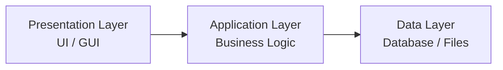
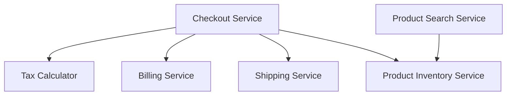
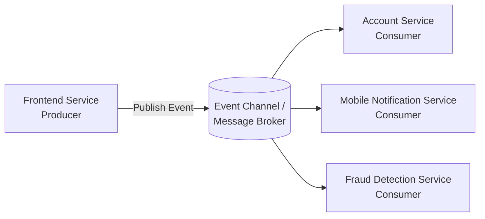
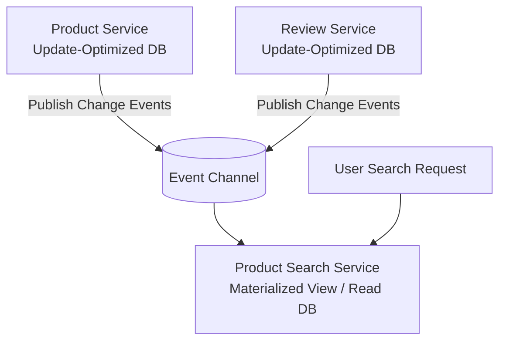

# 🏗 Software Architecture — Lecture 7: Software Architecture Patterns & Styles

- <i>**Course:** Software Architecture (Instructor: Michael)
- **Session Focus:** What software architectural patterns are and why we follow them, **Multilayer Architecture** (three-tier, two-tier, and four-tier variations), **Microservices Architecture** (motivation, benefits, and best practices), and **Event-Driven Architecture** including the **Event Sourcing** and **CQRS** patterns.</i>

---

## 📑 Table of Contents

1. [Session Overview](#-session-overview)
2. [Learning Objectives](#-learning-objectives)
3. [Detailed Notes](#-detailed-notes)
   - [1. Introduction to Software Architectural Patterns](#1-introduction-to-software-architectural-patterns)
   - [2. Multilayer Architecture and Three-Tier Architecture](#2-multilayer-architecture-and-three-tier-architecture)
   - [3. Multilayer Architecture — Other Variations](#3-multilayer-architecture--other-variations)
   - [4. Microservices Architecture — Motivation and Benefits](#4-microservices-architecture--motivation-and-benefits)
   - [5. Microservices Architecture — Best Practices](#5-microservices-architecture--best-practices)
   - [6. Event-Driven Architecture — Fundamentals and Benefits](#6-event-driven-architecture--fundamentals-and-benefits)
   - [7. Event Sourcing and CQRS](#7-event-sourcing-and-cqrs)
4. [Glossary](#-glossary)
5. [Revision Notes](#-revision-notes)
6. [Cheat Sheet](#-cheat-sheet)
7. [Interview Q&A](#-interview-qa)
   - [🟢 Beginner](#-beginner-questions)
   - [🟡 Intermediate](#-intermediate-questions)
   - [🔴 Advanced](#-advanced-questions)
8. [Scenario-Based Interview Questions](#-scenario-based-interview-questions)
9. [Hands-on Exercises](#-hands-on-exercises)
10. [Practice Assignment](#-practice-assignment)
11. [Additional Resources](#-additional-resources)
12. [Final Revision Sheet](#-final-revision-sheet)

---

## 🎯 Session Overview

With building blocks (Lecture 5) and databases (Lecture 6) established, this lecture zooms out to the level of **overall system architecture**. Michael introduces **software architectural patterns** — reusable, industry-proven solutions to system-design problems — and contrasts them with code-level design patterns.

The lecture then walks through three major architectural patterns in increasing order of organizational scale and complexity: **Multilayer Architecture** (including the classic Three-Tier pattern), **Microservices Architecture**, and **Event-Driven Architecture** — the last of which introduces two particularly powerful sub-patterns, **Event Sourcing** and **CQRS (Command Query Responsibility Segregation)**.

---

## 🎯 Learning Objectives

By the end of this session, you will be able to:

- Define a software architectural pattern and distinguish it from a code-level design pattern.
- Explain the three motivations for following established architectural patterns, including avoiding the **Big Ball of Mud** anti-pattern.
- Describe Multilayer Architecture, its two structural constraints, and the responsibilities of each layer in Three-Tier Architecture.
- Identify when Three-Tier Architecture is optimal and when its monolithic nature becomes a liability.
- Compare Single-Tier, Two-Tier, Three-Tier, and Four-Tier variations of Multilayer Architecture.
- Explain the motivation, benefits, and best practices (Single Responsibility Principle, Database per Service) of Microservices Architecture.
- Describe Event-Driven Architecture's components (Emitters, Channel, Consumers) and how it decouples microservices.
- Explain the Event Sourcing pattern and how it reconstructs state by replaying immutable events.
- Explain the CQRS pattern and the two distinct problems it solves.

---

## 📚 Detailed Notes

### 1. Introduction to Software Architectural Patterns

#### 📖 Definition

> "**Software architectural patterns** are general, reusable solutions to common system-design problems... common solutions to software-engineering problems that involve multiple components running as separate units at runtime, such as applications or services."

This distinguishes them from **design patterns** (Singleton, Factory, Strategy), which organize code *within* a single application, rather than across multiple runtime components.

#### ❓ Why It Exists — Three Motivations

1. **Save time and resources** — reuse proven solutions from companies with similar use cases and scale, instead of reinventing the wheel.
2. **Avoid the Big Ball of Mud** — an anti-pattern where a system has no clear structure: every service talks to every other service, everything is tightly coupled, information is duplicated globally, and no component has clear ownership.
3. **Enable maintainability across engineers** — a well-known pattern lets other engineers understand and continue the architecture just by recognizing the pattern.

> "All of the software architectural patterns we will learn are simply **guidelines**. Ultimately, our job is to determine the best software architecture for our particular use case."

#### 🎯 Key Takeaways

Architectures evolve: a pattern that fit a system once may stop fitting as it grows, requiring **refactoring** or migration to a new pattern — a well-trodden path other companies have already navigated.

---

### 2. Multilayer Architecture and Three-Tier Architecture

#### 📖 Definition

> "Multilayer architecture organizes our system into multiple physical and logical layers. **Logical separation** limits the scope of responsibility at each layer, while **physical separation** allows each layer to be deployed, upgraded, and scaled independently by different teams."

**Multilayer vs. Multi-Tier** (often confused):

* **Multilayer** = internal logical separation *within a single application*; at runtime it still runs as one unit/tier.
* **Multi-Tier** = the layers actually run on **separate infrastructure**.

#### ⚖ Advantages & Limitations — Structural Constraints

Two constraints simplify the design:

1. Adjacent tiers communicate via a **Client-Server model** (ideal for RESTful APIs).
2. Communication that **skips tiers** is discouraged, keeping layers loosely coupled.

#### 🧠 Concept: Three-Tier Architecture

| Layer | Also Known As | Responsibility |
|---|---|---|
| **Presentation Layer** | UI Layer | Displays information, takes user input via a GUI (web page, mobile app, desktop app). **No business logic** — client-side code is visible/modifiable by the user. |
| **Application Layer** | Business Layer / Logic Layer | Implements functional requirements; processes data from the Presentation Layer and applies business logic. |
| **Data Layer** | — | Stores and persists user and business data (files, and most commonly, a database). |

#### 🏢 Real-World/Production Usage — Why Three-Tier Is Popular

> "This model fits almost any web-based service, whether it is an online store, a news website, or even a video or audio streaming service."

Scaling story:

* **Presentation Layer** — scales itself (runs on user devices).
* **Application Layer** — kept **stateless** (as with a REST API), so instances sit behind a **load balancer** and scale horizontally.
* **Data Layer** — scaled via **replication** and **sharding** (Lecture 6 techniques), if using an established distributed database.

Also easy to maintain since all logic lives in one place (the Application Layer) — no need to integrate multiple codebases.

#### ⚠ Common Mistakes / When Three-Tier Stops Working

> "This drawback is the **monolithic nature of our Logic Layer**."

Two consequences of concentrating all logic in a single codebase/runtime unit:

1. **Performance:** each instance becomes CPU/memory-intensive (worse with managed languages like Java/C# due to longer garbage-collection cycles), forcing expensive and limited **vertical scaling**.
2. **Development velocity:** a larger, more complex codebase is harder to maintain; adding developers increases **merge conflicts** rather than proportional productivity. Logical modularization helps somewhat, but modules remain tightly coupled because they can't be released independently — only with the whole application. **Organizational scalability is limited.**

> "Three-tier architecture is an optimal choice for companies whose codebase is relatively small and not overly complex, and which is maintained by a relatively small team of developers."

---

### 3. Multilayer Architecture — Other Variations

#### 📖 Definition

| Variation | Structure | Notes |
|---|---|---|
| **Single-Tier** | A standalone application | Simplest case. |
| **Two-Tier** | Upper tier = Presentation **+** Business Logic combined; lower tier = Data Layer | Eliminates the middle Logic Layer overhead; faster, more native UX; e.g., a desktop/mobile document/image/music editor where storage and backup happen on a remote server. |
| **Three-Tier** | Presentation / Application / Data | Covered above — the most common pattern. |
| **Four-Tier** | Adds an **API Gateway Layer** between Presentation and Business Layer | Handles security, API/format translation, and caching when multiple client types have different API/data/performance needs. |

#### ⚠ Common Mistakes

> "Having more than four tiers is extremely rare because additional tiers usually do not provide much value and simply add additional performance overhead."

The overhead comes from the anti-skip-layer restriction: every client request may pass through multiple services, increasing response latency.

#### 💡 Memory Trick

1-tier = standalone app. 2-tier = UI+Logic together, Data separate. 3-tier = UI / Logic / Data, cleanly split. 4-tier = adds an API Gateway layer for multi-client needs.

---

### 4. Microservices Architecture — Motivation and Benefits

#### ❓ Why It Exists

> "As the size and complexity of our codebase grow, it becomes extremely difficult to troubleshoot it, add new features, build the entire codebase, test it, and even load it into our **IDE**."

Monolithic three-tier architecture starts to strain both technically (build/test/troubleshoot difficulty) and organizationally (more engineers → more merge conflicts, longer/less-productive meetings) as scale grows. At that point, teams should consider **migrating toward microservices**.

#### 📖 Definition

> "**Microservices Architecture** organizes our business logic as a collection of loosely coupled and independently deployable services. Each service is owned by a small team and has a **narrow scope of responsibility**."

#### ⚖ Advantages & Limitations — Benefits

| Category | Benefits |
|---|---|
| **Development** | Smaller codebase per service → loads instantly in IDE, faster build/test, easier troubleshooting and onboarding of new developers. |
| **Performance & Scalability** | Each instance is less CPU/memory-intensive, runs on **commodity hardware**, and can be scaled horizontally with more low-cost instances. |
| **Organizational** | Each service is developed/deployed independently by a small team with full autonomy over language, framework, and release process — high overall productivity. |
| **Fault Isolation** | A crash or problem in one service is easier to isolate and mitigate than in a single monolith. |

#### ⚠ Common Mistakes

> "Many organizations jump into microservices too quickly without considering two major factors."

1. These benefits are **not automatic** — simply splitting a monolith into a random collection of services can recreate the **Big Ball of Mud** if best practices aren't followed.
2. Microservices bring **considerable overhead and challenges** that must be weighed before migrating — services must be logically separated so a typical system change stays within a single service/team, or cross-team coordination overhead erases the benefit.

---

### 5. Microservices Architecture — Best Practices

#### 🪜 Step-by-Step: Best Practice 1 — Single Responsibility Principle

> "Each service should be responsible for only **one business capability, domain, resource, or action**."

**Online dating example** (domain-oriented split):

* **User Profile Service** — profile data and interactions.
* **Photo Service** — storing, resizing, displaying photos.
* **Matching Service** — matches users based on rules/preferences (communicates with User Profile Service).
* **Billing Service** — charges for services (communicates with User Profile Service to unlock features).

**E-commerce example** (action- and entity-oriented split):

* **Product Search Service** — search queries → personalized product results.
* **Product Inventory Service** — encapsulates the Product entity.
* **Checkout Service** — cart, tax, coordinates the purchase transaction.
* **Tax Calculator** — computes tax from product price, category, and location.
* **Billing Service**, **Shipping Service** — entity-oriented services coordinated by Checkout.

> The monolithic **API Gateway** can also be split into multiple, more specialized/lightweight gateway services per client type.

#### 🪜 Step-by-Step: Best Practice 2 — Database per Service

> "If each service has its own database, the database essentially becomes an **implementation detail** of that service and can easily be updated or replaced completely transparently to the rest of the system."

Sharing one database across services means every schema change needs cross-team coordination — reintroducing coupling. Splitting data across per-service databases requires deliberately dividing data so each service can operate mostly independently; some **data duplication** is an accepted overhead.

#### 🎯 Key Takeaways

> "It is always better to start with a simple monolithic approach first, and only when that architecture stops working for us should we consider microservices."

---

### 6. Event-Driven Architecture — Fundamentals and Benefits

#### ❓ Why It Exists

> "If **Microservice A** wants to communicate with **Microservice B**, Microservice A not only needs to be aware that Microservice B exists, but it also needs to know what API Microservice B provides... Microservice A is essentially dependent on Microservice B."

Direct synchronous microservice-to-microservice calls reintroduce coupling. **Event-Driven Architecture (EDA)** replaces direct commands/requests with **events**.

#### 📖 Definition

> "An **event** is an immutable statement of a fact or a change."

* **Fact events** — e.g., a user clicking an ad, an item added to a cart.
* **Change events** — e.g., a game player or IoT device (vacuum cleaner) moving position.

**Three components:**

| Component | Also Called | Role |
|---|---|---|
| **Event Emitters** | Producers | Send events on the sender side. |
| **Event Channel** | — | The **message broker** (Lecture 5) sitting between producers and consumers. |
| **Event Consumers** | — | Receive/process events on the receiving side. |

#### ⚙ How It Works — Decoupling and Extensibility

Since Microservice A doesn't wait for a response and doesn't need to know Microservice B exists, dependency and coupling are removed — improving **scalability**. New services can subscribe to the same channel **without touching existing services**.

**Banking system example:** Frontend Service (producer) → Account Service (consumer, updates balance). Later, a **Mobile Notification Service** and a **Fraud Detection Service** are added purely as new subscribers — no changes needed to the Frontend Service.

#### 🏢 Real-World/Production Usage — Real-Time Analysis

> "Event-Driven Architecture allows us to analyze data streams, detect patterns, and act on them in real time."

Example: the Fraud Detection Service notices two transactions in Los Angeles within the last hour, plus another transaction far away in a different state — or five transactions in too short a window to be human — and flags fraud in real time, without waiting for batch processing. It can then message the Account Service (freeze the account) and the Notification Service (alert the user).

---

### 7. Event Sourcing and CQRS

#### 📖 Definition: Event Sourcing

> "Using the **Event Sourcing** pattern, instead of storing the current state in a database, we can simply store the events. These events can be replayed whenever we need to determine the current state, eliminating the need for the database."

Since events are **immutable**, they are never modified — only **appended**. Replaying a user's full event log (e.g., all banking transactions from the beginning) reconstructs the current state (account balance).

#### ⚙ How It Works — Event Sourcing in Practice

* A separate service can generate an account statement or search recent activity just by examining the last **N events**.
* An unauthorized transaction can be corrected with a **compensating event** (e.g., crediting $100 back) rather than freezing the account or mutating records — the correction is immediately reflected in the statement.
* **Snapshot events** (e.g., monthly summaries) can be added to speed up queries over long histories, while still retaining full historical detail (e.g., statements from 5–10 years ago).

#### 📖 Definition: CQRS

> "**CQRS** stands for **Command Query Responsibility Segregation**... allows us to separate update and read operations into separate databases behind separate services."

#### ❓ Why It Exists — Two Problems CQRS Solves

**Problem 1 — Read/write contention:** a database with a large, roughly equal mix of reads and updates suffers because concurrent operations interfere with each other, and a distributed database can typically only be optimized for one access pattern at the expense of the other.

> Solution: **Service A** handles updates (writes to its own update-optimized database and publishes an event per update). **Service B** subscribes to those events and applies them to its own **read-optimized database**. All reads go only to Service B — updates and reads no longer interfere, and each store is optimized for its own workload.

**Problem 2 — Cross-service joins:** once each microservice owns its own database (per the Database-per-Service best practice), a SQL JOIN across services is no longer possible in one query — requests must go to each service separately and be combined programmatically, which is slow and complicated by differing database technologies.

> Solution: **Service C** subscribes to change events from Service A and Service B and maintains a **materialized view** — a pre-joined, query-ready representation — in its own read-only database. Clients query Service C directly instead of querying A and B separately.

#### 🏢 Real-World/Production Usage — Online Store Example

An online store has a **Product Service** (name, inventory, price) and a **Review Service** (frequent review updates). Users need fast, joined search results combining product info with reviews/ratings. A **Product Search Service** subscribes to updates from both, storing an aggregated, query-ready dataset — letting users search, sort, and filter by rating or review count extremely quickly, with a single request.

#### 🎯 Key Takeaways

| Pattern | Solves | Mechanism |
|---|---|---|
| **Event Sourcing** | Reconstructing/auditing historical state without mutable records | Store immutable events; replay to derive state; correct via compensating events |
| **CQRS** | Read/write contention + cross-service joins | Separate read/write databases per responsibility; materialized views built from subscribed events |

---

## 📝 Glossary

| Term | Definition |
|---|---|
| **Software Architectural Pattern** | A general, reusable solution to a system-design problem involving multiple runtime components. |
| **Design Pattern** | A code-organization solution (e.g., Singleton, Factory) within a single application — distinct from an architectural pattern. |
| **Big Ball of Mud** | An anti-pattern where a system has no clear structure — tightly coupled, duplicated, unowned components. |
| **Multilayer Architecture** | Organizing a system into logical/physical layers, each with a narrow scope of responsibility. |
| **Multi-Tier Architecture** | A multilayer system where each layer runs on separate, independent infrastructure. |
| **Presentation Layer** | The UI layer; displays information and takes user input; contains no business logic. |
| **Application (Business/Logic) Layer** | The layer implementing functional requirements and business rules. |
| **Data Layer** | The layer responsible for storing/persisting data (files, databases). |
| **Two-Tier Architecture** | Presentation + Business Logic combined in one tier, Data Layer separate. |
| **Four-Tier Architecture** | Three-Tier plus an added API Gateway Layer for handling multiple client types. |
| **Microservices Architecture** | A collection of loosely coupled, independently deployable services, each with a narrow responsibility. |
| **Single Responsibility Principle (Microservices)** | Each service handles one business capability, domain, resource, or action. |
| **Database per Service** | Best practice where each microservice owns an independent database. |
| **Event-Driven Architecture (EDA)** | An architecture where components communicate via immutable events rather than direct calls. |
| **Event** | An immutable statement of a fact or a change. |
| **Event Emitter / Producer** | The component that sends (publishes) events. |
| **Event Consumer** | The component that receives and processes events. |
| **Event Channel** | The message broker connecting producers and consumers in EDA. |
| **Event Sourcing** | Storing state as an append-only, immutable log of events, replayed to derive current state. |
| **Compensating Event** | An appended event that corrects a prior one, without mutating history. |
| **Snapshot Event** | A periodic summary event that speeds up state reconstruction over a long event log. |
| **CQRS (Command Query Responsibility Segregation)** | Separating read and update operations into different services/databases. |
| **Materialized View** | A precomputed, query-ready, joined representation of data from multiple services. |

---

## 🔄 Revision Notes

### ⚡ One-Minute Revision

* **Architectural patterns** = reusable, proven solutions across runtime components (not code-level design patterns). Followed to save time, avoid the Big Ball of Mud, and stay maintainable across engineers — but they're guidelines, not rules.
* **Multilayer/Three-Tier** = Presentation (UI, no logic) / Application (business logic, stateless, load-balanced) / Data (replicated/sharded). Popular, easy to build, but its monolithic Logic Layer limits performance (vertical scaling) and organizational scalability (merge conflicts). Variations: Single-Tier, Two-Tier (UI+Logic combined), Four-Tier (adds API Gateway Layer).
* **Microservices** = small, independently deployable, narrowly-scoped services. Big wins in dev speed, performance/scalability, org scalability, and fault isolation — but only pays off past a certain complexity/scale, and requires discipline (Single Responsibility Principle, Database per Service) to avoid becoming a distributed Big Ball of Mud.
* **Event-Driven Architecture** = Emitters → Event Channel (message broker) → Consumers; events are immutable facts/changes. Removes direct service-to-service dependency, enabling easy extensibility and real-time stream analysis (e.g., fraud detection).
* **Event Sourcing** = store immutable events, replay to reconstruct state; correct via compensating events; speed up with snapshots.
* **CQRS** = separate read/write databases per service to solve read/write contention and cross-service joins; materialized views replace SQL JOINs across microservice boundaries.

---

## 📋 Cheat Sheet

| Pattern | Best For | Key Risk / Limitation |
|---|---|---|
| Three-Tier Architecture | Small-to-medium codebase, small team, wide variety of web use cases | Monolithic Logic Layer → vertical scaling limits, merge conflicts, limited org scalability |
| Two-Tier Architecture | Feature-rich desktop/mobile apps needing native, fast UX | No middle logic layer — logic lives client-side |
| Four-Tier Architecture | Multiple client types needing different APIs/formats/caching | Added latency/overhead per extra tier |
| Microservices Architecture | Large, complex codebases; large engineering orgs | Requires Single Responsibility + Database per Service discipline, or becomes a distributed Big Ball of Mud |
| Event-Driven Architecture | Decoupling microservices; real-time stream analysis | Async design complexity; no direct request/response |
| Event Sourcing | Auditable history, easy corrections, time-travel queries | Must replay events (mitigated with snapshots) |
| CQRS | Read/write contention; cross-service joins | Extra services/databases and eventual consistency between write and read sides |

---

## 🔥 Interview Q&A

### 🟢 Beginner Questions

**Q1.** What is a software architectural pattern, and how does it differ from a design pattern like Singleton or Factory?

A software architectural pattern is a reusable solution to a system-design problem involving multiple runtime components (applications/services), while a design pattern like Singleton or Factory organizes code within a single application.

**Q2.** What is the "Big Ball of Mud" anti-pattern?

A system with no clear structure: every service communicates with every other service, everything is tightly coupled, information is duplicated or global, and no component has clear ownership.

**Q3.** What are the three layers of Three-Tier Architecture, and what is each responsible for?

Presentation Layer (UI, no business logic), Application Layer (business logic/functional requirements), and Data Layer (storing/persisting data).

**Q4.** Why should the Presentation Layer never contain business logic?

Because client-side code (e.g., in a browser) is visible and can be modified by users, so business rules placed there could be seen or tampered with.

**Q5.** What is the primary drawback of Three-Tier Architecture as a system scales?

The monolithic nature of the Application/Logic Layer — it becomes CPU/memory-intensive (requiring expensive vertical scaling) and increasingly hard to develop and maintain as the codebase and team grow.

**Q6.** What is the Single Responsibility Principle as applied to microservices?

Each microservice should be responsible for only one business capability, domain, resource, or action.

**Q7.** Why does each microservice need its own database?

To keep the database an implementation detail of that service, avoiding cross-team coordination for every schema change and keeping services independently deployable.

**Q8.** What are the three main components of Event-Driven Architecture?

Event Emitters (Producers), the Event Channel (message broker), and Event Consumers.

**Q9.** What is Event Sourcing?

A pattern where instead of storing current state, we store an immutable, append-only log of events and replay them to reconstruct the current state whenever needed.

**Q10.** What does CQRS stand for, and what is its core idea?

Command Query Responsibility Segregation — separating update (write) and read operations into separate services/databases, each optimized for its own workload.

### 🟡 Intermediate Questions

**Q11.** Explain the difference between "Multilayer" and "Multi-Tier" architecture.

Multilayer refers to internal logical separation within a single application that still runs as one runtime unit; Multi-Tier means the layers actually run on separate, independent infrastructure.

**Q12.** What are the two structural constraints of Multilayer Architecture, and why do they matter?

(1) Adjacent tiers communicate via a Client-Server model (fits RESTful APIs); (2) communication must not skip tiers. Both constraints keep layers loosely coupled, so a change to one layer doesn't ripple through the entire system.

**Q13.** Why does adding more engineers to a monolithic three-tier codebase not proportionally increase productivity?

Because a larger, shared, tightly-coupled codebase leads to more concurrent development conflicts (merge conflicts) and coordination overhead, offsetting the benefit of additional headcount — this is the "organizational scalability" limitation.

**Q14.** How does Event-Driven Architecture remove the dependency between Microservice A and Microservice B compared to direct synchronous calls?

With direct calls, A must know B exists, know its API, and wait synchronously for a response. With EDA, A simply publishes an event to the channel without knowing which (if any) consumers exist or waiting for any response — dependency and synchronous coupling are both eliminated.

**Q15.** How does the CQRS pattern solve the problem of joining data across microservices that each own separate databases?

By introducing a service (e.g., Service C) that subscribes to change events published by the owning services and maintains a precomputed **materialized view** — a joined, query-ready dataset — in its own read-only database, so a client can query it directly instead of requesting and manually combining data from each service.

### 🔴 Advanced Questions

**Q16.** A company's engineering team of 200 developers works on a single three-tier monolith and reports frequent merge conflicts, slow builds, and long meetings. Diagnose the root cause using concepts from this lecture, and outline what migration path you'd recommend and why.

Root cause: the monolithic Application/Logic Layer forces all business logic into one shared, tightly-coupled codebase, limiting organizational scalability — more engineers means more concurrent changes to the same codebase, hence more merge conflicts and coordination overhead, regardless of team size. Recommended path: migrate toward Microservices Architecture, but only after establishing the Single Responsibility Principle (splitting by business capability/domain) and Database per Service, to avoid recreating a distributed Big Ball of Mud; consider Event-Driven Architecture to decouple the resulting services further.

**Q17.** Design a solution using patterns from this lecture for an online store where product inventory updates are relatively infrequent but user reviews arrive constantly, and users need fast, combined product+review search results. Explain which pattern(s) you'd apply and why plain database joins are no longer sufficient.

Once the store splits into a Product Service and a Review Service (microservices, each with its own database, per the Database-per-Service best practice), a SQL JOIN across their now-separate databases is no longer directly possible — a request must be sent to each service separately and combined programmatically, which is slow. Apply CQRS: introduce a Product Search Service that subscribes to update events from both the Product Service and Review Service (via an Event-Driven Architecture) and maintains a materialized view combining product and review data in its own read-optimized database, so search/sort/filter requests are served quickly from a single service.

---

## 🧪 Scenario-Based Interview Questions

**Scenario 1:** A 5-person startup is building an MVP for a niche B2B SaaS product with a small, simple feature set. They're debating whether to start with Microservices Architecture "to do it right from day one" or a Three-Tier monolith. What would you recommend, and why, referencing the trade-offs from this lecture?

*Consider: "It is always better to start with a simple monolithic approach first, and only when that architecture stops working for us should we consider microservices." A small team with a small, simple codebase gets little benefit from microservices' organizational-scalability advantages, but pays its full overhead (per-service databases, event infrastructure, cross-team coordination discipline) immediately — a Three-Tier monolith fits the stated criteria (small codebase, small team) far better and can be migrated later if/when it stops working.*

**Scenario 2:** A banking platform using Event-Driven Architecture needs to let customer support agents pull up a customer's full 7-year transaction history instantly, and also needs a Fraud Detection Service to correct a fraudulent charge without ever "editing" a financial record (for audit/compliance reasons). Which pattern addresses both needs, and how would you keep long-history queries fast?

*Consider: Event Sourcing — store the immutable append-only event log for each account; the Fraud Detection Service corrects a fraudulent charge by appending a compensating event (e.g., crediting the amount back) rather than mutating any existing record, satisfying the audit/compliance requirement. To keep 7-year queries fast, add periodic snapshot events (e.g., monthly) summarizing state up to that point, so replay only needs to start from the most recent snapshot rather than the beginning of time.*

---

## 🛠 Hands-on Exercises

**🟢 Easy:** Draw (or describe in words) a Three-Tier Architecture diagram for a simple blog website, labeling what belongs in each layer (Presentation, Application, Data) and explaining why the "no business logic in the Presentation Layer" rule applies to a specific piece of blog functionality (e.g., checking if a user is allowed to edit a post).

**🟡 Medium:** Take the online-dating microservices example (User Profile, Photo, Matching, Billing Services) and design one additional microservice (e.g., a "Messaging Service" for chat between matched users). Specify its single responsibility, which existing services it needs to communicate with, and whether that communication should be synchronous or event-driven, and why.

**🔴 Advanced:** Design a CQRS solution for a social-media platform where "post creation" is relatively rare compared to "viewing a feed" (extremely read-heavy). Specify: (1) which service owns writes, (2) which service(s) own the read-optimized view, (3) what event(s) get published on a new post, and (4) how a materialized view would need to be structured to serve a fast, ranked home feed.

---

## 🏗 Practice Assignment

You are the lead architect for a **ride-sharing platform** ("RideGo") currently running as a Three-Tier monolith, now growing to 500,000 daily active riders and 300 engineers. Design the next-generation architecture, addressing:

1. Diagnose, using concepts from this lecture, why the current Three-Tier monolith is likely struggling at this scale (both performance and organizational angles).
2. Propose a Microservices decomposition, listing at least 5 services, and justify each service's boundary using the Single Responsibility Principle. Include at least one action-oriented service and one entity-oriented service.
3. Identify two places in your design where Event-Driven Architecture would remove a direct service-to-service dependency, and describe the event(s) involved.
4. Identify one place where a CQRS pattern would help (e.g., ride-matching read-heavy queries vs. driver-location update-heavy writes) and describe the read-side and write-side services and how a materialized view would be structured.
5. Identify one place where Event Sourcing would be valuable (e.g., a ride's trip history/billing dispute resolution) and explain how compensating events would handle a fare-correction scenario.

---

## 📚 Additional Resources

- Fowler, M. — "Microservices" (martinfowler.com), a foundational overview of the microservices architectural style
- Fowler, M. — articles on Event Sourcing and CQRS (martinfowler.com), covering both patterns in depth with worked examples
- Foote, B. & Yoder, J. — "Big Ball of Mud" (1997), the original paper describing the anti-pattern
- Vendor/framework documentation for message brokers commonly used in Event-Driven Architecture (e.g., Apache Kafka, RabbitMQ) as the Event Channel implementation
- Newman, S. — *Building Microservices* (O'Reilly), for a deeper treatment of service boundaries and the Database-per-Service pattern

---

## 📌 Final Revision Sheet

* ⭐ **Architectural Patterns** = reusable, cross-component solutions (not code-level design patterns); followed to save time, avoid the Big Ball of Mud, and stay maintainable — but remain guidelines, adapted to context.
* ⭐ **Three-Tier Architecture** = Presentation (no logic) / Application (business logic, stateless, load-balanced) / Data (replicated/sharded). Great for small-to-medium codebases; its monolithic Logic Layer eventually limits both performance (vertical scaling) and organizational scalability (merge conflicts).
* ⭐ **Multilayer variations**: Single-Tier (standalone), Two-Tier (UI+Logic combined, Data separate), Four-Tier (adds API Gateway Layer for multi-client needs). More than 4 tiers rarely pays off due to latency overhead.
* ⭐ **Microservices Architecture** = small, independently deployable, narrowly-scoped services; wins in dev speed, performance, org scalability, and fault isolation — but only past sufficient scale, and only with discipline: **Single Responsibility Principle** + **Database per Service**.
* ⭐ **Event-Driven Architecture** = Emitters → Event Channel (message broker) → Consumers; events are immutable facts/changes; removes direct service dependencies, enables easy extensibility and real-time analysis (e.g., fraud detection).
* ⭐ **Event Sourcing** = store immutable events, replay to reconstruct state; corrections via compensating events; snapshots speed up long histories.
* ⭐ **CQRS** = separate read/write databases per service; solves read/write contention and enables cross-service joins via materialized views built from subscribed events.
* ⭐ Common theme: every pattern trades **added structural/operational complexity** for **decoupling, scalability, or maintainability** — the right choice always depends on current scale and organizational needs, not novelty.