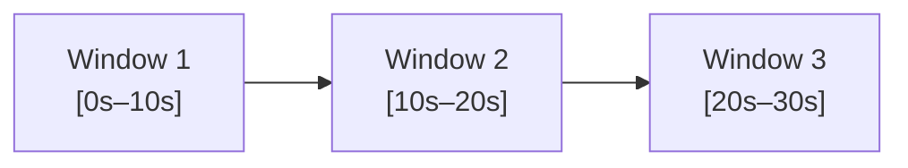
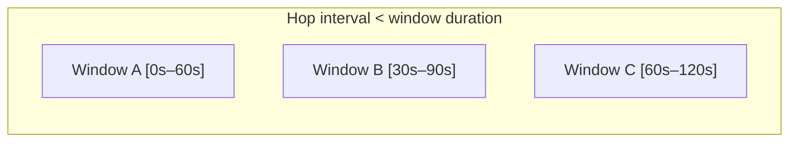
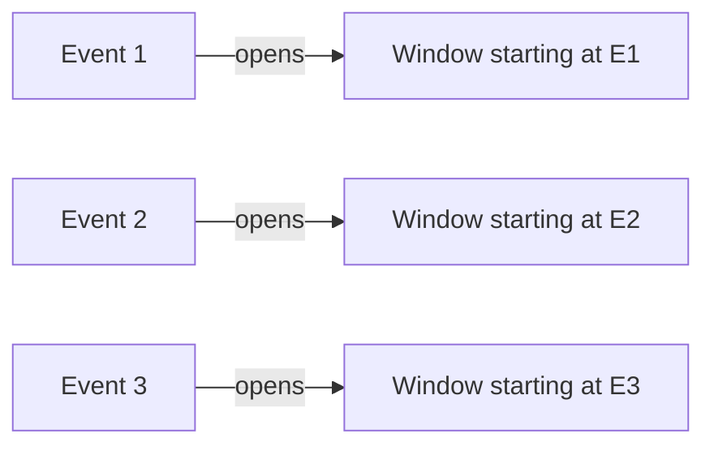
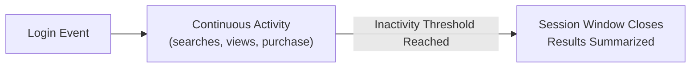
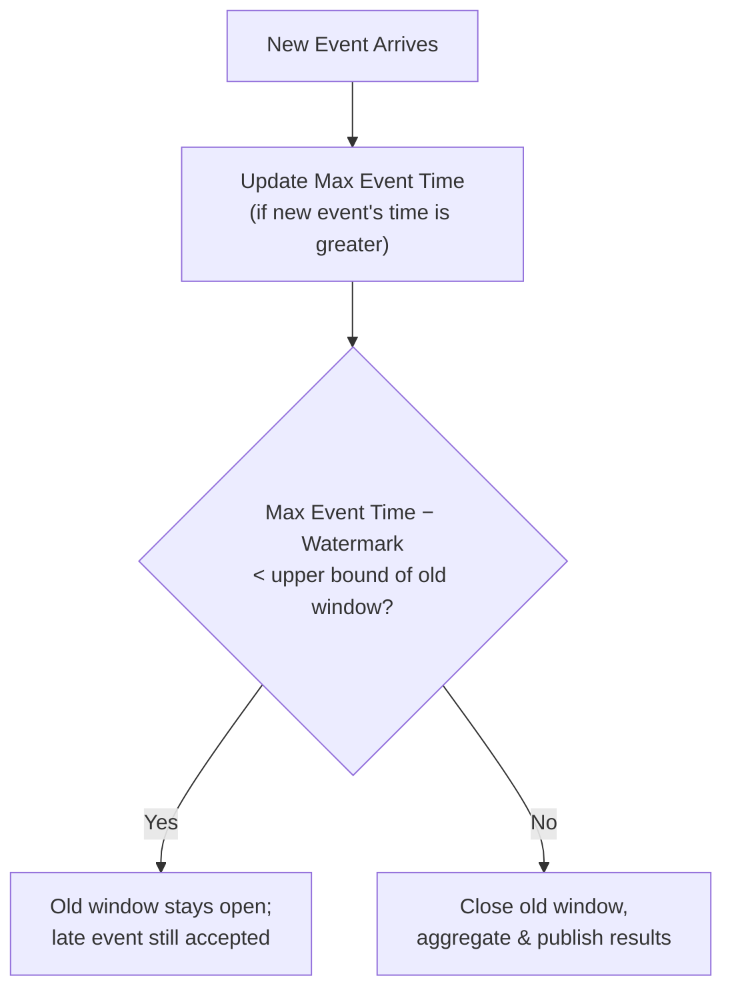

# 🏗 Software Architecture — Lecture 8: Strategies for Processing Infinite Streams of Events

- <i>**Course:** Software Architecture (Instructor: Michael)
- **Session Focus:** Building on Event-Driven Architecture, this lecture covers strategies for processing **unbounded/infinite streams of events** — the **Tumbling**, **Hopping**, **Sliding**, and **Session Window** strategies — plus **Event Time vs. Arrival Time vs. Processing Time**, and how to handle **late and out-of-order events** using grace periods and watermarking.</i>

---

## 📑 Table of Contents

1. [Session Overview](#-session-overview)
2. [Learning Objectives](#-learning-objectives)
3. [Detailed Notes](#-detailed-notes)
   - [1. Introduction to Processing Infinite Streams of Events](#1-introduction-to-processing-infinite-streams-of-events)
   - [2. Tumbling Window](#2-tumbling-window)
   - [3. Hopping Window](#3-hopping-window)
   - [4. Sliding Window](#4-sliding-window)
   - [5. Session Window](#5-session-window)
   - [6. Event Timing: Event Time, Arrival Time, and Processing Time](#6-event-timing-event-time-arrival-time-and-processing-time)
   - [7. Handling Late and Out-of-Order Events](#7-handling-late-and-out-of-order-events)
4. [Glossary](#-glossary)
5. [Revision Notes](#-revision-notes)
6. [Cheat Sheet](#-cheat-sheet)
7. [Interview Q&A](#-interview-qa)
   - [🟢 Beginner](#-beginner-questions)
   - [🟡 Intermediate](#-intermediate-questions)
   - [🔴 Advanced](#-advanced-questions)
8. [Scenario-Based Interview Questions](#-scenario-based-interview-questions)
9. [Hands-on Exercises](#-hands-on-exercises)
10. [Practice Assignment](#-practice-assignment)
11. [Additional Resources](#-additional-resources)
12. [Final Revision Sheet](#-final-revision-sheet)

---

## 🎯 Session Overview

Building on Event-Driven Architecture (Lecture 7), this lecture addresses a problem specific to systems that consume continuous, unbounded event streams: since we cannot analyze an infinite stream all at once, we need strategies to slice it into finite, manageable chunks — **windows**. Michael walks through four windowing strategies of increasing flexibility and cost — **Tumbling**, **Hopping**, **Sliding**, and **Session** windows — each solving specific limitations of the one before it, using running examples from IoT sensors, e-commerce, fraud detection, API rate limiting, and user-behavior analytics.

The lecture closes with the equally important question of **when** an event happened: the distinction between **Event Time**, **Arrival Time**, and **Processing Time**, and two strategies — **grace periods** and **watermarking** — for correctly handling events that arrive late or out of order.

---

## 🎯 Learning Objectives

By the end of this session, you will be able to:

- Explain why unbounded event streams require windowing strategies for aggregation and analysis.
- Describe the Tumbling Window strategy, its use cases, and its granularity/pattern-detection limitations.
- Describe the Hopping Window strategy, the role of the hop interval, and how it relates to the Tumbling Window as a special case.
- Explain the Sliding Window strategy and why its dynamic, event-driven windows solve pattern-detection edge cases that Tumbling and Hopping Windows miss.
- Explain the Session Window strategy, its dynamic inactivity-based boundaries, and its per-key (not global) nature.
- Distinguish Event Time, Arrival Time, and Processing Time, and decide which to use for a given use case.
- Explain the grace-period and watermarking strategies for handling late and out-of-order events, including their trade-offs.

---

## 📚 Detailed Notes

### 1. Introduction to Processing Infinite Streams of Events

#### ❓ Why It Exists

> "Typically, we have an **infinite stream of events** that we need to process. This data can come from external sources such as user activity in web applications, sensor data from IoT devices, or third-party services... our internal microservices also produce streams of events that other microservices subscribe to and process."

#### 🧠 Concept

Some events can be processed **in isolation** — e.g., a video-on-demand subscription event consumed independently by the User Service, Notification Service, and Recommendation Service. But many use cases require **aggregating and analyzing a sequence of events**, where a single event alone is not informative enough:

* Anomaly detection
* Fraud detection
* Pattern recognition
* Rate limiting
* Recommendation systems

> "Analyzing an infinite stream of data is impossible. Instead, we use finite subsets of events by slicing these continuous streams into manageable chunks of data." Using finite **windows**, we can analyze data streams in near real time.

These strategies are common both in Event-Driven microservices and in **Big Data pipelines**, where volumes are unbounded and extremely large.

---

### 2. Tumbling Window

#### 📖 Definition

> "The consumer application or microservice divides time into fixed, consecutive, non-overlapping intervals, where each event belongs to exactly one window."

When a window ends, the consumer aggregates its events into a single result (sum, average, summary, etc.), which can become a new published event, a dashboard data point, an alert, or a database record. Once closed, a new window of the same fixed duration opens, and **old data is discarded**.

#### 🔍 Internal Working

> "The **message broker is generally unaware of these windows**. The consumer is fully responsible for temporarily storing these events, usually in memory, until the window expires... This means that the longer the window duration, the more memory this strategy requires."

#### 🏢 Real-World/Production Usage

* **Sensor averaging** — e.g., a 10-second average of temperature or power-consumption readings; a **trimmed mean** (discarding the top/bottom 10% of values) filters out faulty sensor readings for a cleaner average.
* **Manufacturing logs** — hourly windows calculating an error rate; if it crosses a threshold, an alert goes to the Notification Service for an on-call engineer.
* **E-commerce revenue** — 24-hour windows aggregating revenue per seller, stored in a database, published to sellers via the Email Service, and sent to the Payment Service (which nets out taxes/fees and pays out via direct deposit).

#### ⚖ Advantages & Limitations

**Advantages:** simplest strategy; minimal memory; low computational overhead; clear time boundaries; each event processed **exactly once** (belongs to exactly one window).

**Disadvantages:**

1. **Lower result granularity** — insight frequency is capped by window size (an hourly error-rate spike is only visible at the end of the hour, by which point damage may already be done).
2. **Poor for pattern/trend detection** — a pattern spanning a window boundary (e.g., 6 errors in window 1 and 5 in window 2 = 11 errors in under an hour, crossing a 10-error/hour alert threshold) can go undetected because each event belongs to only one window and the two counts are never combined.

#### 💡 Memory Trick

Tumbling = non-overlapping, back-to-back windows. Simple, cheap, but blind to anything that straddles a boundary.

---

### 3. Hopping Window

#### ❓ Why It Exists

> "To increase the frequency of results from processing an incoming event stream while still obtaining insights over longer time periods, we can use another strategy called the **Hopping Window**."

Small Tumbling Windows give frequent results but may lack enough events for meaningful insight; large Tumbling Windows give meaningful insight but only infrequently. Hopping Windows decouple these two concerns.

#### 📖 Definition

> "Hopping Windows overlap with each other and are separated by a fixed interval called the **hop interval**." The hop interval can be smaller than, equal to, or greater than the window duration.

* **Hop interval = window duration** → reduces to a **Tumbling Window** (a special case).
* **Hop interval < window duration** → windows **overlap**; the same event can belong to multiple windows (e.g., windows 1, 2, 3, and 4).
* **Hop interval > window duration** → windows have **gaps**, effectively sampling the stream (less common, useful for very high-volume, low-variation data).

#### ⚙ How It Works

A new window opens at every hop interval; once the first window's duration elapses, one window closes at every subsequent hop interval, and the consumer aggregates and publishes results for each closing window independently.

#### 🏢 Real-World/Production Usage

* **Stock trading dashboards** — e.g., a 1-minute or 1-hour window of average/median/max/min price, published every second, for near-real-time trend display.
* **Hourly error-rate monitoring** — keep a 1-hour window but set the hop interval to 1 minute, giving an updated hourly error rate every minute instead of waiting a full hour.

#### ⚖ Advantages & Limitations

**Advantages:** more frequent results than Tumbling Windows (great for dashboards/UIs monitored by humans); window size and result frequency are decoupled — enlarging the window doesn't change how often results publish.

**Disadvantages:** multiple windows open simultaneously → higher memory footprint; each event may be processed multiple times → higher CPU usage; more frequent publishing → higher network usage and more data for downstream consumers.

#### 💡 Memory Trick

Hopping = Tumbling's overlapping cousin. Hop interval < window size → overlapping (frequent updates); hop interval = window size → Tumbling; hop interval > window size → sampling with gaps.

---

### 4. Sliding Window

#### ❓ Why It Exists

> "If we try to use a **Tumbling Window** to detect these anomalies, we can quickly encounter an edge case where six transactions for the same credit card are captured within one window, while another five transactions fall into the next window... the fraud-detection microservice will not detect the suspicious activity, even though we can clearly see that **11 transactions occurred within less than one minute**."

Even a Hopping Window can miss the pattern if the hop interval isn't small enough to guarantee some window fully covers the suspicious cluster of events — and making the hop interval very small wastes resources during low-activity periods (e.g., overnight).

#### 📖 Definition

> "Each new event causes a new fixed-size window to start. However, unlike a Hopping Window, the **hop interval between consecutive windows is dynamic and event-driven rather than based on fixed points in time**."

Windows open only when events actually arrive — frequent events create many overlapping windows; sparse events create fewer windows, saving resources. Once a window's duration elapses and its first event is about to fall out of range, results are calculated, published, and the window closes.

#### 🏢 Real-World/Production Usage

* **Fraud detection** — a window starting with the *first* of a burst of transactions correctly captures all 11 transactions within one minute, triggering an account freeze and user alert.
* **API rate limiting/throttling** — every request/API call is an event; a Sliding Window aggregates events by source (user or client app); exceeding a quota within the window triggers the **API Gateway** to block further requests (helps prevent **DDoS attacks** and keeps response times consistent for other clients).

#### ⚖ Advantages & Limitations

**Advantages:** excellent for **real-time monitoring and pattern detection**; more flexible than Hopping Windows since the hop interval is dynamic and always as small as necessary (a window opens exactly when an event arrives, never missing a pattern by being too coarse).

**Disadvantages:** **highest processing and memory cost of all four strategies** — unlike Tumbling/Hopping Windows (whose window count is fixed regardless of volume), the number of Sliding Windows scales directly with the **number of events**.

#### 💡 Memory Trick

Sliding = event-driven Hopping Window (opens a window per event, not per fixed time tick). Best for catching bursts, most expensive to run.

---

### 5. Session Window

#### ❓ Why It Exists

> "In every case [Tumbling, Hopping, Sliding], the **window size or duration was always fixed**. However, in certain scenarios, we want to analyze a sequence of events that may span a variable amount of time... usually followed by a period of inactivity."

Example: user behavior on a website varies wildly in duration and content per session — none of the fixed-duration strategies fit well.

#### 📖 Definition

> "Each session window starts with a particular type of event" (e.g., **user login**). "The window size is dynamic and depends on the continuous activity of the particular user. When we reach a certain **inactivity threshold**, the session window is closed and the results are summarized."

The window's duration = time between the **first event and the last event** in the session.

#### 🏢 Real-World/Production Usage

* **Website user-behavior analytics** — tracking a full user session (login → browse → checkout, or login → watch lectures → quiz) for individual or aggregate demographic analysis.
* **IoT** — an autonomous vacuum cleaner's operating session (location, temperature, dust collected) analyzed to detect decreasing efficiency and recommend preventive maintenance.
* **Navigation apps** — a driving session from point A to point B, with location/speed data used to recalculate routes and detect congestion in real time; the session ends when location updates stop changing (inactivity) or the app is closed.

#### 🔍 Internal Working — Per-Key, Not Global

> "This type of window is **not global** and is always created for a particular user, key, device ID, or similar identifier... each user will never have more than **one active session window open at any given time**."

This differs from a Tumbling Window, which can be global and contain events from many sources simultaneously (optionally grouped by key after the window closes).

#### ⚖ Advantages & Limitations

**Advantages:** excellent for **real-time user behavior analytics**; groups events by actual activity rather than fixed time boundaries; each event belongs to exactly **one** window, so no duplicate processing (unlike Hopping/Sliding Windows).

**Disadvantages:**

1. **Determining the inactivity threshold is hard** — too short → sessions split prematurely into multiple sessions; too long → windows stay open longer, consuming more memory.
2. **Many concurrent windows** — one per active key/user/device, which can be a large number, especially for long sessions (e.g., streaming apps, navigation). Mitigation: run multiple consumer instances, each assigned a subset of keys, and scale instance count based on memory/CPU usage.

#### 💡 Memory Trick

Session = activity-bounded, not time-bounded; always per-key, never global; ends on inactivity, not a clock tick.

---

### 6. Event Timing: Event Time, Arrival Time, and Processing Time

#### 📖 Definition

Each event can carry **three timestamps**:

| Timestamp | Definition |
|---|---|
| **Event Time** | The time the event *actually occurred*, contained in the event payload (e.g., when a sensor measurement was captured on the device). |
| **Arrival Time** (Processing Time, loosely) | The time the event reaches the consumer/message broker. Always ≥ Event Time; the gap depends on system latency/load and whether processing is real-time or batch. |
| **Processing Time** | The time the event is actually analyzed by the consumer's code. Usually very close to Arrival Time, though an overloaded system can widen the gap (this lecture treats Arrival Time and Processing Time as equivalent for simplicity). |

#### ❓ When to Use Arrival Time

> "In cases where we do not care about when the event actually occurred but need to react in real time... we should prefer using **Arrival Time** rather than Event Time."

* **Rate limiting** (e.g., credit-card API calls) — a Sliding Window starting fresh per incoming event; the actual event time is irrelevant to the rate-limiting decision.
* **Untrustworthy or missing event timestamps** — e.g., a social-media mobile app where device clocks may be out of sync, connectivity drops cause client-side buffering, or low battery triggers delayed/batched network requests — the true event time can't be relied upon.

#### ❓ When to Use Event Time

> "In situations where we care about when the event actually occurred, and we need accurate correlation or ordering, we should use Event Time."

* **Stock market moving averages** (1-minute Hopping Windows, 1-second hop) — garbage-collection pauses or broker buffering can make Arrival Time vary significantly, but what matters to traders is the **actual trade time**, not when the event happened to arrive.
* **Mobile app usage analytics** (e.g., a language-learning app) — events (login, lesson start/complete, quiz) may be buffered on-device and sent in batches later for connectivity/power reasons. Using Arrival Time would make a whole batch look like it happened simultaneously, destroying the real behavioral sequence; using **Event Time** (often within a **Session Window**) recovers the true sequence and timing.

#### 🎯 Key Takeaways

| Use Case Type | Preferred Timestamp |
|---|---|
| Real-time reaction, monitoring/alerting | Arrival Time |
| Event timestamp untrustworthy/unavailable | Arrival Time |
| Accurate correlation/ordering matters (trading, behavior analytics) | Event Time |

---

### 7. Handling Late and Out-of-Order Events

#### ❓ Why It Exists

Using **Event Time** to assign events to windows introduces a challenge: a window may have already closed and published its results by the time a **late event** — whose Event Time belongs to that window — actually arrives.

> "Since the event actually occurred before the current window closed, it should be included in the calculation and aggregation for that window. However, because it arrived late, that window may have already been processed and its results may already have been published."

#### 🪜 Step-by-Step: Option 1 — Ignore Late Events

The simplest option, but since some Event-Time/Arrival-Time gap is always present, this would continuously discard events — unacceptable for accuracy.

#### 🪜 Step-by-Step: Option 2 — Grace Period

1. Instead of closing a window the instant its duration elapses, hold it open for an additional fixed **grace period** (e.g., 15 seconds).
2. Any late event whose Event Time falls inside the old window's boundaries, arriving during the grace period, is still added to that window.
3. Once the grace period expires, the window closes and publishes its results — any further late arrivals for that window are now ignored.

> **Trade-off:** too long a grace period delays publishing results unnecessarily; too short a grace period still loses legitimately late events.

#### 🪜 Step-by-Step: Option 3 — Watermarking

1. Choose a **watermark** value (e.g., 10 seconds).
2. Track the **maximum Event Time observed so far** across incoming events, updating it whenever a new maximum arrives.
3. For a given (old) window, keep it open as long as: `maximum Event Time observed − watermark < upper bound of the old window`.
4. A late, out-of-order event (e.g., Event Time 57s when the max observed is 59s) is still added to the old window if the condition still holds — regardless of its **Arrival Time**, even if it arrives 20–30 seconds later.
5. A new event with an Event Time in the new window's range is placed there, while the old window is still allowed to remain open.
6. Once an event arrives for which `Event Time − Watermark > upper bound of the old window`, the old window closes, aggregates, and publishes — the new event goes into the new window.

> "The advantage of the **Watermarking** strategy is that we do not have to define a strict grace period based on event arrival times." The disadvantage: it may delay window closing by an **unpredictable** amount of time, unlike the grace period's explicitly defined delay.

#### 🎯 Key Takeaways

| Strategy | Delay Predictability | Risk |
|---|---|---|
| Ignore late events | None | Loses legitimate data continuously |
| Grace Period | Fixed, predictable | Fixed trade-off between delay and data loss |
| Watermarking | Unpredictable | No arbitrary cutoff, but window-close timing varies |

---

## 📝 Glossary

| Term | Definition |
|---|---|
| **Windowing** | Slicing an unbounded event stream into finite, manageable chunks for aggregation/analysis. |
| **Tumbling Window** | Fixed-size, non-overlapping, consecutive windows; each event belongs to exactly one window. |
| **Hopping Window** | Fixed-size windows separated by a fixed **hop interval**; can overlap, align (= Tumbling), or have gaps. |
| **Hop Interval** | The fixed time interval between the start of consecutive Hopping Windows. |
| **Sliding Window** | Fixed-size windows whose start is triggered dynamically by each new event, not fixed time ticks. |
| **Session Window** | A dynamically-sized window per key/entity, opened by a triggering event and closed after an inactivity threshold. |
| **Inactivity Threshold** | The gap in activity after which a Session Window is closed. |
| **Trimmed Mean** | An average computed after discarding a percentage of the highest and lowest values, to reduce the effect of outliers. |
| **Event Time** | The timestamp of when an event actually occurred, carried in the event payload. |
| **Arrival Time** | The timestamp of when an event reaches the consumer/message broker. |
| **Processing Time** | The timestamp of when an event is actually analyzed by the consumer's code. |
| **Late Event** | An event whose Event Time belongs to a window that has already closed by the time the event arrives. |
| **Grace Period** | A fixed extra delay after a window's nominal end, during which late events are still accepted. |
| **Watermark** | A threshold subtracted from the maximum observed Event Time, used to decide whether an old window should still remain open for late/out-of-order events. |

---

## 🔄 Revision Notes

### ⚡ One-Minute Revision

* **Tumbling Window** — fixed, non-overlapping; each event in exactly one window. Simple, cheap, low granularity, misses cross-boundary patterns.
* **Hopping Window** — fixed size, fixed hop interval; overlapping (hop < size), Tumbling special case (hop = size), or gapped/sampling (hop > size). More frequent results, decouples window size from result frequency, but higher memory/CPU/network cost.
* **Sliding Window** — fixed size, dynamic event-driven hop; a new window per incoming event. Best for catching bursts/patterns (fraud detection, rate limiting), but the most expensive (window count scales with event volume).
* **Session Window** — dynamic size based on activity; per-key, never global; closes on inactivity threshold. Great for user-behavior/IoT analytics; challenge is tuning the inactivity threshold and managing many concurrent per-key windows.
* **Event Time vs. Arrival Time** — use Arrival Time for real-time reaction or untrustworthy timestamps (rate limiting, unreliable mobile clocks); use Event Time when accurate correlation/ordering matters (trading, behavior analytics), even when it introduces late events.
* **Handling late events** — ignoring them loses data; a **grace period** adds a fixed, predictable delay window; **watermarking** tracks the max observed Event Time to decide dynamically when to finally close a window, trading predictability for accuracy.

---

## 📋 Cheat Sheet

| Strategy | Window Boundaries | Overlap? | Best For | Cost |
|---|---|---|---|---|
| Tumbling | Fixed, back-to-back | No | Periodic reports, low overhead | Lowest |
| Hopping | Fixed size, fixed hop interval | Optional (if hop < size) | Frequent dashboard updates | Medium |
| Sliding | Fixed size, event-triggered start | Yes (dynamic) | Pattern/fraud detection, rate limiting | Highest |
| Session | Dynamic size, per-key | N/A (per-key, sequential) | User behavior, IoT sessions | Variable (many concurrent windows) |

| Timing Choice | When to Use |
|---|---|
| Arrival Time | Real-time reaction, alerting, untrustworthy event timestamps |
| Event Time | Accurate ordering/correlation (trading, behavior analytics) |

| Late-Event Strategy | Delay | Risk |
|---|---|---|
| Ignore | None | Continuous data loss |
| Grace Period | Fixed | Trade-off between delay and lost events |
| Watermarking | Unpredictable | Avoids arbitrary cutoff, timing varies |

---

## 🔥 Interview Q&A

### 🟢 Beginner Questions

**Q1.** Why can't we simply analyze an infinite stream of events directly?

Because an infinite stream can never be fully processed at once; we must slice it into finite subsets ("windows") to analyze data in near real time.

**Q2.** What defines a Tumbling Window?

Fixed, consecutive, non-overlapping time intervals where each event belongs to exactly one window.

**Q3.** What is the "hop interval" in a Hopping Window?

The fixed time interval separating the start of consecutive (possibly overlapping) windows.

**Q4.** How does a Tumbling Window relate to a Hopping Window?

A Tumbling Window is a special case of a Hopping Window where the hop interval equals the window duration.

**Q5.** What triggers the start of a new window in a Sliding Window strategy?

Each new incoming event triggers the start of a new fixed-size window (rather than a fixed clock interval, as in Hopping Windows).

**Q6.** What event typically starts a Session Window, and what closes it?

A triggering event (e.g., a user login) starts it; an inactivity threshold being reached closes it.

**Q7.** Is a Session Window global or per-entity?

Per-entity (per user, key, or device ID) — never global; each entity has at most one active session window at a time.

**Q8.** What are the three timestamps an event can have?

Event Time (when it actually occurred), Arrival Time (when it reaches the consumer/broker), and Processing Time (when the consumer's code actually analyzes it).

**Q9.** What is a "late event" in stream processing?

An event whose Event Time belongs to a window that has already closed and published results by the time the event actually arrives.

**Q10.** What is a grace period?

A fixed additional delay added after a window's nominal end, during which late-arriving events (by Event Time) are still accepted into that window before it closes for good.

### 🟡 Intermediate Questions

**Q11.** Why does a Tumbling Window fail to detect a pattern like "11 errors within one hour" if 6 occur near the end of one window and 5 occur at the start of the next?

Because each event belongs to exactly one window, the two counts (6 and 5) are aggregated separately in their respective windows and never combined — the cross-boundary pattern is invisible to a strategy where windows don't overlap.

**Q12.** Why is the Sliding Window strategy the most resource-intensive of the four covered strategies?

Because a new window is opened per incoming event rather than per fixed time interval, the number of concurrently open windows scales directly with event volume, unlike Tumbling/Hopping Windows, where the window count is essentially fixed regardless of volume.

**Q13.** Why is choosing the inactivity threshold for a Session Window a difficult trade-off?

Too short a threshold risks splitting one logical session into multiple sessions (since normal pauses in human activity, like fetching a credit card, could trigger premature closure); too long a threshold keeps windows open longer than necessary, consuming more memory across potentially many concurrent per-user windows.

**Q14.** Give an example where Arrival Time is preferred over Event Time, and explain why.

An API rate-limiting microservice using a Sliding Window that opens per incoming API call — the actual "event time" of the call is irrelevant to enforcing a quota; what matters is how many calls arrived within the recent window, so Arrival Time is used.

**Q15.** Explain the trade-off in choosing a grace period length.

Too long a grace period unnecessarily delays publishing a window's results (since the window stays open waiting for late arrivals); too short a grace period causes legitimately late (but Event-Time-valid) events to be dropped once the window finally closes.

### 🔴 Advanced Questions

**Q16.** Compare watermarking and the grace-period strategy for handling late events. Under what conditions would you prefer one over the other?

The grace period adds a fixed, predictable delay before closing a window, always accepting late events within that fixed window — simple to reason about, but the trade-off between data completeness and latency is baked in at configuration time. Watermarking instead tracks the maximum observed Event Time and keeps a window open only as long as `max Event Time − watermark` hasn't yet exceeded the window's upper bound, meaning the delay before closing is adaptive to the actual pattern of event arrivals rather than fixed — better when late-arrival patterns are unpredictable or bursty, at the cost of unpredictable result-publishing latency. A fixed, low-variance operating environment favors a grace period for its simplicity and predictability; a highly variable network/device environment favors watermarking for its adaptiveness.

**Q17.** Design a windowing and timing strategy for a mobile fitness app that batches step-count and heart-rate events on-device (due to battery/connectivity constraints) and sends them in bursts, where the product team wants an accurate per-user activity timeline as well as real-time "you're inactive, get moving!" push notifications.

For the accurate per-user activity timeline, use **Event Time** (not Arrival Time, since batched delivery would otherwise make an entire burst look simultaneous) combined with a **Session Window** per user (since activity sessions vary in length and are separated by natural inactivity), and apply a **watermarking** or grace-period strategy to correctly place late-arriving batched events into the right window despite delivery delays. For the real-time inactivity notification, use **Arrival Time** with a **Sliding Window** (or short Tumbling Window) per user, since the notification only cares about "have we seen recent activity events arrive" in near real time, not their precise historical ordering.

---

## 🧪 Scenario-Based Interview Questions

**Scenario 1:** Your company runs a real-time bidding (ad-auction) platform that must detect and block bots issuing more than 50 bid requests from the same IP within any 10-second span, at any point in time — not just within aligned 10-second clock intervals. Which windowing strategy would you choose, and why would the alternatives fail here?

*Consider: a Sliding Window is required — a Tumbling Window would miss bursts that straddle a boundary (e.g., 30 requests at the end of one window and 25 at the start of the next, both under the per-window threshold but 55 combined within 10 seconds); a Hopping Window could still miss the pattern unless the hop interval is made extremely small, which wastes resources during quiet periods. A Sliding Window opens a new window per incoming request, guaranteeing that some window fully covers any dense burst regardless of when it occurs.*

**Scenario 2:** A logistics company streams GPS location events from delivery trucks. Some trucks lose cellular signal in rural areas and buffer events locally, sending them in a burst once reconnected — sometimes with events arriving many minutes late relative to when they actually happened. The company wants to reconstruct the truck's actual route history accurately for after-the-fact analysis, but does not need real-time truck tracking for this particular report. How would you configure Event Time handling and late-event handling for this pipeline?

*Consider: use **Event Time** (not Arrival Time) since the actual route sequence matters, not when the batch of location updates happened to reach the server. Because delays can be many minutes and are highly variable (not a small fixed lag), a fixed grace period risks either being far too short (losing legitimately late data) or unnecessarily long (delaying all reports); **watermarking** is the better fit here, since it adaptively keeps the relevant window open based on the actual maximum Event Time observed, rather than committing to one fixed cutoff up front.*

---

## 🛠 Hands-on Exercises

**🟢 Easy:** For a website analytics use case tracking "page views per minute," write out (in words or pseudocode) how a Tumbling Window with a 1-minute duration would process a stream of page-view events, including what happens at the moment a window closes.

**🟡 Medium:** Design a Hopping Window configuration (window duration and hop interval) for a monitoring dashboard that needs the "error rate over the last 15 minutes," updated every 30 seconds. Explain why you chose those specific values and what trade-off you are accepting.

**🔴 Advanced:** Implement (in pseudocode) a simplified watermarking algorithm for a stream of events, each with an Event Time. Your algorithm should: (1) track the maximum Event Time seen so far, (2) accept an incoming event into the appropriate open window based on its Event Time, (3) close and publish a window once the watermark condition (`max Event Time − watermark > window upper bound`) is met, and (4) correctly place a subsequent, valid late event into an already-open new window while the old window is still pending closure.

---

## 🏗 Practice Assignment

You are designing the event-stream-processing layer for a **ride-sharing platform**'s real-time operations dashboard and fraud/safety system. Address the following:

1. **Surge-pricing dashboard**: Design a windowing strategy to compute "average ride requests per neighborhood over the last 5 minutes," refreshed every 15 seconds for the operations team's live map. Specify the window type, duration, and (if applicable) hop interval, and justify your choice over the alternatives.
2. **Driver session analytics**: Design a windowing strategy to capture a full driver's "online session" (from going online to going offline), including handling drivers who briefly lose GPS signal in tunnels without ending their actual shift. Specify the window type and how you would tune the relevant threshold.
3. **Fraud detection**: A rule flags any rider account that requests more than 5 rides within any 2-minute period (potential account-sharing fraud). Design the windowing strategy needed to reliably catch this pattern regardless of when within a fixed clock interval it occurs, and explain why simpler strategies would fail.
4. **Timing choice**: For each of the three scenarios above, state whether you would use Event Time or Arrival Time, and justify your choice.
5. **Late events**: For the driver-session scenario, propose either a grace period or a watermarking strategy for handling GPS events that arrive late due to connectivity gaps, and justify your choice including the specific trade-off you are accepting.

---

## 📚 Additional Resources

- Akidau, T., Chernyak, S., & Lax, R. — *Streaming Systems* (O'Reilly), the foundational text on windowing strategies, watermarks, and event-time processing
- Apache Flink documentation — Tumbling, Sliding, and Session Windows, and Flink's watermarking model
- Apache Kafka Streams documentation — windowed aggregations and grace periods in a stream-processing context
- Akidau, T. — "The World Beyond Batch: Streaming 101 and 102" (O'Reilly Radar articles), an accessible introduction to event time vs. processing time
- Vendor documentation for cloud stream-processing services (e.g., Amazon Kinesis Data Analytics, Google Cloud Dataflow) on windowing and late-data handling configuration

---

## 📌 Final Revision Sheet

* ⭐ **Tumbling Window** = fixed, non-overlapping, sequential; simplest and cheapest; misses cross-boundary patterns.
* ⭐ **Hopping Window** = fixed size + fixed hop interval; overlapping (hop < size) gives frequent updates at higher memory/CPU/network cost; hop = size reduces to Tumbling; hop > size samples with gaps.
* ⭐ **Sliding Window** = fixed size, but window start is event-triggered (dynamic hop); best for catching bursts/patterns regardless of timing (fraud detection, rate limiting); most expensive — window count scales with event volume.
* ⭐ **Session Window** = dynamic size, per-key (never global), closes after an inactivity threshold; ideal for user-behavior and IoT session analytics; hard part is tuning the inactivity threshold and managing many concurrent per-key windows.
* ⭐ **Event Time vs. Arrival Time**: use Arrival Time for real-time reaction or untrustworthy timestamps; use Event Time when accurate ordering/correlation matters — but this introduces the late-event problem.
* ⭐ **Late-event handling**: ignoring events loses data; a **grace period** gives a fixed, predictable extra window; **watermarking** dynamically tracks the max observed Event Time to decide when to finally close a window, trading predictability for adaptiveness.
* ⭐ Common theme: every windowing/timing choice trades **result freshness and pattern-detection accuracy** against **memory, CPU, and latency cost** — pick the strategy that matches the specific insight you need, not the most sophisticated one available.