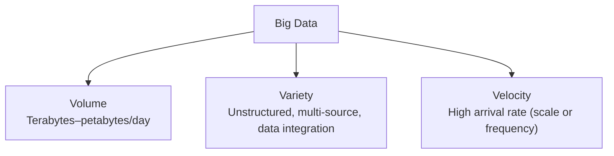
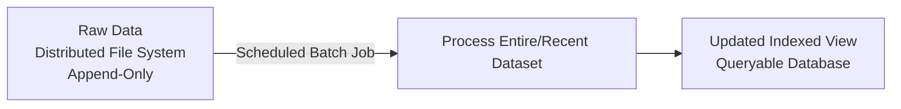
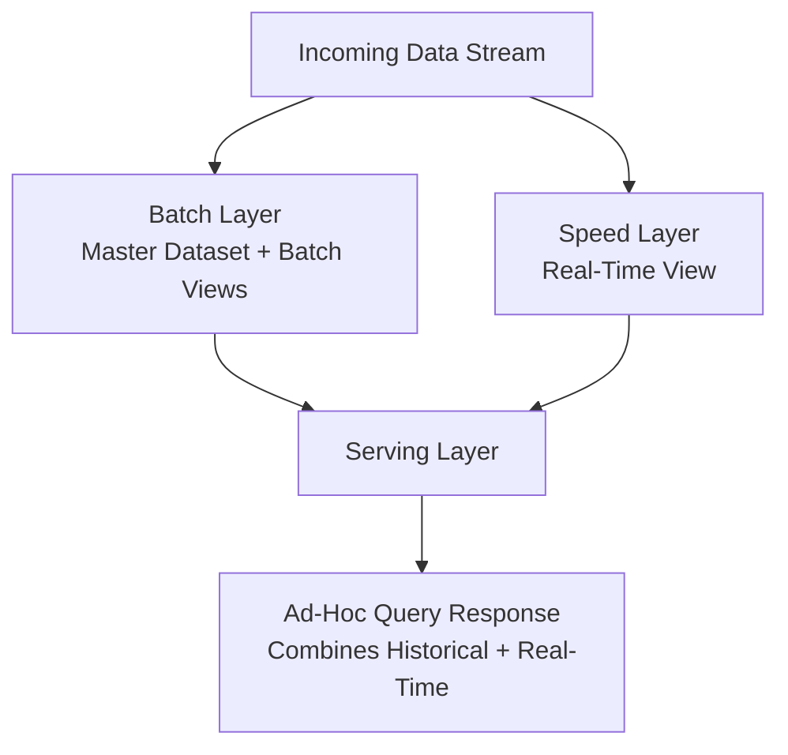
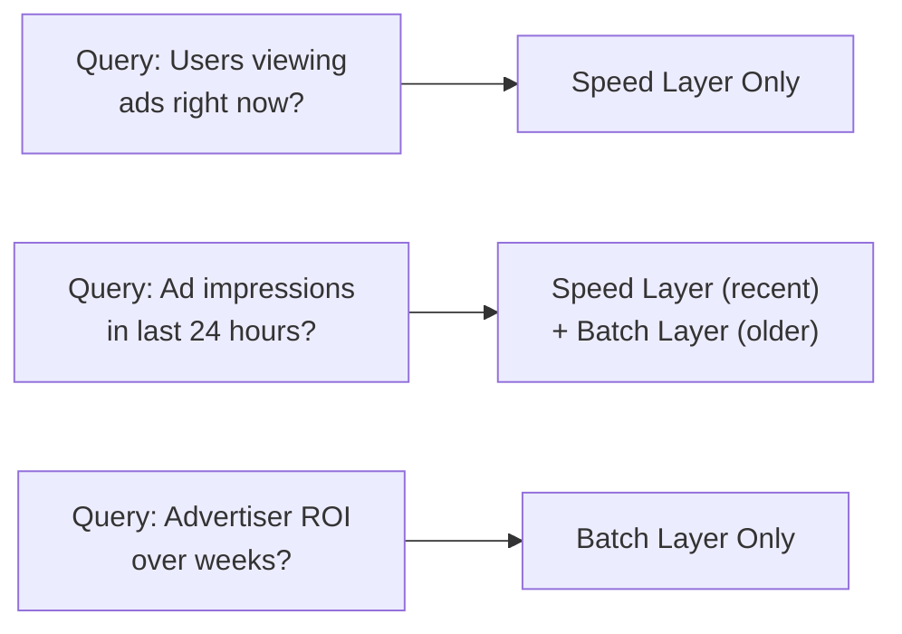

# 🏗 Software Architecture — Lecture 9: Big Data Architecture Patterns

- <i>**Course:** Software Architecture (Instructor: Michael)
- **Session Focus:** An introduction to **Big Data** and its three defining characteristics (Volume, Variety, Velocity), the two fundamental Big Data processing strategies — **Batch Processing** and **Real-Time Processing** — and **Lambda Architecture**, the hybrid pattern combining both via its Batch, Speed, and Serving Layers, illustrated with an AdTech real-world example.</i>

---

## 📑 Table of Contents

1. [Session Overview](#-session-overview)
2. [Learning Objectives](#-learning-objectives)
3. [Detailed Notes](#-detailed-notes)
   - [1. Introduction to Big Data — The Three Vs](#1-introduction-to-big-data--the-three-vs)
   - [2. Batch Processing](#2-batch-processing)
   - [3. Real-Time Processing](#3-real-time-processing)
   - [4. Lambda Architecture — Motivation and Structure](#4-lambda-architecture--motivation-and-structure)
   - [5. Lambda Architecture in Practice — AdTech Example](#5-lambda-architecture-in-practice--adtech-example)
4. [Glossary](#-glossary)
5. [Revision Notes](#-revision-notes)
6. [Cheat Sheet](#-cheat-sheet)
7. [Interview Q&A](#-interview-qa)
   - [🟢 Beginner](#-beginner-questions)
   - [🟡 Intermediate](#-intermediate-questions)
   - [🔴 Advanced](#-advanced-questions)
8. [Scenario-Based Interview Questions](#-scenario-based-interview-questions)
9. [Hands-on Exercises](#-hands-on-exercises)
10. [Practice Assignment](#-practice-assignment)
11. [Additional Resources](#-additional-resources)
12. [Final Revision Sheet](#-final-revision-sheet)

---

## 🎯 Session Overview

Having covered event-stream windowing strategies (Lecture 8), this lecture zooms out to the broader domain of **Big Data**: datasets so large, varied, or fast-arriving that traditional applications cannot process them fast enough to be useful. Michael introduces the three defining characteristics of Big Data — **Volume, Variety, Velocity** — then presents the two fundamental processing strategies, **Batch Processing** and **Real-Time Processing**, each with distinct trade-offs between depth of analysis and latency.

The lecture concludes with **Lambda Architecture**, coined by Nathan Marz, a hybrid pattern combining both strategies through three layers — **Batch Layer, Speed Layer, and Serving Layer** — enabling systems that need both deep historical analysis and low-latency real-time insight, illustrated through a detailed AdTech (advertising technology) example.

---

## 🎯 Learning Objectives

By the end of this session, you will be able to:

- Define Big Data and explain its three defining characteristics: Volume, Variety, and Velocity.
- Explain how Big Data insights (visualization, querying, predictive analytics) justify its cost and complexity.
- Describe the Batch Processing strategy, its advantages/disadvantages, and identify suitable use cases.
- Describe the Real-Time Processing strategy, its advantages/disadvantages, and identify suitable use cases.
- Explain why some use cases require both strategies simultaneously, motivating Lambda Architecture.
- Describe the three layers of Lambda Architecture (Batch, Speed, Serving) and the role each plays.
- Trace how a real-world query (e.g., in an AdTech system) is resolved using data from the batch and/or speed layers.

---

## 📚 Detailed Notes

### 1. Introduction to Big Data — The Three Vs

#### 📖 Definition

> "**Big Data** is a term used to describe datasets that are either too large in volume, too complex in structure, or arrive in our system at such a high rate that they exceed the ability of a traditional application to process them quickly enough to provide any value."

#### 🧠 Concept — Three Prominent Characteristics

**1. Volume** — the sheer amount of data to process, store, and analyze, typically **terabytes or petabytes** (or more) daily.

> Examples: internet search companies analyzing the entire internet in real time; medical systems collecting large patient datasets to detect/prevent disease; real-time security systems analyzing multiple video streams; weather-forecasting systems processing satellite and ground-sensor data.

**2. Variety** — a large mix of **unstructured data** from multiple sources, combined via **data integration** to surface hidden patterns or business insights not visible from any single source.

> Example: social media platforms collecting clicks, likes, shares, posts, video watch time, and hover duration — combined to predict individual user behavior and, in aggregate, to discover internet-wide trends and interest groups.

**3. Velocity** — a continuous stream of data arriving at a very high rate, driven either by **system scale** (e.g., millions of users on a global online store) or **event frequency** (e.g., a relatively small fleet of IoT-connected buses, trains, or factory robots each emitting continuous sensor streams).

#### ⚖ Advantages & Limitations

> "Storing and processing Big Data is extremely complex and also very expensive. However, the value we obtain from it typically outweighs the associated cost."

Big Data insights come in three forms:

| Form | Purpose |
|---|---|
| **Visualization** | Makes otherwise-meaningless raw data understandable to humans. |
| **Querying capabilities** | Enables **ad-hoc analysis** to discover patterns not previously obvious. |
| **Predictive analytics** | Powers recommendation models, and simpler applications like **anomaly detection** in server logs (e.g., auto-rolling back a bad release or alerting engineers). |

---

### 2. Batch Processing

#### 📖 Definition

> "We typically store the incoming data either in a distributed database or, more commonly, directly in a **distributed file system**. This data is never modified. We only append new data as more data arrives... we process the data in batches of records... according to a predefined schedule."

Each time the batch job runs, it picks up new raw data since the last run, analyzes it, and produces an **updated view** of the entire dataset available — stored in a well-organized, indexed database for querying. Depending on the use case, this job may process only recent data, or the entire dataset from the beginning.

#### 🏢 Real-World/Production Usage

**Online learning platform example:** with 100M students and even 10% active, ~1 million "watch progress" events per minute arrive (clearly Big Data). Combined with review/rating events, batch processing (not needing real-time results) can:

* Compensate instructors based on **percentage of content consumed**.
* Recalculate a **daily average course rating**, weighting ratings by how much of the course the reviewer actually watched (e.g., 10 one-star ratings from students who watched <10% vs. 10 five-star ratings from students who watched the whole course → skew the result toward 5 stars with more confidence).
* **Rank courses within categories** by rating and engagement combined.
* Build a **machine learning model** to predict which students would benefit from which courses, driving notifications or featured placement.

**Search engine example:** periodically **crawling** the entire dataset to build a searchable index — since there's no expectation that a new page appears in results instantly, and scanning everything per-query would be far too slow, this is an ideal batch use case.

#### ⚖ Advantages & Limitations

**Advantages:**

| Advantage | Explanation |
|---|---|
| Easy to implement | No need to worry about latency. |
| High availability | The old view stays queryable while a new batch run is in progress — no downtime. |
| Efficiency | Processing data in batches is typically more efficient than one record at a time. |
| Tolerant of human error | A bad code deploy causes no lasting damage — the raw data is untouched; fix the bug and rerun. |
| Deep analysis | Can perform complex analysis spanning years of historical data points. |

**Disadvantage — Long Delay:**

> "If we run our batch processing job once a day or once an hour, we will not get a real-time view of the incoming data... This forces our users to wait for a long time before they can receive feedback about the actions they are taking."

Example: a merchant adding a product to an online store may be surprised it doesn't appear in search results until the next batch run — acceptable if communicated ("effective next business day"), but **unacceptable** for use cases like real-time production log/metrics monitoring (on-call engineers need immediate visibility) or stock trading (quotes/orders must match and update prices in real time).

---

### 3. Real-Time Processing

#### 📖 Definition

> "We place every new event that comes into our system into a **queue or message broker**. On the other side, we have a processing job that processes each individual data record as soon as it arrives." After processing, the job updates the database that provides real-time querying/visualization.

#### ⚖ Advantages & Limitations

**Advantage:** immediate analysis and response as data arrives — no waiting for a batch job.

**Disadvantages:**

* **Difficult to perform complex analysis in real time** — less insight/value than batch processing typically provides.
* **Combining data across time or historical analysis is almost impossible** — limited to recently available data.

#### 💡 Memory Trick

Batch = deep but slow (hours/days old, but rich analysis). Real-time = fast but shallow (instant, but limited to recent data, little cross-time correlation).

---

### 4. Lambda Architecture — Motivation and Structure

#### ❓ Why It Exists

> "In each use case, we had to choose between and sacrifice either **fast response times** or **deep analysis of historical data**... in many cases, making this decision between real-time processing and batch processing is extremely difficult because we need the characteristics of both strategies."

Examples needing both:

* **Production logs/metrics monitoring** — needs real-time visibility for on-call response, *and* historical comparison (e.g., comparing current performance after a new deploy against last week's/month's baseline) for **automatic anomaly detection**.
* **Ride-sharing service** — needs real-time driver/customer locations for matching and map display, *and* historical pattern analysis (peak times, locations with driver/customer imbalance) to guide driver positioning.

#### 📖 Definition

> "**Lambda Architecture**... attempts to find a balance between the high fault tolerance and comprehensive data analysis we get from batch processing and the low latency we get from real-time processing." Coined by **Nathan Marz**, based on his experience at BackType and Twitter.

Incoming data is sent **simultaneously** to both the **Batch Layer** and the **Speed Layer**.

#### ⚙ How It Works — Batch Layer

Two purposes:

1. **System of record** — the immutable master dataset (append-only, never modified), typically stored in a **distributed file system**.
2. **Precompute batch views** — every run processes the entire master dataset (a good point to apply corrections or replay raw data), then indexes and stores results in a **read-only database**, replacing the previous batch view.

> "The batch layer is intended to provide **complete accuracy** and operates on the entire dataset."

#### ⚙ How It Works — Speed Layer

Runs in parallel with the batch layer, using the real-time processing strategy: events flow through a queue/message broker, get processed as they arrive, and update a **real-time view**.

> "The speed layer essentially compensates for the high latency we have in our batch layer... it operates only on the **most recent data** and does not attempt to provide a complete view or perform complex corrections... it exists to bridge the gap between the current moment and the last time our batch job ran."

#### ⚙ How It Works — Serving Layer

> "The purpose of the **serving layer** is to respond to ad-hoc queries and combine data from both the batch and real-time views." Any query can draw on both **historical data** (batch layer) and the **latest real-time data** (speed layer).

#### 🎯 Key Takeaways

| Layer | Data Scope | Accuracy | Latency |
|---|---|---|---|
| Batch Layer | Entire master dataset | Complete/accurate | High (scheduled runs) |
| Speed Layer | Most recent data only | Approximate/no corrections | Low (near real-time) |
| Serving Layer | Combines both | Complete + current | Responds to ad-hoc queries |

---

### 5. Lambda Architecture in Practice — AdTech Example

#### 🏢 Real-World/Production Usage

**System structure:** Advertisers (want to advertise products/events) ↔ our system (intermediary) ↔ Content Providers (bloggers/news sites hosting ad space). When a user opens a webpage, the site requests an ad from our system; we return the most relevant ad — this is the **synchronous** part of the system.

The **asynchronous Big Data processing** begins once we start receiving three event types:

1. **View event** — user scrolls to and sees the ad.
2. **Click event** — user clicks the ad, redirected to the advertiser's site.
3. **Purchase event** — user completes a purchase on the advertiser's site (the ultimate advertiser goal).

Each event flows through both the **Batch Layer** and the **Speed Layer**, ready to be queried via the **Serving Layer**.

#### 🔍 Internal Working — Three Query Examples

| Advertiser Query | Data Source(s) Needed | Why |
|---|---|---|
| "How many users are currently viewing my ads right now?" | **Speed Layer only** | Purely a real-time, current-moment question. |
| "How many times were my ads displayed in the last 24 hours?" (e.g., to track budget) | **Both layers** — e.g., last 2 hours from the Speed Layer + previous 22 hours from the Batch Layer (assuming the batch job runs every 2 hours) | Needs both up-to-the-minute and historical coverage across the full 24-hour window. |
| "What is my Return on Investment (ROI)?" (spend before a user eventually purchased) | **Batch Layer** (deep analysis) | A user may see an ad multiple times across weeks before purchasing — requires combining data across a long historical span, which only the batch layer's complete, corrected dataset supports. |

#### 🎯 Key Takeaways

The choice of which layer(s) answer a query depends entirely on **how recent** the required data is and **how much historical depth/correction** the analysis requires — exactly the trade-off Lambda Architecture was designed to eliminate by making both options available simultaneously.

---

## 📝 Glossary

| Term | Definition |
|---|---|
| **Big Data** | Datasets too large, complex, or fast-arriving for traditional applications to process fast enough to provide value. |
| **Volume** | The sheer amount of data (typically terabytes/petabytes or more per day). |
| **Variety** | The mix of unstructured data types from multiple sources, combined via data integration. |
| **Velocity** | The high rate at which data arrives, from system scale or event frequency. |
| **Data Integration** | Combining data from multiple sources to reveal hidden patterns or insights. |
| **Batch Processing** | Processing accumulated data in scheduled batches against an append-only master dataset. |
| **Real-Time Processing** | Processing each individual event as it arrives via a queue/message broker. |
| **Lambda Architecture** | A hybrid Big Data architecture combining Batch, Speed, and Serving layers for both deep and real-time analysis. |
| **Batch Layer** | The Lambda Architecture layer managing the immutable master dataset and precomputing accurate batch views. |
| **Speed Layer** | The Lambda Architecture layer processing the most recent data in real time to bridge the batch layer's latency gap. |
| **Serving Layer** | The Lambda Architecture layer that answers ad-hoc queries by combining batch and real-time views. |
| **Master Dataset** | The immutable, append-only system of record in the batch layer. |
| **Batch View** | The precomputed, indexed, read-only result of the batch layer's processing job. |
| **Real-Time View** | The continuously updated, queryable view maintained by the speed layer. |
| **Return on Investment (ROI)** | (AdTech context) The relationship between advertising spend and resulting purchases. |

---

## 🔄 Revision Notes

### ⚡ One-Minute Revision

* **Big Data** = Volume (terabytes+/day) + Variety (unstructured, multi-source, data integration) + Velocity (high arrival rate from scale or frequency). Justified by visualization, querying, and predictive-analytics value despite high cost/complexity.
* **Batch Processing** = append-only master dataset in a distributed file system, processed on a schedule, producing a complete/accurate view. Easy, highly available, efficient, error-tolerant, supports deep historical analysis — but has long latency, unsuitable for real-time needs.
* **Real-Time Processing** = events via queue/message broker, processed individually as they arrive, updating a live view. Immediate response — but limited analytical depth and can't easily correlate across history.
* **Lambda Architecture** = sends data to both Batch Layer (system of record + accurate batch views) and Speed Layer (real-time view, bridges the batch latency gap) simultaneously; the Serving Layer combines both to answer any ad-hoc query with both historical accuracy and current freshness.
* **AdTech example**: "users viewing now" → Speed Layer only; "24-hour impressions" → both layers combined; "ROI over weeks" → Batch Layer only (deep historical correlation).

---

## 📋 Cheat Sheet

| Strategy/Layer | Data Scope | Latency | Best For |
|---|---|---|---|
| Batch Processing | Entire (or recent) dataset | High (scheduled) | Deep historical analysis, non-urgent insights |
| Real-Time Processing | Only the current event | Low (near-instant) | Immediate response, live monitoring |
| Lambda: Batch Layer | Full master dataset | High, complete/accurate | System of record, corrections, deep analysis |
| Lambda: Speed Layer | Most recent data only | Low, approximate | Bridging the gap since the last batch run |
| Lambda: Serving Layer | Combines both | Responds per query | Any ad-hoc query needing both freshness and depth |

---

## 🔥 Interview Q&A

### 🟢 Beginner Questions

**Q1.** What is Big Data, in one sentence?

Datasets that are too large in volume, too varied/complex in structure, or arrive too fast for a traditional application to process quickly enough to provide value.

**Q2.** Name and briefly define the three Vs of Big Data.

Volume (amount of data, typically terabytes/petabytes+), Variety (mix of unstructured data from multiple sources), Velocity (high rate of data arrival).

**Q3.** What are the three forms of value/insight typically extracted from Big Data?

Visualization, querying capabilities, and predictive analytics.

**Q4.** What is the fundamental principle of batch processing?

Data is stored in an append-only, immutable master dataset (typically in a distributed file system) and processed in scheduled batches rather than record-by-record as it arrives.

**Q5.** What is the fundamental principle of real-time processing?

Each event is placed into a queue/message broker and processed individually as soon as it arrives, immediately updating a queryable view.

**Q6.** What is the main disadvantage of batch processing?

A long delay between data arriving and results becoming available, since processing happens on a schedule rather than immediately.

**Q7.** What is the main disadvantage of real-time processing?

It is difficult to perform complex or historical analysis in real time, limiting the depth of insight compared to batch processing.

**Q8.** What are the three layers of Lambda Architecture?

The Batch Layer, the Speed Layer, and the Serving Layer.

**Q9.** Who coined the term "Lambda Architecture," and in what context?

Nathan Marz, based on his experience working with Big Data at BackType and Twitter.

**Q10.** What is the role of the Serving Layer in Lambda Architecture?

To respond to ad-hoc queries by combining data from both the batch view (historical) and the real-time view (speed layer).

### 🟡 Intermediate Questions

**Q11.** Why is batch processing considered highly tolerant of human error?

Because the raw master dataset is immutable and untouched by a buggy processing job — if bad code is deployed, the original data is unaffected, so the bug can be fixed and the job rerun to produce a correct view, with no lasting damage.

**Q12.** Explain why an online course-rating system would want to weight ratings by how much of the course a student watched, and how batch processing enables this.

Ratings from students who watched only a small fraction of a course (e.g., <10%) are less informative than ratings from students who watched the whole course; batch processing can combine both the "watch progress" event stream and the "review/rating" event stream over the entire historical dataset to produce a weighted, more confidence-worthy average rating — something not feasible to compute accurately in real time per-event.

**Q13.** Why does the Speed Layer in Lambda Architecture not attempt to provide a "complete" or fully corrected view of the data?

Because that is the Batch Layer's job — the Speed Layer exists specifically to cover the latency gap between the current moment and the last batch run, operating only on the most recent data; attempting full correctness there would duplicate the Batch Layer's role and reintroduce the complexity/latency trade-offs batch processing already handles.

**Q14.** In the AdTech Lambda Architecture example, why does the "24-hour ad impressions" query need data from both the Batch Layer and Speed Layer?

Because the batch job runs on a fixed schedule (e.g., every 2 hours), the Batch Layer alone would only have data up to the last run (missing the most recent slice), while the Speed Layer alone only has the most recent data. Combining the last 2 hours from the Speed Layer with the preceding 22 hours from the Batch Layer produces a complete, accurate 24-hour count.

**Q15.** Why would a ride-sharing service need both batch and real-time processing rather than choosing just one?

Real-time processing is needed to track current driver/customer locations for live matching and map display; batch processing is needed to analyze historical patterns (peak times, locations with driver/customer imbalances) to help position drivers proactively — neither strategy alone satisfies both operational needs.

### 🔴 Advanced Questions

**Q16.** A company wants to implement automatic anomaly detection on production server logs and metrics. Explain, using Lambda Architecture concepts, why this specifically requires combining both layers rather than using either one alone.

Anomaly detection requires comparing **current** system behavior (from the Speed Layer, giving real-time visibility into what's happening right now) against **historical baseline behavior** (from the Batch Layer, which has processed and indexed weeks or months of prior logs/metrics with complete accuracy). Using only the Speed Layer would show current data with no baseline to compare against; using only the Batch Layer would miss the live signal needed to detect an anomaly as it's happening — the comparison itself is the point, and it requires both.

**Q17.** Design a Lambda Architecture query-routing strategy for a global online store that wants to answer: (a) "how many orders are being placed right now, per region," (b) "average product rating over its lifetime," and (c) "trending products in the last 6 hours, factoring in a batch job that runs every hour." For each, specify which layer(s) should serve the query and why.

(a) Speed Layer only — this is a purely real-time, current-moment metric with no historical dependency. (b) Batch Layer only — a lifetime average requires complete, accurate aggregation over the entire historical dataset, which is exactly the Batch Layer's role, and doesn't need real-time freshness. (c) Both layers combined — the last (up to) 1 hour of data since the most recent batch run comes from the Speed Layer, and the preceding ~5 hours come from the Batch Layer's most recent view, together reconstructing the full 6-hour trending window.

---

## 🧪 Scenario-Based Interview Questions

**Scenario 1:** A weather-forecasting company ingests continuous sensor data from thousands of satellite and ground-based sensors (Volume + Velocity) and needs both instant severe-weather alerts (e.g., an approaching tornado) and multi-decade climate-pattern analysis for long-term forecasting models. Propose an architecture and explain how each requirement maps to a specific layer.

*Consider: Lambda Architecture fits well — the Speed Layer processes incoming sensor readings in real time to trigger instant alerts (tornado/storm warnings) with low latency, while the Batch Layer processes the full historical sensor archive (potentially decades of data) to build and refine long-term climate/prediction models with complete accuracy. The Serving Layer would let meteorologists query both current conditions and historical baselines together, e.g., "is today's pattern anomalous compared to the last 20 years?"*

**Scenario 2:** A video-streaming platform wants to (a) show a "currently trending" module updated within seconds, and (b) compute royalty payouts to content creators based on total watch time per month, factoring in corrections for any bot/fraudulent view detection discovered after the fact. Explain which processing strategy fits each requirement and why using only one strategy for both would fail.

*Consider: (a) needs Real-Time Processing / the Speed Layer, since "currently trending" must reflect activity from the last few seconds/minutes — a batch job running hourly or daily would be far too stale. (b) needs Batch Processing / the Batch Layer, since royalty payouts require complete, corrected totals over an entire month, including the ability to replay/reprocess the master dataset once fraudulent views are identified after the fact — something the Speed Layer's "no corrections" model cannot support. Using only real-time processing for payouts would risk paying out based on uncorrected, fraud-inflated numbers; using only batch processing for trending would make the feature feel broken/stale to users.*

---

## 🛠 Hands-on Exercises

**🟢 Easy:** For a company that publishes a "top 10 most-read articles this week" list on a news website, decide whether batch processing, real-time processing, or Lambda Architecture is most appropriate, and justify your answer using the trade-offs from this lecture.

**🟡 Medium:** Sketch the three Lambda Architecture layers for a food-delivery app that needs (1) a live map of active deliveries and (2) monthly restaurant performance reports factoring in refunds/complaints resolved after the fact. Label what data flows into each layer and what each layer's output is used for.

**🔴 Advanced:** Design the event schema and layer routing for the AdTech example in this lecture, but add a new requirement: advertisers want a **real-time "budget exhausted" alert** the moment their daily ad spend crosses a threshold, while still supporting the existing ROI query. Explain how you would extend the Speed Layer to support the new alert without compromising the Batch Layer's ROI calculation accuracy.

---

## 🏗 Practice Assignment

You are designing the Big Data architecture for a **smart-city traffic management system** that ingests sensor data (Volume, Variety, Velocity) from traffic cameras, road sensors, and connected vehicles across a city. Address the following:

1. Identify which of the three Big Data characteristics (Volume, Variety, Velocity) are most prominent in this system, and justify with specific examples from the domain.
2. Identify at least two use cases within this system best served by pure Batch Processing, and two best served by pure Real-Time Processing. Justify each choice using the advantages/disadvantages from this lecture.
3. Propose a Lambda Architecture design supporting a "predict and prevent traffic congestion" feature that needs both real-time current traffic flow and historical seasonal/weekly patterns. Specify what the Batch Layer, Speed Layer, and Serving Layer each do in this design.
4. Design one ad-hoc query this system's Serving Layer would need to answer that requires combining both the Batch and Speed Layer's data (similar to the AdTech "24-hour impressions" example), and explain the exact split of responsibility between the two layers.
5. Discuss one trade-off or risk in relying on Lambda Architecture for this system (e.g., operational complexity of maintaining two parallel processing pipelines).

---

## 📚 Additional Resources

- Marz, N. & Warren, J. — *Big Data: Principles and Best Practices of Scalable Real-Time Data Systems* (Manning), the original and definitive text introducing Lambda Architecture
- Apache Hadoop / HDFS documentation — a common distributed file system used to implement a Lambda Architecture Batch Layer
- Apache Storm / Apache Flink / Apache Kafka Streams documentation — common technologies for implementing a Lambda Architecture Speed Layer
- Kreps, J. — "Questioning the Lambda Architecture" (essay proposing Kappa Architecture as an alternative, useful for contrasting perspectives)
- Vendor documentation for cloud Big Data platforms (e.g., AWS Lambda Architecture reference architectures, Google Cloud Dataflow) on implementing batch + streaming pipelines

---

## 📌 Final Revision Sheet

* ⭐ **Big Data = Volume + Variety + Velocity** — datasets too large, too varied, or too fast for traditional systems; justified by visualization, querying, and predictive-analytics value.
* ⭐ **Batch Processing** = scheduled, append-only, complete-dataset processing. Easy, highly available, efficient, error-tolerant, deep analysis — but high latency.
* ⭐ **Real-Time Processing** = per-event processing via queue/message broker. Immediate response — but shallow analysis, no easy historical correlation.
* ⭐ **Lambda Architecture** = Batch Layer (system of record + accurate batch views) + Speed Layer (real-time view, bridges the latency gap) + Serving Layer (combines both for any ad-hoc query) — gives both deep historical accuracy and real-time freshness.
* ⭐ **Query routing rule of thumb**: purely "right now" queries → Speed Layer; purely deep/historical queries → Batch Layer; queries spanning "recent + historical" (e.g., a rolling 24-hour window) → both layers combined.
* ⭐ Common theme: every Big Data architecture decision is a trade-off between **freshness (latency)** and **depth/accuracy (completeness)** — Lambda Architecture exists specifically for the use cases where you cannot sacrifice either one.