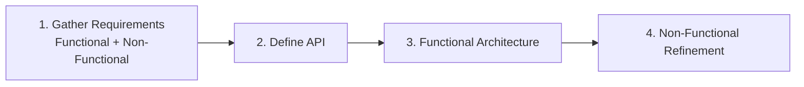
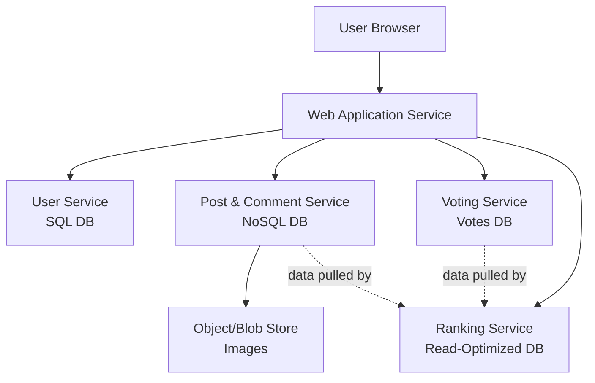
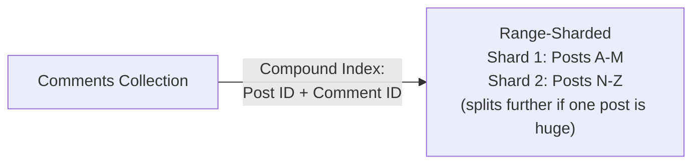
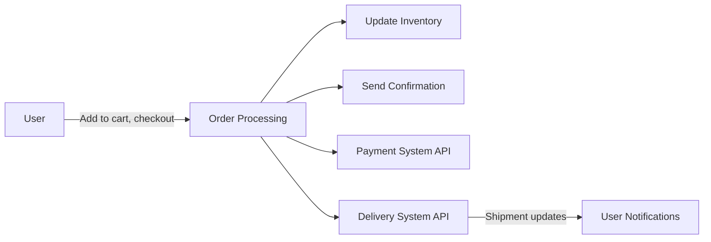
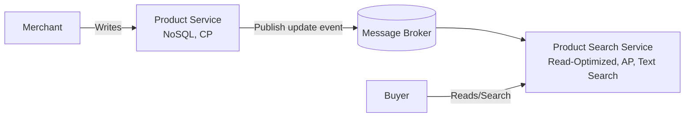
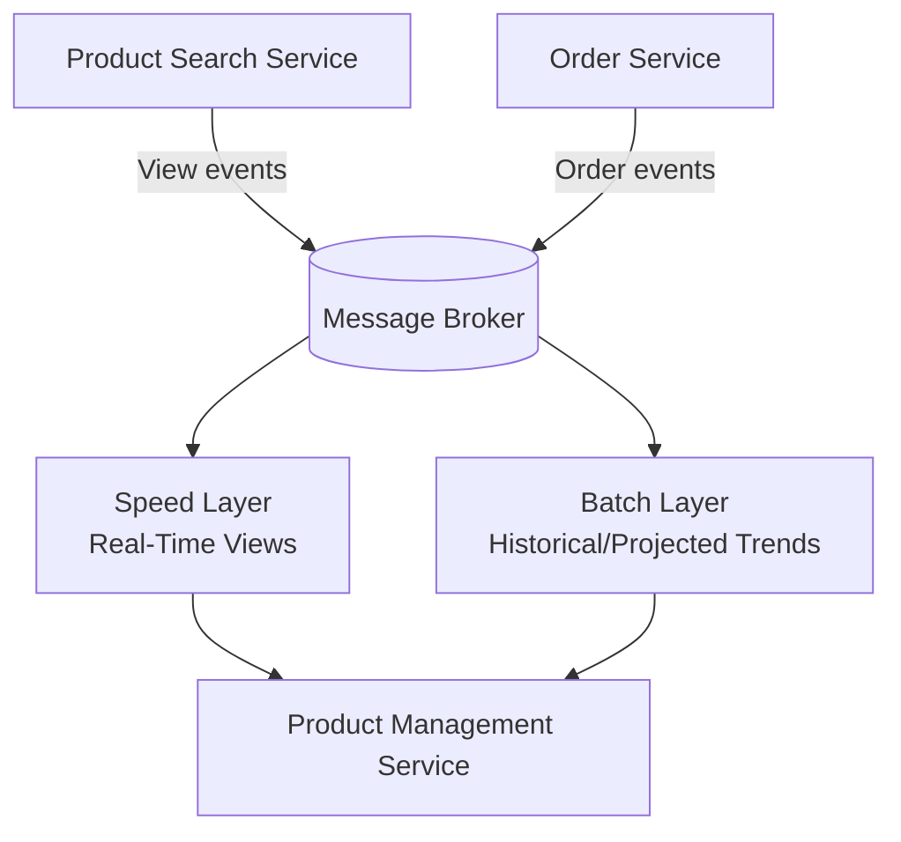

# 🏗 Software Architecture — Lecture 10: Software Architecture & System Design Practice

- <i>**Course:** Software Architecture (Instructor: Michael)
- **Session Focus:** The capstone lecture, applying everything learned across the course to two complete, end-to-end system designs — a **highly scalable public discussion forum** and a **highly scalable e-commerce marketplace** — following the full process: gathering functional and non-functional requirements, defining the REST API, building the functional architecture, and refining it for scalability, performance, availability, and durability.</i>

---

## 📑 Table of Contents

1. [Session Overview](#-session-overview)
2. [Learning Objectives](#-learning-objectives)
3. [Detailed Notes](#-detailed-notes)
   - [1. The System Design Process](#1-the-system-design-process)
   - [2. Discussion Forum — Requirements Gathering and API Design](#2-discussion-forum--requirements-gathering-and-api-design)
   - [3. Discussion Forum — Functional Architecture](#3-discussion-forum--functional-architecture)
   - [4. Discussion Forum — Non-Functional Requirements](#4-discussion-forum--non-functional-requirements)
   - [5. E-Commerce Marketplace — Requirements Gathering](#5-e-commerce-marketplace--requirements-gathering)
   - [6. E-Commerce Marketplace — Functional Architecture](#6-e-commerce-marketplace--functional-architecture)
   - [7. E-Commerce Marketplace — Non-Functional Refinement](#7-e-commerce-marketplace--non-functional-refinement)
4. [Glossary](#-glossary)
5. [Revision Notes](#-revision-notes)
6. [Cheat Sheet](#-cheat-sheet)
7. [Interview Q&A](#-interview-qa)
   - [🟢 Beginner](#-beginner-questions)
   - [🟡 Intermediate](#-intermediate-questions)
   - [🔴 Advanced](#-advanced-questions)
8. [Scenario-Based Interview Questions](#-scenario-based-interview-questions)
9. [Hands-on Exercises](#-hands-on-exercises)
10. [Practice Assignment](#-practice-assignment)
11. [Additional Resources](#-additional-resources)
12. [Final Revision Sheet](#-final-revision-sheet)

---

## 🎯 Session Overview

This capstone lecture ties together every concept from the course — quality attributes, architectural building blocks, databases, architectural patterns, event-driven/stream processing, and Big Data patterns — into two complete, worked system-design exercises. Michael walks through the same disciplined process both times: gather functional requirements via clarifying questions, gather non-functional requirements (quality attributes and trade-offs), define the REST API, build an architecture diagram satisfying functional requirements, then refine that diagram to satisfy non-functional requirements.

The first case study designs a **highly scalable public discussion forum** (posts, comments, voting, a popularity-ranked feed). The second, larger case study designs a **highly scalable e-commerce marketplace** (merchants, buyers, storefront, checkout, analytics), which introduces additional real-world complexity: two distinct actors with conflicting requirements, third-party integrations, and a payment/shipping workflow.

---

## 🎯 Learning Objectives

By the end of this session, you will be able to:

- Describe and apply the four-step system design process: requirements → API → functional architecture → non-functional refinement.
- Apply the four-step REST API design process (entities → URIs → representations → HTTP methods) to a real system.
- Explain why API pagination is necessary and how it addresses performance requirements.
- Design a microservices-based functional architecture for a discussion forum, including Voting and Ranking services using CQRS-style separation.
- Apply database sharding strategies (hash-based vs. compound-index/range-based) to a specific data-access pattern.
- Apply CDN, caching, indexing, and message-broker buffering to address performance requirements.
- Design a functional architecture for a two-sided marketplace, applying CQRS, Event Sourcing, and Lambda Architecture where appropriate.
- Justify architectural trade-offs (CP vs. AP, sync vs. async processing) based on differing requirements across actors/use cases.

---

## 📚 Detailed Notes

### 1. The System Design Process

#### 📖 Definition

> "First, we will ask questions to gather the functional, non-functional, and system constraint requirements. Then, we will define our API. After that, we will create an architecture diagram to fulfill the functional requirements. And finally, we will refine that diagram to address all the non-functional requirements."

#### 🎯 Key Takeaways

> "This is system design, which means there is no one correct way to solve a problem. The important thing is to make the correct trade-offs depending on the requirements we gather."

---

### 2. Discussion Forum — Requirements Gathering and API Design

#### ❓ Why It Exists — Clarifying Questions

> Before assuming anything, ask: Can anyone post/view, or only logged-in users? What can a post contain (text, images, video)? How is "popular" defined? Is the comment structure flat or a tree?

#### 📖 Definition — Functional Requirements (as clarified)

* Users sign up/log in to post, vote, or comment.
* A post has a title, topic tags, and a body (text + uploaded images).
* Comments are a **flat, chronologically ordered list**.
* Users can delete their own posts/comments.
* Logged-in users can upvote/downvote any post or comment.
* Any visitor sees the home page's **top posts from the last 24 hours**, where popularity = **upvotes − downvotes within the last 24 hours**.

#### 📖 Definition — Non-Functional Requirements

| Attribute | Requirement |
|---|---|
| Scalability | Start small, grow to millions of users; handle sudden viral traffic spikes. |
| Performance | Sub-few-hundred-millisecond response times. |
| Fault Tolerance / Availability | **Three nines** (99.9%) — not mission-critical like a bank. |
| Consistency vs. Availability | **Availability preferred over consistency** — stale vote/post counts are acceptable. |
| Durability | Data (users, posts, comments, votes) must never disappear unless explicitly deleted. |

#### 🪜 Step-by-Step: REST API Design (Four Steps)

**Step 1 — Identify Entities:** Users, Posts, Images, Comments, Votes.

**Step 2 — Map Entities to URIs:** Users and Posts are independent collections; Comments and Images are sub-resources of a Post; Votes are sub-resources of a Post or Comment.

**Step 3 — Define Resource Representations:**

* **Post (JSON):** ID, title, posting user, array of topic tags, total upvotes/downvotes, body (JSON-encoded Markdown with text + image links).
* **Comment collection:** post ID + array of comment objects, each with ID, text, posting user, votes.

**Step 4 — Assign HTTP Methods:**

| Resource / Action | HTTP Method | Notes |
|---|---|---|
| Sign up | POST | — |
| Log in | POST | See below — deliberate choice over GET. |
| Create post | POST | — |
| View post(s) | GET | — |
| Delete post | DELETE | — |
| Create comment | POST | — |
| Get comments | GET | — |
| Delete comment | DELETE | — |
| Upvote/downvote | POST | — |
| Upload image | POST | Image in message body. |
| Retrieve image | GET | Via image URL. |

> **Why POST for login, not GET?** (1) GET can't carry a message body, forcing credentials into the URL where they're publicly visible; POST puts them in the body, protected in transit over HTTPS. (2) Semantically, login is a **create session / create authentication token** operation — a REST "create" naturally maps to POST, with the response containing a new auth token usable on subsequent requests.

#### ⚖ Advantages & Limitations — API Pagination

> "The number of active posts in our system can be very large... we definitely don't want to load all of them into the user's browser. So we will use API pagination and limit the number of posts, let's say, to 20 per page."

The same applies to comments on a very popular post (potentially thousands). Client-side, this is often hidden behind **infinite scrolling** — the frontend requests the next batch as the user scrolls to the end of the page.

---

### 3. Discussion Forum — Functional Architecture

#### 🧠 Concept — Service Breakdown

| Service | Responsibility | Database |
|---|---|---|
| **Web Application Service** | Serves static/dynamic content to browsers. | — |
| **User Service** | Sign-up/login, account info. | SQL (table with secure password representation). |
| **Post Service** | Create/view/delete posts. | NoSQL (open-ended schema, tags as arrays) + **Object/Blob Store** for images. |
| **Post and Comment Service** (combined) | Comments are simple and similar to posts, so combined into the same microservice for simplicity and easier joint loading. | Same NoSQL DB, separate collection. |
| **Voting Service** | Upvote/downvote, one vote per user per entity, timestamped. | Dedicated DB: user ID, post/comment ID, vote value (+1/−1), timestamp. |
| **Ranking Service** | Popular-post feed. | Read-optimized DB, sorted/ready-to-serve. |

#### ⚙ How It Works — Image Upload Flow

A user uploads an image first; the UI references its URL in the post's Markdown body; the Markdown (with the image link) is sent to and stored by the Post Service. When viewing a post, the browser loads post content from the Post Service, then **requests the image directly from the Object Store** (since images are public and the store already exposes a REST API) — bypassing the Post Service entirely for image bytes.

#### 🔍 Internal Working — Why Voting Needs Its Own Service

> "All we need to do is maintain a counter for each post or comment and allow users to increment or decrement that counter concurrently. However... this simple approach is not enough. We need to ensure that each user can upvote or downvote a given post or comment only once."

A simple counter can't enforce "one vote per user," and the ranking requirement needs a **24-hour sliding window** — every second, the window moves forward, dropping older votes. This requires storing individual, timestamped vote records rather than just a running counter.

#### 🔍 Internal Working — The Ranking Service (CQRS-style)

Three observations shape this design:

1. **Data lives in different services** (votes in the Voting Service; posts/comments in the Post and Comment Service) → use a **CQRS-style pattern**, pulling data from both into a new, dedicated **Ranking Service** with its own read-optimized database.
2. **Most posts are inactive** in the last 24 hours → only a relatively small, active subset needs ranking.
3. **Continuous re-ranking is expensive**, and there's no strict requirement for perfectly up-to-the-second sorting → **batch processing** fits.

#### 🪜 Step-by-Step: Ranking Service Batch Job

Running every 10–30 minutes (or hourly):

1. Request all relevant votes from the last 24 hours from the Voting Service.
2. Sum upvotes and downvotes per post.
3. Calculate the popularity score.
4. Sort posts by popularity.
5. Retrieve corresponding post content from the Post and Comment Service.
6. Store the sorted list in its read-optimized database.

The home page then queries the Ranking Service for the **top 20** posts, with further pages fetched via an offset-based GET request.

---

### 4. Discussion Forum — Non-Functional Requirements

#### ⚙ How It Works — Scalability

* **Load balancer** in front of the Web App Service and every other service, enabling independent horizontal scale-out.
* **API Gateway** in front of services, decoupling frontend code from internal structure — improving **organizational scalability**.
* **Database sharding** for Posts and Comments (which grow unbounded in storage/traffic):
  * **Posts:** hash function on post ID → even distribution.
  * **Comments (naive hash on comment ID):** evenly distributed, but comments for the same post scatter across shards, forcing an inefficient **broadcast query** across all shards to load a post's comments.
  * **Comments (hash on post ID):** co-locates all comments for a post on one shard — fast retrieval, but an extremely popular post's comments might not fit on a single shard, creating a bottleneck.
  * **Solution — compound index (post ID + comment ID) with range sharding:** sorts data first by post ID, then comment ID; range sharding distributes contiguous ranges across shards, so comments from the same post usually land together, but the database can still split an oversized range across shards if one post gets extremely popular. Retrieving a batch of consecutive comments typically touches only one shard (two in the worst case) — "a good balance between scalability and performance."

#### ⚙ How It Works — Performance

| Technique | Purpose |
|---|---|
| **Global CDN for images** | Pull model, long TTL; edge servers cache popular-post images close to users, cutting page-load latency and origin traffic. |
| **Static content via CDN** | Reduces Web App Service load and page load time. |
| **API Gateway caching** | Cache popular posts, refreshed every few minutes — aligns with the availability-over-consistency trade-off. |
| **Database indexing** | Index on post ID; reuse the post ID + comment ID compound index for fast comment-batch retrieval. |

#### ⚙ How It Works — Voting Performance

> Individual votes are stored as separate records, but the UI needs a fast total. Solution: introduce a **message broker** between the Voting Service and the Post and Comment Service, and add `total_upvotes`/`total_downvotes` fields to post/comment records.

Flow: Voting Service stores the vote → publishes a vote event to the broker → Post and Comment Service consumes it and updates the running totals. During a sudden voting spike, the broker **buffers** votes so the Post and Comment Service can catch up gradually — acceptable because of the availability-over-consistency trade-off (users may briefly see slightly stale totals).

#### ⚙ How It Works — Fault Tolerance, High Availability, Durability

* **Database replication** — a replica takes over if an instance/shard crashes; message-broker stores and microservices are also replicated.
* **Multi-data-center deployment** with a **global load-balancing service** — enables regional failover during a disaster/outage, and improves performance by locating the system physically closer to users.
* **AP-oriented database configuration**, consistent with the availability-over-consistency decision.
* **Durability** — via database replication and periodic backups.

#### 🎯 Key Takeaways — Final Recap

| Quality Attribute | Techniques Used |
|---|---|
| Scalability | Load balancing, database sharding, independent service scaling, API Gateway |
| Performance | CDN/edge caching, API Gateway caching, database indexing, read-optimized access |
| High Availability / Fault Tolerance | Database replication, service redundancy, message-broker buffering, multi-data-center, global load balancing |
| Availability > Consistency | AP-oriented database configuration |
| Durability | Replication + periodic/rolling backups |

---

### 5. E-Commerce Marketplace — Requirements Gathering

#### ❓ Why It Exists — Two Actors

> "In this system we have **two actors**: Merchants and Buyers. Therefore, we need to clarify the functionality for both of them separately."

Clarifying questions cover: digital vs. physical products, merchant onboarding data, merchant sales analytics, buyer registration requirements, reviews/ratings scope, search capabilities, checkout scope, and browser vs. mobile support.

#### 📖 Definition — Merchant Requirements

Physical products with limited inventory (title, description, categories, images, plus optional attributes like size/color). Two requirements:

1. **Product Management** — sign up/log in, create/update products, update inventory, view current data.
2. **Analytics** — real-time visitor counts per product page, historical performance, projected trends.

#### 📖 Definition — Buyer Requirements

1. **Storefront** — browse, search by title/category/description; **no registration required** to browse or purchase; product reviews are **explicitly out of scope**.
2. **Checkout** — client-side shopping cart (100% browser/app-local); checkout page shows full cost breakdown including tax; single-click purchase after entering shipping/payment info; email + push notifications throughout the order lifecycle; **payment processing and delivery delegated to third-party APIs**.

#### 🔍 Internal Working — Sequence Diagram as an Organizing Tool

> "Since we have two actors, multiple external service providers, and many different features, the system may still feel overwhelming... for situations like this, we have a great visual tool that we can use to organize our requirements: the **sequence diagram**."

Actors: Merchant, User, Payment System (external), Delivery System (external).

**Merchant flow:** sign up → log in → create product with initial inventory → update inventory/details anytime; separately, open dashboard → request analytics.

**Storefront flow:** request paginated product list → search (also paginated) → view a product page → add to cart.

**Checkout flow:** send product IDs + quantities → receive cost breakdown (with tax) → enter shipping/billing → click Purchase →

1. Record the purchase.
2. Update inventory.
3. Send purchase confirmation to the user.
4. Initiate payment via the Payment System API.
5. Schedule delivery via the Delivery System API.

Email/push notifications occur at relevant lifecycle stages; the Delivery System later pushes shipment-progress updates back into the system, which trigger further user notifications.

#### 📖 Definition — Non-Functional Requirements

| Attribute | Merchant Side | Buyer Side |
|---|---|---|
| Scalability | Low — a few hundred merchants, thousands of products, infrequent updates. | Critical — tens of millions of users, extreme peaks during flash sales/holidays. |
| Performance | p50 < 1 second (merchants tolerate more latency). | Storefront: p50 < 200ms, p99 < 500ms. Checkout: p99 < 1 second. |
| Consistency | **CP** — merchants always need accurate product/inventory data. | Storefront: **AP** (stale data acceptable). Inventory/Checkout: **CP** (never charge for an unavailable item). |
| Availability | ~99.5% uptime (merchants can tolerate more downtime). | ~99.99% (four nines) — downtime directly costs revenue. |

---

### 6. E-Commerce Marketplace — Functional Architecture

#### 🧠 Concept — Merchant-Side Services

| Service | Responsibility | Database |
|---|---|---|
| **Product Management Service** | Merchant sign-up/login/account management, web UI. | SQL (secure credential storage). |
| **Product Service** | Add/update products (title, description, price, attributes, image links). | NoSQL document store (variable optional attributes per product type). |
| **Object Store** | Product images. | — |
| **Inventory Service** | Store/read/update per-product inventory. | High-performance **key-value store**. |

> Merchant analytics is deliberately deferred — it needs data from services not yet built.

#### 🔍 Internal Working — CQRS for the Storefront (Product Search Service)

> "Merchants mainly interact with product data to **update** product information. This creates a **write-intensive workload**. Users, on the other hand, primarily **read** product data. This creates a **read-intensive workload**."

Conflicting needs: merchants need **consistency**; users only need **availability**; and merchant writes shouldn't compete with millions of reads for the same database resources. This is a textbook **CQRS** use case:

* **Product Search Service** — separate service, own **read-optimized, AP-favoring NoSQL database with a text-search engine**, indexed on title/description/categories.
* Receives product updates from the Product Service **via a message broker** (asynchronously).
* All storefront browse/search requests go to the Product Search Service, not the Product Service.
* Product images are fetched by the client directly from the Object Store.

#### ⚙ How It Works — API Gateway and Dual UIs

Since there are two client surfaces (browser and mobile app), the **Storefront Web Service** renders HTML pages for browsers, while an **API Gateway** in front of all services handles routing for both browser API calls and mobile app calls, routing by request type and (if needed) device type.

#### ⚙ How It Works — Checkout: Tax, Order, Payment, Shipping

* **Tax Service** — dedicated DB; computes tax from product price, product type, and user location (derived from IP); pulls pricing directly from the **Product Service** (source of truth) rather than the Product Search Service, since checkout cares about consistency.
* **Order, Payment, Shipping Services** — handle the actual transaction.

> Design decision: rather than holding the user's connection open until inventory, payment, and shipping all complete (creating a dependency on slow/unreliable external APIs — a performance and availability risk), the system confirms the order **as soon as inventory update succeeds**, then performs billing and shipping **asynchronously**. Trade-off: a payment or shipping problem may only surface afterward via notification.

#### 🔍 Internal Working — Event Sourcing for Orders

> "With Event Sourcing, every change to the order is stored as an event rather than simply overwriting the previous state."

Two benefits:

1. **Notification Service** — subscribes to the same order-event topic to send email/push notifications; the **Order Service never needs to know it exists** (loose coupling, extensibility — matches Lecture 7's Event-Driven Architecture pattern).
2. **Order Recovery** — an **Order Recovery Service** subscribes to the event topic, watches in-flight orders (via event timestamps), and if an order stalls (e.g., billed but not yet handed to Shipping before an Order Service crash) beyond a reasonable window, instructs the Order Service to resume processing from where it stopped.

Delivery updates: an exposed API endpoint lets the external Delivery System push shipment progress; the Notification Service relays these to the user.

#### 🔍 Internal Working — Merchant Analytics via Lambda Architecture

> Real-time visitor counts + historical/projected trends, combining data from the **Product Search Service** (page views) and the **Order Service** (sales) — "a perfect use case for the **Lambda Architecture**."

Both services publish events to dedicated message-broker topics. The analytics system has:

* **Speed Layer** — answers "how many users are viewing my product page right now?"
* **Batch Layer** — answers historical performance and projected trends.

The Product Management Service routes a merchant's analytics request to whichever layer fits the query.

#### 🎯 Key Takeaways

> Microservices architecture distributes responsibility across services/teams; CQRS resolves the merchant-write vs. buyer-read conflict; async checkout trades immediate full confirmation for better performance/availability; Event Sourcing provides recovery, auditing, and decoupled notification; Lambda Architecture serves both real-time and historical merchant analytics.

---

### 7. E-Commerce Marketplace — Non-Functional Refinement

#### ⚙ How It Works — Merchant Side

Given the small merchant count and infrequent updates:

* Product Management Service behind a load balancer with just a handful of instances.
* **No sharding needed** for the Merchant, Product, or Inventory databases (small data volume).
* **Replication** (primary + replicas) for high availability and read performance.
* Product/Inventory databases configured for **CP** behavior, consistent with merchant consistency requirements.

#### ⚙ How It Works — Storefront and Buyer Side

Given tens of millions of users and extreme peak traffic:

* All remaining services behind **load balancers with auto-scaling**.
* **Order Recovery Service and Notification Service** need **no** load balancer — they consume events from the message broker rather than receiving direct HTTP traffic.
* **Product Search Service database** — multiple replicas, configured for **AP** (availability favored for storefront reads).
* **Tax Service database** — replicated for higher availability.

#### 🏢 Real-World/Production Usage — Storefront Performance Techniques

| Technique | Purpose |
|---|---|
| **Image thumbnails** | Generate and store a smaller thumbnail alongside the full-resolution image at upload time; serve thumbnails in product list views instead of full images. |
| **CDN** | Further reduces image delivery latency on top of thumbnailing. |
| **In-memory cache (Product Search Service)** | Cache popular products / frequent query results, avoiding repeated database hits for the same hot queries. |

#### ⚙ How It Works — Checkout Performance and Scalability

* The async checkout design (confirm on inventory success; bill/ship asynchronously) already provides strong scalability — purchase spikes are **buffered in the message broker** and drained as fast as external payment/shipping APIs allow.
* The Inventory Service's **key-value store** already offers high performance thanks to its simple data model.

#### 🏢 Real-World/Production Usage — Multi-Data-Center Deployment

> Running across multiple worldwide data centers with a **global load-balancing service** routes each user to their nearest data center (performance) and provides automatic regional failover during an outage or disaster (availability) — the load-balancing service continuously monitors data-center health.

#### 🎯 Key Takeaways

The final architecture delivers a scalable, highly available, performant e-commerce platform distributed across multiple geographies, serving tens of millions of users while meeting the much lighter-weight, consistency-favoring requirements of the merchant side with a proportionally simpler (unsharded, lightly replicated) design.

---

## 📝 Glossary

| Term | Definition |
|---|---|
| **System Design Process** | Requirements gathering → API definition → functional architecture → non-functional refinement. |
| **Popularity Score** (forum context) | Upvotes minus downvotes within a defined time window (e.g., last 24 hours). |
| **API Pagination** | Returning data in limited-size pages (e.g., 20 items) rather than the full result set at once. |
| **Infinite Scrolling** | A frontend pattern hiding pagination behind automatic "load more" requests as the user scrolls. |
| **Blob/Object Store** | Scalable storage for unstructured binary content such as images. |
| **Compound Index** | An index sorting data by a combination of keys (e.g., post ID, then comment ID), enabling range sharding. |
| **Range Sharding** | A sharding strategy distributing contiguous ranges of a sorted key across shards, rather than hashing. |
| **Broadcast Operation** | An inefficient query pattern requiring all shards to be queried, avoided by good shard-key choice. |
| **Two-Sided Marketplace** | A platform serving two distinct actor types (e.g., merchants and buyers) with differing/conflicting requirements. |
| **Source of Truth** | The authoritative, most up-to-date data store for a given piece of information (e.g., the Product Service for pricing during checkout). |
| **Asynchronous Checkout** | Confirming an order immediately after a core step (e.g., inventory update) succeeds, then completing billing/shipping in the background. |
| **Event Sourcing (Order context)** | Storing every order state change as an immutable event, enabling recovery, auditing, and decoupled notification consumers. |
| **Order Recovery Service** | A service monitoring in-flight order events to detect and resume stalled order processing after a failure. |
| **Lambda Architecture (analytics context)** | Combining a Speed Layer (real-time) and Batch Layer (historical/projected) to answer both types of merchant analytics queries. |

---

## 🔄 Revision Notes

### ⚡ One-Minute Revision

* **Process:** Requirements (functional + non-functional) → API (entities → URIs → representations → HTTP methods) → Functional Architecture → Non-Functional Refinement. No single correct answer — only justified trade-offs.
* **Discussion Forum:** microservices (User, Post & Comment, Voting, Ranking) with a CQRS-style Ranking Service built via scheduled batch processing over a 24-hour sliding window of votes. Non-functional refinement: load balancers + API Gateway + database sharding (compound index/range sharding for comments) + CDN/caching/indexing for performance + message-broker-buffered vote-count updates + replication/multi-data-center/global LB for availability and durability — all under an availability-over-consistency (AP) philosophy.
* **E-Commerce Marketplace:** two actors (merchants: CP, low scale; buyers: AP for storefront but CP for checkout/inventory, massive scale). CQRS separates the write-heavy Product Service from the read-heavy Product Search Service. Checkout is asynchronous (confirm fast, bill/ship later) using Event Sourcing for auditability, recovery, and decoupled notifications. Merchant analytics uses Lambda Architecture (Speed Layer for real-time, Batch Layer for historical/projected). Non-functional refinement mirrors the forum's toolkit (load balancing, replication, CDN, caching, thumbnails, multi-data-center) but applied asymmetrically per actor's actual scale/consistency needs.

---

## 📋 Cheat Sheet

| Requirement Pattern | Architectural Response |
|---|---|
| Conflicting read/write workloads across actors | CQRS (separate read-optimized service/DB) |
| Need both real-time and historical/predictive insight | Lambda Architecture (Speed + Batch Layers) |
| Need audit trail, recovery, and decoupled side effects on state changes | Event Sourcing |
| Large dataset needing horizontal scale, keyed access pattern matters | Database Sharding (hash for even spread; compound index/range for locality + splittable hotspots) |
| Read-heavy, latency-sensitive image/static content | CDN with pull model + long TTL, or thumbnails for lists |
| Frequent identical queries | In-memory / API Gateway caching |
| Sudden traffic spikes on writes (votes, orders) | Message broker buffering between producer and consumer services |
| Must not risk overselling/double-charging | CP-oriented database configuration |
| Can tolerate stale reads for better uptime/perf | AP-oriented database configuration |
| Slow external dependency (payment, shipping) in the critical path | Asynchronous processing — confirm early, complete the rest in the background |
| Regional outage risk / global user base | Multi-data-center deployment + global load balancing |

---

## 🔥 Interview Q&A

### 🟢 Beginner Questions

**Q1.** What are the four steps of the system design process taught in this lecture?

Gather functional and non-functional requirements; define the API; build an architecture diagram satisfying functional requirements; refine that diagram to satisfy non-functional requirements.

**Q2.** Why is API pagination necessary for the discussion forum's home page and comment lists?

Because the number of active posts or comments on a popular post can be very large (thousands+), and loading all of them into the browser at once would be slow and wasteful — pagination limits each response to a manageable page size (e.g., 20 items).

**Q3.** Why does the discussion forum use POST rather than GET for the login operation?

GET requests can't carry a message body, forcing credentials into the visible URL; POST protects them in the request body over HTTPS. Semantically, login is a "create session/token" operation, which naturally maps to POST in REST.

**Q4.** Why can't a simple counter satisfy the voting requirement?

Because the system must ensure each user votes on a given post/comment only once, and must be able to calculate popularity within a 24-hour sliding window — neither is possible with just an incrementing/decrementing counter; individual, timestamped vote records are needed.

**Q5.** Why does the e-commerce marketplace have different consistency requirements for the storefront versus checkout/inventory?

Showing slightly stale product listings is a minor inconvenience (favor availability), but charging a user for out-of-stock inventory or double-selling the same item is a serious correctness failure (favor consistency) — the two parts of the system have fundamentally different risk profiles.

**Q6.** What database type does the Inventory Service use, and why?

A high-performance key-value store, chosen for its simple data model (per-product-ID inventory count) and fast read/write performance.

**Q7.** Why is the shopping cart kept 100% client-side in the e-commerce design?

Because there's no need to manage cart state server-side until the user actually proceeds to checkout — keeping it in the browser/app simplifies the system and avoids unnecessary server-side state for casual browsing.

**Q8.** What is delegated to third-party APIs in the e-commerce checkout flow?

Payment processing (Payment System) and product delivery/shipping (Delivery System).

**Q9.** Why does the discussion forum's Ranking Service use batch processing instead of continuous real-time recalculation?

Because most posts are inactive within the 24-hour window (so only a small subset needs ranking), continuous recalculation is expensive, and there's no strict requirement for the list to be perfectly up-to-the-second sorted — batch processing trades a small amount of freshness for much lower cost.

**Q10.** What are the two purposes of the Batch Layer in the discussion forum's (implicit CQRS/ranking) and the marketplace's Lambda-based analytics?

To manage the immutable system of record and to precompute accurate, complete views/results — in the marketplace case specifically, historical performance and projected trends for merchants.

### 🟡 Intermediate Questions

**Q11.** Compare the two comment-sharding strategies (hash on comment ID vs. hash on post ID) and explain why the compound-index/range-sharding solution is preferred.

Hashing on comment ID distributes comments evenly but scatters a single post's comments across many shards, forcing an inefficient broadcast query to fetch all of a post's comments. Hashing on post ID co-locates a post's comments on one shard for fast retrieval, but an extremely popular post's comments might not fit on a single shard, creating a bottleneck. A compound index (post ID + comment ID) combined with range sharding sorts data by post ID first, then comment ID, and distributes contiguous ranges — usually keeping a post's comments together while still allowing the database to split an oversized range across shards if needed, balancing scalability and performance.

**Q12.** Why does the discussion forum introduce a message broker between the Voting Service and the Post and Comment Service instead of updating vote totals synchronously?

To decouple the two services and buffer sudden voting spikes (e.g., many users voting on a viral post simultaneously) — the broker lets the Post and Comment Service catch up gradually rather than being overwhelmed synchronously, at the acceptable cost of briefly stale totals, consistent with the system's availability-over-consistency trade-off.

**Q13.** Why is CQRS the right pattern for separating the Product Service and Product Search Service in the e-commerce design, rather than simply adding a cache in front of one shared database?

Because the two workloads have fundamentally different requirements: merchants need a write-optimized, consistency-guaranteed store, while millions of buyers need a read-optimized, availability-favoring, search-indexed store — and the two workloads would otherwise directly compete for the same database's resources. CQRS gives each its own purpose-built database, connected asynchronously via a message broker publishing product-update events, rather than forcing one database to serve two conflicting access patterns.

**Q14.** Why does the e-commerce Tax Service query the Product Service directly rather than the Product Search Service for pricing?

Because tax calculation happens during checkout, where consistency matters — the Tax Service needs the authoritative, most up-to-date price (the "source of truth"), not the Product Search Service's intentionally-stale, availability-favoring read replica of the same data.

**Q15.** Explain the two benefits Event Sourcing provides to the Order Service, using the specific failure scenario described in the lecture.

(1) It enables the Notification Service to subscribe to order events and send email/push notifications without the Order Service needing to know it exists — decoupling via events. (2) It enables order recovery: if the Order Service crashes after billing a user but before notifying the Shipping Service, an Order Recovery Service (subscribed to the same event topic, tracking timestamps) can detect the stalled in-flight order and instruct the Order Service to resume processing from where it left off, rather than losing or duplicating the transaction.

### 🔴 Advanced Questions

**Q16.** The e-commerce marketplace chose to confirm an order to the user immediately after the inventory update succeeds, then process billing and shipping asynchronously. Analyze the trade-off this creates, and explain why it was chosen given the stated non-functional requirements.

Holding the connection open until inventory, payment, and shipping all succeed would tie the system's own performance and availability to the reliability and latency of external third-party APIs it doesn't control — a single slow or flaky external dependency would degrade the user-facing checkout experience directly. By confirming early and processing billing/shipping asynchronously, the system decouples its own p99 checkout latency target (<1 second) from external API latency, and can buffer high-volume purchase spikes in the message broker for gradual processing. The accepted downside is that a payment failure or shipping issue surfaces only after the fact via notification — an acceptable trade given the requirement to prioritize checkout performance/availability and the requirement that users still get a fast confirmation.

**Q17.** Design a justification for why the discussion forum's Ranking Service and the e-commerce marketplace's Product Search Service are architecturally similar (both a form of CQRS), despite serving very different domains. What is the shared underlying problem, and what is one key difference in how each is refreshed?

Both problems share the same shape: data needed for a specific read pattern (popular-post ranking; product search/browse) is scattered across multiple source-of-truth services (Voting Service + Post/Comment Service; Product Service), and continuously computing that read view live would be expensive and unnecessary given relaxed freshness requirements. Both solve it by introducing a dedicated, read-optimized service/database that is fed asynchronously from the source services, decoupling read traffic from write traffic entirely. The key difference is the refresh mechanism: the Ranking Service uses **scheduled batch processing** (pulling all relevant votes every 10–60 minutes and recomputing), suited to its "not strictly real-time" ranking requirement, while the Product Search Service is updated via **message-broker-driven event streaming** from the Product Service (closer to continuous, near-real-time updates), suited to a storefront where merchants expect their changes to propagate reasonably promptly even though buyers tolerate some staleness.

---

## 🧪 Scenario-Based Interview Questions

**Scenario 1:** During a viral news event, a single post on the discussion forum receives 500,000 upvotes and 50,000 comments within an hour, far exceeding typical activity. Walk through which specific architectural decisions from this lecture would prevent this single post from degrading the experience for all other users, and identify any remaining risk.

*Consider: (1) Comment sharding via compound index (post ID + comment ID) with range sharding allows the database to split this post's comments across multiple shards if a single shard would otherwise become a bottleneck. (2) The message broker between the Voting Service and Post/Comment Service buffers the vote-count update spike, letting the Post/Comment Service catch up gradually rather than being overwhelmed synchronously. (3) API Gateway caching of popular posts (refreshed every few minutes) reduces repeated database load from the huge number of users viewing the same post. Remaining risk: the Ranking Service's batch cycle (10–60 minutes) means the viral post's true popularity score may lag briefly behind reality, and the vote-count buffering means displayed totals may be stale for a short period — both accepted trade-offs under the availability-over-consistency philosophy.*

**Scenario 2:** A merchant complains that after updating a product's price, buyers are still seeing the old price on the storefront for several minutes, while the merchant's own dashboard immediately shows the new price. Is this a bug? Explain using the architecture from this lecture, and describe what (if anything) should be changed.

*Consider: this is expected, by design — the merchant's dashboard reads from the Product Service (CP, consistent), while the storefront reads from the Product Search Service (AP, deliberately eventually-consistent, updated asynchronously via message-broker events from the Product Service). This is not a bug; it reflects the intentional CQRS trade-off (availability over consistency for buyers). If the delay is deemed unacceptable, the fix is not to make the storefront synchronous (which would reintroduce the write/read contention CQRS was designed to avoid) but to reduce the propagation delay — e.g., tuning message-broker throughput/latency or the update-consumption rate of the Product Search Service — while keeping the asynchronous architecture intact.*

---

## 🛠 Hands-on Exercises

**🟢 Easy:** For the discussion forum, write out the four-step REST API design (entities → URIs → representations → HTTP methods) for a new "user profile" feature allowing users to view and edit their own display name and bio. Follow the same process demonstrated in the lecture.

**🟡 Medium:** The e-commerce marketplace currently has no product-review feature (explicitly out of scope in the lecture). Design a "Review Service" addition: specify its database choice and justify it, how it would fit into the existing CQRS split (does it belong with the Product Service or the Product Search Service, or neither?), and what new event(s) it would need to publish or subscribe to.

**🔴 Advanced:** Design a Lambda-Architecture-based fraud-detection addition to the e-commerce Order Service, similar in spirit to the fraud-detection example from Lecture 7's Event-Driven Architecture material. Specify what events feed the Speed Layer versus the Batch Layer, what real-time rule the Speed Layer would check (e.g., unusually rapid repeat purchases from one account), and what historical pattern the Batch Layer would need to establish as a baseline for comparison.

---

## 🏗 Practice Assignment

Using the full system design process taught in this lecture, design a **highly scalable ride-sharing platform** (riders request rides; drivers accept and complete them) from scratch. Your submission should include:

1. **Requirements gathering:** List at least 5 clarifying questions you would ask, then state assumed functional requirements (for both riders and drivers) and non-functional requirements (scalability, performance, consistency/availability trade-offs, durability) — following the same two-actor structure as the e-commerce case study.
2. **API design:** Apply the four-step REST API process (entities → URIs → representations → HTTP methods) to at least the "request a ride" and "update driver location" operations.
3. **Functional architecture:** Design the microservices needed (e.g., Rider Service, Driver Service, Matching Service, Location Service, Trip Service, Payment integration), explaining which architectural patterns from the course (CQRS, Event Sourcing, Event-Driven Architecture, Lambda Architecture) apply and why — referencing the specific real-time vs. historical data needs unique to ride-sharing (as foreshadowed in Lecture 9).
4. **Non-functional refinement:** Address scalability (load balancing, sharding strategy for trip/location data), performance (caching, CDN if applicable), fault tolerance/availability (replication, multi-data-center), and durability, mirroring the refinement process used for both case studies in this lecture.
5. Explicitly identify at least one deliberate consistency-vs-availability trade-off in your design (e.g., driver location freshness vs. fare/payment consistency) and justify your choice.

---

## 📚 Additional Resources

- Martin, R.C. — *Clean Architecture* (Prentice Hall), for broader principles of structuring large systems around business rules
- Kleppmann, M. — *Designing Data-Intensive Applications* (O'Reilly), covering sharding strategies, CQRS, Event Sourcing, and consistency trade-offs in depth
- Newman, S. — *Building Microservices* (O'Reilly), for service-boundary and organizational-scalability considerations referenced throughout both case studies
- System design interview practice resources (e.g., "Grokking the System Design Interview," "System Design Interview" by Alex Xu) for additional worked examples following a similar process
- Vendor documentation for range/hash sharding support in common NoSQL databases (e.g., MongoDB, DynamoDB) referenced in the comment-sharding discussion

---

## 📌 Final Revision Sheet

* ⭐ **The process**: Requirements (functional + non-functional) → REST API (entities → URIs → representations → HTTP methods) → Functional Architecture → Non-Functional Refinement. No single right answer — only justified trade-offs.
* ⭐ **Discussion Forum**: User / Post & Comment / Voting / Ranking microservices; Ranking Service = CQRS + scheduled batch processing over a 24-hour sliding window; comment sharding via compound index + range sharding balances locality and splittability; message broker buffers vote-count spikes; CDN/caching/indexing for performance; replication + multi-data-center + global LB for availability/durability — all under an AP philosophy.
* ⭐ **E-Commerce Marketplace**: two actors with opposite scale/consistency profiles (merchants: small, CP; buyers: massive, AP-storefront/CP-checkout); CQRS splits Product Service (writes) from Product Search Service (reads); asynchronous checkout (confirm fast, bill/ship later) trades immediate full confirmation for performance/availability; Event Sourcing on Order events enables decoupled notifications and crash recovery; Lambda Architecture (Speed + Batch Layers) powers merchant analytics (real-time + historical/projected).
* ⭐ **Recurring toolkit across both case studies**: load balancing + auto-scaling, database sharding/replication, CDN + caching + indexing, message-broker buffering/decoupling, multi-data-center + global load balancing, and an explicit, requirement-driven choice between CP and AP wherever consistency and availability conflict.
* ⭐ Common theme: every architectural decision in both case studies traces directly back to a specific functional or non-functional requirement gathered up front — the discipline of the process, not any single "correct" diagram, is the actual skill being taught.