# 📊 Statistics for Data Science — Day 1: Foundations

- <i>**Series:** A live, 7-day "Statistics for Data Science" course (Day 1 of 7) · 
- **Instructor:** Krish Naik
- **Note on scope:** This is genuinely **Day 1** of a LIVE, INTERACTIVE, HAND-WRITTEN course (EXPLICITLY, "NO PPTs — everything WRITTEN in front OF you"), RUNNING daily FROM 7-8 PM. The instructor HIMSELF, DIRECTLY confirms the FIRST two DAYS focus ENTIRELY on FOUNDATIONS — the REST of the SEVEN-day series BUILDS toward DISTRIBUTIONS, hypothesis TESTING, and inferential STATISTICS tests (z/T/ANOVA/chi-SQUARE). This session is GENUINELY, HEAVILY interactive — the INSTRUCTOR repeatedly POSES live QUESTIONS to the AUDIENCE, BUILDING concepts THROUGH real-time, AUDIENCE-sourced examples RATHER than one-way LECTURE.</i>

---

## 📑 Table of Contents

1. [Session Overview](#-session-overview)
2. [Learning Objectives](#-learning-objectives)
3. [Detailed Notes](#-detailed-notes)
   - [1. Session Context: Day 1 of a 7-Day Statistics Series](#1-session-context-day-1-of-a-7-day-statistics-series)
   - [2. What Is Statistics & What Is Data?](#2-what-is-statistics--what-is-data)
   - [3. Descriptive vs. Inferential Statistics](#3-descriptive-vs-inferential-statistics)
   - [4. Population vs. Sample](#4-population-vs-sample)
   - [5. Sampling Techniques: Four Real-World Approaches](#5-sampling-techniques-four-real-world-approaches)
   - [6. Variables: Quantitative vs. Qualitative](#6-variables-quantitative-vs-qualitative)
   - [7. A Genuine, Live Classification Test — Including a Deliberately Ambiguous Case](#7-a-genuine-live-classification-test--including-a-deliberately-ambiguous-case)
   - [8. Variable Measurement Scales: Nominal, Ordinal, Interval & Ratio](#8-variable-measurement-scales-nominal-ordinal-interval--ratio)
   - [9. Frequency Distribution & Cumulative Frequency](#9-frequency-distribution--cumulative-frequency)
   - [10. Bar Graphs vs. Histograms (& a First Glimpse of PDF)](#10-bar-graphs-vs-histograms--a-first-glimpse-of-pdf)
   - [11. Closing: The Assignment & Tomorrow's Preview](#11-closing-the-assignment--tomorrows-preview)
4. [Glossary](#-glossary)
5. [Revision Notes — One-Minute Revision](#-revision-notes--one-minute-revision)
6. [Cheat Sheet](#-cheat-sheet)
7. [Interview Questions & Answers](#-interview-questions--answers)
8. [Scenario-Based Interview Questions](#-scenario-based-interview-questions)
9. [Hands-on Exercises](#-hands-on-exercises)
10. [Practice Assignment](#-practice-assignment)
11. [Additional Resources](#-additional-resources)
12. [Final Revision Sheet](#-final-revision-sheet)

---

## 🎯 Session Overview

This FOUNDATIONAL episode builds the COMPLETE, essential VOCABULARY of statistics ENTIRELY through REAL, worked EXAMPLES and LIVE, audience-SOURCED questions. It covers:

1. **A precise DEFINITION of statistics** ("the SCIENCE of collecting, ORGANIZING, and analyzing DATA") and **data** ("FACTS or pieces OF information that CAN be MEASURED") — GROUNDED in genuine, real EXAMPLES (IQ scores, AGES).
2. **The COMPLETE, precise DISTINCTION** between **descriptive STATISTICS** (organizing/SUMMARIZING data — e.g., "WHAT is the average MARKS") and **inferential STATISTICS** (using MEASURED data to FORM conclusions ABOUT a larger, UNMEASURED population) — DIRECTLY, CONCRETELY illustrated VIA a REAL classroom-marks EXAMPLE.
3. **Population VERSUS sample**, precisely DEFINED via a GENUINELY relatable, REAL election EXIT-poll example — WITH standard NOTATION (population = CAPITAL N; sample = SMALL n).
4. **FOUR, genuine, real-WORLD sampling TECHNIQUES**: simple RANDOM sampling, STRATIFIED sampling (non-OVERLAPPING groups), systematic SAMPLING (every Nth INDIVIDUAL), and CONVENIENCE sampling (DOMAIN-relevant PARTICIPANTS only) — EACH tested AGAINST real, PRACTICAL scenarios (EXIT polls, HOUSEHOLD surveys, DRUG testing).
5. **VARIABLES**, precisely DEFINED ("a PROPERTY that can TAKE on ANY value") and DIVIDED into **QUANTITATIVE** (numerically MEASURABLE — FURTHER split into DISCRETE and CONTINUOUS) and **QUALITATIVE/categorical** (based ON characteristics, NO arithmetic possible) — WITH a GENUINE, LIVE audience-TESTING round, INCLUDING a DELIBERATELY ambiguous CASE (pin CODE).
6. **FOUR variable MEASUREMENT scales**: **nominal** (CATEGORICAL), **ordinal** (ORDER matters, VALUE doesn't — a REAL, worked STUDENT-ranking example), **interval** (ORDER and VALUE matter, but NO natural ZERO — a REAL Fahrenheit EXAMPLE), and **ratio** (EXPLICITLY left as a GENUINE, real ASSIGNMENT).
7. **Frequency DISTRIBUTION and cumulative FREQUENCY**, precisely built VIA a REAL, worked flower-TYPE counting example — DIRECTLY leading INTO **bar graphs** (for DISCRETE data) VERSUS **histograms** (for CONTINUOUS data, USING "bins") — WITH a BRIEF, informal FIRST introduction to the **PDF** (probability DENSITY function) as "SMOOTHING of a HISTOGRAM."

> 💡 **Key framing, given directly, on precisely WHY this course leans so heavily on real, worked examples:** *"The reason why I'm giving you examples is that because understand, if we learn statistics in such a way that we have examples in mind, we will be able to explain the interviewer in a very good way."*

---

## 🎯 Learning Objectives

By the end of this guide, you will be able to:

- [ ] Define statistics and data precisely.
- [ ] Distinguish descriptive statistics from inferential statistics, with a concrete example of each.
- [ ] Define population and sample, and use the correct notation for each.
- [ ] Name and apply the four sampling techniques to real, practical scenarios.
- [ ] Distinguish quantitative from qualitative variables, and discrete from continuous variables.
- [ ] Explain the four variable measurement scales: nominal, ordinal, interval, and ratio.
- [ ] Build a frequency distribution table and a cumulative frequency table from raw data.
- [ ] Explain when to use a bar graph versus a histogram, and what a PDF represents at a basic level.

---

## 📚 Detailed Notes

### 1. Session Context: Day 1 of a 7-Day Statistics Series

#### 🧠 Concept

> 💡 **Given directly, opening the session:** *"This time it will be quite revolutionary because in this seven days, whatever is actually required for you to learn in stats, I'll be probably uploading the entire thing... both theoretical along with coding."*

#### 🪜 Step-by-Step — A Direct, Explicit Confirmation of the Complete, Seven-Day Roadmap

> 💡 **Given directly:** *"The first thing is that two days we will just be focusing on basics... the entire statistics with respect to data science is divided into this two concepts [descriptive and inferential]... in inferential stats our main focus is basically like Z test, T test, ANOVA test, chi-square test."*

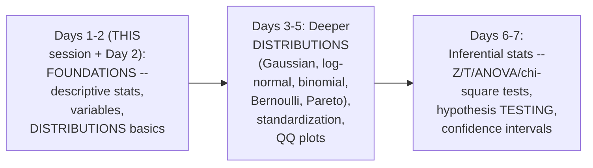

#### ⚠ A Direct, Honest Note on This Session's Own, Genuine Teaching Style

> 💡 **Given directly:** *"No PPTs, everything will be written in front of you, I will write it, I will solve it in front of you."*

#### 🎯 Key Takeaways

* This is GENUINELY **Day 1 OF 7**, EXPLICITLY, DIRECTLY dedicated (ALONGSIDE Day 2) to **FOUNDATIONS** — descriptive STATISTICS, variables, and BASIC distribution CONCEPTS.
* The COURSE is DIRECTLY, EXPLICITLY confirmed as **hand-WRITTEN and interactive** — NO slides, BUILT through LIVE, real-TIME audience ENGAGEMENT.
* The instructor **directly, REPEATEDLY frames** worked, REAL-world examples as ESSENTIAL — SPECIFICALLY because they GENUINELY help LEARNERS "EXPLAIN the INTERVIEWER in a VERY good way."

---

### 2. What Is Statistics & What Is Data?

#### 📖 Definition — Statistics, Precisely Defined

> 💡 **Given directly:** *"Statistics is the science of collecting, organizing, and analyzing data... why are we doing this? We are doing this for better decision making."*

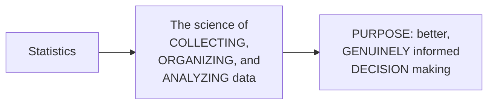

#### 📖 Definition — Data, Precisely Defined

> 💡 **Given directly:** *"What is data? Data is nothing but facts or pieces of information that can be measured... let's consider one very simple example: I am basically going to say that, let's say that I want to measure the IQ of a class of the students... I may probably get values between 0 to 100."*

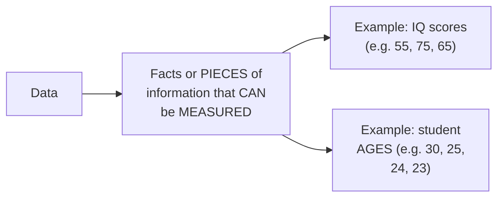

#### ⚠ Common Mistakes

* Assuming "DATA" is a GENUINELY, VAGUELY broad concept — explicitly, directly, PRECISELY anchored: the MOST "intrinsic MEANING of DATA is that it CAN be MEASURED" — a SIMPLE, memorable TEST for WHETHER something GENUINELY qualifies as data.

#### 🎯 Key Takeaways

* **Statistics** is precisely the SCIENCE of COLLECTING, ORGANIZING, and ANALYZING data — ALL in SERVICE of **BETTER decision MAKING**.
* **Data** is precisely FACTS or pieces of INFORMATION that CAN be **MEASURED** — GROUNDED in REAL, concrete examples (IQ SCORES, ages).
* These TWO, foundational definitions DIRECTLY, PRECISELY set up EVERY subsequent CONCEPT in this SESSION — the ENTIRE field of STATISTICS is BUILT on the ABILITY to MEASURE and ANALYZE data.

---
### 3. Descriptive vs. Inferential Statistics

#### 📖 Definition — Descriptive Statistics, Precisely Defined

> 💡 **Given directly:** *"Descriptive stats: it consists of organizing and summarizing of data. That's it, very simple."*

#### 📖 Definition — Inferential Statistics, Precisely Defined

> 💡 **Given directly:** *"Inferential stats: it is a technique wherein we use the data that we have measured to form conclusions."*

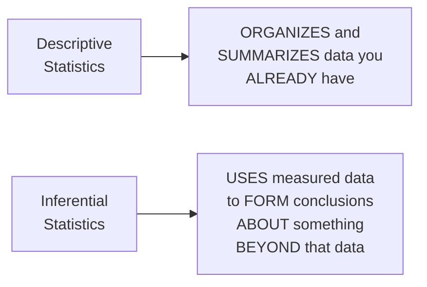

#### 🪜 Step-by-Step — A Complete, Real, Worked Example: A Classroom of Math Students

> 💡 **Given directly:** *"Let's consider that I have a classroom of math students... around 20 people... I want to find out the marks of the first sim... [an audience member says] the average marks — perfect! Mean, median, mode — this is absolutely amazing... so this may be a perfect example of descriptive stats."*

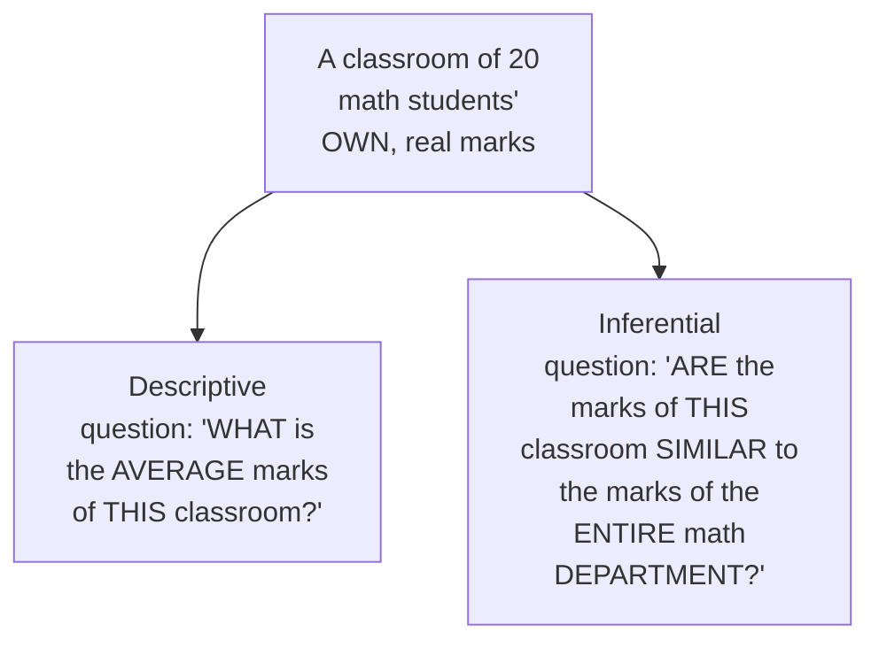

#### 🔍 Internal Working — Precisely Distinguishing "Population" and "Sample" Within This Example

> 💡 **Given directly:** *"Here maths classroom in the entire college is my population, and probably just the classroom student's [data] is just like my sample."*

#### ⚠ Common Mistakes

* Assuming DESCRIPTIVE and INFERENTIAL statistics are GENUINELY, ENTIRELY separate FIELDS, rather than TWO complementary APPROACHES — explicitly, directly, PRECISELY connected: THEY are BOTH DIRECTLY applied to the SAME, real EXAMPLE (the classroom's OWN marks) — descriptive ANSWERS questions ABOUT the DATA you HAVE; inferential USES that SAME data to ANSWER questions ABOUT something LARGER.
* Confusing WHICH group is the "POPULATION" and WHICH is the "SAMPLE" — explicitly, directly, PRECISELY clarified via the EXAMPLE: the ENTIRE math DEPARTMENT is the POPULATION; the ONE classroom's OWN data is the SAMPLE.

#### 🎯 Key Takeaways

* **Descriptive STATISTICS** GENUINELY organizes and SUMMARIZES data YOU already HAVE (e.g., "WHAT is the AVERAGE marks?"); **inferential STATISTICS** uses THAT measured data TO draw CONCLUSIONS about a LARGER, UNMEASURED population (e.g., "ARE these marks REPRESENTATIVE of the WHOLE department?").
* A COMPLETE, real, WORKED example (a 20-STUDENT math CLASSROOM) directly, CONCRETELY illustrates BOTH types of QUESTIONS, USING the SAME underlying DATA.
* This EXAMPLE directly, PRECISELY introduces the NEXT, essential CONCEPT — **population VERSUS sample** — WHICH Section 4 EXPANDS on IN full.

---

### 4. Population vs. Sample

#### 📖 Definition — Population & Sample, Precisely Defined via a Real Example

> 💡 **Given directly:** *"Let's take an example of elections... it is not possible for every reporter to go and ask each and every person [in the state]... so what happens in this exit poll, this reporter, what they do is that they take up a sample of population from different, different regions... in this particular case, what is my population data? My population data is this entire population of Goa. This specific thing is my population data, and this round circles that I have actually done is basically my sample data."*

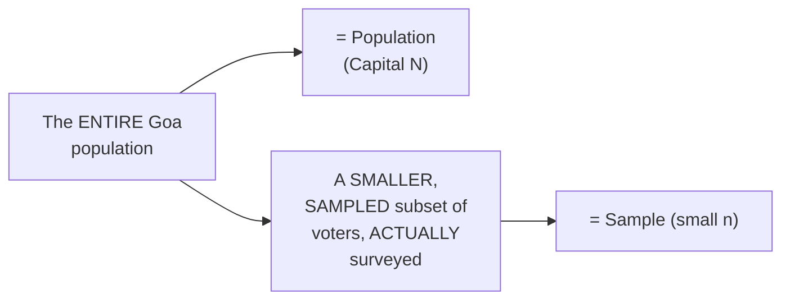

#### 📖 Definition — The Precise, Standard Notation

> 💡 **Given directly:** *"Population is basically given by capital N, and sample is basically given by small n."*

#### ⚠ Common Mistakes

* Confusing the NOTATION for POPULATION versus SAMPLE — explicitly, directly, PRECISELY clarified: **CAPITAL N** = population; **SMALL n** = sample — a SIMPLE, but FREQUENTLY tested DISTINCTION.
* Assuming SAMPLING is GENUINELY, PURELY a matter of CONVENIENCE, WITHOUT any REAL, deliberate METHODOLOGY — explicitly, directly, DIRECTLY foreshadowed: "THERE are different, DIFFERENT sampling TECHNIQUES" — the SUBJECT of Section 5.

#### 🎯 Key Takeaways

* **Population** (CAPITAL N) is the COMPLETE, entire GROUP you GENUINELY want to UNDERSTAND; **sample** (SMALL n) is a SMALLER, PRACTICALLY-obtainable SUBSET actually MEASURED.
* A GENUINELY relatable, REAL election EXIT-poll example directly, CONCRETELY illustrates WHY sampling is GENUINELY, PRACTICALLY necessary — it's SIMPLY not POSSIBLE to survey an ENTIRE, real-world POPULATION.
* The STANDARD notation (CAPITAL N for POPULATION, small n for SAMPLE) is a SIMPLE, but GENUINELY important DETAIL worth REMEMBERING precisely.

---
### 5. Sampling Techniques: Four Real-World Approaches

#### 📖 Definition — Technique 1: Simple Random Sampling

> 💡 **Given directly:** *"When performing simple random sampling, every member of the population has an equal chance of being selected for your sample."*

#### 📖 Definition — Technique 2: Stratified Sampling

> 💡 **Given directly:** *"Stratified sampling is a technique where the population is split into non-overlapping groups... this is also called as strata — strata basically means layering... let's consider gender: male and female."*

#### 🔍 Internal Working — A Genuine, Real, Nuanced Discussion: Can You Stratify by Profession?

> 💡 **Given directly:** *"Can we do stratified sampling based on profession?... a person is a .NET developer, a person is a PHP developer, a person is a data scientist... but there may be some scenarios that it may overlap — a PHP person may know .NET, a .NET person may know Python... but if a person is highly experienced, he says that, no, I don't know [other things], then it will not become overlapping."*

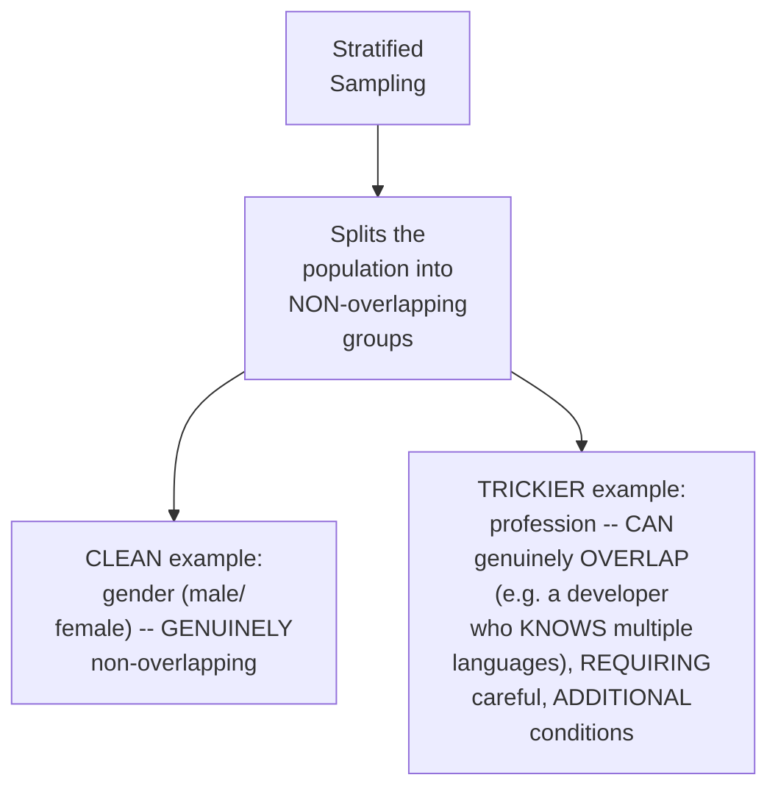

#### 📖 Definition — Technique 3: Systematic Sampling

> 💡 **Given directly:** *"Systematic sampling: here, from the population N, what we do, we just pick up every Nth individual... let's consider that I'm outside the mall and I want to do a survey regarding COVID... every seventh or eighth person that I see, I am saying that for this person, do the survey."*

#### 📖 Definition — Technique 4: Convenience Sampling

> 💡 **Given directly:** *"Convenience sampling: let's consider that I am doing a survey related to data science — I will not go to some other people who don't have the knowledge of data science to do that specific survey. I may collect my sample in a bit different way where I focus on people who [are] giving the survey should have knowledge on that specific topic."*

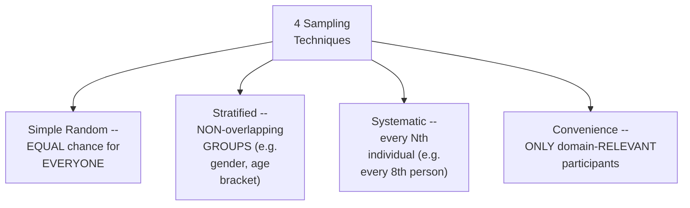

#### 🪜 Step-by-Step — A Complete, Live, Real Testing Round: Applying These to Real Scenarios

> 💡 **Given directly, on exit polls:** *"What kind of sampling would be better?... obviously we will be using over here as random sampling."*

> 💡 **Given directly, on the RBI's own household survey:** *"For this household service, what kind of sampling probably they may use?... you may also consider that over here you need to follow some stratified random sampling... if you don't want to consider stratified sampling, we can also do convenient sampling — only women you can basically consider over there."*

> 💡 **Given directly, on drug testing:** *"A drug needs to be tested — for this, what kind of samples we may take?... if I get that specific information [who the drug is for], I will basically do the age groupings... I may consider picking up some samples, but at least I'll put a condition that at least it should be greater than 15 years, because we cannot just directly use a specific drug on kids."*

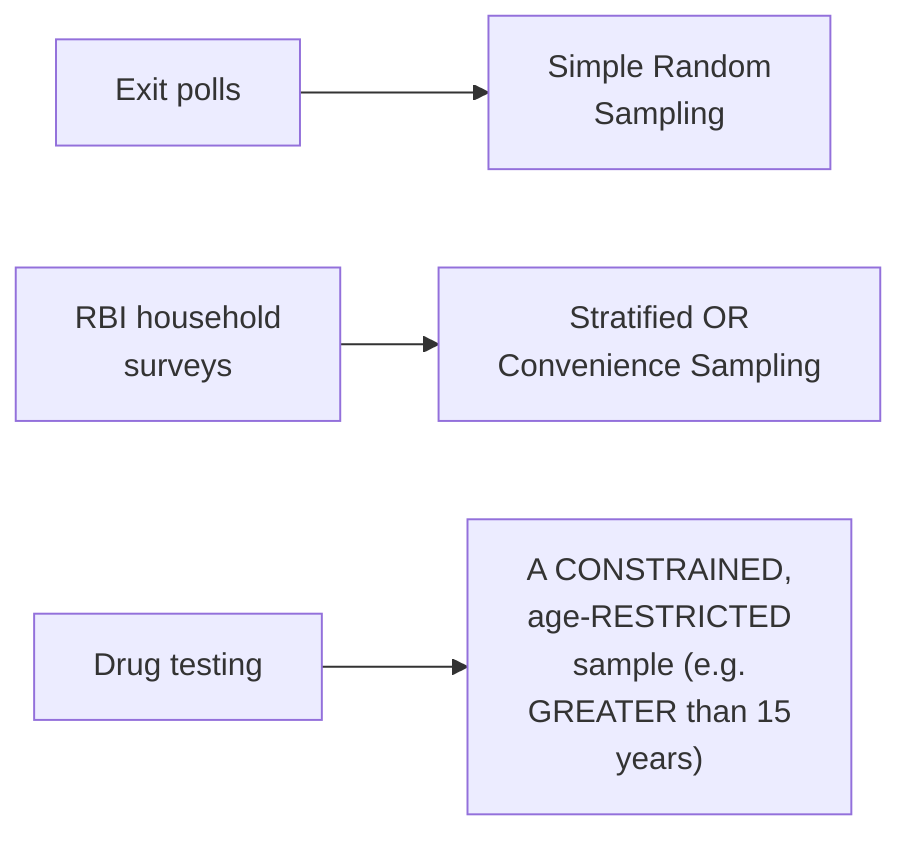

#### ⚠ A Direct, Honest, Important Clarification

> 💡 **Given directly:** *"Sampling techniques may be different. It is completely dependent on the use case that we are following... it is not like we will just be dependent on one kind of data. We try to use different, different sampling techniques, and finally we try to come to a conclusion on the same."*

#### ⚠ Common Mistakes

* Assuming ONLY ONE, "CORRECT" sampling TECHNIQUE genuinely EXISTS for ANY given, real SCENARIO — explicitly, directly, HONESTLY clarified: the CHOICE is GENUINELY, DIRECTLY dependent ON the SPECIFIC use CASE — MULTIPLE techniques (OR combinations) can OFTEN, GENUINELY apply.
* Assuming stratified SAMPLING categories are ALWAYS, GENUINELY, PERFECTLY non-overlapping IN practice — explicitly, directly, HONESTLY complicated: REAL-world categories (LIKE profession) CAN genuinely OVERLAP, REQUIRING careful, ADDITIONAL conditions to MAINTAIN the "NON-overlapping" requirement.

#### 🎯 Key Takeaways

* FOUR, genuine sampling TECHNIQUES: **SIMPLE random** (equal CHANCE for everyone), **stratified** (NON-overlapping groups), **SYSTEMATIC** (every Nth individual), and **CONVENIENCE** (domain-RELEVANT participants only).
* A COMPLETE, live TESTING round directly, CONCRETELY applied THESE techniques to REAL scenarios: EXIT polls (RANDOM), RBI household SURVEYS (stratified OR convenience), and DRUG testing (AGE-constrained sampling).
* Sampling-TECHNIQUE choice is directly, HONESTLY confirmed as **GENUINELY, ENTIRELY use-CASE dependent** — THERE is NO single, universally "CORRECT" technique — REAL, practical JUDGMENT is REQUIRED.

---
### 6. Variables: Quantitative vs. Qualitative

#### 📖 Definition — Variable, Precisely Defined

> 💡 **Given directly:** *"A variable is a property that can take on any value. Let's say an example: I'll say height, I may say weight — these are variables, we can have any value."*

#### 📖 Definition — Quantitative Variables, Precisely Defined

> 💡 **Given directly:** *"Quantitative variable... can be measured numerically... we can perform a lot of operations like add, subtract, divide, multiply... one example of this is I may consider age, I may consider weight, I may consider height."*

#### 📖 Definition — Qualitative/Categorical Variables, Precisely Defined

> 💡 **Given directly:** *"Qualitative and categorical variables — if I specifically take an example, let's consider gender: I have male and female. Based on some characteristics, we can derive categorical variables... here we cannot add, subtract, or do some kind of mathematical equations, because here we don't have that option."*

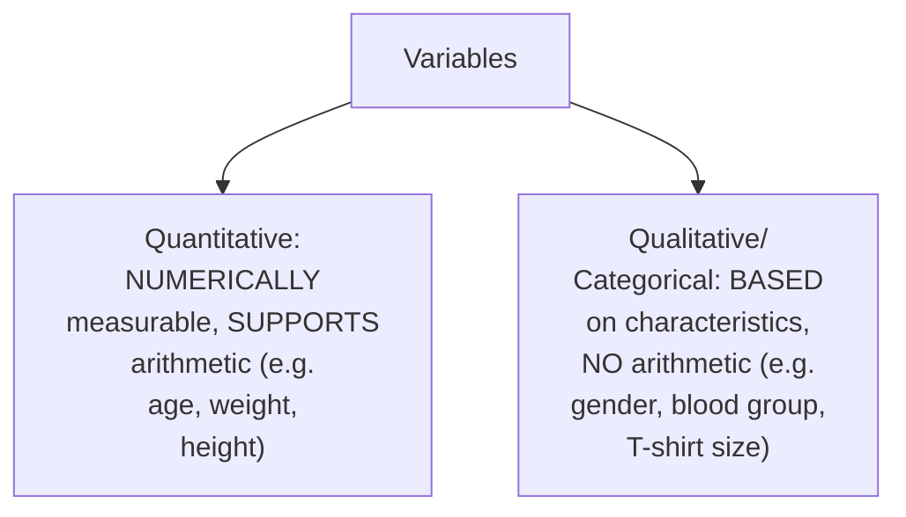

#### 🔍 Internal Working — A Genuine, Real Example of a DERIVED Categorical Variable

> 💡 **Given directly:** *"I may have categories of, let's consider IQ — 0 to 10 I will divide, 10 to 50, and 50 to 200. Whenever the values are between 0 to 10, I may say that [is] less IQ, whenever I say 10 to 50, I may say that [is] medium IQ, [and above] 50 [to] 200, I may say good IQ."*

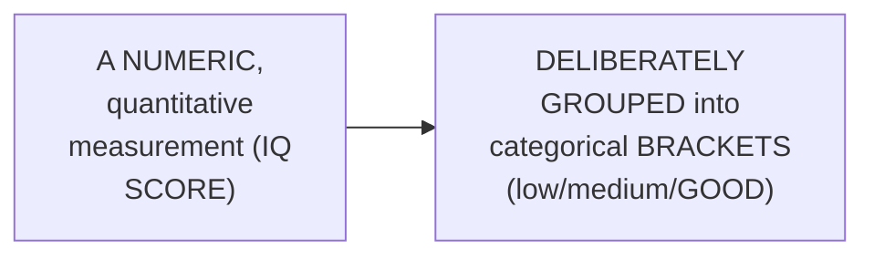

#### 📖 Definition — Discrete Variables, Precisely Defined (a Subtype of Quantitative)

> 💡 **Given directly:** *"Discrete variable, you will specifically have a whole number... number of bank accounts of a person — you'll say I have two bank accounts, three, four, five, six, seven bank accounts. You can't say that you have two point five [bank accounts]... number of children in a family — you cannot say it is 2.5 children."*

#### 📖 Definition — Continuous Variables, Precisely Defined (a Second Subtype of Quantitative)

> 💡 **Given directly:** *"Continuous variable, here we have already discussed that any value it can have. Suppose I say height, I can say the person is 172.5 centimeters... amount of rainfall, which is measured in inches, suppose I say it is 1.1 inches, 1.25 inches, 1.35 inches."*

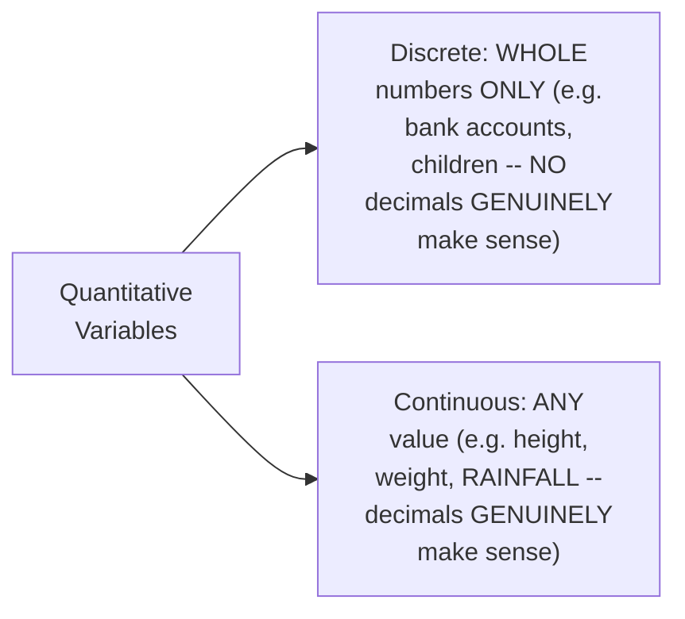

#### ⚠ Common Mistakes

* Assuming ALL numeric VARIABLES are GENUINELY, IDENTICALLY "quantitative" WITHOUT further DISTINCTION — explicitly, directly, PRECISELY subdivided: QUANTITATIVE variables are FURTHER split INTO discrete (WHOLE numbers ONLY) and CONTINUOUS (ANY value).
* Assuming QUALITATIVE/categorical variables can NEVER, GENUINELY be DERIVED from ORIGINALLY numeric DATA — explicitly, directly, CONCRETELY demonstrated as FALSE: the IQ example SHOWS a NUMERIC measurement DELIBERATELY grouped INTO categorical BRACKETS.

#### 🎯 Key Takeaways

* A **variable** is precisely "a PROPERTY that can TAKE on ANY value" — DIVIDED into **QUANTITATIVE** (numerically MEASURABLE, SUPPORTS arithmetic) and **QUALITATIVE/categorical** (BASED on characteristics, NO arithmetic).
* **Quantitative** variables FURTHER split INTO **DISCRETE** (WHOLE numbers only, e.g., BANK accounts, CHILDREN) and **CONTINUOUS** (ANY value, e.g., HEIGHT, weight, RAINFALL).
* NUMERIC data CAN genuinely be **DELIBERATELY converted** into CATEGORICAL brackets (e.g., IQ SCORES grouped INTO low/MEDIUM/good) — a GENUINE, real, PRACTICAL technique WORTH remembering.

---

### 7. A Genuine, Live Classification Test — Including a Deliberately Ambiguous Case

#### 🪜 Step-by-Step — A Complete, Live, Real Testing Round

> 💡 **Given directly:** *"What kind of variable [is] gender?... marital status?... river length?... the population of a state?... song length?... blood pressure?"*

| Variable | Answer (given directly) |
|---|---|
| Gender | Qualitative/categorical |
| Marital status | Qualitative/categorical |
| River length | Continuous (quantitative) |
| Population of a state | Discrete (quantitative) |
| Song length | Continuous (quantitative) |
| Blood pressure | Continuous (quantitative) |

#### ⚠ A Deliberately Ambiguous, Genuine, Real Case: Pin Code

> 💡 **Given directly:** *"What kind of variable is pin code?... discrete or categorical?... don't worry, as we go ahead in some of the classes, you will be able to understand this — that is where, when you will be getting a problem statement in data science where you have specifically pin code in a dataset, how you are going to handle those, all the things will basically come."*

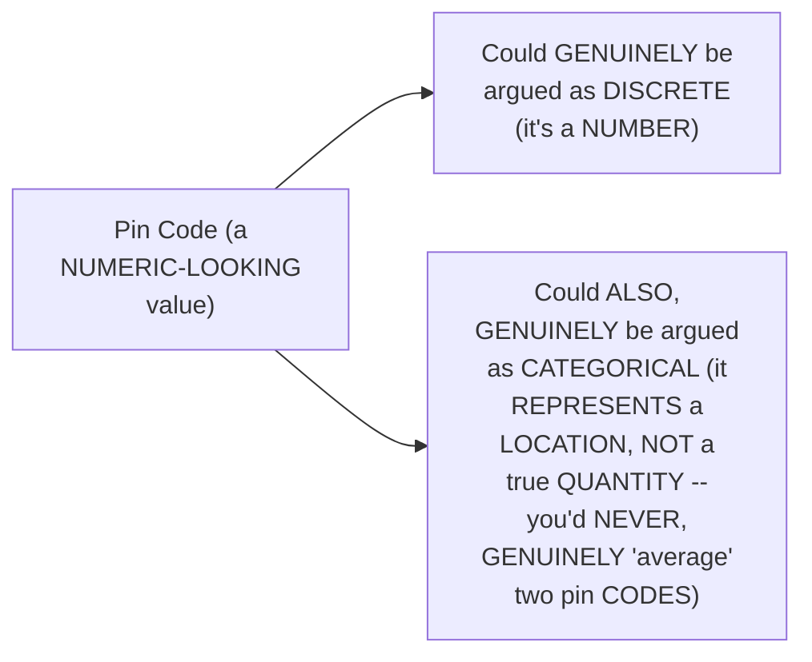

#### ⚠ Common Mistakes

* Assuming EVERY variable GENUINELY has a SINGLE, unambiguous CLASSIFICATION — explicitly, directly, HONESTLY demonstrated as FALSE via the PIN-code example: SOME real-WORLD variables are GENUINELY, DELIBERATELY left as OPEN questions, RESOLVED based ON the SPECIFIC, practical CONTEXT of HOW they'll be USED.
* Assuming a NUMERIC-looking VALUE (like a PIN code) is AUTOMATICALLY, GENUINELY a quantitative VARIABLE — explicitly, directly, HONESTLY complicated: a PIN code's own NUMERIC digits DON'T genuinely SUPPORT meaningful ARITHMETIC (AVERAGING two pin CODES makes NO real SENSE) — SUGGESTING it may be BETTER treated as CATEGORICAL, DESPITE looking NUMERIC.

#### 🎯 Key Takeaways

* A COMPLETE, live TESTING round directly, CONCRETELY reinforced the QUANTITATIVE/qualitative and DISCRETE/continuous DISTINCTIONS ACROSS six, real EXAMPLES.
* The **PIN-code EXAMPLE** is directly, HONESTLY left as a **GENUINELY ambiguous CASE** — NUMERIC in APPEARANCE, but ARGUABLY categorical IN true nature — EXPLICITLY deferred to LATER, real-world data-HANDLING discussions.
* This AMBIGUITY is a GENUINE, valuable LESSON in its OWN right: NOT every real-WORLD variable classification is CLEAN or OBVIOUS — PRACTICAL, contextual JUDGMENT is OFTEN required.

---
### 8. Variable Measurement Scales: Nominal, Ordinal, Interval & Ratio

#### 📖 Definition — Nominal Data, Precisely Defined

> 💡 **Given directly:** *"Nominal data — also I can say these are specifically categorical or qualitative data... whenever I say categorical data, you know that it is split into different, different classes. Color is one example... type of flower [is another]."*

#### 📖 Definition — Ordinal Data, Precisely Defined (a Real, Worked Example)

> 💡 **Given directly:** *"In this particular data, the order of the values matters, but the value does not... let's say I have five students, and the marks of the students are like 100, 96, 57, 85, and 44. Now tell me, if I just try to find out the rank — 100 will get the first rank, 96 will get second, this 85 will get third... this data that we specifically have is my ordinal data. Here we focus more on the order, not on the values."*

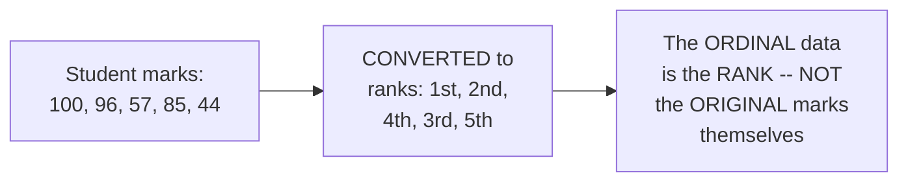

#### 📖 Definition — Interval Data, Precisely Defined (a Real, Worked Example)

> 💡 **Given directly:** *"Interval data — here the order matters, here the value also matters, and one thing is that your natural zero is not present... let's say that I have an interval of temperatures in Fahrenheit... 70 to 80 Fahrenheit, 80 to 90 Fahrenheit... but if I say zero Fahrenheit, it won't basically make a useful meaning."*

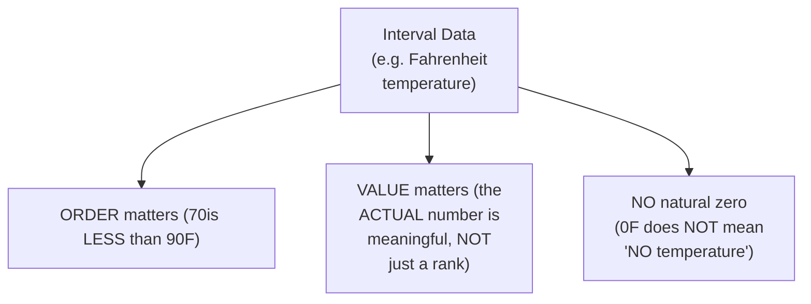

#### 📖 Definition — Ratio Data (Explicitly Left as a Genuine Assignment)

> 💡 **Given directly:** *"The fourth type that you basically have [is] ratio data — you need to tell me the answer for tomorrow, what exactly ratio data is, and whether their natural zero will be present, whether order matters, whether value matters and all. This will be an assignment to you."*

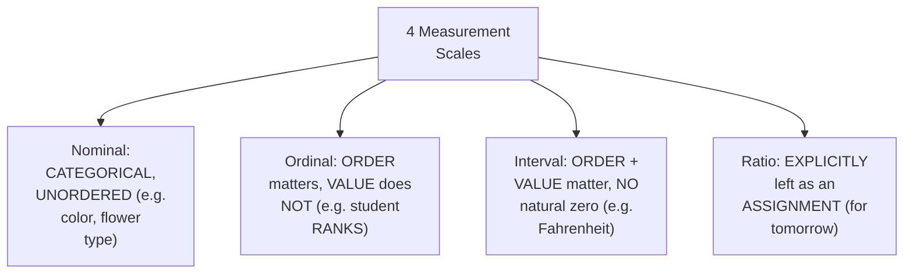

#### ⚠ Common Mistakes

* Assuming ORDINAL data GENUINELY preserves the ORIGINAL, actual VALUES (LIKE the exact MARKS) — explicitly, directly, PRECISELY clarified: ORDINAL data is GENUINELY, SPECIFICALLY about the RANK/order — the ORIGINAL, underlying VALUES are NOT what's BEING captured.
* Assuming INTERVAL data's "NO natural zero" property is a MINOR, technical DETAIL — explicitly, directly, CONCRETELY illustrated as GENUINELY meaningful: ZERO Fahrenheit does NOT genuinely MEAN "no TEMPERATURE" — a REAL, important DISTINCTION from a "TRUE zero" SCALE.

#### 🎯 Key Takeaways

* **NOMINAL** data is CATEGORICAL, with NO inherent ORDER (e.g., COLOR, flower TYPE); **ORDINAL** data's OWN order MATTERS, but the UNDERLYING value DOESN'T (e.g., STUDENT ranks, DERIVED from marks); **INTERVAL** data has BOTH meaningful ORDER and VALUE, but LACKS a natural ZERO (e.g., FAHRENHEIT temperature).
* A COMPLETE, real, WORKED example (RANKING five STUDENTS by their OWN marks) directly, CONCRETELY illustrates ORDINAL data's OWN, precise NATURE — the RANK matters, NOT the ORIGINAL score.
* **RATIO data** is directly, EXPLICITLY left as a GENUINE, real ASSIGNMENT — a DELIBERATE teaching CHOICE, encouraging LEARNERS to RESEARCH and REASON through the FOURTH scale THEMSELVES before the NEXT session.

---

### 9. Frequency Distribution & Cumulative Frequency

#### 📖 Definition — Frequency Distribution, Precisely Defined via a Real Example

> 💡 **Given directly:** *"Let's say that I have a sample dataset, and suppose in this particular dataset I have three types of flowers: rose, lily, and sunflower... tell me based on the flower type, how much is the frequency?... if I consider rose, how many times [does it appear]? One, two, three — so three is the count of rows. If I consider lily... four. If I consider sunflower... two."*

```text
Frequency Distribution Table (from the raw flower data):
  Rose:      3
  Lily:      4
  Sunflower: 2
```

#### 📖 Definition — Cumulative Frequency, Precisely Defined

> 💡 **Given directly:** *"Cumulative frequency basically says that, okay, initially I have rose, three flowers, then I am going to add this to this, so it will be seven, then I am going to add this to this, it will be nine. At the end of the day, when we go with respect to cumulative frequency... we will be able to find out how many total number of flowers are present."*

```text
Cumulative Frequency Table (running total):
  Rose:      3   (cumulative: 3)
  Lily:      4   (cumulative: 3+4 = 7)
  Sunflower: 2   (cumulative: 7+2 = 9)
```

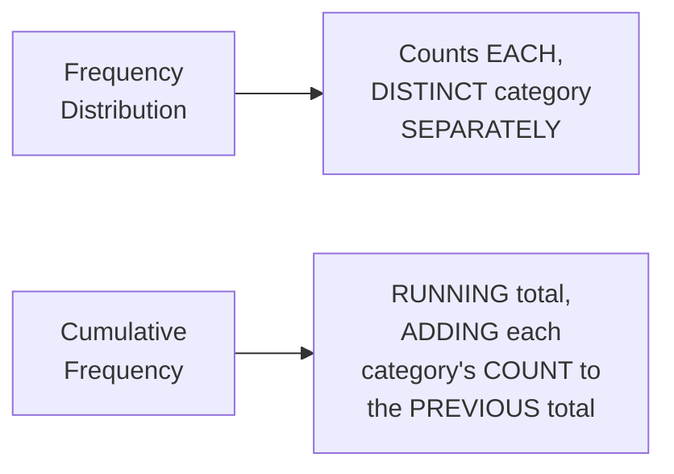

#### ⚠ Common Mistakes

* Assuming FREQUENCY distribution and CUMULATIVE frequency are GENUINELY the SAME thing — explicitly, directly, PRECISELY distinguished: FREQUENCY distribution shows EACH category's OWN, INDIVIDUAL count; CUMULATIVE frequency shows a RUNNING total ACROSS categories.

#### 🎯 Key Takeaways

* A **frequency DISTRIBUTION table** GENUINELY counts HOW OFTEN each, DISTINCT category APPEARS in a DATASET — DIRECTLY, CONCRETELY illustrated VIA a REAL flower-type EXAMPLE (rose=3, LILY=4, sunflower=2).
* **Cumulative FREQUENCY** GENUINELY builds a RUNNING total, ADDING each CATEGORY's count to the PREVIOUS one — REVEALING the TOTAL count ONCE all categories are INCLUDED.
* These TABLES directly, PRECISELY set UP the NEXT, essential VISUALIZATION tools (Section 10) — BAR graphs and HISTOGRAMS are BOTH, GENUINELY derived FROM frequency data.

---
### 10. Bar Graphs vs. Histograms (& a First Glimpse of PDF)

#### 📖 Definition — Bar Graph, Precisely Defined (For Discrete Data)

> 💡 **Given directly:** *"In bar graph, in the x-axis I will probably have all my flowers... in the y-axis I will probably have frequency... roses are three, so I'm going to create this graph... this specific diagram is basically called as bar charts... why do we use it? As I say, summarizing the data — this is still part of descriptive statistics."*

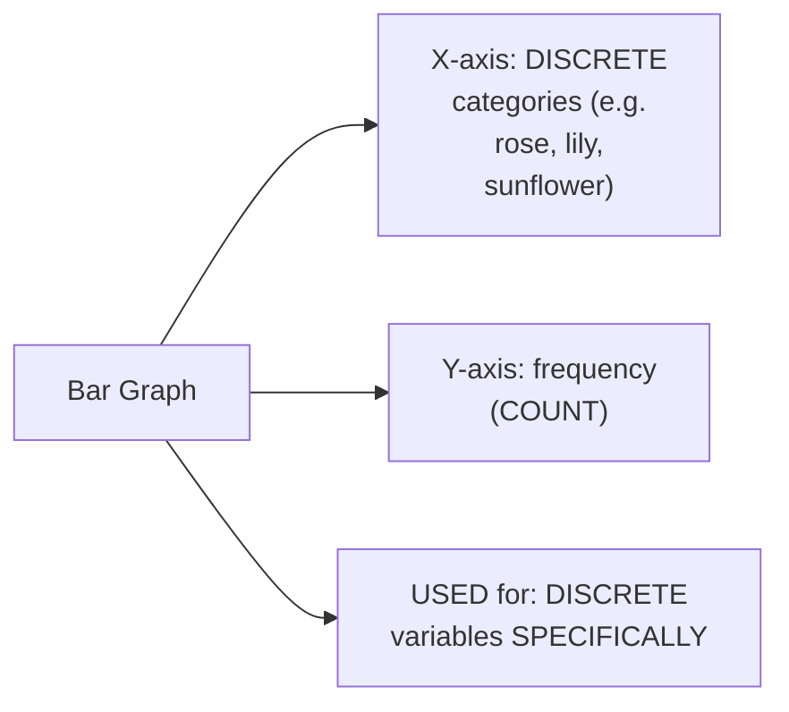

#### 📖 Definition — Histogram, Precisely Defined (For Continuous Data, Using Bins)

> 💡 **Given directly:** *"In the case of histogram, first of all your data should be continuous... let's take one example of age... in histogram, we make something called as bins — bins basically means we make some kind of grouping. By default, the bin size is usually ten."*

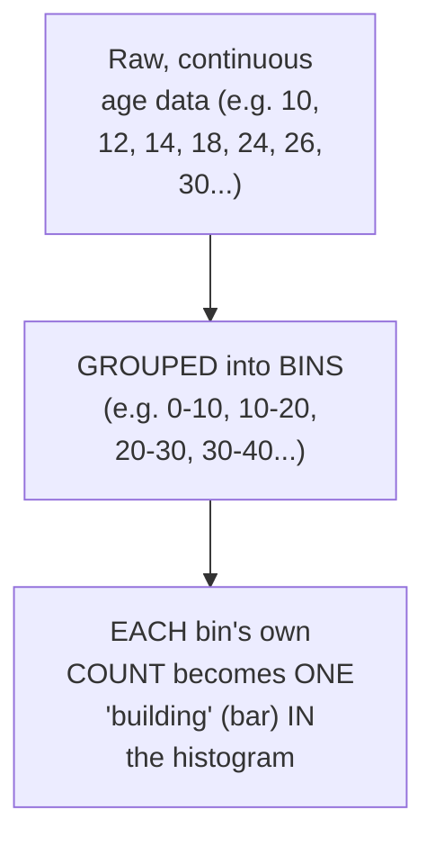

#### 🪜 Step-by-Step — A Complete, Real, Worked Histogram Example

> 💡 **Given directly:** *"Between 0 to 10, I don't have any value... between 10 to 20, I have four different values... between 20 to 30, I have three different values... between 30 to 40, I have four... between 40 to 50, I have four... between 50 to 60, I have one. This building that you basically see is called as histograms, and in this histogram, your values will be continuous."*

#### 📖 Definition — PDF (Probability Density Function), Briefly, Informally Introduced

> 💡 **Given directly:** *"PDF is smoothening of histogram... if I smoothen this histogram, my PDF function will look something like this... there is something called as kernel density estimator... how it is basically done, we will try to understand that in the upcoming classes, [it's] a little bit on the advanced side."*

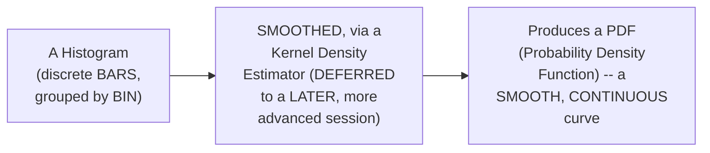

#### ⚠ A Direct, Genuine, Live Clarification: Bar vs. Histogram

> 💡 **Given directly:** *"Bar is specifically used for discrete, this [histogram] is used for continuous."*

#### ⚠ Common Mistakes

* Assuming BAR graphs and HISTOGRAMS are GENUINELY, VISUALLY interchangeable, SIMPLY different NAMES for the SAME chart TYPE — explicitly, directly, PRECISELY distinguished: BAR graphs are FOR discrete DATA; histograms are FOR continuous data, USING grouped BINS.
* Assuming a PDF is GENUINELY, ENTIRELY unrelated to a HISTOGRAM — explicitly, directly clarified: it's PRECISELY a "SMOOTHENED" version OF a histogram, VIA a kernel DENSITY estimator (a TECHNIQUE EXPLICITLY deferred to a LATER, more ADVANCED session).

#### 🎯 Key Takeaways

* **Bar GRAPHS** are used FOR **DISCRETE** variables (e.g., FLOWER type COUNTS); **histograms** are used FOR **CONTINUOUS** variables, GROUPING raw data INTO "bins" (e.g., AGE ranges of 10).
* A COMPLETE, real, WORKED example (AGE data, GROUPED into 10-unit BINS) directly, CONCRETELY illustrates HOW a histogram is BUILT from RAW, continuous data.
* A **PDF (Probability DENSITY Function)** is BRIEFLY, INFORMALLY introduced as "SMOOTHING of a HISTOGRAM" — WITH the UNDERLYING technique (KERNEL density ESTIMATION) EXPLICITLY deferred to a LATER, more ADVANCED session.

---

### 11. Closing: The Assignment & Tomorrow's Preview

#### 🪜 Step-by-Step — A Complete, Explicit Assignment

> 💡 **Given directly:** *"Ratio data will be an assignment for you... you need to tell me the answer for tomorrow, what exactly ratio data is, and whether their natural zero will be present, whether order matters, whether value matters and all."*

#### 🪜 Step-by-Step — A Complete, Direct Preview of Day 2's Own Content

> 💡 **Given directly:** *"Tomorrow, what all things we are going to learn — there are so many things we are going to understand about mean, median, mode, we are going to understand about standard deviation, we are going to understand about percentile and quartiles, we are going to understand about five number summary, we are going to understand [the] effects of outliers, [we'll cover] normal curve, normal distribution, Z scores, probability, permutation."*

```mermaid
flowchart LR
    A["Day 1 (done):<br/>Statistics/data<br/>DEFINITIONS,<br/>descriptive VS.<br/>inferential,<br/>population/SAMPLE,<br/>sampling TECHNIQUES,<br/>variables,<br/>measurement SCALES,<br/>frequency<br/>distribution, BAR/<br/>histogram basics"] --> B["Day 2 (EXPLICITLY<br/>previewed): mean/<br/>median/mode,<br/>standard DEVIATION,<br/>percentiles/<br/>quartiles, FIVE-<br/>number summary,<br/>outliers, normal<br/>distribution, Z-<br/>scores, probability,<br/>permutations"]
```

#### ⚠ Common Mistakes

* Assuming THIS session's own COVERAGE represents a COMPLETE statistics FOUNDATION on its OWN — explicitly, directly, HONESTLY clarified: RATIO data, MEAN/median/mode, standard DEVIATION, and MANY other, ESSENTIAL topics REMAIN explicitly DEFERRED to Day 2 and BEYOND.

#### 🎯 Key Takeaways

* This episode **GENUINELY, COMPLETELY delivers** its OWN, stated Day-1 GOAL — a COMPLETE, foundational VOCABULARY: statistics/DATA definitions, descriptive/INFERENTIAL statistics, population/SAMPLE, SAMPLING techniques, variable TYPES, measurement SCALES, and BASIC frequency-based VISUALIZATION.
* An **EXPLICIT, genuine ASSIGNMENT** (researching RATIO data) directly EXTENDS this session's OWN, established measurement-SCALE framework, ENCOURAGING active, INDEPENDENT reasoning BEFORE the answer is GIVEN.
* **Day 2** is directly, EXPLICITLY confirmed as COVERING mean/MEDIAN/mode, standard DEVIATION, percentiles/QUARTILES, the FIVE-number summary, OUTLIERS, normal DISTRIBUTION, Z-scores, PROBABILITY, and PERMUTATIONS.

---
## 📝 Glossary

| Term | Definition | Why It Matters |
|---|---|---|
| **Statistics** | The science of collecting, organizing, and analyzing data | For better decision making |
| **Data** | Facts or pieces of information that can be measured | The foundation of all statistics |
| **Descriptive Statistics** | Organizing and summarizing data | Answers questions about data you already have |
| **Inferential Statistics** | Using measured data to form conclusions | Answers questions about a larger, unmeasured population |
| **Population (N)** | The complete, entire group of interest | Capital N notation |
| **Sample (n)** | A smaller, practically-obtainable subset | Small n notation |
| **Simple Random Sampling** | Every member has an equal chance of selection | Used e.g. for exit polls |
| **Stratified Sampling** | Population split into non-overlapping groups | e.g., by gender or age bracket |
| **Systematic Sampling** | Picking every Nth individual | e.g., every 8th person exiting a mall |
| **Convenience Sampling** | Only domain-relevant participants sampled | e.g., surveying only data scientists about data science |
| **Variable** | A property that can take on any value | The basic unit of measurable data |
| **Quantitative Variable** | Numerically measurable, supports arithmetic | e.g., age, height, weight |
| **Qualitative/Categorical Variable** | Based on characteristics, no arithmetic | e.g., gender, blood group |
| **Discrete Variable** | Whole numbers only | e.g., number of bank accounts |
| **Continuous Variable** | Any value, including decimals | e.g., height, rainfall |
| **Nominal Data** | Categorical, no inherent order | e.g., color, flower type |
| **Ordinal Data** | Order matters; value does not | e.g., student ranks |
| **Interval Data** | Order and value matter; no natural zero | e.g., Fahrenheit temperature |
| **Ratio Data** | Left as a genuine assignment (Day 1's own closing question) | To be answered in Day 2 |
| **Frequency Distribution** | Counts of each distinct category | The basis for bar graphs and histograms |
| **Cumulative Frequency** | A running total across categories | Reveals the overall total count |
| **Bar Graph** | A chart for discrete variables | X-axis: categories; Y-axis: frequency |
| **Histogram** | A chart for continuous variables, using bins | Groups raw data into ranges |
| **PDF (Probability Density Function)** | A "smoothed" histogram | Built via a kernel density estimator (advanced topic) |

---

## 🔄 Revision Notes — One-Minute Revision

* This is **Day 1 of a 7-day, live, hand-written statistics course** -- Days 1-2 focus entirely on foundations; later days cover distributions and inferential tests (Z/T/ANOVA/chi-square).
* **Statistics**: the science of collecting, organizing, and analyzing data, for better decision making. **Data**: facts or information that can be measured.
* **Descriptive vs. inferential statistics**: descriptive organizes/summarizes data you have (e.g., "what's the average marks?"); inferential uses that data to draw conclusions about a larger population (e.g., "are these marks representative of the whole department?"). Illustrated via a real classroom-of-20-students example.
* **Population (capital N) vs. sample (small n)**: illustrated via a real election exit-poll example -- surveying an entire population isn't practical, so a smaller sample is measured instead.
* **4 sampling techniques**: simple random (equal chance for everyone), stratified (non-overlapping groups, e.g. gender or age -- though categories like profession can genuinely overlap), systematic (every Nth individual), convenience (only domain-relevant participants). Applied live to exit polls (random), RBI household surveys (stratified or convenience), and drug testing (age-constrained sampling). Choice is genuinely use-case dependent.
* **Variables**: a property that can take any value. Quantitative (numerically measurable, supports arithmetic) splits into discrete (whole numbers only, e.g. bank accounts) and continuous (any value, e.g. height). Qualitative/categorical (based on characteristics, no arithmetic, e.g. gender) can also be DERIVED from numeric data (e.g. IQ scores grouped into low/medium/good brackets).
* **A live classification test** covered gender, marital status, river length, population, song length, and blood pressure -- plus a deliberately AMBIGUOUS case, pin code, explicitly left open (numeric-looking, but arguably categorical since averaging two pin codes makes no real sense).
* **4 measurement scales**: nominal (categorical, unordered, e.g. color), ordinal (order matters, value doesn't -- e.g. student ranks derived from marks), interval (order AND value matter, but no natural zero -- e.g. Fahrenheit), and ratio (explicitly left as Day 1's own closing assignment).
* **Frequency distribution**: counts each category separately (e.g. rose=3, lily=4, sunflower=2). **Cumulative frequency**: a running total (3, then 7, then 9).
* **Bar graphs** (for discrete data) vs. **histograms** (for continuous data, using "bins," e.g. age grouped in 10-year ranges). A **PDF** is briefly, informally introduced as a "smoothed" histogram, via a kernel density estimator -- explicitly deferred to a more advanced session.
* **Closing**: an explicit assignment (research ratio data). Day 2 is explicitly previewed: mean/median/mode, standard deviation, percentiles/quartiles, five-number summary, outliers, normal distribution, Z-scores, probability, and permutations.

---

## 📋 Cheat Sheet

**Descriptive vs. Inferential:**
```text
Descriptive  -- organizes/summarizes data you HAVE (e.g. average marks)
Inferential  -- uses that data to conclude something about a LARGER population
```

**Population vs. Sample notation:**
```text
Population = Capital N (the ENTIRE group)
Sample     = small n   (a SMALLER, measured subset)
```

**4 Sampling Techniques:**
```text
Simple Random  -- equal chance for everyone
Stratified     -- non-overlapping groups (gender, age bracket)
Systematic     -- every Nth individual
Convenience    -- only domain-relevant participants
```

**Variable types:**
```text
Quantitative (numeric, supports arithmetic)
  ├── Discrete    -- whole numbers only (bank accounts, children)
  └── Continuous  -- any value (height, weight, rainfall)
Qualitative/Categorical (characteristics, no arithmetic)
  -- gender, blood group, T-shirt size
```

**4 Measurement Scales:**
```text
Nominal   -- categorical, no order (color, flower type)
Ordinal   -- order matters, value doesn't (student ranks)
Interval  -- order + value matter, NO natural zero (Fahrenheit)
Ratio     -- (Day 1's own assignment -- answer researched, not given)
```

**Bar Graph vs. Histogram:**
```text
Bar Graph  -- DISCRETE data (x-axis: categories, y-axis: frequency)
Histogram  -- CONTINUOUS data, grouped into "bins" (e.g. 10-year age ranges)
PDF        -- a "smoothed" histogram (via kernel density estimation)
```

---

## 🔥 Interview Questions & Answers

### 🟢 Beginner

**Q1.**

**Question:** What is the precise definition of statistics?

**Answer:** The science of collecting, organizing, and analyzing data, for better decision making.

**Explanation:** Directly, precisely explained.

**Why Interviewers Ask This:** The most basic, foundational statistics question.

**Possible Follow-up:** "What is data, precisely?"

**Q2.**

**Question:** What is the genuine difference between descriptive and inferential statistics?

**Answer:** Descriptive organizes/summarizes data you have; inferential uses that data to draw conclusions about a larger population.

**Explanation:** Directly, precisely distinguished.

**Why Interviewers Ask This:** Foundational, frequently-tested statistics knowledge.

**Possible Follow-up:** "Give a concrete example of each."

**Q3.**

**Question:** What notation is used for population versus sample?

**Answer:** Capital N for population; small n for sample.

**Explanation:** Directly, explicitly stated.

**Why Interviewers Ask This:** Basic, essential statistics terminology.

**Possible Follow-up:** "Why is sampling genuinely necessary, rather than measuring the entire population?"

**Q4.**

**Question:** Name the four sampling techniques.

**Answer:** Simple random, stratified, systematic, and convenience sampling.

**Explanation:** Directly, explicitly named.

**Why Interviewers Ask This:** Basic, essential sampling knowledge.

**Possible Follow-up:** "Which technique would you use for an election exit poll?"

**Q5.**

**Question:** What is the genuine difference between a discrete and a continuous variable?

**Answer:** Discrete variables are whole numbers only; continuous variables can take any value, including decimals.

**Explanation:** Directly, precisely distinguished.

**Why Interviewers Ask This:** Basic, essential variable-type knowledge.

**Possible Follow-up:** "Is 'number of children' discrete or continuous?"

**Q6.**

**Question:** Name the four variable measurement scales.

**Answer:** Nominal, ordinal, interval, and ratio.

**Explanation:** Directly, explicitly named.

**Why Interviewers Ask This:** Foundational, frequently-tested measurement-scale knowledge.

**Possible Follow-up:** "What is the genuine difference between ordinal and nominal data?"

**Q7.**

**Question:** In ordinal data, does the actual value matter, or the order?

**Answer:** The order matters; the actual value does not.

**Explanation:** Directly, precisely explained.

**Why Interviewers Ask This:** Tests genuine, precise understanding of a commonly-confused measurement scale.

**Possible Follow-up:** "Give an example of ordinal data."

**Q8.**

**Question:** What is missing from interval data, that distinguishes it from ratio data?

**Answer:** A natural (true) zero.

**Explanation:** Directly, precisely explained.

**Why Interviewers Ask This:** Basic, essential interval-vs-ratio distinction.

**Possible Follow-up:** "Give an example of interval data."

**Q9.**

**Question:** What is the genuine difference between a bar graph and a histogram?

**Answer:** Bar graphs are used for discrete variables; histograms are used for continuous variables, using grouped bins.

**Explanation:** Directly, precisely distinguished.

**Why Interviewers Ask This:** Basic, essential data-visualization knowledge.

**Possible Follow-up:** "What is a 'bin' in a histogram?"

**Q10.**

**Question:** What is a PDF, at a basic level?

**Answer:** A "smoothed" version of a histogram.

**Explanation:** Directly, precisely explained.

**Why Interviewers Ask This:** Basic, foundational statistics terminology.

**Possible Follow-up:** "What technique is genuinely used to create this smoothing?"

---

### 🟡 Intermediate

**Q11.**

**Question:** Explain why the instructor deliberately leaves the pin-code classification question genuinely open-ended, rather than providing a definitive, single answer.

**Answer:** This is a genuinely deliberate teaching choice, DIRECTLY reflecting a REAL, honest complexity in DATA classification. Pin CODES are NUMERIC in APPEARANCE, which would SUGGEST a discrete, QUANTITATIVE classification (per Section 6's own established REASONING) — but THEY genuinely, PRACTICALLY fail the "SUPPORTS meaningful ARITHMETIC" test (per Section 6's own established QUANTITATIVE criterion): AVERAGING two pin CODES produces a MEANINGLESS result. By DIRECTLY, HONESTLY leaving this AMBIGUOUS, the instructor PREPARES learners for a GENUINE, real-world TRUTH — NOT every VARIABLE in a REAL dataset has a CLEAN, unambiguous CLASSIFICATION, and PRACTICAL, contextual JUDGMENT (deferred to FUTURE, real DATA-handling discussions) is OFTEN required, RATHER than a SIMPLE, memorized RULE.

**Explanation:** Requires recognizing the deliberate, honest value of leaving a genuinely ambiguous classification open, rather than forcing a false, clean-cut answer.

**Why Interviewers Ask This:** Tests whether a learner recognizes that real-world data classification often involves genuine judgment calls, not just rote rule application.

**Possible Follow-up:** "Name ANOTHER, GENUINE real-world variable that would LIKELY face this SAME kind of classification AMBIGUITY, and explain WHY."

**Q12.**

**Question:** A learner argues that since stratified sampling requires "non-overlapping groups," any category (like profession) that CAN genuinely overlap should never, under any circumstances, be used for stratified sampling. Evaluate this claim.

**Answer:** This claim overstates the case, missing a GENUINELY important, PRACTICAL nuance THIS session's own content DIRECTLY provides. Section 5's own PRECISE, honest DISCUSSION directly acknowledges that PROFESSION-based categories CAN genuinely OVERLAP (a PHP developer WHO also knows .NET) — but DIRECTLY, EXPLICITLY clarifies this does NOT genuinely, AUTOMATICALLY disqualify PROFESSION as a STRATIFICATION variable: "IF a person is HIGHLY experienced, he SAYS that, no, I DON'T know [other things], THEN it will NOT become OVERLAPPING." The ACCURATE, more PRECISE conclusion: STRATIFIED sampling GENUINELY, PRACTICALLY requires CAREFUL, ADDITIONAL conditions to ENSURE non-overlap (e.g., DEFINING profession by a PERSON's own, PRIMARY, exclusive skill), RATHER than ABANDONING the technique ENTIRELY whenever a CATEGORY could theoretically OVERLAP.

**Explanation:** Tests whether a learner recognizes that practical overlap concerns require careful, additional conditions rather than outright disqualification of a stratification variable.

**Why Interviewers Ask This:** Distinguishes candidates who understand nuanced, real-world application of sampling theory from those who apply theoretical definitions too rigidly.

**Possible Follow-up:** "Design a SPECIFIC, additional condition that would GENUINELY ensure profession-based STRATIFICATION remains non-overlapping, in a REAL, practical survey."

**Q13.**

**Question:** Explain, precisely, why the instructor deliberately uses the SAME classroom-marks example for BOTH the descriptive/inferential distinction (Section 3) AND, later, the ordinal-data explanation (Section 8), rather than using entirely different examples for each.

**Answer:** This is a genuinely deliberate, CONNECTIVE teaching choice: by REUSING the SAME, FAMILIAR "student MARKS" context ACROSS multiple, DIFFERENT concepts, the instructor REDUCES the COGNITIVE load of LEARNING each NEW idea — learners DON'T need to MENTALLY reconstruct an ENTIRELY new SCENARIO each TIME; they can DIRECTLY build ON an ALREADY-familiar example. This ALSO, DIRECTLY reinforces a GENUINE, important LESSON: the SAME, underlying RAW data (STUDENT marks) can be ANALYZED in MULTIPLE, genuinely DIFFERENT ways — DESCRIPTIVELY (average MARKS), INFERENTIALLY (comparing to a LARGER population), and VIA measurement SCALE (converting marks INTO ranks, FOR ordinal analysis) — DIRECTLY, CONCRETELY demonstrating that STATISTICAL concepts are GENUINELY, PRACTICALLY complementary LENSES on the SAME data, NOT isolated, UNRELATED topics.

**Explanation:** Requires recognizing the deliberate, connective value of reusing a single, familiar example across multiple concepts to reduce cognitive load and reinforce their complementary relationship.

**Why Interviewers Ask This:** Tests whether a learner recognizes the pedagogical value of a sustained example illustrating multiple, related statistical concepts.

**Possible Follow-up:** "Using THIS SAME classroom-marks example, construct a GENUINE nominal-data question and a GENUINE interval-data question."

**Q14.**

**Question:** Using this session's own precise "quantitative variables support arithmetic" reasoning (Section 6), explain WHY converting a continuous, quantitative variable (like IQ score) into categorical brackets (low/medium/good) genuinely SACRIFICES some information, even though it can be practically useful.

**Answer:** A precise, reasoned analysis, directly extending Section 6's own established MECHANISM: per Section 6's own PRECISE reasoning, QUANTITATIVE variables GENUINELY support MEANINGFUL arithmetic (ADDING, averaging, COMPARING exact DIFFERENCES) — an IQ score OF 145 is GENUINELY, PRECISELY 10 POINTS higher than 135. ONCE converted INTO a categorical BRACKET (e.g., BOTH 145 AND 135 might FALL into "GOOD IQ"), this PRECISE, numeric DIFFERENCE is GENUINELY, STRUCTURALLY lost — TWO, meaningfully DIFFERENT scores NOW appear IDENTICAL within the SAME category. This directly, PRECISELY reveals a GENUINE, real trade-OFF: categorical BRACKETING (per Section 6's own established EXAMPLE) GENUINELY simplifies data FOR certain kinds of ANALYSIS or COMMUNICATION (e.g., "GOOD IQ" is EASIER to discuss THAN "145"), but GENUINELY, STRUCTURALLY sacrifices the PRECISE, granular INFORMATION that the ORIGINAL, quantitative measurement PROVIDED — a DELIBERATE choice that should be MADE consciously, NOT casually.

**Explanation:** Requires extending the quantitative-variable definition to identify a genuine, real information-loss trade-off inherent in converting continuous data to categorical brackets.

**Why Interviewers Ask This:** Tests whether a learner understands the genuine cost of a common, practical data-transformation technique, not just its convenience.

**Possible Follow-up:** "In what GENUINE, real scenario would this INFORMATION loss GENUINELY matter enough to AVOID bracketing, and KEEP the original, quantitative measurement instead?"

**Q15.**

**Question:** Synthesize this session's complete "sampling technique choice is use-case dependent" reasoning (Section 5) with its own "population vs. sample" reasoning (Section 4) to explain a GENUINE, real risk if a team chooses an INAPPROPRIATE sampling technique for their specific population and goal.

**Answer:** A precise, synthesized explanation, directly connecting TWO, separately-established sections: per Section 4's own PRECISE reasoning, a SAMPLE's own, ENTIRE purpose is to GENUINELY, ACCURATELY represent a LARGER population, WITHOUT needing to MEASURE every, SINGLE member. Per Section 5's own PRECISE, honest REASONING, DIFFERENT sampling techniques are GENUINELY, DIRECTLY suited to DIFFERENT use CASES (e.g., CONVENIENCE sampling for DOMAIN-specific surveys; STRATIFIED for ENSURING representation ACROSS distinct SUBGROUPS). SYNTHESIZING these TWO facts directly, PRECISELY reveals a GENUINE, real RISK: CHOOSING an INAPPROPRIATE technique (e.g., USING convenience SAMPLING — only SURVEYING easily-reached, LIKE-minded people — FOR a GENERAL population SURVEY) would GENUINELY, STRUCTURALLY produce a SAMPLE that FAILS to ACCURATELY represent the TRUE population — UNDERMINING the ENTIRE purpose of SAMPLING (Section 4's own established GOAL) — ANY conclusions DRAWN from such a MISMATCHED sample would GENUINELY, DIRECTLY risk being INACCURATE OR biased, REGARDLESS of how CAREFULLY the SUBSEQUENT statistical ANALYSIS is performed.

**Explanation:** Requires synthesizing the sampling-technique-selection principle with the fundamental purpose of sampling to identify a genuine, real risk of technique-population mismatch.

**Why Interviewers Ask This:** A senior-level question testing whether a candidate can connect sampling methodology choices to the fundamental validity of statistical conclusions.

**Possible Follow-up:** "Construct a GENUINE, real example where a MISMATCHED sampling technique would GENUINELY, DIRECTLY produce a MISLEADING conclusion."

---

### 🔴 Advanced

**Q16.**

**Question:** Design a complete, reasoned data-classification and sampling plan (using ONLY this session's own established concepts) for a hypothetical company conducting a customer satisfaction survey across multiple product categories, age groups, and regions.

**Answer:** A reasonable, complete plan, directly applying this session's OWN, exact established CONCEPTS:

```text
1. DEFINE the population and sample (per Section 4's own established
   mechanism) -- the population (N) is ALL customers; the sample (n)
   is those ACTUALLY surveyed.

2. CHOOSE a sampling technique (per Section 5's own established
   options) -- LIKELY STRATIFIED sampling, splitting the population
   into NON-overlapping groups by age BRACKET and REGION (per
   Section 5's own established "non-overlapping GROUPS" mechanism),
   ENSURING representation ACROSS each SUBGROUP.

3. CLASSIFY each survey VARIABLE (per Sections 6-8's own established
   frameworks):
   - Customer age: QUANTITATIVE, CONTINUOUS.
   - Product category: QUALITATIVE, NOMINAL (no inherent order).
   - Satisfaction rating (e.g. 1-5 stars): ORDINAL (the ORDER
     matters -- 5 stars is BETTER than 1 -- but the EXACT numeric
     GAP between ratings is ARGUABLY not precisely MEANINGFUL, per
     Section 8's own established ordinal REASONING).
   - Purchase amount ($): QUANTITATIVE, CONTINUOUS, RATIO (per the
     Day-1 assignment's own DEFERRED topic -- HAS a genuine, natural
     zero: $0 GENUINELY means NO purchase).

4. BUILD a frequency distribution (per Section 9's own established
   mechanism) for CATEGORICAL variables (e.g. product category
   counts), and a HISTOGRAM (per Section 10's own established
   mechanism) for CONTINUOUS variables (e.g. purchase amount,
   grouped into bins).
```

This complete PLAN directly, precisely APPLIES every ESTABLISHED concept FROM this session — POPULATION/sample, SAMPLING technique SELECTION, variable CLASSIFICATION (INCLUDING measurement scales), and FREQUENCY-based visualization — to a GENUINELY realistic, MULTI-variable scenario.

**Explanation:** Requires synthesizing every major concept from this session into one complete, reasoned survey-design plan for a realistic, multi-variable business scenario.

**Why Interviewers Ask This:** A realistic, senior-level question testing whether a candidate can apply foundational statistics concepts to design a genuinely sound, real-world data-collection plan.

**Possible Follow-up:** "Why might the 'satisfaction RATING' variable's OWN classification (ordinal VERSUS interval) be GENUINELY, PRACTICALLY debated among STATISTICIANS?"

**Q17.**

**Question:** Critically evaluate: "Since this session confirms that quantitative variables support arithmetic and qualitative variables do not, this means any variable represented by a number is GENUINELY, ALWAYS quantitative, and any variable represented by text is ALWAYS qualitative." Is this an accurate, complete characterization?

**Answer:** Not accurate — this OVERSTATES a GENERALLY useful HEURISTIC into an UNCONDITIONAL rule NEITHER this session's own CONTENT, nor sound REASONING, fully SUPPORTS. Section 7's own PRECISE, DELIBERATELY ambiguous "PIN code" example DIRECTLY, CONCRETELY demonstrates this CLAIM's own FALSENESS: a pin CODE is GENUINELY, NUMERICALLY represented, YET the session's own HONEST discussion DIRECTLY questions WHETHER it should GENUINELY be treated as quantitative, SINCE averaging TWO pin codes PRODUCES a MEANINGLESS result — FAILING the CORE, defining TEST for quantitative data (per Section 6's own established "SUPPORTS meaningful ARITHMETIC" criterion). The ACCURATE, more PRECISE conclusion: a VARIABLE's own, GENUINE classification depends on WHETHER its NUMBERS (or TEXT) carry GENUINE, meaningful QUANTITATIVE properties (SUPPORTING arithmetic, ORDERING, etc.) — NOT simply on its SURFACE-level REPRESENTATION (numeric VERSUS text).

**Explanation:** Tests whether a learner recognizes that surface-level representation (numeric vs. text) doesn't reliably determine a variable's genuine, underlying classification, using the session's own pin-code counterexample.

**Why Interviewers Ask This:** Distinguishes candidates who understand the substantive, functional basis for variable classification from those who apply a superficial, representation-based shortcut.

**Possible Follow-up:** "Name ANOTHER, GENUINE example (BEYOND pin code) of a NUMERICALLY-represented variable that is ARGUABLY better classified as QUALITATIVE/categorical."

**Q18.**

**Question:** Synthesize this session's complete "descriptive vs. inferential statistics" reasoning (Section 3) with its own "frequency distribution and histograms" reasoning (Sections 9-10) to explain WHY building a histogram of a SAMPLE's own data is GENUINELY, STRICTLY a descriptive-statistics activity, even when the SAMPLE was originally collected FOR an inferential purpose.

**Answer:** A precise, synthesized explanation, directly connecting TWO, separately-established sections: per Section 3's own PRECISE, established DEFINITION, DESCRIPTIVE statistics GENUINELY, SPECIFICALLY means "ORGANIZING and SUMMARIZING data" YOU already HAVE — WITHOUT drawing ANY conclusions BEYOND that DATA itself. Per Section 10's own PRECISE, DIRECT confirmation, a HISTOGRAM is EXPLICITLY confirmed as "STILL part OF descriptive STATISTICS" — even THOUGH the UNDERLYING sample MIGHT have been COLLECTED with an EVENTUAL, inferential GOAL in mind (e.g., USING the sample to DRAW conclusions ABOUT a larger POPULATION, per Section 3's own established inferential DEFINITION). This directly, precisely reveals a GENUINE, important DISTINCTION: the SAME, underlying sample DATA can GENUINELY be used FOR two, SEPARATE purposes — FIRST, DESCRIPTIVELY summarizing WHAT that SPECIFIC sample LOOKS like (via a HISTOGRAM, per Section 10), and SEPARATELY, INFERENTIALLY using that SAME sample to DRAW broader CONCLUSIONS about the POPULATION (per Section 3's own ESTABLISHED inferential definition) — BUILDING the histogram ITSELF is GENUINELY, STRICTLY the FIRST, descriptive STEP, REGARDLESS of WHETHER an inferential STEP follows it LATER.

**Explanation:** Requires synthesizing the descriptive/inferential distinction with the histogram's own explicit "still descriptive" classification to explain why summarizing a sample remains descriptive even when collected for eventual inferential use.

**Why Interviewers Ask This:** A capstone-level question testing whether a candidate can correctly classify a specific analytical activity (histogram-building) within the broader descriptive/inferential framework, regardless of the sample's own ultimate purpose.

**Possible Follow-up:** "At WHAT SPECIFIC point would ANALYZING this SAME histogram's own data GENUINELY transition FROM a descriptive activity INTO a GENUINELY inferential one?"

---

## 🧪 Scenario-Based Interview Questions

> **Scenario 1:** A colleague is designing a customer survey and plans to only collect responses from customers who reach out to customer support (a convenience sample), but wants to draw conclusions about ALL customers' general satisfaction. Using this session's concepts, diagnose the most likely problem.

**Structured Answer:**
1. **Initial investigation:** Recognize this as directly connected to Advanced Q15's own precise "sampling-technique MISMATCH" reasoning — CONVENIENCE sampling (per Section 5's own established DEFINITION) GENUINELY, STRUCTURALLY only captures a SPECIFIC, self-selected SUBSET (customers WHO reach out — LIKELY those with EITHER strong complaints OR strong PRAISE).
2. **Relevant principle:** Per Section 4's own established GOAL, a SAMPLE must GENUINELY, ACCURATELY represent the BROADER population to SUPPORT valid, INFERENTIAL conclusions.
3. **Possible problems:** Per Section 5's own established REASONING, THIS specific sample is LIKELY, GENUINELY biased — customers who PROACTIVELY reach OUT to support are NOT genuinely REPRESENTATIVE of the ENTIRE customer base (MANY satisfied, "QUIET" customers would NEVER genuinely be CAPTURED).
4. **Debugging/evaluation approach:** Directly COMPARE the DEMOGRAPHIC/behavioral PROFILE of support-CONTACTING customers AGAINST the BROADER customer base, CONFIRMING whether they GENUINELY, MEANINGFULLY differ.
5. **Resolution:** SWITCH to a MORE representative sampling TECHNIQUE — e.g., SIMPLE random sampling (per Section 5's own established MECHANISM) ACROSS the ENTIRE customer base, OR stratified SAMPLING ensuring REPRESENTATION across KEY customer segments.
6. **Prevention:** Establish a standing team PRACTICE of EXPLICITLY matching the SAMPLING technique to the GENUINE, intended SCOPE of the CONCLUSION (per Advanced Q15's own established REASONING) — NEVER using a CONVENIENCE sample to SUPPORT a claim ABOUT the ENTIRE population.

> **Scenario 2 (Advanced):** Your team has a dataset containing a "customer ID" field that looks numeric (e.g., 100234, 100235), and a junior analyst wants to compute its "average" as part of a descriptive-statistics summary. Using this session's own concepts, construct a complete, reasoned explanation of why this is problematic.

**Structured Answer:**
1. **Initial investigation:** Recognize this as directly connected to Section 7's own precise "PIN code" reasoning — a NUMERIC-looking FIELD does NOT genuinely, AUTOMATICALLY qualify as a MEANINGFUL quantitative VARIABLE.
2. **Relevant principle:** Per Section 6's own established CRITERION, GENUINE quantitative variables SUPPORT meaningful ARITHMETIC — the RESULT of an OPERATION (like AVERAGING) should GENUINELY, PRACTICALLY mean SOMETHING.
3. **Possible problems:** Per Advanced Q17's own established REASONING, "customer ID" is LIKELY, GENUINELY an IDENTIFIER/categorical variable, DESPITE its NUMERIC appearance — AVERAGING two customer IDs (e.g., 100234 and 100235) PRODUCES a MEANINGLESS result (100234.5 does NOT genuinely IDENTIFY any real customer).
4. **Debugging/evaluation approach:** Directly ASK whether the FIELD's own NUMERIC VALUES genuinely, MEANINGFULLY support ORDERING, ADDITION, or AVERAGING — OR whether they SIMPLY serve as UNIQUE labels.
5. **Resolution:** RECLASSIFY "customer ID" as a NOMINAL/categorical variable (per Section 8's own established FRAMEWORK), EXCLUDING it FROM any quantitative, ARITHMETIC-based summary STATISTICS (like averaging).
6. **Prevention:** Establish a standing team PRACTICE of EXPLICITLY, DELIBERATELY classifying EVERY variable's own, GENUINE type (per Sections 6-8's own established FRAMEWORKS) BEFORE running ANY summary statistics — DIRECTLY preventing NUMERIC-looking, but GENUINELY categorical, fields FROM being MISTAKENLY treated as quantitative.

---

## 🛠 Hands-on Exercises

### 🟢 Easy

1. Write out, from memory, the precise definitions of statistics and data.
2. Explain, in your own words, the difference between descriptive and inferential statistics, using your own example.
3. Classify five variables of your own choosing (not from this session) as quantitative or qualitative, and discrete or continuous.

### 🟡 Medium

4. Research and answer this session's own explicit assignment: what is ratio data, and does it have a natural zero?
5. Build a complete frequency distribution table and a cumulative frequency table, using a small dataset of your own choosing.
6. Draw a bar graph for a discrete dataset and a histogram (with bins) for a continuous dataset of your own choosing.

### 🔴 Advanced

7. Complete the full, reasoned data-classification and sampling plan proposed in Advanced Interview Q16, for a domain of your own choosing.
8. Implement the debugging scenario proposed in Scenario 1 -- design a genuinely biased, convenience-sample survey, then identify and correct the bias.
9. Research kernel density estimation (briefly introduced in Section 10), and explain, in your own words, how it transforms a histogram into a PDF.

---

## 🏗 Practice Assignment

*(This session's own stated, direct assignment, reproduced faithfully)*

> 💡 **The instructor's own words, given directly:** *"Ratio data will be an assignment for you... you need to tell me the answer for tomorrow, what exactly ratio data is, and whether their natural zero will be present, whether order matters, whether value matters and all."*

### Build: "Complete Statistics Foundations Vocabulary Sheet"

**Objective:** Directly complete this session's own genuine, stated assignment, while solidifying the complete Day 1 vocabulary ahead of Day 2's own, more advanced content.

**Requirements:**
- Research and answer: what is ratio data? Does it have a natural zero? Does order matter? Does value matter?
- Write out, from memory, all four measurement scales (nominal, ordinal, interval, ratio), with one original example of each.
- Classify at least 10 variables of your own choosing across the quantitative/qualitative and discrete/continuous frameworks.
- Build one complete frequency distribution table and one histogram, from a small dataset of your own choosing.
- A written reflection (150-200 words) on which concept from this session was most genuinely challenging, and why.

**Architecture (suggested):**

```text
stats_day1_assignment/
├── ratio_data_research.md              # your researched answer
├── measurement_scales_summary.md          # your own examples of all four scales
├── variable_classification_practice.md       # your 10 classified variables
├── frequency_and_histogram.md                   # your own worked example
└── REFLECTION.md                                    # your written reflection
```

**Expected Functionality:**
- Your ratio-data research should genuinely, directly address all three questions posed (natural zero, order, value).

**Challenges:**
- Correctly researching and reasoning through ratio data, without having been given the answer directly.
- Correctly classifying genuinely ambiguous variables (like the pin-code example).

**Bonus Improvements:**
- Research and briefly explain kernel density estimation, ahead of this session's own deferred, more advanced coverage.
- Find a real, public dataset and classify every one of its own variables using this session's complete framework.

---

## 📚 Additional Resources

- **The instructor's own, existing statistics playlist** (referenced directly) -- containing related, standalone videos on similar topics.
- **The "iNeuron" platform's own free community course** (referenced directly) -- where all session materials, code, and notes are uploaded after each class.
- **Day 2 of this series** (explicitly, directly previewed) -- covering mean/median/mode, standard deviation, percentiles/quartiles, the five-number summary, outliers, normal distribution, Z-scores, probability, and permutations.

---

## 📌 Final Revision Sheet

### ⭐ Core Concepts
- **Statistics/data definitions**: the science of collecting, organizing, analyzing data; data is measurable facts.
- **Descriptive vs. inferential**: summarizing data you have, vs. drawing conclusions about a larger population.
- **Population (N) vs. sample (n)**.
- **4 sampling techniques**: simple random, stratified, systematic, convenience.
- **Variable types**: quantitative (discrete/continuous) vs. qualitative/categorical.
- **4 measurement scales**: nominal, ordinal, interval, ratio.
- **Frequency distribution and cumulative frequency**.
- **Bar graphs (discrete) vs. histograms (continuous)**.

### ⭐ Important Definitions
- **PDF, Kernel Density Estimator** (see Glossary for full definitions; KDE mechanism itself deferred to a later session).

### ⭐ Important Commands/Code
```text
(This session is entirely conceptual; no code was written -- the instructor explicitly noted Python coding would begin in a later session.)
```

### ⭐ Architecture/Process
- Complete data-analysis flow: define population/sample -> choose an appropriate sampling technique -> classify each variable (quantitative/qualitative, measurement scale) -> build frequency distributions -> visualize (bar graph or histogram, as appropriate).

### ⭐ Best Practices
- Always match your sampling technique to your specific use case and population.
- Explicitly classify every variable's own type before running summary statistics.
- Be alert to numeric-looking variables (like pin codes or IDs) that may genuinely be categorical.
- Remember that building a histogram or frequency table remains a descriptive activity, even for data collected for inferential purposes.

### ⭐ Common Mistakes
- Assuming one sampling technique is universally "correct."
- Assuming any numeric-looking variable is automatically quantitative.
- Confusing ordinal data's own rank with the underlying, original values.
- Confusing bar graphs (discrete) with histograms (continuous).

### ⭐ Interview Points
- Be ready to define statistics, data, descriptive, and inferential statistics precisely.
- Be ready to name and apply all four sampling techniques to real scenarios.
- Be ready to explain all four measurement scales, with examples.
- Be ready to explain why a numeric-looking variable might still be categorical.

### ⭐ Things to Remember
- This is **Day 1 of a 7-day, live, interactive series** — foundations only; distributions and inferential tests come later.
- The **pin-code example** (Section 7) is this session's own most valuable lesson in genuine, real-world ambiguity — not every variable classification is clean-cut.
- **Ratio data** is explicitly left as Day 1's own closing assignment — the answer is deliberately not given, encouraging independent research before Day 2.

---

## 🔗 Source

- [Foundations of Statistics](https://www.youtube.com/live/11unm2hmvOQ?si=1IfeZO-bo3HU2_Me)