# 📊 Statistics for Data Science — Day 2: Basic to Intermediate Statistics

- <i>**Series:** A live, 7-day "Statistics for Data Science" course (Day 2 of 7, direct continuation of Day 1) · 
- **Instructor:** Krish Naik
- **Note on scope:** This is genuinely **Day 2**, EXPLICITLY, DIRECTLY confirmed by the INSTRUCTOR as MOVING "FROM basics to INTERMEDIATE stats." The SESSION is ENTIRELY built AROUND real, LIVE-computed numerical EXAMPLES — MEAN, median, MODE, variance, STANDARD deviation, PERCENTILES, and the FIVE-number summary ARE all WORKED, step-by-STEP, in front OF the audience, WITH genuine, HONEST, live TEACHING mistakes (a MID-calculation math ERROR, and an ACCIDENTAL loss OF written notes) LEFT visible, RATHER than edited OUT.</i>

---

## 📑 Table of Contents

1. [Session Overview](#-session-overview)
2. [Learning Objectives](#-learning-objectives)
3. [Detailed Notes](#-detailed-notes)
   - [1. Session Context: Day 2 — From Basics to Intermediate](#1-session-context-day-2--from-basics-to-intermediate)
   - [2. Arithmetic Mean: Population vs. Sample, With Standard Notation](#2-arithmetic-mean-population-vs-sample-with-standard-notation)
   - [3. Measure of Central Tendency: Why Three Different Measures Exist](#3-measure-of-central-tendency-why-three-different-measures-exist)
   - [4. Median: A Genuine, Live Demonstration of Outlier Robustness](#4-median-a-genuine-live-demonstration-of-outlier-robustness)
   - [5. Mode: Most Frequent Element & When to Use It](#5-mode-most-frequent-element--when-to-use-it)
   - [6. Choosing Mean, Median, or Mode: A Genuine, Domain-Dependent Decision](#6-choosing-mean-median-or-mode-a-genuine-domain-dependent-decision)
   - [7. Measure of Dispersion: Why Two Datasets Can Share a Mean Yet Differ](#7-measure-of-dispersion-why-two-datasets-can-share-a-mean-yet-differ)
   - [8. Variance: Population vs. Sample (and a First Glimpse of n-1)](#8-variance-population-vs-sample-and-a-first-glimpse-of-n-1)
   - [9. Standard Deviation: A Genuine, Real Interpretation](#9-standard-deviation-a-genuine-real-interpretation)
   - [10. Percentiles: Finding Rank & Finding Value](#10-percentiles-finding-rank--finding-value)
   - [11. The Five-Number Summary & IQR-Based Outlier Removal](#11-the-five-number-summary--iqr-based-outlier-removal)
   - [12. Box Plots: Visualizing the Five-Number Summary](#12-box-plots-visualizing-the-five-number-summary)
   - [13. Closing: Interview Framing & Tomorrow's Preview](#13-closing-interview-framing--tomorrows-preview)
4. [Glossary](#-glossary)
5. [Revision Notes — One-Minute Revision](#-revision-notes--one-minute-revision)
6. [Cheat Sheet](#-cheat-sheet)
7. [Interview Questions & Answers](#-interview-questions--answers)
8. [Scenario-Based Interview Questions](#-scenario-based-interview-questions)
9. [Hands-on Exercises](#-hands-on-exercises)
10. [Practice Assignment](#-practice-assignment)
11. [Additional Resources](#-additional-resources)
12. [Final Revision Sheet](#-final-revision-sheet)

---

## 🎯 Session Overview

This episode builds EVERY, essential "INTERMEDIATE" statistics CONCEPT ENTIRELY through REAL, LIVE-computed numerical EXAMPLES. It covers:

1. **The COMPLETE, precise formulas** for ARITHMETIC mean — BOTH population (μ) and SAMPLE (x̄) — WITH standard NOTATION (capital N = POPULATION; small n = SAMPLE) — LIVE-computed on a REAL dataset.
2. **Measure of CENTRAL tendency**, precisely DEFINED, and its THREE components — **mean, MEDIAN, mode** — EACH demonstrated THROUGH a GENUINE, live WORKED example.
3. **A DRAMATIC, real DEMONSTRATION of outlier SENSITIVITY**: ADDING a SINGLE outlier (100) to a SMALL dataset causes the MEAN to jump FROM 3.2 to 12 — DIRECTLY, CONCRETELY motivating WHY the **median** (ROBUST to outliers) is OFTEN preferred.
4. **Mode**, precisely DEFINED as the MOST frequent ELEMENT — WITH a GENUINE, real, PRACTICAL use case: IMPUTING missing CATEGORICAL data (e.g., a MISSING flower TYPE).
5. **Measure of DISPERSION** — variance AND standard DEVIATION — precisely MOTIVATED via a GENUINE, real PUZZLE: TWO, genuinely DIFFERENT datasets CAN share the EXACT same MEAN, YET be meaningfully DIFFERENT — DISPERSION (spread) is WHAT distinguishes THEM.
6. **COMPLETE, precise FORMULAS** for POPULATION variance (σ²) and SAMPLE variance (s², USING n-1), WITH a COMPLETE, live-COMPUTED worked EXAMPLE, and standard DEVIATION (√variance) — precisely INTERPRETED as "HOW far FROM the mean."
7. **Percentiles**, precisely DEFINED ("a VALUE below WHICH a certain PERCENTAGE of observations LIE") — WITH TWO, complete, live-COMPUTED formula TYPES: FINDING a value's OWN percentile RANK, and FINDING the VALUE at a GIVEN percentile.
8. **The COMPLETE five-NUMBER summary** (MINIMUM, Q1, median, Q3, MAXIMUM) and **IQR-based OUTLIER removal** — WITH a COMPLETE, real, live-COMPUTED example CORRECTLY identifying and REMOVING a genuine OUTLIER (27) FROM a real DATASET.
9. **Box PLOTS**, precisely CONSTRUCTED directly FROM the five-NUMBER summary — a REAL, visual TOOL for outlier DETECTION.

> 💡 **Key framing, given directly, on precisely WHY notation and formulas genuinely matter:** *"In the real world industry, when you are working, when you're explaining someone as a data scientist, you really need to use this well-known notation... here you really need to make sure that whatever standard is being followed, we need to try to follow in that specific way."*

---

## 🎯 Learning Objectives

By the end of this guide, you will be able to:

- [ ] Compute the arithmetic mean for both a population and a sample, using correct notation.
- [ ] Explain measure of central tendency, and compute mean, median, and mode for a given dataset.
- [ ] Explain why median is more robust to outliers than mean, with a concrete, numeric example.
- [ ] Explain when to use mean, median, or mode, based on domain context.
- [ ] Compute population and sample variance, and standard deviation, for a given dataset.
- [ ] Compute a value's percentile rank, and find the value at a given percentile.
- [ ] Build a complete five-number summary, and use it to identify and remove outliers via the IQR method.
- [ ] Construct a box plot from a five-number summary.

---

## 📚 Detailed Notes

### 1. Session Context: Day 2 — From Basics to Intermediate

#### 🧠 Concept

> 💡 **Given directly, opening the session:** *"Yesterday if you remember, we have discussed all the basic things. Today we will be moving from basics to intermediate, right? So we are basically going to move from basics to intermediate stats, specifically for data science."*

#### 🪜 Step-by-Step — A Direct, Explicit List of Today's Own Topics

> 💡 **Given directly:** *"We are basically going to cover a measure of central tendency, measure of dispersion, then probably we'll start with Gaussian distribution, then fourth we are going to understand Z score, then we are going to understand standard normal distribution."*

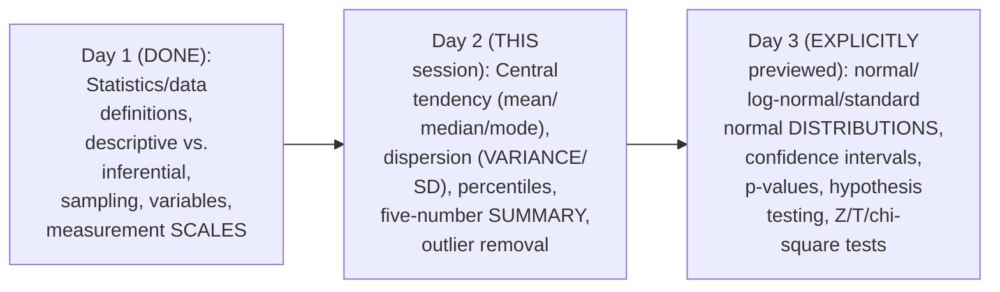

#### ⚠ A Direct, Honest Note on This Session's Own, Genuine Live Teaching Style

> 💡 **Given directly, after an on-screen mistake:** *"Whatever I have written it got wasted... I'm extremely sorry because of some people this thing happened, guys... I can make things better, but I don't think so I can make it [work]."*

#### 🎯 Key Takeaways

* This is GENUINELY **Day 2**, EXPLICITLY, DIRECTLY confirmed as MOVING "FROM basics TO intermediate" STATISTICS.
* Today's COMPLETE, explicit TOPIC list: central TENDENCY, dispersion, PERCENTILES/quartiles, the FIVE-number summary, and OUTLIER removal — WITH distributions EXPLICITLY deferred to DAY 3.
* This session's OWN, GENUINE, LIVE teaching STYLE includes HONEST, visible MISTAKES (a MATH error, an ACCIDENTAL loss OF written notes) — LEFT in, RATHER than edited OUT, REFLECTING the INSTRUCTOR's own, REAL, unscripted TEACHING approach.

---

### 2. Arithmetic Mean: Population vs. Sample, With Standard Notation

#### 📖 Definition — Population Mean, Precisely Defined

> 💡 **Given directly:** *"Population is basically given by capital N, sample is given by small n... whenever we are probably discussing about mean, you need to remember that we are trying to find out the average of a specific distribution... mean of this population I can basically give by a symbol which is mu... mu equals summation of i equals 1 to capital N, x of i, divided by N."*

```text
Population Mean:  μ = (Σ xᵢ, for i=1 to N) / N
Sample Mean:      x̄ = (Σ xᵢ, for i=1 to n) / n
```

#### 🪜 Step-by-Step — A Complete, Real, Live-Computed Example

> 💡 **Given directly:** *"Let's say that my dataset looks something like this: 1, 1, 2, 2, 3, 3, 4, 5, 5, 6... if I try to find out the average... 6 plus 5, 11... 32 by 10, which is nothing but 3.2. So 3.2 is basically my average."*

```text
Dataset: 1, 1, 2, 2, 3, 3, 4, 5, 5, 6   (N = 10)
Sum: 1+1+2+2+3+3+4+5+5+6 = 32
Mean (μ) = 32 / 10 = 3.2
```

#### ⚠ A Direct, Honest, Live-Corrected Mistake

> 💡 **Given directly:** *"So what is the sum that you have probably got, guys? 6 plus 5, 11, 11 plus 5, 16, 20, 23, 26, 28... oh sorry, then I made a mistake, right? So this is 32... I'm extremely sorry, I am a human being, I can make mistakes."*

#### ⚠ Common Mistakes

* Assuming POPULATION and SAMPLE mean use GENUINELY, STRUCTURALLY different FORMULAS — explicitly, directly, PRECISELY clarified: the FORMULA is IDENTICAL (sum DIVIDED by count) — ONLY the NOTATION (μ VERSUS x̄; capital N VERSUS small n) GENUINELY differs.
* Assuming STANDARD, WELL-known notation is GENUINELY optional or ARBITRARY — explicitly, directly clarified: USING it MATTERS FOR "explaining SOMEONE as a DATA scientist," IN the REAL, professional WORLD.

#### 🎯 Key Takeaways

* The **ARITHMETIC mean** formula is IDENTICAL for POPULATION and SAMPLE (SUM divided by COUNT) — ONLY the NOTATION genuinely DIFFERS: **μ** (population MEAN, capital N) VERSUS **x̄** (sample MEAN, small n).
* A COMPLETE, real, LIVE-computed EXAMPLE (dataset: 1,1,2,2,3,3,4,5,5,6) directly, CONCRETELY confirmed a MEAN of **3.2** — INCLUDING a GENUINE, honest, LIVE-corrected arithmetic MISTAKE.
* Using STANDARD, professional NOTATION is directly, EXPLICITLY confirmed as GENUINELY important FOR real-world, PROFESSIONAL communication — NOT merely an ACADEMIC formality.

---
### 3. Measure of Central Tendency: Why Three Different Measures Exist

#### 📖 Definition — Measure of Central Tendency, Precisely Defined

> 💡 **Given directly:** *"If someone says, what is central tendency, or what is measure of central tendency, you can just say that it refers to the measure used to determine the center of the distribution of the data."*

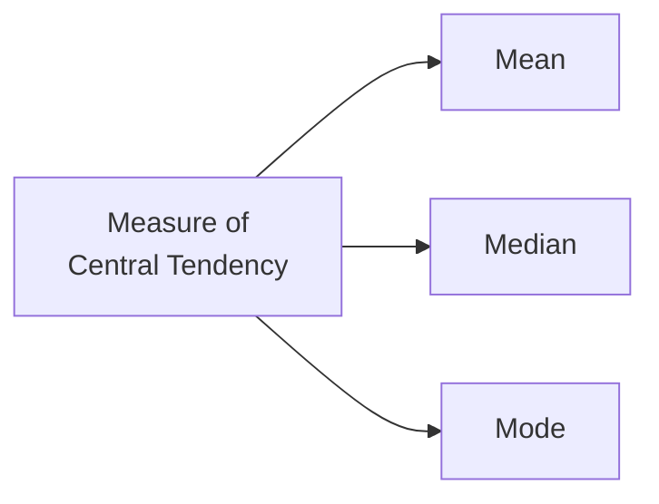

#### ⚠ Common Mistakes

* Assuming "AVERAGE" and "MEAN" are GENUINELY, SUBTLY different CONCEPTS — explicitly, directly, PRECISELY clarified: "AVERAGE and mean ARE one and the SAME... we use the SAME formula."
* Assuming a SINGLE measure (LIKE mean ALONE) is GENUINELY sufficient FOR every SITUATION — explicitly, directly, DIRECTLY foreshadowed: the NEXT sections (4-6) DIRECTLY demonstrate WHY median and MODE genuinely, PRACTICALLY matter TOO.

#### 🎯 Key Takeaways

* **Measure of CENTRAL tendency** is precisely defined as "the MEASURE used to DETERMINE the CENTER of the distribution OF the data" — a GENUINE, frequently-tested INTERVIEW definition WORTH memorizing PRECISELY.
* THREE, distinct MEASURES exist: **MEAN, median, and MODE** — EACH GENUINELY, PRACTICALLY useful in DIFFERENT situations.
* "AVERAGE" and "MEAN" are directly, EXPLICITLY confirmed as GENUINELY the SAME thing — USING the SAME formula.

---

### 4. Median: A Genuine, Live Demonstration of Outlier Robustness

#### ❓ Why It Exists — A Dramatic, Real, Live-Computed Demonstration

> 💡 **Given directly:** *"What if I tell you that in this distribution you add one more element, like 100?... 32 plus 100, divided by 11... 132 by 11 is nothing but 12... before, when 100 was not added, my mean was 3.2. But after adding 100... my mean became 12. There is a huge movement of mean."*

```text
Original dataset: 1,1,2,2,3,3,4,5,5,6  -> Mean = 3.2
WITH outlier (100) added:  1,1,2,2,3,3,4,5,5,6,100  -> Mean = 132/11 = 12
```

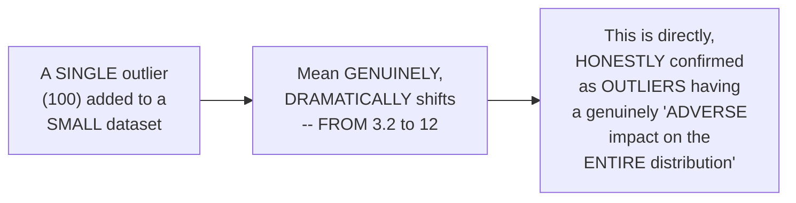

#### 📖 Definition — Median, Precisely Defined (Step-by-Step Method)

> 💡 **Given directly:** *"First step is [to] sort the numbers... after sorting the numbers, what I am actually going to do is that I am basically going to take the central element... if I have odd number of elements... [find] the middle element."*

```text
For ODD count (11 elements: 1,1,2,2,3,3,4,5,5,6,100):
  Sorted, take the CENTER element (6th of 11) -> Median = 3

For EVEN count (12 elements, adding one more outlier, 112):
  Take the TWO center elements (6th and 7th) and average them
  -> (3+4)/2 = 3.5
```

#### 🔍 Internal Working — A Genuine, Direct Confirmation: Median's Own Robustness

> 💡 **Given directly:** *"Even though the outlier is added... my median is nothing but 3... even though I had two different outliers, my median... came as 3.5. Now here you can see that there is less difference... so if I talk about median, it works well with outlier."*

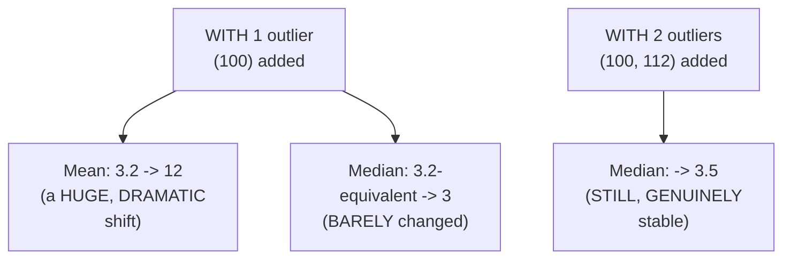

#### ⚠ Common Mistakes

* Assuming MEAN is ALWAYS, GENUINELY the BEST measure of CENTRAL tendency — explicitly, directly, DRAMATICALLY disproven: a SINGLE outlier CAN, GENUINELY, DIRECTLY distort the MEAN far MORE than the MEDIAN.
* Forgetting to SORT the data BEFORE finding the MEDIAN — explicitly, directly, PRECISELY confirmed as the REQUIRED, FIRST step.

#### 🎯 Key Takeaways

* A DRAMATIC, real, LIVE-computed DEMONSTRATION directly, CONCRETELY proved OUTLIER sensitivity: ADDING a SINGLE outlier (100) SHIFTED the MEAN from **3.2 to 12** — a GENUINE, HUGE movement.
* **Median** GENUINELY, DIRECTLY resists this DISTORTION — REMAINING NEAR 3 (and 3.5, WITH a SECOND outlier) — CONFIRMING it "WORKS well with OUTLIER[S]."
* The MEDIAN's own METHOD: SORT the data, THEN take the CENTRAL element (ODD count) OR average the TWO central ELEMENTS (EVEN count).

---
### 5. Mode: Most Frequent Element & When to Use It

#### 📖 Definition — Mode, Precisely Defined

> 💡 **Given directly:** *"In mode, we find out the most frequent element... in the most frequent element, we just try to count and we try to see that which element is having the maximum number of elements."*

#### 🪜 Step-by-Step — A Complete, Real, Worked Example

> 💡 **Given directly:** *"Suppose if I have a specific data set like this: 1,2,3,4,5,6,6,6,7,8... six is basically having three [occurrences], the count is 3... so in this particular case my mode should definitely be 6."*

#### 🏢 Real-World / Production Usage — A Genuine, Real, Practical Use Case: Missing-Value Imputation

> 💡 **Given directly:** *"Let's say that this is a type of flower... and this particular data set has come to me, and let's say consider that I've seen in this particular data there are 10 percent missing data. Now what do you think, in order to handle this missing values, what type of things we can definitely use?... don't you think I can definitely use mode over here, because the most frequent occurring flower can be replaced with this missing value."*

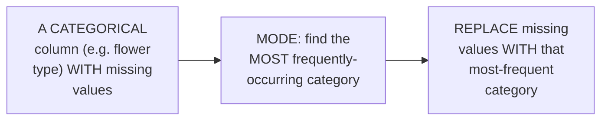

#### ⚠ A Direct, Honest Note: Mode's Own Genuine Limitation

> 💡 **Given directly:** *"Even though suppose let's consider that I have many, many outliers... since we find out the most frequent element, we try to take this as an outlier... so usually, in most of the outliers that we specifically use, we basically use median."*

#### ⚠ Common Mistakes

* Assuming MODE is GENUINELY, ONLY useful for NUMERIC data — explicitly, directly, PRACTICALLY demonstrated as PARTICULARLY well-SUITED to **CATEGORICAL** variables — "IT works well WITH categorical VARIABLES" specifically.
* Assuming MODE is the GENUINE, default choice FOR handling OUTLIERS in GENERAL — explicitly, directly clarified: MEDIAN is the MORE common CHOICE for OUTLIER-heavy, GENERAL scenarios — MODE's own STRENGTH is SPECIFICALLY for CATEGORICAL data/missing-VALUE imputation.

#### 🎯 Key Takeaways

* **Mode** is precisely the **MOST frequently-OCCURRING element** in a DATASET — WORKS with BOTH numeric AND categorical DATA, but is PARTICULARLY well-suited TO categorical variables.
* A GENUINE, real, PRACTICAL use case: **MISSING-value imputation** FOR categorical DATA (e.g., a MISSING flower TYPE) — REPLACING missing entries WITH the most FREQUENT category.
* Mode has a GENUINE, honest LIMITATION with MANY outliers — MEDIAN is GENERALLY the PREFERRED choice FOR outlier-heavy, NUMERIC scenarios.

---

### 6. Choosing Mean, Median, or Mode: A Genuine, Domain-Dependent Decision

#### 🪜 Step-by-Step — A Complete, Real, Worked Example: Student Ages

> 💡 **Given directly:** *"Suppose I have a feature: age. I have values like 25, 26, dash dash dash, 32, 34, 38... let's say that these are my ages of students. What do you think, what should I actually apply? Mean, median, or mode?... definitely I would suggest, let's go with mean, because I know students' age will basically range from one value to one value, it won't extend more than that specific value."*

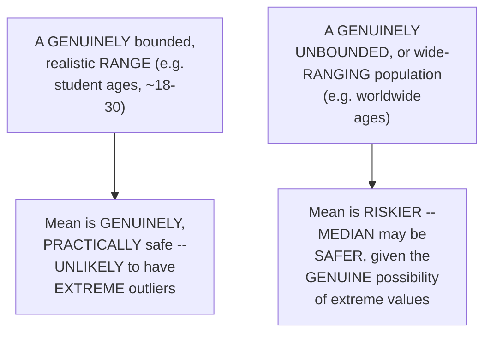

#### 🔍 Internal Working — A Direct, Honest Confirmation: Domain Knowledge Matters

> 💡 **Given directly:** *"So something like that, you know, so this is a very good example, very good understanding with respect to various use cases that we can actually think... a domain knowledge will also come into existence."*

#### ⚠ Common Mistakes

* Assuming ONE, single MEASURE (mean, MEDIAN, or mode) is GENUINELY, UNIVERSALLY "correct" for ALL numeric DATA — explicitly, directly, HONESTLY clarified: the CHOICE genuinely, DIRECTLY depends ON domain KNOWLEDGE and the SPECIFIC, realistic RANGE of the DATA.

#### 🎯 Key Takeaways

* CHOOSING between MEAN, median, or MODE is directly, HONESTLY confirmed as a **GENUINE, domain-DEPENDENT decision** — NOT a FIXED, universal RULE.
* A REAL, worked EXAMPLE (STUDENT ages) directly, CONCRETELY illustrates WHY mean is OFTEN safe WHEN the data's OWN, realistic range is GENUINELY bounded (e.g., a CLASSROOM's ages WON'T extend to EXTREME values).
* **DOMAIN knowledge** is directly, EXPLICITLY confirmed as a GENUINE, necessary INPUT to THIS decision — STATISTICAL formulas ALONE are NOT sufficient.

---
### 7. Measure of Dispersion: Why Two Datasets Can Share a Mean Yet Differ

#### ❓ Why It Exists — A Genuine, Real, Motivating Puzzle

> 💡 **Given directly:** *"Let's say that I have two data sets. I have data set like 1,1,2,2,4... [mean is] 2... let's consider that I have another distribution which looks like this: 2,2,2,2,2. If I try to find out the average, then also it is 2... so if I am getting the same mean, then how do I identify that this two distributions are different?"*

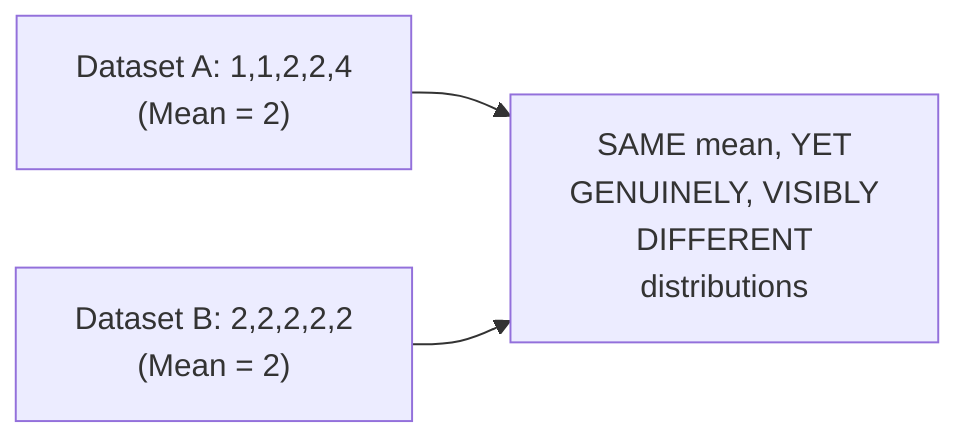

#### 📖 Definition — Dispersion, Precisely Defined

> 💡 **Given directly:** *"When I say dispersion, dispersion basically means spread... please make sure that you remember this word, this basically means spread. How well spread your data is... with the mean."*

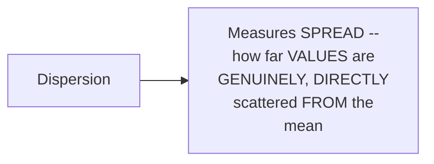

#### ⚠ Common Mistakes

* Assuming a SHARED, identical MEAN GENUINELY, DIRECTLY implies TWO datasets are GENUINELY equivalent — explicitly, directly, CONCRETELY disproven: the SAME mean CAN, GENUINELY, arise FROM COMPLETELY different, GENUINELY distinct DISTRIBUTIONS.
* Assuming "DISPERSION" is a VAGUE, imprecise CONCEPT — explicitly, directly, MEMORABLY anchored to ONE, simple word: **SPREAD**.

#### 🎯 Key Takeaways

* A GENUINE, real PUZZLE (TWO datasets, THE SAME mean OF 2, but GENUINELY different DISTRIBUTIONS) directly, CONCRETELY motivates the NEED for a SECOND, complementary MEASURE beyond CENTRAL tendency ALONE.
* **Dispersion** is precisely, MEMORABLY anchored to ONE word: **SPREAD** — HOW far VALUES are GENUINELY scattered FROM the mean.
* This DIRECTLY sets up the NEXT, essential CONCEPTS: **VARIANCE and standard DEVIATION**, WHICH quantify DISPERSION precisely.

---

### 8. Variance: Population vs. Sample (and a First Glimpse of n-1)

#### 📖 Definition — Population Variance, Precisely Defined

> 💡 **Given directly:** *"Population variance is given by something called as sigma square: summation of i equals 1 to capital N, x of i minus mu, whole square, divided by N."*

#### 📖 Definition — Sample Variance, Precisely Defined (Using n-1)

> 💡 **Given directly:** *"Sample variance is basically given by small s square: summation of i equals 1 to small n, x of i minus x bar, whole square, divided by n minus 1. Now many people will say, why n minus 1? Yes, this is an interview question, I will talk about it."*

```text
Population Variance:  σ² = Σ(xᵢ - μ)² / N
Sample Variance:      s² = Σ(xᵢ - x̄)² / (n-1)
```

#### 🪜 Step-by-Step — A Complete, Real, Live-Computed Worked Example

> 💡 **Given directly:** *"Let's consider that I have my x value as 1,2,2,3,4,5... mu... is nothing but 2.83... x minus mu... then we do the squaring... if I do the addition, this is nothing but 10.84, divided by 6... so what is 10.84 divided by 6? 1.81."*

```text
Dataset: 1, 2, 2, 3, 4, 5  (N = 6)
Mean (μ) = 17 / 6 = 2.83

Deviations (x - μ): -1.83, -0.83, -0.83, 0.17, 1.17, 2.17
Squared deviations:  3.35, 0.69, 0.69, 0.03, 1.37, 4.71
Sum of squared deviations = 10.84

Population Variance (σ²) = 10.84 / 6 = 1.81
```

#### 🔍 Internal Working — A Genuine, Direct Confirmation: Higher Spread = Higher Variance

> 💡 **Given directly:** *"Comparing this to [another distribution], where do you think the variance is more?... in the second picture, definitely variance will be higher... whenever I talk about more variance, that basically means the data is more dispersed."*

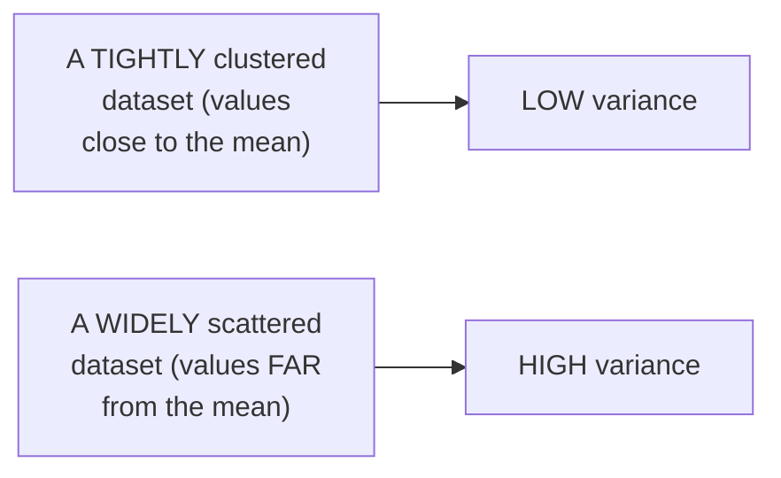

#### ⚠ A Direct, Honest, Deferred Explanation: Why n-1?

> 💡 **Given directly:** *"This n minus 1, why we do it? It is also called as Bessel's correction, we also say it as degree of freedom... I have probably made this video in my stats playlist why sample variance is divided by n minus 1. You can go and search for that, because of time constraint again, same thing I will not explain you."*

#### ⚠ Common Mistakes

* Assuming POPULATION and SAMPLE variance use the SAME, IDENTICAL denominator — explicitly, directly, PRECISELY corrected: POPULATION variance DIVIDES by **N**; SAMPLE variance DIVIDES by **n-1** (BESSEL's correction/DEGREES of freedom).
* Assuming HIGHER variance is GENUINELY, INHERENTLY "bad" — explicitly, directly, NEUTRALLY clarified: it SIMPLY, GENUINELY means the DATA is MORE spread OUT — NEITHER inherently GOOD nor BAD, just DESCRIPTIVE.

#### 🎯 Key Takeaways

* **Population VARIANCE (σ²)** divides BY N; **sample VARIANCE (s²)** divides BY **n-1** (CALLED Bessel's CORRECTION, or DEGREES of freedom) — a GENUINE, frequently-tested INTERVIEW distinction.
* A COMPLETE, real, LIVE-computed EXAMPLE (dataset: 1,2,2,3,4,5) directly, CONCRETELY confirmed a POPULATION variance of **1.81**.
* The instructor **directly, HONESTLY defers** the FULL, precise EXPLANATION of WHY n-1 is USED to his OWN, separate stats PLAYLIST — an HONEST acknowledgment of THIS session's own TIME constraints.

---
### 9. Standard Deviation: A Genuine, Real Interpretation

#### 📖 Definition — Standard Deviation, Precisely Defined

> 💡 **Given directly:** *"Standard deviation is nothing but root of variance... root of 1.81... 1.345."*

```text
Standard Deviation = √(Variance) = √1.81 ≈ 1.345
```

#### 🔍 Internal Working — A Genuine, Real, Live-Computed Interpretation: "How Far From the Mean"

> 💡 **Given directly:** *"From this mean, your data will be distributed, because mean is basically specifying your measure of central tendency... if I go one step to the right, the next element that may probably fall between the one standard deviation will range between... 2.83 plus 1.345... 4.17... towards the left... 2.83 minus 1.345... 1.49."*

```text
Mean (μ) = 2.83, Standard Deviation ≈ 1.345

+1 SD range: 2.83 to 4.17 (i.e., μ to μ+1SD)
-1 SD range: 1.49 to 2.83 (i.e., μ-1SD to μ)
+2 SD range: continues outward, e.g. up to ~5.51
```

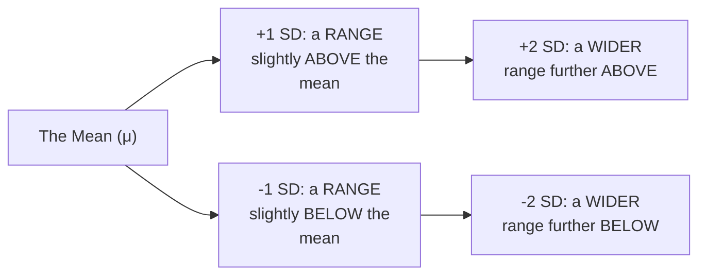

#### 🔍 Internal Working — A Genuine, Real, Visual Reference (Wikipedia's Own Bell-Curve Image)

> 💡 **Given directly:** *"In this particular image... standard deviation is 10, standard deviation is 50... when the standard deviation is smaller, that basically means you're having a very huge curve — that basically means the data is not that much distributed. When you have a big standard deviation like 50, 60... your data is highly distributed."*

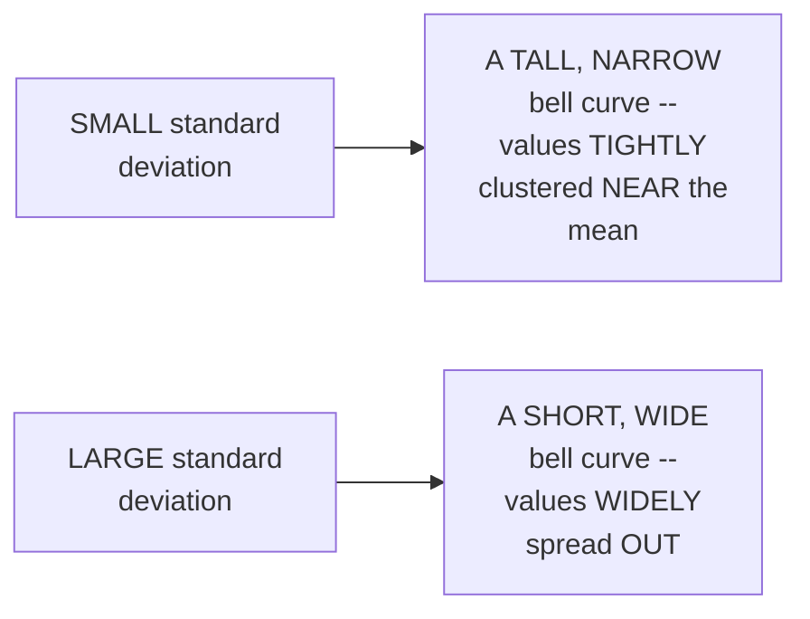

#### 🔍 Internal Working — A Genuine, Real, Practical Framing: Expressing Distance in SD Units

> 💡 **Given directly:** *"Let's consider that if I consider 5... how are you going to represent 5? You will say that it falls in 1.5 standard deviation from the mean... so that basically means, from the mean, how far a specific number is with respect to standard deviation, you're calculating."*

#### ⚠ Common Mistakes

* Confusing VARIANCE and standard DEVIATION as GENUINELY, ENTIRELY separate, unrelated MEASURES — explicitly, directly, PRECISELY clarified: standard DEVIATION is SIMPLY the **SQUARE root** of variance — a DIRECTLY related, but MORE interpretable UNIT.
* Assuming standard DEVIATION is GENUINELY, PURELY an ABSTRACT number — explicitly, directly, CONCRETELY demonstrated as a REAL, practical "UNIT" — EXPRESSING how FAR any GIVEN value is FROM the mean (e.g., "5 falls IN 1.5 standard DEVIATIONS from the MEAN").

#### 🎯 Key Takeaways

* **Standard DEVIATION** is precisely the **SQUARE root of VARIANCE** — a MORE interpretable, "REAL-unit" measure OF spread.
* A COMPLETE, live-COMPUTED example directly, CONCRETELY demonstrated HOW to construct RANGES at ±1 and ±2 STANDARD deviations FROM the mean.
* A REAL, visual REFERENCE (a Wikipedia BELL-curve image) directly, CONCRETELY illustrated: **SMALL** standard DEVIATION = a TALL, narrow CURVE (tightly CLUSTERED data); **LARGE** standard DEVIATION = a SHORT, wide curve (WIDELY spread DATA).

---

### 10. Percentiles: Finding Rank & Finding Value

#### 📖 Definition — Percentage, Precisely Reviewed (As a Foundation)

> 💡 **Given directly:** *"Before understanding percentile, you basically need to understand about percentage... percentage is equal to number of numbers [meeting a condition] divided by total numbers."*

#### 📖 Definition — Percentile, Precisely Defined

> 💡 **Given directly:** *"Percentile is a value below which a certain percentage of observations lie."*

#### 🏢 Real-World / Production Usage — A Genuine, Real, Relatable Example

> 💡 **Given directly:** *"One real-life example I'll show it to you, that is related to my YouTube ranking also... here you can see that... education rank... shows 96.1527 percentile."*

#### 🪜 Step-by-Step — Formula 1: Finding a Value's Own Percentile Rank

> 💡 **Given directly:** *"My formula will basically be [the] number of values below x, divided by small n [multiplied by 100]... what is the percentile ranking of 10?... 16 divided by 20, multiplied by 100... 80 percentile."*

```text
Percentile Rank Formula: (Number of values BELOW x / n) × 100

Dataset (n=20): 2,2,3,4,5,5,6,7,8,8,8,9,9,10,11,11,12 (etc.)
For x=10: 16 values are below 10 -> (16/20) × 100 = 80th percentile
For x=11: 17 values are below 11 -> (17/20) × 100 = 85th percentile
```

#### 🪜 Step-by-Step — Formula 2: Finding the Value at a Given Percentile

> 💡 **Given directly:** *"What value exists at the percentile ranking of 25?... value is equal to percentile divided by 100, multiplied by n plus 1... 25 by 100 multiplied by 21... 5.25. Now understand, this 5.25 is the index position... I don't see any element [exactly] fine between this, so what we do is we take fifth and sixth index and then we do the average."*

```text
Value-at-Percentile Formula: Index = (Percentile / 100) × (n + 1)

For 25th percentile (n=20): Index = 0.25 × 21 = 5.25
  -> Average the 5th and 6th sorted values -> Answer: 5

For 75th percentile (n=20): Index = 0.75 × 21 = 15.75
  -> Between the 15th and 16th sorted values -> Answer: 9
```

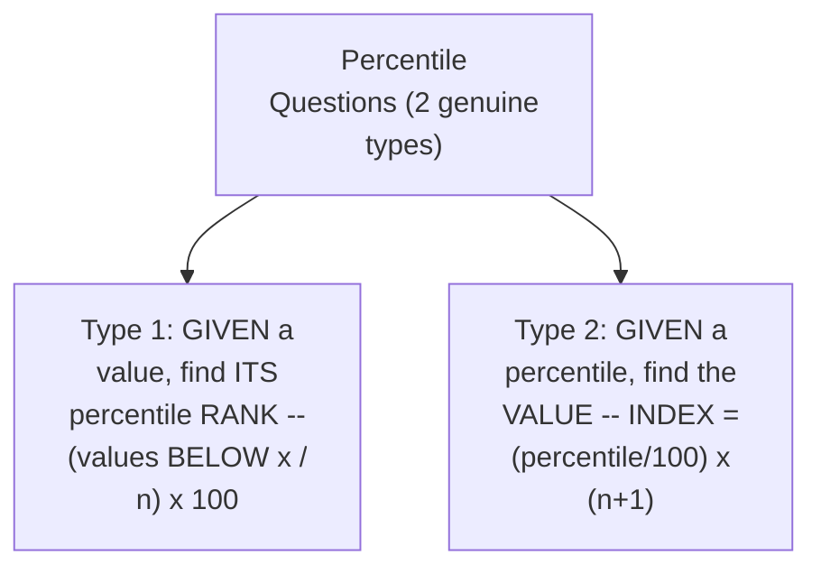

#### ⚠ Common Mistakes

* Confusing the TWO, genuinely DIFFERENT percentile QUESTION types — explicitly, directly, PRECISELY distinguished: FINDING a value's OWN rank USES ONE formula; FINDING the VALUE at a GIVEN percentile uses a GENUINELY DIFFERENT, separate FORMULA.
* Treating the "(percentile/100) × (n+1)" RESULT as the ANSWER itself — explicitly, directly, PRECISELY clarified: this RESULT is an **INDEX position**, NOT the final VALUE — you MUST then LOOK UP (or AVERAGE) the CORRESPONDING, sorted DATA point(s).

#### 🎯 Key Takeaways

* **Percentile** is precisely "a VALUE below WHICH a CERTAIN percentage OF observations LIE" — GROUNDED in a GENUINE, real EXAMPLE (the INSTRUCTOR's own YOUTUBE channel ranking).
* **TWO, genuinely DIFFERENT formula TYPES** exist: FINDING a value's OWN percentile RANK ((VALUES below x / n) × 100), and FINDING the VALUE at a GIVEN percentile ((percentile/100) × (n+1), PRODUCING an INDEX position).
* COMPLETE, live-COMPUTED examples directly, CONCRETELY confirmed: x=10 → 80th PERCENTILE; x=11 → 85th PERCENTILE; 25th percentile → VALUE of 5; 75th PERCENTILE → value OF 9.

---
### 11. The Five-Number Summary & IQR-Based Outlier Removal

#### 📖 Definition — The Five-Number Summary, Precisely Defined

> 💡 **Given directly:** *"In five number summary we need to discuss about... the first one is something called as minimum, the second topic... is first quartile, which is also denoted by Q1, the third topic... is median, the fourth topic... third quartile, which is also said as Q3, and the fifth topic we basically discuss about maxima."*

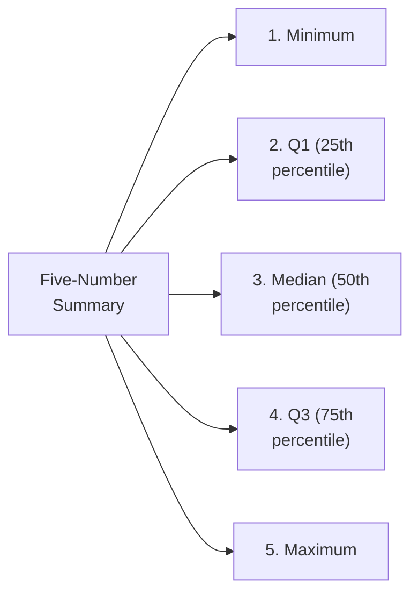

#### 📖 Definition — IQR (Interquartile Range), Precisely Defined

> 💡 **Given directly:** *"IQR is nothing but... interquartile range... it is given by the formula Q3 minus Q1. Q3 is nothing but 75 percentile, and Q1 is nothing but 25 percentile."*

#### 📖 Definition — Lower & Upper Fences, Precisely Defined

> 💡 **Given directly:** *"Lower fence is equal to Q1 minus 1.5 multiplied by IQR... upper fence is basically defined by Q3 plus 1.5 multiplied by IQR."*

```text
IQR = Q3 - Q1
Lower Fence = Q1 - 1.5 × IQR
Upper Fence = Q3 + 1.5 × IQR
Any value BELOW the lower fence, or ABOVE the upper fence, is an outlier.
```

#### 🪜 Step-by-Step — A Complete, Real, Live-Computed Outlier-Removal Example

> 💡 **Given directly:** *"Let's consider that I have one data set which is like this: 1,2,2,3,3,4,5,5,5,6,6,6,6,7,8,8,9,27... obviously you'll be saying that 27 is the outlier."*

```text
Dataset (n=19): 1,2,2,3,3,4,5,5,5,6,6,6,6,7,8,8,9,27

Q1 (25th percentile): index = 0.25 × 20 = 5 -> Q1 = 3
Q3 (75th percentile): index = 0.75 × 20 = 15 -> Q3 = 7

IQR = 7 - 3 = 4
Lower Fence = 3 - (1.5 × 4) = 3 - 6 = -3
Upper Fence = 7 + (1.5 × 4) = 7 + 6 = 13

-> Any value BELOW -3 or ABOVE 13 is an outlier.
-> 27 is GENUINELY, DIRECTLY greater than 13 -> 27 is removed as the outlier.
```

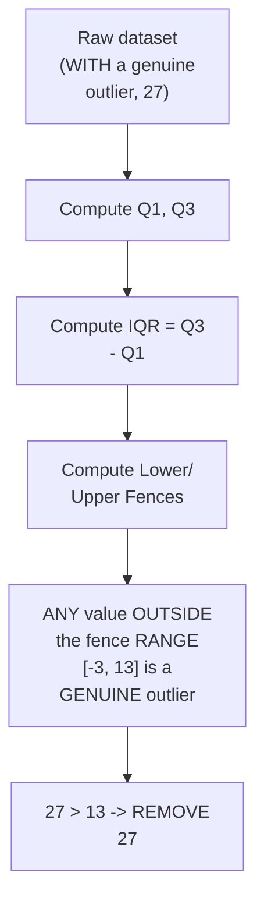

#### 🪜 Step-by-Step — The Complete Five-Number Summary, After Removing the Outlier

> 💡 **Given directly:** *"The remaining data... 1,2,2,3,3,4,5,5,5,6,6,6,6,7,8,8,9... minimum value is 1... Q1 is nothing but 3... median... 5... Q3 is 7... maximum number after removing the outlier is nothing but 9."*

```text
Complete Five-Number Summary (after removing 27):
  Minimum: 1
  Q1:      3
  Median:  5
  Q3:      7
  Maximum: 9
```

#### ⚠ Common Mistakes

* Assuming ANY unusually LARGE or SMALL value is AUTOMATICALLY, GENUINELY an outlier — explicitly, directly, PRECISELY clarified: OUTLIER status is DETERMINED formally VIA the LOWER/upper fence CALCULATION, NOT merely BY visual inspection ALONE.
* Confusing the INDEX position (e.g., "5.25") WITH the FINAL, actual VALUE — explicitly, directly, REPEATEDLY reinforced FROM Section 10 — the INDEX must STILL be LOOKED UP against the SORTED data.

#### 🎯 Key Takeaways

* The **FIVE-number SUMMARY** consists of: MINIMUM, Q1 (25th PERCENTILE), median (50th PERCENTILE), Q3 (75th percentile), and MAXIMUM.
* **IQR = Q3 − Q1**; OUTLIERS are FORMALLY identified as ANY value BELOW `Q1 − 1.5×IQR` OR above `Q3 + 1.5×IQR`.
* A COMPLETE, real, LIVE-computed EXAMPLE correctly, PRECISELY identified and REMOVED a GENUINE outlier (27, ABOVE the upper FENCE of 13) — DIRECTLY, CONCRETELY demonstrating the ENTIRE IQR-based OUTLIER-removal workflow.

---

### 12. Box Plots: Visualizing the Five-Number Summary

#### 🪜 Step-by-Step — A Complete, Real, Live-Constructed Box Plot

> 💡 **Given directly:** *"Let's draw a plot which is called as box plot by this specific data... you will be having x-axis... go and find out where is minimum element... this will be your minimum element... Q1 will basically fall at three... median is basically five... Q3 is nothing but seven... max is nothing but nine... now all you have to do is that join these lines."*

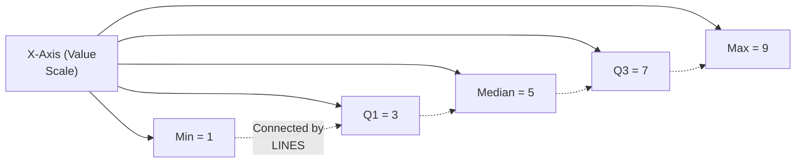

#### 🔍 Internal Working — A Genuine, Direct Note on How Outliers Would Be Shown

> 💡 **Given directly:** *"If I had kept 27 as an element, I would have to extend this line this much big, and probably put 27 somewhere here, and this used to be one dot over here."*

#### 🏢 Real-World / Production Usage — A Genuine, Direct Confirmation of Practical Relevance

> 💡 **Given directly:** *"This is also used extensively in data visualization... you can also do this with code, like I have to just install a library, in Matplotlib you have a library where you can probably do all these things."*

#### ⚠ Common Mistakes

* Assuming a BOX plot's OWN "whiskers"/lines EXTEND infinitely, REGARDLESS of the DATA — explicitly, directly, CONCRETELY clarified: an OUTLIER (LIKE the REMOVED 27) would be SHOWN as a SEPARATE, individual **DOT**, BEYOND the main box/WHISKER structure — NOT as a SIMPLE extension of the LINE.

#### 🎯 Key Takeaways

* A **box PLOT** is directly, CONCRETELY constructed FROM the five-NUMBER summary — PLOTTING min, Q1, MEDIAN, Q3, and MAX, CONNECTED by lines ON a SINGLE, shared value AXIS.
* OUTLIERS (LIKE the removed 27) would be shown as SEPARATE, individual **DOTS** BEYOND the main BOX structure — NOT as a SIMPLE extension of the WHISKER line.
* Box plots are directly, EXPLICITLY confirmed as GENUINELY, PRACTICALLY used IN real data VISUALIZATION — WITH a DIRECT, forward-looking MENTION of PYTHON's own Matplotlib LIBRARY for CODE-based construction.

---
### 13. Closing: Interview Framing & Tomorrow's Preview

#### 🪜 Step-by-Step — A Direct, Explicit Interview-Question Framing

> 💡 **Given directly:** *"One interview question may come: what is the application of box plot?... box plots can be used to determine outliers... box plot actually gives you a visualization way to basically see where an outlier is actually present. If someone asks you how do you create or how do you determine an outlier, you can explain this entire concept, whatever I have explained with respect to percentiles."*

#### 🪜 Step-by-Step — A Complete, Direct Preview of Day 3's Own Content

> 💡 **Given directly:** *"Tomorrow we'll basically start with distribution, we'll finish up normal distribution, we'll finish up log normal distribution, standard normal distributions... then we'll move towards confidence interval, then we'll move towards p-value, hypothesis testing, Z test, T test, chi-square test."*

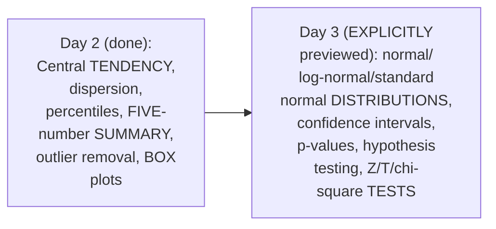

#### ⚠ Common Mistakes

* Assuming THIS session's own COVERAGE represents a COMPLETE, standalone statistics FOUNDATION — explicitly, directly, HONESTLY clarified: DISTRIBUTIONS, confidence INTERVALS, p-values, and HYPOTHESIS testing REMAIN explicitly DEFERRED to Day 3 and BEYOND.

#### 🎯 Key Takeaways

* This episode **GENUINELY, COMPLETELY delivers** its OWN, stated Day-2 GOAL — a COMPLETE, INTERMEDIATE-level toolkit: CENTRAL tendency, DISPERSION, percentiles, the FIVE-number summary, and OUTLIER removal — ALL grounded IN real, LIVE-computed examples.
* The box PLOT's own APPLICATION (outlier DETECTION) is directly, EXPLICITLY framed as **GENUINE, real interview MATERIAL**.
* **Day 3** is directly, EXPLICITLY confirmed as COVERING normal/LOG-normal/standard NORMAL distributions, CONFIDENCE intervals, p-VALUES, hypothesis TESTING, and Z/T/chi-SQUARE tests.

---

## 📝 Glossary

| Term | Definition | Why It Matters |
|---|---|---|
| **Mean (μ / x̄)** | Sum of values divided by count | μ for population, x̄ for sample -- same formula |
| **Median** | The central value, after sorting | Robust to outliers, unlike mean |
| **Mode** | The most frequently-occurring value | Well-suited to categorical data/imputation |
| **Variance (σ² / s²)** | Average of squared deviations from the mean | Measures spread/dispersion |
| **Bessel's Correction (n-1)** | The denominator used for sample variance | Distinguishes sample from population variance |
| **Standard Deviation** | The square root of variance | A more interpretable "distance from the mean" unit |
| **Percentile** | A value below which a certain percentage of data lies | e.g., YouTube channel rankings |
| **Five-Number Summary** | Minimum, Q1, Median, Q3, Maximum | The foundation for box plots and outlier detection |
| **IQR (Interquartile Range)** | Q3 minus Q1 | Used to compute outlier fences |
| **Lower/Upper Fence** | Q1 - 1.5×IQR / Q3 + 1.5×IQR | Values outside this range are outliers |
| **Box Plot** | A visual representation of the five-number summary | Used to identify outliers visually |

---

## 🔄 Revision Notes — One-Minute Revision

* This is **Day 2**, moving from basics to intermediate statistics -- entirely built through real, live-computed numerical examples.
* **Arithmetic mean**: same formula for population (μ, capital N) and sample (x̄, small n) -- sum divided by count. Live example: dataset 1,1,2,2,3,3,4,5,5,6 -> mean = 3.2.
* **Measure of central tendency**: "the measure used to determine the center of the distribution" -- mean, median, mode. Average = mean (same thing).
* **Median's own, dramatic outlier-robustness demo**: adding ONE outlier (100) to the same dataset shifted the mean from 3.2 to 12 (a huge jump), but the median barely moved (staying near 3, then 3.5 with a second outlier). Median method: sort, then take the central element (odd count) or average the two central elements (even count).
* **Mode**: the most frequent element. Genuine use case: imputing missing CATEGORICAL data (e.g., a missing flower type gets replaced with the most common one). Works less well with many outliers -- median is generally preferred there.
* **Choosing mean/median/mode**: genuinely domain-dependent. Example: student ages -> mean is safe, since the realistic range is bounded.
* **Measure of dispersion (variance/SD)**: motivated by a real puzzle -- two datasets (1,1,2,2,4 and 2,2,2,2,2) can share the SAME mean (2) yet be genuinely different. Dispersion = spread.
* **Variance formulas**: population variance (σ²) divides by N; sample variance (s²) divides by n-1 (Bessel's correction/degrees of freedom -- full explanation deferred to the instructor's own stats playlist). Live example: dataset 1,2,2,3,4,5 -> mean=2.83, sum of squared deviations=10.84, variance=1.81.
* **Standard deviation** = square root of variance (√1.81 ≈ 1.345) -- interpreted as "how far from the mean," with ±1 SD and ±2 SD ranges live-constructed. Smaller SD = a taller, narrower bell curve; larger SD = a shorter, wider one.
* **Percentiles**: "a value below which a certain percentage of observations lie" (illustrated via the instructor's own YouTube channel ranking). TWO distinct formulas: (1) finding a value's own rank -- (values below x / n) × 100 (e.g., x=10 -> 80th percentile; x=11 -> 85th percentile); (2) finding the value AT a percentile -- index = (percentile/100) × (n+1) (e.g., 25th percentile -> index 5.25 -> value 5; 75th percentile -> index 15.75 -> value 9).
* **Five-number summary**: minimum, Q1, median, Q3, maximum. **IQR = Q3 - Q1**. **Outlier fences**: Lower = Q1 - 1.5×IQR; Upper = Q3 + 1.5×IQR. Live example: a dataset with a genuine outlier (27) -> Q1=3, Q3=7, IQR=4, fences=[-3, 13] -> 27 correctly identified and removed (min=1, Q1=3, median=5, Q3=7, max=9 after removal).
* **Box plots**: built directly from the five-number summary, connected by lines on a value axis; outliers shown as separate dots beyond the main structure. Genuinely used in real data visualization (e.g., via Python's Matplotlib).
* **Closing**: box plot's own application (outlier detection) framed as genuine interview material. Day 3 explicitly previewed: normal/log-normal/standard normal distributions, confidence intervals, p-values, hypothesis testing, Z/T/chi-square tests.

---

## 📋 Cheat Sheet

**Mean formulas:**
```text
Population: μ = (Σxᵢ) / N
Sample:     x̄ = (Σxᵢ) / n
```

**Variance & Standard Deviation:**
```text
Population Variance: σ² = Σ(xᵢ - μ)² / N
Sample Variance:      s² = Σ(xᵢ - x̄)² / (n-1)   [Bessel's correction]
Standard Deviation:   √Variance
```

**Percentile formulas:**
```text
Finding RANK of value x:       (values below x / n) × 100
Finding VALUE at percentile p: index = (p/100) × (n+1)
                                (then look up/average the sorted data at that index)
```

**Five-Number Summary & Outlier Detection:**
```text
Min | Q1 (25th %ile) | Median (50th %ile) | Q3 (75th %ile) | Max

IQR = Q3 - Q1
Lower Fence = Q1 - 1.5 × IQR
Upper Fence = Q3 + 1.5 × IQR
-> Any value OUTSIDE [Lower Fence, Upper Fence] is an outlier.
```

**Worked example, in full (from this session):**
```text
Dataset: 1,2,2,3,3,4,5,5,5,6,6,6,6,7,8,8,9,27
Q1 = 3, Q3 = 7, IQR = 4
Fences: [-3, 13]  -> 27 is an outlier (removed)
Final Five-Number Summary: Min=1, Q1=3, Median=5, Q3=7, Max=9
```

---

## 🔥 Interview Questions & Answers

### 🟢 Beginner

**Q1.**

**Question:** What is the genuine difference between the population mean formula and the sample mean formula?

**Answer:** None -- they use the identical formula (sum divided by count); only the notation differs (μ/capital N vs. x̄/small n).

**Explanation:** Directly, precisely clarified.

**Why Interviewers Ask This:** Tests basic, foundational notation knowledge.

**Possible Follow-up:** "What is the standard notation for population versus sample?"

**Q2.**

**Question:** What is measure of central tendency?

**Answer:** The measure used to determine the center of the distribution of the data.

**Explanation:** Directly, precisely defined.

**Why Interviewers Ask This:** A directly-flagged, common interview question.

**Possible Follow-up:** "Name the three measures of central tendency."

**Q3.**

**Question:** Why is median often preferred over mean when outliers are present?

**Answer:** Median is robust to outliers; mean can shift dramatically (e.g., from 3.2 to 12 with a single added outlier).

**Explanation:** Directly, precisely, dramatically demonstrated.

**Why Interviewers Ask This:** Tests genuine, practical understanding of outlier sensitivity.

**Possible Follow-up:** "What is the first step when computing a median?"

**Q4.**

**Question:** What is mode particularly well-suited for?

**Answer:** Categorical variables, and imputing missing categorical data.

**Explanation:** Directly, precisely explained.

**Why Interviewers Ask This:** Basic, practical statistics/data-cleaning knowledge.

**Possible Follow-up:** "Give a real example of mode-based imputation."

**Q5.**

**Question:** What does "dispersion" mean, in one word?

**Answer:** Spread.

**Explanation:** Directly, explicitly anchored.

**Why Interviewers Ask This:** Basic, foundational statistics terminology.

**Possible Follow-up:** "Can two datasets share the same mean but different dispersion?"

**Q6.**

**Question:** What is the genuine difference between population variance and sample variance?

**Answer:** Population variance divides by N; sample variance divides by n-1 (Bessel's correction).

**Explanation:** Directly, precisely distinguished.

**Why Interviewers Ask This:** An explicitly-flagged, common interview question.

**Possible Follow-up:** "What is another name for this n-1 correction?"

**Q7.**

**Question:** What is standard deviation, in relation to variance?

**Answer:** The square root of variance.

**Explanation:** Directly, precisely explained.

**Why Interviewers Ask This:** Basic, essential statistics knowledge.

**Possible Follow-up:** "What does a small standard deviation genuinely indicate about a dataset?"

**Q8.**

**Question:** What is the precise definition of a percentile?

**Answer:** A value below which a certain percentage of observations lie.

**Explanation:** Directly, precisely defined.

**Why Interviewers Ask This:** Basic, foundational statistics terminology.

**Possible Follow-up:** "How do you compute a value's own percentile rank?"

**Q9.**

**Question:** What are the five components of the five-number summary?

**Answer:** Minimum, Q1, Median, Q3, Maximum.

**Explanation:** Directly, explicitly named.

**Why Interviewers Ask This:** Basic, essential statistics knowledge.

**Possible Follow-up:** "What is IQR, and how is it computed?"

**Q10.**

**Question:** What is a box plot genuinely used for?

**Answer:** Visualizing the five-number summary, and identifying outliers.

**Explanation:** Directly, explicitly confirmed.

**Why Interviewers Ask This:** An explicitly-flagged, common interview question.

**Possible Follow-up:** "How would an outlier genuinely appear on a box plot?"

---

### 🟡 Intermediate

**Q11.**

**Question:** Explain why the instructor deliberately, dramatically demonstrates the mean shifting from 3.2 to 12 with a single added outlier, rather than simply stating "mean is sensitive to outliers" as a fact.

**Answer:** This is a genuinely deliberate, CONCRETE teaching choice, DIRECTLY consistent with THIS instructor's OWN, established PATTERN throughout BOTH sessions (e.g., Day 1's OWN "shoe-rack" and "PIN code" examples). By GENUINELY, LIVE computing the SAME dataset BEFORE and AFTER adding an OUTLIER, the instructor makes an ABSTRACT claim ("mean is SENSITIVE to outliers") VISCERALLY, NUMERICALLY real — LEARNERS witness the DRAMATIC, 3.75x jump (3.2 to 12) THEMSELVES, RATHER than TRUSTING an unverified ASSERTION. This directly, CONCRETELY reinforces WHY median GENUINELY matters, in a WAY that is FAR more MEMORABLE and CONVINCING than a SIMPLE, abstract STATEMENT would HAVE been.

**Explanation:** Requires recognizing the deliberate, concrete value of a live, numerical before/after demonstration over an abstract, asserted claim.

**Why Interviewers Ask This:** Tests whether a learner recognizes the pedagogical and persuasive value of concrete, numeric demonstration over abstract assertion.

**Possible Follow-up:** "Construct your OWN, similar BEFORE/after demonstration, showing HOW adding a genuinely EXTREME outlier affects VARIANCE, using THIS session's own established FORMULA."

**Q12.**

**Question:** A learner argues that since mode is "the most frequent element," it should genuinely always be preferred over mean or median for handling missing data of ANY type. Evaluate this claim.

**Answer:** This claim overstates the case, missing a GENUINELY important, PRACTICAL distinction THIS session's own content DIRECTLY provides. Section 5's own PRECISE reasoning DIRECTLY confirms mode "WORKS well WITH categorical VARIABLES" specifically — the flower-TYPE imputation example is SPECIFICALLY a CATEGORICAL case. For NUMERIC, continuous DATA (e.g., student AGES, per Section 6's own established EXAMPLE), mode is GENERALLY less MEANINGFUL — a SPECIFIC numeric VALUE occurring MOST frequently DOESN'T necessarily REPRESENT the data's OWN, genuine center as WELL as mean OR median would. The ACCURATE, more PRECISE conclusion: mode's own GENUINE strength is SPECIFICALLY for CATEGORICAL data; MEAN or median REMAIN the more APPROPRIATE choices FOR numeric, continuous DATA — the "BEST" measure GENUINELY depends on the VARIABLE's own type, NOT a SINGLE, universal rule.

**Explanation:** Tests whether a learner recognizes that mode's genuine strength is specific to categorical data, not a universal replacement for mean/median in all missing-data scenarios.

**Why Interviewers Ask This:** Distinguishes candidates who understand the variable-type-dependent nature of central-tendency choice from those who over-generalize one technique's strength.

**Possible Follow-up:** "For a NUMERIC, continuous VARIABLE with MISSING values, would you GENERALLY prefer MEAN or median IMPUTATION, and WHY, per THIS session's own established REASONING?"

**Q13.**

**Question:** Explain, precisely, why the instructor deliberately computes BOTH population variance's full formula AND explicitly names, but defers explaining, the sample variance's n-1 correction, rather than either fully explaining both or omitting the n-1 detail entirely.

**Answer:** This is a genuinely deliberate, HONEST scoping choice: by DIRECTLY, EXPLICITLY naming the n-1 CORRECTION ("BESSEL's correction," "DEGREES of freedom") and CONFIRMING it's a GENUINE, common interview QUESTION, the instructor ENSURES learners KNOW this DETAIL exists and MATTERS — RATHER than OMITTING it entirely and LEAVING learners GENUINELY unaware. By THEN, HONESTLY deferring the FULL, mathematical justification to HIS own, SEPARATE stats PLAYLIST (CITING "time CONSTRAINT"), the instructor AVOIDS derailing THIS session's own BROADER, intermediate-level PACE with a DEEPER, more ADVANCED digression — a DELIBERATE, HONEST trade-off BETWEEN completeness and PACING, RATHER than either EXTREME (full DERIVATION, or SILENT omission).

**Explanation:** Requires recognizing the deliberate, honest scoping trade-off between flagging an important detail and fully explaining it, given genuine time constraints.

**Why Interviewers Ask This:** Tests whether a learner recognizes the pedagogical value of honestly flagging important-but-out-of-scope details, rather than either fully digressing or silently omitting them.

**Possible Follow-up:** "Research Bessel's correction independently, and explain, in your OWN words, WHY dividing by n-1 (RATHER than n) GENUINELY produces a LESS biased estimate OF population variance."

**Q14.**

**Question:** Using this session's own precise "percentile rank vs. value-at-percentile" reasoning (Section 10), explain a GENUINE, real error a learner might make if they confuse these two, distinct formula types in a real, practical data-analysis task.

**Answer:** A precise, reasoned ERROR analysis, directly extending Section 10's own established DISTINCTION: per Section 10's own PRECISE reasoning, FINDING a VALUE's own percentile RANK uses "(VALUES below x / n) × 100," WHILE finding the VALUE at a GIVEN percentile uses "(percentile/100) × (n+1)" — TWO, genuinely DIFFERENT formulas, PRODUCING genuinely DIFFERENT kinds of RESULTS (a PERCENTAGE, versus an INDEX position). A learner WHO confuses THESE would GENUINELY, DIRECTLY risk a SERIOUS, PRACTICAL error — e.g., ATTEMPTING to find "WHAT value is AT the 90th percentile" but ACCIDENTALLY applying the RANK formula INSTEAD, PRODUCING a MEANINGLESS, incorrect RESULT (SINCE the RANK formula GENUINELY requires ALREADY knowing a SPECIFIC value x, NOT a TARGET percentile). This directly, PRECISELY illustrates WHY carefully DISTINGUISHING "WHAT question am I GENUINELY answering" (rank OF a KNOWN value, VERSUS value AT a known PERCENTILE) is a GENUINE, practical NECESSITY BEFORE selecting a FORMULA.

**Explanation:** Requires extending the two-formula distinction to identify a genuine, practical error scenario arising from confusing them.

**Why Interviewers Ask This:** Tests whether a learner can identify a concrete, real consequence of confusing two, superficially similar but functionally distinct formulas.

**Possible Follow-up:** "Given a REAL dataset, walk THROUGH how you would DETERMINE which of THESE two formulas GENUINELY applies to a NEW, unfamiliar percentile QUESTION."

**Q15.**

**Question:** Synthesize this session's complete "IQR-based outlier removal" reasoning (Section 11) with its own "choosing mean/median/mode by domain" reasoning (Section 6) to explain a GENUINE, real risk of applying the standard 1.5×IQR outlier rule UNIVERSALLY, without domain-specific judgment.

**Answer:** A precise, synthesized explanation, directly connecting TWO, separately-established sections: per Section 11's own PRECISE, established MECHANISM, the 1.5×IQR RULE is a STANDARD, formulaic APPROACH to identifying OUTLIERS, APPLIED CONSISTENTLY, REGARDLESS of the SPECIFIC variable's own, REAL-world context. Per Section 6's own PRECISE reasoning, CHOOSING an APPROPRIATE statistical MEASURE (mean/MEDIAN/mode) GENUINELY, DIRECTLY requires DOMAIN knowledge — the SAME numeric VALUE might be GENUINELY, PERFECTLY normal in ONE context, but GENUINELY anomalous IN another. SYNTHESIZING these TWO facts directly, PRECISELY reveals a GENUINE, real RISK: MECHANICALLY applying the 1.5×IQR RULE, WITHOUT domain-SPECIFIC judgment, COULD genuinely, INCORRECTLY flag a LEGITIMATE, GENUINE data point AS an "outlier" (e.g., a GENUINELY, LEGITIMATELY high SALARY for a SENIOR executive, WITHIN a dataset of MOSTLY junior EMPLOYEES) — OR, CONVERSELY, FAIL to flag a GENUINELY, PRACTICALLY problematic value that the STANDARD FORMULA happens to CONSIDER "within FENCE." The ACCURATE, more precise conclusion: the 1.5×IQR rule is a GENUINELY useful, STANDARD starting point — but, PER Section 6's own established PRINCIPLE, domain KNOWLEDGE should STILL, GENUINELY inform WHETHER a formally-FLAGGED "outlier" is TRULY erroneous DATA, or a GENUINE, legitimate, MEANINGFUL extreme VALUE.

**Explanation:** Requires synthesizing the formulaic outlier-detection rule with the domain-dependent measure-selection principle to identify a genuine risk of purely mechanical outlier removal.

**Why Interviewers Ask This:** A senior-level question testing whether a candidate can connect a standard, formulaic statistical technique to the broader, established need for domain-informed judgment.

**Possible Follow-up:** "Describe a GENUINE, real dataset where the 1.5×IQR rule would LIKELY, INCORRECTLY flag a LEGITIMATE, meaningful data point as an OUTLIER."

---

### 🔴 Advanced

**Q16.**

**Question:** Design a complete, reasoned data-cleaning workflow (using ONLY this session's own established concepts) for a hypothetical dataset containing employee salaries, ages, and job titles, with some missing values and some potential outliers.

**Answer:** A reasonable, complete workflow, directly applying this session's OWN, exact established CONCEPTS:

```text
1. CLASSIFY each variable (per Day 1's own established framework,
   DIRECTLY referenced here): salary and age are QUANTITATIVE,
   CONTINUOUS; job title is QUALITATIVE, CATEGORICAL.

2. HANDLE missing values (per Sections 5-6's own established
   reasoning):
   - Missing job titles: IMPUTE using MODE (per Section 5's own
     established CATEGORICAL use case).
   - Missing ages: IMPUTE using MEAN or MEDIAN (per Section 6's own
     established domain-DEPENDENT reasoning) -- LIKELY mean, IF ages
     are GENUINELY, REALISTICALLY bounded (e.g., a working-age
     population).
   - Missing salaries: IMPUTE using MEDIAN (per Section 4's own
     established outlier-ROBUSTNESS reasoning), SINCE salary data
     OFTEN, GENUINELY contains extreme, high-earning outliers.

3. IDENTIFY potential outliers (per Section 11's own established
   IQR mechanism) -- COMPUTE Q1, Q3, and IQR for SALARY and AGE
   SEPARATELY, THEN compute lower/upper FENCES for each.

4. APPLY domain judgment (per Section 6/Advanced Q15's own
   established PRINCIPLE) BEFORE removing ANY flagged outlier --
   e.g., a FORMALLY-flagged, high SALARY outlier might GENUINELY be
   a LEGITIMATE senior EXECUTIVE's salary, NOT erroneous data.

5. VISUALIZE the CLEANED, final data (per Section 12's own
   established mechanism) USING box plots FOR salary and age,
   CONFIRMING the FIVE-number summary LOOKS reasonable.
```

This complete WORKFLOW directly, precisely APPLIES every ESTABLISHED concept FROM this session — VARIABLE classification, DOMAIN-appropriate imputation, IQR-based outlier IDENTIFICATION, and domain-INFORMED judgment — to a GENUINELY realistic, MULTI-variable data-CLEANING scenario.

**Explanation:** Requires synthesizing every major concept from this session into one complete, reasoned data-cleaning workflow for a realistic, multi-variable dataset.

**Why Interviewers Ask This:** A realistic, senior-level question testing whether a candidate can apply foundational statistics concepts to a genuinely practical, real-world data-cleaning task.

**Possible Follow-up:** "Why might MEDIAN, RATHER than mean, GENUINELY be the SAFER default choice FOR imputing missing SALARY values SPECIFICALLY, per THIS session's own established REASONING?"

**Q17.**

**Question:** Critically evaluate: "Since this session confirms median is more robust to outliers than mean, this means median is GENUINELY, UNCONDITIONALLY the better measure of central tendency, and mean should rarely, if ever, be used." Is this an accurate, complete characterization?

**Answer:** Not accurate — this OVERSTATES a GENUINE, specific ADVANTAGE (outlier ROBUSTNESS) into an UNCONDITIONAL, general SUPERIORITY claim NEITHER this session's own CONTENT, nor sound REASONING, fully SUPPORTS. Section 6's own PRECISE, DIRECT example (STUDENT ages) DIRECTLY confirms mean REMAINS a GENUINELY appropriate, PREFERRED choice WHEN the data's own, REALISTIC range is GENUINELY bounded and OUTLIER-free — MEAN also GENUINELY uses MORE of the underlying DATA's own information (EVERY value CONTRIBUTES to the CALCULATION), WHILE median ONLY genuinely CONSIDERS the CENTRAL value(s), POTENTIALLY discarding USEFUL information WHEN outliers are GENUINELY absent. The ACCURATE, more PRECISE conclusion: median's own GENUINE advantage (outlier ROBUSTNESS) matters SPECIFICALLY when OUTLIERS are GENUINELY, PRACTICALLY present or LIKELY — in THEIR absence, MEAN remains a GENUINELY valid, and OFTEN preferred, choice — the "BETTER" measure is CONTEXT-dependent, NOT universally FIXED.

**Explanation:** Tests whether a learner recognizes that median's specific outlier-robustness advantage doesn't translate into unconditional, general superiority over mean.

**Why Interviewers Ask This:** Distinguishes candidates who understand the context-dependent trade-offs between mean and median from those who over-generalize one measure's specific strength into universal superiority.

**Possible Follow-up:** "Describe a GENUINE, real scenario (WITHOUT genuine outliers) where MEAN would GENUINELY be the PREFERRED choice OVER median."

**Q18.**

**Question:** Synthesize this session's complete "variance/standard deviation" reasoning (Sections 8-9) with its own "IQR/five-number summary" reasoning (Section 11) to construct a reasoned explanation of WHY a data scientist might GENUINELY want to compute BOTH measures of spread (standard deviation AND IQR) for the SAME dataset, rather than relying on just one.

**Answer:** A precise, synthesized explanation, directly connecting TWO, separately-established sections: per Sections 8-9's own PRECISE reasoning, standard DEVIATION/variance GENUINELY, DIRECTLY incorporate EVERY, single data POINT's own deviation FROM the mean — MAKING them GENUINELY sensitive to EXTREME outliers (SINCE an OUTLIER's own, LARGE deviation gets SQUARED, per the VARIANCE formula, DISPROPORTIONATELY inflating the RESULT). Per Section 11's own PRECISE reasoning, IQR is GENUINELY, STRUCTURALLY based ONLY on Q1 and Q3 — DELIBERATELY excluding the MOST extreme 25% on EACH end — MAKING it GENUINELY, STRUCTURALLY robust TO outliers, SIMILAR to median's OWN established robustness (Section 4). SYNTHESIZING these TWO facts directly, PRECISELY reveals a GENUINE, practical REASON to compute BOTH: standard DEVIATION provides a GENUINE, complete PICTURE of OVERALL spread (INCLUDING the influence OF extreme values, WHICH may THEMSELVES be GENUINELY meaningful), WHILE IQR provides a GENUINE, "outlier-RESISTANT" view of the CORE, central 50% of the DATA — COMPARING the TWO (e.g., a LARGE standard deviation but a SMALL IQR) can ITSELF reveal WHETHER a dataset's own SPREAD is GENUINELY, PRIMARILY driven by a FEW, extreme outliers, OR by GENUINE, widespread variability ACROSS the ENTIRE dataset.

**Explanation:** Requires synthesizing the outlier-sensitivity of variance/SD with the outlier-robustness of IQR to explain why computing both provides genuinely complementary diagnostic information.

**Why Interviewers Ask This:** A capstone-level question testing whether a candidate can identify the complementary diagnostic value of two, differently-robust spread measures used together.

**Possible Follow-up:** "If a dataset GENUINELY showed a LARGE standard deviation but a SMALL IQR, what would THIS combination GENUINELY, DIRECTLY suggest about the UNDERLYING data?"

---

## 🧪 Scenario-Based Interview Questions

> **Scenario 1:** A colleague reports that after computing the mean of a "customer purchase amount" column, the value seems surprisingly, unrealistically high compared to what most customers actually spend. Using this session's concepts, diagnose the most likely cause.

**Structured Answer:**
1. **Initial investigation:** Recognize this as directly connected to Section 4's own precise, DRAMATIC outlier-sensitivity demonstration — a SURPRISINGLY high MEAN is a CLASSIC, genuine SIGN of outlier INFLUENCE.
2. **Metrics/logs to check:** Directly COMPUTE the MEDIAN of the SAME column (per Section 4's own established ROBUSTNESS), COMPARING it AGAINST the mean.
3. **Possible causes:** Per Section 4's own PRECISE reasoning, a FEW, GENUINELY extreme purchase AMOUNTS (e.g., BULK/wholesale orders) are LIKELY, DIRECTLY inflating the MEAN, MUCH like the "100" outlier INFLATED THIS session's own example FROM 3.2 to 12.
4. **Debugging approach:** Directly COMPUTE the FIVE-number summary (per Section 11's own established mechanism) FOR this column, IDENTIFYING any VALUES beyond the UPPER fence.
5. **Resolution:** IF genuine data-ENTRY errors are FOUND, correct/REMOVE them; IF the EXTREME values are GENUINELY, LEGITIMATELY valid (e.g., real, BULK orders), REPORT the MEDIAN alongside (or INSTEAD of) the MEAN, for a MORE representative SUMMARY.
6. **Prevention:** Establish a standing team PRACTICE of ALWAYS computing BOTH mean AND median FOR any GENUINELY new, unfamiliar numeric COLUMN — DIRECTLY, IMMEDIATELY revealing POTENTIAL outlier INFLUENCE VIA their DIFFERENCE.

> **Scenario 2 (Advanced):** Your team applies the standard 1.5×IQR rule to a dataset of "annual employee bonuses," and it flags several, legitimately high (but genuine) executive bonuses as outliers, recommending their removal. Using this session's own concepts, construct a complete, reasoned recommendation.

**Structured Answer:**
1. **Initial investigation:** Recognize this as directly connected to Advanced Q15's own precise "domain judgment BEFORE removal" reasoning — a FORMALLY-flagged outlier is NOT automatically, GENUINELY erroneous DATA.
2. **Relevant principle:** Per Section 6's own established DOMAIN-knowledge REASONING, the SAME numeric value CAN be GENUINELY normal in ONE context (EXECUTIVE compensation) but ANOMALOUS in ANOTHER (GENERAL employee BONUSES).
3. **Possible causes:** Per Advanced Q15's own established REASONING, the 1.5×IQR rule, APPLIED mechanically ACROSS the ENTIRE bonus DATASET (mixing EXECUTIVE and non-executive EMPLOYEES), is LIKELY, GENUINELY flagging LEGITIMATE, real executive COMPENSATION as "outliers," SIMPLY because it GENUINELY differs SIGNIFICANTLY from the MAJORITY, non-executive population.
4. **Debugging/evaluation approach:** Directly SEGMENT the dataset BY employee LEVEL/role (per Day 1's own established STRATIFICATION reasoning), THEN RE-COMPUTE the five-NUMBER summary and IQR-based FENCES SEPARATELY for EACH segment.
5. **Resolution:** DO NOT remove the FLAGGED executive bonuses OUTRIGHT; INSTEAD, RE-APPLY the IQR method WITHIN each, HOMOGENEOUS employee segment (per THIS session's own established, but SEGMENT-aware, mechanism), CORRECTLY distinguishing GENUINE outliers WITHIN each GROUP from EXPECTED, cross-group VARIATION.
6. **Prevention:** Establish a standing team PRACTICE of NEVER applying outlier DETECTION mechanically ACROSS a GENUINELY heterogeneous population — DIRECTLY, PROACTIVELY segmenting FIRST (per Day 1's own established STRATIFICATION reasoning), THEN applying the 1.5×IQR rule WITHIN each, more HOMOGENEOUS group.

---

## 🛠 Hands-on Exercises

### 🟢 Easy

1. Write out, from memory, the formulas for population mean, sample mean, population variance, and sample variance.
2. Explain, in your own words, why median is more robust to outliers than mean, using your own, original numeric example.
3. Compute the five-number summary for a small dataset of your own choosing.

### 🟡 Medium

4. Reproduce this session's own exact worked example: compute the mean, variance, and standard deviation for the dataset [1, 2, 2, 3, 4, 5], confirming your results match this session's own (mean=2.83, variance=1.81, SD≈1.345).
5. Write a short explanation (150-200 words) of the genuine difference between finding a value's percentile rank versus finding the value at a given percentile.
6. Reproduce this session's own exact outlier-removal example, using the dataset [1,2,2,3,3,4,5,5,5,6,6,6,6,7,8,8,9,27], confirming your fences and outlier match this session's own results.

### 🔴 Advanced

7. Complete the full, reasoned data-cleaning workflow proposed in Advanced Interview Q16, for a genuinely different dataset of your own choosing.
8. Implement the debugging scenario proposed in Scenario 1 -- create a small, realistic dataset with a genuine outlier, compute both mean and median, and confirm the divergence.
9. Research Bessel's correction (the n-1 divisor for sample variance) independently, and write a complete, original explanation of why it produces a less biased estimate.

---

## 🏗 Practice Assignment

### Build: "Complete Statistics Toolkit: From Raw Data to Outlier-Cleaned Summary"

**Objective:** Directly reproduce this session's own complete, real workflow -- from raw data through mean/median/mode, variance/standard deviation, percentiles, and IQR-based outlier removal.

**Requirements:**
- Take a real or realistic dataset of your own choosing (at least 15-20 values).
- Compute the mean, median, and mode.
- Compute the population variance and standard deviation.
- Compute at least two percentile values (e.g., the value at the 25th and 75th percentiles).
- Build the complete five-number summary, and use the IQR method to identify any outliers.
- Construct a box plot (by hand or using a tool) from your own five-number summary.
- A written reflection (150-200 words) on which measure (mean, median, or mode) was most affected by any outliers you found.

**Architecture (suggested):**

```text
stats_day2_assignment/
├── central_tendency_calculations.md      # your mean/median/mode work
├── dispersion_calculations.md               # your variance/SD work
├── percentile_calculations.md                  # your percentile rank/value work
├── five_number_summary_and_outliers.md            # your complete IQR analysis
├── box_plot.md (or an image)                         # your constructed box plot
└── REFLECTION.md                                        # your written reflection
```

**Expected Functionality:**
- Your calculations should genuinely, precisely follow this session's own established formulas.

**Challenges:**
- Correctly distinguishing the two, different percentile formulas.
- Correctly computing lower/upper fences and identifying genuine outliers.

**Bonus Improvements:**
- Implement this same workflow in Python (using libraries like NumPy/Pandas), ahead of this series' own eventual coding sessions.
- Research and explain Bessel's correction (n-1) in your own words, completing the topic this session explicitly deferred.

---

## 📚 Additional Resources

- **Day 1 of this series** (in this same workspace) -- the direct prerequisite session, establishing foundational statistics/data definitions, sampling, and variable types.
- **The instructor's own, existing statistics playlist** (referenced directly) -- containing a dedicated, deeper explanation of WHY sample variance uses n-1 (Bessel's correction).
- **The "iNeuron" platform's own free community course** (referenced directly) -- where all session materials, including this session's own PDF notes, are uploaded.
- **Day 3 of this series** (explicitly, directly previewed) -- covering normal/log-normal/standard normal distributions, confidence intervals, p-values, hypothesis testing, and Z/T/chi-square tests.

---

## 📌 Final Revision Sheet

### ⭐ Core Concepts
- **Mean, median, mode**: measures of central tendency; median is robust to outliers, mean is not.
- **Variance and standard deviation**: measures of dispersion/spread.
- **Population vs. sample formulas**: differ in denominator (N vs. n-1).
- **Percentiles**: two distinct formulas -- finding rank vs. finding value.
- **Five-number summary and IQR**: the foundation for formal outlier detection.
- **Box plots**: visualize the five-number summary.

### ⭐ Important Definitions
- **Bessel's Correction, IQR** (see Glossary for full definitions).

### ⭐ Important Commands/Code
```text
Population Mean:      μ = (Σxᵢ) / N
Sample Variance:      s² = Σ(xᵢ - x̄)² / (n-1)
Percentile Rank:      (values below x / n) × 100
Value at Percentile:  index = (p/100) × (n+1)
IQR:                  Q3 - Q1
Outlier Fences:       [Q1 - 1.5×IQR, Q3 + 1.5×IQR]
```

### ⭐ Architecture/Process
- Complete data-summary flow: compute central tendency (mean/median/mode) -> compute dispersion (variance/SD) -> compute percentiles/quartiles -> build the five-number summary -> apply the IQR method to detect and handle outliers -> visualize via a box plot.

### ⭐ Best Practices
- Always compute both mean and median for new, unfamiliar numeric data, to reveal potential outlier influence.
- Use mode specifically for categorical data imputation.
- Apply domain knowledge before removing any formally-flagged outlier.
- Segment heterogeneous populations before applying the 1.5×IQR rule, to avoid mischaracterizing legitimate group differences as outliers.

### ⭐ Common Mistakes
- Assuming population and sample variance use the same denominator.
- Confusing the two, distinct percentile formulas (rank vs. value).
- Treating a percentile calculation's index position as the final answer.
- Assuming median is unconditionally superior to mean, regardless of context.

### ⭐ Interview Points
- Be ready to explain and compute mean, median, mode, variance, and standard deviation, with worked examples.
- Be ready to explain why sample variance uses n-1.
- Be ready to compute both percentile formula types.
- Be ready to explain the five-number summary, IQR, and outlier fences, and box plots' own application.

### ⭐ Things to Remember
- This session is built **entirely around real, live-computed numerical examples** — reproducing them by hand is the best way to solidify understanding.
- The **mean-shifting-from-3.2-to-12 demonstration** (Section 4) is this session's own single most memorable, concrete proof of outlier sensitivity.
- **Bessel's correction (n-1)** is explicitly, honestly deferred to the instructor's own, separate stats playlist — worth researching independently.
- **Day 3** is explicitly, directly confirmed as covering distributions, confidence intervals, p-values, and hypothesis testing.

---

## 🔗 Source

- [Basics to Imtermediate Statistics](https://www.youtube.com/live/Ims3L_hfLJU?si=a7iMZu1U4QJBJI0H)