# 📊 Statistics for Data Science — Day 3: Distributions, Z-Scores & Python

- <i>**Series:** A live, 7-day "Statistics for Data Science" course (Day 3 of 7, direct continuation of Days 1-2) · 
- **Instructor:** Krish Naik
- **Note on scope:** This is genuinely **Day 3**, EXPLICITLY, DIRECTLY confirmed as MOVING toward "INTERMEDIATE to ADVANCED" statistics. This is the FIRST session in the SERIES to GENUINELY transition INTO **live PYTHON coding** (VIA Google COLAB) — DIRECTLY, PRACTICALLY applying the PRIOR two days' own MANUAL, hand-computed CONCEPTS (mean, MEDIAN, mode, box PLOTS, percentiles) THROUGH real code, ALONGSIDE brand-NEW theoretical CONTENT: the GAUSSIAN distribution, the EMPIRICAL rule, Z-scores, standardization/NORMALIZATION, and Z-table LOOKUPS.</i>

---

## 📑 Table of Contents

1. [Session Overview](#-session-overview)
2. [Learning Objectives](#-learning-objectives)
3. [Detailed Notes](#-detailed-notes)
   - [1. Session Context: Day 3 — Distributions & The First Python Coding](#1-session-context-day-3--distributions--the-first-python-coding)
   - [2. The Gaussian (Normal) Distribution: The Bell Curve & Its Symmetry](#2-the-gaussian-normal-distribution-the-bell-curve--its-symmetry)
   - [3. The Empirical Rule: 68-95-99.7%](#3-the-empirical-rule-68-95-997)
   - [4. Z-Score: A Precise Way to Locate a Value Relative to the Mean](#4-z-score-a-precise-way-to-locate-a-value-relative-to-the-mean)
   - [5. A Genuine, Live Demonstration: Z-Score Transforms ANY Distribution Into a Standard Normal Distribution](#5-a-genuine-live-demonstration-z-score-transforms-any-distribution-into-a-standard-normal-distribution)
   - [6. Standardization vs. Normalization](#6-standardization-vs-normalization)
   - [7. A Complete, Real Z-Score Application: Comparing Performance Across Different Distributions](#7-a-complete-real-z-score-application-comparing-performance-across-different-distributions)
   - [8. The Z-Table: Finding the Area Under the Curve (Two Complete, Worked Examples)](#8-the-z-table-finding-the-area-under-the-curve-two-complete-worked-examples)
   - [9. A First Transition to Python: Mean, Median, Mode & Box Plots](#9-a-first-transition-to-python-mean-median-mode--box-plots)
   - [10. Python: Distribution Plots — Recognizing (and Rejecting) Gaussian Shape](#10-python-distribution-plots--recognizing-and-rejecting-gaussian-shape)
   - [11. Python: Bar Plots & Percentiles](#11-python-bar-plots--percentiles)
   - [12. Closing: What's Deferred to Tomorrow](#12-closing-whats-deferred-to-tomorrow)
4. [Glossary](#-glossary)
5. [Revision Notes — One-Minute Revision](#-revision-notes--one-minute-revision)
6. [Cheat Sheet](#-cheat-sheet)
7. [Interview Questions & Answers](#-interview-questions--answers)
8. [Scenario-Based Interview Questions](#-scenario-based-interview-questions)
9. [Hands-on Exercises](#-hands-on-exercises)
10. [Practice Assignment](#-practice-assignment)
11. [Additional Resources](#-additional-resources)
12. [Final Revision Sheet](#-final-revision-sheet)

---

## 🎯 Session Overview

This episode INTRODUCES the GAUSSIAN distribution and Z-SCORES ENTIRELY through REAL, worked EXAMPLES, THEN transitions INTO the SERIES' own FIRST live PYTHON coding SEGMENT. It covers:

1. **The GAUSSIAN (normal) DISTRIBUTION**, precisely INTRODUCED via the BELL curve's OWN, defining PROPERTY — PERFECT symmetry — WITH real, DOMAIN-expert examples (HEIGHT, weight, IRIS flower measurements).
2. **The EMPIRICAL rule (68-95-99.7%)**, precisely EXPLAINED — QUANTIFYING exactly HOW MUCH of a GAUSSIAN distribution's OWN data FALLS within 1, 2, and 3 STANDARD deviations of the MEAN.
3. **Z-SCORE**, precisely INTRODUCED via a GENUINE, real MOTIVATING problem — PRECISELY locating a VALUE (like 4.75) RELATIVE to the mean, WHEN simple EYEBALLING isn't PRECISE enough — FORMULA: z = (x − μ) / σ.
4. **A GENUINELY striking, LIVE demonstration**: applying Z-SCORE to EVERY element OF a distribution GENUINELY, DIRECTLY transforms it INTO a **standard NORMAL distribution** (mean=0, SD=1).
5. **Standardization VERSUS normalization**, precisely DISTINGUISHED — standardization (Z-score-BASED, mean=0/SD=1) VERSUS normalization (MIN-max scaling TO a bounded RANGE, e.g., 0-1) — WITH a GENUINE, real CNN/image-pixel EXAMPLE.
6. **A COMPLETE, real, live-WORKED Z-score APPLICATION**: COMPARING a CRICKETER's own PERFORMANCE across TWO, different YEARS' series — USING Z-scores to FAIRLY compare VALUES from GENUINELY different DISTRIBUTIONS.
7. **The Z-TABLE**, precisely introduced — FINDING the AREA under the CURVE (the "BODY") FROM a Z-score — WITH **TWO, complete, LIVE-worked examples** (a "SCORES above 4.25" problem, and a REAL "IQ below 85" PROBLEM).
8. **The SERIES' own FIRST, live PYTHON coding SEGMENT** — computing MEAN/median/MODE, building BOX plots and DISTRIBUTION plots, and COMPUTING percentiles — USING the REAL "tips" and "IRIS" datasets, DIRECTLY, PRACTICALLY confirming WHICH real FEATURES are GENUINELY Gaussian-DISTRIBUTED (and WHICH are NOT).

> 💡 **Key framing, given directly, on precisely WHY Z-scores genuinely matter:** *"Now the question rises, why do we do this? What is the use of doing this? Let's go ahead with one practical application... we do this in machine learning, we do this in most of the algorithms."*

---

## 🎯 Learning Objectives

By the end of this guide, you will be able to:

- [ ] Explain the Gaussian distribution's own defining symmetry property.
- [ ] Apply the empirical (68-95-99.7%) rule to a normally-distributed dataset.
- [ ] Compute a Z-score, and explain what it represents.
- [ ] Explain why applying Z-score to an entire distribution produces a standard normal distribution.
- [ ] Distinguish standardization from normalization, with a real, practical example of each.
- [ ] Use Z-scores to fairly compare values drawn from different distributions.
- [ ] Use a Z-table to find the area under the curve, for both "above a value" and "below a value" questions.
- [ ] Compute mean, median, mode, and percentiles in Python, and build box plots and distribution plots.

---

## 📚 Detailed Notes

### 1. Session Context: Day 3 — Distributions & The First Python Coding

#### 🧠 Concept

> 💡 **Given directly, opening the session:** *"Coming to day three... now we are moving to the advanced section of statistics. I'll still not say advanced section, but I will say intermediate to advanced."*

#### 🪜 Step-by-Step — A Direct, Explicit List of Today's Own Topics

> 💡 **Given directly:** *"We're going to discuss about lot of distributions... normal distribution or Gaussian distribution, then... standard normal distribution... Z scores... log normal distribution... Bernoulli distribution... binomial distribution... and whatever practical part is left, that we have not covered till now, like mean median mode, everything will get covered over here... with Python programming language."*

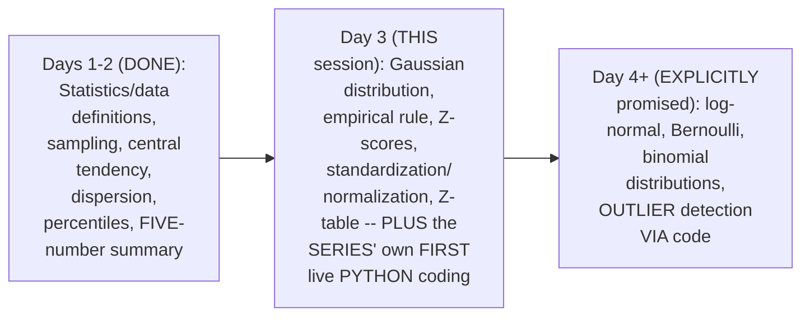

#### 🎯 Key Takeaways

* This is GENUINELY **Day 3**, EXPLICITLY, DIRECTLY confirmed as MOVING TOWARD "intermediate TO advanced" statistics.
* This is the SERIES' own **FIRST session** to GENUINELY transition INTO **live PYTHON coding** — DIRECTLY, PRACTICALLY applying PRIOR days' own MANUAL concepts THROUGH real CODE.
* Log-NORMAL, Bernoulli, and BINOMIAL distributions are DIRECTLY, EXPLICITLY confirmed as DEFERRED to a LATER session, DESPITE being ORIGINALLY listed IN today's own AGENDA — an HONEST, live ADJUSTMENT to the SESSION's own, ACTUAL pace.

---

### 2. The Gaussian (Normal) Distribution: The Bell Curve & Its Symmetry

#### 📖 Definition — The Gaussian/Normal Distribution, Precisely Introduced

> 💡 **Given directly:** *"The first distribution that I'd like to focus on is something called as Gaussian or normal distribution... this center line that you see can be your mean, it can be a median, it can be a mode."*

#### 🔍 Internal Working — The Precise, Defining Symmetry Property

> 💡 **Given directly:** *"One important property of this bell curve is that this side is exactly symmetrical to this side... the amount of data that is present in this particular part will also be equal to the amount of data that will be basically present in this part."*

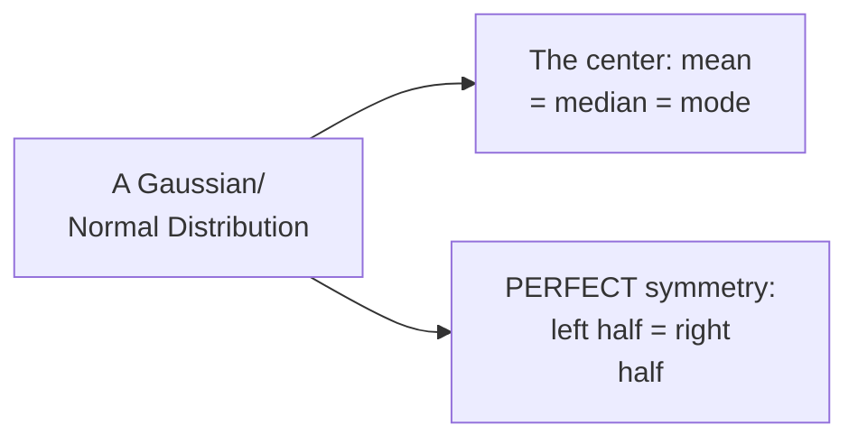

#### 🏢 Real-World / Production Usage — Genuine, Real, Domain-Expert Examples

> 💡 **Given directly:** *"Height is basically normally distributed. Who is saying this? I am not saying it, the domain expert is basically saying it... the domain expert is a doctor... weight will also follow a Gaussian distribution... in the Iris dataset, if you talk about petal length, sepal length, it actually follows Gaussian distribution."*

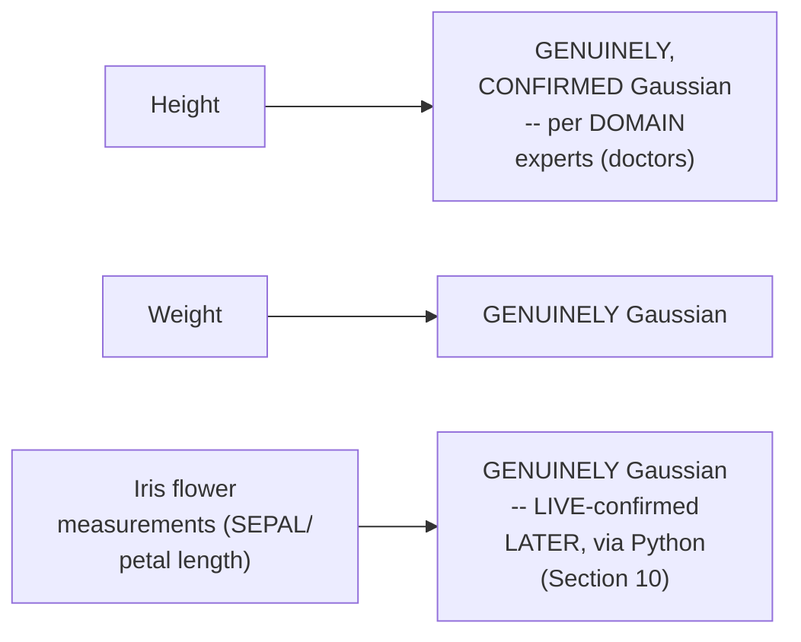

#### ⚠ Common Mistakes

* Assuming EVERY, real-WORLD dataset is GENUINELY, AUTOMATICALLY Gaussian-DISTRIBUTED — explicitly, directly, HONESTLY clarified (and LATER, LIVE-confirmed in SECTION 10): SOME real FEATURES (e.g., a RESTAURANT tips DATASET) are GENUINELY, VISIBLY NOT Gaussian — REAL-world verification is GENUINELY necessary, NOT assumed.
* Assuming the CENTER line of a BELL curve MUST genuinely be the MEAN specifically — explicitly, directly clarified: it CAN genuinely be the MEAN, median, OR mode — ALL THREE coincide AT the center OF a TRUE, symmetric Gaussian DISTRIBUTION.

#### 🎯 Key Takeaways

* The **Gaussian/NORMAL distribution** is precisely DEFINED by its OWN, PERFECT **symmetry** — the LEFT half of the BELL curve GENUINELY mirrors the RIGHT half.
* AT the CENTER of a TRUE Gaussian distribution, **mean, MEDIAN, and mode GENUINELY coincide**.
* REAL, domain-EXPERT-confirmed examples of GAUSSIAN data INCLUDE height, WEIGHT, and (as LATER, LIVE-confirmed) CERTAIN Iris flower MEASUREMENTS.

---
### 3. The Empirical Rule: 68-95-99.7%

#### 📖 Definition — The Empirical Rule, Precisely Defined

> 💡 **Given directly:** *"This empirical formula basically says that you really need to understand this 68, 95, 99.7 percentage rule... within the first standard deviation... around 68 percentage of the entire distribution is present... within the second standard deviation region... around 95 percentage of the entire data lies in this region... within the third standard deviation... around 99.7 percentage of the entire distribution will fall in this region."*

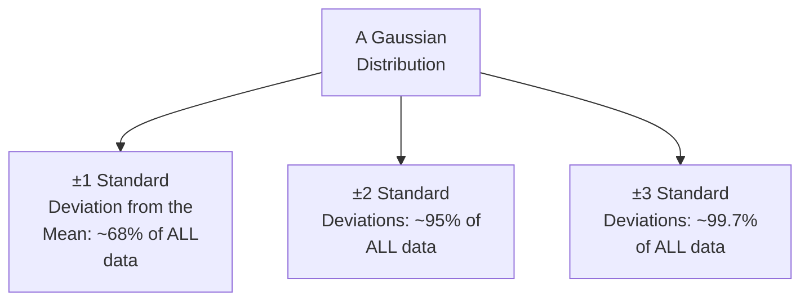

#### 🔍 Internal Working — A Genuine, Direct Confirmation of the Underlying Notation

> 💡 **Given directly:** *"The center one over here I can basically write it as mu, this will basically become mu plus sigma, mu plus 2 sigma... mu minus sigma, mu minus 2 sigma, mu minus 3 sigma."*

```text
μ - 3σ | μ - 2σ | μ - σ | μ (mean) | μ + σ | μ + 2σ | μ + 3σ
```

#### ⚠ A Direct, Honest, Important Clarification: This Rule ONLY Applies to Gaussian Data

> 💡 **Given directly:** *"This rules apply to those datasets which follow a Gaussian distribution, or normal distribution, like this kind of curve."*

#### ⚠ Common Mistakes

* Assuming the 68-95-99.7% rule GENUINELY, UNIVERSALLY applies to ANY dataset — explicitly, directly, HONESTLY clarified: it GENUINELY, STRICTLY applies ONLY to datasets that ARE, in FACT, Gaussian/normally DISTRIBUTED.
* Confusing "PERCENTAGE" with "PERCENTILE" in THIS specific context — explicitly, directly clarified: THIS rule REFERS to the "PERCENTAGE of the ENTIRE distribution," NOT a PERCENTILE ranking.

#### 🎯 Key Takeaways

* The **EMPIRICAL rule (68-95-99.7%)** GENUINELY, PRECISELY quantifies HOW much of a GAUSSIAN dataset FALLS within 1, 2, and 3 STANDARD deviations OF the mean.
* This rule **GENUINELY, STRICTLY applies ONLY** to datasets that ARE, in fact, GAUSSIAN/normally DISTRIBUTED — NOT a UNIVERSAL statistical LAW.
* This directly, precisely SETS UP the NEXT, essential CONCEPT — **Z-SCORE** — WHICH precisely QUANTIFIES exactly HOW MANY standard DEVIATIONS any SPECIFIC value is FROM the mean.

---

### 4. Z-Score: A Precise Way to Locate a Value Relative to the Mean

#### ❓ Why It Exists — A Genuine, Real, Motivating Problem

> 💡 **Given directly:** *"If I talk about 4.5, now tell me, my question is that where does 4.5 fall in terms of standard deviation?... but in the case of 4.75, it will be very much difficult for you to do the calculation right... that is the reason what we can do is that we can use a concept which is called as Z score."*

#### 📖 Definition — Z-Score, Precisely Defined

> 💡 **Given directly:** *"Z score will basically help you find out, whenever I talk about a value, how much standard deviation away it is from the mean. This formula is x of i minus mu, divided by standard deviation."*

```text
Z-Score Formula:  z = (xᵢ - μ) / σ
```

#### 🪜 Step-by-Step — Two Complete, Real, Worked Examples

> 💡 **Given directly:** *"4.75 minus mu is 4, divided by standard deviation is 1, so here I am actually getting 0.75... it is 0.75 standard deviation to the right, why it is saying right? Because this is a positive value."*

> 💡 **Given directly:** *"3.75 minus 4, divided by 1, which is nothing but minus 0.25... whenever minus comes, that basically means you have to check in this side."*

```text
Given: μ = 4, σ = 1

z(4.75) = (4.75 - 4) / 1 = +0.75  -> 0.75 SD to the RIGHT of the mean
z(3.75) = (3.75 - 4) / 1 = -0.25  -> 0.25 SD to the LEFT of the mean
```

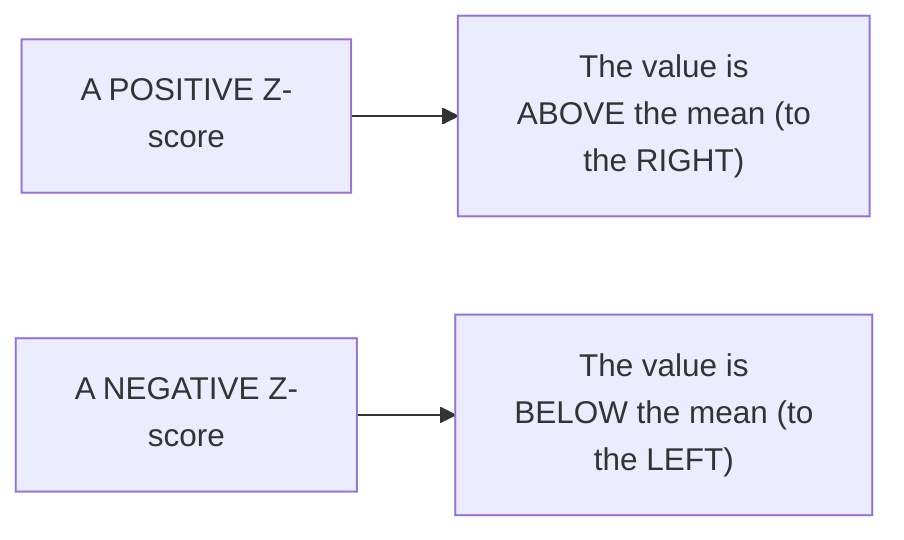

#### ⚠ Common Mistakes

* Assuming Z-score is GENUINELY, MERELY a "DIFFERENT unit" WITHOUT real, PRACTICAL meaning — explicitly, directly clarified: it PRECISELY tells you HOW FAR (in STANDARD-deviation UNITS) a SPECIFIC value GENUINELY is FROM the mean — a REAL, PRACTICAL comparison TOOL (fully DEMONSTRATED in Section 7).
* Forgetting that the SIGN of a Z-SCORE genuinely, DIRECTLY indicates DIRECTION (positive = RIGHT/above; negative = LEFT/below) — NOT merely MAGNITUDE.

#### 🎯 Key Takeaways

* **Z-score** GENUINELY, PRECISELY answers: "HOW MANY standard DEVIATIONS away FROM the mean is THIS specific value?" — FORMULA: `z = (x − μ) / σ`.
* TWO, complete, real WORKED examples directly, CONCRETELY confirmed: z(4.75) = **+0.75** (RIGHT of mean); z(3.75) = **−0.25** (LEFT of mean).
* Z-score's OWN SIGN directly, PRECISELY indicates DIRECTION — POSITIVE means ABOVE the mean; NEGATIVE means BELOW it.

---
### 5. A Genuine, Live Demonstration: Z-Score Transforms ANY Distribution Into a Standard Normal Distribution

#### 🪜 Step-by-Step — A Complete, Real, Live-Computed Transformation

> 💡 **Given directly:** *"Let's apply Z-score to every values... initially my distribution was like this: 1,2,3,4,5,6,7... if I apply Z score to 1... 1 minus 4 divided by 1, this is minus 3... 2 minus 4... minus 2... 3 minus 4... minus 1... 4 will get converted to 0... then it will get converted to 1, 2, 3."*

```text
Original distribution: 1, 2, 3, 4, 5, 6, 7   (μ=4, σ=1)
Applying z = (x-4)/1 to EVERY value:
  z(1) = -3    z(2) = -2    z(3) = -1    z(4) = 0
  z(5) = +1    z(6) = +2    z(7) = +3

Result: -3, -2, -1, 0, 1, 2, 3
```

#### 🔍 Internal Working — A Genuine, Direct Confirmation: This IS the Standard Normal Distribution

> 💡 **Given directly:** *"What is this distribution then called?... this was initially a normal distribution or a Gaussian distribution. After I applied a Z score, what kind of distribution we are actually getting?... it is called as standard normal distribution... one of the most important property with respect to standard normal distribution is that your mean is 0 and standard deviation is 1."*

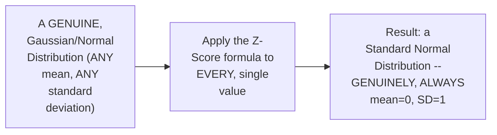

#### 📖 Definition — The Standard Normal Distribution, Precisely Confirmed

> 💡 **Given directly:** *"Can I write, can I write a random variable X or Y will belong to standard normal distribution, where specifically your mean will be 0 and standard deviation will be 1?"*

#### ⚠ Common Mistakes

* Assuming APPLYING Z-score is GENUINELY, MERELY a rescaling TRICK, unrelated TO any GENUINE, deeper statistical PROPERTY — explicitly, directly, LIVE-demonstrated as GENUINELY, DIRECTLY producing a NEW, MEANINGFUL distribution TYPE — the **standard NORMAL distribution** — WITH its OWN, precise, defining PROPERTIES (mean=0, SD=1).
* Assuming this TRANSFORMATION ONLY genuinely WORKS on a SPECIFIC, particular DATASET — explicitly, directly, GENERALLY confirmed: applying Z-SCORE to ANY, genuinely GAUSSIAN distribution GENUINELY, ALWAYS produces a STANDARD normal RESULT.

#### 🎯 Key Takeaways

* A COMPLETE, real, LIVE-computed TRANSFORMATION directly, CONCRETELY demonstrated: applying Z-SCORE to EVERY value in a Gaussian DISTRIBUTION [1,2,3,4,5,6,7] GENUINELY, DIRECTLY produces [-3,-2,-1,0,1,2,3].
* This RESULTING distribution is directly, PRECISELY confirmed as a **standard NORMAL distribution** — DEFINED by its OWN, genuine PROPERTIES: **mean = 0, standard DEVIATION = 1**.
* This TRANSFORMATION GENERALIZES: applying Z-SCORE to ANY Gaussian DISTRIBUTION (REGARDLESS of its OWN, ORIGINAL mean/SD) GENUINELY, ALWAYS produces a STANDARD normal RESULT — a GENUINE, foundational STATISTICAL fact.

---

### 6. Standardization vs. Normalization

#### ❓ Why It Exists — A Genuine, Real, Motivating Scenario

> 💡 **Given directly:** *"Suppose I have a dataset... features like age... salary... weight... age by units, we will calculate by years, salary we may calculate by rupees or dollar, weight we may calculate in kgs... the units are completely different. Our main target should be that we should try to bring up... a form where my mean is zero and standard deviation equal to one."*

#### 📖 Definition — Standardization, Precisely Defined

> 💡 **Given directly:** *"This process is basically called as standardization... standardization is a process where I am basically trying to convert a distribution into standard normal distribution. The property is that the mean is 0 and the standard deviation is 1."*

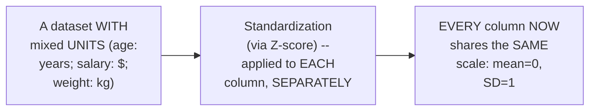

#### 📖 Definition — Normalization, Precisely Defined

> 💡 **Given directly:** *"In normalization, you have an option, you will say that I want to shift this entire values... between 0 to 1... there is a very important formula which is called as min max scalar. In the min max scalar, you just have to provide 0 to 1, and automatically this kind of normalization will happen."*

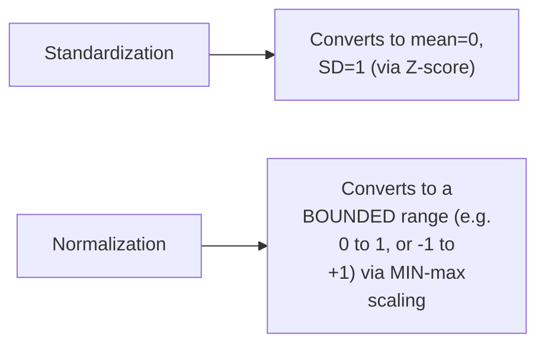

#### 🏢 Real-World / Production Usage — A Genuine, Real, CNN/Image-Processing Example

> 💡 **Given directly:** *"In CNN, whenever you are doing image training, image classification or object detection... every pixel ranges between 0 to 255... before we start training, this can be applied with min max scalar, and it gets converted between 0 to 1... I will take each and every pixel, divide by 255... all your values will be getting changed between 0 to 1."*

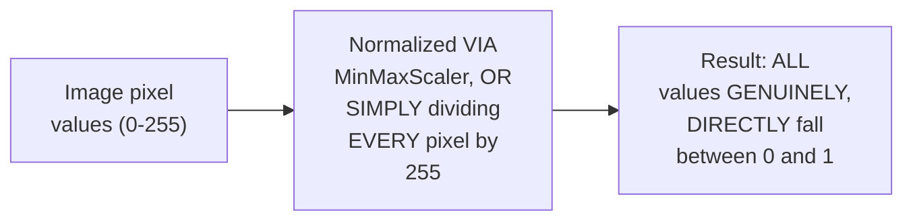

#### ⚠ Common Mistakes

* Confusing STANDARDIZATION with NORMALIZATION as GENUINELY, INTERCHANGEABLE terms — explicitly, directly, PRECISELY distinguished: standardization TARGETS mean=0/SD=1 (VIA Z-score); normalization TARGETS a BOUNDED range (VIA min-MAX scaling).
* Assuming NORMALIZATION genuinely, ALWAYS requires a FORMAL "MinMaxScaler" tool — explicitly, directly, PRACTICALLY demonstrated as SOMETIMES achievable VIA a SIMPLE, direct DIVISION (e.g., DIVIDING every PIXEL by 255).

#### 🎯 Key Takeaways

* **Standardization** GENUINELY converts DATA to **mean=0, SD=1** — VIA the Z-SCORE formula — PARTICULARLY useful FOR datasets with GENUINELY mixed UNITS (e.g., age, SALARY, weight).
* **Normalization** GENUINELY converts data TO a **BOUNDED range** (e.g., 0-1, or -1 TO +1) — VIA min-MAX scaling — a GENUINE, real EXAMPLE: IMAGE pixel values (0-255) NORMALIZED to (0-1) BEFORE CNN training.
* BOTH techniques directly, EXPLICITLY confirmed as **GENUINELY, HEAVILY used IN machine LEARNING** — "WE do THIS in machine LEARNING, we DO this in MOST of the ALGORITHMS."

---
### 7. A Complete, Real Z-Score Application: Comparing Performance Across Different Distributions

#### ❓ Why It Exists — A Genuine, Real, Relatable Motivating Problem

> 💡 **Given directly:** *"Recently, India versus South Africa, where India lost it... let's consider ODI series... the series average of 2021 was somewhere around 250... the standard deviation of the score was somewhere around 10... [a player's] average score in 2021 was 240... and in 2020, the series average was 260, standard deviation was 12, and his average score was 245. My question is: in which year did [the player] play better?"*

#### 🪜 Step-by-Step — A Complete, Real, Live-Computed Comparison

> 💡 **Given directly:** *"For the 2021, we will apply the Z score... 240 minus 250 is nothing but minus 10, divided by 10, so this is minus 1 standard deviation... for 2020... 245 minus 260... minus 15 divided by 12, which is nothing but minus 1.25."*

```text
2021 Series: Team average = 250, SD = 10, Player's average = 240
  z = (240 - 250) / 10 = -1.0

2020 Series: Team average = 260, SD = 12, Player's average = 245
  z = (245 - 260) / 12 = -1.25
```

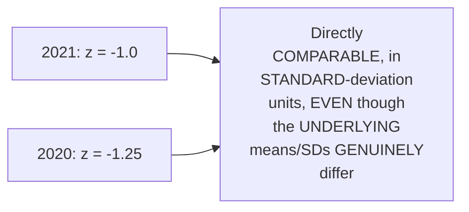

#### ❓ Why It Exists — Precisely WHY Z-Score Enables This Fair Comparison

> 💡 **Given directly:** *"This two data, I have compared, both the series, in which year [the player's] final score was better?... just by seeing the specific data, what do you think, guys, which score is better?... obviously many people will say 2020, 2021, lot of confusion will be there, so we will just try to apply for Z score."*

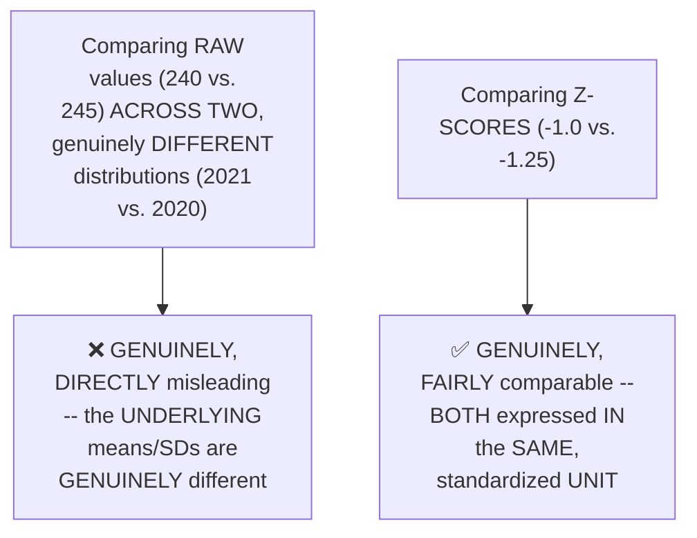

#### ⚠ A Direct, Honest, Deliberately-Left Assignment

> 💡 **Given directly:** *"This will be an assignment for you, tomorrow I'll ask you which one was better... based on the Z score, because I try to convert those values with respect to standard deviation."*

#### ⚠ Common Mistakes

* Assuming a HIGHER, raw NUMBER (e.g., 245 versus 240) GENUINELY, DIRECTLY represents "better" PERFORMANCE, REGARDLESS of context — explicitly, directly, HONESTLY complicated: RAW values FROM different, genuinely DISTINCT distributions (DIFFERENT means/SDs) are NOT directly, FAIRLY comparable — Z-SCORE genuinely SOLVES this.
* Assuming Z-score COMPARISON is GENUINELY simple/OBVIOUS — explicitly, directly, HONESTLY left as a DELIBERATE, real ASSIGNMENT — REQUIRING learners to GENUINELY interpret WHICH z-SCORE (given BOTH are NEGATIVE) REPRESENTS relatively BETTER performance.

#### 🎯 Key Takeaways

* Z-score GENUINELY enables **FAIR comparison** BETWEEN values DRAWN from GENUINELY different DISTRIBUTIONS (DIFFERENT means, DIFFERENT standard DEVIATIONS) — a REAL, PRACTICAL, and FREQUENTLY interview-RELEVANT application.
* A COMPLETE, real, LIVE-computed EXAMPLE (a CRICKETER's own PERFORMANCE across 2020 AND 2021) directly, CONCRETELY confirmed z=-1.0 (2021) VERSUS z=-1.25 (2020).
* The instructor **directly, DELIBERATELY leaves** the FINAL interpretation ("WHICH year was GENUINELY better?") as an HONEST, real ASSIGNMENT — ENCOURAGING active, INDEPENDENT reasoning.

---

### 8. The Z-Table: Finding the Area Under the Curve (Two Complete, Worked Examples)

#### ❓ Why It Exists — A Genuine, Real, Motivating Question

> 💡 **Given directly:** *"My question is: what percentage of scores fall above 4.25?... I am interested in this region... how do I come up with the overall percentage from this particular region?... Z scores actually help you to find area of the body curve."*

#### 📖 Definition — Z-Table, Precisely Introduced

> 💡 **Given directly:** *"The Z table shows the area to the right-hand side of the curve. Use these values to find the area between Z is equal to 0 and any positive value. For area in the left tail, look at the left tail Z table instead."*

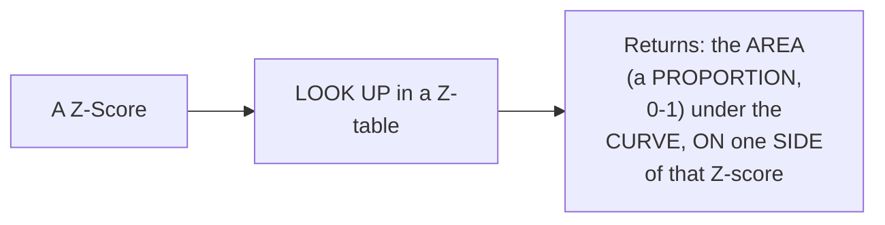

#### 🪜 Step-by-Step — Worked Example 1: What Percentage of Scores Fall Above 4.25?

> 💡 **Given directly:** *"X of i minus mu, divided by standard deviation... 4.25 minus 4, divided by 1, this value is 0.25 standard deviation... I will go to the left table... 0.25... 0.5987... 1 minus 0.5987... 0.4013... so what is the percentage of scores that fall above 4.25? It is nothing but 40 percentage."*

```text
Given: μ = 4, σ = 1, x = 4.25
z = (4.25 - 4) / 1 = 0.25

Left-tail Z-table lookup for z=0.25: 0.5987 (area to the LEFT of 4.25)
Area to the RIGHT (above 4.25) = 1 - 0.5987 = 0.4013
Answer: ~40.13% of scores fall above 4.25
```

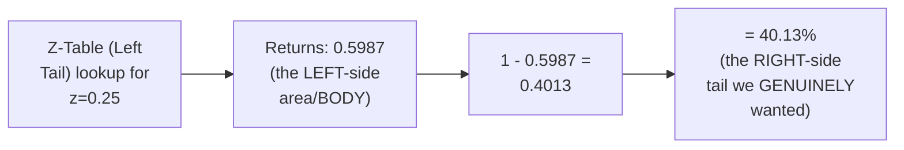

#### 🪜 Step-by-Step — Worked Example 2: A Real IQ Problem

> 💡 **Given directly:** *"In India, the average IQ is 100, with a standard deviation of 15. What percentage of the population would you expect to have an IQ lower than 85?... 85 minus 100, divided by 15... minus 1... this area is already the body part, the left of the curve... for minus 1... 1.0... 0.84134... this is plus 1... 1 minus 0.84134."*

```text
Given: μ = 100, σ = 15, x = 85
z = (85 - 100) / 15 = -1.0

Z-table lookup for z=+1.0 (symmetric to -1.0): 0.84134
Since we want the LEFT tail (below 85), and z is NEGATIVE:
Area below z=-1.0 = 1 - 0.84134 = 0.15866
Answer: ~15.87% of the population would be expected to have an IQ lower than 85
```

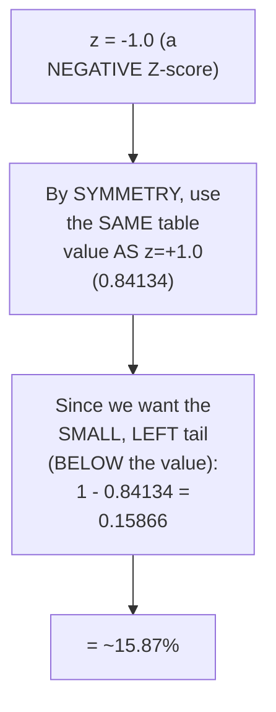

#### ⚠ Common Mistakes

* Assuming a Z-TABLE lookup DIRECTLY gives you the FINAL answer, WITHOUT any FURTHER calculation — explicitly, directly, LIVE-demonstrated as OFTEN requiring an ADDITIONAL step (SUBTRACTING FROM 1) to GET the SPECIFIC region YOU genuinely want (e.g., the "ABOVE" or "BELOW" TAIL, rather than the TABLE's own default REGION).
* Confusing WHICH table (LEFT-tail versus right-TAIL) to USE for a GIVEN question — explicitly, directly, REPEATEDLY clarified: CAREFULLY identify WHETHER you WANT the area TO the left OR right of your Z-SCORE, BEFORE selecting the APPROPRIATE table.

#### 🎯 Key Takeaways

* The **Z-TABLE** converts a Z-SCORE into an **AREA under the CURVE** (a PROPORTION, 0 to 1) — DIRECTLY enabling PERCENTAGE-based questions ("WHAT percentage FALLS above/BELOW a value?").
* TWO, complete, real, LIVE-computed EXAMPLES directly, CONCRETELY confirmed the WORKFLOW: (1) "scores ABOVE 4.25" → z=0.25 → **40.13%**; (2) "IQ BELOW 85" → z=−1.0 → **15.87%**.
* Z-TABLE problems OFTEN, GENUINELY require an **ADDITIONAL subtraction STEP** (1 minus the LOOKED-up value) to GET the SPECIFIC region OF genuine interest — a FREQUENT, real SOURCE of learner CONFUSION worth PRACTICING carefully.

---
### 9. A First Transition to Python: Mean, Median, Mode & Box Plots

#### 🪜 Step-by-Step — A Complete, Real, Live-Executed Python Setup

> 💡 **Given directly:** *"Let's go ahead and let's see with respect to Python... import numpy as np... import matplotlib.pyplot as plt... and then probably I will say matplotlib inline... now first thing first, how to compute mean, median, mode."*

```python
import numpy as np
import matplotlib.pyplot as plt
%matplotlib inline
import statistics
```

#### 🪜 Step-by-Step — Loading a Real Dataset & Computing Mean, Median, Mode

> 💡 **Given directly:** *"Let me load a dataset which is called as tips... df is equal to this one... df.head... if you want to see how to do mean for this, let's say that I'm using np.mean function for finding the total bill mean."*

```python
df = sns.load_dataset('tips')
df.head()

np.mean(df['total_bill'])
np.median(df['total_bill'])
statistics.mode(df['total_bill'])
```

#### 🔍 Internal Working — A Genuine, Real, Live-Confirmed Observation

> 💡 **Given directly:** *"If you want to probably find out the median also, you will be able to find out... over here you see some differences? If you are seeing some differences, think that there may be something like, you know, some kind of outliers also."*

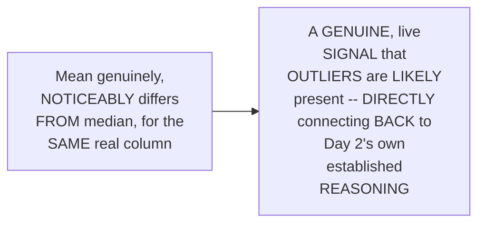

#### 🪜 Step-by-Step — Building a Real Box Plot (via Seaborn)

> 💡 **Given directly:** *"If I want to go and see my box plot, which is basically used to see outliers, so if I use df['total_bill']... here you will be able to see my box plot also... does this indicate it has an outlier?... definitely over here outliers is present."*

```python
sns.boxplot(df['total_bill'])
```

#### ⚠ Common Mistakes

* Assuming REAL, LIVE-computed MEAN and MEDIAN values GENUINELY, ALWAYS closely MATCH — explicitly, directly, LIVE-demonstrated as a GENUINE, real SIGNAL: a NOTICEABLE difference BETWEEN them, on REAL data, GENUINELY suggests OUTLIER presence.

#### 🎯 Key Takeaways

* PYTHON's OWN `numpy` and `statistics` LIBRARIES DIRECTLY, EASILY compute **mean** (`np.mean`), **MEDIAN** (`np.median`), and **mode** (`statistics.mode`) — DIRECTLY, PRACTICALLY applying Day 2's own MANUAL formulas.
* A REAL, LIVE-computed COMPARISON (mean VERSUS median, on the REAL "TIPS" dataset) directly, CONCRETELY reinforced Day 2's own established LESSON: a NOTICEABLE gap BETWEEN them GENUINELY signals OUTLIER presence.
* A REAL, LIVE-constructed **box PLOT** (via `sns.BOXPLOT`) directly, VISUALLY confirmed OUTLIERS in the REAL "total_bill" COLUMN — DIRECTLY, PRACTICALLY applying Day 2's own ESTABLISHED five-number-SUMMARY concept.

---

### 10. Python: Distribution Plots — Recognizing (and Rejecting) Gaussian Shape

#### 🪜 Step-by-Step — A Complete, Real, Live-Tested Distribution Plot

> 💡 **Given directly:** *"If you write df... there is something called as displot, which will basically help you to create histograms on a specific feature... is this a normal distributed data? I guess no... if you want to see with the probability density function, I'll be using kde is equal to true... does this look like a normally distributed? No, it is like little bit skewed towards the right."*

```python
sns.displot(df['total_bill'], kde=True)
```

#### 🔍 Internal Working — A Genuine, Real, Live Test: Iris Dataset's Own Sepal Length vs. Sepal Width

> 💡 **Given directly:** *"I will use Iris dataset... df1.head... here you have flowers like setosa, versicolor... and here you have four features: sepal length, sepal width, petal length, and petal width... does this follow a Gaussian distribution? No, I guess... let's try with sepal width... finally we'll be able to see something — wow, this follows a Gaussian distribution."*

```python
df1 = sns.load_dataset('iris')
df1.head()

sns.displot(df1['sepal_length'], kde=True)   # NOT genuinely Gaussian-shaped
sns.displot(df1['sepal_width'], kde=True)    # GENUINELY, VISIBLY Gaussian-shaped
```

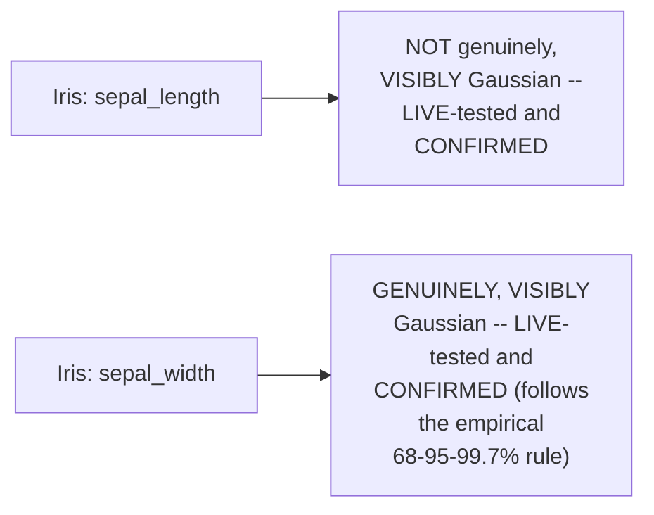

#### ⚠ Common Mistakes

* Assuming ALL numeric FEATURES within the SAME dataset (e.g., IRIS) are GENUINELY, UNIFORMLY Gaussian-DISTRIBUTED — explicitly, directly, LIVE-demonstrated as GENUINELY FALSE: sepal LENGTH did NOT visibly FOLLOW a Gaussian SHAPE, WHILE sepal WIDTH genuinely, VISIBLY DID.
* Assuming a REAL dataset's own DISTRIBUTION shape can be GENUINELY, RELIABLY assumed WITHOUT actually PLOTTING it — explicitly, directly, PRACTICALLY demonstrated: the ONLY genuine WAY to CONFIRM is to ACTUALLY visualize the REAL data.

#### 🎯 Key Takeaways

* Seaborn's OWN `displot` function (WITH `kde=TRUE`) directly, PRACTICALLY VISUALIZES a REAL feature's own DISTRIBUTION shape — DIRECTLY testing WHETHER it's GENUINELY Gaussian.
* A COMPLETE, real, LIVE test CONFIRMED the "TIPS" dataset's own "TOTAL bill" column is **GENUINELY, VISIBLY right-SKEWED** — NOT Gaussian.
* A SECOND, complete, live TEST directly, CONCRETELY confirmed a GENUINE, real DIFFERENCE WITHIN the SAME dataset (IRIS): sepal LENGTH is **NOT visibly GAUSSIAN**, WHILE sepal WIDTH **IS genuinely, VISIBLY Gaussian** — REINFORCING that DISTRIBUTION shape must be VERIFIED per-FEATURE, NOT assumed.

---
### 11. Python: Bar Plots & Percentiles

#### 🪜 Step-by-Step — Building a Real Count/Bar Plot for a Categorical Feature

> 💡 **Given directly:** *"Sns.countplot of df, if I use countplot with respect to species... what is this plot, guys? This is our bar graph, right? This is our bar graph, bar plot or bar graph, whatever you want."*

```python
sns.countplot(df1['species'])
```

#### 🪜 Step-by-Step — Computing Percentiles in Python

> 💡 **Given directly:** *"For percentile, I can use np... and I can use my df, let's say I'm going to use sepal length, and here I can basically give some parameters, like let's say that I want to get the 25 percentile and 75 percentile... 5.1 as the 25 percentile, and... 6.4 [as the] 75 percentile, so my IQR will be 6.4 minus 5.1."*

```python
np.percentile(df1['sepal_length'], 25)   # -> 5.1
np.percentile(df1['sepal_length'], 75)   # -> 6.4
# IQR = 6.4 - 5.1

np.percentile(df1['sepal_length'], 99)   # -> also demonstrated, e.g. 7.7
```

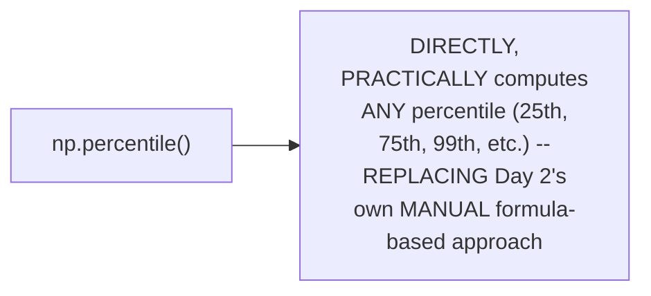

#### ⚠ Common Mistakes

* Assuming a COUNT plot (FOR a CATEGORICAL feature LIKE species) is GENUINELY, STRUCTURALLY different FROM a "bar GRAPH" — explicitly, directly, CASUALLY clarified: "THIS is our bar GRAPH... bar PLOT or bar GRAPH, whatever you WANT" — THEY are GENUINELY the SAME, underlying VISUALIZATION concept.
* Assuming PYTHON's own `np.percentile()` REQUIRES the SAME, manual INDEX-position calculation TAUGHT in Day 2 — explicitly, directly, PRACTICALLY demonstrated as a DIRECT, single FUNCTION call — the LIBRARY handles the UNDERLYING calculation AUTOMATICALLY.

#### 🎯 Key Takeaways

* Seaborn's OWN `countplot` GENUINELY, DIRECTLY builds a **bar GRAPH** for CATEGORICAL data (e.g., IRIS species COUNTS) — CONFIRMING "bar PLOT" and "bar GRAPH" are GENUINELY the SAME concept.
* NumPy's OWN `np.percentile()` function DIRECTLY, PRACTICALLY computes ANY percentile (25th, 75TH, 99th, etc.) — REPLACING Day 2's own MANUAL, formula-BASED index CALCULATION with a SINGLE, direct FUNCTION call.
* This directly, PRACTICALLY CONFIRMS the SAME percentile VALUES (25th=5.1, 75TH=6.4) that COULD, in PRINCIPLE, be MANUALLY computed USING Day 2's own ESTABLISHED formulas — DIRECTLY bridging THEORY and CODE.

---

### 12. Closing: What's Deferred to Tomorrow

#### 🪜 Step-by-Step — A Complete, Honest, Direct Confirmation

> 💡 **Given directly:** *"Let's do the outlier formulation through code tomorrow, okay?... it took time, no, finishing off tomorrow, we'll discuss that, okay, ds roadmap has already been put up."*

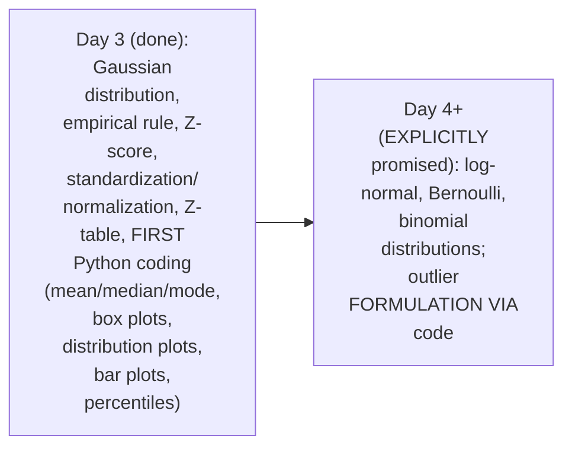

#### ⚠ Common Mistakes

* Assuming THIS session's OWN, complete AGENDA (WHICH originally LISTED log-normal/Bernoulli/BINOMIAL distributions) was GENUINELY, FULLY delivered — explicitly, directly, HONESTLY clarified: THESE topics REMAIN explicitly DEFERRED to a LATER session, DUE to THIS session's own, REAL time CONSTRAINTS.

#### 🎯 Key Takeaways

* This episode **GENUINELY, SUBSTANTIALLY delivers** its OWN core GOALS — the GAUSSIAN distribution, EMPIRICAL rule, Z-score, standardization/NORMALIZATION, Z-TABLE lookups, and the SERIES' own FIRST, real PYTHON coding SEGMENT.
* **Log-NORMAL, Bernoulli, and BINOMIAL distributions**, PLUS code-based OUTLIER formulation, are directly, HONESTLY confirmed as **DEFERRED** to a LATER session — an HONEST, live ADJUSTMENT given THIS session's own, ACTUAL pace.
* The instructor's OWN, repeated EMPHASIS on GROUNDING every CONCEPT in REAL, worked EXAMPLES (BOTH manual and PYTHON-based) directly, CONSISTENTLY reflects THIS series' own, ESTABLISHED teaching PHILOSOPHY (per Day 1's own OPENING framing).

---
## 📝 Glossary

| Term | Definition | Why It Matters |
|---|---|---|
| **Gaussian/Normal Distribution** | A perfectly symmetric, bell-shaped distribution | Mean = median = mode at the center |
| **Empirical Rule (68-95-99.7%)** | The percentage of data within 1, 2, 3 SDs of the mean | Applies ONLY to genuinely Gaussian data |
| **Z-Score** | How many standard deviations a value is from the mean | Formula: z = (x - μ) / σ |
| **Standard Normal Distribution** | A distribution with mean=0, SD=1 | The result of applying Z-score to any Gaussian data |
| **Standardization** | Converting data to mean=0, SD=1 | Uses the Z-score formula |
| **Normalization** | Converting data to a bounded range (e.g. 0-1) | Uses min-max scaling |
| **Z-Table** | Converts a Z-score into an area under the curve | Used to answer "what percentage" questions |
| **displot (Seaborn)** | A Python function for distribution/histogram plots | Used to visually test for Gaussian shape |
| **np.percentile()** | A Python function for computing percentiles | Replaces manual, formula-based calculation |

---

## 🔄 Revision Notes — One-Minute Revision

* This is **Day 3**, moving toward "intermediate to advanced" statistics -- and the FIRST session to transition into live Python coding (Google Colab).
* **Gaussian/Normal distribution**: a perfectly symmetric bell curve, where mean=median=mode at the center. Real, domain-expert-confirmed examples: height, weight, certain Iris flower measurements.
* **Empirical rule (68-95-99.7%)**: ~68% of Gaussian data falls within ±1 SD of the mean, ~95% within ±2 SD, ~99.7% within ±3 SD. Applies ONLY to genuinely Gaussian data.
* **Z-score**: z = (x-μ)/σ -- precisely quantifies how many SDs a value is from the mean. Live examples: z(4.75)=+0.75; z(3.75)=-0.25. Positive = above the mean; negative = below.
* **Genuine, live demonstration**: applying Z-score to EVERY value in a Gaussian distribution [1,2,3,4,5,6,7] (μ=4,σ=1) produces [-3,-2,-1,0,1,2,3] -- which IS, itself, a Standard Normal Distribution (mean=0, SD=1). This transformation generalizes to ANY Gaussian dataset.
* **Standardization vs. Normalization**: standardization (via Z-score) targets mean=0/SD=1, useful for mixed-unit datasets (age/salary/weight); normalization (via min-max scaling) targets a bounded range (e.g. 0-1), with a real CNN example (image pixels 0-255, normalized to 0-1, either via MinMaxScaler or dividing by 255).
* **Complete, real Z-score application**: comparing a cricketer's performance across two, different series (2021: team avg=250, SD=10, player avg=240 -> z=-1.0; 2020: team avg=260, SD=12, player avg=245 -> z=-1.25) -- Z-scores enable fair comparison across genuinely different distributions. The final interpretation is left as a deliberate assignment.
* **Z-table**: converts a Z-score into an area under the curve. Two complete, worked examples: (1) "scores above 4.25" (μ=4,σ=1) -> z=0.25 -> left-tail lookup 0.5987 -> 1-0.5987 = 40.13% above; (2) "IQ below 85" (μ=100,σ=15) -> z=-1.0 -> lookup 0.84134 (symmetric) -> 1-0.84134 = 15.87% below.
* **First Python coding segment**: mean/median/mode via numpy/statistics (on the real "tips" dataset -- a mean/median gap signals outliers); box plots via seaborn (confirming outliers visually); distribution plots via `sns.displot(kde=True)` (confirming "tips" total_bill is right-skewed, NOT Gaussian; and within the Iris dataset, sepal_length is NOT visibly Gaussian while sepal_width IS); bar/count plots for categorical data; and `np.percentile()` for direct percentile computation (25th=5.1, 75th=6.4 for Iris sepal length).
* **Closing**: log-normal, Bernoulli, and binomial distributions, plus code-based outlier formulation, are explicitly, honestly deferred to a later session, due to this session's own real time constraints.

---

## 📋 Cheat Sheet

**Z-Score formula:**
```text
z = (x - μ) / σ
Positive z -> value is ABOVE the mean
Negative z -> value is BELOW the mean
```

**The empirical rule:**
```text
±1 SD from mean -> ~68% of data
±2 SD from mean -> ~95% of data
±3 SD from mean -> ~99.7% of data
(ONLY applies to genuinely Gaussian data)
```

**Standardization vs. Normalization:**
```text
Standardization -- Z-score based -> mean=0, SD=1
Normalization   -- min-max scaling -> a bounded range (e.g. 0-1)
```

**Z-table workflow:**
```text
1. Compute z = (x - μ) / σ
2. Look up z in the appropriate table (left-tail or right-tail)
3. If needed, compute 1 - (looked-up value) to get your desired region
```

**Python quick reference:**
```python
import numpy as np
import statistics
import seaborn as sns

np.mean(df['col'])
np.median(df['col'])
statistics.mode(df['col'])

sns.boxplot(df['col'])                    # outlier visualization
sns.displot(df['col'], kde=True)          # distribution shape (Gaussian check)
sns.countplot(df['categorical_col'])      # bar graph for categorical data

np.percentile(df['col'], 25)              # 25th percentile
np.percentile(df['col'], 75)              # 75th percentile
```

---

## 🔥 Interview Questions & Answers

### 🟢 Beginner

**Q1.**

**Question:** What is the defining property of a Gaussian/normal distribution?

**Answer:** Perfect symmetry -- the left half of the bell curve mirrors the right half.

**Explanation:** Directly, precisely explained.

**Why Interviewers Ask This:** Foundational, frequently-tested distribution knowledge.

**Possible Follow-up:** "What three measures of central tendency coincide at the center of a Gaussian distribution?"

**Q2.**

**Question:** State the empirical (68-95-99.7%) rule.

**Answer:** ~68% of data falls within ±1 SD of the mean, ~95% within ±2 SD, ~99.7% within ±3 SD.

**Explanation:** Directly, precisely stated.

**Why Interviewers Ask This:** Basic, essential Gaussian-distribution knowledge.

**Possible Follow-up:** "Does this rule apply to any dataset, or only Gaussian ones?"

**Q3.**

**Question:** What is the Z-score formula?

**Answer:** z = (x - μ) / σ.

**Explanation:** Directly, explicitly stated.

**Why Interviewers Ask This:** Basic, essential statistics formula knowledge.

**Possible Follow-up:** "What does a negative Z-score genuinely indicate?"

**Q4.**

**Question:** What distribution results from applying Z-score to every value in a Gaussian dataset?

**Answer:** A standard normal distribution (mean=0, SD=1).

**Explanation:** Directly, live-demonstrated and confirmed.

**Why Interviewers Ask This:** Tests genuine understanding of the Z-score/standard-normal relationship.

**Possible Follow-up:** "Does this hold for any Gaussian dataset, regardless of its own original mean/SD?"

**Q5.**

**Question:** What is the genuine difference between standardization and normalization?

**Answer:** Standardization (via Z-score) targets mean=0/SD=1; normalization (via min-max scaling) targets a bounded range like 0-1.

**Explanation:** Directly, precisely distinguished.

**Why Interviewers Ask This:** A commonly-tested, genuine distinction in data preprocessing.

**Possible Follow-up:** "Give a real example of when you'd genuinely use normalization."

**Q6.**

**Question:** What does a Z-table genuinely provide?

**Answer:** The area under the curve (a proportion) corresponding to a given Z-score.

**Explanation:** Directly, precisely explained.

**Why Interviewers Ask This:** Basic, essential Z-table usage knowledge.

**Possible Follow-up:** "When would you need to subtract the looked-up value from 1?"

**Q7.**

**Question:** Why can't you directly compare raw values from two different distributions to determine which is "better"?

**Answer:** Because the underlying means and standard deviations genuinely differ; Z-scores enable fair comparison.

**Explanation:** Directly, precisely explained.

**Why Interviewers Ask This:** Tests genuine, practical understanding of Z-score's own real value.

**Possible Follow-up:** "Give a real, worked example of this kind of comparison."

**Q8.**

**Question:** In Python, what function would you use to compute the median of a column?

**Answer:** np.median().

**Explanation:** Directly, explicitly demonstrated.

**Why Interviewers Ask This:** Basic, practical Python/statistics knowledge.

**Possible Follow-up:** "What Python function would you use for mode?"

**Q9.**

**Question:** What Python/Seaborn function would you use to visually check if a feature is Gaussian-distributed?

**Answer:** sns.displot(), with kde=True.

**Explanation:** Directly, explicitly demonstrated.

**Why Interviewers Ask This:** Basic, practical data-visualization knowledge.

**Possible Follow-up:** "In the Iris dataset, which feature was genuinely confirmed as Gaussian: sepal length or sepal width?"

**Q10.**

**Question:** What does a noticeable gap between a column's mean and median genuinely suggest?

**Answer:** The likely presence of outliers.

**Explanation:** Directly, live-demonstrated.

**Why Interviewers Ask This:** Tests genuine, practical data-quality diagnostic knowledge.

**Possible Follow-up:** "What visualization would you use to confirm this?"

---

### 🟡 Intermediate

**Q11.**

**Question:** Explain why the instructor deliberately, live applies the Z-score formula to EVERY value in a small, concrete distribution [1,2,3,4,5,6,7], rather than simply stating "Z-score transformation produces a standard normal distribution" as an abstract fact.

**Answer:** This is a genuinely deliberate, CONCRETE teaching choice, DIRECTLY consistent with THIS instructor's OWN, established PATTERN across ALL three sessions (e.g., Day 2's OWN mean-shifting DEMONSTRATION). By GENUINELY, LIVE transforming EVERY value and SHOWING the RESULT [-3,-2,-1,0,1,2,3] DIRECTLY matches the STANDARD normal distribution's OWN, defining properties (mean=0, SD=1), the INSTRUCTOR makes an ABSTRACT, POTENTIALLY confusing CLAIM viscerally, NUMERICALLY real — LEARNERS witness the TRANSFORMATION happen, RATHER than TRUSTING an unverified ASSERTION. This directly, CONCRETELY reinforces WHY standardization GENUINELY, PRACTICALLY works — a FAR more MEMORABLE, convincing EXPLANATION than an ABSTRACT statement ALONE.

**Explanation:** Requires recognizing the deliberate, concrete value of a live, numerical transformation over an abstract, asserted claim.

**Why Interviewers Ask This:** Tests whether a learner recognizes the pedagogical and persuasive value of concrete, numeric demonstration over abstract assertion.

**Possible Follow-up:** "Apply THIS SAME transformation to a GENUINELY different Gaussian dataset (e.g. mean=10, SD=2), and confirm you GENUINELY get mean=0, SD=1."

**Q12.**

**Question:** A learner argues that since the empirical rule states 68% of data falls within 1 SD of the mean, this means EVERY dataset genuinely has 68% of its data within 1 SD, regardless of its own distribution shape. Evaluate this claim.

**Answer:** This claim overstates the case, missing a GENUINELY important, DIRECTLY-stated qualification THIS session's own content PROVIDES. Section 3's own PRECISE, HONEST clarification DIRECTLY states: "THIS rules apply TO those datasets WHICH follow a GAUSSIAN distribution, or NORMAL distribution" — THIS is an EXPLICIT, stated CONDITION, not a UNIVERSAL law. Section 10's own LIVE-demonstrated COUNTEREXAMPLE (the "TIPS" dataset's own, GENUINELY right-SKEWED total_bill COLUMN) DIRECTLY confirms that NOT every, real dataset IS Gaussian — the empirical RULE would GENUINELY NOT reliably APPLY to such a SKEWED distribution. The ACCURATE, more PRECISE conclusion: the empirical RULE is GENUINELY, STRICTLY conditional on THE data ACTUALLY being Gaussian-DISTRIBUTED — VERIFIED, per Section 10's own established APPROACH, via ACTUAL visualization, NOT assumed.

**Explanation:** Tests whether a learner correctly recognizes the empirical rule's own stated, conditional scope, using the session's own skewed-data counterexample.

**Why Interviewers Ask This:** Distinguishes candidates who understand the empirical rule's own genuine, conditional applicability from those who treat it as a universal statistical law.

**Possible Follow-up:** "How would you GENUINELY, PRACTICALLY verify whether a NEW, unfamiliar dataset is GENUINELY Gaussian, before applying the empirical rule to it?"

**Q13.**

**Question:** Explain, precisely, why the instructor deliberately leaves the cricket Z-score comparison's own final interpretation ("which year was genuinely better?") as an explicit assignment, rather than immediately stating the answer.

**Answer:** This is a genuinely deliberate, ACTIVE-learning teaching choice, DIRECTLY consistent with a PATTERN seen ACROSS this instructor's OWN, broader series (e.g., Day 1's OWN "ratio data" assignment). By GENUINELY, DELIBERATELY leaving the FINAL, comparative INTERPRETATION open, the instructor REQUIRES learners to GENUINELY, ACTIVELY apply the Z-SCORE concept THEMSELVES (RECOGNIZING that a MORE negative Z-score, per Section 7's own established WORKED example, GENUINELY represents a RELATIVELY WORSE performance, SINCE it's FURTHER below the MEAN in standard-DEVIATION terms) — RATHER than PASSIVELY receiving an ANSWER. This directly, GENUINELY reinforces DEEPER, more DURABLE learning THAN simply STATING the conclusion WOULD have.

**Explanation:** Requires recognizing the deliberate, active-learning value of leaving a genuine interpretive question open as an assignment.

**Why Interviewers Ask This:** Tests whether a learner recognizes the pedagogical value of active application over passive reception of conclusions.

**Possible Follow-up:** "Based on THIS session's own, established Z-score REASONING, which year's performance was GENUINELY, RELATIVELY better, and WHY?"

**Q14.**

**Question:** Using this session's own precise "standardization for mixed-unit datasets" reasoning (Section 6), explain a GENUINE, real risk of applying a machine learning algorithm to a dataset with genuinely mixed units (age, salary, weight) WITHOUT first standardizing it.

**Answer:** A precise, reasoned RISK analysis, directly extending Section 6's own established MOTIVATION: per Section 6's own PRECISE reasoning, DIFFERENT columns (AGE in years, SALARY in dollars, WEIGHT in kg) GENUINELY have VASTLY different, NATURAL numeric SCALES (e.g., ages IN the tens, SALARIES in the tens OF thousands). MANY machine-LEARNING algorithms (e.g., DISTANCE-based methods LIKE k-nearest NEIGHBORS, or GRADIENT-based methods) GENUINELY, DIRECTLY treat LARGER numeric RANGES as INHERENTLY more "IMPORTANT" or INFLUENTIAL, PURELY due to SCALE, NOT genuine, real-world SIGNIFICANCE. WITHOUT standardization (per Section 6's own established MECHANISM), a FEATURE like salary COULD genuinely, UNFAIRLY DOMINATE the algorithm's own DECISIONS, SIMPLY because its OWN, raw NUMBERS are LARGER — REGARDLESS of WHETHER salary is GENUINELY the MOST relevant FEATURE for the SPECIFIC problem AT hand. This directly, precisely REVEALS why standardization is GENUINELY, PRACTICALLY necessary BEFORE applying MANY such ALGORITHMS — ENSURING every FEATURE contributes BASED on its OWN, genuine PREDICTIVE value, NOT its RAW, numeric scale.

**Explanation:** Requires extending the standardization motivation to identify a genuine, real machine-learning risk of skipping this preprocessing step.

**Why Interviewers Ask This:** Tests whether a learner understands the practical, downstream consequences of failing to standardize mixed-unit data before applying scale-sensitive algorithms.

**Possible Follow-up:** "Name a SPECIFIC, real machine-learning ALGORITHM that would be GENUINELY, PARTICULARLY sensitive to THIS unstandardized-SCALE problem."

**Q15.**

**Question:** Synthesize this session's complete "Z-table requires an additional subtraction step" reasoning (Section 8) with its own "Gaussian symmetry" reasoning (Section 2) to explain WHY the SAME table value (e.g., 0.84134) can genuinely be reused for BOTH a positive AND a negative Z-score of the same magnitude.

**Answer:** A precise, synthesized explanation, directly connecting TWO, separately-established sections: per Section 2's own PRECISE, established SYMMETRY property, a GENUINE Gaussian distribution's OWN left HALF is a PERFECT mirror OF its right half. Per Section 8's own PRECISE, live-CONFIRMED IQ example, the table VALUE for z=+1.0 (0.84134) was DIRECTLY, GENUINELY reused FOR z=-1.0, WITHOUT needing a SEPARATE, "negative" table LOOKUP. SYNTHESIZING these TWO facts directly, PRECISELY reveals WHY this REUSE is GENUINELY, MATHEMATICALLY valid: SINCE the DISTRIBUTION is PERFECTLY symmetric (Section 2), the AREA between the MEAN and +1 standard DEVIATION is GENUINELY, EXACTLY equal to the AREA between the mean AND -1 standard DEVIATION — ONLY the DIRECTION (left VERSUS right of the MEAN) genuinely DIFFERS, NOT the MAGNITUDE of the area ITSELF. This directly, PRECISELY explains WHY Z-tables ARE typically STRUCTURED around POSITIVE Z-values ONLY — the SYMMETRY property (Section 2) MAKES a SEPARATE, negative-specific TABLE genuinely REDUNDANT.

**Explanation:** Requires synthesizing the Gaussian symmetry property with the Z-table's own practical reuse pattern to explain why one table value serves both positive and negative Z-scores of equal magnitude.

**Why Interviewers Ask This:** A senior-level question testing whether a candidate can connect a distribution's own structural property (symmetry) to a practical tool's own design (why Z-tables need only positive values).

**Possible Follow-up:** "If a Gaussian distribution were GENUINELY, DEMONSTRABLY asymmetric (i.e., NOT truly Gaussian), would THIS SAME table-REUSE trick GENUINELY, STILL be valid? Explain your reasoning."

---

### 🔴 Advanced

**Q16.**

**Question:** Design a complete, reasoned data-preprocessing plan (using ONLY this session's own established concepts) for a hypothetical machine learning dataset containing age, annual salary, and a categorical job title, explicitly justifying your choice of standardization, normalization, both, or neither for each column.

**Answer:** A reasonable, complete plan, directly applying this session's OWN, exact established CONCEPTS:

```text
1. Age (quantitative, continuous, per Day 1's own established
   framework): APPLY standardization (per Section 6's own established
   mechanism) -- age GENUINELY has a different SCALE than salary, and
   standardization ENSURES it contributes FAIRLY to distance/gradient-
   based algorithms.

2. Annual Salary (quantitative, continuous): APPLY standardization
   (per Section 6's own established mechanism) -- SAME reasoning as
   age; salary's OWN, LARGE raw numbers (per Advanced Q14's own
   established RISK) would OTHERWISE, GENUINELY dominate scale-
   sensitive algorithms.

3. Job Title (qualitative, categorical, per Day 1's own established
   framework): NEITHER standardization NOR normalization genuinely
   applies DIRECTLY -- per Day 1's own established REASONING,
   categorical variables do NOT genuinely support meaningful
   arithmetic, so Z-score/min-max SCALING is NOT genuinely
   applicable. (A SEPARATE technique, like one-hot ENCODING, would
   genuinely be needed instead -- EXTENDING beyond THIS session's own
   explicit content.)

4. BEFORE finalizing this plan, VERIFY (per Section 10's own
   established mechanism) whether age and salary GENUINELY, VISIBLY
   follow a Gaussian distribution, using sns.displot(kde=True) --
   THIS confirms whether the EMPIRICAL rule (Section 3) would
   GENUINELY, RELIABLY apply to either column.
```

This complete PLAN directly, precisely APPLIES every ESTABLISHED concept FROM this session — standardization, normalization, VARIABLE-type awareness (DRAWING on Day 1), and DISTRIBUTION verification — to a GENUINELY realistic, multi-COLUMN preprocessing SCENARIO.

**Explanation:** Requires synthesizing standardization, normalization, and variable-type awareness into one complete, reasoned preprocessing plan for a realistic dataset.

**Why Interviewers Ask This:** A realistic, senior-level question testing whether a candidate can apply foundational statistics/preprocessing concepts to a genuinely practical, real-world dataset.

**Possible Follow-up:** "What GENUINE, additional technique (BEYOND this session's own explicit content) would you use to PREPARE the categorical 'job title' column FOR a machine-learning algorithm?"

**Q17.**

**Question:** Critically evaluate: "Since this session confirms Z-scores enable fair comparison across different distributions, this means Z-scores can ALWAYS, GENUINELY be used to compare ANY two values, from ANY two datasets, regardless of whether those datasets are genuinely Gaussian-distributed." Is this an accurate, complete characterization?

**Answer:** Not fully accurate — this OVERSTATES a GENUINE, specific USE case into an UNCONDITIONAL, universal APPLICATION neither this session's own CONTENT, nor sound REASONING, fully SUPPORTS. WHILE THIS session's own CRICKET example (Section 7) GENUINELY, SUCCESSFULLY applies Z-SCORE comparison, the Z-SCORE'S own, DEEPER statistical MEANING (e.g., the EMPIRICAL rule's own PERCENTAGE interpretations, per Section 3) is GENUINELY, STRICTLY tied TO the underlying DATA being Gaussian-DISTRIBUTED. FOR a GENUINELY, VISIBLY non-Gaussian distribution (like the "TIPS" dataset's own, right-SKEWED total_bill, per Section 10), a Z-score COULD still be MATHEMATICALLY computed, but its OWN, deeper STATISTICAL interpretation (e.g., PRECISE percentage-under-the-CURVE claims, via the Z-TABLE) would GENUINELY, DIRECTLY become LESS reliable OR meaningful. The ACCURATE, more PRECISE conclusion: Z-scores CAN genuinely, MATHEMATICALLY be computed FOR any numeric DATA, but their OWN, FULL statistical INTERPRETATION (especially VIA Z-table LOOKUPS) is GENUINELY most VALID and MEANINGFUL when the UNDERLYING data IS, in fact, GENUINELY Gaussian-distributed.

**Explanation:** Tests whether a learner recognizes that Z-score's own, deeper statistical validity (via Z-table interpretation) depends on the underlying data's own Gaussian nature, even though the raw computation is always mathematically possible.

**Why Interviewers Ask This:** Distinguishes candidates who understand the conditional validity of Z-score interpretation from those who treat it as an unconditionally applicable tool.

**Possible Follow-up:** "For the GENUINELY, VISIBLY right-skewed 'total_bill' column (per Section 10's own established test), would a Z-TABLE-based percentage CLAIM be GENUINELY, FULLY reliable? Explain your reasoning."

**Q18.**

**Question:** Synthesize this session's complete "standardization vs. normalization" reasoning (Section 6) with its own "Python distribution-shape verification" reasoning (Section 10) to construct a reasoned explanation of WHY a data scientist might genuinely want to verify a feature's own distribution shape BEFORE deciding whether to standardize or normalize it.

**Answer:** A precise, synthesized explanation, directly connecting TWO, separately-established sections: per Section 6's own PRECISE, established MECHANISM, standardization is SPECIFICALLY, GENUINELY based ON the Z-score FORMULA, WHICH itself relies ON the mean AND standard deviation — MEASURES that are GENUINELY, MOST meaningful and REPRESENTATIVE for GAUSSIAN, symmetric DATA (per Section 2's own established SYMMETRY property). Per Section 10's own PRECISE, LIVE-demonstrated REASONING, NOT every real FEATURE is GENUINELY Gaussian-shaped (e.g., the "TIPS" dataset's own, right-SKEWED total_bill). SYNTHESIZING these TWO facts directly, PRECISELY reveals a GENUINE, PRACTICAL reason to VERIFY distribution shape FIRST: FOR a GENUINELY, VISIBLY skewed FEATURE, the MEAN itself may be GENUINELY, SIGNIFICANTLY influenced BY outliers (per Day 2's own ESTABLISHED reasoning), MEANING standardization (WHICH relies ON the mean) COULD produce a GENUINELY less MEANINGFUL, distorted RESULT — a data SCIENTIST might INSTEAD, GENUINELY prefer normalization (WHICH relies ONLY on min/max VALUES, per Section 6's own established MECHANISM) OR a median-based, ROBUST scaling APPROACH, FOR such skewed, non-Gaussian FEATURES — DIRECTLY connecting THIS session's own Z-score/standardization CONTENT back to Day 2's own ESTABLISHED outlier-sensitivity LESSON.

**Explanation:** Requires synthesizing the standardization mechanism's own reliance on mean/SD with the practical need to verify distribution shape, connecting back to Day 2's own outlier-sensitivity lesson.

**Why Interviewers Ask This:** A capstone-level question testing whether a candidate can integrate concepts across the entire, multi-day series (Day 2's outlier sensitivity + Day 3's standardization/distribution-testing) into one coherent, practical reasoning chain.

**Possible Follow-up:** "For a GENUINELY, VISIBLY skewed feature, what SPECIFIC, alternative preprocessing technique (extending BEYOND this session's own explicit content) might GENUINELY be more ROBUST than standard Z-score-based standardization?"

---

## 🧪 Scenario-Based Interview Questions

> **Scenario 1:** A colleague reports that after standardizing a "customer age" column (which they've confirmed is genuinely, visibly Gaussian-distributed), a machine learning model's performance genuinely improved. However, standardizing a genuinely right-skewed "purchase amount" column did NOT improve, and possibly worsened, performance. Using this session's concepts, diagnose the most likely cause.

**Structured Answer:**
1. **Initial investigation:** Recognize this as directly connected to Advanced Q18's own precise "verify distribution shape FIRST" reasoning — the TWO columns' own, GENUINELY different distribution SHAPES likely EXPLAIN the DIFFERING outcomes.
2. **Metrics/logs to check:** Directly REVIEW (per Section 10's own established mechanism) a `sns.displot(kde=True)` VISUALIZATION of BOTH columns, CONFIRMING their OWN, respective shapes.
3. **Possible causes:** Per Day 2's own established OUTLIER-sensitivity reasoning, the "PURCHASE amount" column's own SKEWNESS LIKELY indicates GENUINE outliers, WHICH would have GENUINELY, DIRECTLY distorted its OWN mean — MAKING Z-score-based standardization (per Section 6's own established MECHANISM, which RELIES on the mean) LESS meaningful for THIS specific column.
4. **Debugging/evaluation approach:** Directly COMPARE the "purchase AMOUNT" column's own mean AND median (per Day 2's own established DIAGNOSTIC), CONFIRMING whether a SIGNIFICANT gap EXISTS.
5. **Resolution:** FOR the skewed "PURCHASE amount" column, CONSIDER an ALTERNATIVE preprocessing approach (e.g., a MEDIAN-based, robust SCALING technique, OR a LOG transformation to REDUCE skewness BEFORE standardizing) — RATHER than STANDARD Z-score standardization.
6. **Prevention:** Establish a standing team PRACTICE of ALWAYS visualizing a FEATURE's own distribution SHAPE (per Section 10's own established WORKFLOW) BEFORE choosing a preprocessing TECHNIQUE — DIRECTLY connecting Day 2's OWN outlier lesson to Day 3's own STANDARDIZATION content.

> **Scenario 2 (Advanced):** Your team needs to compare student performance across two, different standardized tests (e.g., a national exam with mean=500, SD=100, and a different exam with mean=50, SD=10), to determine which student performed relatively better on their own respective test. Using this session's own concepts, construct a complete, reasoned comparison approach.

**Structured Answer:**
1. **Initial investigation:** Recognize this as directly connected to Section 7's own precise "Z-score enables fair comparison across DIFFERENT distributions" reasoning — DIRECTLY analogous to THIS session's own CRICKET example.
2. **Relevant principle:** Per Section 4's own established FORMULA, COMPUTE each student's OWN Z-score, USING their RESPECTIVE test's own MEAN and STANDARD deviation.
3. **Debugging/evaluation approach:** For EACH student, COMPUTE `z = (student_score - test_mean) / test_SD`, PRODUCING a DIRECTLY, FAIRLY comparable VALUE for BOTH tests.
4. **Resolution:** COMPARE the TWO, resulting Z-scores DIRECTLY — the STUDENT with the HIGHER (more POSITIVE) Z-score PERFORMED relatively BETTER, RELATIVE to their OWN test's own distribution — REGARDLESS of the TESTS' own, DIFFERENT raw SCALES.
5. **Additional refinement (per Section 8's own established mechanism):** IF a MORE precise, PERCENTAGE-based comparison is GENUINELY needed (e.g., "WHAT percentile did EACH student GENUINELY achieve?"), USE a Z-table LOOKUP for EACH student's OWN Z-score.
6. **Prevention:** Establish a standing team PRACTICE of ALWAYS converting RAW scores TO Z-scores BEFORE comparing PERFORMANCE across GENUINELY different tests/DISTRIBUTIONS — DIRECTLY, CONSISTENTLY applying THIS session's own established CRICKET-comparison methodology.

---

## 🛠 Hands-on Exercises

### 🟢 Easy

1. Write out, from memory, the Z-score formula, and explain what a positive versus negative result means.
2. Explain, in your own words, the empirical rule, and the condition under which it genuinely applies.
3. Explain, in your own words, the genuine difference between standardization and normalization.

### 🟡 Medium

4. Reproduce this session's own exact Z-score transformation: apply z=(x-4)/1 to the dataset [1,2,3,4,5,6,7], confirming you get [-3,-2,-1,0,1,2,3].
5. Reproduce this session's own exact Z-table example: compute the Z-score for "IQ below 85" (μ=100, σ=15), and confirm your answer matches ~15.87%.
6. Load the Iris dataset in Python, and use `sns.displot(kde=True)` to confirm which feature (sepal length or sepal width) is genuinely, visibly Gaussian-distributed.

### 🔴 Advanced

7. Complete the full, reasoned data-preprocessing plan proposed in Advanced Interview Q16, for a genuinely different dataset of your own choosing.
8. Implement the debugging scenario proposed in Scenario 1 -- create two columns (one Gaussian, one skewed), standardize both, and compare the genuine, resulting difference in usefulness.
9. Research log-normal, Bernoulli, and binomial distributions independently (deferred from this session), and write a complete, original explanation of each.

---

## 🏗 Practice Assignment

*(This session's own stated, direct assignment, reproduced faithfully)*

> 💡 **The instructor's own words, given directly:** *"This will be an assignment for you, tomorrow I'll ask you which one was better... based on the Z score, because I try to convert those values with respect to standard deviation."*

### Build: "Complete Z-Score Analysis: From Raw Comparison to Fair Conclusion"

**Objective:** Directly complete this session's own genuine, stated assignment -- determining which year's cricket performance was genuinely, relatively better, using Z-scores.

**Requirements:**
- Reproduce the complete Z-score calculation for both the 2021 series (mean=250, SD=10, score=240) and the 2020 series (mean=260, SD=12, score=245).
- Write a complete, reasoned explanation of which year's performance was genuinely, relatively better, and why.
- Extend this analysis with your own, original example comparing two different distributions.
- Build a complete Python notebook reproducing this session's own exact code examples (mean/median/mode, box plots, distribution plots, percentiles).
- A written reflection (150-200 words) on which concept from this session was most genuinely challenging.

**Architecture (suggested):**

```text
stats_day3_assignment/
├── z_score_cricket_analysis.md          # your complete Z-score comparison + conclusion
├── original_z_score_example.md             # your own, new comparison example
├── python_notebook.ipynb (or .py)             # your reproduced code examples
└── REFLECTION.md                                 # your written reflection
```

**Expected Functionality:**
- Your Z-score calculations should genuinely, precisely match this session's own established values (z=-1.0 and z=-1.25).
- Your Python code should genuinely, successfully reproduce the mean/median/mode/percentile/plotting examples.

**Challenges:**
- Correctly interpreting which of two, negative Z-scores represents relatively "better" performance.
- Correctly distinguishing when to use the left-tail versus right-tail Z-table.

**Bonus Improvements:**
- Research and implement the outlier-formulation-via-code approach, explicitly deferred to a later session.
- Compare your own, manually-computed percentiles (per Day 2's own formulas) against Python's `np.percentile()` output, confirming they match.

---

## 📚 Additional Resources

- **Days 1-2 of this series** (in this same workspace) -- the direct prerequisite sessions, establishing foundational statistics, central tendency, dispersion, and percentiles, all of which this session directly builds on.
- **The "iNeuron" platform's own free community course** (referenced directly) -- where all session materials, including a full, re-recorded statistics course, are available.
- **The next session(s) in this series** (explicitly, directly promised) -- covering log-normal, Bernoulli, and binomial distributions, plus code-based outlier formulation.

---

## 📌 Final Revision Sheet

### ⭐ Core Concepts
- **Gaussian distribution**: perfectly symmetric bell curve; mean=median=mode at center.
- **Empirical rule**: 68-95-99.7%, ONLY for genuinely Gaussian data.
- **Z-score**: z = (x-μ)/σ; transforms any Gaussian data into a standard normal distribution.
- **Standardization** (mean=0/SD=1) vs. **normalization** (bounded range, e.g. 0-1).
- **Z-table**: converts Z-scores into areas under the curve.
- **Python**: mean/median/mode, box plots, distribution plots, bar plots, and percentiles, all directly applying prior days' manual formulas.

### ⭐ Important Definitions
- **Standard Normal Distribution, Z-Table** (see Glossary for full definitions).

### ⭐ Important Commands/Code
```python
np.mean(df['col']); np.median(df['col']); statistics.mode(df['col'])
sns.boxplot(df['col']); sns.displot(df['col'], kde=True)
sns.countplot(df['categorical_col'])
np.percentile(df['col'], 25)
```

### ⭐ Architecture/Process
- Complete Z-score workflow: compute z = (x-μ)/σ -> interpret sign/magnitude -> (if needed) look up in a Z-table -> (if needed) subtract from 1 for the desired region.
- Complete Python EDA workflow: load data -> compute mean/median/mode -> box plot (outliers) -> distribution plot (Gaussian check) -> percentiles/IQR.

### ⭐ Best Practices
- Always verify a feature's own distribution shape (via a distribution plot) before assuming it's Gaussian.
- Use Z-scores to fairly compare values across genuinely different distributions.
- Standardize mixed-unit datasets before applying scale-sensitive machine learning algorithms.
- Check for a mean/median gap as a quick, practical outlier signal.

### ⭐ Common Mistakes
- Assuming the empirical rule applies to any dataset, regardless of its own distribution shape.
- Confusing standardization with normalization.
- Forgetting the additional subtraction step often needed after a Z-table lookup.
- Assuming all features within the same dataset share the same distribution shape.

### ⭐ Interview Points
- Be ready to explain and compute Z-scores, with worked examples.
- Be ready to explain the empirical rule and its own, genuine conditions.
- Be ready to distinguish standardization from normalization, with real examples.
- Be ready to use a Z-table to solve both "above" and "below" percentage questions.

### ⭐ Things to Remember
- This is the series' own **first session with live Python coding** — directly, practically applying prior days' manual concepts.
- The **Z-score transformation demonstration** (Section 5) is this session's own single most memorable, concrete proof that Z-score produces a standard normal distribution.
- **Log-normal, Bernoulli, and binomial distributions**, plus code-based outlier formulation, are explicitly, honestly deferred to a later session.

---

## 🔗 Source

- [Distributions & Z-Score](https://www.youtube.com/live/y1y1ATTMpaw?si=SOwgCmDlevb0_ULR)