# 📊 Statistics for Data Science — Day 4: Probability, Combinatorics & The Start of Hypothesis Testing

- <i>**Series:** A live, 7-day "Statistics for Data Science" course (Day 4 of 7, direct continuation of Days 1-3) · 
- **Instructor:** Krish Naik
- **Note on scope:** This is genuinely **Day 4** — the INSTRUCTOR HIMSELF, DIRECTLY, HONESTLY explains the SESSION was MOVED (FROM its usual SCHEDULE) due TO Republic Day. This session GENUINELY, DIRECTLY bridges TWO major ARCS: it OPENS by COMPLETING Day 3's own DEFERRED, code-based OUTLIER-detection PROMISE (Z-score AND IQR, BOTH implemented IN Python), THEN builds a COMPLETE probability FOUNDATION (addition/MULTIPLICATION rules, permutation/COMBINATION), and CLOSES with a GENUINELY comprehensive, FIRST introduction TO **hypothesis testing** — INTEGRATING null/ALTERNATE hypotheses, significance VALUE, confidence INTERVAL, and p-VALUE into ONE, connected FRAMEWORK.</i>

---

## 📑 Table of Contents

1. [Session Overview](#-session-overview)
2. [Learning Objectives](#-learning-objectives)
3. [Detailed Notes](#-detailed-notes)
   - [1. Session Context: Day 4 — From Outlier Code to Hypothesis Testing](#1-session-context-day-4--from-outlier-code-to-hypothesis-testing)
   - [2. Python: Detecting Outliers via Z-Score](#2-python-detecting-outliers-via-z-score)
   - [3. Python: Detecting Outliers via IQR](#3-python-detecting-outliers-via-iqr)
   - [4. Probability: A Precise, Foundational Definition](#4-probability-a-precise-foundational-definition)
   - [5. The Addition Rule: Mutually Exclusive vs. Non-Mutually Exclusive Events](#5-the-addition-rule-mutually-exclusive-vs-non-mutually-exclusive-events)
   - [6. The Multiplication Rule: Independent vs. Dependent Events (& Conditional Probability)](#6-the-multiplication-rule-independent-vs-dependent-events--conditional-probability)
   - [7. Permutation: Derived From First Principles (A Genuine, Real Chocolate Factory Story)](#7-permutation-derived-from-first-principles-a-genuine-real-chocolate-factory-story)
   - [8. Combination: The Precise, Genuine Difference From Permutation](#8-combination-the-precise-genuine-difference-from-permutation)
   - [9. P-Value: A Genuinely Clever, Informal First Introduction](#9-p-value-a-genuinely-clever-informal-first-introduction)
   - [10. Hypothesis Testing: Null vs. Alternate Hypothesis](#10-hypothesis-testing-null-vs-alternate-hypothesis)
   - [11. Significance Value & Confidence Interval: A Complete, Integrated Worked Example](#11-significance-value--confidence-interval-a-complete-integrated-worked-example)
   - [12. Significance Value vs. P-Value: A Precise, Honest Distinction](#12-significance-value-vs-p-value-a-precise-honest-distinction)
   - [13. Closing: What's Deferred to Tomorrow](#13-closing-whats-deferred-to-tomorrow)
4. [Glossary](#-glossary)
5. [Revision Notes — One-Minute Revision](#-revision-notes--one-minute-revision)
6. [Cheat Sheet](#-cheat-sheet)
7. [Interview Questions & Answers](#-interview-questions--answers)
8. [Scenario-Based Interview Questions](#-scenario-based-interview-questions)
9. [Hands-on Exercises](#-hands-on-exercises)
10. [Practice Assignment](#-practice-assignment)
11. [Additional Resources](#-additional-resources)
12. [Final Revision Sheet](#-final-revision-sheet)

---

## 🎯 Session Overview

This episode COMPLETES the SERIES' own CODE-based OUTLIER-detection promise, BUILDS a COMPLETE probability FOUNDATION, and TAKES the FIRST, genuine STEP into inferential STATISTICS. It covers:

1. **A COMPLETE, real Python IMPLEMENTATION** of OUTLIER detection — BOTH via **Z-score** (a CUSTOM function, FLAGGING values BEYOND the third STANDARD deviation) and via **IQR** (SORT → compute Q1/Q3 → COMPUTE fences) — DIRECTLY, PRACTICALLY completing Day 3's own DEFERRED promise.
2. **Probability**, precisely DEFINED ("a MEASURE of the LIKELIHOOD of an EVENT" = ways AN event can OCCUR / total POSSIBLE outcomes) — GROUNDED in real EXAMPLES (dice ROLLS, coin TOSSES).
3. **The ADDITION rule**, precisely SPLIT into TWO cases: **mutually EXCLUSIVE** events (P(A or B) = P(A) + P(B)) and **non-mutually EXCLUSIVE** events (P(A or B) = P(A) + P(B) − P(A∩B)) — EACH grounded IN a COMPLETE, real WORKED example.
4. **The MULTIPLICATION rule**, precisely SPLIT into TWO cases: **INDEPENDENT** events (P(A AND B) = P(A) × P(B)) and **DEPENDENT** events (P(A and B) = P(A) × P(B|A), INTRODUCING **conditional PROBABILITY**) — WITH a GENUINE, direct CONNECTION to Naive BAYES/Bayes' theorem, EXPLICITLY deferred to a FUTURE machine-LEARNING series.
5. **Permutation and COMBINATION**, BOTH precisely DERIVED from FIRST principles — PERMUTATION via a GENUINELY memorable, REAL "chocolate FACTORY" story (6×5×4 = 120), THEN connected to the STANDARD `nPr` formula; COMBINATION precisely DISTINGUISHED via the concept OF "uniqueness."
6. **P-VALUE**, precisely, INFORMALLY introduced via a GENUINELY clever, real ANALOGY — a COMPUTER mousepad's OWN "touch DISTRIBUTION."
7. **A COMPLETE, genuinely INTEGRATED first introduction TO hypothesis TESTING** — combining **NULL/alternate hypotheses**, **significance VALUE (alpha)**, **confidence INTERVAL**, and **p-VALUE** into ONE, connected FRAMEWORK — VIA a COMPLETE, real "IS this coin FAIR?" worked EXAMPLE.

> 💡 **Key framing, given directly, on precisely WHY this session deliberately combines multiple, related topics together:** *"I cannot teach you separate topics, understand — I have to combine these topics together to teach you how to do it... in just five minutes I have smartly covered hypothesis testing, confidence interval, significance value, and p-value."*

---

## 🎯 Learning Objectives

By the end of this guide, you will be able to:

- [ ] Implement outlier detection in Python, using both the Z-score and IQR methods.
- [ ] Define probability precisely, and compute it for simple events.
- [ ] Apply the addition rule to both mutually exclusive and non-mutually exclusive events.
- [ ] Apply the multiplication rule to both independent and dependent events, including conditional probability.
- [ ] Derive and apply the permutation and combination formulas.
- [ ] Explain p-value at an intuitive, foundational level.
- [ ] Explain the complete hypothesis-testing framework: null/alternate hypothesis, significance value, and confidence interval.
- [ ] Distinguish significance value from p-value precisely.

---

## 📚 Detailed Notes

### 1. Session Context: Day 4 — From Outlier Code to Hypothesis Testing

#### 🧠 Concept

> 💡 **Given directly, opening the session:** *"I know today's Republic Day, but yesterday I could not take the session, so thought of like completing it today... let's start today: first of all we are going to implement this IQR using Python. The second topic we are going to discuss about is probability. The third thing... is something called as permutation and combination. Once we finish this up, the fourth thing... is something called as confidence intervals."*

#### 🪜 Step-by-Step — A Direct, Honest Confirmation of the Day's Own, Actual Scope

> 💡 **Given directly:** *"In just five minutes I have smartly covered hypothesis testing, confidence interval, significance value, and p-value, right? So I hope everybody has understood this."*

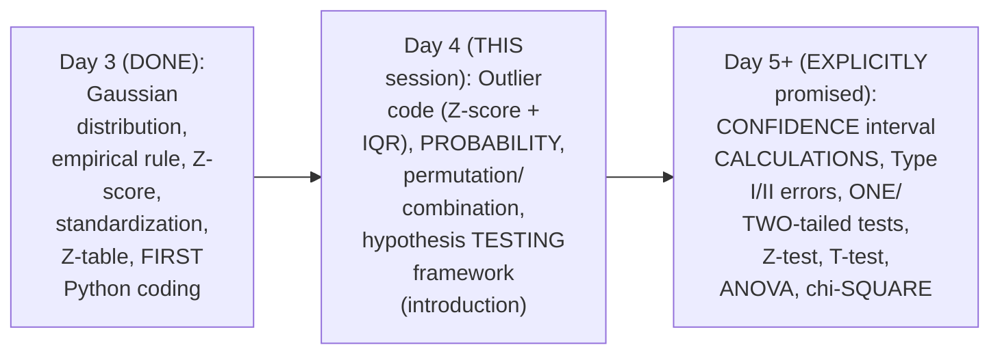

#### 🎯 Key Takeaways

* This is GENUINELY **Day 4**, HONESTLY rescheduled DUE to REPUBLIC Day — DIRECTLY, EXPLICITLY confirmed BY the instructor.
* This session GENUINELY, DIRECTLY completes DAY 3's own DEFERRED, code-BASED outlier-DETECTION promise, THEN builds a COMPLETE probability FOUNDATION, and CLOSES with a GENUINE, first INTRODUCTION to hypothesis TESTING.
* The instructor **directly, EXPLICITLY confirms** a DELIBERATE, INTEGRATED teaching APPROACH — combining hypothesis TESTING, confidence INTERVAL, significance VALUE, and p-VALUE TOGETHER, RATHER than teaching THEM as ISOLATED, separate topics.

---
### 2. Python: Detecting Outliers via Z-Score

#### ❓ Why It Exists — A Direct, Precise Connection to the Empirical Rule

> 💡 **Given directly:** *"We know that 68 percentage of data, 95 percentage of data, 99.7 percentage of data... can I consider that during some of the scenarios, if my data is normally distributed, after the third standard deviation, probably the data are outliers? Yes or no? Yes."*

#### 🪜 Step-by-Step — A Complete, Real, Live-Coded Outlier-Detection Function

> 💡 **Given directly:** *"I'm going to create a function which says define detect underscore outliers... my threshold will basically be three standard deviation... my Z score formula is nothing but x of i minus mu divided by standard deviation... for each and every point inside my dataset, I will just apply the Z score formula... if it is greater than threshold... it is an outlier."*

```python
import numpy as np

def detect_outliers(data):
    outliers = []
    threshold = 3
    mean = np.mean(data)
    std = np.std(data)

    for i in data:
        z_score = (i - mean) / std
        if np.abs(z_score) > threshold:
            outliers.append(i)

    return outliers

detect_outliers(dataset)
```

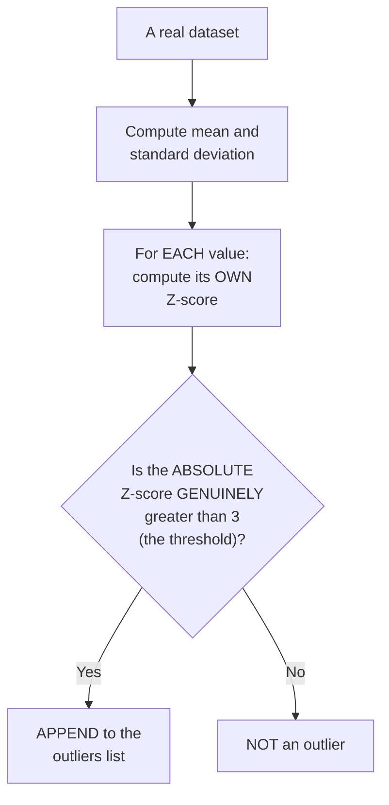

#### ⚠ Common Mistakes

* Assuming a THRESHOLD of "3" is GENUINELY, ARBITRARILY chosen — explicitly, directly, PRECISELY connected: it DIRECTLY, MEANINGFULLY corresponds to the THIRD standard DEVIATION boundary FROM the empirical RULE (99.7% of GENUINELY Gaussian data FALLS within it).
* Forgetting to use `np.ABS()` (absolute VALUE) when COMPARING the Z-score AGAINST the threshold — explicitly, directly, PRACTICALLY demonstrated as NECESSARY — OUTLIERS can GENUINELY occur on EITHER side (POSITIVE or NEGATIVE Z-score).

#### 🎯 Key Takeaways

* A COMPLETE, real Python FUNCTION (`detect_outliers`) directly, PRACTICALLY implements Z-SCORE-based outlier DETECTION — FLAGGING any value WHOSE absolute Z-score GENUINELY exceeds **3** (the THIRD standard-DEVIATION threshold).
* This THRESHOLD directly, PRECISELY connects BACK to Day 3's own ESTABLISHED empirical RULE — VALUES beyond the THIRD standard deviation GENUINELY, STATISTICALLY represent the RAREST ~0.3% of a TRUE Gaussian DISTRIBUTION.
* This function was directly, LIVE-tested ON a real DATASET, SUCCESSFULLY identifying GENUINE outliers — DIRECTLY, PRACTICALLY completing Day 3's own DEFERRED, code-based PROMISE.

---

### 3. Python: Detecting Outliers via IQR

#### 🪜 Step-by-Step — A Complete, Real, Live-Planned Sequence of Steps

> 💡 **Given directly:** *"The first step is that I want to... sort the data... the second step is that I will calculate Q1 and Q3... then we need to find out IQR, which is nothing but the third step, which is nothing but the subtraction of Q3 minus Q1... then find the lower fence... then find the upper fence."*

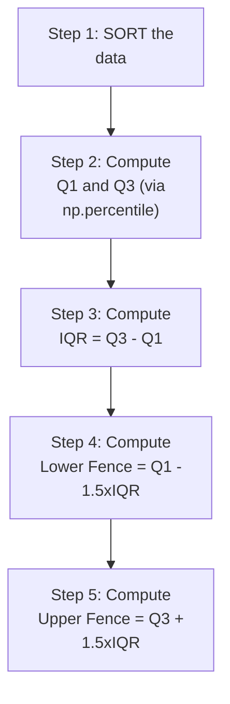

#### 🪜 Step-by-Step — A Complete, Real, Live-Coded Implementation

> 💡 **Given directly:** *"Sorted data set, I will just say this will be my dataset, and I can use sorted function... Q1 comma Q3, and here I will basically use np.percentile... give my dataset over here, along with this, I'll give two values, one is 25 comma 75... IQR is equal to Q3 minus Q1... lower fence is equal to Q1 minus 1.5 multiplied by IQR... higher fence is equal to Q3 plus 1.5 multiplied by IQR."*

```python
sorted_data = sorted(dataset)

Q1, Q3 = np.percentile(dataset, [25, 75])
print(Q1, Q3)

IQR = Q3 - Q1
print(IQR)   # -> 3 (live-confirmed result)

lower_fence = Q1 - 1.5 * IQR
higher_fence = Q3 + 1.5 * IQR
print(lower_fence, higher_fence)   # -> 7.5, 19.5 (live-confirmed result)
```

#### 🔍 Internal Working — A Genuine, Real, Live Cross-Validation via a Box Plot

> 💡 **Given directly:** *"Instead of doing all these things, if I import Seaborn as sns... and execute it, there is an option which is called as... box plot... you see that there is a very big outlier, right? So that is the reason this same outlier we found out with the help of multiple things."*

```python
import seaborn as sns
sns.boxplot(dataset)
```

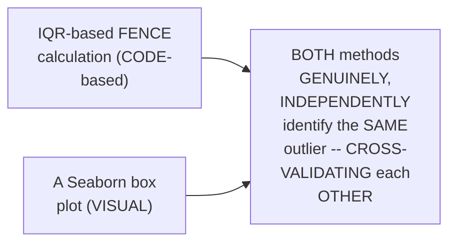

#### ⚠ Common Mistakes

* Assuming the IQR METHOD, once CODED, requires a GENUINELY DIFFERENT, unrelated APPROACH from the THEORETICAL, hand-computed VERSION taught in Day 2 — explicitly, directly, PRACTICALLY confirmed as the SAME, IDENTICAL formulas — MERELY EXPRESSED in PYTHON code.
* Assuming a VISUAL box PLOT and a NUMERIC, formula-BASED IQR calculation are GENUINELY, INDEPENDENTLY unrelated CHECKS — explicitly, directly, LIVE-demonstrated as GENUINELY, DIRECTLY cross-VALIDATING the SAME, underlying OUTLIER.

#### 🎯 Key Takeaways

* The COMPLETE, real Python IMPLEMENTATION of IQR-based OUTLIER detection directly, PRECISELY mirrors Day 2's own MANUAL formulas — SORT, compute Q1/Q3 (`np.PERCENTILE`), compute IQR, COMPUTE fences.
* A REAL, live-computed EXAMPLE directly, CONCRETELY confirmed: **IQR = 3**, LOWER fence = **7.5**, UPPER fence = **19.5**.
* A REAL, Seaborn BOX plot directly, VISUALLY **cross-VALIDATED** the SAME outlier IDENTIFIED by the NUMERIC, IQR-based CALCULATION — DIRECTLY, PRACTICALLY confirming BOTH approaches AGREE.

---
### 4. Probability: A Precise, Foundational Definition

#### 📖 Definition — Probability, Precisely Defined

> 💡 **Given directly:** *"Probability is a measure of the likelihood of an event... number of ways an event can occur, divided by number of possible outcomes."*

```text
Probability Formula: P(event) = (Number of ways the event CAN occur) / (Total number of possible outcomes)
```

#### 🪜 Step-by-Step — Two Complete, Real, Worked Examples

> 💡 **Given directly:** *"What is the probability of getting 6 [when rolling a dice]?... obviously you will say 1 by 6... [tossing a coin] what is the probability of getting head? You'll just say that 1 by 2, because the sample space is 2, and the number of events that can occur is 1."*

```text
Rolling a die, P(6) = 1 / 6
Tossing a coin, P(Head) = 1 / 2
```

#### 🏢 Real-World / Production Usage — A Genuine, Direct, Machine-Learning Connection

> 💡 **Given directly:** *"Probability is by default used in machine learning also, in deep learning also... let's say linear regression... my question is that what probability of this particular point belongs to class A, and what probability of this particular point belongs to class B."*

#### ⚠ Common Mistakes

* Assuming PROBABILITY is a GENUINELY, PURELY abstract, mathematical CONCEPT with NO real, PRACTICAL application — explicitly, directly, DIRECTLY connected: it's GENUINELY, DIRECTLY used IN foundational machine-LEARNING concepts (LOGISTIC/linear regression, NAIVE Bayes) — a THEME the instructor RETURNS to REPEATEDLY.

#### 🎯 Key Takeaways

* **Probability** is precisely DEFINED as (WAYS an event CAN occur) / (TOTAL possible OUTCOMES) — GROUNDED in REAL, simple examples (DICE rolls, coin TOSSES).
* This FOUNDATIONAL definition directly, PRECISELY sets UP the REST of this session's OWN content — the ADDITION and MULTIPLICATION rules BOTH directly, DIRECTLY build ON this SAME, basic FORMULA.
* Probability is directly, EXPLICITLY confirmed as GENUINELY, HEAVILY used IN machine LEARNING (e.g., LOGISTIC/linear regression's own CLASS-probability estimates) — a REAL, PRACTICAL motivation WORTH remembering.

---

### 5. The Addition Rule: Mutually Exclusive vs. Non-Mutually Exclusive Events

#### 📖 Definition — Mutually Exclusive Events, Precisely Defined

> 💡 **Given directly:** *"Two events are mutual exclusive if they cannot occur at the same time... rolling a dice... you cannot get 1 and 2 at the same time... tossing a coin... you may either get head or tail, you cannot get both."*

#### 📖 Definition — The Addition Rule (Mutually Exclusive), Precisely Defined

> 💡 **Given directly:** *"Probability of A or B, where A and B are events, is equal to probability of A plus probability of B."*

```text
Addition Rule (Mutually Exclusive): P(A or B) = P(A) + P(B)
```

#### 🪜 Step-by-Step — A Complete, Real, Worked Example

> 💡 **Given directly:** *"What is the probability of the coin landing on heads or tail?... probability of A is 1 by 2, plus probability of B... so the answer will be 1... what is the probability of getting 1 or 3 or 6?... probability of 1 plus probability of 3 plus probability of 6... 1/6 + 1/6 + 1/6... 3/6... 0.5."*

```text
P(Head or Tail) = 1/2 + 1/2 = 1
P(1 or 3 or 6, rolling a die) = 1/6 + 1/6 + 1/6 = 3/6 = 0.5
```

#### 📖 Definition — Non-Mutually Exclusive Events, Precisely Defined

> 💡 **Given directly:** *"With respect to non-mutual exclusive, obviously both the events can occur at the same time... let's take a deck of cards... a queen card can come along with the heart card... so this two cards are obviously not mutual exclusive."*

#### 📖 Definition — The Addition Rule (Non-Mutually Exclusive), Precisely Defined

> 💡 **Given directly:** *"Probability of A or B is equal to probability of A plus probability of B, [minus] probability of A intersection B."*

```text
Addition Rule (Non-Mutually Exclusive): P(A or B) = P(A) + P(B) - P(A ∩ B)
```

#### 🪜 Step-by-Step — A Complete, Real, Worked Example: Queen or Heart

> 💡 **Given directly:** *"What is the probability of choosing a card that is queen or a heart?... probability of getting a queen is nothing but 4 by 52... probability of heart... 13 by 52... probability of queen and heart... only 1... so here I will write 1 by 52... probability of queen plus probability of heart, minus probability of queen and heart... 4 plus 13 minus 1... 16 by 52."*

```text
Deck of cards (52 total):
  P(Queen) = 4/52
  P(Heart) = 13/52
  P(Queen AND Heart) = 1/52   (the Queen of Hearts specifically)

P(Queen OR Heart) = 4/52 + 13/52 - 1/52 = 16/52 = 4/13
```

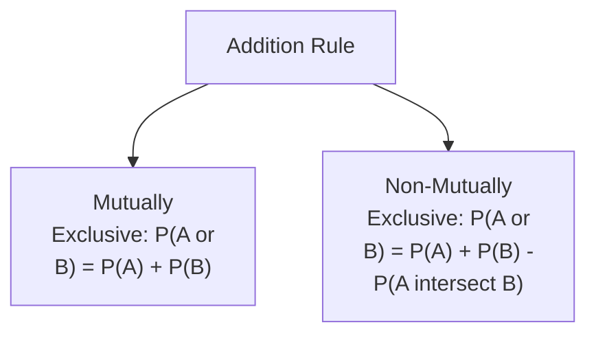

#### ⚠ Common Mistakes

* Applying the SIMPLE addition RULE (P(A) + P(B)) to NON-mutually exclusive EVENTS — explicitly, directly, LIVE-demonstrated as GENUINELY, DIRECTLY incorrect: it GENUINELY, ACCIDENTALLY double-COUNTS the OVERLAP (e.g., the QUEEN of hearts) — REQUIRING the SUBTRACTION of P(A∩B).
* Forgetting to FIRST determine WHETHER events are MUTUALLY exclusive or NOT, before SELECTING a formula — explicitly, directly, REPEATEDLY emphasized as the REQUIRED, FIRST step.

#### 🎯 Key Takeaways

* For **MUTUALLY exclusive** events (CANNOT occur SIMULTANEOUSLY): **P(A or B) = P(A) + P(B)**.
* For **NON-mutually exclusive** events (CAN occur SIMULTANEOUSLY): **P(A or B) = P(A) + P(B) − P(A∩B)** — SUBTRACTING the OVERLAP to AVOID double-COUNTING.
* A COMPLETE, real, WORKED example (QUEEN or heart FROM a deck) directly, CONCRETELY confirmed: **16/52 = 4/13**.

---
### 6. The Multiplication Rule: Independent vs. Dependent Events (& Conditional Probability)

#### 📖 Definition — Independent Events, Precisely Defined

> 💡 **Given directly:** *"In the case of independent events... if I roll a dice, if I got 1 in the first instance, in the second instance it is possible I may get 1... one event is not at all dependent on the other event... each and every event is independent."*

#### 📖 Definition — The Multiplication Rule (Independent Events), Precisely Defined

> 💡 **Given directly:** *"Probability of A multiplied by probability of B, A and then B... this is the usual formula that we use for an independent event in a multiplication rule."*

```text
Multiplication Rule (Independent): P(A and B) = P(A) × P(B)
```

#### 🪜 Step-by-Step — A Complete, Real, Worked Example

> 💡 **Given directly:** *"What is the probability of rolling a five and then a 4 in a dice?... probability of 5, probability of 5 is nothing but 1 by 6, multiplied by 1 by 6, it is nothing but 1 by 36."*

```text
P(5, then 4, rolling a die twice) = (1/6) × (1/6) = 1/36
```

#### 📖 Definition — Dependent Events, Precisely Defined (A Real, Worked Marble Example)

> 💡 **Given directly:** *"I have a bag, let's say I have three red marbles and two green marbles... what is the probability of taking out a marble [red]?... 3 by 5... after taking out the red marble, how many marbles are remaining?... this bag will basically have two red marble and two green marble... what is the probability of now taking out a green marble?... 2 by 4."*

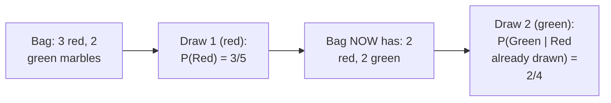

#### 📖 Definition — Conditional Probability, Precisely Introduced

> 💡 **Given directly:** *"This term is basically called as conditional probability... probability of green and then probability of red given green... given green basically means this green event has already occurred, this event has already occurred."*

```text
P(A and B, DEPENDENT) = P(A) × P(B | A)
```

#### 🏢 Real-World / Production Usage — A Genuine, Direct Connection to Naive Bayes

> 💡 **Given directly:** *"There is an amazing algorithm which is called as Naive Bayes... this is where conditional probability will come into existence... in Bayes theorem, this will be very, very important."*

#### 🪜 Step-by-Step — A Second, Complete, Real Worked Example: Queen Then Ace

> 💡 **Given directly:** *"What is the probability of drawing a queen and then an ace from a deck of card?... probability of queen multiplied by probability of aces given queen... probability of queen is nothing but 4 by 52, multiplied by 4 by 51."*

```text
P(Queen, then Ace, from a deck, WITHOUT replacement) = (4/52) × (4/51)
```

#### ⚠ Common Mistakes

* Applying the SIMPLE, independent-EVENT multiplication RULE (P(A) × P(B)) to a GENUINELY DEPENDENT scenario — explicitly, directly, LIVE-demonstrated as GENUINELY, DIRECTLY incorrect: the SECOND event's own PROBABILITY GENUINELY changes ONCE the FIRST event has OCCURRED (e.g., 52 → 51 CARDS remaining).
* Assuming CONDITIONAL probability is a GENUINELY, entirely NEW, unrelated CONCEPT — explicitly, directly, DIRECTLY connected: it's SIMPLY the "P(B|A)" TERM WITHIN the DEPENDENT-event multiplication RULE — DIRECTLY, GENUINELY foreshadowing NAIVE Bayes/Bayes' THEOREM.

#### 🎯 Key Takeaways

* For **INDEPENDENT** events (ONE event does NOT genuinely AFFECT the other): **P(A and B) = P(A) × P(B)**.
* For **DEPENDENT** events (ONE event GENUINELY, DIRECTLY affects the OTHER'S probability): **P(A and B) = P(A) × P(B|A)** — INTRODUCING **conditional PROBABILITY**.
* Conditional PROBABILITY is directly, EXPLICITLY confirmed as GENUINELY, DIRECTLY foundational TO Naive BAYES/Bayes' theorem — EXPLICITLY deferred to a FUTURE, dedicated machine-LEARNING series.

---

### 7. Permutation: Derived From First Principles (A Genuine, Real Chocolate Factory Story)

#### 🧠 Concept — A Genuinely Memorable, Real Motivating Story

> 💡 **Given directly:** *"I have taken some students to a school trip... a chocolate factory... six different types of chocolates... I give a student an assignment... write the first three chocolates whichever you see."*

#### 🪜 Step-by-Step — Deriving the Permutation Count From First Principles

> 💡 **Given directly:** *"In the first instance, how many different options this particular student can have?... six different options... once he sees probably any one chocolate... how many options will remain? Total five will remain... finally, here you'll be seeing... four options... if I try to multiply this, 6 multiplied by 5 multiplied by 4, it is nothing but 120."*

```text
Chocolate Factory Example: 6 total chocolate types, choosing/ordering 3

First pick: 6 options
Second pick: 5 remaining options
Third pick: 4 remaining options

Total permutations: 6 × 5 × 4 = 120
```

#### 📖 Definition — The Standard Permutation Formula, Precisely Connected

> 💡 **Given directly:** *"nPr is equal to n factorial divided by n minus r factorial... 6 factorial divided by 6 minus 3 factorial, which is nothing but 6 into 5 multiplied by 4 multiplied by 3 factorial, divided by 3 factorial... this and this will get cut, so total answer is 120."*

```text
Permutation Formula: nPr = n! / (n-r)!
For n=6, r=3: 6! / 3! = (6×5×4×3!) / 3! = 6×5×4 = 120
```

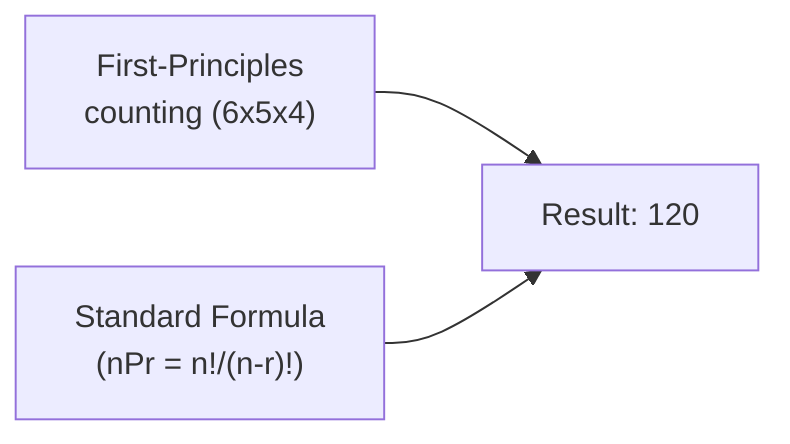

#### ⚠ Common Mistakes

* Assuming the STANDARD `nPr` formula is GENUINELY, ARBITRARILY memorized, WITHOUT any REAL, intuitive BASIS — explicitly, directly, DELIBERATELY derived FROM first PRINCIPLES (the CHOCOLATE-factory story) BEFORE introducing the FORMAL formula — DIRECTLY connecting INTUITION to NOTATION.

#### 🎯 Key Takeaways

* **Permutation** COUNTS the NUMBER of ORDERED arrangements — DIRECTLY, MEMORABLY derived VIA the "chocolate FACTORY" story: FIRST pick (6 OPTIONS) × second PICK (5 remaining) × THIRD pick (4 REMAINING) = **120**.
* This SAME result is directly, PRECISELY confirmed VIA the standard FORMULA: **nPr = n! / (n−r)!**.
* This DELIBERATE, first-PRINCIPLES-before-formula APPROACH directly, CONSISTENTLY mirrors THIS instructor's OWN, established TEACHING pattern (e.g., Day 2's own MANUAL formula BUILDING).

---
### 8. Combination: The Precise, Genuine Difference From Permutation

#### 📖 Definition — Combination, Precisely Distinguished via "Uniqueness"

> 💡 **Given directly:** *"In combination, always understand — permutation, if I have the same element, like this, I have dairy milk, I have gems, I have eclairs — if I've used this element once, this combination, I cannot use the same element and probably make a different combination... combination will be unique with respect to the elements that is used."*

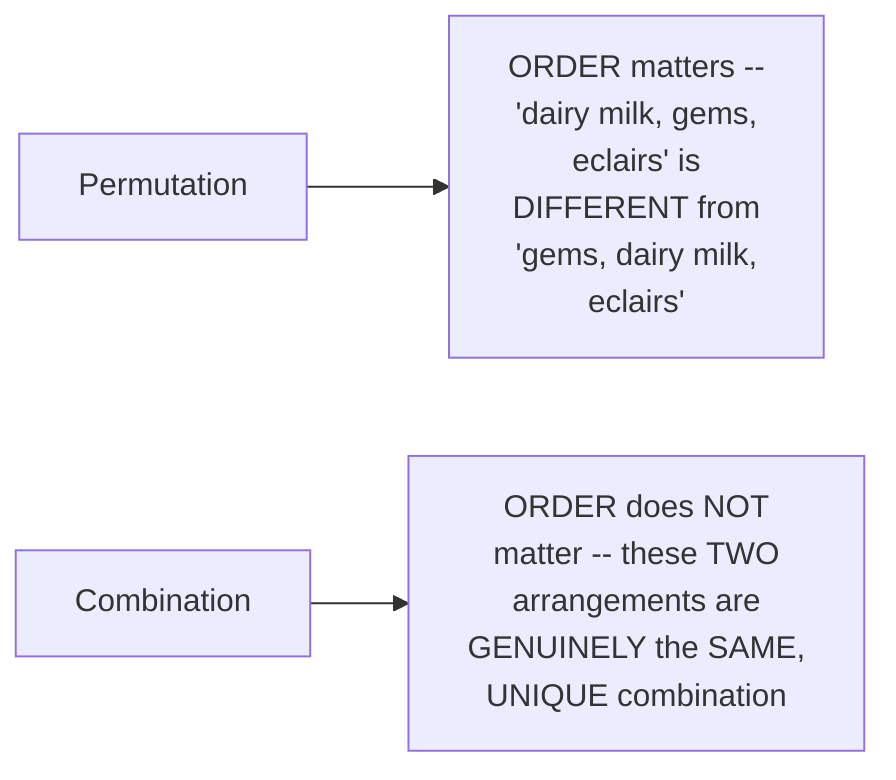

#### 📖 Definition — The Combination Formula, Precisely Defined

> 💡 **Given directly:** *"For this, the formula is nCr, which is nothing but n factorial divided by r factorial, n minus r factorial... 6 factorial divided by 3 factorial and 6 minus 3 factorial... 20 unique combinations you can basically have."*

```text
Combination Formula: nCr = n! / (r! × (n-r)!)
For n=6, r=3: 6! / (3! × 3!) = 20
```

#### ⚠ Common Mistakes

* Confusing PERMUTATION and COMBINATION as GENUINELY, INTERCHANGEABLE concepts — explicitly, directly, PRECISELY distinguished: PERMUTATION genuinely CARES about ORDER; combination GENUINELY, ONLY cares ABOUT uniqueness of the SET of elements, REGARDLESS of order.
* Assuming the COMBINATION formula's own RESULT (20) is GENUINELY, DIRECTLY comparable in MAGNITUDE to the PERMUTATION result (120) FOR the SAME n and r — explicitly, directly, NUMERICALLY confirmed as GENUINELY, STRUCTURALLY different — COMBINATION is ALWAYS ≤ permutation, SINCE it GROUPS together ALL the ORDER-based variations OF the SAME, underlying set.

#### 🎯 Key Takeaways

* **Combination** GENUINELY, PRECISELY differs FROM permutation BY caring ONLY about the **UNIQUENESS** of the elements CHOSEN — NOT their ORDER.
* **nCr = n! / (r! × (n−r)!)** — a COMPLETE, real, WORKED example (n=6, r=3) directly, CONCRETELY confirmed **20** unique COMBINATIONS.
* PERMUTATION (120) and COMBINATION (20), FOR the SAME n=6/r=3, directly, CONCRETELY illustrate WHY combination is ALWAYS ≤ permutation — COMBINATION groups TOGETHER all the ORDER-based VARIATIONS of the SAME underlying SET.

---

### 9. P-Value: A Genuinely Clever, Informal First Introduction

#### 🧠 Concept — A Genuinely Clever, Real, Relatable Analogy: The Mousepad

> 💡 **Given directly:** *"Everybody uses a laptop... this is your mouse pad... most of the time, when you're moving your fingers, you will be moving in this specific region... hardly you'll touch somewhere in the corner... this thing will basically specify your distribution of touches."*

#### 📖 Definition — P-Value, Precisely, Informally Introduced

> 💡 **Given directly:** *"Let's consider that I say my p value for this position is 0.8... let's say that I am doing 100 times, I am touching this mousepad... every 100th time I touch the mousepad, 80 times out of this 100, 80 times I touch this specific region."*

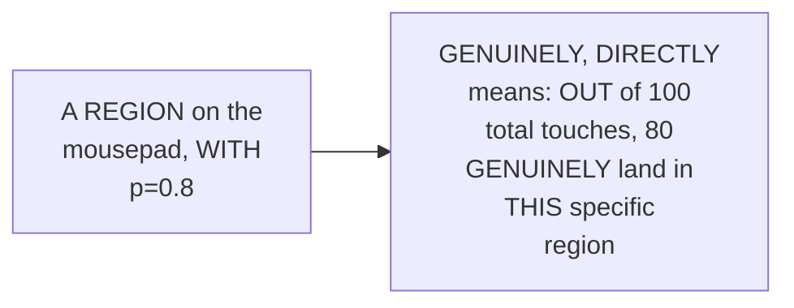

#### 🔍 Internal Working — A Genuine, Direct, Overall Summary

> 💡 **Given directly:** *"P value basically says, most of the time, what is the probability with respect to a p value for that specific experiment."*

#### ⚠ Common Mistakes

* Assuming P-VALUE is a GENUINELY, INTRINSICALLY complex, ABSTRACT concept — explicitly, directly, DELIBERATELY introduced HERE via a GENUINELY simple, RELATABLE, everyday ANALOGY (a mousepad's OWN touch DISTRIBUTION) — BEFORE its OWN, more FORMAL, statistical DEFINITION is introduced (Section 12).

#### 🎯 Key Takeaways

* **P-VALUE** is FIRST, DELIBERATELY introduced HERE via a GENUINELY clever, EVERYDAY analogy — a MOUSEPAD's own "TOUCH distribution" — WHERE a REGION's own p=0.8 GENUINELY means "80 OUT of 100 touches LAND here."
* This is a DELIBERATE, INFORMAL first PASS — a MORE formal, PRECISE statistical DEFINITION (DISTINGUISHING it FROM significance value) FOLLOWS in Section 12.
* This ANALOGY directly, MEMORABLY anchors p-VALUE's own CORE, intuitive MEANING — "MOST of the time, WHAT is the probability" — BEFORE the MORE technical, HYPOTHESIS-testing context is INTRODUCED.

---
### 10. Hypothesis Testing: Null vs. Alternate Hypothesis

#### ❓ Why It Exists — A Genuine, Real, Motivating Problem

> 💡 **Given directly:** *"Let's say I'm solving a problem. My problem is: I have a coin, I want to test whether this coin is a fair coin or not, by performing 100 tosses. Now we are entering into inferential statistics."*

#### 📖 Definition — Null Hypothesis, Precisely Defined

> 💡 **Given directly:** *"The null hypothesis is usually given in the problem statement — what is, what we want to test... whatever the default question is, I'm going to use it as a null hypothesis... a person cannot be acquitted as a criminal unless and until it is proved... so the coin is fair."*

#### 📖 Definition — Alternate Hypothesis, Precisely Defined

> 💡 **Given directly:** *"The second thing that we basically define is something called as alternate hypothesis — here I'll say the coin is unfair... alternate hypothesis will be the opposite of null hypothesis."*

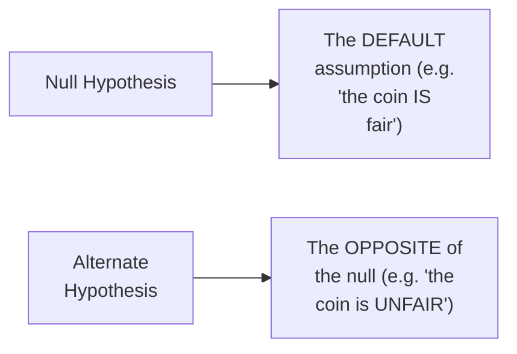

#### 🪜 Step-by-Step — The Complete, Four-Step Hypothesis-Testing Process

> 💡 **Given directly:** *"The third step is that we perform the experiments, and the experiment can be anything — it can be a Z test, T test, whatever things you want... inside this experiment we see some values, and based on that, the fourth step... we reject or accept the null hypothesis."*

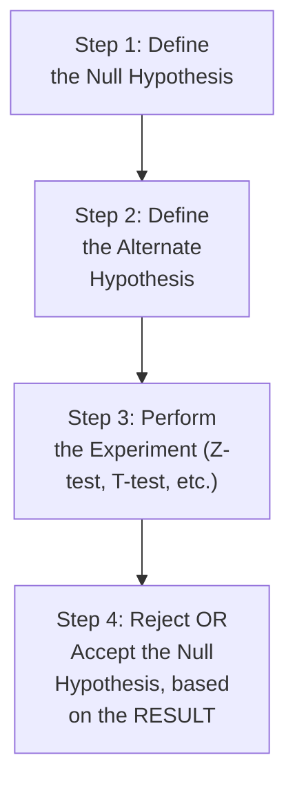

#### ⚠ Common Mistakes

* Assuming the NULL hypothesis is GENUINELY, ALWAYS the "POSITIVE" or "DESIRED" outcome — explicitly, directly, CAREFULLY clarified VIA a LEGAL analogy: it's GENUINELY, SIMPLY the DEFAULT, "innocent-UNTIL-proven" assumption — NOT necessarily the OUTCOME you HOPE for.
* Assuming YOU can "ACCEPT" the null HYPOTHESIS with GENUINE, absolute CERTAINTY — a GENUINE, real NUANCE the instructor HIMSELF later ACKNOWLEDGES (Section 13): "WE don't usually REJECT [or accept] null HYPOTHESIS [with certainty] — it is BASED on the EXPERIMENT" — a PROBABILISTIC, not ABSOLUTE, conclusion.

#### 🎯 Key Takeaways

* The **NULL hypothesis** is precisely the DEFAULT, "innocent-UNTIL-proven" assumption (e.g., "the COIN is fair"); the **ALTERNATE hypothesis** is its DIRECT, genuine OPPOSITE (e.g., "the COIN is unfair").
* The COMPLETE, four-STEP process: DEFINE null → DEFINE alternate → PERFORM the EXPERIMENT → REJECT or accept the NULL, based on the RESULT.
* This directly, PRECISELY sets UP the NEXT, essential CONCEPTS — significance VALUE and CONFIDENCE interval — WHICH precisely DEFINE the BOUNDARY for MAKING this "reject OR accept" decision.

---

### 11. Significance Value & Confidence Interval: A Complete, Integrated Worked Example

#### 🪜 Step-by-Step — Setting Up the Complete, Real Scenario

> 💡 **Given directly:** *"Let's say my mean value is 50... I need to get 50 times head, in order to say that my coin is fair... let's say for this problem statement I'm just examining, the standard deviation is 10... if I know my mean and standard deviation, I may draw a curve."*

#### ❓ Why It Exists — A Genuine, Real Question: Is 30 Heads "Close Enough"?

> 💡 **Given directly:** *"Just imagine I got 30 times head... can I still say that this coin is fair or not?... for this to define, it is always said that our experiment should be nearer to the mean... how do we define that, how far it can be away from the mean? For that we use a very important property which is called as significance value."*

#### 📖 Definition — Significance Value (Alpha), Precisely Defined

> 💡 **Given directly:** *"This significance value is basically given by alpha. Suppose let's consider that I am considering alpha as 0.05... if I do 1 minus 0.05... it is 95 percent... this basically indicate[s] that... it is 95 confidence interval."*

```text
Significance Value (α) = 0.05
Confidence Interval = 1 - α = 0.95 (i.e., 95%)
```

#### 🔍 Internal Working — A Genuine, Direct Confirmation of the Two-Tailed Split

> 💡 **Given directly:** *"Since this is a two-tailed test... when I probably divide this into two parts, here my 2.5 percent will come, here my 2.5 percent will come."*

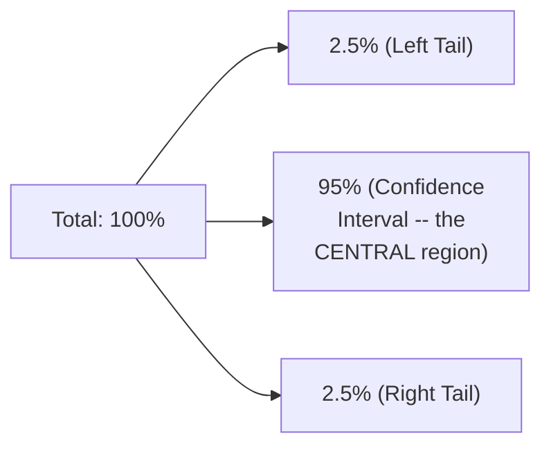

#### 🪜 Step-by-Step — Three, Complete, Real Decision Examples

> 💡 **Given directly, Example 1 (30 heads, ASSUMED CI of 20-75):** *"Whenever we are coming inside this, then we say that the coin is fair... because it is within this interval."*

> 💡 **Given directly, Example 2 (10 heads):** *"Let's say I get 10 heads only out of 100 experiments... which region it is falling? It will fall somewhere here, it is not inside the confidence interval, so we can definitely say that coin is not fair... we reject the null hypothesis, and we accept the alternate hypothesis."*

> 💡 **Given directly, Example 3 (95 heads):** *"Let's say that guys, if you have 95 heads in those 100 experiments, which region will it fall? Will it not fall in this region?... should we accept the null hypothesis or reject the null hypothesis? We have to obviously reject the null hypothesis, and alternate hypothesis will be accepted."*

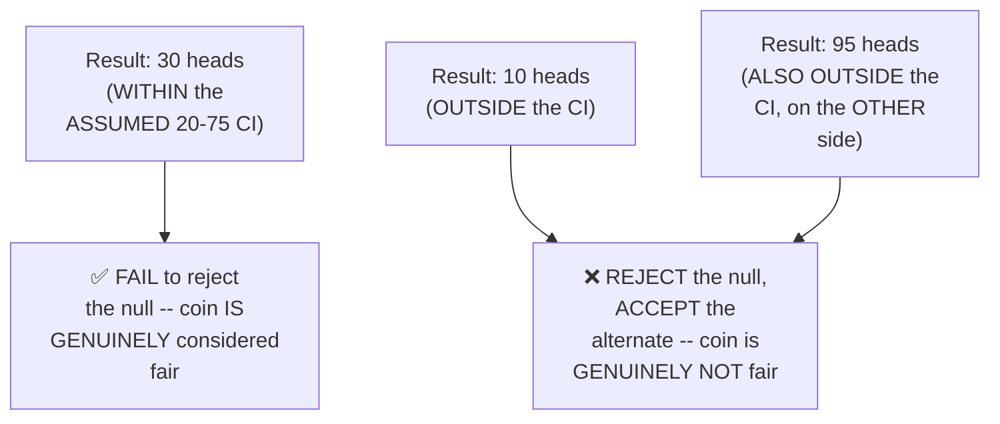

#### 🔍 Internal Working — A Genuine, Direct Confirmation: Alpha and Confidence Interval Are Inversely Related

> 💡 **Given directly:** *"If your alpha value is 0.20, now what will be your confidence interval?... 80 percent... if your alpha value is 0.3, what is your confidence interval?... 0.7, that is 70 confidence interval."*

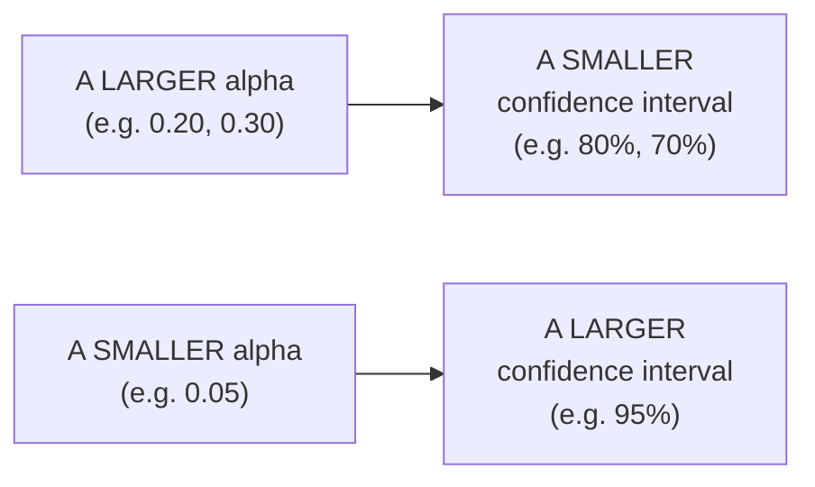

#### ⚠ Common Mistakes

* Assuming a SPECIFIC confidence-INTERVAL boundary (LIKE "20 to 75") is GENUINELY, UNIVERSALLY fixed OR self-evident — explicitly, directly, HONESTLY clarified: "THIS has been DEFINED by a DOMAIN expert" — it's a DELIBERATE, CONTEXTUAL choice, NOT a UNIVERSAL constant.
* Assuming ALPHA and confidence INTERVAL are GENUINELY, DIRECTLY proportional — explicitly, directly, PRECISELY corrected: they are **INVERSELY** related — a LARGER alpha GENUINELY produces a SMALLER confidence INTERVAL.

#### 🎯 Key Takeaways

* **Significance VALUE (alpha)** and **confidence INTERVAL** are DIRECTLY, INVERSELY related: `Confidence Interval = 1 − α` (e.g., α=0.05 → 95% CI).
* THREE, complete, real DECISION examples directly, CONCRETELY confirmed the HYPOTHESIS-testing WORKFLOW: a RESULT WITHIN the confidence INTERVAL (30 heads) FAILS to reject the NULL (coin IS fair); a RESULT outside IT (10 OR 95 heads) REJECTS the null (coin is NOT fair).
* Alpha and confidence INTERVAL are directly, PRECISELY **inversely RELATED** — a LARGER alpha (e.g., 0.20 or 0.30) GENUINELY produces a SMALLER confidence INTERVAL (80% or 70%, respectively).

---
### 12. Significance Value vs. P-Value: A Precise, Honest Distinction

#### 📖 Definition — A Direct, Precise, Honest Clarification

> 💡 **Given directly:** *"Significance value is not equal to p value, understand one thing — p value over, say, you are just saying the probability, significance says that what should be within your confidence interval."*

#### 🔍 Internal Working — A Genuine, Direct Confirmation of Their Practical Relationship

> 💡 **Given directly:** *"Next time when you can actually perform experiment, you can say that the p value was less than 0.05, like that — if you say p value is less than 0.05, that basically means it is falling somewhere here [outside/in the tail]. If you say p value is greater than 0.05, that basically means you are saying that it is falling here [inside the confidence interval]."*

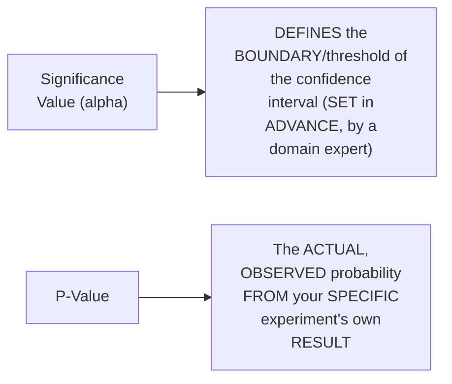

#### 🔍 Internal Working — A Genuine, Direct, Practical Decision Rule

> 💡 **Given directly:** *"If it does not follow in the confidence interval, I may say that the p value is less than 0.3 [alpha]... so because of that I have to reject the null hypothesis."*

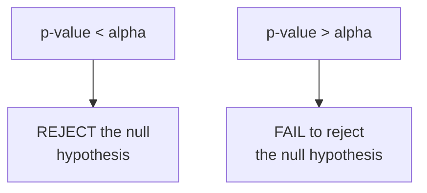

#### ⚠ Common Mistakes

* Assuming "SIGNIFICANCE value" and "P-value" are GENUINELY, INTERCHANGEABLE terms — explicitly, directly, REPEATEDLY corrected: SIGNIFICANCE value (ALPHA) is a PRE-set THRESHOLD/boundary; p-VALUE is the ACTUAL, OBSERVED result FROM a SPECIFIC experiment, COMPARED against THAT threshold.
* Assuming a "SMALL" p-value is GENUINELY, INHERENTLY "GOOD" or "bad," WITHOUT context — explicitly, directly, PRECISELY clarified: its MEANING depends ENTIRELY on the DECISION rule (p < ALPHA → reject NULL; p > alpha → FAIL to reject).

#### 🎯 Key Takeaways

* **Significance VALUE (alpha)** and **p-VALUE** are directly, EXPLICITLY confirmed as **GENUINELY different** — ALPHA is a PRE-SET threshold/BOUNDARY; p-value is the ACTUAL, observed RESULT from a SPECIFIC experiment.
* The COMPLETE, practical DECISION rule: **p-value < alpha → REJECT the null HYPOTHESIS**; **p-value > alpha → FAIL to reject** the null hypothesis.
* This PRECISE distinction directly, HONESTLY addresses a GENUINELY, COMMONLY confused PAIR of terms — WORTH remembering PRECISELY for BOTH interviews and PRACTICAL application.

---

### 13. Closing: What's Deferred to Tomorrow

#### 🪜 Step-by-Step — A Complete, Honest, Direct Confirmation

> 💡 **Given directly:** *"Tomorrow first of all I'll try to show you how to calculate confidence interval, then I'll be talking about type 1, type 2 errors, one tail, two tailed test, then probably we'll be discussing about one sample Z test, one sample T test, then dependent sample T test, then Z test for proportion, then ANOVA test, then chi-square test."*

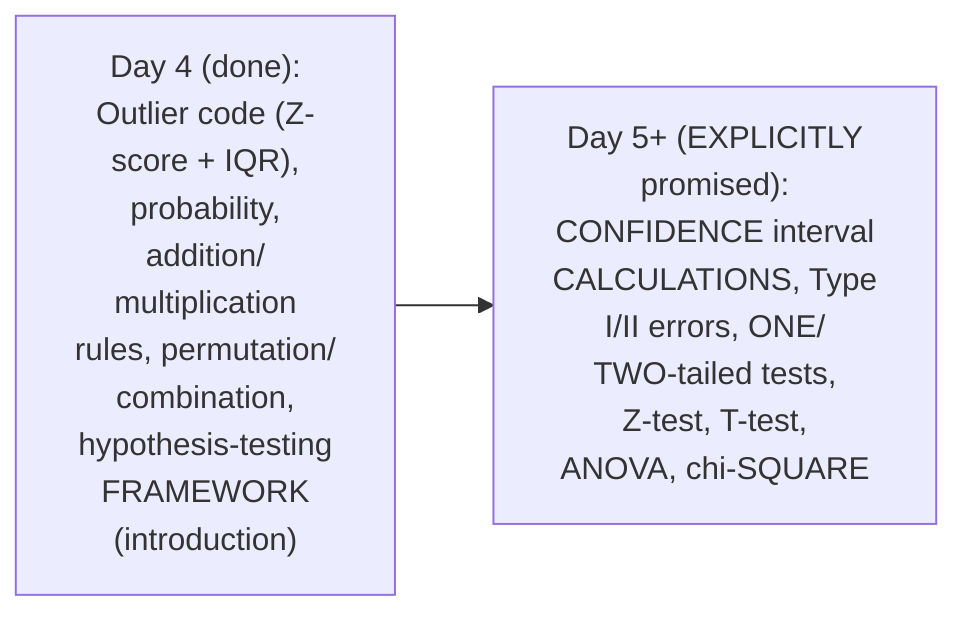

#### ⚠ A Direct, Honest, Important Nuance (Raised Live, by a Student)

> 💡 **Given directly:** *"Sir, we don't usually reject null hypothesis, it is based on the experiment. Okay, perfect, thank you."*

#### ⚠ Common Mistakes

* Assuming THIS session's own, GENUINELY comprehensive-FEELING coverage of HYPOTHESIS testing represents a COMPLETE, standalone TREATMENT — explicitly, directly, HONESTLY clarified: it's GENUINELY an INTRODUCTORY, INTEGRATED first PASS — the FULL, formal MECHANICS (confidence-interval CALCULATIONS, TYPE I/II errors, SPECIFIC tests) remain EXPLICITLY deferred.

#### 🎯 Key Takeaways

* This episode **GENUINELY, SUBSTANTIALLY delivers** its OWN core GOALS — code-BASED outlier DETECTION, a COMPLETE probability FOUNDATION, and a GENUINELY INTEGRATED, first introduction TO hypothesis TESTING.
* A GENUINE, LIVE audience CORRECTION ("we DON'T usually REJECT null hypothesis... it is BASED on the EXPERIMENT") is directly, HONESTLY acknowledged — REINFORCING that HYPOTHESIS-testing conclusions are GENUINELY, PROBABILISTICALLY grounded, NOT absolutely CERTAIN.
* **Confidence-interval CALCULATIONS, Type I/II ERRORS, one/two-TAILED tests, Z-test, T-test, ANOVA, and CHI-square** are directly, EXPLICITLY confirmed as the NEXT session's OWN, detailed CONTENT.

---

## 📝 Glossary

| Term | Definition | Why It Matters |
|---|---|---|
| **Probability** | (Ways an event can occur) / (total possible outcomes) | The foundation for the addition and multiplication rules |
| **Mutually Exclusive Events** | Events that cannot occur at the same time | P(A or B) = P(A) + P(B) |
| **Non-Mutually Exclusive Events** | Events that CAN occur at the same time | P(A or B) = P(A) + P(B) - P(A∩B) |
| **Independent Events** | One event does not affect the other | P(A and B) = P(A) × P(B) |
| **Dependent Events** | One event affects the other's probability | P(A and B) = P(A) × P(B|A) |
| **Conditional Probability** | P(B|A) -- the probability of B, given A has occurred | Foundational to Naive Bayes/Bayes' theorem |
| **Permutation (nPr)** | Ordered arrangements; n!/(n-r)! | Order matters |
| **Combination (nCr)** | Unique groupings; n!/(r!(n-r)!) | Order does NOT matter |
| **P-Value** | The observed probability from a specific experiment | Compared against the significance value (alpha) |
| **Null Hypothesis** | The default, "innocent until proven" assumption | e.g., "the coin is fair" |
| **Alternate Hypothesis** | The direct opposite of the null hypothesis | e.g., "the coin is unfair" |
| **Significance Value (α)** | A pre-set threshold/boundary (e.g. 0.05) | Confidence Interval = 1 - α |
| **Confidence Interval** | The central region within which a result is "expected" | Values outside it lead to rejecting the null |

---

## 🔄 Revision Notes — One-Minute Revision

* This is **Day 4**, rescheduled due to Republic Day -- bridging Day 3's own deferred, code-based outlier detection into a complete probability foundation and the START of hypothesis testing.
* **Python outlier detection (Z-score)**: a custom `detect_outliers()` function, flagging any value with |Z-score| > 3 (the third-standard-deviation threshold, directly tied to the empirical rule).
* **Python outlier detection (IQR)**: sort data -> compute Q1/Q3 via `np.percentile()` -> IQR = Q3-Q1 -> lower/upper fences. Live example: IQR=3, fences=[7.5, 19.5]. Cross-validated visually via a Seaborn box plot.
* **Probability**: (ways an event can occur)/(total outcomes). Examples: P(6, rolling a die)=1/6; P(Head)=1/2.
* **Addition rule**: mutually exclusive -> P(A or B)=P(A)+P(B) (e.g. P(Head or Tail)=1); non-mutually exclusive -> P(A or B)=P(A)+P(B)-P(A∩B) (e.g. P(Queen or Heart)=4/52+13/52-1/52=16/52=4/13).
* **Multiplication rule**: independent -> P(A and B)=P(A)×P(B) (e.g. P(5 then 4)=1/36); dependent -> P(A and B)=P(A)×P(B|A), introducing CONDITIONAL PROBABILITY (e.g. marbles: P(Green)=3/5, then P(Red|Green)=2/4; cards: P(Queen)×P(Ace|Queen)=4/52×4/51). Directly connects to Naive Bayes, deferred to a future ML series.
* **Permutation**: derived first via a "chocolate factory" story (6×5×4=120), then connected to nPr=n!/(n-r)!. **Combination**: distinguished by "uniqueness" (order doesn't matter) -- nCr=n!/(r!(n-r)!) -> 20 unique combinations, for the same n=6,r=3.
* **P-value**: first, informally introduced via a mousepad "touch distribution" analogy -- p=0.8 in a region means 80/100 touches genuinely land there.
* **Hypothesis testing framework**: null hypothesis (default assumption, e.g. "coin is fair") vs. alternate hypothesis (opposite, "coin is unfair"). 4 steps: define null -> define alternate -> perform experiment -> reject/accept null.
* **Significance value & confidence interval**: α=0.05 -> 95% CI (two-tailed: 2.5% in each tail). THREE worked decision examples: 30 heads (within an assumed 20-75 CI) -> fail to reject null (fair); 10 heads (outside) -> reject null (unfair); 95 heads (also outside) -> reject null (unfair). Alpha and CI are INVERSELY related (α=0.20 -> 80% CI; α=0.30 -> 70% CI).
* **Significance value ≠ p-value**: alpha is a pre-set threshold; p-value is the actual, observed result. Decision rule: p-value < alpha -> reject null; p-value > alpha -> fail to reject.
* **Closing**: a genuine, live student correction is honestly acknowledged -- hypothesis conclusions are probabilistic, not absolutely certain. Day 5+ explicitly covers confidence-interval calculations, Type I/II errors, one/two-tailed tests, Z-test, T-test, ANOVA, and chi-square.

---

## 📋 Cheat Sheet

**Probability formulas:**
```text
P(event) = (ways it can occur) / (total possible outcomes)

Addition Rule:
  Mutually Exclusive:      P(A or B) = P(A) + P(B)
  Non-Mutually Exclusive:  P(A or B) = P(A) + P(B) - P(A∩B)

Multiplication Rule:
  Independent:  P(A and B) = P(A) × P(B)
  Dependent:    P(A and B) = P(A) × P(B|A)
```

**Permutation & Combination:**
```text
Permutation (order matters):     nPr = n! / (n-r)!
Combination (order irrelevant):  nCr = n! / (r! × (n-r)!)
```

**Python outlier detection:**
```python
# Z-Score method
def detect_outliers(data):
    outliers, threshold = [], 3
    mean, std = np.mean(data), np.std(data)
    for i in data:
        if np.abs((i - mean) / std) > threshold:
            outliers.append(i)
    return outliers

# IQR method
Q1, Q3 = np.percentile(dataset, [25, 75])
IQR = Q3 - Q1
lower_fence, higher_fence = Q1 - 1.5*IQR, Q3 + 1.5*IQR
```

**Hypothesis testing, at a glance:**
```text
1. Define Null Hypothesis (default assumption)
2. Define Alternate Hypothesis (the opposite)
3. Perform the experiment (Z-test, T-test, etc.)
4. Compare result against the confidence interval:
     Inside CI  -> FAIL to reject null
     Outside CI -> REJECT null, accept alternate

Significance Value (α) <-> Confidence Interval:  CI = 1 - α
p-value < α  -> REJECT null
p-value > α  -> FAIL to reject null
```

---

## 🔥 Interview Questions & Answers

### 🟢 Beginner

**Q1.**

**Question:** What is the precise formula for probability?

**Answer:** (Number of ways an event can occur) / (total number of possible outcomes).

**Explanation:** Directly, precisely explained.

**Why Interviewers Ask This:** The most basic, foundational probability question.

**Possible Follow-up:** "What is the probability of rolling a 6 on a fair die?"

**Q2.**

**Question:** What is the addition rule for mutually exclusive events?

**Answer:** P(A or B) = P(A) + P(B).

**Explanation:** Directly, precisely stated.

**Why Interviewers Ask This:** Basic, essential probability knowledge.

**Possible Follow-up:** "How does this formula change for non-mutually exclusive events?"

**Q3.**

**Question:** What is the genuine difference between independent and dependent events?

**Answer:** Independent events don't affect each other's probability; dependent events do.

**Explanation:** Directly, precisely distinguished.

**Why Interviewers Ask This:** Foundational, frequently-tested probability distinction.

**Possible Follow-up:** "Give a real example of each."

**Q4.**

**Question:** What is conditional probability?

**Answer:** P(B|A) -- the probability of B occurring, given that A has already occurred.

**Explanation:** Directly, precisely defined.

**Why Interviewers Ask This:** Basic, essential probability terminology, foundational to Naive Bayes.

**Possible Follow-up:** "What famous algorithm relies heavily on conditional probability?"

**Q5.**

**Question:** What is the genuine difference between permutation and combination?

**Answer:** Permutation cares about order; combination only cares about uniqueness, regardless of order.

**Explanation:** Directly, precisely distinguished.

**Why Interviewers Ask This:** A commonly-tested, genuine distinction.

**Possible Follow-up:** "What are the formulas for each?"

**Q6.**

**Question:** What is the null hypothesis?

**Answer:** The default, "innocent until proven" assumption in a hypothesis test.

**Explanation:** Directly, precisely explained.

**Why Interviewers Ask This:** Foundational, frequently-tested hypothesis-testing knowledge.

**Possible Follow-up:** "What is the alternate hypothesis?"

**Q7.**

**Question:** What is the relationship between significance value (alpha) and confidence interval?

**Answer:** Confidence Interval = 1 - alpha.

**Explanation:** Directly, precisely stated.

**Why Interviewers Ask This:** Basic, essential hypothesis-testing formula knowledge.

**Possible Follow-up:** "If alpha is 0.10, what is the confidence interval?"

**Q8.**

**Question:** What is the genuine difference between significance value and p-value?

**Answer:** Significance value (alpha) is a pre-set threshold; p-value is the actual, observed result from a specific experiment.

**Explanation:** Directly, precisely distinguished.

**Why Interviewers Ask This:** A commonly-confused, genuine distinction.

**Possible Follow-up:** "What is the decision rule comparing them?"

**Q9.**

**Question:** In Python, what threshold is typically used with Z-score to flag outliers?

**Answer:** 3 (representing the third standard deviation).

**Explanation:** Directly, explicitly demonstrated.

**Why Interviewers Ask This:** Basic, practical outlier-detection knowledge.

**Possible Follow-up:** "Why is 3 genuinely a meaningful threshold, rather than an arbitrary number?"

**Q10.**

**Question:** What does it genuinely mean if a p-value is less than the significance value (alpha)?

**Answer:** You reject the null hypothesis.

**Explanation:** Directly, precisely explained.

**Why Interviewers Ask This:** Basic, essential hypothesis-testing decision knowledge.

**Possible Follow-up:** "What does it mean if p-value is greater than alpha?"

---

### 🟡 Intermediate

**Q11.**

**Question:** Explain why the instructor deliberately derives the permutation formula from first principles (the chocolate factory story) BEFORE introducing the standard nPr notation, rather than starting directly with the formula.

**Answer:** This is a genuinely deliberate teaching choice, DIRECTLY consistent with a PATTERN seen ACROSS this instructor's OWN, entire series (e.g., Day 2's OWN manual mean/VARIANCE derivations, BEFORE later PYTHON shortcuts). By FIRST, GENUINELY counting THROUGH the CHOCOLATE-factory scenario STEP by step (6 OPTIONS, then 5, THEN 4), the instructor ENSURES learners UNDERSTAND *why* the FORMULA works, NOT just *THAT* it works. This directly, HONESTLY prevents the FORMULA from FEELING like an ARBITRARY, memorized RULE — INSTEAD, it becomes a GENUINE, natural CONSEQUENCE of a REAL, intuitive counting PROCESS the learner ALREADY, genuinely UNDERSTANDS.

**Explanation:** Requires recognizing the deliberate, first-principles-before-formula teaching pattern consistent across this instructor's entire series.

**Why Interviewers Ask This:** Tests whether a learner recognizes the pedagogical value of intuitive derivation over memorized formula application.

**Possible Follow-up:** "Using THIS SAME first-principles APPROACH, derive the combination FORMULA's own logic, EXPLAINING why we DIVIDE the permutation COUNT by r!."

**Q12.**

**Question:** A learner argues that since the addition rule for non-mutually exclusive events subtracts P(A∩B), this means non-mutually exclusive events always produce a SMALLER final probability than the equivalent mutually exclusive calculation. Evaluate this claim.

**Answer:** This claim is technically TRUE, but MISSES the GENUINE, underlying REASON why, which THIS session's own content DIRECTLY clarifies. Per Section 5's own PRECISE reasoning, the SUBTRACTION of P(A∩B) EXISTS SPECIFICALLY to CORRECT for DOUBLE-counting the OVERLAP region — WITHOUT it (e.g., NAIVELY applying P(A)+P(B) to the "QUEEN or heart" example), you would GENUINELY, INCORRECTLY count the QUEEN of hearts TWICE (ONCE as a queen, ONCE as a heart). The SUBTRACTION does NOT genuinely make NON-mutually-exclusive events "LESS likely" IN some deeper SENSE — it SIMPLY, PRECISELY corrects an ARITHMETIC error that WOULD otherwise OCCUR. The ACCURATE, more PRECISE conclusion: the SMALLER result is a NECESSARY CORRECTION for accurate COUNTING, not a GENUINE, substantive difference IN the EVENTS' own, real-world LIKELIHOOD.

**Explanation:** Tests whether a learner understands that the subtraction step is a correction for double-counting, not a genuine claim about relative likelihood.

**Why Interviewers Ask This:** Distinguishes candidates who understand the mathematical reasoning behind the formula from those who only memorize the mechanical difference.

**Possible Follow-up:** "Construct a GENUINE example where P(A∩B) is GENUINELY zero, even though A and B are technically NON-mutually exclusive -- what would the formula's own result GENUINELY look like then?"

**Q13.**

**Question:** Explain, precisely, why the instructor deliberately walks through THREE, separate decision examples (30 heads, 10 heads, 95 heads) in the hypothesis-testing section, rather than just one.

**Answer:** This is a genuinely deliberate, COMPREHENSIVE teaching choice: THREE examples GENUINELY, DIRECTLY cover the THREE, distinct, POSSIBLE outcome REGIONS — WITHIN the confidence INTERVAL (30 heads, fail TO reject), BELOW the LOWER fence (10 heads, REJECT), and ABOVE the UPPER fence (95 heads, ALSO reject). By GENUINELY, LIVE walking THROUGH all THREE, the instructor ENSURES learners UNDERSTAND that REJECTION can GENUINELY happen on EITHER side of the confidence INTERVAL (NOT just "too LOW"), and that FALLING within the INTERVAL is the ONLY scenario WHERE the null is GENUINELY, PRACTICALLY retained. A SINGLE example WOULD have left this SYMMETRIC, two-SIDED nature GENUINELY, PRACTICALLY ambiguous.

**Explanation:** Requires recognizing that three examples were needed to cover all three, genuinely distinct outcome regions of a two-tailed test.

**Why Interviewers Ask This:** Tests whether a learner understands that hypothesis-test rejection can occur on either side of a confidence interval, not just one direction.

**Possible Follow-up:** "Construct a FOURTH, genuine example EXACTLY on the boundary of the confidence interval -- what would the GENUINE, correct decision be, and WHY might this be a GENUINELY, PRACTICALLY ambiguous case?"

**Q14.**

**Question:** Using this session's own precise "conditional probability" reasoning (Section 6), explain a GENUINE, real error that could arise if a data scientist assumed two, genuinely dependent features in a dataset were independent when calculating a combined probability.

**Answer:** A precise, reasoned ERROR analysis, directly extending Section 6's own established MECHANISM: per Section 6's own PRECISE reasoning, INDEPENDENT events use P(A) × P(B), while DEPENDENT events REQUIRE P(A) × P(B|A) — a GENUINELY, STRUCTURALLY different CALCULATION. If a data SCIENTIST incorrectly ASSUMED two, GENUINELY dependent features (e.g., "OWNS a car" and "HAS a driver's LICENSE" — clearly, GENUINELY correlated) were INDEPENDENT, they would GENUINELY, INCORRECTLY apply the SIMPLER P(A)×P(B) formula, PRODUCING a GENUINELY inaccurate COMBINED probability estimate — LIKELY, DIRECTLY underestimating the TRUE, joint probability (SINCE genuinely CORRELATED events TYPICALLY co-occur MORE often than INDEPENDENCE would PREDICT). This directly, PRECISELY illustrates WHY correctly IDENTIFYING dependence (per Section 6's own established DISTINCTION) is a GENUINE, PRACTICAL necessity BEFORE computing ANY combined, joint PROBABILITY — a MISTAKE that would GENUINELY, DIRECTLY propagate incorrect RESULTS into ANY downstream, probability-BASED model (e.g., NAIVE Bayes, per Section 6's own established CONNECTION).

**Explanation:** Requires extending the independent/dependent distinction to identify a genuine, practical data-science error from incorrectly assuming independence.

**Why Interviewers Ask This:** Tests whether a learner can connect the independent/dependent probability distinction to a genuine, real-world data-science consequence.

**Possible Follow-up:** "How might a data SCIENTIST GENUINELY, PRACTICALLY test WHETHER two features are GENUINELY independent, BEFORE choosing WHICH formula to apply?"

**Q15.**

**Question:** Synthesize this session's complete "significance value vs. p-value" reasoning (Section 12) with its own "alpha and confidence interval are inversely related" reasoning (Section 11) to explain a GENUINE, real trade-off a researcher faces when choosing a SMALLER alpha value (e.g., 0.01 instead of 0.05) for a hypothesis test.

**Answer:** A precise, synthesized explanation, directly connecting TWO, separately-established sections: per Section 11's own PRECISE, INVERSE relationship, a SMALLER alpha (e.g., 0.01) GENUINELY, DIRECTLY produces a **LARGER** confidence interval (99%, RATHER than 95%). Per Section 12's own PRECISE decision RULE, REJECTING the null HYPOTHESIS requires the p-VALUE to be SMALLER than alpha — a SMALLER alpha GENUINELY, DIRECTLY makes this REJECTION threshold HARDER to CROSS (REQUIRING STRONGER, more EXTREME evidence BEFORE rejecting the null). SYNTHESIZING these TWO facts directly, PRECISELY reveals a GENUINE, real TRADE-OFF: CHOOSING a SMALLER alpha GENUINELY, DIRECTLY reduces the RISK of a "FALSE positive" (INCORRECTLY rejecting a TRUE null hypothesis — a TYPE I error, EXPLICITLY named as a FUTURE topic in Section 13) — but ALSO, GENUINELY, CORRESPONDINGLY makes it HARDER to DETECT a GENUINE, real effect WHEN one truly EXISTS (a GENUINE, increased RISK of a "false NEGATIVE," or TYPE II error) — a RESEARCHER must GENUINELY, DELIBERATELY balance THESE two, COMPETING risks WHEN selecting an APPROPRIATE alpha value.

**Explanation:** Requires synthesizing the alpha/CI inverse relationship with the p-value decision rule to identify the genuine Type I/Type II error trade-off inherent in choosing a significance level.

**Why Interviewers Ask This:** A senior-level question testing whether a candidate can reason about the practical, statistical trade-offs of significance-level selection, anticipating concepts (Type I/II errors) explicitly deferred to a later session.

**Possible Follow-up:** "In WHAT genuine, real-world SCENARIO (e.g., MEDICAL testing) would a RESEARCHER GENUINELY, DELIBERATELY prefer a SMALLER alpha, DESPITE the increased risk OF missing a TRUE effect?"

---

### 🔴 Advanced

**Q16.**

**Question:** Design a complete, reasoned hypothesis test (using ONLY this session's own established concepts) for a hypothetical scenario: a company claims their new website design increases the average time users spend on the page, and you have data from 100 users under the new design.

**Answer:** A reasonable, complete design, directly applying this session's OWN, exact established CONCEPTS:

```text
1. Define the Null Hypothesis (per Section 10's own established
   mechanism): "The new design does NOT genuinely change average
   time-on-page" (the DEFAULT, "innocent until proven" assumption).

2. Define the Alternate Hypothesis (the DIRECT opposite): "The new
   design GENUINELY increases average time-on-page."

3. Choose a significance value, alpha (per Section 11's own
   established mechanism) -- e.g., alpha = 0.05, corresponding to a
   95% confidence interval.

4. Perform the experiment: collect the 100 users' own, real time-on-
   page data under the new design (per Section 10's own established
   "perform the experiment" step -- the SPECIFIC statistical test,
   e.g. a T-test, is explicitly deferred to Day 5+, per Section 13).

5. Compare the RESULT (e.g., the resulting p-value) against alpha
   (per Section 12's own established decision rule):
   - IF p-value < 0.05: REJECT the null -- the new design GENUINELY,
     STATISTICALLY appears to increase time-on-page.
   - IF p-value > 0.05: FAIL to reject the null -- INSUFFICIENT
     evidence that the new design GENUINELY changes time-on-page.
```

This complete DESIGN directly, precisely APPLIES every ESTABLISHED hypothesis-testing CONCEPT from THIS session — NULL/alternate hypothesis, SIGNIFICANCE value, and the p-VALUE decision rule — to a GENUINELY realistic, real-world BUSINESS scenario.

**Explanation:** Requires synthesizing the complete hypothesis-testing framework from this session into one reasoned test design for a realistic business scenario.

**Why Interviewers Ask This:** A realistic, senior-level question testing whether a candidate can apply the foundational hypothesis-testing framework to a genuine, practical business question.

**Possible Follow-up:** "What SPECIFIC, real statistical TEST (deferred to a LATER session, per Section 13) would you GENUINELY use to ACTUALLY perform STEP 4 of this design?"

**Q17.**

**Question:** Critically evaluate: "Since this session confirms that failing to reject the null hypothesis means the coin is considered 'fair,' this means we have GENUINELY, DEFINITIVELY proven the coin is fair." Is this an accurate, complete characterization?

**Answer:** Not accurate — this OVERSTATES a PROBABILISTIC, TENTATIVE conclusion into an ABSOLUTE, DEFINITIVE proof neither this session's own CONTENT, nor sound STATISTICAL reasoning, SUPPORTS. Section 13's own DIRECT, HONEST closing CORRECTION (RAISED by a GENUINE, live STUDENT) EXPLICITLY states: "we DON'T usually REJECT null hypothesis... it is BASED on the EXPERIMENT" — DIRECTLY implying the SAME, GENUINE caution APPLIES to "ACCEPTING" or FAILING to reject the null TOO. "FAILING to reject" the null HYPOTHESIS (per Section 10's own established FRAMEWORK) GENUINELY, PRECISELY means the OBSERVED evidence is NOT genuinely, STATISTICALLY strong ENOUGH to CONCLUDE otherwise — it does NOT genuinely, DEFINITIVELY "PROVE" the null is TRUE. The ACCURATE, more PRECISE conclusion: hypothesis TESTING GENUINELY, STRUCTURALLY provides PROBABILISTIC, evidence-based CONCLUSIONS — NEVER absolute, DEFINITIVE proof — a GENUINE, important NUANCE for CORRECTLY interpreting REAL, statistical results.

**Explanation:** Tests whether a learner recognizes that "failing to reject the null" is a probabilistic, tentative conclusion, not definitive proof, using the session's own honest, closing correction.

**Why Interviewers Ask This:** Distinguishes candidates who understand the genuinely probabilistic nature of hypothesis-testing conclusions from those who treat statistical results as absolute proof.

**Possible Follow-up:** "What GENUINE, additional experiment or evidence might GENUINELY strengthen (WITHOUT ever fully 'PROVING') the conclusion that a coin IS fair?"

**Q18.**

**Question:** Synthesize this session's complete "Z-score outlier detection" reasoning (Section 2) with its own "hypothesis testing" reasoning (Sections 10-11) to construct a reasoned explanation of a GENUINE, conceptual similarity between identifying an "outlier" and identifying a "statistically significant result."

**Answer:** A precise, synthesized explanation, directly connecting TWO, separately-established sections: per Section 2's own PRECISE mechanism, an OUTLIER is GENUINELY, DIRECTLY identified WHEN a VALUE's own Z-score EXCEEDS a PRE-set threshold (e.g., 3 standard DEVIATIONS) — a VALUE "too FAR" from the EXPECTED, central TENDENCY. Per Sections 10-11's own PRECISE mechanism, a hypothesis-TEST result is GENUINELY, DIRECTLY considered "SIGNIFICANT" (LEADING to REJECTING the null) WHEN it FALLS OUTSIDE a PRE-set confidence INTERVAL (e.g., the OBSERVED "10 heads" or "95 heads," per Section 11's own established EXAMPLES) — ALSO a RESULT "too FAR" from the EXPECTED, null-hypothesis VALUE (50 heads). SYNTHESIZING these TWO facts directly, PRECISELY reveals a GENUINE, CONCEPTUAL similarity: BOTH outlier DETECTION and hypothesis TESTING GENUINELY, STRUCTURALLY rely on the SAME, underlying LOGIC — DEFINING an EXPECTED, "normal" RANGE (via standard DEVIATIONS, OR a confidence INTERVAL), and THEN flagging ANY observation that FALLS genuinely, SUFFICIENTLY outside THAT range as NOTEWORTHY (EITHER an "outlier," OR a "STATISTICALLY significant" result) — BOTH are, AT their CORE, GENUINE applications of THE SAME, foundational "HOW far FROM expected is TOO far?" STATISTICAL question.

**Explanation:** Requires synthesizing the Z-score outlier-detection mechanism with the hypothesis-testing decision rule to identify their shared, underlying statistical logic.

**Why Interviewers Ask This:** A capstone-level question testing whether a candidate can identify a deep, structural connection between two, seemingly separate statistical techniques covered in the same session.

**Possible Follow-up:** "Given THIS shared, underlying LOGIC, what GENUINE, practical DANGER might arise if a data SCIENTIST set an OVERLY narrow 'expected RANGE' (EITHER a TOO-small outlier THRESHOLD, or a TOO-small confidence INTERVAL) in EITHER context?"

---

## 🧪 Scenario-Based Interview Questions

> **Scenario 1:** A colleague's Python outlier-detection function, using the Z-score method with a threshold of 3, returns an empty list for a dataset that visually, clearly appears to contain an extreme outlier when plotted. Using this session's concepts, diagnose the most likely cause.

**Structured Answer:**
1. **Initial investigation:** Recognize this as directly connected to Section 2's own precise Z-score MECHANISM — the FUNCTION relies on `np.mean()` and `np.std()`, BOTH of WHICH are THEMSELVES GENUINELY, DIRECTLY influenced BY the SAME outlier.
2. **Metrics/logs to check:** Directly PRINT the COMPUTED mean and STANDARD deviation WITHIN the function, CONFIRMING whether they GENUINELY, DIRECTLY reflect the SUSPECTED outlier's own INFLUENCE.
3. **Possible causes:** Per Day 2's own established OUTLIER-sensitivity reasoning (DIRECTLY relevant HERE), a SINGLE, EXTREME outlier can GENUINELY, DRAMATICALLY inflate the STANDARD deviation ITSELF — MAKING the outlier's OWN Z-score ARTIFICIALLY smaller (SINCE it's now DIVIDED by a LARGER, inflated SD) — POTENTIALLY falling BELOW the threshold OF 3.
4. **Debugging approach:** Directly COMPUTE the Z-score MANUALLY for the SUSPECTED outlier, CONFIRMING whether it GENUINELY, ACTUALLY exceeds 3, GIVEN the CURRENT, possibly-INFLATED standard deviation.
5. **Resolution:** CONSIDER using the IQR method (per Section 3's own established MECHANISM) INSTEAD, or ALONGSIDE, the Z-score method — IQR is GENUINELY more ROBUST to extreme outliers (per Day 2's own established MEDIAN/IQR robustness REASONING), SINCE it relies ON percentiles, NOT the mean/SD DIRECTLY.
6. **Prevention:** Establish a standing team PRACTICE of ALWAYS cross-VALIDATING Z-score-based outlier DETECTION with an INDEPENDENT method (LIKE IQR, or a VISUAL box plot, per Section 3's own established CROSS-validation approach) — DIRECTLY avoiding OVER-reliance on a SINGLE, potentially SELF-defeating method.

> **Scenario 2 (Advanced):** Your team runs a hypothesis test with alpha=0.05, and the resulting p-value is 0.048 -- extremely close to the threshold. A colleague argues this is "basically the same" as p=0.20, since both would lead to different conclusions being only "slightly" wrong either way. Using this session's own concepts, construct a complete, reasoned response.

**Structured Answer:**
1. **Initial investigation:** Recognize this as directly connected to Advanced Q17's own precise "hypothesis testing is PROBABILISTIC, not DEFINITIVE" reasoning — BOTH p=0.048 and p=0.20 are GENUINELY, MECHANICALLY compared AGAINST the SAME, fixed alpha=0.05 THRESHOLD (per Section 12's own established DECISION rule).
2. **Relevant principle:** Per Section 12's own established RULE, p=0.048 IS genuinely LESS than 0.05 (REJECT the null), WHILE p=0.20 is genuinely GREATER (FAIL to reject) — THESE are GENUINELY, MECHANICALLY different DECISIONS, per the ESTABLISHED framework.
3. **Possible risks:** The COLLEAGUE's own claim GENUINELY, PRACTICALLY conflates STATISTICAL significance (a MECHANICAL, threshold-based DECISION) with the GENUINE, real-world MAGNITUDE or CONFIDENCE of the underlying EFFECT — a p-value of 0.048 IS mechanically "SIGNIFICANT," but IS genuinely, PRACTICALLY closer to the BOUNDARY than a p-value of 0.001 WOULD be.
4. **Debugging/evaluation approach:** Directly ACKNOWLEDGE that BOTH conclusions (p=0.048 REJECT; p=0.20 fail-to-REJECT) are GENUINELY, MECHANICALLY correct GIVEN the PRE-chosen alpha, but RECOMMEND reporting the EXACT p-value ALONGSIDE the DECISION, RATHER than JUST a binary "SIGNIFICANT/not significant" LABEL.
5. **Resolution:** Directly EXPLAIN that WHILE the MECHANICAL decision RULE (per Section 12) is BINARY, GENUINE statistical PRACTICE recognizes that a p-value VERY close to ALPHA (like 0.048) WARRANTS more CAUTIOUS interpretation and POSSIBLY replication, RATHER than treating IT with the SAME confidence AS a much SMALLER p-value.
6. **Prevention:** Establish a standing team PRACTICE of ALWAYS reporting the EXACT p-value (NOT just the BINARY reject/fail-to-reject OUTCOME), DIRECTLY connecting Section 12's own established DECISION rule to GENUINE, careful, PROBABILISTIC interpretation (per Advanced Q17's own established REASONING).

---

## 🛠 Hands-on Exercises

### 🟢 Easy

1. Write out, from memory, the addition rule for both mutually exclusive and non-mutually exclusive events.
2. Explain, in your own words, the genuine difference between independent and dependent events, with your own example.
3. Compute the permutation and combination for n=5, r=2, showing your work.

### 🟡 Medium

4. Implement this session's own exact Z-score-based `detect_outliers()` function in Python, and test it on a dataset of your own choosing.
5. Implement this session's own exact IQR-based outlier detection workflow, cross-validating your result with a Seaborn box plot.
6. Write a complete, reasoned hypothesis test (null hypothesis, alternate hypothesis, and decision rule) for a scenario of your own choosing.

### 🔴 Advanced

7. Complete the full, reasoned hypothesis-test design proposed in Advanced Interview Q16, for a genuinely different business scenario of your own choosing.
8. Implement the debugging scenario proposed in Scenario 1 -- create a dataset where an extreme outlier genuinely causes the Z-score method to fail, then correctly diagnose and resolve it using IQR.
9. Research Type I and Type II errors independently (explicitly deferred in this session), and write a complete, original explanation connecting them to the alpha/confidence-interval trade-off discussed in Advanced Q15.

---

## 🏗 Practice Assignment

### Build: "Complete Probability-to-Hypothesis-Testing Pipeline"

**Objective:** Directly reproduce this session's own complete, real workflow -- from basic probability rules through a complete hypothesis test.

**Requirements:**
- Implement both the Z-score and IQR outlier-detection methods in Python, on a dataset of your own choosing.
- Solve at least one original problem each for the addition rule (mutually exclusive and non-mutually exclusive) and the multiplication rule (independent and dependent).
- Compute a permutation and a combination for a scenario of your own choosing.
- Design a complete hypothesis test (following this session's own coin-fairness example structure), including null/alternate hypothesis, a chosen alpha, and a decision rule.
- A written reflection (200-300 words) on the genuine difference between significance value and p-value, in your own words.

**Architecture (suggested):**

```text
stats_day4_assignment/
├── outlier_detection.py                  # your Z-score + IQR implementations
├── probability_rules_practice.md            # your addition/multiplication rule solutions
├── permutation_combination_practice.md         # your worked examples
├── hypothesis_test_design.md                      # your complete, original hypothesis test
└── REFLECTION.md                                     # your written reflection
```

**Expected Functionality:**
- Your Python outlier-detection functions should genuinely, correctly identify outliers on your own test data.
- Your hypothesis test design should genuinely, clearly follow the four-step framework established in this session.

**Challenges:**
- Correctly distinguishing mutually exclusive from non-mutually exclusive events in novel scenarios.
- Correctly applying conditional probability to a genuinely dependent-events scenario.

**Bonus Improvements:**
- Research and implement one of the specific statistical tests (Z-test, T-test) explicitly deferred to Day 5+.
- Extend your hypothesis test design with a genuine discussion of the Type I/Type II error trade-off, per Advanced Q15's own reasoning.

---

## 📚 Additional Resources

- **Days 1-3 of this series** (in this same workspace) -- the direct prerequisite sessions, establishing foundational statistics, central tendency, dispersion, percentiles, Z-scores, and Python basics, all of which this session directly builds on.
- **The "iNeuron" platform's own free community course** (referenced directly) -- where this session's own PDF notes and materials are uploaded.
- **A future, planned 7-day machine learning algorithms series** (referenced directly) -- where Naive Bayes and Bayes' theorem, directly connected to this session's own conditional-probability content, will be covered in depth.
- **Day 5+ of this series** (explicitly, directly promised) -- covering confidence-interval calculations, Type I/II errors, one/two-tailed tests, Z-test, T-test, ANOVA, and chi-square tests.

---

## 📌 Final Revision Sheet

### ⭐ Core Concepts
- **Outlier detection**: Z-score method (threshold=3) and IQR method (fences), both implemented in Python.
- **Probability**: (ways to occur)/(total outcomes); addition rule (mutually/non-mutually exclusive); multiplication rule (independent/dependent, conditional probability).
- **Permutation (order matters) vs. combination (order doesn't matter)**.
- **Hypothesis testing framework**: null/alternate hypothesis, significance value, confidence interval, p-value.

### ⭐ Important Definitions
- **Conditional Probability, Null/Alternate Hypothesis** (see Glossary for full definitions).

### ⭐ Important Commands/Code
```python
def detect_outliers(data):
    outliers, threshold = [], 3
    mean, std = np.mean(data), np.std(data)
    for i in data:
        if np.abs((i - mean) / std) > threshold:
            outliers.append(i)
    return outliers

Q1, Q3 = np.percentile(dataset, [25, 75])
IQR = Q3 - Q1
```

### ⭐ Architecture/Process
- Complete hypothesis-testing flow: define null hypothesis -> define alternate hypothesis -> choose alpha -> perform experiment -> compare result (or p-value) against the confidence interval (or alpha) -> reject or fail to reject the null.

### ⭐ Best Practices
- Cross-validate Z-score-based outlier detection against IQR or a visual box plot.
- Always determine whether events are mutually exclusive/independent BEFORE selecting a probability formula.
- Report exact p-values alongside binary reject/fail-to-reject decisions.
- Remember hypothesis-testing conclusions are probabilistic, never absolutely definitive.

### ⭐ Common Mistakes
- Applying the simple addition/multiplication rule to non-mutually-exclusive/dependent events.
- Confusing significance value (a pre-set threshold) with p-value (an observed result).
- Assuming failing to reject the null hypothesis definitively "proves" it true.
- Assuming alpha and confidence interval are directly (rather than inversely) related.

### ⭐ Interview Points
- Be ready to state and apply both the addition and multiplication rules, with real examples.
- Be ready to derive permutation from first principles, then state the formula.
- Be ready to explain the complete hypothesis-testing framework, including the significance-value/p-value distinction.
- Be ready to explain the Type I/II error trade-off implied by alpha selection (even though formally deferred to a later session).

### ⭐ Things to Remember
- This session **genuinely, deliberately integrates** multiple, related topics (hypothesis testing, confidence interval, significance value, p-value) into one, connected framework, rather than teaching them in isolation.
- The **three, complete hypothesis-testing decision examples** (30, 10, and 95 heads) are this session's own central, memorable proof that rejection can occur on either side of a confidence interval.
- **Confidence-interval calculations, Type I/II errors, and specific statistical tests** (Z-test, T-test, ANOVA, chi-square) are explicitly, honestly deferred to Day 5 and beyond.

---

## 🔗 Source

- [Probability, Combinatorics & The Start of Hypothesis Testing](https://www.youtube.com/live/xTLfLtqGsyg?si=vaQY3js-1wc89U0z)